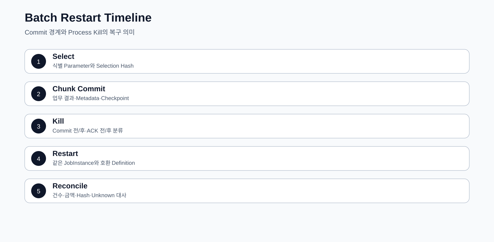

# CPF 배치 개발 매뉴얼

> 기준 Repository: `https://github.com/freeangelsun/202412_01_CPF`
> 기준 Branch: `master`
> 기준 Commit: `a8be27a34bdac0b7c075e06d6e86571244c96421` (`06_08`)
> 기준일: `2026-08-06 Asia/Seoul`

| 항목 | 내용 |
|---|---|
| 주 독자 | 배치 개발자·배치 운영자, Spring Batch를 처음 사용하는 개발자 |
| 이 문서로 완료할 일 | Job을 설계·구현·등록·실행하고 Process Kill 뒤 Restart·Reprocess·Reconcile까지 수행한다. |
| 읽는 방식 | 처음 접하는 독자는 앞에서부터 실습 순서로 읽고, 숙련자는 장별 판단표와 참조 경로를 사용한다. |
| 설명 원칙 | 제품 기능은 사용할 수 있는 상태로 설명한다. 실제 Source·SQL·API·Config·Frontend·Script·Test의 이름과 경계를 유지한다. |


## 1. 먼저 이해할 배치 용어

| 용어 | 쉬운 설명 | 운영에서 보는 값 |
|---|---|---|
| Job | 하나의 업무 실행 정의 | Job Name·Version |
| JobInstance | 식별 JobParameter가 같은 논리 실행 | businessDate·institutionCode |
| JobExecution | Instance를 실제로 실행한 한 번의 시도 | Status·Start/End·Exit Code |
| Step | Job 안의 처리 단계 | Read·Write·Skip·Commit Count |
| ExecutionContext | Restart에 필요한 작은 상태 | Cursor·마지막 처리 Key |
| Checkpoint | 다시 시작할 위치를 확정한 지점 | 마지막 Commit과 업무 Row |
| Restart | 같은 Instance를 이어 실행 | 같은 식별 Parameter |
| Reprocess | 대사 뒤 새 대상 또는 새 의도로 실행 | 새 Parameter·승인·Reason |
| Reconcile | Metadata와 업무 원장을 비교해 결과를 확정 | 건수·금액·Hash·Target ID |

배치 성공은 Spring Batch `COMPLETED`만으로 판단하지 않는다. 업무 대상·처리 건수·금액·외부 접수·Audit가 대사 기준과 일치해야 한다.

## 2. Job 유형 선택

| 유형 | 선택할 때 | Restart 기준 | 대표 위험 |
|---|---|---|---|
| Tasklet | 파일 이동, Marker, 한 번의 명시 작업 | 완료 Marker | Rename 뒤 Marker 저장 전 종료 |
| Chunk | 많은 Row를 일정 건수로 Commit | 마지막 Commit Cursor | Writer 중복·정렬 Key 변경 |
| File Job | Upload·Preview·Row Validation·Apply | File·Row 상태 | 일부 Row만 반영 |
| Partition | 독립 범위를 병렬 처리 | Partition별 Execution | 중복 Claim·stale writer |
| Remote Worker | Manager와 Worker를 분리 | Message·Partition Attempt | Worker loss·ACK 유실 |
| Center-Cut | 기준시점 대상 Snapshot 일괄 처리 | Execution·Item Result | Preview Drift·부분 결과 |

## 3. 예제: 일별 PAY 정산 Job

업무 날짜별 결제 거래를 읽어 가맹점 정산 Table을 생성한다.

| 항목 | 예제 값 |
|---|---|
| Job Name | `payDailySettlementJob` |
| 식별 Parameter | `businessDate`, `institutionCode` |
| Step 1 | 대상 Snapshot 생성 Tasklet |
| Step 2 | 거래 정산 Chunk |
| Step 3 | 건수·금액 대사 Tasklet |
| Chunk Size | 500 |
| Reader Sort | `transaction_id` 오름차순 |
| Writer Key | `(business_date, transaction_id)` |
| 대사 | 입력 건수·금액 = 정산 건수·금액 + 제외 건수·금액 |

### 3.1 JobParameter

```java
public record PaySettlementParameters(
    LocalDate businessDate,
    String institutionCode,
    String runType,
    String requestId,
    String requestedBy,
    String reason) {}
```

식별 Parameter는 업무 의미가 있어야 한다. 실행 시각만 식별값으로 사용하면 같은 업무를 Restart하기 어렵다.

## 4. Job 구성 코드

```java
@Bean
Job payDailySettlementJob(JobRepository repository,
                          Step snapshotStep,
                          Step settlementStep,
                          Step reconciliationStep) {
    return new JobBuilder("payDailySettlementJob", repository)
        .start(snapshotStep)
        .next(settlementStep)
        .next(reconciliationStep)
        .build();
}
```

### 4.1 Chunk Step

```java
@Bean
Step settlementStep(JobRepository repository,
                    PlatformTransactionManager tx,
                    ItemReader<PayTransaction> reader,
                    ItemProcessor<PayTransaction, Settlement> processor,
                    ItemWriter<Settlement> writer) {
    return new StepBuilder("settlementStep", repository)
        .<PayTransaction, Settlement>chunk(500, tx)
        .reader(reader)
        .processor(processor)
        .writer(writer)
        .faultTolerant()
        .retry(DeadlockLoserDataAccessException.class)
        .retryLimit(3)
        .build();
}
```

## 5. Reader 설계

Reader는 안정된 정렬 Key를 사용한다. `updated_at`처럼 실행 중 바뀔 수 있는 값만 Cursor로 사용하지 않는다.

```sql
select transaction_id, customer_id, amount, status
  from pay_transaction
 where business_date = :business_date
   and institution_code = :institution_code
   and transaction_id > :last_transaction_id
 order by transaction_id
 fetch first :page_size rows only
```

Vendor별 Paging 문법은 분리하되 Sort와 Cursor 의미는 같다.

Reader Test:

- 빈 대상.
- 마지막 Page가 Chunk보다 작음.
- 같은 Timestamp의 여러 Row.
- 실행 중 신규 Row 유입.
- Cursor Row 삭제 또는 상태 변경.
- Process Kill 뒤 마지막 Commit 다음 Row부터 재개.

## 6. Processor 설계

Processor는 검증과 계산을 수행하고 외부 부작용을 만들지 않는다.

```java
public Settlement process(PayTransaction item) {
    if (!item.isSettledTarget()) return null;
    Money fee = feePolicy.calculate(item.amount(), item.merchantGrade());
    return Settlement.of(item, fee);
}
```

`null` Filter와 오류를 구분한다. Filter 사유는 별도 Count 또는 Result Code로 남긴다.

## 7. Writer 설계

Writer는 Chunk Transaction 안에서 멱등하게 저장한다.

```sql
insert into pay_settlement(
    business_date, transaction_id, gross_amount, fee_amount, net_amount, version)
values (
    :business_date, :transaction_id, :gross_amount, :fee_amount, :net_amount, 1)
```

같은 업무 Key가 이미 존재할 때 정책을 명시한다.

- 같은 Payload: 기존 결과 확인.
- 다른 Payload: Conflict와 대사 대상.
- 외부 전송: Writer 안에서 직접 하지 않고 Outbox 또는 다음 Step으로 분리.

## 8. Skip·Retry 결정

| 오류 | Retry | Skip | Job 실패 | 이유 |
|---|---:|---:|---:|---|
| 일시 DB Deadlock | O | X | 한도 초과 | Transaction 재시도 가능 |
| 입력 Validation 오류 | X | 정책 허용 시 | 허용 건수 초과 | 오류 Row 원장 필요 |
| Version 충돌 | X | X | O | Snapshot Drift 가능 |
| 외부기관 Timeout | Blind Retry 금지 | X | `UNKNOWN_RESULT` | 부작용 여부 대사 필요 |
| Disk Full | X | X | O | 환경 복구 전 반복 금지 |

Skip은 “버려도 되는 Row”가 아니다. Row ID, 오류, 원본 Artifact, 승인 정책과 재처리 방법을 남긴다.

## 9. Tasklet 예제: 파일 수신

1. Remote Final 이름이 아니라 Temp 이름으로 받는다.
2. Size·Checksum·Naming Rule·File ID를 검증한다.
3. Metadata를 `RECEIVED`로 저장한다.
4. Scan과 Row Schema 검증을 수행한다.
5. 같은 Filesystem에서 Final 이름으로 Rename한다.
6. 완료 Marker와 Artifact Hash를 기록한다.
7. 같은 File ID·Checksum은 Replay, 다른 Checksum은 Conflict로 격리한다.

| 종료 지점 | 남는 상태 | Restart 행동 |
|---|---|---|
| Download 중 | Temp 일부 | Size·Checksum 확인 후 Resume 또는 폐기 |
| Metadata 저장 뒤 Rename 전 | `RECEIVED`, Temp | Rename 재개 |
| Rename 뒤 Marker 전 | Final 존재, Marker 없음 | Hash 대사 후 Marker 보정 |
| 외부 접수 뒤 응답 유실 | Attempt `UNKNOWN_RESULT` | Target 접수 ID 조회 |

## 10. Partition·Remote Worker

### 10.1 Partition 계획

```text
institution=BANK01, range=00000000-19999999
institution=BANK01, range=20000000-39999999
institution=BANK02, range=00000000-19999999
```

Partition Key는 겹치지 않고 재현 가능해야 한다. 단순 Worker 수로 범위를 나누면 Worker 수 변경 시 Restart가 어려워질 수 있다.

### 10.2 Lease·Claim·Fencing

- Manager가 Partition을 `READY`로 만든다.
- Worker가 Lease와 증가하는 Fencing Token으로 Claim한다.
- Heartbeat가 없고 Lease가 만료되면 새 Worker가 더 큰 Token으로 Claim한다.
- 이전 Worker의 늦은 Write는 Token 비교로 거부한다.
- 결과 저장과 ACK 순서를 정한다.

Fault Test:

1. Worker가 Row 저장 중 종료.
2. Network partition으로 Heartbeat만 유실.
3. Lease 만료 뒤 이전 Worker가 복귀.
4. 같은 Partition 중복 Claim.
5. Manager가 재시작해도 Partition 상태 유지.

## 11. Scheduler·Calendar·Misfire

Schedule 입력:

| Field | 예 | 설명 |
|---|---|---|
| Schedule ID | `PAY-DAILY-SETTLEMENT` | 불변 식별자 |
| Cron | `0 10 1 * * *` | 업무 시간대 기준 |
| Timezone | `Asia/Seoul` | 명시적 Zone |
| Calendar | `KR-BANKING` | 영업일 기준 |
| Misfire | `FIRE_ONCE`, `SKIP`, `MANUAL` | 누락 실행 처리 |
| Parameter Rule | `businessDate=previousBusinessDay` | 실행 Parameter 생성 |

HA Scheduler는 Lease Owner가 한 번만 Dispatch하도록 한다. Clock Skew, Lease loss, 중복 Trigger를 Test한다.

## 12. Job Definition·Version·Artifact

Job Pack은 다음을 묶는다.

- Job Code와 Version.
- Step Graph와 Parameter Schema.
- Artifact Coordinate와 Checksum.
- DB·Config·Secret 요구.
- 호환 가능한 Runner·Worker Capability.
- 대사 기준과 Runbook.
- LKG Version과 Rollback 조건.

검증되지 않은 Local JAR 경로를 운영 Job Definition에 등록하지 않는다.

## 13. Center-Cut

Center-Cut은 기준시점 대상 집합을 고정하고 Execution별 결과를 대사하는 처리다.

### 13.1 흐름

1. 기준시각과 대상 조건 입력.
2. Preview 건수·금액·조건 Hash 생성.
3. 운영자 검토와 Approval Snapshot.
4. Execution과 Partition 생성.
5. Item 처리와 결과 저장.
6. 성공·실패·불명 Item 집계.
7. 업무 원장과 건수·금액·Hash 대사.
8. Execution별 FAILED 재처리 또는 UNKNOWN 대사.

Job 전체를 한 번에 성공·실패로 덮지 않는다. 성공 Item을 다시 처리하지 않는다.

## 14. 실행·Stop·Restart·Abandon·Reprocess

| 조치 | 선택 조건 | 남겨야 할 기록 |
|---|---|---|
| Stop | 정상 중지 지점까지 기다릴 수 있음 | 요청자·Reason·마지막 Checkpoint |
| Restart | 같은 Instance의 실패 Step을 이어 실행 | 이전 Execution·새 Execution 연결 |
| Abandon | 해당 Execution을 더 이상 Restart하지 않음 | 대사·승인·대체 실행 ID |
| Reprocess | 새 대상 또는 보정 후 다시 처리 | 새 Parameter·대상 Snapshot·Reason |
| Rollback | 업무 결과를 이전 상태로 되돌림 | Target별 Before/After·부분 실패 |

`STOPPED`라고 해서 업무 부작용이 없다는 뜻은 아니다. 마지막 Commit과 외부 Attempt를 확인한다.

## 15. Metadata 판독 순서

1. JobInstance의 식별 Parameter.
2. 최신·이전 JobExecution Status와 Exit Description.
3. StepExecution의 Read·Write·Filter·Skip·Commit·Rollback Count.
4. ExecutionContext Cursor.
5. 실제 업무 Table 마지막 Commit Row.
6. 외부 Attempt·Outbox·Audit.
7. Restart 또는 Reprocess 선택.

## 16. Process Kill 실습

### 16.1 준비

- Test Data 2,000건.
- Chunk Size 500.
- 900번째 Row 처리 뒤 Process 종료 Fault Point.

### 16.2 기대 결과

- 첫 500건은 Commit.
- 다음 Chunk는 Rollback.
- Metadata의 Write Count와 업무 Table 건수가 일치.
- Restart는 501번째 업무 Key부터 읽음.
- Writer 멱등성 때문에 중복 Row가 생기지 않음.

### 16.3 대사 SQL 예

```sql
select count(*) as cnt, coalesce(sum(net_amount),0) as amount
  from pay_settlement
 where business_date = :business_date;
```

Metadata Count와 업무 합계가 다르면 `COMPLETED`라도 정상 종료로 판정하지 않는다.

## 17. ADM 운영 확인

- `/batch-overview`: 전체 Job·Schedule·Execution 현황.
- `/batch-job-packs`: Definition·Version·Validation.
- `/batch-executions`: Job·Step·Count·Stop·Retry.
- `/batch-center-cut`: Preview·Execution·Item 결과·대사.
- `/batch-runtime`: Runner·Worker·Command 상태.
- `/batch-scheduler`: Calendar·Misfire·HA.
- `/batch-leases`: Lease·Fencing·stale holder.
- `/batch-recovery`: Ghost·Unknown·복구.
- `/batch-audit`: Operation·Audit·Evidence.

## 18. 운영 인계

| 항목 | 기록 내용 |
|---|---|
| Job·Version | Definition ID·Artifact SHA·Checksum |
| Parameter | 식별 여부·Default·Validation |
| Step | Tasklet/Chunk·Transaction Manager·Commit Interval |
| Data | Input Query·Sort·Snapshot·Output Table/File |
| Restart | Checkpoint·허용 상태·변경 감지 |
| Fault | Retryable·Skip·Timeout·Kill 지점 |
| External | Target·Idempotency·UNKNOWN 대사 |
| Parallel | Partition·Lease·Fencing·Worker Capability |
| Reconciliation | 건수·금액·Hash·Tolerance |
| Operations | ADM Route·Permission·Approval·Alert·Rollback |

## 19. 배치 자체 검수

1. JobParameter가 업무 실행을 식별하는가?
2. Reader Sort와 Cursor가 안정적인가?
3. Writer가 재읽기와 중복 Delivery에 멱등한가?
4. 외부 부작용을 Chunk Transaction과 분리했는가?
5. Skip Row를 원장과 승인 정책으로 관리하는가?
6. Process Kill 뒤 Restart 위치를 검증했는가?
7. Worker loss와 stale token을 차단하는가?
8. Misfire와 영업일 Parameter 생성이 정의됐는가?
9. Metadata와 업무 건수·금액을 대사하는가?
10. ADM에서 실행·조치·Audit를 찾을 수 있는가?

<!-- CPF_R10_QUALITY_EXPANSION -->



## 부록 A. 일별 PAY 정산 Job 전체 예제

### A.1 Job 구성

```java
@Configuration
public class PaySettlementJobConfiguration {
    @Bean
    Job paySettlementJob(JobRepository repository, Step selectAndSettleStep, Step reconcileStep) {
        return new JobBuilder("paySettlementJob", repository)
                .validator(new PaySettlementParameterValidator())
                .start(selectAndSettleStep)
                .next(reconcileStep)
                .build();
    }

    @Bean
    Step selectAndSettleStep(
            JobRepository repository,
            PlatformTransactionManager transactionManager,
            ItemReader<PaySettlementTarget> reader,
            ItemProcessor<PaySettlementTarget, PaySettlementResult> processor,
            ItemWriter<PaySettlementResult> writer) {
        return new StepBuilder("selectAndSettleStep", repository)
                .<PaySettlementTarget, PaySettlementResult>chunk(500, transactionManager)
                .reader(reader)
                .processor(processor)
                .writer(writer)
                .faultTolerant()
                .retry(TransientInstitutionException.class)
                .retryLimit(3)
                .skip(InvalidSettlementTargetException.class)
                .skipLimit(100)
                .listener(new SettlementCheckpointListener())
                .build();
    }
}
```

### A.2 JobParameter

| Parameter | 식별 여부 | 예 | 의미 |
|---|---|---|---|
| `businessDate` | 식별 | `2026-08-05` | 정산 기준일 |
| `tenantId` | 식별 | `BANK-A` | 데이터 범위 |
| `selectionHash` | 식별 | SHA-256 | 대상 Snapshot |
| `requestedBy` | 비식별 | `operator01` | Audit Actor |
| `reason` | 비식별 | `daily settlement` | 실행 사유 |

### A.3 Reader Query

```sql
SELECT METHOD_ID, CUSTOMER_ID, SETTLEMENT_AMOUNT, VERSION
  FROM PAY_SETTLEMENT_TARGET
 WHERE BUSINESS_DATE = :businessDate
   AND TENANT_ID = :tenantId
   AND METHOD_ID > :lastMethodId
 ORDER BY METHOD_ID
 FETCH FIRST :pageSize ROWS ONLY;
```

`METHOD_ID`가 유일한 정렬 Key인지 확인한다. 유일하지 않다면 복합 Key와 Checkpoint를 사용한다.

### A.4 Writer와 결과 원장

```java
@Transactional
public void write(Chunk<? extends PaySettlementResult> chunk) {
    for (PaySettlementResult result : chunk) {
        resultRepository.insert(result);
        if (result.status() == SettlementStatus.SUCCEEDED) {
            ledgerRepository.apply(result.businessKey(), result.amount(), result.operationId());
        }
        auditRepository.append(result.toAudit());
    }
}
```

### A.5 대사식

```text
선정 건수 = 성공 건수 + 실패 건수 + 제외 건수 + 결과 불명 건수
선정 금액 = 성공 금액 + 실패 금액 + 제외 금액 + 결과 불명 금액
업무 원장 반영 금액 = 성공 금액 - 보상 금액
```

### A.6 Process Kill 실습

1. Chunk 3의 Writer가 업무 Row를 Commit한 직후 Process를 종료한다.
2. `BATCH_STEP_EXECUTION`과 CPF Result 원장의 마지막 Commit 위치를 확인한다.
3. 같은 식별 JobParameter로 Restart한다.
4. 성공 Row가 다시 반영되지 않는지 Operation ID와 Unique Key로 확인한다.
5. 완료 후 건수·금액·Hash를 대사한다.


## 부록 B. Batch EDU 30개

Batch EDU는 JobParameter와 Fixture를 고정하고 실행 건수·금액·Metadata를 확인한 다음 Process 종료·Worker 유실·부분 실패를 주입한다. Restart 또는 Reprocess 뒤 대사 차이가 0인지 확인한다.

### EDU-BAT-01 — Tasklet 단일 작업

| 항목 | 수행 내용 |
|---|---|
| 학습 결과 | Tasklet 단일 작업의 선택 기준과 정상·실패·복구 의미를 설명하고 직접 판정한다. |
| Repository 확인 위치 | `cpf-reference batch EDU` 및 실제 Consumer·Test·Config |
| 주요 입력 | JobParameter·Resource |
| 실행 순서 | Fixture 준비 → 정상 실행 → 원장·로그·Trace·Audit 확인 → 장애 주입 → 복구 실행 → 재검증 |
| 정상 판정 | 작업 1회와 ExitStatus 기록 |
| 장애 재현 | 중간 예외 |
| 복구 판정 | 멱등성 확인 후 Restart |
| 운영 확인 | - |
| 고객 업무 전환 | 예제 ID·상태·Permission·SLA만 고객 값으로 바꾸고 Idempotency·Version·Audit·복구 계약은 유지 |

### EDU-BAT-02 — Chunk Reader·Processor·Writer

| 항목 | 수행 내용 |
|---|---|
| 학습 결과 | Chunk Reader·Processor·Writer의 선택 기준과 정상·실패·복구 의미를 설명하고 직접 판정한다. |
| Repository 확인 위치 | `cpf-reference batch EDU` 및 실제 Consumer·Test·Config |
| 주요 입력 | Page Size·Chunk Size |
| 실행 순서 | Fixture 준비 → 정상 실행 → 원장·로그·Trace·Audit 확인 → 장애 주입 → 복구 실행 → 재검증 |
| 정상 판정 | Read/Write/Commit 건수 일치 |
| 장애 재현 | Writer 실패 |
| 복구 판정 | 마지막 Commit 이후 Restart |
| 운영 확인 | - |
| 고객 업무 전환 | 예제 ID·상태·Permission·SLA만 고객 값으로 바꾸고 Idempotency·Version·Audit·복구 계약은 유지 |

### EDU-BAT-03 — Paging Reader 정렬

| 항목 | 수행 내용 |
|---|---|
| 학습 결과 | Paging Reader 정렬의 선택 기준과 정상·실패·복구 의미를 설명하고 직접 판정한다. |
| Repository 확인 위치 | `cpf-batch` 및 실제 Consumer·Test·Config |
| 주요 입력 | PK Sort·Page Size |
| 실행 순서 | Fixture 준비 → 정상 실행 → 원장·로그·Trace·Audit 확인 → 장애 주입 → 복구 실행 → 재검증 |
| 정상 판정 | 중복·누락 없는 전체 순회 |
| 장애 재현 | 정렬 Key 중복 |
| 복구 판정 | 복합 Sort Key로 보정 |
| 운영 확인 | - |
| 고객 업무 전환 | 예제 ID·상태·Permission·SLA만 고객 값으로 바꾸고 Idempotency·Version·Audit·복구 계약은 유지 |

### EDU-BAT-04 — Cursor Reader Resource

| 항목 | 수행 내용 |
|---|---|
| 학습 결과 | Cursor Reader Resource의 선택 기준과 정상·실패·복구 의미를 설명하고 직접 판정한다. |
| Repository 확인 위치 | `cpf-batch` 및 실제 Consumer·Test·Config |
| 주요 입력 | Fetch Size·Connection |
| 실행 순서 | Fixture 준비 → 정상 실행 → 원장·로그·Trace·Audit 확인 → 장애 주입 → 복구 실행 → 재검증 |
| 정상 판정 | Resource가 Step 종료 시 닫힘 |
| 장애 재현 | Connection Drop |
| 복구 판정 | Checkpoint와 재연결 정책으로 Restart |
| 운영 확인 | - |
| 고객 업무 전환 | 예제 ID·상태·Permission·SLA만 고객 값으로 바꾸고 Idempotency·Version·Audit·복구 계약은 유지 |

### EDU-BAT-05 — Processor Validation

| 항목 | 수행 내용 |
|---|---|
| 학습 결과 | Processor Validation의 선택 기준과 정상·실패·복구 의미를 설명하고 직접 판정한다. |
| Repository 확인 위치 | `cpf-reference batch EDU` 및 실제 Consumer·Test·Config |
| 주요 입력 | Rule Version·Item |
| 실행 순서 | Fixture 준비 → 정상 실행 → 원장·로그·Trace·Audit 확인 → 장애 주입 → 복구 실행 → 재검증 |
| 정상 판정 | 오류 Item이 지정 정책으로 분류 |
| 장애 재현 | 검증 예외 폭증 |
| 복구 판정 | Skip 한도 초과 시 Job 실패 |
| 운영 확인 | - |
| 고객 업무 전환 | 예제 ID·상태·Permission·SLA만 고객 값으로 바꾸고 Idempotency·Version·Audit·복구 계약은 유지 |

### EDU-BAT-06 — Writer Upsert·Version

| 항목 | 수행 내용 |
|---|---|
| 학습 결과 | Writer Upsert·Version의 선택 기준과 정상·실패·복구 의미를 설명하고 직접 판정한다. |
| Repository 확인 위치 | `cpf-reference batch EDU` 및 실제 Consumer·Test·Config |
| 주요 입력 | Business Key·Expected Version |
| 실행 순서 | Fixture 준비 → 정상 실행 → 원장·로그·Trace·Audit 확인 → 장애 주입 → 복구 실행 → 재검증 |
| 정상 판정 | 중복 실행에도 Row 1개 |
| 장애 재현 | 동시 Writer 충돌 |
| 복구 판정 | 충돌 Item 격리·Reprocess |
| 운영 확인 | - |
| 고객 업무 전환 | 예제 ID·상태·Permission·SLA만 고객 값으로 바꾸고 Idempotency·Version·Audit·복구 계약은 유지 |

### EDU-BAT-07 — Skip 정책

| 항목 | 수행 내용 |
|---|---|
| 학습 결과 | Skip 정책의 선택 기준과 정상·실패·복구 의미를 설명하고 직접 판정한다. |
| Repository 확인 위치 | `cpf-batch` 및 실제 Consumer·Test·Config |
| 주요 입력 | Exception Type·Limit |
| 실행 순서 | Fixture 준비 → 정상 실행 → 원장·로그·Trace·Audit 확인 → 장애 주입 → 복구 실행 → 재검증 |
| 정상 판정 | 허용 오류만 Skip |
| 장애 재현 | System Error를 Skip |
| 복구 판정 | 정책 수정 후 Job Version 증가 |
| 운영 확인 | - |
| 고객 업무 전환 | 예제 ID·상태·Permission·SLA만 고객 값으로 바꾸고 Idempotency·Version·Audit·복구 계약은 유지 |

### EDU-BAT-08 — Retry 정책

| 항목 | 수행 내용 |
|---|---|
| 학습 결과 | Retry 정책의 선택 기준과 정상·실패·복구 의미를 설명하고 직접 판정한다. |
| Repository 확인 위치 | `cpf-batch` 및 실제 Consumer·Test·Config |
| 주요 입력 | Retryable Error·Backoff |
| 실행 순서 | Fixture 준비 → 정상 실행 → 원장·로그·Trace·Audit 확인 → 장애 주입 → 복구 실행 → 재검증 |
| 정상 판정 | 일시 오류만 제한 Retry |
| 장애 재현 | 영구 오류 Retry Storm |
| 복구 판정 | 재시도 없이 실패·DLQ/격리 |
| 운영 확인 | - |
| 고객 업무 전환 | 예제 ID·상태·Permission·SLA만 고객 값으로 바꾸고 Idempotency·Version·Audit·복구 계약은 유지 |

### EDU-BAT-09 — JobParameter 식별

| 항목 | 수행 내용 |
|---|---|
| 학습 결과 | JobParameter 식별의 선택 기준과 정상·실패·복구 의미를 설명하고 직접 판정한다. |
| Repository 확인 위치 | `cpf-batch` 및 실제 Consumer·Test·Config |
| 주요 입력 | Business Date·File Hash |
| 실행 순서 | Fixture 준비 → 정상 실행 → 원장·로그·Trace·Audit 확인 → 장애 주입 → 복구 실행 → 재검증 |
| 정상 판정 | 같은 Parameter는 같은 JobInstance |
| 장애 재현 | 비식별 Parameter 오용 |
| 복구 판정 | 식별/비식별 Parameter 분리 |
| 운영 확인 | - |
| 고객 업무 전환 | 예제 ID·상태·Permission·SLA만 고객 값으로 바꾸고 Idempotency·Version·Audit·복구 계약은 유지 |

### EDU-BAT-10 — ExecutionContext Checkpoint

| 항목 | 수행 내용 |
|---|---|
| 학습 결과 | ExecutionContext Checkpoint의 선택 기준과 정상·실패·복구 의미를 설명하고 직접 판정한다. |
| Repository 확인 위치 | `cpf-batch` 및 실제 Consumer·Test·Config |
| 주요 입력 | Last Key·Offset·Count |
| 실행 순서 | Fixture 준비 → 정상 실행 → 원장·로그·Trace·Audit 확인 → 장애 주입 → 복구 실행 → 재검증 |
| 정상 판정 | Restart 위치가 마지막 Commit 다음 |
| 장애 재현 | Checkpoint 유실 |
| 복구 판정 | 업무 원장과 대사해 안전 위치 결정 |
| 운영 확인 | - |
| 고객 업무 전환 | 예제 ID·상태·Permission·SLA만 고객 값으로 바꾸고 Idempotency·Version·Audit·복구 계약은 유지 |

### EDU-BAT-11 — Stop 요청

| 항목 | 수행 내용 |
|---|---|
| 학습 결과 | Stop 요청의 선택 기준과 정상·실패·복구 의미를 설명하고 직접 판정한다. |
| Repository 확인 위치 | `cpf-admin batch operations` 및 실제 Consumer·Test·Config |
| 주요 입력 | Execution ID·Reason |
| 실행 순서 | Fixture 준비 → 정상 실행 → 원장·로그·Trace·Audit 확인 → 장애 주입 → 복구 실행 → 재검증 |
| 정상 판정 | 현재 Chunk 종료 후 STOPPED |
| 장애 재현 | Process 강제 종료 |
| 복구 판정 | Ghost 판정 후 Recovery |
| 운영 확인 | - |
| 고객 업무 전환 | 예제 ID·상태·Permission·SLA만 고객 값으로 바꾸고 Idempotency·Version·Audit·복구 계약은 유지 |

### EDU-BAT-12 — Restart

| 항목 | 수행 내용 |
|---|---|
| 학습 결과 | Restart의 선택 기준과 정상·실패·복구 의미를 설명하고 직접 판정한다. |
| Repository 확인 위치 | `cpf-batch` 및 실제 Consumer·Test·Config |
| 주요 입력 | JobExecution ID |
| 실행 순서 | Fixture 준비 → 정상 실행 → 원장·로그·Trace·Audit 확인 → 장애 주입 → 복구 실행 → 재검증 |
| 정상 판정 | 미완료 Step부터 재개 |
| 장애 재현 | Job Version 변경 |
| 복구 판정 | 호환 정책 확인 후 새 Instance/Reprocess |
| 운영 확인 | - |
| 고객 업무 전환 | 예제 ID·상태·Permission·SLA만 고객 값으로 바꾸고 Idempotency·Version·Audit·복구 계약은 유지 |

### EDU-BAT-13 — Abandon

| 항목 | 수행 내용 |
|---|---|
| 학습 결과 | Abandon의 선택 기준과 정상·실패·복구 의미를 설명하고 직접 판정한다. |
| Repository 확인 위치 | `cpf-admin batch operations` 및 실제 Consumer·Test·Config |
| 주요 입력 | Execution ID·Approval |
| 실행 순서 | Fixture 준비 → 정상 실행 → 원장·로그·Trace·Audit 확인 → 장애 주입 → 복구 실행 → 재검증 |
| 정상 판정 | 재시작 금지와 Audit |
| 장애 재현 | 진행 중 Execution Abandon |
| 복구 판정 | 상태 검증에서 차단 |
| 운영 확인 | - |
| 고객 업무 전환 | 예제 ID·상태·Permission·SLA만 고객 값으로 바꾸고 Idempotency·Version·Audit·복구 계약은 유지 |

### EDU-BAT-14 — Reprocess 실패 대상

| 항목 | 수행 내용 |
|---|---|
| 학습 결과 | Reprocess 실패 대상의 선택 기준과 정상·실패·복구 의미를 설명하고 직접 판정한다. |
| Repository 확인 위치 | `cpf-batch` 및 실제 Consumer·Test·Config |
| 주요 입력 | Result ID·Reason |
| 실행 순서 | Fixture 준비 → 정상 실행 → 원장·로그·Trace·Audit 확인 → 장애 주입 → 복구 실행 → 재검증 |
| 정상 판정 | 실패 Item만 새 Operation 처리 |
| 장애 재현 | 성공 Item 재처리 |
| 복구 판정 | 대상 Snapshot으로 차단 |
| 운영 확인 | - |
| 고객 업무 전환 | 예제 ID·상태·Permission·SLA만 고객 값으로 바꾸고 Idempotency·Version·Audit·복구 계약은 유지 |

### EDU-BAT-15 — Partition 분할

| 항목 | 수행 내용 |
|---|---|
| 학습 결과 | Partition 분할의 선택 기준과 정상·실패·복구 의미를 설명하고 직접 판정한다. |
| Repository 확인 위치 | `cpf-batch` 및 실제 Consumer·Test·Config |
| 주요 입력 | Range·Grid Size |
| 실행 순서 | Fixture 준비 → 정상 실행 → 원장·로그·Trace·Audit 확인 → 장애 주입 → 복구 실행 → 재검증 |
| 정상 판정 | 겹침·누락 없는 Partition |
| 장애 재현 | 경계 중복 |
| 복구 판정 | Partition Snapshot 재생성 |
| 운영 확인 | - |
| 고객 업무 전환 | 예제 ID·상태·Permission·SLA만 고객 값으로 바꾸고 Idempotency·Version·Audit·복구 계약은 유지 |

### EDU-BAT-16 — Remote Worker

| 항목 | 수행 내용 |
|---|---|
| 학습 결과 | Remote Worker의 선택 기준과 정상·실패·복구 의미를 설명하고 직접 판정한다. |
| Repository 확인 위치 | `cpf-batch` 및 실제 Consumer·Test·Config |
| 주요 입력 | Worker Pool·Partition |
| 실행 순서 | Fixture 준비 → 정상 실행 → 원장·로그·Trace·Audit 확인 → 장애 주입 → 복구 실행 → 재검증 |
| 정상 판정 | Claim·Heartbeat·Result 연결 |
| 장애 재현 | Worker 응답 유실 |
| 복구 판정 | Lease 만료 후 Reconcile |
| 운영 확인 | - |
| 고객 업무 전환 | 예제 ID·상태·Permission·SLA만 고객 값으로 바꾸고 Idempotency·Version·Audit·복구 계약은 유지 |

### EDU-BAT-17 — Lease·Fencing

| 항목 | 수행 내용 |
|---|---|
| 학습 결과 | Lease·Fencing의 선택 기준과 정상·실패·복구 의미를 설명하고 직접 판정한다. |
| Repository 확인 위치 | `cpf-batch` 및 실제 Consumer·Test·Config |
| 주요 입력 | Lease TTL·Token |
| 실행 순서 | Fixture 준비 → 정상 실행 → 원장·로그·Trace·Audit 확인 → 장애 주입 → 복구 실행 → 재검증 |
| 정상 판정 | Stale Worker 쓰기 차단 |
| 장애 재현 | Clock Skew·늦은 Commit |
| 복구 판정 | DB Token 비교로 거부 |
| 운영 확인 | - |
| 고객 업무 전환 | 예제 ID·상태·Permission·SLA만 고객 값으로 바꾸고 Idempotency·Version·Audit·복구 계약은 유지 |

### EDU-BAT-18 — Scheduler Trigger

| 항목 | 수행 내용 |
|---|---|
| 학습 결과 | Scheduler Trigger의 선택 기준과 정상·실패·복구 의미를 설명하고 직접 판정한다. |
| Repository 확인 위치 | `cpf-batch scheduler` 및 실제 Consumer·Test·Config |
| 주요 입력 | Cron·Zone·Calendar |
| 실행 순서 | Fixture 준비 → 정상 실행 → 원장·로그·Trace·Audit 확인 → 장애 주입 → 복구 실행 → 재검증 |
| 정상 판정 | 예정시각과 Execution 연결 |
| 장애 재현 | 중복 Trigger |
| 복구 판정 | DB Lease와 Idempotency로 차단 |
| 운영 확인 | - |
| 고객 업무 전환 | 예제 ID·상태·Permission·SLA만 고객 값으로 바꾸고 Idempotency·Version·Audit·복구 계약은 유지 |

### EDU-BAT-19 — Misfire SKIP

| 항목 | 수행 내용 |
|---|---|
| 학습 결과 | Misfire SKIP의 선택 기준과 정상·실패·복구 의미를 설명하고 직접 판정한다. |
| Repository 확인 위치 | `cpf-batch scheduler` 및 실제 Consumer·Test·Config |
| 주요 입력 | Misfire Policy |
| 실행 순서 | Fixture 준비 → 정상 실행 → 원장·로그·Trace·Audit 확인 → 장애 주입 → 복구 실행 → 재검증 |
| 정상 판정 | 놓친 실행 기록 후 다음 주기 |
| 장애 재현 | 누락 숨김 |
| 복구 판정 | Audit·Alert 생성 |
| 운영 확인 | - |
| 고객 업무 전환 | 예제 ID·상태·Permission·SLA만 고객 값으로 바꾸고 Idempotency·Version·Audit·복구 계약은 유지 |

### EDU-BAT-20 — Misfire FIRE_ONCE

| 항목 | 수행 내용 |
|---|---|
| 학습 결과 | Misfire FIRE_ONCE의 선택 기준과 정상·실패·복구 의미를 설명하고 직접 판정한다. |
| Repository 확인 위치 | `cpf-batch scheduler` 및 실제 Consumer·Test·Config |
| 주요 입력 | Misfire Window |
| 실행 순서 | Fixture 준비 → 정상 실행 → 원장·로그·Trace·Audit 확인 → 장애 주입 → 복구 실행 → 재검증 |
| 정상 판정 | 한 번만 보충 실행 |
| 장애 재현 | 여러 번 Catch-up |
| 복구 판정 | Trigger 원장으로 중복 차단 |
| 운영 확인 | - |
| 고객 업무 전환 | 예제 ID·상태·Permission·SLA만 고객 값으로 바꾸고 Idempotency·Version·Audit·복구 계약은 유지 |

### EDU-BAT-21 — Job Definition Version

| 항목 | 수행 내용 |
|---|---|
| 학습 결과 | Job Definition Version의 선택 기준과 정상·실패·복구 의미를 설명하고 직접 판정한다. |
| Repository 확인 위치 | `cpf-batch` 및 실제 Consumer·Test·Config |
| 주요 입력 | Definition ID·Version |
| 실행 순서 | Fixture 준비 → 정상 실행 → 원장·로그·Trace·Audit 확인 → 장애 주입 → 복구 실행 → 재검증 |
| 정상 판정 | 실행이 고정 Definition 사용 |
| 장애 재현 | 실행 중 정의 변경 |
| 복구 판정 | 새 Version은 다음 실행부터 |
| 운영 확인 | - |
| 고객 업무 전환 | 예제 ID·상태·Permission·SLA만 고객 값으로 바꾸고 Idempotency·Version·Audit·복구 계약은 유지 |

### EDU-BAT-22 — Job Pack Checksum

| 항목 | 수행 내용 |
|---|---|
| 학습 결과 | Job Pack Checksum의 선택 기준과 정상·실패·복구 의미를 설명하고 직접 판정한다. |
| Repository 확인 위치 | `cpf-batch` 및 실제 Consumer·Test·Config |
| 주요 입력 | Artifact Hash·Manifest |
| 실행 순서 | Fixture 준비 → 정상 실행 → 원장·로그·Trace·Audit 확인 → 장애 주입 → 복구 실행 → 재검증 |
| 정상 판정 | Runner가 승인 Hash만 실행 |
| 장애 재현 | Artifact 변조 |
| 복구 판정 | 배포 거부·LKG 사용 |
| 운영 확인 | - |
| 고객 업무 전환 | 예제 ID·상태·Permission·SLA만 고객 값으로 바꾸고 Idempotency·Version·Audit·복구 계약은 유지 |

### EDU-BAT-23 — Runner Process

| 항목 | 수행 내용 |
|---|---|
| 학습 결과 | Runner Process의 선택 기준과 정상·실패·복구 의미를 설명하고 직접 판정한다. |
| Repository 확인 위치 | `cpf-batch` 및 실제 Consumer·Test·Config |
| 주요 입력 | Execution Command |
| 실행 순서 | Fixture 준비 → 정상 실행 → 원장·로그·Trace·Audit 확인 → 장애 주입 → 복구 실행 → 재검증 |
| 정상 판정 | Start·Heartbeat·Exit 연결 |
| 장애 재현 | 시작 응답 유실 |
| 복구 판정 | Process/Execution 대사 |
| 운영 확인 | - |
| 고객 업무 전환 | 예제 ID·상태·Permission·SLA만 고객 값으로 바꾸고 Idempotency·Version·Audit·복구 계약은 유지 |

### EDU-BAT-24 — Agent Host Command

| 항목 | 수행 내용 |
|---|---|
| 학습 결과 | Agent Host Command의 선택 기준과 정상·실패·복구 의미를 설명하고 직접 판정한다. |
| Repository 확인 위치 | `cpf-batch` 및 실제 Consumer·Test·Config |
| 주요 입력 | Host ID·Command ID |
| 실행 순서 | Fixture 준비 → 정상 실행 → 원장·로그·Trace·Audit 확인 → 장애 주입 → 복구 실행 → 재검증 |
| 정상 판정 | 허용 Command만 실행 |
| 장애 재현 | 중복 Command |
| 복구 판정 | Command Ledger 결과 반환 |
| 운영 확인 | - |
| 고객 업무 전환 | 예제 ID·상태·Permission·SLA만 고객 값으로 바꾸고 Idempotency·Version·Audit·복구 계약은 유지 |

### EDU-BAT-25 — Center-Cut 대상 Preview

| 항목 | 수행 내용 |
|---|---|
| 학습 결과 | Center-Cut 대상 Preview의 선택 기준과 정상·실패·복구 의미를 설명하고 직접 판정한다. |
| Repository 확인 위치 | `cpf-batch` 및 실제 Consumer·Test·Config |
| 주요 입력 | Selection Criteria |
| 실행 순서 | Fixture 준비 → 정상 실행 → 원장·로그·Trace·Audit 확인 → 장애 주입 → 복구 실행 → 재검증 |
| 정상 판정 | 건수·금액·Snapshot Hash 고정 |
| 장애 재현 | Preview 후 데이터 변경 |
| 복구 판정 | 승인 전 Snapshot 재생성 |
| 운영 확인 | - |
| 고객 업무 전환 | 예제 ID·상태·Permission·SLA만 고객 값으로 바꾸고 Idempotency·Version·Audit·복구 계약은 유지 |

### EDU-BAT-26 — Center-Cut 승인 실행

| 항목 | 수행 내용 |
|---|---|
| 학습 결과 | Center-Cut 승인 실행의 선택 기준과 정상·실패·복구 의미를 설명하고 직접 판정한다. |
| Repository 확인 위치 | `cpf-admin batch` 및 실제 Consumer·Test·Config |
| 주요 입력 | Approval ID·Snapshot |
| 실행 순서 | Fixture 준비 → 정상 실행 → 원장·로그·Trace·Audit 확인 → 장애 주입 → 복구 실행 → 재검증 |
| 정상 판정 | 승인 Snapshot만 처리 |
| 장애 재현 | 승인 우회 |
| 복구 판정 | 서버에서 차단·Audit |
| 운영 확인 | - |
| 고객 업무 전환 | 예제 ID·상태·Permission·SLA만 고객 값으로 바꾸고 Idempotency·Version·Audit·복구 계약은 유지 |

### EDU-BAT-27 — Center-Cut 부분 실패

| 항목 | 수행 내용 |
|---|---|
| 학습 결과 | Center-Cut 부분 실패의 선택 기준과 정상·실패·복구 의미를 설명하고 직접 판정한다. |
| Repository 확인 위치 | `cpf-batch` 및 실제 Consumer·Test·Config |
| 주요 입력 | Execution ID·Result |
| 실행 순서 | Fixture 준비 → 정상 실행 → 원장·로그·Trace·Audit 확인 → 장애 주입 → 복구 실행 → 재검증 |
| 정상 판정 | 성공/실패/Unknown 분리 |
| 장애 재현 | 전체 성공으로 오판 |
| 복구 판정 | 결과 원장과 업무 합계 대사 |
| 운영 확인 | - |
| 고객 업무 전환 | 예제 ID·상태·Permission·SLA만 고객 값으로 바꾸고 Idempotency·Version·Audit·복구 계약은 유지 |

### EDU-BAT-28 — Process Kill Restart

| 항목 | 수행 내용 |
|---|---|
| 학습 결과 | Process Kill Restart의 선택 기준과 정상·실패·복구 의미를 설명하고 직접 판정한다. |
| Repository 확인 위치 | `cpf-reference fault EDU` 및 실제 Consumer·Test·Config |
| 주요 입력 | Fault Point |
| 실행 순서 | Fixture 준비 → 정상 실행 → 원장·로그·Trace·Audit 확인 → 장애 주입 → 복구 실행 → 재검증 |
| 정상 판정 | Commit 전/후 의미에 맞게 복구 |
| 장애 재현 | ACK 전 Kill |
| 복구 판정 | Metadata·업무 원장 비교 |
| 운영 확인 | - |
| 고객 업무 전환 | 예제 ID·상태·Permission·SLA만 고객 값으로 바꾸고 Idempotency·Version·Audit·복구 계약은 유지 |

### EDU-BAT-29 — Ghost Execution

| 항목 | 수행 내용 |
|---|---|
| 학습 결과 | Ghost Execution의 선택 기준과 정상·실패·복구 의미를 설명하고 직접 판정한다. |
| Repository 확인 위치 | `cpf-admin batch recovery` 및 실제 Consumer·Test·Config |
| 주요 입력 | Heartbeat·Lease |
| 실행 순서 | Fixture 준비 → 정상 실행 → 원장·로그·Trace·Audit 확인 → 장애 주입 → 복구 실행 → 재검증 |
| 정상 판정 | 실제 Process 없는 실행 식별 |
| 장애 재현 | 살아 있는 Process 오판 |
| 복구 판정 | Host/Lease/Process 3자 확인 |
| 운영 확인 | - |
| 고객 업무 전환 | 예제 ID·상태·Permission·SLA만 고객 값으로 바꾸고 Idempotency·Version·Audit·복구 계약은 유지 |

### EDU-BAT-30 — 정산 대사

| 항목 | 수행 내용 |
|---|---|
| 학습 결과 | 정산 대사의 선택 기준과 정상·실패·복구 의미를 설명하고 직접 판정한다. |
| Repository 확인 위치 | `cpf-reference batch EDU` 및 실제 Consumer·Test·Config |
| 주요 입력 | 건수·금액·Hash |
| 실행 순서 | Fixture 준비 → 정상 실행 → 원장·로그·Trace·Audit 확인 → 장애 주입 → 복구 실행 → 재검증 |
| 정상 판정 | 입력=성공+실패+제외, 금액 일치 |
| 장애 재현 | 합계 불일치 |
| 복구 판정 | 차이 Item 추출 후 Reprocess/보상 |
| 운영 확인 | - |
| 고객 업무 전환 | 예제 ID·상태·Permission·SLA만 고객 값으로 바꾸고 Idempotency·Version·Audit·복구 계약은 유지 |


## 부록 C. 실행 상태와 허용 조치

| 현재 상태 | 허용 조치 | 금지 | 완료 판정 |
|---|---|---|---|
| STARTING | 상태조회·취소 요청 | 중복 Run | Runner PID/Command 연결 |
| STARTED | Stop·상세조회 | Abandon·동일 Parameter 재실행 | Heartbeat·Step 진행 증가 |
| STOPPING | 대기·강제종료 판단 | 새 Worker 투입 | 현재 Chunk 종료와 STOPPED |
| STOPPED | Restart·Abandon | 성공으로 종결 | Checkpoint와 미처리 대상 확인 |
| FAILED | 원인 수정·Restart/Reprocess | Blind Retry | 실패 Step·Item·외부 Attempt 분류 |
| UNKNOWN_RESULT | Reconcile | 성공/실패 추정 | 업무 원장·외부 상태로 확정 |
| COMPLETED | 결과·대사·Artifact 확인 | 원본 Execution 수정 | 건수·금액·Audit 일치 |
| ABANDONED | 새 JobInstance/Reprocess | Restart | 승인·사유·대체 실행 연결 |

## 부록 D. 배치 운영 인계표 예시

- Job Name/Version: `paySettlementJob` / `v3`
- 식별 Parameter: `businessDate`, `tenantId`, `selectionHash`
- Chunk/Commit: 500건
- Retry: 기관 일시 오류 3회, 1s/2s/4s
- Skip: 입력 검증 오류 최대 100건
- Partition: `METHOD_ID` 범위 16개
- Worker Lease: 30초, Heartbeat 10초, Fencing Token 필수
- Stop 기대시간: 현재 Chunk 최대 처리시간 + 30초
- 대사식: 선정=성공+실패+제외+Unknown, 금액 동일
- ADM: `/batch-executions`, `/batch-recovery`, `/batch-leases`, `/batch-audit`
- Rollback: Artifact LKG + 호환 Job Definition, 처리 결과는 보상 Job으로 상쇄

<!-- CPF_R10_BOOK_EXPANSION -->

## 부록 E. 일별 정산 Batch를 파일 단위로 구현하는 예제

예제 목표는 거래 원장을 읽어 고객별 일별 정산 합계를 만들고, Process 종료 뒤 마지막 Commit 다음부터 재시작하며, 입력 건수·금액과 결과 건수·금액을 대사하는 것이다.

### E.1 Job 설계표

| 항목 | 설계 값 | 이유 |
|---|---|---|
| Job Name | payDailySettlementJob | 업무 목적과 주기를 식별 |
| 식별 Parameter | businessDate, sourceSnapshotId | 같은 대상 Snapshot의 중복 실행 차단 |
| 비식별 Parameter | requestedBy, reason | 운영 Audit용이며 JobInstance 식별에서 제외 |
| Reader | Keyset Paging by transaction_id | 정렬 Key 중복·대량 Offset 비용 방지 |
| Processor | 정상·제외·오류 분류 | 정책 결과를 숨기지 않고 Row 상태 보존 |
| Writer | customer/day Upsert with version | Restart·동시 실행 시 중복 합산 차단 |
| Chunk | 500 | DB Lock·Memory·재처리 비용을 함께 측정해 결정 |
| Skip | 업무 Validation 100건 | System Error는 Skip 대상이 아님 |
| Retry | Deadlock 3회 exponential backoff | 일시 DB 충돌만 제한 |
| Checkpoint | lastTransactionId·read/write/skip totals | Restart 위치와 대사 근거 |
| 대사 | 입력=성공+제외+실패, 입력금액=정산금액+제외금액 | 완료 상태와 업무 합계를 함께 판정 |

### E.2 Job Configuration

```java
@Configuration
@EnableBatchProcessing
public class PaySettlementJobConfiguration {
    @Bean
    Job payDailySettlementJob(JobRepository repository, Step settlementStep) {
        return new JobBuilder("payDailySettlementJob", repository)
                .start(settlementStep)
                .build();
    }

    @Bean
    Step settlementStep(
            JobRepository repository,
            PlatformTransactionManager transactionManager,
            ItemReader<PayTransactionRow> reader,
            ItemProcessor<PayTransactionRow, SettlementItem> processor,
            ItemWriter<SettlementItem> writer,
            SettlementStepListener listener) {
        return new StepBuilder("settlementStep", repository)
                .<PayTransactionRow, SettlementItem>chunk(500, transactionManager)
                .reader(reader)
                .processor(processor)
                .writer(writer)
                .faultTolerant()
                .retry(DeadlockLoserDataAccessException.class)
                .retryLimit(3)
                .skip(PayValidationException.class)
                .skipLimit(100)
                .listener(listener)
                .build();
    }
}
```

### E.3 Keyset Reader Query

```sql
SELECT TRANSACTION_ID,
       CUSTOMER_ID,
       AMOUNT,
       CURRENCY,
       STATUS,
       BUSINESS_DATE,
       VERSION
  FROM PAY_TRANSACTION
 WHERE BUSINESS_DATE = :businessDate
   AND SOURCE_SNAPSHOT_ID = :sourceSnapshotId
   AND TRANSACTION_ID > :lastTransactionId
 ORDER BY TRANSACTION_ID
 FETCH FIRST :pageSize ROWS ONLY;
```

MariaDB에서는 `LIMIT`, PostgreSQL에서는 `LIMIT` 또는 승인된 Keyset 문법, Oracle에서는 `FETCH FIRST`를 Vendor Pack에서 제공한다. Logical Sort와 Boundary 의미는 같다.

### E.4 Processor

```java
public final class PaySettlementProcessor
        implements ItemProcessor<PayTransactionRow, SettlementItem> {
    private final SettlementPolicy policy;

    @Override
    public SettlementItem process(PayTransactionRow row) {
        if (row.status() == PayTransactionStatus.CANCELLED) {
            return SettlementItem.excluded(row, "CANCELLED_TRANSACTION");
        }
        if (row.amount().signum() < 0) {
            throw new PayValidationException(row.transactionId(), "NEGATIVE_AMOUNT");
        }
        return policy.calculate(row);
    }
}
```

### E.5 Writer와 Version 방어

```java
@Transactional
public void write(Chunk<? extends SettlementItem> chunk) {
    for (SettlementItem item : chunk) {
        if (item.excluded()) {
            resultRepository.appendExcluded(item);
            continue;
        }
        int updated = settlementRepository.upsertWithVersion(item);
        if (updated != 1) {
            throw new SettlementVersionConflict(item.customerId(), item.businessDate());
        }
        resultRepository.appendApplied(item);
    }
}
```

Writer는 성공 Row만 합산하고 제외·실패·결과 불명을 별도 결과 원장에 남긴다. Skip Listener가 원본 Error와 Business Key를 기록한다.

### E.6 JobParameter 생성

```java
JobParameters parameters = new JobParametersBuilder()
        .addLocalDate("businessDate", businessDate, true)
        .addString("sourceSnapshotId", sourceSnapshotId, true)
        .addString("requestedBy", actorId, false)
        .addString("reason", reason, false)
        .toJobParameters();
```

### E.7 실행·중지·재시작 명령 예시

```powershell
$body=@{
  jobName='payDailySettlementJob'
  parameters=@{
    businessDate='2026-08-05'
    sourceSnapshotId='SNAP-20260805-01'
  }
  reason='정산 교육 실행'
} | ConvertTo-Json -Depth 6

$run=Invoke-RestMethod -Method Post `
  -Uri 'http://localhost:8080/adm/api/batch/jobs/run' `
  -ContentType 'application/json' -Body $body

# 중지 요청은 현재 Chunk 종료와 Checkpoint 반영을 기다린다.
Invoke-RestMethod -Method Post `
  -Uri "http://localhost:8080/adm/api/batch/executions/$($run.executionId)/stop" `
  -ContentType 'application/json' `
  -Body (@{reason='교육용 중지'}|ConvertTo-Json)

# STOPPED 확인 후 Restart
Invoke-RestMethod -Method Post `
  -Uri "http://localhost:8080/adm/api/batch/executions/$($run.executionId)/restart" `
  -ContentType 'application/json' `
  -Body (@{reason='Checkpoint 재시작'}|ConvertTo-Json)
```

### E.8 Metadata 확인 SQL

```sql
SELECT JOB_INSTANCE_ID, JOB_NAME
  FROM BATCH_JOB_INSTANCE
 WHERE JOB_NAME = 'payDailySettlementJob';

SELECT JOB_EXECUTION_ID, STATUS, EXIT_CODE, START_TIME, END_TIME
  FROM BATCH_JOB_EXECUTION
 WHERE JOB_INSTANCE_ID = :jobInstanceId
 ORDER BY JOB_EXECUTION_ID;

SELECT STEP_EXECUTION_ID, STEP_NAME, STATUS,
       READ_COUNT, WRITE_COUNT, FILTER_COUNT,
       READ_SKIP_COUNT, PROCESS_SKIP_COUNT, WRITE_SKIP_COUNT,
       COMMIT_COUNT, ROLLBACK_COUNT
  FROM BATCH_STEP_EXECUTION
 WHERE JOB_EXECUTION_ID = :jobExecutionId;
```

### E.9 대사 SQL

```sql
SELECT COUNT(*) AS input_count,
       COALESCE(SUM(AMOUNT),0) AS input_amount
  FROM PAY_TRANSACTION
 WHERE BUSINESS_DATE = :businessDate
   AND SOURCE_SNAPSHOT_ID = :sourceSnapshotId;

SELECT RESULT_STATUS,
       COUNT(*) AS result_count,
       COALESCE(SUM(ORIGINAL_AMOUNT),0) AS result_amount
  FROM PAY_SETTLEMENT_RESULT
 WHERE JOB_INSTANCE_ID = :jobInstanceId
 GROUP BY RESULT_STATUS;

SELECT CUSTOMER_ID,
       COALESCE(SUM(SETTLEMENT_AMOUNT),0) AS settlement_amount
  FROM PAY_DAILY_SETTLEMENT
 WHERE BUSINESS_DATE = :businessDate
 GROUP BY CUSTOMER_ID;
```

### E.10 Process Kill 시점별 기대 결과

| Kill 지점 | DB Commit | Metadata | 재시작 기대 | 금지 판단 |
|---|---|---|---|---|
| Reader가 Row를 읽기 전 | 없음 | Step STARTED 또는 미시작 | 같은 Parameter로 정상 시작 | 실패 Row를 임의 생성 |
| Processor 처리 중 | 없음 | 현재 Chunk 미Commit | Chunk 처음부터 다시 읽음 | 메모리 상태를 Checkpoint로 간주 |
| Writer SQL 전 | 없음 | Rollback Count 증가 가능 | Chunk 재처리 | Read Count만 보고 완료 |
| Writer Commit 직후·Metadata 전 | 업무 반영 가능 | 상태가 불명확할 수 있음 | 업무 Unique·Version과 Metadata 대사 | 같은 합계를 Blind Add |
| Metadata Commit 뒤 ACK 전 | 업무·Checkpoint 반영 | Commit Count 증가 | 다음 Chunk부터 진행 | 마지막 Chunk를 무조건 재반영 |
| Job 종료 기록 전 | 모든 Step 완료 가능 | Job STARTED | Step 상태·업무 합계로 Ghost 판정 | Process가 없다는 이유만으로 Abandon |

### E.11 Test Class

```java
@SpringBatchTest
@SpringBootTest
class PayDailySettlementJobTest {
    @Autowired JobLauncherTestUtils launcher;
    @Autowired PaySettlementFixture fixture;

    @Test
    void restarts_after_writer_commit_without_double_count() throws Exception {
        fixture.insertTransactions(1_250);
        fixture.failAfterCommittedChunks(1);

        JobExecution first = launcher.launchJob(parameters());
        assertThat(first.getStatus()).isEqualTo(BatchStatus.FAILED);
        assertThat(fixture.appliedCount()).isEqualTo(500);

        fixture.clearFailure();
        JobExecution second = launcher.getJobLauncher()
                .run(launcher.getJob(), parameters());

        assertThat(second.getStatus()).isEqualTo(BatchStatus.COMPLETED);
        assertThat(fixture.appliedCount()).isEqualTo(1_250);
        assertThat(fixture.duplicateBusinessKeys()).isZero();
        assertThat(fixture.reconciliationDifference()).isZero();
    }
}
```

### E.12 ADM에서 완료를 판정하는 순서

1. `/batch-executions`에서 Job Instance와 최신 Execution을 구분한다.
2. Step별 Read·Write·Skip·Commit·Rollback Count를 확인한다.
3. `/batch-center-cut` 또는 결과 화면에서 성공·제외·실패·Unknown 합계를 조회한다.
4. `/batch-leases`에서 만료 Lease와 stale Fencing Token이 없는지 확인한다.
5. `/batch-audit`에서 실행·중지·재시작·재처리 Reason을 연결한다.
6. 업무 대사식이 0 차이를 반환한 뒤에만 `COMPLETED`를 업무 완료로 해석한다.

## 부록 F. 배치 장애 15개 판단 사례

### F.1 Reader가 같은 PK를 두 번 읽음

| 구분 | 내용 |
|---|---|
| 가능 원인 | 정렬 Key가 유일하지 않음 |
| 첫 확인 | Job Instance·Execution·Step·Partition 식별자를 고정하고 `Read ID Hash와 입력 Count`를 조회한다. |
| 조치 | 복합 Keyset 또는 Snapshot Key |
| 재시작 조건 | 마지막 Commit과 업무 원장이 일치하고 중복 방어가 확인된 뒤 같은 Instance를 재시작한다. |
| 재처리 조건 | 원본 성공 범위를 제외한 대상 Snapshot을 새 Operation으로 고정한다. |
| 완료 근거 | Read ID Hash와 입력 Count |
| 금지 | Metadata 상태만 바꾸거나 업무 Row를 직접 수정해 차이를 숨기지 않는다. |

### F.2 Writer Deadlock가 반복됨

| 구분 | 내용 |
|---|---|
| 가능 원인 | Chunk가 너무 크거나 Lock 순서 불일치 |
| 첫 확인 | Job Instance·Execution·Step·Partition 식별자를 고정하고 `Deadlock Graph·Rollback Count`를 조회한다. |
| 조치 | Lock 순서 통일·Chunk 조정·제한 Retry |
| 재시작 조건 | 마지막 Commit과 업무 원장이 일치하고 중복 방어가 확인된 뒤 같은 Instance를 재시작한다. |
| 재처리 조건 | 원본 성공 범위를 제외한 대상 Snapshot을 새 Operation으로 고정한다. |
| 완료 근거 | Deadlock Graph·Rollback Count |
| 금지 | Metadata 상태만 바꾸거나 업무 Row를 직접 수정해 차이를 숨기지 않는다. |

### F.3 Skip Count가 급증함

| 구분 | 내용 |
|---|---|
| 가능 원인 | 입력 품질 또는 Rule Version 변경 |
| 첫 확인 | Job Instance·Execution·Step·Partition 식별자를 고정하고 `오류 코드별 건수`를 조회한다. |
| 조치 | 한도 초과 실패·격리·Rule 검토 |
| 재시작 조건 | 마지막 Commit과 업무 원장이 일치하고 중복 방어가 확인된 뒤 같은 Instance를 재시작한다. |
| 재처리 조건 | 원본 성공 범위를 제외한 대상 Snapshot을 새 Operation으로 고정한다. |
| 완료 근거 | 오류 코드별 건수 |
| 금지 | Metadata 상태만 바꾸거나 업무 Row를 직접 수정해 차이를 숨기지 않는다. |

### F.4 Scheduler가 두 번 Trigger함

| 구분 | 내용 |
|---|---|
| 가능 원인 | Lease·Misfire·Clock 문제 |
| 첫 확인 | Job Instance·Execution·Step·Partition 식별자를 고정하고 `Trigger Ledger·JobInstance 수`를 조회한다. |
| 조치 | Trigger Idempotency와 JobParameter 중복 차단 |
| 재시작 조건 | 마지막 Commit과 업무 원장이 일치하고 중복 방어가 확인된 뒤 같은 Instance를 재시작한다. |
| 재처리 조건 | 원본 성공 범위를 제외한 대상 Snapshot을 새 Operation으로 고정한다. |
| 완료 근거 | Trigger Ledger·JobInstance 수 |
| 금지 | Metadata 상태만 바꾸거나 업무 Row를 직접 수정해 차이를 숨기지 않는다. |

### F.5 Worker Heartbeat가 끊김

| 구분 | 내용 |
|---|---|
| 가능 원인 | Host 장애 또는 Network Partition |
| 첫 확인 | Job Instance·Execution·Step·Partition 식별자를 고정하고 `Heartbeat·Lease Token·Process`를 조회한다. |
| 조치 | Lease 만료·Process 확인·Partition Reclaim |
| 재시작 조건 | 마지막 Commit과 업무 원장이 일치하고 중복 방어가 확인된 뒤 같은 Instance를 재시작한다. |
| 재처리 조건 | 원본 성공 범위를 제외한 대상 Snapshot을 새 Operation으로 고정한다. |
| 완료 근거 | Heartbeat·Lease Token·Process |
| 금지 | Metadata 상태만 바꾸거나 업무 Row를 직접 수정해 차이를 숨기지 않는다. |

### F.6 이전 Worker가 늦게 결과를 씀

| 구분 | 내용 |
|---|---|
| 가능 원인 | Fencing 검증 누락 |
| 첫 확인 | Job Instance·Execution·Step·Partition 식별자를 고정하고 `Update Count·현재 Token`를 조회한다. |
| 조치 | Token이 오래되면 Update 거부 |
| 재시작 조건 | 마지막 Commit과 업무 원장이 일치하고 중복 방어가 확인된 뒤 같은 Instance를 재시작한다. |
| 재처리 조건 | 원본 성공 범위를 제외한 대상 Snapshot을 새 Operation으로 고정한다. |
| 완료 근거 | Update Count·현재 Token |
| 금지 | Metadata 상태만 바꾸거나 업무 Row를 직접 수정해 차이를 숨기지 않는다. |

### F.7 Stop 뒤에도 처리량 증가

| 구분 | 내용 |
|---|---|
| 가능 원인 | Stop Polling과 Chunk 경계 문제 |
| 첫 확인 | Job Instance·Execution·Step·Partition 식별자를 고정하고 `Stop Requested At·Commit Count`를 조회한다. |
| 조치 | 현재 Commit 경계를 기록하고 신규 Chunk 금지 |
| 재시작 조건 | 마지막 Commit과 업무 원장이 일치하고 중복 방어가 확인된 뒤 같은 Instance를 재시작한다. |
| 재처리 조건 | 원본 성공 범위를 제외한 대상 Snapshot을 새 Operation으로 고정한다. |
| 완료 근거 | Stop Requested At·Commit Count |
| 금지 | Metadata 상태만 바꾸거나 업무 Row를 직접 수정해 차이를 숨기지 않는다. |

### F.8 Restart가 처음부터 실행됨

| 구분 | 내용 |
|---|---|
| 가능 원인 | Checkpoint Key 미저장 또는 JobParameter 변경 |
| 첫 확인 | Job Instance·Execution·Step·Partition 식별자를 고정하고 `Context Row·Last Key`를 조회한다. |
| 조치 | ExecutionContext와 식별 Parameter 검토 |
| 재시작 조건 | 마지막 Commit과 업무 원장이 일치하고 중복 방어가 확인된 뒤 같은 Instance를 재시작한다. |
| 재처리 조건 | 원본 성공 범위를 제외한 대상 Snapshot을 새 Operation으로 고정한다. |
| 완료 근거 | Context Row·Last Key |
| 금지 | Metadata 상태만 바꾸거나 업무 Row를 직접 수정해 차이를 숨기지 않는다. |

### F.9 Abandon 뒤 재시작됨

| 구분 | 내용 |
|---|---|
| 가능 원인 | 상태 Guard 누락 |
| 첫 확인 | Job Instance·Execution·Step·Partition 식별자를 고정하고 `Command Audit·Execution 상태`를 조회한다. |
| 조치 | ABANDONED는 새 Reprocess Operation만 허용 |
| 재시작 조건 | 마지막 Commit과 업무 원장이 일치하고 중복 방어가 확인된 뒤 같은 Instance를 재시작한다. |
| 재처리 조건 | 원본 성공 범위를 제외한 대상 Snapshot을 새 Operation으로 고정한다. |
| 완료 근거 | Command Audit·Execution 상태 |
| 금지 | Metadata 상태만 바꾸거나 업무 Row를 직접 수정해 차이를 숨기지 않는다. |

### F.10 Job Pack Hash가 다름

| 구분 | 내용 |
|---|---|
| 가능 원인 | 배포 Artifact 혼합 |
| 첫 확인 | Job Instance·Execution·Step·Partition 식별자를 고정하고 `Manifest·Runner Hash`를 조회한다. |
| 조치 | 실행 거부·승인 Hash 재배포 |
| 재시작 조건 | 마지막 Commit과 업무 원장이 일치하고 중복 방어가 확인된 뒤 같은 Instance를 재시작한다. |
| 재처리 조건 | 원본 성공 범위를 제외한 대상 Snapshot을 새 Operation으로 고정한다. |
| 완료 근거 | Manifest·Runner Hash |
| 금지 | Metadata 상태만 바꾸거나 업무 Row를 직접 수정해 차이를 숨기지 않는다. |

### F.11 Center-Cut Preview와 실행 건수가 다름

| 구분 | 내용 |
|---|---|
| 가능 원인 | Snapshot 이후 대상 변경 |
| 첫 확인 | Job Instance·Execution·Step·Partition 식별자를 고정하고 `Preview/Execution 대상 ID 차이`를 조회한다. |
| 조치 | Snapshot Hash와 기준시각 재검증 |
| 재시작 조건 | 마지막 Commit과 업무 원장이 일치하고 중복 방어가 확인된 뒤 같은 Instance를 재시작한다. |
| 재처리 조건 | 원본 성공 범위를 제외한 대상 Snapshot을 새 Operation으로 고정한다. |
| 완료 근거 | Preview/Execution 대상 ID 차이 |
| 금지 | Metadata 상태만 바꾸거나 업무 Row를 직접 수정해 차이를 숨기지 않는다. |

### F.12 부분 실패가 전체 실패로 표시됨

| 구분 | 내용 |
|---|---|
| 가능 원인 | 결과 모델이 단일 상태 |
| 첫 확인 | Job Instance·Execution·Step·Partition 식별자를 고정하고 `Result Status별 건수`를 조회한다. |
| 조치 | 성공·실패·Unknown을 분리하고 합계 대사 |
| 재시작 조건 | 마지막 Commit과 업무 원장이 일치하고 중복 방어가 확인된 뒤 같은 Instance를 재시작한다. |
| 재처리 조건 | 원본 성공 범위를 제외한 대상 Snapshot을 새 Operation으로 고정한다. |
| 완료 근거 | Result Status별 건수 |
| 금지 | Metadata 상태만 바꾸거나 업무 Row를 직접 수정해 차이를 숨기지 않는다. |

### F.13 Unknown 대상이 재처리됨

| 구분 | 내용 |
|---|---|
| 가능 원인 | 결과 확정 전 Reprocess 허용 |
| 첫 확인 | Job Instance·Execution·Step·Partition 식별자를 고정하고 `Attempt·Decision History`를 조회한다. |
| 조치 | 기관·Owner 대사 뒤 결정 |
| 재시작 조건 | 마지막 Commit과 업무 원장이 일치하고 중복 방어가 확인된 뒤 같은 Instance를 재시작한다. |
| 재처리 조건 | 원본 성공 범위를 제외한 대상 Snapshot을 새 Operation으로 고정한다. |
| 완료 근거 | Attempt·Decision History |
| 금지 | Metadata 상태만 바꾸거나 업무 Row를 직접 수정해 차이를 숨기지 않는다. |

### F.14 Misfire가 누락됨

| 구분 | 내용 |
|---|---|
| 가능 원인 | SKIP 정책 Audit 없음 |
| 첫 확인 | Job Instance·Execution·Step·Partition 식별자를 고정하고 `Expected Fire Time·Actual`를 조회한다. |
| 조치 | 놓친 Trigger를 별도 상태로 기록 |
| 재시작 조건 | 마지막 Commit과 업무 원장이 일치하고 중복 방어가 확인된 뒤 같은 Instance를 재시작한다. |
| 재처리 조건 | 원본 성공 범위를 제외한 대상 Snapshot을 새 Operation으로 고정한다. |
| 완료 근거 | Expected Fire Time·Actual |
| 금지 | Metadata 상태만 바꾸거나 업무 Row를 직접 수정해 차이를 숨기지 않는다. |

### F.15 대사 금액이 1원 차이

| 구분 | 내용 |
|---|---|
| 가능 원인 | 반올림·Currency 정책 차이 |
| 첫 확인 | Job Instance·Execution·Step·Partition 식별자를 고정하고 `원본/결과 금액과 Rule Version`를 조회한다. |
| 조치 | 통화별 Scale·Rounding 정본 적용 |
| 재시작 조건 | 마지막 Commit과 업무 원장이 일치하고 중복 방어가 확인된 뒤 같은 Instance를 재시작한다. |
| 재처리 조건 | 원본 성공 범위를 제외한 대상 Snapshot을 새 Operation으로 고정한다. |
| 완료 근거 | 원본/결과 금액과 Rule Version |
| 금지 | Metadata 상태만 바꾸거나 업무 Row를 직접 수정해 차이를 숨기지 않는다. |

### 배치 실행 권한과 승인 경계

배치 조회, 실행, 중지, 재시작, Abandon, 재처리, 대사는 서로 다른 권한으로 분리한다. 실행자는 JobParameter와 대상 Snapshot을 제출하고, 위험도가 높은 대량 반영·Abandon·Unknown 확정은 승인 ID와 사유를 요구한다. Backend는 화면 Button 상태와 별개로 권한·승인·Expected Version을 다시 검증한다.
