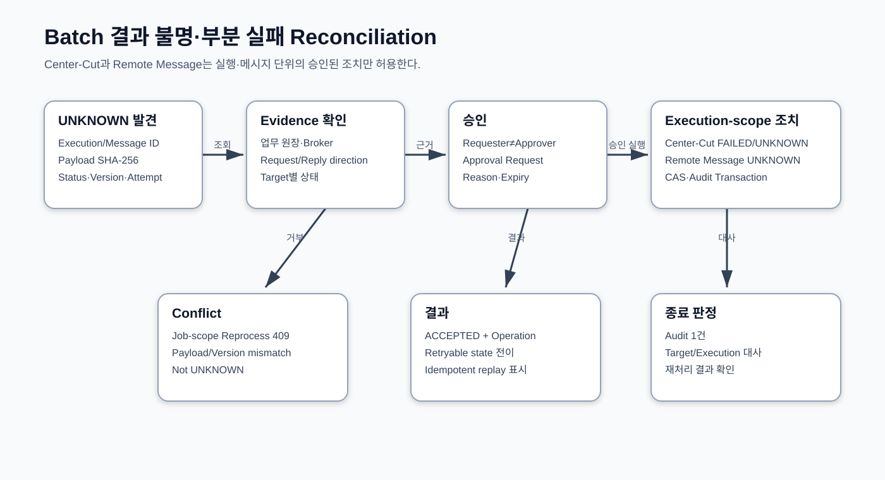

# CPF 배치 개발 매뉴얼

> 문서: `CPF 배치 개발 매뉴얼`
> 기준 Repository: `https://github.com/freeangelsun/202412_01_CPF`
> 기준 Branch: `master`
> 기준 Commit: `2a013663090d4e430a15983ad7269f8e86c5ef58` (`Merge B`)
> 기준일: `2026-08-06 Asia/Seoul`

| 항목 | 내용 |
|---|---|
| 주 독자 | 고객사 배치 개발자·배치 운영자 |
| 문서 목적 | Tasklet·Chunk·File·Partition·Worker·Center-Cut·Scheduler를 개발하고 실행·재시작·재처리·대사한다. |
| 기능 서술 전제 | CPF 제품 기능은 고객이 사용할 수 있는 상태로 설명한다. 구현 진행률이나 개발 관리 상태는 이 문서의 사용 절차에 섞지 않는다. |
| 사실 우선순위 | 실제 Source·SQL·API·Config·Frontend·Script·Test → 설계·사양 → 본 매뉴얼 |
| 상태 표현 | 업무 상태와 운영 결과는 Source의 상태값을 사용한다. 문서 검토 상태는 `완료`, `부분 구현`, `미구현`, `미검증`, `실패`, `재확인 필요`만 사용한다. |

## 1. Batch 제품 구성과 책임

CPF Batch는 Spring Batch를 Primary Engine으로 사용하고 Control Server, Scheduler, Runner, Worker, Host Agent, Center-Cut, ADM Workbench를 연결한다.

| 구성 | 소유 상태 | 실제 Consumer |
|---|---|---|
| Job Definition/Pack | Job·Version·Parameter·Step Graph·Artifact | Scheduler·Runner·ADM |
| Spring Batch Metadata | JobInstance·Execution·StepExecution·Checkpoint | 개발자·운영자·Recovery |
| Scheduler | Schedule·Calendar·Misfire·Dispatch·Lease | Control Server·ADM |
| Runner | Job 실행 Process와 Exit | Host Agent·ADM |
| Worker | Partition·Chunk 실행·Heartbeat | Manager·ADM |
| Host Agent | Process Command·Service Manager Evidence | Runtime Control |
| Center-Cut | 대상 Snapshot·Execution·Result·대사 | 업무 Owner·ADM |
| Runtime Command | Desired/Observed·Target Attempt·Rollback | 운영자·승인자 |

## 2. Job 유형 선택

| 유형 | 선택 기준 | Checkpoint | 외부 부작용 |
|---|---|---|---|
| Tasklet | 하나의 명시 작업, 파일 이동, Marker, 집계 | Tasklet 자체 Marker | 업무 원장과 멱등 처리 |
| Chunk | 대량 Row, Reader/Processor/Writer | Commit마다 Cursor·Count | Writer Transaction에 포함하거나 Ledger 사용 |
| File Batch | 파일 Row 검증·적용 | File/Row Job 상태 | Preview 후 승인 Apply |
| Partition | 독립 범위 병렬 처리 | Partition별 | Lease·Fencing으로 중복 방지 |
| Remote Worker | Manager와 Worker 분리 | Partition/Message Attempt | ACK 전에 결과 저장 |
| Center-Cut | 기준시점 대상 일괄 처리·대사 | Execution·Item Result | 대상 Snapshot과 승인 |

Job 설계서에는 업무 결과, JobParameter, 재실행 식별자, Step, Transaction 경계, Commit Interval, Skip/Retry, 외부 부작용, 대사 기준, 운영 조치를 작성한다.

### 2.1 Job 설계서 필수 Field

| 구분 | 필수 내용 |
|---|---|
| Identity | Job Code·Version·Owner·업무 목적·실행 주기 |
| Input | Parameter 이름·Type·Identifying 여부·Default·Validation |
| Step | Step 순서·Tasklet/Chunk·Reader/Processor/Writer·Transaction Manager |
| Data | 입력 Source·정렬 Key·대상 조건·Snapshot/Hash·출력 Table/File |
| Restart | Checkpoint Key·재시작 가능 상태·Input 변경 감지·재실행 Key |
| Fault | Retryable Exception·Skip 기준·Limit·Timeout·Process Kill 지점 |
| External | Target·Idempotency·Attempt·응답 유실 대사·Compensation |
| Parallel | Partition Key·Grid Size·Worker Capability·Lease·Fencing |
| Reconciliation | 처리 건수·금액·Hash·외부 접수 ID·Tolerance |
| Operations | ADM Route·Permission·Approval·Alert·Runbook·Rollback |

### 2.2 선택 예시

- 마감 Marker 생성과 파일 Rename은 Tasklet으로 둔다.
- 수백만 거래를 정산 Table에 반영하면 Chunk를 선택한다.
- 기관별 독립 전송은 기관 Code Partition과 Remote Worker를 사용한다.
- 월말 대상 Snapshot과 처리 결과 대사가 필요하면 Center-Cut을 사용한다.
- Upload 파일의 일부 Row만 오류가 날 수 있으면 File Job의 Preview·Row Result·Retry를 사용한다.

## 3. JobParameter·Instance·Execution·Step

- JobParameter는 동일 업무 실행을 구분하는 값이다. `businessDate`, `institutionCode`, `runType`, `requestId`처럼 업무 의미가 있어야 한다.
- 같은 Identifying Parameter는 같은 JobInstance를 가리킨다.
- Restart는 같은 Instance의 새 Execution이다.
- Reprocess는 업무 대사 후 새 Parameter 또는 별도 대상 집합으로 만든 새 실행이다.
- StepExecution의 Read/Write/Skip/Commit/Rollback Count와 Exit Description을 운영자가 판독할 수 있게 한다.
- ExecutionContext에는 재시작에 필요한 최소 Cursor만 저장하고 Secret·대용량 Payload를 넣지 않는다.

### 3.1 Parameter 계약 예시

| Parameter | Type | Identifying | 예 | 검증 | 변경 시 의미 |
|---|---|---:|---|---|---|
| `businessDate` | Date | Y | `2026-08-05` | Calendar 존재·처리 가능일 | 다른 JobInstance |
| `institutionCode` | String | Y | `BANK01` | Code/권한/Route 존재 | 다른 JobInstance |
| `runType` | Enum | Y | `NORMAL`, `REPROCESS` | 허용 상태·승인 | 다른 JobInstance |
| `requestId` | String | Y | 운영 요청 ID | 형식·중복 | 같은 요청 Replay 판단 |
| `requestedBy` | String | N | 운영자 ID | 인증 주체와 일치 | Audit 정보 |
| `reason` | String | N | 재처리 사유 | 빈값·길이·제어문자 | Audit 정보 |

Identifying Parameter를 실행 시각으로만 만들면 같은 업무를 재시작하지 못한다. 업무 날짜·기관·파일 Checksum·대상 Snapshot처럼 업무 의미가 있는 Key를 사용한다.

### 3.2 Metadata 판독 순서

1. JobInstance가 어떤 Identifying Parameter로 만들어졌는지 확인한다.
2. 최신 Execution과 이전 Execution의 Status·Exit Code·Start/End Time을 비교한다.
3. StepExecution의 Read/Write/Filter/Skip/Commit/Rollback Count를 본다.
4. ExecutionContext의 Cursor와 실제 마지막 Commit Row를 대사한다.
5. 업무 Table·외부 Attempt·Audit에서 부작용 범위를 확인한다.
6. Restart 가능 여부를 판단한 후에만 Restart/새 Reprocess를 선택한다.

## 4. Tasklet 개발

1. Tasklet의 입력·출력·완료 Marker를 정한다.
2. 같은 Parameter로 재호출될 때 이미 완료된 업무를 다시 수행하지 않게 한다.
3. 외부 파일 이동은 Temp→Checksum→Atomic Rename 순서로 처리한다.
4. 업무 Row와 Marker가 같은 DB면 같은 Transaction을 사용한다.
5. 외부기관 호출이 있으면 Attempt와 UNKNOWN_RESULT를 사용한다.
6. 실패 시 예외를 숨기지 않고 Exit Code·Error Code·Audit를 남긴다.
7. Restart Test에서 완료 Marker 이후 중복 부작용이 없는지 확인한다.

### 4.1 파일 수신 Tasklet 예제

1. 원격 Final 파일이 아니라 Temp 이름으로 수신한다.
2. Size·Checksum·Naming Rule·중복 File ID를 검증한다.
3. Metadata를 `RECEIVED`로 저장하고 Scan/Validation 결과를 남긴다.
4. 검증 성공 후 같은 Filesystem 안에서 Final 이름으로 Rename한다.
5. 완료 Marker와 Artifact Hash를 기록한다.
6. 같은 File ID·Checksum 재실행은 기존 결과를 반환한다.
7. 같은 File ID·다른 Checksum은 Conflict로 격리한다.

### 4.2 실패 주입 항목

| 실패 지점 | 기대 결과 | Restart 판정 |
|---|---|---|
| Download 중 Process 종료 | Temp 파일만 존재, 완료 Marker 없음 | Size/Checksum 확인 후 Resume 또는 폐기 |
| Metadata 저장 후 Rename 전 종료 | RECEIVED, Temp 존재 | 같은 Operation으로 Rename 재개 |
| Rename 후 Marker 저장 전 종료 | Final 존재, Marker 없음 | Artifact Hash 대사 후 Marker 보정 Operation |
| 외부기관 접수 후 응답 유실 | Attempt UNKNOWN | 기관 접수 ID/업무 Key 대사 후 종결 |

Tasklet의 Exit Code는 “예외 없음”이 아니라 업무 결과를 설명해야 한다.

## 5. Chunk 개발

```java
@Bean
Step paySettlementStep(JobRepository repository,
                        PlatformTransactionManager tx,
                        ItemReader<PayRow> reader,
                        ItemProcessor<PayRow, Settlement> processor,
                        ItemWriter<Settlement> writer) {
    return new StepBuilder("paySettlementStep", repository)
        .<PayRow, Settlement>chunk(500, tx)
        .reader(reader)
        .processor(processor)
        .writer(writer)
        .faultTolerant()
        .retryLimit(3)
        .build();
}
```

Reader는 안정된 Sort Key를 사용한다. Processor는 외부 부작용 없이 변환·검증한다. Writer는 Chunk Transaction 안에서 멱등하게 저장한다. Skip은 업무 승인 기준과 Limit를 명시하고 Skip Row를 별도 원장에 남긴다. Restart 시 마지막 Commit 이후부터 읽히는지 확인한다.

### 5.1 Reader 계약

- 정렬 Key는 유일하고 변경되지 않아야 한다. 동일 Timestamp만으로 Cursor를 만들지 않는다.
- Paging Query와 Restart Cursor가 같은 정렬을 사용한다.
- 대상 조건은 실행 시작 시 Snapshot 또는 조건 Hash로 고정한다.
- Reader가 외부 부작용을 만들지 않는다.
- Process Kill 후 마지막 Commit 이전 Row가 다시 읽혀도 Writer 멱등성이 보장돼야 한다.

### 5.2 Processor 계약

- 입력 Validation·업무 계산·출력 변환을 수행한다.
- 외부 API 호출이나 별도 DB Commit을 숨기지 않는다.
- Filter와 오류를 구분하고 Filter 사유를 Count/Log에 남긴다.
- 날짜·금액·환율·반올림 규칙은 Version 또는 기준정보 시각과 연결한다.

### 5.3 Writer 계약

- Chunk Transaction 안에서 업무 Row·History·Audit·Outbox를 함께 저장한다.
- PK/업무 Key·Version·Idempotency로 Replay를 통제한다.
- Batch Update 영향 건수와 요청 Row 수를 비교한다.
- 외부 전송은 Writer Transaction 밖의 Outbox/후속 Step으로 분리한다.

### 5.4 Skip·Retry 결정표

| 오류 | Retry | Skip | 실패 종료 | 근거 |
|---|---:|---:|---:|---|
| 일시 DB Deadlock | O | X | Limit 초과 | 같은 Transaction 재시도 가능 |
| Validation 오류 | X | 정책 허용 시 | 허용 건수 초과 | 데이터 오류 원장 필요 |
| Version 충돌 | X | X | O | 대상 Snapshot Drift 가능 |
| 외부 Timeout | 상태 확인 후 | X | 결과 불명 가능 | Attempt 대사 필요 |
| Writer 영향 건수 불일치 | X | X | O | Partial Write 위험 |

Skip Limit만 설정하고 업무 합계 대사를 생략하지 않는다.

## 6. Checkpoint와 Restart Cursor

Checkpoint는 기술 Cursor와 업무 대사 기준을 함께 설계한다.

- Cursor: 마지막 처리 Key, 파일 Offset, Partition Range.
- Count: Read/Write/Skip/Commit/Rollback.
- 업무 Marker: 외부기관 전송 ID, 파일 Checksum, Settlement Date.
- 재시작 금지 조건: Input File 변경, 대상 조건 Hash 변경, Schema Version 변경, 외부 부작용 결과 불명.

Checkpoint 손상이 의심되면 Context를 임의 편집하지 않는다. 원본 Input과 업무 Row를 대사해 Restart, Reprocess, Compensation 중 하나를 선택한다.

## 7. Stop·Restart·Abandon·Reprocess

| 조치 | 사용 조건 | 금지 조건 | 결과 |
|---|---|---|---|
| Stop | RUNNING Execution을 일관성 경계에서 중지 | 강제 Process Kill 대체 | STOPPING→STOPPED |
| Restart | 같은 JobInstance의 재시작 가능 Execution | Input/조건/Schema 변경 | 새 Execution, 기존 Checkpoint 사용 |
| Abandon | 다시 시작하지 않을 실패 Execution 표시 | 업무 결과 미대사 | ABANDONED, 이력 보존 |
| Reprocess | 대사 후 일부/전체 업무를 새 실행 | 결과 불명 Blind Retry | 새 Parameter/대상 Snapshot |
| Compensation | 이미 확정된 외부 부작용을 상쇄 | 결과 미확정 | 별도 Operation·Audit |

운영자는 상태값만 보고 조치하지 않고 외부 부작용·업무 원장·Checkpoint를 함께 확인한다.

## 8. Partition·Remote Worker

1. Partition Key와 범위를 중복 없이 만든다.
2. Manager가 Partition Execution과 Lease를 생성한다.
3. Worker는 Capability·Heartbeat를 등록하고 Claim한다.
4. Claim에는 Lease Expiry와 Fencing Token을 포함한다.
5. Writer는 현재 Fencing Token이 아니면 저장을 거부한다.
6. Worker Process Kill 시 Heartbeat·Lease·Process 상태를 대사한다.
7. Lease 만료 후 더 높은 Token으로 Reclaim한다.
8. 늦게 돌아온 Worker의 stale Write가 차단되는지 Test한다.

Remote Worker Message는 ACK 전에 결과와 Checkpoint를 저장한다. Broker redelivery는 같은 Partition Attempt를 Replay하거나 Conflict로 판정한다.

### 8.1 Partition Lifecycle

`PLANNED → CLAIMABLE → CLAIMED → RUNNING → SUCCEEDED/FAILED/UNKNOWN → REQUEUED`

| Field | 의미 | 검증 |
|---|---|---|
| Partition ID | 실행 안에서 유일한 범위 | 중복·누락 0 |
| Range/Key | Reader 대상 | 경계 겹침 0 |
| Owner Worker | 현재 Claim 소유자 | Heartbeat와 연결 |
| Lease Expires At | 소유권 만료 | Clock Source 일치 |
| Fencing Token | Write 권한 세대 | 이전 Token Write 차단 |
| Attempt | 재할당 이력 | 원본 Attempt 보존 |
| Checkpoint | 마지막 Commit | 업무 Row와 대사 |

### 8.2 Worker 손실 복구

1. Heartbeat가 끊긴 시각과 Lease 만료를 확인한다.
2. Host Agent에서 Process 존재 여부를 확인한다.
3. 아직 Lease가 유효하면 다른 Worker에 할당하지 않는다.
4. 만료 후 업무 Row·Checkpoint·외부 Attempt를 대사한다.
5. 더 높은 Fencing Token으로 Reclaim한다.
6. 이전 Worker가 돌아와도 stale Token Write가 거부되는지 확인한다.
7. Reclaim 이후 처리 건수와 Partition 전체 범위를 다시 대사한다.

## 9. Scheduler·Calendar·Misfire·HA

Schedule 입력은 Job Version, Cron, Timezone, Business Calendar, Misfire Policy, Parameter Rule, Enabled, Expected Version이다.

1. Simulation으로 향후 Fire Time과 영업일 제외 결과를 확인한다.
2. Schedule을 Version으로 저장한다.
3. HA Instance 중 Lease Owner 하나만 Dispatch한다.
4. Dispatch Ledger에 Schedule Version·Fire Time·JobParameter를 기록한다.
5. Misfire는 SKIP, FIRE_ONCE, CATCH_UP 등 승인된 정책으로만 처리한다.
6. `Run Once`는 Scheduler 기록을 우회하지 않고 별도 Dispatch로 남긴다.
7. Clock Skew와 Timezone을 운영 Health에 포함한다.

### 9.1 Misfire 정책 선택

| 정책 | 사용 조건 | 주의 |
|---|---|---|
| SKIP | 놓친 실행을 수행할 필요가 없음 | 누락 사실과 다음 Fire를 Audit |
| FIRE_ONCE | 최근 1회만 보정 | 여러 누락을 한 실행에 합칠 업무 기준 필요 |
| CATCH_UP | 날짜별 결과가 모두 필요 | Backlog·Capacity·순서·중복 통제 |
| MANUAL | 운영 대사 후 결정 | 승인·Run Once·Parameter 기록 |

### 9.2 HA Dispatch 검증

- 두 Scheduler가 같은 Fire Time을 읽어도 Dispatch Ledger Unique/CAS로 하나만 소유한다.
- Lease Owner가 죽으면 만료 후 다른 Instance가 인계한다.
- Dispatch 성공 후 응답 유실은 같은 Schedule/Fire Key를 조회한다.
- Business Calendar 변경 시 계산된 Next Fire와 Calendar Version을 함께 갱신한다.
- Clock Drift가 허용 범위를 넘으면 Dispatch를 차단하고 Health에 원인을 표시한다.

## 10. Center-Cut 설계

Center-Cut은 특정 기준시점의 대상 집합을 Snapshot하고 처리 결과를 대사하는 기능이다.

1. Cutoff·대상 조건·정렬 Key·Partition Key를 결정한다.
2. Dry Run에서 대상 건수·금액·조건 Hash를 만든다.
3. 승인 시 Preview Hash와 실제 실행 Hash가 같은지 확인한다.
4. Execution별 Target과 Result를 저장한다.
5. Item 상태와 Execution 집계를 같은 Transaction에서 갱신한다.
6. FAILED와 UNKNOWN은 Job 전체가 아니라 Execution 단위로 조치한다.
7. 결과 건수·금액·외부기관 원장을 대사한다.



### 10.1 Center-Cut 데이터 계약

| 원장 | 주요 Field | 역할 |
|---|---|---|
| Definition | Job ID·Version·대상 규칙·Partition/Chunk·대사식 | 재현 가능한 실행 정의 |
| Preview | Cutoff·조건 Hash·건수·금액·경고·생성시각 | 승인 대상 고정 |
| Execution | Execution ID·Preview Hash·상태·Version·요청/승인 | 운영 조치 경계 |
| Target | 업무 Key·Partition·Snapshot Version | 처리 대상 증명 |
| Result | 상태·금액·외부 ID·Message·Attempt | Item 결과 |
| Reconciliation | 예상/처리/외부 건수·금액·차이·판정 | 종료 근거 |
| Audit | Actor·Reason·Before/After·Approval·Operation | 변경 근거 |

### 10.2 상태별 Action

| 현재 상태 | 허용 Action | 선행 확인 | 종료 판정 |
|---|---|---|---|
| FAILED | 실패 Execution 재처리 | 실패 원인 제거·대상 Version | 새 Attempt와 결과 대사 |
| UNKNOWN | UNKNOWN 대사 | 외부/업무 원장·Payload Hash | 성공/실패/보상 중 하나로 확정 |
| SUCCEEDED | 조회·대사 | 건수·금액·외부 ID | 재처리 금지 |
| RUNNING | 관측·승인 Stop | Process·Heartbeat·Lease | 일관성 경계에서 STOPPED |
| PARTIAL | 실패 Target 분리 | 성공 Target 보존 | 실패 대상만 후속 조치 |

Job ID만으로 일괄 상태를 바꾸지 않는다. Execution ID와 Result/Item 범위가 운영 Action의 대상이다.

## 11. Center-Cut ADM 조치

`/batch-center-cut` 화면은 Job 목록과 Execution 결과를 분리한다.

- `실패 재처리` 버튼은 상태가 `FAILED`이고 Execution ID가 있을 때만 표시된다.
- `UNKNOWN 대사` 버튼은 상태가 `UNKNOWN`이고 Execution ID가 있을 때만 표시된다.
- 첫 확인은 Approval Request를 생성하고, 승인 Ticket이 있을 때 실행한다.
- 입력은 `reason`, `approvalRequestId`, `idempotencyKey`다.
- 요청자와 승인자를 분리하고 Job 단위 일괄 재처리를 사용하지 않는다.
- 완료 후 화면을 재조회해 `requeued` 건수와 업무 원장을 대사한다.

실제 화면 계약은 `BatchCenterCutPage.vue`, 요청 DTO는 `AdmCenterCutActionRequest`가 정본이다.

## 12. Job Pack·Artifact·Deployment

Job Pack에는 Definition, Job/Step Graph, Parameter Schema, Artifact Coordinate, Checksum, Compatibility, Migration, Rollback, Smoke Test를 포함한다.

Lifecycle 예: `DRAFT → VALIDATED → APPROVED → DEPLOYED → RETIRED`.

Deployment는 Preview→Target Snapshot→Approval→Canary→Health/Smoke→Promotion 순서다. 일부 Target 실패 시 성공 Target과 실패 Target을 분리하고 LKG를 보존한다. Agent 응답 유실은 UNKNOWN_RESULT로 남기고 성공으로 집계하지 않는다.

### 12.1 Job Pack Manifest 예시 항목

```yaml
packId: pay-settlement
version: 2026.08.01
sourceSha: <repository-sha>
artifact:
  coordinate: <group>:<name>:<version>
  sha256: <artifact-sha256>
jobs:
  - jobCode: PAY_DAILY_SETTLEMENT
    definitionVersion: 3
    parameterSchema: pay-daily-settlement.schema.json
compatibility:
  java: 25
  database: [mariadb, postgresql, oracle]
migrations:
  - <vendor-pack-reference>
health:
  startup: <health-check-id>
rollback:
  lkgVersion: 2026.07.03
```

위 예시는 고객 Job Pack Manifest 구조를 설명한다. 실제 Coordinate·Version·Schema 경로는 Release Manifest와 Repository 정본을 사용한다.

### 12.2 Deployment Gate

1. Definition·Parameter Schema·Artifact Hash 검증.
2. DB Migration·Runtime Query 호환성 확인.
3. 격리 Runner에서 Dry Run/Smoke.
4. Target Snapshot과 승인.
5. Canary Runner/Worker 적용.
6. Job 조회·실행·Checkpoint·Agent Evidence 확인.
7. Promotion 또는 LKG Rollback.
8. 배포 Version·Target·결과·Audit 인계.

## 13. Runner·Worker·Host Agent

- Runner는 Job Pack과 Parameter를 받아 Spring Batch를 실행하고 Exit/Evidence를 반환한다.
- Worker는 Partition/Chunk를 처리하고 Lease·Checkpoint를 갱신한다.
- Host Agent는 Service Manager를 통해 Process 상태를 조회·변경한다.
- Agent Command는 Command ID·Target·Expected State·Approval을 사용한다.
- Dispatch 전 Validation·Snapshot 실패는 FAILED다.
- Dispatch 이후 응답·Evidence 유실은 UNKNOWN_RESULT다.
- 여러 Target 중 일부 Rollback은 PARTIALLY_ROLLED_BACK이다.

## 14. Dry Run·Preview·승인

Dry Run은 부작용 없이 대상·Parameter·Partition·예상 건수·금액·경고를 계산한다. Preview 결과에는 기준시각과 Hash를 포함한다. 승인 후 실제 실행은 같은 Definition Version과 Preview Hash를 사용한다.

Preview 이후 원본 데이터가 변경돼 Hash가 달라지면 실행을 중단하고 새 Preview·Approval을 만든다. 오래된 Approval을 새 대상 집합에 재사용하지 않는다.

## 15. 상태 판독과 장애 분류

| 증상 | 판정 | 우선 Evidence | 조치 |
|---|---|---|---|
| START 전 Validation 실패 | FAILED | Command/Validation Error | 입력·정책 수정 후 새 실행 |
| RUNNING Heartbeat 정상 | 정상 실행 | Execution·Heartbeat·Progress | 관측 유지 |
| RUNNING Heartbeat 없음, Process 존재 | Network/Collector 문제 가능 | Host Agent·Process | 연결 복구 후 재관측 |
| RUNNING Heartbeat 없음, Process 부재, Lease 만료 | Ghost 후보 | Metadata·Lease·Agent | 승인 Recovery |
| 외부 호출 후 응답 없음 | UNKNOWN_RESULT | Attempt·외부 원장 | Reconcile |
| 일부 Partition 실패 | PARTIAL | Partition Result | 실패 Partition만 Reprocess |
| Stop 요청 후 장시간 STOPPING | 경계 미도달/정체 | Step·Transaction·Thread | 안전 종료 또는 Agent 조치 |
| Rollback Target 일부 실패 | PARTIALLY_ROLLED_BACK | Target Attempt | 남은 Target 복구 |

## 16. 장애 Runbook

### DB 장애

새 실행을 중지하고 Metadata DB·업무 DB 상태를 분리한다. Commit 여부를 모르면 업무 Row·Checkpoint·Audit를 대사한다. DB 복구 후 RUNNING 상태를 일괄 변경하지 않는다.

### Broker 장애

Remote Worker Dispatch와 ACK 경계를 확인한다. Publish 성공·소비 미완료·ACK 유실을 구분하고 Message/Partition Attempt로 Replay한다.

### Worker Process Kill

Heartbeat·Lease·Fencing Token·실제 Process를 확인한다. Lease가 만료되기 전에 다른 Worker가 같은 Partition을 쓰지 않게 한다.

### Disk/Memory

새 Claim과 Job 실행을 중지한다. OOM 이후 Execution 상태가 RUNNING이면 Agent·Metadata를 대사한다. 임시 파일과 Checkpoint를 임의 삭제하지 않는다.

### Network Partition

Worker가 살아 있어도 Control Plane과 단절될 수 있다. Clock·Lease·Token으로 stale Write를 차단하고 연결 복구 후 Reconcile한다.

### 16.1 증상별 1차 판정표

| 증상 | 먼저 볼 것 | 하지 말아야 할 조치 | 정상화 판정 |
|---|---|---|---|
| Execution RUNNING 고착 | Process·Heartbeat·Step·DB Session·Lease | Metadata 직접 Update | Process/Lease/상태가 일치하고 후속 Execution 가능 |
| 동일 Job 중복 시작 | Identifying Parameter·Dispatch Key·Idempotency | 한쪽 결과 삭제 | 하나의 Owner 실행만 부작용을 소유 |
| Chunk Count 불일치 | Commit/Rollback·Writer 영향 건수·업무 합계 | Skip Count만 맞추기 | 대상=성공+정책상 오류, 금액 대사 일치 |
| Scheduler 누락 | Calendar·Timezone·Lease·Misfire·Clock | 임의 수동 실행 | 승인된 Fire/Run Once가 Dispatch Ledger에 존재 |
| Worker 유실 | Heartbeat·Agent Process·Lease·Token | Lease 전 중복 Claim | 더 높은 Token의 Worker만 Write |
| Broker Redelivery 반복 | Message ID·Inbox·Attempt·Poison 원인 | Queue Purge | Poison 격리, 정상 Message 처리 재개 |
| 외부 전송 결과 불명 | Attempt·기관 접수 원장·Payload Hash | Blind Retry | UNKNOWN이 성공/실패/보상으로 종결 |
| Center-Cut 금액 차이 | Preview·Target·Result·외부 합계 | Job 전체 재처리 | 차이 대상과 원인이 식별되고 후속 조치 완료 |
| Agent Command 응답 유실 | Command ID·Service Manager·Target Attempt | 성공 가정 | Observed State와 Command Result가 연결 |
| Disk 부족 | Work/Temp/Artifact·실행 중 파일 | 광범위 파일 삭제 | 여유 공간·Artifact/Checkpoint 무결성 확인 |

### 16.2 사고 기록

사고 기록에는 Job/Execution/Step/Partition/Command ID, Parameter, Source SHA, Artifact Hash, Process/Host, 최초 증상 시각, 외부 부작용 범위, 대사식, 수행 Action, 승인, Before/After, 남은 위험을 포함한다.

## 17. PAY Batch 종합 Job Pack

| Job | 유형 | Parameter | Checkpoint | 대사 기준 |
|---|---|---|---|---|
| PAY_DAILY_SETTLEMENT | Chunk | businessDate, institution | paymentId cursor | 건수·금액·상태 |
| PAY_INSTITUTION_SEND | Partition/Remote Worker | businessDate, institution | partition + message attempt | 기관 접수 ID·금액 |
| PAY_FILE_IMPORT | File/Chunk | fileId, checksum | rowNo | valid/invalid/applied Row |
| PAY_MONTH_END_CENTER_CUT | Center-Cut | month, cutoff, previewHash | execution/item | 대상·처리·금액 |
| PAY_NOTIFICATION_RETRY | Tasklet/Chunk | deliveryDate, channel | deliveryId | provider receipt |
| PAY_ARCHIVE | Tasklet/File | beforeDate, policyVersion | artifact marker | row count·artifact hash |

교육 순서: Definition 검증→Dry Run→승인→실행→Process Kill→Restart→부분 실패→Execution-scope Reprocess→대사→운영 인계.

### 17.1. `PAY_DAILY_SETTLEMENT`

| 항목 | 내용 |
|---|---|
| 업무 결과 | 거래별 정산 상태와 금액을 업무일 기준으로 확정한다. |
| Parameter | `businessDate·institutionCode·requestId` |
| Reader/Checkpoint | `paymentId ASC` |
| 실행 방식 | 500건 Chunk |
| 대사식 | 결제 건수·원금·수수료·정산금 |
| 주요 실패 처리 | Version 충돌은 실행 중지 후 대상 Snapshot 재생성 |
| ADM 확인 | `/batch-executions·/transactionGroups` |

`PAY_DAILY_SETTLEMENT` 개발은 거래별 정산 상태와 금액을 업무일 기준으로 확정한다.를 기준으로 Definition/Parameter Schema, 대상 Query·Index, `paymentId ASC` Checkpoint, 500건 Chunk 멱등성, 정상·중복·Process Kill·Timeout Test, Dry Run, 승인 실행, `결제 건수·원금·수수료·정산금` 대사, 운영 인계 순서로 수행한다. 운영자는 이전 Execution을 덮지 않고 `/batch-executions·/transactionGroups`에서 새 Attempt와 결과 근거를 확인한다.

### 17.2. `PAY_INSTITUTION_SEND`

| 항목 | 내용 |
|---|---|
| 업무 결과 | 기관별 정산 결과를 독립 Partition으로 전송한다. |
| Parameter | `businessDate·institutionCode·runType` |
| Reader/Checkpoint | `institution+settlementId` |
| 실행 방식 | 기관 Partition·Remote Worker |
| 대사식 | 기관 접수 ID·전송 건수·금액 |
| 주요 실패 처리 | 응답 유실은 접수 원장 조회 후 Attempt 종결 |
| ADM 확인 | `/batch-worker-pools·/batch-recovery` |

`PAY_INSTITUTION_SEND` 개발은 기관별 정산 결과를 독립 Partition으로 전송한다.를 기준으로 Definition/Parameter Schema, 대상 Query·Index, `institution+settlementId` Checkpoint, 기관 Partition·Remote Worker 멱등성, 정상·중복·Process Kill·Timeout Test, Dry Run, 승인 실행, `기관 접수 ID·전송 건수·금액` 대사, 운영 인계 순서로 수행한다. 운영자는 이전 Execution을 덮지 않고 `/batch-worker-pools·/batch-recovery`에서 새 Attempt와 결과 근거를 확인한다.

### 17.3. `PAY_FILE_IMPORT`

| 항목 | 내용 |
|---|---|
| 업무 결과 | 수신 파일을 Preview하고 정상 Row만 승인 Apply한다. |
| Parameter | `fileId·checksum·schemaVersion` |
| Reader/Checkpoint | `rowNo` |
| 실행 방식 | File Job+Chunk |
| 대사식 | 전체/정상/오류/적용 Row·Checksum |
| 주요 실패 처리 | 오류 Row 수정 후 실패 Row만 Retry |
| ADM 확인 | `/file-jobs` |

`PAY_FILE_IMPORT` 개발은 수신 파일을 Preview하고 정상 Row만 승인 Apply한다.를 기준으로 Definition/Parameter Schema, 대상 Query·Index, `rowNo` Checkpoint, File Job+Chunk 멱등성, 정상·중복·Process Kill·Timeout Test, Dry Run, 승인 실행, `전체/정상/오류/적용 Row·Checksum` 대사, 운영 인계 순서로 수행한다. 운영자는 이전 Execution을 덮지 않고 `/file-jobs`에서 새 Attempt와 결과 근거를 확인한다.

### 17.4. `PAY_MONTH_END_CENTER_CUT`

| 항목 | 내용 |
|---|---|
| 업무 결과 | 월말 대상 Snapshot을 Execution 단위로 처리하고 대사한다. |
| Parameter | `month·cutoff·previewHash` |
| Reader/Checkpoint | `customer/account range` |
| 실행 방식 | Center-Cut Partition |
| 대사식 | 대상/처리/외부 건수·금액·차이 |
| 주요 실패 처리 | FAILED/UNKNOWN Execution만 승인 조치 |
| ADM 확인 | `/batch-center-cut` |

`PAY_MONTH_END_CENTER_CUT` 개발은 월말 대상 Snapshot을 Execution 단위로 처리하고 대사한다.를 기준으로 Definition/Parameter Schema, 대상 Query·Index, `customer/account range` Checkpoint, Center-Cut Partition 멱등성, 정상·중복·Process Kill·Timeout Test, Dry Run, 승인 실행, `대상/처리/외부 건수·금액·차이` 대사, 운영 인계 순서로 수행한다. 운영자는 이전 Execution을 덮지 않고 `/batch-center-cut`에서 새 Attempt와 결과 근거를 확인한다.

### 17.5. `PAY_NOTIFICATION_RETRY`

| 항목 | 내용 |
|---|---|
| 업무 결과 | 실패 확정 알림 Delivery를 Provider Receipt 기준으로 재시도한다. |
| Parameter | `deliveryDate·channel·requestId` |
| Reader/Checkpoint | `deliveryId` |
| 실행 방식 | Chunk |
| 대사식 | Delivery·Attempt·Receipt·DLQ |
| 주요 실패 처리 | Provider 미설정은 성공으로 기록하지 않음 |
| ADM 확인 | `/notifications·/batch-alerts` |

`PAY_NOTIFICATION_RETRY` 개발은 실패 확정 알림 Delivery를 Provider Receipt 기준으로 재시도한다.를 기준으로 Definition/Parameter Schema, 대상 Query·Index, `deliveryId` Checkpoint, Chunk 멱등성, 정상·중복·Process Kill·Timeout Test, Dry Run, 승인 실행, `Delivery·Attempt·Receipt·DLQ` 대사, 운영 인계 순서로 수행한다. 운영자는 이전 Execution을 덮지 않고 `/notifications·/batch-alerts`에서 새 Attempt와 결과 근거를 확인한다.

### 17.6. `PAY_ARCHIVE`

| 항목 | 내용 |
|---|---|
| 업무 결과 | 보존기간이 지난 업무·감사 대상의 Archive Artifact를 만든다. |
| Parameter | `beforeDate·policyVersion·requestId` |
| Reader/Checkpoint | `primaryKey` |
| 실행 방식 | Tasklet+File |
| 대사식 | Archive Row Count·Artifact Hash·Purge Audit |
| 주요 실패 처리 | Restore Test 전 원본 Purge 금지 |
| ADM 확인 | `/downloads·/batch-audit` |

`PAY_ARCHIVE` 개발은 보존기간이 지난 업무·감사 대상의 Archive Artifact를 만든다.를 기준으로 Definition/Parameter Schema, 대상 Query·Index, `primaryKey` Checkpoint, Tasklet+File 멱등성, 정상·중복·Process Kill·Timeout Test, Dry Run, 승인 실행, `Archive Row Count·Artifact Hash·Purge Audit` 대사, 운영 인계 순서로 수행한다. 운영자는 이전 Execution을 덮지 않고 `/downloads·/batch-audit`에서 새 Attempt와 결과 근거를 확인한다.

## 18. ADM 메뉴 사용 순서

1. `/batch-overview`에서 장기 실행·실패·Lock·Worker 상태를 확인한다.
2. `/batch-job-packs`에서 Definition Version과 Validation을 확인한다.
3. `/batch-scheduler`에서 Simulation·Calendar·Misfire를 확인한다.
4. `/batch-executions`에서 Parameter·Step·Checkpoint·Exit를 본다.
5. `/batch-runtime`과 `/batch-agents`에서 Process·Command를 본다.
6. `/batch-center-cut`에서 FAILED/UNKNOWN Execution을 승인 처리한다.
7. `/batch-recovery`와 `/batch-leases`에서 Ghost·UNKNOWN·stale Lease를 처리한다.
8. `/batch-audit`에서 요청·승인·실행·결과 Evidence를 검증한다.

## 19. 교육 과제와 완료 판정

- EDU-BATCH-01: Tasklet 완료 Marker와 Replay.
- EDU-BATCH-02: Chunk 1,200건을 Commit 500으로 처리하고 750건 지점 Process Kill 후 Restart.
- EDU-BATCH-03: Partition Worker Kill과 Lease/Fencing Reclaim.
- EDU-BATCH-04: Scheduler 영업일·Misfire·HA 단일 Dispatch.
- EDU-BATCH-05: Center-Cut Preview Hash 변경 차단.
- EDU-BATCH-06: FAILED/UNKNOWN Execution별 승인 재처리.
- EDU-BATCH-07: Agent 응답 유실과 UNKNOWN_RESULT 대사.

각 과제는 명령·Test Data·정상 결과·오류 재현·ADM 확인·복구·운영 인계가 있어야 한다.

### 19.1 Fault Injection 과정

1. Chunk Writer Commit 직전에 예외를 발생시켜 마지막 Commit 이후만 재처리되는지 확인한다.
2. Worker Process를 종료하고 Lease 만료·Fencing·Reclaim을 확인한다.
3. Scheduler Lease Owner를 종료해 다른 Instance가 같은 Fire를 중복 Dispatch하지 않는지 확인한다.
4. Broker ACK 전 Process를 종료해 같은 Message가 Inbox/Attempt로 Replay되는지 확인한다.
5. 외부기관 응답을 차단해 UNKNOWN_RESULT를 만들고 기관 원장으로 종결한다.
6. Center-Cut Execution 일부를 FAILED, 일부를 UNKNOWN으로 만들어 서로 다른 승인 Action을 수행한다.
7. Agent 성공 후 응답을 차단해 Command ID로 Observed State를 대사한다.
8. Job Pack Canary Target 하나를 실패시켜 LKG Rollback과 Target별 결과를 확인한다.

### 19.2 제출물

Job 설계서, Parameter Schema, Step Graph, Migration, Job Pack Manifest, 정상/오류/Fault Test, ADM 화면 Evidence, 건수·금액 대사표, 장애 기록, 운영 인계표를 제출한다.

## 20. Batch 운영 인계

Job별로 Owner, Job/Pack Version, Parameter Dictionary, Schedule, Calendar, Misfire, SLA, Expected Duration, Checkpoint, 외부 부작용, 대사 Query, Stop/Restart/Reprocess 조건, Process Kill Runbook, Alert, ADM Route, 승인자, Rollback Artifact를 전달한다.
