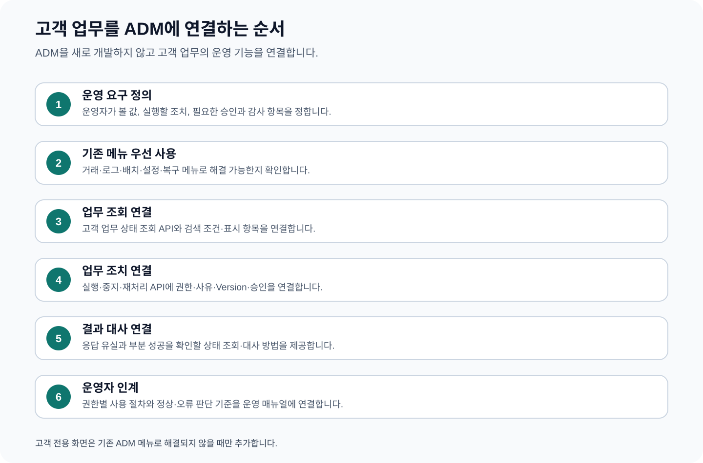

# CPF ADM 개발자 매뉴얼 — 고객 업무를 ADM에 연결하는 방법

> **주 독자**: 고객사 업무 개발자, ADM 연동 개발자, 고객 전용 운영 화면 개발자
> **이 문서의 목표**: 고객사가 ADM 제품 자체를 수정하는 문서가 아니다. 완성된 ADM을 이용해 고객 업무의 상태·조치·승인·감사·복구를 운영자에게 제공한다.



## 빠른 찾기

- [0. 어떤 ADM 연동을 선택할지](#0-어떤-adm-연동을-선택할지)
- [1. ADM 연동을 한 문장으로 이해하기](#1-adm-연동을-한-문장으로-이해하기)
- [2. 기존 ADM에서 먼저 찾을 기능](#2-기존-adm에서-먼저-찾을-기능)
- [3. 연동 전에 작성할 한 장짜리 요구표](#3-연동-전에-작성할-한-장짜리-요구표)
- [3.1 고객 업무 서비스가 제공할 연동 계약](#31-고객-업무-서비스가-제공할-연동-계약)
- [3.2 같은 애플리케이션과 분리 서비스 연동](#32-같은-애플리케이션과-분리-서비스-연동)
- [4. 고객 업무를 ADM에 연결하는 전체 흐름](#4-고객-업무를-adm에-연결하는-전체-흐름)
- [5. 기존 ADM 메뉴로 해결할지 판단](#5-기존-adm-메뉴로-해결할지-판단)
- [6. 고객 업무 조회를 ADM에 연결](#6-고객-업무-조회를-adm에-연결)
- [7. 안전한 운영 조치를 연결](#7-안전한-운영-조치를-연결)
- [8. 승인이 필요한 위험 조치를 연결](#8-승인이-필요한-위험-조치를-연결)
- [9. 비동기 작업과 응답 유실을 연결](#9-비동기-작업과-응답-유실을-연결)
- [10. 부분 성공과 대상별 복구를 연결](#10-부분-성공과-대상별-복구를-연결)
- [11. 고객 전용 ADM 화면을 추가](#11-고객-전용-adm-화면을-추가)
- [12. 지급 재처리 연동 전체 예시](#12-지급-재처리-연동-전체-예시)
- [13. 권한 수준별 화면 설계](#13-권한-수준별-화면-설계)
- [14. 개발·브라우저 시험](#14-개발브라우저-시험)
- [15. 운영자 매뉴얼 인계](#15-운영자-매뉴얼-인계)

## 0. 어떤 ADM 연동을 선택할지

| 고객 운영 요구 | 선택 방법 | 새 화면 필요 여부 |
|---|---|---|
| 서비스 상태·거래·로그·배치·Gateway 확인 | 기존 ADM 메뉴 사용 | 없음 |
| 고객 업무 상태·금액·신청자처럼 고유 정보 조회 | 고객 업무 조회 API를 기존 ADM 조회 흐름에 연결 | 대부분 없음 |
| 재처리·취소·확정처럼 업무 상태 변경 | 고객 업무 조치 API와 작업 상태 조회 연결 | 기존 메뉴로 표현 가능하면 없음 |
| 대량·장시간 조치 | 비동기 작업 ID·진행률·대상별 결과 연결 | 필요 시 결과 화면만 |
| 고객 업무만의 목록·상세·조치가 기존 메뉴로 표현 불가 | 고객 전용 메뉴 추가 | 마지막 선택 |

## 1. ADM 연동을 한 문장으로 이해하기

고객 업무 서비스가 실제 상태와 업무 규칙을 소유하고, ADM은 그 상태를 읽고 권한이 허용된 조치를 업무 서비스에 전달한다. 운영자가 DB나 Script를 직접 사용하지 않아도 업무를 판단하고 복구하게 만드는 것이 연동 목표다.

## 2. 기존 ADM에서 먼저 찾을 기능

| 운영 목적 | 먼저 사용할 메뉴 | 고객이 하는 일 |
|---|---|---|
| 서비스·거래 상태 조회 | 운영 대시보드, 서비스 토폴로지, 거래 그룹·구간 추적, 로그 조회 | 서비스 상태·업무 ID·거래 구간·오류를 조회 |
| 설정·기준정보 운영 | 설정 관리, 응답코드, 영업일, 공통 코드, 다국어 메시지 | 고객 업무 기준값을 권한·Version·감사와 함께 변경 |
| 결과 미확정·장애 복구 | 복구센터, Incident, 결과 미확정·DLQ·Outbox, 알림 | 응답 유실·메시지 실패·장애를 조회하고 대사 |
| 배치 운영 | Batch Overview, Scheduler, Worker, Center-Cut, Executions, Recovery | 고객 배치 실행·중지·재시작·재처리·대사 |
| Gateway 운영 | Gateway Dashboard, Server Group, Route, Health, Apply Status | 고객 API Route·Target·보안·연결시험·적용 상태 운영 |
| 운영자·보안 | 권한, 운영자, Session·MFA, Secret, 승인, 비상권한 | 역할 분리·위험 조치 승인·Secret Rotation·비상 접근 |

기존 메뉴로 해결할 수 있는 서비스 상태·거래·로그·설정·배치·Gateway·권한 기능을 고객 전용 화면으로 다시 만들지 않는다.

## 3. 연동 전에 작성할 한 장짜리 요구표

| 항목 | 작성 질문 |
|---|---|
| 운영 질문 | 운영자는 어떤 대상의 무엇을 판단해야 하는가? |
| 검색 | 어떤 ID·기간·상태·조직으로 찾는가? |
| 표시 | 상태·Version·금액·오류·시각 중 판단에 필요한 값은 무엇인가? |
| 조치 | 재처리·취소·중지·확정·되돌리기 중 무엇을 제공하는가? |
| 권한 | 조회자·운영자·승인자·보안담당자가 각각 무엇을 할 수 있는가? |
| 결과 | 성공 후 어떤 업무 상태·건수·합계가 되어야 하는가? |
| 응답 유실 | Operation과 업무 원장을 어떻게 조회하는가? |
| 부분 성공 | 성공·실패·미확정 대상을 어떻게 분리하는가? |
| 감사 | 실행자·사유·승인·변경 전후·결과를 무엇으로 남기는가? |


## 3.1 고객 업무 서비스가 제공할 연동 계약

ADM은 고객 업무의 실제 상태를 소유하지 않는다. 고객 업무 서비스는 최소한 다음 계약을 제공한다. URL은 고객 업무에 맞게 정하되 요청·응답 의미는 화면·로그·감사에서 같아야 한다.

| 목적 | 고객 업무 서비스가 제공할 계약 | 반드시 포함할 값 |
|---|---|---|
| 목록 조회 | `GET /api/{업무}/admin/{대상}` | 검색 조건, 상태, 버전, 업데이트 시각, 가려진 개인정보 |
| 상세 조회 | `GET /api/{업무}/admin/{대상}/{id}` | 업무 원장, 처리 단계, 오류, 관련 작업·거래 ID |
| 조치 미리보기 | `POST /api/{업무}/admin/{대상}/{id}/preview` | 대상 수, 변경 전후, 허용 여부, 필요 승인, 되돌리기 기준 |
| 조치 요청 | `POST /api/{업무}/admin/{대상}/{id}/actions` | 작업 ID, 조치, 예상 버전, 사유, 승인 ID, 중복 방지 키 |
| 작업 상태 | `GET /api/{업무}/admin/operations/{operationId}` | 진행·성공·실패·미확정, 대상별 결과, 다음 행동 |
| 결과 대사 | `POST /api/{업무}/admin/operations/{operationId}/reconcile` | 업무 원장·외부기관·메시지·파일 결과와 최종 판정 |

### 조치 요청 예시

```json
{
  "operationId": "PAY-ADM-20260801-0001",
  "action": "RETRY_FAILED_TRANSFER",
  "targetId": "PAY-20260801-0010",
  "expectedVersion": 4,
  "reason": "기관 통신 복구 후 실패 건 재처리",
  "approvalId": "APR-20260801-0100",
  "idempotencyKey": "PAY-20260801-0010-RETRY-1"
}
```

### 작업 상태 응답 예시

```json
{
  "operationId": "PAY-ADM-20260801-0001",
  "status": "PARTIAL_FAILED",
  "total": 20,
  "succeeded": 18,
  "failed": 1,
  "unknown": 1,
  "nextAction": "실패 대상 재처리, 미확정 대상 기관 상태 대사"
}
```

상태 이름은 고객 업무의 실제 상태 체계를 사용한다. 중요한 것은 전체 성공처럼 뭉개지 않고 성공·실패·미확정을 분리하는 것이다.

## 3.2 같은 애플리케이션과 분리 서비스 연동

| 배포 방식 | 고객 업무 개발자가 하는 일 | ADM 사용자는 체감해야 하는 결과 |
|---|---|---|
| 같은 애플리케이션 | 고객 업무 조회·조치 계약을 내부 연결 방식으로 제공 | 화면·권한·오류·감사가 원격 방식과 같음 |
| 분리 서비스 | 같은 계약을 원격 API와 생성된 Client로 제공 | 주소가 달라도 화면 입력·결과·복구 절차가 같음 |

화면에서 배포 위치를 판단하게 하지 않는다. 고객 업무 개발자는 두 방식에서 같은 요청·응답·오류·시간 예산·감사 의미를 유지한다.

## 4. 고객 업무를 ADM에 연결하는 전체 흐름

1. 운영자가 답해야 할 질문과 주 역할을 정한다.
2. 기존 ADM 메뉴로 해결되는 범위를 먼저 선택한다.
3. 고객 업무 서비스에 조회 API와 안전한 조치 API를 제공한다.
4. 권한·데이터 범위·사유·버전·승인 조건을 서버에서 검사한다.
5. 작업 ID와 상태 조회 API로 오래 걸리는 작업과 응답 유실을 처리한다.
6. 목록·상세·조치 결과를 로그·추적·감사와 같은 업무 ID로 연결한다.
7. 조회·변경·권한·동시성·시간초과·부분 성공을 브라우저 시험으로 확인한다.
8. 실제 화면 사용법을 04 운영자 매뉴얼에 같은 이름으로 인계한다.

## 5. 기존 ADM 메뉴로 해결할지 판단

### 고객이 얻는 결과

고객 전용 화면을 만들기 전에 기존 거래·로그·설정·복구·배치·Gateway·보안 메뉴를 조합해 운영 업무를 완성한다.

### 선택할 때

운영 질문이 서비스 상태, 거래 추적, 설정 변경, 배치, Gateway, 권한·감사에 해당할 때

### 시작 전에 정할 값

- 운영자가 답해야 할 질문
- 검색할 업무 식별자
- 필요한 조치
- 정상화 판정
- 주 사용자와 권한

### 연동 순서

1. 운영 질문을 “어떤 대상이 어떤 상태이고 다음 행동은 무엇인가?” 형식으로 작성한다.
2. 위 기존 메뉴 표에서 조회·조치·감사 메뉴를 선택한다.
3. 기존 메뉴에서 부족한 고객 업무 필드만 목록화한다.
4. 필드가 부족하면 업무 조회 API를 추가하고, 조치가 부족하면 업무 서비스에 안전한 조치 API를 추가한다.
5. 기존 기능과 중복되는 고객 전용 화면은 만들지 않는다.

### 정상 완료 기준

- 운영자가 기존 메뉴 흐름으로 상태·원인·조치·결과를 찾는다.
- 추가 개발 범위가 고객 업무 고유 필드와 조치로 제한된다.

### 교육 예제 EDU-ADM-01

- 표준 업무 예제: 지급 요청 조회·재처리·결과 대사
- 고객 업무 Source: `cpf-reference/src/main/java/com/cpf/reference/edu/adm/adm01/`
- ADM 연동 Test: `cpf-admin/src/test/`와 화면 브라우저 시험에서 같은 교육 ID 사용
- 확인: 업무 ID·Operation ID·사용자·사유·Version·결과가 조회·로그·감사에서 연결되는지 확인한다.
## 6. 고객 업무 조회를 ADM에 연결

### 고객이 얻는 결과

운영자가 업무 ID·기간·상태·조직으로 목록과 상세를 검색하고 처리 단계·오류·금액을 판단한다.

### 선택할 때

기존 거래·로그 화면만으로 고객 업무 상태를 판단하기 어려울 때

### 시작 전에 정할 값

- 검색 조건과 기본기간
- 목록·상세 표시 항목
- 데이터 범위·개인정보 가림
- 조회 최대 건수·시간초과
- 업무 상태의 의미

### 연동 순서

1. 운영자가 실제로 묻는 질문을 한 문장으로 정의한다.
2. 검색 조건·기본값·최대 범위를 표로 작성한다.
3. 업무 서비스에 읽기 전용 조회 API를 제공한다.
4. 서버에서 권한과 데이터 범위를 적용하고 개인정보는 기본 가림 처리한다.
5. ADM 목록은 상태·Version·업데이트 시각·오류를 함께 표시한다.
6. 빈 결과·조회 지연·부분 데이터·권한 없음 화면 상태를 구현한다.
7. 같은 업무 ID를 로그·추적·감사 화면으로 이동할 수 있게 한다.

### 정상 완료 기준

- 목록·상세·업무 DB가 같은 상태와 Version을 보여 준다.
- 권한 밖 데이터와 개인정보 원문이 노출되지 않는다.
- 운영자가 소스 코드나 DB를 보지 않고 다음 행동을 결정한다.

### 교육 예제 EDU-ADM-02

- 표준 업무 예제: 지급 요청 조회·재처리·결과 대사
- 고객 업무 Source: `cpf-reference/src/main/java/com/cpf/reference/edu/adm/adm02/`
- ADM 연동 Test: `cpf-admin/src/test/`와 화면 브라우저 시험에서 같은 교육 ID 사용
- 확인: 업무 ID·Operation ID·사용자·사유·Version·결과가 조회·로그·감사에서 연결되는지 확인한다.
## 7. 안전한 운영 조치를 연결

### 고객이 얻는 결과

재처리·취소·중지·확정·Cache 삭제 같은 조치를 대상·사유·Version과 함께 실행한다.

### 선택할 때

운영자가 단순 조회를 넘어 고객 업무 상태를 바꿔야 할 때

### 시작 전에 정할 값

- 조치 이름과 허용 시작 상태
- 필요 권한
- 사유 필수 여부
- 예상 Version
- 성공 상태·되돌리기

### 연동 순서

1. DB 직접 수정 대신 업무 서비스의 조치 API를 만든다.
2. 조치 API가 현재 상태·예상 Version·권한·사유를 검사하게 한다.
3. 화면은 대상 상태와 영향을 먼저 보여 주고 조치 Modal에서 입력을 받는다.
4. 한 번의 클릭마다 Operation ID를 생성하고 같은 조치를 중복 전송하지 않는다.
5. 응답 후 Operation 상태와 업무 상태를 다시 조회한다.
6. 감사에서 실행자·사유·변경 전후·결과를 확인한다.

### 정상 완료 기준

- 허용 상태에서만 조치가 성공한다.
- Version 충돌은 최신값 재조회로 연결된다.
- 성공 메시지와 실제 업무 상태·감사가 일치한다.

### 교육 예제 EDU-ADM-03

- 표준 업무 예제: 지급 요청 조회·재처리·결과 대사
- 고객 업무 Source: `cpf-reference/src/main/java/com/cpf/reference/edu/adm/adm03/`
- ADM 연동 Test: `cpf-admin/src/test/`와 화면 브라우저 시험에서 같은 교육 ID 사용
- 확인: 업무 ID·Operation ID·사용자·사유·Version·결과가 조회·로그·감사에서 연결되는지 확인한다.
## 8. 승인이 필요한 위험 조치를 연결

### 고객이 얻는 결과

대량 변경·운영 설정·권한·Rollback 같은 위험 조치를 실행자와 승인자가 분리해 처리한다.

### 선택할 때

영향 대상이 많거나 보안·금전·서비스 중단 위험이 있을 때

### 시작 전에 정할 값

- 승인 대상 Action
- 영향·대상 수·변경 차이
- 승인 유효시간·범위
- 되돌리기 지점
- 실행자·승인자 역할

### 연동 순서

1. 조치 요청 전에 대상 수와 변경 전후 차이를 계산한다.
2. 승인 요청에 환경·대상·Action·사유·예상 Version·되돌리기 지점을 담는다.
3. 승인자는 실행 결과가 아니라 실행 전 영향을 검토한다.
4. 조치 API는 승인 ID의 대상·범위·유효시간을 다시 검사한다.
5. 실행 후 승인·Operation·업무 상태·감사를 연결한다.

### 정상 완료 기준

- 승인 없이 위험 조치를 실행할 수 없다.
- 자기 요청을 같은 책임으로 승인하지 않는다.
- 승인 범위 밖 대상은 실행되지 않는다.

### 교육 예제 EDU-ADM-04

- 표준 업무 예제: 지급 요청 조회·재처리·결과 대사
- 고객 업무 Source: `cpf-reference/src/main/java/com/cpf/reference/edu/adm/adm04/`
- ADM 연동 Test: `cpf-admin/src/test/`와 화면 브라우저 시험에서 같은 교육 ID 사용
- 확인: 업무 ID·Operation ID·사용자·사유·Version·결과가 조회·로그·감사에서 연결되는지 확인한다.
## 9. 비동기 작업과 응답 유실을 연결

### 고객이 얻는 결과

대량 재처리·Export·배포처럼 오래 걸리는 작업을 요청하고 진행률·결과를 조회한다.

### 선택할 때

화면 요청 시간 안에 끝나지 않거나 여러 대상에 적용될 때

### 시작 전에 정할 값

- Operation ID
- 요청 Hash
- 진행·완료·실패·미확정 상태
- 대상별 결과
- 상태 조회 주기·만료

### 연동 순서

1. 조치 API는 접수 결과와 Operation ID를 먼저 반환한다.
2. 실제 작업은 업무 서비스가 실행하고 진행률·대상별 결과를 저장한다.
3. ADM은 상태 조회 API를 주기적으로 호출한다.
4. Browser를 닫았다 열어도 Operation ID로 다시 조회한다.
5. 응답 유실 시 같은 요청을 반복하지 않고 Operation과 업무 원장을 대사한다.
6. 완료·실패·미확정을 분리해 표시한다.

### 정상 완료 기준

- 화면 연결과 관계없이 작업 상태가 유지된다.
- 같은 요청 Hash의 중복 Operation이 생기지 않는다.
- 완료 수+실패 수+미확정 수가 전체 대상 수와 같다.

### 교육 예제 EDU-ADM-05

- 표준 업무 예제: 지급 요청 조회·재처리·결과 대사
- 고객 업무 Source: `cpf-reference/src/main/java/com/cpf/reference/edu/adm/adm05/`
- ADM 연동 Test: `cpf-admin/src/test/`와 화면 브라우저 시험에서 같은 교육 ID 사용
- 확인: 업무 ID·Operation ID·사용자·사유·Version·결과가 조회·로그·감사에서 연결되는지 확인한다.
## 10. 부분 성공과 대상별 복구를 연결

### 고객이 얻는 결과

여러 인스턴스·파일·Partition·업무 대상을 바꾸는 작업에서 성공·실패·미확정을 분리한다.

### 선택할 때

설정 배포, 대량 재처리, Batch, Gateway Route처럼 대상이 여러 개일 때

### 시작 전에 정할 값

- 대상 목록·대상 Version
- 성공·실패·미확정 결과
- 재시도 가능 조건
- 전체/대상별 되돌리기
- 대사 합계

### 연동 순서

1. 작업 시작 전에 대상 Snapshot과 Version·Checksum을 고정한다.
2. 대상마다 Attempt와 결과를 저장한다.
3. 화면에 전체 성공처럼 표시하지 않고 결과 그룹을 분리한다.
4. 실패 원인을 수정한 뒤 실패 대상만 재실행한다.
5. 성공 대상까지 되돌려야 하는 경우 승인된 정확한 Version으로 되돌린다.
6. 대상 수·건수·금액·Checksum을 대사한다.

### 정상 완료 기준

- 모든 대상의 최종 상태가 성공·실패·미확정 중 하나다.
- 재실행이 이미 성공한 대상을 중복 처리하지 않는다.
- 대사 합계가 전체 대상과 일치한다.

### 교육 예제 EDU-ADM-06

- 표준 업무 예제: 지급 요청 조회·재처리·결과 대사
- 고객 업무 Source: `cpf-reference/src/main/java/com/cpf/reference/edu/adm/adm06/`
- ADM 연동 Test: `cpf-admin/src/test/`와 화면 브라우저 시험에서 같은 교육 ID 사용
- 확인: 업무 ID·Operation ID·사용자·사유·Version·결과가 조회·로그·감사에서 연결되는지 확인한다.
## 11. 고객 전용 ADM 화면을 추가

### 고객이 얻는 결과

기존 ADM 메뉴로 표현할 수 없는 고객 고유 업무 목록·상세·조치를 별도 화면으로 제공한다.

### 선택할 때

기존 메뉴 조합으로 운영 질문과 업무 조치를 해결할 수 없을 때만

### 시작 전에 정할 값

- 메뉴명·Route·주 역할
- 조회·조치 API
- 필드·열·버튼·활성 조건
- 권한·데이터 범위
- 오류·빈 결과·오래된 데이터 화면

### 연동 순서

1. 기존 메뉴로 해결할 수 없는 이유와 고객 운영 질문을 기록한다.
2. 고객 업무 서비스의 조회·조치 계약을 먼저 완성한다.
3. API 명세에서 화면 Client를 생성하고 수동 중복 DTO를 만들지 않는다.
4. 목록·상세·조치 Modal을 운영자의 판단 순서로 배치한다.
5. 버튼 숨김과 별개로 서버 권한을 검사한다.
6. 조회·변경·시간초과·응답 유실·부분 성공 브라우저 시험를 작성한다.
7. 04 운영자 매뉴얼에 실제 Field·Button·정상·복구 절차를 추가한다.

### 정상 완료 기준

- 처음 보는 운영자가 화면만으로 대상·상태·다음 행동을 이해한다.
- 화면·API·권한·감사·운영자 매뉴얼이 같은 이름을 사용한다.

### 교육 예제 EDU-ADM-07

- 표준 업무 예제: 지급 요청 조회·재처리·결과 대사
- 고객 업무 Source: `cpf-reference/src/main/java/com/cpf/reference/edu/adm/adm07/`
- ADM 연동 Test: `cpf-admin/src/test/`와 화면 브라우저 시험에서 같은 교육 ID 사용
- 확인: 업무 ID·Operation ID·사용자·사유·Version·결과가 조회·로그·감사에서 연결되는지 확인한다.


## 12. 지급 재처리 연동 전체 예시

### 화면에서 보여 줄 값

| 영역 | 값 |
|---|---|
| 검색 | 지급 ID, Operation ID, 고객 ID, 기간, 상태 |
| 목록 | 지급 ID, 금액, 상태, Version, 기관 거래번호, 업데이트 시각 |
| 상세 | 요청·기관 응답·재처리 이력·감사·관련 로그 |
| 조치 | 재처리, 결과 대사, 업무 확정 |
| 보호 | Permission, 데이터 범위, 사유, 예상 Version, 승인 ID |

### 조치 요청 예시

```json
{
  "operationId": "ADM-RETRY-20260801-001",
  "paymentId": "P202608010001",
  "expectedVersion": 3,
  "reason": "기관 통신 복구 후 실패 건 재처리",
  "approvalId": "APR-20260801-100"
}
```

### 화면 처리 순서

1. 지급을 조회하고 현재 상태·Version·기관 결과를 확인한다.
2. 같은 지급의 기존 Operation과 감사 이력을 확인한다.
3. 재처리 가능한 상태인지 업무 서비스에 확인한다.
4. 대상·영향·사유·승인을 보여 주고 한 번만 요청한다.
5. 접수된 Operation ID로 진행 상태를 조회한다.
6. 응답을 받지 못하면 지급 원장·기관 상태·Operation을 대사한다.
7. 성공·실패·미확정 상태를 구분하고 운영자에게 다음 행동을 보여 준다.

## 13. 권한 수준별 화면 설계

| 역할 | 목록·상세 | 조치 | 원문 | 승인 | 감사 |
|---|---|---|---|---|---|
| 조회자 | 허용 범위 조회 | 없음 | 가림 | 없음 | 자기 조회 범위 |
| 운영자 | 허용 범위 조회 | 허용된 조치 | 기본 가림 | 요청 가능 | 자기 조치 |
| 승인자 | 영향·차이 조회 | 승인·반려 | 필요 범위만 | 가능 | 승인 이력 |
| 보안담당자 | 보안 상태 조회 | Session·Secret·비상권한 | 별도 권한 | 보안 승인 | 전수 |
| 운영관리자 | 전체 운영 현황 | Incident 조율 | 정책에 따름 | 역할에 따름 | 교대·정상화 |

## 14. 개발·브라우저 시험

- 검색 기본값·최대 범위·빈 결과
- 권한 없음·데이터 범위 축소·개인정보 가림
- 허용 상태와 금지 상태의 버튼 활성 조건
- 예상 Version 충돌과 최신값 재조회
- 승인 없음·만료·대상 불일치
- 조치 응답 유실과 Operation 재조회
- 대상 일부 성공·실패·미확정
- 화면 새로고침·Session 만료·오래된 데이터
- 같은 식별자의 업무 API·로그·추적·감사 연결

## 15. 운영자 매뉴얼 인계

새 고객 업무 화면을 추가하면 `04_ADM운영자매뉴얼.md`에 다음을 같은 배포 단위로 추가한다.

- 메뉴 위치와 주 사용자
- 검색 Field와 기본값
- 목록·상세 Column의 의미
- Button과 활성 조건
- 입력값·권한·사유·승인
- 정상 결과와 상태 변화
- 권한·Version·시간초과·응답 유실·부분 성공 복구
- 관련 로그·감사·교대 인계
