# CPF ADM 개발자 매뉴얼

> **기준 Repository** `freeangelsun/202412_01_CPF`
> **기준 Branch** `master`
> **기준 Commit** `23babb9140b90e501d6ac715e7b77f55b66198a5`
> **문서 목적** ADM Backend·Frontend, Owner Query·Command Port, Local·Remote, Timeout·Expected Version·Idempotency, Permission·Approval·Audit, OpenAPI·Orval과 Browser·Fault Test를 설명한다.
> **주요 독자** cpf-admin Backend·Frontend 개발자, 운영 API 개발자, 보안·감사 개발자
> **문서 사용 결과** ADM 기능 하나를 Owner Runtime과 연결하고 화면·권한·조치·복구·Test까지 구현한다.


## 이 문서에서 먼저 볼 그림

### ADM 기능 Slice

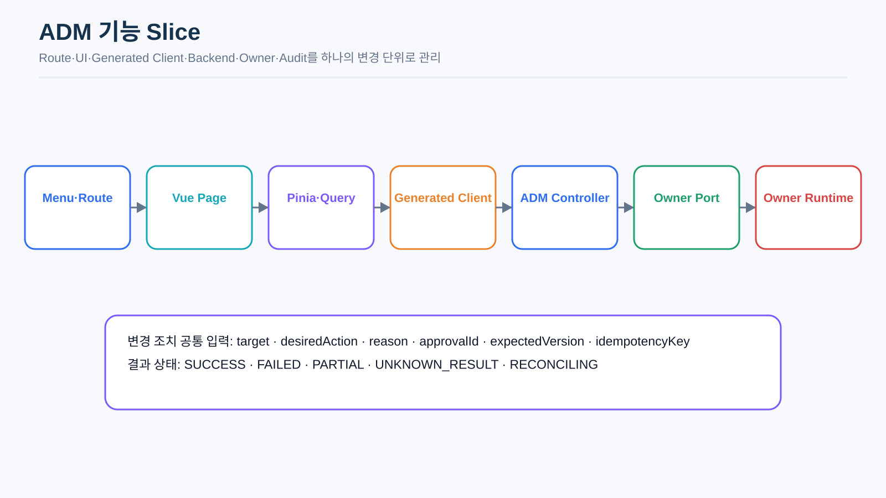

### ADM 전체 메뉴 지도


### 조회 화면과 위험 조치 화면


## 0. 제품 사용 계약

이 매뉴얼은 CPF의 기능을 제품 기능으로 설명하며, 대상 사용자가 다른 사람의 구두 설명이나 Source 역분석 없이 자신의 업무를 끝내도록 구성한다.

- 기능별 목적·대상 역할·Owner Module·실제 Consumer와 사용 위치를 먼저 제시한다.
- Source·SQL·API·Config·Frontend·Script·Test의 정확한 경로와 제품 사용 절차를 함께 제공한다.
- 입력값·기본값·권한·상태·정상 결과·오류·응답 유실·부분 적용·복구 절차를 기능 단위로 연결한다.
- Class·API·Property·Route·Permission·상태 이름은 제품 정본의 실제 식별자를 사용한다.
- 운영 종료는 Owner 상태·Version·Checksum·Audit·업무 합계와 화면 재조회 결과로 판단한다.
- 명령 실행 전 Local Working Tree를 확인하고 기존 변경을 보호한다.


## 1. Frontend 기준과 개발 환경

`cpf-admin/frontend/package.json`:

- Node `22.16.0`, npm `10.9.2`
- Vue `3.5.40`, Vue Router `5.2.0`, Pinia `4.0.2`
- TanStack Vue Query `5.101.4`, Table `8.21.3`
- Element Plus `2.14.3`, Zod `4.4.3`, Orval `8.23.0`
- Playwright `1.62.0`, Vitest `4.1.10`

Scripts: `generate:api`, `verify:generated`, `build`, `lint`, `typecheck`, `test`, `test:e2e`, `test:a11y`, `verify:primary`, `verify`.

Dependency, Generated Client, 실제 Page Consumer와 Browser Scenario를 함께 관리한다.

### 1.1 Frontend Build·배포 확인 절차

1. Route Registry와 모든 Page Component Import를 확인한다.
2. Backend OpenAPI를 exact Source SHA로 Export한다.
3. Orval Client와 Marker·Operation Contract를 생성한다.
4. `npm ci`, lock·installed dependency 검증, lint, typecheck, unit, build를 실행한다.
5. Bundle Manifest의 Source SHA·OpenAPI Hash·Generated Hash를 확인한다.
6. 59개 Route를 Chromium·Firefox·WebKit에서 순회한다.
7. 로그인·Session·CSRF·Origin·401·403·409·503·응답 유실을 시험한다.
8. 결과 Artifact와 Browser Report를 Release 인계에 포함한다.

## 2. 기능 Slice

```text
Menu/Route → Vue Page → Pinia/Query
→ Orval Client → ADM Controller
→ Query/Command Application Service
→ Owner Port(Local/Remote)
→ Owner Runtime/DB
→ Result/Unknown → Audit·Metric·Trace
```

## 3. Backend 책임

### Query

- 검색 Field·Default·Paging·Sort·Data Scope를 검증한다.
- Owner Query Port 또는 Projection을 사용한다.
- 민감 Field는 Permission과 Masking 정책으로 변환한다.

### Command

Command DTO 필수 후보:

- target ID·desired action
- Reason
- Approval ID
- Expected Version
- Idempotency Key·Request Hash
- Deadline·Timeout Budget

Command 결과는 `ACCEPTED`, `SUCCESS`, `FAILED`, `UNKNOWN_RESULT`, `PARTIAL` 등 실제 상태를 명확히 표현한다.

## 4. Owner Port

| 배포 | Adapter | 주의점 |
|---|---|---|
| Same JVM | Local Bean/Port | ADM Transaction으로 Owner DB 직접 Update 금지 |
| Remote | HTTP/Message Adapter | Service Identity, Audience, Timeout, Error Mapping, Response loss |

Owner Port는 상태 조회와 Reconcile을 함께 제공한다. 변경 API만 있고 상태 확인 API가 없으면 Response loss를 닫을 수 없다.

## 5. Timeout·Expected Version·Idempotency

- UI Timeout은 Server/Owner 처리 취소를 의미하지 않는다.
- Response loss 후 동일 Command를 Blind Retry하지 않는다.
- Target 상태·Operation ID·Attempt를 조회한다.
- Expected Version 충돌은 최신 상태·변경자·변경 시각을 보여준다.
- Idempotency는 Key+Scope+Hash를 비교한다.

## 6. Permission·Data Scope·Masking

Permission 층위:

1. 메뉴 접근
2. Route 접근
3. Query API
4. Command API
5. Button/Action
6. Data Scope
7. Raw/Unmask
8. Export/Download

Frontend 조건은 UX이고 Backend 판정이 정본이다. 403에서 메뉴·Button을 숨기는 것과 API 권한을 모두 시험한다.

## 7. Reason·Approval·Audit

위험 조치 예:

- Runtime stop/restart
- Batch restart/abandon/reprocess
- Route publish/block/rollback
- Config publish
- Secret rotate
- Break-glass
- Raw Data 조회·Export

Audit 필드: Operator, Permission, Data Scope, Reason, Approval, Request Hash, Expected Version, Before/After, Owner Result, Unknown·Reconcile 결과, Timestamp, Trace.

## 8. OpenAPI·Orval

1. Owner/ADM Controller DTO·Error를 OpenAPI에 반영.
2. OpenAPI Artifact SHA 기록.
3. `npm run generate:api`.
4. Generated Client drift 검사.
5. 수동 URL·DTO·Enum·Error Mapping 제거.
6. Page에서 Query/Mutation을 실제 사용.
7. `npm run verify`와 E2E 실행.

Orval Config·Mutator·검증 Script와 생성 Client 전수 소비를 clean `npm ci`부터 확인한다.

## 9. Route·Menu Registry

Route Registry는 `cpf-admin/frontend/src/app/routes.ts`다. `/`는 dashboard, 나머지는 `/<menuId>` 형식이다. Route와 Menu Permission·Backend API를 하나의 Feature Registry로 추적한다.

Gateway 관련 9개 Route가 같은 `GatewayOperationsPage.vue`를 사용하므로 Page 내부 mode 분기와 Route별 Permission·검색·Action이 실제로 분리되는지 확인한다.

## 10. Table·Form·State

모든 화면:

- Search Field·Default·Reset
- Paging·Sort·Column·Empty·Loading·Error
- Detail Field·Masked Field·Raw Permission
- Form Schema·Server Validation
- Status Badge·Version
- Button 활성 조건
- Double click·Duplicate submit
- Timeout·Response loss·Partial apply
- Retry·Reprocess·Reconcile·Rollback
- Audit Link

공통 Component 존재만으로 화면 적용을 판정하지 않는다.

## 11. 위험 조치 UI 흐름

```text
Target 조회 → 영향 Preview → Reason 입력
→ Approval 선택/요청 → Expected Version 확인
→ Command 전송 → Operation ID 수신
→ 상태 Poll/Push → Success/Failed/Unknown/Partial
→ Reconcile·Rollback → Audit 확인
```

화면은 HTTP 202를 Success로 표시하지 않고 Owner 최종 상태를 확인한다.

## 12. 부분 적용

Gateway Route, Config, Deployment 등 다중 Instance 조치는 Instance별 Desired/Actual Version·Checksum·ACK/NACK를 표시한다.

- 일부 ACK는 전체 Success가 아니다.
- NACK Instance의 Traffic 제외 여부를 보여준다.
- Last Known Good와 Rollback 대상을 명시한다.
- Retry는 Failed Instance에만 수행할 수 있어야 한다.

## 13. Browser·Fault Test

- Chromium·Firefox·WebKit
- Deep link·History·Refresh·403·404
- Session expiry·Concurrent login·Logout
- Duplicate click·Slow response·Response loss
- Version conflict·Approval expiry
- Partial apply·NACK·Rollback
- Keyboard·Focus·Label·Table navigation
- Large result·Long text·Timezone·Locale

## 14. Backend Test

- Controller Validation·Permission·Data Scope
- Local/Remote Owner Adapter parity
- Timeout stage와 Error Mapping
- Idempotency Hash Conflict
- Expected Version Race
- Unknown Ledger·Reconcile
- Audit masking·immutable field
- Owner DB 직접 접근 금지 ArchUnit

## 15. EDU: Gateway Route Publish 화면

1. `gateway-routes` Route와 Page mode 확인.
2. Query API·검색·Column·Detail DTO 연결.
3. Permission·Data Scope·Masked Target 표시.
4. Validate·Connection Test·Approval Command 구성.
5. Expected Version·Idempotency·Reason 적용.
6. Publish 후 Instance ACK/NACK 표시.
7. 한 Instance NACK·Response loss 주입.
8. Reconcile과 Failed-only Retry.
9. LKG Rollback과 Audit 확인.
10. 3 Browser E2E 실행.

## 부록 A. Frontend 정본과 검증 Script

기준 Commit의 ADM Frontend는 Node `22.16.0`, npm `10.9.2`를 선언한다. 주요 Dependency는 Vue 3, Vue Router, Pinia, TanStack Query/Table, Zod, Orval, Element Plus다.

| Script | 역할 |
|---|---|
| `npm run generate:api` | Orval Client 생성 |
| `npm run verify:generated` | Generated Client Drift 확인 |
| `npm run lint` | ESLint |
| `npm run typecheck` | `vue-tsc --noEmit` |
| `npm run test` | Vitest |
| `npm run build` | Generated 검증 후 Vite Build |
| `npm run test:e2e` | Playwright |
| `npm run verify` | Primary 구조·Lint·Type·Test·Build 순차 검증 |

`package.json`과 Lockfile이 일치하는지 `npm ci`로 확인한다. 적용 환경에서는 빈 의존성 상태에서 `npm ci`부터 순서대로 실행하고 결과를 기록한다.

## 부록 B. 인증·권한 Frontend 실제 호출

Source: `cpf-admin/frontend/src/app/methods/accessMethods.ts`.

| 기능 | Method·Path | 입력·상태 |
|---|---|---|
| 로그인 | `POST /adm/api/auth/login` | operatorId, password; Operator·Menu·Button 권한 수신 |
| 로그아웃 | `POST /adm/api/auth/logout` | 서버 실패와 무관하게 Browser 민감 상태 제거 |
| 내 비밀번호 변경 | `POST /adm/api/operators/{operatorId}/password` | 현재·신규·확인 Password, reason; 변경 후 재로그인 |
| Role 목록 | `GET /adm/api/permissions/roles` | Permission 화면 초기 데이터 |
| Menu 목록·Matrix | `GET /adm/api/permissions/menus`, `menu-matrix` | read/write/delete |
| Button 목록·Matrix | `GET /adm/api/permissions/buttons`, `button-matrix` | Button Allow |
| API Permission | `GET /adm/api/permissions/api-permissions`, `api-matrix` | API 행위 권한 |
| Menu 권한 변경 | `PUT /adm/api/permissions/roles/{roleId}/menus/{menuId}` | readYn, writeYn, deleteYn, reason |
| Button 권한 변경 | `PUT /adm/api/permissions/roles/{roleId}/buttons/{buttonId}` | allowYn, reason |
| API Role 변경 | `PUT /adm/api/permissions/roles/{roleId}/api-permissions/{apiPermissionId}` | allowYn, reason |
| API Permission 등록 | `POST /adm/api/permissions/api-permissions` | ID, Path, Method 등 Form, reason |

Frontend `permission(menuId)`는 서버가 전달한 `authorizedMenus`에서 권한을 찾고 미존재 시 read/write/delete를 모두 거부한다. Backend는 이 값을 신뢰하지 않고 API 권한을 다시 판정해야 한다.

## 부록 C. 운영자 Command와 결과 불명 처리

| 기능 | Method·Path | 핵심 계약 |
|---|---|---|
| 운영자 등록 | `POST /adm/api/operators` | operatorId, name, contact, password, reason, operationId |
| 등록 결과 조회 | `GET /adm/api/operators/operations/{operationId}` | 응답 유실 후 같은 Operation 결과 조회 |
| 상태 활성화 | `PUT /adm/api/operators/{operatorId}/status` | `accountStatus=ACTIVE`, expectedVersion, reason |
| 원문 연락처 | `POST /adm/api/operators/{operatorId}/contacts/raw` | 별도 권한·reason, 403/409/503 구분 |
| Password 초기화 | `POST /adm/api/operators/{operatorId}/password/reset` | newPassword, forceChange, reason |
| 잠금 해제 | `POST /adm/api/operators/{operatorId}/unlock` | reason |
| Session 조회 | `GET /adm/api/operators/sessions` | operatorId Filter |
| Session 폐기 | `POST /adm/api/operators/sessions/{sessionId}/revoke` | reason |
| 만료 Session 정리 | `POST /adm/api/operators/sessions/cleanup-expired` | reason |
| MFA 목록 | `GET /adm/api/security/mfa` | 보안 상태 조회 |
| MFA 등록 | `POST /adm/api/security/mfa/{operatorId}/register` | secretRef, reason |
| MFA 검증 | `POST /adm/api/security/mfa/{operatorId}/verify` | otpCode, reason |

운영자 등록은 Frontend가 `operationId`를 생성한다. 전송 오류가 나면 새 ID로 재등록하지 않고 기존 `operationId` 결과를 먼저 조회한다. 이 Pattern을 다른 위험 Command에도 적용한다.

## 부록 D. ADM 기능 Slice 개발 순서

1. **Owner 확인**: ADM 조회 Projection인지 Owner Command인지 구분한다.
2. **Backend Contract**: Query·Command DTO, Permission, Data Scope, Reason, Approval, Expected Version을 정의한다.
3. **Owner Adapter**: Same-JVM과 Remote Adapter의 Timeout·Error·Unknown 의미를 일치시킨다.
4. **OpenAPI**: Error·Paging·Enum·Null과 권한 응답을 포함한다.
5. **Generated Client**: Orval 생성 후 수동 중복 Client를 제거한다.
6. **Route Registry**: `routes.ts`에 Menu ID·Group·Component를 등록한다.
7. **Page State**: Loading·Empty·Error·Stale·Partial·Unknown을 분리한다.
8. **Table/Form**: Search Field·Default·Column·Detail·Validation·Masking을 구현한다.
9. **Dangerous Action**: Preview→Reason→Approval→Expected Version→Command→Status Query 순서를 적용한다.
10. **Test**: Backend Unit/Contract, Generated Drift, Browser 권한·Response Loss·Partial Apply를 실행한다.

## 부록 E. Command 응답 상태 UI

| Backend 결과 | 화면 처리 |
|---|---|
| `200/201` + 최종 상태 | 상세 재조회 후 완료 표시 |
| `202` | Operation ID를 저장하고 Poll/상태 조회 |
| `400` | Field Error를 입력 위치에 표시 |
| `401` | Credential 제거 후 재로그인 |
| `403` | Menu 숨김과 무관하게 권한 부족 표시 |
| `409` | 최신 Version 재조회, 사용자 입력 보존 |
| `412` | Approval·Precondition 재확인 |
| `429` | Retry-After와 중복 Click 방지 |
| `503` | Owner/DB/감사 저장소 장애 구분 |
| Network/Timeout | 동일 Command 재전송 금지, Operation 상태 조회 |

## 부록 F. Browser Fault Test

- Login 성공·실패·Password Change Required
- Menu Read 권한과 Button 권한 불일치
- Direct URL 403·404
- 운영자 등록 Response Loss 후 Operation 조회
- Expected Version 충돌 후 입력 보존
- Raw 연락처 403·409·503와 Masking
- Session 만료 중 Form 작성
- Approval 만료·자기승인 거부
- Instance Partial Apply와 일부 NACK
- Chromium·Firefox·WebKit Keyboard·Focus·History

## 부록 G. Same-JVM·Remote Reconciliation 계약

Same-JVM Adapter와 Remote Adapter 모두 Query·Command·Status Query·Reconciliation을 같은 Owner Port로 제공한다. Remote Timeout이나 응답 유실이 발생하면 UI는 Command를 반복하지 않고 `operationId`로 상태를 조회한다. Owner 상태, Audit, Attempt가 일치하지 않으면 Reconciliation 작업을 생성하고 담당자·기한·확정 결과를 기록한다.

---

## 기준 Source와 역할별 활용 범위

- Repository: `https://github.com/freeangelsun/202412_01_CPF`
- Branch: `master`
- 기준 Commit: `23babb9140b90e501d6ac715e7b77f55b66198a5`
- 문서 표준: `cpf-docs/specification/CPF_DOCUMENTATION_STANDARD.md`
- 제품 목표 정본: `cpf-docs/governance/CPF_FINAL_TARGET_REQUIREMENTS.md`
- 사실 우선순위: 실제 Source·SQL·API·Config·Frontend·Script·Test → Architecture·Specification → 이 매뉴얼

이 매뉴얼의 대상 역할은 다음 흐름을 다른 사람의 구두 설명이나 Source 역분석 없이 수행할 수 있어야 한다.

```text
업무 목적 파악
→ 선행 조건과 권한 준비
→ 실제 기능 위치 탐색
→ 등록·설정·개발·실행
→ 상태와 결과 확인
→ 오류·동시성·부분 실패 판단
→ Retry·Restart·Reprocess·Reconcile·Compensation·Rollback
→ Log·Metric·Trace·Audit·Evidence 확인
→ 정상화와 완료 판정
```

기능 설명은 Source의 실제 계약과 사용 절차를 기준으로 하며, 적용 전 확인 조건·오류·복구 경로를 함께 제공한다.

---

## 제2부 실무편: ADM Backend·Frontend 전체 기능 Slice 구현

## 18. ADM 제품 Architecture와 책임

ADM은 플랫폼 상태의 두 번째 정본이 아니다.

```text
Frontend Route·Component
→ Generated/공통 API Client
→ ADM Controller
→ Query/Command Application Service
→ Owner Query/Command Port
→ Same-JVM Adapter 또는 Remote Adapter
→ Owner Runtime·DB
→ ADM Response·Audit·Reconciliation
```

Query는 Owner 상태를 조회하고, Command는 Permission·Reason·Approval·Expected Version·Idempotency를 검증한 뒤 Owner Port를 호출한다. ADM DB에는 Menu·Permission·Approval·Audit·Operation Tracking 등 Control Plane 소유 상태만 둔다.

## 19. 기능 Slice 시작 Checklist

새 ADM 기능을 만들기 전에 다음을 한 장의 설계 기록으로 고정한다.

- 운영 문제와 대상 역할.
- Owner Module과 실제 상태 정본.
- Query인지 Command인지.
- Same-JVM·Remote Topology.
- API Method/Path, Request/Response/Error.
- Permission, Data Scope, Masking.
- Reason, Approval, Break-glass.
- Expected Version, Operation ID, Idempotency Key/Hash.
- Timeout·응답 유실·Partial Apply·Reconciliation·Rollback.
- Route, Menu ID, Component, Search Field, Column, Detail, Button.
- Unit·Controller·Contract·Browser·Fault Test.

Owner Port와 Consumer가 확인되지 않으면 Controller와 화면을 먼저 만들지 않는다.

## 20. Backend Query 기능

### 구현 순서

1. Query Request에 Filter·Paging·Sort Allowlist를 정의한다.
2. Controller는 인증 Principal과 Request Validation을 수행한다.
3. Permission과 Data Scope를 Query Predicate에 적용한다.
4. Owner Query Port를 호출한다.
5. Remote Adapter는 Connect/Response/Overall Timeout을 분리한다.
6. 응답 DTO에서 PII/Secret을 Masking한다.
7. Empty·Partial·Stale 상태를 구분한다.
8. Contract Test로 Same-JVM·Remote 결과를 비교한다.

### Query 응답 상태

- `200` + Items: 정상 조회.
- `200` + Empty: 실제 0건.
- `503` + `partial/stale` Payload: 일부 Owner 조회 실패. UI는 빈 결과로 표시하지 않는다.
- `403`: Permission/Data Scope 거부.
- `409`: 조회 Snapshot/Expected Version 충돌이 제품에 정의된 경우.

## 21. Backend Command 기능

### Request 필수 항목

| 항목 | 적용 조건 |
|---|---|
| `operationId` | 응답 유실 뒤 조회 가능한 모든 위험 조치 |
| `idempotencyKey`·Request Hash | 중복 요청이 가능한 Command |
| `expectedVersion` | 기존 상태를 수정·삭제하는 Command |
| `reason` | 운영 변경·PII Raw·Export·Security 조치 |
| `approvalId` | 위험 Action Policy가 요구할 때 |
| `breakGlassId` | 승인 우회가 허용되고 Owner가 Scope를 소비할 때 |
| Target Snapshot | 부분 적용·Rollback 대상 고정 |

### Command 흐름

```text
Permission/Data Scope 확인
→ Input·Expected Version 검증
→ Approval/Break-glass 검증
→ Operation ID + Request Hash Reserve
→ Owner Command Port 호출
→ 결과 저장·Audit
→ SUCCESS / FAILED / UNKNOWN_RESULT / PARTIAL_FAILED
```

Timeout은 실패로 단정하지 않는다. Operation ID로 ADM Operation과 Owner 상태를 조회한다. Partial Apply는 Instance별 결과와 Desired/Actual/Drift를 반환한다.

## 22. Permission·Data Scope·Masking·Audit

### Permission Registry

- Menu Permission: Read/Write/Delete.
- Button Permission: Action Code 단위.
- API Permission: Method·Path Pattern 단위.
- Owner Permission: 실제 Runtime Command 권한.

Frontend에서 Button을 숨기는 것만으로 Authorization이 완료되지 않는다. Backend API와 Owner Port 양쪽의 Negative Test가 필요하다.

### PII Raw

List/Detail은 Masked Field를 반환한다. Raw 조회는 별도 Endpoint, `PII_RAW` 성격의 Permission, 5자 이상의 구체적 Reason, Audit를 요구한다. Raw 값을 Store·Console·Error·Analytics에 남기지 않고 Dialog 종료 시 메모리 상태를 지운다.

### Audit

Command 성공·실패·Unknown을 모두 기록한다. Audit Delivery가 실패하면 업무 결과와 Delivery 상태를 분리하고 ADM Audit Delivery Recovery에서 재처리한다.

## 23. OpenAPI·Generated Client

### Backend Contract

- 모든 Public Operation과 DTO·Enum·Validation·Error를 포함한다.
- Permission, Reason, Approval, Expected Version, Idempotency를 Operation 설명에 명시한다.
- `x-cpf-source-sha`는 Backend Export Commit과 같다.

### Generated Client Gate

1. OpenAPI Hash를 계산한다.
2. Generated File Hash와 Generator Hash를 Marker에 기록한다.
3. 현재 Git HEAD 또는 명시 `CPF_SOURCE_SHA`와 Marker Source SHA를 비교한다.
4. Source SHA가 없다고 비교를 생략하지 않는다.
5. Stale Marker, 변경된 Generated File, 불완전 Snapshot을 Build 실패로 처리한다.

현재 ADM OpenAPI는 인증 일부와 자유 Schema 중심이며 Raw API 호출이 혼재한다. 따라서 기능 제공이다. 실제 전체 Export와 Typed Client 전환 전에 새 기능을 Generated Client 적용 완료로 기록하지 않는다.

## 24. Frontend Architecture

- Vue Router: Route Registry와 404 Route를 명시한다.
- Pinia: Session·Initialization·Feature Action을 책임별 Store로 분리한다.
- TanStack Query: Server State Cache와 Invalidation.
- Zod: Runtime Response Validation이 실제 적용된 기능에만 사용했다고 기록한다.
- Element Plus/TanStack Table: Component가 실제 사용하는 경우에만 기능 설명에 포함한다.
- API Client: CSRF, Credentials, Error/Transaction ID Mapping, Abort/Timeout.
- Accessibility: Label, Keyboard, Focus, Dialog, Alert.
- Responsive: Mobile Overflow와 위험 조치 접근성.
- 외부 CDN·Runtime Font·Script를 사용하지 않는다.

현재 Route Registry는 `/logs`에서 삭제된 `LogsPage.vue`를 참조한다. 이 Route는 Build/Navigation `실패`로 기록하고 Component 복원 또는 Route 제거와 전체 Route Test가 필요하다.

## 25. Menu·Route 개발

### 등록 절차

1. Feature Component를 만든다.
2. `routes.ts`에 ID·Group·Icon·Lazy Import를 등록한다.
3. Backend Menu Registry의 Menu ID와 Permission을 연결한다.
4. Deep Link와 404를 검증한다.
5. Session Load 전 Route Guard, 401/403 처리, Password Change Required 흐름을 검증한다.
6. Route Registry 전체를 순회하는 Browser Test를 작성한다. Visible Link 40개만 검사하는 Test로 완료 처리하지 않는다.

### Route 상태 표시

- Loading: 요청 진행 중이며 이전 결과를 새 결과로 표시하지 않는다.
- Empty: 성공 응답 0건.
- Error: HTTP/Error Code/Transaction ID와 복구 행동.
- Stale/Partial: Owner 일부 실패. Empty로 표시 금지.
- Unknown: Command 결과 대사 필요.

## 26. 조회·상세 화면 구현

각 화면에 다음을 실제 Source에 작성한다.

- 검색 Field·Default·Validation·Reset.
- Sort Allowlist·Paging Size/상한.
- Column·Masking·Status Chip.
- Row Selection과 Detail Field.
- Related Transaction·Log·Trace·Audit Link.
- Loading·Empty·Error·Stale State.
- Export Permission·Reason·Masking.

Raw JSON `<pre>`만 제공하는 화면은 운영자가 Field 의미와 오류 행동을 이해할 수 없으므로 제품 UI 완결성 기능 제공으로 표시한다.

## 27. 위험 조치 화면 구현

Button마다 다음을 구현·Test한다.

1. 표시 Permission과 Backend Permission.
2. 활성 상태와 비활성 사유.
3. Target·현재 상태·예상 영향.
4. Input·Default·Validation.
5. Reason·Approval·Expected Version.
6. Operation ID와 중복 클릭 방지.
7. Confirm Dialog와 Focus.
8. Timeout/응답 유실 시 Operation 조회.
9. Partial Result와 Instance별 상태.
10. Retry 허용·금지, Reconcile, Rollback.
11. Audit와 Evidence.

성공 Toast를 HTTP 2xx만으로 표시하지 않고 Owner 상태와 Operation Result를 확인한다.

## 28. 기능군별 실제 ADM 개발 경계

| 기능군 | Route/Component | Backend/Owner 경계 | 개발 주의사항 |
|---|---|---|---|
| Dashboard·Topology·Capacity | `dashboard`, `topology`, `capacity` | Service Registry/Health/Call Query | Capacity 장기 Percentile은 Metrics Backend와 함께 구현·확인 |
| Transaction | `transactionGroups`, `transactions`, `standardExecutions` | Transaction Metadata/Trace Owner | Header·PII 원문 금지 |
| Channel·Registry | `channelPolicy`, `serviceRegistry` | Channel Snapshot/Service Registry Owner | Version·Snapshot·Drain 분리 |
| Runtime Control | `runtimeControl` | Runtime Change Port | Preview·CAS·Quorum·ACK·Drift·Rollback |
| Config/Code/Message/Calendar/Cache | 각 Feature | CMN/Owner Port | Cache를 정본으로 사용 금지, Calendar Expected Version |
| Log/Audit | `remoteLogs`, `auditLogs`, `logLevel`, `logPolicies` | Log Artifact/Audit/Policy Owner | `/logs` 현재 실패, Raw Capture 상한 |
| Reliability | `recoveryCenter`, `reliability`, `incidents`, `notifications` | Unknown/DLQ/Outbox/Incident Owner | 수동 확정과 재처리 분리 |
| Batch | `batch`, Batch Runtime Views | BAT Control Server | stale/partial 빈 결과 해석 금지 |
| Gateway | Gateway Operation Component | Gateway Control Plane | Draft→Validate→Approve→Publish→ACK→LKG |
| Security | Permission/Operator/Password/Security/Secret/Approval/Break-glass | Security·Owner Command | BFF Authorization 재검증 |

## 29. Browser·Fault Test

### Route Test

- Registry의 모든 Route를 직접 방문한다.
- Import 실패, 404, 401, 403, 409, 503를 강제 주입한다.
- API Injection이 실제로 발생하지 않으면 Test를 실패시킨다.
- 위험 Button이 권한 없이 DOM에 없거나 비활성인지, Backend도 403인지 확인한다.
- Chromium·Firefox·WebKit과 Mobile Width에서 검증한다.

### Command Fault

- 중복 Click.
- 응답 유실.
- Owner 202 후 ADM 저장 실패.
- Instance 일부 ACK/NACK.
- Expected Version 충돌.
- Audit Delivery 실패.
- Reconcile/Exact Rollback.

## 30. 전체 Reference: Runtime 변경 기능

```text
Menu Permission
→ RuntimeControlPage 입력
→ Target Preview
→ Diff Preview
→ POST /adm/api/runtime-control/changes
→ Operation/Request Hash Reserve
→ Owner Runtime Change Port
→ Instance ACK/NACK
→ Desired/Actual/Drift 조회
→ Audit Hash Chain 검증
→ Cancel 또는 Exact Rollback
```

필드: Operation ID, Change Type, Environment, Service/Group/Instance, Expected Version, Schema Version, Rollout Mode, Wave Size, Quorum, Approval/Break-glass, Payload Key/Value/Type/Policy Version, Reason.

Test: 같은 Operation ID/다른 Payload, 1개 Instance NACK, 응답 유실, Audit 검증 실패, Rollback 뒤 Drift 0.

## 31. ADM 개발 EDU

- EDU-ADM-01 조회 화면: Query Port·Paging·Masking·Empty/Error/Stale.
- EDU-ADM-02 상태 변경: Operation ID·Expected Version·Reason·Audit.
- EDU-ADM-03 위험 조치: Approval·Partial Apply·Reconcile·Rollback.
- EDU-ADM-04 PII Raw: 별도 Permission·Reason·Memory Clear·Audit.
- EDU-ADM-05 Browser Fault: 401/403/409/503/Response Loss·3 Browser.

각 EDU는 실제 Controller·Port·Adapter·OpenAPI·Client·Route·Component·Test 전체 변경을 포함하고 ADM 화면에서 결과를 확인한다.

## 32. ADM 개발 완료 Checklist

- [ ] Owner Module·Consumer·Query/Command 구분
- [ ] Same-JVM·Remote Contract
- [ ] Permission·Data Scope·Masking
- [ ] Reason·Approval·Break-glass·Audit
- [ ] Idempotency·Expected Version·Unknown
- [ ] Timeout·Partial Apply·Reconcile·Rollback
- [ ] 전체 OpenAPI·Typed Client exact SHA
- [ ] Route·Menu·Guard·404
- [ ] Search/Column/Detail/Button/State
- [ ] Unit·Controller·Contract·Browser·Fault Evidence

---
## 부록 H. ADM Source 진입점

| 기능 | 기준 Source |
|---|---|
| Backend Module | `cpf-admin/build.gradle` |
| Frontend Dependency·Script | `cpf-admin/frontend/package.json` |
| Route Registry | `cpf-admin/frontend/src/app/routes.ts` |
| Router/404 | `cpf-admin/frontend/src/app/router.ts` |
| 세션 Store | `cpf-admin/frontend/src/stores/admSessionStore.ts` |
| 초기화 Store | `cpf-admin/frontend/src/stores/admInitializationStore.ts` |
| Feature Action Registry | `cpf-admin/frontend/src/stores/admFeatureActionRegistry.ts` |
| 공통 API | `cpf-admin/frontend/src/shared/cpfApi.ts` |
| Orval Mutator | `cpf-admin/frontend/src/shared/orval-mutator.ts` |
| OpenAPI Snapshot | `cpf-admin/frontend/openapi/cpf-openapi.json` |
| Generated Client | `cpf-admin/frontend/src/generated/cpf-api.ts` |
| Generated Marker 검증 | `cpf-admin/frontend/scripts/verify-generated-client.mjs` |
| Route E2E | `cpf-admin/frontend/e2e/route-quality.spec.ts` |
| 권한·Operator Frontend API | `cpf-admin/frontend/src/app/methods/accessMethods.ts` |
| Runtime Control Page | `cpf-admin/frontend/src/features/runtime-control/RuntimeControlPage.vue` |
| Service Registry Page | `cpf-admin/frontend/src/features/service-registry/ServiceRegistryPage.vue` |
| Gateway Operations | `cpf-admin/frontend/src/features/gateway-operations/GatewayOperationsPage.vue` |
| Batch Main | `cpf-admin/frontend/src/features/batch/BatchPage.vue` |
| 위험조치 승인 | `cpf-admin/frontend/src/features/approvals/ApprovalsPage.vue` |
| Break-glass | `cpf-admin/frontend/src/features/break-glass/BreakGlassPage.vue` |

---

## 제3부. ADM 기능 Slice 상세 개발 지침

## 33. 59개 Route를 기능 Slice로 관리하는 방법

ADM Route는 `cpf-admin/frontend/src/app/routes.ts`의 Router Registry가 시작점이다. 각 Route는 다음 파일과 계약을 하나의 변경 단위로 관리한다.

```text
Route Registry
→ Vue Page / Component
→ Form·Table Schema
→ Pinia·TanStack Query State
→ Orval Generated Client Operation
→ ADM Controller DTO
→ Query/Command Application Service
→ Owner Port Local/Remote Adapter
→ Permission·Approval·Audit
→ Unit·Contract·Browser·Fault Test
```

## 34. Query 화면 개발 Template

1. 사용자 질문과 검색 결과의 의미를 한 문장으로 정의한다.
2. 검색 Field, Default, Timezone, Paging, Sort, Reset 동작을 작성한다.
3. Backend Query DTO에 Validation과 Data Scope를 적용한다.
4. Owner Query Port는 상태의 생성 시각과 Partial·Stale 정보를 반환한다.
5. Table Column, Masked Field, Detail Field, Empty·Loading·Error 상태를 구현한다.
6. URL Query 또는 Saved Search가 필요한 화면은 직렬화 규칙을 고정한다.
7. 401·403·409·429·503·Timeout을 Error Code별로 표시한다.
8. Large Result·Long Text·Timezone·Keyboard·Screen Reader를 시험한다.

## 35. Command 화면 개발 Template

1. 대상 ID, Desired Action, Reason, Approval, Expected Version, Idempotency Key를 DTO에 포함한다.
2. 영향 Preview와 위험 문구를 표시한다.
3. Double Click을 막되 응답 유실 시 동일 Operation을 조회할 수 있게 한다.
4. HTTP 202를 Success로 표시하지 않고 Operation 상태를 Poll 또는 Push로 확인한다.
5. `PARTIAL`, `UNKNOWN_RESULT`, `CONFLICT`, `REJECTED`를 구분한다.
6. Reconcile·Failed-only Retry·Exact Rollback Button은 상태별 활성 조건을 갖는다.
7. Audit Link와 Before/After를 결과 화면에서 제공한다.

## 36. Generated Client 관리

```powershell
cd cpf-admin/frontend
npm ci
npm run validate:openapi
npm run generate:api
npm run verify:generated
npm run verify:consumer
npm run lint
npm run typecheck
npm run test
npm run build
npm run test:e2e
```

OpenAPI, Generated Marker, Generated Client, Operation Consumer, Bundle Manifest의 Source SHA를 `23babb9140b90e501d6ac715e7b77f55b66198a5`와 연결한다. Page에서 임의 URL·중복 DTO·수동 Error Enum을 새로 만들지 않는다.

## 37. Permission 개발 상세

| 층 | Backend 기준 | Frontend 처리 | Test |
|---|---|---|---|
| Menu | Menu Read | Navigation 표시 | 직접 URL 403 |
| Route | Router meta + API Permission | Route Guard | Deep link·Refresh |
| Query | Query Permission·Data Scope | 조회 Button·Masked 결과 | 다른 Scope 0건/403 |
| Command | Action Permission | Button 활성 | 직접 API 403 |
| Raw | Unmask Permission·Reason | 별도 Dialog·자동 Clear | Audit·Clipboard |
| Export | Export Permission·Approval | Job 상태·Download | 대용량·만료·Audit |

## 38. Owner Port와 결과 불명

Same-JVM Adapter와 Remote Adapter는 같은 Command 결과를 반환한다. Remote Timeout이 발생하면 Operation ID·Idempotency Key로 Owner 상태를 조회한다. ADM DB에 결과를 임의 확정하지 않는다.

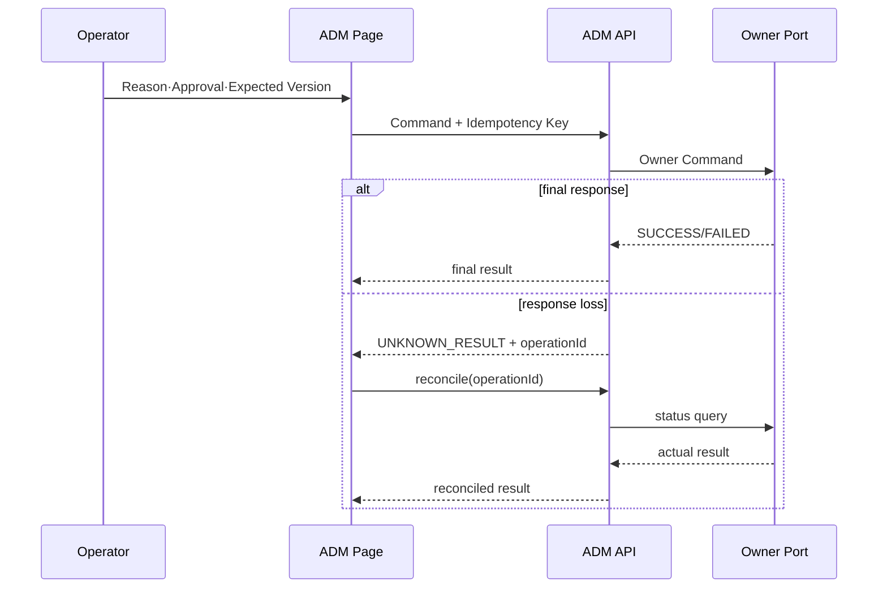
```mermaid
sequenceDiagram
  participant U as Operator
  participant P as ADM Page
  participant A as ADM API
  participant O as Owner Port
  U->>P: Reason·Approval·Expected Version
  P->>A: Command + Idempotency Key
  A->>O: Owner Command
  alt final response
    O-->>A: SUCCESS/FAILED
    A-->>P: final result
  else response loss
    A-->>P: UNKNOWN_RESULT + operationId
    P->>A: reconcile(operationId)
    A->>O: status query
    O-->>A: actual result
    A-->>P: reconciled result
  end
```

## 39. 화면 기능군별 개발 책임

### 온라인 운영

Transaction Group, Transaction Metadata, Standard Execution, Channel Policy, Service Registry, Runtime Control을 구현한다. Transaction·Trace·Segment·Attempt 연결, Service/Endpoint/Instance 상태, Runtime Desired/Actual·Rollout·Rollback을 화면에서 추적한다.

### Batch 운영

Job Definition, Execution, Schedule, Worker Pool, Center-Cut, Agent, Job Pack, Deployment, Recovery, Lease, Alert, Audit를 구분한다. Spring Batch Metadata와 CPF Control ID를 함께 표시한다.

### 통합 관제

Log, Remote Log, Audit Delivery, Dynamic Log Level, Log Policy, Recovery Center, Incident, Reliability를 구현한다. 민감정보 Masking과 Download Audit를 기본으로 한다.

### 프레임워크 관리

Cache, Config, Response Code, Business Calendar, Code, Permission, Operator, Password, Security, Secret, Approval, Break-glass를 구현한다. 모든 변경 조치에 Reason·Expected Version·Audit를 연결한다.

### Gateway 운영

9개 Route가 같은 Page를 사용하더라도 Route별 Mode, Query, Column, Action, Permission을 Registry로 분리한다. Draft·Validate·Test·Approval·Publish·ACK/NACK·Rollback을 화면 상태로 제공한다.

## 40. Browser Test Matrix

- 59개 Route를 Router Registry에서 직접 순회한다.
- Chromium·Firefox·WebKit에서 Deep Link, Refresh, Back/Forward를 시험한다.
- Menu 없음·Button 없음·API 403을 각각 시험한다.
- 조회 0건, 대량 데이터, 503 Partial/Stale를 시험한다.
- 위험 조치 Duplicate Click, Timeout, Response loss, 409, Approval expiry를 시험한다.
- Keyboard Focus, Label, Dialog Trap, Table Navigation, Error Summary를 시험한다.
- Session Rotation·Concurrent Login·Logout·CSRF·Untrusted Origin을 시험한다.

## 41. ADM 기능 Slice 인계 Template

| 항목 | 값 |
|---|---|
| Menu·Route | ID, URL, group, label |
| Page | Source, Store, Query Key, Form Schema |
| Client | Generated operation, DTO, Error |
| Backend | Controller, Application Service, Owner Port |
| Security | Menu/Button/API Permission, Data Scope, Masking |
| Command | Reason, Approval, Expected Version, Idempotency |
| Recovery | Operation status, Reconcile, Retry, Rollback |
| Operations | Log, Metric, Trace, Audit, Alert |
| Test | Unit, Contract, Browser, Fault |

---

## 제4부. ADM Route별 개발 계약

이 부는 `cpf-admin/frontend/src/app/routes.ts`의 전체 Route를 기능 Slice로 구현할 때 사용하는 개발 계약이다. 각 Route는 Frontend 입력·표시·Button, Backend Query·Command, Permission, 상태, 오류·복구, Browser Test를 하나의 단위로 유지한다.


### dashboard — 운영 대시보드

| 항목 | 계약 |
|---|---|
| Route | `/` |
| Group | 홈 |
| Page | `cpf-admin/frontend/src/features/dashboard/DashboardPage.vue` |
| Permission | 조회 권한 |

> 공통 UI·Permission·오류·Reconcile·접근성 계약은 34~38절과 66절을 적용한다. 아래에는 이 Route 고유 계약만 기록한다.

#### Frontend Query·Form

- 초기 데이터 자동 조회


#### Table·Detail

- 등록 인스턴스·정상 수
- 비정상 Health
- 결과 미확정
- DLQ
- 서비스 상태
- 최근 Service Call


#### Button·활성 조건

Action: **새로고침**

- 조회 Permission이 있고 Page가 Loading 중이 아닐 때 조회·새로고침을 허용한다.
- Stale·Partial 표시 중에는 변경 Button을 제공하지 않는다.

#### Backend·Owner API 계약

- Query DTO: 초기 데이터 자동 조회
- Response DTO: 등록 인스턴스·정상 수, 비정상 Health, 결과 미확정, DLQ, 서비스 상태, 최근 Service Call
- Query는 Environment·Data Scope·Paging·Sort·조회 시각을 포함한다.
- Empty, Stale, Partial을 별도 응답 상태로 표현한다.
- Permission: 조회 권한.


#### 화면 상태 모델

Loading, Empty, Success, Validation Error, 403, 409, Timeout, Response Loss


#### 오류·부분 적용·Rollback


#### Test

- 화면별 복구 기준: Loading/Empty/Error


### topology — 서비스 토폴로지

| 항목 | 계약 |
|---|---|
| Route | `/topology` |
| Group | 홈 |
| Page | `cpf-admin/frontend/src/features/topology/TopologyPage.vue` |
| Permission | 조회 권한 |

> 공통 UI·Permission·오류·Reconcile·접근성 계약은 34~38절과 66절을 적용한다. 아래에는 이 Route 고유 계약만 기록한다.

#### Frontend Query·Form

- 없음


#### Table·Detail

- Service ID·명
- Instance ID·명
- Endpoint
- Weight
- Status


#### Button·활성 조건

Action: **새로고침**

- 조회 Permission이 있고 Page가 Loading 중이 아닐 때 조회·새로고침을 허용한다.
- Stale·Partial 표시 중에는 변경 Button을 제공하지 않는다.

#### Backend·Owner API 계약

- Query DTO: 없음
- Response DTO: Service ID·명, Instance ID·명, Endpoint, Weight, Status
- Query는 Environment·Data Scope·Paging·Sort·조회 시각을 포함한다.
- Empty, Stale, Partial을 별도 응답 상태로 표현한다.
- Permission: 조회 권한.


#### 화면 상태 모델

Loading, Empty, Success, Validation Error, 403, 409, Timeout, Response Loss


#### 오류·부분 적용·Rollback


#### Test

- 화면별 복구 기준: Registry 0건 Empty


### capacity — 용량·SLO 기본 Signal

| 항목 | 계약 |
|---|---|
| Route | `/capacity` |
| Group | 홈 |
| Page | `cpf-admin/frontend/src/features/capacity/CapacityPage.vue` |
| Permission | 조회 권한 |

> 공통 UI·Permission·오류·Reconcile·접근성 계약은 34~38절과 66절을 적용한다. 아래에는 이 Route 고유 계약만 기록한다.

#### Frontend Query·Form

- 없음


#### Table·Detail

- 최근 호출
- 평균 지연
- 실패율
- 인스턴스
- Service/Endpoint/Status/Latency/Transaction


#### Button·활성 조건

Action: **새로고침**

- 조회 Permission이 있고 Page가 Loading 중이 아닐 때 조회·새로고침을 허용한다.
- Stale·Partial 표시 중에는 변경 Button을 제공하지 않는다.

#### Backend·Owner API 계약

- Query DTO: 없음
- Response DTO: 최근 호출, 평균 지연, 실패율, 인스턴스; Service/Endpoint/Status/Latency/Transaction
- Query는 Environment·Data Scope·Paging·Sort·조회 시각을 포함한다.
- Empty, Stale, Partial을 별도 응답 상태로 표현한다.
- Permission: 조회 권한.


#### 화면 상태 모델

Loading, Empty, Success, Validation Error, 403, 409, Timeout, Response Loss


#### 오류·부분 적용·Rollback


#### Test

- 화면별 복구 기준: 장기 Percentile·Forecast는 Metrics Backend와 함께 확인


### logs — 로그 조회

| 항목 | 계약 |
|---|---|
| Route | `/logs` |
| Group | 통합 관제 |
| Page | `cpf-admin/frontend/src/features/logs/LogsPage.vue` |
| Permission | 해당 없음 |

> 공통 UI·Permission·오류·Reconcile·접근성 계약은 34~38절과 66절을 적용한다. 아래에는 이 Route 고유 계약만 기록한다.

#### Frontend Query·Form

- 해당 없음


#### Table·Detail

- 해당 없음


#### Button·활성 조건

Action: **해당 없음**

- Write/Delete Permission과 대상 최신 Version을 확인한 뒤 변경 Button을 활성화한다.
- Reason·Approval이 필요한 조치는 값이 비어 있으면 제출을 비활성화한다.
- 기존 Operation이 Processing·Unknown이면 중복 제출 대신 상태 조회를 제공한다.

#### Backend·Owner API 계약

- Query DTO: 해당 없음
- Response DTO: 해당 없음
- Command: 해당 없음
- Command 공통 Field: Target ID, Reason, Expected Version, Idempotency Key, 필요 시 Approval ID.
- Permission: 해당 없음; 복구 핵심: 표준 로그 조회 화면.


#### 화면 상태 모델

Loading, Empty, Success, Validation Error, 403, 409, Timeout, Response Loss


#### 오류·부분 적용·Rollback


#### Test

- 화면별 복구 기준: 표준 로그 조회 화면


### transactionGroups — 거래 그룹·구간 추적

| 항목 | 계약 |
|---|---|
| Route | `/transactionGroups` |
| Group | 온라인 운영 |
| Page | `cpf-admin/frontend/src/features/transaction-groups/TransactionGroupsPage.vue` |
| Permission | 거래 조회 Permission·Data Scope |

> 공통 UI·Permission·오류·Reconcile·접근성 계약은 34~38절과 66절을 적용한다. 아래에는 이 Route 고유 계약만 기록한다.

#### Frontend Query·Form

- 기간
- Transaction/Segment
- Status
- 실패
- Module/Source/Target/Role/Direction
- 고객·회원·사용자·운영자
- Channel
- 외부기관/거래
- API/거래명/오류
- Duration
- Header 검색


#### Table·Detail

- 거래/모듈 흐름/시간/소요/상태/실패/Masked 고객·회원/Channel/외부 연계


#### Button·활성 조건

Action: **조회·초기화·정렬·Paging·상세 Tab**

- Write/Delete Permission과 대상 최신 Version을 확인한 뒤 변경 Button을 활성화한다.
- Reason·Approval이 필요한 조치는 값이 비어 있으면 제출을 비활성화한다.
- 기존 Operation이 Processing·Unknown이면 중복 제출 대신 상태 조회를 제공한다.

#### Backend·Owner API 계약

- Query DTO: 기간, Transaction/Segment, Status, 실패, Module/Source/Target/Role/Direction, 고객·회원·사용자·운영자, Channel, 외부기관/거래, API/거래명/오류, Duration, Header 검색
- Response DTO: 거래/모듈 흐름/시간/소요/상태/실패/Masked 고객·회원/Channel/외부 연계
- Command: 조회·초기화·정렬·Paging·상세 Tab
- Command 공통 Field: Target ID, Reason, Expected Version, Idempotency Key, 필요 시 Approval ID.
- Permission: 거래 조회 Permission·Data Scope; 복구 핵심: Authorization/API Key/Token 등 원문 미표시.


#### 화면 상태 모델

Loading, Empty, Success, Validation Error, 403, 409, Timeout, Response Loss


#### 오류·부분 적용·Rollback


#### Test

- 화면별 복구 기준: Authorization/API Key/Token 등 원문 미표시


### transactions — 거래 Metadata

| 항목 | 계약 |
|---|---|
| Route | `/transactions` |
| Group | 온라인 운영 |
| Page | `cpf-admin/frontend/src/features/transactions/TransactionsPage.vue` |
| Permission | `TRANSACTION_META` Write for mutation |

> 공통 UI·Permission·오류·Reconcile·접근성 계약은 34~38절과 66절을 적용한다. 아래에는 이 Route 고유 계약만 기록한다.

#### Frontend Query·Form

- Module 기본 ADM
- Active Y
- Transaction ID
- 선택 ID
- Reason


#### Table·Detail

- Pretty Result


#### Button·활성 조건

Action: **조회·재스캔·비활성화**

- Write/Delete Permission과 대상 최신 Version을 확인한 뒤 변경 Button을 활성화한다.
- Reason·Approval이 필요한 조치는 값이 비어 있으면 제출을 비활성화한다.
- 기존 Operation이 Processing·Unknown이면 중복 제출 대신 상태 조회를 제공한다.

#### Backend·Owner API 계약

- Query DTO: Module 기본 ADM, Active Y, Transaction ID, 선택 ID, Reason
- Response DTO: Pretty Result
- Command: 조회·재스캔·비활성화
- Command 공통 Field: Target ID, Reason, Expected Version, Idempotency Key, 필요 시 Approval ID.
- Permission: `TRANSACTION_META` Write for mutation; 복구 핵심: 재스캔/비활성화 응답 유실 시 Transaction ID 대사.


#### 화면 상태 모델

Loading, Empty, Success, Validation Error, 403, 409, Timeout, Response Loss


#### 오류·부분 적용·Rollback


#### Test

- 화면별 복구 기준: 재스캔/비활성화 응답 유실 시 Transaction ID 대사


### standardExecutions — 표준 실행 Catalog

| 항목 | 계약 |
|---|---|
| Route | `/standardExecutions` |
| Group | 온라인 운영 |
| Page | `cpf-admin/frontend/src/features/standard-executions/StandardExecutionsPage.vue` |
| Permission | 조회 권한 |

> 공통 UI·Permission·오류·Reconcile·접근성 계약은 34~38절과 66절을 적용한다. 아래에는 이 Route 고유 계약만 기록한다.

#### Frontend Query·Form

- 유형 ONLINE/BATCH
- Owner Domain
- Keyword


#### Table·Detail

- ID
- 유형
- 실행명
- Owner
- Source Module
- Endpoint


#### Button·활성 조건

Action: **조회·상세**

- 조회 Permission이 있고 Page가 Loading 중이 아닐 때 조회·새로고침을 허용한다.
- Stale·Partial 표시 중에는 변경 Button을 제공하지 않는다.

#### Backend·Owner API 계약

- Query DTO: 유형 ONLINE/BATCH, Owner Domain, Keyword
- Response DTO: ID, 유형, 실행명, Owner, Source Module, Endpoint
- Query는 Environment·Data Scope·Paging·Sort·조회 시각을 포함한다.
- Empty, Stale, Partial을 별도 응답 상태로 표현한다.
- Permission: 조회 권한.


#### 화면 상태 모델

Loading, Empty, Success, Validation Error, 403, 409, Timeout, Response Loss


#### 오류·부분 적용·Rollback


#### Test

- 화면별 복구 기준: Catalog/Source 불일치 조사


### channelPolicy — Channel·거래 정책 Snapshot

| 항목 | 계약 |
|---|---|
| Route | `/channelPolicy` |
| Group | 온라인 운영 |
| Page | `cpf-admin/frontend/src/features/channel-policy/ChannelPolicyPage.vue` |
| Permission | `CHANNEL_POLICY` Write |

> 공통 UI·Permission·오류·Reconcile·접근성 계약은 34~38절과 66절을 적용한다. 아래에는 이 Route 고유 계약만 기록한다.

#### Frontend Query·Form

- Channel/Policy Form
- Package JSON
- Import Dry Run


#### Table·Detail

- Channel 인증·서명·신뢰·Version
- 정책 허용·TPS·Version


#### Button·활성 조건

Action: **조회·Snapshot 갱신·Package 반출/반입·Channel/Policy 저장**

- Write/Delete Permission과 대상 최신 Version을 확인한 뒤 변경 Button을 활성화한다.
- Reason·Approval이 필요한 조치는 값이 비어 있으면 제출을 비활성화한다.
- 기존 Operation이 Processing·Unknown이면 중복 제출 대신 상태 조회를 제공한다.

#### Backend·Owner API 계약

- Query DTO: Channel/Policy Form; Package JSON; Import Dry Run
- Response DTO: Channel 인증·서명·신뢰·Version; 정책 허용·TPS·Version
- Command: 조회·Snapshot 갱신·Package 반출/반입·Channel/Policy 저장
- Command 공통 Field: Target ID, Reason, Expected Version, Idempotency Key, 필요 시 Approval ID.
- Permission: `CHANNEL_POLICY` Write; 복구 핵심: Snapshot Version·Import Dry Run·부분 적용 확인.


#### 화면 상태 모델

Loading, Empty, Success, Validation Error, 403, 409, Timeout, Response Loss


#### 오류·부분 적용·Rollback


#### Test

- 화면별 복구 기준: Snapshot Version·Import Dry Run·부분 적용 확인


### serviceRegistry — Service·Endpoint·Instance·Health·Routing

| 항목 | 계약 |
|---|---|
| Route | `/serviceRegistry` |
| Group | 온라인 운영 |
| Page | `cpf-admin/frontend/src/features/service-registry/ServiceRegistryPage.vue` |
| Permission | `SERVICE_REGISTRY` Write |

> 공통 UI·Permission·오류·Reconcile·접근성 계약은 34~38절과 66절을 적용한다. 아래에는 이 Route 고유 계약만 기록한다.

#### Frontend Query·Form

- Service ID
- Endpoint
- Instance Status
- 각 등록 Form


#### Table·Detail

- Service/Endpoint/Instance/Health/Routing/Circuit/Call


#### Button·활성 조건

Action: **등록·수정·Drain·Resume·Disable·새로고침**

- Write/Delete Permission과 대상 최신 Version을 확인한 뒤 변경 Button을 활성화한다.
- Reason·Approval이 필요한 조치는 값이 비어 있으면 제출을 비활성화한다.
- 기존 Operation이 Processing·Unknown이면 중복 제출 대신 상태 조회를 제공한다.

#### Backend·Owner API 계약

- Query DTO: Service ID, Endpoint, Instance Status; 각 등록 Form
- Response DTO: Service/Endpoint/Instance/Health/Routing/Circuit/Call
- Command: 등록·수정·Drain·Resume·Disable·새로고침
- Command 공통 Field: Target ID, Reason, Expected Version, Idempotency Key, 필요 시 Approval ID.
- Permission: `SERVICE_REGISTRY` Write; 복구 핵심: Version·Heartbeat·Draining·Maintenance·Health 분리.


#### 화면 상태 모델

Loading, Empty, Success, Validation Error, 403, 409, Timeout, Response Loss


#### 오류·부분 적용·Rollback


#### Test

- 화면별 복구 기준: Version·Heartbeat·Draining·Maintenance·Health 분리


### runtimeControl — Runtime 변경 Control Plane

| 항목 | 계약 |
|---|---|
| Route | `/runtimeControl` |
| Group | 온라인 운영 |
| Page | `cpf-admin/frontend/src/features/runtime-control/RuntimeControlPage.vue` |
| Permission | Runtime Control Permission + Approval/Break-glass |

> 공통 UI·Permission·오류·Reconcile·접근성 계약은 34~38절과 66절을 적용한다. 아래에는 이 Route 고유 계약만 기록한다.

#### Frontend Query·Form

- Operation/Change/Target/Expected Version/Rollout/Approval/Payload/Reason


#### Table·Detail

- Readiness
- Pending
- Poison
- Drift
- ACK/Failed/Drift/Hash


#### Button·활성 조건

Action: **Target/Diff Preview·생성·조회·Audit 검증·Cancel·Exact Rollback·Group CRUD**

- Write/Delete Permission과 대상 최신 Version을 확인한 뒤 변경 Button을 활성화한다.
- Reason·Approval이 필요한 조치는 값이 비어 있으면 제출을 비활성화한다.
- 기존 Operation이 Processing·Unknown이면 중복 제출 대신 상태 조회를 제공한다.

#### Backend·Owner API 계약

- Query DTO: Operation/Change/Target/Expected Version/Rollout/Approval/Payload/Reason
- Response DTO: Readiness, Pending, Poison, Drift; ACK/Failed/Drift/Hash
- Command: Target/Diff Preview·생성·조회·Audit 검증·Cancel·Exact Rollback·Group CRUD
- Command 공통 Field: Target ID, Reason, Expected Version, Idempotency Key, 필요 시 Approval ID.
- Permission: Runtime Control Permission + Approval/Break-glass; 복구 핵심: UNKNOWN/PARTIAL/Drift를 성공으로 처리 금지.


#### 화면 상태 모델

Loading, Empty, Success, Validation Error, 403, 409, Timeout, Response Loss


#### 오류·부분 적용·Rollback


#### Test

- 화면별 복구 기준: UNKNOWN/PARTIAL/Drift를 성공으로 처리 금지


### maintenance — 점검·Drain 제어

| 항목 | 계약 |
|---|---|
| Route | `/maintenance` |
| Group | 프레임워크 |
| Page | `cpf-admin/frontend/src/features/maintenance/MaintenancePage.vue` |
| Permission | Owner Command Permission |

> 공통 UI·Permission·오류·Reconcile·접근성 계약은 34~38절과 66절을 적용한다. 아래에는 이 Route 고유 계약만 기록한다.

#### Frontend Query·Form

- Service
- Endpoint
- Instance
- DRAIN/DISABLE/RESUME
- Reason


#### Table·Detail

- 시간
- Service
- Instance
- Action
- Result
- Reason


#### Button·활성 조건

Action: **명령 실행·조회**

- Write/Delete Permission과 대상 최신 Version을 확인한 뒤 변경 Button을 활성화한다.
- Reason·Approval이 필요한 조치는 값이 비어 있으면 제출을 비활성화한다.
- 기존 Operation이 Processing·Unknown이면 중복 제출 대신 상태 조회를 제공한다.

#### Backend·Owner API 계약

- Query DTO: Service, Endpoint, Instance, DRAIN/DISABLE/RESUME, Reason
- Response DTO: 시간, Service, Instance, Action, Result, Reason
- Command: 명령 실행·조회
- Command 공통 Field: Target ID, Reason, Expected Version, Idempotency Key, 필요 시 Approval ID.
- Permission: Owner Command Permission; 복구 핵심: Routing 제외 영향·Audit 확인.


#### 화면 상태 모델

Loading, Empty, Success, Validation Error, 403, 409, Timeout, Response Loss


#### 오류·부분 적용·Rollback


#### Test

- 화면별 복구 기준: Routing 제외 영향·Audit 확인


### cache — Cache 조회·Evict·Reconcile

| 항목 | 계약 |
|---|---|
| Route | `/cache` |
| Group | 프레임워크 |
| Page | `cpf-admin/frontend/src/features/cache/CachePage.vue` |
| Permission | Button Permission `CACHE_*` |

> 공통 UI·Permission·오류·Reconcile·접근성 계약은 34~38절과 66절을 적용한다. 아래에는 이 Route 고유 계약만 기록한다.

#### Frontend Query·Form

- Tenant
- Namespace
- Key
- Version
- Reason


#### Table·Detail

- Cache Summary/Result


#### Button·활성 조건

Action: **Target 갱신·Key/Namespace Evict·Durable Reconcile**

- Write/Delete Permission과 대상 최신 Version을 확인한 뒤 변경 Button을 활성화한다.
- Reason·Approval이 필요한 조치는 값이 비어 있으면 제출을 비활성화한다.
- 기존 Operation이 Processing·Unknown이면 중복 제출 대신 상태 조회를 제공한다.

#### Backend·Owner API 계약

- Query DTO: Tenant, Namespace, Key, Version, Reason
- Response DTO: Cache Summary/Result
- Command: Target 갱신·Key/Namespace Evict·Durable Reconcile
- Command 공통 Field: Target ID, Reason, Expected Version, Idempotency Key, 필요 시 Approval ID.
- Permission: Button Permission `CACHE_*`; 복구 핵심: Cache는 정본 아님; Reconcile 뒤 Owner 확인.


#### 화면 상태 모델

Loading, Empty, Success, Validation Error, 403, 409, Timeout, Response Loss


#### 오류·부분 적용·Rollback


#### Test

- 화면별 복구 기준: Cache는 정본 아님; Reconcile 뒤 Owner 확인


### configs — 설정 관리

| 항목 | 계약 |
|---|---|
| Route | `/configs` |
| Group | 프레임워크 |
| Page | `cpf-admin/frontend/src/features/configs/ConfigsPage.vue` |
| Permission | `CONFIG` Write |

> 공통 UI·Permission·오류·Reconcile·접근성 계약은 34~38절과 66절을 적용한다. 아래에는 이 Route 고유 계약만 기록한다.

#### Frontend Query·Form

- Config ID/Key/Value/Type/Encrypted YN/Reason


#### Table·Detail

- Pretty Result


#### Button·활성 조건

Action: **조회·등록·수정**

- Write/Delete Permission과 대상 최신 Version을 확인한 뒤 변경 Button을 활성화한다.
- Reason·Approval이 필요한 조치는 값이 비어 있으면 제출을 비활성화한다.
- 기존 Operation이 Processing·Unknown이면 중복 제출 대신 상태 조회를 제공한다.

#### Backend·Owner API 계약

- Query DTO: Config ID/Key/Value/Type/Encrypted YN/Reason
- Response DTO: Pretty Result
- Command: 조회·등록·수정
- Command 공통 Field: Target ID, Reason, Expected Version, Idempotency Key, 필요 시 Approval ID.
- Permission: `CONFIG` Write; 복구 핵심: Secret 원문을 일반 Config에 저장 금지.


#### 화면 상태 모델

Loading, Empty, Success, Validation Error, 403, 409, Timeout, Response Loss


#### 오류·부분 적용·Rollback


#### Test

- 화면별 복구 기준: Secret 원문을 일반 Config에 저장 금지


### responseCodes — 응답코드 관리

| 항목 | 계약 |
|---|---|
| Route | `/responseCodes` |
| Group | 프레임워크 |
| Page | `cpf-admin/frontend/src/features/response-codes/ResponseCodesPage.vue` |
| Permission | `RESPONSE_CODE` Write/Delete |

> 공통 UI·Permission·오류·Reconcile·접근성 계약은 34~38절과 66절을 적용한다. 아래에는 이 Route 고유 계약만 기록한다.

#### Frontend Query·Form

- Response/Message Code
- S/E
- Module
- Group
- Sequence
- HTTP
- Reason


#### Table·Detail

- Pretty Result


#### Button·활성 조건

Action: **조회·등록·수정·삭제**

- Write/Delete Permission과 대상 최신 Version을 확인한 뒤 변경 Button을 활성화한다.
- Reason·Approval이 필요한 조치는 값이 비어 있으면 제출을 비활성화한다.
- 기존 Operation이 Processing·Unknown이면 중복 제출 대신 상태 조회를 제공한다.

#### Backend·Owner API 계약

- Query DTO: Response/Message Code, S/E, Module, Group, Sequence, HTTP, Reason
- Response DTO: Pretty Result
- Command: 조회·등록·수정·삭제
- Command 공통 Field: Target ID, Reason, Expected Version, Idempotency Key, 필요 시 Approval ID.
- Permission: `RESPONSE_CODE` Write/Delete; 복구 핵심: Consumer·Message Mapping 영향 확인.


#### 화면 상태 모델

Loading, Empty, Success, Validation Error, 403, 409, Timeout, Response Loss


#### 오류·부분 적용·Rollback


#### Test

- 화면별 복구 기준: Consumer·Message Mapping 영향 확인


### businessCalendar — 영업일·휴일 Override

| 항목 | 계약 |
|---|---|
| Route | `/businessCalendar` |
| Group | 프레임워크 |
| Page | `cpf-admin/frontend/src/features/business-calendar/BusinessCalendarPage.vue` |
| Permission | Menu Write/Delete + Writable Provider |

> 공통 UI·Permission·오류·Reconcile·접근성 계약은 34~38절과 66절을 적용한다. 아래에는 이 Route 고유 계약만 기록한다.

#### Frontend Query·Form

- Calendar DEFAULT
- Date
- Business/Holiday
- Day Type
- Institution
- Business/Audit Reason


#### Table·Detail

- Date
- Type
- Institution
- Reason
- Version


#### Button·활성 조건

Action: **조회·저장·삭제**

- Write/Delete Permission과 대상 최신 Version을 확인한 뒤 변경 Button을 활성화한다.
- Reason·Approval이 필요한 조치는 값이 비어 있으면 제출을 비활성화한다.
- 기존 Operation이 Processing·Unknown이면 중복 제출 대신 상태 조회를 제공한다.

#### Backend·Owner API 계약

- Query DTO: Calendar DEFAULT, Date, Business/Holiday, Day Type, Institution, Business/Audit Reason
- Response DTO: Date, Type, Institution, Reason, Version
- Command: 조회·저장·삭제
- Command 공통 Field: Target ID, Reason, Expected Version, Idempotency Key, 필요 시 Approval ID.
- Permission: Menu Write/Delete + Writable Provider; 복구 핵심: Expected Version 409 충돌 재조회.


#### 화면 상태 모델

Loading, Empty, Success, Validation Error, 403, 409, Timeout, Response Loss


#### 오류·부분 적용·Rollback


#### Test

- 화면별 복구 기준: Expected Version 409 충돌 재조회


### codes — 공통 코드

| 항목 | 계약 |
|---|---|
| Route | `/codes` |
| Group | 프레임워크 |
| Page | `cpf-admin/frontend/src/features/codes/CodesPage.vue` |
| Permission | `CODE` Write |

> 공통 UI·Permission·오류·Reconcile·접근성 계약은 34~38절과 66절을 적용한다. 아래에는 이 Route 고유 계약만 기록한다.

#### Frontend Query·Form

- Code ID
- Parent ID
- Key
- Value
- Description
- Reason


#### Table·Detail

- Pretty Result


#### Button·활성 조건

Action: **조회·등록·수정**

- Write/Delete Permission과 대상 최신 Version을 확인한 뒤 변경 Button을 활성화한다.
- Reason·Approval이 필요한 조치는 값이 비어 있으면 제출을 비활성화한다.
- 기존 Operation이 Processing·Unknown이면 중복 제출 대신 상태 조회를 제공한다.

#### Backend·Owner API 계약

- Query DTO: Code ID, Parent ID, Key, Value, Description, Reason
- Response DTO: Pretty Result
- Command: 조회·등록·수정
- Command 공통 Field: Target ID, Reason, Expected Version, Idempotency Key, 필요 시 Approval ID.
- Permission: `CODE` Write; 복구 핵심: Parent 순환·Consumer Cache 갱신 확인.


#### 화면 상태 모델

Loading, Empty, Success, Validation Error, 403, 409, Timeout, Response Loss


#### 오류·부분 적용·Rollback


#### Test

- 화면별 복구 기준: Parent 순환·Consumer Cache 갱신 확인


### messages — 다국어 Message

| 항목 | 계약 |
|---|---|
| Route | `/messages` |
| Group | 연계 관리 |
| Page | `cpf-admin/frontend/src/features/messages/MessagesPage.vue` |
| Permission | `MESSAGE` Write |

> 공통 UI·Permission·오류·Reconcile·접근성 계약은 34~38절과 66절을 적용한다. 아래에는 이 Route 고유 계약만 기록한다.

#### Frontend Query·Form

- Message ID/Code/Locale/External/Internal/Reason


#### Table·Detail

- Pretty Result


#### Button·활성 조건

Action: **조회·등록·수정**

- Write/Delete Permission과 대상 최신 Version을 확인한 뒤 변경 Button을 활성화한다.
- Reason·Approval이 필요한 조치는 값이 비어 있으면 제출을 비활성화한다.
- 기존 Operation이 Processing·Unknown이면 중복 제출 대신 상태 조회를 제공한다.

#### Backend·Owner API 계약

- Query DTO: Message ID/Code/Locale/External/Internal/Reason
- Response DTO: Pretty Result
- Command: 조회·등록·수정
- Command 공통 Field: Target ID, Reason, Expected Version, Idempotency Key, 필요 시 Approval ID.
- Permission: `MESSAGE` Write; 복구 핵심: External/Internal 노출 범위 분리.


#### 화면 상태 모델

Loading, Empty, Success, Validation Error, 403, 409, Timeout, Response Loss


#### 오류·부분 적용·Rollback


#### Test

- 화면별 복구 기준: External/Internal 노출 범위 분리


### remoteLogs — 원격 Log Artifact

| 항목 | 계약 |
|---|---|
| Route | `/remoteLogs` |
| Group | 통합 관제 |
| Page | `cpf-admin/frontend/src/features/remote-logs/RemoteLogsPage.vue` |
| Permission | `REMOTE_LOG` Write for download |

> 공통 UI·Permission·오류·Reconcile·접근성 계약은 34~38절과 66절을 적용한다. 아래에는 이 Route 고유 계약만 기록한다.

#### Frontend Query·Form

- 환경/Module/Service/Instance/Type/File/표준 ID/Transaction/Batch IDs/기간/Size/압축/활성/Lines/Keyword/Reason


#### Table·Detail

- Artifact Metadata·Preview·Bundle Job·Diagnostics


#### Button·활성 조건

Action: **조회·단건/선택/비동기 ZIP·상태·Download·진단**

- Write/Delete Permission과 대상 최신 Version을 확인한 뒤 변경 Button을 활성화한다.
- Reason·Approval이 필요한 조치는 값이 비어 있으면 제출을 비활성화한다.
- 기존 Operation이 Processing·Unknown이면 중복 제출 대신 상태 조회를 제공한다.

#### Backend·Owner API 계약

- Query DTO: 환경/Module/Service/Instance/Type/File/표준 ID/Transaction/Batch IDs/기간/Size/압축/활성/Lines/Keyword/Reason
- Response DTO: Artifact Metadata·Preview·Bundle Job·Diagnostics
- Command: 조회·단건/선택/비동기 ZIP·상태·Download·진단
- Command 공통 Field: Target ID, Reason, Expected Version, Idempotency Key, 필요 시 Approval ID.
- Permission: `REMOTE_LOG` Write for download; 복구 핵심: Retention·Size·Masking·Download Audit.


#### 화면 상태 모델

Loading, Empty, Success, Validation Error, 403, 409, Timeout, Response Loss


#### 오류·부분 적용·Rollback


#### Test

- 화면별 복구 기준: Retention·Size·Masking·Download Audit


### auditLogs — Audit 조회·Delivery 복구

| 항목 | 계약 |
|---|---|
| Route | `/auditLogs` |
| Group | 통합 관제 |
| Page | `cpf-admin/frontend/src/features/audit-logs/AuditLogsPage.vue` |
| Permission | `AUDIT_LOG` Write for retry |

> 공통 UI·Permission·오류·Reconcile·접근성 계약은 34~38절과 66절을 적용한다. 아래에는 이 Route 고유 계약만 기록한다.

#### Frontend Query·Form

- Operator
- Action
- Target Type/ID
- Delivery Status, Retry Reason


#### Table·Detail

- Audit Result
- Delivery ID/Status/Attempt/Error


#### Button·활성 조건

Action: **조회·Delivery 조회·재처리**

- Write/Delete Permission과 대상 최신 Version을 확인한 뒤 변경 Button을 활성화한다.
- Reason·Approval이 필요한 조치는 값이 비어 있으면 제출을 비활성화한다.
- 기존 Operation이 Processing·Unknown이면 중복 제출 대신 상태 조회를 제공한다.

#### Backend·Owner API 계약

- Query DTO: Operator, Action, Target Type/ID; Delivery Status, Retry Reason
- Response DTO: Audit Result; Delivery ID/Status/Attempt/Error
- Command: 조회·Delivery 조회·재처리
- Command 공통 Field: Target ID, Reason, Expected Version, Idempotency Key, 필요 시 Approval ID.
- Permission: `AUDIT_LOG` Write for retry; 복구 핵심: 업무 결과와 Audit Delivery 분리.


#### 화면 상태 모델

Loading, Empty, Success, Validation Error, 403, 409, Timeout, Response Loss


#### 오류·부분 적용·Rollback


#### Test

- 화면별 복구 기준: 업무 결과와 Audit Delivery 분리


### logLevel — Dynamic Log Level

| 항목 | 계약 |
|---|---|
| Route | `/logLevel` |
| Group | 통합 관제 |
| Page | `cpf-admin/frontend/src/features/log-level/LogLevelPage.vue` |
| Permission | `DYNAMIC_LOG` Write |

> 공통 UI·Permission·오류·Reconcile·접근성 계약은 34~38절과 66절을 적용한다. 아래에는 이 Route 고유 계약만 기록한다.

#### Frontend Query·Form

- Business Transaction ID
- Transaction ID
- DEBUG/INFO/TRACE
- TTL
- Reason


#### Table·Detail

- Rule Result


#### Button·활성 조건

Action: **조회·등록**

- Write/Delete Permission과 대상 최신 Version을 확인한 뒤 변경 Button을 활성화한다.
- Reason·Approval이 필요한 조치는 값이 비어 있으면 제출을 비활성화한다.
- 기존 Operation이 Processing·Unknown이면 중복 제출 대신 상태 조회를 제공한다.

#### Backend·Owner API 계약

- Query DTO: Business Transaction ID, Transaction ID, DEBUG/INFO/TRACE, TTL, Reason
- Response DTO: Rule Result
- Command: 조회·등록
- Command 공통 Field: Target ID, Reason, Expected Version, Idempotency Key, 필요 시 Approval ID.
- Permission: `DYNAMIC_LOG` Write; 복구 핵심: TTL 만료·민감정보 Capture 정책 확인.


#### 화면 상태 모델

Loading, Empty, Success, Validation Error, 403, 409, Timeout, Response Loss


#### 오류·부분 적용·Rollback


#### Test

- 화면별 복구 기준: TTL 만료·민감정보 Capture 정책 확인


### logPolicies — Log Capture·Retention·Trace Boost

| 항목 | 계약 |
|---|---|
| Route | `/logPolicies` |
| Group | 통합 관제 |
| Page | `cpf-admin/frontend/src/features/log-policies/LogPoliciesPage.vue` |
| Permission | `LOG_POLICY` Write |

> 공통 UI·Permission·오류·Reconcile·접근성 계약은 34~38절과 66절을 적용한다. 아래에는 이 Route 고유 계약만 기록한다.

#### Frontend Query·Form

- Target/Level/DB/File/Stack/Retention/Sampling/Capture Mode/Allowlist/Masking/Byte Cap/Reason/Trace Boost


#### Table·Detail

- Policy·Distribution Event/Gateway/Version/Status/Attempt/Fencing/Error/ACK


#### Button·활성 조건

Action: **조회·저장·중지·Override·Trace Boost·Cache Refresh/Clear·적용 상태**

- Write/Delete Permission과 대상 최신 Version을 확인한 뒤 변경 Button을 활성화한다.
- Reason·Approval이 필요한 조치는 값이 비어 있으면 제출을 비활성화한다.
- 기존 Operation이 Processing·Unknown이면 중복 제출 대신 상태 조회를 제공한다.

#### Backend·Owner API 계약

- Query DTO: Target/Level/DB/File/Stack/Retention/Sampling/Capture Mode/Allowlist/Masking/Byte Cap/Reason/Trace Boost
- Response DTO: Policy·Distribution Event/Gateway/Version/Status/Attempt/Fencing/Error/ACK
- Command: 조회·저장·중지·Override·Trace Boost·Cache Refresh/Clear·적용 상태
- Command 공통 Field: Target ID, Reason, Expected Version, Idempotency Key, 필요 시 Approval ID.
- Permission: `LOG_POLICY` Write; 복구 핵심: Raw Authorization/Cookie/Token·FULL RAW 금지; ACK 실패 대사.


#### 화면 상태 모델

Loading, Empty, Success, Validation Error, 403, 409, Timeout, Response Loss


#### 오류·부분 적용·Rollback


#### Test

- 화면별 복구 기준: Raw Authorization/Cookie/Token·FULL RAW 금지; ACK 실패 대사


### recoveryCenter — Unknown·DLQ·Outbox·File Transfer 통합 조회

| 항목 | 계약 |
|---|---|
| Route | `/recoveryCenter` |
| Group | 통합 관제 |
| Page | `cpf-admin/frontend/src/features/recovery-center/RecoveryCenterPage.vue` |
| Permission | 조회 권한 |

> 공통 UI·Permission·오류·Reconcile·접근성 계약은 34~38절과 66절을 적용한다. 아래에는 이 Route 고유 계약만 기록한다.

#### Frontend Query·Form

- 없음


#### Table·Detail

- Unknown/DLQ/Outbox/File Transfer KPI·후보


#### Button·활성 조건

Action: **새로고침**

- 조회 Permission이 있고 Page가 Loading 중이 아닐 때 조회·새로고침을 허용한다.
- Stale·Partial 표시 중에는 변경 Button을 제공하지 않는다.

#### Backend·Owner API 계약

- Query DTO: 없음
- Response DTO: Unknown/DLQ/Outbox/File Transfer KPI·후보
- Query는 Environment·Data Scope·Paging·Sort·조회 시각을 포함한다.
- Empty, Stale, Partial을 별도 응답 상태로 표현한다.
- Permission: 조회 권한.


#### 화면 상태 모델

Loading, Empty, Success, Validation Error, 403, 409, Timeout, Response Loss


#### 오류·부분 적용·Rollback


#### Test

- 화면별 복구 기준: 실제 조치는 Reliability 화면 Gate 사용


### incidents — Incident Lifecycle

| 항목 | 계약 |
|---|---|
| Route | `/incidents` |
| Group | 통합 관제 |
| Page | `cpf-admin/frontend/src/features/incidents/IncidentsPage.vue` |
| Permission | Incident Write |

> 공통 UI·Permission·오류·Reconcile·접근성 계약은 34~38절과 66절을 적용한다. 아래에는 이 Route 고유 계약만 기록한다.

#### Frontend Query·Form

- Severity SEV1~4
- Title
- Summary
- Source
- Reason


#### Table·Detail

- ID
- Severity
- Title
- Status
- Detected


#### Button·활성 조건

Action: **생성·ACKNOWLEDGED·MITIGATED·RESOLVED**

- Write/Delete Permission과 대상 최신 Version을 확인한 뒤 변경 Button을 활성화한다.
- Reason·Approval이 필요한 조치는 값이 비어 있으면 제출을 비활성화한다.
- 기존 Operation이 Processing·Unknown이면 중복 제출 대신 상태 조회를 제공한다.

#### Backend·Owner API 계약

- Query DTO: Severity SEV1~4, Title, Summary, Source, Reason
- Response DTO: ID, Severity, Title, Status, Detected
- Command: 생성·ACKNOWLEDGED·MITIGATED·RESOLVED
- Command 공통 Field: Target ID, Reason, Expected Version, Idempotency Key, 필요 시 Approval ID.
- Permission: Incident Write; 복구 핵심: 각 전이에 구체적 Reason.


#### 화면 상태 모델

Loading, Empty, Success, Validation Error, 403, 409, Timeout, Response Loss


#### 오류·부분 적용·Rollback


#### Test

- 화면별 복구 기준: 각 전이에 구체적 Reason


### reliability — DLQ·Unknown·Batch Log 대사

| 항목 | 계약 |
|---|---|
| Route | `/reliability` |
| Group | 통합 관제 |
| Page | `cpf-admin/frontend/src/features/reliability/ReliabilityPage.vue` |
| Permission | `RELIABILITY` Write |

> 공통 UI·Permission·오류·Reconcile·접근성 계약은 34~38절과 66절을 적용한다. 아래에는 이 Route 고유 계약만 기록한다.

#### Frontend Query·Form

- Scope/Status/Key/Transaction/Topic/Endpoint/Type/Business Date/Job/Instance/Limit
- Message/Unknown ID/Target Status/Reason


#### Table·Detail

- 통합 Result


#### Button·활성 조건

Action: **조회·BAT 상세·DLQ Replay·Unknown 수동 확정**

- Write/Delete Permission과 대상 최신 Version을 확인한 뒤 변경 Button을 활성화한다.
- Reason·Approval이 필요한 조치는 값이 비어 있으면 제출을 비활성화한다.
- 기존 Operation이 Processing·Unknown이면 중복 제출 대신 상태 조회를 제공한다.

#### Backend·Owner API 계약

- Query DTO: Scope/Status/Key/Transaction/Topic/Endpoint/Type/Business Date/Job/Instance/Limit; Message/Unknown ID/Target Status/Reason
- Response DTO: 통합 Result
- Command: 조회·BAT 상세·DLQ Replay·Unknown 수동 확정
- Command 공통 Field: Target ID, Reason, Expected Version, Idempotency Key, 필요 시 Approval ID.
- Permission: `RELIABILITY` Write; 복구 핵심: 실제 Side Effect 근거 없이 수동 성공 확정 금지.


#### 화면 상태 모델

Loading, Empty, Success, Validation Error, 403, 409, Timeout, Response Loss


#### 오류·부분 적용·Rollback


#### Test

- 화면별 복구 기준: 실제 Side Effect 근거 없이 수동 성공 확정 금지


### notifications — 알림 Rule·Durable Delivery

| 항목 | 계약 |
|---|---|
| Route | `/notifications` |
| Group | 연계 관리 |
| Page | `cpf-admin/frontend/src/features/notifications/NotificationsPage.vue` |
| Permission | `NOTIFICATION_*` Button Permission |

> 공통 UI·Permission·오류·Reconcile·접근성 계약은 34~38절과 66절을 적용한다. 아래에는 이 Route 고유 계약만 기록한다.

#### Frontend Query·Form

- Rule/Event/Channel/Severity/Receiver/Reason
- Delivery Expected Version/Operation/Reason


#### Table·Detail

- Rule
- Delivery/Hash/Status/Attempt/Lease/Version
- Provider Attempt


#### Button·활성 조건

Action: **저장·중지·Test·CSV·Retry·Cancel**

- Write/Delete Permission과 대상 최신 Version을 확인한 뒤 변경 Button을 활성화한다.
- Reason·Approval이 필요한 조치는 값이 비어 있으면 제출을 비활성화한다.
- 기존 Operation이 Processing·Unknown이면 중복 제출 대신 상태 조회를 제공한다.

#### Backend·Owner API 계약

- Query DTO: Rule/Event/Channel/Severity/Receiver/Reason; Delivery Expected Version/Operation/Reason
- Response DTO: Rule; Delivery/Hash/Status/Attempt/Lease/Version; Provider Attempt
- Command: 저장·중지·Test·CSV·Retry·Cancel
- Command 공통 Field: Target ID, Reason, Expected Version, Idempotency Key, 필요 시 Approval ID.
- Permission: `NOTIFICATION_*` Button Permission; 복구 핵심: Expected Version·Lease·Attempt 확인.


#### 화면 상태 모델

Loading, Empty, Success, Validation Error, 403, 409, Timeout, Response Loss


#### 오류·부분 적용·Rollback


#### Test

- 화면별 복구 기준: Expected Version·Lease·Attempt 확인


### downloads — CSV Download·Audit

| 항목 | 계약 |
|---|---|
| Route | `/downloads` |
| Group | 연계 관리 |
| Page | `cpf-admin/frontend/src/features/downloads/DownloadsPage.vue` |
| Permission | Download Permission·Reason |

> 공통 UI·Permission·오류·Reconcile·접근성 계약은 34~38절과 66절을 적용한다. 아래에는 이 Route 고유 계약만 기록한다.

#### Frontend Query·Form

- Type
- Target
- Date Range
- Transaction/Trace/Job
- Limit
- Reason


#### Table·Detail

- Download Result


#### Button·활성 조건

Action: **정책 조회·CSV**

- Write/Delete Permission과 대상 최신 Version을 확인한 뒤 변경 Button을 활성화한다.
- Reason·Approval이 필요한 조치는 값이 비어 있으면 제출을 비활성화한다.
- 기존 Operation이 Processing·Unknown이면 중복 제출 대신 상태 조회를 제공한다.

#### Backend·Owner API 계약

- Query DTO: Type, Target, Date Range, Transaction/Trace/Job, Limit, Reason
- Response DTO: Download Result
- Command: 정책 조회·CSV
- Command 공통 Field: Target ID, Reason, Expected Version, Idempotency Key, 필요 시 Approval ID.
- Permission: Download Permission·Reason; 복구 핵심: Data Scope·Masking·건수 상한.


#### 화면 상태 모델

Loading, Empty, Success, Validation Error, 403, 409, Timeout, Response Loss


#### 오류·부분 적용·Rollback


#### Test

- 화면별 복구 기준: Data Scope·Masking·건수 상한


### file-jobs — 대량 File Job

| 항목 | 계약 |
|---|---|
| Route | `/file-jobs` |
| Group | 배치 운영 |
| Page | `cpf-admin/frontend/src/features/file-jobs/FileJobsPage.vue` |
| Permission | `FILE_JOB_*` Button Permission |

> 공통 UI·Permission·오류·Reconcile·접근성 계약은 34~38절과 66절을 적용한다. 아래에는 이 Route 고유 계약만 기록한다.

#### Frontend Query·Form

- Operation
- Template/Version
- CSV/XLSX
- Dry Run
- File
- Reason
- Control Approval/Reason
- Unknown Resolution


#### Table·Detail

- Job/State/Rows/Checksum
- Row State/Business Key/Error


#### Button·활성 조건

Action: **Upload·Detail·Apply·Retry·Cancel·Rollback·Unknown Resolve·Artifact**

- Published Definition·Artifact·Parameter·Approval·Fencing이 유효할 때 Start를 허용한다.
- Stop·Restart·Abandon·Reprocess는 현재 Execution 상태와 Restart 가능성에 따라 활성화한다.
- Unknown 상태에서는 신규 실행보다 Reconcile 조치를 우선한다.

#### Backend·Owner API 계약

- Query: Job·Definition·Schedule·Execution·Worker·Lease·Artifact·Plan ID.
- Command: Upload·Detail·Apply·Retry·Cancel·Rollback·Unknown Resolve·Artifact.
- 필수 실행 Field: Parameter, Approval, Idempotency Key, Fencing Token, Reason.
- 결과: CPF Execution ID, Spring Job/Step ID, 처리·Skip·Error·Checkpoint·Worker·Partition 상태.
- Permission: `FILE_JOB_*` Button Permission; 복구 핵심: 상태별 Button 활성; Side Effect 대사·Rollback Token.


#### 화면 상태 모델

Loading, Empty, Success, Validation Error, 403, 409, Timeout, Response Loss, Starting, Started, Stopping, Stopped, Failed, Unknown, Restarted, Abandoned


#### 오류·부분 적용·Rollback


#### Test

- Stop·Restart·Abandon 활성 조건
- Unknown·Lease·Fencing·Reconcile
- 화면별 복구 기준: 상태별 Button 활성; Side Effect 대사·Rollback Token


### batch — Batch·Center-Cut 종합 통제

| 항목 | 계약 |
|---|---|
| Route | `/batch` |
| Group | 배치 운영 |
| Page | `cpf-admin/frontend/src/features/batch/BatchPage.vue` |
| Permission | `BATCH` Write |

> 공통 UI·Permission·오류·Reconcile·접근성 계약은 34~38절과 66절을 적용한다. 아래에는 이 Route 고유 계약만 기록한다.

#### Frontend Query·Form

- Job/Execution/Schedule/Parameter/Calendar/Date/Simulation/Dispatch/Heartbeat/Lock/Ghost/Reason


#### Table·Detail

- Execution Trace
- Center-Cut Job/Target/Result


#### Button·활성 조건

Action: **등록·실행·재수행·중지·Scheduler 1회·Lock/Ghost·조회·CSV**

- Published Definition·Artifact·Parameter·Approval·Fencing이 유효할 때 Start를 허용한다.
- Stop·Restart·Abandon·Reprocess는 현재 Execution 상태와 Restart 가능성에 따라 활성화한다.
- Unknown 상태에서는 신규 실행보다 Reconcile 조치를 우선한다.

#### Backend·Owner API 계약

- Query: Job·Definition·Schedule·Execution·Worker·Lease·Artifact·Plan ID.
- Command: 등록·실행·재수행·중지·Scheduler 1회·Lock/Ghost·조회·CSV.
- 필수 실행 Field: Parameter, Approval, Idempotency Key, Fencing Token, Reason.
- 결과: CPF Execution ID, Spring Job/Step ID, 처리·Skip·Error·Checkpoint·Worker·Partition 상태.
- Permission: `BATCH` Write; 복구 핵심: Unknown/Lock/Ghost 조치 전 원장·Heartbeat 대사.


#### 화면 상태 모델

Loading, Empty, Success, Validation Error, 403, 409, Timeout, Response Loss, Starting, Started, Stopping, Stopped, Failed, Unknown, Restarted, Abandoned


#### 오류·부분 적용·Rollback


#### Test

- Stop·Restart·Abandon 활성 조건
- Unknown·Lease·Fencing·Reconcile
- 화면별 복구 기준: Unknown/Lock/Ghost 조치 전 원장·Heartbeat 대사


### batch-overview — Batch Overview

| 항목 | 계약 |
|---|---|
| Route | `/batch-overview` |
| Group | 배치/통합 관제 |
| Page | `BatchViewPage.vue`, view=`overview` |
| Permission | 조회 권한 |

> 공통 UI·Permission·오류·Reconcile·접근성 계약은 34~38절과 66절을 적용한다. 아래에는 이 Route 고유 계약만 기록한다.

#### Frontend Query·Form

- 자동 조회 Context
- 별도 검색 UI 없음


#### Table·Detail

- Control Server가 반환한 최대 18개 동적 Column


#### Button·활성 조건

Action: **새로고침**

- 조회 Permission이 있고 Page가 Loading 중이 아닐 때 조회·새로고침을 허용한다.
- Stale·Partial 표시 중에는 변경 Button을 제공하지 않는다.

#### Backend·Owner API 계약

- Query DTO: 자동 조회 Context; 별도 검색 UI 없음
- Response DTO: Control Server가 반환한 최대 18개 동적 Column
- Query는 Environment·Data Scope·Paging·Sort·조회 시각을 포함한다.
- Empty, Stale, Partial을 별도 응답 상태로 표현한다.
- Permission: 조회 권한.


#### 화면 상태 모델

Loading, Empty, Success, Validation Error, 403, 409, Timeout, Response Loss, Starting, Started, Stopping, Stopped, Failed, Unknown, Restarted, Abandoned


#### 오류·부분 적용·Rollback


#### Test

- Stop·Restart·Abandon 활성 조건
- Unknown·Lease·Fencing·Reconcile
- 화면별 복구 기준: `stale`/`partial` 경고를 정상·Empty로 해석 금지


### batch-runtime — Runtime Topology

| 항목 | 계약 |
|---|---|
| Route | `/batch-runtime` |
| Group | 배치/통합 관제 |
| Page | `BatchViewPage.vue`, view=`runtime` |
| Permission | 조회 권한 |

> 공통 UI·Permission·오류·Reconcile·접근성 계약은 34~38절과 66절을 적용한다. 아래에는 이 Route 고유 계약만 기록한다.

#### Frontend Query·Form

- 자동 조회 Context
- 별도 검색 UI 없음


#### Table·Detail

- Control Server가 반환한 최대 18개 동적 Column


#### Button·활성 조건

Action: **새로고침**

- 조회 Permission이 있고 Page가 Loading 중이 아닐 때 조회·새로고침을 허용한다.
- Stale·Partial 표시 중에는 변경 Button을 제공하지 않는다.

#### Backend·Owner API 계약

- Query DTO: 자동 조회 Context; 별도 검색 UI 없음
- Response DTO: Control Server가 반환한 최대 18개 동적 Column
- Query는 Environment·Data Scope·Paging·Sort·조회 시각을 포함한다.
- Empty, Stale, Partial을 별도 응답 상태로 표현한다.
- Permission: 조회 권한.


#### 화면 상태 모델

Loading, Empty, Success, Validation Error, 403, 409, Timeout, Response Loss, Starting, Started, Stopping, Stopped, Failed, Unknown, Restarted, Abandoned


#### 오류·부분 적용·Rollback


#### Test

- Stop·Restart·Abandon 활성 조건
- Unknown·Lease·Fencing·Reconcile
- 화면별 복구 기준: `stale`/`partial` 경고를 정상·Empty로 해석 금지


### batch-instances — Batch Instances

| 항목 | 계약 |
|---|---|
| Route | `/batch-instances` |
| Group | 배치/통합 관제 |
| Page | `BatchViewPage.vue`, view=`instances` |
| Permission | 조회 권한 |

> 공통 UI·Permission·오류·Reconcile·접근성 계약은 34~38절과 66절을 적용한다. 아래에는 이 Route 고유 계약만 기록한다.

#### Frontend Query·Form

- 자동 조회 Context
- 별도 검색 UI 없음


#### Table·Detail

- Control Server가 반환한 최대 18개 동적 Column


#### Button·활성 조건

Action: **새로고침**

- 조회 Permission이 있고 Page가 Loading 중이 아닐 때 조회·새로고침을 허용한다.
- Stale·Partial 표시 중에는 변경 Button을 제공하지 않는다.

#### Backend·Owner API 계약

- Query DTO: 자동 조회 Context; 별도 검색 UI 없음
- Response DTO: Control Server가 반환한 최대 18개 동적 Column
- Query는 Environment·Data Scope·Paging·Sort·조회 시각을 포함한다.
- Empty, Stale, Partial을 별도 응답 상태로 표현한다.
- Permission: 조회 권한.


#### 화면 상태 모델

Loading, Empty, Success, Validation Error, 403, 409, Timeout, Response Loss, Starting, Started, Stopping, Stopped, Failed, Unknown, Restarted, Abandoned


#### 오류·부분 적용·Rollback


#### Test

- Stop·Restart·Abandon 활성 조건
- Unknown·Lease·Fencing·Reconcile
- 화면별 복구 기준: `stale`/`partial` 경고를 정상·Empty로 해석 금지


### batch-scheduler — Scheduler

| 항목 | 계약 |
|---|---|
| Route | `/batch-scheduler` |
| Group | 배치/통합 관제 |
| Page | `BatchViewPage.vue`, view=`scheduler` |
| Permission | 조회 권한 |

> 공통 UI·Permission·오류·Reconcile·접근성 계약은 34~38절과 66절을 적용한다. 아래에는 이 Route 고유 계약만 기록한다.

#### Frontend Query·Form

- 자동 조회 Context
- 별도 검색 UI 없음


#### Table·Detail

- Control Server가 반환한 최대 18개 동적 Column


#### Button·활성 조건

Action: **새로고침**

- 조회 Permission이 있고 Page가 Loading 중이 아닐 때 조회·새로고침을 허용한다.
- Stale·Partial 표시 중에는 변경 Button을 제공하지 않는다.

#### Backend·Owner API 계약

- Query DTO: 자동 조회 Context; 별도 검색 UI 없음
- Response DTO: Control Server가 반환한 최대 18개 동적 Column
- Query는 Environment·Data Scope·Paging·Sort·조회 시각을 포함한다.
- Empty, Stale, Partial을 별도 응답 상태로 표현한다.
- Permission: 조회 권한.


#### 화면 상태 모델

Loading, Empty, Success, Validation Error, 403, 409, Timeout, Response Loss, Starting, Started, Stopping, Stopped, Failed, Unknown, Restarted, Abandoned


#### 오류·부분 적용·Rollback


#### Test

- Stop·Restart·Abandon 활성 조건
- Unknown·Lease·Fencing·Reconcile
- 화면별 복구 기준: `stale`/`partial` 경고를 정상·Empty로 해석 금지


### batch-worker-pools — Worker Pools

| 항목 | 계약 |
|---|---|
| Route | `/batch-worker-pools` |
| Group | 배치/통합 관제 |
| Page | `BatchViewPage.vue`, view=`worker-pools` |
| Permission | 조회 권한 |

> 공통 UI·Permission·오류·Reconcile·접근성 계약은 34~38절과 66절을 적용한다. 아래에는 이 Route 고유 계약만 기록한다.

#### Frontend Query·Form

- 자동 조회 Context
- 별도 검색 UI 없음


#### Table·Detail

- Control Server가 반환한 최대 18개 동적 Column


#### Button·활성 조건

Action: **새로고침**

- 조회 Permission이 있고 Page가 Loading 중이 아닐 때 조회·새로고침을 허용한다.
- Stale·Partial 표시 중에는 변경 Button을 제공하지 않는다.

#### Backend·Owner API 계약

- Query DTO: 자동 조회 Context; 별도 검색 UI 없음
- Response DTO: Control Server가 반환한 최대 18개 동적 Column
- Query는 Environment·Data Scope·Paging·Sort·조회 시각을 포함한다.
- Empty, Stale, Partial을 별도 응답 상태로 표현한다.
- Permission: 조회 권한.


#### 화면 상태 모델

Loading, Empty, Success, Validation Error, 403, 409, Timeout, Response Loss, Starting, Started, Stopping, Stopped, Failed, Unknown, Restarted, Abandoned


#### 오류·부분 적용·Rollback


#### Test

- Stop·Restart·Abandon 활성 조건
- Unknown·Lease·Fencing·Reconcile
- 화면별 복구 기준: `stale`/`partial` 경고를 정상·Empty로 해석 금지


### batch-center-cut — Center-Cut

| 항목 | 계약 |
|---|---|
| Route | `/batch-center-cut` |
| Group | 배치/통합 관제 |
| Page | `BatchViewPage.vue`, view=`center-cut` |
| Permission | 조회 권한 |

> 공통 UI·Permission·오류·Reconcile·접근성 계약은 34~38절과 66절을 적용한다. 아래에는 이 Route 고유 계약만 기록한다.

#### Frontend Query·Form

- 자동 조회 Context
- 별도 검색 UI 없음


#### Table·Detail

- Control Server가 반환한 최대 18개 동적 Column


#### Button·활성 조건

Action: **새로고침**

- 조회 Permission이 있고 Page가 Loading 중이 아닐 때 조회·새로고침을 허용한다.
- Stale·Partial 표시 중에는 변경 Button을 제공하지 않는다.

#### Backend·Owner API 계약

- Query DTO: 자동 조회 Context; 별도 검색 UI 없음
- Response DTO: Control Server가 반환한 최대 18개 동적 Column
- Query는 Environment·Data Scope·Paging·Sort·조회 시각을 포함한다.
- Empty, Stale, Partial을 별도 응답 상태로 표현한다.
- Permission: 조회 권한.


#### 화면 상태 모델

Loading, Empty, Success, Validation Error, 403, 409, Timeout, Response Loss, Starting, Started, Stopping, Stopped, Failed, Unknown, Restarted, Abandoned


#### 오류·부분 적용·Rollback


#### Test

- Stop·Restart·Abandon 활성 조건
- Unknown·Lease·Fencing·Reconcile
- 화면별 복구 기준: `stale`/`partial` 경고를 정상·Empty로 해석 금지


### batch-agents — Agents

| 항목 | 계약 |
|---|---|
| Route | `/batch-agents` |
| Group | 배치/통합 관제 |
| Page | `BatchViewPage.vue`, view=`agents` |
| Permission | 조회 권한 |

> 공통 UI·Permission·오류·Reconcile·접근성 계약은 34~38절과 66절을 적용한다. 아래에는 이 Route 고유 계약만 기록한다.

#### Frontend Query·Form

- 자동 조회 Context
- 별도 검색 UI 없음


#### Table·Detail

- Control Server가 반환한 최대 18개 동적 Column


#### Button·활성 조건

Action: **새로고침**

- 조회 Permission이 있고 Page가 Loading 중이 아닐 때 조회·새로고침을 허용한다.
- Stale·Partial 표시 중에는 변경 Button을 제공하지 않는다.

#### Backend·Owner API 계약

- Query DTO: 자동 조회 Context; 별도 검색 UI 없음
- Response DTO: Control Server가 반환한 최대 18개 동적 Column
- Query는 Environment·Data Scope·Paging·Sort·조회 시각을 포함한다.
- Empty, Stale, Partial을 별도 응답 상태로 표현한다.
- Permission: 조회 권한.


#### 화면 상태 모델

Loading, Empty, Success, Validation Error, 403, 409, Timeout, Response Loss, Starting, Started, Stopping, Stopped, Failed, Unknown, Restarted, Abandoned


#### 오류·부분 적용·Rollback


#### Test

- Stop·Restart·Abandon 활성 조건
- Unknown·Lease·Fencing·Reconcile
- 화면별 복구 기준: `stale`/`partial` 경고를 정상·Empty로 해석 금지


### batch-job-packs — Job Packs

| 항목 | 계약 |
|---|---|
| Route | `/batch-job-packs` |
| Group | 배치/통합 관제 |
| Page | `BatchViewPage.vue`, view=`job-packs` |
| Permission | 조회 권한 |

> 공통 UI·Permission·오류·Reconcile·접근성 계약은 34~38절과 66절을 적용한다. 아래에는 이 Route 고유 계약만 기록한다.

#### Frontend Query·Form

- 자동 조회 Context
- 별도 검색 UI 없음


#### Table·Detail

- Control Server가 반환한 최대 18개 동적 Column


#### Button·활성 조건

Action: **새로고침**

- 조회 Permission이 있고 Page가 Loading 중이 아닐 때 조회·새로고침을 허용한다.
- Stale·Partial 표시 중에는 변경 Button을 제공하지 않는다.

#### Backend·Owner API 계약

- Query DTO: 자동 조회 Context; 별도 검색 UI 없음
- Response DTO: Control Server가 반환한 최대 18개 동적 Column
- Query는 Environment·Data Scope·Paging·Sort·조회 시각을 포함한다.
- Empty, Stale, Partial을 별도 응답 상태로 표현한다.
- Permission: 조회 권한.


#### 화면 상태 모델

Loading, Empty, Success, Validation Error, 403, 409, Timeout, Response Loss, Starting, Started, Stopping, Stopped, Failed, Unknown, Restarted, Abandoned


#### 오류·부분 적용·Rollback


#### Test

- Stop·Restart·Abandon 활성 조건
- Unknown·Lease·Fencing·Reconcile
- 화면별 복구 기준: `stale`/`partial` 경고를 정상·Empty로 해석 금지


### batch-executions — Executions

| 항목 | 계약 |
|---|---|
| Route | `/batch-executions` |
| Group | 배치/통합 관제 |
| Page | `BatchViewPage.vue`, view=`executions` |
| Permission | 조회 권한 |

> 공통 UI·Permission·오류·Reconcile·접근성 계약은 34~38절과 66절을 적용한다. 아래에는 이 Route 고유 계약만 기록한다.

#### Frontend Query·Form

- 자동 조회 Context
- 별도 검색 UI 없음


#### Table·Detail

- Control Server가 반환한 최대 18개 동적 Column


#### Button·활성 조건

Action: **새로고침**

- 조회 Permission이 있고 Page가 Loading 중이 아닐 때 조회·새로고침을 허용한다.
- Stale·Partial 표시 중에는 변경 Button을 제공하지 않는다.

#### Backend·Owner API 계약

- Query DTO: 자동 조회 Context; 별도 검색 UI 없음
- Response DTO: Control Server가 반환한 최대 18개 동적 Column
- Query는 Environment·Data Scope·Paging·Sort·조회 시각을 포함한다.
- Empty, Stale, Partial을 별도 응답 상태로 표현한다.
- Permission: 조회 권한.


#### 화면 상태 모델

Loading, Empty, Success, Validation Error, 403, 409, Timeout, Response Loss, Starting, Started, Stopping, Stopped, Failed, Unknown, Restarted, Abandoned


#### 오류·부분 적용·Rollback


#### Test

- Stop·Restart·Abandon 활성 조건
- Unknown·Lease·Fencing·Reconcile
- 화면별 복구 기준: `stale`/`partial` 경고를 정상·Empty로 해석 금지


### batch-recovery — Recovery/Unknown

| 항목 | 계약 |
|---|---|
| Route | `/batch-recovery` |
| Group | 배치/통합 관제 |
| Page | `BatchViewPage.vue`, view=`recovery` |
| Permission | 조회 권한 |

> 공통 UI·Permission·오류·Reconcile·접근성 계약은 34~38절과 66절을 적용한다. 아래에는 이 Route 고유 계약만 기록한다.

#### Frontend Query·Form

- 자동 조회 Context
- 별도 검색 UI 없음


#### Table·Detail

- Control Server가 반환한 최대 18개 동적 Column


#### Button·활성 조건

Action: **새로고침**

- 조회 Permission이 있고 Page가 Loading 중이 아닐 때 조회·새로고침을 허용한다.
- Stale·Partial 표시 중에는 변경 Button을 제공하지 않는다.

#### Backend·Owner API 계약

- Query DTO: 자동 조회 Context; 별도 검색 UI 없음
- Response DTO: Control Server가 반환한 최대 18개 동적 Column
- Query는 Environment·Data Scope·Paging·Sort·조회 시각을 포함한다.
- Empty, Stale, Partial을 별도 응답 상태로 표현한다.
- Permission: 조회 권한.


#### 화면 상태 모델

Loading, Empty, Success, Validation Error, 403, 409, Timeout, Response Loss, Starting, Started, Stopping, Stopped, Failed, Unknown, Restarted, Abandoned


#### 오류·부분 적용·Rollback


#### Test

- Stop·Restart·Abandon 활성 조건
- Unknown·Lease·Fencing·Reconcile
- 화면별 복구 기준: `stale`/`partial` 경고를 정상·Empty로 해석 금지


### batch-leases — Leases

| 항목 | 계약 |
|---|---|
| Route | `/batch-leases` |
| Group | 배치/통합 관제 |
| Page | `BatchViewPage.vue`, view=`leases` |
| Permission | 조회 권한 |

> 공통 UI·Permission·오류·Reconcile·접근성 계약은 34~38절과 66절을 적용한다. 아래에는 이 Route 고유 계약만 기록한다.

#### Frontend Query·Form

- 자동 조회 Context
- 별도 검색 UI 없음


#### Table·Detail

- Control Server가 반환한 최대 18개 동적 Column


#### Button·활성 조건

Action: **새로고침**

- 조회 Permission이 있고 Page가 Loading 중이 아닐 때 조회·새로고침을 허용한다.
- Stale·Partial 표시 중에는 변경 Button을 제공하지 않는다.

#### Backend·Owner API 계약

- Query DTO: 자동 조회 Context; 별도 검색 UI 없음
- Response DTO: Control Server가 반환한 최대 18개 동적 Column
- Query는 Environment·Data Scope·Paging·Sort·조회 시각을 포함한다.
- Empty, Stale, Partial을 별도 응답 상태로 표현한다.
- Permission: 조회 권한.


#### 화면 상태 모델

Loading, Empty, Success, Validation Error, 403, 409, Timeout, Response Loss, Starting, Started, Stopping, Stopped, Failed, Unknown, Restarted, Abandoned


#### 오류·부분 적용·Rollback


#### Test

- Stop·Restart·Abandon 활성 조건
- Unknown·Lease·Fencing·Reconcile
- 화면별 복구 기준: `stale`/`partial` 경고를 정상·Empty로 해석 금지


### batch-alerts — Alerts

| 항목 | 계약 |
|---|---|
| Route | `/batch-alerts` |
| Group | 배치/통합 관제 |
| Page | `BatchViewPage.vue`, view=`alerts` |
| Permission | 조회 권한 |

> 공통 UI·Permission·오류·Reconcile·접근성 계약은 34~38절과 66절을 적용한다. 아래에는 이 Route 고유 계약만 기록한다.

#### Frontend Query·Form

- 자동 조회 Context
- 별도 검색 UI 없음


#### Table·Detail

- Control Server가 반환한 최대 18개 동적 Column


#### Button·활성 조건

Action: **새로고침**

- 조회 Permission이 있고 Page가 Loading 중이 아닐 때 조회·새로고침을 허용한다.
- Stale·Partial 표시 중에는 변경 Button을 제공하지 않는다.

#### Backend·Owner API 계약

- Query DTO: 자동 조회 Context; 별도 검색 UI 없음
- Response DTO: Control Server가 반환한 최대 18개 동적 Column
- Query는 Environment·Data Scope·Paging·Sort·조회 시각을 포함한다.
- Empty, Stale, Partial을 별도 응답 상태로 표현한다.
- Permission: 조회 권한.


#### 화면 상태 모델

Loading, Empty, Success, Validation Error, 403, 409, Timeout, Response Loss, Starting, Started, Stopping, Stopped, Failed, Unknown, Restarted, Abandoned


#### 오류·부분 적용·Rollback


#### Test

- Stop·Restart·Abandon 활성 조건
- Unknown·Lease·Fencing·Reconcile
- 화면별 복구 기준: `stale`/`partial` 경고를 정상·Empty로 해석 금지


### batch-audit — Audit Evidence

| 항목 | 계약 |
|---|---|
| Route | `/batch-audit` |
| Group | 배치/통합 관제 |
| Page | `BatchViewPage.vue`, view=`audit` |
| Permission | 조회 권한 |

> 공통 UI·Permission·오류·Reconcile·접근성 계약은 34~38절과 66절을 적용한다. 아래에는 이 Route 고유 계약만 기록한다.

#### Frontend Query·Form

- 자동 조회 Context
- 별도 검색 UI 없음


#### Table·Detail

- Control Server가 반환한 최대 18개 동적 Column


#### Button·활성 조건

Action: **새로고침**

- 조회 Permission이 있고 Page가 Loading 중이 아닐 때 조회·새로고침을 허용한다.
- Stale·Partial 표시 중에는 변경 Button을 제공하지 않는다.

#### Backend·Owner API 계약

- Query DTO: 자동 조회 Context; 별도 검색 UI 없음
- Response DTO: Control Server가 반환한 최대 18개 동적 Column
- Query는 Environment·Data Scope·Paging·Sort·조회 시각을 포함한다.
- Empty, Stale, Partial을 별도 응답 상태로 표현한다.
- Permission: 조회 권한.


#### 화면 상태 모델

Loading, Empty, Success, Validation Error, 403, 409, Timeout, Response Loss, Starting, Started, Stopping, Stopped, Failed, Unknown, Restarted, Abandoned


#### 오류·부분 적용·Rollback


#### Test

- Stop·Restart·Abandon 활성 조건
- Unknown·Lease·Fencing·Reconcile
- 화면별 복구 기준: `stale`/`partial` 경고를 정상·Empty로 해석 금지


### workers — Workers

| 항목 | 계약 |
|---|---|
| Route | `/workers` |
| Group | 배치/통합 관제 |
| Page | `BatchViewPage.vue`, view=`workers` |
| Permission | 조회 권한 |

> 공통 UI·Permission·오류·Reconcile·접근성 계약은 34~38절과 66절을 적용한다. 아래에는 이 Route 고유 계약만 기록한다.

#### Frontend Query·Form

- 자동 조회 Context
- 별도 검색 UI 없음


#### Table·Detail

- Control Server가 반환한 최대 18개 동적 Column


#### Button·활성 조건

Action: **새로고침**

- 조회 Permission이 있고 Page가 Loading 중이 아닐 때 조회·새로고침을 허용한다.
- Stale·Partial 표시 중에는 변경 Button을 제공하지 않는다.

#### Backend·Owner API 계약

- Query DTO: 자동 조회 Context; 별도 검색 UI 없음
- Response DTO: Control Server가 반환한 최대 18개 동적 Column
- Query는 Environment·Data Scope·Paging·Sort·조회 시각을 포함한다.
- Empty, Stale, Partial을 별도 응답 상태로 표현한다.
- Permission: 조회 권한.


#### 화면 상태 모델

Loading, Empty, Success, Validation Error, 403, 409, Timeout, Response Loss, Starting, Started, Stopping, Stopped, Failed, Unknown, Restarted, Abandoned


#### 오류·부분 적용·Rollback


#### Test

- Stop·Restart·Abandon 활성 조건
- Unknown·Lease·Fencing·Reconcile
- 화면별 복구 기준: `stale`/`partial` 경고를 정상·Empty로 해석 금지


### batch-deployment — Deployment History·Plan

| 항목 | 계약 |
|---|---|
| Route | `/batch-deployment` |
| Group | 배치 운영 |
| Page | `BatchDeploymentPage.vue`, `DeploymentPage.vue` |
| Permission | 배포 Plan 권한 + BAT Approval |

> 공통 UI·Permission·오류·Reconcile·접근성 계약은 34~38절과 66절을 적용한다. 아래에는 이 Route 고유 계약만 기록한다.

#### Frontend Query·Form

- Manifest JSON, Reason


#### Table·Detail

- Cell별 Deployment/Rollback·Failure Stage
- 생성 Plan


#### Button·활성 조건

Action: **새로고침·Plan 생성 후 Approval**

- Published Definition·Artifact·Parameter·Approval·Fencing이 유효할 때 Start를 허용한다.
- Stop·Restart·Abandon·Reprocess는 현재 Execution 상태와 Restart 가능성에 따라 활성화한다.
- Unknown 상태에서는 신규 실행보다 Reconcile 조치를 우선한다.

#### Backend·Owner API 계약

- Query: Job·Definition·Schedule·Execution·Worker·Lease·Artifact·Plan ID.
- Command: 새로고침·Plan 생성 후 Approval.
- 필수 실행 Field: Parameter, Approval, Idempotency Key, Fencing Token, Reason.
- 결과: CPF Execution ID, Spring Job/Step ID, 처리·Skip·Error·Checkpoint·Worker·Partition 상태.
- Permission: 배포 Plan 권한 + BAT Approval; 복구 핵심: Plan 생성은 실행 완료 아님; Partial/Reconcile 필요.


#### 화면 상태 모델

Loading, Empty, Success, Validation Error, 403, 409, Timeout, Response Loss, Starting, Started, Stopping, Stopped, Failed, Unknown, Restarted, Abandoned


#### 오류·부분 적용·Rollback


#### Test

- Stop·Restart·Abandon 활성 조건
- Unknown·Lease·Fencing·Reconcile
- 화면별 복구 기준: Plan 생성은 실행 완료 아님; Partial/Reconcile 필요


### gateway-dashboard — Gateway Dashboard

| 항목 | 계약 |
|---|---|
| Route | `/gateway-dashboard` |
| Group | 온라인 운영 |
| Page | `cpf-admin/frontend/src/features/gateway-operations/GatewayOperationsPage.vue` |
| Permission | Gateway Menu/Action Permission + Approval |

> 공통 UI·Permission·오류·Reconcile·접근성 계약은 34~38절과 66절을 적용한다. 아래에는 이 Route 고유 계약만 기록한다.

#### Frontend Query·Form

- Environment
- Service ID
- Route ID
- Tab별 Group/Binding/Test 입력


#### Table·Detail

- TPS/Success/Error/P95/P99/Drift/Circuit/Cert/Spool/Test 및 Group/Binding/ACK


#### Button·활성 조건

Action: **조회·Server Group/Binding Draft·Connection Test (공유 Page Source 노출 범위)**

- Draft·Expected Version·Approval·Connection Test가 유효할 때 Publish를 허용한다.
- NACK·Drift가 있으면 Failed-only Retry 또는 LKG Rollback만 활성화한다.
- Route/Group/Binding 상태와 선택 Tab에 따라 Button을 분리한다.

#### Backend·Owner API 계약

- Query: Environment·Service ID·Route ID와 Candidate/Published/LKG/ACK·Drift 조회.
- Command: Group·Binding·Route Draft, Validate, Connection Test, Publish, Block, Rollback.
- 필수 Command Field: Reason, Approval ID, Expected Version, Request Hash.
- 결과: Instance별 ACK/NACK·Actual Version·Checksum·Drift와 Operation 상태.
- Permission: Gateway Menu/Action Permission + Approval; 복구 핵심: Capability unavailable·ACK/NACK·Drift·Spool Backlog 분리.


#### 화면 상태 모델

Loading, Empty, Success, Validation Error, 403, 409, Timeout, Response Loss, Draft, Validated, Published, ACK, NACK, Drift, Rolled Back


#### 오류·부분 적용·Rollback


#### Test

- Collision·Connection·SSRF·HMAC
- ACK/NACK·Drift·LKG Rollback
- 화면별 복구 기준: Capability unavailable·ACK/NACK·Drift·Spool Backlog 분리


### gateway-servers — Gateway Servers

| 항목 | 계약 |
|---|---|
| Route | `/gateway-servers` |
| Group | 온라인 운영 |
| Page | `cpf-admin/frontend/src/features/gateway-operations/GatewayOperationsPage.vue` |
| Permission | Gateway Menu/Action Permission + Approval |

> 공통 UI·Permission·오류·Reconcile·접근성 계약은 34~38절과 66절을 적용한다. 아래에는 이 Route 고유 계약만 기록한다.

#### Frontend Query·Form

- Environment
- Service ID
- Route ID
- Tab별 Group/Binding/Test 입력


#### Table·Detail

- TPS/Success/Error/P95/P99/Drift/Circuit/Cert/Spool/Test 및 Group/Binding/ACK


#### Button·활성 조건

Action: **조회·Server Group/Binding Draft·Connection Test (공유 Page Source 노출 범위)**

- Draft·Expected Version·Approval·Connection Test가 유효할 때 Publish를 허용한다.
- NACK·Drift가 있으면 Failed-only Retry 또는 LKG Rollback만 활성화한다.
- Route/Group/Binding 상태와 선택 Tab에 따라 Button을 분리한다.

#### Backend·Owner API 계약

- Query: Environment·Service ID·Route ID와 Candidate/Published/LKG/ACK·Drift 조회.
- Command: Group·Binding·Route Draft, Validate, Connection Test, Publish, Block, Rollback.
- 필수 Command Field: Reason, Approval ID, Expected Version, Request Hash.
- 결과: Instance별 ACK/NACK·Actual Version·Checksum·Drift와 Operation 상태.
- Permission: Gateway Menu/Action Permission + Approval; 복구 핵심: Capability unavailable·ACK/NACK·Drift·Spool Backlog 분리.


#### 화면 상태 모델

Loading, Empty, Success, Validation Error, 403, 409, Timeout, Response Loss, Draft, Validated, Published, ACK, NACK, Drift, Rolled Back


#### 오류·부분 적용·Rollback


#### Test

- Collision·Connection·SSRF·HMAC
- ACK/NACK·Drift·LKG Rollback
- 화면별 복구 기준: Capability unavailable·ACK/NACK·Drift·Spool Backlog 분리


### gateway-groups — Gateway Groups

| 항목 | 계약 |
|---|---|
| Route | `/gateway-groups` |
| Group | 온라인 운영 |
| Page | `cpf-admin/frontend/src/features/gateway-operations/GatewayOperationsPage.vue` |
| Permission | Gateway Menu/Action Permission + Approval |

> 공통 UI·Permission·오류·Reconcile·접근성 계약은 34~38절과 66절을 적용한다. 아래에는 이 Route 고유 계약만 기록한다.

#### Frontend Query·Form

- Environment
- Service ID
- Route ID
- Tab별 Group/Binding/Test 입력


#### Table·Detail

- TPS/Success/Error/P95/P99/Drift/Circuit/Cert/Spool/Test 및 Group/Binding/ACK


#### Button·활성 조건

Action: **조회·Server Group/Binding Draft·Connection Test (공유 Page Source 노출 범위)**

- Draft·Expected Version·Approval·Connection Test가 유효할 때 Publish를 허용한다.
- NACK·Drift가 있으면 Failed-only Retry 또는 LKG Rollback만 활성화한다.
- Route/Group/Binding 상태와 선택 Tab에 따라 Button을 분리한다.

#### Backend·Owner API 계약

- Query: Environment·Service ID·Route ID와 Candidate/Published/LKG/ACK·Drift 조회.
- Command: Group·Binding·Route Draft, Validate, Connection Test, Publish, Block, Rollback.
- 필수 Command Field: Reason, Approval ID, Expected Version, Request Hash.
- 결과: Instance별 ACK/NACK·Actual Version·Checksum·Drift와 Operation 상태.
- Permission: Gateway Menu/Action Permission + Approval; 복구 핵심: Capability unavailable·ACK/NACK·Drift·Spool Backlog 분리.


#### 화면 상태 모델

Loading, Empty, Success, Validation Error, 403, 409, Timeout, Response Loss, Draft, Validated, Published, ACK, NACK, Drift, Rolled Back


#### 오류·부분 적용·Rollback


#### Test

- Collision·Connection·SSRF·HMAC
- ACK/NACK·Drift·LKG Rollback
- 화면별 복구 기준: Capability unavailable·ACK/NACK·Drift·Spool Backlog 분리


### gateway-routes — Gateway Routes

| 항목 | 계약 |
|---|---|
| Route | `/gateway-routes` |
| Group | 온라인 운영 |
| Page | `cpf-admin/frontend/src/features/gateway-operations/GatewayOperationsPage.vue` |
| Permission | Gateway Menu/Action Permission + Approval |

> 공통 UI·Permission·오류·Reconcile·접근성 계약은 34~38절과 66절을 적용한다. 아래에는 이 Route 고유 계약만 기록한다.

#### Frontend Query·Form

- Environment
- Service ID
- Route ID
- Tab별 Group/Binding/Test 입력


#### Table·Detail

- TPS/Success/Error/P95/P99/Drift/Circuit/Cert/Spool/Test 및 Group/Binding/ACK


#### Button·활성 조건

Action: **조회·Server Group/Binding Draft·Connection Test (공유 Page Source 노출 범위)**

- Draft·Expected Version·Approval·Connection Test가 유효할 때 Publish를 허용한다.
- NACK·Drift가 있으면 Failed-only Retry 또는 LKG Rollback만 활성화한다.
- Route/Group/Binding 상태와 선택 Tab에 따라 Button을 분리한다.

#### Backend·Owner API 계약

- Query: Environment·Service ID·Route ID와 Candidate/Published/LKG/ACK·Drift 조회.
- Command: Group·Binding·Route Draft, Validate, Connection Test, Publish, Block, Rollback.
- 필수 Command Field: Reason, Approval ID, Expected Version, Request Hash.
- 결과: Instance별 ACK/NACK·Actual Version·Checksum·Drift와 Operation 상태.
- Permission: Gateway Menu/Action Permission + Approval; 복구 핵심: Capability unavailable·ACK/NACK·Drift·Spool Backlog 분리.


#### 화면 상태 모델

Loading, Empty, Success, Validation Error, 403, 409, Timeout, Response Loss, Draft, Validated, Published, ACK, NACK, Drift, Rolled Back


#### 오류·부분 적용·Rollback


#### Test

- Collision·Connection·SSRF·HMAC
- ACK/NACK·Drift·LKG Rollback
- 화면별 복구 기준: Capability unavailable·ACK/NACK·Drift·Spool Backlog 분리


### gateway-security — Gateway Security

| 항목 | 계약 |
|---|---|
| Route | `/gateway-security` |
| Group | 온라인 운영 |
| Page | `cpf-admin/frontend/src/features/gateway-operations/GatewayOperationsPage.vue` |
| Permission | Gateway Menu/Action Permission + Approval |

> 공통 UI·Permission·오류·Reconcile·접근성 계약은 34~38절과 66절을 적용한다. 아래에는 이 Route 고유 계약만 기록한다.

#### Frontend Query·Form

- Environment
- Service ID
- Route ID
- Tab별 Group/Binding/Test 입력


#### Table·Detail

- TPS/Success/Error/P95/P99/Drift/Circuit/Cert/Spool/Test 및 Group/Binding/ACK


#### Button·활성 조건

Action: **조회·Server Group/Binding Draft·Connection Test (공유 Page Source 노출 범위)**

- Draft·Expected Version·Approval·Connection Test가 유효할 때 Publish를 허용한다.
- NACK·Drift가 있으면 Failed-only Retry 또는 LKG Rollback만 활성화한다.
- Route/Group/Binding 상태와 선택 Tab에 따라 Button을 분리한다.

#### Backend·Owner API 계약

- Query: Environment·Service ID·Route ID와 Candidate/Published/LKG/ACK·Drift 조회.
- Command: Group·Binding·Route Draft, Validate, Connection Test, Publish, Block, Rollback.
- 필수 Command Field: Reason, Approval ID, Expected Version, Request Hash.
- 결과: Instance별 ACK/NACK·Actual Version·Checksum·Drift와 Operation 상태.
- Permission: Gateway Menu/Action Permission + Approval; 복구 핵심: Capability unavailable·ACK/NACK·Drift·Spool Backlog 분리.


#### 화면 상태 모델

Loading, Empty, Success, Validation Error, 403, 409, Timeout, Response Loss, Draft, Validated, Published, ACK, NACK, Drift, Rolled Back


#### 오류·부분 적용·Rollback


#### Test

- Collision·Connection·SSRF·HMAC
- ACK/NACK·Drift·LKG Rollback
- 화면별 복구 기준: Capability unavailable·ACK/NACK·Drift·Spool Backlog 분리


### gateway-health — Gateway Health

| 항목 | 계약 |
|---|---|
| Route | `/gateway-health` |
| Group | 온라인 운영 |
| Page | `cpf-admin/frontend/src/features/gateway-operations/GatewayOperationsPage.vue` |
| Permission | Gateway Menu/Action Permission + Approval |

> 공통 UI·Permission·오류·Reconcile·접근성 계약은 34~38절과 66절을 적용한다. 아래에는 이 Route 고유 계약만 기록한다.

#### Frontend Query·Form

- Environment
- Service ID
- Route ID
- Tab별 Group/Binding/Test 입력


#### Table·Detail

- TPS/Success/Error/P95/P99/Drift/Circuit/Cert/Spool/Test 및 Group/Binding/ACK


#### Button·활성 조건

Action: **조회·Server Group/Binding Draft·Connection Test (공유 Page Source 노출 범위)**

- Draft·Expected Version·Approval·Connection Test가 유효할 때 Publish를 허용한다.
- NACK·Drift가 있으면 Failed-only Retry 또는 LKG Rollback만 활성화한다.
- Route/Group/Binding 상태와 선택 Tab에 따라 Button을 분리한다.

#### Backend·Owner API 계약

- Query: Environment·Service ID·Route ID와 Candidate/Published/LKG/ACK·Drift 조회.
- Command: Group·Binding·Route Draft, Validate, Connection Test, Publish, Block, Rollback.
- 필수 Command Field: Reason, Approval ID, Expected Version, Request Hash.
- 결과: Instance별 ACK/NACK·Actual Version·Checksum·Drift와 Operation 상태.
- Permission: Gateway Menu/Action Permission + Approval; 복구 핵심: Capability unavailable·ACK/NACK·Drift·Spool Backlog 분리.


#### 화면 상태 모델

Loading, Empty, Success, Validation Error, 403, 409, Timeout, Response Loss, Draft, Validated, Published, ACK, NACK, Drift, Rolled Back


#### 오류·부분 적용·Rollback


#### Test

- Collision·Connection·SSRF·HMAC
- ACK/NACK·Drift·LKG Rollback
- 화면별 복구 기준: Capability unavailable·ACK/NACK·Drift·Spool Backlog 분리


### gateway-transactions — Gateway Transactions

| 항목 | 계약 |
|---|---|
| Route | `/gateway-transactions` |
| Group | 온라인 운영 |
| Page | `cpf-admin/frontend/src/features/gateway-operations/GatewayOperationsPage.vue` |
| Permission | Gateway Menu/Action Permission + Approval |

> 공통 UI·Permission·오류·Reconcile·접근성 계약은 34~38절과 66절을 적용한다. 아래에는 이 Route 고유 계약만 기록한다.

#### Frontend Query·Form

- Environment
- Service ID
- Route ID
- Tab별 Group/Binding/Test 입력


#### Table·Detail

- TPS/Success/Error/P95/P99/Drift/Circuit/Cert/Spool/Test 및 Group/Binding/ACK


#### Button·활성 조건

Action: **조회·Server Group/Binding Draft·Connection Test (공유 Page Source 노출 범위)**

- Draft·Expected Version·Approval·Connection Test가 유효할 때 Publish를 허용한다.
- NACK·Drift가 있으면 Failed-only Retry 또는 LKG Rollback만 활성화한다.
- Route/Group/Binding 상태와 선택 Tab에 따라 Button을 분리한다.

#### Backend·Owner API 계약

- Query: Environment·Service ID·Route ID와 Candidate/Published/LKG/ACK·Drift 조회.
- Command: Group·Binding·Route Draft, Validate, Connection Test, Publish, Block, Rollback.
- 필수 Command Field: Reason, Approval ID, Expected Version, Request Hash.
- 결과: Instance별 ACK/NACK·Actual Version·Checksum·Drift와 Operation 상태.
- Permission: Gateway Menu/Action Permission + Approval; 복구 핵심: Capability unavailable·ACK/NACK·Drift·Spool Backlog 분리.


#### 화면 상태 모델

Loading, Empty, Success, Validation Error, 403, 409, Timeout, Response Loss, Draft, Validated, Published, ACK, NACK, Drift, Rolled Back


#### 오류·부분 적용·Rollback


#### Test

- Collision·Connection·SSRF·HMAC
- ACK/NACK·Drift·LKG Rollback
- 화면별 복구 기준: Capability unavailable·ACK/NACK·Drift·Spool Backlog 분리


### gateway-log-policies — Gateway Log Policies

| 항목 | 계약 |
|---|---|
| Route | `/gateway-log-policies` |
| Group | 온라인 운영 |
| Page | `cpf-admin/frontend/src/features/gateway-operations/GatewayOperationsPage.vue` |
| Permission | Gateway Menu/Action Permission + Approval |

> 공통 UI·Permission·오류·Reconcile·접근성 계약은 34~38절과 66절을 적용한다. 아래에는 이 Route 고유 계약만 기록한다.

#### Frontend Query·Form

- Environment
- Service ID
- Route ID
- Tab별 Group/Binding/Test 입력


#### Table·Detail

- TPS/Success/Error/P95/P99/Drift/Circuit/Cert/Spool/Test 및 Group/Binding/ACK


#### Button·활성 조건

Action: **조회·Server Group/Binding Draft·Connection Test (공유 Page Source 노출 범위)**

- Draft·Expected Version·Approval·Connection Test가 유효할 때 Publish를 허용한다.
- NACK·Drift가 있으면 Failed-only Retry 또는 LKG Rollback만 활성화한다.
- Route/Group/Binding 상태와 선택 Tab에 따라 Button을 분리한다.

#### Backend·Owner API 계약

- Query: Environment·Service ID·Route ID와 Candidate/Published/LKG/ACK·Drift 조회.
- Command: Group·Binding·Route Draft, Validate, Connection Test, Publish, Block, Rollback.
- 필수 Command Field: Reason, Approval ID, Expected Version, Request Hash.
- 결과: Instance별 ACK/NACK·Actual Version·Checksum·Drift와 Operation 상태.
- Permission: Gateway Menu/Action Permission + Approval; 복구 핵심: Capability unavailable·ACK/NACK·Drift·Spool Backlog 분리.


#### 화면 상태 모델

Loading, Empty, Success, Validation Error, 403, 409, Timeout, Response Loss, Draft, Validated, Published, ACK, NACK, Drift, Rolled Back


#### 오류·부분 적용·Rollback


#### Test

- Collision·Connection·SSRF·HMAC
- ACK/NACK·Drift·LKG Rollback
- 화면별 복구 기준: Capability unavailable·ACK/NACK·Drift·Spool Backlog 분리


### gateway-apply-status — Gateway Apply Status

| 항목 | 계약 |
|---|---|
| Route | `/gateway-apply-status` |
| Group | 온라인 운영 |
| Page | `cpf-admin/frontend/src/features/gateway-operations/GatewayOperationsPage.vue` |
| Permission | Gateway Menu/Action Permission + Approval |

> 공통 UI·Permission·오류·Reconcile·접근성 계약은 34~38절과 66절을 적용한다. 아래에는 이 Route 고유 계약만 기록한다.

#### Frontend Query·Form

- Environment
- Service ID
- Route ID
- Tab별 Group/Binding/Test 입력


#### Table·Detail

- TPS/Success/Error/P95/P99/Drift/Circuit/Cert/Spool/Test 및 Group/Binding/ACK


#### Button·활성 조건

Action: **조회·Server Group/Binding Draft·Connection Test (공유 Page Source 노출 범위)**

- Draft·Expected Version·Approval·Connection Test가 유효할 때 Publish를 허용한다.
- NACK·Drift가 있으면 Failed-only Retry 또는 LKG Rollback만 활성화한다.
- Route/Group/Binding 상태와 선택 Tab에 따라 Button을 분리한다.

#### Backend·Owner API 계약

- Query: Environment·Service ID·Route ID와 Candidate/Published/LKG/ACK·Drift 조회.
- Command: Group·Binding·Route Draft, Validate, Connection Test, Publish, Block, Rollback.
- 필수 Command Field: Reason, Approval ID, Expected Version, Request Hash.
- 결과: Instance별 ACK/NACK·Actual Version·Checksum·Drift와 Operation 상태.
- Permission: Gateway Menu/Action Permission + Approval; 복구 핵심: Capability unavailable·ACK/NACK·Drift·Spool Backlog 분리.


#### 화면 상태 모델

Loading, Empty, Success, Validation Error, 403, 409, Timeout, Response Loss, Draft, Validated, Published, ACK, NACK, Drift, Rolled Back


#### 오류·부분 적용·Rollback


#### Test

- Collision·Connection·SSRF·HMAC
- ACK/NACK·Drift·LKG Rollback
- 화면별 복구 기준: Capability unavailable·ACK/NACK·Drift·Spool Backlog 분리


### permissions — Role·Menu·Button·API Permission

| 항목 | 계약 |
|---|---|
| Route | `/permissions` |
| Group | 프레임워크 |
| Page | `cpf-admin/frontend/src/features/permissions/PermissionsPage.vue` |
| Permission | `PERMISSION` Write |

> 공통 UI·Permission·오류·Reconcile·접근성 계약은 34~38절과 66절을 적용한다. 아래에는 이 Route 고유 계약만 기록한다.

#### Frontend Query·Form

- Role/Menu/Button/API ID
- Read/Write/Delete/Allow
- Reason
- Registry Fields


#### Table·Detail

- Matrix/Registry Result


#### Button·활성 조건

Action: **조회·각 Permission 저장·Role/Menu/Button/API 등록/수정**

- Backend Permission, 대상 상태, Expected Version, Reason가 모두 유효해야 변경 Button을 활성화한다.
- Raw·Rotate·Approve·Break-glass는 별도 Permission·TTL·Approval 조건을 적용한다.
- Password·Secret·PII 원문이 빈 값이거나 Policy를 위반하면 제출을 비활성화한다.

#### Backend·Owner API 계약

- Query DTO: Role/Menu/Button/API ID, Read/Write/Delete/Allow, Reason; Registry Fields
- Command: 조회·각 Permission 저장·Role/Menu/Button/API 등록/수정
- 필수 Field: Target, Reason, Expected Version, 필요 시 Approval·TTL·Data Scope.
- Response: Matrix/Registry Result
- Permission: `PERMISSION` Write; Raw/Rotate/Approve API는 별도 Method Security를 적용한다.
- 복구 핵심: Frontend 숨김과 Backend 403 모두 검증.


#### 화면 상태 모델

Loading, Empty, Success, Validation Error, 403, 409, Timeout, Response Loss, Masked, Raw Granted, Approval Pending, Expired, Revoked


#### 오류·부분 적용·Rollback


#### Test

- Raw·Secret·Password 원문 미노출
- Session·Permission 회수
- 화면별 복구 기준: Frontend 숨김과 Backend 403 모두 검증


### operators — 운영자

| 항목 | 계약 |
|---|---|
| Route | `/operators` |
| Group | 프레임워크 |
| Page | `cpf-admin/frontend/src/features/operators/OperatorsPage.vue` |
| Permission | `OPERATOR` Write, Raw 별도 |

> 공통 UI·Permission·오류·Reconcile·접근성 계약은 34~38절과 66절을 적용한다. 아래에는 이 Route 고유 계약만 기록한다.

#### Frontend Query·Form

- ID/Name/Mobile/Office/Initial Password/Reason
- Raw Reason


#### Table·Detail

- ID/Name/Status/Masked Contact/Roles/Lock


#### Button·활성 조건

Action: **등록·원문 보기·Role 보유 후 활성화**

- Backend Permission, 대상 상태, Expected Version, Reason가 모두 유효해야 변경 Button을 활성화한다.
- Raw·Rotate·Approve·Break-glass는 별도 Permission·TTL·Approval 조건을 적용한다.
- Password·Secret·PII 원문이 빈 값이거나 Policy를 위반하면 제출을 비활성화한다.

#### Backend·Owner API 계약

- Query DTO: ID/Name/Mobile/Office/Initial Password/Reason; Raw Reason
- Command: 등록·원문 보기·Role 보유 후 활성화
- 필수 Field: Target, Reason, Expected Version, 필요 시 Approval·TTL·Data Scope.
- Response: ID/Name/Status/Masked Contact/Roles/Lock
- Permission: `OPERATOR` Write, Raw 별도; Raw/Rotate/Approve API는 별도 Method Security를 적용한다.
- 복구 핵심: Operation ID 대사; Raw Dialog 종료 시 Clear.


#### 화면 상태 모델

Loading, Empty, Success, Validation Error, 403, 409, Timeout, Response Loss, Masked, Raw Granted, Approval Pending, Expired, Revoked


#### 오류·부분 적용·Rollback


#### Test

- Raw·Secret·Password 원문 미노출
- Session·Permission 회수
- 화면별 복구 기준: Operation ID 대사; Raw Dialog 종료 시 Clear


### password — Password·Session

| 항목 | 계약 |
|---|---|
| Route | `/password` |
| Group | 프레임워크 |
| Page | `cpf-admin/frontend/src/features/password/PasswordPage.vue` |
| Permission | `PASSWORD` 또는 `OPERATOR` Write |

> 공통 UI·Permission·오류·Reconcile·접근성 계약은 34~38절과 66절을 적용한다. 아래에는 이 Route 고유 계약만 기록한다.

#### Frontend Query·Form

- Operator
- New Password
- Force Change
- Session ID
- Reason


#### Table·Detail

- Policy/Session/Action Result


#### Button·활성 조건

Action: **정책 조회·Reset·Unlock·Session 조회/강제 종료/만료 정리**

- Backend Permission, 대상 상태, Expected Version, Reason가 모두 유효해야 변경 Button을 활성화한다.
- Raw·Rotate·Approve·Break-glass는 별도 Permission·TTL·Approval 조건을 적용한다.
- Password·Secret·PII 원문이 빈 값이거나 Policy를 위반하면 제출을 비활성화한다.

#### Backend·Owner API 계약

- Query DTO: Operator, New Password, Force Change, Session ID, Reason
- Command: 정책 조회·Reset·Unlock·Session 조회/강제 종료/만료 정리
- 필수 Field: Target, Reason, Expected Version, 필요 시 Approval·TTL·Data Scope.
- Response: Policy/Session/Action Result
- Permission: `PASSWORD` 또는 `OPERATOR` Write; Raw/Rotate/Approve API는 별도 Method Security를 적용한다.
- 복구 핵심: Reset 뒤 강제 변경·Session 폐기 확인.


#### 화면 상태 모델

Loading, Empty, Success, Validation Error, 403, 409, Timeout, Response Loss, Masked, Raw Granted, Approval Pending, Expired, Revoked


#### 오류·부분 적용·Rollback


#### Test

- Raw·Secret·Password 원문 미노출
- Session·Permission 회수
- 화면별 복구 기준: Reset 뒤 강제 변경·Session 폐기 확인


### security — IP Allowlist·MFA

| 항목 | 계약 |
|---|---|
| Route | `/security` |
| Group | 프레임워크 |
| Page | `cpf-admin/frontend/src/features/security/SecurityPage.vue` |
| Permission | `SECURITY` Write |

> 공통 UI·Permission·오류·Reconcile·접근성 계약은 34~38절과 66절을 적용한다. 아래에는 이 Route 고유 계약만 기록한다.

#### Frontend Query·Form

- IP/CIDR
- Description
- Operator
- Secret Ref
- OTP
- Reason


#### Table·Detail

- Security Result


#### Button·활성 조건

Action: **조회·IP 저장·MFA 등록/검증**

- Backend Permission, 대상 상태, Expected Version, Reason가 모두 유효해야 변경 Button을 활성화한다.
- Raw·Rotate·Approve·Break-glass는 별도 Permission·TTL·Approval 조건을 적용한다.
- Password·Secret·PII 원문이 빈 값이거나 Policy를 위반하면 제출을 비활성화한다.

#### Backend·Owner API 계약

- Query DTO: IP/CIDR, Description, Operator, Secret Ref, OTP, Reason
- Command: 조회·IP 저장·MFA 등록/검증
- 필수 Field: Target, Reason, Expected Version, 필요 시 Approval·TTL·Data Scope.
- Response: Security Result
- Permission: `SECURITY` Write; Raw/Rotate/Approve API는 별도 Method Security를 적용한다.
- 복구 핵심: Secret 원문 금지; BFF 401/403 재검증.


#### 화면 상태 모델

Loading, Empty, Success, Validation Error, 403, 409, Timeout, Response Loss, Masked, Raw Granted, Approval Pending, Expired, Revoked


#### 오류·부분 적용·Rollback


#### Test

- Raw·Secret·Password 원문 미노출
- Session·Permission 회수
- 화면별 복구 기준: Secret 원문 금지; BFF 401/403 재검증


### secrets — Secret Metadata·Rotation

| 항목 | 계약 |
|---|---|
| Route | `/secrets` |
| Group | 프레임워크 |
| Page | `cpf-admin/frontend/src/features/secrets/SecretsPage.vue` |
| Permission | Secret Permission |

> 공통 UI·Permission·오류·Reconcile·접근성 계약은 34~38절과 66절을 적용한다. 아래에는 이 Route 고유 계약만 기록한다.

#### Frontend Query·Form

- Provider
- Key
- Rotation Reason


#### Table·Detail

- Reference/Version/Created/Expires/Rotatable/Attributes


#### Button·활성 조건

Action: **Provider 조회·Metadata 조회·Rotation**

- Backend Permission, 대상 상태, Expected Version, Reason가 모두 유효해야 변경 Button을 활성화한다.
- Raw·Rotate·Approve·Break-glass는 별도 Permission·TTL·Approval 조건을 적용한다.
- Password·Secret·PII 원문이 빈 값이거나 Policy를 위반하면 제출을 비활성화한다.

#### Backend·Owner API 계약

- Query DTO: Provider, Key, Rotation Reason
- Command: Provider 조회·Metadata 조회·Rotation
- 필수 Field: Target, Reason, Expected Version, 필요 시 Approval·TTL·Data Scope.
- Response: Reference/Version/Created/Expires/Rotatable/Attributes
- Permission: Secret Permission; Raw/Rotate/Approve API는 별도 Method Security를 적용한다.
- 복구 핵심: Provider와 Secret 모두 Rotatable일 때만.


#### 화면 상태 모델

Loading, Empty, Success, Validation Error, 403, 409, Timeout, Response Loss, Masked, Raw Granted, Approval Pending, Expired, Revoked


#### 오류·부분 적용·Rollback


#### Test

- Raw·Secret·Password 원문 미노출
- Session·Permission 회수
- 화면별 복구 기준: Provider와 Secret 모두 Rotatable일 때만


### approvals — 위험조치 승인

| 항목 | 계약 |
|---|---|
| Route | `/approvals` |
| Group | 프레임워크 |
| Page | `cpf-admin/frontend/src/features/approvals/ApprovalsPage.vue` |
| Permission | Approval Role |

> 공통 UI·Permission·오류·Reconcile·접근성 계약은 34~38절과 66절을 적용한다. 아래에는 이 Route 고유 계약만 기록한다.

#### Frontend Query·Form

- Action/Policy/Owner/Target/Request Key/Expire/Reason/Masked Snapshot
- Decision/Idempotency


#### Table·Detail

- Request/Execution/Policy


#### Button·활성 조건

Action: **요청·결정·승인 Command 실행**

- Backend Permission, 대상 상태, Expected Version, Reason가 모두 유효해야 변경 Button을 활성화한다.
- Raw·Rotate·Approve·Break-glass는 별도 Permission·TTL·Approval 조건을 적용한다.
- Password·Secret·PII 원문이 빈 값이거나 Policy를 위반하면 제출을 비활성화한다.

#### Backend·Owner API 계약

- Query DTO: Action/Policy/Owner/Target/Request Key/Expire/Reason/Masked Snapshot; Decision/Idempotency
- Command: 요청·결정·승인 Command 실행
- 필수 Field: Target, Reason, Expected Version, 필요 시 Approval·TTL·Data Scope.
- Response: Request/Execution/Policy
- Permission: Approval Role; Raw/Rotate/Approve API는 별도 Method Security를 적용한다.
- 복구 핵심: UNKNOWN은 recoveryRequiredYn으로 대사.


#### 화면 상태 모델

Loading, Empty, Success, Validation Error, 403, 409, Timeout, Response Loss, Masked, Raw Granted, Approval Pending, Expired, Revoked


#### 오류·부분 적용·Rollback


#### Test

- Raw·Secret·Password 원문 미노출
- Session·Permission 회수
- 화면별 복구 기준: UNKNOWN은 recoveryRequiredYn으로 대사


### breakGlass — 비상 권한

| 항목 | 계약 |
|---|---|
| Route | `/breakGlass` |
| Group | 프레임워크 |
| Page | `cpf-admin/frontend/src/features/break-glass/BreakGlassPage.vue` |
| Permission | Break-glass Permission |

> 공통 UI·Permission·오류·Reconcile·접근성 계약은 34~38절과 66절을 적용한다. 아래에는 이 Route 고유 계약만 기록한다.

#### Frontend Query·Form

- Scope SERVICE/BATCH/CENTER_CUT/RECOVERY/SECURITY
- Target
- TTL 1~30
- Reason


#### Table·Detail

- Session/Status/Expiry/Post Review


#### Button·활성 조건

Action: **발급·종료·사후 승인/문제 기록**

- Backend Permission, 대상 상태, Expected Version, Reason가 모두 유효해야 변경 Button을 활성화한다.
- Raw·Rotate·Approve·Break-glass는 별도 Permission·TTL·Approval 조건을 적용한다.
- Password·Secret·PII 원문이 빈 값이거나 Policy를 위반하면 제출을 비활성화한다.

#### Backend·Owner API 계약

- Query DTO: Scope SERVICE/BATCH/CENTER_CUT/RECOVERY/SECURITY, Target, TTL 1~30, Reason
- Command: 발급·종료·사후 승인/문제 기록
- 필수 Field: Target, Reason, Expected Version, 필요 시 Approval·TTL·Data Scope.
- Response: Session/Status/Expiry/Post Review
- Permission: Break-glass Permission; Raw/Rotate/Approve API는 별도 Method Security를 적용한다.
- 복구 핵심: Owner Command가 Scope를 명시적으로 소비.


#### 화면 상태 모델

Loading, Empty, Success, Validation Error, 403, 409, Timeout, Response Loss, Masked, Raw Granted, Approval Pending, Expired, Revoked


#### 오류·부분 적용·Rollback


#### Test

- Raw·Secret·Password 원문 미노출
- Session·Permission 회수
- 화면별 복구 기준: Owner Command가 Scope를 명시적으로 소비


---

## 제5부. ADM 기능 Slice 전체 개발 워크북

## 47. 기능 Slice 설계

```text
Menu/Route
→ Vue Page·Form·Table
→ Pinia/TanStack Query
→ Generated Client
→ ADM Controller
→ Query/Command Application Service
→ Owner Port(Local/Remote)
→ Owner Runtime
→ Operation Result·Reconcile
→ Audit·Metric·Trace
```

기능 하나를 추가할 때 위 경로의 실제 Consumer가 모두 연결돼야 한다.

## 48. Backend Query 구현

Query DTO에는 검색 Field·Default·Paging·Sort·Timezone·Data Scope를 정의한다.

1. Controller가 Validation·Permission을 검사한다.
2. Application Service가 Data Scope를 Query 조건에 적용한다.
3. Owner Query Port 또는 Projection을 호출한다.
4. PII는 Masked DTO를 기본으로 반환한다.
5. Empty·Stale·Partial과 조회 시각을 명시한다.
6. Table Column과 Detail DTO가 같은 ID·Version을 사용한다.

## 49. Backend Command 구현

Command 입력:

- Target ID와 Action
- Reason
- Approval ID
- Expected Version
- Idempotency Key·Canonical Request Hash
- Deadline·Timeout Budget
- Operator·Permission·Data Scope

처리 순서:

1. Backend Permission·Data Scope·상태를 재검증한다.
2. Approval Snapshot·Hash·만료를 확인한다.
3. Idempotency Reservation을 생성하거나 기존 결과를 조회한다.
4. Local 또는 Remote Owner Port를 호출한다.
5. `ACCEPTED`, `SUCCESS`, `FAILED`, `UNKNOWN_RESULT`, `PARTIAL`을 구분한다.
6. Operation 상태 조회와 Reconcile API를 제공한다.
7. Before/After·Reason·Approval·Owner Result를 Audit한다.

## 50. Same-JVM·Remote Adapter

| 항목 | Same JVM | Remote |
|---|---|---|
| Contract | 같은 Owner Port | 같은 Owner Port |
| 인증 | 내부 Principal 재검증 | Service Identity·Audience·Signature |
| Transaction | Owner Transaction | 분리 Transaction |
| Timeout | Deadline 확인 | Connect·Response·Overall |
| 오류 | 표준 Error | Transport Mapping 후 표준 Error |
| 응답 유실 | 상태 조회 | Operation·상대 상태 조회 |

ADM DB에서 Owner Table을 직접 Update하지 않는다. Local·Remote Contract Test를 같은 Scenario로 실행한다.

## 51. Frontend Route·State 개발

1. `cpf-admin/frontend/src/app/routes.ts`에 Menu ID·Group·Component를 등록한다.
2. Backend Menu·Permission Registry와 ID를 맞춘다.
3. Page는 Loading·Empty·Error·Stale·Partial 상태를 구분한다.
4. 검색 Field·Default·Reset·Paging·Sort를 명시한다.
5. Detail은 ID·Version·Owner·Masked Field·Audit Link를 표시한다.
6. Button은 상태·Permission·Approval·Version에 따라 활성화한다.
7. Double Click·Duplicate Submit을 Idempotency Key로 막는다.
8. 202 응답을 성공으로 표시하지 않고 Operation 최종 상태를 조회한다.

## 52. Generated Client 연결

```powershell
cd cpf-admin/frontend
npm ci
npm run generate:api
npm run verify:generated
npm run verify:consumer
npm run lint
npm run typecheck
npm run test
npm run build
```

OpenAPI·Generated Marker·Bundle Manifest에는 같은 Source SHA, OpenAPI Hash, Generated File Hash를 연결한다. Page에서 수동 URL·중복 DTO·Raw Fetch를 만들지 않고 Generated Client를 실제 호출한다.

## 53. Form·Table 구현 기준

### Form

- Field Label·Help·Required·Length·Pattern·Enum·Timezone
- Masked·Raw Field 분리
- Server Validation Error Mapping
- Reason·Approval·Expected Version·Idempotency
- 변경 영향 Preview와 Confirm

### Table

- Stable Row Key·Column·Sort Allowlist
- Paging Size·최대 Size
- Loading·Empty·Stale·Partial 표시
- Masking·Data Scope
- 상세·Audit·Trace Link
- 큰 결과와 긴 문자열·Locale·Timezone 처리

## 54. 위험 조치 화면

```text
대상 조회
→ 영향 Preview
→ Reason 입력
→ Approval 선택·요청
→ Expected Version 확인
→ Command 제출
→ Operation ID 표시
→ 상태 Poll/Push
→ Success/Failed/Partial/Unknown
→ Reconcile·Rollback
→ Audit 확인
```

일부 Instance ACK만 받은 경우 전체 성공으로 표시하지 않는다. Failed Target만 Retry하거나 LKG·Exact Version Rollback을 선택한다.

## 55. 로그인·Permission·Operator API 연결

`cpf-admin/frontend/src/app/methods/accessMethods.ts`의 주요 호출:

| 기능 | Method·Path | 핵심 입력 |
|---|---|---|
| 로그인 | `POST /adm/api/auth/login` | operatorId, password |
| 로그아웃 | `POST /adm/api/auth/logout` | Session 종료 |
| 내 비밀번호 변경 | `POST /adm/api/operators/{operatorId}/password` | 현재·신규·확인 Password, reason |
| Role·Menu·Button·API Matrix | `GET /adm/api/permissions/*` | Permission 화면 초기 데이터 |
| Menu 권한 변경 | `PUT /adm/api/permissions/roles/{roleId}/menus/{menuId}` | read/write/delete, reason |
| Button 권한 변경 | `PUT /adm/api/permissions/roles/{roleId}/buttons/{buttonId}` | allow, reason |
| API Role 변경 | `PUT /adm/api/permissions/roles/{roleId}/api-permissions/{id}` | allow, reason |
| 운영자 등록 | `POST /adm/api/operators` | ID·Name·Contact·Password·Reason·Operation ID |
| 등록 결과 조회 | `GET /adm/api/operators/operations/{operationId}` | 응답 유실 대사 |
| 상태 변경 | `PUT /adm/api/operators/{operatorId}/status` | status·expectedVersion·reason |
| Raw 연락처 | `POST /adm/api/operators/{operatorId}/contacts/raw` | 별도 Permission·reason |
| Password 초기화 | `POST /adm/api/operators/{operatorId}/password/reset` | newPassword·forceChange·reason |
| Session 폐기 | `POST /adm/api/operators/sessions/{sessionId}/revoke` | reason |

Frontend의 `permission(menuId)` Default Deny는 UX 경계이며 Backend API가 동일 Permission을 다시 검사한다.

## 56. Browser·Fault Test

- 59개 Route Direct Link·Refresh·404
- Chromium·Firefox·WebKit
- 로그인·Session 회전·Logout·동시 Session 정책
- Menu·Button 숨김과 Backend 직접 호출 401/403
- CSRF 누락·신뢰하지 않는 Origin
- Validation·409 Version Conflict·429·503
- Duplicate Click·Slow Response·Response Loss
- Partial Apply·NACK·Drift·Rollback
- PII Raw·Export·Break-glass
- Keyboard·Focus·Label·Table Navigation

## 57. ADM 기능 인계 확인표

- [ ] Menu·Route·Page·Generated Client·Controller가 연결됐다.
- [ ] Query Field·Default·Column·Detail·Paging·Sort가 문서화됐다.
- [ ] Button 활성 조건·Permission·Reason·Approval·Version이 구현됐다.
- [ ] Same-JVM·Remote Owner Port의 계약이 같다.
- [ ] Timeout·Response Loss·Unknown·Partial·Reconcile가 있다.
- [ ] Audit·Metric·Trace·Owner 상태를 화면에서 찾을 수 있다.
- [ ] 59 Route와 3 Browser·401/403·Fault Test가 정의됐다.


---

## 제6부. ADM 기능 Slice 하나를 처음부터 구현하는 전체 예시

### 58. 예시 범위

예시는 Runtime 설정 조회·변경 화면으로 설명한다. 실제 Route·DTO·Permission은 해당 Owner Source와 OpenAPI에서 가져온다.

```text
Route /configs
→ ConfigsPage.vue
→ Query/Mutation Composable
→ Generated Client
→ ADM Config Controller
→ Config Owner Query/Command Port
→ Local 또는 Remote Adapter
→ Owner Runtime·Versioned State
→ Operation·Audit
```

### 59. Backend Query 계약

Query는 다음을 명시한다.

- Environment·Service·Instance·Key Prefix
- Data Scope
- Paging·Sort
- 조회 시각·Stale 기준
- Masked Value와 Raw Value 분리
- Effective Version·Source·Restart Required

Query Response에는 Empty와 정상 0건을 구분할 수 있는 기준, 부분 수집 Instance, 마지막 성공 조회 시각을 포함한다.

### 60. Backend Command 계약

```java
public record ChangeConfigCommand(
        String targetId,
        String key,
        String desiredValue,
        long expectedVersion,
        String reason,
        String approvalId,
        String idempotencyKey) {
}
```

교육용 형태이며 실제 DTO 이름은 OpenAPI 정본을 사용한다. Command Handler는 다음 순서로 처리한다.

1. Permission·Data Scope를 판정한다.
2. Reason·Approval의 유효기간과 자기승인 금지를 확인한다.
3. 현재 Version과 `expectedVersion`을 비교한다.
4. Request Hash와 Idempotency Key를 예약한다.
5. Owner Port에 변경을 전달한다.
6. Instance별 결과를 Operation 원장에 기록한다.
7. `SUCCESS`, `PARTIAL`, `FAILED`, `UNKNOWN_RESULT`를 반환한다.

### 61. Frontend 상태 설계

| 상태 | 화면 표시 | 허용 조치 |
|---|---|---|
| Loading | Skeleton·진행 표시 | 중복 조회 제한 |
| Empty | 조건·Data Scope 안내 | Reset·재조회 |
| Success | Version·조회 시각 표시 | 권한에 따른 조치 |
| 403 | 필요한 Permission 표시 | 우회 호출 금지 |
| 409 | 최신 Version·변경자 | 재조회 뒤 Form 재작성 |
| PARTIAL | Instance별 ACK/NACK | Failed-only Retry·Rollback |
| UNKNOWN_RESULT | Operation ID·다음 대사 시각 | Reconcile만 허용 |

### 62. Vue 화면 구조

```text
Page
├─ SearchForm: Environment·Service·Key Prefix
├─ ResultTable: Key·Masked Value·Source·Version·Restart Required
├─ DetailDrawer: Effective Value·Instance 상태·Audit Link
├─ ChangeDialog: Desired Value·Reason·Approval·Expected Version
└─ OperationPanel: Instance ACK/NACK·Reconcile·Rollback
```

Browser Storage에는 Access Token·Refresh Token·Session ID·Secret 원문을 저장하지 않는다. Form Draft와 Operation ID는 분리해 Session 만료 뒤 민감값이 복원되지 않게 한다.

### 63. Generated Client 사용

- Backend exact SHA에서 OpenAPI를 Export한다.
- OpenAPI Validation을 통과시킨다.
- `npm run generate:api`로 Client를 생성한다.
- 수동 URL·DTO·Enum 정의를 추가하지 않는다.
- `verify:generated`와 `verify:consumer`로 Drift와 미사용 Operation을 확인한다.
- Error Schema를 화면 상태로 변환하는 단일 Mutator를 사용한다.

### 64. Permission Negative Test

1. 메뉴 권한 없는 사용자가 Deep Link로 접근하면 Route와 API가 모두 거부되는지 확인한다.
2. 조회 권한만 있는 사용자가 변경 API를 직접 호출하면 403인지 확인한다.
3. 다른 Data Scope의 Target ID를 Body에 넣어도 Backend가 거부하는지 확인한다.
4. Masked 권한 사용자가 Raw API를 호출하면 403과 Audit가 남는지 확인한다.
5. 만료 Approval·자기승인·다른 Action용 Approval이 거부되는지 확인한다.

### 65. 부분 적용 Browser Scenario

- 세 Instance 중 두 개 ACK, 하나 NACK Fixture를 준비한다.
- 화면이 전체 성공으로 표시하지 않는지 확인한다.
- NACK 원인·실제 Version·Traffic 상태를 표시한다.
- Retry는 실패 Instance만 선택 가능해야 한다.
- Rollback Target은 변경 전 Version·Checksum 또는 LKG를 표시한다.
- Reconcile 후 Operation 상태와 Audit가 갱신되는지 확인한다.

### 66. 59개 Route별 개발 검수 방법

각 Route 카드에서 다음 일곱 줄을 실제 Source와 연결한다.

1. Route·Component Import가 존재한다.
2. 검색 Field·Default·Reset이 Query DTO와 일치한다.
3. Column·Detail Field가 Response DTO와 일치한다.
4. Button마다 Permission·활성 조건·Command DTO가 있다.
5. 401·403·409·Timeout·Partial·Unknown UI가 있다.
6. Operation 조회·Reconcile·Rollback 연결이 있다.
7. Unit·Contract·Browser·Fault Test가 해당 Route를 식별한다.

### 67. ADM 개발 독립 수행 Gate

신규 개발자가 다음을 문서만 보고 구현할 수 있어야 한다.

- Query 전용 화면
- Expected Version 변경 화면
- Approval이 필요한 위험 조치
- Local·Remote Owner Adapter
- Generated Client 재생성
- 403·409·503·응답 유실 Browser Test
- 부분 적용 Instance별 표시와 Failed-only Retry
- Audit Masking·Before/After 검증
---

## 제7부. ADM 59개 Route 독립 개발 상세 장

이 부는 Route 하나마다 Frontend·Generated Client·Backend·Owner Port·Permission·Operation·Audit·Test를 독립적으로 구현하는 기준을 제공한다. 각 장의 운영 화면 상세도는 개발 결과가 운영자 매뉴얼과 동일한 Field·Action·상태를 제공하는지 확인하는 기준이다.

## 1. dashboard — 운영 대시보드 기능 Slice 개발 장

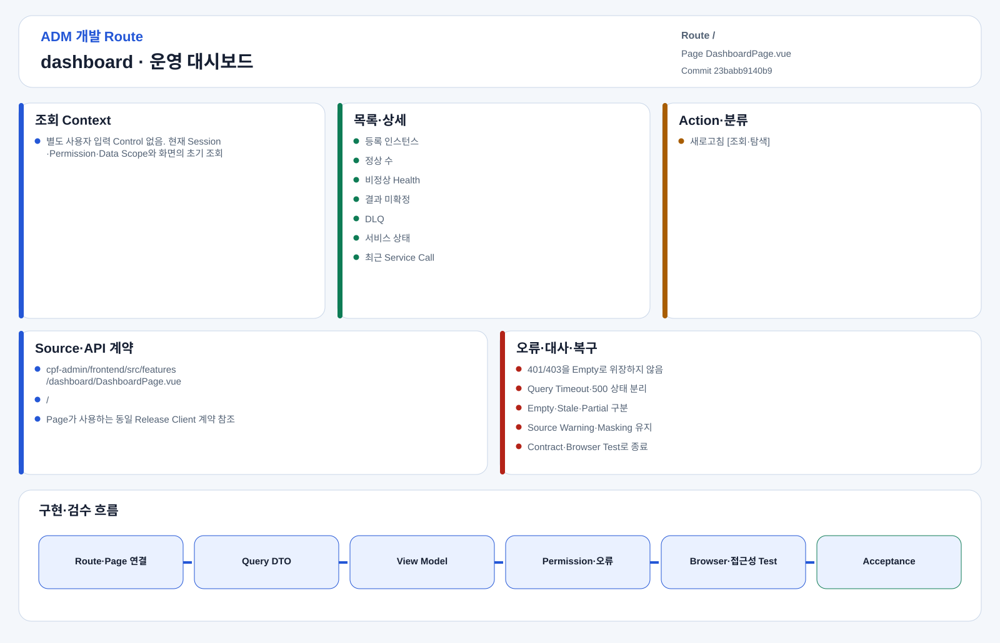


### 구현 결과

`/`가 단순 Route가 아니라 **서비스 상태·복구 대기 항목의 우선순위를 탐지한다.** Query·Permission·Owner 상태·관측 정보·Browser Test가 연결된 조회 기능 Slice가 되도록 구현한다.

### Source 진입점과 소유권

| 계층 | 기준 |
|---|---|
| Router | `/` |
| Page | `cpf-admin/frontend/src/features/dashboard/DashboardPage.vue` |
| Generated Client | Page가 import하는 Generated Client 또는 공통 ADM Client의 실제 Operation을 사용한다. 수기 Endpoint 문자열과 중복 DTO를 만들지 않는다 |
| ADM Backend | OpenAPI Operation의 Controller와 Application Service |
| Owner Port | Query·Status Port; Local/Remote가 같은 DTO·오류 의미 사용 |
| Test | Frontend Unit·Generated Client Contract·Controller·Browser·Fault |

### Frontend Query·Form 모델

별도 사용자 입력 Control이 없다. 현재 Session·Permission·Data Scope와 Page가 정의한 초기 Query로 데이터를 읽는다. 새로고침은 같은 Context를 다시 조회하며 Owner 데이터는 변경하지 않는다.

### Table·Detail View Model

| 값 | 표시 계약 | Drill-down·대사 |
|---|---|---|
| `등록 인스턴스` | 운영 대시보드 상세에서 대상의 현재 속성 또는 처리 결과를 확인하는 값이다. Masking·Timezone·단위를 DTO Metadata와 함께 표시한다. | 상세·재조회 결과와 비교하고 Stale·Masking·단위 차이를 확인한다. |
| `정상 수` | 동일한 집계 시간 창·단위·Filter에서 비교해야 하는 수치다. Masking·Timezone·단위를 DTO Metadata와 함께 표시한다. | 같은 Filter·집계 시간 창·단위의 상세 Row 또는 Metric으로 대사한다. |
| `비정상 Health` | 현재 상태와 Terminal 여부, 다음 Action 가능 여부를 판단하는 값이다. Masking·Timezone·단위를 DTO Metadata와 함께 표시한다. | Last Updated·Terminal 조건·Owner 상태와 함께 확인한다. |
| `결과 미확정` | 운영 대시보드 상세에서 대상의 현재 속성 또는 처리 결과를 확인하는 값이다. Masking·Timezone·단위를 DTO Metadata와 함께 표시한다. | 상세·재조회 결과와 비교하고 Stale·Masking·단위 차이를 확인한다. |
| `DLQ` | 오류·Drift·결과 불명 범위를 나타내며 원인과 복구 Owner를 연결해야 한다. Masking·Timezone·단위를 DTO Metadata와 함께 표시한다. | 원인 식별자·실패 Stage·마지막 갱신 시각을 상세와 대조한다. |
| `서비스 상태` | 현재 상태와 Terminal 여부, 다음 Action 가능 여부를 판단하는 값이다. Masking·Timezone·단위를 DTO Metadata와 함께 표시한다. | Last Updated·Terminal 조건·Owner 상태와 함께 확인한다. |
| `최근 Service Call` | 운영 대시보드의 대상 레코드를 상세·Owner·Audit에서 연결하는 식별자다. Masking·Timezone·단위를 DTO Metadata와 함께 표시한다. | 상세·Log·Trace·Audit에서 같은 대상을 가리키는지 확인한다. |

### Button·Interaction 모델

| Action | 분류 | Frontend 활성 조건 | Backend·성공 처리 |
|---|---|---|---|
| **새로고침** | 조회·탐색 | 조회 Permission과 Query Validation을 충족하고 동일 조회가 진행 중이 아님 | 새로고침 결과의 조회 시각·Filter·Source Version·Warning이 갱신되며 Owner 데이터는 변경하지 않는다. |

### 상태 모델

```text
Query: Idle → Loading → Empty | Success | Error
Success + Stale | Partial
```

조회 상태를 Loading·Empty·Success·Error·Stale·Partial로 구분한다. `401`, `403`, Timeout, Empty, Stale, Partial을 하나의 Error Toast로 합치지 않는다.

### API·Owner 계약

- Query Request는 실제 Page가 사용하는 Environment·Data Scope·검색 Field·Paging·Sort·Timezone만 포함한다.
- Query Response는 실제 Item·Page·조회 시각·Source Version·Stale·Partial·Warning 계약을 유지한다.
- 조회 전용 Route에는 임의의 Command DTO·Operation Polling·Rollback Endpoint를 추가하지 않는다.
- Same-JVM과 Remote Adapter는 DTO·Error Code·Timeout·Unknown 의미를 유지한다.

### Permission·Data Scope·Masking

- Route Permission 기준은 **조회 권한**이다.
- Menu 노출, Query, Button, Raw, Export Permission을 분리하고 Backend와 Owner에서 다시 검증한다.
- Deny는 403과 Audit를 남기며 404·Empty로 위장하지 않는다.
- Secret·Credential·PII Raw를 일반 Response DTO·Browser Storage·Log에 넣지 않는다.

### 구현 순서

1. Route·Page Import·Menu Metadata·Permission을 연결한다.
2. 이 장의 Field·Column·Action을 OpenAPI Request·Response·Error와 대조한다.
3. Generated Client를 재생성하고 수기 HTTP 호출을 제거한다.
4. Query 상태와 Empty·Stale·Partial·Error UI를 구현한다.
5. Backend Query Controller·Application Service·Owner Query Port·Local/Remote Adapter를 연결한다.
6. Menu·Query·Raw·Export Permission과 Data Scope를 Server에서 검증한다.
7. 조회 시각·Source Version·Warning·Correlation ID와 Drill-down Link를 연결한다.
8. Unit·Contract·Browser·Fault·Accessibility Test를 실행한다.

### Test Matrix

| Test | 필수 Scenario |
|---|---|
| Frontend Unit | Default·Validation·Button 조건·Masking·Empty/Error/Stale/Partial |
| OpenAPI·Generated Client | Operation 이름·Type·Error·Hash Drift |
| Backend Query | Permission·Data Scope·Filter·Paging·Stale·Partial |
| Local/Remote Contract | 같은 DTO·Error·Timeout 의미 |
| Browser | Deep Link·Query·상세·403·Timeout·Empty·Partial |
| Accessibility | Keyboard·Focus·Label·Error Announcement·Table/Dialog |

### 개발 Fault Workbook

1. `/` Query를 500·Timeout·Empty·Partial 응답으로 주입해 Loading·Empty·Error·Stale·Partial UI를 각각 확인한다.
2. 401·403과 Data Scope 축소를 주입해 Deny를 Empty로 위장하지 않고 Error와 접근 가능한 범위를 구분하는지 확인한다.
3. 조회 전용 Route에 Command Polling·Reason·Approval·Rollback UI가 노출되지 않는지 확인한다.
4. Local Adapter와 Remote Adapter에 같은 Contract Fixture를 적용해 Error Code·Retryability·failureStage가 일치하는지 확인한다.
5. Browser Storage·Console·Network Error·Screenshot에 Token·Secret·PII Raw가 남지 않는지 확인한다.

### Route Acceptance Checklist

- [ ] Route `/`의 Deep Link와 Menu ID `dashboard`가 같은 Page를 연다.
- [ ] 이 장의 Field·Column·Action과 Page·OpenAPI·Generated Client가 같은 계약을 사용한다.
- [ ] Menu·Query·Raw·Export Permission Deny가 Backend 403과 화면 Error로 확인된다.
- [ ] Empty·Timeout·Stale·Partial이 서로 다른 사용자 상태와 재조회 경로를 제공한다.
- [ ] Same-JVM·Remote 호출이 같은 Query DTO·오류·Timeout 계약을 사용한다.
- [ ] 조회 전용 Route에 Source에 없는 Command·Approval·Rollback Action을 노출하지 않는다.
- [ ] 정상·오류·경계 Browser Test와 Accessibility Test가 Route Matrix에 포함된다.

### 독립 수행 검수 Checklist

- [ ] `/`와 Page Source를 찾고 화면 목적을 설명할 수 있다.
- [ ] 별도 사용자 입력이 없고 자동 Query Context·새로고침 동작을 설명할 수 있다.
- [ ] 7개 표시값을 Owner 상태·Version·Audit와 대사할 수 있다.
- [ ] 1개 Action의 분류·활성 조건·Side Effect를 설명할 수 있다.
- [ ] Empty·401·403·Timeout·Stale·Partial을 서로 다른 조회 상태로 처리할 수 있다.
- [ ] 조회 응답 유실 시 같은 Query Context로 재조회하고 Correlation ID·조회 시각·Source Version으로 결과를 대사할 수 있다.
- [ ] 교대 기록만으로 다음 담당자가 Target·상태·복구 기한을 이어받을 수 있다.
- [ ] OpenAPI·Generated Client·Page·Controller·Owner Port·Test가 같은 Field와 오류 계약을 사용하는지 검증할 수 있다.
- [ ] Local·Remote Adapter의 Timeout·Unknown 의미가 같은지 Contract Test로 확인할 수 있다.

## 2. topology — 서비스 토폴로지 기능 Slice 개발 장

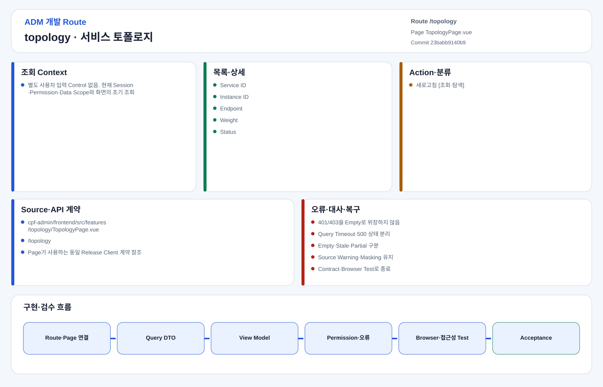


### 구현 결과

`/topology`가 단순 Route가 아니라 **Service·Endpoint·Instance 연결과 Routing 상태를 확인한다.** Query·Permission·Owner 상태·관측 정보·Browser Test가 연결된 조회 기능 Slice가 되도록 구현한다.

### Source 진입점과 소유권

| 계층 | 기준 |
|---|---|
| Router | `/topology` |
| Page | `cpf-admin/frontend/src/features/topology/TopologyPage.vue` |
| Generated Client | Page가 import하는 Generated Client 또는 공통 ADM Client의 실제 Operation을 사용한다. 수기 Endpoint 문자열과 중복 DTO를 만들지 않는다 |
| ADM Backend | OpenAPI Operation의 Controller와 Application Service |
| Owner Port | Query·Status Port; Local/Remote가 같은 DTO·오류 의미 사용 |
| Test | Frontend Unit·Generated Client Contract·Controller·Browser·Fault |

### Frontend Query·Form 모델

별도 사용자 입력 Control이 없다. 현재 Session·Permission·Data Scope와 Page가 정의한 초기 Query로 데이터를 읽는다. 새로고침은 같은 Context를 다시 조회하며 Owner 데이터는 변경하지 않는다.

### Table·Detail View Model

| 값 | 표시 계약 | Drill-down·대사 |
|---|---|---|
| `Service ID` | 서비스 토폴로지의 대상 레코드를 상세·Owner·Audit에서 연결하는 식별자다. Masking·Timezone·단위를 DTO Metadata와 함께 표시한다. | 상세·Log·Trace·Audit에서 같은 대상을 가리키는지 확인한다. |
| `Instance ID` | 서비스 토폴로지의 대상 레코드를 상세·Owner·Audit에서 연결하는 식별자다. Masking·Timezone·단위를 DTO Metadata와 함께 표시한다. | 상세·Log·Trace·Audit에서 같은 대상을 가리키는지 확인한다. |
| `Endpoint` | 서비스 토폴로지의 대상 레코드를 상세·Owner·Audit에서 연결하는 식별자다. Masking·Timezone·단위를 DTO Metadata와 함께 표시한다. | 상세·Log·Trace·Audit에서 같은 대상을 가리키는지 확인한다. |
| `Weight` | 동일한 집계 시간 창·단위·Filter에서 비교해야 하는 수치다. Masking·Timezone·단위를 DTO Metadata와 함께 표시한다. | 상세·재조회 결과와 비교하고 Stale·Masking·단위 차이를 확인한다. |
| `Status` | 현재 상태와 Terminal 여부, 다음 Action 가능 여부를 판단하는 값이다. Masking·Timezone·단위를 DTO Metadata와 함께 표시한다. | Last Updated·Terminal 조건·Owner 상태와 함께 확인한다. |

### Button·Interaction 모델

| Action | 분류 | Frontend 활성 조건 | Backend·성공 처리 |
|---|---|---|---|
| **새로고침** | 조회·탐색 | 조회 Permission과 Query Validation을 충족하고 동일 조회가 진행 중이 아님 | 새로고침 결과의 조회 시각·Filter·Source Version·Warning이 갱신되며 Owner 데이터는 변경하지 않는다. |

### 상태 모델

```text
Query: Idle → Loading → Empty | Success | Error
Success + Stale | Partial
```

조회 상태를 Loading·Empty·Success·Error·Stale·Partial로 구분한다. `401`, `403`, Timeout, Empty, Stale, Partial을 하나의 Error Toast로 합치지 않는다.

### API·Owner 계약

- Query Request는 실제 Page가 사용하는 Environment·Data Scope·검색 Field·Paging·Sort·Timezone만 포함한다.
- Query Response는 실제 Item·Page·조회 시각·Source Version·Stale·Partial·Warning 계약을 유지한다.
- 조회 전용 Route에는 임의의 Command DTO·Operation Polling·Rollback Endpoint를 추가하지 않는다.
- Same-JVM과 Remote Adapter는 DTO·Error Code·Timeout·Unknown 의미를 유지한다.

### Permission·Data Scope·Masking

- Route Permission 기준은 **조회 권한**이다.
- Menu 노출, Query, Button, Raw, Export Permission을 분리하고 Backend와 Owner에서 다시 검증한다.
- Deny는 403과 Audit를 남기며 404·Empty로 위장하지 않는다.
- Secret·Credential·PII Raw를 일반 Response DTO·Browser Storage·Log에 넣지 않는다.

### 구현 순서

1. Route·Page Import·Menu Metadata·Permission을 연결한다.
2. 이 장의 Field·Column·Action을 OpenAPI Request·Response·Error와 대조한다.
3. Generated Client를 재생성하고 수기 HTTP 호출을 제거한다.
4. Query 상태와 Empty·Stale·Partial·Error UI를 구현한다.
5. Backend Query Controller·Application Service·Owner Query Port·Local/Remote Adapter를 연결한다.
6. Menu·Query·Raw·Export Permission과 Data Scope를 Server에서 검증한다.
7. 조회 시각·Source Version·Warning·Correlation ID와 Drill-down Link를 연결한다.
8. Unit·Contract·Browser·Fault·Accessibility Test를 실행한다.

### Test Matrix

| Test | 필수 Scenario |
|---|---|
| Frontend Unit | Default·Validation·Button 조건·Masking·Empty/Error/Stale/Partial |
| OpenAPI·Generated Client | Operation 이름·Type·Error·Hash Drift |
| Backend Query | Permission·Data Scope·Filter·Paging·Stale·Partial |
| Local/Remote Contract | 같은 DTO·Error·Timeout 의미 |
| Browser | Deep Link·Query·상세·403·Timeout·Empty·Partial |
| Accessibility | Keyboard·Focus·Label·Error Announcement·Table/Dialog |

### 개발 Fault Workbook

1. `/topology` Query를 500·Timeout·Empty·Partial 응답으로 주입해 Loading·Empty·Error·Stale·Partial UI를 각각 확인한다.
2. 401·403과 Data Scope 축소를 주입해 Deny를 Empty로 위장하지 않고 Error와 접근 가능한 범위를 구분하는지 확인한다.
3. 조회 전용 Route에 Command Polling·Reason·Approval·Rollback UI가 노출되지 않는지 확인한다.
4. Local Adapter와 Remote Adapter에 같은 Contract Fixture를 적용해 Error Code·Retryability·failureStage가 일치하는지 확인한다.
5. Browser Storage·Console·Network Error·Screenshot에 Token·Secret·PII Raw가 남지 않는지 확인한다.

### Route Acceptance Checklist

- [ ] Route `/topology`의 Deep Link와 Menu ID `topology`가 같은 Page를 연다.
- [ ] 이 장의 Field·Column·Action과 Page·OpenAPI·Generated Client가 같은 계약을 사용한다.
- [ ] Menu·Query·Raw·Export Permission Deny가 Backend 403과 화면 Error로 확인된다.
- [ ] Empty·Timeout·Stale·Partial이 서로 다른 사용자 상태와 재조회 경로를 제공한다.
- [ ] Same-JVM·Remote 호출이 같은 Query DTO·오류·Timeout 계약을 사용한다.
- [ ] 조회 전용 Route에 Source에 없는 Command·Approval·Rollback Action을 노출하지 않는다.
- [ ] 정상·오류·경계 Browser Test와 Accessibility Test가 Route Matrix에 포함된다.

### 독립 수행 검수 Checklist

- [ ] `/topology`와 Page Source를 찾고 화면 목적을 설명할 수 있다.
- [ ] 별도 사용자 입력이 없고 자동 Query Context·새로고침 동작을 설명할 수 있다.
- [ ] 6개 표시값을 Owner 상태·Version·Audit와 대사할 수 있다.
- [ ] 1개 Action의 분류·활성 조건·Side Effect를 설명할 수 있다.
- [ ] Empty·401·403·Timeout·Stale·Partial을 서로 다른 조회 상태로 처리할 수 있다.
- [ ] 조회 응답 유실 시 같은 Query Context로 재조회하고 Correlation ID·조회 시각·Source Version으로 결과를 대사할 수 있다.
- [ ] 교대 기록만으로 다음 담당자가 Target·상태·복구 기한을 이어받을 수 있다.
- [ ] OpenAPI·Generated Client·Page·Controller·Owner Port·Test가 같은 Field와 오류 계약을 사용하는지 검증할 수 있다.
- [ ] Local·Remote Adapter의 Timeout·Unknown 의미가 같은지 Contract Test로 확인할 수 있다.

## 3. capacity — 용량·SLO 기본 Signal 기능 Slice 개발 장

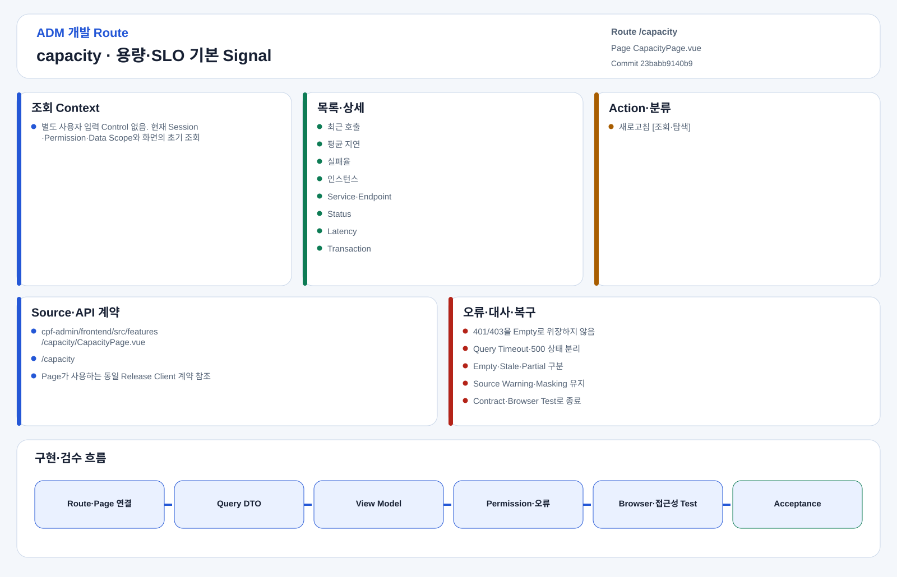


### 구현 결과

`/capacity`가 단순 Route가 아니라 **최근 호출·지연·실패율을 비교하여 우선순위가 높은 용량 위험을 식별한다.** Query·Permission·Owner 상태·관측 정보·Browser Test가 연결된 조회 기능 Slice가 되도록 구현한다.

### Source 진입점과 소유권

| 계층 | 기준 |
|---|---|
| Router | `/capacity` |
| Page | `cpf-admin/frontend/src/features/capacity/CapacityPage.vue` |
| Generated Client | Page가 import하는 Generated Client 또는 공통 ADM Client의 실제 Operation을 사용한다. 수기 Endpoint 문자열과 중복 DTO를 만들지 않는다 |
| ADM Backend | OpenAPI Operation의 Controller와 Application Service |
| Owner Port | Query·Status Port; Local/Remote가 같은 DTO·오류 의미 사용 |
| Test | Frontend Unit·Generated Client Contract·Controller·Browser·Fault |

### Frontend Query·Form 모델

별도 사용자 입력 Control이 없다. 현재 Session·Permission·Data Scope와 Page가 정의한 초기 Query로 데이터를 읽는다. 새로고침은 같은 Context를 다시 조회하며 Owner 데이터는 변경하지 않는다.

### Table·Detail View Model

| 값 | 표시 계약 | Drill-down·대사 |
|---|---|---|
| `최근 호출` | 용량·SLO 기본 Signal 상세에서 대상의 현재 속성 또는 처리 결과를 확인하는 값이다. Masking·Timezone·단위를 DTO Metadata와 함께 표시한다. | 상세·재조회 결과와 비교하고 Stale·Masking·단위 차이를 확인한다. |
| `평균 지연` | 용량·SLO 기본 Signal 상세에서 대상의 현재 속성 또는 처리 결과를 확인하는 값이다. Masking·Timezone·단위를 DTO Metadata와 함께 표시한다. | 상세·재조회 결과와 비교하고 Stale·Masking·단위 차이를 확인한다. |
| `실패율` | 용량·SLO 기본 Signal 상세에서 대상의 현재 속성 또는 처리 결과를 확인하는 값이다. Masking·Timezone·단위를 DTO Metadata와 함께 표시한다. | 상세·재조회 결과와 비교하고 Stale·Masking·단위 차이를 확인한다. |
| `인스턴스` | 용량·SLO 기본 Signal 상세에서 대상의 현재 속성 또는 처리 결과를 확인하는 값이다. Masking·Timezone·단위를 DTO Metadata와 함께 표시한다. | 상세·재조회 결과와 비교하고 Stale·Masking·단위 차이를 확인한다. |
| `Service·Endpoint` | 용량·SLO 기본 Signal의 대상 레코드를 상세·Owner·Audit에서 연결하는 식별자다. Masking·Timezone·단위를 DTO Metadata와 함께 표시한다. | 상세·Log·Trace·Audit에서 같은 대상을 가리키는지 확인한다. |
| `Status` | 현재 상태와 Terminal 여부, 다음 Action 가능 여부를 판단하는 값이다. Masking·Timezone·단위를 DTO Metadata와 함께 표시한다. | Last Updated·Terminal 조건·Owner 상태와 함께 확인한다. |
| `Latency` | 동일한 집계 시간 창·단위·Filter에서 비교해야 하는 수치다. Masking·Timezone·단위를 DTO Metadata와 함께 표시한다. | 같은 Filter·집계 시간 창·단위의 상세 Row 또는 Metric으로 대사한다. |
| `Transaction` | 용량·SLO 기본 Signal의 대상 레코드를 상세·Owner·Audit에서 연결하는 식별자다. Masking·Timezone·단위를 DTO Metadata와 함께 표시한다. | 상세·Log·Trace·Audit에서 같은 대상을 가리키는지 확인한다. |

### Button·Interaction 모델

| Action | 분류 | Frontend 활성 조건 | Backend·성공 처리 |
|---|---|---|---|
| **새로고침** | 조회·탐색 | 조회 Permission과 Query Validation을 충족하고 동일 조회가 진행 중이 아님 | 새로고침 결과의 조회 시각·Filter·Source Version·Warning이 갱신되며 Owner 데이터는 변경하지 않는다. |

### 상태 모델

```text
Query: Idle → Loading → Empty | Success | Error
Success + Stale | Partial
```

조회 상태를 Loading·Empty·Success·Error·Stale·Partial로 구분한다. `401`, `403`, Timeout, Empty, Stale, Partial을 하나의 Error Toast로 합치지 않는다.

### API·Owner 계약

- Query Request는 실제 Page가 사용하는 Environment·Data Scope·검색 Field·Paging·Sort·Timezone만 포함한다.
- Query Response는 실제 Item·Page·조회 시각·Source Version·Stale·Partial·Warning 계약을 유지한다.
- 조회 전용 Route에는 임의의 Command DTO·Operation Polling·Rollback Endpoint를 추가하지 않는다.
- Same-JVM과 Remote Adapter는 DTO·Error Code·Timeout·Unknown 의미를 유지한다.

### Permission·Data Scope·Masking

- Route Permission 기준은 **조회 권한**이다.
- Menu 노출, Query, Button, Raw, Export Permission을 분리하고 Backend와 Owner에서 다시 검증한다.
- Deny는 403과 Audit를 남기며 404·Empty로 위장하지 않는다.
- Secret·Credential·PII Raw를 일반 Response DTO·Browser Storage·Log에 넣지 않는다.

### 구현 순서

1. Route·Page Import·Menu Metadata·Permission을 연결한다.
2. 이 장의 Field·Column·Action을 OpenAPI Request·Response·Error와 대조한다.
3. Generated Client를 재생성하고 수기 HTTP 호출을 제거한다.
4. Query 상태와 Empty·Stale·Partial·Error UI를 구현한다.
5. Backend Query Controller·Application Service·Owner Query Port·Local/Remote Adapter를 연결한다.
6. Menu·Query·Raw·Export Permission과 Data Scope를 Server에서 검증한다.
7. 조회 시각·Source Version·Warning·Correlation ID와 Drill-down Link를 연결한다.
8. Unit·Contract·Browser·Fault·Accessibility Test를 실행한다.

### Test Matrix

| Test | 필수 Scenario |
|---|---|
| Frontend Unit | Default·Validation·Button 조건·Masking·Empty/Error/Stale/Partial |
| OpenAPI·Generated Client | Operation 이름·Type·Error·Hash Drift |
| Backend Query | Permission·Data Scope·Filter·Paging·Stale·Partial |
| Local/Remote Contract | 같은 DTO·Error·Timeout 의미 |
| Browser | Deep Link·Query·상세·403·Timeout·Empty·Partial |
| Accessibility | Keyboard·Focus·Label·Error Announcement·Table/Dialog |

### 개발 Fault Workbook

1. `/capacity` Query를 500·Timeout·Empty·Partial 응답으로 주입해 Loading·Empty·Error·Stale·Partial UI를 각각 확인한다.
2. 401·403과 Data Scope 축소를 주입해 Deny를 Empty로 위장하지 않고 Error와 접근 가능한 범위를 구분하는지 확인한다.
3. 조회 전용 Route에 Command Polling·Reason·Approval·Rollback UI가 노출되지 않는지 확인한다.
4. Local Adapter와 Remote Adapter에 같은 Contract Fixture를 적용해 Error Code·Retryability·failureStage가 일치하는지 확인한다.
5. Browser Storage·Console·Network Error·Screenshot에 Token·Secret·PII Raw가 남지 않는지 확인한다.

### Route Acceptance Checklist

- [ ] Route `/capacity`의 Deep Link와 Menu ID `capacity`가 같은 Page를 연다.
- [ ] 이 장의 Field·Column·Action과 Page·OpenAPI·Generated Client가 같은 계약을 사용한다.
- [ ] Menu·Query·Raw·Export Permission Deny가 Backend 403과 화면 Error로 확인된다.
- [ ] Empty·Timeout·Stale·Partial이 서로 다른 사용자 상태와 재조회 경로를 제공한다.
- [ ] Same-JVM·Remote 호출이 같은 Query DTO·오류·Timeout 계약을 사용한다.
- [ ] 조회 전용 Route에 Source에 없는 Command·Approval·Rollback Action을 노출하지 않는다.
- [ ] 정상·오류·경계 Browser Test와 Accessibility Test가 Route Matrix에 포함된다.

### 독립 수행 검수 Checklist

- [ ] `/capacity`와 Page Source를 찾고 화면 목적을 설명할 수 있다.
- [ ] 별도 사용자 입력이 없고 자동 Query Context·새로고침 동작을 설명할 수 있다.
- [ ] 8개 표시값을 Owner 상태·Version·Audit와 대사할 수 있다.
- [ ] 1개 Action의 분류·활성 조건·Side Effect를 설명할 수 있다.
- [ ] Empty·401·403·Timeout·Stale·Partial을 서로 다른 조회 상태로 처리할 수 있다.
- [ ] 조회 응답 유실 시 같은 Query Context로 재조회하고 Correlation ID·조회 시각·Source Version으로 결과를 대사할 수 있다.
- [ ] 교대 기록만으로 다음 담당자가 Target·상태·복구 기한을 이어받을 수 있다.
- [ ] OpenAPI·Generated Client·Page·Controller·Owner Port·Test가 같은 Field와 오류 계약을 사용하는지 검증할 수 있다.
- [ ] Local·Remote Adapter의 Timeout·Unknown 의미가 같은지 Contract Test로 확인할 수 있다.

## 4. logs — 로그 조회 기능 Slice 개발 장

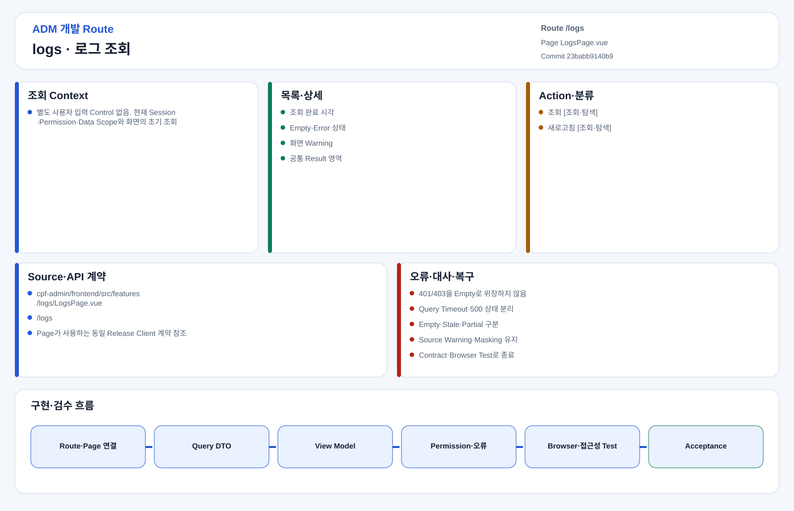


### 구현 결과

`/logs`가 단순 Route가 아니라 **표준 로그 조회 화면에서 거래·오류·식별자를 추적한다.** Query·Permission·Owner 상태·관측 정보·Browser Test가 연결된 조회 기능 Slice가 되도록 구현한다.

### Source 진입점과 소유권

| 계층 | 기준 |
|---|---|
| Router | `/logs` |
| Page | `cpf-admin/frontend/src/features/logs/LogsPage.vue` |
| Generated Client | Page가 import하는 Generated Client 또는 공통 ADM Client의 실제 Operation을 사용한다. 수기 Endpoint 문자열과 중복 DTO를 만들지 않는다 |
| ADM Backend | OpenAPI Operation의 Controller와 Application Service |
| Owner Port | Query·Status Port; Local/Remote가 같은 DTO·오류 의미 사용 |
| Test | Frontend Unit·Generated Client Contract·Controller·Browser·Fault |

### Frontend Query·Form 모델

별도 사용자 입력 Control이 없다. 현재 Session·Permission·Data Scope와 Page가 정의한 초기 Query로 데이터를 읽는다. 새로고침은 같은 Context를 다시 조회하며 Owner 데이터는 변경하지 않는다.

### Table·Detail View Model

| 값 | 표시 계약 | Drill-down·대사 |
|---|---|---|
| `조회 완료 시각` | 상태 발생·갱신·유효 시점을 나타내며 화면 Timezone을 기준으로 해석한다. Masking·Timezone·단위를 DTO Metadata와 함께 표시한다. | 상세·재조회 결과와 비교하고 Stale·Masking·단위 차이를 확인한다. |
| `Empty·Error 상태` | 현재 상태와 Terminal 여부, 다음 Action 가능 여부를 판단하는 값이다. Masking·Timezone·단위를 DTO Metadata와 함께 표시한다. | Last Updated·Terminal 조건·Owner 상태와 함께 확인한다. |
| `화면 Warning` | 오류·Drift·결과 불명 범위를 나타내며 원인과 복구 Owner를 연결해야 한다. Masking·Timezone·단위를 DTO Metadata와 함께 표시한다. | 원인 식별자·실패 Stage·마지막 갱신 시각을 상세와 대조한다. |
| `공통 Result 영역` | 현재 상태와 Terminal 여부, 다음 Action 가능 여부를 판단하는 값이다. Masking·Timezone·단위를 DTO Metadata와 함께 표시한다. | Last Updated·Terminal 조건·Owner 상태와 함께 확인한다. |

### Button·Interaction 모델

| Action | 분류 | Frontend 활성 조건 | Backend·성공 처리 |
|---|---|---|---|
| **조회** | 조회·탐색 | 조회 Permission과 Query Validation을 충족하고 동일 조회가 진행 중이 아님 | 조회 결과의 조회 시각·Filter·Source Version·Warning이 갱신되며 Owner 데이터는 변경하지 않는다. |
| **새로고침** | 조회·탐색 | 조회 Permission과 Query Validation을 충족하고 동일 조회가 진행 중이 아님 | 새로고침 결과의 조회 시각·Filter·Source Version·Warning이 갱신되며 Owner 데이터는 변경하지 않는다. |

### 상태 모델

```text
Query: Idle → Loading → Empty | Success | Error
Success + Stale | Partial
```

조회 상태를 Loading·Empty·Success·Error·Stale·Partial로 구분한다. `401`, `403`, Timeout, Empty, Stale, Partial을 하나의 Error Toast로 합치지 않는다.

### API·Owner 계약

- Query Request는 실제 Page가 사용하는 Environment·Data Scope·검색 Field·Paging·Sort·Timezone만 포함한다.
- Query Response는 실제 Item·Page·조회 시각·Source Version·Stale·Partial·Warning 계약을 유지한다.
- 조회 전용 Route에는 임의의 Command DTO·Operation Polling·Rollback Endpoint를 추가하지 않는다.
- Same-JVM과 Remote Adapter는 DTO·Error Code·Timeout·Unknown 의미를 유지한다.

### Permission·Data Scope·Masking

- Route Permission 기준은 **해당 없음**이다.
- Menu 노출, Query, Button, Raw, Export Permission을 분리하고 Backend와 Owner에서 다시 검증한다.
- Deny는 403과 Audit를 남기며 404·Empty로 위장하지 않는다.
- Secret·Credential·PII Raw를 일반 Response DTO·Browser Storage·Log에 넣지 않는다.

### 구현 순서

1. Route·Page Import·Menu Metadata·Permission을 연결한다.
2. 이 장의 Field·Column·Action을 OpenAPI Request·Response·Error와 대조한다.
3. Generated Client를 재생성하고 수기 HTTP 호출을 제거한다.
4. Query 상태와 Empty·Stale·Partial·Error UI를 구현한다.
5. Backend Query Controller·Application Service·Owner Query Port·Local/Remote Adapter를 연결한다.
6. Menu·Query·Raw·Export Permission과 Data Scope를 Server에서 검증한다.
7. 조회 시각·Source Version·Warning·Correlation ID와 Drill-down Link를 연결한다.
8. Unit·Contract·Browser·Fault·Accessibility Test를 실행한다.

### Test Matrix

| Test | 필수 Scenario |
|---|---|
| Frontend Unit | Default·Validation·Button 조건·Masking·Empty/Error/Stale/Partial |
| OpenAPI·Generated Client | Operation 이름·Type·Error·Hash Drift |
| Backend Query | Permission·Data Scope·Filter·Paging·Stale·Partial |
| Local/Remote Contract | 같은 DTO·Error·Timeout 의미 |
| Browser | Deep Link·Query·상세·403·Timeout·Empty·Partial |
| Accessibility | Keyboard·Focus·Label·Error Announcement·Table/Dialog |

### 개발 Fault Workbook

1. `/logs` Query를 500·Timeout·Empty·Partial 응답으로 주입해 Loading·Empty·Error·Stale·Partial UI를 각각 확인한다.
2. 401·403과 Data Scope 축소를 주입해 Deny를 Empty로 위장하지 않고 Error와 접근 가능한 범위를 구분하는지 확인한다.
3. 조회 전용 Route에 Command Polling·Reason·Approval·Rollback UI가 노출되지 않는지 확인한다.
4. Local Adapter와 Remote Adapter에 같은 Contract Fixture를 적용해 Error Code·Retryability·failureStage가 일치하는지 확인한다.
5. Browser Storage·Console·Network Error·Screenshot에 Token·Secret·PII Raw가 남지 않는지 확인한다.

### Route Acceptance Checklist

- [ ] Route `/logs`의 Deep Link와 Menu ID `logs`가 같은 Page를 연다.
- [ ] 이 장의 Field·Column·Action과 Page·OpenAPI·Generated Client가 같은 계약을 사용한다.
- [ ] Menu·Query·Raw·Export Permission Deny가 Backend 403과 화면 Error로 확인된다.
- [ ] Empty·Timeout·Stale·Partial이 서로 다른 사용자 상태와 재조회 경로를 제공한다.
- [ ] Same-JVM·Remote 호출이 같은 Query DTO·오류·Timeout 계약을 사용한다.
- [ ] 조회 전용 Route에 Source에 없는 Command·Approval·Rollback Action을 노출하지 않는다.
- [ ] 정상·오류·경계 Browser Test와 Accessibility Test가 Route Matrix에 포함된다.

### 독립 수행 검수 Checklist

- [ ] `/logs`와 Page Source를 찾고 화면 목적을 설명할 수 있다.
- [ ] 별도 사용자 입력이 없고 자동 Query Context·새로고침 동작을 설명할 수 있다.
- [ ] 1개 표시값을 Owner 상태·Version·Audit와 대사할 수 있다.
- [ ] 2개 Action의 분류·활성 조건·Side Effect를 설명할 수 있다.
- [ ] Empty·401·403·Timeout·Stale·Partial을 서로 다른 조회 상태로 처리할 수 있다.
- [ ] 조회 응답 유실 시 같은 Query Context로 재조회하고 Correlation ID·조회 시각·Source Version으로 결과를 대사할 수 있다.
- [ ] 교대 기록만으로 다음 담당자가 Target·상태·복구 기한을 이어받을 수 있다.
- [ ] OpenAPI·Generated Client·Page·Controller·Owner Port·Test가 같은 Field와 오류 계약을 사용하는지 검증할 수 있다.
- [ ] Local·Remote Adapter의 Timeout·Unknown 의미가 같은지 Contract Test로 확인할 수 있다.

## 5. transactionGroups — 거래 그룹·구간 추적 기능 Slice 개발 장

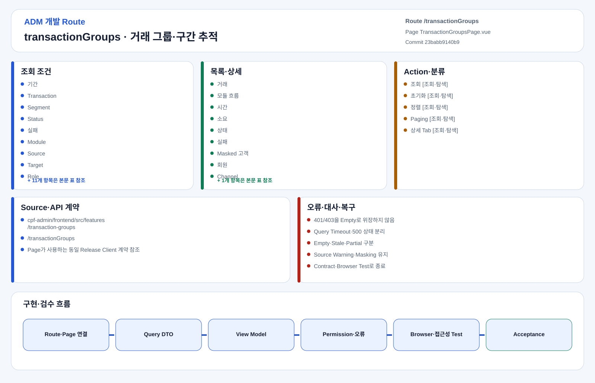


### 구현 결과

`/transactionGroups`가 단순 Route가 아니라 **거래 전체와 Segment·외부 연계를 시간 순서로 추적한다.** Query·Permission·Owner 상태·관측 정보·Browser Test가 연결된 조회 기능 Slice가 되도록 구현한다.

### Source 진입점과 소유권

| 계층 | 기준 |
|---|---|
| Router | `/transactionGroups` |
| Page | `cpf-admin/frontend/src/features/transaction-groups/TransactionGroupsPage.vue` |
| Generated Client | Page가 import하는 Generated Client 또는 공통 ADM Client의 실제 Operation을 사용한다. 수기 Endpoint 문자열과 중복 DTO를 만들지 않는다 |
| ADM Backend | OpenAPI Operation의 Controller와 Application Service |
| Owner Port | Query·Status Port; Local/Remote가 같은 DTO·오류 의미 사용 |
| Test | Frontend Unit·Generated Client Contract·Controller·Browser·Fault |

### Frontend Query·Form 모델

| Field | Control | 직렬화·Validation | 오류·접근성 |
|---|---|---|---|
| `기간` | 날짜·시간 입력 | 조회 또는 적용의 유효 시간 범위를 정하며 Timezone과 시작·종료 순서를 함께 확인한다. Timezone을 고정하고 시작≤종료·유효기간 겹침·기준일 포함 여부를 확인한다. Request·Query의 실제 이름과 Type을 유지한다. | Label·Help·Field Error·Keyboard Focus를 제공하고 민감값은 재표시하지 않는다. |
| `Transaction` | Select·검색 | 거래 그룹·구간 추적에서 적용하거나 조회할 정책·권한·처리 유형을 선택한다. 허용 목록과 현재 Environment·Data Scope에 맞는 값만 선택한다. Request·Query의 실제 이름과 Type을 유지한다. | Label·Help·Field Error·Keyboard Focus를 제공하고 민감값은 재표시하지 않는다. |
| `Segment` | 문자열 입력·검색 | 거래 그룹·구간 추적 화면의 조회 조건 또는 편집 Form에 포함되는 값이며 화면 Label과 Help를 기준으로 사용한다. 앞뒤 공백·허용 문자·길이와 대소문자 규칙을 확인한다. Request·Query의 실제 이름과 Type을 유지한다. | Label·Help·Field Error·Keyboard Focus를 제공하고 민감값은 재표시하지 않는다. |
| `Status` | Select·검색 | 현재 상태를 조회하거나 다음 Action의 허용 조건을 지정한다. 허용 목록과 현재 Environment·Data Scope에 맞는 값만 선택한다. Request·Query의 실제 이름과 Type을 유지한다. | Label·Help·Field Error·Keyboard Focus를 제공하고 민감값은 재표시하지 않는다. |
| `실패` | 문자열 입력·검색 | 거래 그룹·구간 추적 화면의 조회 조건 또는 편집 Form에 포함되는 값이며 화면 Label과 Help를 기준으로 사용한다. 앞뒤 공백·허용 문자·길이와 대소문자 규칙을 확인한다. Request·Query의 실제 이름과 Type을 유지한다. | Label·Help·Field Error·Keyboard Focus를 제공하고 민감값은 재표시하지 않는다. |
| `Module` | 문자열 입력·검색 | 거래 그룹·구간 추적 조회·조치가 적용되는 환경과 데이터 경계를 제한한다. 앞뒤 공백·허용 문자·길이와 대소문자 규칙을 확인한다. Request·Query의 실제 이름과 Type을 유지한다. | Label·Help·Field Error·Keyboard Focus를 제공하고 민감값은 재표시하지 않는다. |
| `Source` | 문자열 입력·검색 | 거래 그룹·구간 추적 화면의 조회 조건 또는 편집 Form에 포함되는 값이며 화면 Label과 Help를 기준으로 사용한다. 앞뒤 공백·허용 문자·길이와 대소문자 규칙을 확인한다. Request·Query의 실제 이름과 Type을 유지한다. | Label·Help·Field Error·Keyboard Focus를 제공하고 민감값은 재표시하지 않는다. |
| `Target` | 문자열 입력·검색 | 거래 그룹·구간 추적 화면의 조회 조건 또는 편집 Form에 포함되는 값이며 화면 Label과 Help를 기준으로 사용한다. 앞뒤 공백·허용 문자·길이와 대소문자 규칙을 확인한다. Request·Query의 실제 이름과 Type을 유지한다. | Label·Help·Field Error·Keyboard Focus를 제공하고 민감값은 재표시하지 않는다. |
| `Role` | Select·검색 | 거래 그룹·구간 추적에서 적용하거나 조회할 정책·권한·처리 유형을 선택한다. 허용 목록과 현재 Environment·Data Scope에 맞는 값만 선택한다. Request·Query의 실제 이름과 Type을 유지한다. | Label·Help·Field Error·Keyboard Focus를 제공하고 민감값은 재표시하지 않는다. |
| `Direction` | 문자열 입력·검색 | 거래 그룹·구간 추적 화면의 조회 조건 또는 편집 Form에 포함되는 값이며 화면 Label과 Help를 기준으로 사용한다. 앞뒤 공백·허용 문자·길이와 대소문자 규칙을 확인한다. Request·Query의 실제 이름과 Type을 유지한다. | Label·Help·Field Error·Keyboard Focus를 제공하고 민감값은 재표시하지 않는다. |
| `고객` | 문자열 입력·검색 | 거래 그룹·구간 추적 화면의 조회 조건 또는 편집 Form에 포함되는 값이며 화면 Label과 Help를 기준으로 사용한다. 앞뒤 공백·허용 문자·길이와 대소문자 규칙을 확인한다. Request·Query의 실제 이름과 Type을 유지한다. | Label·Help·Field Error·Keyboard Focus를 제공하고 민감값은 재표시하지 않는다. |
| `회원` | 문자열 입력·검색 | 거래 그룹·구간 추적 화면의 조회 조건 또는 편집 Form에 포함되는 값이며 화면 Label과 Help를 기준으로 사용한다. 앞뒤 공백·허용 문자·길이와 대소문자 규칙을 확인한다. Request·Query의 실제 이름과 Type을 유지한다. | Label·Help·Field Error·Keyboard Focus를 제공하고 민감값은 재표시하지 않는다. |
| `사용자` | Checkbox·Switch | 현재 상태를 조회하거나 다음 Action의 허용 조건을 지정한다. 현재 선택과 변경 후 영향 범위를 비교하고 화면의 Source 기본값을 확인한다. Request·Query의 실제 이름과 Type을 유지한다. | Label·Help·Field Error·Keyboard Focus를 제공하고 민감값은 재표시하지 않는다. |
| `운영자` | 문자열 입력·검색 | 거래 그룹·구간 추적 화면의 조회 조건 또는 편집 Form에 포함되는 값이며 화면 Label과 Help를 기준으로 사용한다. 앞뒤 공백·허용 문자·길이와 대소문자 규칙을 확인한다. Request·Query의 실제 이름과 Type을 유지한다. | Label·Help·Field Error·Keyboard Focus를 제공하고 민감값은 재표시하지 않는다. |
| `Channel` | Select·검색 | 거래 그룹·구간 추적에서 적용하거나 조회할 정책·권한·처리 유형을 선택한다. 허용 목록과 현재 Environment·Data Scope에 맞는 값만 선택한다. Request·Query의 실제 이름과 Type을 유지한다. | Label·Help·Field Error·Keyboard Focus를 제공하고 민감값은 재표시하지 않는다. |
| `외부기관` | 문자열 입력·검색 | 거래 그룹·구간 추적 화면의 조회 조건 또는 편집 Form에 포함되는 값이며 화면 Label과 Help를 기준으로 사용한다. 앞뒤 공백·허용 문자·길이와 대소문자 규칙을 확인한다. Request·Query의 실제 이름과 Type을 유지한다. | Label·Help·Field Error·Keyboard Focus를 제공하고 민감값은 재표시하지 않는다. |
| `거래` | 문자열 입력·검색 | 거래 그룹·구간 추적 화면의 조회 조건 또는 편집 Form에 포함되는 값이며 화면 Label과 Help를 기준으로 사용한다. 앞뒤 공백·허용 문자·길이와 대소문자 규칙을 확인한다. Request·Query의 실제 이름과 Type을 유지한다. | Label·Help·Field Error·Keyboard Focus를 제공하고 민감값은 재표시하지 않는다. |
| `API·거래명·오류` | 문자열 입력·검색 | 대상의 표시명 또는 업무명을 검색·입력한다. 앞뒤 공백·허용 문자·길이와 대소문자 규칙을 확인한다. Request·Query의 실제 이름과 Type을 유지한다. | Label·Help·Field Error·Keyboard Focus를 제공하고 민감값은 재표시하지 않는다. |
| `Duration` | 문자열 입력·검색 | 거래 그룹·구간 추적 화면의 조회 조건 또는 편집 Form에 포함되는 값이며 화면 Label과 Help를 기준으로 사용한다. 앞뒤 공백·허용 문자·길이와 대소문자 규칙을 확인한다. Request·Query의 실제 이름과 Type을 유지한다. | Label·Help·Field Error·Keyboard Focus를 제공하고 민감값은 재표시하지 않는다. |
| `Header 검색` | 문자열 입력·검색 | 거래 그룹·구간 추적 화면의 조회 조건 또는 편집 Form에 포함되는 값이며 화면 Label과 Help를 기준으로 사용한다. 앞뒤 공백·허용 문자·길이와 대소문자 규칙을 확인한다. Request·Query의 실제 이름과 Type을 유지한다. | Label·Help·Field Error·Keyboard Focus를 제공하고 민감값은 재표시하지 않는다. |

### Table·Detail View Model

| 값 | 표시 계약 | Drill-down·대사 |
|---|---|---|
| `거래` | 거래 그룹·구간 추적 상세에서 대상의 현재 속성 또는 처리 결과를 확인하는 값이다. Masking·Timezone·단위를 DTO Metadata와 함께 표시한다. | 상세·재조회 결과와 비교하고 Stale·Masking·단위 차이를 확인한다. |
| `모듈 흐름` | 거래 그룹·구간 추적 상세에서 대상의 현재 속성 또는 처리 결과를 확인하는 값이다. Masking·Timezone·단위를 DTO Metadata와 함께 표시한다. | 상세·재조회 결과와 비교하고 Stale·Masking·단위 차이를 확인한다. |
| `시간` | 거래 그룹·구간 추적 상세에서 대상의 현재 속성 또는 처리 결과를 확인하는 값이다. Masking·Timezone·단위를 DTO Metadata와 함께 표시한다. | 상세·재조회 결과와 비교하고 Stale·Masking·단위 차이를 확인한다. |
| `소요` | 거래 그룹·구간 추적 상세에서 대상의 현재 속성 또는 처리 결과를 확인하는 값이다. Masking·Timezone·단위를 DTO Metadata와 함께 표시한다. | 상세·재조회 결과와 비교하고 Stale·Masking·단위 차이를 확인한다. |
| `상태` | 현재 상태와 Terminal 여부, 다음 Action 가능 여부를 판단하는 값이다. Masking·Timezone·단위를 DTO Metadata와 함께 표시한다. | Last Updated·Terminal 조건·Owner 상태와 함께 확인한다. |
| `실패` | 거래 그룹·구간 추적 상세에서 대상의 현재 속성 또는 처리 결과를 확인하는 값이다. Masking·Timezone·단위를 DTO Metadata와 함께 표시한다. | 상세·재조회 결과와 비교하고 Stale·Masking·단위 차이를 확인한다. |
| `Masked 고객` | 거래 그룹·구간 추적 상세에서 대상의 현재 속성 또는 처리 결과를 확인하는 값이다. Masking·Timezone·단위를 DTO Metadata와 함께 표시한다. | 상세·재조회 결과와 비교하고 Stale·Masking·단위 차이를 확인한다. |
| `회원` | 거래 그룹·구간 추적 상세에서 대상의 현재 속성 또는 처리 결과를 확인하는 값이다. Masking·Timezone·단위를 DTO Metadata와 함께 표시한다. | 상세·재조회 결과와 비교하고 Stale·Masking·단위 차이를 확인한다. |
| `Channel` | 거래 그룹·구간 추적 상세에서 대상의 현재 속성 또는 처리 결과를 확인하는 값이다. Masking·Timezone·단위를 DTO Metadata와 함께 표시한다. | 상세·재조회 결과와 비교하고 Stale·Masking·단위 차이를 확인한다. |
| `외부 연계` | 거래 그룹·구간 추적 상세에서 대상의 현재 속성 또는 처리 결과를 확인하는 값이다. Masking·Timezone·단위를 DTO Metadata와 함께 표시한다. | 상세·재조회 결과와 비교하고 Stale·Masking·단위 차이를 확인한다. |

### Button·Interaction 모델

| Action | 분류 | Frontend 활성 조건 | Backend·성공 처리 |
|---|---|---|---|
| **조회** | 조회·탐색 | 조회 Permission과 Query Validation을 충족하고 동일 조회가 진행 중이 아님 | 조회 결과의 조회 시각·Filter·Source Version·Warning이 갱신되며 Owner 데이터는 변경하지 않는다. |
| **초기화** | 조회·탐색 | 조회 Permission과 Query Validation을 충족하고 동일 조회가 진행 중이 아님 | 초기화 결과의 조회 시각·Filter·Source Version·Warning이 갱신되며 Owner 데이터는 변경하지 않는다. |
| **정렬** | 조회·탐색 | 조회 Permission과 Query Validation을 충족하고 동일 조회가 진행 중이 아님 | 정렬 결과의 조회 시각·Filter·Source Version·Warning이 갱신되며 Owner 데이터는 변경하지 않는다. |
| **Paging** | 조회·탐색 | 조회 Permission과 Query Validation을 충족하고 동일 조회가 진행 중이 아님 | Paging 결과의 조회 시각·Filter·Source Version·Warning이 갱신되며 Owner 데이터는 변경하지 않는다. |
| **상세 Tab** | 조회·탐색 | 조회 Permission과 Query Validation을 충족하고 동일 조회가 진행 중이 아님 | 상세 Tab 결과의 조회 시각·Filter·Source Version·Warning이 갱신되며 Owner 데이터는 변경하지 않는다. |

### 상태 모델

```text
Query: Idle → Loading → Empty | Success | Error
Success + Stale | Partial
```

조회 상태를 Loading·Empty·Success·Error·Stale·Partial로 구분한다. `401`, `403`, Timeout, Empty, Stale, Partial을 하나의 Error Toast로 합치지 않는다.

### API·Owner 계약

- Query Request는 실제 Page가 사용하는 Environment·Data Scope·검색 Field·Paging·Sort·Timezone만 포함한다.
- Query Response는 실제 Item·Page·조회 시각·Source Version·Stale·Partial·Warning 계약을 유지한다.
- 조회 전용 Route에는 임의의 Command DTO·Operation Polling·Rollback Endpoint를 추가하지 않는다.
- Same-JVM과 Remote Adapter는 DTO·Error Code·Timeout·Unknown 의미를 유지한다.

### Permission·Data Scope·Masking

- Route Permission 기준은 **거래 조회 Permission·Data Scope**이다.
- Menu 노출, Query, Button, Raw, Export Permission을 분리하고 Backend와 Owner에서 다시 검증한다.
- Deny는 403과 Audit를 남기며 404·Empty로 위장하지 않는다.
- Secret·Credential·PII Raw를 일반 Response DTO·Browser Storage·Log에 넣지 않는다.

### 구현 순서

1. Route·Page Import·Menu Metadata·Permission을 연결한다.
2. 이 장의 Field·Column·Action을 OpenAPI Request·Response·Error와 대조한다.
3. Generated Client를 재생성하고 수기 HTTP 호출을 제거한다.
4. Query 상태와 Empty·Stale·Partial·Error UI를 구현한다.
5. Backend Query Controller·Application Service·Owner Query Port·Local/Remote Adapter를 연결한다.
6. Menu·Query·Raw·Export Permission과 Data Scope를 Server에서 검증한다.
7. 조회 시각·Source Version·Warning·Correlation ID와 Drill-down Link를 연결한다.
8. Unit·Contract·Browser·Fault·Accessibility Test를 실행한다.

### Test Matrix

| Test | 필수 Scenario |
|---|---|
| Frontend Unit | Default·Validation·Button 조건·Masking·Empty/Error/Stale/Partial |
| OpenAPI·Generated Client | Operation 이름·Type·Error·Hash Drift |
| Backend Query | Permission·Data Scope·Filter·Paging·Stale·Partial |
| Local/Remote Contract | 같은 DTO·Error·Timeout 의미 |
| Browser | Deep Link·Query·상세·403·Timeout·Empty·Partial |
| Accessibility | Keyboard·Focus·Label·Error Announcement·Table/Dialog |

### 개발 Fault Workbook

1. `/transactionGroups` Query를 500·Timeout·Empty·Partial 응답으로 주입해 Loading·Empty·Error·Stale·Partial UI를 각각 확인한다.
2. 401·403과 Data Scope 축소를 주입해 Deny를 Empty로 위장하지 않고 Error와 접근 가능한 범위를 구분하는지 확인한다.
3. 조회 전용 Route에 Command Polling·Reason·Approval·Rollback UI가 노출되지 않는지 확인한다.
4. Local Adapter와 Remote Adapter에 같은 Contract Fixture를 적용해 Error Code·Retryability·failureStage가 일치하는지 확인한다.
5. Browser Storage·Console·Network Error·Screenshot에 Token·Secret·PII Raw가 남지 않는지 확인한다.

### Route Acceptance Checklist

- [ ] Route `/transactionGroups`의 Deep Link와 Menu ID `transactionGroups`가 같은 Page를 연다.
- [ ] 이 장의 Field·Column·Action과 Page·OpenAPI·Generated Client가 같은 계약을 사용한다.
- [ ] Menu·Query·Raw·Export Permission Deny가 Backend 403과 화면 Error로 확인된다.
- [ ] Empty·Timeout·Stale·Partial이 서로 다른 사용자 상태와 재조회 경로를 제공한다.
- [ ] Same-JVM·Remote 호출이 같은 Query DTO·오류·Timeout 계약을 사용한다.
- [ ] 조회 전용 Route에 Source에 없는 Command·Approval·Rollback Action을 노출하지 않는다.
- [ ] 정상·오류·경계 Browser Test와 Accessibility Test가 Route Matrix에 포함된다.

### 독립 수행 검수 Checklist

- [ ] `/transactionGroups`와 Page Source를 찾고 화면 목적을 설명할 수 있다.
- [ ] 20개 입력·검색 항목의 Control·기본값·Validation을 설명할 수 있다.
- [ ] 10개 표시값을 Owner 상태·Version·Audit와 대사할 수 있다.
- [ ] 5개 Action의 분류·활성 조건·Side Effect를 설명할 수 있다.
- [ ] Empty·401·403·Timeout·Stale·Partial을 서로 다른 조회 상태로 처리할 수 있다.
- [ ] 조회 응답 유실 시 같은 Query Context로 재조회하고 Correlation ID·조회 시각·Source Version으로 결과를 대사할 수 있다.
- [ ] 교대 기록만으로 다음 담당자가 Target·상태·복구 기한을 이어받을 수 있다.
- [ ] OpenAPI·Generated Client·Page·Controller·Owner Port·Test가 같은 Field와 오류 계약을 사용하는지 검증할 수 있다.
- [ ] Local·Remote Adapter의 Timeout·Unknown 의미가 같은지 Contract Test로 확인할 수 있다.

## 6. transactions — 거래 Metadata 기능 Slice 개발 장

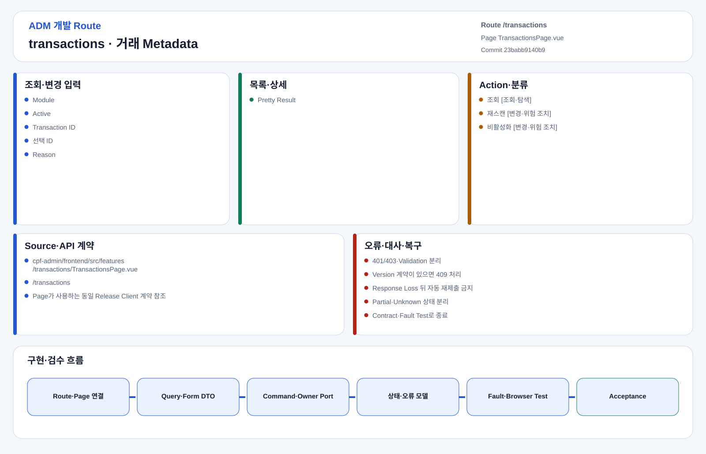


### 구현 결과

`/transactions`가 단순 Route가 아니라 **거래 Metadata의 등록 상태와 활성 여부를 관리한다.** Query·Command·Permission·Owner 상태·Audit·Browser Test가 연결된 기능 Slice가 되도록 구현한다.

### Source 진입점과 소유권

| 계층 | 기준 |
|---|---|
| Router | `/transactions` |
| Page | `cpf-admin/frontend/src/features/transactions/TransactionsPage.vue` |
| Generated Client | Page가 import하는 Generated Client 또는 공통 ADM Client의 실제 Operation을 사용한다. 수기 Endpoint 문자열과 중복 DTO를 만들지 않는다 |
| ADM Backend | OpenAPI Operation의 Controller와 Application Service |
| Owner Port | Query·Command·Status·Reconcile Port; Local/Remote가 같은 DTO·오류 의미 사용 |
| Test | Frontend Unit·Generated Client Contract·Controller·Browser·Fault |

### Frontend Query·Form 모델

| Field | Control | 직렬화·Validation | 오류·접근성 |
|---|---|---|---|
| `Module` | 문자열 입력·검색 | 거래 Metadata 조회·조치가 적용되는 환경과 데이터 경계를 제한한다. 앞뒤 공백·허용 문자·길이와 대소문자 규칙을 확인한다. Request·Query의 실제 이름과 Type을 유지한다. | Label·Help·Field Error·Keyboard Focus를 제공하고 민감값은 재표시하지 않는다. |
| `Active` | 문자열 입력·검색 | 현재 상태를 조회하거나 다음 Action의 허용 조건을 지정한다. 앞뒤 공백·허용 문자·길이와 대소문자 규칙을 확인한다. Request·Query의 실제 이름과 Type을 유지한다. | Label·Help·Field Error·Keyboard Focus를 제공하고 민감값은 재표시하지 않는다. |
| `Transaction ID` | Select·검색 | 거래 Metadata에서 적용하거나 조회할 정책·권한·처리 유형을 선택한다. 허용 목록과 현재 Environment·Data Scope에 맞는 값만 선택한다. Request·Query의 실제 이름과 Type을 유지한다. | Label·Help·Field Error·Keyboard Focus를 제공하고 민감값은 재표시하지 않는다. |
| `선택 ID` | 문자열 입력·검색 | 조회·상세·Audit에서 같은 대상을 다시 찾기 위한 식별 조건이다. 앞뒤 공백·허용 문자·길이와 대소문자 규칙을 확인한다. Request·Query의 실제 이름과 Type을 유지한다. | Label·Help·Field Error·Keyboard Focus를 제공하고 민감값은 재표시하지 않는다. |
| `Reason` | 다중행 입력 | 작업 목적·영향 범위·승인 또는 복구 기준을 기록해 Audit와 교대 기록에 연결한다. Ticket·영향 범위·복구점을 포함하고 화면이 요구하는 최소 길이를 충족한다. Request·Query의 실제 이름과 Type을 유지한다. | Label·Help·Field Error·Keyboard Focus를 제공하고 민감값은 재표시하지 않는다. |

### Table·Detail View Model

| 값 | 표시 계약 | Drill-down·대사 |
|---|---|---|
| `Pretty Result` | 화면이 받은 Response를 사람이 확인할 수 있도록 표현한 결과 영역이며 Owner 상태 확정과 동일하지 않다. Masking·Timezone·단위를 DTO Metadata와 함께 표시한다. | Last Updated·Terminal 조건·Owner 상태와 함께 확인한다. |

### Button·Command 모델

| Action | 분류 | Frontend 활성 조건 | Backend·성공 처리 |
|---|---|---|---|
| **조회** | 조회·탐색 | 조회 Permission과 Query Validation을 충족하고 동일 조회가 진행 중이 아님 | 조회 결과의 조회 시각·Filter·Source Version·Warning이 갱신되며 Owner 데이터는 변경하지 않는다. |
| **재스캔** | 변경·위험 조치 | 화면과 Owner가 요구하는 Write Permission·대상 상태·영향 범위·Reason·승인·Version 조건을 충족함 | 변경 Operation을 생성하고 Accepted 응답과 Owner Terminal 상태·Version·Audit를 분리해 확인한다. Backend에서도 Permission·Version·Idempotency를 재검증한다. |
| **비활성화** | 변경·위험 조치 | 화면과 Owner가 요구하는 Write Permission·대상 상태·영향 범위·Reason·승인·Version 조건을 충족함 | 변경 Operation을 생성하고 Accepted 응답과 Owner Terminal 상태·Version·Audit를 분리해 확인한다. Backend에서도 Permission·Version·Idempotency를 재검증한다. |

### 상태 모델

```text
Query: Idle → Loading → Empty | Success | Error
Success + Stale | Partial
Command: Editing → Validating → Submitting → Accepted(operationId) → Terminal
Submitting → ResponseLoss → Reconcile → Terminal | UNKNOWN_RESULT
```

Query와 Command의 Loading·Error를 분리한다. 조회 전용 Route에는 존재하지 않는 Command 상태를 만들지 않는다. `403`, `409`, Timeout, Partial, Unknown을 하나의 Error Toast로 합치지 않는다.

### API·Owner 계약

- Query Request는 실제 Page가 사용하는 Environment·Data Scope·검색 Field·Paging·Sort·Timezone만 포함한다.
- Query Response는 실제 Item·Page·조회 시각·Source Version·Stale·Partial·Warning 계약을 유지한다.
- Command는 Source에 선언된 Target ID·Version·Reason·Approval ID·Idempotency Key·Request Hash 중 실제 필드만 사용한다.
- `202 Accepted`는 완료가 아니라 Operation 추적 시작이며 Owner Terminal 상태를 별도로 조회한다.
- Side Effect 전 실패, Side Effect 후 실패, Success, Partial, `UNKNOWN_RESULT`를 구분한다.
- Same-JVM과 Remote Adapter는 DTO·Error Code·Timeout·Unknown 의미를 유지한다.

### Permission·Data Scope·Masking

- Route Permission 기준은 **`TRANSACTION_META` Write for mutation**이다.
- Menu 노출, Query, Button, Raw, Export Permission을 분리하고 Backend와 Owner에서 다시 검증한다.
- Deny는 403과 Audit를 남기며 404·Empty로 위장하지 않는다.
- Secret·Credential·PII Raw를 일반 Response DTO·Browser Storage·Log에 넣지 않는다.

### 구현 순서

1. Route·Page Import·Menu Metadata·Permission을 연결한다.
2. 이 장의 Field·Column·Action을 OpenAPI Request·Response·Error와 대조한다.
3. Generated Client를 재생성하고 수기 HTTP 호출을 제거한다.
4. Query·Command 상태와 Empty·Stale·Partial·Unknown UI를 구현한다.
5. Backend Controller·Application Service·Owner Port·Local/Remote Adapter를 연결한다.
6. Reason·Approval·Expected Version·Idempotency·Audit를 Server에서 검증한다.
7. Response Loss Polling·Reconcile·Rollback Link를 구현한다.
8. Unit·Contract·Browser·Fault·Accessibility Test를 실행한다.

### Test Matrix

| Test | 필수 Scenario |
|---|---|
| Frontend Unit | Default·Validation·Button 조건·Masking·Empty/Error/Stale/Partial |
| OpenAPI·Generated Client | Operation 이름·Type·Error·Hash Drift |
| Backend Query | Permission·Data Scope·Filter·Paging·Stale·Partial |
| Backend Command | Source에 선언된 Permission·Version·Reason·Approval·Idempotency·Audit 계약 |
| Local/Remote Contract | 같은 DTO·Error·Timeout 의미 |
| Browser | Deep Link·Query·상세·403·Timeout·Empty·Partial |
| Fault | 409·Response Loss·DB/Kafka/Owner 중단·Partial ACK·Late Response |
| Accessibility | Keyboard·Focus·Label·Error Announcement·Table/Dialog |

### 개발 Fault Workbook

1. `/transactions` Query를 500·Timeout·Empty·Partial 응답으로 주입해 Loading·Empty·Error·Stale·Partial UI를 각각 확인한다.
2. 401·403과 Data Scope 축소를 주입해 Deny를 Empty로 위장하지 않고 Error와 접근 가능한 범위를 구분하는지 확인한다.
3. Version 계약이 있는 Write Action에는 409를, 모든 비동기·원격 Write에는 Response Loss를 주입해 자동 재제출이 없는지 확인한다.
4. 202 응답 뒤 Operation Polling이 Terminal·Failed·Partial·Unknown을 분리하는지 확인한다.
5. Local Adapter와 Remote Adapter에 같은 Contract Fixture를 적용해 Error Code·Retryability·failureStage가 일치하는지 확인한다.
6. Browser Storage·Console·Network Error·Screenshot에 Token·Secret·PII Raw가 남지 않는지 확인한다.

### Route Acceptance Checklist

- [ ] Route `/transactions`의 Deep Link와 Menu ID `transactions`가 같은 Page를 연다.
- [ ] 이 장의 Field·Column·Action과 Page·OpenAPI·Generated Client가 같은 계약을 사용한다.
- [ ] Menu·Query·Raw·Export Permission Deny가 Backend 403과 화면 Error로 확인된다.
- [ ] Empty·Timeout·Stale·Partial이 서로 다른 사용자 상태와 재조회 경로를 제공한다.
- [ ] Same-JVM·Remote 호출이 같은 Query DTO·오류·Timeout 계약을 사용한다.
- [ ] 409·Response Loss·Partial·Unknown이 서로 다른 상태와 Operation·Reconcile Link를 제공한다.
- [ ] Command가 Source에 선언한 Reason·Approval·Version·Idempotency·Audit 필드를 Server에서 재검증한다.
- [ ] 정상·오류·경계 Browser Test와 Accessibility Test가 Route Matrix에 포함된다.

### 독립 수행 검수 Checklist

- [ ] `/transactions`와 Page Source를 찾고 화면 목적을 설명할 수 있다.
- [ ] 5개 입력·검색 항목의 Control·기본값·Validation을 설명할 수 있다.
- [ ] 1개 표시값을 Owner 상태·Version·Audit와 대사할 수 있다.
- [ ] 3개 Action의 분류·활성 조건·Side Effect를 설명할 수 있다.
- [ ] Empty·403·409·Timeout·Partial·Unknown을 서로 다른 상태로 처리할 수 있다.
- [ ] 응답 유실 뒤 중복 제출 없이 Operation·Owner·Audit로 결과를 확정할 수 있다.
- [ ] 교대 기록만으로 다음 담당자가 Target·상태·복구 기한을 이어받을 수 있다.
- [ ] OpenAPI·Generated Client·Page·Controller·Owner Port·Test가 같은 Field와 오류 계약을 사용하는지 검증할 수 있다.
- [ ] Local·Remote Adapter의 Timeout·Unknown 의미가 같은지 Contract Test로 확인할 수 있다.

## 7. standardExecutions — 표준 실행 Catalog 기능 Slice 개발 장

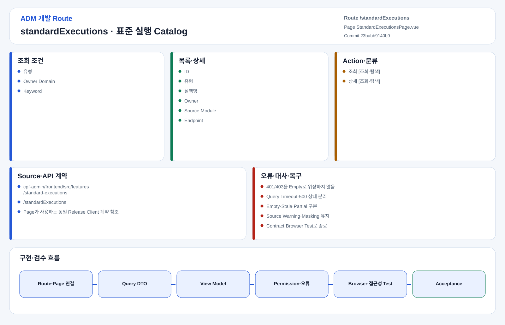


### 구현 결과

`/standardExecutions`가 단순 Route가 아니라 **ONLINE·BATCH 표준 실행 Catalog를 조회한다.** Query·Permission·Owner 상태·관측 정보·Browser Test가 연결된 조회 기능 Slice가 되도록 구현한다.

### Source 진입점과 소유권

| 계층 | 기준 |
|---|---|
| Router | `/standardExecutions` |
| Page | `cpf-admin/frontend/src/features/standard-executions/StandardExecutionsPage.vue` |
| Generated Client | Page가 import하는 Generated Client 또는 공통 ADM Client의 실제 Operation을 사용한다. 수기 Endpoint 문자열과 중복 DTO를 만들지 않는다 |
| ADM Backend | OpenAPI Operation의 Controller와 Application Service |
| Owner Port | Query·Status Port; Local/Remote가 같은 DTO·오류 의미 사용 |
| Test | Frontend Unit·Generated Client Contract·Controller·Browser·Fault |

### Frontend Query·Form 모델

| Field | Control | 직렬화·Validation | 오류·접근성 |
|---|---|---|---|
| `유형` | Select·검색 | 표준 실행 Catalog에서 적용하거나 조회할 정책·권한·처리 유형을 선택한다. 허용 목록과 현재 Environment·Data Scope에 맞는 값만 선택한다. Request·Query의 실제 이름과 Type을 유지한다. | Label·Help·Field Error·Keyboard Focus를 제공하고 민감값은 재표시하지 않는다. |
| `Owner Domain` | Select·검색 | 표준 실행 Catalog 조회·조치가 적용되는 환경과 데이터 경계를 제한한다. 허용 목록과 현재 Environment·Data Scope에 맞는 값만 선택한다. Request·Query의 실제 이름과 Type을 유지한다. | Label·Help·Field Error·Keyboard Focus를 제공하고 민감값은 재표시하지 않는다. |
| `Keyword` | 문자열 입력·검색 | 조회·상세·Audit에서 같은 대상을 다시 찾기 위한 식별 조건이다. 앞뒤 공백·허용 문자·길이와 대소문자 규칙을 확인한다. Request·Query의 실제 이름과 Type을 유지한다. | Label·Help·Field Error·Keyboard Focus를 제공하고 민감값은 재표시하지 않는다. |

### Table·Detail View Model

| 값 | 표시 계약 | Drill-down·대사 |
|---|---|---|
| `ID` | 표준 실행 Catalog의 대상 레코드를 상세·Owner·Audit에서 연결하는 식별자다. Masking·Timezone·단위를 DTO Metadata와 함께 표시한다. | 상세·Log·Trace·Audit에서 같은 대상을 가리키는지 확인한다. |
| `유형` | 표준 실행 Catalog 상세에서 대상의 현재 속성 또는 처리 결과를 확인하는 값이다. Masking·Timezone·단위를 DTO Metadata와 함께 표시한다. | 상세·재조회 결과와 비교하고 Stale·Masking·단위 차이를 확인한다. |
| `실행명` | 운영자가 대상을 구분하는 표시명 또는 설명이다. Masking·Timezone·단위를 DTO Metadata와 함께 표시한다. | 상세·재조회 결과와 비교하고 Stale·Masking·단위 차이를 확인한다. |
| `Owner` | 작업 주체·Owner·변경 사유를 확인하는 감사 정보다. Masking·Timezone·단위를 DTO Metadata와 함께 표시한다. | 상세·재조회 결과와 비교하고 Stale·Masking·단위 차이를 확인한다. |
| `Source Module` | 표준 실행 Catalog 상세에서 대상의 현재 속성 또는 처리 결과를 확인하는 값이다. Masking·Timezone·단위를 DTO Metadata와 함께 표시한다. | 상세·재조회 결과와 비교하고 Stale·Masking·단위 차이를 확인한다. |
| `Endpoint` | 표준 실행 Catalog의 대상 레코드를 상세·Owner·Audit에서 연결하는 식별자다. Masking·Timezone·단위를 DTO Metadata와 함께 표시한다. | 상세·Log·Trace·Audit에서 같은 대상을 가리키는지 확인한다. |

### Button·Interaction 모델

| Action | 분류 | Frontend 활성 조건 | Backend·성공 처리 |
|---|---|---|---|
| **조회** | 조회·탐색 | 조회 Permission과 Query Validation을 충족하고 동일 조회가 진행 중이 아님 | 조회 결과의 조회 시각·Filter·Source Version·Warning이 갱신되며 Owner 데이터는 변경하지 않는다. |
| **상세** | 조회·탐색 | 조회 Permission과 Query Validation을 충족하고 동일 조회가 진행 중이 아님 | 상세 결과의 조회 시각·Filter·Source Version·Warning이 갱신되며 Owner 데이터는 변경하지 않는다. |

### 상태 모델

```text
Query: Idle → Loading → Empty | Success | Error
Success + Stale | Partial
```

조회 상태를 Loading·Empty·Success·Error·Stale·Partial로 구분한다. `401`, `403`, Timeout, Empty, Stale, Partial을 하나의 Error Toast로 합치지 않는다.

### API·Owner 계약

- Query Request는 실제 Page가 사용하는 Environment·Data Scope·검색 Field·Paging·Sort·Timezone만 포함한다.
- Query Response는 실제 Item·Page·조회 시각·Source Version·Stale·Partial·Warning 계약을 유지한다.
- 조회 전용 Route에는 임의의 Command DTO·Operation Polling·Rollback Endpoint를 추가하지 않는다.
- Same-JVM과 Remote Adapter는 DTO·Error Code·Timeout·Unknown 의미를 유지한다.

### Permission·Data Scope·Masking

- Route Permission 기준은 **조회 권한**이다.
- Menu 노출, Query, Button, Raw, Export Permission을 분리하고 Backend와 Owner에서 다시 검증한다.
- Deny는 403과 Audit를 남기며 404·Empty로 위장하지 않는다.
- Secret·Credential·PII Raw를 일반 Response DTO·Browser Storage·Log에 넣지 않는다.

### 구현 순서

1. Route·Page Import·Menu Metadata·Permission을 연결한다.
2. 이 장의 Field·Column·Action을 OpenAPI Request·Response·Error와 대조한다.
3. Generated Client를 재생성하고 수기 HTTP 호출을 제거한다.
4. Query 상태와 Empty·Stale·Partial·Error UI를 구현한다.
5. Backend Query Controller·Application Service·Owner Query Port·Local/Remote Adapter를 연결한다.
6. Menu·Query·Raw·Export Permission과 Data Scope를 Server에서 검증한다.
7. 조회 시각·Source Version·Warning·Correlation ID와 Drill-down Link를 연결한다.
8. Unit·Contract·Browser·Fault·Accessibility Test를 실행한다.

### Test Matrix

| Test | 필수 Scenario |
|---|---|
| Frontend Unit | Default·Validation·Button 조건·Masking·Empty/Error/Stale/Partial |
| OpenAPI·Generated Client | Operation 이름·Type·Error·Hash Drift |
| Backend Query | Permission·Data Scope·Filter·Paging·Stale·Partial |
| Local/Remote Contract | 같은 DTO·Error·Timeout 의미 |
| Browser | Deep Link·Query·상세·403·Timeout·Empty·Partial |
| Accessibility | Keyboard·Focus·Label·Error Announcement·Table/Dialog |

### 개발 Fault Workbook

1. `/standardExecutions` Query를 500·Timeout·Empty·Partial 응답으로 주입해 Loading·Empty·Error·Stale·Partial UI를 각각 확인한다.
2. 401·403과 Data Scope 축소를 주입해 Deny를 Empty로 위장하지 않고 Error와 접근 가능한 범위를 구분하는지 확인한다.
3. 조회 전용 Route에 Command Polling·Reason·Approval·Rollback UI가 노출되지 않는지 확인한다.
4. Local Adapter와 Remote Adapter에 같은 Contract Fixture를 적용해 Error Code·Retryability·failureStage가 일치하는지 확인한다.
5. Browser Storage·Console·Network Error·Screenshot에 Token·Secret·PII Raw가 남지 않는지 확인한다.

### Route Acceptance Checklist

- [ ] Route `/standardExecutions`의 Deep Link와 Menu ID `standardExecutions`가 같은 Page를 연다.
- [ ] 이 장의 Field·Column·Action과 Page·OpenAPI·Generated Client가 같은 계약을 사용한다.
- [ ] Menu·Query·Raw·Export Permission Deny가 Backend 403과 화면 Error로 확인된다.
- [ ] Empty·Timeout·Stale·Partial이 서로 다른 사용자 상태와 재조회 경로를 제공한다.
- [ ] Same-JVM·Remote 호출이 같은 Query DTO·오류·Timeout 계약을 사용한다.
- [ ] 조회 전용 Route에 Source에 없는 Command·Approval·Rollback Action을 노출하지 않는다.
- [ ] 정상·오류·경계 Browser Test와 Accessibility Test가 Route Matrix에 포함된다.

### 독립 수행 검수 Checklist

- [ ] `/standardExecutions`와 Page Source를 찾고 화면 목적을 설명할 수 있다.
- [ ] 3개 입력·검색 항목의 Control·기본값·Validation을 설명할 수 있다.
- [ ] 6개 표시값을 Owner 상태·Version·Audit와 대사할 수 있다.
- [ ] 2개 Action의 분류·활성 조건·Side Effect를 설명할 수 있다.
- [ ] Empty·401·403·Timeout·Stale·Partial을 서로 다른 조회 상태로 처리할 수 있다.
- [ ] 조회 응답 유실 시 같은 Query Context로 재조회하고 Correlation ID·조회 시각·Source Version으로 결과를 대사할 수 있다.
- [ ] 교대 기록만으로 다음 담당자가 Target·상태·복구 기한을 이어받을 수 있다.
- [ ] OpenAPI·Generated Client·Page·Controller·Owner Port·Test가 같은 Field와 오류 계약을 사용하는지 검증할 수 있다.
- [ ] Local·Remote Adapter의 Timeout·Unknown 의미가 같은지 Contract Test로 확인할 수 있다.

## 8. channelPolicy — Channel·거래 정책 Snapshot 기능 Slice 개발 장

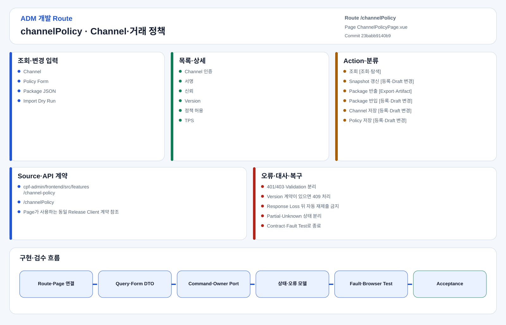


### 구현 결과

`/channelPolicy`가 단순 Route가 아니라 **Channel 인증·서명·신뢰·TPS 정책 Snapshot을 관리한다.** Query·Command·Permission·Owner 상태·Audit·Browser Test가 연결된 기능 Slice가 되도록 구현한다.

### Source 진입점과 소유권

| 계층 | 기준 |
|---|---|
| Router | `/channelPolicy` |
| Page | `cpf-admin/frontend/src/features/channel-policy/ChannelPolicyPage.vue` |
| Generated Client | Page가 import하는 Generated Client 또는 공통 ADM Client의 실제 Operation을 사용한다. 수기 Endpoint 문자열과 중복 DTO를 만들지 않는다 |
| ADM Backend | OpenAPI Operation의 Controller와 Application Service |
| Owner Port | Query·Command·Status·Reconcile Port; Local/Remote가 같은 DTO·오류 의미 사용 |
| Test | Frontend Unit·Generated Client Contract·Controller·Browser·Fault |

### Frontend Query·Form 모델

| Field | Control | 직렬화·Validation | 오류·접근성 |
|---|---|---|---|
| `Channel` | Select·검색 | Channel·거래 정책 Snapshot에서 적용하거나 조회할 정책·권한·처리 유형을 선택한다. 허용 목록과 현재 Environment·Data Scope에 맞는 값만 선택한다. Request·Query의 실제 이름과 Type을 유지한다. | Label·Help·Field Error·Keyboard Focus를 제공하고 민감값은 재표시하지 않는다. |
| `Policy Form` | Select·검색 | Channel·거래 정책 Snapshot에서 적용하거나 조회할 정책·권한·처리 유형을 선택한다. 허용 목록과 현재 Environment·Data Scope에 맞는 값만 선택한다. Request·Query의 실제 이름과 Type을 유지한다. | Label·Help·Field Error·Keyboard Focus를 제공하고 민감값은 재표시하지 않는다. |
| `Package JSON` | 다중행 입력 | 검증·등록·Export에 사용할 입력 Artifact 또는 구조화된 본문이다. 허용 Schema·길이·민감정보 포함 여부를 확인하고 Preview 또는 Validation 결과를 검토한다. Request·Query의 실제 이름과 Type을 유지한다. | Label·Help·Field Error·Keyboard Focus를 제공하고 민감값은 재표시하지 않는다. |
| `Import Dry Run` | 숫자·Version 입력 | 실행 한도·순서·용량 또는 재시도 범위를 지정한다. 화면의 min·max·단위와 0 허용 여부를 확인하고 음수·Overflow를 차단한다. Request·Query의 실제 이름과 Type을 유지한다. | Label·Help·Field Error·Keyboard Focus를 제공하고 민감값은 재표시하지 않는다. |

### Table·Detail View Model

| 값 | 표시 계약 | Drill-down·대사 |
|---|---|---|
| `Channel 인증` | Channel·거래 정책 Snapshot 상세에서 대상의 현재 속성 또는 처리 결과를 확인하는 값이다. Masking·Timezone·단위를 DTO Metadata와 함께 표시한다. | 상세·재조회 결과와 비교하고 Stale·Masking·단위 차이를 확인한다. |
| `서명` | 운영자가 대상을 구분하는 표시명 또는 설명이다. Masking·Timezone·단위를 DTO Metadata와 함께 표시한다. | 상세·재조회 결과와 비교하고 Stale·Masking·단위 차이를 확인한다. |
| `신뢰` | Channel·거래 정책 Snapshot 상세에서 대상의 현재 속성 또는 처리 결과를 확인하는 값이다. Masking·Timezone·단위를 DTO Metadata와 함께 표시한다. | 상세·재조회 결과와 비교하고 Stale·Masking·단위 차이를 확인한다. |
| `Version` | 요청·Owner·Instance 사이의 Version 또는 내용 동일성을 판단하는 값이다. Masking·Timezone·단위를 DTO Metadata와 함께 표시한다. | 목록·상세·Owner 또는 Instance 보고값에서 일치하는지 확인한다. |
| `정책 허용` | Channel·거래 정책 Snapshot 상세에서 대상의 현재 속성 또는 처리 결과를 확인하는 값이다. Masking·Timezone·단위를 DTO Metadata와 함께 표시한다. | 상세·재조회 결과와 비교하고 Stale·Masking·단위 차이를 확인한다. |
| `TPS` | 동일한 집계 시간 창·단위·Filter에서 비교해야 하는 수치다. Masking·Timezone·단위를 DTO Metadata와 함께 표시한다. | 같은 Filter·집계 시간 창·단위의 상세 Row 또는 Metric으로 대사한다. |

### Button·Command 모델

| Action | 분류 | Frontend 활성 조건 | Backend·성공 처리 |
|---|---|---|---|
| **조회** | 조회·탐색 | 조회 Permission과 Query Validation을 충족하고 동일 조회가 진행 중이 아님 | 조회 결과의 조회 시각·Filter·Source Version·Warning이 갱신되며 Owner 데이터는 변경하지 않는다. |
| **Snapshot 갱신** | 등록·Draft 변경 | 화면이 실제로 요구하는 Write Permission·필수 Field·Reason·Version 조건을 충족함 | Channel·거래 정책 Snapshot의 재조회 결과가 요청 내용과 일치한다. Version·Before/After·Audit는 해당 Owner가 제공하는 경우 함께 확인한다. Backend에서도 Permission·Version·Idempotency를 재검증한다. |
| **Package 반출** | Export·Artifact | 화면이 요구하는 Export Permission·Data Scope·Masking·Reason과 승인 조건을 충족함 | Export Operation과 Artifact ID·Checksum·만료·Download Audit가 생성되고 원본 데이터는 변경하지 않는다. Backend에서도 Permission·Version·Idempotency를 재검증한다. |
| **Package 반입** | 등록·Draft 변경 | 화면이 실제로 요구하는 Write Permission·필수 Field·Reason·Version 조건을 충족함 | Channel·거래 정책 Snapshot의 재조회 결과가 요청 내용과 일치한다. Version·Before/After·Audit는 해당 Owner가 제공하는 경우 함께 확인한다. Backend에서도 Permission·Version·Idempotency를 재검증한다. |
| **Channel 저장** | 등록·Draft 변경 | 화면이 실제로 요구하는 Write Permission·필수 Field·Reason·Version 조건을 충족함 | Channel·거래 정책 Snapshot의 재조회 결과가 요청 내용과 일치한다. Version·Before/After·Audit는 해당 Owner가 제공하는 경우 함께 확인한다. Backend에서도 Permission·Version·Idempotency를 재검증한다. |
| **Policy 저장** | 등록·Draft 변경 | 화면이 실제로 요구하는 Write Permission·필수 Field·Reason·Version 조건을 충족함 | Channel·거래 정책 Snapshot의 재조회 결과가 요청 내용과 일치한다. Version·Before/After·Audit는 해당 Owner가 제공하는 경우 함께 확인한다. Backend에서도 Permission·Version·Idempotency를 재검증한다. |

### 상태 모델

```text
Query: Idle → Loading → Empty | Success | Error
Success + Stale | Partial
Command: Editing → Validating → Submitting → Accepted(operationId) → Terminal
Submitting → ResponseLoss → Reconcile → Terminal | UNKNOWN_RESULT
```

Query와 Command의 Loading·Error를 분리한다. 조회 전용 Route에는 존재하지 않는 Command 상태를 만들지 않는다. `403`, `409`, Timeout, Partial, Unknown을 하나의 Error Toast로 합치지 않는다.

### API·Owner 계약

- Query Request는 실제 Page가 사용하는 Environment·Data Scope·검색 Field·Paging·Sort·Timezone만 포함한다.
- Query Response는 실제 Item·Page·조회 시각·Source Version·Stale·Partial·Warning 계약을 유지한다.
- Command는 Source에 선언된 Target ID·Version·Reason·Approval ID·Idempotency Key·Request Hash 중 실제 필드만 사용한다.
- `202 Accepted`는 완료가 아니라 Operation 추적 시작이며 Owner Terminal 상태를 별도로 조회한다.
- Side Effect 전 실패, Side Effect 후 실패, Success, Partial, `UNKNOWN_RESULT`를 구분한다.
- Same-JVM과 Remote Adapter는 DTO·Error Code·Timeout·Unknown 의미를 유지한다.

### Permission·Data Scope·Masking

- Route Permission 기준은 **`CHANNEL_POLICY` Write**이다.
- Menu 노출, Query, Button, Raw, Export Permission을 분리하고 Backend와 Owner에서 다시 검증한다.
- Deny는 403과 Audit를 남기며 404·Empty로 위장하지 않는다.
- Secret·Credential·PII Raw를 일반 Response DTO·Browser Storage·Log에 넣지 않는다.

### 구현 순서

1. Route·Page Import·Menu Metadata·Permission을 연결한다.
2. 이 장의 Field·Column·Action을 OpenAPI Request·Response·Error와 대조한다.
3. Generated Client를 재생성하고 수기 HTTP 호출을 제거한다.
4. Query·Command 상태와 Empty·Stale·Partial·Unknown UI를 구현한다.
5. Backend Controller·Application Service·Owner Port·Local/Remote Adapter를 연결한다.
6. Reason·Approval·Expected Version·Idempotency·Audit를 Server에서 검증한다.
7. Response Loss Polling·Reconcile·Rollback Link를 구현한다.
8. Unit·Contract·Browser·Fault·Accessibility Test를 실행한다.

### Test Matrix

| Test | 필수 Scenario |
|---|---|
| Frontend Unit | Default·Validation·Button 조건·Masking·Empty/Error/Stale/Partial |
| OpenAPI·Generated Client | Operation 이름·Type·Error·Hash Drift |
| Backend Query | Permission·Data Scope·Filter·Paging·Stale·Partial |
| Backend Command | Source에 선언된 Permission·Version·Reason·Approval·Idempotency·Audit 계약 |
| Local/Remote Contract | 같은 DTO·Error·Timeout 의미 |
| Browser | Deep Link·Query·상세·403·Timeout·Empty·Partial |
| Fault | 409·Response Loss·DB/Kafka/Owner 중단·Partial ACK·Late Response |
| Accessibility | Keyboard·Focus·Label·Error Announcement·Table/Dialog |

### 개발 Fault Workbook

1. `/channelPolicy` Query를 500·Timeout·Empty·Partial 응답으로 주입해 Loading·Empty·Error·Stale·Partial UI를 각각 확인한다.
2. 401·403과 Data Scope 축소를 주입해 Deny를 Empty로 위장하지 않고 Error와 접근 가능한 범위를 구분하는지 확인한다.
3. Version 계약이 있는 Write Action에는 409를, 모든 비동기·원격 Write에는 Response Loss를 주입해 자동 재제출이 없는지 확인한다.
4. 202 응답 뒤 Operation Polling이 Terminal·Failed·Partial·Unknown을 분리하는지 확인한다.
5. Local Adapter와 Remote Adapter에 같은 Contract Fixture를 적용해 Error Code·Retryability·failureStage가 일치하는지 확인한다.
6. Browser Storage·Console·Network Error·Screenshot에 Token·Secret·PII Raw가 남지 않는지 확인한다.

### Route Acceptance Checklist

- [ ] Route `/channelPolicy`의 Deep Link와 Menu ID `channelPolicy`가 같은 Page를 연다.
- [ ] 이 장의 Field·Column·Action과 Page·OpenAPI·Generated Client가 같은 계약을 사용한다.
- [ ] Menu·Query·Raw·Export Permission Deny가 Backend 403과 화면 Error로 확인된다.
- [ ] Empty·Timeout·Stale·Partial이 서로 다른 사용자 상태와 재조회 경로를 제공한다.
- [ ] Same-JVM·Remote 호출이 같은 Query DTO·오류·Timeout 계약을 사용한다.
- [ ] 409·Response Loss·Partial·Unknown이 서로 다른 상태와 Operation·Reconcile Link를 제공한다.
- [ ] Command가 Source에 선언한 Reason·Approval·Version·Idempotency·Audit 필드를 Server에서 재검증한다.
- [ ] 정상·오류·경계 Browser Test와 Accessibility Test가 Route Matrix에 포함된다.

### 독립 수행 검수 Checklist

- [ ] `/channelPolicy`와 Page Source를 찾고 화면 목적을 설명할 수 있다.
- [ ] 4개 입력·검색 항목의 Control·기본값·Validation을 설명할 수 있다.
- [ ] 6개 표시값을 Owner 상태·Version·Audit와 대사할 수 있다.
- [ ] 6개 Action의 분류·활성 조건·Side Effect를 설명할 수 있다.
- [ ] Empty·403·409·Timeout·Partial·Unknown을 서로 다른 상태로 처리할 수 있다.
- [ ] 응답 유실 뒤 중복 제출 없이 Operation·Owner·Audit로 결과를 확정할 수 있다.
- [ ] 교대 기록만으로 다음 담당자가 Target·상태·복구 기한을 이어받을 수 있다.
- [ ] OpenAPI·Generated Client·Page·Controller·Owner Port·Test가 같은 Field와 오류 계약을 사용하는지 검증할 수 있다.
- [ ] Local·Remote Adapter의 Timeout·Unknown 의미가 같은지 Contract Test로 확인할 수 있다.

## 9. serviceRegistry — Service·Endpoint·Instance·Health·Routing 기능 Slice 개발 장

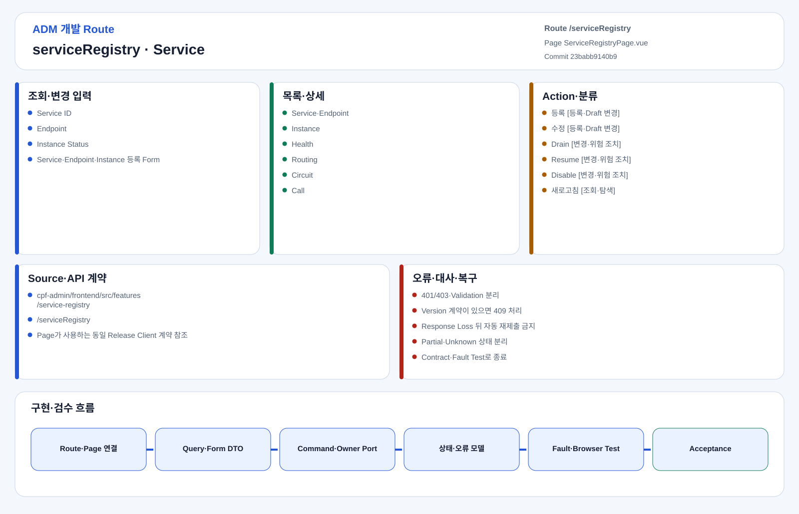


### 구현 결과

`/serviceRegistry`가 단순 Route가 아니라 **Service·Endpoint·Instance·Health·Routing을 등록하고 운영 상태를 제어한다.** Query·Command·Permission·Owner 상태·Audit·Browser Test가 연결된 기능 Slice가 되도록 구현한다.

### Source 진입점과 소유권

| 계층 | 기준 |
|---|---|
| Router | `/serviceRegistry` |
| Page | `cpf-admin/frontend/src/features/service-registry/ServiceRegistryPage.vue` |
| Generated Client | Page가 import하는 Generated Client 또는 공통 ADM Client의 실제 Operation을 사용한다. 수기 Endpoint 문자열과 중복 DTO를 만들지 않는다 |
| ADM Backend | OpenAPI Operation의 Controller와 Application Service |
| Owner Port | Query·Command·Status·Reconcile Port; Local/Remote가 같은 DTO·오류 의미 사용 |
| Test | Frontend Unit·Generated Client Contract·Controller·Browser·Fault |

### Frontend Query·Form 모델

| Field | Control | 직렬화·Validation | 오류·접근성 |
|---|---|---|---|
| `Service ID` | 문자열 입력·검색 | 조회·상세·Audit에서 같은 대상을 다시 찾기 위한 식별 조건이다. 앞뒤 공백·허용 문자·길이와 대소문자 규칙을 확인한다. Request·Query의 실제 이름과 Type을 유지한다. | Label·Help·Field Error·Keyboard Focus를 제공하고 민감값은 재표시하지 않는다. |
| `Endpoint` | 문자열 입력·검색 | 조회·상세·Audit에서 같은 대상을 다시 찾기 위한 식별 조건이다. 앞뒤 공백·허용 문자·길이와 대소문자 규칙을 확인한다. Request·Query의 실제 이름과 Type을 유지한다. | Label·Help·Field Error·Keyboard Focus를 제공하고 민감값은 재표시하지 않는다. |
| `Instance Status` | Select·검색 | 현재 상태를 조회하거나 다음 Action의 허용 조건을 지정한다. 허용 목록과 현재 Environment·Data Scope에 맞는 값만 선택한다. Request·Query의 실제 이름과 Type을 유지한다. | Label·Help·Field Error·Keyboard Focus를 제공하고 민감값은 재표시하지 않는다. |
| `Service·Endpoint·Instance 등록 Form` | 문자열 입력·검색 | 조회·상세·Audit에서 같은 대상을 다시 찾기 위한 식별 조건이다. 앞뒤 공백·허용 문자·길이와 대소문자 규칙을 확인한다. Request·Query의 실제 이름과 Type을 유지한다. | Label·Help·Field Error·Keyboard Focus를 제공하고 민감값은 재표시하지 않는다. |

### Table·Detail View Model

| 값 | 표시 계약 | Drill-down·대사 |
|---|---|---|
| `Service·Endpoint` | Service·Endpoint·Instance·Health·Routing의 대상 레코드를 상세·Owner·Audit에서 연결하는 식별자다. Masking·Timezone·단위를 DTO Metadata와 함께 표시한다. | 상세·Log·Trace·Audit에서 같은 대상을 가리키는지 확인한다. |
| `Instance` | Service·Endpoint·Instance·Health·Routing의 대상 레코드를 상세·Owner·Audit에서 연결하는 식별자다. Masking·Timezone·단위를 DTO Metadata와 함께 표시한다. | 상세·Log·Trace·Audit에서 같은 대상을 가리키는지 확인한다. |
| `Health` | 현재 상태와 Terminal 여부, 다음 Action 가능 여부를 판단하는 값이다. Masking·Timezone·단위를 DTO Metadata와 함께 표시한다. | Last Updated·Terminal 조건·Owner 상태와 함께 확인한다. |
| `Routing` | Service·Endpoint·Instance·Health·Routing 상세에서 대상의 현재 속성 또는 처리 결과를 확인하는 값이다. Masking·Timezone·단위를 DTO Metadata와 함께 표시한다. | 상세·재조회 결과와 비교하고 Stale·Masking·단위 차이를 확인한다. |
| `Circuit` | 현재 상태와 Terminal 여부, 다음 Action 가능 여부를 판단하는 값이다. Masking·Timezone·단위를 DTO Metadata와 함께 표시한다. | 상세·재조회 결과와 비교하고 Stale·Masking·단위 차이를 확인한다. |
| `Call` | Service·Endpoint·Instance·Health·Routing 상세에서 대상의 현재 속성 또는 처리 결과를 확인하는 값이다. Masking·Timezone·단위를 DTO Metadata와 함께 표시한다. | 상세·재조회 결과와 비교하고 Stale·Masking·단위 차이를 확인한다. |

### Button·Command 모델

| Action | 분류 | Frontend 활성 조건 | Backend·성공 처리 |
|---|---|---|---|
| **등록** | 등록·Draft 변경 | 화면이 실제로 요구하는 Write Permission·필수 Field·Reason·Version 조건을 충족함 | Service·Endpoint·Instance·Health·Routing의 재조회 결과가 요청 내용과 일치한다. Version·Before/After·Audit는 해당 Owner가 제공하는 경우 함께 확인한다. Backend에서도 Permission·Version·Idempotency를 재검증한다. |
| **수정** | 등록·Draft 변경 | 화면이 실제로 요구하는 Write Permission·필수 Field·Reason·Version 조건을 충족함 | Service·Endpoint·Instance·Health·Routing의 재조회 결과가 요청 내용과 일치한다. Version·Before/After·Audit는 해당 Owner가 제공하는 경우 함께 확인한다. Backend에서도 Permission·Version·Idempotency를 재검증한다. |
| **Drain** | 변경·위험 조치 | 화면과 Owner가 요구하는 Write Permission·대상 상태·영향 범위·Reason·승인·Version 조건을 충족함 | 변경 Operation을 생성하고 Accepted 응답과 Owner Terminal 상태·Version·Audit를 분리해 확인한다. Backend에서도 Permission·Version·Idempotency를 재검증한다. |
| **Resume** | 변경·위험 조치 | 화면과 Owner가 요구하는 Write Permission·대상 상태·영향 범위·Reason·승인·Version 조건을 충족함 | 변경 Operation을 생성하고 Accepted 응답과 Owner Terminal 상태·Version·Audit를 분리해 확인한다. Backend에서도 Permission·Version·Idempotency를 재검증한다. |
| **Disable** | 변경·위험 조치 | 화면과 Owner가 요구하는 Write Permission·대상 상태·영향 범위·Reason·승인·Version 조건을 충족함 | 변경 Operation을 생성하고 Accepted 응답과 Owner Terminal 상태·Version·Audit를 분리해 확인한다. Backend에서도 Permission·Version·Idempotency를 재검증한다. |
| **새로고침** | 조회·탐색 | 조회 Permission과 Query Validation을 충족하고 동일 조회가 진행 중이 아님 | 새로고침 결과의 조회 시각·Filter·Source Version·Warning이 갱신되며 Owner 데이터는 변경하지 않는다. |

### 상태 모델

```text
Query: Idle → Loading → Empty | Success | Error
Success + Stale | Partial
Command: Editing → Validating → Submitting → Accepted(operationId) → Terminal
Submitting → ResponseLoss → Reconcile → Terminal | UNKNOWN_RESULT
```

Query와 Command의 Loading·Error를 분리한다. 조회 전용 Route에는 존재하지 않는 Command 상태를 만들지 않는다. `403`, `409`, Timeout, Partial, Unknown을 하나의 Error Toast로 합치지 않는다.

### API·Owner 계약

- Query Request는 실제 Page가 사용하는 Environment·Data Scope·검색 Field·Paging·Sort·Timezone만 포함한다.
- Query Response는 실제 Item·Page·조회 시각·Source Version·Stale·Partial·Warning 계약을 유지한다.
- Command는 Source에 선언된 Target ID·Version·Reason·Approval ID·Idempotency Key·Request Hash 중 실제 필드만 사용한다.
- `202 Accepted`는 완료가 아니라 Operation 추적 시작이며 Owner Terminal 상태를 별도로 조회한다.
- Side Effect 전 실패, Side Effect 후 실패, Success, Partial, `UNKNOWN_RESULT`를 구분한다.
- Same-JVM과 Remote Adapter는 DTO·Error Code·Timeout·Unknown 의미를 유지한다.

### Permission·Data Scope·Masking

- Route Permission 기준은 **`SERVICE_REGISTRY` Write**이다.
- Menu 노출, Query, Button, Raw, Export Permission을 분리하고 Backend와 Owner에서 다시 검증한다.
- Deny는 403과 Audit를 남기며 404·Empty로 위장하지 않는다.
- Secret·Credential·PII Raw를 일반 Response DTO·Browser Storage·Log에 넣지 않는다.

### 구현 순서

1. Route·Page Import·Menu Metadata·Permission을 연결한다.
2. 이 장의 Field·Column·Action을 OpenAPI Request·Response·Error와 대조한다.
3. Generated Client를 재생성하고 수기 HTTP 호출을 제거한다.
4. Query·Command 상태와 Empty·Stale·Partial·Unknown UI를 구현한다.
5. Backend Controller·Application Service·Owner Port·Local/Remote Adapter를 연결한다.
6. Reason·Approval·Expected Version·Idempotency·Audit를 Server에서 검증한다.
7. Response Loss Polling·Reconcile·Rollback Link를 구현한다.
8. Unit·Contract·Browser·Fault·Accessibility Test를 실행한다.

### Test Matrix

| Test | 필수 Scenario |
|---|---|
| Frontend Unit | Default·Validation·Button 조건·Masking·Empty/Error/Stale/Partial |
| OpenAPI·Generated Client | Operation 이름·Type·Error·Hash Drift |
| Backend Query | Permission·Data Scope·Filter·Paging·Stale·Partial |
| Backend Command | Source에 선언된 Permission·Version·Reason·Approval·Idempotency·Audit 계약 |
| Local/Remote Contract | 같은 DTO·Error·Timeout 의미 |
| Browser | Deep Link·Query·상세·403·Timeout·Empty·Partial |
| Fault | 409·Response Loss·DB/Kafka/Owner 중단·Partial ACK·Late Response |
| Accessibility | Keyboard·Focus·Label·Error Announcement·Table/Dialog |

### 개발 Fault Workbook

1. `/serviceRegistry` Query를 500·Timeout·Empty·Partial 응답으로 주입해 Loading·Empty·Error·Stale·Partial UI를 각각 확인한다.
2. 401·403과 Data Scope 축소를 주입해 Deny를 Empty로 위장하지 않고 Error와 접근 가능한 범위를 구분하는지 확인한다.
3. Version 계약이 있는 Write Action에는 409를, 모든 비동기·원격 Write에는 Response Loss를 주입해 자동 재제출이 없는지 확인한다.
4. 202 응답 뒤 Operation Polling이 Terminal·Failed·Partial·Unknown을 분리하는지 확인한다.
5. Local Adapter와 Remote Adapter에 같은 Contract Fixture를 적용해 Error Code·Retryability·failureStage가 일치하는지 확인한다.
6. Browser Storage·Console·Network Error·Screenshot에 Token·Secret·PII Raw가 남지 않는지 확인한다.

### Route Acceptance Checklist

- [ ] Route `/serviceRegistry`의 Deep Link와 Menu ID `serviceRegistry`가 같은 Page를 연다.
- [ ] 이 장의 Field·Column·Action과 Page·OpenAPI·Generated Client가 같은 계약을 사용한다.
- [ ] Menu·Query·Raw·Export Permission Deny가 Backend 403과 화면 Error로 확인된다.
- [ ] Empty·Timeout·Stale·Partial이 서로 다른 사용자 상태와 재조회 경로를 제공한다.
- [ ] Same-JVM·Remote 호출이 같은 Query DTO·오류·Timeout 계약을 사용한다.
- [ ] 409·Response Loss·Partial·Unknown이 서로 다른 상태와 Operation·Reconcile Link를 제공한다.
- [ ] Command가 Source에 선언한 Reason·Approval·Version·Idempotency·Audit 필드를 Server에서 재검증한다.
- [ ] 정상·오류·경계 Browser Test와 Accessibility Test가 Route Matrix에 포함된다.

### 독립 수행 검수 Checklist

- [ ] `/serviceRegistry`와 Page Source를 찾고 화면 목적을 설명할 수 있다.
- [ ] 4개 입력·검색 항목의 Control·기본값·Validation을 설명할 수 있다.
- [ ] 6개 표시값을 Owner 상태·Version·Audit와 대사할 수 있다.
- [ ] 6개 Action의 분류·활성 조건·Side Effect를 설명할 수 있다.
- [ ] Empty·403·409·Timeout·Partial·Unknown을 서로 다른 상태로 처리할 수 있다.
- [ ] 응답 유실 뒤 중복 제출 없이 Operation·Owner·Audit로 결과를 확정할 수 있다.
- [ ] 교대 기록만으로 다음 담당자가 Target·상태·복구 기한을 이어받을 수 있다.
- [ ] OpenAPI·Generated Client·Page·Controller·Owner Port·Test가 같은 Field와 오류 계약을 사용하는지 검증할 수 있다.
- [ ] Local·Remote Adapter의 Timeout·Unknown 의미가 같은지 Contract Test로 확인할 수 있다.

## 10. runtimeControl — Runtime 변경 Control Plane 기능 Slice 개발 장

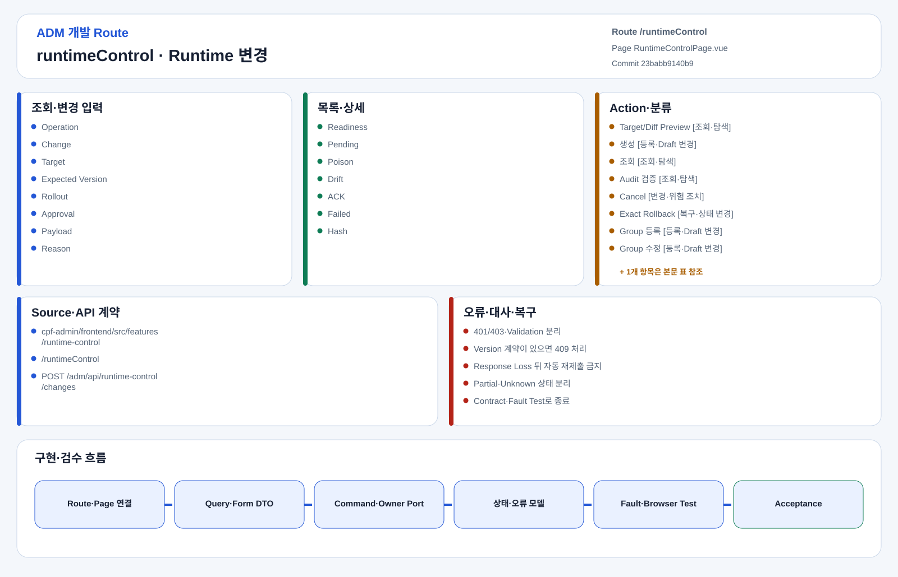


### 구현 결과

`/runtimeControl`가 단순 Route가 아니라 **다중 Instance Runtime 변경을 계획·배포·대사한다.** Query·Command·Permission·Owner 상태·Audit·Browser Test가 연결된 기능 Slice가 되도록 구현한다.

### Source 진입점과 소유권

| 계층 | 기준 |
|---|---|
| Router | `/runtimeControl` |
| Page | `cpf-admin/frontend/src/features/runtime-control/RuntimeControlPage.vue` |
| Generated Client | Page가 import하는 Generated Client 또는 공통 ADM Client의 실제 Operation을 사용한다. 수기 Endpoint 문자열과 중복 DTO를 만들지 않는다 |
| ADM Backend | OpenAPI Operation의 Controller와 Application Service |
| Owner Port | Query·Command·Status·Reconcile Port; Local/Remote가 같은 DTO·오류 의미 사용 |
| Test | Frontend Unit·Generated Client Contract·Controller·Browser·Fault |
| 확인 API 1 | `POST /adm/api/runtime-control/changes` |

### Frontend Query·Form 모델

| Field | Control | 직렬화·Validation | 오류·접근성 |
|---|---|---|---|
| `Operation` | 문자열 입력·검색 | Runtime 변경 Control Plane 화면의 조회 조건 또는 편집 Form에 포함되는 값이며 화면 Label과 Help를 기준으로 사용한다. 앞뒤 공백·허용 문자·길이와 대소문자 규칙을 확인한다. Request·Query의 실제 이름과 Type을 유지한다. | Label·Help·Field Error·Keyboard Focus를 제공하고 민감값은 재표시하지 않는다. |
| `Change` | 문자열 입력·검색 | Runtime 변경 Control Plane 화면의 조회 조건 또는 편집 Form에 포함되는 값이며 화면 Label과 Help를 기준으로 사용한다. 앞뒤 공백·허용 문자·길이와 대소문자 규칙을 확인한다. Request·Query의 실제 이름과 Type을 유지한다. | Label·Help·Field Error·Keyboard Focus를 제공하고 민감값은 재표시하지 않는다. |
| `Target` | 문자열 입력·검색 | Runtime 변경 Control Plane 화면의 조회 조건 또는 편집 Form에 포함되는 값이며 화면 Label과 Help를 기준으로 사용한다. 앞뒤 공백·허용 문자·길이와 대소문자 규칙을 확인한다. Request·Query의 실제 이름과 Type을 유지한다. | Label·Help·Field Error·Keyboard Focus를 제공하고 민감값은 재표시하지 않는다. |
| `Expected Version` | 숫자·Version 입력 | 동시 변경을 막고 요청 대상의 현재 Revision을 확인하는 값이다. 상세 재조회로 최신 값을 얻고 409 발생 시 기존 값을 덮어쓰지 않는다. Request·Query의 실제 이름과 Type을 유지한다. | Label·Help·Field Error·Keyboard Focus를 제공하고 민감값은 재표시하지 않는다. |
| `Rollout` | 문자열 입력·검색 | Runtime 변경 Control Plane 화면의 조회 조건 또는 편집 Form에 포함되는 값이며 화면 Label과 Help를 기준으로 사용한다. 앞뒤 공백·허용 문자·길이와 대소문자 규칙을 확인한다. Request·Query의 실제 이름과 Type을 유지한다. | Label·Help·Field Error·Keyboard Focus를 제공하고 민감값은 재표시하지 않는다. |
| `Approval` | Checkbox·Switch | Runtime 변경 Control Plane 화면의 조회 조건 또는 편집 Form에 포함되는 값이며 화면 Label과 Help를 기준으로 사용한다. 현재 선택과 변경 후 영향 범위를 비교하고 화면의 Source 기본값을 확인한다. Request·Query의 실제 이름과 Type을 유지한다. | Label·Help·Field Error·Keyboard Focus를 제공하고 민감값은 재표시하지 않는다. |
| `Payload` | 다중행 입력 | 검증·등록·Export에 사용할 입력 Artifact 또는 구조화된 본문이다. 허용 Schema·길이·민감정보 포함 여부를 확인하고 Preview 또는 Validation 결과를 검토한다. Request·Query의 실제 이름과 Type을 유지한다. | Label·Help·Field Error·Keyboard Focus를 제공하고 민감값은 재표시하지 않는다. |
| `Reason` | 다중행 입력 | 작업 목적·영향 범위·승인 또는 복구 기준을 기록해 Audit와 교대 기록에 연결한다. Ticket·영향 범위·복구점을 포함하고 화면이 요구하는 최소 길이를 충족한다. Request·Query의 실제 이름과 Type을 유지한다. | Label·Help·Field Error·Keyboard Focus를 제공하고 민감값은 재표시하지 않는다. |

### Table·Detail View Model

| 값 | 표시 계약 | Drill-down·대사 |
|---|---|---|
| `Readiness` | Runtime 변경 Control Plane 상세에서 대상의 현재 속성 또는 처리 결과를 확인하는 값이다. Masking·Timezone·단위를 DTO Metadata와 함께 표시한다. | 상세·재조회 결과와 비교하고 Stale·Masking·단위 차이를 확인한다. |
| `Pending` | Runtime 변경 Control Plane 상세에서 대상의 현재 속성 또는 처리 결과를 확인하는 값이다. Masking·Timezone·단위를 DTO Metadata와 함께 표시한다. | 상세·재조회 결과와 비교하고 Stale·Masking·단위 차이를 확인한다. |
| `Poison` | 오류·Drift·결과 불명 범위를 나타내며 원인과 복구 Owner를 연결해야 한다. Masking·Timezone·단위를 DTO Metadata와 함께 표시한다. | 상세·재조회 결과와 비교하고 Stale·Masking·단위 차이를 확인한다. |
| `Drift` | 오류·Drift·결과 불명 범위를 나타내며 원인과 복구 Owner를 연결해야 한다. Masking·Timezone·단위를 DTO Metadata와 함께 표시한다. | 원인 식별자·실패 Stage·마지막 갱신 시각을 상세와 대조한다. |
| `ACK` | Runtime 변경 Control Plane 상세에서 대상의 현재 속성 또는 처리 결과를 확인하는 값이다. Masking·Timezone·단위를 DTO Metadata와 함께 표시한다. | 상세·재조회 결과와 비교하고 Stale·Masking·단위 차이를 확인한다. |
| `Failed` | Runtime 변경 Control Plane 상세에서 대상의 현재 속성 또는 처리 결과를 확인하는 값이다. Masking·Timezone·단위를 DTO Metadata와 함께 표시한다. | 상세·재조회 결과와 비교하고 Stale·Masking·단위 차이를 확인한다. |
| `Hash` | 요청·Owner·Instance 사이의 Version 또는 내용 동일성을 판단하는 값이다. Masking·Timezone·단위를 DTO Metadata와 함께 표시한다. | 목록·상세·Owner 또는 Instance 보고값에서 일치하는지 확인한다. |

### Button·Command 모델

| Action | 분류 | Frontend 활성 조건 | Backend·성공 처리 |
|---|---|---|---|
| **Target/Diff Preview** | 조회·탐색 | 조회 Permission과 Query Validation을 충족하고 동일 조회가 진행 중이 아님 | Target/Diff Preview 결과의 조회 시각·Filter·Source Version·Warning이 갱신되며 Owner 데이터는 변경하지 않는다. |
| **생성** | 등록·Draft 변경 | 화면이 실제로 요구하는 Write Permission·필수 Field·Reason·Version 조건을 충족함 | Runtime 변경 Control Plane의 재조회 결과가 요청 내용과 일치한다. Version·Before/After·Audit는 해당 Owner가 제공하는 경우 함께 확인한다. Backend에서도 Permission·Version·Idempotency를 재검증한다. |
| **조회** | 조회·탐색 | 조회 Permission과 Query Validation을 충족하고 동일 조회가 진행 중이 아님 | 조회 결과의 조회 시각·Filter·Source Version·Warning이 갱신되며 Owner 데이터는 변경하지 않는다. |
| **Audit 검증** | 조회·탐색 | 조회 Permission과 Query Validation을 충족하고 동일 조회가 진행 중이 아님 | Audit 검증 결과의 조회 시각·Filter·Source Version·Warning이 갱신되며 Owner 데이터는 변경하지 않는다. |
| **Cancel** | 변경·위험 조치 | 화면과 Owner가 요구하는 Write Permission·대상 상태·영향 범위·Reason·승인·Version 조건을 충족함 | 변경 Operation을 생성하고 Accepted 응답과 Owner Terminal 상태·Version·Audit를 분리해 확인한다. Backend에서도 Permission·Version·Idempotency를 재검증한다. |
| **Exact Rollback** | 복구·상태 변경 | 화면과 Owner가 요구하는 복구 Permission·대상 상태·Reason·승인·Version 조건을 충족함 | 복구 Operation을 생성하고 Owner 상태·대상별 결과·Audit로 종료를 판정한다. Backend에서도 Permission·Version·Idempotency를 재검증한다. |
| **Group 등록** | 등록·Draft 변경 | 화면이 실제로 요구하는 Write Permission·필수 Field·Reason·Version 조건을 충족함 | Runtime 변경 Control Plane의 재조회 결과가 요청 내용과 일치한다. Version·Before/After·Audit는 해당 Owner가 제공하는 경우 함께 확인한다. Backend에서도 Permission·Version·Idempotency를 재검증한다. |
| **Group 수정** | 등록·Draft 변경 | 화면이 실제로 요구하는 Write Permission·필수 Field·Reason·Version 조건을 충족함 | Runtime 변경 Control Plane의 재조회 결과가 요청 내용과 일치한다. Version·Before/After·Audit는 해당 Owner가 제공하는 경우 함께 확인한다. Backend에서도 Permission·Version·Idempotency를 재검증한다. |
| **Group 삭제** | 변경·위험 조치 | 화면과 Owner가 요구하는 Write Permission·대상 상태·영향 범위·Reason·승인·Version 조건을 충족함 | 변경 Operation을 생성하고 Accepted 응답과 Owner Terminal 상태·Version·Audit를 분리해 확인한다. Backend에서도 Permission·Version·Idempotency를 재검증한다. |

### 상태 모델

```text
Query: Idle → Loading → Empty | Success | Error
Success + Stale | Partial
Command: Editing → Validating → Submitting → Accepted(operationId) → Terminal
Submitting → ResponseLoss → Reconcile → Terminal | UNKNOWN_RESULT
```

Query와 Command의 Loading·Error를 분리한다. 조회 전용 Route에는 존재하지 않는 Command 상태를 만들지 않는다. `403`, `409`, Timeout, Partial, Unknown을 하나의 Error Toast로 합치지 않는다.

### API·Owner 계약

- Query Request는 실제 Page가 사용하는 Environment·Data Scope·검색 Field·Paging·Sort·Timezone만 포함한다.
- Query Response는 실제 Item·Page·조회 시각·Source Version·Stale·Partial·Warning 계약을 유지한다.
- Command는 Source에 선언된 Target ID·Version·Reason·Approval ID·Idempotency Key·Request Hash 중 실제 필드만 사용한다.
- `202 Accepted`는 완료가 아니라 Operation 추적 시작이며 Owner Terminal 상태를 별도로 조회한다.
- Side Effect 전 실패, Side Effect 후 실패, Success, Partial, `UNKNOWN_RESULT`를 구분한다.
- Same-JVM과 Remote Adapter는 DTO·Error Code·Timeout·Unknown 의미를 유지한다.

### Permission·Data Scope·Masking

- Route Permission 기준은 **Runtime Control Permission + Approval/Break-glass**이다.
- Menu 노출, Query, Button, Raw, Export Permission을 분리하고 Backend와 Owner에서 다시 검증한다.
- Deny는 403과 Audit를 남기며 404·Empty로 위장하지 않는다.
- Secret·Credential·PII Raw를 일반 Response DTO·Browser Storage·Log에 넣지 않는다.

### 구현 순서

1. Route·Page Import·Menu Metadata·Permission을 연결한다.
2. 이 장의 Field·Column·Action을 OpenAPI Request·Response·Error와 대조한다.
3. Generated Client를 재생성하고 수기 HTTP 호출을 제거한다.
4. Query·Command 상태와 Empty·Stale·Partial·Unknown UI를 구현한다.
5. Backend Controller·Application Service·Owner Port·Local/Remote Adapter를 연결한다.
6. Reason·Approval·Expected Version·Idempotency·Audit를 Server에서 검증한다.
7. Response Loss Polling·Reconcile·Rollback Link를 구현한다.
8. Unit·Contract·Browser·Fault·Accessibility Test를 실행한다.

### Test Matrix

| Test | 필수 Scenario |
|---|---|
| Frontend Unit | Default·Validation·Button 조건·Masking·Empty/Error/Stale/Partial |
| OpenAPI·Generated Client | Operation 이름·Type·Error·Hash Drift |
| Backend Query | Permission·Data Scope·Filter·Paging·Stale·Partial |
| Backend Command | Source에 선언된 Permission·Version·Reason·Approval·Idempotency·Audit 계약 |
| Local/Remote Contract | 같은 DTO·Error·Timeout 의미 |
| Browser | Deep Link·Query·상세·403·Timeout·Empty·Partial |
| Fault | 409·Response Loss·DB/Kafka/Owner 중단·Partial ACK·Late Response |
| Accessibility | Keyboard·Focus·Label·Error Announcement·Table/Dialog |

### 개발 Fault Workbook

1. `/runtimeControl` Query를 500·Timeout·Empty·Partial 응답으로 주입해 Loading·Empty·Error·Stale·Partial UI를 각각 확인한다.
2. 401·403과 Data Scope 축소를 주입해 Deny를 Empty로 위장하지 않고 Error와 접근 가능한 범위를 구분하는지 확인한다.
3. Version 계약이 있는 Write Action에는 409를, 모든 비동기·원격 Write에는 Response Loss를 주입해 자동 재제출이 없는지 확인한다.
4. 202 응답 뒤 Operation Polling이 Terminal·Failed·Partial·Unknown을 분리하는지 확인한다.
5. Local Adapter와 Remote Adapter에 같은 Contract Fixture를 적용해 Error Code·Retryability·failureStage가 일치하는지 확인한다.
6. Browser Storage·Console·Network Error·Screenshot에 Token·Secret·PII Raw가 남지 않는지 확인한다.

### Route Acceptance Checklist

- [ ] Route `/runtimeControl`의 Deep Link와 Menu ID `runtimeControl`가 같은 Page를 연다.
- [ ] 이 장의 Field·Column·Action과 Page·OpenAPI·Generated Client가 같은 계약을 사용한다.
- [ ] Menu·Query·Raw·Export Permission Deny가 Backend 403과 화면 Error로 확인된다.
- [ ] Empty·Timeout·Stale·Partial이 서로 다른 사용자 상태와 재조회 경로를 제공한다.
- [ ] Same-JVM·Remote 호출이 같은 Query DTO·오류·Timeout 계약을 사용한다.
- [ ] 409·Response Loss·Partial·Unknown이 서로 다른 상태와 Operation·Reconcile Link를 제공한다.
- [ ] Command가 Source에 선언한 Reason·Approval·Version·Idempotency·Audit 필드를 Server에서 재검증한다.
- [ ] 정상·오류·경계 Browser Test와 Accessibility Test가 Route Matrix에 포함된다.

### 독립 수행 검수 Checklist

- [ ] `/runtimeControl`와 Page Source를 찾고 화면 목적을 설명할 수 있다.
- [ ] 8개 입력·검색 항목의 Control·기본값·Validation을 설명할 수 있다.
- [ ] 7개 표시값을 Owner 상태·Version·Audit와 대사할 수 있다.
- [ ] 9개 Action의 분류·활성 조건·Side Effect를 설명할 수 있다.
- [ ] Empty·403·409·Timeout·Partial·Unknown을 서로 다른 상태로 처리할 수 있다.
- [ ] 응답 유실 뒤 중복 제출 없이 Operation·Owner·Audit로 결과를 확정할 수 있다.
- [ ] 교대 기록만으로 다음 담당자가 Target·상태·복구 기한을 이어받을 수 있다.
- [ ] OpenAPI·Generated Client·Page·Controller·Owner Port·Test가 같은 Field와 오류 계약을 사용하는지 검증할 수 있다.
- [ ] Local·Remote Adapter의 Timeout·Unknown 의미가 같은지 Contract Test로 확인할 수 있다.

## 11. maintenance — 점검·Drain 제어 기능 Slice 개발 장

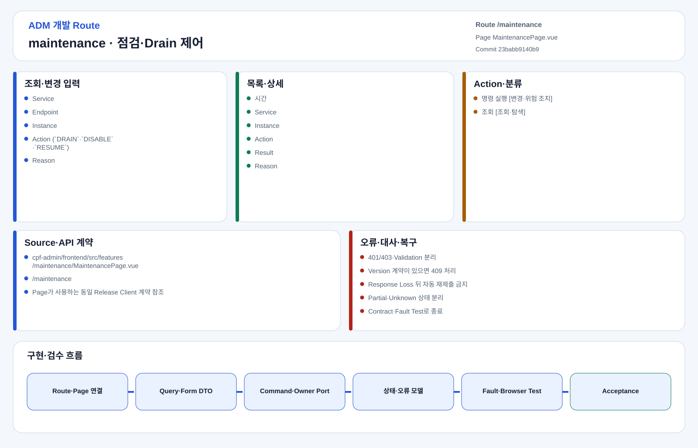


### 구현 결과

`/maintenance`가 단순 Route가 아니라 **Instance를 Drain·Disable·Resume해 점검 Traffic을 통제한다.** Query·Command·Permission·Owner 상태·Audit·Browser Test가 연결된 기능 Slice가 되도록 구현한다.

### Source 진입점과 소유권

| 계층 | 기준 |
|---|---|
| Router | `/maintenance` |
| Page | `cpf-admin/frontend/src/features/maintenance/MaintenancePage.vue` |
| Generated Client | Page가 import하는 Generated Client 또는 공통 ADM Client의 실제 Operation을 사용한다. 수기 Endpoint 문자열과 중복 DTO를 만들지 않는다 |
| ADM Backend | OpenAPI Operation의 Controller와 Application Service |
| Owner Port | Query·Command·Status·Reconcile Port; Local/Remote가 같은 DTO·오류 의미 사용 |
| Test | Frontend Unit·Generated Client Contract·Controller·Browser·Fault |

### Frontend Query·Form 모델

| Field | Control | 직렬화·Validation | 오류·접근성 |
|---|---|---|---|
| `Service` | 문자열 입력·검색 | 조회·상세·Audit에서 같은 대상을 다시 찾기 위한 식별 조건이다. 앞뒤 공백·허용 문자·길이와 대소문자 규칙을 확인한다. Request·Query의 실제 이름과 Type을 유지한다. | Label·Help·Field Error·Keyboard Focus를 제공하고 민감값은 재표시하지 않는다. |
| `Endpoint` | 문자열 입력·검색 | 조회·상세·Audit에서 같은 대상을 다시 찾기 위한 식별 조건이다. 앞뒤 공백·허용 문자·길이와 대소문자 규칙을 확인한다. Request·Query의 실제 이름과 Type을 유지한다. | Label·Help·Field Error·Keyboard Focus를 제공하고 민감값은 재표시하지 않는다. |
| `Instance` | 문자열 입력·검색 | 조회·상세·Audit에서 같은 대상을 다시 찾기 위한 식별 조건이다. 앞뒤 공백·허용 문자·길이와 대소문자 규칙을 확인한다. Request·Query의 실제 이름과 Type을 유지한다. | Label·Help·Field Error·Keyboard Focus를 제공하고 민감값은 재표시하지 않는다. |
| `Action (`DRAIN`·`DISABLE`·`RESUME`)` | Select·검색 | 점검·Drain 제어에서 적용하거나 조회할 정책·권한·처리 유형을 선택한다. 허용 목록과 현재 Environment·Data Scope에 맞는 값만 선택한다. Request·Query의 실제 이름과 Type을 유지한다. | Label·Help·Field Error·Keyboard Focus를 제공하고 민감값은 재표시하지 않는다. |
| `Reason` | 다중행 입력 | 작업 목적·영향 범위·승인 또는 복구 기준을 기록해 Audit와 교대 기록에 연결한다. Ticket·영향 범위·복구점을 포함하고 화면이 요구하는 최소 길이를 충족한다. Request·Query의 실제 이름과 Type을 유지한다. | Label·Help·Field Error·Keyboard Focus를 제공하고 민감값은 재표시하지 않는다. |

### Table·Detail View Model

| 값 | 표시 계약 | Drill-down·대사 |
|---|---|---|
| `시간` | 점검·Drain 제어 상세에서 대상의 현재 속성 또는 처리 결과를 확인하는 값이다. Masking·Timezone·단위를 DTO Metadata와 함께 표시한다. | 상세·재조회 결과와 비교하고 Stale·Masking·단위 차이를 확인한다. |
| `Service` | 점검·Drain 제어의 대상 레코드를 상세·Owner·Audit에서 연결하는 식별자다. Masking·Timezone·단위를 DTO Metadata와 함께 표시한다. | 상세·Log·Trace·Audit에서 같은 대상을 가리키는지 확인한다. |
| `Instance` | 점검·Drain 제어의 대상 레코드를 상세·Owner·Audit에서 연결하는 식별자다. Masking·Timezone·단위를 DTO Metadata와 함께 표시한다. | 상세·Log·Trace·Audit에서 같은 대상을 가리키는지 확인한다. |
| `Action` | 점검·Drain 제어 상세에서 대상의 현재 속성 또는 처리 결과를 확인하는 값이다. Masking·Timezone·단위를 DTO Metadata와 함께 표시한다. | 상세·재조회 결과와 비교하고 Stale·Masking·단위 차이를 확인한다. |
| `Result` | 현재 상태와 Terminal 여부, 다음 Action 가능 여부를 판단하는 값이다. Masking·Timezone·단위를 DTO Metadata와 함께 표시한다. | Last Updated·Terminal 조건·Owner 상태와 함께 확인한다. |
| `Reason` | 작업 주체·Owner·변경 사유를 확인하는 감사 정보다. Masking·Timezone·단위를 DTO Metadata와 함께 표시한다. | 상세·재조회 결과와 비교하고 Stale·Masking·단위 차이를 확인한다. |

### Button·Command 모델

| Action | 분류 | Frontend 활성 조건 | Backend·성공 처리 |
|---|---|---|---|
| **명령 실행** | 변경·위험 조치 | 화면과 Owner가 요구하는 Write Permission·대상 상태·영향 범위·Reason·승인·Version 조건을 충족함 | 변경 Operation을 생성하고 Accepted 응답과 Owner Terminal 상태·Version·Audit를 분리해 확인한다. Backend에서도 Permission·Version·Idempotency를 재검증한다. |
| **조회** | 조회·탐색 | 조회 Permission과 Query Validation을 충족하고 동일 조회가 진행 중이 아님 | 조회 결과의 조회 시각·Filter·Source Version·Warning이 갱신되며 Owner 데이터는 변경하지 않는다. |

### 상태 모델

```text
Query: Idle → Loading → Empty | Success | Error
Success + Stale | Partial
Command: Editing → Validating → Submitting → Accepted(operationId) → Terminal
Submitting → ResponseLoss → Reconcile → Terminal | UNKNOWN_RESULT
```

Query와 Command의 Loading·Error를 분리한다. 조회 전용 Route에는 존재하지 않는 Command 상태를 만들지 않는다. `403`, `409`, Timeout, Partial, Unknown을 하나의 Error Toast로 합치지 않는다.

### API·Owner 계약

- Query Request는 실제 Page가 사용하는 Environment·Data Scope·검색 Field·Paging·Sort·Timezone만 포함한다.
- Query Response는 실제 Item·Page·조회 시각·Source Version·Stale·Partial·Warning 계약을 유지한다.
- Command는 Source에 선언된 Target ID·Version·Reason·Approval ID·Idempotency Key·Request Hash 중 실제 필드만 사용한다.
- `202 Accepted`는 완료가 아니라 Operation 추적 시작이며 Owner Terminal 상태를 별도로 조회한다.
- Side Effect 전 실패, Side Effect 후 실패, Success, Partial, `UNKNOWN_RESULT`를 구분한다.
- Same-JVM과 Remote Adapter는 DTO·Error Code·Timeout·Unknown 의미를 유지한다.

### Permission·Data Scope·Masking

- Route Permission 기준은 **Owner Command Permission**이다.
- Menu 노출, Query, Button, Raw, Export Permission을 분리하고 Backend와 Owner에서 다시 검증한다.
- Deny는 403과 Audit를 남기며 404·Empty로 위장하지 않는다.
- Secret·Credential·PII Raw를 일반 Response DTO·Browser Storage·Log에 넣지 않는다.

### 구현 순서

1. Route·Page Import·Menu Metadata·Permission을 연결한다.
2. 이 장의 Field·Column·Action을 OpenAPI Request·Response·Error와 대조한다.
3. Generated Client를 재생성하고 수기 HTTP 호출을 제거한다.
4. Query·Command 상태와 Empty·Stale·Partial·Unknown UI를 구현한다.
5. Backend Controller·Application Service·Owner Port·Local/Remote Adapter를 연결한다.
6. Reason·Approval·Expected Version·Idempotency·Audit를 Server에서 검증한다.
7. Response Loss Polling·Reconcile·Rollback Link를 구현한다.
8. Unit·Contract·Browser·Fault·Accessibility Test를 실행한다.

### Test Matrix

| Test | 필수 Scenario |
|---|---|
| Frontend Unit | Default·Validation·Button 조건·Masking·Empty/Error/Stale/Partial |
| OpenAPI·Generated Client | Operation 이름·Type·Error·Hash Drift |
| Backend Query | Permission·Data Scope·Filter·Paging·Stale·Partial |
| Backend Command | Source에 선언된 Permission·Version·Reason·Approval·Idempotency·Audit 계약 |
| Local/Remote Contract | 같은 DTO·Error·Timeout 의미 |
| Browser | Deep Link·Query·상세·403·Timeout·Empty·Partial |
| Fault | 409·Response Loss·DB/Kafka/Owner 중단·Partial ACK·Late Response |
| Accessibility | Keyboard·Focus·Label·Error Announcement·Table/Dialog |

### 개발 Fault Workbook

1. `/maintenance` Query를 500·Timeout·Empty·Partial 응답으로 주입해 Loading·Empty·Error·Stale·Partial UI를 각각 확인한다.
2. 401·403과 Data Scope 축소를 주입해 Deny를 Empty로 위장하지 않고 Error와 접근 가능한 범위를 구분하는지 확인한다.
3. Version 계약이 있는 Write Action에는 409를, 모든 비동기·원격 Write에는 Response Loss를 주입해 자동 재제출이 없는지 확인한다.
4. 202 응답 뒤 Operation Polling이 Terminal·Failed·Partial·Unknown을 분리하는지 확인한다.
5. Local Adapter와 Remote Adapter에 같은 Contract Fixture를 적용해 Error Code·Retryability·failureStage가 일치하는지 확인한다.
6. Browser Storage·Console·Network Error·Screenshot에 Token·Secret·PII Raw가 남지 않는지 확인한다.

### Route Acceptance Checklist

- [ ] Route `/maintenance`의 Deep Link와 Menu ID `maintenance`가 같은 Page를 연다.
- [ ] 이 장의 Field·Column·Action과 Page·OpenAPI·Generated Client가 같은 계약을 사용한다.
- [ ] Menu·Query·Raw·Export Permission Deny가 Backend 403과 화면 Error로 확인된다.
- [ ] Empty·Timeout·Stale·Partial이 서로 다른 사용자 상태와 재조회 경로를 제공한다.
- [ ] Same-JVM·Remote 호출이 같은 Query DTO·오류·Timeout 계약을 사용한다.
- [ ] 409·Response Loss·Partial·Unknown이 서로 다른 상태와 Operation·Reconcile Link를 제공한다.
- [ ] Command가 Source에 선언한 Reason·Approval·Version·Idempotency·Audit 필드를 Server에서 재검증한다.
- [ ] 정상·오류·경계 Browser Test와 Accessibility Test가 Route Matrix에 포함된다.

### 독립 수행 검수 Checklist

- [ ] `/maintenance`와 Page Source를 찾고 화면 목적을 설명할 수 있다.
- [ ] 5개 입력·검색 항목의 Control·기본값·Validation을 설명할 수 있다.
- [ ] 6개 표시값을 Owner 상태·Version·Audit와 대사할 수 있다.
- [ ] 2개 Action의 분류·활성 조건·Side Effect를 설명할 수 있다.
- [ ] Empty·403·409·Timeout·Partial·Unknown을 서로 다른 상태로 처리할 수 있다.
- [ ] 응답 유실 뒤 중복 제출 없이 Operation·Owner·Audit로 결과를 확정할 수 있다.
- [ ] 교대 기록만으로 다음 담당자가 Target·상태·복구 기한을 이어받을 수 있다.
- [ ] OpenAPI·Generated Client·Page·Controller·Owner Port·Test가 같은 Field와 오류 계약을 사용하는지 검증할 수 있다.
- [ ] Local·Remote Adapter의 Timeout·Unknown 의미가 같은지 Contract Test로 확인할 수 있다.

## 12. cache — Cache 조회·Evict·Reconcile 기능 Slice 개발 장

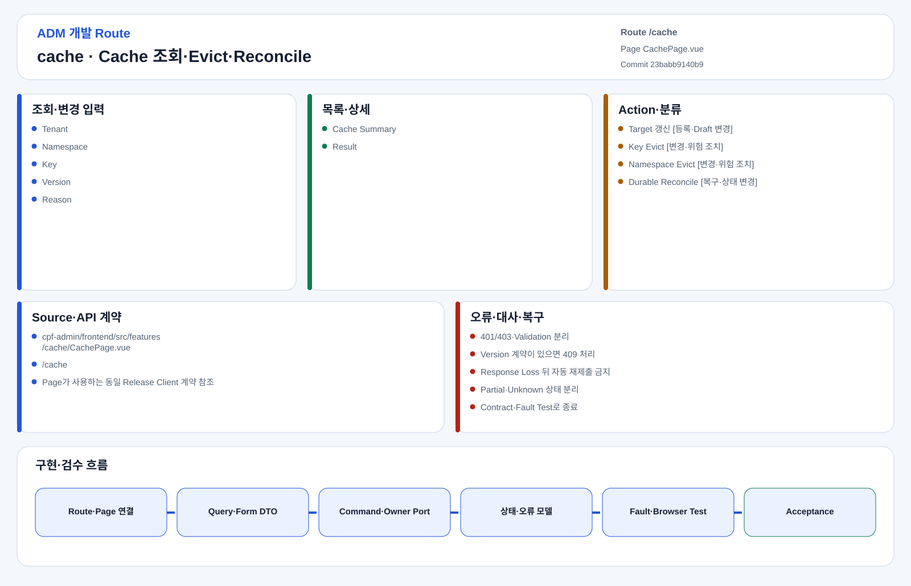


### 구현 결과

`/cache`가 단순 Route가 아니라 **Cache Target·Key·Namespace를 정리하고 Owner와 재대사한다.** Query·Command·Permission·Owner 상태·Audit·Browser Test가 연결된 기능 Slice가 되도록 구현한다.

### Source 진입점과 소유권

| 계층 | 기준 |
|---|---|
| Router | `/cache` |
| Page | `cpf-admin/frontend/src/features/cache/CachePage.vue` |
| Generated Client | Page가 import하는 Generated Client 또는 공통 ADM Client의 실제 Operation을 사용한다. 수기 Endpoint 문자열과 중복 DTO를 만들지 않는다 |
| ADM Backend | OpenAPI Operation의 Controller와 Application Service |
| Owner Port | Query·Command·Status·Reconcile Port; Local/Remote가 같은 DTO·오류 의미 사용 |
| Test | Frontend Unit·Generated Client Contract·Controller·Browser·Fault |

### Frontend Query·Form 모델

| Field | Control | 직렬화·Validation | 오류·접근성 |
|---|---|---|---|
| `Tenant` | 문자열 입력·검색 | Cache 조회·Evict·Reconcile 조회·조치가 적용되는 환경과 데이터 경계를 제한한다. 앞뒤 공백·허용 문자·길이와 대소문자 규칙을 확인한다. Request·Query의 실제 이름과 Type을 유지한다. | Label·Help·Field Error·Keyboard Focus를 제공하고 민감값은 재표시하지 않는다. |
| `Namespace` | 문자열 입력·검색 | 대상의 표시명 또는 업무명을 검색·입력한다. 앞뒤 공백·허용 문자·길이와 대소문자 규칙을 확인한다. Request·Query의 실제 이름과 Type을 유지한다. | Label·Help·Field Error·Keyboard Focus를 제공하고 민감값은 재표시하지 않는다. |
| `Key` | 문자열 입력·검색 | 조회·상세·Audit에서 같은 대상을 다시 찾기 위한 식별 조건이다. 앞뒤 공백·허용 문자·길이와 대소문자 규칙을 확인한다. Request·Query의 실제 이름과 Type을 유지한다. | Label·Help·Field Error·Keyboard Focus를 제공하고 민감값은 재표시하지 않는다. |
| `Version` | 숫자·Version 입력 | 동시 변경을 막고 요청 대상의 현재 Revision을 확인하는 값이다. 상세 재조회로 최신 값을 얻고 409 발생 시 기존 값을 덮어쓰지 않는다. Request·Query의 실제 이름과 Type을 유지한다. | Label·Help·Field Error·Keyboard Focus를 제공하고 민감값은 재표시하지 않는다. |
| `Reason` | 다중행 입력 | 작업 목적·영향 범위·승인 또는 복구 기준을 기록해 Audit와 교대 기록에 연결한다. Ticket·영향 범위·복구점을 포함하고 화면이 요구하는 최소 길이를 충족한다. Request·Query의 실제 이름과 Type을 유지한다. | Label·Help·Field Error·Keyboard Focus를 제공하고 민감값은 재표시하지 않는다. |

### Table·Detail View Model

| 값 | 표시 계약 | Drill-down·대사 |
|---|---|---|
| `Cache Summary` | Cache 대상·적중·Evict·Reconcile 결과의 요약이며 원본 데이터 변경 여부와 분리한다. Masking·Timezone·단위를 DTO Metadata와 함께 표시한다. | 상세·재조회 결과와 비교하고 Stale·Masking·단위 차이를 확인한다. |
| `Result` | 현재 상태와 Terminal 여부, 다음 Action 가능 여부를 판단하는 값이다. Masking·Timezone·단위를 DTO Metadata와 함께 표시한다. | Last Updated·Terminal 조건·Owner 상태와 함께 확인한다. |

### Button·Command 모델

| Action | 분류 | Frontend 활성 조건 | Backend·성공 처리 |
|---|---|---|---|
| **Target 갱신** | 등록·Draft 변경 | 화면이 실제로 요구하는 Write Permission·필수 Field·Reason·Version 조건을 충족함 | Cache 조회·Evict·Reconcile의 재조회 결과가 요청 내용과 일치한다. Version·Before/After·Audit는 해당 Owner가 제공하는 경우 함께 확인한다. Backend에서도 Permission·Version·Idempotency를 재검증한다. |
| **Key Evict** | 변경·위험 조치 | 화면과 Owner가 요구하는 Write Permission·대상 상태·영향 범위·Reason·승인·Version 조건을 충족함 | 변경 Operation을 생성하고 Accepted 응답과 Owner Terminal 상태·Version·Audit를 분리해 확인한다. Backend에서도 Permission·Version·Idempotency를 재검증한다. |
| **Namespace Evict** | 변경·위험 조치 | 화면과 Owner가 요구하는 Write Permission·대상 상태·영향 범위·Reason·승인·Version 조건을 충족함 | 변경 Operation을 생성하고 Accepted 응답과 Owner Terminal 상태·Version·Audit를 분리해 확인한다. Backend에서도 Permission·Version·Idempotency를 재검증한다. |
| **Durable Reconcile** | 복구·상태 변경 | 화면과 Owner가 요구하는 복구 Permission·대상 상태·Reason·승인·Version 조건을 충족함 | 복구 Operation을 생성하고 Owner 상태·대상별 결과·Audit로 종료를 판정한다. Backend에서도 Permission·Version·Idempotency를 재검증한다. |

### 상태 모델

```text
Query: Idle → Loading → Empty | Success | Error
Success + Stale | Partial
Command: Editing → Validating → Submitting → Accepted(operationId) → Terminal
Submitting → ResponseLoss → Reconcile → Terminal | UNKNOWN_RESULT
```

Query와 Command의 Loading·Error를 분리한다. 조회 전용 Route에는 존재하지 않는 Command 상태를 만들지 않는다. `403`, `409`, Timeout, Partial, Unknown을 하나의 Error Toast로 합치지 않는다.

### API·Owner 계약

- Query Request는 실제 Page가 사용하는 Environment·Data Scope·검색 Field·Paging·Sort·Timezone만 포함한다.
- Query Response는 실제 Item·Page·조회 시각·Source Version·Stale·Partial·Warning 계약을 유지한다.
- Command는 Source에 선언된 Target ID·Version·Reason·Approval ID·Idempotency Key·Request Hash 중 실제 필드만 사용한다.
- `202 Accepted`는 완료가 아니라 Operation 추적 시작이며 Owner Terminal 상태를 별도로 조회한다.
- Side Effect 전 실패, Side Effect 후 실패, Success, Partial, `UNKNOWN_RESULT`를 구분한다.
- Same-JVM과 Remote Adapter는 DTO·Error Code·Timeout·Unknown 의미를 유지한다.

### Permission·Data Scope·Masking

- Route Permission 기준은 **Button Permission `CACHE_*`**이다.
- Menu 노출, Query, Button, Raw, Export Permission을 분리하고 Backend와 Owner에서 다시 검증한다.
- Deny는 403과 Audit를 남기며 404·Empty로 위장하지 않는다.
- Secret·Credential·PII Raw를 일반 Response DTO·Browser Storage·Log에 넣지 않는다.

### 구현 순서

1. Route·Page Import·Menu Metadata·Permission을 연결한다.
2. 이 장의 Field·Column·Action을 OpenAPI Request·Response·Error와 대조한다.
3. Generated Client를 재생성하고 수기 HTTP 호출을 제거한다.
4. Query·Command 상태와 Empty·Stale·Partial·Unknown UI를 구현한다.
5. Backend Controller·Application Service·Owner Port·Local/Remote Adapter를 연결한다.
6. Reason·Approval·Expected Version·Idempotency·Audit를 Server에서 검증한다.
7. Response Loss Polling·Reconcile·Rollback Link를 구현한다.
8. Unit·Contract·Browser·Fault·Accessibility Test를 실행한다.

### Test Matrix

| Test | 필수 Scenario |
|---|---|
| Frontend Unit | Default·Validation·Button 조건·Masking·Empty/Error/Stale/Partial |
| OpenAPI·Generated Client | Operation 이름·Type·Error·Hash Drift |
| Backend Query | Permission·Data Scope·Filter·Paging·Stale·Partial |
| Backend Command | Source에 선언된 Permission·Version·Reason·Approval·Idempotency·Audit 계약 |
| Local/Remote Contract | 같은 DTO·Error·Timeout 의미 |
| Browser | Deep Link·Query·상세·403·Timeout·Empty·Partial |
| Fault | 409·Response Loss·DB/Kafka/Owner 중단·Partial ACK·Late Response |
| Accessibility | Keyboard·Focus·Label·Error Announcement·Table/Dialog |

### 개발 Fault Workbook

1. `/cache` Query를 500·Timeout·Empty·Partial 응답으로 주입해 Loading·Empty·Error·Stale·Partial UI를 각각 확인한다.
2. 401·403과 Data Scope 축소를 주입해 Deny를 Empty로 위장하지 않고 Error와 접근 가능한 범위를 구분하는지 확인한다.
3. Version 계약이 있는 Write Action에는 409를, 모든 비동기·원격 Write에는 Response Loss를 주입해 자동 재제출이 없는지 확인한다.
4. 202 응답 뒤 Operation Polling이 Terminal·Failed·Partial·Unknown을 분리하는지 확인한다.
5. Local Adapter와 Remote Adapter에 같은 Contract Fixture를 적용해 Error Code·Retryability·failureStage가 일치하는지 확인한다.
6. Browser Storage·Console·Network Error·Screenshot에 Token·Secret·PII Raw가 남지 않는지 확인한다.

### Route Acceptance Checklist

- [ ] Route `/cache`의 Deep Link와 Menu ID `cache`가 같은 Page를 연다.
- [ ] 이 장의 Field·Column·Action과 Page·OpenAPI·Generated Client가 같은 계약을 사용한다.
- [ ] Menu·Query·Raw·Export Permission Deny가 Backend 403과 화면 Error로 확인된다.
- [ ] Empty·Timeout·Stale·Partial이 서로 다른 사용자 상태와 재조회 경로를 제공한다.
- [ ] Same-JVM·Remote 호출이 같은 Query DTO·오류·Timeout 계약을 사용한다.
- [ ] 409·Response Loss·Partial·Unknown이 서로 다른 상태와 Operation·Reconcile Link를 제공한다.
- [ ] Command가 Source에 선언한 Reason·Approval·Version·Idempotency·Audit 필드를 Server에서 재검증한다.
- [ ] 정상·오류·경계 Browser Test와 Accessibility Test가 Route Matrix에 포함된다.

### 독립 수행 검수 Checklist

- [ ] `/cache`와 Page Source를 찾고 화면 목적을 설명할 수 있다.
- [ ] 5개 입력·검색 항목의 Control·기본값·Validation을 설명할 수 있다.
- [ ] 2개 표시값을 Owner 상태·Version·Audit와 대사할 수 있다.
- [ ] 4개 Action의 분류·활성 조건·Side Effect를 설명할 수 있다.
- [ ] Empty·403·409·Timeout·Partial·Unknown을 서로 다른 상태로 처리할 수 있다.
- [ ] 응답 유실 뒤 중복 제출 없이 Operation·Owner·Audit로 결과를 확정할 수 있다.
- [ ] 교대 기록만으로 다음 담당자가 Target·상태·복구 기한을 이어받을 수 있다.
- [ ] OpenAPI·Generated Client·Page·Controller·Owner Port·Test가 같은 Field와 오류 계약을 사용하는지 검증할 수 있다.
- [ ] Local·Remote Adapter의 Timeout·Unknown 의미가 같은지 Contract Test로 확인할 수 있다.

## 13. configs — 설정 관리 기능 Slice 개발 장


### 구현 결과

`/configs`가 단순 Route가 아니라 **Config Key·Type·암호화 여부와 Version을 관리한다.** Query·Command·Permission·Owner 상태·Audit·Browser Test가 연결된 기능 Slice가 되도록 구현한다.

### Source 진입점과 소유권

| 계층 | 기준 |
|---|---|
| Router | `/configs` |
| Page | `cpf-admin/frontend/src/features/configs/ConfigsPage.vue` |
| Generated Client | Page가 import하는 Generated Client 또는 공통 ADM Client의 실제 Operation을 사용한다. 수기 Endpoint 문자열과 중복 DTO를 만들지 않는다 |
| ADM Backend | OpenAPI Operation의 Controller와 Application Service |
| Owner Port | Query·Command·Status·Reconcile Port; Local/Remote가 같은 DTO·오류 의미 사용 |
| Test | Frontend Unit·Generated Client Contract·Controller·Browser·Fault |

### Frontend Query·Form 모델

| Field | Control | 직렬화·Validation | 오류·접근성 |
|---|---|---|---|
| `Config ID` | 문자열 입력·검색 | 조회·상세·Audit에서 같은 대상을 다시 찾기 위한 식별 조건이다. 앞뒤 공백·허용 문자·길이와 대소문자 규칙을 확인한다. Request·Query의 실제 이름과 Type을 유지한다. | Label·Help·Field Error·Keyboard Focus를 제공하고 민감값은 재표시하지 않는다. |
| `Key` | 문자열 입력·검색 | 조회·상세·Audit에서 같은 대상을 다시 찾기 위한 식별 조건이다. 앞뒤 공백·허용 문자·길이와 대소문자 규칙을 확인한다. Request·Query의 실제 이름과 Type을 유지한다. | Label·Help·Field Error·Keyboard Focus를 제공하고 민감값은 재표시하지 않는다. |
| `Value` | 문자열 입력·검색 | 설정 관리 화면의 조회 조건 또는 편집 Form에 포함되는 값이며 화면 Label과 Help를 기준으로 사용한다. 앞뒤 공백·허용 문자·길이와 대소문자 규칙을 확인한다. Request·Query의 실제 이름과 Type을 유지한다. | Label·Help·Field Error·Keyboard Focus를 제공하고 민감값은 재표시하지 않는다. |
| `Type` | Select·검색 | 설정 관리에서 적용하거나 조회할 정책·권한·처리 유형을 선택한다. 허용 목록과 현재 Environment·Data Scope에 맞는 값만 선택한다. Request·Query의 실제 이름과 Type을 유지한다. | Label·Help·Field Error·Keyboard Focus를 제공하고 민감값은 재표시하지 않는다. |
| `Encrypted YN` | Checkbox·Switch | 설정 관리 화면의 조회 조건 또는 편집 Form에 포함되는 값이며 화면 Label과 Help를 기준으로 사용한다. 현재 선택과 변경 후 영향 범위를 비교하고 화면의 Source 기본값을 확인한다. Request·Query의 실제 이름과 Type을 유지한다. | Label·Help·Field Error·Keyboard Focus를 제공하고 민감값은 재표시하지 않는다. |
| `Reason` | 다중행 입력 | 작업 목적·영향 범위·승인 또는 복구 기준을 기록해 Audit와 교대 기록에 연결한다. Ticket·영향 범위·복구점을 포함하고 화면이 요구하는 최소 길이를 충족한다. Request·Query의 실제 이름과 Type을 유지한다. | Label·Help·Field Error·Keyboard Focus를 제공하고 민감값은 재표시하지 않는다. |

### Table·Detail View Model

| 값 | 표시 계약 | Drill-down·대사 |
|---|---|---|
| `Pretty Result` | 화면이 받은 Response를 사람이 확인할 수 있도록 표현한 결과 영역이며 Owner 상태 확정과 동일하지 않다. Masking·Timezone·단위를 DTO Metadata와 함께 표시한다. | Last Updated·Terminal 조건·Owner 상태와 함께 확인한다. |

### Button·Command 모델

| Action | 분류 | Frontend 활성 조건 | Backend·성공 처리 |
|---|---|---|---|
| **조회** | 조회·탐색 | 조회 Permission과 Query Validation을 충족하고 동일 조회가 진행 중이 아님 | 조회 결과의 조회 시각·Filter·Source Version·Warning이 갱신되며 Owner 데이터는 변경하지 않는다. |
| **등록** | 등록·Draft 변경 | 화면이 실제로 요구하는 Write Permission·필수 Field·Reason·Version 조건을 충족함 | 설정 관리의 재조회 결과가 요청 내용과 일치한다. Version·Before/After·Audit는 해당 Owner가 제공하는 경우 함께 확인한다. Backend에서도 Permission·Version·Idempotency를 재검증한다. |
| **수정** | 등록·Draft 변경 | 화면이 실제로 요구하는 Write Permission·필수 Field·Reason·Version 조건을 충족함 | 설정 관리의 재조회 결과가 요청 내용과 일치한다. Version·Before/After·Audit는 해당 Owner가 제공하는 경우 함께 확인한다. Backend에서도 Permission·Version·Idempotency를 재검증한다. |

### 상태 모델

```text
Query: Idle → Loading → Empty | Success | Error
Success + Stale | Partial
Command: Editing → Validating → Submitting → Accepted(operationId) → Terminal
Submitting → ResponseLoss → Reconcile → Terminal | UNKNOWN_RESULT
```

Query와 Command의 Loading·Error를 분리한다. 조회 전용 Route에는 존재하지 않는 Command 상태를 만들지 않는다. `403`, `409`, Timeout, Partial, Unknown을 하나의 Error Toast로 합치지 않는다.

### API·Owner 계약

- Query Request는 실제 Page가 사용하는 Environment·Data Scope·검색 Field·Paging·Sort·Timezone만 포함한다.
- Query Response는 실제 Item·Page·조회 시각·Source Version·Stale·Partial·Warning 계약을 유지한다.
- Command는 Source에 선언된 Target ID·Version·Reason·Approval ID·Idempotency Key·Request Hash 중 실제 필드만 사용한다.
- `202 Accepted`는 완료가 아니라 Operation 추적 시작이며 Owner Terminal 상태를 별도로 조회한다.
- Side Effect 전 실패, Side Effect 후 실패, Success, Partial, `UNKNOWN_RESULT`를 구분한다.
- Same-JVM과 Remote Adapter는 DTO·Error Code·Timeout·Unknown 의미를 유지한다.

### Permission·Data Scope·Masking

- Route Permission 기준은 **`CONFIG` Write**이다.
- Menu 노출, Query, Button, Raw, Export Permission을 분리하고 Backend와 Owner에서 다시 검증한다.
- Deny는 403과 Audit를 남기며 404·Empty로 위장하지 않는다.
- Secret·Credential·PII Raw를 일반 Response DTO·Browser Storage·Log에 넣지 않는다.

### 구현 순서

1. Route·Page Import·Menu Metadata·Permission을 연결한다.
2. 이 장의 Field·Column·Action을 OpenAPI Request·Response·Error와 대조한다.
3. Generated Client를 재생성하고 수기 HTTP 호출을 제거한다.
4. Query·Command 상태와 Empty·Stale·Partial·Unknown UI를 구현한다.
5. Backend Controller·Application Service·Owner Port·Local/Remote Adapter를 연결한다.
6. Reason·Approval·Expected Version·Idempotency·Audit를 Server에서 검증한다.
7. Response Loss Polling·Reconcile·Rollback Link를 구현한다.
8. Unit·Contract·Browser·Fault·Accessibility Test를 실행한다.

### Test Matrix

| Test | 필수 Scenario |
|---|---|
| Frontend Unit | Default·Validation·Button 조건·Masking·Empty/Error/Stale/Partial |
| OpenAPI·Generated Client | Operation 이름·Type·Error·Hash Drift |
| Backend Query | Permission·Data Scope·Filter·Paging·Stale·Partial |
| Backend Command | Source에 선언된 Permission·Version·Reason·Approval·Idempotency·Audit 계약 |
| Local/Remote Contract | 같은 DTO·Error·Timeout 의미 |
| Browser | Deep Link·Query·상세·403·Timeout·Empty·Partial |
| Fault | 409·Response Loss·DB/Kafka/Owner 중단·Partial ACK·Late Response |
| Accessibility | Keyboard·Focus·Label·Error Announcement·Table/Dialog |

### 개발 Fault Workbook

1. `/configs` Query를 500·Timeout·Empty·Partial 응답으로 주입해 Loading·Empty·Error·Stale·Partial UI를 각각 확인한다.
2. 401·403과 Data Scope 축소를 주입해 Deny를 Empty로 위장하지 않고 Error와 접근 가능한 범위를 구분하는지 확인한다.
3. Version 계약이 있는 Write Action에는 409를, 모든 비동기·원격 Write에는 Response Loss를 주입해 자동 재제출이 없는지 확인한다.
4. 202 응답 뒤 Operation Polling이 Terminal·Failed·Partial·Unknown을 분리하는지 확인한다.
5. Local Adapter와 Remote Adapter에 같은 Contract Fixture를 적용해 Error Code·Retryability·failureStage가 일치하는지 확인한다.
6. Browser Storage·Console·Network Error·Screenshot에 Token·Secret·PII Raw가 남지 않는지 확인한다.

### Route Acceptance Checklist

- [ ] Route `/configs`의 Deep Link와 Menu ID `configs`가 같은 Page를 연다.
- [ ] 이 장의 Field·Column·Action과 Page·OpenAPI·Generated Client가 같은 계약을 사용한다.
- [ ] Menu·Query·Raw·Export Permission Deny가 Backend 403과 화면 Error로 확인된다.
- [ ] Empty·Timeout·Stale·Partial이 서로 다른 사용자 상태와 재조회 경로를 제공한다.
- [ ] Same-JVM·Remote 호출이 같은 Query DTO·오류·Timeout 계약을 사용한다.
- [ ] 409·Response Loss·Partial·Unknown이 서로 다른 상태와 Operation·Reconcile Link를 제공한다.
- [ ] Command가 Source에 선언한 Reason·Approval·Version·Idempotency·Audit 필드를 Server에서 재검증한다.
- [ ] 정상·오류·경계 Browser Test와 Accessibility Test가 Route Matrix에 포함된다.

### 독립 수행 검수 Checklist

- [ ] `/configs`와 Page Source를 찾고 화면 목적을 설명할 수 있다.
- [ ] 6개 입력·검색 항목의 Control·기본값·Validation을 설명할 수 있다.
- [ ] 1개 표시값을 Owner 상태·Version·Audit와 대사할 수 있다.
- [ ] 3개 Action의 분류·활성 조건·Side Effect를 설명할 수 있다.
- [ ] Empty·403·409·Timeout·Partial·Unknown을 서로 다른 상태로 처리할 수 있다.
- [ ] 응답 유실 뒤 중복 제출 없이 Operation·Owner·Audit로 결과를 확정할 수 있다.
- [ ] 교대 기록만으로 다음 담당자가 Target·상태·복구 기한을 이어받을 수 있다.
- [ ] OpenAPI·Generated Client·Page·Controller·Owner Port·Test가 같은 Field와 오류 계약을 사용하는지 검증할 수 있다.
- [ ] Local·Remote Adapter의 Timeout·Unknown 의미가 같은지 Contract Test로 확인할 수 있다.

## 14. responseCodes — 응답코드 관리 기능 Slice 개발 장

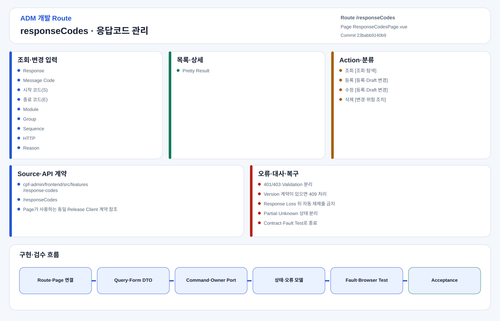


### 구현 결과

`/responseCodes`가 단순 Route가 아니라 **응답·메시지 코드와 HTTP Mapping을 관리한다.** Query·Command·Permission·Owner 상태·Audit·Browser Test가 연결된 기능 Slice가 되도록 구현한다.

### Source 진입점과 소유권

| 계층 | 기준 |
|---|---|
| Router | `/responseCodes` |
| Page | `cpf-admin/frontend/src/features/response-codes/ResponseCodesPage.vue` |
| Generated Client | Page가 import하는 Generated Client 또는 공통 ADM Client의 실제 Operation을 사용한다. 수기 Endpoint 문자열과 중복 DTO를 만들지 않는다 |
| ADM Backend | OpenAPI Operation의 Controller와 Application Service |
| Owner Port | Query·Command·Status·Reconcile Port; Local/Remote가 같은 DTO·오류 의미 사용 |
| Test | Frontend Unit·Generated Client Contract·Controller·Browser·Fault |

### Frontend Query·Form 모델

| Field | Control | 직렬화·Validation | 오류·접근성 |
|---|---|---|---|
| `Response` | 문자열 입력·검색 | 응답코드 관리 화면의 조회 조건 또는 편집 Form에 포함되는 값이며 화면 Label과 Help를 기준으로 사용한다. 앞뒤 공백·허용 문자·길이와 대소문자 규칙을 확인한다. Request·Query의 실제 이름과 Type을 유지한다. | Label·Help·Field Error·Keyboard Focus를 제공하고 민감값은 재표시하지 않는다. |
| `Message Code` | 문자열 입력·검색 | 조회·상세·Audit에서 같은 대상을 다시 찾기 위한 식별 조건이다. 앞뒤 공백·허용 문자·길이와 대소문자 규칙을 확인한다. Request·Query의 실제 이름과 Type을 유지한다. | Label·Help·Field Error·Keyboard Focus를 제공하고 민감값은 재표시하지 않는다. |
| `시작 코드(S)` | 문자열 입력·검색 | 조회·상세·Audit에서 같은 대상을 다시 찾기 위한 식별 조건이다. 앞뒤 공백·허용 문자·길이와 대소문자 규칙을 확인한다. Request·Query의 실제 이름과 Type을 유지한다. | Label·Help·Field Error·Keyboard Focus를 제공하고 민감값은 재표시하지 않는다. |
| `종료 코드(E)` | 문자열 입력·검색 | 조회·상세·Audit에서 같은 대상을 다시 찾기 위한 식별 조건이다. 앞뒤 공백·허용 문자·길이와 대소문자 규칙을 확인한다. Request·Query의 실제 이름과 Type을 유지한다. | Label·Help·Field Error·Keyboard Focus를 제공하고 민감값은 재표시하지 않는다. |
| `Module` | 문자열 입력·검색 | 응답코드 관리 조회·조치가 적용되는 환경과 데이터 경계를 제한한다. 앞뒤 공백·허용 문자·길이와 대소문자 규칙을 확인한다. Request·Query의 실제 이름과 Type을 유지한다. | Label·Help·Field Error·Keyboard Focus를 제공하고 민감값은 재표시하지 않는다. |
| `Group` | 문자열 입력·검색 | 조회·상세·Audit에서 같은 대상을 다시 찾기 위한 식별 조건이다. 앞뒤 공백·허용 문자·길이와 대소문자 규칙을 확인한다. Request·Query의 실제 이름과 Type을 유지한다. | Label·Help·Field Error·Keyboard Focus를 제공하고 민감값은 재표시하지 않는다. |
| `Sequence` | 숫자·Version 입력 | 실행 한도·순서·용량 또는 재시도 범위를 지정한다. 화면의 min·max·단위와 0 허용 여부를 확인하고 음수·Overflow를 차단한다. Request·Query의 실제 이름과 Type을 유지한다. | Label·Help·Field Error·Keyboard Focus를 제공하고 민감값은 재표시하지 않는다. |
| `HTTP` | 문자열 입력·검색 | 응답코드 관리 화면의 조회 조건 또는 편집 Form에 포함되는 값이며 화면 Label과 Help를 기준으로 사용한다. 앞뒤 공백·허용 문자·길이와 대소문자 규칙을 확인한다. Request·Query의 실제 이름과 Type을 유지한다. | Label·Help·Field Error·Keyboard Focus를 제공하고 민감값은 재표시하지 않는다. |
| `Reason` | 다중행 입력 | 작업 목적·영향 범위·승인 또는 복구 기준을 기록해 Audit와 교대 기록에 연결한다. Ticket·영향 범위·복구점을 포함하고 화면이 요구하는 최소 길이를 충족한다. Request·Query의 실제 이름과 Type을 유지한다. | Label·Help·Field Error·Keyboard Focus를 제공하고 민감값은 재표시하지 않는다. |

### Table·Detail View Model

| 값 | 표시 계약 | Drill-down·대사 |
|---|---|---|
| `Pretty Result` | 화면이 받은 Response를 사람이 확인할 수 있도록 표현한 결과 영역이며 Owner 상태 확정과 동일하지 않다. Masking·Timezone·단위를 DTO Metadata와 함께 표시한다. | Last Updated·Terminal 조건·Owner 상태와 함께 확인한다. |

### Button·Command 모델

| Action | 분류 | Frontend 활성 조건 | Backend·성공 처리 |
|---|---|---|---|
| **조회** | 조회·탐색 | 조회 Permission과 Query Validation을 충족하고 동일 조회가 진행 중이 아님 | 조회 결과의 조회 시각·Filter·Source Version·Warning이 갱신되며 Owner 데이터는 변경하지 않는다. |
| **등록** | 등록·Draft 변경 | 화면이 실제로 요구하는 Write Permission·필수 Field·Reason·Version 조건을 충족함 | 응답코드 관리의 재조회 결과가 요청 내용과 일치한다. Version·Before/After·Audit는 해당 Owner가 제공하는 경우 함께 확인한다. Backend에서도 Permission·Version·Idempotency를 재검증한다. |
| **수정** | 등록·Draft 변경 | 화면이 실제로 요구하는 Write Permission·필수 Field·Reason·Version 조건을 충족함 | 응답코드 관리의 재조회 결과가 요청 내용과 일치한다. Version·Before/After·Audit는 해당 Owner가 제공하는 경우 함께 확인한다. Backend에서도 Permission·Version·Idempotency를 재검증한다. |
| **삭제** | 변경·위험 조치 | 화면과 Owner가 요구하는 Write Permission·대상 상태·영향 범위·Reason·승인·Version 조건을 충족함 | 변경 Operation을 생성하고 Accepted 응답과 Owner Terminal 상태·Version·Audit를 분리해 확인한다. Backend에서도 Permission·Version·Idempotency를 재검증한다. |

### 상태 모델

```text
Query: Idle → Loading → Empty | Success | Error
Success + Stale | Partial
Command: Editing → Validating → Submitting → Accepted(operationId) → Terminal
Submitting → ResponseLoss → Reconcile → Terminal | UNKNOWN_RESULT
```

Query와 Command의 Loading·Error를 분리한다. 조회 전용 Route에는 존재하지 않는 Command 상태를 만들지 않는다. `403`, `409`, Timeout, Partial, Unknown을 하나의 Error Toast로 합치지 않는다.

### API·Owner 계약

- Query Request는 실제 Page가 사용하는 Environment·Data Scope·검색 Field·Paging·Sort·Timezone만 포함한다.
- Query Response는 실제 Item·Page·조회 시각·Source Version·Stale·Partial·Warning 계약을 유지한다.
- Command는 Source에 선언된 Target ID·Version·Reason·Approval ID·Idempotency Key·Request Hash 중 실제 필드만 사용한다.
- `202 Accepted`는 완료가 아니라 Operation 추적 시작이며 Owner Terminal 상태를 별도로 조회한다.
- Side Effect 전 실패, Side Effect 후 실패, Success, Partial, `UNKNOWN_RESULT`를 구분한다.
- Same-JVM과 Remote Adapter는 DTO·Error Code·Timeout·Unknown 의미를 유지한다.

### Permission·Data Scope·Masking

- Route Permission 기준은 **`RESPONSE_CODE` Write/Delete**이다.
- Menu 노출, Query, Button, Raw, Export Permission을 분리하고 Backend와 Owner에서 다시 검증한다.
- Deny는 403과 Audit를 남기며 404·Empty로 위장하지 않는다.
- Secret·Credential·PII Raw를 일반 Response DTO·Browser Storage·Log에 넣지 않는다.

### 구현 순서

1. Route·Page Import·Menu Metadata·Permission을 연결한다.
2. 이 장의 Field·Column·Action을 OpenAPI Request·Response·Error와 대조한다.
3. Generated Client를 재생성하고 수기 HTTP 호출을 제거한다.
4. Query·Command 상태와 Empty·Stale·Partial·Unknown UI를 구현한다.
5. Backend Controller·Application Service·Owner Port·Local/Remote Adapter를 연결한다.
6. Reason·Approval·Expected Version·Idempotency·Audit를 Server에서 검증한다.
7. Response Loss Polling·Reconcile·Rollback Link를 구현한다.
8. Unit·Contract·Browser·Fault·Accessibility Test를 실행한다.

### Test Matrix

| Test | 필수 Scenario |
|---|---|
| Frontend Unit | Default·Validation·Button 조건·Masking·Empty/Error/Stale/Partial |
| OpenAPI·Generated Client | Operation 이름·Type·Error·Hash Drift |
| Backend Query | Permission·Data Scope·Filter·Paging·Stale·Partial |
| Backend Command | Source에 선언된 Permission·Version·Reason·Approval·Idempotency·Audit 계약 |
| Local/Remote Contract | 같은 DTO·Error·Timeout 의미 |
| Browser | Deep Link·Query·상세·403·Timeout·Empty·Partial |
| Fault | 409·Response Loss·DB/Kafka/Owner 중단·Partial ACK·Late Response |
| Accessibility | Keyboard·Focus·Label·Error Announcement·Table/Dialog |

### 개발 Fault Workbook

1. `/responseCodes` Query를 500·Timeout·Empty·Partial 응답으로 주입해 Loading·Empty·Error·Stale·Partial UI를 각각 확인한다.
2. 401·403과 Data Scope 축소를 주입해 Deny를 Empty로 위장하지 않고 Error와 접근 가능한 범위를 구분하는지 확인한다.
3. Version 계약이 있는 Write Action에는 409를, 모든 비동기·원격 Write에는 Response Loss를 주입해 자동 재제출이 없는지 확인한다.
4. 202 응답 뒤 Operation Polling이 Terminal·Failed·Partial·Unknown을 분리하는지 확인한다.
5. Local Adapter와 Remote Adapter에 같은 Contract Fixture를 적용해 Error Code·Retryability·failureStage가 일치하는지 확인한다.
6. Browser Storage·Console·Network Error·Screenshot에 Token·Secret·PII Raw가 남지 않는지 확인한다.

### Route Acceptance Checklist

- [ ] Route `/responseCodes`의 Deep Link와 Menu ID `responseCodes`가 같은 Page를 연다.
- [ ] 이 장의 Field·Column·Action과 Page·OpenAPI·Generated Client가 같은 계약을 사용한다.
- [ ] Menu·Query·Raw·Export Permission Deny가 Backend 403과 화면 Error로 확인된다.
- [ ] Empty·Timeout·Stale·Partial이 서로 다른 사용자 상태와 재조회 경로를 제공한다.
- [ ] Same-JVM·Remote 호출이 같은 Query DTO·오류·Timeout 계약을 사용한다.
- [ ] 409·Response Loss·Partial·Unknown이 서로 다른 상태와 Operation·Reconcile Link를 제공한다.
- [ ] Command가 Source에 선언한 Reason·Approval·Version·Idempotency·Audit 필드를 Server에서 재검증한다.
- [ ] 정상·오류·경계 Browser Test와 Accessibility Test가 Route Matrix에 포함된다.

### 독립 수행 검수 Checklist

- [ ] `/responseCodes`와 Page Source를 찾고 화면 목적을 설명할 수 있다.
- [ ] 9개 입력·검색 항목의 Control·기본값·Validation을 설명할 수 있다.
- [ ] 1개 표시값을 Owner 상태·Version·Audit와 대사할 수 있다.
- [ ] 4개 Action의 분류·활성 조건·Side Effect를 설명할 수 있다.
- [ ] Empty·403·409·Timeout·Partial·Unknown을 서로 다른 상태로 처리할 수 있다.
- [ ] 응답 유실 뒤 중복 제출 없이 Operation·Owner·Audit로 결과를 확정할 수 있다.
- [ ] 교대 기록만으로 다음 담당자가 Target·상태·복구 기한을 이어받을 수 있다.
- [ ] OpenAPI·Generated Client·Page·Controller·Owner Port·Test가 같은 Field와 오류 계약을 사용하는지 검증할 수 있다.
- [ ] Local·Remote Adapter의 Timeout·Unknown 의미가 같은지 Contract Test로 확인할 수 있다.

## 15. businessCalendar — 영업일·휴일 Override 기능 Slice 개발 장

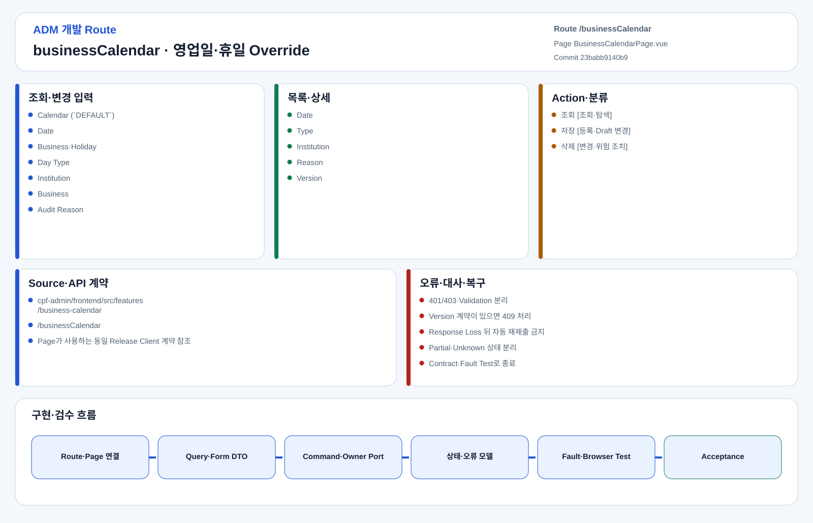


### 구현 결과

`/businessCalendar`가 단순 Route가 아니라 **영업일·휴일 Override를 기준일과 기관별로 관리한다.** Query·Command·Permission·Owner 상태·Audit·Browser Test가 연결된 기능 Slice가 되도록 구현한다.

### Source 진입점과 소유권

| 계층 | 기준 |
|---|---|
| Router | `/businessCalendar` |
| Page | `cpf-admin/frontend/src/features/business-calendar/BusinessCalendarPage.vue` |
| Generated Client | Page가 import하는 Generated Client 또는 공통 ADM Client의 실제 Operation을 사용한다. 수기 Endpoint 문자열과 중복 DTO를 만들지 않는다 |
| ADM Backend | OpenAPI Operation의 Controller와 Application Service |
| Owner Port | Query·Command·Status·Reconcile Port; Local/Remote가 같은 DTO·오류 의미 사용 |
| Test | Frontend Unit·Generated Client Contract·Controller·Browser·Fault |

### Frontend Query·Form 모델

| Field | Control | 직렬화·Validation | 오류·접근성 |
|---|---|---|---|
| `Calendar (`DEFAULT`)` | Select·검색 | 영업일·휴일 Override 화면의 조회 조건 또는 편집 Form에 포함되는 값이며 화면 Label과 Help를 기준으로 사용한다. 허용 목록과 현재 Environment·Data Scope에 맞는 값만 선택한다. Request·Query의 실제 이름과 Type을 유지한다. | Label·Help·Field Error·Keyboard Focus를 제공하고 민감값은 재표시하지 않는다. |
| `Date` | 날짜·시간 입력 | 조회 또는 적용의 유효 시간 범위를 정하며 Timezone과 시작·종료 순서를 함께 확인한다. Timezone을 고정하고 시작≤종료·유효기간 겹침·기준일 포함 여부를 확인한다. Request·Query의 실제 이름과 Type을 유지한다. | Label·Help·Field Error·Keyboard Focus를 제공하고 민감값은 재표시하지 않는다. |
| `Business·Holiday` | 문자열 입력·검색 | 조회·상세·Audit에서 같은 대상을 다시 찾기 위한 식별 조건이다. 앞뒤 공백·허용 문자·길이와 대소문자 규칙을 확인한다. Request·Query의 실제 이름과 Type을 유지한다. | Label·Help·Field Error·Keyboard Focus를 제공하고 민감값은 재표시하지 않는다. |
| `Day Type` | Select·검색 | 영업일·휴일 Override에서 적용하거나 조회할 정책·권한·처리 유형을 선택한다. 허용 목록과 현재 Environment·Data Scope에 맞는 값만 선택한다. Request·Query의 실제 이름과 Type을 유지한다. | Label·Help·Field Error·Keyboard Focus를 제공하고 민감값은 재표시하지 않는다. |
| `Institution` | Select·검색 | 영업일·휴일 Override 화면의 조회 조건 또는 편집 Form에 포함되는 값이며 화면 Label과 Help를 기준으로 사용한다. 허용 목록과 현재 Environment·Data Scope에 맞는 값만 선택한다. Request·Query의 실제 이름과 Type을 유지한다. | Label·Help·Field Error·Keyboard Focus를 제공하고 민감값은 재표시하지 않는다. |
| `Business` | 문자열 입력·검색 | 영업일·휴일 Override 화면의 조회 조건 또는 편집 Form에 포함되는 값이며 화면 Label과 Help를 기준으로 사용한다. 앞뒤 공백·허용 문자·길이와 대소문자 규칙을 확인한다. Request·Query의 실제 이름과 Type을 유지한다. | Label·Help·Field Error·Keyboard Focus를 제공하고 민감값은 재표시하지 않는다. |
| `Audit Reason` | 다중행 입력 | 작업 목적·영향 범위·승인 또는 복구 기준을 기록해 Audit와 교대 기록에 연결한다. Ticket·영향 범위·복구점을 포함하고 화면이 요구하는 최소 길이를 충족한다. Request·Query의 실제 이름과 Type을 유지한다. | Label·Help·Field Error·Keyboard Focus를 제공하고 민감값은 재표시하지 않는다. |

### Table·Detail View Model

| 값 | 표시 계약 | Drill-down·대사 |
|---|---|---|
| `Date` | 상태 발생·갱신·유효 시점을 나타내며 화면 Timezone을 기준으로 해석한다. Masking·Timezone·단위를 DTO Metadata와 함께 표시한다. | 상세·재조회 결과와 비교하고 Stale·Masking·단위 차이를 확인한다. |
| `Type` | 영업일·휴일 Override 상세에서 대상의 현재 속성 또는 처리 결과를 확인하는 값이다. Masking·Timezone·단위를 DTO Metadata와 함께 표시한다. | 상세·재조회 결과와 비교하고 Stale·Masking·단위 차이를 확인한다. |
| `Institution` | 영업일·휴일 Override 상세에서 대상의 현재 속성 또는 처리 결과를 확인하는 값이다. Masking·Timezone·단위를 DTO Metadata와 함께 표시한다. | 상세·재조회 결과와 비교하고 Stale·Masking·단위 차이를 확인한다. |
| `Reason` | 작업 주체·Owner·변경 사유를 확인하는 감사 정보다. Masking·Timezone·단위를 DTO Metadata와 함께 표시한다. | 상세·재조회 결과와 비교하고 Stale·Masking·단위 차이를 확인한다. |
| `Version` | 요청·Owner·Instance 사이의 Version 또는 내용 동일성을 판단하는 값이다. Masking·Timezone·단위를 DTO Metadata와 함께 표시한다. | 목록·상세·Owner 또는 Instance 보고값에서 일치하는지 확인한다. |

### Button·Command 모델

| Action | 분류 | Frontend 활성 조건 | Backend·성공 처리 |
|---|---|---|---|
| **조회** | 조회·탐색 | 조회 Permission과 Query Validation을 충족하고 동일 조회가 진행 중이 아님 | 조회 결과의 조회 시각·Filter·Source Version·Warning이 갱신되며 Owner 데이터는 변경하지 않는다. |
| **저장** | 등록·Draft 변경 | 화면이 실제로 요구하는 Write Permission·필수 Field·Reason·Version 조건을 충족함 | 영업일·휴일 Override의 재조회 결과가 요청 내용과 일치한다. Version·Before/After·Audit는 해당 Owner가 제공하는 경우 함께 확인한다. Backend에서도 Permission·Version·Idempotency를 재검증한다. |
| **삭제** | 변경·위험 조치 | 화면과 Owner가 요구하는 Write Permission·대상 상태·영향 범위·Reason·승인·Version 조건을 충족함 | 변경 Operation을 생성하고 Accepted 응답과 Owner Terminal 상태·Version·Audit를 분리해 확인한다. Backend에서도 Permission·Version·Idempotency를 재검증한다. |

### 상태 모델

```text
Query: Idle → Loading → Empty | Success | Error
Success + Stale | Partial
Command: Editing → Validating → Submitting → Accepted(operationId) → Terminal
Submitting → ResponseLoss → Reconcile → Terminal | UNKNOWN_RESULT
```

Query와 Command의 Loading·Error를 분리한다. 조회 전용 Route에는 존재하지 않는 Command 상태를 만들지 않는다. `403`, `409`, Timeout, Partial, Unknown을 하나의 Error Toast로 합치지 않는다.

### API·Owner 계약

- Query Request는 실제 Page가 사용하는 Environment·Data Scope·검색 Field·Paging·Sort·Timezone만 포함한다.
- Query Response는 실제 Item·Page·조회 시각·Source Version·Stale·Partial·Warning 계약을 유지한다.
- Command는 Source에 선언된 Target ID·Version·Reason·Approval ID·Idempotency Key·Request Hash 중 실제 필드만 사용한다.
- `202 Accepted`는 완료가 아니라 Operation 추적 시작이며 Owner Terminal 상태를 별도로 조회한다.
- Side Effect 전 실패, Side Effect 후 실패, Success, Partial, `UNKNOWN_RESULT`를 구분한다.
- Same-JVM과 Remote Adapter는 DTO·Error Code·Timeout·Unknown 의미를 유지한다.

### Permission·Data Scope·Masking

- Route Permission 기준은 **Menu Write/Delete + Writable Provider**이다.
- Menu 노출, Query, Button, Raw, Export Permission을 분리하고 Backend와 Owner에서 다시 검증한다.
- Deny는 403과 Audit를 남기며 404·Empty로 위장하지 않는다.
- Secret·Credential·PII Raw를 일반 Response DTO·Browser Storage·Log에 넣지 않는다.

### 구현 순서

1. Route·Page Import·Menu Metadata·Permission을 연결한다.
2. 이 장의 Field·Column·Action을 OpenAPI Request·Response·Error와 대조한다.
3. Generated Client를 재생성하고 수기 HTTP 호출을 제거한다.
4. Query·Command 상태와 Empty·Stale·Partial·Unknown UI를 구현한다.
5. Backend Controller·Application Service·Owner Port·Local/Remote Adapter를 연결한다.
6. Reason·Approval·Expected Version·Idempotency·Audit를 Server에서 검증한다.
7. Response Loss Polling·Reconcile·Rollback Link를 구현한다.
8. Unit·Contract·Browser·Fault·Accessibility Test를 실행한다.

### Test Matrix

| Test | 필수 Scenario |
|---|---|
| Frontend Unit | Default·Validation·Button 조건·Masking·Empty/Error/Stale/Partial |
| OpenAPI·Generated Client | Operation 이름·Type·Error·Hash Drift |
| Backend Query | Permission·Data Scope·Filter·Paging·Stale·Partial |
| Backend Command | Source에 선언된 Permission·Version·Reason·Approval·Idempotency·Audit 계약 |
| Local/Remote Contract | 같은 DTO·Error·Timeout 의미 |
| Browser | Deep Link·Query·상세·403·Timeout·Empty·Partial |
| Fault | 409·Response Loss·DB/Kafka/Owner 중단·Partial ACK·Late Response |
| Accessibility | Keyboard·Focus·Label·Error Announcement·Table/Dialog |

### 개발 Fault Workbook

1. `/businessCalendar` Query를 500·Timeout·Empty·Partial 응답으로 주입해 Loading·Empty·Error·Stale·Partial UI를 각각 확인한다.
2. 401·403과 Data Scope 축소를 주입해 Deny를 Empty로 위장하지 않고 Error와 접근 가능한 범위를 구분하는지 확인한다.
3. Version 계약이 있는 Write Action에는 409를, 모든 비동기·원격 Write에는 Response Loss를 주입해 자동 재제출이 없는지 확인한다.
4. 202 응답 뒤 Operation Polling이 Terminal·Failed·Partial·Unknown을 분리하는지 확인한다.
5. Local Adapter와 Remote Adapter에 같은 Contract Fixture를 적용해 Error Code·Retryability·failureStage가 일치하는지 확인한다.
6. Browser Storage·Console·Network Error·Screenshot에 Token·Secret·PII Raw가 남지 않는지 확인한다.

### Route Acceptance Checklist

- [ ] Route `/businessCalendar`의 Deep Link와 Menu ID `businessCalendar`가 같은 Page를 연다.
- [ ] 이 장의 Field·Column·Action과 Page·OpenAPI·Generated Client가 같은 계약을 사용한다.
- [ ] Menu·Query·Raw·Export Permission Deny가 Backend 403과 화면 Error로 확인된다.
- [ ] Empty·Timeout·Stale·Partial이 서로 다른 사용자 상태와 재조회 경로를 제공한다.
- [ ] Same-JVM·Remote 호출이 같은 Query DTO·오류·Timeout 계약을 사용한다.
- [ ] 409·Response Loss·Partial·Unknown이 서로 다른 상태와 Operation·Reconcile Link를 제공한다.
- [ ] Command가 Source에 선언한 Reason·Approval·Version·Idempotency·Audit 필드를 Server에서 재검증한다.
- [ ] 정상·오류·경계 Browser Test와 Accessibility Test가 Route Matrix에 포함된다.

### 독립 수행 검수 Checklist

- [ ] `/businessCalendar`와 Page Source를 찾고 화면 목적을 설명할 수 있다.
- [ ] 7개 입력·검색 항목의 Control·기본값·Validation을 설명할 수 있다.
- [ ] 5개 표시값을 Owner 상태·Version·Audit와 대사할 수 있다.
- [ ] 3개 Action의 분류·활성 조건·Side Effect를 설명할 수 있다.
- [ ] Empty·403·409·Timeout·Partial·Unknown을 서로 다른 상태로 처리할 수 있다.
- [ ] 응답 유실 뒤 중복 제출 없이 Operation·Owner·Audit로 결과를 확정할 수 있다.
- [ ] 교대 기록만으로 다음 담당자가 Target·상태·복구 기한을 이어받을 수 있다.
- [ ] OpenAPI·Generated Client·Page·Controller·Owner Port·Test가 같은 Field와 오류 계약을 사용하는지 검증할 수 있다.
- [ ] Local·Remote Adapter의 Timeout·Unknown 의미가 같은지 Contract Test로 확인할 수 있다.

## 16. codes — 공통 코드 기능 Slice 개발 장

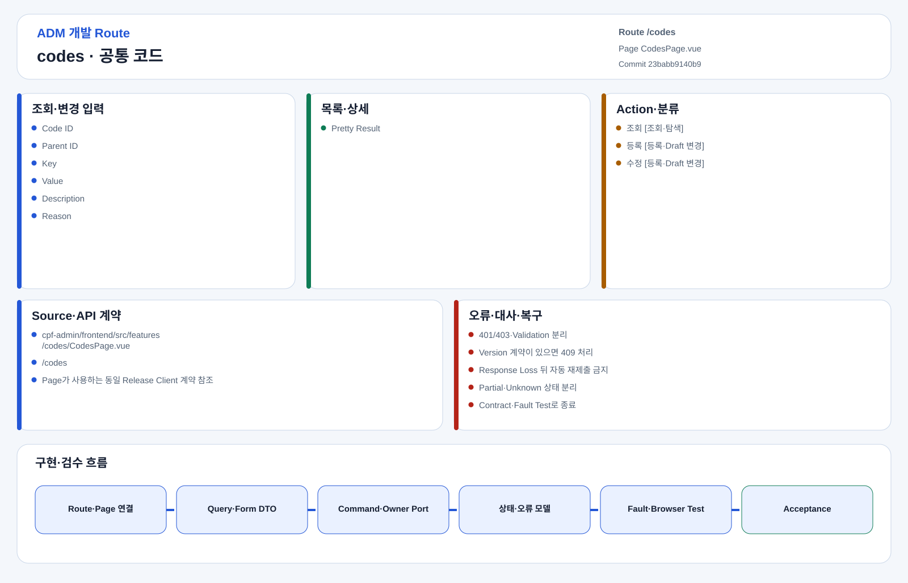


### 구현 결과

`/codes`가 단순 Route가 아니라 **계층형 공통 Code를 관리한다.** Query·Command·Permission·Owner 상태·Audit·Browser Test가 연결된 기능 Slice가 되도록 구현한다.

### Source 진입점과 소유권

| 계층 | 기준 |
|---|---|
| Router | `/codes` |
| Page | `cpf-admin/frontend/src/features/codes/CodesPage.vue` |
| Generated Client | Page가 import하는 Generated Client 또는 공통 ADM Client의 실제 Operation을 사용한다. 수기 Endpoint 문자열과 중복 DTO를 만들지 않는다 |
| ADM Backend | OpenAPI Operation의 Controller와 Application Service |
| Owner Port | Query·Command·Status·Reconcile Port; Local/Remote가 같은 DTO·오류 의미 사용 |
| Test | Frontend Unit·Generated Client Contract·Controller·Browser·Fault |

### Frontend Query·Form 모델

| Field | Control | 직렬화·Validation | 오류·접근성 |
|---|---|---|---|
| `Code ID` | 문자열 입력·검색 | 조회·상세·Audit에서 같은 대상을 다시 찾기 위한 식별 조건이다. 앞뒤 공백·허용 문자·길이와 대소문자 규칙을 확인한다. Request·Query의 실제 이름과 Type을 유지한다. | Label·Help·Field Error·Keyboard Focus를 제공하고 민감값은 재표시하지 않는다. |
| `Parent ID` | 문자열 입력·검색 | 조회·상세·Audit에서 같은 대상을 다시 찾기 위한 식별 조건이다. 앞뒤 공백·허용 문자·길이와 대소문자 규칙을 확인한다. Request·Query의 실제 이름과 Type을 유지한다. | Label·Help·Field Error·Keyboard Focus를 제공하고 민감값은 재표시하지 않는다. |
| `Key` | 문자열 입력·검색 | 조회·상세·Audit에서 같은 대상을 다시 찾기 위한 식별 조건이다. 앞뒤 공백·허용 문자·길이와 대소문자 규칙을 확인한다. Request·Query의 실제 이름과 Type을 유지한다. | Label·Help·Field Error·Keyboard Focus를 제공하고 민감값은 재표시하지 않는다. |
| `Value` | 문자열 입력·검색 | 공통 코드 화면의 조회 조건 또는 편집 Form에 포함되는 값이며 화면 Label과 Help를 기준으로 사용한다. 앞뒤 공백·허용 문자·길이와 대소문자 규칙을 확인한다. Request·Query의 실제 이름과 Type을 유지한다. | Label·Help·Field Error·Keyboard Focus를 제공하고 민감값은 재표시하지 않는다. |
| `Description` | 다중행 입력 | 작업 목적·영향 범위·승인 또는 복구 기준을 기록해 Audit와 교대 기록에 연결한다. 허용 Schema·길이·민감정보 포함 여부를 확인하고 Preview 또는 Validation 결과를 검토한다. Request·Query의 실제 이름과 Type을 유지한다. | Label·Help·Field Error·Keyboard Focus를 제공하고 민감값은 재표시하지 않는다. |
| `Reason` | 다중행 입력 | 작업 목적·영향 범위·승인 또는 복구 기준을 기록해 Audit와 교대 기록에 연결한다. Ticket·영향 범위·복구점을 포함하고 화면이 요구하는 최소 길이를 충족한다. Request·Query의 실제 이름과 Type을 유지한다. | Label·Help·Field Error·Keyboard Focus를 제공하고 민감값은 재표시하지 않는다. |

### Table·Detail View Model

| 값 | 표시 계약 | Drill-down·대사 |
|---|---|---|
| `Pretty Result` | 화면이 받은 Response를 사람이 확인할 수 있도록 표현한 결과 영역이며 Owner 상태 확정과 동일하지 않다. Masking·Timezone·단위를 DTO Metadata와 함께 표시한다. | Last Updated·Terminal 조건·Owner 상태와 함께 확인한다. |

### Button·Command 모델

| Action | 분류 | Frontend 활성 조건 | Backend·성공 처리 |
|---|---|---|---|
| **조회** | 조회·탐색 | 조회 Permission과 Query Validation을 충족하고 동일 조회가 진행 중이 아님 | 조회 결과의 조회 시각·Filter·Source Version·Warning이 갱신되며 Owner 데이터는 변경하지 않는다. |
| **등록** | 등록·Draft 변경 | 화면이 실제로 요구하는 Write Permission·필수 Field·Reason·Version 조건을 충족함 | 공통 코드의 재조회 결과가 요청 내용과 일치한다. Version·Before/After·Audit는 해당 Owner가 제공하는 경우 함께 확인한다. Backend에서도 Permission·Version·Idempotency를 재검증한다. |
| **수정** | 등록·Draft 변경 | 화면이 실제로 요구하는 Write Permission·필수 Field·Reason·Version 조건을 충족함 | 공통 코드의 재조회 결과가 요청 내용과 일치한다. Version·Before/After·Audit는 해당 Owner가 제공하는 경우 함께 확인한다. Backend에서도 Permission·Version·Idempotency를 재검증한다. |

### 상태 모델

```text
Query: Idle → Loading → Empty | Success | Error
Success + Stale | Partial
Command: Editing → Validating → Submitting → Accepted(operationId) → Terminal
Submitting → ResponseLoss → Reconcile → Terminal | UNKNOWN_RESULT
```

Query와 Command의 Loading·Error를 분리한다. 조회 전용 Route에는 존재하지 않는 Command 상태를 만들지 않는다. `403`, `409`, Timeout, Partial, Unknown을 하나의 Error Toast로 합치지 않는다.

### API·Owner 계약

- Query Request는 실제 Page가 사용하는 Environment·Data Scope·검색 Field·Paging·Sort·Timezone만 포함한다.
- Query Response는 실제 Item·Page·조회 시각·Source Version·Stale·Partial·Warning 계약을 유지한다.
- Command는 Source에 선언된 Target ID·Version·Reason·Approval ID·Idempotency Key·Request Hash 중 실제 필드만 사용한다.
- `202 Accepted`는 완료가 아니라 Operation 추적 시작이며 Owner Terminal 상태를 별도로 조회한다.
- Side Effect 전 실패, Side Effect 후 실패, Success, Partial, `UNKNOWN_RESULT`를 구분한다.
- Same-JVM과 Remote Adapter는 DTO·Error Code·Timeout·Unknown 의미를 유지한다.

### Permission·Data Scope·Masking

- Route Permission 기준은 **`CODE` Write**이다.
- Menu 노출, Query, Button, Raw, Export Permission을 분리하고 Backend와 Owner에서 다시 검증한다.
- Deny는 403과 Audit를 남기며 404·Empty로 위장하지 않는다.
- Secret·Credential·PII Raw를 일반 Response DTO·Browser Storage·Log에 넣지 않는다.

### 구현 순서

1. Route·Page Import·Menu Metadata·Permission을 연결한다.
2. 이 장의 Field·Column·Action을 OpenAPI Request·Response·Error와 대조한다.
3. Generated Client를 재생성하고 수기 HTTP 호출을 제거한다.
4. Query·Command 상태와 Empty·Stale·Partial·Unknown UI를 구현한다.
5. Backend Controller·Application Service·Owner Port·Local/Remote Adapter를 연결한다.
6. Reason·Approval·Expected Version·Idempotency·Audit를 Server에서 검증한다.
7. Response Loss Polling·Reconcile·Rollback Link를 구현한다.
8. Unit·Contract·Browser·Fault·Accessibility Test를 실행한다.

### Test Matrix

| Test | 필수 Scenario |
|---|---|
| Frontend Unit | Default·Validation·Button 조건·Masking·Empty/Error/Stale/Partial |
| OpenAPI·Generated Client | Operation 이름·Type·Error·Hash Drift |
| Backend Query | Permission·Data Scope·Filter·Paging·Stale·Partial |
| Backend Command | Source에 선언된 Permission·Version·Reason·Approval·Idempotency·Audit 계약 |
| Local/Remote Contract | 같은 DTO·Error·Timeout 의미 |
| Browser | Deep Link·Query·상세·403·Timeout·Empty·Partial |
| Fault | 409·Response Loss·DB/Kafka/Owner 중단·Partial ACK·Late Response |
| Accessibility | Keyboard·Focus·Label·Error Announcement·Table/Dialog |

### 개발 Fault Workbook

1. `/codes` Query를 500·Timeout·Empty·Partial 응답으로 주입해 Loading·Empty·Error·Stale·Partial UI를 각각 확인한다.
2. 401·403과 Data Scope 축소를 주입해 Deny를 Empty로 위장하지 않고 Error와 접근 가능한 범위를 구분하는지 확인한다.
3. Version 계약이 있는 Write Action에는 409를, 모든 비동기·원격 Write에는 Response Loss를 주입해 자동 재제출이 없는지 확인한다.
4. 202 응답 뒤 Operation Polling이 Terminal·Failed·Partial·Unknown을 분리하는지 확인한다.
5. Local Adapter와 Remote Adapter에 같은 Contract Fixture를 적용해 Error Code·Retryability·failureStage가 일치하는지 확인한다.
6. Browser Storage·Console·Network Error·Screenshot에 Token·Secret·PII Raw가 남지 않는지 확인한다.

### Route Acceptance Checklist

- [ ] Route `/codes`의 Deep Link와 Menu ID `codes`가 같은 Page를 연다.
- [ ] 이 장의 Field·Column·Action과 Page·OpenAPI·Generated Client가 같은 계약을 사용한다.
- [ ] Menu·Query·Raw·Export Permission Deny가 Backend 403과 화면 Error로 확인된다.
- [ ] Empty·Timeout·Stale·Partial이 서로 다른 사용자 상태와 재조회 경로를 제공한다.
- [ ] Same-JVM·Remote 호출이 같은 Query DTO·오류·Timeout 계약을 사용한다.
- [ ] 409·Response Loss·Partial·Unknown이 서로 다른 상태와 Operation·Reconcile Link를 제공한다.
- [ ] Command가 Source에 선언한 Reason·Approval·Version·Idempotency·Audit 필드를 Server에서 재검증한다.
- [ ] 정상·오류·경계 Browser Test와 Accessibility Test가 Route Matrix에 포함된다.

### 독립 수행 검수 Checklist

- [ ] `/codes`와 Page Source를 찾고 화면 목적을 설명할 수 있다.
- [ ] 6개 입력·검색 항목의 Control·기본값·Validation을 설명할 수 있다.
- [ ] 1개 표시값을 Owner 상태·Version·Audit와 대사할 수 있다.
- [ ] 3개 Action의 분류·활성 조건·Side Effect를 설명할 수 있다.
- [ ] Empty·403·409·Timeout·Partial·Unknown을 서로 다른 상태로 처리할 수 있다.
- [ ] 응답 유실 뒤 중복 제출 없이 Operation·Owner·Audit로 결과를 확정할 수 있다.
- [ ] 교대 기록만으로 다음 담당자가 Target·상태·복구 기한을 이어받을 수 있다.
- [ ] OpenAPI·Generated Client·Page·Controller·Owner Port·Test가 같은 Field와 오류 계약을 사용하는지 검증할 수 있다.
- [ ] Local·Remote Adapter의 Timeout·Unknown 의미가 같은지 Contract Test로 확인할 수 있다.

## 17. messages — 다국어 Message 기능 Slice 개발 장

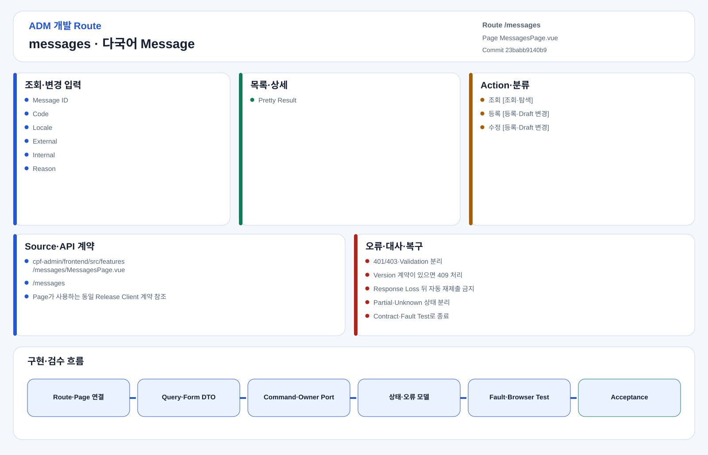


### 구현 결과

`/messages`가 단순 Route가 아니라 **Locale별 외부·내부 Message를 관리한다.** Query·Command·Permission·Owner 상태·Audit·Browser Test가 연결된 기능 Slice가 되도록 구현한다.

### Source 진입점과 소유권

| 계층 | 기준 |
|---|---|
| Router | `/messages` |
| Page | `cpf-admin/frontend/src/features/messages/MessagesPage.vue` |
| Generated Client | Page가 import하는 Generated Client 또는 공통 ADM Client의 실제 Operation을 사용한다. 수기 Endpoint 문자열과 중복 DTO를 만들지 않는다 |
| ADM Backend | OpenAPI Operation의 Controller와 Application Service |
| Owner Port | Query·Command·Status·Reconcile Port; Local/Remote가 같은 DTO·오류 의미 사용 |
| Test | Frontend Unit·Generated Client Contract·Controller·Browser·Fault |

### Frontend Query·Form 모델

| Field | Control | 직렬화·Validation | 오류·접근성 |
|---|---|---|---|
| `Message ID` | 문자열 입력·검색 | 조회·상세·Audit에서 같은 대상을 다시 찾기 위한 식별 조건이다. 앞뒤 공백·허용 문자·길이와 대소문자 규칙을 확인한다. Request·Query의 실제 이름과 Type을 유지한다. | Label·Help·Field Error·Keyboard Focus를 제공하고 민감값은 재표시하지 않는다. |
| `Code` | 문자열 입력·검색 | 조회·상세·Audit에서 같은 대상을 다시 찾기 위한 식별 조건이다. 앞뒤 공백·허용 문자·길이와 대소문자 규칙을 확인한다. Request·Query의 실제 이름과 Type을 유지한다. | Label·Help·Field Error·Keyboard Focus를 제공하고 민감값은 재표시하지 않는다. |
| `Locale` | Select·검색 | 다국어 Message 화면의 조회 조건 또는 편집 Form에 포함되는 값이며 화면 Label과 Help를 기준으로 사용한다. 허용 목록과 현재 Environment·Data Scope에 맞는 값만 선택한다. Request·Query의 실제 이름과 Type을 유지한다. | Label·Help·Field Error·Keyboard Focus를 제공하고 민감값은 재표시하지 않는다. |
| `External` | 다중행 입력 | 다국어 Message 화면의 조회 조건 또는 편집 Form에 포함되는 값이며 화면 Label과 Help를 기준으로 사용한다. 허용 Schema·길이·민감정보 포함 여부를 확인하고 Preview 또는 Validation 결과를 검토한다. Request·Query의 실제 이름과 Type을 유지한다. | Label·Help·Field Error·Keyboard Focus를 제공하고 민감값은 재표시하지 않는다. |
| `Internal` | 다중행 입력 | 다국어 Message 화면의 조회 조건 또는 편집 Form에 포함되는 값이며 화면 Label과 Help를 기준으로 사용한다. 허용 Schema·길이·민감정보 포함 여부를 확인하고 Preview 또는 Validation 결과를 검토한다. Request·Query의 실제 이름과 Type을 유지한다. | Label·Help·Field Error·Keyboard Focus를 제공하고 민감값은 재표시하지 않는다. |
| `Reason` | 다중행 입력 | 작업 목적·영향 범위·승인 또는 복구 기준을 기록해 Audit와 교대 기록에 연결한다. Ticket·영향 범위·복구점을 포함하고 화면이 요구하는 최소 길이를 충족한다. Request·Query의 실제 이름과 Type을 유지한다. | Label·Help·Field Error·Keyboard Focus를 제공하고 민감값은 재표시하지 않는다. |

### Table·Detail View Model

| 값 | 표시 계약 | Drill-down·대사 |
|---|---|---|
| `Pretty Result` | 화면이 받은 Response를 사람이 확인할 수 있도록 표현한 결과 영역이며 Owner 상태 확정과 동일하지 않다. Masking·Timezone·단위를 DTO Metadata와 함께 표시한다. | Last Updated·Terminal 조건·Owner 상태와 함께 확인한다. |

### Button·Command 모델

| Action | 분류 | Frontend 활성 조건 | Backend·성공 처리 |
|---|---|---|---|
| **조회** | 조회·탐색 | 조회 Permission과 Query Validation을 충족하고 동일 조회가 진행 중이 아님 | 조회 결과의 조회 시각·Filter·Source Version·Warning이 갱신되며 Owner 데이터는 변경하지 않는다. |
| **등록** | 등록·Draft 변경 | 화면이 실제로 요구하는 Write Permission·필수 Field·Reason·Version 조건을 충족함 | 다국어 Message의 재조회 결과가 요청 내용과 일치한다. Version·Before/After·Audit는 해당 Owner가 제공하는 경우 함께 확인한다. Backend에서도 Permission·Version·Idempotency를 재검증한다. |
| **수정** | 등록·Draft 변경 | 화면이 실제로 요구하는 Write Permission·필수 Field·Reason·Version 조건을 충족함 | 다국어 Message의 재조회 결과가 요청 내용과 일치한다. Version·Before/After·Audit는 해당 Owner가 제공하는 경우 함께 확인한다. Backend에서도 Permission·Version·Idempotency를 재검증한다. |

### 상태 모델

```text
Query: Idle → Loading → Empty | Success | Error
Success + Stale | Partial
Command: Editing → Validating → Submitting → Accepted(operationId) → Terminal
Submitting → ResponseLoss → Reconcile → Terminal | UNKNOWN_RESULT
```

Query와 Command의 Loading·Error를 분리한다. 조회 전용 Route에는 존재하지 않는 Command 상태를 만들지 않는다. `403`, `409`, Timeout, Partial, Unknown을 하나의 Error Toast로 합치지 않는다.

### API·Owner 계약

- Query Request는 실제 Page가 사용하는 Environment·Data Scope·검색 Field·Paging·Sort·Timezone만 포함한다.
- Query Response는 실제 Item·Page·조회 시각·Source Version·Stale·Partial·Warning 계약을 유지한다.
- Command는 Source에 선언된 Target ID·Version·Reason·Approval ID·Idempotency Key·Request Hash 중 실제 필드만 사용한다.
- `202 Accepted`는 완료가 아니라 Operation 추적 시작이며 Owner Terminal 상태를 별도로 조회한다.
- Side Effect 전 실패, Side Effect 후 실패, Success, Partial, `UNKNOWN_RESULT`를 구분한다.
- Same-JVM과 Remote Adapter는 DTO·Error Code·Timeout·Unknown 의미를 유지한다.

### Permission·Data Scope·Masking

- Route Permission 기준은 **`MESSAGE` Write**이다.
- Menu 노출, Query, Button, Raw, Export Permission을 분리하고 Backend와 Owner에서 다시 검증한다.
- Deny는 403과 Audit를 남기며 404·Empty로 위장하지 않는다.
- Secret·Credential·PII Raw를 일반 Response DTO·Browser Storage·Log에 넣지 않는다.

### 구현 순서

1. Route·Page Import·Menu Metadata·Permission을 연결한다.
2. 이 장의 Field·Column·Action을 OpenAPI Request·Response·Error와 대조한다.
3. Generated Client를 재생성하고 수기 HTTP 호출을 제거한다.
4. Query·Command 상태와 Empty·Stale·Partial·Unknown UI를 구현한다.
5. Backend Controller·Application Service·Owner Port·Local/Remote Adapter를 연결한다.
6. Reason·Approval·Expected Version·Idempotency·Audit를 Server에서 검증한다.
7. Response Loss Polling·Reconcile·Rollback Link를 구현한다.
8. Unit·Contract·Browser·Fault·Accessibility Test를 실행한다.

### Test Matrix

| Test | 필수 Scenario |
|---|---|
| Frontend Unit | Default·Validation·Button 조건·Masking·Empty/Error/Stale/Partial |
| OpenAPI·Generated Client | Operation 이름·Type·Error·Hash Drift |
| Backend Query | Permission·Data Scope·Filter·Paging·Stale·Partial |
| Backend Command | Source에 선언된 Permission·Version·Reason·Approval·Idempotency·Audit 계약 |
| Local/Remote Contract | 같은 DTO·Error·Timeout 의미 |
| Browser | Deep Link·Query·상세·403·Timeout·Empty·Partial |
| Fault | 409·Response Loss·DB/Kafka/Owner 중단·Partial ACK·Late Response |
| Accessibility | Keyboard·Focus·Label·Error Announcement·Table/Dialog |

### 개발 Fault Workbook

1. `/messages` Query를 500·Timeout·Empty·Partial 응답으로 주입해 Loading·Empty·Error·Stale·Partial UI를 각각 확인한다.
2. 401·403과 Data Scope 축소를 주입해 Deny를 Empty로 위장하지 않고 Error와 접근 가능한 범위를 구분하는지 확인한다.
3. Version 계약이 있는 Write Action에는 409를, 모든 비동기·원격 Write에는 Response Loss를 주입해 자동 재제출이 없는지 확인한다.
4. 202 응답 뒤 Operation Polling이 Terminal·Failed·Partial·Unknown을 분리하는지 확인한다.
5. Local Adapter와 Remote Adapter에 같은 Contract Fixture를 적용해 Error Code·Retryability·failureStage가 일치하는지 확인한다.
6. Browser Storage·Console·Network Error·Screenshot에 Token·Secret·PII Raw가 남지 않는지 확인한다.

### Route Acceptance Checklist

- [ ] Route `/messages`의 Deep Link와 Menu ID `messages`가 같은 Page를 연다.
- [ ] 이 장의 Field·Column·Action과 Page·OpenAPI·Generated Client가 같은 계약을 사용한다.
- [ ] Menu·Query·Raw·Export Permission Deny가 Backend 403과 화면 Error로 확인된다.
- [ ] Empty·Timeout·Stale·Partial이 서로 다른 사용자 상태와 재조회 경로를 제공한다.
- [ ] Same-JVM·Remote 호출이 같은 Query DTO·오류·Timeout 계약을 사용한다.
- [ ] 409·Response Loss·Partial·Unknown이 서로 다른 상태와 Operation·Reconcile Link를 제공한다.
- [ ] Command가 Source에 선언한 Reason·Approval·Version·Idempotency·Audit 필드를 Server에서 재검증한다.
- [ ] 정상·오류·경계 Browser Test와 Accessibility Test가 Route Matrix에 포함된다.

### 독립 수행 검수 Checklist

- [ ] `/messages`와 Page Source를 찾고 화면 목적을 설명할 수 있다.
- [ ] 6개 입력·검색 항목의 Control·기본값·Validation을 설명할 수 있다.
- [ ] 1개 표시값을 Owner 상태·Version·Audit와 대사할 수 있다.
- [ ] 3개 Action의 분류·활성 조건·Side Effect를 설명할 수 있다.
- [ ] Empty·403·409·Timeout·Partial·Unknown을 서로 다른 상태로 처리할 수 있다.
- [ ] 응답 유실 뒤 중복 제출 없이 Operation·Owner·Audit로 결과를 확정할 수 있다.
- [ ] 교대 기록만으로 다음 담당자가 Target·상태·복구 기한을 이어받을 수 있다.
- [ ] OpenAPI·Generated Client·Page·Controller·Owner Port·Test가 같은 Field와 오류 계약을 사용하는지 검증할 수 있다.
- [ ] Local·Remote Adapter의 Timeout·Unknown 의미가 같은지 Contract Test로 확인할 수 있다.

## 18. remoteLogs — 원격 Log Artifact 기능 Slice 개발 장

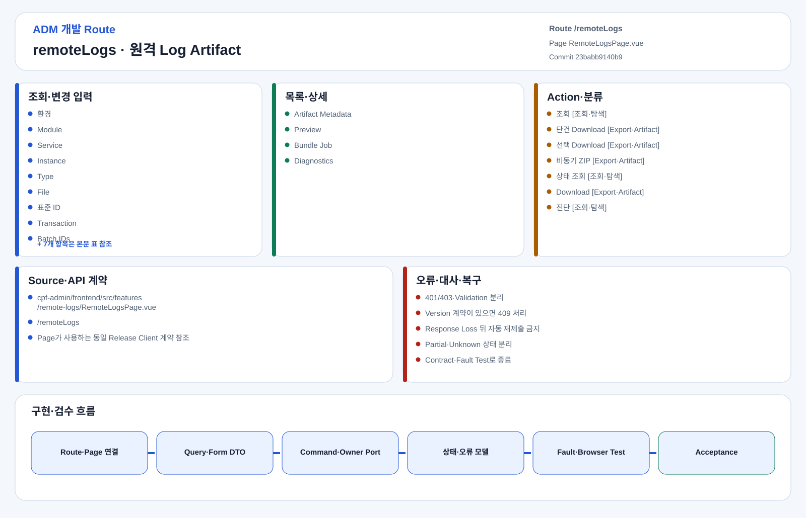


### 구현 결과

`/remoteLogs`가 단순 Route가 아니라 **원격 Log Artifact를 검색·Preview·Bundle·Download한다.** Query·Command·Permission·Owner 상태·Audit·Browser Test가 연결된 기능 Slice가 되도록 구현한다.

### Source 진입점과 소유권

| 계층 | 기준 |
|---|---|
| Router | `/remoteLogs` |
| Page | `cpf-admin/frontend/src/features/remote-logs/RemoteLogsPage.vue` |
| Generated Client | Page가 import하는 Generated Client 또는 공통 ADM Client의 실제 Operation을 사용한다. 수기 Endpoint 문자열과 중복 DTO를 만들지 않는다 |
| ADM Backend | OpenAPI Operation의 Controller와 Application Service |
| Owner Port | Query·Command·Status·Reconcile Port; Local/Remote가 같은 DTO·오류 의미 사용 |
| Test | Frontend Unit·Generated Client Contract·Controller·Browser·Fault |

### Frontend Query·Form 모델

| Field | Control | 직렬화·Validation | 오류·접근성 |
|---|---|---|---|
| `환경` | Select·검색 | 원격 Log Artifact 조회·조치가 적용되는 환경과 데이터 경계를 제한한다. 허용 목록과 현재 Environment·Data Scope에 맞는 값만 선택한다. Request·Query의 실제 이름과 Type을 유지한다. | Label·Help·Field Error·Keyboard Focus를 제공하고 민감값은 재표시하지 않는다. |
| `Module` | 문자열 입력·검색 | 원격 Log Artifact 조회·조치가 적용되는 환경과 데이터 경계를 제한한다. 앞뒤 공백·허용 문자·길이와 대소문자 규칙을 확인한다. Request·Query의 실제 이름과 Type을 유지한다. | Label·Help·Field Error·Keyboard Focus를 제공하고 민감값은 재표시하지 않는다. |
| `Service` | 문자열 입력·검색 | 조회·상세·Audit에서 같은 대상을 다시 찾기 위한 식별 조건이다. 앞뒤 공백·허용 문자·길이와 대소문자 규칙을 확인한다. Request·Query의 실제 이름과 Type을 유지한다. | Label·Help·Field Error·Keyboard Focus를 제공하고 민감값은 재표시하지 않는다. |
| `Instance` | 문자열 입력·검색 | 조회·상세·Audit에서 같은 대상을 다시 찾기 위한 식별 조건이다. 앞뒤 공백·허용 문자·길이와 대소문자 규칙을 확인한다. Request·Query의 실제 이름과 Type을 유지한다. | Label·Help·Field Error·Keyboard Focus를 제공하고 민감값은 재표시하지 않는다. |
| `Type` | Select·검색 | 원격 Log Artifact에서 적용하거나 조회할 정책·권한·처리 유형을 선택한다. 허용 목록과 현재 Environment·Data Scope에 맞는 값만 선택한다. Request·Query의 실제 이름과 Type을 유지한다. | Label·Help·Field Error·Keyboard Focus를 제공하고 민감값은 재표시하지 않는다. |
| `File` | 파일·본문 입력 | 검증·등록·Export에 사용할 입력 Artifact 또는 구조화된 본문이다. 확장자·크기·Encoding·Schema·Checksum을 검증하고 Dry Run이 있으면 먼저 실행한다. Request·Query의 실제 이름과 Type을 유지한다. | Label·Help·Field Error·Keyboard Focus를 제공하고 민감값은 재표시하지 않는다. |
| `표준 ID` | 문자열 입력·검색 | 조회·상세·Audit에서 같은 대상을 다시 찾기 위한 식별 조건이다. 앞뒤 공백·허용 문자·길이와 대소문자 규칙을 확인한다. Request·Query의 실제 이름과 Type을 유지한다. | Label·Help·Field Error·Keyboard Focus를 제공하고 민감값은 재표시하지 않는다. |
| `Transaction` | Select·검색 | 원격 Log Artifact에서 적용하거나 조회할 정책·권한·처리 유형을 선택한다. 허용 목록과 현재 Environment·Data Scope에 맞는 값만 선택한다. Request·Query의 실제 이름과 Type을 유지한다. | Label·Help·Field Error·Keyboard Focus를 제공하고 민감값은 재표시하지 않는다. |
| `Batch IDs` | 문자열 입력·검색 | 조회·상세·Audit에서 같은 대상을 다시 찾기 위한 식별 조건이다. 앞뒤 공백·허용 문자·길이와 대소문자 규칙을 확인한다. Request·Query의 실제 이름과 Type을 유지한다. | Label·Help·Field Error·Keyboard Focus를 제공하고 민감값은 재표시하지 않는다. |
| `기간` | 날짜·시간 입력 | 조회 또는 적용의 유효 시간 범위를 정하며 Timezone과 시작·종료 순서를 함께 확인한다. Timezone을 고정하고 시작≤종료·유효기간 겹침·기준일 포함 여부를 확인한다. Request·Query의 실제 이름과 Type을 유지한다. | Label·Help·Field Error·Keyboard Focus를 제공하고 민감값은 재표시하지 않는다. |
| `Size` | 숫자·Version 입력 | 실행 한도·순서·용량 또는 재시도 범위를 지정한다. 화면의 min·max·단위와 0 허용 여부를 확인하고 음수·Overflow를 차단한다. Request·Query의 실제 이름과 Type을 유지한다. | Label·Help·Field Error·Keyboard Focus를 제공하고 민감값은 재표시하지 않는다. |
| `압축` | 문자열 입력·검색 | 원격 Log Artifact 화면의 조회 조건 또는 편집 Form에 포함되는 값이며 화면 Label과 Help를 기준으로 사용한다. 앞뒤 공백·허용 문자·길이와 대소문자 규칙을 확인한다. Request·Query의 실제 이름과 Type을 유지한다. | Label·Help·Field Error·Keyboard Focus를 제공하고 민감값은 재표시하지 않는다. |
| `활성` | Checkbox·Switch | 현재 상태를 조회하거나 다음 Action의 허용 조건을 지정한다. 현재 선택과 변경 후 영향 범위를 비교하고 화면의 Source 기본값을 확인한다. Request·Query의 실제 이름과 Type을 유지한다. | Label·Help·Field Error·Keyboard Focus를 제공하고 민감값은 재표시하지 않는다. |
| `Lines` | 숫자·Version 입력 | 실행 한도·순서·용량 또는 재시도 범위를 지정한다. 화면의 min·max·단위와 0 허용 여부를 확인하고 음수·Overflow를 차단한다. Request·Query의 실제 이름과 Type을 유지한다. | Label·Help·Field Error·Keyboard Focus를 제공하고 민감값은 재표시하지 않는다. |
| `Keyword` | 문자열 입력·검색 | 조회·상세·Audit에서 같은 대상을 다시 찾기 위한 식별 조건이다. 앞뒤 공백·허용 문자·길이와 대소문자 규칙을 확인한다. Request·Query의 실제 이름과 Type을 유지한다. | Label·Help·Field Error·Keyboard Focus를 제공하고 민감값은 재표시하지 않는다. |
| `Reason` | 다중행 입력 | 작업 목적·영향 범위·승인 또는 복구 기준을 기록해 Audit와 교대 기록에 연결한다. Ticket·영향 범위·복구점을 포함하고 화면이 요구하는 최소 길이를 충족한다. Request·Query의 실제 이름과 Type을 유지한다. | Label·Help·Field Error·Keyboard Focus를 제공하고 민감값은 재표시하지 않는다. |

### Table·Detail View Model

| 값 | 표시 계약 | Drill-down·대사 |
|---|---|---|
| `Artifact Metadata` | 원격 Log Artifact 상세에서 대상의 현재 속성 또는 처리 결과를 확인하는 값이다. Masking·Timezone·단위를 DTO Metadata와 함께 표시한다. | 상세·재조회 결과와 비교하고 Stale·Masking·단위 차이를 확인한다. |
| `Preview` | 원격 Log Artifact 상세에서 대상의 현재 속성 또는 처리 결과를 확인하는 값이다. Masking·Timezone·단위를 DTO Metadata와 함께 표시한다. | 상세·재조회 결과와 비교하고 Stale·Masking·단위 차이를 확인한다. |
| `Bundle Job` | 원격 Log Artifact의 대상 레코드를 상세·Owner·Audit에서 연결하는 식별자다. Masking·Timezone·단위를 DTO Metadata와 함께 표시한다. | 상세·Log·Trace·Audit에서 같은 대상을 가리키는지 확인한다. |
| `Diagnostics` | 원격 Log Artifact 상세에서 대상의 현재 속성 또는 처리 결과를 확인하는 값이다. Masking·Timezone·단위를 DTO Metadata와 함께 표시한다. | 상세·재조회 결과와 비교하고 Stale·Masking·단위 차이를 확인한다. |

### Button·Command 모델

| Action | 분류 | Frontend 활성 조건 | Backend·성공 처리 |
|---|---|---|---|
| **조회** | 조회·탐색 | 조회 Permission과 Query Validation을 충족하고 동일 조회가 진행 중이 아님 | 조회 결과의 조회 시각·Filter·Source Version·Warning이 갱신되며 Owner 데이터는 변경하지 않는다. |
| **단건 Download** | Export·Artifact | 화면이 요구하는 Export Permission·Data Scope·Masking·Reason과 승인 조건을 충족함 | Export Operation과 Artifact ID·Checksum·만료·Download Audit가 생성되고 원본 데이터는 변경하지 않는다. Backend에서도 Permission·Version·Idempotency를 재검증한다. |
| **선택 Download** | Export·Artifact | 화면이 요구하는 Export Permission·Data Scope·Masking·Reason과 승인 조건을 충족함 | Export Operation과 Artifact ID·Checksum·만료·Download Audit가 생성되고 원본 데이터는 변경하지 않는다. Backend에서도 Permission·Version·Idempotency를 재검증한다. |
| **비동기 ZIP** | Export·Artifact | 화면이 요구하는 Export Permission·Data Scope·Masking·Reason과 승인 조건을 충족함 | Export Operation과 Artifact ID·Checksum·만료·Download Audit가 생성되고 원본 데이터는 변경하지 않는다. Backend에서도 Permission·Version·Idempotency를 재검증한다. |
| **상태 조회** | 조회·탐색 | 조회 Permission과 Query Validation을 충족하고 동일 조회가 진행 중이 아님 | 상태 조회 결과의 조회 시각·Filter·Source Version·Warning이 갱신되며 Owner 데이터는 변경하지 않는다. |
| **Download** | Export·Artifact | 화면이 요구하는 Export Permission·Data Scope·Masking·Reason과 승인 조건을 충족함 | Export Operation과 Artifact ID·Checksum·만료·Download Audit가 생성되고 원본 데이터는 변경하지 않는다. Backend에서도 Permission·Version·Idempotency를 재검증한다. |
| **진단** | 조회·탐색 | 조회 Permission과 Query Validation을 충족하고 동일 조회가 진행 중이 아님 | 진단 결과의 조회 시각·Filter·Source Version·Warning이 갱신되며 Owner 데이터는 변경하지 않는다. |

### 상태 모델

```text
Query: Idle → Loading → Empty | Success | Error
Success + Stale | Partial
Command: Editing → Validating → Submitting → Accepted(operationId) → Terminal
Submitting → ResponseLoss → Reconcile → Terminal | UNKNOWN_RESULT
```

Query와 Command의 Loading·Error를 분리한다. 조회 전용 Route에는 존재하지 않는 Command 상태를 만들지 않는다. `403`, `409`, Timeout, Partial, Unknown을 하나의 Error Toast로 합치지 않는다.

### API·Owner 계약

- Query Request는 실제 Page가 사용하는 Environment·Data Scope·검색 Field·Paging·Sort·Timezone만 포함한다.
- Query Response는 실제 Item·Page·조회 시각·Source Version·Stale·Partial·Warning 계약을 유지한다.
- Command는 Source에 선언된 Target ID·Version·Reason·Approval ID·Idempotency Key·Request Hash 중 실제 필드만 사용한다.
- `202 Accepted`는 완료가 아니라 Operation 추적 시작이며 Owner Terminal 상태를 별도로 조회한다.
- Side Effect 전 실패, Side Effect 후 실패, Success, Partial, `UNKNOWN_RESULT`를 구분한다.
- Same-JVM과 Remote Adapter는 DTO·Error Code·Timeout·Unknown 의미를 유지한다.

### Permission·Data Scope·Masking

- Route Permission 기준은 **`REMOTE_LOG` Write for download**이다.
- Menu 노출, Query, Button, Raw, Export Permission을 분리하고 Backend와 Owner에서 다시 검증한다.
- Deny는 403과 Audit를 남기며 404·Empty로 위장하지 않는다.
- Secret·Credential·PII Raw를 일반 Response DTO·Browser Storage·Log에 넣지 않는다.

### 구현 순서

1. Route·Page Import·Menu Metadata·Permission을 연결한다.
2. 이 장의 Field·Column·Action을 OpenAPI Request·Response·Error와 대조한다.
3. Generated Client를 재생성하고 수기 HTTP 호출을 제거한다.
4. Query·Command 상태와 Empty·Stale·Partial·Unknown UI를 구현한다.
5. Backend Controller·Application Service·Owner Port·Local/Remote Adapter를 연결한다.
6. Reason·Approval·Expected Version·Idempotency·Audit를 Server에서 검증한다.
7. Response Loss Polling·Reconcile·Rollback Link를 구현한다.
8. Unit·Contract·Browser·Fault·Accessibility Test를 실행한다.

### Test Matrix

| Test | 필수 Scenario |
|---|---|
| Frontend Unit | Default·Validation·Button 조건·Masking·Empty/Error/Stale/Partial |
| OpenAPI·Generated Client | Operation 이름·Type·Error·Hash Drift |
| Backend Query | Permission·Data Scope·Filter·Paging·Stale·Partial |
| Backend Command | Source에 선언된 Permission·Version·Reason·Approval·Idempotency·Audit 계약 |
| Local/Remote Contract | 같은 DTO·Error·Timeout 의미 |
| Browser | Deep Link·Query·상세·403·Timeout·Empty·Partial |
| Fault | 409·Response Loss·DB/Kafka/Owner 중단·Partial ACK·Late Response |
| Accessibility | Keyboard·Focus·Label·Error Announcement·Table/Dialog |

### 개발 Fault Workbook

1. `/remoteLogs` Query를 500·Timeout·Empty·Partial 응답으로 주입해 Loading·Empty·Error·Stale·Partial UI를 각각 확인한다.
2. 401·403과 Data Scope 축소를 주입해 Deny를 Empty로 위장하지 않고 Error와 접근 가능한 범위를 구분하는지 확인한다.
3. Version 계약이 있는 Write Action에는 409를, 모든 비동기·원격 Write에는 Response Loss를 주입해 자동 재제출이 없는지 확인한다.
4. 202 응답 뒤 Operation Polling이 Terminal·Failed·Partial·Unknown을 분리하는지 확인한다.
5. Local Adapter와 Remote Adapter에 같은 Contract Fixture를 적용해 Error Code·Retryability·failureStage가 일치하는지 확인한다.
6. Browser Storage·Console·Network Error·Screenshot에 Token·Secret·PII Raw가 남지 않는지 확인한다.

### Route Acceptance Checklist

- [ ] Route `/remoteLogs`의 Deep Link와 Menu ID `remoteLogs`가 같은 Page를 연다.
- [ ] 이 장의 Field·Column·Action과 Page·OpenAPI·Generated Client가 같은 계약을 사용한다.
- [ ] Menu·Query·Raw·Export Permission Deny가 Backend 403과 화면 Error로 확인된다.
- [ ] Empty·Timeout·Stale·Partial이 서로 다른 사용자 상태와 재조회 경로를 제공한다.
- [ ] Same-JVM·Remote 호출이 같은 Query DTO·오류·Timeout 계약을 사용한다.
- [ ] 409·Response Loss·Partial·Unknown이 서로 다른 상태와 Operation·Reconcile Link를 제공한다.
- [ ] Command가 Source에 선언한 Reason·Approval·Version·Idempotency·Audit 필드를 Server에서 재검증한다.
- [ ] 정상·오류·경계 Browser Test와 Accessibility Test가 Route Matrix에 포함된다.

### 독립 수행 검수 Checklist

- [ ] `/remoteLogs`와 Page Source를 찾고 화면 목적을 설명할 수 있다.
- [ ] 16개 입력·검색 항목의 Control·기본값·Validation을 설명할 수 있다.
- [ ] 4개 표시값을 Owner 상태·Version·Audit와 대사할 수 있다.
- [ ] 7개 Action의 분류·활성 조건·Side Effect를 설명할 수 있다.
- [ ] Empty·403·409·Timeout·Partial·Unknown을 서로 다른 상태로 처리할 수 있다.
- [ ] 응답 유실 뒤 중복 제출 없이 Operation·Owner·Audit로 결과를 확정할 수 있다.
- [ ] 교대 기록만으로 다음 담당자가 Target·상태·복구 기한을 이어받을 수 있다.
- [ ] OpenAPI·Generated Client·Page·Controller·Owner Port·Test가 같은 Field와 오류 계약을 사용하는지 검증할 수 있다.
- [ ] Local·Remote Adapter의 Timeout·Unknown 의미가 같은지 Contract Test로 확인할 수 있다.

## 19. auditLogs — Audit 조회·Delivery 복구 기능 Slice 개발 장

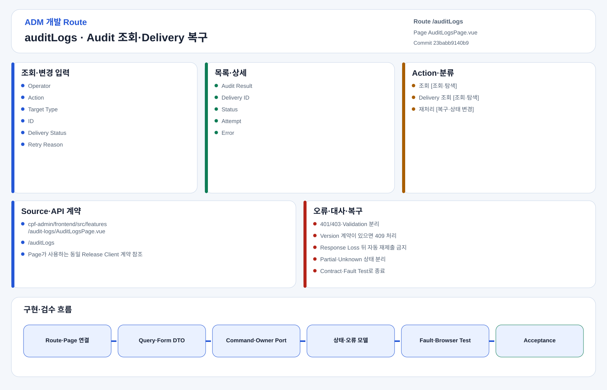


### 구현 결과

`/auditLogs`가 단순 Route가 아니라 **업무 Audit와 Delivery 상태를 조회·재처리한다.** Query·Command·Permission·Owner 상태·Audit·Browser Test가 연결된 기능 Slice가 되도록 구현한다.

### Source 진입점과 소유권

| 계층 | 기준 |
|---|---|
| Router | `/auditLogs` |
| Page | `cpf-admin/frontend/src/features/audit-logs/AuditLogsPage.vue` |
| Generated Client | Page가 import하는 Generated Client 또는 공통 ADM Client의 실제 Operation을 사용한다. 수기 Endpoint 문자열과 중복 DTO를 만들지 않는다 |
| ADM Backend | OpenAPI Operation의 Controller와 Application Service |
| Owner Port | Query·Command·Status·Reconcile Port; Local/Remote가 같은 DTO·오류 의미 사용 |
| Test | Frontend Unit·Generated Client Contract·Controller·Browser·Fault |

### Frontend Query·Form 모델

| Field | Control | 직렬화·Validation | 오류·접근성 |
|---|---|---|---|
| `Operator` | 날짜·시간 입력 | 조회 또는 적용의 유효 시간 범위를 정하며 Timezone과 시작·종료 순서를 함께 확인한다. Timezone을 고정하고 시작≤종료·유효기간 겹침·기준일 포함 여부를 확인한다. Request·Query의 실제 이름과 Type을 유지한다. | Label·Help·Field Error·Keyboard Focus를 제공하고 민감값은 재표시하지 않는다. |
| `Action` | Select·검색 | Audit 조회·Delivery 복구에서 적용하거나 조회할 정책·권한·처리 유형을 선택한다. 허용 목록과 현재 Environment·Data Scope에 맞는 값만 선택한다. Request·Query의 실제 이름과 Type을 유지한다. | Label·Help·Field Error·Keyboard Focus를 제공하고 민감값은 재표시하지 않는다. |
| `Target Type` | Select·검색 | Audit 조회·Delivery 복구에서 적용하거나 조회할 정책·권한·처리 유형을 선택한다. 허용 목록과 현재 Environment·Data Scope에 맞는 값만 선택한다. Request·Query의 실제 이름과 Type을 유지한다. | Label·Help·Field Error·Keyboard Focus를 제공하고 민감값은 재표시하지 않는다. |
| `ID` | 문자열 입력·검색 | 조회·상세·Audit에서 같은 대상을 다시 찾기 위한 식별 조건이다. 앞뒤 공백·허용 문자·길이와 대소문자 규칙을 확인한다. Request·Query의 실제 이름과 Type을 유지한다. | Label·Help·Field Error·Keyboard Focus를 제공하고 민감값은 재표시하지 않는다. |
| `Delivery Status` | Select·검색 | 현재 상태를 조회하거나 다음 Action의 허용 조건을 지정한다. 허용 목록과 현재 Environment·Data Scope에 맞는 값만 선택한다. Request·Query의 실제 이름과 Type을 유지한다. | Label·Help·Field Error·Keyboard Focus를 제공하고 민감값은 재표시하지 않는다. |
| `Retry Reason` | 다중행 입력 | 작업 목적·영향 범위·승인 또는 복구 기준을 기록해 Audit와 교대 기록에 연결한다. Ticket·영향 범위·복구점을 포함하고 화면이 요구하는 최소 길이를 충족한다. Request·Query의 실제 이름과 Type을 유지한다. | Label·Help·Field Error·Keyboard Focus를 제공하고 민감값은 재표시하지 않는다. |

### Table·Detail View Model

| 값 | 표시 계약 | Drill-down·대사 |
|---|---|---|
| `Audit Result` | 현재 상태와 Terminal 여부, 다음 Action 가능 여부를 판단하는 값이다. Masking·Timezone·단위를 DTO Metadata와 함께 표시한다. | Last Updated·Terminal 조건·Owner 상태와 함께 확인한다. |
| `Delivery ID` | Audit 조회·Delivery 복구의 대상 레코드를 상세·Owner·Audit에서 연결하는 식별자다. Masking·Timezone·단위를 DTO Metadata와 함께 표시한다. | 상세·Log·Trace·Audit에서 같은 대상을 가리키는지 확인한다. |
| `Status` | 현재 상태와 Terminal 여부, 다음 Action 가능 여부를 판단하는 값이다. Masking·Timezone·단위를 DTO Metadata와 함께 표시한다. | Last Updated·Terminal 조건·Owner 상태와 함께 확인한다. |
| `Attempt` | Audit 조회·Delivery 복구 상세에서 대상의 현재 속성 또는 처리 결과를 확인하는 값이다. Masking·Timezone·단위를 DTO Metadata와 함께 표시한다. | 상세·재조회 결과와 비교하고 Stale·Masking·단위 차이를 확인한다. |
| `Error` | 오류·Drift·결과 불명 범위를 나타내며 원인과 복구 Owner를 연결해야 한다. Masking·Timezone·단위를 DTO Metadata와 함께 표시한다. | 원인 식별자·실패 Stage·마지막 갱신 시각을 상세와 대조한다. |

### Button·Command 모델

| Action | 분류 | Frontend 활성 조건 | Backend·성공 처리 |
|---|---|---|---|
| **조회** | 조회·탐색 | 조회 Permission과 Query Validation을 충족하고 동일 조회가 진행 중이 아님 | 조회 결과의 조회 시각·Filter·Source Version·Warning이 갱신되며 Owner 데이터는 변경하지 않는다. |
| **Delivery 조회** | 조회·탐색 | 조회 Permission과 Query Validation을 충족하고 동일 조회가 진행 중이 아님 | Delivery 조회 결과의 조회 시각·Filter·Source Version·Warning이 갱신되며 Owner 데이터는 변경하지 않는다. |
| **재처리** | 복구·상태 변경 | 화면과 Owner가 요구하는 복구 Permission·대상 상태·Reason·승인·Version 조건을 충족함 | 복구 Operation을 생성하고 Owner 상태·대상별 결과·Audit로 종료를 판정한다. Backend에서도 Permission·Version·Idempotency를 재검증한다. |

### 상태 모델

```text
Query: Idle → Loading → Empty | Success | Error
Success + Stale | Partial
Command: Editing → Validating → Submitting → Accepted(operationId) → Terminal
Submitting → ResponseLoss → Reconcile → Terminal | UNKNOWN_RESULT
```

Query와 Command의 Loading·Error를 분리한다. 조회 전용 Route에는 존재하지 않는 Command 상태를 만들지 않는다. `403`, `409`, Timeout, Partial, Unknown을 하나의 Error Toast로 합치지 않는다.

### API·Owner 계약

- Query Request는 실제 Page가 사용하는 Environment·Data Scope·검색 Field·Paging·Sort·Timezone만 포함한다.
- Query Response는 실제 Item·Page·조회 시각·Source Version·Stale·Partial·Warning 계약을 유지한다.
- Command는 Source에 선언된 Target ID·Version·Reason·Approval ID·Idempotency Key·Request Hash 중 실제 필드만 사용한다.
- `202 Accepted`는 완료가 아니라 Operation 추적 시작이며 Owner Terminal 상태를 별도로 조회한다.
- Side Effect 전 실패, Side Effect 후 실패, Success, Partial, `UNKNOWN_RESULT`를 구분한다.
- Same-JVM과 Remote Adapter는 DTO·Error Code·Timeout·Unknown 의미를 유지한다.

### Permission·Data Scope·Masking

- Route Permission 기준은 **`AUDIT_LOG` Write for retry**이다.
- Menu 노출, Query, Button, Raw, Export Permission을 분리하고 Backend와 Owner에서 다시 검증한다.
- Deny는 403과 Audit를 남기며 404·Empty로 위장하지 않는다.
- Secret·Credential·PII Raw를 일반 Response DTO·Browser Storage·Log에 넣지 않는다.

### 구현 순서

1. Route·Page Import·Menu Metadata·Permission을 연결한다.
2. 이 장의 Field·Column·Action을 OpenAPI Request·Response·Error와 대조한다.
3. Generated Client를 재생성하고 수기 HTTP 호출을 제거한다.
4. Query·Command 상태와 Empty·Stale·Partial·Unknown UI를 구현한다.
5. Backend Controller·Application Service·Owner Port·Local/Remote Adapter를 연결한다.
6. Reason·Approval·Expected Version·Idempotency·Audit를 Server에서 검증한다.
7. Response Loss Polling·Reconcile·Rollback Link를 구현한다.
8. Unit·Contract·Browser·Fault·Accessibility Test를 실행한다.

### Test Matrix

| Test | 필수 Scenario |
|---|---|
| Frontend Unit | Default·Validation·Button 조건·Masking·Empty/Error/Stale/Partial |
| OpenAPI·Generated Client | Operation 이름·Type·Error·Hash Drift |
| Backend Query | Permission·Data Scope·Filter·Paging·Stale·Partial |
| Backend Command | Source에 선언된 Permission·Version·Reason·Approval·Idempotency·Audit 계약 |
| Local/Remote Contract | 같은 DTO·Error·Timeout 의미 |
| Browser | Deep Link·Query·상세·403·Timeout·Empty·Partial |
| Fault | 409·Response Loss·DB/Kafka/Owner 중단·Partial ACK·Late Response |
| Accessibility | Keyboard·Focus·Label·Error Announcement·Table/Dialog |

### 개발 Fault Workbook

1. `/auditLogs` Query를 500·Timeout·Empty·Partial 응답으로 주입해 Loading·Empty·Error·Stale·Partial UI를 각각 확인한다.
2. 401·403과 Data Scope 축소를 주입해 Deny를 Empty로 위장하지 않고 Error와 접근 가능한 범위를 구분하는지 확인한다.
3. Version 계약이 있는 Write Action에는 409를, 모든 비동기·원격 Write에는 Response Loss를 주입해 자동 재제출이 없는지 확인한다.
4. 202 응답 뒤 Operation Polling이 Terminal·Failed·Partial·Unknown을 분리하는지 확인한다.
5. Local Adapter와 Remote Adapter에 같은 Contract Fixture를 적용해 Error Code·Retryability·failureStage가 일치하는지 확인한다.
6. Browser Storage·Console·Network Error·Screenshot에 Token·Secret·PII Raw가 남지 않는지 확인한다.

### Route Acceptance Checklist

- [ ] Route `/auditLogs`의 Deep Link와 Menu ID `auditLogs`가 같은 Page를 연다.
- [ ] 이 장의 Field·Column·Action과 Page·OpenAPI·Generated Client가 같은 계약을 사용한다.
- [ ] Menu·Query·Raw·Export Permission Deny가 Backend 403과 화면 Error로 확인된다.
- [ ] Empty·Timeout·Stale·Partial이 서로 다른 사용자 상태와 재조회 경로를 제공한다.
- [ ] Same-JVM·Remote 호출이 같은 Query DTO·오류·Timeout 계약을 사용한다.
- [ ] 409·Response Loss·Partial·Unknown이 서로 다른 상태와 Operation·Reconcile Link를 제공한다.
- [ ] Command가 Source에 선언한 Reason·Approval·Version·Idempotency·Audit 필드를 Server에서 재검증한다.
- [ ] 정상·오류·경계 Browser Test와 Accessibility Test가 Route Matrix에 포함된다.

### 독립 수행 검수 Checklist

- [ ] `/auditLogs`와 Page Source를 찾고 화면 목적을 설명할 수 있다.
- [ ] 6개 입력·검색 항목의 Control·기본값·Validation을 설명할 수 있다.
- [ ] 5개 표시값을 Owner 상태·Version·Audit와 대사할 수 있다.
- [ ] 3개 Action의 분류·활성 조건·Side Effect를 설명할 수 있다.
- [ ] Empty·403·409·Timeout·Partial·Unknown을 서로 다른 상태로 처리할 수 있다.
- [ ] 응답 유실 뒤 중복 제출 없이 Operation·Owner·Audit로 결과를 확정할 수 있다.
- [ ] 교대 기록만으로 다음 담당자가 Target·상태·복구 기한을 이어받을 수 있다.
- [ ] OpenAPI·Generated Client·Page·Controller·Owner Port·Test가 같은 Field와 오류 계약을 사용하는지 검증할 수 있다.
- [ ] Local·Remote Adapter의 Timeout·Unknown 의미가 같은지 Contract Test로 확인할 수 있다.

## 20. logLevel — Dynamic Log Level 기능 Slice 개발 장


### 구현 결과

`/logLevel`가 단순 Route가 아니라 **특정 거래에 Dynamic Log Level과 TTL을 적용한다.** Query·Command·Permission·Owner 상태·Audit·Browser Test가 연결된 기능 Slice가 되도록 구현한다.

### Source 진입점과 소유권

| 계층 | 기준 |
|---|---|
| Router | `/logLevel` |
| Page | `cpf-admin/frontend/src/features/log-level/LogLevelPage.vue` |
| Generated Client | Page가 import하는 Generated Client 또는 공통 ADM Client의 실제 Operation을 사용한다. 수기 Endpoint 문자열과 중복 DTO를 만들지 않는다 |
| ADM Backend | OpenAPI Operation의 Controller와 Application Service |
| Owner Port | Query·Command·Status·Reconcile Port; Local/Remote가 같은 DTO·오류 의미 사용 |
| Test | Frontend Unit·Generated Client Contract·Controller·Browser·Fault |

### Frontend Query·Form 모델

| Field | Control | 직렬화·Validation | 오류·접근성 |
|---|---|---|---|
| `Business Transaction ID` | Select·검색 | Dynamic Log Level에서 적용하거나 조회할 정책·권한·처리 유형을 선택한다. 허용 목록과 현재 Environment·Data Scope에 맞는 값만 선택한다. Request·Query의 실제 이름과 Type을 유지한다. | Label·Help·Field Error·Keyboard Focus를 제공하고 민감값은 재표시하지 않는다. |
| `Transaction ID` | Select·검색 | Dynamic Log Level에서 적용하거나 조회할 정책·권한·처리 유형을 선택한다. 허용 목록과 현재 Environment·Data Scope에 맞는 값만 선택한다. Request·Query의 실제 이름과 Type을 유지한다. | Label·Help·Field Error·Keyboard Focus를 제공하고 민감값은 재표시하지 않는다. |
| `DEBUG` | 문자열 입력·검색 | Dynamic Log Level 화면의 조회 조건 또는 편집 Form에 포함되는 값이며 화면 Label과 Help를 기준으로 사용한다. 앞뒤 공백·허용 문자·길이와 대소문자 규칙을 확인한다. Request·Query의 실제 이름과 Type을 유지한다. | Label·Help·Field Error·Keyboard Focus를 제공하고 민감값은 재표시하지 않는다. |
| `INFO` | 문자열 입력·검색 | Dynamic Log Level 화면의 조회 조건 또는 편집 Form에 포함되는 값이며 화면 Label과 Help를 기준으로 사용한다. 앞뒤 공백·허용 문자·길이와 대소문자 규칙을 확인한다. Request·Query의 실제 이름과 Type을 유지한다. | Label·Help·Field Error·Keyboard Focus를 제공하고 민감값은 재표시하지 않는다. |
| `TRACE` | 문자열 입력·검색 | 조회·상세·Audit에서 같은 대상을 다시 찾기 위한 식별 조건이다. 앞뒤 공백·허용 문자·길이와 대소문자 규칙을 확인한다. Request·Query의 실제 이름과 Type을 유지한다. | Label·Help·Field Error·Keyboard Focus를 제공하고 민감값은 재표시하지 않는다. |
| `TTL` | 숫자·Version 입력 | 실행 한도·순서·용량 또는 재시도 범위를 지정한다. 화면의 min·max·단위와 0 허용 여부를 확인하고 음수·Overflow를 차단한다. Request·Query의 실제 이름과 Type을 유지한다. | Label·Help·Field Error·Keyboard Focus를 제공하고 민감값은 재표시하지 않는다. |
| `Reason` | 다중행 입력 | 작업 목적·영향 범위·승인 또는 복구 기준을 기록해 Audit와 교대 기록에 연결한다. Ticket·영향 범위·복구점을 포함하고 화면이 요구하는 최소 길이를 충족한다. Request·Query의 실제 이름과 Type을 유지한다. | Label·Help·Field Error·Keyboard Focus를 제공하고 민감값은 재표시하지 않는다. |

### Table·Detail View Model

| 값 | 표시 계약 | Drill-down·대사 |
|---|---|---|
| `Rule Result` | 정책·Rule 평가 결과이며 입력 Context와 적용 Version을 함께 확인한다. Masking·Timezone·단위를 DTO Metadata와 함께 표시한다. | Last Updated·Terminal 조건·Owner 상태와 함께 확인한다. |

### Button·Command 모델

| Action | 분류 | Frontend 활성 조건 | Backend·성공 처리 |
|---|---|---|---|
| **조회** | 조회·탐색 | 조회 Permission과 Query Validation을 충족하고 동일 조회가 진행 중이 아님 | 조회 결과의 조회 시각·Filter·Source Version·Warning이 갱신되며 Owner 데이터는 변경하지 않는다. |
| **등록** | 등록·Draft 변경 | 화면이 실제로 요구하는 Write Permission·필수 Field·Reason·Version 조건을 충족함 | Dynamic Log Level의 재조회 결과가 요청 내용과 일치한다. Version·Before/After·Audit는 해당 Owner가 제공하는 경우 함께 확인한다. Backend에서도 Permission·Version·Idempotency를 재검증한다. |

### 상태 모델

```text
Query: Idle → Loading → Empty | Success | Error
Success + Stale | Partial
Command: Editing → Validating → Submitting → Accepted(operationId) → Terminal
Submitting → ResponseLoss → Reconcile → Terminal | UNKNOWN_RESULT
```

Query와 Command의 Loading·Error를 분리한다. 조회 전용 Route에는 존재하지 않는 Command 상태를 만들지 않는다. `403`, `409`, Timeout, Partial, Unknown을 하나의 Error Toast로 합치지 않는다.

### API·Owner 계약

- Query Request는 실제 Page가 사용하는 Environment·Data Scope·검색 Field·Paging·Sort·Timezone만 포함한다.
- Query Response는 실제 Item·Page·조회 시각·Source Version·Stale·Partial·Warning 계약을 유지한다.
- Command는 Source에 선언된 Target ID·Version·Reason·Approval ID·Idempotency Key·Request Hash 중 실제 필드만 사용한다.
- `202 Accepted`는 완료가 아니라 Operation 추적 시작이며 Owner Terminal 상태를 별도로 조회한다.
- Side Effect 전 실패, Side Effect 후 실패, Success, Partial, `UNKNOWN_RESULT`를 구분한다.
- Same-JVM과 Remote Adapter는 DTO·Error Code·Timeout·Unknown 의미를 유지한다.

### Permission·Data Scope·Masking

- Route Permission 기준은 **`DYNAMIC_LOG` Write**이다.
- Menu 노출, Query, Button, Raw, Export Permission을 분리하고 Backend와 Owner에서 다시 검증한다.
- Deny는 403과 Audit를 남기며 404·Empty로 위장하지 않는다.
- Secret·Credential·PII Raw를 일반 Response DTO·Browser Storage·Log에 넣지 않는다.

### 구현 순서

1. Route·Page Import·Menu Metadata·Permission을 연결한다.
2. 이 장의 Field·Column·Action을 OpenAPI Request·Response·Error와 대조한다.
3. Generated Client를 재생성하고 수기 HTTP 호출을 제거한다.
4. Query·Command 상태와 Empty·Stale·Partial·Unknown UI를 구현한다.
5. Backend Controller·Application Service·Owner Port·Local/Remote Adapter를 연결한다.
6. Reason·Approval·Expected Version·Idempotency·Audit를 Server에서 검증한다.
7. Response Loss Polling·Reconcile·Rollback Link를 구현한다.
8. Unit·Contract·Browser·Fault·Accessibility Test를 실행한다.

### Test Matrix

| Test | 필수 Scenario |
|---|---|
| Frontend Unit | Default·Validation·Button 조건·Masking·Empty/Error/Stale/Partial |
| OpenAPI·Generated Client | Operation 이름·Type·Error·Hash Drift |
| Backend Query | Permission·Data Scope·Filter·Paging·Stale·Partial |
| Backend Command | Source에 선언된 Permission·Version·Reason·Approval·Idempotency·Audit 계약 |
| Local/Remote Contract | 같은 DTO·Error·Timeout 의미 |
| Browser | Deep Link·Query·상세·403·Timeout·Empty·Partial |
| Fault | 409·Response Loss·DB/Kafka/Owner 중단·Partial ACK·Late Response |
| Accessibility | Keyboard·Focus·Label·Error Announcement·Table/Dialog |

### 개발 Fault Workbook

1. `/logLevel` Query를 500·Timeout·Empty·Partial 응답으로 주입해 Loading·Empty·Error·Stale·Partial UI를 각각 확인한다.
2. 401·403과 Data Scope 축소를 주입해 Deny를 Empty로 위장하지 않고 Error와 접근 가능한 범위를 구분하는지 확인한다.
3. Version 계약이 있는 Write Action에는 409를, 모든 비동기·원격 Write에는 Response Loss를 주입해 자동 재제출이 없는지 확인한다.
4. 202 응답 뒤 Operation Polling이 Terminal·Failed·Partial·Unknown을 분리하는지 확인한다.
5. Local Adapter와 Remote Adapter에 같은 Contract Fixture를 적용해 Error Code·Retryability·failureStage가 일치하는지 확인한다.
6. Browser Storage·Console·Network Error·Screenshot에 Token·Secret·PII Raw가 남지 않는지 확인한다.

### Route Acceptance Checklist

- [ ] Route `/logLevel`의 Deep Link와 Menu ID `logLevel`가 같은 Page를 연다.
- [ ] 이 장의 Field·Column·Action과 Page·OpenAPI·Generated Client가 같은 계약을 사용한다.
- [ ] Menu·Query·Raw·Export Permission Deny가 Backend 403과 화면 Error로 확인된다.
- [ ] Empty·Timeout·Stale·Partial이 서로 다른 사용자 상태와 재조회 경로를 제공한다.
- [ ] Same-JVM·Remote 호출이 같은 Query DTO·오류·Timeout 계약을 사용한다.
- [ ] 409·Response Loss·Partial·Unknown이 서로 다른 상태와 Operation·Reconcile Link를 제공한다.
- [ ] Command가 Source에 선언한 Reason·Approval·Version·Idempotency·Audit 필드를 Server에서 재검증한다.
- [ ] 정상·오류·경계 Browser Test와 Accessibility Test가 Route Matrix에 포함된다.

### 독립 수행 검수 Checklist

- [ ] `/logLevel`와 Page Source를 찾고 화면 목적을 설명할 수 있다.
- [ ] 7개 입력·검색 항목의 Control·기본값·Validation을 설명할 수 있다.
- [ ] 1개 표시값을 Owner 상태·Version·Audit와 대사할 수 있다.
- [ ] 2개 Action의 분류·활성 조건·Side Effect를 설명할 수 있다.
- [ ] Empty·403·409·Timeout·Partial·Unknown을 서로 다른 상태로 처리할 수 있다.
- [ ] 응답 유실 뒤 중복 제출 없이 Operation·Owner·Audit로 결과를 확정할 수 있다.
- [ ] 교대 기록만으로 다음 담당자가 Target·상태·복구 기한을 이어받을 수 있다.
- [ ] OpenAPI·Generated Client·Page·Controller·Owner Port·Test가 같은 Field와 오류 계약을 사용하는지 검증할 수 있다.
- [ ] Local·Remote Adapter의 Timeout·Unknown 의미가 같은지 Contract Test로 확인할 수 있다.

## 21. logPolicies — Log Capture·Retention·Trace Boost 기능 Slice 개발 장

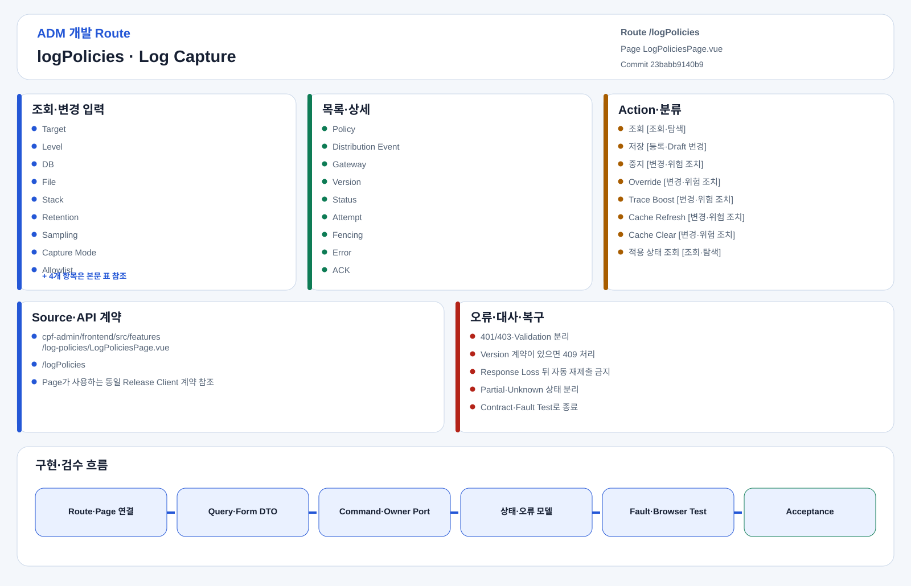


### 구현 결과

`/logPolicies`가 단순 Route가 아니라 **Log Capture·Retention·Sampling·Masking 정책을 배포한다.** Query·Command·Permission·Owner 상태·Audit·Browser Test가 연결된 기능 Slice가 되도록 구현한다.

### Source 진입점과 소유권

| 계층 | 기준 |
|---|---|
| Router | `/logPolicies` |
| Page | `cpf-admin/frontend/src/features/log-policies/LogPoliciesPage.vue` |
| Generated Client | Page가 import하는 Generated Client 또는 공통 ADM Client의 실제 Operation을 사용한다. 수기 Endpoint 문자열과 중복 DTO를 만들지 않는다 |
| ADM Backend | OpenAPI Operation의 Controller와 Application Service |
| Owner Port | Query·Command·Status·Reconcile Port; Local/Remote가 같은 DTO·오류 의미 사용 |
| Test | Frontend Unit·Generated Client Contract·Controller·Browser·Fault |

### Frontend Query·Form 모델

| Field | Control | 직렬화·Validation | 오류·접근성 |
|---|---|---|---|
| `Target` | 문자열 입력·검색 | Log Capture·Retention·Trace Boost 화면의 조회 조건 또는 편집 Form에 포함되는 값이며 화면 Label과 Help를 기준으로 사용한다. 앞뒤 공백·허용 문자·길이와 대소문자 규칙을 확인한다. Request·Query의 실제 이름과 Type을 유지한다. | Label·Help·Field Error·Keyboard Focus를 제공하고 민감값은 재표시하지 않는다. |
| `Level` | Select·검색 | Log Capture·Retention·Trace Boost 화면의 조회 조건 또는 편집 Form에 포함되는 값이며 화면 Label과 Help를 기준으로 사용한다. 허용 목록과 현재 Environment·Data Scope에 맞는 값만 선택한다. Request·Query의 실제 이름과 Type을 유지한다. | Label·Help·Field Error·Keyboard Focus를 제공하고 민감값은 재표시하지 않는다. |
| `DB` | 문자열 입력·검색 | Log Capture·Retention·Trace Boost 화면의 조회 조건 또는 편집 Form에 포함되는 값이며 화면 Label과 Help를 기준으로 사용한다. 앞뒤 공백·허용 문자·길이와 대소문자 규칙을 확인한다. Request·Query의 실제 이름과 Type을 유지한다. | Label·Help·Field Error·Keyboard Focus를 제공하고 민감값은 재표시하지 않는다. |
| `File` | 파일·본문 입력 | 검증·등록·Export에 사용할 입력 Artifact 또는 구조화된 본문이다. 확장자·크기·Encoding·Schema·Checksum을 검증하고 Dry Run이 있으면 먼저 실행한다. Request·Query의 실제 이름과 Type을 유지한다. | Label·Help·Field Error·Keyboard Focus를 제공하고 민감값은 재표시하지 않는다. |
| `Stack` | 문자열 입력·검색 | Log Capture·Retention·Trace Boost 화면의 조회 조건 또는 편집 Form에 포함되는 값이며 화면 Label과 Help를 기준으로 사용한다. 앞뒤 공백·허용 문자·길이와 대소문자 규칙을 확인한다. Request·Query의 실제 이름과 Type을 유지한다. | Label·Help·Field Error·Keyboard Focus를 제공하고 민감값은 재표시하지 않는다. |
| `Retention` | 문자열 입력·검색 | Log Capture·Retention·Trace Boost 화면의 조회 조건 또는 편집 Form에 포함되는 값이며 화면 Label과 Help를 기준으로 사용한다. 앞뒤 공백·허용 문자·길이와 대소문자 규칙을 확인한다. Request·Query의 실제 이름과 Type을 유지한다. | Label·Help·Field Error·Keyboard Focus를 제공하고 민감값은 재표시하지 않는다. |
| `Sampling` | 문자열 입력·검색 | Log Capture·Retention·Trace Boost 화면의 조회 조건 또는 편집 Form에 포함되는 값이며 화면 Label과 Help를 기준으로 사용한다. 앞뒤 공백·허용 문자·길이와 대소문자 규칙을 확인한다. Request·Query의 실제 이름과 Type을 유지한다. | Label·Help·Field Error·Keyboard Focus를 제공하고 민감값은 재표시하지 않는다. |
| `Capture Mode` | 문자열 입력·검색 | Log Capture·Retention·Trace Boost 화면의 조회 조건 또는 편집 Form에 포함되는 값이며 화면 Label과 Help를 기준으로 사용한다. 앞뒤 공백·허용 문자·길이와 대소문자 규칙을 확인한다. Request·Query의 실제 이름과 Type을 유지한다. | Label·Help·Field Error·Keyboard Focus를 제공하고 민감값은 재표시하지 않는다. |
| `Allowlist` | 문자열 입력·검색 | Log Capture·Retention·Trace Boost 화면의 조회 조건 또는 편집 Form에 포함되는 값이며 화면 Label과 Help를 기준으로 사용한다. 앞뒤 공백·허용 문자·길이와 대소문자 규칙을 확인한다. Request·Query의 실제 이름과 Type을 유지한다. | Label·Help·Field Error·Keyboard Focus를 제공하고 민감값은 재표시하지 않는다. |
| `Masking` | Checkbox·Switch | Log Capture·Retention·Trace Boost 화면의 조회 조건 또는 편집 Form에 포함되는 값이며 화면 Label과 Help를 기준으로 사용한다. 현재 선택과 변경 후 영향 범위를 비교하고 화면의 Source 기본값을 확인한다. Request·Query의 실제 이름과 Type을 유지한다. | Label·Help·Field Error·Keyboard Focus를 제공하고 민감값은 재표시하지 않는다. |
| `Byte Cap` | 문자열 입력·검색 | Log Capture·Retention·Trace Boost 화면의 조회 조건 또는 편집 Form에 포함되는 값이며 화면 Label과 Help를 기준으로 사용한다. 앞뒤 공백·허용 문자·길이와 대소문자 규칙을 확인한다. Request·Query의 실제 이름과 Type을 유지한다. | Label·Help·Field Error·Keyboard Focus를 제공하고 민감값은 재표시하지 않는다. |
| `Reason` | 다중행 입력 | 작업 목적·영향 범위·승인 또는 복구 기준을 기록해 Audit와 교대 기록에 연결한다. Ticket·영향 범위·복구점을 포함하고 화면이 요구하는 최소 길이를 충족한다. Request·Query의 실제 이름과 Type을 유지한다. | Label·Help·Field Error·Keyboard Focus를 제공하고 민감값은 재표시하지 않는다. |
| `Trace Boost` | 문자열 입력·검색 | 조회·상세·Audit에서 같은 대상을 다시 찾기 위한 식별 조건이다. 앞뒤 공백·허용 문자·길이와 대소문자 규칙을 확인한다. Request·Query의 실제 이름과 Type을 유지한다. | Label·Help·Field Error·Keyboard Focus를 제공하고 민감값은 재표시하지 않는다. |

### Table·Detail View Model

| 값 | 표시 계약 | Drill-down·대사 |
|---|---|---|
| `Policy` | Log Capture·Retention·Trace Boost 상세에서 대상의 현재 속성 또는 처리 결과를 확인하는 값이다. Masking·Timezone·단위를 DTO Metadata와 함께 표시한다. | 상세·재조회 결과와 비교하고 Stale·Masking·단위 차이를 확인한다. |
| `Distribution Event` | Log Capture·Retention·Trace Boost 상세에서 대상의 현재 속성 또는 처리 결과를 확인하는 값이다. Masking·Timezone·단위를 DTO Metadata와 함께 표시한다. | 상세·재조회 결과와 비교하고 Stale·Masking·단위 차이를 확인한다. |
| `Gateway` | Log Capture·Retention·Trace Boost 상세에서 대상의 현재 속성 또는 처리 결과를 확인하는 값이다. Masking·Timezone·단위를 DTO Metadata와 함께 표시한다. | 상세·재조회 결과와 비교하고 Stale·Masking·단위 차이를 확인한다. |
| `Version` | 요청·Owner·Instance 사이의 Version 또는 내용 동일성을 판단하는 값이다. Masking·Timezone·단위를 DTO Metadata와 함께 표시한다. | 목록·상세·Owner 또는 Instance 보고값에서 일치하는지 확인한다. |
| `Status` | 현재 상태와 Terminal 여부, 다음 Action 가능 여부를 판단하는 값이다. Masking·Timezone·단위를 DTO Metadata와 함께 표시한다. | Last Updated·Terminal 조건·Owner 상태와 함께 확인한다. |
| `Attempt` | Log Capture·Retention·Trace Boost 상세에서 대상의 현재 속성 또는 처리 결과를 확인하는 값이다. Masking·Timezone·단위를 DTO Metadata와 함께 표시한다. | 상세·재조회 결과와 비교하고 Stale·Masking·단위 차이를 확인한다. |
| `Fencing` | Log Capture·Retention·Trace Boost 상세에서 대상의 현재 속성 또는 처리 결과를 확인하는 값이다. Masking·Timezone·단위를 DTO Metadata와 함께 표시한다. | 상세·재조회 결과와 비교하고 Stale·Masking·단위 차이를 확인한다. |
| `Error` | 오류·Drift·결과 불명 범위를 나타내며 원인과 복구 Owner를 연결해야 한다. Masking·Timezone·단위를 DTO Metadata와 함께 표시한다. | 원인 식별자·실패 Stage·마지막 갱신 시각을 상세와 대조한다. |
| `ACK` | Log Capture·Retention·Trace Boost 상세에서 대상의 현재 속성 또는 처리 결과를 확인하는 값이다. Masking·Timezone·단위를 DTO Metadata와 함께 표시한다. | 상세·재조회 결과와 비교하고 Stale·Masking·단위 차이를 확인한다. |

### Button·Command 모델

| Action | 분류 | Frontend 활성 조건 | Backend·성공 처리 |
|---|---|---|---|
| **조회** | 조회·탐색 | 조회 Permission과 Query Validation을 충족하고 동일 조회가 진행 중이 아님 | 조회 결과의 조회 시각·Filter·Source Version·Warning이 갱신되며 Owner 데이터는 변경하지 않는다. |
| **저장** | 등록·Draft 변경 | 화면이 실제로 요구하는 Write Permission·필수 Field·Reason·Version 조건을 충족함 | Log Capture·Retention·Trace Boost의 재조회 결과가 요청 내용과 일치한다. Version·Before/After·Audit는 해당 Owner가 제공하는 경우 함께 확인한다. Backend에서도 Permission·Version·Idempotency를 재검증한다. |
| **중지** | 변경·위험 조치 | 화면과 Owner가 요구하는 Write Permission·대상 상태·영향 범위·Reason·승인·Version 조건을 충족함 | 변경 Operation을 생성하고 Accepted 응답과 Owner Terminal 상태·Version·Audit를 분리해 확인한다. Backend에서도 Permission·Version·Idempotency를 재검증한다. |
| **Override** | 변경·위험 조치 | 화면과 Owner가 요구하는 Write Permission·대상 상태·영향 범위·Reason·승인·Version 조건을 충족함 | 변경 Operation을 생성하고 Accepted 응답과 Owner Terminal 상태·Version·Audit를 분리해 확인한다. Backend에서도 Permission·Version·Idempotency를 재검증한다. |
| **Trace Boost** | 변경·위험 조치 | 화면과 Owner가 요구하는 Write Permission·대상 상태·영향 범위·Reason·승인·Version 조건을 충족함 | 변경 Operation을 생성하고 Accepted 응답과 Owner Terminal 상태·Version·Audit를 분리해 확인한다. Backend에서도 Permission·Version·Idempotency를 재검증한다. |
| **Cache Refresh** | 변경·위험 조치 | 화면과 Owner가 요구하는 Write Permission·대상 상태·영향 범위·Reason·승인·Version 조건을 충족함 | 변경 Operation을 생성하고 Accepted 응답과 Owner Terminal 상태·Version·Audit를 분리해 확인한다. Backend에서도 Permission·Version·Idempotency를 재검증한다. |
| **Cache Clear** | 변경·위험 조치 | 화면과 Owner가 요구하는 Write Permission·대상 상태·영향 범위·Reason·승인·Version 조건을 충족함 | 변경 Operation을 생성하고 Accepted 응답과 Owner Terminal 상태·Version·Audit를 분리해 확인한다. Backend에서도 Permission·Version·Idempotency를 재검증한다. |
| **적용 상태 조회** | 조회·탐색 | 조회 Permission과 Query Validation을 충족하고 동일 조회가 진행 중이 아님 | 적용 상태 조회 결과의 조회 시각·Filter·Source Version·Warning이 갱신되며 Owner 데이터는 변경하지 않는다. |

### 상태 모델

```text
Query: Idle → Loading → Empty | Success | Error
Success + Stale | Partial
Command: Editing → Validating → Submitting → Accepted(operationId) → Terminal
Submitting → ResponseLoss → Reconcile → Terminal | UNKNOWN_RESULT
```

Query와 Command의 Loading·Error를 분리한다. 조회 전용 Route에는 존재하지 않는 Command 상태를 만들지 않는다. `403`, `409`, Timeout, Partial, Unknown을 하나의 Error Toast로 합치지 않는다.

### API·Owner 계약

- Query Request는 실제 Page가 사용하는 Environment·Data Scope·검색 Field·Paging·Sort·Timezone만 포함한다.
- Query Response는 실제 Item·Page·조회 시각·Source Version·Stale·Partial·Warning 계약을 유지한다.
- Command는 Source에 선언된 Target ID·Version·Reason·Approval ID·Idempotency Key·Request Hash 중 실제 필드만 사용한다.
- `202 Accepted`는 완료가 아니라 Operation 추적 시작이며 Owner Terminal 상태를 별도로 조회한다.
- Side Effect 전 실패, Side Effect 후 실패, Success, Partial, `UNKNOWN_RESULT`를 구분한다.
- Same-JVM과 Remote Adapter는 DTO·Error Code·Timeout·Unknown 의미를 유지한다.

### Permission·Data Scope·Masking

- Route Permission 기준은 **`LOG_POLICY` Write**이다.
- Menu 노출, Query, Button, Raw, Export Permission을 분리하고 Backend와 Owner에서 다시 검증한다.
- Deny는 403과 Audit를 남기며 404·Empty로 위장하지 않는다.
- Secret·Credential·PII Raw를 일반 Response DTO·Browser Storage·Log에 넣지 않는다.

### 구현 순서

1. Route·Page Import·Menu Metadata·Permission을 연결한다.
2. 이 장의 Field·Column·Action을 OpenAPI Request·Response·Error와 대조한다.
3. Generated Client를 재생성하고 수기 HTTP 호출을 제거한다.
4. Query·Command 상태와 Empty·Stale·Partial·Unknown UI를 구현한다.
5. Backend Controller·Application Service·Owner Port·Local/Remote Adapter를 연결한다.
6. Reason·Approval·Expected Version·Idempotency·Audit를 Server에서 검증한다.
7. Response Loss Polling·Reconcile·Rollback Link를 구현한다.
8. Unit·Contract·Browser·Fault·Accessibility Test를 실행한다.

### Test Matrix

| Test | 필수 Scenario |
|---|---|
| Frontend Unit | Default·Validation·Button 조건·Masking·Empty/Error/Stale/Partial |
| OpenAPI·Generated Client | Operation 이름·Type·Error·Hash Drift |
| Backend Query | Permission·Data Scope·Filter·Paging·Stale·Partial |
| Backend Command | Source에 선언된 Permission·Version·Reason·Approval·Idempotency·Audit 계약 |
| Local/Remote Contract | 같은 DTO·Error·Timeout 의미 |
| Browser | Deep Link·Query·상세·403·Timeout·Empty·Partial |
| Fault | 409·Response Loss·DB/Kafka/Owner 중단·Partial ACK·Late Response |
| Accessibility | Keyboard·Focus·Label·Error Announcement·Table/Dialog |

### 개발 Fault Workbook

1. `/logPolicies` Query를 500·Timeout·Empty·Partial 응답으로 주입해 Loading·Empty·Error·Stale·Partial UI를 각각 확인한다.
2. 401·403과 Data Scope 축소를 주입해 Deny를 Empty로 위장하지 않고 Error와 접근 가능한 범위를 구분하는지 확인한다.
3. Version 계약이 있는 Write Action에는 409를, 모든 비동기·원격 Write에는 Response Loss를 주입해 자동 재제출이 없는지 확인한다.
4. 202 응답 뒤 Operation Polling이 Terminal·Failed·Partial·Unknown을 분리하는지 확인한다.
5. Local Adapter와 Remote Adapter에 같은 Contract Fixture를 적용해 Error Code·Retryability·failureStage가 일치하는지 확인한다.
6. Browser Storage·Console·Network Error·Screenshot에 Token·Secret·PII Raw가 남지 않는지 확인한다.

### Route Acceptance Checklist

- [ ] Route `/logPolicies`의 Deep Link와 Menu ID `logPolicies`가 같은 Page를 연다.
- [ ] 이 장의 Field·Column·Action과 Page·OpenAPI·Generated Client가 같은 계약을 사용한다.
- [ ] Menu·Query·Raw·Export Permission Deny가 Backend 403과 화면 Error로 확인된다.
- [ ] Empty·Timeout·Stale·Partial이 서로 다른 사용자 상태와 재조회 경로를 제공한다.
- [ ] Same-JVM·Remote 호출이 같은 Query DTO·오류·Timeout 계약을 사용한다.
- [ ] 409·Response Loss·Partial·Unknown이 서로 다른 상태와 Operation·Reconcile Link를 제공한다.
- [ ] Command가 Source에 선언한 Reason·Approval·Version·Idempotency·Audit 필드를 Server에서 재검증한다.
- [ ] 정상·오류·경계 Browser Test와 Accessibility Test가 Route Matrix에 포함된다.

### 독립 수행 검수 Checklist

- [ ] `/logPolicies`와 Page Source를 찾고 화면 목적을 설명할 수 있다.
- [ ] 13개 입력·검색 항목의 Control·기본값·Validation을 설명할 수 있다.
- [ ] 9개 표시값을 Owner 상태·Version·Audit와 대사할 수 있다.
- [ ] 8개 Action의 분류·활성 조건·Side Effect를 설명할 수 있다.
- [ ] Empty·403·409·Timeout·Partial·Unknown을 서로 다른 상태로 처리할 수 있다.
- [ ] 응답 유실 뒤 중복 제출 없이 Operation·Owner·Audit로 결과를 확정할 수 있다.
- [ ] 교대 기록만으로 다음 담당자가 Target·상태·복구 기한을 이어받을 수 있다.
- [ ] OpenAPI·Generated Client·Page·Controller·Owner Port·Test가 같은 Field와 오류 계약을 사용하는지 검증할 수 있다.
- [ ] Local·Remote Adapter의 Timeout·Unknown 의미가 같은지 Contract Test로 확인할 수 있다.

## 22. recoveryCenter — Unknown·DLQ·Outbox·File Transfer 통합 조회 기능 Slice 개발 장

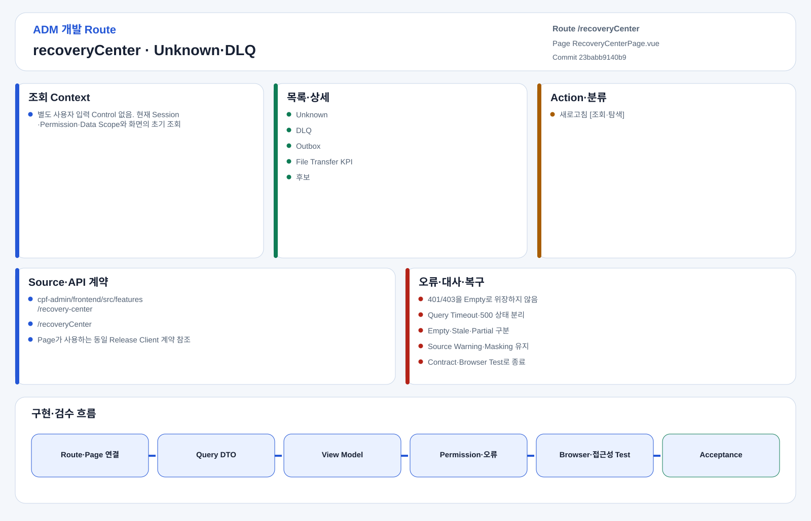


### 구현 결과

`/recoveryCenter`가 단순 Route가 아니라 **Unknown·DLQ·Outbox·File Transfer 복구 후보를 한곳에서 탐지한다.** Query·Permission·Owner 상태·관측 정보·Browser Test가 연결된 조회 기능 Slice가 되도록 구현한다.

### Source 진입점과 소유권

| 계층 | 기준 |
|---|---|
| Router | `/recoveryCenter` |
| Page | `cpf-admin/frontend/src/features/recovery-center/RecoveryCenterPage.vue` |
| Generated Client | Page가 import하는 Generated Client 또는 공통 ADM Client의 실제 Operation을 사용한다. 수기 Endpoint 문자열과 중복 DTO를 만들지 않는다 |
| ADM Backend | OpenAPI Operation의 Controller와 Application Service |
| Owner Port | Query·Status Port; Local/Remote가 같은 DTO·오류 의미 사용 |
| Test | Frontend Unit·Generated Client Contract·Controller·Browser·Fault |

### Frontend Query·Form 모델

별도 사용자 입력 Control이 없다. 현재 Session·Permission·Data Scope와 Page가 정의한 초기 Query로 데이터를 읽는다. 새로고침은 같은 Context를 다시 조회하며 Owner 데이터는 변경하지 않는다.

### Table·Detail View Model

| 값 | 표시 계약 | Drill-down·대사 |
|---|---|---|
| `Unknown` | 오류·Drift·결과 불명 범위를 나타내며 원인과 복구 Owner를 연결해야 한다. Masking·Timezone·단위를 DTO Metadata와 함께 표시한다. | 원인 식별자·실패 Stage·마지막 갱신 시각을 상세와 대조한다. |
| `DLQ` | 오류·Drift·결과 불명 범위를 나타내며 원인과 복구 Owner를 연결해야 한다. Masking·Timezone·단위를 DTO Metadata와 함께 표시한다. | 원인 식별자·실패 Stage·마지막 갱신 시각을 상세와 대조한다. |
| `Outbox` | Unknown·DLQ·Outbox·File Transfer 통합 조회 상세에서 대상의 현재 속성 또는 처리 결과를 확인하는 값이다. Masking·Timezone·단위를 DTO Metadata와 함께 표시한다. | 상세·재조회 결과와 비교하고 Stale·Masking·단위 차이를 확인한다. |
| `File Transfer KPI` | Unknown·DLQ·Outbox·File Transfer 통합 조회 상세에서 대상의 현재 속성 또는 처리 결과를 확인하는 값이다. Masking·Timezone·단위를 DTO Metadata와 함께 표시한다. | 상세·재조회 결과와 비교하고 Stale·Masking·단위 차이를 확인한다. |
| `후보` | Unknown·DLQ·Outbox·File Transfer 통합 조회 상세에서 대상의 현재 속성 또는 처리 결과를 확인하는 값이다. Masking·Timezone·단위를 DTO Metadata와 함께 표시한다. | 상세·재조회 결과와 비교하고 Stale·Masking·단위 차이를 확인한다. |

### Button·Interaction 모델

| Action | 분류 | Frontend 활성 조건 | Backend·성공 처리 |
|---|---|---|---|
| **새로고침** | 조회·탐색 | 조회 Permission과 Query Validation을 충족하고 동일 조회가 진행 중이 아님 | 새로고침 결과의 조회 시각·Filter·Source Version·Warning이 갱신되며 Owner 데이터는 변경하지 않는다. |

### 상태 모델

```text
Query: Idle → Loading → Empty | Success | Error
Success + Stale | Partial
```

조회 상태를 Loading·Empty·Success·Error·Stale·Partial로 구분한다. `401`, `403`, Timeout, Empty, Stale, Partial을 하나의 Error Toast로 합치지 않는다.

### API·Owner 계약

- Query Request는 실제 Page가 사용하는 Environment·Data Scope·검색 Field·Paging·Sort·Timezone만 포함한다.
- Query Response는 실제 Item·Page·조회 시각·Source Version·Stale·Partial·Warning 계약을 유지한다.
- 조회 전용 Route에는 임의의 Command DTO·Operation Polling·Rollback Endpoint를 추가하지 않는다.
- Same-JVM과 Remote Adapter는 DTO·Error Code·Timeout·Unknown 의미를 유지한다.

### Permission·Data Scope·Masking

- Route Permission 기준은 **조회 권한**이다.
- Menu 노출, Query, Button, Raw, Export Permission을 분리하고 Backend와 Owner에서 다시 검증한다.
- Deny는 403과 Audit를 남기며 404·Empty로 위장하지 않는다.
- Secret·Credential·PII Raw를 일반 Response DTO·Browser Storage·Log에 넣지 않는다.

### 구현 순서

1. Route·Page Import·Menu Metadata·Permission을 연결한다.
2. 이 장의 Field·Column·Action을 OpenAPI Request·Response·Error와 대조한다.
3. Generated Client를 재생성하고 수기 HTTP 호출을 제거한다.
4. Query 상태와 Empty·Stale·Partial·Error UI를 구현한다.
5. Backend Query Controller·Application Service·Owner Query Port·Local/Remote Adapter를 연결한다.
6. Menu·Query·Raw·Export Permission과 Data Scope를 Server에서 검증한다.
7. 조회 시각·Source Version·Warning·Correlation ID와 Drill-down Link를 연결한다.
8. Unit·Contract·Browser·Fault·Accessibility Test를 실행한다.

### Test Matrix

| Test | 필수 Scenario |
|---|---|
| Frontend Unit | Default·Validation·Button 조건·Masking·Empty/Error/Stale/Partial |
| OpenAPI·Generated Client | Operation 이름·Type·Error·Hash Drift |
| Backend Query | Permission·Data Scope·Filter·Paging·Stale·Partial |
| Local/Remote Contract | 같은 DTO·Error·Timeout 의미 |
| Browser | Deep Link·Query·상세·403·Timeout·Empty·Partial |
| Accessibility | Keyboard·Focus·Label·Error Announcement·Table/Dialog |

### 개발 Fault Workbook

1. `/recoveryCenter` Query를 500·Timeout·Empty·Partial 응답으로 주입해 Loading·Empty·Error·Stale·Partial UI를 각각 확인한다.
2. 401·403과 Data Scope 축소를 주입해 Deny를 Empty로 위장하지 않고 Error와 접근 가능한 범위를 구분하는지 확인한다.
3. 조회 전용 Route에 Command Polling·Reason·Approval·Rollback UI가 노출되지 않는지 확인한다.
4. Local Adapter와 Remote Adapter에 같은 Contract Fixture를 적용해 Error Code·Retryability·failureStage가 일치하는지 확인한다.
5. Browser Storage·Console·Network Error·Screenshot에 Token·Secret·PII Raw가 남지 않는지 확인한다.

### Route Acceptance Checklist

- [ ] Route `/recoveryCenter`의 Deep Link와 Menu ID `recoveryCenter`가 같은 Page를 연다.
- [ ] 이 장의 Field·Column·Action과 Page·OpenAPI·Generated Client가 같은 계약을 사용한다.
- [ ] Menu·Query·Raw·Export Permission Deny가 Backend 403과 화면 Error로 확인된다.
- [ ] Empty·Timeout·Stale·Partial이 서로 다른 사용자 상태와 재조회 경로를 제공한다.
- [ ] Same-JVM·Remote 호출이 같은 Query DTO·오류·Timeout 계약을 사용한다.
- [ ] 조회 전용 Route에 Source에 없는 Command·Approval·Rollback Action을 노출하지 않는다.
- [ ] 정상·오류·경계 Browser Test와 Accessibility Test가 Route Matrix에 포함된다.

### 독립 수행 검수 Checklist

- [ ] `/recoveryCenter`와 Page Source를 찾고 화면 목적을 설명할 수 있다.
- [ ] 별도 사용자 입력이 없고 자동 Query Context·새로고침 동작을 설명할 수 있다.
- [ ] 5개 표시값을 Owner 상태·Version·Audit와 대사할 수 있다.
- [ ] 1개 Action의 분류·활성 조건·Side Effect를 설명할 수 있다.
- [ ] Empty·401·403·Timeout·Stale·Partial을 서로 다른 조회 상태로 처리할 수 있다.
- [ ] 조회 응답 유실 시 같은 Query Context로 재조회하고 Correlation ID·조회 시각·Source Version으로 결과를 대사할 수 있다.
- [ ] 교대 기록만으로 다음 담당자가 Target·상태·복구 기한을 이어받을 수 있다.
- [ ] OpenAPI·Generated Client·Page·Controller·Owner Port·Test가 같은 Field와 오류 계약을 사용하는지 검증할 수 있다.
- [ ] Local·Remote Adapter의 Timeout·Unknown 의미가 같은지 Contract Test로 확인할 수 있다.

## 23. incidents — Incident Lifecycle 기능 Slice 개발 장


### 구현 결과

`/incidents`가 단순 Route가 아니라 **Incident를 생성하고 ACKNOWLEDGED·MITIGATED·RESOLVED로 전이한다.** Query·Command·Permission·Owner 상태·Audit·Browser Test가 연결된 기능 Slice가 되도록 구현한다.

### Source 진입점과 소유권

| 계층 | 기준 |
|---|---|
| Router | `/incidents` |
| Page | `cpf-admin/frontend/src/features/incidents/IncidentsPage.vue` |
| Generated Client | Page가 import하는 Generated Client 또는 공통 ADM Client의 실제 Operation을 사용한다. 수기 Endpoint 문자열과 중복 DTO를 만들지 않는다 |
| ADM Backend | OpenAPI Operation의 Controller와 Application Service |
| Owner Port | Query·Command·Status·Reconcile Port; Local/Remote가 같은 DTO·오류 의미 사용 |
| Test | Frontend Unit·Generated Client Contract·Controller·Browser·Fault |

### Frontend Query·Form 모델

| Field | Control | 직렬화·Validation | 오류·접근성 |
|---|---|---|---|
| `Severity (`SEV1`~`SEV4`)` | Select·검색 | Incident Lifecycle 화면의 조회 조건 또는 편집 Form에 포함되는 값이며 화면 Label과 Help를 기준으로 사용한다. 허용 목록과 현재 Environment·Data Scope에 맞는 값만 선택한다. Request·Query의 실제 이름과 Type을 유지한다. | Label·Help·Field Error·Keyboard Focus를 제공하고 민감값은 재표시하지 않는다. |
| `Title` | 문자열 입력·검색 | 대상의 표시명 또는 업무명을 검색·입력한다. 앞뒤 공백·허용 문자·길이와 대소문자 규칙을 확인한다. Request·Query의 실제 이름과 Type을 유지한다. | Label·Help·Field Error·Keyboard Focus를 제공하고 민감값은 재표시하지 않는다. |
| `Summary` | 다중행 입력 | 작업 목적·영향 범위·승인 또는 복구 기준을 기록해 Audit와 교대 기록에 연결한다. 허용 Schema·길이·민감정보 포함 여부를 확인하고 Preview 또는 Validation 결과를 검토한다. Request·Query의 실제 이름과 Type을 유지한다. | Label·Help·Field Error·Keyboard Focus를 제공하고 민감값은 재표시하지 않는다. |
| `Source` | 문자열 입력·검색 | Incident Lifecycle 화면의 조회 조건 또는 편집 Form에 포함되는 값이며 화면 Label과 Help를 기준으로 사용한다. 앞뒤 공백·허용 문자·길이와 대소문자 규칙을 확인한다. Request·Query의 실제 이름과 Type을 유지한다. | Label·Help·Field Error·Keyboard Focus를 제공하고 민감값은 재표시하지 않는다. |
| `Reason` | 다중행 입력 | 작업 목적·영향 범위·승인 또는 복구 기준을 기록해 Audit와 교대 기록에 연결한다. Ticket·영향 범위·복구점을 포함하고 화면이 요구하는 최소 길이를 충족한다. Request·Query의 실제 이름과 Type을 유지한다. | Label·Help·Field Error·Keyboard Focus를 제공하고 민감값은 재표시하지 않는다. |

### Table·Detail View Model

| 값 | 표시 계약 | Drill-down·대사 |
|---|---|---|
| `ID` | Incident Lifecycle의 대상 레코드를 상세·Owner·Audit에서 연결하는 식별자다. Masking·Timezone·단위를 DTO Metadata와 함께 표시한다. | 상세·Log·Trace·Audit에서 같은 대상을 가리키는지 확인한다. |
| `Severity` | Incident Lifecycle 상세에서 대상의 현재 속성 또는 처리 결과를 확인하는 값이다. Masking·Timezone·단위를 DTO Metadata와 함께 표시한다. | 상세·재조회 결과와 비교하고 Stale·Masking·단위 차이를 확인한다. |
| `Title` | 운영자가 대상을 구분하는 표시명 또는 설명이다. Masking·Timezone·단위를 DTO Metadata와 함께 표시한다. | 상세·재조회 결과와 비교하고 Stale·Masking·단위 차이를 확인한다. |
| `Status` | 현재 상태와 Terminal 여부, 다음 Action 가능 여부를 판단하는 값이다. Masking·Timezone·단위를 DTO Metadata와 함께 표시한다. | Last Updated·Terminal 조건·Owner 상태와 함께 확인한다. |
| `Detected` | 상태 발생·갱신·유효 시점을 나타내며 화면 Timezone을 기준으로 해석한다. Masking·Timezone·단위를 DTO Metadata와 함께 표시한다. | 상세·재조회 결과와 비교하고 Stale·Masking·단위 차이를 확인한다. |

### Button·Command 모델

| Action | 분류 | Frontend 활성 조건 | Backend·성공 처리 |
|---|---|---|---|
| **생성** | 등록·Draft 변경 | 화면이 실제로 요구하는 Write Permission·필수 Field·Reason·Version 조건을 충족함 | Incident Lifecycle의 재조회 결과가 요청 내용과 일치한다. Version·Before/After·Audit는 해당 Owner가 제공하는 경우 함께 확인한다. Backend에서도 Permission·Version·Idempotency를 재검증한다. |
| **ACKNOWLEDGED** | 변경·위험 조치 | 화면과 Owner가 요구하는 Write Permission·대상 상태·영향 범위·Reason·승인·Version 조건을 충족함 | 변경 Operation을 생성하고 Accepted 응답과 Owner Terminal 상태·Version·Audit를 분리해 확인한다. Backend에서도 Permission·Version·Idempotency를 재검증한다. |
| **MITIGATED** | 변경·위험 조치 | 화면과 Owner가 요구하는 Write Permission·대상 상태·영향 범위·Reason·승인·Version 조건을 충족함 | 변경 Operation을 생성하고 Accepted 응답과 Owner Terminal 상태·Version·Audit를 분리해 확인한다. Backend에서도 Permission·Version·Idempotency를 재검증한다. |
| **RESOLVED** | 변경·위험 조치 | 화면과 Owner가 요구하는 Write Permission·대상 상태·영향 범위·Reason·승인·Version 조건을 충족함 | 변경 Operation을 생성하고 Accepted 응답과 Owner Terminal 상태·Version·Audit를 분리해 확인한다. Backend에서도 Permission·Version·Idempotency를 재검증한다. |

### 상태 모델

```text
Query: Idle → Loading → Empty | Success | Error
Success + Stale | Partial
Command: Editing → Validating → Submitting → Accepted(operationId) → Terminal
Submitting → ResponseLoss → Reconcile → Terminal | UNKNOWN_RESULT
```

Query와 Command의 Loading·Error를 분리한다. 조회 전용 Route에는 존재하지 않는 Command 상태를 만들지 않는다. `403`, `409`, Timeout, Partial, Unknown을 하나의 Error Toast로 합치지 않는다.

### API·Owner 계약

- Query Request는 실제 Page가 사용하는 Environment·Data Scope·검색 Field·Paging·Sort·Timezone만 포함한다.
- Query Response는 실제 Item·Page·조회 시각·Source Version·Stale·Partial·Warning 계약을 유지한다.
- Command는 Source에 선언된 Target ID·Version·Reason·Approval ID·Idempotency Key·Request Hash 중 실제 필드만 사용한다.
- `202 Accepted`는 완료가 아니라 Operation 추적 시작이며 Owner Terminal 상태를 별도로 조회한다.
- Side Effect 전 실패, Side Effect 후 실패, Success, Partial, `UNKNOWN_RESULT`를 구분한다.
- Same-JVM과 Remote Adapter는 DTO·Error Code·Timeout·Unknown 의미를 유지한다.

### Permission·Data Scope·Masking

- Route Permission 기준은 **Incident Write**이다.
- Menu 노출, Query, Button, Raw, Export Permission을 분리하고 Backend와 Owner에서 다시 검증한다.
- Deny는 403과 Audit를 남기며 404·Empty로 위장하지 않는다.
- Secret·Credential·PII Raw를 일반 Response DTO·Browser Storage·Log에 넣지 않는다.

### 구현 순서

1. Route·Page Import·Menu Metadata·Permission을 연결한다.
2. 이 장의 Field·Column·Action을 OpenAPI Request·Response·Error와 대조한다.
3. Generated Client를 재생성하고 수기 HTTP 호출을 제거한다.
4. Query·Command 상태와 Empty·Stale·Partial·Unknown UI를 구현한다.
5. Backend Controller·Application Service·Owner Port·Local/Remote Adapter를 연결한다.
6. Reason·Approval·Expected Version·Idempotency·Audit를 Server에서 검증한다.
7. Response Loss Polling·Reconcile·Rollback Link를 구현한다.
8. Unit·Contract·Browser·Fault·Accessibility Test를 실행한다.

### Test Matrix

| Test | 필수 Scenario |
|---|---|
| Frontend Unit | Default·Validation·Button 조건·Masking·Empty/Error/Stale/Partial |
| OpenAPI·Generated Client | Operation 이름·Type·Error·Hash Drift |
| Backend Query | Permission·Data Scope·Filter·Paging·Stale·Partial |
| Backend Command | Source에 선언된 Permission·Version·Reason·Approval·Idempotency·Audit 계약 |
| Local/Remote Contract | 같은 DTO·Error·Timeout 의미 |
| Browser | Deep Link·Query·상세·403·Timeout·Empty·Partial |
| Fault | 409·Response Loss·DB/Kafka/Owner 중단·Partial ACK·Late Response |
| Accessibility | Keyboard·Focus·Label·Error Announcement·Table/Dialog |

### 개발 Fault Workbook

1. `/incidents` Query를 500·Timeout·Empty·Partial 응답으로 주입해 Loading·Empty·Error·Stale·Partial UI를 각각 확인한다.
2. 401·403과 Data Scope 축소를 주입해 Deny를 Empty로 위장하지 않고 Error와 접근 가능한 범위를 구분하는지 확인한다.
3. Version 계약이 있는 Write Action에는 409를, 모든 비동기·원격 Write에는 Response Loss를 주입해 자동 재제출이 없는지 확인한다.
4. 202 응답 뒤 Operation Polling이 Terminal·Failed·Partial·Unknown을 분리하는지 확인한다.
5. Local Adapter와 Remote Adapter에 같은 Contract Fixture를 적용해 Error Code·Retryability·failureStage가 일치하는지 확인한다.
6. Browser Storage·Console·Network Error·Screenshot에 Token·Secret·PII Raw가 남지 않는지 확인한다.

### Route Acceptance Checklist

- [ ] Route `/incidents`의 Deep Link와 Menu ID `incidents`가 같은 Page를 연다.
- [ ] 이 장의 Field·Column·Action과 Page·OpenAPI·Generated Client가 같은 계약을 사용한다.
- [ ] Menu·Query·Raw·Export Permission Deny가 Backend 403과 화면 Error로 확인된다.
- [ ] Empty·Timeout·Stale·Partial이 서로 다른 사용자 상태와 재조회 경로를 제공한다.
- [ ] Same-JVM·Remote 호출이 같은 Query DTO·오류·Timeout 계약을 사용한다.
- [ ] 409·Response Loss·Partial·Unknown이 서로 다른 상태와 Operation·Reconcile Link를 제공한다.
- [ ] Command가 Source에 선언한 Reason·Approval·Version·Idempotency·Audit 필드를 Server에서 재검증한다.
- [ ] 정상·오류·경계 Browser Test와 Accessibility Test가 Route Matrix에 포함된다.

### 독립 수행 검수 Checklist

- [ ] `/incidents`와 Page Source를 찾고 화면 목적을 설명할 수 있다.
- [ ] 5개 입력·검색 항목의 Control·기본값·Validation을 설명할 수 있다.
- [ ] 5개 표시값을 Owner 상태·Version·Audit와 대사할 수 있다.
- [ ] 4개 Action의 분류·활성 조건·Side Effect를 설명할 수 있다.
- [ ] Empty·403·409·Timeout·Partial·Unknown을 서로 다른 상태로 처리할 수 있다.
- [ ] 응답 유실 뒤 중복 제출 없이 Operation·Owner·Audit로 결과를 확정할 수 있다.
- [ ] 교대 기록만으로 다음 담당자가 Target·상태·복구 기한을 이어받을 수 있다.
- [ ] OpenAPI·Generated Client·Page·Controller·Owner Port·Test가 같은 Field와 오류 계약을 사용하는지 검증할 수 있다.
- [ ] Local·Remote Adapter의 Timeout·Unknown 의미가 같은지 Contract Test로 확인할 수 있다.

## 24. reliability — DLQ·Unknown·Batch Log 대사 기능 Slice 개발 장

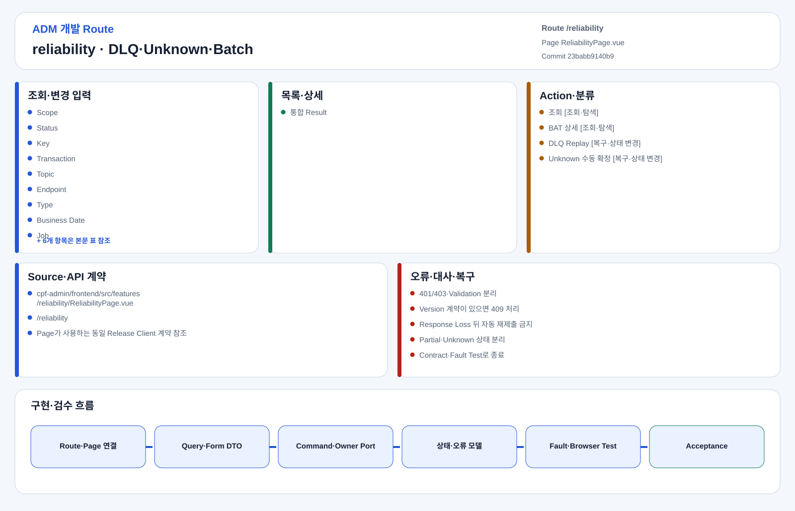


### 구현 결과

`/reliability`가 단순 Route가 아니라 **DLQ·Unknown·Batch 결과를 대사하고 제한된 복구 조치를 수행한다.** Query·Command·Permission·Owner 상태·Audit·Browser Test가 연결된 기능 Slice가 되도록 구현한다.

### Source 진입점과 소유권

| 계층 | 기준 |
|---|---|
| Router | `/reliability` |
| Page | `cpf-admin/frontend/src/features/reliability/ReliabilityPage.vue` |
| Generated Client | Page가 import하는 Generated Client 또는 공통 ADM Client의 실제 Operation을 사용한다. 수기 Endpoint 문자열과 중복 DTO를 만들지 않는다 |
| ADM Backend | OpenAPI Operation의 Controller와 Application Service |
| Owner Port | Query·Command·Status·Reconcile Port; Local/Remote가 같은 DTO·오류 의미 사용 |
| Test | Frontend Unit·Generated Client Contract·Controller·Browser·Fault |

### Frontend Query·Form 모델

| Field | Control | 직렬화·Validation | 오류·접근성 |
|---|---|---|---|
| `Scope` | Select·검색 | DLQ·Unknown·Batch Log 대사 조회·조치가 적용되는 환경과 데이터 경계를 제한한다. 허용 목록과 현재 Environment·Data Scope에 맞는 값만 선택한다. Request·Query의 실제 이름과 Type을 유지한다. | Label·Help·Field Error·Keyboard Focus를 제공하고 민감값은 재표시하지 않는다. |
| `Status` | Select·검색 | 현재 상태를 조회하거나 다음 Action의 허용 조건을 지정한다. 허용 목록과 현재 Environment·Data Scope에 맞는 값만 선택한다. Request·Query의 실제 이름과 Type을 유지한다. | Label·Help·Field Error·Keyboard Focus를 제공하고 민감값은 재표시하지 않는다. |
| `Key` | 문자열 입력·검색 | 조회·상세·Audit에서 같은 대상을 다시 찾기 위한 식별 조건이다. 앞뒤 공백·허용 문자·길이와 대소문자 규칙을 확인한다. Request·Query의 실제 이름과 Type을 유지한다. | Label·Help·Field Error·Keyboard Focus를 제공하고 민감값은 재표시하지 않는다. |
| `Transaction` | Select·검색 | DLQ·Unknown·Batch Log 대사에서 적용하거나 조회할 정책·권한·처리 유형을 선택한다. 허용 목록과 현재 Environment·Data Scope에 맞는 값만 선택한다. Request·Query의 실제 이름과 Type을 유지한다. | Label·Help·Field Error·Keyboard Focus를 제공하고 민감값은 재표시하지 않는다. |
| `Topic` | 날짜·시간 입력 | 조회 또는 적용의 유효 시간 범위를 정하며 Timezone과 시작·종료 순서를 함께 확인한다. Timezone을 고정하고 시작≤종료·유효기간 겹침·기준일 포함 여부를 확인한다. Request·Query의 실제 이름과 Type을 유지한다. | Label·Help·Field Error·Keyboard Focus를 제공하고 민감값은 재표시하지 않는다. |
| `Endpoint` | 문자열 입력·검색 | 조회·상세·Audit에서 같은 대상을 다시 찾기 위한 식별 조건이다. 앞뒤 공백·허용 문자·길이와 대소문자 규칙을 확인한다. Request·Query의 실제 이름과 Type을 유지한다. | Label·Help·Field Error·Keyboard Focus를 제공하고 민감값은 재표시하지 않는다. |
| `Type` | Select·검색 | DLQ·Unknown·Batch Log 대사에서 적용하거나 조회할 정책·권한·처리 유형을 선택한다. 허용 목록과 현재 Environment·Data Scope에 맞는 값만 선택한다. Request·Query의 실제 이름과 Type을 유지한다. | Label·Help·Field Error·Keyboard Focus를 제공하고 민감값은 재표시하지 않는다. |
| `Business Date` | 날짜·시간 입력 | 조회 또는 적용의 유효 시간 범위를 정하며 Timezone과 시작·종료 순서를 함께 확인한다. Timezone을 고정하고 시작≤종료·유효기간 겹침·기준일 포함 여부를 확인한다. Request·Query의 실제 이름과 Type을 유지한다. | Label·Help·Field Error·Keyboard Focus를 제공하고 민감값은 재표시하지 않는다. |
| `Job` | 문자열 입력·검색 | 조회·상세·Audit에서 같은 대상을 다시 찾기 위한 식별 조건이다. 앞뒤 공백·허용 문자·길이와 대소문자 규칙을 확인한다. Request·Query의 실제 이름과 Type을 유지한다. | Label·Help·Field Error·Keyboard Focus를 제공하고 민감값은 재표시하지 않는다. |
| `Instance` | 문자열 입력·검색 | 조회·상세·Audit에서 같은 대상을 다시 찾기 위한 식별 조건이다. 앞뒤 공백·허용 문자·길이와 대소문자 규칙을 확인한다. Request·Query의 실제 이름과 Type을 유지한다. | Label·Help·Field Error·Keyboard Focus를 제공하고 민감값은 재표시하지 않는다. |
| `Limit` | 숫자·Version 입력 | 실행 한도·순서·용량 또는 재시도 범위를 지정한다. 화면의 min·max·단위와 0 허용 여부를 확인하고 음수·Overflow를 차단한다. Request·Query의 실제 이름과 Type을 유지한다. | Label·Help·Field Error·Keyboard Focus를 제공하고 민감값은 재표시하지 않는다. |
| `Message` | 문자열 입력·검색 | DLQ·Unknown·Batch Log 대사 화면의 조회 조건 또는 편집 Form에 포함되는 값이며 화면 Label과 Help를 기준으로 사용한다. 앞뒤 공백·허용 문자·길이와 대소문자 규칙을 확인한다. Request·Query의 실제 이름과 Type을 유지한다. | Label·Help·Field Error·Keyboard Focus를 제공하고 민감값은 재표시하지 않는다. |
| `Unknown ID` | 문자열 입력·검색 | 조회·상세·Audit에서 같은 대상을 다시 찾기 위한 식별 조건이다. 앞뒤 공백·허용 문자·길이와 대소문자 규칙을 확인한다. Request·Query의 실제 이름과 Type을 유지한다. | Label·Help·Field Error·Keyboard Focus를 제공하고 민감값은 재표시하지 않는다. |
| `Target Status` | Select·검색 | 현재 상태를 조회하거나 다음 Action의 허용 조건을 지정한다. 허용 목록과 현재 Environment·Data Scope에 맞는 값만 선택한다. Request·Query의 실제 이름과 Type을 유지한다. | Label·Help·Field Error·Keyboard Focus를 제공하고 민감값은 재표시하지 않는다. |
| `Reason` | 다중행 입력 | 작업 목적·영향 범위·승인 또는 복구 기준을 기록해 Audit와 교대 기록에 연결한다. Ticket·영향 범위·복구점을 포함하고 화면이 요구하는 최소 길이를 충족한다. Request·Query의 실제 이름과 Type을 유지한다. | Label·Help·Field Error·Keyboard Focus를 제공하고 민감값은 재표시하지 않는다. |

### Table·Detail View Model

| 값 | 표시 계약 | Drill-down·대사 |
|---|---|---|
| `통합 Result` | 여러 Source의 결과를 합친 영역이며 Partial·Stale·Warning을 함께 판독해야 한다. Masking·Timezone·단위를 DTO Metadata와 함께 표시한다. | Last Updated·Terminal 조건·Owner 상태와 함께 확인한다. |

### Button·Command 모델

| Action | 분류 | Frontend 활성 조건 | Backend·성공 처리 |
|---|---|---|---|
| **조회** | 조회·탐색 | 조회 Permission과 Query Validation을 충족하고 동일 조회가 진행 중이 아님 | 조회 결과의 조회 시각·Filter·Source Version·Warning이 갱신되며 Owner 데이터는 변경하지 않는다. |
| **BAT 상세** | 조회·탐색 | 조회 Permission과 Query Validation을 충족하고 동일 조회가 진행 중이 아님 | BAT 상세 결과의 조회 시각·Filter·Source Version·Warning이 갱신되며 Owner 데이터는 변경하지 않는다. |
| **DLQ Replay** | 복구·상태 변경 | 화면과 Owner가 요구하는 복구 Permission·대상 상태·Reason·승인·Version 조건을 충족함 | 복구 Operation을 생성하고 Owner 상태·대상별 결과·Audit로 종료를 판정한다. Backend에서도 Permission·Version·Idempotency를 재검증한다. |
| **Unknown 수동 확정** | 복구·상태 변경 | 화면과 Owner가 요구하는 복구 Permission·대상 상태·Reason·승인·Version 조건을 충족함 | 복구 Operation을 생성하고 Owner 상태·대상별 결과·Audit로 종료를 판정한다. Backend에서도 Permission·Version·Idempotency를 재검증한다. |

### 상태 모델

```text
Query: Idle → Loading → Empty | Success | Error
Success + Stale | Partial
Command: Editing → Validating → Submitting → Accepted(operationId) → Terminal
Submitting → ResponseLoss → Reconcile → Terminal | UNKNOWN_RESULT
```

Query와 Command의 Loading·Error를 분리한다. 조회 전용 Route에는 존재하지 않는 Command 상태를 만들지 않는다. `403`, `409`, Timeout, Partial, Unknown을 하나의 Error Toast로 합치지 않는다.

### API·Owner 계약

- Query Request는 실제 Page가 사용하는 Environment·Data Scope·검색 Field·Paging·Sort·Timezone만 포함한다.
- Query Response는 실제 Item·Page·조회 시각·Source Version·Stale·Partial·Warning 계약을 유지한다.
- Command는 Source에 선언된 Target ID·Version·Reason·Approval ID·Idempotency Key·Request Hash 중 실제 필드만 사용한다.
- `202 Accepted`는 완료가 아니라 Operation 추적 시작이며 Owner Terminal 상태를 별도로 조회한다.
- Side Effect 전 실패, Side Effect 후 실패, Success, Partial, `UNKNOWN_RESULT`를 구분한다.
- Same-JVM과 Remote Adapter는 DTO·Error Code·Timeout·Unknown 의미를 유지한다.

### Permission·Data Scope·Masking

- Route Permission 기준은 **`RELIABILITY` Write**이다.
- Menu 노출, Query, Button, Raw, Export Permission을 분리하고 Backend와 Owner에서 다시 검증한다.
- Deny는 403과 Audit를 남기며 404·Empty로 위장하지 않는다.
- Secret·Credential·PII Raw를 일반 Response DTO·Browser Storage·Log에 넣지 않는다.

### 구현 순서

1. Route·Page Import·Menu Metadata·Permission을 연결한다.
2. 이 장의 Field·Column·Action을 OpenAPI Request·Response·Error와 대조한다.
3. Generated Client를 재생성하고 수기 HTTP 호출을 제거한다.
4. Query·Command 상태와 Empty·Stale·Partial·Unknown UI를 구현한다.
5. Backend Controller·Application Service·Owner Port·Local/Remote Adapter를 연결한다.
6. Reason·Approval·Expected Version·Idempotency·Audit를 Server에서 검증한다.
7. Response Loss Polling·Reconcile·Rollback Link를 구현한다.
8. Unit·Contract·Browser·Fault·Accessibility Test를 실행한다.

### Test Matrix

| Test | 필수 Scenario |
|---|---|
| Frontend Unit | Default·Validation·Button 조건·Masking·Empty/Error/Stale/Partial |
| OpenAPI·Generated Client | Operation 이름·Type·Error·Hash Drift |
| Backend Query | Permission·Data Scope·Filter·Paging·Stale·Partial |
| Backend Command | Source에 선언된 Permission·Version·Reason·Approval·Idempotency·Audit 계약 |
| Local/Remote Contract | 같은 DTO·Error·Timeout 의미 |
| Browser | Deep Link·Query·상세·403·Timeout·Empty·Partial |
| Fault | 409·Response Loss·DB/Kafka/Owner 중단·Partial ACK·Late Response |
| Accessibility | Keyboard·Focus·Label·Error Announcement·Table/Dialog |

### 개발 Fault Workbook

1. `/reliability` Query를 500·Timeout·Empty·Partial 응답으로 주입해 Loading·Empty·Error·Stale·Partial UI를 각각 확인한다.
2. 401·403과 Data Scope 축소를 주입해 Deny를 Empty로 위장하지 않고 Error와 접근 가능한 범위를 구분하는지 확인한다.
3. Version 계약이 있는 Write Action에는 409를, 모든 비동기·원격 Write에는 Response Loss를 주입해 자동 재제출이 없는지 확인한다.
4. 202 응답 뒤 Operation Polling이 Terminal·Failed·Partial·Unknown을 분리하는지 확인한다.
5. Local Adapter와 Remote Adapter에 같은 Contract Fixture를 적용해 Error Code·Retryability·failureStage가 일치하는지 확인한다.
6. Browser Storage·Console·Network Error·Screenshot에 Token·Secret·PII Raw가 남지 않는지 확인한다.

### Route Acceptance Checklist

- [ ] Route `/reliability`의 Deep Link와 Menu ID `reliability`가 같은 Page를 연다.
- [ ] 이 장의 Field·Column·Action과 Page·OpenAPI·Generated Client가 같은 계약을 사용한다.
- [ ] Menu·Query·Raw·Export Permission Deny가 Backend 403과 화면 Error로 확인된다.
- [ ] Empty·Timeout·Stale·Partial이 서로 다른 사용자 상태와 재조회 경로를 제공한다.
- [ ] Same-JVM·Remote 호출이 같은 Query DTO·오류·Timeout 계약을 사용한다.
- [ ] 409·Response Loss·Partial·Unknown이 서로 다른 상태와 Operation·Reconcile Link를 제공한다.
- [ ] Command가 Source에 선언한 Reason·Approval·Version·Idempotency·Audit 필드를 Server에서 재검증한다.
- [ ] 정상·오류·경계 Browser Test와 Accessibility Test가 Route Matrix에 포함된다.

### 독립 수행 검수 Checklist

- [ ] `/reliability`와 Page Source를 찾고 화면 목적을 설명할 수 있다.
- [ ] 15개 입력·검색 항목의 Control·기본값·Validation을 설명할 수 있다.
- [ ] 1개 표시값을 Owner 상태·Version·Audit와 대사할 수 있다.
- [ ] 4개 Action의 분류·활성 조건·Side Effect를 설명할 수 있다.
- [ ] Empty·403·409·Timeout·Partial·Unknown을 서로 다른 상태로 처리할 수 있다.
- [ ] 응답 유실 뒤 중복 제출 없이 Operation·Owner·Audit로 결과를 확정할 수 있다.
- [ ] 교대 기록만으로 다음 담당자가 Target·상태·복구 기한을 이어받을 수 있다.
- [ ] OpenAPI·Generated Client·Page·Controller·Owner Port·Test가 같은 Field와 오류 계약을 사용하는지 검증할 수 있다.
- [ ] Local·Remote Adapter의 Timeout·Unknown 의미가 같은지 Contract Test로 확인할 수 있다.

## 25. notifications — 알림 Rule·Durable Delivery 기능 Slice 개발 장

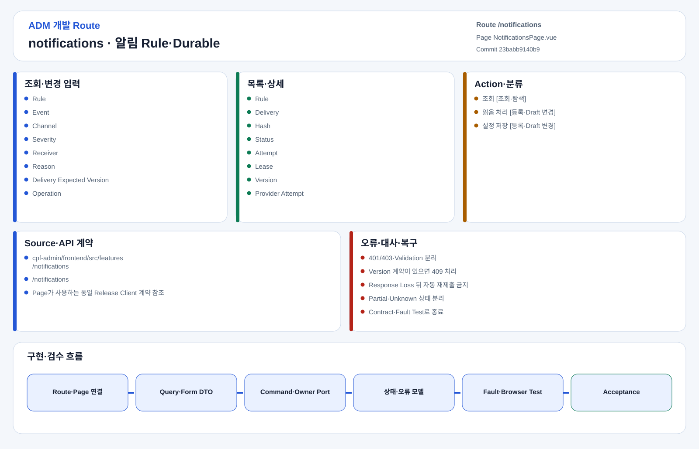


### 구현 결과

`/notifications`가 단순 Route가 아니라 **알림 Rule과 Durable Delivery를 관리한다.** Query·Command·Permission·Owner 상태·Audit·Browser Test가 연결된 기능 Slice가 되도록 구현한다.

### Source 진입점과 소유권

| 계층 | 기준 |
|---|---|
| Router | `/notifications` |
| Page | `cpf-admin/frontend/src/features/notifications/NotificationsPage.vue` |
| Generated Client | Page가 import하는 Generated Client 또는 공통 ADM Client의 실제 Operation을 사용한다. 수기 Endpoint 문자열과 중복 DTO를 만들지 않는다 |
| ADM Backend | OpenAPI Operation의 Controller와 Application Service |
| Owner Port | Query·Command·Status·Reconcile Port; Local/Remote가 같은 DTO·오류 의미 사용 |
| Test | Frontend Unit·Generated Client Contract·Controller·Browser·Fault |

### Frontend Query·Form 모델

| Field | Control | 직렬화·Validation | 오류·접근성 |
|---|---|---|---|
| `Rule` | 문자열 입력·검색 | 알림 Rule·Durable Delivery 화면의 조회 조건 또는 편집 Form에 포함되는 값이며 화면 Label과 Help를 기준으로 사용한다. 앞뒤 공백·허용 문자·길이와 대소문자 규칙을 확인한다. Request·Query의 실제 이름과 Type을 유지한다. | Label·Help·Field Error·Keyboard Focus를 제공하고 민감값은 재표시하지 않는다. |
| `Event` | 문자열 입력·검색 | 알림 Rule·Durable Delivery 화면의 조회 조건 또는 편집 Form에 포함되는 값이며 화면 Label과 Help를 기준으로 사용한다. 앞뒤 공백·허용 문자·길이와 대소문자 규칙을 확인한다. Request·Query의 실제 이름과 Type을 유지한다. | Label·Help·Field Error·Keyboard Focus를 제공하고 민감값은 재표시하지 않는다. |
| `Channel` | Select·검색 | 알림 Rule·Durable Delivery에서 적용하거나 조회할 정책·권한·처리 유형을 선택한다. 허용 목록과 현재 Environment·Data Scope에 맞는 값만 선택한다. Request·Query의 실제 이름과 Type을 유지한다. | Label·Help·Field Error·Keyboard Focus를 제공하고 민감값은 재표시하지 않는다. |
| `Severity` | Select·검색 | 알림 Rule·Durable Delivery 화면의 조회 조건 또는 편집 Form에 포함되는 값이며 화면 Label과 Help를 기준으로 사용한다. 허용 목록과 현재 Environment·Data Scope에 맞는 값만 선택한다. Request·Query의 실제 이름과 Type을 유지한다. | Label·Help·Field Error·Keyboard Focus를 제공하고 민감값은 재표시하지 않는다. |
| `Receiver` | 문자열 입력·검색 | 알림 Rule·Durable Delivery 화면의 조회 조건 또는 편집 Form에 포함되는 값이며 화면 Label과 Help를 기준으로 사용한다. 앞뒤 공백·허용 문자·길이와 대소문자 규칙을 확인한다. Request·Query의 실제 이름과 Type을 유지한다. | Label·Help·Field Error·Keyboard Focus를 제공하고 민감값은 재표시하지 않는다. |
| `Reason` | 다중행 입력 | 작업 목적·영향 범위·승인 또는 복구 기준을 기록해 Audit와 교대 기록에 연결한다. Ticket·영향 범위·복구점을 포함하고 화면이 요구하는 최소 길이를 충족한다. Request·Query의 실제 이름과 Type을 유지한다. | Label·Help·Field Error·Keyboard Focus를 제공하고 민감값은 재표시하지 않는다. |
| `Delivery Expected Version` | 숫자·Version 입력 | 동시 변경을 막고 요청 대상의 현재 Revision을 확인하는 값이다. 상세 재조회로 최신 값을 얻고 409 발생 시 기존 값을 덮어쓰지 않는다. Request·Query의 실제 이름과 Type을 유지한다. | Label·Help·Field Error·Keyboard Focus를 제공하고 민감값은 재표시하지 않는다. |
| `Operation` | 문자열 입력·검색 | 알림 Rule·Durable Delivery 화면의 조회 조건 또는 편집 Form에 포함되는 값이며 화면 Label과 Help를 기준으로 사용한다. 앞뒤 공백·허용 문자·길이와 대소문자 규칙을 확인한다. Request·Query의 실제 이름과 Type을 유지한다. | Label·Help·Field Error·Keyboard Focus를 제공하고 민감값은 재표시하지 않는다. |

### Table·Detail View Model

| 값 | 표시 계약 | Drill-down·대사 |
|---|---|---|
| `Rule` | 알림 Rule·Durable Delivery 상세에서 대상의 현재 속성 또는 처리 결과를 확인하는 값이다. Masking·Timezone·단위를 DTO Metadata와 함께 표시한다. | 상세·재조회 결과와 비교하고 Stale·Masking·단위 차이를 확인한다. |
| `Delivery` | 알림 Rule·Durable Delivery 상세에서 대상의 현재 속성 또는 처리 결과를 확인하는 값이다. Masking·Timezone·단위를 DTO Metadata와 함께 표시한다. | 상세·재조회 결과와 비교하고 Stale·Masking·단위 차이를 확인한다. |
| `Hash` | 요청·Owner·Instance 사이의 Version 또는 내용 동일성을 판단하는 값이다. Masking·Timezone·단위를 DTO Metadata와 함께 표시한다. | 목록·상세·Owner 또는 Instance 보고값에서 일치하는지 확인한다. |
| `Status` | 현재 상태와 Terminal 여부, 다음 Action 가능 여부를 판단하는 값이다. Masking·Timezone·단위를 DTO Metadata와 함께 표시한다. | Last Updated·Terminal 조건·Owner 상태와 함께 확인한다. |
| `Attempt` | 알림 Rule·Durable Delivery 상세에서 대상의 현재 속성 또는 처리 결과를 확인하는 값이다. Masking·Timezone·단위를 DTO Metadata와 함께 표시한다. | 상세·재조회 결과와 비교하고 Stale·Masking·단위 차이를 확인한다. |
| `Lease` | 알림 Rule·Durable Delivery 상세에서 대상의 현재 속성 또는 처리 결과를 확인하는 값이다. Masking·Timezone·단위를 DTO Metadata와 함께 표시한다. | 상세·재조회 결과와 비교하고 Stale·Masking·단위 차이를 확인한다. |
| `Version` | 요청·Owner·Instance 사이의 Version 또는 내용 동일성을 판단하는 값이다. Masking·Timezone·단위를 DTO Metadata와 함께 표시한다. | 목록·상세·Owner 또는 Instance 보고값에서 일치하는지 확인한다. |
| `Provider Attempt` | 알림 Rule·Durable Delivery의 대상 레코드를 상세·Owner·Audit에서 연결하는 식별자다. Masking·Timezone·단위를 DTO Metadata와 함께 표시한다. | 상세·Log·Trace·Audit에서 같은 대상을 가리키는지 확인한다. |

### Button·Command 모델

| Action | 분류 | Frontend 활성 조건 | Backend·성공 처리 |
|---|---|---|---|
| **조회** | 조회·탐색 | 조회 Permission과 Query Validation을 충족하고 동일 조회가 진행 중이 아님 | 조회 결과의 조회 시각·Filter·Source Version·Warning이 갱신되며 Owner 데이터는 변경하지 않는다. |
| **읽음 처리** | 등록·Draft 변경 | 화면이 실제로 요구하는 Write Permission·필수 Field·Reason·Version 조건을 충족함 | 알림 Rule·Durable Delivery의 재조회 결과가 요청 내용과 일치한다. Version·Before/After·Audit는 해당 Owner가 제공하는 경우 함께 확인한다. Backend에서도 Permission·Version·Idempotency를 재검증한다. |
| **설정 저장** | 등록·Draft 변경 | 화면이 실제로 요구하는 Write Permission·필수 Field·Reason·Version 조건을 충족함 | 알림 Rule·Durable Delivery의 재조회 결과가 요청 내용과 일치한다. Version·Before/After·Audit는 해당 Owner가 제공하는 경우 함께 확인한다. Backend에서도 Permission·Version·Idempotency를 재검증한다. |

### 상태 모델

```text
Query: Idle → Loading → Empty | Success | Error
Success + Stale | Partial
Command: Editing → Validating → Submitting → Accepted(operationId) → Terminal
Submitting → ResponseLoss → Reconcile → Terminal | UNKNOWN_RESULT
```

Query와 Command의 Loading·Error를 분리한다. 조회 전용 Route에는 존재하지 않는 Command 상태를 만들지 않는다. `403`, `409`, Timeout, Partial, Unknown을 하나의 Error Toast로 합치지 않는다.

### API·Owner 계약

- Query Request는 실제 Page가 사용하는 Environment·Data Scope·검색 Field·Paging·Sort·Timezone만 포함한다.
- Query Response는 실제 Item·Page·조회 시각·Source Version·Stale·Partial·Warning 계약을 유지한다.
- Command는 Source에 선언된 Target ID·Version·Reason·Approval ID·Idempotency Key·Request Hash 중 실제 필드만 사용한다.
- `202 Accepted`는 완료가 아니라 Operation 추적 시작이며 Owner Terminal 상태를 별도로 조회한다.
- Side Effect 전 실패, Side Effect 후 실패, Success, Partial, `UNKNOWN_RESULT`를 구분한다.
- Same-JVM과 Remote Adapter는 DTO·Error Code·Timeout·Unknown 의미를 유지한다.

### Permission·Data Scope·Masking

- Route Permission 기준은 **`NOTIFICATION_*` Button Permission**이다.
- Menu 노출, Query, Button, Raw, Export Permission을 분리하고 Backend와 Owner에서 다시 검증한다.
- Deny는 403과 Audit를 남기며 404·Empty로 위장하지 않는다.
- Secret·Credential·PII Raw를 일반 Response DTO·Browser Storage·Log에 넣지 않는다.

### 구현 순서

1. Route·Page Import·Menu Metadata·Permission을 연결한다.
2. 이 장의 Field·Column·Action을 OpenAPI Request·Response·Error와 대조한다.
3. Generated Client를 재생성하고 수기 HTTP 호출을 제거한다.
4. Query·Command 상태와 Empty·Stale·Partial·Unknown UI를 구현한다.
5. Backend Controller·Application Service·Owner Port·Local/Remote Adapter를 연결한다.
6. Reason·Approval·Expected Version·Idempotency·Audit를 Server에서 검증한다.
7. Response Loss Polling·Reconcile·Rollback Link를 구현한다.
8. Unit·Contract·Browser·Fault·Accessibility Test를 실행한다.

### Test Matrix

| Test | 필수 Scenario |
|---|---|
| Frontend Unit | Default·Validation·Button 조건·Masking·Empty/Error/Stale/Partial |
| OpenAPI·Generated Client | Operation 이름·Type·Error·Hash Drift |
| Backend Query | Permission·Data Scope·Filter·Paging·Stale·Partial |
| Backend Command | Source에 선언된 Permission·Version·Reason·Approval·Idempotency·Audit 계약 |
| Local/Remote Contract | 같은 DTO·Error·Timeout 의미 |
| Browser | Deep Link·Query·상세·403·Timeout·Empty·Partial |
| Fault | 409·Response Loss·DB/Kafka/Owner 중단·Partial ACK·Late Response |
| Accessibility | Keyboard·Focus·Label·Error Announcement·Table/Dialog |

### 개발 Fault Workbook

1. `/notifications` Query를 500·Timeout·Empty·Partial 응답으로 주입해 Loading·Empty·Error·Stale·Partial UI를 각각 확인한다.
2. 401·403과 Data Scope 축소를 주입해 Deny를 Empty로 위장하지 않고 Error와 접근 가능한 범위를 구분하는지 확인한다.
3. Version 계약이 있는 Write Action에는 409를, 모든 비동기·원격 Write에는 Response Loss를 주입해 자동 재제출이 없는지 확인한다.
4. 202 응답 뒤 Operation Polling이 Terminal·Failed·Partial·Unknown을 분리하는지 확인한다.
5. Local Adapter와 Remote Adapter에 같은 Contract Fixture를 적용해 Error Code·Retryability·failureStage가 일치하는지 확인한다.
6. Browser Storage·Console·Network Error·Screenshot에 Token·Secret·PII Raw가 남지 않는지 확인한다.

### Route Acceptance Checklist

- [ ] Route `/notifications`의 Deep Link와 Menu ID `notifications`가 같은 Page를 연다.
- [ ] 이 장의 Field·Column·Action과 Page·OpenAPI·Generated Client가 같은 계약을 사용한다.
- [ ] Menu·Query·Raw·Export Permission Deny가 Backend 403과 화면 Error로 확인된다.
- [ ] Empty·Timeout·Stale·Partial이 서로 다른 사용자 상태와 재조회 경로를 제공한다.
- [ ] Same-JVM·Remote 호출이 같은 Query DTO·오류·Timeout 계약을 사용한다.
- [ ] 409·Response Loss·Partial·Unknown이 서로 다른 상태와 Operation·Reconcile Link를 제공한다.
- [ ] Command가 Source에 선언한 Reason·Approval·Version·Idempotency·Audit 필드를 Server에서 재검증한다.
- [ ] 정상·오류·경계 Browser Test와 Accessibility Test가 Route Matrix에 포함된다.

### 독립 수행 검수 Checklist

- [ ] `/notifications`와 Page Source를 찾고 화면 목적을 설명할 수 있다.
- [ ] 8개 입력·검색 항목의 Control·기본값·Validation을 설명할 수 있다.
- [ ] 8개 표시값을 Owner 상태·Version·Audit와 대사할 수 있다.
- [ ] 3개 Action의 분류·활성 조건·Side Effect를 설명할 수 있다.
- [ ] Empty·403·409·Timeout·Partial·Unknown을 서로 다른 상태로 처리할 수 있다.
- [ ] 응답 유실 뒤 중복 제출 없이 Operation·Owner·Audit로 결과를 확정할 수 있다.
- [ ] 교대 기록만으로 다음 담당자가 Target·상태·복구 기한을 이어받을 수 있다.
- [ ] OpenAPI·Generated Client·Page·Controller·Owner Port·Test가 같은 Field와 오류 계약을 사용하는지 검증할 수 있다.
- [ ] Local·Remote Adapter의 Timeout·Unknown 의미가 같은지 Contract Test로 확인할 수 있다.

## 26. downloads — CSV Download·Audit 기능 Slice 개발 장

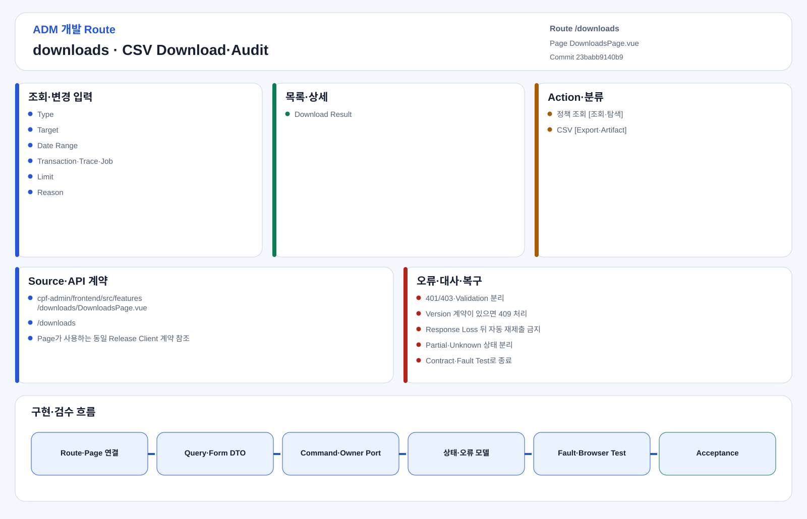


### 구현 결과

`/downloads`가 단순 Route가 아니라 **Data Scope·Masking·건수 상한이 적용된 Download를 생성한다.** Query·Command·Permission·Owner 상태·Audit·Browser Test가 연결된 기능 Slice가 되도록 구현한다.

### Source 진입점과 소유권

| 계층 | 기준 |
|---|---|
| Router | `/downloads` |
| Page | `cpf-admin/frontend/src/features/downloads/DownloadsPage.vue` |
| Generated Client | Page가 import하는 Generated Client 또는 공통 ADM Client의 실제 Operation을 사용한다. 수기 Endpoint 문자열과 중복 DTO를 만들지 않는다 |
| ADM Backend | OpenAPI Operation의 Controller와 Application Service |
| Owner Port | Query·Command·Status·Reconcile Port; Local/Remote가 같은 DTO·오류 의미 사용 |
| Test | Frontend Unit·Generated Client Contract·Controller·Browser·Fault |

### Frontend Query·Form 모델

| Field | Control | 직렬화·Validation | 오류·접근성 |
|---|---|---|---|
| `Type` | Select·검색 | CSV Download·Audit에서 적용하거나 조회할 정책·권한·처리 유형을 선택한다. 허용 목록과 현재 Environment·Data Scope에 맞는 값만 선택한다. Request·Query의 실제 이름과 Type을 유지한다. | Label·Help·Field Error·Keyboard Focus를 제공하고 민감값은 재표시하지 않는다. |
| `Target` | 문자열 입력·검색 | CSV Download·Audit 화면의 조회 조건 또는 편집 Form에 포함되는 값이며 화면 Label과 Help를 기준으로 사용한다. 앞뒤 공백·허용 문자·길이와 대소문자 규칙을 확인한다. Request·Query의 실제 이름과 Type을 유지한다. | Label·Help·Field Error·Keyboard Focus를 제공하고 민감값은 재표시하지 않는다. |
| `Date Range` | 날짜·시간 입력 | 조회 또는 적용의 유효 시간 범위를 정하며 Timezone과 시작·종료 순서를 함께 확인한다. Timezone을 고정하고 시작≤종료·유효기간 겹침·기준일 포함 여부를 확인한다. Request·Query의 실제 이름과 Type을 유지한다. | Label·Help·Field Error·Keyboard Focus를 제공하고 민감값은 재표시하지 않는다. |
| `Transaction·Trace·Job` | Select·검색 | CSV Download·Audit에서 적용하거나 조회할 정책·권한·처리 유형을 선택한다. 허용 목록과 현재 Environment·Data Scope에 맞는 값만 선택한다. Request·Query의 실제 이름과 Type을 유지한다. | Label·Help·Field Error·Keyboard Focus를 제공하고 민감값은 재표시하지 않는다. |
| `Limit` | 숫자·Version 입력 | 실행 한도·순서·용량 또는 재시도 범위를 지정한다. 화면의 min·max·단위와 0 허용 여부를 확인하고 음수·Overflow를 차단한다. Request·Query의 실제 이름과 Type을 유지한다. | Label·Help·Field Error·Keyboard Focus를 제공하고 민감값은 재표시하지 않는다. |
| `Reason` | 다중행 입력 | 작업 목적·영향 범위·승인 또는 복구 기준을 기록해 Audit와 교대 기록에 연결한다. Ticket·영향 범위·복구점을 포함하고 화면이 요구하는 최소 길이를 충족한다. Request·Query의 실제 이름과 Type을 유지한다. | Label·Help·Field Error·Keyboard Focus를 제공하고 민감값은 재표시하지 않는다. |

### Table·Detail View Model

| 값 | 표시 계약 | Drill-down·대사 |
|---|---|---|
| `Download Result` | 생성된 Download 요청·Artifact 상태를 나타내며 File Hash와 Download Audit로 종료를 판정한다. Masking·Timezone·단위를 DTO Metadata와 함께 표시한다. | Last Updated·Terminal 조건·Owner 상태와 함께 확인한다. |

### Button·Command 모델

| Action | 분류 | Frontend 활성 조건 | Backend·성공 처리 |
|---|---|---|---|
| **정책 조회** | 조회·탐색 | 조회 Permission과 Query Validation을 충족하고 동일 조회가 진행 중이 아님 | 정책 조회 결과의 조회 시각·Filter·Source Version·Warning이 갱신되며 Owner 데이터는 변경하지 않는다. |
| **CSV** | Export·Artifact | 화면이 요구하는 Export Permission·Data Scope·Masking·Reason과 승인 조건을 충족함 | Export Operation과 Artifact ID·Checksum·만료·Download Audit가 생성되고 원본 데이터는 변경하지 않는다. Backend에서도 Permission·Version·Idempotency를 재검증한다. |

### 상태 모델

```text
Query: Idle → Loading → Empty | Success | Error
Success + Stale | Partial
Command: Editing → Validating → Submitting → Accepted(operationId) → Terminal
Submitting → ResponseLoss → Reconcile → Terminal | UNKNOWN_RESULT
```

Query와 Command의 Loading·Error를 분리한다. 조회 전용 Route에는 존재하지 않는 Command 상태를 만들지 않는다. `403`, `409`, Timeout, Partial, Unknown을 하나의 Error Toast로 합치지 않는다.

### API·Owner 계약

- Query Request는 실제 Page가 사용하는 Environment·Data Scope·검색 Field·Paging·Sort·Timezone만 포함한다.
- Query Response는 실제 Item·Page·조회 시각·Source Version·Stale·Partial·Warning 계약을 유지한다.
- Command는 Source에 선언된 Target ID·Version·Reason·Approval ID·Idempotency Key·Request Hash 중 실제 필드만 사용한다.
- `202 Accepted`는 완료가 아니라 Operation 추적 시작이며 Owner Terminal 상태를 별도로 조회한다.
- Side Effect 전 실패, Side Effect 후 실패, Success, Partial, `UNKNOWN_RESULT`를 구분한다.
- Same-JVM과 Remote Adapter는 DTO·Error Code·Timeout·Unknown 의미를 유지한다.

### Permission·Data Scope·Masking

- Route Permission 기준은 **Download Permission·Reason**이다.
- Menu 노출, Query, Button, Raw, Export Permission을 분리하고 Backend와 Owner에서 다시 검증한다.
- Deny는 403과 Audit를 남기며 404·Empty로 위장하지 않는다.
- Secret·Credential·PII Raw를 일반 Response DTO·Browser Storage·Log에 넣지 않는다.

### 구현 순서

1. Route·Page Import·Menu Metadata·Permission을 연결한다.
2. 이 장의 Field·Column·Action을 OpenAPI Request·Response·Error와 대조한다.
3. Generated Client를 재생성하고 수기 HTTP 호출을 제거한다.
4. Query·Command 상태와 Empty·Stale·Partial·Unknown UI를 구현한다.
5. Backend Controller·Application Service·Owner Port·Local/Remote Adapter를 연결한다.
6. Reason·Approval·Expected Version·Idempotency·Audit를 Server에서 검증한다.
7. Response Loss Polling·Reconcile·Rollback Link를 구현한다.
8. Unit·Contract·Browser·Fault·Accessibility Test를 실행한다.

### Test Matrix

| Test | 필수 Scenario |
|---|---|
| Frontend Unit | Default·Validation·Button 조건·Masking·Empty/Error/Stale/Partial |
| OpenAPI·Generated Client | Operation 이름·Type·Error·Hash Drift |
| Backend Query | Permission·Data Scope·Filter·Paging·Stale·Partial |
| Backend Command | Source에 선언된 Permission·Version·Reason·Approval·Idempotency·Audit 계약 |
| Local/Remote Contract | 같은 DTO·Error·Timeout 의미 |
| Browser | Deep Link·Query·상세·403·Timeout·Empty·Partial |
| Fault | 409·Response Loss·DB/Kafka/Owner 중단·Partial ACK·Late Response |
| Accessibility | Keyboard·Focus·Label·Error Announcement·Table/Dialog |

### 개발 Fault Workbook

1. `/downloads` Query를 500·Timeout·Empty·Partial 응답으로 주입해 Loading·Empty·Error·Stale·Partial UI를 각각 확인한다.
2. 401·403과 Data Scope 축소를 주입해 Deny를 Empty로 위장하지 않고 Error와 접근 가능한 범위를 구분하는지 확인한다.
3. Version 계약이 있는 Write Action에는 409를, 모든 비동기·원격 Write에는 Response Loss를 주입해 자동 재제출이 없는지 확인한다.
4. 202 응답 뒤 Operation Polling이 Terminal·Failed·Partial·Unknown을 분리하는지 확인한다.
5. Local Adapter와 Remote Adapter에 같은 Contract Fixture를 적용해 Error Code·Retryability·failureStage가 일치하는지 확인한다.
6. Browser Storage·Console·Network Error·Screenshot에 Token·Secret·PII Raw가 남지 않는지 확인한다.

### Route Acceptance Checklist

- [ ] Route `/downloads`의 Deep Link와 Menu ID `downloads`가 같은 Page를 연다.
- [ ] 이 장의 Field·Column·Action과 Page·OpenAPI·Generated Client가 같은 계약을 사용한다.
- [ ] Menu·Query·Raw·Export Permission Deny가 Backend 403과 화면 Error로 확인된다.
- [ ] Empty·Timeout·Stale·Partial이 서로 다른 사용자 상태와 재조회 경로를 제공한다.
- [ ] Same-JVM·Remote 호출이 같은 Query DTO·오류·Timeout 계약을 사용한다.
- [ ] 409·Response Loss·Partial·Unknown이 서로 다른 상태와 Operation·Reconcile Link를 제공한다.
- [ ] Command가 Source에 선언한 Reason·Approval·Version·Idempotency·Audit 필드를 Server에서 재검증한다.
- [ ] 정상·오류·경계 Browser Test와 Accessibility Test가 Route Matrix에 포함된다.

### 독립 수행 검수 Checklist

- [ ] `/downloads`와 Page Source를 찾고 화면 목적을 설명할 수 있다.
- [ ] 6개 입력·검색 항목의 Control·기본값·Validation을 설명할 수 있다.
- [ ] 1개 표시값을 Owner 상태·Version·Audit와 대사할 수 있다.
- [ ] 2개 Action의 분류·활성 조건·Side Effect를 설명할 수 있다.
- [ ] Empty·403·409·Timeout·Partial·Unknown을 서로 다른 상태로 처리할 수 있다.
- [ ] 응답 유실 뒤 중복 제출 없이 Operation·Owner·Audit로 결과를 확정할 수 있다.
- [ ] 교대 기록만으로 다음 담당자가 Target·상태·복구 기한을 이어받을 수 있다.
- [ ] OpenAPI·Generated Client·Page·Controller·Owner Port·Test가 같은 Field와 오류 계약을 사용하는지 검증할 수 있다.
- [ ] Local·Remote Adapter의 Timeout·Unknown 의미가 같은지 Contract Test로 확인할 수 있다.

## 27. file-jobs — 대량 File Job 기능 Slice 개발 장

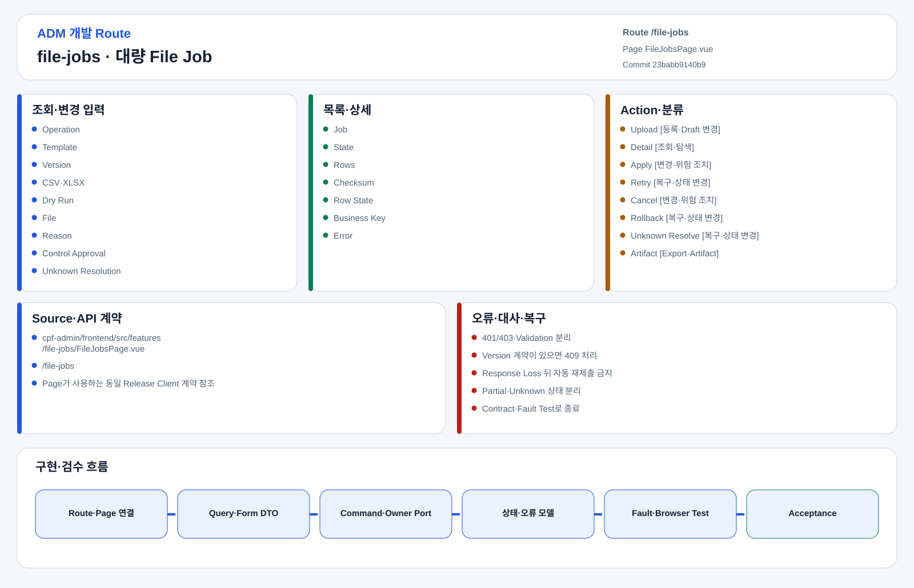


### 구현 결과

`/file-jobs`가 단순 Route가 아니라 **대량 File Job을 Dry Run·Apply·Retry·Rollback한다.** Query·Command·Permission·Owner 상태·Audit·Browser Test가 연결된 기능 Slice가 되도록 구현한다.

### Source 진입점과 소유권

| 계층 | 기준 |
|---|---|
| Router | `/file-jobs` |
| Page | `cpf-admin/frontend/src/features/file-jobs/FileJobsPage.vue` |
| Generated Client | Page가 import하는 Generated Client 또는 공통 ADM Client의 실제 Operation을 사용한다. 수기 Endpoint 문자열과 중복 DTO를 만들지 않는다 |
| ADM Backend | OpenAPI Operation의 Controller와 Application Service |
| Owner Port | Query·Command·Status·Reconcile Port; Local/Remote가 같은 DTO·오류 의미 사용 |
| Test | Frontend Unit·Generated Client Contract·Controller·Browser·Fault |

### Frontend Query·Form 모델

| Field | Control | 직렬화·Validation | 오류·접근성 |
|---|---|---|---|
| `Operation` | 문자열 입력·검색 | 대량 File Job 화면의 조회 조건 또는 편집 Form에 포함되는 값이며 화면 Label과 Help를 기준으로 사용한다. 앞뒤 공백·허용 문자·길이와 대소문자 규칙을 확인한다. Request·Query의 실제 이름과 Type을 유지한다. | Label·Help·Field Error·Keyboard Focus를 제공하고 민감값은 재표시하지 않는다. |
| `Template` | 문자열 입력·검색 | 대량 File Job 화면의 조회 조건 또는 편집 Form에 포함되는 값이며 화면 Label과 Help를 기준으로 사용한다. 앞뒤 공백·허용 문자·길이와 대소문자 규칙을 확인한다. Request·Query의 실제 이름과 Type을 유지한다. | Label·Help·Field Error·Keyboard Focus를 제공하고 민감값은 재표시하지 않는다. |
| `Version` | 숫자·Version 입력 | 동시 변경을 막고 요청 대상의 현재 Revision을 확인하는 값이다. 상세 재조회로 최신 값을 얻고 409 발생 시 기존 값을 덮어쓰지 않는다. Request·Query의 실제 이름과 Type을 유지한다. | Label·Help·Field Error·Keyboard Focus를 제공하고 민감값은 재표시하지 않는다. |
| `CSV·XLSX` | 파일·본문 입력 | 검증·등록·Export에 사용할 입력 Artifact 또는 구조화된 본문이다. 확장자·크기·Encoding·Schema·Checksum을 검증하고 Dry Run이 있으면 먼저 실행한다. Request·Query의 실제 이름과 Type을 유지한다. | Label·Help·Field Error·Keyboard Focus를 제공하고 민감값은 재표시하지 않는다. |
| `Dry Run` | Checkbox·Switch | 대량 File Job 화면의 조회 조건 또는 편집 Form에 포함되는 값이며 화면 Label과 Help를 기준으로 사용한다. 현재 선택과 변경 후 영향 범위를 비교하고 화면의 Source 기본값을 확인한다. Request·Query의 실제 이름과 Type을 유지한다. | Label·Help·Field Error·Keyboard Focus를 제공하고 민감값은 재표시하지 않는다. |
| `File` | 파일·본문 입력 | 검증·등록·Export에 사용할 입력 Artifact 또는 구조화된 본문이다. 확장자·크기·Encoding·Schema·Checksum을 검증하고 Dry Run이 있으면 먼저 실행한다. Request·Query의 실제 이름과 Type을 유지한다. | Label·Help·Field Error·Keyboard Focus를 제공하고 민감값은 재표시하지 않는다. |
| `Reason` | 다중행 입력 | 작업 목적·영향 범위·승인 또는 복구 기준을 기록해 Audit와 교대 기록에 연결한다. Ticket·영향 범위·복구점을 포함하고 화면이 요구하는 최소 길이를 충족한다. Request·Query의 실제 이름과 Type을 유지한다. | Label·Help·Field Error·Keyboard Focus를 제공하고 민감값은 재표시하지 않는다. |
| `Control Approval` | Checkbox·Switch | 대량 File Job 화면의 조회 조건 또는 편집 Form에 포함되는 값이며 화면 Label과 Help를 기준으로 사용한다. 현재 선택과 변경 후 영향 범위를 비교하고 화면의 Source 기본값을 확인한다. Request·Query의 실제 이름과 Type을 유지한다. | Label·Help·Field Error·Keyboard Focus를 제공하고 민감값은 재표시하지 않는다. |
| `Unknown Resolution` | 문자열 입력·검색 | 대량 File Job 화면의 조회 조건 또는 편집 Form에 포함되는 값이며 화면 Label과 Help를 기준으로 사용한다. 앞뒤 공백·허용 문자·길이와 대소문자 규칙을 확인한다. Request·Query의 실제 이름과 Type을 유지한다. | Label·Help·Field Error·Keyboard Focus를 제공하고 민감값은 재표시하지 않는다. |

### Table·Detail View Model

| 값 | 표시 계약 | Drill-down·대사 |
|---|---|---|
| `Job` | 대량 File Job의 대상 레코드를 상세·Owner·Audit에서 연결하는 식별자다. Masking·Timezone·단위를 DTO Metadata와 함께 표시한다. | 상세·Log·Trace·Audit에서 같은 대상을 가리키는지 확인한다. |
| `State` | 현재 상태와 Terminal 여부, 다음 Action 가능 여부를 판단하는 값이다. Masking·Timezone·단위를 DTO Metadata와 함께 표시한다. | Last Updated·Terminal 조건·Owner 상태와 함께 확인한다. |
| `Rows` | 동일한 집계 시간 창·단위·Filter에서 비교해야 하는 수치다. Masking·Timezone·단위를 DTO Metadata와 함께 표시한다. | 같은 Filter·집계 시간 창·단위의 상세 Row 또는 Metric으로 대사한다. |
| `Checksum` | 요청·Owner·Instance 사이의 Version 또는 내용 동일성을 판단하는 값이다. Masking·Timezone·단위를 DTO Metadata와 함께 표시한다. | 목록·상세·Owner 또는 Instance 보고값에서 일치하는지 확인한다. |
| `Row State` | 현재 상태와 Terminal 여부, 다음 Action 가능 여부를 판단하는 값이다. Masking·Timezone·단위를 DTO Metadata와 함께 표시한다. | Last Updated·Terminal 조건·Owner 상태와 함께 확인한다. |
| `Business Key` | 대량 File Job의 대상 레코드를 상세·Owner·Audit에서 연결하는 식별자다. Masking·Timezone·단위를 DTO Metadata와 함께 표시한다. | 상세·Log·Trace·Audit에서 같은 대상을 가리키는지 확인한다. |
| `Error` | 오류·Drift·결과 불명 범위를 나타내며 원인과 복구 Owner를 연결해야 한다. Masking·Timezone·단위를 DTO Metadata와 함께 표시한다. | 원인 식별자·실패 Stage·마지막 갱신 시각을 상세와 대조한다. |

### Button·Command 모델

| Action | 분류 | Frontend 활성 조건 | Backend·성공 처리 |
|---|---|---|---|
| **Upload** | 등록·Draft 변경 | 화면이 실제로 요구하는 Write Permission·필수 Field·Reason·Version 조건을 충족함 | 대량 File Job의 재조회 결과가 요청 내용과 일치한다. Version·Before/After·Audit는 해당 Owner가 제공하는 경우 함께 확인한다. Backend에서도 Permission·Version·Idempotency를 재검증한다. |
| **Detail** | 조회·탐색 | 조회 Permission과 Query Validation을 충족하고 동일 조회가 진행 중이 아님 | Detail 결과의 조회 시각·Filter·Source Version·Warning이 갱신되며 Owner 데이터는 변경하지 않는다. |
| **Apply** | 변경·위험 조치 | 화면과 Owner가 요구하는 Write Permission·대상 상태·영향 범위·Reason·승인·Version 조건을 충족함 | 변경 Operation을 생성하고 Accepted 응답과 Owner Terminal 상태·Version·Audit를 분리해 확인한다. Backend에서도 Permission·Version·Idempotency를 재검증한다. |
| **Retry** | 복구·상태 변경 | 화면과 Owner가 요구하는 복구 Permission·대상 상태·Reason·승인·Version 조건을 충족함 | 복구 Operation을 생성하고 Owner 상태·대상별 결과·Audit로 종료를 판정한다. Backend에서도 Permission·Version·Idempotency를 재검증한다. |
| **Cancel** | 변경·위험 조치 | 화면과 Owner가 요구하는 Write Permission·대상 상태·영향 범위·Reason·승인·Version 조건을 충족함 | 변경 Operation을 생성하고 Accepted 응답과 Owner Terminal 상태·Version·Audit를 분리해 확인한다. Backend에서도 Permission·Version·Idempotency를 재검증한다. |
| **Rollback** | 복구·상태 변경 | 화면과 Owner가 요구하는 복구 Permission·대상 상태·Reason·승인·Version 조건을 충족함 | 복구 Operation을 생성하고 Owner 상태·대상별 결과·Audit로 종료를 판정한다. Backend에서도 Permission·Version·Idempotency를 재검증한다. |
| **Unknown Resolve** | 복구·상태 변경 | 화면과 Owner가 요구하는 복구 Permission·대상 상태·Reason·승인·Version 조건을 충족함 | 복구 Operation을 생성하고 Owner 상태·대상별 결과·Audit로 종료를 판정한다. Backend에서도 Permission·Version·Idempotency를 재검증한다. |
| **Artifact** | Export·Artifact | 화면이 요구하는 Export Permission·Data Scope·Masking·Reason과 승인 조건을 충족함 | Export Operation과 Artifact ID·Checksum·만료·Download Audit가 생성되고 원본 데이터는 변경하지 않는다. Backend에서도 Permission·Version·Idempotency를 재검증한다. |

### 상태 모델

```text
Query: Idle → Loading → Empty | Success | Error
Success + Stale | Partial
Command: Editing → Validating → Submitting → Accepted(operationId) → Terminal
Submitting → ResponseLoss → Reconcile → Terminal | UNKNOWN_RESULT
```

Query와 Command의 Loading·Error를 분리한다. 조회 전용 Route에는 존재하지 않는 Command 상태를 만들지 않는다. `403`, `409`, Timeout, Partial, Unknown을 하나의 Error Toast로 합치지 않는다.

### API·Owner 계약

- Query Request는 실제 Page가 사용하는 Environment·Data Scope·검색 Field·Paging·Sort·Timezone만 포함한다.
- Query Response는 실제 Item·Page·조회 시각·Source Version·Stale·Partial·Warning 계약을 유지한다.
- Command는 Source에 선언된 Target ID·Version·Reason·Approval ID·Idempotency Key·Request Hash 중 실제 필드만 사용한다.
- `202 Accepted`는 완료가 아니라 Operation 추적 시작이며 Owner Terminal 상태를 별도로 조회한다.
- Side Effect 전 실패, Side Effect 후 실패, Success, Partial, `UNKNOWN_RESULT`를 구분한다.
- Same-JVM과 Remote Adapter는 DTO·Error Code·Timeout·Unknown 의미를 유지한다.

### Permission·Data Scope·Masking

- Route Permission 기준은 **`FILE_JOB_*` Button Permission**이다.
- Menu 노출, Query, Button, Raw, Export Permission을 분리하고 Backend와 Owner에서 다시 검증한다.
- Deny는 403과 Audit를 남기며 404·Empty로 위장하지 않는다.
- Secret·Credential·PII Raw를 일반 Response DTO·Browser Storage·Log에 넣지 않는다.

### 구현 순서

1. Route·Page Import·Menu Metadata·Permission을 연결한다.
2. 이 장의 Field·Column·Action을 OpenAPI Request·Response·Error와 대조한다.
3. Generated Client를 재생성하고 수기 HTTP 호출을 제거한다.
4. Query·Command 상태와 Empty·Stale·Partial·Unknown UI를 구현한다.
5. Backend Controller·Application Service·Owner Port·Local/Remote Adapter를 연결한다.
6. Reason·Approval·Expected Version·Idempotency·Audit를 Server에서 검증한다.
7. Response Loss Polling·Reconcile·Rollback Link를 구현한다.
8. Unit·Contract·Browser·Fault·Accessibility Test를 실행한다.

### Test Matrix

| Test | 필수 Scenario |
|---|---|
| Frontend Unit | Default·Validation·Button 조건·Masking·Empty/Error/Stale/Partial |
| OpenAPI·Generated Client | Operation 이름·Type·Error·Hash Drift |
| Backend Query | Permission·Data Scope·Filter·Paging·Stale·Partial |
| Backend Command | Source에 선언된 Permission·Version·Reason·Approval·Idempotency·Audit 계약 |
| Local/Remote Contract | 같은 DTO·Error·Timeout 의미 |
| Browser | Deep Link·Query·상세·403·Timeout·Empty·Partial |
| Fault | 409·Response Loss·DB/Kafka/Owner 중단·Partial ACK·Late Response |
| Accessibility | Keyboard·Focus·Label·Error Announcement·Table/Dialog |

### 개발 Fault Workbook

1. `/file-jobs` Query를 500·Timeout·Empty·Partial 응답으로 주입해 Loading·Empty·Error·Stale·Partial UI를 각각 확인한다.
2. 401·403과 Data Scope 축소를 주입해 Deny를 Empty로 위장하지 않고 Error와 접근 가능한 범위를 구분하는지 확인한다.
3. Version 계약이 있는 Write Action에는 409를, 모든 비동기·원격 Write에는 Response Loss를 주입해 자동 재제출이 없는지 확인한다.
4. 202 응답 뒤 Operation Polling이 Terminal·Failed·Partial·Unknown을 분리하는지 확인한다.
5. Local Adapter와 Remote Adapter에 같은 Contract Fixture를 적용해 Error Code·Retryability·failureStage가 일치하는지 확인한다.
6. Browser Storage·Console·Network Error·Screenshot에 Token·Secret·PII Raw가 남지 않는지 확인한다.

### Route Acceptance Checklist

- [ ] Route `/file-jobs`의 Deep Link와 Menu ID `file-jobs`가 같은 Page를 연다.
- [ ] 이 장의 Field·Column·Action과 Page·OpenAPI·Generated Client가 같은 계약을 사용한다.
- [ ] Menu·Query·Raw·Export Permission Deny가 Backend 403과 화면 Error로 확인된다.
- [ ] Empty·Timeout·Stale·Partial이 서로 다른 사용자 상태와 재조회 경로를 제공한다.
- [ ] Same-JVM·Remote 호출이 같은 Query DTO·오류·Timeout 계약을 사용한다.
- [ ] 409·Response Loss·Partial·Unknown이 서로 다른 상태와 Operation·Reconcile Link를 제공한다.
- [ ] Command가 Source에 선언한 Reason·Approval·Version·Idempotency·Audit 필드를 Server에서 재검증한다.
- [ ] 정상·오류·경계 Browser Test와 Accessibility Test가 Route Matrix에 포함된다.

### 독립 수행 검수 Checklist

- [ ] `/file-jobs`와 Page Source를 찾고 화면 목적을 설명할 수 있다.
- [ ] 9개 입력·검색 항목의 Control·기본값·Validation을 설명할 수 있다.
- [ ] 7개 표시값을 Owner 상태·Version·Audit와 대사할 수 있다.
- [ ] 8개 Action의 분류·활성 조건·Side Effect를 설명할 수 있다.
- [ ] Empty·403·409·Timeout·Partial·Unknown을 서로 다른 상태로 처리할 수 있다.
- [ ] 응답 유실 뒤 중복 제출 없이 Operation·Owner·Audit로 결과를 확정할 수 있다.
- [ ] 교대 기록만으로 다음 담당자가 Target·상태·복구 기한을 이어받을 수 있다.
- [ ] OpenAPI·Generated Client·Page·Controller·Owner Port·Test가 같은 Field와 오류 계약을 사용하는지 검증할 수 있다.
- [ ] Local·Remote Adapter의 Timeout·Unknown 의미가 같은지 Contract Test로 확인할 수 있다.

## 28. batch — Batch·Center-Cut 종합 통제 기능 Slice 개발 장

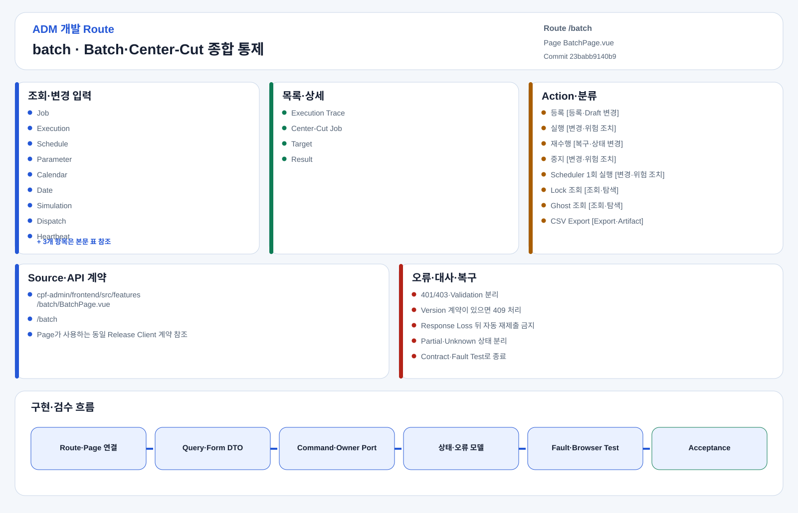


### 구현 결과

`/batch`가 단순 Route가 아니라 **Batch·Center-Cut 실행과 Scheduler·Lock·Ghost를 종합 통제한다.** Query·Command·Permission·Owner 상태·Audit·Browser Test가 연결된 기능 Slice가 되도록 구현한다.

### Source 진입점과 소유권

| 계층 | 기준 |
|---|---|
| Router | `/batch` |
| Page | `cpf-admin/frontend/src/features/batch/BatchPage.vue` |
| Generated Client | Page가 import하는 Generated Client 또는 공통 ADM Client의 실제 Operation을 사용한다. 수기 Endpoint 문자열과 중복 DTO를 만들지 않는다 |
| ADM Backend | OpenAPI Operation의 Controller와 Application Service |
| Owner Port | Query·Command·Status·Reconcile Port; Local/Remote가 같은 DTO·오류 의미 사용 |
| Test | Frontend Unit·Generated Client Contract·Controller·Browser·Fault |

### Frontend Query·Form 모델

| Field | Control | 직렬화·Validation | 오류·접근성 |
|---|---|---|---|
| `Job` | 문자열 입력·검색 | 조회·상세·Audit에서 같은 대상을 다시 찾기 위한 식별 조건이다. 앞뒤 공백·허용 문자·길이와 대소문자 규칙을 확인한다. Request·Query의 실제 이름과 Type을 유지한다. | Label·Help·Field Error·Keyboard Focus를 제공하고 민감값은 재표시하지 않는다. |
| `Execution` | 문자열 입력·검색 | 조회·상세·Audit에서 같은 대상을 다시 찾기 위한 식별 조건이다. 앞뒤 공백·허용 문자·길이와 대소문자 규칙을 확인한다. Request·Query의 실제 이름과 Type을 유지한다. | Label·Help·Field Error·Keyboard Focus를 제공하고 민감값은 재표시하지 않는다. |
| `Schedule` | 문자열 입력·검색 | Batch·Center-Cut 종합 통제 화면의 조회 조건 또는 편집 Form에 포함되는 값이며 화면 Label과 Help를 기준으로 사용한다. 앞뒤 공백·허용 문자·길이와 대소문자 규칙을 확인한다. Request·Query의 실제 이름과 Type을 유지한다. | Label·Help·Field Error·Keyboard Focus를 제공하고 민감값은 재표시하지 않는다. |
| `Parameter` | 문자열 입력·검색 | Batch·Center-Cut 종합 통제 화면의 조회 조건 또는 편집 Form에 포함되는 값이며 화면 Label과 Help를 기준으로 사용한다. 앞뒤 공백·허용 문자·길이와 대소문자 규칙을 확인한다. Request·Query의 실제 이름과 Type을 유지한다. | Label·Help·Field Error·Keyboard Focus를 제공하고 민감값은 재표시하지 않는다. |
| `Calendar` | Select·검색 | Batch·Center-Cut 종합 통제 화면의 조회 조건 또는 편집 Form에 포함되는 값이며 화면 Label과 Help를 기준으로 사용한다. 허용 목록과 현재 Environment·Data Scope에 맞는 값만 선택한다. Request·Query의 실제 이름과 Type을 유지한다. | Label·Help·Field Error·Keyboard Focus를 제공하고 민감값은 재표시하지 않는다. |
| `Date` | 날짜·시간 입력 | 조회 또는 적용의 유효 시간 범위를 정하며 Timezone과 시작·종료 순서를 함께 확인한다. Timezone을 고정하고 시작≤종료·유효기간 겹침·기준일 포함 여부를 확인한다. Request·Query의 실제 이름과 Type을 유지한다. | Label·Help·Field Error·Keyboard Focus를 제공하고 민감값은 재표시하지 않는다. |
| `Simulation` | 문자열 입력·검색 | Batch·Center-Cut 종합 통제 화면의 조회 조건 또는 편집 Form에 포함되는 값이며 화면 Label과 Help를 기준으로 사용한다. 앞뒤 공백·허용 문자·길이와 대소문자 규칙을 확인한다. Request·Query의 실제 이름과 Type을 유지한다. | Label·Help·Field Error·Keyboard Focus를 제공하고 민감값은 재표시하지 않는다. |
| `Dispatch` | 문자열 입력·검색 | Batch·Center-Cut 종합 통제 화면의 조회 조건 또는 편집 Form에 포함되는 값이며 화면 Label과 Help를 기준으로 사용한다. 앞뒤 공백·허용 문자·길이와 대소문자 규칙을 확인한다. Request·Query의 실제 이름과 Type을 유지한다. | Label·Help·Field Error·Keyboard Focus를 제공하고 민감값은 재표시하지 않는다. |
| `Heartbeat` | 문자열 입력·검색 | Batch·Center-Cut 종합 통제 화면의 조회 조건 또는 편집 Form에 포함되는 값이며 화면 Label과 Help를 기준으로 사용한다. 앞뒤 공백·허용 문자·길이와 대소문자 규칙을 확인한다. Request·Query의 실제 이름과 Type을 유지한다. | Label·Help·Field Error·Keyboard Focus를 제공하고 민감값은 재표시하지 않는다. |
| `Lock` | Checkbox·Switch | 현재 상태를 조회하거나 다음 Action의 허용 조건을 지정한다. 현재 선택과 변경 후 영향 범위를 비교하고 화면의 Source 기본값을 확인한다. Request·Query의 실제 이름과 Type을 유지한다. | Label·Help·Field Error·Keyboard Focus를 제공하고 민감값은 재표시하지 않는다. |
| `Ghost` | 문자열 입력·검색 | Batch·Center-Cut 종합 통제 화면의 조회 조건 또는 편집 Form에 포함되는 값이며 화면 Label과 Help를 기준으로 사용한다. 앞뒤 공백·허용 문자·길이와 대소문자 규칙을 확인한다. Request·Query의 실제 이름과 Type을 유지한다. | Label·Help·Field Error·Keyboard Focus를 제공하고 민감값은 재표시하지 않는다. |
| `Reason` | 다중행 입력 | 작업 목적·영향 범위·승인 또는 복구 기준을 기록해 Audit와 교대 기록에 연결한다. Ticket·영향 범위·복구점을 포함하고 화면이 요구하는 최소 길이를 충족한다. Request·Query의 실제 이름과 Type을 유지한다. | Label·Help·Field Error·Keyboard Focus를 제공하고 민감값은 재표시하지 않는다. |

### Table·Detail View Model

| 값 | 표시 계약 | Drill-down·대사 |
|---|---|---|
| `Execution Trace` | Batch·Center-Cut 종합 통제의 대상 레코드를 상세·Owner·Audit에서 연결하는 식별자다. Masking·Timezone·단위를 DTO Metadata와 함께 표시한다. | 상세·Log·Trace·Audit에서 같은 대상을 가리키는지 확인한다. |
| `Center-Cut Job` | Batch·Center-Cut 종합 통제의 대상 레코드를 상세·Owner·Audit에서 연결하는 식별자다. Masking·Timezone·단위를 DTO Metadata와 함께 표시한다. | 상세·Log·Trace·Audit에서 같은 대상을 가리키는지 확인한다. |
| `Target` | Batch·Center-Cut 종합 통제 상세에서 대상의 현재 속성 또는 처리 결과를 확인하는 값이다. Masking·Timezone·단위를 DTO Metadata와 함께 표시한다. | 상세·재조회 결과와 비교하고 Stale·Masking·단위 차이를 확인한다. |
| `Result` | 현재 상태와 Terminal 여부, 다음 Action 가능 여부를 판단하는 값이다. Masking·Timezone·단위를 DTO Metadata와 함께 표시한다. | Last Updated·Terminal 조건·Owner 상태와 함께 확인한다. |

### Button·Command 모델

| Action | 분류 | Frontend 활성 조건 | Backend·성공 처리 |
|---|---|---|---|
| **등록** | 등록·Draft 변경 | 화면이 실제로 요구하는 Write Permission·필수 Field·Reason·Version 조건을 충족함 | Batch·Center-Cut 종합 통제의 재조회 결과가 요청 내용과 일치한다. Version·Before/After·Audit는 해당 Owner가 제공하는 경우 함께 확인한다. Backend에서도 Permission·Version·Idempotency를 재검증한다. |
| **실행** | 변경·위험 조치 | 화면과 Owner가 요구하는 Write Permission·대상 상태·영향 범위·Reason·승인·Version 조건을 충족함 | 변경 Operation을 생성하고 Accepted 응답과 Owner Terminal 상태·Version·Audit를 분리해 확인한다. Backend에서도 Permission·Version·Idempotency를 재검증한다. |
| **재수행** | 복구·상태 변경 | 화면과 Owner가 요구하는 복구 Permission·대상 상태·Reason·승인·Version 조건을 충족함 | 복구 Operation을 생성하고 Owner 상태·대상별 결과·Audit로 종료를 판정한다. Backend에서도 Permission·Version·Idempotency를 재검증한다. |
| **중지** | 변경·위험 조치 | 화면과 Owner가 요구하는 Write Permission·대상 상태·영향 범위·Reason·승인·Version 조건을 충족함 | 변경 Operation을 생성하고 Accepted 응답과 Owner Terminal 상태·Version·Audit를 분리해 확인한다. Backend에서도 Permission·Version·Idempotency를 재검증한다. |
| **Scheduler 1회 실행** | 변경·위험 조치 | 화면과 Owner가 요구하는 Write Permission·대상 상태·영향 범위·Reason·승인·Version 조건을 충족함 | 변경 Operation을 생성하고 Accepted 응답과 Owner Terminal 상태·Version·Audit를 분리해 확인한다. Backend에서도 Permission·Version·Idempotency를 재검증한다. |
| **Lock 조회** | 조회·탐색 | 조회 Permission과 Query Validation을 충족하고 동일 조회가 진행 중이 아님 | Lock 조회 결과의 조회 시각·Filter·Source Version·Warning이 갱신되며 Owner 데이터는 변경하지 않는다. |
| **Ghost 조회** | 조회·탐색 | 조회 Permission과 Query Validation을 충족하고 동일 조회가 진행 중이 아님 | Ghost 조회 결과의 조회 시각·Filter·Source Version·Warning이 갱신되며 Owner 데이터는 변경하지 않는다. |
| **CSV Export** | Export·Artifact | 화면이 요구하는 Export Permission·Data Scope·Masking·Reason과 승인 조건을 충족함 | Export Operation과 Artifact ID·Checksum·만료·Download Audit가 생성되고 원본 데이터는 변경하지 않는다. Backend에서도 Permission·Version·Idempotency를 재검증한다. |

### 상태 모델

```text
Query: Idle → Loading → Empty | Success | Error
Success + Stale | Partial
Command: Editing → Validating → Submitting → Accepted(operationId) → Terminal
Submitting → ResponseLoss → Reconcile → Terminal | UNKNOWN_RESULT
```

Query와 Command의 Loading·Error를 분리한다. 조회 전용 Route에는 존재하지 않는 Command 상태를 만들지 않는다. `403`, `409`, Timeout, Partial, Unknown을 하나의 Error Toast로 합치지 않는다.

### API·Owner 계약

- Query Request는 실제 Page가 사용하는 Environment·Data Scope·검색 Field·Paging·Sort·Timezone만 포함한다.
- Query Response는 실제 Item·Page·조회 시각·Source Version·Stale·Partial·Warning 계약을 유지한다.
- Command는 Source에 선언된 Target ID·Version·Reason·Approval ID·Idempotency Key·Request Hash 중 실제 필드만 사용한다.
- `202 Accepted`는 완료가 아니라 Operation 추적 시작이며 Owner Terminal 상태를 별도로 조회한다.
- Side Effect 전 실패, Side Effect 후 실패, Success, Partial, `UNKNOWN_RESULT`를 구분한다.
- Same-JVM과 Remote Adapter는 DTO·Error Code·Timeout·Unknown 의미를 유지한다.

### Permission·Data Scope·Masking

- Route Permission 기준은 **`BATCH` Write**이다.
- Menu 노출, Query, Button, Raw, Export Permission을 분리하고 Backend와 Owner에서 다시 검증한다.
- Deny는 403과 Audit를 남기며 404·Empty로 위장하지 않는다.
- Secret·Credential·PII Raw를 일반 Response DTO·Browser Storage·Log에 넣지 않는다.

### 구현 순서

1. Route·Page Import·Menu Metadata·Permission을 연결한다.
2. 이 장의 Field·Column·Action을 OpenAPI Request·Response·Error와 대조한다.
3. Generated Client를 재생성하고 수기 HTTP 호출을 제거한다.
4. Query·Command 상태와 Empty·Stale·Partial·Unknown UI를 구현한다.
5. Backend Controller·Application Service·Owner Port·Local/Remote Adapter를 연결한다.
6. Reason·Approval·Expected Version·Idempotency·Audit를 Server에서 검증한다.
7. Response Loss Polling·Reconcile·Rollback Link를 구현한다.
8. Unit·Contract·Browser·Fault·Accessibility Test를 실행한다.

### Test Matrix

| Test | 필수 Scenario |
|---|---|
| Frontend Unit | Default·Validation·Button 조건·Masking·Empty/Error/Stale/Partial |
| OpenAPI·Generated Client | Operation 이름·Type·Error·Hash Drift |
| Backend Query | Permission·Data Scope·Filter·Paging·Stale·Partial |
| Backend Command | Source에 선언된 Permission·Version·Reason·Approval·Idempotency·Audit 계약 |
| Local/Remote Contract | 같은 DTO·Error·Timeout 의미 |
| Browser | Deep Link·Query·상세·403·Timeout·Empty·Partial |
| Fault | 409·Response Loss·DB/Kafka/Owner 중단·Partial ACK·Late Response |
| Accessibility | Keyboard·Focus·Label·Error Announcement·Table/Dialog |

### 개발 Fault Workbook

1. `/batch` Query를 500·Timeout·Empty·Partial 응답으로 주입해 Loading·Empty·Error·Stale·Partial UI를 각각 확인한다.
2. 401·403과 Data Scope 축소를 주입해 Deny를 Empty로 위장하지 않고 Error와 접근 가능한 범위를 구분하는지 확인한다.
3. Version 계약이 있는 Write Action에는 409를, 모든 비동기·원격 Write에는 Response Loss를 주입해 자동 재제출이 없는지 확인한다.
4. 202 응답 뒤 Operation Polling이 Terminal·Failed·Partial·Unknown을 분리하는지 확인한다.
5. Local Adapter와 Remote Adapter에 같은 Contract Fixture를 적용해 Error Code·Retryability·failureStage가 일치하는지 확인한다.
6. Browser Storage·Console·Network Error·Screenshot에 Token·Secret·PII Raw가 남지 않는지 확인한다.

### Route Acceptance Checklist

- [ ] Route `/batch`의 Deep Link와 Menu ID `batch`가 같은 Page를 연다.
- [ ] 이 장의 Field·Column·Action과 Page·OpenAPI·Generated Client가 같은 계약을 사용한다.
- [ ] Menu·Query·Raw·Export Permission Deny가 Backend 403과 화면 Error로 확인된다.
- [ ] Empty·Timeout·Stale·Partial이 서로 다른 사용자 상태와 재조회 경로를 제공한다.
- [ ] Same-JVM·Remote 호출이 같은 Query DTO·오류·Timeout 계약을 사용한다.
- [ ] 409·Response Loss·Partial·Unknown이 서로 다른 상태와 Operation·Reconcile Link를 제공한다.
- [ ] Command가 Source에 선언한 Reason·Approval·Version·Idempotency·Audit 필드를 Server에서 재검증한다.
- [ ] 정상·오류·경계 Browser Test와 Accessibility Test가 Route Matrix에 포함된다.

### 독립 수행 검수 Checklist

- [ ] `/batch`와 Page Source를 찾고 화면 목적을 설명할 수 있다.
- [ ] 12개 입력·검색 항목의 Control·기본값·Validation을 설명할 수 있다.
- [ ] 4개 표시값을 Owner 상태·Version·Audit와 대사할 수 있다.
- [ ] 8개 Action의 분류·활성 조건·Side Effect를 설명할 수 있다.
- [ ] Empty·403·409·Timeout·Partial·Unknown을 서로 다른 상태로 처리할 수 있다.
- [ ] 응답 유실 뒤 중복 제출 없이 Operation·Owner·Audit로 결과를 확정할 수 있다.
- [ ] 교대 기록만으로 다음 담당자가 Target·상태·복구 기한을 이어받을 수 있다.
- [ ] OpenAPI·Generated Client·Page·Controller·Owner Port·Test가 같은 Field와 오류 계약을 사용하는지 검증할 수 있다.
- [ ] Local·Remote Adapter의 Timeout·Unknown 의미가 같은지 Contract Test로 확인할 수 있다.

## 29. batch-overview — Batch Overview 기능 Slice 개발 장


### 구현 결과

`/batch-overview`가 단순 Route가 아니라 **전체 Batch KPI·상태 분포·Backlog를 탐지한다.** Query·Permission·Owner 상태·관측 정보·Browser Test가 연결된 조회 기능 Slice가 되도록 구현한다.

### Source 진입점과 소유권

| 계층 | 기준 |
|---|---|
| Router | `/batch-overview` |
| Page | `cpf-admin/frontend/src/features/batch-runtime-control/BatchViewPage.vue` |
| Generated Client | Page가 import하는 Generated Client 또는 공통 ADM Client의 실제 Operation을 사용한다. 수기 Endpoint 문자열과 중복 DTO를 만들지 않는다 |
| ADM Backend | OpenAPI Operation의 Controller와 Application Service |
| Owner Port | Query·Status Port; Local/Remote가 같은 DTO·오류 의미 사용 |
| Test | Frontend Unit·Generated Client Contract·Controller·Browser·Fault |

### Frontend Query·Form 모델

별도 사용자 입력 Control이 없다. 현재 Session·Permission·Data Scope와 Page가 정의한 초기 Query로 데이터를 읽는다. 새로고침은 같은 Context를 다시 조회하며 Owner 데이터는 변경하지 않는다.

### Table·Detail View Model

| 값 | 표시 계약 | Drill-down·대사 |
|---|---|---|
| `Control Server가 반환한 최대 18개 동적 Column` | Batch Overview 상세에서 대상의 현재 속성 또는 처리 결과를 확인하는 값이다. Masking·Timezone·단위를 DTO Metadata와 함께 표시한다. | 상세·재조회 결과와 비교하고 Stale·Masking·단위 차이를 확인한다. |

### Button·Interaction 모델

| Action | 분류 | Frontend 활성 조건 | Backend·성공 처리 |
|---|---|---|---|
| **새로고침** | 조회·탐색 | 조회 Permission과 Query Validation을 충족하고 동일 조회가 진행 중이 아님 | 새로고침 결과의 조회 시각·Filter·Source Version·Warning이 갱신되며 Owner 데이터는 변경하지 않는다. |

### 상태 모델

```text
Query: Idle → Loading → Empty | Success | Error
Success + Stale | Partial
```

조회 상태를 Loading·Empty·Success·Error·Stale·Partial로 구분한다. `401`, `403`, Timeout, Empty, Stale, Partial을 하나의 Error Toast로 합치지 않는다.

### API·Owner 계약

- Query Request는 실제 Page가 사용하는 Environment·Data Scope·검색 Field·Paging·Sort·Timezone만 포함한다.
- Query Response는 실제 Item·Page·조회 시각·Source Version·Stale·Partial·Warning 계약을 유지한다.
- 조회 전용 Route에는 임의의 Command DTO·Operation Polling·Rollback Endpoint를 추가하지 않는다.
- Same-JVM과 Remote Adapter는 DTO·Error Code·Timeout·Unknown 의미를 유지한다.

### Permission·Data Scope·Masking

- Route Permission 기준은 **조회 권한**이다.
- Menu 노출, Query, Button, Raw, Export Permission을 분리하고 Backend와 Owner에서 다시 검증한다.
- Deny는 403과 Audit를 남기며 404·Empty로 위장하지 않는다.
- Secret·Credential·PII Raw를 일반 Response DTO·Browser Storage·Log에 넣지 않는다.

### 구현 순서

1. Route·Page Import·Menu Metadata·Permission을 연결한다.
2. 이 장의 Field·Column·Action을 OpenAPI Request·Response·Error와 대조한다.
3. Generated Client를 재생성하고 수기 HTTP 호출을 제거한다.
4. Query 상태와 Empty·Stale·Partial·Error UI를 구현한다.
5. Backend Query Controller·Application Service·Owner Query Port·Local/Remote Adapter를 연결한다.
6. Menu·Query·Raw·Export Permission과 Data Scope를 Server에서 검증한다.
7. 조회 시각·Source Version·Warning·Correlation ID와 Drill-down Link를 연결한다.
8. Unit·Contract·Browser·Fault·Accessibility Test를 실행한다.

### Test Matrix

| Test | 필수 Scenario |
|---|---|
| Frontend Unit | Default·Validation·Button 조건·Masking·Empty/Error/Stale/Partial |
| OpenAPI·Generated Client | Operation 이름·Type·Error·Hash Drift |
| Backend Query | Permission·Data Scope·Filter·Paging·Stale·Partial |
| Local/Remote Contract | 같은 DTO·Error·Timeout 의미 |
| Browser | Deep Link·Query·상세·403·Timeout·Empty·Partial |
| Accessibility | Keyboard·Focus·Label·Error Announcement·Table/Dialog |

### 개발 Fault Workbook

1. `/batch-overview` Query를 500·Timeout·Empty·Partial 응답으로 주입해 Loading·Empty·Error·Stale·Partial UI를 각각 확인한다.
2. 401·403과 Data Scope 축소를 주입해 Deny를 Empty로 위장하지 않고 Error와 접근 가능한 범위를 구분하는지 확인한다.
3. 조회 전용 Route에 Command Polling·Reason·Approval·Rollback UI가 노출되지 않는지 확인한다.
4. Local Adapter와 Remote Adapter에 같은 Contract Fixture를 적용해 Error Code·Retryability·failureStage가 일치하는지 확인한다.
5. Browser Storage·Console·Network Error·Screenshot에 Token·Secret·PII Raw가 남지 않는지 확인한다.

### Route Acceptance Checklist

- [ ] Route `/batch-overview`의 Deep Link와 Menu ID `batch-overview`가 같은 Page를 연다.
- [ ] 이 장의 Field·Column·Action과 Page·OpenAPI·Generated Client가 같은 계약을 사용한다.
- [ ] Menu·Query·Raw·Export Permission Deny가 Backend 403과 화면 Error로 확인된다.
- [ ] Empty·Timeout·Stale·Partial이 서로 다른 사용자 상태와 재조회 경로를 제공한다.
- [ ] Same-JVM·Remote 호출이 같은 Query DTO·오류·Timeout 계약을 사용한다.
- [ ] 조회 전용 Route에 Source에 없는 Command·Approval·Rollback Action을 노출하지 않는다.
- [ ] 정상·오류·경계 Browser Test와 Accessibility Test가 Route Matrix에 포함된다.

### 독립 수행 검수 Checklist

- [ ] `/batch-overview`와 Page Source를 찾고 화면 목적을 설명할 수 있다.
- [ ] 별도 사용자 입력이 없고 자동 Query Context·새로고침 동작을 설명할 수 있다.
- [ ] 1개 표시값을 Owner 상태·Version·Audit와 대사할 수 있다.
- [ ] 1개 Action의 분류·활성 조건·Side Effect를 설명할 수 있다.
- [ ] Empty·401·403·Timeout·Stale·Partial을 서로 다른 조회 상태로 처리할 수 있다.
- [ ] 조회 응답 유실 시 같은 Query Context로 재조회하고 Correlation ID·조회 시각·Source Version으로 결과를 대사할 수 있다.
- [ ] 교대 기록만으로 다음 담당자가 Target·상태·복구 기한을 이어받을 수 있다.
- [ ] OpenAPI·Generated Client·Page·Controller·Owner Port·Test가 같은 Field와 오류 계약을 사용하는지 검증할 수 있다.
- [ ] Local·Remote Adapter의 Timeout·Unknown 의미가 같은지 Contract Test로 확인할 수 있다.

## 30. batch-runtime — Runtime Topology 기능 Slice 개발 장


### 구현 결과

`/batch-runtime`가 단순 Route가 아니라 **Manager·Runner·Worker·Agent Runtime Topology를 확인한다.** Query·Permission·Owner 상태·관측 정보·Browser Test가 연결된 조회 기능 Slice가 되도록 구현한다.

### Source 진입점과 소유권

| 계층 | 기준 |
|---|---|
| Router | `/batch-runtime` |
| Page | `cpf-admin/frontend/src/features/batch-runtime-control/BatchViewPage.vue` |
| Generated Client | Page가 import하는 Generated Client 또는 공통 ADM Client의 실제 Operation을 사용한다. 수기 Endpoint 문자열과 중복 DTO를 만들지 않는다 |
| ADM Backend | OpenAPI Operation의 Controller와 Application Service |
| Owner Port | Query·Status Port; Local/Remote가 같은 DTO·오류 의미 사용 |
| Test | Frontend Unit·Generated Client Contract·Controller·Browser·Fault |

### Frontend Query·Form 모델

별도 사용자 입력 Control이 없다. 현재 Session·Permission·Data Scope와 Page가 정의한 초기 Query로 데이터를 읽는다. 새로고침은 같은 Context를 다시 조회하며 Owner 데이터는 변경하지 않는다.

### Table·Detail View Model

| 값 | 표시 계약 | Drill-down·대사 |
|---|---|---|
| `Control Server가 반환한 최대 18개 동적 Column` | Runtime Topology 상세에서 대상의 현재 속성 또는 처리 결과를 확인하는 값이다. Masking·Timezone·단위를 DTO Metadata와 함께 표시한다. | 상세·재조회 결과와 비교하고 Stale·Masking·단위 차이를 확인한다. |

### Button·Interaction 모델

| Action | 분류 | Frontend 활성 조건 | Backend·성공 처리 |
|---|---|---|---|
| **새로고침** | 조회·탐색 | 조회 Permission과 Query Validation을 충족하고 동일 조회가 진행 중이 아님 | 새로고침 결과의 조회 시각·Filter·Source Version·Warning이 갱신되며 Owner 데이터는 변경하지 않는다. |

### 상태 모델

```text
Query: Idle → Loading → Empty | Success | Error
Success + Stale | Partial
```

조회 상태를 Loading·Empty·Success·Error·Stale·Partial로 구분한다. `401`, `403`, Timeout, Empty, Stale, Partial을 하나의 Error Toast로 합치지 않는다.

### API·Owner 계약

- Query Request는 실제 Page가 사용하는 Environment·Data Scope·검색 Field·Paging·Sort·Timezone만 포함한다.
- Query Response는 실제 Item·Page·조회 시각·Source Version·Stale·Partial·Warning 계약을 유지한다.
- 조회 전용 Route에는 임의의 Command DTO·Operation Polling·Rollback Endpoint를 추가하지 않는다.
- Same-JVM과 Remote Adapter는 DTO·Error Code·Timeout·Unknown 의미를 유지한다.

### Permission·Data Scope·Masking

- Route Permission 기준은 **조회 권한**이다.
- Menu 노출, Query, Button, Raw, Export Permission을 분리하고 Backend와 Owner에서 다시 검증한다.
- Deny는 403과 Audit를 남기며 404·Empty로 위장하지 않는다.
- Secret·Credential·PII Raw를 일반 Response DTO·Browser Storage·Log에 넣지 않는다.

### 구현 순서

1. Route·Page Import·Menu Metadata·Permission을 연결한다.
2. 이 장의 Field·Column·Action을 OpenAPI Request·Response·Error와 대조한다.
3. Generated Client를 재생성하고 수기 HTTP 호출을 제거한다.
4. Query 상태와 Empty·Stale·Partial·Error UI를 구현한다.
5. Backend Query Controller·Application Service·Owner Query Port·Local/Remote Adapter를 연결한다.
6. Menu·Query·Raw·Export Permission과 Data Scope를 Server에서 검증한다.
7. 조회 시각·Source Version·Warning·Correlation ID와 Drill-down Link를 연결한다.
8. Unit·Contract·Browser·Fault·Accessibility Test를 실행한다.

### Test Matrix

| Test | 필수 Scenario |
|---|---|
| Frontend Unit | Default·Validation·Button 조건·Masking·Empty/Error/Stale/Partial |
| OpenAPI·Generated Client | Operation 이름·Type·Error·Hash Drift |
| Backend Query | Permission·Data Scope·Filter·Paging·Stale·Partial |
| Local/Remote Contract | 같은 DTO·Error·Timeout 의미 |
| Browser | Deep Link·Query·상세·403·Timeout·Empty·Partial |
| Accessibility | Keyboard·Focus·Label·Error Announcement·Table/Dialog |

### 개발 Fault Workbook

1. `/batch-runtime` Query를 500·Timeout·Empty·Partial 응답으로 주입해 Loading·Empty·Error·Stale·Partial UI를 각각 확인한다.
2. 401·403과 Data Scope 축소를 주입해 Deny를 Empty로 위장하지 않고 Error와 접근 가능한 범위를 구분하는지 확인한다.
3. 조회 전용 Route에 Command Polling·Reason·Approval·Rollback UI가 노출되지 않는지 확인한다.
4. Local Adapter와 Remote Adapter에 같은 Contract Fixture를 적용해 Error Code·Retryability·failureStage가 일치하는지 확인한다.
5. Browser Storage·Console·Network Error·Screenshot에 Token·Secret·PII Raw가 남지 않는지 확인한다.

### Route Acceptance Checklist

- [ ] Route `/batch-runtime`의 Deep Link와 Menu ID `batch-runtime`가 같은 Page를 연다.
- [ ] 이 장의 Field·Column·Action과 Page·OpenAPI·Generated Client가 같은 계약을 사용한다.
- [ ] Menu·Query·Raw·Export Permission Deny가 Backend 403과 화면 Error로 확인된다.
- [ ] Empty·Timeout·Stale·Partial이 서로 다른 사용자 상태와 재조회 경로를 제공한다.
- [ ] Same-JVM·Remote 호출이 같은 Query DTO·오류·Timeout 계약을 사용한다.
- [ ] 조회 전용 Route에 Source에 없는 Command·Approval·Rollback Action을 노출하지 않는다.
- [ ] 정상·오류·경계 Browser Test와 Accessibility Test가 Route Matrix에 포함된다.

### 독립 수행 검수 Checklist

- [ ] `/batch-runtime`와 Page Source를 찾고 화면 목적을 설명할 수 있다.
- [ ] 별도 사용자 입력이 없고 자동 Query Context·새로고침 동작을 설명할 수 있다.
- [ ] 1개 표시값을 Owner 상태·Version·Audit와 대사할 수 있다.
- [ ] 1개 Action의 분류·활성 조건·Side Effect를 설명할 수 있다.
- [ ] Empty·401·403·Timeout·Stale·Partial을 서로 다른 조회 상태로 처리할 수 있다.
- [ ] 조회 응답 유실 시 같은 Query Context로 재조회하고 Correlation ID·조회 시각·Source Version으로 결과를 대사할 수 있다.
- [ ] 교대 기록만으로 다음 담당자가 Target·상태·복구 기한을 이어받을 수 있다.
- [ ] OpenAPI·Generated Client·Page·Controller·Owner Port·Test가 같은 Field와 오류 계약을 사용하는지 검증할 수 있다.
- [ ] Local·Remote Adapter의 Timeout·Unknown 의미가 같은지 Contract Test로 확인할 수 있다.

## 31. batch-instances — Batch Instances 기능 Slice 개발 장


### 구현 결과

`/batch-instances`가 단순 Route가 아니라 **Batch Runtime Instance의 Version·Heartbeat·상태를 확인한다.** Query·Permission·Owner 상태·관측 정보·Browser Test가 연결된 조회 기능 Slice가 되도록 구현한다.

### Source 진입점과 소유권

| 계층 | 기준 |
|---|---|
| Router | `/batch-instances` |
| Page | `cpf-admin/frontend/src/features/batch-runtime-control/BatchViewPage.vue` |
| Generated Client | Page가 import하는 Generated Client 또는 공통 ADM Client의 실제 Operation을 사용한다. 수기 Endpoint 문자열과 중복 DTO를 만들지 않는다 |
| ADM Backend | OpenAPI Operation의 Controller와 Application Service |
| Owner Port | Query·Status Port; Local/Remote가 같은 DTO·오류 의미 사용 |
| Test | Frontend Unit·Generated Client Contract·Controller·Browser·Fault |

### Frontend Query·Form 모델

별도 사용자 입력 Control이 없다. 현재 Session·Permission·Data Scope와 Page가 정의한 초기 Query로 데이터를 읽는다. 새로고침은 같은 Context를 다시 조회하며 Owner 데이터는 변경하지 않는다.

### Table·Detail View Model

| 값 | 표시 계약 | Drill-down·대사 |
|---|---|---|
| `Control Server가 반환한 최대 18개 동적 Column` | Batch Instances 상세에서 대상의 현재 속성 또는 처리 결과를 확인하는 값이다. Masking·Timezone·단위를 DTO Metadata와 함께 표시한다. | 상세·재조회 결과와 비교하고 Stale·Masking·단위 차이를 확인한다. |

### Button·Interaction 모델

| Action | 분류 | Frontend 활성 조건 | Backend·성공 처리 |
|---|---|---|---|
| **새로고침** | 조회·탐색 | 조회 Permission과 Query Validation을 충족하고 동일 조회가 진행 중이 아님 | 새로고침 결과의 조회 시각·Filter·Source Version·Warning이 갱신되며 Owner 데이터는 변경하지 않는다. |

### 상태 모델

```text
Query: Idle → Loading → Empty | Success | Error
Success + Stale | Partial
```

조회 상태를 Loading·Empty·Success·Error·Stale·Partial로 구분한다. `401`, `403`, Timeout, Empty, Stale, Partial을 하나의 Error Toast로 합치지 않는다.

### API·Owner 계약

- Query Request는 실제 Page가 사용하는 Environment·Data Scope·검색 Field·Paging·Sort·Timezone만 포함한다.
- Query Response는 실제 Item·Page·조회 시각·Source Version·Stale·Partial·Warning 계약을 유지한다.
- 조회 전용 Route에는 임의의 Command DTO·Operation Polling·Rollback Endpoint를 추가하지 않는다.
- Same-JVM과 Remote Adapter는 DTO·Error Code·Timeout·Unknown 의미를 유지한다.

### Permission·Data Scope·Masking

- Route Permission 기준은 **조회 권한**이다.
- Menu 노출, Query, Button, Raw, Export Permission을 분리하고 Backend와 Owner에서 다시 검증한다.
- Deny는 403과 Audit를 남기며 404·Empty로 위장하지 않는다.
- Secret·Credential·PII Raw를 일반 Response DTO·Browser Storage·Log에 넣지 않는다.

### 구현 순서

1. Route·Page Import·Menu Metadata·Permission을 연결한다.
2. 이 장의 Field·Column·Action을 OpenAPI Request·Response·Error와 대조한다.
3. Generated Client를 재생성하고 수기 HTTP 호출을 제거한다.
4. Query 상태와 Empty·Stale·Partial·Error UI를 구현한다.
5. Backend Query Controller·Application Service·Owner Query Port·Local/Remote Adapter를 연결한다.
6. Menu·Query·Raw·Export Permission과 Data Scope를 Server에서 검증한다.
7. 조회 시각·Source Version·Warning·Correlation ID와 Drill-down Link를 연결한다.
8. Unit·Contract·Browser·Fault·Accessibility Test를 실행한다.

### Test Matrix

| Test | 필수 Scenario |
|---|---|
| Frontend Unit | Default·Validation·Button 조건·Masking·Empty/Error/Stale/Partial |
| OpenAPI·Generated Client | Operation 이름·Type·Error·Hash Drift |
| Backend Query | Permission·Data Scope·Filter·Paging·Stale·Partial |
| Local/Remote Contract | 같은 DTO·Error·Timeout 의미 |
| Browser | Deep Link·Query·상세·403·Timeout·Empty·Partial |
| Accessibility | Keyboard·Focus·Label·Error Announcement·Table/Dialog |

### 개발 Fault Workbook

1. `/batch-instances` Query를 500·Timeout·Empty·Partial 응답으로 주입해 Loading·Empty·Error·Stale·Partial UI를 각각 확인한다.
2. 401·403과 Data Scope 축소를 주입해 Deny를 Empty로 위장하지 않고 Error와 접근 가능한 범위를 구분하는지 확인한다.
3. 조회 전용 Route에 Command Polling·Reason·Approval·Rollback UI가 노출되지 않는지 확인한다.
4. Local Adapter와 Remote Adapter에 같은 Contract Fixture를 적용해 Error Code·Retryability·failureStage가 일치하는지 확인한다.
5. Browser Storage·Console·Network Error·Screenshot에 Token·Secret·PII Raw가 남지 않는지 확인한다.

### Route Acceptance Checklist

- [ ] Route `/batch-instances`의 Deep Link와 Menu ID `batch-instances`가 같은 Page를 연다.
- [ ] 이 장의 Field·Column·Action과 Page·OpenAPI·Generated Client가 같은 계약을 사용한다.
- [ ] Menu·Query·Raw·Export Permission Deny가 Backend 403과 화면 Error로 확인된다.
- [ ] Empty·Timeout·Stale·Partial이 서로 다른 사용자 상태와 재조회 경로를 제공한다.
- [ ] Same-JVM·Remote 호출이 같은 Query DTO·오류·Timeout 계약을 사용한다.
- [ ] 조회 전용 Route에 Source에 없는 Command·Approval·Rollback Action을 노출하지 않는다.
- [ ] 정상·오류·경계 Browser Test와 Accessibility Test가 Route Matrix에 포함된다.

### 독립 수행 검수 Checklist

- [ ] `/batch-instances`와 Page Source를 찾고 화면 목적을 설명할 수 있다.
- [ ] 별도 사용자 입력이 없고 자동 Query Context·새로고침 동작을 설명할 수 있다.
- [ ] 1개 표시값을 Owner 상태·Version·Audit와 대사할 수 있다.
- [ ] 1개 Action의 분류·활성 조건·Side Effect를 설명할 수 있다.
- [ ] Empty·401·403·Timeout·Stale·Partial을 서로 다른 조회 상태로 처리할 수 있다.
- [ ] 조회 응답 유실 시 같은 Query Context로 재조회하고 Correlation ID·조회 시각·Source Version으로 결과를 대사할 수 있다.
- [ ] 교대 기록만으로 다음 담당자가 Target·상태·복구 기한을 이어받을 수 있다.
- [ ] OpenAPI·Generated Client·Page·Controller·Owner Port·Test가 같은 Field와 오류 계약을 사용하는지 검증할 수 있다.
- [ ] Local·Remote Adapter의 Timeout·Unknown 의미가 같은지 Contract Test로 확인할 수 있다.

## 32. batch-scheduler — Scheduler 기능 Slice 개발 장

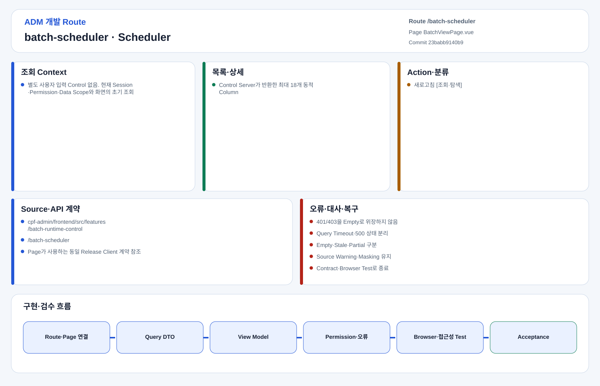


### 구현 결과

`/batch-scheduler`가 단순 Route가 아니라 **Scheduler Leader·Lease·Trigger·Misfire 상태를 확인한다.** Query·Permission·Owner 상태·관측 정보·Browser Test가 연결된 조회 기능 Slice가 되도록 구현한다.

### Source 진입점과 소유권

| 계층 | 기준 |
|---|---|
| Router | `/batch-scheduler` |
| Page | `cpf-admin/frontend/src/features/batch-runtime-control/BatchViewPage.vue` |
| Generated Client | Page가 import하는 Generated Client 또는 공통 ADM Client의 실제 Operation을 사용한다. 수기 Endpoint 문자열과 중복 DTO를 만들지 않는다 |
| ADM Backend | OpenAPI Operation의 Controller와 Application Service |
| Owner Port | Query·Status Port; Local/Remote가 같은 DTO·오류 의미 사용 |
| Test | Frontend Unit·Generated Client Contract·Controller·Browser·Fault |

### Frontend Query·Form 모델

별도 사용자 입력 Control이 없다. 현재 Session·Permission·Data Scope와 Page가 정의한 초기 Query로 데이터를 읽는다. 새로고침은 같은 Context를 다시 조회하며 Owner 데이터는 변경하지 않는다.

### Table·Detail View Model

| 값 | 표시 계약 | Drill-down·대사 |
|---|---|---|
| `Control Server가 반환한 최대 18개 동적 Column` | Scheduler 상세에서 대상의 현재 속성 또는 처리 결과를 확인하는 값이다. Masking·Timezone·단위를 DTO Metadata와 함께 표시한다. | 상세·재조회 결과와 비교하고 Stale·Masking·단위 차이를 확인한다. |

### Button·Interaction 모델

| Action | 분류 | Frontend 활성 조건 | Backend·성공 처리 |
|---|---|---|---|
| **새로고침** | 조회·탐색 | 조회 Permission과 Query Validation을 충족하고 동일 조회가 진행 중이 아님 | 새로고침 결과의 조회 시각·Filter·Source Version·Warning이 갱신되며 Owner 데이터는 변경하지 않는다. |

### 상태 모델

```text
Query: Idle → Loading → Empty | Success | Error
Success + Stale | Partial
```

조회 상태를 Loading·Empty·Success·Error·Stale·Partial로 구분한다. `401`, `403`, Timeout, Empty, Stale, Partial을 하나의 Error Toast로 합치지 않는다.

### API·Owner 계약

- Query Request는 실제 Page가 사용하는 Environment·Data Scope·검색 Field·Paging·Sort·Timezone만 포함한다.
- Query Response는 실제 Item·Page·조회 시각·Source Version·Stale·Partial·Warning 계약을 유지한다.
- 조회 전용 Route에는 임의의 Command DTO·Operation Polling·Rollback Endpoint를 추가하지 않는다.
- Same-JVM과 Remote Adapter는 DTO·Error Code·Timeout·Unknown 의미를 유지한다.

### Permission·Data Scope·Masking

- Route Permission 기준은 **조회 권한**이다.
- Menu 노출, Query, Button, Raw, Export Permission을 분리하고 Backend와 Owner에서 다시 검증한다.
- Deny는 403과 Audit를 남기며 404·Empty로 위장하지 않는다.
- Secret·Credential·PII Raw를 일반 Response DTO·Browser Storage·Log에 넣지 않는다.

### 구현 순서

1. Route·Page Import·Menu Metadata·Permission을 연결한다.
2. 이 장의 Field·Column·Action을 OpenAPI Request·Response·Error와 대조한다.
3. Generated Client를 재생성하고 수기 HTTP 호출을 제거한다.
4. Query 상태와 Empty·Stale·Partial·Error UI를 구현한다.
5. Backend Query Controller·Application Service·Owner Query Port·Local/Remote Adapter를 연결한다.
6. Menu·Query·Raw·Export Permission과 Data Scope를 Server에서 검증한다.
7. 조회 시각·Source Version·Warning·Correlation ID와 Drill-down Link를 연결한다.
8. Unit·Contract·Browser·Fault·Accessibility Test를 실행한다.

### Test Matrix

| Test | 필수 Scenario |
|---|---|
| Frontend Unit | Default·Validation·Button 조건·Masking·Empty/Error/Stale/Partial |
| OpenAPI·Generated Client | Operation 이름·Type·Error·Hash Drift |
| Backend Query | Permission·Data Scope·Filter·Paging·Stale·Partial |
| Local/Remote Contract | 같은 DTO·Error·Timeout 의미 |
| Browser | Deep Link·Query·상세·403·Timeout·Empty·Partial |
| Accessibility | Keyboard·Focus·Label·Error Announcement·Table/Dialog |

### 개발 Fault Workbook

1. `/batch-scheduler` Query를 500·Timeout·Empty·Partial 응답으로 주입해 Loading·Empty·Error·Stale·Partial UI를 각각 확인한다.
2. 401·403과 Data Scope 축소를 주입해 Deny를 Empty로 위장하지 않고 Error와 접근 가능한 범위를 구분하는지 확인한다.
3. 조회 전용 Route에 Command Polling·Reason·Approval·Rollback UI가 노출되지 않는지 확인한다.
4. Local Adapter와 Remote Adapter에 같은 Contract Fixture를 적용해 Error Code·Retryability·failureStage가 일치하는지 확인한다.
5. Browser Storage·Console·Network Error·Screenshot에 Token·Secret·PII Raw가 남지 않는지 확인한다.

### Route Acceptance Checklist

- [ ] Route `/batch-scheduler`의 Deep Link와 Menu ID `batch-scheduler`가 같은 Page를 연다.
- [ ] 이 장의 Field·Column·Action과 Page·OpenAPI·Generated Client가 같은 계약을 사용한다.
- [ ] Menu·Query·Raw·Export Permission Deny가 Backend 403과 화면 Error로 확인된다.
- [ ] Empty·Timeout·Stale·Partial이 서로 다른 사용자 상태와 재조회 경로를 제공한다.
- [ ] Same-JVM·Remote 호출이 같은 Query DTO·오류·Timeout 계약을 사용한다.
- [ ] 조회 전용 Route에 Source에 없는 Command·Approval·Rollback Action을 노출하지 않는다.
- [ ] 정상·오류·경계 Browser Test와 Accessibility Test가 Route Matrix에 포함된다.

### 독립 수행 검수 Checklist

- [ ] `/batch-scheduler`와 Page Source를 찾고 화면 목적을 설명할 수 있다.
- [ ] 별도 사용자 입력이 없고 자동 Query Context·새로고침 동작을 설명할 수 있다.
- [ ] 1개 표시값을 Owner 상태·Version·Audit와 대사할 수 있다.
- [ ] 1개 Action의 분류·활성 조건·Side Effect를 설명할 수 있다.
- [ ] Empty·401·403·Timeout·Stale·Partial을 서로 다른 조회 상태로 처리할 수 있다.
- [ ] 조회 응답 유실 시 같은 Query Context로 재조회하고 Correlation ID·조회 시각·Source Version으로 결과를 대사할 수 있다.
- [ ] 교대 기록만으로 다음 담당자가 Target·상태·복구 기한을 이어받을 수 있다.
- [ ] OpenAPI·Generated Client·Page·Controller·Owner Port·Test가 같은 Field와 오류 계약을 사용하는지 검증할 수 있다.
- [ ] Local·Remote Adapter의 Timeout·Unknown 의미가 같은지 Contract Test로 확인할 수 있다.

## 33. batch-worker-pools — Worker Pools 기능 Slice 개발 장

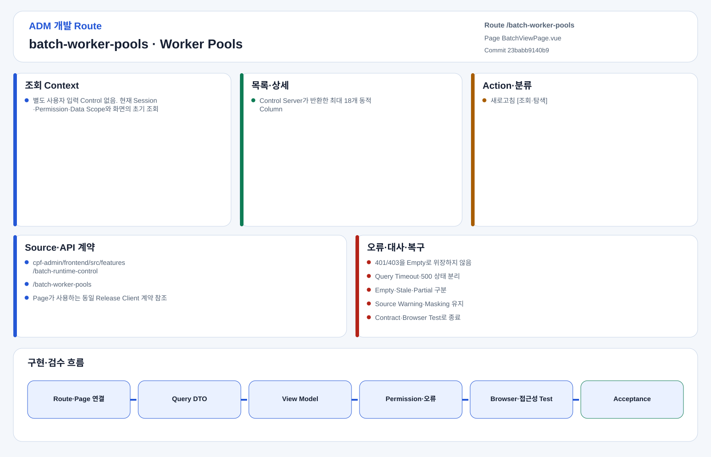


### 구현 결과

`/batch-worker-pools`가 단순 Route가 아니라 **Worker Pool 용량·가용 Worker·Drain 상태를 확인한다.** Query·Permission·Owner 상태·관측 정보·Browser Test가 연결된 조회 기능 Slice가 되도록 구현한다.

### Source 진입점과 소유권

| 계층 | 기준 |
|---|---|
| Router | `/batch-worker-pools` |
| Page | `cpf-admin/frontend/src/features/batch-runtime-control/BatchViewPage.vue` |
| Generated Client | Page가 import하는 Generated Client 또는 공통 ADM Client의 실제 Operation을 사용한다. 수기 Endpoint 문자열과 중복 DTO를 만들지 않는다 |
| ADM Backend | OpenAPI Operation의 Controller와 Application Service |
| Owner Port | Query·Status Port; Local/Remote가 같은 DTO·오류 의미 사용 |
| Test | Frontend Unit·Generated Client Contract·Controller·Browser·Fault |

### Frontend Query·Form 모델

별도 사용자 입력 Control이 없다. 현재 Session·Permission·Data Scope와 Page가 정의한 초기 Query로 데이터를 읽는다. 새로고침은 같은 Context를 다시 조회하며 Owner 데이터는 변경하지 않는다.

### Table·Detail View Model

| 값 | 표시 계약 | Drill-down·대사 |
|---|---|---|
| `Control Server가 반환한 최대 18개 동적 Column` | Worker Pools 상세에서 대상의 현재 속성 또는 처리 결과를 확인하는 값이다. Masking·Timezone·단위를 DTO Metadata와 함께 표시한다. | 상세·재조회 결과와 비교하고 Stale·Masking·단위 차이를 확인한다. |

### Button·Interaction 모델

| Action | 분류 | Frontend 활성 조건 | Backend·성공 처리 |
|---|---|---|---|
| **새로고침** | 조회·탐색 | 조회 Permission과 Query Validation을 충족하고 동일 조회가 진행 중이 아님 | 새로고침 결과의 조회 시각·Filter·Source Version·Warning이 갱신되며 Owner 데이터는 변경하지 않는다. |

### 상태 모델

```text
Query: Idle → Loading → Empty | Success | Error
Success + Stale | Partial
```

조회 상태를 Loading·Empty·Success·Error·Stale·Partial로 구분한다. `401`, `403`, Timeout, Empty, Stale, Partial을 하나의 Error Toast로 합치지 않는다.

### API·Owner 계약

- Query Request는 실제 Page가 사용하는 Environment·Data Scope·검색 Field·Paging·Sort·Timezone만 포함한다.
- Query Response는 실제 Item·Page·조회 시각·Source Version·Stale·Partial·Warning 계약을 유지한다.
- 조회 전용 Route에는 임의의 Command DTO·Operation Polling·Rollback Endpoint를 추가하지 않는다.
- Same-JVM과 Remote Adapter는 DTO·Error Code·Timeout·Unknown 의미를 유지한다.

### Permission·Data Scope·Masking

- Route Permission 기준은 **조회 권한**이다.
- Menu 노출, Query, Button, Raw, Export Permission을 분리하고 Backend와 Owner에서 다시 검증한다.
- Deny는 403과 Audit를 남기며 404·Empty로 위장하지 않는다.
- Secret·Credential·PII Raw를 일반 Response DTO·Browser Storage·Log에 넣지 않는다.

### 구현 순서

1. Route·Page Import·Menu Metadata·Permission을 연결한다.
2. 이 장의 Field·Column·Action을 OpenAPI Request·Response·Error와 대조한다.
3. Generated Client를 재생성하고 수기 HTTP 호출을 제거한다.
4. Query 상태와 Empty·Stale·Partial·Error UI를 구현한다.
5. Backend Query Controller·Application Service·Owner Query Port·Local/Remote Adapter를 연결한다.
6. Menu·Query·Raw·Export Permission과 Data Scope를 Server에서 검증한다.
7. 조회 시각·Source Version·Warning·Correlation ID와 Drill-down Link를 연결한다.
8. Unit·Contract·Browser·Fault·Accessibility Test를 실행한다.

### Test Matrix

| Test | 필수 Scenario |
|---|---|
| Frontend Unit | Default·Validation·Button 조건·Masking·Empty/Error/Stale/Partial |
| OpenAPI·Generated Client | Operation 이름·Type·Error·Hash Drift |
| Backend Query | Permission·Data Scope·Filter·Paging·Stale·Partial |
| Local/Remote Contract | 같은 DTO·Error·Timeout 의미 |
| Browser | Deep Link·Query·상세·403·Timeout·Empty·Partial |
| Accessibility | Keyboard·Focus·Label·Error Announcement·Table/Dialog |

### 개발 Fault Workbook

1. `/batch-worker-pools` Query를 500·Timeout·Empty·Partial 응답으로 주입해 Loading·Empty·Error·Stale·Partial UI를 각각 확인한다.
2. 401·403과 Data Scope 축소를 주입해 Deny를 Empty로 위장하지 않고 Error와 접근 가능한 범위를 구분하는지 확인한다.
3. 조회 전용 Route에 Command Polling·Reason·Approval·Rollback UI가 노출되지 않는지 확인한다.
4. Local Adapter와 Remote Adapter에 같은 Contract Fixture를 적용해 Error Code·Retryability·failureStage가 일치하는지 확인한다.
5. Browser Storage·Console·Network Error·Screenshot에 Token·Secret·PII Raw가 남지 않는지 확인한다.

### Route Acceptance Checklist

- [ ] Route `/batch-worker-pools`의 Deep Link와 Menu ID `batch-worker-pools`가 같은 Page를 연다.
- [ ] 이 장의 Field·Column·Action과 Page·OpenAPI·Generated Client가 같은 계약을 사용한다.
- [ ] Menu·Query·Raw·Export Permission Deny가 Backend 403과 화면 Error로 확인된다.
- [ ] Empty·Timeout·Stale·Partial이 서로 다른 사용자 상태와 재조회 경로를 제공한다.
- [ ] Same-JVM·Remote 호출이 같은 Query DTO·오류·Timeout 계약을 사용한다.
- [ ] 조회 전용 Route에 Source에 없는 Command·Approval·Rollback Action을 노출하지 않는다.
- [ ] 정상·오류·경계 Browser Test와 Accessibility Test가 Route Matrix에 포함된다.

### 독립 수행 검수 Checklist

- [ ] `/batch-worker-pools`와 Page Source를 찾고 화면 목적을 설명할 수 있다.
- [ ] 별도 사용자 입력이 없고 자동 Query Context·새로고침 동작을 설명할 수 있다.
- [ ] 1개 표시값을 Owner 상태·Version·Audit와 대사할 수 있다.
- [ ] 1개 Action의 분류·활성 조건·Side Effect를 설명할 수 있다.
- [ ] Empty·401·403·Timeout·Stale·Partial을 서로 다른 조회 상태로 처리할 수 있다.
- [ ] 조회 응답 유실 시 같은 Query Context로 재조회하고 Correlation ID·조회 시각·Source Version으로 결과를 대사할 수 있다.
- [ ] 교대 기록만으로 다음 담당자가 Target·상태·복구 기한을 이어받을 수 있다.
- [ ] OpenAPI·Generated Client·Page·Controller·Owner Port·Test가 같은 Field와 오류 계약을 사용하는지 검증할 수 있다.
- [ ] Local·Remote Adapter의 Timeout·Unknown 의미가 같은지 Contract Test로 확인할 수 있다.

## 34. batch-center-cut — Center-Cut 기능 Slice 개발 장

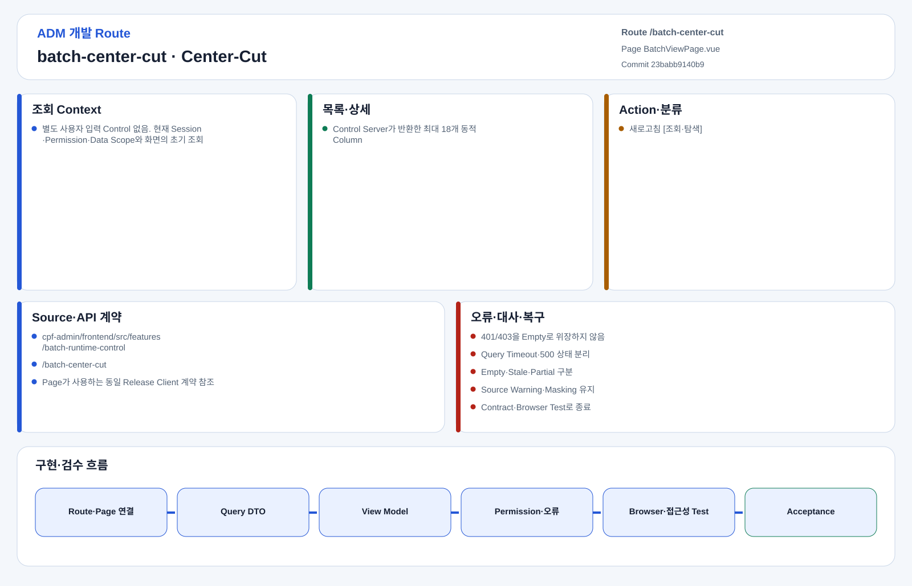


### 구현 결과

`/batch-center-cut`가 단순 Route가 아니라 **Center-Cut Job·Target·Partition·결과를 확인한다.** Query·Permission·Owner 상태·관측 정보·Browser Test가 연결된 조회 기능 Slice가 되도록 구현한다.

### Source 진입점과 소유권

| 계층 | 기준 |
|---|---|
| Router | `/batch-center-cut` |
| Page | `cpf-admin/frontend/src/features/batch-runtime-control/BatchViewPage.vue` |
| Generated Client | Page가 import하는 Generated Client 또는 공통 ADM Client의 실제 Operation을 사용한다. 수기 Endpoint 문자열과 중복 DTO를 만들지 않는다 |
| ADM Backend | OpenAPI Operation의 Controller와 Application Service |
| Owner Port | Query·Status Port; Local/Remote가 같은 DTO·오류 의미 사용 |
| Test | Frontend Unit·Generated Client Contract·Controller·Browser·Fault |

### Frontend Query·Form 모델

별도 사용자 입력 Control이 없다. 현재 Session·Permission·Data Scope와 Page가 정의한 초기 Query로 데이터를 읽는다. 새로고침은 같은 Context를 다시 조회하며 Owner 데이터는 변경하지 않는다.

### Table·Detail View Model

| 값 | 표시 계약 | Drill-down·대사 |
|---|---|---|
| `Control Server가 반환한 최대 18개 동적 Column` | Center-Cut 상세에서 대상의 현재 속성 또는 처리 결과를 확인하는 값이다. Masking·Timezone·단위를 DTO Metadata와 함께 표시한다. | 상세·재조회 결과와 비교하고 Stale·Masking·단위 차이를 확인한다. |

### Button·Interaction 모델

| Action | 분류 | Frontend 활성 조건 | Backend·성공 처리 |
|---|---|---|---|
| **새로고침** | 조회·탐색 | 조회 Permission과 Query Validation을 충족하고 동일 조회가 진행 중이 아님 | 새로고침 결과의 조회 시각·Filter·Source Version·Warning이 갱신되며 Owner 데이터는 변경하지 않는다. |

### 상태 모델

```text
Query: Idle → Loading → Empty | Success | Error
Success + Stale | Partial
```

조회 상태를 Loading·Empty·Success·Error·Stale·Partial로 구분한다. `401`, `403`, Timeout, Empty, Stale, Partial을 하나의 Error Toast로 합치지 않는다.

### API·Owner 계약

- Query Request는 실제 Page가 사용하는 Environment·Data Scope·검색 Field·Paging·Sort·Timezone만 포함한다.
- Query Response는 실제 Item·Page·조회 시각·Source Version·Stale·Partial·Warning 계약을 유지한다.
- 조회 전용 Route에는 임의의 Command DTO·Operation Polling·Rollback Endpoint를 추가하지 않는다.
- Same-JVM과 Remote Adapter는 DTO·Error Code·Timeout·Unknown 의미를 유지한다.

### Permission·Data Scope·Masking

- Route Permission 기준은 **조회 권한**이다.
- Menu 노출, Query, Button, Raw, Export Permission을 분리하고 Backend와 Owner에서 다시 검증한다.
- Deny는 403과 Audit를 남기며 404·Empty로 위장하지 않는다.
- Secret·Credential·PII Raw를 일반 Response DTO·Browser Storage·Log에 넣지 않는다.

### 구현 순서

1. Route·Page Import·Menu Metadata·Permission을 연결한다.
2. 이 장의 Field·Column·Action을 OpenAPI Request·Response·Error와 대조한다.
3. Generated Client를 재생성하고 수기 HTTP 호출을 제거한다.
4. Query 상태와 Empty·Stale·Partial·Error UI를 구현한다.
5. Backend Query Controller·Application Service·Owner Query Port·Local/Remote Adapter를 연결한다.
6. Menu·Query·Raw·Export Permission과 Data Scope를 Server에서 검증한다.
7. 조회 시각·Source Version·Warning·Correlation ID와 Drill-down Link를 연결한다.
8. Unit·Contract·Browser·Fault·Accessibility Test를 실행한다.

### Test Matrix

| Test | 필수 Scenario |
|---|---|
| Frontend Unit | Default·Validation·Button 조건·Masking·Empty/Error/Stale/Partial |
| OpenAPI·Generated Client | Operation 이름·Type·Error·Hash Drift |
| Backend Query | Permission·Data Scope·Filter·Paging·Stale·Partial |
| Local/Remote Contract | 같은 DTO·Error·Timeout 의미 |
| Browser | Deep Link·Query·상세·403·Timeout·Empty·Partial |
| Accessibility | Keyboard·Focus·Label·Error Announcement·Table/Dialog |

### 개발 Fault Workbook

1. `/batch-center-cut` Query를 500·Timeout·Empty·Partial 응답으로 주입해 Loading·Empty·Error·Stale·Partial UI를 각각 확인한다.
2. 401·403과 Data Scope 축소를 주입해 Deny를 Empty로 위장하지 않고 Error와 접근 가능한 범위를 구분하는지 확인한다.
3. 조회 전용 Route에 Command Polling·Reason·Approval·Rollback UI가 노출되지 않는지 확인한다.
4. Local Adapter와 Remote Adapter에 같은 Contract Fixture를 적용해 Error Code·Retryability·failureStage가 일치하는지 확인한다.
5. Browser Storage·Console·Network Error·Screenshot에 Token·Secret·PII Raw가 남지 않는지 확인한다.

### Route Acceptance Checklist

- [ ] Route `/batch-center-cut`의 Deep Link와 Menu ID `batch-center-cut`가 같은 Page를 연다.
- [ ] 이 장의 Field·Column·Action과 Page·OpenAPI·Generated Client가 같은 계약을 사용한다.
- [ ] Menu·Query·Raw·Export Permission Deny가 Backend 403과 화면 Error로 확인된다.
- [ ] Empty·Timeout·Stale·Partial이 서로 다른 사용자 상태와 재조회 경로를 제공한다.
- [ ] Same-JVM·Remote 호출이 같은 Query DTO·오류·Timeout 계약을 사용한다.
- [ ] 조회 전용 Route에 Source에 없는 Command·Approval·Rollback Action을 노출하지 않는다.
- [ ] 정상·오류·경계 Browser Test와 Accessibility Test가 Route Matrix에 포함된다.

### 독립 수행 검수 Checklist

- [ ] `/batch-center-cut`와 Page Source를 찾고 화면 목적을 설명할 수 있다.
- [ ] 별도 사용자 입력이 없고 자동 Query Context·새로고침 동작을 설명할 수 있다.
- [ ] 1개 표시값을 Owner 상태·Version·Audit와 대사할 수 있다.
- [ ] 1개 Action의 분류·활성 조건·Side Effect를 설명할 수 있다.
- [ ] Empty·401·403·Timeout·Stale·Partial을 서로 다른 조회 상태로 처리할 수 있다.
- [ ] 조회 응답 유실 시 같은 Query Context로 재조회하고 Correlation ID·조회 시각·Source Version으로 결과를 대사할 수 있다.
- [ ] 교대 기록만으로 다음 담당자가 Target·상태·복구 기한을 이어받을 수 있다.
- [ ] OpenAPI·Generated Client·Page·Controller·Owner Port·Test가 같은 Field와 오류 계약을 사용하는지 검증할 수 있다.
- [ ] Local·Remote Adapter의 Timeout·Unknown 의미가 같은지 Contract Test로 확인할 수 있다.

## 35. batch-agents — Agents 기능 Slice 개발 장


### 구현 결과

`/batch-agents`가 단순 Route가 아니라 **Host Agent의 Heartbeat·Version·Capability를 확인한다.** Query·Permission·Owner 상태·관측 정보·Browser Test가 연결된 조회 기능 Slice가 되도록 구현한다.

### Source 진입점과 소유권

| 계층 | 기준 |
|---|---|
| Router | `/batch-agents` |
| Page | `cpf-admin/frontend/src/features/batch-runtime-control/BatchViewPage.vue` |
| Generated Client | Page가 import하는 Generated Client 또는 공통 ADM Client의 실제 Operation을 사용한다. 수기 Endpoint 문자열과 중복 DTO를 만들지 않는다 |
| ADM Backend | OpenAPI Operation의 Controller와 Application Service |
| Owner Port | Query·Status Port; Local/Remote가 같은 DTO·오류 의미 사용 |
| Test | Frontend Unit·Generated Client Contract·Controller·Browser·Fault |

### Frontend Query·Form 모델

별도 사용자 입력 Control이 없다. 현재 Session·Permission·Data Scope와 Page가 정의한 초기 Query로 데이터를 읽는다. 새로고침은 같은 Context를 다시 조회하며 Owner 데이터는 변경하지 않는다.

### Table·Detail View Model

| 값 | 표시 계약 | Drill-down·대사 |
|---|---|---|
| `Control Server가 반환한 최대 18개 동적 Column` | Agents 상세에서 대상의 현재 속성 또는 처리 결과를 확인하는 값이다. Masking·Timezone·단위를 DTO Metadata와 함께 표시한다. | 상세·재조회 결과와 비교하고 Stale·Masking·단위 차이를 확인한다. |

### Button·Interaction 모델

| Action | 분류 | Frontend 활성 조건 | Backend·성공 처리 |
|---|---|---|---|
| **새로고침** | 조회·탐색 | 조회 Permission과 Query Validation을 충족하고 동일 조회가 진행 중이 아님 | 새로고침 결과의 조회 시각·Filter·Source Version·Warning이 갱신되며 Owner 데이터는 변경하지 않는다. |

### 상태 모델

```text
Query: Idle → Loading → Empty | Success | Error
Success + Stale | Partial
```

조회 상태를 Loading·Empty·Success·Error·Stale·Partial로 구분한다. `401`, `403`, Timeout, Empty, Stale, Partial을 하나의 Error Toast로 합치지 않는다.

### API·Owner 계약

- Query Request는 실제 Page가 사용하는 Environment·Data Scope·검색 Field·Paging·Sort·Timezone만 포함한다.
- Query Response는 실제 Item·Page·조회 시각·Source Version·Stale·Partial·Warning 계약을 유지한다.
- 조회 전용 Route에는 임의의 Command DTO·Operation Polling·Rollback Endpoint를 추가하지 않는다.
- Same-JVM과 Remote Adapter는 DTO·Error Code·Timeout·Unknown 의미를 유지한다.

### Permission·Data Scope·Masking

- Route Permission 기준은 **조회 권한**이다.
- Menu 노출, Query, Button, Raw, Export Permission을 분리하고 Backend와 Owner에서 다시 검증한다.
- Deny는 403과 Audit를 남기며 404·Empty로 위장하지 않는다.
- Secret·Credential·PII Raw를 일반 Response DTO·Browser Storage·Log에 넣지 않는다.

### 구현 순서

1. Route·Page Import·Menu Metadata·Permission을 연결한다.
2. 이 장의 Field·Column·Action을 OpenAPI Request·Response·Error와 대조한다.
3. Generated Client를 재생성하고 수기 HTTP 호출을 제거한다.
4. Query 상태와 Empty·Stale·Partial·Error UI를 구현한다.
5. Backend Query Controller·Application Service·Owner Query Port·Local/Remote Adapter를 연결한다.
6. Menu·Query·Raw·Export Permission과 Data Scope를 Server에서 검증한다.
7. 조회 시각·Source Version·Warning·Correlation ID와 Drill-down Link를 연결한다.
8. Unit·Contract·Browser·Fault·Accessibility Test를 실행한다.

### Test Matrix

| Test | 필수 Scenario |
|---|---|
| Frontend Unit | Default·Validation·Button 조건·Masking·Empty/Error/Stale/Partial |
| OpenAPI·Generated Client | Operation 이름·Type·Error·Hash Drift |
| Backend Query | Permission·Data Scope·Filter·Paging·Stale·Partial |
| Local/Remote Contract | 같은 DTO·Error·Timeout 의미 |
| Browser | Deep Link·Query·상세·403·Timeout·Empty·Partial |
| Accessibility | Keyboard·Focus·Label·Error Announcement·Table/Dialog |

### 개발 Fault Workbook

1. `/batch-agents` Query를 500·Timeout·Empty·Partial 응답으로 주입해 Loading·Empty·Error·Stale·Partial UI를 각각 확인한다.
2. 401·403과 Data Scope 축소를 주입해 Deny를 Empty로 위장하지 않고 Error와 접근 가능한 범위를 구분하는지 확인한다.
3. 조회 전용 Route에 Command Polling·Reason·Approval·Rollback UI가 노출되지 않는지 확인한다.
4. Local Adapter와 Remote Adapter에 같은 Contract Fixture를 적용해 Error Code·Retryability·failureStage가 일치하는지 확인한다.
5. Browser Storage·Console·Network Error·Screenshot에 Token·Secret·PII Raw가 남지 않는지 확인한다.

### Route Acceptance Checklist

- [ ] Route `/batch-agents`의 Deep Link와 Menu ID `batch-agents`가 같은 Page를 연다.
- [ ] 이 장의 Field·Column·Action과 Page·OpenAPI·Generated Client가 같은 계약을 사용한다.
- [ ] Menu·Query·Raw·Export Permission Deny가 Backend 403과 화면 Error로 확인된다.
- [ ] Empty·Timeout·Stale·Partial이 서로 다른 사용자 상태와 재조회 경로를 제공한다.
- [ ] Same-JVM·Remote 호출이 같은 Query DTO·오류·Timeout 계약을 사용한다.
- [ ] 조회 전용 Route에 Source에 없는 Command·Approval·Rollback Action을 노출하지 않는다.
- [ ] 정상·오류·경계 Browser Test와 Accessibility Test가 Route Matrix에 포함된다.

### 독립 수행 검수 Checklist

- [ ] `/batch-agents`와 Page Source를 찾고 화면 목적을 설명할 수 있다.
- [ ] 별도 사용자 입력이 없고 자동 Query Context·새로고침 동작을 설명할 수 있다.
- [ ] 1개 표시값을 Owner 상태·Version·Audit와 대사할 수 있다.
- [ ] 1개 Action의 분류·활성 조건·Side Effect를 설명할 수 있다.
- [ ] Empty·401·403·Timeout·Stale·Partial을 서로 다른 조회 상태로 처리할 수 있다.
- [ ] 조회 응답 유실 시 같은 Query Context로 재조회하고 Correlation ID·조회 시각·Source Version으로 결과를 대사할 수 있다.
- [ ] 교대 기록만으로 다음 담당자가 Target·상태·복구 기한을 이어받을 수 있다.
- [ ] OpenAPI·Generated Client·Page·Controller·Owner Port·Test가 같은 Field와 오류 계약을 사용하는지 검증할 수 있다.
- [ ] Local·Remote Adapter의 Timeout·Unknown 의미가 같은지 Contract Test로 확인할 수 있다.

## 36. batch-job-packs — Job Packs 기능 Slice 개발 장


### 구현 결과

`/batch-job-packs`가 단순 Route가 아니라 **Job Pack Version·Checksum·승인·배포 상태를 확인한다.** Query·Permission·Owner 상태·관측 정보·Browser Test가 연결된 조회 기능 Slice가 되도록 구현한다.

### Source 진입점과 소유권

| 계층 | 기준 |
|---|---|
| Router | `/batch-job-packs` |
| Page | `cpf-admin/frontend/src/features/batch-runtime-control/BatchViewPage.vue` |
| Generated Client | Page가 import하는 Generated Client 또는 공통 ADM Client의 실제 Operation을 사용한다. 수기 Endpoint 문자열과 중복 DTO를 만들지 않는다 |
| ADM Backend | OpenAPI Operation의 Controller와 Application Service |
| Owner Port | Query·Status Port; Local/Remote가 같은 DTO·오류 의미 사용 |
| Test | Frontend Unit·Generated Client Contract·Controller·Browser·Fault |

### Frontend Query·Form 모델

별도 사용자 입력 Control이 없다. 현재 Session·Permission·Data Scope와 Page가 정의한 초기 Query로 데이터를 읽는다. 새로고침은 같은 Context를 다시 조회하며 Owner 데이터는 변경하지 않는다.

### Table·Detail View Model

| 값 | 표시 계약 | Drill-down·대사 |
|---|---|---|
| `Control Server가 반환한 최대 18개 동적 Column` | Job Packs 상세에서 대상의 현재 속성 또는 처리 결과를 확인하는 값이다. Masking·Timezone·단위를 DTO Metadata와 함께 표시한다. | 상세·재조회 결과와 비교하고 Stale·Masking·단위 차이를 확인한다. |

### Button·Interaction 모델

| Action | 분류 | Frontend 활성 조건 | Backend·성공 처리 |
|---|---|---|---|
| **새로고침** | 조회·탐색 | 조회 Permission과 Query Validation을 충족하고 동일 조회가 진행 중이 아님 | 새로고침 결과의 조회 시각·Filter·Source Version·Warning이 갱신되며 Owner 데이터는 변경하지 않는다. |

### 상태 모델

```text
Query: Idle → Loading → Empty | Success | Error
Success + Stale | Partial
```

조회 상태를 Loading·Empty·Success·Error·Stale·Partial로 구분한다. `401`, `403`, Timeout, Empty, Stale, Partial을 하나의 Error Toast로 합치지 않는다.

### API·Owner 계약

- Query Request는 실제 Page가 사용하는 Environment·Data Scope·검색 Field·Paging·Sort·Timezone만 포함한다.
- Query Response는 실제 Item·Page·조회 시각·Source Version·Stale·Partial·Warning 계약을 유지한다.
- 조회 전용 Route에는 임의의 Command DTO·Operation Polling·Rollback Endpoint를 추가하지 않는다.
- Same-JVM과 Remote Adapter는 DTO·Error Code·Timeout·Unknown 의미를 유지한다.

### Permission·Data Scope·Masking

- Route Permission 기준은 **조회 권한**이다.
- Menu 노출, Query, Button, Raw, Export Permission을 분리하고 Backend와 Owner에서 다시 검증한다.
- Deny는 403과 Audit를 남기며 404·Empty로 위장하지 않는다.
- Secret·Credential·PII Raw를 일반 Response DTO·Browser Storage·Log에 넣지 않는다.

### 구현 순서

1. Route·Page Import·Menu Metadata·Permission을 연결한다.
2. 이 장의 Field·Column·Action을 OpenAPI Request·Response·Error와 대조한다.
3. Generated Client를 재생성하고 수기 HTTP 호출을 제거한다.
4. Query 상태와 Empty·Stale·Partial·Error UI를 구현한다.
5. Backend Query Controller·Application Service·Owner Query Port·Local/Remote Adapter를 연결한다.
6. Menu·Query·Raw·Export Permission과 Data Scope를 Server에서 검증한다.
7. 조회 시각·Source Version·Warning·Correlation ID와 Drill-down Link를 연결한다.
8. Unit·Contract·Browser·Fault·Accessibility Test를 실행한다.

### Test Matrix

| Test | 필수 Scenario |
|---|---|
| Frontend Unit | Default·Validation·Button 조건·Masking·Empty/Error/Stale/Partial |
| OpenAPI·Generated Client | Operation 이름·Type·Error·Hash Drift |
| Backend Query | Permission·Data Scope·Filter·Paging·Stale·Partial |
| Local/Remote Contract | 같은 DTO·Error·Timeout 의미 |
| Browser | Deep Link·Query·상세·403·Timeout·Empty·Partial |
| Accessibility | Keyboard·Focus·Label·Error Announcement·Table/Dialog |

### 개발 Fault Workbook

1. `/batch-job-packs` Query를 500·Timeout·Empty·Partial 응답으로 주입해 Loading·Empty·Error·Stale·Partial UI를 각각 확인한다.
2. 401·403과 Data Scope 축소를 주입해 Deny를 Empty로 위장하지 않고 Error와 접근 가능한 범위를 구분하는지 확인한다.
3. 조회 전용 Route에 Command Polling·Reason·Approval·Rollback UI가 노출되지 않는지 확인한다.
4. Local Adapter와 Remote Adapter에 같은 Contract Fixture를 적용해 Error Code·Retryability·failureStage가 일치하는지 확인한다.
5. Browser Storage·Console·Network Error·Screenshot에 Token·Secret·PII Raw가 남지 않는지 확인한다.

### Route Acceptance Checklist

- [ ] Route `/batch-job-packs`의 Deep Link와 Menu ID `batch-job-packs`가 같은 Page를 연다.
- [ ] 이 장의 Field·Column·Action과 Page·OpenAPI·Generated Client가 같은 계약을 사용한다.
- [ ] Menu·Query·Raw·Export Permission Deny가 Backend 403과 화면 Error로 확인된다.
- [ ] Empty·Timeout·Stale·Partial이 서로 다른 사용자 상태와 재조회 경로를 제공한다.
- [ ] Same-JVM·Remote 호출이 같은 Query DTO·오류·Timeout 계약을 사용한다.
- [ ] 조회 전용 Route에 Source에 없는 Command·Approval·Rollback Action을 노출하지 않는다.
- [ ] 정상·오류·경계 Browser Test와 Accessibility Test가 Route Matrix에 포함된다.

### 독립 수행 검수 Checklist

- [ ] `/batch-job-packs`와 Page Source를 찾고 화면 목적을 설명할 수 있다.
- [ ] 별도 사용자 입력이 없고 자동 Query Context·새로고침 동작을 설명할 수 있다.
- [ ] 1개 표시값을 Owner 상태·Version·Audit와 대사할 수 있다.
- [ ] 1개 Action의 분류·활성 조건·Side Effect를 설명할 수 있다.
- [ ] Empty·401·403·Timeout·Stale·Partial을 서로 다른 조회 상태로 처리할 수 있다.
- [ ] 조회 응답 유실 시 같은 Query Context로 재조회하고 Correlation ID·조회 시각·Source Version으로 결과를 대사할 수 있다.
- [ ] 교대 기록만으로 다음 담당자가 Target·상태·복구 기한을 이어받을 수 있다.
- [ ] OpenAPI·Generated Client·Page·Controller·Owner Port·Test가 같은 Field와 오류 계약을 사용하는지 검증할 수 있다.
- [ ] Local·Remote Adapter의 Timeout·Unknown 의미가 같은지 Contract Test로 확인할 수 있다.

## 37. batch-executions — Executions 기능 Slice 개발 장


### 구현 결과

`/batch-executions`가 단순 Route가 아니라 **Execution·Step·Parameter·Checkpoint·결과를 확인한다.** Query·Permission·Owner 상태·관측 정보·Browser Test가 연결된 조회 기능 Slice가 되도록 구현한다.

### Source 진입점과 소유권

| 계층 | 기준 |
|---|---|
| Router | `/batch-executions` |
| Page | `cpf-admin/frontend/src/features/batch-runtime-control/BatchViewPage.vue` |
| Generated Client | Page가 import하는 Generated Client 또는 공통 ADM Client의 실제 Operation을 사용한다. 수기 Endpoint 문자열과 중복 DTO를 만들지 않는다 |
| ADM Backend | OpenAPI Operation의 Controller와 Application Service |
| Owner Port | Query·Status Port; Local/Remote가 같은 DTO·오류 의미 사용 |
| Test | Frontend Unit·Generated Client Contract·Controller·Browser·Fault |

### Frontend Query·Form 모델

별도 사용자 입력 Control이 없다. 현재 Session·Permission·Data Scope와 Page가 정의한 초기 Query로 데이터를 읽는다. 새로고침은 같은 Context를 다시 조회하며 Owner 데이터는 변경하지 않는다.

### Table·Detail View Model

| 값 | 표시 계약 | Drill-down·대사 |
|---|---|---|
| `Control Server가 반환한 최대 18개 동적 Column` | Executions 상세에서 대상의 현재 속성 또는 처리 결과를 확인하는 값이다. Masking·Timezone·단위를 DTO Metadata와 함께 표시한다. | 상세·재조회 결과와 비교하고 Stale·Masking·단위 차이를 확인한다. |

### Button·Interaction 모델

| Action | 분류 | Frontend 활성 조건 | Backend·성공 처리 |
|---|---|---|---|
| **새로고침** | 조회·탐색 | 조회 Permission과 Query Validation을 충족하고 동일 조회가 진행 중이 아님 | 새로고침 결과의 조회 시각·Filter·Source Version·Warning이 갱신되며 Owner 데이터는 변경하지 않는다. |

### 상태 모델

```text
Query: Idle → Loading → Empty | Success | Error
Success + Stale | Partial
```

조회 상태를 Loading·Empty·Success·Error·Stale·Partial로 구분한다. `401`, `403`, Timeout, Empty, Stale, Partial을 하나의 Error Toast로 합치지 않는다.

### API·Owner 계약

- Query Request는 실제 Page가 사용하는 Environment·Data Scope·검색 Field·Paging·Sort·Timezone만 포함한다.
- Query Response는 실제 Item·Page·조회 시각·Source Version·Stale·Partial·Warning 계약을 유지한다.
- 조회 전용 Route에는 임의의 Command DTO·Operation Polling·Rollback Endpoint를 추가하지 않는다.
- Same-JVM과 Remote Adapter는 DTO·Error Code·Timeout·Unknown 의미를 유지한다.

### Permission·Data Scope·Masking

- Route Permission 기준은 **조회 권한**이다.
- Menu 노출, Query, Button, Raw, Export Permission을 분리하고 Backend와 Owner에서 다시 검증한다.
- Deny는 403과 Audit를 남기며 404·Empty로 위장하지 않는다.
- Secret·Credential·PII Raw를 일반 Response DTO·Browser Storage·Log에 넣지 않는다.

### 구현 순서

1. Route·Page Import·Menu Metadata·Permission을 연결한다.
2. 이 장의 Field·Column·Action을 OpenAPI Request·Response·Error와 대조한다.
3. Generated Client를 재생성하고 수기 HTTP 호출을 제거한다.
4. Query 상태와 Empty·Stale·Partial·Error UI를 구현한다.
5. Backend Query Controller·Application Service·Owner Query Port·Local/Remote Adapter를 연결한다.
6. Menu·Query·Raw·Export Permission과 Data Scope를 Server에서 검증한다.
7. 조회 시각·Source Version·Warning·Correlation ID와 Drill-down Link를 연결한다.
8. Unit·Contract·Browser·Fault·Accessibility Test를 실행한다.

### Test Matrix

| Test | 필수 Scenario |
|---|---|
| Frontend Unit | Default·Validation·Button 조건·Masking·Empty/Error/Stale/Partial |
| OpenAPI·Generated Client | Operation 이름·Type·Error·Hash Drift |
| Backend Query | Permission·Data Scope·Filter·Paging·Stale·Partial |
| Local/Remote Contract | 같은 DTO·Error·Timeout 의미 |
| Browser | Deep Link·Query·상세·403·Timeout·Empty·Partial |
| Accessibility | Keyboard·Focus·Label·Error Announcement·Table/Dialog |

### 개발 Fault Workbook

1. `/batch-executions` Query를 500·Timeout·Empty·Partial 응답으로 주입해 Loading·Empty·Error·Stale·Partial UI를 각각 확인한다.
2. 401·403과 Data Scope 축소를 주입해 Deny를 Empty로 위장하지 않고 Error와 접근 가능한 범위를 구분하는지 확인한다.
3. 조회 전용 Route에 Command Polling·Reason·Approval·Rollback UI가 노출되지 않는지 확인한다.
4. Local Adapter와 Remote Adapter에 같은 Contract Fixture를 적용해 Error Code·Retryability·failureStage가 일치하는지 확인한다.
5. Browser Storage·Console·Network Error·Screenshot에 Token·Secret·PII Raw가 남지 않는지 확인한다.

### Route Acceptance Checklist

- [ ] Route `/batch-executions`의 Deep Link와 Menu ID `batch-executions`가 같은 Page를 연다.
- [ ] 이 장의 Field·Column·Action과 Page·OpenAPI·Generated Client가 같은 계약을 사용한다.
- [ ] Menu·Query·Raw·Export Permission Deny가 Backend 403과 화면 Error로 확인된다.
- [ ] Empty·Timeout·Stale·Partial이 서로 다른 사용자 상태와 재조회 경로를 제공한다.
- [ ] Same-JVM·Remote 호출이 같은 Query DTO·오류·Timeout 계약을 사용한다.
- [ ] 조회 전용 Route에 Source에 없는 Command·Approval·Rollback Action을 노출하지 않는다.
- [ ] 정상·오류·경계 Browser Test와 Accessibility Test가 Route Matrix에 포함된다.

### 독립 수행 검수 Checklist

- [ ] `/batch-executions`와 Page Source를 찾고 화면 목적을 설명할 수 있다.
- [ ] 별도 사용자 입력이 없고 자동 Query Context·새로고침 동작을 설명할 수 있다.
- [ ] 1개 표시값을 Owner 상태·Version·Audit와 대사할 수 있다.
- [ ] 1개 Action의 분류·활성 조건·Side Effect를 설명할 수 있다.
- [ ] Empty·401·403·Timeout·Stale·Partial을 서로 다른 조회 상태로 처리할 수 있다.
- [ ] 조회 응답 유실 시 같은 Query Context로 재조회하고 Correlation ID·조회 시각·Source Version으로 결과를 대사할 수 있다.
- [ ] 교대 기록만으로 다음 담당자가 Target·상태·복구 기한을 이어받을 수 있다.
- [ ] OpenAPI·Generated Client·Page·Controller·Owner Port·Test가 같은 Field와 오류 계약을 사용하는지 검증할 수 있다.
- [ ] Local·Remote Adapter의 Timeout·Unknown 의미가 같은지 Contract Test로 확인할 수 있다.

## 38. batch-recovery — Recovery/Unknown 기능 Slice 개발 장

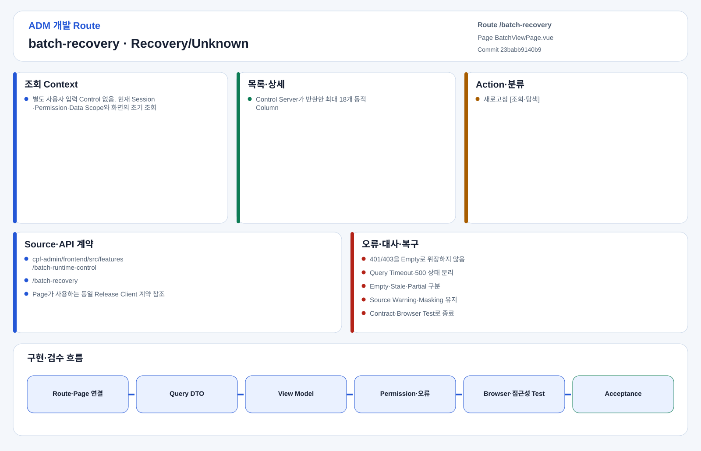


### 구현 결과

`/batch-recovery`가 단순 Route가 아니라 **실패·중지·Unknown 실행과 복구 후보를 확인한다.** Query·Permission·Owner 상태·관측 정보·Browser Test가 연결된 조회 기능 Slice가 되도록 구현한다.

### Source 진입점과 소유권

| 계층 | 기준 |
|---|---|
| Router | `/batch-recovery` |
| Page | `cpf-admin/frontend/src/features/batch-runtime-control/BatchViewPage.vue` |
| Generated Client | Page가 import하는 Generated Client 또는 공통 ADM Client의 실제 Operation을 사용한다. 수기 Endpoint 문자열과 중복 DTO를 만들지 않는다 |
| ADM Backend | OpenAPI Operation의 Controller와 Application Service |
| Owner Port | Query·Status Port; Local/Remote가 같은 DTO·오류 의미 사용 |
| Test | Frontend Unit·Generated Client Contract·Controller·Browser·Fault |

### Frontend Query·Form 모델

별도 사용자 입력 Control이 없다. 현재 Session·Permission·Data Scope와 Page가 정의한 초기 Query로 데이터를 읽는다. 새로고침은 같은 Context를 다시 조회하며 Owner 데이터는 변경하지 않는다.

### Table·Detail View Model

| 값 | 표시 계약 | Drill-down·대사 |
|---|---|---|
| `Control Server가 반환한 최대 18개 동적 Column` | Recovery/Unknown 상세에서 대상의 현재 속성 또는 처리 결과를 확인하는 값이다. Masking·Timezone·단위를 DTO Metadata와 함께 표시한다. | 상세·재조회 결과와 비교하고 Stale·Masking·단위 차이를 확인한다. |

### Button·Interaction 모델

| Action | 분류 | Frontend 활성 조건 | Backend·성공 처리 |
|---|---|---|---|
| **새로고침** | 조회·탐색 | 조회 Permission과 Query Validation을 충족하고 동일 조회가 진행 중이 아님 | 새로고침 결과의 조회 시각·Filter·Source Version·Warning이 갱신되며 Owner 데이터는 변경하지 않는다. |

### 상태 모델

```text
Query: Idle → Loading → Empty | Success | Error
Success + Stale | Partial
```

조회 상태를 Loading·Empty·Success·Error·Stale·Partial로 구분한다. `401`, `403`, Timeout, Empty, Stale, Partial을 하나의 Error Toast로 합치지 않는다.

### API·Owner 계약

- Query Request는 실제 Page가 사용하는 Environment·Data Scope·검색 Field·Paging·Sort·Timezone만 포함한다.
- Query Response는 실제 Item·Page·조회 시각·Source Version·Stale·Partial·Warning 계약을 유지한다.
- 조회 전용 Route에는 임의의 Command DTO·Operation Polling·Rollback Endpoint를 추가하지 않는다.
- Same-JVM과 Remote Adapter는 DTO·Error Code·Timeout·Unknown 의미를 유지한다.

### Permission·Data Scope·Masking

- Route Permission 기준은 **조회 권한**이다.
- Menu 노출, Query, Button, Raw, Export Permission을 분리하고 Backend와 Owner에서 다시 검증한다.
- Deny는 403과 Audit를 남기며 404·Empty로 위장하지 않는다.
- Secret·Credential·PII Raw를 일반 Response DTO·Browser Storage·Log에 넣지 않는다.

### 구현 순서

1. Route·Page Import·Menu Metadata·Permission을 연결한다.
2. 이 장의 Field·Column·Action을 OpenAPI Request·Response·Error와 대조한다.
3. Generated Client를 재생성하고 수기 HTTP 호출을 제거한다.
4. Query 상태와 Empty·Stale·Partial·Error UI를 구현한다.
5. Backend Query Controller·Application Service·Owner Query Port·Local/Remote Adapter를 연결한다.
6. Menu·Query·Raw·Export Permission과 Data Scope를 Server에서 검증한다.
7. 조회 시각·Source Version·Warning·Correlation ID와 Drill-down Link를 연결한다.
8. Unit·Contract·Browser·Fault·Accessibility Test를 실행한다.

### Test Matrix

| Test | 필수 Scenario |
|---|---|
| Frontend Unit | Default·Validation·Button 조건·Masking·Empty/Error/Stale/Partial |
| OpenAPI·Generated Client | Operation 이름·Type·Error·Hash Drift |
| Backend Query | Permission·Data Scope·Filter·Paging·Stale·Partial |
| Local/Remote Contract | 같은 DTO·Error·Timeout 의미 |
| Browser | Deep Link·Query·상세·403·Timeout·Empty·Partial |
| Accessibility | Keyboard·Focus·Label·Error Announcement·Table/Dialog |

### 개발 Fault Workbook

1. `/batch-recovery` Query를 500·Timeout·Empty·Partial 응답으로 주입해 Loading·Empty·Error·Stale·Partial UI를 각각 확인한다.
2. 401·403과 Data Scope 축소를 주입해 Deny를 Empty로 위장하지 않고 Error와 접근 가능한 범위를 구분하는지 확인한다.
3. 조회 전용 Route에 Command Polling·Reason·Approval·Rollback UI가 노출되지 않는지 확인한다.
4. Local Adapter와 Remote Adapter에 같은 Contract Fixture를 적용해 Error Code·Retryability·failureStage가 일치하는지 확인한다.
5. Browser Storage·Console·Network Error·Screenshot에 Token·Secret·PII Raw가 남지 않는지 확인한다.

### Route Acceptance Checklist

- [ ] Route `/batch-recovery`의 Deep Link와 Menu ID `batch-recovery`가 같은 Page를 연다.
- [ ] 이 장의 Field·Column·Action과 Page·OpenAPI·Generated Client가 같은 계약을 사용한다.
- [ ] Menu·Query·Raw·Export Permission Deny가 Backend 403과 화면 Error로 확인된다.
- [ ] Empty·Timeout·Stale·Partial이 서로 다른 사용자 상태와 재조회 경로를 제공한다.
- [ ] Same-JVM·Remote 호출이 같은 Query DTO·오류·Timeout 계약을 사용한다.
- [ ] 조회 전용 Route에 Source에 없는 Command·Approval·Rollback Action을 노출하지 않는다.
- [ ] 정상·오류·경계 Browser Test와 Accessibility Test가 Route Matrix에 포함된다.

### 독립 수행 검수 Checklist

- [ ] `/batch-recovery`와 Page Source를 찾고 화면 목적을 설명할 수 있다.
- [ ] 별도 사용자 입력이 없고 자동 Query Context·새로고침 동작을 설명할 수 있다.
- [ ] 1개 표시값을 Owner 상태·Version·Audit와 대사할 수 있다.
- [ ] 1개 Action의 분류·활성 조건·Side Effect를 설명할 수 있다.
- [ ] Empty·401·403·Timeout·Stale·Partial을 서로 다른 조회 상태로 처리할 수 있다.
- [ ] 조회 응답 유실 시 같은 Query Context로 재조회하고 Correlation ID·조회 시각·Source Version으로 결과를 대사할 수 있다.
- [ ] 교대 기록만으로 다음 담당자가 Target·상태·복구 기한을 이어받을 수 있다.
- [ ] OpenAPI·Generated Client·Page·Controller·Owner Port·Test가 같은 Field와 오류 계약을 사용하는지 검증할 수 있다.
- [ ] Local·Remote Adapter의 Timeout·Unknown 의미가 같은지 Contract Test로 확인할 수 있다.

## 39. batch-leases — Leases 기능 Slice 개발 장

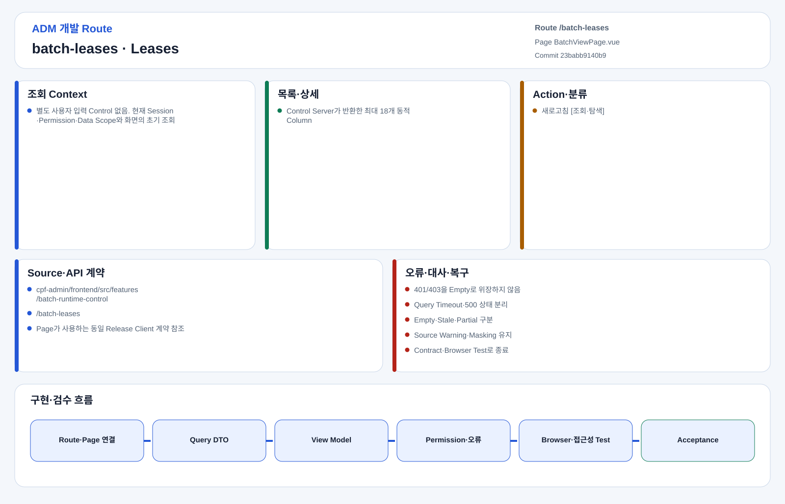


### 구현 결과

`/batch-leases`가 단순 Route가 아니라 **Lease Owner·Expiry·Fencing Token과 Stale Writer 위험을 확인한다.** Query·Permission·Owner 상태·관측 정보·Browser Test가 연결된 조회 기능 Slice가 되도록 구현한다.

### Source 진입점과 소유권

| 계층 | 기준 |
|---|---|
| Router | `/batch-leases` |
| Page | `cpf-admin/frontend/src/features/batch-runtime-control/BatchViewPage.vue` |
| Generated Client | Page가 import하는 Generated Client 또는 공통 ADM Client의 실제 Operation을 사용한다. 수기 Endpoint 문자열과 중복 DTO를 만들지 않는다 |
| ADM Backend | OpenAPI Operation의 Controller와 Application Service |
| Owner Port | Query·Status Port; Local/Remote가 같은 DTO·오류 의미 사용 |
| Test | Frontend Unit·Generated Client Contract·Controller·Browser·Fault |

### Frontend Query·Form 모델

별도 사용자 입력 Control이 없다. 현재 Session·Permission·Data Scope와 Page가 정의한 초기 Query로 데이터를 읽는다. 새로고침은 같은 Context를 다시 조회하며 Owner 데이터는 변경하지 않는다.

### Table·Detail View Model

| 값 | 표시 계약 | Drill-down·대사 |
|---|---|---|
| `Control Server가 반환한 최대 18개 동적 Column` | Leases 상세에서 대상의 현재 속성 또는 처리 결과를 확인하는 값이다. Masking·Timezone·단위를 DTO Metadata와 함께 표시한다. | 상세·재조회 결과와 비교하고 Stale·Masking·단위 차이를 확인한다. |

### Button·Interaction 모델

| Action | 분류 | Frontend 활성 조건 | Backend·성공 처리 |
|---|---|---|---|
| **새로고침** | 조회·탐색 | 조회 Permission과 Query Validation을 충족하고 동일 조회가 진행 중이 아님 | 새로고침 결과의 조회 시각·Filter·Source Version·Warning이 갱신되며 Owner 데이터는 변경하지 않는다. |

### 상태 모델

```text
Query: Idle → Loading → Empty | Success | Error
Success + Stale | Partial
```

조회 상태를 Loading·Empty·Success·Error·Stale·Partial로 구분한다. `401`, `403`, Timeout, Empty, Stale, Partial을 하나의 Error Toast로 합치지 않는다.

### API·Owner 계약

- Query Request는 실제 Page가 사용하는 Environment·Data Scope·검색 Field·Paging·Sort·Timezone만 포함한다.
- Query Response는 실제 Item·Page·조회 시각·Source Version·Stale·Partial·Warning 계약을 유지한다.
- 조회 전용 Route에는 임의의 Command DTO·Operation Polling·Rollback Endpoint를 추가하지 않는다.
- Same-JVM과 Remote Adapter는 DTO·Error Code·Timeout·Unknown 의미를 유지한다.

### Permission·Data Scope·Masking

- Route Permission 기준은 **조회 권한**이다.
- Menu 노출, Query, Button, Raw, Export Permission을 분리하고 Backend와 Owner에서 다시 검증한다.
- Deny는 403과 Audit를 남기며 404·Empty로 위장하지 않는다.
- Secret·Credential·PII Raw를 일반 Response DTO·Browser Storage·Log에 넣지 않는다.

### 구현 순서

1. Route·Page Import·Menu Metadata·Permission을 연결한다.
2. 이 장의 Field·Column·Action을 OpenAPI Request·Response·Error와 대조한다.
3. Generated Client를 재생성하고 수기 HTTP 호출을 제거한다.
4. Query 상태와 Empty·Stale·Partial·Error UI를 구현한다.
5. Backend Query Controller·Application Service·Owner Query Port·Local/Remote Adapter를 연결한다.
6. Menu·Query·Raw·Export Permission과 Data Scope를 Server에서 검증한다.
7. 조회 시각·Source Version·Warning·Correlation ID와 Drill-down Link를 연결한다.
8. Unit·Contract·Browser·Fault·Accessibility Test를 실행한다.

### Test Matrix

| Test | 필수 Scenario |
|---|---|
| Frontend Unit | Default·Validation·Button 조건·Masking·Empty/Error/Stale/Partial |
| OpenAPI·Generated Client | Operation 이름·Type·Error·Hash Drift |
| Backend Query | Permission·Data Scope·Filter·Paging·Stale·Partial |
| Local/Remote Contract | 같은 DTO·Error·Timeout 의미 |
| Browser | Deep Link·Query·상세·403·Timeout·Empty·Partial |
| Accessibility | Keyboard·Focus·Label·Error Announcement·Table/Dialog |

### 개발 Fault Workbook

1. `/batch-leases` Query를 500·Timeout·Empty·Partial 응답으로 주입해 Loading·Empty·Error·Stale·Partial UI를 각각 확인한다.
2. 401·403과 Data Scope 축소를 주입해 Deny를 Empty로 위장하지 않고 Error와 접근 가능한 범위를 구분하는지 확인한다.
3. 조회 전용 Route에 Command Polling·Reason·Approval·Rollback UI가 노출되지 않는지 확인한다.
4. Local Adapter와 Remote Adapter에 같은 Contract Fixture를 적용해 Error Code·Retryability·failureStage가 일치하는지 확인한다.
5. Browser Storage·Console·Network Error·Screenshot에 Token·Secret·PII Raw가 남지 않는지 확인한다.

### Route Acceptance Checklist

- [ ] Route `/batch-leases`의 Deep Link와 Menu ID `batch-leases`가 같은 Page를 연다.
- [ ] 이 장의 Field·Column·Action과 Page·OpenAPI·Generated Client가 같은 계약을 사용한다.
- [ ] Menu·Query·Raw·Export Permission Deny가 Backend 403과 화면 Error로 확인된다.
- [ ] Empty·Timeout·Stale·Partial이 서로 다른 사용자 상태와 재조회 경로를 제공한다.
- [ ] Same-JVM·Remote 호출이 같은 Query DTO·오류·Timeout 계약을 사용한다.
- [ ] 조회 전용 Route에 Source에 없는 Command·Approval·Rollback Action을 노출하지 않는다.
- [ ] 정상·오류·경계 Browser Test와 Accessibility Test가 Route Matrix에 포함된다.

### 독립 수행 검수 Checklist

- [ ] `/batch-leases`와 Page Source를 찾고 화면 목적을 설명할 수 있다.
- [ ] 별도 사용자 입력이 없고 자동 Query Context·새로고침 동작을 설명할 수 있다.
- [ ] 1개 표시값을 Owner 상태·Version·Audit와 대사할 수 있다.
- [ ] 1개 Action의 분류·활성 조건·Side Effect를 설명할 수 있다.
- [ ] Empty·401·403·Timeout·Stale·Partial을 서로 다른 조회 상태로 처리할 수 있다.
- [ ] 조회 응답 유실 시 같은 Query Context로 재조회하고 Correlation ID·조회 시각·Source Version으로 결과를 대사할 수 있다.
- [ ] 교대 기록만으로 다음 담당자가 Target·상태·복구 기한을 이어받을 수 있다.
- [ ] OpenAPI·Generated Client·Page·Controller·Owner Port·Test가 같은 Field와 오류 계약을 사용하는지 검증할 수 있다.
- [ ] Local·Remote Adapter의 Timeout·Unknown 의미가 같은지 Contract Test로 확인할 수 있다.

## 40. batch-alerts — Alerts 기능 Slice 개발 장


### 구현 결과

`/batch-alerts`가 단순 Route가 아니라 **Batch 경보·Severity·대상·미조치 상태를 확인한다.** Query·Permission·Owner 상태·관측 정보·Browser Test가 연결된 조회 기능 Slice가 되도록 구현한다.

### Source 진입점과 소유권

| 계층 | 기준 |
|---|---|
| Router | `/batch-alerts` |
| Page | `cpf-admin/frontend/src/features/batch-runtime-control/BatchViewPage.vue` |
| Generated Client | Page가 import하는 Generated Client 또는 공통 ADM Client의 실제 Operation을 사용한다. 수기 Endpoint 문자열과 중복 DTO를 만들지 않는다 |
| ADM Backend | OpenAPI Operation의 Controller와 Application Service |
| Owner Port | Query·Status Port; Local/Remote가 같은 DTO·오류 의미 사용 |
| Test | Frontend Unit·Generated Client Contract·Controller·Browser·Fault |

### Frontend Query·Form 모델

별도 사용자 입력 Control이 없다. 현재 Session·Permission·Data Scope와 Page가 정의한 초기 Query로 데이터를 읽는다. 새로고침은 같은 Context를 다시 조회하며 Owner 데이터는 변경하지 않는다.

### Table·Detail View Model

| 값 | 표시 계약 | Drill-down·대사 |
|---|---|---|
| `Control Server가 반환한 최대 18개 동적 Column` | Alerts 상세에서 대상의 현재 속성 또는 처리 결과를 확인하는 값이다. Masking·Timezone·단위를 DTO Metadata와 함께 표시한다. | 상세·재조회 결과와 비교하고 Stale·Masking·단위 차이를 확인한다. |

### Button·Interaction 모델

| Action | 분류 | Frontend 활성 조건 | Backend·성공 처리 |
|---|---|---|---|
| **새로고침** | 조회·탐색 | 조회 Permission과 Query Validation을 충족하고 동일 조회가 진행 중이 아님 | 새로고침 결과의 조회 시각·Filter·Source Version·Warning이 갱신되며 Owner 데이터는 변경하지 않는다. |

### 상태 모델

```text
Query: Idle → Loading → Empty | Success | Error
Success + Stale | Partial
```

조회 상태를 Loading·Empty·Success·Error·Stale·Partial로 구분한다. `401`, `403`, Timeout, Empty, Stale, Partial을 하나의 Error Toast로 합치지 않는다.

### API·Owner 계약

- Query Request는 실제 Page가 사용하는 Environment·Data Scope·검색 Field·Paging·Sort·Timezone만 포함한다.
- Query Response는 실제 Item·Page·조회 시각·Source Version·Stale·Partial·Warning 계약을 유지한다.
- 조회 전용 Route에는 임의의 Command DTO·Operation Polling·Rollback Endpoint를 추가하지 않는다.
- Same-JVM과 Remote Adapter는 DTO·Error Code·Timeout·Unknown 의미를 유지한다.

### Permission·Data Scope·Masking

- Route Permission 기준은 **조회 권한**이다.
- Menu 노출, Query, Button, Raw, Export Permission을 분리하고 Backend와 Owner에서 다시 검증한다.
- Deny는 403과 Audit를 남기며 404·Empty로 위장하지 않는다.
- Secret·Credential·PII Raw를 일반 Response DTO·Browser Storage·Log에 넣지 않는다.

### 구현 순서

1. Route·Page Import·Menu Metadata·Permission을 연결한다.
2. 이 장의 Field·Column·Action을 OpenAPI Request·Response·Error와 대조한다.
3. Generated Client를 재생성하고 수기 HTTP 호출을 제거한다.
4. Query 상태와 Empty·Stale·Partial·Error UI를 구현한다.
5. Backend Query Controller·Application Service·Owner Query Port·Local/Remote Adapter를 연결한다.
6. Menu·Query·Raw·Export Permission과 Data Scope를 Server에서 검증한다.
7. 조회 시각·Source Version·Warning·Correlation ID와 Drill-down Link를 연결한다.
8. Unit·Contract·Browser·Fault·Accessibility Test를 실행한다.

### Test Matrix

| Test | 필수 Scenario |
|---|---|
| Frontend Unit | Default·Validation·Button 조건·Masking·Empty/Error/Stale/Partial |
| OpenAPI·Generated Client | Operation 이름·Type·Error·Hash Drift |
| Backend Query | Permission·Data Scope·Filter·Paging·Stale·Partial |
| Local/Remote Contract | 같은 DTO·Error·Timeout 의미 |
| Browser | Deep Link·Query·상세·403·Timeout·Empty·Partial |
| Accessibility | Keyboard·Focus·Label·Error Announcement·Table/Dialog |

### 개발 Fault Workbook

1. `/batch-alerts` Query를 500·Timeout·Empty·Partial 응답으로 주입해 Loading·Empty·Error·Stale·Partial UI를 각각 확인한다.
2. 401·403과 Data Scope 축소를 주입해 Deny를 Empty로 위장하지 않고 Error와 접근 가능한 범위를 구분하는지 확인한다.
3. 조회 전용 Route에 Command Polling·Reason·Approval·Rollback UI가 노출되지 않는지 확인한다.
4. Local Adapter와 Remote Adapter에 같은 Contract Fixture를 적용해 Error Code·Retryability·failureStage가 일치하는지 확인한다.
5. Browser Storage·Console·Network Error·Screenshot에 Token·Secret·PII Raw가 남지 않는지 확인한다.

### Route Acceptance Checklist

- [ ] Route `/batch-alerts`의 Deep Link와 Menu ID `batch-alerts`가 같은 Page를 연다.
- [ ] 이 장의 Field·Column·Action과 Page·OpenAPI·Generated Client가 같은 계약을 사용한다.
- [ ] Menu·Query·Raw·Export Permission Deny가 Backend 403과 화면 Error로 확인된다.
- [ ] Empty·Timeout·Stale·Partial이 서로 다른 사용자 상태와 재조회 경로를 제공한다.
- [ ] Same-JVM·Remote 호출이 같은 Query DTO·오류·Timeout 계약을 사용한다.
- [ ] 조회 전용 Route에 Source에 없는 Command·Approval·Rollback Action을 노출하지 않는다.
- [ ] 정상·오류·경계 Browser Test와 Accessibility Test가 Route Matrix에 포함된다.

### 독립 수행 검수 Checklist

- [ ] `/batch-alerts`와 Page Source를 찾고 화면 목적을 설명할 수 있다.
- [ ] 별도 사용자 입력이 없고 자동 Query Context·새로고침 동작을 설명할 수 있다.
- [ ] 1개 표시값을 Owner 상태·Version·Audit와 대사할 수 있다.
- [ ] 1개 Action의 분류·활성 조건·Side Effect를 설명할 수 있다.
- [ ] Empty·401·403·Timeout·Stale·Partial을 서로 다른 조회 상태로 처리할 수 있다.
- [ ] 조회 응답 유실 시 같은 Query Context로 재조회하고 Correlation ID·조회 시각·Source Version으로 결과를 대사할 수 있다.
- [ ] 교대 기록만으로 다음 담당자가 Target·상태·복구 기한을 이어받을 수 있다.
- [ ] OpenAPI·Generated Client·Page·Controller·Owner Port·Test가 같은 Field와 오류 계약을 사용하는지 검증할 수 있다.
- [ ] Local·Remote Adapter의 Timeout·Unknown 의미가 같은지 Contract Test로 확인할 수 있다.

## 41. batch-audit — Audit Evidence 기능 Slice 개발 장


### 구현 결과

`/batch-audit`가 단순 Route가 아니라 **Batch 실행·조치·승인·증적을 조회한다.** Query·Permission·Owner 상태·관측 정보·Browser Test가 연결된 조회 기능 Slice가 되도록 구현한다.

### Source 진입점과 소유권

| 계층 | 기준 |
|---|---|
| Router | `/batch-audit` |
| Page | `cpf-admin/frontend/src/features/batch-runtime-control/BatchViewPage.vue` |
| Generated Client | Page가 import하는 Generated Client 또는 공통 ADM Client의 실제 Operation을 사용한다. 수기 Endpoint 문자열과 중복 DTO를 만들지 않는다 |
| ADM Backend | OpenAPI Operation의 Controller와 Application Service |
| Owner Port | Query·Status Port; Local/Remote가 같은 DTO·오류 의미 사용 |
| Test | Frontend Unit·Generated Client Contract·Controller·Browser·Fault |

### Frontend Query·Form 모델

별도 사용자 입력 Control이 없다. 현재 Session·Permission·Data Scope와 Page가 정의한 초기 Query로 데이터를 읽는다. 새로고침은 같은 Context를 다시 조회하며 Owner 데이터는 변경하지 않는다.

### Table·Detail View Model

| 값 | 표시 계약 | Drill-down·대사 |
|---|---|---|
| `Control Server가 반환한 최대 18개 동적 Column` | Audit Evidence 상세에서 대상의 현재 속성 또는 처리 결과를 확인하는 값이다. Masking·Timezone·단위를 DTO Metadata와 함께 표시한다. | 상세·재조회 결과와 비교하고 Stale·Masking·단위 차이를 확인한다. |

### Button·Interaction 모델

| Action | 분류 | Frontend 활성 조건 | Backend·성공 처리 |
|---|---|---|---|
| **새로고침** | 조회·탐색 | 조회 Permission과 Query Validation을 충족하고 동일 조회가 진행 중이 아님 | 새로고침 결과의 조회 시각·Filter·Source Version·Warning이 갱신되며 Owner 데이터는 변경하지 않는다. |

### 상태 모델

```text
Query: Idle → Loading → Empty | Success | Error
Success + Stale | Partial
```

조회 상태를 Loading·Empty·Success·Error·Stale·Partial로 구분한다. `401`, `403`, Timeout, Empty, Stale, Partial을 하나의 Error Toast로 합치지 않는다.

### API·Owner 계약

- Query Request는 실제 Page가 사용하는 Environment·Data Scope·검색 Field·Paging·Sort·Timezone만 포함한다.
- Query Response는 실제 Item·Page·조회 시각·Source Version·Stale·Partial·Warning 계약을 유지한다.
- 조회 전용 Route에는 임의의 Command DTO·Operation Polling·Rollback Endpoint를 추가하지 않는다.
- Same-JVM과 Remote Adapter는 DTO·Error Code·Timeout·Unknown 의미를 유지한다.

### Permission·Data Scope·Masking

- Route Permission 기준은 **조회 권한**이다.
- Menu 노출, Query, Button, Raw, Export Permission을 분리하고 Backend와 Owner에서 다시 검증한다.
- Deny는 403과 Audit를 남기며 404·Empty로 위장하지 않는다.
- Secret·Credential·PII Raw를 일반 Response DTO·Browser Storage·Log에 넣지 않는다.

### 구현 순서

1. Route·Page Import·Menu Metadata·Permission을 연결한다.
2. 이 장의 Field·Column·Action을 OpenAPI Request·Response·Error와 대조한다.
3. Generated Client를 재생성하고 수기 HTTP 호출을 제거한다.
4. Query 상태와 Empty·Stale·Partial·Error UI를 구현한다.
5. Backend Query Controller·Application Service·Owner Query Port·Local/Remote Adapter를 연결한다.
6. Menu·Query·Raw·Export Permission과 Data Scope를 Server에서 검증한다.
7. 조회 시각·Source Version·Warning·Correlation ID와 Drill-down Link를 연결한다.
8. Unit·Contract·Browser·Fault·Accessibility Test를 실행한다.

### Test Matrix

| Test | 필수 Scenario |
|---|---|
| Frontend Unit | Default·Validation·Button 조건·Masking·Empty/Error/Stale/Partial |
| OpenAPI·Generated Client | Operation 이름·Type·Error·Hash Drift |
| Backend Query | Permission·Data Scope·Filter·Paging·Stale·Partial |
| Local/Remote Contract | 같은 DTO·Error·Timeout 의미 |
| Browser | Deep Link·Query·상세·403·Timeout·Empty·Partial |
| Accessibility | Keyboard·Focus·Label·Error Announcement·Table/Dialog |

### 개발 Fault Workbook

1. `/batch-audit` Query를 500·Timeout·Empty·Partial 응답으로 주입해 Loading·Empty·Error·Stale·Partial UI를 각각 확인한다.
2. 401·403과 Data Scope 축소를 주입해 Deny를 Empty로 위장하지 않고 Error와 접근 가능한 범위를 구분하는지 확인한다.
3. 조회 전용 Route에 Command Polling·Reason·Approval·Rollback UI가 노출되지 않는지 확인한다.
4. Local Adapter와 Remote Adapter에 같은 Contract Fixture를 적용해 Error Code·Retryability·failureStage가 일치하는지 확인한다.
5. Browser Storage·Console·Network Error·Screenshot에 Token·Secret·PII Raw가 남지 않는지 확인한다.

### Route Acceptance Checklist

- [ ] Route `/batch-audit`의 Deep Link와 Menu ID `batch-audit`가 같은 Page를 연다.
- [ ] 이 장의 Field·Column·Action과 Page·OpenAPI·Generated Client가 같은 계약을 사용한다.
- [ ] Menu·Query·Raw·Export Permission Deny가 Backend 403과 화면 Error로 확인된다.
- [ ] Empty·Timeout·Stale·Partial이 서로 다른 사용자 상태와 재조회 경로를 제공한다.
- [ ] Same-JVM·Remote 호출이 같은 Query DTO·오류·Timeout 계약을 사용한다.
- [ ] 조회 전용 Route에 Source에 없는 Command·Approval·Rollback Action을 노출하지 않는다.
- [ ] 정상·오류·경계 Browser Test와 Accessibility Test가 Route Matrix에 포함된다.

### 독립 수행 검수 Checklist

- [ ] `/batch-audit`와 Page Source를 찾고 화면 목적을 설명할 수 있다.
- [ ] 별도 사용자 입력이 없고 자동 Query Context·새로고침 동작을 설명할 수 있다.
- [ ] 1개 표시값을 Owner 상태·Version·Audit와 대사할 수 있다.
- [ ] 1개 Action의 분류·활성 조건·Side Effect를 설명할 수 있다.
- [ ] Empty·401·403·Timeout·Stale·Partial을 서로 다른 조회 상태로 처리할 수 있다.
- [ ] 조회 응답 유실 시 같은 Query Context로 재조회하고 Correlation ID·조회 시각·Source Version으로 결과를 대사할 수 있다.
- [ ] 교대 기록만으로 다음 담당자가 Target·상태·복구 기한을 이어받을 수 있다.
- [ ] OpenAPI·Generated Client·Page·Controller·Owner Port·Test가 같은 Field와 오류 계약을 사용하는지 검증할 수 있다.
- [ ] Local·Remote Adapter의 Timeout·Unknown 의미가 같은지 Contract Test로 확인할 수 있다.

## 42. workers — Workers 기능 Slice 개발 장

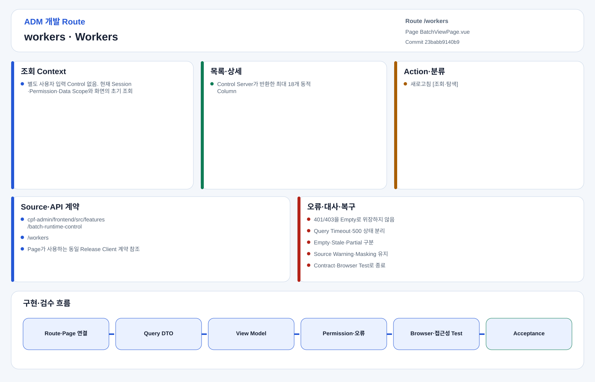


### 구현 결과

`/workers`가 단순 Route가 아니라 **Agent·Worker 등록·Heartbeat·Capability·할당을 확인한다.** Query·Permission·Owner 상태·관측 정보·Browser Test가 연결된 조회 기능 Slice가 되도록 구현한다.

### Source 진입점과 소유권

| 계층 | 기준 |
|---|---|
| Router | `/workers` |
| Page | `cpf-admin/frontend/src/features/batch-runtime-control/BatchViewPage.vue` |
| Generated Client | Page가 import하는 Generated Client 또는 공통 ADM Client의 실제 Operation을 사용한다. 수기 Endpoint 문자열과 중복 DTO를 만들지 않는다 |
| ADM Backend | OpenAPI Operation의 Controller와 Application Service |
| Owner Port | Query·Status Port; Local/Remote가 같은 DTO·오류 의미 사용 |
| Test | Frontend Unit·Generated Client Contract·Controller·Browser·Fault |

### Frontend Query·Form 모델

별도 사용자 입력 Control이 없다. 현재 Session·Permission·Data Scope와 Page가 정의한 초기 Query로 데이터를 읽는다. 새로고침은 같은 Context를 다시 조회하며 Owner 데이터는 변경하지 않는다.

### Table·Detail View Model

| 값 | 표시 계약 | Drill-down·대사 |
|---|---|---|
| `Control Server가 반환한 최대 18개 동적 Column` | Workers 상세에서 대상의 현재 속성 또는 처리 결과를 확인하는 값이다. Masking·Timezone·단위를 DTO Metadata와 함께 표시한다. | 상세·재조회 결과와 비교하고 Stale·Masking·단위 차이를 확인한다. |

### Button·Interaction 모델

| Action | 분류 | Frontend 활성 조건 | Backend·성공 처리 |
|---|---|---|---|
| **새로고침** | 조회·탐색 | 조회 Permission과 Query Validation을 충족하고 동일 조회가 진행 중이 아님 | 새로고침 결과의 조회 시각·Filter·Source Version·Warning이 갱신되며 Owner 데이터는 변경하지 않는다. |

### 상태 모델

```text
Query: Idle → Loading → Empty | Success | Error
Success + Stale | Partial
```

조회 상태를 Loading·Empty·Success·Error·Stale·Partial로 구분한다. `401`, `403`, Timeout, Empty, Stale, Partial을 하나의 Error Toast로 합치지 않는다.

### API·Owner 계약

- Query Request는 실제 Page가 사용하는 Environment·Data Scope·검색 Field·Paging·Sort·Timezone만 포함한다.
- Query Response는 실제 Item·Page·조회 시각·Source Version·Stale·Partial·Warning 계약을 유지한다.
- 조회 전용 Route에는 임의의 Command DTO·Operation Polling·Rollback Endpoint를 추가하지 않는다.
- Same-JVM과 Remote Adapter는 DTO·Error Code·Timeout·Unknown 의미를 유지한다.

### Permission·Data Scope·Masking

- Route Permission 기준은 **조회 권한**이다.
- Menu 노출, Query, Button, Raw, Export Permission을 분리하고 Backend와 Owner에서 다시 검증한다.
- Deny는 403과 Audit를 남기며 404·Empty로 위장하지 않는다.
- Secret·Credential·PII Raw를 일반 Response DTO·Browser Storage·Log에 넣지 않는다.

### 구현 순서

1. Route·Page Import·Menu Metadata·Permission을 연결한다.
2. 이 장의 Field·Column·Action을 OpenAPI Request·Response·Error와 대조한다.
3. Generated Client를 재생성하고 수기 HTTP 호출을 제거한다.
4. Query 상태와 Empty·Stale·Partial·Error UI를 구현한다.
5. Backend Query Controller·Application Service·Owner Query Port·Local/Remote Adapter를 연결한다.
6. Menu·Query·Raw·Export Permission과 Data Scope를 Server에서 검증한다.
7. 조회 시각·Source Version·Warning·Correlation ID와 Drill-down Link를 연결한다.
8. Unit·Contract·Browser·Fault·Accessibility Test를 실행한다.

### Test Matrix

| Test | 필수 Scenario |
|---|---|
| Frontend Unit | Default·Validation·Button 조건·Masking·Empty/Error/Stale/Partial |
| OpenAPI·Generated Client | Operation 이름·Type·Error·Hash Drift |
| Backend Query | Permission·Data Scope·Filter·Paging·Stale·Partial |
| Local/Remote Contract | 같은 DTO·Error·Timeout 의미 |
| Browser | Deep Link·Query·상세·403·Timeout·Empty·Partial |
| Accessibility | Keyboard·Focus·Label·Error Announcement·Table/Dialog |

### 개발 Fault Workbook

1. `/workers` Query를 500·Timeout·Empty·Partial 응답으로 주입해 Loading·Empty·Error·Stale·Partial UI를 각각 확인한다.
2. 401·403과 Data Scope 축소를 주입해 Deny를 Empty로 위장하지 않고 Error와 접근 가능한 범위를 구분하는지 확인한다.
3. 조회 전용 Route에 Command Polling·Reason·Approval·Rollback UI가 노출되지 않는지 확인한다.
4. Local Adapter와 Remote Adapter에 같은 Contract Fixture를 적용해 Error Code·Retryability·failureStage가 일치하는지 확인한다.
5. Browser Storage·Console·Network Error·Screenshot에 Token·Secret·PII Raw가 남지 않는지 확인한다.

### Route Acceptance Checklist

- [ ] Route `/workers`의 Deep Link와 Menu ID `workers`가 같은 Page를 연다.
- [ ] 이 장의 Field·Column·Action과 Page·OpenAPI·Generated Client가 같은 계약을 사용한다.
- [ ] Menu·Query·Raw·Export Permission Deny가 Backend 403과 화면 Error로 확인된다.
- [ ] Empty·Timeout·Stale·Partial이 서로 다른 사용자 상태와 재조회 경로를 제공한다.
- [ ] Same-JVM·Remote 호출이 같은 Query DTO·오류·Timeout 계약을 사용한다.
- [ ] 조회 전용 Route에 Source에 없는 Command·Approval·Rollback Action을 노출하지 않는다.
- [ ] 정상·오류·경계 Browser Test와 Accessibility Test가 Route Matrix에 포함된다.

### 독립 수행 검수 Checklist

- [ ] `/workers`와 Page Source를 찾고 화면 목적을 설명할 수 있다.
- [ ] 별도 사용자 입력이 없고 자동 Query Context·새로고침 동작을 설명할 수 있다.
- [ ] 1개 표시값을 Owner 상태·Version·Audit와 대사할 수 있다.
- [ ] 1개 Action의 분류·활성 조건·Side Effect를 설명할 수 있다.
- [ ] Empty·401·403·Timeout·Stale·Partial을 서로 다른 조회 상태로 처리할 수 있다.
- [ ] 조회 응답 유실 시 같은 Query Context로 재조회하고 Correlation ID·조회 시각·Source Version으로 결과를 대사할 수 있다.
- [ ] 교대 기록만으로 다음 담당자가 Target·상태·복구 기한을 이어받을 수 있다.
- [ ] OpenAPI·Generated Client·Page·Controller·Owner Port·Test가 같은 Field와 오류 계약을 사용하는지 검증할 수 있다.
- [ ] Local·Remote Adapter의 Timeout·Unknown 의미가 같은지 Contract Test로 확인할 수 있다.

## 43. batch-deployment — Deployment History·Plan 기능 Slice 개발 장

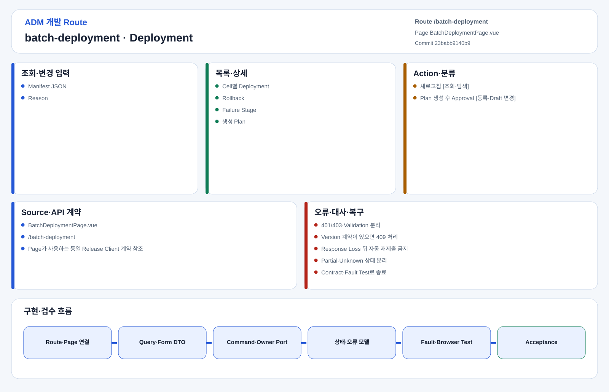


### 구현 결과

`/batch-deployment`가 단순 Route가 아니라 **Batch Artifact 배포 Plan과 Cell별 적용·Rollback을 관리한다.** Query·Command·Permission·Owner 상태·Audit·Browser Test가 연결된 기능 Slice가 되도록 구현한다.

### Source 진입점과 소유권

| 계층 | 기준 |
|---|---|
| Router | `/batch-deployment` |
| Page | `BatchDeploymentPage.vue` |
| Generated Client | Page가 import하는 Generated Client 또는 공통 ADM Client의 실제 Operation을 사용한다. 수기 Endpoint 문자열과 중복 DTO를 만들지 않는다 |
| ADM Backend | OpenAPI Operation의 Controller와 Application Service |
| Owner Port | Query·Command·Status·Reconcile Port; Local/Remote가 같은 DTO·오류 의미 사용 |
| Test | Frontend Unit·Generated Client Contract·Controller·Browser·Fault |

### Frontend Query·Form 모델

| Field | Control | 직렬화·Validation | 오류·접근성 |
|---|---|---|---|
| `Manifest JSON` | 파일·본문 입력 | 검증·등록·Export에 사용할 입력 Artifact 또는 구조화된 본문이다. 확장자·크기·Encoding·Schema·Checksum을 검증하고 Dry Run이 있으면 먼저 실행한다. Request·Query의 실제 이름과 Type을 유지한다. | Label·Help·Field Error·Keyboard Focus를 제공하고 민감값은 재표시하지 않는다. |
| `Reason` | 다중행 입력 | 작업 목적·영향 범위·승인 또는 복구 기준을 기록해 Audit와 교대 기록에 연결한다. Ticket·영향 범위·복구점을 포함하고 화면이 요구하는 최소 길이를 충족한다. Request·Query의 실제 이름과 Type을 유지한다. | Label·Help·Field Error·Keyboard Focus를 제공하고 민감값은 재표시하지 않는다. |

### Table·Detail View Model

| 값 | 표시 계약 | Drill-down·대사 |
|---|---|---|
| `Cell별 Deployment` | Deployment History·Plan 상세에서 대상의 현재 속성 또는 처리 결과를 확인하는 값이다. Masking·Timezone·단위를 DTO Metadata와 함께 표시한다. | 상세·재조회 결과와 비교하고 Stale·Masking·단위 차이를 확인한다. |
| `Rollback` | Deployment History·Plan 상세에서 대상의 현재 속성 또는 처리 결과를 확인하는 값이다. Masking·Timezone·단위를 DTO Metadata와 함께 표시한다. | 상세·재조회 결과와 비교하고 Stale·Masking·단위 차이를 확인한다. |
| `Failure Stage` | 오류·Drift·결과 불명 범위를 나타내며 원인과 복구 Owner를 연결해야 한다. Masking·Timezone·단위를 DTO Metadata와 함께 표시한다. | 원인 식별자·실패 Stage·마지막 갱신 시각을 상세와 대조한다. |
| `생성 Plan` | Deployment History·Plan 상세에서 대상의 현재 속성 또는 처리 결과를 확인하는 값이다. Masking·Timezone·단위를 DTO Metadata와 함께 표시한다. | 상세·재조회 결과와 비교하고 Stale·Masking·단위 차이를 확인한다. |

### Button·Command 모델

| Action | 분류 | Frontend 활성 조건 | Backend·성공 처리 |
|---|---|---|---|
| **새로고침** | 조회·탐색 | 조회 Permission과 Query Validation을 충족하고 동일 조회가 진행 중이 아님 | 새로고침 결과의 조회 시각·Filter·Source Version·Warning이 갱신되며 Owner 데이터는 변경하지 않는다. |
| **Plan 생성 후 Approval** | 등록·Draft 변경 | 화면이 실제로 요구하는 Write Permission·필수 Field·Reason·Version 조건을 충족함 | Deployment History·Plan의 재조회 결과가 요청 내용과 일치한다. Version·Before/After·Audit는 해당 Owner가 제공하는 경우 함께 확인한다. Backend에서도 Permission·Version·Idempotency를 재검증한다. |

### 상태 모델

```text
Query: Idle → Loading → Empty | Success | Error
Success + Stale | Partial
Command: Editing → Validating → Submitting → Accepted(operationId) → Terminal
Submitting → ResponseLoss → Reconcile → Terminal | UNKNOWN_RESULT
```

Query와 Command의 Loading·Error를 분리한다. 조회 전용 Route에는 존재하지 않는 Command 상태를 만들지 않는다. `403`, `409`, Timeout, Partial, Unknown을 하나의 Error Toast로 합치지 않는다.

### API·Owner 계약

- Query Request는 실제 Page가 사용하는 Environment·Data Scope·검색 Field·Paging·Sort·Timezone만 포함한다.
- Query Response는 실제 Item·Page·조회 시각·Source Version·Stale·Partial·Warning 계약을 유지한다.
- Command는 Source에 선언된 Target ID·Version·Reason·Approval ID·Idempotency Key·Request Hash 중 실제 필드만 사용한다.
- `202 Accepted`는 완료가 아니라 Operation 추적 시작이며 Owner Terminal 상태를 별도로 조회한다.
- Side Effect 전 실패, Side Effect 후 실패, Success, Partial, `UNKNOWN_RESULT`를 구분한다.
- Same-JVM과 Remote Adapter는 DTO·Error Code·Timeout·Unknown 의미를 유지한다.

### Permission·Data Scope·Masking

- Route Permission 기준은 **배포 Plan 권한 + BAT Approval**이다.
- Menu 노출, Query, Button, Raw, Export Permission을 분리하고 Backend와 Owner에서 다시 검증한다.
- Deny는 403과 Audit를 남기며 404·Empty로 위장하지 않는다.
- Secret·Credential·PII Raw를 일반 Response DTO·Browser Storage·Log에 넣지 않는다.

### 구현 순서

1. Route·Page Import·Menu Metadata·Permission을 연결한다.
2. 이 장의 Field·Column·Action을 OpenAPI Request·Response·Error와 대조한다.
3. Generated Client를 재생성하고 수기 HTTP 호출을 제거한다.
4. Query·Command 상태와 Empty·Stale·Partial·Unknown UI를 구현한다.
5. Backend Controller·Application Service·Owner Port·Local/Remote Adapter를 연결한다.
6. Reason·Approval·Expected Version·Idempotency·Audit를 Server에서 검증한다.
7. Response Loss Polling·Reconcile·Rollback Link를 구현한다.
8. Unit·Contract·Browser·Fault·Accessibility Test를 실행한다.

### Test Matrix

| Test | 필수 Scenario |
|---|---|
| Frontend Unit | Default·Validation·Button 조건·Masking·Empty/Error/Stale/Partial |
| OpenAPI·Generated Client | Operation 이름·Type·Error·Hash Drift |
| Backend Query | Permission·Data Scope·Filter·Paging·Stale·Partial |
| Backend Command | Source에 선언된 Permission·Version·Reason·Approval·Idempotency·Audit 계약 |
| Local/Remote Contract | 같은 DTO·Error·Timeout 의미 |
| Browser | Deep Link·Query·상세·403·Timeout·Empty·Partial |
| Fault | 409·Response Loss·DB/Kafka/Owner 중단·Partial ACK·Late Response |
| Accessibility | Keyboard·Focus·Label·Error Announcement·Table/Dialog |

### 개발 Fault Workbook

1. `/batch-deployment` Query를 500·Timeout·Empty·Partial 응답으로 주입해 Loading·Empty·Error·Stale·Partial UI를 각각 확인한다.
2. 401·403과 Data Scope 축소를 주입해 Deny를 Empty로 위장하지 않고 Error와 접근 가능한 범위를 구분하는지 확인한다.
3. Version 계약이 있는 Write Action에는 409를, 모든 비동기·원격 Write에는 Response Loss를 주입해 자동 재제출이 없는지 확인한다.
4. 202 응답 뒤 Operation Polling이 Terminal·Failed·Partial·Unknown을 분리하는지 확인한다.
5. Local Adapter와 Remote Adapter에 같은 Contract Fixture를 적용해 Error Code·Retryability·failureStage가 일치하는지 확인한다.
6. Browser Storage·Console·Network Error·Screenshot에 Token·Secret·PII Raw가 남지 않는지 확인한다.

### Route Acceptance Checklist

- [ ] Route `/batch-deployment`의 Deep Link와 Menu ID `batch-deployment`가 같은 Page를 연다.
- [ ] 이 장의 Field·Column·Action과 Page·OpenAPI·Generated Client가 같은 계약을 사용한다.
- [ ] Menu·Query·Raw·Export Permission Deny가 Backend 403과 화면 Error로 확인된다.
- [ ] Empty·Timeout·Stale·Partial이 서로 다른 사용자 상태와 재조회 경로를 제공한다.
- [ ] Same-JVM·Remote 호출이 같은 Query DTO·오류·Timeout 계약을 사용한다.
- [ ] 409·Response Loss·Partial·Unknown이 서로 다른 상태와 Operation·Reconcile Link를 제공한다.
- [ ] Command가 Source에 선언한 Reason·Approval·Version·Idempotency·Audit 필드를 Server에서 재검증한다.
- [ ] 정상·오류·경계 Browser Test와 Accessibility Test가 Route Matrix에 포함된다.

### 독립 수행 검수 Checklist

- [ ] `/batch-deployment`와 Page Source를 찾고 화면 목적을 설명할 수 있다.
- [ ] 2개 입력·검색 항목의 Control·기본값·Validation을 설명할 수 있다.
- [ ] 4개 표시값을 Owner 상태·Version·Audit와 대사할 수 있다.
- [ ] 2개 Action의 분류·활성 조건·Side Effect를 설명할 수 있다.
- [ ] Empty·403·409·Timeout·Partial·Unknown을 서로 다른 상태로 처리할 수 있다.
- [ ] 응답 유실 뒤 중복 제출 없이 Operation·Owner·Audit로 결과를 확정할 수 있다.
- [ ] 교대 기록만으로 다음 담당자가 Target·상태·복구 기한을 이어받을 수 있다.
- [ ] OpenAPI·Generated Client·Page·Controller·Owner Port·Test가 같은 Field와 오류 계약을 사용하는지 검증할 수 있다.
- [ ] Local·Remote Adapter의 Timeout·Unknown 의미가 같은지 Contract Test로 확인할 수 있다.

## 44. gateway-dashboard — Gateway Dashboard 기능 Slice 개발 장

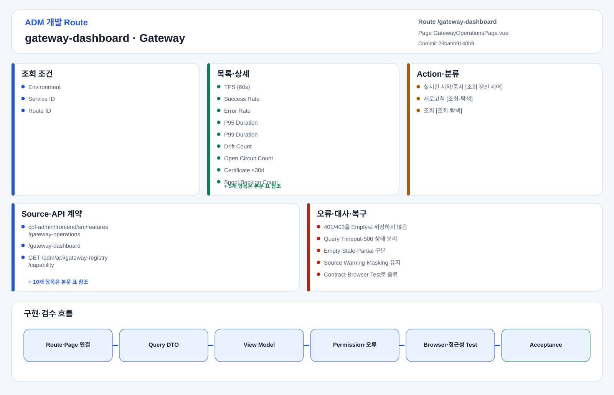


### 구현 결과

`/gateway-dashboard`가 단순 Route가 아니라 **Gateway Capability와 TPS·오류율·지연·Drift·Circuit·Certificate·Spool 상태를 탐지한다.** Query·Command·Permission·Owner 상태·Audit·Browser Test가 연결된 기능 Slice가 되도록 구현한다.

### Source 진입점과 소유권

| 계층 | 기준 |
|---|---|
| Router | `/gateway-dashboard` |
| Page | `cpf-admin/frontend/src/features/gateway-operations/GatewayOperationsPage.vue` |
| Generated Client | Page가 import하는 Generated Client 또는 공통 ADM Client의 실제 Operation을 사용한다. 수기 Endpoint 문자열과 중복 DTO를 만들지 않는다 |
| ADM Backend | OpenAPI Operation의 Controller와 Application Service |
| Owner Port | Query·Command·Status·Reconcile Port; Local/Remote가 같은 DTO·오류 의미 사용 |
| Test | Frontend Unit·Generated Client Contract·Controller·Browser·Fault |
| 확인 API 1 | `GET /adm/api/gateway-registry/capability` |
| 확인 API 2 | `GET /adm/api/gateway-registry/operations/snapshot` |
| 확인 API 3 | `GET /adm/api/gateway-registry/operations/stream` |
| 확인 API 4 | `GET /adm/api/gateway-registry/server-groups` |
| 확인 API 5 | `POST /adm/api/gateway-registry/server-groups` |
| 확인 API 6 | `GET /adm/api/gateway-registry/server-groups/{serverGroupId}/members` |
| 확인 API 7 | `GET /adm/api/gateway-registry/bindings` |
| 확인 API 8 | `POST /adm/api/gateway-registry/bindings` |
| 확인 API 9 | `GET /adm/api/gateway-registry/bindings/{bindingId}/apply-status` |
| 확인 API 10 | `GET /adm/api/gateway-registry/bindings/{bindingId}/connection-tests` |
| 확인 API 11 | `POST /adm/api/gateway-registry/bindings/{bindingId}/connection-tests` |
| Source 해석 | 공통 KPI·Capability 영역을 사용한다. 모든 Gateway Alias Route는 같은 `GatewayOperationsPage.vue`를 열고 `activeTab` 기본값은 `groups`다. |

### Frontend Query·Form 모델

| Field | Control | 직렬화·Validation | 오류·접근성 |
|---|---|---|---|
| `Environment` | Select·검색 | Gateway Dashboard 조회·조치가 적용되는 환경과 데이터 경계를 제한한다. 허용 목록과 현재 Environment·Data Scope에 맞는 값만 선택한다. Request·Query의 실제 이름과 Type을 유지한다. | Label·Help·Field Error·Keyboard Focus를 제공하고 민감값은 재표시하지 않는다. |
| `Service ID` | 문자열 입력·검색 | 조회·상세·Audit에서 같은 대상을 다시 찾기 위한 식별 조건이다. 앞뒤 공백·허용 문자·길이와 대소문자 규칙을 확인한다. Request·Query의 실제 이름과 Type을 유지한다. | Label·Help·Field Error·Keyboard Focus를 제공하고 민감값은 재표시하지 않는다. |
| `Route ID` | 문자열 입력·검색 | 조회·상세·Audit에서 같은 대상을 다시 찾기 위한 식별 조건이다. 앞뒤 공백·허용 문자·길이와 대소문자 규칙을 확인한다. Request·Query의 실제 이름과 Type을 유지한다. | Label·Help·Field Error·Keyboard Focus를 제공하고 민감값은 재표시하지 않는다. |

### Table·Detail View Model

| 값 | 표시 계약 | Drill-down·대사 |
|---|---|---|
| `TPS (60s)` | 동일한 집계 시간 창·단위·Filter에서 비교해야 하는 수치다. Masking·Timezone·단위를 DTO Metadata와 함께 표시한다. | 같은 Filter·집계 시간 창·단위의 상세 Row 또는 Metric으로 대사한다. |
| `Success Rate` | 동일한 집계 시간 창·단위·Filter에서 비교해야 하는 수치다. Masking·Timezone·단위를 DTO Metadata와 함께 표시한다. | 같은 Filter·집계 시간 창·단위의 상세 Row 또는 Metric으로 대사한다. |
| `Error Rate` | 동일한 집계 시간 창·단위·Filter에서 비교해야 하는 수치다. Masking·Timezone·단위를 DTO Metadata와 함께 표시한다. | 같은 Filter·집계 시간 창·단위의 상세 Row 또는 Metric으로 대사한다. |
| `P95 Duration` | 동일한 집계 시간 창·단위·Filter에서 비교해야 하는 수치다. Masking·Timezone·단위를 DTO Metadata와 함께 표시한다. | 같은 Filter·집계 시간 창·단위의 상세 Row 또는 Metric으로 대사한다. |
| `P99 Duration` | 동일한 집계 시간 창·단위·Filter에서 비교해야 하는 수치다. Masking·Timezone·단위를 DTO Metadata와 함께 표시한다. | 같은 Filter·집계 시간 창·단위의 상세 Row 또는 Metric으로 대사한다. |
| `Drift Count` | 동일한 집계 시간 창·단위·Filter에서 비교해야 하는 수치다. Masking·Timezone·단위를 DTO Metadata와 함께 표시한다. | 같은 Filter·집계 시간 창·단위의 상세 Row 또는 Metric으로 대사한다. |
| `Open Circuit Count` | 현재 상태와 Terminal 여부, 다음 Action 가능 여부를 판단하는 값이다. Masking·Timezone·단위를 DTO Metadata와 함께 표시한다. | 같은 Filter·집계 시간 창·단위의 상세 Row 또는 Metric으로 대사한다. |
| `Certificate ≤30d` | Gateway Dashboard 상세에서 대상의 현재 속성 또는 처리 결과를 확인하는 값이다. Masking·Timezone·단위를 DTO Metadata와 함께 표시한다. | 상세·재조회 결과와 비교하고 Stale·Masking·단위 차이를 확인한다. |
| `Spool Backlog Count` | 동일한 집계 시간 창·단위·Filter에서 비교해야 하는 수치다. Masking·Timezone·단위를 DTO Metadata와 함께 표시한다. | 같은 Filter·집계 시간 창·단위의 상세 Row 또는 Metric으로 대사한다. |
| `Spool Backlog Bytes` | 동일한 집계 시간 창·단위·Filter에서 비교해야 하는 수치다. Masking·Timezone·단위를 DTO Metadata와 함께 표시한다. | 같은 Filter·집계 시간 창·단위의 상세 Row 또는 Metric으로 대사한다. |
| `Failed Connection Tests (24h)` | Gateway Dashboard 상세에서 대상의 현재 속성 또는 처리 결과를 확인하는 값이다. Masking·Timezone·단위를 DTO Metadata와 함께 표시한다. | 상세·재조회 결과와 비교하고 Stale·Masking·단위 차이를 확인한다. |
| `Capability Status` | 현재 상태와 Terminal 여부, 다음 Action 가능 여부를 판단하는 값이다. Masking·Timezone·단위를 DTO Metadata와 함께 표시한다. | Last Updated·Terminal 조건·Owner 상태와 함께 확인한다. |
| `Source Instance ID` | Gateway Dashboard의 대상 레코드를 상세·Owner·Audit에서 연결하는 식별자다. Masking·Timezone·단위를 DTO Metadata와 함께 표시한다. | 상세·Log·Trace·Audit에서 같은 대상을 가리키는지 확인한다. |
| `Generated At` | 동일한 집계 시간 창·단위·Filter에서 비교해야 하는 수치다. Masking·Timezone·단위를 DTO Metadata와 함께 표시한다. | 같은 Filter·집계 시간 창·단위의 상세 Row 또는 Metric으로 대사한다. |

### Button·Command 모델

| Action | 분류 | Frontend 활성 조건 | Backend·성공 처리 |
|---|---|---|---|
| **실시간 시작/중지** | 조회 갱신 제어 | 화면이 활성 상태이며 SSE 또는 Poll 갱신 방식을 사용자가 선택함 | SSE 또는 Poll 갱신만 시작·중지하며 Owner 데이터나 Route 설정은 변경하지 않는다. |
| **새로고침** | 조회·탐색 | 조회 Permission과 Query Validation을 충족하고 동일 조회가 진행 중이 아님 | 새로고침 결과의 조회 시각·Filter·Source Version·Warning이 갱신되며 Owner 데이터는 변경하지 않는다. |
| **조회** | 조회·탐색 | 조회 Permission과 Query Validation을 충족하고 동일 조회가 진행 중이 아님 | 조회 결과의 조회 시각·Filter·Source Version·Warning이 갱신되며 Owner 데이터는 변경하지 않는다. |

### 상태 모델

```text
Query: Idle → Loading → Empty | Success | Error
Success + Stale | Partial
```

Query와 Command의 Loading·Error를 분리한다. 조회 전용 Route에는 존재하지 않는 Command 상태를 만들지 않는다. `403`, `409`, Timeout, Partial, Unknown을 하나의 Error Toast로 합치지 않는다.

### API·Owner 계약

- Query Request는 실제 Page가 사용하는 Environment·Data Scope·검색 Field·Paging·Sort·Timezone만 포함한다.
- Query Response는 실제 Item·Page·조회 시각·Source Version·Stale·Partial·Warning 계약을 유지한다.
- 조회 전용 Route에는 임의의 Command DTO·Operation Polling·Rollback Endpoint를 추가하지 않는다.
- Same-JVM과 Remote Adapter는 DTO·Error Code·Timeout·Unknown 의미를 유지한다.

### Permission·Data Scope·Masking

- Route Permission 기준은 **Gateway Menu/Action Permission + Approval**이다.
- Menu 노출, Query, Button, Raw, Export Permission을 분리하고 Backend와 Owner에서 다시 검증한다.
- Deny는 403과 Audit를 남기며 404·Empty로 위장하지 않는다.
- Secret·Credential·PII Raw를 일반 Response DTO·Browser Storage·Log에 넣지 않는다.

### 구현 순서

1. Route·Page Import·Menu Metadata·Permission을 연결한다.
2. 이 장의 Field·Column·Action을 OpenAPI Request·Response·Error와 대조한다.
3. Generated Client를 재생성하고 수기 HTTP 호출을 제거한다.
4. Query·Command 상태와 Empty·Stale·Partial·Unknown UI를 구현한다.
5. Backend Controller·Application Service·Owner Port·Local/Remote Adapter를 연결한다.
6. Reason·Approval·Expected Version·Idempotency·Audit를 Server에서 검증한다.
7. Response Loss Polling·Reconcile·Rollback Link를 구현한다.
8. Unit·Contract·Browser·Fault·Accessibility Test를 실행한다.

### Test Matrix

| Test | 필수 Scenario |
|---|---|
| Frontend Unit | Default·Validation·Button 조건·Masking·Empty/Error/Stale/Partial |
| OpenAPI·Generated Client | Operation 이름·Type·Error·Hash Drift |
| Backend Query | Permission·Data Scope·Filter·Paging·Stale·Partial |
| Local/Remote Contract | 같은 DTO·Error·Timeout 의미 |
| Browser | Deep Link·Query·상세·403·Timeout·Empty·Partial |
| Accessibility | Keyboard·Focus·Label·Error Announcement·Table/Dialog |

### 개발 Fault Workbook

1. `/gateway-dashboard` Query를 500·Timeout·Empty·Partial 응답으로 주입해 Loading·Empty·Error·Stale·Partial UI를 각각 확인한다.
2. 401·403과 Data Scope 축소를 주입해 Deny를 Empty로 위장하지 않고 Error와 접근 가능한 범위를 구분하는지 확인한다.
3. 조회 전용 Route에 Command Polling·Reason·Approval·Rollback UI가 노출되지 않는지 확인한다.
4. Local Adapter와 Remote Adapter에 같은 Contract Fixture를 적용해 Error Code·Retryability·failureStage가 일치하는지 확인한다.
5. Browser Storage·Console·Network Error·Screenshot에 Token·Secret·PII Raw가 남지 않는지 확인한다.

### Route Acceptance Checklist

- [ ] Route `/gateway-dashboard`의 Deep Link와 Menu ID `gateway-dashboard`가 같은 Page를 연다.
- [ ] 이 장의 Field·Column·Action과 Page·OpenAPI·Generated Client가 같은 계약을 사용한다.
- [ ] Menu·Query·Raw·Export Permission Deny가 Backend 403과 화면 Error로 확인된다.
- [ ] Empty·Timeout·Stale·Partial이 서로 다른 사용자 상태와 재조회 경로를 제공한다.
- [ ] Same-JVM·Remote 호출이 같은 Query DTO·오류·Timeout 계약을 사용한다.
- [ ] 조회 전용 Route에 Source에 없는 Command·Approval·Rollback Action을 노출하지 않는다.
- [ ] 정상·오류·경계 Browser Test와 Accessibility Test가 Route Matrix에 포함된다.

### 독립 수행 검수 Checklist

- [ ] `/gateway-dashboard`와 Page Source를 찾고 화면 목적을 설명할 수 있다.
- [ ] 3개 입력·검색 항목의 Control·기본값·Validation을 설명할 수 있다.
- [ ] 14개 표시값을 Owner 상태·Version·Audit와 대사할 수 있다.
- [ ] 3개 Action의 분류·활성 조건·Side Effect를 설명할 수 있다.
- [ ] Empty·403·409·Timeout·Partial·Unknown을 서로 다른 상태로 처리할 수 있다.
- [ ] 응답 유실 뒤 중복 제출 없이 Operation·Owner·Audit로 결과를 확정할 수 있다.
- [ ] 교대 기록만으로 다음 담당자가 Target·상태·복구 기한을 이어받을 수 있다.
- [ ] OpenAPI·Generated Client·Page·Controller·Owner Port·Test가 같은 Field와 오류 계약을 사용하는지 검증할 수 있다.
- [ ] Local·Remote Adapter의 Timeout·Unknown 의미가 같은지 Contract Test로 확인할 수 있다.

## 45. gateway-servers — Gateway Servers 기능 Slice 개발 장

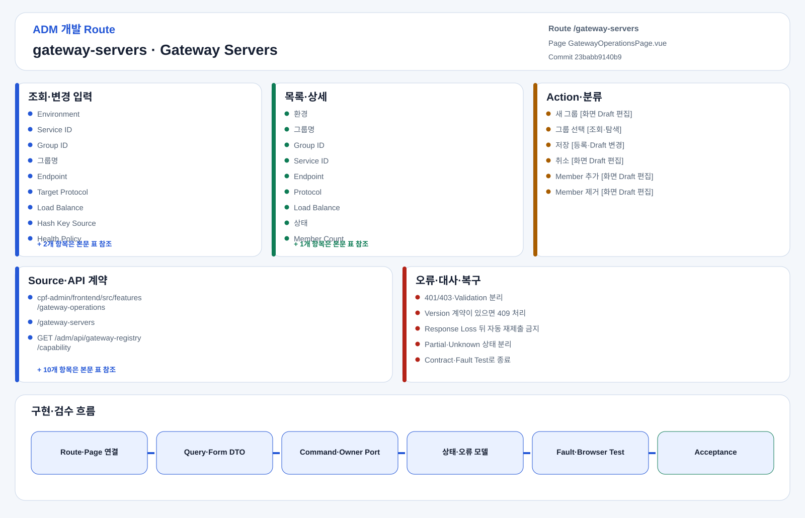


### 구현 결과

`/gateway-servers`가 단순 Route가 아니라 **Server Group의 Service·Endpoint·Protocol·Load Balance와 Member 구성을 관리한다.** Query·Command·Permission·Owner 상태·Audit·Browser Test가 연결된 기능 Slice가 되도록 구현한다.

### Source 진입점과 소유권

| 계층 | 기준 |
|---|---|
| Router | `/gateway-servers` |
| Page | `cpf-admin/frontend/src/features/gateway-operations/GatewayOperationsPage.vue` |
| Generated Client | Page가 import하는 Generated Client 또는 공통 ADM Client의 실제 Operation을 사용한다. 수기 Endpoint 문자열과 중복 DTO를 만들지 않는다 |
| ADM Backend | OpenAPI Operation의 Controller와 Application Service |
| Owner Port | Query·Command·Status·Reconcile Port; Local/Remote가 같은 DTO·오류 의미 사용 |
| Test | Frontend Unit·Generated Client Contract·Controller·Browser·Fault |
| 확인 API 1 | `GET /adm/api/gateway-registry/capability` |
| 확인 API 2 | `GET /adm/api/gateway-registry/operations/snapshot` |
| 확인 API 3 | `GET /adm/api/gateway-registry/operations/stream` |
| 확인 API 4 | `GET /adm/api/gateway-registry/server-groups` |
| 확인 API 5 | `POST /adm/api/gateway-registry/server-groups` |
| 확인 API 6 | `GET /adm/api/gateway-registry/server-groups/{serverGroupId}/members` |
| 확인 API 7 | `GET /adm/api/gateway-registry/bindings` |
| 확인 API 8 | `POST /adm/api/gateway-registry/bindings` |
| 확인 API 9 | `GET /adm/api/gateway-registry/bindings/{bindingId}/apply-status` |
| 확인 API 10 | `GET /adm/api/gateway-registry/bindings/{bindingId}/connection-tests` |
| 확인 API 11 | `POST /adm/api/gateway-registry/bindings/{bindingId}/connection-tests` |
| Source 해석 | 공유 Workspace가 `groups` Tab을 기본으로 연다. 이 Alias는 별도 Page가 아니다. |

### Frontend Query·Form 모델

| Field | Control | 직렬화·Validation | 오류·접근성 |
|---|---|---|---|
| `Environment` | Select·검색 | Gateway Servers 조회·조치가 적용되는 환경과 데이터 경계를 제한한다. 허용 목록과 현재 Environment·Data Scope에 맞는 값만 선택한다. Request·Query의 실제 이름과 Type을 유지한다. | Label·Help·Field Error·Keyboard Focus를 제공하고 민감값은 재표시하지 않는다. |
| `Service ID` | 문자열 입력·검색 | 조회·상세·Audit에서 같은 대상을 다시 찾기 위한 식별 조건이다. 앞뒤 공백·허용 문자·길이와 대소문자 규칙을 확인한다. Request·Query의 실제 이름과 Type을 유지한다. | Label·Help·Field Error·Keyboard Focus를 제공하고 민감값은 재표시하지 않는다. |
| `Group ID` | 문자열 입력·검색 | 조회·상세·Audit에서 같은 대상을 다시 찾기 위한 식별 조건이다. 앞뒤 공백·허용 문자·길이와 대소문자 규칙을 확인한다. Request·Query의 실제 이름과 Type을 유지한다. | Label·Help·Field Error·Keyboard Focus를 제공하고 민감값은 재표시하지 않는다. |
| `그룹명` | 문자열 입력·검색 | 대상의 표시명 또는 업무명을 검색·입력한다. 앞뒤 공백·허용 문자·길이와 대소문자 규칙을 확인한다. Request·Query의 실제 이름과 Type을 유지한다. | Label·Help·Field Error·Keyboard Focus를 제공하고 민감값은 재표시하지 않는다. |
| `Endpoint` | 문자열 입력·검색 | 조회·상세·Audit에서 같은 대상을 다시 찾기 위한 식별 조건이다. 앞뒤 공백·허용 문자·길이와 대소문자 규칙을 확인한다. Request·Query의 실제 이름과 Type을 유지한다. | Label·Help·Field Error·Keyboard Focus를 제공하고 민감값은 재표시하지 않는다. |
| `Target Protocol` | 날짜·시간 입력 | 조회 또는 적용의 유효 시간 범위를 정하며 Timezone과 시작·종료 순서를 함께 확인한다. Timezone을 고정하고 시작≤종료·유효기간 겹침·기준일 포함 여부를 확인한다. Request·Query의 실제 이름과 Type을 유지한다. | Label·Help·Field Error·Keyboard Focus를 제공하고 민감값은 재표시하지 않는다. |
| `Load Balance` | 문자열 입력·검색 | Gateway Servers 화면의 조회 조건 또는 편집 Form에 포함되는 값이며 화면 Label과 Help를 기준으로 사용한다. 앞뒤 공백·허용 문자·길이와 대소문자 규칙을 확인한다. Request·Query의 실제 이름과 Type을 유지한다. | Label·Help·Field Error·Keyboard Focus를 제공하고 민감값은 재표시하지 않는다. |
| `Hash Key Source` | 문자열 입력·검색 | Artifact·요청·적용 결과의 동일성을 비교하는 값이다. 앞뒤 공백·허용 문자·길이와 대소문자 규칙을 확인한다. Request·Query의 실제 이름과 Type을 유지한다. | Label·Help·Field Error·Keyboard Focus를 제공하고 민감값은 재표시하지 않는다. |
| `Health Policy` | Select·검색 | Gateway Servers에서 적용하거나 조회할 정책·권한·처리 유형을 선택한다. 허용 목록과 현재 Environment·Data Scope에 맞는 값만 선택한다. Request·Query의 실제 이름과 Type을 유지한다. | Label·Help·Field Error·Keyboard Focus를 제공하고 민감값은 재표시하지 않는다. |
| `Failover Group` | 문자열 입력·검색 | 조회·상세·Audit에서 같은 대상을 다시 찾기 위한 식별 조건이다. 앞뒤 공백·허용 문자·길이와 대소문자 규칙을 확인한다. Request·Query의 실제 이름과 Type을 유지한다. | Label·Help·Field Error·Keyboard Focus를 제공하고 민감값은 재표시하지 않는다. |
| `변경 사유` | 다중행 입력 | 작업 목적·영향 범위·승인 또는 복구 기준을 기록해 Audit와 교대 기록에 연결한다. Ticket·영향 범위·복구점을 포함하고 화면이 요구하는 최소 길이를 충족한다. Request·Query의 실제 이름과 Type을 유지한다. | Label·Help·Field Error·Keyboard Focus를 제공하고 민감값은 재표시하지 않는다. |

### Table·Detail View Model

| 값 | 표시 계약 | Drill-down·대사 |
|---|---|---|
| `환경` | Gateway Servers 상세에서 대상의 현재 속성 또는 처리 결과를 확인하는 값이다. Masking·Timezone·단위를 DTO Metadata와 함께 표시한다. | 상세·재조회 결과와 비교하고 Stale·Masking·단위 차이를 확인한다. |
| `그룹명` | 운영자가 대상을 구분하는 표시명 또는 설명이다. Masking·Timezone·단위를 DTO Metadata와 함께 표시한다. | 상세·재조회 결과와 비교하고 Stale·Masking·단위 차이를 확인한다. |
| `Group ID` | Gateway Servers의 대상 레코드를 상세·Owner·Audit에서 연결하는 식별자다. Masking·Timezone·단위를 DTO Metadata와 함께 표시한다. | 상세·Log·Trace·Audit에서 같은 대상을 가리키는지 확인한다. |
| `Service ID` | Gateway Servers의 대상 레코드를 상세·Owner·Audit에서 연결하는 식별자다. Masking·Timezone·단위를 DTO Metadata와 함께 표시한다. | 상세·Log·Trace·Audit에서 같은 대상을 가리키는지 확인한다. |
| `Endpoint` | Gateway Servers의 대상 레코드를 상세·Owner·Audit에서 연결하는 식별자다. Masking·Timezone·단위를 DTO Metadata와 함께 표시한다. | 상세·Log·Trace·Audit에서 같은 대상을 가리키는지 확인한다. |
| `Protocol` | 상태 발생·갱신·유효 시점을 나타내며 화면 Timezone을 기준으로 해석한다. Masking·Timezone·단위를 DTO Metadata와 함께 표시한다. | 상세·재조회 결과와 비교하고 Stale·Masking·단위 차이를 확인한다. |
| `Load Balance` | Gateway Servers 상세에서 대상의 현재 속성 또는 처리 결과를 확인하는 값이다. Masking·Timezone·단위를 DTO Metadata와 함께 표시한다. | 상세·재조회 결과와 비교하고 Stale·Masking·단위 차이를 확인한다. |
| `상태` | 현재 상태와 Terminal 여부, 다음 Action 가능 여부를 판단하는 값이다. Masking·Timezone·단위를 DTO Metadata와 함께 표시한다. | Last Updated·Terminal 조건·Owner 상태와 함께 확인한다. |
| `Member Count` | 동일한 집계 시간 창·단위·Filter에서 비교해야 하는 수치다. Masking·Timezone·단위를 DTO Metadata와 함께 표시한다. | 같은 Filter·집계 시간 창·단위의 상세 Row 또는 Metric으로 대사한다. |
| `Version` | 요청·Owner·Instance 사이의 Version 또는 내용 동일성을 판단하는 값이다. Masking·Timezone·단위를 DTO Metadata와 함께 표시한다. | 목록·상세·Owner 또는 Instance 보고값에서 일치하는지 확인한다. |

### Button·Command 모델

| Action | 분류 | Frontend 활성 조건 | Backend·성공 처리 |
|---|---|---|---|
| **새 그룹** | 화면 Draft 편집 | 화면 Form이 열려 있고 아직 Server Command를 제출하지 않음 | Browser의 편집 Draft만 변경하며 저장·실행 Action 전에는 Server Side Effect가 없다. |
| **그룹 선택** | 조회·탐색 | 조회 Permission과 Query Validation을 충족하고 동일 조회가 진행 중이 아님 | 그룹 선택 결과의 조회 시각·Filter·Source Version·Warning이 갱신되며 Owner 데이터는 변경하지 않는다. |
| **저장** | 등록·Draft 변경 | 화면이 실제로 요구하는 Write Permission·필수 Field·Reason·Version 조건을 충족함 | Gateway Servers의 재조회 결과가 요청 내용과 일치한다. Version·Before/After·Audit는 해당 Owner가 제공하는 경우 함께 확인한다. Backend에서도 Permission·Version·Idempotency를 재검증한다. |
| **취소** | 화면 Draft 편집 | 화면 Form이 열려 있고 아직 Server Command를 제출하지 않음 | Dialog를 닫고 Browser Draft를 폐기하며 Server Side Effect는 발생하지 않는다. |
| **Member 추가** | 화면 Draft 편집 | 화면 Form이 열려 있고 아직 Server Command를 제출하지 않음 | Browser의 편집 Draft만 변경하며 저장·실행 Action 전에는 Server Side Effect가 없다. |
| **Member 제거** | 화면 Draft 편집 | 화면 Form이 열려 있고 아직 Server Command를 제출하지 않음 | Browser의 편집 Draft만 변경하며 저장·실행 Action 전에는 Server Side Effect가 없다. |

### 상태 모델

```text
Query: Idle → Loading → Empty | Success | Error
Success + Stale | Partial
Local Draft: Closed → Editing → Cancelled | ReadyToSubmit
Command: Editing → Validating → Submitting → Accepted(operationId) → Terminal
Submitting → ResponseLoss → Reconcile → Terminal | UNKNOWN_RESULT
```

Query와 Command의 Loading·Error를 분리한다. 조회 전용 Route에는 존재하지 않는 Command 상태를 만들지 않는다. `403`, `409`, Timeout, Partial, Unknown을 하나의 Error Toast로 합치지 않는다.

### API·Owner 계약

- Query Request는 실제 Page가 사용하는 Environment·Data Scope·검색 Field·Paging·Sort·Timezone만 포함한다.
- Query Response는 실제 Item·Page·조회 시각·Source Version·Stale·Partial·Warning 계약을 유지한다.
- Command는 Source에 선언된 Target ID·Version·Reason·Approval ID·Idempotency Key·Request Hash 중 실제 필드만 사용한다.
- `202 Accepted`는 완료가 아니라 Operation 추적 시작이며 Owner Terminal 상태를 별도로 조회한다.
- Side Effect 전 실패, Side Effect 후 실패, Success, Partial, `UNKNOWN_RESULT`를 구분한다.
- Same-JVM과 Remote Adapter는 DTO·Error Code·Timeout·Unknown 의미를 유지한다.

### Permission·Data Scope·Masking

- Route Permission 기준은 **Gateway Menu/Action Permission + Approval**이다.
- Menu 노출, Query, Button, Raw, Export Permission을 분리하고 Backend와 Owner에서 다시 검증한다.
- Deny는 403과 Audit를 남기며 404·Empty로 위장하지 않는다.
- Secret·Credential·PII Raw를 일반 Response DTO·Browser Storage·Log에 넣지 않는다.

### 구현 순서

1. Route·Page Import·Menu Metadata·Permission을 연결한다.
2. 이 장의 Field·Column·Action을 OpenAPI Request·Response·Error와 대조한다.
3. Generated Client를 재생성하고 수기 HTTP 호출을 제거한다.
4. Query·Command 상태와 Empty·Stale·Partial·Unknown UI를 구현한다.
5. Backend Controller·Application Service·Owner Port·Local/Remote Adapter를 연결한다.
6. Reason·Approval·Expected Version·Idempotency·Audit를 Server에서 검증한다.
7. Response Loss Polling·Reconcile·Rollback Link를 구현한다.
8. Unit·Contract·Browser·Fault·Accessibility Test를 실행한다.

### Test Matrix

| Test | 필수 Scenario |
|---|---|
| Frontend Unit | Default·Validation·Button 조건·Masking·Empty/Error/Stale/Partial |
| OpenAPI·Generated Client | Operation 이름·Type·Error·Hash Drift |
| Backend Query | Permission·Data Scope·Filter·Paging·Stale·Partial |
| Backend Command | Source에 선언된 Permission·Version·Reason·Approval·Idempotency·Audit 계약 |
| Local/Remote Contract | 같은 DTO·Error·Timeout 의미 |
| Browser | Deep Link·Query·상세·403·Timeout·Empty·Partial |
| Fault | 409·Response Loss·DB/Kafka/Owner 중단·Partial ACK·Late Response |
| Accessibility | Keyboard·Focus·Label·Error Announcement·Table/Dialog |

### 개발 Fault Workbook

1. `/gateway-servers` Query를 500·Timeout·Empty·Partial 응답으로 주입해 Loading·Empty·Error·Stale·Partial UI를 각각 확인한다.
2. 401·403과 Data Scope 축소를 주입해 Deny를 Empty로 위장하지 않고 Error와 접근 가능한 범위를 구분하는지 확인한다.
3. Version 계약이 있는 Write Action에는 409를, 모든 비동기·원격 Write에는 Response Loss를 주입해 자동 재제출이 없는지 확인한다.
4. 202 응답 뒤 Operation Polling이 Terminal·Failed·Partial·Unknown을 분리하는지 확인한다.
5. Local Adapter와 Remote Adapter에 같은 Contract Fixture를 적용해 Error Code·Retryability·failureStage가 일치하는지 확인한다.
6. Browser Storage·Console·Network Error·Screenshot에 Token·Secret·PII Raw가 남지 않는지 확인한다.

### Route Acceptance Checklist

- [ ] Route `/gateway-servers`의 Deep Link와 Menu ID `gateway-servers`가 같은 Page를 연다.
- [ ] 이 장의 Field·Column·Action과 Page·OpenAPI·Generated Client가 같은 계약을 사용한다.
- [ ] Menu·Query·Raw·Export Permission Deny가 Backend 403과 화면 Error로 확인된다.
- [ ] Empty·Timeout·Stale·Partial이 서로 다른 사용자 상태와 재조회 경로를 제공한다.
- [ ] Same-JVM·Remote 호출이 같은 Query DTO·오류·Timeout 계약을 사용한다.
- [ ] 409·Response Loss·Partial·Unknown이 서로 다른 상태와 Operation·Reconcile Link를 제공한다.
- [ ] Command가 Source에 선언한 Reason·Approval·Version·Idempotency·Audit 필드를 Server에서 재검증한다.
- [ ] 정상·오류·경계 Browser Test와 Accessibility Test가 Route Matrix에 포함된다.

### 독립 수행 검수 Checklist

- [ ] `/gateway-servers`와 Page Source를 찾고 화면 목적을 설명할 수 있다.
- [ ] 1별도 사용자 입력이 없는 경우 자동 Query Context를 설명할 수 있다.
- [ ] 10개 표시값을 Owner 상태·Version·Audit와 대사할 수 있다.
- [ ] 6개 Action의 분류·활성 조건·Side Effect를 설명할 수 있다.
- [ ] Empty·403·409·Timeout·Partial·Unknown을 서로 다른 상태로 처리할 수 있다.
- [ ] 응답 유실 뒤 중복 제출 없이 Operation·Owner·Audit로 결과를 확정할 수 있다.
- [ ] 교대 기록만으로 다음 담당자가 Target·상태·복구 기한을 이어받을 수 있다.
- [ ] OpenAPI·Generated Client·Page·Controller·Owner Port·Test가 같은 Field와 오류 계약을 사용하는지 검증할 수 있다.
- [ ] Local·Remote Adapter의 Timeout·Unknown 의미가 같은지 Contract Test로 확인할 수 있다.

## 46. gateway-groups — Gateway Groups 기능 Slice 개발 장

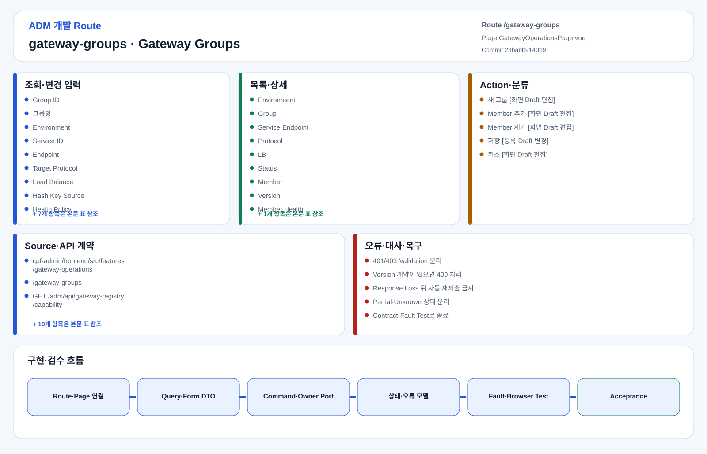


### 구현 결과

`/gateway-groups`가 단순 Route가 아니라 **Server Group Member의 Weight·Priority·Canary·Enabled를 관리한다.** Query·Command·Permission·Owner 상태·Audit·Browser Test가 연결된 기능 Slice가 되도록 구현한다.

### Source 진입점과 소유권

| 계층 | 기준 |
|---|---|
| Router | `/gateway-groups` |
| Page | `cpf-admin/frontend/src/features/gateway-operations/GatewayOperationsPage.vue` |
| Generated Client | Page가 import하는 Generated Client 또는 공통 ADM Client의 실제 Operation을 사용한다. 수기 Endpoint 문자열과 중복 DTO를 만들지 않는다 |
| ADM Backend | OpenAPI Operation의 Controller와 Application Service |
| Owner Port | Query·Command·Status·Reconcile Port; Local/Remote가 같은 DTO·오류 의미 사용 |
| Test | Frontend Unit·Generated Client Contract·Controller·Browser·Fault |
| 확인 API 1 | `GET /adm/api/gateway-registry/capability` |
| 확인 API 2 | `GET /adm/api/gateway-registry/operations/snapshot` |
| 확인 API 3 | `GET /adm/api/gateway-registry/operations/stream` |
| 확인 API 4 | `GET /adm/api/gateway-registry/server-groups` |
| 확인 API 5 | `POST /adm/api/gateway-registry/server-groups` |
| 확인 API 6 | `GET /adm/api/gateway-registry/server-groups/{serverGroupId}/members` |
| 확인 API 7 | `GET /adm/api/gateway-registry/bindings` |
| 확인 API 8 | `POST /adm/api/gateway-registry/bindings` |
| 확인 API 9 | `GET /adm/api/gateway-registry/bindings/{bindingId}/apply-status` |
| 확인 API 10 | `GET /adm/api/gateway-registry/bindings/{bindingId}/connection-tests` |
| 확인 API 11 | `POST /adm/api/gateway-registry/bindings/{bindingId}/connection-tests` |
| Source 해석 | 공유 Workspace가 `groups` Tab을 기본으로 연다. Member Weight는 1~10000, Priority는 0 이상, Canary Percent는 0~100을 사용한다. |

### Frontend Query·Form 모델

| Field | Control | 직렬화·Validation | 오류·접근성 |
|---|---|---|---|
| `Group ID` | 문자열 입력·검색 | 조회·상세·Audit에서 같은 대상을 다시 찾기 위한 식별 조건이다. 앞뒤 공백·허용 문자·길이와 대소문자 규칙을 확인한다. Request·Query의 실제 이름과 Type을 유지한다. | Label·Help·Field Error·Keyboard Focus를 제공하고 민감값은 재표시하지 않는다. |
| `그룹명` | 문자열 입력·검색 | 대상의 표시명 또는 업무명을 검색·입력한다. 앞뒤 공백·허용 문자·길이와 대소문자 규칙을 확인한다. Request·Query의 실제 이름과 Type을 유지한다. | Label·Help·Field Error·Keyboard Focus를 제공하고 민감값은 재표시하지 않는다. |
| `Environment` | Select·검색 | Gateway Groups 조회·조치가 적용되는 환경과 데이터 경계를 제한한다. 허용 목록과 현재 Environment·Data Scope에 맞는 값만 선택한다. Request·Query의 실제 이름과 Type을 유지한다. | Label·Help·Field Error·Keyboard Focus를 제공하고 민감값은 재표시하지 않는다. |
| `Service ID` | 문자열 입력·검색 | 조회·상세·Audit에서 같은 대상을 다시 찾기 위한 식별 조건이다. 앞뒤 공백·허용 문자·길이와 대소문자 규칙을 확인한다. Request·Query의 실제 이름과 Type을 유지한다. | Label·Help·Field Error·Keyboard Focus를 제공하고 민감값은 재표시하지 않는다. |
| `Endpoint` | 문자열 입력·검색 | 조회·상세·Audit에서 같은 대상을 다시 찾기 위한 식별 조건이다. 앞뒤 공백·허용 문자·길이와 대소문자 규칙을 확인한다. Request·Query의 실제 이름과 Type을 유지한다. | Label·Help·Field Error·Keyboard Focus를 제공하고 민감값은 재표시하지 않는다. |
| `Target Protocol` | 날짜·시간 입력 | 조회 또는 적용의 유효 시간 범위를 정하며 Timezone과 시작·종료 순서를 함께 확인한다. Timezone을 고정하고 시작≤종료·유효기간 겹침·기준일 포함 여부를 확인한다. Request·Query의 실제 이름과 Type을 유지한다. | Label·Help·Field Error·Keyboard Focus를 제공하고 민감값은 재표시하지 않는다. |
| `Load Balance` | 문자열 입력·검색 | Gateway Groups 화면의 조회 조건 또는 편집 Form에 포함되는 값이며 화면 Label과 Help를 기준으로 사용한다. 앞뒤 공백·허용 문자·길이와 대소문자 규칙을 확인한다. Request·Query의 실제 이름과 Type을 유지한다. | Label·Help·Field Error·Keyboard Focus를 제공하고 민감값은 재표시하지 않는다. |
| `Hash Key Source` | 문자열 입력·검색 | Artifact·요청·적용 결과의 동일성을 비교하는 값이다. 앞뒤 공백·허용 문자·길이와 대소문자 규칙을 확인한다. Request·Query의 실제 이름과 Type을 유지한다. | Label·Help·Field Error·Keyboard Focus를 제공하고 민감값은 재표시하지 않는다. |
| `Health Policy` | Select·검색 | Gateway Groups에서 적용하거나 조회할 정책·권한·처리 유형을 선택한다. 허용 목록과 현재 Environment·Data Scope에 맞는 값만 선택한다. Request·Query의 실제 이름과 Type을 유지한다. | Label·Help·Field Error·Keyboard Focus를 제공하고 민감값은 재표시하지 않는다. |
| `Failover Group` | 문자열 입력·검색 | 조회·상세·Audit에서 같은 대상을 다시 찾기 위한 식별 조건이다. 앞뒤 공백·허용 문자·길이와 대소문자 규칙을 확인한다. Request·Query의 실제 이름과 Type을 유지한다. | Label·Help·Field Error·Keyboard Focus를 제공하고 민감값은 재표시하지 않는다. |
| `Instance ID` | 문자열 입력·검색 | 조회·상세·Audit에서 같은 대상을 다시 찾기 위한 식별 조건이다. 앞뒤 공백·허용 문자·길이와 대소문자 규칙을 확인한다. Request·Query의 실제 이름과 Type을 유지한다. | Label·Help·Field Error·Keyboard Focus를 제공하고 민감값은 재표시하지 않는다. |
| `Weight` | 숫자·Version 입력 | 실행 한도·순서·용량 또는 재시도 범위를 지정한다. 화면의 min·max·단위와 0 허용 여부를 확인하고 음수·Overflow를 차단한다. Request·Query의 실제 이름과 Type을 유지한다. | Label·Help·Field Error·Keyboard Focus를 제공하고 민감값은 재표시하지 않는다. |
| `Priority` | 숫자·Version 입력 | 실행 한도·순서·용량 또는 재시도 범위를 지정한다. 화면의 min·max·단위와 0 허용 여부를 확인하고 음수·Overflow를 차단한다. Request·Query의 실제 이름과 Type을 유지한다. | Label·Help·Field Error·Keyboard Focus를 제공하고 민감값은 재표시하지 않는다. |
| `Canary Percent` | 숫자·Version 입력 | 실행 한도·순서·용량 또는 재시도 범위를 지정한다. 화면의 min·max·단위와 0 허용 여부를 확인하고 음수·Overflow를 차단한다. Request·Query의 실제 이름과 Type을 유지한다. | Label·Help·Field Error·Keyboard Focus를 제공하고 민감값은 재표시하지 않는다. |
| `Enabled` | Checkbox·Switch | 현재 상태를 조회하거나 다음 Action의 허용 조건을 지정한다. 현재 선택과 변경 후 영향 범위를 비교하고 화면의 Source 기본값을 확인한다. Request·Query의 실제 이름과 Type을 유지한다. | Label·Help·Field Error·Keyboard Focus를 제공하고 민감값은 재표시하지 않는다. |
| `변경 사유` | 다중행 입력 | 작업 목적·영향 범위·승인 또는 복구 기준을 기록해 Audit와 교대 기록에 연결한다. Ticket·영향 범위·복구점을 포함하고 화면이 요구하는 최소 길이를 충족한다. Request·Query의 실제 이름과 Type을 유지한다. | Label·Help·Field Error·Keyboard Focus를 제공하고 민감값은 재표시하지 않는다. |

### Table·Detail View Model

| 값 | 표시 계약 | Drill-down·대사 |
|---|---|---|
| `Environment` | Gateway Groups 상세에서 대상의 현재 속성 또는 처리 결과를 확인하는 값이다. Masking·Timezone·단위를 DTO Metadata와 함께 표시한다. | 상세·재조회 결과와 비교하고 Stale·Masking·단위 차이를 확인한다. |
| `Group` | Gateway Groups의 대상 레코드를 상세·Owner·Audit에서 연결하는 식별자다. Masking·Timezone·단위를 DTO Metadata와 함께 표시한다. | 상세·Log·Trace·Audit에서 같은 대상을 가리키는지 확인한다. |
| `Service·Endpoint` | Gateway Groups의 대상 레코드를 상세·Owner·Audit에서 연결하는 식별자다. Masking·Timezone·단위를 DTO Metadata와 함께 표시한다. | 상세·Log·Trace·Audit에서 같은 대상을 가리키는지 확인한다. |
| `Protocol` | 상태 발생·갱신·유효 시점을 나타내며 화면 Timezone을 기준으로 해석한다. Masking·Timezone·단위를 DTO Metadata와 함께 표시한다. | 상세·재조회 결과와 비교하고 Stale·Masking·단위 차이를 확인한다. |
| `LB` | Gateway Groups 상세에서 대상의 현재 속성 또는 처리 결과를 확인하는 값이다. Masking·Timezone·단위를 DTO Metadata와 함께 표시한다. | 상세·재조회 결과와 비교하고 Stale·Masking·단위 차이를 확인한다. |
| `Status` | 현재 상태와 Terminal 여부, 다음 Action 가능 여부를 판단하는 값이다. Masking·Timezone·단위를 DTO Metadata와 함께 표시한다. | Last Updated·Terminal 조건·Owner 상태와 함께 확인한다. |
| `Member` | Gateway Groups 상세에서 대상의 현재 속성 또는 처리 결과를 확인하는 값이다. Masking·Timezone·단위를 DTO Metadata와 함께 표시한다. | 상세·재조회 결과와 비교하고 Stale·Masking·단위 차이를 확인한다. |
| `Version` | 요청·Owner·Instance 사이의 Version 또는 내용 동일성을 판단하는 값이다. Masking·Timezone·단위를 DTO Metadata와 함께 표시한다. | 목록·상세·Owner 또는 Instance 보고값에서 일치하는지 확인한다. |
| `Member Health` | 현재 상태와 Terminal 여부, 다음 Action 가능 여부를 판단하는 값이다. Masking·Timezone·단위를 DTO Metadata와 함께 표시한다. | Last Updated·Terminal 조건·Owner 상태와 함께 확인한다. |
| `Fencing Token` | 상태 발생·갱신·유효 시점을 나타내며 화면 Timezone을 기준으로 해석한다. Masking·Timezone·단위를 DTO Metadata와 함께 표시한다. | 상세·재조회 결과와 비교하고 Stale·Masking·단위 차이를 확인한다. |

### Button·Command 모델

| Action | 분류 | Frontend 활성 조건 | Backend·성공 처리 |
|---|---|---|---|
| **새 그룹** | 화면 Draft 편집 | 화면 Form이 열려 있고 아직 Server Command를 제출하지 않음 | Browser의 편집 Draft만 변경하며 저장·실행 Action 전에는 Server Side Effect가 없다. |
| **Member 추가** | 화면 Draft 편집 | 화면 Form이 열려 있고 아직 Server Command를 제출하지 않음 | Browser의 편집 Draft만 변경하며 저장·실행 Action 전에는 Server Side Effect가 없다. |
| **Member 제거** | 화면 Draft 편집 | 화면 Form이 열려 있고 아직 Server Command를 제출하지 않음 | Browser의 편집 Draft만 변경하며 저장·실행 Action 전에는 Server Side Effect가 없다. |
| **저장** | 등록·Draft 변경 | 화면이 실제로 요구하는 Write Permission·필수 Field·Reason·Version 조건을 충족함 | Gateway Groups의 재조회 결과가 요청 내용과 일치한다. Version·Before/After·Audit는 해당 Owner가 제공하는 경우 함께 확인한다. Backend에서도 Permission·Version·Idempotency를 재검증한다. |
| **취소** | 화면 Draft 편집 | 화면 Form이 열려 있고 아직 Server Command를 제출하지 않음 | Dialog를 닫고 Browser Draft를 폐기하며 Server Side Effect는 발생하지 않는다. |

### 상태 모델

```text
Query: Idle → Loading → Empty | Success | Error
Success + Stale | Partial
Local Draft: Closed → Editing → Cancelled | ReadyToSubmit
Command: Editing → Validating → Submitting → Accepted(operationId) → Terminal
Submitting → ResponseLoss → Reconcile → Terminal | UNKNOWN_RESULT
```

Query와 Command의 Loading·Error를 분리한다. 조회 전용 Route에는 존재하지 않는 Command 상태를 만들지 않는다. `403`, `409`, Timeout, Partial, Unknown을 하나의 Error Toast로 합치지 않는다.

### API·Owner 계약

- Query Request는 실제 Page가 사용하는 Environment·Data Scope·검색 Field·Paging·Sort·Timezone만 포함한다.
- Query Response는 실제 Item·Page·조회 시각·Source Version·Stale·Partial·Warning 계약을 유지한다.
- Command는 Source에 선언된 Target ID·Version·Reason·Approval ID·Idempotency Key·Request Hash 중 실제 필드만 사용한다.
- `202 Accepted`는 완료가 아니라 Operation 추적 시작이며 Owner Terminal 상태를 별도로 조회한다.
- Side Effect 전 실패, Side Effect 후 실패, Success, Partial, `UNKNOWN_RESULT`를 구분한다.
- Same-JVM과 Remote Adapter는 DTO·Error Code·Timeout·Unknown 의미를 유지한다.

### Permission·Data Scope·Masking

- Route Permission 기준은 **Gateway Menu/Action Permission + Approval**이다.
- Menu 노출, Query, Button, Raw, Export Permission을 분리하고 Backend와 Owner에서 다시 검증한다.
- Deny는 403과 Audit를 남기며 404·Empty로 위장하지 않는다.
- Secret·Credential·PII Raw를 일반 Response DTO·Browser Storage·Log에 넣지 않는다.

### 구현 순서

1. Route·Page Import·Menu Metadata·Permission을 연결한다.
2. 이 장의 Field·Column·Action을 OpenAPI Request·Response·Error와 대조한다.
3. Generated Client를 재생성하고 수기 HTTP 호출을 제거한다.
4. Query·Command 상태와 Empty·Stale·Partial·Unknown UI를 구현한다.
5. Backend Controller·Application Service·Owner Port·Local/Remote Adapter를 연결한다.
6. Reason·Approval·Expected Version·Idempotency·Audit를 Server에서 검증한다.
7. Response Loss Polling·Reconcile·Rollback Link를 구현한다.
8. Unit·Contract·Browser·Fault·Accessibility Test를 실행한다.

### Test Matrix

| Test | 필수 Scenario |
|---|---|
| Frontend Unit | Default·Validation·Button 조건·Masking·Empty/Error/Stale/Partial |
| OpenAPI·Generated Client | Operation 이름·Type·Error·Hash Drift |
| Backend Query | Permission·Data Scope·Filter·Paging·Stale·Partial |
| Backend Command | Source에 선언된 Permission·Version·Reason·Approval·Idempotency·Audit 계약 |
| Local/Remote Contract | 같은 DTO·Error·Timeout 의미 |
| Browser | Deep Link·Query·상세·403·Timeout·Empty·Partial |
| Fault | 409·Response Loss·DB/Kafka/Owner 중단·Partial ACK·Late Response |
| Accessibility | Keyboard·Focus·Label·Error Announcement·Table/Dialog |

### 개발 Fault Workbook

1. `/gateway-groups` Query를 500·Timeout·Empty·Partial 응답으로 주입해 Loading·Empty·Error·Stale·Partial UI를 각각 확인한다.
2. 401·403과 Data Scope 축소를 주입해 Deny를 Empty로 위장하지 않고 Error와 접근 가능한 범위를 구분하는지 확인한다.
3. Version 계약이 있는 Write Action에는 409를, 모든 비동기·원격 Write에는 Response Loss를 주입해 자동 재제출이 없는지 확인한다.
4. 202 응답 뒤 Operation Polling이 Terminal·Failed·Partial·Unknown을 분리하는지 확인한다.
5. Local Adapter와 Remote Adapter에 같은 Contract Fixture를 적용해 Error Code·Retryability·failureStage가 일치하는지 확인한다.
6. Browser Storage·Console·Network Error·Screenshot에 Token·Secret·PII Raw가 남지 않는지 확인한다.

### Route Acceptance Checklist

- [ ] Route `/gateway-groups`의 Deep Link와 Menu ID `gateway-groups`가 같은 Page를 연다.
- [ ] 이 장의 Field·Column·Action과 Page·OpenAPI·Generated Client가 같은 계약을 사용한다.
- [ ] Menu·Query·Raw·Export Permission Deny가 Backend 403과 화면 Error로 확인된다.
- [ ] Empty·Timeout·Stale·Partial이 서로 다른 사용자 상태와 재조회 경로를 제공한다.
- [ ] Same-JVM·Remote 호출이 같은 Query DTO·오류·Timeout 계약을 사용한다.
- [ ] 409·Response Loss·Partial·Unknown이 서로 다른 상태와 Operation·Reconcile Link를 제공한다.
- [ ] Command가 Source에 선언한 Reason·Approval·Version·Idempotency·Audit 필드를 Server에서 재검증한다.
- [ ] 정상·오류·경계 Browser Test와 Accessibility Test가 Route Matrix에 포함된다.

### 독립 수행 검수 Checklist

- [ ] `/gateway-groups`와 Page Source를 찾고 화면 목적을 설명할 수 있다.
- [ ] 16개 입력·검색 항목의 Control·기본값·Validation을 설명할 수 있다.
- [ ] 10개 표시값을 Owner 상태·Version·Audit와 대사할 수 있다.
- [ ] 5개 Action의 분류·활성 조건·Side Effect를 설명할 수 있다.
- [ ] Empty·403·409·Timeout·Partial·Unknown을 서로 다른 상태로 처리할 수 있다.
- [ ] 응답 유실 뒤 중복 제출 없이 Operation·Owner·Audit로 결과를 확정할 수 있다.
- [ ] 교대 기록만으로 다음 담당자가 Target·상태·복구 기한을 이어받을 수 있다.
- [ ] OpenAPI·Generated Client·Page·Controller·Owner Port·Test가 같은 Field와 오류 계약을 사용하는지 검증할 수 있다.
- [ ] Local·Remote Adapter의 Timeout·Unknown 의미가 같은지 Contract Test로 확인할 수 있다.

## 47. gateway-routes — Gateway Routes 기능 Slice 개발 장

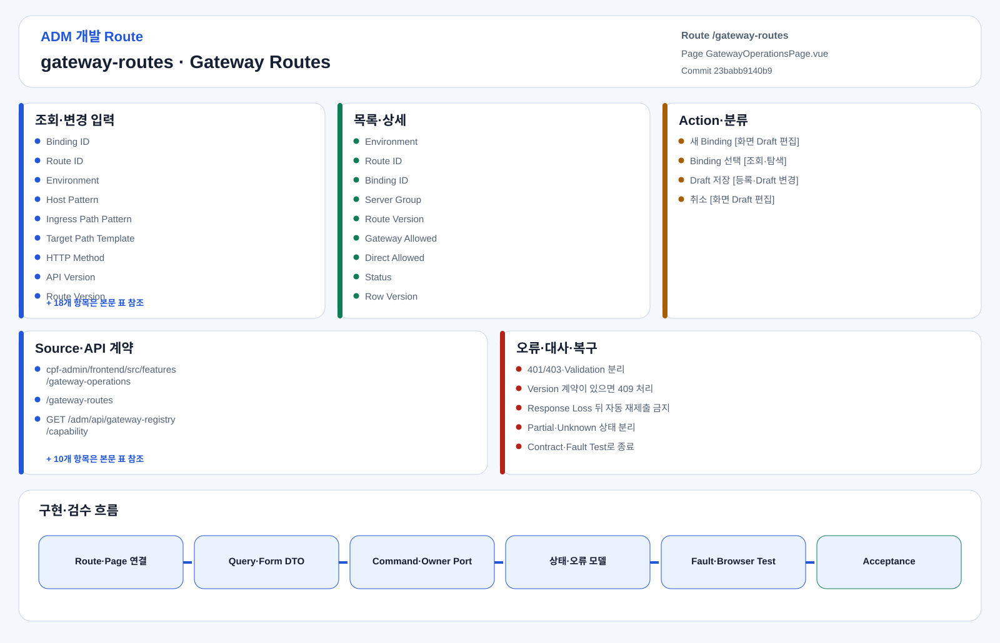


### 구현 결과

`/gateway-routes`가 단순 Route가 아니라 **Default Deny 상태에서 Route Binding Draft와 Timeout·Retry·보안 Policy 참조를 관리한다.** Query·Command·Permission·Owner 상태·Audit·Browser Test가 연결된 기능 Slice가 되도록 구현한다.

### Source 진입점과 소유권

| 계층 | 기준 |
|---|---|
| Router | `/gateway-routes` |
| Page | `cpf-admin/frontend/src/features/gateway-operations/GatewayOperationsPage.vue` |
| Generated Client | Page가 import하는 Generated Client 또는 공통 ADM Client의 실제 Operation을 사용한다. 수기 Endpoint 문자열과 중복 DTO를 만들지 않는다 |
| ADM Backend | OpenAPI Operation의 Controller와 Application Service |
| Owner Port | Query·Command·Status·Reconcile Port; Local/Remote가 같은 DTO·오류 의미 사용 |
| Test | Frontend Unit·Generated Client Contract·Controller·Browser·Fault |
| 확인 API 1 | `GET /adm/api/gateway-registry/capability` |
| 확인 API 2 | `GET /adm/api/gateway-registry/operations/snapshot` |
| 확인 API 3 | `GET /adm/api/gateway-registry/operations/stream` |
| 확인 API 4 | `GET /adm/api/gateway-registry/server-groups` |
| 확인 API 5 | `POST /adm/api/gateway-registry/server-groups` |
| 확인 API 6 | `GET /adm/api/gateway-registry/server-groups/{serverGroupId}/members` |
| 확인 API 7 | `GET /adm/api/gateway-registry/bindings` |
| 확인 API 8 | `POST /adm/api/gateway-registry/bindings` |
| 확인 API 9 | `GET /adm/api/gateway-registry/bindings/{bindingId}/apply-status` |
| 확인 API 10 | `GET /adm/api/gateway-registry/bindings/{bindingId}/connection-tests` |
| 확인 API 11 | `POST /adm/api/gateway-registry/bindings/{bindingId}/connection-tests` |
| Source 해석 | Alias 진입 시에도 `groups` Tab이 기본이므로 운영자가 `경로·라우팅` Tab을 직접 선택한다. Source의 현재 Button은 Draft 저장까지 제공한다. |

### Frontend Query·Form 모델

| Field | Control | 직렬화·Validation | 오류·접근성 |
|---|---|---|---|
| `Binding ID` | 문자열 입력·검색 | 조회·상세·Audit에서 같은 대상을 다시 찾기 위한 식별 조건이다. 앞뒤 공백·허용 문자·길이와 대소문자 규칙을 확인한다. Request·Query의 실제 이름과 Type을 유지한다. | Label·Help·Field Error·Keyboard Focus를 제공하고 민감값은 재표시하지 않는다. |
| `Route ID` | 문자열 입력·검색 | 조회·상세·Audit에서 같은 대상을 다시 찾기 위한 식별 조건이다. 앞뒤 공백·허용 문자·길이와 대소문자 규칙을 확인한다. Request·Query의 실제 이름과 Type을 유지한다. | Label·Help·Field Error·Keyboard Focus를 제공하고 민감값은 재표시하지 않는다. |
| `Environment` | Select·검색 | Gateway Routes 조회·조치가 적용되는 환경과 데이터 경계를 제한한다. 허용 목록과 현재 Environment·Data Scope에 맞는 값만 선택한다. Request·Query의 실제 이름과 Type을 유지한다. | Label·Help·Field Error·Keyboard Focus를 제공하고 민감값은 재표시하지 않는다. |
| `Host Pattern` | 문자열 입력 | Ingress Host 조건이다. 신규 Binding 기본값은 `*`이며 운영 Domain 허용 범위를 검토한다. Request·Query의 실제 이름과 Type을 유지한다. | Label·Help·Field Error·Keyboard Focus를 제공하고 민감값은 재표시하지 않는다. |
| `Ingress Path Pattern` | 문자열 입력 | Gateway가 수신할 Path Pattern이다. 신규 기본값은 `/api/**`; 관리·Internal Endpoint가 포함되지 않아야 한다. Request·Query의 실제 이름과 Type을 유지한다. | Label·Help·Field Error·Keyboard Focus를 제공하고 민감값은 재표시하지 않는다. |
| `Target Path Template` | 문자열 입력 | Target으로 전달할 Path Template이다. 신규 기본값은 `/internal/**`; 변수와 Wildcard 치환 결과를 Preview한다. Request·Query의 실제 이름과 Type을 유지한다. | Label·Help·Field Error·Keyboard Focus를 제공하고 민감값은 재표시하지 않는다. |
| `HTTP Method` | Select | 허용 HTTP Method를 제한한다. 신규 기본값은 `*`; 필요한 Method만 허용한다. Request·Query의 실제 이름과 Type을 유지한다. | Label·Help·Field Error·Keyboard Focus를 제공하고 민감값은 재표시하지 않는다. |
| `API Version` | 문자열 입력 | Route API Version을 지정한다. 신규 기본값은 `v1`; Consumer 호환성과 배포 순서를 확인한다. Request·Query의 실제 이름과 Type을 유지한다. | Label·Help·Field Error·Keyboard Focus를 제공하고 민감값은 재표시하지 않는다. |
| `Route Version` | 문자열 입력 | 게시·적용·Drift 비교에 사용할 Route Version이다. 신규 기본값은 `1`; 기존 Version과 충돌하지 않아야 한다. Request·Query의 실제 이름과 Type을 유지한다. | Label·Help·Field Error·Keyboard Focus를 제공하고 민감값은 재표시하지 않는다. |
| `Service ID` | 문자열 입력·검색 | 조회·상세·Audit에서 같은 대상을 다시 찾기 위한 식별 조건이다. 앞뒤 공백·허용 문자·길이와 대소문자 규칙을 확인한다. Request·Query의 실제 이름과 Type을 유지한다. | Label·Help·Field Error·Keyboard Focus를 제공하고 민감값은 재표시하지 않는다. |
| `Server Group` | 문자열 입력·검색 | 조회·상세·Audit에서 같은 대상을 다시 찾기 위한 식별 조건이다. 앞뒤 공백·허용 문자·길이와 대소문자 규칙을 확인한다. Request·Query의 실제 이름과 Type을 유지한다. | Label·Help·Field Error·Keyboard Focus를 제공하고 민감값은 재표시하지 않는다. |
| `Ingress Protocol` | Select | Gateway Ingress Protocol을 지정한다. 신규 기본값은 `HTTPS`다. Request·Query의 실제 이름과 Type을 유지한다. | Label·Help·Field Error·Keyboard Focus를 제공하고 민감값은 재표시하지 않는다. |
| `Target Protocol` | Select | Gateway에서 Target으로 연결할 Protocol을 지정한다. 신규 기본값은 `HTTP`; TLS Policy와 Trust Boundary를 함께 확인한다. Request·Query의 실제 이름과 Type을 유지한다. | Label·Help·Field Error·Keyboard Focus를 제공하고 민감값은 재표시하지 않는다. |
| `Connect Timeout ms` | 숫자 입력 | Target 연결 수립 최대 대기시간이다. 최소 1ms, Source 기본값은 3000ms다. Request·Query의 실제 이름과 Type을 유지한다. | Label·Help·Field Error·Keyboard Focus를 제공하고 민감값은 재표시하지 않는다. |
| `Response Timeout ms` | 숫자 입력 | 연결 후 Response 최대 대기시간이다. 최소 1ms, Source 기본값은 10000ms다. Request·Query의 실제 이름과 Type을 유지한다. | Label·Help·Field Error·Keyboard Focus를 제공하고 민감값은 재표시하지 않는다. |
| `Overall Timeout ms` | 숫자 입력 | Retry를 포함한 전체 요청 Budget이다. 최소 1ms, Source 기본값은 15000ms이며 단계별 Timeout 합계를 검토한다. Request·Query의 실제 이름과 Type을 유지한다. | Label·Help·Field Error·Keyboard Focus를 제공하고 민감값은 재표시하지 않는다. |
| `Max Retry Count` | 숫자 입력 | 추가 Attempt 횟수다. 최소 0, Source 기본값은 0이며 비멱등 Route에는 Retry를 허용하지 않는다. Request·Query의 실제 이름과 Type을 유지한다. | Label·Help·Field Error·Keyboard Focus를 제공하고 민감값은 재표시하지 않는다. |
| `Idempotent` | Checkbox | Owner가 중복 Attempt에 같은 업무 결과를 보장하는지 선언한다. Source 기본값은 `false`; 실제 Owner 멱등 계약과 일치해야 한다. Request·Query의 실제 이름과 Type을 유지한다. | Label·Help·Field Error·Keyboard Focus를 제공하고 민감값은 재표시하지 않는다. |
| `Gateway Allowed` | Checkbox | Gateway Ingress 호출 허용 여부다. Source 기본값은 `false`; ACTIVE Binding과 Instance ACK를 함께 확인한다. Request·Query의 실제 이름과 Type을 유지한다. | Label·Help·Field Error·Keyboard Focus를 제공하고 민감값은 재표시하지 않는다. |
| `Direct Allowed` | Checkbox | Gateway를 우회한 Direct 호출 허용 여부다. Source 기본값은 `false`; Network와 Authorization 경계를 확인한다. Request·Query의 실제 이름과 Type을 유지한다. | Label·Help·Field Error·Keyboard Focus를 제공하고 민감값은 재표시하지 않는다. |
| `TLS Policy` | Select·검색 | Gateway Routes에서 적용하거나 조회할 정책·권한·처리 유형을 선택한다. 허용 목록과 현재 Environment·Data Scope에 맞는 값만 선택한다. Request·Query의 실제 이름과 Type을 유지한다. | Label·Help·Field Error·Keyboard Focus를 제공하고 민감값은 재표시하지 않는다. |
| `Authentication Policy` | Select·검색 | Gateway Routes에서 적용하거나 조회할 정책·권한·처리 유형을 선택한다. 허용 목록과 현재 Environment·Data Scope에 맞는 값만 선택한다. Request·Query의 실제 이름과 Type을 유지한다. | Label·Help·Field Error·Keyboard Focus를 제공하고 민감값은 재표시하지 않는다. |
| `Authorization Policy` | Select·검색 | Gateway Routes에서 적용하거나 조회할 정책·권한·처리 유형을 선택한다. 허용 목록과 현재 Environment·Data Scope에 맞는 값만 선택한다. Request·Query의 실제 이름과 Type을 유지한다. | Label·Help·Field Error·Keyboard Focus를 제공하고 민감값은 재표시하지 않는다. |
| `Header Policy` | Select·검색 | Gateway Routes에서 적용하거나 조회할 정책·권한·처리 유형을 선택한다. 허용 목록과 현재 Environment·Data Scope에 맞는 값만 선택한다. Request·Query의 실제 이름과 Type을 유지한다. | Label·Help·Field Error·Keyboard Focus를 제공하고 민감값은 재표시하지 않는다. |
| `Rate Limit Policy` | 숫자·Version 입력 | 실행 한도·순서·용량 또는 재시도 범위를 지정한다. 화면의 min·max·단위와 0 허용 여부를 확인하고 음수·Overflow를 차단한다. Request·Query의 실제 이름과 Type을 유지한다. | Label·Help·Field Error·Keyboard Focus를 제공하고 민감값은 재표시하지 않는다. |
| `Health Policy` | Select·검색 | Gateway Routes에서 적용하거나 조회할 정책·권한·처리 유형을 선택한다. 허용 목록과 현재 Environment·Data Scope에 맞는 값만 선택한다. Request·Query의 실제 이름과 Type을 유지한다. | Label·Help·Field Error·Keyboard Focus를 제공하고 민감값은 재표시하지 않는다. |
| `변경 사유` | 다중행 입력 | Binding Draft 변경 목적·영향·복구점을 Audit에 남긴다. Source에서 `required`와 최소 5자를 요구한다. Request·Query의 실제 이름과 Type을 유지한다. | Label·Help·Field Error·Keyboard Focus를 제공하고 민감값은 재표시하지 않는다. |

### Table·Detail View Model

| 값 | 표시 계약 | Drill-down·대사 |
|---|---|---|
| `Environment` | Gateway Routes 상세에서 대상의 현재 속성 또는 처리 결과를 확인하는 값이다. Masking·Timezone·단위를 DTO Metadata와 함께 표시한다. | 상세·재조회 결과와 비교하고 Stale·Masking·단위 차이를 확인한다. |
| `Route ID` | Gateway Routes의 대상 레코드를 상세·Owner·Audit에서 연결하는 식별자다. Masking·Timezone·단위를 DTO Metadata와 함께 표시한다. | 상세·Log·Trace·Audit에서 같은 대상을 가리키는지 확인한다. |
| `Binding ID` | Gateway Routes의 대상 레코드를 상세·Owner·Audit에서 연결하는 식별자다. Masking·Timezone·단위를 DTO Metadata와 함께 표시한다. | 상세·Log·Trace·Audit에서 같은 대상을 가리키는지 확인한다. |
| `Server Group` | Gateway Routes의 대상 레코드를 상세·Owner·Audit에서 연결하는 식별자다. Masking·Timezone·단위를 DTO Metadata와 함께 표시한다. | 상세·Log·Trace·Audit에서 같은 대상을 가리키는지 확인한다. |
| `Route Version` | Gateway Routes의 대상 레코드를 상세·Owner·Audit에서 연결하는 식별자다. Masking·Timezone·단위를 DTO Metadata와 함께 표시한다. | 목록·상세·Owner 또는 Instance 보고값에서 일치하는지 확인한다. |
| `Gateway Allowed` | 현재 상태와 Terminal 여부, 다음 Action 가능 여부를 판단하는 값이다. Masking·Timezone·단위를 DTO Metadata와 함께 표시한다. | 상세·재조회 결과와 비교하고 Stale·Masking·단위 차이를 확인한다. |
| `Direct Allowed` | 현재 상태와 Terminal 여부, 다음 Action 가능 여부를 판단하는 값이다. Masking·Timezone·단위를 DTO Metadata와 함께 표시한다. | 상세·재조회 결과와 비교하고 Stale·Masking·단위 차이를 확인한다. |
| `Status` | 현재 상태와 Terminal 여부, 다음 Action 가능 여부를 판단하는 값이다. Masking·Timezone·단위를 DTO Metadata와 함께 표시한다. | Last Updated·Terminal 조건·Owner 상태와 함께 확인한다. |
| `Row Version` | 요청·Owner·Instance 사이의 Version 또는 내용 동일성을 판단하는 값이다. Masking·Timezone·단위를 DTO Metadata와 함께 표시한다. | 목록·상세·Owner 또는 Instance 보고값에서 일치하는지 확인한다. |

### Button·Command 모델

| Action | 분류 | Frontend 활성 조건 | Backend·성공 처리 |
|---|---|---|---|
| **새 Binding** | 화면 Draft 편집 | 화면 Form이 열려 있고 아직 Server Command를 제출하지 않음 | Browser의 편집 Draft만 변경하며 저장·실행 Action 전에는 Server Side Effect가 없다. |
| **Binding 선택** | 조회·탐색 | 조회 Permission과 Query Validation을 충족하고 동일 조회가 진행 중이 아님 | Binding 선택 결과의 조회 시각·Filter·Source Version·Warning이 갱신되며 Owner 데이터는 변경하지 않는다. |
| **Draft 저장** | 등록·Draft 변경 | 화면이 실제로 요구하는 Write Permission·필수 Field·Reason·Version 조건을 충족함 | Gateway Routes의 재조회 결과가 요청 내용과 일치한다. Version·Before/After·Audit는 해당 Owner가 제공하는 경우 함께 확인한다. Backend에서도 Permission·Version·Idempotency를 재검증한다. |
| **취소** | 화면 Draft 편집 | 화면 Form이 열려 있고 아직 Server Command를 제출하지 않음 | Dialog를 닫고 Browser Draft를 폐기하며 Server Side Effect는 발생하지 않는다. |

### 상태 모델

```text
Query: Idle → Loading → Empty | Success | Error
Success + Stale | Partial
Local Draft: Closed → Editing → Cancelled | ReadyToSubmit
Command: Editing → Validating → Submitting → Accepted(operationId) → Terminal
Submitting → ResponseLoss → Reconcile → Terminal | UNKNOWN_RESULT
```

Query와 Command의 Loading·Error를 분리한다. 조회 전용 Route에는 존재하지 않는 Command 상태를 만들지 않는다. `403`, `409`, Timeout, Partial, Unknown을 하나의 Error Toast로 합치지 않는다.

### API·Owner 계약

- Query Request는 실제 Page가 사용하는 Environment·Data Scope·검색 Field·Paging·Sort·Timezone만 포함한다.
- Query Response는 실제 Item·Page·조회 시각·Source Version·Stale·Partial·Warning 계약을 유지한다.
- Command는 Source에 선언된 Target ID·Version·Reason·Approval ID·Idempotency Key·Request Hash 중 실제 필드만 사용한다.
- `202 Accepted`는 완료가 아니라 Operation 추적 시작이며 Owner Terminal 상태를 별도로 조회한다.
- Side Effect 전 실패, Side Effect 후 실패, Success, Partial, `UNKNOWN_RESULT`를 구분한다.
- Same-JVM과 Remote Adapter는 DTO·Error Code·Timeout·Unknown 의미를 유지한다.

### Permission·Data Scope·Masking

- Route Permission 기준은 **Gateway Menu/Action Permission + Approval**이다.
- Menu 노출, Query, Button, Raw, Export Permission을 분리하고 Backend와 Owner에서 다시 검증한다.
- Deny는 403과 Audit를 남기며 404·Empty로 위장하지 않는다.
- Secret·Credential·PII Raw를 일반 Response DTO·Browser Storage·Log에 넣지 않는다.

### 구현 순서

1. Route·Page Import·Menu Metadata·Permission을 연결한다.
2. 이 장의 Field·Column·Action을 OpenAPI Request·Response·Error와 대조한다.
3. Generated Client를 재생성하고 수기 HTTP 호출을 제거한다.
4. Query·Command 상태와 Empty·Stale·Partial·Unknown UI를 구현한다.
5. Backend Controller·Application Service·Owner Port·Local/Remote Adapter를 연결한다.
6. Reason·Approval·Expected Version·Idempotency·Audit를 Server에서 검증한다.
7. Response Loss Polling·Reconcile·Rollback Link를 구현한다.
8. Unit·Contract·Browser·Fault·Accessibility Test를 실행한다.

### Test Matrix

| Test | 필수 Scenario |
|---|---|
| Frontend Unit | Default·Validation·Button 조건·Masking·Empty/Error/Stale/Partial |
| OpenAPI·Generated Client | Operation 이름·Type·Error·Hash Drift |
| Backend Query | Permission·Data Scope·Filter·Paging·Stale·Partial |
| Backend Command | Source에 선언된 Permission·Version·Reason·Approval·Idempotency·Audit 계약 |
| Local/Remote Contract | 같은 DTO·Error·Timeout 의미 |
| Browser | Deep Link·Query·상세·403·Timeout·Empty·Partial |
| Fault | 409·Response Loss·DB/Kafka/Owner 중단·Partial ACK·Late Response |
| Accessibility | Keyboard·Focus·Label·Error Announcement·Table/Dialog |

### 개발 Fault Workbook

1. `/gateway-routes` Query를 500·Timeout·Empty·Partial 응답으로 주입해 Loading·Empty·Error·Stale·Partial UI를 각각 확인한다.
2. 401·403과 Data Scope 축소를 주입해 Deny를 Empty로 위장하지 않고 Error와 접근 가능한 범위를 구분하는지 확인한다.
3. Version 계약이 있는 Write Action에는 409를, 모든 비동기·원격 Write에는 Response Loss를 주입해 자동 재제출이 없는지 확인한다.
4. 202 응답 뒤 Operation Polling이 Terminal·Failed·Partial·Unknown을 분리하는지 확인한다.
5. Local Adapter와 Remote Adapter에 같은 Contract Fixture를 적용해 Error Code·Retryability·failureStage가 일치하는지 확인한다.
6. Browser Storage·Console·Network Error·Screenshot에 Token·Secret·PII Raw가 남지 않는지 확인한다.

### Route Acceptance Checklist

- [ ] Route `/gateway-routes`의 Deep Link와 Menu ID `gateway-routes`가 같은 Page를 연다.
- [ ] 이 장의 Field·Column·Action과 Page·OpenAPI·Generated Client가 같은 계약을 사용한다.
- [ ] Menu·Query·Raw·Export Permission Deny가 Backend 403과 화면 Error로 확인된다.
- [ ] Empty·Timeout·Stale·Partial이 서로 다른 사용자 상태와 재조회 경로를 제공한다.
- [ ] Same-JVM·Remote 호출이 같은 Query DTO·오류·Timeout 계약을 사용한다.
- [ ] 409·Response Loss·Partial·Unknown이 서로 다른 상태와 Operation·Reconcile Link를 제공한다.
- [ ] Command가 Source에 선언한 Reason·Approval·Version·Idempotency·Audit 필드를 Server에서 재검증한다.
- [ ] 정상·오류·경계 Browser Test와 Accessibility Test가 Route Matrix에 포함된다.

### 독립 수행 검수 Checklist

- [ ] `/gateway-routes`와 Page Source를 찾고 화면 목적을 설명할 수 있다.
- [ ] 27개 입력·검색 항목의 Control·기본값·Validation을 설명할 수 있다.
- [ ] 9개 표시값을 Owner 상태·Version·Audit와 대사할 수 있다.
- [ ] 4개 Action의 분류·활성 조건·Side Effect를 설명할 수 있다.
- [ ] Empty·403·409·Timeout·Partial·Unknown을 서로 다른 상태로 처리할 수 있다.
- [ ] 응답 유실 뒤 중복 제출 없이 Operation·Owner·Audit로 결과를 확정할 수 있다.
- [ ] 교대 기록만으로 다음 담당자가 Target·상태·복구 기한을 이어받을 수 있다.
- [ ] OpenAPI·Generated Client·Page·Controller·Owner Port·Test가 같은 Field와 오류 계약을 사용하는지 검증할 수 있다.
- [ ] Local·Remote Adapter의 Timeout·Unknown 의미가 같은지 Contract Test로 확인할 수 있다.

## 48. gateway-security — Gateway Security 기능 Slice 개발 장

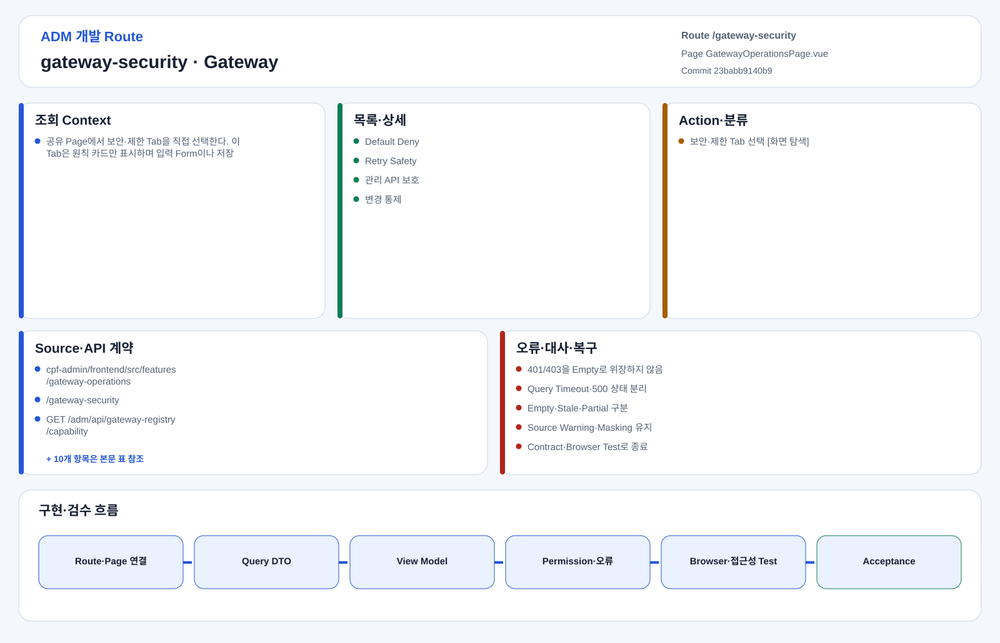


### 구현 결과

`/gateway-security`가 단순 Route가 아니라 **Binding이 참조하는 TLS·인증·인가·Header·Rate Limit·Health Policy와 제한 원칙을 확인한다.** Query·Command·Permission·Owner 상태·Audit·Browser Test가 연결된 기능 Slice가 되도록 구현한다.

### Source 진입점과 소유권

| 계층 | 기준 |
|---|---|
| Router | `/gateway-security` |
| Page | `cpf-admin/frontend/src/features/gateway-operations/GatewayOperationsPage.vue` |
| Generated Client | Page가 import하는 Generated Client 또는 공통 ADM Client의 실제 Operation을 사용한다. 수기 Endpoint 문자열과 중복 DTO를 만들지 않는다 |
| ADM Backend | OpenAPI Operation의 Controller와 Application Service |
| Owner Port | Query·Command·Status·Reconcile Port; Local/Remote가 같은 DTO·오류 의미 사용 |
| Test | Frontend Unit·Generated Client Contract·Controller·Browser·Fault |
| 확인 API 1 | `GET /adm/api/gateway-registry/capability` |
| 확인 API 2 | `GET /adm/api/gateway-registry/operations/snapshot` |
| 확인 API 3 | `GET /adm/api/gateway-registry/operations/stream` |
| 확인 API 4 | `GET /adm/api/gateway-registry/server-groups` |
| 확인 API 5 | `POST /adm/api/gateway-registry/server-groups` |
| 확인 API 6 | `GET /adm/api/gateway-registry/server-groups/{serverGroupId}/members` |
| 확인 API 7 | `GET /adm/api/gateway-registry/bindings` |
| 확인 API 8 | `POST /adm/api/gateway-registry/bindings` |
| 확인 API 9 | `GET /adm/api/gateway-registry/bindings/{bindingId}/apply-status` |
| 확인 API 10 | `GET /adm/api/gateway-registry/bindings/{bindingId}/connection-tests` |
| 확인 API 11 | `POST /adm/api/gateway-registry/bindings/{bindingId}/connection-tests` |
| Source 해석 | Alias 진입 시 `groups` Tab이 기본이다. 운영자가 `보안·제한` Tab을 직접 선택하며 이 Tab은 네 가지 원칙 카드만 표시한다. Policy ID·Allowed Flag 편집은 `bindings` Tab에서 수행한다. |

### Frontend Query·Form 모델

별도 사용자 입력 Control이 없다. 현재 Session·Permission·Data Scope와 Page가 정의한 초기 Query로 데이터를 읽는다. 새로고침은 같은 Context를 다시 조회하며 Owner 데이터는 변경하지 않는다.

### Table·Detail View Model

| 값 | 표시 계약 | Drill-down·대사 |
|---|---|---|
| `Default Deny` | 외부 공개가 명시적으로 허용되지 않은 요청을 차단하는 기본 원칙이다. Masking·Timezone·단위를 DTO Metadata와 함께 표시한다. | 상세·재조회 결과와 비교하고 Stale·Masking·단위 차이를 확인한다. |
| `Retry Safety` | 멱등성·Timeout 단계·Attempt 한도를 충족할 때만 Retry를 허용하는 원칙이다. Masking·Timezone·단위를 DTO Metadata와 함께 표시한다. | 상세·재조회 결과와 비교하고 Stale·Masking·단위 차이를 확인한다. |
| `관리 API 보호` | ADM·BAT·Actuator·Internal Endpoint를 외부 Route 대상에서 제외하는 원칙이다. Masking·Timezone·단위를 DTO Metadata와 함께 표시한다. | 상세·재조회 결과와 비교하고 Stale·Masking·단위 차이를 확인한다. |
| `변경 통제` | 운영 변경에 Reason·Approval·Expected Version·Audit를 요구하는 원칙이다. Masking·Timezone·단위를 DTO Metadata와 함께 표시한다. | 상세·재조회 결과와 비교하고 Stale·Masking·단위 차이를 확인한다. |

### Button·Command 모델

| Action | 분류 | Frontend 활성 조건 | Backend·성공 처리 |
|---|---|---|---|
| **보안·제한 Tab 선택** | 화면 탐색 | 공유 Page가 열린 상태이며 해당 Tab·Detail을 선택할 수 있음 | 공유 Page의 Tab·상세 Context만 변경하며 Server Side Effect는 발생하지 않는다. |

### 상태 모델

```text
Query: Idle → Loading → Empty | Success | Error
Success + Stale | Partial
```

Query와 Command의 Loading·Error를 분리한다. 조회 전용 Route에는 존재하지 않는 Command 상태를 만들지 않는다. `403`, `409`, Timeout, Partial, Unknown을 하나의 Error Toast로 합치지 않는다.

### API·Owner 계약

- Query Request는 실제 Page가 사용하는 Environment·Data Scope·검색 Field·Paging·Sort·Timezone만 포함한다.
- Query Response는 실제 Item·Page·조회 시각·Source Version·Stale·Partial·Warning 계약을 유지한다.
- 조회 전용 Route에는 임의의 Command DTO·Operation Polling·Rollback Endpoint를 추가하지 않는다.
- Same-JVM과 Remote Adapter는 DTO·Error Code·Timeout·Unknown 의미를 유지한다.

### Permission·Data Scope·Masking

- Route Permission 기준은 **Gateway Menu/Action Permission + Approval**이다.
- Menu 노출, Query, Button, Raw, Export Permission을 분리하고 Backend와 Owner에서 다시 검증한다.
- Deny는 403과 Audit를 남기며 404·Empty로 위장하지 않는다.
- Secret·Credential·PII Raw를 일반 Response DTO·Browser Storage·Log에 넣지 않는다.

### 구현 순서

1. Route·Page Import·Menu Metadata·Permission을 연결한다.
2. 이 장의 Field·Column·Action을 OpenAPI Request·Response·Error와 대조한다.
3. Generated Client를 재생성하고 수기 HTTP 호출을 제거한다.
4. Query·Command 상태와 Empty·Stale·Partial·Unknown UI를 구현한다.
5. Backend Controller·Application Service·Owner Port·Local/Remote Adapter를 연결한다.
6. Reason·Approval·Expected Version·Idempotency·Audit를 Server에서 검증한다.
7. Response Loss Polling·Reconcile·Rollback Link를 구현한다.
8. Unit·Contract·Browser·Fault·Accessibility Test를 실행한다.

### Test Matrix

| Test | 필수 Scenario |
|---|---|
| Frontend Unit | Default·Validation·Button 조건·Masking·Empty/Error/Stale/Partial |
| OpenAPI·Generated Client | Operation 이름·Type·Error·Hash Drift |
| Backend Query | Permission·Data Scope·Filter·Paging·Stale·Partial |
| Local/Remote Contract | 같은 DTO·Error·Timeout 의미 |
| Browser | Deep Link·Query·상세·403·Timeout·Empty·Partial |
| Accessibility | Keyboard·Focus·Label·Error Announcement·Table/Dialog |

### 개발 Fault Workbook

1. `/gateway-security` Query를 500·Timeout·Empty·Partial 응답으로 주입해 Loading·Empty·Error·Stale·Partial UI를 각각 확인한다.
2. 401·403과 Data Scope 축소를 주입해 Deny를 Empty로 위장하지 않고 Error와 접근 가능한 범위를 구분하는지 확인한다.
3. 조회 전용 Route에 Command Polling·Reason·Approval·Rollback UI가 노출되지 않는지 확인한다.
4. Local Adapter와 Remote Adapter에 같은 Contract Fixture를 적용해 Error Code·Retryability·failureStage가 일치하는지 확인한다.
5. Browser Storage·Console·Network Error·Screenshot에 Token·Secret·PII Raw가 남지 않는지 확인한다.

### Route Acceptance Checklist

- [ ] Route `/gateway-security`의 Deep Link와 Menu ID `gateway-security`가 같은 Page를 연다.
- [ ] 이 장의 Field·Column·Action과 Page·OpenAPI·Generated Client가 같은 계약을 사용한다.
- [ ] Menu·Query·Raw·Export Permission Deny가 Backend 403과 화면 Error로 확인된다.
- [ ] Empty·Timeout·Stale·Partial이 서로 다른 사용자 상태와 재조회 경로를 제공한다.
- [ ] Same-JVM·Remote 호출이 같은 Query DTO·오류·Timeout 계약을 사용한다.
- [ ] 조회 전용 Route에 Source에 없는 Command·Approval·Rollback Action을 노출하지 않는다.
- [ ] 정상·오류·경계 Browser Test와 Accessibility Test가 Route Matrix에 포함된다.

### 독립 수행 검수 Checklist

- [ ] `/gateway-security`와 Page Source를 찾고 화면 목적을 설명할 수 있다.
- [ ] 별도 사용자 입력이 없는 경우 자동 Query Context를 설명할 수 있다.
- [ ] 4개 표시값을 Owner 상태·Version·Audit와 대사할 수 있다.
- [ ] 2개 Action의 분류·활성 조건·Side Effect를 설명할 수 있다.
- [ ] Empty·403·409·Timeout·Partial·Unknown을 서로 다른 상태로 처리할 수 있다.
- [ ] 응답 유실 뒤 중복 제출 없이 Operation·Owner·Audit로 결과를 확정할 수 있다.
- [ ] 교대 기록만으로 다음 담당자가 Target·상태·복구 기한을 이어받을 수 있다.
- [ ] OpenAPI·Generated Client·Page·Controller·Owner Port·Test가 같은 Field와 오류 계약을 사용하는지 검증할 수 있다.
- [ ] Local·Remote Adapter의 Timeout·Unknown 의미가 같은지 Contract Test로 확인할 수 있다.

## 49. gateway-health — Gateway Health 기능 Slice 개발 장

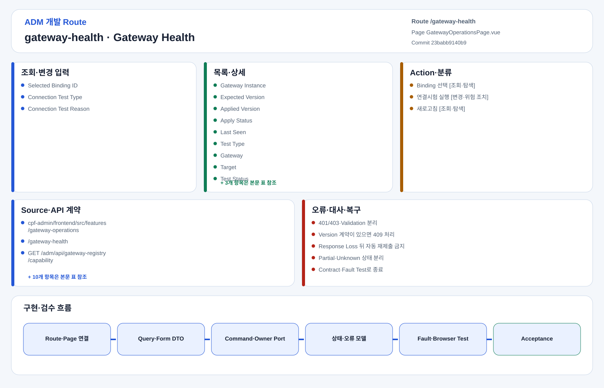


### 구현 결과

`/gateway-health`가 단순 Route가 아니라 **Gateway Instance Expected/Applied Version과 Connection Test 결과를 확인한다.** Query·Command·Permission·Owner 상태·Audit·Browser Test가 연결된 기능 Slice가 되도록 구현한다.

### Source 진입점과 소유권

| 계층 | 기준 |
|---|---|
| Router | `/gateway-health` |
| Page | `cpf-admin/frontend/src/features/gateway-operations/GatewayOperationsPage.vue` |
| Generated Client | Page가 import하는 Generated Client 또는 공통 ADM Client의 실제 Operation을 사용한다. 수기 Endpoint 문자열과 중복 DTO를 만들지 않는다 |
| ADM Backend | OpenAPI Operation의 Controller와 Application Service |
| Owner Port | Query·Command·Status·Reconcile Port; Local/Remote가 같은 DTO·오류 의미 사용 |
| Test | Frontend Unit·Generated Client Contract·Controller·Browser·Fault |
| 확인 API 1 | `GET /adm/api/gateway-registry/capability` |
| 확인 API 2 | `GET /adm/api/gateway-registry/operations/snapshot` |
| 확인 API 3 | `GET /adm/api/gateway-registry/operations/stream` |
| 확인 API 4 | `GET /adm/api/gateway-registry/server-groups` |
| 확인 API 5 | `POST /adm/api/gateway-registry/server-groups` |
| 확인 API 6 | `GET /adm/api/gateway-registry/server-groups/{serverGroupId}/members` |
| 확인 API 7 | `GET /adm/api/gateway-registry/bindings` |
| 확인 API 8 | `POST /adm/api/gateway-registry/bindings` |
| 확인 API 9 | `GET /adm/api/gateway-registry/bindings/{bindingId}/apply-status` |
| 확인 API 10 | `GET /adm/api/gateway-registry/bindings/{bindingId}/connection-tests` |
| 확인 API 11 | `POST /adm/api/gateway-registry/bindings/{bindingId}/connection-tests` |
| Source 해석 | Alias 진입 시 `groups` Tab이 기본이므로 `Health·연결시험·적용` Tab을 직접 선택한다. 시험 사유는 Source에서 5자 이상을 요구한다. |

### Frontend Query·Form 모델

| Field | Control | 직렬화·Validation | 오류·접근성 |
|---|---|---|---|
| `Selected Binding ID` | 문자열 입력·검색 | 조회·상세·Audit에서 같은 대상을 다시 찾기 위한 식별 조건이다. 앞뒤 공백·허용 문자·길이와 대소문자 규칙을 확인한다. Request·Query의 실제 이름과 Type을 유지한다. | Label·Help·Field Error·Keyboard Focus를 제공하고 민감값은 재표시하지 않는다. |
| `Connection Test Type` | Select·검색 | Gateway Health에서 적용하거나 조회할 정책·권한·처리 유형을 선택한다. 허용 목록과 현재 Environment·Data Scope에 맞는 값만 선택한다. Request·Query의 실제 이름과 Type을 유지한다. | Label·Help·Field Error·Keyboard Focus를 제공하고 민감값은 재표시하지 않는다. |
| `Connection Test Reason` | 다중행 입력 | 비동기 연결시험의 목적과 영향 범위를 Audit에 남긴다. Source는 앞뒤 공백 제거 후 5자 이상을 요구한다. Request·Query의 실제 이름과 Type을 유지한다. | Label·Help·Field Error·Keyboard Focus를 제공하고 민감값은 재표시하지 않는다. |

### Table·Detail View Model

| 값 | 표시 계약 | Drill-down·대사 |
|---|---|---|
| `Gateway Instance` | Gateway Health의 대상 레코드를 상세·Owner·Audit에서 연결하는 식별자다. Masking·Timezone·단위를 DTO Metadata와 함께 표시한다. | 상세·Log·Trace·Audit에서 같은 대상을 가리키는지 확인한다. |
| `Expected Version` | 요청·Owner·Instance 사이의 Version 또는 내용 동일성을 판단하는 값이다. Masking·Timezone·단위를 DTO Metadata와 함께 표시한다. | 목록·상세·Owner 또는 Instance 보고값에서 일치하는지 확인한다. |
| `Applied Version` | 요청·Owner·Instance 사이의 Version 또는 내용 동일성을 판단하는 값이다. Masking·Timezone·단위를 DTO Metadata와 함께 표시한다. | 목록·상세·Owner 또는 Instance 보고값에서 일치하는지 확인한다. |
| `Apply Status` | 현재 상태와 Terminal 여부, 다음 Action 가능 여부를 판단하는 값이다. Masking·Timezone·단위를 DTO Metadata와 함께 표시한다. | Last Updated·Terminal 조건·Owner 상태와 함께 확인한다. |
| `Last Seen` | 상태 발생·갱신·유효 시점을 나타내며 화면 Timezone을 기준으로 해석한다. Masking·Timezone·단위를 DTO Metadata와 함께 표시한다. | 상세·재조회 결과와 비교하고 Stale·Masking·단위 차이를 확인한다. |
| `Test Type` | Gateway Health 상세에서 대상의 현재 속성 또는 처리 결과를 확인하는 값이다. Masking·Timezone·단위를 DTO Metadata와 함께 표시한다. | 상세·재조회 결과와 비교하고 Stale·Masking·단위 차이를 확인한다. |
| `Gateway` | Gateway Health 상세에서 대상의 현재 속성 또는 처리 결과를 확인하는 값이다. Masking·Timezone·단위를 DTO Metadata와 함께 표시한다. | 상세·재조회 결과와 비교하고 Stale·Masking·단위 차이를 확인한다. |
| `Target` | Gateway Health 상세에서 대상의 현재 속성 또는 처리 결과를 확인하는 값이다. Masking·Timezone·단위를 DTO Metadata와 함께 표시한다. | 상세·재조회 결과와 비교하고 Stale·Masking·단위 차이를 확인한다. |
| `Test Status` | 현재 상태와 Terminal 여부, 다음 Action 가능 여부를 판단하는 값이다. Masking·Timezone·단위를 DTO Metadata와 함께 표시한다. | Last Updated·Terminal 조건·Owner 상태와 함께 확인한다. |
| `Failure Stage` | 오류·Drift·결과 불명 범위를 나타내며 원인과 복구 Owner를 연결해야 한다. Masking·Timezone·단위를 DTO Metadata와 함께 표시한다. | 원인 식별자·실패 Stage·마지막 갱신 시각을 상세와 대조한다. |
| `Duration` | 동일한 집계 시간 창·단위·Filter에서 비교해야 하는 수치다. Masking·Timezone·단위를 DTO Metadata와 함께 표시한다. | 같은 Filter·집계 시간 창·단위의 상세 Row 또는 Metric으로 대사한다. |
| `Trace ID` | Gateway Health의 대상 레코드를 상세·Owner·Audit에서 연결하는 식별자다. Masking·Timezone·단위를 DTO Metadata와 함께 표시한다. | 상세·Log·Trace·Audit에서 같은 대상을 가리키는지 확인한다. |

### Button·Command 모델

| Action | 분류 | Frontend 활성 조건 | Backend·성공 처리 |
|---|---|---|---|
| **Binding 선택** | 조회·탐색 | 조회 Permission과 Query Validation을 충족하고 동일 조회가 진행 중이 아님 | Binding 선택 결과의 조회 시각·Filter·Source Version·Warning이 갱신되며 Owner 데이터는 변경하지 않는다. |
| **연결시험 실행** | 변경·위험 조치 | 화면과 Owner가 요구하는 Write Permission·대상 상태·영향 범위·Reason·승인·Version 조건을 충족함 | 변경 Operation을 생성하고 Accepted 응답과 Owner Terminal 상태·Version·Audit를 분리해 확인한다. Backend에서도 Permission·Version·Idempotency를 재검증한다. |
| **새로고침** | 조회·탐색 | 조회 Permission과 Query Validation을 충족하고 동일 조회가 진행 중이 아님 | 새로고침 결과의 조회 시각·Filter·Source Version·Warning이 갱신되며 Owner 데이터는 변경하지 않는다. |

### 상태 모델

```text
Query: Idle → Loading → Empty | Success | Error
Success + Stale | Partial
Command: Editing → Validating → Submitting → Accepted(operationId) → Terminal
Submitting → ResponseLoss → Reconcile → Terminal | UNKNOWN_RESULT
```

Query와 Command의 Loading·Error를 분리한다. 조회 전용 Route에는 존재하지 않는 Command 상태를 만들지 않는다. `403`, `409`, Timeout, Partial, Unknown을 하나의 Error Toast로 합치지 않는다.

### API·Owner 계약

- Query Request는 실제 Page가 사용하는 Environment·Data Scope·검색 Field·Paging·Sort·Timezone만 포함한다.
- Query Response는 실제 Item·Page·조회 시각·Source Version·Stale·Partial·Warning 계약을 유지한다.
- Command는 Source에 선언된 Target ID·Version·Reason·Approval ID·Idempotency Key·Request Hash 중 실제 필드만 사용한다.
- `202 Accepted`는 완료가 아니라 Operation 추적 시작이며 Owner Terminal 상태를 별도로 조회한다.
- Side Effect 전 실패, Side Effect 후 실패, Success, Partial, `UNKNOWN_RESULT`를 구분한다.
- Same-JVM과 Remote Adapter는 DTO·Error Code·Timeout·Unknown 의미를 유지한다.

### Permission·Data Scope·Masking

- Route Permission 기준은 **Gateway Menu/Action Permission + Approval**이다.
- Menu 노출, Query, Button, Raw, Export Permission을 분리하고 Backend와 Owner에서 다시 검증한다.
- Deny는 403과 Audit를 남기며 404·Empty로 위장하지 않는다.
- Secret·Credential·PII Raw를 일반 Response DTO·Browser Storage·Log에 넣지 않는다.

### 구현 순서

1. Route·Page Import·Menu Metadata·Permission을 연결한다.
2. 이 장의 Field·Column·Action을 OpenAPI Request·Response·Error와 대조한다.
3. Generated Client를 재생성하고 수기 HTTP 호출을 제거한다.
4. Query·Command 상태와 Empty·Stale·Partial·Unknown UI를 구현한다.
5. Backend Controller·Application Service·Owner Port·Local/Remote Adapter를 연결한다.
6. Reason·Approval·Expected Version·Idempotency·Audit를 Server에서 검증한다.
7. Response Loss Polling·Reconcile·Rollback Link를 구현한다.
8. Unit·Contract·Browser·Fault·Accessibility Test를 실행한다.

### Test Matrix

| Test | 필수 Scenario |
|---|---|
| Frontend Unit | Default·Validation·Button 조건·Masking·Empty/Error/Stale/Partial |
| OpenAPI·Generated Client | Operation 이름·Type·Error·Hash Drift |
| Backend Query | Permission·Data Scope·Filter·Paging·Stale·Partial |
| Backend Command | Source에 선언된 Permission·Version·Reason·Approval·Idempotency·Audit 계약 |
| Local/Remote Contract | 같은 DTO·Error·Timeout 의미 |
| Browser | Deep Link·Query·상세·403·Timeout·Empty·Partial |
| Fault | 409·Response Loss·DB/Kafka/Owner 중단·Partial ACK·Late Response |
| Accessibility | Keyboard·Focus·Label·Error Announcement·Table/Dialog |

### 개발 Fault Workbook

1. `/gateway-health` Query를 500·Timeout·Empty·Partial 응답으로 주입해 Loading·Empty·Error·Stale·Partial UI를 각각 확인한다.
2. 401·403과 Data Scope 축소를 주입해 Deny를 Empty로 위장하지 않고 Error와 접근 가능한 범위를 구분하는지 확인한다.
3. Version 계약이 있는 Write Action에는 409를, 모든 비동기·원격 Write에는 Response Loss를 주입해 자동 재제출이 없는지 확인한다.
4. 202 응답 뒤 Operation Polling이 Terminal·Failed·Partial·Unknown을 분리하는지 확인한다.
5. Local Adapter와 Remote Adapter에 같은 Contract Fixture를 적용해 Error Code·Retryability·failureStage가 일치하는지 확인한다.
6. Browser Storage·Console·Network Error·Screenshot에 Token·Secret·PII Raw가 남지 않는지 확인한다.

### Route Acceptance Checklist

- [ ] Route `/gateway-health`의 Deep Link와 Menu ID `gateway-health`가 같은 Page를 연다.
- [ ] 이 장의 Field·Column·Action과 Page·OpenAPI·Generated Client가 같은 계약을 사용한다.
- [ ] Menu·Query·Raw·Export Permission Deny가 Backend 403과 화면 Error로 확인된다.
- [ ] Empty·Timeout·Stale·Partial이 서로 다른 사용자 상태와 재조회 경로를 제공한다.
- [ ] Same-JVM·Remote 호출이 같은 Query DTO·오류·Timeout 계약을 사용한다.
- [ ] 409·Response Loss·Partial·Unknown이 서로 다른 상태와 Operation·Reconcile Link를 제공한다.
- [ ] Command가 Source에 선언한 Reason·Approval·Version·Idempotency·Audit 필드를 Server에서 재검증한다.
- [ ] 정상·오류·경계 Browser Test와 Accessibility Test가 Route Matrix에 포함된다.

### 독립 수행 검수 Checklist

- [ ] `/gateway-health`와 Page Source를 찾고 화면 목적을 설명할 수 있다.
- [ ] 3개 입력·검색 항목의 Control·기본값·Validation을 설명할 수 있다.
- [ ] 12개 표시값을 Owner 상태·Version·Audit와 대사할 수 있다.
- [ ] 3개 Action의 분류·활성 조건·Side Effect를 설명할 수 있다.
- [ ] Empty·403·409·Timeout·Partial·Unknown을 서로 다른 상태로 처리할 수 있다.
- [ ] 응답 유실 뒤 중복 제출 없이 Operation·Owner·Audit로 결과를 확정할 수 있다.
- [ ] 교대 기록만으로 다음 담당자가 Target·상태·복구 기한을 이어받을 수 있다.
- [ ] OpenAPI·Generated Client·Page·Controller·Owner Port·Test가 같은 Field와 오류 계약을 사용하는지 검증할 수 있다.
- [ ] Local·Remote Adapter의 Timeout·Unknown 의미가 같은지 Contract Test로 확인할 수 있다.

## 50. gateway-transactions — Gateway Transactions 기능 Slice 개발 장

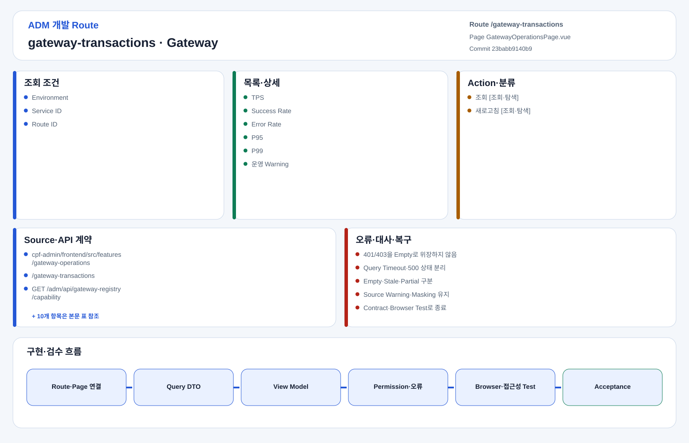


### 구현 결과

`/gateway-transactions`가 단순 Route가 아니라 **Gateway 운영 KPI와 Connection Test Trace를 이용해 호출 성공·실패·지연을 진단한다.** Query·Permission·Owner 상태·관측 정보·Browser Test가 연결된 조회 기능 Slice가 되도록 구현한다.

### Source 진입점과 소유권

| 계층 | 기준 |
|---|---|
| Router | `/gateway-transactions` |
| Page | `cpf-admin/frontend/src/features/gateway-operations/GatewayOperationsPage.vue` |
| Generated Client | Page가 import하는 Generated Client 또는 공통 ADM Client의 실제 Operation을 사용한다. 수기 Endpoint 문자열과 중복 DTO를 만들지 않는다 |
| ADM Backend | OpenAPI Operation의 Controller와 Application Service |
| Owner Port | Query·Status Port; Local/Remote가 같은 DTO·오류 의미 사용 |
| Test | Frontend Unit·Generated Client Contract·Controller·Browser·Fault |
| 확인 API 1 | `GET /adm/api/gateway-registry/capability` |
| 확인 API 2 | `GET /adm/api/gateway-registry/operations/snapshot` |
| 확인 API 3 | `GET /adm/api/gateway-registry/operations/stream` |
| 확인 API 4 | `GET /adm/api/gateway-registry/server-groups` |
| 확인 API 5 | `POST /adm/api/gateway-registry/server-groups` |
| 확인 API 6 | `GET /adm/api/gateway-registry/server-groups/{serverGroupId}/members` |
| 확인 API 7 | `GET /adm/api/gateway-registry/bindings` |
| 확인 API 8 | `POST /adm/api/gateway-registry/bindings` |
| 확인 API 9 | `GET /adm/api/gateway-registry/bindings/{bindingId}/apply-status` |
| 확인 API 10 | `GET /adm/api/gateway-registry/bindings/{bindingId}/connection-tests` |
| 확인 API 11 | `POST /adm/api/gateway-registry/bindings/{bindingId}/connection-tests` |
| Source 해석 | 이 Alias는 별도 거래 Tab을 열지 않는다. 같은 Page의 공통 KPI와 운영자가 직접 선택한 `apply` Tab의 Connection Test Trace만 제공한다. |

### Frontend Query·Form 모델

| Field | Control | 직렬화·Validation | 오류·접근성 |
|---|---|---|---|
| `Environment` | Select·검색 | Gateway Transactions 조회·조치가 적용되는 환경과 데이터 경계를 제한한다. 허용 목록과 현재 Environment·Data Scope에 맞는 값만 선택한다. Request·Query의 실제 이름과 Type을 유지한다. | Label·Help·Field Error·Keyboard Focus를 제공하고 민감값은 재표시하지 않는다. |
| `Service ID` | 문자열 입력·검색 | 조회·상세·Audit에서 같은 대상을 다시 찾기 위한 식별 조건이다. 앞뒤 공백·허용 문자·길이와 대소문자 규칙을 확인한다. Request·Query의 실제 이름과 Type을 유지한다. | Label·Help·Field Error·Keyboard Focus를 제공하고 민감값은 재표시하지 않는다. |
| `Route ID` | 문자열 입력·검색 | 조회·상세·Audit에서 같은 대상을 다시 찾기 위한 식별 조건이다. 앞뒤 공백·허용 문자·길이와 대소문자 규칙을 확인한다. Request·Query의 실제 이름과 Type을 유지한다. | Label·Help·Field Error·Keyboard Focus를 제공하고 민감값은 재표시하지 않는다. |

> **화면 입력 계약:** 독립 Transaction Tab은 없다. Header KPI와 Operations Snapshot을 조회하며 거래 상세 추적은 Transaction Group 메뉴를 사용한다.

### Table·Detail View Model

| 값 | 표시 계약 | Drill-down·대사 |
|---|---|---|
| `TPS` | 동일한 집계 시간 창·단위·Filter에서 비교해야 하는 수치다. Masking·Timezone·단위를 DTO Metadata와 함께 표시한다. | 같은 Filter·집계 시간 창·단위의 상세 Row 또는 Metric으로 대사한다. |
| `Success Rate` | 동일한 집계 시간 창·단위·Filter에서 비교해야 하는 수치다. Masking·Timezone·단위를 DTO Metadata와 함께 표시한다. | 같은 Filter·집계 시간 창·단위의 상세 Row 또는 Metric으로 대사한다. |
| `Error Rate` | 동일한 집계 시간 창·단위·Filter에서 비교해야 하는 수치다. Masking·Timezone·단위를 DTO Metadata와 함께 표시한다. | 같은 Filter·집계 시간 창·단위의 상세 Row 또는 Metric으로 대사한다. |
| `P95` | 동일한 집계 시간 창·단위·Filter에서 비교해야 하는 수치다. Masking·Timezone·단위를 DTO Metadata와 함께 표시한다. | 같은 Filter·집계 시간 창·단위의 상세 Row 또는 Metric으로 대사한다. |
| `P99` | 동일한 집계 시간 창·단위·Filter에서 비교해야 하는 수치다. Masking·Timezone·단위를 DTO Metadata와 함께 표시한다. | 같은 Filter·집계 시간 창·단위의 상세 Row 또는 Metric으로 대사한다. |
| `운영 Warning` | 오류·Drift·결과 불명 범위를 나타내며 원인과 복구 Owner를 연결해야 한다. Masking·Timezone·단위를 DTO Metadata와 함께 표시한다. | 원인 식별자·실패 Stage·마지막 갱신 시각을 상세와 대조한다. |

### Button·Interaction 모델

| Action | 분류 | Frontend 활성 조건 | Backend·성공 처리 |
|---|---|---|---|
| **조회** | 조회·탐색 | 조회 Permission과 Query Validation을 충족하고 동일 조회가 진행 중이 아님 | 조회 결과의 조회 시각·Filter·Source Version·Warning이 갱신되며 Owner 데이터는 변경하지 않는다. |
| **새로고침** | 조회·탐색 | 조회 Permission과 Query Validation을 충족하고 동일 조회가 진행 중이 아님 | 새로고침 결과의 조회 시각·Filter·Source Version·Warning이 갱신되며 Owner 데이터는 변경하지 않는다. |

### 상태 모델

```text
Query: Idle → Loading → Empty | Success | Error
Success + Stale | Partial
```

조회 상태를 Loading·Empty·Success·Error·Stale·Partial로 구분한다. `401`, `403`, Timeout, Empty, Stale, Partial을 하나의 Error Toast로 합치지 않는다.

### API·Owner 계약

- Query Request는 실제 Page가 사용하는 Environment·Data Scope·검색 Field·Paging·Sort·Timezone만 포함한다.
- Query Response는 실제 Item·Page·조회 시각·Source Version·Stale·Partial·Warning 계약을 유지한다.
- 조회 전용 Route에는 임의의 Command DTO·Operation Polling·Rollback Endpoint를 추가하지 않는다.
- Same-JVM과 Remote Adapter는 DTO·Error Code·Timeout·Unknown 의미를 유지한다.

### Permission·Data Scope·Masking

- Route Permission 기준은 **Gateway Menu/Action Permission + Approval**이다.
- Menu 노출, Query, Button, Raw, Export Permission을 분리하고 Backend와 Owner에서 다시 검증한다.
- Deny는 403과 Audit를 남기며 404·Empty로 위장하지 않는다.
- Secret·Credential·PII Raw를 일반 Response DTO·Browser Storage·Log에 넣지 않는다.

### 구현 순서

1. Route·Page Import·Menu Metadata·Permission을 연결한다.
2. 이 장의 Field·Column·Action을 OpenAPI Request·Response·Error와 대조한다.
3. Generated Client를 재생성하고 수기 HTTP 호출을 제거한다.
4. Query 상태와 Empty·Stale·Partial·Error UI를 구현한다.
5. Backend Query Controller·Application Service·Owner Query Port·Local/Remote Adapter를 연결한다.
6. Menu·Query·Raw·Export Permission과 Data Scope를 Server에서 검증한다.
7. 조회 시각·Source Version·Warning·Correlation ID와 Drill-down Link를 연결한다.
8. Unit·Contract·Browser·Fault·Accessibility Test를 실행한다.

### Test Matrix

| Test | 필수 Scenario |
|---|---|
| Frontend Unit | Default·Validation·Button 조건·Masking·Empty/Error/Stale/Partial |
| OpenAPI·Generated Client | Operation 이름·Type·Error·Hash Drift |
| Backend Query | Permission·Data Scope·Filter·Paging·Stale·Partial |
| Local/Remote Contract | 같은 DTO·Error·Timeout 의미 |
| Browser | Deep Link·Query·상세·403·Timeout·Empty·Partial |
| Accessibility | Keyboard·Focus·Label·Error Announcement·Table/Dialog |

### 개발 Fault Workbook

1. `/gateway-transactions` Query를 500·Timeout·Empty·Partial 응답으로 주입해 Loading·Empty·Error·Stale·Partial UI를 각각 확인한다.
2. 401·403과 Data Scope 축소를 주입해 Deny를 Empty로 위장하지 않고 Error와 접근 가능한 범위를 구분하는지 확인한다.
3. 조회 전용 Route에 Command Polling·Reason·Approval·Rollback UI가 노출되지 않는지 확인한다.
4. Local Adapter와 Remote Adapter에 같은 Contract Fixture를 적용해 Error Code·Retryability·failureStage가 일치하는지 확인한다.
5. Browser Storage·Console·Network Error·Screenshot에 Token·Secret·PII Raw가 남지 않는지 확인한다.

### Route Acceptance Checklist

- [ ] Route `/gateway-transactions`의 Deep Link와 Menu ID `gateway-transactions`가 같은 Page를 연다.
- [ ] 이 장의 Field·Column·Action과 Page·OpenAPI·Generated Client가 같은 계약을 사용한다.
- [ ] Menu·Query·Raw·Export Permission Deny가 Backend 403과 화면 Error로 확인된다.
- [ ] Empty·Timeout·Stale·Partial이 서로 다른 사용자 상태와 재조회 경로를 제공한다.
- [ ] Same-JVM·Remote 호출이 같은 Query DTO·오류·Timeout 계약을 사용한다.
- [ ] 조회 전용 Route에 Source에 없는 Command·Approval·Rollback Action을 노출하지 않는다.
- [ ] 정상·오류·경계 Browser Test와 Accessibility Test가 Route Matrix에 포함된다.

### 독립 수행 검수 Checklist

- [ ] `/gateway-transactions`와 Page Source를 찾고 화면 목적을 설명할 수 있다.
- [ ] 5개 입력·검색 항목의 Control·기본값·Validation을 설명할 수 있다.
- [ ] 9개 표시값을 Owner 상태·Version·Audit와 대사할 수 있다.
- [ ] 3개 Action의 분류·활성 조건·Side Effect를 설명할 수 있다.
- [ ] Empty·401·403·Timeout·Stale·Partial을 서로 다른 조회 상태로 처리할 수 있다.
- [ ] 조회 응답 유실 시 같은 Query Context로 재조회하고 Correlation ID·조회 시각·Source Version으로 결과를 대사할 수 있다.
- [ ] 교대 기록만으로 다음 담당자가 Target·상태·복구 기한을 이어받을 수 있다.
- [ ] OpenAPI·Generated Client·Page·Controller·Owner Port·Test가 같은 Field와 오류 계약을 사용하는지 검증할 수 있다.
- [ ] Local·Remote Adapter의 Timeout·Unknown 의미가 같은지 Contract Test로 확인할 수 있다.

## 51. gateway-log-policies — Gateway Log Policies 기능 Slice 개발 장

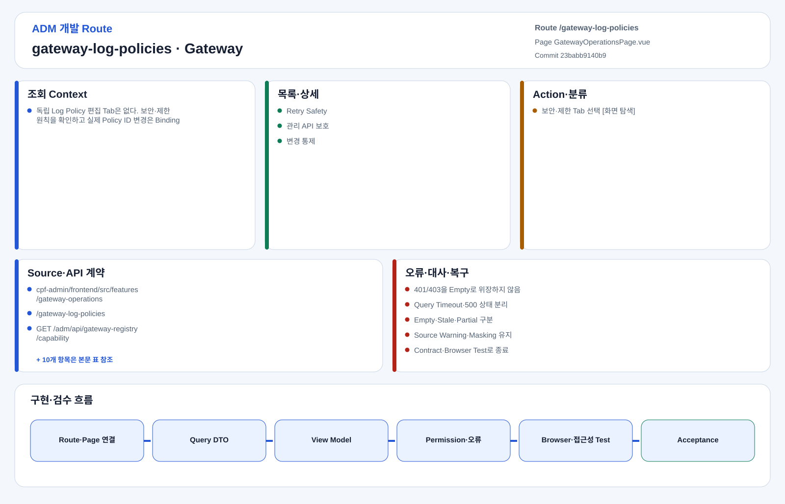


### 구현 결과

`/gateway-log-policies`가 단순 Route가 아니라 **Gateway 운영 Warning·Spool Backlog를 ADM Log Policy와 대사한다.** Query·Command·Permission·Owner 상태·Audit·Browser Test가 연결된 기능 Slice가 되도록 구현한다.

### Source 진입점과 소유권

| 계층 | 기준 |
|---|---|
| Router | `/gateway-log-policies` |
| Page | `cpf-admin/frontend/src/features/gateway-operations/GatewayOperationsPage.vue` |
| Generated Client | Page가 import하는 Generated Client 또는 공통 ADM Client의 실제 Operation을 사용한다. 수기 Endpoint 문자열과 중복 DTO를 만들지 않는다 |
| ADM Backend | OpenAPI Operation의 Controller와 Application Service |
| Owner Port | Query·Command·Status·Reconcile Port; Local/Remote가 같은 DTO·오류 의미 사용 |
| Test | Frontend Unit·Generated Client Contract·Controller·Browser·Fault |
| 확인 API 1 | `GET /adm/api/gateway-registry/capability` |
| 확인 API 2 | `GET /adm/api/gateway-registry/operations/snapshot` |
| 확인 API 3 | `GET /adm/api/gateway-registry/operations/stream` |
| 확인 API 4 | `GET /adm/api/gateway-registry/server-groups` |
| 확인 API 5 | `POST /adm/api/gateway-registry/server-groups` |
| 확인 API 6 | `GET /adm/api/gateway-registry/server-groups/{serverGroupId}/members` |
| 확인 API 7 | `GET /adm/api/gateway-registry/bindings` |
| 확인 API 8 | `POST /adm/api/gateway-registry/bindings` |
| 확인 API 9 | `GET /adm/api/gateway-registry/bindings/{bindingId}/apply-status` |
| 확인 API 10 | `GET /adm/api/gateway-registry/bindings/{bindingId}/connection-tests` |
| 확인 API 11 | `POST /adm/api/gateway-registry/bindings/{bindingId}/connection-tests` |
| Source 해석 | 이 Alias는 별도 Log Policy Tab을 열지 않는다. 공유 Page의 Warning·Spool Signal을 확인하고 Log Capture 정책 편집은 ADM `/logPolicies`에서 수행한다. |

### Frontend Query·Form 모델

별도 사용자 입력 Control이 없다. 현재 Session·Permission·Data Scope와 Page가 정의한 초기 Query로 데이터를 읽는다. 새로고침은 같은 Context를 다시 조회하며 Owner 데이터는 변경하지 않는다.

### Table·Detail View Model

| 값 | 표시 계약 | Drill-down·대사 |
|---|---|---|
| `Retry Safety` | 멱등성·Timeout 단계·Attempt 한도를 충족할 때만 Retry를 허용하는 원칙이다. Masking·Timezone·단위를 DTO Metadata와 함께 표시한다. | 상세·재조회 결과와 비교하고 Stale·Masking·단위 차이를 확인한다. |
| `관리 API 보호` | ADM·BAT·Actuator·Internal Endpoint를 외부 Route 대상에서 제외하는 원칙이다. Masking·Timezone·단위를 DTO Metadata와 함께 표시한다. | 상세·재조회 결과와 비교하고 Stale·Masking·단위 차이를 확인한다. |
| `변경 통제` | 운영 변경에 Reason·Approval·Expected Version·Audit를 요구하는 원칙이다. Masking·Timezone·단위를 DTO Metadata와 함께 표시한다. | 상세·재조회 결과와 비교하고 Stale·Masking·단위 차이를 확인한다. |

### Button·Command 모델

| Action | 분류 | Frontend 활성 조건 | Backend·성공 처리 |
|---|---|---|---|
| **보안·제한 Tab 선택** | 화면 탐색 | 공유 Page가 열린 상태이며 해당 Tab·Detail을 선택할 수 있음 | 공유 Page의 Tab·상세 Context만 변경하며 Server Side Effect는 발생하지 않는다. |

### 상태 모델

```text
Query: Idle → Loading → Empty | Success | Error
Success + Stale | Partial
```

Query와 Command의 Loading·Error를 분리한다. 조회 전용 Route에는 존재하지 않는 Command 상태를 만들지 않는다. `403`, `409`, Timeout, Partial, Unknown을 하나의 Error Toast로 합치지 않는다.

### API·Owner 계약

- Query Request는 실제 Page가 사용하는 Environment·Data Scope·검색 Field·Paging·Sort·Timezone만 포함한다.
- Query Response는 실제 Item·Page·조회 시각·Source Version·Stale·Partial·Warning 계약을 유지한다.
- 조회 전용 Route에는 임의의 Command DTO·Operation Polling·Rollback Endpoint를 추가하지 않는다.
- Same-JVM과 Remote Adapter는 DTO·Error Code·Timeout·Unknown 의미를 유지한다.

### Permission·Data Scope·Masking

- Route Permission 기준은 **Gateway Menu/Action Permission + Approval**이다.
- Menu 노출, Query, Button, Raw, Export Permission을 분리하고 Backend와 Owner에서 다시 검증한다.
- Deny는 403과 Audit를 남기며 404·Empty로 위장하지 않는다.
- Secret·Credential·PII Raw를 일반 Response DTO·Browser Storage·Log에 넣지 않는다.

### 구현 순서

1. Route·Page Import·Menu Metadata·Permission을 연결한다.
2. 이 장의 Field·Column·Action을 OpenAPI Request·Response·Error와 대조한다.
3. Generated Client를 재생성하고 수기 HTTP 호출을 제거한다.
4. Query·Command 상태와 Empty·Stale·Partial·Unknown UI를 구현한다.
5. Backend Controller·Application Service·Owner Port·Local/Remote Adapter를 연결한다.
6. Reason·Approval·Expected Version·Idempotency·Audit를 Server에서 검증한다.
7. Response Loss Polling·Reconcile·Rollback Link를 구현한다.
8. Unit·Contract·Browser·Fault·Accessibility Test를 실행한다.

### Test Matrix

| Test | 필수 Scenario |
|---|---|
| Frontend Unit | Default·Validation·Button 조건·Masking·Empty/Error/Stale/Partial |
| OpenAPI·Generated Client | Operation 이름·Type·Error·Hash Drift |
| Backend Query | Permission·Data Scope·Filter·Paging·Stale·Partial |
| Local/Remote Contract | 같은 DTO·Error·Timeout 의미 |
| Browser | Deep Link·Query·상세·403·Timeout·Empty·Partial |
| Accessibility | Keyboard·Focus·Label·Error Announcement·Table/Dialog |

### 개발 Fault Workbook

1. `/gateway-log-policies` Query를 500·Timeout·Empty·Partial 응답으로 주입해 Loading·Empty·Error·Stale·Partial UI를 각각 확인한다.
2. 401·403과 Data Scope 축소를 주입해 Deny를 Empty로 위장하지 않고 Error와 접근 가능한 범위를 구분하는지 확인한다.
3. 조회 전용 Route에 Command Polling·Reason·Approval·Rollback UI가 노출되지 않는지 확인한다.
4. Local Adapter와 Remote Adapter에 같은 Contract Fixture를 적용해 Error Code·Retryability·failureStage가 일치하는지 확인한다.
5. Browser Storage·Console·Network Error·Screenshot에 Token·Secret·PII Raw가 남지 않는지 확인한다.

### Route Acceptance Checklist

- [ ] Route `/gateway-log-policies`의 Deep Link와 Menu ID `gateway-log-policies`가 같은 Page를 연다.
- [ ] 이 장의 Field·Column·Action과 Page·OpenAPI·Generated Client가 같은 계약을 사용한다.
- [ ] Menu·Query·Raw·Export Permission Deny가 Backend 403과 화면 Error로 확인된다.
- [ ] Empty·Timeout·Stale·Partial이 서로 다른 사용자 상태와 재조회 경로를 제공한다.
- [ ] Same-JVM·Remote 호출이 같은 Query DTO·오류·Timeout 계약을 사용한다.
- [ ] 조회 전용 Route에 Source에 없는 Command·Approval·Rollback Action을 노출하지 않는다.
- [ ] 정상·오류·경계 Browser Test와 Accessibility Test가 Route Matrix에 포함된다.

### 독립 수행 검수 Checklist

- [ ] `/gateway-log-policies`와 Page Source를 찾고 화면 목적을 설명할 수 있다.
- [ ] 3개 입력·검색 항목의 Control·기본값·Validation을 설명할 수 있다.
- [ ] 4개 표시값을 Owner 상태·Version·Audit와 대사할 수 있다.
- [ ] 2개 Action의 분류·활성 조건·Side Effect를 설명할 수 있다.
- [ ] Empty·403·409·Timeout·Partial·Unknown을 서로 다른 상태로 처리할 수 있다.
- [ ] 응답 유실 뒤 중복 제출 없이 Operation·Owner·Audit로 결과를 확정할 수 있다.
- [ ] 교대 기록만으로 다음 담당자가 Target·상태·복구 기한을 이어받을 수 있다.
- [ ] OpenAPI·Generated Client·Page·Controller·Owner Port·Test가 같은 Field와 오류 계약을 사용하는지 검증할 수 있다.
- [ ] Local·Remote Adapter의 Timeout·Unknown 의미가 같은지 Contract Test로 확인할 수 있다.

## 52. gateway-apply-status — Gateway Apply Status 기능 Slice 개발 장

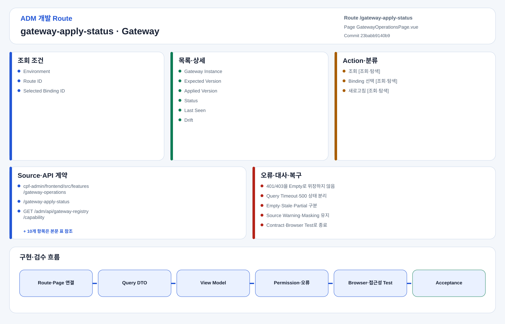


### 구현 결과

`/gateway-apply-status`가 단순 Route가 아니라 **Binding별 Gateway Instance 적용 상태와 Drift를 대사한다.** Query·Permission·Owner 상태·관측 정보·Browser Test가 연결된 조회 기능 Slice가 되도록 구현한다.

### Source 진입점과 소유권

| 계층 | 기준 |
|---|---|
| Router | `/gateway-apply-status` |
| Page | `cpf-admin/frontend/src/features/gateway-operations/GatewayOperationsPage.vue` |
| Generated Client | Page가 import하는 Generated Client 또는 공통 ADM Client의 실제 Operation을 사용한다. 수기 Endpoint 문자열과 중복 DTO를 만들지 않는다 |
| ADM Backend | OpenAPI Operation의 Controller와 Application Service |
| Owner Port | Query·Status Port; Local/Remote가 같은 DTO·오류 의미 사용 |
| Test | Frontend Unit·Generated Client Contract·Controller·Browser·Fault |
| 확인 API 1 | `GET /adm/api/gateway-registry/capability` |
| 확인 API 2 | `GET /adm/api/gateway-registry/operations/snapshot` |
| 확인 API 3 | `GET /adm/api/gateway-registry/operations/stream` |
| 확인 API 4 | `GET /adm/api/gateway-registry/server-groups` |
| 확인 API 5 | `POST /adm/api/gateway-registry/server-groups` |
| 확인 API 6 | `GET /adm/api/gateway-registry/server-groups/{serverGroupId}/members` |
| 확인 API 7 | `GET /adm/api/gateway-registry/bindings` |
| 확인 API 8 | `POST /adm/api/gateway-registry/bindings` |
| 확인 API 9 | `GET /adm/api/gateway-registry/bindings/{bindingId}/apply-status` |
| 확인 API 10 | `GET /adm/api/gateway-registry/bindings/{bindingId}/connection-tests` |
| 확인 API 11 | `POST /adm/api/gateway-registry/bindings/{bindingId}/connection-tests` |
| Source 해석 | Alias 진입 시 `groups` Tab이 기본이므로 `Health·연결시험·적용` Tab을 직접 선택한다. `apply-status` API 결과로 Expected/Applied Version을 비교한다. |

### Frontend Query·Form 모델

| Field | Control | 직렬화·Validation | 오류·접근성 |
|---|---|---|---|
| `Environment` | Select·검색 | Gateway Apply Status 조회·조치가 적용되는 환경과 데이터 경계를 제한한다. 허용 목록과 현재 Environment·Data Scope에 맞는 값만 선택한다. Request·Query의 실제 이름과 Type을 유지한다. | Label·Help·Field Error·Keyboard Focus를 제공하고 민감값은 재표시하지 않는다. |
| `Route ID` | 문자열 입력·검색 | 조회·상세·Audit에서 같은 대상을 다시 찾기 위한 식별 조건이다. 앞뒤 공백·허용 문자·길이와 대소문자 규칙을 확인한다. Request·Query의 실제 이름과 Type을 유지한다. | Label·Help·Field Error·Keyboard Focus를 제공하고 민감값은 재표시하지 않는다. |
| `Selected Binding ID` | 문자열 입력·검색 | 조회·상세·Audit에서 같은 대상을 다시 찾기 위한 식별 조건이다. 앞뒤 공백·허용 문자·길이와 대소문자 규칙을 확인한다. Request·Query의 실제 이름과 Type을 유지한다. | Label·Help·Field Error·Keyboard Focus를 제공하고 민감값은 재표시하지 않는다. |

### Table·Detail View Model

| 값 | 표시 계약 | Drill-down·대사 |
|---|---|---|
| `Gateway Instance` | Gateway Apply Status의 대상 레코드를 상세·Owner·Audit에서 연결하는 식별자다. Masking·Timezone·단위를 DTO Metadata와 함께 표시한다. | 상세·Log·Trace·Audit에서 같은 대상을 가리키는지 확인한다. |
| `Expected Version` | 요청·Owner·Instance 사이의 Version 또는 내용 동일성을 판단하는 값이다. Masking·Timezone·단위를 DTO Metadata와 함께 표시한다. | 목록·상세·Owner 또는 Instance 보고값에서 일치하는지 확인한다. |
| `Applied Version` | 요청·Owner·Instance 사이의 Version 또는 내용 동일성을 판단하는 값이다. Masking·Timezone·단위를 DTO Metadata와 함께 표시한다. | 목록·상세·Owner 또는 Instance 보고값에서 일치하는지 확인한다. |
| `Status` | 현재 상태와 Terminal 여부, 다음 Action 가능 여부를 판단하는 값이다. Masking·Timezone·단위를 DTO Metadata와 함께 표시한다. | Last Updated·Terminal 조건·Owner 상태와 함께 확인한다. |
| `Last Seen` | 상태 발생·갱신·유효 시점을 나타내며 화면 Timezone을 기준으로 해석한다. Masking·Timezone·단위를 DTO Metadata와 함께 표시한다. | 상세·재조회 결과와 비교하고 Stale·Masking·단위 차이를 확인한다. |
| `Drift` | 오류·Drift·결과 불명 범위를 나타내며 원인과 복구 Owner를 연결해야 한다. Masking·Timezone·단위를 DTO Metadata와 함께 표시한다. | 원인 식별자·실패 Stage·마지막 갱신 시각을 상세와 대조한다. |

### Button·Interaction 모델

| Action | 분류 | Frontend 활성 조건 | Backend·성공 처리 |
|---|---|---|---|
| **조회** | 조회·탐색 | 조회 Permission과 Query Validation을 충족하고 동일 조회가 진행 중이 아님 | 조회 결과의 조회 시각·Filter·Source Version·Warning이 갱신되며 Owner 데이터는 변경하지 않는다. |
| **Binding 선택** | 조회·탐색 | 조회 Permission과 Query Validation을 충족하고 동일 조회가 진행 중이 아님 | Binding 선택 결과의 조회 시각·Filter·Source Version·Warning이 갱신되며 Owner 데이터는 변경하지 않는다. |
| **새로고침** | 조회·탐색 | 조회 Permission과 Query Validation을 충족하고 동일 조회가 진행 중이 아님 | 새로고침 결과의 조회 시각·Filter·Source Version·Warning이 갱신되며 Owner 데이터는 변경하지 않는다. |

### 상태 모델

```text
Query: Idle → Loading → Empty | Success | Error
Success + Stale | Partial
```

조회 상태를 Loading·Empty·Success·Error·Stale·Partial로 구분한다. `401`, `403`, Timeout, Empty, Stale, Partial을 하나의 Error Toast로 합치지 않는다.

### API·Owner 계약

- Query Request는 실제 Page가 사용하는 Environment·Data Scope·검색 Field·Paging·Sort·Timezone만 포함한다.
- Query Response는 실제 Item·Page·조회 시각·Source Version·Stale·Partial·Warning 계약을 유지한다.
- 조회 전용 Route에는 임의의 Command DTO·Operation Polling·Rollback Endpoint를 추가하지 않는다.
- Same-JVM과 Remote Adapter는 DTO·Error Code·Timeout·Unknown 의미를 유지한다.

### Permission·Data Scope·Masking

- Route Permission 기준은 **Gateway Menu/Action Permission + Approval**이다.
- Menu 노출, Query, Button, Raw, Export Permission을 분리하고 Backend와 Owner에서 다시 검증한다.
- Deny는 403과 Audit를 남기며 404·Empty로 위장하지 않는다.
- Secret·Credential·PII Raw를 일반 Response DTO·Browser Storage·Log에 넣지 않는다.

### 구현 순서

1. Route·Page Import·Menu Metadata·Permission을 연결한다.
2. 이 장의 Field·Column·Action을 OpenAPI Request·Response·Error와 대조한다.
3. Generated Client를 재생성하고 수기 HTTP 호출을 제거한다.
4. Query 상태와 Empty·Stale·Partial·Error UI를 구현한다.
5. Backend Query Controller·Application Service·Owner Query Port·Local/Remote Adapter를 연결한다.
6. Menu·Query·Raw·Export Permission과 Data Scope를 Server에서 검증한다.
7. 조회 시각·Source Version·Warning·Correlation ID와 Drill-down Link를 연결한다.
8. Unit·Contract·Browser·Fault·Accessibility Test를 실행한다.

### Test Matrix

| Test | 필수 Scenario |
|---|---|
| Frontend Unit | Default·Validation·Button 조건·Masking·Empty/Error/Stale/Partial |
| OpenAPI·Generated Client | Operation 이름·Type·Error·Hash Drift |
| Backend Query | Permission·Data Scope·Filter·Paging·Stale·Partial |
| Local/Remote Contract | 같은 DTO·Error·Timeout 의미 |
| Browser | Deep Link·Query·상세·403·Timeout·Empty·Partial |
| Accessibility | Keyboard·Focus·Label·Error Announcement·Table/Dialog |

### 개발 Fault Workbook

1. `/gateway-apply-status` Query를 500·Timeout·Empty·Partial 응답으로 주입해 Loading·Empty·Error·Stale·Partial UI를 각각 확인한다.
2. 401·403과 Data Scope 축소를 주입해 Deny를 Empty로 위장하지 않고 Error와 접근 가능한 범위를 구분하는지 확인한다.
3. 조회 전용 Route에 Command Polling·Reason·Approval·Rollback UI가 노출되지 않는지 확인한다.
4. Local Adapter와 Remote Adapter에 같은 Contract Fixture를 적용해 Error Code·Retryability·failureStage가 일치하는지 확인한다.
5. Browser Storage·Console·Network Error·Screenshot에 Token·Secret·PII Raw가 남지 않는지 확인한다.

### Route Acceptance Checklist

- [ ] Route `/gateway-apply-status`의 Deep Link와 Menu ID `gateway-apply-status`가 같은 Page를 연다.
- [ ] 이 장의 Field·Column·Action과 Page·OpenAPI·Generated Client가 같은 계약을 사용한다.
- [ ] Menu·Query·Raw·Export Permission Deny가 Backend 403과 화면 Error로 확인된다.
- [ ] Empty·Timeout·Stale·Partial이 서로 다른 사용자 상태와 재조회 경로를 제공한다.
- [ ] Same-JVM·Remote 호출이 같은 Query DTO·오류·Timeout 계약을 사용한다.
- [ ] 조회 전용 Route에 Source에 없는 Command·Approval·Rollback Action을 노출하지 않는다.
- [ ] 정상·오류·경계 Browser Test와 Accessibility Test가 Route Matrix에 포함된다.

### 독립 수행 검수 Checklist

- [ ] `/gateway-apply-status`와 Page Source를 찾고 화면 목적을 설명할 수 있다.
- [ ] 3개 입력·검색 항목의 Control·기본값·Validation을 설명할 수 있다.
- [ ] 6개 표시값을 Owner 상태·Version·Audit와 대사할 수 있다.
- [ ] 3개 Action의 분류·활성 조건·Side Effect를 설명할 수 있다.
- [ ] Empty·401·403·Timeout·Stale·Partial을 서로 다른 조회 상태로 처리할 수 있다.
- [ ] 조회 응답 유실 시 같은 Query Context로 재조회하고 Correlation ID·조회 시각·Source Version으로 결과를 대사할 수 있다.
- [ ] 교대 기록만으로 다음 담당자가 Target·상태·복구 기한을 이어받을 수 있다.
- [ ] OpenAPI·Generated Client·Page·Controller·Owner Port·Test가 같은 Field와 오류 계약을 사용하는지 검증할 수 있다.
- [ ] Local·Remote Adapter의 Timeout·Unknown 의미가 같은지 Contract Test로 확인할 수 있다.

## 53. permissions — Role·Menu·Button·API Permission 기능 Slice 개발 장

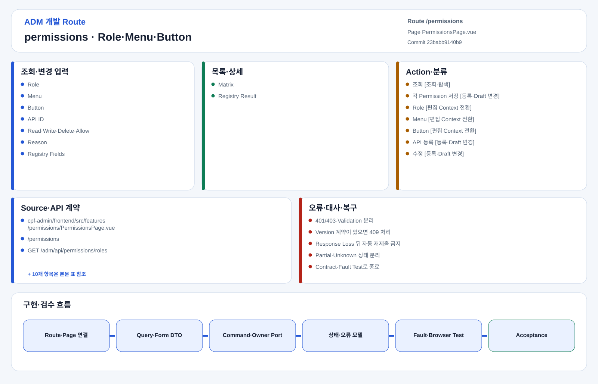


### 구현 결과

`/permissions`가 단순 Route가 아니라 **Role·Menu·Button·API Permission과 Registry를 관리한다.** Query·Command·Permission·Owner 상태·Audit·Browser Test가 연결된 기능 Slice가 되도록 구현한다.

### Source 진입점과 소유권

| 계층 | 기준 |
|---|---|
| Router | `/permissions` |
| Page | `cpf-admin/frontend/src/features/permissions/PermissionsPage.vue` |
| Generated Client | Page가 import하는 Generated Client 또는 공통 ADM Client의 실제 Operation을 사용한다. 수기 Endpoint 문자열과 중복 DTO를 만들지 않는다 |
| ADM Backend | OpenAPI Operation의 Controller와 Application Service |
| Owner Port | Query·Command·Status·Reconcile Port; Local/Remote가 같은 DTO·오류 의미 사용 |
| Test | Frontend Unit·Generated Client Contract·Controller·Browser·Fault |
| 확인 API 1 | `GET /adm/api/permissions/roles` |
| 확인 API 2 | `GET /adm/api/permissions/menus` |
| 확인 API 3 | `GET /adm/api/permissions/menu-matrix` |
| 확인 API 4 | `GET /adm/api/permissions/buttons` |
| 확인 API 5 | `GET /adm/api/permissions/button-matrix` |
| 확인 API 6 | `GET /adm/api/permissions/api-permissions` |
| 확인 API 7 | `GET /adm/api/permissions/api-matrix` |
| 확인 API 8 | `PUT /adm/api/permissions/roles/{roleId}/menus/{menuId}` |
| 확인 API 9 | `PUT /adm/api/permissions/roles/{roleId}/buttons/{buttonId}` |
| 확인 API 10 | `PUT /adm/api/permissions/roles/{roleId}/api-permissions/{apiPermissionId}` |
| 확인 API 11 | `POST /adm/api/permissions/api-permissions` |

### Frontend Query·Form 모델

| Field | Control | 직렬화·Validation | 오류·접근성 |
|---|---|---|---|
| `Role` | Select·검색 | Role·Menu·Button·API Permission에서 적용하거나 조회할 정책·권한·처리 유형을 선택한다. 허용 목록과 현재 Environment·Data Scope에 맞는 값만 선택한다. Request·Query의 실제 이름과 Type을 유지한다. | Label·Help·Field Error·Keyboard Focus를 제공하고 민감값은 재표시하지 않는다. |
| `Menu` | Select·검색 | Role·Menu·Button·API Permission에서 적용하거나 조회할 정책·권한·처리 유형을 선택한다. 허용 목록과 현재 Environment·Data Scope에 맞는 값만 선택한다. Request·Query의 실제 이름과 Type을 유지한다. | Label·Help·Field Error·Keyboard Focus를 제공하고 민감값은 재표시하지 않는다. |
| `Button` | 날짜·시간 입력 | 조회 또는 적용의 유효 시간 범위를 정하며 Timezone과 시작·종료 순서를 함께 확인한다. Timezone을 고정하고 시작≤종료·유효기간 겹침·기준일 포함 여부를 확인한다. Request·Query의 실제 이름과 Type을 유지한다. | Label·Help·Field Error·Keyboard Focus를 제공하고 민감값은 재표시하지 않는다. |
| `API ID` | 문자열 입력·검색 | 조회·상세·Audit에서 같은 대상을 다시 찾기 위한 식별 조건이다. 앞뒤 공백·허용 문자·길이와 대소문자 규칙을 확인한다. Request·Query의 실제 이름과 Type을 유지한다. | Label·Help·Field Error·Keyboard Focus를 제공하고 민감값은 재표시하지 않는다. |
| `Read·Write·Delete·Allow` | 문자열 입력·검색 | Role·Menu·Button·API Permission 화면의 조회 조건 또는 편집 Form에 포함되는 값이며 화면 Label과 Help를 기준으로 사용한다. 앞뒤 공백·허용 문자·길이와 대소문자 규칙을 확인한다. Request·Query의 실제 이름과 Type을 유지한다. | Label·Help·Field Error·Keyboard Focus를 제공하고 민감값은 재표시하지 않는다. |
| `Reason` | 다중행 입력 | 작업 목적·영향 범위·승인 또는 복구 기준을 기록해 Audit와 교대 기록에 연결한다. Ticket·영향 범위·복구점을 포함하고 화면이 요구하는 최소 길이를 충족한다. Request·Query의 실제 이름과 Type을 유지한다. | Label·Help·Field Error·Keyboard Focus를 제공하고 민감값은 재표시하지 않는다. |
| `Registry Fields` | 문자열 입력·검색 | Role·Menu·Button·API Permission 화면의 조회 조건 또는 편집 Form에 포함되는 값이며 화면 Label과 Help를 기준으로 사용한다. 앞뒤 공백·허용 문자·길이와 대소문자 규칙을 확인한다. Request·Query의 실제 이름과 Type을 유지한다. | Label·Help·Field Error·Keyboard Focus를 제공하고 민감값은 재표시하지 않는다. |

### Table·Detail View Model

| 값 | 표시 계약 | Drill-down·대사 |
|---|---|---|
| `Matrix` | Role·Menu·Button·API Permission 상세에서 대상의 현재 속성 또는 처리 결과를 확인하는 값이다. Masking·Timezone·단위를 DTO Metadata와 함께 표시한다. | 상세·재조회 결과와 비교하고 Stale·Masking·단위 차이를 확인한다. |
| `Registry Result` | 현재 상태와 Terminal 여부, 다음 Action 가능 여부를 판단하는 값이다. Masking·Timezone·단위를 DTO Metadata와 함께 표시한다. | Last Updated·Terminal 조건·Owner 상태와 함께 확인한다. |

### Button·Command 모델

| Action | 분류 | Frontend 활성 조건 | Backend·성공 처리 |
|---|---|---|---|
| **조회** | 조회·탐색 | 조회 Permission과 Query Validation을 충족하고 동일 조회가 진행 중이 아님 | 조회 결과의 조회 시각·Filter·Source Version·Warning이 갱신되며 Owner 데이터는 변경하지 않는다. |
| **각 Permission 저장** | 등록·Draft 변경 | 화면이 실제로 요구하는 Write Permission·필수 Field·Reason·Version 조건을 충족함 | Role·Menu·Button·API Permission의 재조회 결과가 요청 내용과 일치한다. Version·Before/After·Audit는 해당 Owner가 제공하는 경우 함께 확인한다. Backend에서도 Permission·Version·Idempotency를 재검증한다. |
| **Role** | 편집 Context 전환 | 대상 Row가 선택되고 편집 Permission과 현재 상태를 확인함 | 선택한 대상의 현재 Form과 Source가 제공하는 Version 정보를 표시하며 저장 전에는 Owner 상태를 변경하지 않는다. |
| **Menu** | 편집 Context 전환 | 대상 Row가 선택되고 편집 Permission과 현재 상태를 확인함 | 선택한 대상의 현재 Form과 Source가 제공하는 Version 정보를 표시하며 저장 전에는 Owner 상태를 변경하지 않는다. |
| **Button** | 편집 Context 전환 | 대상 Row가 선택되고 편집 Permission과 현재 상태를 확인함 | 선택한 대상의 현재 Form과 Source가 제공하는 Version 정보를 표시하며 저장 전에는 Owner 상태를 변경하지 않는다. |
| **API 등록** | 등록·Draft 변경 | 화면이 실제로 요구하는 Write Permission·필수 Field·Reason·Version 조건을 충족함 | Role·Menu·Button·API Permission의 재조회 결과가 요청 내용과 일치한다. Version·Before/After·Audit는 해당 Owner가 제공하는 경우 함께 확인한다. Backend에서도 Permission·Version·Idempotency를 재검증한다. |
| **수정** | 등록·Draft 변경 | 화면이 실제로 요구하는 Write Permission·필수 Field·Reason·Version 조건을 충족함 | Role·Menu·Button·API Permission의 재조회 결과가 요청 내용과 일치한다. Version·Before/After·Audit는 해당 Owner가 제공하는 경우 함께 확인한다. Backend에서도 Permission·Version·Idempotency를 재검증한다. |

### 상태 모델

```text
Query: Idle → Loading → Empty | Success | Error
Success + Stale | Partial
Command: Editing → Validating → Submitting → Accepted(operationId) → Terminal
Submitting → ResponseLoss → Reconcile → Terminal | UNKNOWN_RESULT
```

Query와 Command의 Loading·Error를 분리한다. 조회 전용 Route에는 존재하지 않는 Command 상태를 만들지 않는다. `403`, `409`, Timeout, Partial, Unknown을 하나의 Error Toast로 합치지 않는다.

### API·Owner 계약

- Query Request는 실제 Page가 사용하는 Environment·Data Scope·검색 Field·Paging·Sort·Timezone만 포함한다.
- Query Response는 실제 Item·Page·조회 시각·Source Version·Stale·Partial·Warning 계약을 유지한다.
- Command는 Source에 선언된 Target ID·Version·Reason·Approval ID·Idempotency Key·Request Hash 중 실제 필드만 사용한다.
- `202 Accepted`는 완료가 아니라 Operation 추적 시작이며 Owner Terminal 상태를 별도로 조회한다.
- Side Effect 전 실패, Side Effect 후 실패, Success, Partial, `UNKNOWN_RESULT`를 구분한다.
- Same-JVM과 Remote Adapter는 DTO·Error Code·Timeout·Unknown 의미를 유지한다.

### Permission·Data Scope·Masking

- Route Permission 기준은 **`PERMISSION` Write**이다.
- Menu 노출, Query, Button, Raw, Export Permission을 분리하고 Backend와 Owner에서 다시 검증한다.
- Deny는 403과 Audit를 남기며 404·Empty로 위장하지 않는다.
- Secret·Credential·PII Raw를 일반 Response DTO·Browser Storage·Log에 넣지 않는다.

### 구현 순서

1. Route·Page Import·Menu Metadata·Permission을 연결한다.
2. 이 장의 Field·Column·Action을 OpenAPI Request·Response·Error와 대조한다.
3. Generated Client를 재생성하고 수기 HTTP 호출을 제거한다.
4. Query·Command 상태와 Empty·Stale·Partial·Unknown UI를 구현한다.
5. Backend Controller·Application Service·Owner Port·Local/Remote Adapter를 연결한다.
6. Reason·Approval·Expected Version·Idempotency·Audit를 Server에서 검증한다.
7. Response Loss Polling·Reconcile·Rollback Link를 구현한다.
8. Unit·Contract·Browser·Fault·Accessibility Test를 실행한다.

### Test Matrix

| Test | 필수 Scenario |
|---|---|
| Frontend Unit | Default·Validation·Button 조건·Masking·Empty/Error/Stale/Partial |
| OpenAPI·Generated Client | Operation 이름·Type·Error·Hash Drift |
| Backend Query | Permission·Data Scope·Filter·Paging·Stale·Partial |
| Backend Command | Source에 선언된 Permission·Version·Reason·Approval·Idempotency·Audit 계약 |
| Local/Remote Contract | 같은 DTO·Error·Timeout 의미 |
| Browser | Deep Link·Query·상세·403·Timeout·Empty·Partial |
| Fault | 409·Response Loss·DB/Kafka/Owner 중단·Partial ACK·Late Response |
| Accessibility | Keyboard·Focus·Label·Error Announcement·Table/Dialog |

### 개발 Fault Workbook

1. `/permissions` Query를 500·Timeout·Empty·Partial 응답으로 주입해 Loading·Empty·Error·Stale·Partial UI를 각각 확인한다.
2. 401·403과 Data Scope 축소를 주입해 Deny를 Empty로 위장하지 않고 Error와 접근 가능한 범위를 구분하는지 확인한다.
3. Version 계약이 있는 Write Action에는 409를, 모든 비동기·원격 Write에는 Response Loss를 주입해 자동 재제출이 없는지 확인한다.
4. 202 응답 뒤 Operation Polling이 Terminal·Failed·Partial·Unknown을 분리하는지 확인한다.
5. Local Adapter와 Remote Adapter에 같은 Contract Fixture를 적용해 Error Code·Retryability·failureStage가 일치하는지 확인한다.
6. Browser Storage·Console·Network Error·Screenshot에 Token·Secret·PII Raw가 남지 않는지 확인한다.

### Route Acceptance Checklist

- [ ] Route `/permissions`의 Deep Link와 Menu ID `permissions`가 같은 Page를 연다.
- [ ] 이 장의 Field·Column·Action과 Page·OpenAPI·Generated Client가 같은 계약을 사용한다.
- [ ] Menu·Query·Raw·Export Permission Deny가 Backend 403과 화면 Error로 확인된다.
- [ ] Empty·Timeout·Stale·Partial이 서로 다른 사용자 상태와 재조회 경로를 제공한다.
- [ ] Same-JVM·Remote 호출이 같은 Query DTO·오류·Timeout 계약을 사용한다.
- [ ] 409·Response Loss·Partial·Unknown이 서로 다른 상태와 Operation·Reconcile Link를 제공한다.
- [ ] Command가 Source에 선언한 Reason·Approval·Version·Idempotency·Audit 필드를 Server에서 재검증한다.
- [ ] 정상·오류·경계 Browser Test와 Accessibility Test가 Route Matrix에 포함된다.

### 독립 수행 검수 Checklist

- [ ] `/permissions`와 Page Source를 찾고 화면 목적을 설명할 수 있다.
- [ ] 7개 입력·검색 항목의 Control·기본값·Validation을 설명할 수 있다.
- [ ] 2개 표시값을 Owner 상태·Version·Audit와 대사할 수 있다.
- [ ] 7개 Action의 분류·활성 조건·Side Effect를 설명할 수 있다.
- [ ] Empty·403·409·Timeout·Partial·Unknown을 서로 다른 상태로 처리할 수 있다.
- [ ] 응답 유실 뒤 중복 제출 없이 Operation·Owner·Audit로 결과를 확정할 수 있다.
- [ ] 교대 기록만으로 다음 담당자가 Target·상태·복구 기한을 이어받을 수 있다.
- [ ] OpenAPI·Generated Client·Page·Controller·Owner Port·Test가 같은 Field와 오류 계약을 사용하는지 검증할 수 있다.
- [ ] Local·Remote Adapter의 Timeout·Unknown 의미가 같은지 Contract Test로 확인할 수 있다.

## 54. operators — 운영자 기능 Slice 개발 장

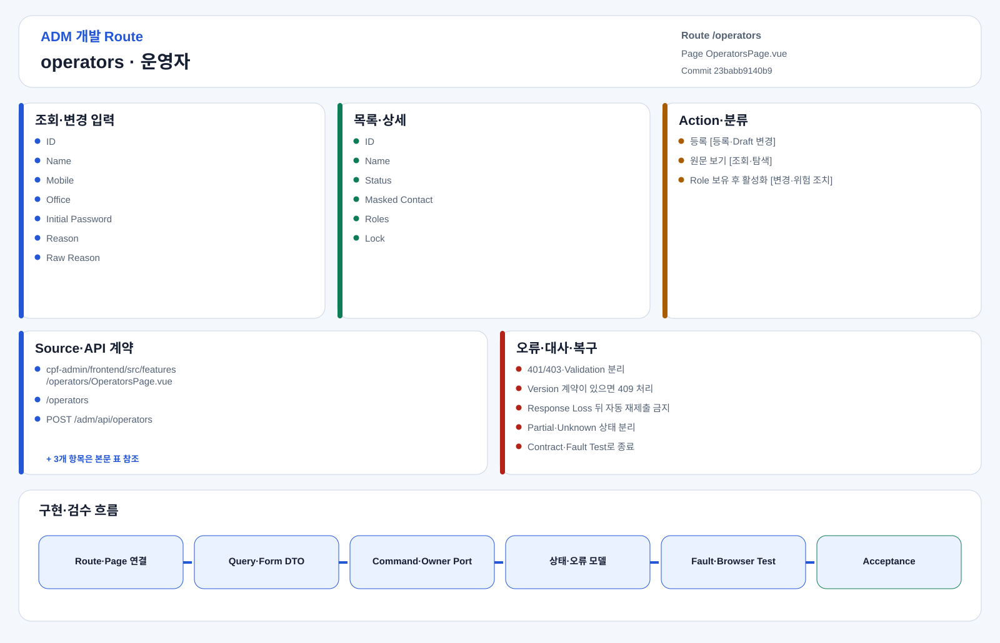


### 구현 결과

`/operators`가 단순 Route가 아니라 **운영자 계정·Role·잠금·연락처를 관리한다.** Query·Command·Permission·Owner 상태·Audit·Browser Test가 연결된 기능 Slice가 되도록 구현한다.

### Source 진입점과 소유권

| 계층 | 기준 |
|---|---|
| Router | `/operators` |
| Page | `cpf-admin/frontend/src/features/operators/OperatorsPage.vue` |
| Generated Client | Page가 import하는 Generated Client 또는 공통 ADM Client의 실제 Operation을 사용한다. 수기 Endpoint 문자열과 중복 DTO를 만들지 않는다 |
| ADM Backend | OpenAPI Operation의 Controller와 Application Service |
| Owner Port | Query·Command·Status·Reconcile Port; Local/Remote가 같은 DTO·오류 의미 사용 |
| Test | Frontend Unit·Generated Client Contract·Controller·Browser·Fault |
| 확인 API 1 | `POST /adm/api/operators` |
| 확인 API 2 | `GET /adm/api/operators/operations/{operationId}` |
| 확인 API 3 | `PUT /adm/api/operators/{operatorId}/status` |
| 확인 API 4 | `POST /adm/api/operators/{operatorId}/contacts/raw` |

### Frontend Query·Form 모델

| Field | Control | 직렬화·Validation | 오류·접근성 |
|---|---|---|---|
| `ID` | 문자열 입력·검색 | 조회·상세·Audit에서 같은 대상을 다시 찾기 위한 식별 조건이다. 앞뒤 공백·허용 문자·길이와 대소문자 규칙을 확인한다. Request·Query의 실제 이름과 Type을 유지한다. | Label·Help·Field Error·Keyboard Focus를 제공하고 민감값은 재표시하지 않는다. |
| `Name` | 문자열 입력·검색 | 대상의 표시명 또는 업무명을 검색·입력한다. 앞뒤 공백·허용 문자·길이와 대소문자 규칙을 확인한다. Request·Query의 실제 이름과 Type을 유지한다. | Label·Help·Field Error·Keyboard Focus를 제공하고 민감값은 재표시하지 않는다. |
| `Mobile` | 문자열 입력·검색 | 운영자 화면의 조회 조건 또는 편집 Form에 포함되는 값이며 화면 Label과 Help를 기준으로 사용한다. 앞뒤 공백·허용 문자·길이와 대소문자 규칙을 확인한다. Request·Query의 실제 이름과 Type을 유지한다. | Label·Help·Field Error·Keyboard Focus를 제공하고 민감값은 재표시하지 않는다. |
| `Office` | 문자열 입력·검색 | 운영자 화면의 조회 조건 또는 편집 Form에 포함되는 값이며 화면 Label과 Help를 기준으로 사용한다. 앞뒤 공백·허용 문자·길이와 대소문자 규칙을 확인한다. Request·Query의 실제 이름과 Type을 유지한다. | Label·Help·Field Error·Keyboard Focus를 제공하고 민감값은 재표시하지 않는다. |
| `Initial Password` | 보안 입력 | 신규 계정 등록·Password 변경 요청에만 사용하는 비밀값이며 조회 결과에는 표시하지 않는다. 원문을 다시 표시하지 않으며 복잡도·만료·재사용 제한과 전송 구간 보호를 확인한다. Request·Query의 실제 이름과 Type을 유지한다. | Label·Help·Field Error·Keyboard Focus를 제공하고 민감값은 재표시하지 않는다. |
| `Reason` | 다중행 입력 | 작업 목적·영향 범위·승인 또는 복구 기준을 기록해 Audit와 교대 기록에 연결한다. Ticket·영향 범위·복구점을 포함하고 화면이 요구하는 최소 길이를 충족한다. Request·Query의 실제 이름과 Type을 유지한다. | Label·Help·Field Error·Keyboard Focus를 제공하고 민감값은 재표시하지 않는다. |
| `Raw Reason` | 다중행 입력 | 작업 목적·영향 범위·승인 또는 복구 기준을 기록해 Audit와 교대 기록에 연결한다. Ticket·영향 범위·복구점을 포함하고 화면이 요구하는 최소 길이를 충족한다. Request·Query의 실제 이름과 Type을 유지한다. | Label·Help·Field Error·Keyboard Focus를 제공하고 민감값은 재표시하지 않는다. |

### Table·Detail View Model

| 값 | 표시 계약 | Drill-down·대사 |
|---|---|---|
| `ID` | 운영자의 대상 레코드를 상세·Owner·Audit에서 연결하는 식별자다. Masking·Timezone·단위를 DTO Metadata와 함께 표시한다. | 상세·Log·Trace·Audit에서 같은 대상을 가리키는지 확인한다. |
| `Name` | 운영자가 대상을 구분하는 표시명 또는 설명이다. Masking·Timezone·단위를 DTO Metadata와 함께 표시한다. | 상세·재조회 결과와 비교하고 Stale·Masking·단위 차이를 확인한다. |
| `Status` | 현재 상태와 Terminal 여부, 다음 Action 가능 여부를 판단하는 값이다. Masking·Timezone·단위를 DTO Metadata와 함께 표시한다. | Last Updated·Terminal 조건·Owner 상태와 함께 확인한다. |
| `Masked Contact` | 운영자 상세에서 대상의 현재 속성 또는 처리 결과를 확인하는 값이다. Masking·Timezone·단위를 DTO Metadata와 함께 표시한다. | 상세·재조회 결과와 비교하고 Stale·Masking·단위 차이를 확인한다. |
| `Roles` | 운영자 상세에서 대상의 현재 속성 또는 처리 결과를 확인하는 값이다. Masking·Timezone·단위를 DTO Metadata와 함께 표시한다. | 상세·재조회 결과와 비교하고 Stale·Masking·단위 차이를 확인한다. |
| `Lock` | 현재 상태와 Terminal 여부, 다음 Action 가능 여부를 판단하는 값이다. Masking·Timezone·단위를 DTO Metadata와 함께 표시한다. | Last Updated·Terminal 조건·Owner 상태와 함께 확인한다. |

### Button·Command 모델

| Action | 분류 | Frontend 활성 조건 | Backend·성공 처리 |
|---|---|---|---|
| **등록** | 등록·Draft 변경 | 화면이 실제로 요구하는 Write Permission·필수 Field·Reason·Version 조건을 충족함 | 운영자의 재조회 결과가 요청 내용과 일치한다. Version·Before/After·Audit는 해당 Owner가 제공하는 경우 함께 확인한다. Backend에서도 Permission·Version·Idempotency를 재검증한다. |
| **원문 보기** | 조회·탐색 | 조회 Permission과 Query Validation을 충족하고 동일 조회가 진행 중이 아님 | 원문 보기 결과의 조회 시각·Filter·Source Version·Warning이 갱신되며 Owner 데이터는 변경하지 않는다. |
| **Role 보유 후 활성화** | 변경·위험 조치 | 화면과 Owner가 요구하는 Write Permission·대상 상태·영향 범위·Reason·승인·Version 조건을 충족함 | 변경 Operation을 생성하고 Accepted 응답과 Owner Terminal 상태·Version·Audit를 분리해 확인한다. Backend에서도 Permission·Version·Idempotency를 재검증한다. |

### 상태 모델

```text
Query: Idle → Loading → Empty | Success | Error
Success + Stale | Partial
Command: Editing → Validating → Submitting → Accepted(operationId) → Terminal
Submitting → ResponseLoss → Reconcile → Terminal | UNKNOWN_RESULT
```

Query와 Command의 Loading·Error를 분리한다. 조회 전용 Route에는 존재하지 않는 Command 상태를 만들지 않는다. `403`, `409`, Timeout, Partial, Unknown을 하나의 Error Toast로 합치지 않는다.

### API·Owner 계약

- Query Request는 실제 Page가 사용하는 Environment·Data Scope·검색 Field·Paging·Sort·Timezone만 포함한다.
- Query Response는 실제 Item·Page·조회 시각·Source Version·Stale·Partial·Warning 계약을 유지한다.
- Command는 Source에 선언된 Target ID·Version·Reason·Approval ID·Idempotency Key·Request Hash 중 실제 필드만 사용한다.
- `202 Accepted`는 완료가 아니라 Operation 추적 시작이며 Owner Terminal 상태를 별도로 조회한다.
- Side Effect 전 실패, Side Effect 후 실패, Success, Partial, `UNKNOWN_RESULT`를 구분한다.
- Same-JVM과 Remote Adapter는 DTO·Error Code·Timeout·Unknown 의미를 유지한다.

### Permission·Data Scope·Masking

- Route Permission 기준은 **`OPERATOR` Write, Raw 별도**이다.
- Menu 노출, Query, Button, Raw, Export Permission을 분리하고 Backend와 Owner에서 다시 검증한다.
- Deny는 403과 Audit를 남기며 404·Empty로 위장하지 않는다.
- Secret·Credential·PII Raw를 일반 Response DTO·Browser Storage·Log에 넣지 않는다.

### 구현 순서

1. Route·Page Import·Menu Metadata·Permission을 연결한다.
2. 이 장의 Field·Column·Action을 OpenAPI Request·Response·Error와 대조한다.
3. Generated Client를 재생성하고 수기 HTTP 호출을 제거한다.
4. Query·Command 상태와 Empty·Stale·Partial·Unknown UI를 구현한다.
5. Backend Controller·Application Service·Owner Port·Local/Remote Adapter를 연결한다.
6. Reason·Approval·Expected Version·Idempotency·Audit를 Server에서 검증한다.
7. Response Loss Polling·Reconcile·Rollback Link를 구현한다.
8. Unit·Contract·Browser·Fault·Accessibility Test를 실행한다.

### Test Matrix

| Test | 필수 Scenario |
|---|---|
| Frontend Unit | Default·Validation·Button 조건·Masking·Empty/Error/Stale/Partial |
| OpenAPI·Generated Client | Operation 이름·Type·Error·Hash Drift |
| Backend Query | Permission·Data Scope·Filter·Paging·Stale·Partial |
| Backend Command | Source에 선언된 Permission·Version·Reason·Approval·Idempotency·Audit 계약 |
| Local/Remote Contract | 같은 DTO·Error·Timeout 의미 |
| Browser | Deep Link·Query·상세·403·Timeout·Empty·Partial |
| Fault | 409·Response Loss·DB/Kafka/Owner 중단·Partial ACK·Late Response |
| Accessibility | Keyboard·Focus·Label·Error Announcement·Table/Dialog |

### 개발 Fault Workbook

1. `/operators` Query를 500·Timeout·Empty·Partial 응답으로 주입해 Loading·Empty·Error·Stale·Partial UI를 각각 확인한다.
2. 401·403과 Data Scope 축소를 주입해 Deny를 Empty로 위장하지 않고 Error와 접근 가능한 범위를 구분하는지 확인한다.
3. Version 계약이 있는 Write Action에는 409를, 모든 비동기·원격 Write에는 Response Loss를 주입해 자동 재제출이 없는지 확인한다.
4. 202 응답 뒤 Operation Polling이 Terminal·Failed·Partial·Unknown을 분리하는지 확인한다.
5. Local Adapter와 Remote Adapter에 같은 Contract Fixture를 적용해 Error Code·Retryability·failureStage가 일치하는지 확인한다.
6. Browser Storage·Console·Network Error·Screenshot에 Token·Secret·PII Raw가 남지 않는지 확인한다.

### Route Acceptance Checklist

- [ ] Route `/operators`의 Deep Link와 Menu ID `operators`가 같은 Page를 연다.
- [ ] 이 장의 Field·Column·Action과 Page·OpenAPI·Generated Client가 같은 계약을 사용한다.
- [ ] Menu·Query·Raw·Export Permission Deny가 Backend 403과 화면 Error로 확인된다.
- [ ] Empty·Timeout·Stale·Partial이 서로 다른 사용자 상태와 재조회 경로를 제공한다.
- [ ] Same-JVM·Remote 호출이 같은 Query DTO·오류·Timeout 계약을 사용한다.
- [ ] 409·Response Loss·Partial·Unknown이 서로 다른 상태와 Operation·Reconcile Link를 제공한다.
- [ ] Command가 Source에 선언한 Reason·Approval·Version·Idempotency·Audit 필드를 Server에서 재검증한다.
- [ ] 정상·오류·경계 Browser Test와 Accessibility Test가 Route Matrix에 포함된다.

### 독립 수행 검수 Checklist

- [ ] `/operators`와 Page Source를 찾고 화면 목적을 설명할 수 있다.
- [ ] 7개 입력·검색 항목의 Control·기본값·Validation을 설명할 수 있다.
- [ ] 6개 표시값을 Owner 상태·Version·Audit와 대사할 수 있다.
- [ ] 3개 Action의 분류·활성 조건·Side Effect를 설명할 수 있다.
- [ ] Empty·403·409·Timeout·Partial·Unknown을 서로 다른 상태로 처리할 수 있다.
- [ ] 응답 유실 뒤 중복 제출 없이 Operation·Owner·Audit로 결과를 확정할 수 있다.
- [ ] 교대 기록만으로 다음 담당자가 Target·상태·복구 기한을 이어받을 수 있다.
- [ ] OpenAPI·Generated Client·Page·Controller·Owner Port·Test가 같은 Field와 오류 계약을 사용하는지 검증할 수 있다.
- [ ] Local·Remote Adapter의 Timeout·Unknown 의미가 같은지 Contract Test로 확인할 수 있다.

## 55. password — Password·Session 기능 Slice 개발 장

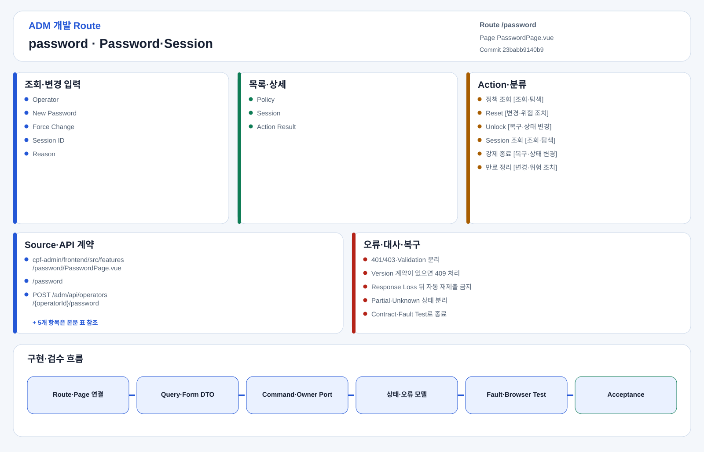


### 구현 결과

`/password`가 단순 Route가 아니라 **Password 정책·Reset·Unlock·Session 폐기를 관리한다.** Query·Command·Permission·Owner 상태·Audit·Browser Test가 연결된 기능 Slice가 되도록 구현한다.

### Source 진입점과 소유권

| 계층 | 기준 |
|---|---|
| Router | `/password` |
| Page | `cpf-admin/frontend/src/features/password/PasswordPage.vue` |
| Generated Client | Page가 import하는 Generated Client 또는 공통 ADM Client의 실제 Operation을 사용한다. 수기 Endpoint 문자열과 중복 DTO를 만들지 않는다 |
| ADM Backend | OpenAPI Operation의 Controller와 Application Service |
| Owner Port | Query·Command·Status·Reconcile Port; Local/Remote가 같은 DTO·오류 의미 사용 |
| Test | Frontend Unit·Generated Client Contract·Controller·Browser·Fault |
| 확인 API 1 | `POST /adm/api/operators/{operatorId}/password` |
| 확인 API 2 | `POST /adm/api/operators/{operatorId}/password/reset` |
| 확인 API 3 | `POST /adm/api/operators/{operatorId}/unlock` |
| 확인 API 4 | `GET /adm/api/operators/sessions` |
| 확인 API 5 | `POST /adm/api/operators/sessions/{sessionId}/revoke` |
| 확인 API 6 | `POST /adm/api/operators/sessions/cleanup-expired` |

### Frontend Query·Form 모델

| Field | Control | 직렬화·Validation | 오류·접근성 |
|---|---|---|---|
| `Operator` | 날짜·시간 입력 | 조회 또는 적용의 유효 시간 범위를 정하며 Timezone과 시작·종료 순서를 함께 확인한다. Timezone을 고정하고 시작≤종료·유효기간 겹침·기준일 포함 여부를 확인한다. Request·Query의 실제 이름과 Type을 유지한다. | Label·Help·Field Error·Keyboard Focus를 제공하고 민감값은 재표시하지 않는다. |
| `New Password` | 보안 입력 | 신규 계정 등록·Password 변경 요청에만 사용하는 비밀값이며 조회 결과에는 표시하지 않는다. 원문을 다시 표시하지 않으며 복잡도·만료·재사용 제한과 전송 구간 보호를 확인한다. Request·Query의 실제 이름과 Type을 유지한다. | Label·Help·Field Error·Keyboard Focus를 제공하고 민감값은 재표시하지 않는다. |
| `Force Change` | Checkbox·Switch | 현재 상태를 조회하거나 다음 Action의 허용 조건을 지정한다. 현재 선택과 변경 후 영향 범위를 비교하고 화면의 Source 기본값을 확인한다. Request·Query의 실제 이름과 Type을 유지한다. | Label·Help·Field Error·Keyboard Focus를 제공하고 민감값은 재표시하지 않는다. |
| `Session ID` | 문자열 입력·검색 | 조회·상세·Audit에서 같은 대상을 다시 찾기 위한 식별 조건이다. 앞뒤 공백·허용 문자·길이와 대소문자 규칙을 확인한다. Request·Query의 실제 이름과 Type을 유지한다. | Label·Help·Field Error·Keyboard Focus를 제공하고 민감값은 재표시하지 않는다. |
| `Reason` | 다중행 입력 | 작업 목적·영향 범위·승인 또는 복구 기준을 기록해 Audit와 교대 기록에 연결한다. Ticket·영향 범위·복구점을 포함하고 화면이 요구하는 최소 길이를 충족한다. Request·Query의 실제 이름과 Type을 유지한다. | Label·Help·Field Error·Keyboard Focus를 제공하고 민감값은 재표시하지 않는다. |

### Table·Detail View Model

| 값 | 표시 계약 | Drill-down·대사 |
|---|---|---|
| `Policy` | Password·Session 상세에서 대상의 현재 속성 또는 처리 결과를 확인하는 값이다. Masking·Timezone·단위를 DTO Metadata와 함께 표시한다. | 상세·재조회 결과와 비교하고 Stale·Masking·단위 차이를 확인한다. |
| `Session` | Password·Session 상세에서 대상의 현재 속성 또는 처리 결과를 확인하는 값이다. Masking·Timezone·단위를 DTO Metadata와 함께 표시한다. | 상세·재조회 결과와 비교하고 Stale·Masking·단위 차이를 확인한다. |
| `Action Result` | 현재 상태와 Terminal 여부, 다음 Action 가능 여부를 판단하는 값이다. Masking·Timezone·단위를 DTO Metadata와 함께 표시한다. | Last Updated·Terminal 조건·Owner 상태와 함께 확인한다. |

### Button·Command 모델

| Action | 분류 | Frontend 활성 조건 | Backend·성공 처리 |
|---|---|---|---|
| **정책 조회** | 조회·탐색 | 조회 Permission과 Query Validation을 충족하고 동일 조회가 진행 중이 아님 | 정책 조회 결과의 조회 시각·Filter·Source Version·Warning이 갱신되며 Owner 데이터는 변경하지 않는다. |
| **Reset** | 변경·위험 조치 | 화면과 Owner가 요구하는 Write Permission·대상 상태·영향 범위·Reason·승인·Version 조건을 충족함 | 변경 Operation을 생성하고 Accepted 응답과 Owner Terminal 상태·Version·Audit를 분리해 확인한다. Backend에서도 Permission·Version·Idempotency를 재검증한다. |
| **Unlock** | 복구·상태 변경 | 화면과 Owner가 요구하는 복구 Permission·대상 상태·Reason·승인·Version 조건을 충족함 | 복구 Operation을 생성하고 Owner 상태·대상별 결과·Audit로 종료를 판정한다. Backend에서도 Permission·Version·Idempotency를 재검증한다. |
| **Session 조회** | 조회·탐색 | 조회 Permission과 Query Validation을 충족하고 동일 조회가 진행 중이 아님 | Session 조회 결과의 조회 시각·Filter·Source Version·Warning이 갱신되며 Owner 데이터는 변경하지 않는다. |
| **강제 종료** | 복구·상태 변경 | 화면과 Owner가 요구하는 복구 Permission·대상 상태·Reason·승인·Version 조건을 충족함 | 복구 Operation을 생성하고 Owner 상태·대상별 결과·Audit로 종료를 판정한다. Backend에서도 Permission·Version·Idempotency를 재검증한다. |
| **만료 정리** | 변경·위험 조치 | 화면과 Owner가 요구하는 Write Permission·대상 상태·영향 범위·Reason·승인·Version 조건을 충족함 | 변경 Operation을 생성하고 Accepted 응답과 Owner Terminal 상태·Version·Audit를 분리해 확인한다. Backend에서도 Permission·Version·Idempotency를 재검증한다. |

### 상태 모델

```text
Query: Idle → Loading → Empty | Success | Error
Success + Stale | Partial
Command: Editing → Validating → Submitting → Accepted(operationId) → Terminal
Submitting → ResponseLoss → Reconcile → Terminal | UNKNOWN_RESULT
```

Query와 Command의 Loading·Error를 분리한다. 조회 전용 Route에는 존재하지 않는 Command 상태를 만들지 않는다. `403`, `409`, Timeout, Partial, Unknown을 하나의 Error Toast로 합치지 않는다.

### API·Owner 계약

- Query Request는 실제 Page가 사용하는 Environment·Data Scope·검색 Field·Paging·Sort·Timezone만 포함한다.
- Query Response는 실제 Item·Page·조회 시각·Source Version·Stale·Partial·Warning 계약을 유지한다.
- Command는 Source에 선언된 Target ID·Version·Reason·Approval ID·Idempotency Key·Request Hash 중 실제 필드만 사용한다.
- `202 Accepted`는 완료가 아니라 Operation 추적 시작이며 Owner Terminal 상태를 별도로 조회한다.
- Side Effect 전 실패, Side Effect 후 실패, Success, Partial, `UNKNOWN_RESULT`를 구분한다.
- Same-JVM과 Remote Adapter는 DTO·Error Code·Timeout·Unknown 의미를 유지한다.

### Permission·Data Scope·Masking

- Route Permission 기준은 **`PASSWORD` 또는 `OPERATOR` Write**이다.
- Menu 노출, Query, Button, Raw, Export Permission을 분리하고 Backend와 Owner에서 다시 검증한다.
- Deny는 403과 Audit를 남기며 404·Empty로 위장하지 않는다.
- Secret·Credential·PII Raw를 일반 Response DTO·Browser Storage·Log에 넣지 않는다.

### 구현 순서

1. Route·Page Import·Menu Metadata·Permission을 연결한다.
2. 이 장의 Field·Column·Action을 OpenAPI Request·Response·Error와 대조한다.
3. Generated Client를 재생성하고 수기 HTTP 호출을 제거한다.
4. Query·Command 상태와 Empty·Stale·Partial·Unknown UI를 구현한다.
5. Backend Controller·Application Service·Owner Port·Local/Remote Adapter를 연결한다.
6. Reason·Approval·Expected Version·Idempotency·Audit를 Server에서 검증한다.
7. Response Loss Polling·Reconcile·Rollback Link를 구현한다.
8. Unit·Contract·Browser·Fault·Accessibility Test를 실행한다.

### Test Matrix

| Test | 필수 Scenario |
|---|---|
| Frontend Unit | Default·Validation·Button 조건·Masking·Empty/Error/Stale/Partial |
| OpenAPI·Generated Client | Operation 이름·Type·Error·Hash Drift |
| Backend Query | Permission·Data Scope·Filter·Paging·Stale·Partial |
| Backend Command | Source에 선언된 Permission·Version·Reason·Approval·Idempotency·Audit 계약 |
| Local/Remote Contract | 같은 DTO·Error·Timeout 의미 |
| Browser | Deep Link·Query·상세·403·Timeout·Empty·Partial |
| Fault | 409·Response Loss·DB/Kafka/Owner 중단·Partial ACK·Late Response |
| Accessibility | Keyboard·Focus·Label·Error Announcement·Table/Dialog |

### 개발 Fault Workbook

1. `/password` Query를 500·Timeout·Empty·Partial 응답으로 주입해 Loading·Empty·Error·Stale·Partial UI를 각각 확인한다.
2. 401·403과 Data Scope 축소를 주입해 Deny를 Empty로 위장하지 않고 Error와 접근 가능한 범위를 구분하는지 확인한다.
3. Version 계약이 있는 Write Action에는 409를, 모든 비동기·원격 Write에는 Response Loss를 주입해 자동 재제출이 없는지 확인한다.
4. 202 응답 뒤 Operation Polling이 Terminal·Failed·Partial·Unknown을 분리하는지 확인한다.
5. Local Adapter와 Remote Adapter에 같은 Contract Fixture를 적용해 Error Code·Retryability·failureStage가 일치하는지 확인한다.
6. Browser Storage·Console·Network Error·Screenshot에 Token·Secret·PII Raw가 남지 않는지 확인한다.

### Route Acceptance Checklist

- [ ] Route `/password`의 Deep Link와 Menu ID `password`가 같은 Page를 연다.
- [ ] 이 장의 Field·Column·Action과 Page·OpenAPI·Generated Client가 같은 계약을 사용한다.
- [ ] Menu·Query·Raw·Export Permission Deny가 Backend 403과 화면 Error로 확인된다.
- [ ] Empty·Timeout·Stale·Partial이 서로 다른 사용자 상태와 재조회 경로를 제공한다.
- [ ] Same-JVM·Remote 호출이 같은 Query DTO·오류·Timeout 계약을 사용한다.
- [ ] 409·Response Loss·Partial·Unknown이 서로 다른 상태와 Operation·Reconcile Link를 제공한다.
- [ ] Command가 Source에 선언한 Reason·Approval·Version·Idempotency·Audit 필드를 Server에서 재검증한다.
- [ ] 정상·오류·경계 Browser Test와 Accessibility Test가 Route Matrix에 포함된다.

### 독립 수행 검수 Checklist

- [ ] `/password`와 Page Source를 찾고 화면 목적을 설명할 수 있다.
- [ ] 5개 입력·검색 항목의 Control·기본값·Validation을 설명할 수 있다.
- [ ] 3개 표시값을 Owner 상태·Version·Audit와 대사할 수 있다.
- [ ] 6개 Action의 분류·활성 조건·Side Effect를 설명할 수 있다.
- [ ] Empty·403·409·Timeout·Partial·Unknown을 서로 다른 상태로 처리할 수 있다.
- [ ] 응답 유실 뒤 중복 제출 없이 Operation·Owner·Audit로 결과를 확정할 수 있다.
- [ ] 교대 기록만으로 다음 담당자가 Target·상태·복구 기한을 이어받을 수 있다.
- [ ] OpenAPI·Generated Client·Page·Controller·Owner Port·Test가 같은 Field와 오류 계약을 사용하는지 검증할 수 있다.
- [ ] Local·Remote Adapter의 Timeout·Unknown 의미가 같은지 Contract Test로 확인할 수 있다.

## 56. security — IP Allowlist·MFA 기능 Slice 개발 장

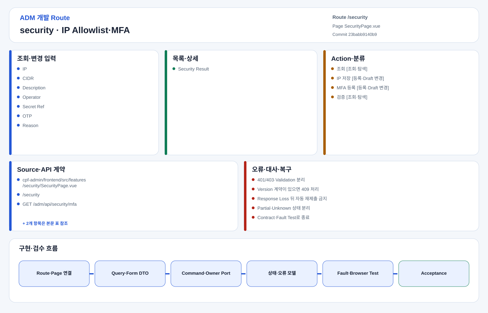


### 구현 결과

`/security`가 단순 Route가 아니라 **IP Allowlist·MFA 등록·검증을 관리한다.** Query·Command·Permission·Owner 상태·Audit·Browser Test가 연결된 기능 Slice가 되도록 구현한다.

### Source 진입점과 소유권

| 계층 | 기준 |
|---|---|
| Router | `/security` |
| Page | `cpf-admin/frontend/src/features/security/SecurityPage.vue` |
| Generated Client | Page가 import하는 Generated Client 또는 공통 ADM Client의 실제 Operation을 사용한다. 수기 Endpoint 문자열과 중복 DTO를 만들지 않는다 |
| ADM Backend | OpenAPI Operation의 Controller와 Application Service |
| Owner Port | Query·Command·Status·Reconcile Port; Local/Remote가 같은 DTO·오류 의미 사용 |
| Test | Frontend Unit·Generated Client Contract·Controller·Browser·Fault |
| 확인 API 1 | `GET /adm/api/security/mfa` |
| 확인 API 2 | `POST /adm/api/security/mfa/{operatorId}/register` |
| 확인 API 3 | `POST /adm/api/security/mfa/{operatorId}/verify` |

### Frontend Query·Form 모델

| Field | Control | 직렬화·Validation | 오류·접근성 |
|---|---|---|---|
| `IP` | 문자열 입력·검색 | IP Allowlist·MFA 화면의 조회 조건 또는 편집 Form에 포함되는 값이며 화면 Label과 Help를 기준으로 사용한다. 앞뒤 공백·허용 문자·길이와 대소문자 규칙을 확인한다. Request·Query의 실제 이름과 Type을 유지한다. | Label·Help·Field Error·Keyboard Focus를 제공하고 민감값은 재표시하지 않는다. |
| `CIDR` | 문자열 입력·검색 | 조회·상세·Audit에서 같은 대상을 다시 찾기 위한 식별 조건이다. 앞뒤 공백·허용 문자·길이와 대소문자 규칙을 확인한다. Request·Query의 실제 이름과 Type을 유지한다. | Label·Help·Field Error·Keyboard Focus를 제공하고 민감값은 재표시하지 않는다. |
| `Description` | 다중행 입력 | 작업 목적·영향 범위·승인 또는 복구 기준을 기록해 Audit와 교대 기록에 연결한다. 허용 Schema·길이·민감정보 포함 여부를 확인하고 Preview 또는 Validation 결과를 검토한다. Request·Query의 실제 이름과 Type을 유지한다. | Label·Help·Field Error·Keyboard Focus를 제공하고 민감값은 재표시하지 않는다. |
| `Operator` | 날짜·시간 입력 | 조회 또는 적용의 유효 시간 범위를 정하며 Timezone과 시작·종료 순서를 함께 확인한다. Timezone을 고정하고 시작≤종료·유효기간 겹침·기준일 포함 여부를 확인한다. Request·Query의 실제 이름과 Type을 유지한다. | Label·Help·Field Error·Keyboard Focus를 제공하고 민감값은 재표시하지 않는다. |
| `Secret Ref` | 보안 입력 | 인증·Secret 조치에 필요한 민감 입력이며 Browser 저장·일반 Log·교대 기록에 남기지 않는다. 원문을 다시 표시하지 않으며 복잡도·만료·재사용 제한과 전송 구간 보호를 확인한다. Request·Query의 실제 이름과 Type을 유지한다. | Label·Help·Field Error·Keyboard Focus를 제공하고 민감값은 재표시하지 않는다. |
| `OTP` | 보안 입력 | 인증·Secret 조치에 필요한 민감 입력이며 Browser 저장·일반 Log·교대 기록에 남기지 않는다. 원문을 다시 표시하지 않으며 복잡도·만료·재사용 제한과 전송 구간 보호를 확인한다. Request·Query의 실제 이름과 Type을 유지한다. | Label·Help·Field Error·Keyboard Focus를 제공하고 민감값은 재표시하지 않는다. |
| `Reason` | 다중행 입력 | 작업 목적·영향 범위·승인 또는 복구 기준을 기록해 Audit와 교대 기록에 연결한다. Ticket·영향 범위·복구점을 포함하고 화면이 요구하는 최소 길이를 충족한다. Request·Query의 실제 이름과 Type을 유지한다. | Label·Help·Field Error·Keyboard Focus를 제공하고 민감값은 재표시하지 않는다. |

### Table·Detail View Model

| 값 | 표시 계약 | Drill-down·대사 |
|---|---|---|
| `Security Result` | 보안 정책 조회 또는 조치 결과이며 Deny·Masking·Audit를 함께 확인한다. Masking·Timezone·단위를 DTO Metadata와 함께 표시한다. | Last Updated·Terminal 조건·Owner 상태와 함께 확인한다. |

### Button·Command 모델

| Action | 분류 | Frontend 활성 조건 | Backend·성공 처리 |
|---|---|---|---|
| **조회** | 조회·탐색 | 조회 Permission과 Query Validation을 충족하고 동일 조회가 진행 중이 아님 | 조회 결과의 조회 시각·Filter·Source Version·Warning이 갱신되며 Owner 데이터는 변경하지 않는다. |
| **IP 저장** | 등록·Draft 변경 | 화면이 실제로 요구하는 Write Permission·필수 Field·Reason·Version 조건을 충족함 | IP Allowlist·MFA의 재조회 결과가 요청 내용과 일치한다. Version·Before/After·Audit는 해당 Owner가 제공하는 경우 함께 확인한다. Backend에서도 Permission·Version·Idempotency를 재검증한다. |
| **MFA 등록** | 등록·Draft 변경 | 화면이 실제로 요구하는 Write Permission·필수 Field·Reason·Version 조건을 충족함 | IP Allowlist·MFA의 재조회 결과가 요청 내용과 일치한다. Version·Before/After·Audit는 해당 Owner가 제공하는 경우 함께 확인한다. Backend에서도 Permission·Version·Idempotency를 재검증한다. |
| **검증** | 조회·탐색 | 조회 Permission과 Query Validation을 충족하고 동일 조회가 진행 중이 아님 | 검증 결과의 조회 시각·Filter·Source Version·Warning이 갱신되며 Owner 데이터는 변경하지 않는다. |

### 상태 모델

```text
Query: Idle → Loading → Empty | Success | Error
Success + Stale | Partial
Command: Editing → Validating → Submitting → Accepted(operationId) → Terminal
Submitting → ResponseLoss → Reconcile → Terminal | UNKNOWN_RESULT
```

Query와 Command의 Loading·Error를 분리한다. 조회 전용 Route에는 존재하지 않는 Command 상태를 만들지 않는다. `403`, `409`, Timeout, Partial, Unknown을 하나의 Error Toast로 합치지 않는다.

### API·Owner 계약

- Query Request는 실제 Page가 사용하는 Environment·Data Scope·검색 Field·Paging·Sort·Timezone만 포함한다.
- Query Response는 실제 Item·Page·조회 시각·Source Version·Stale·Partial·Warning 계약을 유지한다.
- Command는 Source에 선언된 Target ID·Version·Reason·Approval ID·Idempotency Key·Request Hash 중 실제 필드만 사용한다.
- `202 Accepted`는 완료가 아니라 Operation 추적 시작이며 Owner Terminal 상태를 별도로 조회한다.
- Side Effect 전 실패, Side Effect 후 실패, Success, Partial, `UNKNOWN_RESULT`를 구분한다.
- Same-JVM과 Remote Adapter는 DTO·Error Code·Timeout·Unknown 의미를 유지한다.

### Permission·Data Scope·Masking

- Route Permission 기준은 **`SECURITY` Write**이다.
- Menu 노출, Query, Button, Raw, Export Permission을 분리하고 Backend와 Owner에서 다시 검증한다.
- Deny는 403과 Audit를 남기며 404·Empty로 위장하지 않는다.
- Secret·Credential·PII Raw를 일반 Response DTO·Browser Storage·Log에 넣지 않는다.

### 구현 순서

1. Route·Page Import·Menu Metadata·Permission을 연결한다.
2. 이 장의 Field·Column·Action을 OpenAPI Request·Response·Error와 대조한다.
3. Generated Client를 재생성하고 수기 HTTP 호출을 제거한다.
4. Query·Command 상태와 Empty·Stale·Partial·Unknown UI를 구현한다.
5. Backend Controller·Application Service·Owner Port·Local/Remote Adapter를 연결한다.
6. Reason·Approval·Expected Version·Idempotency·Audit를 Server에서 검증한다.
7. Response Loss Polling·Reconcile·Rollback Link를 구현한다.
8. Unit·Contract·Browser·Fault·Accessibility Test를 실행한다.

### Test Matrix

| Test | 필수 Scenario |
|---|---|
| Frontend Unit | Default·Validation·Button 조건·Masking·Empty/Error/Stale/Partial |
| OpenAPI·Generated Client | Operation 이름·Type·Error·Hash Drift |
| Backend Query | Permission·Data Scope·Filter·Paging·Stale·Partial |
| Backend Command | Source에 선언된 Permission·Version·Reason·Approval·Idempotency·Audit 계약 |
| Local/Remote Contract | 같은 DTO·Error·Timeout 의미 |
| Browser | Deep Link·Query·상세·403·Timeout·Empty·Partial |
| Fault | 409·Response Loss·DB/Kafka/Owner 중단·Partial ACK·Late Response |
| Accessibility | Keyboard·Focus·Label·Error Announcement·Table/Dialog |

### 개발 Fault Workbook

1. `/security` Query를 500·Timeout·Empty·Partial 응답으로 주입해 Loading·Empty·Error·Stale·Partial UI를 각각 확인한다.
2. 401·403과 Data Scope 축소를 주입해 Deny를 Empty로 위장하지 않고 Error와 접근 가능한 범위를 구분하는지 확인한다.
3. Version 계약이 있는 Write Action에는 409를, 모든 비동기·원격 Write에는 Response Loss를 주입해 자동 재제출이 없는지 확인한다.
4. 202 응답 뒤 Operation Polling이 Terminal·Failed·Partial·Unknown을 분리하는지 확인한다.
5. Local Adapter와 Remote Adapter에 같은 Contract Fixture를 적용해 Error Code·Retryability·failureStage가 일치하는지 확인한다.
6. Browser Storage·Console·Network Error·Screenshot에 Token·Secret·PII Raw가 남지 않는지 확인한다.

### Route Acceptance Checklist

- [ ] Route `/security`의 Deep Link와 Menu ID `security`가 같은 Page를 연다.
- [ ] 이 장의 Field·Column·Action과 Page·OpenAPI·Generated Client가 같은 계약을 사용한다.
- [ ] Menu·Query·Raw·Export Permission Deny가 Backend 403과 화면 Error로 확인된다.
- [ ] Empty·Timeout·Stale·Partial이 서로 다른 사용자 상태와 재조회 경로를 제공한다.
- [ ] Same-JVM·Remote 호출이 같은 Query DTO·오류·Timeout 계약을 사용한다.
- [ ] 409·Response Loss·Partial·Unknown이 서로 다른 상태와 Operation·Reconcile Link를 제공한다.
- [ ] Command가 Source에 선언한 Reason·Approval·Version·Idempotency·Audit 필드를 Server에서 재검증한다.
- [ ] 정상·오류·경계 Browser Test와 Accessibility Test가 Route Matrix에 포함된다.

### 독립 수행 검수 Checklist

- [ ] `/security`와 Page Source를 찾고 화면 목적을 설명할 수 있다.
- [ ] 7개 입력·검색 항목의 Control·기본값·Validation을 설명할 수 있다.
- [ ] 1개 표시값을 Owner 상태·Version·Audit와 대사할 수 있다.
- [ ] 4개 Action의 분류·활성 조건·Side Effect를 설명할 수 있다.
- [ ] Empty·403·409·Timeout·Partial·Unknown을 서로 다른 상태로 처리할 수 있다.
- [ ] 응답 유실 뒤 중복 제출 없이 Operation·Owner·Audit로 결과를 확정할 수 있다.
- [ ] 교대 기록만으로 다음 담당자가 Target·상태·복구 기한을 이어받을 수 있다.
- [ ] OpenAPI·Generated Client·Page·Controller·Owner Port·Test가 같은 Field와 오류 계약을 사용하는지 검증할 수 있다.
- [ ] Local·Remote Adapter의 Timeout·Unknown 의미가 같은지 Contract Test로 확인할 수 있다.

## 57. secrets — Secret Metadata·Rotation 기능 Slice 개발 장

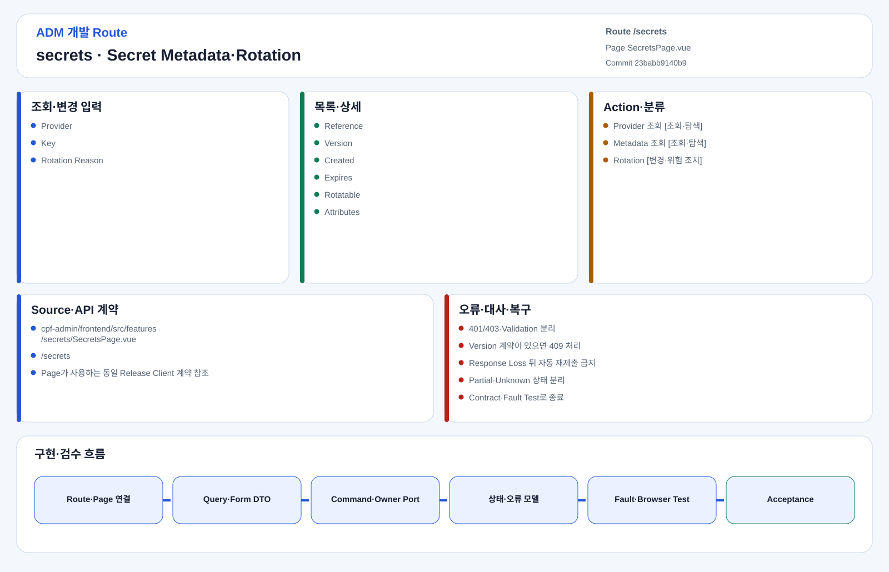


### 구현 결과

`/secrets`가 단순 Route가 아니라 **Secret Provider Metadata와 Rotation을 수행한다.** Query·Command·Permission·Owner 상태·Audit·Browser Test가 연결된 기능 Slice가 되도록 구현한다.

### Source 진입점과 소유권

| 계층 | 기준 |
|---|---|
| Router | `/secrets` |
| Page | `cpf-admin/frontend/src/features/secrets/SecretsPage.vue` |
| Generated Client | Page가 import하는 Generated Client 또는 공통 ADM Client의 실제 Operation을 사용한다. 수기 Endpoint 문자열과 중복 DTO를 만들지 않는다 |
| ADM Backend | OpenAPI Operation의 Controller와 Application Service |
| Owner Port | Query·Command·Status·Reconcile Port; Local/Remote가 같은 DTO·오류 의미 사용 |
| Test | Frontend Unit·Generated Client Contract·Controller·Browser·Fault |

### Frontend Query·Form 모델

| Field | Control | 직렬화·Validation | 오류·접근성 |
|---|---|---|---|
| `Provider` | Select·검색 | Secret Metadata·Rotation에서 적용하거나 조회할 정책·권한·처리 유형을 선택한다. 허용 목록과 현재 Environment·Data Scope에 맞는 값만 선택한다. Request·Query의 실제 이름과 Type을 유지한다. | Label·Help·Field Error·Keyboard Focus를 제공하고 민감값은 재표시하지 않는다. |
| `Key` | 문자열 입력·검색 | 조회·상세·Audit에서 같은 대상을 다시 찾기 위한 식별 조건이다. 앞뒤 공백·허용 문자·길이와 대소문자 규칙을 확인한다. Request·Query의 실제 이름과 Type을 유지한다. | Label·Help·Field Error·Keyboard Focus를 제공하고 민감값은 재표시하지 않는다. |
| `Rotation Reason` | 다중행 입력 | 작업 목적·영향 범위·승인 또는 복구 기준을 기록해 Audit와 교대 기록에 연결한다. Ticket·영향 범위·복구점을 포함하고 화면이 요구하는 최소 길이를 충족한다. Request·Query의 실제 이름과 Type을 유지한다. | Label·Help·Field Error·Keyboard Focus를 제공하고 민감값은 재표시하지 않는다. |

### Table·Detail View Model

| 값 | 표시 계약 | Drill-down·대사 |
|---|---|---|
| `Reference` | Secret Metadata·Rotation 상세에서 대상의 현재 속성 또는 처리 결과를 확인하는 값이다. Masking·Timezone·단위를 DTO Metadata와 함께 표시한다. | 상세·재조회 결과와 비교하고 Stale·Masking·단위 차이를 확인한다. |
| `Version` | 요청·Owner·Instance 사이의 Version 또는 내용 동일성을 판단하는 값이다. Masking·Timezone·단위를 DTO Metadata와 함께 표시한다. | 목록·상세·Owner 또는 Instance 보고값에서 일치하는지 확인한다. |
| `Created` | 상태 발생·갱신·유효 시점을 나타내며 화면 Timezone을 기준으로 해석한다. Masking·Timezone·단위를 DTO Metadata와 함께 표시한다. | 상세·재조회 결과와 비교하고 Stale·Masking·단위 차이를 확인한다. |
| `Expires` | Secret Metadata·Rotation 상세에서 대상의 현재 속성 또는 처리 결과를 확인하는 값이다. Masking·Timezone·단위를 DTO Metadata와 함께 표시한다. | 상세·재조회 결과와 비교하고 Stale·Masking·단위 차이를 확인한다. |
| `Rotatable` | Secret Metadata·Rotation 상세에서 대상의 현재 속성 또는 처리 결과를 확인하는 값이다. Masking·Timezone·단위를 DTO Metadata와 함께 표시한다. | 상세·재조회 결과와 비교하고 Stale·Masking·단위 차이를 확인한다. |
| `Attributes` | Secret Metadata·Rotation 상세에서 대상의 현재 속성 또는 처리 결과를 확인하는 값이다. Masking·Timezone·단위를 DTO Metadata와 함께 표시한다. | 상세·재조회 결과와 비교하고 Stale·Masking·단위 차이를 확인한다. |

### Button·Command 모델

| Action | 분류 | Frontend 활성 조건 | Backend·성공 처리 |
|---|---|---|---|
| **Provider 조회** | 조회·탐색 | 조회 Permission과 Query Validation을 충족하고 동일 조회가 진행 중이 아님 | Provider 조회 결과의 조회 시각·Filter·Source Version·Warning이 갱신되며 Owner 데이터는 변경하지 않는다. |
| **Metadata 조회** | 조회·탐색 | 조회 Permission과 Query Validation을 충족하고 동일 조회가 진행 중이 아님 | Metadata 조회 결과의 조회 시각·Filter·Source Version·Warning이 갱신되며 Owner 데이터는 변경하지 않는다. |
| **Rotation** | 변경·위험 조치 | 화면과 Owner가 요구하는 Write Permission·대상 상태·영향 범위·Reason·승인·Version 조건을 충족함 | 변경 Operation을 생성하고 Accepted 응답과 Owner Terminal 상태·Version·Audit를 분리해 확인한다. Backend에서도 Permission·Version·Idempotency를 재검증한다. |

### 상태 모델

```text
Query: Idle → Loading → Empty | Success | Error
Success + Stale | Partial
Command: Editing → Validating → Submitting → Accepted(operationId) → Terminal
Submitting → ResponseLoss → Reconcile → Terminal | UNKNOWN_RESULT
```

Query와 Command의 Loading·Error를 분리한다. 조회 전용 Route에는 존재하지 않는 Command 상태를 만들지 않는다. `403`, `409`, Timeout, Partial, Unknown을 하나의 Error Toast로 합치지 않는다.

### API·Owner 계약

- Query Request는 실제 Page가 사용하는 Environment·Data Scope·검색 Field·Paging·Sort·Timezone만 포함한다.
- Query Response는 실제 Item·Page·조회 시각·Source Version·Stale·Partial·Warning 계약을 유지한다.
- Command는 Source에 선언된 Target ID·Version·Reason·Approval ID·Idempotency Key·Request Hash 중 실제 필드만 사용한다.
- `202 Accepted`는 완료가 아니라 Operation 추적 시작이며 Owner Terminal 상태를 별도로 조회한다.
- Side Effect 전 실패, Side Effect 후 실패, Success, Partial, `UNKNOWN_RESULT`를 구분한다.
- Same-JVM과 Remote Adapter는 DTO·Error Code·Timeout·Unknown 의미를 유지한다.

### Permission·Data Scope·Masking

- Route Permission 기준은 **Secret Permission**이다.
- Menu 노출, Query, Button, Raw, Export Permission을 분리하고 Backend와 Owner에서 다시 검증한다.
- Deny는 403과 Audit를 남기며 404·Empty로 위장하지 않는다.
- Secret·Credential·PII Raw를 일반 Response DTO·Browser Storage·Log에 넣지 않는다.

### 구현 순서

1. Route·Page Import·Menu Metadata·Permission을 연결한다.
2. 이 장의 Field·Column·Action을 OpenAPI Request·Response·Error와 대조한다.
3. Generated Client를 재생성하고 수기 HTTP 호출을 제거한다.
4. Query·Command 상태와 Empty·Stale·Partial·Unknown UI를 구현한다.
5. Backend Controller·Application Service·Owner Port·Local/Remote Adapter를 연결한다.
6. Reason·Approval·Expected Version·Idempotency·Audit를 Server에서 검증한다.
7. Response Loss Polling·Reconcile·Rollback Link를 구현한다.
8. Unit·Contract·Browser·Fault·Accessibility Test를 실행한다.

### Test Matrix

| Test | 필수 Scenario |
|---|---|
| Frontend Unit | Default·Validation·Button 조건·Masking·Empty/Error/Stale/Partial |
| OpenAPI·Generated Client | Operation 이름·Type·Error·Hash Drift |
| Backend Query | Permission·Data Scope·Filter·Paging·Stale·Partial |
| Backend Command | Source에 선언된 Permission·Version·Reason·Approval·Idempotency·Audit 계약 |
| Local/Remote Contract | 같은 DTO·Error·Timeout 의미 |
| Browser | Deep Link·Query·상세·403·Timeout·Empty·Partial |
| Fault | 409·Response Loss·DB/Kafka/Owner 중단·Partial ACK·Late Response |
| Accessibility | Keyboard·Focus·Label·Error Announcement·Table/Dialog |

### 개발 Fault Workbook

1. `/secrets` Query를 500·Timeout·Empty·Partial 응답으로 주입해 Loading·Empty·Error·Stale·Partial UI를 각각 확인한다.
2. 401·403과 Data Scope 축소를 주입해 Deny를 Empty로 위장하지 않고 Error와 접근 가능한 범위를 구분하는지 확인한다.
3. Version 계약이 있는 Write Action에는 409를, 모든 비동기·원격 Write에는 Response Loss를 주입해 자동 재제출이 없는지 확인한다.
4. 202 응답 뒤 Operation Polling이 Terminal·Failed·Partial·Unknown을 분리하는지 확인한다.
5. Local Adapter와 Remote Adapter에 같은 Contract Fixture를 적용해 Error Code·Retryability·failureStage가 일치하는지 확인한다.
6. Browser Storage·Console·Network Error·Screenshot에 Token·Secret·PII Raw가 남지 않는지 확인한다.

### Route Acceptance Checklist

- [ ] Route `/secrets`의 Deep Link와 Menu ID `secrets`가 같은 Page를 연다.
- [ ] 이 장의 Field·Column·Action과 Page·OpenAPI·Generated Client가 같은 계약을 사용한다.
- [ ] Menu·Query·Raw·Export Permission Deny가 Backend 403과 화면 Error로 확인된다.
- [ ] Empty·Timeout·Stale·Partial이 서로 다른 사용자 상태와 재조회 경로를 제공한다.
- [ ] Same-JVM·Remote 호출이 같은 Query DTO·오류·Timeout 계약을 사용한다.
- [ ] 409·Response Loss·Partial·Unknown이 서로 다른 상태와 Operation·Reconcile Link를 제공한다.
- [ ] Command가 Source에 선언한 Reason·Approval·Version·Idempotency·Audit 필드를 Server에서 재검증한다.
- [ ] 정상·오류·경계 Browser Test와 Accessibility Test가 Route Matrix에 포함된다.

### 독립 수행 검수 Checklist

- [ ] `/secrets`와 Page Source를 찾고 화면 목적을 설명할 수 있다.
- [ ] 3개 입력·검색 항목의 Control·기본값·Validation을 설명할 수 있다.
- [ ] 6개 표시값을 Owner 상태·Version·Audit와 대사할 수 있다.
- [ ] 3개 Action의 분류·활성 조건·Side Effect를 설명할 수 있다.
- [ ] Empty·403·409·Timeout·Partial·Unknown을 서로 다른 상태로 처리할 수 있다.
- [ ] 응답 유실 뒤 중복 제출 없이 Operation·Owner·Audit로 결과를 확정할 수 있다.
- [ ] 교대 기록만으로 다음 담당자가 Target·상태·복구 기한을 이어받을 수 있다.
- [ ] OpenAPI·Generated Client·Page·Controller·Owner Port·Test가 같은 Field와 오류 계약을 사용하는지 검증할 수 있다.
- [ ] Local·Remote Adapter의 Timeout·Unknown 의미가 같은지 Contract Test로 확인할 수 있다.

## 58. approvals — 위험조치 승인 기능 Slice 개발 장

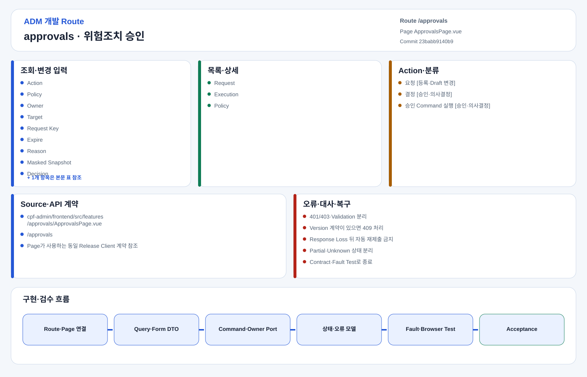


### 구현 결과

`/approvals`가 단순 Route가 아니라 **위험 조치 승인 요청·결정·Command 실행을 연결한다.** Query·Command·Permission·Owner 상태·Audit·Browser Test가 연결된 기능 Slice가 되도록 구현한다.

### Source 진입점과 소유권

| 계층 | 기준 |
|---|---|
| Router | `/approvals` |
| Page | `cpf-admin/frontend/src/features/approvals/ApprovalsPage.vue` |
| Generated Client | Page가 import하는 Generated Client 또는 공통 ADM Client의 실제 Operation을 사용한다. 수기 Endpoint 문자열과 중복 DTO를 만들지 않는다 |
| ADM Backend | OpenAPI Operation의 Controller와 Application Service |
| Owner Port | Query·Command·Status·Reconcile Port; Local/Remote가 같은 DTO·오류 의미 사용 |
| Test | Frontend Unit·Generated Client Contract·Controller·Browser·Fault |

### Frontend Query·Form 모델

| Field | Control | 직렬화·Validation | 오류·접근성 |
|---|---|---|---|
| `Action` | Select·검색 | 위험조치 승인에서 적용하거나 조회할 정책·권한·처리 유형을 선택한다. 허용 목록과 현재 Environment·Data Scope에 맞는 값만 선택한다. Request·Query의 실제 이름과 Type을 유지한다. | Label·Help·Field Error·Keyboard Focus를 제공하고 민감값은 재표시하지 않는다. |
| `Policy` | Select·검색 | 위험조치 승인에서 적용하거나 조회할 정책·권한·처리 유형을 선택한다. 허용 목록과 현재 Environment·Data Scope에 맞는 값만 선택한다. Request·Query의 실제 이름과 Type을 유지한다. | Label·Help·Field Error·Keyboard Focus를 제공하고 민감값은 재표시하지 않는다. |
| `Owner` | 문자열 입력·검색 | 위험조치 승인 화면의 조회 조건 또는 편집 Form에 포함되는 값이며 화면 Label과 Help를 기준으로 사용한다. 앞뒤 공백·허용 문자·길이와 대소문자 규칙을 확인한다. Request·Query의 실제 이름과 Type을 유지한다. | Label·Help·Field Error·Keyboard Focus를 제공하고 민감값은 재표시하지 않는다. |
| `Target` | 문자열 입력·검색 | 위험조치 승인 화면의 조회 조건 또는 편집 Form에 포함되는 값이며 화면 Label과 Help를 기준으로 사용한다. 앞뒤 공백·허용 문자·길이와 대소문자 규칙을 확인한다. Request·Query의 실제 이름과 Type을 유지한다. | Label·Help·Field Error·Keyboard Focus를 제공하고 민감값은 재표시하지 않는다. |
| `Request Key` | 문자열 입력·검색 | 조회·상세·Audit에서 같은 대상을 다시 찾기 위한 식별 조건이다. 앞뒤 공백·허용 문자·길이와 대소문자 규칙을 확인한다. Request·Query의 실제 이름과 Type을 유지한다. | Label·Help·Field Error·Keyboard Focus를 제공하고 민감값은 재표시하지 않는다. |
| `Expire` | 날짜·시간 입력 | 조회 또는 적용의 유효 시간 범위를 정하며 Timezone과 시작·종료 순서를 함께 확인한다. Timezone을 고정하고 시작≤종료·유효기간 겹침·기준일 포함 여부를 확인한다. Request·Query의 실제 이름과 Type을 유지한다. | Label·Help·Field Error·Keyboard Focus를 제공하고 민감값은 재표시하지 않는다. |
| `Reason` | 다중행 입력 | 작업 목적·영향 범위·승인 또는 복구 기준을 기록해 Audit와 교대 기록에 연결한다. Ticket·영향 범위·복구점을 포함하고 화면이 요구하는 최소 길이를 충족한다. Request·Query의 실제 이름과 Type을 유지한다. | Label·Help·Field Error·Keyboard Focus를 제공하고 민감값은 재표시하지 않는다. |
| `Masked Snapshot` | 문자열 입력·검색 | 위험조치 승인 화면의 조회 조건 또는 편집 Form에 포함되는 값이며 화면 Label과 Help를 기준으로 사용한다. 앞뒤 공백·허용 문자·길이와 대소문자 규칙을 확인한다. Request·Query의 실제 이름과 Type을 유지한다. | Label·Help·Field Error·Keyboard Focus를 제공하고 민감값은 재표시하지 않는다. |
| `Decision` | 문자열 입력·검색 | 위험조치 승인 화면의 조회 조건 또는 편집 Form에 포함되는 값이며 화면 Label과 Help를 기준으로 사용한다. 앞뒤 공백·허용 문자·길이와 대소문자 규칙을 확인한다. Request·Query의 실제 이름과 Type을 유지한다. | Label·Help·Field Error·Keyboard Focus를 제공하고 민감값은 재표시하지 않는다. |
| `Idempotency` | 문자열 입력·검색 | 조회·상세·Audit에서 같은 대상을 다시 찾기 위한 식별 조건이다. 앞뒤 공백·허용 문자·길이와 대소문자 규칙을 확인한다. Request·Query의 실제 이름과 Type을 유지한다. | Label·Help·Field Error·Keyboard Focus를 제공하고 민감값은 재표시하지 않는다. |

### Table·Detail View Model

| 값 | 표시 계약 | Drill-down·대사 |
|---|---|---|
| `Request` | 위험조치 승인 상세에서 대상의 현재 속성 또는 처리 결과를 확인하는 값이다. Masking·Timezone·단위를 DTO Metadata와 함께 표시한다. | 상세·재조회 결과와 비교하고 Stale·Masking·단위 차이를 확인한다. |
| `Execution` | 위험조치 승인의 대상 레코드를 상세·Owner·Audit에서 연결하는 식별자다. Masking·Timezone·단위를 DTO Metadata와 함께 표시한다. | 상세·Log·Trace·Audit에서 같은 대상을 가리키는지 확인한다. |
| `Policy` | 위험조치 승인 상세에서 대상의 현재 속성 또는 처리 결과를 확인하는 값이다. Masking·Timezone·단위를 DTO Metadata와 함께 표시한다. | 상세·재조회 결과와 비교하고 Stale·Masking·단위 차이를 확인한다. |

### Button·Command 모델

| Action | 분류 | Frontend 활성 조건 | Backend·성공 처리 |
|---|---|---|---|
| **요청** | 등록·Draft 변경 | 화면이 실제로 요구하는 Write Permission·필수 Field·Reason·Version 조건을 충족함 | 위험조치 승인의 재조회 결과가 요청 내용과 일치한다. Version·Before/After·Audit는 해당 Owner가 제공하는 경우 함께 확인한다. Backend에서도 Permission·Version·Idempotency를 재검증한다. |
| **결정** | 승인·의사결정 | 화면에 표시된 승인 권한·현재 Step·Snapshot·중복 결정 방지 조건을 충족함 | 승인 Snapshot과 Decision Audit가 기록되고 현재 Step·Terminal 상태가 갱신된다. Backend에서도 Permission·Version·Idempotency를 재검증한다. |
| **승인 Command 실행** | 승인·의사결정 | 화면에 표시된 승인 권한·현재 Step·Snapshot·중복 결정 방지 조건을 충족함 | 승인 Snapshot과 Decision Audit가 기록되고 현재 Step·Terminal 상태가 갱신된다. Backend에서도 Permission·Version·Idempotency를 재검증한다. |

### 상태 모델

```text
Query: Idle → Loading → Empty | Success | Error
Success + Stale | Partial
Command: Editing → Validating → Submitting → Accepted(operationId) → Terminal
Submitting → ResponseLoss → Reconcile → Terminal | UNKNOWN_RESULT
```

Query와 Command의 Loading·Error를 분리한다. 조회 전용 Route에는 존재하지 않는 Command 상태를 만들지 않는다. `403`, `409`, Timeout, Partial, Unknown을 하나의 Error Toast로 합치지 않는다.

### API·Owner 계약

- Query Request는 실제 Page가 사용하는 Environment·Data Scope·검색 Field·Paging·Sort·Timezone만 포함한다.
- Query Response는 실제 Item·Page·조회 시각·Source Version·Stale·Partial·Warning 계약을 유지한다.
- Command는 Source에 선언된 Target ID·Version·Reason·Approval ID·Idempotency Key·Request Hash 중 실제 필드만 사용한다.
- `202 Accepted`는 완료가 아니라 Operation 추적 시작이며 Owner Terminal 상태를 별도로 조회한다.
- Side Effect 전 실패, Side Effect 후 실패, Success, Partial, `UNKNOWN_RESULT`를 구분한다.
- Same-JVM과 Remote Adapter는 DTO·Error Code·Timeout·Unknown 의미를 유지한다.

### Permission·Data Scope·Masking

- Route Permission 기준은 **Approval Role**이다.
- Menu 노출, Query, Button, Raw, Export Permission을 분리하고 Backend와 Owner에서 다시 검증한다.
- Deny는 403과 Audit를 남기며 404·Empty로 위장하지 않는다.
- Secret·Credential·PII Raw를 일반 Response DTO·Browser Storage·Log에 넣지 않는다.

### 구현 순서

1. Route·Page Import·Menu Metadata·Permission을 연결한다.
2. 이 장의 Field·Column·Action을 OpenAPI Request·Response·Error와 대조한다.
3. Generated Client를 재생성하고 수기 HTTP 호출을 제거한다.
4. Query·Command 상태와 Empty·Stale·Partial·Unknown UI를 구현한다.
5. Backend Controller·Application Service·Owner Port·Local/Remote Adapter를 연결한다.
6. Reason·Approval·Expected Version·Idempotency·Audit를 Server에서 검증한다.
7. Response Loss Polling·Reconcile·Rollback Link를 구현한다.
8. Unit·Contract·Browser·Fault·Accessibility Test를 실행한다.

### Test Matrix

| Test | 필수 Scenario |
|---|---|
| Frontend Unit | Default·Validation·Button 조건·Masking·Empty/Error/Stale/Partial |
| OpenAPI·Generated Client | Operation 이름·Type·Error·Hash Drift |
| Backend Query | Permission·Data Scope·Filter·Paging·Stale·Partial |
| Backend Command | Source에 선언된 Permission·Version·Reason·Approval·Idempotency·Audit 계약 |
| Local/Remote Contract | 같은 DTO·Error·Timeout 의미 |
| Browser | Deep Link·Query·상세·403·Timeout·Empty·Partial |
| Fault | 409·Response Loss·DB/Kafka/Owner 중단·Partial ACK·Late Response |
| Accessibility | Keyboard·Focus·Label·Error Announcement·Table/Dialog |

### 개발 Fault Workbook

1. `/approvals` Query를 500·Timeout·Empty·Partial 응답으로 주입해 Loading·Empty·Error·Stale·Partial UI를 각각 확인한다.
2. 401·403과 Data Scope 축소를 주입해 Deny를 Empty로 위장하지 않고 Error와 접근 가능한 범위를 구분하는지 확인한다.
3. Version 계약이 있는 Write Action에는 409를, 모든 비동기·원격 Write에는 Response Loss를 주입해 자동 재제출이 없는지 확인한다.
4. 202 응답 뒤 Operation Polling이 Terminal·Failed·Partial·Unknown을 분리하는지 확인한다.
5. Local Adapter와 Remote Adapter에 같은 Contract Fixture를 적용해 Error Code·Retryability·failureStage가 일치하는지 확인한다.
6. Browser Storage·Console·Network Error·Screenshot에 Token·Secret·PII Raw가 남지 않는지 확인한다.

### Route Acceptance Checklist

- [ ] Route `/approvals`의 Deep Link와 Menu ID `approvals`가 같은 Page를 연다.
- [ ] 이 장의 Field·Column·Action과 Page·OpenAPI·Generated Client가 같은 계약을 사용한다.
- [ ] Menu·Query·Raw·Export Permission Deny가 Backend 403과 화면 Error로 확인된다.
- [ ] Empty·Timeout·Stale·Partial이 서로 다른 사용자 상태와 재조회 경로를 제공한다.
- [ ] Same-JVM·Remote 호출이 같은 Query DTO·오류·Timeout 계약을 사용한다.
- [ ] 409·Response Loss·Partial·Unknown이 서로 다른 상태와 Operation·Reconcile Link를 제공한다.
- [ ] Command가 Source에 선언한 Reason·Approval·Version·Idempotency·Audit 필드를 Server에서 재검증한다.
- [ ] 정상·오류·경계 Browser Test와 Accessibility Test가 Route Matrix에 포함된다.

### 독립 수행 검수 Checklist

- [ ] `/approvals`와 Page Source를 찾고 화면 목적을 설명할 수 있다.
- [ ] 10개 입력·검색 항목의 Control·기본값·Validation을 설명할 수 있다.
- [ ] 3개 표시값을 Owner 상태·Version·Audit와 대사할 수 있다.
- [ ] 3개 Action의 분류·활성 조건·Side Effect를 설명할 수 있다.
- [ ] Empty·403·409·Timeout·Partial·Unknown을 서로 다른 상태로 처리할 수 있다.
- [ ] 응답 유실 뒤 중복 제출 없이 Operation·Owner·Audit로 결과를 확정할 수 있다.
- [ ] 교대 기록만으로 다음 담당자가 Target·상태·복구 기한을 이어받을 수 있다.
- [ ] OpenAPI·Generated Client·Page·Controller·Owner Port·Test가 같은 Field와 오류 계약을 사용하는지 검증할 수 있다.
- [ ] Local·Remote Adapter의 Timeout·Unknown 의미가 같은지 Contract Test로 확인할 수 있다.

## 59. breakGlass — 비상 권한 기능 Slice 개발 장

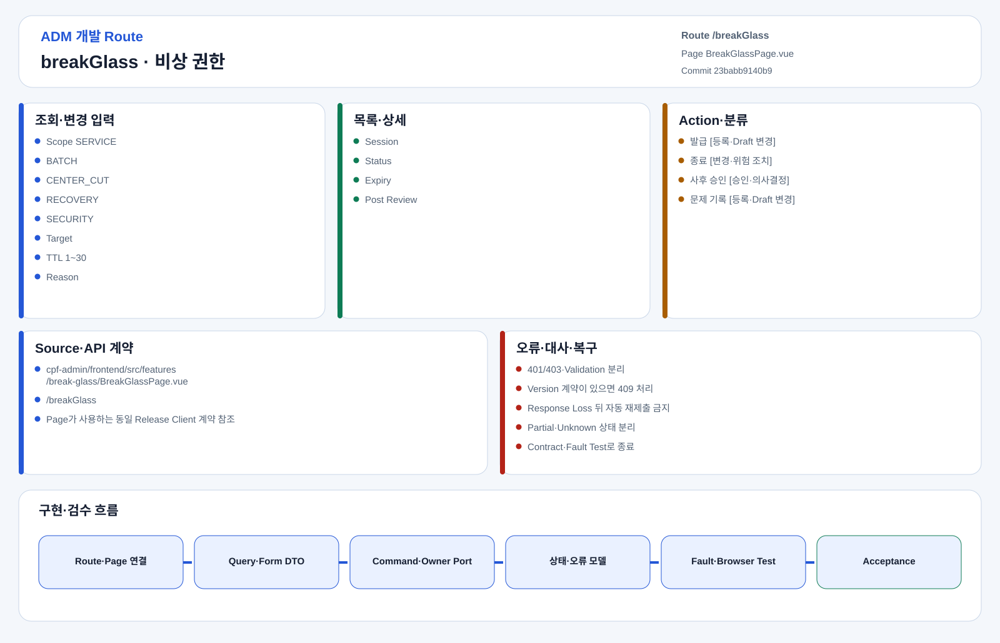


### 구현 결과

`/breakGlass`가 단순 Route가 아니라 **시간 제한 비상 권한을 발급·종료·사후 검토한다.** Query·Command·Permission·Owner 상태·Audit·Browser Test가 연결된 기능 Slice가 되도록 구현한다.

### Source 진입점과 소유권

| 계층 | 기준 |
|---|---|
| Router | `/breakGlass` |
| Page | `cpf-admin/frontend/src/features/break-glass/BreakGlassPage.vue` |
| Generated Client | Page가 import하는 Generated Client 또는 공통 ADM Client의 실제 Operation을 사용한다. 수기 Endpoint 문자열과 중복 DTO를 만들지 않는다 |
| ADM Backend | OpenAPI Operation의 Controller와 Application Service |
| Owner Port | Query·Command·Status·Reconcile Port; Local/Remote가 같은 DTO·오류 의미 사용 |
| Test | Frontend Unit·Generated Client Contract·Controller·Browser·Fault |

### Frontend Query·Form 모델

| Field | Control | 직렬화·Validation | 오류·접근성 |
|---|---|---|---|
| `Scope SERVICE` | Select·검색 | 비상 권한 조회·조치가 적용되는 환경과 데이터 경계를 제한한다. 허용 목록과 현재 Environment·Data Scope에 맞는 값만 선택한다. Request·Query의 실제 이름과 Type을 유지한다. | Label·Help·Field Error·Keyboard Focus를 제공하고 민감값은 재표시하지 않는다. |
| `BATCH` | 문자열 입력·검색 | 비상 권한 화면의 조회 조건 또는 편집 Form에 포함되는 값이며 화면 Label과 Help를 기준으로 사용한다. 앞뒤 공백·허용 문자·길이와 대소문자 규칙을 확인한다. Request·Query의 실제 이름과 Type을 유지한다. | Label·Help·Field Error·Keyboard Focus를 제공하고 민감값은 재표시하지 않는다. |
| `CENTER_CUT` | 문자열 입력·검색 | 비상 권한 화면의 조회 조건 또는 편집 Form에 포함되는 값이며 화면 Label과 Help를 기준으로 사용한다. 앞뒤 공백·허용 문자·길이와 대소문자 규칙을 확인한다. Request·Query의 실제 이름과 Type을 유지한다. | Label·Help·Field Error·Keyboard Focus를 제공하고 민감값은 재표시하지 않는다. |
| `RECOVERY` | 문자열 입력·검색 | 비상 권한 화면의 조회 조건 또는 편집 Form에 포함되는 값이며 화면 Label과 Help를 기준으로 사용한다. 앞뒤 공백·허용 문자·길이와 대소문자 규칙을 확인한다. Request·Query의 실제 이름과 Type을 유지한다. | Label·Help·Field Error·Keyboard Focus를 제공하고 민감값은 재표시하지 않는다. |
| `SECURITY` | 문자열 입력·검색 | 비상 권한 화면의 조회 조건 또는 편집 Form에 포함되는 값이며 화면 Label과 Help를 기준으로 사용한다. 앞뒤 공백·허용 문자·길이와 대소문자 규칙을 확인한다. Request·Query의 실제 이름과 Type을 유지한다. | Label·Help·Field Error·Keyboard Focus를 제공하고 민감값은 재표시하지 않는다. |
| `Target` | 문자열 입력·검색 | 비상 권한 화면의 조회 조건 또는 편집 Form에 포함되는 값이며 화면 Label과 Help를 기준으로 사용한다. 앞뒤 공백·허용 문자·길이와 대소문자 규칙을 확인한다. Request·Query의 실제 이름과 Type을 유지한다. | Label·Help·Field Error·Keyboard Focus를 제공하고 민감값은 재표시하지 않는다. |
| `TTL 1~30` | 숫자·Version 입력 | 실행 한도·순서·용량 또는 재시도 범위를 지정한다. 화면의 min·max·단위와 0 허용 여부를 확인하고 음수·Overflow를 차단한다. Request·Query의 실제 이름과 Type을 유지한다. | Label·Help·Field Error·Keyboard Focus를 제공하고 민감값은 재표시하지 않는다. |
| `Reason` | 다중행 입력 | 작업 목적·영향 범위·승인 또는 복구 기준을 기록해 Audit와 교대 기록에 연결한다. Ticket·영향 범위·복구점을 포함하고 화면이 요구하는 최소 길이를 충족한다. Request·Query의 실제 이름과 Type을 유지한다. | Label·Help·Field Error·Keyboard Focus를 제공하고 민감값은 재표시하지 않는다. |

### Table·Detail View Model

| 값 | 표시 계약 | Drill-down·대사 |
|---|---|---|
| `Session` | 비상 권한 상세에서 대상의 현재 속성 또는 처리 결과를 확인하는 값이다. Masking·Timezone·단위를 DTO Metadata와 함께 표시한다. | 상세·재조회 결과와 비교하고 Stale·Masking·단위 차이를 확인한다. |
| `Status` | 현재 상태와 Terminal 여부, 다음 Action 가능 여부를 판단하는 값이다. Masking·Timezone·단위를 DTO Metadata와 함께 표시한다. | Last Updated·Terminal 조건·Owner 상태와 함께 확인한다. |
| `Expiry` | 상태 발생·갱신·유효 시점을 나타내며 화면 Timezone을 기준으로 해석한다. Masking·Timezone·단위를 DTO Metadata와 함께 표시한다. | 상세·재조회 결과와 비교하고 Stale·Masking·단위 차이를 확인한다. |
| `Post Review` | 비상 권한 상세에서 대상의 현재 속성 또는 처리 결과를 확인하는 값이다. Masking·Timezone·단위를 DTO Metadata와 함께 표시한다. | 상세·재조회 결과와 비교하고 Stale·Masking·단위 차이를 확인한다. |

### Button·Command 모델

| Action | 분류 | Frontend 활성 조건 | Backend·성공 처리 |
|---|---|---|---|
| **발급** | 등록·Draft 변경 | 화면이 실제로 요구하는 Write Permission·필수 Field·Reason·Version 조건을 충족함 | 비상 권한의 재조회 결과가 요청 내용과 일치한다. Version·Before/After·Audit는 해당 Owner가 제공하는 경우 함께 확인한다. Backend에서도 Permission·Version·Idempotency를 재검증한다. |
| **종료** | 변경·위험 조치 | 화면과 Owner가 요구하는 Write Permission·대상 상태·영향 범위·Reason·승인·Version 조건을 충족함 | 변경 Operation을 생성하고 Accepted 응답과 Owner Terminal 상태·Version·Audit를 분리해 확인한다. Backend에서도 Permission·Version·Idempotency를 재검증한다. |
| **사후 승인** | 승인·의사결정 | 화면에 표시된 승인 권한·현재 Step·Snapshot·중복 결정 방지 조건을 충족함 | 승인 Snapshot과 Decision Audit가 기록되고 현재 Step·Terminal 상태가 갱신된다. Backend에서도 Permission·Version·Idempotency를 재검증한다. |
| **문제 기록** | 등록·Draft 변경 | 화면이 실제로 요구하는 Write Permission·필수 Field·Reason·Version 조건을 충족함 | 비상 권한의 재조회 결과가 요청 내용과 일치한다. Version·Before/After·Audit는 해당 Owner가 제공하는 경우 함께 확인한다. Backend에서도 Permission·Version·Idempotency를 재검증한다. |

### 상태 모델

```text
Query: Idle → Loading → Empty | Success | Error
Success + Stale | Partial
Command: Editing → Validating → Submitting → Accepted(operationId) → Terminal
Submitting → ResponseLoss → Reconcile → Terminal | UNKNOWN_RESULT
```

Query와 Command의 Loading·Error를 분리한다. 조회 전용 Route에는 존재하지 않는 Command 상태를 만들지 않는다. `403`, `409`, Timeout, Partial, Unknown을 하나의 Error Toast로 합치지 않는다.

### API·Owner 계약

- Query Request는 실제 Page가 사용하는 Environment·Data Scope·검색 Field·Paging·Sort·Timezone만 포함한다.
- Query Response는 실제 Item·Page·조회 시각·Source Version·Stale·Partial·Warning 계약을 유지한다.
- Command는 Source에 선언된 Target ID·Version·Reason·Approval ID·Idempotency Key·Request Hash 중 실제 필드만 사용한다.
- `202 Accepted`는 완료가 아니라 Operation 추적 시작이며 Owner Terminal 상태를 별도로 조회한다.
- Side Effect 전 실패, Side Effect 후 실패, Success, Partial, `UNKNOWN_RESULT`를 구분한다.
- Same-JVM과 Remote Adapter는 DTO·Error Code·Timeout·Unknown 의미를 유지한다.

### Permission·Data Scope·Masking

- Route Permission 기준은 **Break-glass Permission**이다.
- Menu 노출, Query, Button, Raw, Export Permission을 분리하고 Backend와 Owner에서 다시 검증한다.
- Deny는 403과 Audit를 남기며 404·Empty로 위장하지 않는다.
- Secret·Credential·PII Raw를 일반 Response DTO·Browser Storage·Log에 넣지 않는다.

### 구현 순서

1. Route·Page Import·Menu Metadata·Permission을 연결한다.
2. 이 장의 Field·Column·Action을 OpenAPI Request·Response·Error와 대조한다.
3. Generated Client를 재생성하고 수기 HTTP 호출을 제거한다.
4. Query·Command 상태와 Empty·Stale·Partial·Unknown UI를 구현한다.
5. Backend Controller·Application Service·Owner Port·Local/Remote Adapter를 연결한다.
6. Reason·Approval·Expected Version·Idempotency·Audit를 Server에서 검증한다.
7. Response Loss Polling·Reconcile·Rollback Link를 구현한다.
8. Unit·Contract·Browser·Fault·Accessibility Test를 실행한다.

### Test Matrix

| Test | 필수 Scenario |
|---|---|
| Frontend Unit | Default·Validation·Button 조건·Masking·Empty/Error/Stale/Partial |
| OpenAPI·Generated Client | Operation 이름·Type·Error·Hash Drift |
| Backend Query | Permission·Data Scope·Filter·Paging·Stale·Partial |
| Backend Command | Source에 선언된 Permission·Version·Reason·Approval·Idempotency·Audit 계약 |
| Local/Remote Contract | 같은 DTO·Error·Timeout 의미 |
| Browser | Deep Link·Query·상세·403·Timeout·Empty·Partial |
| Fault | 409·Response Loss·DB/Kafka/Owner 중단·Partial ACK·Late Response |
| Accessibility | Keyboard·Focus·Label·Error Announcement·Table/Dialog |

### 개발 Fault Workbook

1. `/breakGlass` Query를 500·Timeout·Empty·Partial 응답으로 주입해 Loading·Empty·Error·Stale·Partial UI를 각각 확인한다.
2. 401·403과 Data Scope 축소를 주입해 Deny를 Empty로 위장하지 않고 Error와 접근 가능한 범위를 구분하는지 확인한다.
3. Version 계약이 있는 Write Action에는 409를, 모든 비동기·원격 Write에는 Response Loss를 주입해 자동 재제출이 없는지 확인한다.
4. 202 응답 뒤 Operation Polling이 Terminal·Failed·Partial·Unknown을 분리하는지 확인한다.
5. Local Adapter와 Remote Adapter에 같은 Contract Fixture를 적용해 Error Code·Retryability·failureStage가 일치하는지 확인한다.
6. Browser Storage·Console·Network Error·Screenshot에 Token·Secret·PII Raw가 남지 않는지 확인한다.

### Route Acceptance Checklist

- [ ] Route `/breakGlass`의 Deep Link와 Menu ID `breakGlass`가 같은 Page를 연다.
- [ ] 이 장의 Field·Column·Action과 Page·OpenAPI·Generated Client가 같은 계약을 사용한다.
- [ ] Menu·Query·Raw·Export Permission Deny가 Backend 403과 화면 Error로 확인된다.
- [ ] Empty·Timeout·Stale·Partial이 서로 다른 사용자 상태와 재조회 경로를 제공한다.
- [ ] Same-JVM·Remote 호출이 같은 Query DTO·오류·Timeout 계약을 사용한다.
- [ ] 409·Response Loss·Partial·Unknown이 서로 다른 상태와 Operation·Reconcile Link를 제공한다.
- [ ] Command가 Source에 선언한 Reason·Approval·Version·Idempotency·Audit 필드를 Server에서 재검증한다.
- [ ] 정상·오류·경계 Browser Test와 Accessibility Test가 Route Matrix에 포함된다.

### 독립 수행 검수 Checklist

- [ ] `/breakGlass`와 Page Source를 찾고 화면 목적을 설명할 수 있다.
- [ ] 8개 입력·검색 항목의 Control·기본값·Validation을 설명할 수 있다.
- [ ] 4개 표시값을 Owner 상태·Version·Audit와 대사할 수 있다.
- [ ] 4개 Action의 분류·활성 조건·Side Effect를 설명할 수 있다.
- [ ] Empty·403·409·Timeout·Partial·Unknown을 서로 다른 상태로 처리할 수 있다.
- [ ] 응답 유실 뒤 중복 제출 없이 Operation·Owner·Audit로 결과를 확정할 수 있다.
- [ ] 교대 기록만으로 다음 담당자가 Target·상태·복구 기한을 이어받을 수 있다.
- [ ] OpenAPI·Generated Client·Page·Controller·Owner Port·Test가 같은 Field와 오류 계약을 사용하는지 검증할 수 있다.
- [ ] Local·Remote Adapter의 Timeout·Unknown 의미가 같은지 Contract Test로 확인할 수 있다.
