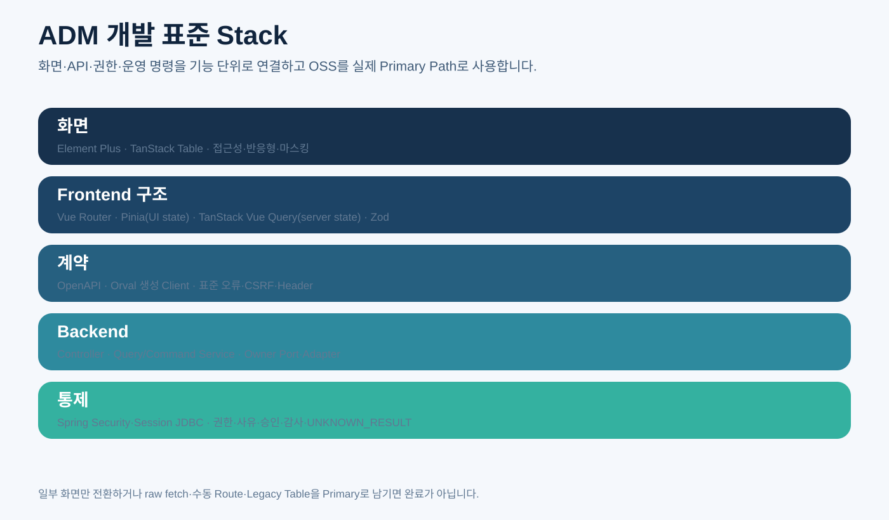
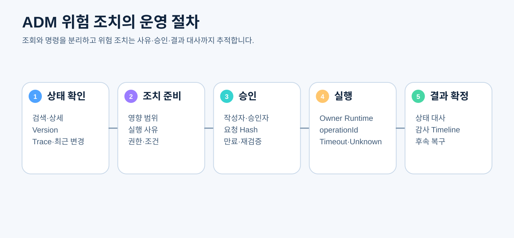

# CPF ADM 개발자 매뉴얼

> **기준 Repository** `freeangelsun/202412_01_CPF` · **기준 Branch** `master` · **문서 작성 기준 SHA** `d31bd127aa12bb9368933216642a5a9d25bd0bfd`  
> **문서 목적** 플랫폼 운영 기능의 ADM Backend·Frontend·메뉴·권한·승인·감사·Owner Runtime 연결을 실제 기능 단위로 개발하는 방법을 설명한다.  
> **주요 독자** cpf-admin Backend·Frontend 개발자, 운영 API 개발자, UI Platform 개발자, 보안·감사 개발자  
> **완료 결과** 독자가 ADM 기능 하나를 Query·Command·OpenAPI·Orval·Vue 화면·권한·승인·감사·Playwright까지 완성한다.

## 0. 문서 사용 계약

이 문서는 제품 정본과 최신 Source를 함께 확인한다. 실행하지 않은 기능이나 검증은 완료로 표현하지 않는다.

문서의 예제는 다음 순서로 읽는다.

1. **제품 계약** — CPF가 보장해야 하는 규칙이다.
2. **현재 구현 확인** — 표에 제시한 Source·설정·API·SQL 경로를 최신 `master`에서 확인한다.
3. **실행 절차** — 명령을 실제 환경에서 실행하고 Exit Code와 결과를 확인한다.
4. **오류·복구** — 정상 경로만 보지 않고 중단·응답 유실·중복·부분 실패를 확인한다.
5. **Evidence** — 실행한 기준 SHA, 환경, 명령, 시작·종료 시각, Exit Code와 Sanitized 결과를 남긴다.

상태는 `완료`, `부분 구현`, `미구현`, `미검증`, `실패`, `재확인 필요`만 사용한다.


## 1. ADM의 역할

ADM은 플랫폼 운영 Control Plane이다. 다른 제품의 DB를 직접 수정하는 만능 관리자 애플리케이션이 아니다.



ADM이 담당하는 대표 기능:

- Service·Endpoint·Instance 등록과 조회
- Transaction·Log·Trace·Attempt 조회
- 설정·정책·Artifact·Deployment 상태
- Batch Job·Step·Worker·Agent 운영 제어
- 선택형 Gateway Route·Binding·Instance 운영 제어
- 위험 명령 승인·사유·감사·대사
- 민감정보 마스킹·반출 통제

ADM은 기능 Owner에게 공개 제어 API 또는 SPI Adapter로 요청한다. Owner DB를 직접 갱신하면 Transaction·권한·감사·상태 전이의 정본이 깨진다.

## 2. QA32 Frontend 표준

| 책임 | Primary 기술 | ADM이 추가로 소유하는 기준 |
|---|---|---|
| 일반 Widget | Element Plus | Design Token, 권한·마스킹·감사 UX |
| 고급 목록 | TanStack Table | Server Paging·Sort·Filter, Column Policy |
| Routing | Vue Router | Menu ID·Permission Metadata·Guard |
| Client/UI State | Pinia | 보존 허용·금지, Logout Reset |
| Server State | TanStack Vue Query | Query Key, Cancel, Invalidation, Mutation Retry 금지 기준 |
| Form | Zod + Element Plus Form | Backend 정본, 사유·승인·Null 정책 |
| API Client | Orval | OpenAPI, CSRF, Header, Error Mutator |
| Browser 검증 | Playwright | 3 Browser, 접근성, Role·Workflow, Trace Sanitization |

일부 화면만 OSS Stack으로 바꾸고 Legacy Table·Hash Router·raw fetch·대형 Mixin을 Primary로 남기면 완료가 아니다.

## 3. Source 구조

| 확인 대상 | 대표 경로 | 확인 방법 |
|---|---|---|
| ADM Backend | `cpf-admin/src/main/java/com/cpf/admin/opr` | 기능 Owner별 Query·Command·Adapter·Controller 확인 |
| ADM Frontend | `cpf-admin/frontend/src` | Feature Package, Router, Store, Query, Component 확인 |
| Service Registry | `cpf-admin/frontend/src/features/service-registry 및 Backend 대응 Package` | 목록·상세·명령·상태 연결 확인 |
| Batch Adapter | `cpf-admin/src/main/java/com/cpf/admin/opr/batch` | Spring Batch Owner 제어 연결 확인 |
| Gateway Adapter | `cpf-admin/src/main/java/com/cpf/admin/opr/gateway` | 선택형 Gateway Owner 제어 연결 확인 |
| OpenAPI | `cpf-admin Backend Controller와 springdoc 설정` | operationId·Schema·Error 예 확인 |
| Frontend API 생성 | `cpf-admin/frontend의 Orval config와 generated client` | Clean Regeneration과 raw fetch 잔존 확인 |
| Browser Test | `cpf-admin/frontend의 Playwright config/tests` | 권한·Route·위험 조치 E2E 확인 |

## 4. 기능 Package 설계

권장 Frontend 구조:

```text
src/features/<feature>/
  api/                 Orval 생성 Client를 감싸는 좁은 Adapter
  components/          기능 전용 Component
  pages/               Route Page
  queries/             Query Key와 Vue Query Hook
  schemas/             Zod Form·Filter Schema
  stores/              UI State만 필요한 경우
  routes.ts            Route·Permission Metadata
  types.ts             화면 전용 Type
  __tests__/            Unit·Component
```

권장 Backend 구조:

```text
opr/<feature>/
  web/                  Controller, Request/Response
  application/          Query·Command Service
  domain/               운영 상태·정책
  port/                  Owner Runtime·Repository 계약
  adapter/remote/       Owner 제어 API
  adapter/persistence/  ADM 소유 Metadata·Audit
  config/               Property·Bean
```

한 개의 대형 `App.vue`, Mixin, generic table file에 여러 기능을 집중시키지 않는다.

## 5. Query와 Command 분리

### 5.1 Query

- 운영자가 판단할 수 있는 상태와 Version을 제공한다.
- Page·Sort·Filter는 Server에서 처리한다.
- Source of Truth와 수집 시각을 표시한다.
- Stale·Partial·Unavailable 상태를 숨기지 않는다.
- 민감정보는 기본 Masking한다.

### 5.2 Command

- 변경 권한과 Data Scope를 확인한다.
- 사유, 대상 Version, 승인 ID, Idempotency Key를 요구한다.
- Owner Runtime에 전달한다.
- Timeout 뒤 결과를 임의 실패로 확정하지 않는다.
- Operation·Attempt·Audit Timeline을 반환한다.

Query Controller와 Command Controller를 같은 Method·DTO로 섞지 않는다.

## 6. Owner Runtime 연결

### 6.1 Local/Remote Adapter

- 동일 JVM에서는 Local Owner Adapter
- 분리 배포에서는 Remote Owner Adapter
- 두 Adapter는 같은 ADM Application Port를 구현한다.
- Remote Type을 ADM Public API에 노출하지 않는다.

### 6.2 Timeout과 Error

- Connect·Response·Overall Timeout을 실제 Client에 적용한다.
- 401·403·404·409·422·429·5xx·Timeout을 구분한다.
- Side Effect 가능성이 있는 Timeout은 `UNKNOWN_RESULT`다.
- Retry는 Idempotency와 Owner Operation 지원이 확인된 경우만 한다.

### 6.3 결과 대사

Command Response에는 operationId와 현재 상태 조회 URL 또는 Key를 제공한다. Frontend는 “요청 전송 성공”을 “조치 완료”로 표시하지 않는다.

## 7. Backend Controller 개발

### 7.1 Request

- 검색 Filter와 Command Request를 분리
- 대상 ID·Version
- Reason
- Approval ID
- Idempotency Key
- 위험 명령 확인 Token이 필요한 경우

### 7.2 Response

- 실제 상태와 수집 시각
- Source Runtime·Instance
- Version
- Operation·Attempt ID
- `PENDING`, `RUNNING`, `SUCCEEDED`, `REJECTED`, `UNKNOWN_RESULT` 등 명확한 상태
- 사용자 메시지와 운영 상세
- 다음 조치 가능 여부

### 7.3 OpenAPI

각 Operation은 다음을 설명한다.

- 메뉴와 사용 시점
- 권한 Code
- 사유·승인 필요 여부
- Idempotency
- 정상·Conflict·Permission·Unknown 예제
- File Download·Streaming·Paging 계약

Orval이 안정적인 Function Name을 생성하도록 `operationId`를 관리한다.

## 8. Security와 Session

ADM Browser는 BFF와 Server-side Session을 사용한다.

- Spring Security
- Spring Session JDBC
- Secure·HttpOnly·SameSite Cookie
- CSRF
- Session Fixation 방지
- Idle·Absolute Timeout
- Concurrent Session
- Force Logout
- Role 변경 뒤 재검증

Frontend가 Token 원문을 읽거나 localStorage/sessionStorage에 저장하지 않는다.

## 9. 권한 모델

권한 정합성:

```text
Menu → Route → Page → Button/Action → API → Method → Data Scope
```

- 메뉴가 보이지 않아도 URL 직접 호출을 Backend가 차단한다.
- 조회, 원문 조회, 다운로드, 변경, 승인, 실행을 별도 권한으로 나눈다.
- 권한 Catalog는 Controller 하드코딩 `List.of`가 아니라 정본 Catalog와 연결한다.
- Role 변경 시 기존 Session의 권한을 재평가한다.

## 10. 승인과 Dual Control

위험 조치 예:

- Gateway Route 게시·차단·Retire
- Batch Start·Restart·Abandon·Reprocess
- Instance Drain·Stop
- Secret·Policy 적용
- 원문 로그 반출
- Rollback·Restore

승인 Snapshot에는 요청자, 승인자, 대상, 대상 Version, Request Hash, Reason, 만료, 허용 Action을 저장한다. 승인 뒤 대상 Version이 변경되면 재승인을 요구한다.

작성자와 승인자가 같은 사람인 경우 허용 여부를 정책으로 명확히 한다. 고위험 조치는 기본적으로 분리한다.

## 11. 감사와 Timeline

Audit Event 최소 필드:

- actor, subject, role
- action, target type/id
- reason, approvalId
- requestHash, expectedVersion
- operationId, attemptId, transactionId, traceId
- requestedAt, startedAt, finishedAt
- result, errorCode, unknown 여부
- before/after 또는 변경 요약
- source instance와 environment

민감정보 원문은 저장하지 않는다. Audit 저장 실패 시 위험 명령은 Fail-closed가 기본이다.

## 12. 메뉴와 Route 개발

### 12.1 Route Metadata

- routeId
- path와 name
- menuId와 parentId
- requiredPermission
- feature capability
- breadcrumb
- title
- deep link parameter
- 선택 제품 필요 여부

### 12.2 Guard

- 인증 Session
- Permission
- Capability
- Environment 제한
- Feature Version
- Forbidden과 Not Found 분리

Hash Router Fallback을 남기지 않고 Vue Router가 Deep Link·Refresh·Back/Forward를 소유한다.

## 13. 목록 화면

### 13.1 검색 영역

- 명확한 Label과 Help
- 기본 기간과 최대 조회 기간
- Multi-select·Reference Catalog
- null/empty 구분
- Reset
- URL Query와 공유 가능 조건

### 13.2 TanStack Table

- Server Paging·Sort·Filter
- 안정 Sort Key
- Column Visibility·Order 정책
- Row Key
- Loading·Empty·Error·Partial
- 대량 Virtualization이 필요한 경우
- Keyboard Navigation
- Masking Cell
- 상태 Badge와 Timestamp

100,000건을 Client에서 내려받아 Paging하지 않는다.

### 13.3 Stale 응답

검색 조건이 바뀌면 이전 요청을 Cancel하거나 최신 Request ID만 반영한다. 느린 이전 응답이 최신 결과를 덮어쓰지 않게 한다.

## 14. 상세 화면

- 대상 ID와 Version
- 상태와 최근 변경
- Source Runtime·Instance
- 관련 transactionId·traceId·operationId
- 승인·감사 Timeline
- 원문·마스킹 전환 권한
- 관련 Artifact·Job·Route 링크
- 가능한 Action과 차단 이유

상세 조회 중 상태가 변경되면 Stale Version을 명확히 표시하고 Command 전에 재조회한다.

## 15. Form과 Zod

- Zod는 사용자 입력 오류를 빠르게 표시한다.
- Backend Validation이 정본이다.
- Enum·Date·Number·Nullable·Cross-field를 Schema로 정의한다.
- Reason은 Trim, 최소·최대 길이, 금지 문자, 민감정보 입력 방지를 검토한다.
- Backend Field Error를 Element Plus Form Field에 Mapping하고 Focus한다.
- 409 Conflict는 입력 오류가 아니라 최신 상태 재조회 흐름으로 처리한다.

## 16. TanStack Vue Query

### 16.1 Query Key

```text
['service-registry','instances',{serviceId,environment,page,sort,filter}]
```

Key에 Secret·민감 원문을 넣지 않는다.

### 16.2 Server State

- `staleTime`과 refetch 기준
- Window Focus Refetch 허용 여부
- Cancel
- Invalidation
- Previous Data 표시
- Error Boundary

### 16.3 Mutation

상태 변경 Mutation을 자동 Retry하지 않는다. Idempotency와 Operation 조회가 보장된 경우에만 명시 Policy를 사용한다.

Mutation 결과가 `UNKNOWN_RESULT`면 성공 Toast를 띄우지 않고 Operation Detail로 이동한다.

## 17. Pinia

Pinia에는 다음 Client/UI State만 둔다.

- 현재 Subject와 Environment
- Navigation·Theme·사용자 Preference
- 임시 선택 상태
- 민감하지 않은 화면 Layout

Server Response 목록·상세을 영구 Store에 복제하지 않는다. Logout 시 모든 사용자 관련 State를 Reset한다.

## 18. Orval Client

- OpenAPI SHA와 Orval Version·Config Hash를 기록한다.
- 공통 Mutator가 credentials, CSRF, 표준 Header, Error Mapping을 담당한다.
- 생성 코드를 직접 수정하지 않는다.
- raw `fetch`와 Endpoint 문자열은 Download Stream 등 승인된 좁은 Allowlist 외 금지한다.
- Clean Regeneration 뒤 Git Diff가 없거나 의도된 변경만 있어야 한다.

## 19. 위험 조치 UX



위험 조치 Dialog:

- 조치명과 대상
- 현재 상태·Version
- 예상 영향과 중단 범위
- 사전 조건
- Reason
- 승인 필요 여부
- Idempotency/Operation ID
- 취소 가능 시점
- 결과 확인 방법

“확인” 버튼 한 번으로 즉시 실행하지 않고 Preview·Validation·Approval·Execute 단계를 기능 위험도에 맞게 사용한다.

## 20. 로그·파일 반출

- 검색과 원문 Export를 분리한다.
- 서버가 재귀 Masking한 Artifact만 제공한다.
- Artifact Metadata를 Durable Store와 ADM DB에 저장한다.
- 다중 ADM Instance와 재기동 뒤에도 다운로드 가능해야 한다.
- 생성자, 만료, Hash, Reason, Download Audit를 관리한다.
- Browser Memory·localStorage에 원문을 남기지 않는다.

## 21. Reference Catalog

Secret, File Alias, Path, Service, Environment, Permission 같은 값은 문자열 직접 입력보다 Reference Catalog를 사용한다.

Catalog Response는 다음을 제공한다.

- ID와 표시명
- Capability
- 환경·Scope
- 선택 가능 여부와 차단 이유
- 민감값 원문 제외
- Version·수집 시각

Provider가 없으면 빈 목록으로 기능이 있는 것처럼 보이지 말고 `UNAVAILABLE` Capability를 표시하고 Publish를 차단한다.

## 22. Error UX

| HTTP/상태 | 화면 처리 |
|---|---|
| 401 | Session 만료 안내 후 안전한 로그인 이동 |
| 403 | 권한 부족과 필요한 권한, 민감 상세 비노출 |
| 404 | 대상 삭제·환경 불일치·잘못된 Link 구분 |
| 409 | 최신 상태 재조회, 사용자 입력 보존, 재승인 필요 판단 |
| 422 | Field·업무 Validation Mapping |
| 429 | Retry-After와 조회/변경 구분 |
| 5xx | transactionId·traceId 제공, Blind Retry 금지 |
| UNKNOWN_RESULT | Operation 상태 조회·대사 화면 연결 |
| Partial | 성공·실패 대상을 분리 표시하고 전체 성공 Toast 금지 |

## 23. 접근성·반응형

- Label, Name, Role
- Keyboard와 Focus Trap
- Dialog 닫힘 뒤 Focus 복귀
- 상태를 색상만으로 표현하지 않음
- Table Header·Sort 상태 읽기
- Error Summary와 Field Focus
- 320px 수준 Mobile과 일반 Desktop
- 긴 ID·JSON·Log Overflow
- Touch Target

## 24. ADM EDU — 기능 하나 완성

### 실습: 서비스 인스턴스 Drain

1. Requirement와 Owner Runtime을 확인한다.
2. 조회 Permission과 Drain Permission을 분리한다.
3. Instance Detail Query API를 작성한다.
4. Drain Preview API로 현재 Connection·Version·영향을 반환한다.
5. Drain Command Request에 reason, expectedVersion, approvalId, idempotencyKey를 둔다.
6. Owner Port와 Local/Remote Adapter를 작성한다.
7. Timeout 뒤 `UNKNOWN_RESULT`와 Status Query를 구현한다.
8. Audit Timeline과 Attempt 원장을 연결한다.
9. OpenAPI와 `operationId`를 작성한다.
10. Orval Client를 Clean Regeneration한다.
11. Vue Router·Permission Guard·Feature Route를 등록한다.
12. Vue Query 목록·상세·Mutation을 작성한다.
13. TanStack Table과 Detail Page를 작성한다.
14. 위험 조치 Dialog와 승인 상태를 표시한다.
15. 403·409·Timeout·Unknown·Owner Down을 시험한다.
16. Playwright에서 Deep Link·Keyboard·Multi-instance를 검증한다.
17. ADM 운영자 매뉴얼의 해당 메뉴 절차와 연결한다.

## 25. 테스트

### Backend

- Permission·Data Scope
- Query Paging·Sort·Filter
- Command Idempotency·Version
- Approval Snapshot
- Remote Timeout·Unknown·Reconcile
- Audit Fail-closed
- Durable Download Artifact

### Frontend

- Route Guard·Deep Link
- Query Cancel·Stale Response
- Mutation 409·Unknown
- Form Cross-field·Backend Error Focus
- Table Paging·Sort·Filter
- Permission Button
- Masking·Download

### Browser

- Chromium·Firefox·WebKit
- Keyboard·ARIA
- Responsive
- Session Timeout·Force Logout·Role Revoke
- Partial Failure
- Dangerous Action End-to-end

## 26. 완료 체크리스트

- [ ] 기능 Owner와 ADM 책임이 분리됐다.
- [ ] ADM이 다른 Owner DB를 직접 갱신하지 않는다.
- [ ] Query와 Command, 조회 권한과 변경 권한을 분리했다.
- [ ] Remote Timeout·Idempotency·UNKNOWN_RESULT·Reconcile을 구현했다.
- [ ] OpenAPI와 Orval Client가 Clean Regeneration된다.
- [ ] Vue Router·Pinia·TanStack Vue Query·Zod 역할이 분리됐다.
- [ ] Element Plus·TanStack Table이 실제 Product 화면의 Primary다.
- [ ] Legacy Hash Router·raw fetch·Generic Table·대형 Mixin을 제거했다.
- [ ] 사유·승인·Version·Audit·Masking이 연결됐다.
- [ ] 401·403·409·422·500·Unknown·Partial UX를 검증했다.
- [ ] Playwright 3 Browser와 접근성·반응형 Evidence가 있다.
- [ ] ADM 운영자 매뉴얼의 실제 메뉴 절차와 Source가 연결된다.

## 27. 구현 추적 명령

```powershell
# ADM Feature와 Route
git ls-files cpf-admin/frontend/src
git grep -n 'createRouter\|routes\|beforeEach\|permission' cpf-admin/frontend/src -- '*.ts' '*.vue'

# 확정 OSS Consumer
git grep -n 'element-plus\|@tanstack\|pinia\|zod\|orval' cpf-admin/frontend -- 'package*.json' '*.ts' '*.vue'

# Legacy 후보
git grep -n 'location.hash\|hashchange\|fetch(' cpf-admin/frontend/src -- '*.ts' '*.vue'

# Backend Query·Command·Approval·Audit
git grep -n 'Controller\|Approval\|Audit\|UNKNOWN_RESULT\|operationId' cpf-admin/src/main -- '*.java'

# Owner DB 직접 접근 후보
git grep -n 'JdbcTemplate\|Repository\|Mapper' cpf-admin/src/main -- '*.java'
```

검색 결과는 허용된 ADM 자체 Metadata 접근과 Owner DB 직접 접근을 문맥으로 구분한다.
