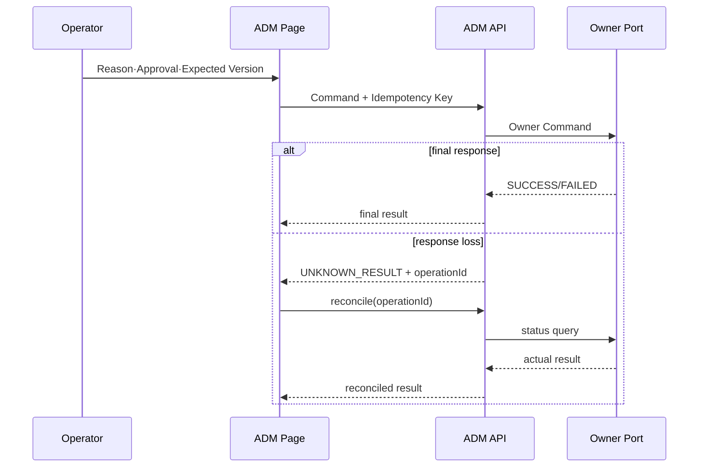

# CPF ADM 개발자 매뉴얼

> **기준 Repository** `freeangelsun/202412_01_CPF`
> **기준 Branch** `master`
> **기준 Commit** `95e592c05fc457301efdb13ee50e0d7453325806`
> **문서 목적** ADM Backend·Frontend, Owner Query·Command Port, Local·Remote, Timeout·Expected Version·Idempotency, Permission·Approval·Audit, OpenAPI·Orval과 Browser·Fault Test를 설명한다.
> **주요 독자** cpf-admin Backend·Frontend 개발자, 운영 API 개발자, 보안·감사 개발자
> **문서 사용 결과** ADM 기능 하나를 Owner Runtime과 연결하고 화면·권한·조치·복구·Test까지 구현한다.

## 0. 문서 사용 계약

이 문서는 제품 목표, 기준 Commit의 구현, 실제 실행 검증을 분리한다.

- 목표는 구현·검증 여부와 무관한 제품 계약이다.
- 기능 설명은 최신 Source·SQL·API·Config·Frontend·Script·Test의 exact path를 기준으로 한다.
- 적용 환경에서는 Build·DB·Kafka·Browser·다중 인스턴스·장애 시나리오의 실행 결과를 환경 기록에 남긴다.
- Source에 없는 Class·API·Property·Route·Permission·상태를 만들지 않는다.
- 기능 상태와 운영 상태는 Owner가 정의한 실제 상태값과 Terminal 조건을 사용한다.
- 명령 실행 전 Local Working Tree를 확인하고 기존 변경을 보호한다.


## 1. Frontend 기준과 개발 환경

`cpf-admin/frontend/package.json`:

- Node `22.16.0`, npm `10.9.2`
- Vue `3.5.40`, Vue Router `5.2.0`, Pinia `4.0.2`
- TanStack Vue Query `5.101.4`, Table `8.21.3`
- Element Plus `2.14.3`, Zod `4.4.3`, Orval `8.23.0`
- Playwright `1.62.0`, Vitest `4.1.10`

Scripts: `generate:api`, `verify:generated`, `build`, `lint`, `typecheck`, `test`, `test:e2e`, `test:a11y`, `verify:primary`, `verify`.

Dependency, Generated Client, 실제 Page Consumer와 Browser Scenario를 함께 관리한다.

### 1.1 Frontend Build·배포 확인 절차

1. Route Registry와 모든 Page Component Import를 확인한다.
2. Backend OpenAPI를 exact Source SHA로 Export한다.
3. Orval Client와 Marker·Operation Contract를 생성한다.
4. `npm ci`, lock·installed dependency 검증, lint, typecheck, unit, build를 실행한다.
5. Bundle Manifest의 Source SHA·OpenAPI Hash·Generated Hash를 확인한다.
6. 59개 Route를 Chromium·Firefox·WebKit에서 순회한다.
7. 로그인·Session·CSRF·Origin·401·403·409·503·응답 유실을 시험한다.
8. 결과 Artifact와 Browser Report를 Release 인계에 포함한다.

## 2. 기능 Slice

```text
Menu/Route → Vue Page → Pinia/Query
→ Orval Client → ADM Controller
→ Query/Command Application Service
→ Owner Port(Local/Remote)
→ Owner Runtime/DB
→ Result/Unknown → Audit·Metric·Trace
```

## 3. Backend 책임

### Query

- 검색 Field·Default·Paging·Sort·Data Scope를 검증한다.
- Owner Query Port 또는 Projection을 사용한다.
- 민감 Field는 Permission과 Masking 정책으로 변환한다.

### Command

Command DTO 필수 후보:

- target ID·desired action
- Reason
- Approval ID
- Expected Version
- Idempotency Key·Request Hash
- Deadline·Timeout Budget

Command 결과는 `ACCEPTED`, `SUCCESS`, `FAILED`, `UNKNOWN_RESULT`, `PARTIAL` 등 실제 상태를 명확히 표현한다.

## 4. Owner Port

| 배포 | Adapter | 주의점 |
|---|---|---|
| Same JVM | Local Bean/Port | ADM Transaction으로 Owner DB 직접 Update 금지 |
| Remote | HTTP/Message Adapter | Service Identity, Audience, Timeout, Error Mapping, Response loss |

Owner Port는 상태 조회와 Reconcile을 함께 제공한다. 변경 API만 있고 상태 확인 API가 없으면 Response loss를 닫을 수 없다.

## 5. Timeout·Expected Version·Idempotency

- UI Timeout은 Server/Owner 처리 취소를 의미하지 않는다.
- Response loss 후 동일 Command를 Blind Retry하지 않는다.
- Target 상태·Operation ID·Attempt를 조회한다.
- Expected Version 충돌은 최신 상태·변경자·변경 시각을 보여준다.
- Idempotency는 Key+Scope+Hash를 비교한다.

## 6. Permission·Data Scope·Masking

Permission 층위:

1. 메뉴 접근
2. Route 접근
3. Query API
4. Command API
5. Button/Action
6. Data Scope
7. Raw/Unmask
8. Export/Download

Frontend 조건은 UX이고 Backend 판정이 정본이다. 403에서 메뉴·Button을 숨기는 것과 API 권한을 모두 시험한다.

## 7. Reason·Approval·Audit

위험 조치 예:

- Runtime stop/restart
- Batch restart/abandon/reprocess
- Route publish/block/rollback
- Config publish
- Secret rotate
- Break-glass
- Raw Data 조회·Export

Audit 필드: Operator, Permission, Data Scope, Reason, Approval, Request Hash, Expected Version, Before/After, Owner Result, Unknown·Reconcile 결과, Timestamp, Trace.

## 8. OpenAPI·Orval

1. Owner/ADM Controller DTO·Error를 OpenAPI에 반영.
2. OpenAPI Artifact SHA 기록.
3. `npm run generate:api`.
4. Generated Client drift 검사.
5. 수동 URL·DTO·Enum·Error Mapping 제거.
6. Page에서 Query/Mutation을 실제 사용.
7. `npm run verify`와 E2E 실행.

Orval Config·Mutator·검증 Script와 생성 Client 전수 소비를 clean `npm ci`부터 확인한다.

## 9. Route·Menu Registry

Route Registry는 `cpf-admin/frontend/src/app/routes.ts`다. `/`는 dashboard, 나머지는 `/<menuId>` 형식이다. Route와 Menu Permission·Backend API를 하나의 Feature Registry로 추적한다.

Gateway 관련 9개 Route가 같은 `GatewayOperationsPage.vue`를 사용하므로 Page 내부 mode 분기와 Route별 Permission·검색·Action이 실제로 분리되는지 확인한다.

## 10. Table·Form·State

모든 화면:

- Search Field·Default·Reset
- Paging·Sort·Column·Empty·Loading·Error
- Detail Field·Masked Field·Raw Permission
- Form Schema·Server Validation
- Status Badge·Version
- Button 활성 조건
- Double click·Duplicate submit
- Timeout·Response loss·Partial apply
- Retry·Reprocess·Reconcile·Rollback
- Audit Link

공통 Component 존재만으로 화면 적용을 판정하지 않는다.

## 11. 위험 조치 UI 흐름

```text
Target 조회 → 영향 Preview → Reason 입력
→ Approval 선택/요청 → Expected Version 확인
→ Command 전송 → Operation ID 수신
→ 상태 Poll/Push → Success/Failed/Unknown/Partial
→ Reconcile·Rollback → Audit 확인
```

화면은 HTTP 202를 Success로 표시하지 않고 Owner 최종 상태를 확인한다.

## 12. 부분 적용

Gateway Route, Config, Deployment 등 다중 Instance 조치는 Instance별 Desired/Actual Version·Checksum·ACK/NACK를 표시한다.

- 일부 ACK는 전체 Success가 아니다.
- NACK Instance의 Traffic 제외 여부를 보여준다.
- Last Known Good와 Rollback 대상을 명시한다.
- Retry는 Failed Instance에만 수행할 수 있어야 한다.

## 13. Browser·Fault Test

- Chromium·Firefox·WebKit
- Deep link·History·Refresh·403·404
- Session expiry·Concurrent login·Logout
- Duplicate click·Slow response·Response loss
- Version conflict·Approval expiry
- Partial apply·NACK·Rollback
- Keyboard·Focus·Label·Table navigation
- Large result·Long text·Timezone·Locale

## 14. Backend Test

- Controller Validation·Permission·Data Scope
- Local/Remote Owner Adapter parity
- Timeout stage와 Error Mapping
- Idempotency Hash Conflict
- Expected Version Race
- Unknown Ledger·Reconcile
- Audit masking·immutable field
- Owner DB 직접 접근 금지 ArchUnit

## 15. EDU: Gateway Route Publish 화면

1. `gateway-routes` Route와 Page mode 확인.
2. Query API·검색·Column·Detail DTO 연결.
3. Permission·Data Scope·Masked Target 표시.
4. Validate·Connection Test·Approval Command 구성.
5. Expected Version·Idempotency·Reason 적용.
6. Publish 후 Instance ACK/NACK 표시.
7. 한 Instance NACK·Response loss 주입.
8. Reconcile과 Failed-only Retry.
9. LKG Rollback과 Audit 확인.
10. 3 Browser E2E 실행.

## 16. 적용 환경 확인 항목

- Frontend Route Registry는 확인했지만 각 Page의 Field·Button·API를 전수 실행하지 않았다.
- Backend Controller·Permission Inventory 전체 추출은 미실행이다.
- Browser·Fault·다중 인스턴스는 환경별로 실행해 확인한다.

## 부록 A. Frontend 정본과 검증 Script

기준 Commit의 ADM Frontend는 Node `22.16.0`, npm `10.9.2`를 선언한다. 주요 Dependency는 Vue 3, Vue Router, Pinia, TanStack Query/Table, Zod, Orval, Element Plus다.

| Script | 역할 |
|---|---|
| `npm run generate:api` | Orval Client 생성 |
| `npm run verify:generated` | Generated Client Drift 확인 |
| `npm run lint` | ESLint |
| `npm run typecheck` | `vue-tsc --noEmit` |
| `npm run test` | Vitest |
| `npm run build` | Generated 검증 후 Vite Build |
| `npm run test:e2e` | Playwright |
| `npm run verify` | Primary 구조·Lint·Type·Test·Build 순차 검증 |

`package.json`과 Lockfile이 일치하는지 `npm ci`로 확인한다. 적용 환경에서는 빈 의존성 상태에서 `npm ci`부터 순서대로 실행하고 결과를 기록한다.

## 부록 B. 인증·권한 Frontend 실제 호출

Source: `cpf-admin/frontend/src/app/methods/accessMethods.ts`.

| 기능 | Method·Path | 입력·상태 |
|---|---|---|
| 로그인 | `POST /adm/api/auth/login` | operatorId, password; Operator·Menu·Button 권한 수신 |
| 로그아웃 | `POST /adm/api/auth/logout` | 서버 실패와 무관하게 Browser 민감 상태 제거 |
| 내 비밀번호 변경 | `POST /adm/api/operators/{operatorId}/password` | 현재·신규·확인 Password, reason; 변경 후 재로그인 |
| Role 목록 | `GET /adm/api/permissions/roles` | Permission 화면 초기 데이터 |
| Menu 목록·Matrix | `GET /adm/api/permissions/menus`, `menu-matrix` | read/write/delete |
| Button 목록·Matrix | `GET /adm/api/permissions/buttons`, `button-matrix` | Button Allow |
| API Permission | `GET /adm/api/permissions/api-permissions`, `api-matrix` | API 행위 권한 |
| Menu 권한 변경 | `PUT /adm/api/permissions/roles/{roleId}/menus/{menuId}` | readYn, writeYn, deleteYn, reason |
| Button 권한 변경 | `PUT /adm/api/permissions/roles/{roleId}/buttons/{buttonId}` | allowYn, reason |
| API Role 변경 | `PUT /adm/api/permissions/roles/{roleId}/api-permissions/{apiPermissionId}` | allowYn, reason |
| API Permission 등록 | `POST /adm/api/permissions/api-permissions` | ID, Path, Method 등 Form, reason |

Frontend `permission(menuId)`는 서버가 전달한 `authorizedMenus`에서 권한을 찾고 미존재 시 read/write/delete를 모두 거부한다. Backend는 이 값을 신뢰하지 않고 API 권한을 다시 판정해야 한다.

## 부록 C. 운영자 Command와 결과 불명 처리

| 기능 | Method·Path | 핵심 계약 |
|---|---|---|
| 운영자 등록 | `POST /adm/api/operators` | operatorId, name, contact, password, reason, operationId |
| 등록 결과 조회 | `GET /adm/api/operators/operations/{operationId}` | 응답 유실 후 같은 Operation 결과 조회 |
| 상태 활성화 | `PUT /adm/api/operators/{operatorId}/status` | `accountStatus=ACTIVE`, expectedVersion, reason |
| 원문 연락처 | `POST /adm/api/operators/{operatorId}/contacts/raw` | 별도 권한·reason, 403/409/503 구분 |
| Password 초기화 | `POST /adm/api/operators/{operatorId}/password/reset` | newPassword, forceChange, reason |
| 잠금 해제 | `POST /adm/api/operators/{operatorId}/unlock` | reason |
| Session 조회 | `GET /adm/api/operators/sessions` | operatorId Filter |
| Session 폐기 | `POST /adm/api/operators/sessions/{sessionId}/revoke` | reason |
| 만료 Session 정리 | `POST /adm/api/operators/sessions/cleanup-expired` | reason |
| MFA 목록 | `GET /adm/api/security/mfa` | 보안 상태 조회 |
| MFA 등록 | `POST /adm/api/security/mfa/{operatorId}/register` | secretRef, reason |
| MFA 검증 | `POST /adm/api/security/mfa/{operatorId}/verify` | otpCode, reason |

운영자 등록은 Frontend가 `operationId`를 생성한다. 전송 오류가 나면 새 ID로 재등록하지 않고 기존 `operationId` 결과를 먼저 조회한다. 이 Pattern을 다른 위험 Command에도 적용한다.

## 부록 D. ADM 기능 Slice 개발 순서

1. **Owner 확인**: ADM 조회 Projection인지 Owner Command인지 구분한다.
2. **Backend Contract**: Query·Command DTO, Permission, Data Scope, Reason, Approval, Expected Version을 정의한다.
3. **Owner Adapter**: Same-JVM과 Remote Adapter의 Timeout·Error·Unknown 의미를 일치시킨다.
4. **OpenAPI**: Error·Paging·Enum·Null과 권한 응답을 포함한다.
5. **Generated Client**: Orval 생성 후 수동 중복 Client를 제거한다.
6. **Route Registry**: `routes.ts`에 Menu ID·Group·Component를 등록한다.
7. **Page State**: Loading·Empty·Error·Stale·Partial·Unknown을 분리한다.
8. **Table/Form**: Search Field·Default·Column·Detail·Validation·Masking을 구현한다.
9. **Dangerous Action**: Preview→Reason→Approval→Expected Version→Command→Status Query 순서를 적용한다.
10. **Test**: Backend Unit/Contract, Generated Drift, Browser 권한·Response Loss·Partial Apply를 실행한다.

## 부록 E. Command 응답 상태 UI

| Backend 결과 | 화면 처리 |
|---|---|
| `200/201` + 최종 상태 | 상세 재조회 후 완료 표시 |
| `202` | Operation ID를 저장하고 Poll/상태 조회 |
| `400` | Field Error를 입력 위치에 표시 |
| `401` | Credential 제거 후 재로그인 |
| `403` | Menu 숨김과 무관하게 권한 부족 표시 |
| `409` | 최신 Version 재조회, 사용자 입력 보존 |
| `412` | Approval·Precondition 재확인 |
| `429` | Retry-After와 중복 Click 방지 |
| `503` | Owner/DB/감사 저장소 장애 구분 |
| Network/Timeout | 동일 Command 재전송 금지, Operation 상태 조회 |

## 부록 F. Browser Fault Test

- Login 성공·실패·Password Change Required
- Menu Read 권한과 Button 권한 불일치
- Direct URL 403·404
- 운영자 등록 Response Loss 후 Operation 조회
- Expected Version 충돌 후 입력 보존
- Raw 연락처 403·409·503와 Masking
- Session 만료 중 Form 작성
- Approval 만료·자기승인 거부
- Instance Partial Apply와 일부 NACK
- Chromium·Firefox·WebKit Keyboard·Focus·History

## 부록 G. Same-JVM·Remote Reconciliation 계약

Same-JVM Adapter와 Remote Adapter 모두 Query·Command·Status Query·Reconciliation을 같은 Owner Port로 제공한다. Remote Timeout이나 응답 유실이 발생하면 UI는 Command를 반복하지 않고 `operationId`로 상태를 조회한다. Owner 상태, Audit, Attempt가 일치하지 않으면 Reconciliation 작업을 생성하고 담당자·기한·확정 결과를 기록한다.

---

## 기준 Source와 역할별 활용 범위

- Repository: `https://github.com/freeangelsun/202412_01_CPF`
- Branch: `master`
- 기준 Commit: `95e592c05fc457301efdb13ee50e0d7453325806`
- 문서 표준: `cpf-docs/specification/CPF_DOCUMENTATION_STANDARD.md`
- 제품 목표 정본: `cpf-docs/governance/CPF_FINAL_TARGET_REQUIREMENTS.md`
- 사실 우선순위: 실제 Source·SQL·API·Config·Frontend·Script·Test → Architecture·Specification → 이 매뉴얼

이 매뉴얼의 대상 역할은 다음 흐름을 다른 사람의 구두 설명이나 Source 역분석 없이 수행할 수 있어야 한다.

```text
업무 목적 파악
→ 선행 조건과 권한 준비
→ 실제 기능 위치 탐색
→ 등록·설정·개발·실행
→ 상태와 결과 확인
→ 오류·동시성·부분 실패 판단
→ Retry·Restart·Reprocess·Reconcile·Compensation·Rollback
→ Log·Metric·Trace·Audit·Evidence 확인
→ 정상화와 완료 판정
```

기능 설명은 Source의 실제 계약과 사용 절차를 기준으로 하며, 적용 전 확인 조건·오류·복구 경로를 함께 제공한다.

---

## 제2부 실무편: ADM Backend·Frontend 전체 기능 Slice 구현

## 18. ADM 제품 Architecture와 책임

ADM은 플랫폼 상태의 두 번째 정본이 아니다.

```text
Frontend Route·Component
→ Generated/공통 API Client
→ ADM Controller
→ Query/Command Application Service
→ Owner Query/Command Port
→ Same-JVM Adapter 또는 Remote Adapter
→ Owner Runtime·DB
→ ADM Response·Audit·Reconciliation
```

Query는 Owner 상태를 조회하고, Command는 Permission·Reason·Approval·Expected Version·Idempotency를 검증한 뒤 Owner Port를 호출한다. ADM DB에는 Menu·Permission·Approval·Audit·Operation Tracking 등 Control Plane 소유 상태만 둔다.

## 19. 기능 Slice 시작 Checklist

새 ADM 기능을 만들기 전에 다음을 한 장의 설계 기록으로 고정한다.

- 운영 문제와 대상 역할.
- Owner Module과 실제 상태 정본.
- Query인지 Command인지.
- Same-JVM·Remote Topology.
- API Method/Path, Request/Response/Error.
- Permission, Data Scope, Masking.
- Reason, Approval, Break-glass.
- Expected Version, Operation ID, Idempotency Key/Hash.
- Timeout·응답 유실·Partial Apply·Reconciliation·Rollback.
- Route, Menu ID, Component, Search Field, Column, Detail, Button.
- Unit·Controller·Contract·Browser·Fault Test.

Owner Port와 Consumer가 확인되지 않으면 Controller와 화면을 먼저 만들지 않는다.

## 20. Backend Query 기능

### 구현 순서

1. Query Request에 Filter·Paging·Sort Allowlist를 정의한다.
2. Controller는 인증 Principal과 Request Validation을 수행한다.
3. Permission과 Data Scope를 Query Predicate에 적용한다.
4. Owner Query Port를 호출한다.
5. Remote Adapter는 Connect/Response/Overall Timeout을 분리한다.
6. 응답 DTO에서 PII/Secret을 Masking한다.
7. Empty·Partial·Stale 상태를 구분한다.
8. Contract Test로 Same-JVM·Remote 결과를 비교한다.

### Query 응답 상태

- `200` + Items: 정상 조회.
- `200` + Empty: 실제 0건.
- `503` + `partial/stale` Payload: 일부 Owner 조회 실패. UI는 빈 결과로 표시하지 않는다.
- `403`: Permission/Data Scope 거부.
- `409`: 조회 Snapshot/Expected Version 충돌이 제품에 정의된 경우.

## 21. Backend Command 기능

### Request 필수 항목

| 항목 | 적용 조건 |
|---|---|
| `operationId` | 응답 유실 뒤 조회 가능한 모든 위험 조치 |
| `idempotencyKey`·Request Hash | 중복 요청이 가능한 Command |
| `expectedVersion` | 기존 상태를 수정·삭제하는 Command |
| `reason` | 운영 변경·PII Raw·Export·Security 조치 |
| `approvalId` | 위험 Action Policy가 요구할 때 |
| `breakGlassId` | 승인 우회가 허용되고 Owner가 Scope를 소비할 때 |
| Target Snapshot | 부분 적용·Rollback 대상 고정 |

### Command 흐름

```text
Permission/Data Scope 확인
→ Input·Expected Version 검증
→ Approval/Break-glass 검증
→ Operation ID + Request Hash Reserve
→ Owner Command Port 호출
→ 결과 저장·Audit
→ SUCCESS / FAILED / UNKNOWN_RESULT / PARTIAL_FAILED
```

Timeout은 실패로 단정하지 않는다. Operation ID로 ADM Operation과 Owner 상태를 조회한다. Partial Apply는 Instance별 결과와 Desired/Actual/Drift를 반환한다.

## 22. Permission·Data Scope·Masking·Audit

### Permission Registry

- Menu Permission: Read/Write/Delete.
- Button Permission: Action Code 단위.
- API Permission: Method·Path Pattern 단위.
- Owner Permission: 실제 Runtime Command 권한.

Frontend에서 Button을 숨기는 것만으로 Authorization이 완료되지 않는다. Backend API와 Owner Port 양쪽의 Negative Test가 필요하다.

### PII Raw

List/Detail은 Masked Field를 반환한다. Raw 조회는 별도 Endpoint, `PII_RAW` 성격의 Permission, 5자 이상의 구체적 Reason, Audit를 요구한다. Raw 값을 Store·Console·Error·Analytics에 남기지 않고 Dialog 종료 시 메모리 상태를 지운다.

### Audit

Command 성공·실패·Unknown을 모두 기록한다. Audit Delivery가 실패하면 업무 결과와 Delivery 상태를 분리하고 ADM Audit Delivery Recovery에서 재처리한다.

## 23. OpenAPI·Generated Client

### Backend Contract

- 모든 Public Operation과 DTO·Enum·Validation·Error를 포함한다.
- Permission, Reason, Approval, Expected Version, Idempotency를 Operation 설명에 명시한다.
- `x-cpf-source-sha`는 Backend Export Commit과 같다.

### Generated Client Gate

1. OpenAPI Hash를 계산한다.
2. Generated File Hash와 Generator Hash를 Marker에 기록한다.
3. 현재 Git HEAD 또는 명시 `CPF_SOURCE_SHA`와 Marker Source SHA를 비교한다.
4. Source SHA가 없다고 비교를 생략하지 않는다.
5. Stale Marker, 변경된 Generated File, 불완전 Snapshot을 Build 실패로 처리한다.

현재 ADM OpenAPI는 인증 일부와 자유 Schema 중심이며 Raw API 호출이 혼재한다. 따라서 기능 제공이다. 실제 전체 Export와 Typed Client 전환 전에 새 기능을 Generated Client 적용 완료로 기록하지 않는다.

## 24. Frontend Architecture

- Vue Router: Route Registry와 404 Route를 명시한다.
- Pinia: Session·Initialization·Feature Action을 책임별 Store로 분리한다.
- TanStack Query: Server State Cache와 Invalidation.
- Zod: Runtime Response Validation이 실제 적용된 기능에만 사용했다고 기록한다.
- Element Plus/TanStack Table: Component가 실제 사용하는 경우에만 기능 설명에 포함한다.
- API Client: CSRF, Credentials, Error/Transaction ID Mapping, Abort/Timeout.
- Accessibility: Label, Keyboard, Focus, Dialog, Alert.
- Responsive: Mobile Overflow와 위험 조치 접근성.
- 외부 CDN·Runtime Font·Script를 사용하지 않는다.

현재 Route Registry는 `/logs`에서 삭제된 `LogsPage.vue`를 참조한다. 이 Route는 Build/Navigation `실패`로 기록하고 Component 복원 또는 Route 제거와 전체 Route Test가 필요하다.

## 25. Menu·Route 개발

### 등록 절차

1. Feature Component를 만든다.
2. `routes.ts`에 ID·Group·Icon·Lazy Import를 등록한다.
3. Backend Menu Registry의 Menu ID와 Permission을 연결한다.
4. Deep Link와 404를 검증한다.
5. Session Load 전 Route Guard, 401/403 처리, Password Change Required 흐름을 검증한다.
6. Route Registry 전체를 순회하는 Browser Test를 작성한다. Visible Link 40개만 검사하는 Test로 완료 처리하지 않는다.

### Route 상태 표시

- Loading: 요청 진행 중이며 이전 결과를 새 결과로 표시하지 않는다.
- Empty: 성공 응답 0건.
- Error: HTTP/Error Code/Transaction ID와 복구 행동.
- Stale/Partial: Owner 일부 실패. Empty로 표시 금지.
- Unknown: Command 결과 대사 필요.

## 26. 조회·상세 화면 구현

각 화면에 다음을 실제 Source에 작성한다.

- 검색 Field·Default·Validation·Reset.
- Sort Allowlist·Paging Size/상한.
- Column·Masking·Status Chip.
- Row Selection과 Detail Field.
- Related Transaction·Log·Trace·Audit Link.
- Loading·Empty·Error·Stale State.
- Export Permission·Reason·Masking.

Raw JSON `<pre>`만 제공하는 화면은 운영자가 Field 의미와 오류 행동을 이해할 수 없으므로 제품 UI 완결성 기능 제공으로 표시한다.

## 27. 위험 조치 화면 구현

Button마다 다음을 구현·Test한다.

1. 표시 Permission과 Backend Permission.
2. 활성 상태와 비활성 사유.
3. Target·현재 상태·예상 영향.
4. Input·Default·Validation.
5. Reason·Approval·Expected Version.
6. Operation ID와 중복 클릭 방지.
7. Confirm Dialog와 Focus.
8. Timeout/응답 유실 시 Operation 조회.
9. Partial Result와 Instance별 상태.
10. Retry 허용·금지, Reconcile, Rollback.
11. Audit와 Evidence.

성공 Toast를 HTTP 2xx만으로 표시하지 않고 Owner 상태와 Operation Result를 확인한다.

## 28. 기능군별 실제 ADM 개발 경계

| 기능군 | Route/Component | Backend/Owner 경계 | 개발 주의사항 |
|---|---|---|---|
| Dashboard·Topology·Capacity | `dashboard`, `topology`, `capacity` | Service Registry/Health/Call Query | Capacity 장기 Percentile은 Metrics Backend와 함께 구현·확인 |
| Transaction | `transactionGroups`, `transactions`, `standardExecutions` | Transaction Metadata/Trace Owner | Header·PII 원문 금지 |
| Channel·Registry | `channelPolicy`, `serviceRegistry` | Channel Snapshot/Service Registry Owner | Version·Snapshot·Drain 분리 |
| Runtime Control | `runtimeControl` | Runtime Change Port | Preview·CAS·Quorum·ACK·Drift·Rollback |
| Config/Code/Message/Calendar/Cache | 각 Feature | CMN/Owner Port | Cache를 정본으로 사용 금지, Calendar Expected Version |
| Log/Audit | `remoteLogs`, `auditLogs`, `logLevel`, `logPolicies` | Log Artifact/Audit/Policy Owner | `/logs` 현재 실패, Raw Capture 상한 |
| Reliability | `recoveryCenter`, `reliability`, `incidents`, `notifications` | Unknown/DLQ/Outbox/Incident Owner | 수동 확정과 재처리 분리 |
| Batch | `batch`, Batch Runtime Views | BAT Control Server | stale/partial 빈 결과 해석 금지 |
| Gateway | Gateway Operation Component | Gateway Control Plane | Draft→Validate→Approve→Publish→ACK→LKG |
| Security | Permission/Operator/Password/Security/Secret/Approval/Break-glass | Security·Owner Command | BFF Authorization 재검증 |

## 29. Browser·Fault Test

### Route Test

- Registry의 모든 Route를 직접 방문한다.
- Import 실패, 404, 401, 403, 409, 503를 강제 주입한다.
- API Injection이 실제로 발생하지 않으면 Test를 실패시킨다.
- 위험 Button이 권한 없이 DOM에 없거나 비활성인지, Backend도 403인지 확인한다.
- Chromium·Firefox·WebKit과 Mobile Width에서 검증한다.

### Command Fault

- 중복 Click.
- 응답 유실.
- Owner 202 후 ADM 저장 실패.
- Instance 일부 ACK/NACK.
- Expected Version 충돌.
- Audit Delivery 실패.
- Reconcile/Exact Rollback.

## 30. 전체 Reference: Runtime 변경 기능

```text
Menu Permission
→ RuntimeControlPage 입력
→ Target Preview
→ Diff Preview
→ POST /adm/api/runtime-control/changes
→ Operation/Request Hash Reserve
→ Owner Runtime Change Port
→ Instance ACK/NACK
→ Desired/Actual/Drift 조회
→ Audit Hash Chain 검증
→ Cancel 또는 Exact Rollback
```

필드: Operation ID, Change Type, Environment, Service/Group/Instance, Expected Version, Schema Version, Rollout Mode, Wave Size, Quorum, Approval/Break-glass, Payload Key/Value/Type/Policy Version, Reason.

Test: 같은 Operation ID/다른 Payload, 1개 Instance NACK, 응답 유실, Audit 검증 실패, Rollback 뒤 Drift 0.

## 31. ADM 개발 EDU

- EDU-ADM-01 조회 화면: Query Port·Paging·Masking·Empty/Error/Stale.
- EDU-ADM-02 상태 변경: Operation ID·Expected Version·Reason·Audit.
- EDU-ADM-03 위험 조치: Approval·Partial Apply·Reconcile·Rollback.
- EDU-ADM-04 PII Raw: 별도 Permission·Reason·Memory Clear·Audit.
- EDU-ADM-05 Browser Fault: 401/403/409/503/Response Loss·3 Browser.

각 EDU는 실제 Controller·Port·Adapter·OpenAPI·Client·Route·Component·Test 전체 변경을 포함하고 ADM 화면에서 결과를 확인한다.

## 32. ADM 개발 완료 Checklist

- [ ] Owner Module·Consumer·Query/Command 구분
- [ ] Same-JVM·Remote Contract
- [ ] Permission·Data Scope·Masking
- [ ] Reason·Approval·Break-glass·Audit
- [ ] Idempotency·Expected Version·Unknown
- [ ] Timeout·Partial Apply·Reconcile·Rollback
- [ ] 전체 OpenAPI·Typed Client exact SHA
- [ ] Route·Menu·Guard·404
- [ ] Search/Column/Detail/Button/State
- [ ] Unit·Controller·Contract·Browser·Fault Evidence

---
## 부록 H. ADM Source 진입점

| 기능 | 기준 Source |
|---|---|
| Backend Module | `cpf-admin/build.gradle` |
| Frontend Dependency·Script | `cpf-admin/frontend/package.json` |
| Route Registry | `cpf-admin/frontend/src/app/routes.ts` |
| Router/404 | `cpf-admin/frontend/src/app/router.ts` |
| 세션 Store | `cpf-admin/frontend/src/stores/admSessionStore.ts` |
| 초기화 Store | `cpf-admin/frontend/src/stores/admInitializationStore.ts` |
| Feature Action Registry | `cpf-admin/frontend/src/stores/admFeatureActionRegistry.ts` |
| 공통 API | `cpf-admin/frontend/src/shared/cpfApi.ts` |
| Orval Mutator | `cpf-admin/frontend/src/shared/orval-mutator.ts` |
| OpenAPI Snapshot | `cpf-admin/frontend/openapi/cpf-openapi.json` |
| Generated Client | `cpf-admin/frontend/src/generated/cpf-api.ts` |
| Generated Marker 검증 | `cpf-admin/frontend/scripts/verify-generated-client.mjs` |
| Route E2E | `cpf-admin/frontend/e2e/route-quality.spec.ts` |
| 권한·Operator Frontend API | `cpf-admin/frontend/src/app/methods/accessMethods.ts` |
| Runtime Control Page | `cpf-admin/frontend/src/features/runtime-control/RuntimeControlPage.vue` |
| Service Registry Page | `cpf-admin/frontend/src/features/service-registry/ServiceRegistryPage.vue` |
| Gateway Operations | `cpf-admin/frontend/src/features/gateway-operations/GatewayOperationsPage.vue` |
| Batch Main | `cpf-admin/frontend/src/features/batch/BatchPage.vue` |
| 위험조치 승인 | `cpf-admin/frontend/src/features/approvals/ApprovalsPage.vue` |
| Break-glass | `cpf-admin/frontend/src/features/break-glass/BreakGlassPage.vue` |

---

## 제3부. ADM 기능 Slice 상세 개발 지침

## 33. 59개 Route를 기능 Slice로 관리하는 방법

ADM Route는 `cpf-admin/frontend/src/app/routes.ts`의 Router Registry가 시작점이다. 각 Route는 다음 파일과 계약을 하나의 변경 단위로 관리한다.

```text
Route Registry
→ Vue Page / Component
→ Form·Table Schema
→ Pinia·TanStack Query State
→ Orval Generated Client Operation
→ ADM Controller DTO
→ Query/Command Application Service
→ Owner Port Local/Remote Adapter
→ Permission·Approval·Audit
→ Unit·Contract·Browser·Fault Test
```

## 34. Query 화면 개발 Template

1. 사용자 질문과 검색 결과의 의미를 한 문장으로 정의한다.
2. 검색 Field, Default, Timezone, Paging, Sort, Reset 동작을 작성한다.
3. Backend Query DTO에 Validation과 Data Scope를 적용한다.
4. Owner Query Port는 상태의 생성 시각과 Partial·Stale 정보를 반환한다.
5. Table Column, Masked Field, Detail Field, Empty·Loading·Error 상태를 구현한다.
6. URL Query 또는 Saved Search가 필요한 화면은 직렬화 규칙을 고정한다.
7. 401·403·409·429·503·Timeout을 Error Code별로 표시한다.
8. Large Result·Long Text·Timezone·Keyboard·Screen Reader를 시험한다.

## 35. Command 화면 개발 Template

1. 대상 ID, Desired Action, Reason, Approval, Expected Version, Idempotency Key를 DTO에 포함한다.
2. 영향 Preview와 위험 문구를 표시한다.
3. Double Click을 막되 응답 유실 시 동일 Operation을 조회할 수 있게 한다.
4. HTTP 202를 Success로 표시하지 않고 Operation 상태를 Poll 또는 Push로 확인한다.
5. `PARTIAL`, `UNKNOWN_RESULT`, `CONFLICT`, `REJECTED`를 구분한다.
6. Reconcile·Failed-only Retry·Exact Rollback Button은 상태별 활성 조건을 갖는다.
7. Audit Link와 Before/After를 결과 화면에서 제공한다.

## 36. Generated Client 관리

```powershell
cd cpf-admin/frontend
npm ci
npm run validate:openapi
npm run generate:api
npm run verify:generated
npm run verify:consumer
npm run lint
npm run typecheck
npm run test
npm run build
npm run test:e2e
```

OpenAPI, Generated Marker, Generated Client, Operation Consumer, Bundle Manifest의 Source SHA를 `95e592c05fc457301efdb13ee50e0d7453325806`와 연결한다. Page에서 임의 URL·중복 DTO·수동 Error Enum을 새로 만들지 않는다.

## 37. Permission 개발 상세

| 층 | Backend 기준 | Frontend 처리 | Test |
|---|---|---|---|
| Menu | Menu Read | Navigation 표시 | 직접 URL 403 |
| Route | Router meta + API Permission | Route Guard | Deep link·Refresh |
| Query | Query Permission·Data Scope | 조회 Button·Masked 결과 | 다른 Scope 0건/403 |
| Command | Action Permission | Button 활성 | 직접 API 403 |
| Raw | Unmask Permission·Reason | 별도 Dialog·자동 Clear | Audit·Clipboard |
| Export | Export Permission·Approval | Job 상태·Download | 대용량·만료·Audit |

## 38. Owner Port와 결과 불명

Same-JVM Adapter와 Remote Adapter는 같은 Command 결과를 반환한다. Remote Timeout이 발생하면 Operation ID·Idempotency Key로 Owner 상태를 조회한다. ADM DB에 결과를 임의 확정하지 않는다.



## 39. 화면 기능군별 개발 책임

### 온라인 운영

Transaction Group, Transaction Metadata, Standard Execution, Channel Policy, Service Registry, Runtime Control을 구현한다. Transaction·Trace·Segment·Attempt 연결, Service/Endpoint/Instance 상태, Runtime Desired/Actual·Rollout·Rollback을 화면에서 추적한다.

### Batch 운영

Job Definition, Execution, Schedule, Worker Pool, Center-Cut, Agent, Job Pack, Deployment, Recovery, Lease, Alert, Audit를 구분한다. Spring Batch Metadata와 CPF Control ID를 함께 표시한다.

### 통합 관제

Log, Remote Log, Audit Delivery, Dynamic Log Level, Log Policy, Recovery Center, Incident, Reliability를 구현한다. 민감정보 Masking과 Download Audit를 기본으로 한다.

### 프레임워크 관리

Cache, Config, Response Code, Business Calendar, Code, Permission, Operator, Password, Security, Secret, Approval, Break-glass를 구현한다. 모든 변경 조치에 Reason·Expected Version·Audit를 연결한다.

### Gateway 운영

9개 Route가 같은 Page를 사용하더라도 Route별 Mode, Query, Column, Action, Permission을 Registry로 분리한다. Draft·Validate·Test·Approval·Publish·ACK/NACK·Rollback을 화면 상태로 제공한다.

## 40. Browser Test Matrix

- 59개 Route를 Router Registry에서 직접 순회한다.
- Chromium·Firefox·WebKit에서 Deep Link, Refresh, Back/Forward를 시험한다.
- Menu 없음·Button 없음·API 403을 각각 시험한다.
- 조회 0건, 대량 데이터, 503 Partial/Stale를 시험한다.
- 위험 조치 Duplicate Click, Timeout, Response loss, 409, Approval expiry를 시험한다.
- Keyboard Focus, Label, Dialog Trap, Table Navigation, Error Summary를 시험한다.
- Session Rotation·Concurrent Login·Logout·CSRF·Untrusted Origin을 시험한다.

## 41. ADM 기능 Slice 인계 Template

| 항목 | 값 |
|---|---|
| Menu·Route | ID, URL, group, label |
| Page | Source, Store, Query Key, Form Schema |
| Client | Generated operation, DTO, Error |
| Backend | Controller, Application Service, Owner Port |
| Security | Menu/Button/API Permission, Data Scope, Masking |
| Command | Reason, Approval, Expected Version, Idempotency |
| Recovery | Operation status, Reconcile, Retry, Rollback |
| Operations | Log, Metric, Trace, Audit, Alert |
| Test | Unit, Contract, Browser, Fault |

---

## 제4부. ADM Route별 개발 계약

이 부는 `cpf-admin/frontend/src/app/routes.ts`의 전체 Route를 기능 Slice로 구현할 때 사용하는 개발 계약이다. 각 Route는 Frontend 입력·표시·Button, Backend Query·Command, Permission, 상태, 오류·복구, Browser Test를 하나의 단위로 유지한다.


### dashboard — 운영 대시보드

| 항목 | 계약 |
|---|---|
| Route | `/` |
| Group | 홈 |
| Page | `cpf-admin/frontend/src/features/dashboard/DashboardPage.vue` |
| Permission | 조회 권한 |

#### Frontend Query·Form

- 초기 데이터 자동 조회

- 검색 Default와 Reset 결과를 같은 Query Key 규칙으로 관리한다.
- 기간·Timezone·Paging·Sort·Data Scope를 URL 또는 Store 상태와 일치시킨다.
- Password·Token·Secret·PII 원문은 Store·Browser Storage·Error Message에 남기지 않는다.

#### Table·Detail

- 등록 인스턴스·정상 수
- 비정상 Health
- 결과 미확정
- DLQ
- 서비스 상태
- 최근 Service Call

- Stable Row Key와 Detail ID·Version을 일치시킨다.
- Empty·Stale·Partial·Unknown을 일반 Success와 구분한다.
- Masked Field와 Raw Field의 DTO·Permission·Audit를 분리한다.

#### Button·활성 조건

Action: **새로고침**

- 조회 Permission이 있고 Page가 Loading 중이 아닐 때 조회·새로고침을 허용한다.
- Stale·Partial 표시 중에는 변경 Button을 제공하지 않는다.

#### Backend·Owner API 계약

- Query DTO: 초기 데이터 자동 조회
- Response DTO: 등록 인스턴스·정상 수, 비정상 Health, 결과 미확정, DLQ, 서비스 상태, 최근 Service Call
- Query는 Environment·Data Scope·Paging·Sort·조회 시각을 포함한다.
- Empty, Stale, Partial을 별도 응답 상태로 표현한다.
- Permission: 조회 권한.

- Same-JVM과 Remote Adapter가 같은 Request·Response·Error 의미를 제공한다.
- Owner DB를 ADM Repository에서 직접 갱신하지 않는다.
- 202·Accepted 응답은 Operation 상태 조회와 Reconcile API를 연결한다.

#### 화면 상태 모델

Loading, Empty, Success, Validation Error, 403, 409, Timeout, Response Loss

- 상태 전이는 Store와 URL·Dialog·Table Selection에 일관되게 반영한다.
- Route 이동·Session 만료·Response Loss 후 민감 Form과 진행 중 Operation ID를 분리해 보존한다.

#### 오류·부분 적용·Rollback

- Validation은 Field별 Message와 허용 범위를 표시한다.
- 403은 Menu/Button 숨김과 별도로 Backend Permission 거부를 표시한다.
- 409는 최신 Version·변경자·변경 시각을 보여주고 Blind Retry하지 않는다.
- Timeout·응답 유실은 기존 Operation ID를 조회한다.
- Partial은 Target별 성공·실패·미응답을 표시한다.
- Rollback은 변경 전 Version·Checksum·LKG 또는 Owner가 정의한 보정 Command를 사용한다.

#### Test

- Deep Link·Refresh·404
- 검색 Default·Reset·Paging·Sort
- Loading·Empty·Error 상태
- 401·403 Backend 직접 호출
- 409 Expected Version
- Timeout·응답 유실 후 Operation 조회
- Audit Masking·Before/After
- Keyboard·Focus·Accessible Name
- 화면별 복구 기준: Loading/Empty/Error


### topology — 서비스 토폴로지

| 항목 | 계약 |
|---|---|
| Route | `/topology` |
| Group | 홈 |
| Page | `cpf-admin/frontend/src/features/topology/TopologyPage.vue` |
| Permission | 조회 권한 |

#### Frontend Query·Form

- 없음

- 검색 Default와 Reset 결과를 같은 Query Key 규칙으로 관리한다.
- 기간·Timezone·Paging·Sort·Data Scope를 URL 또는 Store 상태와 일치시킨다.
- Password·Token·Secret·PII 원문은 Store·Browser Storage·Error Message에 남기지 않는다.

#### Table·Detail

- Service ID·명
- Instance ID·명
- Endpoint
- Weight
- Status

- Stable Row Key와 Detail ID·Version을 일치시킨다.
- Empty·Stale·Partial·Unknown을 일반 Success와 구분한다.
- Masked Field와 Raw Field의 DTO·Permission·Audit를 분리한다.

#### Button·활성 조건

Action: **새로고침**

- 조회 Permission이 있고 Page가 Loading 중이 아닐 때 조회·새로고침을 허용한다.
- Stale·Partial 표시 중에는 변경 Button을 제공하지 않는다.

#### Backend·Owner API 계약

- Query DTO: 없음
- Response DTO: Service ID·명, Instance ID·명, Endpoint, Weight, Status
- Query는 Environment·Data Scope·Paging·Sort·조회 시각을 포함한다.
- Empty, Stale, Partial을 별도 응답 상태로 표현한다.
- Permission: 조회 권한.

- Same-JVM과 Remote Adapter가 같은 Request·Response·Error 의미를 제공한다.
- Owner DB를 ADM Repository에서 직접 갱신하지 않는다.
- 202·Accepted 응답은 Operation 상태 조회와 Reconcile API를 연결한다.

#### 화면 상태 모델

Loading, Empty, Success, Validation Error, 403, 409, Timeout, Response Loss

- 상태 전이는 Store와 URL·Dialog·Table Selection에 일관되게 반영한다.
- Route 이동·Session 만료·Response Loss 후 민감 Form과 진행 중 Operation ID를 분리해 보존한다.

#### 오류·부분 적용·Rollback

- Validation은 Field별 Message와 허용 범위를 표시한다.
- 403은 Menu/Button 숨김과 별도로 Backend Permission 거부를 표시한다.
- 409는 최신 Version·변경자·변경 시각을 보여주고 Blind Retry하지 않는다.
- Timeout·응답 유실은 기존 Operation ID를 조회한다.
- Partial은 Target별 성공·실패·미응답을 표시한다.
- Rollback은 변경 전 Version·Checksum·LKG 또는 Owner가 정의한 보정 Command를 사용한다.

#### Test

- Deep Link·Refresh·404
- 검색 Default·Reset·Paging·Sort
- Loading·Empty·Error 상태
- 401·403 Backend 직접 호출
- 409 Expected Version
- Timeout·응답 유실 후 Operation 조회
- Audit Masking·Before/After
- Keyboard·Focus·Accessible Name
- 화면별 복구 기준: Registry 0건 Empty


### capacity — 용량·SLO 기본 Signal

| 항목 | 계약 |
|---|---|
| Route | `/capacity` |
| Group | 홈 |
| Page | `cpf-admin/frontend/src/features/capacity/CapacityPage.vue` |
| Permission | 조회 권한 |

#### Frontend Query·Form

- 없음

- 검색 Default와 Reset 결과를 같은 Query Key 규칙으로 관리한다.
- 기간·Timezone·Paging·Sort·Data Scope를 URL 또는 Store 상태와 일치시킨다.
- Password·Token·Secret·PII 원문은 Store·Browser Storage·Error Message에 남기지 않는다.

#### Table·Detail

- 최근 호출
- 평균 지연
- 실패율
- 인스턴스
- Service/Endpoint/Status/Latency/Transaction

- Stable Row Key와 Detail ID·Version을 일치시킨다.
- Empty·Stale·Partial·Unknown을 일반 Success와 구분한다.
- Masked Field와 Raw Field의 DTO·Permission·Audit를 분리한다.

#### Button·활성 조건

Action: **새로고침**

- 조회 Permission이 있고 Page가 Loading 중이 아닐 때 조회·새로고침을 허용한다.
- Stale·Partial 표시 중에는 변경 Button을 제공하지 않는다.

#### Backend·Owner API 계약

- Query DTO: 없음
- Response DTO: 최근 호출, 평균 지연, 실패율, 인스턴스; Service/Endpoint/Status/Latency/Transaction
- Query는 Environment·Data Scope·Paging·Sort·조회 시각을 포함한다.
- Empty, Stale, Partial을 별도 응답 상태로 표현한다.
- Permission: 조회 권한.

- Same-JVM과 Remote Adapter가 같은 Request·Response·Error 의미를 제공한다.
- Owner DB를 ADM Repository에서 직접 갱신하지 않는다.
- 202·Accepted 응답은 Operation 상태 조회와 Reconcile API를 연결한다.

#### 화면 상태 모델

Loading, Empty, Success, Validation Error, 403, 409, Timeout, Response Loss

- 상태 전이는 Store와 URL·Dialog·Table Selection에 일관되게 반영한다.
- Route 이동·Session 만료·Response Loss 후 민감 Form과 진행 중 Operation ID를 분리해 보존한다.

#### 오류·부분 적용·Rollback

- Validation은 Field별 Message와 허용 범위를 표시한다.
- 403은 Menu/Button 숨김과 별도로 Backend Permission 거부를 표시한다.
- 409는 최신 Version·변경자·변경 시각을 보여주고 Blind Retry하지 않는다.
- Timeout·응답 유실은 기존 Operation ID를 조회한다.
- Partial은 Target별 성공·실패·미응답을 표시한다.
- Rollback은 변경 전 Version·Checksum·LKG 또는 Owner가 정의한 보정 Command를 사용한다.

#### Test

- Deep Link·Refresh·404
- 검색 Default·Reset·Paging·Sort
- Loading·Empty·Error 상태
- 401·403 Backend 직접 호출
- 409 Expected Version
- Timeout·응답 유실 후 Operation 조회
- Audit Masking·Before/After
- Keyboard·Focus·Accessible Name
- 화면별 복구 기준: 장기 Percentile·Forecast는 Metrics Backend와 함께 확인


### logs — 로그 조회

| 항목 | 계약 |
|---|---|
| Route | `/logs` |
| Group | 통합 관제 |
| Page | `cpf-admin/frontend/src/features/logs/LogsPage.vue` |
| Permission | 해당 없음 |

#### Frontend Query·Form

- 해당 없음

- 검색 Default와 Reset 결과를 같은 Query Key 규칙으로 관리한다.
- 기간·Timezone·Paging·Sort·Data Scope를 URL 또는 Store 상태와 일치시킨다.
- Password·Token·Secret·PII 원문은 Store·Browser Storage·Error Message에 남기지 않는다.

#### Table·Detail

- 해당 없음

- Stable Row Key와 Detail ID·Version을 일치시킨다.
- Empty·Stale·Partial·Unknown을 일반 Success와 구분한다.
- Masked Field와 Raw Field의 DTO·Permission·Audit를 분리한다.

#### Button·활성 조건

Action: **해당 없음**

- Write/Delete Permission과 대상 최신 Version을 확인한 뒤 변경 Button을 활성화한다.
- Reason·Approval이 필요한 조치는 값이 비어 있으면 제출을 비활성화한다.
- 기존 Operation이 Processing·Unknown이면 중복 제출 대신 상태 조회를 제공한다.

#### Backend·Owner API 계약

- Query DTO: 해당 없음
- Response DTO: 해당 없음
- Command: 해당 없음
- Command 공통 Field: Target ID, Reason, Expected Version, Idempotency Key, 필요 시 Approval ID.
- Permission: 해당 없음; 복구 핵심: 표준 로그 조회 화면.

- Same-JVM과 Remote Adapter가 같은 Request·Response·Error 의미를 제공한다.
- Owner DB를 ADM Repository에서 직접 갱신하지 않는다.
- 202·Accepted 응답은 Operation 상태 조회와 Reconcile API를 연결한다.

#### 화면 상태 모델

Loading, Empty, Success, Validation Error, 403, 409, Timeout, Response Loss

- 상태 전이는 Store와 URL·Dialog·Table Selection에 일관되게 반영한다.
- Route 이동·Session 만료·Response Loss 후 민감 Form과 진행 중 Operation ID를 분리해 보존한다.

#### 오류·부분 적용·Rollback

- Validation은 Field별 Message와 허용 범위를 표시한다.
- 403은 Menu/Button 숨김과 별도로 Backend Permission 거부를 표시한다.
- 409는 최신 Version·변경자·변경 시각을 보여주고 Blind Retry하지 않는다.
- Timeout·응답 유실은 기존 Operation ID를 조회한다.
- Partial은 Target별 성공·실패·미응답을 표시한다.
- Rollback은 변경 전 Version·Checksum·LKG 또는 Owner가 정의한 보정 Command를 사용한다.

#### Test

- Deep Link·Refresh·404
- 검색 Default·Reset·Paging·Sort
- Loading·Empty·Error 상태
- 401·403 Backend 직접 호출
- 409 Expected Version
- Timeout·응답 유실 후 Operation 조회
- Audit Masking·Before/After
- Keyboard·Focus·Accessible Name
- 화면별 복구 기준: 표준 로그 조회 화면


### transactionGroups — 거래 그룹·구간 추적

| 항목 | 계약 |
|---|---|
| Route | `/transactionGroups` |
| Group | 온라인 운영 |
| Page | `cpf-admin/frontend/src/features/transaction-groups/TransactionGroupsPage.vue` |
| Permission | 거래 조회 Permission·Data Scope |

#### Frontend Query·Form

- 기간
- Transaction/Segment
- Status
- 실패
- Module/Source/Target/Role/Direction
- 고객·회원·사용자·운영자
- Channel
- 외부기관/거래
- API/거래명/오류
- Duration
- Header 검색

- 검색 Default와 Reset 결과를 같은 Query Key 규칙으로 관리한다.
- 기간·Timezone·Paging·Sort·Data Scope를 URL 또는 Store 상태와 일치시킨다.
- Password·Token·Secret·PII 원문은 Store·Browser Storage·Error Message에 남기지 않는다.

#### Table·Detail

- 거래/모듈 흐름/시간/소요/상태/실패/Masked 고객·회원/Channel/외부 연계

- Stable Row Key와 Detail ID·Version을 일치시킨다.
- Empty·Stale·Partial·Unknown을 일반 Success와 구분한다.
- Masked Field와 Raw Field의 DTO·Permission·Audit를 분리한다.

#### Button·활성 조건

Action: **조회·초기화·정렬·Paging·상세 Tab**

- Write/Delete Permission과 대상 최신 Version을 확인한 뒤 변경 Button을 활성화한다.
- Reason·Approval이 필요한 조치는 값이 비어 있으면 제출을 비활성화한다.
- 기존 Operation이 Processing·Unknown이면 중복 제출 대신 상태 조회를 제공한다.

#### Backend·Owner API 계약

- Query DTO: 기간, Transaction/Segment, Status, 실패, Module/Source/Target/Role/Direction, 고객·회원·사용자·운영자, Channel, 외부기관/거래, API/거래명/오류, Duration, Header 검색
- Response DTO: 거래/모듈 흐름/시간/소요/상태/실패/Masked 고객·회원/Channel/외부 연계
- Command: 조회·초기화·정렬·Paging·상세 Tab
- Command 공통 Field: Target ID, Reason, Expected Version, Idempotency Key, 필요 시 Approval ID.
- Permission: 거래 조회 Permission·Data Scope; 복구 핵심: Authorization/API Key/Token 등 원문 미표시.

- Same-JVM과 Remote Adapter가 같은 Request·Response·Error 의미를 제공한다.
- Owner DB를 ADM Repository에서 직접 갱신하지 않는다.
- 202·Accepted 응답은 Operation 상태 조회와 Reconcile API를 연결한다.

#### 화면 상태 모델

Loading, Empty, Success, Validation Error, 403, 409, Timeout, Response Loss

- 상태 전이는 Store와 URL·Dialog·Table Selection에 일관되게 반영한다.
- Route 이동·Session 만료·Response Loss 후 민감 Form과 진행 중 Operation ID를 분리해 보존한다.

#### 오류·부분 적용·Rollback

- Validation은 Field별 Message와 허용 범위를 표시한다.
- 403은 Menu/Button 숨김과 별도로 Backend Permission 거부를 표시한다.
- 409는 최신 Version·변경자·변경 시각을 보여주고 Blind Retry하지 않는다.
- Timeout·응답 유실은 기존 Operation ID를 조회한다.
- Partial은 Target별 성공·실패·미응답을 표시한다.
- Rollback은 변경 전 Version·Checksum·LKG 또는 Owner가 정의한 보정 Command를 사용한다.

#### Test

- Deep Link·Refresh·404
- 검색 Default·Reset·Paging·Sort
- Loading·Empty·Error 상태
- 401·403 Backend 직접 호출
- 409 Expected Version
- Timeout·응답 유실 후 Operation 조회
- Audit Masking·Before/After
- Keyboard·Focus·Accessible Name
- 화면별 복구 기준: Authorization/API Key/Token 등 원문 미표시


### transactions — 거래 Metadata

| 항목 | 계약 |
|---|---|
| Route | `/transactions` |
| Group | 온라인 운영 |
| Page | `cpf-admin/frontend/src/features/transactions/TransactionsPage.vue` |
| Permission | `TRANSACTION_META` Write for mutation |

#### Frontend Query·Form

- Module 기본 ADM
- Active Y
- Transaction ID
- 선택 ID
- Reason

- 검색 Default와 Reset 결과를 같은 Query Key 규칙으로 관리한다.
- 기간·Timezone·Paging·Sort·Data Scope를 URL 또는 Store 상태와 일치시킨다.
- Password·Token·Secret·PII 원문은 Store·Browser Storage·Error Message에 남기지 않는다.

#### Table·Detail

- Pretty Result

- Stable Row Key와 Detail ID·Version을 일치시킨다.
- Empty·Stale·Partial·Unknown을 일반 Success와 구분한다.
- Masked Field와 Raw Field의 DTO·Permission·Audit를 분리한다.

#### Button·활성 조건

Action: **조회·재스캔·비활성화**

- Write/Delete Permission과 대상 최신 Version을 확인한 뒤 변경 Button을 활성화한다.
- Reason·Approval이 필요한 조치는 값이 비어 있으면 제출을 비활성화한다.
- 기존 Operation이 Processing·Unknown이면 중복 제출 대신 상태 조회를 제공한다.

#### Backend·Owner API 계약

- Query DTO: Module 기본 ADM, Active Y, Transaction ID, 선택 ID, Reason
- Response DTO: Pretty Result
- Command: 조회·재스캔·비활성화
- Command 공통 Field: Target ID, Reason, Expected Version, Idempotency Key, 필요 시 Approval ID.
- Permission: `TRANSACTION_META` Write for mutation; 복구 핵심: 재스캔/비활성화 응답 유실 시 Transaction ID 대사.

- Same-JVM과 Remote Adapter가 같은 Request·Response·Error 의미를 제공한다.
- Owner DB를 ADM Repository에서 직접 갱신하지 않는다.
- 202·Accepted 응답은 Operation 상태 조회와 Reconcile API를 연결한다.

#### 화면 상태 모델

Loading, Empty, Success, Validation Error, 403, 409, Timeout, Response Loss

- 상태 전이는 Store와 URL·Dialog·Table Selection에 일관되게 반영한다.
- Route 이동·Session 만료·Response Loss 후 민감 Form과 진행 중 Operation ID를 분리해 보존한다.

#### 오류·부분 적용·Rollback

- Validation은 Field별 Message와 허용 범위를 표시한다.
- 403은 Menu/Button 숨김과 별도로 Backend Permission 거부를 표시한다.
- 409는 최신 Version·변경자·변경 시각을 보여주고 Blind Retry하지 않는다.
- Timeout·응답 유실은 기존 Operation ID를 조회한다.
- Partial은 Target별 성공·실패·미응답을 표시한다.
- Rollback은 변경 전 Version·Checksum·LKG 또는 Owner가 정의한 보정 Command를 사용한다.

#### Test

- Deep Link·Refresh·404
- 검색 Default·Reset·Paging·Sort
- Loading·Empty·Error 상태
- 401·403 Backend 직접 호출
- 409 Expected Version
- Timeout·응답 유실 후 Operation 조회
- Audit Masking·Before/After
- Keyboard·Focus·Accessible Name
- 화면별 복구 기준: 재스캔/비활성화 응답 유실 시 Transaction ID 대사


### standardExecutions — 표준 실행 Catalog

| 항목 | 계약 |
|---|---|
| Route | `/standardExecutions` |
| Group | 온라인 운영 |
| Page | `cpf-admin/frontend/src/features/standard-executions/StandardExecutionsPage.vue` |
| Permission | 조회 권한 |

#### Frontend Query·Form

- 유형 ONLINE/BATCH
- Owner Domain
- Keyword

- 검색 Default와 Reset 결과를 같은 Query Key 규칙으로 관리한다.
- 기간·Timezone·Paging·Sort·Data Scope를 URL 또는 Store 상태와 일치시킨다.
- Password·Token·Secret·PII 원문은 Store·Browser Storage·Error Message에 남기지 않는다.

#### Table·Detail

- ID
- 유형
- 실행명
- Owner
- Source Module
- Endpoint

- Stable Row Key와 Detail ID·Version을 일치시킨다.
- Empty·Stale·Partial·Unknown을 일반 Success와 구분한다.
- Masked Field와 Raw Field의 DTO·Permission·Audit를 분리한다.

#### Button·활성 조건

Action: **조회·상세**

- 조회 Permission이 있고 Page가 Loading 중이 아닐 때 조회·새로고침을 허용한다.
- Stale·Partial 표시 중에는 변경 Button을 제공하지 않는다.

#### Backend·Owner API 계약

- Query DTO: 유형 ONLINE/BATCH, Owner Domain, Keyword
- Response DTO: ID, 유형, 실행명, Owner, Source Module, Endpoint
- Query는 Environment·Data Scope·Paging·Sort·조회 시각을 포함한다.
- Empty, Stale, Partial을 별도 응답 상태로 표현한다.
- Permission: 조회 권한.

- Same-JVM과 Remote Adapter가 같은 Request·Response·Error 의미를 제공한다.
- Owner DB를 ADM Repository에서 직접 갱신하지 않는다.
- 202·Accepted 응답은 Operation 상태 조회와 Reconcile API를 연결한다.

#### 화면 상태 모델

Loading, Empty, Success, Validation Error, 403, 409, Timeout, Response Loss

- 상태 전이는 Store와 URL·Dialog·Table Selection에 일관되게 반영한다.
- Route 이동·Session 만료·Response Loss 후 민감 Form과 진행 중 Operation ID를 분리해 보존한다.

#### 오류·부분 적용·Rollback

- Validation은 Field별 Message와 허용 범위를 표시한다.
- 403은 Menu/Button 숨김과 별도로 Backend Permission 거부를 표시한다.
- 409는 최신 Version·변경자·변경 시각을 보여주고 Blind Retry하지 않는다.
- Timeout·응답 유실은 기존 Operation ID를 조회한다.
- Partial은 Target별 성공·실패·미응답을 표시한다.
- Rollback은 변경 전 Version·Checksum·LKG 또는 Owner가 정의한 보정 Command를 사용한다.

#### Test

- Deep Link·Refresh·404
- 검색 Default·Reset·Paging·Sort
- Loading·Empty·Error 상태
- 401·403 Backend 직접 호출
- 409 Expected Version
- Timeout·응답 유실 후 Operation 조회
- Audit Masking·Before/After
- Keyboard·Focus·Accessible Name
- 화면별 복구 기준: Catalog/Source 불일치 조사


### channelPolicy — Channel·거래 정책 Snapshot

| 항목 | 계약 |
|---|---|
| Route | `/channelPolicy` |
| Group | 온라인 운영 |
| Page | `cpf-admin/frontend/src/features/channel-policy/ChannelPolicyPage.vue` |
| Permission | `CHANNEL_POLICY` Write |

#### Frontend Query·Form

- Channel/Policy Form
- Package JSON
- Import Dry Run

- 검색 Default와 Reset 결과를 같은 Query Key 규칙으로 관리한다.
- 기간·Timezone·Paging·Sort·Data Scope를 URL 또는 Store 상태와 일치시킨다.
- Password·Token·Secret·PII 원문은 Store·Browser Storage·Error Message에 남기지 않는다.

#### Table·Detail

- Channel 인증·서명·신뢰·Version
- 정책 허용·TPS·Version

- Stable Row Key와 Detail ID·Version을 일치시킨다.
- Empty·Stale·Partial·Unknown을 일반 Success와 구분한다.
- Masked Field와 Raw Field의 DTO·Permission·Audit를 분리한다.

#### Button·활성 조건

Action: **조회·Snapshot 갱신·Package 반출/반입·Channel/Policy 저장**

- Write/Delete Permission과 대상 최신 Version을 확인한 뒤 변경 Button을 활성화한다.
- Reason·Approval이 필요한 조치는 값이 비어 있으면 제출을 비활성화한다.
- 기존 Operation이 Processing·Unknown이면 중복 제출 대신 상태 조회를 제공한다.

#### Backend·Owner API 계약

- Query DTO: Channel/Policy Form; Package JSON; Import Dry Run
- Response DTO: Channel 인증·서명·신뢰·Version; 정책 허용·TPS·Version
- Command: 조회·Snapshot 갱신·Package 반출/반입·Channel/Policy 저장
- Command 공통 Field: Target ID, Reason, Expected Version, Idempotency Key, 필요 시 Approval ID.
- Permission: `CHANNEL_POLICY` Write; 복구 핵심: Snapshot Version·Import Dry Run·부분 적용 확인.

- Same-JVM과 Remote Adapter가 같은 Request·Response·Error 의미를 제공한다.
- Owner DB를 ADM Repository에서 직접 갱신하지 않는다.
- 202·Accepted 응답은 Operation 상태 조회와 Reconcile API를 연결한다.

#### 화면 상태 모델

Loading, Empty, Success, Validation Error, 403, 409, Timeout, Response Loss

- 상태 전이는 Store와 URL·Dialog·Table Selection에 일관되게 반영한다.
- Route 이동·Session 만료·Response Loss 후 민감 Form과 진행 중 Operation ID를 분리해 보존한다.

#### 오류·부분 적용·Rollback

- Validation은 Field별 Message와 허용 범위를 표시한다.
- 403은 Menu/Button 숨김과 별도로 Backend Permission 거부를 표시한다.
- 409는 최신 Version·변경자·변경 시각을 보여주고 Blind Retry하지 않는다.
- Timeout·응답 유실은 기존 Operation ID를 조회한다.
- Partial은 Target별 성공·실패·미응답을 표시한다.
- Rollback은 변경 전 Version·Checksum·LKG 또는 Owner가 정의한 보정 Command를 사용한다.

#### Test

- Deep Link·Refresh·404
- 검색 Default·Reset·Paging·Sort
- Loading·Empty·Error 상태
- 401·403 Backend 직접 호출
- 409 Expected Version
- Timeout·응답 유실 후 Operation 조회
- Audit Masking·Before/After
- Keyboard·Focus·Accessible Name
- 화면별 복구 기준: Snapshot Version·Import Dry Run·부분 적용 확인


### serviceRegistry — Service·Endpoint·Instance·Health·Routing

| 항목 | 계약 |
|---|---|
| Route | `/serviceRegistry` |
| Group | 온라인 운영 |
| Page | `cpf-admin/frontend/src/features/service-registry/ServiceRegistryPage.vue` |
| Permission | `SERVICE_REGISTRY` Write |

#### Frontend Query·Form

- Service ID
- Endpoint
- Instance Status
- 각 등록 Form

- 검색 Default와 Reset 결과를 같은 Query Key 규칙으로 관리한다.
- 기간·Timezone·Paging·Sort·Data Scope를 URL 또는 Store 상태와 일치시킨다.
- Password·Token·Secret·PII 원문은 Store·Browser Storage·Error Message에 남기지 않는다.

#### Table·Detail

- Service/Endpoint/Instance/Health/Routing/Circuit/Call

- Stable Row Key와 Detail ID·Version을 일치시킨다.
- Empty·Stale·Partial·Unknown을 일반 Success와 구분한다.
- Masked Field와 Raw Field의 DTO·Permission·Audit를 분리한다.

#### Button·활성 조건

Action: **등록·수정·Drain·Resume·Disable·새로고침**

- Write/Delete Permission과 대상 최신 Version을 확인한 뒤 변경 Button을 활성화한다.
- Reason·Approval이 필요한 조치는 값이 비어 있으면 제출을 비활성화한다.
- 기존 Operation이 Processing·Unknown이면 중복 제출 대신 상태 조회를 제공한다.

#### Backend·Owner API 계약

- Query DTO: Service ID, Endpoint, Instance Status; 각 등록 Form
- Response DTO: Service/Endpoint/Instance/Health/Routing/Circuit/Call
- Command: 등록·수정·Drain·Resume·Disable·새로고침
- Command 공통 Field: Target ID, Reason, Expected Version, Idempotency Key, 필요 시 Approval ID.
- Permission: `SERVICE_REGISTRY` Write; 복구 핵심: Version·Heartbeat·Draining·Maintenance·Health 분리.

- Same-JVM과 Remote Adapter가 같은 Request·Response·Error 의미를 제공한다.
- Owner DB를 ADM Repository에서 직접 갱신하지 않는다.
- 202·Accepted 응답은 Operation 상태 조회와 Reconcile API를 연결한다.

#### 화면 상태 모델

Loading, Empty, Success, Validation Error, 403, 409, Timeout, Response Loss

- 상태 전이는 Store와 URL·Dialog·Table Selection에 일관되게 반영한다.
- Route 이동·Session 만료·Response Loss 후 민감 Form과 진행 중 Operation ID를 분리해 보존한다.

#### 오류·부분 적용·Rollback

- Validation은 Field별 Message와 허용 범위를 표시한다.
- 403은 Menu/Button 숨김과 별도로 Backend Permission 거부를 표시한다.
- 409는 최신 Version·변경자·변경 시각을 보여주고 Blind Retry하지 않는다.
- Timeout·응답 유실은 기존 Operation ID를 조회한다.
- Partial은 Target별 성공·실패·미응답을 표시한다.
- Rollback은 변경 전 Version·Checksum·LKG 또는 Owner가 정의한 보정 Command를 사용한다.

#### Test

- Deep Link·Refresh·404
- 검색 Default·Reset·Paging·Sort
- Loading·Empty·Error 상태
- 401·403 Backend 직접 호출
- 409 Expected Version
- Timeout·응답 유실 후 Operation 조회
- Audit Masking·Before/After
- Keyboard·Focus·Accessible Name
- 화면별 복구 기준: Version·Heartbeat·Draining·Maintenance·Health 분리


### runtimeControl — Runtime 변경 Control Plane

| 항목 | 계약 |
|---|---|
| Route | `/runtimeControl` |
| Group | 온라인 운영 |
| Page | `cpf-admin/frontend/src/features/runtime-control/RuntimeControlPage.vue` |
| Permission | Runtime Control Permission + Approval/Break-glass |

#### Frontend Query·Form

- Operation/Change/Target/Expected Version/Rollout/Approval/Payload/Reason

- 검색 Default와 Reset 결과를 같은 Query Key 규칙으로 관리한다.
- 기간·Timezone·Paging·Sort·Data Scope를 URL 또는 Store 상태와 일치시킨다.
- Password·Token·Secret·PII 원문은 Store·Browser Storage·Error Message에 남기지 않는다.

#### Table·Detail

- Readiness
- Pending
- Poison
- Drift
- ACK/Failed/Drift/Hash

- Stable Row Key와 Detail ID·Version을 일치시킨다.
- Empty·Stale·Partial·Unknown을 일반 Success와 구분한다.
- Masked Field와 Raw Field의 DTO·Permission·Audit를 분리한다.

#### Button·활성 조건

Action: **Target/Diff Preview·생성·조회·Audit 검증·Cancel·Exact Rollback·Group CRUD**

- Write/Delete Permission과 대상 최신 Version을 확인한 뒤 변경 Button을 활성화한다.
- Reason·Approval이 필요한 조치는 값이 비어 있으면 제출을 비활성화한다.
- 기존 Operation이 Processing·Unknown이면 중복 제출 대신 상태 조회를 제공한다.

#### Backend·Owner API 계약

- Query DTO: Operation/Change/Target/Expected Version/Rollout/Approval/Payload/Reason
- Response DTO: Readiness, Pending, Poison, Drift; ACK/Failed/Drift/Hash
- Command: Target/Diff Preview·생성·조회·Audit 검증·Cancel·Exact Rollback·Group CRUD
- Command 공통 Field: Target ID, Reason, Expected Version, Idempotency Key, 필요 시 Approval ID.
- Permission: Runtime Control Permission + Approval/Break-glass; 복구 핵심: UNKNOWN/PARTIAL/Drift를 성공으로 처리 금지.

- Same-JVM과 Remote Adapter가 같은 Request·Response·Error 의미를 제공한다.
- Owner DB를 ADM Repository에서 직접 갱신하지 않는다.
- 202·Accepted 응답은 Operation 상태 조회와 Reconcile API를 연결한다.

#### 화면 상태 모델

Loading, Empty, Success, Validation Error, 403, 409, Timeout, Response Loss

- 상태 전이는 Store와 URL·Dialog·Table Selection에 일관되게 반영한다.
- Route 이동·Session 만료·Response Loss 후 민감 Form과 진행 중 Operation ID를 분리해 보존한다.

#### 오류·부분 적용·Rollback

- Validation은 Field별 Message와 허용 범위를 표시한다.
- 403은 Menu/Button 숨김과 별도로 Backend Permission 거부를 표시한다.
- 409는 최신 Version·변경자·변경 시각을 보여주고 Blind Retry하지 않는다.
- Timeout·응답 유실은 기존 Operation ID를 조회한다.
- Partial은 Target별 성공·실패·미응답을 표시한다.
- Rollback은 변경 전 Version·Checksum·LKG 또는 Owner가 정의한 보정 Command를 사용한다.

#### Test

- Deep Link·Refresh·404
- 검색 Default·Reset·Paging·Sort
- Loading·Empty·Error 상태
- 401·403 Backend 직접 호출
- 409 Expected Version
- Timeout·응답 유실 후 Operation 조회
- Audit Masking·Before/After
- Keyboard·Focus·Accessible Name
- 화면별 복구 기준: UNKNOWN/PARTIAL/Drift를 성공으로 처리 금지


### maintenance — 점검·Drain 제어

| 항목 | 계약 |
|---|---|
| Route | `/maintenance` |
| Group | 프레임워크 |
| Page | `cpf-admin/frontend/src/features/maintenance/MaintenancePage.vue` |
| Permission | Owner Command Permission |

#### Frontend Query·Form

- Service
- Endpoint
- Instance
- DRAIN/DISABLE/RESUME
- Reason

- 검색 Default와 Reset 결과를 같은 Query Key 규칙으로 관리한다.
- 기간·Timezone·Paging·Sort·Data Scope를 URL 또는 Store 상태와 일치시킨다.
- Password·Token·Secret·PII 원문은 Store·Browser Storage·Error Message에 남기지 않는다.

#### Table·Detail

- 시간
- Service
- Instance
- Action
- Result
- Reason

- Stable Row Key와 Detail ID·Version을 일치시킨다.
- Empty·Stale·Partial·Unknown을 일반 Success와 구분한다.
- Masked Field와 Raw Field의 DTO·Permission·Audit를 분리한다.

#### Button·활성 조건

Action: **명령 실행·조회**

- Write/Delete Permission과 대상 최신 Version을 확인한 뒤 변경 Button을 활성화한다.
- Reason·Approval이 필요한 조치는 값이 비어 있으면 제출을 비활성화한다.
- 기존 Operation이 Processing·Unknown이면 중복 제출 대신 상태 조회를 제공한다.

#### Backend·Owner API 계약

- Query DTO: Service, Endpoint, Instance, DRAIN/DISABLE/RESUME, Reason
- Response DTO: 시간, Service, Instance, Action, Result, Reason
- Command: 명령 실행·조회
- Command 공통 Field: Target ID, Reason, Expected Version, Idempotency Key, 필요 시 Approval ID.
- Permission: Owner Command Permission; 복구 핵심: Routing 제외 영향·Audit 확인.

- Same-JVM과 Remote Adapter가 같은 Request·Response·Error 의미를 제공한다.
- Owner DB를 ADM Repository에서 직접 갱신하지 않는다.
- 202·Accepted 응답은 Operation 상태 조회와 Reconcile API를 연결한다.

#### 화면 상태 모델

Loading, Empty, Success, Validation Error, 403, 409, Timeout, Response Loss

- 상태 전이는 Store와 URL·Dialog·Table Selection에 일관되게 반영한다.
- Route 이동·Session 만료·Response Loss 후 민감 Form과 진행 중 Operation ID를 분리해 보존한다.

#### 오류·부분 적용·Rollback

- Validation은 Field별 Message와 허용 범위를 표시한다.
- 403은 Menu/Button 숨김과 별도로 Backend Permission 거부를 표시한다.
- 409는 최신 Version·변경자·변경 시각을 보여주고 Blind Retry하지 않는다.
- Timeout·응답 유실은 기존 Operation ID를 조회한다.
- Partial은 Target별 성공·실패·미응답을 표시한다.
- Rollback은 변경 전 Version·Checksum·LKG 또는 Owner가 정의한 보정 Command를 사용한다.

#### Test

- Deep Link·Refresh·404
- 검색 Default·Reset·Paging·Sort
- Loading·Empty·Error 상태
- 401·403 Backend 직접 호출
- 409 Expected Version
- Timeout·응답 유실 후 Operation 조회
- Audit Masking·Before/After
- Keyboard·Focus·Accessible Name
- 화면별 복구 기준: Routing 제외 영향·Audit 확인


### cache — Cache 조회·Evict·Reconcile

| 항목 | 계약 |
|---|---|
| Route | `/cache` |
| Group | 프레임워크 |
| Page | `cpf-admin/frontend/src/features/cache/CachePage.vue` |
| Permission | Button Permission `CACHE_*` |

#### Frontend Query·Form

- Tenant
- Namespace
- Key
- Version
- Reason

- 검색 Default와 Reset 결과를 같은 Query Key 규칙으로 관리한다.
- 기간·Timezone·Paging·Sort·Data Scope를 URL 또는 Store 상태와 일치시킨다.
- Password·Token·Secret·PII 원문은 Store·Browser Storage·Error Message에 남기지 않는다.

#### Table·Detail

- Cache Summary/Result

- Stable Row Key와 Detail ID·Version을 일치시킨다.
- Empty·Stale·Partial·Unknown을 일반 Success와 구분한다.
- Masked Field와 Raw Field의 DTO·Permission·Audit를 분리한다.

#### Button·활성 조건

Action: **Target 갱신·Key/Namespace Evict·Durable Reconcile**

- Write/Delete Permission과 대상 최신 Version을 확인한 뒤 변경 Button을 활성화한다.
- Reason·Approval이 필요한 조치는 값이 비어 있으면 제출을 비활성화한다.
- 기존 Operation이 Processing·Unknown이면 중복 제출 대신 상태 조회를 제공한다.

#### Backend·Owner API 계약

- Query DTO: Tenant, Namespace, Key, Version, Reason
- Response DTO: Cache Summary/Result
- Command: Target 갱신·Key/Namespace Evict·Durable Reconcile
- Command 공통 Field: Target ID, Reason, Expected Version, Idempotency Key, 필요 시 Approval ID.
- Permission: Button Permission `CACHE_*`; 복구 핵심: Cache는 정본 아님; Reconcile 뒤 Owner 확인.

- Same-JVM과 Remote Adapter가 같은 Request·Response·Error 의미를 제공한다.
- Owner DB를 ADM Repository에서 직접 갱신하지 않는다.
- 202·Accepted 응답은 Operation 상태 조회와 Reconcile API를 연결한다.

#### 화면 상태 모델

Loading, Empty, Success, Validation Error, 403, 409, Timeout, Response Loss

- 상태 전이는 Store와 URL·Dialog·Table Selection에 일관되게 반영한다.
- Route 이동·Session 만료·Response Loss 후 민감 Form과 진행 중 Operation ID를 분리해 보존한다.

#### 오류·부분 적용·Rollback

- Validation은 Field별 Message와 허용 범위를 표시한다.
- 403은 Menu/Button 숨김과 별도로 Backend Permission 거부를 표시한다.
- 409는 최신 Version·변경자·변경 시각을 보여주고 Blind Retry하지 않는다.
- Timeout·응답 유실은 기존 Operation ID를 조회한다.
- Partial은 Target별 성공·실패·미응답을 표시한다.
- Rollback은 변경 전 Version·Checksum·LKG 또는 Owner가 정의한 보정 Command를 사용한다.

#### Test

- Deep Link·Refresh·404
- 검색 Default·Reset·Paging·Sort
- Loading·Empty·Error 상태
- 401·403 Backend 직접 호출
- 409 Expected Version
- Timeout·응답 유실 후 Operation 조회
- Audit Masking·Before/After
- Keyboard·Focus·Accessible Name
- 화면별 복구 기준: Cache는 정본 아님; Reconcile 뒤 Owner 확인


### configs — 설정 관리

| 항목 | 계약 |
|---|---|
| Route | `/configs` |
| Group | 프레임워크 |
| Page | `cpf-admin/frontend/src/features/configs/ConfigsPage.vue` |
| Permission | `CONFIG` Write |

#### Frontend Query·Form

- Config ID/Key/Value/Type/Encrypted YN/Reason

- 검색 Default와 Reset 결과를 같은 Query Key 규칙으로 관리한다.
- 기간·Timezone·Paging·Sort·Data Scope를 URL 또는 Store 상태와 일치시킨다.
- Password·Token·Secret·PII 원문은 Store·Browser Storage·Error Message에 남기지 않는다.

#### Table·Detail

- Pretty Result

- Stable Row Key와 Detail ID·Version을 일치시킨다.
- Empty·Stale·Partial·Unknown을 일반 Success와 구분한다.
- Masked Field와 Raw Field의 DTO·Permission·Audit를 분리한다.

#### Button·활성 조건

Action: **조회·등록·수정**

- Write/Delete Permission과 대상 최신 Version을 확인한 뒤 변경 Button을 활성화한다.
- Reason·Approval이 필요한 조치는 값이 비어 있으면 제출을 비활성화한다.
- 기존 Operation이 Processing·Unknown이면 중복 제출 대신 상태 조회를 제공한다.

#### Backend·Owner API 계약

- Query DTO: Config ID/Key/Value/Type/Encrypted YN/Reason
- Response DTO: Pretty Result
- Command: 조회·등록·수정
- Command 공통 Field: Target ID, Reason, Expected Version, Idempotency Key, 필요 시 Approval ID.
- Permission: `CONFIG` Write; 복구 핵심: Secret 원문을 일반 Config에 저장 금지.

- Same-JVM과 Remote Adapter가 같은 Request·Response·Error 의미를 제공한다.
- Owner DB를 ADM Repository에서 직접 갱신하지 않는다.
- 202·Accepted 응답은 Operation 상태 조회와 Reconcile API를 연결한다.

#### 화면 상태 모델

Loading, Empty, Success, Validation Error, 403, 409, Timeout, Response Loss

- 상태 전이는 Store와 URL·Dialog·Table Selection에 일관되게 반영한다.
- Route 이동·Session 만료·Response Loss 후 민감 Form과 진행 중 Operation ID를 분리해 보존한다.

#### 오류·부분 적용·Rollback

- Validation은 Field별 Message와 허용 범위를 표시한다.
- 403은 Menu/Button 숨김과 별도로 Backend Permission 거부를 표시한다.
- 409는 최신 Version·변경자·변경 시각을 보여주고 Blind Retry하지 않는다.
- Timeout·응답 유실은 기존 Operation ID를 조회한다.
- Partial은 Target별 성공·실패·미응답을 표시한다.
- Rollback은 변경 전 Version·Checksum·LKG 또는 Owner가 정의한 보정 Command를 사용한다.

#### Test

- Deep Link·Refresh·404
- 검색 Default·Reset·Paging·Sort
- Loading·Empty·Error 상태
- 401·403 Backend 직접 호출
- 409 Expected Version
- Timeout·응답 유실 후 Operation 조회
- Audit Masking·Before/After
- Keyboard·Focus·Accessible Name
- 화면별 복구 기준: Secret 원문을 일반 Config에 저장 금지


### responseCodes — 응답코드 관리

| 항목 | 계약 |
|---|---|
| Route | `/responseCodes` |
| Group | 프레임워크 |
| Page | `cpf-admin/frontend/src/features/response-codes/ResponseCodesPage.vue` |
| Permission | `RESPONSE_CODE` Write/Delete |

#### Frontend Query·Form

- Response/Message Code
- S/E
- Module
- Group
- Sequence
- HTTP
- Reason

- 검색 Default와 Reset 결과를 같은 Query Key 규칙으로 관리한다.
- 기간·Timezone·Paging·Sort·Data Scope를 URL 또는 Store 상태와 일치시킨다.
- Password·Token·Secret·PII 원문은 Store·Browser Storage·Error Message에 남기지 않는다.

#### Table·Detail

- Pretty Result

- Stable Row Key와 Detail ID·Version을 일치시킨다.
- Empty·Stale·Partial·Unknown을 일반 Success와 구분한다.
- Masked Field와 Raw Field의 DTO·Permission·Audit를 분리한다.

#### Button·활성 조건

Action: **조회·등록·수정·삭제**

- Write/Delete Permission과 대상 최신 Version을 확인한 뒤 변경 Button을 활성화한다.
- Reason·Approval이 필요한 조치는 값이 비어 있으면 제출을 비활성화한다.
- 기존 Operation이 Processing·Unknown이면 중복 제출 대신 상태 조회를 제공한다.

#### Backend·Owner API 계약

- Query DTO: Response/Message Code, S/E, Module, Group, Sequence, HTTP, Reason
- Response DTO: Pretty Result
- Command: 조회·등록·수정·삭제
- Command 공통 Field: Target ID, Reason, Expected Version, Idempotency Key, 필요 시 Approval ID.
- Permission: `RESPONSE_CODE` Write/Delete; 복구 핵심: Consumer·Message Mapping 영향 확인.

- Same-JVM과 Remote Adapter가 같은 Request·Response·Error 의미를 제공한다.
- Owner DB를 ADM Repository에서 직접 갱신하지 않는다.
- 202·Accepted 응답은 Operation 상태 조회와 Reconcile API를 연결한다.

#### 화면 상태 모델

Loading, Empty, Success, Validation Error, 403, 409, Timeout, Response Loss

- 상태 전이는 Store와 URL·Dialog·Table Selection에 일관되게 반영한다.
- Route 이동·Session 만료·Response Loss 후 민감 Form과 진행 중 Operation ID를 분리해 보존한다.

#### 오류·부분 적용·Rollback

- Validation은 Field별 Message와 허용 범위를 표시한다.
- 403은 Menu/Button 숨김과 별도로 Backend Permission 거부를 표시한다.
- 409는 최신 Version·변경자·변경 시각을 보여주고 Blind Retry하지 않는다.
- Timeout·응답 유실은 기존 Operation ID를 조회한다.
- Partial은 Target별 성공·실패·미응답을 표시한다.
- Rollback은 변경 전 Version·Checksum·LKG 또는 Owner가 정의한 보정 Command를 사용한다.

#### Test

- Deep Link·Refresh·404
- 검색 Default·Reset·Paging·Sort
- Loading·Empty·Error 상태
- 401·403 Backend 직접 호출
- 409 Expected Version
- Timeout·응답 유실 후 Operation 조회
- Audit Masking·Before/After
- Keyboard·Focus·Accessible Name
- 화면별 복구 기준: Consumer·Message Mapping 영향 확인


### businessCalendar — 영업일·휴일 Override

| 항목 | 계약 |
|---|---|
| Route | `/businessCalendar` |
| Group | 프레임워크 |
| Page | `cpf-admin/frontend/src/features/business-calendar/BusinessCalendarPage.vue` |
| Permission | Menu Write/Delete + Writable Provider |

#### Frontend Query·Form

- Calendar DEFAULT
- Date
- Business/Holiday
- Day Type
- Institution
- Business/Audit Reason

- 검색 Default와 Reset 결과를 같은 Query Key 규칙으로 관리한다.
- 기간·Timezone·Paging·Sort·Data Scope를 URL 또는 Store 상태와 일치시킨다.
- Password·Token·Secret·PII 원문은 Store·Browser Storage·Error Message에 남기지 않는다.

#### Table·Detail

- Date
- Type
- Institution
- Reason
- Version

- Stable Row Key와 Detail ID·Version을 일치시킨다.
- Empty·Stale·Partial·Unknown을 일반 Success와 구분한다.
- Masked Field와 Raw Field의 DTO·Permission·Audit를 분리한다.

#### Button·활성 조건

Action: **조회·저장·삭제**

- Write/Delete Permission과 대상 최신 Version을 확인한 뒤 변경 Button을 활성화한다.
- Reason·Approval이 필요한 조치는 값이 비어 있으면 제출을 비활성화한다.
- 기존 Operation이 Processing·Unknown이면 중복 제출 대신 상태 조회를 제공한다.

#### Backend·Owner API 계약

- Query DTO: Calendar DEFAULT, Date, Business/Holiday, Day Type, Institution, Business/Audit Reason
- Response DTO: Date, Type, Institution, Reason, Version
- Command: 조회·저장·삭제
- Command 공통 Field: Target ID, Reason, Expected Version, Idempotency Key, 필요 시 Approval ID.
- Permission: Menu Write/Delete + Writable Provider; 복구 핵심: Expected Version 409 충돌 재조회.

- Same-JVM과 Remote Adapter가 같은 Request·Response·Error 의미를 제공한다.
- Owner DB를 ADM Repository에서 직접 갱신하지 않는다.
- 202·Accepted 응답은 Operation 상태 조회와 Reconcile API를 연결한다.

#### 화면 상태 모델

Loading, Empty, Success, Validation Error, 403, 409, Timeout, Response Loss

- 상태 전이는 Store와 URL·Dialog·Table Selection에 일관되게 반영한다.
- Route 이동·Session 만료·Response Loss 후 민감 Form과 진행 중 Operation ID를 분리해 보존한다.

#### 오류·부분 적용·Rollback

- Validation은 Field별 Message와 허용 범위를 표시한다.
- 403은 Menu/Button 숨김과 별도로 Backend Permission 거부를 표시한다.
- 409는 최신 Version·변경자·변경 시각을 보여주고 Blind Retry하지 않는다.
- Timeout·응답 유실은 기존 Operation ID를 조회한다.
- Partial은 Target별 성공·실패·미응답을 표시한다.
- Rollback은 변경 전 Version·Checksum·LKG 또는 Owner가 정의한 보정 Command를 사용한다.

#### Test

- Deep Link·Refresh·404
- 검색 Default·Reset·Paging·Sort
- Loading·Empty·Error 상태
- 401·403 Backend 직접 호출
- 409 Expected Version
- Timeout·응답 유실 후 Operation 조회
- Audit Masking·Before/After
- Keyboard·Focus·Accessible Name
- 화면별 복구 기준: Expected Version 409 충돌 재조회


### codes — 공통 코드

| 항목 | 계약 |
|---|---|
| Route | `/codes` |
| Group | 프레임워크 |
| Page | `cpf-admin/frontend/src/features/codes/CodesPage.vue` |
| Permission | `CODE` Write |

#### Frontend Query·Form

- Code ID
- Parent ID
- Key
- Value
- Description
- Reason

- 검색 Default와 Reset 결과를 같은 Query Key 규칙으로 관리한다.
- 기간·Timezone·Paging·Sort·Data Scope를 URL 또는 Store 상태와 일치시킨다.
- Password·Token·Secret·PII 원문은 Store·Browser Storage·Error Message에 남기지 않는다.

#### Table·Detail

- Pretty Result

- Stable Row Key와 Detail ID·Version을 일치시킨다.
- Empty·Stale·Partial·Unknown을 일반 Success와 구분한다.
- Masked Field와 Raw Field의 DTO·Permission·Audit를 분리한다.

#### Button·활성 조건

Action: **조회·등록·수정**

- Write/Delete Permission과 대상 최신 Version을 확인한 뒤 변경 Button을 활성화한다.
- Reason·Approval이 필요한 조치는 값이 비어 있으면 제출을 비활성화한다.
- 기존 Operation이 Processing·Unknown이면 중복 제출 대신 상태 조회를 제공한다.

#### Backend·Owner API 계약

- Query DTO: Code ID, Parent ID, Key, Value, Description, Reason
- Response DTO: Pretty Result
- Command: 조회·등록·수정
- Command 공통 Field: Target ID, Reason, Expected Version, Idempotency Key, 필요 시 Approval ID.
- Permission: `CODE` Write; 복구 핵심: Parent 순환·Consumer Cache 갱신 확인.

- Same-JVM과 Remote Adapter가 같은 Request·Response·Error 의미를 제공한다.
- Owner DB를 ADM Repository에서 직접 갱신하지 않는다.
- 202·Accepted 응답은 Operation 상태 조회와 Reconcile API를 연결한다.

#### 화면 상태 모델

Loading, Empty, Success, Validation Error, 403, 409, Timeout, Response Loss

- 상태 전이는 Store와 URL·Dialog·Table Selection에 일관되게 반영한다.
- Route 이동·Session 만료·Response Loss 후 민감 Form과 진행 중 Operation ID를 분리해 보존한다.

#### 오류·부분 적용·Rollback

- Validation은 Field별 Message와 허용 범위를 표시한다.
- 403은 Menu/Button 숨김과 별도로 Backend Permission 거부를 표시한다.
- 409는 최신 Version·변경자·변경 시각을 보여주고 Blind Retry하지 않는다.
- Timeout·응답 유실은 기존 Operation ID를 조회한다.
- Partial은 Target별 성공·실패·미응답을 표시한다.
- Rollback은 변경 전 Version·Checksum·LKG 또는 Owner가 정의한 보정 Command를 사용한다.

#### Test

- Deep Link·Refresh·404
- 검색 Default·Reset·Paging·Sort
- Loading·Empty·Error 상태
- 401·403 Backend 직접 호출
- 409 Expected Version
- Timeout·응답 유실 후 Operation 조회
- Audit Masking·Before/After
- Keyboard·Focus·Accessible Name
- 화면별 복구 기준: Parent 순환·Consumer Cache 갱신 확인


### messages — 다국어 Message

| 항목 | 계약 |
|---|---|
| Route | `/messages` |
| Group | 연계 관리 |
| Page | `cpf-admin/frontend/src/features/messages/MessagesPage.vue` |
| Permission | `MESSAGE` Write |

#### Frontend Query·Form

- Message ID/Code/Locale/External/Internal/Reason

- 검색 Default와 Reset 결과를 같은 Query Key 규칙으로 관리한다.
- 기간·Timezone·Paging·Sort·Data Scope를 URL 또는 Store 상태와 일치시킨다.
- Password·Token·Secret·PII 원문은 Store·Browser Storage·Error Message에 남기지 않는다.

#### Table·Detail

- Pretty Result

- Stable Row Key와 Detail ID·Version을 일치시킨다.
- Empty·Stale·Partial·Unknown을 일반 Success와 구분한다.
- Masked Field와 Raw Field의 DTO·Permission·Audit를 분리한다.

#### Button·활성 조건

Action: **조회·등록·수정**

- Write/Delete Permission과 대상 최신 Version을 확인한 뒤 변경 Button을 활성화한다.
- Reason·Approval이 필요한 조치는 값이 비어 있으면 제출을 비활성화한다.
- 기존 Operation이 Processing·Unknown이면 중복 제출 대신 상태 조회를 제공한다.

#### Backend·Owner API 계약

- Query DTO: Message ID/Code/Locale/External/Internal/Reason
- Response DTO: Pretty Result
- Command: 조회·등록·수정
- Command 공통 Field: Target ID, Reason, Expected Version, Idempotency Key, 필요 시 Approval ID.
- Permission: `MESSAGE` Write; 복구 핵심: External/Internal 노출 범위 분리.

- Same-JVM과 Remote Adapter가 같은 Request·Response·Error 의미를 제공한다.
- Owner DB를 ADM Repository에서 직접 갱신하지 않는다.
- 202·Accepted 응답은 Operation 상태 조회와 Reconcile API를 연결한다.

#### 화면 상태 모델

Loading, Empty, Success, Validation Error, 403, 409, Timeout, Response Loss

- 상태 전이는 Store와 URL·Dialog·Table Selection에 일관되게 반영한다.
- Route 이동·Session 만료·Response Loss 후 민감 Form과 진행 중 Operation ID를 분리해 보존한다.

#### 오류·부분 적용·Rollback

- Validation은 Field별 Message와 허용 범위를 표시한다.
- 403은 Menu/Button 숨김과 별도로 Backend Permission 거부를 표시한다.
- 409는 최신 Version·변경자·변경 시각을 보여주고 Blind Retry하지 않는다.
- Timeout·응답 유실은 기존 Operation ID를 조회한다.
- Partial은 Target별 성공·실패·미응답을 표시한다.
- Rollback은 변경 전 Version·Checksum·LKG 또는 Owner가 정의한 보정 Command를 사용한다.

#### Test

- Deep Link·Refresh·404
- 검색 Default·Reset·Paging·Sort
- Loading·Empty·Error 상태
- 401·403 Backend 직접 호출
- 409 Expected Version
- Timeout·응답 유실 후 Operation 조회
- Audit Masking·Before/After
- Keyboard·Focus·Accessible Name
- 화면별 복구 기준: External/Internal 노출 범위 분리


### remoteLogs — 원격 Log Artifact

| 항목 | 계약 |
|---|---|
| Route | `/remoteLogs` |
| Group | 통합 관제 |
| Page | `cpf-admin/frontend/src/features/remote-logs/RemoteLogsPage.vue` |
| Permission | `REMOTE_LOG` Write for download |

#### Frontend Query·Form

- 환경/Module/Service/Instance/Type/File/표준 ID/Transaction/Batch IDs/기간/Size/압축/활성/Lines/Keyword/Reason

- 검색 Default와 Reset 결과를 같은 Query Key 규칙으로 관리한다.
- 기간·Timezone·Paging·Sort·Data Scope를 URL 또는 Store 상태와 일치시킨다.
- Password·Token·Secret·PII 원문은 Store·Browser Storage·Error Message에 남기지 않는다.

#### Table·Detail

- Artifact Metadata·Preview·Bundle Job·Diagnostics

- Stable Row Key와 Detail ID·Version을 일치시킨다.
- Empty·Stale·Partial·Unknown을 일반 Success와 구분한다.
- Masked Field와 Raw Field의 DTO·Permission·Audit를 분리한다.

#### Button·활성 조건

Action: **조회·단건/선택/비동기 ZIP·상태·Download·진단**

- Write/Delete Permission과 대상 최신 Version을 확인한 뒤 변경 Button을 활성화한다.
- Reason·Approval이 필요한 조치는 값이 비어 있으면 제출을 비활성화한다.
- 기존 Operation이 Processing·Unknown이면 중복 제출 대신 상태 조회를 제공한다.

#### Backend·Owner API 계약

- Query DTO: 환경/Module/Service/Instance/Type/File/표준 ID/Transaction/Batch IDs/기간/Size/압축/활성/Lines/Keyword/Reason
- Response DTO: Artifact Metadata·Preview·Bundle Job·Diagnostics
- Command: 조회·단건/선택/비동기 ZIP·상태·Download·진단
- Command 공통 Field: Target ID, Reason, Expected Version, Idempotency Key, 필요 시 Approval ID.
- Permission: `REMOTE_LOG` Write for download; 복구 핵심: Retention·Size·Masking·Download Audit.

- Same-JVM과 Remote Adapter가 같은 Request·Response·Error 의미를 제공한다.
- Owner DB를 ADM Repository에서 직접 갱신하지 않는다.
- 202·Accepted 응답은 Operation 상태 조회와 Reconcile API를 연결한다.

#### 화면 상태 모델

Loading, Empty, Success, Validation Error, 403, 409, Timeout, Response Loss

- 상태 전이는 Store와 URL·Dialog·Table Selection에 일관되게 반영한다.
- Route 이동·Session 만료·Response Loss 후 민감 Form과 진행 중 Operation ID를 분리해 보존한다.

#### 오류·부분 적용·Rollback

- Validation은 Field별 Message와 허용 범위를 표시한다.
- 403은 Menu/Button 숨김과 별도로 Backend Permission 거부를 표시한다.
- 409는 최신 Version·변경자·변경 시각을 보여주고 Blind Retry하지 않는다.
- Timeout·응답 유실은 기존 Operation ID를 조회한다.
- Partial은 Target별 성공·실패·미응답을 표시한다.
- Rollback은 변경 전 Version·Checksum·LKG 또는 Owner가 정의한 보정 Command를 사용한다.

#### Test

- Deep Link·Refresh·404
- 검색 Default·Reset·Paging·Sort
- Loading·Empty·Error 상태
- 401·403 Backend 직접 호출
- 409 Expected Version
- Timeout·응답 유실 후 Operation 조회
- Audit Masking·Before/After
- Keyboard·Focus·Accessible Name
- 화면별 복구 기준: Retention·Size·Masking·Download Audit


### auditLogs — Audit 조회·Delivery 복구

| 항목 | 계약 |
|---|---|
| Route | `/auditLogs` |
| Group | 통합 관제 |
| Page | `cpf-admin/frontend/src/features/audit-logs/AuditLogsPage.vue` |
| Permission | `AUDIT_LOG` Write for retry |

#### Frontend Query·Form

- Operator
- Action
- Target Type/ID
- Delivery Status, Retry Reason

- 검색 Default와 Reset 결과를 같은 Query Key 규칙으로 관리한다.
- 기간·Timezone·Paging·Sort·Data Scope를 URL 또는 Store 상태와 일치시킨다.
- Password·Token·Secret·PII 원문은 Store·Browser Storage·Error Message에 남기지 않는다.

#### Table·Detail

- Audit Result
- Delivery ID/Status/Attempt/Error

- Stable Row Key와 Detail ID·Version을 일치시킨다.
- Empty·Stale·Partial·Unknown을 일반 Success와 구분한다.
- Masked Field와 Raw Field의 DTO·Permission·Audit를 분리한다.

#### Button·활성 조건

Action: **조회·Delivery 조회·재처리**

- Write/Delete Permission과 대상 최신 Version을 확인한 뒤 변경 Button을 활성화한다.
- Reason·Approval이 필요한 조치는 값이 비어 있으면 제출을 비활성화한다.
- 기존 Operation이 Processing·Unknown이면 중복 제출 대신 상태 조회를 제공한다.

#### Backend·Owner API 계약

- Query DTO: Operator, Action, Target Type/ID; Delivery Status, Retry Reason
- Response DTO: Audit Result; Delivery ID/Status/Attempt/Error
- Command: 조회·Delivery 조회·재처리
- Command 공통 Field: Target ID, Reason, Expected Version, Idempotency Key, 필요 시 Approval ID.
- Permission: `AUDIT_LOG` Write for retry; 복구 핵심: 업무 결과와 Audit Delivery 분리.

- Same-JVM과 Remote Adapter가 같은 Request·Response·Error 의미를 제공한다.
- Owner DB를 ADM Repository에서 직접 갱신하지 않는다.
- 202·Accepted 응답은 Operation 상태 조회와 Reconcile API를 연결한다.

#### 화면 상태 모델

Loading, Empty, Success, Validation Error, 403, 409, Timeout, Response Loss

- 상태 전이는 Store와 URL·Dialog·Table Selection에 일관되게 반영한다.
- Route 이동·Session 만료·Response Loss 후 민감 Form과 진행 중 Operation ID를 분리해 보존한다.

#### 오류·부분 적용·Rollback

- Validation은 Field별 Message와 허용 범위를 표시한다.
- 403은 Menu/Button 숨김과 별도로 Backend Permission 거부를 표시한다.
- 409는 최신 Version·변경자·변경 시각을 보여주고 Blind Retry하지 않는다.
- Timeout·응답 유실은 기존 Operation ID를 조회한다.
- Partial은 Target별 성공·실패·미응답을 표시한다.
- Rollback은 변경 전 Version·Checksum·LKG 또는 Owner가 정의한 보정 Command를 사용한다.

#### Test

- Deep Link·Refresh·404
- 검색 Default·Reset·Paging·Sort
- Loading·Empty·Error 상태
- 401·403 Backend 직접 호출
- 409 Expected Version
- Timeout·응답 유실 후 Operation 조회
- Audit Masking·Before/After
- Keyboard·Focus·Accessible Name
- 화면별 복구 기준: 업무 결과와 Audit Delivery 분리


### logLevel — Dynamic Log Level

| 항목 | 계약 |
|---|---|
| Route | `/logLevel` |
| Group | 통합 관제 |
| Page | `cpf-admin/frontend/src/features/log-level/LogLevelPage.vue` |
| Permission | `DYNAMIC_LOG` Write |

#### Frontend Query·Form

- Business Transaction ID
- Transaction ID
- DEBUG/INFO/TRACE
- TTL
- Reason

- 검색 Default와 Reset 결과를 같은 Query Key 규칙으로 관리한다.
- 기간·Timezone·Paging·Sort·Data Scope를 URL 또는 Store 상태와 일치시킨다.
- Password·Token·Secret·PII 원문은 Store·Browser Storage·Error Message에 남기지 않는다.

#### Table·Detail

- Rule Result

- Stable Row Key와 Detail ID·Version을 일치시킨다.
- Empty·Stale·Partial·Unknown을 일반 Success와 구분한다.
- Masked Field와 Raw Field의 DTO·Permission·Audit를 분리한다.

#### Button·활성 조건

Action: **조회·등록**

- Write/Delete Permission과 대상 최신 Version을 확인한 뒤 변경 Button을 활성화한다.
- Reason·Approval이 필요한 조치는 값이 비어 있으면 제출을 비활성화한다.
- 기존 Operation이 Processing·Unknown이면 중복 제출 대신 상태 조회를 제공한다.

#### Backend·Owner API 계약

- Query DTO: Business Transaction ID, Transaction ID, DEBUG/INFO/TRACE, TTL, Reason
- Response DTO: Rule Result
- Command: 조회·등록
- Command 공통 Field: Target ID, Reason, Expected Version, Idempotency Key, 필요 시 Approval ID.
- Permission: `DYNAMIC_LOG` Write; 복구 핵심: TTL 만료·민감정보 Capture 정책 확인.

- Same-JVM과 Remote Adapter가 같은 Request·Response·Error 의미를 제공한다.
- Owner DB를 ADM Repository에서 직접 갱신하지 않는다.
- 202·Accepted 응답은 Operation 상태 조회와 Reconcile API를 연결한다.

#### 화면 상태 모델

Loading, Empty, Success, Validation Error, 403, 409, Timeout, Response Loss

- 상태 전이는 Store와 URL·Dialog·Table Selection에 일관되게 반영한다.
- Route 이동·Session 만료·Response Loss 후 민감 Form과 진행 중 Operation ID를 분리해 보존한다.

#### 오류·부분 적용·Rollback

- Validation은 Field별 Message와 허용 범위를 표시한다.
- 403은 Menu/Button 숨김과 별도로 Backend Permission 거부를 표시한다.
- 409는 최신 Version·변경자·변경 시각을 보여주고 Blind Retry하지 않는다.
- Timeout·응답 유실은 기존 Operation ID를 조회한다.
- Partial은 Target별 성공·실패·미응답을 표시한다.
- Rollback은 변경 전 Version·Checksum·LKG 또는 Owner가 정의한 보정 Command를 사용한다.

#### Test

- Deep Link·Refresh·404
- 검색 Default·Reset·Paging·Sort
- Loading·Empty·Error 상태
- 401·403 Backend 직접 호출
- 409 Expected Version
- Timeout·응답 유실 후 Operation 조회
- Audit Masking·Before/After
- Keyboard·Focus·Accessible Name
- 화면별 복구 기준: TTL 만료·민감정보 Capture 정책 확인


### logPolicies — Log Capture·Retention·Trace Boost

| 항목 | 계약 |
|---|---|
| Route | `/logPolicies` |
| Group | 통합 관제 |
| Page | `cpf-admin/frontend/src/features/log-policies/LogPoliciesPage.vue` |
| Permission | `LOG_POLICY` Write |

#### Frontend Query·Form

- Target/Level/DB/File/Stack/Retention/Sampling/Capture Mode/Allowlist/Masking/Byte Cap/Reason/Trace Boost

- 검색 Default와 Reset 결과를 같은 Query Key 규칙으로 관리한다.
- 기간·Timezone·Paging·Sort·Data Scope를 URL 또는 Store 상태와 일치시킨다.
- Password·Token·Secret·PII 원문은 Store·Browser Storage·Error Message에 남기지 않는다.

#### Table·Detail

- Policy·Distribution Event/Gateway/Version/Status/Attempt/Fencing/Error/ACK

- Stable Row Key와 Detail ID·Version을 일치시킨다.
- Empty·Stale·Partial·Unknown을 일반 Success와 구분한다.
- Masked Field와 Raw Field의 DTO·Permission·Audit를 분리한다.

#### Button·활성 조건

Action: **조회·저장·중지·Override·Trace Boost·Cache Refresh/Clear·적용 상태**

- Write/Delete Permission과 대상 최신 Version을 확인한 뒤 변경 Button을 활성화한다.
- Reason·Approval이 필요한 조치는 값이 비어 있으면 제출을 비활성화한다.
- 기존 Operation이 Processing·Unknown이면 중복 제출 대신 상태 조회를 제공한다.

#### Backend·Owner API 계약

- Query DTO: Target/Level/DB/File/Stack/Retention/Sampling/Capture Mode/Allowlist/Masking/Byte Cap/Reason/Trace Boost
- Response DTO: Policy·Distribution Event/Gateway/Version/Status/Attempt/Fencing/Error/ACK
- Command: 조회·저장·중지·Override·Trace Boost·Cache Refresh/Clear·적용 상태
- Command 공통 Field: Target ID, Reason, Expected Version, Idempotency Key, 필요 시 Approval ID.
- Permission: `LOG_POLICY` Write; 복구 핵심: Raw Authorization/Cookie/Token·FULL RAW 금지; ACK 실패 대사.

- Same-JVM과 Remote Adapter가 같은 Request·Response·Error 의미를 제공한다.
- Owner DB를 ADM Repository에서 직접 갱신하지 않는다.
- 202·Accepted 응답은 Operation 상태 조회와 Reconcile API를 연결한다.

#### 화면 상태 모델

Loading, Empty, Success, Validation Error, 403, 409, Timeout, Response Loss

- 상태 전이는 Store와 URL·Dialog·Table Selection에 일관되게 반영한다.
- Route 이동·Session 만료·Response Loss 후 민감 Form과 진행 중 Operation ID를 분리해 보존한다.

#### 오류·부분 적용·Rollback

- Validation은 Field별 Message와 허용 범위를 표시한다.
- 403은 Menu/Button 숨김과 별도로 Backend Permission 거부를 표시한다.
- 409는 최신 Version·변경자·변경 시각을 보여주고 Blind Retry하지 않는다.
- Timeout·응답 유실은 기존 Operation ID를 조회한다.
- Partial은 Target별 성공·실패·미응답을 표시한다.
- Rollback은 변경 전 Version·Checksum·LKG 또는 Owner가 정의한 보정 Command를 사용한다.

#### Test

- Deep Link·Refresh·404
- 검색 Default·Reset·Paging·Sort
- Loading·Empty·Error 상태
- 401·403 Backend 직접 호출
- 409 Expected Version
- Timeout·응답 유실 후 Operation 조회
- Audit Masking·Before/After
- Keyboard·Focus·Accessible Name
- 화면별 복구 기준: Raw Authorization/Cookie/Token·FULL RAW 금지; ACK 실패 대사


### recoveryCenter — Unknown·DLQ·Outbox·File Transfer 통합 조회

| 항목 | 계약 |
|---|---|
| Route | `/recoveryCenter` |
| Group | 통합 관제 |
| Page | `cpf-admin/frontend/src/features/recovery-center/RecoveryCenterPage.vue` |
| Permission | 조회 권한 |

#### Frontend Query·Form

- 없음

- 검색 Default와 Reset 결과를 같은 Query Key 규칙으로 관리한다.
- 기간·Timezone·Paging·Sort·Data Scope를 URL 또는 Store 상태와 일치시킨다.
- Password·Token·Secret·PII 원문은 Store·Browser Storage·Error Message에 남기지 않는다.

#### Table·Detail

- Unknown/DLQ/Outbox/File Transfer KPI·후보

- Stable Row Key와 Detail ID·Version을 일치시킨다.
- Empty·Stale·Partial·Unknown을 일반 Success와 구분한다.
- Masked Field와 Raw Field의 DTO·Permission·Audit를 분리한다.

#### Button·활성 조건

Action: **새로고침**

- 조회 Permission이 있고 Page가 Loading 중이 아닐 때 조회·새로고침을 허용한다.
- Stale·Partial 표시 중에는 변경 Button을 제공하지 않는다.

#### Backend·Owner API 계약

- Query DTO: 없음
- Response DTO: Unknown/DLQ/Outbox/File Transfer KPI·후보
- Query는 Environment·Data Scope·Paging·Sort·조회 시각을 포함한다.
- Empty, Stale, Partial을 별도 응답 상태로 표현한다.
- Permission: 조회 권한.

- Same-JVM과 Remote Adapter가 같은 Request·Response·Error 의미를 제공한다.
- Owner DB를 ADM Repository에서 직접 갱신하지 않는다.
- 202·Accepted 응답은 Operation 상태 조회와 Reconcile API를 연결한다.

#### 화면 상태 모델

Loading, Empty, Success, Validation Error, 403, 409, Timeout, Response Loss

- 상태 전이는 Store와 URL·Dialog·Table Selection에 일관되게 반영한다.
- Route 이동·Session 만료·Response Loss 후 민감 Form과 진행 중 Operation ID를 분리해 보존한다.

#### 오류·부분 적용·Rollback

- Validation은 Field별 Message와 허용 범위를 표시한다.
- 403은 Menu/Button 숨김과 별도로 Backend Permission 거부를 표시한다.
- 409는 최신 Version·변경자·변경 시각을 보여주고 Blind Retry하지 않는다.
- Timeout·응답 유실은 기존 Operation ID를 조회한다.
- Partial은 Target별 성공·실패·미응답을 표시한다.
- Rollback은 변경 전 Version·Checksum·LKG 또는 Owner가 정의한 보정 Command를 사용한다.

#### Test

- Deep Link·Refresh·404
- 검색 Default·Reset·Paging·Sort
- Loading·Empty·Error 상태
- 401·403 Backend 직접 호출
- 409 Expected Version
- Timeout·응답 유실 후 Operation 조회
- Audit Masking·Before/After
- Keyboard·Focus·Accessible Name
- 화면별 복구 기준: 실제 조치는 Reliability 화면 Gate 사용


### incidents — Incident Lifecycle

| 항목 | 계약 |
|---|---|
| Route | `/incidents` |
| Group | 통합 관제 |
| Page | `cpf-admin/frontend/src/features/incidents/IncidentsPage.vue` |
| Permission | Incident Write |

#### Frontend Query·Form

- Severity SEV1~4
- Title
- Summary
- Source
- Reason

- 검색 Default와 Reset 결과를 같은 Query Key 규칙으로 관리한다.
- 기간·Timezone·Paging·Sort·Data Scope를 URL 또는 Store 상태와 일치시킨다.
- Password·Token·Secret·PII 원문은 Store·Browser Storage·Error Message에 남기지 않는다.

#### Table·Detail

- ID
- Severity
- Title
- Status
- Detected

- Stable Row Key와 Detail ID·Version을 일치시킨다.
- Empty·Stale·Partial·Unknown을 일반 Success와 구분한다.
- Masked Field와 Raw Field의 DTO·Permission·Audit를 분리한다.

#### Button·활성 조건

Action: **생성·ACKNOWLEDGED·MITIGATED·RESOLVED**

- Write/Delete Permission과 대상 최신 Version을 확인한 뒤 변경 Button을 활성화한다.
- Reason·Approval이 필요한 조치는 값이 비어 있으면 제출을 비활성화한다.
- 기존 Operation이 Processing·Unknown이면 중복 제출 대신 상태 조회를 제공한다.

#### Backend·Owner API 계약

- Query DTO: Severity SEV1~4, Title, Summary, Source, Reason
- Response DTO: ID, Severity, Title, Status, Detected
- Command: 생성·ACKNOWLEDGED·MITIGATED·RESOLVED
- Command 공통 Field: Target ID, Reason, Expected Version, Idempotency Key, 필요 시 Approval ID.
- Permission: Incident Write; 복구 핵심: 각 전이에 구체적 Reason.

- Same-JVM과 Remote Adapter가 같은 Request·Response·Error 의미를 제공한다.
- Owner DB를 ADM Repository에서 직접 갱신하지 않는다.
- 202·Accepted 응답은 Operation 상태 조회와 Reconcile API를 연결한다.

#### 화면 상태 모델

Loading, Empty, Success, Validation Error, 403, 409, Timeout, Response Loss

- 상태 전이는 Store와 URL·Dialog·Table Selection에 일관되게 반영한다.
- Route 이동·Session 만료·Response Loss 후 민감 Form과 진행 중 Operation ID를 분리해 보존한다.

#### 오류·부분 적용·Rollback

- Validation은 Field별 Message와 허용 범위를 표시한다.
- 403은 Menu/Button 숨김과 별도로 Backend Permission 거부를 표시한다.
- 409는 최신 Version·변경자·변경 시각을 보여주고 Blind Retry하지 않는다.
- Timeout·응답 유실은 기존 Operation ID를 조회한다.
- Partial은 Target별 성공·실패·미응답을 표시한다.
- Rollback은 변경 전 Version·Checksum·LKG 또는 Owner가 정의한 보정 Command를 사용한다.

#### Test

- Deep Link·Refresh·404
- 검색 Default·Reset·Paging·Sort
- Loading·Empty·Error 상태
- 401·403 Backend 직접 호출
- 409 Expected Version
- Timeout·응답 유실 후 Operation 조회
- Audit Masking·Before/After
- Keyboard·Focus·Accessible Name
- 화면별 복구 기준: 각 전이에 구체적 Reason


### reliability — DLQ·Unknown·Batch Log 대사

| 항목 | 계약 |
|---|---|
| Route | `/reliability` |
| Group | 통합 관제 |
| Page | `cpf-admin/frontend/src/features/reliability/ReliabilityPage.vue` |
| Permission | `RELIABILITY` Write |

#### Frontend Query·Form

- Scope/Status/Key/Transaction/Topic/Endpoint/Type/Business Date/Job/Instance/Limit
- Message/Unknown ID/Target Status/Reason

- 검색 Default와 Reset 결과를 같은 Query Key 규칙으로 관리한다.
- 기간·Timezone·Paging·Sort·Data Scope를 URL 또는 Store 상태와 일치시킨다.
- Password·Token·Secret·PII 원문은 Store·Browser Storage·Error Message에 남기지 않는다.

#### Table·Detail

- 통합 Result

- Stable Row Key와 Detail ID·Version을 일치시킨다.
- Empty·Stale·Partial·Unknown을 일반 Success와 구분한다.
- Masked Field와 Raw Field의 DTO·Permission·Audit를 분리한다.

#### Button·활성 조건

Action: **조회·BAT 상세·DLQ Replay·Unknown 수동 확정**

- Write/Delete Permission과 대상 최신 Version을 확인한 뒤 변경 Button을 활성화한다.
- Reason·Approval이 필요한 조치는 값이 비어 있으면 제출을 비활성화한다.
- 기존 Operation이 Processing·Unknown이면 중복 제출 대신 상태 조회를 제공한다.

#### Backend·Owner API 계약

- Query DTO: Scope/Status/Key/Transaction/Topic/Endpoint/Type/Business Date/Job/Instance/Limit; Message/Unknown ID/Target Status/Reason
- Response DTO: 통합 Result
- Command: 조회·BAT 상세·DLQ Replay·Unknown 수동 확정
- Command 공통 Field: Target ID, Reason, Expected Version, Idempotency Key, 필요 시 Approval ID.
- Permission: `RELIABILITY` Write; 복구 핵심: 실제 Side Effect 근거 없이 수동 성공 확정 금지.

- Same-JVM과 Remote Adapter가 같은 Request·Response·Error 의미를 제공한다.
- Owner DB를 ADM Repository에서 직접 갱신하지 않는다.
- 202·Accepted 응답은 Operation 상태 조회와 Reconcile API를 연결한다.

#### 화면 상태 모델

Loading, Empty, Success, Validation Error, 403, 409, Timeout, Response Loss

- 상태 전이는 Store와 URL·Dialog·Table Selection에 일관되게 반영한다.
- Route 이동·Session 만료·Response Loss 후 민감 Form과 진행 중 Operation ID를 분리해 보존한다.

#### 오류·부분 적용·Rollback

- Validation은 Field별 Message와 허용 범위를 표시한다.
- 403은 Menu/Button 숨김과 별도로 Backend Permission 거부를 표시한다.
- 409는 최신 Version·변경자·변경 시각을 보여주고 Blind Retry하지 않는다.
- Timeout·응답 유실은 기존 Operation ID를 조회한다.
- Partial은 Target별 성공·실패·미응답을 표시한다.
- Rollback은 변경 전 Version·Checksum·LKG 또는 Owner가 정의한 보정 Command를 사용한다.

#### Test

- Deep Link·Refresh·404
- 검색 Default·Reset·Paging·Sort
- Loading·Empty·Error 상태
- 401·403 Backend 직접 호출
- 409 Expected Version
- Timeout·응답 유실 후 Operation 조회
- Audit Masking·Before/After
- Keyboard·Focus·Accessible Name
- 화면별 복구 기준: 실제 Side Effect 근거 없이 수동 성공 확정 금지


### notifications — 알림 Rule·Durable Delivery

| 항목 | 계약 |
|---|---|
| Route | `/notifications` |
| Group | 연계 관리 |
| Page | `cpf-admin/frontend/src/features/notifications/NotificationsPage.vue` |
| Permission | `NOTIFICATION_*` Button Permission |

#### Frontend Query·Form

- Rule/Event/Channel/Severity/Receiver/Reason
- Delivery Expected Version/Operation/Reason

- 검색 Default와 Reset 결과를 같은 Query Key 규칙으로 관리한다.
- 기간·Timezone·Paging·Sort·Data Scope를 URL 또는 Store 상태와 일치시킨다.
- Password·Token·Secret·PII 원문은 Store·Browser Storage·Error Message에 남기지 않는다.

#### Table·Detail

- Rule
- Delivery/Hash/Status/Attempt/Lease/Version
- Provider Attempt

- Stable Row Key와 Detail ID·Version을 일치시킨다.
- Empty·Stale·Partial·Unknown을 일반 Success와 구분한다.
- Masked Field와 Raw Field의 DTO·Permission·Audit를 분리한다.

#### Button·활성 조건

Action: **저장·중지·Test·CSV·Retry·Cancel**

- Write/Delete Permission과 대상 최신 Version을 확인한 뒤 변경 Button을 활성화한다.
- Reason·Approval이 필요한 조치는 값이 비어 있으면 제출을 비활성화한다.
- 기존 Operation이 Processing·Unknown이면 중복 제출 대신 상태 조회를 제공한다.

#### Backend·Owner API 계약

- Query DTO: Rule/Event/Channel/Severity/Receiver/Reason; Delivery Expected Version/Operation/Reason
- Response DTO: Rule; Delivery/Hash/Status/Attempt/Lease/Version; Provider Attempt
- Command: 저장·중지·Test·CSV·Retry·Cancel
- Command 공통 Field: Target ID, Reason, Expected Version, Idempotency Key, 필요 시 Approval ID.
- Permission: `NOTIFICATION_*` Button Permission; 복구 핵심: Expected Version·Lease·Attempt 확인.

- Same-JVM과 Remote Adapter가 같은 Request·Response·Error 의미를 제공한다.
- Owner DB를 ADM Repository에서 직접 갱신하지 않는다.
- 202·Accepted 응답은 Operation 상태 조회와 Reconcile API를 연결한다.

#### 화면 상태 모델

Loading, Empty, Success, Validation Error, 403, 409, Timeout, Response Loss

- 상태 전이는 Store와 URL·Dialog·Table Selection에 일관되게 반영한다.
- Route 이동·Session 만료·Response Loss 후 민감 Form과 진행 중 Operation ID를 분리해 보존한다.

#### 오류·부분 적용·Rollback

- Validation은 Field별 Message와 허용 범위를 표시한다.
- 403은 Menu/Button 숨김과 별도로 Backend Permission 거부를 표시한다.
- 409는 최신 Version·변경자·변경 시각을 보여주고 Blind Retry하지 않는다.
- Timeout·응답 유실은 기존 Operation ID를 조회한다.
- Partial은 Target별 성공·실패·미응답을 표시한다.
- Rollback은 변경 전 Version·Checksum·LKG 또는 Owner가 정의한 보정 Command를 사용한다.

#### Test

- Deep Link·Refresh·404
- 검색 Default·Reset·Paging·Sort
- Loading·Empty·Error 상태
- 401·403 Backend 직접 호출
- 409 Expected Version
- Timeout·응답 유실 후 Operation 조회
- Audit Masking·Before/After
- Keyboard·Focus·Accessible Name
- 화면별 복구 기준: Expected Version·Lease·Attempt 확인


### downloads — CSV Download·Audit

| 항목 | 계약 |
|---|---|
| Route | `/downloads` |
| Group | 연계 관리 |
| Page | `cpf-admin/frontend/src/features/downloads/DownloadsPage.vue` |
| Permission | Download Permission·Reason |

#### Frontend Query·Form

- Type
- Target
- Date Range
- Transaction/Trace/Job
- Limit
- Reason

- 검색 Default와 Reset 결과를 같은 Query Key 규칙으로 관리한다.
- 기간·Timezone·Paging·Sort·Data Scope를 URL 또는 Store 상태와 일치시킨다.
- Password·Token·Secret·PII 원문은 Store·Browser Storage·Error Message에 남기지 않는다.

#### Table·Detail

- Download Result

- Stable Row Key와 Detail ID·Version을 일치시킨다.
- Empty·Stale·Partial·Unknown을 일반 Success와 구분한다.
- Masked Field와 Raw Field의 DTO·Permission·Audit를 분리한다.

#### Button·활성 조건

Action: **정책 조회·CSV**

- Write/Delete Permission과 대상 최신 Version을 확인한 뒤 변경 Button을 활성화한다.
- Reason·Approval이 필요한 조치는 값이 비어 있으면 제출을 비활성화한다.
- 기존 Operation이 Processing·Unknown이면 중복 제출 대신 상태 조회를 제공한다.

#### Backend·Owner API 계약

- Query DTO: Type, Target, Date Range, Transaction/Trace/Job, Limit, Reason
- Response DTO: Download Result
- Command: 정책 조회·CSV
- Command 공통 Field: Target ID, Reason, Expected Version, Idempotency Key, 필요 시 Approval ID.
- Permission: Download Permission·Reason; 복구 핵심: Data Scope·Masking·건수 상한.

- Same-JVM과 Remote Adapter가 같은 Request·Response·Error 의미를 제공한다.
- Owner DB를 ADM Repository에서 직접 갱신하지 않는다.
- 202·Accepted 응답은 Operation 상태 조회와 Reconcile API를 연결한다.

#### 화면 상태 모델

Loading, Empty, Success, Validation Error, 403, 409, Timeout, Response Loss

- 상태 전이는 Store와 URL·Dialog·Table Selection에 일관되게 반영한다.
- Route 이동·Session 만료·Response Loss 후 민감 Form과 진행 중 Operation ID를 분리해 보존한다.

#### 오류·부분 적용·Rollback

- Validation은 Field별 Message와 허용 범위를 표시한다.
- 403은 Menu/Button 숨김과 별도로 Backend Permission 거부를 표시한다.
- 409는 최신 Version·변경자·변경 시각을 보여주고 Blind Retry하지 않는다.
- Timeout·응답 유실은 기존 Operation ID를 조회한다.
- Partial은 Target별 성공·실패·미응답을 표시한다.
- Rollback은 변경 전 Version·Checksum·LKG 또는 Owner가 정의한 보정 Command를 사용한다.

#### Test

- Deep Link·Refresh·404
- 검색 Default·Reset·Paging·Sort
- Loading·Empty·Error 상태
- 401·403 Backend 직접 호출
- 409 Expected Version
- Timeout·응답 유실 후 Operation 조회
- Audit Masking·Before/After
- Keyboard·Focus·Accessible Name
- 화면별 복구 기준: Data Scope·Masking·건수 상한


### file-jobs — 대량 File Job

| 항목 | 계약 |
|---|---|
| Route | `/file-jobs` |
| Group | 배치 운영 |
| Page | `cpf-admin/frontend/src/features/file-jobs/FileJobsPage.vue` |
| Permission | `FILE_JOB_*` Button Permission |

#### Frontend Query·Form

- Operation
- Template/Version
- CSV/XLSX
- Dry Run
- File
- Reason
- Control Approval/Reason
- Unknown Resolution

- 검색 Default와 Reset 결과를 같은 Query Key 규칙으로 관리한다.
- 기간·Timezone·Paging·Sort·Data Scope를 URL 또는 Store 상태와 일치시킨다.
- Password·Token·Secret·PII 원문은 Store·Browser Storage·Error Message에 남기지 않는다.

#### Table·Detail

- Job/State/Rows/Checksum
- Row State/Business Key/Error

- Stable Row Key와 Detail ID·Version을 일치시킨다.
- Empty·Stale·Partial·Unknown을 일반 Success와 구분한다.
- Masked Field와 Raw Field의 DTO·Permission·Audit를 분리한다.

#### Button·활성 조건

Action: **Upload·Detail·Apply·Retry·Cancel·Rollback·Unknown Resolve·Artifact**

- Published Definition·Artifact·Parameter·Approval·Fencing이 유효할 때 Start를 허용한다.
- Stop·Restart·Abandon·Reprocess는 현재 Execution 상태와 Restart 가능성에 따라 활성화한다.
- Unknown 상태에서는 신규 실행보다 Reconcile 조치를 우선한다.

#### Backend·Owner API 계약

- Query: Job·Definition·Schedule·Execution·Worker·Lease·Artifact·Plan ID.
- Command: Upload·Detail·Apply·Retry·Cancel·Rollback·Unknown Resolve·Artifact.
- 필수 실행 Field: Parameter, Approval, Idempotency Key, Fencing Token, Reason.
- 결과: CPF Execution ID, Spring Job/Step ID, 처리·Skip·Error·Checkpoint·Worker·Partition 상태.
- Permission: `FILE_JOB_*` Button Permission; 복구 핵심: 상태별 Button 활성; Side Effect 대사·Rollback Token.

- Same-JVM과 Remote Adapter가 같은 Request·Response·Error 의미를 제공한다.
- Owner DB를 ADM Repository에서 직접 갱신하지 않는다.
- 202·Accepted 응답은 Operation 상태 조회와 Reconcile API를 연결한다.

#### 화면 상태 모델

Loading, Empty, Success, Validation Error, 403, 409, Timeout, Response Loss, Starting, Started, Stopping, Stopped, Failed, Unknown, Restarted, Abandoned

- 상태 전이는 Store와 URL·Dialog·Table Selection에 일관되게 반영한다.
- Route 이동·Session 만료·Response Loss 후 민감 Form과 진행 중 Operation ID를 분리해 보존한다.

#### 오류·부분 적용·Rollback

- Validation은 Field별 Message와 허용 범위를 표시한다.
- 403은 Menu/Button 숨김과 별도로 Backend Permission 거부를 표시한다.
- 409는 최신 Version·변경자·변경 시각을 보여주고 Blind Retry하지 않는다.
- Timeout·응답 유실은 기존 Operation ID를 조회한다.
- Partial은 Target별 성공·실패·미응답을 표시한다.
- Rollback은 변경 전 Version·Checksum·LKG 또는 Owner가 정의한 보정 Command를 사용한다.

#### Test

- Deep Link·Refresh·404
- 검색 Default·Reset·Paging·Sort
- Loading·Empty·Error 상태
- 401·403 Backend 직접 호출
- 409 Expected Version
- Timeout·응답 유실 후 Operation 조회
- Audit Masking·Before/After
- Keyboard·Focus·Accessible Name
- Stop·Restart·Abandon 활성 조건
- Unknown·Lease·Fencing·Reconcile
- 화면별 복구 기준: 상태별 Button 활성; Side Effect 대사·Rollback Token


### batch — Batch·Center-Cut 종합 통제

| 항목 | 계약 |
|---|---|
| Route | `/batch` |
| Group | 배치 운영 |
| Page | `cpf-admin/frontend/src/features/batch/BatchPage.vue` |
| Permission | `BATCH` Write |

#### Frontend Query·Form

- Job/Execution/Schedule/Parameter/Calendar/Date/Simulation/Dispatch/Heartbeat/Lock/Ghost/Reason

- 검색 Default와 Reset 결과를 같은 Query Key 규칙으로 관리한다.
- 기간·Timezone·Paging·Sort·Data Scope를 URL 또는 Store 상태와 일치시킨다.
- Password·Token·Secret·PII 원문은 Store·Browser Storage·Error Message에 남기지 않는다.

#### Table·Detail

- Execution Trace
- Center-Cut Job/Target/Result

- Stable Row Key와 Detail ID·Version을 일치시킨다.
- Empty·Stale·Partial·Unknown을 일반 Success와 구분한다.
- Masked Field와 Raw Field의 DTO·Permission·Audit를 분리한다.

#### Button·활성 조건

Action: **등록·실행·재수행·중지·Scheduler 1회·Lock/Ghost·조회·CSV**

- Published Definition·Artifact·Parameter·Approval·Fencing이 유효할 때 Start를 허용한다.
- Stop·Restart·Abandon·Reprocess는 현재 Execution 상태와 Restart 가능성에 따라 활성화한다.
- Unknown 상태에서는 신규 실행보다 Reconcile 조치를 우선한다.

#### Backend·Owner API 계약

- Query: Job·Definition·Schedule·Execution·Worker·Lease·Artifact·Plan ID.
- Command: 등록·실행·재수행·중지·Scheduler 1회·Lock/Ghost·조회·CSV.
- 필수 실행 Field: Parameter, Approval, Idempotency Key, Fencing Token, Reason.
- 결과: CPF Execution ID, Spring Job/Step ID, 처리·Skip·Error·Checkpoint·Worker·Partition 상태.
- Permission: `BATCH` Write; 복구 핵심: Unknown/Lock/Ghost 조치 전 원장·Heartbeat 대사.

- Same-JVM과 Remote Adapter가 같은 Request·Response·Error 의미를 제공한다.
- Owner DB를 ADM Repository에서 직접 갱신하지 않는다.
- 202·Accepted 응답은 Operation 상태 조회와 Reconcile API를 연결한다.

#### 화면 상태 모델

Loading, Empty, Success, Validation Error, 403, 409, Timeout, Response Loss, Starting, Started, Stopping, Stopped, Failed, Unknown, Restarted, Abandoned

- 상태 전이는 Store와 URL·Dialog·Table Selection에 일관되게 반영한다.
- Route 이동·Session 만료·Response Loss 후 민감 Form과 진행 중 Operation ID를 분리해 보존한다.

#### 오류·부분 적용·Rollback

- Validation은 Field별 Message와 허용 범위를 표시한다.
- 403은 Menu/Button 숨김과 별도로 Backend Permission 거부를 표시한다.
- 409는 최신 Version·변경자·변경 시각을 보여주고 Blind Retry하지 않는다.
- Timeout·응답 유실은 기존 Operation ID를 조회한다.
- Partial은 Target별 성공·실패·미응답을 표시한다.
- Rollback은 변경 전 Version·Checksum·LKG 또는 Owner가 정의한 보정 Command를 사용한다.

#### Test

- Deep Link·Refresh·404
- 검색 Default·Reset·Paging·Sort
- Loading·Empty·Error 상태
- 401·403 Backend 직접 호출
- 409 Expected Version
- Timeout·응답 유실 후 Operation 조회
- Audit Masking·Before/After
- Keyboard·Focus·Accessible Name
- Stop·Restart·Abandon 활성 조건
- Unknown·Lease·Fencing·Reconcile
- 화면별 복구 기준: Unknown/Lock/Ghost 조치 전 원장·Heartbeat 대사


### batch-overview — Batch Overview

| 항목 | 계약 |
|---|---|
| Route | `/batch-overview` |
| Group | 배치/통합 관제 |
| Page | `BatchViewPage.vue`, view=`overview` |
| Permission | 조회 권한 |

#### Frontend Query·Form

- View 고정
- 별도 검색 UI 없음

- 검색 Default와 Reset 결과를 같은 Query Key 규칙으로 관리한다.
- 기간·Timezone·Paging·Sort·Data Scope를 URL 또는 Store 상태와 일치시킨다.
- Password·Token·Secret·PII 원문은 Store·Browser Storage·Error Message에 남기지 않는다.

#### Table·Detail

- Control Server가 반환한 최대 18개 동적 Column

- Stable Row Key와 Detail ID·Version을 일치시킨다.
- Empty·Stale·Partial·Unknown을 일반 Success와 구분한다.
- Masked Field와 Raw Field의 DTO·Permission·Audit를 분리한다.

#### Button·활성 조건

Action: **새로고침**

- 조회 Permission이 있고 Page가 Loading 중이 아닐 때 조회·새로고침을 허용한다.
- Stale·Partial 표시 중에는 변경 Button을 제공하지 않는다.

#### Backend·Owner API 계약

- Query DTO: View 고정; 별도 검색 UI 없음
- Response DTO: Control Server가 반환한 최대 18개 동적 Column
- Query는 Environment·Data Scope·Paging·Sort·조회 시각을 포함한다.
- Empty, Stale, Partial을 별도 응답 상태로 표현한다.
- Permission: 조회 권한.

- Same-JVM과 Remote Adapter가 같은 Request·Response·Error 의미를 제공한다.
- Owner DB를 ADM Repository에서 직접 갱신하지 않는다.
- 202·Accepted 응답은 Operation 상태 조회와 Reconcile API를 연결한다.

#### 화면 상태 모델

Loading, Empty, Success, Validation Error, 403, 409, Timeout, Response Loss, Starting, Started, Stopping, Stopped, Failed, Unknown, Restarted, Abandoned

- 상태 전이는 Store와 URL·Dialog·Table Selection에 일관되게 반영한다.
- Route 이동·Session 만료·Response Loss 후 민감 Form과 진행 중 Operation ID를 분리해 보존한다.

#### 오류·부분 적용·Rollback

- Validation은 Field별 Message와 허용 범위를 표시한다.
- 403은 Menu/Button 숨김과 별도로 Backend Permission 거부를 표시한다.
- 409는 최신 Version·변경자·변경 시각을 보여주고 Blind Retry하지 않는다.
- Timeout·응답 유실은 기존 Operation ID를 조회한다.
- Partial은 Target별 성공·실패·미응답을 표시한다.
- Rollback은 변경 전 Version·Checksum·LKG 또는 Owner가 정의한 보정 Command를 사용한다.

#### Test

- Deep Link·Refresh·404
- 검색 Default·Reset·Paging·Sort
- Loading·Empty·Error 상태
- 401·403 Backend 직접 호출
- 409 Expected Version
- Timeout·응답 유실 후 Operation 조회
- Audit Masking·Before/After
- Keyboard·Focus·Accessible Name
- Stop·Restart·Abandon 활성 조건
- Unknown·Lease·Fencing·Reconcile
- 화면별 복구 기준: `stale`/`partial` 경고를 정상·Empty로 해석 금지


### batch-runtime — Runtime Topology

| 항목 | 계약 |
|---|---|
| Route | `/batch-runtime` |
| Group | 배치/통합 관제 |
| Page | `BatchViewPage.vue`, view=`runtime` |
| Permission | 조회 권한 |

#### Frontend Query·Form

- View 고정
- 별도 검색 UI 없음

- 검색 Default와 Reset 결과를 같은 Query Key 규칙으로 관리한다.
- 기간·Timezone·Paging·Sort·Data Scope를 URL 또는 Store 상태와 일치시킨다.
- Password·Token·Secret·PII 원문은 Store·Browser Storage·Error Message에 남기지 않는다.

#### Table·Detail

- Control Server가 반환한 최대 18개 동적 Column

- Stable Row Key와 Detail ID·Version을 일치시킨다.
- Empty·Stale·Partial·Unknown을 일반 Success와 구분한다.
- Masked Field와 Raw Field의 DTO·Permission·Audit를 분리한다.

#### Button·활성 조건

Action: **새로고침**

- 조회 Permission이 있고 Page가 Loading 중이 아닐 때 조회·새로고침을 허용한다.
- Stale·Partial 표시 중에는 변경 Button을 제공하지 않는다.

#### Backend·Owner API 계약

- Query DTO: View 고정; 별도 검색 UI 없음
- Response DTO: Control Server가 반환한 최대 18개 동적 Column
- Query는 Environment·Data Scope·Paging·Sort·조회 시각을 포함한다.
- Empty, Stale, Partial을 별도 응답 상태로 표현한다.
- Permission: 조회 권한.

- Same-JVM과 Remote Adapter가 같은 Request·Response·Error 의미를 제공한다.
- Owner DB를 ADM Repository에서 직접 갱신하지 않는다.
- 202·Accepted 응답은 Operation 상태 조회와 Reconcile API를 연결한다.

#### 화면 상태 모델

Loading, Empty, Success, Validation Error, 403, 409, Timeout, Response Loss, Starting, Started, Stopping, Stopped, Failed, Unknown, Restarted, Abandoned

- 상태 전이는 Store와 URL·Dialog·Table Selection에 일관되게 반영한다.
- Route 이동·Session 만료·Response Loss 후 민감 Form과 진행 중 Operation ID를 분리해 보존한다.

#### 오류·부분 적용·Rollback

- Validation은 Field별 Message와 허용 범위를 표시한다.
- 403은 Menu/Button 숨김과 별도로 Backend Permission 거부를 표시한다.
- 409는 최신 Version·변경자·변경 시각을 보여주고 Blind Retry하지 않는다.
- Timeout·응답 유실은 기존 Operation ID를 조회한다.
- Partial은 Target별 성공·실패·미응답을 표시한다.
- Rollback은 변경 전 Version·Checksum·LKG 또는 Owner가 정의한 보정 Command를 사용한다.

#### Test

- Deep Link·Refresh·404
- 검색 Default·Reset·Paging·Sort
- Loading·Empty·Error 상태
- 401·403 Backend 직접 호출
- 409 Expected Version
- Timeout·응답 유실 후 Operation 조회
- Audit Masking·Before/After
- Keyboard·Focus·Accessible Name
- Stop·Restart·Abandon 활성 조건
- Unknown·Lease·Fencing·Reconcile
- 화면별 복구 기준: `stale`/`partial` 경고를 정상·Empty로 해석 금지


### batch-instances — Batch Instances

| 항목 | 계약 |
|---|---|
| Route | `/batch-instances` |
| Group | 배치/통합 관제 |
| Page | `BatchViewPage.vue`, view=`instances` |
| Permission | 조회 권한 |

#### Frontend Query·Form

- View 고정
- 별도 검색 UI 없음

- 검색 Default와 Reset 결과를 같은 Query Key 규칙으로 관리한다.
- 기간·Timezone·Paging·Sort·Data Scope를 URL 또는 Store 상태와 일치시킨다.
- Password·Token·Secret·PII 원문은 Store·Browser Storage·Error Message에 남기지 않는다.

#### Table·Detail

- Control Server가 반환한 최대 18개 동적 Column

- Stable Row Key와 Detail ID·Version을 일치시킨다.
- Empty·Stale·Partial·Unknown을 일반 Success와 구분한다.
- Masked Field와 Raw Field의 DTO·Permission·Audit를 분리한다.

#### Button·활성 조건

Action: **새로고침**

- 조회 Permission이 있고 Page가 Loading 중이 아닐 때 조회·새로고침을 허용한다.
- Stale·Partial 표시 중에는 변경 Button을 제공하지 않는다.

#### Backend·Owner API 계약

- Query DTO: View 고정; 별도 검색 UI 없음
- Response DTO: Control Server가 반환한 최대 18개 동적 Column
- Query는 Environment·Data Scope·Paging·Sort·조회 시각을 포함한다.
- Empty, Stale, Partial을 별도 응답 상태로 표현한다.
- Permission: 조회 권한.

- Same-JVM과 Remote Adapter가 같은 Request·Response·Error 의미를 제공한다.
- Owner DB를 ADM Repository에서 직접 갱신하지 않는다.
- 202·Accepted 응답은 Operation 상태 조회와 Reconcile API를 연결한다.

#### 화면 상태 모델

Loading, Empty, Success, Validation Error, 403, 409, Timeout, Response Loss, Starting, Started, Stopping, Stopped, Failed, Unknown, Restarted, Abandoned

- 상태 전이는 Store와 URL·Dialog·Table Selection에 일관되게 반영한다.
- Route 이동·Session 만료·Response Loss 후 민감 Form과 진행 중 Operation ID를 분리해 보존한다.

#### 오류·부분 적용·Rollback

- Validation은 Field별 Message와 허용 범위를 표시한다.
- 403은 Menu/Button 숨김과 별도로 Backend Permission 거부를 표시한다.
- 409는 최신 Version·변경자·변경 시각을 보여주고 Blind Retry하지 않는다.
- Timeout·응답 유실은 기존 Operation ID를 조회한다.
- Partial은 Target별 성공·실패·미응답을 표시한다.
- Rollback은 변경 전 Version·Checksum·LKG 또는 Owner가 정의한 보정 Command를 사용한다.

#### Test

- Deep Link·Refresh·404
- 검색 Default·Reset·Paging·Sort
- Loading·Empty·Error 상태
- 401·403 Backend 직접 호출
- 409 Expected Version
- Timeout·응답 유실 후 Operation 조회
- Audit Masking·Before/After
- Keyboard·Focus·Accessible Name
- Stop·Restart·Abandon 활성 조건
- Unknown·Lease·Fencing·Reconcile
- 화면별 복구 기준: `stale`/`partial` 경고를 정상·Empty로 해석 금지


### batch-scheduler — Scheduler

| 항목 | 계약 |
|---|---|
| Route | `/batch-scheduler` |
| Group | 배치/통합 관제 |
| Page | `BatchViewPage.vue`, view=`scheduler` |
| Permission | 조회 권한 |

#### Frontend Query·Form

- View 고정
- 별도 검색 UI 없음

- 검색 Default와 Reset 결과를 같은 Query Key 규칙으로 관리한다.
- 기간·Timezone·Paging·Sort·Data Scope를 URL 또는 Store 상태와 일치시킨다.
- Password·Token·Secret·PII 원문은 Store·Browser Storage·Error Message에 남기지 않는다.

#### Table·Detail

- Control Server가 반환한 최대 18개 동적 Column

- Stable Row Key와 Detail ID·Version을 일치시킨다.
- Empty·Stale·Partial·Unknown을 일반 Success와 구분한다.
- Masked Field와 Raw Field의 DTO·Permission·Audit를 분리한다.

#### Button·활성 조건

Action: **새로고침**

- 조회 Permission이 있고 Page가 Loading 중이 아닐 때 조회·새로고침을 허용한다.
- Stale·Partial 표시 중에는 변경 Button을 제공하지 않는다.

#### Backend·Owner API 계약

- Query DTO: View 고정; 별도 검색 UI 없음
- Response DTO: Control Server가 반환한 최대 18개 동적 Column
- Query는 Environment·Data Scope·Paging·Sort·조회 시각을 포함한다.
- Empty, Stale, Partial을 별도 응답 상태로 표현한다.
- Permission: 조회 권한.

- Same-JVM과 Remote Adapter가 같은 Request·Response·Error 의미를 제공한다.
- Owner DB를 ADM Repository에서 직접 갱신하지 않는다.
- 202·Accepted 응답은 Operation 상태 조회와 Reconcile API를 연결한다.

#### 화면 상태 모델

Loading, Empty, Success, Validation Error, 403, 409, Timeout, Response Loss, Starting, Started, Stopping, Stopped, Failed, Unknown, Restarted, Abandoned

- 상태 전이는 Store와 URL·Dialog·Table Selection에 일관되게 반영한다.
- Route 이동·Session 만료·Response Loss 후 민감 Form과 진행 중 Operation ID를 분리해 보존한다.

#### 오류·부분 적용·Rollback

- Validation은 Field별 Message와 허용 범위를 표시한다.
- 403은 Menu/Button 숨김과 별도로 Backend Permission 거부를 표시한다.
- 409는 최신 Version·변경자·변경 시각을 보여주고 Blind Retry하지 않는다.
- Timeout·응답 유실은 기존 Operation ID를 조회한다.
- Partial은 Target별 성공·실패·미응답을 표시한다.
- Rollback은 변경 전 Version·Checksum·LKG 또는 Owner가 정의한 보정 Command를 사용한다.

#### Test

- Deep Link·Refresh·404
- 검색 Default·Reset·Paging·Sort
- Loading·Empty·Error 상태
- 401·403 Backend 직접 호출
- 409 Expected Version
- Timeout·응답 유실 후 Operation 조회
- Audit Masking·Before/After
- Keyboard·Focus·Accessible Name
- Stop·Restart·Abandon 활성 조건
- Unknown·Lease·Fencing·Reconcile
- 화면별 복구 기준: `stale`/`partial` 경고를 정상·Empty로 해석 금지


### batch-worker-pools — Worker Pools

| 항목 | 계약 |
|---|---|
| Route | `/batch-worker-pools` |
| Group | 배치/통합 관제 |
| Page | `BatchViewPage.vue`, view=`worker-pools` |
| Permission | 조회 권한 |

#### Frontend Query·Form

- View 고정
- 별도 검색 UI 없음

- 검색 Default와 Reset 결과를 같은 Query Key 규칙으로 관리한다.
- 기간·Timezone·Paging·Sort·Data Scope를 URL 또는 Store 상태와 일치시킨다.
- Password·Token·Secret·PII 원문은 Store·Browser Storage·Error Message에 남기지 않는다.

#### Table·Detail

- Control Server가 반환한 최대 18개 동적 Column

- Stable Row Key와 Detail ID·Version을 일치시킨다.
- Empty·Stale·Partial·Unknown을 일반 Success와 구분한다.
- Masked Field와 Raw Field의 DTO·Permission·Audit를 분리한다.

#### Button·활성 조건

Action: **새로고침**

- 조회 Permission이 있고 Page가 Loading 중이 아닐 때 조회·새로고침을 허용한다.
- Stale·Partial 표시 중에는 변경 Button을 제공하지 않는다.

#### Backend·Owner API 계약

- Query DTO: View 고정; 별도 검색 UI 없음
- Response DTO: Control Server가 반환한 최대 18개 동적 Column
- Query는 Environment·Data Scope·Paging·Sort·조회 시각을 포함한다.
- Empty, Stale, Partial을 별도 응답 상태로 표현한다.
- Permission: 조회 권한.

- Same-JVM과 Remote Adapter가 같은 Request·Response·Error 의미를 제공한다.
- Owner DB를 ADM Repository에서 직접 갱신하지 않는다.
- 202·Accepted 응답은 Operation 상태 조회와 Reconcile API를 연결한다.

#### 화면 상태 모델

Loading, Empty, Success, Validation Error, 403, 409, Timeout, Response Loss, Starting, Started, Stopping, Stopped, Failed, Unknown, Restarted, Abandoned

- 상태 전이는 Store와 URL·Dialog·Table Selection에 일관되게 반영한다.
- Route 이동·Session 만료·Response Loss 후 민감 Form과 진행 중 Operation ID를 분리해 보존한다.

#### 오류·부분 적용·Rollback

- Validation은 Field별 Message와 허용 범위를 표시한다.
- 403은 Menu/Button 숨김과 별도로 Backend Permission 거부를 표시한다.
- 409는 최신 Version·변경자·변경 시각을 보여주고 Blind Retry하지 않는다.
- Timeout·응답 유실은 기존 Operation ID를 조회한다.
- Partial은 Target별 성공·실패·미응답을 표시한다.
- Rollback은 변경 전 Version·Checksum·LKG 또는 Owner가 정의한 보정 Command를 사용한다.

#### Test

- Deep Link·Refresh·404
- 검색 Default·Reset·Paging·Sort
- Loading·Empty·Error 상태
- 401·403 Backend 직접 호출
- 409 Expected Version
- Timeout·응답 유실 후 Operation 조회
- Audit Masking·Before/After
- Keyboard·Focus·Accessible Name
- Stop·Restart·Abandon 활성 조건
- Unknown·Lease·Fencing·Reconcile
- 화면별 복구 기준: `stale`/`partial` 경고를 정상·Empty로 해석 금지


### batch-center-cut — Center-Cut

| 항목 | 계약 |
|---|---|
| Route | `/batch-center-cut` |
| Group | 배치/통합 관제 |
| Page | `BatchViewPage.vue`, view=`center-cut` |
| Permission | 조회 권한 |

#### Frontend Query·Form

- View 고정
- 별도 검색 UI 없음

- 검색 Default와 Reset 결과를 같은 Query Key 규칙으로 관리한다.
- 기간·Timezone·Paging·Sort·Data Scope를 URL 또는 Store 상태와 일치시킨다.
- Password·Token·Secret·PII 원문은 Store·Browser Storage·Error Message에 남기지 않는다.

#### Table·Detail

- Control Server가 반환한 최대 18개 동적 Column

- Stable Row Key와 Detail ID·Version을 일치시킨다.
- Empty·Stale·Partial·Unknown을 일반 Success와 구분한다.
- Masked Field와 Raw Field의 DTO·Permission·Audit를 분리한다.

#### Button·활성 조건

Action: **새로고침**

- 조회 Permission이 있고 Page가 Loading 중이 아닐 때 조회·새로고침을 허용한다.
- Stale·Partial 표시 중에는 변경 Button을 제공하지 않는다.

#### Backend·Owner API 계약

- Query DTO: View 고정; 별도 검색 UI 없음
- Response DTO: Control Server가 반환한 최대 18개 동적 Column
- Query는 Environment·Data Scope·Paging·Sort·조회 시각을 포함한다.
- Empty, Stale, Partial을 별도 응답 상태로 표현한다.
- Permission: 조회 권한.

- Same-JVM과 Remote Adapter가 같은 Request·Response·Error 의미를 제공한다.
- Owner DB를 ADM Repository에서 직접 갱신하지 않는다.
- 202·Accepted 응답은 Operation 상태 조회와 Reconcile API를 연결한다.

#### 화면 상태 모델

Loading, Empty, Success, Validation Error, 403, 409, Timeout, Response Loss, Starting, Started, Stopping, Stopped, Failed, Unknown, Restarted, Abandoned

- 상태 전이는 Store와 URL·Dialog·Table Selection에 일관되게 반영한다.
- Route 이동·Session 만료·Response Loss 후 민감 Form과 진행 중 Operation ID를 분리해 보존한다.

#### 오류·부분 적용·Rollback

- Validation은 Field별 Message와 허용 범위를 표시한다.
- 403은 Menu/Button 숨김과 별도로 Backend Permission 거부를 표시한다.
- 409는 최신 Version·변경자·변경 시각을 보여주고 Blind Retry하지 않는다.
- Timeout·응답 유실은 기존 Operation ID를 조회한다.
- Partial은 Target별 성공·실패·미응답을 표시한다.
- Rollback은 변경 전 Version·Checksum·LKG 또는 Owner가 정의한 보정 Command를 사용한다.

#### Test

- Deep Link·Refresh·404
- 검색 Default·Reset·Paging·Sort
- Loading·Empty·Error 상태
- 401·403 Backend 직접 호출
- 409 Expected Version
- Timeout·응답 유실 후 Operation 조회
- Audit Masking·Before/After
- Keyboard·Focus·Accessible Name
- Stop·Restart·Abandon 활성 조건
- Unknown·Lease·Fencing·Reconcile
- 화면별 복구 기준: `stale`/`partial` 경고를 정상·Empty로 해석 금지


### batch-agents — Agents

| 항목 | 계약 |
|---|---|
| Route | `/batch-agents` |
| Group | 배치/통합 관제 |
| Page | `BatchViewPage.vue`, view=`agents` |
| Permission | 조회 권한 |

#### Frontend Query·Form

- View 고정
- 별도 검색 UI 없음

- 검색 Default와 Reset 결과를 같은 Query Key 규칙으로 관리한다.
- 기간·Timezone·Paging·Sort·Data Scope를 URL 또는 Store 상태와 일치시킨다.
- Password·Token·Secret·PII 원문은 Store·Browser Storage·Error Message에 남기지 않는다.

#### Table·Detail

- Control Server가 반환한 최대 18개 동적 Column

- Stable Row Key와 Detail ID·Version을 일치시킨다.
- Empty·Stale·Partial·Unknown을 일반 Success와 구분한다.
- Masked Field와 Raw Field의 DTO·Permission·Audit를 분리한다.

#### Button·활성 조건

Action: **새로고침**

- 조회 Permission이 있고 Page가 Loading 중이 아닐 때 조회·새로고침을 허용한다.
- Stale·Partial 표시 중에는 변경 Button을 제공하지 않는다.

#### Backend·Owner API 계약

- Query DTO: View 고정; 별도 검색 UI 없음
- Response DTO: Control Server가 반환한 최대 18개 동적 Column
- Query는 Environment·Data Scope·Paging·Sort·조회 시각을 포함한다.
- Empty, Stale, Partial을 별도 응답 상태로 표현한다.
- Permission: 조회 권한.

- Same-JVM과 Remote Adapter가 같은 Request·Response·Error 의미를 제공한다.
- Owner DB를 ADM Repository에서 직접 갱신하지 않는다.
- 202·Accepted 응답은 Operation 상태 조회와 Reconcile API를 연결한다.

#### 화면 상태 모델

Loading, Empty, Success, Validation Error, 403, 409, Timeout, Response Loss, Starting, Started, Stopping, Stopped, Failed, Unknown, Restarted, Abandoned

- 상태 전이는 Store와 URL·Dialog·Table Selection에 일관되게 반영한다.
- Route 이동·Session 만료·Response Loss 후 민감 Form과 진행 중 Operation ID를 분리해 보존한다.

#### 오류·부분 적용·Rollback

- Validation은 Field별 Message와 허용 범위를 표시한다.
- 403은 Menu/Button 숨김과 별도로 Backend Permission 거부를 표시한다.
- 409는 최신 Version·변경자·변경 시각을 보여주고 Blind Retry하지 않는다.
- Timeout·응답 유실은 기존 Operation ID를 조회한다.
- Partial은 Target별 성공·실패·미응답을 표시한다.
- Rollback은 변경 전 Version·Checksum·LKG 또는 Owner가 정의한 보정 Command를 사용한다.

#### Test

- Deep Link·Refresh·404
- 검색 Default·Reset·Paging·Sort
- Loading·Empty·Error 상태
- 401·403 Backend 직접 호출
- 409 Expected Version
- Timeout·응답 유실 후 Operation 조회
- Audit Masking·Before/After
- Keyboard·Focus·Accessible Name
- Stop·Restart·Abandon 활성 조건
- Unknown·Lease·Fencing·Reconcile
- 화면별 복구 기준: `stale`/`partial` 경고를 정상·Empty로 해석 금지


### batch-job-packs — Job Packs

| 항목 | 계약 |
|---|---|
| Route | `/batch-job-packs` |
| Group | 배치/통합 관제 |
| Page | `BatchViewPage.vue`, view=`job-packs` |
| Permission | 조회 권한 |

#### Frontend Query·Form

- View 고정
- 별도 검색 UI 없음

- 검색 Default와 Reset 결과를 같은 Query Key 규칙으로 관리한다.
- 기간·Timezone·Paging·Sort·Data Scope를 URL 또는 Store 상태와 일치시킨다.
- Password·Token·Secret·PII 원문은 Store·Browser Storage·Error Message에 남기지 않는다.

#### Table·Detail

- Control Server가 반환한 최대 18개 동적 Column

- Stable Row Key와 Detail ID·Version을 일치시킨다.
- Empty·Stale·Partial·Unknown을 일반 Success와 구분한다.
- Masked Field와 Raw Field의 DTO·Permission·Audit를 분리한다.

#### Button·활성 조건

Action: **새로고침**

- 조회 Permission이 있고 Page가 Loading 중이 아닐 때 조회·새로고침을 허용한다.
- Stale·Partial 표시 중에는 변경 Button을 제공하지 않는다.

#### Backend·Owner API 계약

- Query DTO: View 고정; 별도 검색 UI 없음
- Response DTO: Control Server가 반환한 최대 18개 동적 Column
- Query는 Environment·Data Scope·Paging·Sort·조회 시각을 포함한다.
- Empty, Stale, Partial을 별도 응답 상태로 표현한다.
- Permission: 조회 권한.

- Same-JVM과 Remote Adapter가 같은 Request·Response·Error 의미를 제공한다.
- Owner DB를 ADM Repository에서 직접 갱신하지 않는다.
- 202·Accepted 응답은 Operation 상태 조회와 Reconcile API를 연결한다.

#### 화면 상태 모델

Loading, Empty, Success, Validation Error, 403, 409, Timeout, Response Loss, Starting, Started, Stopping, Stopped, Failed, Unknown, Restarted, Abandoned

- 상태 전이는 Store와 URL·Dialog·Table Selection에 일관되게 반영한다.
- Route 이동·Session 만료·Response Loss 후 민감 Form과 진행 중 Operation ID를 분리해 보존한다.

#### 오류·부분 적용·Rollback

- Validation은 Field별 Message와 허용 범위를 표시한다.
- 403은 Menu/Button 숨김과 별도로 Backend Permission 거부를 표시한다.
- 409는 최신 Version·변경자·변경 시각을 보여주고 Blind Retry하지 않는다.
- Timeout·응답 유실은 기존 Operation ID를 조회한다.
- Partial은 Target별 성공·실패·미응답을 표시한다.
- Rollback은 변경 전 Version·Checksum·LKG 또는 Owner가 정의한 보정 Command를 사용한다.

#### Test

- Deep Link·Refresh·404
- 검색 Default·Reset·Paging·Sort
- Loading·Empty·Error 상태
- 401·403 Backend 직접 호출
- 409 Expected Version
- Timeout·응답 유실 후 Operation 조회
- Audit Masking·Before/After
- Keyboard·Focus·Accessible Name
- Stop·Restart·Abandon 활성 조건
- Unknown·Lease·Fencing·Reconcile
- 화면별 복구 기준: `stale`/`partial` 경고를 정상·Empty로 해석 금지


### batch-executions — Executions

| 항목 | 계약 |
|---|---|
| Route | `/batch-executions` |
| Group | 배치/통합 관제 |
| Page | `BatchViewPage.vue`, view=`executions` |
| Permission | 조회 권한 |

#### Frontend Query·Form

- View 고정
- 별도 검색 UI 없음

- 검색 Default와 Reset 결과를 같은 Query Key 규칙으로 관리한다.
- 기간·Timezone·Paging·Sort·Data Scope를 URL 또는 Store 상태와 일치시킨다.
- Password·Token·Secret·PII 원문은 Store·Browser Storage·Error Message에 남기지 않는다.

#### Table·Detail

- Control Server가 반환한 최대 18개 동적 Column

- Stable Row Key와 Detail ID·Version을 일치시킨다.
- Empty·Stale·Partial·Unknown을 일반 Success와 구분한다.
- Masked Field와 Raw Field의 DTO·Permission·Audit를 분리한다.

#### Button·활성 조건

Action: **새로고침**

- 조회 Permission이 있고 Page가 Loading 중이 아닐 때 조회·새로고침을 허용한다.
- Stale·Partial 표시 중에는 변경 Button을 제공하지 않는다.

#### Backend·Owner API 계약

- Query DTO: View 고정; 별도 검색 UI 없음
- Response DTO: Control Server가 반환한 최대 18개 동적 Column
- Query는 Environment·Data Scope·Paging·Sort·조회 시각을 포함한다.
- Empty, Stale, Partial을 별도 응답 상태로 표현한다.
- Permission: 조회 권한.

- Same-JVM과 Remote Adapter가 같은 Request·Response·Error 의미를 제공한다.
- Owner DB를 ADM Repository에서 직접 갱신하지 않는다.
- 202·Accepted 응답은 Operation 상태 조회와 Reconcile API를 연결한다.

#### 화면 상태 모델

Loading, Empty, Success, Validation Error, 403, 409, Timeout, Response Loss, Starting, Started, Stopping, Stopped, Failed, Unknown, Restarted, Abandoned

- 상태 전이는 Store와 URL·Dialog·Table Selection에 일관되게 반영한다.
- Route 이동·Session 만료·Response Loss 후 민감 Form과 진행 중 Operation ID를 분리해 보존한다.

#### 오류·부분 적용·Rollback

- Validation은 Field별 Message와 허용 범위를 표시한다.
- 403은 Menu/Button 숨김과 별도로 Backend Permission 거부를 표시한다.
- 409는 최신 Version·변경자·변경 시각을 보여주고 Blind Retry하지 않는다.
- Timeout·응답 유실은 기존 Operation ID를 조회한다.
- Partial은 Target별 성공·실패·미응답을 표시한다.
- Rollback은 변경 전 Version·Checksum·LKG 또는 Owner가 정의한 보정 Command를 사용한다.

#### Test

- Deep Link·Refresh·404
- 검색 Default·Reset·Paging·Sort
- Loading·Empty·Error 상태
- 401·403 Backend 직접 호출
- 409 Expected Version
- Timeout·응답 유실 후 Operation 조회
- Audit Masking·Before/After
- Keyboard·Focus·Accessible Name
- Stop·Restart·Abandon 활성 조건
- Unknown·Lease·Fencing·Reconcile
- 화면별 복구 기준: `stale`/`partial` 경고를 정상·Empty로 해석 금지


### batch-recovery — Recovery/Unknown

| 항목 | 계약 |
|---|---|
| Route | `/batch-recovery` |
| Group | 배치/통합 관제 |
| Page | `BatchViewPage.vue`, view=`recovery` |
| Permission | 조회 권한 |

#### Frontend Query·Form

- View 고정
- 별도 검색 UI 없음

- 검색 Default와 Reset 결과를 같은 Query Key 규칙으로 관리한다.
- 기간·Timezone·Paging·Sort·Data Scope를 URL 또는 Store 상태와 일치시킨다.
- Password·Token·Secret·PII 원문은 Store·Browser Storage·Error Message에 남기지 않는다.

#### Table·Detail

- Control Server가 반환한 최대 18개 동적 Column

- Stable Row Key와 Detail ID·Version을 일치시킨다.
- Empty·Stale·Partial·Unknown을 일반 Success와 구분한다.
- Masked Field와 Raw Field의 DTO·Permission·Audit를 분리한다.

#### Button·활성 조건

Action: **새로고침**

- 조회 Permission이 있고 Page가 Loading 중이 아닐 때 조회·새로고침을 허용한다.
- Stale·Partial 표시 중에는 변경 Button을 제공하지 않는다.

#### Backend·Owner API 계약

- Query DTO: View 고정; 별도 검색 UI 없음
- Response DTO: Control Server가 반환한 최대 18개 동적 Column
- Query는 Environment·Data Scope·Paging·Sort·조회 시각을 포함한다.
- Empty, Stale, Partial을 별도 응답 상태로 표현한다.
- Permission: 조회 권한.

- Same-JVM과 Remote Adapter가 같은 Request·Response·Error 의미를 제공한다.
- Owner DB를 ADM Repository에서 직접 갱신하지 않는다.
- 202·Accepted 응답은 Operation 상태 조회와 Reconcile API를 연결한다.

#### 화면 상태 모델

Loading, Empty, Success, Validation Error, 403, 409, Timeout, Response Loss, Starting, Started, Stopping, Stopped, Failed, Unknown, Restarted, Abandoned

- 상태 전이는 Store와 URL·Dialog·Table Selection에 일관되게 반영한다.
- Route 이동·Session 만료·Response Loss 후 민감 Form과 진행 중 Operation ID를 분리해 보존한다.

#### 오류·부분 적용·Rollback

- Validation은 Field별 Message와 허용 범위를 표시한다.
- 403은 Menu/Button 숨김과 별도로 Backend Permission 거부를 표시한다.
- 409는 최신 Version·변경자·변경 시각을 보여주고 Blind Retry하지 않는다.
- Timeout·응답 유실은 기존 Operation ID를 조회한다.
- Partial은 Target별 성공·실패·미응답을 표시한다.
- Rollback은 변경 전 Version·Checksum·LKG 또는 Owner가 정의한 보정 Command를 사용한다.

#### Test

- Deep Link·Refresh·404
- 검색 Default·Reset·Paging·Sort
- Loading·Empty·Error 상태
- 401·403 Backend 직접 호출
- 409 Expected Version
- Timeout·응답 유실 후 Operation 조회
- Audit Masking·Before/After
- Keyboard·Focus·Accessible Name
- Stop·Restart·Abandon 활성 조건
- Unknown·Lease·Fencing·Reconcile
- 화면별 복구 기준: `stale`/`partial` 경고를 정상·Empty로 해석 금지


### batch-leases — Leases

| 항목 | 계약 |
|---|---|
| Route | `/batch-leases` |
| Group | 배치/통합 관제 |
| Page | `BatchViewPage.vue`, view=`leases` |
| Permission | 조회 권한 |

#### Frontend Query·Form

- View 고정
- 별도 검색 UI 없음

- 검색 Default와 Reset 결과를 같은 Query Key 규칙으로 관리한다.
- 기간·Timezone·Paging·Sort·Data Scope를 URL 또는 Store 상태와 일치시킨다.
- Password·Token·Secret·PII 원문은 Store·Browser Storage·Error Message에 남기지 않는다.

#### Table·Detail

- Control Server가 반환한 최대 18개 동적 Column

- Stable Row Key와 Detail ID·Version을 일치시킨다.
- Empty·Stale·Partial·Unknown을 일반 Success와 구분한다.
- Masked Field와 Raw Field의 DTO·Permission·Audit를 분리한다.

#### Button·활성 조건

Action: **새로고침**

- 조회 Permission이 있고 Page가 Loading 중이 아닐 때 조회·새로고침을 허용한다.
- Stale·Partial 표시 중에는 변경 Button을 제공하지 않는다.

#### Backend·Owner API 계약

- Query DTO: View 고정; 별도 검색 UI 없음
- Response DTO: Control Server가 반환한 최대 18개 동적 Column
- Query는 Environment·Data Scope·Paging·Sort·조회 시각을 포함한다.
- Empty, Stale, Partial을 별도 응답 상태로 표현한다.
- Permission: 조회 권한.

- Same-JVM과 Remote Adapter가 같은 Request·Response·Error 의미를 제공한다.
- Owner DB를 ADM Repository에서 직접 갱신하지 않는다.
- 202·Accepted 응답은 Operation 상태 조회와 Reconcile API를 연결한다.

#### 화면 상태 모델

Loading, Empty, Success, Validation Error, 403, 409, Timeout, Response Loss, Starting, Started, Stopping, Stopped, Failed, Unknown, Restarted, Abandoned

- 상태 전이는 Store와 URL·Dialog·Table Selection에 일관되게 반영한다.
- Route 이동·Session 만료·Response Loss 후 민감 Form과 진행 중 Operation ID를 분리해 보존한다.

#### 오류·부분 적용·Rollback

- Validation은 Field별 Message와 허용 범위를 표시한다.
- 403은 Menu/Button 숨김과 별도로 Backend Permission 거부를 표시한다.
- 409는 최신 Version·변경자·변경 시각을 보여주고 Blind Retry하지 않는다.
- Timeout·응답 유실은 기존 Operation ID를 조회한다.
- Partial은 Target별 성공·실패·미응답을 표시한다.
- Rollback은 변경 전 Version·Checksum·LKG 또는 Owner가 정의한 보정 Command를 사용한다.

#### Test

- Deep Link·Refresh·404
- 검색 Default·Reset·Paging·Sort
- Loading·Empty·Error 상태
- 401·403 Backend 직접 호출
- 409 Expected Version
- Timeout·응답 유실 후 Operation 조회
- Audit Masking·Before/After
- Keyboard·Focus·Accessible Name
- Stop·Restart·Abandon 활성 조건
- Unknown·Lease·Fencing·Reconcile
- 화면별 복구 기준: `stale`/`partial` 경고를 정상·Empty로 해석 금지


### batch-alerts — Alerts

| 항목 | 계약 |
|---|---|
| Route | `/batch-alerts` |
| Group | 배치/통합 관제 |
| Page | `BatchViewPage.vue`, view=`alerts` |
| Permission | 조회 권한 |

#### Frontend Query·Form

- View 고정
- 별도 검색 UI 없음

- 검색 Default와 Reset 결과를 같은 Query Key 규칙으로 관리한다.
- 기간·Timezone·Paging·Sort·Data Scope를 URL 또는 Store 상태와 일치시킨다.
- Password·Token·Secret·PII 원문은 Store·Browser Storage·Error Message에 남기지 않는다.

#### Table·Detail

- Control Server가 반환한 최대 18개 동적 Column

- Stable Row Key와 Detail ID·Version을 일치시킨다.
- Empty·Stale·Partial·Unknown을 일반 Success와 구분한다.
- Masked Field와 Raw Field의 DTO·Permission·Audit를 분리한다.

#### Button·활성 조건

Action: **새로고침**

- 조회 Permission이 있고 Page가 Loading 중이 아닐 때 조회·새로고침을 허용한다.
- Stale·Partial 표시 중에는 변경 Button을 제공하지 않는다.

#### Backend·Owner API 계약

- Query DTO: View 고정; 별도 검색 UI 없음
- Response DTO: Control Server가 반환한 최대 18개 동적 Column
- Query는 Environment·Data Scope·Paging·Sort·조회 시각을 포함한다.
- Empty, Stale, Partial을 별도 응답 상태로 표현한다.
- Permission: 조회 권한.

- Same-JVM과 Remote Adapter가 같은 Request·Response·Error 의미를 제공한다.
- Owner DB를 ADM Repository에서 직접 갱신하지 않는다.
- 202·Accepted 응답은 Operation 상태 조회와 Reconcile API를 연결한다.

#### 화면 상태 모델

Loading, Empty, Success, Validation Error, 403, 409, Timeout, Response Loss, Starting, Started, Stopping, Stopped, Failed, Unknown, Restarted, Abandoned

- 상태 전이는 Store와 URL·Dialog·Table Selection에 일관되게 반영한다.
- Route 이동·Session 만료·Response Loss 후 민감 Form과 진행 중 Operation ID를 분리해 보존한다.

#### 오류·부분 적용·Rollback

- Validation은 Field별 Message와 허용 범위를 표시한다.
- 403은 Menu/Button 숨김과 별도로 Backend Permission 거부를 표시한다.
- 409는 최신 Version·변경자·변경 시각을 보여주고 Blind Retry하지 않는다.
- Timeout·응답 유실은 기존 Operation ID를 조회한다.
- Partial은 Target별 성공·실패·미응답을 표시한다.
- Rollback은 변경 전 Version·Checksum·LKG 또는 Owner가 정의한 보정 Command를 사용한다.

#### Test

- Deep Link·Refresh·404
- 검색 Default·Reset·Paging·Sort
- Loading·Empty·Error 상태
- 401·403 Backend 직접 호출
- 409 Expected Version
- Timeout·응답 유실 후 Operation 조회
- Audit Masking·Before/After
- Keyboard·Focus·Accessible Name
- Stop·Restart·Abandon 활성 조건
- Unknown·Lease·Fencing·Reconcile
- 화면별 복구 기준: `stale`/`partial` 경고를 정상·Empty로 해석 금지


### batch-audit — Audit Evidence

| 항목 | 계약 |
|---|---|
| Route | `/batch-audit` |
| Group | 배치/통합 관제 |
| Page | `BatchViewPage.vue`, view=`audit` |
| Permission | 조회 권한 |

#### Frontend Query·Form

- View 고정
- 별도 검색 UI 없음

- 검색 Default와 Reset 결과를 같은 Query Key 규칙으로 관리한다.
- 기간·Timezone·Paging·Sort·Data Scope를 URL 또는 Store 상태와 일치시킨다.
- Password·Token·Secret·PII 원문은 Store·Browser Storage·Error Message에 남기지 않는다.

#### Table·Detail

- Control Server가 반환한 최대 18개 동적 Column

- Stable Row Key와 Detail ID·Version을 일치시킨다.
- Empty·Stale·Partial·Unknown을 일반 Success와 구분한다.
- Masked Field와 Raw Field의 DTO·Permission·Audit를 분리한다.

#### Button·활성 조건

Action: **새로고침**

- 조회 Permission이 있고 Page가 Loading 중이 아닐 때 조회·새로고침을 허용한다.
- Stale·Partial 표시 중에는 변경 Button을 제공하지 않는다.

#### Backend·Owner API 계약

- Query DTO: View 고정; 별도 검색 UI 없음
- Response DTO: Control Server가 반환한 최대 18개 동적 Column
- Query는 Environment·Data Scope·Paging·Sort·조회 시각을 포함한다.
- Empty, Stale, Partial을 별도 응답 상태로 표현한다.
- Permission: 조회 권한.

- Same-JVM과 Remote Adapter가 같은 Request·Response·Error 의미를 제공한다.
- Owner DB를 ADM Repository에서 직접 갱신하지 않는다.
- 202·Accepted 응답은 Operation 상태 조회와 Reconcile API를 연결한다.

#### 화면 상태 모델

Loading, Empty, Success, Validation Error, 403, 409, Timeout, Response Loss, Starting, Started, Stopping, Stopped, Failed, Unknown, Restarted, Abandoned

- 상태 전이는 Store와 URL·Dialog·Table Selection에 일관되게 반영한다.
- Route 이동·Session 만료·Response Loss 후 민감 Form과 진행 중 Operation ID를 분리해 보존한다.

#### 오류·부분 적용·Rollback

- Validation은 Field별 Message와 허용 범위를 표시한다.
- 403은 Menu/Button 숨김과 별도로 Backend Permission 거부를 표시한다.
- 409는 최신 Version·변경자·변경 시각을 보여주고 Blind Retry하지 않는다.
- Timeout·응답 유실은 기존 Operation ID를 조회한다.
- Partial은 Target별 성공·실패·미응답을 표시한다.
- Rollback은 변경 전 Version·Checksum·LKG 또는 Owner가 정의한 보정 Command를 사용한다.

#### Test

- Deep Link·Refresh·404
- 검색 Default·Reset·Paging·Sort
- Loading·Empty·Error 상태
- 401·403 Backend 직접 호출
- 409 Expected Version
- Timeout·응답 유실 후 Operation 조회
- Audit Masking·Before/After
- Keyboard·Focus·Accessible Name
- Stop·Restart·Abandon 활성 조건
- Unknown·Lease·Fencing·Reconcile
- 화면별 복구 기준: `stale`/`partial` 경고를 정상·Empty로 해석 금지


### workers — Workers

| 항목 | 계약 |
|---|---|
| Route | `/workers` |
| Group | 배치/통합 관제 |
| Page | `BatchViewPage.vue`, view=`workers` |
| Permission | 조회 권한 |

#### Frontend Query·Form

- View 고정
- 별도 검색 UI 없음

- 검색 Default와 Reset 결과를 같은 Query Key 규칙으로 관리한다.
- 기간·Timezone·Paging·Sort·Data Scope를 URL 또는 Store 상태와 일치시킨다.
- Password·Token·Secret·PII 원문은 Store·Browser Storage·Error Message에 남기지 않는다.

#### Table·Detail

- Control Server가 반환한 최대 18개 동적 Column

- Stable Row Key와 Detail ID·Version을 일치시킨다.
- Empty·Stale·Partial·Unknown을 일반 Success와 구분한다.
- Masked Field와 Raw Field의 DTO·Permission·Audit를 분리한다.

#### Button·활성 조건

Action: **새로고침**

- 조회 Permission이 있고 Page가 Loading 중이 아닐 때 조회·새로고침을 허용한다.
- Stale·Partial 표시 중에는 변경 Button을 제공하지 않는다.

#### Backend·Owner API 계약

- Query DTO: View 고정; 별도 검색 UI 없음
- Response DTO: Control Server가 반환한 최대 18개 동적 Column
- Query는 Environment·Data Scope·Paging·Sort·조회 시각을 포함한다.
- Empty, Stale, Partial을 별도 응답 상태로 표현한다.
- Permission: 조회 권한.

- Same-JVM과 Remote Adapter가 같은 Request·Response·Error 의미를 제공한다.
- Owner DB를 ADM Repository에서 직접 갱신하지 않는다.
- 202·Accepted 응답은 Operation 상태 조회와 Reconcile API를 연결한다.

#### 화면 상태 모델

Loading, Empty, Success, Validation Error, 403, 409, Timeout, Response Loss, Starting, Started, Stopping, Stopped, Failed, Unknown, Restarted, Abandoned

- 상태 전이는 Store와 URL·Dialog·Table Selection에 일관되게 반영한다.
- Route 이동·Session 만료·Response Loss 후 민감 Form과 진행 중 Operation ID를 분리해 보존한다.

#### 오류·부분 적용·Rollback

- Validation은 Field별 Message와 허용 범위를 표시한다.
- 403은 Menu/Button 숨김과 별도로 Backend Permission 거부를 표시한다.
- 409는 최신 Version·변경자·변경 시각을 보여주고 Blind Retry하지 않는다.
- Timeout·응답 유실은 기존 Operation ID를 조회한다.
- Partial은 Target별 성공·실패·미응답을 표시한다.
- Rollback은 변경 전 Version·Checksum·LKG 또는 Owner가 정의한 보정 Command를 사용한다.

#### Test

- Deep Link·Refresh·404
- 검색 Default·Reset·Paging·Sort
- Loading·Empty·Error 상태
- 401·403 Backend 직접 호출
- 409 Expected Version
- Timeout·응답 유실 후 Operation 조회
- Audit Masking·Before/After
- Keyboard·Focus·Accessible Name
- Stop·Restart·Abandon 활성 조건
- Unknown·Lease·Fencing·Reconcile
- 화면별 복구 기준: `stale`/`partial` 경고를 정상·Empty로 해석 금지


### batch-deployment — Deployment History·Plan

| 항목 | 계약 |
|---|---|
| Route | `/batch-deployment` |
| Group | 배치 운영 |
| Page | `BatchDeploymentPage.vue`, `DeploymentPage.vue` |
| Permission | 배포 Plan 권한 + BAT Approval |

#### Frontend Query·Form

- Manifest JSON, Reason

- 검색 Default와 Reset 결과를 같은 Query Key 규칙으로 관리한다.
- 기간·Timezone·Paging·Sort·Data Scope를 URL 또는 Store 상태와 일치시킨다.
- Password·Token·Secret·PII 원문은 Store·Browser Storage·Error Message에 남기지 않는다.

#### Table·Detail

- Cell별 Deployment/Rollback·Failure Stage
- 생성 Plan

- Stable Row Key와 Detail ID·Version을 일치시킨다.
- Empty·Stale·Partial·Unknown을 일반 Success와 구분한다.
- Masked Field와 Raw Field의 DTO·Permission·Audit를 분리한다.

#### Button·활성 조건

Action: **새로고침·Plan 생성 후 Approval**

- Published Definition·Artifact·Parameter·Approval·Fencing이 유효할 때 Start를 허용한다.
- Stop·Restart·Abandon·Reprocess는 현재 Execution 상태와 Restart 가능성에 따라 활성화한다.
- Unknown 상태에서는 신규 실행보다 Reconcile 조치를 우선한다.

#### Backend·Owner API 계약

- Query: Job·Definition·Schedule·Execution·Worker·Lease·Artifact·Plan ID.
- Command: 새로고침·Plan 생성 후 Approval.
- 필수 실행 Field: Parameter, Approval, Idempotency Key, Fencing Token, Reason.
- 결과: CPF Execution ID, Spring Job/Step ID, 처리·Skip·Error·Checkpoint·Worker·Partition 상태.
- Permission: 배포 Plan 권한 + BAT Approval; 복구 핵심: Plan 생성은 실행 완료 아님; Partial/Reconcile 필요.

- Same-JVM과 Remote Adapter가 같은 Request·Response·Error 의미를 제공한다.
- Owner DB를 ADM Repository에서 직접 갱신하지 않는다.
- 202·Accepted 응답은 Operation 상태 조회와 Reconcile API를 연결한다.

#### 화면 상태 모델

Loading, Empty, Success, Validation Error, 403, 409, Timeout, Response Loss, Starting, Started, Stopping, Stopped, Failed, Unknown, Restarted, Abandoned

- 상태 전이는 Store와 URL·Dialog·Table Selection에 일관되게 반영한다.
- Route 이동·Session 만료·Response Loss 후 민감 Form과 진행 중 Operation ID를 분리해 보존한다.

#### 오류·부분 적용·Rollback

- Validation은 Field별 Message와 허용 범위를 표시한다.
- 403은 Menu/Button 숨김과 별도로 Backend Permission 거부를 표시한다.
- 409는 최신 Version·변경자·변경 시각을 보여주고 Blind Retry하지 않는다.
- Timeout·응답 유실은 기존 Operation ID를 조회한다.
- Partial은 Target별 성공·실패·미응답을 표시한다.
- Rollback은 변경 전 Version·Checksum·LKG 또는 Owner가 정의한 보정 Command를 사용한다.

#### Test

- Deep Link·Refresh·404
- 검색 Default·Reset·Paging·Sort
- Loading·Empty·Error 상태
- 401·403 Backend 직접 호출
- 409 Expected Version
- Timeout·응답 유실 후 Operation 조회
- Audit Masking·Before/After
- Keyboard·Focus·Accessible Name
- Stop·Restart·Abandon 활성 조건
- Unknown·Lease·Fencing·Reconcile
- 화면별 복구 기준: Plan 생성은 실행 완료 아님; Partial/Reconcile 필요


### gateway-dashboard — Gateway Dashboard

| 항목 | 계약 |
|---|---|
| Route | `/gateway-dashboard` |
| Group | 온라인 운영 |
| Page | `cpf-admin/frontend/src/features/gateway-operations/GatewayOperationsPage.vue` |
| Permission | Gateway Menu/Action Permission + Approval |

#### Frontend Query·Form

- Environment
- Service ID
- Route ID
- Tab별 Group/Binding/Test 입력

- 검색 Default와 Reset 결과를 같은 Query Key 규칙으로 관리한다.
- 기간·Timezone·Paging·Sort·Data Scope를 URL 또는 Store 상태와 일치시킨다.
- Password·Token·Secret·PII 원문은 Store·Browser Storage·Error Message에 남기지 않는다.

#### Table·Detail

- TPS/Success/Error/P95/P99/Drift/Circuit/Cert/Spool/Test 및 Group/Binding/ACK

- Stable Row Key와 Detail ID·Version을 일치시킨다.
- Empty·Stale·Partial·Unknown을 일반 Success와 구분한다.
- Masked Field와 Raw Field의 DTO·Permission·Audit를 분리한다.

#### Button·활성 조건

Action: **조회·Group/Binding Draft·Connection Test·Publish/Block/Rollback 관련 조치**

- Draft·Expected Version·Approval·Connection Test가 유효할 때 Publish를 허용한다.
- NACK·Drift가 있으면 Failed-only Retry 또는 LKG Rollback만 활성화한다.
- Route/Group/Binding 상태와 선택 Tab에 따라 Button을 분리한다.

#### Backend·Owner API 계약

- Query: Environment·Service ID·Route ID와 Candidate/Published/LKG/ACK·Drift 조회.
- Command: Group·Binding·Route Draft, Validate, Connection Test, Publish, Block, Rollback.
- 필수 Command Field: Reason, Approval ID, Expected Version, Request Hash.
- 결과: Instance별 ACK/NACK·Actual Version·Checksum·Drift와 Operation 상태.
- Permission: Gateway Menu/Action Permission + Approval; 복구 핵심: Capability unavailable·ACK/NACK·Drift·Spool Backlog 분리.

- Same-JVM과 Remote Adapter가 같은 Request·Response·Error 의미를 제공한다.
- Owner DB를 ADM Repository에서 직접 갱신하지 않는다.
- 202·Accepted 응답은 Operation 상태 조회와 Reconcile API를 연결한다.

#### 화면 상태 모델

Loading, Empty, Success, Validation Error, 403, 409, Timeout, Response Loss, Draft, Validated, Published, ACK, NACK, Drift, Rolled Back

- 상태 전이는 Store와 URL·Dialog·Table Selection에 일관되게 반영한다.
- Route 이동·Session 만료·Response Loss 후 민감 Form과 진행 중 Operation ID를 분리해 보존한다.

#### 오류·부분 적용·Rollback

- Validation은 Field별 Message와 허용 범위를 표시한다.
- 403은 Menu/Button 숨김과 별도로 Backend Permission 거부를 표시한다.
- 409는 최신 Version·변경자·변경 시각을 보여주고 Blind Retry하지 않는다.
- Timeout·응답 유실은 기존 Operation ID를 조회한다.
- Partial은 Target별 성공·실패·미응답을 표시한다.
- Rollback은 변경 전 Version·Checksum·LKG 또는 Owner가 정의한 보정 Command를 사용한다.

#### Test

- Deep Link·Refresh·404
- 검색 Default·Reset·Paging·Sort
- Loading·Empty·Error 상태
- 401·403 Backend 직접 호출
- 409 Expected Version
- Timeout·응답 유실 후 Operation 조회
- Audit Masking·Before/After
- Keyboard·Focus·Accessible Name
- Collision·Connection·SSRF·HMAC
- ACK/NACK·Drift·LKG Rollback
- 화면별 복구 기준: Capability unavailable·ACK/NACK·Drift·Spool Backlog 분리


### gateway-servers — Gateway Servers

| 항목 | 계약 |
|---|---|
| Route | `/gateway-servers` |
| Group | 온라인 운영 |
| Page | `cpf-admin/frontend/src/features/gateway-operations/GatewayOperationsPage.vue` |
| Permission | Gateway Menu/Action Permission + Approval |

#### Frontend Query·Form

- Environment
- Service ID
- Route ID
- Tab별 Group/Binding/Test 입력

- 검색 Default와 Reset 결과를 같은 Query Key 규칙으로 관리한다.
- 기간·Timezone·Paging·Sort·Data Scope를 URL 또는 Store 상태와 일치시킨다.
- Password·Token·Secret·PII 원문은 Store·Browser Storage·Error Message에 남기지 않는다.

#### Table·Detail

- TPS/Success/Error/P95/P99/Drift/Circuit/Cert/Spool/Test 및 Group/Binding/ACK

- Stable Row Key와 Detail ID·Version을 일치시킨다.
- Empty·Stale·Partial·Unknown을 일반 Success와 구분한다.
- Masked Field와 Raw Field의 DTO·Permission·Audit를 분리한다.

#### Button·활성 조건

Action: **조회·Group/Binding Draft·Connection Test·Publish/Block/Rollback 관련 조치**

- Draft·Expected Version·Approval·Connection Test가 유효할 때 Publish를 허용한다.
- NACK·Drift가 있으면 Failed-only Retry 또는 LKG Rollback만 활성화한다.
- Route/Group/Binding 상태와 선택 Tab에 따라 Button을 분리한다.

#### Backend·Owner API 계약

- Query: Environment·Service ID·Route ID와 Candidate/Published/LKG/ACK·Drift 조회.
- Command: Group·Binding·Route Draft, Validate, Connection Test, Publish, Block, Rollback.
- 필수 Command Field: Reason, Approval ID, Expected Version, Request Hash.
- 결과: Instance별 ACK/NACK·Actual Version·Checksum·Drift와 Operation 상태.
- Permission: Gateway Menu/Action Permission + Approval; 복구 핵심: Capability unavailable·ACK/NACK·Drift·Spool Backlog 분리.

- Same-JVM과 Remote Adapter가 같은 Request·Response·Error 의미를 제공한다.
- Owner DB를 ADM Repository에서 직접 갱신하지 않는다.
- 202·Accepted 응답은 Operation 상태 조회와 Reconcile API를 연결한다.

#### 화면 상태 모델

Loading, Empty, Success, Validation Error, 403, 409, Timeout, Response Loss, Draft, Validated, Published, ACK, NACK, Drift, Rolled Back

- 상태 전이는 Store와 URL·Dialog·Table Selection에 일관되게 반영한다.
- Route 이동·Session 만료·Response Loss 후 민감 Form과 진행 중 Operation ID를 분리해 보존한다.

#### 오류·부분 적용·Rollback

- Validation은 Field별 Message와 허용 범위를 표시한다.
- 403은 Menu/Button 숨김과 별도로 Backend Permission 거부를 표시한다.
- 409는 최신 Version·변경자·변경 시각을 보여주고 Blind Retry하지 않는다.
- Timeout·응답 유실은 기존 Operation ID를 조회한다.
- Partial은 Target별 성공·실패·미응답을 표시한다.
- Rollback은 변경 전 Version·Checksum·LKG 또는 Owner가 정의한 보정 Command를 사용한다.

#### Test

- Deep Link·Refresh·404
- 검색 Default·Reset·Paging·Sort
- Loading·Empty·Error 상태
- 401·403 Backend 직접 호출
- 409 Expected Version
- Timeout·응답 유실 후 Operation 조회
- Audit Masking·Before/After
- Keyboard·Focus·Accessible Name
- Collision·Connection·SSRF·HMAC
- ACK/NACK·Drift·LKG Rollback
- 화면별 복구 기준: Capability unavailable·ACK/NACK·Drift·Spool Backlog 분리


### gateway-groups — Gateway Groups

| 항목 | 계약 |
|---|---|
| Route | `/gateway-groups` |
| Group | 온라인 운영 |
| Page | `cpf-admin/frontend/src/features/gateway-operations/GatewayOperationsPage.vue` |
| Permission | Gateway Menu/Action Permission + Approval |

#### Frontend Query·Form

- Environment
- Service ID
- Route ID
- Tab별 Group/Binding/Test 입력

- 검색 Default와 Reset 결과를 같은 Query Key 규칙으로 관리한다.
- 기간·Timezone·Paging·Sort·Data Scope를 URL 또는 Store 상태와 일치시킨다.
- Password·Token·Secret·PII 원문은 Store·Browser Storage·Error Message에 남기지 않는다.

#### Table·Detail

- TPS/Success/Error/P95/P99/Drift/Circuit/Cert/Spool/Test 및 Group/Binding/ACK

- Stable Row Key와 Detail ID·Version을 일치시킨다.
- Empty·Stale·Partial·Unknown을 일반 Success와 구분한다.
- Masked Field와 Raw Field의 DTO·Permission·Audit를 분리한다.

#### Button·활성 조건

Action: **조회·Group/Binding Draft·Connection Test·Publish/Block/Rollback 관련 조치**

- Draft·Expected Version·Approval·Connection Test가 유효할 때 Publish를 허용한다.
- NACK·Drift가 있으면 Failed-only Retry 또는 LKG Rollback만 활성화한다.
- Route/Group/Binding 상태와 선택 Tab에 따라 Button을 분리한다.

#### Backend·Owner API 계약

- Query: Environment·Service ID·Route ID와 Candidate/Published/LKG/ACK·Drift 조회.
- Command: Group·Binding·Route Draft, Validate, Connection Test, Publish, Block, Rollback.
- 필수 Command Field: Reason, Approval ID, Expected Version, Request Hash.
- 결과: Instance별 ACK/NACK·Actual Version·Checksum·Drift와 Operation 상태.
- Permission: Gateway Menu/Action Permission + Approval; 복구 핵심: Capability unavailable·ACK/NACK·Drift·Spool Backlog 분리.

- Same-JVM과 Remote Adapter가 같은 Request·Response·Error 의미를 제공한다.
- Owner DB를 ADM Repository에서 직접 갱신하지 않는다.
- 202·Accepted 응답은 Operation 상태 조회와 Reconcile API를 연결한다.

#### 화면 상태 모델

Loading, Empty, Success, Validation Error, 403, 409, Timeout, Response Loss, Draft, Validated, Published, ACK, NACK, Drift, Rolled Back

- 상태 전이는 Store와 URL·Dialog·Table Selection에 일관되게 반영한다.
- Route 이동·Session 만료·Response Loss 후 민감 Form과 진행 중 Operation ID를 분리해 보존한다.

#### 오류·부분 적용·Rollback

- Validation은 Field별 Message와 허용 범위를 표시한다.
- 403은 Menu/Button 숨김과 별도로 Backend Permission 거부를 표시한다.
- 409는 최신 Version·변경자·변경 시각을 보여주고 Blind Retry하지 않는다.
- Timeout·응답 유실은 기존 Operation ID를 조회한다.
- Partial은 Target별 성공·실패·미응답을 표시한다.
- Rollback은 변경 전 Version·Checksum·LKG 또는 Owner가 정의한 보정 Command를 사용한다.

#### Test

- Deep Link·Refresh·404
- 검색 Default·Reset·Paging·Sort
- Loading·Empty·Error 상태
- 401·403 Backend 직접 호출
- 409 Expected Version
- Timeout·응답 유실 후 Operation 조회
- Audit Masking·Before/After
- Keyboard·Focus·Accessible Name
- Collision·Connection·SSRF·HMAC
- ACK/NACK·Drift·LKG Rollback
- 화면별 복구 기준: Capability unavailable·ACK/NACK·Drift·Spool Backlog 분리


### gateway-routes — Gateway Routes

| 항목 | 계약 |
|---|---|
| Route | `/gateway-routes` |
| Group | 온라인 운영 |
| Page | `cpf-admin/frontend/src/features/gateway-operations/GatewayOperationsPage.vue` |
| Permission | Gateway Menu/Action Permission + Approval |

#### Frontend Query·Form

- Environment
- Service ID
- Route ID
- Tab별 Group/Binding/Test 입력

- 검색 Default와 Reset 결과를 같은 Query Key 규칙으로 관리한다.
- 기간·Timezone·Paging·Sort·Data Scope를 URL 또는 Store 상태와 일치시킨다.
- Password·Token·Secret·PII 원문은 Store·Browser Storage·Error Message에 남기지 않는다.

#### Table·Detail

- TPS/Success/Error/P95/P99/Drift/Circuit/Cert/Spool/Test 및 Group/Binding/ACK

- Stable Row Key와 Detail ID·Version을 일치시킨다.
- Empty·Stale·Partial·Unknown을 일반 Success와 구분한다.
- Masked Field와 Raw Field의 DTO·Permission·Audit를 분리한다.

#### Button·활성 조건

Action: **조회·Group/Binding Draft·Connection Test·Publish/Block/Rollback 관련 조치**

- Draft·Expected Version·Approval·Connection Test가 유효할 때 Publish를 허용한다.
- NACK·Drift가 있으면 Failed-only Retry 또는 LKG Rollback만 활성화한다.
- Route/Group/Binding 상태와 선택 Tab에 따라 Button을 분리한다.

#### Backend·Owner API 계약

- Query: Environment·Service ID·Route ID와 Candidate/Published/LKG/ACK·Drift 조회.
- Command: Group·Binding·Route Draft, Validate, Connection Test, Publish, Block, Rollback.
- 필수 Command Field: Reason, Approval ID, Expected Version, Request Hash.
- 결과: Instance별 ACK/NACK·Actual Version·Checksum·Drift와 Operation 상태.
- Permission: Gateway Menu/Action Permission + Approval; 복구 핵심: Capability unavailable·ACK/NACK·Drift·Spool Backlog 분리.

- Same-JVM과 Remote Adapter가 같은 Request·Response·Error 의미를 제공한다.
- Owner DB를 ADM Repository에서 직접 갱신하지 않는다.
- 202·Accepted 응답은 Operation 상태 조회와 Reconcile API를 연결한다.

#### 화면 상태 모델

Loading, Empty, Success, Validation Error, 403, 409, Timeout, Response Loss, Draft, Validated, Published, ACK, NACK, Drift, Rolled Back

- 상태 전이는 Store와 URL·Dialog·Table Selection에 일관되게 반영한다.
- Route 이동·Session 만료·Response Loss 후 민감 Form과 진행 중 Operation ID를 분리해 보존한다.

#### 오류·부분 적용·Rollback

- Validation은 Field별 Message와 허용 범위를 표시한다.
- 403은 Menu/Button 숨김과 별도로 Backend Permission 거부를 표시한다.
- 409는 최신 Version·변경자·변경 시각을 보여주고 Blind Retry하지 않는다.
- Timeout·응답 유실은 기존 Operation ID를 조회한다.
- Partial은 Target별 성공·실패·미응답을 표시한다.
- Rollback은 변경 전 Version·Checksum·LKG 또는 Owner가 정의한 보정 Command를 사용한다.

#### Test

- Deep Link·Refresh·404
- 검색 Default·Reset·Paging·Sort
- Loading·Empty·Error 상태
- 401·403 Backend 직접 호출
- 409 Expected Version
- Timeout·응답 유실 후 Operation 조회
- Audit Masking·Before/After
- Keyboard·Focus·Accessible Name
- Collision·Connection·SSRF·HMAC
- ACK/NACK·Drift·LKG Rollback
- 화면별 복구 기준: Capability unavailable·ACK/NACK·Drift·Spool Backlog 분리


### gateway-security — Gateway Security

| 항목 | 계약 |
|---|---|
| Route | `/gateway-security` |
| Group | 온라인 운영 |
| Page | `cpf-admin/frontend/src/features/gateway-operations/GatewayOperationsPage.vue` |
| Permission | Gateway Menu/Action Permission + Approval |

#### Frontend Query·Form

- Environment
- Service ID
- Route ID
- Tab별 Group/Binding/Test 입력

- 검색 Default와 Reset 결과를 같은 Query Key 규칙으로 관리한다.
- 기간·Timezone·Paging·Sort·Data Scope를 URL 또는 Store 상태와 일치시킨다.
- Password·Token·Secret·PII 원문은 Store·Browser Storage·Error Message에 남기지 않는다.

#### Table·Detail

- TPS/Success/Error/P95/P99/Drift/Circuit/Cert/Spool/Test 및 Group/Binding/ACK

- Stable Row Key와 Detail ID·Version을 일치시킨다.
- Empty·Stale·Partial·Unknown을 일반 Success와 구분한다.
- Masked Field와 Raw Field의 DTO·Permission·Audit를 분리한다.

#### Button·활성 조건

Action: **조회·Group/Binding Draft·Connection Test·Publish/Block/Rollback 관련 조치**

- Draft·Expected Version·Approval·Connection Test가 유효할 때 Publish를 허용한다.
- NACK·Drift가 있으면 Failed-only Retry 또는 LKG Rollback만 활성화한다.
- Route/Group/Binding 상태와 선택 Tab에 따라 Button을 분리한다.

#### Backend·Owner API 계약

- Query: Environment·Service ID·Route ID와 Candidate/Published/LKG/ACK·Drift 조회.
- Command: Group·Binding·Route Draft, Validate, Connection Test, Publish, Block, Rollback.
- 필수 Command Field: Reason, Approval ID, Expected Version, Request Hash.
- 결과: Instance별 ACK/NACK·Actual Version·Checksum·Drift와 Operation 상태.
- Permission: Gateway Menu/Action Permission + Approval; 복구 핵심: Capability unavailable·ACK/NACK·Drift·Spool Backlog 분리.

- Same-JVM과 Remote Adapter가 같은 Request·Response·Error 의미를 제공한다.
- Owner DB를 ADM Repository에서 직접 갱신하지 않는다.
- 202·Accepted 응답은 Operation 상태 조회와 Reconcile API를 연결한다.

#### 화면 상태 모델

Loading, Empty, Success, Validation Error, 403, 409, Timeout, Response Loss, Draft, Validated, Published, ACK, NACK, Drift, Rolled Back

- 상태 전이는 Store와 URL·Dialog·Table Selection에 일관되게 반영한다.
- Route 이동·Session 만료·Response Loss 후 민감 Form과 진행 중 Operation ID를 분리해 보존한다.

#### 오류·부분 적용·Rollback

- Validation은 Field별 Message와 허용 범위를 표시한다.
- 403은 Menu/Button 숨김과 별도로 Backend Permission 거부를 표시한다.
- 409는 최신 Version·변경자·변경 시각을 보여주고 Blind Retry하지 않는다.
- Timeout·응답 유실은 기존 Operation ID를 조회한다.
- Partial은 Target별 성공·실패·미응답을 표시한다.
- Rollback은 변경 전 Version·Checksum·LKG 또는 Owner가 정의한 보정 Command를 사용한다.

#### Test

- Deep Link·Refresh·404
- 검색 Default·Reset·Paging·Sort
- Loading·Empty·Error 상태
- 401·403 Backend 직접 호출
- 409 Expected Version
- Timeout·응답 유실 후 Operation 조회
- Audit Masking·Before/After
- Keyboard·Focus·Accessible Name
- Collision·Connection·SSRF·HMAC
- ACK/NACK·Drift·LKG Rollback
- 화면별 복구 기준: Capability unavailable·ACK/NACK·Drift·Spool Backlog 분리


### gateway-health — Gateway Health

| 항목 | 계약 |
|---|---|
| Route | `/gateway-health` |
| Group | 온라인 운영 |
| Page | `cpf-admin/frontend/src/features/gateway-operations/GatewayOperationsPage.vue` |
| Permission | Gateway Menu/Action Permission + Approval |

#### Frontend Query·Form

- Environment
- Service ID
- Route ID
- Tab별 Group/Binding/Test 입력

- 검색 Default와 Reset 결과를 같은 Query Key 규칙으로 관리한다.
- 기간·Timezone·Paging·Sort·Data Scope를 URL 또는 Store 상태와 일치시킨다.
- Password·Token·Secret·PII 원문은 Store·Browser Storage·Error Message에 남기지 않는다.

#### Table·Detail

- TPS/Success/Error/P95/P99/Drift/Circuit/Cert/Spool/Test 및 Group/Binding/ACK

- Stable Row Key와 Detail ID·Version을 일치시킨다.
- Empty·Stale·Partial·Unknown을 일반 Success와 구분한다.
- Masked Field와 Raw Field의 DTO·Permission·Audit를 분리한다.

#### Button·활성 조건

Action: **조회·Group/Binding Draft·Connection Test·Publish/Block/Rollback 관련 조치**

- Draft·Expected Version·Approval·Connection Test가 유효할 때 Publish를 허용한다.
- NACK·Drift가 있으면 Failed-only Retry 또는 LKG Rollback만 활성화한다.
- Route/Group/Binding 상태와 선택 Tab에 따라 Button을 분리한다.

#### Backend·Owner API 계약

- Query: Environment·Service ID·Route ID와 Candidate/Published/LKG/ACK·Drift 조회.
- Command: Group·Binding·Route Draft, Validate, Connection Test, Publish, Block, Rollback.
- 필수 Command Field: Reason, Approval ID, Expected Version, Request Hash.
- 결과: Instance별 ACK/NACK·Actual Version·Checksum·Drift와 Operation 상태.
- Permission: Gateway Menu/Action Permission + Approval; 복구 핵심: Capability unavailable·ACK/NACK·Drift·Spool Backlog 분리.

- Same-JVM과 Remote Adapter가 같은 Request·Response·Error 의미를 제공한다.
- Owner DB를 ADM Repository에서 직접 갱신하지 않는다.
- 202·Accepted 응답은 Operation 상태 조회와 Reconcile API를 연결한다.

#### 화면 상태 모델

Loading, Empty, Success, Validation Error, 403, 409, Timeout, Response Loss, Draft, Validated, Published, ACK, NACK, Drift, Rolled Back

- 상태 전이는 Store와 URL·Dialog·Table Selection에 일관되게 반영한다.
- Route 이동·Session 만료·Response Loss 후 민감 Form과 진행 중 Operation ID를 분리해 보존한다.

#### 오류·부분 적용·Rollback

- Validation은 Field별 Message와 허용 범위를 표시한다.
- 403은 Menu/Button 숨김과 별도로 Backend Permission 거부를 표시한다.
- 409는 최신 Version·변경자·변경 시각을 보여주고 Blind Retry하지 않는다.
- Timeout·응답 유실은 기존 Operation ID를 조회한다.
- Partial은 Target별 성공·실패·미응답을 표시한다.
- Rollback은 변경 전 Version·Checksum·LKG 또는 Owner가 정의한 보정 Command를 사용한다.

#### Test

- Deep Link·Refresh·404
- 검색 Default·Reset·Paging·Sort
- Loading·Empty·Error 상태
- 401·403 Backend 직접 호출
- 409 Expected Version
- Timeout·응답 유실 후 Operation 조회
- Audit Masking·Before/After
- Keyboard·Focus·Accessible Name
- Collision·Connection·SSRF·HMAC
- ACK/NACK·Drift·LKG Rollback
- 화면별 복구 기준: Capability unavailable·ACK/NACK·Drift·Spool Backlog 분리


### gateway-transactions — Gateway Transactions

| 항목 | 계약 |
|---|---|
| Route | `/gateway-transactions` |
| Group | 온라인 운영 |
| Page | `cpf-admin/frontend/src/features/gateway-operations/GatewayOperationsPage.vue` |
| Permission | Gateway Menu/Action Permission + Approval |

#### Frontend Query·Form

- Environment
- Service ID
- Route ID
- Tab별 Group/Binding/Test 입력

- 검색 Default와 Reset 결과를 같은 Query Key 규칙으로 관리한다.
- 기간·Timezone·Paging·Sort·Data Scope를 URL 또는 Store 상태와 일치시킨다.
- Password·Token·Secret·PII 원문은 Store·Browser Storage·Error Message에 남기지 않는다.

#### Table·Detail

- TPS/Success/Error/P95/P99/Drift/Circuit/Cert/Spool/Test 및 Group/Binding/ACK

- Stable Row Key와 Detail ID·Version을 일치시킨다.
- Empty·Stale·Partial·Unknown을 일반 Success와 구분한다.
- Masked Field와 Raw Field의 DTO·Permission·Audit를 분리한다.

#### Button·활성 조건

Action: **조회·Group/Binding Draft·Connection Test·Publish/Block/Rollback 관련 조치**

- Draft·Expected Version·Approval·Connection Test가 유효할 때 Publish를 허용한다.
- NACK·Drift가 있으면 Failed-only Retry 또는 LKG Rollback만 활성화한다.
- Route/Group/Binding 상태와 선택 Tab에 따라 Button을 분리한다.

#### Backend·Owner API 계약

- Query: Environment·Service ID·Route ID와 Candidate/Published/LKG/ACK·Drift 조회.
- Command: Group·Binding·Route Draft, Validate, Connection Test, Publish, Block, Rollback.
- 필수 Command Field: Reason, Approval ID, Expected Version, Request Hash.
- 결과: Instance별 ACK/NACK·Actual Version·Checksum·Drift와 Operation 상태.
- Permission: Gateway Menu/Action Permission + Approval; 복구 핵심: Capability unavailable·ACK/NACK·Drift·Spool Backlog 분리.

- Same-JVM과 Remote Adapter가 같은 Request·Response·Error 의미를 제공한다.
- Owner DB를 ADM Repository에서 직접 갱신하지 않는다.
- 202·Accepted 응답은 Operation 상태 조회와 Reconcile API를 연결한다.

#### 화면 상태 모델

Loading, Empty, Success, Validation Error, 403, 409, Timeout, Response Loss, Draft, Validated, Published, ACK, NACK, Drift, Rolled Back

- 상태 전이는 Store와 URL·Dialog·Table Selection에 일관되게 반영한다.
- Route 이동·Session 만료·Response Loss 후 민감 Form과 진행 중 Operation ID를 분리해 보존한다.

#### 오류·부분 적용·Rollback

- Validation은 Field별 Message와 허용 범위를 표시한다.
- 403은 Menu/Button 숨김과 별도로 Backend Permission 거부를 표시한다.
- 409는 최신 Version·변경자·변경 시각을 보여주고 Blind Retry하지 않는다.
- Timeout·응답 유실은 기존 Operation ID를 조회한다.
- Partial은 Target별 성공·실패·미응답을 표시한다.
- Rollback은 변경 전 Version·Checksum·LKG 또는 Owner가 정의한 보정 Command를 사용한다.

#### Test

- Deep Link·Refresh·404
- 검색 Default·Reset·Paging·Sort
- Loading·Empty·Error 상태
- 401·403 Backend 직접 호출
- 409 Expected Version
- Timeout·응답 유실 후 Operation 조회
- Audit Masking·Before/After
- Keyboard·Focus·Accessible Name
- Collision·Connection·SSRF·HMAC
- ACK/NACK·Drift·LKG Rollback
- 화면별 복구 기준: Capability unavailable·ACK/NACK·Drift·Spool Backlog 분리


### gateway-log-policies — Gateway Log Policies

| 항목 | 계약 |
|---|---|
| Route | `/gateway-log-policies` |
| Group | 온라인 운영 |
| Page | `cpf-admin/frontend/src/features/gateway-operations/GatewayOperationsPage.vue` |
| Permission | Gateway Menu/Action Permission + Approval |

#### Frontend Query·Form

- Environment
- Service ID
- Route ID
- Tab별 Group/Binding/Test 입력

- 검색 Default와 Reset 결과를 같은 Query Key 규칙으로 관리한다.
- 기간·Timezone·Paging·Sort·Data Scope를 URL 또는 Store 상태와 일치시킨다.
- Password·Token·Secret·PII 원문은 Store·Browser Storage·Error Message에 남기지 않는다.

#### Table·Detail

- TPS/Success/Error/P95/P99/Drift/Circuit/Cert/Spool/Test 및 Group/Binding/ACK

- Stable Row Key와 Detail ID·Version을 일치시킨다.
- Empty·Stale·Partial·Unknown을 일반 Success와 구분한다.
- Masked Field와 Raw Field의 DTO·Permission·Audit를 분리한다.

#### Button·활성 조건

Action: **조회·Group/Binding Draft·Connection Test·Publish/Block/Rollback 관련 조치**

- Draft·Expected Version·Approval·Connection Test가 유효할 때 Publish를 허용한다.
- NACK·Drift가 있으면 Failed-only Retry 또는 LKG Rollback만 활성화한다.
- Route/Group/Binding 상태와 선택 Tab에 따라 Button을 분리한다.

#### Backend·Owner API 계약

- Query: Environment·Service ID·Route ID와 Candidate/Published/LKG/ACK·Drift 조회.
- Command: Group·Binding·Route Draft, Validate, Connection Test, Publish, Block, Rollback.
- 필수 Command Field: Reason, Approval ID, Expected Version, Request Hash.
- 결과: Instance별 ACK/NACK·Actual Version·Checksum·Drift와 Operation 상태.
- Permission: Gateway Menu/Action Permission + Approval; 복구 핵심: Capability unavailable·ACK/NACK·Drift·Spool Backlog 분리.

- Same-JVM과 Remote Adapter가 같은 Request·Response·Error 의미를 제공한다.
- Owner DB를 ADM Repository에서 직접 갱신하지 않는다.
- 202·Accepted 응답은 Operation 상태 조회와 Reconcile API를 연결한다.

#### 화면 상태 모델

Loading, Empty, Success, Validation Error, 403, 409, Timeout, Response Loss, Draft, Validated, Published, ACK, NACK, Drift, Rolled Back

- 상태 전이는 Store와 URL·Dialog·Table Selection에 일관되게 반영한다.
- Route 이동·Session 만료·Response Loss 후 민감 Form과 진행 중 Operation ID를 분리해 보존한다.

#### 오류·부분 적용·Rollback

- Validation은 Field별 Message와 허용 범위를 표시한다.
- 403은 Menu/Button 숨김과 별도로 Backend Permission 거부를 표시한다.
- 409는 최신 Version·변경자·변경 시각을 보여주고 Blind Retry하지 않는다.
- Timeout·응답 유실은 기존 Operation ID를 조회한다.
- Partial은 Target별 성공·실패·미응답을 표시한다.
- Rollback은 변경 전 Version·Checksum·LKG 또는 Owner가 정의한 보정 Command를 사용한다.

#### Test

- Deep Link·Refresh·404
- 검색 Default·Reset·Paging·Sort
- Loading·Empty·Error 상태
- 401·403 Backend 직접 호출
- 409 Expected Version
- Timeout·응답 유실 후 Operation 조회
- Audit Masking·Before/After
- Keyboard·Focus·Accessible Name
- Collision·Connection·SSRF·HMAC
- ACK/NACK·Drift·LKG Rollback
- 화면별 복구 기준: Capability unavailable·ACK/NACK·Drift·Spool Backlog 분리


### gateway-apply-status — Gateway Apply Status

| 항목 | 계약 |
|---|---|
| Route | `/gateway-apply-status` |
| Group | 온라인 운영 |
| Page | `cpf-admin/frontend/src/features/gateway-operations/GatewayOperationsPage.vue` |
| Permission | Gateway Menu/Action Permission + Approval |

#### Frontend Query·Form

- Environment
- Service ID
- Route ID
- Tab별 Group/Binding/Test 입력

- 검색 Default와 Reset 결과를 같은 Query Key 규칙으로 관리한다.
- 기간·Timezone·Paging·Sort·Data Scope를 URL 또는 Store 상태와 일치시킨다.
- Password·Token·Secret·PII 원문은 Store·Browser Storage·Error Message에 남기지 않는다.

#### Table·Detail

- TPS/Success/Error/P95/P99/Drift/Circuit/Cert/Spool/Test 및 Group/Binding/ACK

- Stable Row Key와 Detail ID·Version을 일치시킨다.
- Empty·Stale·Partial·Unknown을 일반 Success와 구분한다.
- Masked Field와 Raw Field의 DTO·Permission·Audit를 분리한다.

#### Button·활성 조건

Action: **조회·Group/Binding Draft·Connection Test·Publish/Block/Rollback 관련 조치**

- Draft·Expected Version·Approval·Connection Test가 유효할 때 Publish를 허용한다.
- NACK·Drift가 있으면 Failed-only Retry 또는 LKG Rollback만 활성화한다.
- Route/Group/Binding 상태와 선택 Tab에 따라 Button을 분리한다.

#### Backend·Owner API 계약

- Query: Environment·Service ID·Route ID와 Candidate/Published/LKG/ACK·Drift 조회.
- Command: Group·Binding·Route Draft, Validate, Connection Test, Publish, Block, Rollback.
- 필수 Command Field: Reason, Approval ID, Expected Version, Request Hash.
- 결과: Instance별 ACK/NACK·Actual Version·Checksum·Drift와 Operation 상태.
- Permission: Gateway Menu/Action Permission + Approval; 복구 핵심: Capability unavailable·ACK/NACK·Drift·Spool Backlog 분리.

- Same-JVM과 Remote Adapter가 같은 Request·Response·Error 의미를 제공한다.
- Owner DB를 ADM Repository에서 직접 갱신하지 않는다.
- 202·Accepted 응답은 Operation 상태 조회와 Reconcile API를 연결한다.

#### 화면 상태 모델

Loading, Empty, Success, Validation Error, 403, 409, Timeout, Response Loss, Draft, Validated, Published, ACK, NACK, Drift, Rolled Back

- 상태 전이는 Store와 URL·Dialog·Table Selection에 일관되게 반영한다.
- Route 이동·Session 만료·Response Loss 후 민감 Form과 진행 중 Operation ID를 분리해 보존한다.

#### 오류·부분 적용·Rollback

- Validation은 Field별 Message와 허용 범위를 표시한다.
- 403은 Menu/Button 숨김과 별도로 Backend Permission 거부를 표시한다.
- 409는 최신 Version·변경자·변경 시각을 보여주고 Blind Retry하지 않는다.
- Timeout·응답 유실은 기존 Operation ID를 조회한다.
- Partial은 Target별 성공·실패·미응답을 표시한다.
- Rollback은 변경 전 Version·Checksum·LKG 또는 Owner가 정의한 보정 Command를 사용한다.

#### Test

- Deep Link·Refresh·404
- 검색 Default·Reset·Paging·Sort
- Loading·Empty·Error 상태
- 401·403 Backend 직접 호출
- 409 Expected Version
- Timeout·응답 유실 후 Operation 조회
- Audit Masking·Before/After
- Keyboard·Focus·Accessible Name
- Collision·Connection·SSRF·HMAC
- ACK/NACK·Drift·LKG Rollback
- 화면별 복구 기준: Capability unavailable·ACK/NACK·Drift·Spool Backlog 분리


### permissions — Role·Menu·Button·API Permission

| 항목 | 계약 |
|---|---|
| Route | `/permissions` |
| Group | 프레임워크 |
| Page | `cpf-admin/frontend/src/features/permissions/PermissionsPage.vue` |
| Permission | `PERMISSION` Write |

#### Frontend Query·Form

- Role/Menu/Button/API ID
- Read/Write/Delete/Allow
- Reason
- Registry Fields

- 검색 Default와 Reset 결과를 같은 Query Key 규칙으로 관리한다.
- 기간·Timezone·Paging·Sort·Data Scope를 URL 또는 Store 상태와 일치시킨다.
- Password·Token·Secret·PII 원문은 Store·Browser Storage·Error Message에 남기지 않는다.

#### Table·Detail

- Matrix/Registry Result

- Stable Row Key와 Detail ID·Version을 일치시킨다.
- Empty·Stale·Partial·Unknown을 일반 Success와 구분한다.
- Masked Field와 Raw Field의 DTO·Permission·Audit를 분리한다.

#### Button·활성 조건

Action: **조회·각 Permission 저장·Role/Menu/Button/API 등록/수정**

- Backend Permission, 대상 상태, Expected Version, Reason가 모두 유효해야 변경 Button을 활성화한다.
- Raw·Rotate·Approve·Break-glass는 별도 Permission·TTL·Approval 조건을 적용한다.
- Password·Secret·PII 원문이 빈 값이거나 Policy를 위반하면 제출을 비활성화한다.

#### Backend·Owner API 계약

- Query DTO: Role/Menu/Button/API ID, Read/Write/Delete/Allow, Reason; Registry Fields
- Command: 조회·각 Permission 저장·Role/Menu/Button/API 등록/수정
- 필수 Field: Target, Reason, Expected Version, 필요 시 Approval·TTL·Data Scope.
- Response: Matrix/Registry Result
- Permission: `PERMISSION` Write; Raw/Rotate/Approve API는 별도 Method Security를 적용한다.
- 복구 핵심: Frontend 숨김과 Backend 403 모두 검증.

- Same-JVM과 Remote Adapter가 같은 Request·Response·Error 의미를 제공한다.
- Owner DB를 ADM Repository에서 직접 갱신하지 않는다.
- 202·Accepted 응답은 Operation 상태 조회와 Reconcile API를 연결한다.

#### 화면 상태 모델

Loading, Empty, Success, Validation Error, 403, 409, Timeout, Response Loss, Masked, Raw Granted, Approval Pending, Expired, Revoked

- 상태 전이는 Store와 URL·Dialog·Table Selection에 일관되게 반영한다.
- Route 이동·Session 만료·Response Loss 후 민감 Form과 진행 중 Operation ID를 분리해 보존한다.

#### 오류·부분 적용·Rollback

- Validation은 Field별 Message와 허용 범위를 표시한다.
- 403은 Menu/Button 숨김과 별도로 Backend Permission 거부를 표시한다.
- 409는 최신 Version·변경자·변경 시각을 보여주고 Blind Retry하지 않는다.
- Timeout·응답 유실은 기존 Operation ID를 조회한다.
- Partial은 Target별 성공·실패·미응답을 표시한다.
- Rollback은 변경 전 Version·Checksum·LKG 또는 Owner가 정의한 보정 Command를 사용한다.

#### Test

- Deep Link·Refresh·404
- 검색 Default·Reset·Paging·Sort
- Loading·Empty·Error 상태
- 401·403 Backend 직접 호출
- 409 Expected Version
- Timeout·응답 유실 후 Operation 조회
- Audit Masking·Before/After
- Keyboard·Focus·Accessible Name
- Raw·Secret·Password 원문 미노출
- Session·Permission 회수
- 화면별 복구 기준: Frontend 숨김과 Backend 403 모두 검증


### operators — 운영자

| 항목 | 계약 |
|---|---|
| Route | `/operators` |
| Group | 프레임워크 |
| Page | `cpf-admin/frontend/src/features/operators/OperatorsPage.vue` |
| Permission | `OPERATOR` Write, Raw 별도 |

#### Frontend Query·Form

- ID/Name/Mobile/Office/Initial Password/Reason
- Raw Reason

- 검색 Default와 Reset 결과를 같은 Query Key 규칙으로 관리한다.
- 기간·Timezone·Paging·Sort·Data Scope를 URL 또는 Store 상태와 일치시킨다.
- Password·Token·Secret·PII 원문은 Store·Browser Storage·Error Message에 남기지 않는다.

#### Table·Detail

- ID/Name/Status/Masked Contact/Roles/Lock

- Stable Row Key와 Detail ID·Version을 일치시킨다.
- Empty·Stale·Partial·Unknown을 일반 Success와 구분한다.
- Masked Field와 Raw Field의 DTO·Permission·Audit를 분리한다.

#### Button·활성 조건

Action: **등록·원문 보기·Role 보유 후 활성화**

- Backend Permission, 대상 상태, Expected Version, Reason가 모두 유효해야 변경 Button을 활성화한다.
- Raw·Rotate·Approve·Break-glass는 별도 Permission·TTL·Approval 조건을 적용한다.
- Password·Secret·PII 원문이 빈 값이거나 Policy를 위반하면 제출을 비활성화한다.

#### Backend·Owner API 계약

- Query DTO: ID/Name/Mobile/Office/Initial Password/Reason; Raw Reason
- Command: 등록·원문 보기·Role 보유 후 활성화
- 필수 Field: Target, Reason, Expected Version, 필요 시 Approval·TTL·Data Scope.
- Response: ID/Name/Status/Masked Contact/Roles/Lock
- Permission: `OPERATOR` Write, Raw 별도; Raw/Rotate/Approve API는 별도 Method Security를 적용한다.
- 복구 핵심: Operation ID 대사; Raw Dialog 종료 시 Clear.

- Same-JVM과 Remote Adapter가 같은 Request·Response·Error 의미를 제공한다.
- Owner DB를 ADM Repository에서 직접 갱신하지 않는다.
- 202·Accepted 응답은 Operation 상태 조회와 Reconcile API를 연결한다.

#### 화면 상태 모델

Loading, Empty, Success, Validation Error, 403, 409, Timeout, Response Loss, Masked, Raw Granted, Approval Pending, Expired, Revoked

- 상태 전이는 Store와 URL·Dialog·Table Selection에 일관되게 반영한다.
- Route 이동·Session 만료·Response Loss 후 민감 Form과 진행 중 Operation ID를 분리해 보존한다.

#### 오류·부분 적용·Rollback

- Validation은 Field별 Message와 허용 범위를 표시한다.
- 403은 Menu/Button 숨김과 별도로 Backend Permission 거부를 표시한다.
- 409는 최신 Version·변경자·변경 시각을 보여주고 Blind Retry하지 않는다.
- Timeout·응답 유실은 기존 Operation ID를 조회한다.
- Partial은 Target별 성공·실패·미응답을 표시한다.
- Rollback은 변경 전 Version·Checksum·LKG 또는 Owner가 정의한 보정 Command를 사용한다.

#### Test

- Deep Link·Refresh·404
- 검색 Default·Reset·Paging·Sort
- Loading·Empty·Error 상태
- 401·403 Backend 직접 호출
- 409 Expected Version
- Timeout·응답 유실 후 Operation 조회
- Audit Masking·Before/After
- Keyboard·Focus·Accessible Name
- Raw·Secret·Password 원문 미노출
- Session·Permission 회수
- 화면별 복구 기준: Operation ID 대사; Raw Dialog 종료 시 Clear


### password — Password·Session

| 항목 | 계약 |
|---|---|
| Route | `/password` |
| Group | 프레임워크 |
| Page | `cpf-admin/frontend/src/features/password/PasswordPage.vue` |
| Permission | `PASSWORD` 또는 `OPERATOR` Write |

#### Frontend Query·Form

- Operator
- New Password
- Force Change
- Session ID
- Reason

- 검색 Default와 Reset 결과를 같은 Query Key 규칙으로 관리한다.
- 기간·Timezone·Paging·Sort·Data Scope를 URL 또는 Store 상태와 일치시킨다.
- Password·Token·Secret·PII 원문은 Store·Browser Storage·Error Message에 남기지 않는다.

#### Table·Detail

- Policy/Session/Action Result

- Stable Row Key와 Detail ID·Version을 일치시킨다.
- Empty·Stale·Partial·Unknown을 일반 Success와 구분한다.
- Masked Field와 Raw Field의 DTO·Permission·Audit를 분리한다.

#### Button·활성 조건

Action: **정책 조회·Reset·Unlock·Session 조회/강제 종료/만료 정리**

- Backend Permission, 대상 상태, Expected Version, Reason가 모두 유효해야 변경 Button을 활성화한다.
- Raw·Rotate·Approve·Break-glass는 별도 Permission·TTL·Approval 조건을 적용한다.
- Password·Secret·PII 원문이 빈 값이거나 Policy를 위반하면 제출을 비활성화한다.

#### Backend·Owner API 계약

- Query DTO: Operator, New Password, Force Change, Session ID, Reason
- Command: 정책 조회·Reset·Unlock·Session 조회/강제 종료/만료 정리
- 필수 Field: Target, Reason, Expected Version, 필요 시 Approval·TTL·Data Scope.
- Response: Policy/Session/Action Result
- Permission: `PASSWORD` 또는 `OPERATOR` Write; Raw/Rotate/Approve API는 별도 Method Security를 적용한다.
- 복구 핵심: Reset 뒤 강제 변경·Session 폐기 확인.

- Same-JVM과 Remote Adapter가 같은 Request·Response·Error 의미를 제공한다.
- Owner DB를 ADM Repository에서 직접 갱신하지 않는다.
- 202·Accepted 응답은 Operation 상태 조회와 Reconcile API를 연결한다.

#### 화면 상태 모델

Loading, Empty, Success, Validation Error, 403, 409, Timeout, Response Loss, Masked, Raw Granted, Approval Pending, Expired, Revoked

- 상태 전이는 Store와 URL·Dialog·Table Selection에 일관되게 반영한다.
- Route 이동·Session 만료·Response Loss 후 민감 Form과 진행 중 Operation ID를 분리해 보존한다.

#### 오류·부분 적용·Rollback

- Validation은 Field별 Message와 허용 범위를 표시한다.
- 403은 Menu/Button 숨김과 별도로 Backend Permission 거부를 표시한다.
- 409는 최신 Version·변경자·변경 시각을 보여주고 Blind Retry하지 않는다.
- Timeout·응답 유실은 기존 Operation ID를 조회한다.
- Partial은 Target별 성공·실패·미응답을 표시한다.
- Rollback은 변경 전 Version·Checksum·LKG 또는 Owner가 정의한 보정 Command를 사용한다.

#### Test

- Deep Link·Refresh·404
- 검색 Default·Reset·Paging·Sort
- Loading·Empty·Error 상태
- 401·403 Backend 직접 호출
- 409 Expected Version
- Timeout·응답 유실 후 Operation 조회
- Audit Masking·Before/After
- Keyboard·Focus·Accessible Name
- Raw·Secret·Password 원문 미노출
- Session·Permission 회수
- 화면별 복구 기준: Reset 뒤 강제 변경·Session 폐기 확인


### security — IP Allowlist·MFA

| 항목 | 계약 |
|---|---|
| Route | `/security` |
| Group | 프레임워크 |
| Page | `cpf-admin/frontend/src/features/security/SecurityPage.vue` |
| Permission | `SECURITY` Write |

#### Frontend Query·Form

- IP/CIDR
- Description
- Operator
- Secret Ref
- OTP
- Reason

- 검색 Default와 Reset 결과를 같은 Query Key 규칙으로 관리한다.
- 기간·Timezone·Paging·Sort·Data Scope를 URL 또는 Store 상태와 일치시킨다.
- Password·Token·Secret·PII 원문은 Store·Browser Storage·Error Message에 남기지 않는다.

#### Table·Detail

- Security Result

- Stable Row Key와 Detail ID·Version을 일치시킨다.
- Empty·Stale·Partial·Unknown을 일반 Success와 구분한다.
- Masked Field와 Raw Field의 DTO·Permission·Audit를 분리한다.

#### Button·활성 조건

Action: **조회·IP 저장·MFA 등록/검증**

- Backend Permission, 대상 상태, Expected Version, Reason가 모두 유효해야 변경 Button을 활성화한다.
- Raw·Rotate·Approve·Break-glass는 별도 Permission·TTL·Approval 조건을 적용한다.
- Password·Secret·PII 원문이 빈 값이거나 Policy를 위반하면 제출을 비활성화한다.

#### Backend·Owner API 계약

- Query DTO: IP/CIDR, Description, Operator, Secret Ref, OTP, Reason
- Command: 조회·IP 저장·MFA 등록/검증
- 필수 Field: Target, Reason, Expected Version, 필요 시 Approval·TTL·Data Scope.
- Response: Security Result
- Permission: `SECURITY` Write; Raw/Rotate/Approve API는 별도 Method Security를 적용한다.
- 복구 핵심: Secret 원문 금지; BFF 401/403 재검증.

- Same-JVM과 Remote Adapter가 같은 Request·Response·Error 의미를 제공한다.
- Owner DB를 ADM Repository에서 직접 갱신하지 않는다.
- 202·Accepted 응답은 Operation 상태 조회와 Reconcile API를 연결한다.

#### 화면 상태 모델

Loading, Empty, Success, Validation Error, 403, 409, Timeout, Response Loss, Masked, Raw Granted, Approval Pending, Expired, Revoked

- 상태 전이는 Store와 URL·Dialog·Table Selection에 일관되게 반영한다.
- Route 이동·Session 만료·Response Loss 후 민감 Form과 진행 중 Operation ID를 분리해 보존한다.

#### 오류·부분 적용·Rollback

- Validation은 Field별 Message와 허용 범위를 표시한다.
- 403은 Menu/Button 숨김과 별도로 Backend Permission 거부를 표시한다.
- 409는 최신 Version·변경자·변경 시각을 보여주고 Blind Retry하지 않는다.
- Timeout·응답 유실은 기존 Operation ID를 조회한다.
- Partial은 Target별 성공·실패·미응답을 표시한다.
- Rollback은 변경 전 Version·Checksum·LKG 또는 Owner가 정의한 보정 Command를 사용한다.

#### Test

- Deep Link·Refresh·404
- 검색 Default·Reset·Paging·Sort
- Loading·Empty·Error 상태
- 401·403 Backend 직접 호출
- 409 Expected Version
- Timeout·응답 유실 후 Operation 조회
- Audit Masking·Before/After
- Keyboard·Focus·Accessible Name
- Raw·Secret·Password 원문 미노출
- Session·Permission 회수
- 화면별 복구 기준: Secret 원문 금지; BFF 401/403 재검증


### secrets — Secret Metadata·Rotation

| 항목 | 계약 |
|---|---|
| Route | `/secrets` |
| Group | 프레임워크 |
| Page | `cpf-admin/frontend/src/features/secrets/SecretsPage.vue` |
| Permission | Secret Permission |

#### Frontend Query·Form

- Provider
- Key
- Rotation Reason

- 검색 Default와 Reset 결과를 같은 Query Key 규칙으로 관리한다.
- 기간·Timezone·Paging·Sort·Data Scope를 URL 또는 Store 상태와 일치시킨다.
- Password·Token·Secret·PII 원문은 Store·Browser Storage·Error Message에 남기지 않는다.

#### Table·Detail

- Reference/Version/Created/Expires/Rotatable/Attributes

- Stable Row Key와 Detail ID·Version을 일치시킨다.
- Empty·Stale·Partial·Unknown을 일반 Success와 구분한다.
- Masked Field와 Raw Field의 DTO·Permission·Audit를 분리한다.

#### Button·활성 조건

Action: **Provider 조회·Metadata 조회·Rotation**

- Backend Permission, 대상 상태, Expected Version, Reason가 모두 유효해야 변경 Button을 활성화한다.
- Raw·Rotate·Approve·Break-glass는 별도 Permission·TTL·Approval 조건을 적용한다.
- Password·Secret·PII 원문이 빈 값이거나 Policy를 위반하면 제출을 비활성화한다.

#### Backend·Owner API 계약

- Query DTO: Provider, Key, Rotation Reason
- Command: Provider 조회·Metadata 조회·Rotation
- 필수 Field: Target, Reason, Expected Version, 필요 시 Approval·TTL·Data Scope.
- Response: Reference/Version/Created/Expires/Rotatable/Attributes
- Permission: Secret Permission; Raw/Rotate/Approve API는 별도 Method Security를 적용한다.
- 복구 핵심: Provider와 Secret 모두 Rotatable일 때만.

- Same-JVM과 Remote Adapter가 같은 Request·Response·Error 의미를 제공한다.
- Owner DB를 ADM Repository에서 직접 갱신하지 않는다.
- 202·Accepted 응답은 Operation 상태 조회와 Reconcile API를 연결한다.

#### 화면 상태 모델

Loading, Empty, Success, Validation Error, 403, 409, Timeout, Response Loss, Masked, Raw Granted, Approval Pending, Expired, Revoked

- 상태 전이는 Store와 URL·Dialog·Table Selection에 일관되게 반영한다.
- Route 이동·Session 만료·Response Loss 후 민감 Form과 진행 중 Operation ID를 분리해 보존한다.

#### 오류·부분 적용·Rollback

- Validation은 Field별 Message와 허용 범위를 표시한다.
- 403은 Menu/Button 숨김과 별도로 Backend Permission 거부를 표시한다.
- 409는 최신 Version·변경자·변경 시각을 보여주고 Blind Retry하지 않는다.
- Timeout·응답 유실은 기존 Operation ID를 조회한다.
- Partial은 Target별 성공·실패·미응답을 표시한다.
- Rollback은 변경 전 Version·Checksum·LKG 또는 Owner가 정의한 보정 Command를 사용한다.

#### Test

- Deep Link·Refresh·404
- 검색 Default·Reset·Paging·Sort
- Loading·Empty·Error 상태
- 401·403 Backend 직접 호출
- 409 Expected Version
- Timeout·응답 유실 후 Operation 조회
- Audit Masking·Before/After
- Keyboard·Focus·Accessible Name
- Raw·Secret·Password 원문 미노출
- Session·Permission 회수
- 화면별 복구 기준: Provider와 Secret 모두 Rotatable일 때만


### approvals — 위험조치 승인

| 항목 | 계약 |
|---|---|
| Route | `/approvals` |
| Group | 프레임워크 |
| Page | `cpf-admin/frontend/src/features/approvals/ApprovalsPage.vue` |
| Permission | Approval Role |

#### Frontend Query·Form

- Action/Policy/Owner/Target/Request Key/Expire/Reason/Masked Snapshot
- Decision/Idempotency

- 검색 Default와 Reset 결과를 같은 Query Key 규칙으로 관리한다.
- 기간·Timezone·Paging·Sort·Data Scope를 URL 또는 Store 상태와 일치시킨다.
- Password·Token·Secret·PII 원문은 Store·Browser Storage·Error Message에 남기지 않는다.

#### Table·Detail

- Request/Execution/Policy

- Stable Row Key와 Detail ID·Version을 일치시킨다.
- Empty·Stale·Partial·Unknown을 일반 Success와 구분한다.
- Masked Field와 Raw Field의 DTO·Permission·Audit를 분리한다.

#### Button·활성 조건

Action: **요청·결정·승인 Command 실행**

- Backend Permission, 대상 상태, Expected Version, Reason가 모두 유효해야 변경 Button을 활성화한다.
- Raw·Rotate·Approve·Break-glass는 별도 Permission·TTL·Approval 조건을 적용한다.
- Password·Secret·PII 원문이 빈 값이거나 Policy를 위반하면 제출을 비활성화한다.

#### Backend·Owner API 계약

- Query DTO: Action/Policy/Owner/Target/Request Key/Expire/Reason/Masked Snapshot; Decision/Idempotency
- Command: 요청·결정·승인 Command 실행
- 필수 Field: Target, Reason, Expected Version, 필요 시 Approval·TTL·Data Scope.
- Response: Request/Execution/Policy
- Permission: Approval Role; Raw/Rotate/Approve API는 별도 Method Security를 적용한다.
- 복구 핵심: UNKNOWN은 recoveryRequiredYn으로 대사.

- Same-JVM과 Remote Adapter가 같은 Request·Response·Error 의미를 제공한다.
- Owner DB를 ADM Repository에서 직접 갱신하지 않는다.
- 202·Accepted 응답은 Operation 상태 조회와 Reconcile API를 연결한다.

#### 화면 상태 모델

Loading, Empty, Success, Validation Error, 403, 409, Timeout, Response Loss, Masked, Raw Granted, Approval Pending, Expired, Revoked

- 상태 전이는 Store와 URL·Dialog·Table Selection에 일관되게 반영한다.
- Route 이동·Session 만료·Response Loss 후 민감 Form과 진행 중 Operation ID를 분리해 보존한다.

#### 오류·부분 적용·Rollback

- Validation은 Field별 Message와 허용 범위를 표시한다.
- 403은 Menu/Button 숨김과 별도로 Backend Permission 거부를 표시한다.
- 409는 최신 Version·변경자·변경 시각을 보여주고 Blind Retry하지 않는다.
- Timeout·응답 유실은 기존 Operation ID를 조회한다.
- Partial은 Target별 성공·실패·미응답을 표시한다.
- Rollback은 변경 전 Version·Checksum·LKG 또는 Owner가 정의한 보정 Command를 사용한다.

#### Test

- Deep Link·Refresh·404
- 검색 Default·Reset·Paging·Sort
- Loading·Empty·Error 상태
- 401·403 Backend 직접 호출
- 409 Expected Version
- Timeout·응답 유실 후 Operation 조회
- Audit Masking·Before/After
- Keyboard·Focus·Accessible Name
- Raw·Secret·Password 원문 미노출
- Session·Permission 회수
- 화면별 복구 기준: UNKNOWN은 recoveryRequiredYn으로 대사


### breakGlass — 비상 권한

| 항목 | 계약 |
|---|---|
| Route | `/breakGlass` |
| Group | 프레임워크 |
| Page | `cpf-admin/frontend/src/features/break-glass/BreakGlassPage.vue` |
| Permission | Break-glass Permission |

#### Frontend Query·Form

- Scope SERVICE/BATCH/CENTER_CUT/RECOVERY/SECURITY
- Target
- TTL 1~30
- Reason

- 검색 Default와 Reset 결과를 같은 Query Key 규칙으로 관리한다.
- 기간·Timezone·Paging·Sort·Data Scope를 URL 또는 Store 상태와 일치시킨다.
- Password·Token·Secret·PII 원문은 Store·Browser Storage·Error Message에 남기지 않는다.

#### Table·Detail

- Session/Status/Expiry/Post Review

- Stable Row Key와 Detail ID·Version을 일치시킨다.
- Empty·Stale·Partial·Unknown을 일반 Success와 구분한다.
- Masked Field와 Raw Field의 DTO·Permission·Audit를 분리한다.

#### Button·활성 조건

Action: **발급·종료·사후 승인/문제 기록**

- Backend Permission, 대상 상태, Expected Version, Reason가 모두 유효해야 변경 Button을 활성화한다.
- Raw·Rotate·Approve·Break-glass는 별도 Permission·TTL·Approval 조건을 적용한다.
- Password·Secret·PII 원문이 빈 값이거나 Policy를 위반하면 제출을 비활성화한다.

#### Backend·Owner API 계약

- Query DTO: Scope SERVICE/BATCH/CENTER_CUT/RECOVERY/SECURITY, Target, TTL 1~30, Reason
- Command: 발급·종료·사후 승인/문제 기록
- 필수 Field: Target, Reason, Expected Version, 필요 시 Approval·TTL·Data Scope.
- Response: Session/Status/Expiry/Post Review
- Permission: Break-glass Permission; Raw/Rotate/Approve API는 별도 Method Security를 적용한다.
- 복구 핵심: Owner Command가 Scope를 명시적으로 소비.

- Same-JVM과 Remote Adapter가 같은 Request·Response·Error 의미를 제공한다.
- Owner DB를 ADM Repository에서 직접 갱신하지 않는다.
- 202·Accepted 응답은 Operation 상태 조회와 Reconcile API를 연결한다.

#### 화면 상태 모델

Loading, Empty, Success, Validation Error, 403, 409, Timeout, Response Loss, Masked, Raw Granted, Approval Pending, Expired, Revoked

- 상태 전이는 Store와 URL·Dialog·Table Selection에 일관되게 반영한다.
- Route 이동·Session 만료·Response Loss 후 민감 Form과 진행 중 Operation ID를 분리해 보존한다.

#### 오류·부분 적용·Rollback

- Validation은 Field별 Message와 허용 범위를 표시한다.
- 403은 Menu/Button 숨김과 별도로 Backend Permission 거부를 표시한다.
- 409는 최신 Version·변경자·변경 시각을 보여주고 Blind Retry하지 않는다.
- Timeout·응답 유실은 기존 Operation ID를 조회한다.
- Partial은 Target별 성공·실패·미응답을 표시한다.
- Rollback은 변경 전 Version·Checksum·LKG 또는 Owner가 정의한 보정 Command를 사용한다.

#### Test

- Deep Link·Refresh·404
- 검색 Default·Reset·Paging·Sort
- Loading·Empty·Error 상태
- 401·403 Backend 직접 호출
- 409 Expected Version
- Timeout·응답 유실 후 Operation 조회
- Audit Masking·Before/After
- Keyboard·Focus·Accessible Name
- Raw·Secret·Password 원문 미노출
- Session·Permission 회수
- 화면별 복구 기준: Owner Command가 Scope를 명시적으로 소비


---

## 제5부. ADM 기능 Slice 전체 개발 워크북

## 47. 기능 Slice 설계

```text
Menu/Route
→ Vue Page·Form·Table
→ Pinia/TanStack Query
→ Generated Client
→ ADM Controller
→ Query/Command Application Service
→ Owner Port(Local/Remote)
→ Owner Runtime
→ Operation Result·Reconcile
→ Audit·Metric·Trace
```

기능 하나를 추가할 때 위 경로의 실제 Consumer가 모두 연결돼야 한다.

## 48. Backend Query 구현

Query DTO에는 검색 Field·Default·Paging·Sort·Timezone·Data Scope를 정의한다.

1. Controller가 Validation·Permission을 검사한다.
2. Application Service가 Data Scope를 Query 조건에 적용한다.
3. Owner Query Port 또는 Projection을 호출한다.
4. PII는 Masked DTO를 기본으로 반환한다.
5. Empty·Stale·Partial과 조회 시각을 명시한다.
6. Table Column과 Detail DTO가 같은 ID·Version을 사용한다.

## 49. Backend Command 구현

Command 입력:

- Target ID와 Action
- Reason
- Approval ID
- Expected Version
- Idempotency Key·Canonical Request Hash
- Deadline·Timeout Budget
- Operator·Permission·Data Scope

처리 순서:

1. Backend Permission·Data Scope·상태를 재검증한다.
2. Approval Snapshot·Hash·만료를 확인한다.
3. Idempotency Reservation을 생성하거나 기존 결과를 조회한다.
4. Local 또는 Remote Owner Port를 호출한다.
5. `ACCEPTED`, `SUCCESS`, `FAILED`, `UNKNOWN_RESULT`, `PARTIAL`을 구분한다.
6. Operation 상태 조회와 Reconcile API를 제공한다.
7. Before/After·Reason·Approval·Owner Result를 Audit한다.

## 50. Same-JVM·Remote Adapter

| 항목 | Same JVM | Remote |
|---|---|---|
| Contract | 같은 Owner Port | 같은 Owner Port |
| 인증 | 내부 Principal 재검증 | Service Identity·Audience·Signature |
| Transaction | Owner Transaction | 분리 Transaction |
| Timeout | Deadline 확인 | Connect·Response·Overall |
| 오류 | 표준 Error | Transport Mapping 후 표준 Error |
| 응답 유실 | 상태 조회 | Operation·상대 상태 조회 |

ADM DB에서 Owner Table을 직접 Update하지 않는다. Local·Remote Contract Test를 같은 Scenario로 실행한다.

## 51. Frontend Route·State 개발

1. `cpf-admin/frontend/src/app/routes.ts`에 Menu ID·Group·Component를 등록한다.
2. Backend Menu·Permission Registry와 ID를 맞춘다.
3. Page는 Loading·Empty·Error·Stale·Partial 상태를 구분한다.
4. 검색 Field·Default·Reset·Paging·Sort를 명시한다.
5. Detail은 ID·Version·Owner·Masked Field·Audit Link를 표시한다.
6. Button은 상태·Permission·Approval·Version에 따라 활성화한다.
7. Double Click·Duplicate Submit을 Idempotency Key로 막는다.
8. 202 응답을 성공으로 표시하지 않고 Operation 최종 상태를 조회한다.

## 52. Generated Client 연결

```powershell
cd cpf-admin/frontend
npm ci
npm run generate:api
npm run verify:generated
npm run verify:consumer
npm run lint
npm run typecheck
npm run test
npm run build
```

OpenAPI·Generated Marker·Bundle Manifest에는 같은 Source SHA, OpenAPI Hash, Generated File Hash를 연결한다. Page에서 수동 URL·중복 DTO·Raw Fetch를 만들지 않고 Generated Client를 실제 호출한다.

## 53. Form·Table 구현 기준

### Form

- Field Label·Help·Required·Length·Pattern·Enum·Timezone
- Masked·Raw Field 분리
- Server Validation Error Mapping
- Reason·Approval·Expected Version·Idempotency
- 변경 영향 Preview와 Confirm

### Table

- Stable Row Key·Column·Sort Allowlist
- Paging Size·최대 Size
- Loading·Empty·Stale·Partial 표시
- Masking·Data Scope
- 상세·Audit·Trace Link
- 큰 결과와 긴 문자열·Locale·Timezone 처리

## 54. 위험 조치 화면

```text
대상 조회
→ 영향 Preview
→ Reason 입력
→ Approval 선택·요청
→ Expected Version 확인
→ Command 제출
→ Operation ID 표시
→ 상태 Poll/Push
→ Success/Failed/Partial/Unknown
→ Reconcile·Rollback
→ Audit 확인
```

일부 Instance ACK만 받은 경우 전체 성공으로 표시하지 않는다. Failed Target만 Retry하거나 LKG·Exact Version Rollback을 선택한다.

## 55. 로그인·Permission·Operator API 연결

`cpf-admin/frontend/src/app/methods/accessMethods.ts`의 주요 호출:

| 기능 | Method·Path | 핵심 입력 |
|---|---|---|
| 로그인 | `POST /adm/api/auth/login` | operatorId, password |
| 로그아웃 | `POST /adm/api/auth/logout` | Session 종료 |
| 내 비밀번호 변경 | `POST /adm/api/operators/{operatorId}/password` | 현재·신규·확인 Password, reason |
| Role·Menu·Button·API Matrix | `GET /adm/api/permissions/*` | Permission 화면 초기 데이터 |
| Menu 권한 변경 | `PUT /adm/api/permissions/roles/{roleId}/menus/{menuId}` | read/write/delete, reason |
| Button 권한 변경 | `PUT /adm/api/permissions/roles/{roleId}/buttons/{buttonId}` | allow, reason |
| API Role 변경 | `PUT /adm/api/permissions/roles/{roleId}/api-permissions/{id}` | allow, reason |
| 운영자 등록 | `POST /adm/api/operators` | ID·Name·Contact·Password·Reason·Operation ID |
| 등록 결과 조회 | `GET /adm/api/operators/operations/{operationId}` | 응답 유실 대사 |
| 상태 변경 | `PUT /adm/api/operators/{operatorId}/status` | status·expectedVersion·reason |
| Raw 연락처 | `POST /adm/api/operators/{operatorId}/contacts/raw` | 별도 Permission·reason |
| Password 초기화 | `POST /adm/api/operators/{operatorId}/password/reset` | newPassword·forceChange·reason |
| Session 폐기 | `POST /adm/api/operators/sessions/{sessionId}/revoke` | reason |

Frontend의 `permission(menuId)` Default Deny는 UX 경계이며 Backend API가 동일 Permission을 다시 검사한다.

## 56. Browser·Fault Test

- 59개 Route Direct Link·Refresh·404
- Chromium·Firefox·WebKit
- 로그인·Session 회전·Logout·동시 Session 정책
- Menu·Button 숨김과 Backend 직접 호출 401/403
- CSRF 누락·신뢰하지 않는 Origin
- Validation·409 Version Conflict·429·503
- Duplicate Click·Slow Response·Response Loss
- Partial Apply·NACK·Drift·Rollback
- PII Raw·Export·Break-glass
- Keyboard·Focus·Label·Table Navigation

## 57. ADM 기능 인계 확인표

- [ ] Menu·Route·Page·Generated Client·Controller가 연결됐다.
- [ ] Query Field·Default·Column·Detail·Paging·Sort가 문서화됐다.
- [ ] Button 활성 조건·Permission·Reason·Approval·Version이 구현됐다.
- [ ] Same-JVM·Remote Owner Port의 계약이 같다.
- [ ] Timeout·Response Loss·Unknown·Partial·Reconcile가 있다.
- [ ] Audit·Metric·Trace·Owner 상태를 화면에서 찾을 수 있다.
- [ ] 59 Route와 3 Browser·401/403·Fault Test가 정의됐다.
