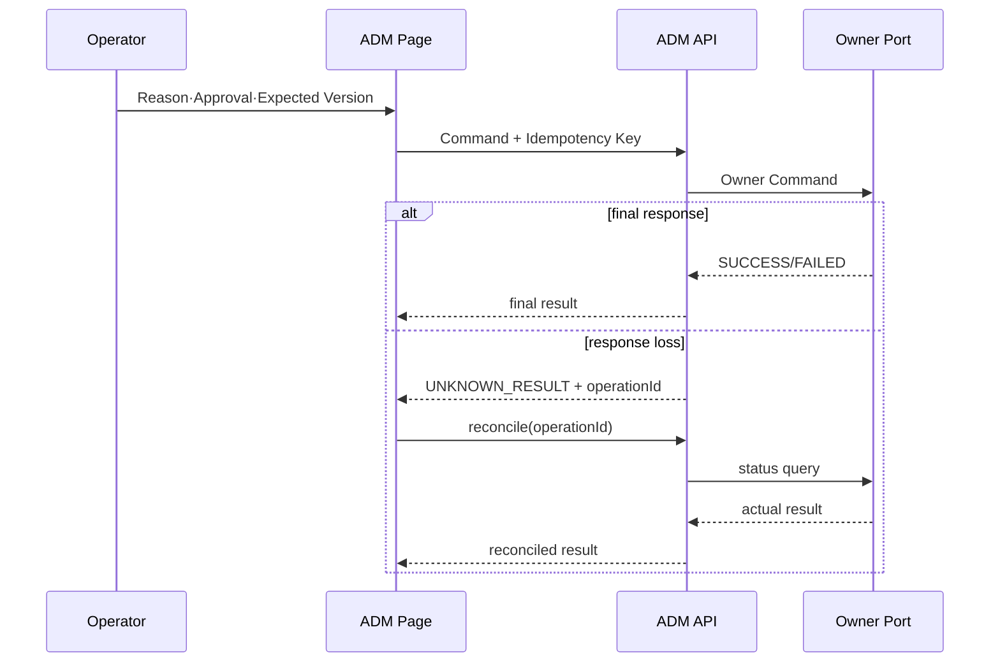

# CPF ADM 개발자 매뉴얼

> **기준 Repository** `freeangelsun/202412_01_CPF`
> **기준 Branch** `master`
> **기준 Commit** `e1f8bef7b7193522f2cd8e36cc6857dd1ff6694a`
> **문서 목적** ADM Backend·Frontend, Owner Query·Command Port, Local·Remote, Timeout·Expected Version·Idempotency, Permission·Approval·Audit, OpenAPI·Orval과 Browser·Fault Test를 설명한다.
> **주요 독자** cpf-admin Backend·Frontend 개발자, 운영 API 개발자, 보안·감사 개발자
> **문서 사용 결과** ADM 기능 하나를 Owner Runtime과 연결하고 화면·권한·조치·복구·Test까지 구현한다.

## 0. 문서 사용 계약

이 문서는 제품 목표, 기준 Commit의 구현, 실제 실행 검증을 분리한다.

- 목표는 구현·검증 여부와 무관한 제품 계약이다.
- 기능 설명은 최신 Source·SQL·API·Config·Frontend·Script·Test의 exact path를 기준으로 한다.
- 적용 환경에서는 Build·DB·Kafka·Browser·다중 인스턴스·장애 시나리오의 실행 결과를 환경 기록에 남긴다.
- Source에 없는 Class·API·Property·Route·Permission·상태를 만들지 않는다.
- 기능 상태와 운영 상태는 Owner가 정의한 실제 상태값과 Terminal 조건을 사용한다.
- 명령 실행 전 Local Working Tree를 확인하고 기존 변경을 보호한다.


## 1. Frontend 기준과 개발 환경

`cpf-admin/frontend/package.json`:

- Node `22.16.0`, npm `10.9.2`
- Vue `3.5.40`, Vue Router `5.2.0`, Pinia `4.0.2`
- TanStack Vue Query `5.101.4`, Table `8.21.3`
- Element Plus `2.14.3`, Zod `4.4.3`, Orval `8.23.0`
- Playwright `1.62.0`, Vitest `4.1.10`

Scripts: `generate:api`, `verify:generated`, `build`, `lint`, `typecheck`, `test`, `test:e2e`, `test:a11y`, `verify:primary`, `verify`.

Dependency, Generated Client, 실제 Page Consumer와 Browser Scenario를 함께 관리한다.

### 1.1 Frontend Build·배포 확인 절차

1. Route Registry와 모든 Page Component Import를 확인한다.
2. Backend OpenAPI를 exact Source SHA로 Export한다.
3. Orval Client와 Marker·Operation Contract를 생성한다.
4. `npm ci`, lock·installed dependency 검증, lint, typecheck, unit, build를 실행한다.
5. Bundle Manifest의 Source SHA·OpenAPI Hash·Generated Hash를 확인한다.
6. 59개 Route를 Chromium·Firefox·WebKit에서 순회한다.
7. 로그인·Session·CSRF·Origin·401·403·409·503·응답 유실을 시험한다.
8. 결과 Artifact와 Browser Report를 Release 인계에 포함한다.

## 2. 기능 Slice

```text
Menu/Route → Vue Page → Pinia/Query
→ Orval Client → ADM Controller
→ Query/Command Application Service
→ Owner Port(Local/Remote)
→ Owner Runtime/DB
→ Result/Unknown → Audit·Metric·Trace
```

## 3. Backend 책임

### Query

- 검색 Field·Default·Paging·Sort·Data Scope를 검증한다.
- Owner Query Port 또는 Projection을 사용한다.
- 민감 Field는 Permission과 Masking 정책으로 변환한다.

### Command

Command DTO 필수 후보:

- target ID·desired action
- Reason
- Approval ID
- Expected Version
- Idempotency Key·Request Hash
- Deadline·Timeout Budget

Command 결과는 `ACCEPTED`, `SUCCESS`, `FAILED`, `UNKNOWN_RESULT`, `PARTIAL` 등 실제 상태를 명확히 표현한다.

## 4. Owner Port

| 배포 | Adapter | 주의점 |
|---|---|---|
| Same JVM | Local Bean/Port | ADM Transaction으로 Owner DB 직접 Update 금지 |
| Remote | HTTP/Message Adapter | Service Identity, Audience, Timeout, Error Mapping, Response loss |

Owner Port는 상태 조회와 Reconcile을 함께 제공한다. 변경 API만 있고 상태 확인 API가 없으면 Response loss를 닫을 수 없다.

## 5. Timeout·Expected Version·Idempotency

- UI Timeout은 Server/Owner 처리 취소를 의미하지 않는다.
- Response loss 후 동일 Command를 Blind Retry하지 않는다.
- Target 상태·Operation ID·Attempt를 조회한다.
- Expected Version 충돌은 최신 상태·변경자·변경 시각을 보여준다.
- Idempotency는 Key+Scope+Hash를 비교한다.

## 6. Permission·Data Scope·Masking

Permission 층위:

1. 메뉴 접근
2. Route 접근
3. Query API
4. Command API
5. Button/Action
6. Data Scope
7. Raw/Unmask
8. Export/Download

Frontend 조건은 UX이고 Backend 판정이 정본이다. 403에서 메뉴·Button을 숨기는 것과 API 권한을 모두 시험한다.

## 7. Reason·Approval·Audit

위험 조치 예:

- Runtime stop/restart
- Batch restart/abandon/reprocess
- Route publish/block/rollback
- Config publish
- Secret rotate
- Break-glass
- Raw Data 조회·Export

Audit 필드: Operator, Permission, Data Scope, Reason, Approval, Request Hash, Expected Version, Before/After, Owner Result, Unknown·Reconcile 결과, Timestamp, Trace.

## 8. OpenAPI·Orval

1. Owner/ADM Controller DTO·Error를 OpenAPI에 반영.
2. OpenAPI Artifact SHA 기록.
3. `npm run generate:api`.
4. Generated Client drift 검사.
5. 수동 URL·DTO·Enum·Error Mapping 제거.
6. Page에서 Query/Mutation을 실제 사용.
7. `npm run verify`와 E2E 실행.

Orval Config·Mutator·검증 Script와 생성 Client 전수 소비를 clean `npm ci`부터 확인한다.

## 9. Route·Menu Registry

Route Registry는 `cpf-admin/frontend/src/app/routes.ts`다. `/`는 dashboard, 나머지는 `/<menuId>` 형식이다. Route와 Menu Permission·Backend API를 하나의 Feature Registry로 추적한다.

Gateway 관련 9개 Route가 같은 `GatewayOperationsPage.vue`를 사용하므로 Page 내부 mode 분기와 Route별 Permission·검색·Action이 실제로 분리되는지 확인한다.

## 10. Table·Form·State

모든 화면:

- Search Field·Default·Reset
- Paging·Sort·Column·Empty·Loading·Error
- Detail Field·Masked Field·Raw Permission
- Form Schema·Server Validation
- Status Badge·Version
- Button 활성 조건
- Double click·Duplicate submit
- Timeout·Response loss·Partial apply
- Retry·Reprocess·Reconcile·Rollback
- Audit Link

공통 Component 존재만으로 화면 적용을 판정하지 않는다.

## 11. 위험 조치 UI 흐름

```text
Target 조회 → 영향 Preview → Reason 입력
→ Approval 선택/요청 → Expected Version 확인
→ Command 전송 → Operation ID 수신
→ 상태 Poll/Push → Success/Failed/Unknown/Partial
→ Reconcile·Rollback → Audit 확인
```

화면은 HTTP 202를 Success로 표시하지 않고 Owner 최종 상태를 확인한다.

## 12. 부분 적용

Gateway Route, Config, Deployment 등 다중 Instance 조치는 Instance별 Desired/Actual Version·Checksum·ACK/NACK를 표시한다.

- 일부 ACK는 전체 Success가 아니다.
- NACK Instance의 Traffic 제외 여부를 보여준다.
- Last Known Good와 Rollback 대상을 명시한다.
- Retry는 Failed Instance에만 수행할 수 있어야 한다.

## 13. Browser·Fault Test

- Chromium·Firefox·WebKit
- Deep link·History·Refresh·403·404
- Session expiry·Concurrent login·Logout
- Duplicate click·Slow response·Response loss
- Version conflict·Approval expiry
- Partial apply·NACK·Rollback
- Keyboard·Focus·Label·Table navigation
- Large result·Long text·Timezone·Locale

## 14. Backend Test

- Controller Validation·Permission·Data Scope
- Local/Remote Owner Adapter parity
- Timeout stage와 Error Mapping
- Idempotency Hash Conflict
- Expected Version Race
- Unknown Ledger·Reconcile
- Audit masking·immutable field
- Owner DB 직접 접근 금지 ArchUnit

## 15. EDU: Gateway Route Publish 화면

1. `gateway-routes` Route와 Page mode 확인.
2. Query API·검색·Column·Detail DTO 연결.
3. Permission·Data Scope·Masked Target 표시.
4. Validate·Connection Test·Approval Command 구성.
5. Expected Version·Idempotency·Reason 적용.
6. Publish 후 Instance ACK/NACK 표시.
7. 한 Instance NACK·Response loss 주입.
8. Reconcile과 Failed-only Retry.
9. LKG Rollback과 Audit 확인.
10. 3 Browser E2E 실행.

## 16. 적용 환경 확인 항목

- Frontend Route Registry는 확인했지만 각 Page의 Field·Button·API를 전수 실행하지 않았다.
- Backend Controller·Permission Inventory 전체 추출은 미실행이다.
- Browser·Fault·다중 인스턴스는 환경별로 실행해 확인한다.

## 부록 A. Frontend 정본과 검증 Script

기준 Commit의 ADM Frontend는 Node `22.16.0`, npm `10.9.2`를 선언한다. 주요 Dependency는 Vue 3, Vue Router, Pinia, TanStack Query/Table, Zod, Orval, Element Plus다.

| Script | 역할 |
|---|---|
| `npm run generate:api` | Orval Client 생성 |
| `npm run verify:generated` | Generated Client Drift 확인 |
| `npm run lint` | ESLint |
| `npm run typecheck` | `vue-tsc --noEmit` |
| `npm run test` | Vitest |
| `npm run build` | Generated 검증 후 Vite Build |
| `npm run test:e2e` | Playwright |
| `npm run verify` | Primary 구조·Lint·Type·Test·Build 순차 검증 |

`package.json`과 Lockfile이 일치하는지 `npm ci`로 확인한다. 적용 환경에서는 빈 의존성 상태에서 `npm ci`부터 순서대로 실행하고 결과를 기록한다.

## 부록 B. 인증·권한 Frontend 실제 호출

Source: `cpf-admin/frontend/src/app/methods/accessMethods.ts`.

| 기능 | Method·Path | 입력·상태 |
|---|---|---|
| 로그인 | `POST /adm/api/auth/login` | operatorId, password; Operator·Menu·Button 권한 수신 |
| 로그아웃 | `POST /adm/api/auth/logout` | 서버 실패와 무관하게 Browser 민감 상태 제거 |
| 내 비밀번호 변경 | `POST /adm/api/operators/{operatorId}/password` | 현재·신규·확인 Password, reason; 변경 후 재로그인 |
| Role 목록 | `GET /adm/api/permissions/roles` | Permission 화면 초기 데이터 |
| Menu 목록·Matrix | `GET /adm/api/permissions/menus`, `menu-matrix` | read/write/delete |
| Button 목록·Matrix | `GET /adm/api/permissions/buttons`, `button-matrix` | Button Allow |
| API Permission | `GET /adm/api/permissions/api-permissions`, `api-matrix` | API 행위 권한 |
| Menu 권한 변경 | `PUT /adm/api/permissions/roles/{roleId}/menus/{menuId}` | readYn, writeYn, deleteYn, reason |
| Button 권한 변경 | `PUT /adm/api/permissions/roles/{roleId}/buttons/{buttonId}` | allowYn, reason |
| API Role 변경 | `PUT /adm/api/permissions/roles/{roleId}/api-permissions/{apiPermissionId}` | allowYn, reason |
| API Permission 등록 | `POST /adm/api/permissions/api-permissions` | ID, Path, Method 등 Form, reason |

Frontend `permission(menuId)`는 서버가 전달한 `authorizedMenus`에서 권한을 찾고 미존재 시 read/write/delete를 모두 거부한다. Backend는 이 값을 신뢰하지 않고 API 권한을 다시 판정해야 한다.

## 부록 C. 운영자 Command와 결과 불명 처리

| 기능 | Method·Path | 핵심 계약 |
|---|---|---|
| 운영자 등록 | `POST /adm/api/operators` | operatorId, name, contact, password, reason, operationId |
| 등록 결과 조회 | `GET /adm/api/operators/operations/{operationId}` | 응답 유실 후 같은 Operation 결과 조회 |
| 상태 활성화 | `PUT /adm/api/operators/{operatorId}/status` | `accountStatus=ACTIVE`, expectedVersion, reason |
| 원문 연락처 | `POST /adm/api/operators/{operatorId}/contacts/raw` | 별도 권한·reason, 403/409/503 구분 |
| Password 초기화 | `POST /adm/api/operators/{operatorId}/password/reset` | newPassword, forceChange, reason |
| 잠금 해제 | `POST /adm/api/operators/{operatorId}/unlock` | reason |
| Session 조회 | `GET /adm/api/operators/sessions` | operatorId Filter |
| Session 폐기 | `POST /adm/api/operators/sessions/{sessionId}/revoke` | reason |
| 만료 Session 정리 | `POST /adm/api/operators/sessions/cleanup-expired` | reason |
| MFA 목록 | `GET /adm/api/security/mfa` | 보안 상태 조회 |
| MFA 등록 | `POST /adm/api/security/mfa/{operatorId}/register` | secretRef, reason |
| MFA 검증 | `POST /adm/api/security/mfa/{operatorId}/verify` | otpCode, reason |

운영자 등록은 Frontend가 `operationId`를 생성한다. 전송 오류가 나면 새 ID로 재등록하지 않고 기존 `operationId` 결과를 먼저 조회한다. 이 Pattern을 다른 위험 Command에도 적용한다.

## 부록 D. ADM 기능 Slice 개발 순서

1. **Owner 확인**: ADM 조회 Projection인지 Owner Command인지 구분한다.
2. **Backend Contract**: Query·Command DTO, Permission, Data Scope, Reason, Approval, Expected Version을 정의한다.
3. **Owner Adapter**: Same-JVM과 Remote Adapter의 Timeout·Error·Unknown 의미를 일치시킨다.
4. **OpenAPI**: Error·Paging·Enum·Null과 권한 응답을 포함한다.
5. **Generated Client**: Orval 생성 후 수동 중복 Client를 제거한다.
6. **Route Registry**: `routes.ts`에 Menu ID·Group·Component를 등록한다.
7. **Page State**: Loading·Empty·Error·Stale·Partial·Unknown을 분리한다.
8. **Table/Form**: Search Field·Default·Column·Detail·Validation·Masking을 구현한다.
9. **Dangerous Action**: Preview→Reason→Approval→Expected Version→Command→Status Query 순서를 적용한다.
10. **Test**: Backend Unit/Contract, Generated Drift, Browser 권한·Response Loss·Partial Apply를 실행한다.

## 부록 E. Command 응답 상태 UI

| Backend 결과 | 화면 처리 |
|---|---|
| `200/201` + 최종 상태 | 상세 재조회 후 완료 표시 |
| `202` | Operation ID를 저장하고 Poll/상태 조회 |
| `400` | Field Error를 입력 위치에 표시 |
| `401` | Credential 제거 후 재로그인 |
| `403` | Menu 숨김과 무관하게 권한 부족 표시 |
| `409` | 최신 Version 재조회, 사용자 입력 보존 |
| `412` | Approval·Precondition 재확인 |
| `429` | Retry-After와 중복 Click 방지 |
| `503` | Owner/DB/감사 저장소 장애 구분 |
| Network/Timeout | 동일 Command 재전송 금지, Operation 상태 조회 |

## 부록 F. Browser Fault Test

- Login 성공·실패·Password Change Required
- Menu Read 권한과 Button 권한 불일치
- Direct URL 403·404
- 운영자 등록 Response Loss 후 Operation 조회
- Expected Version 충돌 후 입력 보존
- Raw 연락처 403·409·503와 Masking
- Session 만료 중 Form 작성
- Approval 만료·자기승인 거부
- Instance Partial Apply와 일부 NACK
- Chromium·Firefox·WebKit Keyboard·Focus·History

## 부록 G. Same-JVM·Remote Reconciliation 계약

Same-JVM Adapter와 Remote Adapter 모두 Query·Command·Status Query·Reconciliation을 같은 Owner Port로 제공한다. Remote Timeout이나 응답 유실이 발생하면 UI는 Command를 반복하지 않고 `operationId`로 상태를 조회한다. Owner 상태, Audit, Attempt가 일치하지 않으면 Reconciliation 작업을 생성하고 담당자·기한·확정 결과를 기록한다.

---

## 기준 Source와 역할별 활용 범위

- Repository: `https://github.com/freeangelsun/202412_01_CPF`
- Branch: `master`
- 기준 Commit: `e1f8bef7b7193522f2cd8e36cc6857dd1ff6694a`
- 문서 표준: `cpf-docs/specification/CPF_DOCUMENTATION_STANDARD.md`
- 제품 목표 정본: `cpf-docs/governance/CPF_FINAL_TARGET_REQUIREMENTS.md`
- 사실 우선순위: 실제 Source·SQL·API·Config·Frontend·Script·Test → Architecture·Specification → 이 매뉴얼

이 매뉴얼의 대상 역할은 다음 흐름을 다른 사람의 구두 설명이나 Source 역분석 없이 수행할 수 있어야 한다.

```text
업무 목적 파악
→ 선행 조건과 권한 준비
→ 실제 기능 위치 탐색
→ 등록·설정·개발·실행
→ 상태와 결과 확인
→ 오류·동시성·부분 실패 판단
→ Retry·Restart·Reprocess·Reconcile·Compensation·Rollback
→ Log·Metric·Trace·Audit·Evidence 확인
→ 정상화와 완료 판정
```

기능 설명은 Source의 실제 계약과 사용 절차를 기준으로 하며, 적용 전 확인 조건·오류·복구 경로를 함께 제공한다.

---

## 제2부 실무편: ADM Backend·Frontend 전체 기능 Slice 구현

## 18. ADM 제품 Architecture와 책임

ADM은 플랫폼 상태의 두 번째 정본이 아니다.

```text
Frontend Route·Component
→ Generated/공통 API Client
→ ADM Controller
→ Query/Command Application Service
→ Owner Query/Command Port
→ Same-JVM Adapter 또는 Remote Adapter
→ Owner Runtime·DB
→ ADM Response·Audit·Reconciliation
```

Query는 Owner 상태를 조회하고, Command는 Permission·Reason·Approval·Expected Version·Idempotency를 검증한 뒤 Owner Port를 호출한다. ADM DB에는 Menu·Permission·Approval·Audit·Operation Tracking 등 Control Plane 소유 상태만 둔다.

## 19. 기능 Slice 시작 Checklist

새 ADM 기능을 만들기 전에 다음을 한 장의 설계 기록으로 고정한다.

- 운영 문제와 대상 역할.
- Owner Module과 실제 상태 정본.
- Query인지 Command인지.
- Same-JVM·Remote Topology.
- API Method/Path, Request/Response/Error.
- Permission, Data Scope, Masking.
- Reason, Approval, Break-glass.
- Expected Version, Operation ID, Idempotency Key/Hash.
- Timeout·응답 유실·Partial Apply·Reconciliation·Rollback.
- Route, Menu ID, Component, Search Field, Column, Detail, Button.
- Unit·Controller·Contract·Browser·Fault Test.

Owner Port와 Consumer가 확인되지 않으면 Controller와 화면을 먼저 만들지 않는다.

## 20. Backend Query 기능

### 구현 순서

1. Query Request에 Filter·Paging·Sort Allowlist를 정의한다.
2. Controller는 인증 Principal과 Request Validation을 수행한다.
3. Permission과 Data Scope를 Query Predicate에 적용한다.
4. Owner Query Port를 호출한다.
5. Remote Adapter는 Connect/Response/Overall Timeout을 분리한다.
6. 응답 DTO에서 PII/Secret을 Masking한다.
7. Empty·Partial·Stale 상태를 구분한다.
8. Contract Test로 Same-JVM·Remote 결과를 비교한다.

### Query 응답 상태

- `200` + Items: 정상 조회.
- `200` + Empty: 실제 0건.
- `503` + `partial/stale` Payload: 일부 Owner 조회 실패. UI는 빈 결과로 표시하지 않는다.
- `403`: Permission/Data Scope 거부.
- `409`: 조회 Snapshot/Expected Version 충돌이 제품에 정의된 경우.

## 21. Backend Command 기능

### Request 필수 항목

| 항목 | 적용 조건 |
|---|---|
| `operationId` | 응답 유실 뒤 조회 가능한 모든 위험 조치 |
| `idempotencyKey`·Request Hash | 중복 요청이 가능한 Command |
| `expectedVersion` | 기존 상태를 수정·삭제하는 Command |
| `reason` | 운영 변경·PII Raw·Export·Security 조치 |
| `approvalId` | 위험 Action Policy가 요구할 때 |
| `breakGlassId` | 승인 우회가 허용되고 Owner가 Scope를 소비할 때 |
| Target Snapshot | 부분 적용·Rollback 대상 고정 |

### Command 흐름

```text
Permission/Data Scope 확인
→ Input·Expected Version 검증
→ Approval/Break-glass 검증
→ Operation ID + Request Hash Reserve
→ Owner Command Port 호출
→ 결과 저장·Audit
→ SUCCESS / FAILED / UNKNOWN_RESULT / PARTIAL_FAILED
```

Timeout은 실패로 단정하지 않는다. Operation ID로 ADM Operation과 Owner 상태를 조회한다. Partial Apply는 Instance별 결과와 Desired/Actual/Drift를 반환한다.

## 22. Permission·Data Scope·Masking·Audit

### Permission Registry

- Menu Permission: Read/Write/Delete.
- Button Permission: Action Code 단위.
- API Permission: Method·Path Pattern 단위.
- Owner Permission: 실제 Runtime Command 권한.

Frontend에서 Button을 숨기는 것만으로 Authorization이 완료되지 않는다. Backend API와 Owner Port 양쪽의 Negative Test가 필요하다.

### PII Raw

List/Detail은 Masked Field를 반환한다. Raw 조회는 별도 Endpoint, `PII_RAW` 성격의 Permission, 5자 이상의 구체적 Reason, Audit를 요구한다. Raw 값을 Store·Console·Error·Analytics에 남기지 않고 Dialog 종료 시 메모리 상태를 지운다.

### Audit

Command 성공·실패·Unknown을 모두 기록한다. Audit Delivery가 실패하면 업무 결과와 Delivery 상태를 분리하고 ADM Audit Delivery Recovery에서 재처리한다.

## 23. OpenAPI·Generated Client

### Backend Contract

- 모든 Public Operation과 DTO·Enum·Validation·Error를 포함한다.
- Permission, Reason, Approval, Expected Version, Idempotency를 Operation 설명에 명시한다.
- `x-cpf-source-sha`는 Backend Export Commit과 같다.

### Generated Client Gate

1. OpenAPI Hash를 계산한다.
2. Generated File Hash와 Generator Hash를 Marker에 기록한다.
3. 현재 Git HEAD 또는 명시 `CPF_SOURCE_SHA`와 Marker Source SHA를 비교한다.
4. Source SHA가 없다고 비교를 생략하지 않는다.
5. Stale Marker, 변경된 Generated File, 불완전 Snapshot을 Build 실패로 처리한다.

현재 ADM OpenAPI는 인증 일부와 자유 Schema 중심이며 Raw API 호출이 혼재한다. 따라서 기능 제공이다. 실제 전체 Export와 Typed Client 전환 전에 새 기능을 Generated Client 적용 완료로 기록하지 않는다.

## 24. Frontend Architecture

- Vue Router: Route Registry와 404 Route를 명시한다.
- Pinia: Session·Initialization·Feature Action을 책임별 Store로 분리한다.
- TanStack Query: Server State Cache와 Invalidation.
- Zod: Runtime Response Validation이 실제 적용된 기능에만 사용했다고 기록한다.
- Element Plus/TanStack Table: Component가 실제 사용하는 경우에만 기능 설명에 포함한다.
- API Client: CSRF, Credentials, Error/Transaction ID Mapping, Abort/Timeout.
- Accessibility: Label, Keyboard, Focus, Dialog, Alert.
- Responsive: Mobile Overflow와 위험 조치 접근성.
- 외부 CDN·Runtime Font·Script를 사용하지 않는다.

현재 Route Registry는 `/logs`에서 삭제된 `LogsPage.vue`를 참조한다. 이 Route는 Build/Navigation `실패`로 기록하고 Component 복원 또는 Route 제거와 전체 Route Test가 필요하다.

## 25. Menu·Route 개발

### 등록 절차

1. Feature Component를 만든다.
2. `routes.ts`에 ID·Group·Icon·Lazy Import를 등록한다.
3. Backend Menu Registry의 Menu ID와 Permission을 연결한다.
4. Deep Link와 404를 검증한다.
5. Session Load 전 Route Guard, 401/403 처리, Password Change Required 흐름을 검증한다.
6. Route Registry 전체를 순회하는 Browser Test를 작성한다. Visible Link 40개만 검사하는 Test로 완료 처리하지 않는다.

### Route 상태 표시

- Loading: 요청 진행 중이며 이전 결과를 새 결과로 표시하지 않는다.
- Empty: 성공 응답 0건.
- Error: HTTP/Error Code/Transaction ID와 복구 행동.
- Stale/Partial: Owner 일부 실패. Empty로 표시 금지.
- Unknown: Command 결과 대사 필요.

## 26. 조회·상세 화면 구현

각 화면에 다음을 실제 Source에 작성한다.

- 검색 Field·Default·Validation·Reset.
- Sort Allowlist·Paging Size/상한.
- Column·Masking·Status Chip.
- Row Selection과 Detail Field.
- Related Transaction·Log·Trace·Audit Link.
- Loading·Empty·Error·Stale State.
- Export Permission·Reason·Masking.

Raw JSON `<pre>`만 제공하는 화면은 운영자가 Field 의미와 오류 행동을 이해할 수 없으므로 제품 UI 완결성 기능 제공으로 표시한다.

## 27. 위험 조치 화면 구현

Button마다 다음을 구현·Test한다.

1. 표시 Permission과 Backend Permission.
2. 활성 상태와 비활성 사유.
3. Target·현재 상태·예상 영향.
4. Input·Default·Validation.
5. Reason·Approval·Expected Version.
6. Operation ID와 중복 클릭 방지.
7. Confirm Dialog와 Focus.
8. Timeout/응답 유실 시 Operation 조회.
9. Partial Result와 Instance별 상태.
10. Retry 허용·금지, Reconcile, Rollback.
11. Audit와 Evidence.

성공 Toast를 HTTP 2xx만으로 표시하지 않고 Owner 상태와 Operation Result를 확인한다.

## 28. 기능군별 실제 ADM 개발 경계

| 기능군 | Route/Component | Backend/Owner 경계 | 개발 주의사항 |
|---|---|---|---|
| Dashboard·Topology·Capacity | `dashboard`, `topology`, `capacity` | Service Registry/Health/Call Query | Capacity 장기 Percentile은 Metrics Backend와 함께 구현·확인 |
| Transaction | `transactionGroups`, `transactions`, `standardExecutions` | Transaction Metadata/Trace Owner | Header·PII 원문 금지 |
| Channel·Registry | `channelPolicy`, `serviceRegistry` | Channel Snapshot/Service Registry Owner | Version·Snapshot·Drain 분리 |
| Runtime Control | `runtimeControl` | Runtime Change Port | Preview·CAS·Quorum·ACK·Drift·Rollback |
| Config/Code/Message/Calendar/Cache | 각 Feature | CMN/Owner Port | Cache를 정본으로 사용 금지, Calendar Expected Version |
| Log/Audit | `remoteLogs`, `auditLogs`, `logLevel`, `logPolicies` | Log Artifact/Audit/Policy Owner | `/logs` 현재 실패, Raw Capture 상한 |
| Reliability | `recoveryCenter`, `reliability`, `incidents`, `notifications` | Unknown/DLQ/Outbox/Incident Owner | 수동 확정과 재처리 분리 |
| Batch | `batch`, Batch Runtime Views | BAT Control Server | stale/partial 빈 결과 해석 금지 |
| Gateway | Gateway Operation Component | Gateway Control Plane | Draft→Validate→Approve→Publish→ACK→LKG |
| Security | Permission/Operator/Password/Security/Secret/Approval/Break-glass | Security·Owner Command | BFF Authorization 재검증 |

## 29. Browser·Fault Test

### Route Test

- Registry의 모든 Route를 직접 방문한다.
- Import 실패, 404, 401, 403, 409, 503를 강제 주입한다.
- API Injection이 실제로 발생하지 않으면 Test를 실패시킨다.
- 위험 Button이 권한 없이 DOM에 없거나 비활성인지, Backend도 403인지 확인한다.
- Chromium·Firefox·WebKit과 Mobile Width에서 검증한다.

### Command Fault

- 중복 Click.
- 응답 유실.
- Owner 202 후 ADM 저장 실패.
- Instance 일부 ACK/NACK.
- Expected Version 충돌.
- Audit Delivery 실패.
- Reconcile/Exact Rollback.

## 30. 전체 Reference: Runtime 변경 기능

```text
Menu Permission
→ RuntimeControlPage 입력
→ Target Preview
→ Diff Preview
→ POST /adm/api/runtime-control/changes
→ Operation/Request Hash Reserve
→ Owner Runtime Change Port
→ Instance ACK/NACK
→ Desired/Actual/Drift 조회
→ Audit Hash Chain 검증
→ Cancel 또는 Exact Rollback
```

필드: Operation ID, Change Type, Environment, Service/Group/Instance, Expected Version, Schema Version, Rollout Mode, Wave Size, Quorum, Approval/Break-glass, Payload Key/Value/Type/Policy Version, Reason.

Test: 같은 Operation ID/다른 Payload, 1개 Instance NACK, 응답 유실, Audit 검증 실패, Rollback 뒤 Drift 0.

## 31. ADM 개발 EDU

- EDU-ADM-01 조회 화면: Query Port·Paging·Masking·Empty/Error/Stale.
- EDU-ADM-02 상태 변경: Operation ID·Expected Version·Reason·Audit.
- EDU-ADM-03 위험 조치: Approval·Partial Apply·Reconcile·Rollback.
- EDU-ADM-04 PII Raw: 별도 Permission·Reason·Memory Clear·Audit.
- EDU-ADM-05 Browser Fault: 401/403/409/503/Response Loss·3 Browser.

각 EDU는 실제 Controller·Port·Adapter·OpenAPI·Client·Route·Component·Test 전체 변경을 포함하고 ADM 화면에서 결과를 확인한다.

## 32. ADM 개발 완료 Checklist

- [ ] Owner Module·Consumer·Query/Command 구분
- [ ] Same-JVM·Remote Contract
- [ ] Permission·Data Scope·Masking
- [ ] Reason·Approval·Break-glass·Audit
- [ ] Idempotency·Expected Version·Unknown
- [ ] Timeout·Partial Apply·Reconcile·Rollback
- [ ] 전체 OpenAPI·Typed Client exact SHA
- [ ] Route·Menu·Guard·404
- [ ] Search/Column/Detail/Button/State
- [ ] Unit·Controller·Contract·Browser·Fault Evidence

---
## 부록 H. ADM Source 진입점

| 기능 | 기준 Source |
|---|---|
| Backend Module | `cpf-admin/build.gradle` |
| Frontend Dependency·Script | `cpf-admin/frontend/package.json` |
| Route Registry | `cpf-admin/frontend/src/app/routes.ts` |
| Router/404 | `cpf-admin/frontend/src/app/router.ts` |
| 세션 Store | `cpf-admin/frontend/src/stores/admSessionStore.ts` |
| 초기화 Store | `cpf-admin/frontend/src/stores/admInitializationStore.ts` |
| Feature Action Registry | `cpf-admin/frontend/src/stores/admFeatureActionRegistry.ts` |
| 공통 API | `cpf-admin/frontend/src/shared/cpfApi.ts` |
| Orval Mutator | `cpf-admin/frontend/src/shared/orval-mutator.ts` |
| OpenAPI Snapshot | `cpf-admin/frontend/openapi/cpf-openapi.json` |
| Generated Client | `cpf-admin/frontend/src/generated/cpf-api.ts` |
| Generated Marker 검증 | `cpf-admin/frontend/scripts/verify-generated-client.mjs` |
| Route E2E | `cpf-admin/frontend/e2e/route-quality.spec.ts` |
| 권한·Operator Frontend API | `cpf-admin/frontend/src/app/methods/accessMethods.ts` |
| Runtime Control Page | `cpf-admin/frontend/src/features/runtime-control/RuntimeControlPage.vue` |
| Service Registry Page | `cpf-admin/frontend/src/features/service-registry/ServiceRegistryPage.vue` |
| Gateway Operations | `cpf-admin/frontend/src/features/gateway-operations/GatewayOperationsPage.vue` |
| Batch Main | `cpf-admin/frontend/src/features/batch/BatchPage.vue` |
| 위험조치 승인 | `cpf-admin/frontend/src/features/approvals/ApprovalsPage.vue` |
| Break-glass | `cpf-admin/frontend/src/features/break-glass/BreakGlassPage.vue` |

---

## 제3부. ADM 기능 Slice 상세 개발 지침

## 33. 59개 Route를 기능 Slice로 관리하는 방법

ADM Route는 `cpf-admin/frontend/src/app/routes.ts`의 Router Registry가 시작점이다. 각 Route는 다음 파일과 계약을 하나의 변경 단위로 관리한다.

```text
Route Registry
→ Vue Page / Component
→ Form·Table Schema
→ Pinia·TanStack Query State
→ Orval Generated Client Operation
→ ADM Controller DTO
→ Query/Command Application Service
→ Owner Port Local/Remote Adapter
→ Permission·Approval·Audit
→ Unit·Contract·Browser·Fault Test
```

## 34. Query 화면 개발 Template

1. 사용자 질문과 검색 결과의 의미를 한 문장으로 정의한다.
2. 검색 Field, Default, Timezone, Paging, Sort, Reset 동작을 작성한다.
3. Backend Query DTO에 Validation과 Data Scope를 적용한다.
4. Owner Query Port는 상태의 생성 시각과 Partial·Stale 정보를 반환한다.
5. Table Column, Masked Field, Detail Field, Empty·Loading·Error 상태를 구현한다.
6. URL Query 또는 Saved Search가 필요한 화면은 직렬화 규칙을 고정한다.
7. 401·403·409·429·503·Timeout을 Error Code별로 표시한다.
8. Large Result·Long Text·Timezone·Keyboard·Screen Reader를 시험한다.

## 35. Command 화면 개발 Template

1. 대상 ID, Desired Action, Reason, Approval, Expected Version, Idempotency Key를 DTO에 포함한다.
2. 영향 Preview와 위험 문구를 표시한다.
3. Double Click을 막되 응답 유실 시 동일 Operation을 조회할 수 있게 한다.
4. HTTP 202를 Success로 표시하지 않고 Operation 상태를 Poll 또는 Push로 확인한다.
5. `PARTIAL`, `UNKNOWN_RESULT`, `CONFLICT`, `REJECTED`를 구분한다.
6. Reconcile·Failed-only Retry·Exact Rollback Button은 상태별 활성 조건을 갖는다.
7. Audit Link와 Before/After를 결과 화면에서 제공한다.

## 36. Generated Client 관리

```powershell
cd cpf-admin/frontend
npm ci
npm run validate:openapi
npm run generate:api
npm run verify:generated
npm run verify:consumer
npm run lint
npm run typecheck
npm run test
npm run build
npm run test:e2e
```

OpenAPI, Generated Marker, Generated Client, Operation Consumer, Bundle Manifest의 Source SHA를 `e1f8bef7b7193522f2cd8e36cc6857dd1ff6694a`와 연결한다. Page에서 임의 URL·중복 DTO·수동 Error Enum을 새로 만들지 않는다.

## 37. Permission 개발 상세

| 층 | Backend 기준 | Frontend 처리 | Test |
|---|---|---|---|
| Menu | Menu Read | Navigation 표시 | 직접 URL 403 |
| Route | Router meta + API Permission | Route Guard | Deep link·Refresh |
| Query | Query Permission·Data Scope | 조회 Button·Masked 결과 | 다른 Scope 0건/403 |
| Command | Action Permission | Button 활성 | 직접 API 403 |
| Raw | Unmask Permission·Reason | 별도 Dialog·자동 Clear | Audit·Clipboard |
| Export | Export Permission·Approval | Job 상태·Download | 대용량·만료·Audit |

## 38. Owner Port와 결과 불명

Same-JVM Adapter와 Remote Adapter는 같은 Command 결과를 반환한다. Remote Timeout이 발생하면 Operation ID·Idempotency Key로 Owner 상태를 조회한다. ADM DB에 결과를 임의 확정하지 않는다.



## 39. 화면 기능군별 개발 책임

### 온라인 운영

Transaction Group, Transaction Metadata, Standard Execution, Channel Policy, Service Registry, Runtime Control을 구현한다. Transaction·Trace·Segment·Attempt 연결, Service/Endpoint/Instance 상태, Runtime Desired/Actual·Rollout·Rollback을 화면에서 추적한다.

### Batch 운영

Job Definition, Execution, Schedule, Worker Pool, Center-Cut, Agent, Job Pack, Deployment, Recovery, Lease, Alert, Audit를 구분한다. Spring Batch Metadata와 CPF Control ID를 함께 표시한다.

### 통합 관제

Log, Remote Log, Audit Delivery, Dynamic Log Level, Log Policy, Recovery Center, Incident, Reliability를 구현한다. 민감정보 Masking과 Download Audit를 기본으로 한다.

### 프레임워크 관리

Cache, Config, Response Code, Business Calendar, Code, Permission, Operator, Password, Security, Secret, Approval, Break-glass를 구현한다. 모든 변경 조치에 Reason·Expected Version·Audit를 연결한다.

### Gateway 운영

9개 Route가 같은 Page를 사용하더라도 Route별 Mode, Query, Column, Action, Permission을 Registry로 분리한다. Draft·Validate·Test·Approval·Publish·ACK/NACK·Rollback을 화면 상태로 제공한다.

## 40. Browser Test Matrix

- 59개 Route를 Router Registry에서 직접 순회한다.
- Chromium·Firefox·WebKit에서 Deep Link, Refresh, Back/Forward를 시험한다.
- Menu 없음·Button 없음·API 403을 각각 시험한다.
- 조회 0건, 대량 데이터, 503 Partial/Stale를 시험한다.
- 위험 조치 Duplicate Click, Timeout, Response loss, 409, Approval expiry를 시험한다.
- Keyboard Focus, Label, Dialog Trap, Table Navigation, Error Summary를 시험한다.
- Session Rotation·Concurrent Login·Logout·CSRF·Untrusted Origin을 시험한다.

## 41. ADM 기능 Slice 인계 Template

| 항목 | 값 |
|---|---|
| Menu·Route | ID, URL, group, label |
| Page | Source, Store, Query Key, Form Schema |
| Client | Generated operation, DTO, Error |
| Backend | Controller, Application Service, Owner Port |
| Security | Menu/Button/API Permission, Data Scope, Masking |
| Command | Reason, Approval, Expected Version, Idempotency |
| Recovery | Operation status, Reconcile, Retry, Rollback |
| Operations | Log, Metric, Trace, Audit, Alert |
| Test | Unit, Contract, Browser, Fault |

---

## 제4부. ADM Route별 개발 참조

> Route가 추가·변경될 때 아래 카드의 Frontend, Backend, Owner, Permission, 오류·복구, Test를 한 변경으로 유지한다.

### dashboard — 운영 대시보드

**Route** `/` · **Group** 홈 · **Page** ``cpf-admin/frontend/src/features/dashboard/DashboardPage.vue``

#### Frontend 구현

- 검색·입력: 초기 데이터 자동 조회
- Column·상세: 등록 인스턴스·정상 수, 비정상 Health, 결과 미확정, DLQ, 서비스 상태, 최근 Service Call
- Action: 새로고침
- Empty·Loading·Error·Stale·Partial·Conflict·Unknown 상태를 구분한다.
- Query Key는 Environment·Tenant·Filter·Paging·Sort를 포함하고, Mutation 성공 뒤 필요한 Query만 무효화한다.

#### Backend·Owner 연결

1. Query DTO는 검색 Field·Default·Paging·Sort·Data Scope를 검증한다.
2. Command DTO는 Target, Action, Reason, Approval, Expected Version, Idempotency Key를 포함한다.
3. Owner Port는 Same-JVM·Remote Adapter를 제공하고 결과 상태 조회·Reconcile을 함께 제공한다.
4. Page는 Orval Generated Client Operation을 사용한다.
5. 필요한 Permission은 `조회 권한`이며 Backend에서 다시 검증한다.

#### 정상·오류·복구 Contract

정상 결과는 Row·Detail·Owner 상태·Version·Audit가 일치해야 한다. 복구 핵심은 **Loading/Empty/Error**다. 409, Timeout, Response loss, Partial Apply를 각각 Fixture로 재현하고 Reconcile·Rollback UI를 시험한다.

#### Test

- Route deep link와 Menu Permission
- 검색 Default·Reset·Paging·Sort
- Form validation과 Duplicate submit
- 401·403·409·429·503·Timeout
- Response loss 뒤 Operation 조회
- Audit Masking·Before/After
- Keyboard·Focus·Accessible name
### topology — 서비스 토폴로지

**Route** `/topology` · **Group** 홈 · **Page** ``.../features/topology/TopologyPage.vue``

#### Frontend 구현

- 검색·입력: 없음
- Column·상세: Service ID·명, Instance ID·명, Endpoint, Weight, Status
- Action: 새로고침
- Empty·Loading·Error·Stale·Partial·Conflict·Unknown 상태를 구분한다.
- Query Key는 Environment·Tenant·Filter·Paging·Sort를 포함하고, Mutation 성공 뒤 필요한 Query만 무효화한다.

#### Backend·Owner 연결

1. Query DTO는 검색 Field·Default·Paging·Sort·Data Scope를 검증한다.
2. Command DTO는 Target, Action, Reason, Approval, Expected Version, Idempotency Key를 포함한다.
3. Owner Port는 Same-JVM·Remote Adapter를 제공하고 결과 상태 조회·Reconcile을 함께 제공한다.
4. Page는 Orval Generated Client Operation을 사용한다.
5. 필요한 Permission은 `조회 권한`이며 Backend에서 다시 검증한다.

#### 정상·오류·복구 Contract

정상 결과는 Row·Detail·Owner 상태·Version·Audit가 일치해야 한다. 복구 핵심은 **Registry 0건 Empty**다. 409, Timeout, Response loss, Partial Apply를 각각 Fixture로 재현하고 Reconcile·Rollback UI를 시험한다.

#### Test

- Route deep link와 Menu Permission
- 검색 Default·Reset·Paging·Sort
- Form validation과 Duplicate submit
- 401·403·409·429·503·Timeout
- Response loss 뒤 Operation 조회
- Audit Masking·Before/After
- Keyboard·Focus·Accessible name
### capacity — 용량·SLO 기본 Signal

**Route** `/capacity` · **Group** 홈 · **Page** ``.../features/capacity/CapacityPage.vue``

#### Frontend 구현

- 검색·입력: 없음
- Column·상세: 최근 호출, 평균 지연, 실패율, 인스턴스; Service/Endpoint/Status/Latency/Transaction
- Action: 새로고침
- Empty·Loading·Error·Stale·Partial·Conflict·Unknown 상태를 구분한다.
- Query Key는 Environment·Tenant·Filter·Paging·Sort를 포함하고, Mutation 성공 뒤 필요한 Query만 무효화한다.

#### Backend·Owner 연결

1. Query DTO는 검색 Field·Default·Paging·Sort·Data Scope를 검증한다.
2. Command DTO는 Target, Action, Reason, Approval, Expected Version, Idempotency Key를 포함한다.
3. Owner Port는 Same-JVM·Remote Adapter를 제공하고 결과 상태 조회·Reconcile을 함께 제공한다.
4. Page는 Orval Generated Client Operation을 사용한다.
5. 필요한 Permission은 `조회 권한`이며 Backend에서 다시 검증한다.

#### 정상·오류·복구 Contract

정상 결과는 Row·Detail·Owner 상태·Version·Audit가 일치해야 한다. 복구 핵심은 **장기 Percentile·Forecast는 Metrics Backend와 함께 확인**다. 409, Timeout, Response loss, Partial Apply를 각각 Fixture로 재현하고 Reconcile·Rollback UI를 시험한다.

#### Test

- Route deep link와 Menu Permission
- 검색 Default·Reset·Paging·Sort
- Form validation과 Duplicate submit
- 401·403·409·429·503·Timeout
- Response loss 뒤 Operation 조회
- Audit Masking·Before/After
- Keyboard·Focus·Accessible name
### logs — 로그 조회

**Route** `/logs` · **Group** 통합 관제 · **Page** ``.../features/logs/LogsPage.vue``

#### Frontend 구현

- 검색·입력: 해당 없음
- Column·상세: 해당 없음
- Action: 해당 없음
- Empty·Loading·Error·Stale·Partial·Conflict·Unknown 상태를 구분한다.
- Query Key는 Environment·Tenant·Filter·Paging·Sort를 포함하고, Mutation 성공 뒤 필요한 Query만 무효화한다.

#### Backend·Owner 연결

1. Query DTO는 검색 Field·Default·Paging·Sort·Data Scope를 검증한다.
2. Command DTO는 Target, Action, Reason, Approval, Expected Version, Idempotency Key를 포함한다.
3. Owner Port는 Same-JVM·Remote Adapter를 제공하고 결과 상태 조회·Reconcile을 함께 제공한다.
4. Page는 Orval Generated Client Operation을 사용한다.
5. 필요한 Permission은 `해당 없음`이며 Backend에서 다시 검증한다.

#### 정상·오류·복구 Contract

정상 결과는 Row·Detail·Owner 상태·Version·Audit가 일치해야 한다. 복구 핵심은 **표준 로그 조회 화면**다. 409, Timeout, Response loss, Partial Apply를 각각 Fixture로 재현하고 Reconcile·Rollback UI를 시험한다.

#### Test

- Route deep link와 Menu Permission
- 검색 Default·Reset·Paging·Sort
- Form validation과 Duplicate submit
- 401·403·409·429·503·Timeout
- Response loss 뒤 Operation 조회
- Audit Masking·Before/After
- Keyboard·Focus·Accessible name
### transactionGroups — 거래 그룹·구간 추적

**Route** `/transactionGroups` · **Group** 온라인 운영 · **Page** ``.../features/transaction-groups/TransactionGroupsPage.vue``

#### Frontend 구현

- 검색·입력: 기간, Transaction/Segment, Status, 실패, Module/Source/Target/Role/Direction, 고객·회원·사용자·운영자, Channel, 외부기관/거래, API/거래명/오류, Duration, Header 검색
- Column·상세: 거래/모듈 흐름/시간/소요/상태/실패/Masked 고객·회원/Channel/외부 연계
- Action: 조회·초기화·정렬·Paging·상세 Tab
- Empty·Loading·Error·Stale·Partial·Conflict·Unknown 상태를 구분한다.
- Query Key는 Environment·Tenant·Filter·Paging·Sort를 포함하고, Mutation 성공 뒤 필요한 Query만 무효화한다.

#### Backend·Owner 연결

1. Query DTO는 검색 Field·Default·Paging·Sort·Data Scope를 검증한다.
2. Command DTO는 Target, Action, Reason, Approval, Expected Version, Idempotency Key를 포함한다.
3. Owner Port는 Same-JVM·Remote Adapter를 제공하고 결과 상태 조회·Reconcile을 함께 제공한다.
4. Page는 Orval Generated Client Operation을 사용한다.
5. 필요한 Permission은 `거래 조회 Permission·Data Scope`이며 Backend에서 다시 검증한다.

#### 정상·오류·복구 Contract

정상 결과는 Row·Detail·Owner 상태·Version·Audit가 일치해야 한다. 복구 핵심은 **Authorization/API Key/Token 등 원문 미표시**다. 409, Timeout, Response loss, Partial Apply를 각각 Fixture로 재현하고 Reconcile·Rollback UI를 시험한다.

#### Test

- Route deep link와 Menu Permission
- 검색 Default·Reset·Paging·Sort
- Form validation과 Duplicate submit
- 401·403·409·429·503·Timeout
- Response loss 뒤 Operation 조회
- Audit Masking·Before/After
- Keyboard·Focus·Accessible name
### transactions — 거래 Metadata

**Route** `/transactions` · **Group** 온라인 운영 · **Page** ``.../features/transactions/TransactionsPage.vue``

#### Frontend 구현

- 검색·입력: Module 기본 ADM, Active Y, Transaction ID, 선택 ID, Reason
- Column·상세: Pretty Result
- Action: 조회·재스캔·비활성화
- Empty·Loading·Error·Stale·Partial·Conflict·Unknown 상태를 구분한다.
- Query Key는 Environment·Tenant·Filter·Paging·Sort를 포함하고, Mutation 성공 뒤 필요한 Query만 무효화한다.

#### Backend·Owner 연결

1. Query DTO는 검색 Field·Default·Paging·Sort·Data Scope를 검증한다.
2. Command DTO는 Target, Action, Reason, Approval, Expected Version, Idempotency Key를 포함한다.
3. Owner Port는 Same-JVM·Remote Adapter를 제공하고 결과 상태 조회·Reconcile을 함께 제공한다.
4. Page는 Orval Generated Client Operation을 사용한다.
5. 필요한 Permission은 ``TRANSACTION_META` Write for mutation`이며 Backend에서 다시 검증한다.

#### 정상·오류·복구 Contract

정상 결과는 Row·Detail·Owner 상태·Version·Audit가 일치해야 한다. 복구 핵심은 **재스캔/비활성화 응답 유실 시 Transaction ID 대사**다. 409, Timeout, Response loss, Partial Apply를 각각 Fixture로 재현하고 Reconcile·Rollback UI를 시험한다.

#### Test

- Route deep link와 Menu Permission
- 검색 Default·Reset·Paging·Sort
- Form validation과 Duplicate submit
- 401·403·409·429·503·Timeout
- Response loss 뒤 Operation 조회
- Audit Masking·Before/After
- Keyboard·Focus·Accessible name
### standardExecutions — 표준 실행 Catalog

**Route** `/standardExecutions` · **Group** 온라인 운영 · **Page** ``.../features/standard-executions/StandardExecutionsPage.vue``

#### Frontend 구현

- 검색·입력: 유형 ONLINE/BATCH, Owner Domain, Keyword
- Column·상세: ID, 유형, 실행명, Owner, Source Module, Endpoint
- Action: 조회·상세
- Empty·Loading·Error·Stale·Partial·Conflict·Unknown 상태를 구분한다.
- Query Key는 Environment·Tenant·Filter·Paging·Sort를 포함하고, Mutation 성공 뒤 필요한 Query만 무효화한다.

#### Backend·Owner 연결

1. Query DTO는 검색 Field·Default·Paging·Sort·Data Scope를 검증한다.
2. Command DTO는 Target, Action, Reason, Approval, Expected Version, Idempotency Key를 포함한다.
3. Owner Port는 Same-JVM·Remote Adapter를 제공하고 결과 상태 조회·Reconcile을 함께 제공한다.
4. Page는 Orval Generated Client Operation을 사용한다.
5. 필요한 Permission은 `조회 권한`이며 Backend에서 다시 검증한다.

#### 정상·오류·복구 Contract

정상 결과는 Row·Detail·Owner 상태·Version·Audit가 일치해야 한다. 복구 핵심은 **Catalog/Source 불일치 조사**다. 409, Timeout, Response loss, Partial Apply를 각각 Fixture로 재현하고 Reconcile·Rollback UI를 시험한다.

#### Test

- Route deep link와 Menu Permission
- 검색 Default·Reset·Paging·Sort
- Form validation과 Duplicate submit
- 401·403·409·429·503·Timeout
- Response loss 뒤 Operation 조회
- Audit Masking·Before/After
- Keyboard·Focus·Accessible name
### channelPolicy — Channel·거래 정책 Snapshot

**Route** `/channelPolicy` · **Group** 온라인 운영 · **Page** ``.../features/channel-policy/ChannelPolicyPage.vue``

#### Frontend 구현

- 검색·입력: Channel/Policy Form; Package JSON; Import Dry Run
- Column·상세: Channel 인증·서명·신뢰·Version; 정책 허용·TPS·Version
- Action: 조회·Snapshot 갱신·Package 반출/반입·Channel/Policy 저장
- Empty·Loading·Error·Stale·Partial·Conflict·Unknown 상태를 구분한다.
- Query Key는 Environment·Tenant·Filter·Paging·Sort를 포함하고, Mutation 성공 뒤 필요한 Query만 무효화한다.

#### Backend·Owner 연결

1. Query DTO는 검색 Field·Default·Paging·Sort·Data Scope를 검증한다.
2. Command DTO는 Target, Action, Reason, Approval, Expected Version, Idempotency Key를 포함한다.
3. Owner Port는 Same-JVM·Remote Adapter를 제공하고 결과 상태 조회·Reconcile을 함께 제공한다.
4. Page는 Orval Generated Client Operation을 사용한다.
5. 필요한 Permission은 ``CHANNEL_POLICY` Write`이며 Backend에서 다시 검증한다.

#### 정상·오류·복구 Contract

정상 결과는 Row·Detail·Owner 상태·Version·Audit가 일치해야 한다. 복구 핵심은 **Snapshot Version·Import Dry Run·부분 적용 확인**다. 409, Timeout, Response loss, Partial Apply를 각각 Fixture로 재현하고 Reconcile·Rollback UI를 시험한다.

#### Test

- Route deep link와 Menu Permission
- 검색 Default·Reset·Paging·Sort
- Form validation과 Duplicate submit
- 401·403·409·429·503·Timeout
- Response loss 뒤 Operation 조회
- Audit Masking·Before/After
- Keyboard·Focus·Accessible name
### serviceRegistry — Service·Endpoint·Instance·Health·Routing

**Route** `/serviceRegistry` · **Group** 온라인 운영 · **Page** ``.../features/service-registry/ServiceRegistryPage.vue``

#### Frontend 구현

- 검색·입력: Service ID, Endpoint, Instance Status; 각 등록 Form
- Column·상세: Service/Endpoint/Instance/Health/Routing/Circuit/Call
- Action: 등록·수정·Drain·Resume·Disable·새로고침
- Empty·Loading·Error·Stale·Partial·Conflict·Unknown 상태를 구분한다.
- Query Key는 Environment·Tenant·Filter·Paging·Sort를 포함하고, Mutation 성공 뒤 필요한 Query만 무효화한다.

#### Backend·Owner 연결

1. Query DTO는 검색 Field·Default·Paging·Sort·Data Scope를 검증한다.
2. Command DTO는 Target, Action, Reason, Approval, Expected Version, Idempotency Key를 포함한다.
3. Owner Port는 Same-JVM·Remote Adapter를 제공하고 결과 상태 조회·Reconcile을 함께 제공한다.
4. Page는 Orval Generated Client Operation을 사용한다.
5. 필요한 Permission은 ``SERVICE_REGISTRY` Write`이며 Backend에서 다시 검증한다.

#### 정상·오류·복구 Contract

정상 결과는 Row·Detail·Owner 상태·Version·Audit가 일치해야 한다. 복구 핵심은 **Version·Heartbeat·Draining·Maintenance·Health 분리**다. 409, Timeout, Response loss, Partial Apply를 각각 Fixture로 재현하고 Reconcile·Rollback UI를 시험한다.

#### Test

- Route deep link와 Menu Permission
- 검색 Default·Reset·Paging·Sort
- Form validation과 Duplicate submit
- 401·403·409·429·503·Timeout
- Response loss 뒤 Operation 조회
- Audit Masking·Before/After
- Keyboard·Focus·Accessible name
### runtimeControl — Runtime 변경 Control Plane

**Route** `/runtimeControl` · **Group** 온라인 운영 · **Page** ``.../features/runtime-control/RuntimeControlPage.vue``

#### Frontend 구현

- 검색·입력: Operation/Change/Target/Expected Version/Rollout/Approval/Payload/Reason
- Column·상세: Readiness, Pending, Poison, Drift; ACK/Failed/Drift/Hash
- Action: Target/Diff Preview·생성·조회·Audit 검증·Cancel·Exact Rollback·Group CRUD
- Empty·Loading·Error·Stale·Partial·Conflict·Unknown 상태를 구분한다.
- Query Key는 Environment·Tenant·Filter·Paging·Sort를 포함하고, Mutation 성공 뒤 필요한 Query만 무효화한다.

#### Backend·Owner 연결

1. Query DTO는 검색 Field·Default·Paging·Sort·Data Scope를 검증한다.
2. Command DTO는 Target, Action, Reason, Approval, Expected Version, Idempotency Key를 포함한다.
3. Owner Port는 Same-JVM·Remote Adapter를 제공하고 결과 상태 조회·Reconcile을 함께 제공한다.
4. Page는 Orval Generated Client Operation을 사용한다.
5. 필요한 Permission은 `Runtime Control Permission + Approval/Break-glass`이며 Backend에서 다시 검증한다.

#### 정상·오류·복구 Contract

정상 결과는 Row·Detail·Owner 상태·Version·Audit가 일치해야 한다. 복구 핵심은 **UNKNOWN/PARTIAL/Drift를 성공으로 처리 금지**다. 409, Timeout, Response loss, Partial Apply를 각각 Fixture로 재현하고 Reconcile·Rollback UI를 시험한다.

#### Test

- Route deep link와 Menu Permission
- 검색 Default·Reset·Paging·Sort
- Form validation과 Duplicate submit
- 401·403·409·429·503·Timeout
- Response loss 뒤 Operation 조회
- Audit Masking·Before/After
- Keyboard·Focus·Accessible name
### maintenance — 점검·Drain 제어

**Route** `/maintenance` · **Group** 프레임워크 · **Page** ``.../features/maintenance/MaintenancePage.vue``

#### Frontend 구현

- 검색·입력: Service, Endpoint, Instance, DRAIN/DISABLE/RESUME, Reason
- Column·상세: 시간, Service, Instance, Action, Result, Reason
- Action: 명령 실행·조회
- Empty·Loading·Error·Stale·Partial·Conflict·Unknown 상태를 구분한다.
- Query Key는 Environment·Tenant·Filter·Paging·Sort를 포함하고, Mutation 성공 뒤 필요한 Query만 무효화한다.

#### Backend·Owner 연결

1. Query DTO는 검색 Field·Default·Paging·Sort·Data Scope를 검증한다.
2. Command DTO는 Target, Action, Reason, Approval, Expected Version, Idempotency Key를 포함한다.
3. Owner Port는 Same-JVM·Remote Adapter를 제공하고 결과 상태 조회·Reconcile을 함께 제공한다.
4. Page는 Orval Generated Client Operation을 사용한다.
5. 필요한 Permission은 `Owner Command Permission`이며 Backend에서 다시 검증한다.

#### 정상·오류·복구 Contract

정상 결과는 Row·Detail·Owner 상태·Version·Audit가 일치해야 한다. 복구 핵심은 **Routing 제외 영향·Audit 확인**다. 409, Timeout, Response loss, Partial Apply를 각각 Fixture로 재현하고 Reconcile·Rollback UI를 시험한다.

#### Test

- Route deep link와 Menu Permission
- 검색 Default·Reset·Paging·Sort
- Form validation과 Duplicate submit
- 401·403·409·429·503·Timeout
- Response loss 뒤 Operation 조회
- Audit Masking·Before/After
- Keyboard·Focus·Accessible name
### cache — Cache 조회·Evict·Reconcile

**Route** `/cache` · **Group** 프레임워크 · **Page** ``.../features/cache/CachePage.vue``

#### Frontend 구현

- 검색·입력: Tenant, Namespace, Key, Version, Reason
- Column·상세: Cache Summary/Result
- Action: Target 갱신·Key/Namespace Evict·Durable Reconcile
- Empty·Loading·Error·Stale·Partial·Conflict·Unknown 상태를 구분한다.
- Query Key는 Environment·Tenant·Filter·Paging·Sort를 포함하고, Mutation 성공 뒤 필요한 Query만 무효화한다.

#### Backend·Owner 연결

1. Query DTO는 검색 Field·Default·Paging·Sort·Data Scope를 검증한다.
2. Command DTO는 Target, Action, Reason, Approval, Expected Version, Idempotency Key를 포함한다.
3. Owner Port는 Same-JVM·Remote Adapter를 제공하고 결과 상태 조회·Reconcile을 함께 제공한다.
4. Page는 Orval Generated Client Operation을 사용한다.
5. 필요한 Permission은 `Button Permission `CACHE_*``이며 Backend에서 다시 검증한다.

#### 정상·오류·복구 Contract

정상 결과는 Row·Detail·Owner 상태·Version·Audit가 일치해야 한다. 복구 핵심은 **Cache는 정본 아님; Reconcile 뒤 Owner 확인**다. 409, Timeout, Response loss, Partial Apply를 각각 Fixture로 재현하고 Reconcile·Rollback UI를 시험한다.

#### Test

- Route deep link와 Menu Permission
- 검색 Default·Reset·Paging·Sort
- Form validation과 Duplicate submit
- 401·403·409·429·503·Timeout
- Response loss 뒤 Operation 조회
- Audit Masking·Before/After
- Keyboard·Focus·Accessible name
### configs — 설정 관리

**Route** `/configs` · **Group** 프레임워크 · **Page** ``.../features/configs/ConfigsPage.vue``

#### Frontend 구현

- 검색·입력: Config ID/Key/Value/Type/Encrypted YN/Reason
- Column·상세: Pretty Result
- Action: 조회·등록·수정
- Empty·Loading·Error·Stale·Partial·Conflict·Unknown 상태를 구분한다.
- Query Key는 Environment·Tenant·Filter·Paging·Sort를 포함하고, Mutation 성공 뒤 필요한 Query만 무효화한다.

#### Backend·Owner 연결

1. Query DTO는 검색 Field·Default·Paging·Sort·Data Scope를 검증한다.
2. Command DTO는 Target, Action, Reason, Approval, Expected Version, Idempotency Key를 포함한다.
3. Owner Port는 Same-JVM·Remote Adapter를 제공하고 결과 상태 조회·Reconcile을 함께 제공한다.
4. Page는 Orval Generated Client Operation을 사용한다.
5. 필요한 Permission은 ``CONFIG` Write`이며 Backend에서 다시 검증한다.

#### 정상·오류·복구 Contract

정상 결과는 Row·Detail·Owner 상태·Version·Audit가 일치해야 한다. 복구 핵심은 **Secret 원문을 일반 Config에 저장 금지**다. 409, Timeout, Response loss, Partial Apply를 각각 Fixture로 재현하고 Reconcile·Rollback UI를 시험한다.

#### Test

- Route deep link와 Menu Permission
- 검색 Default·Reset·Paging·Sort
- Form validation과 Duplicate submit
- 401·403·409·429·503·Timeout
- Response loss 뒤 Operation 조회
- Audit Masking·Before/After
- Keyboard·Focus·Accessible name
### responseCodes — 응답코드 관리

**Route** `/responseCodes` · **Group** 프레임워크 · **Page** ``.../features/response-codes/ResponseCodesPage.vue``

#### Frontend 구현

- 검색·입력: Response/Message Code, S/E, Module, Group, Sequence, HTTP, Reason
- Column·상세: Pretty Result
- Action: 조회·등록·수정·삭제
- Empty·Loading·Error·Stale·Partial·Conflict·Unknown 상태를 구분한다.
- Query Key는 Environment·Tenant·Filter·Paging·Sort를 포함하고, Mutation 성공 뒤 필요한 Query만 무효화한다.

#### Backend·Owner 연결

1. Query DTO는 검색 Field·Default·Paging·Sort·Data Scope를 검증한다.
2. Command DTO는 Target, Action, Reason, Approval, Expected Version, Idempotency Key를 포함한다.
3. Owner Port는 Same-JVM·Remote Adapter를 제공하고 결과 상태 조회·Reconcile을 함께 제공한다.
4. Page는 Orval Generated Client Operation을 사용한다.
5. 필요한 Permission은 ``RESPONSE_CODE` Write/Delete`이며 Backend에서 다시 검증한다.

#### 정상·오류·복구 Contract

정상 결과는 Row·Detail·Owner 상태·Version·Audit가 일치해야 한다. 복구 핵심은 **Consumer·Message Mapping 영향 확인**다. 409, Timeout, Response loss, Partial Apply를 각각 Fixture로 재현하고 Reconcile·Rollback UI를 시험한다.

#### Test

- Route deep link와 Menu Permission
- 검색 Default·Reset·Paging·Sort
- Form validation과 Duplicate submit
- 401·403·409·429·503·Timeout
- Response loss 뒤 Operation 조회
- Audit Masking·Before/After
- Keyboard·Focus·Accessible name
### businessCalendar — 영업일·휴일 Override

**Route** `/businessCalendar` · **Group** 프레임워크 · **Page** ``.../features/business-calendar/BusinessCalendarPage.vue``

#### Frontend 구현

- 검색·입력: Calendar DEFAULT, Date, Business/Holiday, Day Type, Institution, Business/Audit Reason
- Column·상세: Date, Type, Institution, Reason, Version
- Action: 조회·저장·삭제
- Empty·Loading·Error·Stale·Partial·Conflict·Unknown 상태를 구분한다.
- Query Key는 Environment·Tenant·Filter·Paging·Sort를 포함하고, Mutation 성공 뒤 필요한 Query만 무효화한다.

#### Backend·Owner 연결

1. Query DTO는 검색 Field·Default·Paging·Sort·Data Scope를 검증한다.
2. Command DTO는 Target, Action, Reason, Approval, Expected Version, Idempotency Key를 포함한다.
3. Owner Port는 Same-JVM·Remote Adapter를 제공하고 결과 상태 조회·Reconcile을 함께 제공한다.
4. Page는 Orval Generated Client Operation을 사용한다.
5. 필요한 Permission은 `Menu Write/Delete + Writable Provider`이며 Backend에서 다시 검증한다.

#### 정상·오류·복구 Contract

정상 결과는 Row·Detail·Owner 상태·Version·Audit가 일치해야 한다. 복구 핵심은 **Expected Version 409 충돌 재조회**다. 409, Timeout, Response loss, Partial Apply를 각각 Fixture로 재현하고 Reconcile·Rollback UI를 시험한다.

#### Test

- Route deep link와 Menu Permission
- 검색 Default·Reset·Paging·Sort
- Form validation과 Duplicate submit
- 401·403·409·429·503·Timeout
- Response loss 뒤 Operation 조회
- Audit Masking·Before/After
- Keyboard·Focus·Accessible name
### codes — 공통 코드

**Route** `/codes` · **Group** 프레임워크 · **Page** ``.../features/codes/CodesPage.vue``

#### Frontend 구현

- 검색·입력: Code ID, Parent ID, Key, Value, Description, Reason
- Column·상세: Pretty Result
- Action: 조회·등록·수정
- Empty·Loading·Error·Stale·Partial·Conflict·Unknown 상태를 구분한다.
- Query Key는 Environment·Tenant·Filter·Paging·Sort를 포함하고, Mutation 성공 뒤 필요한 Query만 무효화한다.

#### Backend·Owner 연결

1. Query DTO는 검색 Field·Default·Paging·Sort·Data Scope를 검증한다.
2. Command DTO는 Target, Action, Reason, Approval, Expected Version, Idempotency Key를 포함한다.
3. Owner Port는 Same-JVM·Remote Adapter를 제공하고 결과 상태 조회·Reconcile을 함께 제공한다.
4. Page는 Orval Generated Client Operation을 사용한다.
5. 필요한 Permission은 ``CODE` Write`이며 Backend에서 다시 검증한다.

#### 정상·오류·복구 Contract

정상 결과는 Row·Detail·Owner 상태·Version·Audit가 일치해야 한다. 복구 핵심은 **Parent 순환·Consumer Cache 갱신 확인**다. 409, Timeout, Response loss, Partial Apply를 각각 Fixture로 재현하고 Reconcile·Rollback UI를 시험한다.

#### Test

- Route deep link와 Menu Permission
- 검색 Default·Reset·Paging·Sort
- Form validation과 Duplicate submit
- 401·403·409·429·503·Timeout
- Response loss 뒤 Operation 조회
- Audit Masking·Before/After
- Keyboard·Focus·Accessible name
### messages — 다국어 Message

**Route** `/messages` · **Group** 연계 관리 · **Page** ``.../features/messages/MessagesPage.vue``

#### Frontend 구현

- 검색·입력: Message ID/Code/Locale/External/Internal/Reason
- Column·상세: Pretty Result
- Action: 조회·등록·수정
- Empty·Loading·Error·Stale·Partial·Conflict·Unknown 상태를 구분한다.
- Query Key는 Environment·Tenant·Filter·Paging·Sort를 포함하고, Mutation 성공 뒤 필요한 Query만 무효화한다.

#### Backend·Owner 연결

1. Query DTO는 검색 Field·Default·Paging·Sort·Data Scope를 검증한다.
2. Command DTO는 Target, Action, Reason, Approval, Expected Version, Idempotency Key를 포함한다.
3. Owner Port는 Same-JVM·Remote Adapter를 제공하고 결과 상태 조회·Reconcile을 함께 제공한다.
4. Page는 Orval Generated Client Operation을 사용한다.
5. 필요한 Permission은 ``MESSAGE` Write`이며 Backend에서 다시 검증한다.

#### 정상·오류·복구 Contract

정상 결과는 Row·Detail·Owner 상태·Version·Audit가 일치해야 한다. 복구 핵심은 **External/Internal 노출 범위 분리**다. 409, Timeout, Response loss, Partial Apply를 각각 Fixture로 재현하고 Reconcile·Rollback UI를 시험한다.

#### Test

- Route deep link와 Menu Permission
- 검색 Default·Reset·Paging·Sort
- Form validation과 Duplicate submit
- 401·403·409·429·503·Timeout
- Response loss 뒤 Operation 조회
- Audit Masking·Before/After
- Keyboard·Focus·Accessible name
### remoteLogs — 원격 Log Artifact

**Route** `/remoteLogs` · **Group** 통합 관제 · **Page** ``.../features/remote-logs/RemoteLogsPage.vue``

#### Frontend 구현

- 검색·입력: 환경/Module/Service/Instance/Type/File/표준 ID/Transaction/Batch IDs/기간/Size/압축/활성/Lines/Keyword/Reason
- Column·상세: Artifact Metadata·Preview·Bundle Job·Diagnostics
- Action: 조회·단건/선택/비동기 ZIP·상태·Download·진단
- Empty·Loading·Error·Stale·Partial·Conflict·Unknown 상태를 구분한다.
- Query Key는 Environment·Tenant·Filter·Paging·Sort를 포함하고, Mutation 성공 뒤 필요한 Query만 무효화한다.

#### Backend·Owner 연결

1. Query DTO는 검색 Field·Default·Paging·Sort·Data Scope를 검증한다.
2. Command DTO는 Target, Action, Reason, Approval, Expected Version, Idempotency Key를 포함한다.
3. Owner Port는 Same-JVM·Remote Adapter를 제공하고 결과 상태 조회·Reconcile을 함께 제공한다.
4. Page는 Orval Generated Client Operation을 사용한다.
5. 필요한 Permission은 ``REMOTE_LOG` Write for download`이며 Backend에서 다시 검증한다.

#### 정상·오류·복구 Contract

정상 결과는 Row·Detail·Owner 상태·Version·Audit가 일치해야 한다. 복구 핵심은 **Retention·Size·Masking·Download Audit**다. 409, Timeout, Response loss, Partial Apply를 각각 Fixture로 재현하고 Reconcile·Rollback UI를 시험한다.

#### Test

- Route deep link와 Menu Permission
- 검색 Default·Reset·Paging·Sort
- Form validation과 Duplicate submit
- 401·403·409·429·503·Timeout
- Response loss 뒤 Operation 조회
- Audit Masking·Before/After
- Keyboard·Focus·Accessible name
### auditLogs — Audit 조회·Delivery 복구

**Route** `/auditLogs` · **Group** 통합 관제 · **Page** ``.../features/audit-logs/AuditLogsPage.vue``

#### Frontend 구현

- 검색·입력: Operator, Action, Target Type/ID; Delivery Status, Retry Reason
- Column·상세: Audit Result; Delivery ID/Status/Attempt/Error
- Action: 조회·Delivery 조회·재처리
- Empty·Loading·Error·Stale·Partial·Conflict·Unknown 상태를 구분한다.
- Query Key는 Environment·Tenant·Filter·Paging·Sort를 포함하고, Mutation 성공 뒤 필요한 Query만 무효화한다.

#### Backend·Owner 연결

1. Query DTO는 검색 Field·Default·Paging·Sort·Data Scope를 검증한다.
2. Command DTO는 Target, Action, Reason, Approval, Expected Version, Idempotency Key를 포함한다.
3. Owner Port는 Same-JVM·Remote Adapter를 제공하고 결과 상태 조회·Reconcile을 함께 제공한다.
4. Page는 Orval Generated Client Operation을 사용한다.
5. 필요한 Permission은 ``AUDIT_LOG` Write for retry`이며 Backend에서 다시 검증한다.

#### 정상·오류·복구 Contract

정상 결과는 Row·Detail·Owner 상태·Version·Audit가 일치해야 한다. 복구 핵심은 **업무 결과와 Audit Delivery 분리**다. 409, Timeout, Response loss, Partial Apply를 각각 Fixture로 재현하고 Reconcile·Rollback UI를 시험한다.

#### Test

- Route deep link와 Menu Permission
- 검색 Default·Reset·Paging·Sort
- Form validation과 Duplicate submit
- 401·403·409·429·503·Timeout
- Response loss 뒤 Operation 조회
- Audit Masking·Before/After
- Keyboard·Focus·Accessible name
### logLevel — Dynamic Log Level

**Route** `/logLevel` · **Group** 통합 관제 · **Page** ``.../features/log-level/LogLevelPage.vue``

#### Frontend 구현

- 검색·입력: Business Transaction ID, Transaction ID, DEBUG/INFO/TRACE, TTL, Reason
- Column·상세: Rule Result
- Action: 조회·등록
- Empty·Loading·Error·Stale·Partial·Conflict·Unknown 상태를 구분한다.
- Query Key는 Environment·Tenant·Filter·Paging·Sort를 포함하고, Mutation 성공 뒤 필요한 Query만 무효화한다.

#### Backend·Owner 연결

1. Query DTO는 검색 Field·Default·Paging·Sort·Data Scope를 검증한다.
2. Command DTO는 Target, Action, Reason, Approval, Expected Version, Idempotency Key를 포함한다.
3. Owner Port는 Same-JVM·Remote Adapter를 제공하고 결과 상태 조회·Reconcile을 함께 제공한다.
4. Page는 Orval Generated Client Operation을 사용한다.
5. 필요한 Permission은 ``DYNAMIC_LOG` Write`이며 Backend에서 다시 검증한다.

#### 정상·오류·복구 Contract

정상 결과는 Row·Detail·Owner 상태·Version·Audit가 일치해야 한다. 복구 핵심은 **TTL 만료·민감정보 Capture 정책 확인**다. 409, Timeout, Response loss, Partial Apply를 각각 Fixture로 재현하고 Reconcile·Rollback UI를 시험한다.

#### Test

- Route deep link와 Menu Permission
- 검색 Default·Reset·Paging·Sort
- Form validation과 Duplicate submit
- 401·403·409·429·503·Timeout
- Response loss 뒤 Operation 조회
- Audit Masking·Before/After
- Keyboard·Focus·Accessible name
### logPolicies — Log Capture·Retention·Trace Boost

**Route** `/logPolicies` · **Group** 통합 관제 · **Page** ``.../features/log-policies/LogPoliciesPage.vue``

#### Frontend 구현

- 검색·입력: Target/Level/DB/File/Stack/Retention/Sampling/Capture Mode/Allowlist/Masking/Byte Cap/Reason/Trace Boost
- Column·상세: Policy·Distribution Event/Gateway/Version/Status/Attempt/Fencing/Error/ACK
- Action: 조회·저장·중지·Override·Trace Boost·Cache Refresh/Clear·적용 상태
- Empty·Loading·Error·Stale·Partial·Conflict·Unknown 상태를 구분한다.
- Query Key는 Environment·Tenant·Filter·Paging·Sort를 포함하고, Mutation 성공 뒤 필요한 Query만 무효화한다.

#### Backend·Owner 연결

1. Query DTO는 검색 Field·Default·Paging·Sort·Data Scope를 검증한다.
2. Command DTO는 Target, Action, Reason, Approval, Expected Version, Idempotency Key를 포함한다.
3. Owner Port는 Same-JVM·Remote Adapter를 제공하고 결과 상태 조회·Reconcile을 함께 제공한다.
4. Page는 Orval Generated Client Operation을 사용한다.
5. 필요한 Permission은 ``LOG_POLICY` Write`이며 Backend에서 다시 검증한다.

#### 정상·오류·복구 Contract

정상 결과는 Row·Detail·Owner 상태·Version·Audit가 일치해야 한다. 복구 핵심은 **Raw Authorization/Cookie/Token·FULL RAW 금지; ACK 실패 대사**다. 409, Timeout, Response loss, Partial Apply를 각각 Fixture로 재현하고 Reconcile·Rollback UI를 시험한다.

#### Test

- Route deep link와 Menu Permission
- 검색 Default·Reset·Paging·Sort
- Form validation과 Duplicate submit
- 401·403·409·429·503·Timeout
- Response loss 뒤 Operation 조회
- Audit Masking·Before/After
- Keyboard·Focus·Accessible name
### recoveryCenter — Unknown·DLQ·Outbox·File Transfer 통합 조회

**Route** `/recoveryCenter` · **Group** 통합 관제 · **Page** ``.../features/recovery-center/RecoveryCenterPage.vue``

#### Frontend 구현

- 검색·입력: 없음
- Column·상세: Unknown/DLQ/Outbox/File Transfer KPI·후보
- Action: 새로고침
- Empty·Loading·Error·Stale·Partial·Conflict·Unknown 상태를 구분한다.
- Query Key는 Environment·Tenant·Filter·Paging·Sort를 포함하고, Mutation 성공 뒤 필요한 Query만 무효화한다.

#### Backend·Owner 연결

1. Query DTO는 검색 Field·Default·Paging·Sort·Data Scope를 검증한다.
2. Command DTO는 Target, Action, Reason, Approval, Expected Version, Idempotency Key를 포함한다.
3. Owner Port는 Same-JVM·Remote Adapter를 제공하고 결과 상태 조회·Reconcile을 함께 제공한다.
4. Page는 Orval Generated Client Operation을 사용한다.
5. 필요한 Permission은 `조회 권한`이며 Backend에서 다시 검증한다.

#### 정상·오류·복구 Contract

정상 결과는 Row·Detail·Owner 상태·Version·Audit가 일치해야 한다. 복구 핵심은 **실제 조치는 Reliability 화면 Gate 사용**다. 409, Timeout, Response loss, Partial Apply를 각각 Fixture로 재현하고 Reconcile·Rollback UI를 시험한다.

#### Test

- Route deep link와 Menu Permission
- 검색 Default·Reset·Paging·Sort
- Form validation과 Duplicate submit
- 401·403·409·429·503·Timeout
- Response loss 뒤 Operation 조회
- Audit Masking·Before/After
- Keyboard·Focus·Accessible name
### incidents — Incident Lifecycle

**Route** `/incidents` · **Group** 통합 관제 · **Page** ``.../features/incidents/IncidentsPage.vue``

#### Frontend 구현

- 검색·입력: Severity SEV1~4, Title, Summary, Source, Reason
- Column·상세: ID, Severity, Title, Status, Detected
- Action: 생성·ACKNOWLEDGED·MITIGATED·RESOLVED
- Empty·Loading·Error·Stale·Partial·Conflict·Unknown 상태를 구분한다.
- Query Key는 Environment·Tenant·Filter·Paging·Sort를 포함하고, Mutation 성공 뒤 필요한 Query만 무효화한다.

#### Backend·Owner 연결

1. Query DTO는 검색 Field·Default·Paging·Sort·Data Scope를 검증한다.
2. Command DTO는 Target, Action, Reason, Approval, Expected Version, Idempotency Key를 포함한다.
3. Owner Port는 Same-JVM·Remote Adapter를 제공하고 결과 상태 조회·Reconcile을 함께 제공한다.
4. Page는 Orval Generated Client Operation을 사용한다.
5. 필요한 Permission은 `Incident Write`이며 Backend에서 다시 검증한다.

#### 정상·오류·복구 Contract

정상 결과는 Row·Detail·Owner 상태·Version·Audit가 일치해야 한다. 복구 핵심은 **각 전이에 구체적 Reason**다. 409, Timeout, Response loss, Partial Apply를 각각 Fixture로 재현하고 Reconcile·Rollback UI를 시험한다.

#### Test

- Route deep link와 Menu Permission
- 검색 Default·Reset·Paging·Sort
- Form validation과 Duplicate submit
- 401·403·409·429·503·Timeout
- Response loss 뒤 Operation 조회
- Audit Masking·Before/After
- Keyboard·Focus·Accessible name
### reliability — DLQ·Unknown·Batch Log 대사

**Route** `/reliability` · **Group** 통합 관제 · **Page** ``.../features/reliability/ReliabilityPage.vue``

#### Frontend 구현

- 검색·입력: Scope/Status/Key/Transaction/Topic/Endpoint/Type/Business Date/Job/Instance/Limit; Message/Unknown ID/Target Status/Reason
- Column·상세: 통합 Result
- Action: 조회·BAT 상세·DLQ Replay·Unknown 수동 확정
- Empty·Loading·Error·Stale·Partial·Conflict·Unknown 상태를 구분한다.
- Query Key는 Environment·Tenant·Filter·Paging·Sort를 포함하고, Mutation 성공 뒤 필요한 Query만 무효화한다.

#### Backend·Owner 연결

1. Query DTO는 검색 Field·Default·Paging·Sort·Data Scope를 검증한다.
2. Command DTO는 Target, Action, Reason, Approval, Expected Version, Idempotency Key를 포함한다.
3. Owner Port는 Same-JVM·Remote Adapter를 제공하고 결과 상태 조회·Reconcile을 함께 제공한다.
4. Page는 Orval Generated Client Operation을 사용한다.
5. 필요한 Permission은 ``RELIABILITY` Write`이며 Backend에서 다시 검증한다.

#### 정상·오류·복구 Contract

정상 결과는 Row·Detail·Owner 상태·Version·Audit가 일치해야 한다. 복구 핵심은 **실제 Side Effect 근거 없이 수동 성공 확정 금지**다. 409, Timeout, Response loss, Partial Apply를 각각 Fixture로 재현하고 Reconcile·Rollback UI를 시험한다.

#### Test

- Route deep link와 Menu Permission
- 검색 Default·Reset·Paging·Sort
- Form validation과 Duplicate submit
- 401·403·409·429·503·Timeout
- Response loss 뒤 Operation 조회
- Audit Masking·Before/After
- Keyboard·Focus·Accessible name
### notifications — 알림 Rule·Durable Delivery

**Route** `/notifications` · **Group** 연계 관리 · **Page** ``.../features/notifications/NotificationsPage.vue``

#### Frontend 구현

- 검색·입력: Rule/Event/Channel/Severity/Receiver/Reason; Delivery Expected Version/Operation/Reason
- Column·상세: Rule; Delivery/Hash/Status/Attempt/Lease/Version; Provider Attempt
- Action: 저장·중지·Test·CSV·Retry·Cancel
- Empty·Loading·Error·Stale·Partial·Conflict·Unknown 상태를 구분한다.
- Query Key는 Environment·Tenant·Filter·Paging·Sort를 포함하고, Mutation 성공 뒤 필요한 Query만 무효화한다.

#### Backend·Owner 연결

1. Query DTO는 검색 Field·Default·Paging·Sort·Data Scope를 검증한다.
2. Command DTO는 Target, Action, Reason, Approval, Expected Version, Idempotency Key를 포함한다.
3. Owner Port는 Same-JVM·Remote Adapter를 제공하고 결과 상태 조회·Reconcile을 함께 제공한다.
4. Page는 Orval Generated Client Operation을 사용한다.
5. 필요한 Permission은 ``NOTIFICATION_*` Button Permission`이며 Backend에서 다시 검증한다.

#### 정상·오류·복구 Contract

정상 결과는 Row·Detail·Owner 상태·Version·Audit가 일치해야 한다. 복구 핵심은 **Expected Version·Lease·Attempt 확인**다. 409, Timeout, Response loss, Partial Apply를 각각 Fixture로 재현하고 Reconcile·Rollback UI를 시험한다.

#### Test

- Route deep link와 Menu Permission
- 검색 Default·Reset·Paging·Sort
- Form validation과 Duplicate submit
- 401·403·409·429·503·Timeout
- Response loss 뒤 Operation 조회
- Audit Masking·Before/After
- Keyboard·Focus·Accessible name
### downloads — CSV Download·Audit

**Route** `/downloads` · **Group** 연계 관리 · **Page** ``.../features/downloads/DownloadsPage.vue``

#### Frontend 구현

- 검색·입력: Type, Target, Date Range, Transaction/Trace/Job, Limit, Reason
- Column·상세: Download Result
- Action: 정책 조회·CSV
- Empty·Loading·Error·Stale·Partial·Conflict·Unknown 상태를 구분한다.
- Query Key는 Environment·Tenant·Filter·Paging·Sort를 포함하고, Mutation 성공 뒤 필요한 Query만 무효화한다.

#### Backend·Owner 연결

1. Query DTO는 검색 Field·Default·Paging·Sort·Data Scope를 검증한다.
2. Command DTO는 Target, Action, Reason, Approval, Expected Version, Idempotency Key를 포함한다.
3. Owner Port는 Same-JVM·Remote Adapter를 제공하고 결과 상태 조회·Reconcile을 함께 제공한다.
4. Page는 Orval Generated Client Operation을 사용한다.
5. 필요한 Permission은 `Download Permission·Reason`이며 Backend에서 다시 검증한다.

#### 정상·오류·복구 Contract

정상 결과는 Row·Detail·Owner 상태·Version·Audit가 일치해야 한다. 복구 핵심은 **Data Scope·Masking·건수 상한**다. 409, Timeout, Response loss, Partial Apply를 각각 Fixture로 재현하고 Reconcile·Rollback UI를 시험한다.

#### Test

- Route deep link와 Menu Permission
- 검색 Default·Reset·Paging·Sort
- Form validation과 Duplicate submit
- 401·403·409·429·503·Timeout
- Response loss 뒤 Operation 조회
- Audit Masking·Before/After
- Keyboard·Focus·Accessible name
### file-jobs — 대량 File Job

**Route** `/file-jobs` · **Group** 배치 운영 · **Page** ``.../features/file-jobs/FileJobsPage.vue``

#### Frontend 구현

- 검색·입력: Operation, Template/Version, CSV/XLSX, Dry Run, File, Reason; Control Approval/Reason; Unknown Resolution
- Column·상세: Job/State/Rows/Checksum; Row State/Business Key/Error
- Action: Upload·Detail·Apply·Retry·Cancel·Rollback·Unknown Resolve·Artifact
- Empty·Loading·Error·Stale·Partial·Conflict·Unknown 상태를 구분한다.
- Query Key는 Environment·Tenant·Filter·Paging·Sort를 포함하고, Mutation 성공 뒤 필요한 Query만 무효화한다.

#### Backend·Owner 연결

1. Query DTO는 검색 Field·Default·Paging·Sort·Data Scope를 검증한다.
2. Command DTO는 Target, Action, Reason, Approval, Expected Version, Idempotency Key를 포함한다.
3. Owner Port는 Same-JVM·Remote Adapter를 제공하고 결과 상태 조회·Reconcile을 함께 제공한다.
4. Page는 Orval Generated Client Operation을 사용한다.
5. 필요한 Permission은 ``FILE_JOB_*` Button Permission`이며 Backend에서 다시 검증한다.

#### 정상·오류·복구 Contract

정상 결과는 Row·Detail·Owner 상태·Version·Audit가 일치해야 한다. 복구 핵심은 **상태별 Button 활성; Side Effect 대사·Rollback Token**다. 409, Timeout, Response loss, Partial Apply를 각각 Fixture로 재현하고 Reconcile·Rollback UI를 시험한다.

#### Test

- Route deep link와 Menu Permission
- 검색 Default·Reset·Paging·Sort
- Form validation과 Duplicate submit
- 401·403·409·429·503·Timeout
- Response loss 뒤 Operation 조회
- Audit Masking·Before/After
- Keyboard·Focus·Accessible name
### batch — Batch·Center-Cut 종합 통제

**Route** `/batch` · **Group** 배치 운영 · **Page** ``.../features/batch/BatchPage.vue``

#### Frontend 구현

- 검색·입력: Job/Execution/Schedule/Parameter/Calendar/Date/Simulation/Dispatch/Heartbeat/Lock/Ghost/Reason
- Column·상세: Execution Trace; Center-Cut Job/Target/Result
- Action: 등록·실행·재수행·중지·Scheduler 1회·Lock/Ghost·조회·CSV
- Empty·Loading·Error·Stale·Partial·Conflict·Unknown 상태를 구분한다.
- Query Key는 Environment·Tenant·Filter·Paging·Sort를 포함하고, Mutation 성공 뒤 필요한 Query만 무효화한다.

#### Backend·Owner 연결

1. Query DTO는 검색 Field·Default·Paging·Sort·Data Scope를 검증한다.
2. Command DTO는 Target, Action, Reason, Approval, Expected Version, Idempotency Key를 포함한다.
3. Owner Port는 Same-JVM·Remote Adapter를 제공하고 결과 상태 조회·Reconcile을 함께 제공한다.
4. Page는 Orval Generated Client Operation을 사용한다.
5. 필요한 Permission은 ``BATCH` Write`이며 Backend에서 다시 검증한다.

#### 정상·오류·복구 Contract

정상 결과는 Row·Detail·Owner 상태·Version·Audit가 일치해야 한다. 복구 핵심은 **Unknown/Lock/Ghost 조치 전 원장·Heartbeat 대사**다. 409, Timeout, Response loss, Partial Apply를 각각 Fixture로 재현하고 Reconcile·Rollback UI를 시험한다.

#### Test

- Route deep link와 Menu Permission
- 검색 Default·Reset·Paging·Sort
- Form validation과 Duplicate submit
- 401·403·409·429·503·Timeout
- Response loss 뒤 Operation 조회
- Audit Masking·Before/After
- Keyboard·Focus·Accessible name
### batch-overview — Batch Overview

**Route** `/batch-overview` · **Group** 배치/통합 관제 · **Page** ``BatchViewPage.vue`, view=`overview``

#### Frontend 구현

- 검색·입력: View 고정; 별도 검색 UI 없음
- Column·상세: Control Server가 반환한 최대 18개 동적 Column
- Action: 새로고침
- Empty·Loading·Error·Stale·Partial·Conflict·Unknown 상태를 구분한다.
- Query Key는 Environment·Tenant·Filter·Paging·Sort를 포함하고, Mutation 성공 뒤 필요한 Query만 무효화한다.

#### Backend·Owner 연결

1. Query DTO는 검색 Field·Default·Paging·Sort·Data Scope를 검증한다.
2. Command DTO는 Target, Action, Reason, Approval, Expected Version, Idempotency Key를 포함한다.
3. Owner Port는 Same-JVM·Remote Adapter를 제공하고 결과 상태 조회·Reconcile을 함께 제공한다.
4. Page는 Orval Generated Client Operation을 사용한다.
5. 필요한 Permission은 `조회 권한`이며 Backend에서 다시 검증한다.

#### 정상·오류·복구 Contract

정상 결과는 Row·Detail·Owner 상태·Version·Audit가 일치해야 한다. 복구 핵심은 **`stale`/`partial` 경고를 정상·Empty로 해석 금지**다. 409, Timeout, Response loss, Partial Apply를 각각 Fixture로 재현하고 Reconcile·Rollback UI를 시험한다.

#### Test

- Route deep link와 Menu Permission
- 검색 Default·Reset·Paging·Sort
- Form validation과 Duplicate submit
- 401·403·409·429·503·Timeout
- Response loss 뒤 Operation 조회
- Audit Masking·Before/After
- Keyboard·Focus·Accessible name
### batch-runtime — Runtime Topology

**Route** `/batch-runtime` · **Group** 배치/통합 관제 · **Page** ``BatchViewPage.vue`, view=`runtime``

#### Frontend 구현

- 검색·입력: View 고정; 별도 검색 UI 없음
- Column·상세: Control Server가 반환한 최대 18개 동적 Column
- Action: 새로고침
- Empty·Loading·Error·Stale·Partial·Conflict·Unknown 상태를 구분한다.
- Query Key는 Environment·Tenant·Filter·Paging·Sort를 포함하고, Mutation 성공 뒤 필요한 Query만 무효화한다.

#### Backend·Owner 연결

1. Query DTO는 검색 Field·Default·Paging·Sort·Data Scope를 검증한다.
2. Command DTO는 Target, Action, Reason, Approval, Expected Version, Idempotency Key를 포함한다.
3. Owner Port는 Same-JVM·Remote Adapter를 제공하고 결과 상태 조회·Reconcile을 함께 제공한다.
4. Page는 Orval Generated Client Operation을 사용한다.
5. 필요한 Permission은 `조회 권한`이며 Backend에서 다시 검증한다.

#### 정상·오류·복구 Contract

정상 결과는 Row·Detail·Owner 상태·Version·Audit가 일치해야 한다. 복구 핵심은 **`stale`/`partial` 경고를 정상·Empty로 해석 금지**다. 409, Timeout, Response loss, Partial Apply를 각각 Fixture로 재현하고 Reconcile·Rollback UI를 시험한다.

#### Test

- Route deep link와 Menu Permission
- 검색 Default·Reset·Paging·Sort
- Form validation과 Duplicate submit
- 401·403·409·429·503·Timeout
- Response loss 뒤 Operation 조회
- Audit Masking·Before/After
- Keyboard·Focus·Accessible name
### batch-instances — Batch Instances

**Route** `/batch-instances` · **Group** 배치/통합 관제 · **Page** ``BatchViewPage.vue`, view=`instances``

#### Frontend 구현

- 검색·입력: View 고정; 별도 검색 UI 없음
- Column·상세: Control Server가 반환한 최대 18개 동적 Column
- Action: 새로고침
- Empty·Loading·Error·Stale·Partial·Conflict·Unknown 상태를 구분한다.
- Query Key는 Environment·Tenant·Filter·Paging·Sort를 포함하고, Mutation 성공 뒤 필요한 Query만 무효화한다.

#### Backend·Owner 연결

1. Query DTO는 검색 Field·Default·Paging·Sort·Data Scope를 검증한다.
2. Command DTO는 Target, Action, Reason, Approval, Expected Version, Idempotency Key를 포함한다.
3. Owner Port는 Same-JVM·Remote Adapter를 제공하고 결과 상태 조회·Reconcile을 함께 제공한다.
4. Page는 Orval Generated Client Operation을 사용한다.
5. 필요한 Permission은 `조회 권한`이며 Backend에서 다시 검증한다.

#### 정상·오류·복구 Contract

정상 결과는 Row·Detail·Owner 상태·Version·Audit가 일치해야 한다. 복구 핵심은 **`stale`/`partial` 경고를 정상·Empty로 해석 금지**다. 409, Timeout, Response loss, Partial Apply를 각각 Fixture로 재현하고 Reconcile·Rollback UI를 시험한다.

#### Test

- Route deep link와 Menu Permission
- 검색 Default·Reset·Paging·Sort
- Form validation과 Duplicate submit
- 401·403·409·429·503·Timeout
- Response loss 뒤 Operation 조회
- Audit Masking·Before/After
- Keyboard·Focus·Accessible name
### batch-scheduler — Scheduler

**Route** `/batch-scheduler` · **Group** 배치/통합 관제 · **Page** ``BatchViewPage.vue`, view=`scheduler``

#### Frontend 구현

- 검색·입력: View 고정; 별도 검색 UI 없음
- Column·상세: Control Server가 반환한 최대 18개 동적 Column
- Action: 새로고침
- Empty·Loading·Error·Stale·Partial·Conflict·Unknown 상태를 구분한다.
- Query Key는 Environment·Tenant·Filter·Paging·Sort를 포함하고, Mutation 성공 뒤 필요한 Query만 무효화한다.

#### Backend·Owner 연결

1. Query DTO는 검색 Field·Default·Paging·Sort·Data Scope를 검증한다.
2. Command DTO는 Target, Action, Reason, Approval, Expected Version, Idempotency Key를 포함한다.
3. Owner Port는 Same-JVM·Remote Adapter를 제공하고 결과 상태 조회·Reconcile을 함께 제공한다.
4. Page는 Orval Generated Client Operation을 사용한다.
5. 필요한 Permission은 `조회 권한`이며 Backend에서 다시 검증한다.

#### 정상·오류·복구 Contract

정상 결과는 Row·Detail·Owner 상태·Version·Audit가 일치해야 한다. 복구 핵심은 **`stale`/`partial` 경고를 정상·Empty로 해석 금지**다. 409, Timeout, Response loss, Partial Apply를 각각 Fixture로 재현하고 Reconcile·Rollback UI를 시험한다.

#### Test

- Route deep link와 Menu Permission
- 검색 Default·Reset·Paging·Sort
- Form validation과 Duplicate submit
- 401·403·409·429·503·Timeout
- Response loss 뒤 Operation 조회
- Audit Masking·Before/After
- Keyboard·Focus·Accessible name
### batch-worker-pools — Worker Pools

**Route** `/batch-worker-pools` · **Group** 배치/통합 관제 · **Page** ``BatchViewPage.vue`, view=`worker-pools``

#### Frontend 구현

- 검색·입력: View 고정; 별도 검색 UI 없음
- Column·상세: Control Server가 반환한 최대 18개 동적 Column
- Action: 새로고침
- Empty·Loading·Error·Stale·Partial·Conflict·Unknown 상태를 구분한다.
- Query Key는 Environment·Tenant·Filter·Paging·Sort를 포함하고, Mutation 성공 뒤 필요한 Query만 무효화한다.

#### Backend·Owner 연결

1. Query DTO는 검색 Field·Default·Paging·Sort·Data Scope를 검증한다.
2. Command DTO는 Target, Action, Reason, Approval, Expected Version, Idempotency Key를 포함한다.
3. Owner Port는 Same-JVM·Remote Adapter를 제공하고 결과 상태 조회·Reconcile을 함께 제공한다.
4. Page는 Orval Generated Client Operation을 사용한다.
5. 필요한 Permission은 `조회 권한`이며 Backend에서 다시 검증한다.

#### 정상·오류·복구 Contract

정상 결과는 Row·Detail·Owner 상태·Version·Audit가 일치해야 한다. 복구 핵심은 **`stale`/`partial` 경고를 정상·Empty로 해석 금지**다. 409, Timeout, Response loss, Partial Apply를 각각 Fixture로 재현하고 Reconcile·Rollback UI를 시험한다.

#### Test

- Route deep link와 Menu Permission
- 검색 Default·Reset·Paging·Sort
- Form validation과 Duplicate submit
- 401·403·409·429·503·Timeout
- Response loss 뒤 Operation 조회
- Audit Masking·Before/After
- Keyboard·Focus·Accessible name
### batch-center-cut — Center-Cut

**Route** `/batch-center-cut` · **Group** 배치/통합 관제 · **Page** ``BatchViewPage.vue`, view=`center-cut``

#### Frontend 구현

- 검색·입력: View 고정; 별도 검색 UI 없음
- Column·상세: Control Server가 반환한 최대 18개 동적 Column
- Action: 새로고침
- Empty·Loading·Error·Stale·Partial·Conflict·Unknown 상태를 구분한다.
- Query Key는 Environment·Tenant·Filter·Paging·Sort를 포함하고, Mutation 성공 뒤 필요한 Query만 무효화한다.

#### Backend·Owner 연결

1. Query DTO는 검색 Field·Default·Paging·Sort·Data Scope를 검증한다.
2. Command DTO는 Target, Action, Reason, Approval, Expected Version, Idempotency Key를 포함한다.
3. Owner Port는 Same-JVM·Remote Adapter를 제공하고 결과 상태 조회·Reconcile을 함께 제공한다.
4. Page는 Orval Generated Client Operation을 사용한다.
5. 필요한 Permission은 `조회 권한`이며 Backend에서 다시 검증한다.

#### 정상·오류·복구 Contract

정상 결과는 Row·Detail·Owner 상태·Version·Audit가 일치해야 한다. 복구 핵심은 **`stale`/`partial` 경고를 정상·Empty로 해석 금지**다. 409, Timeout, Response loss, Partial Apply를 각각 Fixture로 재현하고 Reconcile·Rollback UI를 시험한다.

#### Test

- Route deep link와 Menu Permission
- 검색 Default·Reset·Paging·Sort
- Form validation과 Duplicate submit
- 401·403·409·429·503·Timeout
- Response loss 뒤 Operation 조회
- Audit Masking·Before/After
- Keyboard·Focus·Accessible name
### batch-agents — Agents

**Route** `/batch-agents` · **Group** 배치/통합 관제 · **Page** ``BatchViewPage.vue`, view=`agents``

#### Frontend 구현

- 검색·입력: View 고정; 별도 검색 UI 없음
- Column·상세: Control Server가 반환한 최대 18개 동적 Column
- Action: 새로고침
- Empty·Loading·Error·Stale·Partial·Conflict·Unknown 상태를 구분한다.
- Query Key는 Environment·Tenant·Filter·Paging·Sort를 포함하고, Mutation 성공 뒤 필요한 Query만 무효화한다.

#### Backend·Owner 연결

1. Query DTO는 검색 Field·Default·Paging·Sort·Data Scope를 검증한다.
2. Command DTO는 Target, Action, Reason, Approval, Expected Version, Idempotency Key를 포함한다.
3. Owner Port는 Same-JVM·Remote Adapter를 제공하고 결과 상태 조회·Reconcile을 함께 제공한다.
4. Page는 Orval Generated Client Operation을 사용한다.
5. 필요한 Permission은 `조회 권한`이며 Backend에서 다시 검증한다.

#### 정상·오류·복구 Contract

정상 결과는 Row·Detail·Owner 상태·Version·Audit가 일치해야 한다. 복구 핵심은 **`stale`/`partial` 경고를 정상·Empty로 해석 금지**다. 409, Timeout, Response loss, Partial Apply를 각각 Fixture로 재현하고 Reconcile·Rollback UI를 시험한다.

#### Test

- Route deep link와 Menu Permission
- 검색 Default·Reset·Paging·Sort
- Form validation과 Duplicate submit
- 401·403·409·429·503·Timeout
- Response loss 뒤 Operation 조회
- Audit Masking·Before/After
- Keyboard·Focus·Accessible name
### batch-job-packs — Job Packs

**Route** `/batch-job-packs` · **Group** 배치/통합 관제 · **Page** ``BatchViewPage.vue`, view=`job-packs``

#### Frontend 구현

- 검색·입력: View 고정; 별도 검색 UI 없음
- Column·상세: Control Server가 반환한 최대 18개 동적 Column
- Action: 새로고침
- Empty·Loading·Error·Stale·Partial·Conflict·Unknown 상태를 구분한다.
- Query Key는 Environment·Tenant·Filter·Paging·Sort를 포함하고, Mutation 성공 뒤 필요한 Query만 무효화한다.

#### Backend·Owner 연결

1. Query DTO는 검색 Field·Default·Paging·Sort·Data Scope를 검증한다.
2. Command DTO는 Target, Action, Reason, Approval, Expected Version, Idempotency Key를 포함한다.
3. Owner Port는 Same-JVM·Remote Adapter를 제공하고 결과 상태 조회·Reconcile을 함께 제공한다.
4. Page는 Orval Generated Client Operation을 사용한다.
5. 필요한 Permission은 `조회 권한`이며 Backend에서 다시 검증한다.

#### 정상·오류·복구 Contract

정상 결과는 Row·Detail·Owner 상태·Version·Audit가 일치해야 한다. 복구 핵심은 **`stale`/`partial` 경고를 정상·Empty로 해석 금지**다. 409, Timeout, Response loss, Partial Apply를 각각 Fixture로 재현하고 Reconcile·Rollback UI를 시험한다.

#### Test

- Route deep link와 Menu Permission
- 검색 Default·Reset·Paging·Sort
- Form validation과 Duplicate submit
- 401·403·409·429·503·Timeout
- Response loss 뒤 Operation 조회
- Audit Masking·Before/After
- Keyboard·Focus·Accessible name
### batch-executions — Executions

**Route** `/batch-executions` · **Group** 배치/통합 관제 · **Page** ``BatchViewPage.vue`, view=`executions``

#### Frontend 구현

- 검색·입력: View 고정; 별도 검색 UI 없음
- Column·상세: Control Server가 반환한 최대 18개 동적 Column
- Action: 새로고침
- Empty·Loading·Error·Stale·Partial·Conflict·Unknown 상태를 구분한다.
- Query Key는 Environment·Tenant·Filter·Paging·Sort를 포함하고, Mutation 성공 뒤 필요한 Query만 무효화한다.

#### Backend·Owner 연결

1. Query DTO는 검색 Field·Default·Paging·Sort·Data Scope를 검증한다.
2. Command DTO는 Target, Action, Reason, Approval, Expected Version, Idempotency Key를 포함한다.
3. Owner Port는 Same-JVM·Remote Adapter를 제공하고 결과 상태 조회·Reconcile을 함께 제공한다.
4. Page는 Orval Generated Client Operation을 사용한다.
5. 필요한 Permission은 `조회 권한`이며 Backend에서 다시 검증한다.

#### 정상·오류·복구 Contract

정상 결과는 Row·Detail·Owner 상태·Version·Audit가 일치해야 한다. 복구 핵심은 **`stale`/`partial` 경고를 정상·Empty로 해석 금지**다. 409, Timeout, Response loss, Partial Apply를 각각 Fixture로 재현하고 Reconcile·Rollback UI를 시험한다.

#### Test

- Route deep link와 Menu Permission
- 검색 Default·Reset·Paging·Sort
- Form validation과 Duplicate submit
- 401·403·409·429·503·Timeout
- Response loss 뒤 Operation 조회
- Audit Masking·Before/After
- Keyboard·Focus·Accessible name
### batch-recovery — Recovery/Unknown

**Route** `/batch-recovery` · **Group** 배치/통합 관제 · **Page** ``BatchViewPage.vue`, view=`recovery``

#### Frontend 구현

- 검색·입력: View 고정; 별도 검색 UI 없음
- Column·상세: Control Server가 반환한 최대 18개 동적 Column
- Action: 새로고침
- Empty·Loading·Error·Stale·Partial·Conflict·Unknown 상태를 구분한다.
- Query Key는 Environment·Tenant·Filter·Paging·Sort를 포함하고, Mutation 성공 뒤 필요한 Query만 무효화한다.

#### Backend·Owner 연결

1. Query DTO는 검색 Field·Default·Paging·Sort·Data Scope를 검증한다.
2. Command DTO는 Target, Action, Reason, Approval, Expected Version, Idempotency Key를 포함한다.
3. Owner Port는 Same-JVM·Remote Adapter를 제공하고 결과 상태 조회·Reconcile을 함께 제공한다.
4. Page는 Orval Generated Client Operation을 사용한다.
5. 필요한 Permission은 `조회 권한`이며 Backend에서 다시 검증한다.

#### 정상·오류·복구 Contract

정상 결과는 Row·Detail·Owner 상태·Version·Audit가 일치해야 한다. 복구 핵심은 **`stale`/`partial` 경고를 정상·Empty로 해석 금지**다. 409, Timeout, Response loss, Partial Apply를 각각 Fixture로 재현하고 Reconcile·Rollback UI를 시험한다.

#### Test

- Route deep link와 Menu Permission
- 검색 Default·Reset·Paging·Sort
- Form validation과 Duplicate submit
- 401·403·409·429·503·Timeout
- Response loss 뒤 Operation 조회
- Audit Masking·Before/After
- Keyboard·Focus·Accessible name
### batch-leases — Leases

**Route** `/batch-leases` · **Group** 배치/통합 관제 · **Page** ``BatchViewPage.vue`, view=`leases``

#### Frontend 구현

- 검색·입력: View 고정; 별도 검색 UI 없음
- Column·상세: Control Server가 반환한 최대 18개 동적 Column
- Action: 새로고침
- Empty·Loading·Error·Stale·Partial·Conflict·Unknown 상태를 구분한다.
- Query Key는 Environment·Tenant·Filter·Paging·Sort를 포함하고, Mutation 성공 뒤 필요한 Query만 무효화한다.

#### Backend·Owner 연결

1. Query DTO는 검색 Field·Default·Paging·Sort·Data Scope를 검증한다.
2. Command DTO는 Target, Action, Reason, Approval, Expected Version, Idempotency Key를 포함한다.
3. Owner Port는 Same-JVM·Remote Adapter를 제공하고 결과 상태 조회·Reconcile을 함께 제공한다.
4. Page는 Orval Generated Client Operation을 사용한다.
5. 필요한 Permission은 `조회 권한`이며 Backend에서 다시 검증한다.

#### 정상·오류·복구 Contract

정상 결과는 Row·Detail·Owner 상태·Version·Audit가 일치해야 한다. 복구 핵심은 **`stale`/`partial` 경고를 정상·Empty로 해석 금지**다. 409, Timeout, Response loss, Partial Apply를 각각 Fixture로 재현하고 Reconcile·Rollback UI를 시험한다.

#### Test

- Route deep link와 Menu Permission
- 검색 Default·Reset·Paging·Sort
- Form validation과 Duplicate submit
- 401·403·409·429·503·Timeout
- Response loss 뒤 Operation 조회
- Audit Masking·Before/After
- Keyboard·Focus·Accessible name
### batch-alerts — Alerts

**Route** `/batch-alerts` · **Group** 배치/통합 관제 · **Page** ``BatchViewPage.vue`, view=`alerts``

#### Frontend 구현

- 검색·입력: View 고정; 별도 검색 UI 없음
- Column·상세: Control Server가 반환한 최대 18개 동적 Column
- Action: 새로고침
- Empty·Loading·Error·Stale·Partial·Conflict·Unknown 상태를 구분한다.
- Query Key는 Environment·Tenant·Filter·Paging·Sort를 포함하고, Mutation 성공 뒤 필요한 Query만 무효화한다.

#### Backend·Owner 연결

1. Query DTO는 검색 Field·Default·Paging·Sort·Data Scope를 검증한다.
2. Command DTO는 Target, Action, Reason, Approval, Expected Version, Idempotency Key를 포함한다.
3. Owner Port는 Same-JVM·Remote Adapter를 제공하고 결과 상태 조회·Reconcile을 함께 제공한다.
4. Page는 Orval Generated Client Operation을 사용한다.
5. 필요한 Permission은 `조회 권한`이며 Backend에서 다시 검증한다.

#### 정상·오류·복구 Contract

정상 결과는 Row·Detail·Owner 상태·Version·Audit가 일치해야 한다. 복구 핵심은 **`stale`/`partial` 경고를 정상·Empty로 해석 금지**다. 409, Timeout, Response loss, Partial Apply를 각각 Fixture로 재현하고 Reconcile·Rollback UI를 시험한다.

#### Test

- Route deep link와 Menu Permission
- 검색 Default·Reset·Paging·Sort
- Form validation과 Duplicate submit
- 401·403·409·429·503·Timeout
- Response loss 뒤 Operation 조회
- Audit Masking·Before/After
- Keyboard·Focus·Accessible name
### batch-audit — Audit Evidence

**Route** `/batch-audit` · **Group** 배치/통합 관제 · **Page** ``BatchViewPage.vue`, view=`audit``

#### Frontend 구현

- 검색·입력: View 고정; 별도 검색 UI 없음
- Column·상세: Control Server가 반환한 최대 18개 동적 Column
- Action: 새로고침
- Empty·Loading·Error·Stale·Partial·Conflict·Unknown 상태를 구분한다.
- Query Key는 Environment·Tenant·Filter·Paging·Sort를 포함하고, Mutation 성공 뒤 필요한 Query만 무효화한다.

#### Backend·Owner 연결

1. Query DTO는 검색 Field·Default·Paging·Sort·Data Scope를 검증한다.
2. Command DTO는 Target, Action, Reason, Approval, Expected Version, Idempotency Key를 포함한다.
3. Owner Port는 Same-JVM·Remote Adapter를 제공하고 결과 상태 조회·Reconcile을 함께 제공한다.
4. Page는 Orval Generated Client Operation을 사용한다.
5. 필요한 Permission은 `조회 권한`이며 Backend에서 다시 검증한다.

#### 정상·오류·복구 Contract

정상 결과는 Row·Detail·Owner 상태·Version·Audit가 일치해야 한다. 복구 핵심은 **`stale`/`partial` 경고를 정상·Empty로 해석 금지**다. 409, Timeout, Response loss, Partial Apply를 각각 Fixture로 재현하고 Reconcile·Rollback UI를 시험한다.

#### Test

- Route deep link와 Menu Permission
- 검색 Default·Reset·Paging·Sort
- Form validation과 Duplicate submit
- 401·403·409·429·503·Timeout
- Response loss 뒤 Operation 조회
- Audit Masking·Before/After
- Keyboard·Focus·Accessible name
### workers — Workers

**Route** `/workers` · **Group** 배치/통합 관제 · **Page** ``BatchViewPage.vue`, view=`workers``

#### Frontend 구현

- 검색·입력: View 고정; 별도 검색 UI 없음
- Column·상세: Control Server가 반환한 최대 18개 동적 Column
- Action: 새로고침
- Empty·Loading·Error·Stale·Partial·Conflict·Unknown 상태를 구분한다.
- Query Key는 Environment·Tenant·Filter·Paging·Sort를 포함하고, Mutation 성공 뒤 필요한 Query만 무효화한다.

#### Backend·Owner 연결

1. Query DTO는 검색 Field·Default·Paging·Sort·Data Scope를 검증한다.
2. Command DTO는 Target, Action, Reason, Approval, Expected Version, Idempotency Key를 포함한다.
3. Owner Port는 Same-JVM·Remote Adapter를 제공하고 결과 상태 조회·Reconcile을 함께 제공한다.
4. Page는 Orval Generated Client Operation을 사용한다.
5. 필요한 Permission은 `조회 권한`이며 Backend에서 다시 검증한다.

#### 정상·오류·복구 Contract

정상 결과는 Row·Detail·Owner 상태·Version·Audit가 일치해야 한다. 복구 핵심은 **`stale`/`partial` 경고를 정상·Empty로 해석 금지**다. 409, Timeout, Response loss, Partial Apply를 각각 Fixture로 재현하고 Reconcile·Rollback UI를 시험한다.

#### Test

- Route deep link와 Menu Permission
- 검색 Default·Reset·Paging·Sort
- Form validation과 Duplicate submit
- 401·403·409·429·503·Timeout
- Response loss 뒤 Operation 조회
- Audit Masking·Before/After
- Keyboard·Focus·Accessible name
### batch-deployment — Deployment History·Plan

**Route** `/batch-deployment` · **Group** 배치 운영 · **Page** ``BatchDeploymentPage.vue`, `DeploymentPage.vue``

#### Frontend 구현

- 검색·입력: Manifest JSON, Reason
- Column·상세: Cell별 Deployment/Rollback·Failure Stage; 생성 Plan
- Action: 새로고침·Plan 생성 후 Approval
- Empty·Loading·Error·Stale·Partial·Conflict·Unknown 상태를 구분한다.
- Query Key는 Environment·Tenant·Filter·Paging·Sort를 포함하고, Mutation 성공 뒤 필요한 Query만 무효화한다.

#### Backend·Owner 연결

1. Query DTO는 검색 Field·Default·Paging·Sort·Data Scope를 검증한다.
2. Command DTO는 Target, Action, Reason, Approval, Expected Version, Idempotency Key를 포함한다.
3. Owner Port는 Same-JVM·Remote Adapter를 제공하고 결과 상태 조회·Reconcile을 함께 제공한다.
4. Page는 Orval Generated Client Operation을 사용한다.
5. 필요한 Permission은 `배포 Plan 권한 + BAT Approval`이며 Backend에서 다시 검증한다.

#### 정상·오류·복구 Contract

정상 결과는 Row·Detail·Owner 상태·Version·Audit가 일치해야 한다. 복구 핵심은 **Plan 생성은 실행 완료 아님; Partial/Reconcile 필요**다. 409, Timeout, Response loss, Partial Apply를 각각 Fixture로 재현하고 Reconcile·Rollback UI를 시험한다.

#### Test

- Route deep link와 Menu Permission
- 검색 Default·Reset·Paging·Sort
- Form validation과 Duplicate submit
- 401·403·409·429·503·Timeout
- Response loss 뒤 Operation 조회
- Audit Masking·Before/After
- Keyboard·Focus·Accessible name
### gateway-dashboard — Gateway Dashboard

**Route** `/gateway-dashboard` · **Group** 온라인 운영 · **Page** ``.../features/gateway-operations/GatewayOperationsPage.vue``

#### Frontend 구현

- 검색·입력: Environment, Service ID, Route ID; Tab별 Group/Binding/Test 입력
- Column·상세: TPS/Success/Error/P95/P99/Drift/Circuit/Cert/Spool/Test 및 Group/Binding/ACK
- Action: 조회·Group/Binding Draft·Connection Test·Publish/Block/Rollback 관련 조치
- Empty·Loading·Error·Stale·Partial·Conflict·Unknown 상태를 구분한다.
- Query Key는 Environment·Tenant·Filter·Paging·Sort를 포함하고, Mutation 성공 뒤 필요한 Query만 무효화한다.

#### Backend·Owner 연결

1. Query DTO는 검색 Field·Default·Paging·Sort·Data Scope를 검증한다.
2. Command DTO는 Target, Action, Reason, Approval, Expected Version, Idempotency Key를 포함한다.
3. Owner Port는 Same-JVM·Remote Adapter를 제공하고 결과 상태 조회·Reconcile을 함께 제공한다.
4. Page는 Orval Generated Client Operation을 사용한다.
5. 필요한 Permission은 `Gateway Menu/Action Permission + Approval`이며 Backend에서 다시 검증한다.

#### 정상·오류·복구 Contract

정상 결과는 Row·Detail·Owner 상태·Version·Audit가 일치해야 한다. 복구 핵심은 **Capability unavailable·ACK/NACK·Drift·Spool Backlog 분리**다. 409, Timeout, Response loss, Partial Apply를 각각 Fixture로 재현하고 Reconcile·Rollback UI를 시험한다.

#### Test

- Route deep link와 Menu Permission
- 검색 Default·Reset·Paging·Sort
- Form validation과 Duplicate submit
- 401·403·409·429·503·Timeout
- Response loss 뒤 Operation 조회
- Audit Masking·Before/After
- Keyboard·Focus·Accessible name
### gateway-servers — Gateway Servers

**Route** `/gateway-servers` · **Group** 온라인 운영 · **Page** ``.../features/gateway-operations/GatewayOperationsPage.vue``

#### Frontend 구현

- 검색·입력: Environment, Service ID, Route ID; Tab별 Group/Binding/Test 입력
- Column·상세: TPS/Success/Error/P95/P99/Drift/Circuit/Cert/Spool/Test 및 Group/Binding/ACK
- Action: 조회·Group/Binding Draft·Connection Test·Publish/Block/Rollback 관련 조치
- Empty·Loading·Error·Stale·Partial·Conflict·Unknown 상태를 구분한다.
- Query Key는 Environment·Tenant·Filter·Paging·Sort를 포함하고, Mutation 성공 뒤 필요한 Query만 무효화한다.

#### Backend·Owner 연결

1. Query DTO는 검색 Field·Default·Paging·Sort·Data Scope를 검증한다.
2. Command DTO는 Target, Action, Reason, Approval, Expected Version, Idempotency Key를 포함한다.
3. Owner Port는 Same-JVM·Remote Adapter를 제공하고 결과 상태 조회·Reconcile을 함께 제공한다.
4. Page는 Orval Generated Client Operation을 사용한다.
5. 필요한 Permission은 `Gateway Menu/Action Permission + Approval`이며 Backend에서 다시 검증한다.

#### 정상·오류·복구 Contract

정상 결과는 Row·Detail·Owner 상태·Version·Audit가 일치해야 한다. 복구 핵심은 **Capability unavailable·ACK/NACK·Drift·Spool Backlog 분리**다. 409, Timeout, Response loss, Partial Apply를 각각 Fixture로 재현하고 Reconcile·Rollback UI를 시험한다.

#### Test

- Route deep link와 Menu Permission
- 검색 Default·Reset·Paging·Sort
- Form validation과 Duplicate submit
- 401·403·409·429·503·Timeout
- Response loss 뒤 Operation 조회
- Audit Masking·Before/After
- Keyboard·Focus·Accessible name
### gateway-groups — Gateway Groups

**Route** `/gateway-groups` · **Group** 온라인 운영 · **Page** ``.../features/gateway-operations/GatewayOperationsPage.vue``

#### Frontend 구현

- 검색·입력: Environment, Service ID, Route ID; Tab별 Group/Binding/Test 입력
- Column·상세: TPS/Success/Error/P95/P99/Drift/Circuit/Cert/Spool/Test 및 Group/Binding/ACK
- Action: 조회·Group/Binding Draft·Connection Test·Publish/Block/Rollback 관련 조치
- Empty·Loading·Error·Stale·Partial·Conflict·Unknown 상태를 구분한다.
- Query Key는 Environment·Tenant·Filter·Paging·Sort를 포함하고, Mutation 성공 뒤 필요한 Query만 무효화한다.

#### Backend·Owner 연결

1. Query DTO는 검색 Field·Default·Paging·Sort·Data Scope를 검증한다.
2. Command DTO는 Target, Action, Reason, Approval, Expected Version, Idempotency Key를 포함한다.
3. Owner Port는 Same-JVM·Remote Adapter를 제공하고 결과 상태 조회·Reconcile을 함께 제공한다.
4. Page는 Orval Generated Client Operation을 사용한다.
5. 필요한 Permission은 `Gateway Menu/Action Permission + Approval`이며 Backend에서 다시 검증한다.

#### 정상·오류·복구 Contract

정상 결과는 Row·Detail·Owner 상태·Version·Audit가 일치해야 한다. 복구 핵심은 **Capability unavailable·ACK/NACK·Drift·Spool Backlog 분리**다. 409, Timeout, Response loss, Partial Apply를 각각 Fixture로 재현하고 Reconcile·Rollback UI를 시험한다.

#### Test

- Route deep link와 Menu Permission
- 검색 Default·Reset·Paging·Sort
- Form validation과 Duplicate submit
- 401·403·409·429·503·Timeout
- Response loss 뒤 Operation 조회
- Audit Masking·Before/After
- Keyboard·Focus·Accessible name
### gateway-routes — Gateway Routes

**Route** `/gateway-routes` · **Group** 온라인 운영 · **Page** ``.../features/gateway-operations/GatewayOperationsPage.vue``

#### Frontend 구현

- 검색·입력: Environment, Service ID, Route ID; Tab별 Group/Binding/Test 입력
- Column·상세: TPS/Success/Error/P95/P99/Drift/Circuit/Cert/Spool/Test 및 Group/Binding/ACK
- Action: 조회·Group/Binding Draft·Connection Test·Publish/Block/Rollback 관련 조치
- Empty·Loading·Error·Stale·Partial·Conflict·Unknown 상태를 구분한다.
- Query Key는 Environment·Tenant·Filter·Paging·Sort를 포함하고, Mutation 성공 뒤 필요한 Query만 무효화한다.

#### Backend·Owner 연결

1. Query DTO는 검색 Field·Default·Paging·Sort·Data Scope를 검증한다.
2. Command DTO는 Target, Action, Reason, Approval, Expected Version, Idempotency Key를 포함한다.
3. Owner Port는 Same-JVM·Remote Adapter를 제공하고 결과 상태 조회·Reconcile을 함께 제공한다.
4. Page는 Orval Generated Client Operation을 사용한다.
5. 필요한 Permission은 `Gateway Menu/Action Permission + Approval`이며 Backend에서 다시 검증한다.

#### 정상·오류·복구 Contract

정상 결과는 Row·Detail·Owner 상태·Version·Audit가 일치해야 한다. 복구 핵심은 **Capability unavailable·ACK/NACK·Drift·Spool Backlog 분리**다. 409, Timeout, Response loss, Partial Apply를 각각 Fixture로 재현하고 Reconcile·Rollback UI를 시험한다.

#### Test

- Route deep link와 Menu Permission
- 검색 Default·Reset·Paging·Sort
- Form validation과 Duplicate submit
- 401·403·409·429·503·Timeout
- Response loss 뒤 Operation 조회
- Audit Masking·Before/After
- Keyboard·Focus·Accessible name
### gateway-security — Gateway Security

**Route** `/gateway-security` · **Group** 온라인 운영 · **Page** ``.../features/gateway-operations/GatewayOperationsPage.vue``

#### Frontend 구현

- 검색·입력: Environment, Service ID, Route ID; Tab별 Group/Binding/Test 입력
- Column·상세: TPS/Success/Error/P95/P99/Drift/Circuit/Cert/Spool/Test 및 Group/Binding/ACK
- Action: 조회·Group/Binding Draft·Connection Test·Publish/Block/Rollback 관련 조치
- Empty·Loading·Error·Stale·Partial·Conflict·Unknown 상태를 구분한다.
- Query Key는 Environment·Tenant·Filter·Paging·Sort를 포함하고, Mutation 성공 뒤 필요한 Query만 무효화한다.

#### Backend·Owner 연결

1. Query DTO는 검색 Field·Default·Paging·Sort·Data Scope를 검증한다.
2. Command DTO는 Target, Action, Reason, Approval, Expected Version, Idempotency Key를 포함한다.
3. Owner Port는 Same-JVM·Remote Adapter를 제공하고 결과 상태 조회·Reconcile을 함께 제공한다.
4. Page는 Orval Generated Client Operation을 사용한다.
5. 필요한 Permission은 `Gateway Menu/Action Permission + Approval`이며 Backend에서 다시 검증한다.

#### 정상·오류·복구 Contract

정상 결과는 Row·Detail·Owner 상태·Version·Audit가 일치해야 한다. 복구 핵심은 **Capability unavailable·ACK/NACK·Drift·Spool Backlog 분리**다. 409, Timeout, Response loss, Partial Apply를 각각 Fixture로 재현하고 Reconcile·Rollback UI를 시험한다.

#### Test

- Route deep link와 Menu Permission
- 검색 Default·Reset·Paging·Sort
- Form validation과 Duplicate submit
- 401·403·409·429·503·Timeout
- Response loss 뒤 Operation 조회
- Audit Masking·Before/After
- Keyboard·Focus·Accessible name
### gateway-health — Gateway Health

**Route** `/gateway-health` · **Group** 온라인 운영 · **Page** ``.../features/gateway-operations/GatewayOperationsPage.vue``

#### Frontend 구현

- 검색·입력: Environment, Service ID, Route ID; Tab별 Group/Binding/Test 입력
- Column·상세: TPS/Success/Error/P95/P99/Drift/Circuit/Cert/Spool/Test 및 Group/Binding/ACK
- Action: 조회·Group/Binding Draft·Connection Test·Publish/Block/Rollback 관련 조치
- Empty·Loading·Error·Stale·Partial·Conflict·Unknown 상태를 구분한다.
- Query Key는 Environment·Tenant·Filter·Paging·Sort를 포함하고, Mutation 성공 뒤 필요한 Query만 무효화한다.

#### Backend·Owner 연결

1. Query DTO는 검색 Field·Default·Paging·Sort·Data Scope를 검증한다.
2. Command DTO는 Target, Action, Reason, Approval, Expected Version, Idempotency Key를 포함한다.
3. Owner Port는 Same-JVM·Remote Adapter를 제공하고 결과 상태 조회·Reconcile을 함께 제공한다.
4. Page는 Orval Generated Client Operation을 사용한다.
5. 필요한 Permission은 `Gateway Menu/Action Permission + Approval`이며 Backend에서 다시 검증한다.

#### 정상·오류·복구 Contract

정상 결과는 Row·Detail·Owner 상태·Version·Audit가 일치해야 한다. 복구 핵심은 **Capability unavailable·ACK/NACK·Drift·Spool Backlog 분리**다. 409, Timeout, Response loss, Partial Apply를 각각 Fixture로 재현하고 Reconcile·Rollback UI를 시험한다.

#### Test

- Route deep link와 Menu Permission
- 검색 Default·Reset·Paging·Sort
- Form validation과 Duplicate submit
- 401·403·409·429·503·Timeout
- Response loss 뒤 Operation 조회
- Audit Masking·Before/After
- Keyboard·Focus·Accessible name
### gateway-transactions — Gateway Transactions

**Route** `/gateway-transactions` · **Group** 온라인 운영 · **Page** ``.../features/gateway-operations/GatewayOperationsPage.vue``

#### Frontend 구현

- 검색·입력: Environment, Service ID, Route ID; Tab별 Group/Binding/Test 입력
- Column·상세: TPS/Success/Error/P95/P99/Drift/Circuit/Cert/Spool/Test 및 Group/Binding/ACK
- Action: 조회·Group/Binding Draft·Connection Test·Publish/Block/Rollback 관련 조치
- Empty·Loading·Error·Stale·Partial·Conflict·Unknown 상태를 구분한다.
- Query Key는 Environment·Tenant·Filter·Paging·Sort를 포함하고, Mutation 성공 뒤 필요한 Query만 무효화한다.

#### Backend·Owner 연결

1. Query DTO는 검색 Field·Default·Paging·Sort·Data Scope를 검증한다.
2. Command DTO는 Target, Action, Reason, Approval, Expected Version, Idempotency Key를 포함한다.
3. Owner Port는 Same-JVM·Remote Adapter를 제공하고 결과 상태 조회·Reconcile을 함께 제공한다.
4. Page는 Orval Generated Client Operation을 사용한다.
5. 필요한 Permission은 `Gateway Menu/Action Permission + Approval`이며 Backend에서 다시 검증한다.

#### 정상·오류·복구 Contract

정상 결과는 Row·Detail·Owner 상태·Version·Audit가 일치해야 한다. 복구 핵심은 **Capability unavailable·ACK/NACK·Drift·Spool Backlog 분리**다. 409, Timeout, Response loss, Partial Apply를 각각 Fixture로 재현하고 Reconcile·Rollback UI를 시험한다.

#### Test

- Route deep link와 Menu Permission
- 검색 Default·Reset·Paging·Sort
- Form validation과 Duplicate submit
- 401·403·409·429·503·Timeout
- Response loss 뒤 Operation 조회
- Audit Masking·Before/After
- Keyboard·Focus·Accessible name
### gateway-log-policies — Gateway Log Policies

**Route** `/gateway-log-policies` · **Group** 온라인 운영 · **Page** ``.../features/gateway-operations/GatewayOperationsPage.vue``

#### Frontend 구현

- 검색·입력: Environment, Service ID, Route ID; Tab별 Group/Binding/Test 입력
- Column·상세: TPS/Success/Error/P95/P99/Drift/Circuit/Cert/Spool/Test 및 Group/Binding/ACK
- Action: 조회·Group/Binding Draft·Connection Test·Publish/Block/Rollback 관련 조치
- Empty·Loading·Error·Stale·Partial·Conflict·Unknown 상태를 구분한다.
- Query Key는 Environment·Tenant·Filter·Paging·Sort를 포함하고, Mutation 성공 뒤 필요한 Query만 무효화한다.

#### Backend·Owner 연결

1. Query DTO는 검색 Field·Default·Paging·Sort·Data Scope를 검증한다.
2. Command DTO는 Target, Action, Reason, Approval, Expected Version, Idempotency Key를 포함한다.
3. Owner Port는 Same-JVM·Remote Adapter를 제공하고 결과 상태 조회·Reconcile을 함께 제공한다.
4. Page는 Orval Generated Client Operation을 사용한다.
5. 필요한 Permission은 `Gateway Menu/Action Permission + Approval`이며 Backend에서 다시 검증한다.

#### 정상·오류·복구 Contract

정상 결과는 Row·Detail·Owner 상태·Version·Audit가 일치해야 한다. 복구 핵심은 **Capability unavailable·ACK/NACK·Drift·Spool Backlog 분리**다. 409, Timeout, Response loss, Partial Apply를 각각 Fixture로 재현하고 Reconcile·Rollback UI를 시험한다.

#### Test

- Route deep link와 Menu Permission
- 검색 Default·Reset·Paging·Sort
- Form validation과 Duplicate submit
- 401·403·409·429·503·Timeout
- Response loss 뒤 Operation 조회
- Audit Masking·Before/After
- Keyboard·Focus·Accessible name
### gateway-apply-status — Gateway Apply Status

**Route** `/gateway-apply-status` · **Group** 온라인 운영 · **Page** ``.../features/gateway-operations/GatewayOperationsPage.vue``

#### Frontend 구현

- 검색·입력: Environment, Service ID, Route ID; Tab별 Group/Binding/Test 입력
- Column·상세: TPS/Success/Error/P95/P99/Drift/Circuit/Cert/Spool/Test 및 Group/Binding/ACK
- Action: 조회·Group/Binding Draft·Connection Test·Publish/Block/Rollback 관련 조치
- Empty·Loading·Error·Stale·Partial·Conflict·Unknown 상태를 구분한다.
- Query Key는 Environment·Tenant·Filter·Paging·Sort를 포함하고, Mutation 성공 뒤 필요한 Query만 무효화한다.

#### Backend·Owner 연결

1. Query DTO는 검색 Field·Default·Paging·Sort·Data Scope를 검증한다.
2. Command DTO는 Target, Action, Reason, Approval, Expected Version, Idempotency Key를 포함한다.
3. Owner Port는 Same-JVM·Remote Adapter를 제공하고 결과 상태 조회·Reconcile을 함께 제공한다.
4. Page는 Orval Generated Client Operation을 사용한다.
5. 필요한 Permission은 `Gateway Menu/Action Permission + Approval`이며 Backend에서 다시 검증한다.

#### 정상·오류·복구 Contract

정상 결과는 Row·Detail·Owner 상태·Version·Audit가 일치해야 한다. 복구 핵심은 **Capability unavailable·ACK/NACK·Drift·Spool Backlog 분리**다. 409, Timeout, Response loss, Partial Apply를 각각 Fixture로 재현하고 Reconcile·Rollback UI를 시험한다.

#### Test

- Route deep link와 Menu Permission
- 검색 Default·Reset·Paging·Sort
- Form validation과 Duplicate submit
- 401·403·409·429·503·Timeout
- Response loss 뒤 Operation 조회
- Audit Masking·Before/After
- Keyboard·Focus·Accessible name
### permissions — Role·Menu·Button·API Permission

**Route** `/permissions` · **Group** 프레임워크 · **Page** ``.../features/permissions/PermissionsPage.vue``

#### Frontend 구현

- 검색·입력: Role/Menu/Button/API ID, Read/Write/Delete/Allow, Reason; Registry Fields
- Column·상세: Matrix/Registry Result
- Action: 조회·각 Permission 저장·Role/Menu/Button/API 등록/수정
- Empty·Loading·Error·Stale·Partial·Conflict·Unknown 상태를 구분한다.
- Query Key는 Environment·Tenant·Filter·Paging·Sort를 포함하고, Mutation 성공 뒤 필요한 Query만 무효화한다.

#### Backend·Owner 연결

1. Query DTO는 검색 Field·Default·Paging·Sort·Data Scope를 검증한다.
2. Command DTO는 Target, Action, Reason, Approval, Expected Version, Idempotency Key를 포함한다.
3. Owner Port는 Same-JVM·Remote Adapter를 제공하고 결과 상태 조회·Reconcile을 함께 제공한다.
4. Page는 Orval Generated Client Operation을 사용한다.
5. 필요한 Permission은 ``PERMISSION` Write`이며 Backend에서 다시 검증한다.

#### 정상·오류·복구 Contract

정상 결과는 Row·Detail·Owner 상태·Version·Audit가 일치해야 한다. 복구 핵심은 **Frontend 숨김과 Backend 403 모두 검증**다. 409, Timeout, Response loss, Partial Apply를 각각 Fixture로 재현하고 Reconcile·Rollback UI를 시험한다.

#### Test

- Route deep link와 Menu Permission
- 검색 Default·Reset·Paging·Sort
- Form validation과 Duplicate submit
- 401·403·409·429·503·Timeout
- Response loss 뒤 Operation 조회
- Audit Masking·Before/After
- Keyboard·Focus·Accessible name
### operators — 운영자

**Route** `/operators` · **Group** 프레임워크 · **Page** ``.../features/operators/OperatorsPage.vue``

#### Frontend 구현

- 검색·입력: ID/Name/Mobile/Office/Initial Password/Reason; Raw Reason
- Column·상세: ID/Name/Status/Masked Contact/Roles/Lock
- Action: 등록·원문 보기·Role 보유 후 활성화
- Empty·Loading·Error·Stale·Partial·Conflict·Unknown 상태를 구분한다.
- Query Key는 Environment·Tenant·Filter·Paging·Sort를 포함하고, Mutation 성공 뒤 필요한 Query만 무효화한다.

#### Backend·Owner 연결

1. Query DTO는 검색 Field·Default·Paging·Sort·Data Scope를 검증한다.
2. Command DTO는 Target, Action, Reason, Approval, Expected Version, Idempotency Key를 포함한다.
3. Owner Port는 Same-JVM·Remote Adapter를 제공하고 결과 상태 조회·Reconcile을 함께 제공한다.
4. Page는 Orval Generated Client Operation을 사용한다.
5. 필요한 Permission은 ``OPERATOR` Write, Raw 별도`이며 Backend에서 다시 검증한다.

#### 정상·오류·복구 Contract

정상 결과는 Row·Detail·Owner 상태·Version·Audit가 일치해야 한다. 복구 핵심은 **Operation ID 대사; Raw Dialog 종료 시 Clear**다. 409, Timeout, Response loss, Partial Apply를 각각 Fixture로 재현하고 Reconcile·Rollback UI를 시험한다.

#### Test

- Route deep link와 Menu Permission
- 검색 Default·Reset·Paging·Sort
- Form validation과 Duplicate submit
- 401·403·409·429·503·Timeout
- Response loss 뒤 Operation 조회
- Audit Masking·Before/After
- Keyboard·Focus·Accessible name
### password — Password·Session

**Route** `/password` · **Group** 프레임워크 · **Page** ``.../features/password/PasswordPage.vue``

#### Frontend 구현

- 검색·입력: Operator, New Password, Force Change, Session ID, Reason
- Column·상세: Policy/Session/Action Result
- Action: 정책 조회·Reset·Unlock·Session 조회/강제 종료/만료 정리
- Empty·Loading·Error·Stale·Partial·Conflict·Unknown 상태를 구분한다.
- Query Key는 Environment·Tenant·Filter·Paging·Sort를 포함하고, Mutation 성공 뒤 필요한 Query만 무효화한다.

#### Backend·Owner 연결

1. Query DTO는 검색 Field·Default·Paging·Sort·Data Scope를 검증한다.
2. Command DTO는 Target, Action, Reason, Approval, Expected Version, Idempotency Key를 포함한다.
3. Owner Port는 Same-JVM·Remote Adapter를 제공하고 결과 상태 조회·Reconcile을 함께 제공한다.
4. Page는 Orval Generated Client Operation을 사용한다.
5. 필요한 Permission은 ``PASSWORD` 또는 `OPERATOR` Write`이며 Backend에서 다시 검증한다.

#### 정상·오류·복구 Contract

정상 결과는 Row·Detail·Owner 상태·Version·Audit가 일치해야 한다. 복구 핵심은 **Reset 뒤 강제 변경·Session 폐기 확인**다. 409, Timeout, Response loss, Partial Apply를 각각 Fixture로 재현하고 Reconcile·Rollback UI를 시험한다.

#### Test

- Route deep link와 Menu Permission
- 검색 Default·Reset·Paging·Sort
- Form validation과 Duplicate submit
- 401·403·409·429·503·Timeout
- Response loss 뒤 Operation 조회
- Audit Masking·Before/After
- Keyboard·Focus·Accessible name
### security — IP Allowlist·MFA

**Route** `/security` · **Group** 프레임워크 · **Page** ``.../features/security/SecurityPage.vue``

#### Frontend 구현

- 검색·입력: IP/CIDR, Description, Operator, Secret Ref, OTP, Reason
- Column·상세: Security Result
- Action: 조회·IP 저장·MFA 등록/검증
- Empty·Loading·Error·Stale·Partial·Conflict·Unknown 상태를 구분한다.
- Query Key는 Environment·Tenant·Filter·Paging·Sort를 포함하고, Mutation 성공 뒤 필요한 Query만 무효화한다.

#### Backend·Owner 연결

1. Query DTO는 검색 Field·Default·Paging·Sort·Data Scope를 검증한다.
2. Command DTO는 Target, Action, Reason, Approval, Expected Version, Idempotency Key를 포함한다.
3. Owner Port는 Same-JVM·Remote Adapter를 제공하고 결과 상태 조회·Reconcile을 함께 제공한다.
4. Page는 Orval Generated Client Operation을 사용한다.
5. 필요한 Permission은 ``SECURITY` Write`이며 Backend에서 다시 검증한다.

#### 정상·오류·복구 Contract

정상 결과는 Row·Detail·Owner 상태·Version·Audit가 일치해야 한다. 복구 핵심은 **Secret 원문 금지; BFF 401/403 재검증**다. 409, Timeout, Response loss, Partial Apply를 각각 Fixture로 재현하고 Reconcile·Rollback UI를 시험한다.

#### Test

- Route deep link와 Menu Permission
- 검색 Default·Reset·Paging·Sort
- Form validation과 Duplicate submit
- 401·403·409·429·503·Timeout
- Response loss 뒤 Operation 조회
- Audit Masking·Before/After
- Keyboard·Focus·Accessible name
### secrets — Secret Metadata·Rotation

**Route** `/secrets` · **Group** 프레임워크 · **Page** ``.../features/secrets/SecretsPage.vue``

#### Frontend 구현

- 검색·입력: Provider, Key, Rotation Reason
- Column·상세: Reference/Version/Created/Expires/Rotatable/Attributes
- Action: Provider 조회·Metadata 조회·Rotation
- Empty·Loading·Error·Stale·Partial·Conflict·Unknown 상태를 구분한다.
- Query Key는 Environment·Tenant·Filter·Paging·Sort를 포함하고, Mutation 성공 뒤 필요한 Query만 무효화한다.

#### Backend·Owner 연결

1. Query DTO는 검색 Field·Default·Paging·Sort·Data Scope를 검증한다.
2. Command DTO는 Target, Action, Reason, Approval, Expected Version, Idempotency Key를 포함한다.
3. Owner Port는 Same-JVM·Remote Adapter를 제공하고 결과 상태 조회·Reconcile을 함께 제공한다.
4. Page는 Orval Generated Client Operation을 사용한다.
5. 필요한 Permission은 `Secret Permission`이며 Backend에서 다시 검증한다.

#### 정상·오류·복구 Contract

정상 결과는 Row·Detail·Owner 상태·Version·Audit가 일치해야 한다. 복구 핵심은 **Provider와 Secret 모두 Rotatable일 때만**다. 409, Timeout, Response loss, Partial Apply를 각각 Fixture로 재현하고 Reconcile·Rollback UI를 시험한다.

#### Test

- Route deep link와 Menu Permission
- 검색 Default·Reset·Paging·Sort
- Form validation과 Duplicate submit
- 401·403·409·429·503·Timeout
- Response loss 뒤 Operation 조회
- Audit Masking·Before/After
- Keyboard·Focus·Accessible name
### approvals — 위험조치 승인

**Route** `/approvals` · **Group** 프레임워크 · **Page** ``.../features/approvals/ApprovalsPage.vue``

#### Frontend 구현

- 검색·입력: Action/Policy/Owner/Target/Request Key/Expire/Reason/Masked Snapshot; Decision/Idempotency
- Column·상세: Request/Execution/Policy
- Action: 요청·결정·승인 Command 실행
- Empty·Loading·Error·Stale·Partial·Conflict·Unknown 상태를 구분한다.
- Query Key는 Environment·Tenant·Filter·Paging·Sort를 포함하고, Mutation 성공 뒤 필요한 Query만 무효화한다.

#### Backend·Owner 연결

1. Query DTO는 검색 Field·Default·Paging·Sort·Data Scope를 검증한다.
2. Command DTO는 Target, Action, Reason, Approval, Expected Version, Idempotency Key를 포함한다.
3. Owner Port는 Same-JVM·Remote Adapter를 제공하고 결과 상태 조회·Reconcile을 함께 제공한다.
4. Page는 Orval Generated Client Operation을 사용한다.
5. 필요한 Permission은 `Approval Role`이며 Backend에서 다시 검증한다.

#### 정상·오류·복구 Contract

정상 결과는 Row·Detail·Owner 상태·Version·Audit가 일치해야 한다. 복구 핵심은 **UNKNOWN은 recoveryRequiredYn으로 대사**다. 409, Timeout, Response loss, Partial Apply를 각각 Fixture로 재현하고 Reconcile·Rollback UI를 시험한다.

#### Test

- Route deep link와 Menu Permission
- 검색 Default·Reset·Paging·Sort
- Form validation과 Duplicate submit
- 401·403·409·429·503·Timeout
- Response loss 뒤 Operation 조회
- Audit Masking·Before/After
- Keyboard·Focus·Accessible name
### breakGlass — 비상 권한

**Route** `/breakGlass` · **Group** 프레임워크 · **Page** ``.../features/break-glass/BreakGlassPage.vue``

#### Frontend 구현

- 검색·입력: Scope SERVICE/BATCH/CENTER_CUT/RECOVERY/SECURITY, Target, TTL 1~30, Reason
- Column·상세: Session/Status/Expiry/Post Review
- Action: 발급·종료·사후 승인/문제 기록
- Empty·Loading·Error·Stale·Partial·Conflict·Unknown 상태를 구분한다.
- Query Key는 Environment·Tenant·Filter·Paging·Sort를 포함하고, Mutation 성공 뒤 필요한 Query만 무효화한다.

#### Backend·Owner 연결

1. Query DTO는 검색 Field·Default·Paging·Sort·Data Scope를 검증한다.
2. Command DTO는 Target, Action, Reason, Approval, Expected Version, Idempotency Key를 포함한다.
3. Owner Port는 Same-JVM·Remote Adapter를 제공하고 결과 상태 조회·Reconcile을 함께 제공한다.
4. Page는 Orval Generated Client Operation을 사용한다.
5. 필요한 Permission은 `Break-glass Permission`이며 Backend에서 다시 검증한다.

#### 정상·오류·복구 Contract

정상 결과는 Row·Detail·Owner 상태·Version·Audit가 일치해야 한다. 복구 핵심은 **Owner Command가 Scope를 명시적으로 소비**다. 409, Timeout, Response loss, Partial Apply를 각각 Fixture로 재현하고 Reconcile·Rollback UI를 시험한다.

#### Test

- Route deep link와 Menu Permission
- 검색 Default·Reset·Paging·Sort
- Form validation과 Duplicate submit
- 401·403·409·429·503·Timeout
- Response loss 뒤 Operation 조회
- Audit Masking·Before/After
- Keyboard·Focus·Accessible name


## 42. ADM 공통 Component 계약

| Component | 책임 | 포함하면 안 되는 책임 |
|---|---|---|
| Search Form | Field Schema, Default, Reset, Submit | Owner 상태 변경 |
| Data Table | Column, Sort, Paging, Empty, Masking | Permission 정본 |
| Detail Drawer | ID, Version, State, Audit Link | DB 직접 조회 |
| Command Dialog | Preview, Reason, Approval, Version | HTTP 202를 성공 확정 |
| Operation Result | Poll, Partial, Unknown, Reconcile | Blind Retry |
| Raw Viewer | 별도 Permission, Reason, Auto Clear | 일반 Detail에 원문 노출 |
| Download Job | Preview, Status, Expiry, Audit | Browser Memory 대용량 생성 |

## 43. ADM Release 인계

Frontend Bundle Manifest, OpenAPI Hash, Generated Marker, Backend Artifact SHA, DB Migration, Route Registry, Permission Seed, Browser 결과를 같은 Release 단위로 전달한다.
