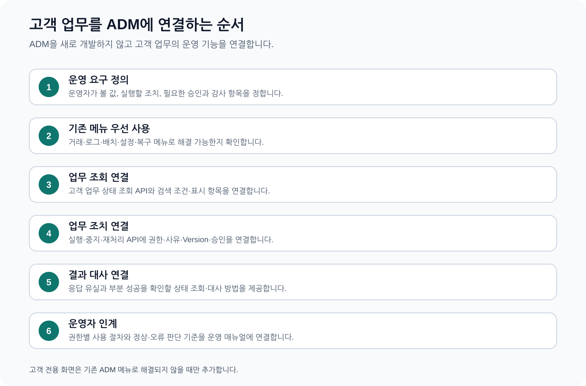
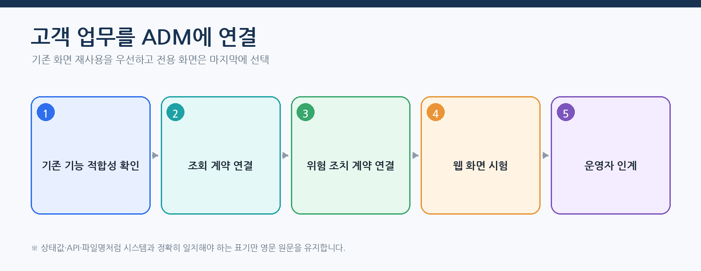
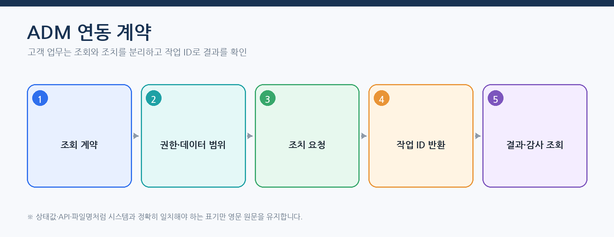

# CPF ADM 개발자 매뉴얼 — 고객 업무를 ADM에 연결하는 방법

> **주 독자**: 고객 업무 개발자, ADM 연동 개발자
> **목표**: 고객 업무의 조회·조치·승인·감사·복구를 완성된 ADM 제품에 연결한다. ADM 제품 자체 개발을 기본 목표로 삼지 않는다.

> **용어 표기 원칙**: 설명은 한글을 우선한다. API 경로, 설정 키, 클래스·파일명, HTTP 헤더와 실제 상태값은 시스템과 일치해야 하므로 원문을 유지한다.



## 이 매뉴얼을 사용하는 기준

이 매뉴얼은 고객이 현재 배포 기준의 CPF 기능을 처음 접한다는 전제로 작성한다. 사용자는 소스를 역분석하지 않고 이 문서의 **시작 조건 → 단계별 절차 → 정상 결과 → 오류·복구 → 운영 인계** 순서로 작업한다.

- 제품 기능과 고객 교육 예제는 구현된 기능을 기준으로 설명한다.
- 기능 식별자·API·설정값·화면이 변경되면 같은 커밋에서 매뉴얼도 함께 현행화한다.
- 고객 업무 데이터·상태·승인 기준·대사 기준은 고객이 정하고, CPF가 제공하는 실행·보안·감사·복구 계약에 연결한다.
- 명령과 예시는 저장소 최상위 폴더에서 실행하는 것을 기본으로 한다.
- 운영 변경은 사전 확인, 사유, 권한, 승인, 버전, 대상별 결과, 감사 순서로 확인한다.

> 문서 검수자는 소스·SQL·API·설정·화면·스크립트·시험과 양방향으로 대조한다. 고객 사용자는 별도 소스 분석 없이 본문 절차를 수행할 수 있어야 한다.
## 처음 시작하는 ADM 연동 개발자의 완료 기준



ADM 연동 개발자는 ADM 제품을 새로 만드는 사람이 아니다. 고객 업무 소유 모듈이 조회·조치·상태·대사 계약을 제공하고, ADM이 권한·데이터 범위·가림 처리·승인·감사를 적용해 사용하도록 연결한다.



## 종단간 따라하기 — 지급 상태 조회와 재처리 연동

### 1. 기존 ADM 기능으로 해결할 수 있는지 판단

1. `/transactions`, `/transactionGroups`, `/incidents`, `/recoveryCenter`에서 필요한 조회와 복구가 가능한지 확인한다.
2. 기존 화면의 열·상세 입력 항목·조치으로 해결되면 고객 전용 경로를 만들지 않는다.
3. 고객 업무만의 검색 조건이나 조치가 필요한 경우 소유 모듈 포트를 추가한다.
4. 새 화면은 기존 테이블·입력 화면·작업 기록 조회 패턴으로 해결할 수 없는 경우에만 추가한다.

### 2. 조회 계약

대표 EDU `EDU-ADM-02`는 `businessId`, `approvalId`를 받아 고객 업무 조회 결과를 반환한다. 처리기는 `com.cpf.reference.optional.operations.query.EduAdm02Handler`이며 `cpf.reference.features.operations.enabled=true`에서 활성화한다.

조회 계약은 다음 의미를 보장해야 한다.

| 항목 | 계약 |
|---|---|
| 조회 | 검색 조건·기간·상태·조직 범위·페이지 나누기·정렬 |
| 상세 | 업무 상태·버전·최근 작업 기록·오류·관련 거래 |
| 권한 | 화면 조회와 원문 조회를 분리 |
| 데이터 범위 | 조직·지역·업무 범위 밖 데이터 제외 |
| 가림 처리 | 개인정보·계좌·비밀정보 원문 가림 |
| 시간 초과 | 빈 결과·찾을 수 없음·권한 없음·시간 초과을 구분 |
| 감사 | 원문 조회·반출·위험 조회를 기록 |

### 3. 조치 계약

명령에는 `businessId`, `action`, `expectedVersion`, `idempotencyKey`, `reason`, 필요 시 `approvalId`를 포함한다. 응답은 결과를 확정할 수 없을 때 임의 성공을 반환하지 않고 `operationId`와 상태를 제공한다.

```json
{
  "businessId": "PAY-20260802-0001",
  "action": "REPROCESS_FAILED_TARGETS",
  "expectedVersion": 4,
  "idempotencyKey": "PAY-20260802-0001-REPROCESS-1",
  "reason": "기관 통신 정상화 후 실패 대상 재처리",
  "approvalId": "APR-20260802-0100"
}
```

### 4. 동일 JVM과 원격 연결부

| 구분 | 동일 JVM | 원격 |
|---|---|---|
| 호출 | Java 포트 직접 호출 | OpenAPI 생성 클라이언트 |
| 인증 | 실행 문맥 전달 | 서비스 인증정보·수신 대상 |
| 시간 초과 | 내부 예산 | 연결·읽기·전체 예산 |
| 오류 | 공통 오류 모델 | HTTP·네트워크 오류를 공통 의미로 변환 |
| 추적 | 문맥 유지 | W3C traceparent·`transactionId` 전달 |
| 검증 | 계약 시험 | 같은 계약 시험 + 통신 구간 시험 |

두 연결부는 같은 조회·명령 전송 객체와 상태 의미를 사용한다. 원격에서만 성공하거나 로컬에서만 허용되는 조치를 만들지 않는다.

### 5. 응답 유실·부분 성공

`operationId`를 화면에 표시하고, 다음 조회로 결과를 복구한다.

```text
변경 요청 → 202/200 + operationId
응답 유실 → businessId 또는 idempotencyKey로 Operation 조회
UNKNOWN_RESULT → 업무 원장·외부 결과 대사
PARTIAL_SUCCESS → 대상 목록에서 실패 대상만 재처리
완료 → 감사·추적·업무 버전 확인
```

### 6. 웹 화면 완료 시험

- 조회 권한만 있는 사용자는 변경 버튼을 볼 수 없거나 비활성 상태여야 한다.
- 데이터 범위 밖 업무는 검색 결과·반출에 나타나지 않아야 한다.
- 가림 처리 권한이 없으면 개인정보 원문이 표시되지 않아야 한다.
- 기대 버전 충돌 시 최신 상세를 재조회하고 사용자가 다시 판단하게 해야 한다.
- 응답 유실 후 같은 조치를 반복하지 않고 작업 기록 조회로 이동해야 한다.
- 부분 성공 화면은 성공·실패·미확정 대상과 다음 조치를 분리해 보여야 한다.
- 모든 조치에 수행자, 사유, `approvalId`, 변경 전후 버전, `operationId`가 감사에 남아야 한다.

## ADM 연동에서의 스타터 선택

ADM 본체의 최신 빌드는 `cpf-core`, `cpf-common`, `cpf-starter-security`, 배치 공개 계약을 직접 소비한다. 캐시·Kafka·관측 스타터를 ADM 본체가 직접 소비한다고 가정하지 않는다. 고객 업무 연동 모듈은 자체 요구에 따라 필요한 공개 스타터를 개별 선택한다.

| 연동 요구 | 선택 경계 | 주의 |
|---|---|---|
| ADM 브라우저·BFF 세션 | ADM 본체의 `cpf-starter-security` | 역할·Permission·Data Scope는 ADM과 Owner가 계속 소유 |
| 고객 업무의 Kafka 비동기 명령 | 고객 업무 모듈의 `cpf-starter-messaging-kafka` | ADM 요청 성공과 업무 처리 성공을 분리하고 작업 ID로 대사 |
| 고객 업무 기준정보 캐시 | 해당 고객 업무 모듈의 `cpf-starter-cache` | ADM 표시값을 업무 정본으로 확정하지 않음 |
| 고객 업무 관측 내보내기 | 해당 실행 모듈의 `cpf-starter-observability` | ADM은 결과를 조회하며 수집기 장애를 업무 실패로 단정하지 않음 |
| 원격 조치 회복성 | 해당 Owner 또는 연결 모듈의 `cpf-starter-resilience` | 기대 버전·멱등 키·전체 시간 예산과 함께 적용 |

현재 루트에 기능 묶음 별칭은 구현돼 있지 않다. ADM 연동 모듈은 `project(':cpf-starter-...')` 또는 게시 좌표를 개별 선언한다. BOM만으로는 기능이 활성화되지 않는다.

### 생성 계약과 화면 Source 정본

ADM 화면은 수기 `fetch`와 임의 JSON 표시에 의존하지 않고 생성된 계약을 기준으로 연결한다.

| 목적 | 현재 Source |
|---|---|
| ADM 경로·조치 계약 | `cpf-admin/frontend/src/generated/adm-route-operation-contract.ts` |
| CPF API 형식 | `cpf-admin/frontend/src/generated/cpf-api.ts` |
| Orval 생성 클라이언트 | `cpf-admin/frontend/src/generated/orval/cpf-api.ts` |
| 공통 조치 계약 | `cpf-admin/frontend/src/generated/cpf-operation-contract.ts` |
| 구조화 결과 표시 | `cpf-admin/frontend/src/components/CpfStructuredData.vue` |
| OpenAPI 검증 | `cpf-admin/frontend/scripts/validate-openapi.mjs` |
| 경로 계약 생성 | `cpf-admin/frontend/scripts/write-route-operation-contract.mjs` |

연동 개발자는 OpenAPI 원본, 생성 클라이언트, 경로·조치 계약과 화면 사용이 한 변경에서 일치하는지 확인한다. 생성 파일을 직접 고치지 않고 원본 계약과 생성 Script를 수정한 뒤 다시 생성한다.

## 연동 방식을 선택하는 순서

1. 기존 ADM 경로와 작업 기록으로 해결 가능한지 확인한다.
2. 고객 업무 소유 모듈이 조회·명령·상태·결과 대사 계약을 제공한다.
3. 동일 JVM 로컬 연결부와 분리 WAS 원격 연결부가 같은 계약을 소비하게 한다.
4. 기존 화면의 열·상세·조치만 확장할 수 있는지 확인한다.
5. 고객 전용 화면은 기존 기능으로 운영 업무를 끝낼 수 없을 때만 추가한다.

ADM은 고객 업무 원장을 소유하지 않는다. ADM 서버가 고객 업무 테이블을 직접 수정하거나 복구 스크립트를 실행하지 않는다.

## 고객 업무가 제공할 계약

| 계약 | 필수 내용 |
|---|---|
| 조회 | 검색 입력 항목·기본값·최대 기간·페이지 나누기·데이터 범위·가림 처리 |
| 상세 | 업무 상태·버전·오류·관련 작업 기록·감사·대상 결과 |
| 사전 확인 | 대상 수·변경 전후·영향·복구 가능성·검사합 |
| 명령 | 조치·`expectedVersion`·사유·`approvalId`·`idempotencyKey` |
| 작업 기록 상태 | 실행·성공·실패·부분 성공·미확정·다음 행동 |
| 결과 대사 | 업무 원장·외부기관·메시지·파일 결과 비교와 최종 판정 |
| 감사 | 수행자·역할·데이터 범위·사유·승인·변경 전후·추적 |

## 동일 JVM·원격 호출 동등성

- ADM 제어기는 소유 모듈 포트 또는 생성 클라이언트에 의존한다.
- 동일 JVM은 로컬 연결부, 분리 WAS는 원격 연결부를 사용한다.
- 원격 호출은 수행자·역할·데이터 범위·추적·요청 ID·멱등 키를 전달한다.
- 시간 초과 이후 실제 결과가 있을 수 있는 명령을 무조건 반복하지 않는다.
- 로컬·원격의 오류 코드·상태·감사 의미를 브라우저와 통합 시험에서 비교한다.

## 조회·상세 연동

### 업무 결과

운영자가 고객 업무 ID·상태·기간·조직으로 검색하고 권한 범위 안의 상세와 복구 근거를 확인한다.

### 시작 전에 결정할 값

- 메뉴·경로·작업 기록 ID
- 검색 입력 항목·기본값·최대 범위
- 열·상세 입력 항목
- 권한·데이터 범위·가림 처리
- 빈 결과·권한 없음·시간 초과 표시

### 수행 순서

1. 고객 업무 조회 API를 정의한다.
2. Server에서 데이터 범위와 가림 처리을 강제한다.
3. ADM 서버 소유 모듈 포트 또는 클라이언트를 연결한다.
4. 화면 조회·테이블·상세 상태를 연결한다.
5. 빈 결과·불러오는 중·오류·권한 오류를 브라우저 시험한다.

### 정상 판정

- 목록·상세 접근 범위 일치
- 권한 밖 데이터 0건
- 업무 상태·버전·작업 기록 ID 표시
- 오류가 재시도 가능 여부와 함께 표시

### 오류·경계·부분 실패

- 검색 범위 초과
- 원격 시간 초과
- 부분 데이터 소스 지연
- 개인정보 가림 처리 누락
- 오래된 스냅샷

### 복구·대사·되돌리기

- 조회 시간 초과는 짧은 기간·식별자 조회로 범위를 줄인다.
- 부분 데이터는 누락 소스와 기준시각을 표시한다.
- 권한 오류는 권한 변경 뒤 새 세션으로 재조회한다.

### 로그·지표·추적·감사

- `routeId`·`operationId`·`traceId`
- 조회 지연시간·오류 비율
- 가림 처리·반출 감사

### 운영 인계

- 검색 기본값
- 데이터 범위 소유 모듈
- 화면 입력 항목 정의
- 장애 시 원본 조회 위치
## 위험 조치·승인·기대 버전

### 업무 결과

운영자가 사전 확인을 확인하고 사유·승인·버전과 함께 고객 업무 명령을 한 번 요청한다.

### 시작 전에 결정할 값

- 조치과 대상
- 위험 등급·승인 필요 여부
- `expectedVersion`
- 사유 최소 길이·금지 정보
- 멱등 키·작업 기록 보존

### 수행 순서

1. 현재 상태·버전을 재조회한다.
2. 사전 확인에서 대상 수·변경 차이·복구 계획을 확인한다.
3. 필요한 승인 ID와 유효시간을 검증한다.
4. 명령을 한 번 전송하고 작업 기록 ID를 기록한다.
5. 업무 상태·감사·대상 결과를 재조회한다.

### 정상 판정

- 승인 대상·버전·실행 대상 일치
- 버전 충돌이 변경 없이 거부
- 응답 유실 시 작업 기록 조회
- 감사에 실행자·사유·승인·변경 전후 기록

### 오류·경계·부분 실패

- 자기 요청 자기 승인
- 만료·다른 대상 승인 재사용
- 버전 충돌
- 명령 응답 유실
- 일부 대상 실패

### 복구·대사·되돌리기

- 버전 충돌은 최신 상태와 사전 확인을 다시 만든다.
- 응답 유실은 같은 명령을 반복하지 않고 작업 기록을 조회한다.
- 부분 성공은 실패·미확정 대상만 결과 대사한다.

### 로그·지표·추적·감사

- previewId·`operationId`·`approvalId`
- command 기간·대상 분포
- version 충돌·미확정 경과시간

### 운영 인계

- 권한·승인자
- 위험 조치 종료 기준
- 되돌리기 가능 범위
- 교대 인계 작업 기록
## 비동기·부분 성공·결과 대사

### 업무 결과

장시간 작업과 다중 대상 조치의 성공·실패·미확정을 대상별로 표시하고 복구한다.

### 시작 전에 결정할 값

- 작업 기록 상태표
- 대상별 상태와 시도 이력
- 취소 가능 시점
- 재시도·결과 대사·보상 처리 조건
- 결과 파일 보존

### 수행 순서

1. 202 응답과 작업 기록 조회 URL을 반환한다.
2. ADM은 주기 조회 또는 이벤트로 상태를 갱신한다.
3. 대상별 결과·오류·다음 행동을 표시한다.
4. 응답 유실·부분 실패 시험 자료를 실행한다.
5. 최종 업무·감사·결과 파일을 대사한다.

### 정상 판정

- 전체 수=성공+실패+미확정
- 성공 대상을 중복 처리하지 않음
- 취소가 허용 시점에만 활성
- 결과 대사 후 최종 상태와 업무 원장 일치

### 오류·경계·부분 실패

- 작업 기록 조회 시간 초과
- 진행률 정체
- 취소 요청 유실
- 결과 파일 생성 실패
- 일부 외부기관 미확정

### 복구·대사·되돌리기

- 진행률 정체는 작업자 노드·임대 잠금·외부 상태를 확인한다.
- 취소 응답 유실은 작업 기록을 재조회한다.
- 미확정 대상은 상대 조회나 수동 확정 권한을 사용한다.

### 로그·지표·추적·감사

- operation 경과시간·진행률
- 대상 성공/실패/미확정
- 재시도/결과 대사/보상 처리
- 결과 파일 hash·다운로드 감사

### 운영 인계

- 대상별 복구 소유 모듈
- 결과 파일 보존
- 수동 확정 승인
- 교대 인계

## ADM 서버·화면 확장 경계

### 서버

- 제어기는 소유 모듈 포트 또는 생성 클라이언트를 호출한다.
- 조회와 명령 전송 객체를 분리한다.
- 명령에 시간 초과·`expectedVersion`·`idempotencyKey`·사유·`approvalId`를 포함한다.
- 원격 결과를 ADM 자체 성공 상태로 바꾸지 않는다.
- 감사은 고객 업무 감사와 ADM 접근·조치 감사를 작업 기록 ID로 연결한다.

### 화면

- 경로·메뉴 ID·권한·기능 전환값을 동시에 등록한다.
- 검색 기본값, 열, 상세 입력 항목, 버튼 활성 조건을 실제 API와 맞춘다.
- 조회 전용 화면에 명령·승인·되돌리기 절차를 넣지 않는다.
- 불러오는 중·빈 결과·검증 오류·권한 없음·버전 충돌·시간 초과·부분 성공·결과 미확정 상태를 분리한다.
- 위험 조치는 사전 확인→확인→작업 기록→결과 대사 흐름으로 표시한다.

### OpenAPI·생성 클라이언트

- 서버 작업 기록 ID와 화면 생성 클라이언트 방식을 대조한다.
- 임의 HTTP Wrapper를 추가해 인증·오류 계약을 우회하지 않는다.
- OpenAPI 변경 후 생성·검증·자료형 검사·단위·브라우저 순서로 확인한다.

## 공통 EDU 실행 계약

### 1. 교육 기능과 입력값 확인

문서의 선택표에서 교육 ID를 고른 뒤 실행 중인 참조 서비스에서 기능 정의를 조회한다. 사용자는 소스 경로를 찾지 않아도 필수 입력, 역할, 처리 단계와 허용 장애 지점을 확인할 수 있다.

```powershell
$capabilities = Invoke-RestMethod -Method Get `
  -Uri 'http://127.0.0.1:8080/api/reference/edu-capabilities'
$capabilities | Where-Object requirementId -eq '<EDU-ID>' | Format-List
```

조회 결과의 `requiredFields`를 요청 본문의 `payload`에 채우고, `requiredRole`, `steps`, `failurePoints`, `maxRetries`를 실행 전에 확인한다. 구현을 확장하거나 시험 코드를 검토할 때만 기능 카탈로그의 `sourcePath`, `resourceContract`, `tests`를 유지보수 근거로 사용한다.

### 2. 역할과 기능 활성 조건

- 필요한 역할: `CPF_ADM_OPERATOR`
- 대표 기능 전환: `cpf.reference.features.operations.enabled`
- 기본 프로필에서 교육 기능이 임의 실행된다고 가정하지 않는다.
- 비밀정보·토큰·비밀번호 원문을 요청 본문, 명령 이력, 로그에 기록하지 않는다.

### 3. 교육 실행 API

```text
GET  /api/reference/edu-capabilities
POST /api/reference/edu-capabilities/{requirementId}/executions
GET  /api/reference/edu-capabilities/executions/{operationId}
GET  /api/reference/edu-capabilities/{requirementId}/executions?limit=100
GET  /api/reference/edu-capabilities/executions/{operationId}/audit
GET  /api/reference/edu-capabilities/executions/{operationId}/targets
GET  /api/reference/edu-capabilities/executions/{operationId}/outbox
POST /api/reference/edu-capabilities/executions/{operationId}/retry?reason=...
POST /api/reference/edu-capabilities/executions/{operationId}/reconcile?reason=...
POST /api/reference/edu-capabilities/executions/{operationId}/compensate?reason=...
POST /api/reference/edu-capabilities/executions/{operationId}/cancel?reason=...
```

필수 헤더는 `X-Cpf-Actor-Id`, `X-Cpf-Roles`, `X-Cpf-Data-Scope`다. `X-Cpf-Request-Id`, `X-Cpf-Trace-Id`는 호출자가 지정하지 않으면 서버가 생성할 수 있으나, 장애 재현과 대사 시험에서는 명시적으로 고정한다.

```powershell
$headers = @{
  'X-Cpf-Actor-Id'  = 'edu-operator'
  'X-Cpf-Roles'     = 'CPF_ADM_OPERATOR'
  'X-Cpf-Data-Scope'= 'ORG:EDU'
  'X-Cpf-Request-Id'= 'REQ-EDU-0001'
  'X-Cpf-Trace-Id'  = 'TRACE-EDU-0001'
}
$body = @{
  businessKey      = 'BUSINESS-0001'
  idempotencyKey   = 'IDEMPOTENCY-0001'
  expectedVersion  = 0
  requestReason    = '교육 시나리오 실행'
  payload          = @{}
  failurePoint     = 'NONE'
  autoApprove      = $true
  autoAcknowledge  = $true
} | ConvertTo-Json -Depth 10
Invoke-RestMethod -Method Post `
  -Uri 'http://localhost:<port>/api/reference/edu-capabilities/<EDU-ID>/executions' `
  -Headers $headers -ContentType 'application/json' -Body $body
```

`payload`는 기능 목록의 `requiredFields`를 채운다. 허용 장애 주입 값은 `BEFORE_COMMIT`, `AFTER_COMMIT`, `BEFORE_EXTERNAL_SEND`, `AFTER_EXTERNAL_SEND`, `RESPONSE_LOST`, `PARTIAL_TARGET_FAILURE`, `TIMEOUT`, `PROCESS_KILL`, `LEASE_LOST`다.

### 4. 응답 유실과 부분 실패 복구

1. 같은 요청을 바로 반복하지 않는다.
2. 기록한 `operationId`, `requestId`, `businessKey`, `idempotencyKey`로 실행 상태를 조회한다.
3. `audit`, `targets`, `outbox`를 조회해 DB 커밋과 외부 부수 효과를 분리한다.
4. 실제 결과가 확정되지 않으면 `reconcile`을 수행한다.
5. `retry`는 실패 원인이 일시적이고 해당 기능이 재시도 가능하다고 기능 목록·상태가 표시할 때만 사용한다.
6. 일부 대상만 성공했으면 성공 대상을 다시 실행하지 않고 실패·미확정 대상만 복구한다.
7. 최종 상태, 버전, 대상별 결과, 감사, 로그·지표·추적이 같은 작업 기록을 가리킬 때 종료한다.

## ADM 연동 EDU 17개 선택표

실제 구현은 `com.cpf.reference.optional.operations...` 아래에 있으며 과거 문서의 `reference/edu/adm/admNN` 가상 경로를 사용하지 않는다. 각 항목의 현재 경로는 기능 목록 `sourcePath`를 따른다.

| 교육 ID | 고객이 확인할 기능 | 역할 | 활성 조건 | 실행 안내 | 기능 제공 | 사용 방법 |
|---|---|---|---|---|---|---|
| `EDU-ADM-01` | 기존 ADM 기능 재사용 판단 | `CPF_ADM_OPERATOR` | `cpf.reference.features.operations.enabled` | 공통 EDU 실행 계약과 해당 ID | 제공 | 본문 절차 |
| `EDU-ADM-02` | 고객 업무 조회 연동 | `CPF_ADM_OPERATOR` | `cpf.reference.features.operations.enabled` | 공통 EDU 실행 계약과 해당 ID | 제공 | 본문 절차 |
| `EDU-ADM-03` | 안전한 운영 조치 | `CPF_ADM_OPERATOR` | `cpf.reference.features.operations.enabled` | 공통 EDU 실행 계약과 해당 ID | 제공 | 본문 절차 |
| `EDU-ADM-04` | 승인 필요한 위험 조치 | `CPF_ADM_OPERATOR` | `cpf.reference.features.operations.enabled` | 공통 EDU 실행 계약과 해당 ID | 제공 | 본문 절차 |
| `EDU-ADM-05` | 비동기 작업·응답 유실 | `CPF_ADM_OPERATOR` | `cpf.reference.features.operations.enabled` | 공통 EDU 실행 계약과 해당 ID | 제공 | 본문 절차 |
| `EDU-ADM-06` | 부분 성공·대상별 복구 | `CPF_ADM_OPERATOR` | `cpf.reference.features.operations.enabled` | 공통 EDU 실행 계약과 해당 ID | 제공 | 본문 절차 |
| `EDU-ADM-07` | 고객 전용 화면 추가의 마지막 선택 | `CPF_ADM_OPERATOR` | `cpf.reference.features.operations.enabled` | 공통 EDU 실행 계약과 해당 ID | 제공 | 본문 절차 |
| `EDU-ADM-08` | 권한·데이터 범위·가림 처리·사유 입력 연동 | `CPF_ADM_OPERATOR` | `cpf.reference.features.operations.enabled` | 공통 EDU 실행 계약과 해당 ID | 제공 | 본문 절차 |
| `EDU-ADM-09` | 기대 버전 충돌 화면·재조회·재적용 | `CPF_ADM_OPERATOR` | `cpf.reference.features.operations.enabled` | 공통 EDU 실행 계약과 해당 ID | 제공 | 본문 절차 |
| `EDU-ADM-10` | 대상 일괄 조치·부분 성공·결과 파일 | `CPF_ADM_OPERATOR` | `cpf.reference.features.operations.enabled` | 공통 EDU 실행 계약과 해당 ID | 제공 | 본문 절차 |
| `EDU-ADM-11` | 설정·기능전환·유지보수 창 운영 | `CPF_ADM_OPERATOR` | `cpf.reference.features.operations.enabled` | 공통 EDU 실행 계약과 해당 ID | 제공 | 본문 절차 |
| `EDU-ADM-12` | Incident·복구 센터 종단간 복구 | `CPF_ADM_OPERATOR` | `cpf.reference.features.operations.enabled` | 공통 EDU 실행 계약과 해당 ID | 제공 | 본문 절차 |
| `EDU-ADM-13` | 감사 증적·다운로드·승인 반출 | `CPF_ADM_OPERATOR` | `cpf.reference.features.operations.enabled` | 공통 EDU 실행 계약과 해당 ID | 제공 | 본문 절차 |
| `EDU-ADM-14` | 구성 현황·상태 점검·용량 상세 이동 | `CPF_ADM_OPERATOR` | `cpf.reference.features.operations.enabled` | 공통 EDU 실행 계약과 해당 ID | 제공 | 본문 절차 |
| `EDU-ADM-15` | 로그·추적·트랜잭션 상관 검색 | `CPF_ADM_OPERATOR` | `cpf.reference.features.operations.enabled` | 공통 EDU 실행 계약과 해당 ID | 제공 | 본문 절차 |
| `EDU-ADM-16` | 알림 확인 처리·상위 보고·교대 인계 | `CPF_ADM_OPERATOR` | `cpf.reference.features.operations.enabled` | 공통 EDU 실행 계약과 해당 ID | 제공 | 본문 절차 |
| `EDU-ADM-17` | 브라우저 세션 만료·재로그인·위험 조치 안전성 | `CPF_ADM_OPERATOR` | `cpf.reference.features.operations.enabled` | 공통 EDU 실행 계약과 해당 ID | 제공 | 본문 절차 |

## 웹 화면·장애 시험

- 경로 직접 접근과 메뉴 접근의 권한 일치
- 조회 중·빈 결과·오류·데이터 범위·가림 처리
- 사전 확인 대상 수·버전·검사합
- 409 버전 충돌 후 재조회·재사전 확인
- 202 작업 기록 진행·취소·완료
- 응답 유실 뒤 작업 기록 조회
- 부분 성공 대상별 재시도·결과 대사
- 세션 만료 뒤 위험 조치가 중복 전송되지 않음
- 감사에 수행자·사유·승인·작업 기록·추적 연결

## 운영자 매뉴얼 인계

각 연동 기능은 [04 ADM 운영자 매뉴얼](04_ADM운영자매뉴얼.md)의 실제 경로와 연결하고 다음을 전달한다.

- 운영 질문과 사용 시점
- 검색 입력 항목·기본값·열·상세 입력 항목
- 버튼·활성 조건·권한
- 사유·승인·기대 버전
- 정상·오류·부분 성공·UNKNOWN_RESULT 판정
- 재시도·실패 대상 재처리·결과 대사·되돌리기 선택 기준
- 관련 로그·추적·감사와 교대 인계 항목
