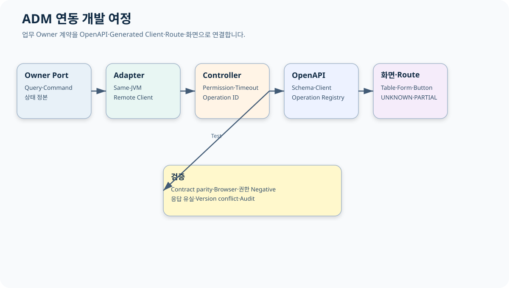
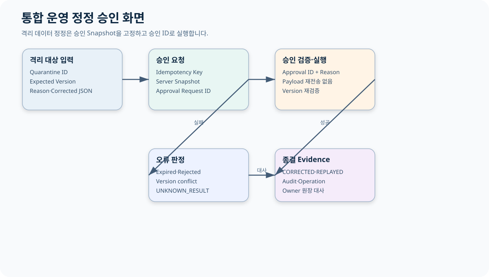
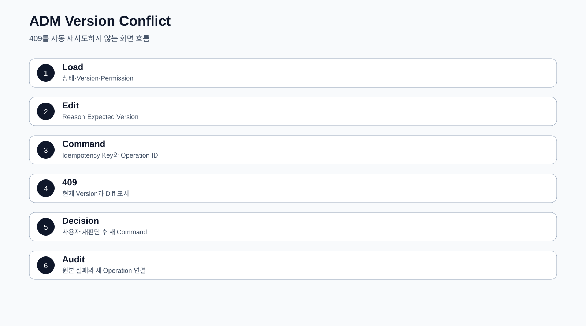

# CPF ADM 개발자 매뉴얼

> 기준 Repository: `https://github.com/freeangelsun/202412_01_CPF`
> 기준 Branch: `master`
> 기준 Commit: `a8be27a34bdac0b7c075e06d6e86571244c96421` (`06_08`)
> 기준일: `2026-08-06 Asia/Seoul`

| 항목 | 내용 |
|---|---|
| 주 독자 | 고객 업무 개발자·ADM 연동 개발자, Frontend 경험이 많지 않은 개발자 |
| 이 문서로 완료할 일 | 업무 Owner의 Query·Command를 Same-JVM·Remote Adapter, OpenAPI, Generated Client, Route, 화면과 Browser Test로 연결한다. |
| 읽는 방식 | 처음 접하는 독자는 앞에서부터 실습 순서로 읽고, 숙련자는 장별 판단표와 참조 경로를 사용한다. |
| 설명 원칙 | 제품 기능은 사용할 수 있는 상태로 설명한다. 실제 Source·SQL·API·Config·Frontend·Script·Test의 이름과 경계를 유지한다. |




## 1. ADM 연동의 경계

ADM 연동 개발자는 ADM 제품을 새로 만드는 사람이 아니다. 고객 업무의 조회·조치·승인·감사·복구 기능을 기존 ADM에 연결한다.

- 최종 상태는 고객 업무 Owner가 소유한다.
- ADM Backend는 Owner Query/Command Port 또는 Remote API를 호출한다.
- Frontend는 Generated Client를 사용한다.
- Route Registry는 Route·Menu·Risk·Feature Flag·Operation ID의 정본이다.
- ADM은 Owner DB를 직접 수정하지 않는다.
- 화면 Toast를 업무 상태 정본으로 사용하지 않는다.

## 2. 예제: PAY 결제수단 운영 화면

운영자는 고객·상태로 결제수단을 검색하고, 상세를 확인한 뒤 정지 요청을 만든다. 응답 유실이면 Operation을 조회하고 Owner 원장과 대사한다.

| 항목 | 예제 |
|---|---|
| Route | `/pay-methods` 고객 확장 Route |
| Menu | `PAY_METHOD` |
| Query Operation | `payAdmFindMethods`, `payAdmFindMethod` |
| Command Operation | `payAdmSuspendMethod`, `payAdmResumeMethod` |
| Permission | Menu·Button·API·Customer Data Scope |
| 위험 입력 | Reason·Expected Version·Idempotency·Approval ID |
| 상태 | ACTIVE·SUSPENDED·UNKNOWN_RESULT |

## 3. Owner Port

```java
public interface PayMethodAdmPort {
    PayMethodPage findMethods(PayMethodCriteria criteria, AdminActor actor);
    PayMethodDetail findMethod(String methodId, AdminActor actor);
    PayOperationResult suspend(SuspendPayMethodCommand command, AdminActor actor);
    PayOperationResult findOperation(String operationId, AdminActor actor);
}
```

Query와 Command를 분리한다. Query 결과에는 기준시각, Owner, Version을 포함한다.

## 4. Same-JVM Adapter

```java
@Component
final class LocalPayMethodAdmAdapter implements PayMethodAdmPort {
    private final PayMethodQueryService query;
    private final PayMethodCommandService command;

    public PayMethodPage findMethods(PayMethodCriteria criteria, AdminActor actor) {
        return query.find(criteria, actor.toSecurityContext());
    }

    public PayOperationResult suspend(SuspendPayMethodCommand request, AdminActor actor) {
        return command.suspend(request, actor.toSecurityContext());
    }
}
```

Local Adapter도 Permission·Version·Idempotency 의미를 우회하지 않는다.

## 5. Remote Adapter

Remote Adapter는 Generated Client를 사용하고 Service Identity, Audience, Timeout, Trace Header, Error Mapping을 추가한다.

```java
@Component
final class RemotePayMethodAdmAdapter implements PayMethodAdmPort {
    private final PayOwnerGeneratedClient client;

    public PayOperationResult suspend(SuspendPayMethodCommand command, AdminActor actor) {
        return client.suspend(
            actor.serviceIdentity(),
            actor.traceHeaders(),
            command,
            Duration.ofSeconds(5));
    }
}
```

Timeout이 Dispatch 전인지 후인지 구분할 수 있어야 한다. Dispatch 뒤 응답 유실은 `UNKNOWN_RESULT`와 Operation 조회 경로를 반환한다.

## 6. Controller

```java
@RestController
@RequestMapping("/adm/api/pay-methods")
final class PayMethodAdmController {

    @GetMapping
    @CpfPermission("PAY_METHOD_READ")
    PayMethodPage find(PayMethodCriteria criteria, AdminActor actor) { ... }

    @PostMapping("/{methodId}/suspend")
    @CpfPermission("PAY_METHOD_SUSPEND")
    PayOperationResult suspend(
        @PathVariable String methodId,
        @RequestBody SuspendPayMethodRequest request,
        AdminActor actor) { ... }
}
```

Controller는 인증·HTTP·입력 형식을 다루고 업무 상태 전이는 Owner가 판단한다.

## 7. Command 입력 계약

```json
{
  "expectedVersion": 7,
  "reason": "분실 신고 접수에 따른 일시 정지",
  "idempotencyKey": "dfe9356e-25d0-4c43-a19d-3f75c2ea772a",
  "approvalRequestId": 4812
}
```

Button은 다음 조건이 모두 맞을 때 활성화한다.

- 현재 상태가 `ACTIVE`.
- 사용자가 `PAY_METHOD_SUSPEND` Button·API Permission을 가짐.
- 대상이 사용자 Data Scope 안에 있음.
- 최신 Version이 상세 화면과 일치.
- Reason이 유효.
- 정책상 필요한 Approval이 `APPROVED`이고 Snapshot이 일치.
- 이전 Operation이 미종결 상태가 아님.

## 8. OpenAPI·Generated Client

1. Controller에 고유 Operation ID를 선언한다.
2. Request·Response·Error Schema를 생성한다.
3. 중복 Operation ID와 Schema 오류를 검사한다.
4. Generated Client를 재생성한다.
5. Frontend에서 Raw URL 호출을 제거한다.
6. Route Registry의 `expectedOperationIds`와 비교한다.
7. Contract Test와 TypeScript Compile을 실행한다.

`cpf.openapi.webmvc`는 API Docs와 관리 Snapshot을 제공한다. 운영 환경에서 API Docs 노출 여부는 별도 정책으로 결정한다.

## 9. Route Registry

```ts
export interface AdmCapabilityRoute {
  routeId: string;
  path: string;
  menuId: string;
  label: string;
  group: AdmFeatureGroup;
  riskLevel: AdmRouteRiskLevel;
  featureFlag: string;
  expectedOperationIds: readonly string[];
}
```

Route를 추가할 때 다음을 함께 변경한다.

- Route Registry.
- Vue Page와 Component.
- Menu·Button·API Permission.
- OpenAPI Operation.
- Generated Client.
- Route Test.
- Browser Test.
- 04 운영자 매뉴얼.

## 10. Frontend 화면 구조

| 영역 | PAY 예 | 독자가 확인할 것 |
|---|---|---|
| 검색 | 고객 ID·상태·기간 | Default·최대 기간·Validation |
| 목록 | ID·Masked Account·상태·Version·Updated | Sort·Masking·Timezone |
| 상세 | 상태 Timeline·Operation·Audit | 목록 Row를 그대로 신뢰하지 않고 재조회 |
| 조치 | 정지·재개 | Button 조건·Reason·Version·Approval |
| 결과 | Operation Banner | `SUCCEEDED`, `FAILED`, `UNKNOWN_RESULT`, `PARTIAL` 구분 |

Loading, Empty, Validation Error, Forbidden, Owner Timeout을 같은 빈 화면으로 표시하지 않는다.

## 11. Vue 예제

```vue
<script setup lang="ts">
import { computed, ref } from 'vue';
import { payMethodApi } from '../../generated/payMethodApi';

const selected = ref<PayMethodDetail | null>(null);
const reason = ref('');
const loading = ref(false);
const canSuspend = computed(() =>
  selected.value?.status === 'ACTIVE' &&
  selected.value.permissions.includes('PAY_METHOD_SUSPEND') &&
  reason.value.trim().length >= 10 &&
  !loading.value
);

async function suspend() {
  if (!selected.value) return;
  loading.value = true;
  try {
    const result = await payMethodApi.suspend(selected.value.methodId, {
      expectedVersion: selected.value.version,
      reason: reason.value.trim(),
      idempotencyKey: crypto.randomUUID()
    });
    await reloadOperation(result.operationId);
  } finally {
    loading.value = false;
  }
}
</script>
```

Client가 승인 여부를 Boolean으로 직접 보내 승인하는 방식을 사용하지 않는다.

## 12. 통합 운영 정정 승인



현재 Route:

```text
/integrationClosure
menuId = INTEGRATION_CLOSURE
riskLevel = CRITICAL
```

연결 Operation:

- `admIntegrationCryptoStatus`
- `admIntegrationTimeHealth`
- `admIntegrationDataQualityValidate`
- `admIntegrationDataQualityCorrectionApprovalRequest`
- `admIntegrationDataQualityCorrectionExecute`
- `admIntegrationDataQualityReplay`
- `admIntegrationWebhookDlq`
- `admIntegrationWebhookReplay`

정정 승인 요청은 `expectedVersion`, `idempotencyKey`, `reason`, `corrected`를 보내며 Server가 Snapshot을 고정한다. 실행은 Approval ID와 Reason만 사용한다. 실행 단계에서 정정 Payload를 다시 받지 않는다.

## 13. Permission·Masking·Export

- Route 진입 Permission.
- Button Action Permission.
- Backend API Permission.
- Row Data Scope.
- Field Masking 또는 원문 조회 Permission.
- Export Permission·Reason·행 제한·만료·Download Audit.

목록에서 Masked Field를 보여 주더라도 상세나 Export에서 원문이 노출되지 않는지 Negative Test한다.

## 14. Timeout·Version·Idempotency UI

| 상황 | 화면 표시 | 허용 행동 |
|---|---|---|
| Query Timeout | 조회 실패 Banner | 같은 조건 Retry |
| Command Dispatch 전 실패 | `FAILED` | 입력·Health 확인 뒤 새 요청 |
| Command 응답 유실 | `UNKNOWN_RESULT` | Operation 조회, Button 비활성 |
| Version 충돌 | 비교 Dialog | 최신 상세 재조회 후 재입력 |
| 같은 Key·같은 Payload | 기존 결과 | 새 Operation 생성 금지 |
| 같은 Key·다른 Payload | Conflict | 새 의도면 새 Key |
| 일부 Target 성공 | `PARTIAL` | 실패 Target만 조치 |

## 15. Browser Test

### 15.1 정상

1. 권한 있는 사용자로 Route 진입.
2. 검색 Default와 Column 확인.
3. 상세 재조회.
4. Reason 입력과 Button 활성화.
5. Command 실행.
6. Operation·Owner 상태·Audit 일치 확인.

### 15.2 Negative

- Menu 권한 없음.
- Button 권한 없음.
- 다른 조직 Data Scope.
- Masking 원문 노출.
- Stale Version.
- Approval 만료·반려.
- Owner Timeout.
- 응답 유실.
- 여러 Target 부분 적용.

### 15.3 예제 명령

```powershell
$env:CPF_FRONTEND_URL='https://adm.example'
$env:CPF_E2E_RELEASE='true'
$env:CPF_E2E_AUTH_STATE='D:\secure\adm-auth.json'
# Repository의 실제 Playwright 명령을 package.json에서 확인해 실행한다.
```

## 16. Contract Parity Test

같은 Fixture를 Local과 Remote Adapter에 실행한다.

```java
@ParameterizedTest
@MethodSource("payMethodAdapters")
void suspend_contract_is_same(PayMethodAdmPort adapter) {
    PayOperationResult result = adapter.suspend(validCommand(), operator());
    assertThat(result.status()).isEqualTo("SUSPENDED");
    assertThat(result.operationId()).isNotBlank();
}
```

Remote Test에는 Serialization·401·403·409·Timeout·응답 유실을 추가한다.

## 17. 운영 인계

| 항목 | 기록 |
|---|---|
| Route·Menu | Path·Menu ID·Group·Risk·Feature Flag |
| Owner | Query/Command Port·Remote Base URL |
| Operation | OpenAPI ID·Generated Client Method |
| 화면 | 검색·Column·상세·Button·활성 조건 |
| Permission | Menu·Button·API·Data Scope·Masking |
| 오류 | Validation·Forbidden·Conflict·Timeout·Unknown·Partial |
| 복구 | Operation 조회·Reconcile·Retry·Rollback |
| Evidence | Contract·Browser·Audit·Trace·Screenshot |

## 18. ADM 연동 자체 검수

1. ADM이 Owner DB를 직접 수정하지 않는가?
2. Query와 Command Port가 분리됐는가?
3. Local·Remote Error 의미가 같은가?
4. Operation ID가 OpenAPI·Client·Route·Audit에 연결되는가?
5. Raw URL과 수기 DTO가 없는가?
6. 화면 상태가 Owner 상태를 복제한 정본이 아닌가?
7. Button 조건에 Permission·Version·Reason·Approval이 있는가?
8. `UNKNOWN_RESULT`를 일반 오류 Toast로 숨기지 않는가?
9. Browser Negative Test가 있는가?
10. 04 운영자 매뉴얼에 실제 사용 절차가 반영됐는가?

<!-- CPF_R10_QUALITY_EXPANSION -->



## 부록 A. PAY ADM 화면 종단간 연결 예제

### A.1 Owner Query·Command 계약

```java
public interface PayMethodAdmQueryPort {
    Page<PayMethodAdmRow> search(PayMethodAdmFilter filter, AdmActor actor);
    PayMethodAdmDetail find(String methodId, AdmActor actor);
}

public interface PayMethodAdmCommandPort {
    PayMethodAdmOperation suspend(
            String methodId,
            long expectedVersion,
            String idempotencyKey,
            String reason,
            AdmActor actor);
}
```

### A.2 Backend Controller

```java
@RestController
@RequestMapping("/adm/api/pay-methods")
public class AdmPayMethodController {
    private final PayMethodAdmQueryPort query;
    private final PayMethodAdmCommandPort command;

    @GetMapping
    @PreAuthorize("hasAuthority('PAY_METHOD_READ')")
    public Page<PayMethodAdmRow> search(@Valid PayMethodAdmFilter filter, AdmActor actor) {
        return query.search(filter, actor);
    }

    @PostMapping("/{methodId}/suspend")
    @PreAuthorize("hasAuthority('PAY_METHOD_SUSPEND')")
    public PayMethodAdmOperation suspend(
            @PathVariable String methodId,
            @RequestHeader("Idempotency-Key") String idempotencyKey,
            @Valid @RequestBody AdmVersionedReasonRequest request,
            AdmActor actor) {
        return command.suspend(methodId, request.expectedVersion(), idempotencyKey, request.reason(), actor);
    }
}
```

### A.3 OpenAPI Operation

```yaml
/adm/api/pay-methods/{methodId}/suspend:
  post:
    operationId: admPayMethodSuspend
    parameters:
      - in: path
        name: methodId
        required: true
        schema: { type: string }
      - in: header
        name: Idempotency-Key
        required: true
        schema: { type: string, minLength: 8, maxLength: 128 }
    requestBody:
      required: true
      content:
        application/json:
          schema:
            $ref: '#/components/schemas/AdmVersionedReasonRequest'
    responses:
      '200': { description: 처리 결과 }
      '403': { description: 권한 없음 }
      '409': { description: Version 또는 Idempotency 충돌 }
```

### A.4 Vue 화면의 안전한 Command 처리

```ts
async function suspend(row: PayMethodRow) {
  if (!reason.value.trim() || loading.value) return;
  loading.value = true;
  error.value = '';
  try {
    const result = await payMethodApi.admPayMethodSuspend(row.methodId, {
      expectedVersion: row.version,
      reason: reason.value.trim(),
    }, crypto.randomUUID());
    operation.value = result;
    await reload();
  } catch (failure) {
    if (isVersionConflict(failure)) {
      conflict.value = await payMethodApi.admPayMethodFind(row.methodId);
      return;
    }
    if (isTimeout(failure)) {
      unknownOperationId.value = failure.operationId;
      return;
    }
    error.value = toUserMessage(failure);
  } finally {
    loading.value = false;
  }
}
```

### A.5 Playwright Test

```ts
test('권한·409·응답 유실을 구분한다', async ({ page }) => {
  await loginAs(page, 'pay-operator');
  await page.goto('/pay-methods');
  await expect(page.getByRole('button', { name: '정지' })).toBeEnabled();

  await injectVersionConflict('PM-1001');
  await page.getByRole('button', { name: '정지' }).click();
  await page.getByLabel('사유').fill('fraud review');
  await page.getByRole('button', { name: '실행' }).click();
  await expect(page.getByText('다른 사용자가 먼저 변경했습니다')).toBeVisible();

  await injectResponseLoss('PM-1001');
  await page.getByRole('button', { name: '다시 실행' }).click();
  await expect(page.getByText('결과 확인 중')).toBeVisible();
  await expect(page.getByText(/Operation ID/)).toBeVisible();
});
```


## 부록 B. ADM 업무 연동 EDU 17개

ADM EDU는 Owner Port·OpenAPI·Generated Client·Route·Permission을 한 흐름으로 연결한다. 정상 화면만 보지 않고 403·409·Timeout·UNKNOWN_RESULT·부분 적용을 Browser와 Backend에서 함께 재현한다.

### EDU-ADM-01 — Owner Query Port

| 항목 | 수행 내용 |
|---|---|
| 학습 결과 | Owner Query Port의 선택 기준과 정상·실패·복구 의미를 설명하고 직접 판정한다. |
| Repository 확인 위치 | `cpf-admin + 업무 Domain` 및 실제 Consumer·Test·Config |
| 주요 입력 | Filter·Page·Actor |
| 실행 순서 | Fixture 준비 → 정상 실행 → 원장·로그·Trace·Audit 확인 → 장애 주입 → 복구 실행 → 재검증 |
| 정상 판정 | Owner 데이터가 Data Scope 적용되어 반환 |
| 장애 재현 | Owner Timeout |
| 복구 판정 | Timeout 응답과 Trace로 원인 확인 |
| 운영 확인 | - |
| 고객 업무 전환 | 예제 ID·상태·Permission·SLA만 고객 값으로 바꾸고 Idempotency·Version·Audit·복구 계약은 유지 |

### EDU-ADM-02 — Owner Command Port

| 항목 | 수행 내용 |
|---|---|
| 학습 결과 | Owner Command Port의 선택 기준과 정상·실패·복구 의미를 설명하고 직접 판정한다. |
| Repository 확인 위치 | `cpf-admin + 업무 Domain` 및 실제 Consumer·Test·Config |
| 주요 입력 | expectedVersion·reason·idempotencyKey |
| 실행 순서 | Fixture 준비 → 정상 실행 → 원장·로그·Trace·Audit 확인 → 장애 주입 → 복구 실행 → 재검증 |
| 정상 판정 | 업무 상태·Audit 연결 |
| 장애 재현 | 409·응답 유실 |
| 복구 판정 | Operation 조회와 Reconcile |
| 운영 확인 | - |
| 고객 업무 전환 | 예제 ID·상태·Permission·SLA만 고객 값으로 바꾸고 Idempotency·Version·Audit·복구 계약은 유지 |

### EDU-ADM-03 — Same-JVM Adapter

| 항목 | 수행 내용 |
|---|---|
| 학습 결과 | Same-JVM Adapter의 선택 기준과 정상·실패·복구 의미를 설명하고 직접 판정한다. |
| Repository 확인 위치 | `cpf-admin` 및 실제 Consumer·Test·Config |
| 주요 입력 | Owner Bean |
| 실행 순서 | Fixture 준비 → 정상 실행 → 원장·로그·Trace·Audit 확인 → 장애 주입 → 복구 실행 → 재검증 |
| 정상 판정 | Remote와 같은 DTO·Error |
| 장애 재현 | Internal Repository 직접 접근 |
| 복구 판정 | Public Port로 교체 |
| 운영 확인 | - |
| 고객 업무 전환 | 예제 ID·상태·Permission·SLA만 고객 값으로 바꾸고 Idempotency·Version·Audit·복구 계약은 유지 |

### EDU-ADM-04 — Remote Adapter

| 항목 | 수행 내용 |
|---|---|
| 학습 결과 | Remote Adapter의 선택 기준과 정상·실패·복구 의미를 설명하고 직접 판정한다. |
| Repository 확인 위치 | `cpf-admin` 및 실제 Consumer·Test·Config |
| 주요 입력 | Base URL·Service Identity·Timeout |
| 실행 순서 | Fixture 준비 → 정상 실행 → 원장·로그·Trace·Audit 확인 → 장애 주입 → 복구 실행 → 재검증 |
| 정상 판정 | Trace·Error 의미 동등 |
| 장애 재현 | Network Timeout |
| 복구 판정 | UNKNOWN 가능성 분리 |
| 운영 확인 | - |
| 고객 업무 전환 | 예제 ID·상태·Permission·SLA만 고객 값으로 바꾸고 Idempotency·Version·Audit·복구 계약은 유지 |

### EDU-ADM-05 — ADM Controller

| 항목 | 수행 내용 |
|---|---|
| 학습 결과 | ADM Controller의 선택 기준과 정상·실패·복구 의미를 설명하고 직접 판정한다. |
| Repository 확인 위치 | `cpf-admin` 및 실제 Consumer·Test·Config |
| 주요 입력 | Permission·Request |
| 실행 순서 | Fixture 준비 → 정상 실행 → 원장·로그·Trace·Audit 확인 → 장애 주입 → 복구 실행 → 재검증 |
| 정상 판정 | Generated Operation ID 일치 |
| 장애 재현 | Permission 누락 |
| 복구 판정 | 403 Negative Test |
| 운영 확인 | - |
| 고객 업무 전환 | 예제 ID·상태·Permission·SLA만 고객 값으로 바꾸고 Idempotency·Version·Audit·복구 계약은 유지 |

### EDU-ADM-06 — OpenAPI Operation

| 항목 | 수행 내용 |
|---|---|
| 학습 결과 | OpenAPI Operation의 선택 기준과 정상·실패·복구 의미를 설명하고 직접 판정한다. |
| Repository 확인 위치 | `cpf-tools/contracts/openapi` 및 실제 Consumer·Test·Config |
| 주요 입력 | operationId·Schema |
| 실행 순서 | Fixture 준비 → 정상 실행 → 원장·로그·Trace·Audit 확인 → 장애 주입 → 복구 실행 → 재검증 |
| 정상 판정 | 중복 없는 Operation |
| 장애 재현 | Schema Drift |
| 복구 판정 | 생성·검증 Gate 재실행 |
| 운영 확인 | - |
| 고객 업무 전환 | 예제 ID·상태·Permission·SLA만 고객 값으로 바꾸고 Idempotency·Version·Audit·복구 계약은 유지 |

### EDU-ADM-07 — Generated Client

| 항목 | 수행 내용 |
|---|---|
| 학습 결과 | Generated Client의 선택 기준과 정상·실패·복구 의미를 설명하고 직접 판정한다. |
| Repository 확인 위치 | `cpf-admin/frontend/src/generated` 및 실제 Consumer·Test·Config |
| 주요 입력 | OpenAPI Snapshot |
| 실행 순서 | Fixture 준비 → 정상 실행 → 원장·로그·Trace·Audit 확인 → 장애 주입 → 복구 실행 → 재검증 |
| 정상 판정 | 수기 URL 없이 호출 |
| 장애 재현 | 수기 Client Drift |
| 복구 판정 | Client 재생성 |
| 운영 확인 | - |
| 고객 업무 전환 | 예제 ID·상태·Permission·SLA만 고객 값으로 바꾸고 Idempotency·Version·Audit·복구 계약은 유지 |

### EDU-ADM-08 — Route Registry

| 항목 | 수행 내용 |
|---|---|
| 학습 결과 | Route Registry의 선택 기준과 정상·실패·복구 의미를 설명하고 직접 판정한다. |
| Repository 확인 위치 | `cpf-admin/frontend/src/app/routes.ts` 및 실제 Consumer·Test·Config |
| 주요 입력 | routeId·menuId·featureFlag |
| 실행 순서 | Fixture 준비 → 정상 실행 → 원장·로그·Trace·Audit 확인 → 장애 주입 → 복구 실행 → 재검증 |
| 정상 판정 | Route·Menu·Operation 연결 |
| 장애 재현 | Unknown Route Dashboard 대체 |
| 복구 판정 | Fail-closed 처리 |
| 운영 확인 | - |
| 고객 업무 전환 | 예제 ID·상태·Permission·SLA만 고객 값으로 바꾸고 Idempotency·Version·Audit·복구 계약은 유지 |

### EDU-ADM-09 — 검색 Form

| 항목 | 수행 내용 |
|---|---|
| 학습 결과 | 검색 Form의 선택 기준과 정상·실패·복구 의미를 설명하고 직접 판정한다. |
| Repository 확인 위치 | `cpf-admin/frontend/src/features` 및 실제 Consumer·Test·Config |
| 주요 입력 | Field·Default·Validation |
| 실행 순서 | Fixture 준비 → 정상 실행 → 원장·로그·Trace·Audit 확인 → 장애 주입 → 복구 실행 → 재검증 |
| 정상 판정 | 검색 조건이 API Query와 일치 |
| 장애 재현 | 빈 값·과대 기간 |
| 복구 판정 | Client/Server 양쪽 차단 |
| 운영 확인 | - |
| 고객 업무 전환 | 예제 ID·상태·Permission·SLA만 고객 값으로 바꾸고 Idempotency·Version·Audit·복구 계약은 유지 |

### EDU-ADM-10 — Table·Detail

| 항목 | 수행 내용 |
|---|---|
| 학습 결과 | Table·Detail의 선택 기준과 정상·실패·복구 의미를 설명하고 직접 판정한다. |
| Repository 확인 위치 | `cpf-admin/frontend` 및 실제 Consumer·Test·Config |
| 주요 입력 | Column·Masking·Status |
| 실행 순서 | Fixture 준비 → 정상 실행 → 원장·로그·Trace·Audit 확인 → 장애 주입 → 복구 실행 → 재검증 |
| 정상 판정 | 권한별 Column과 상세 일치 |
| 장애 재현 | Raw PII 노출 |
| 복구 판정 | Masking 정책 수정 |
| 운영 확인 | - |
| 고객 업무 전환 | 예제 ID·상태·Permission·SLA만 고객 값으로 바꾸고 Idempotency·Version·Audit·복구 계약은 유지 |

### EDU-ADM-11 — Command Dialog

| 항목 | 수행 내용 |
|---|---|
| 학습 결과 | Command Dialog의 선택 기준과 정상·실패·복구 의미를 설명하고 직접 판정한다. |
| Repository 확인 위치 | `cpf-admin/frontend` 및 실제 Consumer·Test·Config |
| 주요 입력 | Reason·Version·Approval |
| 실행 순서 | Fixture 준비 → 정상 실행 → 원장·로그·Trace·Audit 확인 → 장애 주입 → 복구 실행 → 재검증 |
| 정상 판정 | Button 조건과 서버 판정 일치 |
| 장애 재현 | Client만 승인 판단 |
| 복구 판정 | 서버 승인 ID 사용 |
| 운영 확인 | - |
| 고객 업무 전환 | 예제 ID·상태·Permission·SLA만 고객 값으로 바꾸고 Idempotency·Version·Audit·복구 계약은 유지 |

### EDU-ADM-12 — 409 Conflict UX

| 항목 | 수행 내용 |
|---|---|
| 학습 결과 | 409 Conflict UX의 선택 기준과 정상·실패·복구 의미를 설명하고 직접 판정한다. |
| Repository 확인 위치 | `cpf-admin/frontend` 및 실제 Consumer·Test·Config |
| 주요 입력 | Current Version |
| 실행 순서 | Fixture 준비 → 정상 실행 → 원장·로그·Trace·Audit 확인 → 장애 주입 → 복구 실행 → 재검증 |
| 정상 판정 | 최신값 비교 후 재입력 |
| 장애 재현 | 무조건 재시도 |
| 복구 판정 | 사용자 재판단 |
| 운영 확인 | - |
| 고객 업무 전환 | 예제 ID·상태·Permission·SLA만 고객 값으로 바꾸고 Idempotency·Version·Audit·복구 계약은 유지 |

### EDU-ADM-13 — Timeout·UNKNOWN UX

| 항목 | 수행 내용 |
|---|---|
| 학습 결과 | Timeout·UNKNOWN UX의 선택 기준과 정상·실패·복구 의미를 설명하고 직접 판정한다. |
| Repository 확인 위치 | `cpf-admin/frontend` 및 실제 Consumer·Test·Config |
| 주요 입력 | Operation ID |
| 실행 순서 | Fixture 준비 → 정상 실행 → 원장·로그·Trace·Audit 확인 → 장애 주입 → 복구 실행 → 재검증 |
| 정상 판정 | 성공/실패 추정 없이 상태조회 |
| 장애 재현 | 중복 클릭 |
| 복구 판정 | Button 잠금·Idempotency |
| 운영 확인 | - |
| 고객 업무 전환 | 예제 ID·상태·Permission·SLA만 고객 값으로 바꾸고 Idempotency·Version·Audit·복구 계약은 유지 |

### EDU-ADM-14 — Masking·Export

| 항목 | 수행 내용 |
|---|---|
| 학습 결과 | Masking·Export의 선택 기준과 정상·실패·복구 의미를 설명하고 직접 판정한다. |
| Repository 확인 위치 | `cpf-admin` 및 실제 Consumer·Test·Config |
| 주요 입력 | View/Export Permission |
| 실행 순서 | Fixture 준비 → 정상 실행 → 원장·로그·Trace·Audit 확인 → 장애 주입 → 복구 실행 → 재검증 |
| 정상 판정 | 서로 다른 권한과 Audit |
| 장애 재현 | 화면 권한으로 Export |
| 복구 판정 | Download API에서 재검증 |
| 운영 확인 | - |
| 고객 업무 전환 | 예제 ID·상태·Permission·SLA만 고객 값으로 바꾸고 Idempotency·Version·Audit·복구 계약은 유지 |

### EDU-ADM-15 — Browser Negative Test

| 항목 | 수행 내용 |
|---|---|
| 학습 결과 | Browser Negative Test의 선택 기준과 정상·실패·복구 의미를 설명하고 직접 판정한다. |
| Repository 확인 위치 | `cpf-admin/frontend` 및 실제 Consumer·Test·Config |
| 주요 입력 | Role Fixture |
| 실행 순서 | Fixture 준비 → 정상 실행 → 원장·로그·Trace·Audit 확인 → 장애 주입 → 복구 실행 → 재검증 |
| 정상 판정 | 403·숨김·비활성 조건 검증 |
| 장애 재현 | 권한 없는 Button 노출 |
| 복구 판정 | Route/Component/API parity 수정 |
| 운영 확인 | - |
| 고객 업무 전환 | 예제 ID·상태·Permission·SLA만 고객 값으로 바꾸고 Idempotency·Version·Audit·복구 계약은 유지 |

### EDU-ADM-16 — 통합 정정 승인

| 항목 | 수행 내용 |
|---|---|
| 학습 결과 | 통합 정정 승인의 선택 기준과 정상·실패·복구 의미를 설명하고 직접 판정한다. |
| Repository 확인 위치 | `cpf-admin integration closure` 및 실제 Consumer·Test·Config |
| 주요 입력 | Quarantine·Approval Snapshot |
| 실행 순서 | Fixture 준비 → 정상 실행 → 원장·로그·Trace·Audit 확인 → 장애 주입 → 복구 실행 → 재검증 |
| 정상 판정 | 승인 후 동일 Snapshot 실행 |
| 장애 재현 | approved boolean 위조 |
| 복구 판정 | Server 승인 원장으로 차단 |
| 운영 확인 | - |
| 고객 업무 전환 | 예제 ID·상태·Permission·SLA만 고객 값으로 바꾸고 Idempotency·Version·Audit·복구 계약은 유지 |

### EDU-ADM-17 — 부분 적용 Rollback

| 항목 | 수행 내용 |
|---|---|
| 학습 결과 | 부분 적용 Rollback의 선택 기준과 정상·실패·복구 의미를 설명하고 직접 판정한다. |
| Repository 확인 위치 | `cpf-admin runtime control` 및 실제 Consumer·Test·Config |
| 주요 입력 | Target Status |
| 실행 순서 | Fixture 준비 → 정상 실행 → 원장·로그·Trace·Audit 확인 → 장애 주입 → 복구 실행 → 재검증 |
| 정상 판정 | 성공/실패 Target 구분 |
| 장애 재현 | 전체 성공 표시 |
| 복구 판정 | Target별 ACK/NACK 대사 |
| 운영 확인 | - |
| 고객 업무 전환 | 예제 ID·상태·Permission·SLA만 고객 값으로 바꾸고 Idempotency·Version·Audit·복구 계약은 유지 |


## 부록 C. 화면 설계 검토표

| 영역 | 반드시 표시 | Button 활성 조건 | 실패 처리 |
|---|---|---|---|
| 검색 | 실제 API Field·Default·허용 기간 | 조회 권한 | 400 Field Error를 해당 입력 옆에 표시 |
| 목록 | 식별자·상태·Version·기준시각·Masking | 선택 Row와 Permission | 부분 조회 실패를 빈 목록으로 숨기지 않음 |
| 상세 | Before/After·Audit·Owner·Operation | 상세 권한 | Owner Timeout과 없음(404) 구분 |
| Command | Expected Version·Reason·Idempotency·Approval | 서버가 허용한 상태·권한·승인 | 409·Timeout·UNKNOWN을 서로 다른 UX로 처리 |
| Export | 검색 Snapshot·사유·만료·Masking Policy | 별도 Export Permission | Download Token 만료와 생성 실패 구분 |
| Recovery | 원본 Attempt·Evidence·다음 행동 | 승인·Owner 상태 | Blind Retry 금지, 새 Operation으로 실행 |

<!-- CPF_R10_BOOK_EXPANSION -->

## 부록 D. PAY ADM 화면을 파일 단위로 완성하는 예제

이 예제는 고객 업무 상태를 ADM에서 조회하고 일시정지 Command를 요청하는 화면이다. ADM은 PAY DB를 직접 수정하지 않고 Owner Query·Command Port를 호출한다.

### D.1 화면 계약

| 항목 | 계약 |
|---|---|
| Route | /pay-methods |
| Menu ID | PAY_METHOD |
| 조회 Permission | PAY_METHOD_READ |
| 조치 Permission | PAY_METHOD_SUSPEND |
| 검색 | customerId, providerCode, status, updatedFrom, updatedTo |
| 목록 | methodId, customerId, providerCode, maskedAccount, status, version, updatedAt |
| 상세 | 목록 Field + history + latest operation |
| 조치 입력 | expectedVersion, idempotencyKey, reason |
| 응답 유실 | operationId로 상태조회 |
| Audit | actor, reason, before/after, operationId |

### D.2 Owner Adapter

```java
@Component
public final class PayMethodAdmOwnerAdapter
        implements PayMethodAdmQueryPort, PayMethodAdmCommandPort {
    private final PayMethodQueryApplication query;
    private final PayMethodCommandApplication command;

    @Override
    public Page<PayMethodAdmRow> search(PayMethodAdmFilter filter, AdmActor actor) {
        actor.require("PAY_METHOD_READ");
        return query.search(filter.toBusinessFilter(), actor.dataScope())
                .map(PayMethodAdmRow::from);
    }

    @Override
    public PayMethodAdmOperation suspend(
            String methodId,
            long expectedVersion,
            String idempotencyKey,
            String reason,
            AdmActor actor) {
        actor.require("PAY_METHOD_SUSPEND");
        return PayMethodAdmOperation.from(command.suspend(
                methodId, expectedVersion, idempotencyKey, reason, actor.toBusinessActor()));
    }
}
```

### D.3 Backend Error Mapping

```java
@RestControllerAdvice
public final class AdmPayMethodErrorHandler {
    @ExceptionHandler(PayVersionConflict.class)
    ResponseEntity<AdmError> conflict(PayVersionConflict failure) {
        return ResponseEntity.status(409).body(new AdmError(
                "PAY_VERSION_CONFLICT",
                failure.getMessage(),
                Map.of("currentVersion", failure.currentVersion()),
                failure.operationId()));
    }

    @ExceptionHandler(PayUnknownResult.class)
    ResponseEntity<AdmError> unknown(PayUnknownResult failure) {
        return ResponseEntity.status(202).body(new AdmError(
                "PAY_UNKNOWN_RESULT",
                "결과를 대사하고 있습니다.",
                Map.of("statusUrl", "/adm/api/operations/" + failure.operationId()),
                failure.operationId()));
    }
}
```

### D.4 OpenAPI 핵심 부분

```yaml
paths:
  /adm/api/pay-methods:
    get:
      operationId: admPayMethodSearch
      parameters:
        - in: query
          name: customerId
          schema: { type: string }
        - in: query
          name: status
          schema: { $ref: '#/components/schemas/PayMethodStatus' }
      responses:
        '200':
          description: PAY method page
  /adm/api/pay-methods/{methodId}/suspend:
    post:
      operationId: admPayMethodSuspend
      parameters:
        - in: path
          name: methodId
          required: true
          schema: { type: string }
      requestBody:
        required: true
        content:
          application/json:
            schema: { $ref: '#/components/schemas/PayMethodSuspendRequest' }
      responses:
        '200': { description: completed }
        '202': { description: result reconciliation required }
        '403': { description: forbidden }
        '409': { description: version conflict }
```

### D.5 Vue 검색 Form

```vue
<script setup lang="ts">
import { reactive, ref } from 'vue';
import { admPayMethodSearch } from '../../generated/payMethodApi';

const filter = reactive({
  customerId: '',
  providerCode: '',
  status: '',
  updatedFrom: '',
  updatedTo: '',
  page: 0,
  size: 50,
});
const rows = ref([]);
const total = ref(0);
const error = ref('');

async function search() {
  error.value = '';
  const result = await admPayMethodSearch({
    ...filter,
    customerId: filter.customerId || undefined,
    providerCode: filter.providerCode || undefined,
    status: filter.status || undefined,
  });
  rows.value = result.content;
  total.value = result.totalElements;
}
</script>
```

### D.6 조치 Dialog

```vue
<script setup lang="ts">
import { computed, reactive, ref } from 'vue';
import { admPayMethodSuspend } from '../../generated/payMethodApi';

const props = defineProps<{ methodId: string; version: number; canSuspend: boolean }>();
const form = reactive({ reason: '' });
const busy = ref(false);
const operationId = ref('');
const canSubmit = computed(() => props.canSuspend && form.reason.trim().length >= 10 && !busy.value);

async function submit() {
  if (!canSubmit.value) return;
  busy.value = true;
  try {
    const result = await admPayMethodSuspend(props.methodId, {
      expectedVersion: props.version,
      idempotencyKey: crypto.randomUUID(),
      reason: form.reason.trim(),
    });
    operationId.value = result.operationId;
  } finally {
    busy.value = false;
  }
}
</script>
```

### D.7 409와 202 처리

| HTTP | 화면 표시 | 사용자 행동 | 서버 재호출 |
|---|---|---|---|
| 200 | 완료 상태와 새 Version | 상세 재조회 | 불필요 |
| 202 | 결과 대사 중·Operation ID | 상태조회 버튼 사용 | 같은 Command 재전송 금지 |
| 400 | Field별 Validation | 입력 수정 | 수정 후 새 요청 |
| 403 | 권한 없음 | 관리자에게 Role·Scope 확인 | Client Retry 금지 |
| 409 | 현재 Version과 변경자·시각 | 최신 상태를 읽고 사유 재작성 | 새 Idempotency Key |
| 500 | Error Code·Transaction ID | Incident 조회 | 상태 불명 여부 확인 후 판단 |

### D.8 Playwright 시나리오

```typescript
test('stale version is shown without blind retry', async ({ page }) => {
  await loginAs(page, 'pay-operator');
  await page.goto('/pay-methods');
  await page.getByLabel('고객 ID').fill('C1001');
  await page.getByRole('button', { name: '조회' }).click();
  await page.getByRole('row', { name: /PM-1001/ }).getByRole('button', { name: '일시정지' }).click();
  await page.getByLabel('사유').fill('고객 요청으로 교육용 일시정지');

  await api.changeVersionBehindBrowser('PM-1001');
  await page.getByRole('button', { name: '실행' }).click();

  await expect(page.getByText('다른 사용자가 먼저 변경했습니다.')).toBeVisible();
  await expect(page.getByText(/현재 버전/)).toBeVisible();
  await expect(api.suspendCallCount('PM-1001')).resolves.toBe(1);
});
```

### D.9 Browser 접근성·보안 확인

- Label과 Input이 연결되고 Keyboard만으로 검색·Dialog·확인을 수행한다.
- Error는 색상만으로 표현하지 않고 `role="alert"`와 구체 문구를 제공한다.
- Masked Field를 DOM 속성이나 Client State에 원문으로 보관하지 않는다.
- Permission 없는 Button은 숨김만이 아니라 API 403 Negative Test로 검증한다.
- CSRF, SameSite, Session 만료 뒤 Command가 차단되는지 확인한다.
- Download는 화면 조회 Permission과 별도 API Permission을 사용한다.

## 부록 E. ADM 연동 결함 10개 진단표

### E.1 검색 API는 성공하지만 Table이 비어 있음

| 구분 | 내용 |
|---|---|
| 가능 원인 | Query Parameter 이름·Data Scope·Generated Client 변환 |
| 첫 확인 | Network 요청과 OpenAPI Schema를 비교 |
| Backend 확인 | Owner Port 호출·Permission·Version·Operation 상태를 Trace로 확인 |
| Frontend 확인 | Route·Generated Client·Form 값·Button 활성 조건·Error Mapping을 확인 |
| 복구 | 원본 상태를 보존한 채 계약을 수정하고 Contract·Browser Negative Test를 재실행 |
| 금지 | 수기 URL 추가 |
| 종료 기준 | Owner 상태·화면 상태·Audit·OpenAPI가 같은 Operation 의미를 표시 |

### E.2 Button이 보이지만 403

| 구분 | 내용 |
|---|---|
| 가능 원인 | Menu·Button·API Permission Matrix 불일치 |
| 첫 확인 | 세 권한을 같은 Operation ID 기준으로 대조 |
| Backend 확인 | Owner Port 호출·Permission·Version·Operation 상태를 Trace로 확인 |
| Frontend 확인 | Route·Generated Client·Form 값·Button 활성 조건·Error Mapping을 확인 |
| 복구 | 원본 상태를 보존한 채 계약을 수정하고 Contract·Browser Negative Test를 재실행 |
| 금지 | Frontend에서 403을 성공으로 숨김 |
| 종료 기준 | Owner 상태·화면 상태·Audit·OpenAPI가 같은 Operation 의미를 표시 |

### E.3 409 뒤 값이 덮어써짐

| 구분 | 내용 |
|---|---|
| 가능 원인 | Blind Retry 또는 Version 미전달 |
| 첫 확인 | 현재 Version을 표시하고 사용자 재판단 |
| Backend 확인 | Owner Port 호출·Permission·Version·Operation 상태를 Trace로 확인 |
| Frontend 확인 | Route·Generated Client·Form 값·Button 활성 조건·Error Mapping을 확인 |
| 복구 | 원본 상태를 보존한 채 계약을 수정하고 Contract·Browser Negative Test를 재실행 |
| 금지 | 자동 Retry |
| 종료 기준 | Owner 상태·화면 상태·Audit·OpenAPI가 같은 Operation 의미를 표시 |

### E.4 202 뒤 중복 실행

| 구분 | 내용 |
|---|---|
| 가능 원인 | 응답 유실을 일반 Error로 처리 |
| 첫 확인 | Operation ID 상태조회와 Button 잠금 |
| Backend 확인 | Owner Port 호출·Permission·Version·Operation 상태를 Trace로 확인 |
| Frontend 확인 | Route·Generated Client·Form 값·Button 활성 조건·Error Mapping을 확인 |
| 복구 | 원본 상태를 보존한 채 계약을 수정하고 Contract·Browser Negative Test를 재실행 |
| 금지 | 새 Key로 반복 클릭 |
| 종료 기준 | Owner 상태·화면 상태·Audit·OpenAPI가 같은 Operation 의미를 표시 |

### E.5 승인 전 실행됨

| 구분 | 내용 |
|---|---|
| 가능 원인 | Client approved Flag를 신뢰 |
| 첫 확인 | 서버 Approval Snapshot·ID 검증 |
| Backend 확인 | Owner Port 호출·Permission·Version·Operation 상태를 Trace로 확인 |
| Frontend 확인 | Route·Generated Client·Form 값·Button 활성 조건·Error Mapping을 확인 |
| 복구 | 원본 상태를 보존한 채 계약을 수정하고 Contract·Browser Negative Test를 재실행 |
| 금지 | Request Boolean로 승인 대체 |
| 종료 기준 | Owner 상태·화면 상태·Audit·OpenAPI가 같은 Operation 의미를 표시 |

### E.6 일부 Target NACK인데 성공 표시

| 구분 | 내용 |
|---|---|
| 가능 원인 | Aggregate 상태 축약 |
| 첫 확인 | Target별 상태·Version·Error 표시 |
| Backend 확인 | Owner Port 호출·Permission·Version·Operation 상태를 Trace로 확인 |
| Frontend 확인 | Route·Generated Client·Form 값·Button 활성 조건·Error Mapping을 확인 |
| 복구 | 원본 상태를 보존한 채 계약을 수정하고 Contract·Browser Negative Test를 재실행 |
| 금지 | 대표 Target 한 개만 확인 |
| 종료 기준 | Owner 상태·화면 상태·Audit·OpenAPI가 같은 Operation 의미를 표시 |

### E.7 Masking 권한이 바뀌어도 원문 유지

| 구분 | 내용 |
|---|---|
| 가능 원인 | Client Cache에 Raw Data 저장 |
| 첫 확인 | 재조회와 Cache 폐기 |
| Backend 확인 | Owner Port 호출·Permission·Version·Operation 상태를 Trace로 확인 |
| Frontend 확인 | Route·Generated Client·Form 값·Button 활성 조건·Error Mapping을 확인 |
| 복구 | 원본 상태를 보존한 채 계약을 수정하고 Contract·Browser Negative Test를 재실행 |
| 금지 | CSS로만 가림 |
| 종료 기준 | Owner 상태·화면 상태·Audit·OpenAPI가 같은 Operation 의미를 표시 |

### E.8 Generated Client와 OpenAPI가 다름

| 구분 | 내용 |
|---|---|
| 가능 원인 | 생성 누락·Schema Snapshot Drift |
| 첫 확인 | Client 재생성·Typecheck·Contract Test |
| Backend 확인 | Owner Port 호출·Permission·Version·Operation 상태를 Trace로 확인 |
| Frontend 확인 | Route·Generated Client·Form 값·Button 활성 조건·Error Mapping을 확인 |
| 복구 | 원본 상태를 보존한 채 계약을 수정하고 Contract·Browser Negative Test를 재실행 |
| 금지 | 수기 Type 수정 |
| 종료 기준 | Owner 상태·화면 상태·Audit·OpenAPI가 같은 Operation 의미를 표시 |

### E.9 Route가 Dashboard로 이동

| 구분 | 내용 |
|---|---|
| 가능 원인 | Unknown Route fallback |
| 첫 확인 | Fail-closed 404와 Registry Test |
| Backend 확인 | Owner Port 호출·Permission·Version·Operation 상태를 Trace로 확인 |
| Frontend 확인 | Route·Generated Client·Form 값·Button 활성 조건·Error Mapping을 확인 |
| 복구 | 원본 상태를 보존한 채 계약을 수정하고 Contract·Browser Negative Test를 재실행 |
| 금지 | 조용한 Dashboard 대체 |
| 종료 기준 | Owner 상태·화면 상태·Audit·OpenAPI가 같은 Operation 의미를 표시 |

### E.10 Timeout 뒤 Toast만 남음

| 구분 | 내용 |
|---|---|
| 가능 원인 | Operation ID 미노출 |
| 첫 확인 | Transaction·Operation·Status URL 표시 |
| Backend 확인 | Owner Port 호출·Permission·Version·Operation 상태를 Trace로 확인 |
| Frontend 확인 | Route·Generated Client·Form 값·Button 활성 조건·Error Mapping을 확인 |
| 복구 | 원본 상태를 보존한 채 계약을 수정하고 Contract·Browser Negative Test를 재실행 |
| 금지 | 사용자에게 단순 재시도 안내 |
| 종료 기준 | Owner 상태·화면 상태·Audit·OpenAPI가 같은 Operation 의미를 표시 |
