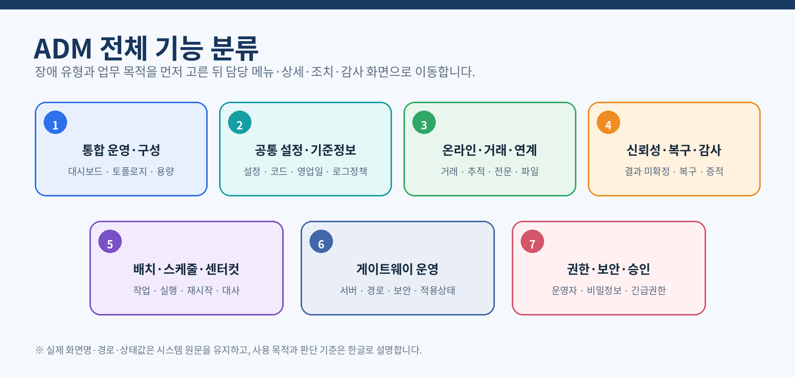
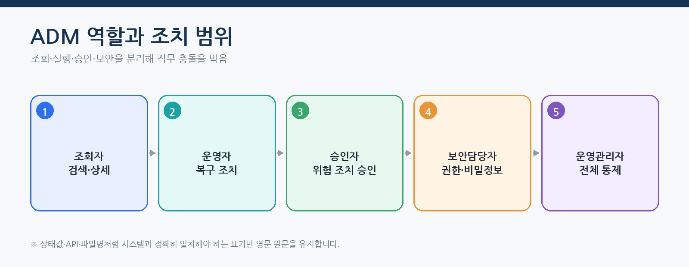
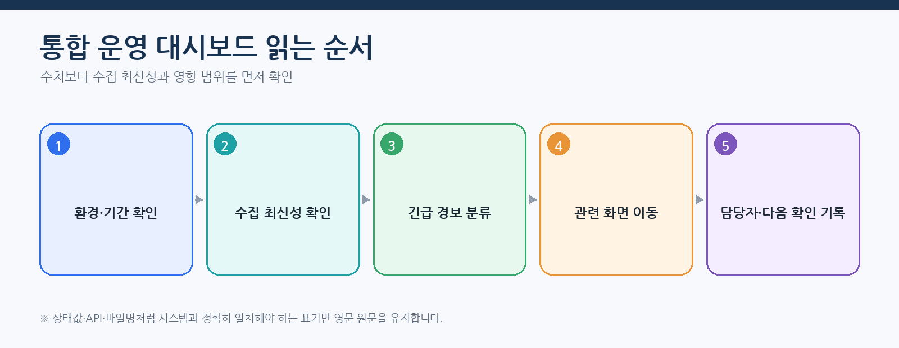
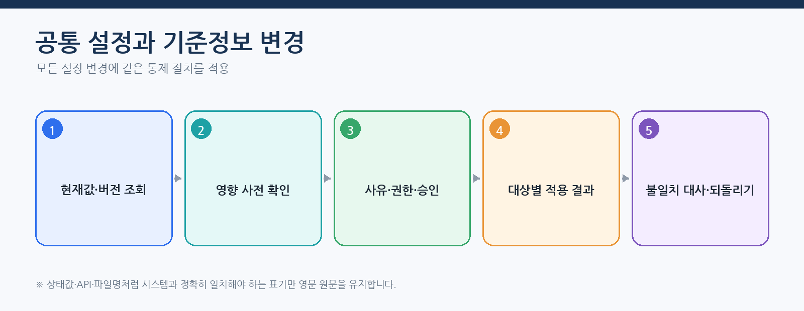
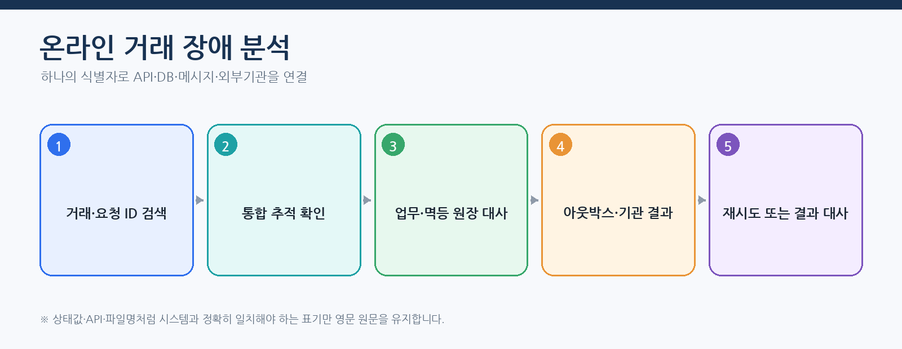
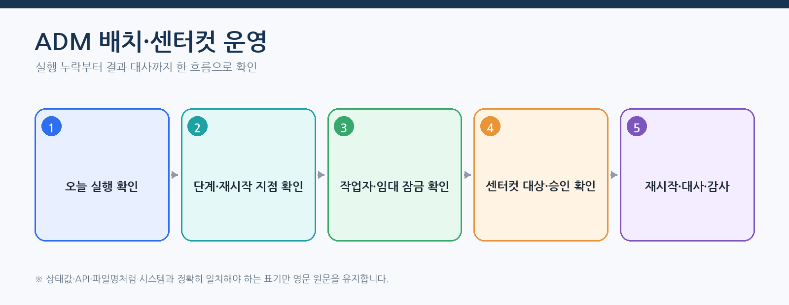
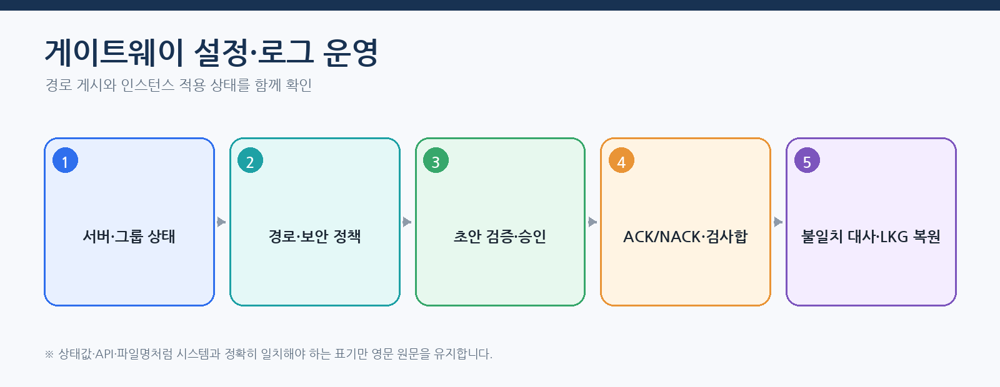
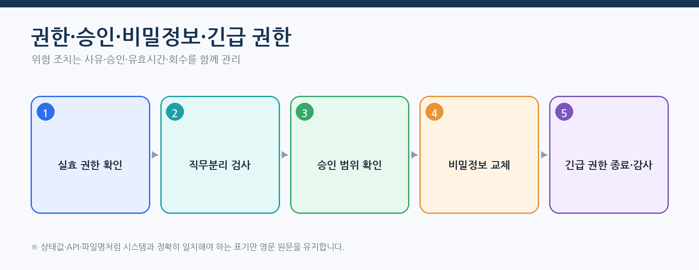

# CPF ADM 운영자 매뉴얼 — 프레임워크 전체 운영·통제·복구

> **주 독자**: ADM 조회자, 온라인·배치·센터컷·게이트웨이 운영자, 공통 설정 관리자, 승인자, 보안담당자, 운영관리자
> **목표**: CPF의 전체 운영 기능을 카테고리별로 찾고, 실제 메뉴에서 조회·판단·조치·승인·대사·복구·감사를 수행한다.

> **용어 표기 원칙**: 설명은 한글을 우선한다. API 경로, 설정 키, 클래스·파일명, HTTP 헤더와 실제 상태값은 시스템과 일치해야 하므로 원문을 유지한다.



## 스타터 묶음과 실행 상태 확인

운영자는 선택한 기능 묶음과 펼쳐진 공개 스타터를 함께 확인한다. 내부 세부 모듈은 별도 서비스로 제어하지 않는다.

| 화면에 보여야 할 값 | 정상 판정 | 이상 판정과 조치 |
|---|---|---|
| 선택 묶음 | 승인된 `secure-web`, `read-optimized`, `event-driven`, `operations-web`, `operations-event` 또는 개별 선택 | 등록되지 않은 묶음이면 배포 명세와 중앙 카탈로그 비교 |
| 펼쳐진 공개 스타터 | 묶음 표와 `cache`, `messaging-kafka`, `security` 포함 결과가 일치 | 누락·추가가 있으면 해당 인스턴스를 신규 요청에서 제외 |
| BOM·스타터 버전 | 플랫폼 BOM, 잠금 파일, 배포 명세와 일치 | 혼합 버전이면 확대 배포 중단 후 이전 배포 파일로 복원 |
| 내부 세부 모듈 | 공개 스타터가 관리하며 호환 버전으로 포함 | 도메인의 직접 의존이 보이면 개발팀에 의존성 누출 결함 전달 |
| 자동 설정 상태 | 선택 기능만 활성화되고 비선택 기능은 사유와 함께 비활성 | 필수 설정 누락은 준비 상태 실패로 판정 |
| 외부 기반 | 캐시·브로커·세션 저장소 상태와 대표 업무 결과가 정상 | 장애별 우회·대사·세션 폐기 절차 수행 |

기능 묶음 이름만 일치하고 실제 공개 스타터 목록이 다르면 정상으로 판정하지 않는다. 반대로 내부 세부 프로젝트 이름이 바뀌었더라도 공개 스타터, 설정 계약, 대표 업무 결과와 되돌리기 경로가 같으면 운영자는 내부 구조 변경으로 기록한다.

## 이 매뉴얼을 사용하는 기준

ADM은 프레임워크의 통합 운영 화면이다. 사용자는 DB나 소스를 직접 수정하지 않고, 화면의 검색·상세·사전 확인·조치·작업 기록·감사 흐름을 사용한다. 메뉴는 역할과 권한에 따라 보이는 범위와 실행 가능한 버튼이 달라진다.

## 처음 접하는 운영자의 시작 순서

1. `통합 운영 Dashboard`에서 데이터 최신성과 우선순위를 확인한다.
2. 장애 유형을 온라인·배치·게이트웨이·설정·보안으로 분류한다.
3. 관련 거래의 `transactionId`·`operationId`·`traceId`·실행 ID를 기록한다.
4. 조회 화면에서 상태와 영향 대상을 확인한다.
5. 조치가 필요하면 사전 확인, 사유, 승인, 기대 버전을 확인한다.
6. 실행 후 대상별 결과와 부분 성공·미확정 상태를 확인한다.
7. 감사와 교대 인계에 원인·조치·결과·남은 위험을 기록한다.



## 화면을 읽는 공통 규칙

| 화면 영역 | 확인할 내용 | 운영 판단 |
|---|---|---|
| 검색 | 환경·기간·상태·서비스·업무 식별자 | 조회 범위가 너무 넓거나 오래된 데이터가 아닌지 확인 |
| 목록 | 상태·버전·갱신 시각·오류·대상 수 | 우선순위와 영향 범위 판단 |
| 상세 | 업무 결과·최근 작업 기록·대상·아웃박스·추적 | 성공·실패·미확정·부분 성공 구분 |
| 조치 | 버튼 활성 조건·권한·사유·승인 | 실행 자격과 사전 조건 확인 |
| 결과 | `operationId`·대상별 결과·다음 조치 | 재시도·재시작·실패 대상 재처리·결과 대사·되돌리기 선택 |
| 감사 | 수행자·사유·`approvalId`·변경 전후·`traceId` | 조치 증적과 교대 인계 |

## 통합 운영·구성 현황



대시보드에서는 카드 수치만 보고 정상으로 판단하지 않는다. 최신성, 수집 실패, 대상 환경과 최근 배포 버전을 먼저 확인한다. 경보에서 관련 서비스·거래·배치 실행·게이트웨이 경로로 상세 이동하고, 같은 식별자로 로그·추적·감사를 연결한다.

### 교대 시작 점검

- 미확인 긴급·높음 경보와 이전 교대의 진행 중 작업 기록
- `UNKNOWN_RESULT`, `PARTIAL_SUCCESS`, `WAITING_EXTERNAL`, `FAILED_RETRYABLE`
- 배치 실행 지연·작업자 노드 연결 끊김·임대 잠금 만료·스케줄러 실행 누락
- 게이트웨이 NACK·부분 적용·버전/검사합 불일치
- 설정 부분 적용·비밀정보/인증서 만료·긴급 권한 활성 상태
- 백업·복원·재해복구 훈련 또는 배포 작업의 진행 상태

## 스타터 활성 상태 운영

`cpf-starters`는 독립 실행 서비스가 아니므로 별도 시작·중지 메뉴를 만들지 않는다. 운영자는 해당 스타터를 사용하는 ADM·BZA·고객 업무·배치 실행 모듈의 **배포 버전, 유효 설정, 준비 상태, 로그와 지표**에서 활성 상태를 확인한다.

| 스타터 | 운영자가 확인할 신호 | 대표 이상 | 우선 조치 |
|---|---|---|---|
| `cache` | 사용 모듈 버전, 적중·미적중, 만료·무효화, 원본 조회 성공 | 오래된 기준정보, 과도한 미적중, 메모리 증가 | 캐시 우회 가능 여부 확인 → 대상 키 무효화 → 원본 결과와 비교 |
| `messaging-kafka` | 브로커 연결, 발행·수신 원장, 지연, 재시도, 격리 큐 | 발행 대기, 중복 수신, 응답 유실, 격리 큐 증가 | 작업 ID로 원장 조회 → 상대 처리 여부 대사 → 실패 대상만 재처리 |
| `security` | 세션 저장소, 로그인 실패, 세션 만료, 허용 출처, 준비 상태 | 로그인 반복, 세션 공유 실패, 위조 요청 차단 | 영향 사용자·인스턴스 확인 → 세션 저장소·키·시간 동기 확인 → 필요 시 세션 폐기 |

설정 변경 전후에는 사용 모듈의 인스턴스별 유효값과 배포 파일 검사합을 비교한다. 일부 인스턴스만 다른 스타터 버전이나 설정을 사용하면 신규 요청을 해당 인스턴스에서 제외하고 버전·설정을 맞춘 뒤 다시 투입한다.


스타터 하위 프로젝트가 분리·통합되는 배포에서는 운영 인계표에서 이전 프로젝트명, 새 프로젝트명, 영향 서비스, 설정 이동, 세션·메시지·캐시 데이터 호환성, 단계별 배포 순서와 되돌리기 조건을 확인한다. ADM에 전용 스타터 메뉴가 생기기 전에도 배포·설정·인스턴스·로그·추적 화면을 연결해 같은 내용을 확인해야 한다.

## 공통 설정·기준정보



설정, 코드, 영업일, 응답코드, 채널 정책, 서비스 등록부, 로그 정책, 캐시와 점검은 다음 공통 절차를 사용한다.

1. 현재 값·버전·적용 대상·마지막 변경자를 조회한다.
2. 변경 전 사전 확인에서 영향 대상과 변경 차이를 확인한다.
3. 변경 사유와 필요 시 `approvalId`를 입력한다.
4. 기대 버전이 현재 버전과 일치하는지 확인한다.
5. 적용 후 대상 인스턴스별 ACK/NACK와 적용 버전·검사합을 확인한다.
6. 부분 적용이면 성공 대상은 유지하고 실패·불일치 대상만 결과 대사한다.
7. 오류율·지연·상태 점검을 관찰하고 기준을 넘으면 이전 버전으로 되돌린다.
8. 감사에 변경 전후 값, 대상, 사유, 승인, `operationId`를 확인한다.

### 메뉴·권한·코드 관리

- **메뉴**: 경로와 메뉴 ID, 기능 전환값, 표시 순서, 역할별 가시성을 함께 확인한다.
- **권한**: 조회·변경·승인·원문 조회·반출을 분리한다.
- **역할**: 권한 묶음과 유효기간, 직무분리 충돌을 확인한다.
- **데이터 범위**: 조직·지역·업무 범위와 기준일을 확인한다.
- **코드·응답코드**: 코드 버전, 유효기간, 사용 중인 사용 모듈과 하위 호환성을 확인한다.
- **영업일·휴일**: 스케줄러·배치 작업 매개변수·업무 기준일에 미치는 영향을 사전 확인한다.

## 온라인·거래·연계 운영



1. 거래 ID, 요청 ID, `operationId`, `traceId`, 고객 업무 ID 중 하나로 검색한다.
2. 통합 추적에서 API·DB·Kafka·파일·외부기관 구간을 시간 순서로 본다.
3. 업무 원장과 멱등 원장의 상태·버전·요청 본문 해시를 확인한다.
4. 아웃박스·인박스·DLQ·파일 전송·상대 기관 결과를 확인한다.
5. 커밋 전 실패는 재시도, 커밋 후 미확정은 결과 대사, 부분 성공은 실패 대상만 재처리한다.
6. 개인정보 원문이 필요하면 별도 권한과 사유·승인을 확인한다.

### 기능별 로그를 찾는 기준

| 기능 | 우선 식별자 | 함께 확인할 신호 |
|---|---|---|
| 온라인 API | `requestId`·`transactionId`·`traceId` | HTTP 상태, 업무 오류, DB 트랜잭션 |
| 멱등 처리 | `idempotencyKey`·`payloadHash`·`operationId` | 중복 여부, 버전, 결과 상태 |
| Kafka | `eventId`·`aggregateId`·소비자 그룹 | 아웃박스, 인박스, 처리 위치, DLQ, 시도 이력 |
| 파일 | `fileId`·checksum·`transferId` | 업로드, 검사, 격리, 다운로드 감사 |
| 외부기관 | `counterpartyRequestId`·`traceId` | 시간 초과, 재시도, 응답 해시, UNKNOWN_RESULT |
| 알림·반출 | `operationId`·`fileId` | 대상별 결과, 다운로드 권한, 만료 |

## 신뢰성·복구·감사

- `Error·Unknown Result`: 미확정 거래를 업무 원장·외부 결과와 대사한다.
- `Analysis Center`: 상태 분포, 반복 오류, 서비스·버전·배포와의 상관관계를 본다.
- `Recovery Center`: 허용된 재시도·결과 대사·보상 처리·되돌리기를 실행한다.
- `감사 로그`: 수행자·사유·`approvalId`·변경 전후·`operationId`·`traceId`를 확인한다.

복구 조치는 현재 상태가 허용하는 조치만 사용한다. `UNKNOWN_RESULT`에 신규 실행을 만들거나 `PARTIAL_SUCCESS`에서 성공 대상을 다시 실행하지 않는다.

## 배치·스케줄러·센터컷 운영



| 운영 질문 | 시작 메뉴 | 함께 확인할 항목 |
|---|---|---|
| 오늘 작업이 실행됐는가? | 배치 개요·실행 목록 | 작업 매개변수, 시작/종료, 단계, 건수·금액 |
| 왜 실행되지 않았는가? | 고가용성 스케줄러·배치 경보 | 달력, 실행 누락, 주 실행 노드, 작업 버전 |
| 왜 느린가? | 실행 구성 현황·작업자 노드 묶음 | 대기열, 작업자 노드, 분할 처리 편향, 자원 |
| 작업자 노드가 사라졌는가? | 호스트 에이전트·임대 잠금/펜싱 | Heartbeat, 임대 잠금, 펜싱 토큰, 재할당 |
| 센터컷 대상이 맞는가? | 센터컷 | 조건 버전, 스냅샷, 사전 확인 건수·표본 |
| 재시작해도 되는가? | 복구/Unknown | 재시작 지점, 커밋 범위, 업무 대사 |
| 어떤 배포 파일이 실행됐는가? | 작업 묶음·배포·되돌리기 | 버전, 검사합, 호환성, LKG |

### 스케줄러 관리

일정 등록·변경 시 작업 이름, 작업 버전, 일정식(Cron), 시간대, 영업일 달력, 실행 누락 정책, 중복 실행 정책, 매개변수 생성 규칙을 확인한다. 변경 후 다음 예정 시각과 실제 실행 요청이 일치하는지 확인한다.

### 센터컷 관리

조건·기준 버전을 선택하고 사전 확인 건수·금액·표본을 확인한다. 스냅샷과 검사합을 고정한 뒤 승인받아 실행한다. 실행 결과는 대상별 성공·실패·미확정과 전체 대사로 판정한다.

## 게이트웨이 운영



1. 서버·서버 그룹 상태 점검과 대상 연결을 확인한다.
2. 경로의 호스트·경로·조건·경로 변환·대상·버전을 확인한다.
3. 인증·권한·수신 대상·HMAC·Nonce·SSRF·TLS 정책을 검증한다.
4. 시간 초과·재시도·회로 차단기·격벽과 전체 시간 예산을 확인한다.
5. 초안을 검증하고 승인 후 게시한다.
6. 인스턴스별 ACK/NACK, 버전, 검사합과 불일치를 확인한다.
7. 거래 조회와 로그 정책에서 요청·응답 가림, 지연, 오류, 대상 결과를 확인한다.
8. 부분 적용은 실패 인스턴스 결과 대사 또는 최근 정상본(LKG)으로 되돌려 복구한다.

## 권한·보안·승인



- 운영자 계정은 개인별로 사용하고 공유 계정을 사용하지 않는다.
- 조회와 변경, 실행과 승인, 비밀정보 관리와 사용 권한을 분리한다.
- 비밀번호 초기화는 새 값을 설정하는 절차이며 기존 값을 조회하지 않는다.
- 비밀정보·키 화면은 값 원문이 아니라 상태·버전·만료·회전 이력을 관리한다.
- 위험 조치는 사유·승인·기대 버전·유효시간을 확인한다.
- 긴급 권한은 장애 사건 ID와 종료 시각을 지정하고, 종료 후 세션·권한 회수와 감사 검토를 수행한다.

## 응답 유실·부분 적용 공통 복구

```text
화면 응답 없음
→ 같은 조치를 다시 누르지 않음
→ businessKey/idempotencyKey로 Operation 조회
→ SUCCEEDED: 결과·Audit 확인
→ FAILED_RETRYABLE: 원인 제거 후 재시도
→ UNKNOWN_RESULT: 업무 원장·외부 결과 대사
→ PARTIAL_SUCCESS: 실패 대상만 재처리
→ WAITING_EXTERNAL: Outbox·ACK·Instance 적용 확인
```

## 종단간 운영 사례 — 지급 응답 유실 복구

상황: 고객은 지급 요청의 응답을 받지 못했고, 같은 요청을 다시 실행해도 되는지 문의했다.

1. **대시보드**에서 온라인 오류와 `UNKNOWN_RESULT` 증가 여부, 데이터 최신성을 확인한다.
2. **거래 메타** 또는 **통합 추적**에서 고객 지급 ID·`requestId`·`traceId`로 거래를 찾는다.
3. **오류·결과 미확정**에서 `operationId`, 업무 커밋 상태, 요청 본문 해시, 최근 시도 이력을 확인한다.
4. **전문·프로토콜 메시지**, 아웃박스·외부기관 결과에서 실제 전송 여부와 ACK를 확인한다.
5. 커밋 전 실패가 확실하면 `FAILED_RETRYABLE`의 재시도를 선택한다.
6. 커밋 또는 외부 전송 성공 여부가 불명확하면 신규 실행하지 않고 결과 대사를 선택한다.
7. 부분 대상 실패라면 대상 목록에서 실패 대상만 재처리한다.
8. 최종 상태가 `SUCCEEDED` 또는 정책상 확정 상태가 되면 업무 원장의 건수·금액·버전을 대사한다.
9. **감사 로그**에서 수행자, 사유, 승인 ID, 변경 전후 상태, 작업 ID, 추적 ID를 확인한다.
10. 고객에게 원 지급 ID와 최종 상태를 안내하고 교대 인계에 원인·조치·결과를 기록한다.

이 사례에서 화면 응답이 없다는 이유만으로 같은 지급을 다시 실행하지 않는 것이 핵심이다.

## 실제 ADM 메뉴 59개

아래 표는 운영자가 소스나 DB를 역분석하지 않고 화면을 선택하도록 만든 실무 안내다. **경로는 실제 진입 주소**, 나머지 열은 화면에서 반드시 확인할 업무 의미를 설명한다. 버튼 이름이 배포 버전에 따라 달라져도 상태가 허용하지 않는 조치를 실행하지 않는 원칙은 같다.

### 권한별 사용 범위

| 역할 | 가능한 일 | 실행 전에 확인할 것 |
|---|---|---|
| 조회자 | 검색·목록·상세·추적 조회 | 환경·기간·데이터 범위·수집 최신성 |
| 운영자 | 재시도·재시작·실패 대상 재처리·결과 대사·점검 | 현재 상태, 업무 효과, 기대 버전, 사유, 중복 위험 |
| 승인자 | 위험 조치 승인·반려 | 요청자 분리, 영향 대상, 사전 확인 결과, 유효시간 |
| 보안담당자 | 권한·세션·비밀정보·긴급 권한 통제 | 직무분리, 원문 조회·반출 사유, 회수 시점 |
| 운영관리자 | 설정·배포·용량·교대·장애 사건 총괄 | 대상별 결과, 되돌리기 기준, 담당자와 다음 확인 시각 |

### 통합 운영·구성 현황

| 경로·화면 | 시작 입력 | 반드시 확인 | 허용 조치 | 완료·복구 판정 |
|---|---|---|---|---|
| `/`<br>**통합 운영 대시보드**<br>화면명: `통합 운영 Dashboard` | 환경·기간·서비스 | 수집 최신성, 긴급 경보, 결과 미확정·부분 성공 건수, 진행 중 작업 | 관련 거래·배치·게이트웨이·설정 화면으로 이동하고 담당자를 지정 | 모든 수집 시각이 허용 지연 안에 있고 미조치 긴급 경보의 담당자와 다음 확인 시각이 기록됨 |
| `/topology`<br>**서비스 구성 현황**<br>화면명: `서비스 토폴로지` | 환경·서비스·인스턴스 | 인스턴스 상태, 의존 서비스, 호출 방향, 배포 버전, 연결 끊김 | 인스턴스 상세·점검 화면으로 이동하고 장애 구간을 격리 | 필수 연결이 정상이고 고립·중복 인스턴스가 없으며 비정상 노드의 조치가 기록됨 |
| `/capacity`<br>**온라인 실행 환경 진단**<br>화면명: `Online Runtime Diagnostics` | 서비스·인스턴스·관찰 기간 | CPU·메모리·스레드·연결 묶음·대기열·오류율·응답 시간 | 점검·연결 비우기 또는 용량 증설 요청으로 연결 | 임계 초과 원인이 확인되고 증설·제한·되돌리기 기준과 담당자가 기록됨 |

### 공통 설정·기준정보

| 경로·화면 | 시작 입력 | 반드시 확인 | 허용 조치 | 완료·복구 판정 |
|---|---|---|---|---|
| `/logLevel`<br>**동적 로그 수준**<br>화면명: `동적 로그` | 환경·서비스·인스턴스·로거 이름 | 현재 수준, 적용 버전, 만료 시각, 최근 변경자 | 사전 확인 후 기간을 정해 수준 변경·원복 | 대상별 적용 버전이 같고 만료 후 원래 수준으로 돌아가며 감사 기록이 남음 |
| `/logPolicies`<br>**로그 정책** | 채널·업무·데이터 등급·정책 버전 | 가림 항목, 표본 비율, 보존 기간, 반출 허용, 적용 대상 | 정책 초안 검증·승인·적용·이전 버전 복원 | 원문 노출이 없고 대상별 검사합이 일치하며 수집량이 예상 범위에 있음 |
| `/channelPolicy`<br>**채널 정책** | 채널·환경·정책 버전 | 시간 초과, 재시도, 전문 형식, 문자 인코딩, 사용 여부 | 변경 사전 확인·승인·적용·중지 | 신규 요청에 새 버전이 적용되고 진행 중 요청의 처리 기준이 보존됨 |
| `/serviceRegistry`<br>**서비스 등록부**<br>화면명: `서비스 레지스트리` | 서비스명·접속점·버전·환경 | 상태 점검, 가중치, 지원 기능, 마지막 등록 시각 | 등록·중지·가중치 변경·상태 재확인 | 호출 가능한 대상만 활성이고 설정과 실제 인스턴스가 일치함 |
| `/runtimeControl`<br>**배포·승격·되돌리기**<br>화면명: `Deployment·Promotion·Rollback` | 환경·서비스·배포 버전·대상 인스턴스 | 사전 점검, 대상 기능, 현재/목표 버전, 상태 점검, 승인, 적용 응답 | 변경 사전 확인·실행·취소·이전 버전 복원 | 대상별 적용 응답과 검사합이 일치하고 불일치가 0건이며 오류율이 기준 이내임 |
| `/maintenance`<br>**점검·연결 비우기**<br>화면명: `점검·Drain` | 대상 서비스·인스턴스·점검 시간·사유 | 활성 세션, 진행 중 작업, 신규 요청 차단, 연결 비우기 진행률 | 점검 시작·연장·종료·취소 | 신규 유입이 차단되고 진행 중 작업이 정책대로 종료된 뒤 정상 유입이 재개됨 |
| `/cache`<br>**캐시** | 캐시 이름·키 범위·서비스 | 적중률, 항목 수, 원본 버전, 만료 정책, 최근 비움 시각 | 범위 비우기·새로 읽기·정책 변경 | 원본과 캐시 값이 일치하고 전면 비움으로 인한 부하 급증이 없음 |
| `/configs`<br>**설정** | 설정 키·프로필·환경·대상·버전 | 현재값, 기본값, 비밀정보 여부, 재기동 필요 여부, 대상별 적용 상태 | 사전 확인·승인·적용·결과 대사·이전 버전 복원 | 대상별 버전이 같고 비밀정보 원문이 노출되지 않으며 재기동 조건이 충족됨 |
| `/responseCodes`<br>**응답코드** | 업무 영역·응답코드·적용일 | HTTP 대응값, 재시도 분류, 사용자 메시지, 사용 중인 API | 신규 버전 등록·종료·복원 | 기존 사용자가 해석 가능한 상태로 유지되고 같은 코드의 의미가 바뀌지 않음 |
| `/businessCalendar`<br>**영업일·휴일**<br>화면명: `영업일 · 휴일` | 달력 ID·지역·기준일·적용 기간 | 영업일 여부, 순번, 대체 휴일, 연결된 일정·배치 | 휴일 등록·변경·영업일 재계산 | 다음 실행일과 업무 기준일이 재계산되고 영향 일정이 사전 확인 결과와 일치함 |
| `/notifications`<br>**알림** | 심각도·상태·담당자·기간 | 발생 시각, 마지막 갱신, 영향 서비스, 연결된 작업·장애 사건 | 확인 처리·담당자 지정·상위 보고·종료 | 미확인 알림이 없고 종료 근거와 연결된 감사·추적 ID가 남음 |
| `/downloads`<br>**다운로드·반출**<br>화면명: `다운로드` | 작업 ID·파일 ID·생성자·기간 | 생성 상태, 파일 크기, 검사합, 만료, 권한, 가림 여부 | 다운로드·만료·재생성 요청 | 검사합이 일치하고 권한·사유·다운로드 시각이 감사 기록에 남음 |
| `/codes`<br>**공통 코드**<br>화면명: `코드` | 코드 그룹·코드·기준일·버전 | 명칭, 사용 여부, 유효기간, 상위 코드, 실제 사용 모듈 | 등록·변경·종료·이전 버전 복원 | 유효기간 중복이 없고 실제 사용 모듈의 조회 결과가 같은 의미를 가짐 |

### 온라인·거래·연계

| 경로·화면 | 시작 입력 | 반드시 확인 | 허용 조치 | 완료·복구 판정 |
|---|---|---|---|---|
| `/logs`<br>**거래 로그** | 거래 ID·요청 ID·추적 ID·기간 | 요청 구간, 응답 코드, 업무 오류, DB 처리, 개인정보 가림, 수집 최신성 | 상세·통합 추적으로 이동하고 장애 사건에 연결 | 같은 추적 ID로 전체 구간이 이어지고 누락 구간의 수집 상태가 설명됨 |
| `/transactionGroups`<br>**온라인·배치 통합 추적**<br>화면명: `Online·Batch 통합 Trace` | 거래 ID·추적 ID·업무 ID | 호출 순서, 부모/자식 구간, 배치·메시지·파일 연결, 지연 구간 | 문제 구간의 거래·메시지·배치 화면으로 이동 | 최초 요청부터 최종 결과까지 원인 순서가 이어지고 중복 구간이 식별됨 |
| `/transactions`<br>**거래 메타** | 서비스·API·상태·기간·업무 키 | 요청/응답 시각, 결과 코드, 버전, 멱등 키, 작업 ID | 상세 조회·결과 미확정/복구 화면으로 이동 | 업무 결과와 거래 메타의 상태·버전·식별자가 일치함 |
| `/remoteLogs`<br>**원격 로그** | 서비스·인스턴스·로그 수준·기간 | 수집기 상태, 원격 파일 위치, 마지막 수집, 추적 ID, 가림 정책 | 조회·권한 있는 반출·수집 장애 등록 | 원격 원본과 중앙 수집본의 기간·해시가 맞고 누락 구간이 없음 |
| `/standardExecutions`<br>**표준 실행** | 작업 ID·업무 키·멱등 키·상태 | 현재 상태, 요청 해시, 기대 버전, 재시도 횟수, 대상·아웃박스 | 상태가 허용할 때만 재시도·결과 대사·취소 | 최종 상태와 업무 원장·대상·감사 기록이 같은 결과를 가리킴 |
| `/file-jobs`<br>**대량 파일 작업**<br>화면명: `대량파일 Job` | 파일 ID·작업명·실행 ID·기준일 | 검사합, 악성코드 검사, 격리, 읽은/성공/실패 건수, 재시작 지점 | 중지·재시작·실패 행 재처리·결과 파일 생성 | 입력 건수와 성공·실패·제외 건수의 합이 일치하고 파일 검사합이 보존됨 |
| `/messages`<br>**전문·프로토콜 메시지**<br>화면명: `전문·Protocol Message` | 메시지 ID·거래 ID·기관·기간 | 송수신 방향, 전문 버전, 필드 가림, 응답 코드, 처리 시각, 추적 ID | 상세·거래 추적으로 이동하며 재전송은 복구 화면에서 수행 | 요청/응답 전문의 상관키가 일치하고 원문 권한과 가림 정책이 지켜짐 |

### 신뢰성·복구·감사

| 경로·화면 | 시작 입력 | 반드시 확인 | 허용 조치 | 완료·복구 판정 |
|---|---|---|---|---|
| `/auditLogs`<br>**감사 로그** | 수행자·조치·대상·기간·추적 ID | 변경 전/후, 사유, 승인 ID, 요청/작업 ID, 성공·실패 | 조회·권한 있는 반출 | 업무 변경과 감사 기록의 건수·시각·수행자가 일치하고 누락이 없음 |
| `/recoveryCenter`<br>**복구 센터** | 작업 ID·상태·업무 키·장애 유형 | 커밋 여부, 외부 효과, 실패 대상, 아웃박스, 최근 시도, 허용 복구 | 재시도·결과 대사·보상 처리·취소 중 상태가 허용하는 조치만 실행 | 신규 중복 실행 없이 최종 상태가 확정되고 대상·업무 원장·감사가 대사됨 |
| `/incidents`<br>**오류·결과 미확정**<br>화면명: `Error·Unknown Result` | 상태·서비스·버전·기간·업무 키 | 결과 미확정, DLQ, 복구 이력, 영향 고객/건수, 배포 상관관계 | 장애 사건 생성·DLQ 재처리·결과 확정·거래 복구 | 영향 범위와 원인이 기록되고 같은 업무 효과가 두 번 발생하지 않음 |
| `/reliability`<br>**신뢰성 분석 센터**<br>화면명: `Analysis Center` | 서비스·버전·상태·기간 | 상태 분포, 반복 오류, 멱등 충돌, 아웃박스 지연, 파일/기관 실패 | 분석 결과를 장애 사건·복구 화면으로 연결 | 상위 원인과 영향 서비스가 수치로 확인되고 담당 조치가 연결됨 |

### 배치·스케줄러·센터컷

| 경로·화면 | 시작 입력 | 반드시 확인 | 허용 조치 | 완료·복구 판정 |
|---|---|---|---|---|
| `/batch`<br>**배치·센터컷 통합 화면**<br>화면명: `Batch / Center-Cut` | 기준일·작업·상태 | 오늘 실행, 지연, 실패, 작업자 노드, 센터컷, 경보 | 세부 배치 화면으로 이동 | 실행 누락·지연·실패가 담당 화면과 연결되고 담당자가 지정됨 |
| `/batch-overview`<br>**배치 개요**<br>화면명: `Batch Overview` | 업무일·작업·상태·작업 묶음 버전 | 예정/실제 시작, 종료, 처리 건수, 실패 단계, 다음 실행 | 실행·스케줄러·복구 화면으로 이동 | 오늘 필수 작업의 실행 여부와 지연 사유가 모두 설명됨 |
| `/batch-runtime`<br>**배치 실행 구성 현황**<br>화면명: `Runtime Topology` | 역할·인스턴스·환경 | 제어 서버, 스케줄러, 작업자, 센터컷, 호스트 에이전트 상태와 주 실행 노드 | 점검·연결 비우기·인스턴스 상세로 이동 | 필수 역할이 가동 중이고 중복 주 실행 노드가 없으며 대기열이 처리됨 |
| `/batch-instances`<br>**배치 실행 인스턴스**<br>화면명: `Runtime Instances` | 역할·인스턴스·버전·상태 | 하트비트, 처리 중 작업, 가용 용량, 배포 버전, 마지막 오류 | 연결 비우기·중지·복귀 확인 | 종료 대상에 신규 작업이 배정되지 않고 기존 작업의 인계가 끝남 |
| `/batch-scheduler`<br>**고가용성 스케줄러**<br>화면명: `Scheduler HA` | 일정 ID·작업·달력·상태 | 다음 실행, 주 실행 노드, 실행 누락 정책, 중복 실행 정책, 매개변수 생성 규칙 | 일시 중지·재개·변경·누락 보충·건너뛰기 | 다음 예정 시각과 실제 실행 요청이 일치하고 중복 실행이 없음 |
| `/batch-worker-pools`<br>**작업자 노드 묶음**<br>화면명: `Worker Pools` | 묶음·작업·환경 | 가용/사용 중 노드, 대기열, 처리율, 분할 편향, 자원 사용량 | 증설·축소·연결 비우기·작업 묶음 제한 | 대기열이 감소하고 특정 노드·분할에 부하가 쏠리지 않음 |
| `/batch-center-cut`<br>**센터컷**<br>화면명: `Center-Cut` | 센터컷 ID·조건 버전·기준일 | 대상 스냅샷, 검사합, 건수·금액·표본, 승인, 실행 상태, 차이 건수 | 사전 확인·승인 요청·실행·중지·차이 보정·재실행 | 승인된 스냅샷과 실제 처리 대상이 같고 전체 대사 차이가 0임 |
| `/batch-agents`<br>**호스트 에이전트**<br>화면명: `Host Agents` | 호스트·에이전트·상태 | 하트비트, 에이전트 버전, 디스크, 실행 중 명령, 최근 응답 | 명령 재조회·연결 재시도·점검 전환 | 명령 응답 유실 시 같은 명령 ID로 결과가 확인되고 중복 실행이 없음 |
| `/batch-job-packs`<br>**배치 작업 묶음**<br>화면명: `Job Packs` | 작업 묶음·버전·상태 | 배포 파일 검사합, 지원 CPF 버전, 포함 작업, 활성 버전, 최근 정상본 | 등록·검증·활성·사용 중지·이전 버전 선택 | 실행 인스턴스가 승인된 같은 검사합을 사용하고 호환성 검사가 통과함 |
| `/batch-executions`<br>**배치 실행 목록**<br>화면명: `Executions` | 실행 ID·작업·업무일·상태 | 작업 매개변수, 단계 상태, 재시작 지점, 읽기/쓰기/건너뛰기 건수, 오류 | 중지·재시작·포기 처리·상세 이동 | 재시작 후 이미 커밋된 범위가 중복 처리되지 않고 건수·금액이 대사됨 |
| `/batch-deployment`<br>**배치 배포·되돌리기**<br>화면명: `Deployment / Rollback` | 환경·작업 묶음 버전·대상 | 사전 점검, 대상 인스턴스, 적용 응답, 검사합, 상태 점검, 최근 정상본 | 배포·승격·중지·이전 버전 복원 | 대상별 버전·검사합이 같고 신규 실행이 목표 버전을 사용함 |
| `/batch-recovery`<br>**배치 복구·결과 미확정**<br>화면명: `Recovery / Unknown` | 실행 ID·작업·장애 유형 | 마지막 커밋, 재시작 지점, 외부 효과, 실패 항목, 최근 시도 | 재시작·결과 대사·실패 항목 재처리·포기 처리 | 성공 범위는 유지되고 실패 범위만 처리되며 전체 대사가 맞음 |
| `/batch-leases`<br>**임대 잠금·펜싱 토큰**<br>화면명: `Lease / Fencing` | 임대 키·소유자·상태 | 만료 시각, 소유 인스턴스, 펜싱 토큰, 하트비트, 대기 작업 | 소유권 상실 확인·만료 후 재할당·오래된 결과 차단 | 한 시점에 유효 소유자가 하나이고 이전 토큰의 결과가 반영되지 않음 |
| `/batch-alerts`<br>**배치 경보**<br>화면명: `Batch Alerts` | 심각도·작업·상태·담당자 | 발생·마지막 갱신, 중복 여부, 영향 실행, 연결된 경보 규칙 | 확인 처리·담당자 지정·상위 보고·종료 | 미확인 경보가 없고 종료 근거와 실행 ID가 기록됨 |
| `/batch-audit`<br>**배치 감사·증적**<br>화면명: `Audit / Evidence` | 실행 ID·작업·수행자·기간 | 배포, 실행, 중지, 재시작, 승인, 결과 대사, 반출 이력 | 조회·권한 있는 증적 반출 | 작업 생명주기의 모든 위험 조치가 사유·승인·전후 상태와 연결됨 |
| `/workers`<br>**에이전트·작업자 노드**<br>화면명: `Agent / Worker` | 작업자·에이전트·분할 ID | 하트비트, 현재 작업, 임대 잠금, 펜싱 토큰, 처리율, 최근 오류 | 연결 비우기·분할 재할당·상태 재확인 | 소유권이 과거 소유자의 쓰기를 차단한 상태로 이전되고 같은 분할 결과가 중복 반영되지 않음 |

### 게이트웨이 운영

| 경로·화면 | 시작 입력 | 반드시 확인 | 허용 조치 | 완료·복구 판정 |
|---|---|---|---|---|
| `/gateway-dashboard`<br>**게이트웨이 대시보드**<br>화면명: `Gateway 대시보드` | 환경·기간·서버 그룹·경로 | 상태 점검, 오류율, 지연, 회로 차단, 부분 적용, 설정 불일치 | 서버·경로·거래·적용 상태 화면으로 이동 | 긴급 오류와 부분 적용의 담당자·복구 계획이 지정됨 |
| `/gateway-servers`<br>**게이트웨이 연동 서버**<br>화면명: `Gateway 연동 서버` | 서버 ID·환경·상태 | 접속 주소, TLS 인증서, DNS, 상태 확인, 가중치, 최근 연결 오류 | 등록·중지·연결 시험·인증서 교체 | 허용된 주소만 활성이고 TLS·DNS·상태 확인이 정상임 |
| `/gateway-groups`<br>**게이트웨이 서버 그룹**<br>화면명: `Gateway 서버 그룹` | 그룹 ID·환경·상태 | 구성원, 가중치, 부하 분산 방식, 최소 정상 수, 우회 전환 상태 | 구성원·가중치 변경·비정상 서버 제외·복귀 | 정상 구성원만 요청을 받고 가중치 합과 우회 정책이 의도와 일치함 |
| `/gateway-routes`<br>**게이트웨이 경로·라우팅**<br>화면명: `Gateway 경로·라우팅` | 경로 ID·호스트·경로·방식·버전 | 조건, 경로 변환, 대상 그룹, 우선순위, 시간 예산, 승인 상태 | 초안 작성·검증·승인 요청·게시·사용 중지 | 중복 경로가 없고 시험 요청이 목표 대상과 변환 규칙에 맞게 도달함 |
| `/gateway-security`<br>**게이트웨이 보안·제한**<br>화면명: `Gateway 보안·제한` | 경로·클라이언트·정책 버전 | 수신 대상, 권한, HMAC 키 버전, 본문 해시, Nonce 창, 허용 목록, TLS | 정책 검증·승인·적용·키 교체·차단 | 인증 실패 유형이 구분되고 재전송·SSRF·내부망 우회가 차단됨 |
| `/gateway-health`<br>**게이트웨이 상태·연결 시험**<br>화면명: `Gateway Health·연결시험` | 서버·그룹·경로·환경 | DNS, TCP 연결, TLS, 상태 확인 응답, 지연, 최근 실패 | 연결 시험·재확인·장애 사건 연결 | 직접 대상과 게이트웨이 경유 결과가 일치하고 실패 구간이 식별됨 |
| `/gateway-transactions`<br>**게이트웨이 거래 조회**<br>화면명: `Gateway 거래 조회` | 요청 ID·추적 ID·경로 ID·상태·기간 | 선택 대상, 재시도 횟수, 회로 상태, 전체 지연, 응답 코드, 가림 처리 | 거래·로그·상대 서비스 추적으로 이동 | 같은 추적 ID로 게이트웨이와 대상 서비스 결과가 이어지고 원문 노출이 없음 |
| `/gateway-log-policies`<br>**게이트웨이 로그 정책**<br>화면명: `Gateway 로그 정책` | 경로·데이터 등급·정책 버전 | 수집 헤더/본문, 가림 필드, 표본 비율, 보존, 반출 권한 | 사전 확인·승인·적용·이전 버전 복원 | 민감정보 원문이 없고 대상 인스턴스의 정책 검사합이 일치함 |
| `/gateway-apply-status`<br>**게이트웨이 적용 상태·이력**<br>화면명: `Gateway 적용 상태·이력` | 배포 묶음 버전·검사합·환경 | 인스턴스별 ACK/NACK, 현재 버전, 설정 불일치, 최근 정상본, 최근 시도 | 실패 인스턴스 결과 대사·재적용·최근 정상본 복원 | 모든 활성 인스턴스가 같은 승인 버전·검사합을 사용하거나 격리됨 |

### 권한·보안·승인

| 경로·화면 | 시작 입력 | 반드시 확인 | 허용 조치 | 완료·복구 판정 |
|---|---|---|---|---|
| `/permissions`<br>**권한** | 사용자·역할·권한·데이터 범위·기준일 | 직접/상속 권한, 유효기간, 직무분리 충돌, 원문/반출 권한 | 부여·회수·유효기간 변경·모의 실행 | 실효 권한이 승인 내용과 같고 충돌 권한이 없으며 세션 반영이 확인됨 |
| `/password`<br>**비밀번호** | 계정·상태 | 잠금, 만료, 실패 횟수, MFA, 활성 세션, 마지막 변경 | 초기화·잠금 해제·세션 종료 | 기존 비밀번호를 노출하지 않고 새 인증 후 이전 세션이 무효화됨 |
| `/security`<br>**보안** | 장애 사건·계정·IP·기간 | 인증 실패, 차단, 세션, 키 사용, 원문 조회, 위험 조치 | 계정·IP·세션 차단, 키 교체 요청, 장애 사건 연결 | 위험 접근이 차단되고 영향 세션·키·감사 범위가 확인됨 |
| `/operators`<br>**운영자** | 운영자·상태·역할·조직 | 개인 계정 여부, 실효 권한, 최근 로그인, 잠금, 유효기간 | 등록·비활성·역할 변경·세션 종료 | 공유 계정이 없고 퇴직·이동 사용자의 권한과 세션이 회수됨 |
| `/secrets`<br>**비밀정보·키**<br>화면명: `Secret / Key` | 비밀정보 ID·인증서 ID·사용 모듈 | 버전, 만료, 활성/대기 상태, 마지막 교체, 사용 대상, 실패 | 신규 버전 등록·교체·활성·이전 버전 폐기 | 원문을 표시하지 않고 새 버전 사용 확인 후 이전 버전이 정책대로 폐기됨 |
| `/approvals`<br>**위험조치 승인** | 승인 ID·위험도·요청자·상태·만료 | 변경 차이, 영향 대상, 사유, 검증 결과, 기대 버전, 자기 승인 여부 | 승인·반려·취소·만료 처리 | 요청자와 승인자가 분리되고 승인 범위·유효시간 안에서만 조치가 실행됨 |
| `/breakGlass`<br>**긴급 권한**<br>화면명: `Break-glass` | 장애 사건 ID·요청자·범위·종료 시각 | 사전 승인, 허용 권한, 대상 환경, 활성 세션, 남은 시간 | 활성·조기 종료·권한/세션 회수·사후 검토 | 종료 시각에 권한과 세션이 회수되고 모든 조회·조치가 별도 감사로 남음 |

### 화면에서 응답이 없을 때

1. 같은 버튼을 다시 누르지 않고 요청 ID·업무 키·멱등 키를 기록한다.
2. 표준 실행 또는 복구 센터에서 기존 작업 기록을 검색한다.
3. `SUCCEEDED`는 결과와 감사를 확인하고 종료한다.
4. `FAILED_RETRYABLE`은 원인을 제거한 뒤 재시도한다.
5. `UNKNOWN_RESULT`는 업무 원장·대상·아웃박스·외부 결과를 대사한다.
6. `PARTIAL_SUCCESS`는 실패 대상만 재처리한다.
7. `WAITING_EXTERNAL`은 전송 기록과 ACK를 확인하고 신규 요청을 만들지 않는다.


## 교대 인계 양식

| 항목 | 기록 내용 |
|---|---|
| 장애 사건·작업 ID | 장애 사건 ID, `operationId`, `transactionId`, 실행 ID, 경로 버전 |
| 영향 | 서비스·조직·고객·대상 수·시작 시각 |
| 현재 상태 | 정상·진행 중·미확정·부분 성공·복구 대기 |
| 수행 조치 | 조회·재시도·재시작·실패 대상 재처리·결과 대사·되돌리기 |
| 승인·사유 | `approvalId`, 사유, 수행자 |
| 결과 | 성공·실패·미확정 건수, 버전·검사합 |
| 남은 위험 | 다음 확인 시각, 담당자, 되돌리기 조건 |
| 증적 | 감사, 추적, 로그, 지표, 반출 경로 |
