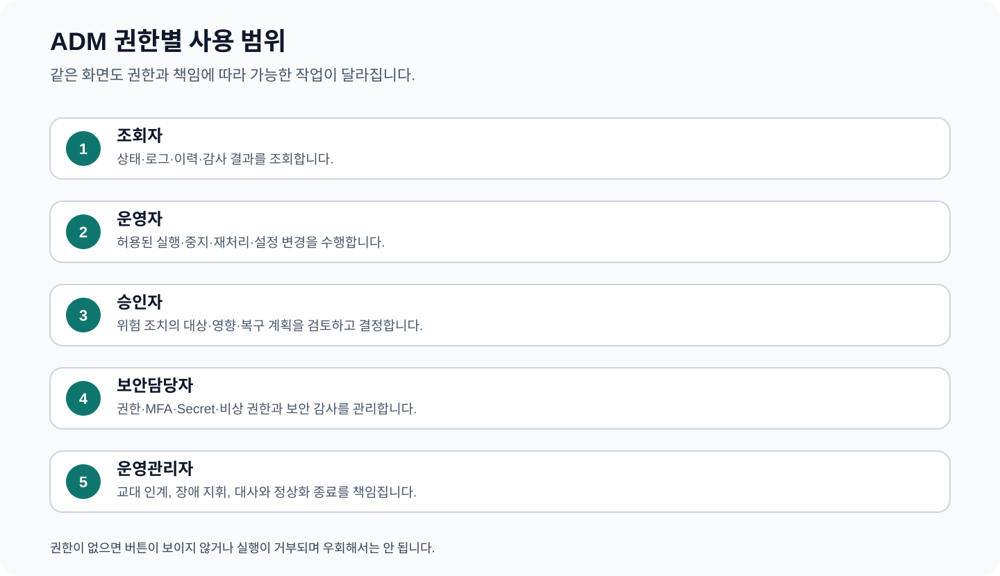

# CPF ADM 운영자 매뉴얼 — 권한 수준별 조회·통제·승인·복구

> **주 독자**: 고객사 ADM 조회자, 업무 운영자, 배치 운영자, 승인자, 보안담당자, 운영관리자
> **이 문서의 목표**: 운영자가 데이터베이스나 스크립트를 직접 사용하지 않고, 자신의 권한 범위에서 서비스·거래·배치·Gateway·설정·보안 상태를 조회하고 필요한 조치와 복구를 끝낸다.

## 빠른 찾기

- [1. 권한 수준별 할 수 있는 일](#1-권한-수준별-할-수-있는-일)
- [2. 화면을 읽는 공통 순서](#2-화면을-읽는-공통-순서)
- [3. 교대 시작 10분 점검](#3-교대-시작-10분-점검)
- [4. 위험 조치 공통 절차](#4-위험-조치-공통-절차)
- [5. 전체 메뉴 찾기](#5-전체-메뉴-찾기)
- [6. 운영 대시보드](#6-운영-대시보드)
- [7. 서비스 토폴로지](#7-서비스-토폴로지)
- [8. 용량·서비스 수준 지표](#8-용량서비스-수준-지표)
- [9. 로그 조회](#9-로그-조회)
- [10. 거래 흐름·구간 추적](#10-거래-흐름구간-추적)
- [11. 거래 정의 관리](#11-거래-정의-관리)
- [12. 표준 실행 기능 목록](#12-표준-실행-기능-목록)
- [13. 채널·거래 정책](#13-채널거래-정책)
- [14. 서비스·기능 주소·인스턴스 관리](#14-서비스기능-주소인스턴스-관리)
- [15. 실행 설정 변경](#15-실행-설정-변경)
- [16. 점검·Drain 제어](#16-점검drain-제어)
- [17. 캐시 조회·삭제·대사](#17-캐시-조회삭제대사)
- [18. 설정 관리](#18-설정-관리)
- [19. 응답코드 관리](#19-응답코드-관리)
- [20. 영업일·휴일 Override](#20-영업일휴일-override)
- [21. 공통 코드](#21-공통-코드)
- [22. 다국어 Message](#22-다국어-message)
- [23. 원격 로그 파일 수집](#23-원격-로그-파일-수집)
- [24. 감사 조회·전달 복구](#24-감사-조회전달-복구)
- [25. 일시적 로그 수준 변경](#25-일시적-로그-수준-변경)
- [26. 로그 수집·보존 정책](#26-로그-수집보존-정책)
- [27. 통합 복구센터](#27-통합-복구센터)
- [28. 장애 관리](#28-장애-관리)
- [29. 실패·미확정 결과 대사](#29-실패미확정-결과-대사)
- [30. 운영 알림](#30-운영-알림)
- [31. CSV 내보내기](#31-csv-내보내기)
- [32. 대량 파일 작업](#32-대량-파일-작업)
- [33. 배치·센터컷 종합 통제](#33-배치센터컷-종합-통제)
- [34. 배치 운영 현황](#34-배치-운영-현황)
- [35. 배치 실행 구성 상태](#35-배치-실행-구성-상태)
- [36. 배치 인스턴스](#36-배치-인스턴스)
- [37. 배치 일정](#37-배치-일정)
- [38. 작업자 묶음](#38-작업자-묶음)
- [39. 센터컷](#39-센터컷)
- [40. 호스트 에이전트](#40-호스트-에이전트)
- [41. 배치 작업 묶음](#41-배치-작업-묶음)
- [42. 배치 실행](#42-배치-실행)
- [43. 배치 복구·결과 미확정](#43-배치-복구결과-미확정)
- [44. 분산 실행 소유권](#44-분산-실행-소유권)
- [45. 배치 경보](#45-배치-경보)
- [46. 배치 감사 근거](#46-배치-감사-근거)
- [47. 원격 작업자](#47-원격-작업자)
- [48. 배치 배포 이력·계획](#48-배치-배포-이력계획)
- [49. Gateway 운영 현황](#49-gateway-운영-현황)
- [50. Gateway 대상 서버](#50-gateway-대상-서버)
- [51. Gateway 대상 그룹](#51-gateway-대상-그룹)
- [52. Gateway 경로](#52-gateway-경로)
- [53. Gateway 보안 원칙](#53-gateway-보안-원칙)
- [54. Gateway 적용·연결 상태](#54-gateway-적용연결-상태)
- [55. Gateway 거래 지표](#55-gateway-거래-지표)
- [56. Gateway 로그 정책](#56-gateway-로그-정책)
- [57. Gateway 적용 버전 대사](#57-gateway-적용-버전-대사)
- [58. 역할·메뉴·버튼·API 권한](#58-역할메뉴버튼api-권한)
- [59. ADM 운영자 계정](#59-adm-운영자-계정)
- [60. 비밀번호·세션](#60-비밀번호세션)
- [61. 접속 IP·다중 인증](#61-접속-ip다중-인증)
- [62. 비밀값 참조·교체](#62-비밀값-참조교체)
- [63. 위험 조치 승인](#63-위험-조치-승인)
- [64. 비상 권한](#64-비상-권한)
- [65. 장애 종료 기준](#65-장애-종료-기준)
- [66. 교대 인계 양식](#66-교대-인계-양식)

## 1. 권한 수준별 할 수 있는 일

| 역할 | 기본 업무 | 변경 가능 범위 | 하면 안 되는 일 |
|---|---|---|---|
| 조회자 | 상태·거래·로그·감사 조회 | 없음 | 변경 버튼 우회 호출, 개인정보 원문 조회 |
| 업무 운영자 | 허용된 재조회·재처리·중지·복구 | 역할에 부여된 대상 | 승인 없는 대량·보안·배포 변경 |
| 배치·Gateway 운영자 | 배치 실행과 API 경로·대상 운영 | 승인된 환경·작업·경로 | 이미 성공한 대상의 중복 실행 |
| 승인자 | 변경 차이·영향·사유·복구 계획 검토 | 승인·반려 | 자기 요청 승인, 대상·유효시간이 다른 승인 재사용 |
| 보안담당자 | 계정·권한·세션·비밀값·비상권한 | 보안 정책 범위 | 비밀값 원문 기록, 불필요한 장기 권한 |
| 운영관리자 | 장애 조율·교대·정상화 판정 | 역할 분리 안에서 조정 | 데이터베이스 직접 수정으로 화면 상태 우회 |

## 2. 화면을 읽는 공통 순서

1. 상단에서 로그인한 역할, 대상 환경과 마지막 조회 시각을 확인한다.
2. 검색 조건은 짧은 기간·정확한 식별자로 시작하고 필요할 때만 넓힌다.
3. 상태만 보지 말고 버전·오류·마지막 갱신 시각·대상 식별자를 함께 읽는다.
4. 상세 화면에서 관련 업무·로그·감사·작업 식별자를 연결한다.
5. 조회 전용 메뉴에서는 변경을 시도하지 않고 관련 조치 메뉴로 이동한다.
6. 변경 뒤에는 성공 알림이 아니라 실제 상태·버전·감사와 대상 서비스 결과를 재조회한다.

## 3. 교대 시작 10분 점검

1. 운영 대시보드에서 비정상 상태·결과 미확정·실패 메시지를 확인한다.
2. 서비스 토폴로지에서 누락·중지·비정상 인스턴스를 확인한다.
3. 통합 복구센터와 장애 관리에서 미종료 건과 담당자를 확인한다.
4. 배치 운영 현황에서 지연·실패·재시작 대기 실행을 확인한다.
5. Gateway 운영 현황과 적용 버전 대사에서 구성 차이·열린 회로·인증서 만료를 확인한다.
6. 승인 대기·비상 권한·비밀값 만료와 이전 교대 인계 항목을 확인한다.

## 4. 위험 조치 공통 절차

1. 환경·대상·현재 상태·현재 버전을 다시 조회한다.
2. 대상 수·영향·변경 차이와 정상 결과를 미리 계산한다.
3. 사유·실행자·필요 승인·승인 유효시간·되돌릴 버전을 확인한다.
4. 조치 요청은 한 번만 실행하고 작업 식별자를 기록한다.
5. 응답을 받지 못하면 같은 버튼을 반복하지 않고 작업 이력·감사·업무 상태를 조회한다.
6. 일부 성공이면 성공·실패·미확정을 분리해 실패 범위만 재처리한다.
7. 실제 상태·버전·검사값·감사가 일치해야 종료한다.

## 5. 전체 메뉴 찾기

| 메뉴 | 화면 위치 | 주 사용자 | 이 메뉴로 해결하는 일 |
|---|---|---|---|
| 운영 대시보드 | `/` | 조회자, 업무 운영자 | 전체 서비스와 복구 대기 항목을 한 화면에서 비교해 교대 직후 처리 순서를 정한다. |
| 서비스 토폴로지 | `/topology` | 조회자, 업무 운영자 | 고객 업무 서비스와 인스턴스의 연결 관계를 보고 장애가 어느 경로까지 영향을 주는지 찾는다. |
| 용량·서비스 수준 지표 | `/capacity` | 조회자, 업무 운영자 | 호출량·지연·실패율을 비교해 과부하 서비스와 병목 인스턴스를 찾는다. |
| 로그 조회 | `/logs` | 조회자, 업무 운영자 | 업무·거래·작업 식별자로 로그를 찾아 실패 시점과 원인을 확인한다. |
| 거래 흐름·구간 추적 | `/transactionGroups` | 조회자, 업무 운영자 | 한 업무 요청이 여러 서비스와 처리 단계를 거친 순서, 실패 위치와 지연 구간을 찾는다. |
| 거래 정의 관리 | `/transactions` | 업무 운영자, 변경 승인자 | 등록된 거래 정의와 사용 상태를 확인하고 승인된 거래만 다시 검색하거나 비활성화한다. |
| 표준 실행 기능 목록 | `/standardExecutions` | 조회자, 업무 운영자 | 고객 서비스가 제공하는 표준 실행 기능, 호출 주소와 필요한 권한을 찾는다. |
| 채널·거래 정책 | `/channelPolicy` | 업무 운영자, 변경 승인자 | 채널별 인증·서명·허용 거래·처리량 정책을 조회하고 승인된 정책 묶음을 적용한다. |
| 서비스·기능 주소·인스턴스 관리 | `/serviceRegistry` | 업무 운영자, 변경 승인자 | 고객 서비스·접속 주소·인스턴스와 상태를 등록하고 점검·배제·복귀한다. |
| 실행 설정 변경 | `/runtimeControl` | 업무 운영자, 변경 승인자 | 여러 인스턴스의 실행 설정을 한 버전으로 적용하고 대상별 성공·실패·미확정을 대사한다. |
| 점검·Drain 제어 | `/maintenance` | 업무 운영자, 변경 승인자 | 점검 대상의 신규 유입을 막고 진행 중 업무가 안전 지점에 도달한 뒤 점검·복귀한다. |
| 캐시 조회·삭제·대사 | `/cache` | 업무 운영자, 변경 승인자 | 캐시 키·영역을 조회하고 필요한 범위만 삭제한 뒤 원본 데이터와 다시 맞춘다. |
| 설정 관리 | `/configs` | 업무 운영자, 변경 승인자 | 환경별 설정값을 등록·수정하고 실제 적용 버전과 화면 값을 비교한다. |
| 응답코드 관리 | `/responseCodes` | 업무 운영자, 변경 승인자 | 업무 응답코드, 사용자 메시지, 내부 오류와 HTTP 상태 연결을 관리한다. |
| 영업일·휴일 Override | `/businessCalendar` | 업무 운영자, 변경 승인자 | 영업일·휴일·임시 예외를 관리해 업무일 계산과 배치 일정에 반영한다. |
| 공통 코드 | `/codes` | 업무 운영자, 변경 승인자 | 공통 코드 그룹과 상세 코드의 값·설명·사용 여부를 관리한다. |
| 다국어 Message | `/messages` | 업무 운영자, 변경 승인자 | 언어와 채널별 사용자 메시지를 등록하고 고객에게 노출할 문구를 관리한다. |
| 원격 로그 파일 수집 | `/remoteLogs` | 업무 운영자, 장애담당자, 감사담당자 | 원격 인스턴스의 필요한 로그 범위를 수집해 미리보기·압축·다운로드한다. |
| 감사 조회·전달 복구 | `/auditLogs` | 업무 운영자, 장애담당자, 감사담당자 | 조회·변경·승인·복구 행위를 검색하고 전달되지 못한 감사 기록을 다시 전송한다. |
| 일시적 로그 수준 변경 | `/logLevel` | 업무 운영자, 변경 승인자 | 장애 분석 기간에 한해 특정 거래의 로그 수준을 높이고 만료 뒤 원래 수준으로 복원한다. |
| 로그 수집·보존 정책 | `/logPolicies` | 업무 운영자, 변경 승인자 | 로그 수집 범위·보존기간·추적 강화를 정책 버전으로 관리한다. |
| 통합 복구센터 | `/recoveryCenter` | 업무 운영자, 장애담당자, 감사담당자 | 결과 미확정·실패 메시지·발행대기·파일 전송 실패를 모아 실제 결과와 복구 대상을 정한다. |
| 장애 관리 | `/incidents` | 업무 운영자, 장애담당자, 감사담당자 | 장애 영향·심각도·담당자·조치·정상화 기준과 종료 근거를 기록한다. |
| 실패·미확정 결과 대사 | `/reliability` | 업무 운영자, 장애담당자, 감사담당자 | 실패 메시지·결과 미확정·배치 로그를 비교해 중복 없이 재처리할 범위를 정한다. |
| 운영 알림 | `/notifications` | 업무 운영자, 장애담당자, 감사담당자 | 운영 알림 규칙과 전달 상태를 확인하고 필요한 알림만 읽음·재전달·설정 변경한다. |
| CSV 내보내기 | `/downloads` | 업무 운영자, 장애담당자, 감사담당자 | CSV 내보내기 요청, 생성 결과, 만료와 다운로드 감사를 관리한다. |
| 대량 파일 작업 | `/file-jobs` | 업무 운영자, 장애담당자, 감사담당자 | 대량 파일 생성·반입·전송 작업의 진행률·행별 오류·검사값·되돌리기를 관리한다. |
| 배치·센터컷 종합 통제 | `/batch` | 배치 운영자, 배치 승인자 | 배치 등록·실행·중지·재시작·센터컷·일정·결과 대사를 한 흐름에서 수행한다. |
| 배치 운영 현황 | `/batch-overview` | 배치 운영자, 배치 승인자 | 실행 중·대기·실패 배치와 오늘의 처리 현황을 한눈에 확인한다. |
| 배치 실행 구성 상태 | `/batch-runtime` | 배치 운영자, 배치 승인자 | 배치 제어서버·스케줄러·작업자·에이전트의 연결 상태를 확인한다. |
| 배치 인스턴스 | `/batch-instances` | 배치 운영자, 배치 승인자 | 배치 구성요소 인스턴스의 버전·상태·마지막 접속 시각을 확인한다. |
| 배치 일정 | `/batch-scheduler` | 배치 운영자, 배치 승인자 | 등록된 일정과 다음 실행 시각·직전 실행·미실행 처리를 확인한다. |
| 작업자 묶음 | `/batch-worker-pools` | 배치 운영자, 배치 승인자 | 작업자 묶음의 가용 수·처리량·대기량과 배치 배정 상태를 확인한다. |
| 센터컷 | `/batch-center-cut` | 배치 운영자, 배치 승인자 | 대상 선정·미리보기·승인·분할·처리·제외·오류 합계를 확인한다. |
| 호스트 에이전트 | `/batch-agents` | 배치 운영자, 배치 승인자 | 배포·기동·로그 수집을 수행하는 호스트 에이전트의 연결과 권한을 확인한다. |
| 배치 작업 묶음 | `/batch-job-packs` | 배치 운영자, 배치 승인자 | 배치 작업 묶음의 버전·검사값·배포 대상과 적용 상태를 확인한다. |
| 배치 실행 | `/batch-executions` | 배치 운영자, 배치 승인자 | 실행별 단계·건수·진행 위치·오류·재시작 가능 여부를 확인한다. |
| 배치 복구·결과 미확정 | `/batch-recovery` | 배치 운영자, 배치 승인자 | 중단·실패·응답 유실 실행의 실제 상태와 재시작·재처리 범위를 정한다. |
| 분산 실행 소유권 | `/batch-leases` | 배치 운영자, 배치 승인자 | 분산 실행 소유권과 만료·펜싱 토큰을 확인해 과거 작업자의 덮어쓰기를 막는다. |
| 배치 경보 | `/batch-alerts` | 배치 운영자, 배치 승인자 | 배치 지연·실패·대기량·작업자 이탈 알림과 처리 상태를 확인한다. |
| 배치 감사 근거 | `/batch-audit` | 배치 운영자, 배치 승인자 | 배치 등록·승인·실행·중지·재시작·배포 행위의 감사 근거를 확인한다. |
| 원격 작업자 | `/workers` | 배치 운영자, 배치 승인자 | 원격 작업자의 연결·처리 중 작업·마지막 응답·오류를 확인한다. |
| 배치 배포 이력·계획 | `/batch-deployment` | 배치 운영자, 배치 승인자 | 배치 배포 계획·승인·대상별 적용·실패 단계·되돌리기 이력을 관리한다. |
| Gateway 운영 현황 | `/gateway-dashboard` | Gateway 운영자, API 배포 승인자 | 고객 API의 요청량·성공률·지연·구성 차이·열린 회로·인증서 만료를 한눈에 본다. |
| Gateway 대상 서버 | `/gateway-servers` | Gateway 운영자, API 배포 승인자 | 고객 서비스 대상 묶음과 구성원을 등록하고 가중치·우선순위·상태를 관리한다. |
| Gateway 대상 그룹 | `/gateway-groups` | Gateway 운영자, API 배포 승인자 | 요청을 전달할 대상 그룹과 구성원·분배 방식·장애 전환을 관리한다. |
| Gateway 경로 | `/gateway-routes` | Gateway 운영자, API 배포 승인자 | 외부 주소와 내부 대상·보안·시간 제한을 연결한 경로 초안을 관리한다. |
| Gateway 보안 원칙 | `/gateway-security` | Gateway 운영자, API 배포 승인자 | 경로에 적용되는 기본 거부·재시도 안전·관리 API 보호 원칙을 확인한다. |
| Gateway 적용·연결 상태 | `/gateway-health` | Gateway 운영자, API 배포 승인자 | 경로별 Gateway 인스턴스 적용 상태와 대상 연결시험 결과를 확인한다. |
| Gateway 거래 지표 | `/gateway-transactions` | Gateway 운영자, API 배포 승인자 | 고객 API의 요청량·성공률·오류율·지연과 운영 경고를 조회한다. |
| Gateway 로그 정책 | `/gateway-log-policies` | Gateway 운영자, API 배포 승인자 | Gateway에서 허용되는 로그·추적 범위와 관리 API 보호 원칙을 확인한다. |
| Gateway 적용 버전 대사 | `/gateway-apply-status` | Gateway 운영자, API 배포 승인자 | 경로별 목표 버전과 Gateway 인스턴스별 적용 버전·구성 차이를 대사한다. |
| 역할·메뉴·버튼·API 권한 | `/permissions` | 보안담당자, 운영관리자 | ADM 역할에 메뉴·버튼·API 행위와 데이터 범위를 최소 권한으로 부여한다. |
| ADM 운영자 계정 | `/operators` | 보안담당자, 운영관리자 | ADM 운영자 계정·역할·연락처 가림·사용·잠금 상태를 관리한다. |
| 비밀번호·세션 | `/password` | 보안담당자, 운영관리자 | 운영자 비밀번호 변경·잠금 해제·세션 조회·강제 종료·만료 정리를 수행한다. |
| 접속 IP·다중 인증 | `/security` | 보안담당자, 운영관리자 | 접속 IP 허용 범위와 다중 인증 등록·검증 상태를 관리한다. |
| 비밀값 참조·교체 | `/secrets` | 보안담당자, 운영관리자 | 비밀값 원문이 아닌 저장소·참조·버전·만료·교체 가능 상태를 관리한다. |
| 위험 조치 승인 | `/approvals` | 승인자, 운영관리자 | 위험 조치의 대상·영향·변경 차이·사유·유효시간·되돌리기를 검토해 승인·반려한다. |
| 비상 권한 | `/breakGlass` | 보안책임자, 비상권한 승인자 | 정상 권한으로 해결할 수 없는 비상 상황에서 제한된 범위·시간의 비상 권한을 발급·회수한다. |

## 6. 운영 대시보드

> 실제 화면명: `운영 대시보드` · 위치: `/`

### 이 메뉴가 답하는 운영 질문

지금 가장 먼저 처리해야 할 비정상 서비스, 결과 미확정 건과 실패 메시지는 무엇인가?

### 언제 사용하는가

전체 서비스와 복구 대기 항목을 한 화면에서 비교해 교대 직후 처리 순서를 정한다.

### 사용자와 권한

| 항목 | 내용 |
|---|---|
| 주 사용자 | 조회자, 업무 운영자 |
| 화면 권한 | 조회 권한 |
| 화면 구현 기준 | `cpf-admin/frontend/src/features/dashboard/DashboardPage.vue` |
| 기능 유형 | 조회·추적 |

### 검색·입력 항목

| 실제 화면 항목 | 입력·사용 방법 |
|---|---|
| 별도 입력 없음 | 별도 사용자 입력 Control 없음. 현재 Session·Permission·Data Scope와 화면의 초기 조회 조건을 사용한다. |

### 목록·상세 표시값

| 실제 표시값 | 어떻게 읽고 판단하는가 |
|---|---|
| `등록 인스턴스` | 등록된 전체 서비스 인스턴스 수. 정상 수와 비교해 누락·중복을 찾는다. |
| `정상 수` | 정상 상태인 인스턴스 수. 등록 인스턴스 수보다 작으면 비정상 목록을 확인한다. |
| `비정상 Health` | 상태 점검이 정상 범위를 벗어난 항목 수. 서비스 토폴로지와 로그로 원인을 찾는다. |
| `결과 미확정` | 요청은 전송됐지만 최종 성공·실패를 아직 확정하지 못한 건수. 같은 요청을 반복하기 전에 복구센터에서 대사한다. |
| `DLQ` | 정상 소비에 실패해 별도 대기열로 이동한 메시지 수. 업무 원장과 비교해 재처리 범위를 정한다. |
| `서비스 상태` | 서비스 호출 상태와 최근 지연·실패·대상 인스턴스. 정상 기준과 비교한다. |
| `최근 Service Call` | 상세·로그·감사·복구 화면을 연결하는 대상 식별자 또는 이름. |

### 버튼과 실행 결과

| 실제 버튼 | 사용 방법과 실행 후 확인 |
|---|---|
| `새로고침` | 현재 조건으로 최신 상태를 다시 조회하고 조회 완료 시각과 오류 표시를 확인한다. |

### 실제 업무 수행 순서

1. `운영 대시보드` 화면에서 로그인 역할·대상 환경·조회 완료 시각을 확인하거나 입력한다.
2. 등록 인스턴스·정상 수·비정상 Health·결과 미확정·DLQ을 읽어 정상 기준에서 벗어난 대상과 첫 오류 시점을 찾는다.
3. 대상 식별자를 이용해 상세·로그·거래 추적 화면으로 이동하고 같은 업무인지 확인한다.
4. 조회 결과가 오래됐거나 비어 있으면 권한·기간·환경을 확인한 뒤 새로 조회한다.
5. 조치가 필요한 경우 조회 화면에서 임의 변경하지 않고 관련 변경·복구 메뉴로 이동한다.
6. 이 화면에서 사용하는 버튼은 `새로고침`이며 각 버튼의 결과를 아래 표대로 재확인한다.

### 정상 완료 기준

- 검색 조건과 화면 갱신 시각이 명확하고, 표시된 상태·오류·식별자로 관련 로그와 다음 메뉴까지 이동할 수 있다.
- `운영 대시보드`에서 확인한 대상 식별자·상태·버전이 관련 로그·감사·고객 업무 결과와 같은 대상을 가리킨다.

### 문제 상황과 다음 행동

| 상황 | 다음 행동 |
|---|---|
| 결과가 비어 있음 | 환경·권한·기간·식별자 형식을 확인하고 짧은 범위로 다시 조회한다. |
| 화면 값이 오래됨 | 조회 완료 시각과 마지막 접속 시각을 확인하고 새로고침한다. 계속 오래되면 대상 서비스 상태를 확인한다. |
| 서로 다른 화면의 상태가 다름 | 같은 업무·작업 식별자인지 확인하고 실제 상태를 소유한 고객 업무 서비스와 감사 기록을 우선한다. |

### 관련 메뉴와 교대 인계

- 권장 확인 순서: 거래 흐름·구간 추적 → 로그 조회 → 감사 조회 → 통합 복구센터 또는 장애 관리
- 교대 기록에는 환경, `운영 대시보드`의 대상 식별자, 현재 상태·버전, 수행한 버튼·사유·승인, 작업·추적 식별자, 실패·미확정 대상과 다음 확인 시각을 남긴다.

## 7. 서비스 토폴로지

> 실제 화면명: `서비스 토폴로지` · 위치: `/topology`

### 이 메뉴가 답하는 운영 질문

어느 서비스 또는 인스턴스가 끊겼고 어떤 고객 업무 경로가 영향을 받는가?

### 언제 사용하는가

고객 업무 서비스와 인스턴스의 연결 관계를 보고 장애가 어느 경로까지 영향을 주는지 찾는다.

### 사용자와 권한

| 항목 | 내용 |
|---|---|
| 주 사용자 | 조회자, 업무 운영자 |
| 화면 권한 | 조회 권한 |
| 화면 구현 기준 | `cpf-admin/frontend/src/features/topology/TopologyPage.vue` |
| 기능 유형 | 조회·추적 |

### 검색·입력 항목

| 실제 화면 항목 | 입력·사용 방법 |
|---|---|
| 별도 입력 없음 | 별도 사용자 입력 Control 없음. 현재 Session·Permission·Data Scope와 화면의 초기 조회 조건을 사용한다. |

### 목록·상세 표시값

| 실제 표시값 | 어떻게 읽고 판단하는가 |
|---|---|
| `Service ID` | 상세·로그·감사·복구 화면을 연결하는 대상 식별자 또는 이름. |
| `Instance ID` | 상세·로그·감사·복구 화면을 연결하는 대상 식별자 또는 이름. |
| `Endpoint` | 상세·로그·감사·복구 화면을 연결하는 대상 식별자 또는 이름. |
| `Weight` | `Weight`는 고객 업무 서비스와 인스턴스의 연결 관계를 보고 장애가 어느 경로까지 영향을 주는지 찾는다.를 판단할 때 사용하는 실제 표시값이다. 같은 행의 상태·버전·오류·시각과 함께 읽는다. |
| `Status` | 현재 처리·연결·적용 상태. 마지막 갱신 시각·오류·목표 상태와 함께 판단한다. |

### 버튼과 실행 결과

| 실제 버튼 | 사용 방법과 실행 후 확인 |
|---|---|
| `새로고침` | 현재 조건으로 최신 상태를 다시 조회하고 조회 완료 시각과 오류 표시를 확인한다. |

### 실제 업무 수행 순서

1. `서비스 토폴로지` 화면에서 로그인 역할·대상 환경·조회 완료 시각을 확인하거나 입력한다.
2. Service ID·Instance ID·Endpoint·Weight·Status을 읽어 정상 기준에서 벗어난 대상과 첫 오류 시점을 찾는다.
3. 대상 식별자를 이용해 상세·로그·거래 추적 화면으로 이동하고 같은 업무인지 확인한다.
4. 조회 결과가 오래됐거나 비어 있으면 권한·기간·환경을 확인한 뒤 새로 조회한다.
5. 조치가 필요한 경우 조회 화면에서 임의 변경하지 않고 관련 변경·복구 메뉴로 이동한다.
6. 이 화면에서 사용하는 버튼은 `새로고침`이며 각 버튼의 결과를 아래 표대로 재확인한다.

### 정상 완료 기준

- 검색 조건과 화면 갱신 시각이 명확하고, 표시된 상태·오류·식별자로 관련 로그와 다음 메뉴까지 이동할 수 있다.
- `서비스 토폴로지`에서 확인한 대상 식별자·상태·버전이 관련 로그·감사·고객 업무 결과와 같은 대상을 가리킨다.

### 문제 상황과 다음 행동

| 상황 | 다음 행동 |
|---|---|
| 결과가 비어 있음 | 환경·권한·기간·식별자 형식을 확인하고 짧은 범위로 다시 조회한다. |
| 화면 값이 오래됨 | 조회 완료 시각과 마지막 접속 시각을 확인하고 새로고침한다. 계속 오래되면 대상 서비스 상태를 확인한다. |
| 서로 다른 화면의 상태가 다름 | 같은 업무·작업 식별자인지 확인하고 실제 상태를 소유한 고객 업무 서비스와 감사 기록을 우선한다. |

### 관련 메뉴와 교대 인계

- 권장 확인 순서: 거래 흐름·구간 추적 → 로그 조회 → 감사 조회 → 통합 복구센터 또는 장애 관리
- 교대 기록에는 환경, `서비스 토폴로지`의 대상 식별자, 현재 상태·버전, 수행한 버튼·사유·승인, 작업·추적 식별자, 실패·미확정 대상과 다음 확인 시각을 남긴다.

## 8. 용량·서비스 수준 지표

> 실제 화면명: `용량·SLO 기본 Signal` · 위치: `/capacity`

### 이 메뉴가 답하는 운영 질문

지연과 실패율이 기준을 넘은 서비스는 어디이며 원인이 호출량인지 특정 인스턴스인지?

### 언제 사용하는가

호출량·지연·실패율을 비교해 과부하 서비스와 병목 인스턴스를 찾는다.

### 사용자와 권한

| 항목 | 내용 |
|---|---|
| 주 사용자 | 조회자, 업무 운영자 |
| 화면 권한 | 조회 권한 |
| 화면 구현 기준 | `cpf-admin/frontend/src/features/capacity/CapacityPage.vue` |
| 기능 유형 | 조회·추적 |

### 검색·입력 항목

| 실제 화면 항목 | 입력·사용 방법 |
|---|---|
| 별도 입력 없음 | 별도 사용자 입력 Control 없음. 현재 Session·Permission·Data Scope와 화면의 초기 조회 조건을 사용한다. |

### 목록·상세 표시값

| 실제 표시값 | 어떻게 읽고 판단하는가 |
|---|---|
| `최근 호출` | 서비스 호출 상태와 최근 지연·실패·대상 인스턴스. 정상 기준과 비교한다. |
| `평균 지연` | 서비스 호출 상태와 최근 지연·실패·대상 인스턴스. 정상 기준과 비교한다. |
| `실패율` | 서비스 호출 상태와 최근 지연·실패·대상 인스턴스. 정상 기준과 비교한다. |
| `인스턴스` | 서비스 호출 상태와 최근 지연·실패·대상 인스턴스. 정상 기준과 비교한다. |
| `Service·Endpoint` | 상세·로그·감사·복구 화면을 연결하는 대상 식별자 또는 이름. |
| `Status` | 현재 처리·연결·적용 상태. 마지막 갱신 시각·오류·목표 상태와 함께 판단한다. |
| `Latency` | 건수·비율·지연·대기량. 기준치, 이전 시점과 다른 인스턴스를 비교해 이상 여부를 판단한다. |
| `Transaction` | 상세·로그·감사·복구 화면을 연결하는 대상 식별자 또는 이름. |

### 버튼과 실행 결과

| 실제 버튼 | 사용 방법과 실행 후 확인 |
|---|---|
| `새로고침` | 현재 조건으로 최신 상태를 다시 조회하고 조회 완료 시각과 오류 표시를 확인한다. |

### 실제 업무 수행 순서

1. `용량·SLO 기본 Signal` 화면에서 로그인 역할·대상 환경·조회 완료 시각을 확인하거나 입력한다.
2. 최근 호출·평균 지연·실패율·인스턴스·Service·Endpoint을 읽어 정상 기준에서 벗어난 대상과 첫 오류 시점을 찾는다.
3. 대상 식별자를 이용해 상세·로그·거래 추적 화면으로 이동하고 같은 업무인지 확인한다.
4. 조회 결과가 오래됐거나 비어 있으면 권한·기간·환경을 확인한 뒤 새로 조회한다.
5. 조치가 필요한 경우 조회 화면에서 임의 변경하지 않고 관련 변경·복구 메뉴로 이동한다.
6. 이 화면에서 사용하는 버튼은 `새로고침`이며 각 버튼의 결과를 아래 표대로 재확인한다.

### 정상 완료 기준

- 검색 조건과 화면 갱신 시각이 명확하고, 표시된 상태·오류·식별자로 관련 로그와 다음 메뉴까지 이동할 수 있다.
- `용량·SLO 기본 Signal`에서 확인한 대상 식별자·상태·버전이 관련 로그·감사·고객 업무 결과와 같은 대상을 가리킨다.

### 문제 상황과 다음 행동

| 상황 | 다음 행동 |
|---|---|
| 결과가 비어 있음 | 환경·권한·기간·식별자 형식을 확인하고 짧은 범위로 다시 조회한다. |
| 화면 값이 오래됨 | 조회 완료 시각과 마지막 접속 시각을 확인하고 새로고침한다. 계속 오래되면 대상 서비스 상태를 확인한다. |
| 서로 다른 화면의 상태가 다름 | 같은 업무·작업 식별자인지 확인하고 실제 상태를 소유한 고객 업무 서비스와 감사 기록을 우선한다. |

### 관련 메뉴와 교대 인계

- 권장 확인 순서: 거래 흐름·구간 추적 → 로그 조회 → 감사 조회 → 통합 복구센터 또는 장애 관리
- 교대 기록에는 환경, `용량·SLO 기본 Signal`의 대상 식별자, 현재 상태·버전, 수행한 버튼·사유·승인, 작업·추적 식별자, 실패·미확정 대상과 다음 확인 시각을 남긴다.

## 9. 로그 조회

> 실제 화면명: `로그 조회` · 위치: `/logs`

### 이 메뉴가 답하는 운영 질문

문제가 발생한 업무 식별자의 첫 오류와 바로 앞 정상 처리 기록은 무엇인가?

### 언제 사용하는가

업무·거래·작업 식별자로 로그를 찾아 실패 시점과 원인을 확인한다.

### 사용자와 권한

| 항목 | 내용 |
|---|---|
| 주 사용자 | 조회자, 업무 운영자 |
| 화면 권한 | 해당 없음 |
| 화면 구현 기준 | `cpf-admin/frontend/src/features/logs/LogsPage.vue` |
| 기능 유형 | 조회·추적 |

### 검색·입력 항목

| 실제 화면 항목 | 입력·사용 방법 |
|---|---|
| 별도 입력 없음 | 별도 사용자 입력 Control 없음. 현재 Session·Permission·Data Scope와 화면의 초기 조회 조건을 사용한다. |

### 목록·상세 표시값

| 실제 표시값 | 어떻게 읽고 판단하는가 |
|---|---|
| `조회 완료 시각` | `조회 완료 시각`는 업무·거래·작업 식별자로 로그를 찾아 실패 시점과 원인을 확인한다.를 판단할 때 사용하는 실제 표시값이다. 같은 행의 상태·버전·오류·시각과 함께 읽는다. |
| `Empty·Error 상태` | 실패 여부·단계·원인 또는 복구 대기 건. 업무 원장·로그·복구 메뉴와 연결한다. |
| `화면 Warning` | `화면 Warning`는 업무·거래·작업 식별자로 로그를 찾아 실패 시점과 원인을 확인한다.를 판단할 때 사용하는 실제 표시값이다. 같은 행의 상태·버전·오류·시각과 함께 읽는다. |
| `공통 Result 영역` | 조회·검증·실행 결과 요약. 성공 문구뿐 아니라 상태·건수·버전·감사와 비교한다. |

### 버튼과 실행 결과

| 실제 버튼 | 사용 방법과 실행 후 확인 |
|---|---|
| `조회` | 현재 조건으로 최신 상태를 다시 조회하고 조회 완료 시각과 오류 표시를 확인한다. |
| `새로고침` | 현재 조건으로 최신 상태를 다시 조회하고 조회 완료 시각과 오류 표시를 확인한다. |

### 실제 업무 수행 순서

1. `로그 조회` 화면에서 로그인 역할·대상 환경·조회 완료 시각을 확인하거나 입력한다.
2. 조회 완료 시각·Empty·Error 상태·화면 Warning·공통 Result 영역을 읽어 정상 기준에서 벗어난 대상과 첫 오류 시점을 찾는다.
3. 대상 식별자를 이용해 상세·로그·거래 추적 화면으로 이동하고 같은 업무인지 확인한다.
4. 조회 결과가 오래됐거나 비어 있으면 권한·기간·환경을 확인한 뒤 새로 조회한다.
5. 조치가 필요한 경우 조회 화면에서 임의 변경하지 않고 관련 변경·복구 메뉴로 이동한다.
6. 이 화면에서 사용하는 버튼은 `조회`, `새로고침`이며 각 버튼의 결과를 아래 표대로 재확인한다.

### 정상 완료 기준

- 검색 조건과 화면 갱신 시각이 명확하고, 표시된 상태·오류·식별자로 관련 로그와 다음 메뉴까지 이동할 수 있다.
- `로그 조회`에서 확인한 대상 식별자·상태·버전이 관련 로그·감사·고객 업무 결과와 같은 대상을 가리킨다.

### 문제 상황과 다음 행동

| 상황 | 다음 행동 |
|---|---|
| 결과가 비어 있음 | 환경·권한·기간·식별자 형식을 확인하고 짧은 범위로 다시 조회한다. |
| 화면 값이 오래됨 | 조회 완료 시각과 마지막 접속 시각을 확인하고 새로고침한다. 계속 오래되면 대상 서비스 상태를 확인한다. |
| 서로 다른 화면의 상태가 다름 | 같은 업무·작업 식별자인지 확인하고 실제 상태를 소유한 고객 업무 서비스와 감사 기록을 우선한다. |

### 관련 메뉴와 교대 인계

- 권장 확인 순서: 거래 흐름·구간 추적 → 로그 조회 → 감사 조회 → 통합 복구센터 또는 장애 관리
- 교대 기록에는 환경, `로그 조회`의 대상 식별자, 현재 상태·버전, 수행한 버튼·사유·승인, 작업·추적 식별자, 실패·미확정 대상과 다음 확인 시각을 남긴다.

## 10. 거래 흐름·구간 추적

> 실제 화면명: `거래 그룹·구간 추적` · 위치: `/transactionGroups`

### 이 메뉴가 답하는 운영 질문

고객 업무가 마지막으로 성공한 처리 단계와 실패한 서비스는 어디인가?

### 언제 사용하는가

한 업무 요청이 여러 서비스와 처리 단계를 거친 순서, 실패 위치와 지연 구간을 찾는다.

### 사용자와 권한

| 항목 | 내용 |
|---|---|
| 주 사용자 | 조회자, 업무 운영자 |
| 화면 권한 | 거래 조회 Permission·Data Scope |
| 화면 구현 기준 | `cpf-admin/frontend/src/features/transaction-groups/TransactionGroupsPage.vue` |
| 기능 유형 | 조회·추적 |

### 검색·입력 항목

| 실제 화면 항목 | 입력·사용 방법 |
|---|---|
| `기간` | 조회 시작·종료 시각. 먼저 장애 발생 전후의 짧은 범위로 조회하고 필요할 때만 넓힌다. |
| `Transaction` | API·로그·추적·감사를 연결해 찾는 고객 업무 또는 거래 식별자. |
| `Segment` | `Segment`는 한 업무 요청이 여러 서비스와 처리 단계를 거친 순서, 실패 위치와 지연 구간을 찾는다.에서 대상이나 조건을 구분하는 실제 화면 항목이다. 현재값·형식·관련 식별자를 확인해 입력한다. |
| `Status` | 조회할 상태 또는 변경할 사용·잠금 상태. 상태 의미와 마지막 변경 시각을 함께 확인한다. |
| `실패` | 조회할 상태 또는 변경할 사용·잠금 상태. 상태 의미와 마지막 변경 시각을 함께 확인한다. |
| `Module` | 조회하거나 변경할 고객 업무 서비스 또는 소유 업무 영역 식별자. |
| `Source` | 요청 채널·기관·송수신 방향 또는 처리 대상을 좁히는 조건. |
| `Target` | 요청 채널·기관·송수신 방향 또는 처리 대상을 좁히는 조건. |
| `Role` | 역할·메뉴·버튼·API 행위 또는 데이터 범위. 업무 수행에 필요한 최소 범위만 선택한다. |
| `Direction` | 요청 채널·기관·송수신 방향 또는 처리 대상을 좁히는 조건. |
| `고객` | 고객·회원·사용자·운영자 식별 조건. 역할의 데이터 범위와 개인정보 가림을 적용한다. |
| `회원` | 고객·회원·사용자·운영자 식별 조건. 역할의 데이터 범위와 개인정보 가림을 적용한다. |
| `사용자` | 고객·회원·사용자·운영자 식별 조건. 역할의 데이터 범위와 개인정보 가림을 적용한다. |
| `운영자` | 고객·회원·사용자·운영자 식별 조건. 역할의 데이터 범위와 개인정보 가림을 적용한다. |
| `Channel` | 요청 채널·기관·송수신 방향 또는 처리 대상을 좁히는 조건. |
| `외부기관` | 요청 채널·기관·송수신 방향 또는 처리 대상을 좁히는 조건. |
| `거래` | API·로그·추적·감사를 연결해 찾는 고객 업무 또는 거래 식별자. |
| `API·거래명·오류` | 이름·식별자·오류·헤더에서 찾을 검색어. 비밀번호·토큰·개인정보 원문은 넣지 않는다. |
| `Duration` | 유효시간 또는 만료시간. 단위, 만료 후 자동 종료·정리 동작을 확인한다. |
| `Header 검색` | 이름·식별자·오류·헤더에서 찾을 검색어. 비밀번호·토큰·개인정보 원문은 넣지 않는다. |

### 목록·상세 표시값

| 실제 표시값 | 어떻게 읽고 판단하는가 |
|---|---|
| `거래` | `거래`는 한 업무 요청이 여러 서비스와 처리 단계를 거친 순서, 실패 위치와 지연 구간을 찾는다.를 판단할 때 사용하는 실제 표시값이다. 같은 행의 상태·버전·오류·시각과 함께 읽는다. |
| `모듈 흐름` | `모듈 흐름`는 한 업무 요청이 여러 서비스와 처리 단계를 거친 순서, 실패 위치와 지연 구간을 찾는다.를 판단할 때 사용하는 실제 표시값이다. 같은 행의 상태·버전·오류·시각과 함께 읽는다. |
| `시간` | 발생·갱신·만료 시각. 화면 시간대와 데이터 최신성을 확인한다. |
| `소요` | `소요`는 한 업무 요청이 여러 서비스와 처리 단계를 거친 순서, 실패 위치와 지연 구간을 찾는다.를 판단할 때 사용하는 실제 표시값이다. 같은 행의 상태·버전·오류·시각과 함께 읽는다. |
| `상태` | 현재 처리·연결·적용 상태. 마지막 갱신 시각·오류·목표 상태와 함께 판단한다. |
| `실패` | 실패 여부·단계·원인 또는 복구 대기 건. 업무 원장·로그·복구 메뉴와 연결한다. |
| `Masked 고객` | 개인정보가 가려진 식별 정보. 원문 조회는 별도 권한과 사유가 있을 때만 사용한다. |
| `회원` | 개인정보가 가려진 식별 정보. 원문 조회는 별도 권한과 사유가 있을 때만 사용한다. |
| `Channel` | `Channel`는 한 업무 요청이 여러 서비스와 처리 단계를 거친 순서, 실패 위치와 지연 구간을 찾는다.를 판단할 때 사용하는 실제 표시값이다. 같은 행의 상태·버전·오류·시각과 함께 읽는다. |
| `외부 연계` | `외부 연계`는 한 업무 요청이 여러 서비스와 처리 단계를 거친 순서, 실패 위치와 지연 구간을 찾는다.를 판단할 때 사용하는 실제 표시값이다. 같은 행의 상태·버전·오류·시각과 함께 읽는다. |

### 버튼과 실행 결과

| 실제 버튼 | 사용 방법과 실행 후 확인 |
|---|---|
| `조회` | 현재 조건으로 최신 상태를 다시 조회하고 조회 완료 시각과 오류 표시를 확인한다. |
| `초기화` | 검색 조건만 화면 기본값으로 되돌린다. 업무 데이터는 변경하지 않는다. |
| `정렬` | 조회 결과의 페이지 또는 정렬만 바꾼다. 업무 데이터는 변경하지 않는다. |
| `Paging` | 조회 결과의 페이지 또는 정렬만 바꾼다. 업무 데이터는 변경하지 않는다. |
| `상세 Tab` | 선택한 대상의 상세·이력·관련 결과를 열어 다음 판단에 필요한 값을 확인한다. |

### 실제 업무 수행 순서

1. `거래 그룹·구간 추적` 화면에서 기간·Transaction·Segment·Status을 확인하거나 입력한다.
2. 거래·모듈 흐름·시간·소요·상태을 읽어 정상 기준에서 벗어난 대상과 첫 오류 시점을 찾는다.
3. 대상 식별자를 이용해 상세·로그·거래 추적 화면으로 이동하고 같은 업무인지 확인한다.
4. 조회 결과가 오래됐거나 비어 있으면 권한·기간·환경을 확인한 뒤 새로 조회한다.
5. 조치가 필요한 경우 조회 화면에서 임의 변경하지 않고 관련 변경·복구 메뉴로 이동한다.
6. 이 화면에서 사용하는 버튼은 `조회`, `초기화`, `정렬`, `Paging`, `상세 Tab`이며 각 버튼의 결과를 아래 표대로 재확인한다.

### 정상 완료 기준

- 검색 조건과 화면 갱신 시각이 명확하고, 표시된 상태·오류·식별자로 관련 로그와 다음 메뉴까지 이동할 수 있다.
- `거래 그룹·구간 추적`에서 확인한 대상 식별자·상태·버전이 관련 로그·감사·고객 업무 결과와 같은 대상을 가리킨다.

### 문제 상황과 다음 행동

| 상황 | 다음 행동 |
|---|---|
| 결과가 비어 있음 | 환경·권한·기간·식별자 형식을 확인하고 짧은 범위로 다시 조회한다. |
| 화면 값이 오래됨 | 조회 완료 시각과 마지막 접속 시각을 확인하고 새로고침한다. 계속 오래되면 대상 서비스 상태를 확인한다. |
| 서로 다른 화면의 상태가 다름 | 같은 업무·작업 식별자인지 확인하고 실제 상태를 소유한 고객 업무 서비스와 감사 기록을 우선한다. |

### 관련 메뉴와 교대 인계

- 권장 확인 순서: 거래 흐름·구간 추적 → 로그 조회 → 감사 조회 → 통합 복구센터 또는 장애 관리
- 교대 기록에는 환경, `거래 그룹·구간 추적`의 대상 식별자, 현재 상태·버전, 수행한 버튼·사유·승인, 작업·추적 식별자, 실패·미확정 대상과 다음 확인 시각을 남긴다.

## 11. 거래 정의 관리

> 실제 화면명: `거래 Metadata` · 위치: `/transactions`

### 이 메뉴가 답하는 운영 질문

등록된 거래 정의와 사용 상태를 확인하고 승인된 거래만 다시 검색하거나 비활성화해야 하는가?

### 언제 사용하는가

등록된 거래 정의와 사용 상태를 확인하고 승인된 거래만 다시 검색하거나 비활성화한다.

### 사용자와 권한

| 항목 | 내용 |
|---|---|
| 주 사용자 | 업무 운영자, 변경 승인자 |
| 화면 권한 | `TRANSACTION_META` Write for mutation |
| 화면 구현 기준 | `cpf-admin/frontend/src/features/transactions/TransactionsPage.vue` |
| 기능 유형 | 설정·변경 |

### 검색·입력 항목

| 실제 화면 항목 | 입력·사용 방법 |
|---|---|
| `Module` | 조회하거나 변경할 고객 업무 서비스 또는 소유 업무 영역 식별자. |
| `Active` | 조회할 상태 또는 변경할 사용·잠금 상태. 상태 의미와 마지막 변경 시각을 함께 확인한다. |
| `Transaction ID` | API·로그·추적·감사를 연결해 찾는 고객 업무 또는 거래 식별자. |
| `선택 ID` | 대상의 코드·이름·설명·값 또는 상위 관계. 기존 사용처와 중복을 확인한 뒤 입력한다. |
| `Reason` | 대상·원인·기대 결과를 다른 운영자와 승인자가 이해할 수 있는 문장으로 작성한다. |

### 목록·상세 표시값

| 실제 표시값 | 어떻게 읽고 판단하는가 |
|---|---|
| `Pretty Result` | 조회·검증·실행 결과 요약. 성공 문구뿐 아니라 상태·건수·버전·감사와 비교한다. |

### 버튼과 실행 결과

| 실제 버튼 | 사용 방법과 실행 후 확인 |
|---|---|
| `조회` | 현재 조건으로 최신 상태를 다시 조회하고 조회 완료 시각과 오류 표시를 확인한다. |
| `재스캔` | 실제 처리 여부와 중복 방지 기준을 확인한 뒤 실패·미확정 범위만 다시 처리하거나 결과를 확정한다. |
| `비활성화` | 신규 유입과 진행 중 업무의 안전 지점을 확인한 뒤 대상 기능·세션·인스턴스를 중지한다. |

### 실제 업무 수행 순서

1. 현재 Module·Active·Transaction ID·선택 ID과 재조회한 버전·상태를 기록한다.
2. Pretty Result을 기준으로 변경 대상과 영향을 받는 서비스·사용자를 확정한다.
3. 변경 전 미리보기·검증 기능이 있으면 대상 수·차이·오류를 먼저 확인한다.
4. 권한·사유·현재 버전·필요 승인을 확인하고 변경 버튼을 한 번만 실행한다.
5. 저장 결과만 믿지 않고 목록·상세·대상 서비스·감사를 다시 조회해 실제 반영을 확인한다.
6. 일부 대상만 반영됐으면 성공·실패·미확정을 나누고 실패 범위만 재적용하거나 이전 버전으로 되돌린다.
7. 이 화면에서 사용하는 버튼은 `조회`, `재스캔`, `비활성화`이며 각 버튼의 결과를 아래 표대로 재확인한다.

### 정상 완료 기준

- 저장 결과와 재조회한 현재값·버전·감사 기록이 일치하며 영향을 받는 서비스가 정상 상태다.
- `거래 Metadata`에서 확인한 대상 식별자·상태·버전이 관련 로그·감사·고객 업무 결과와 같은 대상을 가리킨다.

### 문제 상황과 다음 행동

| 상황 | 다음 행동 |
|---|---|
| 버전 충돌 | 최신값과 변경 차이를 다시 조회하고 새 버전 기준으로 재작성한다. 이전 요청을 그대로 반복하지 않는다. |
| 응답을 받지 못함 | 작업 이력·감사·대상 서비스의 실제 상태를 조회해 반영 여부를 확정한 뒤 재실행 여부를 정한다. |
| 일부 대상만 반영 | 성공·실패·미확정 대상을 분리하고 실패 대상만 재적용하거나 승인된 이전 버전으로 되돌린다. |
| 잘못된 값 적용 | 영향 범위를 차단하고 이전값·이전 버전으로 복귀한 뒤 대표 업무와 관측 지표를 확인한다. |

### 관련 메뉴와 교대 인계

- 권장 확인 순서: 현재값 조회 → 위험 조치 승인 → 변경 실행 → 감사 조회 → 적용 상태·대상 서비스 재확인
- 교대 기록에는 환경, `거래 Metadata`의 대상 식별자, 현재 상태·버전, 수행한 버튼·사유·승인, 작업·추적 식별자, 실패·미확정 대상과 다음 확인 시각을 남긴다.

## 12. 표준 실행 기능 목록

> 실제 화면명: `표준 실행 Catalog` · 위치: `/standardExecutions`

### 이 메뉴가 답하는 운영 질문

고객 서비스가 제공하는 표준 실행 기능, 호출 주소와 필요한 권한을 찾는다.

### 언제 사용하는가

고객 서비스가 제공하는 표준 실행 기능, 호출 주소와 필요한 권한을 찾는다.

### 사용자와 권한

| 항목 | 내용 |
|---|---|
| 주 사용자 | 조회자, 업무 운영자 |
| 화면 권한 | 조회 권한 |
| 화면 구현 기준 | `cpf-admin/frontend/src/features/standard-executions/StandardExecutionsPage.vue` |
| 기능 유형 | 조회·추적 |

### 검색·입력 항목

| 실제 화면 항목 | 입력·사용 방법 |
|---|---|
| `유형` | 수행할 조치·판정·적용 방식. 현재 상태에서 허용되는 선택지만 사용한다. |
| `Owner Domain` | 조회하거나 변경할 고객 업무 서비스 또는 소유 업무 영역 식별자. |
| `Keyword` | 이름·식별자·오류·헤더에서 찾을 검색어. 비밀번호·토큰·개인정보 원문은 넣지 않는다. |

### 목록·상세 표시값

| 실제 표시값 | 어떻게 읽고 판단하는가 |
|---|---|
| `ID` | 상세·로그·감사·복구 화면을 연결하는 대상 식별자 또는 이름. |
| `유형` | `유형`는 고객 서비스가 제공하는 표준 실행 기능, 호출 주소와 필요한 권한을 찾는다.를 판단할 때 사용하는 실제 표시값이다. 같은 행의 상태·버전·오류·시각과 함께 읽는다. |
| `실행명` | `실행명`는 고객 서비스가 제공하는 표준 실행 기능, 호출 주소와 필요한 권한을 찾는다.를 판단할 때 사용하는 실제 표시값이다. 같은 행의 상태·버전·오류·시각과 함께 읽는다. |
| `Owner` | `Owner`는 고객 서비스가 제공하는 표준 실행 기능, 호출 주소와 필요한 권한을 찾는다.를 판단할 때 사용하는 실제 표시값이다. 같은 행의 상태·버전·오류·시각과 함께 읽는다. |
| `Source Module` | `Source Module`는 고객 서비스가 제공하는 표준 실행 기능, 호출 주소와 필요한 권한을 찾는다.를 판단할 때 사용하는 실제 표시값이다. 같은 행의 상태·버전·오류·시각과 함께 읽는다. |
| `Endpoint` | 상세·로그·감사·복구 화면을 연결하는 대상 식별자 또는 이름. |

### 버튼과 실행 결과

| 실제 버튼 | 사용 방법과 실행 후 확인 |
|---|---|
| `조회` | 현재 조건으로 최신 상태를 다시 조회하고 조회 완료 시각과 오류 표시를 확인한다. |
| `상세` | 선택한 대상의 상세·이력·관련 결과를 열어 다음 판단에 필요한 값을 확인한다. |

### 실제 업무 수행 순서

1. `표준 실행 Catalog` 화면에서 유형·Owner Domain·Keyword을 확인하거나 입력한다.
2. ID·유형·실행명·Owner·Source Module을 읽어 정상 기준에서 벗어난 대상과 첫 오류 시점을 찾는다.
3. 대상 식별자를 이용해 상세·로그·거래 추적 화면으로 이동하고 같은 업무인지 확인한다.
4. 조회 결과가 오래됐거나 비어 있으면 권한·기간·환경을 확인한 뒤 새로 조회한다.
5. 조치가 필요한 경우 조회 화면에서 임의 변경하지 않고 관련 변경·복구 메뉴로 이동한다.
6. 이 화면에서 사용하는 버튼은 `조회`, `상세`이며 각 버튼의 결과를 아래 표대로 재확인한다.

### 정상 완료 기준

- 검색 조건과 화면 갱신 시각이 명확하고, 표시된 상태·오류·식별자로 관련 로그와 다음 메뉴까지 이동할 수 있다.
- `표준 실행 Catalog`에서 확인한 대상 식별자·상태·버전이 관련 로그·감사·고객 업무 결과와 같은 대상을 가리킨다.

### 문제 상황과 다음 행동

| 상황 | 다음 행동 |
|---|---|
| 결과가 비어 있음 | 환경·권한·기간·식별자 형식을 확인하고 짧은 범위로 다시 조회한다. |
| 화면 값이 오래됨 | 조회 완료 시각과 마지막 접속 시각을 확인하고 새로고침한다. 계속 오래되면 대상 서비스 상태를 확인한다. |
| 서로 다른 화면의 상태가 다름 | 같은 업무·작업 식별자인지 확인하고 실제 상태를 소유한 고객 업무 서비스와 감사 기록을 우선한다. |

### 관련 메뉴와 교대 인계

- 권장 확인 순서: 거래 흐름·구간 추적 → 로그 조회 → 감사 조회 → 통합 복구센터 또는 장애 관리
- 교대 기록에는 환경, `표준 실행 Catalog`의 대상 식별자, 현재 상태·버전, 수행한 버튼·사유·승인, 작업·추적 식별자, 실패·미확정 대상과 다음 확인 시각을 남긴다.

## 13. 채널·거래 정책

> 실제 화면명: `Channel·거래 정책 Snapshot` · 위치: `/channelPolicy`

### 이 메뉴가 답하는 운영 질문

채널별 인증·서명·허용 거래·처리량 정책을 조회하고 승인된 정책 묶음을 적용해야 하는가?

### 언제 사용하는가

채널별 인증·서명·허용 거래·처리량 정책을 조회하고 승인된 정책 묶음을 적용한다.

### 사용자와 권한

| 항목 | 내용 |
|---|---|
| 주 사용자 | 업무 운영자, 변경 승인자 |
| 화면 권한 | `CHANNEL_POLICY` Write |
| 화면 구현 기준 | `cpf-admin/frontend/src/features/channel-policy/ChannelPolicyPage.vue` |
| 기능 유형 | 설정·변경 |

### 검색·입력 항목

| 실제 화면 항목 | 입력·사용 방법 |
|---|---|
| `Channel` | 요청 채널·기관·송수신 방향 또는 처리 대상을 좁히는 조건. |
| `Policy Form` | 정책의 필수값·범위·현재 버전을 입력하는 영역. 기존 정책과 변경 차이를 먼저 확인한다. |
| `Package JSON` | 정책 묶음의 버전·대상·검사값을 포함한 파일 내용. 실제 반입 전에 차이 미리보기를 수행한다. |
| `Import Dry Run` | 실제 반영 없이 대상 수·변경 차이·검증 오류를 미리 계산하는 선택값. |

### 목록·상세 표시값

| 실제 표시값 | 어떻게 읽고 판단하는가 |
|---|---|
| `Channel 인증` | 채널 인증·서명·신뢰·허용 정책이 현재 버전에서 적용되는지 보여 준다. |
| `서명` | 채널 인증·서명·신뢰·허용 정책이 현재 버전에서 적용되는지 보여 준다. |
| `신뢰` | 채널 인증·서명·신뢰·허용 정책이 현재 버전에서 적용되는지 보여 준다. |
| `Version` | 현재 또는 적용된 버전. 목표 버전과 비교하고 되돌릴 기준 버전을 확인한다. |
| `정책 허용` | 채널 인증·서명·신뢰·허용 정책이 현재 버전에서 적용되는지 보여 준다. |
| `TPS` | 건수·비율·지연·대기량. 기준치, 이전 시점과 다른 인스턴스를 비교해 이상 여부를 판단한다. |

### 버튼과 실행 결과

| 실제 버튼 | 사용 방법과 실행 후 확인 |
|---|---|
| `조회` | 현재 조건으로 최신 상태를 다시 조회하고 조회 완료 시각과 오류 표시를 확인한다. |
| `Snapshot 갱신` | 현재값·대상·버전·사유·필요 승인·되돌리기 기준을 확인한 뒤 한 번 실행하고 실제 반영 상태를 다시 조회한다. |
| `Package 반출` | 버전·검사값·대상·권한을 확인한 뒤 정책 또는 결과 배포 파일을 생성한다. |
| `Package 반입` | 현재값·대상·버전·사유·필요 승인·되돌리기 기준을 확인한 뒤 한 번 실행하고 실제 반영 상태를 다시 조회한다. |
| `Channel 저장` | 현재값·대상·버전·사유·필요 승인·되돌리기 기준을 확인한 뒤 한 번 실행하고 실제 반영 상태를 다시 조회한다. |
| `Policy 저장` | 현재값·대상·버전·사유·필요 승인·되돌리기 기준을 확인한 뒤 한 번 실행하고 실제 반영 상태를 다시 조회한다. |

### 실제 업무 수행 순서

1. 현재 Channel·Policy Form·Package JSON·Import Dry Run과 재조회한 버전·상태를 기록한다.
2. Channel 인증·서명·신뢰·Version·정책 허용을 기준으로 변경 대상과 영향을 받는 서비스·사용자를 확정한다.
3. 변경 전 미리보기·검증 기능이 있으면 대상 수·차이·오류를 먼저 확인한다.
4. 권한·사유·현재 버전·필요 승인을 확인하고 변경 버튼을 한 번만 실행한다.
5. 저장 결과만 믿지 않고 목록·상세·대상 서비스·감사를 다시 조회해 실제 반영을 확인한다.
6. 일부 대상만 반영됐으면 성공·실패·미확정을 나누고 실패 범위만 재적용하거나 이전 버전으로 되돌린다.
7. 이 화면에서 사용하는 버튼은 `조회`, `Snapshot 갱신`, `Package 반출`, `Package 반입`, `Channel 저장`, `Policy 저장`이며 각 버튼의 결과를 아래 표대로 재확인한다.

### 정상 완료 기준

- 저장 결과와 재조회한 현재값·버전·감사 기록이 일치하며 영향을 받는 서비스가 정상 상태다.
- `Channel·거래 정책 Snapshot`에서 확인한 대상 식별자·상태·버전이 관련 로그·감사·고객 업무 결과와 같은 대상을 가리킨다.

### 문제 상황과 다음 행동

| 상황 | 다음 행동 |
|---|---|
| 버전 충돌 | 최신값과 변경 차이를 다시 조회하고 새 버전 기준으로 재작성한다. 이전 요청을 그대로 반복하지 않는다. |
| 응답을 받지 못함 | 작업 이력·감사·대상 서비스의 실제 상태를 조회해 반영 여부를 확정한 뒤 재실행 여부를 정한다. |
| 일부 대상만 반영 | 성공·실패·미확정 대상을 분리하고 실패 대상만 재적용하거나 승인된 이전 버전으로 되돌린다. |
| 잘못된 값 적용 | 영향 범위를 차단하고 이전값·이전 버전으로 복귀한 뒤 대표 업무와 관측 지표를 확인한다. |

### 관련 메뉴와 교대 인계

- 권장 확인 순서: 현재값 조회 → 위험 조치 승인 → 변경 실행 → 감사 조회 → 적용 상태·대상 서비스 재확인
- 교대 기록에는 환경, `Channel·거래 정책 Snapshot`의 대상 식별자, 현재 상태·버전, 수행한 버튼·사유·승인, 작업·추적 식별자, 실패·미확정 대상과 다음 확인 시각을 남긴다.

## 14. 서비스·기능 주소·인스턴스 관리

> 실제 화면명: `Service·Endpoint·Instance·Health·Routing` · 위치: `/serviceRegistry`

### 이 메뉴가 답하는 운영 질문

고객 서비스·접속 주소·인스턴스와 상태를 등록하고 점검·배제·복귀해야 하는가?

### 언제 사용하는가

고객 서비스·접속 주소·인스턴스와 상태를 등록하고 점검·배제·복귀한다.

### 사용자와 권한

| 항목 | 내용 |
|---|---|
| 주 사용자 | 업무 운영자, 변경 승인자 |
| 화면 권한 | `SERVICE_REGISTRY` Write |
| 화면 구현 기준 | `cpf-admin/frontend/src/features/service-registry/ServiceRegistryPage.vue` |
| 기능 유형 | 설정·변경 |

### 검색·입력 항목

| 실제 화면 항목 | 입력·사용 방법 |
|---|---|
| `Service ID` | 조회하거나 변경할 고객 업무 서비스 또는 소유 업무 영역 식별자. |
| `Endpoint` | 고객 서비스의 기능 주소. 등록된 서비스·환경·통신 방식과 일치해야 한다. |
| `Instance Status` | 실행 중인 서비스·작업자·Gateway 인스턴스 또는 마지막 접속 조건. |
| `Service·Endpoint·Instance 등록 Form` | 고객 서비스, 기능 주소, 인스턴스와 상태·가중치를 등록하는 입력 영역. |

### 목록·상세 표시값

| 실제 표시값 | 어떻게 읽고 판단하는가 |
|---|---|
| `Service·Endpoint` | 상세·로그·감사·복구 화면을 연결하는 대상 식별자 또는 이름. |
| `Instance` | 상세·로그·감사·복구 화면을 연결하는 대상 식별자 또는 이름. |
| `Health` | 현재 처리·연결·적용 상태. 마지막 갱신 시각·오류·목표 상태와 함께 판단한다. |
| `Routing` | `Routing`는 고객 서비스·접속 주소·인스턴스와 상태를 등록하고 점검·배제·복귀한다.를 판단할 때 사용하는 실제 표시값이다. 같은 행의 상태·버전·오류·시각과 함께 읽는다. |
| `Circuit` | `Circuit`는 고객 서비스·접속 주소·인스턴스와 상태를 등록하고 점검·배제·복귀한다.를 판단할 때 사용하는 실제 표시값이다. 같은 행의 상태·버전·오류·시각과 함께 읽는다. |
| `Call` | 서비스 호출 상태와 최근 지연·실패·대상 인스턴스. 정상 기준과 비교한다. |

### 버튼과 실행 결과

| 실제 버튼 | 사용 방법과 실행 후 확인 |
|---|---|
| `등록` | 현재값·대상·버전·사유·필요 승인·되돌리기 기준을 확인한 뒤 한 번 실행하고 실제 반영 상태를 다시 조회한다. |
| `수정` | 현재값·대상·버전·사유·필요 승인·되돌리기 기준을 확인한 뒤 한 번 실행하고 실제 반영 상태를 다시 조회한다. |
| `Drain` | 신규 유입과 진행 중 업무의 안전 지점을 확인한 뒤 대상 기능·세션·인스턴스를 중지한다. |
| `Resume` | 중지·잠금 원인이 해소됐고 상태 점검이 정상인지 확인한 뒤 기능 또는 계정을 복귀시킨다. |
| `Disable` | 신규 유입과 진행 중 업무의 안전 지점을 확인한 뒤 대상 기능·세션·인스턴스를 중지한다. |
| `새로고침` | 현재 조건으로 최신 상태를 다시 조회하고 조회 완료 시각과 오류 표시를 확인한다. |

### 실제 업무 수행 순서

1. 현재 Service ID·Endpoint·Instance Status·Service·Endpoint·Instance 등록 Form과 재조회한 버전·상태를 기록한다.
2. Service·Endpoint·Instance·Health·Routing·Circuit을 기준으로 변경 대상과 영향을 받는 서비스·사용자를 확정한다.
3. 변경 전 미리보기·검증 기능이 있으면 대상 수·차이·오류를 먼저 확인한다.
4. 권한·사유·현재 버전·필요 승인을 확인하고 변경 버튼을 한 번만 실행한다.
5. 저장 결과만 믿지 않고 목록·상세·대상 서비스·감사를 다시 조회해 실제 반영을 확인한다.
6. 일부 대상만 반영됐으면 성공·실패·미확정을 나누고 실패 범위만 재적용하거나 이전 버전으로 되돌린다.
7. 이 화면에서 사용하는 버튼은 `등록`, `수정`, `Drain`, `Resume`, `Disable`, `새로고침`이며 각 버튼의 결과를 아래 표대로 재확인한다.

### 정상 완료 기준

- 저장 결과와 재조회한 현재값·버전·감사 기록이 일치하며 영향을 받는 서비스가 정상 상태다.
- `Service·Endpoint·Instance·Health·Routing`에서 확인한 대상 식별자·상태·버전이 관련 로그·감사·고객 업무 결과와 같은 대상을 가리킨다.

### 문제 상황과 다음 행동

| 상황 | 다음 행동 |
|---|---|
| 버전 충돌 | 최신값과 변경 차이를 다시 조회하고 새 버전 기준으로 재작성한다. 이전 요청을 그대로 반복하지 않는다. |
| 응답을 받지 못함 | 작업 이력·감사·대상 서비스의 실제 상태를 조회해 반영 여부를 확정한 뒤 재실행 여부를 정한다. |
| 일부 대상만 반영 | 성공·실패·미확정 대상을 분리하고 실패 대상만 재적용하거나 승인된 이전 버전으로 되돌린다. |
| 잘못된 값 적용 | 영향 범위를 차단하고 이전값·이전 버전으로 복귀한 뒤 대표 업무와 관측 지표를 확인한다. |

### 관련 메뉴와 교대 인계

- 권장 확인 순서: 현재값 조회 → 위험 조치 승인 → 변경 실행 → 감사 조회 → 적용 상태·대상 서비스 재확인
- 교대 기록에는 환경, `Service·Endpoint·Instance·Health·Routing`의 대상 식별자, 현재 상태·버전, 수행한 버튼·사유·승인, 작업·추적 식별자, 실패·미확정 대상과 다음 확인 시각을 남긴다.

## 15. 실행 설정 변경

> 실제 화면명: `Runtime 변경 Control Plane` · 위치: `/runtimeControl`

### 이 메뉴가 답하는 운영 질문

여러 인스턴스의 실행 설정을 한 버전으로 적용하고 대상별 성공·실패·미확정을 대사해야 하는가?

### 언제 사용하는가

여러 인스턴스의 실행 설정을 한 버전으로 적용하고 대상별 성공·실패·미확정을 대사한다.

### 사용자와 권한

| 항목 | 내용 |
|---|---|
| 주 사용자 | 업무 운영자, 변경 승인자 |
| 화면 권한 | Runtime Control Permission + Approval/Break-glass |
| 화면 구현 기준 | `cpf-admin/frontend/src/features/runtime-control/RuntimeControlPage.vue` |
| 기능 유형 | 설정·변경 |

### 검색·입력 항목

| 실제 화면 항목 | 입력·사용 방법 |
|---|---|
| `Operation` | 한 번의 운영 작업·배치 실행·결과 미확정 건을 구분하는 식별자. |
| `Change` | 수행할 조치·판정·적용 방식. 현재 상태에서 허용되는 선택지만 사용한다. |
| `Target` | 요청 채널·기관·송수신 방향 또는 처리 대상을 좁히는 조건. |
| `Expected Version` | 화면에서 조회한 현재 버전. 최신 변경을 덮어쓰지 않도록 변경 요청에 함께 보낸다. |
| `Rollout` | 수행할 조치·판정·적용 방식. 현재 상태에서 허용되는 선택지만 사용한다. |
| `Approval` | 위험 조치 승인 번호 또는 승인 상태. 대상·환경·작업·유효시간이 현재 요청과 같아야 한다. |
| `Payload` | 규칙·템플릿·요청 내용 또는 등록 항목. 현재 버전과 형식을 검증한 뒤 사용한다. |
| `Reason` | 대상·원인·기대 결과를 다른 운영자와 승인자가 이해할 수 있는 문장으로 작성한다. |

### 목록·상세 표시값

| 실제 표시값 | 어떻게 읽고 판단하는가 |
|---|---|
| `Readiness` | 현재 처리·연결·적용 상태. 마지막 갱신 시각·오류·목표 상태와 함께 판단한다. |
| `Pending` | `Pending`는 여러 인스턴스의 실행 설정을 한 버전으로 적용하고 대상별 성공·실패·미확정을 대사한다.를 판단할 때 사용하는 실제 표시값이다. 같은 행의 상태·버전·오류·시각과 함께 읽는다. |
| `Poison` | 실패 여부·단계·원인 또는 복구 대기 건. 업무 원장·로그·복구 메뉴와 연결한다. |
| `Drift` | `Drift`는 여러 인스턴스의 실행 설정을 한 버전으로 적용하고 대상별 성공·실패·미확정을 대사한다.를 판단할 때 사용하는 실제 표시값이다. 같은 행의 상태·버전·오류·시각과 함께 읽는다. |
| `ACK` | 분산 작업의 적용 응답·시도·소유권·잠금 정보. 현재 소유자와 최신 시도를 확인한다. |
| `Failed` | 실패 여부·단계·원인 또는 복구 대기 건. 업무 원장·로그·복구 메뉴와 연결한다. |
| `Hash` | 내용이 같은지 확인하는 검사값. 목표 배포·정책·파일과 같은지 비교한다. |

### 버튼과 실행 결과

| 실제 버튼 | 사용 방법과 실행 후 확인 |
|---|---|
| `Target/Diff Preview` | 업무 데이터를 바꾸지 않고 조회 범위·표시 방식·상세 위치를 바꾼다. |
| `생성` | 현재값·대상·버전·사유·필요 승인·되돌리기 기준을 확인한 뒤 한 번 실행하고 실제 반영 상태를 다시 조회한다. |
| `조회` | 현재 조건으로 최신 상태를 다시 조회하고 조회 완료 시각과 오류 표시를 확인한다. |
| `Audit 검증` | 업무 데이터를 바꾸지 않고 조회 범위·표시 방식·상세 위치를 바꾼다. |
| `Cancel` | 아직 확정되지 않은 입력·요청을 취소하거나 정책에 따라 초기 상태로 되돌린다. 이미 반영된 업무는 별도 복구 절차를 따른다. |
| `Exact Rollback` | 승인된 이전 버전·검사값을 정확히 선택해 되돌리고 대상별 적용 결과를 재조회한다. |
| `Group 등록` | 현재값·대상·버전·사유·필요 승인·되돌리기 기준을 확인한 뒤 한 번 실행하고 실제 반영 상태를 다시 조회한다. |
| `Group 수정` | 현재값·대상·버전·사유·필요 승인·되돌리기 기준을 확인한 뒤 한 번 실행하고 실제 반영 상태를 다시 조회한다. |
| `Group 삭제` | 대상 범위·영향 건수·원본 데이터·복구 방법을 확인한 뒤 선택한 범위만 제거한다. |

### 실제 업무 수행 순서

1. 현재 Operation·Change·Target·Expected Version과 재조회한 버전·상태를 기록한다.
2. Readiness·Pending·Poison·Drift·ACK을 기준으로 변경 대상과 영향을 받는 서비스·사용자를 확정한다.
3. 변경 전 미리보기·검증 기능이 있으면 대상 수·차이·오류를 먼저 확인한다.
4. 권한·사유·현재 버전·필요 승인을 확인하고 변경 버튼을 한 번만 실행한다.
5. 저장 결과만 믿지 않고 목록·상세·대상 서비스·감사를 다시 조회해 실제 반영을 확인한다.
6. 일부 대상만 반영됐으면 성공·실패·미확정을 나누고 실패 범위만 재적용하거나 이전 버전으로 되돌린다.
7. 이 화면에서 사용하는 버튼은 `Target/Diff Preview`, `생성`, `조회`, `Audit 검증`, `Cancel`, `Exact Rollback`, `Group 등록`, `Group 수정`, `Group 삭제`이며 각 버튼의 결과를 아래 표대로 재확인한다.

### 정상 완료 기준

- 저장 결과와 재조회한 현재값·버전·감사 기록이 일치하며 영향을 받는 서비스가 정상 상태다.
- `Runtime 변경 Control Plane`에서 확인한 대상 식별자·상태·버전이 관련 로그·감사·고객 업무 결과와 같은 대상을 가리킨다.

### 문제 상황과 다음 행동

| 상황 | 다음 행동 |
|---|---|
| 버전 충돌 | 최신값과 변경 차이를 다시 조회하고 새 버전 기준으로 재작성한다. 이전 요청을 그대로 반복하지 않는다. |
| 응답을 받지 못함 | 작업 이력·감사·대상 서비스의 실제 상태를 조회해 반영 여부를 확정한 뒤 재실행 여부를 정한다. |
| 일부 대상만 반영 | 성공·실패·미확정 대상을 분리하고 실패 대상만 재적용하거나 승인된 이전 버전으로 되돌린다. |
| 잘못된 값 적용 | 영향 범위를 차단하고 이전값·이전 버전으로 복귀한 뒤 대표 업무와 관측 지표를 확인한다. |

### 화면이 사용하는 확인된 API

- `POST /adm/api/runtime-control/changes`

### 관련 메뉴와 교대 인계

- 권장 확인 순서: 현재값 조회 → 위험 조치 승인 → 변경 실행 → 감사 조회 → 적용 상태·대상 서비스 재확인
- 교대 기록에는 환경, `Runtime 변경 Control Plane`의 대상 식별자, 현재 상태·버전, 수행한 버튼·사유·승인, 작업·추적 식별자, 실패·미확정 대상과 다음 확인 시각을 남긴다.

## 16. 점검·Drain 제어

> 실제 화면명: `점검·Drain 제어` · 위치: `/maintenance`

### 이 메뉴가 답하는 운영 질문

점검 대상의 신규 유입을 막고 진행 중 업무가 안전 지점에 도달한 뒤 점검·복귀해야 하는가?

### 언제 사용하는가

점검 대상의 신규 유입을 막고 진행 중 업무가 안전 지점에 도달한 뒤 점검·복귀한다.

### 사용자와 권한

| 항목 | 내용 |
|---|---|
| 주 사용자 | 업무 운영자, 변경 승인자 |
| 화면 권한 | Owner Command Permission |
| 화면 구현 기준 | `cpf-admin/frontend/src/features/maintenance/MaintenancePage.vue` |
| 기능 유형 | 설정·변경 |

### 검색·입력 항목

| 실제 화면 항목 | 입력·사용 방법 |
|---|---|
| `Service` | 조회하거나 변경할 고객 업무 서비스 또는 소유 업무 영역 식별자. |
| `Endpoint` | 고객 서비스의 기능 주소. 등록된 서비스·환경·통신 방식과 일치해야 한다. |
| `Instance` | 실행 중인 서비스·작업자·Gateway 인스턴스 또는 마지막 접속 조건. |
| `Action (`DRAIN`·`DISABLE`·`RESUME`)` | `Action (`DRAIN`·`DISABLE`·`RESUME`)`는 점검 대상의 신규 유입을 막고 진행 중 업무가 안전 지점에 도달한 뒤 점검·복귀한다.에서 대상이나 조건을 구분하는 실제 화면 항목이다. 현재값·형식·관련 식별자를 확인해 입력한다. |
| `Reason` | 대상·원인·기대 결과를 다른 운영자와 승인자가 이해할 수 있는 문장으로 작성한다. |

### 목록·상세 표시값

| 실제 표시값 | 어떻게 읽고 판단하는가 |
|---|---|
| `시간` | 발생·갱신·만료 시각. 화면 시간대와 데이터 최신성을 확인한다. |
| `Service` | 상세·로그·감사·복구 화면을 연결하는 대상 식별자 또는 이름. |
| `Instance` | 상세·로그·감사·복구 화면을 연결하는 대상 식별자 또는 이름. |
| `Action` | `Action`는 점검 대상의 신규 유입을 막고 진행 중 업무가 안전 지점에 도달한 뒤 점검·복귀한다.를 판단할 때 사용하는 실제 표시값이다. 같은 행의 상태·버전·오류·시각과 함께 읽는다. |
| `Result` | 조회·검증·실행 결과 요약. 성공 문구뿐 아니라 상태·건수·버전·감사와 비교한다. |
| `Reason` | 사유·정책·영향·미리보기·진단·되돌리기 또는 사후 검토 상세. |

### 버튼과 실행 결과

| 실제 버튼 | 사용 방법과 실행 후 확인 |
|---|---|
| `명령 실행` | 현재값·대상·버전·사유·필요 승인·되돌리기 기준을 확인한 뒤 한 번 실행하고 실제 반영 상태를 다시 조회한다. |
| `조회` | 현재 조건으로 최신 상태를 다시 조회하고 조회 완료 시각과 오류 표시를 확인한다. |

### 실제 업무 수행 순서

1. 현재 Service·Endpoint·Instance·Action (`DRAIN`·`DISABLE`·`RESUME`)과 재조회한 버전·상태를 기록한다.
2. 시간·Service·Instance·Action·Result을 기준으로 변경 대상과 영향을 받는 서비스·사용자를 확정한다.
3. 변경 전 미리보기·검증 기능이 있으면 대상 수·차이·오류를 먼저 확인한다.
4. 권한·사유·현재 버전·필요 승인을 확인하고 변경 버튼을 한 번만 실행한다.
5. 저장 결과만 믿지 않고 목록·상세·대상 서비스·감사를 다시 조회해 실제 반영을 확인한다.
6. 일부 대상만 반영됐으면 성공·실패·미확정을 나누고 실패 범위만 재적용하거나 이전 버전으로 되돌린다.
7. 이 화면에서 사용하는 버튼은 `명령 실행`, `조회`이며 각 버튼의 결과를 아래 표대로 재확인한다.

### 정상 완료 기준

- 저장 결과와 재조회한 현재값·버전·감사 기록이 일치하며 영향을 받는 서비스가 정상 상태다.
- `점검·Drain 제어`에서 확인한 대상 식별자·상태·버전이 관련 로그·감사·고객 업무 결과와 같은 대상을 가리킨다.

### 문제 상황과 다음 행동

| 상황 | 다음 행동 |
|---|---|
| 버전 충돌 | 최신값과 변경 차이를 다시 조회하고 새 버전 기준으로 재작성한다. 이전 요청을 그대로 반복하지 않는다. |
| 응답을 받지 못함 | 작업 이력·감사·대상 서비스의 실제 상태를 조회해 반영 여부를 확정한 뒤 재실행 여부를 정한다. |
| 일부 대상만 반영 | 성공·실패·미확정 대상을 분리하고 실패 대상만 재적용하거나 승인된 이전 버전으로 되돌린다. |
| 잘못된 값 적용 | 영향 범위를 차단하고 이전값·이전 버전으로 복귀한 뒤 대표 업무와 관측 지표를 확인한다. |

### 관련 메뉴와 교대 인계

- 권장 확인 순서: 현재값 조회 → 위험 조치 승인 → 변경 실행 → 감사 조회 → 적용 상태·대상 서비스 재확인
- 교대 기록에는 환경, `점검·Drain 제어`의 대상 식별자, 현재 상태·버전, 수행한 버튼·사유·승인, 작업·추적 식별자, 실패·미확정 대상과 다음 확인 시각을 남긴다.

## 17. 캐시 조회·삭제·대사

> 실제 화면명: `Cache 조회·Evict·Reconcile` · 위치: `/cache`

### 이 메뉴가 답하는 운영 질문

캐시 키·영역을 조회하고 필요한 범위만 삭제한 뒤 원본 데이터와 다시 맞춘다.

### 언제 사용하는가

캐시 키·영역을 조회하고 필요한 범위만 삭제한 뒤 원본 데이터와 다시 맞춘다.

### 사용자와 권한

| 항목 | 내용 |
|---|---|
| 주 사용자 | 업무 운영자, 변경 승인자 |
| 화면 권한 | Button Permission `CACHE_*` |
| 화면 구현 기준 | `cpf-admin/frontend/src/features/cache/CachePage.vue` |
| 기능 유형 | 설정·변경 |

### 검색·입력 항목

| 실제 화면 항목 | 입력·사용 방법 |
|---|---|
| `Tenant` | `Tenant`는 캐시 키·영역을 조회하고 필요한 범위만 삭제한 뒤 원본 데이터와 다시 맞춘다.에서 대상이나 조건을 구분하는 실제 화면 항목이다. 현재값·형식·관련 식별자를 확인해 입력한다. |
| `Namespace` | 대상의 코드·이름·설명·값 또는 상위 관계. 기존 사용처와 중복을 확인한 뒤 입력한다. |
| `Key` | 대상의 코드·이름·설명·값 또는 상위 관계. 기존 사용처와 중복을 확인한 뒤 입력한다. |
| `Version` | 정의·정책·경로·데이터의 버전. 현재값 비교, 적용 확인과 되돌리기 기준으로 사용한다. |
| `Reason` | 대상·원인·기대 결과를 다른 운영자와 승인자가 이해할 수 있는 문장으로 작성한다. |

### 목록·상세 표시값

| 실제 표시값 | 어떻게 읽고 판단하는가 |
|---|---|
| `Cache Summary` | `Cache Summary`는 캐시 키·영역을 조회하고 필요한 범위만 삭제한 뒤 원본 데이터와 다시 맞춘다.를 판단할 때 사용하는 실제 표시값이다. 같은 행의 상태·버전·오류·시각과 함께 읽는다. |
| `Result` | 조회·검증·실행 결과 요약. 성공 문구뿐 아니라 상태·건수·버전·감사와 비교한다. |

### 버튼과 실행 결과

| 실제 버튼 | 사용 방법과 실행 후 확인 |
|---|---|
| `Target 갱신` | 현재값·대상·버전·사유·필요 승인·되돌리기 기준을 확인한 뒤 한 번 실행하고 실제 반영 상태를 다시 조회한다. |
| `Key Evict` | 대상 범위·영향 건수·원본 데이터·복구 방법을 확인한 뒤 선택한 범위만 제거한다. |
| `Namespace Evict` | 대상 범위·영향 건수·원본 데이터·복구 방법을 확인한 뒤 선택한 범위만 제거한다. |
| `Durable Reconcile` | 실제 처리 여부와 중복 방지 기준을 확인한 뒤 실패·미확정 범위만 다시 처리하거나 결과를 확정한다. |

### 실제 업무 수행 순서

1. 현재 Tenant·Namespace·Key·Version과 재조회한 버전·상태를 기록한다.
2. Cache Summary·Result을 기준으로 변경 대상과 영향을 받는 서비스·사용자를 확정한다.
3. 변경 전 미리보기·검증 기능이 있으면 대상 수·차이·오류를 먼저 확인한다.
4. 권한·사유·현재 버전·필요 승인을 확인하고 변경 버튼을 한 번만 실행한다.
5. 저장 결과만 믿지 않고 목록·상세·대상 서비스·감사를 다시 조회해 실제 반영을 확인한다.
6. 일부 대상만 반영됐으면 성공·실패·미확정을 나누고 실패 범위만 재적용하거나 이전 버전으로 되돌린다.
7. 이 화면에서 사용하는 버튼은 `Target 갱신`, `Key Evict`, `Namespace Evict`, `Durable Reconcile`이며 각 버튼의 결과를 아래 표대로 재확인한다.

### 정상 완료 기준

- 저장 결과와 재조회한 현재값·버전·감사 기록이 일치하며 영향을 받는 서비스가 정상 상태다.
- `Cache 조회·Evict·Reconcile`에서 확인한 대상 식별자·상태·버전이 관련 로그·감사·고객 업무 결과와 같은 대상을 가리킨다.

### 문제 상황과 다음 행동

| 상황 | 다음 행동 |
|---|---|
| 버전 충돌 | 최신값과 변경 차이를 다시 조회하고 새 버전 기준으로 재작성한다. 이전 요청을 그대로 반복하지 않는다. |
| 응답을 받지 못함 | 작업 이력·감사·대상 서비스의 실제 상태를 조회해 반영 여부를 확정한 뒤 재실행 여부를 정한다. |
| 일부 대상만 반영 | 성공·실패·미확정 대상을 분리하고 실패 대상만 재적용하거나 승인된 이전 버전으로 되돌린다. |
| 잘못된 값 적용 | 영향 범위를 차단하고 이전값·이전 버전으로 복귀한 뒤 대표 업무와 관측 지표를 확인한다. |

### 관련 메뉴와 교대 인계

- 권장 확인 순서: 현재값 조회 → 위험 조치 승인 → 변경 실행 → 감사 조회 → 적용 상태·대상 서비스 재확인
- 교대 기록에는 환경, `Cache 조회·Evict·Reconcile`의 대상 식별자, 현재 상태·버전, 수행한 버튼·사유·승인, 작업·추적 식별자, 실패·미확정 대상과 다음 확인 시각을 남긴다.

## 18. 설정 관리

> 실제 화면명: `설정 관리` · 위치: `/configs`

### 이 메뉴가 답하는 운영 질문

환경별 설정값을 등록·수정하고 실제 적용 버전과 화면 값을 비교해야 하는가?

### 언제 사용하는가

환경별 설정값을 등록·수정하고 실제 적용 버전과 화면 값을 비교한다.

### 사용자와 권한

| 항목 | 내용 |
|---|---|
| 주 사용자 | 업무 운영자, 변경 승인자 |
| 화면 권한 | `CONFIG` Write |
| 화면 구현 기준 | `cpf-admin/frontend/src/features/configs/ConfigsPage.vue` |
| 기능 유형 | 설정·변경 |

### 검색·입력 항목

| 실제 화면 항목 | 입력·사용 방법 |
|---|---|
| `Config ID` | 대상의 코드·이름·설명·값 또는 상위 관계. 기존 사용처와 중복을 확인한 뒤 입력한다. |
| `Key` | 대상의 코드·이름·설명·값 또는 상위 관계. 기존 사용처와 중복을 확인한 뒤 입력한다. |
| `Value` | 대상의 코드·이름·설명·값 또는 상위 관계. 기존 사용처와 중복을 확인한 뒤 입력한다. |
| `Type` | 수행할 조치·판정·적용 방식. 현재 상태에서 허용되는 선택지만 사용한다. |
| `Encrypted YN` | `Encrypted YN`는 환경별 설정값을 등록·수정하고 실제 적용 버전과 화면 값을 비교한다.에서 대상이나 조건을 구분하는 실제 화면 항목이다. 현재값·형식·관련 식별자를 확인해 입력한다. |
| `Reason` | 대상·원인·기대 결과를 다른 운영자와 승인자가 이해할 수 있는 문장으로 작성한다. |

### 목록·상세 표시값

| 실제 표시값 | 어떻게 읽고 판단하는가 |
|---|---|
| `Pretty Result` | 조회·검증·실행 결과 요약. 성공 문구뿐 아니라 상태·건수·버전·감사와 비교한다. |

### 버튼과 실행 결과

| 실제 버튼 | 사용 방법과 실행 후 확인 |
|---|---|
| `조회` | 현재 조건으로 최신 상태를 다시 조회하고 조회 완료 시각과 오류 표시를 확인한다. |
| `등록` | 현재값·대상·버전·사유·필요 승인·되돌리기 기준을 확인한 뒤 한 번 실행하고 실제 반영 상태를 다시 조회한다. |
| `수정` | 현재값·대상·버전·사유·필요 승인·되돌리기 기준을 확인한 뒤 한 번 실행하고 실제 반영 상태를 다시 조회한다. |

### 실제 업무 수행 순서

1. 현재 Config ID·Key·Value·Type과 재조회한 버전·상태를 기록한다.
2. Pretty Result을 기준으로 변경 대상과 영향을 받는 서비스·사용자를 확정한다.
3. 변경 전 미리보기·검증 기능이 있으면 대상 수·차이·오류를 먼저 확인한다.
4. 권한·사유·현재 버전·필요 승인을 확인하고 변경 버튼을 한 번만 실행한다.
5. 저장 결과만 믿지 않고 목록·상세·대상 서비스·감사를 다시 조회해 실제 반영을 확인한다.
6. 일부 대상만 반영됐으면 성공·실패·미확정을 나누고 실패 범위만 재적용하거나 이전 버전으로 되돌린다.
7. 이 화면에서 사용하는 버튼은 `조회`, `등록`, `수정`이며 각 버튼의 결과를 아래 표대로 재확인한다.

### 정상 완료 기준

- 저장 결과와 재조회한 현재값·버전·감사 기록이 일치하며 영향을 받는 서비스가 정상 상태다.
- `설정 관리`에서 확인한 대상 식별자·상태·버전이 관련 로그·감사·고객 업무 결과와 같은 대상을 가리킨다.

### 문제 상황과 다음 행동

| 상황 | 다음 행동 |
|---|---|
| 버전 충돌 | 최신값과 변경 차이를 다시 조회하고 새 버전 기준으로 재작성한다. 이전 요청을 그대로 반복하지 않는다. |
| 응답을 받지 못함 | 작업 이력·감사·대상 서비스의 실제 상태를 조회해 반영 여부를 확정한 뒤 재실행 여부를 정한다. |
| 일부 대상만 반영 | 성공·실패·미확정 대상을 분리하고 실패 대상만 재적용하거나 승인된 이전 버전으로 되돌린다. |
| 잘못된 값 적용 | 영향 범위를 차단하고 이전값·이전 버전으로 복귀한 뒤 대표 업무와 관측 지표를 확인한다. |

### 관련 메뉴와 교대 인계

- 권장 확인 순서: 현재값 조회 → 위험 조치 승인 → 변경 실행 → 감사 조회 → 적용 상태·대상 서비스 재확인
- 교대 기록에는 환경, `설정 관리`의 대상 식별자, 현재 상태·버전, 수행한 버튼·사유·승인, 작업·추적 식별자, 실패·미확정 대상과 다음 확인 시각을 남긴다.

## 19. 응답코드 관리

> 실제 화면명: `응답코드 관리` · 위치: `/responseCodes`

### 이 메뉴가 답하는 운영 질문

업무 응답코드, 사용자 메시지, 내부 오류와 HTTP 상태 연결을 관리해야 하는가?

### 언제 사용하는가

업무 응답코드, 사용자 메시지, 내부 오류와 HTTP 상태 연결을 관리한다.

### 사용자와 권한

| 항목 | 내용 |
|---|---|
| 주 사용자 | 업무 운영자, 변경 승인자 |
| 화면 권한 | `RESPONSE_CODE` Write/Delete |
| 화면 구현 기준 | `cpf-admin/frontend/src/features/response-codes/ResponseCodesPage.vue` |
| 기능 유형 | 설정·변경 |

### 검색·입력 항목

| 실제 화면 항목 | 입력·사용 방법 |
|---|---|
| `Response` | `Response`는 업무 응답코드, 사용자 메시지, 내부 오류와 HTTP 상태 연결을 관리한다.에서 대상이나 조건을 구분하는 실제 화면 항목이다. 현재값·형식·관련 식별자를 확인해 입력한다. |
| `Message Code` | 대상의 코드·이름·설명·값 또는 상위 관계. 기존 사용처와 중복을 확인한 뒤 입력한다. |
| `시작 코드(S)` | `시작 코드(S)`는 업무 응답코드, 사용자 메시지, 내부 오류와 HTTP 상태 연결을 관리한다.에서 대상이나 조건을 구분하는 실제 화면 항목이다. 현재값·형식·관련 식별자를 확인해 입력한다. |
| `종료 코드(E)` | `종료 코드(E)`는 업무 응답코드, 사용자 메시지, 내부 오류와 HTTP 상태 연결을 관리한다.에서 대상이나 조건을 구분하는 실제 화면 항목이다. 현재값·형식·관련 식별자를 확인해 입력한다. |
| `Module` | 조회하거나 변경할 고객 업무 서비스 또는 소유 업무 영역 식별자. |
| `Group` | 서비스·인스턴스·정책을 묶는 그룹 식별자와 운영자가 이해할 표시 이름. |
| `Sequence` | 언어·순서·최대 건수·요청 제한처럼 처리 범위를 정하는 값. |
| `HTTP` | `HTTP`는 업무 응답코드, 사용자 메시지, 내부 오류와 HTTP 상태 연결을 관리한다.에서 대상이나 조건을 구분하는 실제 화면 항목이다. 현재값·형식·관련 식별자를 확인해 입력한다. |
| `Reason` | 대상·원인·기대 결과를 다른 운영자와 승인자가 이해할 수 있는 문장으로 작성한다. |

### 목록·상세 표시값

| 실제 표시값 | 어떻게 읽고 판단하는가 |
|---|---|
| `Pretty Result` | 조회·검증·실행 결과 요약. 성공 문구뿐 아니라 상태·건수·버전·감사와 비교한다. |

### 버튼과 실행 결과

| 실제 버튼 | 사용 방법과 실행 후 확인 |
|---|---|
| `조회` | 현재 조건으로 최신 상태를 다시 조회하고 조회 완료 시각과 오류 표시를 확인한다. |
| `등록` | 현재값·대상·버전·사유·필요 승인·되돌리기 기준을 확인한 뒤 한 번 실행하고 실제 반영 상태를 다시 조회한다. |
| `수정` | 현재값·대상·버전·사유·필요 승인·되돌리기 기준을 확인한 뒤 한 번 실행하고 실제 반영 상태를 다시 조회한다. |
| `삭제` | 대상 범위·영향 건수·원본 데이터·복구 방법을 확인한 뒤 선택한 범위만 제거한다. |

### 실제 업무 수행 순서

1. 현재 Response·Message Code·시작 코드(S)·종료 코드(E)과 재조회한 버전·상태를 기록한다.
2. Pretty Result을 기준으로 변경 대상과 영향을 받는 서비스·사용자를 확정한다.
3. 변경 전 미리보기·검증 기능이 있으면 대상 수·차이·오류를 먼저 확인한다.
4. 권한·사유·현재 버전·필요 승인을 확인하고 변경 버튼을 한 번만 실행한다.
5. 저장 결과만 믿지 않고 목록·상세·대상 서비스·감사를 다시 조회해 실제 반영을 확인한다.
6. 일부 대상만 반영됐으면 성공·실패·미확정을 나누고 실패 범위만 재적용하거나 이전 버전으로 되돌린다.
7. 이 화면에서 사용하는 버튼은 `조회`, `등록`, `수정`, `삭제`이며 각 버튼의 결과를 아래 표대로 재확인한다.

### 정상 완료 기준

- 저장 결과와 재조회한 현재값·버전·감사 기록이 일치하며 영향을 받는 서비스가 정상 상태다.
- `응답코드 관리`에서 확인한 대상 식별자·상태·버전이 관련 로그·감사·고객 업무 결과와 같은 대상을 가리킨다.

### 문제 상황과 다음 행동

| 상황 | 다음 행동 |
|---|---|
| 버전 충돌 | 최신값과 변경 차이를 다시 조회하고 새 버전 기준으로 재작성한다. 이전 요청을 그대로 반복하지 않는다. |
| 응답을 받지 못함 | 작업 이력·감사·대상 서비스의 실제 상태를 조회해 반영 여부를 확정한 뒤 재실행 여부를 정한다. |
| 일부 대상만 반영 | 성공·실패·미확정 대상을 분리하고 실패 대상만 재적용하거나 승인된 이전 버전으로 되돌린다. |
| 잘못된 값 적용 | 영향 범위를 차단하고 이전값·이전 버전으로 복귀한 뒤 대표 업무와 관측 지표를 확인한다. |

### 관련 메뉴와 교대 인계

- 권장 확인 순서: 현재값 조회 → 위험 조치 승인 → 변경 실행 → 감사 조회 → 적용 상태·대상 서비스 재확인
- 교대 기록에는 환경, `응답코드 관리`의 대상 식별자, 현재 상태·버전, 수행한 버튼·사유·승인, 작업·추적 식별자, 실패·미확정 대상과 다음 확인 시각을 남긴다.

## 20. 영업일·휴일 Override

> 실제 화면명: `영업일·휴일 Override` · 위치: `/businessCalendar`

### 이 메뉴가 답하는 운영 질문

영업일·휴일·임시 예외를 관리해 업무일 계산과 배치 일정에 반영해야 하는가?

### 언제 사용하는가

영업일·휴일·임시 예외를 관리해 업무일 계산과 배치 일정에 반영한다.

### 사용자와 권한

| 항목 | 내용 |
|---|---|
| 주 사용자 | 업무 운영자, 변경 승인자 |
| 화면 권한 | Menu Write/Delete + Writable Provider |
| 화면 구현 기준 | `cpf-admin/frontend/src/features/business-calendar/BusinessCalendarPage.vue` |
| 기능 유형 | 설정·변경 |

### 검색·입력 항목

| 실제 화면 항목 | 입력·사용 방법 |
|---|---|
| `Calendar (`DEFAULT`)` | 업무일·달력·일자 유형. 시간대·영업일·휴일 예외와 실제 배치 기준일을 함께 확인한다. |
| `Date` | 업무일·달력·일자 유형. 시간대·영업일·휴일 예외와 실제 배치 기준일을 함께 확인한다. |
| `Business·Holiday` | 업무일·달력·일자 유형. 시간대·영업일·휴일 예외와 실제 배치 기준일을 함께 확인한다. |
| `Day Type` | 업무일·달력·일자 유형. 시간대·영업일·휴일 예외와 실제 배치 기준일을 함께 확인한다. |
| `Institution` | 요청 채널·기관·송수신 방향 또는 처리 대상을 좁히는 조건. |
| `Business` | `Business`는 영업일·휴일·임시 예외를 관리해 업무일 계산과 배치 일정에 반영한다.에서 대상이나 조건을 구분하는 실제 화면 항목이다. 현재값·형식·관련 식별자를 확인해 입력한다. |
| `Audit Reason` | 개인정보 원문 조회나 위험 조치가 필요한 업무 사유를 작성한다. |

### 목록·상세 표시값

| 실제 표시값 | 어떻게 읽고 판단하는가 |
|---|---|
| `Date` | `Date`는 영업일·휴일·임시 예외를 관리해 업무일 계산과 배치 일정에 반영한다.를 판단할 때 사용하는 실제 표시값이다. 같은 행의 상태·버전·오류·시각과 함께 읽는다. |
| `Type` | `Type`는 영업일·휴일·임시 예외를 관리해 업무일 계산과 배치 일정에 반영한다.를 판단할 때 사용하는 실제 표시값이다. 같은 행의 상태·버전·오류·시각과 함께 읽는다. |
| `Institution` | `Institution`는 영업일·휴일·임시 예외를 관리해 업무일 계산과 배치 일정에 반영한다.를 판단할 때 사용하는 실제 표시값이다. 같은 행의 상태·버전·오류·시각과 함께 읽는다. |
| `Reason` | 사유·정책·영향·미리보기·진단·되돌리기 또는 사후 검토 상세. |
| `Version` | 현재 또는 적용된 버전. 목표 버전과 비교하고 되돌릴 기준 버전을 확인한다. |

### 버튼과 실행 결과

| 실제 버튼 | 사용 방법과 실행 후 확인 |
|---|---|
| `조회` | 현재 조건으로 최신 상태를 다시 조회하고 조회 완료 시각과 오류 표시를 확인한다. |
| `저장` | 현재값·대상·버전·사유·필요 승인·되돌리기 기준을 확인한 뒤 한 번 실행하고 실제 반영 상태를 다시 조회한다. |
| `삭제` | 대상 범위·영향 건수·원본 데이터·복구 방법을 확인한 뒤 선택한 범위만 제거한다. |

### 실제 업무 수행 순서

1. 현재 Calendar (`DEFAULT`)·Date·Business·Holiday·Day Type과 재조회한 버전·상태를 기록한다.
2. Date·Type·Institution·Reason·Version을 기준으로 변경 대상과 영향을 받는 서비스·사용자를 확정한다.
3. 변경 전 미리보기·검증 기능이 있으면 대상 수·차이·오류를 먼저 확인한다.
4. 권한·사유·현재 버전·필요 승인을 확인하고 변경 버튼을 한 번만 실행한다.
5. 저장 결과만 믿지 않고 목록·상세·대상 서비스·감사를 다시 조회해 실제 반영을 확인한다.
6. 일부 대상만 반영됐으면 성공·실패·미확정을 나누고 실패 범위만 재적용하거나 이전 버전으로 되돌린다.
7. 이 화면에서 사용하는 버튼은 `조회`, `저장`, `삭제`이며 각 버튼의 결과를 아래 표대로 재확인한다.

### 정상 완료 기준

- 저장 결과와 재조회한 현재값·버전·감사 기록이 일치하며 영향을 받는 서비스가 정상 상태다.
- `영업일·휴일 Override`에서 확인한 대상 식별자·상태·버전이 관련 로그·감사·고객 업무 결과와 같은 대상을 가리킨다.

### 문제 상황과 다음 행동

| 상황 | 다음 행동 |
|---|---|
| 버전 충돌 | 최신값과 변경 차이를 다시 조회하고 새 버전 기준으로 재작성한다. 이전 요청을 그대로 반복하지 않는다. |
| 응답을 받지 못함 | 작업 이력·감사·대상 서비스의 실제 상태를 조회해 반영 여부를 확정한 뒤 재실행 여부를 정한다. |
| 일부 대상만 반영 | 성공·실패·미확정 대상을 분리하고 실패 대상만 재적용하거나 승인된 이전 버전으로 되돌린다. |
| 잘못된 값 적용 | 영향 범위를 차단하고 이전값·이전 버전으로 복귀한 뒤 대표 업무와 관측 지표를 확인한다. |

### 관련 메뉴와 교대 인계

- 권장 확인 순서: 현재값 조회 → 위험 조치 승인 → 변경 실행 → 감사 조회 → 적용 상태·대상 서비스 재확인
- 교대 기록에는 환경, `영업일·휴일 Override`의 대상 식별자, 현재 상태·버전, 수행한 버튼·사유·승인, 작업·추적 식별자, 실패·미확정 대상과 다음 확인 시각을 남긴다.

## 21. 공통 코드

> 실제 화면명: `공통 코드` · 위치: `/codes`

### 이 메뉴가 답하는 운영 질문

공통 코드 그룹과 상세 코드의 값·설명·사용 여부를 관리해야 하는가?

### 언제 사용하는가

공통 코드 그룹과 상세 코드의 값·설명·사용 여부를 관리한다.

### 사용자와 권한

| 항목 | 내용 |
|---|---|
| 주 사용자 | 업무 운영자, 변경 승인자 |
| 화면 권한 | `CODE` Write |
| 화면 구현 기준 | `cpf-admin/frontend/src/features/codes/CodesPage.vue` |
| 기능 유형 | 설정·변경 |

### 검색·입력 항목

| 실제 화면 항목 | 입력·사용 방법 |
|---|---|
| `Code ID` | 대상의 코드·이름·설명·값 또는 상위 관계. 기존 사용처와 중복을 확인한 뒤 입력한다. |
| `Parent ID` | 대상의 코드·이름·설명·값 또는 상위 관계. 기존 사용처와 중복을 확인한 뒤 입력한다. |
| `Key` | 대상의 코드·이름·설명·값 또는 상위 관계. 기존 사용처와 중복을 확인한 뒤 입력한다. |
| `Value` | 대상의 코드·이름·설명·값 또는 상위 관계. 기존 사용처와 중복을 확인한 뒤 입력한다. |
| `Description` | 대상의 코드·이름·설명·값 또는 상위 관계. 기존 사용처와 중복을 확인한 뒤 입력한다. |
| `Reason` | 대상·원인·기대 결과를 다른 운영자와 승인자가 이해할 수 있는 문장으로 작성한다. |

### 목록·상세 표시값

| 실제 표시값 | 어떻게 읽고 판단하는가 |
|---|---|
| `Pretty Result` | 조회·검증·실행 결과 요약. 성공 문구뿐 아니라 상태·건수·버전·감사와 비교한다. |

### 버튼과 실행 결과

| 실제 버튼 | 사용 방법과 실행 후 확인 |
|---|---|
| `조회` | 현재 조건으로 최신 상태를 다시 조회하고 조회 완료 시각과 오류 표시를 확인한다. |
| `등록` | 현재값·대상·버전·사유·필요 승인·되돌리기 기준을 확인한 뒤 한 번 실행하고 실제 반영 상태를 다시 조회한다. |
| `수정` | 현재값·대상·버전·사유·필요 승인·되돌리기 기준을 확인한 뒤 한 번 실행하고 실제 반영 상태를 다시 조회한다. |

### 실제 업무 수행 순서

1. 현재 Code ID·Parent ID·Key·Value과 재조회한 버전·상태를 기록한다.
2. Pretty Result을 기준으로 변경 대상과 영향을 받는 서비스·사용자를 확정한다.
3. 변경 전 미리보기·검증 기능이 있으면 대상 수·차이·오류를 먼저 확인한다.
4. 권한·사유·현재 버전·필요 승인을 확인하고 변경 버튼을 한 번만 실행한다.
5. 저장 결과만 믿지 않고 목록·상세·대상 서비스·감사를 다시 조회해 실제 반영을 확인한다.
6. 일부 대상만 반영됐으면 성공·실패·미확정을 나누고 실패 범위만 재적용하거나 이전 버전으로 되돌린다.
7. 이 화면에서 사용하는 버튼은 `조회`, `등록`, `수정`이며 각 버튼의 결과를 아래 표대로 재확인한다.

### 정상 완료 기준

- 저장 결과와 재조회한 현재값·버전·감사 기록이 일치하며 영향을 받는 서비스가 정상 상태다.
- `공통 코드`에서 확인한 대상 식별자·상태·버전이 관련 로그·감사·고객 업무 결과와 같은 대상을 가리킨다.

### 문제 상황과 다음 행동

| 상황 | 다음 행동 |
|---|---|
| 버전 충돌 | 최신값과 변경 차이를 다시 조회하고 새 버전 기준으로 재작성한다. 이전 요청을 그대로 반복하지 않는다. |
| 응답을 받지 못함 | 작업 이력·감사·대상 서비스의 실제 상태를 조회해 반영 여부를 확정한 뒤 재실행 여부를 정한다. |
| 일부 대상만 반영 | 성공·실패·미확정 대상을 분리하고 실패 대상만 재적용하거나 승인된 이전 버전으로 되돌린다. |
| 잘못된 값 적용 | 영향 범위를 차단하고 이전값·이전 버전으로 복귀한 뒤 대표 업무와 관측 지표를 확인한다. |

### 관련 메뉴와 교대 인계

- 권장 확인 순서: 현재값 조회 → 위험 조치 승인 → 변경 실행 → 감사 조회 → 적용 상태·대상 서비스 재확인
- 교대 기록에는 환경, `공통 코드`의 대상 식별자, 현재 상태·버전, 수행한 버튼·사유·승인, 작업·추적 식별자, 실패·미확정 대상과 다음 확인 시각을 남긴다.

## 22. 다국어 Message

> 실제 화면명: `다국어 Message` · 위치: `/messages`

### 이 메뉴가 답하는 운영 질문

언어와 채널별 사용자 메시지를 등록하고 고객에게 노출할 문구를 관리해야 하는가?

### 언제 사용하는가

언어와 채널별 사용자 메시지를 등록하고 고객에게 노출할 문구를 관리한다.

### 사용자와 권한

| 항목 | 내용 |
|---|---|
| 주 사용자 | 업무 운영자, 변경 승인자 |
| 화면 권한 | `MESSAGE` Write |
| 화면 구현 기준 | `cpf-admin/frontend/src/features/messages/MessagesPage.vue` |
| 기능 유형 | 설정·변경 |

### 검색·입력 항목

| 실제 화면 항목 | 입력·사용 방법 |
|---|---|
| `Message ID` | 대상의 코드·이름·설명·값 또는 상위 관계. 기존 사용처와 중복을 확인한 뒤 입력한다. |
| `Code` | 대상의 코드·이름·설명·값 또는 상위 관계. 기존 사용처와 중복을 확인한 뒤 입력한다. |
| `Locale` | 언어·순서·최대 건수·요청 제한처럼 처리 범위를 정하는 값. |
| `External` | 요청 채널·기관·송수신 방향 또는 처리 대상을 좁히는 조건. |
| `Internal` | 요청 채널·기관·송수신 방향 또는 처리 대상을 좁히는 조건. |
| `Reason` | 대상·원인·기대 결과를 다른 운영자와 승인자가 이해할 수 있는 문장으로 작성한다. |

### 목록·상세 표시값

| 실제 표시값 | 어떻게 읽고 판단하는가 |
|---|---|
| `Pretty Result` | 조회·검증·실행 결과 요약. 성공 문구뿐 아니라 상태·건수·버전·감사와 비교한다. |

### 버튼과 실행 결과

| 실제 버튼 | 사용 방법과 실행 후 확인 |
|---|---|
| `조회` | 현재 조건으로 최신 상태를 다시 조회하고 조회 완료 시각과 오류 표시를 확인한다. |
| `등록` | 현재값·대상·버전·사유·필요 승인·되돌리기 기준을 확인한 뒤 한 번 실행하고 실제 반영 상태를 다시 조회한다. |
| `수정` | 현재값·대상·버전·사유·필요 승인·되돌리기 기준을 확인한 뒤 한 번 실행하고 실제 반영 상태를 다시 조회한다. |

### 실제 업무 수행 순서

1. 현재 Message ID·Code·Locale·External과 재조회한 버전·상태를 기록한다.
2. Pretty Result을 기준으로 변경 대상과 영향을 받는 서비스·사용자를 확정한다.
3. 변경 전 미리보기·검증 기능이 있으면 대상 수·차이·오류를 먼저 확인한다.
4. 권한·사유·현재 버전·필요 승인을 확인하고 변경 버튼을 한 번만 실행한다.
5. 저장 결과만 믿지 않고 목록·상세·대상 서비스·감사를 다시 조회해 실제 반영을 확인한다.
6. 일부 대상만 반영됐으면 성공·실패·미확정을 나누고 실패 범위만 재적용하거나 이전 버전으로 되돌린다.
7. 이 화면에서 사용하는 버튼은 `조회`, `등록`, `수정`이며 각 버튼의 결과를 아래 표대로 재확인한다.

### 정상 완료 기준

- 저장 결과와 재조회한 현재값·버전·감사 기록이 일치하며 영향을 받는 서비스가 정상 상태다.
- `다국어 Message`에서 확인한 대상 식별자·상태·버전이 관련 로그·감사·고객 업무 결과와 같은 대상을 가리킨다.

### 문제 상황과 다음 행동

| 상황 | 다음 행동 |
|---|---|
| 버전 충돌 | 최신값과 변경 차이를 다시 조회하고 새 버전 기준으로 재작성한다. 이전 요청을 그대로 반복하지 않는다. |
| 응답을 받지 못함 | 작업 이력·감사·대상 서비스의 실제 상태를 조회해 반영 여부를 확정한 뒤 재실행 여부를 정한다. |
| 일부 대상만 반영 | 성공·실패·미확정 대상을 분리하고 실패 대상만 재적용하거나 승인된 이전 버전으로 되돌린다. |
| 잘못된 값 적용 | 영향 범위를 차단하고 이전값·이전 버전으로 복귀한 뒤 대표 업무와 관측 지표를 확인한다. |

### 관련 메뉴와 교대 인계

- 권장 확인 순서: 현재값 조회 → 위험 조치 승인 → 변경 실행 → 감사 조회 → 적용 상태·대상 서비스 재확인
- 교대 기록에는 환경, `다국어 Message`의 대상 식별자, 현재 상태·버전, 수행한 버튼·사유·승인, 작업·추적 식별자, 실패·미확정 대상과 다음 확인 시각을 남긴다.

## 23. 원격 로그 파일 수집

> 실제 화면명: `원격 Log Artifact` · 위치: `/remoteLogs`

### 이 메뉴가 답하는 운영 질문

원격 인스턴스의 필요한 로그 범위를 수집해 미리보기·압축·다운로드해야 하는가?

### 언제 사용하는가

원격 인스턴스의 필요한 로그 범위를 수집해 미리보기·압축·다운로드한다.

### 사용자와 권한

| 항목 | 내용 |
|---|---|
| 주 사용자 | 업무 운영자, 장애담당자, 감사담당자 |
| 화면 권한 | `REMOTE_LOG` Write for download |
| 화면 구현 기준 | `cpf-admin/frontend/src/features/remote-logs/RemoteLogsPage.vue` |
| 기능 유형 | 복구·증적 |

### 검색·입력 항목

| 실제 화면 항목 | 입력·사용 방법 |
|---|---|
| `환경` | 대상 환경. 개발·시험·운영을 잘못 선택하지 않았는지 변경 전에 다시 확인한다. |
| `Module` | 조회하거나 변경할 고객 업무 서비스 또는 소유 업무 영역 식별자. |
| `Service` | 조회하거나 변경할 고객 업무 서비스 또는 소유 업무 영역 식별자. |
| `Instance` | 실행 중인 서비스·작업자·Gateway 인스턴스 또는 마지막 접속 조건. |
| `Type` | 수행할 조치·판정·적용 방식. 현재 상태에서 허용되는 선택지만 사용한다. |
| `File` | 수집·생성·전송할 파일 형식·범위·크기·보존 조건. 개인정보와 용량 상한을 확인한다. |
| `표준 ID` | API·로그·추적·감사를 연결해 찾는 고객 업무 또는 거래 식별자. |
| `Transaction` | API·로그·추적·감사를 연결해 찾는 고객 업무 또는 거래 식별자. |
| `Batch IDs` | 배치·메시지·알림·복구 작업 종류 또는 대상 식별자. 실제 등록된 값에서 선택한다. |
| `기간` | 조회 시작·종료 시각. 먼저 장애 발생 전후의 짧은 범위로 조회하고 필요할 때만 넓힌다. |
| `Size` | 수집·생성·전송할 파일 형식·범위·크기·보존 조건. 개인정보와 용량 상한을 확인한다. |
| `압축` | 수집·생성·전송할 파일 형식·범위·크기·보존 조건. 개인정보와 용량 상한을 확인한다. |
| `활성` | 조회할 상태 또는 변경할 사용·잠금 상태. 상태 의미와 마지막 변경 시각을 함께 확인한다. |
| `Lines` | 수집·생성·전송할 파일 형식·범위·크기·보존 조건. 개인정보와 용량 상한을 확인한다. |
| `Keyword` | 이름·식별자·오류·헤더에서 찾을 검색어. 비밀번호·토큰·개인정보 원문은 넣지 않는다. |
| `Reason` | 대상·원인·기대 결과를 다른 운영자와 승인자가 이해할 수 있는 문장으로 작성한다. |

### 목록·상세 표시값

| 실제 표시값 | 어떻게 읽고 판단하는가 |
|---|---|
| `Artifact Metadata` | `Artifact Metadata`는 원격 인스턴스의 필요한 로그 범위를 수집해 미리보기·압축·다운로드한다.를 판단할 때 사용하는 실제 표시값이다. 같은 행의 상태·버전·오류·시각과 함께 읽는다. |
| `Preview` | 사유·정책·영향·미리보기·진단·되돌리기 또는 사후 검토 상세. |
| `Bundle Job` | 상세·로그·감사·복구 화면을 연결하는 대상 식별자 또는 이름. |
| `Diagnostics` | 사유·정책·영향·미리보기·진단·되돌리기 또는 사후 검토 상세. |

### 버튼과 실행 결과

| 실제 버튼 | 사용 방법과 실행 후 확인 |
|---|---|
| `조회` | 현재 조건으로 최신 상태를 다시 조회하고 조회 완료 시각과 오류 표시를 확인한다. |
| `단건 Download` | 현재 상태·대상·권한·사유·버전과 필요한 승인을 확인한 뒤 한 번 실행하고 결과를 재조회한다. |
| `선택 Download` | 현재 상태·대상·권한·사유·버전과 필요한 승인을 확인한 뒤 한 번 실행하고 결과를 재조회한다. |
| `비동기 ZIP` | 현재 상태·대상·권한·사유·버전과 필요한 승인을 확인한 뒤 한 번 실행하고 결과를 재조회한다. |
| `상태 조회` | 현재 조건으로 최신 상태를 다시 조회하고 조회 완료 시각과 오류 표시를 확인한다. |
| `Download` | 현재 상태·대상·권한·사유·버전과 필요한 승인을 확인한 뒤 한 번 실행하고 결과를 재조회한다. |
| `진단` | 업무 데이터를 바꾸지 않고 조회 범위·표시 방식·상세 위치를 바꾼다. |

### 실제 업무 수행 순서

1. 환경·Module·Service·Instance으로 장애·실패·미확정 대상을 좁힌다.
2. Artifact Metadata·Preview·Bundle Job·Diagnostics을 비교해 이미 성공한 대상과 아직 결과가 확정되지 않은 대상을 분리한다.
3. 업무 원장·작업 이력·메시지·파일·감사 중 실제 결과를 소유한 기록을 먼저 조회한다.
4. 재처리 가능한 실패만 선택하고 같은 업무 식별자·작업 식별자로 한 번 실행한다.
5. 처리·실패·미확정·제외 건수와 금액 합계를 대사하고 장애 기록에 근거를 남긴다.
6. 이 화면에서 사용하는 버튼은 `조회`, `단건 Download`, `선택 Download`, `비동기 ZIP`, `상태 조회`, `Download`, `진단`이며 각 버튼의 결과를 아래 표대로 재확인한다.

### 정상 완료 기준

- 성공·실패·미확정 대상이 분리되고, 실제 업무 결과와 재처리 범위·감사 근거가 일치한다.
- `원격 Log Artifact`에서 확인한 대상 식별자·상태·버전이 관련 로그·감사·고객 업무 결과와 같은 대상을 가리킨다.

### 문제 상황과 다음 행동

| 상황 | 다음 행동 |
|---|---|
| 실제 처리 여부 불명 | 같은 요청을 반복하지 않고 업무 원장·외부기관·작업 이력·감사를 대사한다. |
| 재처리 뒤 중복 가능성 | 업무 식별자·멱등성 키·이미 성공한 대상을 확인하고 실패 범위만 재처리한다. |
| 합계 불일치 | 전체=성공+실패+미확정+제외가 되는지 확인하고 누락된 대상을 별도 목록으로 고정한다. |
| 증적 전달 실패 | 원본 감사 기록의 검사값과 전달 시도를 확인한 뒤 같은 감사 ID로 재전송한다. |

### 관련 메뉴와 교대 인계

- 권장 확인 순서: 통합 복구센터 → 거래·로그 조회 → 재처리·대사 → 감사 조회 → 장애 종료
- 교대 기록에는 환경, `원격 Log Artifact`의 대상 식별자, 현재 상태·버전, 수행한 버튼·사유·승인, 작업·추적 식별자, 실패·미확정 대상과 다음 확인 시각을 남긴다.

## 24. 감사 조회·전달 복구

> 실제 화면명: `Audit 조회·Delivery 복구` · 위치: `/auditLogs`

### 이 메뉴가 답하는 운영 질문

조회·변경·승인·복구 행위를 검색하고 전달되지 못한 감사 기록을 다시 전송해야 하는가?

### 언제 사용하는가

조회·변경·승인·복구 행위를 검색하고 전달되지 못한 감사 기록을 다시 전송한다.

### 사용자와 권한

| 항목 | 내용 |
|---|---|
| 주 사용자 | 업무 운영자, 장애담당자, 감사담당자 |
| 화면 권한 | `AUDIT_LOG` Write for retry |
| 화면 구현 기준 | `cpf-admin/frontend/src/features/audit-logs/AuditLogsPage.vue` |
| 기능 유형 | 복구·증적 |

### 검색·입력 항목

| 실제 화면 항목 | 입력·사용 방법 |
|---|---|
| `Operator` | 고객·회원·사용자·운영자 식별 조건. 역할의 데이터 범위와 개인정보 가림을 적용한다. |
| `Action` | 수행할 조치·판정·적용 방식. 현재 상태에서 허용되는 선택지만 사용한다. |
| `Target Type` | 수행할 조치·판정·적용 방식. 현재 상태에서 허용되는 선택지만 사용한다. |
| `ID` | 대상의 코드·이름·설명·값 또는 상위 관계. 기존 사용처와 중복을 확인한 뒤 입력한다. |
| `Delivery Status` | 조회할 상태 또는 변경할 사용·잠금 상태. 상태 의미와 마지막 변경 시각을 함께 확인한다. |
| `Retry Reason` | 재시도 횟수 또는 재처리 사유. 변경 요청은 실제 처리 여부를 확인한 뒤 사용한다. |

### 목록·상세 표시값

| 실제 표시값 | 어떻게 읽고 판단하는가 |
|---|---|
| `Audit Result` | 조회·검증·실행 결과 요약. 성공 문구뿐 아니라 상태·건수·버전·감사와 비교한다. |
| `Delivery ID` | 상세·로그·감사·복구 화면을 연결하는 대상 식별자 또는 이름. |
| `Status` | 현재 처리·연결·적용 상태. 마지막 갱신 시각·오류·목표 상태와 함께 판단한다. |
| `Attempt` | 분산 작업의 적용 응답·시도·소유권·잠금 정보. 현재 소유자와 최신 시도를 확인한다. |
| `Error` | 실패 여부·단계·원인 또는 복구 대기 건. 업무 원장·로그·복구 메뉴와 연결한다. |

### 버튼과 실행 결과

| 실제 버튼 | 사용 방법과 실행 후 확인 |
|---|---|
| `조회` | 현재 조건으로 최신 상태를 다시 조회하고 조회 완료 시각과 오류 표시를 확인한다. |
| `Delivery 조회` | 현재 조건으로 최신 상태를 다시 조회하고 조회 완료 시각과 오류 표시를 확인한다. |
| `재처리` | 실제 처리 여부와 중복 방지 기준을 확인한 뒤 실패·미확정 범위만 다시 처리하거나 결과를 확정한다. |

### 실제 업무 수행 순서

1. Operator·Action·Target Type·ID으로 장애·실패·미확정 대상을 좁힌다.
2. Audit Result·Delivery ID·Status·Attempt·Error을 비교해 이미 성공한 대상과 아직 결과가 확정되지 않은 대상을 분리한다.
3. 업무 원장·작업 이력·메시지·파일·감사 중 실제 결과를 소유한 기록을 먼저 조회한다.
4. 재처리 가능한 실패만 선택하고 같은 업무 식별자·작업 식별자로 한 번 실행한다.
5. 처리·실패·미확정·제외 건수와 금액 합계를 대사하고 장애 기록에 근거를 남긴다.
6. 이 화면에서 사용하는 버튼은 `조회`, `Delivery 조회`, `재처리`이며 각 버튼의 결과를 아래 표대로 재확인한다.

### 정상 완료 기준

- 성공·실패·미확정 대상이 분리되고, 실제 업무 결과와 재처리 범위·감사 근거가 일치한다.
- `Audit 조회·Delivery 복구`에서 확인한 대상 식별자·상태·버전이 관련 로그·감사·고객 업무 결과와 같은 대상을 가리킨다.

### 문제 상황과 다음 행동

| 상황 | 다음 행동 |
|---|---|
| 실제 처리 여부 불명 | 같은 요청을 반복하지 않고 업무 원장·외부기관·작업 이력·감사를 대사한다. |
| 재처리 뒤 중복 가능성 | 업무 식별자·멱등성 키·이미 성공한 대상을 확인하고 실패 범위만 재처리한다. |
| 합계 불일치 | 전체=성공+실패+미확정+제외가 되는지 확인하고 누락된 대상을 별도 목록으로 고정한다. |
| 증적 전달 실패 | 원본 감사 기록의 검사값과 전달 시도를 확인한 뒤 같은 감사 ID로 재전송한다. |

### 관련 메뉴와 교대 인계

- 권장 확인 순서: 통합 복구센터 → 거래·로그 조회 → 재처리·대사 → 감사 조회 → 장애 종료
- 교대 기록에는 환경, `Audit 조회·Delivery 복구`의 대상 식별자, 현재 상태·버전, 수행한 버튼·사유·승인, 작업·추적 식별자, 실패·미확정 대상과 다음 확인 시각을 남긴다.

## 25. 일시적 로그 수준 변경

> 실제 화면명: `Dynamic Log Level` · 위치: `/logLevel`

### 이 메뉴가 답하는 운영 질문

장애 분석 기간에 한해 특정 거래의 로그 수준을 높이고 만료 뒤 원래 수준으로 복원해야 하는가?

### 언제 사용하는가

장애 분석 기간에 한해 특정 거래의 로그 수준을 높이고 만료 뒤 원래 수준으로 복원한다.

### 사용자와 권한

| 항목 | 내용 |
|---|---|
| 주 사용자 | 업무 운영자, 변경 승인자 |
| 화면 권한 | `DYNAMIC_LOG` Write |
| 화면 구현 기준 | `cpf-admin/frontend/src/features/log-level/LogLevelPage.vue` |
| 기능 유형 | 조회·추적 |

### 검색·입력 항목

| 실제 화면 항목 | 입력·사용 방법 |
|---|---|
| `Business Transaction ID` | API·로그·추적·감사를 연결해 찾는 고객 업무 또는 거래 식별자. |
| `Transaction ID` | API·로그·추적·감사를 연결해 찾는 고객 업무 또는 거래 식별자. |
| `DEBUG` | 수집할 로그 수준·범위·표본·추적 강화 조건. 분석 기간과 만료시간을 함께 정한다. |
| `INFO` | 수집할 로그 수준·범위·표본·추적 강화 조건. 분석 기간과 만료시간을 함께 정한다. |
| `TRACE` | 수집할 로그 수준·범위·표본·추적 강화 조건. 분석 기간과 만료시간을 함께 정한다. |
| `TTL` | 유효시간 또는 만료시간. 단위, 만료 후 자동 종료·정리 동작을 확인한다. |
| `Reason` | 대상·원인·기대 결과를 다른 운영자와 승인자가 이해할 수 있는 문장으로 작성한다. |

### 목록·상세 표시값

| 실제 표시값 | 어떻게 읽고 판단하는가 |
|---|---|
| `Rule Result` | 조회·검증·실행 결과 요약. 성공 문구뿐 아니라 상태·건수·버전·감사와 비교한다. |

### 버튼과 실행 결과

| 실제 버튼 | 사용 방법과 실행 후 확인 |
|---|---|
| `조회` | 현재 조건으로 최신 상태를 다시 조회하고 조회 완료 시각과 오류 표시를 확인한다. |
| `등록` | 현재값·대상·버전·사유·필요 승인·되돌리기 기준을 확인한 뒤 한 번 실행하고 실제 반영 상태를 다시 조회한다. |

### 실제 업무 수행 순서

1. `Dynamic Log Level` 화면에서 Business Transaction ID·Transaction ID·DEBUG·INFO을 확인하거나 입력한다.
2. Rule Result을 읽어 정상 기준에서 벗어난 대상과 첫 오류 시점을 찾는다.
3. 대상 식별자를 이용해 상세·로그·거래 추적 화면으로 이동하고 같은 업무인지 확인한다.
4. 조회 결과가 오래됐거나 비어 있으면 권한·기간·환경을 확인한 뒤 새로 조회한다.
5. 조치가 필요한 경우 조회 화면에서 임의 변경하지 않고 관련 변경·복구 메뉴로 이동한다.
6. 이 화면에서 사용하는 버튼은 `조회`, `등록`이며 각 버튼의 결과를 아래 표대로 재확인한다.

### 정상 완료 기준

- 검색 조건과 화면 갱신 시각이 명확하고, 표시된 상태·오류·식별자로 관련 로그와 다음 메뉴까지 이동할 수 있다.
- `Dynamic Log Level`에서 확인한 대상 식별자·상태·버전이 관련 로그·감사·고객 업무 결과와 같은 대상을 가리킨다.

### 문제 상황과 다음 행동

| 상황 | 다음 행동 |
|---|---|
| 결과가 비어 있음 | 환경·권한·기간·식별자 형식을 확인하고 짧은 범위로 다시 조회한다. |
| 화면 값이 오래됨 | 조회 완료 시각과 마지막 접속 시각을 확인하고 새로고침한다. 계속 오래되면 대상 서비스 상태를 확인한다. |
| 서로 다른 화면의 상태가 다름 | 같은 업무·작업 식별자인지 확인하고 실제 상태를 소유한 고객 업무 서비스와 감사 기록을 우선한다. |

### 관련 메뉴와 교대 인계

- 권장 확인 순서: 거래 흐름·구간 추적 → 로그 조회 → 감사 조회 → 통합 복구센터 또는 장애 관리
- 교대 기록에는 환경, `Dynamic Log Level`의 대상 식별자, 현재 상태·버전, 수행한 버튼·사유·승인, 작업·추적 식별자, 실패·미확정 대상과 다음 확인 시각을 남긴다.

## 26. 로그 수집·보존 정책

> 실제 화면명: `Log Capture·Retention·Trace Boost` · 위치: `/logPolicies`

### 이 메뉴가 답하는 운영 질문

로그 수집 범위·보존기간·추적 강화를 정책 버전으로 관리해야 하는가?

### 언제 사용하는가

로그 수집 범위·보존기간·추적 강화를 정책 버전으로 관리한다.

### 사용자와 권한

| 항목 | 내용 |
|---|---|
| 주 사용자 | 업무 운영자, 변경 승인자 |
| 화면 권한 | `LOG_POLICY` Write |
| 화면 구현 기준 | `cpf-admin/frontend/src/features/log-policies/LogPoliciesPage.vue` |
| 기능 유형 | 조회·추적 |

### 검색·입력 항목

| 실제 화면 항목 | 입력·사용 방법 |
|---|---|
| `Target` | 요청 채널·기관·송수신 방향 또는 처리 대상을 좁히는 조건. |
| `Level` | 수집할 로그 수준·범위·표본·추적 강화 조건. 분석 기간과 만료시간을 함께 정한다. |
| `DB` | `DB`는 로그 수집 범위·보존기간·추적 강화를 정책 버전으로 관리한다.에서 대상이나 조건을 구분하는 실제 화면 항목이다. 현재값·형식·관련 식별자를 확인해 입력한다. |
| `File` | 수집·생성·전송할 파일 형식·범위·크기·보존 조건. 개인정보와 용량 상한을 확인한다. |
| `Stack` | 수집할 로그 수준·범위·표본·추적 강화 조건. 분석 기간과 만료시간을 함께 정한다. |
| `Retention` | 수집·생성·전송할 파일 형식·범위·크기·보존 조건. 개인정보와 용량 상한을 확인한다. |
| `Sampling` | 수집할 로그 수준·범위·표본·추적 강화 조건. 분석 기간과 만료시간을 함께 정한다. |
| `Capture Mode` | 수집할 로그 수준·범위·표본·추적 강화 조건. 분석 기간과 만료시간을 함께 정한다. |
| `Allowlist` | 역할·메뉴·버튼·API 행위 또는 데이터 범위. 업무 수행에 필요한 최소 범위만 선택한다. |
| `Masking` | `Masking`는 로그 수집 범위·보존기간·추적 강화를 정책 버전으로 관리한다.에서 대상이나 조건을 구분하는 실제 화면 항목이다. 현재값·형식·관련 식별자를 확인해 입력한다. |
| `Byte Cap` | 수집·생성·전송할 파일 형식·범위·크기·보존 조건. 개인정보와 용량 상한을 확인한다. |
| `Reason` | 대상·원인·기대 결과를 다른 운영자와 승인자가 이해할 수 있는 문장으로 작성한다. |
| `Trace Boost` | 수집할 로그 수준·범위·표본·추적 강화 조건. 분석 기간과 만료시간을 함께 정한다. |

### 목록·상세 표시값

| 실제 표시값 | 어떻게 읽고 판단하는가 |
|---|---|
| `Policy` | 사유·정책·영향·미리보기·진단·되돌리기 또는 사후 검토 상세. |
| `Distribution Event` | `Distribution Event`는 로그 수집 범위·보존기간·추적 강화를 정책 버전으로 관리한다.를 판단할 때 사용하는 실제 표시값이다. 같은 행의 상태·버전·오류·시각과 함께 읽는다. |
| `Gateway` | `Gateway`는 로그 수집 범위·보존기간·추적 강화를 정책 버전으로 관리한다.를 판단할 때 사용하는 실제 표시값이다. 같은 행의 상태·버전·오류·시각과 함께 읽는다. |
| `Version` | 현재 또는 적용된 버전. 목표 버전과 비교하고 되돌릴 기준 버전을 확인한다. |
| `Status` | 현재 처리·연결·적용 상태. 마지막 갱신 시각·오류·목표 상태와 함께 판단한다. |
| `Attempt` | 분산 작업의 적용 응답·시도·소유권·잠금 정보. 현재 소유자와 최신 시도를 확인한다. |
| `Fencing` | 분산 작업의 적용 응답·시도·소유권·잠금 정보. 현재 소유자와 최신 시도를 확인한다. |
| `Error` | 실패 여부·단계·원인 또는 복구 대기 건. 업무 원장·로그·복구 메뉴와 연결한다. |
| `ACK` | 분산 작업의 적용 응답·시도·소유권·잠금 정보. 현재 소유자와 최신 시도를 확인한다. |

### 버튼과 실행 결과

| 실제 버튼 | 사용 방법과 실행 후 확인 |
|---|---|
| `조회` | 현재 조건으로 최신 상태를 다시 조회하고 조회 완료 시각과 오류 표시를 확인한다. |
| `저장` | 현재값·대상·버전·사유·필요 승인·되돌리기 기준을 확인한 뒤 한 번 실행하고 실제 반영 상태를 다시 조회한다. |
| `중지` | 신규 유입과 진행 중 업무의 안전 지점을 확인한 뒤 대상 기능·세션·인스턴스를 중지한다. |
| `Override` | 현재값·대상·버전·사유·필요 승인·되돌리기 기준을 확인한 뒤 한 번 실행하고 실제 반영 상태를 다시 조회한다. |
| `Trace Boost` | 현재 상태·대상·권한·사유·버전과 필요한 승인을 확인한 뒤 한 번 실행하고 결과를 재조회한다. |
| `Cache Refresh` | 현재 상태·대상·권한·사유·버전과 필요한 승인을 확인한 뒤 한 번 실행하고 결과를 재조회한다. |
| `Cache Clear` | 대상 범위·영향 건수·원본 데이터·복구 방법을 확인한 뒤 선택한 범위만 제거한다. |
| `적용 상태 조회` | 현재 조건으로 최신 상태를 다시 조회하고 조회 완료 시각과 오류 표시를 확인한다. |

### 실제 업무 수행 순서

1. `Log Capture·Retention·Trace Boost` 화면에서 Target·Level·DB·File을 확인하거나 입력한다.
2. Policy·Distribution Event·Gateway·Version·Status을 읽어 정상 기준에서 벗어난 대상과 첫 오류 시점을 찾는다.
3. 대상 식별자를 이용해 상세·로그·거래 추적 화면으로 이동하고 같은 업무인지 확인한다.
4. 조회 결과가 오래됐거나 비어 있으면 권한·기간·환경을 확인한 뒤 새로 조회한다.
5. 조치가 필요한 경우 조회 화면에서 임의 변경하지 않고 관련 변경·복구 메뉴로 이동한다.
6. 이 화면에서 사용하는 버튼은 `조회`, `저장`, `중지`, `Override`, `Trace Boost`, `Cache Refresh`, `Cache Clear`, `적용 상태 조회`이며 각 버튼의 결과를 아래 표대로 재확인한다.

### 정상 완료 기준

- 검색 조건과 화면 갱신 시각이 명확하고, 표시된 상태·오류·식별자로 관련 로그와 다음 메뉴까지 이동할 수 있다.
- `Log Capture·Retention·Trace Boost`에서 확인한 대상 식별자·상태·버전이 관련 로그·감사·고객 업무 결과와 같은 대상을 가리킨다.

### 문제 상황과 다음 행동

| 상황 | 다음 행동 |
|---|---|
| 결과가 비어 있음 | 환경·권한·기간·식별자 형식을 확인하고 짧은 범위로 다시 조회한다. |
| 화면 값이 오래됨 | 조회 완료 시각과 마지막 접속 시각을 확인하고 새로고침한다. 계속 오래되면 대상 서비스 상태를 확인한다. |
| 서로 다른 화면의 상태가 다름 | 같은 업무·작업 식별자인지 확인하고 실제 상태를 소유한 고객 업무 서비스와 감사 기록을 우선한다. |

### 관련 메뉴와 교대 인계

- 권장 확인 순서: 거래 흐름·구간 추적 → 로그 조회 → 감사 조회 → 통합 복구센터 또는 장애 관리
- 교대 기록에는 환경, `Log Capture·Retention·Trace Boost`의 대상 식별자, 현재 상태·버전, 수행한 버튼·사유·승인, 작업·추적 식별자, 실패·미확정 대상과 다음 확인 시각을 남긴다.

## 27. 통합 복구센터

> 실제 화면명: `Unknown·DLQ·Outbox·File Transfer 통합 조회` · 위치: `/recoveryCenter`

### 이 메뉴가 답하는 운영 질문

실제 처리 결과를 먼저 확인해야 할 미확정 건과 중복 없이 재처리할 실패 건은 무엇인가?

### 언제 사용하는가

결과 미확정·실패 메시지·발행대기·파일 전송 실패를 모아 실제 결과와 복구 대상을 정한다.

### 사용자와 권한

| 항목 | 내용 |
|---|---|
| 주 사용자 | 업무 운영자, 장애담당자, 감사담당자 |
| 화면 권한 | 조회 권한 |
| 화면 구현 기준 | `cpf-admin/frontend/src/features/recovery-center/RecoveryCenterPage.vue` |
| 기능 유형 | 복구·증적 |

### 검색·입력 항목

| 실제 화면 항목 | 입력·사용 방법 |
|---|---|
| 별도 입력 없음 | 별도 사용자 입력 Control 없음. 현재 Session·Permission·Data Scope와 화면의 초기 조회 조건을 사용한다. |

### 목록·상세 표시값

| 실제 표시값 | 어떻게 읽고 판단하는가 |
|---|---|
| `Unknown` | 실패 여부·단계·원인 또는 복구 대기 건. 업무 원장·로그·복구 메뉴와 연결한다. |
| `DLQ` | 정상 소비에 실패해 별도 대기열로 이동한 메시지 수. 업무 원장과 비교해 재처리 범위를 정한다. |
| `Outbox` | `Outbox`는 결과 미확정·실패 메시지·발행대기·파일 전송 실패를 모아 실제 결과와 복구 대상을 정한다.를 판단할 때 사용하는 실제 표시값이다. 같은 행의 상태·버전·오류·시각과 함께 읽는다. |
| `File Transfer KPI` | `File Transfer KPI`는 결과 미확정·실패 메시지·발행대기·파일 전송 실패를 모아 실제 결과와 복구 대상을 정한다.를 판단할 때 사용하는 실제 표시값이다. 같은 행의 상태·버전·오류·시각과 함께 읽는다. |
| `후보` | `후보`는 결과 미확정·실패 메시지·발행대기·파일 전송 실패를 모아 실제 결과와 복구 대상을 정한다.를 판단할 때 사용하는 실제 표시값이다. 같은 행의 상태·버전·오류·시각과 함께 읽는다. |

### 버튼과 실행 결과

| 실제 버튼 | 사용 방법과 실행 후 확인 |
|---|---|
| `새로고침` | 현재 조건으로 최신 상태를 다시 조회하고 조회 완료 시각과 오류 표시를 확인한다. |

### 실제 업무 수행 순서

1. 로그인 역할·대상 환경·조회 완료 시각으로 장애·실패·미확정 대상을 좁힌다.
2. Unknown·DLQ·Outbox·File Transfer KPI·후보을 비교해 이미 성공한 대상과 아직 결과가 확정되지 않은 대상을 분리한다.
3. 업무 원장·작업 이력·메시지·파일·감사 중 실제 결과를 소유한 기록을 먼저 조회한다.
4. 재처리 가능한 실패만 선택하고 같은 업무 식별자·작업 식별자로 한 번 실행한다.
5. 처리·실패·미확정·제외 건수와 금액 합계를 대사하고 장애 기록에 근거를 남긴다.
6. 이 화면에서 사용하는 버튼은 `새로고침`이며 각 버튼의 결과를 아래 표대로 재확인한다.

### 정상 완료 기준

- 성공·실패·미확정 대상이 분리되고, 실제 업무 결과와 재처리 범위·감사 근거가 일치한다.
- `Unknown·DLQ·Outbox·File Transfer 통합 조회`에서 확인한 대상 식별자·상태·버전이 관련 로그·감사·고객 업무 결과와 같은 대상을 가리킨다.

### 문제 상황과 다음 행동

| 상황 | 다음 행동 |
|---|---|
| 실제 처리 여부 불명 | 같은 요청을 반복하지 않고 업무 원장·외부기관·작업 이력·감사를 대사한다. |
| 재처리 뒤 중복 가능성 | 업무 식별자·멱등성 키·이미 성공한 대상을 확인하고 실패 범위만 재처리한다. |
| 합계 불일치 | 전체=성공+실패+미확정+제외가 되는지 확인하고 누락된 대상을 별도 목록으로 고정한다. |
| 증적 전달 실패 | 원본 감사 기록의 검사값과 전달 시도를 확인한 뒤 같은 감사 ID로 재전송한다. |

### 관련 메뉴와 교대 인계

- 권장 확인 순서: 통합 복구센터 → 거래·로그 조회 → 재처리·대사 → 감사 조회 → 장애 종료
- 교대 기록에는 환경, `Unknown·DLQ·Outbox·File Transfer 통합 조회`의 대상 식별자, 현재 상태·버전, 수행한 버튼·사유·승인, 작업·추적 식별자, 실패·미확정 대상과 다음 확인 시각을 남긴다.

## 28. 장애 관리

> 실제 화면명: `Incident Lifecycle` · 위치: `/incidents`

### 이 메뉴가 답하는 운영 질문

장애 영향과 정상화 기준이 명확하고 현재 단계가 접수·완화·복구 중 어디인가?

### 언제 사용하는가

장애 영향·심각도·담당자·조치·정상화 기준과 종료 근거를 기록한다.

### 사용자와 권한

| 항목 | 내용 |
|---|---|
| 주 사용자 | 업무 운영자, 장애담당자, 감사담당자 |
| 화면 권한 | Incident Write |
| 화면 구현 기준 | `cpf-admin/frontend/src/features/incidents/IncidentsPage.vue` |
| 기능 유형 | 복구·증적 |

### 검색·입력 항목

| 실제 화면 항목 | 입력·사용 방법 |
|---|---|
| `Severity (`SEV1`~`SEV4`)` | `Severity (`SEV1`~`SEV4`)`는 장애 영향·심각도·담당자·조치·정상화 기준과 종료 근거를 기록한다.에서 대상이나 조건을 구분하는 실제 화면 항목이다. 현재값·형식·관련 식별자를 확인해 입력한다. |
| `Title` | 대상의 코드·이름·설명·값 또는 상위 관계. 기존 사용처와 중복을 확인한 뒤 입력한다. |
| `Summary` | 대상의 코드·이름·설명·값 또는 상위 관계. 기존 사용처와 중복을 확인한 뒤 입력한다. |
| `Source` | 요청 채널·기관·송수신 방향 또는 처리 대상을 좁히는 조건. |
| `Reason` | 대상·원인·기대 결과를 다른 운영자와 승인자가 이해할 수 있는 문장으로 작성한다. |

### 목록·상세 표시값

| 실제 표시값 | 어떻게 읽고 판단하는가 |
|---|---|
| `ID` | 상세·로그·감사·복구 화면을 연결하는 대상 식별자 또는 이름. |
| `Severity` | `Severity`는 장애 영향·심각도·담당자·조치·정상화 기준과 종료 근거를 기록한다.를 판단할 때 사용하는 실제 표시값이다. 같은 행의 상태·버전·오류·시각과 함께 읽는다. |
| `Title` | `Title`는 장애 영향·심각도·담당자·조치·정상화 기준과 종료 근거를 기록한다.를 판단할 때 사용하는 실제 표시값이다. 같은 행의 상태·버전·오류·시각과 함께 읽는다. |
| `Status` | 현재 처리·연결·적용 상태. 마지막 갱신 시각·오류·목표 상태와 함께 판단한다. |
| `Detected` | 발생·갱신·만료 시각. 화면 시간대와 데이터 최신성을 확인한다. |

### 버튼과 실행 결과

| 실제 버튼 | 사용 방법과 실행 후 확인 |
|---|---|
| `생성` | 현재값·대상·버전·사유·필요 승인·되돌리기 기준을 확인한 뒤 한 번 실행하고 실제 반영 상태를 다시 조회한다. |
| `ACKNOWLEDGED` | 현재 상태·대상·권한·사유·버전과 필요한 승인을 확인한 뒤 한 번 실행하고 결과를 재조회한다. |
| `MITIGATED` | 현재 상태·대상·권한·사유·버전과 필요한 승인을 확인한 뒤 한 번 실행하고 결과를 재조회한다. |
| `RESOLVED` | 현재 상태·대상·권한·사유·버전과 필요한 승인을 확인한 뒤 한 번 실행하고 결과를 재조회한다. |

### 실제 업무 수행 순서

1. Severity (`SEV1`~`SEV4`)·Title·Summary·Source으로 장애·실패·미확정 대상을 좁힌다.
2. ID·Severity·Title·Status·Detected을 비교해 이미 성공한 대상과 아직 결과가 확정되지 않은 대상을 분리한다.
3. 업무 원장·작업 이력·메시지·파일·감사 중 실제 결과를 소유한 기록을 먼저 조회한다.
4. 재처리 가능한 실패만 선택하고 같은 업무 식별자·작업 식별자로 한 번 실행한다.
5. 처리·실패·미확정·제외 건수와 금액 합계를 대사하고 장애 기록에 근거를 남긴다.
6. 이 화면에서 사용하는 버튼은 `생성`, `ACKNOWLEDGED`, `MITIGATED`, `RESOLVED`이며 각 버튼의 결과를 아래 표대로 재확인한다.

### 정상 완료 기준

- 성공·실패·미확정 대상이 분리되고, 실제 업무 결과와 재처리 범위·감사 근거가 일치한다.
- `Incident Lifecycle`에서 확인한 대상 식별자·상태·버전이 관련 로그·감사·고객 업무 결과와 같은 대상을 가리킨다.

### 문제 상황과 다음 행동

| 상황 | 다음 행동 |
|---|---|
| 실제 처리 여부 불명 | 같은 요청을 반복하지 않고 업무 원장·외부기관·작업 이력·감사를 대사한다. |
| 재처리 뒤 중복 가능성 | 업무 식별자·멱등성 키·이미 성공한 대상을 확인하고 실패 범위만 재처리한다. |
| 합계 불일치 | 전체=성공+실패+미확정+제외가 되는지 확인하고 누락된 대상을 별도 목록으로 고정한다. |
| 증적 전달 실패 | 원본 감사 기록의 검사값과 전달 시도를 확인한 뒤 같은 감사 ID로 재전송한다. |

### 관련 메뉴와 교대 인계

- 권장 확인 순서: 통합 복구센터 → 거래·로그 조회 → 재처리·대사 → 감사 조회 → 장애 종료
- 교대 기록에는 환경, `Incident Lifecycle`의 대상 식별자, 현재 상태·버전, 수행한 버튼·사유·승인, 작업·추적 식별자, 실패·미확정 대상과 다음 확인 시각을 남긴다.

## 29. 실패·미확정 결과 대사

> 실제 화면명: `DLQ·Unknown·Batch Log 대사` · 위치: `/reliability`

### 이 메뉴가 답하는 운영 질문

실패 메시지·결과 미확정·배치 로그를 비교해 중복 없이 재처리할 범위를 정해야 하는가?

### 언제 사용하는가

실패 메시지·결과 미확정·배치 로그를 비교해 중복 없이 재처리할 범위를 정한다.

### 사용자와 권한

| 항목 | 내용 |
|---|---|
| 주 사용자 | 업무 운영자, 장애담당자, 감사담당자 |
| 화면 권한 | `RELIABILITY` Write |
| 화면 구현 기준 | `cpf-admin/frontend/src/features/reliability/ReliabilityPage.vue` |
| 기능 유형 | 복구·증적 |

### 검색·입력 항목

| 실제 화면 항목 | 입력·사용 방법 |
|---|---|
| `Scope` | 역할·메뉴·버튼·API 행위 또는 데이터 범위. 업무 수행에 필요한 최소 범위만 선택한다. |
| `Status` | 조회할 상태 또는 변경할 사용·잠금 상태. 상태 의미와 마지막 변경 시각을 함께 확인한다. |
| `Key` | 대상의 코드·이름·설명·값 또는 상위 관계. 기존 사용처와 중복을 확인한 뒤 입력한다. |
| `Transaction` | API·로그·추적·감사를 연결해 찾는 고객 업무 또는 거래 식별자. |
| `Topic` | 배치·메시지·알림·복구 작업 종류 또는 대상 식별자. 실제 등록된 값에서 선택한다. |
| `Endpoint` | 고객 서비스의 기능 주소. 등록된 서비스·환경·통신 방식과 일치해야 한다. |
| `Type` | 수행할 조치·판정·적용 방식. 현재 상태에서 허용되는 선택지만 사용한다. |
| `Business Date` | 업무일·달력·일자 유형. 시간대·영업일·휴일 예외와 실제 배치 기준일을 함께 확인한다. |
| `Job` | 배치·메시지·알림·복구 작업 종류 또는 대상 식별자. 실제 등록된 값에서 선택한다. |
| `Instance` | 실행 중인 서비스·작업자·Gateway 인스턴스 또는 마지막 접속 조건. |
| `Limit` | 언어·순서·최대 건수·요청 제한처럼 처리 범위를 정하는 값. |
| `Message` | 대상의 코드·이름·설명·값 또는 상위 관계. 기존 사용처와 중복을 확인한 뒤 입력한다. |
| `Unknown ID` | 한 번의 운영 작업·배치 실행·결과 미확정 건을 구분하는 식별자. |
| `Target Status` | 조회할 상태 또는 변경할 사용·잠금 상태. 상태 의미와 마지막 변경 시각을 함께 확인한다. |
| `Reason` | 대상·원인·기대 결과를 다른 운영자와 승인자가 이해할 수 있는 문장으로 작성한다. |

### 목록·상세 표시값

| 실제 표시값 | 어떻게 읽고 판단하는가 |
|---|---|
| `통합 Result` | 조회·검증·실행 결과 요약. 성공 문구뿐 아니라 상태·건수·버전·감사와 비교한다. |

### 버튼과 실행 결과

| 실제 버튼 | 사용 방법과 실행 후 확인 |
|---|---|
| `조회` | 현재 조건으로 최신 상태를 다시 조회하고 조회 완료 시각과 오류 표시를 확인한다. |
| `BAT 상세` | 선택한 대상의 상세·이력·관련 결과를 열어 다음 판단에 필요한 값을 확인한다. |
| `DLQ Replay` | 실제 처리 여부와 중복 방지 기준을 확인한 뒤 실패·미확정 범위만 다시 처리하거나 결과를 확정한다. |
| `Unknown 수동 확정` | 실제 처리 여부와 중복 방지 기준을 확인한 뒤 실패·미확정 범위만 다시 처리하거나 결과를 확정한다. |

### 실제 업무 수행 순서

1. Scope·Status·Key·Transaction으로 장애·실패·미확정 대상을 좁힌다.
2. 통합 Result을 비교해 이미 성공한 대상과 아직 결과가 확정되지 않은 대상을 분리한다.
3. 업무 원장·작업 이력·메시지·파일·감사 중 실제 결과를 소유한 기록을 먼저 조회한다.
4. 재처리 가능한 실패만 선택하고 같은 업무 식별자·작업 식별자로 한 번 실행한다.
5. 처리·실패·미확정·제외 건수와 금액 합계를 대사하고 장애 기록에 근거를 남긴다.
6. 이 화면에서 사용하는 버튼은 `조회`, `BAT 상세`, `DLQ Replay`, `Unknown 수동 확정`이며 각 버튼의 결과를 아래 표대로 재확인한다.

### 정상 완료 기준

- 성공·실패·미확정 대상이 분리되고, 실제 업무 결과와 재처리 범위·감사 근거가 일치한다.
- `DLQ·Unknown·Batch Log 대사`에서 확인한 대상 식별자·상태·버전이 관련 로그·감사·고객 업무 결과와 같은 대상을 가리킨다.

### 문제 상황과 다음 행동

| 상황 | 다음 행동 |
|---|---|
| 실제 처리 여부 불명 | 같은 요청을 반복하지 않고 업무 원장·외부기관·작업 이력·감사를 대사한다. |
| 재처리 뒤 중복 가능성 | 업무 식별자·멱등성 키·이미 성공한 대상을 확인하고 실패 범위만 재처리한다. |
| 합계 불일치 | 전체=성공+실패+미확정+제외가 되는지 확인하고 누락된 대상을 별도 목록으로 고정한다. |
| 증적 전달 실패 | 원본 감사 기록의 검사값과 전달 시도를 확인한 뒤 같은 감사 ID로 재전송한다. |

### 관련 메뉴와 교대 인계

- 권장 확인 순서: 통합 복구센터 → 거래·로그 조회 → 재처리·대사 → 감사 조회 → 장애 종료
- 교대 기록에는 환경, `DLQ·Unknown·Batch Log 대사`의 대상 식별자, 현재 상태·버전, 수행한 버튼·사유·승인, 작업·추적 식별자, 실패·미확정 대상과 다음 확인 시각을 남긴다.

## 30. 운영 알림

> 실제 화면명: `알림 Rule·Durable Delivery` · 위치: `/notifications`

### 이 메뉴가 답하는 운영 질문

운영 알림 규칙과 전달 상태를 확인하고 필요한 알림만 읽음·재전달·설정 변경해야 하는가?

### 언제 사용하는가

운영 알림 규칙과 전달 상태를 확인하고 필요한 알림만 읽음·재전달·설정 변경한다.

### 사용자와 권한

| 항목 | 내용 |
|---|---|
| 주 사용자 | 업무 운영자, 장애담당자, 감사담당자 |
| 화면 권한 | `NOTIFICATION_*` Button Permission |
| 화면 구현 기준 | `cpf-admin/frontend/src/features/notifications/NotificationsPage.vue` |
| 기능 유형 | 복구·증적 |

### 검색·입력 항목

| 실제 화면 항목 | 입력·사용 방법 |
|---|---|
| `Rule` | 규칙·템플릿·요청 내용 또는 등록 항목. 현재 버전과 형식을 검증한 뒤 사용한다. |
| `Event` | 배치·메시지·알림·복구 작업 종류 또는 대상 식별자. 실제 등록된 값에서 선택한다. |
| `Channel` | 요청 채널·기관·송수신 방향 또는 처리 대상을 좁히는 조건. |
| `Severity` | `Severity`는 운영 알림 규칙과 전달 상태를 확인하고 필요한 알림만 읽음·재전달·설정 변경한다.에서 대상이나 조건을 구분하는 실제 화면 항목이다. 현재값·형식·관련 식별자를 확인해 입력한다. |
| `Receiver` | 고객·회원·사용자·운영자 식별 조건. 역할의 데이터 범위와 개인정보 가림을 적용한다. |
| `Reason` | 대상·원인·기대 결과를 다른 운영자와 승인자가 이해할 수 있는 문장으로 작성한다. |
| `Delivery Expected Version` | 알림 전달 기록의 현재 버전. 다른 운영자의 처리 결과를 덮어쓰지 않게 사용한다. |
| `Operation` | 한 번의 운영 작업·배치 실행·결과 미확정 건을 구분하는 식별자. |

### 목록·상세 표시값

| 실제 표시값 | 어떻게 읽고 판단하는가 |
|---|---|
| `Rule` | 사유·정책·영향·미리보기·진단·되돌리기 또는 사후 검토 상세. |
| `Delivery` | `Delivery`는 운영 알림 규칙과 전달 상태를 확인하고 필요한 알림만 읽음·재전달·설정 변경한다.를 판단할 때 사용하는 실제 표시값이다. 같은 행의 상태·버전·오류·시각과 함께 읽는다. |
| `Hash` | 내용이 같은지 확인하는 검사값. 목표 배포·정책·파일과 같은지 비교한다. |
| `Status` | 현재 처리·연결·적용 상태. 마지막 갱신 시각·오류·목표 상태와 함께 판단한다. |
| `Attempt` | 분산 작업의 적용 응답·시도·소유권·잠금 정보. 현재 소유자와 최신 시도를 확인한다. |
| `Lease` | 분산 작업의 적용 응답·시도·소유권·잠금 정보. 현재 소유자와 최신 시도를 확인한다. |
| `Version` | 현재 또는 적용된 버전. 목표 버전과 비교하고 되돌릴 기준 버전을 확인한다. |
| `Provider Attempt` | 상세·로그·감사·복구 화면을 연결하는 대상 식별자 또는 이름. |

### 버튼과 실행 결과

| 실제 버튼 | 사용 방법과 실행 후 확인 |
|---|---|
| `조회` | 현재 조건으로 최신 상태를 다시 조회하고 조회 완료 시각과 오류 표시를 확인한다. |
| `읽음 처리` | 현재 상태·대상·권한·사유·버전과 필요한 승인을 확인한 뒤 한 번 실행하고 결과를 재조회한다. |
| `설정 저장` | 현재값·대상·버전·사유·필요 승인·되돌리기 기준을 확인한 뒤 한 번 실행하고 실제 반영 상태를 다시 조회한다. |

### 실제 업무 수행 순서

1. Rule·Event·Channel·Severity으로 장애·실패·미확정 대상을 좁힌다.
2. Rule·Delivery·Hash·Status·Attempt을 비교해 이미 성공한 대상과 아직 결과가 확정되지 않은 대상을 분리한다.
3. 업무 원장·작업 이력·메시지·파일·감사 중 실제 결과를 소유한 기록을 먼저 조회한다.
4. 재처리 가능한 실패만 선택하고 같은 업무 식별자·작업 식별자로 한 번 실행한다.
5. 처리·실패·미확정·제외 건수와 금액 합계를 대사하고 장애 기록에 근거를 남긴다.
6. 이 화면에서 사용하는 버튼은 `조회`, `읽음 처리`, `설정 저장`이며 각 버튼의 결과를 아래 표대로 재확인한다.

### 정상 완료 기준

- 성공·실패·미확정 대상이 분리되고, 실제 업무 결과와 재처리 범위·감사 근거가 일치한다.
- `알림 Rule·Durable Delivery`에서 확인한 대상 식별자·상태·버전이 관련 로그·감사·고객 업무 결과와 같은 대상을 가리킨다.

### 문제 상황과 다음 행동

| 상황 | 다음 행동 |
|---|---|
| 실제 처리 여부 불명 | 같은 요청을 반복하지 않고 업무 원장·외부기관·작업 이력·감사를 대사한다. |
| 재처리 뒤 중복 가능성 | 업무 식별자·멱등성 키·이미 성공한 대상을 확인하고 실패 범위만 재처리한다. |
| 합계 불일치 | 전체=성공+실패+미확정+제외가 되는지 확인하고 누락된 대상을 별도 목록으로 고정한다. |
| 증적 전달 실패 | 원본 감사 기록의 검사값과 전달 시도를 확인한 뒤 같은 감사 ID로 재전송한다. |

### 관련 메뉴와 교대 인계

- 권장 확인 순서: 통합 복구센터 → 거래·로그 조회 → 재처리·대사 → 감사 조회 → 장애 종료
- 교대 기록에는 환경, `알림 Rule·Durable Delivery`의 대상 식별자, 현재 상태·버전, 수행한 버튼·사유·승인, 작업·추적 식별자, 실패·미확정 대상과 다음 확인 시각을 남긴다.

## 31. CSV 내보내기

> 실제 화면명: `CSV Download·Audit` · 위치: `/downloads`

### 이 메뉴가 답하는 운영 질문

CSV 내보내기 요청, 생성 결과, 만료와 다운로드 감사를 관리해야 하는가?

### 언제 사용하는가

CSV 내보내기 요청, 생성 결과, 만료와 다운로드 감사를 관리한다.

### 사용자와 권한

| 항목 | 내용 |
|---|---|
| 주 사용자 | 업무 운영자, 장애담당자, 감사담당자 |
| 화면 권한 | Download Permission·Reason |
| 화면 구현 기준 | `cpf-admin/frontend/src/features/downloads/DownloadsPage.vue` |
| 기능 유형 | 복구·증적 |

### 검색·입력 항목

| 실제 화면 항목 | 입력·사용 방법 |
|---|---|
| `Type` | 수행할 조치·판정·적용 방식. 현재 상태에서 허용되는 선택지만 사용한다. |
| `Target` | 요청 채널·기관·송수신 방향 또는 처리 대상을 좁히는 조건. |
| `Date Range` | 조회 시작·종료 시각. 파일 생성량과 조회 부하를 고려해 범위를 제한한다. |
| `Transaction·Trace·Job` | API·로그·추적·감사를 연결해 찾는 고객 업무 또는 거래 식별자. |
| `Limit` | 언어·순서·최대 건수·요청 제한처럼 처리 범위를 정하는 값. |
| `Reason` | 대상·원인·기대 결과를 다른 운영자와 승인자가 이해할 수 있는 문장으로 작성한다. |

### 목록·상세 표시값

| 실제 표시값 | 어떻게 읽고 판단하는가 |
|---|---|
| `Download Result` | 조회·검증·실행 결과 요약. 성공 문구뿐 아니라 상태·건수·버전·감사와 비교한다. |

### 버튼과 실행 결과

| 실제 버튼 | 사용 방법과 실행 후 확인 |
|---|---|
| `정책 조회` | 현재 조건으로 최신 상태를 다시 조회하고 조회 완료 시각과 오류 표시를 확인한다. |
| `CSV` | 현재 상태·대상·권한·사유·버전과 필요한 승인을 확인한 뒤 한 번 실행하고 결과를 재조회한다. |

### 실제 업무 수행 순서

1. Type·Target·Date Range·Transaction·Trace·Job으로 장애·실패·미확정 대상을 좁힌다.
2. Download Result을 비교해 이미 성공한 대상과 아직 결과가 확정되지 않은 대상을 분리한다.
3. 업무 원장·작업 이력·메시지·파일·감사 중 실제 결과를 소유한 기록을 먼저 조회한다.
4. 재처리 가능한 실패만 선택하고 같은 업무 식별자·작업 식별자로 한 번 실행한다.
5. 처리·실패·미확정·제외 건수와 금액 합계를 대사하고 장애 기록에 근거를 남긴다.
6. 이 화면에서 사용하는 버튼은 `정책 조회`, `CSV`이며 각 버튼의 결과를 아래 표대로 재확인한다.

### 정상 완료 기준

- 성공·실패·미확정 대상이 분리되고, 실제 업무 결과와 재처리 범위·감사 근거가 일치한다.
- `CSV Download·Audit`에서 확인한 대상 식별자·상태·버전이 관련 로그·감사·고객 업무 결과와 같은 대상을 가리킨다.

### 문제 상황과 다음 행동

| 상황 | 다음 행동 |
|---|---|
| 실제 처리 여부 불명 | 같은 요청을 반복하지 않고 업무 원장·외부기관·작업 이력·감사를 대사한다. |
| 재처리 뒤 중복 가능성 | 업무 식별자·멱등성 키·이미 성공한 대상을 확인하고 실패 범위만 재처리한다. |
| 합계 불일치 | 전체=성공+실패+미확정+제외가 되는지 확인하고 누락된 대상을 별도 목록으로 고정한다. |
| 증적 전달 실패 | 원본 감사 기록의 검사값과 전달 시도를 확인한 뒤 같은 감사 ID로 재전송한다. |

### 관련 메뉴와 교대 인계

- 권장 확인 순서: 통합 복구센터 → 거래·로그 조회 → 재처리·대사 → 감사 조회 → 장애 종료
- 교대 기록에는 환경, `CSV Download·Audit`의 대상 식별자, 현재 상태·버전, 수행한 버튼·사유·승인, 작업·추적 식별자, 실패·미확정 대상과 다음 확인 시각을 남긴다.

## 32. 대량 파일 작업

> 실제 화면명: `대량 File Job` · 위치: `/file-jobs`

### 이 메뉴가 답하는 운영 질문

대량 파일 생성·반입·전송 작업의 진행률·행별 오류·검사값·되돌리기를 관리해야 하는가?

### 언제 사용하는가

대량 파일 생성·반입·전송 작업의 진행률·행별 오류·검사값·되돌리기를 관리한다.

### 사용자와 권한

| 항목 | 내용 |
|---|---|
| 주 사용자 | 업무 운영자, 장애담당자, 감사담당자 |
| 화면 권한 | `FILE_JOB_*` Button Permission |
| 화면 구현 기준 | `cpf-admin/frontend/src/features/file-jobs/FileJobsPage.vue` |
| 기능 유형 | 복구·증적 |

### 검색·입력 항목

| 실제 화면 항목 | 입력·사용 방법 |
|---|---|
| `Operation` | 한 번의 운영 작업·배치 실행·결과 미확정 건을 구분하는 식별자. |
| `Template` | 규칙·템플릿·요청 내용 또는 등록 항목. 현재 버전과 형식을 검증한 뒤 사용한다. |
| `Version` | 정의·정책·경로·데이터의 버전. 현재값 비교, 적용 확인과 되돌리기 기준으로 사용한다. |
| `CSV·XLSX` | 수집·생성·전송할 파일 형식·범위·크기·보존 조건. 개인정보와 용량 상한을 확인한다. |
| `Dry Run` | 실제 반영 없이 대상 수·변경 차이·검증 오류를 미리 계산하는 선택값. |
| `File` | 수집·생성·전송할 파일 형식·범위·크기·보존 조건. 개인정보와 용량 상한을 확인한다. |
| `Reason` | 대상·원인·기대 결과를 다른 운영자와 승인자가 이해할 수 있는 문장으로 작성한다. |
| `Control Approval` | 위험 조치 승인 번호 또는 승인 상태. 대상·환경·작업·유효시간이 현재 요청과 같아야 한다. |
| `Unknown Resolution` | 수행할 조치·판정·적용 방식. 현재 상태에서 허용되는 선택지만 사용한다. |

### 목록·상세 표시값

| 실제 표시값 | 어떻게 읽고 판단하는가 |
|---|---|
| `Job` | 상세·로그·감사·복구 화면을 연결하는 대상 식별자 또는 이름. |
| `State` | 현재 처리·연결·적용 상태. 마지막 갱신 시각·오류·목표 상태와 함께 판단한다. |
| `Rows` | 건수·비율·지연·대기량. 기준치, 이전 시점과 다른 인스턴스를 비교해 이상 여부를 판단한다. |
| `Checksum` | 내용이 같은지 확인하는 검사값. 목표 배포·정책·파일과 같은지 비교한다. |
| `Row State` | 현재 처리·연결·적용 상태. 마지막 갱신 시각·오류·목표 상태와 함께 판단한다. |
| `Business Key` | `Business Key`는 대량 파일 생성·반입·전송 작업의 진행률·행별 오류·검사값·되돌리기를 관리한다.를 판단할 때 사용하는 실제 표시값이다. 같은 행의 상태·버전·오류·시각과 함께 읽는다. |
| `Error` | 실패 여부·단계·원인 또는 복구 대기 건. 업무 원장·로그·복구 메뉴와 연결한다. |

### 버튼과 실행 결과

| 실제 버튼 | 사용 방법과 실행 후 확인 |
|---|---|
| `Upload` | 현재값·대상·버전·사유·필요 승인·되돌리기 기준을 확인한 뒤 한 번 실행하고 실제 반영 상태를 다시 조회한다. |
| `Detail` | 선택한 대상의 상세·이력·관련 결과를 열어 다음 판단에 필요한 값을 확인한다. |
| `Apply` | 현재값·대상·버전·사유·필요 승인·되돌리기 기준을 확인한 뒤 한 번 실행하고 실제 반영 상태를 다시 조회한다. |
| `Retry` | 실제 처리 여부와 중복 방지 기준을 확인한 뒤 실패·미확정 범위만 다시 처리하거나 결과를 확정한다. |
| `Cancel` | 아직 확정되지 않은 입력·요청을 취소하거나 정책에 따라 초기 상태로 되돌린다. 이미 반영된 업무는 별도 복구 절차를 따른다. |
| `Rollback` | 승인된 이전 버전·검사값을 정확히 선택해 되돌리고 대상별 적용 결과를 재조회한다. |
| `Unknown Resolve` | 실제 처리 여부와 중복 방지 기준을 확인한 뒤 실패·미확정 범위만 다시 처리하거나 결과를 확정한다. |
| `Artifact` | 버전·검사값·대상·권한을 확인한 뒤 정책 또는 결과 배포 파일을 생성한다. |

### 실제 업무 수행 순서

1. Operation·Template·Version·CSV·XLSX으로 장애·실패·미확정 대상을 좁힌다.
2. Job·State·Rows·Checksum·Row State을 비교해 이미 성공한 대상과 아직 결과가 확정되지 않은 대상을 분리한다.
3. 업무 원장·작업 이력·메시지·파일·감사 중 실제 결과를 소유한 기록을 먼저 조회한다.
4. 재처리 가능한 실패만 선택하고 같은 업무 식별자·작업 식별자로 한 번 실행한다.
5. 처리·실패·미확정·제외 건수와 금액 합계를 대사하고 장애 기록에 근거를 남긴다.
6. 이 화면에서 사용하는 버튼은 `Upload`, `Detail`, `Apply`, `Retry`, `Cancel`, `Rollback`, `Unknown Resolve`, `Artifact`이며 각 버튼의 결과를 아래 표대로 재확인한다.

### 정상 완료 기준

- 성공·실패·미확정 대상이 분리되고, 실제 업무 결과와 재처리 범위·감사 근거가 일치한다.
- `대량 File Job`에서 확인한 대상 식별자·상태·버전이 관련 로그·감사·고객 업무 결과와 같은 대상을 가리킨다.

### 문제 상황과 다음 행동

| 상황 | 다음 행동 |
|---|---|
| 실제 처리 여부 불명 | 같은 요청을 반복하지 않고 업무 원장·외부기관·작업 이력·감사를 대사한다. |
| 재처리 뒤 중복 가능성 | 업무 식별자·멱등성 키·이미 성공한 대상을 확인하고 실패 범위만 재처리한다. |
| 합계 불일치 | 전체=성공+실패+미확정+제외가 되는지 확인하고 누락된 대상을 별도 목록으로 고정한다. |
| 증적 전달 실패 | 원본 감사 기록의 검사값과 전달 시도를 확인한 뒤 같은 감사 ID로 재전송한다. |

### 관련 메뉴와 교대 인계

- 권장 확인 순서: 통합 복구센터 → 거래·로그 조회 → 재처리·대사 → 감사 조회 → 장애 종료
- 교대 기록에는 환경, `대량 File Job`의 대상 식별자, 현재 상태·버전, 수행한 버튼·사유·승인, 작업·추적 식별자, 실패·미확정 대상과 다음 확인 시각을 남긴다.

## 33. 배치·센터컷 종합 통제

> 실제 화면명: `Batch·Center-Cut 종합 통제` · 위치: `/batch`

### 이 메뉴가 답하는 운영 질문

배치 등록·실행·중지·재시작·센터컷·일정·결과 대사를 한 흐름에서 수행해야 하는가?

### 언제 사용하는가

배치 등록·실행·중지·재시작·센터컷·일정·결과 대사를 한 흐름에서 수행한다.

### 사용자와 권한

| 항목 | 내용 |
|---|---|
| 주 사용자 | 배치 운영자, 배치 승인자 |
| 화면 권한 | `BATCH` Write |
| 화면 구현 기준 | `cpf-admin/frontend/src/features/batch/BatchPage.vue` |
| 기능 유형 | 배치 |

### 검색·입력 항목

| 실제 화면 항목 | 입력·사용 방법 |
|---|---|
| `Job` | 배치·메시지·알림·복구 작업 종류 또는 대상 식별자. 실제 등록된 값에서 선택한다. |
| `Execution` | 한 번의 운영 작업·배치 실행·결과 미확정 건을 구분하는 식별자. |
| `Schedule` | 배치·메시지·알림·복구 작업 종류 또는 대상 식별자. 실제 등록된 값에서 선택한다. |
| `Parameter` | 규칙·템플릿·요청 내용 또는 등록 항목. 현재 버전과 형식을 검증한 뒤 사용한다. |
| `Calendar` | 업무일·달력·일자 유형. 시간대·영업일·휴일 예외와 실제 배치 기준일을 함께 확인한다. |
| `Date` | 업무일·달력·일자 유형. 시간대·영업일·휴일 예외와 실제 배치 기준일을 함께 확인한다. |
| `Simulation` | 실제 반영 없이 대상 수·변경 차이·검증 오류를 미리 계산하는 선택값. |
| `Dispatch` | 배치·메시지·알림·복구 작업 종류 또는 대상 식별자. 실제 등록된 값에서 선택한다. |
| `Heartbeat` | 실행 중인 서비스·작업자·Gateway 인스턴스 또는 마지막 접속 조건. |
| `Lock` | 조회할 상태 또는 변경할 사용·잠금 상태. 상태 의미와 마지막 변경 시각을 함께 확인한다. |
| `Ghost` | 실행 중인 서비스·작업자·Gateway 인스턴스 또는 마지막 접속 조건. |
| `Reason` | 대상·원인·기대 결과를 다른 운영자와 승인자가 이해할 수 있는 문장으로 작성한다. |

### 목록·상세 표시값

| 실제 표시값 | 어떻게 읽고 판단하는가 |
|---|---|
| `Execution Trace` | 상세·로그·감사·복구 화면을 연결하는 대상 식별자 또는 이름. |
| `Center-Cut Job` | 상세·로그·감사·복구 화면을 연결하는 대상 식별자 또는 이름. |
| `Target` | `Target`는 배치 등록·실행·중지·재시작·센터컷·일정·결과 대사를 한 흐름에서 수행한다.를 판단할 때 사용하는 실제 표시값이다. 같은 행의 상태·버전·오류·시각과 함께 읽는다. |
| `Result` | 조회·검증·실행 결과 요약. 성공 문구뿐 아니라 상태·건수·버전·감사와 비교한다. |

### 버튼과 실행 결과

| 실제 버튼 | 사용 방법과 실행 후 확인 |
|---|---|
| `등록` | 현재값·대상·버전·사유·필요 승인·되돌리기 기준을 확인한 뒤 한 번 실행하고 실제 반영 상태를 다시 조회한다. |
| `실행` | 현재값·대상·버전·사유·필요 승인·되돌리기 기준을 확인한 뒤 한 번 실행하고 실제 반영 상태를 다시 조회한다. |
| `재수행` | 실제 처리 여부와 중복 방지 기준을 확인한 뒤 실패·미확정 범위만 다시 처리하거나 결과를 확정한다. |
| `중지` | 신규 유입과 진행 중 업무의 안전 지점을 확인한 뒤 대상 기능·세션·인스턴스를 중지한다. |
| `Scheduler 1회 실행` | 현재값·대상·버전·사유·필요 승인·되돌리기 기준을 확인한 뒤 한 번 실행하고 실제 반영 상태를 다시 조회한다. |
| `Lock 조회` | 현재 조건으로 최신 상태를 다시 조회하고 조회 완료 시각과 오류 표시를 확인한다. |
| `Ghost 조회` | 현재 조건으로 최신 상태를 다시 조회하고 조회 완료 시각과 오류 표시를 확인한다. |
| `CSV Export` | 현재 상태·대상·권한·사유·버전과 필요한 승인을 확인한 뒤 한 번 실행하고 결과를 재조회한다. |

### 실제 업무 수행 순서

1. Job·Execution·Schedule·Parameter으로 작업 정의·실행·업무일·대상을 확인한다.
2. Execution Trace·Center-Cut Job·Target·Result에서 실행 상태·진행 위치·작업자·오류와 업무 건수를 확인한다.
3. 중지 또는 장애가 있으면 마지막 정상 저장 지점과 이미 완료된 범위를 확인한다.
4. 재시작·재처리·새 실행 중 하나를 선택하고 완료 범위가 중복되지 않게 한다.
5. 처리·제외·오류 합계, 업무 금액 합계, 작업자 결과와 감사를 비교해 실행을 종료한다.
6. 이 화면에서 사용하는 버튼은 `등록`, `실행`, `재수행`, `중지`, `Scheduler 1회 실행`, `Lock 조회`, `Ghost 조회`, `CSV Export`이며 각 버튼의 결과를 아래 표대로 재확인한다.

### 정상 완료 기준

- 실행 상태·진행 위치·처리·제외·오류 합계와 업무 합계가 일치하고 재시작 범위가 명확하다.
- `Batch·Center-Cut 종합 통제`에서 확인한 대상 식별자·상태·버전이 관련 로그·감사·고객 업무 결과와 같은 대상을 가리킨다.

### 문제 상황과 다음 행동

| 상황 | 다음 행동 |
|---|---|
| 중단된 실행 | 마지막 정상 저장 지점과 완료 구간을 확인하고 같은 실행을 재시작한다. |
| 같은 업무일 중복 실행 | 작업 매개변수와 기존 실행 상태를 확인하고 이미 처리된 대상을 다시 쓰지 않는다. |
| 작업자 이탈·소유권 만료 | 현재 소유자와 펜싱 토큰을 확인하고 과거 작업자의 결과를 거부한 뒤 미완료 범위만 재배정한다. |
| 처리 합계 불일치 | 읽음·처리·제외·오류 건수와 업무 원장 합계를 비교하고 불일치 대상을 고정한다. |

### 관련 메뉴와 교대 인계

- 권장 확인 순서: 배치 운영 현황 → 실행 상세 → 작업자·소유권 → 복구·결과 미확정 → 감사 근거
- 교대 기록에는 환경, `Batch·Center-Cut 종합 통제`의 대상 식별자, 현재 상태·버전, 수행한 버튼·사유·승인, 작업·추적 식별자, 실패·미확정 대상과 다음 확인 시각을 남긴다.

## 34. 배치 운영 현황

> 실제 화면명: `Batch Overview` · 위치: `/batch-overview`

### 이 메뉴가 답하는 운영 질문

실행 중·대기·실패 배치와 오늘의 처리 현황을 한눈에 확인해야 하는가?

### 언제 사용하는가

실행 중·대기·실패 배치와 오늘의 처리 현황을 한눈에 확인한다.

### 사용자와 권한

| 항목 | 내용 |
|---|---|
| 주 사용자 | 배치 운영자, 배치 승인자 |
| 화면 권한 | 조회 권한 |
| 화면 구현 기준 | `cpf-admin/frontend/src/features/batch-runtime-control/BatchViewPage.vue` |
| 기능 유형 | 배치 |

### 검색·입력 항목

| 실제 화면 항목 | 입력·사용 방법 |
|---|---|
| 별도 입력 없음 | 별도 사용자 입력 Control 없음. 현재 Session·Permission·Data Scope와 화면의 초기 조회 조건을 사용한다. |

### 목록·상세 표시값

| 실제 표시값 | 어떻게 읽고 판단하는가 |
|---|---|
| `Control Server가 반환한 최대 18개 동적 Column` | 선택한 배치 기능에 따라 제어서버가 제공하는 상태·건수·오류 열. 열 제목과 현재 작업 종류를 함께 읽는다. |

### 버튼과 실행 결과

| 실제 버튼 | 사용 방법과 실행 후 확인 |
|---|---|
| `새로고침` | 현재 조건으로 최신 상태를 다시 조회하고 조회 완료 시각과 오류 표시를 확인한다. |

### 실제 업무 수행 순서

1. 로그인 역할·대상 환경·조회 완료 시각으로 작업 정의·실행·업무일·대상을 확인한다.
2. Control Server가 반환한 최대 18개 동적 Column에서 실행 상태·진행 위치·작업자·오류와 업무 건수를 확인한다.
3. 중지 또는 장애가 있으면 마지막 정상 저장 지점과 이미 완료된 범위를 확인한다.
4. 재시작·재처리·새 실행 중 하나를 선택하고 완료 범위가 중복되지 않게 한다.
5. 처리·제외·오류 합계, 업무 금액 합계, 작업자 결과와 감사를 비교해 실행을 종료한다.
6. 이 화면에서 사용하는 버튼은 `새로고침`이며 각 버튼의 결과를 아래 표대로 재확인한다.

### 정상 완료 기준

- 실행 상태·진행 위치·처리·제외·오류 합계와 업무 합계가 일치하고 재시작 범위가 명확하다.
- `Batch Overview`에서 확인한 대상 식별자·상태·버전이 관련 로그·감사·고객 업무 결과와 같은 대상을 가리킨다.

### 문제 상황과 다음 행동

| 상황 | 다음 행동 |
|---|---|
| 중단된 실행 | 마지막 정상 저장 지점과 완료 구간을 확인하고 같은 실행을 재시작한다. |
| 같은 업무일 중복 실행 | 작업 매개변수와 기존 실행 상태를 확인하고 이미 처리된 대상을 다시 쓰지 않는다. |
| 작업자 이탈·소유권 만료 | 현재 소유자와 펜싱 토큰을 확인하고 과거 작업자의 결과를 거부한 뒤 미완료 범위만 재배정한다. |
| 처리 합계 불일치 | 읽음·처리·제외·오류 건수와 업무 원장 합계를 비교하고 불일치 대상을 고정한다. |

### 관련 메뉴와 교대 인계

- 권장 확인 순서: 배치 운영 현황 → 실행 상세 → 작업자·소유권 → 복구·결과 미확정 → 감사 근거
- 교대 기록에는 환경, `Batch Overview`의 대상 식별자, 현재 상태·버전, 수행한 버튼·사유·승인, 작업·추적 식별자, 실패·미확정 대상과 다음 확인 시각을 남긴다.

## 35. 배치 실행 구성 상태

> 실제 화면명: `Runtime Topology` · 위치: `/batch-runtime`

### 이 메뉴가 답하는 운영 질문

배치 제어서버·스케줄러·작업자·에이전트의 연결 상태를 확인해야 하는가?

### 언제 사용하는가

배치 제어서버·스케줄러·작업자·에이전트의 연결 상태를 확인한다.

### 사용자와 권한

| 항목 | 내용 |
|---|---|
| 주 사용자 | 배치 운영자, 배치 승인자 |
| 화면 권한 | 조회 권한 |
| 화면 구현 기준 | `cpf-admin/frontend/src/features/batch-runtime-control/BatchViewPage.vue` |
| 기능 유형 | 배치 |

### 검색·입력 항목

| 실제 화면 항목 | 입력·사용 방법 |
|---|---|
| 별도 입력 없음 | 별도 사용자 입력 Control 없음. 현재 Session·Permission·Data Scope와 화면의 초기 조회 조건을 사용한다. |

### 목록·상세 표시값

| 실제 표시값 | 어떻게 읽고 판단하는가 |
|---|---|
| `Control Server가 반환한 최대 18개 동적 Column` | 선택한 배치 기능에 따라 제어서버가 제공하는 상태·건수·오류 열. 열 제목과 현재 작업 종류를 함께 읽는다. |

### 버튼과 실행 결과

| 실제 버튼 | 사용 방법과 실행 후 확인 |
|---|---|
| `새로고침` | 현재 조건으로 최신 상태를 다시 조회하고 조회 완료 시각과 오류 표시를 확인한다. |

### 실제 업무 수행 순서

1. 로그인 역할·대상 환경·조회 완료 시각으로 작업 정의·실행·업무일·대상을 확인한다.
2. Control Server가 반환한 최대 18개 동적 Column에서 실행 상태·진행 위치·작업자·오류와 업무 건수를 확인한다.
3. 중지 또는 장애가 있으면 마지막 정상 저장 지점과 이미 완료된 범위를 확인한다.
4. 재시작·재처리·새 실행 중 하나를 선택하고 완료 범위가 중복되지 않게 한다.
5. 처리·제외·오류 합계, 업무 금액 합계, 작업자 결과와 감사를 비교해 실행을 종료한다.
6. 이 화면에서 사용하는 버튼은 `새로고침`이며 각 버튼의 결과를 아래 표대로 재확인한다.

### 정상 완료 기준

- 실행 상태·진행 위치·처리·제외·오류 합계와 업무 합계가 일치하고 재시작 범위가 명확하다.
- `Runtime Topology`에서 확인한 대상 식별자·상태·버전이 관련 로그·감사·고객 업무 결과와 같은 대상을 가리킨다.

### 문제 상황과 다음 행동

| 상황 | 다음 행동 |
|---|---|
| 중단된 실행 | 마지막 정상 저장 지점과 완료 구간을 확인하고 같은 실행을 재시작한다. |
| 같은 업무일 중복 실행 | 작업 매개변수와 기존 실행 상태를 확인하고 이미 처리된 대상을 다시 쓰지 않는다. |
| 작업자 이탈·소유권 만료 | 현재 소유자와 펜싱 토큰을 확인하고 과거 작업자의 결과를 거부한 뒤 미완료 범위만 재배정한다. |
| 처리 합계 불일치 | 읽음·처리·제외·오류 건수와 업무 원장 합계를 비교하고 불일치 대상을 고정한다. |

### 관련 메뉴와 교대 인계

- 권장 확인 순서: 배치 운영 현황 → 실행 상세 → 작업자·소유권 → 복구·결과 미확정 → 감사 근거
- 교대 기록에는 환경, `Runtime Topology`의 대상 식별자, 현재 상태·버전, 수행한 버튼·사유·승인, 작업·추적 식별자, 실패·미확정 대상과 다음 확인 시각을 남긴다.

## 36. 배치 인스턴스

> 실제 화면명: `Batch Instances` · 위치: `/batch-instances`

### 이 메뉴가 답하는 운영 질문

배치 구성요소 인스턴스의 버전·상태·마지막 접속 시각을 확인해야 하는가?

### 언제 사용하는가

배치 구성요소 인스턴스의 버전·상태·마지막 접속 시각을 확인한다.

### 사용자와 권한

| 항목 | 내용 |
|---|---|
| 주 사용자 | 배치 운영자, 배치 승인자 |
| 화면 권한 | 조회 권한 |
| 화면 구현 기준 | `cpf-admin/frontend/src/features/batch-runtime-control/BatchViewPage.vue` |
| 기능 유형 | 배치 |

### 검색·입력 항목

| 실제 화면 항목 | 입력·사용 방법 |
|---|---|
| 별도 입력 없음 | 별도 사용자 입력 Control 없음. 현재 Session·Permission·Data Scope와 화면의 초기 조회 조건을 사용한다. |

### 목록·상세 표시값

| 실제 표시값 | 어떻게 읽고 판단하는가 |
|---|---|
| `Control Server가 반환한 최대 18개 동적 Column` | 선택한 배치 기능에 따라 제어서버가 제공하는 상태·건수·오류 열. 열 제목과 현재 작업 종류를 함께 읽는다. |

### 버튼과 실행 결과

| 실제 버튼 | 사용 방법과 실행 후 확인 |
|---|---|
| `새로고침` | 현재 조건으로 최신 상태를 다시 조회하고 조회 완료 시각과 오류 표시를 확인한다. |

### 실제 업무 수행 순서

1. 로그인 역할·대상 환경·조회 완료 시각으로 작업 정의·실행·업무일·대상을 확인한다.
2. Control Server가 반환한 최대 18개 동적 Column에서 실행 상태·진행 위치·작업자·오류와 업무 건수를 확인한다.
3. 중지 또는 장애가 있으면 마지막 정상 저장 지점과 이미 완료된 범위를 확인한다.
4. 재시작·재처리·새 실행 중 하나를 선택하고 완료 범위가 중복되지 않게 한다.
5. 처리·제외·오류 합계, 업무 금액 합계, 작업자 결과와 감사를 비교해 실행을 종료한다.
6. 이 화면에서 사용하는 버튼은 `새로고침`이며 각 버튼의 결과를 아래 표대로 재확인한다.

### 정상 완료 기준

- 실행 상태·진행 위치·처리·제외·오류 합계와 업무 합계가 일치하고 재시작 범위가 명확하다.
- `Batch Instances`에서 확인한 대상 식별자·상태·버전이 관련 로그·감사·고객 업무 결과와 같은 대상을 가리킨다.

### 문제 상황과 다음 행동

| 상황 | 다음 행동 |
|---|---|
| 중단된 실행 | 마지막 정상 저장 지점과 완료 구간을 확인하고 같은 실행을 재시작한다. |
| 같은 업무일 중복 실행 | 작업 매개변수와 기존 실행 상태를 확인하고 이미 처리된 대상을 다시 쓰지 않는다. |
| 작업자 이탈·소유권 만료 | 현재 소유자와 펜싱 토큰을 확인하고 과거 작업자의 결과를 거부한 뒤 미완료 범위만 재배정한다. |
| 처리 합계 불일치 | 읽음·처리·제외·오류 건수와 업무 원장 합계를 비교하고 불일치 대상을 고정한다. |

### 관련 메뉴와 교대 인계

- 권장 확인 순서: 배치 운영 현황 → 실행 상세 → 작업자·소유권 → 복구·결과 미확정 → 감사 근거
- 교대 기록에는 환경, `Batch Instances`의 대상 식별자, 현재 상태·버전, 수행한 버튼·사유·승인, 작업·추적 식별자, 실패·미확정 대상과 다음 확인 시각을 남긴다.

## 37. 배치 일정

> 실제 화면명: `Scheduler` · 위치: `/batch-scheduler`

### 이 메뉴가 답하는 운영 질문

등록된 일정과 다음 실행 시각·직전 실행·미실행 처리를 확인해야 하는가?

### 언제 사용하는가

등록된 일정과 다음 실행 시각·직전 실행·미실행 처리를 확인한다.

### 사용자와 권한

| 항목 | 내용 |
|---|---|
| 주 사용자 | 배치 운영자, 배치 승인자 |
| 화면 권한 | 조회 권한 |
| 화면 구현 기준 | `cpf-admin/frontend/src/features/batch-runtime-control/BatchViewPage.vue` |
| 기능 유형 | 배치 |

### 검색·입력 항목

| 실제 화면 항목 | 입력·사용 방법 |
|---|---|
| 별도 입력 없음 | 별도 사용자 입력 Control 없음. 현재 Session·Permission·Data Scope와 화면의 초기 조회 조건을 사용한다. |

### 목록·상세 표시값

| 실제 표시값 | 어떻게 읽고 판단하는가 |
|---|---|
| `Control Server가 반환한 최대 18개 동적 Column` | 선택한 배치 기능에 따라 제어서버가 제공하는 상태·건수·오류 열. 열 제목과 현재 작업 종류를 함께 읽는다. |

### 버튼과 실행 결과

| 실제 버튼 | 사용 방법과 실행 후 확인 |
|---|---|
| `새로고침` | 현재 조건으로 최신 상태를 다시 조회하고 조회 완료 시각과 오류 표시를 확인한다. |

### 실제 업무 수행 순서

1. 로그인 역할·대상 환경·조회 완료 시각으로 작업 정의·실행·업무일·대상을 확인한다.
2. Control Server가 반환한 최대 18개 동적 Column에서 실행 상태·진행 위치·작업자·오류와 업무 건수를 확인한다.
3. 중지 또는 장애가 있으면 마지막 정상 저장 지점과 이미 완료된 범위를 확인한다.
4. 재시작·재처리·새 실행 중 하나를 선택하고 완료 범위가 중복되지 않게 한다.
5. 처리·제외·오류 합계, 업무 금액 합계, 작업자 결과와 감사를 비교해 실행을 종료한다.
6. 이 화면에서 사용하는 버튼은 `새로고침`이며 각 버튼의 결과를 아래 표대로 재확인한다.

### 정상 완료 기준

- 실행 상태·진행 위치·처리·제외·오류 합계와 업무 합계가 일치하고 재시작 범위가 명확하다.
- `Scheduler`에서 확인한 대상 식별자·상태·버전이 관련 로그·감사·고객 업무 결과와 같은 대상을 가리킨다.

### 문제 상황과 다음 행동

| 상황 | 다음 행동 |
|---|---|
| 중단된 실행 | 마지막 정상 저장 지점과 완료 구간을 확인하고 같은 실행을 재시작한다. |
| 같은 업무일 중복 실행 | 작업 매개변수와 기존 실행 상태를 확인하고 이미 처리된 대상을 다시 쓰지 않는다. |
| 작업자 이탈·소유권 만료 | 현재 소유자와 펜싱 토큰을 확인하고 과거 작업자의 결과를 거부한 뒤 미완료 범위만 재배정한다. |
| 처리 합계 불일치 | 읽음·처리·제외·오류 건수와 업무 원장 합계를 비교하고 불일치 대상을 고정한다. |

### 관련 메뉴와 교대 인계

- 권장 확인 순서: 배치 운영 현황 → 실행 상세 → 작업자·소유권 → 복구·결과 미확정 → 감사 근거
- 교대 기록에는 환경, `Scheduler`의 대상 식별자, 현재 상태·버전, 수행한 버튼·사유·승인, 작업·추적 식별자, 실패·미확정 대상과 다음 확인 시각을 남긴다.

## 38. 작업자 묶음

> 실제 화면명: `Worker Pools` · 위치: `/batch-worker-pools`

### 이 메뉴가 답하는 운영 질문

작업자 묶음의 가용 수·처리량·대기량과 배치 배정 상태를 확인해야 하는가?

### 언제 사용하는가

작업자 묶음의 가용 수·처리량·대기량과 배치 배정 상태를 확인한다.

### 사용자와 권한

| 항목 | 내용 |
|---|---|
| 주 사용자 | 배치 운영자, 배치 승인자 |
| 화면 권한 | 조회 권한 |
| 화면 구현 기준 | `cpf-admin/frontend/src/features/batch-runtime-control/BatchViewPage.vue` |
| 기능 유형 | 배치 |

### 검색·입력 항목

| 실제 화면 항목 | 입력·사용 방법 |
|---|---|
| 별도 입력 없음 | 별도 사용자 입력 Control 없음. 현재 Session·Permission·Data Scope와 화면의 초기 조회 조건을 사용한다. |

### 목록·상세 표시값

| 실제 표시값 | 어떻게 읽고 판단하는가 |
|---|---|
| `Control Server가 반환한 최대 18개 동적 Column` | 선택한 배치 기능에 따라 제어서버가 제공하는 상태·건수·오류 열. 열 제목과 현재 작업 종류를 함께 읽는다. |

### 버튼과 실행 결과

| 실제 버튼 | 사용 방법과 실행 후 확인 |
|---|---|
| `새로고침` | 현재 조건으로 최신 상태를 다시 조회하고 조회 완료 시각과 오류 표시를 확인한다. |

### 실제 업무 수행 순서

1. 로그인 역할·대상 환경·조회 완료 시각으로 작업 정의·실행·업무일·대상을 확인한다.
2. Control Server가 반환한 최대 18개 동적 Column에서 실행 상태·진행 위치·작업자·오류와 업무 건수를 확인한다.
3. 중지 또는 장애가 있으면 마지막 정상 저장 지점과 이미 완료된 범위를 확인한다.
4. 재시작·재처리·새 실행 중 하나를 선택하고 완료 범위가 중복되지 않게 한다.
5. 처리·제외·오류 합계, 업무 금액 합계, 작업자 결과와 감사를 비교해 실행을 종료한다.
6. 이 화면에서 사용하는 버튼은 `새로고침`이며 각 버튼의 결과를 아래 표대로 재확인한다.

### 정상 완료 기준

- 실행 상태·진행 위치·처리·제외·오류 합계와 업무 합계가 일치하고 재시작 범위가 명확하다.
- `Worker Pools`에서 확인한 대상 식별자·상태·버전이 관련 로그·감사·고객 업무 결과와 같은 대상을 가리킨다.

### 문제 상황과 다음 행동

| 상황 | 다음 행동 |
|---|---|
| 중단된 실행 | 마지막 정상 저장 지점과 완료 구간을 확인하고 같은 실행을 재시작한다. |
| 같은 업무일 중복 실행 | 작업 매개변수와 기존 실행 상태를 확인하고 이미 처리된 대상을 다시 쓰지 않는다. |
| 작업자 이탈·소유권 만료 | 현재 소유자와 펜싱 토큰을 확인하고 과거 작업자의 결과를 거부한 뒤 미완료 범위만 재배정한다. |
| 처리 합계 불일치 | 읽음·처리·제외·오류 건수와 업무 원장 합계를 비교하고 불일치 대상을 고정한다. |

### 관련 메뉴와 교대 인계

- 권장 확인 순서: 배치 운영 현황 → 실행 상세 → 작업자·소유권 → 복구·결과 미확정 → 감사 근거
- 교대 기록에는 환경, `Worker Pools`의 대상 식별자, 현재 상태·버전, 수행한 버튼·사유·승인, 작업·추적 식별자, 실패·미확정 대상과 다음 확인 시각을 남긴다.

## 39. 센터컷

> 실제 화면명: `Center-Cut` · 위치: `/batch-center-cut`

### 이 메뉴가 답하는 운영 질문

대상 선정·미리보기·승인·분할·처리·제외·오류 합계를 확인해야 하는가?

### 언제 사용하는가

대상 선정·미리보기·승인·분할·처리·제외·오류 합계를 확인한다.

### 사용자와 권한

| 항목 | 내용 |
|---|---|
| 주 사용자 | 배치 운영자, 배치 승인자 |
| 화면 권한 | 조회 권한 |
| 화면 구현 기준 | `cpf-admin/frontend/src/features/batch-runtime-control/BatchViewPage.vue` |
| 기능 유형 | 배치 |

### 검색·입력 항목

| 실제 화면 항목 | 입력·사용 방법 |
|---|---|
| 별도 입력 없음 | 별도 사용자 입력 Control 없음. 현재 Session·Permission·Data Scope와 화면의 초기 조회 조건을 사용한다. |

### 목록·상세 표시값

| 실제 표시값 | 어떻게 읽고 판단하는가 |
|---|---|
| `Control Server가 반환한 최대 18개 동적 Column` | 선택한 배치 기능에 따라 제어서버가 제공하는 상태·건수·오류 열. 열 제목과 현재 작업 종류를 함께 읽는다. |

### 버튼과 실행 결과

| 실제 버튼 | 사용 방법과 실행 후 확인 |
|---|---|
| `새로고침` | 현재 조건으로 최신 상태를 다시 조회하고 조회 완료 시각과 오류 표시를 확인한다. |

### 실제 업무 수행 순서

1. 로그인 역할·대상 환경·조회 완료 시각으로 작업 정의·실행·업무일·대상을 확인한다.
2. Control Server가 반환한 최대 18개 동적 Column에서 실행 상태·진행 위치·작업자·오류와 업무 건수를 확인한다.
3. 중지 또는 장애가 있으면 마지막 정상 저장 지점과 이미 완료된 범위를 확인한다.
4. 재시작·재처리·새 실행 중 하나를 선택하고 완료 범위가 중복되지 않게 한다.
5. 처리·제외·오류 합계, 업무 금액 합계, 작업자 결과와 감사를 비교해 실행을 종료한다.
6. 이 화면에서 사용하는 버튼은 `새로고침`이며 각 버튼의 결과를 아래 표대로 재확인한다.

### 정상 완료 기준

- 실행 상태·진행 위치·처리·제외·오류 합계와 업무 합계가 일치하고 재시작 범위가 명확하다.
- `Center-Cut`에서 확인한 대상 식별자·상태·버전이 관련 로그·감사·고객 업무 결과와 같은 대상을 가리킨다.

### 문제 상황과 다음 행동

| 상황 | 다음 행동 |
|---|---|
| 중단된 실행 | 마지막 정상 저장 지점과 완료 구간을 확인하고 같은 실행을 재시작한다. |
| 같은 업무일 중복 실행 | 작업 매개변수와 기존 실행 상태를 확인하고 이미 처리된 대상을 다시 쓰지 않는다. |
| 작업자 이탈·소유권 만료 | 현재 소유자와 펜싱 토큰을 확인하고 과거 작업자의 결과를 거부한 뒤 미완료 범위만 재배정한다. |
| 처리 합계 불일치 | 읽음·처리·제외·오류 건수와 업무 원장 합계를 비교하고 불일치 대상을 고정한다. |

### 관련 메뉴와 교대 인계

- 권장 확인 순서: 배치 운영 현황 → 실행 상세 → 작업자·소유권 → 복구·결과 미확정 → 감사 근거
- 교대 기록에는 환경, `Center-Cut`의 대상 식별자, 현재 상태·버전, 수행한 버튼·사유·승인, 작업·추적 식별자, 실패·미확정 대상과 다음 확인 시각을 남긴다.

## 40. 호스트 에이전트

> 실제 화면명: `Agents` · 위치: `/batch-agents`

### 이 메뉴가 답하는 운영 질문

배포·기동·로그 수집을 수행하는 호스트 에이전트의 연결과 권한을 확인해야 하는가?

### 언제 사용하는가

배포·기동·로그 수집을 수행하는 호스트 에이전트의 연결과 권한을 확인한다.

### 사용자와 권한

| 항목 | 내용 |
|---|---|
| 주 사용자 | 배치 운영자, 배치 승인자 |
| 화면 권한 | 조회 권한 |
| 화면 구현 기준 | `cpf-admin/frontend/src/features/batch-runtime-control/BatchViewPage.vue` |
| 기능 유형 | 배치 |

### 검색·입력 항목

| 실제 화면 항목 | 입력·사용 방법 |
|---|---|
| 별도 입력 없음 | 별도 사용자 입력 Control 없음. 현재 Session·Permission·Data Scope와 화면의 초기 조회 조건을 사용한다. |

### 목록·상세 표시값

| 실제 표시값 | 어떻게 읽고 판단하는가 |
|---|---|
| `Control Server가 반환한 최대 18개 동적 Column` | 선택한 배치 기능에 따라 제어서버가 제공하는 상태·건수·오류 열. 열 제목과 현재 작업 종류를 함께 읽는다. |

### 버튼과 실행 결과

| 실제 버튼 | 사용 방법과 실행 후 확인 |
|---|---|
| `새로고침` | 현재 조건으로 최신 상태를 다시 조회하고 조회 완료 시각과 오류 표시를 확인한다. |

### 실제 업무 수행 순서

1. 로그인 역할·대상 환경·조회 완료 시각으로 작업 정의·실행·업무일·대상을 확인한다.
2. Control Server가 반환한 최대 18개 동적 Column에서 실행 상태·진행 위치·작업자·오류와 업무 건수를 확인한다.
3. 중지 또는 장애가 있으면 마지막 정상 저장 지점과 이미 완료된 범위를 확인한다.
4. 재시작·재처리·새 실행 중 하나를 선택하고 완료 범위가 중복되지 않게 한다.
5. 처리·제외·오류 합계, 업무 금액 합계, 작업자 결과와 감사를 비교해 실행을 종료한다.
6. 이 화면에서 사용하는 버튼은 `새로고침`이며 각 버튼의 결과를 아래 표대로 재확인한다.

### 정상 완료 기준

- 실행 상태·진행 위치·처리·제외·오류 합계와 업무 합계가 일치하고 재시작 범위가 명확하다.
- `Agents`에서 확인한 대상 식별자·상태·버전이 관련 로그·감사·고객 업무 결과와 같은 대상을 가리킨다.

### 문제 상황과 다음 행동

| 상황 | 다음 행동 |
|---|---|
| 중단된 실행 | 마지막 정상 저장 지점과 완료 구간을 확인하고 같은 실행을 재시작한다. |
| 같은 업무일 중복 실행 | 작업 매개변수와 기존 실행 상태를 확인하고 이미 처리된 대상을 다시 쓰지 않는다. |
| 작업자 이탈·소유권 만료 | 현재 소유자와 펜싱 토큰을 확인하고 과거 작업자의 결과를 거부한 뒤 미완료 범위만 재배정한다. |
| 처리 합계 불일치 | 읽음·처리·제외·오류 건수와 업무 원장 합계를 비교하고 불일치 대상을 고정한다. |

### 관련 메뉴와 교대 인계

- 권장 확인 순서: 배치 운영 현황 → 실행 상세 → 작업자·소유권 → 복구·결과 미확정 → 감사 근거
- 교대 기록에는 환경, `Agents`의 대상 식별자, 현재 상태·버전, 수행한 버튼·사유·승인, 작업·추적 식별자, 실패·미확정 대상과 다음 확인 시각을 남긴다.

## 41. 배치 작업 묶음

> 실제 화면명: `Job Packs` · 위치: `/batch-job-packs`

### 이 메뉴가 답하는 운영 질문

배치 작업 묶음의 버전·검사값·배포 대상과 적용 상태를 확인해야 하는가?

### 언제 사용하는가

배치 작업 묶음의 버전·검사값·배포 대상과 적용 상태를 확인한다.

### 사용자와 권한

| 항목 | 내용 |
|---|---|
| 주 사용자 | 배치 운영자, 배치 승인자 |
| 화면 권한 | 조회 권한 |
| 화면 구현 기준 | `cpf-admin/frontend/src/features/batch-runtime-control/BatchViewPage.vue` |
| 기능 유형 | 배치 |

### 검색·입력 항목

| 실제 화면 항목 | 입력·사용 방법 |
|---|---|
| 별도 입력 없음 | 별도 사용자 입력 Control 없음. 현재 Session·Permission·Data Scope와 화면의 초기 조회 조건을 사용한다. |

### 목록·상세 표시값

| 실제 표시값 | 어떻게 읽고 판단하는가 |
|---|---|
| `Control Server가 반환한 최대 18개 동적 Column` | 선택한 배치 기능에 따라 제어서버가 제공하는 상태·건수·오류 열. 열 제목과 현재 작업 종류를 함께 읽는다. |

### 버튼과 실행 결과

| 실제 버튼 | 사용 방법과 실행 후 확인 |
|---|---|
| `새로고침` | 현재 조건으로 최신 상태를 다시 조회하고 조회 완료 시각과 오류 표시를 확인한다. |

### 실제 업무 수행 순서

1. 로그인 역할·대상 환경·조회 완료 시각으로 작업 정의·실행·업무일·대상을 확인한다.
2. Control Server가 반환한 최대 18개 동적 Column에서 실행 상태·진행 위치·작업자·오류와 업무 건수를 확인한다.
3. 중지 또는 장애가 있으면 마지막 정상 저장 지점과 이미 완료된 범위를 확인한다.
4. 재시작·재처리·새 실행 중 하나를 선택하고 완료 범위가 중복되지 않게 한다.
5. 처리·제외·오류 합계, 업무 금액 합계, 작업자 결과와 감사를 비교해 실행을 종료한다.
6. 이 화면에서 사용하는 버튼은 `새로고침`이며 각 버튼의 결과를 아래 표대로 재확인한다.

### 정상 완료 기준

- 실행 상태·진행 위치·처리·제외·오류 합계와 업무 합계가 일치하고 재시작 범위가 명확하다.
- `Job Packs`에서 확인한 대상 식별자·상태·버전이 관련 로그·감사·고객 업무 결과와 같은 대상을 가리킨다.

### 문제 상황과 다음 행동

| 상황 | 다음 행동 |
|---|---|
| 중단된 실행 | 마지막 정상 저장 지점과 완료 구간을 확인하고 같은 실행을 재시작한다. |
| 같은 업무일 중복 실행 | 작업 매개변수와 기존 실행 상태를 확인하고 이미 처리된 대상을 다시 쓰지 않는다. |
| 작업자 이탈·소유권 만료 | 현재 소유자와 펜싱 토큰을 확인하고 과거 작업자의 결과를 거부한 뒤 미완료 범위만 재배정한다. |
| 처리 합계 불일치 | 읽음·처리·제외·오류 건수와 업무 원장 합계를 비교하고 불일치 대상을 고정한다. |

### 관련 메뉴와 교대 인계

- 권장 확인 순서: 배치 운영 현황 → 실행 상세 → 작업자·소유권 → 복구·결과 미확정 → 감사 근거
- 교대 기록에는 환경, `Job Packs`의 대상 식별자, 현재 상태·버전, 수행한 버튼·사유·승인, 작업·추적 식별자, 실패·미확정 대상과 다음 확인 시각을 남긴다.

## 42. 배치 실행

> 실제 화면명: `Executions` · 위치: `/batch-executions`

### 이 메뉴가 답하는 운영 질문

실행별 단계·건수·진행 위치·오류·재시작 가능 여부를 확인해야 하는가?

### 언제 사용하는가

실행별 단계·건수·진행 위치·오류·재시작 가능 여부를 확인한다.

### 사용자와 권한

| 항목 | 내용 |
|---|---|
| 주 사용자 | 배치 운영자, 배치 승인자 |
| 화면 권한 | 조회 권한 |
| 화면 구현 기준 | `cpf-admin/frontend/src/features/batch-runtime-control/BatchViewPage.vue` |
| 기능 유형 | 배치 |

### 검색·입력 항목

| 실제 화면 항목 | 입력·사용 방법 |
|---|---|
| 별도 입력 없음 | 별도 사용자 입력 Control 없음. 현재 Session·Permission·Data Scope와 화면의 초기 조회 조건을 사용한다. |

### 목록·상세 표시값

| 실제 표시값 | 어떻게 읽고 판단하는가 |
|---|---|
| `Control Server가 반환한 최대 18개 동적 Column` | 선택한 배치 기능에 따라 제어서버가 제공하는 상태·건수·오류 열. 열 제목과 현재 작업 종류를 함께 읽는다. |

### 버튼과 실행 결과

| 실제 버튼 | 사용 방법과 실행 후 확인 |
|---|---|
| `새로고침` | 현재 조건으로 최신 상태를 다시 조회하고 조회 완료 시각과 오류 표시를 확인한다. |

### 실제 업무 수행 순서

1. 로그인 역할·대상 환경·조회 완료 시각으로 작업 정의·실행·업무일·대상을 확인한다.
2. Control Server가 반환한 최대 18개 동적 Column에서 실행 상태·진행 위치·작업자·오류와 업무 건수를 확인한다.
3. 중지 또는 장애가 있으면 마지막 정상 저장 지점과 이미 완료된 범위를 확인한다.
4. 재시작·재처리·새 실행 중 하나를 선택하고 완료 범위가 중복되지 않게 한다.
5. 처리·제외·오류 합계, 업무 금액 합계, 작업자 결과와 감사를 비교해 실행을 종료한다.
6. 이 화면에서 사용하는 버튼은 `새로고침`이며 각 버튼의 결과를 아래 표대로 재확인한다.

### 정상 완료 기준

- 실행 상태·진행 위치·처리·제외·오류 합계와 업무 합계가 일치하고 재시작 범위가 명확하다.
- `Executions`에서 확인한 대상 식별자·상태·버전이 관련 로그·감사·고객 업무 결과와 같은 대상을 가리킨다.

### 문제 상황과 다음 행동

| 상황 | 다음 행동 |
|---|---|
| 중단된 실행 | 마지막 정상 저장 지점과 완료 구간을 확인하고 같은 실행을 재시작한다. |
| 같은 업무일 중복 실행 | 작업 매개변수와 기존 실행 상태를 확인하고 이미 처리된 대상을 다시 쓰지 않는다. |
| 작업자 이탈·소유권 만료 | 현재 소유자와 펜싱 토큰을 확인하고 과거 작업자의 결과를 거부한 뒤 미완료 범위만 재배정한다. |
| 처리 합계 불일치 | 읽음·처리·제외·오류 건수와 업무 원장 합계를 비교하고 불일치 대상을 고정한다. |

### 관련 메뉴와 교대 인계

- 권장 확인 순서: 배치 운영 현황 → 실행 상세 → 작업자·소유권 → 복구·결과 미확정 → 감사 근거
- 교대 기록에는 환경, `Executions`의 대상 식별자, 현재 상태·버전, 수행한 버튼·사유·승인, 작업·추적 식별자, 실패·미확정 대상과 다음 확인 시각을 남긴다.

## 43. 배치 복구·결과 미확정

> 실제 화면명: `Recovery/Unknown` · 위치: `/batch-recovery`

### 이 메뉴가 답하는 운영 질문

중단·실패·응답 유실 실행의 실제 상태와 재시작·재처리 범위를 정해야 하는가?

### 언제 사용하는가

중단·실패·응답 유실 실행의 실제 상태와 재시작·재처리 범위를 정한다.

### 사용자와 권한

| 항목 | 내용 |
|---|---|
| 주 사용자 | 배치 운영자, 배치 승인자 |
| 화면 권한 | 조회 권한 |
| 화면 구현 기준 | `cpf-admin/frontend/src/features/batch-runtime-control/BatchViewPage.vue` |
| 기능 유형 | 배치 |

### 검색·입력 항목

| 실제 화면 항목 | 입력·사용 방법 |
|---|---|
| 별도 입력 없음 | 별도 사용자 입력 Control 없음. 현재 Session·Permission·Data Scope와 화면의 초기 조회 조건을 사용한다. |

### 목록·상세 표시값

| 실제 표시값 | 어떻게 읽고 판단하는가 |
|---|---|
| `Control Server가 반환한 최대 18개 동적 Column` | 선택한 배치 기능에 따라 제어서버가 제공하는 상태·건수·오류 열. 열 제목과 현재 작업 종류를 함께 읽는다. |

### 버튼과 실행 결과

| 실제 버튼 | 사용 방법과 실행 후 확인 |
|---|---|
| `새로고침` | 현재 조건으로 최신 상태를 다시 조회하고 조회 완료 시각과 오류 표시를 확인한다. |

### 실제 업무 수행 순서

1. 로그인 역할·대상 환경·조회 완료 시각으로 작업 정의·실행·업무일·대상을 확인한다.
2. Control Server가 반환한 최대 18개 동적 Column에서 실행 상태·진행 위치·작업자·오류와 업무 건수를 확인한다.
3. 중지 또는 장애가 있으면 마지막 정상 저장 지점과 이미 완료된 범위를 확인한다.
4. 재시작·재처리·새 실행 중 하나를 선택하고 완료 범위가 중복되지 않게 한다.
5. 처리·제외·오류 합계, 업무 금액 합계, 작업자 결과와 감사를 비교해 실행을 종료한다.
6. 이 화면에서 사용하는 버튼은 `새로고침`이며 각 버튼의 결과를 아래 표대로 재확인한다.

### 정상 완료 기준

- 실행 상태·진행 위치·처리·제외·오류 합계와 업무 합계가 일치하고 재시작 범위가 명확하다.
- `Recovery/Unknown`에서 확인한 대상 식별자·상태·버전이 관련 로그·감사·고객 업무 결과와 같은 대상을 가리킨다.

### 문제 상황과 다음 행동

| 상황 | 다음 행동 |
|---|---|
| 중단된 실행 | 마지막 정상 저장 지점과 완료 구간을 확인하고 같은 실행을 재시작한다. |
| 같은 업무일 중복 실행 | 작업 매개변수와 기존 실행 상태를 확인하고 이미 처리된 대상을 다시 쓰지 않는다. |
| 작업자 이탈·소유권 만료 | 현재 소유자와 펜싱 토큰을 확인하고 과거 작업자의 결과를 거부한 뒤 미완료 범위만 재배정한다. |
| 처리 합계 불일치 | 읽음·처리·제외·오류 건수와 업무 원장 합계를 비교하고 불일치 대상을 고정한다. |

### 관련 메뉴와 교대 인계

- 권장 확인 순서: 배치 운영 현황 → 실행 상세 → 작업자·소유권 → 복구·결과 미확정 → 감사 근거
- 교대 기록에는 환경, `Recovery/Unknown`의 대상 식별자, 현재 상태·버전, 수행한 버튼·사유·승인, 작업·추적 식별자, 실패·미확정 대상과 다음 확인 시각을 남긴다.

## 44. 분산 실행 소유권

> 실제 화면명: `Leases` · 위치: `/batch-leases`

### 이 메뉴가 답하는 운영 질문

분산 실행 소유권과 만료·펜싱 토큰을 확인해 과거 작업자의 덮어쓰기를 막는다.

### 언제 사용하는가

분산 실행 소유권과 만료·펜싱 토큰을 확인해 과거 작업자의 덮어쓰기를 막는다.

### 사용자와 권한

| 항목 | 내용 |
|---|---|
| 주 사용자 | 배치 운영자, 배치 승인자 |
| 화면 권한 | 조회 권한 |
| 화면 구현 기준 | `cpf-admin/frontend/src/features/batch-runtime-control/BatchViewPage.vue` |
| 기능 유형 | 배치 |

### 검색·입력 항목

| 실제 화면 항목 | 입력·사용 방법 |
|---|---|
| 별도 입력 없음 | 별도 사용자 입력 Control 없음. 현재 Session·Permission·Data Scope와 화면의 초기 조회 조건을 사용한다. |

### 목록·상세 표시값

| 실제 표시값 | 어떻게 읽고 판단하는가 |
|---|---|
| `Control Server가 반환한 최대 18개 동적 Column` | 선택한 배치 기능에 따라 제어서버가 제공하는 상태·건수·오류 열. 열 제목과 현재 작업 종류를 함께 읽는다. |

### 버튼과 실행 결과

| 실제 버튼 | 사용 방법과 실행 후 확인 |
|---|---|
| `새로고침` | 현재 조건으로 최신 상태를 다시 조회하고 조회 완료 시각과 오류 표시를 확인한다. |

### 실제 업무 수행 순서

1. 로그인 역할·대상 환경·조회 완료 시각으로 작업 정의·실행·업무일·대상을 확인한다.
2. Control Server가 반환한 최대 18개 동적 Column에서 실행 상태·진행 위치·작업자·오류와 업무 건수를 확인한다.
3. 중지 또는 장애가 있으면 마지막 정상 저장 지점과 이미 완료된 범위를 확인한다.
4. 재시작·재처리·새 실행 중 하나를 선택하고 완료 범위가 중복되지 않게 한다.
5. 처리·제외·오류 합계, 업무 금액 합계, 작업자 결과와 감사를 비교해 실행을 종료한다.
6. 이 화면에서 사용하는 버튼은 `새로고침`이며 각 버튼의 결과를 아래 표대로 재확인한다.

### 정상 완료 기준

- 실행 상태·진행 위치·처리·제외·오류 합계와 업무 합계가 일치하고 재시작 범위가 명확하다.
- `Leases`에서 확인한 대상 식별자·상태·버전이 관련 로그·감사·고객 업무 결과와 같은 대상을 가리킨다.

### 문제 상황과 다음 행동

| 상황 | 다음 행동 |
|---|---|
| 중단된 실행 | 마지막 정상 저장 지점과 완료 구간을 확인하고 같은 실행을 재시작한다. |
| 같은 업무일 중복 실행 | 작업 매개변수와 기존 실행 상태를 확인하고 이미 처리된 대상을 다시 쓰지 않는다. |
| 작업자 이탈·소유권 만료 | 현재 소유자와 펜싱 토큰을 확인하고 과거 작업자의 결과를 거부한 뒤 미완료 범위만 재배정한다. |
| 처리 합계 불일치 | 읽음·처리·제외·오류 건수와 업무 원장 합계를 비교하고 불일치 대상을 고정한다. |

### 관련 메뉴와 교대 인계

- 권장 확인 순서: 배치 운영 현황 → 실행 상세 → 작업자·소유권 → 복구·결과 미확정 → 감사 근거
- 교대 기록에는 환경, `Leases`의 대상 식별자, 현재 상태·버전, 수행한 버튼·사유·승인, 작업·추적 식별자, 실패·미확정 대상과 다음 확인 시각을 남긴다.

## 45. 배치 경보

> 실제 화면명: `Alerts` · 위치: `/batch-alerts`

### 이 메뉴가 답하는 운영 질문

배치 지연·실패·대기량·작업자 이탈 알림과 처리 상태를 확인해야 하는가?

### 언제 사용하는가

배치 지연·실패·대기량·작업자 이탈 알림과 처리 상태를 확인한다.

### 사용자와 권한

| 항목 | 내용 |
|---|---|
| 주 사용자 | 배치 운영자, 배치 승인자 |
| 화면 권한 | 조회 권한 |
| 화면 구현 기준 | `cpf-admin/frontend/src/features/batch-runtime-control/BatchViewPage.vue` |
| 기능 유형 | 배치 |

### 검색·입력 항목

| 실제 화면 항목 | 입력·사용 방법 |
|---|---|
| 별도 입력 없음 | 별도 사용자 입력 Control 없음. 현재 Session·Permission·Data Scope와 화면의 초기 조회 조건을 사용한다. |

### 목록·상세 표시값

| 실제 표시값 | 어떻게 읽고 판단하는가 |
|---|---|
| `Control Server가 반환한 최대 18개 동적 Column` | 선택한 배치 기능에 따라 제어서버가 제공하는 상태·건수·오류 열. 열 제목과 현재 작업 종류를 함께 읽는다. |

### 버튼과 실행 결과

| 실제 버튼 | 사용 방법과 실행 후 확인 |
|---|---|
| `새로고침` | 현재 조건으로 최신 상태를 다시 조회하고 조회 완료 시각과 오류 표시를 확인한다. |

### 실제 업무 수행 순서

1. 로그인 역할·대상 환경·조회 완료 시각으로 작업 정의·실행·업무일·대상을 확인한다.
2. Control Server가 반환한 최대 18개 동적 Column에서 실행 상태·진행 위치·작업자·오류와 업무 건수를 확인한다.
3. 중지 또는 장애가 있으면 마지막 정상 저장 지점과 이미 완료된 범위를 확인한다.
4. 재시작·재처리·새 실행 중 하나를 선택하고 완료 범위가 중복되지 않게 한다.
5. 처리·제외·오류 합계, 업무 금액 합계, 작업자 결과와 감사를 비교해 실행을 종료한다.
6. 이 화면에서 사용하는 버튼은 `새로고침`이며 각 버튼의 결과를 아래 표대로 재확인한다.

### 정상 완료 기준

- 실행 상태·진행 위치·처리·제외·오류 합계와 업무 합계가 일치하고 재시작 범위가 명확하다.
- `Alerts`에서 확인한 대상 식별자·상태·버전이 관련 로그·감사·고객 업무 결과와 같은 대상을 가리킨다.

### 문제 상황과 다음 행동

| 상황 | 다음 행동 |
|---|---|
| 중단된 실행 | 마지막 정상 저장 지점과 완료 구간을 확인하고 같은 실행을 재시작한다. |
| 같은 업무일 중복 실행 | 작업 매개변수와 기존 실행 상태를 확인하고 이미 처리된 대상을 다시 쓰지 않는다. |
| 작업자 이탈·소유권 만료 | 현재 소유자와 펜싱 토큰을 확인하고 과거 작업자의 결과를 거부한 뒤 미완료 범위만 재배정한다. |
| 처리 합계 불일치 | 읽음·처리·제외·오류 건수와 업무 원장 합계를 비교하고 불일치 대상을 고정한다. |

### 관련 메뉴와 교대 인계

- 권장 확인 순서: 배치 운영 현황 → 실행 상세 → 작업자·소유권 → 복구·결과 미확정 → 감사 근거
- 교대 기록에는 환경, `Alerts`의 대상 식별자, 현재 상태·버전, 수행한 버튼·사유·승인, 작업·추적 식별자, 실패·미확정 대상과 다음 확인 시각을 남긴다.

## 46. 배치 감사 근거

> 실제 화면명: `Audit Evidence` · 위치: `/batch-audit`

### 이 메뉴가 답하는 운영 질문

배치 등록·승인·실행·중지·재시작·배포 행위의 감사 근거를 확인해야 하는가?

### 언제 사용하는가

배치 등록·승인·실행·중지·재시작·배포 행위의 감사 근거를 확인한다.

### 사용자와 권한

| 항목 | 내용 |
|---|---|
| 주 사용자 | 배치 운영자, 배치 승인자 |
| 화면 권한 | 조회 권한 |
| 화면 구현 기준 | `cpf-admin/frontend/src/features/batch-runtime-control/BatchViewPage.vue` |
| 기능 유형 | 배치 |

### 검색·입력 항목

| 실제 화면 항목 | 입력·사용 방법 |
|---|---|
| 별도 입력 없음 | 별도 사용자 입력 Control 없음. 현재 Session·Permission·Data Scope와 화면의 초기 조회 조건을 사용한다. |

### 목록·상세 표시값

| 실제 표시값 | 어떻게 읽고 판단하는가 |
|---|---|
| `Control Server가 반환한 최대 18개 동적 Column` | 선택한 배치 기능에 따라 제어서버가 제공하는 상태·건수·오류 열. 열 제목과 현재 작업 종류를 함께 읽는다. |

### 버튼과 실행 결과

| 실제 버튼 | 사용 방법과 실행 후 확인 |
|---|---|
| `새로고침` | 현재 조건으로 최신 상태를 다시 조회하고 조회 완료 시각과 오류 표시를 확인한다. |

### 실제 업무 수행 순서

1. 로그인 역할·대상 환경·조회 완료 시각으로 작업 정의·실행·업무일·대상을 확인한다.
2. Control Server가 반환한 최대 18개 동적 Column에서 실행 상태·진행 위치·작업자·오류와 업무 건수를 확인한다.
3. 중지 또는 장애가 있으면 마지막 정상 저장 지점과 이미 완료된 범위를 확인한다.
4. 재시작·재처리·새 실행 중 하나를 선택하고 완료 범위가 중복되지 않게 한다.
5. 처리·제외·오류 합계, 업무 금액 합계, 작업자 결과와 감사를 비교해 실행을 종료한다.
6. 이 화면에서 사용하는 버튼은 `새로고침`이며 각 버튼의 결과를 아래 표대로 재확인한다.

### 정상 완료 기준

- 실행 상태·진행 위치·처리·제외·오류 합계와 업무 합계가 일치하고 재시작 범위가 명확하다.
- `Audit Evidence`에서 확인한 대상 식별자·상태·버전이 관련 로그·감사·고객 업무 결과와 같은 대상을 가리킨다.

### 문제 상황과 다음 행동

| 상황 | 다음 행동 |
|---|---|
| 중단된 실행 | 마지막 정상 저장 지점과 완료 구간을 확인하고 같은 실행을 재시작한다. |
| 같은 업무일 중복 실행 | 작업 매개변수와 기존 실행 상태를 확인하고 이미 처리된 대상을 다시 쓰지 않는다. |
| 작업자 이탈·소유권 만료 | 현재 소유자와 펜싱 토큰을 확인하고 과거 작업자의 결과를 거부한 뒤 미완료 범위만 재배정한다. |
| 처리 합계 불일치 | 읽음·처리·제외·오류 건수와 업무 원장 합계를 비교하고 불일치 대상을 고정한다. |

### 관련 메뉴와 교대 인계

- 권장 확인 순서: 배치 운영 현황 → 실행 상세 → 작업자·소유권 → 복구·결과 미확정 → 감사 근거
- 교대 기록에는 환경, `Audit Evidence`의 대상 식별자, 현재 상태·버전, 수행한 버튼·사유·승인, 작업·추적 식별자, 실패·미확정 대상과 다음 확인 시각을 남긴다.

## 47. 원격 작업자

> 실제 화면명: `Workers` · 위치: `/workers`

### 이 메뉴가 답하는 운영 질문

원격 작업자의 연결·처리 중 작업·마지막 응답·오류를 확인해야 하는가?

### 언제 사용하는가

원격 작업자의 연결·처리 중 작업·마지막 응답·오류를 확인한다.

### 사용자와 권한

| 항목 | 내용 |
|---|---|
| 주 사용자 | 배치 운영자, 배치 승인자 |
| 화면 권한 | 조회 권한 |
| 화면 구현 기준 | `cpf-admin/frontend/src/features/batch-runtime-control/BatchViewPage.vue` |
| 기능 유형 | 배치 |

### 검색·입력 항목

| 실제 화면 항목 | 입력·사용 방법 |
|---|---|
| 별도 입력 없음 | 별도 사용자 입력 Control 없음. 현재 Session·Permission·Data Scope와 화면의 초기 조회 조건을 사용한다. |

### 목록·상세 표시값

| 실제 표시값 | 어떻게 읽고 판단하는가 |
|---|---|
| `Control Server가 반환한 최대 18개 동적 Column` | 선택한 배치 기능에 따라 제어서버가 제공하는 상태·건수·오류 열. 열 제목과 현재 작업 종류를 함께 읽는다. |

### 버튼과 실행 결과

| 실제 버튼 | 사용 방법과 실행 후 확인 |
|---|---|
| `새로고침` | 현재 조건으로 최신 상태를 다시 조회하고 조회 완료 시각과 오류 표시를 확인한다. |

### 실제 업무 수행 순서

1. 로그인 역할·대상 환경·조회 완료 시각으로 작업 정의·실행·업무일·대상을 확인한다.
2. Control Server가 반환한 최대 18개 동적 Column에서 실행 상태·진행 위치·작업자·오류와 업무 건수를 확인한다.
3. 중지 또는 장애가 있으면 마지막 정상 저장 지점과 이미 완료된 범위를 확인한다.
4. 재시작·재처리·새 실행 중 하나를 선택하고 완료 범위가 중복되지 않게 한다.
5. 처리·제외·오류 합계, 업무 금액 합계, 작업자 결과와 감사를 비교해 실행을 종료한다.
6. 이 화면에서 사용하는 버튼은 `새로고침`이며 각 버튼의 결과를 아래 표대로 재확인한다.

### 정상 완료 기준

- 실행 상태·진행 위치·처리·제외·오류 합계와 업무 합계가 일치하고 재시작 범위가 명확하다.
- `Workers`에서 확인한 대상 식별자·상태·버전이 관련 로그·감사·고객 업무 결과와 같은 대상을 가리킨다.

### 문제 상황과 다음 행동

| 상황 | 다음 행동 |
|---|---|
| 중단된 실행 | 마지막 정상 저장 지점과 완료 구간을 확인하고 같은 실행을 재시작한다. |
| 같은 업무일 중복 실행 | 작업 매개변수와 기존 실행 상태를 확인하고 이미 처리된 대상을 다시 쓰지 않는다. |
| 작업자 이탈·소유권 만료 | 현재 소유자와 펜싱 토큰을 확인하고 과거 작업자의 결과를 거부한 뒤 미완료 범위만 재배정한다. |
| 처리 합계 불일치 | 읽음·처리·제외·오류 건수와 업무 원장 합계를 비교하고 불일치 대상을 고정한다. |

### 관련 메뉴와 교대 인계

- 권장 확인 순서: 배치 운영 현황 → 실행 상세 → 작업자·소유권 → 복구·결과 미확정 → 감사 근거
- 교대 기록에는 환경, `Workers`의 대상 식별자, 현재 상태·버전, 수행한 버튼·사유·승인, 작업·추적 식별자, 실패·미확정 대상과 다음 확인 시각을 남긴다.

## 48. 배치 배포 이력·계획

> 실제 화면명: `Deployment History·Plan` · 위치: `/batch-deployment`

### 이 메뉴가 답하는 운영 질문

배치 배포 계획·승인·대상별 적용·실패 단계·되돌리기 이력을 관리해야 하는가?

### 언제 사용하는가

배치 배포 계획·승인·대상별 적용·실패 단계·되돌리기 이력을 관리한다.

### 사용자와 권한

| 항목 | 내용 |
|---|---|
| 주 사용자 | 배치 운영자, 배치 승인자 |
| 화면 권한 | 배포 Plan 권한 + BAT Approval |
| 화면 구현 기준 | `BatchDeploymentPage.vue` |
| 기능 유형 | 배치 |

### 검색·입력 항목

| 실제 화면 항목 | 입력·사용 방법 |
|---|---|
| `Manifest JSON` | 배포 파일·버전·검사값·대상 목록. 승인된 배포 계획과 정확히 비교한다. |
| `Reason` | 대상·원인·기대 결과를 다른 운영자와 승인자가 이해할 수 있는 문장으로 작성한다. |

### 목록·상세 표시값

| 실제 표시값 | 어떻게 읽고 판단하는가 |
|---|---|
| `Cell별 Deployment` | `Cell별 Deployment`는 배치 배포 계획·승인·대상별 적용·실패 단계·되돌리기 이력을 관리한다.를 판단할 때 사용하는 실제 표시값이다. 같은 행의 상태·버전·오류·시각과 함께 읽는다. |
| `Rollback` | 사유·정책·영향·미리보기·진단·되돌리기 또는 사후 검토 상세. |
| `Failure Stage` | 실패 여부·단계·원인 또는 복구 대기 건. 업무 원장·로그·복구 메뉴와 연결한다. |
| `생성 Plan` | `생성 Plan`는 배치 배포 계획·승인·대상별 적용·실패 단계·되돌리기 이력을 관리한다.를 판단할 때 사용하는 실제 표시값이다. 같은 행의 상태·버전·오류·시각과 함께 읽는다. |

### 버튼과 실행 결과

| 실제 버튼 | 사용 방법과 실행 후 확인 |
|---|---|
| `새로고침` | 현재 조건으로 최신 상태를 다시 조회하고 조회 완료 시각과 오류 표시를 확인한다. |
| `Plan 생성 후 Approval` | 현재 상태·대상·권한·사유·버전과 필요한 승인을 확인한 뒤 한 번 실행하고 결과를 재조회한다. |

### 실제 업무 수행 순서

1. Manifest JSON·Reason으로 작업 정의·실행·업무일·대상을 확인한다.
2. Cell별 Deployment·Rollback·Failure Stage·생성 Plan에서 실행 상태·진행 위치·작업자·오류와 업무 건수를 확인한다.
3. 중지 또는 장애가 있으면 마지막 정상 저장 지점과 이미 완료된 범위를 확인한다.
4. 재시작·재처리·새 실행 중 하나를 선택하고 완료 범위가 중복되지 않게 한다.
5. 처리·제외·오류 합계, 업무 금액 합계, 작업자 결과와 감사를 비교해 실행을 종료한다.
6. 이 화면에서 사용하는 버튼은 `새로고침`, `Plan 생성 후 Approval`이며 각 버튼의 결과를 아래 표대로 재확인한다.

### 정상 완료 기준

- 실행 상태·진행 위치·처리·제외·오류 합계와 업무 합계가 일치하고 재시작 범위가 명확하다.
- `Deployment History·Plan`에서 확인한 대상 식별자·상태·버전이 관련 로그·감사·고객 업무 결과와 같은 대상을 가리킨다.

### 문제 상황과 다음 행동

| 상황 | 다음 행동 |
|---|---|
| 중단된 실행 | 마지막 정상 저장 지점과 완료 구간을 확인하고 같은 실행을 재시작한다. |
| 같은 업무일 중복 실행 | 작업 매개변수와 기존 실행 상태를 확인하고 이미 처리된 대상을 다시 쓰지 않는다. |
| 작업자 이탈·소유권 만료 | 현재 소유자와 펜싱 토큰을 확인하고 과거 작업자의 결과를 거부한 뒤 미완료 범위만 재배정한다. |
| 처리 합계 불일치 | 읽음·처리·제외·오류 건수와 업무 원장 합계를 비교하고 불일치 대상을 고정한다. |

### 관련 메뉴와 교대 인계

- 권장 확인 순서: 배치 운영 현황 → 실행 상세 → 작업자·소유권 → 복구·결과 미확정 → 감사 근거
- 교대 기록에는 환경, `Deployment History·Plan`의 대상 식별자, 현재 상태·버전, 수행한 버튼·사유·승인, 작업·추적 식별자, 실패·미확정 대상과 다음 확인 시각을 남긴다.

## 49. Gateway 운영 현황

> 실제 화면명: `Gateway Dashboard` · 위치: `/gateway-dashboard`

### 이 메뉴가 답하는 운영 질문

고객 API의 요청량·성공률·지연·구성 차이·열린 회로·인증서 만료를 한눈에 본다.

### 언제 사용하는가

고객 API의 요청량·성공률·지연·구성 차이·열린 회로·인증서 만료를 한눈에 본다.

### 사용자와 권한

| 항목 | 내용 |
|---|---|
| 주 사용자 | Gateway 운영자, API 배포 승인자 |
| 화면 권한 | Gateway Menu/Action Permission + Approval |
| 화면 구현 기준 | `cpf-admin/frontend/src/features/gateway-operations/GatewayOperationsPage.vue` |
| 기능 유형 | 게이트웨이 |

### 검색·입력 항목

| 실제 화면 항목 | 입력·사용 방법 |
|---|---|
| `Environment` | 대상 환경. 개발·시험·운영을 잘못 선택하지 않았는지 변경 전에 다시 확인한다. |
| `Service ID` | 조회하거나 변경할 고객 업무 서비스 또는 소유 업무 영역 식별자. |
| `Route ID` | 외부 요청과 내부 대상 경로를 연결하는 식별자 또는 패턴. 기존 경로와 중복·포괄 충돌이 없어야 한다. |

### 목록·상세 표시값

| 실제 표시값 | 어떻게 읽고 판단하는가 |
|---|---|
| `TPS (60s)` | 건수·비율·지연·대기량. 기준치, 이전 시점과 다른 인스턴스를 비교해 이상 여부를 판단한다. |
| `Success Rate` | 건수·비율·지연·대기량. 기준치, 이전 시점과 다른 인스턴스를 비교해 이상 여부를 판단한다. |
| `Error Rate` | 실패 여부·단계·원인 또는 복구 대기 건. 업무 원장·로그·복구 메뉴와 연결한다. |
| `P95 Duration` | 건수·비율·지연·대기량. 기준치, 이전 시점과 다른 인스턴스를 비교해 이상 여부를 판단한다. |
| `P99 Duration` | 건수·비율·지연·대기량. 기준치, 이전 시점과 다른 인스턴스를 비교해 이상 여부를 판단한다. |
| `Drift Count` | 건수·비율·지연·대기량. 기준치, 이전 시점과 다른 인스턴스를 비교해 이상 여부를 판단한다. |
| `Open Circuit Count` | 건수·비율·지연·대기량. 기준치, 이전 시점과 다른 인스턴스를 비교해 이상 여부를 판단한다. |
| `Certificate ≤30d` | `Certificate ≤30d`는 고객 API의 요청량·성공률·지연·구성 차이·열린 회로·인증서 만료를 한눈에 본다.를 판단할 때 사용하는 실제 표시값이다. 같은 행의 상태·버전·오류·시각과 함께 읽는다. |
| `Spool Backlog Count` | 건수·비율·지연·대기량. 기준치, 이전 시점과 다른 인스턴스를 비교해 이상 여부를 판단한다. |
| `Spool Backlog Bytes` | 건수·비율·지연·대기량. 기준치, 이전 시점과 다른 인스턴스를 비교해 이상 여부를 판단한다. |
| `Failed Connection Tests (24h)` | 실패 여부·단계·원인 또는 복구 대기 건. 업무 원장·로그·복구 메뉴와 연결한다. |
| `Capability Status` | 현재 처리·연결·적용 상태. 마지막 갱신 시각·오류·목표 상태와 함께 판단한다. |
| `Source Instance ID` | 상세·로그·감사·복구 화면을 연결하는 대상 식별자 또는 이름. |
| `Generated At` | 발생·갱신·만료 시각. 화면 시간대와 데이터 최신성을 확인한다. |

### 버튼과 실행 결과

| 실제 버튼 | 사용 방법과 실행 후 확인 |
|---|---|
| `실시간 시작/중지` | 현재 상태·대상·권한·사유·버전과 필요한 승인을 확인한 뒤 한 번 실행하고 결과를 재조회한다. |
| `새로고침` | 현재 조건으로 최신 상태를 다시 조회하고 조회 완료 시각과 오류 표시를 확인한다. |
| `조회` | 현재 조건으로 최신 상태를 다시 조회하고 조회 완료 시각과 오류 표시를 확인한다. |

### 실제 업무 수행 순서

1. Environment·Service ID·Route ID으로 환경·고객 서비스·경로·대상 그룹을 선택한다.
2. TPS (60s)·Success Rate·Error Rate·P95 Duration·P99 Duration에서 요청량·지연·오류·목표 버전·적용 버전·구성 차이를 확인한다.
3. 경로 변경 전 Target 직접 호출과 Gateway 경유 연결시험으로 실패 단계를 구분한다.
4. 초안·검증·승인·게시 순서를 지키고 게시 작업 식별자로 인스턴스별 결과를 조회한다.
5. 일부 적용 또는 오류 증가가 있으면 실패 인스턴스를 제외하고 재적용하거나 이전 정상 버전으로 되돌린다.
6. 이 화면에서 사용하는 버튼은 `실시간 시작/중지`, `새로고침`, `조회`이며 각 버튼의 결과를 아래 표대로 재확인한다.

### 정상 완료 기준

- 경로·대상·보안 정책의 목표 버전과 처리 인스턴스의 적용 버전·검사값이 일치한다.
- `Gateway Dashboard`에서 확인한 대상 식별자·상태·버전이 관련 로그·감사·고객 업무 결과와 같은 대상을 가리킨다.

### 문제 상황과 다음 행동

| 상황 | 다음 행동 |
|---|---|
| 경로가 일치하지 않음 | Host·Path·Method·버전과 우선순위를 비교해 계획한 경로 하나만 일치하게 수정한다. |
| 대상 연결 실패 | 대상 그룹·구성원·DNS·Port·TLS·상태 점검을 확인하고 Target 직접 시험부터 다시 수행한다. |
| 일부 인스턴스만 적용 | 실패 인스턴스를 요청 대상에서 제외하고 목표 버전·검사값을 다시 적용하거나 이전 정상 버전으로 복귀한다. |
| 변경 요청 응답 유실 | Gateway 시도 이력과 고객 업무 원장을 대사해 성공·실패·미확정을 확정한다. |

### 화면이 사용하는 확인된 API

- `GET /adm/api/gateway-registry/capability`
- `GET /adm/api/gateway-registry/operations/snapshot`
- `GET /adm/api/gateway-registry/operations/stream`
- `GET /adm/api/gateway-registry/server-groups`
- `POST /adm/api/gateway-registry/server-groups`
- `GET /adm/api/gateway-registry/server-groups/{serverGroupId}/members`
- `GET /adm/api/gateway-registry/bindings`
- `POST /adm/api/gateway-registry/bindings`
- `GET /adm/api/gateway-registry/bindings/{bindingId}/apply-status`
- `GET /adm/api/gateway-registry/bindings/{bindingId}/connection-tests`
- `POST /adm/api/gateway-registry/bindings/{bindingId}/connection-tests`

### 관련 메뉴와 교대 인계

- 권장 확인 순서: Gateway 운영 현황 → 대상 그룹·경로 → 연결 상태 → 거래 지표 → 적용 버전 대사
- 교대 기록에는 환경, `Gateway Dashboard`의 대상 식별자, 현재 상태·버전, 수행한 버튼·사유·승인, 작업·추적 식별자, 실패·미확정 대상과 다음 확인 시각을 남긴다.

## 50. Gateway 대상 서버

> 실제 화면명: `Gateway Servers` · 위치: `/gateway-servers`

### 이 메뉴가 답하는 운영 질문

고객 서비스 대상 묶음과 구성원을 등록하고 가중치·우선순위·상태를 관리해야 하는가?

### 언제 사용하는가

고객 서비스 대상 묶음과 구성원을 등록하고 가중치·우선순위·상태를 관리한다.

### 사용자와 권한

| 항목 | 내용 |
|---|---|
| 주 사용자 | Gateway 운영자, API 배포 승인자 |
| 화면 권한 | Gateway Menu/Action Permission + Approval |
| 화면 구현 기준 | `cpf-admin/frontend/src/features/gateway-operations/GatewayOperationsPage.vue` |
| 기능 유형 | 게이트웨이 |

### 검색·입력 항목

| 실제 화면 항목 | 입력·사용 방법 |
|---|---|
| `Environment` | 대상 환경. 개발·시험·운영을 잘못 선택하지 않았는지 변경 전에 다시 확인한다. |
| `Service ID` | 조회하거나 변경할 고객 업무 서비스 또는 소유 업무 영역 식별자. |
| `Group ID` | 서비스·인스턴스·정책을 묶는 그룹 식별자와 운영자가 이해할 표시 이름. |
| `그룹명` | 서비스·인스턴스·정책을 묶는 그룹 식별자와 운영자가 이해할 표시 이름. |
| `Endpoint` | 고객 서비스의 기능 주소. 등록된 서비스·환경·통신 방식과 일치해야 한다. |
| `Target Protocol` | 요청 방식 또는 통신 방식. 외부 계약·TLS 정책·대상 서비스와 같은 값인지 확인한다. |
| `Load Balance` | 요청 분배 비율·우선순위·고정 키·장애 전환 방식을 정한다. 전체 구성원 값의 합과 의도를 확인한다. |
| `Hash Key Source` | 요청 분배 비율·우선순위·고정 키·장애 전환 방식을 정한다. 전체 구성원 값의 합과 의도를 확인한다. |
| `Health Policy` | 인증·권한·헤더·속도·상태 점검 등 적용할 정책 식별자 또는 편집 영역. |
| `Failover Group` | 서비스·인스턴스·정책을 묶는 그룹 식별자와 운영자가 이해할 표시 이름. |
| `변경 사유` | 왜 바꾸는지, 어느 대상에 어떤 결과를 기대하는지, 실패 시 어디로 되돌릴지 작성한다. |

### 목록·상세 표시값

| 실제 표시값 | 어떻게 읽고 판단하는가 |
|---|---|
| `환경` | `환경`는 고객 서비스 대상 묶음과 구성원을 등록하고 가중치·우선순위·상태를 관리한다.를 판단할 때 사용하는 실제 표시값이다. 같은 행의 상태·버전·오류·시각과 함께 읽는다. |
| `그룹명` | `그룹명`는 고객 서비스 대상 묶음과 구성원을 등록하고 가중치·우선순위·상태를 관리한다.를 판단할 때 사용하는 실제 표시값이다. 같은 행의 상태·버전·오류·시각과 함께 읽는다. |
| `Group ID` | 상세·로그·감사·복구 화면을 연결하는 대상 식별자 또는 이름. |
| `Service ID` | 상세·로그·감사·복구 화면을 연결하는 대상 식별자 또는 이름. |
| `Endpoint` | 상세·로그·감사·복구 화면을 연결하는 대상 식별자 또는 이름. |
| `Protocol` | `Protocol`는 고객 서비스 대상 묶음과 구성원을 등록하고 가중치·우선순위·상태를 관리한다.를 판단할 때 사용하는 실제 표시값이다. 같은 행의 상태·버전·오류·시각과 함께 읽는다. |
| `Load Balance` | `Load Balance`는 고객 서비스 대상 묶음과 구성원을 등록하고 가중치·우선순위·상태를 관리한다.를 판단할 때 사용하는 실제 표시값이다. 같은 행의 상태·버전·오류·시각과 함께 읽는다. |
| `상태` | 현재 처리·연결·적용 상태. 마지막 갱신 시각·오류·목표 상태와 함께 판단한다. |
| `Member Count` | 건수·비율·지연·대기량. 기준치, 이전 시점과 다른 인스턴스를 비교해 이상 여부를 판단한다. |
| `Version` | 현재 또는 적용된 버전. 목표 버전과 비교하고 되돌릴 기준 버전을 확인한다. |

### 버튼과 실행 결과

| 실제 버튼 | 사용 방법과 실행 후 확인 |
|---|---|
| `새 그룹` | 현재값·대상·버전·사유·필요 승인·되돌리기 기준을 확인한 뒤 한 번 실행하고 실제 반영 상태를 다시 조회한다. |
| `그룹 선택` | 선택한 대상의 상세·이력·관련 결과를 열어 다음 판단에 필요한 값을 확인한다. |
| `저장` | 현재값·대상·버전·사유·필요 승인·되돌리기 기준을 확인한 뒤 한 번 실행하고 실제 반영 상태를 다시 조회한다. |
| `취소` | 아직 확정되지 않은 입력·요청을 취소하거나 정책에 따라 초기 상태로 되돌린다. 이미 반영된 업무는 별도 복구 절차를 따른다. |
| `Member 추가` | 현재값·대상·버전·사유·필요 승인·되돌리기 기준을 확인한 뒤 한 번 실행하고 실제 반영 상태를 다시 조회한다. |
| `Member 제거` | 대상 범위·영향 건수·원본 데이터·복구 방법을 확인한 뒤 선택한 범위만 제거한다. |

### 실제 업무 수행 순서

1. Environment·Service ID·Group ID·그룹명으로 환경·고객 서비스·경로·대상 그룹을 선택한다.
2. 환경·그룹명·Group ID·Service ID·Endpoint에서 요청량·지연·오류·목표 버전·적용 버전·구성 차이를 확인한다.
3. 경로 변경 전 Target 직접 호출과 Gateway 경유 연결시험으로 실패 단계를 구분한다.
4. 초안·검증·승인·게시 순서를 지키고 게시 작업 식별자로 인스턴스별 결과를 조회한다.
5. 일부 적용 또는 오류 증가가 있으면 실패 인스턴스를 제외하고 재적용하거나 이전 정상 버전으로 되돌린다.
6. 이 화면에서 사용하는 버튼은 `새 그룹`, `그룹 선택`, `저장`, `취소`, `Member 추가`, `Member 제거`이며 각 버튼의 결과를 아래 표대로 재확인한다.

### 정상 완료 기준

- 경로·대상·보안 정책의 목표 버전과 처리 인스턴스의 적용 버전·검사값이 일치한다.
- `Gateway Servers`에서 확인한 대상 식별자·상태·버전이 관련 로그·감사·고객 업무 결과와 같은 대상을 가리킨다.

### 문제 상황과 다음 행동

| 상황 | 다음 행동 |
|---|---|
| 경로가 일치하지 않음 | Host·Path·Method·버전과 우선순위를 비교해 계획한 경로 하나만 일치하게 수정한다. |
| 대상 연결 실패 | 대상 그룹·구성원·DNS·Port·TLS·상태 점검을 확인하고 Target 직접 시험부터 다시 수행한다. |
| 일부 인스턴스만 적용 | 실패 인스턴스를 요청 대상에서 제외하고 목표 버전·검사값을 다시 적용하거나 이전 정상 버전으로 복귀한다. |
| 변경 요청 응답 유실 | Gateway 시도 이력과 고객 업무 원장을 대사해 성공·실패·미확정을 확정한다. |

### 화면이 사용하는 확인된 API

- `GET /adm/api/gateway-registry/capability`
- `GET /adm/api/gateway-registry/operations/snapshot`
- `GET /adm/api/gateway-registry/operations/stream`
- `GET /adm/api/gateway-registry/server-groups`
- `POST /adm/api/gateway-registry/server-groups`
- `GET /adm/api/gateway-registry/server-groups/{serverGroupId}/members`
- `GET /adm/api/gateway-registry/bindings`
- `POST /adm/api/gateway-registry/bindings`
- `GET /adm/api/gateway-registry/bindings/{bindingId}/apply-status`
- `GET /adm/api/gateway-registry/bindings/{bindingId}/connection-tests`
- `POST /adm/api/gateway-registry/bindings/{bindingId}/connection-tests`

### 관련 메뉴와 교대 인계

- 권장 확인 순서: Gateway 운영 현황 → 대상 그룹·경로 → 연결 상태 → 거래 지표 → 적용 버전 대사
- 교대 기록에는 환경, `Gateway Servers`의 대상 식별자, 현재 상태·버전, 수행한 버튼·사유·승인, 작업·추적 식별자, 실패·미확정 대상과 다음 확인 시각을 남긴다.

## 51. Gateway 대상 그룹

> 실제 화면명: `Gateway Groups` · 위치: `/gateway-groups`

### 이 메뉴가 답하는 운영 질문

요청을 전달할 대상 그룹과 구성원·분배 방식·장애 전환을 관리해야 하는가?

### 언제 사용하는가

요청을 전달할 대상 그룹과 구성원·분배 방식·장애 전환을 관리한다.

### 사용자와 권한

| 항목 | 내용 |
|---|---|
| 주 사용자 | Gateway 운영자, API 배포 승인자 |
| 화면 권한 | Gateway Menu/Action Permission + Approval |
| 화면 구현 기준 | `cpf-admin/frontend/src/features/gateway-operations/GatewayOperationsPage.vue` |
| 기능 유형 | 게이트웨이 |

### 검색·입력 항목

| 실제 화면 항목 | 입력·사용 방법 |
|---|---|
| `Group ID` | 서비스·인스턴스·정책을 묶는 그룹 식별자와 운영자가 이해할 표시 이름. |
| `그룹명` | 서비스·인스턴스·정책을 묶는 그룹 식별자와 운영자가 이해할 표시 이름. |
| `Environment` | 대상 환경. 개발·시험·운영을 잘못 선택하지 않았는지 변경 전에 다시 확인한다. |
| `Service ID` | 조회하거나 변경할 고객 업무 서비스 또는 소유 업무 영역 식별자. |
| `Endpoint` | 고객 서비스의 기능 주소. 등록된 서비스·환경·통신 방식과 일치해야 한다. |
| `Target Protocol` | 요청 방식 또는 통신 방식. 외부 계약·TLS 정책·대상 서비스와 같은 값인지 확인한다. |
| `Load Balance` | 요청 분배 비율·우선순위·고정 키·장애 전환 방식을 정한다. 전체 구성원 값의 합과 의도를 확인한다. |
| `Hash Key Source` | 요청 분배 비율·우선순위·고정 키·장애 전환 방식을 정한다. 전체 구성원 값의 합과 의도를 확인한다. |
| `Health Policy` | 인증·권한·헤더·속도·상태 점검 등 적용할 정책 식별자 또는 편집 영역. |
| `Failover Group` | 서비스·인스턴스·정책을 묶는 그룹 식별자와 운영자가 이해할 표시 이름. |
| `Instance ID` | 실행 중인 서비스·작업자·Gateway 인스턴스 또는 마지막 접속 조건. |
| `Weight` | 요청 분배 비율·우선순위·고정 키·장애 전환 방식을 정한다. 전체 구성원 값의 합과 의도를 확인한다. |
| `Priority` | 요청 분배 비율·우선순위·고정 키·장애 전환 방식을 정한다. 전체 구성원 값의 합과 의도를 확인한다. |
| `Canary Percent` | 요청 분배 비율·우선순위·고정 키·장애 전환 방식을 정한다. 전체 구성원 값의 합과 의도를 확인한다. |
| `Enabled` | 조회할 상태 또는 변경할 사용·잠금 상태. 상태 의미와 마지막 변경 시각을 함께 확인한다. |
| `변경 사유` | 왜 바꾸는지, 어느 대상에 어떤 결과를 기대하는지, 실패 시 어디로 되돌릴지 작성한다. |

### 목록·상세 표시값

| 실제 표시값 | 어떻게 읽고 판단하는가 |
|---|---|
| `Environment` | `Environment`는 요청을 전달할 대상 그룹과 구성원·분배 방식·장애 전환을 관리한다.를 판단할 때 사용하는 실제 표시값이다. 같은 행의 상태·버전·오류·시각과 함께 읽는다. |
| `Group` | 상세·로그·감사·복구 화면을 연결하는 대상 식별자 또는 이름. |
| `Service·Endpoint` | 상세·로그·감사·복구 화면을 연결하는 대상 식별자 또는 이름. |
| `Protocol` | `Protocol`는 요청을 전달할 대상 그룹과 구성원·분배 방식·장애 전환을 관리한다.를 판단할 때 사용하는 실제 표시값이다. 같은 행의 상태·버전·오류·시각과 함께 읽는다. |
| `LB` | `LB`는 요청을 전달할 대상 그룹과 구성원·분배 방식·장애 전환을 관리한다.를 판단할 때 사용하는 실제 표시값이다. 같은 행의 상태·버전·오류·시각과 함께 읽는다. |
| `Status` | 현재 처리·연결·적용 상태. 마지막 갱신 시각·오류·목표 상태와 함께 판단한다. |
| `Member` | `Member`는 요청을 전달할 대상 그룹과 구성원·분배 방식·장애 전환을 관리한다.를 판단할 때 사용하는 실제 표시값이다. 같은 행의 상태·버전·오류·시각과 함께 읽는다. |
| `Version` | 현재 또는 적용된 버전. 목표 버전과 비교하고 되돌릴 기준 버전을 확인한다. |
| `Member Health` | 현재 처리·연결·적용 상태. 마지막 갱신 시각·오류·목표 상태와 함께 판단한다. |
| `Fencing Token` | 분산 작업의 적용 응답·시도·소유권·잠금 정보. 현재 소유자와 최신 시도를 확인한다. |

### 버튼과 실행 결과

| 실제 버튼 | 사용 방법과 실행 후 확인 |
|---|---|
| `새 그룹` | 현재값·대상·버전·사유·필요 승인·되돌리기 기준을 확인한 뒤 한 번 실행하고 실제 반영 상태를 다시 조회한다. |
| `Member 추가` | 현재값·대상·버전·사유·필요 승인·되돌리기 기준을 확인한 뒤 한 번 실행하고 실제 반영 상태를 다시 조회한다. |
| `Member 제거` | 대상 범위·영향 건수·원본 데이터·복구 방법을 확인한 뒤 선택한 범위만 제거한다. |
| `저장` | 현재값·대상·버전·사유·필요 승인·되돌리기 기준을 확인한 뒤 한 번 실행하고 실제 반영 상태를 다시 조회한다. |
| `취소` | 아직 확정되지 않은 입력·요청을 취소하거나 정책에 따라 초기 상태로 되돌린다. 이미 반영된 업무는 별도 복구 절차를 따른다. |

### 실제 업무 수행 순서

1. Group ID·그룹명·Environment·Service ID으로 환경·고객 서비스·경로·대상 그룹을 선택한다.
2. Environment·Group·Service·Endpoint·Protocol·LB에서 요청량·지연·오류·목표 버전·적용 버전·구성 차이를 확인한다.
3. 경로 변경 전 Target 직접 호출과 Gateway 경유 연결시험으로 실패 단계를 구분한다.
4. 초안·검증·승인·게시 순서를 지키고 게시 작업 식별자로 인스턴스별 결과를 조회한다.
5. 일부 적용 또는 오류 증가가 있으면 실패 인스턴스를 제외하고 재적용하거나 이전 정상 버전으로 되돌린다.
6. 이 화면에서 사용하는 버튼은 `새 그룹`, `Member 추가`, `Member 제거`, `저장`, `취소`이며 각 버튼의 결과를 아래 표대로 재확인한다.

### 정상 완료 기준

- 경로·대상·보안 정책의 목표 버전과 처리 인스턴스의 적용 버전·검사값이 일치한다.
- `Gateway Groups`에서 확인한 대상 식별자·상태·버전이 관련 로그·감사·고객 업무 결과와 같은 대상을 가리킨다.

### 문제 상황과 다음 행동

| 상황 | 다음 행동 |
|---|---|
| 경로가 일치하지 않음 | Host·Path·Method·버전과 우선순위를 비교해 계획한 경로 하나만 일치하게 수정한다. |
| 대상 연결 실패 | 대상 그룹·구성원·DNS·Port·TLS·상태 점검을 확인하고 Target 직접 시험부터 다시 수행한다. |
| 일부 인스턴스만 적용 | 실패 인스턴스를 요청 대상에서 제외하고 목표 버전·검사값을 다시 적용하거나 이전 정상 버전으로 복귀한다. |
| 변경 요청 응답 유실 | Gateway 시도 이력과 고객 업무 원장을 대사해 성공·실패·미확정을 확정한다. |

### 화면이 사용하는 확인된 API

- `GET /adm/api/gateway-registry/capability`
- `GET /adm/api/gateway-registry/operations/snapshot`
- `GET /adm/api/gateway-registry/operations/stream`
- `GET /adm/api/gateway-registry/server-groups`
- `POST /adm/api/gateway-registry/server-groups`
- `GET /adm/api/gateway-registry/server-groups/{serverGroupId}/members`
- `GET /adm/api/gateway-registry/bindings`
- `POST /adm/api/gateway-registry/bindings`
- `GET /adm/api/gateway-registry/bindings/{bindingId}/apply-status`
- `GET /adm/api/gateway-registry/bindings/{bindingId}/connection-tests`
- `POST /adm/api/gateway-registry/bindings/{bindingId}/connection-tests`

### 관련 메뉴와 교대 인계

- 권장 확인 순서: Gateway 운영 현황 → 대상 그룹·경로 → 연결 상태 → 거래 지표 → 적용 버전 대사
- 교대 기록에는 환경, `Gateway Groups`의 대상 식별자, 현재 상태·버전, 수행한 버튼·사유·승인, 작업·추적 식별자, 실패·미확정 대상과 다음 확인 시각을 남긴다.

## 52. Gateway 경로

> 실제 화면명: `Gateway Routes` · 위치: `/gateway-routes`

### 이 메뉴가 답하는 운영 질문

외부 주소와 내부 대상·보안·시간 제한을 연결한 경로 초안을 관리해야 하는가?

### 언제 사용하는가

외부 주소와 내부 대상·보안·시간 제한을 연결한 경로 초안을 관리한다.

### 사용자와 권한

| 항목 | 내용 |
|---|---|
| 주 사용자 | Gateway 운영자, API 배포 승인자 |
| 화면 권한 | Gateway Menu/Action Permission + Approval |
| 화면 구현 기준 | `cpf-admin/frontend/src/features/gateway-operations/GatewayOperationsPage.vue` |
| 기능 유형 | 게이트웨이 |

### 검색·입력 항목

| 실제 화면 항목 | 입력·사용 방법 |
|---|---|
| `Binding ID` | 외부 요청과 내부 대상 경로를 연결하는 식별자 또는 패턴. 기존 경로와 중복·포괄 충돌이 없어야 한다. |
| `Route ID` | 외부 요청과 내부 대상 경로를 연결하는 식별자 또는 패턴. 기존 경로와 중복·포괄 충돌이 없어야 한다. |
| `Environment` | 대상 환경. 개발·시험·운영을 잘못 선택하지 않았는지 변경 전에 다시 확인한다. |
| `Host Pattern` | 외부 요청과 내부 대상 경로를 연결하는 식별자 또는 패턴. 기존 경로와 중복·포괄 충돌이 없어야 한다. |
| `Ingress Path Pattern` | 외부 요청과 내부 대상 경로를 연결하는 식별자 또는 패턴. 기존 경로와 중복·포괄 충돌이 없어야 한다. |
| `Target Path Template` | 외부 요청과 내부 대상 경로를 연결하는 식별자 또는 패턴. 기존 경로와 중복·포괄 충돌이 없어야 한다. |
| `HTTP Method` | 요청 방식 또는 통신 방식. 외부 계약·TLS 정책·대상 서비스와 같은 값인지 확인한다. |
| `API Version` | 정의·정책·경로·데이터의 버전. 현재값 비교, 적용 확인과 되돌리기 기준으로 사용한다. |
| `Route Version` | 정의·정책·경로·데이터의 버전. 현재값 비교, 적용 확인과 되돌리기 기준으로 사용한다. |
| `Service ID` | 조회하거나 변경할 고객 업무 서비스 또는 소유 업무 영역 식별자. |
| `Server Group` | 서비스·인스턴스·정책을 묶는 그룹 식별자와 운영자가 이해할 표시 이름. |
| `Ingress Protocol` | 요청 방식 또는 통신 방식. 외부 계약·TLS 정책·대상 서비스와 같은 값인지 확인한다. |
| `Target Protocol` | 요청 방식 또는 통신 방식. 외부 계약·TLS 정책·대상 서비스와 같은 값인지 확인한다. |
| `Connect Timeout ms` | 연결·응답·전체 시간 제한(밀리초). 채널의 전체 시간 예산보다 작게 정한다. |
| `Response Timeout ms` | 연결·응답·전체 시간 제한(밀리초). 채널의 전체 시간 예산보다 작게 정한다. |
| `Overall Timeout ms` | 연결·응답·전체 시간 제한(밀리초). 채널의 전체 시간 예산보다 작게 정한다. |
| `Max Retry Count` | 재시도 횟수 또는 재처리 사유. 변경 요청은 실제 처리 여부를 확인한 뒤 사용한다. |
| `Idempotent` | `Idempotent`는 외부 주소와 내부 대상·보안·시간 제한을 연결한 경로 초안을 관리한다.에서 대상이나 조건을 구분하는 실제 화면 항목이다. 현재값·형식·관련 식별자를 확인해 입력한다. |
| `Gateway Allowed` | `Gateway Allowed`는 외부 주소와 내부 대상·보안·시간 제한을 연결한 경로 초안을 관리한다.에서 대상이나 조건을 구분하는 실제 화면 항목이다. 현재값·형식·관련 식별자를 확인해 입력한다. |
| `Direct Allowed` | `Direct Allowed`는 외부 주소와 내부 대상·보안·시간 제한을 연결한 경로 초안을 관리한다.에서 대상이나 조건을 구분하는 실제 화면 항목이다. 현재값·형식·관련 식별자를 확인해 입력한다. |
| `TLS Policy` | 인증·권한·헤더·속도·상태 점검 등 적용할 정책 식별자 또는 편집 영역. |
| `Authentication Policy` | 인증·권한·헤더·속도·상태 점검 등 적용할 정책 식별자 또는 편집 영역. |
| `Authorization Policy` | 인증·권한·헤더·속도·상태 점검 등 적용할 정책 식별자 또는 편집 영역. |
| `Header Policy` | 인증·권한·헤더·속도·상태 점검 등 적용할 정책 식별자 또는 편집 영역. |
| `Rate Limit Policy` | 인증·권한·헤더·속도·상태 점검 등 적용할 정책 식별자 또는 편집 영역. |
| `Health Policy` | 인증·권한·헤더·속도·상태 점검 등 적용할 정책 식별자 또는 편집 영역. |
| `변경 사유` | 왜 바꾸는지, 어느 대상에 어떤 결과를 기대하는지, 실패 시 어디로 되돌릴지 작성한다. |

### 목록·상세 표시값

| 실제 표시값 | 어떻게 읽고 판단하는가 |
|---|---|
| `Environment` | `Environment`는 외부 주소와 내부 대상·보안·시간 제한을 연결한 경로 초안을 관리한다.를 판단할 때 사용하는 실제 표시값이다. 같은 행의 상태·버전·오류·시각과 함께 읽는다. |
| `Route ID` | 상세·로그·감사·복구 화면을 연결하는 대상 식별자 또는 이름. |
| `Binding ID` | 상세·로그·감사·복구 화면을 연결하는 대상 식별자 또는 이름. |
| `Server Group` | 상세·로그·감사·복구 화면을 연결하는 대상 식별자 또는 이름. |
| `Route Version` | 현재 또는 적용된 버전. 목표 버전과 비교하고 되돌릴 기준 버전을 확인한다. |
| `Gateway Allowed` | `Gateway Allowed`는 외부 주소와 내부 대상·보안·시간 제한을 연결한 경로 초안을 관리한다.를 판단할 때 사용하는 실제 표시값이다. 같은 행의 상태·버전·오류·시각과 함께 읽는다. |
| `Direct Allowed` | `Direct Allowed`는 외부 주소와 내부 대상·보안·시간 제한을 연결한 경로 초안을 관리한다.를 판단할 때 사용하는 실제 표시값이다. 같은 행의 상태·버전·오류·시각과 함께 읽는다. |
| `Status` | 현재 처리·연결·적용 상태. 마지막 갱신 시각·오류·목표 상태와 함께 판단한다. |
| `Row Version` | 현재 또는 적용된 버전. 목표 버전과 비교하고 되돌릴 기준 버전을 확인한다. |

### 버튼과 실행 결과

| 실제 버튼 | 사용 방법과 실행 후 확인 |
|---|---|
| `새 Binding` | 현재값·대상·버전·사유·필요 승인·되돌리기 기준을 확인한 뒤 한 번 실행하고 실제 반영 상태를 다시 조회한다. |
| `Binding 선택` | 선택한 대상의 상세·이력·관련 결과를 열어 다음 판단에 필요한 값을 확인한다. |
| `Draft 저장` | 현재값·대상·버전·사유·필요 승인·되돌리기 기준을 확인한 뒤 한 번 실행하고 실제 반영 상태를 다시 조회한다. |
| `취소` | 아직 확정되지 않은 입력·요청을 취소하거나 정책에 따라 초기 상태로 되돌린다. 이미 반영된 업무는 별도 복구 절차를 따른다. |

### 실제 업무 수행 순서

1. Binding ID·Route ID·Environment·Host Pattern으로 환경·고객 서비스·경로·대상 그룹을 선택한다.
2. Environment·Route ID·Binding ID·Server Group·Route Version에서 요청량·지연·오류·목표 버전·적용 버전·구성 차이를 확인한다.
3. 경로 변경 전 Target 직접 호출과 Gateway 경유 연결시험으로 실패 단계를 구분한다.
4. 초안·검증·승인·게시 순서를 지키고 게시 작업 식별자로 인스턴스별 결과를 조회한다.
5. 일부 적용 또는 오류 증가가 있으면 실패 인스턴스를 제외하고 재적용하거나 이전 정상 버전으로 되돌린다.
6. 이 화면에서 사용하는 버튼은 `새 Binding`, `Binding 선택`, `Draft 저장`, `취소`이며 각 버튼의 결과를 아래 표대로 재확인한다.

### 정상 완료 기준

- 경로·대상·보안 정책의 목표 버전과 처리 인스턴스의 적용 버전·검사값이 일치한다.
- `Gateway Routes`에서 확인한 대상 식별자·상태·버전이 관련 로그·감사·고객 업무 결과와 같은 대상을 가리킨다.

### 문제 상황과 다음 행동

| 상황 | 다음 행동 |
|---|---|
| 경로가 일치하지 않음 | Host·Path·Method·버전과 우선순위를 비교해 계획한 경로 하나만 일치하게 수정한다. |
| 대상 연결 실패 | 대상 그룹·구성원·DNS·Port·TLS·상태 점검을 확인하고 Target 직접 시험부터 다시 수행한다. |
| 일부 인스턴스만 적용 | 실패 인스턴스를 요청 대상에서 제외하고 목표 버전·검사값을 다시 적용하거나 이전 정상 버전으로 복귀한다. |
| 변경 요청 응답 유실 | Gateway 시도 이력과 고객 업무 원장을 대사해 성공·실패·미확정을 확정한다. |

### 화면이 사용하는 확인된 API

- `GET /adm/api/gateway-registry/capability`
- `GET /adm/api/gateway-registry/operations/snapshot`
- `GET /adm/api/gateway-registry/operations/stream`
- `GET /adm/api/gateway-registry/server-groups`
- `POST /adm/api/gateway-registry/server-groups`
- `GET /adm/api/gateway-registry/server-groups/{serverGroupId}/members`
- `GET /adm/api/gateway-registry/bindings`
- `POST /adm/api/gateway-registry/bindings`
- `GET /adm/api/gateway-registry/bindings/{bindingId}/apply-status`
- `GET /adm/api/gateway-registry/bindings/{bindingId}/connection-tests`
- `POST /adm/api/gateway-registry/bindings/{bindingId}/connection-tests`

### 관련 메뉴와 교대 인계

- 권장 확인 순서: Gateway 운영 현황 → 대상 그룹·경로 → 연결 상태 → 거래 지표 → 적용 버전 대사
- 교대 기록에는 환경, `Gateway Routes`의 대상 식별자, 현재 상태·버전, 수행한 버튼·사유·승인, 작업·추적 식별자, 실패·미확정 대상과 다음 확인 시각을 남긴다.

## 53. Gateway 보안 원칙

> 실제 화면명: `Gateway Security` · 위치: `/gateway-security`

### 이 메뉴가 답하는 운영 질문

경로에 적용되는 기본 거부·재시도 안전·관리 API 보호 원칙을 확인해야 하는가?

### 언제 사용하는가

경로에 적용되는 기본 거부·재시도 안전·관리 API 보호 원칙을 확인한다.

### 사용자와 권한

| 항목 | 내용 |
|---|---|
| 주 사용자 | Gateway 운영자, API 배포 승인자 |
| 화면 권한 | Gateway Menu/Action Permission + Approval |
| 화면 구현 기준 | `cpf-admin/frontend/src/features/gateway-operations/GatewayOperationsPage.vue` |
| 기능 유형 | 게이트웨이 |

### 검색·입력 항목

| 실제 화면 항목 | 입력·사용 방법 |
|---|---|
| 별도 입력 없음 | 공유 Page에서 보안·제한 Tab을 직접 선택한다. 이 Tab은 원칙 카드만 표시하며 입력 Form이나 저장 Command가 없다. |

### 목록·상세 표시값

| 실제 표시값 | 어떻게 읽고 판단하는가 |
|---|---|
| `Default Deny` | 경로에 명시적으로 허용되지 않은 요청을 거부하는 기본 원칙의 적용 여부. |
| `Retry Safety` | 현재 경로의 재시도가 중복 업무를 만들지 않는 조건을 충족하는지 보여 준다. |
| `관리 API 보호` | Gateway 관리 기능이 일반 업무 경로와 분리되고 별도 인증·권한으로 보호되는지 보여 준다. |
| `변경 통제` | 경로·정책 변경이 초안·검증·승인·게시 순서를 거치는지 보여 준다. |

### 버튼과 실행 결과

| 실제 버튼 | 사용 방법과 실행 후 확인 |
|---|---|
| `보안·제한 Tab 선택` | 현재 상태·대상·권한·사유·버전과 필요한 승인을 확인한 뒤 한 번 실행하고 결과를 재조회한다. |

### 실제 업무 수행 순서

1. 로그인 역할·대상 환경·조회 완료 시각으로 환경·고객 서비스·경로·대상 그룹을 선택한다.
2. Default Deny·Retry Safety·관리 API 보호·변경 통제에서 요청량·지연·오류·목표 버전·적용 버전·구성 차이를 확인한다.
3. 경로 변경 전 Target 직접 호출과 Gateway 경유 연결시험으로 실패 단계를 구분한다.
4. 초안·검증·승인·게시 순서를 지키고 게시 작업 식별자로 인스턴스별 결과를 조회한다.
5. 일부 적용 또는 오류 증가가 있으면 실패 인스턴스를 제외하고 재적용하거나 이전 정상 버전으로 되돌린다.
6. 이 화면에서 사용하는 버튼은 `보안·제한 Tab 선택`이며 각 버튼의 결과를 아래 표대로 재확인한다.

### 정상 완료 기준

- 경로·대상·보안 정책의 목표 버전과 처리 인스턴스의 적용 버전·검사값이 일치한다.
- `Gateway Security`에서 확인한 대상 식별자·상태·버전이 관련 로그·감사·고객 업무 결과와 같은 대상을 가리킨다.

### 문제 상황과 다음 행동

| 상황 | 다음 행동 |
|---|---|
| 경로가 일치하지 않음 | Host·Path·Method·버전과 우선순위를 비교해 계획한 경로 하나만 일치하게 수정한다. |
| 대상 연결 실패 | 대상 그룹·구성원·DNS·Port·TLS·상태 점검을 확인하고 Target 직접 시험부터 다시 수행한다. |
| 일부 인스턴스만 적용 | 실패 인스턴스를 요청 대상에서 제외하고 목표 버전·검사값을 다시 적용하거나 이전 정상 버전으로 복귀한다. |
| 변경 요청 응답 유실 | Gateway 시도 이력과 고객 업무 원장을 대사해 성공·실패·미확정을 확정한다. |

### 화면이 사용하는 확인된 API

- `GET /adm/api/gateway-registry/capability`
- `GET /adm/api/gateway-registry/operations/snapshot`
- `GET /adm/api/gateway-registry/operations/stream`
- `GET /adm/api/gateway-registry/server-groups`
- `POST /adm/api/gateway-registry/server-groups`
- `GET /adm/api/gateway-registry/server-groups/{serverGroupId}/members`
- `GET /adm/api/gateway-registry/bindings`
- `POST /adm/api/gateway-registry/bindings`
- `GET /adm/api/gateway-registry/bindings/{bindingId}/apply-status`
- `GET /adm/api/gateway-registry/bindings/{bindingId}/connection-tests`
- `POST /adm/api/gateway-registry/bindings/{bindingId}/connection-tests`

### 관련 메뉴와 교대 인계

- 권장 확인 순서: Gateway 운영 현황 → 대상 그룹·경로 → 연결 상태 → 거래 지표 → 적용 버전 대사
- 교대 기록에는 환경, `Gateway Security`의 대상 식별자, 현재 상태·버전, 수행한 버튼·사유·승인, 작업·추적 식별자, 실패·미확정 대상과 다음 확인 시각을 남긴다.

## 54. Gateway 적용·연결 상태

> 실제 화면명: `Gateway Health` · 위치: `/gateway-health`

### 이 메뉴가 답하는 운영 질문

경로별 Gateway 인스턴스 적용 상태와 대상 연결시험 결과를 확인해야 하는가?

### 언제 사용하는가

경로별 Gateway 인스턴스 적용 상태와 대상 연결시험 결과를 확인한다.

### 사용자와 권한

| 항목 | 내용 |
|---|---|
| 주 사용자 | Gateway 운영자, API 배포 승인자 |
| 화면 권한 | Gateway Menu/Action Permission + Approval |
| 화면 구현 기준 | `cpf-admin/frontend/src/features/gateway-operations/GatewayOperationsPage.vue` |
| 기능 유형 | 게이트웨이 |

### 검색·입력 항목

| 실제 화면 항목 | 입력·사용 방법 |
|---|---|
| `Selected Binding ID` | 외부 요청과 내부 대상 경로를 연결하는 식별자 또는 패턴. 기존 경로와 중복·포괄 충돌이 없어야 한다. |
| `Connection Test Type` | `Connection Test Type`는 경로별 Gateway 인스턴스 적용 상태와 대상 연결시험 결과를 확인한다.에서 대상이나 조건을 구분하는 실제 화면 항목이다. 현재값·형식·관련 식별자를 확인해 입력한다. |
| `Connection Test Reason` | `Connection Test Reason`는 경로별 Gateway 인스턴스 적용 상태와 대상 연결시험 결과를 확인한다.에서 대상이나 조건을 구분하는 실제 화면 항목이다. 현재값·형식·관련 식별자를 확인해 입력한다. |

### 목록·상세 표시값

| 실제 표시값 | 어떻게 읽고 판단하는가 |
|---|---|
| `Gateway Instance` | 상세·로그·감사·복구 화면을 연결하는 대상 식별자 또는 이름. |
| `Expected Version` | 현재 또는 적용된 버전. 목표 버전과 비교하고 되돌릴 기준 버전을 확인한다. |
| `Applied Version` | 현재 또는 적용된 버전. 목표 버전과 비교하고 되돌릴 기준 버전을 확인한다. |
| `Apply Status` | 현재 처리·연결·적용 상태. 마지막 갱신 시각·오류·목표 상태와 함께 판단한다. |
| `Last Seen` | 발생·갱신·만료 시각. 화면 시간대와 데이터 최신성을 확인한다. |
| `Test Type` | `Test Type`는 경로별 Gateway 인스턴스 적용 상태와 대상 연결시험 결과를 확인한다.를 판단할 때 사용하는 실제 표시값이다. 같은 행의 상태·버전·오류·시각과 함께 읽는다. |
| `Gateway` | `Gateway`는 경로별 Gateway 인스턴스 적용 상태와 대상 연결시험 결과를 확인한다.를 판단할 때 사용하는 실제 표시값이다. 같은 행의 상태·버전·오류·시각과 함께 읽는다. |
| `Target` | `Target`는 경로별 Gateway 인스턴스 적용 상태와 대상 연결시험 결과를 확인한다.를 판단할 때 사용하는 실제 표시값이다. 같은 행의 상태·버전·오류·시각과 함께 읽는다. |
| `Test Status` | 현재 처리·연결·적용 상태. 마지막 갱신 시각·오류·목표 상태와 함께 판단한다. |
| `Failure Stage` | 실패 여부·단계·원인 또는 복구 대기 건. 업무 원장·로그·복구 메뉴와 연결한다. |
| `Duration` | 건수·비율·지연·대기량. 기준치, 이전 시점과 다른 인스턴스를 비교해 이상 여부를 판단한다. |
| `Trace ID` | 상세·로그·감사·복구 화면을 연결하는 대상 식별자 또는 이름. |

### 버튼과 실행 결과

| 실제 버튼 | 사용 방법과 실행 후 확인 |
|---|---|
| `Binding 선택` | 선택한 대상의 상세·이력·관련 결과를 열어 다음 판단에 필요한 값을 확인한다. |
| `연결시험 실행` | 실제 반영 전에 연결·정책·입력값 또는 감사 전달 상태를 시험하고 실패 단계를 기록한다. |
| `새로고침` | 현재 조건으로 최신 상태를 다시 조회하고 조회 완료 시각과 오류 표시를 확인한다. |

### 실제 업무 수행 순서

1. Selected Binding ID·Connection Test Type·Connection Test Reason으로 환경·고객 서비스·경로·대상 그룹을 선택한다.
2. Gateway Instance·Expected Version·Applied Version·Apply Status·Last Seen에서 요청량·지연·오류·목표 버전·적용 버전·구성 차이를 확인한다.
3. 경로 변경 전 Target 직접 호출과 Gateway 경유 연결시험으로 실패 단계를 구분한다.
4. 초안·검증·승인·게시 순서를 지키고 게시 작업 식별자로 인스턴스별 결과를 조회한다.
5. 일부 적용 또는 오류 증가가 있으면 실패 인스턴스를 제외하고 재적용하거나 이전 정상 버전으로 되돌린다.
6. 이 화면에서 사용하는 버튼은 `Binding 선택`, `연결시험 실행`, `새로고침`이며 각 버튼의 결과를 아래 표대로 재확인한다.

### 정상 완료 기준

- 경로·대상·보안 정책의 목표 버전과 처리 인스턴스의 적용 버전·검사값이 일치한다.
- `Gateway Health`에서 확인한 대상 식별자·상태·버전이 관련 로그·감사·고객 업무 결과와 같은 대상을 가리킨다.

### 문제 상황과 다음 행동

| 상황 | 다음 행동 |
|---|---|
| 경로가 일치하지 않음 | Host·Path·Method·버전과 우선순위를 비교해 계획한 경로 하나만 일치하게 수정한다. |
| 대상 연결 실패 | 대상 그룹·구성원·DNS·Port·TLS·상태 점검을 확인하고 Target 직접 시험부터 다시 수행한다. |
| 일부 인스턴스만 적용 | 실패 인스턴스를 요청 대상에서 제외하고 목표 버전·검사값을 다시 적용하거나 이전 정상 버전으로 복귀한다. |
| 변경 요청 응답 유실 | Gateway 시도 이력과 고객 업무 원장을 대사해 성공·실패·미확정을 확정한다. |

### 화면이 사용하는 확인된 API

- `GET /adm/api/gateway-registry/capability`
- `GET /adm/api/gateway-registry/operations/snapshot`
- `GET /adm/api/gateway-registry/operations/stream`
- `GET /adm/api/gateway-registry/server-groups`
- `POST /adm/api/gateway-registry/server-groups`
- `GET /adm/api/gateway-registry/server-groups/{serverGroupId}/members`
- `GET /adm/api/gateway-registry/bindings`
- `POST /adm/api/gateway-registry/bindings`
- `GET /adm/api/gateway-registry/bindings/{bindingId}/apply-status`
- `GET /adm/api/gateway-registry/bindings/{bindingId}/connection-tests`
- `POST /adm/api/gateway-registry/bindings/{bindingId}/connection-tests`

### 관련 메뉴와 교대 인계

- 권장 확인 순서: Gateway 운영 현황 → 대상 그룹·경로 → 연결 상태 → 거래 지표 → 적용 버전 대사
- 교대 기록에는 환경, `Gateway Health`의 대상 식별자, 현재 상태·버전, 수행한 버튼·사유·승인, 작업·추적 식별자, 실패·미확정 대상과 다음 확인 시각을 남긴다.

## 55. Gateway 거래 지표

> 실제 화면명: `Gateway Transactions` · 위치: `/gateway-transactions`

### 이 메뉴가 답하는 운영 질문

고객 API의 요청량·성공률·오류율·지연과 운영 경고를 조회해야 하는가?

### 언제 사용하는가

고객 API의 요청량·성공률·오류율·지연과 운영 경고를 조회한다.

### 사용자와 권한

| 항목 | 내용 |
|---|---|
| 주 사용자 | Gateway 운영자, API 배포 승인자 |
| 화면 권한 | Gateway Menu/Action Permission + Approval |
| 화면 구현 기준 | `cpf-admin/frontend/src/features/gateway-operations/GatewayOperationsPage.vue` |
| 기능 유형 | 게이트웨이 |

### 검색·입력 항목

| 실제 화면 항목 | 입력·사용 방법 |
|---|---|
| `Environment` | 대상 환경. 개발·시험·운영을 잘못 선택하지 않았는지 변경 전에 다시 확인한다. |
| `Service ID` | 조회하거나 변경할 고객 업무 서비스 또는 소유 업무 영역 식별자. |
| `Route ID` | 외부 요청과 내부 대상 경로를 연결하는 식별자 또는 패턴. 기존 경로와 중복·포괄 충돌이 없어야 한다. |

### 목록·상세 표시값

| 실제 표시값 | 어떻게 읽고 판단하는가 |
|---|---|
| `TPS` | 건수·비율·지연·대기량. 기준치, 이전 시점과 다른 인스턴스를 비교해 이상 여부를 판단한다. |
| `Success Rate` | 건수·비율·지연·대기량. 기준치, 이전 시점과 다른 인스턴스를 비교해 이상 여부를 판단한다. |
| `Error Rate` | 실패 여부·단계·원인 또는 복구 대기 건. 업무 원장·로그·복구 메뉴와 연결한다. |
| `P95` | 건수·비율·지연·대기량. 기준치, 이전 시점과 다른 인스턴스를 비교해 이상 여부를 판단한다. |
| `P99` | 건수·비율·지연·대기량. 기준치, 이전 시점과 다른 인스턴스를 비교해 이상 여부를 판단한다. |
| `운영 Warning` | `운영 Warning`는 고객 API의 요청량·성공률·오류율·지연과 운영 경고를 조회한다.를 판단할 때 사용하는 실제 표시값이다. 같은 행의 상태·버전·오류·시각과 함께 읽는다. |

### 버튼과 실행 결과

| 실제 버튼 | 사용 방법과 실행 후 확인 |
|---|---|
| `조회` | 현재 조건으로 최신 상태를 다시 조회하고 조회 완료 시각과 오류 표시를 확인한다. |
| `새로고침` | 현재 조건으로 최신 상태를 다시 조회하고 조회 완료 시각과 오류 표시를 확인한다. |

### 실제 업무 수행 순서

1. Environment·Service ID·Route ID으로 환경·고객 서비스·경로·대상 그룹을 선택한다.
2. TPS·Success Rate·Error Rate·P95·P99에서 요청량·지연·오류·목표 버전·적용 버전·구성 차이를 확인한다.
3. 경로 변경 전 Target 직접 호출과 Gateway 경유 연결시험으로 실패 단계를 구분한다.
4. 초안·검증·승인·게시 순서를 지키고 게시 작업 식별자로 인스턴스별 결과를 조회한다.
5. 일부 적용 또는 오류 증가가 있으면 실패 인스턴스를 제외하고 재적용하거나 이전 정상 버전으로 되돌린다.
6. 이 화면에서 사용하는 버튼은 `조회`, `새로고침`이며 각 버튼의 결과를 아래 표대로 재확인한다.

### 정상 완료 기준

- 경로·대상·보안 정책의 목표 버전과 처리 인스턴스의 적용 버전·검사값이 일치한다.
- `Gateway Transactions`에서 확인한 대상 식별자·상태·버전이 관련 로그·감사·고객 업무 결과와 같은 대상을 가리킨다.

### 문제 상황과 다음 행동

| 상황 | 다음 행동 |
|---|---|
| 경로가 일치하지 않음 | Host·Path·Method·버전과 우선순위를 비교해 계획한 경로 하나만 일치하게 수정한다. |
| 대상 연결 실패 | 대상 그룹·구성원·DNS·Port·TLS·상태 점검을 확인하고 Target 직접 시험부터 다시 수행한다. |
| 일부 인스턴스만 적용 | 실패 인스턴스를 요청 대상에서 제외하고 목표 버전·검사값을 다시 적용하거나 이전 정상 버전으로 복귀한다. |
| 변경 요청 응답 유실 | Gateway 시도 이력과 고객 업무 원장을 대사해 성공·실패·미확정을 확정한다. |

### 화면이 사용하는 확인된 API

- `GET /adm/api/gateway-registry/capability`
- `GET /adm/api/gateway-registry/operations/snapshot`
- `GET /adm/api/gateway-registry/operations/stream`
- `GET /adm/api/gateway-registry/server-groups`
- `POST /adm/api/gateway-registry/server-groups`
- `GET /adm/api/gateway-registry/server-groups/{serverGroupId}/members`
- `GET /adm/api/gateway-registry/bindings`
- `POST /adm/api/gateway-registry/bindings`
- `GET /adm/api/gateway-registry/bindings/{bindingId}/apply-status`
- `GET /adm/api/gateway-registry/bindings/{bindingId}/connection-tests`
- `POST /adm/api/gateway-registry/bindings/{bindingId}/connection-tests`

### 관련 메뉴와 교대 인계

- 권장 확인 순서: Gateway 운영 현황 → 대상 그룹·경로 → 연결 상태 → 거래 지표 → 적용 버전 대사
- 교대 기록에는 환경, `Gateway Transactions`의 대상 식별자, 현재 상태·버전, 수행한 버튼·사유·승인, 작업·추적 식별자, 실패·미확정 대상과 다음 확인 시각을 남긴다.

## 56. Gateway 로그 정책

> 실제 화면명: `Gateway Log Policies` · 위치: `/gateway-log-policies`

### 이 메뉴가 답하는 운영 질문

Gateway에서 허용되는 로그·추적 범위와 관리 API 보호 원칙을 확인해야 하는가?

### 언제 사용하는가

Gateway에서 허용되는 로그·추적 범위와 관리 API 보호 원칙을 확인한다.

### 사용자와 권한

| 항목 | 내용 |
|---|---|
| 주 사용자 | Gateway 운영자, API 배포 승인자 |
| 화면 권한 | Gateway Menu/Action Permission + Approval |
| 화면 구현 기준 | `cpf-admin/frontend/src/features/gateway-operations/GatewayOperationsPage.vue` |
| 기능 유형 | 게이트웨이 |

### 검색·입력 항목

| 실제 화면 항목 | 입력·사용 방법 |
|---|---|
| 별도 입력 없음 | 독립 Log Policy 편집 Tab은 없다. 보안·제한 원칙을 확인하고 실제 Policy ID 변경은 Binding Form에서 수행한다. |

### 목록·상세 표시값

| 실제 표시값 | 어떻게 읽고 판단하는가 |
|---|---|
| `Retry Safety` | 현재 경로의 재시도가 중복 업무를 만들지 않는 조건을 충족하는지 보여 준다. |
| `관리 API 보호` | Gateway 관리 기능이 일반 업무 경로와 분리되고 별도 인증·권한으로 보호되는지 보여 준다. |
| `변경 통제` | 경로·정책 변경이 초안·검증·승인·게시 순서를 거치는지 보여 준다. |

### 버튼과 실행 결과

| 실제 버튼 | 사용 방법과 실행 후 확인 |
|---|---|
| `보안·제한 Tab 선택` | 현재 상태·대상·권한·사유·버전과 필요한 승인을 확인한 뒤 한 번 실행하고 결과를 재조회한다. |

### 실제 업무 수행 순서

1. 로그인 역할·대상 환경·조회 완료 시각으로 환경·고객 서비스·경로·대상 그룹을 선택한다.
2. Retry Safety·관리 API 보호·변경 통제에서 요청량·지연·오류·목표 버전·적용 버전·구성 차이를 확인한다.
3. 경로 변경 전 Target 직접 호출과 Gateway 경유 연결시험으로 실패 단계를 구분한다.
4. 초안·검증·승인·게시 순서를 지키고 게시 작업 식별자로 인스턴스별 결과를 조회한다.
5. 일부 적용 또는 오류 증가가 있으면 실패 인스턴스를 제외하고 재적용하거나 이전 정상 버전으로 되돌린다.
6. 이 화면에서 사용하는 버튼은 `보안·제한 Tab 선택`이며 각 버튼의 결과를 아래 표대로 재확인한다.

### 정상 완료 기준

- 경로·대상·보안 정책의 목표 버전과 처리 인스턴스의 적용 버전·검사값이 일치한다.
- `Gateway Log Policies`에서 확인한 대상 식별자·상태·버전이 관련 로그·감사·고객 업무 결과와 같은 대상을 가리킨다.

### 문제 상황과 다음 행동

| 상황 | 다음 행동 |
|---|---|
| 경로가 일치하지 않음 | Host·Path·Method·버전과 우선순위를 비교해 계획한 경로 하나만 일치하게 수정한다. |
| 대상 연결 실패 | 대상 그룹·구성원·DNS·Port·TLS·상태 점검을 확인하고 Target 직접 시험부터 다시 수행한다. |
| 일부 인스턴스만 적용 | 실패 인스턴스를 요청 대상에서 제외하고 목표 버전·검사값을 다시 적용하거나 이전 정상 버전으로 복귀한다. |
| 변경 요청 응답 유실 | Gateway 시도 이력과 고객 업무 원장을 대사해 성공·실패·미확정을 확정한다. |

### 화면이 사용하는 확인된 API

- `GET /adm/api/gateway-registry/capability`
- `GET /adm/api/gateway-registry/operations/snapshot`
- `GET /adm/api/gateway-registry/operations/stream`
- `GET /adm/api/gateway-registry/server-groups`
- `POST /adm/api/gateway-registry/server-groups`
- `GET /adm/api/gateway-registry/server-groups/{serverGroupId}/members`
- `GET /adm/api/gateway-registry/bindings`
- `POST /adm/api/gateway-registry/bindings`
- `GET /adm/api/gateway-registry/bindings/{bindingId}/apply-status`
- `GET /adm/api/gateway-registry/bindings/{bindingId}/connection-tests`
- `POST /adm/api/gateway-registry/bindings/{bindingId}/connection-tests`

### 관련 메뉴와 교대 인계

- 권장 확인 순서: Gateway 운영 현황 → 대상 그룹·경로 → 연결 상태 → 거래 지표 → 적용 버전 대사
- 교대 기록에는 환경, `Gateway Log Policies`의 대상 식별자, 현재 상태·버전, 수행한 버튼·사유·승인, 작업·추적 식별자, 실패·미확정 대상과 다음 확인 시각을 남긴다.

## 57. Gateway 적용 버전 대사

> 실제 화면명: `Gateway Apply Status` · 위치: `/gateway-apply-status`

### 이 메뉴가 답하는 운영 질문

경로별 목표 버전과 Gateway 인스턴스별 적용 버전·구성 차이를 대사해야 하는가?

### 언제 사용하는가

경로별 목표 버전과 Gateway 인스턴스별 적용 버전·구성 차이를 대사한다.

### 사용자와 권한

| 항목 | 내용 |
|---|---|
| 주 사용자 | Gateway 운영자, API 배포 승인자 |
| 화면 권한 | Gateway Menu/Action Permission + Approval |
| 화면 구현 기준 | `cpf-admin/frontend/src/features/gateway-operations/GatewayOperationsPage.vue` |
| 기능 유형 | 게이트웨이 |

### 검색·입력 항목

| 실제 화면 항목 | 입력·사용 방법 |
|---|---|
| `Environment` | 대상 환경. 개발·시험·운영을 잘못 선택하지 않았는지 변경 전에 다시 확인한다. |
| `Route ID` | 외부 요청과 내부 대상 경로를 연결하는 식별자 또는 패턴. 기존 경로와 중복·포괄 충돌이 없어야 한다. |
| `Selected Binding ID` | 외부 요청과 내부 대상 경로를 연결하는 식별자 또는 패턴. 기존 경로와 중복·포괄 충돌이 없어야 한다. |

### 목록·상세 표시값

| 실제 표시값 | 어떻게 읽고 판단하는가 |
|---|---|
| `Gateway Instance` | 상세·로그·감사·복구 화면을 연결하는 대상 식별자 또는 이름. |
| `Expected Version` | 현재 또는 적용된 버전. 목표 버전과 비교하고 되돌릴 기준 버전을 확인한다. |
| `Applied Version` | 현재 또는 적용된 버전. 목표 버전과 비교하고 되돌릴 기준 버전을 확인한다. |
| `Status` | 현재 처리·연결·적용 상태. 마지막 갱신 시각·오류·목표 상태와 함께 판단한다. |
| `Last Seen` | 발생·갱신·만료 시각. 화면 시간대와 데이터 최신성을 확인한다. |
| `Drift` | `Drift`는 경로별 목표 버전과 Gateway 인스턴스별 적용 버전·구성 차이를 대사한다.를 판단할 때 사용하는 실제 표시값이다. 같은 행의 상태·버전·오류·시각과 함께 읽는다. |

### 버튼과 실행 결과

| 실제 버튼 | 사용 방법과 실행 후 확인 |
|---|---|
| `조회` | 현재 조건으로 최신 상태를 다시 조회하고 조회 완료 시각과 오류 표시를 확인한다. |
| `Binding 선택` | 선택한 대상의 상세·이력·관련 결과를 열어 다음 판단에 필요한 값을 확인한다. |
| `새로고침` | 현재 조건으로 최신 상태를 다시 조회하고 조회 완료 시각과 오류 표시를 확인한다. |

### 실제 업무 수행 순서

1. Environment·Route ID·Selected Binding ID으로 환경·고객 서비스·경로·대상 그룹을 선택한다.
2. Gateway Instance·Expected Version·Applied Version·Status·Last Seen에서 요청량·지연·오류·목표 버전·적용 버전·구성 차이를 확인한다.
3. 경로 변경 전 Target 직접 호출과 Gateway 경유 연결시험으로 실패 단계를 구분한다.
4. 초안·검증·승인·게시 순서를 지키고 게시 작업 식별자로 인스턴스별 결과를 조회한다.
5. 일부 적용 또는 오류 증가가 있으면 실패 인스턴스를 제외하고 재적용하거나 이전 정상 버전으로 되돌린다.
6. 이 화면에서 사용하는 버튼은 `조회`, `Binding 선택`, `새로고침`이며 각 버튼의 결과를 아래 표대로 재확인한다.

### 정상 완료 기준

- 경로·대상·보안 정책의 목표 버전과 처리 인스턴스의 적용 버전·검사값이 일치한다.
- `Gateway Apply Status`에서 확인한 대상 식별자·상태·버전이 관련 로그·감사·고객 업무 결과와 같은 대상을 가리킨다.

### 문제 상황과 다음 행동

| 상황 | 다음 행동 |
|---|---|
| 경로가 일치하지 않음 | Host·Path·Method·버전과 우선순위를 비교해 계획한 경로 하나만 일치하게 수정한다. |
| 대상 연결 실패 | 대상 그룹·구성원·DNS·Port·TLS·상태 점검을 확인하고 Target 직접 시험부터 다시 수행한다. |
| 일부 인스턴스만 적용 | 실패 인스턴스를 요청 대상에서 제외하고 목표 버전·검사값을 다시 적용하거나 이전 정상 버전으로 복귀한다. |
| 변경 요청 응답 유실 | Gateway 시도 이력과 고객 업무 원장을 대사해 성공·실패·미확정을 확정한다. |

### 화면이 사용하는 확인된 API

- `GET /adm/api/gateway-registry/capability`
- `GET /adm/api/gateway-registry/operations/snapshot`
- `GET /adm/api/gateway-registry/operations/stream`
- `GET /adm/api/gateway-registry/server-groups`
- `POST /adm/api/gateway-registry/server-groups`
- `GET /adm/api/gateway-registry/server-groups/{serverGroupId}/members`
- `GET /adm/api/gateway-registry/bindings`
- `POST /adm/api/gateway-registry/bindings`
- `GET /adm/api/gateway-registry/bindings/{bindingId}/apply-status`
- `GET /adm/api/gateway-registry/bindings/{bindingId}/connection-tests`
- `POST /adm/api/gateway-registry/bindings/{bindingId}/connection-tests`

### 관련 메뉴와 교대 인계

- 권장 확인 순서: Gateway 운영 현황 → 대상 그룹·경로 → 연결 상태 → 거래 지표 → 적용 버전 대사
- 교대 기록에는 환경, `Gateway Apply Status`의 대상 식별자, 현재 상태·버전, 수행한 버튼·사유·승인, 작업·추적 식별자, 실패·미확정 대상과 다음 확인 시각을 남긴다.

## 58. 역할·메뉴·버튼·API 권한

> 실제 화면명: `Role·Menu·Button·API Permission` · 위치: `/permissions`

### 이 메뉴가 답하는 운영 질문

ADM 역할에 메뉴·버튼·API 행위와 데이터 범위를 최소 권한으로 부여해야 하는가?

### 언제 사용하는가

ADM 역할에 메뉴·버튼·API 행위와 데이터 범위를 최소 권한으로 부여한다.

### 사용자와 권한

| 항목 | 내용 |
|---|---|
| 주 사용자 | 보안담당자, 운영관리자 |
| 화면 권한 | `PERMISSION` Write |
| 화면 구현 기준 | `cpf-admin/frontend/src/features/permissions/PermissionsPage.vue` |
| 기능 유형 | 보안·권한 |

### 검색·입력 항목

| 실제 화면 항목 | 입력·사용 방법 |
|---|---|
| `Role` | 역할·메뉴·버튼·API 행위 또는 데이터 범위. 업무 수행에 필요한 최소 범위만 선택한다. |
| `Menu` | 역할·메뉴·버튼·API 행위 또는 데이터 범위. 업무 수행에 필요한 최소 범위만 선택한다. |
| `Button` | 역할·메뉴·버튼·API 행위 또는 데이터 범위. 업무 수행에 필요한 최소 범위만 선택한다. |
| `API ID` | 역할·메뉴·버튼·API 행위 또는 데이터 범위. 업무 수행에 필요한 최소 범위만 선택한다. |
| `Read·Write·Delete·Allow` | 역할·메뉴·버튼·API 행위 또는 데이터 범위. 업무 수행에 필요한 최소 범위만 선택한다. |
| `Reason` | 대상·원인·기대 결과를 다른 운영자와 승인자가 이해할 수 있는 문장으로 작성한다. |
| `Registry Fields` | 규칙·템플릿·요청 내용 또는 등록 항목. 현재 버전과 형식을 검증한 뒤 사용한다. |

### 목록·상세 표시값

| 실제 표시값 | 어떻게 읽고 판단하는가 |
|---|---|
| `Matrix` | `Matrix`는 ADM 역할에 메뉴·버튼·API 행위와 데이터 범위를 최소 권한으로 부여한다.를 판단할 때 사용하는 실제 표시값이다. 같은 행의 상태·버전·오류·시각과 함께 읽는다. |
| `Registry Result` | 조회·검증·실행 결과 요약. 성공 문구뿐 아니라 상태·건수·버전·감사와 비교한다. |

### 버튼과 실행 결과

| 실제 버튼 | 사용 방법과 실행 후 확인 |
|---|---|
| `조회` | 현재 조건으로 최신 상태를 다시 조회하고 조회 완료 시각과 오류 표시를 확인한다. |
| `각 Permission 저장` | 현재 상태·대상·권한·사유·버전과 필요한 승인을 확인한 뒤 한 번 실행하고 결과를 재조회한다. |
| `Role` | 현재 상태·대상·권한·사유·버전과 필요한 승인을 확인한 뒤 한 번 실행하고 결과를 재조회한다. |
| `Menu` | 현재 상태·대상·권한·사유·버전과 필요한 승인을 확인한 뒤 한 번 실행하고 결과를 재조회한다. |
| `Button` | 현재 상태·대상·권한·사유·버전과 필요한 승인을 확인한 뒤 한 번 실행하고 결과를 재조회한다. |
| `API 등록` | 현재 상태·대상·권한·사유·버전과 필요한 승인을 확인한 뒤 한 번 실행하고 결과를 재조회한다. |
| `수정` | 현재값·대상·버전·사유·필요 승인·되돌리기 기준을 확인한 뒤 한 번 실행하고 실제 반영 상태를 다시 조회한다. |

### 실제 업무 수행 순서

1. Role·Menu·Button·API ID으로 대상 계정·역할·정책·승인 범위를 확인한다.
2. Matrix·Registry Result에서 현재 사용·잠금·만료·권한·감사 상태를 확인한다.
3. 업무 수행에 필요한 최소 권한과 유효시간만 선택하고 비밀값·개인정보 원문은 입력하지 않는다.
4. 변경 사유와 필요한 승인을 확인한 뒤 보안 조치를 한 번 실행한다.
5. 재로그인·실효 권한·세션·감사에서 실제 적용을 확인하고 임시 권한·구 비밀값을 정리한다.
6. 이 화면에서 사용하는 버튼은 `조회`, `각 Permission 저장`, `Role`, `Menu`, `Button`, `API 등록`, `수정`이며 각 버튼의 결과를 아래 표대로 재확인한다.

### 정상 완료 기준

- 최소 권한·유효시간·사유·승인·감사가 적용되고 비밀값·개인정보 원문이 노출되지 않는다.
- `Role·Menu·Button·API Permission`에서 확인한 대상 식별자·상태·버전이 관련 로그·감사·고객 업무 결과와 같은 대상을 가리킨다.

### 문제 상황과 다음 행동

| 상황 | 다음 행동 |
|---|---|
| 권한 없음 | 현재 역할의 메뉴·버튼·API·데이터 범위를 확인하고 필요한 최소 권한만 승인 절차로 요청한다. |
| 계정·세션·비밀값 변경 응답 유실 | 계정 상태·세션 목록·비밀값 버전·감사를 조회해 실제 반영 여부를 먼저 확인한다. |
| 임시 권한 만료 | 업무를 중단하고 정상 권한을 사용한다. 비상 권한 연장이 필요하면 새 사유와 승인으로 요청한다. |
| 민감정보 노출 가능성 | 화면·로그·감사 출력을 중단하고 가림 정책·권한·노출 범위를 확인해 보안 절차로 처리한다. |

### 화면이 사용하는 확인된 API

- `GET /adm/api/permissions/roles`
- `GET /adm/api/permissions/menus`
- `GET /adm/api/permissions/menu-matrix`
- `GET /adm/api/permissions/buttons`
- `GET /adm/api/permissions/button-matrix`
- `GET /adm/api/permissions/api-permissions`
- `GET /adm/api/permissions/api-matrix`
- `PUT /adm/api/permissions/roles/{roleId}/menus/{menuId}`
- `PUT /adm/api/permissions/roles/{roleId}/buttons/{buttonId}`
- `PUT /adm/api/permissions/roles/{roleId}/api-permissions/{apiPermissionId}`
- `POST /adm/api/permissions/api-permissions`

### 관련 메뉴와 교대 인계

- 권장 확인 순서: 운영자·역할 → 권한 → 세션·다중 인증 → 승인·비상 권한 → 감사 조회
- 교대 기록에는 환경, `Role·Menu·Button·API Permission`의 대상 식별자, 현재 상태·버전, 수행한 버튼·사유·승인, 작업·추적 식별자, 실패·미확정 대상과 다음 확인 시각을 남긴다.

## 59. ADM 운영자 계정

> 실제 화면명: `운영자` · 위치: `/operators`

### 이 메뉴가 답하는 운영 질문

ADM 운영자 계정·역할·연락처 가림·사용·잠금 상태를 관리해야 하는가?

### 언제 사용하는가

ADM 운영자 계정·역할·연락처 가림·사용·잠금 상태를 관리한다.

### 사용자와 권한

| 항목 | 내용 |
|---|---|
| 주 사용자 | 보안담당자, 운영관리자 |
| 화면 권한 | `OPERATOR` Write, Raw 별도 |
| 화면 구현 기준 | `cpf-admin/frontend/src/features/operators/OperatorsPage.vue` |
| 기능 유형 | 보안·권한 |

### 검색·입력 항목

| 실제 화면 항목 | 입력·사용 방법 |
|---|---|
| `ID` | 대상의 코드·이름·설명·값 또는 상위 관계. 기존 사용처와 중복을 확인한 뒤 입력한다. |
| `Name` | 대상의 코드·이름·설명·값 또는 상위 관계. 기존 사용처와 중복을 확인한 뒤 입력한다. |
| `Mobile` | `Mobile`는 ADM 운영자 계정·역할·연락처 가림·사용·잠금 상태를 관리한다.에서 대상이나 조건을 구분하는 실제 화면 항목이다. 현재값·형식·관련 식별자를 확인해 입력한다. |
| `Office` | `Office`는 ADM 운영자 계정·역할·연락처 가림·사용·잠금 상태를 관리한다.에서 대상이나 조건을 구분하는 실제 화면 항목이다. 현재값·형식·관련 식별자를 확인해 입력한다. |
| `Initial Password` | 신규 운영자에게 한 번만 전달할 임시 비밀번호. 첫 로그인 변경을 요구하고 화면·로그에 다시 표시하지 않는다. |
| `Reason` | 대상·원인·기대 결과를 다른 운영자와 승인자가 이해할 수 있는 문장으로 작성한다. |
| `Raw Reason` | 가리지 않은 개인정보를 조회해야 하는 사유. 별도 권한과 감사 기록이 필요하다. |

### 목록·상세 표시값

| 실제 표시값 | 어떻게 읽고 판단하는가 |
|---|---|
| `ID` | 상세·로그·감사·복구 화면을 연결하는 대상 식별자 또는 이름. |
| `Name` | `Name`는 ADM 운영자 계정·역할·연락처 가림·사용·잠금 상태를 관리한다.를 판단할 때 사용하는 실제 표시값이다. 같은 행의 상태·버전·오류·시각과 함께 읽는다. |
| `Status` | 현재 처리·연결·적용 상태. 마지막 갱신 시각·오류·목표 상태와 함께 판단한다. |
| `Masked Contact` | 개인정보가 가려진 식별 정보. 원문 조회는 별도 권한과 사유가 있을 때만 사용한다. |
| `Roles` | 사유·정책·영향·미리보기·진단·되돌리기 또는 사후 검토 상세. |
| `Lock` | 분산 작업의 적용 응답·시도·소유권·잠금 정보. 현재 소유자와 최신 시도를 확인한다. |

### 버튼과 실행 결과

| 실제 버튼 | 사용 방법과 실행 후 확인 |
|---|---|
| `등록` | 현재값·대상·버전·사유·필요 승인·되돌리기 기준을 확인한 뒤 한 번 실행하고 실제 반영 상태를 다시 조회한다. |
| `원문 보기` | 업무 데이터를 바꾸지 않고 조회 범위·표시 방식·상세 위치를 바꾼다. |
| `Role 보유 후 활성화` | 현재 상태·대상·권한·사유·버전과 필요한 승인을 확인한 뒤 한 번 실행하고 결과를 재조회한다. |

### 실제 업무 수행 순서

1. ID·Name·Mobile·Office으로 대상 계정·역할·정책·승인 범위를 확인한다.
2. ID·Name·Status·Masked Contact·Roles에서 현재 사용·잠금·만료·권한·감사 상태를 확인한다.
3. 업무 수행에 필요한 최소 권한과 유효시간만 선택하고 비밀값·개인정보 원문은 입력하지 않는다.
4. 변경 사유와 필요한 승인을 확인한 뒤 보안 조치를 한 번 실행한다.
5. 재로그인·실효 권한·세션·감사에서 실제 적용을 확인하고 임시 권한·구 비밀값을 정리한다.
6. 이 화면에서 사용하는 버튼은 `등록`, `원문 보기`, `Role 보유 후 활성화`이며 각 버튼의 결과를 아래 표대로 재확인한다.

### 정상 완료 기준

- 최소 권한·유효시간·사유·승인·감사가 적용되고 비밀값·개인정보 원문이 노출되지 않는다.
- `운영자`에서 확인한 대상 식별자·상태·버전이 관련 로그·감사·고객 업무 결과와 같은 대상을 가리킨다.

### 문제 상황과 다음 행동

| 상황 | 다음 행동 |
|---|---|
| 권한 없음 | 현재 역할의 메뉴·버튼·API·데이터 범위를 확인하고 필요한 최소 권한만 승인 절차로 요청한다. |
| 계정·세션·비밀값 변경 응답 유실 | 계정 상태·세션 목록·비밀값 버전·감사를 조회해 실제 반영 여부를 먼저 확인한다. |
| 임시 권한 만료 | 업무를 중단하고 정상 권한을 사용한다. 비상 권한 연장이 필요하면 새 사유와 승인으로 요청한다. |
| 민감정보 노출 가능성 | 화면·로그·감사 출력을 중단하고 가림 정책·권한·노출 범위를 확인해 보안 절차로 처리한다. |

### 화면이 사용하는 확인된 API

- `POST /adm/api/operators`
- `GET /adm/api/operators/operations/{operationId}`
- `PUT /adm/api/operators/{operatorId}/status`
- `POST /adm/api/operators/{operatorId}/contacts/raw`

### 관련 메뉴와 교대 인계

- 권장 확인 순서: 운영자·역할 → 권한 → 세션·다중 인증 → 승인·비상 권한 → 감사 조회
- 교대 기록에는 환경, `운영자`의 대상 식별자, 현재 상태·버전, 수행한 버튼·사유·승인, 작업·추적 식별자, 실패·미확정 대상과 다음 확인 시각을 남긴다.

## 60. 비밀번호·세션

> 실제 화면명: `Password·Session` · 위치: `/password`

### 이 메뉴가 답하는 운영 질문

운영자 비밀번호 변경·잠금 해제·세션 조회·강제 종료·만료 정리를 수행해야 하는가?

### 언제 사용하는가

운영자 비밀번호 변경·잠금 해제·세션 조회·강제 종료·만료 정리를 수행한다.

### 사용자와 권한

| 항목 | 내용 |
|---|---|
| 주 사용자 | 보안담당자, 운영관리자 |
| 화면 권한 | `PASSWORD` 또는 `OPERATOR` Write |
| 화면 구현 기준 | `cpf-admin/frontend/src/features/password/PasswordPage.vue` |
| 기능 유형 | 보안·권한 |

### 검색·입력 항목

| 실제 화면 항목 | 입력·사용 방법 |
|---|---|
| `Operator` | 고객·회원·사용자·운영자 식별 조건. 역할의 데이터 범위와 개인정보 가림을 적용한다. |
| `New Password` | 고객사 비밀번호 정책을 충족하는 새 값. 화면 결과·로그·감사에 원문을 남기지 않는다. |
| `Force Change` | 조회할 상태 또는 변경할 사용·잠금 상태. 상태 의미와 마지막 변경 시각을 함께 확인한다. |
| `Session ID` | `Session ID`는 운영자 비밀번호 변경·잠금 해제·세션 조회·강제 종료·만료 정리를 수행한다.에서 대상이나 조건을 구분하는 실제 화면 항목이다. 현재값·형식·관련 식별자를 확인해 입력한다. |
| `Reason` | 대상·원인·기대 결과를 다른 운영자와 승인자가 이해할 수 있는 문장으로 작성한다. |

### 목록·상세 표시값

| 실제 표시값 | 어떻게 읽고 판단하는가 |
|---|---|
| `Policy` | 사유·정책·영향·미리보기·진단·되돌리기 또는 사후 검토 상세. |
| `Session` | `Session`는 운영자 비밀번호 변경·잠금 해제·세션 조회·강제 종료·만료 정리를 수행한다.를 판단할 때 사용하는 실제 표시값이다. 같은 행의 상태·버전·오류·시각과 함께 읽는다. |
| `Action Result` | 조회·검증·실행 결과 요약. 성공 문구뿐 아니라 상태·건수·버전·감사와 비교한다. |

### 버튼과 실행 결과

| 실제 버튼 | 사용 방법과 실행 후 확인 |
|---|---|
| `정책 조회` | 현재 조건으로 최신 상태를 다시 조회하고 조회 완료 시각과 오류 표시를 확인한다. |
| `Reset` | 아직 확정되지 않은 입력·요청을 취소하거나 정책에 따라 초기 상태로 되돌린다. 이미 반영된 업무는 별도 복구 절차를 따른다. |
| `Unlock` | 중지·잠금 원인이 해소됐고 상태 점검이 정상인지 확인한 뒤 기능 또는 계정을 복귀시킨다. |
| `Session 조회` | 업무 데이터를 바꾸지 않고 조회 범위·표시 방식·상세 위치를 바꾼다. |
| `강제 종료` | 신규 유입과 진행 중 업무의 안전 지점을 확인한 뒤 대상 기능·세션·인스턴스를 중지한다. |
| `만료 정리` | 대상 범위·영향 건수·원본 데이터·복구 방법을 확인한 뒤 선택한 범위만 제거한다. |

### 실제 업무 수행 순서

1. Operator·New Password·Force Change·Session ID으로 대상 계정·역할·정책·승인 범위를 확인한다.
2. Policy·Session·Action Result에서 현재 사용·잠금·만료·권한·감사 상태를 확인한다.
3. 업무 수행에 필요한 최소 권한과 유효시간만 선택하고 비밀값·개인정보 원문은 입력하지 않는다.
4. 변경 사유와 필요한 승인을 확인한 뒤 보안 조치를 한 번 실행한다.
5. 재로그인·실효 권한·세션·감사에서 실제 적용을 확인하고 임시 권한·구 비밀값을 정리한다.
6. 이 화면에서 사용하는 버튼은 `정책 조회`, `Reset`, `Unlock`, `Session 조회`, `강제 종료`, `만료 정리`이며 각 버튼의 결과를 아래 표대로 재확인한다.

### 정상 완료 기준

- 최소 권한·유효시간·사유·승인·감사가 적용되고 비밀값·개인정보 원문이 노출되지 않는다.
- `Password·Session`에서 확인한 대상 식별자·상태·버전이 관련 로그·감사·고객 업무 결과와 같은 대상을 가리킨다.

### 문제 상황과 다음 행동

| 상황 | 다음 행동 |
|---|---|
| 권한 없음 | 현재 역할의 메뉴·버튼·API·데이터 범위를 확인하고 필요한 최소 권한만 승인 절차로 요청한다. |
| 계정·세션·비밀값 변경 응답 유실 | 계정 상태·세션 목록·비밀값 버전·감사를 조회해 실제 반영 여부를 먼저 확인한다. |
| 임시 권한 만료 | 업무를 중단하고 정상 권한을 사용한다. 비상 권한 연장이 필요하면 새 사유와 승인으로 요청한다. |
| 민감정보 노출 가능성 | 화면·로그·감사 출력을 중단하고 가림 정책·권한·노출 범위를 확인해 보안 절차로 처리한다. |

### 화면이 사용하는 확인된 API

- `POST /adm/api/operators/{operatorId}/password`
- `POST /adm/api/operators/{operatorId}/password/reset`
- `POST /adm/api/operators/{operatorId}/unlock`
- `GET /adm/api/operators/sessions`
- `POST /adm/api/operators/sessions/{sessionId}/revoke`
- `POST /adm/api/operators/sessions/cleanup-expired`

### 관련 메뉴와 교대 인계

- 권장 확인 순서: 운영자·역할 → 권한 → 세션·다중 인증 → 승인·비상 권한 → 감사 조회
- 교대 기록에는 환경, `Password·Session`의 대상 식별자, 현재 상태·버전, 수행한 버튼·사유·승인, 작업·추적 식별자, 실패·미확정 대상과 다음 확인 시각을 남긴다.

## 61. 접속 IP·다중 인증

> 실제 화면명: `IP Allowlist·MFA` · 위치: `/security`

### 이 메뉴가 답하는 운영 질문

접속 IP 허용 범위와 다중 인증 등록·검증 상태를 관리해야 하는가?

### 언제 사용하는가

접속 IP 허용 범위와 다중 인증 등록·검증 상태를 관리한다.

### 사용자와 권한

| 항목 | 내용 |
|---|---|
| 주 사용자 | 보안담당자, 운영관리자 |
| 화면 권한 | `SECURITY` Write |
| 화면 구현 기준 | `cpf-admin/frontend/src/features/security/SecurityPage.vue` |
| 기능 유형 | 보안·권한 |

### 검색·입력 항목

| 실제 화면 항목 | 입력·사용 방법 |
|---|---|
| `IP` | 허용할 접속 주소 범위 또는 다중 인증 검증값. 개인 단말보다 승인된 관리망 범위를 우선한다. |
| `CIDR` | 허용할 접속 주소 범위 또는 다중 인증 검증값. 개인 단말보다 승인된 관리망 범위를 우선한다. |
| `Description` | 대상의 코드·이름·설명·값 또는 상위 관계. 기존 사용처와 중복을 확인한 뒤 입력한다. |
| `Operator` | 고객·회원·사용자·운영자 식별 조건. 역할의 데이터 범위와 개인정보 가림을 적용한다. |
| `Secret Ref` | 비밀값 원문이 아니라 비밀 저장소의 참조 이름과 버전을 입력한다. |
| `OTP` | 허용할 접속 주소 범위 또는 다중 인증 검증값. 개인 단말보다 승인된 관리망 범위를 우선한다. |
| `Reason` | 대상·원인·기대 결과를 다른 운영자와 승인자가 이해할 수 있는 문장으로 작성한다. |

### 목록·상세 표시값

| 실제 표시값 | 어떻게 읽고 판단하는가 |
|---|---|
| `Security Result` | 조회·검증·실행 결과 요약. 성공 문구뿐 아니라 상태·건수·버전·감사와 비교한다. |

### 버튼과 실행 결과

| 실제 버튼 | 사용 방법과 실행 후 확인 |
|---|---|
| `조회` | 현재 조건으로 최신 상태를 다시 조회하고 조회 완료 시각과 오류 표시를 확인한다. |
| `IP 저장` | 현재 상태·대상·권한·사유·버전과 필요한 승인을 확인한 뒤 한 번 실행하고 결과를 재조회한다. |
| `MFA 등록` | 현재 상태·대상·권한·사유·버전과 필요한 승인을 확인한 뒤 한 번 실행하고 결과를 재조회한다. |
| `검증` | 업무 데이터를 바꾸지 않고 조회 범위·표시 방식·상세 위치를 바꾼다. |

### 실제 업무 수행 순서

1. IP·CIDR·Description·Operator으로 대상 계정·역할·정책·승인 범위를 확인한다.
2. Security Result에서 현재 사용·잠금·만료·권한·감사 상태를 확인한다.
3. 업무 수행에 필요한 최소 권한과 유효시간만 선택하고 비밀값·개인정보 원문은 입력하지 않는다.
4. 변경 사유와 필요한 승인을 확인한 뒤 보안 조치를 한 번 실행한다.
5. 재로그인·실효 권한·세션·감사에서 실제 적용을 확인하고 임시 권한·구 비밀값을 정리한다.
6. 이 화면에서 사용하는 버튼은 `조회`, `IP 저장`, `MFA 등록`, `검증`이며 각 버튼의 결과를 아래 표대로 재확인한다.

### 정상 완료 기준

- 최소 권한·유효시간·사유·승인·감사가 적용되고 비밀값·개인정보 원문이 노출되지 않는다.
- `IP Allowlist·MFA`에서 확인한 대상 식별자·상태·버전이 관련 로그·감사·고객 업무 결과와 같은 대상을 가리킨다.

### 문제 상황과 다음 행동

| 상황 | 다음 행동 |
|---|---|
| 권한 없음 | 현재 역할의 메뉴·버튼·API·데이터 범위를 확인하고 필요한 최소 권한만 승인 절차로 요청한다. |
| 계정·세션·비밀값 변경 응답 유실 | 계정 상태·세션 목록·비밀값 버전·감사를 조회해 실제 반영 여부를 먼저 확인한다. |
| 임시 권한 만료 | 업무를 중단하고 정상 권한을 사용한다. 비상 권한 연장이 필요하면 새 사유와 승인으로 요청한다. |
| 민감정보 노출 가능성 | 화면·로그·감사 출력을 중단하고 가림 정책·권한·노출 범위를 확인해 보안 절차로 처리한다. |

### 화면이 사용하는 확인된 API

- `GET /adm/api/security/mfa`
- `POST /adm/api/security/mfa/{operatorId}/register`
- `POST /adm/api/security/mfa/{operatorId}/verify`

### 관련 메뉴와 교대 인계

- 권장 확인 순서: 운영자·역할 → 권한 → 세션·다중 인증 → 승인·비상 권한 → 감사 조회
- 교대 기록에는 환경, `IP Allowlist·MFA`의 대상 식별자, 현재 상태·버전, 수행한 버튼·사유·승인, 작업·추적 식별자, 실패·미확정 대상과 다음 확인 시각을 남긴다.

## 62. 비밀값 참조·교체

> 실제 화면명: `Secret Metadata·Rotation` · 위치: `/secrets`

### 이 메뉴가 답하는 운영 질문

비밀값 원문이 아닌 저장소·참조·버전·만료·교체 가능 상태를 관리해야 하는가?

### 언제 사용하는가

비밀값 원문이 아닌 저장소·참조·버전·만료·교체 가능 상태를 관리한다.

### 사용자와 권한

| 항목 | 내용 |
|---|---|
| 주 사용자 | 보안담당자, 운영관리자 |
| 화면 권한 | Secret Permission |
| 화면 구현 기준 | `cpf-admin/frontend/src/features/secrets/SecretsPage.vue` |
| 기능 유형 | 보안·권한 |

### 검색·입력 항목

| 실제 화면 항목 | 입력·사용 방법 |
|---|---|
| `Provider` | `Provider`는 비밀값 원문이 아닌 저장소·참조·버전·만료·교체 가능 상태를 관리한다.에서 대상이나 조건을 구분하는 실제 화면 항목이다. 현재값·형식·관련 식별자를 확인해 입력한다. |
| `Key` | 대상의 코드·이름·설명·값 또는 상위 관계. 기존 사용처와 중복을 확인한 뒤 입력한다. |
| `Rotation Reason` | `Rotation Reason`는 비밀값 원문이 아닌 저장소·참조·버전·만료·교체 가능 상태를 관리한다.에서 대상이나 조건을 구분하는 실제 화면 항목이다. 현재값·형식·관련 식별자를 확인해 입력한다. |

### 목록·상세 표시값

| 실제 표시값 | 어떻게 읽고 판단하는가 |
|---|---|
| `Reference` | `Reference`는 비밀값 원문이 아닌 저장소·참조·버전·만료·교체 가능 상태를 관리한다.를 판단할 때 사용하는 실제 표시값이다. 같은 행의 상태·버전·오류·시각과 함께 읽는다. |
| `Version` | 현재 또는 적용된 버전. 목표 버전과 비교하고 되돌릴 기준 버전을 확인한다. |
| `Created` | 발생·갱신·만료 시각. 화면 시간대와 데이터 최신성을 확인한다. |
| `Expires` | 발생·갱신·만료 시각. 화면 시간대와 데이터 최신성을 확인한다. |
| `Rotatable` | `Rotatable`는 비밀값 원문이 아닌 저장소·참조·버전·만료·교체 가능 상태를 관리한다.를 판단할 때 사용하는 실제 표시값이다. 같은 행의 상태·버전·오류·시각과 함께 읽는다. |
| `Attributes` | 사유·정책·영향·미리보기·진단·되돌리기 또는 사후 검토 상세. |

### 버튼과 실행 결과

| 실제 버튼 | 사용 방법과 실행 후 확인 |
|---|---|
| `Provider 조회` | 현재 조건으로 최신 상태를 다시 조회하고 조회 완료 시각과 오류 표시를 확인한다. |
| `Metadata 조회` | 현재 조건으로 최신 상태를 다시 조회하고 조회 완료 시각과 오류 표시를 확인한다. |
| `Rotation` | 현재값·대상·버전·사유·필요 승인·되돌리기 기준을 확인한 뒤 한 번 실행하고 실제 반영 상태를 다시 조회한다. |

### 실제 업무 수행 순서

1. Provider·Key·Rotation Reason으로 대상 계정·역할·정책·승인 범위를 확인한다.
2. Reference·Version·Created·Expires·Rotatable에서 현재 사용·잠금·만료·권한·감사 상태를 확인한다.
3. 업무 수행에 필요한 최소 권한과 유효시간만 선택하고 비밀값·개인정보 원문은 입력하지 않는다.
4. 변경 사유와 필요한 승인을 확인한 뒤 보안 조치를 한 번 실행한다.
5. 재로그인·실효 권한·세션·감사에서 실제 적용을 확인하고 임시 권한·구 비밀값을 정리한다.
6. 이 화면에서 사용하는 버튼은 `Provider 조회`, `Metadata 조회`, `Rotation`이며 각 버튼의 결과를 아래 표대로 재확인한다.

### 정상 완료 기준

- 최소 권한·유효시간·사유·승인·감사가 적용되고 비밀값·개인정보 원문이 노출되지 않는다.
- `Secret Metadata·Rotation`에서 확인한 대상 식별자·상태·버전이 관련 로그·감사·고객 업무 결과와 같은 대상을 가리킨다.

### 문제 상황과 다음 행동

| 상황 | 다음 행동 |
|---|---|
| 권한 없음 | 현재 역할의 메뉴·버튼·API·데이터 범위를 확인하고 필요한 최소 권한만 승인 절차로 요청한다. |
| 계정·세션·비밀값 변경 응답 유실 | 계정 상태·세션 목록·비밀값 버전·감사를 조회해 실제 반영 여부를 먼저 확인한다. |
| 임시 권한 만료 | 업무를 중단하고 정상 권한을 사용한다. 비상 권한 연장이 필요하면 새 사유와 승인으로 요청한다. |
| 민감정보 노출 가능성 | 화면·로그·감사 출력을 중단하고 가림 정책·권한·노출 범위를 확인해 보안 절차로 처리한다. |

### 관련 메뉴와 교대 인계

- 권장 확인 순서: 운영자·역할 → 권한 → 세션·다중 인증 → 승인·비상 권한 → 감사 조회
- 교대 기록에는 환경, `Secret Metadata·Rotation`의 대상 식별자, 현재 상태·버전, 수행한 버튼·사유·승인, 작업·추적 식별자, 실패·미확정 대상과 다음 확인 시각을 남긴다.

## 63. 위험 조치 승인

> 실제 화면명: `위험조치 승인` · 위치: `/approvals`

### 이 메뉴가 답하는 운영 질문

승인하려는 조치의 대상·영향·실행 버전·되돌리기 계획이 서로 일치하는가?

### 언제 사용하는가

위험 조치의 대상·영향·변경 차이·사유·유효시간·되돌리기를 검토해 승인·반려한다.

### 사용자와 권한

| 항목 | 내용 |
|---|---|
| 주 사용자 | 승인자, 운영관리자 |
| 화면 권한 | Approval Role |
| 화면 구현 기준 | `cpf-admin/frontend/src/features/approvals/ApprovalsPage.vue` |
| 기능 유형 | 보안·권한 |

### 검색·입력 항목

| 실제 화면 항목 | 입력·사용 방법 |
|---|---|
| `Action` | 수행할 조치·판정·적용 방식. 현재 상태에서 허용되는 선택지만 사용한다. |
| `Policy` | 인증·권한·헤더·속도·상태 점검 등 적용할 정책 식별자 또는 편집 영역. |
| `Owner` | 조회하거나 변경할 고객 업무 서비스 또는 소유 업무 영역 식별자. |
| `Target` | 요청 채널·기관·송수신 방향 또는 처리 대상을 좁히는 조건. |
| `Request Key` | `Request Key`는 위험 조치의 대상·영향·변경 차이·사유·유효시간·되돌리기를 검토해 승인·반려한다.에서 대상이나 조건을 구분하는 실제 화면 항목이다. 현재값·형식·관련 식별자를 확인해 입력한다. |
| `Expire` | 유효시간 또는 만료시간. 단위, 만료 후 자동 종료·정리 동작을 확인한다. |
| `Reason` | 대상·원인·기대 결과를 다른 운영자와 승인자가 이해할 수 있는 문장으로 작성한다. |
| `Masked Snapshot` | 개인정보가 가려진 변경 대상 요약. 승인자가 대상·영향을 확인하는 데 사용한다. |
| `Decision` | 수행할 조치·판정·적용 방식. 현재 상태에서 허용되는 선택지만 사용한다. |
| `Idempotency` | `Idempotency`는 위험 조치의 대상·영향·변경 차이·사유·유효시간·되돌리기를 검토해 승인·반려한다.에서 대상이나 조건을 구분하는 실제 화면 항목이다. 현재값·형식·관련 식별자를 확인해 입력한다. |

### 목록·상세 표시값

| 실제 표시값 | 어떻게 읽고 판단하는가 |
|---|---|
| `Request` | `Request`는 위험 조치의 대상·영향·변경 차이·사유·유효시간·되돌리기를 검토해 승인·반려한다.를 판단할 때 사용하는 실제 표시값이다. 같은 행의 상태·버전·오류·시각과 함께 읽는다. |
| `Execution` | 상세·로그·감사·복구 화면을 연결하는 대상 식별자 또는 이름. |
| `Policy` | 사유·정책·영향·미리보기·진단·되돌리기 또는 사후 검토 상세. |

### 버튼과 실행 결과

| 실제 버튼 | 사용 방법과 실행 후 확인 |
|---|---|
| `요청` | 현재값·대상·버전·사유·필요 승인·되돌리기 기준을 확인한 뒤 한 번 실행하고 실제 반영 상태를 다시 조회한다. |
| `결정` | 대상·영향·변경 차이·사유·유효시간·되돌리기 계획을 검토한 뒤 승인 범위 안에서 실행한다. |
| `승인 Command 실행` | 대상·영향·변경 차이·사유·유효시간·되돌리기 계획을 검토한 뒤 승인 범위 안에서 실행한다. |

### 실제 업무 수행 순서

1. Action·Policy·Owner·Target으로 대상 계정·역할·정책·승인 범위를 확인한다.
2. Request·Execution·Policy에서 현재 사용·잠금·만료·권한·감사 상태를 확인한다.
3. 업무 수행에 필요한 최소 권한과 유효시간만 선택하고 비밀값·개인정보 원문은 입력하지 않는다.
4. 변경 사유와 필요한 승인을 확인한 뒤 보안 조치를 한 번 실행한다.
5. 재로그인·실효 권한·세션·감사에서 실제 적용을 확인하고 임시 권한·구 비밀값을 정리한다.
6. 이 화면에서 사용하는 버튼은 `요청`, `결정`, `승인 Command 실행`이며 각 버튼의 결과를 아래 표대로 재확인한다.

### 정상 완료 기준

- 최소 권한·유효시간·사유·승인·감사가 적용되고 비밀값·개인정보 원문이 노출되지 않는다.
- `위험조치 승인`에서 확인한 대상 식별자·상태·버전이 관련 로그·감사·고객 업무 결과와 같은 대상을 가리킨다.

### 문제 상황과 다음 행동

| 상황 | 다음 행동 |
|---|---|
| 권한 없음 | 현재 역할의 메뉴·버튼·API·데이터 범위를 확인하고 필요한 최소 권한만 승인 절차로 요청한다. |
| 계정·세션·비밀값 변경 응답 유실 | 계정 상태·세션 목록·비밀값 버전·감사를 조회해 실제 반영 여부를 먼저 확인한다. |
| 임시 권한 만료 | 업무를 중단하고 정상 권한을 사용한다. 비상 권한 연장이 필요하면 새 사유와 승인으로 요청한다. |
| 민감정보 노출 가능성 | 화면·로그·감사 출력을 중단하고 가림 정책·권한·노출 범위를 확인해 보안 절차로 처리한다. |

### 관련 메뉴와 교대 인계

- 권장 확인 순서: 운영자·역할 → 권한 → 세션·다중 인증 → 승인·비상 권한 → 감사 조회
- 교대 기록에는 환경, `위험조치 승인`의 대상 식별자, 현재 상태·버전, 수행한 버튼·사유·승인, 작업·추적 식별자, 실패·미확정 대상과 다음 확인 시각을 남긴다.

## 64. 비상 권한

> 실제 화면명: `비상 권한` · 위치: `/breakGlass`

### 이 메뉴가 답하는 운영 질문

정상 권한으로 처리할 수 없는 이유가 명확하며 권한 범위와 시간이 최소인가?

### 언제 사용하는가

정상 권한으로 해결할 수 없는 비상 상황에서 제한된 범위·시간의 비상 권한을 발급·회수한다.

### 사용자와 권한

| 항목 | 내용 |
|---|---|
| 주 사용자 | 보안책임자, 비상권한 승인자 |
| 화면 권한 | Break-glass Permission |
| 화면 구현 기준 | `cpf-admin/frontend/src/features/break-glass/BreakGlassPage.vue` |
| 기능 유형 | 보안·권한 |

### 검색·입력 항목

| 실제 화면 항목 | 입력·사용 방법 |
|---|---|
| `Scope SERVICE` | 역할·메뉴·버튼·API 행위 또는 데이터 범위. 업무 수행에 필요한 최소 범위만 선택한다. |
| `BATCH` | 배치·메시지·알림·복구 작업 종류 또는 대상 식별자. 실제 등록된 값에서 선택한다. |
| `CENTER_CUT` | 배치·메시지·알림·복구 작업 종류 또는 대상 식별자. 실제 등록된 값에서 선택한다. |
| `RECOVERY` | 배치·메시지·알림·복구 작업 종류 또는 대상 식별자. 실제 등록된 값에서 선택한다. |
| `SECURITY` | 배치·메시지·알림·복구 작업 종류 또는 대상 식별자. 실제 등록된 값에서 선택한다. |
| `Target` | 요청 채널·기관·송수신 방향 또는 처리 대상을 좁히는 조건. |
| `TTL 1~30` | 유효시간 또는 만료시간. 단위, 만료 후 자동 종료·정리 동작을 확인한다. |
| `Reason` | 대상·원인·기대 결과를 다른 운영자와 승인자가 이해할 수 있는 문장으로 작성한다. |

### 목록·상세 표시값

| 실제 표시값 | 어떻게 읽고 판단하는가 |
|---|---|
| `Session` | `Session`는 정상 권한으로 해결할 수 없는 비상 상황에서 제한된 범위·시간의 비상 권한을 발급·회수한다.를 판단할 때 사용하는 실제 표시값이다. 같은 행의 상태·버전·오류·시각과 함께 읽는다. |
| `Status` | 현재 처리·연결·적용 상태. 마지막 갱신 시각·오류·목표 상태와 함께 판단한다. |
| `Expiry` | 발생·갱신·만료 시각. 화면 시간대와 데이터 최신성을 확인한다. |
| `Post Review` | 사유·정책·영향·미리보기·진단·되돌리기 또는 사후 검토 상세. |

### 버튼과 실행 결과

| 실제 버튼 | 사용 방법과 실행 후 확인 |
|---|---|
| `발급` | 현재값·대상·버전·사유·필요 승인·되돌리기 기준을 확인한 뒤 한 번 실행하고 실제 반영 상태를 다시 조회한다. |
| `종료` | 신규 유입과 진행 중 업무의 안전 지점을 확인한 뒤 대상 기능·세션·인스턴스를 중지한다. |
| `사후 승인` | 대상·영향·변경 차이·사유·유효시간·되돌리기 계획을 검토한 뒤 승인 범위 안에서 실행한다. |
| `문제 기록` | 현재 상태·대상·권한·사유·버전과 필요한 승인을 확인한 뒤 한 번 실행하고 결과를 재조회한다. |

### 실제 업무 수행 순서

1. Scope SERVICE·BATCH·CENTER_CUT·RECOVERY으로 대상 계정·역할·정책·승인 범위를 확인한다.
2. Session·Status·Expiry·Post Review에서 현재 사용·잠금·만료·권한·감사 상태를 확인한다.
3. 업무 수행에 필요한 최소 권한과 유효시간만 선택하고 비밀값·개인정보 원문은 입력하지 않는다.
4. 변경 사유와 필요한 승인을 확인한 뒤 보안 조치를 한 번 실행한다.
5. 재로그인·실효 권한·세션·감사에서 실제 적용을 확인하고 임시 권한·구 비밀값을 정리한다.
6. 이 화면에서 사용하는 버튼은 `발급`, `종료`, `사후 승인`, `문제 기록`이며 각 버튼의 결과를 아래 표대로 재확인한다.

### 정상 완료 기준

- 최소 권한·유효시간·사유·승인·감사가 적용되고 비밀값·개인정보 원문이 노출되지 않는다.
- `비상 권한`에서 확인한 대상 식별자·상태·버전이 관련 로그·감사·고객 업무 결과와 같은 대상을 가리킨다.

### 문제 상황과 다음 행동

| 상황 | 다음 행동 |
|---|---|
| 권한 없음 | 현재 역할의 메뉴·버튼·API·데이터 범위를 확인하고 필요한 최소 권한만 승인 절차로 요청한다. |
| 계정·세션·비밀값 변경 응답 유실 | 계정 상태·세션 목록·비밀값 버전·감사를 조회해 실제 반영 여부를 먼저 확인한다. |
| 임시 권한 만료 | 업무를 중단하고 정상 권한을 사용한다. 비상 권한 연장이 필요하면 새 사유와 승인으로 요청한다. |
| 민감정보 노출 가능성 | 화면·로그·감사 출력을 중단하고 가림 정책·권한·노출 범위를 확인해 보안 절차로 처리한다. |

### 관련 메뉴와 교대 인계

- 권장 확인 순서: 운영자·역할 → 권한 → 세션·다중 인증 → 승인·비상 권한 → 감사 조회
- 교대 기록에는 환경, `비상 권한`의 대상 식별자, 현재 상태·버전, 수행한 버튼·사유·승인, 작업·추적 식별자, 실패·미확정 대상과 다음 확인 시각을 남긴다.

## 65. 장애 종료 기준

장애를 종료하려면 다음을 모두 확인한다.

1. 고객 업무의 대표 정상 요청이 계획한 결과로 처리된다.
2. 실패율·지연·대기량·작업자·Gateway 지표가 고객 기준 안으로 돌아왔다.
3. 성공·실패·미확정·제외 대상과 건수·금액 합계가 확정됐다.
4. 임시 로그 수준·점검·우회·비상 권한을 원래 상태로 복원했다.
5. 변경·승인·재처리·대사·복구 근거가 감사와 장애 기록에 남았다.
6. 남은 위험과 후속 작업의 담당자·기한이 지정됐다.

## 66. 교대 인계 양식

| 항목 | 기록 내용 |
|---|---|
| 환경·교대 시각 | 개발·시험·운영, 시간대 포함 |
| 영향 업무 | 서비스·거래·배치·Gateway 경로·고객 범위 |
| 현재 상태 | 정상·관찰·복구 중·결과 미확정 |
| 핵심 식별자 | 업무 ID·거래 ID·작업 ID·실행 ID·승인 ID·감사 ID |
| 수행 조치 | 메뉴·버튼·사유·실행자·승인자·실행 시각 |
| 대사 결과 | 전체·성공·실패·미확정·제외 건수와 금액 |
| 임시 변경 | 점검·로그 수준·우회·비상 권한과 만료·복원 시각 |
| 다음 행동 | 담당자·확인 메뉴·조건·기한 |
