# CPF ADM 운영자 매뉴얼

> **기준 Repository** `freeangelsun/202412_01_CPF`
> **기준 Branch** `master`
> **기준 Commit** `23babb9140b90e501d6ac715e7b77f55b66198a5`
> **문서 목적** ADM Route별 조회·판단·승인·제어·대사·복구와 Permission·Reason·Expected Version·Audit 절차를 설명한다.
> **주요 독자** 플랫폼 운영관리자, 승인자, 감사자, 보안 운영자, 장애 대응 담당자
> **문서 사용 결과** 운영자가 화면의 상태를 실제 Owner 결과와 대조하고 위험 조치·부분 적용·결과 불명을 처리한다.


## 이 문서에서 먼저 볼 그림

### ADM 전체 메뉴 지도

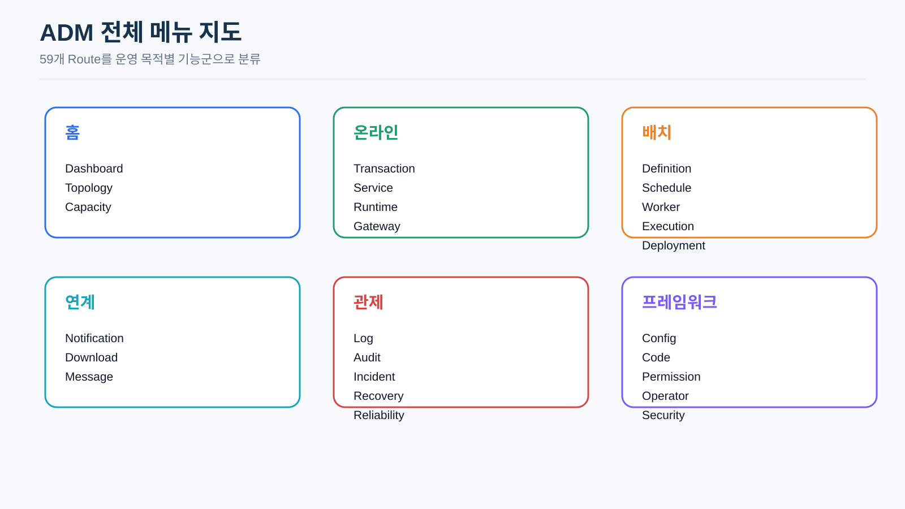

### 조회 화면에서 확인할 위치

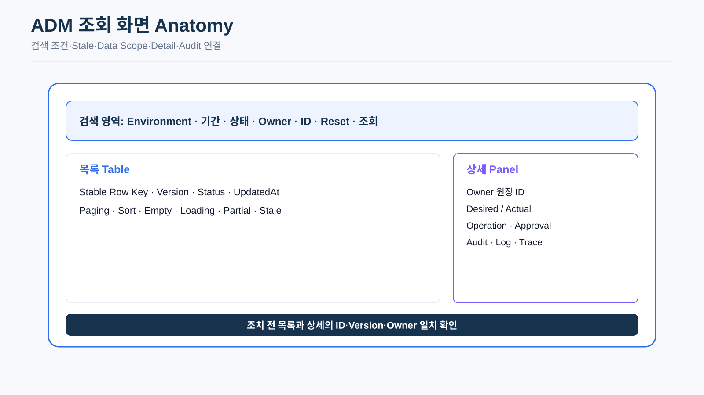

### 위험 조치와 결과 대사

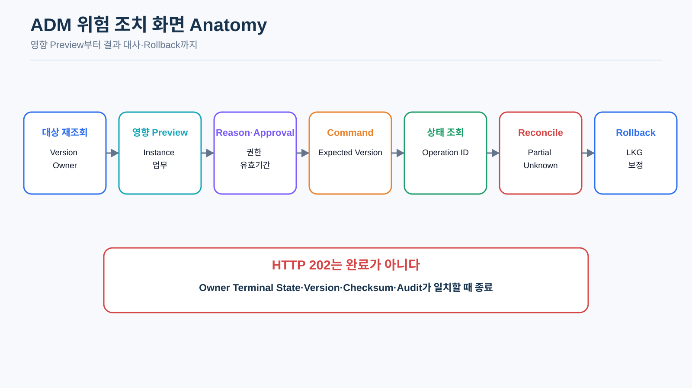

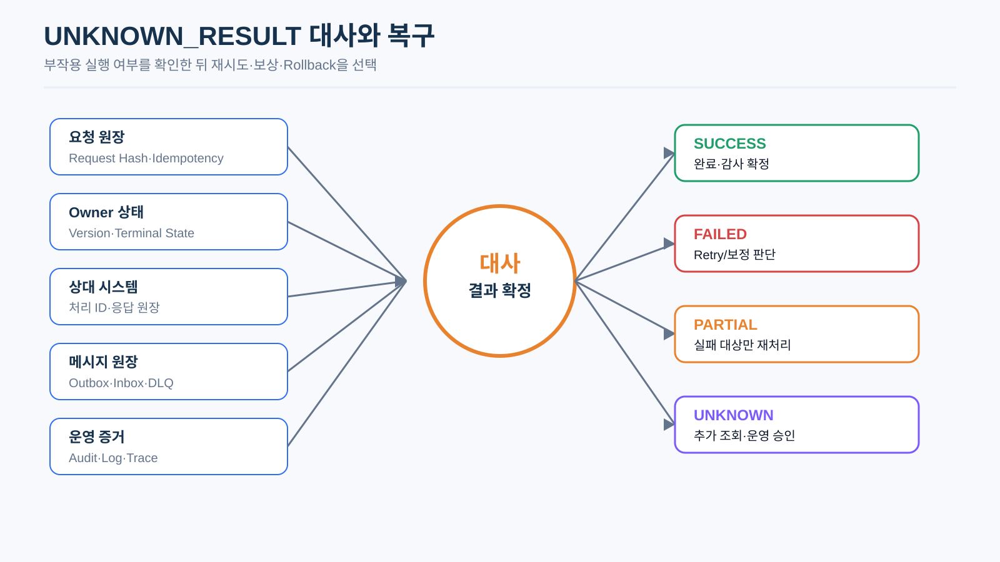

### 운영 관측과 정상화 판정

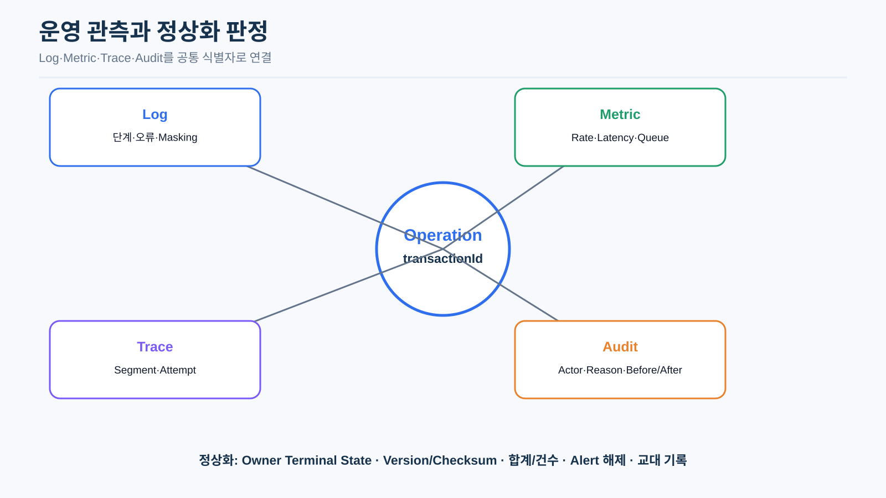


## 0. 제품 사용 계약

이 매뉴얼은 CPF의 기능을 제품 기능으로 설명하며, 대상 사용자가 다른 사람의 구두 설명이나 Source 역분석 없이 자신의 업무를 끝내도록 구성한다.

- 기능별 목적·대상 역할·Owner Module·실제 Consumer와 사용 위치를 먼저 제시한다.
- Source·SQL·API·Config·Frontend·Script·Test의 정확한 경로와 제품 사용 절차를 함께 제공한다.
- 입력값·기본값·권한·상태·정상 결과·오류·응답 유실·부분 적용·복구 절차를 기능 단위로 연결한다.
- Class·API·Property·Route·Permission·상태 이름은 제품 정본의 실제 식별자를 사용한다.
- 운영 종료는 Owner 상태·Version·Checksum·Audit·업무 합계와 화면 재조회 결과로 판단한다.
- 명령 실행 전 Local Working Tree를 확인하고 기존 변경을 보호한다.


## 1. 운영 원칙

- 화면의 `HTTP 200/202`만으로 업무 결과를 확정하지 않는다.
- Owner 상태, Operation ID, Instance ACK, Version·Checksum을 확인한다.
- 위험 조치는 Permission·Reason·Approval·Expected Version·Impact Preview를 확인한다.
- 응답 유실 후 동일 Button을 반복 클릭하지 않고 상태 조회·Reconcile을 사용한다.
- ADM DB를 직접 수정하거나 Browser 개발자 도구로 권한을 우회하지 않는다.

### 1.1 ADM UI 배포 전 확인 절차

운영에 사용할 ADM Bundle은 다음 정보를 함께 제공한다.

1. exact Source SHA, Backend Artifact SHA, OpenAPI Hash, Generated Client Hash, Bundle Hash.
2. `npm ci → verify:lock → verify:installed → lint → typecheck → test → build` 결과.
3. 59개 Router Registry Import·Deep Link·404 결과.
4. Chromium·Firefox·WebKit의 로그인·권한·조회·위험조치·오류 결과.
5. Privileged API의 미인증 401·무권한 403·CSRF·Origin 결과.

운영자는 배포된 Bundle의 Manifest와 Backend·DB·Config Version을 대조한 뒤 이 매뉴얼의 Route별 절차를 수행한다.

## 2. Route Inventory

Source: `cpf-admin/frontend/src/app/routes.ts`. 아래 Field·Column·Button·Permission·API를 Route별 Browser Scenario와 함께 운영한다.

| 그룹 | Menu ID | Route | Component | 운영 참조 |
|---|---|---|---|---|
| 홈 | `dashboard` | `/` | `DashboardPage.vue` | 제3부 기능 카드 |
| 홈 | `topology` | `/topology` | `TopologyPage.vue` | 제3부 기능 카드 |
| 홈 | `capacity` | `/capacity` | `CapacityPage.vue` | 제3부 기능 카드 |
| 온라인 | `transactionGroups` | `/transactionGroups` | `TransactionGroupsPage.vue` | 제3부 기능 카드 |
| 온라인 | `transactions` | `/transactions` | `TransactionsPage.vue` | 제3부 기능 카드 |
| 온라인 | `standardExecutions` | `/standardExecutions` | `StandardExecutionsPage.vue` | 제3부 기능 카드 |
| 온라인 | `channelPolicy` | `/channelPolicy` | `ChannelPolicyPage.vue` | 제3부 기능 카드 |
| 온라인 | `serviceRegistry` | `/serviceRegistry` | `ServiceRegistryPage.vue` | 제3부 기능 카드 |
| 온라인 | `runtimeControl` | `/runtimeControl` | `RuntimeControlPage.vue` | 제3부 기능 카드 |
| 배치 | `batch` | `/batch` | `BatchPage.vue` | 제3부 기능 카드 |
| 배치 | `batch-overview` | `/batch-overview` | `BatchOverviewPage.vue` | 제3부 기능 카드 |
| 배치 | `batch-runtime` | `/batch-runtime` | `RuntimeTopologyPage.vue` | 제3부 기능 카드 |
| 배치 | `batch-instances` | `/batch-instances` | `BatchInstancesPage.vue` | 제3부 기능 카드 |
| 배치 | `batch-scheduler` | `/batch-scheduler` | `BatchSchedulerPage.vue` | 제3부 기능 카드 |
| 배치 | `batch-worker-pools` | `/batch-worker-pools` | `BatchWorkerPoolsPage.vue` | 제3부 기능 카드 |
| 배치 | `batch-center-cut` | `/batch-center-cut` | `BatchCenterCutPage.vue` | 제3부 기능 카드 |
| 배치 | `batch-agents` | `/batch-agents` | `BatchAgentsPage.vue` | 제3부 기능 카드 |
| 배치 | `batch-job-packs` | `/batch-job-packs` | `BatchJobPacksPage.vue` | 제3부 기능 카드 |
| 배치 | `batch-executions` | `/batch-executions` | `BatchExecutionsPage.vue` | 제3부 기능 카드 |
| 배치 | `batch-deployment` | `/batch-deployment` | `BatchDeploymentPage.vue` | 제3부 기능 카드 |
| 배치 | `workers` | `/workers` | `WorkersPage.vue` | 제3부 기능 카드 |
| 배치 | `file-jobs` | `/file-jobs` | `FileJobsPage.vue` | 제3부 기능 카드 |
| 연계 | `notifications` | `/notifications` | `NotificationsPage.vue` | 제3부 기능 카드 |
| 연계 | `downloads` | `/downloads` | `DownloadsPage.vue` | 제3부 기능 카드 |
| 연계 | `messages` | `/messages` | `MessagesPage.vue` | 제3부 기능 카드 |
| 관제 | `logs` | `/logs` | `LogsPage.vue` | 제3부 기능 카드 |
| 관제 | `remoteLogs` | `/remoteLogs` | `RemoteLogsPage.vue` | 제3부 기능 카드 |
| 관제 | `auditLogs` | `/auditLogs` | `AuditLogsPage.vue` | 제3부 기능 카드 |
| 관제 | `logLevel` | `/logLevel` | `LogLevelPage.vue` | 제3부 기능 카드 |
| 관제 | `logPolicies` | `/logPolicies` | `LogPoliciesPage.vue` | 제3부 기능 카드 |
| 관제 | `recoveryCenter` | `/recoveryCenter` | `RecoveryCenterPage.vue` | 제3부 기능 카드 |
| 관제 | `incidents` | `/incidents` | `IncidentsPage.vue` | 제3부 기능 카드 |
| 관제 | `reliability` | `/reliability` | `ReliabilityPage.vue` | 제3부 기능 카드 |
| 관제 | `batch-recovery` | `/batch-recovery` | `BatchRecoveryPage.vue` | 제3부 기능 카드 |
| 관제 | `batch-leases` | `/batch-leases` | `BatchLeasesPage.vue` | 제3부 기능 카드 |
| 관제 | `batch-alerts` | `/batch-alerts` | `BatchAlertsPage.vue` | 제3부 기능 카드 |
| 관제 | `batch-audit` | `/batch-audit` | `BatchAuditEvidencePage.vue` | 제3부 기능 카드 |
| 프레임워크 | `maintenance` | `/maintenance` | `MaintenancePage.vue` | 제3부 기능 카드 |
| 프레임워크 | `cache` | `/cache` | `CachePage.vue` | 제3부 기능 카드 |
| 프레임워크 | `configs` | `/configs` | `ConfigsPage.vue` | 제3부 기능 카드 |
| 프레임워크 | `responseCodes` | `/responseCodes` | `ResponseCodesPage.vue` | 제3부 기능 카드 |
| 프레임워크 | `businessCalendar` | `/businessCalendar` | `BusinessCalendarPage.vue` | 제3부 기능 카드 |
| 프레임워크 | `codes` | `/codes` | `CodesPage.vue` | 제3부 기능 카드 |
| 프레임워크 | `permissions` | `/permissions` | `PermissionsPage.vue` | 제3부 기능 카드 |
| 프레임워크 | `password` | `/password` | `PasswordPage.vue` | 제3부 기능 카드 |
| 프레임워크 | `security` | `/security` | `SecurityPage.vue` | 제3부 기능 카드 |
| 프레임워크 | `operators` | `/operators` | `OperatorsPage.vue` | 제3부 기능 카드 |
| 프레임워크 | `secrets` | `/secrets` | `SecretsPage.vue` | 제3부 기능 카드 |
| 프레임워크 | `approvals` | `/approvals` | `ApprovalsPage.vue` | 제3부 기능 카드 |
| 프레임워크 | `breakGlass` | `/breakGlass` | `BreakGlassPage.vue` | 제3부 기능 카드 |
| Gateway | `gateway-dashboard` | `/gateway-dashboard` | `GatewayOperationsPage.vue` | 제3부 기능 카드 |
| Gateway | `gateway-servers` | `/gateway-servers` | `GatewayOperationsPage.vue` | 제3부 기능 카드 |
| Gateway | `gateway-groups` | `/gateway-groups` | `GatewayOperationsPage.vue` | 제3부 기능 카드 |
| Gateway | `gateway-routes` | `/gateway-routes` | `GatewayOperationsPage.vue` | 제3부 기능 카드 |
| Gateway | `gateway-security` | `/gateway-security` | `GatewayOperationsPage.vue` | 제3부 기능 카드 |
| Gateway | `gateway-health` | `/gateway-health` | `GatewayOperationsPage.vue` | 제3부 기능 카드 |
| Gateway | `gateway-transactions` | `/gateway-transactions` | `GatewayOperationsPage.vue` | 제3부 기능 카드 |
| Gateway | `gateway-log-policies` | `/gateway-log-policies` | `GatewayOperationsPage.vue` | 제3부 기능 카드 |
| Gateway | `gateway-apply-status` | `/gateway-apply-status` | `GatewayOperationsPage.vue` | 제3부 기능 카드 |

## 3. 모든 화면의 공통 확인표

| 항목 | 운영 확인 |
|---|---|
| Permission | 메뉴·Route·조회·조치·Raw·Export 권한 분리 |
| 검색 | Field, Default, Timezone, Paging, Sort, Reset |
| 결과 | Column, Masking, Empty, Loading, Partial, Stale 시각 |
| 상세 | ID, Owner, Version, Desired/Actual, Error, Audit Link |
| 조치 | Button 활성 조건, Input Validation, Reason, Approval, Expected Version |
| 결과 불명 | Operation ID, Attempt, 상태 조회, Reconcile 기한 |
| 부분 적용 | Instance별 ACK/NACK, Version·Checksum, Traffic 제외, Retry 대상 |
| 복구 | Retry, Restart, Reprocess, Reconcile, Compensation, Rollback |
| 감사 | Operator, Permission, Reason, Approval, Before/After, 결과 |

## 4. 조회 절차

1. Environment·Service·Instance·시간 범위를 선택한다.
2. 기본 Timezone과 포함/제외 상태를 확인한다.
3. Paging·Sort를 고정하고 Search를 실행한다.
4. 결과 생성 시각과 Stale 여부를 확인한다.
5. 상세에서 Owner·Version·Trace·Transaction·Attempt를 연결한다.
6. Raw Data는 별도 Permission·Reason이 있을 때만 조회한다.

## 5. 변경 조치 절차

1. Target 상태·Version·Owner를 재조회한다.
2. 영향 Instance·사용자·거래·대체 경로를 Preview한다.
3. Reason을 구체적으로 입력한다.
4. Approval 요구 여부와 유효기간·자기승인 금지를 확인한다.
5. Expected Version과 Request Hash를 확인한다.
6. Command 전송 후 Operation ID를 기록한다.
7. 최종 상태 또는 `UNKNOWN_RESULT`를 확인한다.
8. Partial이면 Failed Instance만 Retry하거나 Rollback한다.
9. Audit와 Metric이 연결됐는지 확인한다.

## 6. 온라인 운영

### 거래·표준 실행

- transactionId·traceId·segment·attempt
- Caller·Principal·Channel·Environment
- 시작·종료·상태·오류 단계
- Remote Side Effect와 Unknown 여부
- Reconcile·Compensation 결과

### Service Registry·Runtime Control

- Instance ID·Version·Build SHA·Zone
- Liveness·Readiness·Maintenance·Draining
- Lease 만료·Last heartbeat
- Start/Stop/Restart 권한·Reason·Approval
- Stale Instance·Split brain·Partial response

## 7. Batch 운영

실행 전: Definition Version·Artifact Checksum·Schedule·Parameter·Dry Run·Approval·Idempotency·Fencing.

실행 중: CPF Execution ID, Spring Job/Step ID, 처리·Skip·Error 건수, Checkpoint, Worker·Partition, Lease·Heartbeat.

조치:

- Stop: 실제 Step 종료와 Resource 정리 확인.
- Restart: Restart 가능 상태·Checkpoint·최신 Fencing 확인.
- Abandon: 재실행 금지 영향과 승인 확인.
- Reprocess: Failed-only 대상·중복 안전성·대사 기준 확인.
- Reconcile: CPF Control·Spring Metadata·업무 Item을 대조.

## 8. Gateway 운영

Gateway 9개 Route는 현재 같은 Page Component를 사용한다. 메뉴 선택 후 화면 Mode와 API가 Route ID에 맞는지 확인한다.

### Route 게시

1. Ingress Host·Method·Path·Version 확인.
2. Target Service·Rewrite·Timeout·Retry 정책 확인.
3. Collision·Connection·Application Probe 실행.
4. Security·SSRF·Header·CORS 검증 결과 확인.
5. Approval과 Version·Checksum 확인.
6. Publish 후 Instance별 ACK/NACK 확인.
7. Smoke 요청과 Attempt Ledger 확인.

### Partial Apply

- 일부 ACK는 Success가 아니다.
- NACK Instance를 Traffic에서 제외했는지 확인한다.
- Candidate와 Last Known Good를 비교한다.
- Retry 또는 Rollback 후 모든 Instance Checksum을 다시 확인한다.

## 9. Config·Secret·Log Policy

- Config 변경은 Scope·Type·Default·Restart 필요·Secret 여부를 확인한다.
- Partial Apply와 Instance Drift를 확인한다.
- Secret 원문을 화면·Audit·Export에 남기지 않는다.
- Log Level 상향은 기간·대상·Cardinality·PII 영향과 자동 원복 대신 명시적 만료·확인을 사용한다.

## 10. Recovery Center·Incident

1. Alert의 Service·Instance·Transaction·Runbook을 확인한다.
2. 최근 배포·Config·DB Migration·Kafka Lag를 대조한다.
3. 영향 범위와 데이터 불일치 가능성을 분류한다.
4. Mitigation과 Recovery를 구분한다.
5. Unknown·Pending·Orphan을 대사한다.
6. 정상화 지표와 업무 대사를 확인한다.
7. Incident Timeline·조치·승인·결과를 남긴다.

## 11. Security·Approval·Break-glass

- Operator·Role·Permission·Data Scope를 확인한다.
- Session 만료·권한 회수 후 재인증을 확인한다.
- Break-glass는 별도 권한·TTL·긴급 사유·승인 또는 사후 검토가 필요하다.
- Password·Secret·Raw Data·Export 조치는 이중 확인과 감사 링크를 요구한다.

## 12. 응답 유실 처리

1. Browser 재전송을 중지한다.
2. Network 오류 시각·Operation ID·Target을 기록한다.
3. Owner 상태 조회 API를 실행한다.
4. Side Effect 전 실패인지, 처리 후 응답 유실인지 분류한다.
5. `UNKNOWN_RESULT`면 Reconcile 담당·기한을 지정한다.
6. 결과 확정 후 Retry·Compensation·운영 확정을 수행한다.

## 13. Rollback 판정

Rollback 전 확인:

- 현재 Version과 Last Known Good
- DB·Message·Config Compatibility
- 진행 중 거래·Batch·Session
- 일부 Instance만 적용됐는지
- Rollback 자체 Idempotency·Unknown 처리

Rollback 후 Health·Smoke·Metric·Data Reconcile·Audit를 확인한다.

## 14. Browser 검증 체크

- Chromium·Firefox·WebKit
- 권한별 Menu·Route·Button
- 검색·Paging·Sort·Timezone
- Loading·Empty·Error·Retry
- Duplicate click·Timeout·Response loss
- Version conflict·Approval expiry
- Partial Apply·Reconcile·Rollback
- Keyboard·Focus·Label·Contrast

## 부록 A. 권한 판정 방식

ADM Frontend는 로그인 응답의 `menus`와 `buttonIds`를 사용한다.

- Menu 권한: `readAllowed`, `writeAllowed`, `deleteAllowed`
- Button 권한: 서버가 전달한 Button ID 목록
- API 권한: 별도 API Permission Matrix
- 원문 개인정보: 일반 조회와 분리된 Permission·Reason

Menu가 보이지 않는다고 API가 차단됐다고 가정하지 않고, 반대로 Menu가 보여도 Command 권한이 있다고 가정하지 않는다. 권한 변경 후 기존 Session에 반영되는 시점과 강제 재로그인 정책을 확인한다.

## 부록 B. Permission 화면 운영 절차

### B.1 조회

1. `/permissions` 진입 후 Role·Menu·Button·API Permission 목록을 모두 조회한다.
2. Role ID와 대상 Menu/Button/API ID를 확인한다.
3. 현재 Matrix와 적용 Environment를 기록한다.
4. 변경 대상 사용자의 다른 Role과 Data Scope를 함께 확인한다.

### B.2 변경

| 대상 | 입력 | API |
|---|---|---|
| Menu | roleId, menuId, readYn, writeYn, deleteYn, reason | `PUT /adm/api/permissions/roles/{roleId}/menus/{menuId}` |
| Button | roleId, buttonId, allowYn, reason | `PUT /adm/api/permissions/roles/{roleId}/buttons/{buttonId}` |
| API | roleId, apiPermissionId, allowYn, reason | `PUT /adm/api/permissions/roles/{roleId}/api-permissions/{apiPermissionId}` |

변경 후 같은 Role의 Test Operator로 재인증하고 Menu·Direct URL·Button·API를 각각 확인한다. 권한 축소는 기존 Session Cache·Token·Server Session에 남지 않는지 확인한다.

## 부록 C. 운영자·Password·Session 화면

### C.1 운영자 등록

필수 입력: Operator ID, 이름, 초기 Password, Reason. 연락처는 입력 여부와 Masking 정책을 확인한다. 화면이 만든 `operationId`를 기록한다.

1. 등록 요청 후 `operatorId`가 반환되면 목록을 재조회한다.
2. 응답이 없으면 Button을 다시 누르지 않는다.
3. `/adm/api/operators/operations/{operationId}`로 결과를 조회한다.
4. Role을 부여하고 Expected Version을 사용해 `ACTIVE`로 변경한다.
5. 최초 Login·Password 변경 요구·Audit를 확인한다.

### C.2 상태 변경

`ACTIVE` 전환은 `expectedVersion`과 Reason을 사용한다. `409`가 발생하면 최신 목록을 조회하고 기존 Version으로 반복 전송하지 않는다.

### C.3 원문 연락처

- 일반 목록은 Masking 결과만 사용한다.
- 원문 조회는 대상 Operator와 Reason을 다시 확인한다.
- `403`: 원문 권한 없음
- `409`: 대상 Version 변경, 목록 재조회
- `503`: Permission·Audit·DB 저장소 장애
- 원문 값은 Ticket·Chat·Screenshot·Export에 복사하지 않는다.

### C.4 Password·Session

- Password 초기화 후 `forceChange` 정책을 확인한다.
- 잠금 해제 전에 실패 횟수·공격 여부·MFA 상태를 확인한다.
- Session 폐기는 대상 Operator·Session ID·최근 활동·Reason을 확인한다.
- 만료 Session 일괄 정리는 실행 건수와 오류 건수를 Audit로 확인한다.

## 부록 D. Security 화면

| 기능 | 운영 입력 | 확인 결과 |
|---|---|---|
| IP Allowlist | Network/CIDR, Environment, Reason | 현재 접속 경로가 차단되지 않는지 Preview |
| MFA 등록 | operatorId, secretRef, reason | Secret 원문 미노출, 등록 상태 |
| MFA 검증 | operatorId, otpCode, reason | 검증 결과·실패 횟수·Audit |
| Break-glass | 대상, TTL, 긴급 사유, 승인 | 만료·사후 Review·권한 회수 |
| Secret | Reference, Version, Scope | 값 원문 대신 Metadata·Rotation 상태 |

MFA Secret은 화면 입력 문자열이 아니라 승인된 Secret Reference를 사용한다. OTP 값은 Log·Audit Detail에 남지 않아야 한다.

## 부록 E. 화면 상태별 운영 행동

| 화면 상태 | 의미 | 운영 행동 |
|---|---|---|
| Loading | 요청 진행 중 | 중복 Click 금지 |
| Empty | 조회 결과 없음 | Filter·권한·Environment·시간 범위 확인 |
| Stale | 갱신 시각 경과 | 변경 조치 전 Refresh |
| Partial | 일부 Source/Instance만 응답 | 누락 Instance 식별, 전체 성공 처리 금지 |
| Conflict | Version·상태 변경 | 최신 상세 조회 |
| Unknown | Side Effect 결과 불명 | Operation 상태 조회·Reconcile |
| Rejected | 권한·검증·승인 거부 | 입력·권한·Approval 수정 후 새 요청 |
| Failed | 결과가 실패로 확정 | Retry 가능성·보상·Rollback 판단 |

## 부록 F. Batch 화면 공통 Column과 판정

Batch 관련 Route에서 최소한 다음 값을 서로 연결한다.

- Job ID·Definition Version·Checksum
- CPF Execution ID
- Spring JobInstance ID·JobExecution ID·StepExecution ID
- Schedule ID·Scheduled Time·Business Date
- Worker·Partition·Lease·Fencing Token
- Read·Write·Skip·Error Count
- Start·Last Update·End Time
- Status·Exit Code·Failure Stage·Unknown Reason

Stop·Restart·Abandon·Reprocess Button 활성 조건이 Spring Batch 상태와 일치하지 않으면 조치를 중지한다.

## 부록 G. Gateway 화면 공통 판정

9개 Gateway Route가 같은 Component를 사용하므로 Route 이름만 보고 기능이 분리됐다고 판단하지 않는다. 화면 Mode가 다음 데이터와 API를 바꾸는지 확인한다.

- Dashboard: Traffic·Error·Latency·Instance 적용 상태
- Servers/Groups: Instance·Zone·Weight·Maintenance·Draining
- Routes: Host·Method·Path·Version·Target·Rewrite·Policy
- Security: Auth·Permission·Header·CORS·SSRF 정책
- Health: DNS·TCP·TLS·HTTP·Application Probe
- Transactions: Transaction·Attempt·Unknown·Reconcile
- Log Policies: Masking·Sampling·Retention
- Apply Status: Candidate·Version·Checksum·ACK/NACK·LKG

## 부록 H. 교대 인계 체크

- 미확정 `UNKNOWN_RESULT`와 담당자·대사 기한
- Partial Apply Instance와 Traffic 제외 여부
- 진행 중 Batch·Deployment·Rollback
- 만료 예정 Approval·Break-glass·Secret·Certificate
- 최근 Config·Log Level·Route 변경과 원복 기준
- Incident 상태·업무 영향·정상화 판정 Metric
- 다음 교대가 재현할 Query·Operation ID·Audit Link

---

## 기준 Source와 역할별 활용 범위

- Repository: `https://github.com/freeangelsun/202412_01_CPF`
- Branch: `master`
- 기준 Commit: `23babb9140b90e501d6ac715e7b77f55b66198a5`
- 문서 표준: `cpf-docs/specification/CPF_DOCUMENTATION_STANDARD.md`
- 제품 목표 정본: `cpf-docs/governance/CPF_FINAL_TARGET_REQUIREMENTS.md`
- 사실 우선순위: 실제 Source·SQL·API·Config·Frontend·Script·Test → Architecture·Specification → 이 매뉴얼

이 매뉴얼의 대상 역할은 다음 흐름을 다른 사람의 구두 설명이나 Source 역분석 없이 수행할 수 있어야 한다.

```text
업무 목적 파악
→ 선행 조건과 권한 준비
→ 실제 기능 위치 탐색
→ 등록·설정·개발·실행
→ 상태와 결과 확인
→ 오류·동시성·부분 실패 판단
→ Retry·Restart·Reprocess·Reconcile·Compensation·Rollback
→ Log·Metric·Trace·Audit·Evidence 확인
→ 정상화와 완료 판정
```

기능 설명은 Source의 실제 계약과 사용 절차를 기준으로 하며, 적용 전 확인 조건·오류·복구 경로를 함께 제공한다.

---

## 제2부 실무편: ADM 운영자가 모든 화면과 기능을 사용하는 절차

## 16. 로그인·Session·권한 선행 절차

1. `/adm/api/auth/login`으로 로그인한다.
2. 응답의 운영자 ID, Menu Permission, Button ID가 로드됐는지 확인한다.
3. `passwordChangeRequired`이면 다른 화면을 조작하지 않고 본인 Password 변경을 수행한 뒤 새 Password로 다시 로그인한다.
4. Menu Read Permission이 없으면 Route를 직접 입력해 우회하지 않는다.
5. Button이 보이지 않더라도 API가 403을 반환하는지 배포 전 Negative Test로 확인한다.
6. Session Cookie·CSRF·Trusted Origin이 정상인지 확인한다.


## 17. 모든 화면 공통 조작 규칙

모든 검색 Form과 조치 Form은 **기본값**을 먼저 확인한다. 기본 기간·환경·상태·Paging·Sort가 업무 범위를 축소할 수 있으므로 조회 전 화면 표시값과 API 요청값을 대조하고, 초기화 후 다시 조회해 차이를 확인한다.

| 상황 | 운영 행동 |
|---|---|
| Loading | 중복 조작 금지. 이전 결과를 최신 결과로 해석하지 않는다. |
| Empty | HTTP 성공·Partial/Stale Flag 없음·Filter 확인 뒤 0건으로 판정한다. |
| 401 | Session 만료/CSRF/Origin 확인 후 로그인. 동일 Command 자동 Replay 금지. |
| 403 | Menu·Button·API·Owner Permission과 Data Scope를 확인한다. |
| 409 | `expectedVersion` 충돌. 최신 상태 재조회 후 변경 의도를 재확인한다. |
| 429 | Rate Limit과 Retry-After 확인. 비멱등 조치 자동 Retry 금지. |
| 503 Partial/Stale | 정상 Empty로 해석하지 않는다. 실패 Owner와 조회 범위를 표시한다. |
| Timeout/응답 유실 | 기존 Operation/Transaction ID로 결과 조회. 신규 ID 재실행 금지. |
| PARTIAL_FAILED | Target별 성공·실패·미응답을 분리하고 Reconcile/Rollback한다. |
| UNKNOWN_RESULT | Owner DB·상대 시스템·Ledger·Audit를 대사해 결과 확정 전 Retry 금지. |

## 18. ADM Route·화면 전수 Inventory

아래 표는 기준 Commit의 `cpf-admin/frontend/src/app/routes.ts`와 실제 Component를 대조한 운영 기준이다.
표의 개별 상태는 Component·API 기능의 구현 상태이며, 위 Frontend Build·Generated Client·Router·Browser 검사를 통과한 Bundle을 배포한다.

| Route ID | URL | Group | 목적 | 검색·입력과 Default | Column·상세 | Button·조치 | Permission | 오류·복구 핵심 | Source | 상태 |
|---|---|---|---|---|---|---|---|---|---|---|
| dashboard | / | 홈 | 운영 대시보드 | 초기 데이터 자동 조회 | 등록 인스턴스·정상 수, 비정상 Health, 결과 미확정, DLQ, 서비스 상태, 최근 Service Call | 새로고침 | 조회 권한 | Loading/Empty/Error | `cpf-admin/frontend/src/features/dashboard/DashboardPage.vue` | 제3부 기능 카드 |
| topology | /topology | 홈 | 서비스 토폴로지 | 없음 | Service ID·명, Instance ID·명, Endpoint, Weight, Status | 새로고침 | 조회 권한 | Registry 0건 Empty | `cpf-admin/frontend/src/features/topology/TopologyPage.vue` | 제3부 기능 카드 |
| capacity | /capacity | 홈 | 용량·SLO 기본 Signal | 없음 | 최근 호출, 평균 지연, 실패율, 인스턴스; Service/Endpoint/Status/Latency/Transaction | 새로고침 | 조회 권한 | 장기 Percentile·Forecast는 Metrics Backend와 함께 확인 | `cpf-admin/frontend/src/features/capacity/CapacityPage.vue` | 제3부 기능 카드 |
| logs | /logs | 통합 관제 | 로그 조회 | 해당 없음 | 해당 없음 | 해당 없음 | 해당 없음 | 표준 로그 조회 화면 | `cpf-admin/frontend/src/features/logs/LogsPage.vue` | 사용 절차 참조 |
| transactionGroups | /transactionGroups | 온라인 운영 | 거래 그룹·구간 추적 | 기간, Transaction/Segment, Status, 실패, Module/Source/Target/Role/Direction, 고객·회원·사용자·운영자, Channel, 외부기관/거래, API/거래명/오류, Duration, Header 검색 | 거래/모듈 흐름/시간/소요/상태/실패/Masked 고객·회원/Channel/외부 연계 | 조회·초기화·정렬·Paging·상세 Tab | 거래 조회 Permission·Data Scope | Authorization/API Key/Token 등 원문 미표시 | `cpf-admin/frontend/src/features/transaction-groups/TransactionGroupsPage.vue` | 제3부 기능 카드 |
| transactions | /transactions | 온라인 운영 | 거래 Metadata | Module 기본 ADM, Active Y, Transaction ID, 선택 ID, Reason | Pretty Result | 조회·재스캔·비활성화 | `TRANSACTION_META` Write for mutation | 재스캔/비활성화 응답 유실 시 Transaction ID 대사 | `cpf-admin/frontend/src/features/transactions/TransactionsPage.vue` | 제3부 기능 카드 |
| standardExecutions | /standardExecutions | 온라인 운영 | 표준 실행 Catalog | 유형 ONLINE/BATCH, Owner Domain, Keyword | ID, 유형, 실행명, Owner, Source Module, Endpoint | 조회·상세 | 조회 권한 | Catalog/Source 불일치 조사 | `cpf-admin/frontend/src/features/standard-executions/StandardExecutionsPage.vue` | 제3부 기능 카드 |
| channelPolicy | /channelPolicy | 온라인 운영 | Channel·거래 정책 Snapshot | Channel/Policy Form; Package JSON; Import Dry Run | Channel 인증·서명·신뢰·Version; 정책 허용·TPS·Version | 조회·Snapshot 갱신·Package 반출/반입·Channel/Policy 저장 | `CHANNEL_POLICY` Write | Snapshot Version·Import Dry Run·부분 적용 확인 | `cpf-admin/frontend/src/features/channel-policy/ChannelPolicyPage.vue` | 제3부 기능 카드 |
| serviceRegistry | /serviceRegistry | 온라인 운영 | Service·Endpoint·Instance·Health·Routing | Service ID, Endpoint, Instance Status; 각 등록 Form | Service/Endpoint/Instance/Health/Routing/Circuit/Call | 등록·수정·Drain·Resume·Disable·새로고침 | `SERVICE_REGISTRY` Write | Version·Heartbeat·Draining·Maintenance·Health 분리 | `cpf-admin/frontend/src/features/service-registry/ServiceRegistryPage.vue` | 제3부 기능 카드 |
| runtimeControl | /runtimeControl | 온라인 운영 | Runtime 변경 Control Plane | Operation/Change/Target/Expected Version/Rollout/Approval/Payload/Reason | Readiness, Pending, Poison, Drift; ACK/Failed/Drift/Hash | Target/Diff Preview·생성·조회·Audit 검증·Cancel·Exact Rollback·Group CRUD | Runtime Control Permission + Approval/Break-glass | UNKNOWN/PARTIAL/Drift를 성공으로 처리 금지 | `cpf-admin/frontend/src/features/runtime-control/RuntimeControlPage.vue` | 제3부 기능 카드 |
| maintenance | /maintenance | 프레임워크 | 점검·Drain 제어 | Service, Endpoint, Instance, DRAIN/DISABLE/RESUME, Reason | 시간, Service, Instance, Action, Result, Reason | 명령 실행·조회 | Owner Command Permission | Routing 제외 영향·Audit 확인 | `cpf-admin/frontend/src/features/maintenance/MaintenancePage.vue` | 제3부 기능 카드 |
| cache | /cache | 프레임워크 | Cache 조회·Evict·Reconcile | Tenant, Namespace, Key, Version, Reason | Cache Summary/Result | Target 갱신·Key/Namespace Evict·Durable Reconcile | Button Permission `CACHE_*` | Cache는 정본 아님; Reconcile 뒤 Owner 확인 | `cpf-admin/frontend/src/features/cache/CachePage.vue` | 제3부 기능 카드 |
| configs | /configs | 프레임워크 | 설정 관리 | Config ID/Key/Value/Type/Encrypted YN/Reason | Pretty Result | 조회·등록·수정 | `CONFIG` Write | Secret 원문을 일반 Config에 저장 금지 | `cpf-admin/frontend/src/features/configs/ConfigsPage.vue` | 제3부 기능 카드 |
| responseCodes | /responseCodes | 프레임워크 | 응답코드 관리 | Response/Message Code, S/E, Module, Group, Sequence, HTTP, Reason | Pretty Result | 조회·등록·수정·삭제 | `RESPONSE_CODE` Write/Delete | Consumer·Message Mapping 영향 확인 | `cpf-admin/frontend/src/features/response-codes/ResponseCodesPage.vue` | 제3부 기능 카드 |
| businessCalendar | /businessCalendar | 프레임워크 | 영업일·휴일 Override | Calendar DEFAULT, Date, Business/Holiday, Day Type, Institution, Business/Audit Reason | Date, Type, Institution, Reason, Version | 조회·저장·삭제 | Menu Write/Delete + Writable Provider | Expected Version 409 충돌 재조회 | `cpf-admin/frontend/src/features/business-calendar/BusinessCalendarPage.vue` | 제3부 기능 카드 |
| codes | /codes | 프레임워크 | 공통 코드 | Code ID, Parent ID, Key, Value, Description, Reason | Pretty Result | 조회·등록·수정 | `CODE` Write | Parent 순환·Consumer Cache 갱신 확인 | `cpf-admin/frontend/src/features/codes/CodesPage.vue` | 제3부 기능 카드 |
| messages | /messages | 연계 관리 | 다국어 Message | Message ID/Code/Locale/External/Internal/Reason | Pretty Result | 조회·등록·수정 | `MESSAGE` Write | External/Internal 노출 범위 분리 | `cpf-admin/frontend/src/features/messages/MessagesPage.vue` | 제3부 기능 카드 |
| remoteLogs | /remoteLogs | 통합 관제 | 원격 Log Artifact | 환경/Module/Service/Instance/Type/File/표준 ID/Transaction/Batch IDs/기간/Size/압축/활성/Lines/Keyword/Reason | Artifact Metadata·Preview·Bundle Job·Diagnostics | 조회·단건/선택/비동기 ZIP·상태·Download·진단 | `REMOTE_LOG` Write for download | Retention·Size·Masking·Download Audit | `cpf-admin/frontend/src/features/remote-logs/RemoteLogsPage.vue` | 제3부 기능 카드 |
| auditLogs | /auditLogs | 통합 관제 | Audit 조회·Delivery 복구 | Operator, Action, Target Type/ID; Delivery Status, Retry Reason | Audit Result; Delivery ID/Status/Attempt/Error | 조회·Delivery 조회·재처리 | `AUDIT_LOG` Write for retry | 업무 결과와 Audit Delivery 분리 | `cpf-admin/frontend/src/features/audit-logs/AuditLogsPage.vue` | 제3부 기능 카드 |
| logLevel | /logLevel | 통합 관제 | Dynamic Log Level | Business Transaction ID, Transaction ID, DEBUG/INFO/TRACE, TTL, Reason | Rule Result | 조회·등록 | `DYNAMIC_LOG` Write | TTL 만료·민감정보 Capture 정책 확인 | `cpf-admin/frontend/src/features/log-level/LogLevelPage.vue` | 제3부 기능 카드 |
| logPolicies | /logPolicies | 통합 관제 | Log Capture·Retention·Trace Boost | Target/Level/DB/File/Stack/Retention/Sampling/Capture Mode/Allowlist/Masking/Byte Cap/Reason/Trace Boost | Policy·Distribution Event/Gateway/Version/Status/Attempt/Fencing/Error/ACK | 조회·저장·중지·Override·Trace Boost·Cache Refresh/Clear·적용 상태 | `LOG_POLICY` Write | Raw Authorization/Cookie/Token·FULL RAW 금지; ACK 실패 대사 | `cpf-admin/frontend/src/features/log-policies/LogPoliciesPage.vue` | 제3부 기능 카드 |
| recoveryCenter | /recoveryCenter | 통합 관제 | Unknown·DLQ·Outbox·File Transfer 통합 조회 | 없음 | Unknown/DLQ/Outbox/File Transfer KPI·후보 | 새로고침 | 조회 권한 | 실제 조치는 Reliability 화면 Gate 사용 | `cpf-admin/frontend/src/features/recovery-center/RecoveryCenterPage.vue` | 제3부 기능 카드 |
| incidents | /incidents | 통합 관제 | Incident Lifecycle | Severity SEV1~4, Title, Summary, Source, Reason | ID, Severity, Title, Status, Detected | 생성·ACKNOWLEDGED·MITIGATED·RESOLVED | Incident Write | 각 전이에 구체적 Reason | `cpf-admin/frontend/src/features/incidents/IncidentsPage.vue` | 제3부 기능 카드 |
| reliability | /reliability | 통합 관제 | DLQ·Unknown·Batch Log 대사 | Scope/Status/Key/Transaction/Topic/Endpoint/Type/Business Date/Job/Instance/Limit; Message/Unknown ID/Target Status/Reason | 통합 Result | 조회·BAT 상세·DLQ Replay·Unknown 수동 확정 | `RELIABILITY` Write | 실제 Side Effect 근거 없이 수동 성공 확정 금지 | `cpf-admin/frontend/src/features/reliability/ReliabilityPage.vue` | 제3부 기능 카드 |
| notifications | /notifications | 연계 관리 | 알림 Rule·Durable Delivery | Rule/Event/Channel/Severity/Receiver/Reason; Delivery Expected Version/Operation/Reason | Rule; Delivery/Hash/Status/Attempt/Lease/Version; Provider Attempt | 저장·중지·Test·CSV·Retry·Cancel | `NOTIFICATION_*` Button Permission | Expected Version·Lease·Attempt 확인 | `cpf-admin/frontend/src/features/notifications/NotificationsPage.vue` | 제3부 기능 카드 |
| downloads | /downloads | 연계 관리 | CSV Download·Audit | Type, Target, Date Range, Transaction/Trace/Job, Limit, Reason | Download Result | 정책 조회·CSV | Download Permission·Reason | Data Scope·Masking·건수 상한 | `cpf-admin/frontend/src/features/downloads/DownloadsPage.vue` | 제3부 기능 카드 |
| file-jobs | /file-jobs | 배치 운영 | 대량 File Job | Operation, Template/Version, CSV/XLSX, Dry Run, File, Reason; Control Approval/Reason; Unknown Resolution | Job/State/Rows/Checksum; Row State/Business Key/Error | Upload·Detail·Apply·Retry·Cancel·Rollback·Unknown Resolve·Artifact | `FILE_JOB_*` Button Permission | 상태별 Button 활성; Side Effect 대사·Rollback Token | `cpf-admin/frontend/src/features/file-jobs/FileJobsPage.vue` | 제3부 기능 카드 |
| batch | /batch | 배치 운영 | Batch·Center-Cut 종합 통제 | Job/Execution/Schedule/Parameter/Calendar/Date/Simulation/Dispatch/Heartbeat/Lock/Ghost/Reason | Execution Trace; Center-Cut Job/Target/Result | 등록·실행·재수행·중지·Scheduler 1회·Lock/Ghost·조회·CSV | `BATCH` Write | Unknown/Lock/Ghost 조치 전 원장·Heartbeat 대사 | `cpf-admin/frontend/src/features/batch/BatchPage.vue` | 제3부 기능 카드 |
| batch-overview | /batch-overview | 배치/통합 관제 | Batch Overview | 자동 조회 Context; 별도 검색 UI 없음 | Control Server가 반환한 최대 18개 동적 Column | 새로고침 | 조회 권한 | `stale`/`partial` 경고를 정상·Empty로 해석 금지 | `BatchViewPage.vue`, view=`overview` | 제3부 기능 카드 |
| batch-runtime | /batch-runtime | 배치/통합 관제 | Runtime Topology | 자동 조회 Context; 별도 검색 UI 없음 | Control Server가 반환한 최대 18개 동적 Column | 새로고침 | 조회 권한 | `stale`/`partial` 경고를 정상·Empty로 해석 금지 | `BatchViewPage.vue`, view=`runtime` | 제3부 기능 카드 |
| batch-instances | /batch-instances | 배치/통합 관제 | Batch Instances | 자동 조회 Context; 별도 검색 UI 없음 | Control Server가 반환한 최대 18개 동적 Column | 새로고침 | 조회 권한 | `stale`/`partial` 경고를 정상·Empty로 해석 금지 | `BatchViewPage.vue`, view=`instances` | 제3부 기능 카드 |
| batch-scheduler | /batch-scheduler | 배치/통합 관제 | Scheduler | 자동 조회 Context; 별도 검색 UI 없음 | Control Server가 반환한 최대 18개 동적 Column | 새로고침 | 조회 권한 | `stale`/`partial` 경고를 정상·Empty로 해석 금지 | `BatchViewPage.vue`, view=`scheduler` | 제3부 기능 카드 |
| batch-worker-pools | /batch-worker-pools | 배치/통합 관제 | Worker Pools | 자동 조회 Context; 별도 검색 UI 없음 | Control Server가 반환한 최대 18개 동적 Column | 새로고침 | 조회 권한 | `stale`/`partial` 경고를 정상·Empty로 해석 금지 | `BatchViewPage.vue`, view=`worker-pools` | 제3부 기능 카드 |
| batch-center-cut | /batch-center-cut | 배치/통합 관제 | Center-Cut | 자동 조회 Context; 별도 검색 UI 없음 | Control Server가 반환한 최대 18개 동적 Column | 새로고침 | 조회 권한 | `stale`/`partial` 경고를 정상·Empty로 해석 금지 | `BatchViewPage.vue`, view=`center-cut` | 제3부 기능 카드 |
| batch-agents | /batch-agents | 배치/통합 관제 | Agents | 자동 조회 Context; 별도 검색 UI 없음 | Control Server가 반환한 최대 18개 동적 Column | 새로고침 | 조회 권한 | `stale`/`partial` 경고를 정상·Empty로 해석 금지 | `BatchViewPage.vue`, view=`agents` | 제3부 기능 카드 |
| batch-job-packs | /batch-job-packs | 배치/통합 관제 | Job Packs | 자동 조회 Context; 별도 검색 UI 없음 | Control Server가 반환한 최대 18개 동적 Column | 새로고침 | 조회 권한 | `stale`/`partial` 경고를 정상·Empty로 해석 금지 | `BatchViewPage.vue`, view=`job-packs` | 제3부 기능 카드 |
| batch-executions | /batch-executions | 배치/통합 관제 | Executions | 자동 조회 Context; 별도 검색 UI 없음 | Control Server가 반환한 최대 18개 동적 Column | 새로고침 | 조회 권한 | `stale`/`partial` 경고를 정상·Empty로 해석 금지 | `BatchViewPage.vue`, view=`executions` | 제3부 기능 카드 |
| batch-recovery | /batch-recovery | 배치/통합 관제 | Recovery/Unknown | 자동 조회 Context; 별도 검색 UI 없음 | Control Server가 반환한 최대 18개 동적 Column | 새로고침 | 조회 권한 | `stale`/`partial` 경고를 정상·Empty로 해석 금지 | `BatchViewPage.vue`, view=`recovery` | 제3부 기능 카드 |
| batch-leases | /batch-leases | 배치/통합 관제 | Leases | 자동 조회 Context; 별도 검색 UI 없음 | Control Server가 반환한 최대 18개 동적 Column | 새로고침 | 조회 권한 | `stale`/`partial` 경고를 정상·Empty로 해석 금지 | `BatchViewPage.vue`, view=`leases` | 제3부 기능 카드 |
| batch-alerts | /batch-alerts | 배치/통합 관제 | Alerts | 자동 조회 Context; 별도 검색 UI 없음 | Control Server가 반환한 최대 18개 동적 Column | 새로고침 | 조회 권한 | `stale`/`partial` 경고를 정상·Empty로 해석 금지 | `BatchViewPage.vue`, view=`alerts` | 제3부 기능 카드 |
| batch-audit | /batch-audit | 배치/통합 관제 | Audit Evidence | 자동 조회 Context; 별도 검색 UI 없음 | Control Server가 반환한 최대 18개 동적 Column | 새로고침 | 조회 권한 | `stale`/`partial` 경고를 정상·Empty로 해석 금지 | `BatchViewPage.vue`, view=`audit` | 제3부 기능 카드 |
| workers | /workers | 배치/통합 관제 | Workers | 자동 조회 Context; 별도 검색 UI 없음 | Control Server가 반환한 최대 18개 동적 Column | 새로고침 | 조회 권한 | `stale`/`partial` 경고를 정상·Empty로 해석 금지 | `BatchViewPage.vue`, view=`workers` | 제3부 기능 카드 |
| batch-deployment | /batch-deployment | 배치 운영 | Deployment History·Plan | Manifest JSON, Reason | Cell별 Deployment/Rollback·Failure Stage; 생성 Plan | 새로고침·Plan 생성 후 Approval | 배포 Plan 권한 + BAT Approval | Plan 생성은 실행 완료 아님; Partial/Reconcile 필요 | `BatchDeploymentPage.vue`, `DeploymentPage.vue` | 제3부 기능 카드 |
| gateway-dashboard | /gateway-dashboard | 온라인 운영 | Gateway Dashboard | Environment, Service ID, Route ID; Tab별 Group/Binding/Test 입력 | TPS/Success/Error/P95/P99/Drift/Circuit/Cert/Spool/Test 및 Group/Binding/ACK | 조회·Server Group/Binding Draft·Connection Test (공유 Page Source 노출 범위) | Gateway Menu/Action Permission + Approval | Capability unavailable·ACK/NACK·Drift·Spool Backlog 분리 | `cpf-admin/frontend/src/features/gateway-operations/GatewayOperationsPage.vue` | 제3부 기능 카드 |
| gateway-servers | /gateway-servers | 온라인 운영 | Gateway Servers | Environment, Service ID, Route ID; Tab별 Group/Binding/Test 입력 | TPS/Success/Error/P95/P99/Drift/Circuit/Cert/Spool/Test 및 Group/Binding/ACK | 조회·Server Group/Binding Draft·Connection Test (공유 Page Source 노출 범위) | Gateway Menu/Action Permission + Approval | Capability unavailable·ACK/NACK·Drift·Spool Backlog 분리 | `cpf-admin/frontend/src/features/gateway-operations/GatewayOperationsPage.vue` | 제3부 기능 카드 |
| gateway-groups | /gateway-groups | 온라인 운영 | Gateway Groups | Environment, Service ID, Route ID; Tab별 Group/Binding/Test 입력 | TPS/Success/Error/P95/P99/Drift/Circuit/Cert/Spool/Test 및 Group/Binding/ACK | 조회·Server Group/Binding Draft·Connection Test (공유 Page Source 노출 범위) | Gateway Menu/Action Permission + Approval | Capability unavailable·ACK/NACK·Drift·Spool Backlog 분리 | `cpf-admin/frontend/src/features/gateway-operations/GatewayOperationsPage.vue` | 제3부 기능 카드 |
| gateway-routes | /gateway-routes | 온라인 운영 | Gateway Routes | Environment, Service ID, Route ID; Tab별 Group/Binding/Test 입력 | TPS/Success/Error/P95/P99/Drift/Circuit/Cert/Spool/Test 및 Group/Binding/ACK | 조회·Server Group/Binding Draft·Connection Test (공유 Page Source 노출 범위) | Gateway Menu/Action Permission + Approval | Capability unavailable·ACK/NACK·Drift·Spool Backlog 분리 | `cpf-admin/frontend/src/features/gateway-operations/GatewayOperationsPage.vue` | 제3부 기능 카드 |
| gateway-security | /gateway-security | 온라인 운영 | Gateway Security | Environment, Service ID, Route ID; Tab별 Group/Binding/Test 입력 | TPS/Success/Error/P95/P99/Drift/Circuit/Cert/Spool/Test 및 Group/Binding/ACK | 조회·Server Group/Binding Draft·Connection Test (공유 Page Source 노출 범위) | Gateway Menu/Action Permission + Approval | Capability unavailable·ACK/NACK·Drift·Spool Backlog 분리 | `cpf-admin/frontend/src/features/gateway-operations/GatewayOperationsPage.vue` | 제3부 기능 카드 |
| gateway-health | /gateway-health | 온라인 운영 | Gateway Health | Environment, Service ID, Route ID; Tab별 Group/Binding/Test 입력 | TPS/Success/Error/P95/P99/Drift/Circuit/Cert/Spool/Test 및 Group/Binding/ACK | 조회·Server Group/Binding Draft·Connection Test (공유 Page Source 노출 범위) | Gateway Menu/Action Permission + Approval | Capability unavailable·ACK/NACK·Drift·Spool Backlog 분리 | `cpf-admin/frontend/src/features/gateway-operations/GatewayOperationsPage.vue` | 제3부 기능 카드 |
| gateway-transactions | /gateway-transactions | 온라인 운영 | Gateway Transactions | Environment, Service ID, Route ID; Tab별 Group/Binding/Test 입력 | TPS/Success/Error/P95/P99/Drift/Circuit/Cert/Spool/Test 및 Group/Binding/ACK | 조회·Server Group/Binding Draft·Connection Test (공유 Page Source 노출 범위) | Gateway Menu/Action Permission + Approval | Capability unavailable·ACK/NACK·Drift·Spool Backlog 분리 | `cpf-admin/frontend/src/features/gateway-operations/GatewayOperationsPage.vue` | 제3부 기능 카드 |
| gateway-log-policies | /gateway-log-policies | 온라인 운영 | Gateway Log Policies | Environment, Service ID, Route ID; Tab별 Group/Binding/Test 입력 | TPS/Success/Error/P95/P99/Drift/Circuit/Cert/Spool/Test 및 Group/Binding/ACK | 조회·Server Group/Binding Draft·Connection Test (공유 Page Source 노출 범위) | Gateway Menu/Action Permission + Approval | Capability unavailable·ACK/NACK·Drift·Spool Backlog 분리 | `cpf-admin/frontend/src/features/gateway-operations/GatewayOperationsPage.vue` | 제3부 기능 카드 |
| gateway-apply-status | /gateway-apply-status | 온라인 운영 | Gateway Apply Status | Environment, Service ID, Route ID; Tab별 Group/Binding/Test 입력 | TPS/Success/Error/P95/P99/Drift/Circuit/Cert/Spool/Test 및 Group/Binding/ACK | 조회·Server Group/Binding Draft·Connection Test (공유 Page Source 노출 범위) | Gateway Menu/Action Permission + Approval | Capability unavailable·ACK/NACK·Drift·Spool Backlog 분리 | `cpf-admin/frontend/src/features/gateway-operations/GatewayOperationsPage.vue` | 제3부 기능 카드 |
| permissions | /permissions | 프레임워크 | Role·Menu·Button·API Permission | Role/Menu/Button/API ID, Read/Write/Delete/Allow, Reason; Registry Fields | Matrix/Registry Result | 조회·각 Permission 저장·Role/Menu/Button/API 등록/수정 | `PERMISSION` Write | Frontend 숨김과 Backend 403 모두 검증 | `cpf-admin/frontend/src/features/permissions/PermissionsPage.vue` | 제3부 기능 카드 |
| operators | /operators | 프레임워크 | 운영자 | ID/Name/Mobile/Office/Initial Password/Reason; Raw Reason | ID/Name/Status/Masked Contact/Roles/Lock | 등록·원문 보기·Role 보유 후 활성화 | `OPERATOR` Write, Raw 별도 | Operation ID 대사; Raw Dialog 종료 시 Clear | `cpf-admin/frontend/src/features/operators/OperatorsPage.vue` | 제3부 기능 카드 |
| password | /password | 프레임워크 | Password·Session | Operator, New Password, Force Change, Session ID, Reason | Policy/Session/Action Result | 정책 조회·Reset·Unlock·Session 조회/강제 종료/만료 정리 | `PASSWORD` 또는 `OPERATOR` Write | Reset 뒤 강제 변경·Session 폐기 확인 | `cpf-admin/frontend/src/features/password/PasswordPage.vue` | 제3부 기능 카드 |
| security | /security | 프레임워크 | IP Allowlist·MFA | IP/CIDR, Description, Operator, Secret Ref, OTP, Reason | Security Result | 조회·IP 저장·MFA 등록/검증 | `SECURITY` Write | Secret 원문 금지; BFF 401/403 재검증 | `cpf-admin/frontend/src/features/security/SecurityPage.vue` | 제3부 기능 카드 |
| secrets | /secrets | 프레임워크 | Secret Metadata·Rotation | Provider, Key, Rotation Reason | Reference/Version/Created/Expires/Rotatable/Attributes | Provider 조회·Metadata 조회·Rotation | Secret Permission | Provider와 Secret 모두 Rotatable일 때만 | `cpf-admin/frontend/src/features/secrets/SecretsPage.vue` | 제3부 기능 카드 |
| approvals | /approvals | 프레임워크 | 위험조치 승인 | Action/Policy/Owner/Target/Request Key/Expire/Reason/Masked Snapshot; Decision/Idempotency | Request/Execution/Policy | 요청·결정·승인 Command 실행 | Approval Role | UNKNOWN은 recoveryRequiredYn으로 대사 | `cpf-admin/frontend/src/features/approvals/ApprovalsPage.vue` | 제3부 기능 카드 |
| breakGlass | /breakGlass | 프레임워크 | 비상 권한 | Scope SERVICE/BATCH/CENTER_CUT/RECOVERY/SECURITY, Target, TTL 1~30, Reason | Session/Status/Expiry/Post Review | 발급·종료·사후 승인/문제 기록 | Break-glass Permission | Owner Command가 Scope를 명시적으로 소비 | `cpf-admin/frontend/src/features/break-glass/BreakGlassPage.vue` | 제3부 기능 카드 |

## 19. Dashboard·Topology·Capacity

### Dashboard

- 등록 인스턴스 수와 정상 상태 수를 비교한다.
- 비정상 Health가 1개 이상이면 Service Registry의 Instance·Health Tab에서 대상과 마지막 Heartbeat를 확인한다.
- 결과 미확정은 Reliability에서 `unknownId`, Transaction ID, Side Effect 근거를 확인한다.
- DLQ는 Message ID·Topic·Attempt와 Consumer Side Effect를 확인한 뒤 Replay한다.
- 최근 Service Call은 Status·Duration·Transaction ID로 Transaction Group과 연결한다.

### Topology

Service→Instance 계층과 Endpoint·Weight·Status를 확인한다. 표시되지 않는 Instance가 있으면 Registry Filter, Active/Drain/Maintenance, Data Scope를 확인한다. 화면 Node 수와 Registry 원장 건수를 비교한다.

### Capacity

현재 화면은 최근 Call 평균과 실패율을 계산한다. P95/P99·장기 추세·Forecast가 아니므로 Capacity 증설 근거로 단독 사용하지 않는다. Metrics Backend에서 CPU·Heap·GC·Pool·Queue·DB·Kafka Lag와 함께 판정한다.

## 20. Transaction·표준 실행

### 거래 그룹 조회

1. 기간을 먼저 제한한다.
2. Transaction ID가 있으면 단일 ID로 조회한다.
3. 실패 분석은 `failureYn=Y`, 실패 Code, Module/Segment를 사용한다.
4. 고객·회원 검색 결과는 Masked 값과 Data Scope를 확인한다.
5. Row를 선택해 Segment Timeline·표준/확장 Header Snapshot·외부 호출을 확인한다.
6. Authorization, API Key, Token, Secret, Password, Credential, Signature 원문은 표시되지 않는 것이 정상이다.

### 거래 Metadata 재스캔·비활성화

- 재스캔 전 Module과 현재 Active 상태를 기록한다.
- 변경 Reason을 입력한다.
- 응답 유실 시 선택 Transaction ID와 Audit를 조회한다.
- 비활성화 뒤 신규 호출 차단과 기존 실행 영향 범위를 확인한다.

### 표준 실행 Catalog

Online/Batch 유형, Owner Domain, Source Module, Endpoint를 확인한다. Catalog 항목과 실제 Controller/Job Definition이 다르면 실행 등록을 진행하지 않고 Source Owner에게 정합화를 요청한다.

## 21. Channel Policy

### Channel 등록·변경

필수 입력: Code, Name, Type, Trust Level, Client/Internal Flag, Authentication/Signature Required, Active, Description, Reason.

- `EXTERNAL` Channel을 `INTERNAL`로 변경하면 인증·서명·Gateway Header Trust 영향 검토가 필요하다.
- Snapshot 갱신 전 현재 Version과 정책 수를 기록한다.
- Package Import는 Dry Run으로 Validation·Diff를 확인한 뒤 적용한다.
- 반입 응답 유실 시 새 Package를 만들지 않고 Snapshot Version과 Audit를 확인한다.

### 실행 정책

Policy Key, Standard Execution ID, Original/Caller Channel, Request Type, Allowed, Authentication/Signature, Max TPS, Active를 설정한다. `maxTps=0` 또는 UI의 “제한 없음” 의미가 Backend 계약과 일치하는지 확인한다.

## 22. Service Registry

### Service

ID는 최초 저장 뒤 변경하지 않는다. Name, Type, Owner Module, Use, Description, Reason을 관리한다. Consumer Source에는 Host/IP 대신 Service ID를 사용한다.

### Endpoint

HTTP/HTTPS/GRPC/LOCAL/TCP/SFTP 유형, Base URL·Context Path, Timeout, Retry, Use를 관리한다. 비멱등 Command Endpoint의 Retry를 0보다 크게 설정하지 않는다.

### Instance

- Host/Port/Base URL, Environment/Zone/Cell, Weight/Priority, Active를 등록한다.
- Drain: 신규 Routing에서 제외하고 In-flight 완료를 기다린다.
- Disable: Health와 무관하게 사용 중지한다.
- Resume: Health·Artifact·Config가 정상인지 확인한 뒤 편입한다.
- Maintenance와 Draining을 Status 하나로 합치지 않는다.

### Health·Routing·Circuit·Call

Protocol Status·Latency·Failure Message·Checked Time, Routing Policy, Circuit State/Failure Count, 최근 Call Retry/Failure를 확인한다. Instance 상태를 수동으로 UP으로 바꾸기 전에 Probe와 Heartbeat 원인을 해결한다.

## 23. Runtime Control

### 변경 생성

1. Environment·Service/Group/Instance로 대상을 제한한다. `allowAll`은 승인 정책을 확인한다.
2. Target Preview에서 Drain/Maintenance 제외와 대상 수를 확인한다.
3. Diff Preview에서 Current/Desired와 민감정보 Masking을 확인한다.
4. Expected Version, Rollout, Wave Size, Quorum, Payload Schema/Key/Type, Approval/Break-glass, Reason을 입력한다.
5. 생성 후 Change ID와 Operation ID를 기록한다.

### 결과 확인

- ACK/Failed/Drift 수와 Target 수가 일치하는지 확인한다.
- 일부 실패면 실패 Instance의 Error와 Actual Version을 확인한다.
- Audit Hash Chain을 검증한다.
- Cancel은 예약/진행 가능 상태에서만, Exact Rollback은 이전 Version Artifact/Policy가 존재할 때만 수행한다.
- Rollback 뒤 Desired/Actual/Drift 0과 Owner 기능 Probe를 확인한다.

## 24. Config·Cache·Code·Message·Calendar

### Config

Encrypted YN을 설정해도 Value가 Secret Store 원문인지 확인한다. Secret은 Secret 화면의 Reference를 사용한다. 변경 뒤 Consumer Cache·재기동 영향과 Rollback 값을 기록한다.

### Cache

Key/Namespace Evict 전 영향 Consumer와 Stampede 위험을 확인한다. Durable Reconcile은 Owner 정본과 Cache를 비교해 정상화한다. Cache 결과만으로 업무 상태를 확정하지 않는다.

### Calendar

Save/Delete 모두 Expected Version과 Audit Reason을 사용한다. 409면 최신 Version을 다시 선택한다. Batch/Scheduler에서 같은 Calendar ID와 Business Date가 반영됐는지 확인한다.

### Response Code·Code·Message

등록 전 중복 Key·Parent·Locale·HTTP Mapping을 확인한다. External Message에는 내부 Stack·Table·Secret을 넣지 않는다. 변경 뒤 Consumer Cache Refresh와 API Error 응답을 확인한다.

## 25. Log·Audit·Download

### `/logs` 차단

Log Route는 `LogsPage.vue`와 Generated Client를 연결하고, 검색·상세·Transaction 이동·Masking을 Route Test로 확인한다.

### Remote Log

기간·환경·Service·Instance·Transaction/Batch ID로 범위를 좁힌다. Download Reason이 필요하다. Bundle Job은 `COMPLETED` 뒤에만 다운로드한다. Retention 만료·Size·압축 상태와 Download Audit를 확인한다.

### Log Policy

Body Capture는 기본 NONE/METADATA_ONLY를 사용한다. MASKED/ALLOWLIST는 Schema·Masking Preview를 확인하고 ENCRYPTED_BODY는 제한 Route·Approval·TTL이 필요하다. Authorization/Cookie/Token 원문과 일반 Full Raw Body는 저장하지 않는다. Gateway Distribution ACK/NACK와 Fencing을 확인한다.

### Audit Delivery

업무 Command가 성공했어도 Audit Delivery가 FAILED일 수 있다. Delivery ID, Operation Status, Attempt/Max, Last Error를 확인하고 Reason을 입력해 재처리한다. 업무 Command를 다시 실행하지 않는다.

## 26. Incident·Reliability·Notification

### Incident

SEV와 Title/Summary를 입력해 등록하고, 인지·완화·복구 전이마다 Reason을 남긴다. `RESOLVED`는 Alert가 사라졌다는 뜻이 아니라 원인·영향·복구 확인이 완료됐을 때 사용한다.

### DLQ Replay

Message ID, Topic, Idempotency Key, Consumer Side Effect, Inbox 상태를 확인한다. 이미 Side Effect가 있으면 Replay하지 않고 Reconcile한다.

### Unknown 수동 확정

Target Status를 선택하기 전에 Transaction ID, Owner DB, 외부 응답, Attempt, Audit 근거를 확보한다. `CONFIRMED_SUCCESS`를 추정으로 선택하지 않는다.

### Notification

Rule과 Delivery를 분리한다. Delivery Retry/Cancel은 Expected Version, Operation ID, Lease, Attempt, Error를 확인한다. Provider 응답 유실은 Delivery를 곧바로 실패로 확정하지 않고 Provider 조회 가능 여부를 확인한다.

## 27. File Job

```text
Upload(Dry Run 권장)
→ RECEIVED
→ VALIDATED / READY_TO_APPLY
→ Approval + Apply
→ COMPLETED / FAILED / PARTIAL_FAILED / UNKNOWN_RESULT
→ Row별 Reconcile
→ Retry 또는 Rollback
```

- Apply와 Rollback은 Approval ID가 필요하다.
- UNKNOWN Row는 외부 시스템·DB 결과를 확인하고 Resolution을 선택한다.
- Side Effect Applied인데 Compensation되지 않았다면 Rollback Token이 필요할 수 있다.
- Row별 Business Key와 오류를 확인한 뒤 선택 재처리한다.

## 28. Batch 운영

### 실행

Job ID·Parameter·Calendar·Business Date·Reason을 확인한다. 수동 실행은 Scheduler Trigger와 중복되지 않는지 Idempotency Key/Execution 원장을 확인한다.

### Stop·Retry

Stop 요청 뒤 Spring Batch Status와 Worker 상태를 재조회한다. 실패 재수행은 Restartable, Checkpoint, Side Effect 중복 여부를 확인한다.

### Lock·Ghost

Heartbeat Timeout과 Lock Owner/Fencing을 확인한다. Ghost Action `FAIL`, `ABANDON`, `RELEASE_LOCK`의 영향이 다르므로 실행 상태·Worker Process·DB Commit을 대사한다.

### Batch Runtime Views

`stale`/`partial` 경고가 있으면 Control Server 실패로 판정하고 빈 결과로 인계하지 않는다. Dynamic Column의 이름과 값은 Backend View Contract를 기준으로 해석한다.

### Deployment

Manifest와 Reason으로 Plan을 생성한 뒤 Approval을 받아야 한다. Instance 일부 실패는 Partial 상태이며 Deployment History·Agent·Health·Actual Artifact를 Reconcile한다.

## 29. Gateway 운영

1. Capability Available과 Source Instance를 확인한다.
2. Server Group과 Service Registry Member를 연결한다.
3. Binding Draft를 저장한다.
4. Host/Path/Method/API Version/Target Rewrite/Timeout/Retry/Security Policy를 검증한다.
5. Connection Test를 Target Direct와 Gateway E2E로 수행한다.
6. Approval 뒤 Publish한다.
7. Gateway Instance Expected/Applied Version과 ACK/NACK를 확인한다.
8. Drift·Spool Backlog·Open Circuit·Certificate를 확인한다.
9. 차단·Rollback은 CAS Version·Approval·Reason과 LKG를 사용한다.

## 30. Permission·Operator·Security

### Permission

Role→Menu→Button→API Permission을 순서대로 등록한다. Menu Read가 있어도 Button/API가 없으면 조치할 수 없다. 변경 Reason과 실제 403 Negative Test를 남긴다.

### Operator

신규 운영자는 등록 뒤 Role을 부여하고 ACTIVE로 전환한다. 원문 연락처는 별도 Reason·Audit로 조회하며 일반 목록은 Masked 상태를 유지한다.

### Password·Session

Reset 뒤 Force Change, Unlock, Session Revoke를 구분한다. Session Revoke 응답 유실 시 Session ID를 다시 조회하고 같은 조치를 무조건 반복하지 않는다.

### Secret

원문이 아니라 Provider Reference와 Metadata만 조회한다. Rotation은 Provider·Secret 모두 Rotatable이고 Reason이 있을 때만 실행한다. Consumer Reload/재기동과 이전 Version Rollback 가능성을 확인한다.

### Approval·Break-glass

Approval은 Masked Snapshot Hash를 고정하고 Owner Command를 실행한다. Break-glass는 Scope·Target·TTL을 최소화하고 종료 뒤 사후검토한다. 전역 권한 우회로 사용하지 않는다.

## 31. 교대·Evidence 양식

```text
기준 Commit:
운영자·Role:
Menu/Route:
Target:
시작 상태·Version:
입력·Reason·Approval:
Operation/Transaction/Change/Delivery ID:
정상/오류 응답:
부분 실패 Target:
Reconciliation 근거:
Rollback 결과:
Log·Metric·Trace·Audit:
환경별 적용 조건·후속 조치:
최종 판정:
```

## 32. ADM 운영 완료 Checklist

- [ ] 모든 Route의 Component 존재와 Build 성공
- [ ] Menu·Button·API·Owner Permission
- [ ] Search Default·Column·Detail·Paging·Sort
- [ ] 상태와 Button 활성 조건
- [ ] Reason·Approval·Expected Version·Operation ID
- [ ] Loading·Empty·Error·Stale·Partial·Unknown
- [ ] Retry·Reprocess·Reconcile·Rollback
- [ ] Masking·Raw 조회·Download Audit
- [ ] Log·Metric·Trace·Audit·Evidence
- [ ] Browser 3종과 401/403/409/503 Fault Test

---
## 부록 I. ADM 화면 Source 진입점

| 화면군 | 기준 Frontend Source |
|---|---|
| 전체 Route | `cpf-admin/frontend/src/app/routes.ts` |
| Dashboard | `cpf-admin/frontend/src/features/dashboard/DashboardPage.vue` |
| Topology | `cpf-admin/frontend/src/features/topology/TopologyPage.vue` |
| Capacity | `cpf-admin/frontend/src/features/capacity/CapacityPage.vue` |
| 거래 그룹 | `cpf-admin/frontend/src/features/transaction-groups/TransactionGroupsPage.vue` |
| 거래 Metadata | `cpf-admin/frontend/src/features/transactions/TransactionsPage.vue` |
| Channel Policy | `cpf-admin/frontend/src/features/channel-policy/ChannelPolicyPage.vue` |
| Service Registry | `cpf-admin/frontend/src/features/service-registry/ServiceRegistryPage.vue` |
| Runtime Control | `cpf-admin/frontend/src/features/runtime-control/RuntimeControlPage.vue` |
| Business Calendar | `cpf-admin/frontend/src/features/business-calendar/BusinessCalendarPage.vue` |
| Remote Log | `cpf-admin/frontend/src/features/remote-logs/RemoteLogsPage.vue` |
| Audit Log | `cpf-admin/frontend/src/features/audit-logs/AuditLogsPage.vue` |
| Recovery Center | `cpf-admin/frontend/src/features/recovery-center/RecoveryCenterPage.vue` |
| Reliability | `cpf-admin/frontend/src/features/reliability/ReliabilityPage.vue` |
| Notification | `cpf-admin/frontend/src/features/notifications/NotificationsPage.vue` |
| File Job | `cpf-admin/frontend/src/features/file-jobs/FileJobsPage.vue` |
| Batch Main | `cpf-admin/frontend/src/features/batch/BatchPage.vue` |
| Batch Runtime View | `cpf-admin/frontend/src/features/batch-runtime-control/BatchViewPage.vue` |
| Batch Deployment | `cpf-admin/frontend/src/features/batch-deployment/BatchDeploymentPage.vue` |
| Gateway Operations | `cpf-admin/frontend/src/features/gateway-operations/GatewayOperationsPage.vue` |
| Permission | `cpf-admin/frontend/src/features/permissions/PermissionsPage.vue` |
| Operator | `cpf-admin/frontend/src/features/operators/OperatorsPage.vue` |
| Security | `cpf-admin/frontend/src/features/security/SecurityPage.vue` |
| Approval | `cpf-admin/frontend/src/features/approvals/ApprovalsPage.vue` |

---

## 제3부. ADM 전체 화면별 운영 절차

이 부는 `cpf-admin/frontend/src/app/routes.ts`에 등록된 전체 Route를 화면별로 설명한다. 각 절은 실제 검색·입력, Column·상세, Button·조치, Permission, 오류·복구 기준을 Inventory와 연결한다.

### 화면 기능 카드 읽는 순서

1. 접근 경로와 Source를 확인한다.
2. 검색·입력값과 Default를 준비한다.
3. Column·상세의 식별자와 Version을 확인한다.
4. Button 조치 전 Permission·Reason·Approval·Expected Version을 확인한다.
5. 정상 상태뿐 아니라 응답 유실·부분 적용·동시 변경의 대사 절차를 수행한다.
6. Audit·Log·Metric·Trace와 교대 기록을 남긴다.


### dashboard — 운영 대시보드

| 항목 | 값 |
|---|---|
| Route | `/` |
| 그룹 | 홈 |
| Frontend | `cpf-admin/frontend/src/features/dashboard/DashboardPage.vue` |
| Permission | 조회 권한 |

> 공통 화면 확인·오류·감사·교대 규칙은 3~5절과 79~88절을 적용한다. 아래에는 이 화면 고유 값과 판정만 기록한다.

#### 사용 목적과 사용하지 말아야 할 경우

이 화면은 **운영 대시보드** 기능을 수행한다. 다른 Owner의 상태를 직접 변경하거나, Browser 개발자 도구로 권한을 우회하거나, HTTP 200/202만으로 최종 결과를 확정하는 용도로 사용하지 않는다.

#### 검색·입력값

- 초기 데이터 자동 조회


#### 목록·상세에서 확인할 값

- 등록 인스턴스·정상 수
- 비정상 Health
- 결과 미확정
- DLQ
- 서비스 상태
- 최근 Service Call


#### Button·조치

- 새로고침

1. 화면 진입 직후 Environment·시간 기준·Data Scope를 확인한다.
2. `새로고침`을 실행하고 조회 시각, `stale`, `partial`, Empty 여부를 먼저 판정한다.
3. 목록의 식별자를 상세 화면이나 연관 메뉴로 넘겨 Owner 상태를 교차 확인한다.
4. 집계와 상세가 다르면 집계를 정상 근거로 사용하지 않고 상세 Owner·Audit·Metric을 기준으로 대사한다.
5. 교대 기록에는 검색 조건, 조회 시각, 식별자, 불일치 항목과 다음 확인 시각을 남긴다.

#### 화면별 핵심 판정

- 대시보드 수치는 탐지용 집계다. 조치 결정은 원본 상세 메뉴에서 수행한다.
- 비정상 Health·DLQ·결과 미확정 수치를 클릭하거나 식별자로 연관 화면을 조회한다.

#### 정상 결과


#### 오류·응답 유실·복구

핵심 기준: **Loading/Empty/Error**

- 공통 HTTP·권한·충돌·응답 유실·부분 적용 처리는 5절, 12~13절, 79~88절을 적용한다.

#### 교대·감사 기록


### topology — 서비스 토폴로지

| 항목 | 값 |
|---|---|
| Route | `/topology` |
| 그룹 | 홈 |
| Frontend | `cpf-admin/frontend/src/features/topology/TopologyPage.vue` |
| Permission | 조회 권한 |

> 공통 화면 확인·오류·감사·교대 규칙은 3~5절과 79~88절을 적용한다. 아래에는 이 화면 고유 값과 판정만 기록한다.

#### 사용 목적과 사용하지 말아야 할 경우

이 화면은 **서비스 토폴로지** 기능을 수행한다. 다른 Owner의 상태를 직접 변경하거나, Browser 개발자 도구로 권한을 우회하거나, HTTP 200/202만으로 최종 결과를 확정하는 용도로 사용하지 않는다.

#### 검색·입력값

- 없음


#### 목록·상세에서 확인할 값

- Service ID·명
- Instance ID·명
- Endpoint
- Weight
- Status


#### Button·조치

- 새로고침

1. 화면 진입 직후 Environment·시간 기준·Data Scope를 확인한다.
2. `새로고침`을 실행하고 조회 시각, `stale`, `partial`, Empty 여부를 먼저 판정한다.
3. 목록의 식별자를 상세 화면이나 연관 메뉴로 넘겨 Owner 상태를 교차 확인한다.
4. 집계와 상세가 다르면 집계를 정상 근거로 사용하지 않고 상세 Owner·Audit·Metric을 기준으로 대사한다.
5. 교대 기록에는 검색 조건, 조회 시각, 식별자, 불일치 항목과 다음 확인 시각을 남긴다.

#### 화면별 핵심 판정

- Service→Endpoint→Instance 연결이 끊긴 고아 항목을 확인한다.
- Weight와 Status가 Routing 결과와 일치하는지 Service Registry에서 확인한다.

#### 정상 결과


#### 오류·응답 유실·복구

핵심 기준: **Registry 0건 Empty**

- 공통 HTTP·권한·충돌·응답 유실·부분 적용 처리는 5절, 12~13절, 79~88절을 적용한다.

#### 교대·감사 기록


### capacity — 용량·SLO 기본 Signal

| 항목 | 값 |
|---|---|
| Route | `/capacity` |
| 그룹 | 홈 |
| Frontend | `cpf-admin/frontend/src/features/capacity/CapacityPage.vue` |
| Permission | 조회 권한 |

> 공통 화면 확인·오류·감사·교대 규칙은 3~5절과 79~88절을 적용한다. 아래에는 이 화면 고유 값과 판정만 기록한다.

#### 사용 목적과 사용하지 말아야 할 경우

이 화면은 **용량·SLO 기본 Signal** 기능을 수행한다. 다른 Owner의 상태를 직접 변경하거나, Browser 개발자 도구로 권한을 우회하거나, HTTP 200/202만으로 최종 결과를 확정하는 용도로 사용하지 않는다.

#### 검색·입력값

- 없음


#### 목록·상세에서 확인할 값

- 최근 호출
- 평균 지연
- 실패율
- 인스턴스
- Service/Endpoint/Status/Latency/Transaction


#### Button·조치

- 새로고침

1. 화면 진입 직후 Environment·시간 기준·Data Scope를 확인한다.
2. `새로고침`을 실행하고 조회 시각, `stale`, `partial`, Empty 여부를 먼저 판정한다.
3. 목록의 식별자를 상세 화면이나 연관 메뉴로 넘겨 Owner 상태를 교차 확인한다.
4. 집계와 상세가 다르면 집계를 정상 근거로 사용하지 않고 상세 Owner·Audit·Metric을 기준으로 대사한다.
5. 교대 기록에는 검색 조건, 조회 시각, 식별자, 불일치 항목과 다음 확인 시각을 남긴다.

#### 화면별 핵심 판정

- 평균값만으로 SLO를 판정하지 않고 P95/P99와 실패율을 함께 본다.
- 호출 증가와 Instance·DB Pool·Kafka Lag·Gateway Retry 증가를 같은 시간축으로 비교한다.

#### 정상 결과


#### 오류·응답 유실·복구

핵심 기준: **장기 Percentile·Forecast는 Metrics Backend와 함께 확인**

- 공통 HTTP·권한·충돌·응답 유실·부분 적용 처리는 5절, 12~13절, 79~88절을 적용한다.

#### 교대·감사 기록


### logs — 로그 조회

| 항목 | 값 |
|---|---|
| Route | `/logs` |
| 그룹 | 통합 관제 |
| Frontend | `cpf-admin/frontend/src/features/logs/LogsPage.vue` |
| Permission | 해당 없음 |

> 공통 화면 확인·오류·감사·교대 규칙은 3~5절과 79~88절을 적용한다. 아래에는 이 화면 고유 값과 판정만 기록한다.

#### 사용 목적과 사용하지 말아야 할 경우

이 화면은 **로그 조회** 기능을 수행한다. 다른 Owner의 상태를 직접 변경하거나, Browser 개발자 도구로 권한을 우회하거나, HTTP 200/202만으로 최종 결과를 확정하는 용도로 사용하지 않는다.

#### 검색·입력값

- 해당 없음


#### 목록·상세에서 확인할 값

- 해당 없음


#### Button·조치

- 해당 없음

1. 대상의 최신 상세와 Version을 조회하고 입력값의 Default·허용 범위를 확인한다.
2. `해당 없음` 중 수행할 조치를 선택해 영향 대상과 연관 Consumer를 확인한다.
3. 변경 조치는 Reason, Approval ID, Expected Version, Idempotency Key가 필요한지 확인한다.
4. 요청 후 Operation ID·Transaction ID·새 Version을 기록하고 최종 상태까지 조회한다.
5. 연관 Projection·Cache·Snapshot·Audit·Metric이 같은 결과를 반영하는지 확인한다.
6. `표준 로그 조회 화면` 기준으로 오류·응답 유실·부분 적용을 분류한다.
7. 실패 Target만 재처리하거나 변경 전 Version으로 보정·Rollback한 뒤 정상화 기준을 재확인한다.

#### 화면별 핵심 판정

- 핵심 입력은 `해당 없음`이며 핵심 결과는 `해당 없음`다.
- 오류·복구는 `표준 로그 조회 화면`를 우선 확인한다.

#### 정상 결과


#### 오류·응답 유실·복구

핵심 기준: **표준 로그 조회 화면**

- 공통 HTTP·권한·충돌·응답 유실·부분 적용 처리는 5절, 12~13절, 79~88절을 적용한다.

#### 교대·감사 기록


### transactionGroups — 거래 그룹·구간 추적

| 항목 | 값 |
|---|---|
| Route | `/transactionGroups` |
| 그룹 | 온라인 운영 |
| Frontend | `cpf-admin/frontend/src/features/transaction-groups/TransactionGroupsPage.vue` |
| Permission | 거래 조회 Permission·Data Scope |

> 공통 화면 확인·오류·감사·교대 규칙은 3~5절과 79~88절을 적용한다. 아래에는 이 화면 고유 값과 판정만 기록한다.

#### 사용 목적과 사용하지 말아야 할 경우

이 화면은 **거래 그룹·구간 추적** 기능을 수행한다. 다른 Owner의 상태를 직접 변경하거나, Browser 개발자 도구로 권한을 우회하거나, HTTP 200/202만으로 최종 결과를 확정하는 용도로 사용하지 않는다.

#### 검색·입력값

- 기간
- Transaction/Segment
- Status
- 실패
- Module/Source/Target/Role/Direction
- 고객·회원·사용자·운영자
- Channel
- 외부기관/거래
- API/거래명/오류
- Duration
- Header 검색


#### 목록·상세에서 확인할 값

- 거래/모듈 흐름/시간/소요/상태/실패/Masked 고객·회원/Channel/외부 연계


#### Button·조치

- 조회·초기화·정렬·Paging·상세 Tab

1. 대상의 최신 상세와 Version을 조회하고 입력값의 Default·허용 범위를 확인한다.
2. `조회·초기화·정렬·Paging·상세 Tab` 중 수행할 조치를 선택해 영향 대상과 연관 Consumer를 확인한다.
3. 변경 조치는 Reason, Approval ID, Expected Version, Idempotency Key가 필요한지 확인한다.
4. 요청 후 Operation ID·Transaction ID·새 Version을 기록하고 최종 상태까지 조회한다.
5. 연관 Projection·Cache·Snapshot·Audit·Metric이 같은 결과를 반영하는지 확인한다.
6. `Authorization/API Key/Token 등 원문 미표시` 기준으로 오류·응답 유실·부분 적용을 분류한다.
7. 실패 Target만 재처리하거나 변경 전 Version으로 보정·Rollback한 뒤 정상화 기준을 재확인한다.

#### 화면별 핵심 판정

- 기간·Status·Module·Direction·Channel·외부기관·Duration 조건을 한 번에 과도하게 넓히지 않는다.
- 고객·회원·사용자 식별자는 Masked 값과 Data Scope를 확인한다.

#### 정상 결과


#### 오류·응답 유실·복구

핵심 기준: **Authorization/API Key/Token 등 원문 미표시**

- 공통 HTTP·권한·충돌·응답 유실·부분 적용 처리는 5절, 12~13절, 79~88절을 적용한다.

#### 교대·감사 기록


### transactions — 거래 Metadata

| 항목 | 값 |
|---|---|
| Route | `/transactions` |
| 그룹 | 온라인 운영 |
| Frontend | `cpf-admin/frontend/src/features/transactions/TransactionsPage.vue` |
| Permission | `TRANSACTION_META` Write for mutation |

> 공통 화면 확인·오류·감사·교대 규칙은 3~5절과 79~88절을 적용한다. 아래에는 이 화면 고유 값과 판정만 기록한다.

#### 사용 목적과 사용하지 말아야 할 경우

이 화면은 **거래 Metadata** 기능을 수행한다. 다른 Owner의 상태를 직접 변경하거나, Browser 개발자 도구로 권한을 우회하거나, HTTP 200/202만으로 최종 결과를 확정하는 용도로 사용하지 않는다.

#### 검색·입력값

- Module 기본 ADM
- Active Y
- Transaction ID
- 선택 ID
- Reason


#### 목록·상세에서 확인할 값

- Pretty Result


#### Button·조치

- 조회·재스캔·비활성화

1. 대상의 최신 상세와 Version을 조회하고 입력값의 Default·허용 범위를 확인한다.
2. `조회·재스캔·비활성화` 중 수행할 조치를 선택해 영향 대상과 연관 Consumer를 확인한다.
3. 변경 조치는 Reason, Approval ID, Expected Version, Idempotency Key가 필요한지 확인한다.
4. 요청 후 Operation ID·Transaction ID·새 Version을 기록하고 최종 상태까지 조회한다.
5. 연관 Projection·Cache·Snapshot·Audit·Metric이 같은 결과를 반영하는지 확인한다.
6. `재스캔/비활성화 응답 유실 시 Transaction ID 대사` 기준으로 오류·응답 유실·부분 적용을 분류한다.
7. 실패 Target만 재처리하거나 변경 전 Version으로 보정·Rollback한 뒤 정상화 기준을 재확인한다.

#### 화면별 핵심 판정

- 기본 Module `ADM`, Active `Y`를 변경했는지 확인한다.
- 재스캔은 Source Metadata를 재수집하고 비활성화는 Consumer 영향과 Reason을 확인한다.

#### 정상 결과


#### 오류·응답 유실·복구

핵심 기준: **재스캔/비활성화 응답 유실 시 Transaction ID 대사**

- 공통 HTTP·권한·충돌·응답 유실·부분 적용 처리는 5절, 12~13절, 79~88절을 적용한다.

#### 교대·감사 기록


### standardExecutions — 표준 실행 Catalog

| 항목 | 값 |
|---|---|
| Route | `/standardExecutions` |
| 그룹 | 온라인 운영 |
| Frontend | `cpf-admin/frontend/src/features/standard-executions/StandardExecutionsPage.vue` |
| Permission | 조회 권한 |

> 공통 화면 확인·오류·감사·교대 규칙은 3~5절과 79~88절을 적용한다. 아래에는 이 화면 고유 값과 판정만 기록한다.

#### 사용 목적과 사용하지 말아야 할 경우

이 화면은 **표준 실행 Catalog** 기능을 수행한다. 다른 Owner의 상태를 직접 변경하거나, Browser 개발자 도구로 권한을 우회하거나, HTTP 200/202만으로 최종 결과를 확정하는 용도로 사용하지 않는다.

#### 검색·입력값

- 유형 ONLINE/BATCH
- Owner Domain
- Keyword


#### 목록·상세에서 확인할 값

- ID
- 유형
- 실행명
- Owner
- Source Module
- Endpoint


#### Button·조치

- 조회·상세

1. 화면 진입 직후 Environment·시간 기준·Data Scope를 확인한다.
2. `조회·상세`를 실행하고 조회 시각, `stale`, `partial`, Empty 여부를 먼저 판정한다.
3. 목록의 식별자를 상세 화면이나 연관 메뉴로 넘겨 Owner 상태를 교차 확인한다.
4. 집계와 상세가 다르면 집계를 정상 근거로 사용하지 않고 상세 Owner·Audit·Metric을 기준으로 대사한다.
5. 교대 기록에는 검색 조건, 조회 시각, 식별자, 불일치 항목과 다음 확인 시각을 남긴다.

#### 화면별 핵심 판정

- 핵심 입력은 `유형 ONLINE/BATCH, Owner Domain, Keyword`이며 핵심 결과는 `ID, 유형, 실행명, Owner, Source Module, Endpoint`다.
- 오류·복구는 `Catalog/Source 불일치 조사`를 우선 확인한다.

#### 정상 결과


#### 오류·응답 유실·복구

핵심 기준: **Catalog/Source 불일치 조사**

- 공통 HTTP·권한·충돌·응답 유실·부분 적용 처리는 5절, 12~13절, 79~88절을 적용한다.

#### 교대·감사 기록


### channelPolicy — Channel·거래 정책 Snapshot

| 항목 | 값 |
|---|---|
| Route | `/channelPolicy` |
| 그룹 | 온라인 운영 |
| Frontend | `cpf-admin/frontend/src/features/channel-policy/ChannelPolicyPage.vue` |
| Permission | `CHANNEL_POLICY` Write |

> 공통 화면 확인·오류·감사·교대 규칙은 3~5절과 79~88절을 적용한다. 아래에는 이 화면 고유 값과 판정만 기록한다.

#### 사용 목적과 사용하지 말아야 할 경우

이 화면은 **Channel·거래 정책 Snapshot** 기능을 수행한다. 다른 Owner의 상태를 직접 변경하거나, Browser 개발자 도구로 권한을 우회하거나, HTTP 200/202만으로 최종 결과를 확정하는 용도로 사용하지 않는다.

#### 검색·입력값

- Channel/Policy Form
- Package JSON
- Import Dry Run


#### 목록·상세에서 확인할 값

- Channel 인증·서명·신뢰·Version
- 정책 허용·TPS·Version


#### Button·조치

- 조회·Snapshot 갱신·Package 반출/반입·Channel/Policy 저장

1. 대상의 최신 상세와 Version을 조회하고 입력값의 Default·허용 범위를 확인한다.
2. `조회·Snapshot 갱신·Package 반출/반입·Channel/Policy 저장` 중 수행할 조치를 선택해 영향 대상과 연관 Consumer를 확인한다.
3. 변경 조치는 Reason, Approval ID, Expected Version, Idempotency Key가 필요한지 확인한다.
4. 요청 후 Operation ID·Transaction ID·새 Version을 기록하고 최종 상태까지 조회한다.
5. 연관 Projection·Cache·Snapshot·Audit·Metric이 같은 결과를 반영하는지 확인한다.
6. `Snapshot Version·Import Dry Run·부분 적용 확인` 기준으로 오류·응답 유실·부분 적용을 분류한다.
7. 실패 Target만 재처리하거나 변경 전 Version으로 보정·Rollback한 뒤 정상화 기준을 재확인한다.

#### 화면별 핵심 판정

- Package 반입은 Dry Run 결과와 Snapshot Version을 확인한 뒤 적용한다.
- 채널 정의와 거래별 실행 정책을 분리해 Version과 인증·서명·TPS 정책을 확인한다.

#### 정상 결과


#### 오류·응답 유실·복구

핵심 기준: **Snapshot Version·Import Dry Run·부분 적용 확인**

- 공통 HTTP·권한·충돌·응답 유실·부분 적용 처리는 5절, 12~13절, 79~88절을 적용한다.

#### 교대·감사 기록


### serviceRegistry — Service·Endpoint·Instance·Health·Routing

| 항목 | 값 |
|---|---|
| Route | `/serviceRegistry` |
| 그룹 | 온라인 운영 |
| Frontend | `cpf-admin/frontend/src/features/service-registry/ServiceRegistryPage.vue` |
| Permission | `SERVICE_REGISTRY` Write |

> 공통 화면 확인·오류·감사·교대 규칙은 3~5절과 79~88절을 적용한다. 아래에는 이 화면 고유 값과 판정만 기록한다.

#### 사용 목적과 사용하지 말아야 할 경우

이 화면은 **Service·Endpoint·Instance·Health·Routing** 기능을 수행한다. 다른 Owner의 상태를 직접 변경하거나, Browser 개발자 도구로 권한을 우회하거나, HTTP 200/202만으로 최종 결과를 확정하는 용도로 사용하지 않는다.

#### 검색·입력값

- Service ID
- Endpoint
- Instance Status
- 각 등록 Form


#### 목록·상세에서 확인할 값

- Service/Endpoint/Instance/Health/Routing/Circuit/Call


#### Button·조치

- 등록·수정·Drain·Resume·Disable·새로고침

1. 대상의 최신 상세와 Version을 조회하고 입력값의 Default·허용 범위를 확인한다.
2. `등록·수정·Drain·Resume·Disable·새로고침` 중 수행할 조치를 선택해 영향 대상과 연관 Consumer를 확인한다.
3. 변경 조치는 Reason, Approval ID, Expected Version, Idempotency Key가 필요한지 확인한다.
4. 요청 후 Operation ID·Transaction ID·새 Version을 기록하고 최종 상태까지 조회한다.
5. 연관 Projection·Cache·Snapshot·Audit·Metric이 같은 결과를 반영하는지 확인한다.
6. `Version·Heartbeat·Draining·Maintenance·Health 분리` 기준으로 오류·응답 유실·부분 적용을 분류한다.
7. 실패 Target만 재처리하거나 변경 전 Version으로 보정·Rollback한 뒤 정상화 기준을 재확인한다.

#### 화면별 핵심 판정

- Service, Endpoint, Instance 등록 순서를 지키고 Heartbeat·Maintenance·Draining을 분리한다.
- Drain은 신규 Routing 제외 후 In-flight 종료를 확인하며 Disable과 혼동하지 않는다.

#### 정상 결과


#### 오류·응답 유실·복구

핵심 기준: **Version·Heartbeat·Draining·Maintenance·Health 분리**

- 공통 HTTP·권한·충돌·응답 유실·부분 적용 처리는 5절, 12~13절, 79~88절을 적용한다.

#### 교대·감사 기록


### runtimeControl — Runtime 변경 Control Plane

| 항목 | 값 |
|---|---|
| Route | `/runtimeControl` |
| 그룹 | 온라인 운영 |
| Frontend | `cpf-admin/frontend/src/features/runtime-control/RuntimeControlPage.vue` |
| Permission | Runtime Control Permission + Approval/Break-glass |

> 공통 화면 확인·오류·감사·교대 규칙은 3~5절과 79~88절을 적용한다. 아래에는 이 화면 고유 값과 판정만 기록한다.

#### 사용 목적과 사용하지 말아야 할 경우

이 화면은 **Runtime 변경 Control Plane** 기능을 수행한다. 다른 Owner의 상태를 직접 변경하거나, Browser 개발자 도구로 권한을 우회하거나, HTTP 200/202만으로 최종 결과를 확정하는 용도로 사용하지 않는다.

#### 검색·입력값

- Operation/Change/Target/Expected Version/Rollout/Approval/Payload/Reason


#### 목록·상세에서 확인할 값

- Readiness
- Pending
- Poison
- Drift
- ACK/Failed/Drift/Hash


#### Button·조치

- Target/Diff Preview·생성·조회·Audit 검증·Cancel·Exact Rollback·Group CRUD

1. 대상의 최신 상세와 Version을 조회하고 입력값의 Default·허용 범위를 확인한다.
2. `Target/Diff Preview·생성·조회·Audit 검증·Cancel·Exact Rollback·Group CRUD` 중 수행할 조치를 선택해 영향 대상과 연관 Consumer를 확인한다.
3. 변경 조치는 Reason, Approval ID, Expected Version, Idempotency Key가 필요한지 확인한다.
4. 요청 후 Operation ID·Transaction ID·새 Version을 기록하고 최종 상태까지 조회한다.
5. 연관 Projection·Cache·Snapshot·Audit·Metric이 같은 결과를 반영하는지 확인한다.
6. `UNKNOWN/PARTIAL/Drift를 성공으로 처리 금지` 기준으로 오류·응답 유실·부분 적용을 분류한다.
7. 실패 Target만 재처리하거나 변경 전 Version으로 보정·Rollback한 뒤 정상화 기준을 재확인한다.

#### 화면별 핵심 판정

- Preview·CAS·Rollout·Quorum·Audit 검증 후 변경을 생성한다.
- Cancel은 미적용 Target만 중지하고 적용 완료 Target은 Exact Rollback 대상으로 분리한다.

#### 정상 결과


#### 오류·응답 유실·복구

핵심 기준: **UNKNOWN/PARTIAL/Drift를 성공으로 처리 금지**

- 공통 HTTP·권한·충돌·응답 유실·부분 적용 처리는 5절, 12~13절, 79~88절을 적용한다.

#### 교대·감사 기록


### maintenance — 점검·Drain 제어

| 항목 | 값 |
|---|---|
| Route | `/maintenance` |
| 그룹 | 프레임워크 |
| Frontend | `cpf-admin/frontend/src/features/maintenance/MaintenancePage.vue` |
| Permission | Owner Command Permission |

> 공통 화면 확인·오류·감사·교대 규칙은 3~5절과 79~88절을 적용한다. 아래에는 이 화면 고유 값과 판정만 기록한다.

#### 사용 목적과 사용하지 말아야 할 경우

이 화면은 **점검·Drain 제어** 기능을 수행한다. 다른 Owner의 상태를 직접 변경하거나, Browser 개발자 도구로 권한을 우회하거나, HTTP 200/202만으로 최종 결과를 확정하는 용도로 사용하지 않는다.

#### 검색·입력값

- Service
- Endpoint
- Instance
- DRAIN/DISABLE/RESUME
- Reason


#### 목록·상세에서 확인할 값

- 시간
- Service
- Instance
- Action
- Result
- Reason


#### Button·조치

- 명령 실행·조회

1. 대상의 최신 상세와 Version을 조회하고 입력값의 Default·허용 범위를 확인한다.
2. `명령 실행·조회` 중 수행할 조치를 선택해 영향 대상과 연관 Consumer를 확인한다.
3. 변경 조치는 Reason, Approval ID, Expected Version, Idempotency Key가 필요한지 확인한다.
4. 요청 후 Operation ID·Transaction ID·새 Version을 기록하고 최종 상태까지 조회한다.
5. 연관 Projection·Cache·Snapshot·Audit·Metric이 같은 결과를 반영하는지 확인한다.
6. `Routing 제외 영향·Audit 확인` 기준으로 오류·응답 유실·부분 적용을 분류한다.
7. 실패 Target만 재처리하거나 변경 전 Version으로 보정·Rollback한 뒤 정상화 기준을 재확인한다.

#### 화면별 핵심 판정

- 핵심 입력은 `Service, Endpoint, Instance, DRAIN/DISABLE/RESUME, Reason`이며 핵심 결과는 `시간, Service, Instance, Action, Result, Reason`다.
- 오류·복구는 `Routing 제외 영향·Audit 확인`를 우선 확인한다.

#### 정상 결과


#### 오류·응답 유실·복구

핵심 기준: **Routing 제외 영향·Audit 확인**

- 공통 HTTP·권한·충돌·응답 유실·부분 적용 처리는 5절, 12~13절, 79~88절을 적용한다.

#### 교대·감사 기록


### cache — Cache 조회·Evict·Reconcile

| 항목 | 값 |
|---|---|
| Route | `/cache` |
| 그룹 | 프레임워크 |
| Frontend | `cpf-admin/frontend/src/features/cache/CachePage.vue` |
| Permission | Button Permission `CACHE_*` |

> 공통 화면 확인·오류·감사·교대 규칙은 3~5절과 79~88절을 적용한다. 아래에는 이 화면 고유 값과 판정만 기록한다.

#### 사용 목적과 사용하지 말아야 할 경우

이 화면은 **Cache 조회·Evict·Reconcile** 기능을 수행한다. 다른 Owner의 상태를 직접 변경하거나, Browser 개발자 도구로 권한을 우회하거나, HTTP 200/202만으로 최종 결과를 확정하는 용도로 사용하지 않는다.

#### 검색·입력값

- Tenant
- Namespace
- Key
- Version
- Reason


#### 목록·상세에서 확인할 값

- Cache Summary/Result


#### Button·조치

- Target 갱신·Key/Namespace Evict·Durable Reconcile

1. 대상의 최신 상세와 Version을 조회하고 입력값의 Default·허용 범위를 확인한다.
2. `Target 갱신·Key/Namespace Evict·Durable Reconcile` 중 수행할 조치를 선택해 영향 대상과 연관 Consumer를 확인한다.
3. 변경 조치는 Reason, Approval ID, Expected Version, Idempotency Key가 필요한지 확인한다.
4. 요청 후 Operation ID·Transaction ID·새 Version을 기록하고 최종 상태까지 조회한다.
5. 연관 Projection·Cache·Snapshot·Audit·Metric이 같은 결과를 반영하는지 확인한다.
6. `Cache는 정본 아님; Reconcile 뒤 Owner 확인` 기준으로 오류·응답 유실·부분 적용을 분류한다.
7. 실패 Target만 재처리하거나 변경 전 Version으로 보정·Rollback한 뒤 정상화 기준을 재확인한다.

#### 화면별 핵심 판정

- 핵심 입력은 `Tenant, Namespace, Key, Version, Reason`이며 핵심 결과는 `Cache Summary/Result`다.
- 오류·복구는 `Cache는 정본 아님; Reconcile 뒤 Owner 확인`를 우선 확인한다.

#### 정상 결과


#### 오류·응답 유실·복구

핵심 기준: **Cache는 정본 아님; Reconcile 뒤 Owner 확인**

- 공통 HTTP·권한·충돌·응답 유실·부분 적용 처리는 5절, 12~13절, 79~88절을 적용한다.

#### 교대·감사 기록


### configs — 설정 관리

| 항목 | 값 |
|---|---|
| Route | `/configs` |
| 그룹 | 프레임워크 |
| Frontend | `cpf-admin/frontend/src/features/configs/ConfigsPage.vue` |
| Permission | `CONFIG` Write |

> 공통 화면 확인·오류·감사·교대 규칙은 3~5절과 79~88절을 적용한다. 아래에는 이 화면 고유 값과 판정만 기록한다.

#### 사용 목적과 사용하지 말아야 할 경우

이 화면은 **설정 관리** 기능을 수행한다. 다른 Owner의 상태를 직접 변경하거나, Browser 개발자 도구로 권한을 우회하거나, HTTP 200/202만으로 최종 결과를 확정하는 용도로 사용하지 않는다.

#### 검색·입력값

- Config ID/Key/Value/Type/Encrypted YN/Reason


#### 목록·상세에서 확인할 값

- Pretty Result


#### Button·조치

- 조회·등록·수정

1. 대상의 최신 상세와 Version을 조회하고 입력값의 Default·허용 범위를 확인한다.
2. `조회·등록·수정` 중 수행할 조치를 선택해 영향 대상과 연관 Consumer를 확인한다.
3. 변경 조치는 Reason, Approval ID, Expected Version, Idempotency Key가 필요한지 확인한다.
4. 요청 후 Operation ID·Transaction ID·새 Version을 기록하고 최종 상태까지 조회한다.
5. 연관 Projection·Cache·Snapshot·Audit·Metric이 같은 결과를 반영하는지 확인한다.
6. `Secret 원문을 일반 Config에 저장 금지` 기준으로 오류·응답 유실·부분 적용을 분류한다.
7. 실패 Target만 재처리하거나 변경 전 Version으로 보정·Rollback한 뒤 정상화 기준을 재확인한다.

#### 화면별 핵심 판정

- 핵심 입력은 `Config ID/Key/Value/Type/Encrypted YN/Reason`이며 핵심 결과는 `Pretty Result`다.
- 오류·복구는 `Secret 원문을 일반 Config에 저장 금지`를 우선 확인한다.

#### 정상 결과


#### 오류·응답 유실·복구

핵심 기준: **Secret 원문을 일반 Config에 저장 금지**

- 공통 HTTP·권한·충돌·응답 유실·부분 적용 처리는 5절, 12~13절, 79~88절을 적용한다.

#### 교대·감사 기록


### responseCodes — 응답코드 관리

| 항목 | 값 |
|---|---|
| Route | `/responseCodes` |
| 그룹 | 프레임워크 |
| Frontend | `cpf-admin/frontend/src/features/response-codes/ResponseCodesPage.vue` |
| Permission | `RESPONSE_CODE` Write/Delete |

> 공통 화면 확인·오류·감사·교대 규칙은 3~5절과 79~88절을 적용한다. 아래에는 이 화면 고유 값과 판정만 기록한다.

#### 사용 목적과 사용하지 말아야 할 경우

이 화면은 **응답코드 관리** 기능을 수행한다. 다른 Owner의 상태를 직접 변경하거나, Browser 개발자 도구로 권한을 우회하거나, HTTP 200/202만으로 최종 결과를 확정하는 용도로 사용하지 않는다.

#### 검색·입력값

- Response/Message Code
- S/E
- Module
- Group
- Sequence
- HTTP
- Reason


#### 목록·상세에서 확인할 값

- Pretty Result


#### Button·조치

- 조회·등록·수정·삭제

1. 대상의 최신 상세와 Version을 조회하고 입력값의 Default·허용 범위를 확인한다.
2. `조회·등록·수정·삭제` 중 수행할 조치를 선택해 영향 대상과 연관 Consumer를 확인한다.
3. 변경 조치는 Reason, Approval ID, Expected Version, Idempotency Key가 필요한지 확인한다.
4. 요청 후 Operation ID·Transaction ID·새 Version을 기록하고 최종 상태까지 조회한다.
5. 연관 Projection·Cache·Snapshot·Audit·Metric이 같은 결과를 반영하는지 확인한다.
6. `Consumer·Message Mapping 영향 확인` 기준으로 오류·응답 유실·부분 적용을 분류한다.
7. 실패 Target만 재처리하거나 변경 전 Version으로 보정·Rollback한 뒤 정상화 기준을 재확인한다.

#### 화면별 핵심 판정

- 핵심 입력은 `Response/Message Code, S/E, Module, Group, Sequence, HTTP, Reason`이며 핵심 결과는 `Pretty Result`다.
- 오류·복구는 `Consumer·Message Mapping 영향 확인`를 우선 확인한다.

#### 정상 결과


#### 오류·응답 유실·복구

핵심 기준: **Consumer·Message Mapping 영향 확인**

- 공통 HTTP·권한·충돌·응답 유실·부분 적용 처리는 5절, 12~13절, 79~88절을 적용한다.

#### 교대·감사 기록


### businessCalendar — 영업일·휴일 Override

| 항목 | 값 |
|---|---|
| Route | `/businessCalendar` |
| 그룹 | 프레임워크 |
| Frontend | `cpf-admin/frontend/src/features/business-calendar/BusinessCalendarPage.vue` |
| Permission | Menu Write/Delete + Writable Provider |

> 공통 화면 확인·오류·감사·교대 규칙은 3~5절과 79~88절을 적용한다. 아래에는 이 화면 고유 값과 판정만 기록한다.

#### 사용 목적과 사용하지 말아야 할 경우

이 화면은 **영업일·휴일 Override** 기능을 수행한다. 다른 Owner의 상태를 직접 변경하거나, Browser 개발자 도구로 권한을 우회하거나, HTTP 200/202만으로 최종 결과를 확정하는 용도로 사용하지 않는다.

#### 검색·입력값

- Calendar DEFAULT
- Date
- Business/Holiday
- Day Type
- Institution
- Business/Audit Reason


#### 목록·상세에서 확인할 값

- Date
- Type
- Institution
- Reason
- Version


#### Button·조치

- 조회·저장·삭제

1. 대상의 최신 상세와 Version을 조회하고 입력값의 Default·허용 범위를 확인한다.
2. `조회·저장·삭제` 중 수행할 조치를 선택해 영향 대상과 연관 Consumer를 확인한다.
3. 변경 조치는 Reason, Approval ID, Expected Version, Idempotency Key가 필요한지 확인한다.
4. 요청 후 Operation ID·Transaction ID·새 Version을 기록하고 최종 상태까지 조회한다.
5. 연관 Projection·Cache·Snapshot·Audit·Metric이 같은 결과를 반영하는지 확인한다.
6. `Expected Version 409 충돌 재조회` 기준으로 오류·응답 유실·부분 적용을 분류한다.
7. 실패 Target만 재처리하거나 변경 전 Version으로 보정·Rollback한 뒤 정상화 기준을 재확인한다.

#### 화면별 핵심 판정

- Calendar ID와 Date별 `expectedVersion`을 저장·삭제 요청에 전달한다.
- 409 충돌 시 최신 Override를 조회하고 업무일 산정 Consumer를 확인한다.

#### 정상 결과


#### 오류·응답 유실·복구

핵심 기준: **Expected Version 409 충돌 재조회**

- 공통 HTTP·권한·충돌·응답 유실·부분 적용 처리는 5절, 12~13절, 79~88절을 적용한다.

#### 교대·감사 기록


### codes — 공통 코드

| 항목 | 값 |
|---|---|
| Route | `/codes` |
| 그룹 | 프레임워크 |
| Frontend | `cpf-admin/frontend/src/features/codes/CodesPage.vue` |
| Permission | `CODE` Write |

> 공통 화면 확인·오류·감사·교대 규칙은 3~5절과 79~88절을 적용한다. 아래에는 이 화면 고유 값과 판정만 기록한다.

#### 사용 목적과 사용하지 말아야 할 경우

이 화면은 **공통 코드** 기능을 수행한다. 다른 Owner의 상태를 직접 변경하거나, Browser 개발자 도구로 권한을 우회하거나, HTTP 200/202만으로 최종 결과를 확정하는 용도로 사용하지 않는다.

#### 검색·입력값

- Code ID
- Parent ID
- Key
- Value
- Description
- Reason


#### 목록·상세에서 확인할 값

- Pretty Result


#### Button·조치

- 조회·등록·수정

1. 대상의 최신 상세와 Version을 조회하고 입력값의 Default·허용 범위를 확인한다.
2. `조회·등록·수정` 중 수행할 조치를 선택해 영향 대상과 연관 Consumer를 확인한다.
3. 변경 조치는 Reason, Approval ID, Expected Version, Idempotency Key가 필요한지 확인한다.
4. 요청 후 Operation ID·Transaction ID·새 Version을 기록하고 최종 상태까지 조회한다.
5. 연관 Projection·Cache·Snapshot·Audit·Metric이 같은 결과를 반영하는지 확인한다.
6. `Parent 순환·Consumer Cache 갱신 확인` 기준으로 오류·응답 유실·부분 적용을 분류한다.
7. 실패 Target만 재처리하거나 변경 전 Version으로 보정·Rollback한 뒤 정상화 기준을 재확인한다.

#### 화면별 핵심 판정

- 핵심 입력은 `Code ID, Parent ID, Key, Value, Description, Reason`이며 핵심 결과는 `Pretty Result`다.
- 오류·복구는 `Parent 순환·Consumer Cache 갱신 확인`를 우선 확인한다.

#### 정상 결과


#### 오류·응답 유실·복구

핵심 기준: **Parent 순환·Consumer Cache 갱신 확인**

- 공통 HTTP·권한·충돌·응답 유실·부분 적용 처리는 5절, 12~13절, 79~88절을 적용한다.

#### 교대·감사 기록


### messages — 다국어 Message

| 항목 | 값 |
|---|---|
| Route | `/messages` |
| 그룹 | 연계 관리 |
| Frontend | `cpf-admin/frontend/src/features/messages/MessagesPage.vue` |
| Permission | `MESSAGE` Write |

> 공통 화면 확인·오류·감사·교대 규칙은 3~5절과 79~88절을 적용한다. 아래에는 이 화면 고유 값과 판정만 기록한다.

#### 사용 목적과 사용하지 말아야 할 경우

이 화면은 **다국어 Message** 기능을 수행한다. 다른 Owner의 상태를 직접 변경하거나, Browser 개발자 도구로 권한을 우회하거나, HTTP 200/202만으로 최종 결과를 확정하는 용도로 사용하지 않는다.

#### 검색·입력값

- Message ID/Code/Locale/External/Internal/Reason


#### 목록·상세에서 확인할 값

- Pretty Result


#### Button·조치

- 조회·등록·수정

1. 대상의 최신 상세와 Version을 조회하고 입력값의 Default·허용 범위를 확인한다.
2. `조회·등록·수정` 중 수행할 조치를 선택해 영향 대상과 연관 Consumer를 확인한다.
3. 변경 조치는 Reason, Approval ID, Expected Version, Idempotency Key가 필요한지 확인한다.
4. 요청 후 Operation ID·Transaction ID·새 Version을 기록하고 최종 상태까지 조회한다.
5. 연관 Projection·Cache·Snapshot·Audit·Metric이 같은 결과를 반영하는지 확인한다.
6. `External/Internal 노출 범위 분리` 기준으로 오류·응답 유실·부분 적용을 분류한다.
7. 실패 Target만 재처리하거나 변경 전 Version으로 보정·Rollback한 뒤 정상화 기준을 재확인한다.

#### 화면별 핵심 판정

- 핵심 입력은 `Message ID/Code/Locale/External/Internal/Reason`이며 핵심 결과는 `Pretty Result`다.
- 오류·복구는 `External/Internal 노출 범위 분리`를 우선 확인한다.

#### 정상 결과


#### 오류·응답 유실·복구

핵심 기준: **External/Internal 노출 범위 분리**

- 공통 HTTP·권한·충돌·응답 유실·부분 적용 처리는 5절, 12~13절, 79~88절을 적용한다.

#### 교대·감사 기록


### remoteLogs — 원격 Log Artifact

| 항목 | 값 |
|---|---|
| Route | `/remoteLogs` |
| 그룹 | 통합 관제 |
| Frontend | `cpf-admin/frontend/src/features/remote-logs/RemoteLogsPage.vue` |
| Permission | `REMOTE_LOG` Write for download |

> 공통 화면 확인·오류·감사·교대 규칙은 3~5절과 79~88절을 적용한다. 아래에는 이 화면 고유 값과 판정만 기록한다.

#### 사용 목적과 사용하지 말아야 할 경우

이 화면은 **원격 Log Artifact** 기능을 수행한다. 다른 Owner의 상태를 직접 변경하거나, Browser 개발자 도구로 권한을 우회하거나, HTTP 200/202만으로 최종 결과를 확정하는 용도로 사용하지 않는다.

#### 검색·입력값

- 환경/Module/Service/Instance/Type/File/표준 ID/Transaction/Batch IDs/기간/Size/압축/활성/Lines/Keyword/Reason


#### 목록·상세에서 확인할 값

- Artifact Metadata·Preview·Bundle Job·Diagnostics


#### Button·조치

- 조회·단건/선택/비동기 ZIP·상태·Download·진단

1. 대상의 최신 상세와 Version을 조회하고 입력값의 Default·허용 범위를 확인한다.
2. `조회·단건/선택/비동기 ZIP·상태·Download·진단` 중 수행할 조치를 선택해 영향 대상과 연관 Consumer를 확인한다.
3. 변경 조치는 Reason, Approval ID, Expected Version, Idempotency Key가 필요한지 확인한다.
4. 요청 후 Operation ID·Transaction ID·새 Version을 기록하고 최종 상태까지 조회한다.
5. 연관 Projection·Cache·Snapshot·Audit·Metric이 같은 결과를 반영하는지 확인한다.
6. `Retention·Size·Masking·Download Audit` 기준으로 오류·응답 유실·부분 적용을 분류한다.
7. 실패 Target만 재처리하거나 변경 전 Version으로 보정·Rollback한 뒤 정상화 기준을 재확인한다.

#### 화면별 핵심 판정

- Preview Line 상한과 Artifact Size·Retention을 확인한다.
- 선택 ZIP과 비동기 Bundle Job의 Download Audit·Checksum을 확인한다.

#### 정상 결과


#### 오류·응답 유실·복구

핵심 기준: **Retention·Size·Masking·Download Audit**

- 공통 HTTP·권한·충돌·응답 유실·부분 적용 처리는 5절, 12~13절, 79~88절을 적용한다.

#### 교대·감사 기록


### auditLogs — Audit 조회·Delivery 복구

| 항목 | 값 |
|---|---|
| Route | `/auditLogs` |
| 그룹 | 통합 관제 |
| Frontend | `cpf-admin/frontend/src/features/audit-logs/AuditLogsPage.vue` |
| Permission | `AUDIT_LOG` Write for retry |

> 공통 화면 확인·오류·감사·교대 규칙은 3~5절과 79~88절을 적용한다. 아래에는 이 화면 고유 값과 판정만 기록한다.

#### 사용 목적과 사용하지 말아야 할 경우

이 화면은 **Audit 조회·Delivery 복구** 기능을 수행한다. 다른 Owner의 상태를 직접 변경하거나, Browser 개발자 도구로 권한을 우회하거나, HTTP 200/202만으로 최종 결과를 확정하는 용도로 사용하지 않는다.

#### 검색·입력값

- Operator
- Action
- Target Type/ID
- Delivery Status, Retry Reason


#### 목록·상세에서 확인할 값

- Audit Result
- Delivery ID/Status/Attempt/Error


#### Button·조치

- 조회·Delivery 조회·재처리

1. 대상의 최신 상세와 Version을 조회하고 입력값의 Default·허용 범위를 확인한다.
2. `조회·Delivery 조회·재처리` 중 수행할 조치를 선택해 영향 대상과 연관 Consumer를 확인한다.
3. 변경 조치는 Reason, Approval ID, Expected Version, Idempotency Key가 필요한지 확인한다.
4. 요청 후 Operation ID·Transaction ID·새 Version을 기록하고 최종 상태까지 조회한다.
5. 연관 Projection·Cache·Snapshot·Audit·Metric이 같은 결과를 반영하는지 확인한다.
6. `업무 결과와 Audit Delivery 분리` 기준으로 오류·응답 유실·부분 적용을 분류한다.
7. 실패 Target만 재처리하거나 변경 전 Version으로 보정·Rollback한 뒤 정상화 기준을 재확인한다.

#### 화면별 핵심 판정

- 업무 Audit 생성과 외부 Delivery 성공은 별도 상태다.
- Delivery 재처리는 원 Audit를 변경하지 않고 Attempt를 추가한다.

#### 정상 결과


#### 오류·응답 유실·복구

핵심 기준: **업무 결과와 Audit Delivery 분리**

- 공통 HTTP·권한·충돌·응답 유실·부분 적용 처리는 5절, 12~13절, 79~88절을 적용한다.

#### 교대·감사 기록


### logLevel — Dynamic Log Level

| 항목 | 값 |
|---|---|
| Route | `/logLevel` |
| 그룹 | 통합 관제 |
| Frontend | `cpf-admin/frontend/src/features/log-level/LogLevelPage.vue` |
| Permission | `DYNAMIC_LOG` Write |

> 공통 화면 확인·오류·감사·교대 규칙은 3~5절과 79~88절을 적용한다. 아래에는 이 화면 고유 값과 판정만 기록한다.

#### 사용 목적과 사용하지 말아야 할 경우

이 화면은 **Dynamic Log Level** 기능을 수행한다. 다른 Owner의 상태를 직접 변경하거나, Browser 개발자 도구로 권한을 우회하거나, HTTP 200/202만으로 최종 결과를 확정하는 용도로 사용하지 않는다.

#### 검색·입력값

- Business Transaction ID
- Transaction ID
- DEBUG/INFO/TRACE
- TTL
- Reason


#### 목록·상세에서 확인할 값

- Rule Result


#### Button·조치

- 조회·등록

1. 대상의 최신 상세와 Version을 조회하고 입력값의 Default·허용 범위를 확인한다.
2. `조회·등록` 중 수행할 조치를 선택해 영향 대상과 연관 Consumer를 확인한다.
3. 변경 조치는 Reason, Approval ID, Expected Version, Idempotency Key가 필요한지 확인한다.
4. 요청 후 Operation ID·Transaction ID·새 Version을 기록하고 최종 상태까지 조회한다.
5. 연관 Projection·Cache·Snapshot·Audit·Metric이 같은 결과를 반영하는지 확인한다.
6. `TTL 만료·민감정보 Capture 정책 확인` 기준으로 오류·응답 유실·부분 적용을 분류한다.
7. 실패 Target만 재처리하거나 변경 전 Version으로 보정·Rollback한 뒤 정상화 기준을 재확인한다.

#### 화면별 핵심 판정

- 핵심 입력은 `Business Transaction ID, Transaction ID, DEBUG/INFO/TRACE, TTL, Reason`이며 핵심 결과는 `Rule Result`다.
- 오류·복구는 `TTL 만료·민감정보 Capture 정책 확인`를 우선 확인한다.

#### 정상 결과


#### 오류·응답 유실·복구

핵심 기준: **TTL 만료·민감정보 Capture 정책 확인**

- 공통 HTTP·권한·충돌·응답 유실·부분 적용 처리는 5절, 12~13절, 79~88절을 적용한다.

#### 교대·감사 기록


### logPolicies — Log Capture·Retention·Trace Boost

| 항목 | 값 |
|---|---|
| Route | `/logPolicies` |
| 그룹 | 통합 관제 |
| Frontend | `cpf-admin/frontend/src/features/log-policies/LogPoliciesPage.vue` |
| Permission | `LOG_POLICY` Write |

> 공통 화면 확인·오류·감사·교대 규칙은 3~5절과 79~88절을 적용한다. 아래에는 이 화면 고유 값과 판정만 기록한다.

#### 사용 목적과 사용하지 말아야 할 경우

이 화면은 **Log Capture·Retention·Trace Boost** 기능을 수행한다. 다른 Owner의 상태를 직접 변경하거나, Browser 개발자 도구로 권한을 우회하거나, HTTP 200/202만으로 최종 결과를 확정하는 용도로 사용하지 않는다.

#### 검색·입력값

- Target/Level/DB/File/Stack/Retention/Sampling/Capture Mode/Allowlist/Masking/Byte Cap/Reason/Trace Boost


#### 목록·상세에서 확인할 값

- Policy·Distribution Event/Gateway/Version/Status/Attempt/Fencing/Error/ACK


#### Button·조치

- 조회·저장·중지·Override·Trace Boost·Cache Refresh/Clear·적용 상태

1. 대상의 최신 상세와 Version을 조회하고 입력값의 Default·허용 범위를 확인한다.
2. `조회·저장·중지·Override·Trace Boost·Cache Refresh/Clear·적용 상태` 중 수행할 조치를 선택해 영향 대상과 연관 Consumer를 확인한다.
3. 변경 조치는 Reason, Approval ID, Expected Version, Idempotency Key가 필요한지 확인한다.
4. 요청 후 Operation ID·Transaction ID·새 Version을 기록하고 최종 상태까지 조회한다.
5. 연관 Projection·Cache·Snapshot·Audit·Metric이 같은 결과를 반영하는지 확인한다.
6. `Raw Authorization/Cookie/Token·FULL RAW 금지; ACK 실패 대사` 기준으로 오류·응답 유실·부분 적용을 분류한다.
7. 실패 Target만 재처리하거나 변경 전 Version으로 보정·Rollback한 뒤 정상화 기준을 재확인한다.

#### 화면별 핵심 판정

- Capture Mode·Allowlist·Masking·Byte Cap·Sampling·Trace Boost를 함께 검토한다.
- Gateway ACK와 Instance 적용 Version을 확인하고 Raw Authorization·Cookie·Token Capture를 금지한다.

#### 정상 결과


#### 오류·응답 유실·복구

핵심 기준: **Raw Authorization/Cookie/Token·FULL RAW 금지; ACK 실패 대사**

- 공통 HTTP·권한·충돌·응답 유실·부분 적용 처리는 5절, 12~13절, 79~88절을 적용한다.

#### 교대·감사 기록


### recoveryCenter — Unknown·DLQ·Outbox·File Transfer 통합 조회

| 항목 | 값 |
|---|---|
| Route | `/recoveryCenter` |
| 그룹 | 통합 관제 |
| Frontend | `cpf-admin/frontend/src/features/recovery-center/RecoveryCenterPage.vue` |
| Permission | 조회 권한 |

> 공통 화면 확인·오류·감사·교대 규칙은 3~5절과 79~88절을 적용한다. 아래에는 이 화면 고유 값과 판정만 기록한다.

#### 사용 목적과 사용하지 말아야 할 경우

이 화면은 **Unknown·DLQ·Outbox·File Transfer 통합 조회** 기능을 수행한다. 다른 Owner의 상태를 직접 변경하거나, Browser 개발자 도구로 권한을 우회하거나, HTTP 200/202만으로 최종 결과를 확정하는 용도로 사용하지 않는다.

#### 검색·입력값

- 없음


#### 목록·상세에서 확인할 값

- Unknown/DLQ/Outbox/File Transfer KPI·후보


#### Button·조치

- 새로고침

1. 화면 진입 직후 Environment·시간 기준·Data Scope를 확인한다.
2. `새로고침`을 실행하고 조회 시각, `stale`, `partial`, Empty 여부를 먼저 판정한다.
3. 목록의 식별자를 상세 화면이나 연관 메뉴로 넘겨 Owner 상태를 교차 확인한다.
4. 집계와 상세가 다르면 집계를 정상 근거로 사용하지 않고 상세 Owner·Audit·Metric을 기준으로 대사한다.
5. 교대 기록에는 검색 조건, 조회 시각, 식별자, 불일치 항목과 다음 확인 시각을 남긴다.

#### 화면별 핵심 판정

- 핵심 입력은 `없음`이며 핵심 결과는 `Unknown/DLQ/Outbox/File Transfer KPI·후보`다.
- 오류·복구는 `실제 조치는 Reliability 화면 Gate 사용`를 우선 확인한다.

#### 정상 결과


#### 오류·응답 유실·복구

핵심 기준: **실제 조치는 Reliability 화면 Gate 사용**

- 공통 HTTP·권한·충돌·응답 유실·부분 적용 처리는 5절, 12~13절, 79~88절을 적용한다.

#### 교대·감사 기록


### incidents — Incident Lifecycle

| 항목 | 값 |
|---|---|
| Route | `/incidents` |
| 그룹 | 통합 관제 |
| Frontend | `cpf-admin/frontend/src/features/incidents/IncidentsPage.vue` |
| Permission | Incident Write |

> 공통 화면 확인·오류·감사·교대 규칙은 3~5절과 79~88절을 적용한다. 아래에는 이 화면 고유 값과 판정만 기록한다.

#### 사용 목적과 사용하지 말아야 할 경우

이 화면은 **Incident Lifecycle** 기능을 수행한다. 다른 Owner의 상태를 직접 변경하거나, Browser 개발자 도구로 권한을 우회하거나, HTTP 200/202만으로 최종 결과를 확정하는 용도로 사용하지 않는다.

#### 검색·입력값

- Severity SEV1~4
- Title
- Summary
- Source
- Reason


#### 목록·상세에서 확인할 값

- ID
- Severity
- Title
- Status
- Detected


#### Button·조치

- 생성·ACKNOWLEDGED·MITIGATED·RESOLVED

1. 대상의 최신 상세와 Version을 조회하고 입력값의 Default·허용 범위를 확인한다.
2. `생성·ACKNOWLEDGED·MITIGATED·RESOLVED` 중 수행할 조치를 선택해 영향 대상과 연관 Consumer를 확인한다.
3. 변경 조치는 Reason, Approval ID, Expected Version, Idempotency Key가 필요한지 확인한다.
4. 요청 후 Operation ID·Transaction ID·새 Version을 기록하고 최종 상태까지 조회한다.
5. 연관 Projection·Cache·Snapshot·Audit·Metric이 같은 결과를 반영하는지 확인한다.
6. `각 전이에 구체적 Reason` 기준으로 오류·응답 유실·부분 적용을 분류한다.
7. 실패 Target만 재처리하거나 변경 전 Version으로 보정·Rollback한 뒤 정상화 기준을 재확인한다.

#### 화면별 핵심 판정

- 상태 전이는 ACKNOWLEDGED→MITIGATED→RESOLVED 순서와 구체적 Reason을 사용한다.
- Mitigation과 원인 제거·데이터 대사를 구분한다.

#### 정상 결과


#### 오류·응답 유실·복구

핵심 기준: **각 전이에 구체적 Reason**

- 공통 HTTP·권한·충돌·응답 유실·부분 적용 처리는 5절, 12~13절, 79~88절을 적용한다.

#### 교대·감사 기록


### reliability — DLQ·Unknown·Batch Log 대사

| 항목 | 값 |
|---|---|
| Route | `/reliability` |
| 그룹 | 통합 관제 |
| Frontend | `cpf-admin/frontend/src/features/reliability/ReliabilityPage.vue` |
| Permission | `RELIABILITY` Write |

> 공통 화면 확인·오류·감사·교대 규칙은 3~5절과 79~88절을 적용한다. 아래에는 이 화면 고유 값과 판정만 기록한다.

#### 사용 목적과 사용하지 말아야 할 경우

이 화면은 **DLQ·Unknown·Batch Log 대사** 기능을 수행한다. 다른 Owner의 상태를 직접 변경하거나, Browser 개발자 도구로 권한을 우회하거나, HTTP 200/202만으로 최종 결과를 확정하는 용도로 사용하지 않는다.

#### 검색·입력값

- Scope/Status/Key/Transaction/Topic/Endpoint/Type/Business Date/Job/Instance/Limit
- Message/Unknown ID/Target Status/Reason


#### 목록·상세에서 확인할 값

- 통합 Result


#### Button·조치

- 조회·BAT 상세·DLQ Replay·Unknown 수동 확정

1. 대상의 최신 상세와 Version을 조회하고 입력값의 Default·허용 범위를 확인한다.
2. `조회·BAT 상세·DLQ Replay·Unknown 수동 확정` 중 수행할 조치를 선택해 영향 대상과 연관 Consumer를 확인한다.
3. 변경 조치는 Reason, Approval ID, Expected Version, Idempotency Key가 필요한지 확인한다.
4. 요청 후 Operation ID·Transaction ID·새 Version을 기록하고 최종 상태까지 조회한다.
5. 연관 Projection·Cache·Snapshot·Audit·Metric이 같은 결과를 반영하는지 확인한다.
6. `실제 Side Effect 근거 없이 수동 성공 확정 금지` 기준으로 오류·응답 유실·부분 적용을 분류한다.
7. 실패 Target만 재처리하거나 변경 전 Version으로 보정·Rollback한 뒤 정상화 기준을 재확인한다.

#### 화면별 핵심 판정

- DLQ Replay와 Unknown 수동 확정은 별도 권한·근거를 요구한다.
- 실제 Side Effect 근거 없이 SUCCESS로 수동 확정하지 않는다.

#### 정상 결과


#### 오류·응답 유실·복구

핵심 기준: **실제 Side Effect 근거 없이 수동 성공 확정 금지**

- 공통 HTTP·권한·충돌·응답 유실·부분 적용 처리는 5절, 12~13절, 79~88절을 적용한다.

#### 교대·감사 기록


### notifications — 알림 Rule·Durable Delivery

| 항목 | 값 |
|---|---|
| Route | `/notifications` |
| 그룹 | 연계 관리 |
| Frontend | `cpf-admin/frontend/src/features/notifications/NotificationsPage.vue` |
| Permission | `NOTIFICATION_*` Button Permission |

> 공통 화면 확인·오류·감사·교대 규칙은 3~5절과 79~88절을 적용한다. 아래에는 이 화면 고유 값과 판정만 기록한다.

#### 사용 목적과 사용하지 말아야 할 경우

이 화면은 **알림 Rule·Durable Delivery** 기능을 수행한다. 다른 Owner의 상태를 직접 변경하거나, Browser 개발자 도구로 권한을 우회하거나, HTTP 200/202만으로 최종 결과를 확정하는 용도로 사용하지 않는다.

#### 검색·입력값

- Rule/Event/Channel/Severity/Receiver/Reason
- Delivery Expected Version/Operation/Reason


#### 목록·상세에서 확인할 값

- Rule
- Delivery/Hash/Status/Attempt/Lease/Version
- Provider Attempt


#### Button·조치

- 저장·중지·Test·CSV·Retry·Cancel

1. 대상의 최신 상세와 Version을 조회하고 입력값의 Default·허용 범위를 확인한다.
2. `저장·중지·Test·CSV·Retry·Cancel` 중 수행할 조치를 선택해 영향 대상과 연관 Consumer를 확인한다.
3. 변경 조치는 Reason, Approval ID, Expected Version, Idempotency Key가 필요한지 확인한다.
4. 요청 후 Operation ID·Transaction ID·새 Version을 기록하고 최종 상태까지 조회한다.
5. 연관 Projection·Cache·Snapshot·Audit·Metric이 같은 결과를 반영하는지 확인한다.
6. `Expected Version·Lease·Attempt 확인` 기준으로 오류·응답 유실·부분 적용을 분류한다.
7. 실패 Target만 재처리하거나 변경 전 Version으로 보정·Rollback한 뒤 정상화 기준을 재확인한다.

#### 화면별 핵심 판정

- Rule과 Durable Delivery·Provider Attempt를 분리한다.
- Retry·Cancel은 Expected Version·Lease·Attempt를 확인한다.

#### 정상 결과


#### 오류·응답 유실·복구

핵심 기준: **Expected Version·Lease·Attempt 확인**

- 공통 HTTP·권한·충돌·응답 유실·부분 적용 처리는 5절, 12~13절, 79~88절을 적용한다.

#### 교대·감사 기록


### downloads — CSV Download·Audit

| 항목 | 값 |
|---|---|
| Route | `/downloads` |
| 그룹 | 연계 관리 |
| Frontend | `cpf-admin/frontend/src/features/downloads/DownloadsPage.vue` |
| Permission | Download Permission·Reason |

> 공통 화면 확인·오류·감사·교대 규칙은 3~5절과 79~88절을 적용한다. 아래에는 이 화면 고유 값과 판정만 기록한다.

#### 사용 목적과 사용하지 말아야 할 경우

이 화면은 **CSV Download·Audit** 기능을 수행한다. 다른 Owner의 상태를 직접 변경하거나, Browser 개발자 도구로 권한을 우회하거나, HTTP 200/202만으로 최종 결과를 확정하는 용도로 사용하지 않는다.

#### 검색·입력값

- Type
- Target
- Date Range
- Transaction/Trace/Job
- Limit
- Reason


#### 목록·상세에서 확인할 값

- Download Result


#### Button·조치

- 정책 조회·CSV

1. 대상의 최신 상세와 Version을 조회하고 입력값의 Default·허용 범위를 확인한다.
2. `정책 조회·CSV` 중 수행할 조치를 선택해 영향 대상과 연관 Consumer를 확인한다.
3. 변경 조치는 Reason, Approval ID, Expected Version, Idempotency Key가 필요한지 확인한다.
4. 요청 후 Operation ID·Transaction ID·새 Version을 기록하고 최종 상태까지 조회한다.
5. 연관 Projection·Cache·Snapshot·Audit·Metric이 같은 결과를 반영하는지 확인한다.
6. `Data Scope·Masking·건수 상한` 기준으로 오류·응답 유실·부분 적용을 분류한다.
7. 실패 Target만 재처리하거나 변경 전 Version으로 보정·Rollback한 뒤 정상화 기준을 재확인한다.

#### 화면별 핵심 판정

- 핵심 입력은 `Type, Target, Date Range, Transaction/Trace/Job, Limit, Reason`이며 핵심 결과는 `Download Result`다.
- 오류·복구는 `Data Scope·Masking·건수 상한`를 우선 확인한다.

#### 정상 결과


#### 오류·응답 유실·복구

핵심 기준: **Data Scope·Masking·건수 상한**

- 공통 HTTP·권한·충돌·응답 유실·부분 적용 처리는 5절, 12~13절, 79~88절을 적용한다.

#### 교대·감사 기록


### file-jobs — 대량 File Job

| 항목 | 값 |
|---|---|
| Route | `/file-jobs` |
| 그룹 | 배치 운영 |
| Frontend | `cpf-admin/frontend/src/features/file-jobs/FileJobsPage.vue` |
| Permission | `FILE_JOB_*` Button Permission |

> 공통 화면 확인·오류·감사·교대 규칙은 3~5절과 79~88절을 적용한다. 아래에는 이 화면 고유 값과 판정만 기록한다.

#### 사용 목적과 사용하지 말아야 할 경우

이 화면은 **대량 File Job** 기능을 수행한다. 다른 Owner의 상태를 직접 변경하거나, Browser 개발자 도구로 권한을 우회하거나, HTTP 200/202만으로 최종 결과를 확정하는 용도로 사용하지 않는다.

#### 검색·입력값

- Operation
- Template/Version
- CSV/XLSX
- Dry Run
- File
- Reason
- Control Approval/Reason
- Unknown Resolution


#### 목록·상세에서 확인할 값

- Job/State/Rows/Checksum
- Row State/Business Key/Error


#### Button·조치

- Upload·Detail·Apply·Retry·Cancel·Rollback·Unknown Resolve·Artifact

1. Job·Definition·Artifact·Schedule·Execution 중 현재 화면의 Owner ID와 Version을 조회한다.
2. 실행 또는 변경 전에 Parameter, Dry Run, 대상 건수, Approval, Idempotency Key, Fencing Token을 확인한다.
3. `Upload·Detail·Apply·Retry·Cancel·Rollback·Unknown Resolve·Artifact`을 실행한 뒤 CPF Execution ID와 Spring Batch Job/Step ID 또는 Deployment Plan ID를 기록한다.
4. 처리 건수·Skip·Error·Checkpoint·Worker·Partition·Lease·Heartbeat를 함께 확인한다.
5. Stop·Restart·Retry·Abandon은 현재 상태와 Restart 가능성, 최신 Fencing, Side Effect 대사 후 실행한다.
6. `UNKNOWN_RESULT`, Lock, Ghost, Partial 상태는 Control 원장·Spring Metadata·업무 Item·Worker Ledger를 대사한다.
7. 복구 후 합계·건수·Checksum·Audit가 일치하는지 확인한다.

#### 화면별 핵심 판정

- Upload Dry Run 결과와 Row별 오류를 확인한 뒤 Apply한다.
- `UNKNOWN_RESULT` 수동 확정과 Rollback은 승인·Rollback Token·업무 대사를 요구한다.

#### 정상 결과


#### 오류·응답 유실·복구

핵심 기준: **상태별 Button 활성; Side Effect 대사·Rollback Token**

- 공통 HTTP·권한·충돌·응답 유실·부분 적용 처리는 5절, 12~13절, 79~88절을 적용한다.

#### 교대·감사 기록


### batch — Batch·Center-Cut 종합 통제

| 항목 | 값 |
|---|---|
| Route | `/batch` |
| 그룹 | 배치 운영 |
| Frontend | `cpf-admin/frontend/src/features/batch/BatchPage.vue` |
| Permission | `BATCH` Write |

> 공통 화면 확인·오류·감사·교대 규칙은 3~5절과 79~88절을 적용한다. 아래에는 이 화면 고유 값과 판정만 기록한다.

#### 사용 목적과 사용하지 말아야 할 경우

이 화면은 **Batch·Center-Cut 종합 통제** 기능을 수행한다. 다른 Owner의 상태를 직접 변경하거나, Browser 개발자 도구로 권한을 우회하거나, HTTP 200/202만으로 최종 결과를 확정하는 용도로 사용하지 않는다.

#### 검색·입력값

- Job/Execution/Schedule/Parameter/Calendar/Date/Simulation/Dispatch/Heartbeat/Lock/Ghost/Reason


#### 목록·상세에서 확인할 값

- Execution Trace
- Center-Cut Job/Target/Result


#### Button·조치

- 등록·실행·재수행·중지·Scheduler 1회·Lock/Ghost·조회·CSV

1. Job·Definition·Artifact·Schedule·Execution 중 현재 화면의 Owner ID와 Version을 조회한다.
2. 실행 또는 변경 전에 Parameter, Dry Run, 대상 건수, Approval, Idempotency Key, Fencing Token을 확인한다.
3. `등록·실행·재수행·중지·Scheduler 1회·Lock/Ghost·조회·CSV`을 실행한 뒤 CPF Execution ID와 Spring Batch Job/Step ID 또는 Deployment Plan ID를 기록한다.
4. 처리 건수·Skip·Error·Checkpoint·Worker·Partition·Lease·Heartbeat를 함께 확인한다.
5. Stop·Restart·Retry·Abandon은 현재 상태와 Restart 가능성, 최신 Fencing, Side Effect 대사 후 실행한다.
6. `UNKNOWN_RESULT`, Lock, Ghost, Partial 상태는 Control 원장·Spring Metadata·업무 Item·Worker Ledger를 대사한다.
7. 복구 후 합계·건수·Checksum·Audit가 일치하는지 확인한다.

#### 화면별 핵심 판정

- 핵심 입력은 `Job/Execution/Schedule/Parameter/Calendar/Date/Simulation/Dispatch/Heartbeat/Lock/Ghost/Reason`이며 핵심 결과는 `Execution Trace; Center-Cut Job/Target/Result`다.
- 오류·복구는 `Unknown/Lock/Ghost 조치 전 원장·Heartbeat 대사`를 우선 확인한다.

#### 정상 결과


#### 오류·응답 유실·복구

핵심 기준: **Unknown/Lock/Ghost 조치 전 원장·Heartbeat 대사**

- 공통 HTTP·권한·충돌·응답 유실·부분 적용 처리는 5절, 12~13절, 79~88절을 적용한다.

#### 교대·감사 기록


### batch-overview — Batch Overview

| 항목 | 값 |
|---|---|
| Route | `/batch-overview` |
| 그룹 | 배치/통합 관제 |
| Frontend | `cpf-admin/frontend/src/features/batch-runtime-control/BatchViewPage.vue`, view=`overview` |
| Permission | 조회 권한 |

> 공통 화면 확인·오류·감사·교대 규칙은 3~5절과 79~88절을 적용한다. 아래에는 이 화면 고유 값과 판정만 기록한다.

#### 사용 목적과 사용하지 말아야 할 경우

이 화면은 **Batch Overview** 기능을 수행한다. 다른 Owner의 상태를 직접 변경하거나, Browser 개발자 도구로 권한을 우회하거나, HTTP 200/202만으로 최종 결과를 확정하는 용도로 사용하지 않는다.

#### 검색·입력값

- 자동 조회 Context
- 별도 검색 UI 없음


#### 목록·상세에서 확인할 값

- Control Server가 반환한 최대 18개 동적 Column


#### Button·조치

- 새로고침

1. 화면 진입 직후 Environment·시간 기준·Data Scope를 확인한다.
2. `새로고침`을 실행하고 조회 시각, `stale`, `partial`, Empty 여부를 먼저 판정한다.
3. 목록의 식별자를 상세 화면이나 연관 메뉴로 넘겨 Owner 상태를 교차 확인한다.
4. 집계와 상세가 다르면 집계를 정상 근거로 사용하지 않고 상세 Owner·Audit·Metric을 기준으로 대사한다.
5. 교대 기록에는 검색 조건, 조회 시각, 식별자, 불일치 항목과 다음 확인 시각을 남긴다.

#### 화면별 핵심 판정

- Control Server가 반환한 동적 Column은 View마다 다르며 최대 18개다.
- `stale`·`partial` 응답을 Empty나 정상 상태로 해석하지 않는다.

#### 정상 결과


#### 오류·응답 유실·복구

핵심 기준: **`stale`/`partial` 경고를 정상·Empty로 해석 금지**

- 공통 HTTP·권한·충돌·응답 유실·부분 적용 처리는 5절, 12~13절, 79~88절을 적용한다.

#### 교대·감사 기록


### batch-runtime — Runtime Topology

| 항목 | 값 |
|---|---|
| Route | `/batch-runtime` |
| 그룹 | 배치/통합 관제 |
| Frontend | `cpf-admin/frontend/src/features/batch-runtime-control/BatchViewPage.vue`, view=`runtime` |
| Permission | 조회 권한 |

> 공통 화면 확인·오류·감사·교대 규칙은 3~5절과 79~88절을 적용한다. 아래에는 이 화면 고유 값과 판정만 기록한다.

#### 사용 목적과 사용하지 말아야 할 경우

이 화면은 **Runtime Topology** 기능을 수행한다. 다른 Owner의 상태를 직접 변경하거나, Browser 개발자 도구로 권한을 우회하거나, HTTP 200/202만으로 최종 결과를 확정하는 용도로 사용하지 않는다.

#### 검색·입력값

- 자동 조회 Context
- 별도 검색 UI 없음


#### 목록·상세에서 확인할 값

- Control Server가 반환한 최대 18개 동적 Column


#### Button·조치

- 새로고침

1. 화면 진입 직후 Environment·시간 기준·Data Scope를 확인한다.
2. `새로고침`을 실행하고 조회 시각, `stale`, `partial`, Empty 여부를 먼저 판정한다.
3. 목록의 식별자를 상세 화면이나 연관 메뉴로 넘겨 Owner 상태를 교차 확인한다.
4. 집계와 상세가 다르면 집계를 정상 근거로 사용하지 않고 상세 Owner·Audit·Metric을 기준으로 대사한다.
5. 교대 기록에는 검색 조건, 조회 시각, 식별자, 불일치 항목과 다음 확인 시각을 남긴다.

#### 화면별 핵심 판정

- Control Server가 반환한 동적 Column은 View마다 다르며 최대 18개다.
- `stale`·`partial` 응답을 Empty나 정상 상태로 해석하지 않는다.

#### 정상 결과


#### 오류·응답 유실·복구

핵심 기준: **`stale`/`partial` 경고를 정상·Empty로 해석 금지**

- 공통 HTTP·권한·충돌·응답 유실·부분 적용 처리는 5절, 12~13절, 79~88절을 적용한다.

#### 교대·감사 기록


### batch-instances — Batch Instances

| 항목 | 값 |
|---|---|
| Route | `/batch-instances` |
| 그룹 | 배치/통합 관제 |
| Frontend | `cpf-admin/frontend/src/features/batch-runtime-control/BatchViewPage.vue`, view=`instances` |
| Permission | 조회 권한 |

> 공통 화면 확인·오류·감사·교대 규칙은 3~5절과 79~88절을 적용한다. 아래에는 이 화면 고유 값과 판정만 기록한다.

#### 사용 목적과 사용하지 말아야 할 경우

이 화면은 **Batch Instances** 기능을 수행한다. 다른 Owner의 상태를 직접 변경하거나, Browser 개발자 도구로 권한을 우회하거나, HTTP 200/202만으로 최종 결과를 확정하는 용도로 사용하지 않는다.

#### 검색·입력값

- 자동 조회 Context
- 별도 검색 UI 없음


#### 목록·상세에서 확인할 값

- Control Server가 반환한 최대 18개 동적 Column


#### Button·조치

- 새로고침

1. 화면 진입 직후 Environment·시간 기준·Data Scope를 확인한다.
2. `새로고침`을 실행하고 조회 시각, `stale`, `partial`, Empty 여부를 먼저 판정한다.
3. 목록의 식별자를 상세 화면이나 연관 메뉴로 넘겨 Owner 상태를 교차 확인한다.
4. 집계와 상세가 다르면 집계를 정상 근거로 사용하지 않고 상세 Owner·Audit·Metric을 기준으로 대사한다.
5. 교대 기록에는 검색 조건, 조회 시각, 식별자, 불일치 항목과 다음 확인 시각을 남긴다.

#### 화면별 핵심 판정

- Control Server가 반환한 동적 Column은 View마다 다르며 최대 18개다.
- `stale`·`partial` 응답을 Empty나 정상 상태로 해석하지 않는다.

#### 정상 결과


#### 오류·응답 유실·복구

핵심 기준: **`stale`/`partial` 경고를 정상·Empty로 해석 금지**

- 공통 HTTP·권한·충돌·응답 유실·부분 적용 처리는 5절, 12~13절, 79~88절을 적용한다.

#### 교대·감사 기록


### batch-scheduler — Scheduler

| 항목 | 값 |
|---|---|
| Route | `/batch-scheduler` |
| 그룹 | 배치/통합 관제 |
| Frontend | `cpf-admin/frontend/src/features/batch-runtime-control/BatchViewPage.vue`, view=`scheduler` |
| Permission | 조회 권한 |

> 공통 화면 확인·오류·감사·교대 규칙은 3~5절과 79~88절을 적용한다. 아래에는 이 화면 고유 값과 판정만 기록한다.

#### 사용 목적과 사용하지 말아야 할 경우

이 화면은 **Scheduler** 기능을 수행한다. 다른 Owner의 상태를 직접 변경하거나, Browser 개발자 도구로 권한을 우회하거나, HTTP 200/202만으로 최종 결과를 확정하는 용도로 사용하지 않는다.

#### 검색·입력값

- 자동 조회 Context
- 별도 검색 UI 없음


#### 목록·상세에서 확인할 값

- Control Server가 반환한 최대 18개 동적 Column


#### Button·조치

- 새로고침

1. 화면 진입 직후 Environment·시간 기준·Data Scope를 확인한다.
2. `새로고침`을 실행하고 조회 시각, `stale`, `partial`, Empty 여부를 먼저 판정한다.
3. 목록의 식별자를 상세 화면이나 연관 메뉴로 넘겨 Owner 상태를 교차 확인한다.
4. 집계와 상세가 다르면 집계를 정상 근거로 사용하지 않고 상세 Owner·Audit·Metric을 기준으로 대사한다.
5. 교대 기록에는 검색 조건, 조회 시각, 식별자, 불일치 항목과 다음 확인 시각을 남긴다.

#### 화면별 핵심 판정

- Control Server가 반환한 동적 Column은 View마다 다르며 최대 18개다.
- `stale`·`partial` 응답을 Empty나 정상 상태로 해석하지 않는다.

#### 정상 결과


#### 오류·응답 유실·복구

핵심 기준: **`stale`/`partial` 경고를 정상·Empty로 해석 금지**

- 공통 HTTP·권한·충돌·응답 유실·부분 적용 처리는 5절, 12~13절, 79~88절을 적용한다.

#### 교대·감사 기록


### batch-worker-pools — Worker Pools

| 항목 | 값 |
|---|---|
| Route | `/batch-worker-pools` |
| 그룹 | 배치/통합 관제 |
| Frontend | `cpf-admin/frontend/src/features/batch-runtime-control/BatchViewPage.vue`, view=`worker-pools` |
| Permission | 조회 권한 |

> 공통 화면 확인·오류·감사·교대 규칙은 3~5절과 79~88절을 적용한다. 아래에는 이 화면 고유 값과 판정만 기록한다.

#### 사용 목적과 사용하지 말아야 할 경우

이 화면은 **Worker Pools** 기능을 수행한다. 다른 Owner의 상태를 직접 변경하거나, Browser 개발자 도구로 권한을 우회하거나, HTTP 200/202만으로 최종 결과를 확정하는 용도로 사용하지 않는다.

#### 검색·입력값

- 자동 조회 Context
- 별도 검색 UI 없음


#### 목록·상세에서 확인할 값

- Control Server가 반환한 최대 18개 동적 Column


#### Button·조치

- 새로고침

1. 화면 진입 직후 Environment·시간 기준·Data Scope를 확인한다.
2. `새로고침`을 실행하고 조회 시각, `stale`, `partial`, Empty 여부를 먼저 판정한다.
3. 목록의 식별자를 상세 화면이나 연관 메뉴로 넘겨 Owner 상태를 교차 확인한다.
4. 집계와 상세가 다르면 집계를 정상 근거로 사용하지 않고 상세 Owner·Audit·Metric을 기준으로 대사한다.
5. 교대 기록에는 검색 조건, 조회 시각, 식별자, 불일치 항목과 다음 확인 시각을 남긴다.

#### 화면별 핵심 판정

- Control Server가 반환한 동적 Column은 View마다 다르며 최대 18개다.
- `stale`·`partial` 응답을 Empty나 정상 상태로 해석하지 않는다.

#### 정상 결과


#### 오류·응답 유실·복구

핵심 기준: **`stale`/`partial` 경고를 정상·Empty로 해석 금지**

- 공통 HTTP·권한·충돌·응답 유실·부분 적용 처리는 5절, 12~13절, 79~88절을 적용한다.

#### 교대·감사 기록


### batch-center-cut — Center-Cut

| 항목 | 값 |
|---|---|
| Route | `/batch-center-cut` |
| 그룹 | 배치/통합 관제 |
| Frontend | `cpf-admin/frontend/src/features/batch-runtime-control/BatchViewPage.vue`, view=`center-cut` |
| Permission | 조회 권한 |

> 공통 화면 확인·오류·감사·교대 규칙은 3~5절과 79~88절을 적용한다. 아래에는 이 화면 고유 값과 판정만 기록한다.

#### 사용 목적과 사용하지 말아야 할 경우

이 화면은 **Center-Cut** 기능을 수행한다. 다른 Owner의 상태를 직접 변경하거나, Browser 개발자 도구로 권한을 우회하거나, HTTP 200/202만으로 최종 결과를 확정하는 용도로 사용하지 않는다.

#### 검색·입력값

- 자동 조회 Context
- 별도 검색 UI 없음


#### 목록·상세에서 확인할 값

- Control Server가 반환한 최대 18개 동적 Column


#### Button·조치

- 새로고침

1. 화면 진입 직후 Environment·시간 기준·Data Scope를 확인한다.
2. `새로고침`을 실행하고 조회 시각, `stale`, `partial`, Empty 여부를 먼저 판정한다.
3. 목록의 식별자를 상세 화면이나 연관 메뉴로 넘겨 Owner 상태를 교차 확인한다.
4. 집계와 상세가 다르면 집계를 정상 근거로 사용하지 않고 상세 Owner·Audit·Metric을 기준으로 대사한다.
5. 교대 기록에는 검색 조건, 조회 시각, 식별자, 불일치 항목과 다음 확인 시각을 남긴다.

#### 화면별 핵심 판정

- Control Server가 반환한 동적 Column은 View마다 다르며 최대 18개다.
- `stale`·`partial` 응답을 Empty나 정상 상태로 해석하지 않는다.

#### 정상 결과


#### 오류·응답 유실·복구

핵심 기준: **`stale`/`partial` 경고를 정상·Empty로 해석 금지**

- 공통 HTTP·권한·충돌·응답 유실·부분 적용 처리는 5절, 12~13절, 79~88절을 적용한다.

#### 교대·감사 기록


### batch-agents — Agents

| 항목 | 값 |
|---|---|
| Route | `/batch-agents` |
| 그룹 | 배치/통합 관제 |
| Frontend | `cpf-admin/frontend/src/features/batch-runtime-control/BatchViewPage.vue`, view=`agents` |
| Permission | 조회 권한 |

> 공통 화면 확인·오류·감사·교대 규칙은 3~5절과 79~88절을 적용한다. 아래에는 이 화면 고유 값과 판정만 기록한다.

#### 사용 목적과 사용하지 말아야 할 경우

이 화면은 **Agents** 기능을 수행한다. 다른 Owner의 상태를 직접 변경하거나, Browser 개발자 도구로 권한을 우회하거나, HTTP 200/202만으로 최종 결과를 확정하는 용도로 사용하지 않는다.

#### 검색·입력값

- 자동 조회 Context
- 별도 검색 UI 없음


#### 목록·상세에서 확인할 값

- Control Server가 반환한 최대 18개 동적 Column


#### Button·조치

- 새로고침

1. 화면 진입 직후 Environment·시간 기준·Data Scope를 확인한다.
2. `새로고침`을 실행하고 조회 시각, `stale`, `partial`, Empty 여부를 먼저 판정한다.
3. 목록의 식별자를 상세 화면이나 연관 메뉴로 넘겨 Owner 상태를 교차 확인한다.
4. 집계와 상세가 다르면 집계를 정상 근거로 사용하지 않고 상세 Owner·Audit·Metric을 기준으로 대사한다.
5. 교대 기록에는 검색 조건, 조회 시각, 식별자, 불일치 항목과 다음 확인 시각을 남긴다.

#### 화면별 핵심 판정

- Control Server가 반환한 동적 Column은 View마다 다르며 최대 18개다.
- `stale`·`partial` 응답을 Empty나 정상 상태로 해석하지 않는다.

#### 정상 결과


#### 오류·응답 유실·복구

핵심 기준: **`stale`/`partial` 경고를 정상·Empty로 해석 금지**

- 공통 HTTP·권한·충돌·응답 유실·부분 적용 처리는 5절, 12~13절, 79~88절을 적용한다.

#### 교대·감사 기록


### batch-job-packs — Job Packs

| 항목 | 값 |
|---|---|
| Route | `/batch-job-packs` |
| 그룹 | 배치/통합 관제 |
| Frontend | `cpf-admin/frontend/src/features/batch-runtime-control/BatchViewPage.vue`, view=`job-packs` |
| Permission | 조회 권한 |

> 공통 화면 확인·오류·감사·교대 규칙은 3~5절과 79~88절을 적용한다. 아래에는 이 화면 고유 값과 판정만 기록한다.

#### 사용 목적과 사용하지 말아야 할 경우

이 화면은 **Job Packs** 기능을 수행한다. 다른 Owner의 상태를 직접 변경하거나, Browser 개발자 도구로 권한을 우회하거나, HTTP 200/202만으로 최종 결과를 확정하는 용도로 사용하지 않는다.

#### 검색·입력값

- 자동 조회 Context
- 별도 검색 UI 없음


#### 목록·상세에서 확인할 값

- Control Server가 반환한 최대 18개 동적 Column


#### Button·조치

- 새로고침

1. 화면 진입 직후 Environment·시간 기준·Data Scope를 확인한다.
2. `새로고침`을 실행하고 조회 시각, `stale`, `partial`, Empty 여부를 먼저 판정한다.
3. 목록의 식별자를 상세 화면이나 연관 메뉴로 넘겨 Owner 상태를 교차 확인한다.
4. 집계와 상세가 다르면 집계를 정상 근거로 사용하지 않고 상세 Owner·Audit·Metric을 기준으로 대사한다.
5. 교대 기록에는 검색 조건, 조회 시각, 식별자, 불일치 항목과 다음 확인 시각을 남긴다.

#### 화면별 핵심 판정

- Control Server가 반환한 동적 Column은 View마다 다르며 최대 18개다.
- `stale`·`partial` 응답을 Empty나 정상 상태로 해석하지 않는다.

#### 정상 결과


#### 오류·응답 유실·복구

핵심 기준: **`stale`/`partial` 경고를 정상·Empty로 해석 금지**

- 공통 HTTP·권한·충돌·응답 유실·부분 적용 처리는 5절, 12~13절, 79~88절을 적용한다.

#### 교대·감사 기록


### batch-executions — Executions

| 항목 | 값 |
|---|---|
| Route | `/batch-executions` |
| 그룹 | 배치/통합 관제 |
| Frontend | `cpf-admin/frontend/src/features/batch-runtime-control/BatchViewPage.vue`, view=`executions` |
| Permission | 조회 권한 |

> 공통 화면 확인·오류·감사·교대 규칙은 3~5절과 79~88절을 적용한다. 아래에는 이 화면 고유 값과 판정만 기록한다.

#### 사용 목적과 사용하지 말아야 할 경우

이 화면은 **Executions** 기능을 수행한다. 다른 Owner의 상태를 직접 변경하거나, Browser 개발자 도구로 권한을 우회하거나, HTTP 200/202만으로 최종 결과를 확정하는 용도로 사용하지 않는다.

#### 검색·입력값

- 자동 조회 Context
- 별도 검색 UI 없음


#### 목록·상세에서 확인할 값

- Control Server가 반환한 최대 18개 동적 Column


#### Button·조치

- 새로고침

1. 화면 진입 직후 Environment·시간 기준·Data Scope를 확인한다.
2. `새로고침`을 실행하고 조회 시각, `stale`, `partial`, Empty 여부를 먼저 판정한다.
3. 목록의 식별자를 상세 화면이나 연관 메뉴로 넘겨 Owner 상태를 교차 확인한다.
4. 집계와 상세가 다르면 집계를 정상 근거로 사용하지 않고 상세 Owner·Audit·Metric을 기준으로 대사한다.
5. 교대 기록에는 검색 조건, 조회 시각, 식별자, 불일치 항목과 다음 확인 시각을 남긴다.

#### 화면별 핵심 판정

- Control Server가 반환한 동적 Column은 View마다 다르며 최대 18개다.
- `stale`·`partial` 응답을 Empty나 정상 상태로 해석하지 않는다.

#### 정상 결과


#### 오류·응답 유실·복구

핵심 기준: **`stale`/`partial` 경고를 정상·Empty로 해석 금지**

- 공통 HTTP·권한·충돌·응답 유실·부분 적용 처리는 5절, 12~13절, 79~88절을 적용한다.

#### 교대·감사 기록


### batch-recovery — Recovery/Unknown

| 항목 | 값 |
|---|---|
| Route | `/batch-recovery` |
| 그룹 | 배치/통합 관제 |
| Frontend | `cpf-admin/frontend/src/features/batch-runtime-control/BatchViewPage.vue`, view=`recovery` |
| Permission | 조회 권한 |

> 공통 화면 확인·오류·감사·교대 규칙은 3~5절과 79~88절을 적용한다. 아래에는 이 화면 고유 값과 판정만 기록한다.

#### 사용 목적과 사용하지 말아야 할 경우

이 화면은 **Recovery/Unknown** 기능을 수행한다. 다른 Owner의 상태를 직접 변경하거나, Browser 개발자 도구로 권한을 우회하거나, HTTP 200/202만으로 최종 결과를 확정하는 용도로 사용하지 않는다.

#### 검색·입력값

- 자동 조회 Context
- 별도 검색 UI 없음


#### 목록·상세에서 확인할 값

- Control Server가 반환한 최대 18개 동적 Column


#### Button·조치

- 새로고침

1. 화면 진입 직후 Environment·시간 기준·Data Scope를 확인한다.
2. `새로고침`을 실행하고 조회 시각, `stale`, `partial`, Empty 여부를 먼저 판정한다.
3. 목록의 식별자를 상세 화면이나 연관 메뉴로 넘겨 Owner 상태를 교차 확인한다.
4. 집계와 상세가 다르면 집계를 정상 근거로 사용하지 않고 상세 Owner·Audit·Metric을 기준으로 대사한다.
5. 교대 기록에는 검색 조건, 조회 시각, 식별자, 불일치 항목과 다음 확인 시각을 남긴다.

#### 화면별 핵심 판정

- Control Server가 반환한 동적 Column은 View마다 다르며 최대 18개다.
- `stale`·`partial` 응답을 Empty나 정상 상태로 해석하지 않는다.

#### 정상 결과


#### 오류·응답 유실·복구

핵심 기준: **`stale`/`partial` 경고를 정상·Empty로 해석 금지**

- 공통 HTTP·권한·충돌·응답 유실·부분 적용 처리는 5절, 12~13절, 79~88절을 적용한다.

#### 교대·감사 기록


### batch-leases — Leases

| 항목 | 값 |
|---|---|
| Route | `/batch-leases` |
| 그룹 | 배치/통합 관제 |
| Frontend | `cpf-admin/frontend/src/features/batch-runtime-control/BatchViewPage.vue`, view=`leases` |
| Permission | 조회 권한 |

> 공통 화면 확인·오류·감사·교대 규칙은 3~5절과 79~88절을 적용한다. 아래에는 이 화면 고유 값과 판정만 기록한다.

#### 사용 목적과 사용하지 말아야 할 경우

이 화면은 **Leases** 기능을 수행한다. 다른 Owner의 상태를 직접 변경하거나, Browser 개발자 도구로 권한을 우회하거나, HTTP 200/202만으로 최종 결과를 확정하는 용도로 사용하지 않는다.

#### 검색·입력값

- 자동 조회 Context
- 별도 검색 UI 없음


#### 목록·상세에서 확인할 값

- Control Server가 반환한 최대 18개 동적 Column


#### Button·조치

- 새로고침

1. 화면 진입 직후 Environment·시간 기준·Data Scope를 확인한다.
2. `새로고침`을 실행하고 조회 시각, `stale`, `partial`, Empty 여부를 먼저 판정한다.
3. 목록의 식별자를 상세 화면이나 연관 메뉴로 넘겨 Owner 상태를 교차 확인한다.
4. 집계와 상세가 다르면 집계를 정상 근거로 사용하지 않고 상세 Owner·Audit·Metric을 기준으로 대사한다.
5. 교대 기록에는 검색 조건, 조회 시각, 식별자, 불일치 항목과 다음 확인 시각을 남긴다.

#### 화면별 핵심 판정

- Control Server가 반환한 동적 Column은 View마다 다르며 최대 18개다.
- `stale`·`partial` 응답을 Empty나 정상 상태로 해석하지 않는다.

#### 정상 결과


#### 오류·응답 유실·복구

핵심 기준: **`stale`/`partial` 경고를 정상·Empty로 해석 금지**

- 공통 HTTP·권한·충돌·응답 유실·부분 적용 처리는 5절, 12~13절, 79~88절을 적용한다.

#### 교대·감사 기록


### batch-alerts — Alerts

| 항목 | 값 |
|---|---|
| Route | `/batch-alerts` |
| 그룹 | 배치/통합 관제 |
| Frontend | `cpf-admin/frontend/src/features/batch-runtime-control/BatchViewPage.vue`, view=`alerts` |
| Permission | 조회 권한 |

> 공통 화면 확인·오류·감사·교대 규칙은 3~5절과 79~88절을 적용한다. 아래에는 이 화면 고유 값과 판정만 기록한다.

#### 사용 목적과 사용하지 말아야 할 경우

이 화면은 **Alerts** 기능을 수행한다. 다른 Owner의 상태를 직접 변경하거나, Browser 개발자 도구로 권한을 우회하거나, HTTP 200/202만으로 최종 결과를 확정하는 용도로 사용하지 않는다.

#### 검색·입력값

- 자동 조회 Context
- 별도 검색 UI 없음


#### 목록·상세에서 확인할 값

- Control Server가 반환한 최대 18개 동적 Column


#### Button·조치

- 새로고침

1. 화면 진입 직후 Environment·시간 기준·Data Scope를 확인한다.
2. `새로고침`을 실행하고 조회 시각, `stale`, `partial`, Empty 여부를 먼저 판정한다.
3. 목록의 식별자를 상세 화면이나 연관 메뉴로 넘겨 Owner 상태를 교차 확인한다.
4. 집계와 상세가 다르면 집계를 정상 근거로 사용하지 않고 상세 Owner·Audit·Metric을 기준으로 대사한다.
5. 교대 기록에는 검색 조건, 조회 시각, 식별자, 불일치 항목과 다음 확인 시각을 남긴다.

#### 화면별 핵심 판정

- Control Server가 반환한 동적 Column은 View마다 다르며 최대 18개다.
- `stale`·`partial` 응답을 Empty나 정상 상태로 해석하지 않는다.

#### 정상 결과


#### 오류·응답 유실·복구

핵심 기준: **`stale`/`partial` 경고를 정상·Empty로 해석 금지**

- 공통 HTTP·권한·충돌·응답 유실·부분 적용 처리는 5절, 12~13절, 79~88절을 적용한다.

#### 교대·감사 기록


### batch-audit — Audit Evidence

| 항목 | 값 |
|---|---|
| Route | `/batch-audit` |
| 그룹 | 배치/통합 관제 |
| Frontend | `cpf-admin/frontend/src/features/batch-runtime-control/BatchViewPage.vue`, view=`audit` |
| Permission | 조회 권한 |

> 공통 화면 확인·오류·감사·교대 규칙은 3~5절과 79~88절을 적용한다. 아래에는 이 화면 고유 값과 판정만 기록한다.

#### 사용 목적과 사용하지 말아야 할 경우

이 화면은 **Audit Evidence** 기능을 수행한다. 다른 Owner의 상태를 직접 변경하거나, Browser 개발자 도구로 권한을 우회하거나, HTTP 200/202만으로 최종 결과를 확정하는 용도로 사용하지 않는다.

#### 검색·입력값

- 자동 조회 Context
- 별도 검색 UI 없음


#### 목록·상세에서 확인할 값

- Control Server가 반환한 최대 18개 동적 Column


#### Button·조치

- 새로고침

1. 화면 진입 직후 Environment·시간 기준·Data Scope를 확인한다.
2. `새로고침`을 실행하고 조회 시각, `stale`, `partial`, Empty 여부를 먼저 판정한다.
3. 목록의 식별자를 상세 화면이나 연관 메뉴로 넘겨 Owner 상태를 교차 확인한다.
4. 집계와 상세가 다르면 집계를 정상 근거로 사용하지 않고 상세 Owner·Audit·Metric을 기준으로 대사한다.
5. 교대 기록에는 검색 조건, 조회 시각, 식별자, 불일치 항목과 다음 확인 시각을 남긴다.

#### 화면별 핵심 판정

- Control Server가 반환한 동적 Column은 View마다 다르며 최대 18개다.
- `stale`·`partial` 응답을 Empty나 정상 상태로 해석하지 않는다.

#### 정상 결과


#### 오류·응답 유실·복구

핵심 기준: **`stale`/`partial` 경고를 정상·Empty로 해석 금지**

- 공통 HTTP·권한·충돌·응답 유실·부분 적용 처리는 5절, 12~13절, 79~88절을 적용한다.

#### 교대·감사 기록


### workers — Workers

| 항목 | 값 |
|---|---|
| Route | `/workers` |
| 그룹 | 배치/통합 관제 |
| Frontend | `cpf-admin/frontend/src/features/batch-runtime-control/BatchViewPage.vue`, view=`workers` |
| Permission | 조회 권한 |

> 공통 화면 확인·오류·감사·교대 규칙은 3~5절과 79~88절을 적용한다. 아래에는 이 화면 고유 값과 판정만 기록한다.

#### 사용 목적과 사용하지 말아야 할 경우

이 화면은 **Workers** 기능을 수행한다. 다른 Owner의 상태를 직접 변경하거나, Browser 개발자 도구로 권한을 우회하거나, HTTP 200/202만으로 최종 결과를 확정하는 용도로 사용하지 않는다.

#### 검색·입력값

- 자동 조회 Context
- 별도 검색 UI 없음


#### 목록·상세에서 확인할 값

- Control Server가 반환한 최대 18개 동적 Column


#### Button·조치

- 새로고침

1. 화면 진입 직후 Environment·시간 기준·Data Scope를 확인한다.
2. `새로고침`을 실행하고 조회 시각, `stale`, `partial`, Empty 여부를 먼저 판정한다.
3. 목록의 식별자를 상세 화면이나 연관 메뉴로 넘겨 Owner 상태를 교차 확인한다.
4. 집계와 상세가 다르면 집계를 정상 근거로 사용하지 않고 상세 Owner·Audit·Metric을 기준으로 대사한다.
5. 교대 기록에는 검색 조건, 조회 시각, 식별자, 불일치 항목과 다음 확인 시각을 남긴다.

#### 화면별 핵심 판정

- Control Server가 반환한 동적 Column은 View마다 다르며 최대 18개다.
- `stale`·`partial` 응답을 Empty나 정상 상태로 해석하지 않는다.

#### 정상 결과


#### 오류·응답 유실·복구

핵심 기준: **`stale`/`partial` 경고를 정상·Empty로 해석 금지**

- 공통 HTTP·권한·충돌·응답 유실·부분 적용 처리는 5절, 12~13절, 79~88절을 적용한다.

#### 교대·감사 기록


### batch-deployment — Deployment History·Plan

| 항목 | 값 |
|---|---|
| Route | `/batch-deployment` |
| 그룹 | 배치 운영 |
| Frontend | `BatchDeploymentPage.vue`, `DeploymentPage.vue` |
| Permission | 배포 Plan 권한 + BAT Approval |

> 공통 화면 확인·오류·감사·교대 규칙은 3~5절과 79~88절을 적용한다. 아래에는 이 화면 고유 값과 판정만 기록한다.

#### 사용 목적과 사용하지 말아야 할 경우

이 화면은 **Deployment History·Plan** 기능을 수행한다. 다른 Owner의 상태를 직접 변경하거나, Browser 개발자 도구로 권한을 우회하거나, HTTP 200/202만으로 최종 결과를 확정하는 용도로 사용하지 않는다.

#### 검색·입력값

- Manifest JSON, Reason


#### 목록·상세에서 확인할 값

- Cell별 Deployment/Rollback·Failure Stage
- 생성 Plan


#### Button·조치

- 새로고침·Plan 생성 후 Approval

1. Job·Definition·Artifact·Schedule·Execution 중 현재 화면의 Owner ID와 Version을 조회한다.
2. 실행 또는 변경 전에 Parameter, Dry Run, 대상 건수, Approval, Idempotency Key, Fencing Token을 확인한다.
3. `새로고침·Plan 생성 후 Approval`을 실행한 뒤 CPF Execution ID와 Spring Batch Job/Step ID 또는 Deployment Plan ID를 기록한다.
4. 처리 건수·Skip·Error·Checkpoint·Worker·Partition·Lease·Heartbeat를 함께 확인한다.
5. Stop·Restart·Retry·Abandon은 현재 상태와 Restart 가능성, 최신 Fencing, Side Effect 대사 후 실행한다.
6. `UNKNOWN_RESULT`, Lock, Ghost, Partial 상태는 Control 원장·Spring Metadata·업무 Item·Worker Ledger를 대사한다.
7. 복구 후 합계·건수·Checksum·Audit가 일치하는지 확인한다.

#### 화면별 핵심 판정

- Manifest JSON과 Reason으로 Plan을 생성하며 Plan 생성은 배포 실행이 아니다.
- 실행은 Approval의 DEPLOY_PLAN/ROLLBACK_PLAN 절차와 Instance별 Reconciliation을 따른다.

#### 정상 결과


#### 오류·응답 유실·복구

핵심 기준: **Plan 생성은 실행 완료 아님; Partial/Reconcile 필요**

- 공통 HTTP·권한·충돌·응답 유실·부분 적용 처리는 5절, 12~13절, 79~88절을 적용한다.

#### 교대·감사 기록


### gateway-dashboard — Gateway Dashboard

| 항목 | 값 |
|---|---|
| Route | `/gateway-dashboard` |
| 그룹 | 온라인 운영 |
| Frontend | `cpf-admin/frontend/src/features/gateway-operations/GatewayOperationsPage.vue` |
| Permission | Gateway Menu/Action Permission + Approval |

> 공통 화면 확인·오류·감사·교대 규칙은 3~5절과 79~88절을 적용한다. 아래에는 이 화면 고유 값과 판정만 기록한다.

#### 사용 목적과 사용하지 말아야 할 경우

이 화면은 **Gateway Dashboard** 기능을 수행한다. 다른 Owner의 상태를 직접 변경하거나, Browser 개발자 도구로 권한을 우회하거나, HTTP 200/202만으로 최종 결과를 확정하는 용도로 사용하지 않는다.

#### 검색·입력값

- Environment
- Service ID
- Route ID
- Tab별 Group/Binding/Test 입력


#### 목록·상세에서 확인할 값

- TPS/Success/Error/P95/P99/Drift/Circuit/Cert/Spool/Test 및 Group/Binding/ACK


#### Button·조치

- 조회·Server Group/Binding Draft·Connection Test (공유 Page Source 노출 범위)

1. 현재 메뉴가 선택한 Gateway Mode와 일치하는지 확인한다. 동일 Component를 사용하므로 Route ID가 기능 Context다.
2. Environment·Service ID·Route ID를 입력하고 현재 Candidate, Published, Last Known Good Version을 조회한다.
3. `조회·Server Group/Binding Draft·Connection Test (공유 Page Source 노출 범위)` 중 실행할 조치를 선택하고 Collision·Connection·Security·Target Probe를 먼저 수행한다.
4. 변경 조치는 Reason, Approval ID, Expected Version, Request Hash를 포함해 제출한다.
5. 게시 후 Instance별 ACK/NACK, Actual Version, Checksum, Drift, Traffic 상태를 확인한다.
6. 일부 NACK이면 전체 성공으로 확정하지 않고 Failed Instance 격리·재시도 또는 LKG Rollback을 수행한다.
7. Attempt Ledger·Transaction Completion·Recovery Spool에서 요청 결과와 응답 유실 여부를 대사한다.

#### 화면별 핵심 판정

- 동일 `GatewayOperationsPage.vue`가 Route ID별 Mode를 사용하므로 선택 메뉴와 API Mode를 확인한다.
- Candidate·Published·LKG·Instance ACK·Drift를 한 화면 결과로 연결한다.

#### 정상 결과


#### 오류·응답 유실·복구

핵심 기준: **Capability unavailable·ACK/NACK·Drift·Spool Backlog 분리**

- 공통 HTTP·권한·충돌·응답 유실·부분 적용 처리는 5절, 12~13절, 79~88절을 적용한다.

#### 교대·감사 기록


### gateway-servers — Gateway Servers

| 항목 | 값 |
|---|---|
| Route | `/gateway-servers` |
| 그룹 | 온라인 운영 |
| Frontend | `cpf-admin/frontend/src/features/gateway-operations/GatewayOperationsPage.vue` |
| Permission | Gateway Menu/Action Permission + Approval |

> 공통 화면 확인·오류·감사·교대 규칙은 3~5절과 79~88절을 적용한다. 아래에는 이 화면 고유 값과 판정만 기록한다.

#### 사용 목적과 사용하지 말아야 할 경우

이 화면은 **Gateway Servers** 기능을 수행한다. 다른 Owner의 상태를 직접 변경하거나, Browser 개발자 도구로 권한을 우회하거나, HTTP 200/202만으로 최종 결과를 확정하는 용도로 사용하지 않는다.

#### 검색·입력값

- Environment
- Service ID
- Route ID
- Tab별 Group/Binding/Test 입력


#### 목록·상세에서 확인할 값

- TPS/Success/Error/P95/P99/Drift/Circuit/Cert/Spool/Test 및 Group/Binding/ACK


#### Button·조치

- 조회·Server Group/Binding Draft·Connection Test (공유 Page Source 노출 범위)

1. 현재 메뉴가 선택한 Gateway Mode와 일치하는지 확인한다. 동일 Component를 사용하므로 Route ID가 기능 Context다.
2. Environment·Service ID·Route ID를 입력하고 현재 Candidate, Published, Last Known Good Version을 조회한다.
3. `조회·Server Group/Binding Draft·Connection Test (공유 Page Source 노출 범위)` 중 실행할 조치를 선택하고 Collision·Connection·Security·Target Probe를 먼저 수행한다.
4. 변경 조치는 Reason, Approval ID, Expected Version, Request Hash를 포함해 제출한다.
5. 게시 후 Instance별 ACK/NACK, Actual Version, Checksum, Drift, Traffic 상태를 확인한다.
6. 일부 NACK이면 전체 성공으로 확정하지 않고 Failed Instance 격리·재시도 또는 LKG Rollback을 수행한다.
7. Attempt Ledger·Transaction Completion·Recovery Spool에서 요청 결과와 응답 유실 여부를 대사한다.

#### 화면별 핵심 판정

- 동일 `GatewayOperationsPage.vue`가 Route ID별 Mode를 사용하므로 선택 메뉴와 API Mode를 확인한다.
- Candidate·Published·LKG·Instance ACK·Drift를 한 화면 결과로 연결한다.

#### 정상 결과


#### 오류·응답 유실·복구

핵심 기준: **Capability unavailable·ACK/NACK·Drift·Spool Backlog 분리**

- 공통 HTTP·권한·충돌·응답 유실·부분 적용 처리는 5절, 12~13절, 79~88절을 적용한다.

#### 교대·감사 기록


### gateway-groups — Gateway Groups

| 항목 | 값 |
|---|---|
| Route | `/gateway-groups` |
| 그룹 | 온라인 운영 |
| Frontend | `cpf-admin/frontend/src/features/gateway-operations/GatewayOperationsPage.vue` |
| Permission | Gateway Menu/Action Permission + Approval |

> 공통 화면 확인·오류·감사·교대 규칙은 3~5절과 79~88절을 적용한다. 아래에는 이 화면 고유 값과 판정만 기록한다.

#### 사용 목적과 사용하지 말아야 할 경우

이 화면은 **Gateway Groups** 기능을 수행한다. 다른 Owner의 상태를 직접 변경하거나, Browser 개발자 도구로 권한을 우회하거나, HTTP 200/202만으로 최종 결과를 확정하는 용도로 사용하지 않는다.

#### 검색·입력값

- Environment
- Service ID
- Route ID
- Tab별 Group/Binding/Test 입력


#### 목록·상세에서 확인할 값

- TPS/Success/Error/P95/P99/Drift/Circuit/Cert/Spool/Test 및 Group/Binding/ACK


#### Button·조치

- 조회·Server Group/Binding Draft·Connection Test (공유 Page Source 노출 범위)

1. 현재 메뉴가 선택한 Gateway Mode와 일치하는지 확인한다. 동일 Component를 사용하므로 Route ID가 기능 Context다.
2. Environment·Service ID·Route ID를 입력하고 현재 Candidate, Published, Last Known Good Version을 조회한다.
3. `조회·Server Group/Binding Draft·Connection Test (공유 Page Source 노출 범위)` 중 실행할 조치를 선택하고 Collision·Connection·Security·Target Probe를 먼저 수행한다.
4. 변경 조치는 Reason, Approval ID, Expected Version, Request Hash를 포함해 제출한다.
5. 게시 후 Instance별 ACK/NACK, Actual Version, Checksum, Drift, Traffic 상태를 확인한다.
6. 일부 NACK이면 전체 성공으로 확정하지 않고 Failed Instance 격리·재시도 또는 LKG Rollback을 수행한다.
7. Attempt Ledger·Transaction Completion·Recovery Spool에서 요청 결과와 응답 유실 여부를 대사한다.

#### 화면별 핵심 판정

- 동일 `GatewayOperationsPage.vue`가 Route ID별 Mode를 사용하므로 선택 메뉴와 API Mode를 확인한다.
- Candidate·Published·LKG·Instance ACK·Drift를 한 화면 결과로 연결한다.

#### 정상 결과


#### 오류·응답 유실·복구

핵심 기준: **Capability unavailable·ACK/NACK·Drift·Spool Backlog 분리**

- 공통 HTTP·권한·충돌·응답 유실·부분 적용 처리는 5절, 12~13절, 79~88절을 적용한다.

#### 교대·감사 기록


### gateway-routes — Gateway Routes

| 항목 | 값 |
|---|---|
| Route | `/gateway-routes` |
| 그룹 | 온라인 운영 |
| Frontend | `cpf-admin/frontend/src/features/gateway-operations/GatewayOperationsPage.vue` |
| Permission | Gateway Menu/Action Permission + Approval |

> 공통 화면 확인·오류·감사·교대 규칙은 3~5절과 79~88절을 적용한다. 아래에는 이 화면 고유 값과 판정만 기록한다.

#### 사용 목적과 사용하지 말아야 할 경우

이 화면은 **Gateway Routes** 기능을 수행한다. 다른 Owner의 상태를 직접 변경하거나, Browser 개발자 도구로 권한을 우회하거나, HTTP 200/202만으로 최종 결과를 확정하는 용도로 사용하지 않는다.

#### 검색·입력값

- Environment
- Service ID
- Route ID
- Tab별 Group/Binding/Test 입력


#### 목록·상세에서 확인할 값

- TPS/Success/Error/P95/P99/Drift/Circuit/Cert/Spool/Test 및 Group/Binding/ACK


#### Button·조치

- 조회·Server Group/Binding Draft·Connection Test (공유 Page Source 노출 범위)

1. 현재 메뉴가 선택한 Gateway Mode와 일치하는지 확인한다. 동일 Component를 사용하므로 Route ID가 기능 Context다.
2. Environment·Service ID·Route ID를 입력하고 현재 Candidate, Published, Last Known Good Version을 조회한다.
3. `조회·Server Group/Binding Draft·Connection Test (공유 Page Source 노출 범위)` 중 실행할 조치를 선택하고 Collision·Connection·Security·Target Probe를 먼저 수행한다.
4. 변경 조치는 Reason, Approval ID, Expected Version, Request Hash를 포함해 제출한다.
5. 게시 후 Instance별 ACK/NACK, Actual Version, Checksum, Drift, Traffic 상태를 확인한다.
6. 일부 NACK이면 전체 성공으로 확정하지 않고 Failed Instance 격리·재시도 또는 LKG Rollback을 수행한다.
7. Attempt Ledger·Transaction Completion·Recovery Spool에서 요청 결과와 응답 유실 여부를 대사한다.

#### 화면별 핵심 판정

- 동일 `GatewayOperationsPage.vue`가 Route ID별 Mode를 사용하므로 선택 메뉴와 API Mode를 확인한다.
- Candidate·Published·LKG·Instance ACK·Drift를 한 화면 결과로 연결한다.

#### 정상 결과


#### 오류·응답 유실·복구

핵심 기준: **Capability unavailable·ACK/NACK·Drift·Spool Backlog 분리**

- 공통 HTTP·권한·충돌·응답 유실·부분 적용 처리는 5절, 12~13절, 79~88절을 적용한다.

#### 교대·감사 기록


### gateway-security — Gateway Security

| 항목 | 값 |
|---|---|
| Route | `/gateway-security` |
| 그룹 | 온라인 운영 |
| Frontend | `cpf-admin/frontend/src/features/gateway-operations/GatewayOperationsPage.vue` |
| Permission | Gateway Menu/Action Permission + Approval |

> 공통 화면 확인·오류·감사·교대 규칙은 3~5절과 79~88절을 적용한다. 아래에는 이 화면 고유 값과 판정만 기록한다.

#### 사용 목적과 사용하지 말아야 할 경우

이 화면은 **Gateway Security** 기능을 수행한다. 다른 Owner의 상태를 직접 변경하거나, Browser 개발자 도구로 권한을 우회하거나, HTTP 200/202만으로 최종 결과를 확정하는 용도로 사용하지 않는다.

#### 검색·입력값

- Environment
- Service ID
- Route ID
- Tab별 Group/Binding/Test 입력


#### 목록·상세에서 확인할 값

- TPS/Success/Error/P95/P99/Drift/Circuit/Cert/Spool/Test 및 Group/Binding/ACK


#### Button·조치

- 조회·Server Group/Binding Draft·Connection Test (공유 Page Source 노출 범위)

1. 현재 메뉴가 선택한 Gateway Mode와 일치하는지 확인한다. 동일 Component를 사용하므로 Route ID가 기능 Context다.
2. Environment·Service ID·Route ID를 입력하고 현재 Candidate, Published, Last Known Good Version을 조회한다.
3. `조회·Server Group/Binding Draft·Connection Test (공유 Page Source 노출 범위)` 중 실행할 조치를 선택하고 Collision·Connection·Security·Target Probe를 먼저 수행한다.
4. 변경 조치는 Reason, Approval ID, Expected Version, Request Hash를 포함해 제출한다.
5. 게시 후 Instance별 ACK/NACK, Actual Version, Checksum, Drift, Traffic 상태를 확인한다.
6. 일부 NACK이면 전체 성공으로 확정하지 않고 Failed Instance 격리·재시도 또는 LKG Rollback을 수행한다.
7. Attempt Ledger·Transaction Completion·Recovery Spool에서 요청 결과와 응답 유실 여부를 대사한다.

#### 화면별 핵심 판정

- 동일 `GatewayOperationsPage.vue`가 Route ID별 Mode를 사용하므로 선택 메뉴와 API Mode를 확인한다.
- Candidate·Published·LKG·Instance ACK·Drift를 한 화면 결과로 연결한다.

#### 정상 결과


#### 오류·응답 유실·복구

핵심 기준: **Capability unavailable·ACK/NACK·Drift·Spool Backlog 분리**

- 공통 HTTP·권한·충돌·응답 유실·부분 적용 처리는 5절, 12~13절, 79~88절을 적용한다.

#### 교대·감사 기록


### gateway-health — Gateway Health

| 항목 | 값 |
|---|---|
| Route | `/gateway-health` |
| 그룹 | 온라인 운영 |
| Frontend | `cpf-admin/frontend/src/features/gateway-operations/GatewayOperationsPage.vue` |
| Permission | Gateway Menu/Action Permission + Approval |

> 공통 화면 확인·오류·감사·교대 규칙은 3~5절과 79~88절을 적용한다. 아래에는 이 화면 고유 값과 판정만 기록한다.

#### 사용 목적과 사용하지 말아야 할 경우

이 화면은 **Gateway Health** 기능을 수행한다. 다른 Owner의 상태를 직접 변경하거나, Browser 개발자 도구로 권한을 우회하거나, HTTP 200/202만으로 최종 결과를 확정하는 용도로 사용하지 않는다.

#### 검색·입력값

- Environment
- Service ID
- Route ID
- Tab별 Group/Binding/Test 입력


#### 목록·상세에서 확인할 값

- TPS/Success/Error/P95/P99/Drift/Circuit/Cert/Spool/Test 및 Group/Binding/ACK


#### Button·조치

- 조회·Server Group/Binding Draft·Connection Test (공유 Page Source 노출 범위)

1. 현재 메뉴가 선택한 Gateway Mode와 일치하는지 확인한다. 동일 Component를 사용하므로 Route ID가 기능 Context다.
2. Environment·Service ID·Route ID를 입력하고 현재 Candidate, Published, Last Known Good Version을 조회한다.
3. `조회·Server Group/Binding Draft·Connection Test (공유 Page Source 노출 범위)` 중 실행할 조치를 선택하고 Collision·Connection·Security·Target Probe를 먼저 수행한다.
4. 변경 조치는 Reason, Approval ID, Expected Version, Request Hash를 포함해 제출한다.
5. 게시 후 Instance별 ACK/NACK, Actual Version, Checksum, Drift, Traffic 상태를 확인한다.
6. 일부 NACK이면 전체 성공으로 확정하지 않고 Failed Instance 격리·재시도 또는 LKG Rollback을 수행한다.
7. Attempt Ledger·Transaction Completion·Recovery Spool에서 요청 결과와 응답 유실 여부를 대사한다.

#### 화면별 핵심 판정

- 동일 `GatewayOperationsPage.vue`가 Route ID별 Mode를 사용하므로 선택 메뉴와 API Mode를 확인한다.
- Candidate·Published·LKG·Instance ACK·Drift를 한 화면 결과로 연결한다.

#### 정상 결과


#### 오류·응답 유실·복구

핵심 기준: **Capability unavailable·ACK/NACK·Drift·Spool Backlog 분리**

- 공통 HTTP·권한·충돌·응답 유실·부분 적용 처리는 5절, 12~13절, 79~88절을 적용한다.

#### 교대·감사 기록


### gateway-transactions — Gateway Transactions

| 항목 | 값 |
|---|---|
| Route | `/gateway-transactions` |
| 그룹 | 온라인 운영 |
| Frontend | `cpf-admin/frontend/src/features/gateway-operations/GatewayOperationsPage.vue` |
| Permission | Gateway Menu/Action Permission + Approval |

> 공통 화면 확인·오류·감사·교대 규칙은 3~5절과 79~88절을 적용한다. 아래에는 이 화면 고유 값과 판정만 기록한다.

#### 사용 목적과 사용하지 말아야 할 경우

이 화면은 **Gateway Transactions** 기능을 수행한다. 다른 Owner의 상태를 직접 변경하거나, Browser 개발자 도구로 권한을 우회하거나, HTTP 200/202만으로 최종 결과를 확정하는 용도로 사용하지 않는다.

#### 검색·입력값

- Environment
- Service ID
- Route ID
- Tab별 Group/Binding/Test 입력


#### 목록·상세에서 확인할 값

- TPS/Success/Error/P95/P99/Drift/Circuit/Cert/Spool/Test 및 Group/Binding/ACK


#### Button·조치

- 조회·Server Group/Binding Draft·Connection Test (공유 Page Source 노출 범위)

1. 현재 메뉴가 선택한 Gateway Mode와 일치하는지 확인한다. 동일 Component를 사용하므로 Route ID가 기능 Context다.
2. Environment·Service ID·Route ID를 입력하고 현재 Candidate, Published, Last Known Good Version을 조회한다.
3. `조회·Server Group/Binding Draft·Connection Test (공유 Page Source 노출 범위)` 중 실행할 조치를 선택하고 Collision·Connection·Security·Target Probe를 먼저 수행한다.
4. 변경 조치는 Reason, Approval ID, Expected Version, Request Hash를 포함해 제출한다.
5. 게시 후 Instance별 ACK/NACK, Actual Version, Checksum, Drift, Traffic 상태를 확인한다.
6. 일부 NACK이면 전체 성공으로 확정하지 않고 Failed Instance 격리·재시도 또는 LKG Rollback을 수행한다.
7. Attempt Ledger·Transaction Completion·Recovery Spool에서 요청 결과와 응답 유실 여부를 대사한다.

#### 화면별 핵심 판정

- 동일 `GatewayOperationsPage.vue`가 Route ID별 Mode를 사용하므로 선택 메뉴와 API Mode를 확인한다.
- Candidate·Published·LKG·Instance ACK·Drift를 한 화면 결과로 연결한다.

#### 정상 결과


#### 오류·응답 유실·복구

핵심 기준: **Capability unavailable·ACK/NACK·Drift·Spool Backlog 분리**

- 공통 HTTP·권한·충돌·응답 유실·부분 적용 처리는 5절, 12~13절, 79~88절을 적용한다.

#### 교대·감사 기록


### gateway-log-policies — Gateway Log Policies

| 항목 | 값 |
|---|---|
| Route | `/gateway-log-policies` |
| 그룹 | 온라인 운영 |
| Frontend | `cpf-admin/frontend/src/features/gateway-operations/GatewayOperationsPage.vue` |
| Permission | Gateway Menu/Action Permission + Approval |

> 공통 화면 확인·오류·감사·교대 규칙은 3~5절과 79~88절을 적용한다. 아래에는 이 화면 고유 값과 판정만 기록한다.

#### 사용 목적과 사용하지 말아야 할 경우

이 화면은 **Gateway Log Policies** 기능을 수행한다. 다른 Owner의 상태를 직접 변경하거나, Browser 개발자 도구로 권한을 우회하거나, HTTP 200/202만으로 최종 결과를 확정하는 용도로 사용하지 않는다.

#### 검색·입력값

- Environment
- Service ID
- Route ID
- Tab별 Group/Binding/Test 입력


#### 목록·상세에서 확인할 값

- TPS/Success/Error/P95/P99/Drift/Circuit/Cert/Spool/Test 및 Group/Binding/ACK


#### Button·조치

- 조회·Server Group/Binding Draft·Connection Test (공유 Page Source 노출 범위)

1. 현재 메뉴가 선택한 Gateway Mode와 일치하는지 확인한다. 동일 Component를 사용하므로 Route ID가 기능 Context다.
2. Environment·Service ID·Route ID를 입력하고 현재 Candidate, Published, Last Known Good Version을 조회한다.
3. `조회·Server Group/Binding Draft·Connection Test (공유 Page Source 노출 범위)` 중 실행할 조치를 선택하고 Collision·Connection·Security·Target Probe를 먼저 수행한다.
4. 변경 조치는 Reason, Approval ID, Expected Version, Request Hash를 포함해 제출한다.
5. 게시 후 Instance별 ACK/NACK, Actual Version, Checksum, Drift, Traffic 상태를 확인한다.
6. 일부 NACK이면 전체 성공으로 확정하지 않고 Failed Instance 격리·재시도 또는 LKG Rollback을 수행한다.
7. Attempt Ledger·Transaction Completion·Recovery Spool에서 요청 결과와 응답 유실 여부를 대사한다.

#### 화면별 핵심 판정

- 동일 `GatewayOperationsPage.vue`가 Route ID별 Mode를 사용하므로 선택 메뉴와 API Mode를 확인한다.
- Candidate·Published·LKG·Instance ACK·Drift를 한 화면 결과로 연결한다.

#### 정상 결과


#### 오류·응답 유실·복구

핵심 기준: **Capability unavailable·ACK/NACK·Drift·Spool Backlog 분리**

- 공통 HTTP·권한·충돌·응답 유실·부분 적용 처리는 5절, 12~13절, 79~88절을 적용한다.

#### 교대·감사 기록


### gateway-apply-status — Gateway Apply Status

| 항목 | 값 |
|---|---|
| Route | `/gateway-apply-status` |
| 그룹 | 온라인 운영 |
| Frontend | `cpf-admin/frontend/src/features/gateway-operations/GatewayOperationsPage.vue` |
| Permission | Gateway Menu/Action Permission + Approval |

> 공통 화면 확인·오류·감사·교대 규칙은 3~5절과 79~88절을 적용한다. 아래에는 이 화면 고유 값과 판정만 기록한다.

#### 사용 목적과 사용하지 말아야 할 경우

이 화면은 **Gateway Apply Status** 기능을 수행한다. 다른 Owner의 상태를 직접 변경하거나, Browser 개발자 도구로 권한을 우회하거나, HTTP 200/202만으로 최종 결과를 확정하는 용도로 사용하지 않는다.

#### 검색·입력값

- Environment
- Service ID
- Route ID
- Tab별 Group/Binding/Test 입력


#### 목록·상세에서 확인할 값

- TPS/Success/Error/P95/P99/Drift/Circuit/Cert/Spool/Test 및 Group/Binding/ACK


#### Button·조치

- 조회·Server Group/Binding Draft·Connection Test (공유 Page Source 노출 범위)

1. 현재 메뉴가 선택한 Gateway Mode와 일치하는지 확인한다. 동일 Component를 사용하므로 Route ID가 기능 Context다.
2. Environment·Service ID·Route ID를 입력하고 현재 Candidate, Published, Last Known Good Version을 조회한다.
3. `조회·Server Group/Binding Draft·Connection Test (공유 Page Source 노출 범위)` 중 실행할 조치를 선택하고 Collision·Connection·Security·Target Probe를 먼저 수행한다.
4. 변경 조치는 Reason, Approval ID, Expected Version, Request Hash를 포함해 제출한다.
5. 게시 후 Instance별 ACK/NACK, Actual Version, Checksum, Drift, Traffic 상태를 확인한다.
6. 일부 NACK이면 전체 성공으로 확정하지 않고 Failed Instance 격리·재시도 또는 LKG Rollback을 수행한다.
7. Attempt Ledger·Transaction Completion·Recovery Spool에서 요청 결과와 응답 유실 여부를 대사한다.

#### 화면별 핵심 판정

- 동일 `GatewayOperationsPage.vue`가 Route ID별 Mode를 사용하므로 선택 메뉴와 API Mode를 확인한다.
- Candidate·Published·LKG·Instance ACK·Drift를 한 화면 결과로 연결한다.

#### 정상 결과


#### 오류·응답 유실·복구

핵심 기준: **Capability unavailable·ACK/NACK·Drift·Spool Backlog 분리**

- 공통 HTTP·권한·충돌·응답 유실·부분 적용 처리는 5절, 12~13절, 79~88절을 적용한다.

#### 교대·감사 기록


### permissions — Role·Menu·Button·API Permission

| 항목 | 값 |
|---|---|
| Route | `/permissions` |
| 그룹 | 프레임워크 |
| Frontend | `cpf-admin/frontend/src/features/permissions/PermissionsPage.vue` |
| Permission | `PERMISSION` Write |

> 공통 화면 확인·오류·감사·교대 규칙은 3~5절과 79~88절을 적용한다. 아래에는 이 화면 고유 값과 판정만 기록한다.

#### 사용 목적과 사용하지 말아야 할 경우

이 화면은 **Role·Menu·Button·API Permission** 기능을 수행한다. 다른 Owner의 상태를 직접 변경하거나, Browser 개발자 도구로 권한을 우회하거나, HTTP 200/202만으로 최종 결과를 확정하는 용도로 사용하지 않는다.

#### 검색·입력값

- Role/Menu/Button/API ID
- Read/Write/Delete/Allow
- Reason
- Registry Fields


#### 목록·상세에서 확인할 값

- Matrix/Registry Result


#### Button·조치

- 조회·각 Permission 저장·Role/Menu/Button/API 등록/수정

1. 대상 Operator·Role·Permission·Session·Secret·Approval의 현재 상태와 Version을 조회한다.
2. 조회 권한과 변경·Raw·Rotate·Approve·Break-glass 권한을 분리해 확인한다.
3. `조회·각 Permission 저장·Role/Menu/Button/API 등록/수정` 실행 전 Reason, Approval, Expected Version, TTL, Data Scope를 준비한다.
4. Secret·Password·OTP·PII 원문은 일반 Log·Audit·Clipboard 기록에 남기지 않는다.
5. 저장 후 Backend 403 경계, 기존 Session 권한 회수, Masking, Audit Before/After를 확인한다.
6. 응답 유실은 Operation ID·Request Key로 결과를 조회하고 같은 위험 조치를 Blind Retry하지 않는다.
7. 긴급 권한은 만료·종료·사후 검토와 Owner Command의 Scope 소비를 확인한다.

#### 화면별 핵심 판정

- Role·Menu·Button·API Permission Registry와 Matrix 변경을 구분한다.
- Frontend 숨김뿐 아니라 Backend 직접 호출 403을 확인한다.

#### 정상 결과


#### 오류·응답 유실·복구

핵심 기준: **Frontend 숨김과 Backend 403 모두 검증**

- 공통 HTTP·권한·충돌·응답 유실·부분 적용 처리는 5절, 12~13절, 79~88절을 적용한다.

#### 교대·감사 기록


### operators — 운영자

| 항목 | 값 |
|---|---|
| Route | `/operators` |
| 그룹 | 프레임워크 |
| Frontend | `cpf-admin/frontend/src/features/operators/OperatorsPage.vue` |
| Permission | `OPERATOR` Write, Raw 별도 |

> 공통 화면 확인·오류·감사·교대 규칙은 3~5절과 79~88절을 적용한다. 아래에는 이 화면 고유 값과 판정만 기록한다.

#### 사용 목적과 사용하지 말아야 할 경우

이 화면은 **운영자** 기능을 수행한다. 다른 Owner의 상태를 직접 변경하거나, Browser 개발자 도구로 권한을 우회하거나, HTTP 200/202만으로 최종 결과를 확정하는 용도로 사용하지 않는다.

#### 검색·입력값

- ID/Name/Mobile/Office/Initial Password/Reason
- Raw Reason


#### 목록·상세에서 확인할 값

- ID/Name/Status/Masked Contact/Roles/Lock


#### Button·조치

- 등록·원문 보기·Role 보유 후 활성화

1. 대상 Operator·Role·Permission·Session·Secret·Approval의 현재 상태와 Version을 조회한다.
2. 조회 권한과 변경·Raw·Rotate·Approve·Break-glass 권한을 분리해 확인한다.
3. `등록·원문 보기·Role 보유 후 활성화` 실행 전 Reason, Approval, Expected Version, TTL, Data Scope를 준비한다.
4. Secret·Password·OTP·PII 원문은 일반 Log·Audit·Clipboard 기록에 남기지 않는다.
5. 저장 후 Backend 403 경계, 기존 Session 권한 회수, Masking, Audit Before/After를 확인한다.
6. 응답 유실은 Operation ID·Request Key로 결과를 조회하고 같은 위험 조치를 Blind Retry하지 않는다.
7. 긴급 권한은 만료·종료·사후 검토와 Owner Command의 Scope 소비를 확인한다.

#### 화면별 핵심 판정

- Role이 없는 운영자는 활성화하지 않는다.
- 원문 연락처 Dialog를 닫을 때 메모리 상태를 지우고 별도 Reason을 남긴다.

#### 정상 결과


#### 오류·응답 유실·복구

핵심 기준: **Operation ID 대사; Raw Dialog 종료 시 Clear**

- 공통 HTTP·권한·충돌·응답 유실·부분 적용 처리는 5절, 12~13절, 79~88절을 적용한다.

#### 교대·감사 기록


### password — Password·Session

| 항목 | 값 |
|---|---|
| Route | `/password` |
| 그룹 | 프레임워크 |
| Frontend | `cpf-admin/frontend/src/features/password/PasswordPage.vue` |
| Permission | `PASSWORD` 또는 `OPERATOR` Write |

> 공통 화면 확인·오류·감사·교대 규칙은 3~5절과 79~88절을 적용한다. 아래에는 이 화면 고유 값과 판정만 기록한다.

#### 사용 목적과 사용하지 말아야 할 경우

이 화면은 **Password·Session** 기능을 수행한다. 다른 Owner의 상태를 직접 변경하거나, Browser 개발자 도구로 권한을 우회하거나, HTTP 200/202만으로 최종 결과를 확정하는 용도로 사용하지 않는다.

#### 검색·입력값

- Operator
- New Password
- Force Change
- Session ID
- Reason


#### 목록·상세에서 확인할 값

- Policy/Session/Action Result


#### Button·조치

- 정책 조회·Reset·Unlock·Session 조회/강제 종료/만료 정리

1. 대상 Operator·Role·Permission·Session·Secret·Approval의 현재 상태와 Version을 조회한다.
2. 조회 권한과 변경·Raw·Rotate·Approve·Break-glass 권한을 분리해 확인한다.
3. `정책 조회·Reset·Unlock·Session 조회/강제 종료/만료 정리` 실행 전 Reason, Approval, Expected Version, TTL, Data Scope를 준비한다.
4. Secret·Password·OTP·PII 원문은 일반 Log·Audit·Clipboard 기록에 남기지 않는다.
5. 저장 후 Backend 403 경계, 기존 Session 권한 회수, Masking, Audit Before/After를 확인한다.
6. 응답 유실은 Operation ID·Request Key로 결과를 조회하고 같은 위험 조치를 Blind Retry하지 않는다.
7. 긴급 권한은 만료·종료·사후 검토와 Owner Command의 Scope 소비를 확인한다.

#### 화면별 핵심 판정

- 초기화·잠금 해제·Session 강제 종료·만료 정리를 구분한다.
- Password 초기화 후 Force Change와 기존 Session 폐기를 확인한다.

#### 정상 결과


#### 오류·응답 유실·복구

핵심 기준: **Reset 뒤 강제 변경·Session 폐기 확인**

- 공통 HTTP·권한·충돌·응답 유실·부분 적용 처리는 5절, 12~13절, 79~88절을 적용한다.

#### 교대·감사 기록


### security — IP Allowlist·MFA

| 항목 | 값 |
|---|---|
| Route | `/security` |
| 그룹 | 프레임워크 |
| Frontend | `cpf-admin/frontend/src/features/security/SecurityPage.vue` |
| Permission | `SECURITY` Write |

> 공통 화면 확인·오류·감사·교대 규칙은 3~5절과 79~88절을 적용한다. 아래에는 이 화면 고유 값과 판정만 기록한다.

#### 사용 목적과 사용하지 말아야 할 경우

이 화면은 **IP Allowlist·MFA** 기능을 수행한다. 다른 Owner의 상태를 직접 변경하거나, Browser 개발자 도구로 권한을 우회하거나, HTTP 200/202만으로 최종 결과를 확정하는 용도로 사용하지 않는다.

#### 검색·입력값

- IP/CIDR
- Description
- Operator
- Secret Ref
- OTP
- Reason


#### 목록·상세에서 확인할 값

- Security Result


#### Button·조치

- 조회·IP 저장·MFA 등록/검증

1. 대상 Operator·Role·Permission·Session·Secret·Approval의 현재 상태와 Version을 조회한다.
2. 조회 권한과 변경·Raw·Rotate·Approve·Break-glass 권한을 분리해 확인한다.
3. `조회·IP 저장·MFA 등록/검증` 실행 전 Reason, Approval, Expected Version, TTL, Data Scope를 준비한다.
4. Secret·Password·OTP·PII 원문은 일반 Log·Audit·Clipboard 기록에 남기지 않는다.
5. 저장 후 Backend 403 경계, 기존 Session 권한 회수, Masking, Audit Before/After를 확인한다.
6. 응답 유실은 Operation ID·Request Key로 결과를 조회하고 같은 위험 조치를 Blind Retry하지 않는다.
7. 긴급 권한은 만료·종료·사후 검토와 Owner Command의 Scope 소비를 확인한다.

#### 화면별 핵심 판정

- 핵심 입력은 `IP/CIDR, Description, Operator, Secret Ref, OTP, Reason`이며 핵심 결과는 `Security Result`다.
- 오류·복구는 `Secret 원문 금지; BFF 401/403 재검증`를 우선 확인한다.

#### 정상 결과


#### 오류·응답 유실·복구

핵심 기준: **Secret 원문 금지; BFF 401/403 재검증**

- 공통 HTTP·권한·충돌·응답 유실·부분 적용 처리는 5절, 12~13절, 79~88절을 적용한다.

#### 교대·감사 기록


### secrets — Secret Metadata·Rotation

| 항목 | 값 |
|---|---|
| Route | `/secrets` |
| 그룹 | 프레임워크 |
| Frontend | `cpf-admin/frontend/src/features/secrets/SecretsPage.vue` |
| Permission | Secret Permission |

> 공통 화면 확인·오류·감사·교대 규칙은 3~5절과 79~88절을 적용한다. 아래에는 이 화면 고유 값과 판정만 기록한다.

#### 사용 목적과 사용하지 말아야 할 경우

이 화면은 **Secret Metadata·Rotation** 기능을 수행한다. 다른 Owner의 상태를 직접 변경하거나, Browser 개발자 도구로 권한을 우회하거나, HTTP 200/202만으로 최종 결과를 확정하는 용도로 사용하지 않는다.

#### 검색·입력값

- Provider
- Key
- Rotation Reason


#### 목록·상세에서 확인할 값

- Reference/Version/Created/Expires/Rotatable/Attributes


#### Button·조치

- Provider 조회·Metadata 조회·Rotation

1. 대상 Operator·Role·Permission·Session·Secret·Approval의 현재 상태와 Version을 조회한다.
2. 조회 권한과 변경·Raw·Rotate·Approve·Break-glass 권한을 분리해 확인한다.
3. `Provider 조회·Metadata 조회·Rotation` 실행 전 Reason, Approval, Expected Version, TTL, Data Scope를 준비한다.
4. Secret·Password·OTP·PII 원문은 일반 Log·Audit·Clipboard 기록에 남기지 않는다.
5. 저장 후 Backend 403 경계, 기존 Session 권한 회수, Masking, Audit Before/After를 확인한다.
6. 응답 유실은 Operation ID·Request Key로 결과를 조회하고 같은 위험 조치를 Blind Retry하지 않는다.
7. 긴급 권한은 만료·종료·사후 검토와 Owner Command의 Scope 소비를 확인한다.

#### 화면별 핵심 판정

- Provider와 Secret Metadata 양쪽이 Rotatable일 때만 Rotation한다.
- Rotation 후 Consumer Reload와 이전 Version Rollback 유효기간을 확인한다.

#### 정상 결과


#### 오류·응답 유실·복구

핵심 기준: **Provider와 Secret 모두 Rotatable일 때만**

- 공통 HTTP·권한·충돌·응답 유실·부분 적용 처리는 5절, 12~13절, 79~88절을 적용한다.

#### 교대·감사 기록


### approvals — 위험조치 승인

| 항목 | 값 |
|---|---|
| Route | `/approvals` |
| 그룹 | 프레임워크 |
| Frontend | `cpf-admin/frontend/src/features/approvals/ApprovalsPage.vue` |
| Permission | Approval Role |

> 공통 화면 확인·오류·감사·교대 규칙은 3~5절과 79~88절을 적용한다. 아래에는 이 화면 고유 값과 판정만 기록한다.

#### 사용 목적과 사용하지 말아야 할 경우

이 화면은 **위험조치 승인** 기능을 수행한다. 다른 Owner의 상태를 직접 변경하거나, Browser 개발자 도구로 권한을 우회하거나, HTTP 200/202만으로 최종 결과를 확정하는 용도로 사용하지 않는다.

#### 검색·입력값

- Action/Policy/Owner/Target/Request Key/Expire/Reason/Masked Snapshot
- Decision/Idempotency


#### 목록·상세에서 확인할 값

- Request/Execution/Policy


#### Button·조치

- 요청·결정·승인 Command 실행

1. 대상 Operator·Role·Permission·Session·Secret·Approval의 현재 상태와 Version을 조회한다.
2. 조회 권한과 변경·Raw·Rotate·Approve·Break-glass 권한을 분리해 확인한다.
3. `요청·결정·승인 Command 실행` 실행 전 Reason, Approval, Expected Version, TTL, Data Scope를 준비한다.
4. Secret·Password·OTP·PII 원문은 일반 Log·Audit·Clipboard 기록에 남기지 않는다.
5. 저장 후 Backend 403 경계, 기존 Session 권한 회수, Masking, Audit Before/After를 확인한다.
6. 응답 유실은 Operation ID·Request Key로 결과를 조회하고 같은 위험 조치를 Blind Retry하지 않는다.
7. 긴급 권한은 만료·종료·사후 검토와 Owner Command의 Scope 소비를 확인한다.

#### 화면별 핵심 판정

- 승인 Snapshot은 마스킹 Payload와 SHA-256 Hash를 기준으로 한다.
- 승인 결정과 승인 Command 실행 결과를 분리하고 `recoveryRequiredYn`을 확인한다.

#### 정상 결과


#### 오류·응답 유실·복구

핵심 기준: **UNKNOWN은 recoveryRequiredYn으로 대사**

- 공통 HTTP·권한·충돌·응답 유실·부분 적용 처리는 5절, 12~13절, 79~88절을 적용한다.

#### 교대·감사 기록


### breakGlass — 비상 권한

| 항목 | 값 |
|---|---|
| Route | `/breakGlass` |
| 그룹 | 프레임워크 |
| Frontend | `cpf-admin/frontend/src/features/break-glass/BreakGlassPage.vue` |
| Permission | Break-glass Permission |

> 공통 화면 확인·오류·감사·교대 규칙은 3~5절과 79~88절을 적용한다. 아래에는 이 화면 고유 값과 판정만 기록한다.

#### 사용 목적과 사용하지 말아야 할 경우

이 화면은 **비상 권한** 기능을 수행한다. 다른 Owner의 상태를 직접 변경하거나, Browser 개발자 도구로 권한을 우회하거나, HTTP 200/202만으로 최종 결과를 확정하는 용도로 사용하지 않는다.

#### 검색·입력값

- Scope SERVICE/BATCH/CENTER_CUT/RECOVERY/SECURITY
- Target
- TTL 1~30
- Reason


#### 목록·상세에서 확인할 값

- Session/Status/Expiry/Post Review


#### Button·조치

- 발급·종료·사후 승인/문제 기록

1. 대상 Operator·Role·Permission·Session·Secret·Approval의 현재 상태와 Version을 조회한다.
2. 조회 권한과 변경·Raw·Rotate·Approve·Break-glass 권한을 분리해 확인한다.
3. `발급·종료·사후 승인/문제 기록` 실행 전 Reason, Approval, Expected Version, TTL, Data Scope를 준비한다.
4. Secret·Password·OTP·PII 원문은 일반 Log·Audit·Clipboard 기록에 남기지 않는다.
5. 저장 후 Backend 403 경계, 기존 Session 권한 회수, Masking, Audit Before/After를 확인한다.
6. 응답 유실은 Operation ID·Request Key로 결과를 조회하고 같은 위험 조치를 Blind Retry하지 않는다.
7. 긴급 권한은 만료·종료·사후 검토와 Owner Command의 Scope 소비를 확인한다.

#### 화면별 핵심 판정

- Scope·Target·TTL 1~30분을 최소화한다.
- 종료 후 사용 Command·조회 범위·사후 승인 또는 문제 기록을 검토한다.

#### 정상 결과


#### 오류·응답 유실·복구

핵심 기준: **Owner Command가 Scope를 명시적으로 소비**

- 공통 HTTP·권한·충돌·응답 유실·부분 적용 처리는 5절, 12~13절, 79~88절을 적용한다.

#### 교대·감사 기록


---

## 제4부. 운영자가 메뉴만 보고 업무를 끝내는 실전 Workbook

### 79. 화면 진입 후 60초 확인

모든 화면에서 먼저 다음을 확인한다.

1. 상단 Environment·Cell·Service·Timezone이 작업 대상과 일치하는가.
2. 로그인 사용자와 활성 Role·Data Scope가 맞는가.
3. 조회 시각과 `stale` 표시가 허용 범위 안인가.
4. 목록과 상세의 Target ID·Version·Owner가 일치하는가.
5. 부분 수집·미응답 Instance가 있는가.
6. 현재 Incident·Maintenance·Deployment가 작업에 영향을 주는가.

이 확인 없이 변경 Button을 누르지 않는다.

### 80. 조회 화면 운영 Pattern

```text
검색 조건 고정
→ 조회 시각·Stale 확인
→ 목록 ID·Version 확인
→ 상세 Owner·Desired/Actual 확인
→ 연관 Log·Metric·Trace 조회
→ 필요 시 Raw/Export 권한과 Reason 입력
→ 교대 기록
```

조회 결과가 비어 있을 때는 다음을 구분한다.

- 조건에 맞는 데이터가 실제로 0건
- Data Scope로 제외
- 일부 Owner 조회 실패
- 조회 Projection 지연
- Timezone·기간 경계 오류
- Page가 마지막 페이지를 가리킴

### 81. 변경 화면 운영 Pattern

```text
대상 재조회
→ 영향 Preview
→ Permission·Reason·Approval
→ Expected Version
→ Command 전송·Operation ID 기록
→ Owner Terminal State 조회
→ Partial/Unknown 대사
→ Audit·교대 기록
```

Reason에는 최소한 다음을 포함한다.

- 변경 목적
- 대상과 영향 범위
- 작업 Window
- 정상 판정값
- 중단·Rollback 기준
- Incident·Change·Approval ID

### 82. 일일 운영 순서

| 순서 | 메뉴군 | 확인 내용 |
|---:|---|---|
| 1 | Dashboard | 비정상 Health·미확정 결과·DLQ·경보 |
| 2 | Topology·Capacity | Instance·Version·Resource·Stale |
| 3 | Transaction·Standard Execution | 오류율·Timeout·Unknown·Remote 실패 |
| 4 | Batch Overview·Scheduler | 실패 Job·Misfire·Worker·Lease |
| 5 | Gateway Dashboard·Apply Status | Route Snapshot·ACK/NACK·Target Health |
| 6 | Incident·Recovery Center | 미종결 Incident·Reconcile 대상 |
| 7 | Audit·Approval | 위험 조치·만료 Approval·Break-glass |

### 83. 장애 대응 공통 흐름

1. 사용자 영향과 시작 시각을 기록한다.
2. 변경·배포·Config·Route·Batch 실행 이력을 확인한다.
3. 같은 `transactionId`, `operationId`, `cpfExecutionId`, `attemptId`로 Log·Trace·원장을 연결한다.
4. 실패 단계가 Side Effect 전인지 후인지 구분한다.
5. 부분 성공 Target과 미응답 Target을 분리한다.
6. Retry보다 Reconcile을 먼저 수행해야 하는지 판단한다.
7. Rollback이 데이터 부작용을 되돌리는지, 단지 Config Version만 되돌리는지 구분한다.
8. 정상화 뒤 Alert 해제, 업무 합계, Audit, 교대 기록을 확인한다.

### 84. 주요 메뉴군별 종료 조건

| 메뉴군 | 종료 조건 |
|---|---|
| Runtime Control | 대상 Instance Terminal State·Version·Health 일치 |
| Config | Desired/Actual·Checksum·Restart Required·Instance ACK 일치 |
| Secret | Key ID·Version·Consumer Reload·이전 Version 보존 확인 |
| Batch | CPF·Spring Metadata·Worker·업무 합계 일치 |
| Gateway | Snapshot Version·Checksum·ACK/NACK·Traffic 상태 일치 |
| Permission | Menu·Button·API·Data Scope Effective 결과 일치 |

> 공통 화면 확인·오류·감사·교대 규칙은 3~5절과 79~88절을 적용한다. 아래에는 이 화면 고유 값과 판정만 기록한다.
| Operator·Session | Account Version·Session 폐기·Audit 일치 |
| Incident·Recovery | 원인·조치·대사 결과·후속 예방 작업 기록 |

### 85. 응답 유실 실전 처리

예: Runtime Restart Button을 누른 뒤 Browser가 Timeout됐다.

1. 같은 Button을 다시 누르지 않는다.
2. 화면·Browser Network·Audit에서 Operation ID를 찾는다.
3. Runtime Control 상세에서 Target Instance의 Current State·Version·Heartbeat를 조회한다.
4. Service Registry와 Health 화면에서 실제 Instance를 교차 확인한다.
5. Operation 상태가 `RUNNING`이면 대기와 다음 조회 시각을 기록한다.
6. `UNKNOWN_RESULT`이면 Recovery Center에서 Owner Reconcile을 수행한다.
7. 실제 Restart가 끝났다면 중복 Restart하지 않고 결과를 확정한다.
8. 실패가 확정되면 영향 Preview와 Approval을 다시 확인한 새 Operation을 만든다.

### 86. 부분 적용 실전 처리

예: Config Version 12를 5개 Instance에 게시했으나 4개 ACK, 1개 NACK다.

- 화면 상태는 `PARTIAL`로 유지한다.
- NACK Instance의 Actual Version, Error Code, Health, Traffic 포함 여부를 확인한다.
- 성공 Instance를 다시 적용 대상에 포함하지 않는다.
- Mixed Version 호환이 없으면 Traffic을 안전한 Version 집합으로 제한한다.
- 실패 원인을 제거한 뒤 Failed-only Retry를 수행한다.
- Retry가 불가능하면 Version 11 또는 LKG로 Exact Rollback한다.
- 모든 Instance의 Desired/Actual·Checksum이 일치한 뒤 종료한다.

### 87. 교대 기록 Template

```text
Environment / Cell / Service:
Route / Menu:
Target ID / Version:
검색 조건 / 조회 시각:
Operation ID / transactionId:
Reason / Approval ID:
Before / Desired / Actual:
성공 대상:
실패·미응답 대상:
Reconcile 결과:
Rollback 기준·대상:
다음 확인 시각·담당자:
Audit / Log / Trace Link:
```

### 88. 59개 화면 독립 수행 Gate

각 화면 카드마다 운영자는 다음을 답할 수 있어야 한다.

- 메뉴와 Route는 어디인가.
- 검색 Field·Default·Reset은 무엇인가.
- 목록·상세에서 어떤 ID·Version·상태를 확인하는가.
- Button은 어떤 Permission과 상태에서 활성화되는가.
- Reason·Approval·Expected Version이 필요한가.
- 정상 결과를 어떤 Owner 상태로 판정하는가.
- 401·403·409·Timeout·Partial·Unknown에서 무엇을 하는가.
- Retry·Restart·Reprocess·Reconcile·Rollback 중 무엇이 허용되는가.
- Audit와 교대 기록에 무엇을 남기는가.

각 화면 장은 위 항목을 모두 포함하며 운영자는 동일한 순서로 조회·판정·복구·교대 기록을 수행한다.
---

## 제5부. ADM 59개 메뉴 독립 수행 상세 장

이 부는 메뉴 하나를 독립된 운영 장으로 사용하도록 작성한다. 각 장의 화면 모식도는 해당 메뉴의 검색·결과·Action·상태·복구 위치를 한 화면에 배치한다. 화면 Label·Field·API 계약은 Release의 OpenAPI·Generated Client·Page Component와 같은 기준으로 유지한다.

## 1. dashboard — 운영 대시보드

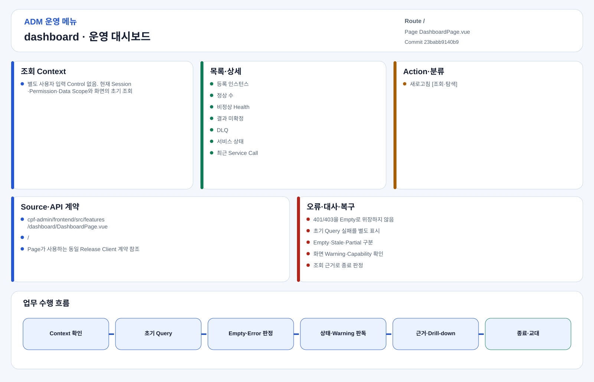

### 이 장에서 끝내는 업무

서비스 상태·복구 대기 항목의 우선순위를 탐지한다.

### 메뉴 식별·책임

| 항목 | 값 |
|---|---|
| Route | `/` |
| 메뉴 ID | `dashboard` |
| Menu Code | `dashboard` |
| 업무 그룹 | 홈 |
| Frontend Page | `cpf-admin/frontend/src/features/dashboard/DashboardPage.vue` |
| Permission | 조회 권한 |
| 기준 Commit | `23babb9140b90e501d6ac715e7b77f55b66198a5` |

### Source·API 근거

| 구분 | 기준 |
|---|---|
| Frontend Page | `cpf-admin/frontend/src/features/dashboard/DashboardPage.vue` |
| Router | `/` |
| API 추적 | 화면에서 제공하는 기능을 통해 호출한다. 문서에 명시되지 않은 Endpoint를 Browser나 외부 Script에서 임의 호출하지 않는다. |

아래 표는 이 메뉴에서 실제로 확인·입력·실행할 항목을 정리한다. 화면에 없는 Field·Button·상태를 임의로 가정하지 않는다.

### 검색·입력 Field

별도 사용자 입력 Control이 없다. 현재 Session·Permission·Data Scope와 Page가 정의한 초기 Query로 데이터를 읽는다. 새로고침은 같은 Context를 다시 조회하며 Owner 데이터는 변경하지 않는다.

### 목록 Column·상세 Field

| 표시값 | 운영 의미 | 교차 확인 |
|---|---|---|
| `등록 인스턴스` | 운영 대시보드 상세에서 대상의 현재 속성 또는 처리 결과를 확인하는 값이다. | 상세·재조회 결과와 비교하고 Stale·Masking·단위 차이를 확인한다. |
| `정상 수` | 동일한 집계 시간 창·단위·Filter에서 비교해야 하는 수치다. | 같은 Filter·집계 시간 창·단위의 상세 Row 또는 Metric으로 대사한다. |
| `비정상 Health` | 현재 상태와 Terminal 여부, 다음 Action 가능 여부를 판단하는 값이다. | Last Updated·Terminal 조건·Owner 상태와 함께 확인한다. |
| `결과 미확정` | 운영 대시보드 상세에서 대상의 현재 속성 또는 처리 결과를 확인하는 값이다. | 상세·재조회 결과와 비교하고 Stale·Masking·단위 차이를 확인한다. |
| `DLQ` | 오류·Drift·결과 불명 범위를 나타내며 원인과 복구 Owner를 연결해야 한다. | 원인 식별자·실패 Stage·마지막 갱신 시각을 상세와 대조한다. |
| `서비스 상태` | 현재 상태와 Terminal 여부, 다음 Action 가능 여부를 판단하는 값이다. | Last Updated·Terminal 조건·Owner 상태와 함께 확인한다. |
| `최근 Service Call` | 운영 대시보드의 대상 레코드를 상세·Owner·Audit에서 연결하는 식별자다. | 상세·Log·Trace·Audit에서 같은 대상을 가리키는지 확인한다. |

#### 결과 판독 순서

1. 조회 완료 시각·Filter·Paging·Sort와 화면 Warning을 확인한다.
2. Empty·Stale·Partial을 정상 0건과 구분한다.
3. 식별자·상태·Version·오류·시각을 같은 Query Context의 상세와 Owner 원장에서 비교한다.
4. Masking된 값은 Raw Permission과 Reason 없이 복원·Export하지 않는다.
5. 집계와 상세가 다르면 집계 시간 창·Timezone·Owner Update 시각을 맞춰 대사한다.

### Button·Action

| Action | 분류 | 활성 조건 | Side Effect·정상 결과 |
|---|---|---|---|
| **새로고침** | 조회·탐색 | 조회 Permission과 Query Validation을 충족하고 동일 조회가 진행 중이 아님 | 새로고침 결과의 조회 시각·Filter·Source Version·Warning이 갱신되며 Owner 데이터는 변경하지 않는다. |

### 정상 업무 전체 절차

1. `/`에 진입해 Page Header와 Route가 **운영 대시보드** 기능을 가리키는지 확인한다.
2. 로그인 Session·Environment·Data Scope·기준일·Timezone을 고정한다.
3. 별도 사용자 입력 없이 초기 조회가 끝날 때까지 기다리고, 필요할 때만 같은 Context로 새로고침한다.
4. Loading 종료 후 Empty·Error·Stale·Partial 상태와 화면 Warning을 먼저 판정한다.
5. **등록 인스턴스, 정상 수, 비정상 Health, 결과 미확정, DLQ**를 읽고 식별자·상태·Version·시각을 Owner 원장과 대사한다.
6. 화면이 제공하는 Log·Metric·Trace와 조회·Raw·Export 접근 기록이 있으면 해당 Audit를 교차 확인한다.
7. 이 장의 **종료 판정**과 다음 확인 시각·Evidence Link를 교대 기록에 남긴다.

### 메뉴 고유 판정·금지 사항

- **목적:** 서비스 상태·복구 대기 항목의 우선순위를 탐지한다.
- **종료 판정:** KPI는 탐지용이며 Service Registry·Reliability 원본 상세가 최종 판정 근거다.
- 조회 화면에서 직접 Owner 데이터를 변경하거나 Browser Tool로 우회하지 않는다.
- Partial 조회를 정상 전체 결과로 합치지 않는다.

### 오류·경계·동시성·복구

| 상황 | 화면 징후 | 운영 조치 | 종료 증적 |
|---|---|---|---|
| 401·Session | Session 만료·CSRF·Origin 실패 | 로그인 상태와 BFF Session을 확인한 뒤 같은 Query Context로 다시 조회한다. | 401/403 응답·Session Audit |
| 403·Data Scope | 메뉴·Button·Raw·Export가 거부됨 | Menu·Button·API·Owner Permission과 Data Scope를 확인하고 우회하지 않는다. | Deny Audit·요청 Permission |
| Timeout·Dependency | 일부 조회 Source 응답 지연 | Correlation ID·Query Context·실패 Source를 기록하고 같은 조건으로 재조회한다. | 조회 시각·실패 Source·재조회 결과 |
| Partial·Stale | 일부 대상만 Success 또는 조회 Source 누락 | 성공·실패·미응답을 분리하고 누락 범위와 Version을 표시한다. | Target별 결과·Version |

### 응답 유실·부분 조회 처리

1. 검색 조건·Data Scope·Paging·조회 시각·Correlation ID를 기록한다.
2. 같은 조건으로 재조회하되 실패 Source만 분리한다.
3. 정상 Source 결과를 유지하고 실패·Stale Source를 명시한다.
4. 집계와 원본 상세가 다르면 Owner 상세를 기준으로 Reconcile Case를 연다.
5. 조회 시각·Source Version·0건 또는 일치 결과를 증적으로 남긴다.

### Log·Metric·Trace·Audit와 교대 기록

| 증적 | 필수 값 |
|---|---|
| Audit | Actor·Permission·Data Scope·Raw/Export 접근·Query Context·Result |
| Log | Environment·Instance·operationId·transactionId·failureStage·errorCode |
| Metric | 동일 시간 창의 Success·Failure·Latency·Queue·Retry·Partial·Unknown |
| Trace | root/segment/attempt·Owner·DB/Kafka/외부 의존성 Span |
| 상태 원장 | Target ID·Version·Checksum·Desired/Actual·Last Updated·Terminal 여부 |

```text
Menu=
Route=
Environment=
DataScope=
Query=
QueryAt=
CorrelationId=
SourceVersion=
Result=SUCCESS|EMPTY|STALE|PARTIAL|FAILED
FailedSources=
EvidenceLinks=
NextCheckAt=
```

### 실무 Workbook

**상황:** 서비스 상태·복구 대기 항목의 우선순위를 탐지한다. 화면이 일부 Source Timeout 때문에 Partial 결과를 표시했다.

1. Query·Data Scope·조회 시각·Correlation ID를 기록한다.
2. 정상 결과를 0건으로 덮어쓰지 않고 실패 Source만 재조회한다.
3. 등록 인스턴스, 정상 수, 비정상 Health 값을 원본 상세와 같은 시간 기준으로 비교한다.
4. 불일치가 계속되면 Incident 또는 Reconcile Case를 생성한다.
5. KPI는 탐지용이며 Service Registry·Reliability 원본 상세가 최종 판정 근거다.
6. Source Version과 다음 확인 시각을 교대 기록에 남긴다.

### 독립 수행 검수 Checklist

- [ ] `/`와 Page Source를 찾고 화면 목적을 설명할 수 있다.
- [ ] 별도 사용자 입력이 없고 자동 Query Context·새로고침 동작을 설명할 수 있다.
- [ ] 7개 표시값을 Owner 상태·Version·Audit와 대사할 수 있다.
- [ ] 1개 Action의 분류·활성 조건·Side Effect를 설명할 수 있다.
- [ ] Empty·401·403·Timeout·Stale·Partial을 서로 다른 조회 상태로 처리할 수 있다.
- [ ] 조회 응답 유실 시 같은 Query Context로 재조회하고 Correlation ID·조회 시각·Source Version으로 결과를 대사할 수 있다.
- [ ] 교대 기록만으로 다음 담당자가 Target·상태·복구 기한을 이어받을 수 있다.

## 2. topology — 서비스 토폴로지

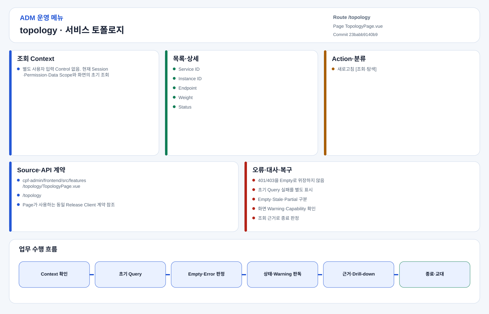

### 이 장에서 끝내는 업무

Service·Endpoint·Instance 연결과 Routing 상태를 확인한다.

### 메뉴 식별·책임

| 항목 | 값 |
|---|---|
| Route | `/topology` |
| 메뉴 ID | `topology` |
| Menu Code | `topology` |
| 업무 그룹 | 홈 |
| Frontend Page | `cpf-admin/frontend/src/features/topology/TopologyPage.vue` |
| Permission | 조회 권한 |
| 기준 Commit | `23babb9140b90e501d6ac715e7b77f55b66198a5` |

### Source·API 근거

| 구분 | 기준 |
|---|---|
| Frontend Page | `cpf-admin/frontend/src/features/topology/TopologyPage.vue` |
| Router | `/topology` |
| API 추적 | 화면에서 제공하는 기능을 통해 호출한다. 문서에 명시되지 않은 Endpoint를 Browser나 외부 Script에서 임의 호출하지 않는다. |

아래 표는 이 메뉴에서 실제로 확인·입력·실행할 항목을 정리한다. 화면에 없는 Field·Button·상태를 임의로 가정하지 않는다.

### 검색·입력 Field

별도 사용자 입력 Control이 없다. 현재 Session·Permission·Data Scope와 Page가 정의한 초기 Query로 데이터를 읽는다. 새로고침은 같은 Context를 다시 조회하며 Owner 데이터는 변경하지 않는다.

### 목록 Column·상세 Field

| 표시값 | 운영 의미 | 교차 확인 |
|---|---|---|
| `Service ID` | 서비스 토폴로지의 대상 레코드를 상세·Owner·Audit에서 연결하는 식별자다. | 상세·Log·Trace·Audit에서 같은 대상을 가리키는지 확인한다. |
| `Instance ID` | 서비스 토폴로지의 대상 레코드를 상세·Owner·Audit에서 연결하는 식별자다. | 상세·Log·Trace·Audit에서 같은 대상을 가리키는지 확인한다. |
| `Endpoint` | 서비스 토폴로지의 대상 레코드를 상세·Owner·Audit에서 연결하는 식별자다. | 상세·Log·Trace·Audit에서 같은 대상을 가리키는지 확인한다. |
| `Weight` | 동일한 집계 시간 창·단위·Filter에서 비교해야 하는 수치다. | 상세·재조회 결과와 비교하고 Stale·Masking·단위 차이를 확인한다. |
| `Status` | 현재 상태와 Terminal 여부, 다음 Action 가능 여부를 판단하는 값이다. | Last Updated·Terminal 조건·Owner 상태와 함께 확인한다. |

#### 결과 판독 순서

1. 조회 완료 시각·Filter·Paging·Sort와 화면 Warning을 확인한다.
2. Empty·Stale·Partial을 정상 0건과 구분한다.
3. 식별자·상태·Version·오류·시각을 같은 Query Context의 상세와 Owner 원장에서 비교한다.
4. Masking된 값은 Raw Permission과 Reason 없이 복원·Export하지 않는다.
5. 집계와 상세가 다르면 집계 시간 창·Timezone·Owner Update 시각을 맞춰 대사한다.

### Button·Action

| Action | 분류 | 활성 조건 | Side Effect·정상 결과 |
|---|---|---|---|
| **새로고침** | 조회·탐색 | 조회 Permission과 Query Validation을 충족하고 동일 조회가 진행 중이 아님 | 새로고침 결과의 조회 시각·Filter·Source Version·Warning이 갱신되며 Owner 데이터는 변경하지 않는다. |

### 정상 업무 전체 절차

1. `/topology`에 진입해 Page Header와 Route가 **서비스 토폴로지** 기능을 가리키는지 확인한다.
2. 로그인 Session·Environment·Data Scope·기준일·Timezone을 고정한다.
3. 별도 사용자 입력 없이 초기 조회가 끝날 때까지 기다리고, 필요할 때만 같은 Context로 새로고침한다.
4. Loading 종료 후 Empty·Error·Stale·Partial 상태와 화면 Warning을 먼저 판정한다.
5. **Service ID, Instance ID, Endpoint, Weight, Status**를 읽고 식별자·상태·Version·시각을 Owner 원장과 대사한다.
6. 화면이 제공하는 Log·Metric·Trace와 조회·Raw·Export 접근 기록이 있으면 해당 Audit를 교차 확인한다.
7. 이 장의 **종료 판정**과 다음 확인 시각·Evidence Link를 교대 기록에 남긴다.

### 메뉴 고유 판정·금지 사항

- **목적:** Service·Endpoint·Instance 연결과 Routing 상태를 확인한다.
- **종료 판정:** 고아 Endpoint, 비정상 Instance, Weight·Status 불일치를 원본 Registry와 대사한다.
- 조회 화면에서 직접 Owner 데이터를 변경하거나 Browser Tool로 우회하지 않는다.
- Partial 조회를 정상 전체 결과로 합치지 않는다.

### 오류·경계·동시성·복구

| 상황 | 화면 징후 | 운영 조치 | 종료 증적 |
|---|---|---|---|
| 401·Session | Session 만료·CSRF·Origin 실패 | 로그인 상태와 BFF Session을 확인한 뒤 같은 Query Context로 다시 조회한다. | 401/403 응답·Session Audit |
| 403·Data Scope | 메뉴·Button·Raw·Export가 거부됨 | Menu·Button·API·Owner Permission과 Data Scope를 확인하고 우회하지 않는다. | Deny Audit·요청 Permission |
| Timeout·Dependency | 일부 조회 Source 응답 지연 | Correlation ID·Query Context·실패 Source를 기록하고 같은 조건으로 재조회한다. | 조회 시각·실패 Source·재조회 결과 |
| Partial·Stale | 일부 대상만 Success 또는 조회 Source 누락 | 성공·실패·미응답을 분리하고 누락 범위와 Version을 표시한다. | Target별 결과·Version |

### 응답 유실·부분 조회 처리

1. 검색 조건·Data Scope·Paging·조회 시각·Correlation ID를 기록한다.
2. 같은 조건으로 재조회하되 실패 Source만 분리한다.
3. 정상 Source 결과를 유지하고 실패·Stale Source를 명시한다.
4. 집계와 원본 상세가 다르면 Owner 상세를 기준으로 Reconcile Case를 연다.
5. 조회 시각·Source Version·0건 또는 일치 결과를 증적으로 남긴다.

### Log·Metric·Trace·Audit와 교대 기록

| 증적 | 필수 값 |
|---|---|
| Audit | Actor·Permission·Data Scope·Raw/Export 접근·Query Context·Result |
| Log | Environment·Instance·operationId·transactionId·failureStage·errorCode |
| Metric | 동일 시간 창의 Success·Failure·Latency·Queue·Retry·Partial·Unknown |
| Trace | root/segment/attempt·Owner·DB/Kafka/외부 의존성 Span |
| 상태 원장 | Target ID·Version·Checksum·Desired/Actual·Last Updated·Terminal 여부 |

```text
Menu=
Route=
Environment=
DataScope=
Query=
QueryAt=
CorrelationId=
SourceVersion=
Result=SUCCESS|EMPTY|STALE|PARTIAL|FAILED
FailedSources=
EvidenceLinks=
NextCheckAt=
```

### 실무 Workbook

**상황:** Service·Endpoint·Instance 연결과 Routing 상태를 확인한다. 화면이 일부 Source Timeout 때문에 Partial 결과를 표시했다.

1. Query·Data Scope·조회 시각·Correlation ID를 기록한다.
2. 정상 결과를 0건으로 덮어쓰지 않고 실패 Source만 재조회한다.
3. Service ID, 명, Instance ID 값을 원본 상세와 같은 시간 기준으로 비교한다.
4. 불일치가 계속되면 Incident 또는 Reconcile Case를 생성한다.
5. 고아 Endpoint, 비정상 Instance, Weight·Status 불일치를 원본 Registry와 대사한다.
6. Source Version과 다음 확인 시각을 교대 기록에 남긴다.

### 독립 수행 검수 Checklist

- [ ] `/topology`와 Page Source를 찾고 화면 목적을 설명할 수 있다.
- [ ] 별도 사용자 입력이 없고 자동 Query Context·새로고침 동작을 설명할 수 있다.
- [ ] 5개 표시값을 Owner 상태·Version·Audit와 대사할 수 있다.
- [ ] 1개 Action의 분류·활성 조건·Side Effect를 설명할 수 있다.
- [ ] Empty·401·403·Timeout·Stale·Partial을 서로 다른 조회 상태로 처리할 수 있다.
- [ ] 조회 응답 유실 시 같은 Query Context로 재조회하고 Correlation ID·조회 시각·Source Version으로 결과를 대사할 수 있다.
- [ ] 교대 기록만으로 다음 담당자가 Target·상태·복구 기한을 이어받을 수 있다.

## 3. capacity — 용량·SLO 기본 Signal

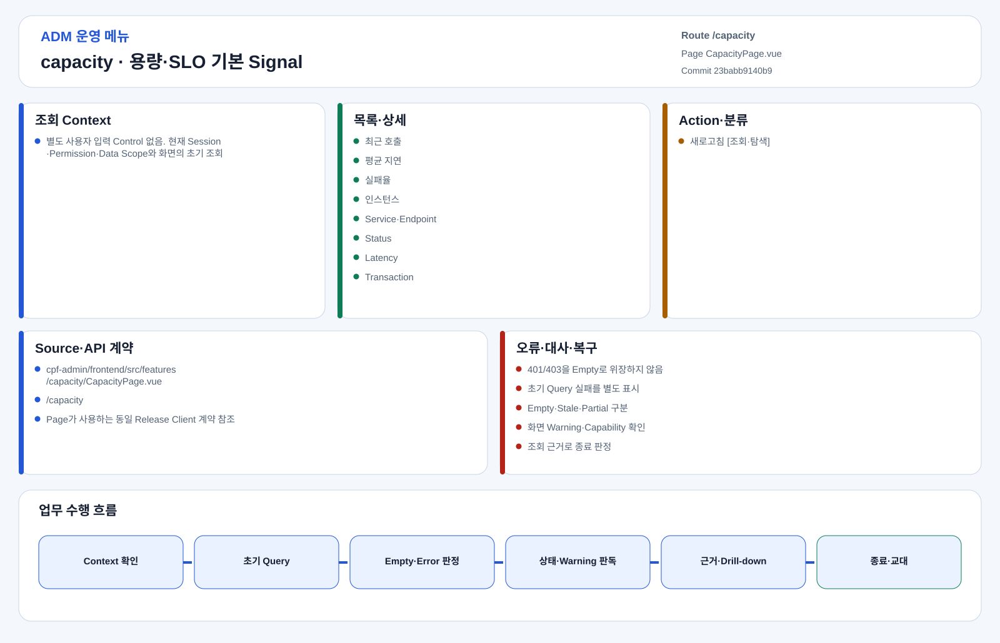

### 이 장에서 끝내는 업무

최근 호출·지연·실패율을 비교하여 우선순위가 높은 용량 위험을 식별한다.

### 메뉴 식별·책임

| 항목 | 값 |
|---|---|
| Route | `/capacity` |
| 메뉴 ID | `capacity` |
| Menu Code | `capacity` |
| 업무 그룹 | 홈 |
| Frontend Page | `cpf-admin/frontend/src/features/capacity/CapacityPage.vue` |
| Permission | 조회 권한 |
| 기준 Commit | `23babb9140b90e501d6ac715e7b77f55b66198a5` |

### Source·API 근거

| 구분 | 기준 |
|---|---|
| Frontend Page | `cpf-admin/frontend/src/features/capacity/CapacityPage.vue` |
| Router | `/capacity` |
| API 추적 | 화면에서 제공하는 기능을 통해 호출한다. 문서에 명시되지 않은 Endpoint를 Browser나 외부 Script에서 임의 호출하지 않는다. |

아래 표는 이 메뉴에서 실제로 확인·입력·실행할 항목을 정리한다. 화면에 없는 Field·Button·상태를 임의로 가정하지 않는다.

### 검색·입력 Field

별도 사용자 입력 Control이 없다. 현재 Session·Permission·Data Scope와 Page가 정의한 초기 Query로 데이터를 읽는다. 새로고침은 같은 Context를 다시 조회하며 Owner 데이터는 변경하지 않는다.

### 목록 Column·상세 Field

| 표시값 | 운영 의미 | 교차 확인 |
|---|---|---|
| `최근 호출` | 용량·SLO 기본 Signal 상세에서 대상의 현재 속성 또는 처리 결과를 확인하는 값이다. | 상세·재조회 결과와 비교하고 Stale·Masking·단위 차이를 확인한다. |
| `평균 지연` | 용량·SLO 기본 Signal 상세에서 대상의 현재 속성 또는 처리 결과를 확인하는 값이다. | 상세·재조회 결과와 비교하고 Stale·Masking·단위 차이를 확인한다. |
| `실패율` | 용량·SLO 기본 Signal 상세에서 대상의 현재 속성 또는 처리 결과를 확인하는 값이다. | 상세·재조회 결과와 비교하고 Stale·Masking·단위 차이를 확인한다. |
| `인스턴스` | 용량·SLO 기본 Signal 상세에서 대상의 현재 속성 또는 처리 결과를 확인하는 값이다. | 상세·재조회 결과와 비교하고 Stale·Masking·단위 차이를 확인한다. |
| `Service·Endpoint` | 용량·SLO 기본 Signal의 대상 레코드를 상세·Owner·Audit에서 연결하는 식별자다. | 상세·Log·Trace·Audit에서 같은 대상을 가리키는지 확인한다. |
| `Status` | 현재 상태와 Terminal 여부, 다음 Action 가능 여부를 판단하는 값이다. | Last Updated·Terminal 조건·Owner 상태와 함께 확인한다. |
| `Latency` | 동일한 집계 시간 창·단위·Filter에서 비교해야 하는 수치다. | 같은 Filter·집계 시간 창·단위의 상세 Row 또는 Metric으로 대사한다. |
| `Transaction` | 용량·SLO 기본 Signal의 대상 레코드를 상세·Owner·Audit에서 연결하는 식별자다. | 상세·Log·Trace·Audit에서 같은 대상을 가리키는지 확인한다. |

#### 결과 판독 순서

1. 조회 완료 시각·Filter·Paging·Sort와 화면 Warning을 확인한다.
2. Empty·Stale·Partial을 정상 0건과 구분한다.
3. 식별자·상태·Version·오류·시각을 같은 Query Context의 상세와 Owner 원장에서 비교한다.
4. Masking된 값은 Raw Permission과 Reason 없이 복원·Export하지 않는다.
5. 집계와 상세가 다르면 집계 시간 창·Timezone·Owner Update 시각을 맞춰 대사한다.

### Button·Action

| Action | 분류 | 활성 조건 | Side Effect·정상 결과 |
|---|---|---|---|
| **새로고침** | 조회·탐색 | 조회 Permission과 Query Validation을 충족하고 동일 조회가 진행 중이 아님 | 새로고침 결과의 조회 시각·Filter·Source Version·Warning이 갱신되며 Owner 데이터는 변경하지 않는다. |

### 정상 업무 전체 절차

1. `/capacity`에 진입해 Page Header와 Route가 **용량·SLO 기본 Signal** 기능을 가리키는지 확인한다.
2. 로그인 Session·Environment·Data Scope·기준일·Timezone을 고정한다.
3. 별도 사용자 입력 없이 초기 조회가 끝날 때까지 기다리고, 필요할 때만 같은 Context로 새로고침한다.
4. Loading 종료 후 Empty·Error·Stale·Partial 상태와 화면 Warning을 먼저 판정한다.
5. **최근 호출, 평균 지연, 실패율, 인스턴스, Service·Endpoint**를 읽고 식별자·상태·Version·시각을 Owner 원장과 대사한다.
6. 화면이 제공하는 Log·Metric·Trace와 조회·Raw·Export 접근 기록이 있으면 해당 Audit를 교차 확인한다.
7. 이 장의 **종료 판정**과 다음 확인 시각·Evidence Link를 교대 기록에 남긴다.

### 메뉴 고유 판정·금지 사항

- **목적:** 최근 호출·지연·실패율을 비교하여 우선순위가 높은 용량 위험을 식별한다.
- **종료 판정:** 같은 시간 창의 Metric과 Instance 상태를 비교하고 장기 추세는 Metrics Backend에서 확인한다.
- 조회 화면에서 직접 Owner 데이터를 변경하거나 Browser Tool로 우회하지 않는다.
- Partial 조회를 정상 전체 결과로 합치지 않는다.

### 오류·경계·동시성·복구

| 상황 | 화면 징후 | 운영 조치 | 종료 증적 |
|---|---|---|---|
| 401·Session | Session 만료·CSRF·Origin 실패 | 로그인 상태와 BFF Session을 확인한 뒤 같은 Query Context로 다시 조회한다. | 401/403 응답·Session Audit |
| 403·Data Scope | 메뉴·Button·Raw·Export가 거부됨 | Menu·Button·API·Owner Permission과 Data Scope를 확인하고 우회하지 않는다. | Deny Audit·요청 Permission |
| Timeout·Dependency | 일부 조회 Source 응답 지연 | Correlation ID·Query Context·실패 Source를 기록하고 같은 조건으로 재조회한다. | 조회 시각·실패 Source·재조회 결과 |
| Partial·Stale | 일부 대상만 Success 또는 조회 Source 누락 | 성공·실패·미응답을 분리하고 누락 범위와 Version을 표시한다. | Target별 결과·Version |

### 응답 유실·부분 조회 처리

1. 검색 조건·Data Scope·Paging·조회 시각·Correlation ID를 기록한다.
2. 같은 조건으로 재조회하되 실패 Source만 분리한다.
3. 정상 Source 결과를 유지하고 실패·Stale Source를 명시한다.
4. 집계와 원본 상세가 다르면 Owner 상세를 기준으로 Reconcile Case를 연다.
5. 조회 시각·Source Version·0건 또는 일치 결과를 증적으로 남긴다.

### Log·Metric·Trace·Audit와 교대 기록

| 증적 | 필수 값 |
|---|---|
| Audit | Actor·Permission·Data Scope·Raw/Export 접근·Query Context·Result |
| Log | Environment·Instance·operationId·transactionId·failureStage·errorCode |
| Metric | 동일 시간 창의 Success·Failure·Latency·Queue·Retry·Partial·Unknown |
| Trace | root/segment/attempt·Owner·DB/Kafka/외부 의존성 Span |
| 상태 원장 | Target ID·Version·Checksum·Desired/Actual·Last Updated·Terminal 여부 |

```text
Menu=
Route=
Environment=
DataScope=
Query=
QueryAt=
CorrelationId=
SourceVersion=
Result=SUCCESS|EMPTY|STALE|PARTIAL|FAILED
FailedSources=
EvidenceLinks=
NextCheckAt=
```

### 실무 Workbook

**상황:** 최근 호출·지연·실패율을 비교하여 우선순위가 높은 용량 위험을 식별한다. 화면이 일부 Source Timeout 때문에 Partial 결과를 표시했다.

1. Query·Data Scope·조회 시각·Correlation ID를 기록한다.
2. 정상 결과를 0건으로 덮어쓰지 않고 실패 Source만 재조회한다.
3. 최근 호출, 평균 지연, 실패율 값을 원본 상세와 같은 시간 기준으로 비교한다.
4. 불일치가 계속되면 Incident 또는 Reconcile Case를 생성한다.
5. 같은 시간 창의 Metric과 Instance 상태를 비교하고 장기 추세는 Metrics Backend에서 확인한다.
6. Source Version과 다음 확인 시각을 교대 기록에 남긴다.

### 독립 수행 검수 Checklist

- [ ] `/capacity`와 Page Source를 찾고 화면 목적을 설명할 수 있다.
- [ ] 별도 사용자 입력이 없고 자동 Query Context·새로고침 동작을 설명할 수 있다.
- [ ] 8개 표시값을 Owner 상태·Version·Audit와 대사할 수 있다.
- [ ] 1개 Action의 분류·활성 조건·Side Effect를 설명할 수 있다.
- [ ] Empty·401·403·Timeout·Stale·Partial을 서로 다른 조회 상태로 처리할 수 있다.
- [ ] 조회 응답 유실 시 같은 Query Context로 재조회하고 Correlation ID·조회 시각·Source Version으로 결과를 대사할 수 있다.
- [ ] 교대 기록만으로 다음 담당자가 Target·상태·복구 기한을 이어받을 수 있다.

## 4. logs — 로그 조회

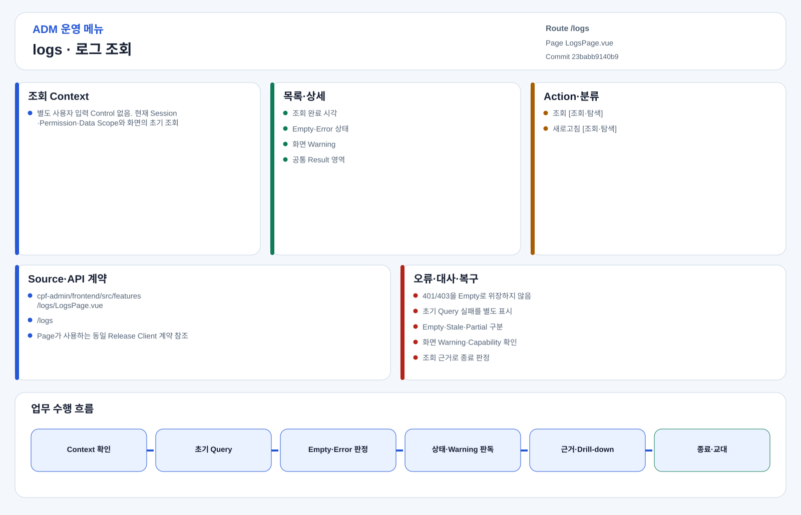

### 이 장에서 끝내는 업무

표준 로그 조회 화면에서 거래·오류·식별자를 추적한다.

### 메뉴 식별·책임

| 항목 | 값 |
|---|---|
| Route | `/logs` |
| 메뉴 ID | `logs` |
| Menu Code | `logs` |
| 업무 그룹 | 통합 관제 |
| Frontend Page | `cpf-admin/frontend/src/features/logs/LogsPage.vue` |
| Permission | 해당 없음 |
| 기준 Commit | `23babb9140b90e501d6ac715e7b77f55b66198a5` |

### Source·API 근거

| 구분 | 기준 |
|---|---|
| Frontend Page | `cpf-admin/frontend/src/features/logs/LogsPage.vue` |
| Router | `/logs` |
| API 추적 | 화면에서 제공하는 기능을 통해 호출한다. 문서에 명시되지 않은 Endpoint를 Browser나 외부 Script에서 임의 호출하지 않는다. |

아래 표는 이 메뉴에서 실제로 확인·입력·실행할 항목을 정리한다. 화면에 없는 Field·Button·상태를 임의로 가정하지 않는다.

### 검색·입력 Field

별도 사용자 입력 Control이 없다. 현재 Session·Permission·Data Scope와 Page가 정의한 초기 Query로 데이터를 읽는다. 새로고침은 같은 Context를 다시 조회하며 Owner 데이터는 변경하지 않는다.

### 목록 Column·상세 Field

| 표시값 | 운영 의미 | 교차 확인 |
|---|---|---|
| `조회 완료 시각` | 상태 발생·갱신·유효 시점을 나타내며 화면 Timezone을 기준으로 해석한다. | 상세·재조회 결과와 비교하고 Stale·Masking·단위 차이를 확인한다. |
| `Empty·Error 상태` | 현재 상태와 Terminal 여부, 다음 Action 가능 여부를 판단하는 값이다. | Last Updated·Terminal 조건·Owner 상태와 함께 확인한다. |
| `화면 Warning` | 오류·Drift·결과 불명 범위를 나타내며 원인과 복구 Owner를 연결해야 한다. | 원인 식별자·실패 Stage·마지막 갱신 시각을 상세와 대조한다. |
| `공통 Result 영역` | 현재 상태와 Terminal 여부, 다음 Action 가능 여부를 판단하는 값이다. | Last Updated·Terminal 조건·Owner 상태와 함께 확인한다. |

#### 결과 판독 순서

1. 조회 완료 시각·Filter·Paging·Sort와 화면 Warning을 확인한다.
2. Empty·Stale·Partial을 정상 0건과 구분한다.
3. 식별자·상태·Version·오류·시각을 같은 Query Context의 상세와 Owner 원장에서 비교한다.
4. Masking된 값은 Raw Permission과 Reason 없이 복원·Export하지 않는다.
5. 집계와 상세가 다르면 집계 시간 창·Timezone·Owner Update 시각을 맞춰 대사한다.

### Button·Action

| Action | 분류 | 활성 조건 | Side Effect·정상 결과 |
|---|---|---|---|
| **조회** | 조회·탐색 | 조회 Permission과 Query Validation을 충족하고 동일 조회가 진행 중이 아님 | 조회 결과의 조회 시각·Filter·Source Version·Warning이 갱신되며 Owner 데이터는 변경하지 않는다. |
| **새로고침** | 조회·탐색 | 조회 Permission과 Query Validation을 충족하고 동일 조회가 진행 중이 아님 | 새로고침 결과의 조회 시각·Filter·Source Version·Warning이 갱신되며 Owner 데이터는 변경하지 않는다. |

### 정상 업무 전체 절차

1. `/logs`에 진입해 Page Header와 Route가 **로그 조회** 기능을 가리키는지 확인한다.
2. 로그인 Session·Environment·Data Scope·기준일·Timezone을 고정한다.
3. 별도 사용자 입력 없이 초기 조회가 끝날 때까지 기다리고, 필요할 때만 같은 Context로 새로고침한다.
4. Loading 종료 후 Empty·Error·Stale·Partial 상태와 화면 Warning을 먼저 판정한다.
5. **조회 완료 시각, Empty·Error 상태, 화면 Warning, 공통 Result 영역**를 읽고 식별자·상태·Version·시각을 Owner 원장과 대사한다.
6. 화면이 제공하는 Log·Metric·Trace와 조회·Raw·Export 접근 기록이 있으면 해당 Audit를 교차 확인한다.
7. 이 장의 **종료 판정**과 다음 확인 시각·Evidence Link를 교대 기록에 남긴다.

### 메뉴 고유 판정·금지 사항

- **목적:** 표준 로그 조회 화면에서 거래·오류·식별자를 추적한다.
- **종료 판정:** 검색 조건·Masking·Retention과 Transaction/Trace 연결을 유지한다.
- 조회 화면에서 직접 Owner 데이터를 변경하거나 Browser Tool로 우회하지 않는다.
- Partial 조회를 정상 전체 결과로 합치지 않는다.

### 오류·경계·동시성·복구

| 상황 | 화면 징후 | 운영 조치 | 종료 증적 |
|---|---|---|---|
| 401·Session | Session 만료·CSRF·Origin 실패 | 로그인 상태와 BFF Session을 확인한 뒤 같은 Query Context로 다시 조회한다. | 401/403 응답·Session Audit |
| 403·Data Scope | 메뉴·Button·Raw·Export가 거부됨 | Menu·Button·API·Owner Permission과 Data Scope를 확인하고 우회하지 않는다. | Deny Audit·요청 Permission |
| Timeout·Dependency | 일부 조회 Source 응답 지연 | Correlation ID·Query Context·실패 Source를 기록하고 같은 조건으로 재조회한다. | 조회 시각·실패 Source·재조회 결과 |
| Partial·Stale | 일부 대상만 Success 또는 조회 Source 누락 | 성공·실패·미응답을 분리하고 누락 범위와 Version을 표시한다. | Target별 결과·Version |

### 응답 유실·부분 조회 처리

1. 검색 조건·Data Scope·Paging·조회 시각·Correlation ID를 기록한다.
2. 같은 조건으로 재조회하되 실패 Source만 분리한다.
3. 정상 Source 결과를 유지하고 실패·Stale Source를 명시한다.
4. 집계와 원본 상세가 다르면 Owner 상세를 기준으로 Reconcile Case를 연다.
5. 조회 시각·Source Version·0건 또는 일치 결과를 증적으로 남긴다.

### Log·Metric·Trace·Audit와 교대 기록

| 증적 | 필수 값 |
|---|---|
| Audit | Actor·Permission·Data Scope·Raw/Export 접근·Query Context·Result |
| Log | Environment·Instance·operationId·transactionId·failureStage·errorCode |
| Metric | 동일 시간 창의 Success·Failure·Latency·Queue·Retry·Partial·Unknown |
| Trace | root/segment/attempt·Owner·DB/Kafka/외부 의존성 Span |
| 상태 원장 | Target ID·Version·Checksum·Desired/Actual·Last Updated·Terminal 여부 |

```text
Menu=
Route=
Environment=
DataScope=
Query=
QueryAt=
CorrelationId=
SourceVersion=
Result=SUCCESS|EMPTY|STALE|PARTIAL|FAILED
FailedSources=
EvidenceLinks=
NextCheckAt=
```

### 실무 Workbook

**상황:** 표준 로그 조회 화면에서 거래·오류·식별자를 추적한다. 화면이 일부 Source Timeout 때문에 Partial 결과를 표시했다.

1. Query·Data Scope·조회 시각·Correlation ID를 기록한다.
2. 정상 결과를 0건으로 덮어쓰지 않고 실패 Source만 재조회한다.
3. 별도 입력 없이 자동 조회가 끝날 때까지 기다리고, 필요할 때만 새로고침을 한 번 수행한다.
4. 불일치가 계속되면 Incident 또는 Reconcile Case를 생성한다.
5. 검색 조건·Masking·Retention과 Transaction/Trace 연결을 유지한다.
6. Source Version과 다음 확인 시각을 교대 기록에 남긴다.

### 독립 수행 검수 Checklist

- [ ] `/logs`와 Page Source를 찾고 화면 목적을 설명할 수 있다.
- [ ] 별도 사용자 입력이 없고 자동 Query Context·새로고침 동작을 설명할 수 있다.
- [ ] 4개 표시값을 Owner 상태·Version·Audit와 대사할 수 있다.
- [ ] 2개 Action의 분류·활성 조건·Side Effect를 설명할 수 있다.
- [ ] Empty·401·403·Timeout·Stale·Partial을 서로 다른 조회 상태로 처리할 수 있다.
- [ ] 조회 응답 유실 시 같은 Query Context로 재조회하고 Correlation ID·조회 시각·Source Version으로 결과를 대사할 수 있다.
- [ ] 교대 기록만으로 다음 담당자가 Target·상태·복구 기한을 이어받을 수 있다.

## 5. transactionGroups — 거래 그룹·구간 추적

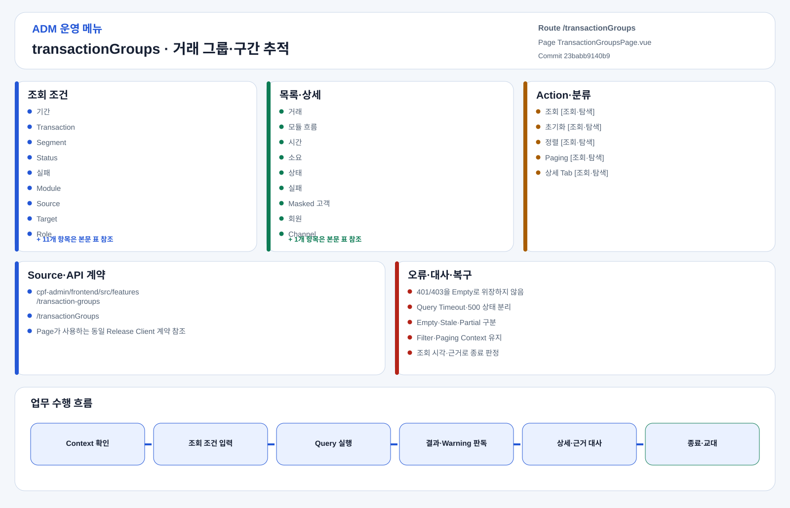

### 이 장에서 끝내는 업무

거래 전체와 Segment·외부 연계를 시간 순서로 추적한다.

### 메뉴 식별·책임

| 항목 | 값 |
|---|---|
| Route | `/transactionGroups` |
| 메뉴 ID | `transactionGroups` |
| Menu Code | `transactionGroups` |
| 업무 그룹 | 온라인 운영 |
| Frontend Page | `cpf-admin/frontend/src/features/transaction-groups/TransactionGroupsPage.vue` |
| Permission | 거래 조회 Permission·Data Scope |
| 기준 Commit | `23babb9140b90e501d6ac715e7b77f55b66198a5` |

### Source·API 근거

| 구분 | 기준 |
|---|---|
| Frontend Page | `cpf-admin/frontend/src/features/transaction-groups/TransactionGroupsPage.vue` |
| Router | `/transactionGroups` |
| API 추적 | 화면에서 제공하는 기능을 통해 호출한다. 문서에 명시되지 않은 Endpoint를 Browser나 외부 Script에서 임의 호출하지 않는다. |

아래 표는 이 메뉴에서 실제로 확인·입력·실행할 항목을 정리한다. 화면에 없는 Field·Button·상태를 임의로 가정하지 않는다.

### 검색·입력 Field

| Field | Control | 업무 의미 | 기본값·Validation·주의 |
|---|---|---|---|
| `기간` | 날짜·시간 입력 | 조회 또는 적용의 유효 시간 범위를 정하며 Timezone과 시작·종료 순서를 함께 확인한다. | Timezone을 고정하고 시작≤종료·유효기간 겹침·기준일 포함 여부를 확인한다. |
| `Transaction` | Select·검색 | 거래 그룹·구간 추적에서 적용하거나 조회할 정책·권한·처리 유형을 선택한다. | 허용 목록과 현재 Environment·Data Scope에 맞는 값만 선택한다. |
| `Segment` | 문자열 입력·검색 | 거래 그룹·구간 추적 화면의 조회 조건 또는 편집 Form에 포함되는 값이며 화면 Label과 Help를 기준으로 사용한다. | 앞뒤 공백·허용 문자·길이와 대소문자 규칙을 확인한다. |
| `Status` | Select·검색 | 현재 상태를 조회하거나 다음 Action의 허용 조건을 지정한다. | 허용 목록과 현재 Environment·Data Scope에 맞는 값만 선택한다. |
| `실패` | 문자열 입력·검색 | 거래 그룹·구간 추적 화면의 조회 조건 또는 편집 Form에 포함되는 값이며 화면 Label과 Help를 기준으로 사용한다. | 앞뒤 공백·허용 문자·길이와 대소문자 규칙을 확인한다. |
| `Module` | 문자열 입력·검색 | 거래 그룹·구간 추적 조회·조치가 적용되는 환경과 데이터 경계를 제한한다. | 앞뒤 공백·허용 문자·길이와 대소문자 규칙을 확인한다. |
| `Source` | 문자열 입력·검색 | 거래 그룹·구간 추적 화면의 조회 조건 또는 편집 Form에 포함되는 값이며 화면 Label과 Help를 기준으로 사용한다. | 앞뒤 공백·허용 문자·길이와 대소문자 규칙을 확인한다. |
| `Target` | 문자열 입력·검색 | 거래 그룹·구간 추적 화면의 조회 조건 또는 편집 Form에 포함되는 값이며 화면 Label과 Help를 기준으로 사용한다. | 앞뒤 공백·허용 문자·길이와 대소문자 규칙을 확인한다. |
| `Role` | Select·검색 | 거래 그룹·구간 추적에서 적용하거나 조회할 정책·권한·처리 유형을 선택한다. | 허용 목록과 현재 Environment·Data Scope에 맞는 값만 선택한다. |
| `Direction` | 문자열 입력·검색 | 거래 그룹·구간 추적 화면의 조회 조건 또는 편집 Form에 포함되는 값이며 화면 Label과 Help를 기준으로 사용한다. | 앞뒤 공백·허용 문자·길이와 대소문자 규칙을 확인한다. |
| `고객` | 문자열 입력·검색 | 거래 그룹·구간 추적 화면의 조회 조건 또는 편집 Form에 포함되는 값이며 화면 Label과 Help를 기준으로 사용한다. | 앞뒤 공백·허용 문자·길이와 대소문자 규칙을 확인한다. |
| `회원` | 문자열 입력·검색 | 거래 그룹·구간 추적 화면의 조회 조건 또는 편집 Form에 포함되는 값이며 화면 Label과 Help를 기준으로 사용한다. | 앞뒤 공백·허용 문자·길이와 대소문자 규칙을 확인한다. |
| `사용자` | Checkbox·Switch | 현재 상태를 조회하거나 다음 Action의 허용 조건을 지정한다. | 현재 선택과 변경 후 영향 범위를 비교하고 화면의 Source 기본값을 확인한다. |
| `운영자` | 문자열 입력·검색 | 거래 그룹·구간 추적 화면의 조회 조건 또는 편집 Form에 포함되는 값이며 화면 Label과 Help를 기준으로 사용한다. | 앞뒤 공백·허용 문자·길이와 대소문자 규칙을 확인한다. |
| `Channel` | Select·검색 | 거래 그룹·구간 추적에서 적용하거나 조회할 정책·권한·처리 유형을 선택한다. | 허용 목록과 현재 Environment·Data Scope에 맞는 값만 선택한다. |
| `외부기관` | 문자열 입력·검색 | 거래 그룹·구간 추적 화면의 조회 조건 또는 편집 Form에 포함되는 값이며 화면 Label과 Help를 기준으로 사용한다. | 앞뒤 공백·허용 문자·길이와 대소문자 규칙을 확인한다. |
| `거래` | 문자열 입력·검색 | 거래 그룹·구간 추적 화면의 조회 조건 또는 편집 Form에 포함되는 값이며 화면 Label과 Help를 기준으로 사용한다. | 앞뒤 공백·허용 문자·길이와 대소문자 규칙을 확인한다. |
| `API·거래명·오류` | 문자열 입력·검색 | 대상의 표시명 또는 업무명을 검색·입력한다. | 앞뒤 공백·허용 문자·길이와 대소문자 규칙을 확인한다. |
| `Duration` | 문자열 입력·검색 | 거래 그룹·구간 추적 화면의 조회 조건 또는 편집 Form에 포함되는 값이며 화면 Label과 Help를 기준으로 사용한다. | 앞뒤 공백·허용 문자·길이와 대소문자 규칙을 확인한다. |
| `Header 검색` | 문자열 입력·검색 | 거래 그룹·구간 추적 화면의 조회 조건 또는 편집 Form에 포함되는 값이며 화면 Label과 Help를 기준으로 사용한다. | 앞뒤 공백·허용 문자·길이와 대소문자 규칙을 확인한다. |

#### 입력 순서

1. **기간** 항목이 조회 Control인지 변경 Form인지 화면 위치로 구분하고, 표시된 값·필수 여부·허용 형식을 확인한다.
2. **Transaction** 항목이 조회 Control인지 변경 Form인지 화면 위치로 구분하고, 표시된 값·필수 여부·허용 형식을 확인한다.
3. **Segment** 항목이 조회 Control인지 변경 Form인지 화면 위치로 구분하고, 표시된 값·필수 여부·허용 형식을 확인한다.
4. **Status** 항목이 조회 Control인지 변경 Form인지 화면 위치로 구분하고, 표시된 값·필수 여부·허용 형식을 확인한다.
5. **실패** 항목이 조회 Control인지 변경 Form인지 화면 위치로 구분하고, 표시된 값·필수 여부·허용 형식을 확인한다.
6. **Module** 항목이 조회 Control인지 변경 Form인지 화면 위치로 구분하고, 표시된 값·필수 여부·허용 형식을 확인한다.
7. **Source** 항목이 조회 Control인지 변경 Form인지 화면 위치로 구분하고, 표시된 값·필수 여부·허용 형식을 확인한다.
8. **Target** 항목이 조회 Control인지 변경 Form인지 화면 위치로 구분하고, 표시된 값·필수 여부·허용 형식을 확인한다.
9. **Role** 항목이 조회 Control인지 변경 Form인지 화면 위치로 구분하고, 표시된 값·필수 여부·허용 형식을 확인한다.
10. **Direction** 항목이 조회 Control인지 변경 Form인지 화면 위치로 구분하고, 표시된 값·필수 여부·허용 형식을 확인한다.
11. **고객** 항목이 조회 Control인지 변경 Form인지 화면 위치로 구분하고, 표시된 값·필수 여부·허용 형식을 확인한다.
12. **회원** 항목이 조회 Control인지 변경 Form인지 화면 위치로 구분하고, 표시된 값·필수 여부·허용 형식을 확인한다.
13. **사용자** 항목이 조회 Control인지 변경 Form인지 화면 위치로 구분하고, 표시된 값·필수 여부·허용 형식을 확인한다.
14. **운영자** 항목이 조회 Control인지 변경 Form인지 화면 위치로 구분하고, 표시된 값·필수 여부·허용 형식을 확인한다.
15. **Channel** 항목이 조회 Control인지 변경 Form인지 화면 위치로 구분하고, 표시된 값·필수 여부·허용 형식을 확인한다.
16. **외부기관** 항목이 조회 Control인지 변경 Form인지 화면 위치로 구분하고, 표시된 값·필수 여부·허용 형식을 확인한다.
17. **거래** 항목이 조회 Control인지 변경 Form인지 화면 위치로 구분하고, 표시된 값·필수 여부·허용 형식을 확인한다.
18. **API·거래명·오류** 항목이 조회 Control인지 변경 Form인지 화면 위치로 구분하고, 표시된 값·필수 여부·허용 형식을 확인한다.
19. **Duration** 항목이 조회 Control인지 변경 Form인지 화면 위치로 구분하고, 표시된 값·필수 여부·허용 형식을 확인한다.
20. **Header 검색** 항목이 조회 Control인지 변경 Form인지 화면 위치로 구분하고, 표시된 값·필수 여부·허용 형식을 확인한다.
21. 조회 Control과 변경 Form을 분리해 기록하고, 실행 전 Environment·Data Scope·Timezone과 제출할 값만 다시 검토한다.

### 목록 Column·상세 Field

| 표시값 | 운영 의미 | 교차 확인 |
|---|---|---|
| `거래` | 거래 그룹·구간 추적 상세에서 대상의 현재 속성 또는 처리 결과를 확인하는 값이다. | 상세·재조회 결과와 비교하고 Stale·Masking·단위 차이를 확인한다. |
| `모듈 흐름` | 거래 그룹·구간 추적 상세에서 대상의 현재 속성 또는 처리 결과를 확인하는 값이다. | 상세·재조회 결과와 비교하고 Stale·Masking·단위 차이를 확인한다. |
| `시간` | 거래 그룹·구간 추적 상세에서 대상의 현재 속성 또는 처리 결과를 확인하는 값이다. | 상세·재조회 결과와 비교하고 Stale·Masking·단위 차이를 확인한다. |
| `소요` | 거래 그룹·구간 추적 상세에서 대상의 현재 속성 또는 처리 결과를 확인하는 값이다. | 상세·재조회 결과와 비교하고 Stale·Masking·단위 차이를 확인한다. |
| `상태` | 현재 상태와 Terminal 여부, 다음 Action 가능 여부를 판단하는 값이다. | Last Updated·Terminal 조건·Owner 상태와 함께 확인한다. |
| `실패` | 거래 그룹·구간 추적 상세에서 대상의 현재 속성 또는 처리 결과를 확인하는 값이다. | 상세·재조회 결과와 비교하고 Stale·Masking·단위 차이를 확인한다. |
| `Masked 고객` | 거래 그룹·구간 추적 상세에서 대상의 현재 속성 또는 처리 결과를 확인하는 값이다. | 상세·재조회 결과와 비교하고 Stale·Masking·단위 차이를 확인한다. |
| `회원` | 거래 그룹·구간 추적 상세에서 대상의 현재 속성 또는 처리 결과를 확인하는 값이다. | 상세·재조회 결과와 비교하고 Stale·Masking·단위 차이를 확인한다. |
| `Channel` | 거래 그룹·구간 추적 상세에서 대상의 현재 속성 또는 처리 결과를 확인하는 값이다. | 상세·재조회 결과와 비교하고 Stale·Masking·단위 차이를 확인한다. |
| `외부 연계` | 거래 그룹·구간 추적 상세에서 대상의 현재 속성 또는 처리 결과를 확인하는 값이다. | 상세·재조회 결과와 비교하고 Stale·Masking·단위 차이를 확인한다. |

#### 결과 판독 순서

1. 조회 완료 시각·Filter·Paging·Sort와 화면 Warning을 확인한다.
2. Empty·Stale·Partial을 정상 0건과 구분한다.
3. 식별자·상태·Version·오류·시각을 같은 Query Context의 상세와 Owner 원장에서 비교한다.
4. Masking된 값은 Raw Permission과 Reason 없이 복원·Export하지 않는다.
5. 집계와 상세가 다르면 집계 시간 창·Timezone·Owner Update 시각을 맞춰 대사한다.

### Button·Action

| Action | 분류 | 활성 조건 | Side Effect·정상 결과 |
|---|---|---|---|
| **조회** | 조회·탐색 | 조회 Permission과 Query Validation을 충족하고 동일 조회가 진행 중이 아님 | 조회 결과의 조회 시각·Filter·Source Version·Warning이 갱신되며 Owner 데이터는 변경하지 않는다. |
| **초기화** | 조회·탐색 | 조회 Permission과 Query Validation을 충족하고 동일 조회가 진행 중이 아님 | 초기화 결과의 조회 시각·Filter·Source Version·Warning이 갱신되며 Owner 데이터는 변경하지 않는다. |
| **정렬** | 조회·탐색 | 조회 Permission과 Query Validation을 충족하고 동일 조회가 진행 중이 아님 | 정렬 결과의 조회 시각·Filter·Source Version·Warning이 갱신되며 Owner 데이터는 변경하지 않는다. |
| **Paging** | 조회·탐색 | 조회 Permission과 Query Validation을 충족하고 동일 조회가 진행 중이 아님 | Paging 결과의 조회 시각·Filter·Source Version·Warning이 갱신되며 Owner 데이터는 변경하지 않는다. |
| **상세 Tab** | 조회·탐색 | 조회 Permission과 Query Validation을 충족하고 동일 조회가 진행 중이 아님 | 상세 Tab 결과의 조회 시각·Filter·Source Version·Warning이 갱신되며 Owner 데이터는 변경하지 않는다. |

### 정상 업무 전체 절차

1. `/transactionGroups`에 진입해 Page Header와 Route가 **거래 그룹·구간 추적** 기능을 가리키는지 확인한다.
2. 로그인 Session·Environment·Data Scope·기준일·Timezone을 고정한다.
3. 화면에 제공된 조회 Control만 사용하고, 표시되지 않은 변경 Field나 Server Command가 있다고 가정하지 않는다.
4. Loading 종료 후 Empty·Error·Stale·Partial 상태와 화면 Warning을 먼저 판정한다.
5. **거래, 모듈 흐름, 시간, 소요, 상태**를 읽고 식별자·상태·Version·시각을 Owner 원장과 대사한다.
6. 화면이 제공하는 Log·Metric·Trace와 조회·Raw·Export 접근 기록이 있으면 해당 Audit를 교차 확인한다.
7. 이 장의 **종료 판정**과 다음 확인 시각·Evidence Link를 교대 기록에 남긴다.

### 메뉴 고유 판정·금지 사항

- **목적:** 거래 전체와 Segment·외부 연계를 시간 순서로 추적한다.
- **종료 판정:** 실패 Segment, Attempt, Masking된 업무 식별자와 외부 Side Effect를 함께 확인한다.
- 조회 화면에서 직접 Owner 데이터를 변경하거나 Browser Tool로 우회하지 않는다.
- Partial 조회를 정상 전체 결과로 합치지 않는다.

### 오류·경계·동시성·복구

| 상황 | 화면 징후 | 운영 조치 | 종료 증적 |
|---|---|---|---|
| 401·Session | Session 만료·CSRF·Origin 실패 | 로그인 상태와 BFF Session을 확인한 뒤 같은 Query Context로 다시 조회한다. | 401/403 응답·Session Audit |
| 403·Data Scope | 메뉴·Button·Raw·Export가 거부됨 | Menu·Button·API·Owner Permission과 Data Scope를 확인하고 우회하지 않는다. | Deny Audit·요청 Permission |
| Timeout·Dependency | 일부 조회 Source 응답 지연 | Correlation ID·Query Context·실패 Source를 기록하고 같은 조건으로 재조회한다. | 조회 시각·실패 Source·재조회 결과 |
| Partial·Stale | 일부 대상만 Success 또는 조회 Source 누락 | 성공·실패·미응답을 분리하고 누락 범위와 Version을 표시한다. | Target별 결과·Version |

### 응답 유실·부분 조회 처리

1. 검색 조건·Data Scope·Paging·조회 시각·Correlation ID를 기록한다.
2. 같은 조건으로 재조회하되 실패 Source만 분리한다.
3. 정상 Source 결과를 유지하고 실패·Stale Source를 명시한다.
4. 집계와 원본 상세가 다르면 Owner 상세를 기준으로 Reconcile Case를 연다.
5. 조회 시각·Source Version·0건 또는 일치 결과를 증적으로 남긴다.

### Log·Metric·Trace·Audit와 교대 기록

| 증적 | 필수 값 |
|---|---|
| Audit | Actor·Permission·Data Scope·Raw/Export 접근·Query Context·Result |
| Log | Environment·Instance·operationId·transactionId·failureStage·errorCode |
| Metric | 동일 시간 창의 Success·Failure·Latency·Queue·Retry·Partial·Unknown |
| Trace | root/segment/attempt·Owner·DB/Kafka/외부 의존성 Span |
| 상태 원장 | Target ID·Version·Checksum·Desired/Actual·Last Updated·Terminal 여부 |

```text
Menu=
Route=
Environment=
DataScope=
Query=
QueryAt=
CorrelationId=
SourceVersion=
Result=SUCCESS|EMPTY|STALE|PARTIAL|FAILED
FailedSources=
EvidenceLinks=
NextCheckAt=
```

### 실무 Workbook

**상황:** 거래 전체와 Segment·외부 연계를 시간 순서로 추적한다. 화면이 일부 Source Timeout 때문에 Partial 결과를 표시했다.

1. Query·Data Scope·조회 시각·Correlation ID를 기록한다.
2. 정상 결과를 0건으로 덮어쓰지 않고 실패 Source만 재조회한다.
3. 거래, 모듈 흐름, 시간 값을 원본 상세와 같은 시간 기준으로 비교한다.
4. 불일치가 계속되면 Incident 또는 Reconcile Case를 생성한다.
5. 실패 Segment, Attempt, Masking된 업무 식별자와 외부 Side Effect를 함께 확인한다.
6. Source Version과 다음 확인 시각을 교대 기록에 남긴다.

### 독립 수행 검수 Checklist

- [ ] `/transactionGroups`와 Page Source를 찾고 화면 목적을 설명할 수 있다.
- [ ] 20개 입력·검색 항목의 Control·기본값·Validation을 설명할 수 있다.
- [ ] 10개 표시값을 Owner 상태·Version·Audit와 대사할 수 있다.
- [ ] 5개 Action의 분류·활성 조건·Side Effect를 설명할 수 있다.
- [ ] Empty·401·403·Timeout·Stale·Partial을 서로 다른 조회 상태로 처리할 수 있다.
- [ ] 조회 응답 유실 시 같은 Query Context로 재조회하고 Correlation ID·조회 시각·Source Version으로 결과를 대사할 수 있다.
- [ ] 교대 기록만으로 다음 담당자가 Target·상태·복구 기한을 이어받을 수 있다.

## 6. transactions — 거래 Metadata

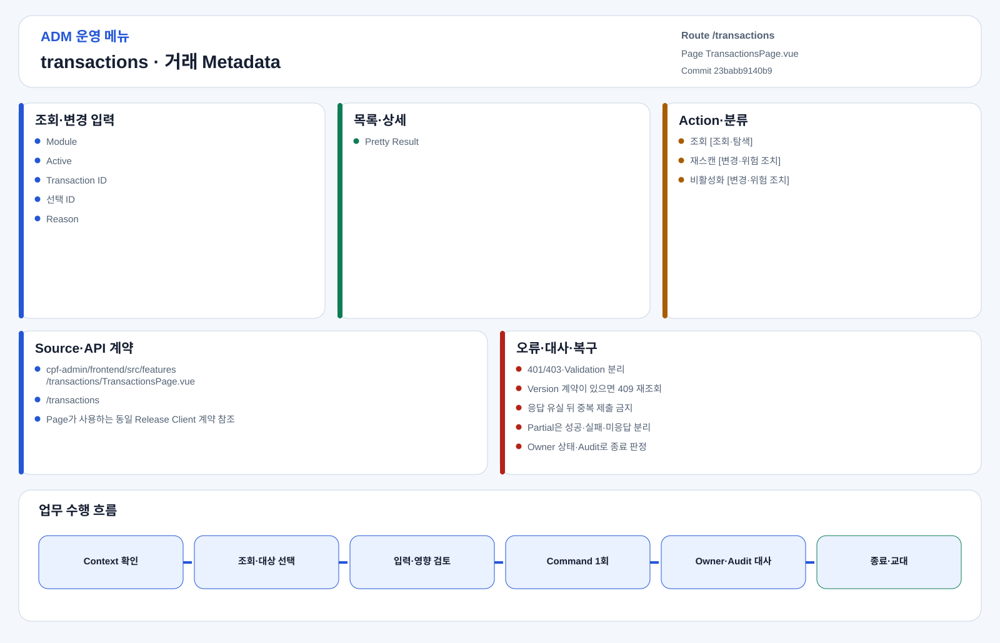

### 이 장에서 끝내는 업무

거래 Metadata의 등록 상태와 활성 여부를 관리한다.

### 메뉴 식별·책임

| 항목 | 값 |
|---|---|
| Route | `/transactions` |
| 메뉴 ID | `transactions` |
| Menu Code | `transactions` |
| 업무 그룹 | 온라인 운영 |
| Frontend Page | `cpf-admin/frontend/src/features/transactions/TransactionsPage.vue` |
| Permission | `TRANSACTION_META` Write for mutation |
| 기준 Commit | `23babb9140b90e501d6ac715e7b77f55b66198a5` |

### Source·API 근거

| 구분 | 기준 |
|---|---|
| Frontend Page | `cpf-admin/frontend/src/features/transactions/TransactionsPage.vue` |
| Router | `/transactions` |
| API 추적 | 화면에서 제공하는 기능을 통해 호출한다. 문서에 명시되지 않은 Endpoint를 Browser나 외부 Script에서 임의 호출하지 않는다. |

아래 표는 이 메뉴에서 실제로 확인·입력·실행할 항목을 정리한다. 화면에 없는 Field·Button·상태를 임의로 가정하지 않는다.

### 검색·입력 Field

| Field | Control | 업무 의미 | 기본값·Validation·주의 |
|---|---|---|---|
| `Module` | 문자열 입력·검색 | 거래 Metadata 조회·조치가 적용되는 환경과 데이터 경계를 제한한다. | 앞뒤 공백·허용 문자·길이와 대소문자 규칙을 확인한다. |
| `Active` | 문자열 입력·검색 | 현재 상태를 조회하거나 다음 Action의 허용 조건을 지정한다. | 앞뒤 공백·허용 문자·길이와 대소문자 규칙을 확인한다. |
| `Transaction ID` | Select·검색 | 거래 Metadata에서 적용하거나 조회할 정책·권한·처리 유형을 선택한다. | 허용 목록과 현재 Environment·Data Scope에 맞는 값만 선택한다. |
| `선택 ID` | 문자열 입력·검색 | 조회·상세·Audit에서 같은 대상을 다시 찾기 위한 식별 조건이다. | 앞뒤 공백·허용 문자·길이와 대소문자 규칙을 확인한다. |
| `Reason` | 다중행 입력 | 작업 목적·영향 범위·승인 또는 복구 기준을 기록해 Audit와 교대 기록에 연결한다. | Ticket·영향 범위·복구점을 포함하고 화면이 요구하는 최소 길이를 충족한다. |

#### 입력 순서

1. **Module** 항목이 조회 Control인지 변경 Form인지 화면 위치로 구분하고, 표시된 값·필수 여부·허용 형식을 확인한다.
2. **Active** 항목이 조회 Control인지 변경 Form인지 화면 위치로 구분하고, 표시된 값·필수 여부·허용 형식을 확인한다.
3. **Transaction ID** 항목이 조회 Control인지 변경 Form인지 화면 위치로 구분하고, 표시된 값·필수 여부·허용 형식을 확인한다.
4. **선택 ID** 항목이 조회 Control인지 변경 Form인지 화면 위치로 구분하고, 표시된 값·필수 여부·허용 형식을 확인한다.
5. **Reason** 항목이 조회 Control인지 변경 Form인지 화면 위치로 구분하고, 표시된 값·필수 여부·허용 형식을 확인한다.
6. 조회 Control과 변경 Form을 분리해 기록하고, 실행 전 Environment·Data Scope·Timezone과 제출할 값만 다시 검토한다.

### 목록 Column·상세 Field

| 표시값 | 운영 의미 | 교차 확인 |
|---|---|---|
| `Pretty Result` | 화면이 받은 Response를 사람이 확인할 수 있도록 표현한 결과 영역이며 Owner 상태 확정과 동일하지 않다. | Last Updated·Terminal 조건·Owner 상태와 함께 확인한다. |

#### 결과 판독 순서

1. 조회 완료 시각·Filter·Paging·Sort와 화면 Warning을 확인한다.
2. Empty·Stale·Partial을 정상 0건과 구분한다.
3. 식별자·상태·Version·오류·시각을 같은 Query Context의 상세와 Owner 원장에서 비교한다.
4. Masking된 값은 Raw Permission과 Reason 없이 복원·Export하지 않는다.
5. 집계와 상세가 다르면 집계 시간 창·Timezone·Owner Update 시각을 맞춰 대사한다.

### Button·Action

| Action | 분류 | 활성 조건 | Side Effect·정상 결과 |
|---|---|---|---|
| **조회** | 조회·탐색 | 조회 Permission과 Query Validation을 충족하고 동일 조회가 진행 중이 아님 | 조회 결과의 조회 시각·Filter·Source Version·Warning이 갱신되며 Owner 데이터는 변경하지 않는다. |
| **재스캔** | 변경·위험 조치 | 화면과 Owner가 요구하는 Write Permission·대상 상태·영향 범위·Reason·승인·Version 조건을 충족함 | 변경 Operation을 생성하고 Accepted 응답과 Owner Terminal 상태·Version·Audit를 분리해 확인한다. |
| **비활성화** | 변경·위험 조치 | 화면과 Owner가 요구하는 Write Permission·대상 상태·영향 범위·Reason·승인·Version 조건을 충족함 | 변경 Operation을 생성하고 Accepted 응답과 Owner Terminal 상태·Version·Audit를 분리해 확인한다. |

### 정상 업무 전체 절차

1. `/transactions`에 진입해 Page Header와 Route가 **거래 Metadata** 기능을 가리키는지 확인한다.
2. 로그인 Session·Environment·Data Scope·기준일·Timezone을 고정한다.
3. 화면의 조회 Control과 변경 Form을 구분한다. 조회 조건이 제공되면 먼저 조회하고, 변경 Form은 대상 선택 또는 등록 Action 뒤에 열린 실제 Field만 사용한다.
4. Loading 종료 후 Empty·Error·Stale·Partial 상태와 화면 Warning을 먼저 판정한다.
5. **Pretty Result**를 읽고 식별자·상태·Version·시각을 Owner 원장과 대사한다.
6. **재스캔** 전에 화면과 Owner가 실제로 요구하는 Permission·현재 상태·영향 범위·Reason·승인·Version 조건을 확인하고 한 번만 제출한다.
7. **재스캔**의 HTTP 응답과 재조회 결과를 확인한다. 비동기·다중 대상 기능은 Owner Terminal 상태·Version·대상별 Success/Failed/Unknown·Audit를 별도로 확인한다.
8. **비활성화** 전에 화면과 Owner가 실제로 요구하는 Permission·현재 상태·영향 범위·Reason·승인·Version 조건을 확인하고 한 번만 제출한다.
9. **비활성화**의 HTTP 응답과 재조회 결과를 확인한다. 비동기·다중 대상 기능은 Owner Terminal 상태·Version·대상별 Success/Failed/Unknown·Audit를 별도로 확인한다.
10. 화면이 제공하는 Log·Metric·Trace와, 변경·Export·승인 조치에 생성된 Audit를 교차 확인한다.
11. 이 장의 **종료 판정**과 다음 확인 시각·Evidence Link를 교대 기록에 남긴다.

### 메뉴 고유 판정·금지 사항

- **목적:** 거래 Metadata의 등록 상태와 활성 여부를 관리한다.
- **종료 판정:** 재스캔·비활성화 후 Catalog와 실제 실행 Consumer가 같은 정의를 사용하는지 확인한다.
- 응답을 받지 못한 경우 Owner 상태와 기존 Operation을 확인하기 전에 동일 Action을 반복하지 않는다.
- HTTP 성공 응답이나 Toast만으로 비동기 Owner 상태 또는 다중 대상 적용을 확정하지 않는다.

### 오류·경계·동시성·복구

| 상황 | 화면 징후 | 운영 조치 | 종료 증적 |
|---|---|---|---|
| 401·Session | Session 만료·CSRF·Origin 실패 | 로그인 상태와 BFF Session을 확인한다. Command 자동 Replay는 금지한다. | 401/403 응답·Session Audit |
| 403·Data Scope | 메뉴·Button·Raw·Export가 거부됨 | Menu·Button·API·Owner Permission과 Data Scope를 확인하고 우회하지 않는다. | Deny Audit·요청 Permission |
| Validation | 필수값·범위·형식·기간 오류 | Field Error만 수정하고 기존 성공 Operation을 다시 제출하지 않는다. | Error Code·Field·입력값 |
| Timeout·Dependency | 일부 Source 또는 Command 응답 지연 | Correlation/Operation ID와 실패 Stage를 기록하고 Owner 상태를 조회한다. | Dependency 상태·Retryability |
| Partial·Stale | 일부 대상만 Success 또는 조회 Source 누락 | 성공·실패·미응답을 분리하고 누락 범위와 Version을 표시한다. | Target별 결과·Version |
| 409·동시 변경 | Expected Version 불일치 | 최신 상세를 재조회하고 Diff·영향을 다시 검토한 뒤 새 요청으로 제출한다. | 현재/요청 Version·변경자 |
| 응답 유실·Unknown | 요청 후 실제 처리 여부를 알 수 없음 | Operation ID·Request Hash·Audit·Owner 상태로 대사하고 중복 제출하지 않는다. | Operation·Owner·Audit |
| 복구 실패 | Retry/Rollback 뒤에도 상태 불일치 | 자동 반복을 중단하고 Incident·Reconcile Case·다음 확인 시각을 기록한다. | Case ID·복구 Owner·기한 |

### 응답 유실·결과 불명·부분 적용 처리

1. 동일 Action을 다시 누르지 않고 Browser Network와 응답 Header를 보존한다. `operationId`·`transactionId`·`idempotencyKey`가 제공되면 기록하고, 없으면 Target ID·Actor·요청 시각·Request Body Hash로 대사한다.
2. 기능이 제공하는 상세·Operation Status(있는 경우)·Audit에서 Request Hash와 대상 Version을 검색한다.
3. Side Effect 전 실패가 확인된 경우에만 새 요청을 검토한다.
4. Success·Failed·Unknown 대상을 분리하고 Source가 제공하는 Failed-only Retry·Compensation·Rollback을 선택하고, 지원되지 않으면 수동 Reconcile Case로 이관한다.
5. Rollback을 지원하는 기능은 Owner Version·Checksum·업무 합계가 Rollback Point와 일치하는지 확인한다.
6. 확정되지 않은 대상은 `UNKNOWN_RESULT`로 유지하고 담당자·대사 기한·다음 확인 시각을 기록한다.

### Log·Metric·Trace·Audit와 교대 기록

| 증적 | 필수 값 |
|---|---|
| Audit | Actor·Permission·Reason·Approval·Target·Before/After·Result·Recovery Action |
| Log | Environment·Instance·operationId·transactionId·failureStage·errorCode |
| Metric | 동일 시간 창의 Success·Failure·Latency·Queue·Retry·Partial·Unknown |
| Trace | root/segment/attempt·Owner·DB/Kafka/외부 의존성 Span |
| 상태 원장 | Target ID·Version·Checksum·Desired/Actual·Last Updated·Terminal 여부 |

```text
Menu=transactions
Route=/transactions
Environment=
DataScope=
Query=
TargetId=
BeforeVersion=
Action=
Reason=
ApprovalId=
OperationId=
TransactionId=
Result=SUCCESS|FAILED|PARTIAL|UNKNOWN_RESULT
OwnerState=
FailedTargets=
ReconcileBy=
RollbackPoint=
EvidenceLinks=
NextCheckAt=
```

### 실무 Workbook

**상황:** 거래 Metadata의 등록 상태와 활성 여부를 관리한다. 담당자가 **재스캔**을 수행한 뒤 Browser 응답을 받지 못했다.

1. 대상 식별자와 Before Version, 입력값, Reason·Approval을 작업 기록에서 확인한다.
2. 동일 **재스캔**을 반복하지 않고 Operation·Audit·Owner 상태를 조회한다.
3. Owner 상태가 변경됐고 Request Hash가 같으면 응답 유실로 분류해 중복 조치를 금지한다.
4. 일부 대상만 변경됐으면 Success·Failed·Unknown을 분리해 Failed-only Retry 또는 Rollback을 선택한다.
5. 재스캔·비활성화 후 Catalog와 실제 실행 Consumer가 같은 정의를 사용하는지 확인한다.
6. Evidence Link와 다음 확인 시각을 교대 기록에 남긴다.

### 독립 수행 검수 Checklist

- [ ] `/transactions`와 Page Source를 찾고 화면 목적을 설명할 수 있다.
- [ ] 5개 입력·검색 항목의 Control·기본값·Validation을 설명할 수 있다.
- [ ] 1개 표시값을 Owner 상태·Version·Audit와 대사할 수 있다.
- [ ] 3개 Action의 분류·활성 조건·Side Effect를 설명할 수 있다.
- [ ] Empty·403·409·Timeout·Partial·Unknown을 서로 다른 상태로 처리할 수 있다.
- [ ] 응답 유실 뒤 중복 제출 없이 Operation·Owner·Audit로 결과를 확정할 수 있다.
- [ ] 교대 기록만으로 다음 담당자가 Target·상태·복구 기한을 이어받을 수 있다.

## 7. standardExecutions — 표준 실행 Catalog

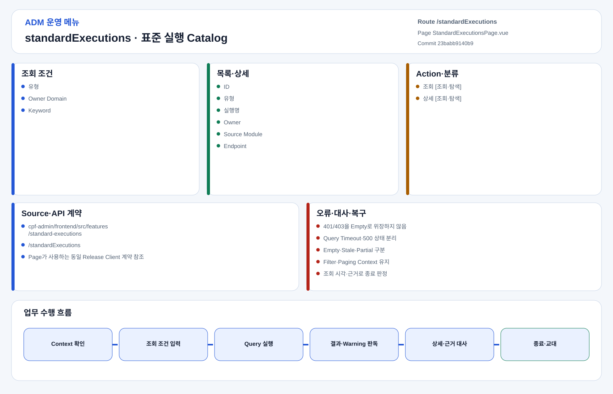

### 이 장에서 끝내는 업무

ONLINE·BATCH 표준 실행 Catalog를 조회한다.

### 메뉴 식별·책임

| 항목 | 값 |
|---|---|
| Route | `/standardExecutions` |
| 메뉴 ID | `standardExecutions` |
| Menu Code | `standardExecutions` |
| 업무 그룹 | 온라인 운영 |
| Frontend Page | `cpf-admin/frontend/src/features/standard-executions/StandardExecutionsPage.vue` |
| Permission | 조회 권한 |
| 기준 Commit | `23babb9140b90e501d6ac715e7b77f55b66198a5` |

### Source·API 근거

| 구분 | 기준 |
|---|---|
| Frontend Page | `cpf-admin/frontend/src/features/standard-executions/StandardExecutionsPage.vue` |
| Router | `/standardExecutions` |
| API 추적 | 화면에서 제공하는 기능을 통해 호출한다. 문서에 명시되지 않은 Endpoint를 Browser나 외부 Script에서 임의 호출하지 않는다. |

아래 표는 이 메뉴에서 실제로 확인·입력·실행할 항목을 정리한다. 화면에 없는 Field·Button·상태를 임의로 가정하지 않는다.

### 검색·입력 Field

| Field | Control | 업무 의미 | 기본값·Validation·주의 |
|---|---|---|---|
| `유형` | Select·검색 | 표준 실행 Catalog에서 적용하거나 조회할 정책·권한·처리 유형을 선택한다. | 허용 목록과 현재 Environment·Data Scope에 맞는 값만 선택한다. |
| `Owner Domain` | Select·검색 | 표준 실행 Catalog 조회·조치가 적용되는 환경과 데이터 경계를 제한한다. | 허용 목록과 현재 Environment·Data Scope에 맞는 값만 선택한다. |
| `Keyword` | 문자열 입력·검색 | 조회·상세·Audit에서 같은 대상을 다시 찾기 위한 식별 조건이다. | 앞뒤 공백·허용 문자·길이와 대소문자 규칙을 확인한다. |

#### 입력 순서

1. **유형** 항목이 조회 Control인지 변경 Form인지 화면 위치로 구분하고, 표시된 값·필수 여부·허용 형식을 확인한다.
2. **Owner Domain** 항목이 조회 Control인지 변경 Form인지 화면 위치로 구분하고, 표시된 값·필수 여부·허용 형식을 확인한다.
3. **Keyword** 항목이 조회 Control인지 변경 Form인지 화면 위치로 구분하고, 표시된 값·필수 여부·허용 형식을 확인한다.
4. 조회 Control과 변경 Form을 분리해 기록하고, 실행 전 Environment·Data Scope·Timezone과 제출할 값만 다시 검토한다.

### 목록 Column·상세 Field

| 표시값 | 운영 의미 | 교차 확인 |
|---|---|---|
| `ID` | 표준 실행 Catalog의 대상 레코드를 상세·Owner·Audit에서 연결하는 식별자다. | 상세·Log·Trace·Audit에서 같은 대상을 가리키는지 확인한다. |
| `유형` | 표준 실행 Catalog 상세에서 대상의 현재 속성 또는 처리 결과를 확인하는 값이다. | 상세·재조회 결과와 비교하고 Stale·Masking·단위 차이를 확인한다. |
| `실행명` | 운영자가 대상을 구분하는 표시명 또는 설명이다. | 상세·재조회 결과와 비교하고 Stale·Masking·단위 차이를 확인한다. |
| `Owner` | 작업 주체·Owner·변경 사유를 확인하는 감사 정보다. | 상세·재조회 결과와 비교하고 Stale·Masking·단위 차이를 확인한다. |
| `Source Module` | 표준 실행 Catalog 상세에서 대상의 현재 속성 또는 처리 결과를 확인하는 값이다. | 상세·재조회 결과와 비교하고 Stale·Masking·단위 차이를 확인한다. |
| `Endpoint` | 표준 실행 Catalog의 대상 레코드를 상세·Owner·Audit에서 연결하는 식별자다. | 상세·Log·Trace·Audit에서 같은 대상을 가리키는지 확인한다. |

#### 결과 판독 순서

1. 조회 완료 시각·Filter·Paging·Sort와 화면 Warning을 확인한다.
2. Empty·Stale·Partial을 정상 0건과 구분한다.
3. 식별자·상태·Version·오류·시각을 같은 Query Context의 상세와 Owner 원장에서 비교한다.
4. Masking된 값은 Raw Permission과 Reason 없이 복원·Export하지 않는다.
5. 집계와 상세가 다르면 집계 시간 창·Timezone·Owner Update 시각을 맞춰 대사한다.

### Button·Action

| Action | 분류 | 활성 조건 | Side Effect·정상 결과 |
|---|---|---|---|
| **조회** | 조회·탐색 | 조회 Permission과 Query Validation을 충족하고 동일 조회가 진행 중이 아님 | 조회 결과의 조회 시각·Filter·Source Version·Warning이 갱신되며 Owner 데이터는 변경하지 않는다. |
| **상세** | 조회·탐색 | 조회 Permission과 Query Validation을 충족하고 동일 조회가 진행 중이 아님 | 상세 결과의 조회 시각·Filter·Source Version·Warning이 갱신되며 Owner 데이터는 변경하지 않는다. |

### 정상 업무 전체 절차

1. `/standardExecutions`에 진입해 Page Header와 Route가 **표준 실행 Catalog** 기능을 가리키는지 확인한다.
2. 로그인 Session·Environment·Data Scope·기준일·Timezone을 고정한다.
3. 화면에 제공된 조회 Control만 사용하고, 표시되지 않은 변경 Field나 Server Command가 있다고 가정하지 않는다.
4. Loading 종료 후 Empty·Error·Stale·Partial 상태와 화면 Warning을 먼저 판정한다.
5. **ID, 유형, 실행명, Owner, Source Module**를 읽고 식별자·상태·Version·시각을 Owner 원장과 대사한다.
6. 화면이 제공하는 Log·Metric·Trace와 조회·Raw·Export 접근 기록이 있으면 해당 Audit를 교차 확인한다.
7. 이 장의 **종료 판정**과 다음 확인 시각·Evidence Link를 교대 기록에 남긴다.

### 메뉴 고유 판정·금지 사항

- **목적:** ONLINE·BATCH 표준 실행 Catalog를 조회한다.
- **종료 판정:** Owner·Source Module·Endpoint가 실제 Consumer와 연결되는지 확인한다.
- 조회 화면에서 직접 Owner 데이터를 변경하거나 Browser Tool로 우회하지 않는다.
- Partial 조회를 정상 전체 결과로 합치지 않는다.

### 오류·경계·동시성·복구

| 상황 | 화면 징후 | 운영 조치 | 종료 증적 |
|---|---|---|---|
| 401·Session | Session 만료·CSRF·Origin 실패 | 로그인 상태와 BFF Session을 확인한 뒤 같은 Query Context로 다시 조회한다. | 401/403 응답·Session Audit |
| 403·Data Scope | 메뉴·Button·Raw·Export가 거부됨 | Menu·Button·API·Owner Permission과 Data Scope를 확인하고 우회하지 않는다. | Deny Audit·요청 Permission |
| Timeout·Dependency | 일부 조회 Source 응답 지연 | Correlation ID·Query Context·실패 Source를 기록하고 같은 조건으로 재조회한다. | 조회 시각·실패 Source·재조회 결과 |
| Partial·Stale | 일부 대상만 Success 또는 조회 Source 누락 | 성공·실패·미응답을 분리하고 누락 범위와 Version을 표시한다. | Target별 결과·Version |

### 응답 유실·부분 조회 처리

1. 검색 조건·Data Scope·Paging·조회 시각·Correlation ID를 기록한다.
2. 같은 조건으로 재조회하되 실패 Source만 분리한다.
3. 정상 Source 결과를 유지하고 실패·Stale Source를 명시한다.
4. 집계와 원본 상세가 다르면 Owner 상세를 기준으로 Reconcile Case를 연다.
5. 조회 시각·Source Version·0건 또는 일치 결과를 증적으로 남긴다.

### Log·Metric·Trace·Audit와 교대 기록

| 증적 | 필수 값 |
|---|---|
| Audit | Actor·Permission·Data Scope·Raw/Export 접근·Query Context·Result |
| Log | Environment·Instance·operationId·transactionId·failureStage·errorCode |
| Metric | 동일 시간 창의 Success·Failure·Latency·Queue·Retry·Partial·Unknown |
| Trace | root/segment/attempt·Owner·DB/Kafka/외부 의존성 Span |
| 상태 원장 | Target ID·Version·Checksum·Desired/Actual·Last Updated·Terminal 여부 |

```text
Menu=
Route=
Environment=
DataScope=
Query=
QueryAt=
CorrelationId=
SourceVersion=
Result=SUCCESS|EMPTY|STALE|PARTIAL|FAILED
FailedSources=
EvidenceLinks=
NextCheckAt=
```

### 실무 Workbook

**상황:** ONLINE·BATCH 표준 실행 Catalog를 조회한다. 화면이 일부 Source Timeout 때문에 Partial 결과를 표시했다.

1. Query·Data Scope·조회 시각·Correlation ID를 기록한다.
2. 정상 결과를 0건으로 덮어쓰지 않고 실패 Source만 재조회한다.
3. ID, 유형, 실행명 값을 원본 상세와 같은 시간 기준으로 비교한다.
4. 불일치가 계속되면 Incident 또는 Reconcile Case를 생성한다.
5. Owner·Source Module·Endpoint가 실제 Consumer와 연결되는지 확인한다.
6. Source Version과 다음 확인 시각을 교대 기록에 남긴다.

### 독립 수행 검수 Checklist

- [ ] `/standardExecutions`와 Page Source를 찾고 화면 목적을 설명할 수 있다.
- [ ] 3개 입력·검색 항목의 Control·기본값·Validation을 설명할 수 있다.
- [ ] 6개 표시값을 Owner 상태·Version·Audit와 대사할 수 있다.
- [ ] 2개 Action의 분류·활성 조건·Side Effect를 설명할 수 있다.
- [ ] Empty·401·403·Timeout·Stale·Partial을 서로 다른 조회 상태로 처리할 수 있다.
- [ ] 조회 응답 유실 시 같은 Query Context로 재조회하고 Correlation ID·조회 시각·Source Version으로 결과를 대사할 수 있다.
- [ ] 교대 기록만으로 다음 담당자가 Target·상태·복구 기한을 이어받을 수 있다.

## 8. channelPolicy — Channel·거래 정책 Snapshot

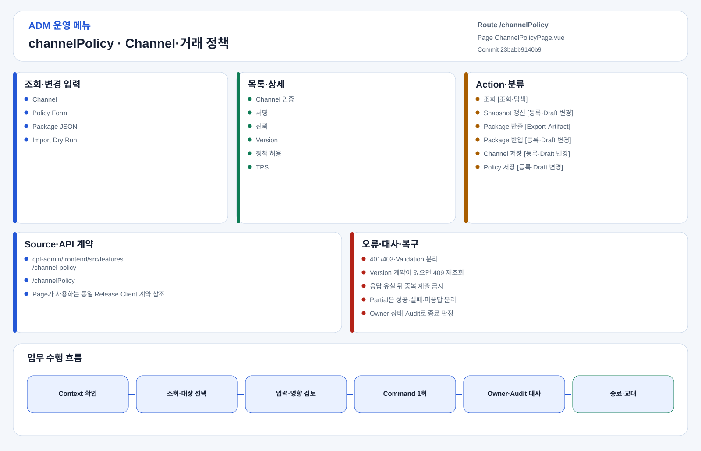

### 이 장에서 끝내는 업무

Channel 인증·서명·신뢰·TPS 정책 Snapshot을 관리한다.

### 메뉴 식별·책임

| 항목 | 값 |
|---|---|
| Route | `/channelPolicy` |
| 메뉴 ID | `channelPolicy` |
| Menu Code | `channelPolicy` |
| 업무 그룹 | 온라인 운영 |
| Frontend Page | `cpf-admin/frontend/src/features/channel-policy/ChannelPolicyPage.vue` |
| Permission | `CHANNEL_POLICY` Write |
| 기준 Commit | `23babb9140b90e501d6ac715e7b77f55b66198a5` |

### Source·API 근거

| 구분 | 기준 |
|---|---|
| Frontend Page | `cpf-admin/frontend/src/features/channel-policy/ChannelPolicyPage.vue` |
| Router | `/channelPolicy` |
| API 추적 | 화면에서 제공하는 기능을 통해 호출한다. 문서에 명시되지 않은 Endpoint를 Browser나 외부 Script에서 임의 호출하지 않는다. |

아래 표는 이 메뉴에서 실제로 확인·입력·실행할 항목을 정리한다. 화면에 없는 Field·Button·상태를 임의로 가정하지 않는다.

### 검색·입력 Field

| Field | Control | 업무 의미 | 기본값·Validation·주의 |
|---|---|---|---|
| `Channel` | Select·검색 | Channel·거래 정책 Snapshot에서 적용하거나 조회할 정책·권한·처리 유형을 선택한다. | 허용 목록과 현재 Environment·Data Scope에 맞는 값만 선택한다. |
| `Policy Form` | Select·검색 | Channel·거래 정책 Snapshot에서 적용하거나 조회할 정책·권한·처리 유형을 선택한다. | 허용 목록과 현재 Environment·Data Scope에 맞는 값만 선택한다. |
| `Package JSON` | 다중행 입력 | 검증·등록·Export에 사용할 입력 Artifact 또는 구조화된 본문이다. | 허용 Schema·길이·민감정보 포함 여부를 확인하고 Preview 또는 Validation 결과를 검토한다. |
| `Import Dry Run` | 숫자·Version 입력 | 실행 한도·순서·용량 또는 재시도 범위를 지정한다. | 화면의 min·max·단위와 0 허용 여부를 확인하고 음수·Overflow를 차단한다. |

#### 입력 순서

1. **Channel** 항목이 조회 Control인지 변경 Form인지 화면 위치로 구분하고, 표시된 값·필수 여부·허용 형식을 확인한다.
2. **Policy Form** 항목이 조회 Control인지 변경 Form인지 화면 위치로 구분하고, 표시된 값·필수 여부·허용 형식을 확인한다.
3. **Package JSON** 항목이 조회 Control인지 변경 Form인지 화면 위치로 구분하고, 표시된 값·필수 여부·허용 형식을 확인한다.
4. **Import Dry Run** 항목이 조회 Control인지 변경 Form인지 화면 위치로 구분하고, 표시된 값·필수 여부·허용 형식을 확인한다.
5. 조회 Control과 변경 Form을 분리해 기록하고, 실행 전 Environment·Data Scope·Timezone과 제출할 값만 다시 검토한다.

### 목록 Column·상세 Field

| 표시값 | 운영 의미 | 교차 확인 |
|---|---|---|
| `Channel 인증` | Channel·거래 정책 Snapshot 상세에서 대상의 현재 속성 또는 처리 결과를 확인하는 값이다. | 상세·재조회 결과와 비교하고 Stale·Masking·단위 차이를 확인한다. |
| `서명` | 운영자가 대상을 구분하는 표시명 또는 설명이다. | 상세·재조회 결과와 비교하고 Stale·Masking·단위 차이를 확인한다. |
| `신뢰` | Channel·거래 정책 Snapshot 상세에서 대상의 현재 속성 또는 처리 결과를 확인하는 값이다. | 상세·재조회 결과와 비교하고 Stale·Masking·단위 차이를 확인한다. |
| `Version` | 요청·Owner·Instance 사이의 Version 또는 내용 동일성을 판단하는 값이다. | 목록·상세·Owner 또는 Instance 보고값에서 일치하는지 확인한다. |
| `정책 허용` | Channel·거래 정책 Snapshot 상세에서 대상의 현재 속성 또는 처리 결과를 확인하는 값이다. | 상세·재조회 결과와 비교하고 Stale·Masking·단위 차이를 확인한다. |
| `TPS` | 동일한 집계 시간 창·단위·Filter에서 비교해야 하는 수치다. | 같은 Filter·집계 시간 창·단위의 상세 Row 또는 Metric으로 대사한다. |

#### 결과 판독 순서

1. 조회 완료 시각·Filter·Paging·Sort와 화면 Warning을 확인한다.
2. Empty·Stale·Partial을 정상 0건과 구분한다.
3. 식별자·상태·Version·오류·시각을 같은 Query Context의 상세와 Owner 원장에서 비교한다.
4. Masking된 값은 Raw Permission과 Reason 없이 복원·Export하지 않는다.
5. 집계와 상세가 다르면 집계 시간 창·Timezone·Owner Update 시각을 맞춰 대사한다.

### Button·Action

| Action | 분류 | 활성 조건 | Side Effect·정상 결과 |
|---|---|---|---|
| **조회** | 조회·탐색 | 조회 Permission과 Query Validation을 충족하고 동일 조회가 진행 중이 아님 | 조회 결과의 조회 시각·Filter·Source Version·Warning이 갱신되며 Owner 데이터는 변경하지 않는다. |
| **Snapshot 갱신** | 등록·Draft 변경 | 화면이 실제로 요구하는 Write Permission·필수 Field·Reason·Version 조건을 충족함 | Channel·거래 정책 Snapshot의 재조회 결과가 요청 내용과 일치한다. Version·Before/After·Audit는 해당 Owner가 제공하는 경우 함께 확인한다. |
| **Package 반출** | Export·Artifact | 화면이 요구하는 Export Permission·Data Scope·Masking·Reason과 승인 조건을 충족함 | Export Operation과 Artifact ID·Checksum·만료·Download Audit가 생성되고 원본 데이터는 변경하지 않는다. |
| **Package 반입** | 등록·Draft 변경 | 화면이 실제로 요구하는 Write Permission·필수 Field·Reason·Version 조건을 충족함 | Channel·거래 정책 Snapshot의 재조회 결과가 요청 내용과 일치한다. Version·Before/After·Audit는 해당 Owner가 제공하는 경우 함께 확인한다. |
| **Channel 저장** | 등록·Draft 변경 | 화면이 실제로 요구하는 Write Permission·필수 Field·Reason·Version 조건을 충족함 | Channel·거래 정책 Snapshot의 재조회 결과가 요청 내용과 일치한다. Version·Before/After·Audit는 해당 Owner가 제공하는 경우 함께 확인한다. |
| **Policy 저장** | 등록·Draft 변경 | 화면이 실제로 요구하는 Write Permission·필수 Field·Reason·Version 조건을 충족함 | Channel·거래 정책 Snapshot의 재조회 결과가 요청 내용과 일치한다. Version·Before/After·Audit는 해당 Owner가 제공하는 경우 함께 확인한다. |

### 정상 업무 전체 절차

1. `/channelPolicy`에 진입해 Page Header와 Route가 **Channel·거래 정책 Snapshot** 기능을 가리키는지 확인한다.
2. 로그인 Session·Environment·Data Scope·기준일·Timezone을 고정한다.
3. 화면의 조회 Control과 변경 Form을 구분한다. 조회 조건이 제공되면 먼저 조회하고, 변경 Form은 대상 선택 또는 등록 Action 뒤에 열린 실제 Field만 사용한다.
4. Loading 종료 후 Empty·Error·Stale·Partial 상태와 화면 Warning을 먼저 판정한다.
5. **Channel 인증, 서명, 신뢰, Version, 정책 허용**를 읽고 식별자·상태·Version·시각을 Owner 원장과 대사한다.
6. **Snapshot 갱신** 전에 화면과 Owner가 실제로 요구하는 Permission·현재 상태·영향 범위·Reason·승인·Version 조건을 확인하고 한 번만 제출한다.
7. **Snapshot 갱신**의 HTTP 응답과 재조회 결과를 확인한다. 비동기·다중 대상 기능은 Owner Terminal 상태·Version·대상별 Success/Failed/Unknown·Audit를 별도로 확인한다.
8. **Package 반출** 전에 화면과 Owner가 실제로 요구하는 Permission·현재 상태·영향 범위·Reason·승인·Version 조건을 확인하고 한 번만 제출한다.
9. **Package 반출**의 HTTP 응답과 재조회 결과를 확인한다. 비동기·다중 대상 기능은 Owner Terminal 상태·Version·대상별 Success/Failed/Unknown·Audit를 별도로 확인한다.
10. **Package 반입** 전에 화면과 Owner가 실제로 요구하는 Permission·현재 상태·영향 범위·Reason·승인·Version 조건을 확인하고 한 번만 제출한다.
11. **Package 반입**의 HTTP 응답과 재조회 결과를 확인한다. 비동기·다중 대상 기능은 Owner Terminal 상태·Version·대상별 Success/Failed/Unknown·Audit를 별도로 확인한다.
12. **Channel 저장** 전에 화면과 Owner가 실제로 요구하는 Permission·현재 상태·영향 범위·Reason·승인·Version 조건을 확인하고 한 번만 제출한다.
13. **Channel 저장**의 HTTP 응답과 재조회 결과를 확인한다. 비동기·다중 대상 기능은 Owner Terminal 상태·Version·대상별 Success/Failed/Unknown·Audit를 별도로 확인한다.
14. **Policy 저장** 전에 화면과 Owner가 실제로 요구하는 Permission·현재 상태·영향 범위·Reason·승인·Version 조건을 확인하고 한 번만 제출한다.
15. **Policy 저장**의 HTTP 응답과 재조회 결과를 확인한다. 비동기·다중 대상 기능은 Owner Terminal 상태·Version·대상별 Success/Failed/Unknown·Audit를 별도로 확인한다.
16. 화면이 제공하는 Log·Metric·Trace와, 변경·Export·승인 조치에 생성된 Audit를 교차 확인한다.
17. 이 장의 **종료 판정**과 다음 확인 시각·Evidence Link를 교대 기록에 남긴다.

### 메뉴 고유 판정·금지 사항

- **목적:** Channel 인증·서명·신뢰·TPS 정책 Snapshot을 관리한다.
- **종료 판정:** Import Dry Run·Version·부분 적용 결과를 확인하고 Package 반출입 Hash를 남긴다.
- 응답을 받지 못한 경우 Owner 상태와 기존 Operation을 확인하기 전에 동일 Action을 반복하지 않는다.
- HTTP 성공 응답이나 Toast만으로 비동기 Owner 상태 또는 다중 대상 적용을 확정하지 않는다.

### 오류·경계·동시성·복구

| 상황 | 화면 징후 | 운영 조치 | 종료 증적 |
|---|---|---|---|
| 401·Session | Session 만료·CSRF·Origin 실패 | 로그인 상태와 BFF Session을 확인한다. Command 자동 Replay는 금지한다. | 401/403 응답·Session Audit |
| 403·Data Scope | 메뉴·Button·Raw·Export가 거부됨 | Menu·Button·API·Owner Permission과 Data Scope를 확인하고 우회하지 않는다. | Deny Audit·요청 Permission |
| Validation | 필수값·범위·형식·기간 오류 | Field Error만 수정하고 기존 성공 Operation을 다시 제출하지 않는다. | Error Code·Field·입력값 |
| Timeout·Dependency | 일부 Source 또는 Command 응답 지연 | Correlation/Operation ID와 실패 Stage를 기록하고 Owner 상태를 조회한다. | Dependency 상태·Retryability |
| Partial·Stale | 일부 대상만 Success 또는 조회 Source 누락 | 성공·실패·미응답을 분리하고 누락 범위와 Version을 표시한다. | Target별 결과·Version |
| 409·동시 변경 | Expected Version 불일치 | 최신 상세를 재조회하고 Diff·영향을 다시 검토한 뒤 새 요청으로 제출한다. | 현재/요청 Version·변경자 |
| 응답 유실·Unknown | 요청 후 실제 처리 여부를 알 수 없음 | Operation ID·Request Hash·Audit·Owner 상태로 대사하고 중복 제출하지 않는다. | Operation·Owner·Audit |
| 복구 실패 | Retry/Rollback 뒤에도 상태 불일치 | 자동 반복을 중단하고 Incident·Reconcile Case·다음 확인 시각을 기록한다. | Case ID·복구 Owner·기한 |

### 응답 유실·결과 불명·부분 적용 처리

1. 동일 Action을 다시 누르지 않고 Browser Network와 응답 Header를 보존한다. `operationId`·`transactionId`·`idempotencyKey`가 제공되면 기록하고, 없으면 Target ID·Actor·요청 시각·Request Body Hash로 대사한다.
2. 기능이 제공하는 상세·Operation Status(있는 경우)·Audit에서 Request Hash와 대상 Version을 검색한다.
3. Side Effect 전 실패가 확인된 경우에만 새 요청을 검토한다.
4. Success·Failed·Unknown 대상을 분리하고 Source가 제공하는 Failed-only Retry·Compensation·Rollback을 선택하고, 지원되지 않으면 수동 Reconcile Case로 이관한다.
5. Rollback을 지원하는 기능은 Owner Version·Checksum·업무 합계가 Rollback Point와 일치하는지 확인한다.
6. 확정되지 않은 대상은 `UNKNOWN_RESULT`로 유지하고 담당자·대사 기한·다음 확인 시각을 기록한다.

### Log·Metric·Trace·Audit와 교대 기록

| 증적 | 필수 값 |
|---|---|
| Audit | Actor·Permission·Reason·Approval·Target·Before/After·Result·Recovery Action |
| Log | Environment·Instance·operationId·transactionId·failureStage·errorCode |
| Metric | 동일 시간 창의 Success·Failure·Latency·Queue·Retry·Partial·Unknown |
| Trace | root/segment/attempt·Owner·DB/Kafka/외부 의존성 Span |
| 상태 원장 | Target ID·Version·Checksum·Desired/Actual·Last Updated·Terminal 여부 |

```text
Menu=channelPolicy
Route=/channelPolicy
Environment=
DataScope=
Query=
TargetId=
BeforeVersion=
Action=
Reason=
ApprovalId=
OperationId=
TransactionId=
Result=SUCCESS|FAILED|PARTIAL|UNKNOWN_RESULT
OwnerState=
FailedTargets=
ReconcileBy=
RollbackPoint=
EvidenceLinks=
NextCheckAt=
```

### 실무 Workbook

**상황:** Channel 인증·서명·신뢰·TPS 정책 Snapshot을 관리한다. 담당자가 **Snapshot 갱신**을 수행한 뒤 Browser 응답을 받지 못했다.

1. 대상 식별자와 Before Version, 입력값, Reason·Approval을 작업 기록에서 확인한다.
2. 동일 **Snapshot 갱신**을 반복하지 않고 Operation·Audit·Owner 상태를 조회한다.
3. Owner 상태가 변경됐고 Request Hash가 같으면 응답 유실로 분류해 중복 조치를 금지한다.
4. 일부 대상만 변경됐으면 Success·Failed·Unknown을 분리해 Failed-only Retry 또는 Rollback을 선택한다.
5. Import Dry Run·Version·부분 적용 결과를 확인하고 Package 반출입 Hash를 남긴다.
6. Evidence Link와 다음 확인 시각을 교대 기록에 남긴다.

### 독립 수행 검수 Checklist

- [ ] `/channelPolicy`와 Page Source를 찾고 화면 목적을 설명할 수 있다.
- [ ] 4개 입력·검색 항목의 Control·기본값·Validation을 설명할 수 있다.
- [ ] 6개 표시값을 Owner 상태·Version·Audit와 대사할 수 있다.
- [ ] 6개 Action의 분류·활성 조건·Side Effect를 설명할 수 있다.
- [ ] Empty·403·409·Timeout·Partial·Unknown을 서로 다른 상태로 처리할 수 있다.
- [ ] 응답 유실 뒤 중복 제출 없이 Operation·Owner·Audit로 결과를 확정할 수 있다.
- [ ] 교대 기록만으로 다음 담당자가 Target·상태·복구 기한을 이어받을 수 있다.

## 9. serviceRegistry — Service·Endpoint·Instance·Health·Routing

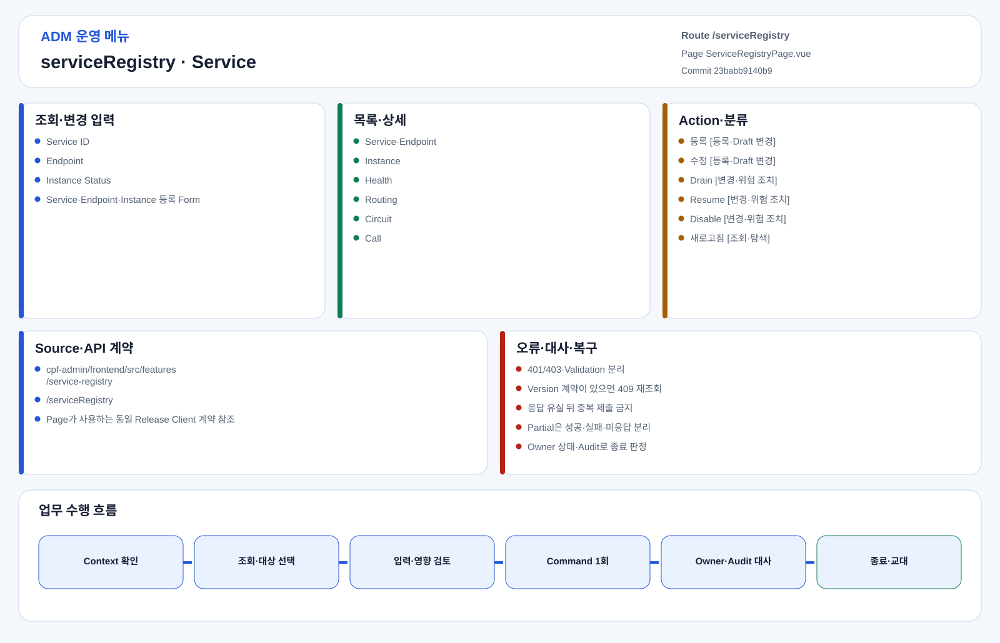

### 이 장에서 끝내는 업무

Service·Endpoint·Instance·Health·Routing을 등록하고 운영 상태를 제어한다.

### 메뉴 식별·책임

| 항목 | 값 |
|---|---|
| Route | `/serviceRegistry` |
| 메뉴 ID | `serviceRegistry` |
| Menu Code | `serviceRegistry` |
| 업무 그룹 | 온라인 운영 |
| Frontend Page | `cpf-admin/frontend/src/features/service-registry/ServiceRegistryPage.vue` |
| Permission | `SERVICE_REGISTRY` Write |
| 기준 Commit | `23babb9140b90e501d6ac715e7b77f55b66198a5` |

### Source·API 근거

| 구분 | 기준 |
|---|---|
| Frontend Page | `cpf-admin/frontend/src/features/service-registry/ServiceRegistryPage.vue` |
| Router | `/serviceRegistry` |
| API 추적 | 화면에서 제공하는 기능을 통해 호출한다. 문서에 명시되지 않은 Endpoint를 Browser나 외부 Script에서 임의 호출하지 않는다. |

아래 표는 이 메뉴에서 실제로 확인·입력·실행할 항목을 정리한다. 화면에 없는 Field·Button·상태를 임의로 가정하지 않는다.

### 검색·입력 Field

| Field | Control | 업무 의미 | 기본값·Validation·주의 |
|---|---|---|---|
| `Service ID` | 문자열 입력·검색 | 조회·상세·Audit에서 같은 대상을 다시 찾기 위한 식별 조건이다. | 앞뒤 공백·허용 문자·길이와 대소문자 규칙을 확인한다. |
| `Endpoint` | 문자열 입력·검색 | 조회·상세·Audit에서 같은 대상을 다시 찾기 위한 식별 조건이다. | 앞뒤 공백·허용 문자·길이와 대소문자 규칙을 확인한다. |
| `Instance Status` | Select·검색 | 현재 상태를 조회하거나 다음 Action의 허용 조건을 지정한다. | 허용 목록과 현재 Environment·Data Scope에 맞는 값만 선택한다. |
| `Service·Endpoint·Instance 등록 Form` | 문자열 입력·검색 | 조회·상세·Audit에서 같은 대상을 다시 찾기 위한 식별 조건이다. | 앞뒤 공백·허용 문자·길이와 대소문자 규칙을 확인한다. |

#### 입력 순서

1. **Service ID** 항목이 조회 Control인지 변경 Form인지 화면 위치로 구분하고, 표시된 값·필수 여부·허용 형식을 확인한다.
2. **Endpoint** 항목이 조회 Control인지 변경 Form인지 화면 위치로 구분하고, 표시된 값·필수 여부·허용 형식을 확인한다.
3. **Instance Status** 항목이 조회 Control인지 변경 Form인지 화면 위치로 구분하고, 표시된 값·필수 여부·허용 형식을 확인한다.
4. **Service·Endpoint·Instance 등록 Form** 항목이 조회 Control인지 변경 Form인지 화면 위치로 구분하고, 표시된 값·필수 여부·허용 형식을 확인한다.
5. 조회 Control과 변경 Form을 분리해 기록하고, 실행 전 Environment·Data Scope·Timezone과 제출할 값만 다시 검토한다.

### 목록 Column·상세 Field

| 표시값 | 운영 의미 | 교차 확인 |
|---|---|---|
| `Service·Endpoint` | Service·Endpoint·Instance·Health·Routing의 대상 레코드를 상세·Owner·Audit에서 연결하는 식별자다. | 상세·Log·Trace·Audit에서 같은 대상을 가리키는지 확인한다. |
| `Instance` | Service·Endpoint·Instance·Health·Routing의 대상 레코드를 상세·Owner·Audit에서 연결하는 식별자다. | 상세·Log·Trace·Audit에서 같은 대상을 가리키는지 확인한다. |
| `Health` | 현재 상태와 Terminal 여부, 다음 Action 가능 여부를 판단하는 값이다. | Last Updated·Terminal 조건·Owner 상태와 함께 확인한다. |
| `Routing` | Service·Endpoint·Instance·Health·Routing 상세에서 대상의 현재 속성 또는 처리 결과를 확인하는 값이다. | 상세·재조회 결과와 비교하고 Stale·Masking·단위 차이를 확인한다. |
| `Circuit` | 현재 상태와 Terminal 여부, 다음 Action 가능 여부를 판단하는 값이다. | 상세·재조회 결과와 비교하고 Stale·Masking·단위 차이를 확인한다. |
| `Call` | Service·Endpoint·Instance·Health·Routing 상세에서 대상의 현재 속성 또는 처리 결과를 확인하는 값이다. | 상세·재조회 결과와 비교하고 Stale·Masking·단위 차이를 확인한다. |

#### 결과 판독 순서

1. 조회 완료 시각·Filter·Paging·Sort와 화면 Warning을 확인한다.
2. Empty·Stale·Partial을 정상 0건과 구분한다.
3. 식별자·상태·Version·오류·시각을 같은 Query Context의 상세와 Owner 원장에서 비교한다.
4. Masking된 값은 Raw Permission과 Reason 없이 복원·Export하지 않는다.
5. 집계와 상세가 다르면 집계 시간 창·Timezone·Owner Update 시각을 맞춰 대사한다.

### Button·Action

| Action | 분류 | 활성 조건 | Side Effect·정상 결과 |
|---|---|---|---|
| **등록** | 등록·Draft 변경 | 화면이 실제로 요구하는 Write Permission·필수 Field·Reason·Version 조건을 충족함 | Service·Endpoint·Instance·Health·Routing의 재조회 결과가 요청 내용과 일치한다. Version·Before/After·Audit는 해당 Owner가 제공하는 경우 함께 확인한다. |
| **수정** | 등록·Draft 변경 | 화면이 실제로 요구하는 Write Permission·필수 Field·Reason·Version 조건을 충족함 | Service·Endpoint·Instance·Health·Routing의 재조회 결과가 요청 내용과 일치한다. Version·Before/After·Audit는 해당 Owner가 제공하는 경우 함께 확인한다. |
| **Drain** | 변경·위험 조치 | 화면과 Owner가 요구하는 Write Permission·대상 상태·영향 범위·Reason·승인·Version 조건을 충족함 | 변경 Operation을 생성하고 Accepted 응답과 Owner Terminal 상태·Version·Audit를 분리해 확인한다. |
| **Resume** | 변경·위험 조치 | 화면과 Owner가 요구하는 Write Permission·대상 상태·영향 범위·Reason·승인·Version 조건을 충족함 | 변경 Operation을 생성하고 Accepted 응답과 Owner Terminal 상태·Version·Audit를 분리해 확인한다. |
| **Disable** | 변경·위험 조치 | 화면과 Owner가 요구하는 Write Permission·대상 상태·영향 범위·Reason·승인·Version 조건을 충족함 | 변경 Operation을 생성하고 Accepted 응답과 Owner Terminal 상태·Version·Audit를 분리해 확인한다. |
| **새로고침** | 조회·탐색 | 조회 Permission과 Query Validation을 충족하고 동일 조회가 진행 중이 아님 | 새로고침 결과의 조회 시각·Filter·Source Version·Warning이 갱신되며 Owner 데이터는 변경하지 않는다. |

### 정상 업무 전체 절차

1. `/serviceRegistry`에 진입해 Page Header와 Route가 **Service·Endpoint·Instance·Health·Routing** 기능을 가리키는지 확인한다.
2. 로그인 Session·Environment·Data Scope·기준일·Timezone을 고정한다.
3. 화면의 조회 Control과 변경 Form을 구분한다. 조회 조건이 제공되면 먼저 조회하고, 변경 Form은 대상 선택 또는 등록 Action 뒤에 열린 실제 Field만 사용한다.
4. Loading 종료 후 Empty·Error·Stale·Partial 상태와 화면 Warning을 먼저 판정한다.
5. **Service·Endpoint, Instance, Health, Routing, Circuit**를 읽고 식별자·상태·Version·시각을 Owner 원장과 대사한다.
6. **등록** 전에 화면과 Owner가 실제로 요구하는 Permission·현재 상태·영향 범위·Reason·승인·Version 조건을 확인하고 한 번만 제출한다.
7. **등록**의 HTTP 응답과 재조회 결과를 확인한다. 비동기·다중 대상 기능은 Owner Terminal 상태·Version·대상별 Success/Failed/Unknown·Audit를 별도로 확인한다.
8. **수정** 전에 화면과 Owner가 실제로 요구하는 Permission·현재 상태·영향 범위·Reason·승인·Version 조건을 확인하고 한 번만 제출한다.
9. **수정**의 HTTP 응답과 재조회 결과를 확인한다. 비동기·다중 대상 기능은 Owner Terminal 상태·Version·대상별 Success/Failed/Unknown·Audit를 별도로 확인한다.
10. **Drain** 전에 화면과 Owner가 실제로 요구하는 Permission·현재 상태·영향 범위·Reason·승인·Version 조건을 확인하고 한 번만 제출한다.
11. **Drain**의 HTTP 응답과 재조회 결과를 확인한다. 비동기·다중 대상 기능은 Owner Terminal 상태·Version·대상별 Success/Failed/Unknown·Audit를 별도로 확인한다.
12. **Resume** 전에 화면과 Owner가 실제로 요구하는 Permission·현재 상태·영향 범위·Reason·승인·Version 조건을 확인하고 한 번만 제출한다.
13. **Resume**의 HTTP 응답과 재조회 결과를 확인한다. 비동기·다중 대상 기능은 Owner Terminal 상태·Version·대상별 Success/Failed/Unknown·Audit를 별도로 확인한다.
14. **Disable** 전에 화면과 Owner가 실제로 요구하는 Permission·현재 상태·영향 범위·Reason·승인·Version 조건을 확인하고 한 번만 제출한다.
15. **Disable**의 HTTP 응답과 재조회 결과를 확인한다. 비동기·다중 대상 기능은 Owner Terminal 상태·Version·대상별 Success/Failed/Unknown·Audit를 별도로 확인한다.
16. 화면이 제공하는 Log·Metric·Trace와, 변경·Export·승인 조치에 생성된 Audit를 교차 확인한다.
17. 이 장의 **종료 판정**과 다음 확인 시각·Evidence Link를 교대 기록에 남긴다.

### 메뉴 고유 판정·금지 사항

- **목적:** Service·Endpoint·Instance·Health·Routing을 등록하고 운영 상태를 제어한다.
- **종료 판정:** Heartbeat·Health·Draining·Maintenance·Routing 제외를 분리해 판정한다.
- 응답을 받지 못한 경우 Owner 상태와 기존 Operation을 확인하기 전에 동일 Action을 반복하지 않는다.
- HTTP 성공 응답이나 Toast만으로 비동기 Owner 상태 또는 다중 대상 적용을 확정하지 않는다.

### 오류·경계·동시성·복구

| 상황 | 화면 징후 | 운영 조치 | 종료 증적 |
|---|---|---|---|
| 401·Session | Session 만료·CSRF·Origin 실패 | 로그인 상태와 BFF Session을 확인한다. Command 자동 Replay는 금지한다. | 401/403 응답·Session Audit |
| 403·Data Scope | 메뉴·Button·Raw·Export가 거부됨 | Menu·Button·API·Owner Permission과 Data Scope를 확인하고 우회하지 않는다. | Deny Audit·요청 Permission |
| Validation | 필수값·범위·형식·기간 오류 | Field Error만 수정하고 기존 성공 Operation을 다시 제출하지 않는다. | Error Code·Field·입력값 |
| Timeout·Dependency | 일부 Source 또는 Command 응답 지연 | Correlation/Operation ID와 실패 Stage를 기록하고 Owner 상태를 조회한다. | Dependency 상태·Retryability |
| Partial·Stale | 일부 대상만 Success 또는 조회 Source 누락 | 성공·실패·미응답을 분리하고 누락 범위와 Version을 표시한다. | Target별 결과·Version |
| 409·동시 변경 | Expected Version 불일치 | 최신 상세를 재조회하고 Diff·영향을 다시 검토한 뒤 새 요청으로 제출한다. | 현재/요청 Version·변경자 |
| 응답 유실·Unknown | 요청 후 실제 처리 여부를 알 수 없음 | Operation ID·Request Hash·Audit·Owner 상태로 대사하고 중복 제출하지 않는다. | Operation·Owner·Audit |
| 복구 실패 | Retry/Rollback 뒤에도 상태 불일치 | 자동 반복을 중단하고 Incident·Reconcile Case·다음 확인 시각을 기록한다. | Case ID·복구 Owner·기한 |

### 응답 유실·결과 불명·부분 적용 처리

1. 동일 Action을 다시 누르지 않고 Browser Network와 응답 Header를 보존한다. `operationId`·`transactionId`·`idempotencyKey`가 제공되면 기록하고, 없으면 Target ID·Actor·요청 시각·Request Body Hash로 대사한다.
2. 기능이 제공하는 상세·Operation Status(있는 경우)·Audit에서 Request Hash와 대상 Version을 검색한다.
3. Side Effect 전 실패가 확인된 경우에만 새 요청을 검토한다.
4. Success·Failed·Unknown 대상을 분리하고 Source가 제공하는 Failed-only Retry·Compensation·Rollback을 선택하고, 지원되지 않으면 수동 Reconcile Case로 이관한다.
5. Rollback을 지원하는 기능은 Owner Version·Checksum·업무 합계가 Rollback Point와 일치하는지 확인한다.
6. 확정되지 않은 대상은 `UNKNOWN_RESULT`로 유지하고 담당자·대사 기한·다음 확인 시각을 기록한다.

### Log·Metric·Trace·Audit와 교대 기록

| 증적 | 필수 값 |
|---|---|
| Audit | Actor·Permission·Reason·Approval·Target·Before/After·Result·Recovery Action |
| Log | Environment·Instance·operationId·transactionId·failureStage·errorCode |
| Metric | 동일 시간 창의 Success·Failure·Latency·Queue·Retry·Partial·Unknown |
| Trace | root/segment/attempt·Owner·DB/Kafka/외부 의존성 Span |
| 상태 원장 | Target ID·Version·Checksum·Desired/Actual·Last Updated·Terminal 여부 |

```text
Menu=serviceRegistry
Route=/serviceRegistry
Environment=
DataScope=
Query=
TargetId=
BeforeVersion=
Action=
Reason=
ApprovalId=
OperationId=
TransactionId=
Result=SUCCESS|FAILED|PARTIAL|UNKNOWN_RESULT
OwnerState=
FailedTargets=
ReconcileBy=
RollbackPoint=
EvidenceLinks=
NextCheckAt=
```

### 실무 Workbook

**상황:** Service·Endpoint·Instance·Health·Routing을 등록하고 운영 상태를 제어한다. 담당자가 **등록**을 수행한 뒤 Browser 응답을 받지 못했다.

1. 대상 식별자와 Before Version, 입력값, Reason·Approval을 작업 기록에서 확인한다.
2. 동일 **등록**을 반복하지 않고 Operation·Audit·Owner 상태를 조회한다.
3. Owner 상태가 변경됐고 Request Hash가 같으면 응답 유실로 분류해 중복 조치를 금지한다.
4. 일부 대상만 변경됐으면 Success·Failed·Unknown을 분리해 Failed-only Retry 또는 Rollback을 선택한다.
5. Heartbeat·Health·Draining·Maintenance·Routing 제외를 분리해 판정한다.
6. Evidence Link와 다음 확인 시각을 교대 기록에 남긴다.

### 독립 수행 검수 Checklist

- [ ] `/serviceRegistry`와 Page Source를 찾고 화면 목적을 설명할 수 있다.
- [ ] 4개 입력·검색 항목의 Control·기본값·Validation을 설명할 수 있다.
- [ ] 6개 표시값을 Owner 상태·Version·Audit와 대사할 수 있다.
- [ ] 6개 Action의 분류·활성 조건·Side Effect를 설명할 수 있다.
- [ ] Empty·403·409·Timeout·Partial·Unknown을 서로 다른 상태로 처리할 수 있다.
- [ ] 응답 유실 뒤 중복 제출 없이 Operation·Owner·Audit로 결과를 확정할 수 있다.
- [ ] 교대 기록만으로 다음 담당자가 Target·상태·복구 기한을 이어받을 수 있다.

## 10. runtimeControl — Runtime 변경 Control Plane

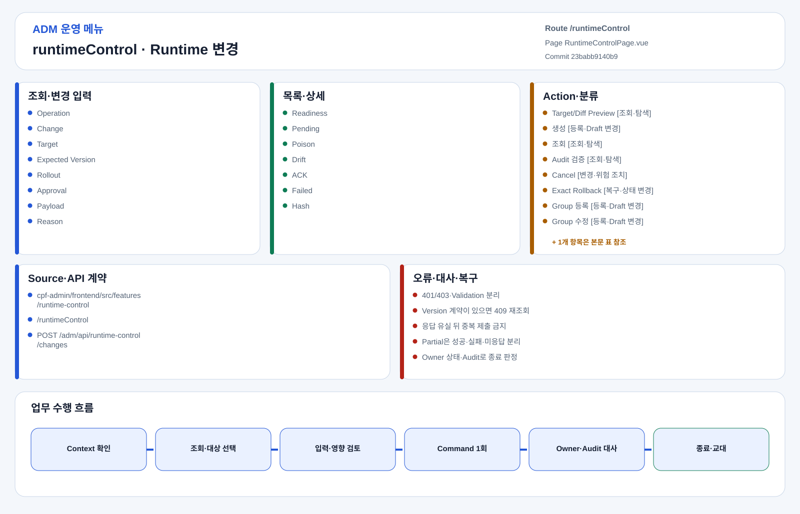

### 이 장에서 끝내는 업무

다중 Instance Runtime 변경을 계획·배포·대사한다.

### 메뉴 식별·책임

| 항목 | 값 |
|---|---|
| Route | `/runtimeControl` |
| 메뉴 ID | `runtimeControl` |
| Menu Code | `runtimeControl` |
| 업무 그룹 | 온라인 운영 |
| Frontend Page | `cpf-admin/frontend/src/features/runtime-control/RuntimeControlPage.vue` |
| Permission | Runtime Control Permission + Approval/Break-glass |
| 기준 Commit | `23babb9140b90e501d6ac715e7b77f55b66198a5` |

### Source·API 근거

| 구분 | 기준 |
|---|---|
| Frontend Page | `cpf-admin/frontend/src/features/runtime-control/RuntimeControlPage.vue` |
| Router | `/runtimeControl` |
| API 1 | `POST /adm/api/runtime-control/changes` |

아래 표는 이 메뉴에서 실제로 확인·입력·실행할 항목을 정리한다. 화면에 없는 Field·Button·상태를 임의로 가정하지 않는다.

### 검색·입력 Field

| Field | Control | 업무 의미 | 기본값·Validation·주의 |
|---|---|---|---|
| `Operation` | 문자열 입력·검색 | Runtime 변경 Control Plane 화면의 조회 조건 또는 편집 Form에 포함되는 값이며 화면 Label과 Help를 기준으로 사용한다. | 앞뒤 공백·허용 문자·길이와 대소문자 규칙을 확인한다. |
| `Change` | 문자열 입력·검색 | Runtime 변경 Control Plane 화면의 조회 조건 또는 편집 Form에 포함되는 값이며 화면 Label과 Help를 기준으로 사용한다. | 앞뒤 공백·허용 문자·길이와 대소문자 규칙을 확인한다. |
| `Target` | 문자열 입력·검색 | Runtime 변경 Control Plane 화면의 조회 조건 또는 편집 Form에 포함되는 값이며 화면 Label과 Help를 기준으로 사용한다. | 앞뒤 공백·허용 문자·길이와 대소문자 규칙을 확인한다. |
| `Expected Version` | 숫자·Version 입력 | 동시 변경을 막고 요청 대상의 현재 Revision을 확인하는 값이다. | 상세 재조회로 최신 값을 얻고 409 발생 시 기존 값을 덮어쓰지 않는다. |
| `Rollout` | 문자열 입력·검색 | Runtime 변경 Control Plane 화면의 조회 조건 또는 편집 Form에 포함되는 값이며 화면 Label과 Help를 기준으로 사용한다. | 앞뒤 공백·허용 문자·길이와 대소문자 규칙을 확인한다. |
| `Approval` | Checkbox·Switch | Runtime 변경 Control Plane 화면의 조회 조건 또는 편집 Form에 포함되는 값이며 화면 Label과 Help를 기준으로 사용한다. | 현재 선택과 변경 후 영향 범위를 비교하고 화면의 Source 기본값을 확인한다. |
| `Payload` | 다중행 입력 | 검증·등록·Export에 사용할 입력 Artifact 또는 구조화된 본문이다. | 허용 Schema·길이·민감정보 포함 여부를 확인하고 Preview 또는 Validation 결과를 검토한다. |
| `Reason` | 다중행 입력 | 작업 목적·영향 범위·승인 또는 복구 기준을 기록해 Audit와 교대 기록에 연결한다. | Ticket·영향 범위·복구점을 포함하고 화면이 요구하는 최소 길이를 충족한다. |

#### 입력 순서

1. **Operation** 항목이 조회 Control인지 변경 Form인지 화면 위치로 구분하고, 표시된 값·필수 여부·허용 형식을 확인한다.
2. **Change** 항목이 조회 Control인지 변경 Form인지 화면 위치로 구분하고, 표시된 값·필수 여부·허용 형식을 확인한다.
3. **Target** 항목이 조회 Control인지 변경 Form인지 화면 위치로 구분하고, 표시된 값·필수 여부·허용 형식을 확인한다.
4. **Expected Version** 항목이 조회 Control인지 변경 Form인지 화면 위치로 구분하고, 표시된 값·필수 여부·허용 형식을 확인한다.
5. **Rollout** 항목이 조회 Control인지 변경 Form인지 화면 위치로 구분하고, 표시된 값·필수 여부·허용 형식을 확인한다.
6. **Approval** 항목이 조회 Control인지 변경 Form인지 화면 위치로 구분하고, 표시된 값·필수 여부·허용 형식을 확인한다.
7. **Payload** 항목이 조회 Control인지 변경 Form인지 화면 위치로 구분하고, 표시된 값·필수 여부·허용 형식을 확인한다.
8. **Reason** 항목이 조회 Control인지 변경 Form인지 화면 위치로 구분하고, 표시된 값·필수 여부·허용 형식을 확인한다.
9. 조회 Control과 변경 Form을 분리해 기록하고, 실행 전 Environment·Data Scope·Timezone과 제출할 값만 다시 검토한다.

### 목록 Column·상세 Field

| 표시값 | 운영 의미 | 교차 확인 |
|---|---|---|
| `Readiness` | Runtime 변경 Control Plane 상세에서 대상의 현재 속성 또는 처리 결과를 확인하는 값이다. | 상세·재조회 결과와 비교하고 Stale·Masking·단위 차이를 확인한다. |
| `Pending` | Runtime 변경 Control Plane 상세에서 대상의 현재 속성 또는 처리 결과를 확인하는 값이다. | 상세·재조회 결과와 비교하고 Stale·Masking·단위 차이를 확인한다. |
| `Poison` | 오류·Drift·결과 불명 범위를 나타내며 원인과 복구 Owner를 연결해야 한다. | 상세·재조회 결과와 비교하고 Stale·Masking·단위 차이를 확인한다. |
| `Drift` | 오류·Drift·결과 불명 범위를 나타내며 원인과 복구 Owner를 연결해야 한다. | 원인 식별자·실패 Stage·마지막 갱신 시각을 상세와 대조한다. |
| `ACK` | Runtime 변경 Control Plane 상세에서 대상의 현재 속성 또는 처리 결과를 확인하는 값이다. | 상세·재조회 결과와 비교하고 Stale·Masking·단위 차이를 확인한다. |
| `Failed` | Runtime 변경 Control Plane 상세에서 대상의 현재 속성 또는 처리 결과를 확인하는 값이다. | 상세·재조회 결과와 비교하고 Stale·Masking·단위 차이를 확인한다. |
| `Hash` | 요청·Owner·Instance 사이의 Version 또는 내용 동일성을 판단하는 값이다. | 목록·상세·Owner 또는 Instance 보고값에서 일치하는지 확인한다. |

#### 결과 판독 순서

1. 조회 완료 시각·Filter·Paging·Sort와 화면 Warning을 확인한다.
2. Empty·Stale·Partial을 정상 0건과 구분한다.
3. 식별자·상태·Version·오류·시각을 같은 Query Context의 상세와 Owner 원장에서 비교한다.
4. Masking된 값은 Raw Permission과 Reason 없이 복원·Export하지 않는다.
5. 집계와 상세가 다르면 집계 시간 창·Timezone·Owner Update 시각을 맞춰 대사한다.

### Button·Action

| Action | 분류 | 활성 조건 | Side Effect·정상 결과 |
|---|---|---|---|
| **Target/Diff Preview** | 조회·탐색 | 조회 Permission과 Query Validation을 충족하고 동일 조회가 진행 중이 아님 | Target/Diff Preview 결과의 조회 시각·Filter·Source Version·Warning이 갱신되며 Owner 데이터는 변경하지 않는다. |
| **생성** | 등록·Draft 변경 | 화면이 실제로 요구하는 Write Permission·필수 Field·Reason·Version 조건을 충족함 | Runtime 변경 Control Plane의 재조회 결과가 요청 내용과 일치한다. Version·Before/After·Audit는 해당 Owner가 제공하는 경우 함께 확인한다. |
| **조회** | 조회·탐색 | 조회 Permission과 Query Validation을 충족하고 동일 조회가 진행 중이 아님 | 조회 결과의 조회 시각·Filter·Source Version·Warning이 갱신되며 Owner 데이터는 변경하지 않는다. |
| **Audit 검증** | 조회·탐색 | 조회 Permission과 Query Validation을 충족하고 동일 조회가 진행 중이 아님 | Audit 검증 결과의 조회 시각·Filter·Source Version·Warning이 갱신되며 Owner 데이터는 변경하지 않는다. |
| **Cancel** | 변경·위험 조치 | 화면과 Owner가 요구하는 Write Permission·대상 상태·영향 범위·Reason·승인·Version 조건을 충족함 | 변경 Operation을 생성하고 Accepted 응답과 Owner Terminal 상태·Version·Audit를 분리해 확인한다. |
| **Exact Rollback** | 복구·상태 변경 | 화면과 Owner가 요구하는 복구 Permission·대상 상태·Reason·승인·Version 조건을 충족함 | 복구 Operation을 생성하고 Owner 상태·대상별 결과·Audit로 종료를 판정한다. |
| **Group 등록** | 등록·Draft 변경 | 화면이 실제로 요구하는 Write Permission·필수 Field·Reason·Version 조건을 충족함 | Runtime 변경 Control Plane의 재조회 결과가 요청 내용과 일치한다. Version·Before/After·Audit는 해당 Owner가 제공하는 경우 함께 확인한다. |
| **Group 수정** | 등록·Draft 변경 | 화면이 실제로 요구하는 Write Permission·필수 Field·Reason·Version 조건을 충족함 | Runtime 변경 Control Plane의 재조회 결과가 요청 내용과 일치한다. Version·Before/After·Audit는 해당 Owner가 제공하는 경우 함께 확인한다. |
| **Group 삭제** | 변경·위험 조치 | 화면과 Owner가 요구하는 Write Permission·대상 상태·영향 범위·Reason·승인·Version 조건을 충족함 | 변경 Operation을 생성하고 Accepted 응답과 Owner Terminal 상태·Version·Audit를 분리해 확인한다. |

### 정상 업무 전체 절차

1. `/runtimeControl`에 진입해 Page Header와 Route가 **Runtime 변경 Control Plane** 기능을 가리키는지 확인한다.
2. 로그인 Session·Environment·Data Scope·기준일·Timezone을 고정한다.
3. 화면의 조회 Control과 변경 Form을 구분한다. 조회 조건이 제공되면 먼저 조회하고, 변경 Form은 대상 선택 또는 등록 Action 뒤에 열린 실제 Field만 사용한다.
4. Loading 종료 후 Empty·Error·Stale·Partial 상태와 화면 Warning을 먼저 판정한다.
5. **Readiness, Pending, Poison, Drift, ACK**를 읽고 식별자·상태·Version·시각을 Owner 원장과 대사한다.
6. **생성** 전에 화면과 Owner가 실제로 요구하는 Permission·현재 상태·영향 범위·Reason·승인·Version 조건을 확인하고 한 번만 제출한다.
7. **생성**의 HTTP 응답과 재조회 결과를 확인한다. 비동기·다중 대상 기능은 Owner Terminal 상태·Version·대상별 Success/Failed/Unknown·Audit를 별도로 확인한다.
8. **Cancel** 전에 화면과 Owner가 실제로 요구하는 Permission·현재 상태·영향 범위·Reason·승인·Version 조건을 확인하고 한 번만 제출한다.
9. **Cancel**의 HTTP 응답과 재조회 결과를 확인한다. 비동기·다중 대상 기능은 Owner Terminal 상태·Version·대상별 Success/Failed/Unknown·Audit를 별도로 확인한다.
10. **Exact Rollback** 전에 화면과 Owner가 실제로 요구하는 Permission·현재 상태·영향 범위·Reason·승인·Version 조건을 확인하고 한 번만 제출한다.
11. **Exact Rollback**의 HTTP 응답과 재조회 결과를 확인한다. 비동기·다중 대상 기능은 Owner Terminal 상태·Version·대상별 Success/Failed/Unknown·Audit를 별도로 확인한다.
12. **Group 등록** 전에 화면과 Owner가 실제로 요구하는 Permission·현재 상태·영향 범위·Reason·승인·Version 조건을 확인하고 한 번만 제출한다.
13. **Group 등록**의 HTTP 응답과 재조회 결과를 확인한다. 비동기·다중 대상 기능은 Owner Terminal 상태·Version·대상별 Success/Failed/Unknown·Audit를 별도로 확인한다.
14. **Group 수정** 전에 화면과 Owner가 실제로 요구하는 Permission·현재 상태·영향 범위·Reason·승인·Version 조건을 확인하고 한 번만 제출한다.
15. **Group 수정**의 HTTP 응답과 재조회 결과를 확인한다. 비동기·다중 대상 기능은 Owner Terminal 상태·Version·대상별 Success/Failed/Unknown·Audit를 별도로 확인한다.
16. **Group 삭제** 전에 화면과 Owner가 실제로 요구하는 Permission·현재 상태·영향 범위·Reason·승인·Version 조건을 확인하고 한 번만 제출한다.
17. **Group 삭제**의 HTTP 응답과 재조회 결과를 확인한다. 비동기·다중 대상 기능은 Owner Terminal 상태·Version·대상별 Success/Failed/Unknown·Audit를 별도로 확인한다.
18. 화면이 제공하는 Log·Metric·Trace와, 변경·Export·승인 조치에 생성된 Audit를 교차 확인한다.
19. 이 장의 **종료 판정**과 다음 확인 시각·Evidence Link를 교대 기록에 남긴다.

### 메뉴 고유 판정·금지 사항

- **목적:** 다중 Instance Runtime 변경을 계획·배포·대사한다.
- **종료 판정:** Expected Version·Rollout Wave·ACK/NACK·Drift·Exact Rollback을 끝까지 추적한다.
- 응답을 받지 못한 경우 Owner 상태와 기존 Operation을 확인하기 전에 동일 Action을 반복하지 않는다.
- HTTP 성공 응답이나 Toast만으로 비동기 Owner 상태 또는 다중 대상 적용을 확정하지 않는다.

### 오류·경계·동시성·복구

| 상황 | 화면 징후 | 운영 조치 | 종료 증적 |
|---|---|---|---|
| 401·Session | Session 만료·CSRF·Origin 실패 | 로그인 상태와 BFF Session을 확인한다. Command 자동 Replay는 금지한다. | 401/403 응답·Session Audit |
| 403·Data Scope | 메뉴·Button·Raw·Export가 거부됨 | Menu·Button·API·Owner Permission과 Data Scope를 확인하고 우회하지 않는다. | Deny Audit·요청 Permission |
| Validation | 필수값·범위·형식·기간 오류 | Field Error만 수정하고 기존 성공 Operation을 다시 제출하지 않는다. | Error Code·Field·입력값 |
| Timeout·Dependency | 일부 Source 또는 Command 응답 지연 | Correlation/Operation ID와 실패 Stage를 기록하고 Owner 상태를 조회한다. | Dependency 상태·Retryability |
| Partial·Stale | 일부 대상만 Success 또는 조회 Source 누락 | 성공·실패·미응답을 분리하고 누락 범위와 Version을 표시한다. | Target별 결과·Version |
| 409·동시 변경 | Expected Version 불일치 | 최신 상세를 재조회하고 Diff·영향을 다시 검토한 뒤 새 요청으로 제출한다. | 현재/요청 Version·변경자 |
| 응답 유실·Unknown | 요청 후 실제 처리 여부를 알 수 없음 | Operation ID·Request Hash·Audit·Owner 상태로 대사하고 중복 제출하지 않는다. | Operation·Owner·Audit |
| 복구 실패 | Retry/Rollback 뒤에도 상태 불일치 | 자동 반복을 중단하고 Incident·Reconcile Case·다음 확인 시각을 기록한다. | Case ID·복구 Owner·기한 |

### 응답 유실·결과 불명·부분 적용 처리

1. 동일 Action을 다시 누르지 않고 Browser Network와 응답 Header를 보존한다. `operationId`·`transactionId`·`idempotencyKey`가 제공되면 기록하고, 없으면 Target ID·Actor·요청 시각·Request Body Hash로 대사한다.
2. 기능이 제공하는 상세·Operation Status(있는 경우)·Audit에서 Request Hash와 대상 Version을 검색한다.
3. Side Effect 전 실패가 확인된 경우에만 새 요청을 검토한다.
4. Success·Failed·Unknown 대상을 분리하고 Source가 제공하는 Failed-only Retry·Compensation·Rollback을 선택하고, 지원되지 않으면 수동 Reconcile Case로 이관한다.
5. Rollback을 지원하는 기능은 Owner Version·Checksum·업무 합계가 Rollback Point와 일치하는지 확인한다.
6. 확정되지 않은 대상은 `UNKNOWN_RESULT`로 유지하고 담당자·대사 기한·다음 확인 시각을 기록한다.

### Log·Metric·Trace·Audit와 교대 기록

| 증적 | 필수 값 |
|---|---|
| Audit | Actor·Permission·Reason·Approval·Target·Before/After·Result·Recovery Action |
| Log | Environment·Instance·operationId·transactionId·failureStage·errorCode |
| Metric | 동일 시간 창의 Success·Failure·Latency·Queue·Retry·Partial·Unknown |
| Trace | root/segment/attempt·Owner·DB/Kafka/외부 의존성 Span |
| 상태 원장 | Target ID·Version·Checksum·Desired/Actual·Last Updated·Terminal 여부 |

```text
Menu=runtimeControl
Route=/runtimeControl
Environment=
DataScope=
Query=
TargetId=
BeforeVersion=
Action=
Reason=
ApprovalId=
OperationId=
TransactionId=
Result=SUCCESS|FAILED|PARTIAL|UNKNOWN_RESULT
OwnerState=
FailedTargets=
ReconcileBy=
RollbackPoint=
EvidenceLinks=
NextCheckAt=
```

### 실무 Workbook

**상황:** 다중 Instance Runtime 변경을 계획·배포·대사한다. 담당자가 **생성**을 수행한 뒤 Browser 응답을 받지 못했다.

1. 대상 식별자와 Before Version, 입력값, Reason·Approval을 작업 기록에서 확인한다.
2. 동일 **생성**을 반복하지 않고 Operation·Audit·Owner 상태를 조회한다.
3. Owner 상태가 변경됐고 Request Hash가 같으면 응답 유실로 분류해 중복 조치를 금지한다.
4. 일부 대상만 변경됐으면 Success·Failed·Unknown을 분리해 Failed-only Retry 또는 Rollback을 선택한다.
5. Expected Version·Rollout Wave·ACK/NACK·Drift·Exact Rollback을 끝까지 추적한다.
6. Evidence Link와 다음 확인 시각을 교대 기록에 남긴다.

### 독립 수행 검수 Checklist

- [ ] `/runtimeControl`와 Page Source를 찾고 화면 목적을 설명할 수 있다.
- [ ] 8개 입력·검색 항목의 Control·기본값·Validation을 설명할 수 있다.
- [ ] 7개 표시값을 Owner 상태·Version·Audit와 대사할 수 있다.
- [ ] 9개 Action의 분류·활성 조건·Side Effect를 설명할 수 있다.
- [ ] Empty·403·409·Timeout·Partial·Unknown을 서로 다른 상태로 처리할 수 있다.
- [ ] 응답 유실 뒤 중복 제출 없이 Operation·Owner·Audit로 결과를 확정할 수 있다.
- [ ] 교대 기록만으로 다음 담당자가 Target·상태·복구 기한을 이어받을 수 있다.

## 11. maintenance — 점검·Drain 제어

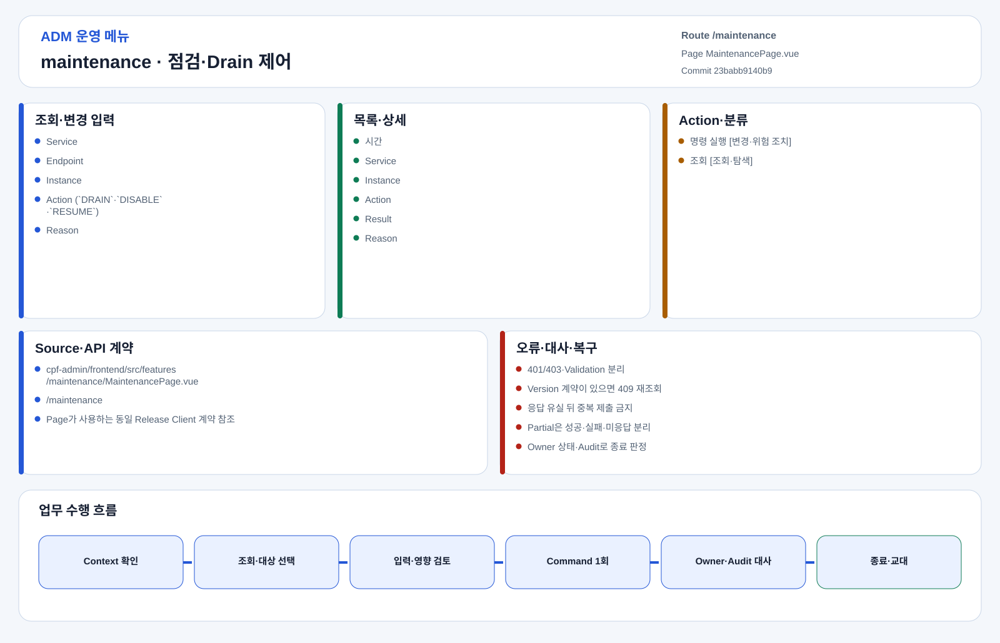

### 이 장에서 끝내는 업무

Instance를 Drain·Disable·Resume해 점검 Traffic을 통제한다.

### 메뉴 식별·책임

| 항목 | 값 |
|---|---|
| Route | `/maintenance` |
| 메뉴 ID | `maintenance` |
| Menu Code | `maintenance` |
| 업무 그룹 | 프레임워크 |
| Frontend Page | `cpf-admin/frontend/src/features/maintenance/MaintenancePage.vue` |
| Permission | Owner Command Permission |
| 기준 Commit | `23babb9140b90e501d6ac715e7b77f55b66198a5` |

### Source·API 근거

| 구분 | 기준 |
|---|---|
| Frontend Page | `cpf-admin/frontend/src/features/maintenance/MaintenancePage.vue` |
| Router | `/maintenance` |
| API 추적 | 화면에서 제공하는 기능을 통해 호출한다. 문서에 명시되지 않은 Endpoint를 Browser나 외부 Script에서 임의 호출하지 않는다. |

아래 표는 이 메뉴에서 실제로 확인·입력·실행할 항목을 정리한다. 화면에 없는 Field·Button·상태를 임의로 가정하지 않는다.

### 검색·입력 Field

| Field | Control | 업무 의미 | 기본값·Validation·주의 |
|---|---|---|---|
| `Service` | 문자열 입력·검색 | 조회·상세·Audit에서 같은 대상을 다시 찾기 위한 식별 조건이다. | 앞뒤 공백·허용 문자·길이와 대소문자 규칙을 확인한다. |
| `Endpoint` | 문자열 입력·검색 | 조회·상세·Audit에서 같은 대상을 다시 찾기 위한 식별 조건이다. | 앞뒤 공백·허용 문자·길이와 대소문자 규칙을 확인한다. |
| `Instance` | 문자열 입력·검색 | 조회·상세·Audit에서 같은 대상을 다시 찾기 위한 식별 조건이다. | 앞뒤 공백·허용 문자·길이와 대소문자 규칙을 확인한다. |
| `Action (`DRAIN`·`DISABLE`·`RESUME`)` | Select·검색 | 점검·Drain 제어에서 적용하거나 조회할 정책·권한·처리 유형을 선택한다. | 허용 목록과 현재 Environment·Data Scope에 맞는 값만 선택한다. |
| `Reason` | 다중행 입력 | 작업 목적·영향 범위·승인 또는 복구 기준을 기록해 Audit와 교대 기록에 연결한다. | Ticket·영향 범위·복구점을 포함하고 화면이 요구하는 최소 길이를 충족한다. |

#### 입력 순서

1. **Service** 항목이 조회 Control인지 변경 Form인지 화면 위치로 구분하고, 표시된 값·필수 여부·허용 형식을 확인한다.
2. **Endpoint** 항목이 조회 Control인지 변경 Form인지 화면 위치로 구분하고, 표시된 값·필수 여부·허용 형식을 확인한다.
3. **Instance** 항목이 조회 Control인지 변경 Form인지 화면 위치로 구분하고, 표시된 값·필수 여부·허용 형식을 확인한다.
4. **Action (`DRAIN`·`DISABLE`·`RESUME`)** 항목이 조회 Control인지 변경 Form인지 화면 위치로 구분하고, 표시된 값·필수 여부·허용 형식을 확인한다.
5. **Reason** 항목이 조회 Control인지 변경 Form인지 화면 위치로 구분하고, 표시된 값·필수 여부·허용 형식을 확인한다.
6. 조회 Control과 변경 Form을 분리해 기록하고, 실행 전 Environment·Data Scope·Timezone과 제출할 값만 다시 검토한다.

### 목록 Column·상세 Field

| 표시값 | 운영 의미 | 교차 확인 |
|---|---|---|
| `시간` | 점검·Drain 제어 상세에서 대상의 현재 속성 또는 처리 결과를 확인하는 값이다. | 상세·재조회 결과와 비교하고 Stale·Masking·단위 차이를 확인한다. |
| `Service` | 점검·Drain 제어의 대상 레코드를 상세·Owner·Audit에서 연결하는 식별자다. | 상세·Log·Trace·Audit에서 같은 대상을 가리키는지 확인한다. |
| `Instance` | 점검·Drain 제어의 대상 레코드를 상세·Owner·Audit에서 연결하는 식별자다. | 상세·Log·Trace·Audit에서 같은 대상을 가리키는지 확인한다. |
| `Action` | 점검·Drain 제어 상세에서 대상의 현재 속성 또는 처리 결과를 확인하는 값이다. | 상세·재조회 결과와 비교하고 Stale·Masking·단위 차이를 확인한다. |
| `Result` | 현재 상태와 Terminal 여부, 다음 Action 가능 여부를 판단하는 값이다. | Last Updated·Terminal 조건·Owner 상태와 함께 확인한다. |
| `Reason` | 작업 주체·Owner·변경 사유를 확인하는 감사 정보다. | 상세·재조회 결과와 비교하고 Stale·Masking·단위 차이를 확인한다. |

#### 결과 판독 순서

1. 조회 완료 시각·Filter·Paging·Sort와 화면 Warning을 확인한다.
2. Empty·Stale·Partial을 정상 0건과 구분한다.
3. 식별자·상태·Version·오류·시각을 같은 Query Context의 상세와 Owner 원장에서 비교한다.
4. Masking된 값은 Raw Permission과 Reason 없이 복원·Export하지 않는다.
5. 집계와 상세가 다르면 집계 시간 창·Timezone·Owner Update 시각을 맞춰 대사한다.

### Button·Action

| Action | 분류 | 활성 조건 | Side Effect·정상 결과 |
|---|---|---|---|
| **명령 실행** | 변경·위험 조치 | 화면과 Owner가 요구하는 Write Permission·대상 상태·영향 범위·Reason·승인·Version 조건을 충족함 | 변경 Operation을 생성하고 Accepted 응답과 Owner Terminal 상태·Version·Audit를 분리해 확인한다. |
| **조회** | 조회·탐색 | 조회 Permission과 Query Validation을 충족하고 동일 조회가 진행 중이 아님 | 조회 결과의 조회 시각·Filter·Source Version·Warning이 갱신되며 Owner 데이터는 변경하지 않는다. |

### 정상 업무 전체 절차

1. `/maintenance`에 진입해 Page Header와 Route가 **점검·Drain 제어** 기능을 가리키는지 확인한다.
2. 로그인 Session·Environment·Data Scope·기준일·Timezone을 고정한다.
3. 화면의 조회 Control과 변경 Form을 구분한다. 조회 조건이 제공되면 먼저 조회하고, 변경 Form은 대상 선택 또는 등록 Action 뒤에 열린 실제 Field만 사용한다.
4. Loading 종료 후 Empty·Error·Stale·Partial 상태와 화면 Warning을 먼저 판정한다.
5. **시간, Service, Instance, Action, Result**를 읽고 식별자·상태·Version·시각을 Owner 원장과 대사한다.
6. **명령 실행** 전에 화면과 Owner가 실제로 요구하는 Permission·현재 상태·영향 범위·Reason·승인·Version 조건을 확인하고 한 번만 제출한다.
7. **명령 실행**의 HTTP 응답과 재조회 결과를 확인한다. 비동기·다중 대상 기능은 Owner Terminal 상태·Version·대상별 Success/Failed/Unknown·Audit를 별도로 확인한다.
8. 화면이 제공하는 Log·Metric·Trace와, 변경·Export·승인 조치에 생성된 Audit를 교차 확인한다.
9. 이 장의 **종료 판정**과 다음 확인 시각·Evidence Link를 교대 기록에 남긴다.

### 메뉴 고유 판정·금지 사항

- **목적:** Instance를 Drain·Disable·Resume해 점검 Traffic을 통제한다.
- **종료 판정:** Routing 제외와 진행 중 거래 종료를 확인한 뒤 점검 상태를 확정한다.
- 응답을 받지 못한 경우 Owner 상태와 기존 Operation을 확인하기 전에 동일 Action을 반복하지 않는다.
- HTTP 성공 응답이나 Toast만으로 비동기 Owner 상태 또는 다중 대상 적용을 확정하지 않는다.

### 오류·경계·동시성·복구

| 상황 | 화면 징후 | 운영 조치 | 종료 증적 |
|---|---|---|---|
| 401·Session | Session 만료·CSRF·Origin 실패 | 로그인 상태와 BFF Session을 확인한다. Command 자동 Replay는 금지한다. | 401/403 응답·Session Audit |
| 403·Data Scope | 메뉴·Button·Raw·Export가 거부됨 | Menu·Button·API·Owner Permission과 Data Scope를 확인하고 우회하지 않는다. | Deny Audit·요청 Permission |
| Validation | 필수값·범위·형식·기간 오류 | Field Error만 수정하고 기존 성공 Operation을 다시 제출하지 않는다. | Error Code·Field·입력값 |
| Timeout·Dependency | 일부 Source 또는 Command 응답 지연 | Correlation/Operation ID와 실패 Stage를 기록하고 Owner 상태를 조회한다. | Dependency 상태·Retryability |
| Partial·Stale | 일부 대상만 Success 또는 조회 Source 누락 | 성공·실패·미응답을 분리하고 누락 범위와 Version을 표시한다. | Target별 결과·Version |
| 409·동시 변경 | Expected Version 불일치 | 최신 상세를 재조회하고 Diff·영향을 다시 검토한 뒤 새 요청으로 제출한다. | 현재/요청 Version·변경자 |
| 응답 유실·Unknown | 요청 후 실제 처리 여부를 알 수 없음 | Operation ID·Request Hash·Audit·Owner 상태로 대사하고 중복 제출하지 않는다. | Operation·Owner·Audit |
| 복구 실패 | Retry/Rollback 뒤에도 상태 불일치 | 자동 반복을 중단하고 Incident·Reconcile Case·다음 확인 시각을 기록한다. | Case ID·복구 Owner·기한 |

### 응답 유실·결과 불명·부분 적용 처리

1. 동일 Action을 다시 누르지 않고 Browser Network와 응답 Header를 보존한다. `operationId`·`transactionId`·`idempotencyKey`가 제공되면 기록하고, 없으면 Target ID·Actor·요청 시각·Request Body Hash로 대사한다.
2. 기능이 제공하는 상세·Operation Status(있는 경우)·Audit에서 Request Hash와 대상 Version을 검색한다.
3. Side Effect 전 실패가 확인된 경우에만 새 요청을 검토한다.
4. Success·Failed·Unknown 대상을 분리하고 Source가 제공하는 Failed-only Retry·Compensation·Rollback을 선택하고, 지원되지 않으면 수동 Reconcile Case로 이관한다.
5. Rollback을 지원하는 기능은 Owner Version·Checksum·업무 합계가 Rollback Point와 일치하는지 확인한다.
6. 확정되지 않은 대상은 `UNKNOWN_RESULT`로 유지하고 담당자·대사 기한·다음 확인 시각을 기록한다.

### Log·Metric·Trace·Audit와 교대 기록

| 증적 | 필수 값 |
|---|---|
| Audit | Actor·Permission·Reason·Approval·Target·Before/After·Result·Recovery Action |
| Log | Environment·Instance·operationId·transactionId·failureStage·errorCode |
| Metric | 동일 시간 창의 Success·Failure·Latency·Queue·Retry·Partial·Unknown |
| Trace | root/segment/attempt·Owner·DB/Kafka/외부 의존성 Span |
| 상태 원장 | Target ID·Version·Checksum·Desired/Actual·Last Updated·Terminal 여부 |

```text
Menu=maintenance
Route=/maintenance
Environment=
DataScope=
Query=
TargetId=
BeforeVersion=
Action=
Reason=
ApprovalId=
OperationId=
TransactionId=
Result=SUCCESS|FAILED|PARTIAL|UNKNOWN_RESULT
OwnerState=
FailedTargets=
ReconcileBy=
RollbackPoint=
EvidenceLinks=
NextCheckAt=
```

### 실무 Workbook

**상황:** Instance를 Drain·Disable·Resume해 점검 Traffic을 통제한다. 담당자가 **명령 실행**을 수행한 뒤 Browser 응답을 받지 못했다.

1. 대상 식별자와 Before Version, 입력값, Reason·Approval을 작업 기록에서 확인한다.
2. 동일 **명령 실행**을 반복하지 않고 Operation·Audit·Owner 상태를 조회한다.
3. Owner 상태가 변경됐고 Request Hash가 같으면 응답 유실로 분류해 중복 조치를 금지한다.
4. 일부 대상만 변경됐으면 Success·Failed·Unknown을 분리해 Failed-only Retry 또는 Rollback을 선택한다.
5. Routing 제외와 진행 중 거래 종료를 확인한 뒤 점검 상태를 확정한다.
6. Evidence Link와 다음 확인 시각을 교대 기록에 남긴다.

### 독립 수행 검수 Checklist

- [ ] `/maintenance`와 Page Source를 찾고 화면 목적을 설명할 수 있다.
- [ ] 5개 입력·검색 항목의 Control·기본값·Validation을 설명할 수 있다.
- [ ] 6개 표시값을 Owner 상태·Version·Audit와 대사할 수 있다.
- [ ] 2개 Action의 분류·활성 조건·Side Effect를 설명할 수 있다.
- [ ] Empty·403·409·Timeout·Partial·Unknown을 서로 다른 상태로 처리할 수 있다.
- [ ] 응답 유실 뒤 중복 제출 없이 Operation·Owner·Audit로 결과를 확정할 수 있다.
- [ ] 교대 기록만으로 다음 담당자가 Target·상태·복구 기한을 이어받을 수 있다.

## 12. cache — Cache 조회·Evict·Reconcile

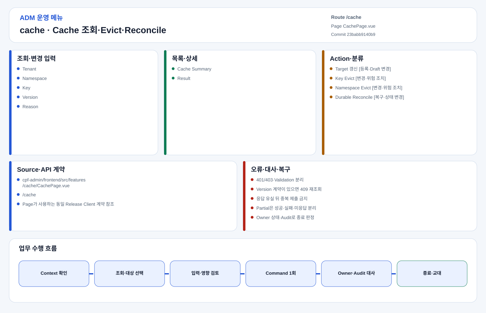

### 이 장에서 끝내는 업무

Cache Target·Key·Namespace를 정리하고 Owner와 재대사한다.

### 메뉴 식별·책임

| 항목 | 값 |
|---|---|
| Route | `/cache` |
| 메뉴 ID | `cache` |
| Menu Code | `cache` |
| 업무 그룹 | 프레임워크 |
| Frontend Page | `cpf-admin/frontend/src/features/cache/CachePage.vue` |
| Permission | Button Permission `CACHE_*` |
| 기준 Commit | `23babb9140b90e501d6ac715e7b77f55b66198a5` |

### Source·API 근거

| 구분 | 기준 |
|---|---|
| Frontend Page | `cpf-admin/frontend/src/features/cache/CachePage.vue` |
| Router | `/cache` |
| API 추적 | 화면에서 제공하는 기능을 통해 호출한다. 문서에 명시되지 않은 Endpoint를 Browser나 외부 Script에서 임의 호출하지 않는다. |

아래 표는 이 메뉴에서 실제로 확인·입력·실행할 항목을 정리한다. 화면에 없는 Field·Button·상태를 임의로 가정하지 않는다.

### 검색·입력 Field

| Field | Control | 업무 의미 | 기본값·Validation·주의 |
|---|---|---|---|
| `Tenant` | 문자열 입력·검색 | Cache 조회·Evict·Reconcile 조회·조치가 적용되는 환경과 데이터 경계를 제한한다. | 앞뒤 공백·허용 문자·길이와 대소문자 규칙을 확인한다. |
| `Namespace` | 문자열 입력·검색 | 대상의 표시명 또는 업무명을 검색·입력한다. | 앞뒤 공백·허용 문자·길이와 대소문자 규칙을 확인한다. |
| `Key` | 문자열 입력·검색 | 조회·상세·Audit에서 같은 대상을 다시 찾기 위한 식별 조건이다. | 앞뒤 공백·허용 문자·길이와 대소문자 규칙을 확인한다. |
| `Version` | 숫자·Version 입력 | 동시 변경을 막고 요청 대상의 현재 Revision을 확인하는 값이다. | 상세 재조회로 최신 값을 얻고 409 발생 시 기존 값을 덮어쓰지 않는다. |
| `Reason` | 다중행 입력 | 작업 목적·영향 범위·승인 또는 복구 기준을 기록해 Audit와 교대 기록에 연결한다. | Ticket·영향 범위·복구점을 포함하고 화면이 요구하는 최소 길이를 충족한다. |

#### 입력 순서

1. **Tenant** 항목이 조회 Control인지 변경 Form인지 화면 위치로 구분하고, 표시된 값·필수 여부·허용 형식을 확인한다.
2. **Namespace** 항목이 조회 Control인지 변경 Form인지 화면 위치로 구분하고, 표시된 값·필수 여부·허용 형식을 확인한다.
3. **Key** 항목이 조회 Control인지 변경 Form인지 화면 위치로 구분하고, 표시된 값·필수 여부·허용 형식을 확인한다.
4. **Version** 항목이 조회 Control인지 변경 Form인지 화면 위치로 구분하고, 표시된 값·필수 여부·허용 형식을 확인한다.
5. **Reason** 항목이 조회 Control인지 변경 Form인지 화면 위치로 구분하고, 표시된 값·필수 여부·허용 형식을 확인한다.
6. 조회 Control과 변경 Form을 분리해 기록하고, 실행 전 Environment·Data Scope·Timezone과 제출할 값만 다시 검토한다.

### 목록 Column·상세 Field

| 표시값 | 운영 의미 | 교차 확인 |
|---|---|---|
| `Cache Summary` | Cache 대상·적중·Evict·Reconcile 결과의 요약이며 원본 데이터 변경 여부와 분리한다. | 상세·재조회 결과와 비교하고 Stale·Masking·단위 차이를 확인한다. |
| `Result` | 현재 상태와 Terminal 여부, 다음 Action 가능 여부를 판단하는 값이다. | Last Updated·Terminal 조건·Owner 상태와 함께 확인한다. |

#### 결과 판독 순서

1. 조회 완료 시각·Filter·Paging·Sort와 화면 Warning을 확인한다.
2. Empty·Stale·Partial을 정상 0건과 구분한다.
3. 식별자·상태·Version·오류·시각을 같은 Query Context의 상세와 Owner 원장에서 비교한다.
4. Masking된 값은 Raw Permission과 Reason 없이 복원·Export하지 않는다.
5. 집계와 상세가 다르면 집계 시간 창·Timezone·Owner Update 시각을 맞춰 대사한다.

### Button·Action

| Action | 분류 | 활성 조건 | Side Effect·정상 결과 |
|---|---|---|---|
| **Target 갱신** | 등록·Draft 변경 | 화면이 실제로 요구하는 Write Permission·필수 Field·Reason·Version 조건을 충족함 | Cache 조회·Evict·Reconcile의 재조회 결과가 요청 내용과 일치한다. Version·Before/After·Audit는 해당 Owner가 제공하는 경우 함께 확인한다. |
| **Key Evict** | 변경·위험 조치 | 화면과 Owner가 요구하는 Write Permission·대상 상태·영향 범위·Reason·승인·Version 조건을 충족함 | 변경 Operation을 생성하고 Accepted 응답과 Owner Terminal 상태·Version·Audit를 분리해 확인한다. |
| **Namespace Evict** | 변경·위험 조치 | 화면과 Owner가 요구하는 Write Permission·대상 상태·영향 범위·Reason·승인·Version 조건을 충족함 | 변경 Operation을 생성하고 Accepted 응답과 Owner Terminal 상태·Version·Audit를 분리해 확인한다. |
| **Durable Reconcile** | 복구·상태 변경 | 화면과 Owner가 요구하는 복구 Permission·대상 상태·Reason·승인·Version 조건을 충족함 | 복구 Operation을 생성하고 Owner 상태·대상별 결과·Audit로 종료를 판정한다. |

### 정상 업무 전체 절차

1. `/cache`에 진입해 Page Header와 Route가 **Cache 조회·Evict·Reconcile** 기능을 가리키는지 확인한다.
2. 로그인 Session·Environment·Data Scope·기준일·Timezone을 고정한다.
3. 화면의 조회 Control과 변경 Form을 구분한다. 조회 조건이 제공되면 먼저 조회하고, 변경 Form은 대상 선택 또는 등록 Action 뒤에 열린 실제 Field만 사용한다.
4. Loading 종료 후 Empty·Error·Stale·Partial 상태와 화면 Warning을 먼저 판정한다.
5. **Cache Summary, Result**를 읽고 식별자·상태·Version·시각을 Owner 원장과 대사한다.
6. **Target 갱신** 전에 화면과 Owner가 실제로 요구하는 Permission·현재 상태·영향 범위·Reason·승인·Version 조건을 확인하고 한 번만 제출한다.
7. **Target 갱신**의 HTTP 응답과 재조회 결과를 확인한다. 비동기·다중 대상 기능은 Owner Terminal 상태·Version·대상별 Success/Failed/Unknown·Audit를 별도로 확인한다.
8. **Key Evict** 전에 화면과 Owner가 실제로 요구하는 Permission·현재 상태·영향 범위·Reason·승인·Version 조건을 확인하고 한 번만 제출한다.
9. **Key Evict**의 HTTP 응답과 재조회 결과를 확인한다. 비동기·다중 대상 기능은 Owner Terminal 상태·Version·대상별 Success/Failed/Unknown·Audit를 별도로 확인한다.
10. **Namespace Evict** 전에 화면과 Owner가 실제로 요구하는 Permission·현재 상태·영향 범위·Reason·승인·Version 조건을 확인하고 한 번만 제출한다.
11. **Namespace Evict**의 HTTP 응답과 재조회 결과를 확인한다. 비동기·다중 대상 기능은 Owner Terminal 상태·Version·대상별 Success/Failed/Unknown·Audit를 별도로 확인한다.
12. **Durable Reconcile** 전에 화면과 Owner가 실제로 요구하는 Permission·현재 상태·영향 범위·Reason·승인·Version 조건을 확인하고 한 번만 제출한다.
13. **Durable Reconcile**의 HTTP 응답과 재조회 결과를 확인한다. 비동기·다중 대상 기능은 Owner Terminal 상태·Version·대상별 Success/Failed/Unknown·Audit를 별도로 확인한다.
14. 화면이 제공하는 Log·Metric·Trace와, 변경·Export·승인 조치에 생성된 Audit를 교차 확인한다.
15. 이 장의 **종료 판정**과 다음 확인 시각·Evidence Link를 교대 기록에 남긴다.

### 메뉴 고유 판정·금지 사항

- **목적:** Cache Target·Key·Namespace를 정리하고 Owner와 재대사한다.
- **종료 판정:** Cache를 원장으로 보지 않고 Evict 뒤 Owner 조회·Reconcile 결과를 확인한다.
- 응답을 받지 못한 경우 Owner 상태와 기존 Operation을 확인하기 전에 동일 Action을 반복하지 않는다.
- HTTP 성공 응답이나 Toast만으로 비동기 Owner 상태 또는 다중 대상 적용을 확정하지 않는다.

### 오류·경계·동시성·복구

| 상황 | 화면 징후 | 운영 조치 | 종료 증적 |
|---|---|---|---|
| 401·Session | Session 만료·CSRF·Origin 실패 | 로그인 상태와 BFF Session을 확인한다. Command 자동 Replay는 금지한다. | 401/403 응답·Session Audit |
| 403·Data Scope | 메뉴·Button·Raw·Export가 거부됨 | Menu·Button·API·Owner Permission과 Data Scope를 확인하고 우회하지 않는다. | Deny Audit·요청 Permission |
| Validation | 필수값·범위·형식·기간 오류 | Field Error만 수정하고 기존 성공 Operation을 다시 제출하지 않는다. | Error Code·Field·입력값 |
| Timeout·Dependency | 일부 Source 또는 Command 응답 지연 | Correlation/Operation ID와 실패 Stage를 기록하고 Owner 상태를 조회한다. | Dependency 상태·Retryability |
| Partial·Stale | 일부 대상만 Success 또는 조회 Source 누락 | 성공·실패·미응답을 분리하고 누락 범위와 Version을 표시한다. | Target별 결과·Version |
| 409·동시 변경 | Expected Version 불일치 | 최신 상세를 재조회하고 Diff·영향을 다시 검토한 뒤 새 요청으로 제출한다. | 현재/요청 Version·변경자 |
| 응답 유실·Unknown | 요청 후 실제 처리 여부를 알 수 없음 | Operation ID·Request Hash·Audit·Owner 상태로 대사하고 중복 제출하지 않는다. | Operation·Owner·Audit |
| 복구 실패 | Retry/Rollback 뒤에도 상태 불일치 | 자동 반복을 중단하고 Incident·Reconcile Case·다음 확인 시각을 기록한다. | Case ID·복구 Owner·기한 |

### 응답 유실·결과 불명·부분 적용 처리

1. 동일 Action을 다시 누르지 않고 Browser Network와 응답 Header를 보존한다. `operationId`·`transactionId`·`idempotencyKey`가 제공되면 기록하고, 없으면 Target ID·Actor·요청 시각·Request Body Hash로 대사한다.
2. 기능이 제공하는 상세·Operation Status(있는 경우)·Audit에서 Request Hash와 대상 Version을 검색한다.
3. Side Effect 전 실패가 확인된 경우에만 새 요청을 검토한다.
4. Success·Failed·Unknown 대상을 분리하고 Source가 제공하는 Failed-only Retry·Compensation·Rollback을 선택하고, 지원되지 않으면 수동 Reconcile Case로 이관한다.
5. Rollback을 지원하는 기능은 Owner Version·Checksum·업무 합계가 Rollback Point와 일치하는지 확인한다.
6. 확정되지 않은 대상은 `UNKNOWN_RESULT`로 유지하고 담당자·대사 기한·다음 확인 시각을 기록한다.

### Log·Metric·Trace·Audit와 교대 기록

| 증적 | 필수 값 |
|---|---|
| Audit | Actor·Permission·Reason·Approval·Target·Before/After·Result·Recovery Action |
| Log | Environment·Instance·operationId·transactionId·failureStage·errorCode |
| Metric | 동일 시간 창의 Success·Failure·Latency·Queue·Retry·Partial·Unknown |
| Trace | root/segment/attempt·Owner·DB/Kafka/외부 의존성 Span |
| 상태 원장 | Target ID·Version·Checksum·Desired/Actual·Last Updated·Terminal 여부 |

```text
Menu=cache
Route=/cache
Environment=
DataScope=
Query=
TargetId=
BeforeVersion=
Action=
Reason=
ApprovalId=
OperationId=
TransactionId=
Result=SUCCESS|FAILED|PARTIAL|UNKNOWN_RESULT
OwnerState=
FailedTargets=
ReconcileBy=
RollbackPoint=
EvidenceLinks=
NextCheckAt=
```

### 실무 Workbook

**상황:** Cache Target·Key·Namespace를 정리하고 Owner와 재대사한다. 담당자가 **Target 갱신**을 수행한 뒤 Browser 응답을 받지 못했다.

1. 대상 식별자와 Before Version, 입력값, Reason·Approval을 작업 기록에서 확인한다.
2. 동일 **Target 갱신**을 반복하지 않고 Operation·Audit·Owner 상태를 조회한다.
3. Owner 상태가 변경됐고 Request Hash가 같으면 응답 유실로 분류해 중복 조치를 금지한다.
4. 일부 대상만 변경됐으면 Success·Failed·Unknown을 분리해 Failed-only Retry 또는 Rollback을 선택한다.
5. Cache를 원장으로 보지 않고 Evict 뒤 Owner 조회·Reconcile 결과를 확인한다.
6. Evidence Link와 다음 확인 시각을 교대 기록에 남긴다.

### 독립 수행 검수 Checklist

- [ ] `/cache`와 Page Source를 찾고 화면 목적을 설명할 수 있다.
- [ ] 5개 입력·검색 항목의 Control·기본값·Validation을 설명할 수 있다.
- [ ] 2개 표시값을 Owner 상태·Version·Audit와 대사할 수 있다.
- [ ] 4개 Action의 분류·활성 조건·Side Effect를 설명할 수 있다.
- [ ] Empty·403·409·Timeout·Partial·Unknown을 서로 다른 상태로 처리할 수 있다.
- [ ] 응답 유실 뒤 중복 제출 없이 Operation·Owner·Audit로 결과를 확정할 수 있다.
- [ ] 교대 기록만으로 다음 담당자가 Target·상태·복구 기한을 이어받을 수 있다.

## 13. configs — 설정 관리

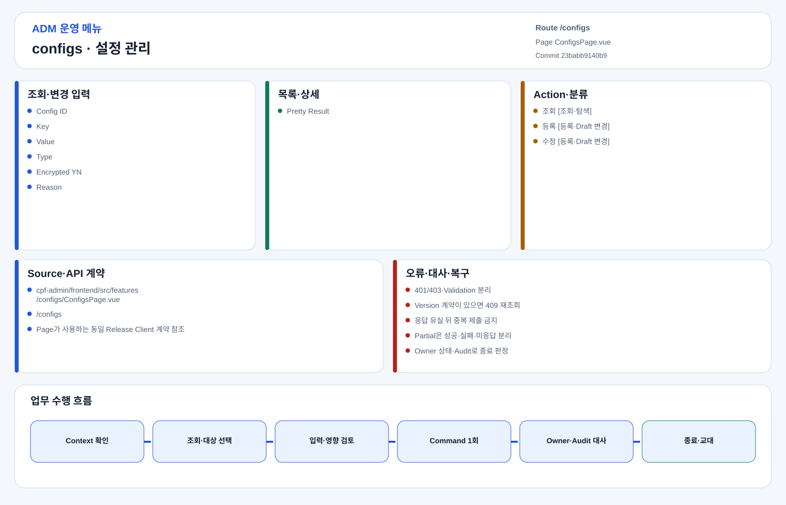

### 이 장에서 끝내는 업무

Config Key·Type·암호화 여부와 Version을 관리한다.

### 메뉴 식별·책임

| 항목 | 값 |
|---|---|
| Route | `/configs` |
| 메뉴 ID | `configs` |
| Menu Code | `configs` |
| 업무 그룹 | 프레임워크 |
| Frontend Page | `cpf-admin/frontend/src/features/configs/ConfigsPage.vue` |
| Permission | `CONFIG` Write |
| 기준 Commit | `23babb9140b90e501d6ac715e7b77f55b66198a5` |

### Source·API 근거

| 구분 | 기준 |
|---|---|
| Frontend Page | `cpf-admin/frontend/src/features/configs/ConfigsPage.vue` |
| Router | `/configs` |
| API 추적 | 화면에서 제공하는 기능을 통해 호출한다. 문서에 명시되지 않은 Endpoint를 Browser나 외부 Script에서 임의 호출하지 않는다. |

아래 표는 이 메뉴에서 실제로 확인·입력·실행할 항목을 정리한다. 화면에 없는 Field·Button·상태를 임의로 가정하지 않는다.

### 검색·입력 Field

| Field | Control | 업무 의미 | 기본값·Validation·주의 |
|---|---|---|---|
| `Config ID` | 문자열 입력·검색 | 조회·상세·Audit에서 같은 대상을 다시 찾기 위한 식별 조건이다. | 앞뒤 공백·허용 문자·길이와 대소문자 규칙을 확인한다. |
| `Key` | 문자열 입력·검색 | 조회·상세·Audit에서 같은 대상을 다시 찾기 위한 식별 조건이다. | 앞뒤 공백·허용 문자·길이와 대소문자 규칙을 확인한다. |
| `Value` | 문자열 입력·검색 | 설정 관리 화면의 조회 조건 또는 편집 Form에 포함되는 값이며 화면 Label과 Help를 기준으로 사용한다. | 앞뒤 공백·허용 문자·길이와 대소문자 규칙을 확인한다. |
| `Type` | Select·검색 | 설정 관리에서 적용하거나 조회할 정책·권한·처리 유형을 선택한다. | 허용 목록과 현재 Environment·Data Scope에 맞는 값만 선택한다. |
| `Encrypted YN` | Checkbox·Switch | 설정 관리 화면의 조회 조건 또는 편집 Form에 포함되는 값이며 화면 Label과 Help를 기준으로 사용한다. | 현재 선택과 변경 후 영향 범위를 비교하고 화면의 Source 기본값을 확인한다. |
| `Reason` | 다중행 입력 | 작업 목적·영향 범위·승인 또는 복구 기준을 기록해 Audit와 교대 기록에 연결한다. | Ticket·영향 범위·복구점을 포함하고 화면이 요구하는 최소 길이를 충족한다. |

#### 입력 순서

1. **Config ID** 항목이 조회 Control인지 변경 Form인지 화면 위치로 구분하고, 표시된 값·필수 여부·허용 형식을 확인한다.
2. **Key** 항목이 조회 Control인지 변경 Form인지 화면 위치로 구분하고, 표시된 값·필수 여부·허용 형식을 확인한다.
3. **Value** 항목이 조회 Control인지 변경 Form인지 화면 위치로 구분하고, 표시된 값·필수 여부·허용 형식을 확인한다.
4. **Type** 항목이 조회 Control인지 변경 Form인지 화면 위치로 구분하고, 표시된 값·필수 여부·허용 형식을 확인한다.
5. **Encrypted YN** 항목이 조회 Control인지 변경 Form인지 화면 위치로 구분하고, 표시된 값·필수 여부·허용 형식을 확인한다.
6. **Reason** 항목이 조회 Control인지 변경 Form인지 화면 위치로 구분하고, 표시된 값·필수 여부·허용 형식을 확인한다.
7. 조회 Control과 변경 Form을 분리해 기록하고, 실행 전 Environment·Data Scope·Timezone과 제출할 값만 다시 검토한다.

### 목록 Column·상세 Field

| 표시값 | 운영 의미 | 교차 확인 |
|---|---|---|
| `Pretty Result` | 화면이 받은 Response를 사람이 확인할 수 있도록 표현한 결과 영역이며 Owner 상태 확정과 동일하지 않다. | Last Updated·Terminal 조건·Owner 상태와 함께 확인한다. |

#### 결과 판독 순서

1. 조회 완료 시각·Filter·Paging·Sort와 화면 Warning을 확인한다.
2. Empty·Stale·Partial을 정상 0건과 구분한다.
3. 식별자·상태·Version·오류·시각을 같은 Query Context의 상세와 Owner 원장에서 비교한다.
4. Masking된 값은 Raw Permission과 Reason 없이 복원·Export하지 않는다.
5. 집계와 상세가 다르면 집계 시간 창·Timezone·Owner Update 시각을 맞춰 대사한다.

### Button·Action

| Action | 분류 | 활성 조건 | Side Effect·정상 결과 |
|---|---|---|---|
| **조회** | 조회·탐색 | 조회 Permission과 Query Validation을 충족하고 동일 조회가 진행 중이 아님 | 조회 결과의 조회 시각·Filter·Source Version·Warning이 갱신되며 Owner 데이터는 변경하지 않는다. |
| **등록** | 등록·Draft 변경 | 화면이 실제로 요구하는 Write Permission·필수 Field·Reason·Version 조건을 충족함 | 설정 관리의 재조회 결과가 요청 내용과 일치한다. Version·Before/After·Audit는 해당 Owner가 제공하는 경우 함께 확인한다. |
| **수정** | 등록·Draft 변경 | 화면이 실제로 요구하는 Write Permission·필수 Field·Reason·Version 조건을 충족함 | 설정 관리의 재조회 결과가 요청 내용과 일치한다. Version·Before/After·Audit는 해당 Owner가 제공하는 경우 함께 확인한다. |

### 정상 업무 전체 절차

1. `/configs`에 진입해 Page Header와 Route가 **설정 관리** 기능을 가리키는지 확인한다.
2. 로그인 Session·Environment·Data Scope·기준일·Timezone을 고정한다.
3. 화면의 조회 Control과 변경 Form을 구분한다. 조회 조건이 제공되면 먼저 조회하고, 변경 Form은 대상 선택 또는 등록 Action 뒤에 열린 실제 Field만 사용한다.
4. Loading 종료 후 Empty·Error·Stale·Partial 상태와 화면 Warning을 먼저 판정한다.
5. **Pretty Result**를 읽고 식별자·상태·Version·시각을 Owner 원장과 대사한다.
6. **등록** 전에 화면과 Owner가 실제로 요구하는 Permission·현재 상태·영향 범위·Reason·승인·Version 조건을 확인하고 한 번만 제출한다.
7. **등록**의 HTTP 응답과 재조회 결과를 확인한다. 비동기·다중 대상 기능은 Owner Terminal 상태·Version·대상별 Success/Failed/Unknown·Audit를 별도로 확인한다.
8. **수정** 전에 화면과 Owner가 실제로 요구하는 Permission·현재 상태·영향 범위·Reason·승인·Version 조건을 확인하고 한 번만 제출한다.
9. **수정**의 HTTP 응답과 재조회 결과를 확인한다. 비동기·다중 대상 기능은 Owner Terminal 상태·Version·대상별 Success/Failed/Unknown·Audit를 별도로 확인한다.
10. 화면이 제공하는 Log·Metric·Trace와, 변경·Export·승인 조치에 생성된 Audit를 교차 확인한다.
11. 이 장의 **종료 판정**과 다음 확인 시각·Evidence Link를 교대 기록에 남긴다.

### 메뉴 고유 판정·금지 사항

- **목적:** Config Key·Type·암호화 여부와 Version을 관리한다.
- **종료 판정:** Secret 원문을 일반 Config에 저장하지 않고 Consumer 적용 상태를 확인한다.
- 응답을 받지 못한 경우 Owner 상태와 기존 Operation을 확인하기 전에 동일 Action을 반복하지 않는다.
- HTTP 성공 응답이나 Toast만으로 비동기 Owner 상태 또는 다중 대상 적용을 확정하지 않는다.

### 오류·경계·동시성·복구

| 상황 | 화면 징후 | 운영 조치 | 종료 증적 |
|---|---|---|---|
| 401·Session | Session 만료·CSRF·Origin 실패 | 로그인 상태와 BFF Session을 확인한다. Command 자동 Replay는 금지한다. | 401/403 응답·Session Audit |
| 403·Data Scope | 메뉴·Button·Raw·Export가 거부됨 | Menu·Button·API·Owner Permission과 Data Scope를 확인하고 우회하지 않는다. | Deny Audit·요청 Permission |
| Validation | 필수값·범위·형식·기간 오류 | Field Error만 수정하고 기존 성공 Operation을 다시 제출하지 않는다. | Error Code·Field·입력값 |
| Timeout·Dependency | 일부 Source 또는 Command 응답 지연 | Correlation/Operation ID와 실패 Stage를 기록하고 Owner 상태를 조회한다. | Dependency 상태·Retryability |
| Partial·Stale | 일부 대상만 Success 또는 조회 Source 누락 | 성공·실패·미응답을 분리하고 누락 범위와 Version을 표시한다. | Target별 결과·Version |
| 409·동시 변경 | Expected Version 불일치 | 최신 상세를 재조회하고 Diff·영향을 다시 검토한 뒤 새 요청으로 제출한다. | 현재/요청 Version·변경자 |
| 응답 유실·Unknown | 요청 후 실제 처리 여부를 알 수 없음 | Operation ID·Request Hash·Audit·Owner 상태로 대사하고 중복 제출하지 않는다. | Operation·Owner·Audit |
| 복구 실패 | Retry/Rollback 뒤에도 상태 불일치 | 자동 반복을 중단하고 Incident·Reconcile Case·다음 확인 시각을 기록한다. | Case ID·복구 Owner·기한 |

### 응답 유실·결과 불명·부분 적용 처리

1. 동일 Action을 다시 누르지 않고 Browser Network와 응답 Header를 보존한다. `operationId`·`transactionId`·`idempotencyKey`가 제공되면 기록하고, 없으면 Target ID·Actor·요청 시각·Request Body Hash로 대사한다.
2. 기능이 제공하는 상세·Operation Status(있는 경우)·Audit에서 Request Hash와 대상 Version을 검색한다.
3. Side Effect 전 실패가 확인된 경우에만 새 요청을 검토한다.
4. Success·Failed·Unknown 대상을 분리하고 Source가 제공하는 Failed-only Retry·Compensation·Rollback을 선택하고, 지원되지 않으면 수동 Reconcile Case로 이관한다.
5. Rollback을 지원하는 기능은 Owner Version·Checksum·업무 합계가 Rollback Point와 일치하는지 확인한다.
6. 확정되지 않은 대상은 `UNKNOWN_RESULT`로 유지하고 담당자·대사 기한·다음 확인 시각을 기록한다.

### Log·Metric·Trace·Audit와 교대 기록

| 증적 | 필수 값 |
|---|---|
| Audit | Actor·Permission·Reason·Approval·Target·Before/After·Result·Recovery Action |
| Log | Environment·Instance·operationId·transactionId·failureStage·errorCode |
| Metric | 동일 시간 창의 Success·Failure·Latency·Queue·Retry·Partial·Unknown |
| Trace | root/segment/attempt·Owner·DB/Kafka/외부 의존성 Span |
| 상태 원장 | Target ID·Version·Checksum·Desired/Actual·Last Updated·Terminal 여부 |

```text
Menu=configs
Route=/configs
Environment=
DataScope=
Query=
TargetId=
BeforeVersion=
Action=
Reason=
ApprovalId=
OperationId=
TransactionId=
Result=SUCCESS|FAILED|PARTIAL|UNKNOWN_RESULT
OwnerState=
FailedTargets=
ReconcileBy=
RollbackPoint=
EvidenceLinks=
NextCheckAt=
```

### 실무 Workbook

**상황:** Config Key·Type·암호화 여부와 Version을 관리한다. 담당자가 **등록**을 수행한 뒤 Browser 응답을 받지 못했다.

1. 대상 식별자와 Before Version, 입력값, Reason·Approval을 작업 기록에서 확인한다.
2. 동일 **등록**을 반복하지 않고 Operation·Audit·Owner 상태를 조회한다.
3. Owner 상태가 변경됐고 Request Hash가 같으면 응답 유실로 분류해 중복 조치를 금지한다.
4. 일부 대상만 변경됐으면 Success·Failed·Unknown을 분리해 Failed-only Retry 또는 Rollback을 선택한다.
5. Secret 원문을 일반 Config에 저장하지 않고 Consumer 적용 상태를 확인한다.
6. Evidence Link와 다음 확인 시각을 교대 기록에 남긴다.

### 독립 수행 검수 Checklist

- [ ] `/configs`와 Page Source를 찾고 화면 목적을 설명할 수 있다.
- [ ] 6개 입력·검색 항목의 Control·기본값·Validation을 설명할 수 있다.
- [ ] 1개 표시값을 Owner 상태·Version·Audit와 대사할 수 있다.
- [ ] 3개 Action의 분류·활성 조건·Side Effect를 설명할 수 있다.
- [ ] Empty·403·409·Timeout·Partial·Unknown을 서로 다른 상태로 처리할 수 있다.
- [ ] 응답 유실 뒤 중복 제출 없이 Operation·Owner·Audit로 결과를 확정할 수 있다.
- [ ] 교대 기록만으로 다음 담당자가 Target·상태·복구 기한을 이어받을 수 있다.

## 14. responseCodes — 응답코드 관리

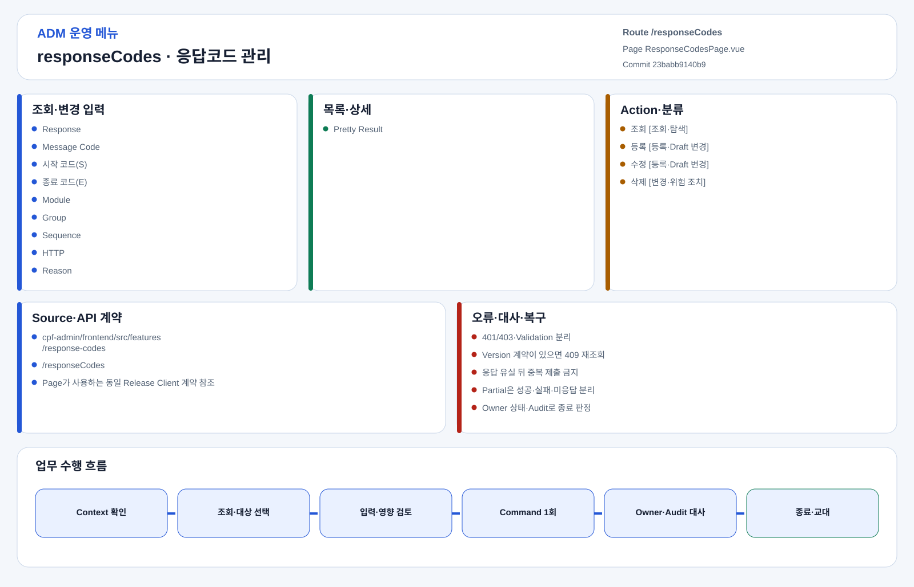

### 이 장에서 끝내는 업무

응답·메시지 코드와 HTTP Mapping을 관리한다.

### 메뉴 식별·책임

| 항목 | 값 |
|---|---|
| Route | `/responseCodes` |
| 메뉴 ID | `responseCodes` |
| Menu Code | `responseCodes` |
| 업무 그룹 | 프레임워크 |
| Frontend Page | `cpf-admin/frontend/src/features/response-codes/ResponseCodesPage.vue` |
| Permission | `RESPONSE_CODE` Write/Delete |
| 기준 Commit | `23babb9140b90e501d6ac715e7b77f55b66198a5` |

### Source·API 근거

| 구분 | 기준 |
|---|---|
| Frontend Page | `cpf-admin/frontend/src/features/response-codes/ResponseCodesPage.vue` |
| Router | `/responseCodes` |
| API 추적 | 화면에서 제공하는 기능을 통해 호출한다. 문서에 명시되지 않은 Endpoint를 Browser나 외부 Script에서 임의 호출하지 않는다. |

아래 표는 이 메뉴에서 실제로 확인·입력·실행할 항목을 정리한다. 화면에 없는 Field·Button·상태를 임의로 가정하지 않는다.

### 검색·입력 Field

| Field | Control | 업무 의미 | 기본값·Validation·주의 |
|---|---|---|---|
| `Response` | 문자열 입력·검색 | 응답코드 관리 화면의 조회 조건 또는 편집 Form에 포함되는 값이며 화면 Label과 Help를 기준으로 사용한다. | 앞뒤 공백·허용 문자·길이와 대소문자 규칙을 확인한다. |
| `Message Code` | 문자열 입력·검색 | 조회·상세·Audit에서 같은 대상을 다시 찾기 위한 식별 조건이다. | 앞뒤 공백·허용 문자·길이와 대소문자 규칙을 확인한다. |
| `시작 코드(S)` | 문자열 입력·검색 | 조회·상세·Audit에서 같은 대상을 다시 찾기 위한 식별 조건이다. | 앞뒤 공백·허용 문자·길이와 대소문자 규칙을 확인한다. |
| `종료 코드(E)` | 문자열 입력·검색 | 조회·상세·Audit에서 같은 대상을 다시 찾기 위한 식별 조건이다. | 앞뒤 공백·허용 문자·길이와 대소문자 규칙을 확인한다. |
| `Module` | 문자열 입력·검색 | 응답코드 관리 조회·조치가 적용되는 환경과 데이터 경계를 제한한다. | 앞뒤 공백·허용 문자·길이와 대소문자 규칙을 확인한다. |
| `Group` | 문자열 입력·검색 | 조회·상세·Audit에서 같은 대상을 다시 찾기 위한 식별 조건이다. | 앞뒤 공백·허용 문자·길이와 대소문자 규칙을 확인한다. |
| `Sequence` | 숫자·Version 입력 | 실행 한도·순서·용량 또는 재시도 범위를 지정한다. | 화면의 min·max·단위와 0 허용 여부를 확인하고 음수·Overflow를 차단한다. |
| `HTTP` | 문자열 입력·검색 | 응답코드 관리 화면의 조회 조건 또는 편집 Form에 포함되는 값이며 화면 Label과 Help를 기준으로 사용한다. | 앞뒤 공백·허용 문자·길이와 대소문자 규칙을 확인한다. |
| `Reason` | 다중행 입력 | 작업 목적·영향 범위·승인 또는 복구 기준을 기록해 Audit와 교대 기록에 연결한다. | Ticket·영향 범위·복구점을 포함하고 화면이 요구하는 최소 길이를 충족한다. |

#### 입력 순서

1. **Response** 항목이 조회 Control인지 변경 Form인지 화면 위치로 구분하고, 표시된 값·필수 여부·허용 형식을 확인한다.
2. **Message Code** 항목이 조회 Control인지 변경 Form인지 화면 위치로 구분하고, 표시된 값·필수 여부·허용 형식을 확인한다.
3. **시작 코드(S)** 항목이 조회 Control인지 변경 Form인지 화면 위치로 구분하고, 표시된 값·필수 여부·허용 형식을 확인한다.
4. **종료 코드(E)** 항목이 조회 Control인지 변경 Form인지 화면 위치로 구분하고, 표시된 값·필수 여부·허용 형식을 확인한다.
5. **Module** 항목이 조회 Control인지 변경 Form인지 화면 위치로 구분하고, 표시된 값·필수 여부·허용 형식을 확인한다.
6. **Group** 항목이 조회 Control인지 변경 Form인지 화면 위치로 구분하고, 표시된 값·필수 여부·허용 형식을 확인한다.
7. **Sequence** 항목이 조회 Control인지 변경 Form인지 화면 위치로 구분하고, 표시된 값·필수 여부·허용 형식을 확인한다.
8. **HTTP** 항목이 조회 Control인지 변경 Form인지 화면 위치로 구분하고, 표시된 값·필수 여부·허용 형식을 확인한다.
9. **Reason** 항목이 조회 Control인지 변경 Form인지 화면 위치로 구분하고, 표시된 값·필수 여부·허용 형식을 확인한다.
10. 조회 Control과 변경 Form을 분리해 기록하고, 실행 전 Environment·Data Scope·Timezone과 제출할 값만 다시 검토한다.

### 목록 Column·상세 Field

| 표시값 | 운영 의미 | 교차 확인 |
|---|---|---|
| `Pretty Result` | 화면이 받은 Response를 사람이 확인할 수 있도록 표현한 결과 영역이며 Owner 상태 확정과 동일하지 않다. | Last Updated·Terminal 조건·Owner 상태와 함께 확인한다. |

#### 결과 판독 순서

1. 조회 완료 시각·Filter·Paging·Sort와 화면 Warning을 확인한다.
2. Empty·Stale·Partial을 정상 0건과 구분한다.
3. 식별자·상태·Version·오류·시각을 같은 Query Context의 상세와 Owner 원장에서 비교한다.
4. Masking된 값은 Raw Permission과 Reason 없이 복원·Export하지 않는다.
5. 집계와 상세가 다르면 집계 시간 창·Timezone·Owner Update 시각을 맞춰 대사한다.

### Button·Action

| Action | 분류 | 활성 조건 | Side Effect·정상 결과 |
|---|---|---|---|
| **조회** | 조회·탐색 | 조회 Permission과 Query Validation을 충족하고 동일 조회가 진행 중이 아님 | 조회 결과의 조회 시각·Filter·Source Version·Warning이 갱신되며 Owner 데이터는 변경하지 않는다. |
| **등록** | 등록·Draft 변경 | 화면이 실제로 요구하는 Write Permission·필수 Field·Reason·Version 조건을 충족함 | 응답코드 관리의 재조회 결과가 요청 내용과 일치한다. Version·Before/After·Audit는 해당 Owner가 제공하는 경우 함께 확인한다. |
| **수정** | 등록·Draft 변경 | 화면이 실제로 요구하는 Write Permission·필수 Field·Reason·Version 조건을 충족함 | 응답코드 관리의 재조회 결과가 요청 내용과 일치한다. Version·Before/After·Audit는 해당 Owner가 제공하는 경우 함께 확인한다. |
| **삭제** | 변경·위험 조치 | 화면과 Owner가 요구하는 Write Permission·대상 상태·영향 범위·Reason·승인·Version 조건을 충족함 | 변경 Operation을 생성하고 Accepted 응답과 Owner Terminal 상태·Version·Audit를 분리해 확인한다. |

### 정상 업무 전체 절차

1. `/responseCodes`에 진입해 Page Header와 Route가 **응답코드 관리** 기능을 가리키는지 확인한다.
2. 로그인 Session·Environment·Data Scope·기준일·Timezone을 고정한다.
3. 화면의 조회 Control과 변경 Form을 구분한다. 조회 조건이 제공되면 먼저 조회하고, 변경 Form은 대상 선택 또는 등록 Action 뒤에 열린 실제 Field만 사용한다.
4. Loading 종료 후 Empty·Error·Stale·Partial 상태와 화면 Warning을 먼저 판정한다.
5. **Pretty Result**를 읽고 식별자·상태·Version·시각을 Owner 원장과 대사한다.
6. **등록** 전에 화면과 Owner가 실제로 요구하는 Permission·현재 상태·영향 범위·Reason·승인·Version 조건을 확인하고 한 번만 제출한다.
7. **등록**의 HTTP 응답과 재조회 결과를 확인한다. 비동기·다중 대상 기능은 Owner Terminal 상태·Version·대상별 Success/Failed/Unknown·Audit를 별도로 확인한다.
8. **수정** 전에 화면과 Owner가 실제로 요구하는 Permission·현재 상태·영향 범위·Reason·승인·Version 조건을 확인하고 한 번만 제출한다.
9. **수정**의 HTTP 응답과 재조회 결과를 확인한다. 비동기·다중 대상 기능은 Owner Terminal 상태·Version·대상별 Success/Failed/Unknown·Audit를 별도로 확인한다.
10. **삭제** 전에 화면과 Owner가 실제로 요구하는 Permission·현재 상태·영향 범위·Reason·승인·Version 조건을 확인하고 한 번만 제출한다.
11. **삭제**의 HTTP 응답과 재조회 결과를 확인한다. 비동기·다중 대상 기능은 Owner Terminal 상태·Version·대상별 Success/Failed/Unknown·Audit를 별도로 확인한다.
12. 화면이 제공하는 Log·Metric·Trace와, 변경·Export·승인 조치에 생성된 Audit를 교차 확인한다.
13. 이 장의 **종료 판정**과 다음 확인 시각·Evidence Link를 교대 기록에 남긴다.

### 메뉴 고유 판정·금지 사항

- **목적:** 응답·메시지 코드와 HTTP Mapping을 관리한다.
- **종료 판정:** 중복 Code·Consumer 영향·Message Mapping·Cache 갱신을 확인한다.
- 응답을 받지 못한 경우 Owner 상태와 기존 Operation을 확인하기 전에 동일 Action을 반복하지 않는다.
- HTTP 성공 응답이나 Toast만으로 비동기 Owner 상태 또는 다중 대상 적용을 확정하지 않는다.

### 오류·경계·동시성·복구

| 상황 | 화면 징후 | 운영 조치 | 종료 증적 |
|---|---|---|---|
| 401·Session | Session 만료·CSRF·Origin 실패 | 로그인 상태와 BFF Session을 확인한다. Command 자동 Replay는 금지한다. | 401/403 응답·Session Audit |
| 403·Data Scope | 메뉴·Button·Raw·Export가 거부됨 | Menu·Button·API·Owner Permission과 Data Scope를 확인하고 우회하지 않는다. | Deny Audit·요청 Permission |
| Validation | 필수값·범위·형식·기간 오류 | Field Error만 수정하고 기존 성공 Operation을 다시 제출하지 않는다. | Error Code·Field·입력값 |
| Timeout·Dependency | 일부 Source 또는 Command 응답 지연 | Correlation/Operation ID와 실패 Stage를 기록하고 Owner 상태를 조회한다. | Dependency 상태·Retryability |
| Partial·Stale | 일부 대상만 Success 또는 조회 Source 누락 | 성공·실패·미응답을 분리하고 누락 범위와 Version을 표시한다. | Target별 결과·Version |
| 409·동시 변경 | Expected Version 불일치 | 최신 상세를 재조회하고 Diff·영향을 다시 검토한 뒤 새 요청으로 제출한다. | 현재/요청 Version·변경자 |
| 응답 유실·Unknown | 요청 후 실제 처리 여부를 알 수 없음 | Operation ID·Request Hash·Audit·Owner 상태로 대사하고 중복 제출하지 않는다. | Operation·Owner·Audit |
| 복구 실패 | Retry/Rollback 뒤에도 상태 불일치 | 자동 반복을 중단하고 Incident·Reconcile Case·다음 확인 시각을 기록한다. | Case ID·복구 Owner·기한 |

### 응답 유실·결과 불명·부분 적용 처리

1. 동일 Action을 다시 누르지 않고 Browser Network와 응답 Header를 보존한다. `operationId`·`transactionId`·`idempotencyKey`가 제공되면 기록하고, 없으면 Target ID·Actor·요청 시각·Request Body Hash로 대사한다.
2. 기능이 제공하는 상세·Operation Status(있는 경우)·Audit에서 Request Hash와 대상 Version을 검색한다.
3. Side Effect 전 실패가 확인된 경우에만 새 요청을 검토한다.
4. Success·Failed·Unknown 대상을 분리하고 Source가 제공하는 Failed-only Retry·Compensation·Rollback을 선택하고, 지원되지 않으면 수동 Reconcile Case로 이관한다.
5. Rollback을 지원하는 기능은 Owner Version·Checksum·업무 합계가 Rollback Point와 일치하는지 확인한다.
6. 확정되지 않은 대상은 `UNKNOWN_RESULT`로 유지하고 담당자·대사 기한·다음 확인 시각을 기록한다.

### Log·Metric·Trace·Audit와 교대 기록

| 증적 | 필수 값 |
|---|---|
| Audit | Actor·Permission·Reason·Approval·Target·Before/After·Result·Recovery Action |
| Log | Environment·Instance·operationId·transactionId·failureStage·errorCode |
| Metric | 동일 시간 창의 Success·Failure·Latency·Queue·Retry·Partial·Unknown |
| Trace | root/segment/attempt·Owner·DB/Kafka/외부 의존성 Span |
| 상태 원장 | Target ID·Version·Checksum·Desired/Actual·Last Updated·Terminal 여부 |

```text
Menu=responseCodes
Route=/responseCodes
Environment=
DataScope=
Query=
TargetId=
BeforeVersion=
Action=
Reason=
ApprovalId=
OperationId=
TransactionId=
Result=SUCCESS|FAILED|PARTIAL|UNKNOWN_RESULT
OwnerState=
FailedTargets=
ReconcileBy=
RollbackPoint=
EvidenceLinks=
NextCheckAt=
```

### 실무 Workbook

**상황:** 응답·메시지 코드와 HTTP Mapping을 관리한다. 담당자가 **등록**을 수행한 뒤 Browser 응답을 받지 못했다.

1. 대상 식별자와 Before Version, 입력값, Reason·Approval을 작업 기록에서 확인한다.
2. 동일 **등록**을 반복하지 않고 Operation·Audit·Owner 상태를 조회한다.
3. Owner 상태가 변경됐고 Request Hash가 같으면 응답 유실로 분류해 중복 조치를 금지한다.
4. 일부 대상만 변경됐으면 Success·Failed·Unknown을 분리해 Failed-only Retry 또는 Rollback을 선택한다.
5. 중복 Code·Consumer 영향·Message Mapping·Cache 갱신을 확인한다.
6. Evidence Link와 다음 확인 시각을 교대 기록에 남긴다.

### 독립 수행 검수 Checklist

- [ ] `/responseCodes`와 Page Source를 찾고 화면 목적을 설명할 수 있다.
- [ ] 9개 입력·검색 항목의 Control·기본값·Validation을 설명할 수 있다.
- [ ] 1개 표시값을 Owner 상태·Version·Audit와 대사할 수 있다.
- [ ] 4개 Action의 분류·활성 조건·Side Effect를 설명할 수 있다.
- [ ] Empty·403·409·Timeout·Partial·Unknown을 서로 다른 상태로 처리할 수 있다.
- [ ] 응답 유실 뒤 중복 제출 없이 Operation·Owner·Audit로 결과를 확정할 수 있다.
- [ ] 교대 기록만으로 다음 담당자가 Target·상태·복구 기한을 이어받을 수 있다.

## 15. businessCalendar — 영업일·휴일 Override

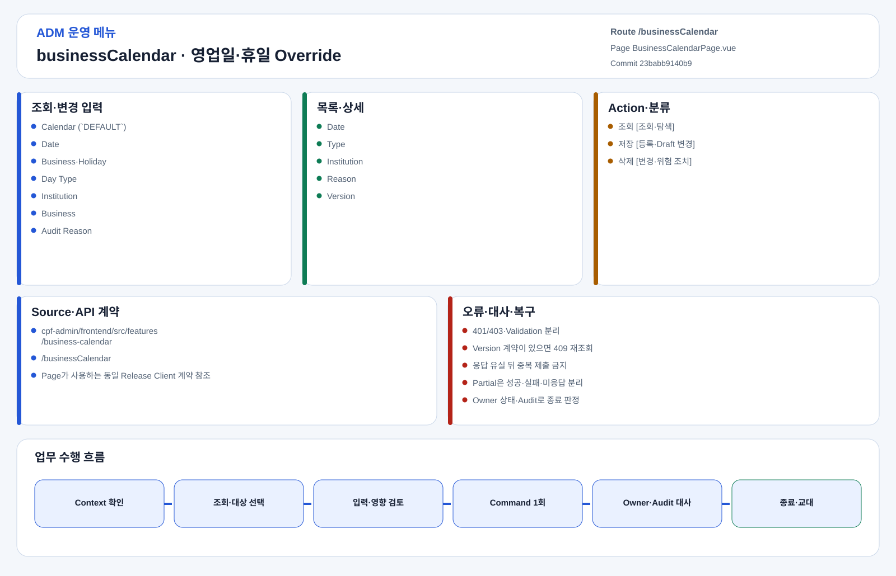

### 이 장에서 끝내는 업무

영업일·휴일 Override를 기준일과 기관별로 관리한다.

### 메뉴 식별·책임

| 항목 | 값 |
|---|---|
| Route | `/businessCalendar` |
| 메뉴 ID | `businessCalendar` |
| Menu Code | `businessCalendar` |
| 업무 그룹 | 프레임워크 |
| Frontend Page | `cpf-admin/frontend/src/features/business-calendar/BusinessCalendarPage.vue` |
| Permission | Menu Write/Delete + Writable Provider |
| 기준 Commit | `23babb9140b90e501d6ac715e7b77f55b66198a5` |

### Source·API 근거

| 구분 | 기준 |
|---|---|
| Frontend Page | `cpf-admin/frontend/src/features/business-calendar/BusinessCalendarPage.vue` |
| Router | `/businessCalendar` |
| API 추적 | 화면에서 제공하는 기능을 통해 호출한다. 문서에 명시되지 않은 Endpoint를 Browser나 외부 Script에서 임의 호출하지 않는다. |

아래 표는 이 메뉴에서 실제로 확인·입력·실행할 항목을 정리한다. 화면에 없는 Field·Button·상태를 임의로 가정하지 않는다.

### 검색·입력 Field

| Field | Control | 업무 의미 | 기본값·Validation·주의 |
|---|---|---|---|
| `Calendar (`DEFAULT`)` | Select·검색 | 영업일·휴일 Override 화면의 조회 조건 또는 편집 Form에 포함되는 값이며 화면 Label과 Help를 기준으로 사용한다. | 허용 목록과 현재 Environment·Data Scope에 맞는 값만 선택한다. |
| `Date` | 날짜·시간 입력 | 조회 또는 적용의 유효 시간 범위를 정하며 Timezone과 시작·종료 순서를 함께 확인한다. | Timezone을 고정하고 시작≤종료·유효기간 겹침·기준일 포함 여부를 확인한다. |
| `Business·Holiday` | 문자열 입력·검색 | 조회·상세·Audit에서 같은 대상을 다시 찾기 위한 식별 조건이다. | 앞뒤 공백·허용 문자·길이와 대소문자 규칙을 확인한다. |
| `Day Type` | Select·검색 | 영업일·휴일 Override에서 적용하거나 조회할 정책·권한·처리 유형을 선택한다. | 허용 목록과 현재 Environment·Data Scope에 맞는 값만 선택한다. |
| `Institution` | Select·검색 | 영업일·휴일 Override 화면의 조회 조건 또는 편집 Form에 포함되는 값이며 화면 Label과 Help를 기준으로 사용한다. | 허용 목록과 현재 Environment·Data Scope에 맞는 값만 선택한다. |
| `Business` | 문자열 입력·검색 | 영업일·휴일 Override 화면의 조회 조건 또는 편집 Form에 포함되는 값이며 화면 Label과 Help를 기준으로 사용한다. | 앞뒤 공백·허용 문자·길이와 대소문자 규칙을 확인한다. |
| `Audit Reason` | 다중행 입력 | 작업 목적·영향 범위·승인 또는 복구 기준을 기록해 Audit와 교대 기록에 연결한다. | Ticket·영향 범위·복구점을 포함하고 화면이 요구하는 최소 길이를 충족한다. |

#### 입력 순서

1. **Calendar (`DEFAULT`)** 항목이 조회 Control인지 변경 Form인지 화면 위치로 구분하고, 표시된 값·필수 여부·허용 형식을 확인한다.
2. **Date** 항목이 조회 Control인지 변경 Form인지 화면 위치로 구분하고, 표시된 값·필수 여부·허용 형식을 확인한다.
3. **Business·Holiday** 항목이 조회 Control인지 변경 Form인지 화면 위치로 구분하고, 표시된 값·필수 여부·허용 형식을 확인한다.
4. **Day Type** 항목이 조회 Control인지 변경 Form인지 화면 위치로 구분하고, 표시된 값·필수 여부·허용 형식을 확인한다.
5. **Institution** 항목이 조회 Control인지 변경 Form인지 화면 위치로 구분하고, 표시된 값·필수 여부·허용 형식을 확인한다.
6. **Business** 항목이 조회 Control인지 변경 Form인지 화면 위치로 구분하고, 표시된 값·필수 여부·허용 형식을 확인한다.
7. **Audit Reason** 항목이 조회 Control인지 변경 Form인지 화면 위치로 구분하고, 표시된 값·필수 여부·허용 형식을 확인한다.
8. 조회 Control과 변경 Form을 분리해 기록하고, 실행 전 Environment·Data Scope·Timezone과 제출할 값만 다시 검토한다.

### 목록 Column·상세 Field

| 표시값 | 운영 의미 | 교차 확인 |
|---|---|---|
| `Date` | 상태 발생·갱신·유효 시점을 나타내며 화면 Timezone을 기준으로 해석한다. | 상세·재조회 결과와 비교하고 Stale·Masking·단위 차이를 확인한다. |
| `Type` | 영업일·휴일 Override 상세에서 대상의 현재 속성 또는 처리 결과를 확인하는 값이다. | 상세·재조회 결과와 비교하고 Stale·Masking·단위 차이를 확인한다. |
| `Institution` | 영업일·휴일 Override 상세에서 대상의 현재 속성 또는 처리 결과를 확인하는 값이다. | 상세·재조회 결과와 비교하고 Stale·Masking·단위 차이를 확인한다. |
| `Reason` | 작업 주체·Owner·변경 사유를 확인하는 감사 정보다. | 상세·재조회 결과와 비교하고 Stale·Masking·단위 차이를 확인한다. |
| `Version` | 요청·Owner·Instance 사이의 Version 또는 내용 동일성을 판단하는 값이다. | 목록·상세·Owner 또는 Instance 보고값에서 일치하는지 확인한다. |

#### 결과 판독 순서

1. 조회 완료 시각·Filter·Paging·Sort와 화면 Warning을 확인한다.
2. Empty·Stale·Partial을 정상 0건과 구분한다.
3. 식별자·상태·Version·오류·시각을 같은 Query Context의 상세와 Owner 원장에서 비교한다.
4. Masking된 값은 Raw Permission과 Reason 없이 복원·Export하지 않는다.
5. 집계와 상세가 다르면 집계 시간 창·Timezone·Owner Update 시각을 맞춰 대사한다.

### Button·Action

| Action | 분류 | 활성 조건 | Side Effect·정상 결과 |
|---|---|---|---|
| **조회** | 조회·탐색 | 조회 Permission과 Query Validation을 충족하고 동일 조회가 진행 중이 아님 | 조회 결과의 조회 시각·Filter·Source Version·Warning이 갱신되며 Owner 데이터는 변경하지 않는다. |
| **저장** | 등록·Draft 변경 | 화면이 실제로 요구하는 Write Permission·필수 Field·Reason·Version 조건을 충족함 | 영업일·휴일 Override의 재조회 결과가 요청 내용과 일치한다. Version·Before/After·Audit는 해당 Owner가 제공하는 경우 함께 확인한다. |
| **삭제** | 변경·위험 조치 | 화면과 Owner가 요구하는 Write Permission·대상 상태·영향 범위·Reason·승인·Version 조건을 충족함 | 변경 Operation을 생성하고 Accepted 응답과 Owner Terminal 상태·Version·Audit를 분리해 확인한다. |

### 정상 업무 전체 절차

1. `/businessCalendar`에 진입해 Page Header와 Route가 **영업일·휴일 Override** 기능을 가리키는지 확인한다.
2. 로그인 Session·Environment·Data Scope·기준일·Timezone을 고정한다.
3. 화면의 조회 Control과 변경 Form을 구분한다. 조회 조건이 제공되면 먼저 조회하고, 변경 Form은 대상 선택 또는 등록 Action 뒤에 열린 실제 Field만 사용한다.
4. Loading 종료 후 Empty·Error·Stale·Partial 상태와 화면 Warning을 먼저 판정한다.
5. **Date, Type, Institution, Reason, Version**를 읽고 식별자·상태·Version·시각을 Owner 원장과 대사한다.
6. **저장** 전에 화면과 Owner가 실제로 요구하는 Permission·현재 상태·영향 범위·Reason·승인·Version 조건을 확인하고 한 번만 제출한다.
7. **저장**의 HTTP 응답과 재조회 결과를 확인한다. 비동기·다중 대상 기능은 Owner Terminal 상태·Version·대상별 Success/Failed/Unknown·Audit를 별도로 확인한다.
8. **삭제** 전에 화면과 Owner가 실제로 요구하는 Permission·현재 상태·영향 범위·Reason·승인·Version 조건을 확인하고 한 번만 제출한다.
9. **삭제**의 HTTP 응답과 재조회 결과를 확인한다. 비동기·다중 대상 기능은 Owner Terminal 상태·Version·대상별 Success/Failed/Unknown·Audit를 별도로 확인한다.
10. 화면이 제공하는 Log·Metric·Trace와, 변경·Export·승인 조치에 생성된 Audit를 교차 확인한다.
11. 이 장의 **종료 판정**과 다음 확인 시각·Evidence Link를 교대 기록에 남긴다.

### 메뉴 고유 판정·금지 사항

- **목적:** 영업일·휴일 Override를 기준일과 기관별로 관리한다.
- **종료 판정:** Expected Version과 Calendar Consumer 적용 결과를 확인한다.
- 응답을 받지 못한 경우 Owner 상태와 기존 Operation을 확인하기 전에 동일 Action을 반복하지 않는다.
- HTTP 성공 응답이나 Toast만으로 비동기 Owner 상태 또는 다중 대상 적용을 확정하지 않는다.

### 오류·경계·동시성·복구

| 상황 | 화면 징후 | 운영 조치 | 종료 증적 |
|---|---|---|---|
| 401·Session | Session 만료·CSRF·Origin 실패 | 로그인 상태와 BFF Session을 확인한다. Command 자동 Replay는 금지한다. | 401/403 응답·Session Audit |
| 403·Data Scope | 메뉴·Button·Raw·Export가 거부됨 | Menu·Button·API·Owner Permission과 Data Scope를 확인하고 우회하지 않는다. | Deny Audit·요청 Permission |
| Validation | 필수값·범위·형식·기간 오류 | Field Error만 수정하고 기존 성공 Operation을 다시 제출하지 않는다. | Error Code·Field·입력값 |
| Timeout·Dependency | 일부 Source 또는 Command 응답 지연 | Correlation/Operation ID와 실패 Stage를 기록하고 Owner 상태를 조회한다. | Dependency 상태·Retryability |
| Partial·Stale | 일부 대상만 Success 또는 조회 Source 누락 | 성공·실패·미응답을 분리하고 누락 범위와 Version을 표시한다. | Target별 결과·Version |
| 409·동시 변경 | Expected Version 불일치 | 최신 상세를 재조회하고 Diff·영향을 다시 검토한 뒤 새 요청으로 제출한다. | 현재/요청 Version·변경자 |
| 응답 유실·Unknown | 요청 후 실제 처리 여부를 알 수 없음 | Operation ID·Request Hash·Audit·Owner 상태로 대사하고 중복 제출하지 않는다. | Operation·Owner·Audit |
| 복구 실패 | Retry/Rollback 뒤에도 상태 불일치 | 자동 반복을 중단하고 Incident·Reconcile Case·다음 확인 시각을 기록한다. | Case ID·복구 Owner·기한 |

### 응답 유실·결과 불명·부분 적용 처리

1. 동일 Action을 다시 누르지 않고 Browser Network와 응답 Header를 보존한다. `operationId`·`transactionId`·`idempotencyKey`가 제공되면 기록하고, 없으면 Target ID·Actor·요청 시각·Request Body Hash로 대사한다.
2. 기능이 제공하는 상세·Operation Status(있는 경우)·Audit에서 Request Hash와 대상 Version을 검색한다.
3. Side Effect 전 실패가 확인된 경우에만 새 요청을 검토한다.
4. Success·Failed·Unknown 대상을 분리하고 Source가 제공하는 Failed-only Retry·Compensation·Rollback을 선택하고, 지원되지 않으면 수동 Reconcile Case로 이관한다.
5. Rollback을 지원하는 기능은 Owner Version·Checksum·업무 합계가 Rollback Point와 일치하는지 확인한다.
6. 확정되지 않은 대상은 `UNKNOWN_RESULT`로 유지하고 담당자·대사 기한·다음 확인 시각을 기록한다.

### Log·Metric·Trace·Audit와 교대 기록

| 증적 | 필수 값 |
|---|---|
| Audit | Actor·Permission·Reason·Approval·Target·Before/After·Result·Recovery Action |
| Log | Environment·Instance·operationId·transactionId·failureStage·errorCode |
| Metric | 동일 시간 창의 Success·Failure·Latency·Queue·Retry·Partial·Unknown |
| Trace | root/segment/attempt·Owner·DB/Kafka/외부 의존성 Span |
| 상태 원장 | Target ID·Version·Checksum·Desired/Actual·Last Updated·Terminal 여부 |

```text
Menu=businessCalendar
Route=/businessCalendar
Environment=
DataScope=
Query=
TargetId=
BeforeVersion=
Action=
Reason=
ApprovalId=
OperationId=
TransactionId=
Result=SUCCESS|FAILED|PARTIAL|UNKNOWN_RESULT
OwnerState=
FailedTargets=
ReconcileBy=
RollbackPoint=
EvidenceLinks=
NextCheckAt=
```

### 실무 Workbook

**상황:** 영업일·휴일 Override를 기준일과 기관별로 관리한다. 담당자가 **저장**을 수행한 뒤 Browser 응답을 받지 못했다.

1. 대상 식별자와 Before Version, 입력값, Reason·Approval을 작업 기록에서 확인한다.
2. 동일 **저장**을 반복하지 않고 Operation·Audit·Owner 상태를 조회한다.
3. Owner 상태가 변경됐고 Request Hash가 같으면 응답 유실로 분류해 중복 조치를 금지한다.
4. 일부 대상만 변경됐으면 Success·Failed·Unknown을 분리해 Failed-only Retry 또는 Rollback을 선택한다.
5. Expected Version과 Calendar Consumer 적용 결과를 확인한다.
6. Evidence Link와 다음 확인 시각을 교대 기록에 남긴다.

### 독립 수행 검수 Checklist

- [ ] `/businessCalendar`와 Page Source를 찾고 화면 목적을 설명할 수 있다.
- [ ] 7개 입력·검색 항목의 Control·기본값·Validation을 설명할 수 있다.
- [ ] 5개 표시값을 Owner 상태·Version·Audit와 대사할 수 있다.
- [ ] 3개 Action의 분류·활성 조건·Side Effect를 설명할 수 있다.
- [ ] Empty·403·409·Timeout·Partial·Unknown을 서로 다른 상태로 처리할 수 있다.
- [ ] 응답 유실 뒤 중복 제출 없이 Operation·Owner·Audit로 결과를 확정할 수 있다.
- [ ] 교대 기록만으로 다음 담당자가 Target·상태·복구 기한을 이어받을 수 있다.

## 16. codes — 공통 코드


### 이 장에서 끝내는 업무

계층형 공통 Code를 관리한다.

### 메뉴 식별·책임

| 항목 | 값 |
|---|---|
| Route | `/codes` |
| 메뉴 ID | `codes` |
| Menu Code | `codes` |
| 업무 그룹 | 프레임워크 |
| Frontend Page | `cpf-admin/frontend/src/features/codes/CodesPage.vue` |
| Permission | `CODE` Write |
| 기준 Commit | `23babb9140b90e501d6ac715e7b77f55b66198a5` |

### Source·API 근거

| 구분 | 기준 |
|---|---|
| Frontend Page | `cpf-admin/frontend/src/features/codes/CodesPage.vue` |
| Router | `/codes` |
| API 추적 | 화면에서 제공하는 기능을 통해 호출한다. 문서에 명시되지 않은 Endpoint를 Browser나 외부 Script에서 임의 호출하지 않는다. |

아래 표는 이 메뉴에서 실제로 확인·입력·실행할 항목을 정리한다. 화면에 없는 Field·Button·상태를 임의로 가정하지 않는다.

### 검색·입력 Field

| Field | Control | 업무 의미 | 기본값·Validation·주의 |
|---|---|---|---|
| `Code ID` | 문자열 입력·검색 | 조회·상세·Audit에서 같은 대상을 다시 찾기 위한 식별 조건이다. | 앞뒤 공백·허용 문자·길이와 대소문자 규칙을 확인한다. |
| `Parent ID` | 문자열 입력·검색 | 조회·상세·Audit에서 같은 대상을 다시 찾기 위한 식별 조건이다. | 앞뒤 공백·허용 문자·길이와 대소문자 규칙을 확인한다. |
| `Key` | 문자열 입력·검색 | 조회·상세·Audit에서 같은 대상을 다시 찾기 위한 식별 조건이다. | 앞뒤 공백·허용 문자·길이와 대소문자 규칙을 확인한다. |
| `Value` | 문자열 입력·검색 | 공통 코드 화면의 조회 조건 또는 편집 Form에 포함되는 값이며 화면 Label과 Help를 기준으로 사용한다. | 앞뒤 공백·허용 문자·길이와 대소문자 규칙을 확인한다. |
| `Description` | 다중행 입력 | 작업 목적·영향 범위·승인 또는 복구 기준을 기록해 Audit와 교대 기록에 연결한다. | 허용 Schema·길이·민감정보 포함 여부를 확인하고 Preview 또는 Validation 결과를 검토한다. |
| `Reason` | 다중행 입력 | 작업 목적·영향 범위·승인 또는 복구 기준을 기록해 Audit와 교대 기록에 연결한다. | Ticket·영향 범위·복구점을 포함하고 화면이 요구하는 최소 길이를 충족한다. |

#### 입력 순서

1. **Code ID** 항목이 조회 Control인지 변경 Form인지 화면 위치로 구분하고, 표시된 값·필수 여부·허용 형식을 확인한다.
2. **Parent ID** 항목이 조회 Control인지 변경 Form인지 화면 위치로 구분하고, 표시된 값·필수 여부·허용 형식을 확인한다.
3. **Key** 항목이 조회 Control인지 변경 Form인지 화면 위치로 구분하고, 표시된 값·필수 여부·허용 형식을 확인한다.
4. **Value** 항목이 조회 Control인지 변경 Form인지 화면 위치로 구분하고, 표시된 값·필수 여부·허용 형식을 확인한다.
5. **Description** 항목이 조회 Control인지 변경 Form인지 화면 위치로 구분하고, 표시된 값·필수 여부·허용 형식을 확인한다.
6. **Reason** 항목이 조회 Control인지 변경 Form인지 화면 위치로 구분하고, 표시된 값·필수 여부·허용 형식을 확인한다.
7. 조회 Control과 변경 Form을 분리해 기록하고, 실행 전 Environment·Data Scope·Timezone과 제출할 값만 다시 검토한다.

### 목록 Column·상세 Field

| 표시값 | 운영 의미 | 교차 확인 |
|---|---|---|
| `Pretty Result` | 화면이 받은 Response를 사람이 확인할 수 있도록 표현한 결과 영역이며 Owner 상태 확정과 동일하지 않다. | Last Updated·Terminal 조건·Owner 상태와 함께 확인한다. |

#### 결과 판독 순서

1. 조회 완료 시각·Filter·Paging·Sort와 화면 Warning을 확인한다.
2. Empty·Stale·Partial을 정상 0건과 구분한다.
3. 식별자·상태·Version·오류·시각을 같은 Query Context의 상세와 Owner 원장에서 비교한다.
4. Masking된 값은 Raw Permission과 Reason 없이 복원·Export하지 않는다.
5. 집계와 상세가 다르면 집계 시간 창·Timezone·Owner Update 시각을 맞춰 대사한다.

### Button·Action

| Action | 분류 | 활성 조건 | Side Effect·정상 결과 |
|---|---|---|---|
| **조회** | 조회·탐색 | 조회 Permission과 Query Validation을 충족하고 동일 조회가 진행 중이 아님 | 조회 결과의 조회 시각·Filter·Source Version·Warning이 갱신되며 Owner 데이터는 변경하지 않는다. |
| **등록** | 등록·Draft 변경 | 화면이 실제로 요구하는 Write Permission·필수 Field·Reason·Version 조건을 충족함 | 공통 코드의 재조회 결과가 요청 내용과 일치한다. Version·Before/After·Audit는 해당 Owner가 제공하는 경우 함께 확인한다. |
| **수정** | 등록·Draft 변경 | 화면이 실제로 요구하는 Write Permission·필수 Field·Reason·Version 조건을 충족함 | 공통 코드의 재조회 결과가 요청 내용과 일치한다. Version·Before/After·Audit는 해당 Owner가 제공하는 경우 함께 확인한다. |

### 정상 업무 전체 절차

1. `/codes`에 진입해 Page Header와 Route가 **공통 코드** 기능을 가리키는지 확인한다.
2. 로그인 Session·Environment·Data Scope·기준일·Timezone을 고정한다.
3. 화면의 조회 Control과 변경 Form을 구분한다. 조회 조건이 제공되면 먼저 조회하고, 변경 Form은 대상 선택 또는 등록 Action 뒤에 열린 실제 Field만 사용한다.
4. Loading 종료 후 Empty·Error·Stale·Partial 상태와 화면 Warning을 먼저 판정한다.
5. **Pretty Result**를 읽고 식별자·상태·Version·시각을 Owner 원장과 대사한다.
6. **등록** 전에 화면과 Owner가 실제로 요구하는 Permission·현재 상태·영향 범위·Reason·승인·Version 조건을 확인하고 한 번만 제출한다.
7. **등록**의 HTTP 응답과 재조회 결과를 확인한다. 비동기·다중 대상 기능은 Owner Terminal 상태·Version·대상별 Success/Failed/Unknown·Audit를 별도로 확인한다.
8. **수정** 전에 화면과 Owner가 실제로 요구하는 Permission·현재 상태·영향 범위·Reason·승인·Version 조건을 확인하고 한 번만 제출한다.
9. **수정**의 HTTP 응답과 재조회 결과를 확인한다. 비동기·다중 대상 기능은 Owner Terminal 상태·Version·대상별 Success/Failed/Unknown·Audit를 별도로 확인한다.
10. 화면이 제공하는 Log·Metric·Trace와, 변경·Export·승인 조치에 생성된 Audit를 교차 확인한다.
11. 이 장의 **종료 판정**과 다음 확인 시각·Evidence Link를 교대 기록에 남긴다.

### 메뉴 고유 판정·금지 사항

- **목적:** 계층형 공통 Code를 관리한다.
- **종료 판정:** Parent 순환·중복 Key·Consumer Cache·유효기간을 확인한다.
- 응답을 받지 못한 경우 Owner 상태와 기존 Operation을 확인하기 전에 동일 Action을 반복하지 않는다.
- HTTP 성공 응답이나 Toast만으로 비동기 Owner 상태 또는 다중 대상 적용을 확정하지 않는다.

### 오류·경계·동시성·복구

| 상황 | 화면 징후 | 운영 조치 | 종료 증적 |
|---|---|---|---|
| 401·Session | Session 만료·CSRF·Origin 실패 | 로그인 상태와 BFF Session을 확인한다. Command 자동 Replay는 금지한다. | 401/403 응답·Session Audit |
| 403·Data Scope | 메뉴·Button·Raw·Export가 거부됨 | Menu·Button·API·Owner Permission과 Data Scope를 확인하고 우회하지 않는다. | Deny Audit·요청 Permission |
| Validation | 필수값·범위·형식·기간 오류 | Field Error만 수정하고 기존 성공 Operation을 다시 제출하지 않는다. | Error Code·Field·입력값 |
| Timeout·Dependency | 일부 Source 또는 Command 응답 지연 | Correlation/Operation ID와 실패 Stage를 기록하고 Owner 상태를 조회한다. | Dependency 상태·Retryability |
| Partial·Stale | 일부 대상만 Success 또는 조회 Source 누락 | 성공·실패·미응답을 분리하고 누락 범위와 Version을 표시한다. | Target별 결과·Version |
| 409·동시 변경 | Expected Version 불일치 | 최신 상세를 재조회하고 Diff·영향을 다시 검토한 뒤 새 요청으로 제출한다. | 현재/요청 Version·변경자 |
| 응답 유실·Unknown | 요청 후 실제 처리 여부를 알 수 없음 | Operation ID·Request Hash·Audit·Owner 상태로 대사하고 중복 제출하지 않는다. | Operation·Owner·Audit |
| 복구 실패 | Retry/Rollback 뒤에도 상태 불일치 | 자동 반복을 중단하고 Incident·Reconcile Case·다음 확인 시각을 기록한다. | Case ID·복구 Owner·기한 |

### 응답 유실·결과 불명·부분 적용 처리

1. 동일 Action을 다시 누르지 않고 Browser Network와 응답 Header를 보존한다. `operationId`·`transactionId`·`idempotencyKey`가 제공되면 기록하고, 없으면 Target ID·Actor·요청 시각·Request Body Hash로 대사한다.
2. 기능이 제공하는 상세·Operation Status(있는 경우)·Audit에서 Request Hash와 대상 Version을 검색한다.
3. Side Effect 전 실패가 확인된 경우에만 새 요청을 검토한다.
4. Success·Failed·Unknown 대상을 분리하고 Source가 제공하는 Failed-only Retry·Compensation·Rollback을 선택하고, 지원되지 않으면 수동 Reconcile Case로 이관한다.
5. Rollback을 지원하는 기능은 Owner Version·Checksum·업무 합계가 Rollback Point와 일치하는지 확인한다.
6. 확정되지 않은 대상은 `UNKNOWN_RESULT`로 유지하고 담당자·대사 기한·다음 확인 시각을 기록한다.

### Log·Metric·Trace·Audit와 교대 기록

| 증적 | 필수 값 |
|---|---|
| Audit | Actor·Permission·Reason·Approval·Target·Before/After·Result·Recovery Action |
| Log | Environment·Instance·operationId·transactionId·failureStage·errorCode |
| Metric | 동일 시간 창의 Success·Failure·Latency·Queue·Retry·Partial·Unknown |
| Trace | root/segment/attempt·Owner·DB/Kafka/외부 의존성 Span |
| 상태 원장 | Target ID·Version·Checksum·Desired/Actual·Last Updated·Terminal 여부 |

```text
Menu=codes
Route=/codes
Environment=
DataScope=
Query=
TargetId=
BeforeVersion=
Action=
Reason=
ApprovalId=
OperationId=
TransactionId=
Result=SUCCESS|FAILED|PARTIAL|UNKNOWN_RESULT
OwnerState=
FailedTargets=
ReconcileBy=
RollbackPoint=
EvidenceLinks=
NextCheckAt=
```

### 실무 Workbook

**상황:** 계층형 공통 Code를 관리한다. 담당자가 **등록**을 수행한 뒤 Browser 응답을 받지 못했다.

1. 대상 식별자와 Before Version, 입력값, Reason·Approval을 작업 기록에서 확인한다.
2. 동일 **등록**을 반복하지 않고 Operation·Audit·Owner 상태를 조회한다.
3. Owner 상태가 변경됐고 Request Hash가 같으면 응답 유실로 분류해 중복 조치를 금지한다.
4. 일부 대상만 변경됐으면 Success·Failed·Unknown을 분리해 Failed-only Retry 또는 Rollback을 선택한다.
5. Parent 순환·중복 Key·Consumer Cache·유효기간을 확인한다.
6. Evidence Link와 다음 확인 시각을 교대 기록에 남긴다.

### 독립 수행 검수 Checklist

- [ ] `/codes`와 Page Source를 찾고 화면 목적을 설명할 수 있다.
- [ ] 6개 입력·검색 항목의 Control·기본값·Validation을 설명할 수 있다.
- [ ] 1개 표시값을 Owner 상태·Version·Audit와 대사할 수 있다.
- [ ] 3개 Action의 분류·활성 조건·Side Effect를 설명할 수 있다.
- [ ] Empty·403·409·Timeout·Partial·Unknown을 서로 다른 상태로 처리할 수 있다.
- [ ] 응답 유실 뒤 중복 제출 없이 Operation·Owner·Audit로 결과를 확정할 수 있다.
- [ ] 교대 기록만으로 다음 담당자가 Target·상태·복구 기한을 이어받을 수 있다.

## 17. messages — 다국어 Message

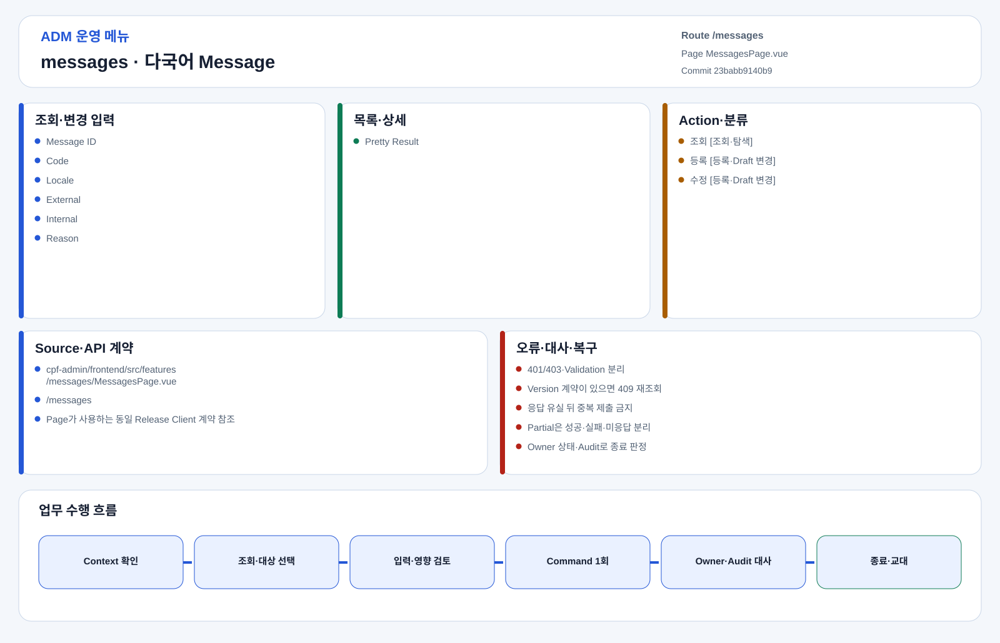

### 이 장에서 끝내는 업무

Locale별 외부·내부 Message를 관리한다.

### 메뉴 식별·책임

| 항목 | 값 |
|---|---|
| Route | `/messages` |
| 메뉴 ID | `messages` |
| Menu Code | `messages` |
| 업무 그룹 | 연계 관리 |
| Frontend Page | `cpf-admin/frontend/src/features/messages/MessagesPage.vue` |
| Permission | `MESSAGE` Write |
| 기준 Commit | `23babb9140b90e501d6ac715e7b77f55b66198a5` |

### Source·API 근거

| 구분 | 기준 |
|---|---|
| Frontend Page | `cpf-admin/frontend/src/features/messages/MessagesPage.vue` |
| Router | `/messages` |
| API 추적 | 화면에서 제공하는 기능을 통해 호출한다. 문서에 명시되지 않은 Endpoint를 Browser나 외부 Script에서 임의 호출하지 않는다. |

아래 표는 이 메뉴에서 실제로 확인·입력·실행할 항목을 정리한다. 화면에 없는 Field·Button·상태를 임의로 가정하지 않는다.

### 검색·입력 Field

| Field | Control | 업무 의미 | 기본값·Validation·주의 |
|---|---|---|---|
| `Message ID` | 문자열 입력·검색 | 조회·상세·Audit에서 같은 대상을 다시 찾기 위한 식별 조건이다. | 앞뒤 공백·허용 문자·길이와 대소문자 규칙을 확인한다. |
| `Code` | 문자열 입력·검색 | 조회·상세·Audit에서 같은 대상을 다시 찾기 위한 식별 조건이다. | 앞뒤 공백·허용 문자·길이와 대소문자 규칙을 확인한다. |
| `Locale` | Select·검색 | 다국어 Message 화면의 조회 조건 또는 편집 Form에 포함되는 값이며 화면 Label과 Help를 기준으로 사용한다. | 허용 목록과 현재 Environment·Data Scope에 맞는 값만 선택한다. |
| `External` | 다중행 입력 | 다국어 Message 화면의 조회 조건 또는 편집 Form에 포함되는 값이며 화면 Label과 Help를 기준으로 사용한다. | 허용 Schema·길이·민감정보 포함 여부를 확인하고 Preview 또는 Validation 결과를 검토한다. |
| `Internal` | 다중행 입력 | 다국어 Message 화면의 조회 조건 또는 편집 Form에 포함되는 값이며 화면 Label과 Help를 기준으로 사용한다. | 허용 Schema·길이·민감정보 포함 여부를 확인하고 Preview 또는 Validation 결과를 검토한다. |
| `Reason` | 다중행 입력 | 작업 목적·영향 범위·승인 또는 복구 기준을 기록해 Audit와 교대 기록에 연결한다. | Ticket·영향 범위·복구점을 포함하고 화면이 요구하는 최소 길이를 충족한다. |

#### 입력 순서

1. **Message ID** 항목이 조회 Control인지 변경 Form인지 화면 위치로 구분하고, 표시된 값·필수 여부·허용 형식을 확인한다.
2. **Code** 항목이 조회 Control인지 변경 Form인지 화면 위치로 구분하고, 표시된 값·필수 여부·허용 형식을 확인한다.
3. **Locale** 항목이 조회 Control인지 변경 Form인지 화면 위치로 구분하고, 표시된 값·필수 여부·허용 형식을 확인한다.
4. **External** 항목이 조회 Control인지 변경 Form인지 화면 위치로 구분하고, 표시된 값·필수 여부·허용 형식을 확인한다.
5. **Internal** 항목이 조회 Control인지 변경 Form인지 화면 위치로 구분하고, 표시된 값·필수 여부·허용 형식을 확인한다.
6. **Reason** 항목이 조회 Control인지 변경 Form인지 화면 위치로 구분하고, 표시된 값·필수 여부·허용 형식을 확인한다.
7. 조회 Control과 변경 Form을 분리해 기록하고, 실행 전 Environment·Data Scope·Timezone과 제출할 값만 다시 검토한다.

### 목록 Column·상세 Field

| 표시값 | 운영 의미 | 교차 확인 |
|---|---|---|
| `Pretty Result` | 화면이 받은 Response를 사람이 확인할 수 있도록 표현한 결과 영역이며 Owner 상태 확정과 동일하지 않다. | Last Updated·Terminal 조건·Owner 상태와 함께 확인한다. |

#### 결과 판독 순서

1. 조회 완료 시각·Filter·Paging·Sort와 화면 Warning을 확인한다.
2. Empty·Stale·Partial을 정상 0건과 구분한다.
3. 식별자·상태·Version·오류·시각을 같은 Query Context의 상세와 Owner 원장에서 비교한다.
4. Masking된 값은 Raw Permission과 Reason 없이 복원·Export하지 않는다.
5. 집계와 상세가 다르면 집계 시간 창·Timezone·Owner Update 시각을 맞춰 대사한다.

### Button·Action

| Action | 분류 | 활성 조건 | Side Effect·정상 결과 |
|---|---|---|---|
| **조회** | 조회·탐색 | 조회 Permission과 Query Validation을 충족하고 동일 조회가 진행 중이 아님 | 조회 결과의 조회 시각·Filter·Source Version·Warning이 갱신되며 Owner 데이터는 변경하지 않는다. |
| **등록** | 등록·Draft 변경 | 화면이 실제로 요구하는 Write Permission·필수 Field·Reason·Version 조건을 충족함 | 다국어 Message의 재조회 결과가 요청 내용과 일치한다. Version·Before/After·Audit는 해당 Owner가 제공하는 경우 함께 확인한다. |
| **수정** | 등록·Draft 변경 | 화면이 실제로 요구하는 Write Permission·필수 Field·Reason·Version 조건을 충족함 | 다국어 Message의 재조회 결과가 요청 내용과 일치한다. Version·Before/After·Audit는 해당 Owner가 제공하는 경우 함께 확인한다. |

### 정상 업무 전체 절차

1. `/messages`에 진입해 Page Header와 Route가 **다국어 Message** 기능을 가리키는지 확인한다.
2. 로그인 Session·Environment·Data Scope·기준일·Timezone을 고정한다.
3. 화면의 조회 Control과 변경 Form을 구분한다. 조회 조건이 제공되면 먼저 조회하고, 변경 Form은 대상 선택 또는 등록 Action 뒤에 열린 실제 Field만 사용한다.
4. Loading 종료 후 Empty·Error·Stale·Partial 상태와 화면 Warning을 먼저 판정한다.
5. **Pretty Result**를 읽고 식별자·상태·Version·시각을 Owner 원장과 대사한다.
6. **등록** 전에 화면과 Owner가 실제로 요구하는 Permission·현재 상태·영향 범위·Reason·승인·Version 조건을 확인하고 한 번만 제출한다.
7. **등록**의 HTTP 응답과 재조회 결과를 확인한다. 비동기·다중 대상 기능은 Owner Terminal 상태·Version·대상별 Success/Failed/Unknown·Audit를 별도로 확인한다.
8. **수정** 전에 화면과 Owner가 실제로 요구하는 Permission·현재 상태·영향 범위·Reason·승인·Version 조건을 확인하고 한 번만 제출한다.
9. **수정**의 HTTP 응답과 재조회 결과를 확인한다. 비동기·다중 대상 기능은 Owner Terminal 상태·Version·대상별 Success/Failed/Unknown·Audit를 별도로 확인한다.
10. 화면이 제공하는 Log·Metric·Trace와, 변경·Export·승인 조치에 생성된 Audit를 교차 확인한다.
11. 이 장의 **종료 판정**과 다음 확인 시각·Evidence Link를 교대 기록에 남긴다.

### 메뉴 고유 판정·금지 사항

- **목적:** Locale별 외부·내부 Message를 관리한다.
- **종료 판정:** 외부 노출 Message와 내부 진단 Message를 분리하고 Consumer Cache를 확인한다.
- 응답을 받지 못한 경우 Owner 상태와 기존 Operation을 확인하기 전에 동일 Action을 반복하지 않는다.
- HTTP 성공 응답이나 Toast만으로 비동기 Owner 상태 또는 다중 대상 적용을 확정하지 않는다.

### 오류·경계·동시성·복구

| 상황 | 화면 징후 | 운영 조치 | 종료 증적 |
|---|---|---|---|
| 401·Session | Session 만료·CSRF·Origin 실패 | 로그인 상태와 BFF Session을 확인한다. Command 자동 Replay는 금지한다. | 401/403 응답·Session Audit |
| 403·Data Scope | 메뉴·Button·Raw·Export가 거부됨 | Menu·Button·API·Owner Permission과 Data Scope를 확인하고 우회하지 않는다. | Deny Audit·요청 Permission |
| Validation | 필수값·범위·형식·기간 오류 | Field Error만 수정하고 기존 성공 Operation을 다시 제출하지 않는다. | Error Code·Field·입력값 |
| Timeout·Dependency | 일부 Source 또는 Command 응답 지연 | Correlation/Operation ID와 실패 Stage를 기록하고 Owner 상태를 조회한다. | Dependency 상태·Retryability |
| Partial·Stale | 일부 대상만 Success 또는 조회 Source 누락 | 성공·실패·미응답을 분리하고 누락 범위와 Version을 표시한다. | Target별 결과·Version |
| 409·동시 변경 | Expected Version 불일치 | 최신 상세를 재조회하고 Diff·영향을 다시 검토한 뒤 새 요청으로 제출한다. | 현재/요청 Version·변경자 |
| 응답 유실·Unknown | 요청 후 실제 처리 여부를 알 수 없음 | Operation ID·Request Hash·Audit·Owner 상태로 대사하고 중복 제출하지 않는다. | Operation·Owner·Audit |
| 복구 실패 | Retry/Rollback 뒤에도 상태 불일치 | 자동 반복을 중단하고 Incident·Reconcile Case·다음 확인 시각을 기록한다. | Case ID·복구 Owner·기한 |

### 응답 유실·결과 불명·부분 적용 처리

1. 동일 Action을 다시 누르지 않고 Browser Network와 응답 Header를 보존한다. `operationId`·`transactionId`·`idempotencyKey`가 제공되면 기록하고, 없으면 Target ID·Actor·요청 시각·Request Body Hash로 대사한다.
2. 기능이 제공하는 상세·Operation Status(있는 경우)·Audit에서 Request Hash와 대상 Version을 검색한다.
3. Side Effect 전 실패가 확인된 경우에만 새 요청을 검토한다.
4. Success·Failed·Unknown 대상을 분리하고 Source가 제공하는 Failed-only Retry·Compensation·Rollback을 선택하고, 지원되지 않으면 수동 Reconcile Case로 이관한다.
5. Rollback을 지원하는 기능은 Owner Version·Checksum·업무 합계가 Rollback Point와 일치하는지 확인한다.
6. 확정되지 않은 대상은 `UNKNOWN_RESULT`로 유지하고 담당자·대사 기한·다음 확인 시각을 기록한다.

### Log·Metric·Trace·Audit와 교대 기록

| 증적 | 필수 값 |
|---|---|
| Audit | Actor·Permission·Reason·Approval·Target·Before/After·Result·Recovery Action |
| Log | Environment·Instance·operationId·transactionId·failureStage·errorCode |
| Metric | 동일 시간 창의 Success·Failure·Latency·Queue·Retry·Partial·Unknown |
| Trace | root/segment/attempt·Owner·DB/Kafka/외부 의존성 Span |
| 상태 원장 | Target ID·Version·Checksum·Desired/Actual·Last Updated·Terminal 여부 |

```text
Menu=messages
Route=/messages
Environment=
DataScope=
Query=
TargetId=
BeforeVersion=
Action=
Reason=
ApprovalId=
OperationId=
TransactionId=
Result=SUCCESS|FAILED|PARTIAL|UNKNOWN_RESULT
OwnerState=
FailedTargets=
ReconcileBy=
RollbackPoint=
EvidenceLinks=
NextCheckAt=
```

### 실무 Workbook

**상황:** Locale별 외부·내부 Message를 관리한다. 담당자가 **등록**을 수행한 뒤 Browser 응답을 받지 못했다.

1. 대상 식별자와 Before Version, 입력값, Reason·Approval을 작업 기록에서 확인한다.
2. 동일 **등록**을 반복하지 않고 Operation·Audit·Owner 상태를 조회한다.
3. Owner 상태가 변경됐고 Request Hash가 같으면 응답 유실로 분류해 중복 조치를 금지한다.
4. 일부 대상만 변경됐으면 Success·Failed·Unknown을 분리해 Failed-only Retry 또는 Rollback을 선택한다.
5. 외부 노출 Message와 내부 진단 Message를 분리하고 Consumer Cache를 확인한다.
6. Evidence Link와 다음 확인 시각을 교대 기록에 남긴다.

### 독립 수행 검수 Checklist

- [ ] `/messages`와 Page Source를 찾고 화면 목적을 설명할 수 있다.
- [ ] 6개 입력·검색 항목의 Control·기본값·Validation을 설명할 수 있다.
- [ ] 1개 표시값을 Owner 상태·Version·Audit와 대사할 수 있다.
- [ ] 3개 Action의 분류·활성 조건·Side Effect를 설명할 수 있다.
- [ ] Empty·403·409·Timeout·Partial·Unknown을 서로 다른 상태로 처리할 수 있다.
- [ ] 응답 유실 뒤 중복 제출 없이 Operation·Owner·Audit로 결과를 확정할 수 있다.
- [ ] 교대 기록만으로 다음 담당자가 Target·상태·복구 기한을 이어받을 수 있다.

## 18. remoteLogs — 원격 Log Artifact

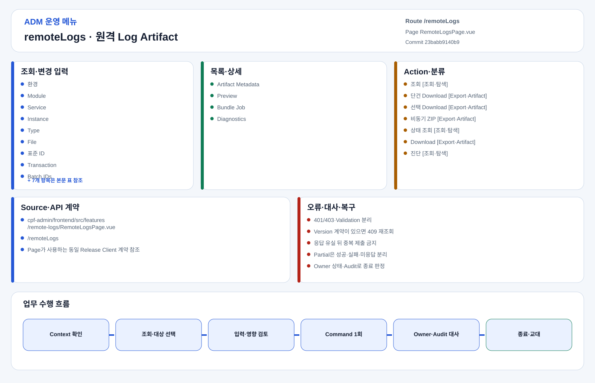

### 이 장에서 끝내는 업무

원격 Log Artifact를 검색·Preview·Bundle·Download한다.

### 메뉴 식별·책임

| 항목 | 값 |
|---|---|
| Route | `/remoteLogs` |
| 메뉴 ID | `remoteLogs` |
| Menu Code | `remoteLogs` |
| 업무 그룹 | 통합 관제 |
| Frontend Page | `cpf-admin/frontend/src/features/remote-logs/RemoteLogsPage.vue` |
| Permission | `REMOTE_LOG` Write for download |
| 기준 Commit | `23babb9140b90e501d6ac715e7b77f55b66198a5` |

### Source·API 근거

| 구분 | 기준 |
|---|---|
| Frontend Page | `cpf-admin/frontend/src/features/remote-logs/RemoteLogsPage.vue` |
| Router | `/remoteLogs` |
| API 추적 | 화면에서 제공하는 기능을 통해 호출한다. 문서에 명시되지 않은 Endpoint를 Browser나 외부 Script에서 임의 호출하지 않는다. |

아래 표는 이 메뉴에서 실제로 확인·입력·실행할 항목을 정리한다. 화면에 없는 Field·Button·상태를 임의로 가정하지 않는다.

### 검색·입력 Field

| Field | Control | 업무 의미 | 기본값·Validation·주의 |
|---|---|---|---|
| `환경` | Select·검색 | 원격 Log Artifact 조회·조치가 적용되는 환경과 데이터 경계를 제한한다. | 허용 목록과 현재 Environment·Data Scope에 맞는 값만 선택한다. |
| `Module` | 문자열 입력·검색 | 원격 Log Artifact 조회·조치가 적용되는 환경과 데이터 경계를 제한한다. | 앞뒤 공백·허용 문자·길이와 대소문자 규칙을 확인한다. |
| `Service` | 문자열 입력·검색 | 조회·상세·Audit에서 같은 대상을 다시 찾기 위한 식별 조건이다. | 앞뒤 공백·허용 문자·길이와 대소문자 규칙을 확인한다. |
| `Instance` | 문자열 입력·검색 | 조회·상세·Audit에서 같은 대상을 다시 찾기 위한 식별 조건이다. | 앞뒤 공백·허용 문자·길이와 대소문자 규칙을 확인한다. |
| `Type` | Select·검색 | 원격 Log Artifact에서 적용하거나 조회할 정책·권한·처리 유형을 선택한다. | 허용 목록과 현재 Environment·Data Scope에 맞는 값만 선택한다. |
| `File` | 파일·본문 입력 | 검증·등록·Export에 사용할 입력 Artifact 또는 구조화된 본문이다. | 확장자·크기·Encoding·Schema·Checksum을 검증하고 Dry Run이 있으면 먼저 실행한다. |
| `표준 ID` | 문자열 입력·검색 | 조회·상세·Audit에서 같은 대상을 다시 찾기 위한 식별 조건이다. | 앞뒤 공백·허용 문자·길이와 대소문자 규칙을 확인한다. |
| `Transaction` | Select·검색 | 원격 Log Artifact에서 적용하거나 조회할 정책·권한·처리 유형을 선택한다. | 허용 목록과 현재 Environment·Data Scope에 맞는 값만 선택한다. |
| `Batch IDs` | 문자열 입력·검색 | 조회·상세·Audit에서 같은 대상을 다시 찾기 위한 식별 조건이다. | 앞뒤 공백·허용 문자·길이와 대소문자 규칙을 확인한다. |
| `기간` | 날짜·시간 입력 | 조회 또는 적용의 유효 시간 범위를 정하며 Timezone과 시작·종료 순서를 함께 확인한다. | Timezone을 고정하고 시작≤종료·유효기간 겹침·기준일 포함 여부를 확인한다. |
| `Size` | 숫자·Version 입력 | 실행 한도·순서·용량 또는 재시도 범위를 지정한다. | 화면의 min·max·단위와 0 허용 여부를 확인하고 음수·Overflow를 차단한다. |
| `압축` | 문자열 입력·검색 | 원격 Log Artifact 화면의 조회 조건 또는 편집 Form에 포함되는 값이며 화면 Label과 Help를 기준으로 사용한다. | 앞뒤 공백·허용 문자·길이와 대소문자 규칙을 확인한다. |
| `활성` | Checkbox·Switch | 현재 상태를 조회하거나 다음 Action의 허용 조건을 지정한다. | 현재 선택과 변경 후 영향 범위를 비교하고 화면의 Source 기본값을 확인한다. |
| `Lines` | 숫자·Version 입력 | 실행 한도·순서·용량 또는 재시도 범위를 지정한다. | 화면의 min·max·단위와 0 허용 여부를 확인하고 음수·Overflow를 차단한다. |
| `Keyword` | 문자열 입력·검색 | 조회·상세·Audit에서 같은 대상을 다시 찾기 위한 식별 조건이다. | 앞뒤 공백·허용 문자·길이와 대소문자 규칙을 확인한다. |
| `Reason` | 다중행 입력 | 작업 목적·영향 범위·승인 또는 복구 기준을 기록해 Audit와 교대 기록에 연결한다. | Ticket·영향 범위·복구점을 포함하고 화면이 요구하는 최소 길이를 충족한다. |

#### 입력 순서

1. **환경** 항목이 조회 Control인지 변경 Form인지 화면 위치로 구분하고, 표시된 값·필수 여부·허용 형식을 확인한다.
2. **Module** 항목이 조회 Control인지 변경 Form인지 화면 위치로 구분하고, 표시된 값·필수 여부·허용 형식을 확인한다.
3. **Service** 항목이 조회 Control인지 변경 Form인지 화면 위치로 구분하고, 표시된 값·필수 여부·허용 형식을 확인한다.
4. **Instance** 항목이 조회 Control인지 변경 Form인지 화면 위치로 구분하고, 표시된 값·필수 여부·허용 형식을 확인한다.
5. **Type** 항목이 조회 Control인지 변경 Form인지 화면 위치로 구분하고, 표시된 값·필수 여부·허용 형식을 확인한다.
6. **File** 항목이 조회 Control인지 변경 Form인지 화면 위치로 구분하고, 표시된 값·필수 여부·허용 형식을 확인한다.
7. **표준 ID** 항목이 조회 Control인지 변경 Form인지 화면 위치로 구분하고, 표시된 값·필수 여부·허용 형식을 확인한다.
8. **Transaction** 항목이 조회 Control인지 변경 Form인지 화면 위치로 구분하고, 표시된 값·필수 여부·허용 형식을 확인한다.
9. **Batch IDs** 항목이 조회 Control인지 변경 Form인지 화면 위치로 구분하고, 표시된 값·필수 여부·허용 형식을 확인한다.
10. **기간** 항목이 조회 Control인지 변경 Form인지 화면 위치로 구분하고, 표시된 값·필수 여부·허용 형식을 확인한다.
11. **Size** 항목이 조회 Control인지 변경 Form인지 화면 위치로 구분하고, 표시된 값·필수 여부·허용 형식을 확인한다.
12. **압축** 항목이 조회 Control인지 변경 Form인지 화면 위치로 구분하고, 표시된 값·필수 여부·허용 형식을 확인한다.
13. **활성** 항목이 조회 Control인지 변경 Form인지 화면 위치로 구분하고, 표시된 값·필수 여부·허용 형식을 확인한다.
14. **Lines** 항목이 조회 Control인지 변경 Form인지 화면 위치로 구분하고, 표시된 값·필수 여부·허용 형식을 확인한다.
15. **Keyword** 항목이 조회 Control인지 변경 Form인지 화면 위치로 구분하고, 표시된 값·필수 여부·허용 형식을 확인한다.
16. **Reason** 항목이 조회 Control인지 변경 Form인지 화면 위치로 구분하고, 표시된 값·필수 여부·허용 형식을 확인한다.
17. 조회 Control과 변경 Form을 분리해 기록하고, 실행 전 Environment·Data Scope·Timezone과 제출할 값만 다시 검토한다.

### 목록 Column·상세 Field

| 표시값 | 운영 의미 | 교차 확인 |
|---|---|---|
| `Artifact Metadata` | 원격 Log Artifact 상세에서 대상의 현재 속성 또는 처리 결과를 확인하는 값이다. | 상세·재조회 결과와 비교하고 Stale·Masking·단위 차이를 확인한다. |
| `Preview` | 원격 Log Artifact 상세에서 대상의 현재 속성 또는 처리 결과를 확인하는 값이다. | 상세·재조회 결과와 비교하고 Stale·Masking·단위 차이를 확인한다. |
| `Bundle Job` | 원격 Log Artifact의 대상 레코드를 상세·Owner·Audit에서 연결하는 식별자다. | 상세·Log·Trace·Audit에서 같은 대상을 가리키는지 확인한다. |
| `Diagnostics` | 원격 Log Artifact 상세에서 대상의 현재 속성 또는 처리 결과를 확인하는 값이다. | 상세·재조회 결과와 비교하고 Stale·Masking·단위 차이를 확인한다. |

#### 결과 판독 순서

1. 조회 완료 시각·Filter·Paging·Sort와 화면 Warning을 확인한다.
2. Empty·Stale·Partial을 정상 0건과 구분한다.
3. 식별자·상태·Version·오류·시각을 같은 Query Context의 상세와 Owner 원장에서 비교한다.
4. Masking된 값은 Raw Permission과 Reason 없이 복원·Export하지 않는다.
5. 집계와 상세가 다르면 집계 시간 창·Timezone·Owner Update 시각을 맞춰 대사한다.

### Button·Action

| Action | 분류 | 활성 조건 | Side Effect·정상 결과 |
|---|---|---|---|
| **조회** | 조회·탐색 | 조회 Permission과 Query Validation을 충족하고 동일 조회가 진행 중이 아님 | 조회 결과의 조회 시각·Filter·Source Version·Warning이 갱신되며 Owner 데이터는 변경하지 않는다. |
| **단건 Download** | Export·Artifact | 화면이 요구하는 Export Permission·Data Scope·Masking·Reason과 승인 조건을 충족함 | Export Operation과 Artifact ID·Checksum·만료·Download Audit가 생성되고 원본 데이터는 변경하지 않는다. |
| **선택 Download** | Export·Artifact | 화면이 요구하는 Export Permission·Data Scope·Masking·Reason과 승인 조건을 충족함 | Export Operation과 Artifact ID·Checksum·만료·Download Audit가 생성되고 원본 데이터는 변경하지 않는다. |
| **비동기 ZIP** | Export·Artifact | 화면이 요구하는 Export Permission·Data Scope·Masking·Reason과 승인 조건을 충족함 | Export Operation과 Artifact ID·Checksum·만료·Download Audit가 생성되고 원본 데이터는 변경하지 않는다. |
| **상태 조회** | 조회·탐색 | 조회 Permission과 Query Validation을 충족하고 동일 조회가 진행 중이 아님 | 상태 조회 결과의 조회 시각·Filter·Source Version·Warning이 갱신되며 Owner 데이터는 변경하지 않는다. |
| **Download** | Export·Artifact | 화면이 요구하는 Export Permission·Data Scope·Masking·Reason과 승인 조건을 충족함 | Export Operation과 Artifact ID·Checksum·만료·Download Audit가 생성되고 원본 데이터는 변경하지 않는다. |
| **진단** | 조회·탐색 | 조회 Permission과 Query Validation을 충족하고 동일 조회가 진행 중이 아님 | 진단 결과의 조회 시각·Filter·Source Version·Warning이 갱신되며 Owner 데이터는 변경하지 않는다. |

### 정상 업무 전체 절차

1. `/remoteLogs`에 진입해 Page Header와 Route가 **원격 Log Artifact** 기능을 가리키는지 확인한다.
2. 로그인 Session·Environment·Data Scope·기준일·Timezone을 고정한다.
3. 화면의 조회 Control과 변경 Form을 구분한다. 조회 조건이 제공되면 먼저 조회하고, 변경 Form은 대상 선택 또는 등록 Action 뒤에 열린 실제 Field만 사용한다.
4. Loading 종료 후 Empty·Error·Stale·Partial 상태와 화면 Warning을 먼저 판정한다.
5. **Artifact Metadata, Preview, Bundle Job, Diagnostics**를 읽고 식별자·상태·Version·시각을 Owner 원장과 대사한다.
6. **단건 Download** 전에 화면과 Owner가 실제로 요구하는 Permission·현재 상태·영향 범위·Reason·승인·Version 조건을 확인하고 한 번만 제출한다.
7. **단건 Download**의 HTTP 응답과 재조회 결과를 확인한다. 비동기·다중 대상 기능은 Owner Terminal 상태·Version·대상별 Success/Failed/Unknown·Audit를 별도로 확인한다.
8. **선택 Download** 전에 화면과 Owner가 실제로 요구하는 Permission·현재 상태·영향 범위·Reason·승인·Version 조건을 확인하고 한 번만 제출한다.
9. **선택 Download**의 HTTP 응답과 재조회 결과를 확인한다. 비동기·다중 대상 기능은 Owner Terminal 상태·Version·대상별 Success/Failed/Unknown·Audit를 별도로 확인한다.
10. **비동기 ZIP** 전에 화면과 Owner가 실제로 요구하는 Permission·현재 상태·영향 범위·Reason·승인·Version 조건을 확인하고 한 번만 제출한다.
11. **비동기 ZIP**의 HTTP 응답과 재조회 결과를 확인한다. 비동기·다중 대상 기능은 Owner Terminal 상태·Version·대상별 Success/Failed/Unknown·Audit를 별도로 확인한다.
12. **Download** 전에 화면과 Owner가 실제로 요구하는 Permission·현재 상태·영향 범위·Reason·승인·Version 조건을 확인하고 한 번만 제출한다.
13. **Download**의 HTTP 응답과 재조회 결과를 확인한다. 비동기·다중 대상 기능은 Owner Terminal 상태·Version·대상별 Success/Failed/Unknown·Audit를 별도로 확인한다.
14. 화면이 제공하는 Log·Metric·Trace와, 변경·Export·승인 조치에 생성된 Audit를 교차 확인한다.
15. 이 장의 **종료 판정**과 다음 확인 시각·Evidence Link를 교대 기록에 남긴다.

### 메뉴 고유 판정·금지 사항

- **목적:** 원격 Log Artifact를 검색·Preview·Bundle·Download한다.
- **종료 판정:** Retention·Size·Masking·Checksum·Download Audit를 확인한다.
- 조회 화면에서 직접 Owner 데이터를 변경하거나 Browser Tool로 우회하지 않는다.
- Partial 조회를 정상 전체 결과로 합치지 않는다.

### 오류·경계·동시성·복구

| 상황 | 화면 징후 | 운영 조치 | 종료 증적 |
|---|---|---|---|
| 401·Session | Session 만료·CSRF·Origin 실패 | 로그인 상태와 BFF Session을 확인한다. Command 자동 Replay는 금지한다. | 401/403 응답·Session Audit |
| 403·Data Scope | 메뉴·Button·Raw·Export가 거부됨 | Menu·Button·API·Owner Permission과 Data Scope를 확인하고 우회하지 않는다. | Deny Audit·요청 Permission |
| Validation | 필수값·범위·형식·기간 오류 | Field Error만 수정하고 기존 성공 Operation을 다시 제출하지 않는다. | Error Code·Field·입력값 |
| Timeout·Dependency | 일부 Source 또는 Command 응답 지연 | Correlation/Operation ID와 실패 Stage를 기록하고 Owner 상태를 조회한다. | Dependency 상태·Retryability |
| Partial·Stale | 일부 대상만 Success 또는 조회 Source 누락 | 성공·실패·미응답을 분리하고 누락 범위와 Version을 표시한다. | Target별 결과·Version |

### 응답 유실·부분 조회 처리

1. 검색 조건·Data Scope·Paging·조회 시각·Correlation ID를 기록한다.
2. 같은 조건으로 재조회하되 실패 Source만 분리한다.
3. 정상 Source 결과를 유지하고 실패·Stale Source를 명시한다.
4. 집계와 원본 상세가 다르면 Owner 상세를 기준으로 Reconcile Case를 연다.
5. 조회 시각·Source Version·0건 또는 일치 결과를 증적으로 남긴다.

### Log·Metric·Trace·Audit와 교대 기록

| 증적 | 필수 값 |
|---|---|
| Audit | Actor·Permission·Reason·Approval·Target·Before/After·Result·Recovery Action |
| Log | Environment·Instance·operationId·transactionId·failureStage·errorCode |
| Metric | 동일 시간 창의 Success·Failure·Latency·Queue·Retry·Partial·Unknown |
| Trace | root/segment/attempt·Owner·DB/Kafka/외부 의존성 Span |
| 상태 원장 | Target ID·Version·Checksum·Desired/Actual·Last Updated·Terminal 여부 |

```text
Menu=remoteLogs
Route=/remoteLogs
Environment=
DataScope=
Query=
TargetId=
BeforeVersion=
Action=
Reason=
ApprovalId=
OperationId=
TransactionId=
Result=SUCCESS|FAILED|PARTIAL|UNKNOWN_RESULT
OwnerState=
FailedTargets=
ReconcileBy=
RollbackPoint=
EvidenceLinks=
NextCheckAt=
```

### 실무 Workbook

**상황:** 원격 Log Artifact를 검색·Preview·Bundle·Download한다. 화면이 일부 Source Timeout 때문에 Partial 결과를 표시했다.

1. Query·Data Scope·조회 시각·Correlation ID를 기록한다.
2. 정상 결과를 0건으로 덮어쓰지 않고 실패 Source만 재조회한다.
3. Artifact Metadata, Preview, Bundle Job 값을 원본 상세와 같은 시간 기준으로 비교한다.
4. 불일치가 계속되면 Incident 또는 Reconcile Case를 생성한다.
5. Retention·Size·Masking·Checksum·Download Audit를 확인한다.
6. Source Version과 다음 확인 시각을 교대 기록에 남긴다.

### 독립 수행 검수 Checklist

- [ ] `/remoteLogs`와 Page Source를 찾고 화면 목적을 설명할 수 있다.
- [ ] 16개 입력·검색 항목의 Control·기본값·Validation을 설명할 수 있다.
- [ ] 4개 표시값을 Owner 상태·Version·Audit와 대사할 수 있다.
- [ ] 7개 Action의 분류·활성 조건·Side Effect를 설명할 수 있다.
- [ ] Empty·403·409·Timeout·Partial·Unknown을 서로 다른 상태로 처리할 수 있다.
- [ ] 응답 유실 뒤 중복 제출 없이 Operation·Owner·Audit로 결과를 확정할 수 있다.
- [ ] 교대 기록만으로 다음 담당자가 Target·상태·복구 기한을 이어받을 수 있다.

## 19. auditLogs — Audit 조회·Delivery 복구

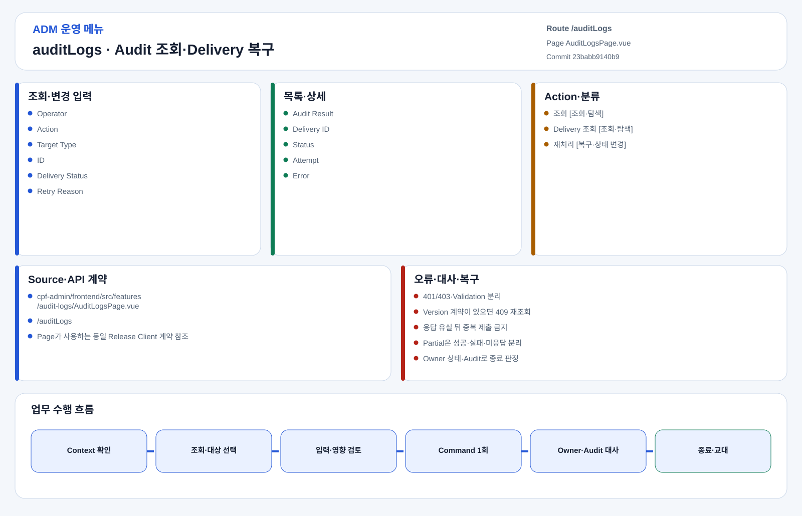

### 이 장에서 끝내는 업무

업무 Audit와 Delivery 상태를 조회·재처리한다.

### 메뉴 식별·책임

| 항목 | 값 |
|---|---|
| Route | `/auditLogs` |
| 메뉴 ID | `auditLogs` |
| Menu Code | `auditLogs` |
| 업무 그룹 | 통합 관제 |
| Frontend Page | `cpf-admin/frontend/src/features/audit-logs/AuditLogsPage.vue` |
| Permission | `AUDIT_LOG` Write for retry |
| 기준 Commit | `23babb9140b90e501d6ac715e7b77f55b66198a5` |

### Source·API 근거

| 구분 | 기준 |
|---|---|
| Frontend Page | `cpf-admin/frontend/src/features/audit-logs/AuditLogsPage.vue` |
| Router | `/auditLogs` |
| API 추적 | 화면에서 제공하는 기능을 통해 호출한다. 문서에 명시되지 않은 Endpoint를 Browser나 외부 Script에서 임의 호출하지 않는다. |

아래 표는 이 메뉴에서 실제로 확인·입력·실행할 항목을 정리한다. 화면에 없는 Field·Button·상태를 임의로 가정하지 않는다.

### 검색·입력 Field

| Field | Control | 업무 의미 | 기본값·Validation·주의 |
|---|---|---|---|
| `Operator` | 날짜·시간 입력 | 조회 또는 적용의 유효 시간 범위를 정하며 Timezone과 시작·종료 순서를 함께 확인한다. | Timezone을 고정하고 시작≤종료·유효기간 겹침·기준일 포함 여부를 확인한다. |
| `Action` | Select·검색 | Audit 조회·Delivery 복구에서 적용하거나 조회할 정책·권한·처리 유형을 선택한다. | 허용 목록과 현재 Environment·Data Scope에 맞는 값만 선택한다. |
| `Target Type` | Select·검색 | Audit 조회·Delivery 복구에서 적용하거나 조회할 정책·권한·처리 유형을 선택한다. | 허용 목록과 현재 Environment·Data Scope에 맞는 값만 선택한다. |
| `ID` | 문자열 입력·검색 | 조회·상세·Audit에서 같은 대상을 다시 찾기 위한 식별 조건이다. | 앞뒤 공백·허용 문자·길이와 대소문자 규칙을 확인한다. |
| `Delivery Status` | Select·검색 | 현재 상태를 조회하거나 다음 Action의 허용 조건을 지정한다. | 허용 목록과 현재 Environment·Data Scope에 맞는 값만 선택한다. |
| `Retry Reason` | 다중행 입력 | 작업 목적·영향 범위·승인 또는 복구 기준을 기록해 Audit와 교대 기록에 연결한다. | Ticket·영향 범위·복구점을 포함하고 화면이 요구하는 최소 길이를 충족한다. |

#### 입력 순서

1. **Operator** 항목이 조회 Control인지 변경 Form인지 화면 위치로 구분하고, 표시된 값·필수 여부·허용 형식을 확인한다.
2. **Action** 항목이 조회 Control인지 변경 Form인지 화면 위치로 구분하고, 표시된 값·필수 여부·허용 형식을 확인한다.
3. **Target Type** 항목이 조회 Control인지 변경 Form인지 화면 위치로 구분하고, 표시된 값·필수 여부·허용 형식을 확인한다.
4. **ID** 항목이 조회 Control인지 변경 Form인지 화면 위치로 구분하고, 표시된 값·필수 여부·허용 형식을 확인한다.
5. **Delivery Status** 항목이 조회 Control인지 변경 Form인지 화면 위치로 구분하고, 표시된 값·필수 여부·허용 형식을 확인한다.
6. **Retry Reason** 항목이 조회 Control인지 변경 Form인지 화면 위치로 구분하고, 표시된 값·필수 여부·허용 형식을 확인한다.
7. 조회 Control과 변경 Form을 분리해 기록하고, 실행 전 Environment·Data Scope·Timezone과 제출할 값만 다시 검토한다.

### 목록 Column·상세 Field

| 표시값 | 운영 의미 | 교차 확인 |
|---|---|---|
| `Audit Result` | 현재 상태와 Terminal 여부, 다음 Action 가능 여부를 판단하는 값이다. | Last Updated·Terminal 조건·Owner 상태와 함께 확인한다. |
| `Delivery ID` | Audit 조회·Delivery 복구의 대상 레코드를 상세·Owner·Audit에서 연결하는 식별자다. | 상세·Log·Trace·Audit에서 같은 대상을 가리키는지 확인한다. |
| `Status` | 현재 상태와 Terminal 여부, 다음 Action 가능 여부를 판단하는 값이다. | Last Updated·Terminal 조건·Owner 상태와 함께 확인한다. |
| `Attempt` | Audit 조회·Delivery 복구 상세에서 대상의 현재 속성 또는 처리 결과를 확인하는 값이다. | 상세·재조회 결과와 비교하고 Stale·Masking·단위 차이를 확인한다. |
| `Error` | 오류·Drift·결과 불명 범위를 나타내며 원인과 복구 Owner를 연결해야 한다. | 원인 식별자·실패 Stage·마지막 갱신 시각을 상세와 대조한다. |

#### 결과 판독 순서

1. 조회 완료 시각·Filter·Paging·Sort와 화면 Warning을 확인한다.
2. Empty·Stale·Partial을 정상 0건과 구분한다.
3. 식별자·상태·Version·오류·시각을 같은 Query Context의 상세와 Owner 원장에서 비교한다.
4. Masking된 값은 Raw Permission과 Reason 없이 복원·Export하지 않는다.
5. 집계와 상세가 다르면 집계 시간 창·Timezone·Owner Update 시각을 맞춰 대사한다.

### Button·Action

| Action | 분류 | 활성 조건 | Side Effect·정상 결과 |
|---|---|---|---|
| **조회** | 조회·탐색 | 조회 Permission과 Query Validation을 충족하고 동일 조회가 진행 중이 아님 | 조회 결과의 조회 시각·Filter·Source Version·Warning이 갱신되며 Owner 데이터는 변경하지 않는다. |
| **Delivery 조회** | 조회·탐색 | 조회 Permission과 Query Validation을 충족하고 동일 조회가 진행 중이 아님 | Delivery 조회 결과의 조회 시각·Filter·Source Version·Warning이 갱신되며 Owner 데이터는 변경하지 않는다. |
| **재처리** | 복구·상태 변경 | 화면과 Owner가 요구하는 복구 Permission·대상 상태·Reason·승인·Version 조건을 충족함 | 복구 Operation을 생성하고 Owner 상태·대상별 결과·Audit로 종료를 판정한다. |

### 정상 업무 전체 절차

1. `/auditLogs`에 진입해 Page Header와 Route가 **Audit 조회·Delivery 복구** 기능을 가리키는지 확인한다.
2. 로그인 Session·Environment·Data Scope·기준일·Timezone을 고정한다.
3. 화면의 조회 Control과 변경 Form을 구분한다. 조회 조건이 제공되면 먼저 조회하고, 변경 Form은 대상 선택 또는 등록 Action 뒤에 열린 실제 Field만 사용한다.
4. Loading 종료 후 Empty·Error·Stale·Partial 상태와 화면 Warning을 먼저 판정한다.
5. **Audit Result, Delivery ID, Status, Attempt, Error**를 읽고 식별자·상태·Version·시각을 Owner 원장과 대사한다.
6. **재처리** 전에 화면과 Owner가 실제로 요구하는 Permission·현재 상태·영향 범위·Reason·승인·Version 조건을 확인하고 한 번만 제출한다.
7. **재처리**의 HTTP 응답과 재조회 결과를 확인한다. 비동기·다중 대상 기능은 Owner Terminal 상태·Version·대상별 Success/Failed/Unknown·Audit를 별도로 확인한다.
8. 화면이 제공하는 Log·Metric·Trace와, 변경·Export·승인 조치에 생성된 Audit를 교차 확인한다.
9. 이 장의 **종료 판정**과 다음 확인 시각·Evidence Link를 교대 기록에 남긴다.

### 메뉴 고유 판정·금지 사항

- **목적:** 업무 Audit와 Delivery 상태를 조회·재처리한다.
- **종료 판정:** 업무 결과와 Audit Delivery 성공을 별도 상태로 판정한다.
- 응답을 받지 못한 경우 Owner 상태와 기존 Operation을 확인하기 전에 동일 Action을 반복하지 않는다.
- HTTP 성공 응답이나 Toast만으로 비동기 Owner 상태 또는 다중 대상 적용을 확정하지 않는다.

### 오류·경계·동시성·복구

| 상황 | 화면 징후 | 운영 조치 | 종료 증적 |
|---|---|---|---|
| 401·Session | Session 만료·CSRF·Origin 실패 | 로그인 상태와 BFF Session을 확인한다. Command 자동 Replay는 금지한다. | 401/403 응답·Session Audit |
| 403·Data Scope | 메뉴·Button·Raw·Export가 거부됨 | Menu·Button·API·Owner Permission과 Data Scope를 확인하고 우회하지 않는다. | Deny Audit·요청 Permission |
| Validation | 필수값·범위·형식·기간 오류 | Field Error만 수정하고 기존 성공 Operation을 다시 제출하지 않는다. | Error Code·Field·입력값 |
| Timeout·Dependency | 일부 Source 또는 Command 응답 지연 | Correlation/Operation ID와 실패 Stage를 기록하고 Owner 상태를 조회한다. | Dependency 상태·Retryability |
| Partial·Stale | 일부 대상만 Success 또는 조회 Source 누락 | 성공·실패·미응답을 분리하고 누락 범위와 Version을 표시한다. | Target별 결과·Version |
| 409·동시 변경 | Expected Version 불일치 | 최신 상세를 재조회하고 Diff·영향을 다시 검토한 뒤 새 요청으로 제출한다. | 현재/요청 Version·변경자 |
| 응답 유실·Unknown | 요청 후 실제 처리 여부를 알 수 없음 | Operation ID·Request Hash·Audit·Owner 상태로 대사하고 중복 제출하지 않는다. | Operation·Owner·Audit |
| 복구 실패 | Retry/Rollback 뒤에도 상태 불일치 | 자동 반복을 중단하고 Incident·Reconcile Case·다음 확인 시각을 기록한다. | Case ID·복구 Owner·기한 |

### 응답 유실·결과 불명·부분 적용 처리

1. 동일 Action을 다시 누르지 않고 Browser Network와 응답 Header를 보존한다. `operationId`·`transactionId`·`idempotencyKey`가 제공되면 기록하고, 없으면 Target ID·Actor·요청 시각·Request Body Hash로 대사한다.
2. 기능이 제공하는 상세·Operation Status(있는 경우)·Audit에서 Request Hash와 대상 Version을 검색한다.
3. Side Effect 전 실패가 확인된 경우에만 새 요청을 검토한다.
4. Success·Failed·Unknown 대상을 분리하고 Source가 제공하는 Failed-only Retry·Compensation·Rollback을 선택하고, 지원되지 않으면 수동 Reconcile Case로 이관한다.
5. Rollback을 지원하는 기능은 Owner Version·Checksum·업무 합계가 Rollback Point와 일치하는지 확인한다.
6. 확정되지 않은 대상은 `UNKNOWN_RESULT`로 유지하고 담당자·대사 기한·다음 확인 시각을 기록한다.

### Log·Metric·Trace·Audit와 교대 기록

| 증적 | 필수 값 |
|---|---|
| Audit | Actor·Permission·Reason·Approval·Target·Before/After·Result·Recovery Action |
| Log | Environment·Instance·operationId·transactionId·failureStage·errorCode |
| Metric | 동일 시간 창의 Success·Failure·Latency·Queue·Retry·Partial·Unknown |
| Trace | root/segment/attempt·Owner·DB/Kafka/외부 의존성 Span |
| 상태 원장 | Target ID·Version·Checksum·Desired/Actual·Last Updated·Terminal 여부 |

```text
Menu=auditLogs
Route=/auditLogs
Environment=
DataScope=
Query=
TargetId=
BeforeVersion=
Action=
Reason=
ApprovalId=
OperationId=
TransactionId=
Result=SUCCESS|FAILED|PARTIAL|UNKNOWN_RESULT
OwnerState=
FailedTargets=
ReconcileBy=
RollbackPoint=
EvidenceLinks=
NextCheckAt=
```

### 실무 Workbook

**상황:** 업무 Audit와 Delivery 상태를 조회·재처리한다. 담당자가 **재처리**을 수행한 뒤 Browser 응답을 받지 못했다.

1. 대상 식별자와 Before Version, 입력값, Reason·Approval을 작업 기록에서 확인한다.
2. 동일 **재처리**을 반복하지 않고 Operation·Audit·Owner 상태를 조회한다.
3. Owner 상태가 변경됐고 Request Hash가 같으면 응답 유실로 분류해 중복 조치를 금지한다.
4. 일부 대상만 변경됐으면 Success·Failed·Unknown을 분리해 Failed-only Retry 또는 Rollback을 선택한다.
5. 업무 결과와 Audit Delivery 성공을 별도 상태로 판정한다.
6. Evidence Link와 다음 확인 시각을 교대 기록에 남긴다.

### 독립 수행 검수 Checklist

- [ ] `/auditLogs`와 Page Source를 찾고 화면 목적을 설명할 수 있다.
- [ ] 6개 입력·검색 항목의 Control·기본값·Validation을 설명할 수 있다.
- [ ] 5개 표시값을 Owner 상태·Version·Audit와 대사할 수 있다.
- [ ] 3개 Action의 분류·활성 조건·Side Effect를 설명할 수 있다.
- [ ] Empty·403·409·Timeout·Partial·Unknown을 서로 다른 상태로 처리할 수 있다.
- [ ] 응답 유실 뒤 중복 제출 없이 Operation·Owner·Audit로 결과를 확정할 수 있다.
- [ ] 교대 기록만으로 다음 담당자가 Target·상태·복구 기한을 이어받을 수 있다.

## 20. logLevel — Dynamic Log Level

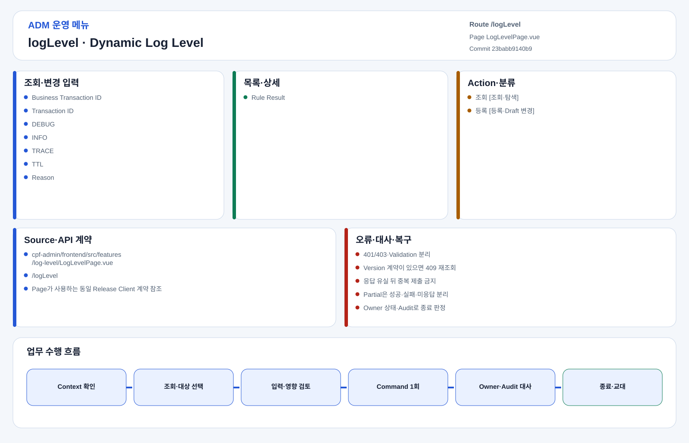

### 이 장에서 끝내는 업무

특정 거래에 Dynamic Log Level과 TTL을 적용한다.

### 메뉴 식별·책임

| 항목 | 값 |
|---|---|
| Route | `/logLevel` |
| 메뉴 ID | `logLevel` |
| Menu Code | `logLevel` |
| 업무 그룹 | 통합 관제 |
| Frontend Page | `cpf-admin/frontend/src/features/log-level/LogLevelPage.vue` |
| Permission | `DYNAMIC_LOG` Write |
| 기준 Commit | `23babb9140b90e501d6ac715e7b77f55b66198a5` |

### Source·API 근거

| 구분 | 기준 |
|---|---|
| Frontend Page | `cpf-admin/frontend/src/features/log-level/LogLevelPage.vue` |
| Router | `/logLevel` |
| API 추적 | 화면에서 제공하는 기능을 통해 호출한다. 문서에 명시되지 않은 Endpoint를 Browser나 외부 Script에서 임의 호출하지 않는다. |

아래 표는 이 메뉴에서 실제로 확인·입력·실행할 항목을 정리한다. 화면에 없는 Field·Button·상태를 임의로 가정하지 않는다.

### 검색·입력 Field

| Field | Control | 업무 의미 | 기본값·Validation·주의 |
|---|---|---|---|
| `Business Transaction ID` | Select·검색 | Dynamic Log Level에서 적용하거나 조회할 정책·권한·처리 유형을 선택한다. | 허용 목록과 현재 Environment·Data Scope에 맞는 값만 선택한다. |
| `Transaction ID` | Select·검색 | Dynamic Log Level에서 적용하거나 조회할 정책·권한·처리 유형을 선택한다. | 허용 목록과 현재 Environment·Data Scope에 맞는 값만 선택한다. |
| `DEBUG` | 문자열 입력·검색 | Dynamic Log Level 화면의 조회 조건 또는 편집 Form에 포함되는 값이며 화면 Label과 Help를 기준으로 사용한다. | 앞뒤 공백·허용 문자·길이와 대소문자 규칙을 확인한다. |
| `INFO` | 문자열 입력·검색 | Dynamic Log Level 화면의 조회 조건 또는 편집 Form에 포함되는 값이며 화면 Label과 Help를 기준으로 사용한다. | 앞뒤 공백·허용 문자·길이와 대소문자 규칙을 확인한다. |
| `TRACE` | 문자열 입력·검색 | 조회·상세·Audit에서 같은 대상을 다시 찾기 위한 식별 조건이다. | 앞뒤 공백·허용 문자·길이와 대소문자 규칙을 확인한다. |
| `TTL` | 숫자·Version 입력 | 실행 한도·순서·용량 또는 재시도 범위를 지정한다. | 화면의 min·max·단위와 0 허용 여부를 확인하고 음수·Overflow를 차단한다. |
| `Reason` | 다중행 입력 | 작업 목적·영향 범위·승인 또는 복구 기준을 기록해 Audit와 교대 기록에 연결한다. | Ticket·영향 범위·복구점을 포함하고 화면이 요구하는 최소 길이를 충족한다. |

#### 입력 순서

1. **Business Transaction ID** 항목이 조회 Control인지 변경 Form인지 화면 위치로 구분하고, 표시된 값·필수 여부·허용 형식을 확인한다.
2. **Transaction ID** 항목이 조회 Control인지 변경 Form인지 화면 위치로 구분하고, 표시된 값·필수 여부·허용 형식을 확인한다.
3. **DEBUG** 항목이 조회 Control인지 변경 Form인지 화면 위치로 구분하고, 표시된 값·필수 여부·허용 형식을 확인한다.
4. **INFO** 항목이 조회 Control인지 변경 Form인지 화면 위치로 구분하고, 표시된 값·필수 여부·허용 형식을 확인한다.
5. **TRACE** 항목이 조회 Control인지 변경 Form인지 화면 위치로 구분하고, 표시된 값·필수 여부·허용 형식을 확인한다.
6. **TTL** 항목이 조회 Control인지 변경 Form인지 화면 위치로 구분하고, 표시된 값·필수 여부·허용 형식을 확인한다.
7. **Reason** 항목이 조회 Control인지 변경 Form인지 화면 위치로 구분하고, 표시된 값·필수 여부·허용 형식을 확인한다.
8. 조회 Control과 변경 Form을 분리해 기록하고, 실행 전 Environment·Data Scope·Timezone과 제출할 값만 다시 검토한다.

### 목록 Column·상세 Field

| 표시값 | 운영 의미 | 교차 확인 |
|---|---|---|
| `Rule Result` | 정책·Rule 평가 결과이며 입력 Context와 적용 Version을 함께 확인한다. | Last Updated·Terminal 조건·Owner 상태와 함께 확인한다. |

#### 결과 판독 순서

1. 조회 완료 시각·Filter·Paging·Sort와 화면 Warning을 확인한다.
2. Empty·Stale·Partial을 정상 0건과 구분한다.
3. 식별자·상태·Version·오류·시각을 같은 Query Context의 상세와 Owner 원장에서 비교한다.
4. Masking된 값은 Raw Permission과 Reason 없이 복원·Export하지 않는다.
5. 집계와 상세가 다르면 집계 시간 창·Timezone·Owner Update 시각을 맞춰 대사한다.

### Button·Action

| Action | 분류 | 활성 조건 | Side Effect·정상 결과 |
|---|---|---|---|
| **조회** | 조회·탐색 | 조회 Permission과 Query Validation을 충족하고 동일 조회가 진행 중이 아님 | 조회 결과의 조회 시각·Filter·Source Version·Warning이 갱신되며 Owner 데이터는 변경하지 않는다. |
| **등록** | 등록·Draft 변경 | 화면이 실제로 요구하는 Write Permission·필수 Field·Reason·Version 조건을 충족함 | Dynamic Log Level의 재조회 결과가 요청 내용과 일치한다. Version·Before/After·Audit는 해당 Owner가 제공하는 경우 함께 확인한다. |

### 정상 업무 전체 절차

1. `/logLevel`에 진입해 Page Header와 Route가 **Dynamic Log Level** 기능을 가리키는지 확인한다.
2. 로그인 Session·Environment·Data Scope·기준일·Timezone을 고정한다.
3. 화면의 조회 Control과 변경 Form을 구분한다. 조회 조건이 제공되면 먼저 조회하고, 변경 Form은 대상 선택 또는 등록 Action 뒤에 열린 실제 Field만 사용한다.
4. Loading 종료 후 Empty·Error·Stale·Partial 상태와 화면 Warning을 먼저 판정한다.
5. **Rule Result**를 읽고 식별자·상태·Version·시각을 Owner 원장과 대사한다.
6. **등록** 전에 화면과 Owner가 실제로 요구하는 Permission·현재 상태·영향 범위·Reason·승인·Version 조건을 확인하고 한 번만 제출한다.
7. **등록**의 HTTP 응답과 재조회 결과를 확인한다. 비동기·다중 대상 기능은 Owner Terminal 상태·Version·대상별 Success/Failed/Unknown·Audit를 별도로 확인한다.
8. 화면이 제공하는 Log·Metric·Trace와, 변경·Export·승인 조치에 생성된 Audit를 교차 확인한다.
9. 이 장의 **종료 판정**과 다음 확인 시각·Evidence Link를 교대 기록에 남긴다.

### 메뉴 고유 판정·금지 사항

- **목적:** 특정 거래에 Dynamic Log Level과 TTL을 적용한다.
- **종료 판정:** TTL 만료와 민감정보 Capture 정책을 확인한다.
- 응답을 받지 못한 경우 Owner 상태와 기존 Operation을 확인하기 전에 동일 Action을 반복하지 않는다.
- HTTP 성공 응답이나 Toast만으로 비동기 Owner 상태 또는 다중 대상 적용을 확정하지 않는다.

### 오류·경계·동시성·복구

| 상황 | 화면 징후 | 운영 조치 | 종료 증적 |
|---|---|---|---|
| 401·Session | Session 만료·CSRF·Origin 실패 | 로그인 상태와 BFF Session을 확인한다. Command 자동 Replay는 금지한다. | 401/403 응답·Session Audit |
| 403·Data Scope | 메뉴·Button·Raw·Export가 거부됨 | Menu·Button·API·Owner Permission과 Data Scope를 확인하고 우회하지 않는다. | Deny Audit·요청 Permission |
| Validation | 필수값·범위·형식·기간 오류 | Field Error만 수정하고 기존 성공 Operation을 다시 제출하지 않는다. | Error Code·Field·입력값 |
| Timeout·Dependency | 일부 Source 또는 Command 응답 지연 | Correlation/Operation ID와 실패 Stage를 기록하고 Owner 상태를 조회한다. | Dependency 상태·Retryability |
| Partial·Stale | 일부 대상만 Success 또는 조회 Source 누락 | 성공·실패·미응답을 분리하고 누락 범위와 Version을 표시한다. | Target별 결과·Version |
| 409·동시 변경 | Expected Version 불일치 | 최신 상세를 재조회하고 Diff·영향을 다시 검토한 뒤 새 요청으로 제출한다. | 현재/요청 Version·변경자 |
| 응답 유실·Unknown | 요청 후 실제 처리 여부를 알 수 없음 | Operation ID·Request Hash·Audit·Owner 상태로 대사하고 중복 제출하지 않는다. | Operation·Owner·Audit |
| 복구 실패 | Retry/Rollback 뒤에도 상태 불일치 | 자동 반복을 중단하고 Incident·Reconcile Case·다음 확인 시각을 기록한다. | Case ID·복구 Owner·기한 |

### 응답 유실·결과 불명·부분 적용 처리

1. 동일 Action을 다시 누르지 않고 Browser Network와 응답 Header를 보존한다. `operationId`·`transactionId`·`idempotencyKey`가 제공되면 기록하고, 없으면 Target ID·Actor·요청 시각·Request Body Hash로 대사한다.
2. 기능이 제공하는 상세·Operation Status(있는 경우)·Audit에서 Request Hash와 대상 Version을 검색한다.
3. Side Effect 전 실패가 확인된 경우에만 새 요청을 검토한다.
4. Success·Failed·Unknown 대상을 분리하고 Source가 제공하는 Failed-only Retry·Compensation·Rollback을 선택하고, 지원되지 않으면 수동 Reconcile Case로 이관한다.
5. Rollback을 지원하는 기능은 Owner Version·Checksum·업무 합계가 Rollback Point와 일치하는지 확인한다.
6. 확정되지 않은 대상은 `UNKNOWN_RESULT`로 유지하고 담당자·대사 기한·다음 확인 시각을 기록한다.

### Log·Metric·Trace·Audit와 교대 기록

| 증적 | 필수 값 |
|---|---|
| Audit | Actor·Permission·Reason·Approval·Target·Before/After·Result·Recovery Action |
| Log | Environment·Instance·operationId·transactionId·failureStage·errorCode |
| Metric | 동일 시간 창의 Success·Failure·Latency·Queue·Retry·Partial·Unknown |
| Trace | root/segment/attempt·Owner·DB/Kafka/외부 의존성 Span |
| 상태 원장 | Target ID·Version·Checksum·Desired/Actual·Last Updated·Terminal 여부 |

```text
Menu=logLevel
Route=/logLevel
Environment=
DataScope=
Query=
TargetId=
BeforeVersion=
Action=
Reason=
ApprovalId=
OperationId=
TransactionId=
Result=SUCCESS|FAILED|PARTIAL|UNKNOWN_RESULT
OwnerState=
FailedTargets=
ReconcileBy=
RollbackPoint=
EvidenceLinks=
NextCheckAt=
```

### 실무 Workbook

**상황:** 특정 거래에 Dynamic Log Level과 TTL을 적용한다. 담당자가 **등록**을 수행한 뒤 Browser 응답을 받지 못했다.

1. 대상 식별자와 Before Version, 입력값, Reason·Approval을 작업 기록에서 확인한다.
2. 동일 **등록**을 반복하지 않고 Operation·Audit·Owner 상태를 조회한다.
3. Owner 상태가 변경됐고 Request Hash가 같으면 응답 유실로 분류해 중복 조치를 금지한다.
4. 일부 대상만 변경됐으면 Success·Failed·Unknown을 분리해 Failed-only Retry 또는 Rollback을 선택한다.
5. TTL 만료와 민감정보 Capture 정책을 확인한다.
6. Evidence Link와 다음 확인 시각을 교대 기록에 남긴다.

### 독립 수행 검수 Checklist

- [ ] `/logLevel`와 Page Source를 찾고 화면 목적을 설명할 수 있다.
- [ ] 7개 입력·검색 항목의 Control·기본값·Validation을 설명할 수 있다.
- [ ] 1개 표시값을 Owner 상태·Version·Audit와 대사할 수 있다.
- [ ] 2개 Action의 분류·활성 조건·Side Effect를 설명할 수 있다.
- [ ] Empty·403·409·Timeout·Partial·Unknown을 서로 다른 상태로 처리할 수 있다.
- [ ] 응답 유실 뒤 중복 제출 없이 Operation·Owner·Audit로 결과를 확정할 수 있다.
- [ ] 교대 기록만으로 다음 담당자가 Target·상태·복구 기한을 이어받을 수 있다.

## 21. logPolicies — Log Capture·Retention·Trace Boost

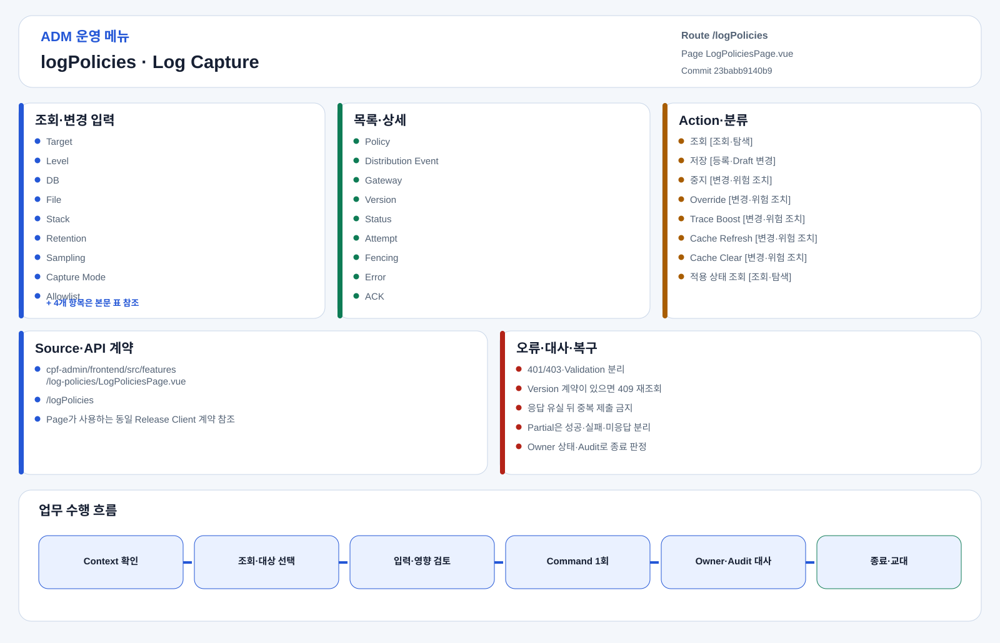

### 이 장에서 끝내는 업무

Log Capture·Retention·Sampling·Masking 정책을 배포한다.

### 메뉴 식별·책임

| 항목 | 값 |
|---|---|
| Route | `/logPolicies` |
| 메뉴 ID | `logPolicies` |
| Menu Code | `logPolicies` |
| 업무 그룹 | 통합 관제 |
| Frontend Page | `cpf-admin/frontend/src/features/log-policies/LogPoliciesPage.vue` |
| Permission | `LOG_POLICY` Write |
| 기준 Commit | `23babb9140b90e501d6ac715e7b77f55b66198a5` |

### Source·API 근거

| 구분 | 기준 |
|---|---|
| Frontend Page | `cpf-admin/frontend/src/features/log-policies/LogPoliciesPage.vue` |
| Router | `/logPolicies` |
| API 추적 | 화면에서 제공하는 기능을 통해 호출한다. 문서에 명시되지 않은 Endpoint를 Browser나 외부 Script에서 임의 호출하지 않는다. |

아래 표는 이 메뉴에서 실제로 확인·입력·실행할 항목을 정리한다. 화면에 없는 Field·Button·상태를 임의로 가정하지 않는다.

### 검색·입력 Field

| Field | Control | 업무 의미 | 기본값·Validation·주의 |
|---|---|---|---|
| `Target` | 문자열 입력·검색 | Log Capture·Retention·Trace Boost 화면의 조회 조건 또는 편집 Form에 포함되는 값이며 화면 Label과 Help를 기준으로 사용한다. | 앞뒤 공백·허용 문자·길이와 대소문자 규칙을 확인한다. |
| `Level` | Select·검색 | Log Capture·Retention·Trace Boost 화면의 조회 조건 또는 편집 Form에 포함되는 값이며 화면 Label과 Help를 기준으로 사용한다. | 허용 목록과 현재 Environment·Data Scope에 맞는 값만 선택한다. |
| `DB` | 문자열 입력·검색 | Log Capture·Retention·Trace Boost 화면의 조회 조건 또는 편집 Form에 포함되는 값이며 화면 Label과 Help를 기준으로 사용한다. | 앞뒤 공백·허용 문자·길이와 대소문자 규칙을 확인한다. |
| `File` | 파일·본문 입력 | 검증·등록·Export에 사용할 입력 Artifact 또는 구조화된 본문이다. | 확장자·크기·Encoding·Schema·Checksum을 검증하고 Dry Run이 있으면 먼저 실행한다. |
| `Stack` | 문자열 입력·검색 | Log Capture·Retention·Trace Boost 화면의 조회 조건 또는 편집 Form에 포함되는 값이며 화면 Label과 Help를 기준으로 사용한다. | 앞뒤 공백·허용 문자·길이와 대소문자 규칙을 확인한다. |
| `Retention` | 문자열 입력·검색 | Log Capture·Retention·Trace Boost 화면의 조회 조건 또는 편집 Form에 포함되는 값이며 화면 Label과 Help를 기준으로 사용한다. | 앞뒤 공백·허용 문자·길이와 대소문자 규칙을 확인한다. |
| `Sampling` | 문자열 입력·검색 | Log Capture·Retention·Trace Boost 화면의 조회 조건 또는 편집 Form에 포함되는 값이며 화면 Label과 Help를 기준으로 사용한다. | 앞뒤 공백·허용 문자·길이와 대소문자 규칙을 확인한다. |
| `Capture Mode` | 문자열 입력·검색 | Log Capture·Retention·Trace Boost 화면의 조회 조건 또는 편집 Form에 포함되는 값이며 화면 Label과 Help를 기준으로 사용한다. | 앞뒤 공백·허용 문자·길이와 대소문자 규칙을 확인한다. |
| `Allowlist` | 문자열 입력·검색 | Log Capture·Retention·Trace Boost 화면의 조회 조건 또는 편집 Form에 포함되는 값이며 화면 Label과 Help를 기준으로 사용한다. | 앞뒤 공백·허용 문자·길이와 대소문자 규칙을 확인한다. |
| `Masking` | Checkbox·Switch | Log Capture·Retention·Trace Boost 화면의 조회 조건 또는 편집 Form에 포함되는 값이며 화면 Label과 Help를 기준으로 사용한다. | 현재 선택과 변경 후 영향 범위를 비교하고 화면의 Source 기본값을 확인한다. |
| `Byte Cap` | 문자열 입력·검색 | Log Capture·Retention·Trace Boost 화면의 조회 조건 또는 편집 Form에 포함되는 값이며 화면 Label과 Help를 기준으로 사용한다. | 앞뒤 공백·허용 문자·길이와 대소문자 규칙을 확인한다. |
| `Reason` | 다중행 입력 | 작업 목적·영향 범위·승인 또는 복구 기준을 기록해 Audit와 교대 기록에 연결한다. | Ticket·영향 범위·복구점을 포함하고 화면이 요구하는 최소 길이를 충족한다. |
| `Trace Boost` | 문자열 입력·검색 | 조회·상세·Audit에서 같은 대상을 다시 찾기 위한 식별 조건이다. | 앞뒤 공백·허용 문자·길이와 대소문자 규칙을 확인한다. |

#### 입력 순서

1. **Target** 항목이 조회 Control인지 변경 Form인지 화면 위치로 구분하고, 표시된 값·필수 여부·허용 형식을 확인한다.
2. **Level** 항목이 조회 Control인지 변경 Form인지 화면 위치로 구분하고, 표시된 값·필수 여부·허용 형식을 확인한다.
3. **DB** 항목이 조회 Control인지 변경 Form인지 화면 위치로 구분하고, 표시된 값·필수 여부·허용 형식을 확인한다.
4. **File** 항목이 조회 Control인지 변경 Form인지 화면 위치로 구분하고, 표시된 값·필수 여부·허용 형식을 확인한다.
5. **Stack** 항목이 조회 Control인지 변경 Form인지 화면 위치로 구분하고, 표시된 값·필수 여부·허용 형식을 확인한다.
6. **Retention** 항목이 조회 Control인지 변경 Form인지 화면 위치로 구분하고, 표시된 값·필수 여부·허용 형식을 확인한다.
7. **Sampling** 항목이 조회 Control인지 변경 Form인지 화면 위치로 구분하고, 표시된 값·필수 여부·허용 형식을 확인한다.
8. **Capture Mode** 항목이 조회 Control인지 변경 Form인지 화면 위치로 구분하고, 표시된 값·필수 여부·허용 형식을 확인한다.
9. **Allowlist** 항목이 조회 Control인지 변경 Form인지 화면 위치로 구분하고, 표시된 값·필수 여부·허용 형식을 확인한다.
10. **Masking** 항목이 조회 Control인지 변경 Form인지 화면 위치로 구분하고, 표시된 값·필수 여부·허용 형식을 확인한다.
11. **Byte Cap** 항목이 조회 Control인지 변경 Form인지 화면 위치로 구분하고, 표시된 값·필수 여부·허용 형식을 확인한다.
12. **Reason** 항목이 조회 Control인지 변경 Form인지 화면 위치로 구분하고, 표시된 값·필수 여부·허용 형식을 확인한다.
13. **Trace Boost** 항목이 조회 Control인지 변경 Form인지 화면 위치로 구분하고, 표시된 값·필수 여부·허용 형식을 확인한다.
14. 조회 Control과 변경 Form을 분리해 기록하고, 실행 전 Environment·Data Scope·Timezone과 제출할 값만 다시 검토한다.

### 목록 Column·상세 Field

| 표시값 | 운영 의미 | 교차 확인 |
|---|---|---|
| `Policy` | Log Capture·Retention·Trace Boost 상세에서 대상의 현재 속성 또는 처리 결과를 확인하는 값이다. | 상세·재조회 결과와 비교하고 Stale·Masking·단위 차이를 확인한다. |
| `Distribution Event` | Log Capture·Retention·Trace Boost 상세에서 대상의 현재 속성 또는 처리 결과를 확인하는 값이다. | 상세·재조회 결과와 비교하고 Stale·Masking·단위 차이를 확인한다. |
| `Gateway` | Log Capture·Retention·Trace Boost 상세에서 대상의 현재 속성 또는 처리 결과를 확인하는 값이다. | 상세·재조회 결과와 비교하고 Stale·Masking·단위 차이를 확인한다. |
| `Version` | 요청·Owner·Instance 사이의 Version 또는 내용 동일성을 판단하는 값이다. | 목록·상세·Owner 또는 Instance 보고값에서 일치하는지 확인한다. |
| `Status` | 현재 상태와 Terminal 여부, 다음 Action 가능 여부를 판단하는 값이다. | Last Updated·Terminal 조건·Owner 상태와 함께 확인한다. |
| `Attempt` | Log Capture·Retention·Trace Boost 상세에서 대상의 현재 속성 또는 처리 결과를 확인하는 값이다. | 상세·재조회 결과와 비교하고 Stale·Masking·단위 차이를 확인한다. |
| `Fencing` | Log Capture·Retention·Trace Boost 상세에서 대상의 현재 속성 또는 처리 결과를 확인하는 값이다. | 상세·재조회 결과와 비교하고 Stale·Masking·단위 차이를 확인한다. |
| `Error` | 오류·Drift·결과 불명 범위를 나타내며 원인과 복구 Owner를 연결해야 한다. | 원인 식별자·실패 Stage·마지막 갱신 시각을 상세와 대조한다. |
| `ACK` | Log Capture·Retention·Trace Boost 상세에서 대상의 현재 속성 또는 처리 결과를 확인하는 값이다. | 상세·재조회 결과와 비교하고 Stale·Masking·단위 차이를 확인한다. |

#### 결과 판독 순서

1. 조회 완료 시각·Filter·Paging·Sort와 화면 Warning을 확인한다.
2. Empty·Stale·Partial을 정상 0건과 구분한다.
3. 식별자·상태·Version·오류·시각을 같은 Query Context의 상세와 Owner 원장에서 비교한다.
4. Masking된 값은 Raw Permission과 Reason 없이 복원·Export하지 않는다.
5. 집계와 상세가 다르면 집계 시간 창·Timezone·Owner Update 시각을 맞춰 대사한다.

### Button·Action

| Action | 분류 | 활성 조건 | Side Effect·정상 결과 |
|---|---|---|---|
| **조회** | 조회·탐색 | 조회 Permission과 Query Validation을 충족하고 동일 조회가 진행 중이 아님 | 조회 결과의 조회 시각·Filter·Source Version·Warning이 갱신되며 Owner 데이터는 변경하지 않는다. |
| **저장** | 등록·Draft 변경 | 화면이 실제로 요구하는 Write Permission·필수 Field·Reason·Version 조건을 충족함 | Log Capture·Retention·Trace Boost의 재조회 결과가 요청 내용과 일치한다. Version·Before/After·Audit는 해당 Owner가 제공하는 경우 함께 확인한다. |
| **중지** | 변경·위험 조치 | 화면과 Owner가 요구하는 Write Permission·대상 상태·영향 범위·Reason·승인·Version 조건을 충족함 | 변경 Operation을 생성하고 Accepted 응답과 Owner Terminal 상태·Version·Audit를 분리해 확인한다. |
| **Override** | 변경·위험 조치 | 화면과 Owner가 요구하는 Write Permission·대상 상태·영향 범위·Reason·승인·Version 조건을 충족함 | 변경 Operation을 생성하고 Accepted 응답과 Owner Terminal 상태·Version·Audit를 분리해 확인한다. |
| **Trace Boost** | 변경·위험 조치 | 화면과 Owner가 요구하는 Write Permission·대상 상태·영향 범위·Reason·승인·Version 조건을 충족함 | 변경 Operation을 생성하고 Accepted 응답과 Owner Terminal 상태·Version·Audit를 분리해 확인한다. |
| **Cache Refresh** | 변경·위험 조치 | 화면과 Owner가 요구하는 Write Permission·대상 상태·영향 범위·Reason·승인·Version 조건을 충족함 | 변경 Operation을 생성하고 Accepted 응답과 Owner Terminal 상태·Version·Audit를 분리해 확인한다. |
| **Cache Clear** | 변경·위험 조치 | 화면과 Owner가 요구하는 Write Permission·대상 상태·영향 범위·Reason·승인·Version 조건을 충족함 | 변경 Operation을 생성하고 Accepted 응답과 Owner Terminal 상태·Version·Audit를 분리해 확인한다. |
| **적용 상태 조회** | 조회·탐색 | 조회 Permission과 Query Validation을 충족하고 동일 조회가 진행 중이 아님 | 적용 상태 조회 결과의 조회 시각·Filter·Source Version·Warning이 갱신되며 Owner 데이터는 변경하지 않는다. |

### 정상 업무 전체 절차

1. `/logPolicies`에 진입해 Page Header와 Route가 **Log Capture·Retention·Trace Boost** 기능을 가리키는지 확인한다.
2. 로그인 Session·Environment·Data Scope·기준일·Timezone을 고정한다.
3. 화면의 조회 Control과 변경 Form을 구분한다. 조회 조건이 제공되면 먼저 조회하고, 변경 Form은 대상 선택 또는 등록 Action 뒤에 열린 실제 Field만 사용한다.
4. Loading 종료 후 Empty·Error·Stale·Partial 상태와 화면 Warning을 먼저 판정한다.
5. **Policy, Distribution Event, Gateway, Version, Status**를 읽고 식별자·상태·Version·시각을 Owner 원장과 대사한다.
6. **저장** 전에 화면과 Owner가 실제로 요구하는 Permission·현재 상태·영향 범위·Reason·승인·Version 조건을 확인하고 한 번만 제출한다.
7. **저장**의 HTTP 응답과 재조회 결과를 확인한다. 비동기·다중 대상 기능은 Owner Terminal 상태·Version·대상별 Success/Failed/Unknown·Audit를 별도로 확인한다.
8. **중지** 전에 화면과 Owner가 실제로 요구하는 Permission·현재 상태·영향 범위·Reason·승인·Version 조건을 확인하고 한 번만 제출한다.
9. **중지**의 HTTP 응답과 재조회 결과를 확인한다. 비동기·다중 대상 기능은 Owner Terminal 상태·Version·대상별 Success/Failed/Unknown·Audit를 별도로 확인한다.
10. **Override** 전에 화면과 Owner가 실제로 요구하는 Permission·현재 상태·영향 범위·Reason·승인·Version 조건을 확인하고 한 번만 제출한다.
11. **Override**의 HTTP 응답과 재조회 결과를 확인한다. 비동기·다중 대상 기능은 Owner Terminal 상태·Version·대상별 Success/Failed/Unknown·Audit를 별도로 확인한다.
12. **Trace Boost** 전에 화면과 Owner가 실제로 요구하는 Permission·현재 상태·영향 범위·Reason·승인·Version 조건을 확인하고 한 번만 제출한다.
13. **Trace Boost**의 HTTP 응답과 재조회 결과를 확인한다. 비동기·다중 대상 기능은 Owner Terminal 상태·Version·대상별 Success/Failed/Unknown·Audit를 별도로 확인한다.
14. **Cache Refresh** 전에 화면과 Owner가 실제로 요구하는 Permission·현재 상태·영향 범위·Reason·승인·Version 조건을 확인하고 한 번만 제출한다.
15. **Cache Refresh**의 HTTP 응답과 재조회 결과를 확인한다. 비동기·다중 대상 기능은 Owner Terminal 상태·Version·대상별 Success/Failed/Unknown·Audit를 별도로 확인한다.
16. **Cache Clear** 전에 화면과 Owner가 실제로 요구하는 Permission·현재 상태·영향 범위·Reason·승인·Version 조건을 확인하고 한 번만 제출한다.
17. **Cache Clear**의 HTTP 응답과 재조회 결과를 확인한다. 비동기·다중 대상 기능은 Owner Terminal 상태·Version·대상별 Success/Failed/Unknown·Audit를 별도로 확인한다.
18. 화면이 제공하는 Log·Metric·Trace와, 변경·Export·승인 조치에 생성된 Audit를 교차 확인한다.
19. 이 장의 **종료 판정**과 다음 확인 시각·Evidence Link를 교대 기록에 남긴다.

### 메뉴 고유 판정·금지 사항

- **목적:** Log Capture·Retention·Sampling·Masking 정책을 배포한다.
- **종료 판정:** Distribution ACK·Fencing·Cache 상태와 Raw Capture 금지 항목을 확인한다.
- 응답을 받지 못한 경우 Owner 상태와 기존 Operation을 확인하기 전에 동일 Action을 반복하지 않는다.
- HTTP 성공 응답이나 Toast만으로 비동기 Owner 상태 또는 다중 대상 적용을 확정하지 않는다.

### 오류·경계·동시성·복구

| 상황 | 화면 징후 | 운영 조치 | 종료 증적 |
|---|---|---|---|
| 401·Session | Session 만료·CSRF·Origin 실패 | 로그인 상태와 BFF Session을 확인한다. Command 자동 Replay는 금지한다. | 401/403 응답·Session Audit |
| 403·Data Scope | 메뉴·Button·Raw·Export가 거부됨 | Menu·Button·API·Owner Permission과 Data Scope를 확인하고 우회하지 않는다. | Deny Audit·요청 Permission |
| Validation | 필수값·범위·형식·기간 오류 | Field Error만 수정하고 기존 성공 Operation을 다시 제출하지 않는다. | Error Code·Field·입력값 |
| Timeout·Dependency | 일부 Source 또는 Command 응답 지연 | Correlation/Operation ID와 실패 Stage를 기록하고 Owner 상태를 조회한다. | Dependency 상태·Retryability |
| Partial·Stale | 일부 대상만 Success 또는 조회 Source 누락 | 성공·실패·미응답을 분리하고 누락 범위와 Version을 표시한다. | Target별 결과·Version |
| 409·동시 변경 | Expected Version 불일치 | 최신 상세를 재조회하고 Diff·영향을 다시 검토한 뒤 새 요청으로 제출한다. | 현재/요청 Version·변경자 |
| 응답 유실·Unknown | 요청 후 실제 처리 여부를 알 수 없음 | Operation ID·Request Hash·Audit·Owner 상태로 대사하고 중복 제출하지 않는다. | Operation·Owner·Audit |
| 복구 실패 | Retry/Rollback 뒤에도 상태 불일치 | 자동 반복을 중단하고 Incident·Reconcile Case·다음 확인 시각을 기록한다. | Case ID·복구 Owner·기한 |

### 응답 유실·결과 불명·부분 적용 처리

1. 동일 Action을 다시 누르지 않고 Browser Network와 응답 Header를 보존한다. `operationId`·`transactionId`·`idempotencyKey`가 제공되면 기록하고, 없으면 Target ID·Actor·요청 시각·Request Body Hash로 대사한다.
2. 기능이 제공하는 상세·Operation Status(있는 경우)·Audit에서 Request Hash와 대상 Version을 검색한다.
3. Side Effect 전 실패가 확인된 경우에만 새 요청을 검토한다.
4. Success·Failed·Unknown 대상을 분리하고 Source가 제공하는 Failed-only Retry·Compensation·Rollback을 선택하고, 지원되지 않으면 수동 Reconcile Case로 이관한다.
5. Rollback을 지원하는 기능은 Owner Version·Checksum·업무 합계가 Rollback Point와 일치하는지 확인한다.
6. 확정되지 않은 대상은 `UNKNOWN_RESULT`로 유지하고 담당자·대사 기한·다음 확인 시각을 기록한다.

### Log·Metric·Trace·Audit와 교대 기록

| 증적 | 필수 값 |
|---|---|
| Audit | Actor·Permission·Reason·Approval·Target·Before/After·Result·Recovery Action |
| Log | Environment·Instance·operationId·transactionId·failureStage·errorCode |
| Metric | 동일 시간 창의 Success·Failure·Latency·Queue·Retry·Partial·Unknown |
| Trace | root/segment/attempt·Owner·DB/Kafka/외부 의존성 Span |
| 상태 원장 | Target ID·Version·Checksum·Desired/Actual·Last Updated·Terminal 여부 |

```text
Menu=logPolicies
Route=/logPolicies
Environment=
DataScope=
Query=
TargetId=
BeforeVersion=
Action=
Reason=
ApprovalId=
OperationId=
TransactionId=
Result=SUCCESS|FAILED|PARTIAL|UNKNOWN_RESULT
OwnerState=
FailedTargets=
ReconcileBy=
RollbackPoint=
EvidenceLinks=
NextCheckAt=
```

### 실무 Workbook

**상황:** Log Capture·Retention·Sampling·Masking 정책을 배포한다. 담당자가 **저장**을 수행한 뒤 Browser 응답을 받지 못했다.

1. 대상 식별자와 Before Version, 입력값, Reason·Approval을 작업 기록에서 확인한다.
2. 동일 **저장**을 반복하지 않고 Operation·Audit·Owner 상태를 조회한다.
3. Owner 상태가 변경됐고 Request Hash가 같으면 응답 유실로 분류해 중복 조치를 금지한다.
4. 일부 대상만 변경됐으면 Success·Failed·Unknown을 분리해 Failed-only Retry 또는 Rollback을 선택한다.
5. Distribution ACK·Fencing·Cache 상태와 Raw Capture 금지 항목을 확인한다.
6. Evidence Link와 다음 확인 시각을 교대 기록에 남긴다.

### 독립 수행 검수 Checklist

- [ ] `/logPolicies`와 Page Source를 찾고 화면 목적을 설명할 수 있다.
- [ ] 13개 입력·검색 항목의 Control·기본값·Validation을 설명할 수 있다.
- [ ] 9개 표시값을 Owner 상태·Version·Audit와 대사할 수 있다.
- [ ] 8개 Action의 분류·활성 조건·Side Effect를 설명할 수 있다.
- [ ] Empty·403·409·Timeout·Partial·Unknown을 서로 다른 상태로 처리할 수 있다.
- [ ] 응답 유실 뒤 중복 제출 없이 Operation·Owner·Audit로 결과를 확정할 수 있다.
- [ ] 교대 기록만으로 다음 담당자가 Target·상태·복구 기한을 이어받을 수 있다.

## 22. recoveryCenter — Unknown·DLQ·Outbox·File Transfer 통합 조회

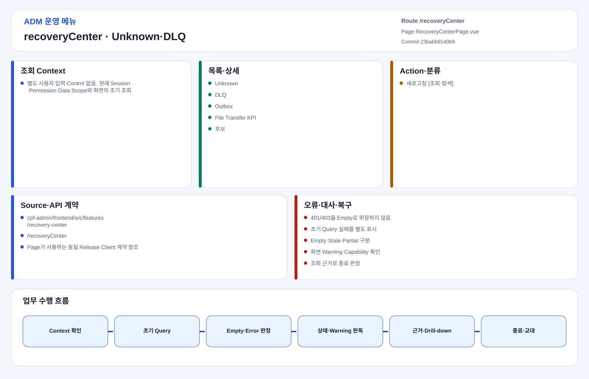

### 이 장에서 끝내는 업무

Unknown·DLQ·Outbox·File Transfer 복구 후보를 한곳에서 탐지한다.

### 메뉴 식별·책임

| 항목 | 값 |
|---|---|
| Route | `/recoveryCenter` |
| 메뉴 ID | `recoveryCenter` |
| Menu Code | `recoveryCenter` |
| 업무 그룹 | 통합 관제 |
| Frontend Page | `cpf-admin/frontend/src/features/recovery-center/RecoveryCenterPage.vue` |
| Permission | 조회 권한 |
| 기준 Commit | `23babb9140b90e501d6ac715e7b77f55b66198a5` |

### Source·API 근거

| 구분 | 기준 |
|---|---|
| Frontend Page | `cpf-admin/frontend/src/features/recovery-center/RecoveryCenterPage.vue` |
| Router | `/recoveryCenter` |
| API 추적 | 화면에서 제공하는 기능을 통해 호출한다. 문서에 명시되지 않은 Endpoint를 Browser나 외부 Script에서 임의 호출하지 않는다. |

아래 표는 이 메뉴에서 실제로 확인·입력·실행할 항목을 정리한다. 화면에 없는 Field·Button·상태를 임의로 가정하지 않는다.

### 검색·입력 Field

별도 사용자 입력 Control이 없다. 현재 Session·Permission·Data Scope와 Page가 정의한 초기 Query로 데이터를 읽는다. 새로고침은 같은 Context를 다시 조회하며 Owner 데이터는 변경하지 않는다.

### 목록 Column·상세 Field

| 표시값 | 운영 의미 | 교차 확인 |
|---|---|---|
| `Unknown` | 오류·Drift·결과 불명 범위를 나타내며 원인과 복구 Owner를 연결해야 한다. | 원인 식별자·실패 Stage·마지막 갱신 시각을 상세와 대조한다. |
| `DLQ` | 오류·Drift·결과 불명 범위를 나타내며 원인과 복구 Owner를 연결해야 한다. | 원인 식별자·실패 Stage·마지막 갱신 시각을 상세와 대조한다. |
| `Outbox` | Unknown·DLQ·Outbox·File Transfer 통합 조회 상세에서 대상의 현재 속성 또는 처리 결과를 확인하는 값이다. | 상세·재조회 결과와 비교하고 Stale·Masking·단위 차이를 확인한다. |
| `File Transfer KPI` | Unknown·DLQ·Outbox·File Transfer 통합 조회 상세에서 대상의 현재 속성 또는 처리 결과를 확인하는 값이다. | 상세·재조회 결과와 비교하고 Stale·Masking·단위 차이를 확인한다. |
| `후보` | Unknown·DLQ·Outbox·File Transfer 통합 조회 상세에서 대상의 현재 속성 또는 처리 결과를 확인하는 값이다. | 상세·재조회 결과와 비교하고 Stale·Masking·단위 차이를 확인한다. |

#### 결과 판독 순서

1. 조회 완료 시각·Filter·Paging·Sort와 화면 Warning을 확인한다.
2. Empty·Stale·Partial을 정상 0건과 구분한다.
3. 식별자·상태·Version·오류·시각을 같은 Query Context의 상세와 Owner 원장에서 비교한다.
4. Masking된 값은 Raw Permission과 Reason 없이 복원·Export하지 않는다.
5. 집계와 상세가 다르면 집계 시간 창·Timezone·Owner Update 시각을 맞춰 대사한다.

### Button·Action

| Action | 분류 | 활성 조건 | Side Effect·정상 결과 |
|---|---|---|---|
| **새로고침** | 조회·탐색 | 조회 Permission과 Query Validation을 충족하고 동일 조회가 진행 중이 아님 | 새로고침 결과의 조회 시각·Filter·Source Version·Warning이 갱신되며 Owner 데이터는 변경하지 않는다. |

### 정상 업무 전체 절차

1. `/recoveryCenter`에 진입해 Page Header와 Route가 **Unknown·DLQ·Outbox·File Transfer 통합 조회** 기능을 가리키는지 확인한다.
2. 로그인 Session·Environment·Data Scope·기준일·Timezone을 고정한다.
3. 별도 사용자 입력 없이 초기 조회가 끝날 때까지 기다리고, 필요할 때만 같은 Context로 새로고침한다.
4. Loading 종료 후 Empty·Error·Stale·Partial 상태와 화면 Warning을 먼저 판정한다.
5. **Unknown, DLQ, Outbox, File Transfer KPI, 후보**를 읽고 식별자·상태·Version·시각을 Owner 원장과 대사한다.
6. 화면이 제공하는 Log·Metric·Trace와 조회·Raw·Export 접근 기록이 있으면 해당 Audit를 교차 확인한다.
7. 이 장의 **종료 판정**과 다음 확인 시각·Evidence Link를 교대 기록에 남긴다.

### 메뉴 고유 판정·금지 사항

- **목적:** Unknown·DLQ·Outbox·File Transfer 복구 후보를 한곳에서 탐지한다.
- **종료 판정:** 조치는 원본 Reliability·Batch·File 메뉴에서 수행하고 후보 중복을 제거한다.
- 조회 화면에서 직접 Owner 데이터를 변경하거나 Browser Tool로 우회하지 않는다.
- Partial 조회를 정상 전체 결과로 합치지 않는다.

### 오류·경계·동시성·복구

| 상황 | 화면 징후 | 운영 조치 | 종료 증적 |
|---|---|---|---|
| 401·Session | Session 만료·CSRF·Origin 실패 | 로그인 상태와 BFF Session을 확인한 뒤 같은 Query Context로 다시 조회한다. | 401/403 응답·Session Audit |
| 403·Data Scope | 메뉴·Button·Raw·Export가 거부됨 | Menu·Button·API·Owner Permission과 Data Scope를 확인하고 우회하지 않는다. | Deny Audit·요청 Permission |
| Timeout·Dependency | 일부 조회 Source 응답 지연 | Correlation ID·Query Context·실패 Source를 기록하고 같은 조건으로 재조회한다. | 조회 시각·실패 Source·재조회 결과 |
| Partial·Stale | 일부 대상만 Success 또는 조회 Source 누락 | 성공·실패·미응답을 분리하고 누락 범위와 Version을 표시한다. | Target별 결과·Version |

### 응답 유실·부분 조회 처리

1. 검색 조건·Data Scope·Paging·조회 시각·Correlation ID를 기록한다.
2. 같은 조건으로 재조회하되 실패 Source만 분리한다.
3. 정상 Source 결과를 유지하고 실패·Stale Source를 명시한다.
4. 집계와 원본 상세가 다르면 Owner 상세를 기준으로 Reconcile Case를 연다.
5. 조회 시각·Source Version·0건 또는 일치 결과를 증적으로 남긴다.

### Log·Metric·Trace·Audit와 교대 기록

| 증적 | 필수 값 |
|---|---|
| Audit | Actor·Permission·Data Scope·Raw/Export 접근·Query Context·Result |
| Log | Environment·Instance·operationId·transactionId·failureStage·errorCode |
| Metric | 동일 시간 창의 Success·Failure·Latency·Queue·Retry·Partial·Unknown |
| Trace | root/segment/attempt·Owner·DB/Kafka/외부 의존성 Span |
| 상태 원장 | Target ID·Version·Checksum·Desired/Actual·Last Updated·Terminal 여부 |

```text
Menu=
Route=
Environment=
DataScope=
Query=
QueryAt=
CorrelationId=
SourceVersion=
Result=SUCCESS|EMPTY|STALE|PARTIAL|FAILED
FailedSources=
EvidenceLinks=
NextCheckAt=
```

### 실무 Workbook

**상황:** Unknown·DLQ·Outbox·File Transfer 복구 후보를 한곳에서 탐지한다. 화면이 일부 Source Timeout 때문에 Partial 결과를 표시했다.

1. Query·Data Scope·조회 시각·Correlation ID를 기록한다.
2. 정상 결과를 0건으로 덮어쓰지 않고 실패 Source만 재조회한다.
3. Unknown, DLQ, Outbox 값을 원본 상세와 같은 시간 기준으로 비교한다.
4. 불일치가 계속되면 Incident 또는 Reconcile Case를 생성한다.
5. 조치는 원본 Reliability·Batch·File 메뉴에서 수행하고 후보 중복을 제거한다.
6. Source Version과 다음 확인 시각을 교대 기록에 남긴다.

### 독립 수행 검수 Checklist

- [ ] `/recoveryCenter`와 Page Source를 찾고 화면 목적을 설명할 수 있다.
- [ ] 별도 사용자 입력이 없고 자동 Query Context·새로고침 동작을 설명할 수 있다.
- [ ] 5개 표시값을 Owner 상태·Version·Audit와 대사할 수 있다.
- [ ] 1개 Action의 분류·활성 조건·Side Effect를 설명할 수 있다.
- [ ] Empty·401·403·Timeout·Stale·Partial을 서로 다른 조회 상태로 처리할 수 있다.
- [ ] 조회 응답 유실 시 같은 Query Context로 재조회하고 Correlation ID·조회 시각·Source Version으로 결과를 대사할 수 있다.
- [ ] 교대 기록만으로 다음 담당자가 Target·상태·복구 기한을 이어받을 수 있다.

## 23. incidents — Incident Lifecycle

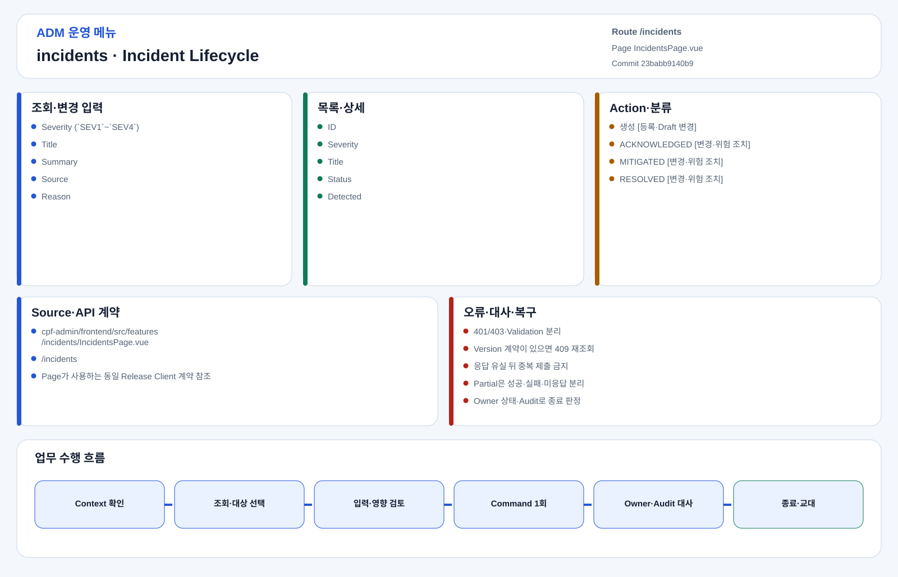

### 이 장에서 끝내는 업무

Incident를 생성하고 ACKNOWLEDGED·MITIGATED·RESOLVED로 전이한다.

### 메뉴 식별·책임

| 항목 | 값 |
|---|---|
| Route | `/incidents` |
| 메뉴 ID | `incidents` |
| Menu Code | `incidents` |
| 업무 그룹 | 통합 관제 |
| Frontend Page | `cpf-admin/frontend/src/features/incidents/IncidentsPage.vue` |
| Permission | Incident Write |
| 기준 Commit | `23babb9140b90e501d6ac715e7b77f55b66198a5` |

### Source·API 근거

| 구분 | 기준 |
|---|---|
| Frontend Page | `cpf-admin/frontend/src/features/incidents/IncidentsPage.vue` |
| Router | `/incidents` |
| API 추적 | 화면에서 제공하는 기능을 통해 호출한다. 문서에 명시되지 않은 Endpoint를 Browser나 외부 Script에서 임의 호출하지 않는다. |

아래 표는 이 메뉴에서 실제로 확인·입력·실행할 항목을 정리한다. 화면에 없는 Field·Button·상태를 임의로 가정하지 않는다.

### 검색·입력 Field

| Field | Control | 업무 의미 | 기본값·Validation·주의 |
|---|---|---|---|
| `Severity (`SEV1`~`SEV4`)` | Select·검색 | Incident Lifecycle 화면의 조회 조건 또는 편집 Form에 포함되는 값이며 화면 Label과 Help를 기준으로 사용한다. | 허용 목록과 현재 Environment·Data Scope에 맞는 값만 선택한다. |
| `Title` | 문자열 입력·검색 | 대상의 표시명 또는 업무명을 검색·입력한다. | 앞뒤 공백·허용 문자·길이와 대소문자 규칙을 확인한다. |
| `Summary` | 다중행 입력 | 작업 목적·영향 범위·승인 또는 복구 기준을 기록해 Audit와 교대 기록에 연결한다. | 허용 Schema·길이·민감정보 포함 여부를 확인하고 Preview 또는 Validation 결과를 검토한다. |
| `Source` | 문자열 입력·검색 | Incident Lifecycle 화면의 조회 조건 또는 편집 Form에 포함되는 값이며 화면 Label과 Help를 기준으로 사용한다. | 앞뒤 공백·허용 문자·길이와 대소문자 규칙을 확인한다. |
| `Reason` | 다중행 입력 | 작업 목적·영향 범위·승인 또는 복구 기준을 기록해 Audit와 교대 기록에 연결한다. | Ticket·영향 범위·복구점을 포함하고 화면이 요구하는 최소 길이를 충족한다. |

#### 입력 순서

1. **Severity (`SEV1`~`SEV4`)** 항목이 조회 Control인지 변경 Form인지 화면 위치로 구분하고, 표시된 값·필수 여부·허용 형식을 확인한다.
2. **Title** 항목이 조회 Control인지 변경 Form인지 화면 위치로 구분하고, 표시된 값·필수 여부·허용 형식을 확인한다.
3. **Summary** 항목이 조회 Control인지 변경 Form인지 화면 위치로 구분하고, 표시된 값·필수 여부·허용 형식을 확인한다.
4. **Source** 항목이 조회 Control인지 변경 Form인지 화면 위치로 구분하고, 표시된 값·필수 여부·허용 형식을 확인한다.
5. **Reason** 항목이 조회 Control인지 변경 Form인지 화면 위치로 구분하고, 표시된 값·필수 여부·허용 형식을 확인한다.
6. 조회 Control과 변경 Form을 분리해 기록하고, 실행 전 Environment·Data Scope·Timezone과 제출할 값만 다시 검토한다.

### 목록 Column·상세 Field

| 표시값 | 운영 의미 | 교차 확인 |
|---|---|---|
| `ID` | Incident Lifecycle의 대상 레코드를 상세·Owner·Audit에서 연결하는 식별자다. | 상세·Log·Trace·Audit에서 같은 대상을 가리키는지 확인한다. |
| `Severity` | Incident Lifecycle 상세에서 대상의 현재 속성 또는 처리 결과를 확인하는 값이다. | 상세·재조회 결과와 비교하고 Stale·Masking·단위 차이를 확인한다. |
| `Title` | 운영자가 대상을 구분하는 표시명 또는 설명이다. | 상세·재조회 결과와 비교하고 Stale·Masking·단위 차이를 확인한다. |
| `Status` | 현재 상태와 Terminal 여부, 다음 Action 가능 여부를 판단하는 값이다. | Last Updated·Terminal 조건·Owner 상태와 함께 확인한다. |
| `Detected` | 상태 발생·갱신·유효 시점을 나타내며 화면 Timezone을 기준으로 해석한다. | 상세·재조회 결과와 비교하고 Stale·Masking·단위 차이를 확인한다. |

#### 결과 판독 순서

1. 조회 완료 시각·Filter·Paging·Sort와 화면 Warning을 확인한다.
2. Empty·Stale·Partial을 정상 0건과 구분한다.
3. 식별자·상태·Version·오류·시각을 같은 Query Context의 상세와 Owner 원장에서 비교한다.
4. Masking된 값은 Raw Permission과 Reason 없이 복원·Export하지 않는다.
5. 집계와 상세가 다르면 집계 시간 창·Timezone·Owner Update 시각을 맞춰 대사한다.

### Button·Action

| Action | 분류 | 활성 조건 | Side Effect·정상 결과 |
|---|---|---|---|
| **생성** | 등록·Draft 변경 | 화면이 실제로 요구하는 Write Permission·필수 Field·Reason·Version 조건을 충족함 | Incident Lifecycle의 재조회 결과가 요청 내용과 일치한다. Version·Before/After·Audit는 해당 Owner가 제공하는 경우 함께 확인한다. |
| **ACKNOWLEDGED** | 변경·위험 조치 | 화면과 Owner가 요구하는 Write Permission·대상 상태·영향 범위·Reason·승인·Version 조건을 충족함 | 변경 Operation을 생성하고 Accepted 응답과 Owner Terminal 상태·Version·Audit를 분리해 확인한다. |
| **MITIGATED** | 변경·위험 조치 | 화면과 Owner가 요구하는 Write Permission·대상 상태·영향 범위·Reason·승인·Version 조건을 충족함 | 변경 Operation을 생성하고 Accepted 응답과 Owner Terminal 상태·Version·Audit를 분리해 확인한다. |
| **RESOLVED** | 변경·위험 조치 | 화면과 Owner가 요구하는 Write Permission·대상 상태·영향 범위·Reason·승인·Version 조건을 충족함 | 변경 Operation을 생성하고 Accepted 응답과 Owner Terminal 상태·Version·Audit를 분리해 확인한다. |

### 정상 업무 전체 절차

1. `/incidents`에 진입해 Page Header와 Route가 **Incident Lifecycle** 기능을 가리키는지 확인한다.
2. 로그인 Session·Environment·Data Scope·기준일·Timezone을 고정한다.
3. 화면의 조회 Control과 변경 Form을 구분한다. 조회 조건이 제공되면 먼저 조회하고, 변경 Form은 대상 선택 또는 등록 Action 뒤에 열린 실제 Field만 사용한다.
4. Loading 종료 후 Empty·Error·Stale·Partial 상태와 화면 Warning을 먼저 판정한다.
5. **ID, Severity, Title, Status, Detected**를 읽고 식별자·상태·Version·시각을 Owner 원장과 대사한다.
6. **생성** 전에 화면과 Owner가 실제로 요구하는 Permission·현재 상태·영향 범위·Reason·승인·Version 조건을 확인하고 한 번만 제출한다.
7. **생성**의 HTTP 응답과 재조회 결과를 확인한다. 비동기·다중 대상 기능은 Owner Terminal 상태·Version·대상별 Success/Failed/Unknown·Audit를 별도로 확인한다.
8. **ACKNOWLEDGED** 전에 화면과 Owner가 실제로 요구하는 Permission·현재 상태·영향 범위·Reason·승인·Version 조건을 확인하고 한 번만 제출한다.
9. **ACKNOWLEDGED**의 HTTP 응답과 재조회 결과를 확인한다. 비동기·다중 대상 기능은 Owner Terminal 상태·Version·대상별 Success/Failed/Unknown·Audit를 별도로 확인한다.
10. **MITIGATED** 전에 화면과 Owner가 실제로 요구하는 Permission·현재 상태·영향 범위·Reason·승인·Version 조건을 확인하고 한 번만 제출한다.
11. **MITIGATED**의 HTTP 응답과 재조회 결과를 확인한다. 비동기·다중 대상 기능은 Owner Terminal 상태·Version·대상별 Success/Failed/Unknown·Audit를 별도로 확인한다.
12. **RESOLVED** 전에 화면과 Owner가 실제로 요구하는 Permission·현재 상태·영향 범위·Reason·승인·Version 조건을 확인하고 한 번만 제출한다.
13. **RESOLVED**의 HTTP 응답과 재조회 결과를 확인한다. 비동기·다중 대상 기능은 Owner Terminal 상태·Version·대상별 Success/Failed/Unknown·Audit를 별도로 확인한다.
14. 화면이 제공하는 Log·Metric·Trace와, 변경·Export·승인 조치에 생성된 Audit를 교차 확인한다.
15. 이 장의 **종료 판정**과 다음 확인 시각·Evidence Link를 교대 기록에 남긴다.

### 메뉴 고유 판정·금지 사항

- **목적:** Incident를 생성하고 ACKNOWLEDGED·MITIGATED·RESOLVED로 전이한다.
- **종료 판정:** 각 전이의 Reason·영향·복구 증적과 다음 확인 시각을 기록한다.
- 응답을 받지 못한 경우 Owner 상태와 기존 Operation을 확인하기 전에 동일 Action을 반복하지 않는다.
- HTTP 성공 응답이나 Toast만으로 비동기 Owner 상태 또는 다중 대상 적용을 확정하지 않는다.

### 오류·경계·동시성·복구

| 상황 | 화면 징후 | 운영 조치 | 종료 증적 |
|---|---|---|---|
| 401·Session | Session 만료·CSRF·Origin 실패 | 로그인 상태와 BFF Session을 확인한다. Command 자동 Replay는 금지한다. | 401/403 응답·Session Audit |
| 403·Data Scope | 메뉴·Button·Raw·Export가 거부됨 | Menu·Button·API·Owner Permission과 Data Scope를 확인하고 우회하지 않는다. | Deny Audit·요청 Permission |
| Validation | 필수값·범위·형식·기간 오류 | Field Error만 수정하고 기존 성공 Operation을 다시 제출하지 않는다. | Error Code·Field·입력값 |
| Timeout·Dependency | 일부 Source 또는 Command 응답 지연 | Correlation/Operation ID와 실패 Stage를 기록하고 Owner 상태를 조회한다. | Dependency 상태·Retryability |
| Partial·Stale | 일부 대상만 Success 또는 조회 Source 누락 | 성공·실패·미응답을 분리하고 누락 범위와 Version을 표시한다. | Target별 결과·Version |
| 409·동시 변경 | Expected Version 불일치 | 최신 상세를 재조회하고 Diff·영향을 다시 검토한 뒤 새 요청으로 제출한다. | 현재/요청 Version·변경자 |
| 응답 유실·Unknown | 요청 후 실제 처리 여부를 알 수 없음 | Operation ID·Request Hash·Audit·Owner 상태로 대사하고 중복 제출하지 않는다. | Operation·Owner·Audit |
| 복구 실패 | Retry/Rollback 뒤에도 상태 불일치 | 자동 반복을 중단하고 Incident·Reconcile Case·다음 확인 시각을 기록한다. | Case ID·복구 Owner·기한 |

### 응답 유실·결과 불명·부분 적용 처리

1. 동일 Action을 다시 누르지 않고 Browser Network와 응답 Header를 보존한다. `operationId`·`transactionId`·`idempotencyKey`가 제공되면 기록하고, 없으면 Target ID·Actor·요청 시각·Request Body Hash로 대사한다.
2. 기능이 제공하는 상세·Operation Status(있는 경우)·Audit에서 Request Hash와 대상 Version을 검색한다.
3. Side Effect 전 실패가 확인된 경우에만 새 요청을 검토한다.
4. Success·Failed·Unknown 대상을 분리하고 Source가 제공하는 Failed-only Retry·Compensation·Rollback을 선택하고, 지원되지 않으면 수동 Reconcile Case로 이관한다.
5. Rollback을 지원하는 기능은 Owner Version·Checksum·업무 합계가 Rollback Point와 일치하는지 확인한다.
6. 확정되지 않은 대상은 `UNKNOWN_RESULT`로 유지하고 담당자·대사 기한·다음 확인 시각을 기록한다.

### Log·Metric·Trace·Audit와 교대 기록

| 증적 | 필수 값 |
|---|---|
| Audit | Actor·Permission·Reason·Approval·Target·Before/After·Result·Recovery Action |
| Log | Environment·Instance·operationId·transactionId·failureStage·errorCode |
| Metric | 동일 시간 창의 Success·Failure·Latency·Queue·Retry·Partial·Unknown |
| Trace | root/segment/attempt·Owner·DB/Kafka/외부 의존성 Span |
| 상태 원장 | Target ID·Version·Checksum·Desired/Actual·Last Updated·Terminal 여부 |

```text
Menu=incidents
Route=/incidents
Environment=
DataScope=
Query=
TargetId=
BeforeVersion=
Action=
Reason=
ApprovalId=
OperationId=
TransactionId=
Result=SUCCESS|FAILED|PARTIAL|UNKNOWN_RESULT
OwnerState=
FailedTargets=
ReconcileBy=
RollbackPoint=
EvidenceLinks=
NextCheckAt=
```

### 실무 Workbook

**상황:** Incident를 생성하고 ACKNOWLEDGED·MITIGATED·RESOLVED로 전이한다. 담당자가 **생성**을 수행한 뒤 Browser 응답을 받지 못했다.

1. 대상 식별자와 Before Version, 입력값, Reason·Approval을 작업 기록에서 확인한다.
2. 동일 **생성**을 반복하지 않고 Operation·Audit·Owner 상태를 조회한다.
3. Owner 상태가 변경됐고 Request Hash가 같으면 응답 유실로 분류해 중복 조치를 금지한다.
4. 일부 대상만 변경됐으면 Success·Failed·Unknown을 분리해 Failed-only Retry 또는 Rollback을 선택한다.
5. 각 전이의 Reason·영향·복구 증적과 다음 확인 시각을 기록한다.
6. Evidence Link와 다음 확인 시각을 교대 기록에 남긴다.

### 독립 수행 검수 Checklist

- [ ] `/incidents`와 Page Source를 찾고 화면 목적을 설명할 수 있다.
- [ ] 5개 입력·검색 항목의 Control·기본값·Validation을 설명할 수 있다.
- [ ] 5개 표시값을 Owner 상태·Version·Audit와 대사할 수 있다.
- [ ] 4개 Action의 분류·활성 조건·Side Effect를 설명할 수 있다.
- [ ] Empty·403·409·Timeout·Partial·Unknown을 서로 다른 상태로 처리할 수 있다.
- [ ] 응답 유실 뒤 중복 제출 없이 Operation·Owner·Audit로 결과를 확정할 수 있다.
- [ ] 교대 기록만으로 다음 담당자가 Target·상태·복구 기한을 이어받을 수 있다.

## 24. reliability — DLQ·Unknown·Batch Log 대사

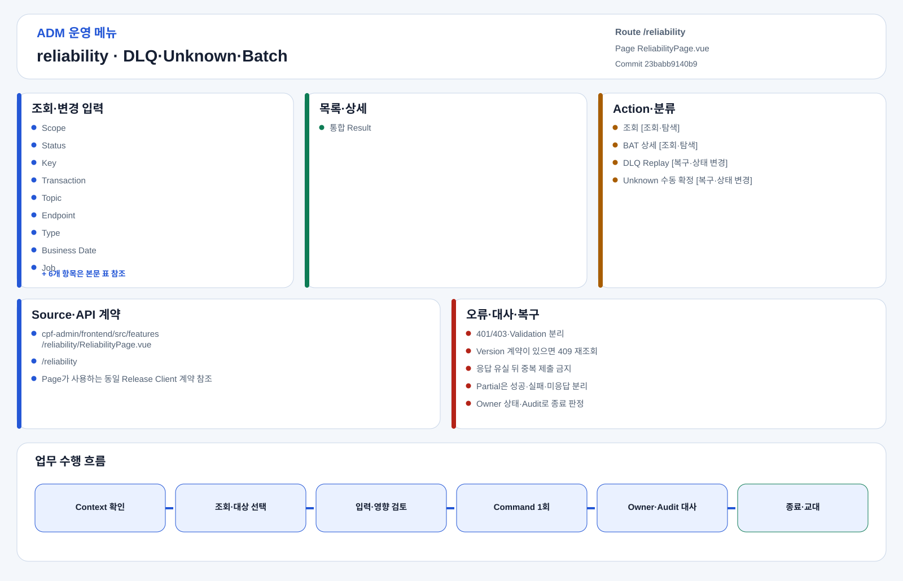

### 이 장에서 끝내는 업무

DLQ·Unknown·Batch 결과를 대사하고 제한된 복구 조치를 수행한다.

### 메뉴 식별·책임

| 항목 | 값 |
|---|---|
| Route | `/reliability` |
| 메뉴 ID | `reliability` |
| Menu Code | `reliability` |
| 업무 그룹 | 통합 관제 |
| Frontend Page | `cpf-admin/frontend/src/features/reliability/ReliabilityPage.vue` |
| Permission | `RELIABILITY` Write |
| 기준 Commit | `23babb9140b90e501d6ac715e7b77f55b66198a5` |

### Source·API 근거

| 구분 | 기준 |
|---|---|
| Frontend Page | `cpf-admin/frontend/src/features/reliability/ReliabilityPage.vue` |
| Router | `/reliability` |
| API 추적 | 화면에서 제공하는 기능을 통해 호출한다. 문서에 명시되지 않은 Endpoint를 Browser나 외부 Script에서 임의 호출하지 않는다. |

아래 표는 이 메뉴에서 실제로 확인·입력·실행할 항목을 정리한다. 화면에 없는 Field·Button·상태를 임의로 가정하지 않는다.

### 검색·입력 Field

| Field | Control | 업무 의미 | 기본값·Validation·주의 |
|---|---|---|---|
| `Scope` | Select·검색 | DLQ·Unknown·Batch Log 대사 조회·조치가 적용되는 환경과 데이터 경계를 제한한다. | 허용 목록과 현재 Environment·Data Scope에 맞는 값만 선택한다. |
| `Status` | Select·검색 | 현재 상태를 조회하거나 다음 Action의 허용 조건을 지정한다. | 허용 목록과 현재 Environment·Data Scope에 맞는 값만 선택한다. |
| `Key` | 문자열 입력·검색 | 조회·상세·Audit에서 같은 대상을 다시 찾기 위한 식별 조건이다. | 앞뒤 공백·허용 문자·길이와 대소문자 규칙을 확인한다. |
| `Transaction` | Select·검색 | DLQ·Unknown·Batch Log 대사에서 적용하거나 조회할 정책·권한·처리 유형을 선택한다. | 허용 목록과 현재 Environment·Data Scope에 맞는 값만 선택한다. |
| `Topic` | 날짜·시간 입력 | 조회 또는 적용의 유효 시간 범위를 정하며 Timezone과 시작·종료 순서를 함께 확인한다. | Timezone을 고정하고 시작≤종료·유효기간 겹침·기준일 포함 여부를 확인한다. |
| `Endpoint` | 문자열 입력·검색 | 조회·상세·Audit에서 같은 대상을 다시 찾기 위한 식별 조건이다. | 앞뒤 공백·허용 문자·길이와 대소문자 규칙을 확인한다. |
| `Type` | Select·검색 | DLQ·Unknown·Batch Log 대사에서 적용하거나 조회할 정책·권한·처리 유형을 선택한다. | 허용 목록과 현재 Environment·Data Scope에 맞는 값만 선택한다. |
| `Business Date` | 날짜·시간 입력 | 조회 또는 적용의 유효 시간 범위를 정하며 Timezone과 시작·종료 순서를 함께 확인한다. | Timezone을 고정하고 시작≤종료·유효기간 겹침·기준일 포함 여부를 확인한다. |
| `Job` | 문자열 입력·검색 | 조회·상세·Audit에서 같은 대상을 다시 찾기 위한 식별 조건이다. | 앞뒤 공백·허용 문자·길이와 대소문자 규칙을 확인한다. |
| `Instance` | 문자열 입력·검색 | 조회·상세·Audit에서 같은 대상을 다시 찾기 위한 식별 조건이다. | 앞뒤 공백·허용 문자·길이와 대소문자 규칙을 확인한다. |
| `Limit` | 숫자·Version 입력 | 실행 한도·순서·용량 또는 재시도 범위를 지정한다. | 화면의 min·max·단위와 0 허용 여부를 확인하고 음수·Overflow를 차단한다. |
| `Message` | 문자열 입력·검색 | DLQ·Unknown·Batch Log 대사 화면의 조회 조건 또는 편집 Form에 포함되는 값이며 화면 Label과 Help를 기준으로 사용한다. | 앞뒤 공백·허용 문자·길이와 대소문자 규칙을 확인한다. |
| `Unknown ID` | 문자열 입력·검색 | 조회·상세·Audit에서 같은 대상을 다시 찾기 위한 식별 조건이다. | 앞뒤 공백·허용 문자·길이와 대소문자 규칙을 확인한다. |
| `Target Status` | Select·검색 | 현재 상태를 조회하거나 다음 Action의 허용 조건을 지정한다. | 허용 목록과 현재 Environment·Data Scope에 맞는 값만 선택한다. |
| `Reason` | 다중행 입력 | 작업 목적·영향 범위·승인 또는 복구 기준을 기록해 Audit와 교대 기록에 연결한다. | Ticket·영향 범위·복구점을 포함하고 화면이 요구하는 최소 길이를 충족한다. |

#### 입력 순서

1. **Scope** 항목이 조회 Control인지 변경 Form인지 화면 위치로 구분하고, 표시된 값·필수 여부·허용 형식을 확인한다.
2. **Status** 항목이 조회 Control인지 변경 Form인지 화면 위치로 구분하고, 표시된 값·필수 여부·허용 형식을 확인한다.
3. **Key** 항목이 조회 Control인지 변경 Form인지 화면 위치로 구분하고, 표시된 값·필수 여부·허용 형식을 확인한다.
4. **Transaction** 항목이 조회 Control인지 변경 Form인지 화면 위치로 구분하고, 표시된 값·필수 여부·허용 형식을 확인한다.
5. **Topic** 항목이 조회 Control인지 변경 Form인지 화면 위치로 구분하고, 표시된 값·필수 여부·허용 형식을 확인한다.
6. **Endpoint** 항목이 조회 Control인지 변경 Form인지 화면 위치로 구분하고, 표시된 값·필수 여부·허용 형식을 확인한다.
7. **Type** 항목이 조회 Control인지 변경 Form인지 화면 위치로 구분하고, 표시된 값·필수 여부·허용 형식을 확인한다.
8. **Business Date** 항목이 조회 Control인지 변경 Form인지 화면 위치로 구분하고, 표시된 값·필수 여부·허용 형식을 확인한다.
9. **Job** 항목이 조회 Control인지 변경 Form인지 화면 위치로 구분하고, 표시된 값·필수 여부·허용 형식을 확인한다.
10. **Instance** 항목이 조회 Control인지 변경 Form인지 화면 위치로 구분하고, 표시된 값·필수 여부·허용 형식을 확인한다.
11. **Limit** 항목이 조회 Control인지 변경 Form인지 화면 위치로 구분하고, 표시된 값·필수 여부·허용 형식을 확인한다.
12. **Message** 항목이 조회 Control인지 변경 Form인지 화면 위치로 구분하고, 표시된 값·필수 여부·허용 형식을 확인한다.
13. **Unknown ID** 항목이 조회 Control인지 변경 Form인지 화면 위치로 구분하고, 표시된 값·필수 여부·허용 형식을 확인한다.
14. **Target Status** 항목이 조회 Control인지 변경 Form인지 화면 위치로 구분하고, 표시된 값·필수 여부·허용 형식을 확인한다.
15. **Reason** 항목이 조회 Control인지 변경 Form인지 화면 위치로 구분하고, 표시된 값·필수 여부·허용 형식을 확인한다.
16. 조회 Control과 변경 Form을 분리해 기록하고, 실행 전 Environment·Data Scope·Timezone과 제출할 값만 다시 검토한다.

### 목록 Column·상세 Field

| 표시값 | 운영 의미 | 교차 확인 |
|---|---|---|
| `통합 Result` | 여러 Source의 결과를 합친 영역이며 Partial·Stale·Warning을 함께 판독해야 한다. | Last Updated·Terminal 조건·Owner 상태와 함께 확인한다. |

#### 결과 판독 순서

1. 조회 완료 시각·Filter·Paging·Sort와 화면 Warning을 확인한다.
2. Empty·Stale·Partial을 정상 0건과 구분한다.
3. 식별자·상태·Version·오류·시각을 같은 Query Context의 상세와 Owner 원장에서 비교한다.
4. Masking된 값은 Raw Permission과 Reason 없이 복원·Export하지 않는다.
5. 집계와 상세가 다르면 집계 시간 창·Timezone·Owner Update 시각을 맞춰 대사한다.

### Button·Action

| Action | 분류 | 활성 조건 | Side Effect·정상 결과 |
|---|---|---|---|
| **조회** | 조회·탐색 | 조회 Permission과 Query Validation을 충족하고 동일 조회가 진행 중이 아님 | 조회 결과의 조회 시각·Filter·Source Version·Warning이 갱신되며 Owner 데이터는 변경하지 않는다. |
| **BAT 상세** | 조회·탐색 | 조회 Permission과 Query Validation을 충족하고 동일 조회가 진행 중이 아님 | BAT 상세 결과의 조회 시각·Filter·Source Version·Warning이 갱신되며 Owner 데이터는 변경하지 않는다. |
| **DLQ Replay** | 복구·상태 변경 | 화면과 Owner가 요구하는 복구 Permission·대상 상태·Reason·승인·Version 조건을 충족함 | 복구 Operation을 생성하고 Owner 상태·대상별 결과·Audit로 종료를 판정한다. |
| **Unknown 수동 확정** | 복구·상태 변경 | 화면과 Owner가 요구하는 복구 Permission·대상 상태·Reason·승인·Version 조건을 충족함 | 복구 Operation을 생성하고 Owner 상태·대상별 결과·Audit로 종료를 판정한다. |

### 정상 업무 전체 절차

1. `/reliability`에 진입해 Page Header와 Route가 **DLQ·Unknown·Batch Log 대사** 기능을 가리키는지 확인한다.
2. 로그인 Session·Environment·Data Scope·기준일·Timezone을 고정한다.
3. 화면의 조회 Control과 변경 Form을 구분한다. 조회 조건이 제공되면 먼저 조회하고, 변경 Form은 대상 선택 또는 등록 Action 뒤에 열린 실제 Field만 사용한다.
4. Loading 종료 후 Empty·Error·Stale·Partial 상태와 화면 Warning을 먼저 판정한다.
5. **통합 Result**를 읽고 식별자·상태·Version·시각을 Owner 원장과 대사한다.
6. **DLQ Replay** 전에 화면과 Owner가 실제로 요구하는 Permission·현재 상태·영향 범위·Reason·승인·Version 조건을 확인하고 한 번만 제출한다.
7. **DLQ Replay**의 HTTP 응답과 재조회 결과를 확인한다. 비동기·다중 대상 기능은 Owner Terminal 상태·Version·대상별 Success/Failed/Unknown·Audit를 별도로 확인한다.
8. **Unknown 수동 확정** 전에 화면과 Owner가 실제로 요구하는 Permission·현재 상태·영향 범위·Reason·승인·Version 조건을 확인하고 한 번만 제출한다.
9. **Unknown 수동 확정**의 HTTP 응답과 재조회 결과를 확인한다. 비동기·다중 대상 기능은 Owner Terminal 상태·Version·대상별 Success/Failed/Unknown·Audit를 별도로 확인한다.
10. 화면이 제공하는 Log·Metric·Trace와, 변경·Export·승인 조치에 생성된 Audit를 교차 확인한다.
11. 이 장의 **종료 판정**과 다음 확인 시각·Evidence Link를 교대 기록에 남긴다.

### 메뉴 고유 판정·금지 사항

- **목적:** DLQ·Unknown·Batch 결과를 대사하고 제한된 복구 조치를 수행한다.
- **종료 판정:** Side Effect 근거 없이 성공 확정하지 않고 Message·Owner·Ledger를 대사한다.
- 응답을 받지 못한 경우 Owner 상태와 기존 Operation을 확인하기 전에 동일 Action을 반복하지 않는다.
- HTTP 성공 응답이나 Toast만으로 비동기 Owner 상태 또는 다중 대상 적용을 확정하지 않는다.

### 오류·경계·동시성·복구

| 상황 | 화면 징후 | 운영 조치 | 종료 증적 |
|---|---|---|---|
| 401·Session | Session 만료·CSRF·Origin 실패 | 로그인 상태와 BFF Session을 확인한다. Command 자동 Replay는 금지한다. | 401/403 응답·Session Audit |
| 403·Data Scope | 메뉴·Button·Raw·Export가 거부됨 | Menu·Button·API·Owner Permission과 Data Scope를 확인하고 우회하지 않는다. | Deny Audit·요청 Permission |
| Validation | 필수값·범위·형식·기간 오류 | Field Error만 수정하고 기존 성공 Operation을 다시 제출하지 않는다. | Error Code·Field·입력값 |
| Timeout·Dependency | 일부 Source 또는 Command 응답 지연 | Correlation/Operation ID와 실패 Stage를 기록하고 Owner 상태를 조회한다. | Dependency 상태·Retryability |
| Partial·Stale | 일부 대상만 Success 또는 조회 Source 누락 | 성공·실패·미응답을 분리하고 누락 범위와 Version을 표시한다. | Target별 결과·Version |
| 409·동시 변경 | Expected Version 불일치 | 최신 상세를 재조회하고 Diff·영향을 다시 검토한 뒤 새 요청으로 제출한다. | 현재/요청 Version·변경자 |
| 응답 유실·Unknown | 요청 후 실제 처리 여부를 알 수 없음 | Operation ID·Request Hash·Audit·Owner 상태로 대사하고 중복 제출하지 않는다. | Operation·Owner·Audit |
| 복구 실패 | Retry/Rollback 뒤에도 상태 불일치 | 자동 반복을 중단하고 Incident·Reconcile Case·다음 확인 시각을 기록한다. | Case ID·복구 Owner·기한 |

### 응답 유실·결과 불명·부분 적용 처리

1. 동일 Action을 다시 누르지 않고 Browser Network와 응답 Header를 보존한다. `operationId`·`transactionId`·`idempotencyKey`가 제공되면 기록하고, 없으면 Target ID·Actor·요청 시각·Request Body Hash로 대사한다.
2. 기능이 제공하는 상세·Operation Status(있는 경우)·Audit에서 Request Hash와 대상 Version을 검색한다.
3. Side Effect 전 실패가 확인된 경우에만 새 요청을 검토한다.
4. Success·Failed·Unknown 대상을 분리하고 Source가 제공하는 Failed-only Retry·Compensation·Rollback을 선택하고, 지원되지 않으면 수동 Reconcile Case로 이관한다.
5. Rollback을 지원하는 기능은 Owner Version·Checksum·업무 합계가 Rollback Point와 일치하는지 확인한다.
6. 확정되지 않은 대상은 `UNKNOWN_RESULT`로 유지하고 담당자·대사 기한·다음 확인 시각을 기록한다.

### Log·Metric·Trace·Audit와 교대 기록

| 증적 | 필수 값 |
|---|---|
| Audit | Actor·Permission·Reason·Approval·Target·Before/After·Result·Recovery Action |
| Log | Environment·Instance·operationId·transactionId·failureStage·errorCode |
| Metric | 동일 시간 창의 Success·Failure·Latency·Queue·Retry·Partial·Unknown |
| Trace | root/segment/attempt·Owner·DB/Kafka/외부 의존성 Span |
| 상태 원장 | Target ID·Version·Checksum·Desired/Actual·Last Updated·Terminal 여부 |

```text
Menu=reliability
Route=/reliability
Environment=
DataScope=
Query=
TargetId=
BeforeVersion=
Action=
Reason=
ApprovalId=
OperationId=
TransactionId=
Result=SUCCESS|FAILED|PARTIAL|UNKNOWN_RESULT
OwnerState=
FailedTargets=
ReconcileBy=
RollbackPoint=
EvidenceLinks=
NextCheckAt=
```

### 실무 Workbook

**상황:** DLQ·Unknown·Batch 결과를 대사하고 제한된 복구 조치를 수행한다. 담당자가 **DLQ Replay**을 수행한 뒤 Browser 응답을 받지 못했다.

1. 대상 식별자와 Before Version, 입력값, Reason·Approval을 작업 기록에서 확인한다.
2. 동일 **DLQ Replay**을 반복하지 않고 Operation·Audit·Owner 상태를 조회한다.
3. Owner 상태가 변경됐고 Request Hash가 같으면 응답 유실로 분류해 중복 조치를 금지한다.
4. 일부 대상만 변경됐으면 Success·Failed·Unknown을 분리해 Failed-only Retry 또는 Rollback을 선택한다.
5. Side Effect 근거 없이 성공 확정하지 않고 Message·Owner·Ledger를 대사한다.
6. Evidence Link와 다음 확인 시각을 교대 기록에 남긴다.

### 독립 수행 검수 Checklist

- [ ] `/reliability`와 Page Source를 찾고 화면 목적을 설명할 수 있다.
- [ ] 15개 입력·검색 항목의 Control·기본값·Validation을 설명할 수 있다.
- [ ] 1개 표시값을 Owner 상태·Version·Audit와 대사할 수 있다.
- [ ] 4개 Action의 분류·활성 조건·Side Effect를 설명할 수 있다.
- [ ] Empty·403·409·Timeout·Partial·Unknown을 서로 다른 상태로 처리할 수 있다.
- [ ] 응답 유실 뒤 중복 제출 없이 Operation·Owner·Audit로 결과를 확정할 수 있다.
- [ ] 교대 기록만으로 다음 담당자가 Target·상태·복구 기한을 이어받을 수 있다.

## 25. notifications — 알림 Rule·Durable Delivery

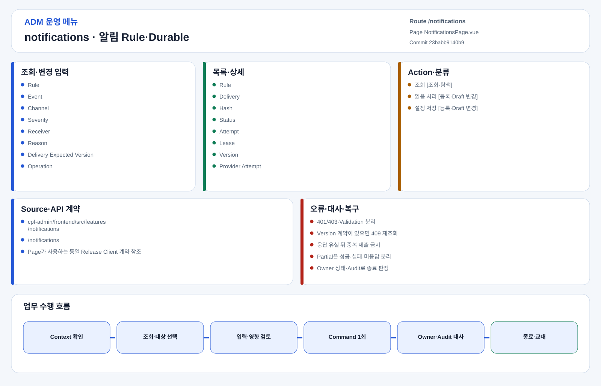

### 이 장에서 끝내는 업무

알림 Rule과 Durable Delivery를 관리한다.

### 메뉴 식별·책임

| 항목 | 값 |
|---|---|
| Route | `/notifications` |
| 메뉴 ID | `notifications` |
| Menu Code | `notifications` |
| 업무 그룹 | 연계 관리 |
| Frontend Page | `cpf-admin/frontend/src/features/notifications/NotificationsPage.vue` |
| Permission | `NOTIFICATION_*` Button Permission |
| 기준 Commit | `23babb9140b90e501d6ac715e7b77f55b66198a5` |

### Source·API 근거

| 구분 | 기준 |
|---|---|
| Frontend Page | `cpf-admin/frontend/src/features/notifications/NotificationsPage.vue` |
| Router | `/notifications` |
| API 추적 | 화면에서 제공하는 기능을 통해 호출한다. 문서에 명시되지 않은 Endpoint를 Browser나 외부 Script에서 임의 호출하지 않는다. |

아래 표는 이 메뉴에서 실제로 확인·입력·실행할 항목을 정리한다. 화면에 없는 Field·Button·상태를 임의로 가정하지 않는다.

### 검색·입력 Field

| Field | Control | 업무 의미 | 기본값·Validation·주의 |
|---|---|---|---|
| `Rule` | 문자열 입력·검색 | 알림 Rule·Durable Delivery 화면의 조회 조건 또는 편집 Form에 포함되는 값이며 화면 Label과 Help를 기준으로 사용한다. | 앞뒤 공백·허용 문자·길이와 대소문자 규칙을 확인한다. |
| `Event` | 문자열 입력·검색 | 알림 Rule·Durable Delivery 화면의 조회 조건 또는 편집 Form에 포함되는 값이며 화면 Label과 Help를 기준으로 사용한다. | 앞뒤 공백·허용 문자·길이와 대소문자 규칙을 확인한다. |
| `Channel` | Select·검색 | 알림 Rule·Durable Delivery에서 적용하거나 조회할 정책·권한·처리 유형을 선택한다. | 허용 목록과 현재 Environment·Data Scope에 맞는 값만 선택한다. |
| `Severity` | Select·검색 | 알림 Rule·Durable Delivery 화면의 조회 조건 또는 편집 Form에 포함되는 값이며 화면 Label과 Help를 기준으로 사용한다. | 허용 목록과 현재 Environment·Data Scope에 맞는 값만 선택한다. |
| `Receiver` | 문자열 입력·검색 | 알림 Rule·Durable Delivery 화면의 조회 조건 또는 편집 Form에 포함되는 값이며 화면 Label과 Help를 기준으로 사용한다. | 앞뒤 공백·허용 문자·길이와 대소문자 규칙을 확인한다. |
| `Reason` | 다중행 입력 | 작업 목적·영향 범위·승인 또는 복구 기준을 기록해 Audit와 교대 기록에 연결한다. | Ticket·영향 범위·복구점을 포함하고 화면이 요구하는 최소 길이를 충족한다. |
| `Delivery Expected Version` | 숫자·Version 입력 | 동시 변경을 막고 요청 대상의 현재 Revision을 확인하는 값이다. | 상세 재조회로 최신 값을 얻고 409 발생 시 기존 값을 덮어쓰지 않는다. |
| `Operation` | 문자열 입력·검색 | 알림 Rule·Durable Delivery 화면의 조회 조건 또는 편집 Form에 포함되는 값이며 화면 Label과 Help를 기준으로 사용한다. | 앞뒤 공백·허용 문자·길이와 대소문자 규칙을 확인한다. |

#### 입력 순서

1. **Rule** 항목이 조회 Control인지 변경 Form인지 화면 위치로 구분하고, 표시된 값·필수 여부·허용 형식을 확인한다.
2. **Event** 항목이 조회 Control인지 변경 Form인지 화면 위치로 구분하고, 표시된 값·필수 여부·허용 형식을 확인한다.
3. **Channel** 항목이 조회 Control인지 변경 Form인지 화면 위치로 구분하고, 표시된 값·필수 여부·허용 형식을 확인한다.
4. **Severity** 항목이 조회 Control인지 변경 Form인지 화면 위치로 구분하고, 표시된 값·필수 여부·허용 형식을 확인한다.
5. **Receiver** 항목이 조회 Control인지 변경 Form인지 화면 위치로 구분하고, 표시된 값·필수 여부·허용 형식을 확인한다.
6. **Reason** 항목이 조회 Control인지 변경 Form인지 화면 위치로 구분하고, 표시된 값·필수 여부·허용 형식을 확인한다.
7. **Delivery Expected Version** 항목이 조회 Control인지 변경 Form인지 화면 위치로 구분하고, 표시된 값·필수 여부·허용 형식을 확인한다.
8. **Operation** 항목이 조회 Control인지 변경 Form인지 화면 위치로 구분하고, 표시된 값·필수 여부·허용 형식을 확인한다.
9. 조회 Control과 변경 Form을 분리해 기록하고, 실행 전 Environment·Data Scope·Timezone과 제출할 값만 다시 검토한다.

### 목록 Column·상세 Field

| 표시값 | 운영 의미 | 교차 확인 |
|---|---|---|
| `Rule` | 알림 Rule·Durable Delivery 상세에서 대상의 현재 속성 또는 처리 결과를 확인하는 값이다. | 상세·재조회 결과와 비교하고 Stale·Masking·단위 차이를 확인한다. |
| `Delivery` | 알림 Rule·Durable Delivery 상세에서 대상의 현재 속성 또는 처리 결과를 확인하는 값이다. | 상세·재조회 결과와 비교하고 Stale·Masking·단위 차이를 확인한다. |
| `Hash` | 요청·Owner·Instance 사이의 Version 또는 내용 동일성을 판단하는 값이다. | 목록·상세·Owner 또는 Instance 보고값에서 일치하는지 확인한다. |
| `Status` | 현재 상태와 Terminal 여부, 다음 Action 가능 여부를 판단하는 값이다. | Last Updated·Terminal 조건·Owner 상태와 함께 확인한다. |
| `Attempt` | 알림 Rule·Durable Delivery 상세에서 대상의 현재 속성 또는 처리 결과를 확인하는 값이다. | 상세·재조회 결과와 비교하고 Stale·Masking·단위 차이를 확인한다. |
| `Lease` | 알림 Rule·Durable Delivery 상세에서 대상의 현재 속성 또는 처리 결과를 확인하는 값이다. | 상세·재조회 결과와 비교하고 Stale·Masking·단위 차이를 확인한다. |
| `Version` | 요청·Owner·Instance 사이의 Version 또는 내용 동일성을 판단하는 값이다. | 목록·상세·Owner 또는 Instance 보고값에서 일치하는지 확인한다. |
| `Provider Attempt` | 알림 Rule·Durable Delivery의 대상 레코드를 상세·Owner·Audit에서 연결하는 식별자다. | 상세·Log·Trace·Audit에서 같은 대상을 가리키는지 확인한다. |

#### 결과 판독 순서

1. 조회 완료 시각·Filter·Paging·Sort와 화면 Warning을 확인한다.
2. Empty·Stale·Partial을 정상 0건과 구분한다.
3. 식별자·상태·Version·오류·시각을 같은 Query Context의 상세와 Owner 원장에서 비교한다.
4. Masking된 값은 Raw Permission과 Reason 없이 복원·Export하지 않는다.
5. 집계와 상세가 다르면 집계 시간 창·Timezone·Owner Update 시각을 맞춰 대사한다.

### Button·Action

| Action | 분류 | 활성 조건 | Side Effect·정상 결과 |
|---|---|---|---|
| **조회** | 조회·탐색 | 조회 Permission과 Query Validation을 충족하고 동일 조회가 진행 중이 아님 | 조회 결과의 조회 시각·Filter·Source Version·Warning이 갱신되며 Owner 데이터는 변경하지 않는다. |
| **읽음 처리** | 등록·Draft 변경 | 화면이 실제로 요구하는 Write Permission·필수 Field·Reason·Version 조건을 충족함 | 알림 Rule·Durable Delivery의 재조회 결과가 요청 내용과 일치한다. Version·Before/After·Audit는 해당 Owner가 제공하는 경우 함께 확인한다. |
| **설정 저장** | 등록·Draft 변경 | 화면이 실제로 요구하는 Write Permission·필수 Field·Reason·Version 조건을 충족함 | 알림 Rule·Durable Delivery의 재조회 결과가 요청 내용과 일치한다. Version·Before/After·Audit는 해당 Owner가 제공하는 경우 함께 확인한다. |

### 정상 업무 전체 절차

1. `/notifications`에 진입해 Page Header와 Route가 **알림 Rule·Durable Delivery** 기능을 가리키는지 확인한다.
2. 로그인 Session·Environment·Data Scope·기준일·Timezone을 고정한다.
3. 화면의 조회 Control과 변경 Form을 구분한다. 조회 조건이 제공되면 먼저 조회하고, 변경 Form은 대상 선택 또는 등록 Action 뒤에 열린 실제 Field만 사용한다.
4. Loading 종료 후 Empty·Error·Stale·Partial 상태와 화면 Warning을 먼저 판정한다.
5. **Rule, Delivery, Hash, Status, Attempt**를 읽고 식별자·상태·Version·시각을 Owner 원장과 대사한다.
6. **읽음 처리** 전에 화면과 Owner가 실제로 요구하는 Permission·현재 상태·영향 범위·Reason·승인·Version 조건을 확인하고 한 번만 제출한다.
7. **읽음 처리**의 HTTP 응답과 재조회 결과를 확인한다. 비동기·다중 대상 기능은 Owner Terminal 상태·Version·대상별 Success/Failed/Unknown·Audit를 별도로 확인한다.
8. **설정 저장** 전에 화면과 Owner가 실제로 요구하는 Permission·현재 상태·영향 범위·Reason·승인·Version 조건을 확인하고 한 번만 제출한다.
9. **설정 저장**의 HTTP 응답과 재조회 결과를 확인한다. 비동기·다중 대상 기능은 Owner Terminal 상태·Version·대상별 Success/Failed/Unknown·Audit를 별도로 확인한다.
10. 화면이 제공하는 Log·Metric·Trace와, 변경·Export·승인 조치에 생성된 Audit를 교차 확인한다.
11. 이 장의 **종료 판정**과 다음 확인 시각·Evidence Link를 교대 기록에 남긴다.

### 메뉴 고유 판정·금지 사항

- **목적:** 알림 Rule과 Durable Delivery를 관리한다.
- **종료 판정:** Expected Version·Lease·Provider Attempt·Retry/Cancel 결과를 확인한다.
- 응답을 받지 못한 경우 Owner 상태와 기존 Operation을 확인하기 전에 동일 Action을 반복하지 않는다.
- HTTP 성공 응답이나 Toast만으로 비동기 Owner 상태 또는 다중 대상 적용을 확정하지 않는다.

### 오류·경계·동시성·복구

| 상황 | 화면 징후 | 운영 조치 | 종료 증적 |
|---|---|---|---|
| 401·Session | Session 만료·CSRF·Origin 실패 | 로그인 상태와 BFF Session을 확인한다. Command 자동 Replay는 금지한다. | 401/403 응답·Session Audit |
| 403·Data Scope | 메뉴·Button·Raw·Export가 거부됨 | Menu·Button·API·Owner Permission과 Data Scope를 확인하고 우회하지 않는다. | Deny Audit·요청 Permission |
| Validation | 필수값·범위·형식·기간 오류 | Field Error만 수정하고 기존 성공 Operation을 다시 제출하지 않는다. | Error Code·Field·입력값 |
| Timeout·Dependency | 일부 Source 또는 Command 응답 지연 | Correlation/Operation ID와 실패 Stage를 기록하고 Owner 상태를 조회한다. | Dependency 상태·Retryability |
| Partial·Stale | 일부 대상만 Success 또는 조회 Source 누락 | 성공·실패·미응답을 분리하고 누락 범위와 Version을 표시한다. | Target별 결과·Version |
| 409·동시 변경 | Expected Version 불일치 | 최신 상세를 재조회하고 Diff·영향을 다시 검토한 뒤 새 요청으로 제출한다. | 현재/요청 Version·변경자 |
| 응답 유실·Unknown | 요청 후 실제 처리 여부를 알 수 없음 | Operation ID·Request Hash·Audit·Owner 상태로 대사하고 중복 제출하지 않는다. | Operation·Owner·Audit |
| 복구 실패 | Retry/Rollback 뒤에도 상태 불일치 | 자동 반복을 중단하고 Incident·Reconcile Case·다음 확인 시각을 기록한다. | Case ID·복구 Owner·기한 |

### 응답 유실·결과 불명·부분 적용 처리

1. 동일 Action을 다시 누르지 않고 Browser Network와 응답 Header를 보존한다. `operationId`·`transactionId`·`idempotencyKey`가 제공되면 기록하고, 없으면 Target ID·Actor·요청 시각·Request Body Hash로 대사한다.
2. 기능이 제공하는 상세·Operation Status(있는 경우)·Audit에서 Request Hash와 대상 Version을 검색한다.
3. Side Effect 전 실패가 확인된 경우에만 새 요청을 검토한다.
4. Success·Failed·Unknown 대상을 분리하고 Source가 제공하는 Failed-only Retry·Compensation·Rollback을 선택하고, 지원되지 않으면 수동 Reconcile Case로 이관한다.
5. Rollback을 지원하는 기능은 Owner Version·Checksum·업무 합계가 Rollback Point와 일치하는지 확인한다.
6. 확정되지 않은 대상은 `UNKNOWN_RESULT`로 유지하고 담당자·대사 기한·다음 확인 시각을 기록한다.

### Log·Metric·Trace·Audit와 교대 기록

| 증적 | 필수 값 |
|---|---|
| Audit | Actor·Permission·Reason·Approval·Target·Before/After·Result·Recovery Action |
| Log | Environment·Instance·operationId·transactionId·failureStage·errorCode |
| Metric | 동일 시간 창의 Success·Failure·Latency·Queue·Retry·Partial·Unknown |
| Trace | root/segment/attempt·Owner·DB/Kafka/외부 의존성 Span |
| 상태 원장 | Target ID·Version·Checksum·Desired/Actual·Last Updated·Terminal 여부 |

```text
Menu=notifications
Route=/notifications
Environment=
DataScope=
Query=
TargetId=
BeforeVersion=
Action=
Reason=
ApprovalId=
OperationId=
TransactionId=
Result=SUCCESS|FAILED|PARTIAL|UNKNOWN_RESULT
OwnerState=
FailedTargets=
ReconcileBy=
RollbackPoint=
EvidenceLinks=
NextCheckAt=
```

### 실무 Workbook

**상황:** 알림 Rule과 Durable Delivery를 관리한다. 담당자가 **읽음 처리**을 수행한 뒤 Browser 응답을 받지 못했다.

1. 대상 식별자와 Before Version, 입력값, Reason·Approval을 작업 기록에서 확인한다.
2. 동일 **읽음 처리**을 반복하지 않고 Operation·Audit·Owner 상태를 조회한다.
3. Owner 상태가 변경됐고 Request Hash가 같으면 응답 유실로 분류해 중복 조치를 금지한다.
4. 일부 대상만 변경됐으면 Success·Failed·Unknown을 분리해 Failed-only Retry 또는 Rollback을 선택한다.
5. Expected Version·Lease·Provider Attempt·Retry/Cancel 결과를 확인한다.
6. Evidence Link와 다음 확인 시각을 교대 기록에 남긴다.

### 독립 수행 검수 Checklist

- [ ] `/notifications`와 Page Source를 찾고 화면 목적을 설명할 수 있다.
- [ ] 8개 입력·검색 항목의 Control·기본값·Validation을 설명할 수 있다.
- [ ] 8개 표시값을 Owner 상태·Version·Audit와 대사할 수 있다.
- [ ] 3개 Action의 분류·활성 조건·Side Effect를 설명할 수 있다.
- [ ] Empty·403·409·Timeout·Partial·Unknown을 서로 다른 상태로 처리할 수 있다.
- [ ] 응답 유실 뒤 중복 제출 없이 Operation·Owner·Audit로 결과를 확정할 수 있다.
- [ ] 교대 기록만으로 다음 담당자가 Target·상태·복구 기한을 이어받을 수 있다.

## 26. downloads — CSV Download·Audit


### 이 장에서 끝내는 업무

Data Scope·Masking·건수 상한이 적용된 Download를 생성한다.

### 메뉴 식별·책임

| 항목 | 값 |
|---|---|
| Route | `/downloads` |
| 메뉴 ID | `downloads` |
| Menu Code | `downloads` |
| 업무 그룹 | 연계 관리 |
| Frontend Page | `cpf-admin/frontend/src/features/downloads/DownloadsPage.vue` |
| Permission | Download Permission·Reason |
| 기준 Commit | `23babb9140b90e501d6ac715e7b77f55b66198a5` |

### Source·API 근거

| 구분 | 기준 |
|---|---|
| Frontend Page | `cpf-admin/frontend/src/features/downloads/DownloadsPage.vue` |
| Router | `/downloads` |
| API 추적 | 화면에서 제공하는 기능을 통해 호출한다. 문서에 명시되지 않은 Endpoint를 Browser나 외부 Script에서 임의 호출하지 않는다. |

아래 표는 이 메뉴에서 실제로 확인·입력·실행할 항목을 정리한다. 화면에 없는 Field·Button·상태를 임의로 가정하지 않는다.

### 검색·입력 Field

| Field | Control | 업무 의미 | 기본값·Validation·주의 |
|---|---|---|---|
| `Type` | Select·검색 | CSV Download·Audit에서 적용하거나 조회할 정책·권한·처리 유형을 선택한다. | 허용 목록과 현재 Environment·Data Scope에 맞는 값만 선택한다. |
| `Target` | 문자열 입력·검색 | CSV Download·Audit 화면의 조회 조건 또는 편집 Form에 포함되는 값이며 화면 Label과 Help를 기준으로 사용한다. | 앞뒤 공백·허용 문자·길이와 대소문자 규칙을 확인한다. |
| `Date Range` | 날짜·시간 입력 | 조회 또는 적용의 유효 시간 범위를 정하며 Timezone과 시작·종료 순서를 함께 확인한다. | Timezone을 고정하고 시작≤종료·유효기간 겹침·기준일 포함 여부를 확인한다. |
| `Transaction·Trace·Job` | Select·검색 | CSV Download·Audit에서 적용하거나 조회할 정책·권한·처리 유형을 선택한다. | 허용 목록과 현재 Environment·Data Scope에 맞는 값만 선택한다. |
| `Limit` | 숫자·Version 입력 | 실행 한도·순서·용량 또는 재시도 범위를 지정한다. | 화면의 min·max·단위와 0 허용 여부를 확인하고 음수·Overflow를 차단한다. |
| `Reason` | 다중행 입력 | 작업 목적·영향 범위·승인 또는 복구 기준을 기록해 Audit와 교대 기록에 연결한다. | Ticket·영향 범위·복구점을 포함하고 화면이 요구하는 최소 길이를 충족한다. |

#### 입력 순서

1. **Type** 항목이 조회 Control인지 변경 Form인지 화면 위치로 구분하고, 표시된 값·필수 여부·허용 형식을 확인한다.
2. **Target** 항목이 조회 Control인지 변경 Form인지 화면 위치로 구분하고, 표시된 값·필수 여부·허용 형식을 확인한다.
3. **Date Range** 항목이 조회 Control인지 변경 Form인지 화면 위치로 구분하고, 표시된 값·필수 여부·허용 형식을 확인한다.
4. **Transaction·Trace·Job** 항목이 조회 Control인지 변경 Form인지 화면 위치로 구분하고, 표시된 값·필수 여부·허용 형식을 확인한다.
5. **Limit** 항목이 조회 Control인지 변경 Form인지 화면 위치로 구분하고, 표시된 값·필수 여부·허용 형식을 확인한다.
6. **Reason** 항목이 조회 Control인지 변경 Form인지 화면 위치로 구분하고, 표시된 값·필수 여부·허용 형식을 확인한다.
7. 조회 Control과 변경 Form을 분리해 기록하고, 실행 전 Environment·Data Scope·Timezone과 제출할 값만 다시 검토한다.

### 목록 Column·상세 Field

| 표시값 | 운영 의미 | 교차 확인 |
|---|---|---|
| `Download Result` | 생성된 Download 요청·Artifact 상태를 나타내며 File Hash와 Download Audit로 종료를 판정한다. | Last Updated·Terminal 조건·Owner 상태와 함께 확인한다. |

#### 결과 판독 순서

1. 조회 완료 시각·Filter·Paging·Sort와 화면 Warning을 확인한다.
2. Empty·Stale·Partial을 정상 0건과 구분한다.
3. 식별자·상태·Version·오류·시각을 같은 Query Context의 상세와 Owner 원장에서 비교한다.
4. Masking된 값은 Raw Permission과 Reason 없이 복원·Export하지 않는다.
5. 집계와 상세가 다르면 집계 시간 창·Timezone·Owner Update 시각을 맞춰 대사한다.

### Button·Action

| Action | 분류 | 활성 조건 | Side Effect·정상 결과 |
|---|---|---|---|
| **정책 조회** | 조회·탐색 | 조회 Permission과 Query Validation을 충족하고 동일 조회가 진행 중이 아님 | 정책 조회 결과의 조회 시각·Filter·Source Version·Warning이 갱신되며 Owner 데이터는 변경하지 않는다. |
| **CSV** | Export·Artifact | 화면이 요구하는 Export Permission·Data Scope·Masking·Reason과 승인 조건을 충족함 | Export Operation과 Artifact ID·Checksum·만료·Download Audit가 생성되고 원본 데이터는 변경하지 않는다. |

### 정상 업무 전체 절차

1. `/downloads`에 진입해 Page Header와 Route가 **CSV Download·Audit** 기능을 가리키는지 확인한다.
2. 로그인 Session·Environment·Data Scope·기준일·Timezone을 고정한다.
3. 화면의 조회 Control과 변경 Form을 구분한다. 조회 조건이 제공되면 먼저 조회하고, 변경 Form은 대상 선택 또는 등록 Action 뒤에 열린 실제 Field만 사용한다.
4. Loading 종료 후 Empty·Error·Stale·Partial 상태와 화면 Warning을 먼저 판정한다.
5. **Download Result**를 읽고 식별자·상태·Version·시각을 Owner 원장과 대사한다.
6. **CSV** 전에 화면과 Owner가 실제로 요구하는 Permission·현재 상태·영향 범위·Reason·승인·Version 조건을 확인하고 한 번만 제출한다.
7. **CSV**의 HTTP 응답과 재조회 결과를 확인한다. 비동기·다중 대상 기능은 Owner Terminal 상태·Version·대상별 Success/Failed/Unknown·Audit를 별도로 확인한다.
8. 화면이 제공하는 Log·Metric·Trace와, 변경·Export·승인 조치에 생성된 Audit를 교차 확인한다.
9. 이 장의 **종료 판정**과 다음 확인 시각·Evidence Link를 교대 기록에 남긴다.

### 메뉴 고유 판정·금지 사항

- **목적:** Data Scope·Masking·건수 상한이 적용된 Download를 생성한다.
- **종료 판정:** Download 결과의 건수·Checksum·Reason·Audit를 확인한다.
- 조회 화면에서 직접 Owner 데이터를 변경하거나 Browser Tool로 우회하지 않는다.
- Partial 조회를 정상 전체 결과로 합치지 않는다.

### 오류·경계·동시성·복구

| 상황 | 화면 징후 | 운영 조치 | 종료 증적 |
|---|---|---|---|
| 401·Session | Session 만료·CSRF·Origin 실패 | 로그인 상태와 BFF Session을 확인한다. Command 자동 Replay는 금지한다. | 401/403 응답·Session Audit |
| 403·Data Scope | 메뉴·Button·Raw·Export가 거부됨 | Menu·Button·API·Owner Permission과 Data Scope를 확인하고 우회하지 않는다. | Deny Audit·요청 Permission |
| Validation | 필수값·범위·형식·기간 오류 | Field Error만 수정하고 기존 성공 Operation을 다시 제출하지 않는다. | Error Code·Field·입력값 |
| Timeout·Dependency | 일부 Source 또는 Command 응답 지연 | Correlation/Operation ID와 실패 Stage를 기록하고 Owner 상태를 조회한다. | Dependency 상태·Retryability |
| Partial·Stale | 일부 대상만 Success 또는 조회 Source 누락 | 성공·실패·미응답을 분리하고 누락 범위와 Version을 표시한다. | Target별 결과·Version |

### 응답 유실·부분 조회 처리

1. 검색 조건·Data Scope·Paging·조회 시각·Correlation ID를 기록한다.
2. 같은 조건으로 재조회하되 실패 Source만 분리한다.
3. 정상 Source 결과를 유지하고 실패·Stale Source를 명시한다.
4. 집계와 원본 상세가 다르면 Owner 상세를 기준으로 Reconcile Case를 연다.
5. 조회 시각·Source Version·0건 또는 일치 결과를 증적으로 남긴다.

### Log·Metric·Trace·Audit와 교대 기록

| 증적 | 필수 값 |
|---|---|
| Audit | Actor·Permission·Reason·Approval·Target·Before/After·Result·Recovery Action |
| Log | Environment·Instance·operationId·transactionId·failureStage·errorCode |
| Metric | 동일 시간 창의 Success·Failure·Latency·Queue·Retry·Partial·Unknown |
| Trace | root/segment/attempt·Owner·DB/Kafka/외부 의존성 Span |
| 상태 원장 | Target ID·Version·Checksum·Desired/Actual·Last Updated·Terminal 여부 |

```text
Menu=downloads
Route=/downloads
Environment=
DataScope=
Query=
TargetId=
BeforeVersion=
Action=
Reason=
ApprovalId=
OperationId=
TransactionId=
Result=SUCCESS|FAILED|PARTIAL|UNKNOWN_RESULT
OwnerState=
FailedTargets=
ReconcileBy=
RollbackPoint=
EvidenceLinks=
NextCheckAt=
```

### 실무 Workbook

**상황:** Data Scope·Masking·건수 상한이 적용된 Download를 생성한다. 화면이 일부 Source Timeout 때문에 Partial 결과를 표시했다.

1. Query·Data Scope·조회 시각·Correlation ID를 기록한다.
2. 정상 결과를 0건으로 덮어쓰지 않고 실패 Source만 재조회한다.
3. Download Result 값을 원본 상세와 같은 시간 기준으로 비교한다.
4. 불일치가 계속되면 Incident 또는 Reconcile Case를 생성한다.
5. Download 결과의 건수·Checksum·Reason·Audit를 확인한다.
6. Source Version과 다음 확인 시각을 교대 기록에 남긴다.

### 독립 수행 검수 Checklist

- [ ] `/downloads`와 Page Source를 찾고 화면 목적을 설명할 수 있다.
- [ ] 6개 입력·검색 항목의 Control·기본값·Validation을 설명할 수 있다.
- [ ] 1개 표시값을 Owner 상태·Version·Audit와 대사할 수 있다.
- [ ] 2개 Action의 분류·활성 조건·Side Effect를 설명할 수 있다.
- [ ] Empty·403·409·Timeout·Partial·Unknown을 서로 다른 상태로 처리할 수 있다.
- [ ] 응답 유실 뒤 중복 제출 없이 Operation·Owner·Audit로 결과를 확정할 수 있다.
- [ ] 교대 기록만으로 다음 담당자가 Target·상태·복구 기한을 이어받을 수 있다.

## 27. file-jobs — 대량 File Job

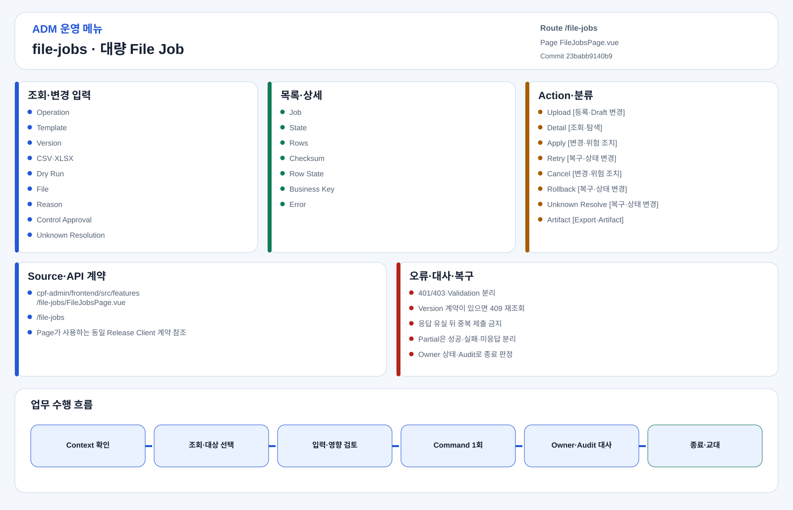

### 이 장에서 끝내는 업무

대량 File Job을 Dry Run·Apply·Retry·Rollback한다.

### 메뉴 식별·책임

| 항목 | 값 |
|---|---|
| Route | `/file-jobs` |
| 메뉴 ID | `file-jobs` |
| Menu Code | `file-jobs` |
| 업무 그룹 | 배치 운영 |
| Frontend Page | `cpf-admin/frontend/src/features/file-jobs/FileJobsPage.vue` |
| Permission | `FILE_JOB_*` Button Permission |
| 기준 Commit | `23babb9140b90e501d6ac715e7b77f55b66198a5` |

### Source·API 근거

| 구분 | 기준 |
|---|---|
| Frontend Page | `cpf-admin/frontend/src/features/file-jobs/FileJobsPage.vue` |
| Router | `/file-jobs` |
| API 추적 | 화면에서 제공하는 기능을 통해 호출한다. 문서에 명시되지 않은 Endpoint를 Browser나 외부 Script에서 임의 호출하지 않는다. |

아래 표는 이 메뉴에서 실제로 확인·입력·실행할 항목을 정리한다. 화면에 없는 Field·Button·상태를 임의로 가정하지 않는다.

### 검색·입력 Field

| Field | Control | 업무 의미 | 기본값·Validation·주의 |
|---|---|---|---|
| `Operation` | 문자열 입력·검색 | 대량 File Job 화면의 조회 조건 또는 편집 Form에 포함되는 값이며 화면 Label과 Help를 기준으로 사용한다. | 앞뒤 공백·허용 문자·길이와 대소문자 규칙을 확인한다. |
| `Template` | 문자열 입력·검색 | 대량 File Job 화면의 조회 조건 또는 편집 Form에 포함되는 값이며 화면 Label과 Help를 기준으로 사용한다. | 앞뒤 공백·허용 문자·길이와 대소문자 규칙을 확인한다. |
| `Version` | 숫자·Version 입력 | 동시 변경을 막고 요청 대상의 현재 Revision을 확인하는 값이다. | 상세 재조회로 최신 값을 얻고 409 발생 시 기존 값을 덮어쓰지 않는다. |
| `CSV·XLSX` | 파일·본문 입력 | 검증·등록·Export에 사용할 입력 Artifact 또는 구조화된 본문이다. | 확장자·크기·Encoding·Schema·Checksum을 검증하고 Dry Run이 있으면 먼저 실행한다. |
| `Dry Run` | Checkbox·Switch | 대량 File Job 화면의 조회 조건 또는 편집 Form에 포함되는 값이며 화면 Label과 Help를 기준으로 사용한다. | 현재 선택과 변경 후 영향 범위를 비교하고 화면의 Source 기본값을 확인한다. |
| `File` | 파일·본문 입력 | 검증·등록·Export에 사용할 입력 Artifact 또는 구조화된 본문이다. | 확장자·크기·Encoding·Schema·Checksum을 검증하고 Dry Run이 있으면 먼저 실행한다. |
| `Reason` | 다중행 입력 | 작업 목적·영향 범위·승인 또는 복구 기준을 기록해 Audit와 교대 기록에 연결한다. | Ticket·영향 범위·복구점을 포함하고 화면이 요구하는 최소 길이를 충족한다. |
| `Control Approval` | Checkbox·Switch | 대량 File Job 화면의 조회 조건 또는 편집 Form에 포함되는 값이며 화면 Label과 Help를 기준으로 사용한다. | 현재 선택과 변경 후 영향 범위를 비교하고 화면의 Source 기본값을 확인한다. |
| `Unknown Resolution` | 문자열 입력·검색 | 대량 File Job 화면의 조회 조건 또는 편집 Form에 포함되는 값이며 화면 Label과 Help를 기준으로 사용한다. | 앞뒤 공백·허용 문자·길이와 대소문자 규칙을 확인한다. |

#### 입력 순서

1. **Operation** 항목이 조회 Control인지 변경 Form인지 화면 위치로 구분하고, 표시된 값·필수 여부·허용 형식을 확인한다.
2. **Template** 항목이 조회 Control인지 변경 Form인지 화면 위치로 구분하고, 표시된 값·필수 여부·허용 형식을 확인한다.
3. **Version** 항목이 조회 Control인지 변경 Form인지 화면 위치로 구분하고, 표시된 값·필수 여부·허용 형식을 확인한다.
4. **CSV·XLSX** 항목이 조회 Control인지 변경 Form인지 화면 위치로 구분하고, 표시된 값·필수 여부·허용 형식을 확인한다.
5. **Dry Run** 항목이 조회 Control인지 변경 Form인지 화면 위치로 구분하고, 표시된 값·필수 여부·허용 형식을 확인한다.
6. **File** 항목이 조회 Control인지 변경 Form인지 화면 위치로 구분하고, 표시된 값·필수 여부·허용 형식을 확인한다.
7. **Reason** 항목이 조회 Control인지 변경 Form인지 화면 위치로 구분하고, 표시된 값·필수 여부·허용 형식을 확인한다.
8. **Control Approval** 항목이 조회 Control인지 변경 Form인지 화면 위치로 구분하고, 표시된 값·필수 여부·허용 형식을 확인한다.
9. **Unknown Resolution** 항목이 조회 Control인지 변경 Form인지 화면 위치로 구분하고, 표시된 값·필수 여부·허용 형식을 확인한다.
10. 조회 Control과 변경 Form을 분리해 기록하고, 실행 전 Environment·Data Scope·Timezone과 제출할 값만 다시 검토한다.

### 목록 Column·상세 Field

| 표시값 | 운영 의미 | 교차 확인 |
|---|---|---|
| `Job` | 대량 File Job의 대상 레코드를 상세·Owner·Audit에서 연결하는 식별자다. | 상세·Log·Trace·Audit에서 같은 대상을 가리키는지 확인한다. |
| `State` | 현재 상태와 Terminal 여부, 다음 Action 가능 여부를 판단하는 값이다. | Last Updated·Terminal 조건·Owner 상태와 함께 확인한다. |
| `Rows` | 동일한 집계 시간 창·단위·Filter에서 비교해야 하는 수치다. | 같은 Filter·집계 시간 창·단위의 상세 Row 또는 Metric으로 대사한다. |
| `Checksum` | 요청·Owner·Instance 사이의 Version 또는 내용 동일성을 판단하는 값이다. | 목록·상세·Owner 또는 Instance 보고값에서 일치하는지 확인한다. |
| `Row State` | 현재 상태와 Terminal 여부, 다음 Action 가능 여부를 판단하는 값이다. | Last Updated·Terminal 조건·Owner 상태와 함께 확인한다. |
| `Business Key` | 대량 File Job의 대상 레코드를 상세·Owner·Audit에서 연결하는 식별자다. | 상세·Log·Trace·Audit에서 같은 대상을 가리키는지 확인한다. |
| `Error` | 오류·Drift·결과 불명 범위를 나타내며 원인과 복구 Owner를 연결해야 한다. | 원인 식별자·실패 Stage·마지막 갱신 시각을 상세와 대조한다. |

#### 결과 판독 순서

1. 조회 완료 시각·Filter·Paging·Sort와 화면 Warning을 확인한다.
2. Empty·Stale·Partial을 정상 0건과 구분한다.
3. 식별자·상태·Version·오류·시각을 같은 Query Context의 상세와 Owner 원장에서 비교한다.
4. Masking된 값은 Raw Permission과 Reason 없이 복원·Export하지 않는다.
5. 집계와 상세가 다르면 집계 시간 창·Timezone·Owner Update 시각을 맞춰 대사한다.

### Button·Action

| Action | 분류 | 활성 조건 | Side Effect·정상 결과 |
|---|---|---|---|
| **Upload** | 등록·Draft 변경 | 화면이 실제로 요구하는 Write Permission·필수 Field·Reason·Version 조건을 충족함 | 대량 File Job의 재조회 결과가 요청 내용과 일치한다. Version·Before/After·Audit는 해당 Owner가 제공하는 경우 함께 확인한다. |
| **Detail** | 조회·탐색 | 조회 Permission과 Query Validation을 충족하고 동일 조회가 진행 중이 아님 | Detail 결과의 조회 시각·Filter·Source Version·Warning이 갱신되며 Owner 데이터는 변경하지 않는다. |
| **Apply** | 변경·위험 조치 | 화면과 Owner가 요구하는 Write Permission·대상 상태·영향 범위·Reason·승인·Version 조건을 충족함 | 변경 Operation을 생성하고 Accepted 응답과 Owner Terminal 상태·Version·Audit를 분리해 확인한다. |
| **Retry** | 복구·상태 변경 | 화면과 Owner가 요구하는 복구 Permission·대상 상태·Reason·승인·Version 조건을 충족함 | 복구 Operation을 생성하고 Owner 상태·대상별 결과·Audit로 종료를 판정한다. |
| **Cancel** | 변경·위험 조치 | 화면과 Owner가 요구하는 Write Permission·대상 상태·영향 범위·Reason·승인·Version 조건을 충족함 | 변경 Operation을 생성하고 Accepted 응답과 Owner Terminal 상태·Version·Audit를 분리해 확인한다. |
| **Rollback** | 복구·상태 변경 | 화면과 Owner가 요구하는 복구 Permission·대상 상태·Reason·승인·Version 조건을 충족함 | 복구 Operation을 생성하고 Owner 상태·대상별 결과·Audit로 종료를 판정한다. |
| **Unknown Resolve** | 복구·상태 변경 | 화면과 Owner가 요구하는 복구 Permission·대상 상태·Reason·승인·Version 조건을 충족함 | 복구 Operation을 생성하고 Owner 상태·대상별 결과·Audit로 종료를 판정한다. |
| **Artifact** | Export·Artifact | 화면이 요구하는 Export Permission·Data Scope·Masking·Reason과 승인 조건을 충족함 | Export Operation과 Artifact ID·Checksum·만료·Download Audit가 생성되고 원본 데이터는 변경하지 않는다. |

### 정상 업무 전체 절차

1. `/file-jobs`에 진입해 Page Header와 Route가 **대량 File Job** 기능을 가리키는지 확인한다.
2. 로그인 Session·Environment·Data Scope·기준일·Timezone을 고정한다.
3. 화면의 조회 Control과 변경 Form을 구분한다. 조회 조건이 제공되면 먼저 조회하고, 변경 Form은 대상 선택 또는 등록 Action 뒤에 열린 실제 Field만 사용한다.
4. Loading 종료 후 Empty·Error·Stale·Partial 상태와 화면 Warning을 먼저 판정한다.
5. **Job, State, Rows, Checksum, Row State**를 읽고 식별자·상태·Version·시각을 Owner 원장과 대사한다.
6. **Upload** 전에 화면과 Owner가 실제로 요구하는 Permission·현재 상태·영향 범위·Reason·승인·Version 조건을 확인하고 한 번만 제출한다.
7. **Upload**의 HTTP 응답과 재조회 결과를 확인한다. 비동기·다중 대상 기능은 Owner Terminal 상태·Version·대상별 Success/Failed/Unknown·Audit를 별도로 확인한다.
8. **Apply** 전에 화면과 Owner가 실제로 요구하는 Permission·현재 상태·영향 범위·Reason·승인·Version 조건을 확인하고 한 번만 제출한다.
9. **Apply**의 HTTP 응답과 재조회 결과를 확인한다. 비동기·다중 대상 기능은 Owner Terminal 상태·Version·대상별 Success/Failed/Unknown·Audit를 별도로 확인한다.
10. **Retry** 전에 화면과 Owner가 실제로 요구하는 Permission·현재 상태·영향 범위·Reason·승인·Version 조건을 확인하고 한 번만 제출한다.
11. **Retry**의 HTTP 응답과 재조회 결과를 확인한다. 비동기·다중 대상 기능은 Owner Terminal 상태·Version·대상별 Success/Failed/Unknown·Audit를 별도로 확인한다.
12. **Cancel** 전에 화면과 Owner가 실제로 요구하는 Permission·현재 상태·영향 범위·Reason·승인·Version 조건을 확인하고 한 번만 제출한다.
13. **Cancel**의 HTTP 응답과 재조회 결과를 확인한다. 비동기·다중 대상 기능은 Owner Terminal 상태·Version·대상별 Success/Failed/Unknown·Audit를 별도로 확인한다.
14. **Rollback** 전에 화면과 Owner가 실제로 요구하는 Permission·현재 상태·영향 범위·Reason·승인·Version 조건을 확인하고 한 번만 제출한다.
15. **Rollback**의 HTTP 응답과 재조회 결과를 확인한다. 비동기·다중 대상 기능은 Owner Terminal 상태·Version·대상별 Success/Failed/Unknown·Audit를 별도로 확인한다.
16. **Unknown Resolve** 전에 화면과 Owner가 실제로 요구하는 Permission·현재 상태·영향 범위·Reason·승인·Version 조건을 확인하고 한 번만 제출한다.
17. **Unknown Resolve**의 HTTP 응답과 재조회 결과를 확인한다. 비동기·다중 대상 기능은 Owner Terminal 상태·Version·대상별 Success/Failed/Unknown·Audit를 별도로 확인한다.
18. **Artifact** 전에 화면과 Owner가 실제로 요구하는 Permission·현재 상태·영향 범위·Reason·승인·Version 조건을 확인하고 한 번만 제출한다.
19. **Artifact**의 HTTP 응답과 재조회 결과를 확인한다. 비동기·다중 대상 기능은 Owner Terminal 상태·Version·대상별 Success/Failed/Unknown·Audit를 별도로 확인한다.
20. 화면이 제공하는 Log·Metric·Trace와, 변경·Export·승인 조치에 생성된 Audit를 교차 확인한다.
21. 이 장의 **종료 판정**과 다음 확인 시각·Evidence Link를 교대 기록에 남긴다.

### 메뉴 고유 판정·금지 사항

- **목적:** 대량 File Job을 Dry Run·Apply·Retry·Rollback한다.
- **종료 판정:** 원본 Checksum·행별 상태·Business Key·Unknown Resolution을 대사한다.
- 응답을 받지 못한 경우 Owner 상태와 기존 Operation을 확인하기 전에 동일 Action을 반복하지 않는다.
- HTTP 성공 응답이나 Toast만으로 비동기 Owner 상태 또는 다중 대상 적용을 확정하지 않는다.

### 오류·경계·동시성·복구

| 상황 | 화면 징후 | 운영 조치 | 종료 증적 |
|---|---|---|---|
| 401·Session | Session 만료·CSRF·Origin 실패 | 로그인 상태와 BFF Session을 확인한다. Command 자동 Replay는 금지한다. | 401/403 응답·Session Audit |
| 403·Data Scope | 메뉴·Button·Raw·Export가 거부됨 | Menu·Button·API·Owner Permission과 Data Scope를 확인하고 우회하지 않는다. | Deny Audit·요청 Permission |
| Validation | 필수값·범위·형식·기간 오류 | Field Error만 수정하고 기존 성공 Operation을 다시 제출하지 않는다. | Error Code·Field·입력값 |
| Timeout·Dependency | 일부 Source 또는 Command 응답 지연 | Correlation/Operation ID와 실패 Stage를 기록하고 Owner 상태를 조회한다. | Dependency 상태·Retryability |
| Partial·Stale | 일부 대상만 Success 또는 조회 Source 누락 | 성공·실패·미응답을 분리하고 누락 범위와 Version을 표시한다. | Target별 결과·Version |
| 409·동시 변경 | Expected Version 불일치 | 최신 상세를 재조회하고 Diff·영향을 다시 검토한 뒤 새 요청으로 제출한다. | 현재/요청 Version·변경자 |
| 응답 유실·Unknown | 요청 후 실제 처리 여부를 알 수 없음 | Operation ID·Request Hash·Audit·Owner 상태로 대사하고 중복 제출하지 않는다. | Operation·Owner·Audit |
| 복구 실패 | Retry/Rollback 뒤에도 상태 불일치 | 자동 반복을 중단하고 Incident·Reconcile Case·다음 확인 시각을 기록한다. | Case ID·복구 Owner·기한 |

### 응답 유실·결과 불명·부분 적용 처리

1. 동일 Action을 다시 누르지 않고 Browser Network와 응답 Header를 보존한다. `operationId`·`transactionId`·`idempotencyKey`가 제공되면 기록하고, 없으면 Target ID·Actor·요청 시각·Request Body Hash로 대사한다.
2. 기능이 제공하는 상세·Operation Status(있는 경우)·Audit에서 Request Hash와 대상 Version을 검색한다.
3. Side Effect 전 실패가 확인된 경우에만 새 요청을 검토한다.
4. Success·Failed·Unknown 대상을 분리하고 Source가 제공하는 Failed-only Retry·Compensation·Rollback을 선택하고, 지원되지 않으면 수동 Reconcile Case로 이관한다.
5. Rollback을 지원하는 기능은 Owner Version·Checksum·업무 합계가 Rollback Point와 일치하는지 확인한다.
6. 확정되지 않은 대상은 `UNKNOWN_RESULT`로 유지하고 담당자·대사 기한·다음 확인 시각을 기록한다.

### Log·Metric·Trace·Audit와 교대 기록

| 증적 | 필수 값 |
|---|---|
| Audit | Actor·Permission·Reason·Approval·Target·Before/After·Result·Recovery Action |
| Log | Environment·Instance·operationId·transactionId·failureStage·errorCode |
| Metric | 동일 시간 창의 Success·Failure·Latency·Queue·Retry·Partial·Unknown |
| Trace | root/segment/attempt·Owner·DB/Kafka/외부 의존성 Span |
| 상태 원장 | Target ID·Version·Checksum·Desired/Actual·Last Updated·Terminal 여부 |

```text
Menu=file-jobs
Route=/file-jobs
Environment=
DataScope=
Query=
TargetId=
BeforeVersion=
Action=
Reason=
ApprovalId=
OperationId=
TransactionId=
Result=SUCCESS|FAILED|PARTIAL|UNKNOWN_RESULT
OwnerState=
FailedTargets=
ReconcileBy=
RollbackPoint=
EvidenceLinks=
NextCheckAt=
```

### 실무 Workbook

**상황:** 대량 File Job을 Dry Run·Apply·Retry·Rollback한다. 담당자가 **Upload**을 수행한 뒤 Browser 응답을 받지 못했다.

1. 대상 식별자와 Before Version, 입력값, Reason·Approval을 작업 기록에서 확인한다.
2. 동일 **Upload**을 반복하지 않고 Operation·Audit·Owner 상태를 조회한다.
3. Owner 상태가 변경됐고 Request Hash가 같으면 응답 유실로 분류해 중복 조치를 금지한다.
4. 일부 대상만 변경됐으면 Success·Failed·Unknown을 분리해 Failed-only Retry 또는 Rollback을 선택한다.
5. 원본 Checksum·행별 상태·Business Key·Unknown Resolution을 대사한다.
6. Evidence Link와 다음 확인 시각을 교대 기록에 남긴다.

### 독립 수행 검수 Checklist

- [ ] `/file-jobs`와 Page Source를 찾고 화면 목적을 설명할 수 있다.
- [ ] 9개 입력·검색 항목의 Control·기본값·Validation을 설명할 수 있다.
- [ ] 7개 표시값을 Owner 상태·Version·Audit와 대사할 수 있다.
- [ ] 8개 Action의 분류·활성 조건·Side Effect를 설명할 수 있다.
- [ ] Empty·403·409·Timeout·Partial·Unknown을 서로 다른 상태로 처리할 수 있다.
- [ ] 응답 유실 뒤 중복 제출 없이 Operation·Owner·Audit로 결과를 확정할 수 있다.
- [ ] 교대 기록만으로 다음 담당자가 Target·상태·복구 기한을 이어받을 수 있다.

## 28. batch — Batch·Center-Cut 종합 통제

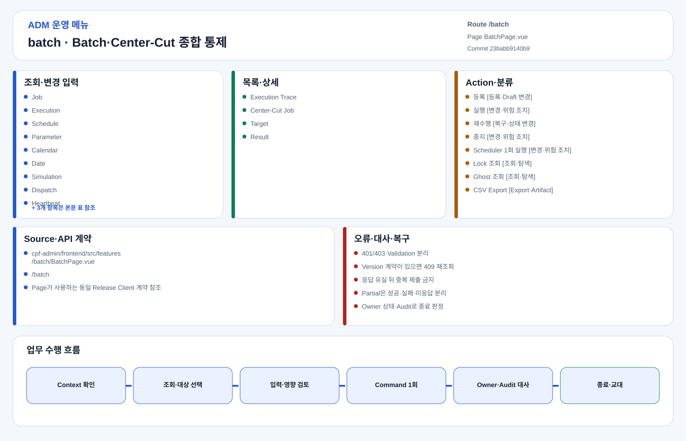

### 이 장에서 끝내는 업무

Batch·Center-Cut 실행과 Scheduler·Lock·Ghost를 종합 통제한다.

### 메뉴 식별·책임

| 항목 | 값 |
|---|---|
| Route | `/batch` |
| 메뉴 ID | `batch` |
| Menu Code | `batch` |
| 업무 그룹 | 배치 운영 |
| Frontend Page | `cpf-admin/frontend/src/features/batch/BatchPage.vue` |
| Permission | `BATCH` Write |
| 기준 Commit | `23babb9140b90e501d6ac715e7b77f55b66198a5` |

### Source·API 근거

| 구분 | 기준 |
|---|---|
| Frontend Page | `cpf-admin/frontend/src/features/batch/BatchPage.vue` |
| Router | `/batch` |
| API 추적 | 화면에서 제공하는 기능을 통해 호출한다. 문서에 명시되지 않은 Endpoint를 Browser나 외부 Script에서 임의 호출하지 않는다. |

아래 표는 이 메뉴에서 실제로 확인·입력·실행할 항목을 정리한다. 화면에 없는 Field·Button·상태를 임의로 가정하지 않는다.

### 검색·입력 Field

| Field | Control | 업무 의미 | 기본값·Validation·주의 |
|---|---|---|---|
| `Job` | 문자열 입력·검색 | 조회·상세·Audit에서 같은 대상을 다시 찾기 위한 식별 조건이다. | 앞뒤 공백·허용 문자·길이와 대소문자 규칙을 확인한다. |
| `Execution` | 문자열 입력·검색 | 조회·상세·Audit에서 같은 대상을 다시 찾기 위한 식별 조건이다. | 앞뒤 공백·허용 문자·길이와 대소문자 규칙을 확인한다. |
| `Schedule` | 문자열 입력·검색 | Batch·Center-Cut 종합 통제 화면의 조회 조건 또는 편집 Form에 포함되는 값이며 화면 Label과 Help를 기준으로 사용한다. | 앞뒤 공백·허용 문자·길이와 대소문자 규칙을 확인한다. |
| `Parameter` | 문자열 입력·검색 | Batch·Center-Cut 종합 통제 화면의 조회 조건 또는 편집 Form에 포함되는 값이며 화면 Label과 Help를 기준으로 사용한다. | 앞뒤 공백·허용 문자·길이와 대소문자 규칙을 확인한다. |
| `Calendar` | Select·검색 | Batch·Center-Cut 종합 통제 화면의 조회 조건 또는 편집 Form에 포함되는 값이며 화면 Label과 Help를 기준으로 사용한다. | 허용 목록과 현재 Environment·Data Scope에 맞는 값만 선택한다. |
| `Date` | 날짜·시간 입력 | 조회 또는 적용의 유효 시간 범위를 정하며 Timezone과 시작·종료 순서를 함께 확인한다. | Timezone을 고정하고 시작≤종료·유효기간 겹침·기준일 포함 여부를 확인한다. |
| `Simulation` | 문자열 입력·검색 | Batch·Center-Cut 종합 통제 화면의 조회 조건 또는 편집 Form에 포함되는 값이며 화면 Label과 Help를 기준으로 사용한다. | 앞뒤 공백·허용 문자·길이와 대소문자 규칙을 확인한다. |
| `Dispatch` | 문자열 입력·검색 | Batch·Center-Cut 종합 통제 화면의 조회 조건 또는 편집 Form에 포함되는 값이며 화면 Label과 Help를 기준으로 사용한다. | 앞뒤 공백·허용 문자·길이와 대소문자 규칙을 확인한다. |
| `Heartbeat` | 문자열 입력·검색 | Batch·Center-Cut 종합 통제 화면의 조회 조건 또는 편집 Form에 포함되는 값이며 화면 Label과 Help를 기준으로 사용한다. | 앞뒤 공백·허용 문자·길이와 대소문자 규칙을 확인한다. |
| `Lock` | Checkbox·Switch | 현재 상태를 조회하거나 다음 Action의 허용 조건을 지정한다. | 현재 선택과 변경 후 영향 범위를 비교하고 화면의 Source 기본값을 확인한다. |
| `Ghost` | 문자열 입력·검색 | Batch·Center-Cut 종합 통제 화면의 조회 조건 또는 편집 Form에 포함되는 값이며 화면 Label과 Help를 기준으로 사용한다. | 앞뒤 공백·허용 문자·길이와 대소문자 규칙을 확인한다. |
| `Reason` | 다중행 입력 | 작업 목적·영향 범위·승인 또는 복구 기준을 기록해 Audit와 교대 기록에 연결한다. | Ticket·영향 범위·복구점을 포함하고 화면이 요구하는 최소 길이를 충족한다. |

#### 입력 순서

1. **Job** 항목이 조회 Control인지 변경 Form인지 화면 위치로 구분하고, 표시된 값·필수 여부·허용 형식을 확인한다.
2. **Execution** 항목이 조회 Control인지 변경 Form인지 화면 위치로 구분하고, 표시된 값·필수 여부·허용 형식을 확인한다.
3. **Schedule** 항목이 조회 Control인지 변경 Form인지 화면 위치로 구분하고, 표시된 값·필수 여부·허용 형식을 확인한다.
4. **Parameter** 항목이 조회 Control인지 변경 Form인지 화면 위치로 구분하고, 표시된 값·필수 여부·허용 형식을 확인한다.
5. **Calendar** 항목이 조회 Control인지 변경 Form인지 화면 위치로 구분하고, 표시된 값·필수 여부·허용 형식을 확인한다.
6. **Date** 항목이 조회 Control인지 변경 Form인지 화면 위치로 구분하고, 표시된 값·필수 여부·허용 형식을 확인한다.
7. **Simulation** 항목이 조회 Control인지 변경 Form인지 화면 위치로 구분하고, 표시된 값·필수 여부·허용 형식을 확인한다.
8. **Dispatch** 항목이 조회 Control인지 변경 Form인지 화면 위치로 구분하고, 표시된 값·필수 여부·허용 형식을 확인한다.
9. **Heartbeat** 항목이 조회 Control인지 변경 Form인지 화면 위치로 구분하고, 표시된 값·필수 여부·허용 형식을 확인한다.
10. **Lock** 항목이 조회 Control인지 변경 Form인지 화면 위치로 구분하고, 표시된 값·필수 여부·허용 형식을 확인한다.
11. **Ghost** 항목이 조회 Control인지 변경 Form인지 화면 위치로 구분하고, 표시된 값·필수 여부·허용 형식을 확인한다.
12. **Reason** 항목이 조회 Control인지 변경 Form인지 화면 위치로 구분하고, 표시된 값·필수 여부·허용 형식을 확인한다.
13. 조회 Control과 변경 Form을 분리해 기록하고, 실행 전 Environment·Data Scope·Timezone과 제출할 값만 다시 검토한다.

### 목록 Column·상세 Field

| 표시값 | 운영 의미 | 교차 확인 |
|---|---|---|
| `Execution Trace` | Batch·Center-Cut 종합 통제의 대상 레코드를 상세·Owner·Audit에서 연결하는 식별자다. | 상세·Log·Trace·Audit에서 같은 대상을 가리키는지 확인한다. |
| `Center-Cut Job` | Batch·Center-Cut 종합 통제의 대상 레코드를 상세·Owner·Audit에서 연결하는 식별자다. | 상세·Log·Trace·Audit에서 같은 대상을 가리키는지 확인한다. |
| `Target` | Batch·Center-Cut 종합 통제 상세에서 대상의 현재 속성 또는 처리 결과를 확인하는 값이다. | 상세·재조회 결과와 비교하고 Stale·Masking·단위 차이를 확인한다. |
| `Result` | 현재 상태와 Terminal 여부, 다음 Action 가능 여부를 판단하는 값이다. | Last Updated·Terminal 조건·Owner 상태와 함께 확인한다. |

#### 결과 판독 순서

1. 조회 완료 시각·Filter·Paging·Sort와 화면 Warning을 확인한다.
2. Empty·Stale·Partial을 정상 0건과 구분한다.
3. 식별자·상태·Version·오류·시각을 같은 Query Context의 상세와 Owner 원장에서 비교한다.
4. Masking된 값은 Raw Permission과 Reason 없이 복원·Export하지 않는다.
5. 집계와 상세가 다르면 집계 시간 창·Timezone·Owner Update 시각을 맞춰 대사한다.

### Button·Action

| Action | 분류 | 활성 조건 | Side Effect·정상 결과 |
|---|---|---|---|
| **등록** | 등록·Draft 변경 | 화면이 실제로 요구하는 Write Permission·필수 Field·Reason·Version 조건을 충족함 | Batch·Center-Cut 종합 통제의 재조회 결과가 요청 내용과 일치한다. Version·Before/After·Audit는 해당 Owner가 제공하는 경우 함께 확인한다. |
| **실행** | 변경·위험 조치 | 화면과 Owner가 요구하는 Write Permission·대상 상태·영향 범위·Reason·승인·Version 조건을 충족함 | 변경 Operation을 생성하고 Accepted 응답과 Owner Terminal 상태·Version·Audit를 분리해 확인한다. |
| **재수행** | 복구·상태 변경 | 화면과 Owner가 요구하는 복구 Permission·대상 상태·Reason·승인·Version 조건을 충족함 | 복구 Operation을 생성하고 Owner 상태·대상별 결과·Audit로 종료를 판정한다. |
| **중지** | 변경·위험 조치 | 화면과 Owner가 요구하는 Write Permission·대상 상태·영향 범위·Reason·승인·Version 조건을 충족함 | 변경 Operation을 생성하고 Accepted 응답과 Owner Terminal 상태·Version·Audit를 분리해 확인한다. |
| **Scheduler 1회 실행** | 변경·위험 조치 | 화면과 Owner가 요구하는 Write Permission·대상 상태·영향 범위·Reason·승인·Version 조건을 충족함 | 변경 Operation을 생성하고 Accepted 응답과 Owner Terminal 상태·Version·Audit를 분리해 확인한다. |
| **Lock 조회** | 조회·탐색 | 조회 Permission과 Query Validation을 충족하고 동일 조회가 진행 중이 아님 | Lock 조회 결과의 조회 시각·Filter·Source Version·Warning이 갱신되며 Owner 데이터는 변경하지 않는다. |
| **Ghost 조회** | 조회·탐색 | 조회 Permission과 Query Validation을 충족하고 동일 조회가 진행 중이 아님 | Ghost 조회 결과의 조회 시각·Filter·Source Version·Warning이 갱신되며 Owner 데이터는 변경하지 않는다. |
| **CSV Export** | Export·Artifact | 화면이 요구하는 Export Permission·Data Scope·Masking·Reason과 승인 조건을 충족함 | Export Operation과 Artifact ID·Checksum·만료·Download Audit가 생성되고 원본 데이터는 변경하지 않는다. |

### 정상 업무 전체 절차

1. `/batch`에 진입해 Page Header와 Route가 **Batch·Center-Cut 종합 통제** 기능을 가리키는지 확인한다.
2. 로그인 Session·Environment·Data Scope·기준일·Timezone을 고정한다.
3. 화면의 조회 Control과 변경 Form을 구분한다. 조회 조건이 제공되면 먼저 조회하고, 변경 Form은 대상 선택 또는 등록 Action 뒤에 열린 실제 Field만 사용한다.
4. Loading 종료 후 Empty·Error·Stale·Partial 상태와 화면 Warning을 먼저 판정한다.
5. **Execution Trace, Center-Cut Job, Target, Result**를 읽고 식별자·상태·Version·시각을 Owner 원장과 대사한다.
6. **등록** 전에 화면과 Owner가 실제로 요구하는 Permission·현재 상태·영향 범위·Reason·승인·Version 조건을 확인하고 한 번만 제출한다.
7. **등록**의 HTTP 응답과 재조회 결과를 확인한다. 비동기·다중 대상 기능은 Owner Terminal 상태·Version·대상별 Success/Failed/Unknown·Audit를 별도로 확인한다.
8. **실행** 전에 화면과 Owner가 실제로 요구하는 Permission·현재 상태·영향 범위·Reason·승인·Version 조건을 확인하고 한 번만 제출한다.
9. **실행**의 HTTP 응답과 재조회 결과를 확인한다. 비동기·다중 대상 기능은 Owner Terminal 상태·Version·대상별 Success/Failed/Unknown·Audit를 별도로 확인한다.
10. **재수행** 전에 화면과 Owner가 실제로 요구하는 Permission·현재 상태·영향 범위·Reason·승인·Version 조건을 확인하고 한 번만 제출한다.
11. **재수행**의 HTTP 응답과 재조회 결과를 확인한다. 비동기·다중 대상 기능은 Owner Terminal 상태·Version·대상별 Success/Failed/Unknown·Audit를 별도로 확인한다.
12. **중지** 전에 화면과 Owner가 실제로 요구하는 Permission·현재 상태·영향 범위·Reason·승인·Version 조건을 확인하고 한 번만 제출한다.
13. **중지**의 HTTP 응답과 재조회 결과를 확인한다. 비동기·다중 대상 기능은 Owner Terminal 상태·Version·대상별 Success/Failed/Unknown·Audit를 별도로 확인한다.
14. **Scheduler 1회 실행** 전에 화면과 Owner가 실제로 요구하는 Permission·현재 상태·영향 범위·Reason·승인·Version 조건을 확인하고 한 번만 제출한다.
15. **Scheduler 1회 실행**의 HTTP 응답과 재조회 결과를 확인한다. 비동기·다중 대상 기능은 Owner Terminal 상태·Version·대상별 Success/Failed/Unknown·Audit를 별도로 확인한다.
16. **CSV Export** 전에 화면과 Owner가 실제로 요구하는 Permission·현재 상태·영향 범위·Reason·승인·Version 조건을 확인하고 한 번만 제출한다.
17. **CSV Export**의 HTTP 응답과 재조회 결과를 확인한다. 비동기·다중 대상 기능은 Owner Terminal 상태·Version·대상별 Success/Failed/Unknown·Audit를 별도로 확인한다.
18. 화면이 제공하는 Log·Metric·Trace와, 변경·Export·승인 조치에 생성된 Audit를 교차 확인한다.
19. 이 장의 **종료 판정**과 다음 확인 시각·Evidence Link를 교대 기록에 남긴다.

### 메뉴 고유 판정·금지 사항

- **목적:** Batch·Center-Cut 실행과 Scheduler·Lock·Ghost를 종합 통제한다.
- **종료 판정:** CPF Execution·Spring Metadata·Worker·업무 결과를 함께 대사한다.
- 응답을 받지 못한 경우 Owner 상태와 기존 Operation을 확인하기 전에 동일 Action을 반복하지 않는다.
- HTTP 성공 응답이나 Toast만으로 비동기 Owner 상태 또는 다중 대상 적용을 확정하지 않는다.

### 오류·경계·동시성·복구

| 상황 | 화면 징후 | 운영 조치 | 종료 증적 |
|---|---|---|---|
| 401·Session | Session 만료·CSRF·Origin 실패 | 로그인 상태와 BFF Session을 확인한다. Command 자동 Replay는 금지한다. | 401/403 응답·Session Audit |
| 403·Data Scope | 메뉴·Button·Raw·Export가 거부됨 | Menu·Button·API·Owner Permission과 Data Scope를 확인하고 우회하지 않는다. | Deny Audit·요청 Permission |
| Validation | 필수값·범위·형식·기간 오류 | Field Error만 수정하고 기존 성공 Operation을 다시 제출하지 않는다. | Error Code·Field·입력값 |
| Timeout·Dependency | 일부 Source 또는 Command 응답 지연 | Correlation/Operation ID와 실패 Stage를 기록하고 Owner 상태를 조회한다. | Dependency 상태·Retryability |
| Partial·Stale | 일부 대상만 Success 또는 조회 Source 누락 | 성공·실패·미응답을 분리하고 누락 범위와 Version을 표시한다. | Target별 결과·Version |
| 409·동시 변경 | Expected Version 불일치 | 최신 상세를 재조회하고 Diff·영향을 다시 검토한 뒤 새 요청으로 제출한다. | 현재/요청 Version·변경자 |
| 응답 유실·Unknown | 요청 후 실제 처리 여부를 알 수 없음 | Operation ID·Request Hash·Audit·Owner 상태로 대사하고 중복 제출하지 않는다. | Operation·Owner·Audit |
| 복구 실패 | Retry/Rollback 뒤에도 상태 불일치 | 자동 반복을 중단하고 Incident·Reconcile Case·다음 확인 시각을 기록한다. | Case ID·복구 Owner·기한 |

### 응답 유실·결과 불명·부분 적용 처리

1. 동일 Action을 다시 누르지 않고 Browser Network와 응답 Header를 보존한다. `operationId`·`transactionId`·`idempotencyKey`가 제공되면 기록하고, 없으면 Target ID·Actor·요청 시각·Request Body Hash로 대사한다.
2. 기능이 제공하는 상세·Operation Status(있는 경우)·Audit에서 Request Hash와 대상 Version을 검색한다.
3. Side Effect 전 실패가 확인된 경우에만 새 요청을 검토한다.
4. Success·Failed·Unknown 대상을 분리하고 Source가 제공하는 Failed-only Retry·Compensation·Rollback을 선택하고, 지원되지 않으면 수동 Reconcile Case로 이관한다.
5. Rollback을 지원하는 기능은 Owner Version·Checksum·업무 합계가 Rollback Point와 일치하는지 확인한다.
6. 확정되지 않은 대상은 `UNKNOWN_RESULT`로 유지하고 담당자·대사 기한·다음 확인 시각을 기록한다.

### Log·Metric·Trace·Audit와 교대 기록

| 증적 | 필수 값 |
|---|---|
| Audit | Actor·Permission·Reason·Approval·Target·Before/After·Result·Recovery Action |
| Log | Environment·Instance·operationId·transactionId·failureStage·errorCode |
| Metric | 동일 시간 창의 Success·Failure·Latency·Queue·Retry·Partial·Unknown |
| Trace | root/segment/attempt·Owner·DB/Kafka/외부 의존성 Span |
| 상태 원장 | Target ID·Version·Checksum·Desired/Actual·Last Updated·Terminal 여부 |

```text
Menu=batch
Route=/batch
Environment=
DataScope=
Query=
TargetId=
BeforeVersion=
Action=
Reason=
ApprovalId=
OperationId=
TransactionId=
Result=SUCCESS|FAILED|PARTIAL|UNKNOWN_RESULT
OwnerState=
FailedTargets=
ReconcileBy=
RollbackPoint=
EvidenceLinks=
NextCheckAt=
```

### 실무 Workbook

**상황:** Batch·Center-Cut 실행과 Scheduler·Lock·Ghost를 종합 통제한다. 담당자가 **등록**을 수행한 뒤 Browser 응답을 받지 못했다.

1. 대상 식별자와 Before Version, 입력값, Reason·Approval을 작업 기록에서 확인한다.
2. 동일 **등록**을 반복하지 않고 Operation·Audit·Owner 상태를 조회한다.
3. Owner 상태가 변경됐고 Request Hash가 같으면 응답 유실로 분류해 중복 조치를 금지한다.
4. 일부 대상만 변경됐으면 Success·Failed·Unknown을 분리해 Failed-only Retry 또는 Rollback을 선택한다.
5. CPF Execution·Spring Metadata·Worker·업무 결과를 함께 대사한다.
6. Evidence Link와 다음 확인 시각을 교대 기록에 남긴다.

### 독립 수행 검수 Checklist

- [ ] `/batch`와 Page Source를 찾고 화면 목적을 설명할 수 있다.
- [ ] 12개 입력·검색 항목의 Control·기본값·Validation을 설명할 수 있다.
- [ ] 4개 표시값을 Owner 상태·Version·Audit와 대사할 수 있다.
- [ ] 8개 Action의 분류·활성 조건·Side Effect를 설명할 수 있다.
- [ ] Empty·403·409·Timeout·Partial·Unknown을 서로 다른 상태로 처리할 수 있다.
- [ ] 응답 유실 뒤 중복 제출 없이 Operation·Owner·Audit로 결과를 확정할 수 있다.
- [ ] 교대 기록만으로 다음 담당자가 Target·상태·복구 기한을 이어받을 수 있다.

## 29. batch-overview — Batch Overview


### 이 장에서 끝내는 업무

전체 Batch KPI·상태 분포·Backlog를 탐지한다.

### 메뉴 식별·책임

| 항목 | 값 |
|---|---|
| Route | `/batch-overview` |
| 메뉴 ID | `batch-overview` |
| Menu Code | `batch-overview` |
| 업무 그룹 | 배치/통합 관제 |
| Frontend Page | `cpf-admin/frontend/src/features/batch-runtime-control/BatchViewPage.vue` |
| Permission | 조회 권한 |
| 기준 Commit | `23babb9140b90e501d6ac715e7b77f55b66198a5` |

### Source·API 근거

| 구분 | 기준 |
|---|---|
| Frontend Page | `cpf-admin/frontend/src/features/batch-runtime-control/BatchViewPage.vue` |
| Router | `/batch-overview` |
| API 추적 | 화면에서 제공하는 기능을 통해 호출한다. 문서에 명시되지 않은 Endpoint를 Browser나 외부 Script에서 임의 호출하지 않는다. |

아래 표는 이 메뉴에서 실제로 확인·입력·실행할 항목을 정리한다. 화면에 없는 Field·Button·상태를 임의로 가정하지 않는다.

### 검색·입력 Field

별도 사용자 입력 Control이 없다. 현재 Session·Permission·Data Scope와 Page가 정의한 초기 Query로 데이터를 읽는다. 새로고침은 같은 Context를 다시 조회하며 Owner 데이터는 변경하지 않는다.

### 목록 Column·상세 Field

| 표시값 | 운영 의미 | 교차 확인 |
|---|---|---|
| `Control Server가 반환한 최대 18개 동적 Column` | Batch Overview 상세에서 대상의 현재 속성 또는 처리 결과를 확인하는 값이다. | 상세·재조회 결과와 비교하고 Stale·Masking·단위 차이를 확인한다. |

#### 결과 판독 순서

1. 조회 완료 시각·Filter·Paging·Sort와 화면 Warning을 확인한다.
2. Empty·Stale·Partial을 정상 0건과 구분한다.
3. 식별자·상태·Version·오류·시각을 같은 Query Context의 상세와 Owner 원장에서 비교한다.
4. Masking된 값은 Raw Permission과 Reason 없이 복원·Export하지 않는다.
5. 집계와 상세가 다르면 집계 시간 창·Timezone·Owner Update 시각을 맞춰 대사한다.

### Button·Action

| Action | 분류 | 활성 조건 | Side Effect·정상 결과 |
|---|---|---|---|
| **새로고침** | 조회·탐색 | 조회 Permission과 Query Validation을 충족하고 동일 조회가 진행 중이 아님 | 새로고침 결과의 조회 시각·Filter·Source Version·Warning이 갱신되며 Owner 데이터는 변경하지 않는다. |

### 정상 업무 전체 절차

1. `/batch-overview`에 진입해 Page Header와 Route가 **Batch Overview** 기능을 가리키는지 확인한다.
2. 로그인 Session·Environment·Data Scope·기준일·Timezone을 고정한다.
3. 별도 사용자 입력 없이 초기 조회가 끝날 때까지 기다리고, 필요할 때만 같은 Context로 새로고침한다.
4. Loading 종료 후 Empty·Error·Stale·Partial 상태와 화면 Warning을 먼저 판정한다.
5. **Control Server가 반환한 최대 18개 동적 Column**를 읽고 식별자·상태·Version·시각을 Owner 원장과 대사한다.
6. 화면이 제공하는 Log·Metric·Trace와 조회·Raw·Export 접근 기록이 있으면 해당 Audit를 교차 확인한다.
7. 이 장의 **종료 판정**과 다음 확인 시각·Evidence Link를 교대 기록에 남긴다.

### 메뉴 고유 판정·금지 사항

- **목적:** 전체 Batch KPI·상태 분포·Backlog를 탐지한다.
- **종료 판정:** 동적 Column은 Control Server 응답 Schema와 조회 시각을 함께 표시하고 원본 상세로 Drill-down한다.
- 조회 화면에서 직접 Owner 데이터를 변경하거나 Browser Tool로 우회하지 않는다.
- Partial 조회를 정상 전체 결과로 합치지 않는다.

### 오류·경계·동시성·복구

| 상황 | 화면 징후 | 운영 조치 | 종료 증적 |
|---|---|---|---|
| 401·Session | Session 만료·CSRF·Origin 실패 | 로그인 상태와 BFF Session을 확인한 뒤 같은 Query Context로 다시 조회한다. | 401/403 응답·Session Audit |
| 403·Data Scope | 메뉴·Button·Raw·Export가 거부됨 | Menu·Button·API·Owner Permission과 Data Scope를 확인하고 우회하지 않는다. | Deny Audit·요청 Permission |
| Timeout·Dependency | 일부 조회 Source 응답 지연 | Correlation ID·Query Context·실패 Source를 기록하고 같은 조건으로 재조회한다. | 조회 시각·실패 Source·재조회 결과 |
| Partial·Stale | 일부 대상만 Success 또는 조회 Source 누락 | 성공·실패·미응답을 분리하고 누락 범위와 Version을 표시한다. | Target별 결과·Version |

### 응답 유실·부분 조회 처리

1. 검색 조건·Data Scope·Paging·조회 시각·Correlation ID를 기록한다.
2. 같은 조건으로 재조회하되 실패 Source만 분리한다.
3. 정상 Source 결과를 유지하고 실패·Stale Source를 명시한다.
4. 집계와 원본 상세가 다르면 Owner 상세를 기준으로 Reconcile Case를 연다.
5. 조회 시각·Source Version·0건 또는 일치 결과를 증적으로 남긴다.

### Log·Metric·Trace·Audit와 교대 기록

| 증적 | 필수 값 |
|---|---|
| Audit | Actor·Permission·Data Scope·Raw/Export 접근·Query Context·Result |
| Log | Environment·Instance·operationId·transactionId·failureStage·errorCode |
| Metric | 동일 시간 창의 Success·Failure·Latency·Queue·Retry·Partial·Unknown |
| Trace | root/segment/attempt·Owner·DB/Kafka/외부 의존성 Span |
| 상태 원장 | Target ID·Version·Checksum·Desired/Actual·Last Updated·Terminal 여부 |

```text
Menu=
Route=
Environment=
DataScope=
Query=
QueryAt=
CorrelationId=
SourceVersion=
Result=SUCCESS|EMPTY|STALE|PARTIAL|FAILED
FailedSources=
EvidenceLinks=
NextCheckAt=
```

### 실무 Workbook

**상황:** 전체 Batch KPI·상태 분포·Backlog를 탐지한다. 화면이 일부 Source Timeout 때문에 Partial 결과를 표시했다.

1. Query·Data Scope·조회 시각·Correlation ID를 기록한다.
2. 정상 결과를 0건으로 덮어쓰지 않고 실패 Source만 재조회한다.
3. Control Server가 반환한 최대 18개 동적 Column 값을 원본 상세와 같은 시간 기준으로 비교한다.
4. 불일치가 계속되면 Incident 또는 Reconcile Case를 생성한다.
5. 동적 Column은 Control Server 응답 Schema와 조회 시각을 함께 표시하고 원본 상세로 Drill-down한다.
6. Source Version과 다음 확인 시각을 교대 기록에 남긴다.

### 독립 수행 검수 Checklist

- [ ] `/batch-overview`와 Page Source를 찾고 화면 목적을 설명할 수 있다.
- [ ] 별도 사용자 입력이 없고 자동 Query Context·새로고침 동작을 설명할 수 있다.
- [ ] 1개 표시값을 Owner 상태·Version·Audit와 대사할 수 있다.
- [ ] 1개 Action의 분류·활성 조건·Side Effect를 설명할 수 있다.
- [ ] Empty·401·403·Timeout·Stale·Partial을 서로 다른 조회 상태로 처리할 수 있다.
- [ ] 조회 응답 유실 시 같은 Query Context로 재조회하고 Correlation ID·조회 시각·Source Version으로 결과를 대사할 수 있다.
- [ ] 교대 기록만으로 다음 담당자가 Target·상태·복구 기한을 이어받을 수 있다.

## 30. batch-runtime — Runtime Topology


### 이 장에서 끝내는 업무

Manager·Runner·Worker·Agent Runtime Topology를 확인한다.

### 메뉴 식별·책임

| 항목 | 값 |
|---|---|
| Route | `/batch-runtime` |
| 메뉴 ID | `batch-runtime` |
| Menu Code | `batch-runtime` |
| 업무 그룹 | 배치/통합 관제 |
| Frontend Page | `cpf-admin/frontend/src/features/batch-runtime-control/BatchViewPage.vue` |
| Permission | 조회 권한 |
| 기준 Commit | `23babb9140b90e501d6ac715e7b77f55b66198a5` |

### Source·API 근거

| 구분 | 기준 |
|---|---|
| Frontend Page | `cpf-admin/frontend/src/features/batch-runtime-control/BatchViewPage.vue` |
| Router | `/batch-runtime` |
| API 추적 | 화면에서 제공하는 기능을 통해 호출한다. 문서에 명시되지 않은 Endpoint를 Browser나 외부 Script에서 임의 호출하지 않는다. |

아래 표는 이 메뉴에서 실제로 확인·입력·실행할 항목을 정리한다. 화면에 없는 Field·Button·상태를 임의로 가정하지 않는다.

### 검색·입력 Field

별도 사용자 입력 Control이 없다. 현재 Session·Permission·Data Scope와 Page가 정의한 초기 Query로 데이터를 읽는다. 새로고침은 같은 Context를 다시 조회하며 Owner 데이터는 변경하지 않는다.

### 목록 Column·상세 Field

| 표시값 | 운영 의미 | 교차 확인 |
|---|---|---|
| `Control Server가 반환한 최대 18개 동적 Column` | Runtime Topology 상세에서 대상의 현재 속성 또는 처리 결과를 확인하는 값이다. | 상세·재조회 결과와 비교하고 Stale·Masking·단위 차이를 확인한다. |

#### 결과 판독 순서

1. 조회 완료 시각·Filter·Paging·Sort와 화면 Warning을 확인한다.
2. Empty·Stale·Partial을 정상 0건과 구분한다.
3. 식별자·상태·Version·오류·시각을 같은 Query Context의 상세와 Owner 원장에서 비교한다.
4. Masking된 값은 Raw Permission과 Reason 없이 복원·Export하지 않는다.
5. 집계와 상세가 다르면 집계 시간 창·Timezone·Owner Update 시각을 맞춰 대사한다.

### Button·Action

| Action | 분류 | 활성 조건 | Side Effect·정상 결과 |
|---|---|---|---|
| **새로고침** | 조회·탐색 | 조회 Permission과 Query Validation을 충족하고 동일 조회가 진행 중이 아님 | 새로고침 결과의 조회 시각·Filter·Source Version·Warning이 갱신되며 Owner 데이터는 변경하지 않는다. |

### 정상 업무 전체 절차

1. `/batch-runtime`에 진입해 Page Header와 Route가 **Runtime Topology** 기능을 가리키는지 확인한다.
2. 로그인 Session·Environment·Data Scope·기준일·Timezone을 고정한다.
3. 별도 사용자 입력 없이 초기 조회가 끝날 때까지 기다리고, 필요할 때만 같은 Context로 새로고침한다.
4. Loading 종료 후 Empty·Error·Stale·Partial 상태와 화면 Warning을 먼저 판정한다.
5. **Control Server가 반환한 최대 18개 동적 Column**를 읽고 식별자·상태·Version·시각을 Owner 원장과 대사한다.
6. 화면이 제공하는 Log·Metric·Trace와 조회·Raw·Export 접근 기록이 있으면 해당 Audit를 교차 확인한다.
7. 이 장의 **종료 판정**과 다음 확인 시각·Evidence Link를 교대 기록에 남긴다.

### 메뉴 고유 판정·금지 사항

- **목적:** Manager·Runner·Worker·Agent Runtime Topology를 확인한다.
- **종료 판정:** 동적 Column은 Control Server 응답 Schema와 조회 시각을 함께 표시하고 원본 상세로 Drill-down한다.
- 조회 화면에서 직접 Owner 데이터를 변경하거나 Browser Tool로 우회하지 않는다.
- Partial 조회를 정상 전체 결과로 합치지 않는다.

### 오류·경계·동시성·복구

| 상황 | 화면 징후 | 운영 조치 | 종료 증적 |
|---|---|---|---|
| 401·Session | Session 만료·CSRF·Origin 실패 | 로그인 상태와 BFF Session을 확인한 뒤 같은 Query Context로 다시 조회한다. | 401/403 응답·Session Audit |
| 403·Data Scope | 메뉴·Button·Raw·Export가 거부됨 | Menu·Button·API·Owner Permission과 Data Scope를 확인하고 우회하지 않는다. | Deny Audit·요청 Permission |
| Timeout·Dependency | 일부 조회 Source 응답 지연 | Correlation ID·Query Context·실패 Source를 기록하고 같은 조건으로 재조회한다. | 조회 시각·실패 Source·재조회 결과 |
| Partial·Stale | 일부 대상만 Success 또는 조회 Source 누락 | 성공·실패·미응답을 분리하고 누락 범위와 Version을 표시한다. | Target별 결과·Version |

### 응답 유실·부분 조회 처리

1. 검색 조건·Data Scope·Paging·조회 시각·Correlation ID를 기록한다.
2. 같은 조건으로 재조회하되 실패 Source만 분리한다.
3. 정상 Source 결과를 유지하고 실패·Stale Source를 명시한다.
4. 집계와 원본 상세가 다르면 Owner 상세를 기준으로 Reconcile Case를 연다.
5. 조회 시각·Source Version·0건 또는 일치 결과를 증적으로 남긴다.

### Log·Metric·Trace·Audit와 교대 기록

| 증적 | 필수 값 |
|---|---|
| Audit | Actor·Permission·Data Scope·Raw/Export 접근·Query Context·Result |
| Log | Environment·Instance·operationId·transactionId·failureStage·errorCode |
| Metric | 동일 시간 창의 Success·Failure·Latency·Queue·Retry·Partial·Unknown |
| Trace | root/segment/attempt·Owner·DB/Kafka/외부 의존성 Span |
| 상태 원장 | Target ID·Version·Checksum·Desired/Actual·Last Updated·Terminal 여부 |

```text
Menu=
Route=
Environment=
DataScope=
Query=
QueryAt=
CorrelationId=
SourceVersion=
Result=SUCCESS|EMPTY|STALE|PARTIAL|FAILED
FailedSources=
EvidenceLinks=
NextCheckAt=
```

### 실무 Workbook

**상황:** Manager·Runner·Worker·Agent Runtime Topology를 확인한다. 화면이 일부 Source Timeout 때문에 Partial 결과를 표시했다.

1. Query·Data Scope·조회 시각·Correlation ID를 기록한다.
2. 정상 결과를 0건으로 덮어쓰지 않고 실패 Source만 재조회한다.
3. Control Server가 반환한 최대 18개 동적 Column 값을 원본 상세와 같은 시간 기준으로 비교한다.
4. 불일치가 계속되면 Incident 또는 Reconcile Case를 생성한다.
5. 동적 Column은 Control Server 응답 Schema와 조회 시각을 함께 표시하고 원본 상세로 Drill-down한다.
6. Source Version과 다음 확인 시각을 교대 기록에 남긴다.

### 독립 수행 검수 Checklist

- [ ] `/batch-runtime`와 Page Source를 찾고 화면 목적을 설명할 수 있다.
- [ ] 별도 사용자 입력이 없고 자동 Query Context·새로고침 동작을 설명할 수 있다.
- [ ] 1개 표시값을 Owner 상태·Version·Audit와 대사할 수 있다.
- [ ] 1개 Action의 분류·활성 조건·Side Effect를 설명할 수 있다.
- [ ] Empty·401·403·Timeout·Stale·Partial을 서로 다른 조회 상태로 처리할 수 있다.
- [ ] 조회 응답 유실 시 같은 Query Context로 재조회하고 Correlation ID·조회 시각·Source Version으로 결과를 대사할 수 있다.
- [ ] 교대 기록만으로 다음 담당자가 Target·상태·복구 기한을 이어받을 수 있다.

## 31. batch-instances — Batch Instances

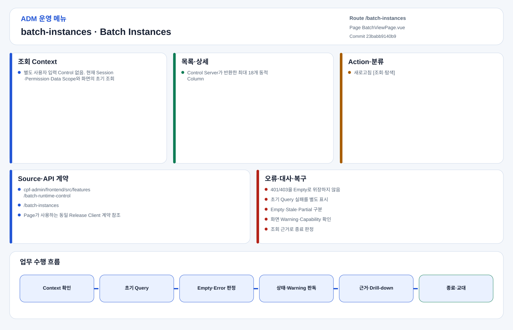

### 이 장에서 끝내는 업무

Batch Runtime Instance의 Version·Heartbeat·상태를 확인한다.

### 메뉴 식별·책임

| 항목 | 값 |
|---|---|
| Route | `/batch-instances` |
| 메뉴 ID | `batch-instances` |
| Menu Code | `batch-instances` |
| 업무 그룹 | 배치/통합 관제 |
| Frontend Page | `cpf-admin/frontend/src/features/batch-runtime-control/BatchViewPage.vue` |
| Permission | 조회 권한 |
| 기준 Commit | `23babb9140b90e501d6ac715e7b77f55b66198a5` |

### Source·API 근거

| 구분 | 기준 |
|---|---|
| Frontend Page | `cpf-admin/frontend/src/features/batch-runtime-control/BatchViewPage.vue` |
| Router | `/batch-instances` |
| API 추적 | 화면에서 제공하는 기능을 통해 호출한다. 문서에 명시되지 않은 Endpoint를 Browser나 외부 Script에서 임의 호출하지 않는다. |

아래 표는 이 메뉴에서 실제로 확인·입력·실행할 항목을 정리한다. 화면에 없는 Field·Button·상태를 임의로 가정하지 않는다.

### 검색·입력 Field

별도 사용자 입력 Control이 없다. 현재 Session·Permission·Data Scope와 Page가 정의한 초기 Query로 데이터를 읽는다. 새로고침은 같은 Context를 다시 조회하며 Owner 데이터는 변경하지 않는다.

### 목록 Column·상세 Field

| 표시값 | 운영 의미 | 교차 확인 |
|---|---|---|
| `Control Server가 반환한 최대 18개 동적 Column` | Batch Instances 상세에서 대상의 현재 속성 또는 처리 결과를 확인하는 값이다. | 상세·재조회 결과와 비교하고 Stale·Masking·단위 차이를 확인한다. |

#### 결과 판독 순서

1. 조회 완료 시각·Filter·Paging·Sort와 화면 Warning을 확인한다.
2. Empty·Stale·Partial을 정상 0건과 구분한다.
3. 식별자·상태·Version·오류·시각을 같은 Query Context의 상세와 Owner 원장에서 비교한다.
4. Masking된 값은 Raw Permission과 Reason 없이 복원·Export하지 않는다.
5. 집계와 상세가 다르면 집계 시간 창·Timezone·Owner Update 시각을 맞춰 대사한다.

### Button·Action

| Action | 분류 | 활성 조건 | Side Effect·정상 결과 |
|---|---|---|---|
| **새로고침** | 조회·탐색 | 조회 Permission과 Query Validation을 충족하고 동일 조회가 진행 중이 아님 | 새로고침 결과의 조회 시각·Filter·Source Version·Warning이 갱신되며 Owner 데이터는 변경하지 않는다. |

### 정상 업무 전체 절차

1. `/batch-instances`에 진입해 Page Header와 Route가 **Batch Instances** 기능을 가리키는지 확인한다.
2. 로그인 Session·Environment·Data Scope·기준일·Timezone을 고정한다.
3. 별도 사용자 입력 없이 초기 조회가 끝날 때까지 기다리고, 필요할 때만 같은 Context로 새로고침한다.
4. Loading 종료 후 Empty·Error·Stale·Partial 상태와 화면 Warning을 먼저 판정한다.
5. **Control Server가 반환한 최대 18개 동적 Column**를 읽고 식별자·상태·Version·시각을 Owner 원장과 대사한다.
6. 화면이 제공하는 Log·Metric·Trace와 조회·Raw·Export 접근 기록이 있으면 해당 Audit를 교차 확인한다.
7. 이 장의 **종료 판정**과 다음 확인 시각·Evidence Link를 교대 기록에 남긴다.

### 메뉴 고유 판정·금지 사항

- **목적:** Batch Runtime Instance의 Version·Heartbeat·상태를 확인한다.
- **종료 판정:** 동적 Column은 Control Server 응답 Schema와 조회 시각을 함께 표시하고 원본 상세로 Drill-down한다.
- 조회 화면에서 직접 Owner 데이터를 변경하거나 Browser Tool로 우회하지 않는다.
- Partial 조회를 정상 전체 결과로 합치지 않는다.

### 오류·경계·동시성·복구

| 상황 | 화면 징후 | 운영 조치 | 종료 증적 |
|---|---|---|---|
| 401·Session | Session 만료·CSRF·Origin 실패 | 로그인 상태와 BFF Session을 확인한 뒤 같은 Query Context로 다시 조회한다. | 401/403 응답·Session Audit |
| 403·Data Scope | 메뉴·Button·Raw·Export가 거부됨 | Menu·Button·API·Owner Permission과 Data Scope를 확인하고 우회하지 않는다. | Deny Audit·요청 Permission |
| Timeout·Dependency | 일부 조회 Source 응답 지연 | Correlation ID·Query Context·실패 Source를 기록하고 같은 조건으로 재조회한다. | 조회 시각·실패 Source·재조회 결과 |
| Partial·Stale | 일부 대상만 Success 또는 조회 Source 누락 | 성공·실패·미응답을 분리하고 누락 범위와 Version을 표시한다. | Target별 결과·Version |

### 응답 유실·부분 조회 처리

1. 검색 조건·Data Scope·Paging·조회 시각·Correlation ID를 기록한다.
2. 같은 조건으로 재조회하되 실패 Source만 분리한다.
3. 정상 Source 결과를 유지하고 실패·Stale Source를 명시한다.
4. 집계와 원본 상세가 다르면 Owner 상세를 기준으로 Reconcile Case를 연다.
5. 조회 시각·Source Version·0건 또는 일치 결과를 증적으로 남긴다.

### Log·Metric·Trace·Audit와 교대 기록

| 증적 | 필수 값 |
|---|---|
| Audit | Actor·Permission·Data Scope·Raw/Export 접근·Query Context·Result |
| Log | Environment·Instance·operationId·transactionId·failureStage·errorCode |
| Metric | 동일 시간 창의 Success·Failure·Latency·Queue·Retry·Partial·Unknown |
| Trace | root/segment/attempt·Owner·DB/Kafka/외부 의존성 Span |
| 상태 원장 | Target ID·Version·Checksum·Desired/Actual·Last Updated·Terminal 여부 |

```text
Menu=
Route=
Environment=
DataScope=
Query=
QueryAt=
CorrelationId=
SourceVersion=
Result=SUCCESS|EMPTY|STALE|PARTIAL|FAILED
FailedSources=
EvidenceLinks=
NextCheckAt=
```

### 실무 Workbook

**상황:** Batch Runtime Instance의 Version·Heartbeat·상태를 확인한다. 화면이 일부 Source Timeout 때문에 Partial 결과를 표시했다.

1. Query·Data Scope·조회 시각·Correlation ID를 기록한다.
2. 정상 결과를 0건으로 덮어쓰지 않고 실패 Source만 재조회한다.
3. Control Server가 반환한 최대 18개 동적 Column 값을 원본 상세와 같은 시간 기준으로 비교한다.
4. 불일치가 계속되면 Incident 또는 Reconcile Case를 생성한다.
5. 동적 Column은 Control Server 응답 Schema와 조회 시각을 함께 표시하고 원본 상세로 Drill-down한다.
6. Source Version과 다음 확인 시각을 교대 기록에 남긴다.

### 독립 수행 검수 Checklist

- [ ] `/batch-instances`와 Page Source를 찾고 화면 목적을 설명할 수 있다.
- [ ] 별도 사용자 입력이 없고 자동 Query Context·새로고침 동작을 설명할 수 있다.
- [ ] 1개 표시값을 Owner 상태·Version·Audit와 대사할 수 있다.
- [ ] 1개 Action의 분류·활성 조건·Side Effect를 설명할 수 있다.
- [ ] Empty·401·403·Timeout·Stale·Partial을 서로 다른 조회 상태로 처리할 수 있다.
- [ ] 조회 응답 유실 시 같은 Query Context로 재조회하고 Correlation ID·조회 시각·Source Version으로 결과를 대사할 수 있다.
- [ ] 교대 기록만으로 다음 담당자가 Target·상태·복구 기한을 이어받을 수 있다.

## 32. batch-scheduler — Scheduler


### 이 장에서 끝내는 업무

Scheduler Leader·Lease·Trigger·Misfire 상태를 확인한다.

### 메뉴 식별·책임

| 항목 | 값 |
|---|---|
| Route | `/batch-scheduler` |
| 메뉴 ID | `batch-scheduler` |
| Menu Code | `batch-scheduler` |
| 업무 그룹 | 배치/통합 관제 |
| Frontend Page | `cpf-admin/frontend/src/features/batch-runtime-control/BatchViewPage.vue` |
| Permission | 조회 권한 |
| 기준 Commit | `23babb9140b90e501d6ac715e7b77f55b66198a5` |

### Source·API 근거

| 구분 | 기준 |
|---|---|
| Frontend Page | `cpf-admin/frontend/src/features/batch-runtime-control/BatchViewPage.vue` |
| Router | `/batch-scheduler` |
| API 추적 | 화면에서 제공하는 기능을 통해 호출한다. 문서에 명시되지 않은 Endpoint를 Browser나 외부 Script에서 임의 호출하지 않는다. |

아래 표는 이 메뉴에서 실제로 확인·입력·실행할 항목을 정리한다. 화면에 없는 Field·Button·상태를 임의로 가정하지 않는다.

### 검색·입력 Field

별도 사용자 입력 Control이 없다. 현재 Session·Permission·Data Scope와 Page가 정의한 초기 Query로 데이터를 읽는다. 새로고침은 같은 Context를 다시 조회하며 Owner 데이터는 변경하지 않는다.

### 목록 Column·상세 Field

| 표시값 | 운영 의미 | 교차 확인 |
|---|---|---|
| `Control Server가 반환한 최대 18개 동적 Column` | Scheduler 상세에서 대상의 현재 속성 또는 처리 결과를 확인하는 값이다. | 상세·재조회 결과와 비교하고 Stale·Masking·단위 차이를 확인한다. |

#### 결과 판독 순서

1. 조회 완료 시각·Filter·Paging·Sort와 화면 Warning을 확인한다.
2. Empty·Stale·Partial을 정상 0건과 구분한다.
3. 식별자·상태·Version·오류·시각을 같은 Query Context의 상세와 Owner 원장에서 비교한다.
4. Masking된 값은 Raw Permission과 Reason 없이 복원·Export하지 않는다.
5. 집계와 상세가 다르면 집계 시간 창·Timezone·Owner Update 시각을 맞춰 대사한다.

### Button·Action

| Action | 분류 | 활성 조건 | Side Effect·정상 결과 |
|---|---|---|---|
| **새로고침** | 조회·탐색 | 조회 Permission과 Query Validation을 충족하고 동일 조회가 진행 중이 아님 | 새로고침 결과의 조회 시각·Filter·Source Version·Warning이 갱신되며 Owner 데이터는 변경하지 않는다. |

### 정상 업무 전체 절차

1. `/batch-scheduler`에 진입해 Page Header와 Route가 **Scheduler** 기능을 가리키는지 확인한다.
2. 로그인 Session·Environment·Data Scope·기준일·Timezone을 고정한다.
3. 별도 사용자 입력 없이 초기 조회가 끝날 때까지 기다리고, 필요할 때만 같은 Context로 새로고침한다.
4. Loading 종료 후 Empty·Error·Stale·Partial 상태와 화면 Warning을 먼저 판정한다.
5. **Control Server가 반환한 최대 18개 동적 Column**를 읽고 식별자·상태·Version·시각을 Owner 원장과 대사한다.
6. 화면이 제공하는 Log·Metric·Trace와 조회·Raw·Export 접근 기록이 있으면 해당 Audit를 교차 확인한다.
7. 이 장의 **종료 판정**과 다음 확인 시각·Evidence Link를 교대 기록에 남긴다.

### 메뉴 고유 판정·금지 사항

- **목적:** Scheduler Leader·Lease·Trigger·Misfire 상태를 확인한다.
- **종료 판정:** 동적 Column은 Control Server 응답 Schema와 조회 시각을 함께 표시하고 원본 상세로 Drill-down한다.
- 조회 화면에서 직접 Owner 데이터를 변경하거나 Browser Tool로 우회하지 않는다.
- Partial 조회를 정상 전체 결과로 합치지 않는다.

### 오류·경계·동시성·복구

| 상황 | 화면 징후 | 운영 조치 | 종료 증적 |
|---|---|---|---|
| 401·Session | Session 만료·CSRF·Origin 실패 | 로그인 상태와 BFF Session을 확인한 뒤 같은 Query Context로 다시 조회한다. | 401/403 응답·Session Audit |
| 403·Data Scope | 메뉴·Button·Raw·Export가 거부됨 | Menu·Button·API·Owner Permission과 Data Scope를 확인하고 우회하지 않는다. | Deny Audit·요청 Permission |
| Timeout·Dependency | 일부 조회 Source 응답 지연 | Correlation ID·Query Context·실패 Source를 기록하고 같은 조건으로 재조회한다. | 조회 시각·실패 Source·재조회 결과 |
| Partial·Stale | 일부 대상만 Success 또는 조회 Source 누락 | 성공·실패·미응답을 분리하고 누락 범위와 Version을 표시한다. | Target별 결과·Version |

### 응답 유실·부분 조회 처리

1. 검색 조건·Data Scope·Paging·조회 시각·Correlation ID를 기록한다.
2. 같은 조건으로 재조회하되 실패 Source만 분리한다.
3. 정상 Source 결과를 유지하고 실패·Stale Source를 명시한다.
4. 집계와 원본 상세가 다르면 Owner 상세를 기준으로 Reconcile Case를 연다.
5. 조회 시각·Source Version·0건 또는 일치 결과를 증적으로 남긴다.

### Log·Metric·Trace·Audit와 교대 기록

| 증적 | 필수 값 |
|---|---|
| Audit | Actor·Permission·Data Scope·Raw/Export 접근·Query Context·Result |
| Log | Environment·Instance·operationId·transactionId·failureStage·errorCode |
| Metric | 동일 시간 창의 Success·Failure·Latency·Queue·Retry·Partial·Unknown |
| Trace | root/segment/attempt·Owner·DB/Kafka/외부 의존성 Span |
| 상태 원장 | Target ID·Version·Checksum·Desired/Actual·Last Updated·Terminal 여부 |

```text
Menu=
Route=
Environment=
DataScope=
Query=
QueryAt=
CorrelationId=
SourceVersion=
Result=SUCCESS|EMPTY|STALE|PARTIAL|FAILED
FailedSources=
EvidenceLinks=
NextCheckAt=
```

### 실무 Workbook

**상황:** Scheduler Leader·Lease·Trigger·Misfire 상태를 확인한다. 화면이 일부 Source Timeout 때문에 Partial 결과를 표시했다.

1. Query·Data Scope·조회 시각·Correlation ID를 기록한다.
2. 정상 결과를 0건으로 덮어쓰지 않고 실패 Source만 재조회한다.
3. Control Server가 반환한 최대 18개 동적 Column 값을 원본 상세와 같은 시간 기준으로 비교한다.
4. 불일치가 계속되면 Incident 또는 Reconcile Case를 생성한다.
5. 동적 Column은 Control Server 응답 Schema와 조회 시각을 함께 표시하고 원본 상세로 Drill-down한다.
6. Source Version과 다음 확인 시각을 교대 기록에 남긴다.

### 독립 수행 검수 Checklist

- [ ] `/batch-scheduler`와 Page Source를 찾고 화면 목적을 설명할 수 있다.
- [ ] 별도 사용자 입력이 없고 자동 Query Context·새로고침 동작을 설명할 수 있다.
- [ ] 1개 표시값을 Owner 상태·Version·Audit와 대사할 수 있다.
- [ ] 1개 Action의 분류·활성 조건·Side Effect를 설명할 수 있다.
- [ ] Empty·401·403·Timeout·Stale·Partial을 서로 다른 조회 상태로 처리할 수 있다.
- [ ] 조회 응답 유실 시 같은 Query Context로 재조회하고 Correlation ID·조회 시각·Source Version으로 결과를 대사할 수 있다.
- [ ] 교대 기록만으로 다음 담당자가 Target·상태·복구 기한을 이어받을 수 있다.

## 33. batch-worker-pools — Worker Pools


### 이 장에서 끝내는 업무

Worker Pool 용량·가용 Worker·Drain 상태를 확인한다.

### 메뉴 식별·책임

| 항목 | 값 |
|---|---|
| Route | `/batch-worker-pools` |
| 메뉴 ID | `batch-worker-pools` |
| Menu Code | `batch-worker-pools` |
| 업무 그룹 | 배치/통합 관제 |
| Frontend Page | `cpf-admin/frontend/src/features/batch-runtime-control/BatchViewPage.vue` |
| Permission | 조회 권한 |
| 기준 Commit | `23babb9140b90e501d6ac715e7b77f55b66198a5` |

### Source·API 근거

| 구분 | 기준 |
|---|---|
| Frontend Page | `cpf-admin/frontend/src/features/batch-runtime-control/BatchViewPage.vue` |
| Router | `/batch-worker-pools` |
| API 추적 | 화면에서 제공하는 기능을 통해 호출한다. 문서에 명시되지 않은 Endpoint를 Browser나 외부 Script에서 임의 호출하지 않는다. |

아래 표는 이 메뉴에서 실제로 확인·입력·실행할 항목을 정리한다. 화면에 없는 Field·Button·상태를 임의로 가정하지 않는다.

### 검색·입력 Field

별도 사용자 입력 Control이 없다. 현재 Session·Permission·Data Scope와 Page가 정의한 초기 Query로 데이터를 읽는다. 새로고침은 같은 Context를 다시 조회하며 Owner 데이터는 변경하지 않는다.

### 목록 Column·상세 Field

| 표시값 | 운영 의미 | 교차 확인 |
|---|---|---|
| `Control Server가 반환한 최대 18개 동적 Column` | Worker Pools 상세에서 대상의 현재 속성 또는 처리 결과를 확인하는 값이다. | 상세·재조회 결과와 비교하고 Stale·Masking·단위 차이를 확인한다. |

#### 결과 판독 순서

1. 조회 완료 시각·Filter·Paging·Sort와 화면 Warning을 확인한다.
2. Empty·Stale·Partial을 정상 0건과 구분한다.
3. 식별자·상태·Version·오류·시각을 같은 Query Context의 상세와 Owner 원장에서 비교한다.
4. Masking된 값은 Raw Permission과 Reason 없이 복원·Export하지 않는다.
5. 집계와 상세가 다르면 집계 시간 창·Timezone·Owner Update 시각을 맞춰 대사한다.

### Button·Action

| Action | 분류 | 활성 조건 | Side Effect·정상 결과 |
|---|---|---|---|
| **새로고침** | 조회·탐색 | 조회 Permission과 Query Validation을 충족하고 동일 조회가 진행 중이 아님 | 새로고침 결과의 조회 시각·Filter·Source Version·Warning이 갱신되며 Owner 데이터는 변경하지 않는다. |

### 정상 업무 전체 절차

1. `/batch-worker-pools`에 진입해 Page Header와 Route가 **Worker Pools** 기능을 가리키는지 확인한다.
2. 로그인 Session·Environment·Data Scope·기준일·Timezone을 고정한다.
3. 별도 사용자 입력 없이 초기 조회가 끝날 때까지 기다리고, 필요할 때만 같은 Context로 새로고침한다.
4. Loading 종료 후 Empty·Error·Stale·Partial 상태와 화면 Warning을 먼저 판정한다.
5. **Control Server가 반환한 최대 18개 동적 Column**를 읽고 식별자·상태·Version·시각을 Owner 원장과 대사한다.
6. 화면이 제공하는 Log·Metric·Trace와 조회·Raw·Export 접근 기록이 있으면 해당 Audit를 교차 확인한다.
7. 이 장의 **종료 판정**과 다음 확인 시각·Evidence Link를 교대 기록에 남긴다.

### 메뉴 고유 판정·금지 사항

- **목적:** Worker Pool 용량·가용 Worker·Drain 상태를 확인한다.
- **종료 판정:** 동적 Column은 Control Server 응답 Schema와 조회 시각을 함께 표시하고 원본 상세로 Drill-down한다.
- 조회 화면에서 직접 Owner 데이터를 변경하거나 Browser Tool로 우회하지 않는다.
- Partial 조회를 정상 전체 결과로 합치지 않는다.

### 오류·경계·동시성·복구

| 상황 | 화면 징후 | 운영 조치 | 종료 증적 |
|---|---|---|---|
| 401·Session | Session 만료·CSRF·Origin 실패 | 로그인 상태와 BFF Session을 확인한 뒤 같은 Query Context로 다시 조회한다. | 401/403 응답·Session Audit |
| 403·Data Scope | 메뉴·Button·Raw·Export가 거부됨 | Menu·Button·API·Owner Permission과 Data Scope를 확인하고 우회하지 않는다. | Deny Audit·요청 Permission |
| Timeout·Dependency | 일부 조회 Source 응답 지연 | Correlation ID·Query Context·실패 Source를 기록하고 같은 조건으로 재조회한다. | 조회 시각·실패 Source·재조회 결과 |
| Partial·Stale | 일부 대상만 Success 또는 조회 Source 누락 | 성공·실패·미응답을 분리하고 누락 범위와 Version을 표시한다. | Target별 결과·Version |

### 응답 유실·부분 조회 처리

1. 검색 조건·Data Scope·Paging·조회 시각·Correlation ID를 기록한다.
2. 같은 조건으로 재조회하되 실패 Source만 분리한다.
3. 정상 Source 결과를 유지하고 실패·Stale Source를 명시한다.
4. 집계와 원본 상세가 다르면 Owner 상세를 기준으로 Reconcile Case를 연다.
5. 조회 시각·Source Version·0건 또는 일치 결과를 증적으로 남긴다.

### Log·Metric·Trace·Audit와 교대 기록

| 증적 | 필수 값 |
|---|---|
| Audit | Actor·Permission·Data Scope·Raw/Export 접근·Query Context·Result |
| Log | Environment·Instance·operationId·transactionId·failureStage·errorCode |
| Metric | 동일 시간 창의 Success·Failure·Latency·Queue·Retry·Partial·Unknown |
| Trace | root/segment/attempt·Owner·DB/Kafka/외부 의존성 Span |
| 상태 원장 | Target ID·Version·Checksum·Desired/Actual·Last Updated·Terminal 여부 |

```text
Menu=
Route=
Environment=
DataScope=
Query=
QueryAt=
CorrelationId=
SourceVersion=
Result=SUCCESS|EMPTY|STALE|PARTIAL|FAILED
FailedSources=
EvidenceLinks=
NextCheckAt=
```

### 실무 Workbook

**상황:** Worker Pool 용량·가용 Worker·Drain 상태를 확인한다. 화면이 일부 Source Timeout 때문에 Partial 결과를 표시했다.

1. Query·Data Scope·조회 시각·Correlation ID를 기록한다.
2. 정상 결과를 0건으로 덮어쓰지 않고 실패 Source만 재조회한다.
3. Control Server가 반환한 최대 18개 동적 Column 값을 원본 상세와 같은 시간 기준으로 비교한다.
4. 불일치가 계속되면 Incident 또는 Reconcile Case를 생성한다.
5. 동적 Column은 Control Server 응답 Schema와 조회 시각을 함께 표시하고 원본 상세로 Drill-down한다.
6. Source Version과 다음 확인 시각을 교대 기록에 남긴다.

### 독립 수행 검수 Checklist

- [ ] `/batch-worker-pools`와 Page Source를 찾고 화면 목적을 설명할 수 있다.
- [ ] 별도 사용자 입력이 없고 자동 Query Context·새로고침 동작을 설명할 수 있다.
- [ ] 1개 표시값을 Owner 상태·Version·Audit와 대사할 수 있다.
- [ ] 1개 Action의 분류·활성 조건·Side Effect를 설명할 수 있다.
- [ ] Empty·401·403·Timeout·Stale·Partial을 서로 다른 조회 상태로 처리할 수 있다.
- [ ] 조회 응답 유실 시 같은 Query Context로 재조회하고 Correlation ID·조회 시각·Source Version으로 결과를 대사할 수 있다.
- [ ] 교대 기록만으로 다음 담당자가 Target·상태·복구 기한을 이어받을 수 있다.

## 34. batch-center-cut — Center-Cut

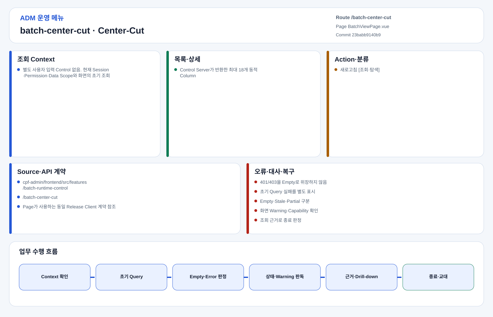

### 이 장에서 끝내는 업무

Center-Cut Job·Target·Partition·결과를 확인한다.

### 메뉴 식별·책임

| 항목 | 값 |
|---|---|
| Route | `/batch-center-cut` |
| 메뉴 ID | `batch-center-cut` |
| Menu Code | `batch-center-cut` |
| 업무 그룹 | 배치/통합 관제 |
| Frontend Page | `cpf-admin/frontend/src/features/batch-runtime-control/BatchViewPage.vue` |
| Permission | 조회 권한 |
| 기준 Commit | `23babb9140b90e501d6ac715e7b77f55b66198a5` |

### Source·API 근거

| 구분 | 기준 |
|---|---|
| Frontend Page | `cpf-admin/frontend/src/features/batch-runtime-control/BatchViewPage.vue` |
| Router | `/batch-center-cut` |
| API 추적 | 화면에서 제공하는 기능을 통해 호출한다. 문서에 명시되지 않은 Endpoint를 Browser나 외부 Script에서 임의 호출하지 않는다. |

아래 표는 이 메뉴에서 실제로 확인·입력·실행할 항목을 정리한다. 화면에 없는 Field·Button·상태를 임의로 가정하지 않는다.

### 검색·입력 Field

별도 사용자 입력 Control이 없다. 현재 Session·Permission·Data Scope와 Page가 정의한 초기 Query로 데이터를 읽는다. 새로고침은 같은 Context를 다시 조회하며 Owner 데이터는 변경하지 않는다.

### 목록 Column·상세 Field

| 표시값 | 운영 의미 | 교차 확인 |
|---|---|---|
| `Control Server가 반환한 최대 18개 동적 Column` | Center-Cut 상세에서 대상의 현재 속성 또는 처리 결과를 확인하는 값이다. | 상세·재조회 결과와 비교하고 Stale·Masking·단위 차이를 확인한다. |

#### 결과 판독 순서

1. 조회 완료 시각·Filter·Paging·Sort와 화면 Warning을 확인한다.
2. Empty·Stale·Partial을 정상 0건과 구분한다.
3. 식별자·상태·Version·오류·시각을 같은 Query Context의 상세와 Owner 원장에서 비교한다.
4. Masking된 값은 Raw Permission과 Reason 없이 복원·Export하지 않는다.
5. 집계와 상세가 다르면 집계 시간 창·Timezone·Owner Update 시각을 맞춰 대사한다.

### Button·Action

| Action | 분류 | 활성 조건 | Side Effect·정상 결과 |
|---|---|---|---|
| **새로고침** | 조회·탐색 | 조회 Permission과 Query Validation을 충족하고 동일 조회가 진행 중이 아님 | 새로고침 결과의 조회 시각·Filter·Source Version·Warning이 갱신되며 Owner 데이터는 변경하지 않는다. |

### 정상 업무 전체 절차

1. `/batch-center-cut`에 진입해 Page Header와 Route가 **Center-Cut** 기능을 가리키는지 확인한다.
2. 로그인 Session·Environment·Data Scope·기준일·Timezone을 고정한다.
3. 별도 사용자 입력 없이 초기 조회가 끝날 때까지 기다리고, 필요할 때만 같은 Context로 새로고침한다.
4. Loading 종료 후 Empty·Error·Stale·Partial 상태와 화면 Warning을 먼저 판정한다.
5. **Control Server가 반환한 최대 18개 동적 Column**를 읽고 식별자·상태·Version·시각을 Owner 원장과 대사한다.
6. 화면이 제공하는 Log·Metric·Trace와 조회·Raw·Export 접근 기록이 있으면 해당 Audit를 교차 확인한다.
7. 이 장의 **종료 판정**과 다음 확인 시각·Evidence Link를 교대 기록에 남긴다.

### 메뉴 고유 판정·금지 사항

- **목적:** Center-Cut Job·Target·Partition·결과를 확인한다.
- **종료 판정:** 동적 Column은 Control Server 응답 Schema와 조회 시각을 함께 표시하고 원본 상세로 Drill-down한다.
- 조회 화면에서 직접 Owner 데이터를 변경하거나 Browser Tool로 우회하지 않는다.
- Partial 조회를 정상 전체 결과로 합치지 않는다.

### 오류·경계·동시성·복구

| 상황 | 화면 징후 | 운영 조치 | 종료 증적 |
|---|---|---|---|
| 401·Session | Session 만료·CSRF·Origin 실패 | 로그인 상태와 BFF Session을 확인한 뒤 같은 Query Context로 다시 조회한다. | 401/403 응답·Session Audit |
| 403·Data Scope | 메뉴·Button·Raw·Export가 거부됨 | Menu·Button·API·Owner Permission과 Data Scope를 확인하고 우회하지 않는다. | Deny Audit·요청 Permission |
| Timeout·Dependency | 일부 조회 Source 응답 지연 | Correlation ID·Query Context·실패 Source를 기록하고 같은 조건으로 재조회한다. | 조회 시각·실패 Source·재조회 결과 |
| Partial·Stale | 일부 대상만 Success 또는 조회 Source 누락 | 성공·실패·미응답을 분리하고 누락 범위와 Version을 표시한다. | Target별 결과·Version |

### 응답 유실·부분 조회 처리

1. 검색 조건·Data Scope·Paging·조회 시각·Correlation ID를 기록한다.
2. 같은 조건으로 재조회하되 실패 Source만 분리한다.
3. 정상 Source 결과를 유지하고 실패·Stale Source를 명시한다.
4. 집계와 원본 상세가 다르면 Owner 상세를 기준으로 Reconcile Case를 연다.
5. 조회 시각·Source Version·0건 또는 일치 결과를 증적으로 남긴다.

### Log·Metric·Trace·Audit와 교대 기록

| 증적 | 필수 값 |
|---|---|
| Audit | Actor·Permission·Data Scope·Raw/Export 접근·Query Context·Result |
| Log | Environment·Instance·operationId·transactionId·failureStage·errorCode |
| Metric | 동일 시간 창의 Success·Failure·Latency·Queue·Retry·Partial·Unknown |
| Trace | root/segment/attempt·Owner·DB/Kafka/외부 의존성 Span |
| 상태 원장 | Target ID·Version·Checksum·Desired/Actual·Last Updated·Terminal 여부 |

```text
Menu=
Route=
Environment=
DataScope=
Query=
QueryAt=
CorrelationId=
SourceVersion=
Result=SUCCESS|EMPTY|STALE|PARTIAL|FAILED
FailedSources=
EvidenceLinks=
NextCheckAt=
```

### 실무 Workbook

**상황:** Center-Cut Job·Target·Partition·결과를 확인한다. 화면이 일부 Source Timeout 때문에 Partial 결과를 표시했다.

1. Query·Data Scope·조회 시각·Correlation ID를 기록한다.
2. 정상 결과를 0건으로 덮어쓰지 않고 실패 Source만 재조회한다.
3. Control Server가 반환한 최대 18개 동적 Column 값을 원본 상세와 같은 시간 기준으로 비교한다.
4. 불일치가 계속되면 Incident 또는 Reconcile Case를 생성한다.
5. 동적 Column은 Control Server 응답 Schema와 조회 시각을 함께 표시하고 원본 상세로 Drill-down한다.
6. Source Version과 다음 확인 시각을 교대 기록에 남긴다.

### 독립 수행 검수 Checklist

- [ ] `/batch-center-cut`와 Page Source를 찾고 화면 목적을 설명할 수 있다.
- [ ] 별도 사용자 입력이 없고 자동 Query Context·새로고침 동작을 설명할 수 있다.
- [ ] 1개 표시값을 Owner 상태·Version·Audit와 대사할 수 있다.
- [ ] 1개 Action의 분류·활성 조건·Side Effect를 설명할 수 있다.
- [ ] Empty·401·403·Timeout·Stale·Partial을 서로 다른 조회 상태로 처리할 수 있다.
- [ ] 조회 응답 유실 시 같은 Query Context로 재조회하고 Correlation ID·조회 시각·Source Version으로 결과를 대사할 수 있다.
- [ ] 교대 기록만으로 다음 담당자가 Target·상태·복구 기한을 이어받을 수 있다.

## 35. batch-agents — Agents

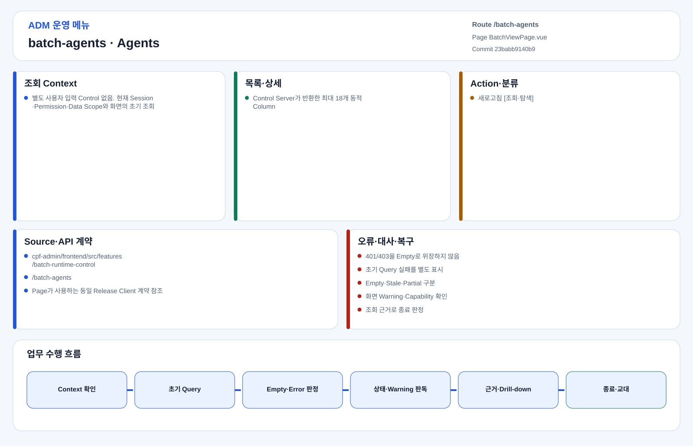

### 이 장에서 끝내는 업무

Host Agent의 Heartbeat·Version·Capability를 확인한다.

### 메뉴 식별·책임

| 항목 | 값 |
|---|---|
| Route | `/batch-agents` |
| 메뉴 ID | `batch-agents` |
| Menu Code | `batch-agents` |
| 업무 그룹 | 배치/통합 관제 |
| Frontend Page | `cpf-admin/frontend/src/features/batch-runtime-control/BatchViewPage.vue` |
| Permission | 조회 권한 |
| 기준 Commit | `23babb9140b90e501d6ac715e7b77f55b66198a5` |

### Source·API 근거

| 구분 | 기준 |
|---|---|
| Frontend Page | `cpf-admin/frontend/src/features/batch-runtime-control/BatchViewPage.vue` |
| Router | `/batch-agents` |
| API 추적 | 화면에서 제공하는 기능을 통해 호출한다. 문서에 명시되지 않은 Endpoint를 Browser나 외부 Script에서 임의 호출하지 않는다. |

아래 표는 이 메뉴에서 실제로 확인·입력·실행할 항목을 정리한다. 화면에 없는 Field·Button·상태를 임의로 가정하지 않는다.

### 검색·입력 Field

별도 사용자 입력 Control이 없다. 현재 Session·Permission·Data Scope와 Page가 정의한 초기 Query로 데이터를 읽는다. 새로고침은 같은 Context를 다시 조회하며 Owner 데이터는 변경하지 않는다.

### 목록 Column·상세 Field

| 표시값 | 운영 의미 | 교차 확인 |
|---|---|---|
| `Control Server가 반환한 최대 18개 동적 Column` | Agents 상세에서 대상의 현재 속성 또는 처리 결과를 확인하는 값이다. | 상세·재조회 결과와 비교하고 Stale·Masking·단위 차이를 확인한다. |

#### 결과 판독 순서

1. 조회 완료 시각·Filter·Paging·Sort와 화면 Warning을 확인한다.
2. Empty·Stale·Partial을 정상 0건과 구분한다.
3. 식별자·상태·Version·오류·시각을 같은 Query Context의 상세와 Owner 원장에서 비교한다.
4. Masking된 값은 Raw Permission과 Reason 없이 복원·Export하지 않는다.
5. 집계와 상세가 다르면 집계 시간 창·Timezone·Owner Update 시각을 맞춰 대사한다.

### Button·Action

| Action | 분류 | 활성 조건 | Side Effect·정상 결과 |
|---|---|---|---|
| **새로고침** | 조회·탐색 | 조회 Permission과 Query Validation을 충족하고 동일 조회가 진행 중이 아님 | 새로고침 결과의 조회 시각·Filter·Source Version·Warning이 갱신되며 Owner 데이터는 변경하지 않는다. |

### 정상 업무 전체 절차

1. `/batch-agents`에 진입해 Page Header와 Route가 **Agents** 기능을 가리키는지 확인한다.
2. 로그인 Session·Environment·Data Scope·기준일·Timezone을 고정한다.
3. 별도 사용자 입력 없이 초기 조회가 끝날 때까지 기다리고, 필요할 때만 같은 Context로 새로고침한다.
4. Loading 종료 후 Empty·Error·Stale·Partial 상태와 화면 Warning을 먼저 판정한다.
5. **Control Server가 반환한 최대 18개 동적 Column**를 읽고 식별자·상태·Version·시각을 Owner 원장과 대사한다.
6. 화면이 제공하는 Log·Metric·Trace와 조회·Raw·Export 접근 기록이 있으면 해당 Audit를 교차 확인한다.
7. 이 장의 **종료 판정**과 다음 확인 시각·Evidence Link를 교대 기록에 남긴다.

### 메뉴 고유 판정·금지 사항

- **목적:** Host Agent의 Heartbeat·Version·Capability를 확인한다.
- **종료 판정:** 동적 Column은 Control Server 응답 Schema와 조회 시각을 함께 표시하고 원본 상세로 Drill-down한다.
- 조회 화면에서 직접 Owner 데이터를 변경하거나 Browser Tool로 우회하지 않는다.
- Partial 조회를 정상 전체 결과로 합치지 않는다.

### 오류·경계·동시성·복구

| 상황 | 화면 징후 | 운영 조치 | 종료 증적 |
|---|---|---|---|
| 401·Session | Session 만료·CSRF·Origin 실패 | 로그인 상태와 BFF Session을 확인한 뒤 같은 Query Context로 다시 조회한다. | 401/403 응답·Session Audit |
| 403·Data Scope | 메뉴·Button·Raw·Export가 거부됨 | Menu·Button·API·Owner Permission과 Data Scope를 확인하고 우회하지 않는다. | Deny Audit·요청 Permission |
| Timeout·Dependency | 일부 조회 Source 응답 지연 | Correlation ID·Query Context·실패 Source를 기록하고 같은 조건으로 재조회한다. | 조회 시각·실패 Source·재조회 결과 |
| Partial·Stale | 일부 대상만 Success 또는 조회 Source 누락 | 성공·실패·미응답을 분리하고 누락 범위와 Version을 표시한다. | Target별 결과·Version |

### 응답 유실·부분 조회 처리

1. 검색 조건·Data Scope·Paging·조회 시각·Correlation ID를 기록한다.
2. 같은 조건으로 재조회하되 실패 Source만 분리한다.
3. 정상 Source 결과를 유지하고 실패·Stale Source를 명시한다.
4. 집계와 원본 상세가 다르면 Owner 상세를 기준으로 Reconcile Case를 연다.
5. 조회 시각·Source Version·0건 또는 일치 결과를 증적으로 남긴다.

### Log·Metric·Trace·Audit와 교대 기록

| 증적 | 필수 값 |
|---|---|
| Audit | Actor·Permission·Data Scope·Raw/Export 접근·Query Context·Result |
| Log | Environment·Instance·operationId·transactionId·failureStage·errorCode |
| Metric | 동일 시간 창의 Success·Failure·Latency·Queue·Retry·Partial·Unknown |
| Trace | root/segment/attempt·Owner·DB/Kafka/외부 의존성 Span |
| 상태 원장 | Target ID·Version·Checksum·Desired/Actual·Last Updated·Terminal 여부 |

```text
Menu=
Route=
Environment=
DataScope=
Query=
QueryAt=
CorrelationId=
SourceVersion=
Result=SUCCESS|EMPTY|STALE|PARTIAL|FAILED
FailedSources=
EvidenceLinks=
NextCheckAt=
```

### 실무 Workbook

**상황:** Host Agent의 Heartbeat·Version·Capability를 확인한다. 화면이 일부 Source Timeout 때문에 Partial 결과를 표시했다.

1. Query·Data Scope·조회 시각·Correlation ID를 기록한다.
2. 정상 결과를 0건으로 덮어쓰지 않고 실패 Source만 재조회한다.
3. Control Server가 반환한 최대 18개 동적 Column 값을 원본 상세와 같은 시간 기준으로 비교한다.
4. 불일치가 계속되면 Incident 또는 Reconcile Case를 생성한다.
5. 동적 Column은 Control Server 응답 Schema와 조회 시각을 함께 표시하고 원본 상세로 Drill-down한다.
6. Source Version과 다음 확인 시각을 교대 기록에 남긴다.

### 독립 수행 검수 Checklist

- [ ] `/batch-agents`와 Page Source를 찾고 화면 목적을 설명할 수 있다.
- [ ] 별도 사용자 입력이 없고 자동 Query Context·새로고침 동작을 설명할 수 있다.
- [ ] 1개 표시값을 Owner 상태·Version·Audit와 대사할 수 있다.
- [ ] 1개 Action의 분류·활성 조건·Side Effect를 설명할 수 있다.
- [ ] Empty·401·403·Timeout·Stale·Partial을 서로 다른 조회 상태로 처리할 수 있다.
- [ ] 조회 응답 유실 시 같은 Query Context로 재조회하고 Correlation ID·조회 시각·Source Version으로 결과를 대사할 수 있다.
- [ ] 교대 기록만으로 다음 담당자가 Target·상태·복구 기한을 이어받을 수 있다.

## 36. batch-job-packs — Job Packs


### 이 장에서 끝내는 업무

Job Pack Version·Checksum·승인·배포 상태를 확인한다.

### 메뉴 식별·책임

| 항목 | 값 |
|---|---|
| Route | `/batch-job-packs` |
| 메뉴 ID | `batch-job-packs` |
| Menu Code | `batch-job-packs` |
| 업무 그룹 | 배치/통합 관제 |
| Frontend Page | `cpf-admin/frontend/src/features/batch-runtime-control/BatchViewPage.vue` |
| Permission | 조회 권한 |
| 기준 Commit | `23babb9140b90e501d6ac715e7b77f55b66198a5` |

### Source·API 근거

| 구분 | 기준 |
|---|---|
| Frontend Page | `cpf-admin/frontend/src/features/batch-runtime-control/BatchViewPage.vue` |
| Router | `/batch-job-packs` |
| API 추적 | 화면에서 제공하는 기능을 통해 호출한다. 문서에 명시되지 않은 Endpoint를 Browser나 외부 Script에서 임의 호출하지 않는다. |

아래 표는 이 메뉴에서 실제로 확인·입력·실행할 항목을 정리한다. 화면에 없는 Field·Button·상태를 임의로 가정하지 않는다.

### 검색·입력 Field

별도 사용자 입력 Control이 없다. 현재 Session·Permission·Data Scope와 Page가 정의한 초기 Query로 데이터를 읽는다. 새로고침은 같은 Context를 다시 조회하며 Owner 데이터는 변경하지 않는다.

### 목록 Column·상세 Field

| 표시값 | 운영 의미 | 교차 확인 |
|---|---|---|
| `Control Server가 반환한 최대 18개 동적 Column` | Job Packs 상세에서 대상의 현재 속성 또는 처리 결과를 확인하는 값이다. | 상세·재조회 결과와 비교하고 Stale·Masking·단위 차이를 확인한다. |

#### 결과 판독 순서

1. 조회 완료 시각·Filter·Paging·Sort와 화면 Warning을 확인한다.
2. Empty·Stale·Partial을 정상 0건과 구분한다.
3. 식별자·상태·Version·오류·시각을 같은 Query Context의 상세와 Owner 원장에서 비교한다.
4. Masking된 값은 Raw Permission과 Reason 없이 복원·Export하지 않는다.
5. 집계와 상세가 다르면 집계 시간 창·Timezone·Owner Update 시각을 맞춰 대사한다.

### Button·Action

| Action | 분류 | 활성 조건 | Side Effect·정상 결과 |
|---|---|---|---|
| **새로고침** | 조회·탐색 | 조회 Permission과 Query Validation을 충족하고 동일 조회가 진행 중이 아님 | 새로고침 결과의 조회 시각·Filter·Source Version·Warning이 갱신되며 Owner 데이터는 변경하지 않는다. |

### 정상 업무 전체 절차

1. `/batch-job-packs`에 진입해 Page Header와 Route가 **Job Packs** 기능을 가리키는지 확인한다.
2. 로그인 Session·Environment·Data Scope·기준일·Timezone을 고정한다.
3. 별도 사용자 입력 없이 초기 조회가 끝날 때까지 기다리고, 필요할 때만 같은 Context로 새로고침한다.
4. Loading 종료 후 Empty·Error·Stale·Partial 상태와 화면 Warning을 먼저 판정한다.
5. **Control Server가 반환한 최대 18개 동적 Column**를 읽고 식별자·상태·Version·시각을 Owner 원장과 대사한다.
6. 화면이 제공하는 Log·Metric·Trace와 조회·Raw·Export 접근 기록이 있으면 해당 Audit를 교차 확인한다.
7. 이 장의 **종료 판정**과 다음 확인 시각·Evidence Link를 교대 기록에 남긴다.

### 메뉴 고유 판정·금지 사항

- **목적:** Job Pack Version·Checksum·승인·배포 상태를 확인한다.
- **종료 판정:** 동적 Column은 Control Server 응답 Schema와 조회 시각을 함께 표시하고 원본 상세로 Drill-down한다.
- 조회 화면에서 직접 Owner 데이터를 변경하거나 Browser Tool로 우회하지 않는다.
- Partial 조회를 정상 전체 결과로 합치지 않는다.

### 오류·경계·동시성·복구

| 상황 | 화면 징후 | 운영 조치 | 종료 증적 |
|---|---|---|---|
| 401·Session | Session 만료·CSRF·Origin 실패 | 로그인 상태와 BFF Session을 확인한 뒤 같은 Query Context로 다시 조회한다. | 401/403 응답·Session Audit |
| 403·Data Scope | 메뉴·Button·Raw·Export가 거부됨 | Menu·Button·API·Owner Permission과 Data Scope를 확인하고 우회하지 않는다. | Deny Audit·요청 Permission |
| Timeout·Dependency | 일부 조회 Source 응답 지연 | Correlation ID·Query Context·실패 Source를 기록하고 같은 조건으로 재조회한다. | 조회 시각·실패 Source·재조회 결과 |
| Partial·Stale | 일부 대상만 Success 또는 조회 Source 누락 | 성공·실패·미응답을 분리하고 누락 범위와 Version을 표시한다. | Target별 결과·Version |

### 응답 유실·부분 조회 처리

1. 검색 조건·Data Scope·Paging·조회 시각·Correlation ID를 기록한다.
2. 같은 조건으로 재조회하되 실패 Source만 분리한다.
3. 정상 Source 결과를 유지하고 실패·Stale Source를 명시한다.
4. 집계와 원본 상세가 다르면 Owner 상세를 기준으로 Reconcile Case를 연다.
5. 조회 시각·Source Version·0건 또는 일치 결과를 증적으로 남긴다.

### Log·Metric·Trace·Audit와 교대 기록

| 증적 | 필수 값 |
|---|---|
| Audit | Actor·Permission·Data Scope·Raw/Export 접근·Query Context·Result |
| Log | Environment·Instance·operationId·transactionId·failureStage·errorCode |
| Metric | 동일 시간 창의 Success·Failure·Latency·Queue·Retry·Partial·Unknown |
| Trace | root/segment/attempt·Owner·DB/Kafka/외부 의존성 Span |
| 상태 원장 | Target ID·Version·Checksum·Desired/Actual·Last Updated·Terminal 여부 |

```text
Menu=
Route=
Environment=
DataScope=
Query=
QueryAt=
CorrelationId=
SourceVersion=
Result=SUCCESS|EMPTY|STALE|PARTIAL|FAILED
FailedSources=
EvidenceLinks=
NextCheckAt=
```

### 실무 Workbook

**상황:** Job Pack Version·Checksum·승인·배포 상태를 확인한다. 화면이 일부 Source Timeout 때문에 Partial 결과를 표시했다.

1. Query·Data Scope·조회 시각·Correlation ID를 기록한다.
2. 정상 결과를 0건으로 덮어쓰지 않고 실패 Source만 재조회한다.
3. Control Server가 반환한 최대 18개 동적 Column 값을 원본 상세와 같은 시간 기준으로 비교한다.
4. 불일치가 계속되면 Incident 또는 Reconcile Case를 생성한다.
5. 동적 Column은 Control Server 응답 Schema와 조회 시각을 함께 표시하고 원본 상세로 Drill-down한다.
6. Source Version과 다음 확인 시각을 교대 기록에 남긴다.

### 독립 수행 검수 Checklist

- [ ] `/batch-job-packs`와 Page Source를 찾고 화면 목적을 설명할 수 있다.
- [ ] 별도 사용자 입력이 없고 자동 Query Context·새로고침 동작을 설명할 수 있다.
- [ ] 1개 표시값을 Owner 상태·Version·Audit와 대사할 수 있다.
- [ ] 1개 Action의 분류·활성 조건·Side Effect를 설명할 수 있다.
- [ ] Empty·401·403·Timeout·Stale·Partial을 서로 다른 조회 상태로 처리할 수 있다.
- [ ] 조회 응답 유실 시 같은 Query Context로 재조회하고 Correlation ID·조회 시각·Source Version으로 결과를 대사할 수 있다.
- [ ] 교대 기록만으로 다음 담당자가 Target·상태·복구 기한을 이어받을 수 있다.

## 37. batch-executions — Executions


### 이 장에서 끝내는 업무

Execution·Step·Parameter·Checkpoint·결과를 확인한다.

### 메뉴 식별·책임

| 항목 | 값 |
|---|---|
| Route | `/batch-executions` |
| 메뉴 ID | `batch-executions` |
| Menu Code | `batch-executions` |
| 업무 그룹 | 배치/통합 관제 |
| Frontend Page | `cpf-admin/frontend/src/features/batch-runtime-control/BatchViewPage.vue` |
| Permission | 조회 권한 |
| 기준 Commit | `23babb9140b90e501d6ac715e7b77f55b66198a5` |

### Source·API 근거

| 구분 | 기준 |
|---|---|
| Frontend Page | `cpf-admin/frontend/src/features/batch-runtime-control/BatchViewPage.vue` |
| Router | `/batch-executions` |
| API 추적 | 화면에서 제공하는 기능을 통해 호출한다. 문서에 명시되지 않은 Endpoint를 Browser나 외부 Script에서 임의 호출하지 않는다. |

아래 표는 이 메뉴에서 실제로 확인·입력·실행할 항목을 정리한다. 화면에 없는 Field·Button·상태를 임의로 가정하지 않는다.

### 검색·입력 Field

별도 사용자 입력 Control이 없다. 현재 Session·Permission·Data Scope와 Page가 정의한 초기 Query로 데이터를 읽는다. 새로고침은 같은 Context를 다시 조회하며 Owner 데이터는 변경하지 않는다.

### 목록 Column·상세 Field

| 표시값 | 운영 의미 | 교차 확인 |
|---|---|---|
| `Control Server가 반환한 최대 18개 동적 Column` | Executions 상세에서 대상의 현재 속성 또는 처리 결과를 확인하는 값이다. | 상세·재조회 결과와 비교하고 Stale·Masking·단위 차이를 확인한다. |

#### 결과 판독 순서

1. 조회 완료 시각·Filter·Paging·Sort와 화면 Warning을 확인한다.
2. Empty·Stale·Partial을 정상 0건과 구분한다.
3. 식별자·상태·Version·오류·시각을 같은 Query Context의 상세와 Owner 원장에서 비교한다.
4. Masking된 값은 Raw Permission과 Reason 없이 복원·Export하지 않는다.
5. 집계와 상세가 다르면 집계 시간 창·Timezone·Owner Update 시각을 맞춰 대사한다.

### Button·Action

| Action | 분류 | 활성 조건 | Side Effect·정상 결과 |
|---|---|---|---|
| **새로고침** | 조회·탐색 | 조회 Permission과 Query Validation을 충족하고 동일 조회가 진행 중이 아님 | 새로고침 결과의 조회 시각·Filter·Source Version·Warning이 갱신되며 Owner 데이터는 변경하지 않는다. |

### 정상 업무 전체 절차

1. `/batch-executions`에 진입해 Page Header와 Route가 **Executions** 기능을 가리키는지 확인한다.
2. 로그인 Session·Environment·Data Scope·기준일·Timezone을 고정한다.
3. 별도 사용자 입력 없이 초기 조회가 끝날 때까지 기다리고, 필요할 때만 같은 Context로 새로고침한다.
4. Loading 종료 후 Empty·Error·Stale·Partial 상태와 화면 Warning을 먼저 판정한다.
5. **Control Server가 반환한 최대 18개 동적 Column**를 읽고 식별자·상태·Version·시각을 Owner 원장과 대사한다.
6. 화면이 제공하는 Log·Metric·Trace와 조회·Raw·Export 접근 기록이 있으면 해당 Audit를 교차 확인한다.
7. 이 장의 **종료 판정**과 다음 확인 시각·Evidence Link를 교대 기록에 남긴다.

### 메뉴 고유 판정·금지 사항

- **목적:** Execution·Step·Parameter·Checkpoint·결과를 확인한다.
- **종료 판정:** 동적 Column은 Control Server 응답 Schema와 조회 시각을 함께 표시하고 원본 상세로 Drill-down한다.
- 조회 화면에서 직접 Owner 데이터를 변경하거나 Browser Tool로 우회하지 않는다.
- Partial 조회를 정상 전체 결과로 합치지 않는다.

### 오류·경계·동시성·복구

| 상황 | 화면 징후 | 운영 조치 | 종료 증적 |
|---|---|---|---|
| 401·Session | Session 만료·CSRF·Origin 실패 | 로그인 상태와 BFF Session을 확인한 뒤 같은 Query Context로 다시 조회한다. | 401/403 응답·Session Audit |
| 403·Data Scope | 메뉴·Button·Raw·Export가 거부됨 | Menu·Button·API·Owner Permission과 Data Scope를 확인하고 우회하지 않는다. | Deny Audit·요청 Permission |
| Timeout·Dependency | 일부 조회 Source 응답 지연 | Correlation ID·Query Context·실패 Source를 기록하고 같은 조건으로 재조회한다. | 조회 시각·실패 Source·재조회 결과 |
| Partial·Stale | 일부 대상만 Success 또는 조회 Source 누락 | 성공·실패·미응답을 분리하고 누락 범위와 Version을 표시한다. | Target별 결과·Version |

### 응답 유실·부분 조회 처리

1. 검색 조건·Data Scope·Paging·조회 시각·Correlation ID를 기록한다.
2. 같은 조건으로 재조회하되 실패 Source만 분리한다.
3. 정상 Source 결과를 유지하고 실패·Stale Source를 명시한다.
4. 집계와 원본 상세가 다르면 Owner 상세를 기준으로 Reconcile Case를 연다.
5. 조회 시각·Source Version·0건 또는 일치 결과를 증적으로 남긴다.

### Log·Metric·Trace·Audit와 교대 기록

| 증적 | 필수 값 |
|---|---|
| Audit | Actor·Permission·Data Scope·Raw/Export 접근·Query Context·Result |
| Log | Environment·Instance·operationId·transactionId·failureStage·errorCode |
| Metric | 동일 시간 창의 Success·Failure·Latency·Queue·Retry·Partial·Unknown |
| Trace | root/segment/attempt·Owner·DB/Kafka/외부 의존성 Span |
| 상태 원장 | Target ID·Version·Checksum·Desired/Actual·Last Updated·Terminal 여부 |

```text
Menu=
Route=
Environment=
DataScope=
Query=
QueryAt=
CorrelationId=
SourceVersion=
Result=SUCCESS|EMPTY|STALE|PARTIAL|FAILED
FailedSources=
EvidenceLinks=
NextCheckAt=
```

### 실무 Workbook

**상황:** Execution·Step·Parameter·Checkpoint·결과를 확인한다. 화면이 일부 Source Timeout 때문에 Partial 결과를 표시했다.

1. Query·Data Scope·조회 시각·Correlation ID를 기록한다.
2. 정상 결과를 0건으로 덮어쓰지 않고 실패 Source만 재조회한다.
3. Control Server가 반환한 최대 18개 동적 Column 값을 원본 상세와 같은 시간 기준으로 비교한다.
4. 불일치가 계속되면 Incident 또는 Reconcile Case를 생성한다.
5. 동적 Column은 Control Server 응답 Schema와 조회 시각을 함께 표시하고 원본 상세로 Drill-down한다.
6. Source Version과 다음 확인 시각을 교대 기록에 남긴다.

### 독립 수행 검수 Checklist

- [ ] `/batch-executions`와 Page Source를 찾고 화면 목적을 설명할 수 있다.
- [ ] 별도 사용자 입력이 없고 자동 Query Context·새로고침 동작을 설명할 수 있다.
- [ ] 1개 표시값을 Owner 상태·Version·Audit와 대사할 수 있다.
- [ ] 1개 Action의 분류·활성 조건·Side Effect를 설명할 수 있다.
- [ ] Empty·401·403·Timeout·Stale·Partial을 서로 다른 조회 상태로 처리할 수 있다.
- [ ] 조회 응답 유실 시 같은 Query Context로 재조회하고 Correlation ID·조회 시각·Source Version으로 결과를 대사할 수 있다.
- [ ] 교대 기록만으로 다음 담당자가 Target·상태·복구 기한을 이어받을 수 있다.

## 38. batch-recovery — Recovery/Unknown

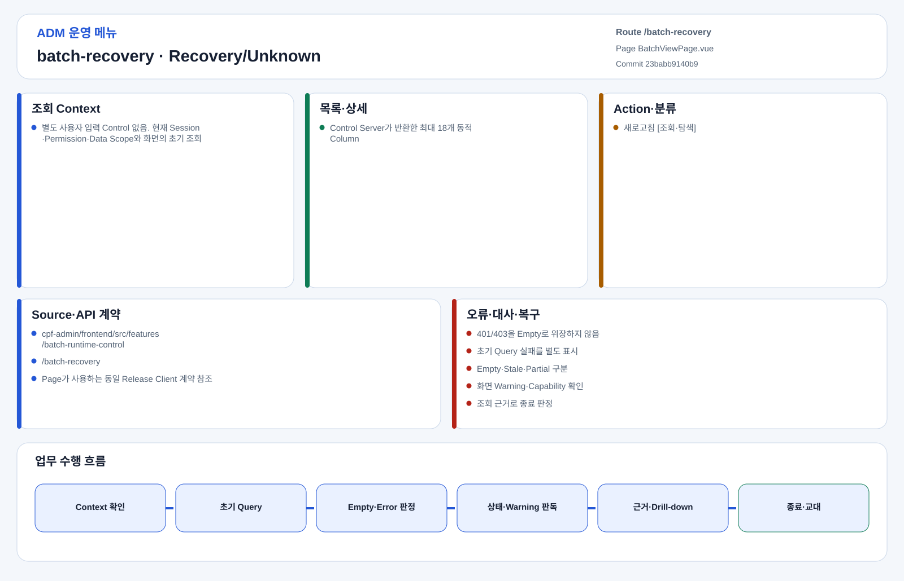

### 이 장에서 끝내는 업무

실패·중지·Unknown 실행과 복구 후보를 확인한다.

### 메뉴 식별·책임

| 항목 | 값 |
|---|---|
| Route | `/batch-recovery` |
| 메뉴 ID | `batch-recovery` |
| Menu Code | `batch-recovery` |
| 업무 그룹 | 배치/통합 관제 |
| Frontend Page | `cpf-admin/frontend/src/features/batch-runtime-control/BatchViewPage.vue` |
| Permission | 조회 권한 |
| 기준 Commit | `23babb9140b90e501d6ac715e7b77f55b66198a5` |

### Source·API 근거

| 구분 | 기준 |
|---|---|
| Frontend Page | `cpf-admin/frontend/src/features/batch-runtime-control/BatchViewPage.vue` |
| Router | `/batch-recovery` |
| API 추적 | 화면에서 제공하는 기능을 통해 호출한다. 문서에 명시되지 않은 Endpoint를 Browser나 외부 Script에서 임의 호출하지 않는다. |

아래 표는 이 메뉴에서 실제로 확인·입력·실행할 항목을 정리한다. 화면에 없는 Field·Button·상태를 임의로 가정하지 않는다.

### 검색·입력 Field

별도 사용자 입력 Control이 없다. 현재 Session·Permission·Data Scope와 Page가 정의한 초기 Query로 데이터를 읽는다. 새로고침은 같은 Context를 다시 조회하며 Owner 데이터는 변경하지 않는다.

### 목록 Column·상세 Field

| 표시값 | 운영 의미 | 교차 확인 |
|---|---|---|
| `Control Server가 반환한 최대 18개 동적 Column` | Recovery/Unknown 상세에서 대상의 현재 속성 또는 처리 결과를 확인하는 값이다. | 상세·재조회 결과와 비교하고 Stale·Masking·단위 차이를 확인한다. |

#### 결과 판독 순서

1. 조회 완료 시각·Filter·Paging·Sort와 화면 Warning을 확인한다.
2. Empty·Stale·Partial을 정상 0건과 구분한다.
3. 식별자·상태·Version·오류·시각을 같은 Query Context의 상세와 Owner 원장에서 비교한다.
4. Masking된 값은 Raw Permission과 Reason 없이 복원·Export하지 않는다.
5. 집계와 상세가 다르면 집계 시간 창·Timezone·Owner Update 시각을 맞춰 대사한다.

### Button·Action

| Action | 분류 | 활성 조건 | Side Effect·정상 결과 |
|---|---|---|---|
| **새로고침** | 조회·탐색 | 조회 Permission과 Query Validation을 충족하고 동일 조회가 진행 중이 아님 | 새로고침 결과의 조회 시각·Filter·Source Version·Warning이 갱신되며 Owner 데이터는 변경하지 않는다. |

### 정상 업무 전체 절차

1. `/batch-recovery`에 진입해 Page Header와 Route가 **Recovery/Unknown** 기능을 가리키는지 확인한다.
2. 로그인 Session·Environment·Data Scope·기준일·Timezone을 고정한다.
3. 별도 사용자 입력 없이 초기 조회가 끝날 때까지 기다리고, 필요할 때만 같은 Context로 새로고침한다.
4. Loading 종료 후 Empty·Error·Stale·Partial 상태와 화면 Warning을 먼저 판정한다.
5. **Control Server가 반환한 최대 18개 동적 Column**를 읽고 식별자·상태·Version·시각을 Owner 원장과 대사한다.
6. 화면이 제공하는 Log·Metric·Trace와 조회·Raw·Export 접근 기록이 있으면 해당 Audit를 교차 확인한다.
7. 이 장의 **종료 판정**과 다음 확인 시각·Evidence Link를 교대 기록에 남긴다.

### 메뉴 고유 판정·금지 사항

- **목적:** 실패·중지·Unknown 실행과 복구 후보를 확인한다.
- **종료 판정:** 동적 Column은 Control Server 응답 Schema와 조회 시각을 함께 표시하고 원본 상세로 Drill-down한다.
- 조회 화면에서 직접 Owner 데이터를 변경하거나 Browser Tool로 우회하지 않는다.
- Partial 조회를 정상 전체 결과로 합치지 않는다.

### 오류·경계·동시성·복구

| 상황 | 화면 징후 | 운영 조치 | 종료 증적 |
|---|---|---|---|
| 401·Session | Session 만료·CSRF·Origin 실패 | 로그인 상태와 BFF Session을 확인한 뒤 같은 Query Context로 다시 조회한다. | 401/403 응답·Session Audit |
| 403·Data Scope | 메뉴·Button·Raw·Export가 거부됨 | Menu·Button·API·Owner Permission과 Data Scope를 확인하고 우회하지 않는다. | Deny Audit·요청 Permission |
| Timeout·Dependency | 일부 조회 Source 응답 지연 | Correlation ID·Query Context·실패 Source를 기록하고 같은 조건으로 재조회한다. | 조회 시각·실패 Source·재조회 결과 |
| Partial·Stale | 일부 대상만 Success 또는 조회 Source 누락 | 성공·실패·미응답을 분리하고 누락 범위와 Version을 표시한다. | Target별 결과·Version |

### 응답 유실·부분 조회 처리

1. 검색 조건·Data Scope·Paging·조회 시각·Correlation ID를 기록한다.
2. 같은 조건으로 재조회하되 실패 Source만 분리한다.
3. 정상 Source 결과를 유지하고 실패·Stale Source를 명시한다.
4. 집계와 원본 상세가 다르면 Owner 상세를 기준으로 Reconcile Case를 연다.
5. 조회 시각·Source Version·0건 또는 일치 결과를 증적으로 남긴다.

### Log·Metric·Trace·Audit와 교대 기록

| 증적 | 필수 값 |
|---|---|
| Audit | Actor·Permission·Data Scope·Raw/Export 접근·Query Context·Result |
| Log | Environment·Instance·operationId·transactionId·failureStage·errorCode |
| Metric | 동일 시간 창의 Success·Failure·Latency·Queue·Retry·Partial·Unknown |
| Trace | root/segment/attempt·Owner·DB/Kafka/외부 의존성 Span |
| 상태 원장 | Target ID·Version·Checksum·Desired/Actual·Last Updated·Terminal 여부 |

```text
Menu=
Route=
Environment=
DataScope=
Query=
QueryAt=
CorrelationId=
SourceVersion=
Result=SUCCESS|EMPTY|STALE|PARTIAL|FAILED
FailedSources=
EvidenceLinks=
NextCheckAt=
```

### 실무 Workbook

**상황:** 실패·중지·Unknown 실행과 복구 후보를 확인한다. 화면이 일부 Source Timeout 때문에 Partial 결과를 표시했다.

1. Query·Data Scope·조회 시각·Correlation ID를 기록한다.
2. 정상 결과를 0건으로 덮어쓰지 않고 실패 Source만 재조회한다.
3. Control Server가 반환한 최대 18개 동적 Column 값을 원본 상세와 같은 시간 기준으로 비교한다.
4. 불일치가 계속되면 Incident 또는 Reconcile Case를 생성한다.
5. 동적 Column은 Control Server 응답 Schema와 조회 시각을 함께 표시하고 원본 상세로 Drill-down한다.
6. Source Version과 다음 확인 시각을 교대 기록에 남긴다.

### 독립 수행 검수 Checklist

- [ ] `/batch-recovery`와 Page Source를 찾고 화면 목적을 설명할 수 있다.
- [ ] 별도 사용자 입력이 없고 자동 Query Context·새로고침 동작을 설명할 수 있다.
- [ ] 1개 표시값을 Owner 상태·Version·Audit와 대사할 수 있다.
- [ ] 1개 Action의 분류·활성 조건·Side Effect를 설명할 수 있다.
- [ ] Empty·401·403·Timeout·Stale·Partial을 서로 다른 조회 상태로 처리할 수 있다.
- [ ] 조회 응답 유실 시 같은 Query Context로 재조회하고 Correlation ID·조회 시각·Source Version으로 결과를 대사할 수 있다.
- [ ] 교대 기록만으로 다음 담당자가 Target·상태·복구 기한을 이어받을 수 있다.

## 39. batch-leases — Leases


### 이 장에서 끝내는 업무

Lease Owner·Expiry·Fencing Token과 Stale Writer 위험을 확인한다.

### 메뉴 식별·책임

| 항목 | 값 |
|---|---|
| Route | `/batch-leases` |
| 메뉴 ID | `batch-leases` |
| Menu Code | `batch-leases` |
| 업무 그룹 | 배치/통합 관제 |
| Frontend Page | `cpf-admin/frontend/src/features/batch-runtime-control/BatchViewPage.vue` |
| Permission | 조회 권한 |
| 기준 Commit | `23babb9140b90e501d6ac715e7b77f55b66198a5` |

### Source·API 근거

| 구분 | 기준 |
|---|---|
| Frontend Page | `cpf-admin/frontend/src/features/batch-runtime-control/BatchViewPage.vue` |
| Router | `/batch-leases` |
| API 추적 | 화면에서 제공하는 기능을 통해 호출한다. 문서에 명시되지 않은 Endpoint를 Browser나 외부 Script에서 임의 호출하지 않는다. |

아래 표는 이 메뉴에서 실제로 확인·입력·실행할 항목을 정리한다. 화면에 없는 Field·Button·상태를 임의로 가정하지 않는다.

### 검색·입력 Field

별도 사용자 입력 Control이 없다. 현재 Session·Permission·Data Scope와 Page가 정의한 초기 Query로 데이터를 읽는다. 새로고침은 같은 Context를 다시 조회하며 Owner 데이터는 변경하지 않는다.

### 목록 Column·상세 Field

| 표시값 | 운영 의미 | 교차 확인 |
|---|---|---|
| `Control Server가 반환한 최대 18개 동적 Column` | Leases 상세에서 대상의 현재 속성 또는 처리 결과를 확인하는 값이다. | 상세·재조회 결과와 비교하고 Stale·Masking·단위 차이를 확인한다. |

#### 결과 판독 순서

1. 조회 완료 시각·Filter·Paging·Sort와 화면 Warning을 확인한다.
2. Empty·Stale·Partial을 정상 0건과 구분한다.
3. 식별자·상태·Version·오류·시각을 같은 Query Context의 상세와 Owner 원장에서 비교한다.
4. Masking된 값은 Raw Permission과 Reason 없이 복원·Export하지 않는다.
5. 집계와 상세가 다르면 집계 시간 창·Timezone·Owner Update 시각을 맞춰 대사한다.

### Button·Action

| Action | 분류 | 활성 조건 | Side Effect·정상 결과 |
|---|---|---|---|
| **새로고침** | 조회·탐색 | 조회 Permission과 Query Validation을 충족하고 동일 조회가 진행 중이 아님 | 새로고침 결과의 조회 시각·Filter·Source Version·Warning이 갱신되며 Owner 데이터는 변경하지 않는다. |

### 정상 업무 전체 절차

1. `/batch-leases`에 진입해 Page Header와 Route가 **Leases** 기능을 가리키는지 확인한다.
2. 로그인 Session·Environment·Data Scope·기준일·Timezone을 고정한다.
3. 별도 사용자 입력 없이 초기 조회가 끝날 때까지 기다리고, 필요할 때만 같은 Context로 새로고침한다.
4. Loading 종료 후 Empty·Error·Stale·Partial 상태와 화면 Warning을 먼저 판정한다.
5. **Control Server가 반환한 최대 18개 동적 Column**를 읽고 식별자·상태·Version·시각을 Owner 원장과 대사한다.
6. 화면이 제공하는 Log·Metric·Trace와 조회·Raw·Export 접근 기록이 있으면 해당 Audit를 교차 확인한다.
7. 이 장의 **종료 판정**과 다음 확인 시각·Evidence Link를 교대 기록에 남긴다.

### 메뉴 고유 판정·금지 사항

- **목적:** Lease Owner·Expiry·Fencing Token과 Stale Writer 위험을 확인한다.
- **종료 판정:** 동적 Column은 Control Server 응답 Schema와 조회 시각을 함께 표시하고 원본 상세로 Drill-down한다.
- 조회 화면에서 직접 Owner 데이터를 변경하거나 Browser Tool로 우회하지 않는다.
- Partial 조회를 정상 전체 결과로 합치지 않는다.

### 오류·경계·동시성·복구

| 상황 | 화면 징후 | 운영 조치 | 종료 증적 |
|---|---|---|---|
| 401·Session | Session 만료·CSRF·Origin 실패 | 로그인 상태와 BFF Session을 확인한 뒤 같은 Query Context로 다시 조회한다. | 401/403 응답·Session Audit |
| 403·Data Scope | 메뉴·Button·Raw·Export가 거부됨 | Menu·Button·API·Owner Permission과 Data Scope를 확인하고 우회하지 않는다. | Deny Audit·요청 Permission |
| Timeout·Dependency | 일부 조회 Source 응답 지연 | Correlation ID·Query Context·실패 Source를 기록하고 같은 조건으로 재조회한다. | 조회 시각·실패 Source·재조회 결과 |
| Partial·Stale | 일부 대상만 Success 또는 조회 Source 누락 | 성공·실패·미응답을 분리하고 누락 범위와 Version을 표시한다. | Target별 결과·Version |

### 응답 유실·부분 조회 처리

1. 검색 조건·Data Scope·Paging·조회 시각·Correlation ID를 기록한다.
2. 같은 조건으로 재조회하되 실패 Source만 분리한다.
3. 정상 Source 결과를 유지하고 실패·Stale Source를 명시한다.
4. 집계와 원본 상세가 다르면 Owner 상세를 기준으로 Reconcile Case를 연다.
5. 조회 시각·Source Version·0건 또는 일치 결과를 증적으로 남긴다.

### Log·Metric·Trace·Audit와 교대 기록

| 증적 | 필수 값 |
|---|---|
| Audit | Actor·Permission·Data Scope·Raw/Export 접근·Query Context·Result |
| Log | Environment·Instance·operationId·transactionId·failureStage·errorCode |
| Metric | 동일 시간 창의 Success·Failure·Latency·Queue·Retry·Partial·Unknown |
| Trace | root/segment/attempt·Owner·DB/Kafka/외부 의존성 Span |
| 상태 원장 | Target ID·Version·Checksum·Desired/Actual·Last Updated·Terminal 여부 |

```text
Menu=
Route=
Environment=
DataScope=
Query=
QueryAt=
CorrelationId=
SourceVersion=
Result=SUCCESS|EMPTY|STALE|PARTIAL|FAILED
FailedSources=
EvidenceLinks=
NextCheckAt=
```

### 실무 Workbook

**상황:** Lease Owner·Expiry·Fencing Token과 Stale Writer 위험을 확인한다. 화면이 일부 Source Timeout 때문에 Partial 결과를 표시했다.

1. Query·Data Scope·조회 시각·Correlation ID를 기록한다.
2. 정상 결과를 0건으로 덮어쓰지 않고 실패 Source만 재조회한다.
3. Control Server가 반환한 최대 18개 동적 Column 값을 원본 상세와 같은 시간 기준으로 비교한다.
4. 불일치가 계속되면 Incident 또는 Reconcile Case를 생성한다.
5. 동적 Column은 Control Server 응답 Schema와 조회 시각을 함께 표시하고 원본 상세로 Drill-down한다.
6. Source Version과 다음 확인 시각을 교대 기록에 남긴다.

### 독립 수행 검수 Checklist

- [ ] `/batch-leases`와 Page Source를 찾고 화면 목적을 설명할 수 있다.
- [ ] 별도 사용자 입력이 없고 자동 Query Context·새로고침 동작을 설명할 수 있다.
- [ ] 1개 표시값을 Owner 상태·Version·Audit와 대사할 수 있다.
- [ ] 1개 Action의 분류·활성 조건·Side Effect를 설명할 수 있다.
- [ ] Empty·401·403·Timeout·Stale·Partial을 서로 다른 조회 상태로 처리할 수 있다.
- [ ] 조회 응답 유실 시 같은 Query Context로 재조회하고 Correlation ID·조회 시각·Source Version으로 결과를 대사할 수 있다.
- [ ] 교대 기록만으로 다음 담당자가 Target·상태·복구 기한을 이어받을 수 있다.

## 40. batch-alerts — Alerts

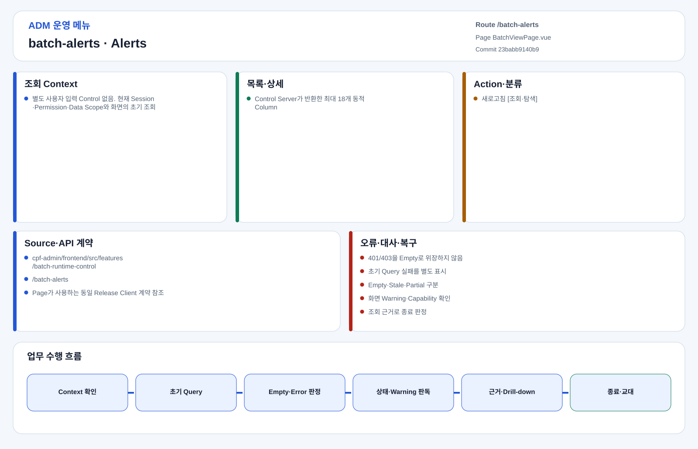

### 이 장에서 끝내는 업무

Batch 경보·Severity·대상·미조치 상태를 확인한다.

### 메뉴 식별·책임

| 항목 | 값 |
|---|---|
| Route | `/batch-alerts` |
| 메뉴 ID | `batch-alerts` |
| Menu Code | `batch-alerts` |
| 업무 그룹 | 배치/통합 관제 |
| Frontend Page | `cpf-admin/frontend/src/features/batch-runtime-control/BatchViewPage.vue` |
| Permission | 조회 권한 |
| 기준 Commit | `23babb9140b90e501d6ac715e7b77f55b66198a5` |

### Source·API 근거

| 구분 | 기준 |
|---|---|
| Frontend Page | `cpf-admin/frontend/src/features/batch-runtime-control/BatchViewPage.vue` |
| Router | `/batch-alerts` |
| API 추적 | 화면에서 제공하는 기능을 통해 호출한다. 문서에 명시되지 않은 Endpoint를 Browser나 외부 Script에서 임의 호출하지 않는다. |

아래 표는 이 메뉴에서 실제로 확인·입력·실행할 항목을 정리한다. 화면에 없는 Field·Button·상태를 임의로 가정하지 않는다.

### 검색·입력 Field

별도 사용자 입력 Control이 없다. 현재 Session·Permission·Data Scope와 Page가 정의한 초기 Query로 데이터를 읽는다. 새로고침은 같은 Context를 다시 조회하며 Owner 데이터는 변경하지 않는다.

### 목록 Column·상세 Field

| 표시값 | 운영 의미 | 교차 확인 |
|---|---|---|
| `Control Server가 반환한 최대 18개 동적 Column` | Alerts 상세에서 대상의 현재 속성 또는 처리 결과를 확인하는 값이다. | 상세·재조회 결과와 비교하고 Stale·Masking·단위 차이를 확인한다. |

#### 결과 판독 순서

1. 조회 완료 시각·Filter·Paging·Sort와 화면 Warning을 확인한다.
2. Empty·Stale·Partial을 정상 0건과 구분한다.
3. 식별자·상태·Version·오류·시각을 같은 Query Context의 상세와 Owner 원장에서 비교한다.
4. Masking된 값은 Raw Permission과 Reason 없이 복원·Export하지 않는다.
5. 집계와 상세가 다르면 집계 시간 창·Timezone·Owner Update 시각을 맞춰 대사한다.

### Button·Action

| Action | 분류 | 활성 조건 | Side Effect·정상 결과 |
|---|---|---|---|
| **새로고침** | 조회·탐색 | 조회 Permission과 Query Validation을 충족하고 동일 조회가 진행 중이 아님 | 새로고침 결과의 조회 시각·Filter·Source Version·Warning이 갱신되며 Owner 데이터는 변경하지 않는다. |

### 정상 업무 전체 절차

1. `/batch-alerts`에 진입해 Page Header와 Route가 **Alerts** 기능을 가리키는지 확인한다.
2. 로그인 Session·Environment·Data Scope·기준일·Timezone을 고정한다.
3. 별도 사용자 입력 없이 초기 조회가 끝날 때까지 기다리고, 필요할 때만 같은 Context로 새로고침한다.
4. Loading 종료 후 Empty·Error·Stale·Partial 상태와 화면 Warning을 먼저 판정한다.
5. **Control Server가 반환한 최대 18개 동적 Column**를 읽고 식별자·상태·Version·시각을 Owner 원장과 대사한다.
6. 화면이 제공하는 Log·Metric·Trace와 조회·Raw·Export 접근 기록이 있으면 해당 Audit를 교차 확인한다.
7. 이 장의 **종료 판정**과 다음 확인 시각·Evidence Link를 교대 기록에 남긴다.

### 메뉴 고유 판정·금지 사항

- **목적:** Batch 경보·Severity·대상·미조치 상태를 확인한다.
- **종료 판정:** 동적 Column은 Control Server 응답 Schema와 조회 시각을 함께 표시하고 원본 상세로 Drill-down한다.
- 조회 화면에서 직접 Owner 데이터를 변경하거나 Browser Tool로 우회하지 않는다.
- Partial 조회를 정상 전체 결과로 합치지 않는다.

### 오류·경계·동시성·복구

| 상황 | 화면 징후 | 운영 조치 | 종료 증적 |
|---|---|---|---|
| 401·Session | Session 만료·CSRF·Origin 실패 | 로그인 상태와 BFF Session을 확인한 뒤 같은 Query Context로 다시 조회한다. | 401/403 응답·Session Audit |
| 403·Data Scope | 메뉴·Button·Raw·Export가 거부됨 | Menu·Button·API·Owner Permission과 Data Scope를 확인하고 우회하지 않는다. | Deny Audit·요청 Permission |
| Timeout·Dependency | 일부 조회 Source 응답 지연 | Correlation ID·Query Context·실패 Source를 기록하고 같은 조건으로 재조회한다. | 조회 시각·실패 Source·재조회 결과 |
| Partial·Stale | 일부 대상만 Success 또는 조회 Source 누락 | 성공·실패·미응답을 분리하고 누락 범위와 Version을 표시한다. | Target별 결과·Version |

### 응답 유실·부분 조회 처리

1. 검색 조건·Data Scope·Paging·조회 시각·Correlation ID를 기록한다.
2. 같은 조건으로 재조회하되 실패 Source만 분리한다.
3. 정상 Source 결과를 유지하고 실패·Stale Source를 명시한다.
4. 집계와 원본 상세가 다르면 Owner 상세를 기준으로 Reconcile Case를 연다.
5. 조회 시각·Source Version·0건 또는 일치 결과를 증적으로 남긴다.

### Log·Metric·Trace·Audit와 교대 기록

| 증적 | 필수 값 |
|---|---|
| Audit | Actor·Permission·Data Scope·Raw/Export 접근·Query Context·Result |
| Log | Environment·Instance·operationId·transactionId·failureStage·errorCode |
| Metric | 동일 시간 창의 Success·Failure·Latency·Queue·Retry·Partial·Unknown |
| Trace | root/segment/attempt·Owner·DB/Kafka/외부 의존성 Span |
| 상태 원장 | Target ID·Version·Checksum·Desired/Actual·Last Updated·Terminal 여부 |

```text
Menu=
Route=
Environment=
DataScope=
Query=
QueryAt=
CorrelationId=
SourceVersion=
Result=SUCCESS|EMPTY|STALE|PARTIAL|FAILED
FailedSources=
EvidenceLinks=
NextCheckAt=
```

### 실무 Workbook

**상황:** Batch 경보·Severity·대상·미조치 상태를 확인한다. 화면이 일부 Source Timeout 때문에 Partial 결과를 표시했다.

1. Query·Data Scope·조회 시각·Correlation ID를 기록한다.
2. 정상 결과를 0건으로 덮어쓰지 않고 실패 Source만 재조회한다.
3. Control Server가 반환한 최대 18개 동적 Column 값을 원본 상세와 같은 시간 기준으로 비교한다.
4. 불일치가 계속되면 Incident 또는 Reconcile Case를 생성한다.
5. 동적 Column은 Control Server 응답 Schema와 조회 시각을 함께 표시하고 원본 상세로 Drill-down한다.
6. Source Version과 다음 확인 시각을 교대 기록에 남긴다.

### 독립 수행 검수 Checklist

- [ ] `/batch-alerts`와 Page Source를 찾고 화면 목적을 설명할 수 있다.
- [ ] 별도 사용자 입력이 없고 자동 Query Context·새로고침 동작을 설명할 수 있다.
- [ ] 1개 표시값을 Owner 상태·Version·Audit와 대사할 수 있다.
- [ ] 1개 Action의 분류·활성 조건·Side Effect를 설명할 수 있다.
- [ ] Empty·401·403·Timeout·Stale·Partial을 서로 다른 조회 상태로 처리할 수 있다.
- [ ] 조회 응답 유실 시 같은 Query Context로 재조회하고 Correlation ID·조회 시각·Source Version으로 결과를 대사할 수 있다.
- [ ] 교대 기록만으로 다음 담당자가 Target·상태·복구 기한을 이어받을 수 있다.

## 41. batch-audit — Audit Evidence


### 이 장에서 끝내는 업무

Batch 실행·조치·승인·증적을 조회한다.

### 메뉴 식별·책임

| 항목 | 값 |
|---|---|
| Route | `/batch-audit` |
| 메뉴 ID | `batch-audit` |
| Menu Code | `batch-audit` |
| 업무 그룹 | 배치/통합 관제 |
| Frontend Page | `cpf-admin/frontend/src/features/batch-runtime-control/BatchViewPage.vue` |
| Permission | 조회 권한 |
| 기준 Commit | `23babb9140b90e501d6ac715e7b77f55b66198a5` |

### Source·API 근거

| 구분 | 기준 |
|---|---|
| Frontend Page | `cpf-admin/frontend/src/features/batch-runtime-control/BatchViewPage.vue` |
| Router | `/batch-audit` |
| API 추적 | 화면에서 제공하는 기능을 통해 호출한다. 문서에 명시되지 않은 Endpoint를 Browser나 외부 Script에서 임의 호출하지 않는다. |

아래 표는 이 메뉴에서 실제로 확인·입력·실행할 항목을 정리한다. 화면에 없는 Field·Button·상태를 임의로 가정하지 않는다.

### 검색·입력 Field

별도 사용자 입력 Control이 없다. 현재 Session·Permission·Data Scope와 Page가 정의한 초기 Query로 데이터를 읽는다. 새로고침은 같은 Context를 다시 조회하며 Owner 데이터는 변경하지 않는다.

### 목록 Column·상세 Field

| 표시값 | 운영 의미 | 교차 확인 |
|---|---|---|
| `Control Server가 반환한 최대 18개 동적 Column` | Audit Evidence 상세에서 대상의 현재 속성 또는 처리 결과를 확인하는 값이다. | 상세·재조회 결과와 비교하고 Stale·Masking·단위 차이를 확인한다. |

#### 결과 판독 순서

1. 조회 완료 시각·Filter·Paging·Sort와 화면 Warning을 확인한다.
2. Empty·Stale·Partial을 정상 0건과 구분한다.
3. 식별자·상태·Version·오류·시각을 같은 Query Context의 상세와 Owner 원장에서 비교한다.
4. Masking된 값은 Raw Permission과 Reason 없이 복원·Export하지 않는다.
5. 집계와 상세가 다르면 집계 시간 창·Timezone·Owner Update 시각을 맞춰 대사한다.

### Button·Action

| Action | 분류 | 활성 조건 | Side Effect·정상 결과 |
|---|---|---|---|
| **새로고침** | 조회·탐색 | 조회 Permission과 Query Validation을 충족하고 동일 조회가 진행 중이 아님 | 새로고침 결과의 조회 시각·Filter·Source Version·Warning이 갱신되며 Owner 데이터는 변경하지 않는다. |

### 정상 업무 전체 절차

1. `/batch-audit`에 진입해 Page Header와 Route가 **Audit Evidence** 기능을 가리키는지 확인한다.
2. 로그인 Session·Environment·Data Scope·기준일·Timezone을 고정한다.
3. 별도 사용자 입력 없이 초기 조회가 끝날 때까지 기다리고, 필요할 때만 같은 Context로 새로고침한다.
4. Loading 종료 후 Empty·Error·Stale·Partial 상태와 화면 Warning을 먼저 판정한다.
5. **Control Server가 반환한 최대 18개 동적 Column**를 읽고 식별자·상태·Version·시각을 Owner 원장과 대사한다.
6. 화면이 제공하는 Log·Metric·Trace와 조회·Raw·Export 접근 기록이 있으면 해당 Audit를 교차 확인한다.
7. 이 장의 **종료 판정**과 다음 확인 시각·Evidence Link를 교대 기록에 남긴다.

### 메뉴 고유 판정·금지 사항

- **목적:** Batch 실행·조치·승인·증적을 조회한다.
- **종료 판정:** 동적 Column은 Control Server 응답 Schema와 조회 시각을 함께 표시하고 원본 상세로 Drill-down한다.
- 조회 화면에서 직접 Owner 데이터를 변경하거나 Browser Tool로 우회하지 않는다.
- Partial 조회를 정상 전체 결과로 합치지 않는다.

### 오류·경계·동시성·복구

| 상황 | 화면 징후 | 운영 조치 | 종료 증적 |
|---|---|---|---|
| 401·Session | Session 만료·CSRF·Origin 실패 | 로그인 상태와 BFF Session을 확인한 뒤 같은 Query Context로 다시 조회한다. | 401/403 응답·Session Audit |
| 403·Data Scope | 메뉴·Button·Raw·Export가 거부됨 | Menu·Button·API·Owner Permission과 Data Scope를 확인하고 우회하지 않는다. | Deny Audit·요청 Permission |
| Timeout·Dependency | 일부 조회 Source 응답 지연 | Correlation ID·Query Context·실패 Source를 기록하고 같은 조건으로 재조회한다. | 조회 시각·실패 Source·재조회 결과 |
| Partial·Stale | 일부 대상만 Success 또는 조회 Source 누락 | 성공·실패·미응답을 분리하고 누락 범위와 Version을 표시한다. | Target별 결과·Version |

### 응답 유실·부분 조회 처리

1. 검색 조건·Data Scope·Paging·조회 시각·Correlation ID를 기록한다.
2. 같은 조건으로 재조회하되 실패 Source만 분리한다.
3. 정상 Source 결과를 유지하고 실패·Stale Source를 명시한다.
4. 집계와 원본 상세가 다르면 Owner 상세를 기준으로 Reconcile Case를 연다.
5. 조회 시각·Source Version·0건 또는 일치 결과를 증적으로 남긴다.

### Log·Metric·Trace·Audit와 교대 기록

| 증적 | 필수 값 |
|---|---|
| Audit | Actor·Permission·Data Scope·Raw/Export 접근·Query Context·Result |
| Log | Environment·Instance·operationId·transactionId·failureStage·errorCode |
| Metric | 동일 시간 창의 Success·Failure·Latency·Queue·Retry·Partial·Unknown |
| Trace | root/segment/attempt·Owner·DB/Kafka/외부 의존성 Span |
| 상태 원장 | Target ID·Version·Checksum·Desired/Actual·Last Updated·Terminal 여부 |

```text
Menu=
Route=
Environment=
DataScope=
Query=
QueryAt=
CorrelationId=
SourceVersion=
Result=SUCCESS|EMPTY|STALE|PARTIAL|FAILED
FailedSources=
EvidenceLinks=
NextCheckAt=
```

### 실무 Workbook

**상황:** Batch 실행·조치·승인·증적을 조회한다. 화면이 일부 Source Timeout 때문에 Partial 결과를 표시했다.

1. Query·Data Scope·조회 시각·Correlation ID를 기록한다.
2. 정상 결과를 0건으로 덮어쓰지 않고 실패 Source만 재조회한다.
3. Control Server가 반환한 최대 18개 동적 Column 값을 원본 상세와 같은 시간 기준으로 비교한다.
4. 불일치가 계속되면 Incident 또는 Reconcile Case를 생성한다.
5. 동적 Column은 Control Server 응답 Schema와 조회 시각을 함께 표시하고 원본 상세로 Drill-down한다.
6. Source Version과 다음 확인 시각을 교대 기록에 남긴다.

### 독립 수행 검수 Checklist

- [ ] `/batch-audit`와 Page Source를 찾고 화면 목적을 설명할 수 있다.
- [ ] 별도 사용자 입력이 없고 자동 Query Context·새로고침 동작을 설명할 수 있다.
- [ ] 1개 표시값을 Owner 상태·Version·Audit와 대사할 수 있다.
- [ ] 1개 Action의 분류·활성 조건·Side Effect를 설명할 수 있다.
- [ ] Empty·401·403·Timeout·Stale·Partial을 서로 다른 조회 상태로 처리할 수 있다.
- [ ] 조회 응답 유실 시 같은 Query Context로 재조회하고 Correlation ID·조회 시각·Source Version으로 결과를 대사할 수 있다.
- [ ] 교대 기록만으로 다음 담당자가 Target·상태·복구 기한을 이어받을 수 있다.

## 42. workers — Workers

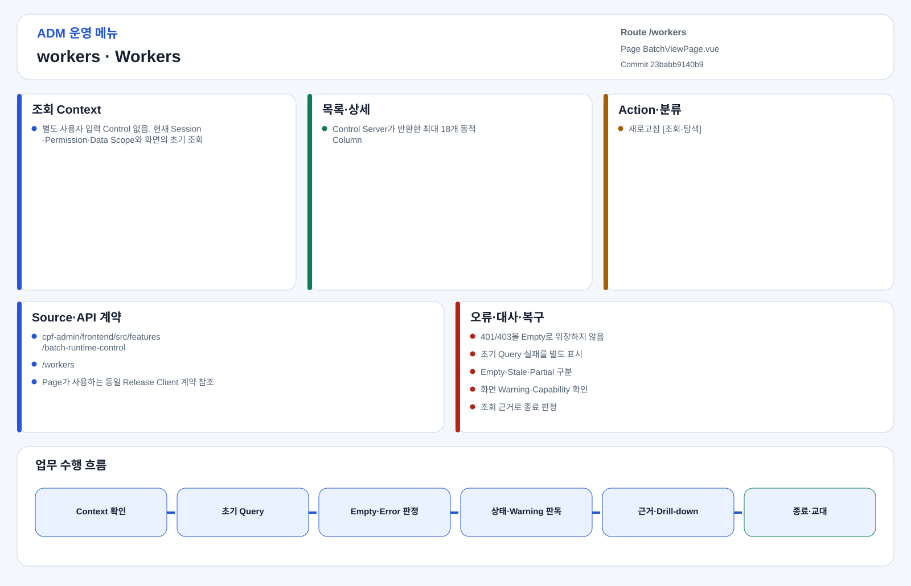

### 이 장에서 끝내는 업무

Agent·Worker 등록·Heartbeat·Capability·할당을 확인한다.

### 메뉴 식별·책임

| 항목 | 값 |
|---|---|
| Route | `/workers` |
| 메뉴 ID | `workers` |
| Menu Code | `workers` |
| 업무 그룹 | 배치/통합 관제 |
| Frontend Page | `cpf-admin/frontend/src/features/batch-runtime-control/BatchViewPage.vue` |
| Permission | 조회 권한 |
| 기준 Commit | `23babb9140b90e501d6ac715e7b77f55b66198a5` |

### Source·API 근거

| 구분 | 기준 |
|---|---|
| Frontend Page | `cpf-admin/frontend/src/features/batch-runtime-control/BatchViewPage.vue` |
| Router | `/workers` |
| API 추적 | 화면에서 제공하는 기능을 통해 호출한다. 문서에 명시되지 않은 Endpoint를 Browser나 외부 Script에서 임의 호출하지 않는다. |

아래 표는 이 메뉴에서 실제로 확인·입력·실행할 항목을 정리한다. 화면에 없는 Field·Button·상태를 임의로 가정하지 않는다.

### 검색·입력 Field

별도 사용자 입력 Control이 없다. 현재 Session·Permission·Data Scope와 Page가 정의한 초기 Query로 데이터를 읽는다. 새로고침은 같은 Context를 다시 조회하며 Owner 데이터는 변경하지 않는다.

### 목록 Column·상세 Field

| 표시값 | 운영 의미 | 교차 확인 |
|---|---|---|
| `Control Server가 반환한 최대 18개 동적 Column` | Workers 상세에서 대상의 현재 속성 또는 처리 결과를 확인하는 값이다. | 상세·재조회 결과와 비교하고 Stale·Masking·단위 차이를 확인한다. |

#### 결과 판독 순서

1. 조회 완료 시각·Filter·Paging·Sort와 화면 Warning을 확인한다.
2. Empty·Stale·Partial을 정상 0건과 구분한다.
3. 식별자·상태·Version·오류·시각을 같은 Query Context의 상세와 Owner 원장에서 비교한다.
4. Masking된 값은 Raw Permission과 Reason 없이 복원·Export하지 않는다.
5. 집계와 상세가 다르면 집계 시간 창·Timezone·Owner Update 시각을 맞춰 대사한다.

### Button·Action

| Action | 분류 | 활성 조건 | Side Effect·정상 결과 |
|---|---|---|---|
| **새로고침** | 조회·탐색 | 조회 Permission과 Query Validation을 충족하고 동일 조회가 진행 중이 아님 | 새로고침 결과의 조회 시각·Filter·Source Version·Warning이 갱신되며 Owner 데이터는 변경하지 않는다. |

### 정상 업무 전체 절차

1. `/workers`에 진입해 Page Header와 Route가 **Workers** 기능을 가리키는지 확인한다.
2. 로그인 Session·Environment·Data Scope·기준일·Timezone을 고정한다.
3. 별도 사용자 입력 없이 초기 조회가 끝날 때까지 기다리고, 필요할 때만 같은 Context로 새로고침한다.
4. Loading 종료 후 Empty·Error·Stale·Partial 상태와 화면 Warning을 먼저 판정한다.
5. **Control Server가 반환한 최대 18개 동적 Column**를 읽고 식별자·상태·Version·시각을 Owner 원장과 대사한다.
6. 화면이 제공하는 Log·Metric·Trace와 조회·Raw·Export 접근 기록이 있으면 해당 Audit를 교차 확인한다.
7. 이 장의 **종료 판정**과 다음 확인 시각·Evidence Link를 교대 기록에 남긴다.

### 메뉴 고유 판정·금지 사항

- **목적:** Agent·Worker 등록·Heartbeat·Capability·할당을 확인한다.
- **종료 판정:** 동적 Column은 Control Server 응답 Schema와 조회 시각을 함께 표시하고 원본 상세로 Drill-down한다.
- 조회 화면에서 직접 Owner 데이터를 변경하거나 Browser Tool로 우회하지 않는다.
- Partial 조회를 정상 전체 결과로 합치지 않는다.

### 오류·경계·동시성·복구

| 상황 | 화면 징후 | 운영 조치 | 종료 증적 |
|---|---|---|---|
| 401·Session | Session 만료·CSRF·Origin 실패 | 로그인 상태와 BFF Session을 확인한 뒤 같은 Query Context로 다시 조회한다. | 401/403 응답·Session Audit |
| 403·Data Scope | 메뉴·Button·Raw·Export가 거부됨 | Menu·Button·API·Owner Permission과 Data Scope를 확인하고 우회하지 않는다. | Deny Audit·요청 Permission |
| Timeout·Dependency | 일부 조회 Source 응답 지연 | Correlation ID·Query Context·실패 Source를 기록하고 같은 조건으로 재조회한다. | 조회 시각·실패 Source·재조회 결과 |
| Partial·Stale | 일부 대상만 Success 또는 조회 Source 누락 | 성공·실패·미응답을 분리하고 누락 범위와 Version을 표시한다. | Target별 결과·Version |

### 응답 유실·부분 조회 처리

1. 검색 조건·Data Scope·Paging·조회 시각·Correlation ID를 기록한다.
2. 같은 조건으로 재조회하되 실패 Source만 분리한다.
3. 정상 Source 결과를 유지하고 실패·Stale Source를 명시한다.
4. 집계와 원본 상세가 다르면 Owner 상세를 기준으로 Reconcile Case를 연다.
5. 조회 시각·Source Version·0건 또는 일치 결과를 증적으로 남긴다.

### Log·Metric·Trace·Audit와 교대 기록

| 증적 | 필수 값 |
|---|---|
| Audit | Actor·Permission·Data Scope·Raw/Export 접근·Query Context·Result |
| Log | Environment·Instance·operationId·transactionId·failureStage·errorCode |
| Metric | 동일 시간 창의 Success·Failure·Latency·Queue·Retry·Partial·Unknown |
| Trace | root/segment/attempt·Owner·DB/Kafka/외부 의존성 Span |
| 상태 원장 | Target ID·Version·Checksum·Desired/Actual·Last Updated·Terminal 여부 |

```text
Menu=
Route=
Environment=
DataScope=
Query=
QueryAt=
CorrelationId=
SourceVersion=
Result=SUCCESS|EMPTY|STALE|PARTIAL|FAILED
FailedSources=
EvidenceLinks=
NextCheckAt=
```

### 실무 Workbook

**상황:** Agent·Worker 등록·Heartbeat·Capability·할당을 확인한다. 화면이 일부 Source Timeout 때문에 Partial 결과를 표시했다.

1. Query·Data Scope·조회 시각·Correlation ID를 기록한다.
2. 정상 결과를 0건으로 덮어쓰지 않고 실패 Source만 재조회한다.
3. Control Server가 반환한 최대 18개 동적 Column 값을 원본 상세와 같은 시간 기준으로 비교한다.
4. 불일치가 계속되면 Incident 또는 Reconcile Case를 생성한다.
5. 동적 Column은 Control Server 응답 Schema와 조회 시각을 함께 표시하고 원본 상세로 Drill-down한다.
6. Source Version과 다음 확인 시각을 교대 기록에 남긴다.

### 독립 수행 검수 Checklist

- [ ] `/workers`와 Page Source를 찾고 화면 목적을 설명할 수 있다.
- [ ] 별도 사용자 입력이 없고 자동 Query Context·새로고침 동작을 설명할 수 있다.
- [ ] 1개 표시값을 Owner 상태·Version·Audit와 대사할 수 있다.
- [ ] 1개 Action의 분류·활성 조건·Side Effect를 설명할 수 있다.
- [ ] Empty·401·403·Timeout·Stale·Partial을 서로 다른 조회 상태로 처리할 수 있다.
- [ ] 조회 응답 유실 시 같은 Query Context로 재조회하고 Correlation ID·조회 시각·Source Version으로 결과를 대사할 수 있다.
- [ ] 교대 기록만으로 다음 담당자가 Target·상태·복구 기한을 이어받을 수 있다.

## 43. batch-deployment — Deployment History·Plan

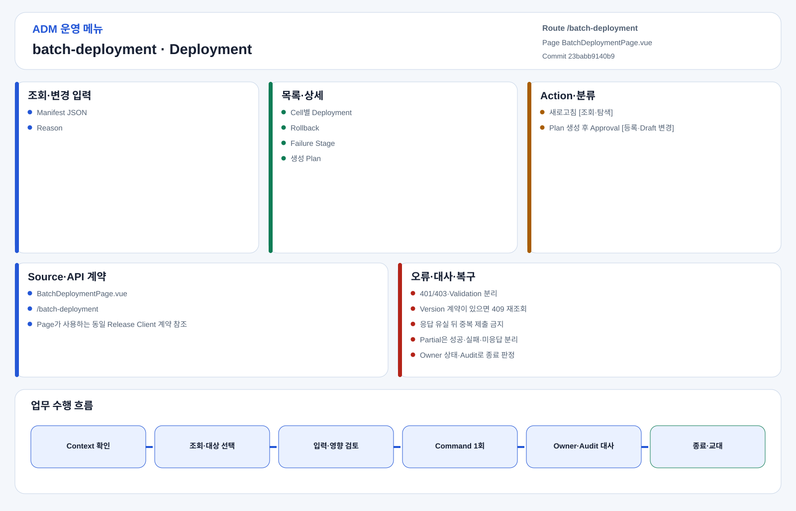

### 이 장에서 끝내는 업무

Batch Artifact 배포 Plan과 Cell별 적용·Rollback을 관리한다.

### 메뉴 식별·책임

| 항목 | 값 |
|---|---|
| Route | `/batch-deployment` |
| 메뉴 ID | `batch-deployment` |
| Menu Code | `batch-deployment` |
| 업무 그룹 | 배치 운영 |
| Frontend Page | `BatchDeploymentPage.vue` |
| Permission | 배포 Plan 권한 + BAT Approval |
| 기준 Commit | `23babb9140b90e501d6ac715e7b77f55b66198a5` |

### Source·API 근거

| 구분 | 기준 |
|---|---|
| Frontend Page | `BatchDeploymentPage.vue` |
| Router | `/batch-deployment` |
| API 추적 | 화면에서 제공하는 기능을 통해 호출한다. 문서에 명시되지 않은 Endpoint를 Browser나 외부 Script에서 임의 호출하지 않는다. |

아래 표는 이 메뉴에서 실제로 확인·입력·실행할 항목을 정리한다. 화면에 없는 Field·Button·상태를 임의로 가정하지 않는다.

### 검색·입력 Field

| Field | Control | 업무 의미 | 기본값·Validation·주의 |
|---|---|---|---|
| `Manifest JSON` | 파일·본문 입력 | 검증·등록·Export에 사용할 입력 Artifact 또는 구조화된 본문이다. | 확장자·크기·Encoding·Schema·Checksum을 검증하고 Dry Run이 있으면 먼저 실행한다. |
| `Reason` | 다중행 입력 | 작업 목적·영향 범위·승인 또는 복구 기준을 기록해 Audit와 교대 기록에 연결한다. | Ticket·영향 범위·복구점을 포함하고 화면이 요구하는 최소 길이를 충족한다. |

#### 입력 순서

1. **Manifest JSON** 항목이 조회 Control인지 변경 Form인지 화면 위치로 구분하고, 표시된 값·필수 여부·허용 형식을 확인한다.
2. **Reason** 항목이 조회 Control인지 변경 Form인지 화면 위치로 구분하고, 표시된 값·필수 여부·허용 형식을 확인한다.
3. 조회 Control과 변경 Form을 분리해 기록하고, 실행 전 Environment·Data Scope·Timezone과 제출할 값만 다시 검토한다.

### 목록 Column·상세 Field

| 표시값 | 운영 의미 | 교차 확인 |
|---|---|---|
| `Cell별 Deployment` | Deployment History·Plan 상세에서 대상의 현재 속성 또는 처리 결과를 확인하는 값이다. | 상세·재조회 결과와 비교하고 Stale·Masking·단위 차이를 확인한다. |
| `Rollback` | Deployment History·Plan 상세에서 대상의 현재 속성 또는 처리 결과를 확인하는 값이다. | 상세·재조회 결과와 비교하고 Stale·Masking·단위 차이를 확인한다. |
| `Failure Stage` | 오류·Drift·결과 불명 범위를 나타내며 원인과 복구 Owner를 연결해야 한다. | 원인 식별자·실패 Stage·마지막 갱신 시각을 상세와 대조한다. |
| `생성 Plan` | Deployment History·Plan 상세에서 대상의 현재 속성 또는 처리 결과를 확인하는 값이다. | 상세·재조회 결과와 비교하고 Stale·Masking·단위 차이를 확인한다. |

#### 결과 판독 순서

1. 조회 완료 시각·Filter·Paging·Sort와 화면 Warning을 확인한다.
2. Empty·Stale·Partial을 정상 0건과 구분한다.
3. 식별자·상태·Version·오류·시각을 같은 Query Context의 상세와 Owner 원장에서 비교한다.
4. Masking된 값은 Raw Permission과 Reason 없이 복원·Export하지 않는다.
5. 집계와 상세가 다르면 집계 시간 창·Timezone·Owner Update 시각을 맞춰 대사한다.

### Button·Action

| Action | 분류 | 활성 조건 | Side Effect·정상 결과 |
|---|---|---|---|
| **새로고침** | 조회·탐색 | 조회 Permission과 Query Validation을 충족하고 동일 조회가 진행 중이 아님 | 새로고침 결과의 조회 시각·Filter·Source Version·Warning이 갱신되며 Owner 데이터는 변경하지 않는다. |
| **Plan 생성 후 Approval** | 등록·Draft 변경 | 화면이 실제로 요구하는 Write Permission·필수 Field·Reason·Version 조건을 충족함 | Deployment History·Plan의 재조회 결과가 요청 내용과 일치한다. Version·Before/After·Audit는 해당 Owner가 제공하는 경우 함께 확인한다. |

### 정상 업무 전체 절차

1. `/batch-deployment`에 진입해 Page Header와 Route가 **Deployment History·Plan** 기능을 가리키는지 확인한다.
2. 로그인 Session·Environment·Data Scope·기준일·Timezone을 고정한다.
3. 화면의 조회 Control과 변경 Form을 구분한다. 조회 조건이 제공되면 먼저 조회하고, 변경 Form은 대상 선택 또는 등록 Action 뒤에 열린 실제 Field만 사용한다.
4. Loading 종료 후 Empty·Error·Stale·Partial 상태와 화면 Warning을 먼저 판정한다.
5. **Cell별 Deployment, Rollback, Failure Stage, 생성 Plan**를 읽고 식별자·상태·Version·시각을 Owner 원장과 대사한다.
6. **Plan 생성 후 Approval** 전에 화면과 Owner가 실제로 요구하는 Permission·현재 상태·영향 범위·Reason·승인·Version 조건을 확인하고 한 번만 제출한다.
7. **Plan 생성 후 Approval**의 HTTP 응답과 재조회 결과를 확인한다. 비동기·다중 대상 기능은 Owner Terminal 상태·Version·대상별 Success/Failed/Unknown·Audit를 별도로 확인한다.
8. 화면이 제공하는 Log·Metric·Trace와, 변경·Export·승인 조치에 생성된 Audit를 교차 확인한다.
9. 이 장의 **종료 판정**과 다음 확인 시각·Evidence Link를 교대 기록에 남긴다.

### 메뉴 고유 판정·금지 사항

- **목적:** Batch Artifact 배포 Plan과 Cell별 적용·Rollback을 관리한다.
- **종료 판정:** Manifest Hash·Approval·Cell 결과·Failure Stage·Rollback 상태를 확인한다.
- 응답을 받지 못한 경우 Owner 상태와 기존 Operation을 확인하기 전에 동일 Action을 반복하지 않는다.
- HTTP 성공 응답이나 Toast만으로 비동기 Owner 상태 또는 다중 대상 적용을 확정하지 않는다.

### 오류·경계·동시성·복구

| 상황 | 화면 징후 | 운영 조치 | 종료 증적 |
|---|---|---|---|
| 401·Session | Session 만료·CSRF·Origin 실패 | 로그인 상태와 BFF Session을 확인한다. Command 자동 Replay는 금지한다. | 401/403 응답·Session Audit |
| 403·Data Scope | 메뉴·Button·Raw·Export가 거부됨 | Menu·Button·API·Owner Permission과 Data Scope를 확인하고 우회하지 않는다. | Deny Audit·요청 Permission |
| Validation | 필수값·범위·형식·기간 오류 | Field Error만 수정하고 기존 성공 Operation을 다시 제출하지 않는다. | Error Code·Field·입력값 |
| Timeout·Dependency | 일부 Source 또는 Command 응답 지연 | Correlation/Operation ID와 실패 Stage를 기록하고 Owner 상태를 조회한다. | Dependency 상태·Retryability |
| Partial·Stale | 일부 대상만 Success 또는 조회 Source 누락 | 성공·실패·미응답을 분리하고 누락 범위와 Version을 표시한다. | Target별 결과·Version |
| 409·동시 변경 | Expected Version 불일치 | 최신 상세를 재조회하고 Diff·영향을 다시 검토한 뒤 새 요청으로 제출한다. | 현재/요청 Version·변경자 |
| 응답 유실·Unknown | 요청 후 실제 처리 여부를 알 수 없음 | Operation ID·Request Hash·Audit·Owner 상태로 대사하고 중복 제출하지 않는다. | Operation·Owner·Audit |
| 복구 실패 | Retry/Rollback 뒤에도 상태 불일치 | 자동 반복을 중단하고 Incident·Reconcile Case·다음 확인 시각을 기록한다. | Case ID·복구 Owner·기한 |

### 응답 유실·결과 불명·부분 적용 처리

1. 동일 Action을 다시 누르지 않고 Browser Network와 응답 Header를 보존한다. `operationId`·`transactionId`·`idempotencyKey`가 제공되면 기록하고, 없으면 Target ID·Actor·요청 시각·Request Body Hash로 대사한다.
2. 기능이 제공하는 상세·Operation Status(있는 경우)·Audit에서 Request Hash와 대상 Version을 검색한다.
3. Side Effect 전 실패가 확인된 경우에만 새 요청을 검토한다.
4. Success·Failed·Unknown 대상을 분리하고 Source가 제공하는 Failed-only Retry·Compensation·Rollback을 선택하고, 지원되지 않으면 수동 Reconcile Case로 이관한다.
5. Rollback을 지원하는 기능은 Owner Version·Checksum·업무 합계가 Rollback Point와 일치하는지 확인한다.
6. 확정되지 않은 대상은 `UNKNOWN_RESULT`로 유지하고 담당자·대사 기한·다음 확인 시각을 기록한다.

### Log·Metric·Trace·Audit와 교대 기록

| 증적 | 필수 값 |
|---|---|
| Audit | Actor·Permission·Reason·Approval·Target·Before/After·Result·Recovery Action |
| Log | Environment·Instance·operationId·transactionId·failureStage·errorCode |
| Metric | 동일 시간 창의 Success·Failure·Latency·Queue·Retry·Partial·Unknown |
| Trace | root/segment/attempt·Owner·DB/Kafka/외부 의존성 Span |
| 상태 원장 | Target ID·Version·Checksum·Desired/Actual·Last Updated·Terminal 여부 |

```text
Menu=batch-deployment
Route=/batch-deployment
Environment=
DataScope=
Query=
TargetId=
BeforeVersion=
Action=
Reason=
ApprovalId=
OperationId=
TransactionId=
Result=SUCCESS|FAILED|PARTIAL|UNKNOWN_RESULT
OwnerState=
FailedTargets=
ReconcileBy=
RollbackPoint=
EvidenceLinks=
NextCheckAt=
```

### 실무 Workbook

**상황:** Batch Artifact 배포 Plan과 Cell별 적용·Rollback을 관리한다. 담당자가 **Plan 생성 후 Approval**을 수행한 뒤 Browser 응답을 받지 못했다.

1. 대상 식별자와 Before Version, 입력값, Reason·Approval을 작업 기록에서 확인한다.
2. 동일 **Plan 생성 후 Approval**을 반복하지 않고 Operation·Audit·Owner 상태를 조회한다.
3. Owner 상태가 변경됐고 Request Hash가 같으면 응답 유실로 분류해 중복 조치를 금지한다.
4. 일부 대상만 변경됐으면 Success·Failed·Unknown을 분리해 Failed-only Retry 또는 Rollback을 선택한다.
5. Manifest Hash·Approval·Cell 결과·Failure Stage·Rollback 상태를 확인한다.
6. Evidence Link와 다음 확인 시각을 교대 기록에 남긴다.

### 독립 수행 검수 Checklist

- [ ] `/batch-deployment`와 Page Source를 찾고 화면 목적을 설명할 수 있다.
- [ ] 2개 입력·검색 항목의 Control·기본값·Validation을 설명할 수 있다.
- [ ] 4개 표시값을 Owner 상태·Version·Audit와 대사할 수 있다.
- [ ] 2개 Action의 분류·활성 조건·Side Effect를 설명할 수 있다.
- [ ] Empty·403·409·Timeout·Partial·Unknown을 서로 다른 상태로 처리할 수 있다.
- [ ] 응답 유실 뒤 중복 제출 없이 Operation·Owner·Audit로 결과를 확정할 수 있다.
- [ ] 교대 기록만으로 다음 담당자가 Target·상태·복구 기한을 이어받을 수 있다.

## 44. gateway-dashboard — Gateway Dashboard

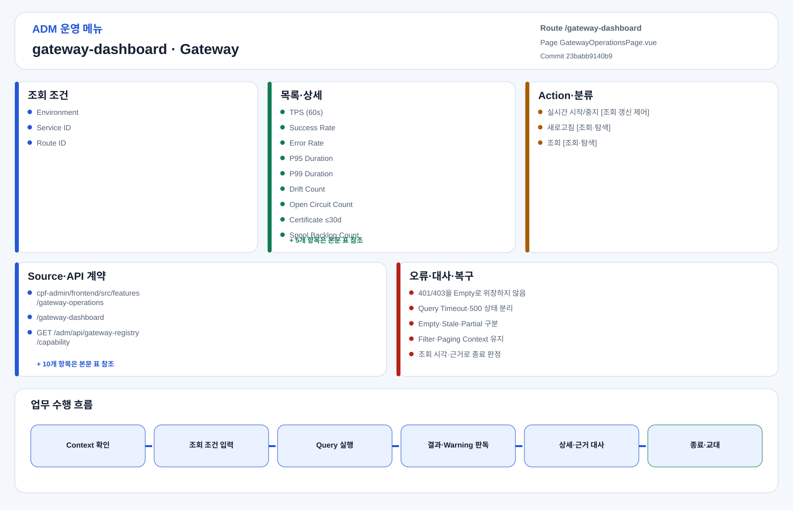

### 이 장에서 끝내는 업무

Gateway Capability와 TPS·오류율·지연·Drift·Circuit·Certificate·Spool 상태를 탐지한다.

### 메뉴 식별·책임

| 항목 | 값 |
|---|---|
| Route | `/gateway-dashboard` |
| 메뉴 ID | `gateway-dashboard` |
| Menu Code | `gateway-dashboard` |
| 업무 그룹 | 온라인 운영 |
| Frontend Page | `cpf-admin/frontend/src/features/gateway-operations/GatewayOperationsPage.vue` |
| Permission | Gateway Menu/Action Permission + Approval |
| 기준 Commit | `23babb9140b90e501d6ac715e7b77f55b66198a5` |

### Source·API 근거

| 구분 | 기준 |
|---|---|
| Frontend Page | `cpf-admin/frontend/src/features/gateway-operations/GatewayOperationsPage.vue` |
| Router | `/gateway-dashboard` |
| API 1 | `GET /adm/api/gateway-registry/capability` |
| API 2 | `GET /adm/api/gateway-registry/operations/snapshot` |
| API 3 | `GET /adm/api/gateway-registry/operations/stream` |
| API 4 | `GET /adm/api/gateway-registry/server-groups` |
| API 5 | `POST /adm/api/gateway-registry/server-groups` |
| API 6 | `GET /adm/api/gateway-registry/server-groups/{serverGroupId}/members` |
| API 7 | `GET /adm/api/gateway-registry/bindings` |
| API 8 | `POST /adm/api/gateway-registry/bindings` |
| API 9 | `GET /adm/api/gateway-registry/bindings/{bindingId}/apply-status` |
| API 10 | `GET /adm/api/gateway-registry/bindings/{bindingId}/connection-tests` |
| API 11 | `POST /adm/api/gateway-registry/bindings/{bindingId}/connection-tests` |
| Source 해석 | 공통 KPI·Capability 영역을 사용한다. 모든 Gateway Alias Route는 같은 `GatewayOperationsPage.vue`를 열고 `activeTab` 기본값은 `groups`다. |

아래 표는 이 메뉴에서 실제로 확인·입력·실행할 항목을 정리한다. 화면에 없는 Field·Button·상태를 임의로 가정하지 않는다.

### 검색·입력 Field

| Field | Control | 업무 의미 | 기본값·Validation·주의 |
|---|---|---|---|
| `Environment` | Select·검색 | Gateway Dashboard 조회·조치가 적용되는 환경과 데이터 경계를 제한한다. | 허용 목록과 현재 Environment·Data Scope에 맞는 값만 선택한다. |
| `Service ID` | 문자열 입력·검색 | 조회·상세·Audit에서 같은 대상을 다시 찾기 위한 식별 조건이다. | 앞뒤 공백·허용 문자·길이와 대소문자 규칙을 확인한다. |
| `Route ID` | 문자열 입력·검색 | 조회·상세·Audit에서 같은 대상을 다시 찾기 위한 식별 조건이다. | 앞뒤 공백·허용 문자·길이와 대소문자 규칙을 확인한다. |

#### 입력 순서

1. **Environment** 항목이 조회 Control인지 변경 Form인지 화면 위치로 구분하고, 표시된 값·필수 여부·허용 형식을 확인한다.
2. **Service ID** 항목이 조회 Control인지 변경 Form인지 화면 위치로 구분하고, 표시된 값·필수 여부·허용 형식을 확인한다.
3. **Route ID** 항목이 조회 Control인지 변경 Form인지 화면 위치로 구분하고, 표시된 값·필수 여부·허용 형식을 확인한다.
4. 조회 Control과 변경 Form을 분리해 기록하고, 실행 전 Environment·Data Scope·Timezone과 제출할 값만 다시 검토한다.

### 목록 Column·상세 Field

| 표시값 | 운영 의미 | 교차 확인 |
|---|---|---|
| `TPS (60s)` | 동일한 집계 시간 창·단위·Filter에서 비교해야 하는 수치다. | 같은 Filter·집계 시간 창·단위의 상세 Row 또는 Metric으로 대사한다. |
| `Success Rate` | 동일한 집계 시간 창·단위·Filter에서 비교해야 하는 수치다. | 같은 Filter·집계 시간 창·단위의 상세 Row 또는 Metric으로 대사한다. |
| `Error Rate` | 동일한 집계 시간 창·단위·Filter에서 비교해야 하는 수치다. | 같은 Filter·집계 시간 창·단위의 상세 Row 또는 Metric으로 대사한다. |
| `P95 Duration` | 동일한 집계 시간 창·단위·Filter에서 비교해야 하는 수치다. | 같은 Filter·집계 시간 창·단위의 상세 Row 또는 Metric으로 대사한다. |
| `P99 Duration` | 동일한 집계 시간 창·단위·Filter에서 비교해야 하는 수치다. | 같은 Filter·집계 시간 창·단위의 상세 Row 또는 Metric으로 대사한다. |
| `Drift Count` | 동일한 집계 시간 창·단위·Filter에서 비교해야 하는 수치다. | 같은 Filter·집계 시간 창·단위의 상세 Row 또는 Metric으로 대사한다. |
| `Open Circuit Count` | 현재 상태와 Terminal 여부, 다음 Action 가능 여부를 판단하는 값이다. | 같은 Filter·집계 시간 창·단위의 상세 Row 또는 Metric으로 대사한다. |
| `Certificate ≤30d` | Gateway Dashboard 상세에서 대상의 현재 속성 또는 처리 결과를 확인하는 값이다. | 상세·재조회 결과와 비교하고 Stale·Masking·단위 차이를 확인한다. |
| `Spool Backlog Count` | 동일한 집계 시간 창·단위·Filter에서 비교해야 하는 수치다. | 같은 Filter·집계 시간 창·단위의 상세 Row 또는 Metric으로 대사한다. |
| `Spool Backlog Bytes` | 동일한 집계 시간 창·단위·Filter에서 비교해야 하는 수치다. | 같은 Filter·집계 시간 창·단위의 상세 Row 또는 Metric으로 대사한다. |
| `Failed Connection Tests (24h)` | Gateway Dashboard 상세에서 대상의 현재 속성 또는 처리 결과를 확인하는 값이다. | 상세·재조회 결과와 비교하고 Stale·Masking·단위 차이를 확인한다. |
| `Capability Status` | 현재 상태와 Terminal 여부, 다음 Action 가능 여부를 판단하는 값이다. | Last Updated·Terminal 조건·Owner 상태와 함께 확인한다. |
| `Source Instance ID` | Gateway Dashboard의 대상 레코드를 상세·Owner·Audit에서 연결하는 식별자다. | 상세·Log·Trace·Audit에서 같은 대상을 가리키는지 확인한다. |
| `Generated At` | 동일한 집계 시간 창·단위·Filter에서 비교해야 하는 수치다. | 같은 Filter·집계 시간 창·단위의 상세 Row 또는 Metric으로 대사한다. |

#### 결과 판독 순서

1. 조회 완료 시각·Filter·Paging·Sort와 화면 Warning을 확인한다.
2. Empty·Stale·Partial을 정상 0건과 구분한다.
3. 식별자·상태·Version·오류·시각을 같은 Query Context의 상세와 Owner 원장에서 비교한다.
4. Masking된 값은 Raw Permission과 Reason 없이 복원·Export하지 않는다.
5. 집계와 상세가 다르면 집계 시간 창·Timezone·Owner Update 시각을 맞춰 대사한다.

### Button·Action

| Action | 분류 | 활성 조건 | Side Effect·정상 결과 |
|---|---|---|---|
| **실시간 시작/중지** | 조회 갱신 제어 | 화면이 활성 상태이며 SSE 또는 Poll 갱신 방식을 사용자가 선택함 | SSE 또는 Poll 갱신만 시작·중지하며 Owner 데이터나 Route 설정은 변경하지 않는다. |
| **새로고침** | 조회·탐색 | 조회 Permission과 Query Validation을 충족하고 동일 조회가 진행 중이 아님 | 새로고침 결과의 조회 시각·Filter·Source Version·Warning이 갱신되며 Owner 데이터는 변경하지 않는다. |
| **조회** | 조회·탐색 | 조회 Permission과 Query Validation을 충족하고 동일 조회가 진행 중이 아님 | 조회 결과의 조회 시각·Filter·Source Version·Warning이 갱신되며 Owner 데이터는 변경하지 않는다. |

### 정상 업무 전체 절차

1. `/gateway-dashboard`에 진입해 Page Header와 Route가 **Gateway Dashboard** 기능을 가리키는지 확인한다.
2. 로그인 Session·Environment·Data Scope·기준일·Timezone을 고정한다.
3. 화면에 제공된 조회 Control만 사용하고, 표시되지 않은 변경 Field나 Server Command가 있다고 가정하지 않는다.
4. Loading 종료 후 Empty·Error·Stale·Partial 상태와 화면 Warning을 먼저 판정한다.
5. **TPS (60s), Success Rate, Error Rate, P95 Duration, P99 Duration**를 읽고 식별자·상태·Version·시각을 Owner 원장과 대사한다.
6. 화면이 제공하는 Log·Metric·Trace와, 변경·Export·승인 조치에 생성된 Audit를 교차 확인한다.
7. 이 장의 **종료 판정**과 다음 확인 시각·Evidence Link를 교대 기록에 남긴다.

### 메뉴 고유 판정·금지 사항

- **목적:** Gateway Capability와 TPS·오류율·지연·Drift·Circuit·Certificate·Spool 상태를 탐지한다.
- **종료 판정:** KPI의 Generated At과 Source Instance를 확인하고 이상 항목을 Server Group·Binding·Apply 상세로 연결한다.
- **공유 Page 동작:** 공통 KPI·Capability 영역을 사용한다. 모든 Gateway Alias Route는 같은 `GatewayOperationsPage.vue`를 열고 `activeTab` 기본값은 `groups`다.
- 조회 화면에서 직접 Owner 데이터를 변경하거나 Browser Tool로 우회하지 않는다.
- Partial 조회를 정상 전체 결과로 합치지 않는다.

### 오류·경계·동시성·복구

| 상황 | 화면 징후 | 운영 조치 | 종료 증적 |
|---|---|---|---|
| 401·Session | Session 만료·CSRF·Origin 실패 | 로그인 상태와 BFF Session을 확인한다. Command 자동 Replay는 금지한다. | 401/403 응답·Session Audit |
| 403·Data Scope | 메뉴·Button·Raw·Export가 거부됨 | Menu·Button·API·Owner Permission과 Data Scope를 확인하고 우회하지 않는다. | Deny Audit·요청 Permission |
| Validation | 필수값·범위·형식·기간 오류 | Field Error만 수정하고 기존 성공 Operation을 다시 제출하지 않는다. | Error Code·Field·입력값 |
| Timeout·Dependency | 일부 Source 또는 Command 응답 지연 | Correlation/Operation ID와 실패 Stage를 기록하고 Owner 상태를 조회한다. | Dependency 상태·Retryability |
| Partial·Stale | 일부 대상만 Success 또는 조회 Source 누락 | 성공·실패·미응답을 분리하고 누락 범위와 Version을 표시한다. | Target별 결과·Version |

### 응답 유실·부분 조회 처리

1. 검색 조건·Data Scope·Paging·조회 시각·Correlation ID를 기록한다.
2. 같은 조건으로 재조회하되 실패 Source만 분리한다.
3. 정상 Source 결과를 유지하고 실패·Stale Source를 명시한다.
4. 집계와 원본 상세가 다르면 Owner 상세를 기준으로 Reconcile Case를 연다.
5. 조회 시각·Source Version·0건 또는 일치 결과를 증적으로 남긴다.

### Log·Metric·Trace·Audit와 교대 기록

| 증적 | 필수 값 |
|---|---|
| Audit | Actor·Permission·Reason·Approval·Target·Before/After·Result·Recovery Action |
| Log | Environment·Instance·operationId·transactionId·failureStage·errorCode |
| Metric | 동일 시간 창의 Success·Failure·Latency·Queue·Retry·Partial·Unknown |
| Trace | root/segment/attempt·Owner·DB/Kafka/외부 의존성 Span |
| 상태 원장 | Target ID·Version·Checksum·Desired/Actual·Last Updated·Terminal 여부 |

```text
Menu=gateway-dashboard
Route=/gateway-dashboard
Environment=
DataScope=
Query=
TargetId=
BeforeVersion=
Action=
Reason=
ApprovalId=
OperationId=
TransactionId=
Result=SUCCESS|FAILED|PARTIAL|UNKNOWN_RESULT
OwnerState=
FailedTargets=
ReconcileBy=
RollbackPoint=
EvidenceLinks=
NextCheckAt=
```

### 실무 Workbook

**상황:** Gateway Capability와 TPS·오류율·지연·Drift·Circuit·Certificate·Spool 상태를 탐지한다. 화면이 일부 Source Timeout 때문에 Partial 결과를 표시했다.

1. Query·Data Scope·조회 시각·Correlation ID를 기록한다.
2. 정상 결과를 0건으로 덮어쓰지 않고 실패 Source만 재조회한다.
3. TPS (60s), Success Rate, Error Rate 값을 원본 상세와 같은 시간 기준으로 비교한다.
4. 불일치가 계속되면 Incident 또는 Reconcile Case를 생성한다.
5. KPI의 Generated At과 Source Instance를 확인하고 이상 항목을 Server Group·Binding·Apply 상세로 연결한다.
6. Source Version과 다음 확인 시각을 교대 기록에 남긴다.

### 독립 수행 검수 Checklist

- [ ] `/gateway-dashboard`와 Page Source를 찾고 화면 목적을 설명할 수 있다.
- [ ] 3개 입력·검색 항목의 Control·기본값·Validation을 설명할 수 있다.
- [ ] 14개 표시값을 Owner 상태·Version·Audit와 대사할 수 있다.
- [ ] 3개 Action의 분류·활성 조건·Side Effect를 설명할 수 있다.
- [ ] Empty·403·409·Timeout·Partial·Unknown을 서로 다른 상태로 처리할 수 있다.
- [ ] 응답 유실 뒤 중복 제출 없이 Operation·Owner·Audit로 결과를 확정할 수 있다.
- [ ] 교대 기록만으로 다음 담당자가 Target·상태·복구 기한을 이어받을 수 있다.

## 45. gateway-servers — Gateway Servers

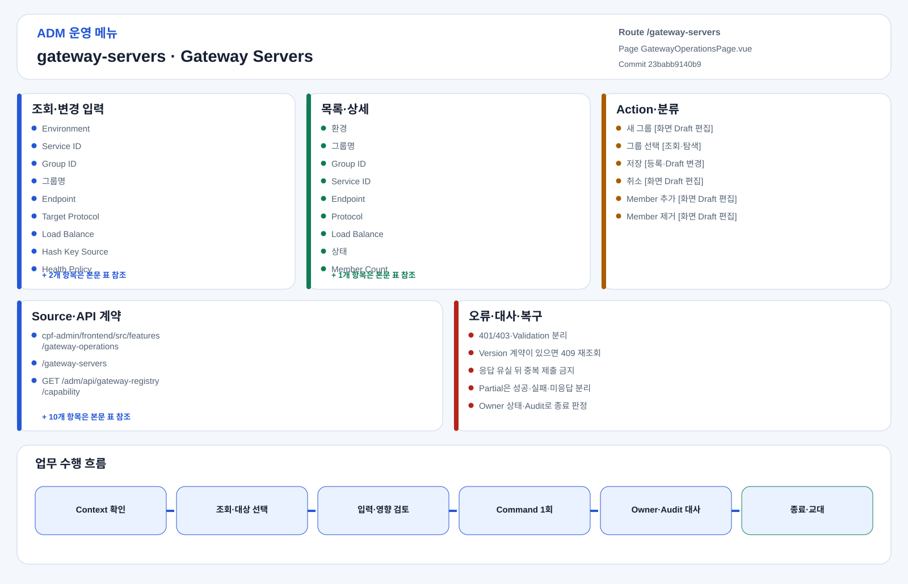

### 이 장에서 끝내는 업무

Server Group의 Service·Endpoint·Protocol·Load Balance와 Member 구성을 관리한다.

### 메뉴 식별·책임

| 항목 | 값 |
|---|---|
| Route | `/gateway-servers` |
| 메뉴 ID | `gateway-servers` |
| Menu Code | `gateway-servers` |
| 업무 그룹 | 온라인 운영 |
| Frontend Page | `cpf-admin/frontend/src/features/gateway-operations/GatewayOperationsPage.vue` |
| Permission | Gateway Menu/Action Permission + Approval |
| 기준 Commit | `23babb9140b90e501d6ac715e7b77f55b66198a5` |

### Source·API 근거

| 구분 | 기준 |
|---|---|
| Frontend Page | `cpf-admin/frontend/src/features/gateway-operations/GatewayOperationsPage.vue` |
| Router | `/gateway-servers` |
| API 1 | `GET /adm/api/gateway-registry/capability` |
| API 2 | `GET /adm/api/gateway-registry/operations/snapshot` |
| API 3 | `GET /adm/api/gateway-registry/operations/stream` |
| API 4 | `GET /adm/api/gateway-registry/server-groups` |
| API 5 | `POST /adm/api/gateway-registry/server-groups` |
| API 6 | `GET /adm/api/gateway-registry/server-groups/{serverGroupId}/members` |
| API 7 | `GET /adm/api/gateway-registry/bindings` |
| API 8 | `POST /adm/api/gateway-registry/bindings` |
| API 9 | `GET /adm/api/gateway-registry/bindings/{bindingId}/apply-status` |
| API 10 | `GET /adm/api/gateway-registry/bindings/{bindingId}/connection-tests` |
| API 11 | `POST /adm/api/gateway-registry/bindings/{bindingId}/connection-tests` |
| Source 해석 | 공유 Workspace가 `groups` Tab을 기본으로 연다. 이 Alias는 별도 Page가 아니다. |

아래 표는 이 메뉴에서 실제로 확인·입력·실행할 항목을 정리한다. 화면에 없는 Field·Button·상태를 임의로 가정하지 않는다.

### 검색·입력 Field

| Field | Control | 업무 의미 | 기본값·Validation·주의 |
|---|---|---|---|
| `Environment` | Select·검색 | Gateway Servers 조회·조치가 적용되는 환경과 데이터 경계를 제한한다. | 허용 목록과 현재 Environment·Data Scope에 맞는 값만 선택한다. |
| `Service ID` | 문자열 입력·검색 | 조회·상세·Audit에서 같은 대상을 다시 찾기 위한 식별 조건이다. | 앞뒤 공백·허용 문자·길이와 대소문자 규칙을 확인한다. |
| `Group ID` | 문자열 입력·검색 | 조회·상세·Audit에서 같은 대상을 다시 찾기 위한 식별 조건이다. | 앞뒤 공백·허용 문자·길이와 대소문자 규칙을 확인한다. |
| `그룹명` | 문자열 입력·검색 | 대상의 표시명 또는 업무명을 검색·입력한다. | 앞뒤 공백·허용 문자·길이와 대소문자 규칙을 확인한다. |
| `Endpoint` | 문자열 입력·검색 | 조회·상세·Audit에서 같은 대상을 다시 찾기 위한 식별 조건이다. | 앞뒤 공백·허용 문자·길이와 대소문자 규칙을 확인한다. |
| `Target Protocol` | 날짜·시간 입력 | 조회 또는 적용의 유효 시간 범위를 정하며 Timezone과 시작·종료 순서를 함께 확인한다. | Timezone을 고정하고 시작≤종료·유효기간 겹침·기준일 포함 여부를 확인한다. |
| `Load Balance` | 문자열 입력·검색 | Gateway Servers 화면의 조회 조건 또는 편집 Form에 포함되는 값이며 화면 Label과 Help를 기준으로 사용한다. | 앞뒤 공백·허용 문자·길이와 대소문자 규칙을 확인한다. |
| `Hash Key Source` | 문자열 입력·검색 | Artifact·요청·적용 결과의 동일성을 비교하는 값이다. | 앞뒤 공백·허용 문자·길이와 대소문자 규칙을 확인한다. |
| `Health Policy` | Select·검색 | Gateway Servers에서 적용하거나 조회할 정책·권한·처리 유형을 선택한다. | 허용 목록과 현재 Environment·Data Scope에 맞는 값만 선택한다. |
| `Failover Group` | 문자열 입력·검색 | 조회·상세·Audit에서 같은 대상을 다시 찾기 위한 식별 조건이다. | 앞뒤 공백·허용 문자·길이와 대소문자 규칙을 확인한다. |
| `변경 사유` | 다중행 입력 | 작업 목적·영향 범위·승인 또는 복구 기준을 기록해 Audit와 교대 기록에 연결한다. | Ticket·영향 범위·복구점을 포함하고 화면이 요구하는 최소 길이를 충족한다. |

#### 입력 순서

1. **Environment** 항목이 조회 Control인지 변경 Form인지 화면 위치로 구분하고, 표시된 값·필수 여부·허용 형식을 확인한다.
2. **Service ID** 항목이 조회 Control인지 변경 Form인지 화면 위치로 구분하고, 표시된 값·필수 여부·허용 형식을 확인한다.
3. **Group ID** 항목이 조회 Control인지 변경 Form인지 화면 위치로 구분하고, 표시된 값·필수 여부·허용 형식을 확인한다.
4. **그룹명** 항목이 조회 Control인지 변경 Form인지 화면 위치로 구분하고, 표시된 값·필수 여부·허용 형식을 확인한다.
5. **Endpoint** 항목이 조회 Control인지 변경 Form인지 화면 위치로 구분하고, 표시된 값·필수 여부·허용 형식을 확인한다.
6. **Target Protocol** 항목이 조회 Control인지 변경 Form인지 화면 위치로 구분하고, 표시된 값·필수 여부·허용 형식을 확인한다.
7. **Load Balance** 항목이 조회 Control인지 변경 Form인지 화면 위치로 구분하고, 표시된 값·필수 여부·허용 형식을 확인한다.
8. **Hash Key Source** 항목이 조회 Control인지 변경 Form인지 화면 위치로 구분하고, 표시된 값·필수 여부·허용 형식을 확인한다.
9. **Health Policy** 항목이 조회 Control인지 변경 Form인지 화면 위치로 구분하고, 표시된 값·필수 여부·허용 형식을 확인한다.
10. **Failover Group** 항목이 조회 Control인지 변경 Form인지 화면 위치로 구분하고, 표시된 값·필수 여부·허용 형식을 확인한다.
11. **변경 사유** 항목이 조회 Control인지 변경 Form인지 화면 위치로 구분하고, 표시된 값·필수 여부·허용 형식을 확인한다.
12. 조회 Control과 변경 Form을 분리해 기록하고, 실행 전 Environment·Data Scope·Timezone과 제출할 값만 다시 검토한다.

### 목록 Column·상세 Field

| 표시값 | 운영 의미 | 교차 확인 |
|---|---|---|
| `환경` | Gateway Servers 상세에서 대상의 현재 속성 또는 처리 결과를 확인하는 값이다. | 상세·재조회 결과와 비교하고 Stale·Masking·단위 차이를 확인한다. |
| `그룹명` | 운영자가 대상을 구분하는 표시명 또는 설명이다. | 상세·재조회 결과와 비교하고 Stale·Masking·단위 차이를 확인한다. |
| `Group ID` | Gateway Servers의 대상 레코드를 상세·Owner·Audit에서 연결하는 식별자다. | 상세·Log·Trace·Audit에서 같은 대상을 가리키는지 확인한다. |
| `Service ID` | Gateway Servers의 대상 레코드를 상세·Owner·Audit에서 연결하는 식별자다. | 상세·Log·Trace·Audit에서 같은 대상을 가리키는지 확인한다. |
| `Endpoint` | Gateway Servers의 대상 레코드를 상세·Owner·Audit에서 연결하는 식별자다. | 상세·Log·Trace·Audit에서 같은 대상을 가리키는지 확인한다. |
| `Protocol` | 상태 발생·갱신·유효 시점을 나타내며 화면 Timezone을 기준으로 해석한다. | 상세·재조회 결과와 비교하고 Stale·Masking·단위 차이를 확인한다. |
| `Load Balance` | Gateway Servers 상세에서 대상의 현재 속성 또는 처리 결과를 확인하는 값이다. | 상세·재조회 결과와 비교하고 Stale·Masking·단위 차이를 확인한다. |
| `상태` | 현재 상태와 Terminal 여부, 다음 Action 가능 여부를 판단하는 값이다. | Last Updated·Terminal 조건·Owner 상태와 함께 확인한다. |
| `Member Count` | 동일한 집계 시간 창·단위·Filter에서 비교해야 하는 수치다. | 같은 Filter·집계 시간 창·단위의 상세 Row 또는 Metric으로 대사한다. |
| `Version` | 요청·Owner·Instance 사이의 Version 또는 내용 동일성을 판단하는 값이다. | 목록·상세·Owner 또는 Instance 보고값에서 일치하는지 확인한다. |

#### 결과 판독 순서

1. 조회 완료 시각·Filter·Paging·Sort와 화면 Warning을 확인한다.
2. Empty·Stale·Partial을 정상 0건과 구분한다.
3. 식별자·상태·Version·오류·시각을 같은 Query Context의 상세와 Owner 원장에서 비교한다.
4. Masking된 값은 Raw Permission과 Reason 없이 복원·Export하지 않는다.
5. 집계와 상세가 다르면 집계 시간 창·Timezone·Owner Update 시각을 맞춰 대사한다.

### Button·Action

| Action | 분류 | 활성 조건 | Side Effect·정상 결과 |
|---|---|---|---|
| **새 그룹** | 화면 Draft 편집 | 화면 Form이 열려 있고 아직 Server Command를 제출하지 않음 | Browser의 편집 Draft만 변경하며 저장·실행 Action 전에는 Server Side Effect가 없다. |
| **그룹 선택** | 조회·탐색 | 조회 Permission과 Query Validation을 충족하고 동일 조회가 진행 중이 아님 | 그룹 선택 결과의 조회 시각·Filter·Source Version·Warning이 갱신되며 Owner 데이터는 변경하지 않는다. |
| **저장** | 등록·Draft 변경 | 화면이 실제로 요구하는 Write Permission·필수 Field·Reason·Version 조건을 충족함 | Gateway Servers의 재조회 결과가 요청 내용과 일치한다. Version·Before/After·Audit는 해당 Owner가 제공하는 경우 함께 확인한다. |
| **취소** | 화면 Draft 편집 | 화면 Form이 열려 있고 아직 Server Command를 제출하지 않음 | Dialog를 닫고 Browser Draft를 폐기하며 Server Side Effect는 발생하지 않는다. |
| **Member 추가** | 화면 Draft 편집 | 화면 Form이 열려 있고 아직 Server Command를 제출하지 않음 | Browser의 편집 Draft만 변경하며 저장·실행 Action 전에는 Server Side Effect가 없다. |
| **Member 제거** | 화면 Draft 편집 | 화면 Form이 열려 있고 아직 Server Command를 제출하지 않음 | Browser의 편집 Draft만 변경하며 저장·실행 Action 전에는 Server Side Effect가 없다. |

### 정상 업무 전체 절차

1. `/gateway-servers`에 진입해 Page Header와 Route가 **Gateway Servers** 기능을 가리키는지 확인한다.
2. 로그인 Session·Environment·Data Scope·기준일·Timezone을 고정한다.
3. 화면의 조회 Control과 변경 Form을 구분한다. 조회 조건이 제공되면 먼저 조회하고, 변경 Form은 대상 선택 또는 등록 Action 뒤에 열린 실제 Field만 사용한다.
4. Loading 종료 후 Empty·Error·Stale·Partial 상태와 화면 Warning을 먼저 판정한다.
5. **환경, 그룹명, Group ID, Service ID, Endpoint**를 읽고 식별자·상태·Version·시각을 Owner 원장과 대사한다.
6. **새 그룹**은 Browser Draft만 바꾸므로 저장·실행 Action 전에는 Owner 상태가 변하지 않았는지 확인한다.
7. **저장** 전에 화면과 Owner가 실제로 요구하는 Permission·현재 상태·영향 범위·Reason·승인·Version 조건을 확인하고 한 번만 제출한다.
8. **저장**의 HTTP 응답과 재조회 결과를 확인한다. 비동기·다중 대상 기능은 Owner Terminal 상태·Version·대상별 Success/Failed/Unknown·Audit를 별도로 확인한다.
9. **취소**은 Browser Draft만 바꾸므로 저장·실행 Action 전에는 Owner 상태가 변하지 않았는지 확인한다.
10. **Member 추가**은 Browser Draft만 바꾸므로 저장·실행 Action 전에는 Owner 상태가 변하지 않았는지 확인한다.
11. **Member 제거**은 Browser Draft만 바꾸므로 저장·실행 Action 전에는 Owner 상태가 변하지 않았는지 확인한다.
12. 화면이 제공하는 Log·Metric·Trace와, 변경·Export·승인 조치에 생성된 Audit를 교차 확인한다.
13. 이 장의 **종료 판정**과 다음 확인 시각·Evidence Link를 교대 기록에 남긴다.

### 메뉴 고유 판정·금지 사항

- **목적:** Server Group의 Service·Endpoint·Protocol·Load Balance와 Member 구성을 관리한다.
- **종료 판정:** 저장 후 Group Version과 Member Diff, 각 Member Health·Fencing 상태가 일치해야 한다.
- **공유 Page 동작:** 공유 Workspace가 `groups` Tab을 기본으로 연다. 이 Alias는 별도 Page가 아니다.
- 응답을 받지 못한 경우 Owner 상태와 기존 Operation을 확인하기 전에 동일 Action을 반복하지 않는다.
- HTTP 성공 응답이나 Toast만으로 비동기 Owner 상태 또는 다중 대상 적용을 확정하지 않는다.

### 오류·경계·동시성·복구

| 상황 | 화면 징후 | 운영 조치 | 종료 증적 |
|---|---|---|---|
| 401·Session | Session 만료·CSRF·Origin 실패 | 로그인 상태와 BFF Session을 확인한다. Command 자동 Replay는 금지한다. | 401/403 응답·Session Audit |
| 403·Data Scope | 메뉴·Button·Raw·Export가 거부됨 | Menu·Button·API·Owner Permission과 Data Scope를 확인하고 우회하지 않는다. | Deny Audit·요청 Permission |
| Validation | 필수값·범위·형식·기간 오류 | Field Error만 수정하고 기존 성공 Operation을 다시 제출하지 않는다. | Error Code·Field·입력값 |
| Timeout·Dependency | 일부 Source 또는 Command 응답 지연 | Correlation/Operation ID와 실패 Stage를 기록하고 Owner 상태를 조회한다. | Dependency 상태·Retryability |
| Partial·Stale | 일부 대상만 Success 또는 조회 Source 누락 | 성공·실패·미응답을 분리하고 누락 범위와 Version을 표시한다. | Target별 결과·Version |
| 409·동시 변경 | Expected Version 불일치 | 최신 상세를 재조회하고 Diff·영향을 다시 검토한 뒤 새 요청으로 제출한다. | 현재/요청 Version·변경자 |
| 응답 유실·Unknown | 요청 후 실제 처리 여부를 알 수 없음 | Operation ID·Request Hash·Audit·Owner 상태로 대사하고 중복 제출하지 않는다. | Operation·Owner·Audit |
| 복구 실패 | Retry/Rollback 뒤에도 상태 불일치 | 자동 반복을 중단하고 Incident·Reconcile Case·다음 확인 시각을 기록한다. | Case ID·복구 Owner·기한 |
| Gateway NACK·Drift | Expected/Applied Version 불일치 또는 Instance NACK | NACK 이유·Checksum·Last Seen을 확인하고 Failed Instance만 재적용하거나 LKG로 복귀한다. | Instance ACK/NACK·LKG |

### 응답 유실·결과 불명·부분 적용 처리

1. 동일 Action을 다시 누르지 않고 Browser Network와 응답 Header를 보존한다. `operationId`·`transactionId`·`idempotencyKey`가 제공되면 기록하고, 없으면 Target ID·Actor·요청 시각·Request Body Hash로 대사한다.
2. 기능이 제공하는 상세·Operation Status(있는 경우)·Audit에서 Request Hash와 대상 Version을 검색한다.
3. Side Effect 전 실패가 확인된 경우에만 새 요청을 검토한다.
4. Success·Failed·Unknown 대상을 분리하고 Source가 제공하는 Failed-only Retry·Compensation·Rollback을 선택하고, 지원되지 않으면 수동 Reconcile Case로 이관한다.
5. Rollback을 지원하는 기능은 Owner Version·Checksum·업무 합계가 Rollback Point와 일치하는지 확인한다.
6. 확정되지 않은 대상은 `UNKNOWN_RESULT`로 유지하고 담당자·대사 기한·다음 확인 시각을 기록한다.

### Log·Metric·Trace·Audit와 교대 기록

| 증적 | 필수 값 |
|---|---|
| Audit | Actor·Permission·Reason·Approval·Target·Before/After·Result·Recovery Action |
| Log | Environment·Instance·operationId·transactionId·failureStage·errorCode |
| Metric | 동일 시간 창의 Success·Failure·Latency·Queue·Retry·Partial·Unknown |
| Trace | root/segment/attempt·Owner·DB/Kafka/외부 의존성 Span |
| 상태 원장 | Target ID·Version·Checksum·Desired/Actual·Last Updated·Terminal 여부 |

```text
Menu=gateway-servers
Route=/gateway-servers
Environment=
DataScope=
Query=
TargetId=
BeforeVersion=
Action=
Reason=
ApprovalId=
OperationId=
TransactionId=
Result=SUCCESS|FAILED|PARTIAL|UNKNOWN_RESULT
OwnerState=
FailedTargets=
ReconcileBy=
RollbackPoint=
EvidenceLinks=
NextCheckAt=
```

### 실무 Workbook

**상황:** Server Group의 Service·Endpoint·Protocol·Load Balance와 Member 구성을 관리한다. 담당자가 **저장**을 수행한 뒤 Browser 응답을 받지 못했다.

1. 대상 식별자와 Before Version, 입력값, Reason·Approval을 작업 기록에서 확인한다.
2. 동일 **저장**을 반복하지 않고 Operation·Audit·Owner 상태를 조회한다.
3. Owner 상태가 변경됐고 Request Hash가 같으면 응답 유실로 분류해 중복 조치를 금지한다.
4. 일부 대상만 변경됐으면 Success·Failed·Unknown을 분리해 Failed-only Retry 또는 Rollback을 선택한다.
5. 저장 후 Group Version과 Member Diff, 각 Member Health·Fencing 상태가 일치해야 한다.
6. Evidence Link와 다음 확인 시각을 교대 기록에 남긴다.

### 독립 수행 검수 Checklist

- [ ] `/gateway-servers`와 Page Source를 찾고 화면 목적을 설명할 수 있다.
- [ ] 1별도 사용자 입력이 없는 경우 자동 Query Context를 설명할 수 있다.
- [ ] 10개 표시값을 Owner 상태·Version·Audit와 대사할 수 있다.
- [ ] 6개 Action의 분류·활성 조건·Side Effect를 설명할 수 있다.
- [ ] Empty·403·409·Timeout·Partial·Unknown을 서로 다른 상태로 처리할 수 있다.
- [ ] 응답 유실 뒤 중복 제출 없이 Operation·Owner·Audit로 결과를 확정할 수 있다.
- [ ] 교대 기록만으로 다음 담당자가 Target·상태·복구 기한을 이어받을 수 있다.

## 46. gateway-groups — Gateway Groups

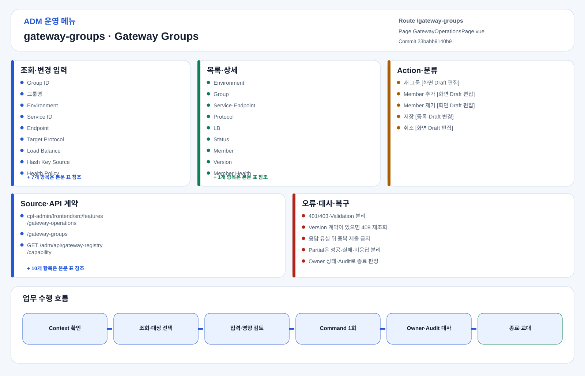

### 이 장에서 끝내는 업무

Server Group Member의 Weight·Priority·Canary·Enabled를 관리한다.

### 메뉴 식별·책임

| 항목 | 값 |
|---|---|
| Route | `/gateway-groups` |
| 메뉴 ID | `gateway-groups` |
| Menu Code | `gateway-groups` |
| 업무 그룹 | 온라인 운영 |
| Frontend Page | `cpf-admin/frontend/src/features/gateway-operations/GatewayOperationsPage.vue` |
| Permission | Gateway Menu/Action Permission + Approval |
| 기준 Commit | `23babb9140b90e501d6ac715e7b77f55b66198a5` |

### Source·API 근거

| 구분 | 기준 |
|---|---|
| Frontend Page | `cpf-admin/frontend/src/features/gateway-operations/GatewayOperationsPage.vue` |
| Router | `/gateway-groups` |
| API 1 | `GET /adm/api/gateway-registry/capability` |
| API 2 | `GET /adm/api/gateway-registry/operations/snapshot` |
| API 3 | `GET /adm/api/gateway-registry/operations/stream` |
| API 4 | `GET /adm/api/gateway-registry/server-groups` |
| API 5 | `POST /adm/api/gateway-registry/server-groups` |
| API 6 | `GET /adm/api/gateway-registry/server-groups/{serverGroupId}/members` |
| API 7 | `GET /adm/api/gateway-registry/bindings` |
| API 8 | `POST /adm/api/gateway-registry/bindings` |
| API 9 | `GET /adm/api/gateway-registry/bindings/{bindingId}/apply-status` |
| API 10 | `GET /adm/api/gateway-registry/bindings/{bindingId}/connection-tests` |
| API 11 | `POST /adm/api/gateway-registry/bindings/{bindingId}/connection-tests` |
| Source 해석 | 공유 Workspace가 `groups` Tab을 기본으로 연다. Member Weight는 1~10000, Priority는 0 이상, Canary Percent는 0~100을 사용한다. |

아래 표는 이 메뉴에서 실제로 확인·입력·실행할 항목을 정리한다. 화면에 없는 Field·Button·상태를 임의로 가정하지 않는다.

### 검색·입력 Field

| Field | Control | 업무 의미 | 기본값·Validation·주의 |
|---|---|---|---|
| `Group ID` | 문자열 입력·검색 | 조회·상세·Audit에서 같은 대상을 다시 찾기 위한 식별 조건이다. | 앞뒤 공백·허용 문자·길이와 대소문자 규칙을 확인한다. |
| `그룹명` | 문자열 입력·검색 | 대상의 표시명 또는 업무명을 검색·입력한다. | 앞뒤 공백·허용 문자·길이와 대소문자 규칙을 확인한다. |
| `Environment` | Select·검색 | Gateway Groups 조회·조치가 적용되는 환경과 데이터 경계를 제한한다. | 허용 목록과 현재 Environment·Data Scope에 맞는 값만 선택한다. |
| `Service ID` | 문자열 입력·검색 | 조회·상세·Audit에서 같은 대상을 다시 찾기 위한 식별 조건이다. | 앞뒤 공백·허용 문자·길이와 대소문자 규칙을 확인한다. |
| `Endpoint` | 문자열 입력·검색 | 조회·상세·Audit에서 같은 대상을 다시 찾기 위한 식별 조건이다. | 앞뒤 공백·허용 문자·길이와 대소문자 규칙을 확인한다. |
| `Target Protocol` | 날짜·시간 입력 | 조회 또는 적용의 유효 시간 범위를 정하며 Timezone과 시작·종료 순서를 함께 확인한다. | Timezone을 고정하고 시작≤종료·유효기간 겹침·기준일 포함 여부를 확인한다. |
| `Load Balance` | 문자열 입력·검색 | Gateway Groups 화면의 조회 조건 또는 편집 Form에 포함되는 값이며 화면 Label과 Help를 기준으로 사용한다. | 앞뒤 공백·허용 문자·길이와 대소문자 규칙을 확인한다. |
| `Hash Key Source` | 문자열 입력·검색 | Artifact·요청·적용 결과의 동일성을 비교하는 값이다. | 앞뒤 공백·허용 문자·길이와 대소문자 규칙을 확인한다. |
| `Health Policy` | Select·검색 | Gateway Groups에서 적용하거나 조회할 정책·권한·처리 유형을 선택한다. | 허용 목록과 현재 Environment·Data Scope에 맞는 값만 선택한다. |
| `Failover Group` | 문자열 입력·검색 | 조회·상세·Audit에서 같은 대상을 다시 찾기 위한 식별 조건이다. | 앞뒤 공백·허용 문자·길이와 대소문자 규칙을 확인한다. |
| `Instance ID` | 문자열 입력·검색 | 조회·상세·Audit에서 같은 대상을 다시 찾기 위한 식별 조건이다. | 앞뒤 공백·허용 문자·길이와 대소문자 규칙을 확인한다. |
| `Weight` | 숫자·Version 입력 | 실행 한도·순서·용량 또는 재시도 범위를 지정한다. | 화면의 min·max·단위와 0 허용 여부를 확인하고 음수·Overflow를 차단한다. |
| `Priority` | 숫자·Version 입력 | 실행 한도·순서·용량 또는 재시도 범위를 지정한다. | 화면의 min·max·단위와 0 허용 여부를 확인하고 음수·Overflow를 차단한다. |
| `Canary Percent` | 숫자·Version 입력 | 실행 한도·순서·용량 또는 재시도 범위를 지정한다. | 화면의 min·max·단위와 0 허용 여부를 확인하고 음수·Overflow를 차단한다. |
| `Enabled` | Checkbox·Switch | 현재 상태를 조회하거나 다음 Action의 허용 조건을 지정한다. | 현재 선택과 변경 후 영향 범위를 비교하고 화면의 Source 기본값을 확인한다. |
| `변경 사유` | 다중행 입력 | 작업 목적·영향 범위·승인 또는 복구 기준을 기록해 Audit와 교대 기록에 연결한다. | Ticket·영향 범위·복구점을 포함하고 화면이 요구하는 최소 길이를 충족한다. |

#### 입력 순서

1. **Group ID** 항목이 조회 Control인지 변경 Form인지 화면 위치로 구분하고, 표시된 값·필수 여부·허용 형식을 확인한다.
2. **그룹명** 항목이 조회 Control인지 변경 Form인지 화면 위치로 구분하고, 표시된 값·필수 여부·허용 형식을 확인한다.
3. **Environment** 항목이 조회 Control인지 변경 Form인지 화면 위치로 구분하고, 표시된 값·필수 여부·허용 형식을 확인한다.
4. **Service ID** 항목이 조회 Control인지 변경 Form인지 화면 위치로 구분하고, 표시된 값·필수 여부·허용 형식을 확인한다.
5. **Endpoint** 항목이 조회 Control인지 변경 Form인지 화면 위치로 구분하고, 표시된 값·필수 여부·허용 형식을 확인한다.
6. **Target Protocol** 항목이 조회 Control인지 변경 Form인지 화면 위치로 구분하고, 표시된 값·필수 여부·허용 형식을 확인한다.
7. **Load Balance** 항목이 조회 Control인지 변경 Form인지 화면 위치로 구분하고, 표시된 값·필수 여부·허용 형식을 확인한다.
8. **Hash Key Source** 항목이 조회 Control인지 변경 Form인지 화면 위치로 구분하고, 표시된 값·필수 여부·허용 형식을 확인한다.
9. **Health Policy** 항목이 조회 Control인지 변경 Form인지 화면 위치로 구분하고, 표시된 값·필수 여부·허용 형식을 확인한다.
10. **Failover Group** 항목이 조회 Control인지 변경 Form인지 화면 위치로 구분하고, 표시된 값·필수 여부·허용 형식을 확인한다.
11. **Instance ID** 항목이 조회 Control인지 변경 Form인지 화면 위치로 구분하고, 표시된 값·필수 여부·허용 형식을 확인한다.
12. **Weight** 항목이 조회 Control인지 변경 Form인지 화면 위치로 구분하고, 표시된 값·필수 여부·허용 형식을 확인한다.
13. **Priority** 항목이 조회 Control인지 변경 Form인지 화면 위치로 구분하고, 표시된 값·필수 여부·허용 형식을 확인한다.
14. **Canary Percent** 항목이 조회 Control인지 변경 Form인지 화면 위치로 구분하고, 표시된 값·필수 여부·허용 형식을 확인한다.
15. **Enabled** 항목이 조회 Control인지 변경 Form인지 화면 위치로 구분하고, 표시된 값·필수 여부·허용 형식을 확인한다.
16. **변경 사유** 항목이 조회 Control인지 변경 Form인지 화면 위치로 구분하고, 표시된 값·필수 여부·허용 형식을 확인한다.
17. 조회 Control과 변경 Form을 분리해 기록하고, 실행 전 Environment·Data Scope·Timezone과 제출할 값만 다시 검토한다.

### 목록 Column·상세 Field

| 표시값 | 운영 의미 | 교차 확인 |
|---|---|---|
| `Environment` | Gateway Groups 상세에서 대상의 현재 속성 또는 처리 결과를 확인하는 값이다. | 상세·재조회 결과와 비교하고 Stale·Masking·단위 차이를 확인한다. |
| `Group` | Gateway Groups의 대상 레코드를 상세·Owner·Audit에서 연결하는 식별자다. | 상세·Log·Trace·Audit에서 같은 대상을 가리키는지 확인한다. |
| `Service·Endpoint` | Gateway Groups의 대상 레코드를 상세·Owner·Audit에서 연결하는 식별자다. | 상세·Log·Trace·Audit에서 같은 대상을 가리키는지 확인한다. |
| `Protocol` | 상태 발생·갱신·유효 시점을 나타내며 화면 Timezone을 기준으로 해석한다. | 상세·재조회 결과와 비교하고 Stale·Masking·단위 차이를 확인한다. |
| `LB` | Gateway Groups 상세에서 대상의 현재 속성 또는 처리 결과를 확인하는 값이다. | 상세·재조회 결과와 비교하고 Stale·Masking·단위 차이를 확인한다. |
| `Status` | 현재 상태와 Terminal 여부, 다음 Action 가능 여부를 판단하는 값이다. | Last Updated·Terminal 조건·Owner 상태와 함께 확인한다. |
| `Member` | Gateway Groups 상세에서 대상의 현재 속성 또는 처리 결과를 확인하는 값이다. | 상세·재조회 결과와 비교하고 Stale·Masking·단위 차이를 확인한다. |
| `Version` | 요청·Owner·Instance 사이의 Version 또는 내용 동일성을 판단하는 값이다. | 목록·상세·Owner 또는 Instance 보고값에서 일치하는지 확인한다. |
| `Member Health` | 현재 상태와 Terminal 여부, 다음 Action 가능 여부를 판단하는 값이다. | Last Updated·Terminal 조건·Owner 상태와 함께 확인한다. |
| `Fencing Token` | 상태 발생·갱신·유효 시점을 나타내며 화면 Timezone을 기준으로 해석한다. | 상세·재조회 결과와 비교하고 Stale·Masking·단위 차이를 확인한다. |

#### 결과 판독 순서

1. 조회 완료 시각·Filter·Paging·Sort와 화면 Warning을 확인한다.
2. Empty·Stale·Partial을 정상 0건과 구분한다.
3. 식별자·상태·Version·오류·시각을 같은 Query Context의 상세와 Owner 원장에서 비교한다.
4. Masking된 값은 Raw Permission과 Reason 없이 복원·Export하지 않는다.
5. 집계와 상세가 다르면 집계 시간 창·Timezone·Owner Update 시각을 맞춰 대사한다.

### Button·Action

| Action | 분류 | 활성 조건 | Side Effect·정상 결과 |
|---|---|---|---|
| **새 그룹** | 화면 Draft 편집 | 화면 Form이 열려 있고 아직 Server Command를 제출하지 않음 | Browser의 편집 Draft만 변경하며 저장·실행 Action 전에는 Server Side Effect가 없다. |
| **Member 추가** | 화면 Draft 편집 | 화면 Form이 열려 있고 아직 Server Command를 제출하지 않음 | Browser의 편집 Draft만 변경하며 저장·실행 Action 전에는 Server Side Effect가 없다. |
| **Member 제거** | 화면 Draft 편집 | 화면 Form이 열려 있고 아직 Server Command를 제출하지 않음 | Browser의 편집 Draft만 변경하며 저장·실행 Action 전에는 Server Side Effect가 없다. |
| **저장** | 등록·Draft 변경 | 화면이 실제로 요구하는 Write Permission·필수 Field·Reason·Version 조건을 충족함 | Gateway Groups의 재조회 결과가 요청 내용과 일치한다. Version·Before/After·Audit는 해당 Owner가 제공하는 경우 함께 확인한다. |
| **취소** | 화면 Draft 편집 | 화면 Form이 열려 있고 아직 Server Command를 제출하지 않음 | Dialog를 닫고 Browser Draft를 폐기하며 Server Side Effect는 발생하지 않는다. |

### 정상 업무 전체 절차

1. `/gateway-groups`에 진입해 Page Header와 Route가 **Gateway Groups** 기능을 가리키는지 확인한다.
2. 로그인 Session·Environment·Data Scope·기준일·Timezone을 고정한다.
3. 화면의 조회 Control과 변경 Form을 구분한다. 조회 조건이 제공되면 먼저 조회하고, 변경 Form은 대상 선택 또는 등록 Action 뒤에 열린 실제 Field만 사용한다.
4. Loading 종료 후 Empty·Error·Stale·Partial 상태와 화면 Warning을 먼저 판정한다.
5. **Environment, Group, Service·Endpoint, Protocol, LB**를 읽고 식별자·상태·Version·시각을 Owner 원장과 대사한다.
6. **새 그룹**은 Browser Draft만 바꾸므로 저장·실행 Action 전에는 Owner 상태가 변하지 않았는지 확인한다.
7. **Member 추가**은 Browser Draft만 바꾸므로 저장·실행 Action 전에는 Owner 상태가 변하지 않았는지 확인한다.
8. **Member 제거**은 Browser Draft만 바꾸므로 저장·실행 Action 전에는 Owner 상태가 변하지 않았는지 확인한다.
9. **저장** 전에 화면과 Owner가 실제로 요구하는 Permission·현재 상태·영향 범위·Reason·승인·Version 조건을 확인하고 한 번만 제출한다.
10. **저장**의 HTTP 응답과 재조회 결과를 확인한다. 비동기·다중 대상 기능은 Owner Terminal 상태·Version·대상별 Success/Failed/Unknown·Audit를 별도로 확인한다.
11. **취소**은 Browser Draft만 바꾸므로 저장·실행 Action 전에는 Owner 상태가 변하지 않았는지 확인한다.
12. 화면이 제공하는 Log·Metric·Trace와, 변경·Export·승인 조치에 생성된 Audit를 교차 확인한다.
13. 이 장의 **종료 판정**과 다음 확인 시각·Evidence Link를 교대 기록에 남긴다.

### 메뉴 고유 판정·금지 사항

- **목적:** Server Group Member의 Weight·Priority·Canary·Enabled를 관리한다.
- **종료 판정:** Member ID 중복 0, Weight 1~10000, Canary 0~100, Version 증가와 Audit 기록을 확인한다.
- **공유 Page 동작:** 공유 Workspace가 `groups` Tab을 기본으로 연다. Member Weight는 1~10000, Priority는 0 이상, Canary Percent는 0~100을 사용한다.
- 응답을 받지 못한 경우 Owner 상태와 기존 Operation을 확인하기 전에 동일 Action을 반복하지 않는다.
- HTTP 성공 응답이나 Toast만으로 비동기 Owner 상태 또는 다중 대상 적용을 확정하지 않는다.

### 오류·경계·동시성·복구

| 상황 | 화면 징후 | 운영 조치 | 종료 증적 |
|---|---|---|---|
| 401·Session | Session 만료·CSRF·Origin 실패 | 로그인 상태와 BFF Session을 확인한다. Command 자동 Replay는 금지한다. | 401/403 응답·Session Audit |
| 403·Data Scope | 메뉴·Button·Raw·Export가 거부됨 | Menu·Button·API·Owner Permission과 Data Scope를 확인하고 우회하지 않는다. | Deny Audit·요청 Permission |
| Validation | 필수값·범위·형식·기간 오류 | Field Error만 수정하고 기존 성공 Operation을 다시 제출하지 않는다. | Error Code·Field·입력값 |
| Timeout·Dependency | 일부 Source 또는 Command 응답 지연 | Correlation/Operation ID와 실패 Stage를 기록하고 Owner 상태를 조회한다. | Dependency 상태·Retryability |
| Partial·Stale | 일부 대상만 Success 또는 조회 Source 누락 | 성공·실패·미응답을 분리하고 누락 범위와 Version을 표시한다. | Target별 결과·Version |
| 409·동시 변경 | Expected Version 불일치 | 최신 상세를 재조회하고 Diff·영향을 다시 검토한 뒤 새 요청으로 제출한다. | 현재/요청 Version·변경자 |
| 응답 유실·Unknown | 요청 후 실제 처리 여부를 알 수 없음 | Operation ID·Request Hash·Audit·Owner 상태로 대사하고 중복 제출하지 않는다. | Operation·Owner·Audit |
| 복구 실패 | Retry/Rollback 뒤에도 상태 불일치 | 자동 반복을 중단하고 Incident·Reconcile Case·다음 확인 시각을 기록한다. | Case ID·복구 Owner·기한 |
| Gateway NACK·Drift | Expected/Applied Version 불일치 또는 Instance NACK | NACK 이유·Checksum·Last Seen을 확인하고 Failed Instance만 재적용하거나 LKG로 복귀한다. | Instance ACK/NACK·LKG |

### 응답 유실·결과 불명·부분 적용 처리

1. 동일 Action을 다시 누르지 않고 Browser Network와 응답 Header를 보존한다. `operationId`·`transactionId`·`idempotencyKey`가 제공되면 기록하고, 없으면 Target ID·Actor·요청 시각·Request Body Hash로 대사한다.
2. 기능이 제공하는 상세·Operation Status(있는 경우)·Audit에서 Request Hash와 대상 Version을 검색한다.
3. Side Effect 전 실패가 확인된 경우에만 새 요청을 검토한다.
4. Success·Failed·Unknown 대상을 분리하고 Source가 제공하는 Failed-only Retry·Compensation·Rollback을 선택하고, 지원되지 않으면 수동 Reconcile Case로 이관한다.
5. Rollback을 지원하는 기능은 Owner Version·Checksum·업무 합계가 Rollback Point와 일치하는지 확인한다.
6. 확정되지 않은 대상은 `UNKNOWN_RESULT`로 유지하고 담당자·대사 기한·다음 확인 시각을 기록한다.

### Log·Metric·Trace·Audit와 교대 기록

| 증적 | 필수 값 |
|---|---|
| Audit | Actor·Permission·Reason·Approval·Target·Before/After·Result·Recovery Action |
| Log | Environment·Instance·operationId·transactionId·failureStage·errorCode |
| Metric | 동일 시간 창의 Success·Failure·Latency·Queue·Retry·Partial·Unknown |
| Trace | root/segment/attempt·Owner·DB/Kafka/외부 의존성 Span |
| 상태 원장 | Target ID·Version·Checksum·Desired/Actual·Last Updated·Terminal 여부 |

```text
Menu=gateway-groups
Route=/gateway-groups
Environment=
DataScope=
Query=
TargetId=
BeforeVersion=
Action=
Reason=
ApprovalId=
OperationId=
TransactionId=
Result=SUCCESS|FAILED|PARTIAL|UNKNOWN_RESULT
OwnerState=
FailedTargets=
ReconcileBy=
RollbackPoint=
EvidenceLinks=
NextCheckAt=
```

### 실무 Workbook

**상황:** Server Group Member의 Weight·Priority·Canary·Enabled를 관리한다. 담당자가 **저장**을 수행한 뒤 Browser 응답을 받지 못했다.

1. 대상 식별자와 Before Version, 입력값, Reason·Approval을 작업 기록에서 확인한다.
2. 동일 **저장**을 반복하지 않고 Operation·Audit·Owner 상태를 조회한다.
3. Owner 상태가 변경됐고 Request Hash가 같으면 응답 유실로 분류해 중복 조치를 금지한다.
4. 일부 대상만 변경됐으면 Success·Failed·Unknown을 분리해 Failed-only Retry 또는 Rollback을 선택한다.
5. Member ID 중복 0, Weight 1~10000, Canary 0~100, Version 증가와 Audit 기록을 확인한다.
6. Evidence Link와 다음 확인 시각을 교대 기록에 남긴다.

### 독립 수행 검수 Checklist

- [ ] `/gateway-groups`와 Page Source를 찾고 화면 목적을 설명할 수 있다.
- [ ] 16개 입력·검색 항목의 Control·기본값·Validation을 설명할 수 있다.
- [ ] 10개 표시값을 Owner 상태·Version·Audit와 대사할 수 있다.
- [ ] 5개 Action의 분류·활성 조건·Side Effect를 설명할 수 있다.
- [ ] Empty·403·409·Timeout·Partial·Unknown을 서로 다른 상태로 처리할 수 있다.
- [ ] 응답 유실 뒤 중복 제출 없이 Operation·Owner·Audit로 결과를 확정할 수 있다.
- [ ] 교대 기록만으로 다음 담당자가 Target·상태·복구 기한을 이어받을 수 있다.

## 47. gateway-routes — Gateway Routes

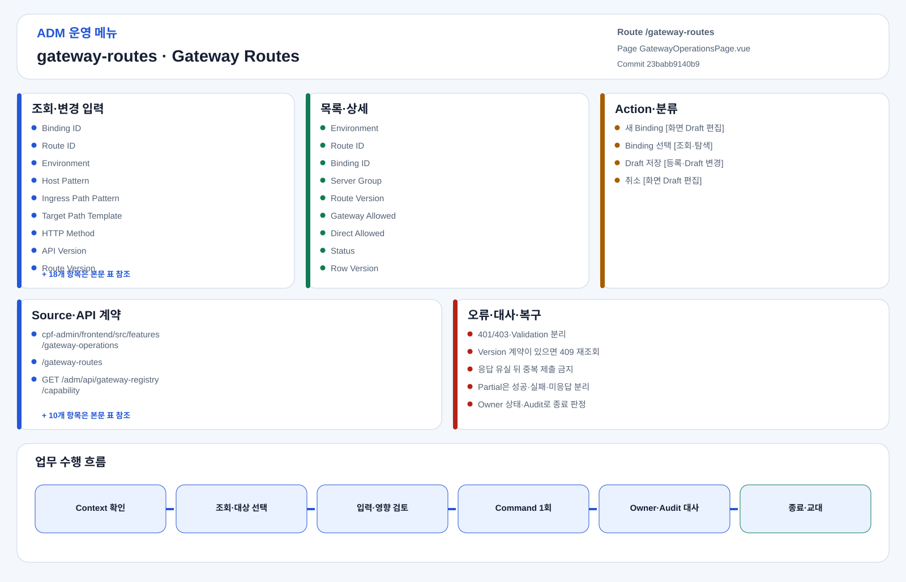

### 이 장에서 끝내는 업무

Default Deny 상태에서 Route Binding Draft와 Timeout·Retry·보안 Policy 참조를 관리한다.

### 메뉴 식별·책임

| 항목 | 값 |
|---|---|
| Route | `/gateway-routes` |
| 메뉴 ID | `gateway-routes` |
| Menu Code | `gateway-routes` |
| 업무 그룹 | 온라인 운영 |
| Frontend Page | `cpf-admin/frontend/src/features/gateway-operations/GatewayOperationsPage.vue` |
| Permission | Gateway Menu/Action Permission + Approval |
| 기준 Commit | `23babb9140b90e501d6ac715e7b77f55b66198a5` |

### Source·API 근거

| 구분 | 기준 |
|---|---|
| Frontend Page | `cpf-admin/frontend/src/features/gateway-operations/GatewayOperationsPage.vue` |
| Router | `/gateway-routes` |
| API 1 | `GET /adm/api/gateway-registry/capability` |
| API 2 | `GET /adm/api/gateway-registry/operations/snapshot` |
| API 3 | `GET /adm/api/gateway-registry/operations/stream` |
| API 4 | `GET /adm/api/gateway-registry/server-groups` |
| API 5 | `POST /adm/api/gateway-registry/server-groups` |
| API 6 | `GET /adm/api/gateway-registry/server-groups/{serverGroupId}/members` |
| API 7 | `GET /adm/api/gateway-registry/bindings` |
| API 8 | `POST /adm/api/gateway-registry/bindings` |
| API 9 | `GET /adm/api/gateway-registry/bindings/{bindingId}/apply-status` |
| API 10 | `GET /adm/api/gateway-registry/bindings/{bindingId}/connection-tests` |
| API 11 | `POST /adm/api/gateway-registry/bindings/{bindingId}/connection-tests` |
| Source 해석 | Alias 진입 시에도 `groups` Tab이 기본이므로 운영자가 `경로·라우팅` Tab을 직접 선택한다. Source의 현재 Button은 Draft 저장까지 제공한다. |

아래 표는 이 메뉴에서 실제로 확인·입력·실행할 항목을 정리한다. 화면에 없는 Field·Button·상태를 임의로 가정하지 않는다.

### 검색·입력 Field

| Field | Control | 업무 의미 | 기본값·Validation·주의 |
|---|---|---|---|
| `Binding ID` | 문자열 입력·검색 | 조회·상세·Audit에서 같은 대상을 다시 찾기 위한 식별 조건이다. | 앞뒤 공백·허용 문자·길이와 대소문자 규칙을 확인한다. |
| `Route ID` | 문자열 입력·검색 | 조회·상세·Audit에서 같은 대상을 다시 찾기 위한 식별 조건이다. | 앞뒤 공백·허용 문자·길이와 대소문자 규칙을 확인한다. |
| `Environment` | Select·검색 | Gateway Routes 조회·조치가 적용되는 환경과 데이터 경계를 제한한다. | 허용 목록과 현재 Environment·Data Scope에 맞는 값만 선택한다. |
| `Host Pattern` | 문자열 입력 | Ingress Host 조건이다. | 신규 Binding 기본값은 `*`이며 운영 Domain 허용 범위를 검토한다. |
| `Ingress Path Pattern` | 문자열 입력 | Gateway가 수신할 Path Pattern이다. | 신규 기본값은 `/api/**`; 관리·Internal Endpoint가 포함되지 않아야 한다. |
| `Target Path Template` | 문자열 입력 | Target으로 전달할 Path Template이다. | 신규 기본값은 `/internal/**`; 변수와 Wildcard 치환 결과를 Preview한다. |
| `HTTP Method` | Select | 허용 HTTP Method를 제한한다. | 신규 기본값은 `*`; 필요한 Method만 허용한다. |
| `API Version` | 문자열 입력 | Route API Version을 지정한다. | 신규 기본값은 `v1`; Consumer 호환성과 배포 순서를 확인한다. |
| `Route Version` | 문자열 입력 | 게시·적용·Drift 비교에 사용할 Route Version이다. | 신규 기본값은 `1`; 기존 Version과 충돌하지 않아야 한다. |
| `Service ID` | 문자열 입력·검색 | 조회·상세·Audit에서 같은 대상을 다시 찾기 위한 식별 조건이다. | 앞뒤 공백·허용 문자·길이와 대소문자 규칙을 확인한다. |
| `Server Group` | 문자열 입력·검색 | 조회·상세·Audit에서 같은 대상을 다시 찾기 위한 식별 조건이다. | 앞뒤 공백·허용 문자·길이와 대소문자 규칙을 확인한다. |
| `Ingress Protocol` | Select | Gateway Ingress Protocol을 지정한다. | 신규 기본값은 `HTTPS`다. |
| `Target Protocol` | Select | Gateway에서 Target으로 연결할 Protocol을 지정한다. | 신규 기본값은 `HTTP`; TLS Policy와 Trust Boundary를 함께 확인한다. |
| `Connect Timeout ms` | 숫자 입력 | Target 연결 수립 최대 대기시간이다. | 최소 1ms, Source 기본값은 3000ms다. |
| `Response Timeout ms` | 숫자 입력 | 연결 후 Response 최대 대기시간이다. | 최소 1ms, Source 기본값은 10000ms다. |
| `Overall Timeout ms` | 숫자 입력 | Retry를 포함한 전체 요청 Budget이다. | 최소 1ms, Source 기본값은 15000ms이며 단계별 Timeout 합계를 검토한다. |
| `Max Retry Count` | 숫자 입력 | 추가 Attempt 횟수다. | 최소 0, Source 기본값은 0이며 비멱등 Route에는 Retry를 허용하지 않는다. |
| `Idempotent` | Checkbox | Owner가 중복 Attempt에 같은 업무 결과를 보장하는지 선언한다. | Source 기본값은 `false`; 실제 Owner 멱등 계약과 일치해야 한다. |
| `Gateway Allowed` | Checkbox | Gateway Ingress 호출 허용 여부다. | Source 기본값은 `false`; ACTIVE Binding과 Instance ACK를 함께 확인한다. |
| `Direct Allowed` | Checkbox | Gateway를 우회한 Direct 호출 허용 여부다. | Source 기본값은 `false`; Network와 Authorization 경계를 확인한다. |
| `TLS Policy` | Select·검색 | Gateway Routes에서 적용하거나 조회할 정책·권한·처리 유형을 선택한다. | 허용 목록과 현재 Environment·Data Scope에 맞는 값만 선택한다. |
| `Authentication Policy` | Select·검색 | Gateway Routes에서 적용하거나 조회할 정책·권한·처리 유형을 선택한다. | 허용 목록과 현재 Environment·Data Scope에 맞는 값만 선택한다. |
| `Authorization Policy` | Select·검색 | Gateway Routes에서 적용하거나 조회할 정책·권한·처리 유형을 선택한다. | 허용 목록과 현재 Environment·Data Scope에 맞는 값만 선택한다. |
| `Header Policy` | Select·검색 | Gateway Routes에서 적용하거나 조회할 정책·권한·처리 유형을 선택한다. | 허용 목록과 현재 Environment·Data Scope에 맞는 값만 선택한다. |
| `Rate Limit Policy` | 숫자·Version 입력 | 실행 한도·순서·용량 또는 재시도 범위를 지정한다. | 화면의 min·max·단위와 0 허용 여부를 확인하고 음수·Overflow를 차단한다. |
| `Health Policy` | Select·검색 | Gateway Routes에서 적용하거나 조회할 정책·권한·처리 유형을 선택한다. | 허용 목록과 현재 Environment·Data Scope에 맞는 값만 선택한다. |
| `변경 사유` | 다중행 입력 | Binding Draft 변경 목적·영향·복구점을 Audit에 남긴다. | Source에서 `required`와 최소 5자를 요구한다. |

#### 입력 순서

1. **Binding ID** 항목이 조회 Control인지 변경 Form인지 화면 위치로 구분하고, 표시된 값·필수 여부·허용 형식을 확인한다.
2. **Route ID** 항목이 조회 Control인지 변경 Form인지 화면 위치로 구분하고, 표시된 값·필수 여부·허용 형식을 확인한다.
3. **Environment** 항목이 조회 Control인지 변경 Form인지 화면 위치로 구분하고, 표시된 값·필수 여부·허용 형식을 확인한다.
4. **Host Pattern** 항목이 조회 Control인지 변경 Form인지 화면 위치로 구분하고, 표시된 값·필수 여부·허용 형식을 확인한다.
5. **Ingress Path Pattern** 항목이 조회 Control인지 변경 Form인지 화면 위치로 구분하고, 표시된 값·필수 여부·허용 형식을 확인한다.
6. **Target Path Template** 항목이 조회 Control인지 변경 Form인지 화면 위치로 구분하고, 표시된 값·필수 여부·허용 형식을 확인한다.
7. **HTTP Method** 항목이 조회 Control인지 변경 Form인지 화면 위치로 구분하고, 표시된 값·필수 여부·허용 형식을 확인한다.
8. **API Version** 항목이 조회 Control인지 변경 Form인지 화면 위치로 구분하고, 표시된 값·필수 여부·허용 형식을 확인한다.
9. **Route Version** 항목이 조회 Control인지 변경 Form인지 화면 위치로 구분하고, 표시된 값·필수 여부·허용 형식을 확인한다.
10. **Service ID** 항목이 조회 Control인지 변경 Form인지 화면 위치로 구분하고, 표시된 값·필수 여부·허용 형식을 확인한다.
11. **Server Group** 항목이 조회 Control인지 변경 Form인지 화면 위치로 구분하고, 표시된 값·필수 여부·허용 형식을 확인한다.
12. **Ingress Protocol** 항목이 조회 Control인지 변경 Form인지 화면 위치로 구분하고, 표시된 값·필수 여부·허용 형식을 확인한다.
13. **Target Protocol** 항목이 조회 Control인지 변경 Form인지 화면 위치로 구분하고, 표시된 값·필수 여부·허용 형식을 확인한다.
14. **Connect Timeout ms** 항목이 조회 Control인지 변경 Form인지 화면 위치로 구분하고, 표시된 값·필수 여부·허용 형식을 확인한다.
15. **Response Timeout ms** 항목이 조회 Control인지 변경 Form인지 화면 위치로 구분하고, 표시된 값·필수 여부·허용 형식을 확인한다.
16. **Overall Timeout ms** 항목이 조회 Control인지 변경 Form인지 화면 위치로 구분하고, 표시된 값·필수 여부·허용 형식을 확인한다.
17. **Max Retry Count** 항목이 조회 Control인지 변경 Form인지 화면 위치로 구분하고, 표시된 값·필수 여부·허용 형식을 확인한다.
18. **Idempotent** 항목이 조회 Control인지 변경 Form인지 화면 위치로 구분하고, 표시된 값·필수 여부·허용 형식을 확인한다.
19. **Gateway Allowed** 항목이 조회 Control인지 변경 Form인지 화면 위치로 구분하고, 표시된 값·필수 여부·허용 형식을 확인한다.
20. **Direct Allowed** 항목이 조회 Control인지 변경 Form인지 화면 위치로 구분하고, 표시된 값·필수 여부·허용 형식을 확인한다.
21. **TLS Policy** 항목이 조회 Control인지 변경 Form인지 화면 위치로 구분하고, 표시된 값·필수 여부·허용 형식을 확인한다.
22. **Authentication Policy** 항목이 조회 Control인지 변경 Form인지 화면 위치로 구분하고, 표시된 값·필수 여부·허용 형식을 확인한다.
23. **Authorization Policy** 항목이 조회 Control인지 변경 Form인지 화면 위치로 구분하고, 표시된 값·필수 여부·허용 형식을 확인한다.
24. **Header Policy** 항목이 조회 Control인지 변경 Form인지 화면 위치로 구분하고, 표시된 값·필수 여부·허용 형식을 확인한다.
25. **Rate Limit Policy** 항목이 조회 Control인지 변경 Form인지 화면 위치로 구분하고, 표시된 값·필수 여부·허용 형식을 확인한다.
26. **Health Policy** 항목이 조회 Control인지 변경 Form인지 화면 위치로 구분하고, 표시된 값·필수 여부·허용 형식을 확인한다.
27. **변경 사유** 항목이 조회 Control인지 변경 Form인지 화면 위치로 구분하고, 표시된 값·필수 여부·허용 형식을 확인한다.
28. 조회 Control과 변경 Form을 분리해 기록하고, 실행 전 Environment·Data Scope·Timezone과 제출할 값만 다시 검토한다.

### 목록 Column·상세 Field

| 표시값 | 운영 의미 | 교차 확인 |
|---|---|---|
| `Environment` | Gateway Routes 상세에서 대상의 현재 속성 또는 처리 결과를 확인하는 값이다. | 상세·재조회 결과와 비교하고 Stale·Masking·단위 차이를 확인한다. |
| `Route ID` | Gateway Routes의 대상 레코드를 상세·Owner·Audit에서 연결하는 식별자다. | 상세·Log·Trace·Audit에서 같은 대상을 가리키는지 확인한다. |
| `Binding ID` | Gateway Routes의 대상 레코드를 상세·Owner·Audit에서 연결하는 식별자다. | 상세·Log·Trace·Audit에서 같은 대상을 가리키는지 확인한다. |
| `Server Group` | Gateway Routes의 대상 레코드를 상세·Owner·Audit에서 연결하는 식별자다. | 상세·Log·Trace·Audit에서 같은 대상을 가리키는지 확인한다. |
| `Route Version` | Gateway Routes의 대상 레코드를 상세·Owner·Audit에서 연결하는 식별자다. | 목록·상세·Owner 또는 Instance 보고값에서 일치하는지 확인한다. |
| `Gateway Allowed` | 현재 상태와 Terminal 여부, 다음 Action 가능 여부를 판단하는 값이다. | 상세·재조회 결과와 비교하고 Stale·Masking·단위 차이를 확인한다. |
| `Direct Allowed` | 현재 상태와 Terminal 여부, 다음 Action 가능 여부를 판단하는 값이다. | 상세·재조회 결과와 비교하고 Stale·Masking·단위 차이를 확인한다. |
| `Status` | 현재 상태와 Terminal 여부, 다음 Action 가능 여부를 판단하는 값이다. | Last Updated·Terminal 조건·Owner 상태와 함께 확인한다. |
| `Row Version` | 요청·Owner·Instance 사이의 Version 또는 내용 동일성을 판단하는 값이다. | 목록·상세·Owner 또는 Instance 보고값에서 일치하는지 확인한다. |

#### 결과 판독 순서

1. 조회 완료 시각·Filter·Paging·Sort와 화면 Warning을 확인한다.
2. Empty·Stale·Partial을 정상 0건과 구분한다.
3. 식별자·상태·Version·오류·시각을 같은 Query Context의 상세와 Owner 원장에서 비교한다.
4. Masking된 값은 Raw Permission과 Reason 없이 복원·Export하지 않는다.
5. 집계와 상세가 다르면 집계 시간 창·Timezone·Owner Update 시각을 맞춰 대사한다.

### Button·Action

| Action | 분류 | 활성 조건 | Side Effect·정상 결과 |
|---|---|---|---|
| **새 Binding** | 화면 Draft 편집 | 화면 Form이 열려 있고 아직 Server Command를 제출하지 않음 | Browser의 편집 Draft만 변경하며 저장·실행 Action 전에는 Server Side Effect가 없다. |
| **Binding 선택** | 조회·탐색 | 조회 Permission과 Query Validation을 충족하고 동일 조회가 진행 중이 아님 | Binding 선택 결과의 조회 시각·Filter·Source Version·Warning이 갱신되며 Owner 데이터는 변경하지 않는다. |
| **Draft 저장** | 등록·Draft 변경 | 화면이 실제로 요구하는 Write Permission·필수 Field·Reason·Version 조건을 충족함 | Gateway Routes의 재조회 결과가 요청 내용과 일치한다. Version·Before/After·Audit는 해당 Owner가 제공하는 경우 함께 확인한다. |
| **취소** | 화면 Draft 편집 | 화면 Form이 열려 있고 아직 Server Command를 제출하지 않음 | Dialog를 닫고 Browser Draft를 폐기하며 Server Side Effect는 발생하지 않는다. |

### 정상 업무 전체 절차

1. `/gateway-routes`에 진입해 Page Header와 Route가 **Gateway Routes** 기능을 가리키는지 확인한다.
2. 로그인 Session·Environment·Data Scope·기준일·Timezone을 고정한다.
3. 화면의 조회 Control과 변경 Form을 구분한다. 조회 조건이 제공되면 먼저 조회하고, 변경 Form은 대상 선택 또는 등록 Action 뒤에 열린 실제 Field만 사용한다.
4. Loading 종료 후 Empty·Error·Stale·Partial 상태와 화면 Warning을 먼저 판정한다.
5. **Environment, Route ID, Binding ID, Server Group, Route Version**를 읽고 식별자·상태·Version·시각을 Owner 원장과 대사한다.
6. **새 Binding**은 Browser Draft만 바꾸므로 저장·실행 Action 전에는 Owner 상태가 변하지 않았는지 확인한다.
7. **Draft 저장** 전에 화면과 Owner가 실제로 요구하는 Permission·현재 상태·영향 범위·Reason·승인·Version 조건을 확인하고 한 번만 제출한다.
8. **Draft 저장**의 HTTP 응답과 재조회 결과를 확인한다. 비동기·다중 대상 기능은 Owner Terminal 상태·Version·대상별 Success/Failed/Unknown·Audit를 별도로 확인한다.
9. **취소**은 Browser Draft만 바꾸므로 저장·실행 Action 전에는 Owner 상태가 변하지 않았는지 확인한다.
10. 화면이 제공하는 Log·Metric·Trace와, 변경·Export·승인 조치에 생성된 Audit를 교차 확인한다.
11. 이 장의 **종료 판정**과 다음 확인 시각·Evidence Link를 교대 기록에 남긴다.

### 메뉴 고유 판정·금지 사항

- **목적:** Default Deny 상태에서 Route Binding Draft와 Timeout·Retry·보안 Policy 참조를 관리한다.
- **종료 판정:** Draft 저장 후 Binding ID·Route Version·Row Version과 Preview가 입력값과 일치해야 한다.
- **공유 Page 동작:** Alias 진입 시에도 `groups` Tab이 기본이므로 운영자가 `경로·라우팅` Tab을 직접 선택한다. Source의 현재 Button은 Draft 저장까지 제공한다.
- 응답을 받지 못한 경우 Owner 상태와 기존 Operation을 확인하기 전에 동일 Action을 반복하지 않는다.
- HTTP 성공 응답이나 Toast만으로 비동기 Owner 상태 또는 다중 대상 적용을 확정하지 않는다.

### 오류·경계·동시성·복구

| 상황 | 화면 징후 | 운영 조치 | 종료 증적 |
|---|---|---|---|
| 401·Session | Session 만료·CSRF·Origin 실패 | 로그인 상태와 BFF Session을 확인한다. Command 자동 Replay는 금지한다. | 401/403 응답·Session Audit |
| 403·Data Scope | 메뉴·Button·Raw·Export가 거부됨 | Menu·Button·API·Owner Permission과 Data Scope를 확인하고 우회하지 않는다. | Deny Audit·요청 Permission |
| Validation | 필수값·범위·형식·기간 오류 | Field Error만 수정하고 기존 성공 Operation을 다시 제출하지 않는다. | Error Code·Field·입력값 |
| Timeout·Dependency | 일부 Source 또는 Command 응답 지연 | Correlation/Operation ID와 실패 Stage를 기록하고 Owner 상태를 조회한다. | Dependency 상태·Retryability |
| Partial·Stale | 일부 대상만 Success 또는 조회 Source 누락 | 성공·실패·미응답을 분리하고 누락 범위와 Version을 표시한다. | Target별 결과·Version |
| 409·동시 변경 | Expected Version 불일치 | 최신 상세를 재조회하고 Diff·영향을 다시 검토한 뒤 새 요청으로 제출한다. | 현재/요청 Version·변경자 |
| 응답 유실·Unknown | 요청 후 실제 처리 여부를 알 수 없음 | Operation ID·Request Hash·Audit·Owner 상태로 대사하고 중복 제출하지 않는다. | Operation·Owner·Audit |
| 복구 실패 | Retry/Rollback 뒤에도 상태 불일치 | 자동 반복을 중단하고 Incident·Reconcile Case·다음 확인 시각을 기록한다. | Case ID·복구 Owner·기한 |
| Gateway NACK·Drift | Expected/Applied Version 불일치 또는 Instance NACK | NACK 이유·Checksum·Last Seen을 확인하고 Failed Instance만 재적용하거나 LKG로 복귀한다. | Instance ACK/NACK·LKG |

### 응답 유실·결과 불명·부분 적용 처리

1. 동일 Action을 다시 누르지 않고 Browser Network와 응답 Header를 보존한다. `operationId`·`transactionId`·`idempotencyKey`가 제공되면 기록하고, 없으면 Target ID·Actor·요청 시각·Request Body Hash로 대사한다.
2. 기능이 제공하는 상세·Operation Status(있는 경우)·Audit에서 Request Hash와 대상 Version을 검색한다.
3. Side Effect 전 실패가 확인된 경우에만 새 요청을 검토한다.
4. Success·Failed·Unknown 대상을 분리하고 Source가 제공하는 Failed-only Retry·Compensation·Rollback을 선택하고, 지원되지 않으면 수동 Reconcile Case로 이관한다.
5. Rollback을 지원하는 기능은 Owner Version·Checksum·업무 합계가 Rollback Point와 일치하는지 확인한다.
6. 확정되지 않은 대상은 `UNKNOWN_RESULT`로 유지하고 담당자·대사 기한·다음 확인 시각을 기록한다.

### Log·Metric·Trace·Audit와 교대 기록

| 증적 | 필수 값 |
|---|---|
| Audit | Actor·Permission·Reason·Approval·Target·Before/After·Result·Recovery Action |
| Log | Environment·Instance·operationId·transactionId·failureStage·errorCode |
| Metric | 동일 시간 창의 Success·Failure·Latency·Queue·Retry·Partial·Unknown |
| Trace | root/segment/attempt·Owner·DB/Kafka/외부 의존성 Span |
| 상태 원장 | Target ID·Version·Checksum·Desired/Actual·Last Updated·Terminal 여부 |

```text
Menu=gateway-routes
Route=/gateway-routes
Environment=
DataScope=
Query=
TargetId=
BeforeVersion=
Action=
Reason=
ApprovalId=
OperationId=
TransactionId=
Result=SUCCESS|FAILED|PARTIAL|UNKNOWN_RESULT
OwnerState=
FailedTargets=
ReconcileBy=
RollbackPoint=
EvidenceLinks=
NextCheckAt=
```

### 실무 Workbook

**상황:** Binding Form에서 **Draft 저장**을 한 번 제출했으나 Browser 응답을 받지 못했다.

1. Binding ID·Route ID·Environment·Route Version·Row Version과 입력 Preview를 기록한다.
2. 같은 **Draft 저장**을 반복하지 않고 `GET /adm/api/gateway-registry/bindings`로 Binding ID를 조회한다.
3. Row가 존재하면 입력한 Server Group·Timeout·Retry·Policy ID·Allowed Flag와 Row Version을 비교한다.
4. Audit/Operation 기록의 Request Hash가 같으면 응답 유실로 확정하고 중복 Draft를 만들지 않는다.
5. Row가 없고 Side Effect 전 실패가 확인된 경우에만 새 Operation ID로 다시 저장한다.
6. Draft 저장 후 Binding ID·Route Version·Row Version과 Preview가 입력값과 일치해야 한다.

### 독립 수행 검수 Checklist

- [ ] `/gateway-routes`와 Page Source를 찾고 화면 목적을 설명할 수 있다.
- [ ] 27개 입력·검색 항목의 Control·기본값·Validation을 설명할 수 있다.
- [ ] 9개 표시값을 Owner 상태·Version·Audit와 대사할 수 있다.
- [ ] 4개 Action의 분류·활성 조건·Side Effect를 설명할 수 있다.
- [ ] Empty·403·409·Timeout·Partial·Unknown을 서로 다른 상태로 처리할 수 있다.
- [ ] 응답 유실 뒤 중복 제출 없이 Operation·Owner·Audit로 결과를 확정할 수 있다.
- [ ] 교대 기록만으로 다음 담당자가 Target·상태·복구 기한을 이어받을 수 있다.

## 48. gateway-security — Gateway Security

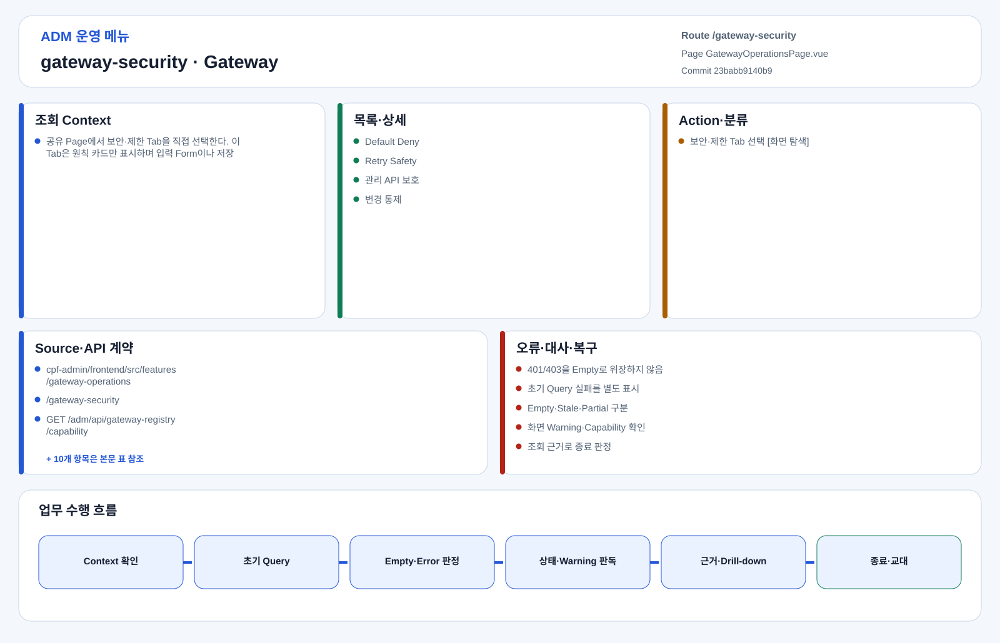

### 이 장에서 끝내는 업무

Binding이 참조하는 TLS·인증·인가·Header·Rate Limit·Health Policy와 제한 원칙을 확인한다.

### 메뉴 식별·책임

| 항목 | 값 |
|---|---|
| Route | `/gateway-security` |
| 메뉴 ID | `gateway-security` |
| Menu Code | `gateway-security` |
| 업무 그룹 | 온라인 운영 |
| Frontend Page | `cpf-admin/frontend/src/features/gateway-operations/GatewayOperationsPage.vue` |
| Permission | Gateway Menu/Action Permission + Approval |
| 기준 Commit | `23babb9140b90e501d6ac715e7b77f55b66198a5` |

### Source·API 근거

| 구분 | 기준 |
|---|---|
| Frontend Page | `cpf-admin/frontend/src/features/gateway-operations/GatewayOperationsPage.vue` |
| Router | `/gateway-security` |
| API 1 | `GET /adm/api/gateway-registry/capability` |
| API 2 | `GET /adm/api/gateway-registry/operations/snapshot` |
| API 3 | `GET /adm/api/gateway-registry/operations/stream` |
| API 4 | `GET /adm/api/gateway-registry/server-groups` |
| API 5 | `POST /adm/api/gateway-registry/server-groups` |
| API 6 | `GET /adm/api/gateway-registry/server-groups/{serverGroupId}/members` |
| API 7 | `GET /adm/api/gateway-registry/bindings` |
| API 8 | `POST /adm/api/gateway-registry/bindings` |
| API 9 | `GET /adm/api/gateway-registry/bindings/{bindingId}/apply-status` |
| API 10 | `GET /adm/api/gateway-registry/bindings/{bindingId}/connection-tests` |
| API 11 | `POST /adm/api/gateway-registry/bindings/{bindingId}/connection-tests` |
| Source 해석 | Alias 진입 시 `groups` Tab이 기본이다. 운영자가 `보안·제한` Tab을 직접 선택하며 이 Tab은 네 가지 원칙 카드만 표시한다. Policy ID·Allowed Flag 편집은 `bindings` Tab에서 수행한다. |

아래 표는 이 메뉴에서 실제로 확인·입력·실행할 항목을 정리한다. 화면에 없는 Field·Button·상태를 임의로 가정하지 않는다.

### 검색·입력 Field

별도 사용자 입력 Control이 없다. 현재 Session·Permission·Data Scope와 Page가 정의한 초기 Query로 데이터를 읽는다. 새로고침은 같은 Context를 다시 조회하며 Owner 데이터는 변경하지 않는다.

### 목록 Column·상세 Field

| 표시값 | 운영 의미 | 교차 확인 |
|---|---|---|
| `Default Deny` | 외부 공개가 명시적으로 허용되지 않은 요청을 차단하는 기본 원칙이다. | 상세·재조회 결과와 비교하고 Stale·Masking·단위 차이를 확인한다. |
| `Retry Safety` | 멱등성·Timeout 단계·Attempt 한도를 충족할 때만 Retry를 허용하는 원칙이다. | 상세·재조회 결과와 비교하고 Stale·Masking·단위 차이를 확인한다. |
| `관리 API 보호` | ADM·BAT·Actuator·Internal Endpoint를 외부 Route 대상에서 제외하는 원칙이다. | 상세·재조회 결과와 비교하고 Stale·Masking·단위 차이를 확인한다. |
| `변경 통제` | 운영 변경에 Reason·Approval·Expected Version·Audit를 요구하는 원칙이다. | 상세·재조회 결과와 비교하고 Stale·Masking·단위 차이를 확인한다. |

#### 결과 판독 순서

1. 조회 완료 시각·Filter·Paging·Sort와 화면 Warning을 확인한다.
2. Empty·Stale·Partial을 정상 0건과 구분한다.
3. 식별자·상태·Version·오류·시각을 같은 Query Context의 상세와 Owner 원장에서 비교한다.
4. Masking된 값은 Raw Permission과 Reason 없이 복원·Export하지 않는다.
5. 집계와 상세가 다르면 집계 시간 창·Timezone·Owner Update 시각을 맞춰 대사한다.

### Button·Action

| Action | 분류 | 활성 조건 | Side Effect·정상 결과 |
|---|---|---|---|
| **보안·제한 Tab 선택** | 화면 탐색 | 공유 Page가 열린 상태이며 해당 Tab·Detail을 선택할 수 있음 | 공유 Page의 Tab·상세 Context만 변경하며 Server Side Effect는 발생하지 않는다. |

### 정상 업무 전체 절차

1. `/gateway-security`에 진입해 Page Header와 Route가 **Gateway Security** 기능을 가리키는지 확인한다.
2. 로그인 Session·Environment·Data Scope·기준일·Timezone을 고정한다.
3. 별도 사용자 입력 없이 초기 조회가 끝날 때까지 기다리고, 필요할 때만 같은 Context로 새로고침한다.
4. Loading 종료 후 Empty·Error·Stale·Partial 상태와 화면 Warning을 먼저 판정한다.
5. **Default Deny, Retry Safety, 관리 API 보호, 변경 통제**를 읽고 식별자·상태·Version·시각을 Owner 원장과 대사한다.
6. 화면이 제공하는 Log·Metric·Trace와, 변경·Export·승인 조치에 생성된 Audit를 교차 확인한다.
7. 이 장의 **종료 판정**과 다음 확인 시각·Evidence Link를 교대 기록에 남긴다.

### 메뉴 고유 판정·금지 사항

- **목적:** Binding이 참조하는 TLS·인증·인가·Header·Rate Limit·Health Policy와 제한 원칙을 확인한다.
- **종료 판정:** Gateway Allowed·Direct Allowed·Idempotent·Policy ID가 승인된 보안 설계와 일치해야 한다.
- **공유 Page 동작:** Alias 진입 시 `groups` Tab이 기본이다. 운영자가 `보안·제한` Tab을 직접 선택하며 이 Tab은 네 가지 원칙 카드만 표시한다. Policy ID·Allowed Flag 편집은 `bindings` Tab에서 수행한다.
- 조회 화면에서 직접 Owner 데이터를 변경하거나 Browser Tool로 우회하지 않는다.
- Partial 조회를 정상 전체 결과로 합치지 않는다.

### 오류·경계·동시성·복구

| 상황 | 화면 징후 | 운영 조치 | 종료 증적 |
|---|---|---|---|
| 401·Session | Session 만료·CSRF·Origin 실패 | 로그인 상태와 BFF Session을 확인한다. Command 자동 Replay는 금지한다. | 401/403 응답·Session Audit |
| 403·Data Scope | 메뉴·Button·Raw·Export가 거부됨 | Menu·Button·API·Owner Permission과 Data Scope를 확인하고 우회하지 않는다. | Deny Audit·요청 Permission |
| Validation | 필수값·범위·형식·기간 오류 | Field Error만 수정하고 기존 성공 Operation을 다시 제출하지 않는다. | Error Code·Field·입력값 |
| Timeout·Dependency | 일부 Source 또는 Command 응답 지연 | Correlation/Operation ID와 실패 Stage를 기록하고 Owner 상태를 조회한다. | Dependency 상태·Retryability |
| Partial·Stale | 일부 대상만 Success 또는 조회 Source 누락 | 성공·실패·미응답을 분리하고 누락 범위와 Version을 표시한다. | Target별 결과·Version |

### 응답 유실·부분 조회 처리

1. 검색 조건·Data Scope·Paging·조회 시각·Correlation ID를 기록한다.
2. 같은 조건으로 재조회하되 실패 Source만 분리한다.
3. 정상 Source 결과를 유지하고 실패·Stale Source를 명시한다.
4. 집계와 원본 상세가 다르면 Owner 상세를 기준으로 Reconcile Case를 연다.
5. 조회 시각·Source Version·0건 또는 일치 결과를 증적으로 남긴다.

### Log·Metric·Trace·Audit와 교대 기록

| 증적 | 필수 값 |
|---|---|
| Audit | Actor·Permission·Reason·Approval·Target·Before/After·Result·Recovery Action |
| Log | Environment·Instance·operationId·transactionId·failureStage·errorCode |
| Metric | 동일 시간 창의 Success·Failure·Latency·Queue·Retry·Partial·Unknown |
| Trace | root/segment/attempt·Owner·DB/Kafka/외부 의존성 Span |
| 상태 원장 | Target ID·Version·Checksum·Desired/Actual·Last Updated·Terminal 여부 |

```text
Menu=gateway-security
Route=/gateway-security
Environment=
DataScope=
Query=
TargetId=
BeforeVersion=
Action=
Reason=
ApprovalId=
OperationId=
TransactionId=
Result=SUCCESS|FAILED|PARTIAL|UNKNOWN_RESULT
OwnerState=
FailedTargets=
ReconcileBy=
RollbackPoint=
EvidenceLinks=
NextCheckAt=
```

### 실무 Workbook

**상황:** Binding이 참조하는 TLS·인증·인가·Header·Rate Limit·Health Policy와 제한 원칙을 확인한다. 화면이 일부 Source Timeout 때문에 Partial 결과를 표시했다.

1. Query·Data Scope·조회 시각·Correlation ID를 기록한다.
2. 정상 결과를 0건으로 덮어쓰지 않고 실패 Source만 재조회한다.
3. Default Deny, Retry Safety, 관리 API 보호 값을 원본 상세와 같은 시간 기준으로 비교한다.
4. 불일치가 계속되면 Incident 또는 Reconcile Case를 생성한다.
5. Gateway Allowed·Direct Allowed·Idempotent·Policy ID가 승인된 보안 설계와 일치해야 한다.
6. Source Version과 다음 확인 시각을 교대 기록에 남긴다.

### 독립 수행 검수 Checklist

- [ ] `/gateway-security`와 Page Source를 찾고 화면 목적을 설명할 수 있다.
- [ ] 별도 사용자 입력이 없는 경우 자동 Query Context를 설명할 수 있다.
- [ ] 4개 표시값을 Owner 상태·Version·Audit와 대사할 수 있다.
- [ ] 1개 Action의 분류·활성 조건·Side Effect를 설명할 수 있다.
- [ ] Empty·403·409·Timeout·Partial·Unknown을 서로 다른 상태로 처리할 수 있다.
- [ ] 응답 유실 뒤 중복 제출 없이 Operation·Owner·Audit로 결과를 확정할 수 있다.
- [ ] 교대 기록만으로 다음 담당자가 Target·상태·복구 기한을 이어받을 수 있다.

## 49. gateway-health — Gateway Health

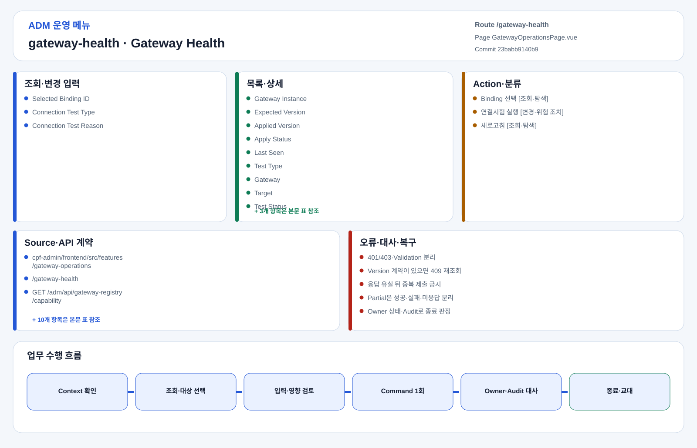

### 이 장에서 끝내는 업무

Gateway Instance Expected/Applied Version과 Connection Test 결과를 확인한다.

### 메뉴 식별·책임

| 항목 | 값 |
|---|---|
| Route | `/gateway-health` |
| 메뉴 ID | `gateway-health` |
| Menu Code | `gateway-health` |
| 업무 그룹 | 온라인 운영 |
| Frontend Page | `cpf-admin/frontend/src/features/gateway-operations/GatewayOperationsPage.vue` |
| Permission | Gateway Menu/Action Permission + Approval |
| 기준 Commit | `23babb9140b90e501d6ac715e7b77f55b66198a5` |

### Source·API 근거

| 구분 | 기준 |
|---|---|
| Frontend Page | `cpf-admin/frontend/src/features/gateway-operations/GatewayOperationsPage.vue` |
| Router | `/gateway-health` |
| API 1 | `GET /adm/api/gateway-registry/capability` |
| API 2 | `GET /adm/api/gateway-registry/operations/snapshot` |
| API 3 | `GET /adm/api/gateway-registry/operations/stream` |
| API 4 | `GET /adm/api/gateway-registry/server-groups` |
| API 5 | `POST /adm/api/gateway-registry/server-groups` |
| API 6 | `GET /adm/api/gateway-registry/server-groups/{serverGroupId}/members` |
| API 7 | `GET /adm/api/gateway-registry/bindings` |
| API 8 | `POST /adm/api/gateway-registry/bindings` |
| API 9 | `GET /adm/api/gateway-registry/bindings/{bindingId}/apply-status` |
| API 10 | `GET /adm/api/gateway-registry/bindings/{bindingId}/connection-tests` |
| API 11 | `POST /adm/api/gateway-registry/bindings/{bindingId}/connection-tests` |
| Source 해석 | Alias 진입 시 `groups` Tab이 기본이므로 `Health·연결시험·적용` Tab을 직접 선택한다. 시험 사유는 Source에서 5자 이상을 요구한다. |

아래 표는 이 메뉴에서 실제로 확인·입력·실행할 항목을 정리한다. 화면에 없는 Field·Button·상태를 임의로 가정하지 않는다.

### 검색·입력 Field

| Field | Control | 업무 의미 | 기본값·Validation·주의 |
|---|---|---|---|
| `Selected Binding ID` | 문자열 입력·검색 | 조회·상세·Audit에서 같은 대상을 다시 찾기 위한 식별 조건이다. | 앞뒤 공백·허용 문자·길이와 대소문자 규칙을 확인한다. |
| `Connection Test Type` | Select·검색 | Gateway Health에서 적용하거나 조회할 정책·권한·처리 유형을 선택한다. | 허용 목록과 현재 Environment·Data Scope에 맞는 값만 선택한다. |
| `Connection Test Reason` | 다중행 입력 | 비동기 연결시험의 목적과 영향 범위를 Audit에 남긴다. | Source는 앞뒤 공백 제거 후 5자 이상을 요구한다. |

#### 입력 순서

1. **Selected Binding ID** 항목이 조회 Control인지 변경 Form인지 화면 위치로 구분하고, 표시된 값·필수 여부·허용 형식을 확인한다.
2. **Connection Test Type** 항목이 조회 Control인지 변경 Form인지 화면 위치로 구분하고, 표시된 값·필수 여부·허용 형식을 확인한다.
3. **Connection Test Reason** 항목이 조회 Control인지 변경 Form인지 화면 위치로 구분하고, 표시된 값·필수 여부·허용 형식을 확인한다.
4. 조회 Control과 변경 Form을 분리해 기록하고, 실행 전 Environment·Data Scope·Timezone과 제출할 값만 다시 검토한다.

### 목록 Column·상세 Field

| 표시값 | 운영 의미 | 교차 확인 |
|---|---|---|
| `Gateway Instance` | Gateway Health의 대상 레코드를 상세·Owner·Audit에서 연결하는 식별자다. | 상세·Log·Trace·Audit에서 같은 대상을 가리키는지 확인한다. |
| `Expected Version` | 요청·Owner·Instance 사이의 Version 또는 내용 동일성을 판단하는 값이다. | 목록·상세·Owner 또는 Instance 보고값에서 일치하는지 확인한다. |
| `Applied Version` | 요청·Owner·Instance 사이의 Version 또는 내용 동일성을 판단하는 값이다. | 목록·상세·Owner 또는 Instance 보고값에서 일치하는지 확인한다. |
| `Apply Status` | 현재 상태와 Terminal 여부, 다음 Action 가능 여부를 판단하는 값이다. | Last Updated·Terminal 조건·Owner 상태와 함께 확인한다. |
| `Last Seen` | 상태 발생·갱신·유효 시점을 나타내며 화면 Timezone을 기준으로 해석한다. | 상세·재조회 결과와 비교하고 Stale·Masking·단위 차이를 확인한다. |
| `Test Type` | Gateway Health 상세에서 대상의 현재 속성 또는 처리 결과를 확인하는 값이다. | 상세·재조회 결과와 비교하고 Stale·Masking·단위 차이를 확인한다. |
| `Gateway` | Gateway Health 상세에서 대상의 현재 속성 또는 처리 결과를 확인하는 값이다. | 상세·재조회 결과와 비교하고 Stale·Masking·단위 차이를 확인한다. |
| `Target` | Gateway Health 상세에서 대상의 현재 속성 또는 처리 결과를 확인하는 값이다. | 상세·재조회 결과와 비교하고 Stale·Masking·단위 차이를 확인한다. |
| `Test Status` | 현재 상태와 Terminal 여부, 다음 Action 가능 여부를 판단하는 값이다. | Last Updated·Terminal 조건·Owner 상태와 함께 확인한다. |
| `Failure Stage` | 오류·Drift·결과 불명 범위를 나타내며 원인과 복구 Owner를 연결해야 한다. | 원인 식별자·실패 Stage·마지막 갱신 시각을 상세와 대조한다. |
| `Duration` | 동일한 집계 시간 창·단위·Filter에서 비교해야 하는 수치다. | 같은 Filter·집계 시간 창·단위의 상세 Row 또는 Metric으로 대사한다. |
| `Trace ID` | Gateway Health의 대상 레코드를 상세·Owner·Audit에서 연결하는 식별자다. | 상세·Log·Trace·Audit에서 같은 대상을 가리키는지 확인한다. |

#### 결과 판독 순서

1. 조회 완료 시각·Filter·Paging·Sort와 화면 Warning을 확인한다.
2. Empty·Stale·Partial을 정상 0건과 구분한다.
3. 식별자·상태·Version·오류·시각을 같은 Query Context의 상세와 Owner 원장에서 비교한다.
4. Masking된 값은 Raw Permission과 Reason 없이 복원·Export하지 않는다.
5. 집계와 상세가 다르면 집계 시간 창·Timezone·Owner Update 시각을 맞춰 대사한다.

### Button·Action

| Action | 분류 | 활성 조건 | Side Effect·정상 결과 |
|---|---|---|---|
| **Binding 선택** | 조회·탐색 | 조회 Permission과 Query Validation을 충족하고 동일 조회가 진행 중이 아님 | Binding 선택 결과의 조회 시각·Filter·Source Version·Warning이 갱신되며 Owner 데이터는 변경하지 않는다. |
| **연결시험 실행** | 변경·위험 조치 | 화면과 Owner가 요구하는 Write Permission·대상 상태·영향 범위·Reason·승인·Version 조건을 충족함 | 변경 Operation을 생성하고 Accepted 응답과 Owner Terminal 상태·Version·Audit를 분리해 확인한다. |
| **새로고침** | 조회·탐색 | 조회 Permission과 Query Validation을 충족하고 동일 조회가 진행 중이 아님 | 새로고침 결과의 조회 시각·Filter·Source Version·Warning이 갱신되며 Owner 데이터는 변경하지 않는다. |

### 정상 업무 전체 절차

1. `/gateway-health`에 진입해 Page Header와 Route가 **Gateway Health** 기능을 가리키는지 확인한다.
2. 로그인 Session·Environment·Data Scope·기준일·Timezone을 고정한다.
3. 화면의 조회 Control과 변경 Form을 구분한다. 조회 조건이 제공되면 먼저 조회하고, 변경 Form은 대상 선택 또는 등록 Action 뒤에 열린 실제 Field만 사용한다.
4. Loading 종료 후 Empty·Error·Stale·Partial 상태와 화면 Warning을 먼저 판정한다.
5. **Gateway Instance, Expected Version, Applied Version, Apply Status, Last Seen**를 읽고 식별자·상태·Version·시각을 Owner 원장과 대사한다.
6. **연결시험 실행** 전에 화면과 Owner가 실제로 요구하는 Permission·현재 상태·영향 범위·Reason·승인·Version 조건을 확인하고 한 번만 제출한다.
7. **연결시험 실행**의 HTTP 응답과 재조회 결과를 확인한다. 비동기·다중 대상 기능은 Owner Terminal 상태·Version·대상별 Success/Failed/Unknown·Audit를 별도로 확인한다.
8. 화면이 제공하는 Log·Metric·Trace와, 변경·Export·승인 조치에 생성된 Audit를 교차 확인한다.
9. 이 장의 **종료 판정**과 다음 확인 시각·Evidence Link를 교대 기록에 남긴다.

### 메뉴 고유 판정·금지 사항

- **목적:** Gateway Instance Expected/Applied Version과 Connection Test 결과를 확인한다.
- **종료 판정:** Instance별 Version 일치, NACK/Drift 0, Test Terminal 상태와 Failure Stage·Trace 확인까지 수행한다.
- **공유 Page 동작:** Alias 진입 시 `groups` Tab이 기본이므로 `Health·연결시험·적용` Tab을 직접 선택한다. 시험 사유는 Source에서 5자 이상을 요구한다.
- 응답을 받지 못한 경우 Owner 상태와 기존 Operation을 확인하기 전에 동일 Action을 반복하지 않는다.
- HTTP 성공 응답이나 Toast만으로 비동기 Owner 상태 또는 다중 대상 적용을 확정하지 않는다.

### 오류·경계·동시성·복구

| 상황 | 화면 징후 | 운영 조치 | 종료 증적 |
|---|---|---|---|
| 401·Session | Session 만료·CSRF·Origin 실패 | 로그인 상태와 BFF Session을 확인한다. Command 자동 Replay는 금지한다. | 401/403 응답·Session Audit |
| 403·Data Scope | 메뉴·Button·Raw·Export가 거부됨 | Menu·Button·API·Owner Permission과 Data Scope를 확인하고 우회하지 않는다. | Deny Audit·요청 Permission |
| Validation | 필수값·범위·형식·기간 오류 | Field Error만 수정하고 기존 성공 Operation을 다시 제출하지 않는다. | Error Code·Field·입력값 |
| Timeout·Dependency | 일부 Source 또는 Command 응답 지연 | Correlation/Operation ID와 실패 Stage를 기록하고 Owner 상태를 조회한다. | Dependency 상태·Retryability |
| Partial·Stale | 일부 대상만 Success 또는 조회 Source 누락 | 성공·실패·미응답을 분리하고 누락 범위와 Version을 표시한다. | Target별 결과·Version |
| 409·동시 변경 | Expected Version 불일치 | 최신 상세를 재조회하고 Diff·영향을 다시 검토한 뒤 새 요청으로 제출한다. | 현재/요청 Version·변경자 |
| 응답 유실·Unknown | 요청 후 실제 처리 여부를 알 수 없음 | Operation ID·Request Hash·Audit·Owner 상태로 대사하고 중복 제출하지 않는다. | Operation·Owner·Audit |
| 복구 실패 | Retry/Rollback 뒤에도 상태 불일치 | 자동 반복을 중단하고 Incident·Reconcile Case·다음 확인 시각을 기록한다. | Case ID·복구 Owner·기한 |
| Gateway NACK·Drift | Expected/Applied Version 불일치 또는 Instance NACK | NACK 이유·Checksum·Last Seen을 확인하고 Failed Instance만 재적용하거나 LKG로 복귀한다. | Instance ACK/NACK·LKG |

### 응답 유실·결과 불명·부분 적용 처리

1. 동일 Action을 다시 누르지 않고 Browser Network와 응답 Header를 보존한다. `operationId`·`transactionId`·`idempotencyKey`가 제공되면 기록하고, 없으면 Target ID·Actor·요청 시각·Request Body Hash로 대사한다.
2. 기능이 제공하는 상세·Operation Status(있는 경우)·Audit에서 Request Hash와 대상 Version을 검색한다.
3. Side Effect 전 실패가 확인된 경우에만 새 요청을 검토한다.
4. Success·Failed·Unknown 대상을 분리하고 Source가 제공하는 Failed-only Retry·Compensation·Rollback을 선택하고, 지원되지 않으면 수동 Reconcile Case로 이관한다.
5. Rollback을 지원하는 기능은 Owner Version·Checksum·업무 합계가 Rollback Point와 일치하는지 확인한다.
6. 확정되지 않은 대상은 `UNKNOWN_RESULT`로 유지하고 담당자·대사 기한·다음 확인 시각을 기록한다.

### Log·Metric·Trace·Audit와 교대 기록

| 증적 | 필수 값 |
|---|---|
| Audit | Actor·Permission·Reason·Approval·Target·Before/After·Result·Recovery Action |
| Log | Environment·Instance·operationId·transactionId·failureStage·errorCode |
| Metric | 동일 시간 창의 Success·Failure·Latency·Queue·Retry·Partial·Unknown |
| Trace | root/segment/attempt·Owner·DB/Kafka/외부 의존성 Span |
| 상태 원장 | Target ID·Version·Checksum·Desired/Actual·Last Updated·Terminal 여부 |

```text
Menu=gateway-health
Route=/gateway-health
Environment=
DataScope=
Query=
TargetId=
BeforeVersion=
Action=
Reason=
ApprovalId=
OperationId=
TransactionId=
Result=SUCCESS|FAILED|PARTIAL|UNKNOWN_RESULT
OwnerState=
FailedTargets=
ReconcileBy=
RollbackPoint=
EvidenceLinks=
NextCheckAt=
```

### 실무 Workbook

**상황:** Connection Test가 Timeout 또는 실패 상태로 끝났다.

1. 선택한 Binding ID·Test Type·Reason과 Test Operation ID를 기록한다.
2. Test Row의 Gateway Instance·Target Instance·Failure Stage·Duration·Trace ID를 확인한다.
3. `apply-status`에서 Expected/Applied Version과 Last Seen을 비교해 설정 Drift인지 Network/TLS/Target 실패인지 분리한다.
4. 같은 Test를 무제한 반복하지 않고 실패 Stage의 Owner를 조치한다.
5. 조치 후 새 Test ID로 재실행하고 Terminal PASS/SUCCESS와 Trace를 증적으로 남긴다.
6. Instance별 Version 일치, NACK/Drift 0, Test Terminal 상태와 Failure Stage·Trace 확인까지 수행한다.

### 독립 수행 검수 Checklist

- [ ] `/gateway-health`와 Page Source를 찾고 화면 목적을 설명할 수 있다.
- [ ] 3개 입력·검색 항목의 Control·기본값·Validation을 설명할 수 있다.
- [ ] 12개 표시값을 Owner 상태·Version·Audit와 대사할 수 있다.
- [ ] 3개 Action의 분류·활성 조건·Side Effect를 설명할 수 있다.
- [ ] Empty·403·409·Timeout·Partial·Unknown을 서로 다른 상태로 처리할 수 있다.
- [ ] 응답 유실 뒤 중복 제출 없이 Operation·Owner·Audit로 결과를 확정할 수 있다.
- [ ] 교대 기록만으로 다음 담당자가 Target·상태·복구 기한을 이어받을 수 있다.

## 50. gateway-transactions — Gateway Transactions

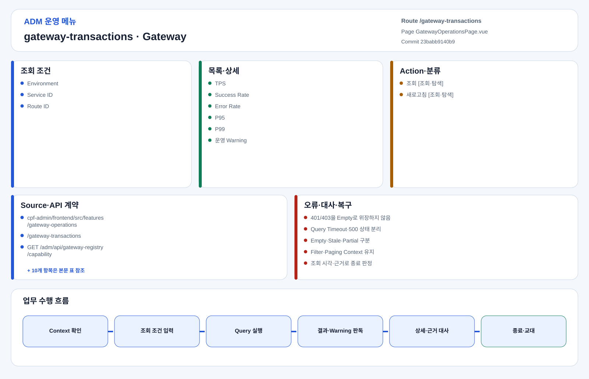

### 이 장에서 끝내는 업무

Gateway 운영 KPI와 Connection Test Trace를 이용해 호출 성공·실패·지연을 진단한다.

### 메뉴 식별·책임

| 항목 | 값 |
|---|---|
| Route | `/gateway-transactions` |
| 메뉴 ID | `gateway-transactions` |
| Menu Code | `gateway-transactions` |
| 업무 그룹 | 온라인 운영 |
| Frontend Page | `cpf-admin/frontend/src/features/gateway-operations/GatewayOperationsPage.vue` |
| Permission | Gateway Menu/Action Permission + Approval |
| 기준 Commit | `23babb9140b90e501d6ac715e7b77f55b66198a5` |

### Source·API 근거

| 구분 | 기준 |
|---|---|
| Frontend Page | `cpf-admin/frontend/src/features/gateway-operations/GatewayOperationsPage.vue` |
| Router | `/gateway-transactions` |
| API 1 | `GET /adm/api/gateway-registry/capability` |
| API 2 | `GET /adm/api/gateway-registry/operations/snapshot` |
| API 3 | `GET /adm/api/gateway-registry/operations/stream` |
| API 4 | `GET /adm/api/gateway-registry/server-groups` |
| API 5 | `POST /adm/api/gateway-registry/server-groups` |
| API 6 | `GET /adm/api/gateway-registry/server-groups/{serverGroupId}/members` |
| API 7 | `GET /adm/api/gateway-registry/bindings` |
| API 8 | `POST /adm/api/gateway-registry/bindings` |
| API 9 | `GET /adm/api/gateway-registry/bindings/{bindingId}/apply-status` |
| API 10 | `GET /adm/api/gateway-registry/bindings/{bindingId}/connection-tests` |
| API 11 | `POST /adm/api/gateway-registry/bindings/{bindingId}/connection-tests` |
| Source 해석 | 이 Alias는 별도 거래 Tab을 열지 않는다. 같은 Page의 공통 KPI와 운영자가 직접 선택한 `apply` Tab의 Connection Test Trace만 제공한다. |

아래 표는 이 메뉴에서 실제로 확인·입력·실행할 항목을 정리한다. 화면에 없는 Field·Button·상태를 임의로 가정하지 않는다.

### 검색·입력 Field

| Field | Control | 업무 의미 | 기본값·Validation·주의 |
|---|---|---|---|
| `Environment` | Select·검색 | Gateway Transactions 조회·조치가 적용되는 환경과 데이터 경계를 제한한다. | 허용 목록과 현재 Environment·Data Scope에 맞는 값만 선택한다. |
| `Service ID` | 문자열 입력·검색 | 조회·상세·Audit에서 같은 대상을 다시 찾기 위한 식별 조건이다. | 앞뒤 공백·허용 문자·길이와 대소문자 규칙을 확인한다. |
| `Route ID` | 문자열 입력·검색 | 조회·상세·Audit에서 같은 대상을 다시 찾기 위한 식별 조건이다. | 앞뒤 공백·허용 문자·길이와 대소문자 규칙을 확인한다. |

> **화면 입력 계약:** 독립 Transaction Tab은 없다. Header KPI와 Operations Snapshot을 조회하며 거래 상세 추적은 Transaction Group 메뉴를 사용한다.

#### 입력 순서

1. **Environment** 항목이 조회 Control인지 변경 Form인지 화면 위치로 구분하고, 표시된 값·필수 여부·허용 형식을 확인한다.
2. **Service ID** 항목이 조회 Control인지 변경 Form인지 화면 위치로 구분하고, 표시된 값·필수 여부·허용 형식을 확인한다.
3. **Route ID** 항목이 조회 Control인지 변경 Form인지 화면 위치로 구분하고, 표시된 값·필수 여부·허용 형식을 확인한다.
4. 조회 Control과 변경 Form을 분리해 기록하고, 실행 전 Environment·Data Scope·Timezone과 제출할 값만 다시 검토한다.

### 목록 Column·상세 Field

| 표시값 | 운영 의미 | 교차 확인 |
|---|---|---|
| `TPS` | 동일한 집계 시간 창·단위·Filter에서 비교해야 하는 수치다. | 같은 Filter·집계 시간 창·단위의 상세 Row 또는 Metric으로 대사한다. |
| `Success Rate` | 동일한 집계 시간 창·단위·Filter에서 비교해야 하는 수치다. | 같은 Filter·집계 시간 창·단위의 상세 Row 또는 Metric으로 대사한다. |
| `Error Rate` | 동일한 집계 시간 창·단위·Filter에서 비교해야 하는 수치다. | 같은 Filter·집계 시간 창·단위의 상세 Row 또는 Metric으로 대사한다. |
| `P95` | 동일한 집계 시간 창·단위·Filter에서 비교해야 하는 수치다. | 같은 Filter·집계 시간 창·단위의 상세 Row 또는 Metric으로 대사한다. |
| `P99` | 동일한 집계 시간 창·단위·Filter에서 비교해야 하는 수치다. | 같은 Filter·집계 시간 창·단위의 상세 Row 또는 Metric으로 대사한다. |
| `운영 Warning` | 오류·Drift·결과 불명 범위를 나타내며 원인과 복구 Owner를 연결해야 한다. | 원인 식별자·실패 Stage·마지막 갱신 시각을 상세와 대조한다. |

#### 결과 판독 순서

1. 조회 완료 시각·Filter·Paging·Sort와 화면 Warning을 확인한다.
2. Empty·Stale·Partial을 정상 0건과 구분한다.
3. 식별자·상태·Version·오류·시각을 같은 Query Context의 상세와 Owner 원장에서 비교한다.
4. Masking된 값은 Raw Permission과 Reason 없이 복원·Export하지 않는다.
5. 집계와 상세가 다르면 집계 시간 창·Timezone·Owner Update 시각을 맞춰 대사한다.

### Button·Action

| Action | 분류 | 활성 조건 | Side Effect·정상 결과 |
|---|---|---|---|
| **조회** | 조회·탐색 | 조회 Permission과 Query Validation을 충족하고 동일 조회가 진행 중이 아님 | 조회 결과의 조회 시각·Filter·Source Version·Warning이 갱신되며 Owner 데이터는 변경하지 않는다. |
| **새로고침** | 조회·탐색 | 조회 Permission과 Query Validation을 충족하고 동일 조회가 진행 중이 아님 | 새로고침 결과의 조회 시각·Filter·Source Version·Warning이 갱신되며 Owner 데이터는 변경하지 않는다. |

### 정상 업무 전체 절차

1. `/gateway-transactions`에 진입해 Page Header와 Route가 **Gateway Transactions** 기능을 가리키는지 확인한다.
2. 로그인 Session·Environment·Data Scope·기준일·Timezone을 고정한다.
3. 화면에 제공된 조회 Control만 사용하고, 표시되지 않은 변경 Field나 Server Command가 있다고 가정하지 않는다.
4. Loading 종료 후 Empty·Error·Stale·Partial 상태와 화면 Warning을 먼저 판정한다.
5. **TPS, Success Rate, Error Rate, P95, P99**를 읽고 식별자·상태·Version·시각을 Owner 원장과 대사한다.
6. 화면이 제공하는 Log·Metric·Trace와 조회·Raw·Export 접근 기록이 있으면 해당 Audit를 교차 확인한다.
7. 이 장의 **종료 판정**과 다음 확인 시각·Evidence Link를 교대 기록에 남긴다.

### 메뉴 고유 판정·금지 사항

- **목적:** Gateway 운영 KPI와 Connection Test Trace를 이용해 호출 성공·실패·지연을 진단한다.
- **종료 판정:** 같은 시간 창의 Error Rate·P95/P99와 Test Failure Stage·Trace를 연결한다.
- **공유 Page 동작:** 이 Alias는 별도 거래 Tab을 열지 않는다. 같은 Page의 공통 KPI와 운영자가 직접 선택한 `apply` Tab의 Connection Test Trace만 제공한다.
- 응답을 받지 못한 경우 Owner 상태와 기존 Operation을 확인하기 전에 동일 Action을 반복하지 않는다.
- HTTP 성공 응답이나 Toast만으로 비동기 Owner 상태 또는 다중 대상 적용을 확정하지 않는다.

### 오류·경계·동시성·복구

| 상황 | 화면 징후 | 운영 조치 | 종료 증적 |
|---|---|---|---|
| 401·Session | Session 만료·CSRF·Origin 실패 | 로그인 상태와 BFF Session을 확인한 뒤 같은 Query Context로 다시 조회한다. | 401/403 응답·Session Audit |
| 403·Data Scope | 메뉴·Button·Raw·Export가 거부됨 | Menu·Button·API·Owner Permission과 Data Scope를 확인하고 우회하지 않는다. | Deny Audit·요청 Permission |
| Timeout·Dependency | 일부 조회 Source 응답 지연 | Correlation ID·Query Context·실패 Source를 기록하고 같은 조건으로 재조회한다. | 조회 시각·실패 Source·재조회 결과 |
| Partial·Stale | 일부 대상만 Success 또는 조회 Source 누락 | 성공·실패·미응답을 분리하고 누락 범위와 Version을 표시한다. | Target별 결과·Version |
| 409·동시 변경 | Expected Version 불일치 | 최신 상세를 재조회하고 Diff·영향을 다시 검토한 뒤 새 요청으로 제출한다. | 현재/요청 Version·변경자 |
| 응답 유실·Unknown | 요청 후 실제 처리 여부를 알 수 없음 | Operation ID·Request Hash·Audit·Owner 상태로 대사하고 중복 제출하지 않는다. | Operation·Owner·Audit |
| 복구 실패 | Retry/Rollback 뒤에도 상태 불일치 | 자동 반복을 중단하고 Incident·Reconcile Case·다음 확인 시각을 기록한다. | Case ID·복구 Owner·기한 |

### 응답 유실·결과 불명·부분 적용 처리

1. 동일 Action을 다시 누르지 않고 Browser Network와 응답 Header를 보존한다. `operationId`·`transactionId`·`idempotencyKey`가 제공되면 기록하고, 없으면 Target ID·Actor·요청 시각·Request Body Hash로 대사한다.
2. 기능이 제공하는 상세·Operation Status(있는 경우)·Audit에서 Request Hash와 대상 Version을 검색한다.
3. Side Effect 전 실패가 확인된 경우에만 새 요청을 검토한다.
4. Success·Failed·Unknown 대상을 분리하고 Source가 제공하는 Failed-only Retry·Compensation·Rollback을 선택하고, 지원되지 않으면 수동 Reconcile Case로 이관한다.
5. Rollback을 지원하는 기능은 Owner Version·Checksum·업무 합계가 Rollback Point와 일치하는지 확인한다.
6. 확정되지 않은 대상은 `UNKNOWN_RESULT`로 유지하고 담당자·대사 기한·다음 확인 시각을 기록한다.

### Log·Metric·Trace·Audit와 교대 기록

| 증적 | 필수 값 |
|---|---|
| Audit | Actor·Permission·Data Scope·Raw/Export 접근·Query Context·Result |
| Log | Environment·Instance·operationId·transactionId·failureStage·errorCode |
| Metric | 동일 시간 창의 Success·Failure·Latency·Queue·Retry·Partial·Unknown |
| Trace | root/segment/attempt·Owner·DB/Kafka/외부 의존성 Span |
| 상태 원장 | Target ID·Version·Checksum·Desired/Actual·Last Updated·Terminal 여부 |

```text
Menu=
Route=
Environment=
DataScope=
Query=
QueryAt=
CorrelationId=
SourceVersion=
Result=SUCCESS|EMPTY|STALE|PARTIAL|FAILED
FailedSources=
EvidenceLinks=
NextCheckAt=
```

### 실무 Workbook

**상황:** Gateway 운영 KPI와 Connection Test Trace를 이용해 호출 성공·실패·지연을 진단한다. 담당자가 **연결시험 실행**을 수행한 뒤 Browser 응답을 받지 못했다.

1. 대상 식별자와 Before Version, 입력값, Reason·Approval을 작업 기록에서 확인한다.
2. 동일 **연결시험 실행**을 반복하지 않고 Operation·Audit·Owner 상태를 조회한다.
3. Owner 상태가 변경됐고 Request Hash가 같으면 응답 유실로 분류해 중복 조치를 금지한다.
4. 일부 대상만 변경됐으면 Success·Failed·Unknown을 분리해 Failed-only Retry 또는 Rollback을 선택한다.
5. 같은 시간 창의 Error Rate·P95/P99와 Test Failure Stage·Trace를 연결한다.
6. Evidence Link와 다음 확인 시각을 교대 기록에 남긴다.

### 독립 수행 검수 Checklist

- [ ] `/gateway-transactions`와 Page Source를 찾고 화면 목적을 설명할 수 있다.
- [ ] 5개 입력·검색 항목의 Control·기본값·Validation을 설명할 수 있다.
- [ ] 6개 표시값을 Owner 상태·Version·Audit와 대사할 수 있다.
- [ ] 2개 Action의 분류·활성 조건·Side Effect를 설명할 수 있다.
- [ ] Empty·401·403·Timeout·Stale·Partial을 서로 다른 조회 상태로 처리할 수 있다.
- [ ] 조회 응답 유실 시 같은 Query Context로 재조회하고 Correlation ID·조회 시각·Source Version으로 결과를 대사할 수 있다.
- [ ] 교대 기록만으로 다음 담당자가 Target·상태·복구 기한을 이어받을 수 있다.

## 51. gateway-log-policies — Gateway Log Policies

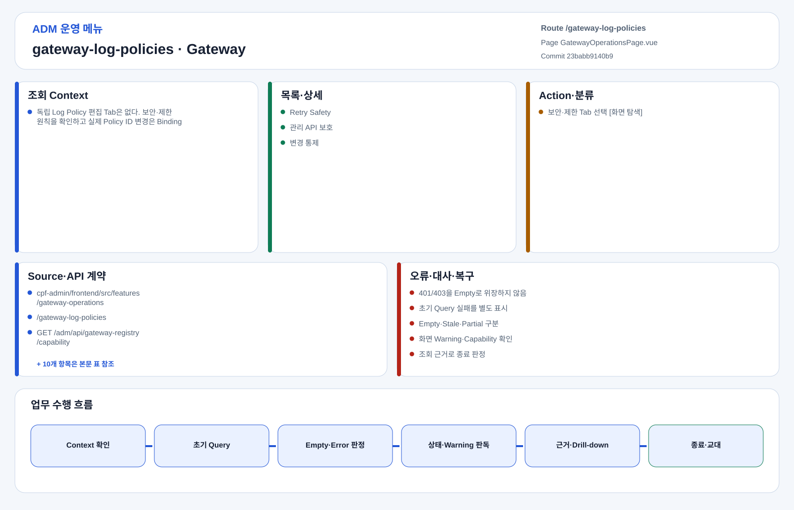

### 이 장에서 끝내는 업무

Gateway 운영 Warning·Spool Backlog를 ADM Log Policy와 대사한다.

### 메뉴 식별·책임

| 항목 | 값 |
|---|---|
| Route | `/gateway-log-policies` |
| 메뉴 ID | `gateway-log-policies` |
| Menu Code | `gateway-log-policies` |
| 업무 그룹 | 온라인 운영 |
| Frontend Page | `cpf-admin/frontend/src/features/gateway-operations/GatewayOperationsPage.vue` |
| Permission | Gateway Menu/Action Permission + Approval |
| 기준 Commit | `23babb9140b90e501d6ac715e7b77f55b66198a5` |

### Source·API 근거

| 구분 | 기준 |
|---|---|
| Frontend Page | `cpf-admin/frontend/src/features/gateway-operations/GatewayOperationsPage.vue` |
| Router | `/gateway-log-policies` |
| API 1 | `GET /adm/api/gateway-registry/capability` |
| API 2 | `GET /adm/api/gateway-registry/operations/snapshot` |
| API 3 | `GET /adm/api/gateway-registry/operations/stream` |
| API 4 | `GET /adm/api/gateway-registry/server-groups` |
| API 5 | `POST /adm/api/gateway-registry/server-groups` |
| API 6 | `GET /adm/api/gateway-registry/server-groups/{serverGroupId}/members` |
| API 7 | `GET /adm/api/gateway-registry/bindings` |
| API 8 | `POST /adm/api/gateway-registry/bindings` |
| API 9 | `GET /adm/api/gateway-registry/bindings/{bindingId}/apply-status` |
| API 10 | `GET /adm/api/gateway-registry/bindings/{bindingId}/connection-tests` |
| API 11 | `POST /adm/api/gateway-registry/bindings/{bindingId}/connection-tests` |
| Source 해석 | 이 Alias는 별도 Log Policy Tab을 열지 않는다. 공유 Page의 Warning·Spool Signal을 확인하고 Log Capture 정책 편집은 ADM `/logPolicies`에서 수행한다. |

아래 표는 이 메뉴에서 실제로 확인·입력·실행할 항목을 정리한다. 화면에 없는 Field·Button·상태를 임의로 가정하지 않는다.

### 검색·입력 Field

별도 사용자 입력 Control이 없다. 현재 Session·Permission·Data Scope와 Page가 정의한 초기 Query로 데이터를 읽는다. 새로고침은 같은 Context를 다시 조회하며 Owner 데이터는 변경하지 않는다.

### 목록 Column·상세 Field

| 표시값 | 운영 의미 | 교차 확인 |
|---|---|---|
| `Retry Safety` | 멱등성·Timeout 단계·Attempt 한도를 충족할 때만 Retry를 허용하는 원칙이다. | 상세·재조회 결과와 비교하고 Stale·Masking·단위 차이를 확인한다. |
| `관리 API 보호` | ADM·BAT·Actuator·Internal Endpoint를 외부 Route 대상에서 제외하는 원칙이다. | 상세·재조회 결과와 비교하고 Stale·Masking·단위 차이를 확인한다. |
| `변경 통제` | 운영 변경에 Reason·Approval·Expected Version·Audit를 요구하는 원칙이다. | 상세·재조회 결과와 비교하고 Stale·Masking·단위 차이를 확인한다. |

#### 결과 판독 순서

1. 조회 완료 시각·Filter·Paging·Sort와 화면 Warning을 확인한다.
2. Empty·Stale·Partial을 정상 0건과 구분한다.
3. 식별자·상태·Version·오류·시각을 같은 Query Context의 상세와 Owner 원장에서 비교한다.
4. Masking된 값은 Raw Permission과 Reason 없이 복원·Export하지 않는다.
5. 집계와 상세가 다르면 집계 시간 창·Timezone·Owner Update 시각을 맞춰 대사한다.

### Button·Action

| Action | 분류 | 활성 조건 | Side Effect·정상 결과 |
|---|---|---|---|
| **보안·제한 Tab 선택** | 화면 탐색 | 공유 Page가 열린 상태이며 해당 Tab·Detail을 선택할 수 있음 | 공유 Page의 Tab·상세 Context만 변경하며 Server Side Effect는 발생하지 않는다. |

### 정상 업무 전체 절차

1. `/gateway-log-policies`에 진입해 Page Header와 Route가 **Gateway Log Policies** 기능을 가리키는지 확인한다.
2. 로그인 Session·Environment·Data Scope·기준일·Timezone을 고정한다.
3. 별도 사용자 입력 없이 초기 조회가 끝날 때까지 기다리고, 필요할 때만 같은 Context로 새로고침한다.
4. Loading 종료 후 Empty·Error·Stale·Partial 상태와 화면 Warning을 먼저 판정한다.
5. **Retry Safety, 관리 API 보호, 변경 통제**를 읽고 식별자·상태·Version·시각을 Owner 원장과 대사한다.
6. 화면이 제공하는 Log·Metric·Trace와, 변경·Export·승인 조치에 생성된 Audit를 교차 확인한다.
7. 이 장의 **종료 판정**과 다음 확인 시각·Evidence Link를 교대 기록에 남긴다.

### 메뉴 고유 판정·금지 사항

- **목적:** Gateway 운영 Warning·Spool Backlog를 ADM Log Policy와 대사한다.
- **종료 판정:** Log Capture 정책은 `/logPolicies`에서 확인하고 Gateway Signal과 배포 Version이 일치해야 한다.
- **공유 Page 동작:** 이 Alias는 별도 Log Policy Tab을 열지 않는다. 공유 Page의 Warning·Spool Signal을 확인하고 Log Capture 정책 편집은 ADM `/logPolicies`에서 수행한다.
- 조회 화면에서 직접 Owner 데이터를 변경하거나 Browser Tool로 우회하지 않는다.
- Partial 조회를 정상 전체 결과로 합치지 않는다.

### 오류·경계·동시성·복구

| 상황 | 화면 징후 | 운영 조치 | 종료 증적 |
|---|---|---|---|
| 401·Session | Session 만료·CSRF·Origin 실패 | 로그인 상태와 BFF Session을 확인한다. Command 자동 Replay는 금지한다. | 401/403 응답·Session Audit |
| 403·Data Scope | 메뉴·Button·Raw·Export가 거부됨 | Menu·Button·API·Owner Permission과 Data Scope를 확인하고 우회하지 않는다. | Deny Audit·요청 Permission |
| Validation | 필수값·범위·형식·기간 오류 | Field Error만 수정하고 기존 성공 Operation을 다시 제출하지 않는다. | Error Code·Field·입력값 |
| Timeout·Dependency | 일부 Source 또는 Command 응답 지연 | Correlation/Operation ID와 실패 Stage를 기록하고 Owner 상태를 조회한다. | Dependency 상태·Retryability |
| Partial·Stale | 일부 대상만 Success 또는 조회 Source 누락 | 성공·실패·미응답을 분리하고 누락 범위와 Version을 표시한다. | Target별 결과·Version |

### 응답 유실·부분 조회 처리

1. 검색 조건·Data Scope·Paging·조회 시각·Correlation ID를 기록한다.
2. 같은 조건으로 재조회하되 실패 Source만 분리한다.
3. 정상 Source 결과를 유지하고 실패·Stale Source를 명시한다.
4. 집계와 원본 상세가 다르면 Owner 상세를 기준으로 Reconcile Case를 연다.
5. 조회 시각·Source Version·0건 또는 일치 결과를 증적으로 남긴다.

### Log·Metric·Trace·Audit와 교대 기록

| 증적 | 필수 값 |
|---|---|
| Audit | Actor·Permission·Reason·Approval·Target·Before/After·Result·Recovery Action |
| Log | Environment·Instance·operationId·transactionId·failureStage·errorCode |
| Metric | 동일 시간 창의 Success·Failure·Latency·Queue·Retry·Partial·Unknown |
| Trace | root/segment/attempt·Owner·DB/Kafka/외부 의존성 Span |
| 상태 원장 | Target ID·Version·Checksum·Desired/Actual·Last Updated·Terminal 여부 |

```text
Menu=gateway-log-policies
Route=/gateway-log-policies
Environment=
DataScope=
Query=
TargetId=
BeforeVersion=
Action=
Reason=
ApprovalId=
OperationId=
TransactionId=
Result=SUCCESS|FAILED|PARTIAL|UNKNOWN_RESULT
OwnerState=
FailedTargets=
ReconcileBy=
RollbackPoint=
EvidenceLinks=
NextCheckAt=
```

### 실무 Workbook

**상황:** Gateway 운영 Warning·Spool Backlog를 ADM Log Policy와 대사한다. 화면이 일부 Source Timeout 때문에 Partial 결과를 표시했다.

1. Query·Data Scope·조회 시각·Correlation ID를 기록한다.
2. 정상 결과를 0건으로 덮어쓰지 않고 실패 Source만 재조회한다.
3. 운영 Warning, Capability Status, Spool Backlog 값을 원본 상세와 같은 시간 기준으로 비교한다.
4. 불일치가 계속되면 Incident 또는 Reconcile Case를 생성한다.
5. Log Capture 정책은 `/logPolicies`에서 확인하고 Gateway Signal과 배포 Version이 일치해야 한다.
6. Source Version과 다음 확인 시각을 교대 기록에 남긴다.

### 독립 수행 검수 Checklist

- [ ] `/gateway-log-policies`와 Page Source를 찾고 화면 목적을 설명할 수 있다.
- [ ] 3개 입력·검색 항목의 Control·기본값·Validation을 설명할 수 있다.
- [ ] 3개 표시값을 Owner 상태·Version·Audit와 대사할 수 있다.
- [ ] 1개 Action의 분류·활성 조건·Side Effect를 설명할 수 있다.
- [ ] Empty·403·409·Timeout·Partial·Unknown을 서로 다른 상태로 처리할 수 있다.
- [ ] 응답 유실 뒤 중복 제출 없이 Operation·Owner·Audit로 결과를 확정할 수 있다.
- [ ] 교대 기록만으로 다음 담당자가 Target·상태·복구 기한을 이어받을 수 있다.

## 52. gateway-apply-status — Gateway Apply Status

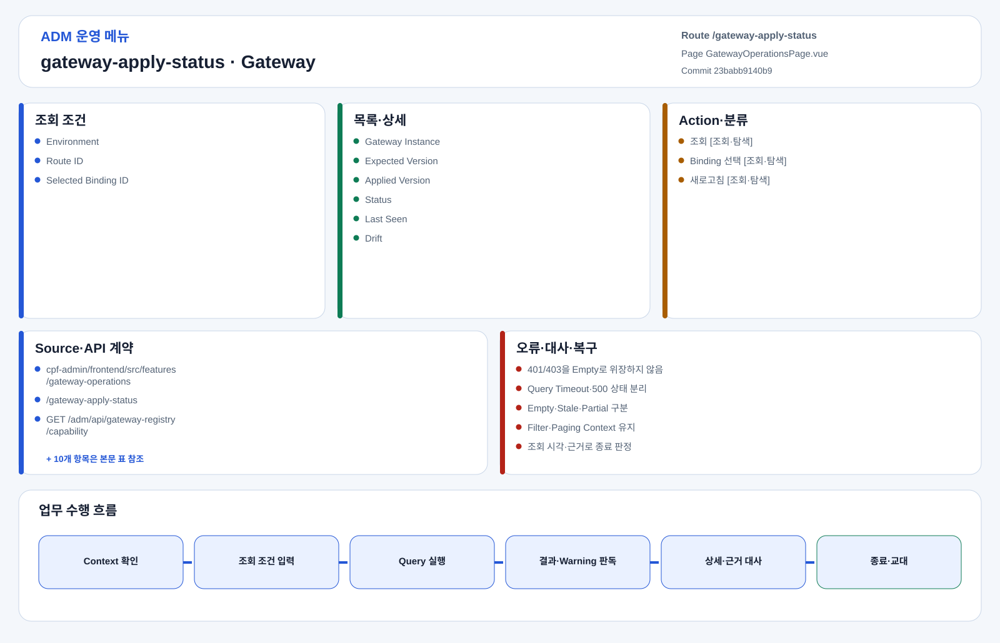

### 이 장에서 끝내는 업무

Binding별 Gateway Instance 적용 상태와 Drift를 대사한다.

### 메뉴 식별·책임

| 항목 | 값 |
|---|---|
| Route | `/gateway-apply-status` |
| 메뉴 ID | `gateway-apply-status` |
| Menu Code | `gateway-apply-status` |
| 업무 그룹 | 온라인 운영 |
| Frontend Page | `cpf-admin/frontend/src/features/gateway-operations/GatewayOperationsPage.vue` |
| Permission | Gateway Menu/Action Permission + Approval |
| 기준 Commit | `23babb9140b90e501d6ac715e7b77f55b66198a5` |

### Source·API 근거

| 구분 | 기준 |
|---|---|
| Frontend Page | `cpf-admin/frontend/src/features/gateway-operations/GatewayOperationsPage.vue` |
| Router | `/gateway-apply-status` |
| API 1 | `GET /adm/api/gateway-registry/capability` |
| API 2 | `GET /adm/api/gateway-registry/operations/snapshot` |
| API 3 | `GET /adm/api/gateway-registry/operations/stream` |
| API 4 | `GET /adm/api/gateway-registry/server-groups` |
| API 5 | `POST /adm/api/gateway-registry/server-groups` |
| API 6 | `GET /adm/api/gateway-registry/server-groups/{serverGroupId}/members` |
| API 7 | `GET /adm/api/gateway-registry/bindings` |
| API 8 | `POST /adm/api/gateway-registry/bindings` |
| API 9 | `GET /adm/api/gateway-registry/bindings/{bindingId}/apply-status` |
| API 10 | `GET /adm/api/gateway-registry/bindings/{bindingId}/connection-tests` |
| API 11 | `POST /adm/api/gateway-registry/bindings/{bindingId}/connection-tests` |
| Source 해석 | Alias 진입 시 `groups` Tab이 기본이므로 `Health·연결시험·적용` Tab을 직접 선택한다. `apply-status` API 결과로 Expected/Applied Version을 비교한다. |

아래 표는 이 메뉴에서 실제로 확인·입력·실행할 항목을 정리한다. 화면에 없는 Field·Button·상태를 임의로 가정하지 않는다.

### 검색·입력 Field

| Field | Control | 업무 의미 | 기본값·Validation·주의 |
|---|---|---|---|
| `Environment` | Select·검색 | Gateway Apply Status 조회·조치가 적용되는 환경과 데이터 경계를 제한한다. | 허용 목록과 현재 Environment·Data Scope에 맞는 값만 선택한다. |
| `Route ID` | 문자열 입력·검색 | 조회·상세·Audit에서 같은 대상을 다시 찾기 위한 식별 조건이다. | 앞뒤 공백·허용 문자·길이와 대소문자 규칙을 확인한다. |
| `Selected Binding ID` | 문자열 입력·검색 | 조회·상세·Audit에서 같은 대상을 다시 찾기 위한 식별 조건이다. | 앞뒤 공백·허용 문자·길이와 대소문자 규칙을 확인한다. |

#### 입력 순서

1. **Environment** 항목이 조회 Control인지 변경 Form인지 화면 위치로 구분하고, 표시된 값·필수 여부·허용 형식을 확인한다.
2. **Route ID** 항목이 조회 Control인지 변경 Form인지 화면 위치로 구분하고, 표시된 값·필수 여부·허용 형식을 확인한다.
3. **Selected Binding ID** 항목이 조회 Control인지 변경 Form인지 화면 위치로 구분하고, 표시된 값·필수 여부·허용 형식을 확인한다.
4. 조회 Control과 변경 Form을 분리해 기록하고, 실행 전 Environment·Data Scope·Timezone과 제출할 값만 다시 검토한다.

### 목록 Column·상세 Field

| 표시값 | 운영 의미 | 교차 확인 |
|---|---|---|
| `Gateway Instance` | Gateway Apply Status의 대상 레코드를 상세·Owner·Audit에서 연결하는 식별자다. | 상세·Log·Trace·Audit에서 같은 대상을 가리키는지 확인한다. |
| `Expected Version` | 요청·Owner·Instance 사이의 Version 또는 내용 동일성을 판단하는 값이다. | 목록·상세·Owner 또는 Instance 보고값에서 일치하는지 확인한다. |
| `Applied Version` | 요청·Owner·Instance 사이의 Version 또는 내용 동일성을 판단하는 값이다. | 목록·상세·Owner 또는 Instance 보고값에서 일치하는지 확인한다. |
| `Status` | 현재 상태와 Terminal 여부, 다음 Action 가능 여부를 판단하는 값이다. | Last Updated·Terminal 조건·Owner 상태와 함께 확인한다. |
| `Last Seen` | 상태 발생·갱신·유효 시점을 나타내며 화면 Timezone을 기준으로 해석한다. | 상세·재조회 결과와 비교하고 Stale·Masking·단위 차이를 확인한다. |
| `Drift` | 오류·Drift·결과 불명 범위를 나타내며 원인과 복구 Owner를 연결해야 한다. | 원인 식별자·실패 Stage·마지막 갱신 시각을 상세와 대조한다. |

#### 결과 판독 순서

1. 조회 완료 시각·Filter·Paging·Sort와 화면 Warning을 확인한다.
2. Empty·Stale·Partial을 정상 0건과 구분한다.
3. 식별자·상태·Version·오류·시각을 같은 Query Context의 상세와 Owner 원장에서 비교한다.
4. Masking된 값은 Raw Permission과 Reason 없이 복원·Export하지 않는다.
5. 집계와 상세가 다르면 집계 시간 창·Timezone·Owner Update 시각을 맞춰 대사한다.

### Button·Action

| Action | 분류 | 활성 조건 | Side Effect·정상 결과 |
|---|---|---|---|
| **조회** | 조회·탐색 | 조회 Permission과 Query Validation을 충족하고 동일 조회가 진행 중이 아님 | 조회 결과의 조회 시각·Filter·Source Version·Warning이 갱신되며 Owner 데이터는 변경하지 않는다. |
| **Binding 선택** | 조회·탐색 | 조회 Permission과 Query Validation을 충족하고 동일 조회가 진행 중이 아님 | Binding 선택 결과의 조회 시각·Filter·Source Version·Warning이 갱신되며 Owner 데이터는 변경하지 않는다. |
| **새로고침** | 조회·탐색 | 조회 Permission과 Query Validation을 충족하고 동일 조회가 진행 중이 아님 | 새로고침 결과의 조회 시각·Filter·Source Version·Warning이 갱신되며 Owner 데이터는 변경하지 않는다. |

### 정상 업무 전체 절차

1. `/gateway-apply-status`에 진입해 Page Header와 Route가 **Gateway Apply Status** 기능을 가리키는지 확인한다.
2. 로그인 Session·Environment·Data Scope·기준일·Timezone을 고정한다.
3. 화면에 제공된 조회 Control만 사용하고, 표시되지 않은 변경 Field나 Server Command가 있다고 가정하지 않는다.
4. Loading 종료 후 Empty·Error·Stale·Partial 상태와 화면 Warning을 먼저 판정한다.
5. **Gateway Instance, Expected Version, Applied Version, Status, Last Seen**를 읽고 식별자·상태·Version·시각을 Owner 원장과 대사한다.
6. 화면이 제공하는 Log·Metric·Trace와 조회·Raw·Export 접근 기록이 있으면 해당 Audit를 교차 확인한다.
7. 이 장의 **종료 판정**과 다음 확인 시각·Evidence Link를 교대 기록에 남긴다.

### 메뉴 고유 판정·금지 사항

- **목적:** Binding별 Gateway Instance 적용 상태와 Drift를 대사한다.
- **종료 판정:** 모든 대상의 Expected Version과 Applied Version이 같고 Last Seen이 허용 범위 안에 있어야 한다.
- **공유 Page 동작:** Alias 진입 시 `groups` Tab이 기본이므로 `Health·연결시험·적용` Tab을 직접 선택한다. `apply-status` API 결과로 Expected/Applied Version을 비교한다.
- 조회 화면에서 직접 Owner 데이터를 변경하거나 Browser Tool로 우회하지 않는다.
- Partial 조회를 정상 전체 결과로 합치지 않는다.

### 오류·경계·동시성·복구

| 상황 | 화면 징후 | 운영 조치 | 종료 증적 |
|---|---|---|---|
| 401·Session | Session 만료·CSRF·Origin 실패 | 로그인 상태와 BFF Session을 확인한 뒤 같은 Query Context로 다시 조회한다. | 401/403 응답·Session Audit |
| 403·Data Scope | 메뉴·Button·Raw·Export가 거부됨 | Menu·Button·API·Owner Permission과 Data Scope를 확인하고 우회하지 않는다. | Deny Audit·요청 Permission |
| Timeout·Dependency | 일부 조회 Source 응답 지연 | Correlation ID·Query Context·실패 Source를 기록하고 같은 조건으로 재조회한다. | 조회 시각·실패 Source·재조회 결과 |
| Partial·Stale | 일부 대상만 Success 또는 조회 Source 누락 | 성공·실패·미응답을 분리하고 누락 범위와 Version을 표시한다. | Target별 결과·Version |
| Gateway NACK·Drift | Expected/Applied Version 불일치 또는 Instance NACK | NACK 이유·Checksum·Last Seen을 확인하고 Failed Instance만 재적용하거나 LKG로 복귀한다. | Instance ACK/NACK·LKG |

### 응답 유실·부분 조회 처리

1. 검색 조건·Data Scope·Paging·조회 시각·Correlation ID를 기록한다.
2. 같은 조건으로 재조회하되 실패 Source만 분리한다.
3. 정상 Source 결과를 유지하고 실패·Stale Source를 명시한다.
4. 집계와 원본 상세가 다르면 Owner 상세를 기준으로 Reconcile Case를 연다.
5. 조회 시각·Source Version·0건 또는 일치 결과를 증적으로 남긴다.

### Log·Metric·Trace·Audit와 교대 기록

| 증적 | 필수 값 |
|---|---|
| Audit | Actor·Permission·Data Scope·Raw/Export 접근·Query Context·Result |
| Log | Environment·Instance·operationId·transactionId·failureStage·errorCode |
| Metric | 동일 시간 창의 Success·Failure·Latency·Queue·Retry·Partial·Unknown |
| Trace | root/segment/attempt·Owner·DB/Kafka/외부 의존성 Span |
| 상태 원장 | Target ID·Version·Checksum·Desired/Actual·Last Updated·Terminal 여부 |

```text
Menu=
Route=
Environment=
DataScope=
Query=
QueryAt=
CorrelationId=
SourceVersion=
Result=SUCCESS|EMPTY|STALE|PARTIAL|FAILED
FailedSources=
EvidenceLinks=
NextCheckAt=
```

### 실무 Workbook

**상황:** Binding별 Gateway Instance 적용 상태와 Drift를 대사한다. 화면이 일부 Source Timeout 때문에 Partial 결과를 표시했다.

1. Query·Data Scope·조회 시각·Correlation ID를 기록한다.
2. 정상 결과를 0건으로 덮어쓰지 않고 실패 Source만 재조회한다.
3. Gateway Instance, Expected Version, Applied Version 값을 원본 상세와 같은 시간 기준으로 비교한다.
4. 불일치가 계속되면 Incident 또는 Reconcile Case를 생성한다.
5. 모든 대상의 Expected Version과 Applied Version이 같고 Last Seen이 허용 범위 안에 있어야 한다.
6. Source Version과 다음 확인 시각을 교대 기록에 남긴다.

### 독립 수행 검수 Checklist

- [ ] `/gateway-apply-status`와 Page Source를 찾고 화면 목적을 설명할 수 있다.
- [ ] 3개 입력·검색 항목의 Control·기본값·Validation을 설명할 수 있다.
- [ ] 6개 표시값을 Owner 상태·Version·Audit와 대사할 수 있다.
- [ ] 3개 Action의 분류·활성 조건·Side Effect를 설명할 수 있다.
- [ ] Empty·401·403·Timeout·Stale·Partial을 서로 다른 조회 상태로 처리할 수 있다.
- [ ] 조회 응답 유실 시 같은 Query Context로 재조회하고 Correlation ID·조회 시각·Source Version으로 결과를 대사할 수 있다.
- [ ] 교대 기록만으로 다음 담당자가 Target·상태·복구 기한을 이어받을 수 있다.

## 53. permissions — Role·Menu·Button·API Permission

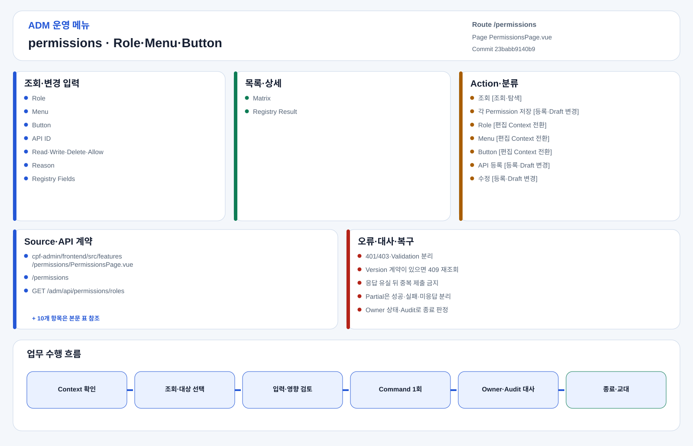

### 이 장에서 끝내는 업무

Role·Menu·Button·API Permission과 Registry를 관리한다.

### 메뉴 식별·책임

| 항목 | 값 |
|---|---|
| Route | `/permissions` |
| 메뉴 ID | `permissions` |
| Menu Code | `permissions` |
| 업무 그룹 | 프레임워크 |
| Frontend Page | `cpf-admin/frontend/src/features/permissions/PermissionsPage.vue` |
| Permission | `PERMISSION` Write |
| 기준 Commit | `23babb9140b90e501d6ac715e7b77f55b66198a5` |

### Source·API 근거

| 구분 | 기준 |
|---|---|
| Frontend Page | `cpf-admin/frontend/src/features/permissions/PermissionsPage.vue` |
| Router | `/permissions` |
| API 1 | `GET /adm/api/permissions/roles` |
| API 2 | `GET /adm/api/permissions/menus` |
| API 3 | `GET /adm/api/permissions/menu-matrix` |
| API 4 | `GET /adm/api/permissions/buttons` |
| API 5 | `GET /adm/api/permissions/button-matrix` |
| API 6 | `GET /adm/api/permissions/api-permissions` |
| API 7 | `GET /adm/api/permissions/api-matrix` |
| API 8 | `PUT /adm/api/permissions/roles/{roleId}/menus/{menuId}` |
| API 9 | `PUT /adm/api/permissions/roles/{roleId}/buttons/{buttonId}` |
| API 10 | `PUT /adm/api/permissions/roles/{roleId}/api-permissions/{apiPermissionId}` |
| API 11 | `POST /adm/api/permissions/api-permissions` |

아래 표는 이 메뉴에서 실제로 확인·입력·실행할 항목을 정리한다. 화면에 없는 Field·Button·상태를 임의로 가정하지 않는다.

### 검색·입력 Field

| Field | Control | 업무 의미 | 기본값·Validation·주의 |
|---|---|---|---|
| `Role` | Select·검색 | Role·Menu·Button·API Permission에서 적용하거나 조회할 정책·권한·처리 유형을 선택한다. | 허용 목록과 현재 Environment·Data Scope에 맞는 값만 선택한다. |
| `Menu` | Select·검색 | Role·Menu·Button·API Permission에서 적용하거나 조회할 정책·권한·처리 유형을 선택한다. | 허용 목록과 현재 Environment·Data Scope에 맞는 값만 선택한다. |
| `Button` | 날짜·시간 입력 | 조회 또는 적용의 유효 시간 범위를 정하며 Timezone과 시작·종료 순서를 함께 확인한다. | Timezone을 고정하고 시작≤종료·유효기간 겹침·기준일 포함 여부를 확인한다. |
| `API ID` | 문자열 입력·검색 | 조회·상세·Audit에서 같은 대상을 다시 찾기 위한 식별 조건이다. | 앞뒤 공백·허용 문자·길이와 대소문자 규칙을 확인한다. |
| `Read·Write·Delete·Allow` | 문자열 입력·검색 | Role·Menu·Button·API Permission 화면의 조회 조건 또는 편집 Form에 포함되는 값이며 화면 Label과 Help를 기준으로 사용한다. | 앞뒤 공백·허용 문자·길이와 대소문자 규칙을 확인한다. |
| `Reason` | 다중행 입력 | 작업 목적·영향 범위·승인 또는 복구 기준을 기록해 Audit와 교대 기록에 연결한다. | Ticket·영향 범위·복구점을 포함하고 화면이 요구하는 최소 길이를 충족한다. |
| `Registry Fields` | 문자열 입력·검색 | Role·Menu·Button·API Permission 화면의 조회 조건 또는 편집 Form에 포함되는 값이며 화면 Label과 Help를 기준으로 사용한다. | 앞뒤 공백·허용 문자·길이와 대소문자 규칙을 확인한다. |

#### 입력 순서

1. **Role** 항목이 조회 Control인지 변경 Form인지 화면 위치로 구분하고, 표시된 값·필수 여부·허용 형식을 확인한다.
2. **Menu** 항목이 조회 Control인지 변경 Form인지 화면 위치로 구분하고, 표시된 값·필수 여부·허용 형식을 확인한다.
3. **Button** 항목이 조회 Control인지 변경 Form인지 화면 위치로 구분하고, 표시된 값·필수 여부·허용 형식을 확인한다.
4. **API ID** 항목이 조회 Control인지 변경 Form인지 화면 위치로 구분하고, 표시된 값·필수 여부·허용 형식을 확인한다.
5. **Read·Write·Delete·Allow** 항목이 조회 Control인지 변경 Form인지 화면 위치로 구분하고, 표시된 값·필수 여부·허용 형식을 확인한다.
6. **Reason** 항목이 조회 Control인지 변경 Form인지 화면 위치로 구분하고, 표시된 값·필수 여부·허용 형식을 확인한다.
7. **Registry Fields** 항목이 조회 Control인지 변경 Form인지 화면 위치로 구분하고, 표시된 값·필수 여부·허용 형식을 확인한다.
8. 조회 Control과 변경 Form을 분리해 기록하고, 실행 전 Environment·Data Scope·Timezone과 제출할 값만 다시 검토한다.

### 목록 Column·상세 Field

| 표시값 | 운영 의미 | 교차 확인 |
|---|---|---|
| `Matrix` | Role·Menu·Button·API Permission 상세에서 대상의 현재 속성 또는 처리 결과를 확인하는 값이다. | 상세·재조회 결과와 비교하고 Stale·Masking·단위 차이를 확인한다. |
| `Registry Result` | 현재 상태와 Terminal 여부, 다음 Action 가능 여부를 판단하는 값이다. | Last Updated·Terminal 조건·Owner 상태와 함께 확인한다. |

#### 결과 판독 순서

1. 조회 완료 시각·Filter·Paging·Sort와 화면 Warning을 확인한다.
2. Empty·Stale·Partial을 정상 0건과 구분한다.
3. 식별자·상태·Version·오류·시각을 같은 Query Context의 상세와 Owner 원장에서 비교한다.
4. Masking된 값은 Raw Permission과 Reason 없이 복원·Export하지 않는다.
5. 집계와 상세가 다르면 집계 시간 창·Timezone·Owner Update 시각을 맞춰 대사한다.

### Button·Action

| Action | 분류 | 활성 조건 | Side Effect·정상 결과 |
|---|---|---|---|
| **조회** | 조회·탐색 | 조회 Permission과 Query Validation을 충족하고 동일 조회가 진행 중이 아님 | 조회 결과의 조회 시각·Filter·Source Version·Warning이 갱신되며 Owner 데이터는 변경하지 않는다. |
| **각 Permission 저장** | 등록·Draft 변경 | 화면이 실제로 요구하는 Write Permission·필수 Field·Reason·Version 조건을 충족함 | Role·Menu·Button·API Permission의 재조회 결과가 요청 내용과 일치한다. Version·Before/After·Audit는 해당 Owner가 제공하는 경우 함께 확인한다. |
| **Role** | 편집 Context 전환 | 대상 Row가 선택되고 편집 Permission과 현재 상태를 확인함 | 선택한 대상의 현재 Form과 Source가 제공하는 Version 정보를 표시하며 저장 전에는 Owner 상태를 변경하지 않는다. |
| **Menu** | 편집 Context 전환 | 대상 Row가 선택되고 편집 Permission과 현재 상태를 확인함 | 선택한 대상의 현재 Form과 Source가 제공하는 Version 정보를 표시하며 저장 전에는 Owner 상태를 변경하지 않는다. |
| **Button** | 편집 Context 전환 | 대상 Row가 선택되고 편집 Permission과 현재 상태를 확인함 | 선택한 대상의 현재 Form과 Source가 제공하는 Version 정보를 표시하며 저장 전에는 Owner 상태를 변경하지 않는다. |
| **API 등록** | 등록·Draft 변경 | 화면이 실제로 요구하는 Write Permission·필수 Field·Reason·Version 조건을 충족함 | Role·Menu·Button·API Permission의 재조회 결과가 요청 내용과 일치한다. Version·Before/After·Audit는 해당 Owner가 제공하는 경우 함께 확인한다. |
| **수정** | 등록·Draft 변경 | 화면이 실제로 요구하는 Write Permission·필수 Field·Reason·Version 조건을 충족함 | Role·Menu·Button·API Permission의 재조회 결과가 요청 내용과 일치한다. Version·Before/After·Audit는 해당 Owner가 제공하는 경우 함께 확인한다. |

### 정상 업무 전체 절차

1. `/permissions`에 진입해 Page Header와 Route가 **Role·Menu·Button·API Permission** 기능을 가리키는지 확인한다.
2. 로그인 Session·Environment·Data Scope·기준일·Timezone을 고정한다.
3. 화면의 조회 Control과 변경 Form을 구분한다. 조회 조건이 제공되면 먼저 조회하고, 변경 Form은 대상 선택 또는 등록 Action 뒤에 열린 실제 Field만 사용한다.
4. Loading 종료 후 Empty·Error·Stale·Partial 상태와 화면 Warning을 먼저 판정한다.
5. **Matrix, Registry Result**를 읽고 식별자·상태·Version·시각을 Owner 원장과 대사한다.
6. **각 Permission 저장** 전에 화면과 Owner가 실제로 요구하는 Permission·현재 상태·영향 범위·Reason·승인·Version 조건을 확인하고 한 번만 제출한다.
7. **각 Permission 저장**의 HTTP 응답과 재조회 결과를 확인한다. 비동기·다중 대상 기능은 Owner Terminal 상태·Version·대상별 Success/Failed/Unknown·Audit를 별도로 확인한다.
8. **API 등록** 전에 화면과 Owner가 실제로 요구하는 Permission·현재 상태·영향 범위·Reason·승인·Version 조건을 확인하고 한 번만 제출한다.
9. **API 등록**의 HTTP 응답과 재조회 결과를 확인한다. 비동기·다중 대상 기능은 Owner Terminal 상태·Version·대상별 Success/Failed/Unknown·Audit를 별도로 확인한다.
10. **수정** 전에 화면과 Owner가 실제로 요구하는 Permission·현재 상태·영향 범위·Reason·승인·Version 조건을 확인하고 한 번만 제출한다.
11. **수정**의 HTTP 응답과 재조회 결과를 확인한다. 비동기·다중 대상 기능은 Owner Terminal 상태·Version·대상별 Success/Failed/Unknown·Audit를 별도로 확인한다.
12. 화면이 제공하는 Log·Metric·Trace와, 변경·Export·승인 조치에 생성된 Audit를 교차 확인한다.
13. 이 장의 **종료 판정**과 다음 확인 시각·Evidence Link를 교대 기록에 남긴다.

### 메뉴 고유 판정·금지 사항

- **목적:** Role·Menu·Button·API Permission과 Registry를 관리한다.
- **종료 판정:** Frontend 노출과 Backend 403·Owner 권한이 같은 정책을 사용해야 한다.
- 응답을 받지 못한 경우 Owner 상태와 기존 Operation을 확인하기 전에 동일 Action을 반복하지 않는다.
- HTTP 성공 응답이나 Toast만으로 비동기 Owner 상태 또는 다중 대상 적용을 확정하지 않는다.

### 오류·경계·동시성·복구

| 상황 | 화면 징후 | 운영 조치 | 종료 증적 |
|---|---|---|---|
| 401·Session | Session 만료·CSRF·Origin 실패 | 로그인 상태와 BFF Session을 확인한다. Command 자동 Replay는 금지한다. | 401/403 응답·Session Audit |
| 403·Data Scope | 메뉴·Button·Raw·Export가 거부됨 | Menu·Button·API·Owner Permission과 Data Scope를 확인하고 우회하지 않는다. | Deny Audit·요청 Permission |
| Validation | 필수값·범위·형식·기간 오류 | Field Error만 수정하고 기존 성공 Operation을 다시 제출하지 않는다. | Error Code·Field·입력값 |
| Timeout·Dependency | 일부 Source 또는 Command 응답 지연 | Correlation/Operation ID와 실패 Stage를 기록하고 Owner 상태를 조회한다. | Dependency 상태·Retryability |
| Partial·Stale | 일부 대상만 Success 또는 조회 Source 누락 | 성공·실패·미응답을 분리하고 누락 범위와 Version을 표시한다. | Target별 결과·Version |
| 409·동시 변경 | Expected Version 불일치 | 최신 상세를 재조회하고 Diff·영향을 다시 검토한 뒤 새 요청으로 제출한다. | 현재/요청 Version·변경자 |
| 응답 유실·Unknown | 요청 후 실제 처리 여부를 알 수 없음 | Operation ID·Request Hash·Audit·Owner 상태로 대사하고 중복 제출하지 않는다. | Operation·Owner·Audit |
| 복구 실패 | Retry/Rollback 뒤에도 상태 불일치 | 자동 반복을 중단하고 Incident·Reconcile Case·다음 확인 시각을 기록한다. | Case ID·복구 Owner·기한 |

### 응답 유실·결과 불명·부분 적용 처리

1. 동일 Action을 다시 누르지 않고 Browser Network와 응답 Header를 보존한다. `operationId`·`transactionId`·`idempotencyKey`가 제공되면 기록하고, 없으면 Target ID·Actor·요청 시각·Request Body Hash로 대사한다.
2. 기능이 제공하는 상세·Operation Status(있는 경우)·Audit에서 Request Hash와 대상 Version을 검색한다.
3. Side Effect 전 실패가 확인된 경우에만 새 요청을 검토한다.
4. Success·Failed·Unknown 대상을 분리하고 Source가 제공하는 Failed-only Retry·Compensation·Rollback을 선택하고, 지원되지 않으면 수동 Reconcile Case로 이관한다.
5. Rollback을 지원하는 기능은 Owner Version·Checksum·업무 합계가 Rollback Point와 일치하는지 확인한다.
6. 확정되지 않은 대상은 `UNKNOWN_RESULT`로 유지하고 담당자·대사 기한·다음 확인 시각을 기록한다.

### Log·Metric·Trace·Audit와 교대 기록

| 증적 | 필수 값 |
|---|---|
| Audit | Actor·Permission·Reason·Approval·Target·Before/After·Result·Recovery Action |
| Log | Environment·Instance·operationId·transactionId·failureStage·errorCode |
| Metric | 동일 시간 창의 Success·Failure·Latency·Queue·Retry·Partial·Unknown |
| Trace | root/segment/attempt·Owner·DB/Kafka/외부 의존성 Span |
| 상태 원장 | Target ID·Version·Checksum·Desired/Actual·Last Updated·Terminal 여부 |

```text
Menu=permissions
Route=/permissions
Environment=
DataScope=
Query=
TargetId=
BeforeVersion=
Action=
Reason=
ApprovalId=
OperationId=
TransactionId=
Result=SUCCESS|FAILED|PARTIAL|UNKNOWN_RESULT
OwnerState=
FailedTargets=
ReconcileBy=
RollbackPoint=
EvidenceLinks=
NextCheckAt=
```

### 실무 Workbook

**상황:** Role·Menu·Button·API Permission과 Registry를 관리한다. 담당자가 **각 Permission 저장**을 수행한 뒤 Browser 응답을 받지 못했다.

1. 대상 식별자와 Before Version, 입력값, Reason·Approval을 작업 기록에서 확인한다.
2. 동일 **각 Permission 저장**을 반복하지 않고 Operation·Audit·Owner 상태를 조회한다.
3. Owner 상태가 변경됐고 Request Hash가 같으면 응답 유실로 분류해 중복 조치를 금지한다.
4. 일부 대상만 변경됐으면 Success·Failed·Unknown을 분리해 Failed-only Retry 또는 Rollback을 선택한다.
5. Frontend 노출과 Backend 403·Owner 권한이 같은 정책을 사용해야 한다.
6. Evidence Link와 다음 확인 시각을 교대 기록에 남긴다.

### 독립 수행 검수 Checklist

- [ ] `/permissions`와 Page Source를 찾고 화면 목적을 설명할 수 있다.
- [ ] 7개 입력·검색 항목의 Control·기본값·Validation을 설명할 수 있다.
- [ ] 2개 표시값을 Owner 상태·Version·Audit와 대사할 수 있다.
- [ ] 7개 Action의 분류·활성 조건·Side Effect를 설명할 수 있다.
- [ ] Empty·403·409·Timeout·Partial·Unknown을 서로 다른 상태로 처리할 수 있다.
- [ ] 응답 유실 뒤 중복 제출 없이 Operation·Owner·Audit로 결과를 확정할 수 있다.
- [ ] 교대 기록만으로 다음 담당자가 Target·상태·복구 기한을 이어받을 수 있다.

## 54. operators — 운영자

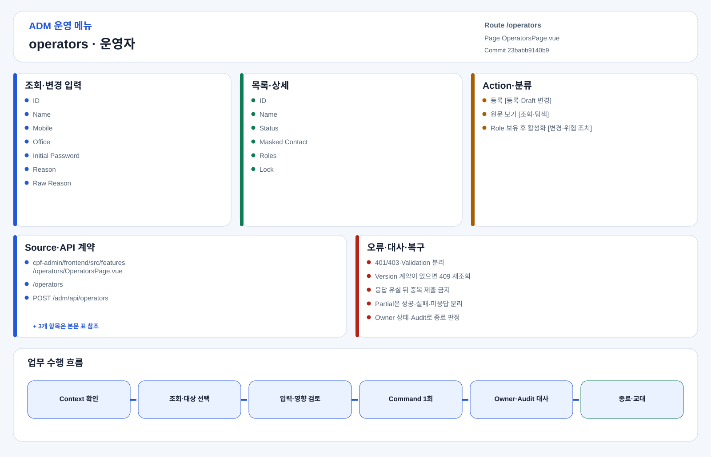

### 이 장에서 끝내는 업무

운영자 계정·Role·잠금·연락처를 관리한다.

### 메뉴 식별·책임

| 항목 | 값 |
|---|---|
| Route | `/operators` |
| 메뉴 ID | `operators` |
| Menu Code | `operators` |
| 업무 그룹 | 프레임워크 |
| Frontend Page | `cpf-admin/frontend/src/features/operators/OperatorsPage.vue` |
| Permission | `OPERATOR` Write, Raw 별도 |
| 기준 Commit | `23babb9140b90e501d6ac715e7b77f55b66198a5` |

### Source·API 근거

| 구분 | 기준 |
|---|---|
| Frontend Page | `cpf-admin/frontend/src/features/operators/OperatorsPage.vue` |
| Router | `/operators` |
| API 1 | `POST /adm/api/operators` |
| API 2 | `GET /adm/api/operators/operations/{operationId}` |
| API 3 | `PUT /adm/api/operators/{operatorId}/status` |
| API 4 | `POST /adm/api/operators/{operatorId}/contacts/raw` |

아래 표는 이 메뉴에서 실제로 확인·입력·실행할 항목을 정리한다. 화면에 없는 Field·Button·상태를 임의로 가정하지 않는다.

### 검색·입력 Field

| Field | Control | 업무 의미 | 기본값·Validation·주의 |
|---|---|---|---|
| `ID` | 문자열 입력·검색 | 조회·상세·Audit에서 같은 대상을 다시 찾기 위한 식별 조건이다. | 앞뒤 공백·허용 문자·길이와 대소문자 규칙을 확인한다. |
| `Name` | 문자열 입력·검색 | 대상의 표시명 또는 업무명을 검색·입력한다. | 앞뒤 공백·허용 문자·길이와 대소문자 규칙을 확인한다. |
| `Mobile` | 문자열 입력·검색 | 운영자 화면의 조회 조건 또는 편집 Form에 포함되는 값이며 화면 Label과 Help를 기준으로 사용한다. | 앞뒤 공백·허용 문자·길이와 대소문자 규칙을 확인한다. |
| `Office` | 문자열 입력·검색 | 운영자 화면의 조회 조건 또는 편집 Form에 포함되는 값이며 화면 Label과 Help를 기준으로 사용한다. | 앞뒤 공백·허용 문자·길이와 대소문자 규칙을 확인한다. |
| `Initial Password` | 보안 입력 | 신규 계정 등록·Password 변경 요청에만 사용하는 비밀값이며 조회 결과에는 표시하지 않는다. | 원문을 다시 표시하지 않으며 복잡도·만료·재사용 제한과 전송 구간 보호를 확인한다. |
| `Reason` | 다중행 입력 | 작업 목적·영향 범위·승인 또는 복구 기준을 기록해 Audit와 교대 기록에 연결한다. | Ticket·영향 범위·복구점을 포함하고 화면이 요구하는 최소 길이를 충족한다. |
| `Raw Reason` | 다중행 입력 | 작업 목적·영향 범위·승인 또는 복구 기준을 기록해 Audit와 교대 기록에 연결한다. | Ticket·영향 범위·복구점을 포함하고 화면이 요구하는 최소 길이를 충족한다. |

#### 입력 순서

1. **ID** 항목이 조회 Control인지 변경 Form인지 화면 위치로 구분하고, 표시된 값·필수 여부·허용 형식을 확인한다.
2. **Name** 항목이 조회 Control인지 변경 Form인지 화면 위치로 구분하고, 표시된 값·필수 여부·허용 형식을 확인한다.
3. **Mobile** 항목이 조회 Control인지 변경 Form인지 화면 위치로 구분하고, 표시된 값·필수 여부·허용 형식을 확인한다.
4. **Office** 항목이 조회 Control인지 변경 Form인지 화면 위치로 구분하고, 표시된 값·필수 여부·허용 형식을 확인한다.
5. **Initial Password**는 현재값을 조회하거나 재표시하지 않는다. 신규 등록·변경 요청에서 필요한 경우에만 새 비밀값의 형식과 취급 기준을 확인한다.
6. **Reason** 항목이 조회 Control인지 변경 Form인지 화면 위치로 구분하고, 표시된 값·필수 여부·허용 형식을 확인한다.
7. **Raw Reason** 항목이 조회 Control인지 변경 Form인지 화면 위치로 구분하고, 표시된 값·필수 여부·허용 형식을 확인한다.
8. 조회 Control과 변경 Form을 분리해 기록하고, 실행 전 Environment·Data Scope·Timezone과 제출할 값만 다시 검토한다.

### 목록 Column·상세 Field

| 표시값 | 운영 의미 | 교차 확인 |
|---|---|---|
| `ID` | 운영자의 대상 레코드를 상세·Owner·Audit에서 연결하는 식별자다. | 상세·Log·Trace·Audit에서 같은 대상을 가리키는지 확인한다. |
| `Name` | 운영자가 대상을 구분하는 표시명 또는 설명이다. | 상세·재조회 결과와 비교하고 Stale·Masking·단위 차이를 확인한다. |
| `Status` | 현재 상태와 Terminal 여부, 다음 Action 가능 여부를 판단하는 값이다. | Last Updated·Terminal 조건·Owner 상태와 함께 확인한다. |
| `Masked Contact` | 운영자 상세에서 대상의 현재 속성 또는 처리 결과를 확인하는 값이다. | 상세·재조회 결과와 비교하고 Stale·Masking·단위 차이를 확인한다. |
| `Roles` | 운영자 상세에서 대상의 현재 속성 또는 처리 결과를 확인하는 값이다. | 상세·재조회 결과와 비교하고 Stale·Masking·단위 차이를 확인한다. |
| `Lock` | 현재 상태와 Terminal 여부, 다음 Action 가능 여부를 판단하는 값이다. | Last Updated·Terminal 조건·Owner 상태와 함께 확인한다. |

#### 결과 판독 순서

1. 조회 완료 시각·Filter·Paging·Sort와 화면 Warning을 확인한다.
2. Empty·Stale·Partial을 정상 0건과 구분한다.
3. 식별자·상태·Version·오류·시각을 같은 Query Context의 상세와 Owner 원장에서 비교한다.
4. Masking된 값은 Raw Permission과 Reason 없이 복원·Export하지 않는다.
5. 집계와 상세가 다르면 집계 시간 창·Timezone·Owner Update 시각을 맞춰 대사한다.

### Button·Action

| Action | 분류 | 활성 조건 | Side Effect·정상 결과 |
|---|---|---|---|
| **등록** | 등록·Draft 변경 | 화면이 실제로 요구하는 Write Permission·필수 Field·Reason·Version 조건을 충족함 | 운영자의 재조회 결과가 요청 내용과 일치한다. Version·Before/After·Audit는 해당 Owner가 제공하는 경우 함께 확인한다. |
| **원문 보기** | 조회·탐색 | 조회 Permission과 Query Validation을 충족하고 동일 조회가 진행 중이 아님 | 원문 보기 결과의 조회 시각·Filter·Source Version·Warning이 갱신되며 Owner 데이터는 변경하지 않는다. |
| **Role 보유 후 활성화** | 변경·위험 조치 | 화면과 Owner가 요구하는 Write Permission·대상 상태·영향 범위·Reason·승인·Version 조건을 충족함 | 변경 Operation을 생성하고 Accepted 응답과 Owner Terminal 상태·Version·Audit를 분리해 확인한다. |

### 정상 업무 전체 절차

1. `/operators`에 진입해 Page Header와 Route가 **운영자** 기능을 가리키는지 확인한다.
2. 로그인 Session·Environment·Data Scope·기준일·Timezone을 고정한다.
3. 화면의 조회 Control과 변경 Form을 구분한다. 조회 조건이 제공되면 먼저 조회하고, 변경 Form은 대상 선택 또는 등록 Action 뒤에 열린 실제 Field만 사용한다.
4. Loading 종료 후 Empty·Error·Stale·Partial 상태와 화면 Warning을 먼저 판정한다.
5. **ID, Name, Status, Masked Contact, Roles**를 읽고 식별자·상태·Version·시각을 Owner 원장과 대사한다.
6. **등록** 전에 화면과 Owner가 실제로 요구하는 Permission·현재 상태·영향 범위·Reason·승인·Version 조건을 확인하고 한 번만 제출한다.
7. **등록**의 HTTP 응답과 재조회 결과를 확인한다. 비동기·다중 대상 기능은 Owner Terminal 상태·Version·대상별 Success/Failed/Unknown·Audit를 별도로 확인한다.
8. **Role 보유 후 활성화** 전에 화면과 Owner가 실제로 요구하는 Permission·현재 상태·영향 범위·Reason·승인·Version 조건을 확인하고 한 번만 제출한다.
9. **Role 보유 후 활성화**의 HTTP 응답과 재조회 결과를 확인한다. 비동기·다중 대상 기능은 Owner Terminal 상태·Version·대상별 Success/Failed/Unknown·Audit를 별도로 확인한다.
10. 화면이 제공하는 Log·Metric·Trace와, 변경·Export·승인 조치에 생성된 Audit를 교차 확인한다.
11. 이 장의 **종료 판정**과 다음 확인 시각·Evidence Link를 교대 기록에 남긴다.

### 메뉴 고유 판정·금지 사항

- **목적:** 운영자 계정·Role·잠금·연락처를 관리한다.
- **종료 판정:** 초기 Password·Raw 연락처·Operation ID·활성화 선행 Role을 확인한다.
- 응답을 받지 못한 경우 Owner 상태와 기존 Operation을 확인하기 전에 동일 Action을 반복하지 않는다.
- HTTP 성공 응답이나 Toast만으로 비동기 Owner 상태 또는 다중 대상 적용을 확정하지 않는다.
- Raw·PII·Password·Secret은 Screenshot·Clipboard·교대 기록·일반 Log에 남기지 않는다.

### 오류·경계·동시성·복구

| 상황 | 화면 징후 | 운영 조치 | 종료 증적 |
|---|---|---|---|
| 401·Session | Session 만료·CSRF·Origin 실패 | 로그인 상태와 BFF Session을 확인한다. Command 자동 Replay는 금지한다. | 401/403 응답·Session Audit |
| 403·Data Scope | 메뉴·Button·Raw·Export가 거부됨 | Menu·Button·API·Owner Permission과 Data Scope를 확인하고 우회하지 않는다. | Deny Audit·요청 Permission |
| Validation | 필수값·범위·형식·기간 오류 | Field Error만 수정하고 기존 성공 Operation을 다시 제출하지 않는다. | Error Code·Field·입력값 |
| Timeout·Dependency | 일부 Source 또는 Command 응답 지연 | Correlation/Operation ID와 실패 Stage를 기록하고 Owner 상태를 조회한다. | Dependency 상태·Retryability |
| Partial·Stale | 일부 대상만 Success 또는 조회 Source 누락 | 성공·실패·미응답을 분리하고 누락 범위와 Version을 표시한다. | Target별 결과·Version |
| 409·동시 변경 | Expected Version 불일치 | 최신 상세를 재조회하고 Diff·영향을 다시 검토한 뒤 새 요청으로 제출한다. | 현재/요청 Version·변경자 |
| 응답 유실·Unknown | 요청 후 실제 처리 여부를 알 수 없음 | Operation ID·Request Hash·Audit·Owner 상태로 대사하고 중복 제출하지 않는다. | Operation·Owner·Audit |
| 복구 실패 | Retry/Rollback 뒤에도 상태 불일치 | 자동 반복을 중단하고 Incident·Reconcile Case·다음 확인 시각을 기록한다. | Case ID·복구 Owner·기한 |

### 응답 유실·결과 불명·부분 적용 처리

1. 동일 Action을 다시 누르지 않고 Browser Network와 응답 Header를 보존한다. `operationId`·`transactionId`·`idempotencyKey`가 제공되면 기록하고, 없으면 Target ID·Actor·요청 시각·Request Body Hash로 대사한다.
2. 기능이 제공하는 상세·Operation Status(있는 경우)·Audit에서 Request Hash와 대상 Version을 검색한다.
3. Side Effect 전 실패가 확인된 경우에만 새 요청을 검토한다.
4. Success·Failed·Unknown 대상을 분리하고 Source가 제공하는 Failed-only Retry·Compensation·Rollback을 선택하고, 지원되지 않으면 수동 Reconcile Case로 이관한다.
5. Rollback을 지원하는 기능은 Owner Version·Checksum·업무 합계가 Rollback Point와 일치하는지 확인한다.
6. 확정되지 않은 대상은 `UNKNOWN_RESULT`로 유지하고 담당자·대사 기한·다음 확인 시각을 기록한다.

### Log·Metric·Trace·Audit와 교대 기록

| 증적 | 필수 값 |
|---|---|
| Audit | Actor·Permission·Reason·Approval·Target·Before/After·Result·Recovery Action |
| Log | Environment·Instance·operationId·transactionId·failureStage·errorCode |
| Metric | 동일 시간 창의 Success·Failure·Latency·Queue·Retry·Partial·Unknown |
| Trace | root/segment/attempt·Owner·DB/Kafka/외부 의존성 Span |
| 상태 원장 | Target ID·Version·Checksum·Desired/Actual·Last Updated·Terminal 여부 |

```text
Menu=operators
Route=/operators
Environment=
DataScope=
Query=
TargetId=
BeforeVersion=
Action=
Reason=
ApprovalId=
OperationId=
TransactionId=
Result=SUCCESS|FAILED|PARTIAL|UNKNOWN_RESULT
OwnerState=
FailedTargets=
ReconcileBy=
RollbackPoint=
EvidenceLinks=
NextCheckAt=
```

### 실무 Workbook

**상황:** 운영자 계정·Role·잠금·연락처를 관리한다. 담당자가 **등록**을 수행한 뒤 Browser 응답을 받지 못했다.

1. 대상 식별자와 Before Version, 입력값, Reason·Approval을 작업 기록에서 확인한다.
2. 동일 **등록**을 반복하지 않고 Operation·Audit·Owner 상태를 조회한다.
3. Owner 상태가 변경됐고 Request Hash가 같으면 응답 유실로 분류해 중복 조치를 금지한다.
4. 일부 대상만 변경됐으면 Success·Failed·Unknown을 분리해 Failed-only Retry 또는 Rollback을 선택한다.
5. 초기 Password·Raw 연락처·Operation ID·활성화 선행 Role을 확인한다.
6. Evidence Link와 다음 확인 시각을 교대 기록에 남긴다.

### 독립 수행 검수 Checklist

- [ ] `/operators`와 Page Source를 찾고 화면 목적을 설명할 수 있다.
- [ ] 7개 입력·검색 항목의 Control·기본값·Validation을 설명할 수 있다.
- [ ] 6개 표시값을 Owner 상태·Version·Audit와 대사할 수 있다.
- [ ] 3개 Action의 분류·활성 조건·Side Effect를 설명할 수 있다.
- [ ] Empty·403·409·Timeout·Partial·Unknown을 서로 다른 상태로 처리할 수 있다.
- [ ] 응답 유실 뒤 중복 제출 없이 Operation·Owner·Audit로 결과를 확정할 수 있다.
- [ ] 교대 기록만으로 다음 담당자가 Target·상태·복구 기한을 이어받을 수 있다.

## 55. password — Password·Session

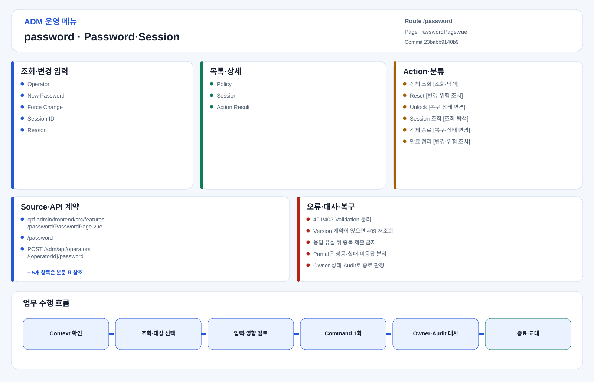

### 이 장에서 끝내는 업무

Password 정책·Reset·Unlock·Session 폐기를 관리한다.

### 메뉴 식별·책임

| 항목 | 값 |
|---|---|
| Route | `/password` |
| 메뉴 ID | `password` |
| Menu Code | `password` |
| 업무 그룹 | 프레임워크 |
| Frontend Page | `cpf-admin/frontend/src/features/password/PasswordPage.vue` |
| Permission | `PASSWORD` 또는 `OPERATOR` Write |
| 기준 Commit | `23babb9140b90e501d6ac715e7b77f55b66198a5` |

### Source·API 근거

| 구분 | 기준 |
|---|---|
| Frontend Page | `cpf-admin/frontend/src/features/password/PasswordPage.vue` |
| Router | `/password` |
| API 1 | `POST /adm/api/operators/{operatorId}/password` |
| API 2 | `POST /adm/api/operators/{operatorId}/password/reset` |
| API 3 | `POST /adm/api/operators/{operatorId}/unlock` |
| API 4 | `GET /adm/api/operators/sessions` |
| API 5 | `POST /adm/api/operators/sessions/{sessionId}/revoke` |
| API 6 | `POST /adm/api/operators/sessions/cleanup-expired` |

아래 표는 이 메뉴에서 실제로 확인·입력·실행할 항목을 정리한다. 화면에 없는 Field·Button·상태를 임의로 가정하지 않는다.

### 검색·입력 Field

| Field | Control | 업무 의미 | 기본값·Validation·주의 |
|---|---|---|---|
| `Operator` | 날짜·시간 입력 | 조회 또는 적용의 유효 시간 범위를 정하며 Timezone과 시작·종료 순서를 함께 확인한다. | Timezone을 고정하고 시작≤종료·유효기간 겹침·기준일 포함 여부를 확인한다. |
| `New Password` | 보안 입력 | 신규 계정 등록·Password 변경 요청에만 사용하는 비밀값이며 조회 결과에는 표시하지 않는다. | 원문을 다시 표시하지 않으며 복잡도·만료·재사용 제한과 전송 구간 보호를 확인한다. |
| `Force Change` | Checkbox·Switch | 현재 상태를 조회하거나 다음 Action의 허용 조건을 지정한다. | 현재 선택과 변경 후 영향 범위를 비교하고 화면의 Source 기본값을 확인한다. |
| `Session ID` | 문자열 입력·검색 | 조회·상세·Audit에서 같은 대상을 다시 찾기 위한 식별 조건이다. | 앞뒤 공백·허용 문자·길이와 대소문자 규칙을 확인한다. |
| `Reason` | 다중행 입력 | 작업 목적·영향 범위·승인 또는 복구 기준을 기록해 Audit와 교대 기록에 연결한다. | Ticket·영향 범위·복구점을 포함하고 화면이 요구하는 최소 길이를 충족한다. |

#### 입력 순서

1. **Operator** 항목이 조회 Control인지 변경 Form인지 화면 위치로 구분하고, 표시된 값·필수 여부·허용 형식을 확인한다.
2. **New Password**는 현재값을 조회하거나 재표시하지 않는다. 신규 등록·변경 요청에서 필요한 경우에만 새 비밀값의 형식과 취급 기준을 확인한다.
3. **Force Change** 항목이 조회 Control인지 변경 Form인지 화면 위치로 구분하고, 표시된 값·필수 여부·허용 형식을 확인한다.
4. **Session ID** 항목이 조회 Control인지 변경 Form인지 화면 위치로 구분하고, 표시된 값·필수 여부·허용 형식을 확인한다.
5. **Reason** 항목이 조회 Control인지 변경 Form인지 화면 위치로 구분하고, 표시된 값·필수 여부·허용 형식을 확인한다.
6. 조회 Control과 변경 Form을 분리해 기록하고, 실행 전 Environment·Data Scope·Timezone과 제출할 값만 다시 검토한다.

### 목록 Column·상세 Field

| 표시값 | 운영 의미 | 교차 확인 |
|---|---|---|
| `Policy` | Password·Session 상세에서 대상의 현재 속성 또는 처리 결과를 확인하는 값이다. | 상세·재조회 결과와 비교하고 Stale·Masking·단위 차이를 확인한다. |
| `Session` | Password·Session 상세에서 대상의 현재 속성 또는 처리 결과를 확인하는 값이다. | 상세·재조회 결과와 비교하고 Stale·Masking·단위 차이를 확인한다. |
| `Action Result` | 현재 상태와 Terminal 여부, 다음 Action 가능 여부를 판단하는 값이다. | Last Updated·Terminal 조건·Owner 상태와 함께 확인한다. |

#### 결과 판독 순서

1. 조회 완료 시각·Filter·Paging·Sort와 화면 Warning을 확인한다.
2. Empty·Stale·Partial을 정상 0건과 구분한다.
3. 식별자·상태·Version·오류·시각을 같은 Query Context의 상세와 Owner 원장에서 비교한다.
4. Masking된 값은 Raw Permission과 Reason 없이 복원·Export하지 않는다.
5. 집계와 상세가 다르면 집계 시간 창·Timezone·Owner Update 시각을 맞춰 대사한다.

### Button·Action

| Action | 분류 | 활성 조건 | Side Effect·정상 결과 |
|---|---|---|---|
| **정책 조회** | 조회·탐색 | 조회 Permission과 Query Validation을 충족하고 동일 조회가 진행 중이 아님 | 정책 조회 결과의 조회 시각·Filter·Source Version·Warning이 갱신되며 Owner 데이터는 변경하지 않는다. |
| **Reset** | 변경·위험 조치 | 화면과 Owner가 요구하는 Write Permission·대상 상태·영향 범위·Reason·승인·Version 조건을 충족함 | 변경 Operation을 생성하고 Accepted 응답과 Owner Terminal 상태·Version·Audit를 분리해 확인한다. |
| **Unlock** | 복구·상태 변경 | 화면과 Owner가 요구하는 복구 Permission·대상 상태·Reason·승인·Version 조건을 충족함 | 복구 Operation을 생성하고 Owner 상태·대상별 결과·Audit로 종료를 판정한다. |
| **Session 조회** | 조회·탐색 | 조회 Permission과 Query Validation을 충족하고 동일 조회가 진행 중이 아님 | Session 조회 결과의 조회 시각·Filter·Source Version·Warning이 갱신되며 Owner 데이터는 변경하지 않는다. |
| **강제 종료** | 복구·상태 변경 | 화면과 Owner가 요구하는 복구 Permission·대상 상태·Reason·승인·Version 조건을 충족함 | 복구 Operation을 생성하고 Owner 상태·대상별 결과·Audit로 종료를 판정한다. |
| **만료 정리** | 변경·위험 조치 | 화면과 Owner가 요구하는 Write Permission·대상 상태·영향 범위·Reason·승인·Version 조건을 충족함 | 변경 Operation을 생성하고 Accepted 응답과 Owner Terminal 상태·Version·Audit를 분리해 확인한다. |

### 정상 업무 전체 절차

1. `/password`에 진입해 Page Header와 Route가 **Password·Session** 기능을 가리키는지 확인한다.
2. 로그인 Session·Environment·Data Scope·기준일·Timezone을 고정한다.
3. 화면의 조회 Control과 변경 Form을 구분한다. 조회 조건이 제공되면 먼저 조회하고, 변경 Form은 대상 선택 또는 등록 Action 뒤에 열린 실제 Field만 사용한다.
4. Loading 종료 후 Empty·Error·Stale·Partial 상태와 화면 Warning을 먼저 판정한다.
5. **Policy, Session, Action Result**를 읽고 식별자·상태·Version·시각을 Owner 원장과 대사한다.
6. **Reset** 전에 화면과 Owner가 실제로 요구하는 Permission·현재 상태·영향 범위·Reason·승인·Version 조건을 확인하고 한 번만 제출한다.
7. **Reset**의 HTTP 응답과 재조회 결과를 확인한다. 비동기·다중 대상 기능은 Owner Terminal 상태·Version·대상별 Success/Failed/Unknown·Audit를 별도로 확인한다.
8. **Unlock** 전에 화면과 Owner가 실제로 요구하는 Permission·현재 상태·영향 범위·Reason·승인·Version 조건을 확인하고 한 번만 제출한다.
9. **Unlock**의 HTTP 응답과 재조회 결과를 확인한다. 비동기·다중 대상 기능은 Owner Terminal 상태·Version·대상별 Success/Failed/Unknown·Audit를 별도로 확인한다.
10. **강제 종료** 전에 화면과 Owner가 실제로 요구하는 Permission·현재 상태·영향 범위·Reason·승인·Version 조건을 확인하고 한 번만 제출한다.
11. **강제 종료**의 HTTP 응답과 재조회 결과를 확인한다. 비동기·다중 대상 기능은 Owner Terminal 상태·Version·대상별 Success/Failed/Unknown·Audit를 별도로 확인한다.
12. **만료 정리** 전에 화면과 Owner가 실제로 요구하는 Permission·현재 상태·영향 범위·Reason·승인·Version 조건을 확인하고 한 번만 제출한다.
13. **만료 정리**의 HTTP 응답과 재조회 결과를 확인한다. 비동기·다중 대상 기능은 Owner Terminal 상태·Version·대상별 Success/Failed/Unknown·Audit를 별도로 확인한다.
14. 화면이 제공하는 Log·Metric·Trace와, 변경·Export·승인 조치에 생성된 Audit를 교차 확인한다.
15. 이 장의 **종료 판정**과 다음 확인 시각·Evidence Link를 교대 기록에 남긴다.

### 메뉴 고유 판정·금지 사항

- **목적:** Password 정책·Reset·Unlock·Session 폐기를 관리한다.
- **종료 판정:** Reset 뒤 Force Change와 기존 Session 폐기 결과를 확인한다.
- 응답을 받지 못한 경우 Owner 상태와 기존 Operation을 확인하기 전에 동일 Action을 반복하지 않는다.
- HTTP 성공 응답이나 Toast만으로 비동기 Owner 상태 또는 다중 대상 적용을 확정하지 않는다.
- Raw·PII·Password·Secret은 Screenshot·Clipboard·교대 기록·일반 Log에 남기지 않는다.

### 오류·경계·동시성·복구

| 상황 | 화면 징후 | 운영 조치 | 종료 증적 |
|---|---|---|---|
| 401·Session | Session 만료·CSRF·Origin 실패 | 로그인 상태와 BFF Session을 확인한다. Command 자동 Replay는 금지한다. | 401/403 응답·Session Audit |
| 403·Data Scope | 메뉴·Button·Raw·Export가 거부됨 | Menu·Button·API·Owner Permission과 Data Scope를 확인하고 우회하지 않는다. | Deny Audit·요청 Permission |
| Validation | 필수값·범위·형식·기간 오류 | Field Error만 수정하고 기존 성공 Operation을 다시 제출하지 않는다. | Error Code·Field·입력값 |
| Timeout·Dependency | 일부 Source 또는 Command 응답 지연 | Correlation/Operation ID와 실패 Stage를 기록하고 Owner 상태를 조회한다. | Dependency 상태·Retryability |
| Partial·Stale | 일부 대상만 Success 또는 조회 Source 누락 | 성공·실패·미응답을 분리하고 누락 범위와 Version을 표시한다. | Target별 결과·Version |
| 409·동시 변경 | Expected Version 불일치 | 최신 상세를 재조회하고 Diff·영향을 다시 검토한 뒤 새 요청으로 제출한다. | 현재/요청 Version·변경자 |
| 응답 유실·Unknown | 요청 후 실제 처리 여부를 알 수 없음 | Operation ID·Request Hash·Audit·Owner 상태로 대사하고 중복 제출하지 않는다. | Operation·Owner·Audit |
| 복구 실패 | Retry/Rollback 뒤에도 상태 불일치 | 자동 반복을 중단하고 Incident·Reconcile Case·다음 확인 시각을 기록한다. | Case ID·복구 Owner·기한 |

### 응답 유실·결과 불명·부분 적용 처리

1. 동일 Action을 다시 누르지 않고 Browser Network와 응답 Header를 보존한다. `operationId`·`transactionId`·`idempotencyKey`가 제공되면 기록하고, 없으면 Target ID·Actor·요청 시각·Request Body Hash로 대사한다.
2. 기능이 제공하는 상세·Operation Status(있는 경우)·Audit에서 Request Hash와 대상 Version을 검색한다.
3. Side Effect 전 실패가 확인된 경우에만 새 요청을 검토한다.
4. Success·Failed·Unknown 대상을 분리하고 Source가 제공하는 Failed-only Retry·Compensation·Rollback을 선택하고, 지원되지 않으면 수동 Reconcile Case로 이관한다.
5. Rollback을 지원하는 기능은 Owner Version·Checksum·업무 합계가 Rollback Point와 일치하는지 확인한다.
6. 확정되지 않은 대상은 `UNKNOWN_RESULT`로 유지하고 담당자·대사 기한·다음 확인 시각을 기록한다.

### Log·Metric·Trace·Audit와 교대 기록

| 증적 | 필수 값 |
|---|---|
| Audit | Actor·Permission·Reason·Approval·Target·Before/After·Result·Recovery Action |
| Log | Environment·Instance·operationId·transactionId·failureStage·errorCode |
| Metric | 동일 시간 창의 Success·Failure·Latency·Queue·Retry·Partial·Unknown |
| Trace | root/segment/attempt·Owner·DB/Kafka/외부 의존성 Span |
| 상태 원장 | Target ID·Version·Checksum·Desired/Actual·Last Updated·Terminal 여부 |

```text
Menu=password
Route=/password
Environment=
DataScope=
Query=
TargetId=
BeforeVersion=
Action=
Reason=
ApprovalId=
OperationId=
TransactionId=
Result=SUCCESS|FAILED|PARTIAL|UNKNOWN_RESULT
OwnerState=
FailedTargets=
ReconcileBy=
RollbackPoint=
EvidenceLinks=
NextCheckAt=
```

### 실무 Workbook

**상황:** Password 정책·Reset·Unlock·Session 폐기를 관리한다. 담당자가 **Reset**을 수행한 뒤 Browser 응답을 받지 못했다.

1. 대상 식별자와 Before Version, 입력값, Reason·Approval을 작업 기록에서 확인한다.
2. 동일 **Reset**을 반복하지 않고 Operation·Audit·Owner 상태를 조회한다.
3. Owner 상태가 변경됐고 Request Hash가 같으면 응답 유실로 분류해 중복 조치를 금지한다.
4. 일부 대상만 변경됐으면 Success·Failed·Unknown을 분리해 Failed-only Retry 또는 Rollback을 선택한다.
5. Reset 뒤 Force Change와 기존 Session 폐기 결과를 확인한다.
6. Evidence Link와 다음 확인 시각을 교대 기록에 남긴다.

### 독립 수행 검수 Checklist

- [ ] `/password`와 Page Source를 찾고 화면 목적을 설명할 수 있다.
- [ ] 5개 입력·검색 항목의 Control·기본값·Validation을 설명할 수 있다.
- [ ] 3개 표시값을 Owner 상태·Version·Audit와 대사할 수 있다.
- [ ] 6개 Action의 분류·활성 조건·Side Effect를 설명할 수 있다.
- [ ] Empty·403·409·Timeout·Partial·Unknown을 서로 다른 상태로 처리할 수 있다.
- [ ] 응답 유실 뒤 중복 제출 없이 Operation·Owner·Audit로 결과를 확정할 수 있다.
- [ ] 교대 기록만으로 다음 담당자가 Target·상태·복구 기한을 이어받을 수 있다.

## 56. security — IP Allowlist·MFA

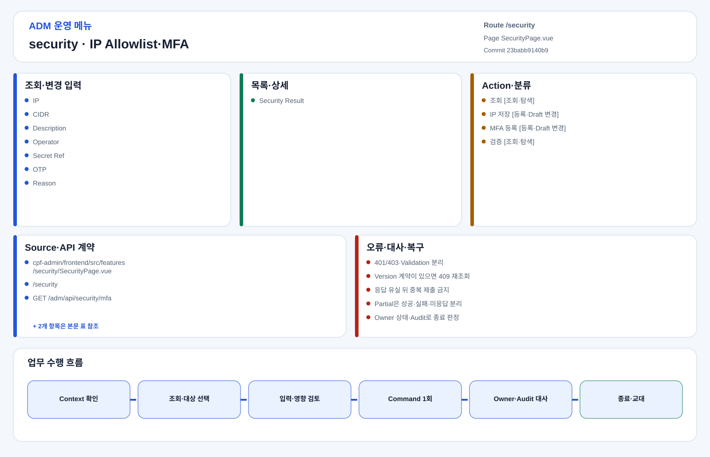

### 이 장에서 끝내는 업무

IP Allowlist·MFA 등록·검증을 관리한다.

### 메뉴 식별·책임

| 항목 | 값 |
|---|---|
| Route | `/security` |
| 메뉴 ID | `security` |
| Menu Code | `security` |
| 업무 그룹 | 프레임워크 |
| Frontend Page | `cpf-admin/frontend/src/features/security/SecurityPage.vue` |
| Permission | `SECURITY` Write |
| 기준 Commit | `23babb9140b90e501d6ac715e7b77f55b66198a5` |

### Source·API 근거

| 구분 | 기준 |
|---|---|
| Frontend Page | `cpf-admin/frontend/src/features/security/SecurityPage.vue` |
| Router | `/security` |
| API 1 | `GET /adm/api/security/mfa` |
| API 2 | `POST /adm/api/security/mfa/{operatorId}/register` |
| API 3 | `POST /adm/api/security/mfa/{operatorId}/verify` |

아래 표는 이 메뉴에서 실제로 확인·입력·실행할 항목을 정리한다. 화면에 없는 Field·Button·상태를 임의로 가정하지 않는다.

### 검색·입력 Field

| Field | Control | 업무 의미 | 기본값·Validation·주의 |
|---|---|---|---|
| `IP` | 문자열 입력·검색 | IP Allowlist·MFA 화면의 조회 조건 또는 편집 Form에 포함되는 값이며 화면 Label과 Help를 기준으로 사용한다. | 앞뒤 공백·허용 문자·길이와 대소문자 규칙을 확인한다. |
| `CIDR` | 문자열 입력·검색 | 조회·상세·Audit에서 같은 대상을 다시 찾기 위한 식별 조건이다. | 앞뒤 공백·허용 문자·길이와 대소문자 규칙을 확인한다. |
| `Description` | 다중행 입력 | 작업 목적·영향 범위·승인 또는 복구 기준을 기록해 Audit와 교대 기록에 연결한다. | 허용 Schema·길이·민감정보 포함 여부를 확인하고 Preview 또는 Validation 결과를 검토한다. |
| `Operator` | 날짜·시간 입력 | 조회 또는 적용의 유효 시간 범위를 정하며 Timezone과 시작·종료 순서를 함께 확인한다. | Timezone을 고정하고 시작≤종료·유효기간 겹침·기준일 포함 여부를 확인한다. |
| `Secret Ref` | 보안 입력 | 인증·Secret 조치에 필요한 민감 입력이며 Browser 저장·일반 Log·교대 기록에 남기지 않는다. | 원문을 다시 표시하지 않으며 복잡도·만료·재사용 제한과 전송 구간 보호를 확인한다. |
| `OTP` | 보안 입력 | 인증·Secret 조치에 필요한 민감 입력이며 Browser 저장·일반 Log·교대 기록에 남기지 않는다. | 원문을 다시 표시하지 않으며 복잡도·만료·재사용 제한과 전송 구간 보호를 확인한다. |
| `Reason` | 다중행 입력 | 작업 목적·영향 범위·승인 또는 복구 기준을 기록해 Audit와 교대 기록에 연결한다. | Ticket·영향 범위·복구점을 포함하고 화면이 요구하는 최소 길이를 충족한다. |

#### 입력 순서

1. **IP** 항목이 조회 Control인지 변경 Form인지 화면 위치로 구분하고, 표시된 값·필수 여부·허용 형식을 확인한다.
2. **CIDR** 항목이 조회 Control인지 변경 Form인지 화면 위치로 구분하고, 표시된 값·필수 여부·허용 형식을 확인한다.
3. **Description** 항목이 조회 Control인지 변경 Form인지 화면 위치로 구분하고, 표시된 값·필수 여부·허용 형식을 확인한다.
4. **Operator** 항목이 조회 Control인지 변경 Form인지 화면 위치로 구분하고, 표시된 값·필수 여부·허용 형식을 확인한다.
5. **Secret Ref**는 현재값을 조회하거나 재표시하지 않는다. 신규 등록·변경 요청에서 필요한 경우에만 새 비밀값의 형식과 취급 기준을 확인한다.
6. **OTP**는 현재값을 조회하거나 재표시하지 않는다. 신규 등록·변경 요청에서 필요한 경우에만 새 비밀값의 형식과 취급 기준을 확인한다.
7. **Reason** 항목이 조회 Control인지 변경 Form인지 화면 위치로 구분하고, 표시된 값·필수 여부·허용 형식을 확인한다.
8. 조회 Control과 변경 Form을 분리해 기록하고, 실행 전 Environment·Data Scope·Timezone과 제출할 값만 다시 검토한다.

### 목록 Column·상세 Field

| 표시값 | 운영 의미 | 교차 확인 |
|---|---|---|
| `Security Result` | 보안 정책 조회 또는 조치 결과이며 Deny·Masking·Audit를 함께 확인한다. | Last Updated·Terminal 조건·Owner 상태와 함께 확인한다. |

#### 결과 판독 순서

1. 조회 완료 시각·Filter·Paging·Sort와 화면 Warning을 확인한다.
2. Empty·Stale·Partial을 정상 0건과 구분한다.
3. 식별자·상태·Version·오류·시각을 같은 Query Context의 상세와 Owner 원장에서 비교한다.
4. Masking된 값은 Raw Permission과 Reason 없이 복원·Export하지 않는다.
5. 집계와 상세가 다르면 집계 시간 창·Timezone·Owner Update 시각을 맞춰 대사한다.

### Button·Action

| Action | 분류 | 활성 조건 | Side Effect·정상 결과 |
|---|---|---|---|
| **조회** | 조회·탐색 | 조회 Permission과 Query Validation을 충족하고 동일 조회가 진행 중이 아님 | 조회 결과의 조회 시각·Filter·Source Version·Warning이 갱신되며 Owner 데이터는 변경하지 않는다. |
| **IP 저장** | 등록·Draft 변경 | 화면이 실제로 요구하는 Write Permission·필수 Field·Reason·Version 조건을 충족함 | IP Allowlist·MFA의 재조회 결과가 요청 내용과 일치한다. Version·Before/After·Audit는 해당 Owner가 제공하는 경우 함께 확인한다. |
| **MFA 등록** | 등록·Draft 변경 | 화면이 실제로 요구하는 Write Permission·필수 Field·Reason·Version 조건을 충족함 | IP Allowlist·MFA의 재조회 결과가 요청 내용과 일치한다. Version·Before/After·Audit는 해당 Owner가 제공하는 경우 함께 확인한다. |
| **검증** | 조회·탐색 | 조회 Permission과 Query Validation을 충족하고 동일 조회가 진행 중이 아님 | 검증 결과의 조회 시각·Filter·Source Version·Warning이 갱신되며 Owner 데이터는 변경하지 않는다. |

### 정상 업무 전체 절차

1. `/security`에 진입해 Page Header와 Route가 **IP Allowlist·MFA** 기능을 가리키는지 확인한다.
2. 로그인 Session·Environment·Data Scope·기준일·Timezone을 고정한다.
3. 화면의 조회 Control과 변경 Form을 구분한다. 조회 조건이 제공되면 먼저 조회하고, 변경 Form은 대상 선택 또는 등록 Action 뒤에 열린 실제 Field만 사용한다.
4. Loading 종료 후 Empty·Error·Stale·Partial 상태와 화면 Warning을 먼저 판정한다.
5. **Security Result**를 읽고 식별자·상태·Version·시각을 Owner 원장과 대사한다.
6. **IP 저장** 전에 화면과 Owner가 실제로 요구하는 Permission·현재 상태·영향 범위·Reason·승인·Version 조건을 확인하고 한 번만 제출한다.
7. **IP 저장**의 HTTP 응답과 재조회 결과를 확인한다. 비동기·다중 대상 기능은 Owner Terminal 상태·Version·대상별 Success/Failed/Unknown·Audit를 별도로 확인한다.
8. **MFA 등록** 전에 화면과 Owner가 실제로 요구하는 Permission·현재 상태·영향 범위·Reason·승인·Version 조건을 확인하고 한 번만 제출한다.
9. **MFA 등록**의 HTTP 응답과 재조회 결과를 확인한다. 비동기·다중 대상 기능은 Owner Terminal 상태·Version·대상별 Success/Failed/Unknown·Audit를 별도로 확인한다.
10. 화면이 제공하는 Log·Metric·Trace와, 변경·Export·승인 조치에 생성된 Audit를 교차 확인한다.
11. 이 장의 **종료 판정**과 다음 확인 시각·Evidence Link를 교대 기록에 남긴다.

### 메뉴 고유 판정·금지 사항

- **목적:** IP Allowlist·MFA 등록·검증을 관리한다.
- **종료 판정:** CIDR 영향·Secret Reference·OTP 원문 비저장·BFF 401/403을 확인한다.
- 응답을 받지 못한 경우 Owner 상태와 기존 Operation을 확인하기 전에 동일 Action을 반복하지 않는다.
- HTTP 성공 응답이나 Toast만으로 비동기 Owner 상태 또는 다중 대상 적용을 확정하지 않는다.
- Raw·PII·Password·Secret은 Screenshot·Clipboard·교대 기록·일반 Log에 남기지 않는다.

### 오류·경계·동시성·복구

| 상황 | 화면 징후 | 운영 조치 | 종료 증적 |
|---|---|---|---|
| 401·Session | Session 만료·CSRF·Origin 실패 | 로그인 상태와 BFF Session을 확인한다. Command 자동 Replay는 금지한다. | 401/403 응답·Session Audit |
| 403·Data Scope | 메뉴·Button·Raw·Export가 거부됨 | Menu·Button·API·Owner Permission과 Data Scope를 확인하고 우회하지 않는다. | Deny Audit·요청 Permission |
| Validation | 필수값·범위·형식·기간 오류 | Field Error만 수정하고 기존 성공 Operation을 다시 제출하지 않는다. | Error Code·Field·입력값 |
| Timeout·Dependency | 일부 Source 또는 Command 응답 지연 | Correlation/Operation ID와 실패 Stage를 기록하고 Owner 상태를 조회한다. | Dependency 상태·Retryability |
| Partial·Stale | 일부 대상만 Success 또는 조회 Source 누락 | 성공·실패·미응답을 분리하고 누락 범위와 Version을 표시한다. | Target별 결과·Version |
| 409·동시 변경 | Expected Version 불일치 | 최신 상세를 재조회하고 Diff·영향을 다시 검토한 뒤 새 요청으로 제출한다. | 현재/요청 Version·변경자 |
| 응답 유실·Unknown | 요청 후 실제 처리 여부를 알 수 없음 | Operation ID·Request Hash·Audit·Owner 상태로 대사하고 중복 제출하지 않는다. | Operation·Owner·Audit |
| 복구 실패 | Retry/Rollback 뒤에도 상태 불일치 | 자동 반복을 중단하고 Incident·Reconcile Case·다음 확인 시각을 기록한다. | Case ID·복구 Owner·기한 |

### 응답 유실·결과 불명·부분 적용 처리

1. 동일 Action을 다시 누르지 않고 Browser Network와 응답 Header를 보존한다. `operationId`·`transactionId`·`idempotencyKey`가 제공되면 기록하고, 없으면 Target ID·Actor·요청 시각·Request Body Hash로 대사한다.
2. 기능이 제공하는 상세·Operation Status(있는 경우)·Audit에서 Request Hash와 대상 Version을 검색한다.
3. Side Effect 전 실패가 확인된 경우에만 새 요청을 검토한다.
4. Success·Failed·Unknown 대상을 분리하고 Source가 제공하는 Failed-only Retry·Compensation·Rollback을 선택하고, 지원되지 않으면 수동 Reconcile Case로 이관한다.
5. Rollback을 지원하는 기능은 Owner Version·Checksum·업무 합계가 Rollback Point와 일치하는지 확인한다.
6. 확정되지 않은 대상은 `UNKNOWN_RESULT`로 유지하고 담당자·대사 기한·다음 확인 시각을 기록한다.

### Log·Metric·Trace·Audit와 교대 기록

| 증적 | 필수 값 |
|---|---|
| Audit | Actor·Permission·Reason·Approval·Target·Before/After·Result·Recovery Action |
| Log | Environment·Instance·operationId·transactionId·failureStage·errorCode |
| Metric | 동일 시간 창의 Success·Failure·Latency·Queue·Retry·Partial·Unknown |
| Trace | root/segment/attempt·Owner·DB/Kafka/외부 의존성 Span |
| 상태 원장 | Target ID·Version·Checksum·Desired/Actual·Last Updated·Terminal 여부 |

```text
Menu=security
Route=/security
Environment=
DataScope=
Query=
TargetId=
BeforeVersion=
Action=
Reason=
ApprovalId=
OperationId=
TransactionId=
Result=SUCCESS|FAILED|PARTIAL|UNKNOWN_RESULT
OwnerState=
FailedTargets=
ReconcileBy=
RollbackPoint=
EvidenceLinks=
NextCheckAt=
```

### 실무 Workbook

**상황:** IP Allowlist·MFA 등록·검증을 관리한다. 담당자가 **IP 저장**을 수행한 뒤 Browser 응답을 받지 못했다.

1. 대상 식별자와 Before Version, 입력값, Reason·Approval을 작업 기록에서 확인한다.
2. 동일 **IP 저장**을 반복하지 않고 Operation·Audit·Owner 상태를 조회한다.
3. Owner 상태가 변경됐고 Request Hash가 같으면 응답 유실로 분류해 중복 조치를 금지한다.
4. 일부 대상만 변경됐으면 Success·Failed·Unknown을 분리해 Failed-only Retry 또는 Rollback을 선택한다.
5. CIDR 영향·Secret Reference·OTP 원문 비저장·BFF 401/403을 확인한다.
6. Evidence Link와 다음 확인 시각을 교대 기록에 남긴다.

### 독립 수행 검수 Checklist

- [ ] `/security`와 Page Source를 찾고 화면 목적을 설명할 수 있다.
- [ ] 7개 입력·검색 항목의 Control·기본값·Validation을 설명할 수 있다.
- [ ] 1개 표시값을 Owner 상태·Version·Audit와 대사할 수 있다.
- [ ] 4개 Action의 분류·활성 조건·Side Effect를 설명할 수 있다.
- [ ] Empty·403·409·Timeout·Partial·Unknown을 서로 다른 상태로 처리할 수 있다.
- [ ] 응답 유실 뒤 중복 제출 없이 Operation·Owner·Audit로 결과를 확정할 수 있다.
- [ ] 교대 기록만으로 다음 담당자가 Target·상태·복구 기한을 이어받을 수 있다.

## 57. secrets — Secret Metadata·Rotation

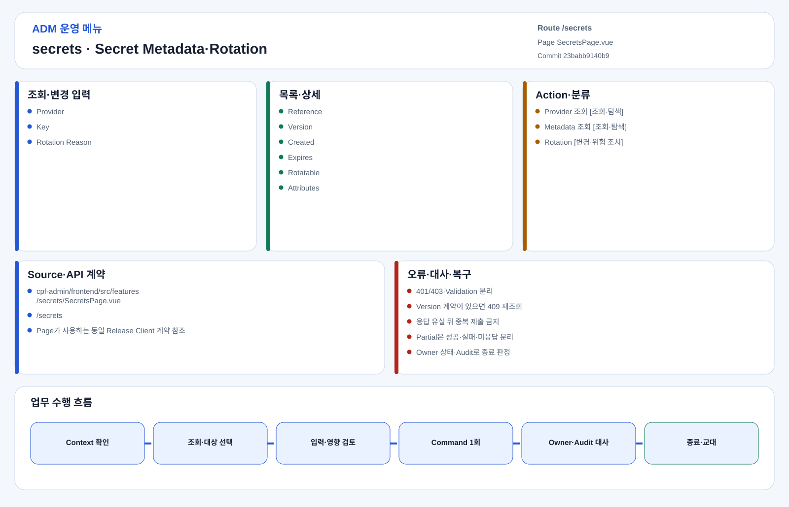

### 이 장에서 끝내는 업무

Secret Provider Metadata와 Rotation을 수행한다.

### 메뉴 식별·책임

| 항목 | 값 |
|---|---|
| Route | `/secrets` |
| 메뉴 ID | `secrets` |
| Menu Code | `secrets` |
| 업무 그룹 | 프레임워크 |
| Frontend Page | `cpf-admin/frontend/src/features/secrets/SecretsPage.vue` |
| Permission | Secret Permission |
| 기준 Commit | `23babb9140b90e501d6ac715e7b77f55b66198a5` |

### Source·API 근거

| 구분 | 기준 |
|---|---|
| Frontend Page | `cpf-admin/frontend/src/features/secrets/SecretsPage.vue` |
| Router | `/secrets` |
| API 추적 | 화면에서 제공하는 기능을 통해 호출한다. 문서에 명시되지 않은 Endpoint를 Browser나 외부 Script에서 임의 호출하지 않는다. |

아래 표는 이 메뉴에서 실제로 확인·입력·실행할 항목을 정리한다. 화면에 없는 Field·Button·상태를 임의로 가정하지 않는다.

### 검색·입력 Field

| Field | Control | 업무 의미 | 기본값·Validation·주의 |
|---|---|---|---|
| `Provider` | Select·검색 | Secret Metadata·Rotation에서 적용하거나 조회할 정책·권한·처리 유형을 선택한다. | 허용 목록과 현재 Environment·Data Scope에 맞는 값만 선택한다. |
| `Key` | 문자열 입력·검색 | 조회·상세·Audit에서 같은 대상을 다시 찾기 위한 식별 조건이다. | 앞뒤 공백·허용 문자·길이와 대소문자 규칙을 확인한다. |
| `Rotation Reason` | 다중행 입력 | 작업 목적·영향 범위·승인 또는 복구 기준을 기록해 Audit와 교대 기록에 연결한다. | Ticket·영향 범위·복구점을 포함하고 화면이 요구하는 최소 길이를 충족한다. |

#### 입력 순서

1. **Provider** 항목이 조회 Control인지 변경 Form인지 화면 위치로 구분하고, 표시된 값·필수 여부·허용 형식을 확인한다.
2. **Key** 항목이 조회 Control인지 변경 Form인지 화면 위치로 구분하고, 표시된 값·필수 여부·허용 형식을 확인한다.
3. **Rotation Reason** 항목이 조회 Control인지 변경 Form인지 화면 위치로 구분하고, 표시된 값·필수 여부·허용 형식을 확인한다.
4. 조회 Control과 변경 Form을 분리해 기록하고, 실행 전 Environment·Data Scope·Timezone과 제출할 값만 다시 검토한다.

### 목록 Column·상세 Field

| 표시값 | 운영 의미 | 교차 확인 |
|---|---|---|
| `Reference` | Secret Metadata·Rotation 상세에서 대상의 현재 속성 또는 처리 결과를 확인하는 값이다. | 상세·재조회 결과와 비교하고 Stale·Masking·단위 차이를 확인한다. |
| `Version` | 요청·Owner·Instance 사이의 Version 또는 내용 동일성을 판단하는 값이다. | 목록·상세·Owner 또는 Instance 보고값에서 일치하는지 확인한다. |
| `Created` | 상태 발생·갱신·유효 시점을 나타내며 화면 Timezone을 기준으로 해석한다. | 상세·재조회 결과와 비교하고 Stale·Masking·단위 차이를 확인한다. |
| `Expires` | Secret Metadata·Rotation 상세에서 대상의 현재 속성 또는 처리 결과를 확인하는 값이다. | 상세·재조회 결과와 비교하고 Stale·Masking·단위 차이를 확인한다. |
| `Rotatable` | Secret Metadata·Rotation 상세에서 대상의 현재 속성 또는 처리 결과를 확인하는 값이다. | 상세·재조회 결과와 비교하고 Stale·Masking·단위 차이를 확인한다. |
| `Attributes` | Secret Metadata·Rotation 상세에서 대상의 현재 속성 또는 처리 결과를 확인하는 값이다. | 상세·재조회 결과와 비교하고 Stale·Masking·단위 차이를 확인한다. |

#### 결과 판독 순서

1. 조회 완료 시각·Filter·Paging·Sort와 화면 Warning을 확인한다.
2. Empty·Stale·Partial을 정상 0건과 구분한다.
3. 식별자·상태·Version·오류·시각을 같은 Query Context의 상세와 Owner 원장에서 비교한다.
4. Masking된 값은 Raw Permission과 Reason 없이 복원·Export하지 않는다.
5. 집계와 상세가 다르면 집계 시간 창·Timezone·Owner Update 시각을 맞춰 대사한다.

### Button·Action

| Action | 분류 | 활성 조건 | Side Effect·정상 결과 |
|---|---|---|---|
| **Provider 조회** | 조회·탐색 | 조회 Permission과 Query Validation을 충족하고 동일 조회가 진행 중이 아님 | Provider 조회 결과의 조회 시각·Filter·Source Version·Warning이 갱신되며 Owner 데이터는 변경하지 않는다. |
| **Metadata 조회** | 조회·탐색 | 조회 Permission과 Query Validation을 충족하고 동일 조회가 진행 중이 아님 | Metadata 조회 결과의 조회 시각·Filter·Source Version·Warning이 갱신되며 Owner 데이터는 변경하지 않는다. |
| **Rotation** | 변경·위험 조치 | 화면과 Owner가 요구하는 Write Permission·대상 상태·영향 범위·Reason·승인·Version 조건을 충족함 | 변경 Operation을 생성하고 Accepted 응답과 Owner Terminal 상태·Version·Audit를 분리해 확인한다. |

### 정상 업무 전체 절차

1. `/secrets`에 진입해 Page Header와 Route가 **Secret Metadata·Rotation** 기능을 가리키는지 확인한다.
2. 로그인 Session·Environment·Data Scope·기준일·Timezone을 고정한다.
3. 화면의 조회 Control과 변경 Form을 구분한다. 조회 조건이 제공되면 먼저 조회하고, 변경 Form은 대상 선택 또는 등록 Action 뒤에 열린 실제 Field만 사용한다.
4. Loading 종료 후 Empty·Error·Stale·Partial 상태와 화면 Warning을 먼저 판정한다.
5. **Reference, Version, Created, Expires, Rotatable**를 읽고 식별자·상태·Version·시각을 Owner 원장과 대사한다.
6. **Rotation** 전에 화면과 Owner가 실제로 요구하는 Permission·현재 상태·영향 범위·Reason·승인·Version 조건을 확인하고 한 번만 제출한다.
7. **Rotation**의 HTTP 응답과 재조회 결과를 확인한다. 비동기·다중 대상 기능은 Owner Terminal 상태·Version·대상별 Success/Failed/Unknown·Audit를 별도로 확인한다.
8. 화면이 제공하는 Log·Metric·Trace와, 변경·Export·승인 조치에 생성된 Audit를 교차 확인한다.
9. 이 장의 **종료 판정**과 다음 확인 시각·Evidence Link를 교대 기록에 남긴다.

### 메뉴 고유 판정·금지 사항

- **목적:** Secret Provider Metadata와 Rotation을 수행한다.
- **종료 판정:** Rotatable 조건·새 Version·Consumer Reload·이전 Version Rollback을 확인한다.
- 응답을 받지 못한 경우 Owner 상태와 기존 Operation을 확인하기 전에 동일 Action을 반복하지 않는다.
- HTTP 성공 응답이나 Toast만으로 비동기 Owner 상태 또는 다중 대상 적용을 확정하지 않는다.

### 오류·경계·동시성·복구

| 상황 | 화면 징후 | 운영 조치 | 종료 증적 |
|---|---|---|---|
| 401·Session | Session 만료·CSRF·Origin 실패 | 로그인 상태와 BFF Session을 확인한다. Command 자동 Replay는 금지한다. | 401/403 응답·Session Audit |
| 403·Data Scope | 메뉴·Button·Raw·Export가 거부됨 | Menu·Button·API·Owner Permission과 Data Scope를 확인하고 우회하지 않는다. | Deny Audit·요청 Permission |
| Validation | 필수값·범위·형식·기간 오류 | Field Error만 수정하고 기존 성공 Operation을 다시 제출하지 않는다. | Error Code·Field·입력값 |
| Timeout·Dependency | 일부 Source 또는 Command 응답 지연 | Correlation/Operation ID와 실패 Stage를 기록하고 Owner 상태를 조회한다. | Dependency 상태·Retryability |
| Partial·Stale | 일부 대상만 Success 또는 조회 Source 누락 | 성공·실패·미응답을 분리하고 누락 범위와 Version을 표시한다. | Target별 결과·Version |
| 409·동시 변경 | Expected Version 불일치 | 최신 상세를 재조회하고 Diff·영향을 다시 검토한 뒤 새 요청으로 제출한다. | 현재/요청 Version·변경자 |
| 응답 유실·Unknown | 요청 후 실제 처리 여부를 알 수 없음 | Operation ID·Request Hash·Audit·Owner 상태로 대사하고 중복 제출하지 않는다. | Operation·Owner·Audit |
| 복구 실패 | Retry/Rollback 뒤에도 상태 불일치 | 자동 반복을 중단하고 Incident·Reconcile Case·다음 확인 시각을 기록한다. | Case ID·복구 Owner·기한 |

### 응답 유실·결과 불명·부분 적용 처리

1. 동일 Action을 다시 누르지 않고 Browser Network와 응답 Header를 보존한다. `operationId`·`transactionId`·`idempotencyKey`가 제공되면 기록하고, 없으면 Target ID·Actor·요청 시각·Request Body Hash로 대사한다.
2. 기능이 제공하는 상세·Operation Status(있는 경우)·Audit에서 Request Hash와 대상 Version을 검색한다.
3. Side Effect 전 실패가 확인된 경우에만 새 요청을 검토한다.
4. Success·Failed·Unknown 대상을 분리하고 Source가 제공하는 Failed-only Retry·Compensation·Rollback을 선택하고, 지원되지 않으면 수동 Reconcile Case로 이관한다.
5. Rollback을 지원하는 기능은 Owner Version·Checksum·업무 합계가 Rollback Point와 일치하는지 확인한다.
6. 확정되지 않은 대상은 `UNKNOWN_RESULT`로 유지하고 담당자·대사 기한·다음 확인 시각을 기록한다.

### Log·Metric·Trace·Audit와 교대 기록

| 증적 | 필수 값 |
|---|---|
| Audit | Actor·Permission·Reason·Approval·Target·Before/After·Result·Recovery Action |
| Log | Environment·Instance·operationId·transactionId·failureStage·errorCode |
| Metric | 동일 시간 창의 Success·Failure·Latency·Queue·Retry·Partial·Unknown |
| Trace | root/segment/attempt·Owner·DB/Kafka/외부 의존성 Span |
| 상태 원장 | Target ID·Version·Checksum·Desired/Actual·Last Updated·Terminal 여부 |

```text
Menu=secrets
Route=/secrets
Environment=
DataScope=
Query=
TargetId=
BeforeVersion=
Action=
Reason=
ApprovalId=
OperationId=
TransactionId=
Result=SUCCESS|FAILED|PARTIAL|UNKNOWN_RESULT
OwnerState=
FailedTargets=
ReconcileBy=
RollbackPoint=
EvidenceLinks=
NextCheckAt=
```

### 실무 Workbook

**상황:** Secret Provider Metadata와 Rotation을 수행한다. 담당자가 **Rotation**을 수행한 뒤 Browser 응답을 받지 못했다.

1. 대상 식별자와 Before Version, 입력값, Reason·Approval을 작업 기록에서 확인한다.
2. 동일 **Rotation**을 반복하지 않고 Operation·Audit·Owner 상태를 조회한다.
3. Owner 상태가 변경됐고 Request Hash가 같으면 응답 유실로 분류해 중복 조치를 금지한다.
4. 일부 대상만 변경됐으면 Success·Failed·Unknown을 분리해 Failed-only Retry 또는 Rollback을 선택한다.
5. Rotatable 조건·새 Version·Consumer Reload·이전 Version Rollback을 확인한다.
6. Evidence Link와 다음 확인 시각을 교대 기록에 남긴다.

### 독립 수행 검수 Checklist

- [ ] `/secrets`와 Page Source를 찾고 화면 목적을 설명할 수 있다.
- [ ] 3개 입력·검색 항목의 Control·기본값·Validation을 설명할 수 있다.
- [ ] 6개 표시값을 Owner 상태·Version·Audit와 대사할 수 있다.
- [ ] 3개 Action의 분류·활성 조건·Side Effect를 설명할 수 있다.
- [ ] Empty·403·409·Timeout·Partial·Unknown을 서로 다른 상태로 처리할 수 있다.
- [ ] 응답 유실 뒤 중복 제출 없이 Operation·Owner·Audit로 결과를 확정할 수 있다.
- [ ] 교대 기록만으로 다음 담당자가 Target·상태·복구 기한을 이어받을 수 있다.

## 58. approvals — 위험조치 승인

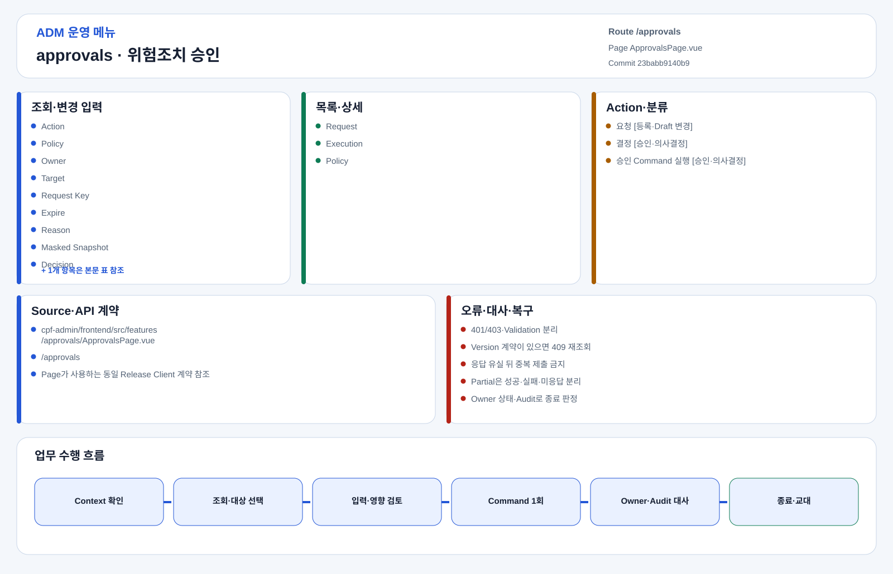

### 이 장에서 끝내는 업무

위험 조치 승인 요청·결정·Command 실행을 연결한다.

### 메뉴 식별·책임

| 항목 | 값 |
|---|---|
| Route | `/approvals` |
| 메뉴 ID | `approvals` |
| Menu Code | `approvals` |
| 업무 그룹 | 프레임워크 |
| Frontend Page | `cpf-admin/frontend/src/features/approvals/ApprovalsPage.vue` |
| Permission | Approval Role |
| 기준 Commit | `23babb9140b90e501d6ac715e7b77f55b66198a5` |

### Source·API 근거

| 구분 | 기준 |
|---|---|
| Frontend Page | `cpf-admin/frontend/src/features/approvals/ApprovalsPage.vue` |
| Router | `/approvals` |
| API 추적 | 화면에서 제공하는 기능을 통해 호출한다. 문서에 명시되지 않은 Endpoint를 Browser나 외부 Script에서 임의 호출하지 않는다. |

아래 표는 이 메뉴에서 실제로 확인·입력·실행할 항목을 정리한다. 화면에 없는 Field·Button·상태를 임의로 가정하지 않는다.

### 검색·입력 Field

| Field | Control | 업무 의미 | 기본값·Validation·주의 |
|---|---|---|---|
| `Action` | Select·검색 | 위험조치 승인에서 적용하거나 조회할 정책·권한·처리 유형을 선택한다. | 허용 목록과 현재 Environment·Data Scope에 맞는 값만 선택한다. |
| `Policy` | Select·검색 | 위험조치 승인에서 적용하거나 조회할 정책·권한·처리 유형을 선택한다. | 허용 목록과 현재 Environment·Data Scope에 맞는 값만 선택한다. |
| `Owner` | 문자열 입력·검색 | 위험조치 승인 화면의 조회 조건 또는 편집 Form에 포함되는 값이며 화면 Label과 Help를 기준으로 사용한다. | 앞뒤 공백·허용 문자·길이와 대소문자 규칙을 확인한다. |
| `Target` | 문자열 입력·검색 | 위험조치 승인 화면의 조회 조건 또는 편집 Form에 포함되는 값이며 화면 Label과 Help를 기준으로 사용한다. | 앞뒤 공백·허용 문자·길이와 대소문자 규칙을 확인한다. |
| `Request Key` | 문자열 입력·검색 | 조회·상세·Audit에서 같은 대상을 다시 찾기 위한 식별 조건이다. | 앞뒤 공백·허용 문자·길이와 대소문자 규칙을 확인한다. |
| `Expire` | 날짜·시간 입력 | 조회 또는 적용의 유효 시간 범위를 정하며 Timezone과 시작·종료 순서를 함께 확인한다. | Timezone을 고정하고 시작≤종료·유효기간 겹침·기준일 포함 여부를 확인한다. |
| `Reason` | 다중행 입력 | 작업 목적·영향 범위·승인 또는 복구 기준을 기록해 Audit와 교대 기록에 연결한다. | Ticket·영향 범위·복구점을 포함하고 화면이 요구하는 최소 길이를 충족한다. |
| `Masked Snapshot` | 문자열 입력·검색 | 위험조치 승인 화면의 조회 조건 또는 편집 Form에 포함되는 값이며 화면 Label과 Help를 기준으로 사용한다. | 앞뒤 공백·허용 문자·길이와 대소문자 규칙을 확인한다. |
| `Decision` | 문자열 입력·검색 | 위험조치 승인 화면의 조회 조건 또는 편집 Form에 포함되는 값이며 화면 Label과 Help를 기준으로 사용한다. | 앞뒤 공백·허용 문자·길이와 대소문자 규칙을 확인한다. |
| `Idempotency` | 문자열 입력·검색 | 조회·상세·Audit에서 같은 대상을 다시 찾기 위한 식별 조건이다. | 앞뒤 공백·허용 문자·길이와 대소문자 규칙을 확인한다. |

#### 입력 순서

1. **Action** 항목이 조회 Control인지 변경 Form인지 화면 위치로 구분하고, 표시된 값·필수 여부·허용 형식을 확인한다.
2. **Policy** 항목이 조회 Control인지 변경 Form인지 화면 위치로 구분하고, 표시된 값·필수 여부·허용 형식을 확인한다.
3. **Owner** 항목이 조회 Control인지 변경 Form인지 화면 위치로 구분하고, 표시된 값·필수 여부·허용 형식을 확인한다.
4. **Target** 항목이 조회 Control인지 변경 Form인지 화면 위치로 구분하고, 표시된 값·필수 여부·허용 형식을 확인한다.
5. **Request Key** 항목이 조회 Control인지 변경 Form인지 화면 위치로 구분하고, 표시된 값·필수 여부·허용 형식을 확인한다.
6. **Expire** 항목이 조회 Control인지 변경 Form인지 화면 위치로 구분하고, 표시된 값·필수 여부·허용 형식을 확인한다.
7. **Reason** 항목이 조회 Control인지 변경 Form인지 화면 위치로 구분하고, 표시된 값·필수 여부·허용 형식을 확인한다.
8. **Masked Snapshot** 항목이 조회 Control인지 변경 Form인지 화면 위치로 구분하고, 표시된 값·필수 여부·허용 형식을 확인한다.
9. **Decision** 항목이 조회 Control인지 변경 Form인지 화면 위치로 구분하고, 표시된 값·필수 여부·허용 형식을 확인한다.
10. **Idempotency** 항목이 조회 Control인지 변경 Form인지 화면 위치로 구분하고, 표시된 값·필수 여부·허용 형식을 확인한다.
11. 조회 Control과 변경 Form을 분리해 기록하고, 실행 전 Environment·Data Scope·Timezone과 제출할 값만 다시 검토한다.

### 목록 Column·상세 Field

| 표시값 | 운영 의미 | 교차 확인 |
|---|---|---|
| `Request` | 위험조치 승인 상세에서 대상의 현재 속성 또는 처리 결과를 확인하는 값이다. | 상세·재조회 결과와 비교하고 Stale·Masking·단위 차이를 확인한다. |
| `Execution` | 위험조치 승인의 대상 레코드를 상세·Owner·Audit에서 연결하는 식별자다. | 상세·Log·Trace·Audit에서 같은 대상을 가리키는지 확인한다. |
| `Policy` | 위험조치 승인 상세에서 대상의 현재 속성 또는 처리 결과를 확인하는 값이다. | 상세·재조회 결과와 비교하고 Stale·Masking·단위 차이를 확인한다. |

#### 결과 판독 순서

1. 조회 완료 시각·Filter·Paging·Sort와 화면 Warning을 확인한다.
2. Empty·Stale·Partial을 정상 0건과 구분한다.
3. 식별자·상태·Version·오류·시각을 같은 Query Context의 상세와 Owner 원장에서 비교한다.
4. Masking된 값은 Raw Permission과 Reason 없이 복원·Export하지 않는다.
5. 집계와 상세가 다르면 집계 시간 창·Timezone·Owner Update 시각을 맞춰 대사한다.

### Button·Action

| Action | 분류 | 활성 조건 | Side Effect·정상 결과 |
|---|---|---|---|
| **요청** | 등록·Draft 변경 | 화면이 실제로 요구하는 Write Permission·필수 Field·Reason·Version 조건을 충족함 | 위험조치 승인의 재조회 결과가 요청 내용과 일치한다. Version·Before/After·Audit는 해당 Owner가 제공하는 경우 함께 확인한다. |
| **결정** | 승인·의사결정 | 화면에 표시된 승인 권한·현재 Step·Snapshot·중복 결정 방지 조건을 충족함 | 승인 Snapshot과 Decision Audit가 기록되고 현재 Step·Terminal 상태가 갱신된다. |
| **승인 Command 실행** | 승인·의사결정 | 화면에 표시된 승인 권한·현재 Step·Snapshot·중복 결정 방지 조건을 충족함 | 승인 Snapshot과 Decision Audit가 기록되고 현재 Step·Terminal 상태가 갱신된다. |

### 정상 업무 전체 절차

1. `/approvals`에 진입해 Page Header와 Route가 **위험조치 승인** 기능을 가리키는지 확인한다.
2. 로그인 Session·Environment·Data Scope·기준일·Timezone을 고정한다.
3. 화면의 조회 Control과 변경 Form을 구분한다. 조회 조건이 제공되면 먼저 조회하고, 변경 Form은 대상 선택 또는 등록 Action 뒤에 열린 실제 Field만 사용한다.
4. Loading 종료 후 Empty·Error·Stale·Partial 상태와 화면 Warning을 먼저 판정한다.
5. **Request, Execution, Policy**를 읽고 식별자·상태·Version·시각을 Owner 원장과 대사한다.
6. **요청** 전에 화면과 Owner가 실제로 요구하는 Permission·현재 상태·영향 범위·Reason·승인·Version 조건을 확인하고 한 번만 제출한다.
7. **요청**의 HTTP 응답과 재조회 결과를 확인한다. 비동기·다중 대상 기능은 Owner Terminal 상태·Version·대상별 Success/Failed/Unknown·Audit를 별도로 확인한다.
8. **결정** 전에 화면과 Owner가 실제로 요구하는 Permission·현재 상태·영향 범위·Reason·승인·Version 조건을 확인하고 한 번만 제출한다.
9. **결정**의 HTTP 응답과 재조회 결과를 확인한다. 비동기·다중 대상 기능은 Owner Terminal 상태·Version·대상별 Success/Failed/Unknown·Audit를 별도로 확인한다.
10. **승인 Command 실행** 전에 화면과 Owner가 실제로 요구하는 Permission·현재 상태·영향 범위·Reason·승인·Version 조건을 확인하고 한 번만 제출한다.
11. **승인 Command 실행**의 HTTP 응답과 재조회 결과를 확인한다. 비동기·다중 대상 기능은 Owner Terminal 상태·Version·대상별 Success/Failed/Unknown·Audit를 별도로 확인한다.
12. 화면이 제공하는 Log·Metric·Trace와, 변경·Export·승인 조치에 생성된 Audit를 교차 확인한다.
13. 이 장의 **종료 판정**과 다음 확인 시각·Evidence Link를 교대 기록에 남긴다.

### 메뉴 고유 판정·금지 사항

- **목적:** 위험 조치 승인 요청·결정·Command 실행을 연결한다.
- **종료 판정:** 요청자·승인자 분리, Snapshot, 만료, Idempotency, Unknown 복구를 확인한다.
- 응답을 받지 못한 경우 Owner 상태와 기존 Operation을 확인하기 전에 동일 Action을 반복하지 않는다.
- HTTP 성공 응답이나 Toast만으로 비동기 Owner 상태 또는 다중 대상 적용을 확정하지 않는다.

### 오류·경계·동시성·복구

| 상황 | 화면 징후 | 운영 조치 | 종료 증적 |
|---|---|---|---|
| 401·Session | Session 만료·CSRF·Origin 실패 | 로그인 상태와 BFF Session을 확인한다. Command 자동 Replay는 금지한다. | 401/403 응답·Session Audit |
| 403·Data Scope | 메뉴·Button·Raw·Export가 거부됨 | Menu·Button·API·Owner Permission과 Data Scope를 확인하고 우회하지 않는다. | Deny Audit·요청 Permission |
| Validation | 필수값·범위·형식·기간 오류 | Field Error만 수정하고 기존 성공 Operation을 다시 제출하지 않는다. | Error Code·Field·입력값 |
| Timeout·Dependency | 일부 Source 또는 Command 응답 지연 | Correlation/Operation ID와 실패 Stage를 기록하고 Owner 상태를 조회한다. | Dependency 상태·Retryability |
| Partial·Stale | 일부 대상만 Success 또는 조회 Source 누락 | 성공·실패·미응답을 분리하고 누락 범위와 Version을 표시한다. | Target별 결과·Version |
| 409·동시 변경 | Expected Version 불일치 | 최신 상세를 재조회하고 Diff·영향을 다시 검토한 뒤 새 요청으로 제출한다. | 현재/요청 Version·변경자 |
| 응답 유실·Unknown | 요청 후 실제 처리 여부를 알 수 없음 | Operation ID·Request Hash·Audit·Owner 상태로 대사하고 중복 제출하지 않는다. | Operation·Owner·Audit |
| 복구 실패 | Retry/Rollback 뒤에도 상태 불일치 | 자동 반복을 중단하고 Incident·Reconcile Case·다음 확인 시각을 기록한다. | Case ID·복구 Owner·기한 |

### 응답 유실·결과 불명·부분 적용 처리

1. 동일 Action을 다시 누르지 않고 Browser Network와 응답 Header를 보존한다. `operationId`·`transactionId`·`idempotencyKey`가 제공되면 기록하고, 없으면 Target ID·Actor·요청 시각·Request Body Hash로 대사한다.
2. 기능이 제공하는 상세·Operation Status(있는 경우)·Audit에서 Request Hash와 대상 Version을 검색한다.
3. Side Effect 전 실패가 확인된 경우에만 새 요청을 검토한다.
4. Success·Failed·Unknown 대상을 분리하고 Source가 제공하는 Failed-only Retry·Compensation·Rollback을 선택하고, 지원되지 않으면 수동 Reconcile Case로 이관한다.
5. Rollback을 지원하는 기능은 Owner Version·Checksum·업무 합계가 Rollback Point와 일치하는지 확인한다.
6. 확정되지 않은 대상은 `UNKNOWN_RESULT`로 유지하고 담당자·대사 기한·다음 확인 시각을 기록한다.

### Log·Metric·Trace·Audit와 교대 기록

| 증적 | 필수 값 |
|---|---|
| Audit | Actor·Permission·Reason·Approval·Target·Before/After·Result·Recovery Action |
| Log | Environment·Instance·operationId·transactionId·failureStage·errorCode |
| Metric | 동일 시간 창의 Success·Failure·Latency·Queue·Retry·Partial·Unknown |
| Trace | root/segment/attempt·Owner·DB/Kafka/외부 의존성 Span |
| 상태 원장 | Target ID·Version·Checksum·Desired/Actual·Last Updated·Terminal 여부 |

```text
Menu=approvals
Route=/approvals
Environment=
DataScope=
Query=
TargetId=
BeforeVersion=
Action=
Reason=
ApprovalId=
OperationId=
TransactionId=
Result=SUCCESS|FAILED|PARTIAL|UNKNOWN_RESULT
OwnerState=
FailedTargets=
ReconcileBy=
RollbackPoint=
EvidenceLinks=
NextCheckAt=
```

### 실무 Workbook

**상황:** 위험 조치 승인 요청·결정·Command 실행을 연결한다. 담당자가 **요청**을 수행한 뒤 Browser 응답을 받지 못했다.

1. 대상 식별자와 Before Version, 입력값, Reason·Approval을 작업 기록에서 확인한다.
2. 동일 **요청**을 반복하지 않고 Operation·Audit·Owner 상태를 조회한다.
3. Owner 상태가 변경됐고 Request Hash가 같으면 응답 유실로 분류해 중복 조치를 금지한다.
4. 일부 대상만 변경됐으면 Success·Failed·Unknown을 분리해 Failed-only Retry 또는 Rollback을 선택한다.
5. 요청자·승인자 분리, Snapshot, 만료, Idempotency, Unknown 복구를 확인한다.
6. Evidence Link와 다음 확인 시각을 교대 기록에 남긴다.

### 독립 수행 검수 Checklist

- [ ] `/approvals`와 Page Source를 찾고 화면 목적을 설명할 수 있다.
- [ ] 10개 입력·검색 항목의 Control·기본값·Validation을 설명할 수 있다.
- [ ] 3개 표시값을 Owner 상태·Version·Audit와 대사할 수 있다.
- [ ] 3개 Action의 분류·활성 조건·Side Effect를 설명할 수 있다.
- [ ] Empty·403·409·Timeout·Partial·Unknown을 서로 다른 상태로 처리할 수 있다.
- [ ] 응답 유실 뒤 중복 제출 없이 Operation·Owner·Audit로 결과를 확정할 수 있다.
- [ ] 교대 기록만으로 다음 담당자가 Target·상태·복구 기한을 이어받을 수 있다.

## 59. breakGlass — 비상 권한

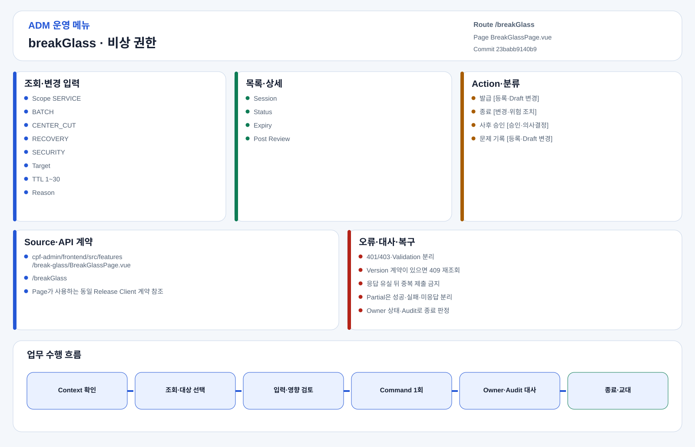

### 이 장에서 끝내는 업무

시간 제한 비상 권한을 발급·종료·사후 검토한다.

### 메뉴 식별·책임

| 항목 | 값 |
|---|---|
| Route | `/breakGlass` |
| 메뉴 ID | `breakGlass` |
| Menu Code | `breakGlass` |
| 업무 그룹 | 프레임워크 |
| Frontend Page | `cpf-admin/frontend/src/features/break-glass/BreakGlassPage.vue` |
| Permission | Break-glass Permission |
| 기준 Commit | `23babb9140b90e501d6ac715e7b77f55b66198a5` |

### Source·API 근거

| 구분 | 기준 |
|---|---|
| Frontend Page | `cpf-admin/frontend/src/features/break-glass/BreakGlassPage.vue` |
| Router | `/breakGlass` |
| API 추적 | 화면에서 제공하는 기능을 통해 호출한다. 문서에 명시되지 않은 Endpoint를 Browser나 외부 Script에서 임의 호출하지 않는다. |

아래 표는 이 메뉴에서 실제로 확인·입력·실행할 항목을 정리한다. 화면에 없는 Field·Button·상태를 임의로 가정하지 않는다.

### 검색·입력 Field

| Field | Control | 업무 의미 | 기본값·Validation·주의 |
|---|---|---|---|
| `Scope SERVICE` | Select·검색 | 비상 권한 조회·조치가 적용되는 환경과 데이터 경계를 제한한다. | 허용 목록과 현재 Environment·Data Scope에 맞는 값만 선택한다. |
| `BATCH` | 문자열 입력·검색 | 비상 권한 화면의 조회 조건 또는 편집 Form에 포함되는 값이며 화면 Label과 Help를 기준으로 사용한다. | 앞뒤 공백·허용 문자·길이와 대소문자 규칙을 확인한다. |
| `CENTER_CUT` | 문자열 입력·검색 | 비상 권한 화면의 조회 조건 또는 편집 Form에 포함되는 값이며 화면 Label과 Help를 기준으로 사용한다. | 앞뒤 공백·허용 문자·길이와 대소문자 규칙을 확인한다. |
| `RECOVERY` | 문자열 입력·검색 | 비상 권한 화면의 조회 조건 또는 편집 Form에 포함되는 값이며 화면 Label과 Help를 기준으로 사용한다. | 앞뒤 공백·허용 문자·길이와 대소문자 규칙을 확인한다. |
| `SECURITY` | 문자열 입력·검색 | 비상 권한 화면의 조회 조건 또는 편집 Form에 포함되는 값이며 화면 Label과 Help를 기준으로 사용한다. | 앞뒤 공백·허용 문자·길이와 대소문자 규칙을 확인한다. |
| `Target` | 문자열 입력·검색 | 비상 권한 화면의 조회 조건 또는 편집 Form에 포함되는 값이며 화면 Label과 Help를 기준으로 사용한다. | 앞뒤 공백·허용 문자·길이와 대소문자 규칙을 확인한다. |
| `TTL 1~30` | 숫자·Version 입력 | 실행 한도·순서·용량 또는 재시도 범위를 지정한다. | 화면의 min·max·단위와 0 허용 여부를 확인하고 음수·Overflow를 차단한다. |
| `Reason` | 다중행 입력 | 작업 목적·영향 범위·승인 또는 복구 기준을 기록해 Audit와 교대 기록에 연결한다. | Ticket·영향 범위·복구점을 포함하고 화면이 요구하는 최소 길이를 충족한다. |

#### 입력 순서

1. **Scope SERVICE** 항목이 조회 Control인지 변경 Form인지 화면 위치로 구분하고, 표시된 값·필수 여부·허용 형식을 확인한다.
2. **BATCH** 항목이 조회 Control인지 변경 Form인지 화면 위치로 구분하고, 표시된 값·필수 여부·허용 형식을 확인한다.
3. **CENTER_CUT** 항목이 조회 Control인지 변경 Form인지 화면 위치로 구분하고, 표시된 값·필수 여부·허용 형식을 확인한다.
4. **RECOVERY** 항목이 조회 Control인지 변경 Form인지 화면 위치로 구분하고, 표시된 값·필수 여부·허용 형식을 확인한다.
5. **SECURITY** 항목이 조회 Control인지 변경 Form인지 화면 위치로 구분하고, 표시된 값·필수 여부·허용 형식을 확인한다.
6. **Target** 항목이 조회 Control인지 변경 Form인지 화면 위치로 구분하고, 표시된 값·필수 여부·허용 형식을 확인한다.
7. **TTL 1~30** 항목이 조회 Control인지 변경 Form인지 화면 위치로 구분하고, 표시된 값·필수 여부·허용 형식을 확인한다.
8. **Reason** 항목이 조회 Control인지 변경 Form인지 화면 위치로 구분하고, 표시된 값·필수 여부·허용 형식을 확인한다.
9. 조회 Control과 변경 Form을 분리해 기록하고, 실행 전 Environment·Data Scope·Timezone과 제출할 값만 다시 검토한다.

### 목록 Column·상세 Field

| 표시값 | 운영 의미 | 교차 확인 |
|---|---|---|
| `Session` | 비상 권한 상세에서 대상의 현재 속성 또는 처리 결과를 확인하는 값이다. | 상세·재조회 결과와 비교하고 Stale·Masking·단위 차이를 확인한다. |
| `Status` | 현재 상태와 Terminal 여부, 다음 Action 가능 여부를 판단하는 값이다. | Last Updated·Terminal 조건·Owner 상태와 함께 확인한다. |
| `Expiry` | 상태 발생·갱신·유효 시점을 나타내며 화면 Timezone을 기준으로 해석한다. | 상세·재조회 결과와 비교하고 Stale·Masking·단위 차이를 확인한다. |
| `Post Review` | 비상 권한 상세에서 대상의 현재 속성 또는 처리 결과를 확인하는 값이다. | 상세·재조회 결과와 비교하고 Stale·Masking·단위 차이를 확인한다. |

#### 결과 판독 순서

1. 조회 완료 시각·Filter·Paging·Sort와 화면 Warning을 확인한다.
2. Empty·Stale·Partial을 정상 0건과 구분한다.
3. 식별자·상태·Version·오류·시각을 같은 Query Context의 상세와 Owner 원장에서 비교한다.
4. Masking된 값은 Raw Permission과 Reason 없이 복원·Export하지 않는다.
5. 집계와 상세가 다르면 집계 시간 창·Timezone·Owner Update 시각을 맞춰 대사한다.

### Button·Action

| Action | 분류 | 활성 조건 | Side Effect·정상 결과 |
|---|---|---|---|
| **발급** | 등록·Draft 변경 | 화면이 실제로 요구하는 Write Permission·필수 Field·Reason·Version 조건을 충족함 | 비상 권한의 재조회 결과가 요청 내용과 일치한다. Version·Before/After·Audit는 해당 Owner가 제공하는 경우 함께 확인한다. |
| **종료** | 변경·위험 조치 | 화면과 Owner가 요구하는 Write Permission·대상 상태·영향 범위·Reason·승인·Version 조건을 충족함 | 변경 Operation을 생성하고 Accepted 응답과 Owner Terminal 상태·Version·Audit를 분리해 확인한다. |
| **사후 승인** | 승인·의사결정 | 화면에 표시된 승인 권한·현재 Step·Snapshot·중복 결정 방지 조건을 충족함 | 승인 Snapshot과 Decision Audit가 기록되고 현재 Step·Terminal 상태가 갱신된다. |
| **문제 기록** | 등록·Draft 변경 | 화면이 실제로 요구하는 Write Permission·필수 Field·Reason·Version 조건을 충족함 | 비상 권한의 재조회 결과가 요청 내용과 일치한다. Version·Before/After·Audit는 해당 Owner가 제공하는 경우 함께 확인한다. |

### 정상 업무 전체 절차

1. `/breakGlass`에 진입해 Page Header와 Route가 **비상 권한** 기능을 가리키는지 확인한다.
2. 로그인 Session·Environment·Data Scope·기준일·Timezone을 고정한다.
3. 화면의 조회 Control과 변경 Form을 구분한다. 조회 조건이 제공되면 먼저 조회하고, 변경 Form은 대상 선택 또는 등록 Action 뒤에 열린 실제 Field만 사용한다.
4. Loading 종료 후 Empty·Error·Stale·Partial 상태와 화면 Warning을 먼저 판정한다.
5. **Session, Status, Expiry, Post Review**를 읽고 식별자·상태·Version·시각을 Owner 원장과 대사한다.
6. **발급** 전에 화면과 Owner가 실제로 요구하는 Permission·현재 상태·영향 범위·Reason·승인·Version 조건을 확인하고 한 번만 제출한다.
7. **발급**의 HTTP 응답과 재조회 결과를 확인한다. 비동기·다중 대상 기능은 Owner Terminal 상태·Version·대상별 Success/Failed/Unknown·Audit를 별도로 확인한다.
8. **종료** 전에 화면과 Owner가 실제로 요구하는 Permission·현재 상태·영향 범위·Reason·승인·Version 조건을 확인하고 한 번만 제출한다.
9. **종료**의 HTTP 응답과 재조회 결과를 확인한다. 비동기·다중 대상 기능은 Owner Terminal 상태·Version·대상별 Success/Failed/Unknown·Audit를 별도로 확인한다.
10. **사후 승인** 전에 화면과 Owner가 실제로 요구하는 Permission·현재 상태·영향 범위·Reason·승인·Version 조건을 확인하고 한 번만 제출한다.
11. **사후 승인**의 HTTP 응답과 재조회 결과를 확인한다. 비동기·다중 대상 기능은 Owner Terminal 상태·Version·대상별 Success/Failed/Unknown·Audit를 별도로 확인한다.
12. **문제 기록** 전에 화면과 Owner가 실제로 요구하는 Permission·현재 상태·영향 범위·Reason·승인·Version 조건을 확인하고 한 번만 제출한다.
13. **문제 기록**의 HTTP 응답과 재조회 결과를 확인한다. 비동기·다중 대상 기능은 Owner Terminal 상태·Version·대상별 Success/Failed/Unknown·Audit를 별도로 확인한다.
14. 화면이 제공하는 Log·Metric·Trace와, 변경·Export·승인 조치에 생성된 Audit를 교차 확인한다.
15. 이 장의 **종료 판정**과 다음 확인 시각·Evidence Link를 교대 기록에 남긴다.

### 메뉴 고유 판정·금지 사항

- **목적:** 시간 제한 비상 권한을 발급·종료·사후 검토한다.
- **종료 판정:** Scope·Target·TTL·Owner 소비·종료·사후 승인/문제 기록을 확인한다.
- 응답을 받지 못한 경우 Owner 상태와 기존 Operation을 확인하기 전에 동일 Action을 반복하지 않는다.
- HTTP 성공 응답이나 Toast만으로 비동기 Owner 상태 또는 다중 대상 적용을 확정하지 않는다.

### 오류·경계·동시성·복구

| 상황 | 화면 징후 | 운영 조치 | 종료 증적 |
|---|---|---|---|
| 401·Session | Session 만료·CSRF·Origin 실패 | 로그인 상태와 BFF Session을 확인한다. Command 자동 Replay는 금지한다. | 401/403 응답·Session Audit |
| 403·Data Scope | 메뉴·Button·Raw·Export가 거부됨 | Menu·Button·API·Owner Permission과 Data Scope를 확인하고 우회하지 않는다. | Deny Audit·요청 Permission |
| Validation | 필수값·범위·형식·기간 오류 | Field Error만 수정하고 기존 성공 Operation을 다시 제출하지 않는다. | Error Code·Field·입력값 |
| Timeout·Dependency | 일부 Source 또는 Command 응답 지연 | Correlation/Operation ID와 실패 Stage를 기록하고 Owner 상태를 조회한다. | Dependency 상태·Retryability |
| Partial·Stale | 일부 대상만 Success 또는 조회 Source 누락 | 성공·실패·미응답을 분리하고 누락 범위와 Version을 표시한다. | Target별 결과·Version |
| 409·동시 변경 | Expected Version 불일치 | 최신 상세를 재조회하고 Diff·영향을 다시 검토한 뒤 새 요청으로 제출한다. | 현재/요청 Version·변경자 |
| 응답 유실·Unknown | 요청 후 실제 처리 여부를 알 수 없음 | Operation ID·Request Hash·Audit·Owner 상태로 대사하고 중복 제출하지 않는다. | Operation·Owner·Audit |
| 복구 실패 | Retry/Rollback 뒤에도 상태 불일치 | 자동 반복을 중단하고 Incident·Reconcile Case·다음 확인 시각을 기록한다. | Case ID·복구 Owner·기한 |

### 응답 유실·결과 불명·부분 적용 처리

1. 동일 Action을 다시 누르지 않고 Browser Network와 응답 Header를 보존한다. `operationId`·`transactionId`·`idempotencyKey`가 제공되면 기록하고, 없으면 Target ID·Actor·요청 시각·Request Body Hash로 대사한다.
2. 기능이 제공하는 상세·Operation Status(있는 경우)·Audit에서 Request Hash와 대상 Version을 검색한다.
3. Side Effect 전 실패가 확인된 경우에만 새 요청을 검토한다.
4. Success·Failed·Unknown 대상을 분리하고 Source가 제공하는 Failed-only Retry·Compensation·Rollback을 선택하고, 지원되지 않으면 수동 Reconcile Case로 이관한다.
5. Rollback을 지원하는 기능은 Owner Version·Checksum·업무 합계가 Rollback Point와 일치하는지 확인한다.
6. 확정되지 않은 대상은 `UNKNOWN_RESULT`로 유지하고 담당자·대사 기한·다음 확인 시각을 기록한다.

### Log·Metric·Trace·Audit와 교대 기록

| 증적 | 필수 값 |
|---|---|
| Audit | Actor·Permission·Reason·Approval·Target·Before/After·Result·Recovery Action |
| Log | Environment·Instance·operationId·transactionId·failureStage·errorCode |
| Metric | 동일 시간 창의 Success·Failure·Latency·Queue·Retry·Partial·Unknown |
| Trace | root/segment/attempt·Owner·DB/Kafka/외부 의존성 Span |
| 상태 원장 | Target ID·Version·Checksum·Desired/Actual·Last Updated·Terminal 여부 |

```text
Menu=breakGlass
Route=/breakGlass
Environment=
DataScope=
Query=
TargetId=
BeforeVersion=
Action=
Reason=
ApprovalId=
OperationId=
TransactionId=
Result=SUCCESS|FAILED|PARTIAL|UNKNOWN_RESULT
OwnerState=
FailedTargets=
ReconcileBy=
RollbackPoint=
EvidenceLinks=
NextCheckAt=
```

### 실무 Workbook

**상황:** 시간 제한 비상 권한을 발급·종료·사후 검토한다. 담당자가 **발급**을 수행한 뒤 Browser 응답을 받지 못했다.

1. 대상 식별자와 Before Version, 입력값, Reason·Approval을 작업 기록에서 확인한다.
2. 동일 **발급**을 반복하지 않고 Operation·Audit·Owner 상태를 조회한다.
3. Owner 상태가 변경됐고 Request Hash가 같으면 응답 유실로 분류해 중복 조치를 금지한다.
4. 일부 대상만 변경됐으면 Success·Failed·Unknown을 분리해 Failed-only Retry 또는 Rollback을 선택한다.
5. Scope·Target·TTL·Owner 소비·종료·사후 승인/문제 기록을 확인한다.
6. Evidence Link와 다음 확인 시각을 교대 기록에 남긴다.

### 독립 수행 검수 Checklist

- [ ] `/breakGlass`와 Page Source를 찾고 화면 목적을 설명할 수 있다.
- [ ] 8개 입력·검색 항목의 Control·기본값·Validation을 설명할 수 있다.
- [ ] 4개 표시값을 Owner 상태·Version·Audit와 대사할 수 있다.
- [ ] 4개 Action의 분류·활성 조건·Side Effect를 설명할 수 있다.
- [ ] Empty·403·409·Timeout·Partial·Unknown을 서로 다른 상태로 처리할 수 있다.
- [ ] 응답 유실 뒤 중복 제출 없이 Operation·Owner·Audit로 결과를 확정할 수 있다.
- [ ] 교대 기록만으로 다음 담당자가 Target·상태·복구 기한을 이어받을 수 있다.
