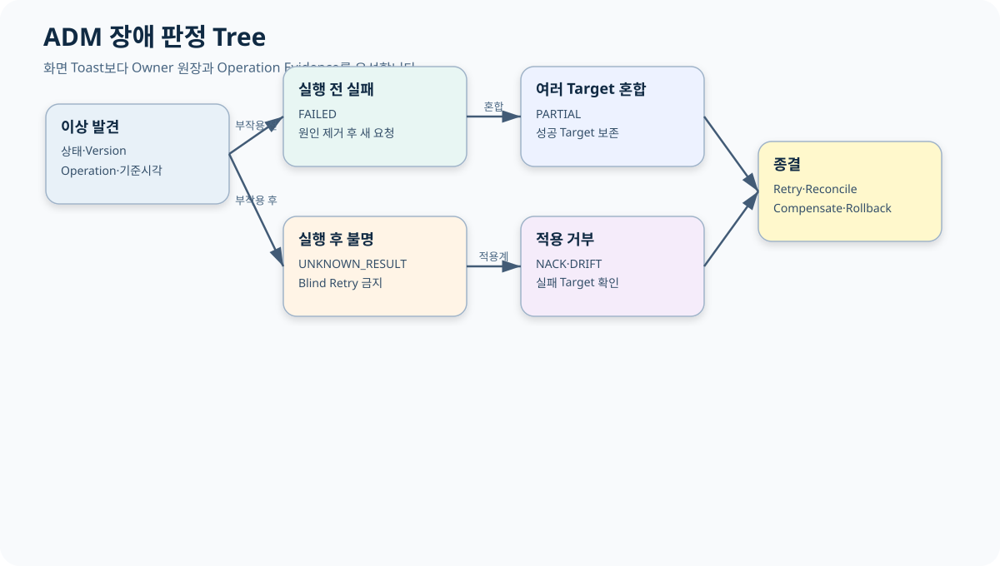

# CPF ADM 운영자 매뉴얼

> 기준 Repository: `https://github.com/freeangelsun/202412_01_CPF`
> 기준 Branch: `master`
> 기준 Commit: `a8be27a34bdac0b7c075e06d6e86571244c96421` (`06_08`)
> 기준일: `2026-08-06 Asia/Seoul`

| 항목 | 내용 |
|---|---|
| 주 독자 | 조회자·운영자·승인자·보안담당자·운영관리자, 시스템 운영을 처음 맡는 담당자 |
| 이 문서로 완료할 일 | ADM 화면에서 상태를 읽고 권한에 맞게 조치하며 UNKNOWN_RESULT·PARTIAL·NACK·DRIFT를 대사·복구한다. |
| 읽는 방식 | 처음 접하는 독자는 앞에서부터 실습 순서로 읽고, 숙련자는 장별 판단표와 참조 경로를 사용한다. |
| 설명 원칙 | 제품 기능은 사용할 수 있는 상태로 설명한다. 실제 Source·SQL·API·Config·Frontend·Script·Test의 이름과 경계를 유지한다. |




## 1. 운영자가 먼저 알아야 할 원칙

1. 화면 Toast는 업무 상태 정본이 아니다.
2. 목록 Row는 상세를 다시 조회하기 전까지 오래된 정보일 수 있다.
3. 조회와 상태 변경 권한은 다르다.
4. 상태 변경은 Reason·Expected Version·Idempotency·Approval을 확인한다.
5. Timeout 뒤 같은 Button을 다시 누르기 전에 Operation을 조회한다.
6. `PARTIAL`은 성공 Target을 보존한다.
7. `UNKNOWN_RESULT`는 Target·Owner 원장을 대사한다.
8. Download와 원문 조회는 별도 Permission·Reason·Audit를 사용한다.

## 2. 역할과 금지 행동

| 역할 | 할 수 있는 일 | 하지 말아야 할 일 |
|---|---|---|
| 조회자 | 검색·상세·Masked Field 확인 | 상태 변경·원문 Download |
| 운영자 | 허용된 Command 요청·복구 실행 | 자기 승인·Owner DB 직접 수정 |
| 승인자 | Snapshot·Reason·Policy 검토 | 요청 Payload 수정·결과 추정 |
| 보안담당자 | Permission·MFA·Secret·Break-glass | Secret 평문 조회·감사 삭제 |
| 운영관리자 | Incident·SLA·교대·정책 | 미대사 Unknown 강제 종결 |

## 3. 공통 화면 읽는 순서

1. 상단의 환경·기준시각·Feature Flag를 확인한다.
2. 검색 범위를 필요한 최소 기간·조직·서비스로 제한한다.
3. 목록에서 상태·Version·Owner·Updated At를 읽는다.
4. 상세에서 Transaction·Operation·Attempt·Target·Error·Audit를 연결한다.
5. 변경 전 Target Snapshot과 Permission을 확인한다.
6. 실행 후 같은 조건으로 재조회한다.
7. Owner 원장과 Audit가 일치할 때 종결한다.

## 4. 상태별 행동

| 상태 | 판정 | 운영 행동 |
|---|---|---|
| `REQUESTED` | 요청 수락, 실행 전 | 중복 요청 금지 |
| `RUNNING` | 진행 Evidence 존재 | Heartbeat·Deadline 확인 |
| `SUCCEEDED` | 결과 확정 | 재실행 금지 |
| `FAILED` | 결정적 실패 | 원인 제거 후 새 Operation |
| `UNKNOWN_RESULT` | 결과 Evidence 부족 | Target·Owner 대사, Blind Retry 금지 |
| `PARTIAL` | Target 결과 혼합 | 성공 Target 보존 |
| `NACK` | Target이 적용 거부 | 실패 Target Error 확인 |
| `DRIFT` | Desired와 Observed 불일치 | Reconcile 또는 LKG Rollback |

## 5. 교대 인계 최소 항목

- 환경·기준시각.
- Incident·Operation·Target ID.
- 현재 상태와 마지막 Evidence.
- 실행한 조치와 Reason·Approval.
- 성공 Target과 미종결 Target.
- 다음 판정 시각과 담당자.
- Rollback Point와 금지할 반복 조치.

## 6. Route 전체 지도

| No | Route | Menu | 화면 | Group | Risk |
|---|---|---|---|---|---|
| 1 | / | DASHBOARD | 통합 운영 Dashboard | home | MEDIUM |
| 2 | /topology | TOPOLOGY | 서비스 토폴로지 | home | MEDIUM |
| 3 | /capacity | CAPACITY | Online Runtime Diagnostics | home | MEDIUM |
| 4 | /logs | LOG_LIST | 거래 로그 | monitoring | MEDIUM |
| 5 | /transactionGroups | LOG_LIST | Online·Batch 통합 Trace | online | MEDIUM |
| 6 | /transactions | TRANSACTION_META | 온라인 거래 정의 | online | HIGH |
| 7 | /remoteLogs | REMOTE_LOG | 원격 로그 | monitoring | MEDIUM |
| 8 | /auditLogs | AUDIT_LOG | 감사 로그 | monitoring | MEDIUM |
| 9 | /logLevel | DYNAMIC_LOG | 동적 로그 | monitoring | HIGH |
| 10 | /logPolicies | LOG_POLICY | 로그 정책 | monitoring | MEDIUM |
| 11 | /standardExecutions | STANDARD_EXECUTION | 표준 실행 | online | MEDIUM |
| 12 | /channelPolicy | CHANNEL_POLICY | 채널 정책 | online | HIGH |
| 13 | /serviceRegistry | SERVICE_REGISTRY | 서비스 레지스트리 | online | MEDIUM |
| 14 | /runtimeControl | RUNTIME_CONTROL | Deployment·Promotion·Rollback | online | HIGH |
| 15 | /maintenance | MAINTENANCE | 점검·Drain | framework | HIGH |
| 16 | /cache | CACHE | 캐시 | framework | HIGH |
| 17 | /configs | CONFIG | 설정 | framework | HIGH |
| 18 | /responseCodes | RESPONSE_CODE | 응답코드 | framework | MEDIUM |
| 19 | /businessCalendar | BUSINESS_CALENDAR | 영업일 · 휴일 | framework | MEDIUM |
| 20 | /recoveryCenter | RECOVERY_CENTER | 복구 센터 | monitoring | MEDIUM |
| 21 | /incidents | INCIDENT | Error·Unknown Result | monitoring | HIGH |
| 22 | /reliability | RELIABILITY | Analysis Center | monitoring | MEDIUM |
| 23 | /notifications | NOTIFICATION | 알림 | integration | MEDIUM |
| 24 | /batch | BATCH | Batch / Center-Cut | batch | MEDIUM |
| 25 | /batch-overview | BATCH_OVERVIEW | Batch Overview | batch | MEDIUM |
| 26 | /batch-runtime | BATCH_RUNTIME | Runtime Topology | batch | HIGH |
| 27 | /batch-instances | BATCH_INSTANCES | Runtime Instances | batch | MEDIUM |
| 28 | /batch-scheduler | BATCH_SCHEDULER | Scheduler HA | batch | MEDIUM |
| 29 | /batch-worker-pools | BATCH_WORKER_POOLS | Worker Pools | batch | MEDIUM |
| 30 | /batch-center-cut | BATCH_CENTER_CUT | Center-Cut | batch | MEDIUM |
| 31 | /batch-agents | BATCH_AGENTS | Host Agents | batch | MEDIUM |
| 32 | /batch-job-packs | BATCH_JOB_PACKS | Job Packs | batch | MEDIUM |
| 33 | /batch-executions | BATCH_EXECUTIONS | Executions | batch | MEDIUM |
| 34 | /batch-deployment | BATCH_DEPLOYMENT | Deployment / Rollback | batch | HIGH |
| 35 | /batch-recovery | BATCH_RECOVERY | Recovery / Unknown | monitoring | MEDIUM |
| 36 | /batch-leases | BATCH_LEASES | Lease / Fencing | monitoring | MEDIUM |
| 37 | /batch-alerts | BATCH_ALERTS | Batch Alerts | monitoring | MEDIUM |
| 38 | /batch-audit | BATCH_AUDIT | Audit / Evidence | monitoring | MEDIUM |
| 39 | /workers | WORKER | Agent / Worker | batch | MEDIUM |
| 40 | /downloads | DOWNLOAD | 다운로드 | integration | MEDIUM |
| 41 | /file-jobs | FILE_JOB | 대량파일 Job | batch | MEDIUM |
| 42 | /messages | MESSAGE | 전문·Protocol Message | integration | MEDIUM |
| 43 | /codes | CODE | 코드 | framework | MEDIUM |
| 44 | /gateway-dashboard | GATEWAY_DASHBOARD | Gateway 대시보드 | online | MEDIUM |
| 45 | /gateway-servers | GATEWAY_SERVERS | Gateway 연동 서버 | online | MEDIUM |
| 46 | /gateway-groups | GATEWAY_GROUPS | Gateway 서버 그룹 | online | MEDIUM |
| 47 | /gateway-routes | GATEWAY_ROUTES | Gateway 경로·라우팅 | online | MEDIUM |
| 48 | /gateway-security | GATEWAY_SECURITY | Gateway 보안·제한 | online | HIGH |
| 49 | /gateway-health | GATEWAY_HEALTH | Gateway Health·연결시험 | online | MEDIUM |
| 50 | /gateway-transactions | GATEWAY_TRANSACTIONS | Gateway 거래 조회 | online | MEDIUM |
| 51 | /gateway-log-policies | GATEWAY_LOG_POLICY | Gateway 로그 정책 | online | MEDIUM |
| 52 | /gateway-apply-status | GATEWAY_APPLY_STATUS | Gateway 적용 상태·이력 | online | MEDIUM |
| 53 | /permissions | PERMISSION | 권한 | framework | MEDIUM |
| 54 | /password | PASSWORD | 비밀번호 | framework | HIGH |
| 55 | /security | SECURITY | 보안 | framework | HIGH |
| 56 | /operators | OPERATOR | 운영자 | framework | HIGH |
| 57 | /secrets | SECRET | Secret / Key | framework | HIGH |
| 58 | /approvals | APPROVAL | 위험조치 승인 | framework | HIGH |
| 59 | /breakGlass | BREAK_GLASS | Break-glass | framework | HIGH |
| 60 | /featureFlags | FEATURE_FLAG | Feature Flag | framework | CRITICAL |
| 61 | /integrationClosure | INTEGRATION_CLOSURE | 통합 운영 정정 승인 | integration | CRITICAL |
| 62 | /openApiOperations | OPENAPI_OPERATIONS | OpenAPI 운영 | framework | HIGH |
| 63 | /resiliencePolicies | RESILIENCE_POLICY | Resilience 정책 | framework | CRITICAL |


## 7. 화면별 운영 카드

각 카드는 화면에서 완료할 일과 오류 시 다음 행동을 먼저 보여 준다. 전체 Operation ID는 `cpf-admin/frontend/src/app/routes.ts`의 `expectedOperationIds`와 OpenAPI Runtime Inventory를 따른다.

### 7.1. 통합 운영 Dashboard — `/` {#dashboard}

| 항목 | 내용 |
|---|---|
| Route ID | `dashboard` |
| Menu ID | `DASHBOARD` |
| Group·Risk | `home` · `MEDIUM` |
| 이 화면으로 완료하는 일 | 서비스·Batch·Broker의 이상을 첫 화면에서 분류 |
| 기본 검색 | 환경, 서비스, 기간, 심각도 |
| 핵심 표시값 | Readiness, Liveness, Version, UNKNOWN, DLQ, Outbox 적체 |
| 주요 조치 | 이상 카드 이동 |
| 정상 판정 | 집계 기준시각과 상세 화면 건수가 일치 |
| 대표 장애 | 오래된 Snapshot·일부 Owner Timeout |
| 복구 기준 | 기준시각을 맞춰 재조회하고 Owner Health 확인 |


### 7.2. 서비스 토폴로지 — `/topology` {#topology}

| 항목 | 내용 |
|---|---|
| Route ID | `topology` |
| Menu ID | `TOPOLOGY` |
| Group·Risk | `home` · `MEDIUM` |
| 이 화면으로 완료하는 일 | Service·Instance·Endpoint와 Health 관계 확인 |
| 기본 검색 | 환경, Service ID, Zone |
| 핵심 표시값 | Instance, Version, Endpoint, Health, Last Seen |
| 주요 조치 | 상세 이동 |
| 정상 판정 | Registry와 Runtime Heartbeat가 일치 |
| 대표 장애 | Ghost Instance·중복 Endpoint |
| 복구 기준 | Last Seen과 Runtime 원장을 대사해 비활성화 |


### 7.3. Online Runtime Diagnostics — `/capacity` {#capacity}

| 항목 | 내용 |
|---|---|
| Route ID | `capacity` |
| Menu ID | `CAPACITY` |
| Group·Risk | `home` · `MEDIUM` |
| 이 화면으로 완료하는 일 | Thread·Connection·Queue·Lag의 병목 식별 |
| 기본 검색 | 서비스, Instance, 기간 |
| 핵심 표시값 | Pool 사용률, Queue, Outbox, Inbox, File 전송 |
| 주요 조치 | 진단 상세 |
| 정상 판정 | 관측값과 Health·업무 지연이 같은 시각대 |
| 대표 장애 | Metric 누락·고카디널리티 |
| 복구 기준 | Collector와 Instance 상태를 확인해 범위를 좁힘 |


### 7.4. 거래 로그 — `/logs` {#logs}

| 항목 | 내용 |
|---|---|
| Route ID | `logs` |
| Menu ID | `LOG_LIST` |
| Group·Risk | `monitoring` · `MEDIUM` |
| 이 화면으로 완료하는 일 | Transaction과 Error 로그 조회·Export |
| 기본 검색 | Transaction ID, Trace ID, 기간, Level |
| 핵심 표시값 | 시각, Service, Operation, Error Code, Masking |
| 주요 조치 | 상세, Export 요청 |
| 정상 판정 | 검색 조건과 Download Audit가 연결 |
| 대표 장애 | 원문 노출·Export 만료 |
| 복구 기준 | Masking 권한과 Download Token을 재확인 |


### 7.5. Online·Batch 통합 Trace — `/transactionGroups` {#transactionGroups}

| 항목 | 내용 |
|---|---|
| Route ID | `transactionGroups` |
| Menu ID | `LOG_LIST` |
| Group·Risk | `online` · `MEDIUM` |
| 이 화면으로 완료하는 일 | 온라인·Batch·외부 Attempt Timeline 연결 |
| 기본 검색 | Transaction ID, Trace ID, Business ID |
| 핵심 표시값 | Segment, Attempt, Target, Duration, Status |
| 주요 조치 | Timeline 상세 |
| 정상 판정 | 동일 식별자로 모든 Segment가 연결 |
| 대표 장애 | Trace 단절·Clock 차이 |
| 복구 기준 | Header·UTC·업무시각을 대사해 단절 지점 확인 |


### 7.6. 온라인 거래 정의 — `/transactions` {#transactions}

| 항목 | 내용 |
|---|---|
| Route ID | `transactions` |
| Menu ID | `TRANSACTION_META` |
| Group·Risk | `online` · `HIGH` |
| 이 화면으로 완료하는 일 | 거래 정의와 상태·정책을 조회·변경 |
| 기본 검색 | 거래 Code, 상태, Owner |
| 핵심 표시값 | Code, Version, Timeout, Idempotency, 상태 |
| 주요 조치 | Scan, 비활성화 |
| 정상 판정 | 정의 Version과 Runtime 적용 상태 일치 |
| 대표 장애 | 사용 중 비활성·Version 충돌 |
| 복구 기준 | Consumer 영향 확인 뒤 새 Version으로 변경 |


### 7.7. 원격 로그 — `/remoteLogs` {#remoteLogs}

| 항목 | 내용 |
|---|---|
| Route ID | `remoteLogs` |
| Menu ID | `REMOTE_LOG` |
| Group·Risk | `monitoring` · `MEDIUM` |
| 이 화면으로 완료하는 일 | 원격 Instance 로그 Preview와 Support Bundle |
| 기본 검색 | 서비스, Instance, 기간, Pattern |
| 핵심 표시값 | 파일, Size, Modified, Masking 상태 |
| 주요 조치 | Preview, Bundle 생성, Download |
| 정상 판정 | Bundle Manifest와 Hash·Masking Report 존재 |
| 대표 장애 | 파일 읽기 실패·Size 초과 |
| 복구 기준 | 범위를 축소하고 실패 파일을 Manifest에 기록 |


### 7.8. 감사 로그 — `/auditLogs` {#auditLogs}

| 항목 | 내용 |
|---|---|
| Route ID | `auditLogs` |
| Menu ID | `AUDIT_LOG` |
| Group·Risk | `monitoring` · `MEDIUM` |
| 이 화면으로 완료하는 일 | Actor·Reason·Before/After·Delivery 확인 |
| 기본 검색 | Actor, Resource, Operation, 기간 |
| 핵심 표시값 | Audit ID, Action, Result, Delivery |
| 주요 조치 | 상세, Delivery Retry |
| 정상 판정 | 업무 Operation과 Audit가 같은 식별자 |
| 대표 장애 | Delivery 실패·Hash 불일치 |
| 복구 기준 | 원본 Audit 보존 후 Delivery만 재시도 |


### 7.9. 동적 로그 — `/logLevel` {#logLevel}

| 항목 | 내용 |
|---|---|
| Route ID | `logLevel` |
| Menu ID | `DYNAMIC_LOG` |
| Group·Risk | `monitoring` · `HIGH` |
| 이 화면으로 완료하는 일 | 기간이 제한된 Log Level 규칙 운영 |
| 기본 검색 | 서비스, Logger, Level, 만료 |
| 핵심 표시값 | Rule, 대상, Level, 시작·만료, 상태 |
| 주요 조치 | 등록, 제거 |
| 정상 판정 | 만료 후 원래 Level로 복귀 |
| 대표 장애 | 광범위 DEBUG·만료 누락 |
| 복구 기준 | 해당 규칙을 제거하고 Log Volume 확인 |


### 7.10. 로그 정책 — `/logPolicies` {#logPolicies}

| 항목 | 내용 |
|---|---|
| Route ID | `logPolicies` |
| Menu ID | `LOG_POLICY` |
| Group·Risk | `monitoring` · `MEDIUM` |
| 이 화면으로 완료하는 일 | 수집·Masking·보존·Trace Boost 정책 운영 |
| 기본 검색 | 정책 Code, 상태, 대상 |
| 핵심 표시값 | Version, Masking, Retention, 배포 상태 |
| 주요 조치 | 생성, 수정, 비활성, Refresh |
| 정상 판정 | Target별 Applied Version 일치 |
| 대표 장애 | 부분 배포·Cache stale |
| 복구 기준 | Distribution Status에서 실패 Target만 Refresh |


### 7.11. 표준 실행 — `/standardExecutions` {#standardExecutions}

| 항목 | 내용 |
|---|---|
| Route ID | `standardExecutions` |
| Menu ID | `STANDARD_EXECUTION` |
| Group·Risk | `online` · `MEDIUM` |
| 이 화면으로 완료하는 일 | 표준 Transaction 실행 결과 조회 |
| 기본 검색 | Execution ID, 거래 Code, 기간 |
| 핵심 표시값 | 상태, 시작·종료, Error, Operation |
| 주요 조치 | 상세 |
| 정상 판정 | 요청·응답·Audit 식별자 일치 |
| 대표 장애 | 결과 누락·Timeout |
| 복구 기준 | Transaction Group과 Owner 원장 대사 |


### 7.12. 채널 정책 — `/channelPolicy` {#channelPolicy}

| 항목 | 내용 |
|---|---|
| Route ID | `channelPolicy` |
| Menu ID | `CHANNEL_POLICY` |
| Group·Risk | `online` · `HIGH` |
| 이 화면으로 완료하는 일 | 채널별 Header·Timeout·실행 정책 관리 |
| 기본 검색 | Channel ID, 상태, Version |
| 핵심 표시값 | Header, Timeout, Policy, Applied Version |
| 주요 조치 | 저장, Export, Import |
| 정상 판정 | Snapshot과 Runtime 정책 일치 |
| 대표 장애 | 잘못된 Import·부분 적용 |
| 복구 기준 | Import Preview와 Target ACK를 확인해 Rollback |


### 7.13. 서비스 레지스트리 — `/serviceRegistry` {#serviceRegistry}

| 항목 | 내용 |
|---|---|
| Route ID | `serviceRegistry` |
| Menu ID | `SERVICE_REGISTRY` |
| Group·Risk | `online` · `MEDIUM` |
| 이 화면으로 완료하는 일 | Service·Instance·Endpoint 등록과 호출 상태 운영 |
| 기본 검색 | Service ID, Instance, 상태 |
| 핵심 표시값 | Endpoint, Capability, Circuit, Routing |
| 주요 조치 | 저장, 상태 변경, 삭제 |
| 정상 판정 | 활성 Endpoint와 Health가 일치 |
| 대표 장애 | 참조 중 삭제·Ghost |
| 복구 기준 | Call History와 Consumer 참조를 확인해 정리 |


### 7.14. Deployment·Promotion·Rollback — `/runtimeControl` {#runtimeControl}

| 항목 | 내용 |
|---|---|
| Route ID | `runtimeControl` |
| Menu ID | `RUNTIME_CONTROL` |
| Group·Risk | `online` · `HIGH` |
| 이 화면으로 완료하는 일 | Artifact·Config 변경의 Preview·Canary·Promotion·Rollback |
| 기본 검색 | 환경, Group, Version, Operation |
| 핵심 표시값 | Desired, Observed, ACK, NACK, Drift |
| 주요 조치 | Preview, 생성, 취소, Rollback |
| 정상 판정 | 모든 Target의 Observed Version과 Audit 일치 |
| 대표 장애 | NACK·Timeout·PARTIAL |
| 복구 기준 | 성공 Target 보존 후 실패 Target 대사·LKG 복원 |


**부분 적용 판정**

Target별 `Desired Version`, `Observed Version`, `ACK/NACK`, Health를 비교한다. 일부 Target만 성공하면 전체 재실행하지 않고 실패 Target만 복구하거나 승인된 LKG로 되돌린다.

### 7.15. 점검·Drain — `/maintenance` {#maintenance}

| 항목 | 내용 |
|---|---|
| Route ID | `maintenance` |
| Menu ID | `MAINTENANCE` |
| Group·Risk | `framework` · `HIGH` |
| 이 화면으로 완료하는 일 | 점검 Mode와 Traffic Drain 실행 |
| 기본 검색 | Service, Instance, Window |
| 핵심 표시값 | 현재 상태, Active 요청, Drain 진행 |
| 주요 조치 | 점검 시작·종료 |
| 정상 판정 | 신규 유입 차단과 기존 처리 종료 |
| 대표 장애 | Drain Timeout·세션 잔존 |
| 복구 기준 | 활성 요청을 확인하고 단계별 Rollback |


### 7.16. 캐시 — `/cache` {#cache}

| 항목 | 내용 |
|---|---|
| Route ID | `cache` |
| Menu ID | `CACHE` |
| Group·Risk | `framework` · `HIGH` |
| 이 화면으로 완료하는 일 | Cache 상태·Key·Namespace·Durable invalidation 운영 |
| 기본 검색 | Provider, Tenant, Namespace, Key |
| 핵심 표시값 | Entry, TTL, Event, Checkpoint, Lag |
| 주요 조치 | Refresh, Key/Namespace Evict, Reconcile |
| 정상 판정 | Owner 데이터와 Cache가 일치하고 Lag 0 |
| 대표 장애 | Signal 유실·Valkey Down |
| 복구 기준 | Durable Ledger의 Checkpoint 이후 Event Reconcile |


### 7.17. 설정 — `/configs` {#configs}

| 항목 | 내용 |
|---|---|
| Route ID | `configs` |
| Menu ID | `CONFIG` |
| Group·Risk | `framework` · `HIGH` |
| 이 화면으로 완료하는 일 | Config Key·Source·Version·Target 적용 운영 |
| 기본 검색 | Key, Profile, Service, 상태 |
| 핵심 표시값 | Type, Value Source, Secret, Restart, Version |
| 주요 조치 | 생성, 수정, 삭제 |
| 정상 판정 | Desired·Observed와 Consumer Health 일치 |
| 대표 장애 | 범위 오류·부분 적용 |
| 복구 기준 | 이전 값/LKG 복원 뒤 Drift 0 확인 |


### 7.18. 응답코드 — `/responseCodes` {#responseCodes}

| 항목 | 내용 |
|---|---|
| Route ID | `responseCodes` |
| Menu ID | `RESPONSE_CODE` |
| Group·Risk | `framework` · `MEDIUM` |
| 이 화면으로 완료하는 일 | 업무·기술 Error Code와 HTTP Mapping 관리 |
| 기본 검색 | Code, HTTP, 상태 |
| 핵심 표시값 | Message, Retryable, Owner, Version |
| 주요 조치 | 생성, 수정, 삭제 |
| 정상 판정 | API 응답과 Catalog Mapping 일치 |
| 대표 장애 | 사용 중 Code 삭제 |
| 복구 기준 | Consumer·OpenAPI 영향 확인 후 새 Version 적용 |


### 7.19. 영업일 · 휴일 — `/businessCalendar` {#businessCalendar}

| 항목 | 내용 |
|---|---|
| Route ID | `businessCalendar` |
| Menu ID | `BUSINESS_CALENDAR` |
| Group·Risk | `framework` · `MEDIUM` |
| 이 화면으로 완료하는 일 | 기관별 영업일·휴일과 기준일 계산 운영 |
| 기본 검색 | Calendar ID, 기관, 기간 |
| 핵심 표시값 | Date, Day Type, Version, Applied |
| 주요 조치 | 저장, 삭제, 기준일 계산 |
| 정상 판정 | Row·Audit·Refresh Event와 Consumer 결과 일치 |
| 대표 장애 | 날짜 충돌·Refresh Lag |
| 복구 기준 | Calendar Row와 Consumer Checkpoint 대사 |


### 7.20. 복구 센터 — `/recoveryCenter` {#recoveryCenter}

| 항목 | 내용 |
|---|---|
| Route ID | `recoveryCenter` |
| Menu ID | `RECOVERY_CENTER` |
| Group·Risk | `monitoring` · `MEDIUM` |
| 이 화면으로 완료하는 일 | Trace Poison·Unknown·Broker DLQ 복구 실행 |
| 기본 검색 | Operation ID, 상태, Owner |
| 핵심 표시값 | 대상, 원인, Evidence, 다음 행동 |
| 주요 조치 | Recovery, Replay 요청, Resolve |
| 정상 판정 | Owner 결과와 복구 Audit 일치 |
| 대표 장애 | Blind Retry·중복 Replay |
| 복구 기준 | 원본 Attempt 조회 후 승인된 후속 Operation 생성 |


### 7.21. Error·Unknown Result — `/incidents` {#incidents}

| 항목 | 내용 |
|---|---|
| Route ID | `incidents` |
| Menu ID | `INCIDENT` |
| Group·Risk | `monitoring` · `HIGH` |
| 이 화면으로 완료하는 일 | Incident 등록·전이·Escalation·종결 |
| 기본 검색 | 심각도, 상태, 서비스, 기간 |
| 핵심 표시값 | Incident, Owner, SLA, Timeline, Unknown |
| 주요 조치 | Acknowledge, Escalate, Resolve, Reopen |
| 정상 판정 | 종결 근거와 Owner 정상 상태 일치 |
| 대표 장애 | 근거 없는 Resolve·SLA 초과 |
| 복구 기준 | Signal·Operation·Owner 원장을 다시 대사 |


### 7.22. Analysis Center — `/reliability` {#reliability}

| 항목 | 내용 |
|---|---|
| Route ID | `reliability` |
| Menu ID | `RELIABILITY` |
| Group·Risk | `monitoring` · `MEDIUM` |
| 이 화면으로 완료하는 일 | Outbox·Inbox·Idempotency·DLQ·Unknown 통합 분석 |
| 기본 검색 | 업무 Key, Operation, Event, 상태 |
| 핵심 표시값 | Ledger, Attempt, Checkpoint, Age |
| 주요 조치 | 상세 이동 |
| 정상 판정 | 각 원장의 식별자와 상태 전이 일치 |
| 대표 장애 | Ledger 불일치·장기 Unknown |
| 복구 기준 | 가장 이른 불일치 지점부터 Reconcile |


### 7.23. 알림 — `/notifications` {#notifications}

| 항목 | 내용 |
|---|---|
| Route ID | `notifications` |
| Menu ID | `NOTIFICATION` |
| Group·Risk | `integration` · `MEDIUM` |
| 이 화면으로 완료하는 일 | Rule·Template·Delivery·Receipt·DLQ 운영 |
| 기본 검색 | Channel, Rule, 수신자, 상태 |
| 핵심 표시값 | Delivery, Attempt, Provider ID, Receipt |
| 주요 조치 | 저장, Test, Retry, Cancel |
| 정상 판정 | Provider Receipt와 Delivery 상태 일치 |
| 대표 장애 | Provider 미설정·응답 유실 |
| 복구 기준 | Provider ID 대사 후 실패 확정 Delivery만 Retry |


### 7.24. Batch / Center-Cut — `/batch` {#batch}

| 항목 | 내용 |
|---|---|
| Route ID | `batch` |
| Menu ID | `BATCH` |
| Group·Risk | `batch` · `MEDIUM` |
| 이 화면으로 완료하는 일 | Job·Schedule·Execution 통합 Workbench |
| 기본 검색 | Job, 업무일, 상태 |
| 핵심 표시값 | Job, Schedule, Execution, Worker |
| 주요 조치 | 등록, 실행, 상세 |
| 정상 판정 | Metadata와 업무 대사 결과 일치 |
| 대표 장애 | 완료 상태지만 합계 불일치 |
| 복구 기준 | Execution 상세에서 업무 Count·Amount 대사 |


### 7.25. Batch Overview — `/batch-overview` {#batch-overview}

| 항목 | 내용 |
|---|---|
| Route ID | `batch-overview` |
| Menu ID | `BATCH_OVERVIEW` |
| Group·Risk | `batch` · `MEDIUM` |
| 이 화면으로 완료하는 일 | 배치 전체 상태와 병목 요약 |
| 기본 검색 | 업무일, Job Group, 상태 |
| 핵심 표시값 | 실행, 실패, Worker, Lock, Lag |
| 주요 조치 | 상세 이동 |
| 정상 판정 | 요약 건수와 각 Workbench 일치 |
| 대표 장애 | 오래된 집계·Owner Timeout |
| 복구 기준 | 기준시각을 맞추고 개별 화면 재조회 |


### 7.26. Runtime Topology — `/batch-runtime` {#batch-runtime}

| 항목 | 내용 |
|---|---|
| Route ID | `batch-runtime` |
| Menu ID | `BATCH_RUNTIME` |
| Group·Risk | `batch` · `HIGH` |
| 이 화면으로 완료하는 일 | Runner·Worker·Agent Runtime Command 운영 |
| 기본 검색 | Runtime ID, Host, 상태 |
| 핵심 표시값 | Capability, Process, Heartbeat, Command |
| 주요 조치 | Start, Stop, Restart |
| 정상 판정 | Process 상태와 Command Evidence 일치 |
| 대표 장애 | 응답 유실·비종료 Process |
| 복구 기준 | Command ID와 Service Manager 상태 대사 |


### 7.27. Runtime Instances — `/batch-instances` {#batch-instances}

| 항목 | 내용 |
|---|---|
| Route ID | `batch-instances` |
| Menu ID | `BATCH_INSTANCES` |
| Group·Risk | `batch` · `MEDIUM` |
| 이 화면으로 완료하는 일 | 배치 Runtime Instance와 Version 확인 |
| 기본 검색 | Service, Instance, Zone |
| 핵심 표시값 | Version, Health, Last Seen, Capability |
| 주요 조치 | 상세 |
| 정상 판정 | Registry·Heartbeat·Process 상태 일치 |
| 대표 장애 | Ghost·Version skew |
| 복구 기준 | Last Seen과 Agent Evidence를 대사 |


### 7.28. Scheduler HA — `/batch-scheduler` {#batch-scheduler}

| 항목 | 내용 |
|---|---|
| Route ID | `batch-scheduler` |
| Menu ID | `BATCH_SCHEDULER` |
| Group·Risk | `batch` · `MEDIUM` |
| 이 화면으로 완료하는 일 | Schedule·Calendar·Misfire·Run-once 운영 |
| 기본 검색 | Schedule ID, Job, 상태 |
| 핵심 표시값 | Cron, Zone, Calendar, Next Fire, Owner |
| 주요 조치 | Simulation, Enable, Disable, Run once |
| 정상 판정 | 단일 Lease Owner와 다음 실행시각 일치 |
| 대표 장애 | 중복 Dispatch·Clock Skew |
| 복구 기준 | Schedule Disable 후 Trigger·Lease 대사 |


### 7.29. Worker Pools — `/batch-worker-pools` {#batch-worker-pools}

| 항목 | 내용 |
|---|---|
| Route ID | `batch-worker-pools` |
| Menu ID | `BATCH_WORKER_POOLS` |
| Group·Risk | `batch` · `MEDIUM` |
| 이 화면으로 완료하는 일 | Worker Capability·Pool·할당 상태 운영 |
| 기본 검색 | Pool, Capability, Zone |
| 핵심 표시값 | Worker, Capacity, Active, Queue |
| 주요 조치 | Runtime Command |
| 정상 판정 | 할당량과 실제 Worker 상태 일치 |
| 대표 장애 | 과부하·Capability 불일치 |
| 복구 기준 | 새 작업 유입을 줄이고 Worker 상태 재등록 |


### 7.30. Center-Cut — `/batch-center-cut` {#batch-center-cut}

| 항목 | 내용 |
|---|---|
| Route ID | `batch-center-cut` |
| Menu ID | `BATCH_CENTER_CUT` |
| Group·Risk | `batch` · `MEDIUM` |
| 이 화면으로 완료하는 일 | 대상 Preview·Execution·Item 결과·대사 |
| 기본 검색 | Job, Execution, 업무일, 상태 |
| 핵심 표시값 | Preview Hash, 대상, 성공, 실패, Unknown |
| 주요 조치 | FAILED 재처리, UNKNOWN 대사 |
| 정상 판정 | Preview·Result·업무 합계 일치 |
| 대표 장애 | Criteria Drift·부분 결과 |
| 복구 기준 | Execution별 실패·불명 Item만 조치 |


**Button 조건**

- FAILED Execution: 실패 재처리만 허용.
- UNKNOWN Execution: UNKNOWN 대사만 허용.
- 성공 Execution: 재처리 Button 비활성.
- Reason·Approval·Idempotency Key와 대상 Snapshot을 확인.

### 7.31. Host Agents — `/batch-agents` {#batch-agents}

| 항목 | 내용 |
|---|---|
| Route ID | `batch-agents` |
| Menu ID | `BATCH_AGENTS` |
| Group·Risk | `batch` · `MEDIUM` |
| 이 화면으로 완료하는 일 | Host Agent와 Process Command Evidence 확인 |
| 기본 검색 | Host, Agent, 상태 |
| 핵심 표시값 | Version, Last Seen, Command, Process |
| 주요 조치 | Runtime Command |
| 정상 판정 | Agent와 Service Manager 상태 일치 |
| 대표 장애 | Agent Offline·권한 오류 |
| 복구 기준 | Host 접근과 Agent Token·Process를 확인 |


### 7.32. Job Packs — `/batch-job-packs` {#batch-job-packs}

| 항목 | 내용 |
|---|---|
| Route ID | `batch-job-packs` |
| Menu ID | `BATCH_JOB_PACKS` |
| Group·Risk | `batch` · `MEDIUM` |
| 이 화면으로 완료하는 일 | Job Definition·Artifact·Checksum·Lifecycle 운영 |
| 기본 검색 | Pack ID, Job, Version |
| 핵심 표시값 | Definition, Artifact, Checksum, 상태 |
| 주요 조치 | Validate, Save, Transition |
| 정상 판정 | Definition과 Artifact Manifest 일치 |
| 대표 장애 | Checksum·Schema 오류 |
| 복구 기준 | LKG 유지 후 새 Version 검증 |


### 7.33. Executions — `/batch-executions` {#batch-executions}

| 항목 | 내용 |
|---|---|
| Route ID | `batch-executions` |
| Menu ID | `BATCH_EXECUTIONS` |
| Group·Risk | `batch` · `MEDIUM` |
| 이 화면으로 완료하는 일 | Job·Step Execution과 Stop·Retry 운영 |
| 기본 검색 | Execution ID, Job, 상태 |
| 핵심 표시값 | Parameter, Step Count, Exit, Checkpoint |
| 주요 조치 | Stop, Retry |
| 정상 판정 | Metadata와 업무 원장 일치 |
| 대표 장애 | Stale 상태·Checkpoint 불일치 |
| 복구 기준 | 마지막 Commit과 업무 Row 대사 후 Restart |


### 7.34. Deployment / Rollback — `/batch-deployment` {#batch-deployment}

| 항목 | 내용 |
|---|---|
| Route ID | `batch-deployment` |
| Menu ID | `BATCH_DEPLOYMENT` |
| Group·Risk | `batch` · `HIGH` |
| 이 화면으로 완료하는 일 | Batch Runtime Artifact 배포·Rollback |
| 기본 검색 | Plan, Version, Target |
| 핵심 표시값 | Artifact, Checksum, Target ACK, 상태 |
| 주요 조치 | Plan 생성, Rollback |
| 정상 판정 | Target별 Version과 Health 일치 |
| 대표 장애 | PARTIAL·NACK |
| 복구 기준 | 성공 Target 보존 후 LKG로 실패 Target 복원 |


### 7.35. Recovery / Unknown — `/batch-recovery` {#batch-recovery}

| 항목 | 내용 |
|---|---|
| Route ID | `batch-recovery` |
| Menu ID | `BATCH_RECOVERY` |
| Group·Risk | `monitoring` · `MEDIUM` |
| 이 화면으로 완료하는 일 | Ghost Execution과 Unknown 결과 정상화 |
| 기본 검색 | Execution, Operation, 상태 |
| 핵심 표시값 | Ghost 후보, Evidence, Owner 상태 |
| 주요 조치 | Ghost 조치, Unknown Resolve |
| 정상 판정 | 종결 상태와 Metadata·업무 원장 일치 |
| 대표 장애 | 살아 있는 실행 오판 |
| 복구 기준 | Heartbeat·Process·Lease를 모두 확인 |


### 7.36. Lease / Fencing — `/batch-leases` {#batch-leases}

| 항목 | 내용 |
|---|---|
| Route ID | `batch-leases` |
| Menu ID | `BATCH_LEASES` |
| Group·Risk | `monitoring` · `MEDIUM` |
| 이 화면으로 완료하는 일 | Lease Holder·Token·만료와 stale writer 확인 |
| 기본 검색 | Resource, Holder, 상태 |
| 핵심 표시값 | Token, Acquired, Expires, Heartbeat |
| 주요 조치 | Release |
| 정상 판정 | 새 Holder Token이 이전보다 큼 |
| 대표 장애 | 강제 Release 뒤 이전 Writer 갱신 |
| 복구 기준 | Process 종료와 Token 차단 확인 후 Release |


### 7.37. Batch Alerts — `/batch-alerts` {#batch-alerts}

| 항목 | 내용 |
|---|---|
| Route ID | `batch-alerts` |
| Menu ID | `BATCH_ALERTS` |
| Group·Risk | `monitoring` · `MEDIUM` |
| 이 화면으로 완료하는 일 | Batch Unknown·DLQ·Outbox·실패 Alert 확인 |
| 기본 검색 | 심각도, Job, 기간 |
| 핵심 표시값 | Alert, Age, Owner, Operation |
| 주요 조치 | 상세 이동 |
| 정상 판정 | Alert 원인과 실제 상태 일치 |
| 대표 장애 | 중복 Alert·미종결 |
| 복구 기준 | 같은 업무 Key로 그룹화하고 Owner 이관 |


### 7.38. Audit / Evidence — `/batch-audit` {#batch-audit}

| 항목 | 내용 |
|---|---|
| Route ID | `batch-audit` |
| Menu ID | `BATCH_AUDIT` |
| Group·Risk | `monitoring` · `MEDIUM` |
| 이 화면으로 완료하는 일 | 배치 실행·조치·배포 Audit 조회 |
| 기본 검색 | Execution, Actor, Action, 기간 |
| 핵심 표시값 | Operation, Before/After, Result, Delivery |
| 주요 조치 | 상세, Delivery Retry |
| 정상 판정 | Execution과 Audit·Artifact Hash 일치 |
| 대표 장애 | Audit Delivery 실패 |
| 복구 기준 | 원본 Audit 보존 후 Delivery만 재시도 |


### 7.39. Agent / Worker — `/workers` {#workers}

| 항목 | 내용 |
|---|---|
| Route ID | `workers` |
| Menu ID | `WORKER` |
| Group·Risk | `batch` · `MEDIUM` |
| 이 화면으로 완료하는 일 | Worker·Instance·Capability 상태 조회 |
| 기본 검색 | Worker ID, Instance, Capability |
| 핵심 표시값 | Status, Active Job, Heartbeat, Version |
| 주요 조치 | 상세 |
| 정상 판정 | Worker Registry와 Runtime 상태 일치 |
| 대표 장애 | 중복 Worker ID·stale heartbeat |
| 복구 기준 | Instance 재등록과 Lease 상태 확인 |


### 7.40. 다운로드 — `/downloads` {#downloads}

| 항목 | 내용 |
|---|---|
| Route ID | `downloads` |
| Menu ID | `DOWNLOAD` |
| Group·Risk | `integration` · `MEDIUM` |
| 이 화면으로 완료하는 일 | Download Policy·Audit·CSV 수령 운영 |
| 기본 검색 | 사용자, Resource, 기간 |
| 핵심 표시값 | Policy, Token, Expires, Rows, Audit |
| 주요 조치 | CSV Download |
| 정상 판정 | Token·행 제한·Audit 일치 |
| 대표 장애 | 만료 Token·권한 확대 |
| 복구 기준 | 새 Reason과 조건으로 Token 재발급 |


### 7.41. 대량파일 Job — `/file-jobs` {#file-jobs}

| 항목 | 내용 |
|---|---|
| Route ID | `file-jobs` |
| Menu ID | `FILE_JOB` |
| Group·Risk | `batch` · `MEDIUM` |
| 이 화면으로 완료하는 일 | Upload·Preview·Apply·Retry·Rollback 운영 |
| 기본 검색 | Job, File ID, 상태 |
| 핵심 표시값 | Checksum, Row Count, 오류, Applied |
| 주요 조치 | Upload, Apply, Retry, Cancel, Rollback |
| 정상 판정 | File·Row·업무 원장 합계 일치 |
| 대표 장애 | Bad Row·PARTIAL·UNKNOWN |
| 복구 기준 | 성공 Row 보존 후 실패 Row만 재처리 |


### 7.42. 전문·Protocol Message — `/messages` {#messages}

| 항목 | 내용 |
|---|---|
| Route ID | `messages` |
| Menu ID | `MESSAGE` |
| Group·Risk | `integration` · `MEDIUM` |
| 이 화면으로 완료하는 일 | 전문 정의·Message·Trace 조회 |
| 기본 검색 | Message Code, Version, Transaction |
| 핵심 표시값 | Layout, Charset, Status, Trace |
| 주요 조치 | 생성, 수정, 삭제 |
| 정상 판정 | Golden Bytes와 Decode 결과 일치 |
| 대표 장애 | 길이·Charset·MAC 오류 |
| 복구 기준 | 원문 보존 후 Layout Version으로 재파싱 |


### 7.43. 코드 — `/codes` {#codes}

| 항목 | 내용 |
|---|---|
| Route ID | `codes` |
| Menu ID | `CODE` |
| Group·Risk | `framework` · `MEDIUM` |
| 이 화면으로 완료하는 일 | 업무 Code·Version·유효기간 관리 |
| 기본 검색 | Code Group, Code, 기준일 |
| 핵심 표시값 | Name, Value, Effective, Version |
| 주요 조치 | 생성, 수정, 삭제 |
| 정상 판정 | Consumer의 기준일 해석과 Row 일치 |
| 대표 장애 | 사용 중 폐기·Refresh Lag |
| 복구 기준 | 새 Version 적용 후 Consumer Checkpoint 대사 |


### 7.44. Gateway 대시보드 — `/gateway-dashboard` {#gateway-dashboard}

| 항목 | 내용 |
|---|---|
| Route ID | `gateway-dashboard` |
| Menu ID | `GATEWAY_DASHBOARD` |
| Group·Risk | `online` · `MEDIUM` |
| 이 화면으로 완료하는 일 | Gateway Capability·Traffic·Error·Apply 요약 |
| 기본 검색 | Route, Target, 기간 |
| 핵심 표시값 | RPS, Error, Circuit, Apply, Unknown |
| 주요 조치 | 상세 이동 |
| 정상 판정 | 요약과 Route·Target 상세 일치 |
| 대표 장애 | 집계 지연·Stream 단절 |
| 복구 기준 | Snapshot 기준시각과 Event Stream 확인 |


### 7.45. Gateway 연동 서버 — `/gateway-servers` {#gateway-servers}

| 항목 | 내용 |
|---|---|
| Route ID | `gateway-servers` |
| Menu ID | `GATEWAY_SERVERS` |
| Group·Risk | `online` · `MEDIUM` |
| 이 화면으로 완료하는 일 | Target Server Group Member 관리 |
| 기본 검색 | Group, Host, 상태 |
| 핵심 표시값 | URI, Zone, Weight, TLS, Health |
| 주요 조치 | 저장, 삭제 |
| 정상 판정 | 등록 Member와 Probe 결과 일치 |
| 대표 장애 | SSRF 대상·사용 중 삭제 |
| 복구 기준 | Binding 참조와 DNS·Allowlist 확인 |


### 7.46. Gateway 서버 그룹 — `/gateway-groups` {#gateway-groups}

| 항목 | 내용 |
|---|---|
| Route ID | `gateway-groups` |
| Menu ID | `GATEWAY_GROUPS` |
| Group·Risk | `online` · `MEDIUM` |
| 이 화면으로 완료하는 일 | 논리 Target Group과 Member 조합 관리 |
| 기본 검색 | Group ID, 상태 |
| 핵심 표시값 | Member 수, Weight, Zone, Version |
| 주요 조치 | 저장, 삭제 |
| 정상 판정 | Weight·가용 Member가 정책 충족 |
| 대표 장애 | Member 0·중복 Target |
| 복구 기준 | Member와 Binding 참조를 보정 |


### 7.47. Gateway 경로·라우팅 — `/gateway-routes` {#gateway-routes}

| 항목 | 내용 |
|---|---|
| Route ID | `gateway-routes` |
| Menu ID | `GATEWAY_ROUTES` |
| Group·Risk | `online` · `MEDIUM` |
| 이 화면으로 완료하는 일 | Predicate·Rewrite·Target Binding 운영 |
| 기본 검색 | Route ID, Path, Method, 상태 |
| 핵심 표시값 | Predicate, Rewrite, Group, Version |
| 주요 조치 | 저장, 상태 변경, 삭제 |
| 정상 판정 | Golden Request가 기대 Target으로 연결 |
| 대표 장애 | Route 충돌·Shadow |
| 복구 기준 | Validate 결과와 우선순위를 보정 |


### 7.48. Gateway 보안·제한 — `/gateway-security` {#gateway-security}

| 항목 | 내용 |
|---|---|
| Route ID | `gateway-security` |
| Menu ID | `GATEWAY_SECURITY` |
| Group·Risk | `online` · `HIGH` |
| 이 화면으로 완료하는 일 | Auth·Audience·HMAC·Nonce·Rate Limit 운영 |
| 기본 검색 | Route, Client, Policy |
| 핵심 표시값 | Auth, Audience, Key Version, Limit |
| 주요 조치 | 저장, 상태 변경 |
| 정상 판정 | Negative Test와 정책 적용 상태 일치 |
| 대표 장애 | Wrong Audience·Replay·Key 만료 |
| 복구 기준 | Key Rotation·Nonce Ledger·Target 상태 확인 |


### 7.49. Gateway Health·연결시험 — `/gateway-health` {#gateway-health}

| 항목 | 내용 |
|---|---|
| Route ID | `gateway-health` |
| Menu ID | `GATEWAY_HEALTH` |
| Group·Risk | `online` · `MEDIUM` |
| 이 화면으로 완료하는 일 | Target Connection Test와 Capability 확인 |
| 기본 검색 | Group, Target, Test 상태 |
| 핵심 표시값 | DNS, TLS, HTTP, Duration, Operation |
| 주요 조치 | Test 요청, 취소, 재검증 |
| 정상 판정 | Test Operation과 Target Probe 일치 |
| 대표 장애 | Timeout·TLS·응답 유실 |
| 복구 기준 | Operation 조회 후 결과 확정 또는 새 Test |


### 7.50. Gateway 거래 조회 — `/gateway-transactions` {#gateway-transactions}

| 항목 | 내용 |
|---|---|
| Route ID | `gateway-transactions` |
| Menu ID | `GATEWAY_TRANSACTIONS` |
| Group·Risk | `online` · `MEDIUM` |
| 이 화면으로 완료하는 일 | 외부 요청·Attempt·Target Trace 조회 |
| 기본 검색 | Transaction, Route, Client, 기간 |
| 핵심 표시값 | Attempt, Target, Status, Duration, Error |
| 주요 조치 | Trace 이동 |
| 정상 판정 | Gateway Attempt와 Owner 결과 연결 |
| 대표 장애 | 응답 유실·Trace 단절 |
| 복구 기준 | Idempotency Key·Target ID로 대사 |


### 7.51. Gateway 로그 정책 — `/gateway-log-policies` {#gateway-log-policies}

| 항목 | 내용 |
|---|---|
| Route ID | `gateway-log-policies` |
| Menu ID | `GATEWAY_LOG_POLICY` |
| Group·Risk | `online` · `MEDIUM` |
| 이 화면으로 완료하는 일 | Gateway Masking·Sampling·배포 상태 운영 |
| 기본 검색 | 정책, Route, 상태 |
| 핵심 표시값 | Version, Masking, Sampling, Applied |
| 주요 조치 | 상세 이동 |
| 정상 판정 | Target별 정책 Version 일치 |
| 대표 장애 | 민감 Header 노출·부분 배포 |
| 복구 기준 | 정책 Rollback과 Distribution 대사 |


### 7.52. Gateway 적용 상태·이력 — `/gateway-apply-status` {#gateway-apply-status}

| 항목 | 내용 |
|---|---|
| Route ID | `gateway-apply-status` |
| Menu ID | `GATEWAY_APPLY_STATUS` |
| Group·Risk | `online` · `MEDIUM` |
| 이 화면으로 완료하는 일 | 게시 Version의 Target ACK·NACK·Drift 확인 |
| 기본 검색 | Publish ID, Version, Target |
| 핵심 표시값 | Checksum, ACK, NACK, Observed, Drift |
| 주요 조치 | 상세 |
| 정상 판정 | 모든 Target이 승인 Snapshot과 일치 |
| 대표 장애 | PARTIAL·DRIFT |
| 복구 기준 | NACK Target 원인 제거 또는 LKG Rollback |


### 7.53. 권한 — `/permissions` {#permissions}

| 항목 | 내용 |
|---|---|
| Route ID | `permissions` |
| Menu ID | `PERMISSION` |
| Group·Risk | `framework` · `MEDIUM` |
| 이 화면으로 완료하는 일 | Menu·Button·API·Role Permission 운영 |
| 기본 검색 | Resource, Role, 상태 |
| 핵심 표시값 | Menu, Button, API, Effective, Version |
| 주요 조치 | 생성, 수정, 상태 변경 |
| 정상 판정 | Simulation과 실제 API 판정 일치 |
| 대표 장애 | Self lockout·Scope 확대 |
| 복구 기준 | 영향 Matrix와 Break-glass 경로 확인 |


### 7.54. 비밀번호 — `/password` {#password}

| 항목 | 내용 |
|---|---|
| Route ID | `password` |
| Menu ID | `PASSWORD` |
| Group·Risk | `framework` · `HIGH` |
| 이 화면으로 완료하는 일 | Password Policy·변경·초기화·Session 폐기 |
| 기본 검색 | Operator, 정책, 상태 |
| 핵심 표시값 | Policy, Attempts, Changed, Session |
| 주요 조치 | 변경, 초기화, Session 폐기 |
| 정상 판정 | 정책 적용과 Session 폐기 Audit 일치 |
| 대표 장애 | 본인 확인 실패·활성 Session 잔존 |
| 복구 기준 | MFA·관리자 승인 후 재수행 |


### 7.55. 보안 — `/security` {#security}

| 항목 | 내용 |
|---|---|
| Route ID | `security` |
| Menu ID | `SECURITY` |
| Group·Risk | `framework` · `HIGH` |
| 이 화면으로 완료하는 일 | MFA·IP Allowlist 상태 운영 |
| 기본 검색 | Operator, MFA 상태, IP |
| 핵심 표시값 | MFA Method, Verified, IP Range, Version |
| 주요 조치 | MFA 등록·검증·비활성, IP 저장 |
| 정상 판정 | Login Negative Test와 정책 일치 |
| 대표 장애 | MFA 우회·IP 차단 |
| 복구 기준 | Break-glass와 승인된 복구 절차 사용 |


### 7.56. 운영자 — `/operators` {#operators}

| 항목 | 내용 |
|---|---|
| Route ID | `operators` |
| Menu ID | `OPERATOR` |
| Group·Risk | `framework` · `HIGH` |
| 이 화면으로 완료하는 일 | 운영자 계정·Role·Session·연락처 운영 |
| 기본 검색 | ID, 상태, Role, 조직 |
| 핵심 표시값 | Status, Roles, Sessions, MFA, Masking |
| 주요 조치 | 생성, Role 변경, 잠금 해제, 상태 변경 |
| 정상 판정 | 계정·Role·Session·Audit 일치 |
| 대표 장애 | 권한 과다·Raw Contact 노출 |
| 복구 기준 | Role 비교와 Session 폐기 후 재검증 |


### 7.57. Secret / Key — `/secrets` {#secrets}

| 항목 | 내용 |
|---|---|
| Route ID | `secrets` |
| Menu ID | `SECRET` |
| Group·Risk | `framework` · `HIGH` |
| 이 화면으로 완료하는 일 | Secret Provider Metadata와 Rotation 운영 |
| 기본 검색 | Provider, Secret ID, Version |
| 핵심 표시값 | Metadata, Active Version, Expires, Consumer |
| 주요 조치 | Rotate |
| 정상 판정 | Consumer가 새 Version을 사용하고 Log 비노출 |
| 대표 장애 | 평문 노출·부분 Rotation |
| 복구 기준 | 이전 Version Grace와 실패 Consumer 대사 |


### 7.58. 위험조치 승인 — `/approvals` {#approvals}

| 항목 | 내용 |
|---|---|
| Route ID | `approvals` |
| Menu ID | `APPROVAL` |
| Group·Risk | `framework` · `HIGH` |
| 이 화면으로 완료하는 일 | 정책·요청·결정·실행 Snapshot 운영 |
| 기본 검색 | Approval ID, 상태, Action, 요청자 |
| 핵심 표시값 | Policy, Snapshot, Requester, Approver, Expiry |
| 주요 조치 | 요청, 결정, 실행 |
| 정상 판정 | 실행 Target이 승인 Snapshot과 일치 |
| 대표 장애 | 자기 승인·만료·Snapshot Drift |
| 복구 기준 | 새 승인 요청 또는 실행 중단 |


### 7.59. Break-glass — `/breakGlass` {#breakGlass}

| 항목 | 내용 |
|---|---|
| Route ID | `breakGlass` |
| Menu ID | `BREAK_GLASS` |
| Group·Risk | `framework` · `HIGH` |
| 이 화면으로 완료하는 일 | 비상 권한 Session 개설·검토·종료 |
| 기본 검색 | Session, 사용자, 상태 |
| 핵심 표시값 | Scope, Reason, Started, Expires, Review |
| 주요 조치 | 개설, 검토, 종료 |
| 정상 판정 | 기간·Scope·사후 검토 Audit 존재 |
| 대표 장애 | 만료 후 잔존·Scope 초과 |
| 복구 기준 | Session을 종료하고 전체 Action 검토 |


### 7.60. Feature Flag — `/featureFlags` {#featureFlags}

| 항목 | 내용 |
|---|---|
| Route ID | `featureFlags` |
| Menu ID | `FEATURE_FLAG` |
| Group·Risk | `framework` · `CRITICAL` |
| 이 화면으로 완료하는 일 | Typed Flag·Override·Kill Switch 운영 |
| 기본 검색 | Flag, 환경, 상태 |
| 핵심 표시값 | Type, Default, Rule, Override, Expiry |
| 주요 조치 | 평가, Override 요청·승인·폐기, Kill |
| 정상 판정 | Evaluation Evidence와 Runtime 결과 일치 |
| 대표 장애 | Rule 중첩·Override 만료 누락 |
| 복구 기준 | Override 폐기 또는 이전 Version 복원 |


**Kill Switch 주의**

적용 대상·만료·Rollback 조건이 없는 Kill Switch를 실행하지 않는다. 실행 뒤 Evaluation Evidence와 각 Instance의 Applied Version을 확인한다.

### 7.61. 통합 운영 정정 승인 — `/integrationClosure` {#integrationClosure}

| 항목 | 내용 |
|---|---|
| Route ID | `integrationClosure` |
| Menu ID | `INTEGRATION_CLOSURE` |
| Group·Risk | `integration` · `CRITICAL` |
| 이 화면으로 완료하는 일 | Data Quality 정정 승인·Replay, Webhook DLQ, Crypto·Time 상태 |
| 기본 검색 | Quarantine ID, Approval ID, Delivery ID |
| 핵심 표시값 | Version, Rule 위반, Approval, Webhook Attempt |
| 주요 조치 | 승인 요청, 승인 검증 후 실행, Replay |
| 정상 판정 | Server Snapshot·Owner Version·Audit 일치 |
| 대표 장애 | 승인 우회·Version Conflict·UNKNOWN |
| 복구 기준 | Approval ID로 상태 조회 후 Reconcile |


**승인 Snapshot 계약**

- 승인 요청 입력: Quarantine ID, Expected Version, Idempotency Key, Reason, Corrected JSON.
- Server가 정정 내용을 Snapshot으로 보존한다.
- 실행 입력: Approval ID와 Reason.
- 실행 단계에서 Corrected JSON이나 `approved` Boolean을 다시 받지 않는다.
- 만료·반려·Version Conflict는 새 승인 요청으로 처리한다.

### 7.62. OpenAPI 운영 — `/openApiOperations` {#openApiOperations}

| 항목 | 내용 |
|---|---|
| Route ID | `openApiOperations` |
| Menu ID | `OPENAPI_OPERATIONS` |
| Group·Risk | `framework` · `HIGH` |
| 이 화면으로 완료하는 일 | OpenAPI Snapshot 상태와 Refresh 운영 |
| 기본 검색 | Instance, Version, 상태 |
| 핵심 표시값 | Title, API Version, Hash, Refreshed |
| 주요 조치 | Refresh |
| 정상 판정 | Snapshot Hash와 Runtime Controller 일치 |
| 대표 장애 | 중복 Operation·Refresh 제한 |
| 복구 기준 | Schema 오류 수정 후 승인된 Refresh |


### 7.63. Resilience 정책 — `/resiliencePolicies` {#resiliencePolicies}

| 항목 | 내용 |
|---|---|
| Route ID | `resiliencePolicies` |
| Menu ID | `RESILIENCE_POLICY` |
| Group·Risk | `framework` · `CRITICAL` |
| 이 화면으로 완료하는 일 | Timeout·Retry·Circuit·Bulkhead 정책 Version 운영 |
| 기본 검색 | Operation, 상태, Version |
| 핵심 표시값 | Timeout, Retry, Circuit, Bulkhead, Applied |
| 주요 조치 | 요청, 승인, 반려 |
| 정상 판정 | 상위·하위 Timeout Budget과 Runtime Metric 일치 |
| 대표 장애 | Retry Storm·부분 적용 |
| 복구 기준 | 이전 정책 Version Rollback 또는 새 승인 |


## 8. 증상별 바로가기

| 증상 | 먼저 볼 화면 | 다음 화면 |
|---|---|---|
| 요청 결과를 모름 | `/incidents`, `/reliability` | Owner 상세·`/recoveryCenter` |
| Batch가 멈춤 | `/batch-executions` | `/batch-runtime`, `/batch-leases` |
| 일부 Instance만 설정 적용 | `/runtimeControl` | `/configs`, `/incidents` |
| Gateway Target NACK | `/gateway-apply-status` | `/gateway-health`, `/gateway-routes` |
| 데이터 정정 필요 | `/integrationClosure` | `/approvals`, `/auditLogs` |
| DLQ 적체 | `/reliability`, `/notifications` | `/recoveryCenter` |
| 권한은 있는데 Button이 없음 | `/permissions` | 대상 Route·`/operators` |
| Secret Rotation 뒤 오류 | `/secrets` | `/serviceRegistry`, `/incidents` |

## 9. 장애 시나리오 실습

### 9.1 Command 응답 유실

1. `/incidents`에서 `UNKNOWN_RESULT`를 검색한다.
2. Operation ID와 Target ID를 복사한다.
3. `/transactionGroups`에서 Dispatch 시점을 확인한다.
4. Owner 화면 또는 Target 조회에서 결과를 찾는다.
5. 성공이면 Reconciliation Decision으로 `SUCCEEDED`를 확정한다.
6. 실패가 확정되면 새 Idempotency Key의 후속 Operation을 만든다.

### 9.2 Config 부분 적용

1. `/runtimeControl`에서 Target별 ACK·NACK를 확인한다.
2. 성공 Target의 Version을 기록한다.
3. NACK Target의 Error·Health·Config Source를 확인한다.
4. 정책에 따라 실패 Target만 재적용하거나 전체를 LKG로 Rollback한다.
5. Drift가 0인지 확인한다.

### 9.3 Batch Worker loss

1. `/batch-executions`에서 실행과 마지막 Step Count를 확인한다.
2. `/batch-runtime`과 `/workers`에서 Process·Heartbeat를 확인한다.
3. `/batch-leases`에서 Holder·Token·만료를 확인한다.
4. 이전 Writer가 차단된 뒤 더 큰 Token으로 Reclaim한다.
5. Metadata와 업무 Row를 대사한 후 Restart한다.

## 10. 운영자 자체 검수

1. 화면 기준시각과 환경을 확인했는가?
2. 목록 Row를 상세에서 재조회했는가?
3. Menu·Button·API·Data Scope 권한을 구분했는가?
4. 상태 변경 전에 Reason·Version·Approval을 확인했는가?
5. Timeout 뒤 Operation을 먼저 조회했는가?
6. `UNKNOWN_RESULT`를 실패로 덮지 않았는가?
7. `PARTIAL`의 성공 Target을 보존했는가?
8. Owner 원장과 Audit가 일치하는가?
9. 교대 인계에 다음 행동과 금지 조치를 남겼는가?
10. Rollback 뒤 Drift와 업무 합계를 확인했는가?

<!-- CPF_R10_QUALITY_EXPANSION -->

## 부록 A. Route별 운영 절차 상세

이 부록은 화면을 단순 소개하지 않고, 교대 운영자가 같은 판단을 재현하도록 입력·판정·조치·감사를 연결한다. Route Registry에는 63개 행이 식별되며, Frontend Test의 60개 기대값과 차이가 있으므로 수량 정합성은 Evidence에서 `재확인 필요`로 관리한다. 화면 사용 절차는 실제 Registry 행을 누락하지 않는다.

### A.0 모든 Route에 공통으로 적용하는 판정 순서

1. 화면의 기준시각, 환경, Service 또는 업무 ID를 먼저 기록한다.
2. 검색 범위를 최소화하고 동일한 식별자로 Owner 원장·Trace·Audit를 함께 조회한다.
3. 조회 화면에서는 상태를 해석하되 변경 Command를 추정해서 실행하지 않는다.
4. 조치 화면에서는 Permission, Reason, Approval, Expected Version, Idempotency Key를 확인한다.
5. 응답을 받지 못하면 성공·실패를 추정하지 않고 Operation 상태와 Owner 원장을 대사한다.
6. 일부 Target만 적용됐으면 전체 성공으로 묶지 않고 Target별 ACK·NACK·Observed Version을 기록한다.
7. Retry·Reprocess·Rollback은 원본 Operation을 덮어쓰지 않는 새 Operation으로 수행한다.
8. 정상 상태·업무 합계·Audit가 함께 확인된 뒤 Incident와 교대 기록을 닫는다.

### A.1 `/` — 통합 운영 Dashboard

| 구분 | 운영 절차 |
|---|---|
| 화면 목적 | 서비스·Batch·Broker의 이상을 첫 화면에서 분류 |
| 권한·통제 | 조회 권한 |
| 검색 시작값 | 환경, 서비스, 기간, 심각도 |
| 먼저 읽을 Column | Readiness, Liveness, Version, UNKNOWN, DLQ, Outbox 적체 |
| 허용 조치 | 이상 카드 이동 |
| 정상 판정 | 집계 기준시각과 상세 화면 건수가 일치 |
| 대표 장애 | 오래된 Snapshot·일부 Owner Timeout |
| 복구 순서 | 기준시각을 맞춰 재조회하고 Owner Health 확인 |
| 감사 확인 | Menu `DASHBOARD`, Route `dashboard`, Actor·Reason·Operation ID·Before/After를 `/auditLogs`에서 검색 |


### A.2 `/topology` — 서비스 토폴로지

| 구분 | 운영 절차 |
|---|---|
| 화면 목적 | Service·Instance·Endpoint와 Health 관계 확인 |
| 권한·통제 | 조회 권한 |
| 검색 시작값 | 환경, Service ID, Zone |
| 먼저 읽을 Column | Instance, Version, Endpoint, Health, Last Seen |
| 허용 조치 | 상세 이동 |
| 정상 판정 | Registry와 Runtime Heartbeat가 일치 |
| 대표 장애 | Ghost Instance·중복 Endpoint |
| 복구 순서 | Last Seen과 Runtime 원장을 대사해 비활성화 |
| 감사 확인 | Menu `TOPOLOGY`, Route `topology`, Actor·Reason·Operation ID·Before/After를 `/auditLogs`에서 검색 |


### A.3 `/capacity` — Online Runtime Diagnostics

| 구분 | 운영 절차 |
|---|---|
| 화면 목적 | Thread·Connection·Queue·Lag의 병목 식별 |
| 권한·통제 | 조회 권한 |
| 검색 시작값 | 서비스, Instance, 기간 |
| 먼저 읽을 Column | Pool 사용률, Queue, Outbox, Inbox, File 전송 |
| 허용 조치 | 진단 상세 |
| 정상 판정 | 관측값과 Health·업무 지연이 같은 시각대 |
| 대표 장애 | Metric 누락·고카디널리티 |
| 복구 순서 | Collector와 Instance 상태를 확인해 범위를 좁힘 |
| 감사 확인 | Menu `CAPACITY`, Route `capacity`, Actor·Reason·Operation ID·Before/After를 `/auditLogs`에서 검색 |


### A.4 `/logs` — 거래 로그

| 구분 | 운영 절차 |
|---|---|
| 화면 목적 | Transaction과 Error 로그 조회·Export |
| 권한·통제 | 조회 권한 |
| 검색 시작값 | Transaction ID, Trace ID, 기간, Level |
| 먼저 읽을 Column | 시각, Service, Operation, Error Code, Masking |
| 허용 조치 | 상세, Export 요청 |
| 정상 판정 | 검색 조건과 Download Audit가 연결 |
| 대표 장애 | 원문 노출·Export 만료 |
| 복구 순서 | Masking 권한과 Download Token을 재확인 |
| 감사 확인 | Menu `LOG_LIST`, Route `logs`, Actor·Reason·Operation ID·Before/After를 `/auditLogs`에서 검색 |


### A.5 `/transactionGroups` — Online·Batch 통합 Trace

| 구분 | 운영 절차 |
|---|---|
| 화면 목적 | 온라인·Batch·외부 Attempt Timeline 연결 |
| 권한·통제 | 조회 권한 |
| 검색 시작값 | Transaction ID, Trace ID, Business ID |
| 먼저 읽을 Column | Segment, Attempt, Target, Duration, Status |
| 허용 조치 | Timeline 상세 |
| 정상 판정 | 동일 식별자로 모든 Segment가 연결 |
| 대표 장애 | Trace 단절·Clock 차이 |
| 복구 순서 | Header·UTC·업무시각을 대사해 단절 지점 확인 |
| 감사 확인 | Menu `LOG_LIST`, Route `transactionGroups`, Actor·Reason·Operation ID·Before/After를 `/auditLogs`에서 검색 |


### A.6 `/transactions` — 온라인 거래 정의

| 구분 | 운영 절차 |
|---|---|
| 화면 목적 | 거래 정의와 상태·정책을 조회·변경 |
| 권한·통제 | 조회 권한 + 조치 권한 + 사유 |
| 검색 시작값 | 거래 Code, 상태, Owner |
| 먼저 읽을 Column | Code, Version, Timeout, Idempotency, 상태 |
| 허용 조치 | Scan, 비활성화 |
| 정상 판정 | 정의 Version과 Runtime 적용 상태 일치 |
| 대표 장애 | 사용 중 비활성·Version 충돌 |
| 복구 순서 | Consumer 영향 확인 뒤 새 Version으로 변경 |
| 감사 확인 | Menu `TRANSACTION_META`, Route `transactions`, Actor·Reason·Operation ID·Before/After를 `/auditLogs`에서 검색 |


### A.7 `/remoteLogs` — 원격 로그

| 구분 | 운영 절차 |
|---|---|
| 화면 목적 | 원격 Instance 로그 Preview와 Support Bundle |
| 권한·통제 | 조회 권한 |
| 검색 시작값 | 서비스, Instance, 기간, Pattern |
| 먼저 읽을 Column | 파일, Size, Modified, Masking 상태 |
| 허용 조치 | Preview, Bundle 생성, Download |
| 정상 판정 | Bundle Manifest와 Hash·Masking Report 존재 |
| 대표 장애 | 파일 읽기 실패·Size 초과 |
| 복구 순서 | 범위를 축소하고 실패 파일을 Manifest에 기록 |
| 감사 확인 | Menu `REMOTE_LOG`, Route `remoteLogs`, Actor·Reason·Operation ID·Before/After를 `/auditLogs`에서 검색 |


### A.8 `/auditLogs` — 감사 로그

| 구분 | 운영 절차 |
|---|---|
| 화면 목적 | Actor·Reason·Before/After·Delivery 확인 |
| 권한·통제 | 조회 권한 |
| 검색 시작값 | Actor, Resource, Operation, 기간 |
| 먼저 읽을 Column | Audit ID, Action, Result, Delivery |
| 허용 조치 | 상세, Delivery Retry |
| 정상 판정 | 업무 Operation과 Audit가 같은 식별자 |
| 대표 장애 | Delivery 실패·Hash 불일치 |
| 복구 순서 | 원본 Audit 보존 후 Delivery만 재시도 |
| 감사 확인 | Menu `AUDIT_LOG`, Route `auditLogs`, Actor·Reason·Operation ID·Before/After를 `/auditLogs`에서 검색 |


### A.9 `/logLevel` — 동적 로그

| 구분 | 운영 절차 |
|---|---|
| 화면 목적 | 기간이 제한된 Log Level 규칙 운영 |
| 권한·통제 | 조회 권한 + 조치 권한 + 사유 |
| 검색 시작값 | 서비스, Logger, Level, 만료 |
| 먼저 읽을 Column | Rule, 대상, Level, 시작·만료, 상태 |
| 허용 조치 | 등록, 제거 |
| 정상 판정 | 만료 후 원래 Level로 복귀 |
| 대표 장애 | 광범위 DEBUG·만료 누락 |
| 복구 순서 | 해당 규칙을 제거하고 Log Volume 확인 |
| 감사 확인 | Menu `DYNAMIC_LOG`, Route `logLevel`, Actor·Reason·Operation ID·Before/After를 `/auditLogs`에서 검색 |


### A.10 `/logPolicies` — 로그 정책

| 구분 | 운영 절차 |
|---|---|
| 화면 목적 | 수집·Masking·보존·Trace Boost 정책 운영 |
| 권한·통제 | 조회 권한 |
| 검색 시작값 | 정책 Code, 상태, 대상 |
| 먼저 읽을 Column | Version, Masking, Retention, 배포 상태 |
| 허용 조치 | 생성, 수정, 비활성, Refresh |
| 정상 판정 | Target별 Applied Version 일치 |
| 대표 장애 | 부분 배포·Cache stale |
| 복구 순서 | Distribution Status에서 실패 Target만 Refresh |
| 감사 확인 | Menu `LOG_POLICY`, Route `logPolicies`, Actor·Reason·Operation ID·Before/After를 `/auditLogs`에서 검색 |


### A.11 `/standardExecutions` — 표준 실행

| 구분 | 운영 절차 |
|---|---|
| 화면 목적 | 표준 Transaction 실행 결과 조회 |
| 권한·통제 | 조회 권한 |
| 검색 시작값 | Execution ID, 거래 Code, 기간 |
| 먼저 읽을 Column | 상태, 시작·종료, Error, Operation |
| 허용 조치 | 상세 |
| 정상 판정 | 요청·응답·Audit 식별자 일치 |
| 대표 장애 | 결과 누락·Timeout |
| 복구 순서 | Transaction Group과 Owner 원장 대사 |
| 감사 확인 | Menu `STANDARD_EXECUTION`, Route `standardExecutions`, Actor·Reason·Operation ID·Before/After를 `/auditLogs`에서 검색 |


### A.12 `/channelPolicy` — 채널 정책

| 구분 | 운영 절차 |
|---|---|
| 화면 목적 | 채널별 Header·Timeout·실행 정책 관리 |
| 권한·통제 | 조회 권한 + 조치 권한 + 사유 |
| 검색 시작값 | Channel ID, 상태, Version |
| 먼저 읽을 Column | Header, Timeout, Policy, Applied Version |
| 허용 조치 | 저장, Export, Import |
| 정상 판정 | Snapshot과 Runtime 정책 일치 |
| 대표 장애 | 잘못된 Import·부분 적용 |
| 복구 순서 | Import Preview와 Target ACK를 확인해 Rollback |
| 감사 확인 | Menu `CHANNEL_POLICY`, Route `channelPolicy`, Actor·Reason·Operation ID·Before/After를 `/auditLogs`에서 검색 |


### A.13 `/serviceRegistry` — 서비스 레지스트리

| 구분 | 운영 절차 |
|---|---|
| 화면 목적 | Service·Instance·Endpoint 등록과 호출 상태 운영 |
| 권한·통제 | 조회 권한 |
| 검색 시작값 | Service ID, Instance, 상태 |
| 먼저 읽을 Column | Endpoint, Capability, Circuit, Routing |
| 허용 조치 | 저장, 상태 변경, 삭제 |
| 정상 판정 | 활성 Endpoint와 Health가 일치 |
| 대표 장애 | 참조 중 삭제·Ghost |
| 복구 순서 | Call History와 Consumer 참조를 확인해 정리 |
| 감사 확인 | Menu `SERVICE_REGISTRY`, Route `serviceRegistry`, Actor·Reason·Operation ID·Before/After를 `/auditLogs`에서 검색 |


### A.14 `/runtimeControl` — Deployment·Promotion·Rollback

| 구분 | 운영 절차 |
|---|---|
| 화면 목적 | Artifact·Config 변경의 Preview·Canary·Promotion·Rollback |
| 권한·통제 | 조회 권한 + 조치 권한 + 사유 |
| 검색 시작값 | 환경, Group, Version, Operation |
| 먼저 읽을 Column | Desired, Observed, ACK, NACK, Drift |
| 허용 조치 | Preview, 생성, 취소, Rollback |
| 정상 판정 | 모든 Target의 Observed Version과 Audit 일치 |
| 대표 장애 | NACK·Timeout·PARTIAL |
| 복구 순서 | 성공 Target 보존 후 실패 Target 대사·LKG 복원 |
| 감사 확인 | Menu `RUNTIME_CONTROL`, Route `runtimeControl`, Actor·Reason·Operation ID·Before/After를 `/auditLogs`에서 검색 |


### A.15 `/maintenance` — 점검·Drain

| 구분 | 운영 절차 |
|---|---|
| 화면 목적 | 점검 Mode와 Traffic Drain 실행 |
| 권한·통제 | 조회 권한 + 조치 권한 + 사유 |
| 검색 시작값 | Service, Instance, Window |
| 먼저 읽을 Column | 현재 상태, Active 요청, Drain 진행 |
| 허용 조치 | 점검 시작·종료 |
| 정상 판정 | 신규 유입 차단과 기존 처리 종료 |
| 대표 장애 | Drain Timeout·세션 잔존 |
| 복구 순서 | 활성 요청을 확인하고 단계별 Rollback |
| 감사 확인 | Menu `MAINTENANCE`, Route `maintenance`, Actor·Reason·Operation ID·Before/After를 `/auditLogs`에서 검색 |


### A.16 `/cache` — 캐시

| 구분 | 운영 절차 |
|---|---|
| 화면 목적 | Cache 상태·Key·Namespace·Durable invalidation 운영 |
| 권한·통제 | 조회 권한 + 조치 권한 + 사유 |
| 검색 시작값 | Provider, Tenant, Namespace, Key |
| 먼저 읽을 Column | Entry, TTL, Event, Checkpoint, Lag |
| 허용 조치 | Refresh, Key/Namespace Evict, Reconcile |
| 정상 판정 | Owner 데이터와 Cache가 일치하고 Lag 0 |
| 대표 장애 | Signal 유실·Valkey Down |
| 복구 순서 | Durable Ledger의 Checkpoint 이후 Event Reconcile |
| 감사 확인 | Menu `CACHE`, Route `cache`, Actor·Reason·Operation ID·Before/After를 `/auditLogs`에서 검색 |


### A.17 `/configs` — 설정

| 구분 | 운영 절차 |
|---|---|
| 화면 목적 | Config Key·Source·Version·Target 적용 운영 |
| 권한·통제 | 조회 권한 + 조치 권한 + 사유 |
| 검색 시작값 | Key, Profile, Service, 상태 |
| 먼저 읽을 Column | Type, Value Source, Secret, Restart, Version |
| 허용 조치 | 생성, 수정, 삭제 |
| 정상 판정 | Desired·Observed와 Consumer Health 일치 |
| 대표 장애 | 범위 오류·부분 적용 |
| 복구 순서 | 이전 값/LKG 복원 뒤 Drift 0 확인 |
| 감사 확인 | Menu `CONFIG`, Route `configs`, Actor·Reason·Operation ID·Before/After를 `/auditLogs`에서 검색 |


### A.18 `/responseCodes` — 응답코드

| 구분 | 운영 절차 |
|---|---|
| 화면 목적 | 업무·기술 Error Code와 HTTP Mapping 관리 |
| 권한·통제 | 조회 권한 |
| 검색 시작값 | Code, HTTP, 상태 |
| 먼저 읽을 Column | Message, Retryable, Owner, Version |
| 허용 조치 | 생성, 수정, 삭제 |
| 정상 판정 | API 응답과 Catalog Mapping 일치 |
| 대표 장애 | 사용 중 Code 삭제 |
| 복구 순서 | Consumer·OpenAPI 영향 확인 후 새 Version 적용 |
| 감사 확인 | Menu `RESPONSE_CODE`, Route `responseCodes`, Actor·Reason·Operation ID·Before/After를 `/auditLogs`에서 검색 |


### A.19 `/businessCalendar` — 영업일 · 휴일

| 구분 | 운영 절차 |
|---|---|
| 화면 목적 | 기관별 영업일·휴일과 기준일 계산 운영 |
| 권한·통제 | 조회 권한 |
| 검색 시작값 | Calendar ID, 기관, 기간 |
| 먼저 읽을 Column | Date, Day Type, Version, Applied |
| 허용 조치 | 저장, 삭제, 기준일 계산 |
| 정상 판정 | Row·Audit·Refresh Event와 Consumer 결과 일치 |
| 대표 장애 | 날짜 충돌·Refresh Lag |
| 복구 순서 | Calendar Row와 Consumer Checkpoint 대사 |
| 감사 확인 | Menu `BUSINESS_CALENDAR`, Route `businessCalendar`, Actor·Reason·Operation ID·Before/After를 `/auditLogs`에서 검색 |


### A.20 `/recoveryCenter` — 복구 센터

| 구분 | 운영 절차 |
|---|---|
| 화면 목적 | Trace Poison·Unknown·Broker DLQ 복구 실행 |
| 권한·통제 | 조회 권한 |
| 검색 시작값 | Operation ID, 상태, Owner |
| 먼저 읽을 Column | 대상, 원인, Evidence, 다음 행동 |
| 허용 조치 | Recovery, Replay 요청, Resolve |
| 정상 판정 | Owner 결과와 복구 Audit 일치 |
| 대표 장애 | Blind Retry·중복 Replay |
| 복구 순서 | 원본 Attempt 조회 후 승인된 후속 Operation 생성 |
| 감사 확인 | Menu `RECOVERY_CENTER`, Route `recoveryCenter`, Actor·Reason·Operation ID·Before/After를 `/auditLogs`에서 검색 |


### A.21 `/incidents` — Error·Unknown Result

| 구분 | 운영 절차 |
|---|---|
| 화면 목적 | Incident 등록·전이·Escalation·종결 |
| 권한·통제 | 조회 권한 + 조치 권한 + 사유 |
| 검색 시작값 | 심각도, 상태, 서비스, 기간 |
| 먼저 읽을 Column | Incident, Owner, SLA, Timeline, Unknown |
| 허용 조치 | Acknowledge, Escalate, Resolve, Reopen |
| 정상 판정 | 종결 근거와 Owner 정상 상태 일치 |
| 대표 장애 | 근거 없는 Resolve·SLA 초과 |
| 복구 순서 | Signal·Operation·Owner 원장을 다시 대사 |
| 감사 확인 | Menu `INCIDENT`, Route `incidents`, Actor·Reason·Operation ID·Before/After를 `/auditLogs`에서 검색 |


### A.22 `/reliability` — Analysis Center

| 구분 | 운영 절차 |
|---|---|
| 화면 목적 | Outbox·Inbox·Idempotency·DLQ·Unknown 통합 분석 |
| 권한·통제 | 조회 권한 |
| 검색 시작값 | 업무 Key, Operation, Event, 상태 |
| 먼저 읽을 Column | Ledger, Attempt, Checkpoint, Age |
| 허용 조치 | 상세 이동 |
| 정상 판정 | 각 원장의 식별자와 상태 전이 일치 |
| 대표 장애 | Ledger 불일치·장기 Unknown |
| 복구 순서 | 가장 이른 불일치 지점부터 Reconcile |
| 감사 확인 | Menu `RELIABILITY`, Route `reliability`, Actor·Reason·Operation ID·Before/After를 `/auditLogs`에서 검색 |


### A.23 `/notifications` — 알림

| 구분 | 운영 절차 |
|---|---|
| 화면 목적 | Rule·Template·Delivery·Receipt·DLQ 운영 |
| 권한·통제 | 조회 권한 |
| 검색 시작값 | Channel, Rule, 수신자, 상태 |
| 먼저 읽을 Column | Delivery, Attempt, Provider ID, Receipt |
| 허용 조치 | 저장, Test, Retry, Cancel |
| 정상 판정 | Provider Receipt와 Delivery 상태 일치 |
| 대표 장애 | Provider 미설정·응답 유실 |
| 복구 순서 | Provider ID 대사 후 실패 확정 Delivery만 Retry |
| 감사 확인 | Menu `NOTIFICATION`, Route `notifications`, Actor·Reason·Operation ID·Before/After를 `/auditLogs`에서 검색 |


### A.24 `/batch` — Batch / Center-Cut

| 구분 | 운영 절차 |
|---|---|
| 화면 목적 | Job·Schedule·Execution 통합 Workbench |
| 권한·통제 | 조회 권한 |
| 검색 시작값 | Job, 업무일, 상태 |
| 먼저 읽을 Column | Job, Schedule, Execution, Worker |
| 허용 조치 | 등록, 실행, 상세 |
| 정상 판정 | Metadata와 업무 대사 결과 일치 |
| 대표 장애 | 완료 상태지만 합계 불일치 |
| 복구 순서 | Execution 상세에서 업무 Count·Amount 대사 |
| 감사 확인 | Menu `BATCH`, Route `batch`, Actor·Reason·Operation ID·Before/After를 `/auditLogs`에서 검색 |


### A.25 `/batch-overview` — Batch Overview

| 구분 | 운영 절차 |
|---|---|
| 화면 목적 | 배치 전체 상태와 병목 요약 |
| 권한·통제 | 조회 권한 |
| 검색 시작값 | 업무일, Job Group, 상태 |
| 먼저 읽을 Column | 실행, 실패, Worker, Lock, Lag |
| 허용 조치 | 상세 이동 |
| 정상 판정 | 요약 건수와 각 Workbench 일치 |
| 대표 장애 | 오래된 집계·Owner Timeout |
| 복구 순서 | 기준시각을 맞추고 개별 화면 재조회 |
| 감사 확인 | Menu `BATCH_OVERVIEW`, Route `batch-overview`, Actor·Reason·Operation ID·Before/After를 `/auditLogs`에서 검색 |


### A.26 `/batch-runtime` — Runtime Topology

| 구분 | 운영 절차 |
|---|---|
| 화면 목적 | Runner·Worker·Agent Runtime Command 운영 |
| 권한·통제 | 조회 권한 + 조치 권한 + 사유 |
| 검색 시작값 | Runtime ID, Host, 상태 |
| 먼저 읽을 Column | Capability, Process, Heartbeat, Command |
| 허용 조치 | Start, Stop, Restart |
| 정상 판정 | Process 상태와 Command Evidence 일치 |
| 대표 장애 | 응답 유실·비종료 Process |
| 복구 순서 | Command ID와 Service Manager 상태 대사 |
| 감사 확인 | Menu `BATCH_RUNTIME`, Route `batch-runtime`, Actor·Reason·Operation ID·Before/After를 `/auditLogs`에서 검색 |


### A.27 `/batch-instances` — Runtime Instances

| 구분 | 운영 절차 |
|---|---|
| 화면 목적 | 배치 Runtime Instance와 Version 확인 |
| 권한·통제 | 조회 권한 |
| 검색 시작값 | Service, Instance, Zone |
| 먼저 읽을 Column | Version, Health, Last Seen, Capability |
| 허용 조치 | 상세 |
| 정상 판정 | Registry·Heartbeat·Process 상태 일치 |
| 대표 장애 | Ghost·Version skew |
| 복구 순서 | Last Seen과 Agent Evidence를 대사 |
| 감사 확인 | Menu `BATCH_INSTANCES`, Route `batch-instances`, Actor·Reason·Operation ID·Before/After를 `/auditLogs`에서 검색 |


### A.28 `/batch-scheduler` — Scheduler HA

| 구분 | 운영 절차 |
|---|---|
| 화면 목적 | Schedule·Calendar·Misfire·Run-once 운영 |
| 권한·통제 | 조회 권한 |
| 검색 시작값 | Schedule ID, Job, 상태 |
| 먼저 읽을 Column | Cron, Zone, Calendar, Next Fire, Owner |
| 허용 조치 | Simulation, Enable, Disable, Run once |
| 정상 판정 | 단일 Lease Owner와 다음 실행시각 일치 |
| 대표 장애 | 중복 Dispatch·Clock Skew |
| 복구 순서 | Schedule Disable 후 Trigger·Lease 대사 |
| 감사 확인 | Menu `BATCH_SCHEDULER`, Route `batch-scheduler`, Actor·Reason·Operation ID·Before/After를 `/auditLogs`에서 검색 |


### A.29 `/batch-worker-pools` — Worker Pools

| 구분 | 운영 절차 |
|---|---|
| 화면 목적 | Worker Capability·Pool·할당 상태 운영 |
| 권한·통제 | 조회 권한 |
| 검색 시작값 | Pool, Capability, Zone |
| 먼저 읽을 Column | Worker, Capacity, Active, Queue |
| 허용 조치 | Runtime Command |
| 정상 판정 | 할당량과 실제 Worker 상태 일치 |
| 대표 장애 | 과부하·Capability 불일치 |
| 복구 순서 | 새 작업 유입을 줄이고 Worker 상태 재등록 |
| 감사 확인 | Menu `BATCH_WORKER_POOLS`, Route `batch-worker-pools`, Actor·Reason·Operation ID·Before/After를 `/auditLogs`에서 검색 |


### A.30 `/batch-center-cut` — Center-Cut

| 구분 | 운영 절차 |
|---|---|
| 화면 목적 | 대상 Preview·Execution·Item 결과·대사 |
| 권한·통제 | 조회 권한 |
| 검색 시작값 | Job, Execution, 업무일, 상태 |
| 먼저 읽을 Column | Preview Hash, 대상, 성공, 실패, Unknown |
| 허용 조치 | FAILED 재처리, UNKNOWN 대사 |
| 정상 판정 | Preview·Result·업무 합계 일치 |
| 대표 장애 | Criteria Drift·부분 결과 |
| 복구 순서 | Execution별 실패·불명 Item만 조치 |
| 감사 확인 | Menu `BATCH_CENTER_CUT`, Route `batch-center-cut`, Actor·Reason·Operation ID·Before/After를 `/auditLogs`에서 검색 |


### A.31 `/batch-agents` — Host Agents

| 구분 | 운영 절차 |
|---|---|
| 화면 목적 | Host Agent와 Process Command Evidence 확인 |
| 권한·통제 | 조회 권한 |
| 검색 시작값 | Host, Agent, 상태 |
| 먼저 읽을 Column | Version, Last Seen, Command, Process |
| 허용 조치 | Runtime Command |
| 정상 판정 | Agent와 Service Manager 상태 일치 |
| 대표 장애 | Agent Offline·권한 오류 |
| 복구 순서 | Host 접근과 Agent Token·Process를 확인 |
| 감사 확인 | Menu `BATCH_AGENTS`, Route `batch-agents`, Actor·Reason·Operation ID·Before/After를 `/auditLogs`에서 검색 |


### A.32 `/batch-job-packs` — Job Packs

| 구분 | 운영 절차 |
|---|---|
| 화면 목적 | Job Definition·Artifact·Checksum·Lifecycle 운영 |
| 권한·통제 | 조회 권한 |
| 검색 시작값 | Pack ID, Job, Version |
| 먼저 읽을 Column | Definition, Artifact, Checksum, 상태 |
| 허용 조치 | Validate, Save, Transition |
| 정상 판정 | Definition과 Artifact Manifest 일치 |
| 대표 장애 | Checksum·Schema 오류 |
| 복구 순서 | LKG 유지 후 새 Version 검증 |
| 감사 확인 | Menu `BATCH_JOB_PACKS`, Route `batch-job-packs`, Actor·Reason·Operation ID·Before/After를 `/auditLogs`에서 검색 |


### A.33 `/batch-executions` — Executions

| 구분 | 운영 절차 |
|---|---|
| 화면 목적 | Job·Step Execution과 Stop·Retry 운영 |
| 권한·통제 | 조회 권한 |
| 검색 시작값 | Execution ID, Job, 상태 |
| 먼저 읽을 Column | Parameter, Step Count, Exit, Checkpoint |
| 허용 조치 | Stop, Retry |
| 정상 판정 | Metadata와 업무 원장 일치 |
| 대표 장애 | Stale 상태·Checkpoint 불일치 |
| 복구 순서 | 마지막 Commit과 업무 Row 대사 후 Restart |
| 감사 확인 | Menu `BATCH_EXECUTIONS`, Route `batch-executions`, Actor·Reason·Operation ID·Before/After를 `/auditLogs`에서 검색 |


### A.34 `/batch-deployment` — Deployment / Rollback

| 구분 | 운영 절차 |
|---|---|
| 화면 목적 | Batch Runtime Artifact 배포·Rollback |
| 권한·통제 | 조회 권한 + 조치 권한 + 사유 |
| 검색 시작값 | Plan, Version, Target |
| 먼저 읽을 Column | Artifact, Checksum, Target ACK, 상태 |
| 허용 조치 | Plan 생성, Rollback |
| 정상 판정 | Target별 Version과 Health 일치 |
| 대표 장애 | PARTIAL·NACK |
| 복구 순서 | 성공 Target 보존 후 LKG로 실패 Target 복원 |
| 감사 확인 | Menu `BATCH_DEPLOYMENT`, Route `batch-deployment`, Actor·Reason·Operation ID·Before/After를 `/auditLogs`에서 검색 |


### A.35 `/batch-recovery` — Recovery / Unknown

| 구분 | 운영 절차 |
|---|---|
| 화면 목적 | Ghost Execution과 Unknown 결과 정상화 |
| 권한·통제 | 조회 권한 |
| 검색 시작값 | Execution, Operation, 상태 |
| 먼저 읽을 Column | Ghost 후보, Evidence, Owner 상태 |
| 허용 조치 | Ghost 조치, Unknown Resolve |
| 정상 판정 | 종결 상태와 Metadata·업무 원장 일치 |
| 대표 장애 | 살아 있는 실행 오판 |
| 복구 순서 | Heartbeat·Process·Lease를 모두 확인 |
| 감사 확인 | Menu `BATCH_RECOVERY`, Route `batch-recovery`, Actor·Reason·Operation ID·Before/After를 `/auditLogs`에서 검색 |


### A.36 `/batch-leases` — Lease / Fencing

| 구분 | 운영 절차 |
|---|---|
| 화면 목적 | Lease Holder·Token·만료와 stale writer 확인 |
| 권한·통제 | 조회 권한 |
| 검색 시작값 | Resource, Holder, 상태 |
| 먼저 읽을 Column | Token, Acquired, Expires, Heartbeat |
| 허용 조치 | Release |
| 정상 판정 | 새 Holder Token이 이전보다 큼 |
| 대표 장애 | 강제 Release 뒤 이전 Writer 갱신 |
| 복구 순서 | Process 종료와 Token 차단 확인 후 Release |
| 감사 확인 | Menu `BATCH_LEASES`, Route `batch-leases`, Actor·Reason·Operation ID·Before/After를 `/auditLogs`에서 검색 |


### A.37 `/batch-alerts` — Batch Alerts

| 구분 | 운영 절차 |
|---|---|
| 화면 목적 | Batch Unknown·DLQ·Outbox·실패 Alert 확인 |
| 권한·통제 | 조회 권한 |
| 검색 시작값 | 심각도, Job, 기간 |
| 먼저 읽을 Column | Alert, Age, Owner, Operation |
| 허용 조치 | 상세 이동 |
| 정상 판정 | Alert 원인과 실제 상태 일치 |
| 대표 장애 | 중복 Alert·미종결 |
| 복구 순서 | 같은 업무 Key로 그룹화하고 Owner 이관 |
| 감사 확인 | Menu `BATCH_ALERTS`, Route `batch-alerts`, Actor·Reason·Operation ID·Before/After를 `/auditLogs`에서 검색 |


### A.38 `/batch-audit` — Audit / Evidence

| 구분 | 운영 절차 |
|---|---|
| 화면 목적 | 배치 실행·조치·배포 Audit 조회 |
| 권한·통제 | 조회 권한 |
| 검색 시작값 | Execution, Actor, Action, 기간 |
| 먼저 읽을 Column | Operation, Before/After, Result, Delivery |
| 허용 조치 | 상세, Delivery Retry |
| 정상 판정 | Execution과 Audit·Artifact Hash 일치 |
| 대표 장애 | Audit Delivery 실패 |
| 복구 순서 | 원본 Audit 보존 후 Delivery만 재시도 |
| 감사 확인 | Menu `BATCH_AUDIT`, Route `batch-audit`, Actor·Reason·Operation ID·Before/After를 `/auditLogs`에서 검색 |


### A.39 `/workers` — Agent / Worker

| 구분 | 운영 절차 |
|---|---|
| 화면 목적 | Worker·Instance·Capability 상태 조회 |
| 권한·통제 | 조회 권한 |
| 검색 시작값 | Worker ID, Instance, Capability |
| 먼저 읽을 Column | Status, Active Job, Heartbeat, Version |
| 허용 조치 | 상세 |
| 정상 판정 | Worker Registry와 Runtime 상태 일치 |
| 대표 장애 | 중복 Worker ID·stale heartbeat |
| 복구 순서 | Instance 재등록과 Lease 상태 확인 |
| 감사 확인 | Menu `WORKER`, Route `workers`, Actor·Reason·Operation ID·Before/After를 `/auditLogs`에서 검색 |


### A.40 `/downloads` — 다운로드

| 구분 | 운영 절차 |
|---|---|
| 화면 목적 | Download Policy·Audit·CSV 수령 운영 |
| 권한·통제 | 조회 권한 |
| 검색 시작값 | 사용자, Resource, 기간 |
| 먼저 읽을 Column | Policy, Token, Expires, Rows, Audit |
| 허용 조치 | CSV Download |
| 정상 판정 | Token·행 제한·Audit 일치 |
| 대표 장애 | 만료 Token·권한 확대 |
| 복구 순서 | 새 Reason과 조건으로 Token 재발급 |
| 감사 확인 | Menu `DOWNLOAD`, Route `downloads`, Actor·Reason·Operation ID·Before/After를 `/auditLogs`에서 검색 |


### A.41 `/file-jobs` — 대량파일 Job

| 구분 | 운영 절차 |
|---|---|
| 화면 목적 | Upload·Preview·Apply·Retry·Rollback 운영 |
| 권한·통제 | 조회 권한 |
| 검색 시작값 | Job, File ID, 상태 |
| 먼저 읽을 Column | Checksum, Row Count, 오류, Applied |
| 허용 조치 | Upload, Apply, Retry, Cancel, Rollback |
| 정상 판정 | File·Row·업무 원장 합계 일치 |
| 대표 장애 | Bad Row·PARTIAL·UNKNOWN |
| 복구 순서 | 성공 Row 보존 후 실패 Row만 재처리 |
| 감사 확인 | Menu `FILE_JOB`, Route `file-jobs`, Actor·Reason·Operation ID·Before/After를 `/auditLogs`에서 검색 |


### A.42 `/messages` — 전문·Protocol Message

| 구분 | 운영 절차 |
|---|---|
| 화면 목적 | 전문 정의·Message·Trace 조회 |
| 권한·통제 | 조회 권한 |
| 검색 시작값 | Message Code, Version, Transaction |
| 먼저 읽을 Column | Layout, Charset, Status, Trace |
| 허용 조치 | 생성, 수정, 삭제 |
| 정상 판정 | Golden Bytes와 Decode 결과 일치 |
| 대표 장애 | 길이·Charset·MAC 오류 |
| 복구 순서 | 원문 보존 후 Layout Version으로 재파싱 |
| 감사 확인 | Menu `MESSAGE`, Route `messages`, Actor·Reason·Operation ID·Before/After를 `/auditLogs`에서 검색 |


### A.43 `/codes` — 코드

| 구분 | 운영 절차 |
|---|---|
| 화면 목적 | 업무 Code·Version·유효기간 관리 |
| 권한·통제 | 조회 권한 |
| 검색 시작값 | Code Group, Code, 기준일 |
| 먼저 읽을 Column | Name, Value, Effective, Version |
| 허용 조치 | 생성, 수정, 삭제 |
| 정상 판정 | Consumer의 기준일 해석과 Row 일치 |
| 대표 장애 | 사용 중 폐기·Refresh Lag |
| 복구 순서 | 새 Version 적용 후 Consumer Checkpoint 대사 |
| 감사 확인 | Menu `CODE`, Route `codes`, Actor·Reason·Operation ID·Before/After를 `/auditLogs`에서 검색 |


### A.44 `/gateway-dashboard` — Gateway 대시보드

| 구분 | 운영 절차 |
|---|---|
| 화면 목적 | Gateway Capability·Traffic·Error·Apply 요약 |
| 권한·통제 | 조회 권한 |
| 검색 시작값 | Route, Target, 기간 |
| 먼저 읽을 Column | RPS, Error, Circuit, Apply, Unknown |
| 허용 조치 | 상세 이동 |
| 정상 판정 | 요약과 Route·Target 상세 일치 |
| 대표 장애 | 집계 지연·Stream 단절 |
| 복구 순서 | Snapshot 기준시각과 Event Stream 확인 |
| 감사 확인 | Menu `GATEWAY_DASHBOARD`, Route `gateway-dashboard`, Actor·Reason·Operation ID·Before/After를 `/auditLogs`에서 검색 |


### A.45 `/gateway-servers` — Gateway 연동 서버

| 구분 | 운영 절차 |
|---|---|
| 화면 목적 | Target Server Group Member 관리 |
| 권한·통제 | 조회 권한 |
| 검색 시작값 | Group, Host, 상태 |
| 먼저 읽을 Column | URI, Zone, Weight, TLS, Health |
| 허용 조치 | 저장, 삭제 |
| 정상 판정 | 등록 Member와 Probe 결과 일치 |
| 대표 장애 | SSRF 대상·사용 중 삭제 |
| 복구 순서 | Binding 참조와 DNS·Allowlist 확인 |
| 감사 확인 | Menu `GATEWAY_SERVERS`, Route `gateway-servers`, Actor·Reason·Operation ID·Before/After를 `/auditLogs`에서 검색 |


### A.46 `/gateway-groups` — Gateway 서버 그룹

| 구분 | 운영 절차 |
|---|---|
| 화면 목적 | 논리 Target Group과 Member 조합 관리 |
| 권한·통제 | 조회 권한 |
| 검색 시작값 | Group ID, 상태 |
| 먼저 읽을 Column | Member 수, Weight, Zone, Version |
| 허용 조치 | 저장, 삭제 |
| 정상 판정 | Weight·가용 Member가 정책 충족 |
| 대표 장애 | Member 0·중복 Target |
| 복구 순서 | Member와 Binding 참조를 보정 |
| 감사 확인 | Menu `GATEWAY_GROUPS`, Route `gateway-groups`, Actor·Reason·Operation ID·Before/After를 `/auditLogs`에서 검색 |


### A.47 `/gateway-routes` — Gateway 경로·라우팅

| 구분 | 운영 절차 |
|---|---|
| 화면 목적 | Predicate·Rewrite·Target Binding 운영 |
| 권한·통제 | 조회 권한 |
| 검색 시작값 | Route ID, Path, Method, 상태 |
| 먼저 읽을 Column | Predicate, Rewrite, Group, Version |
| 허용 조치 | 저장, 상태 변경, 삭제 |
| 정상 판정 | Golden Request가 기대 Target으로 연결 |
| 대표 장애 | Route 충돌·Shadow |
| 복구 순서 | Validate 결과와 우선순위를 보정 |
| 감사 확인 | Menu `GATEWAY_ROUTES`, Route `gateway-routes`, Actor·Reason·Operation ID·Before/After를 `/auditLogs`에서 검색 |


### A.48 `/gateway-security` — Gateway 보안·제한

| 구분 | 운영 절차 |
|---|---|
| 화면 목적 | Auth·Audience·HMAC·Nonce·Rate Limit 운영 |
| 권한·통제 | 조회 권한 + 조치 권한 + 사유 |
| 검색 시작값 | Route, Client, Policy |
| 먼저 읽을 Column | Auth, Audience, Key Version, Limit |
| 허용 조치 | 저장, 상태 변경 |
| 정상 판정 | Negative Test와 정책 적용 상태 일치 |
| 대표 장애 | Wrong Audience·Replay·Key 만료 |
| 복구 순서 | Key Rotation·Nonce Ledger·Target 상태 확인 |
| 감사 확인 | Menu `GATEWAY_SECURITY`, Route `gateway-security`, Actor·Reason·Operation ID·Before/After를 `/auditLogs`에서 검색 |


### A.49 `/gateway-health` — Gateway Health·연결시험

| 구분 | 운영 절차 |
|---|---|
| 화면 목적 | Target Connection Test와 Capability 확인 |
| 권한·통제 | 조회 권한 |
| 검색 시작값 | Group, Target, Test 상태 |
| 먼저 읽을 Column | DNS, TLS, HTTP, Duration, Operation |
| 허용 조치 | Test 요청, 취소, 재검증 |
| 정상 판정 | Test Operation과 Target Probe 일치 |
| 대표 장애 | Timeout·TLS·응답 유실 |
| 복구 순서 | Operation 조회 후 결과 확정 또는 새 Test |
| 감사 확인 | Menu `GATEWAY_HEALTH`, Route `gateway-health`, Actor·Reason·Operation ID·Before/After를 `/auditLogs`에서 검색 |


### A.50 `/gateway-transactions` — Gateway 거래 조회

| 구분 | 운영 절차 |
|---|---|
| 화면 목적 | 외부 요청·Attempt·Target Trace 조회 |
| 권한·통제 | 조회 권한 |
| 검색 시작값 | Transaction, Route, Client, 기간 |
| 먼저 읽을 Column | Attempt, Target, Status, Duration, Error |
| 허용 조치 | Trace 이동 |
| 정상 판정 | Gateway Attempt와 Owner 결과 연결 |
| 대표 장애 | 응답 유실·Trace 단절 |
| 복구 순서 | Idempotency Key·Target ID로 대사 |
| 감사 확인 | Menu `GATEWAY_TRANSACTIONS`, Route `gateway-transactions`, Actor·Reason·Operation ID·Before/After를 `/auditLogs`에서 검색 |


### A.51 `/gateway-log-policies` — Gateway 로그 정책

| 구분 | 운영 절차 |
|---|---|
| 화면 목적 | Gateway Masking·Sampling·배포 상태 운영 |
| 권한·통제 | 조회 권한 |
| 검색 시작값 | 정책, Route, 상태 |
| 먼저 읽을 Column | Version, Masking, Sampling, Applied |
| 허용 조치 | 상세 이동 |
| 정상 판정 | Target별 정책 Version 일치 |
| 대표 장애 | 민감 Header 노출·부분 배포 |
| 복구 순서 | 정책 Rollback과 Distribution 대사 |
| 감사 확인 | Menu `GATEWAY_LOG_POLICY`, Route `gateway-log-policies`, Actor·Reason·Operation ID·Before/After를 `/auditLogs`에서 검색 |


### A.52 `/gateway-apply-status` — Gateway 적용 상태·이력

| 구분 | 운영 절차 |
|---|---|
| 화면 목적 | 게시 Version의 Target ACK·NACK·Drift 확인 |
| 권한·통제 | 조회 권한 |
| 검색 시작값 | Publish ID, Version, Target |
| 먼저 읽을 Column | Checksum, ACK, NACK, Observed, Drift |
| 허용 조치 | 상세 |
| 정상 판정 | 모든 Target이 승인 Snapshot과 일치 |
| 대표 장애 | PARTIAL·DRIFT |
| 복구 순서 | NACK Target 원인 제거 또는 LKG Rollback |
| 감사 확인 | Menu `GATEWAY_APPLY_STATUS`, Route `gateway-apply-status`, Actor·Reason·Operation ID·Before/After를 `/auditLogs`에서 검색 |


### A.53 `/permissions` — 권한

| 구분 | 운영 절차 |
|---|---|
| 화면 목적 | Menu·Button·API·Role Permission 운영 |
| 권한·통제 | 조회 권한 |
| 검색 시작값 | Resource, Role, 상태 |
| 먼저 읽을 Column | Menu, Button, API, Effective, Version |
| 허용 조치 | 생성, 수정, 상태 변경 |
| 정상 판정 | Simulation과 실제 API 판정 일치 |
| 대표 장애 | Self lockout·Scope 확대 |
| 복구 순서 | 영향 Matrix와 Break-glass 경로 확인 |
| 감사 확인 | Menu `PERMISSION`, Route `permissions`, Actor·Reason·Operation ID·Before/After를 `/auditLogs`에서 검색 |


### A.54 `/password` — 비밀번호

| 구분 | 운영 절차 |
|---|---|
| 화면 목적 | Password Policy·변경·초기화·Session 폐기 |
| 권한·통제 | 조회 권한 + 조치 권한 + 사유 |
| 검색 시작값 | Operator, 정책, 상태 |
| 먼저 읽을 Column | Policy, Attempts, Changed, Session |
| 허용 조치 | 변경, 초기화, Session 폐기 |
| 정상 판정 | 정책 적용과 Session 폐기 Audit 일치 |
| 대표 장애 | 본인 확인 실패·활성 Session 잔존 |
| 복구 순서 | MFA·관리자 승인 후 재수행 |
| 감사 확인 | Menu `PASSWORD`, Route `password`, Actor·Reason·Operation ID·Before/After를 `/auditLogs`에서 검색 |


### A.55 `/security` — 보안

| 구분 | 운영 절차 |
|---|---|
| 화면 목적 | MFA·IP Allowlist 상태 운영 |
| 권한·통제 | 조회 권한 + 조치 권한 + 사유 |
| 검색 시작값 | Operator, MFA 상태, IP |
| 먼저 읽을 Column | MFA Method, Verified, IP Range, Version |
| 허용 조치 | MFA 등록·검증·비활성, IP 저장 |
| 정상 판정 | Login Negative Test와 정책 일치 |
| 대표 장애 | MFA 우회·IP 차단 |
| 복구 순서 | Break-glass와 승인된 복구 절차 사용 |
| 감사 확인 | Menu `SECURITY`, Route `security`, Actor·Reason·Operation ID·Before/After를 `/auditLogs`에서 검색 |


### A.56 `/operators` — 운영자

| 구분 | 운영 절차 |
|---|---|
| 화면 목적 | 운영자 계정·Role·Session·연락처 운영 |
| 권한·통제 | 조회 권한 + 조치 권한 + 사유 |
| 검색 시작값 | ID, 상태, Role, 조직 |
| 먼저 읽을 Column | Status, Roles, Sessions, MFA, Masking |
| 허용 조치 | 생성, Role 변경, 잠금 해제, 상태 변경 |
| 정상 판정 | 계정·Role·Session·Audit 일치 |
| 대표 장애 | 권한 과다·Raw Contact 노출 |
| 복구 순서 | Role 비교와 Session 폐기 후 재검증 |
| 감사 확인 | Menu `OPERATOR`, Route `operators`, Actor·Reason·Operation ID·Before/After를 `/auditLogs`에서 검색 |


### A.57 `/secrets` — Secret / Key

| 구분 | 운영 절차 |
|---|---|
| 화면 목적 | Secret Provider Metadata와 Rotation 운영 |
| 권한·통제 | 조회 권한 + 조치 권한 + 사유 |
| 검색 시작값 | Provider, Secret ID, Version |
| 먼저 읽을 Column | Metadata, Active Version, Expires, Consumer |
| 허용 조치 | Rotate |
| 정상 판정 | Consumer가 새 Version을 사용하고 Log 비노출 |
| 대표 장애 | 평문 노출·부분 Rotation |
| 복구 순서 | 이전 Version Grace와 실패 Consumer 대사 |
| 감사 확인 | Menu `SECRET`, Route `secrets`, Actor·Reason·Operation ID·Before/After를 `/auditLogs`에서 검색 |


### A.58 `/approvals` — 위험조치 승인

| 구분 | 운영 절차 |
|---|---|
| 화면 목적 | 정책·요청·결정·실행 Snapshot 운영 |
| 권한·통제 | 조회 권한 + 조치 권한 + 사유 |
| 검색 시작값 | Approval ID, 상태, Action, 요청자 |
| 먼저 읽을 Column | Policy, Snapshot, Requester, Approver, Expiry |
| 허용 조치 | 요청, 결정, 실행 |
| 정상 판정 | 실행 Target이 승인 Snapshot과 일치 |
| 대표 장애 | 자기 승인·만료·Snapshot Drift |
| 복구 순서 | 새 승인 요청 또는 실행 중단 |
| 감사 확인 | Menu `APPROVAL`, Route `approvals`, Actor·Reason·Operation ID·Before/After를 `/auditLogs`에서 검색 |


### A.59 `/breakGlass` — Break-glass

| 구분 | 운영 절차 |
|---|---|
| 화면 목적 | 비상 권한 Session 개설·검토·종료 |
| 권한·통제 | 조회 권한 + 조치 권한 + 사유 |
| 검색 시작값 | Session, 사용자, 상태 |
| 먼저 읽을 Column | Scope, Reason, Started, Expires, Review |
| 허용 조치 | 개설, 검토, 종료 |
| 정상 판정 | 기간·Scope·사후 검토 Audit 존재 |
| 대표 장애 | 만료 후 잔존·Scope 초과 |
| 복구 순서 | Session을 종료하고 전체 Action 검토 |
| 감사 확인 | Menu `BREAK_GLASS`, Route `breakGlass`, Actor·Reason·Operation ID·Before/After를 `/auditLogs`에서 검색 |


### A.60 `/featureFlags` — Feature Flag

| 구분 | 운영 절차 |
|---|---|
| 화면 목적 | Typed Flag·Override·Kill Switch 운영 |
| 권한·통제 | 조회 권한 + 조치 권한 + 사유 + 승인 |
| 검색 시작값 | Flag, 환경, 상태 |
| 먼저 읽을 Column | Type, Default, Rule, Override, Expiry |
| 허용 조치 | 평가, Override 요청·승인·폐기, Kill |
| 정상 판정 | Evaluation Evidence와 Runtime 결과 일치 |
| 대표 장애 | Rule 중첩·Override 만료 누락 |
| 복구 순서 | Override 폐기 또는 이전 Version 복원 |
| 감사 확인 | Menu `FEATURE_FLAG`, Route `featureFlags`, Actor·Reason·Operation ID·Before/After를 `/auditLogs`에서 검색 |


### A.61 `/integrationClosure` — 통합 운영 정정 승인

| 구분 | 운영 절차 |
|---|---|
| 화면 목적 | Data Quality 정정 승인·Replay, Webhook DLQ, Crypto·Time 상태 |
| 권한·통제 | 조회 권한 + 조치 권한 + 사유 + 승인 |
| 검색 시작값 | Quarantine ID, Approval ID, Delivery ID |
| 먼저 읽을 Column | Version, Rule 위반, Approval, Webhook Attempt |
| 허용 조치 | 승인 요청, 승인 검증 후 실행, Replay |
| 정상 판정 | Server Snapshot·Owner Version·Audit 일치 |
| 대표 장애 | 승인 우회·Version Conflict·UNKNOWN |
| 복구 순서 | Approval ID로 상태 조회 후 Reconcile |
| 감사 확인 | Menu `INTEGRATION_CLOSURE`, Route `integrationClosure`, Actor·Reason·Operation ID·Before/After를 `/auditLogs`에서 검색 |


### A.62 `/openApiOperations` — OpenAPI 운영

| 구분 | 운영 절차 |
|---|---|
| 화면 목적 | OpenAPI Snapshot 상태와 Refresh 운영 |
| 권한·통제 | 조회 권한 + 조치 권한 + 사유 |
| 검색 시작값 | Instance, Version, 상태 |
| 먼저 읽을 Column | Title, API Version, Hash, Refreshed |
| 허용 조치 | Refresh |
| 정상 판정 | Snapshot Hash와 Runtime Controller 일치 |
| 대표 장애 | 중복 Operation·Refresh 제한 |
| 복구 순서 | Schema 오류 수정 후 승인된 Refresh |
| 감사 확인 | Menu `OPENAPI_OPERATIONS`, Route `openApiOperations`, Actor·Reason·Operation ID·Before/After를 `/auditLogs`에서 검색 |


### A.63 `/resiliencePolicies` — Resilience 정책

| 구분 | 운영 절차 |
|---|---|
| 화면 목적 | Timeout·Retry·Circuit·Bulkhead 정책 Version 운영 |
| 권한·통제 | 조회 권한 + 조치 권한 + 사유 + 승인 |
| 검색 시작값 | Operation, 상태, Version |
| 먼저 읽을 Column | Timeout, Retry, Circuit, Bulkhead, Applied |
| 허용 조치 | 요청, 승인, 반려 |
| 정상 판정 | 상위·하위 Timeout Budget과 Runtime Metric 일치 |
| 대표 장애 | Retry Storm·부분 적용 |
| 복구 순서 | 이전 정책 Version Rollback 또는 새 승인 |
| 감사 확인 | Menu `RESILIENCE_POLICY`, Route `resiliencePolicies`, Actor·Reason·Operation ID·Before/After를 `/auditLogs`에서 검색 |


## 부록 B. 증상 중심 복구 Playbook

| 증상 | 확인·복구 순서 | 금지 행동 |
|---|---|---|
| 요청 성공 메시지는 봤지만 상태가 안 바뀜 | Operation ID로 Owner 상태조회 → Audit → Target ACK 순서 | 같은 Button 재클릭 |
| 409 Conflict | 현재 Version·Before/After 확인 → 최신 상태 기준 재판단 | 자동 Retry |
| 화면 Timeout | Operation ID·Transaction ID 보존 → 상태조회 | 성공/실패 추정 |
| 일부 Target만 적용 | Desired/Observed/ACK/NACK 비교 → 실패 Target 원인 제거 또는 LKG | 전체 성공 처리 |
| Broker DLQ 증가 | 첫 실패 Payload·Consumer Version·Retry History 확인 | 원인 미해결 Replay |
| Outbox Lag 증가 | DB Commit 시각·Publisher Lease·Broker 상태 확인 | Outbox Row 수동 삭제 |
| Batch Heartbeat 중단 | Host Process·Lease·Fencing·Step Commit 확인 | 바로 Abandon |
| Cache 값이 오래됨 | Owner Version·Invalidation Ledger·Checkpoint 비교 | DB 직접 수정 |
| 권한 변경이 반영 안 됨 | Role Version·Session·Effective Permission 재평가 | Frontend 메뉴만 수정 |
| Export에 민감값 노출 | Download 중단·Audit 보존·Masking Policy 확인 | 파일 삭제만 하고 Incident 미등록 |
| Gateway NACK | Target Reason·Checksum·Capability 비교 | NACK 무시 후 Promotion |
| Clock Skew Alert | NTP·Instance Time Health·Deadline 영향 확인 | 시간을 수동 변경 |
| Secret Rotation 일부 실패 | Consumer별 Active Version·Grace 확인 | 이전 Secret 먼저 폐기 |
| DB Migration Drift | Schema History·Checksum·Vendor Pack 비교 | 수동 DDL 추가 |
| Incident Resolve 불가 | Owner 정상 Evidence·Recovery Operation·Audit 확인 | 상태 강제 변경 |
| 알림 중복 발송 | Receipt·Provider Message ID·Idempotency 확인 | 사용자에게만 삭제 요청 |
| 파일 Apply 부분 실패 | Row Result·Selection Hash·성공/실패 합계 확인 | 전체 파일 재적용 |
| OpenAPI Refresh 실패 | Schema Validation·Operation ID 중복·Path 확인 | 수기 Client 수정 |
| Feature Flag 효과 불명 | Evaluation Evidence·Target·Rule Version 확인 | Override 추가 중첩 |
| DR 전환 후 양쪽 Writer 활성 | 우선 한쪽 Writer 차단 → Lease·DB Sequence·Outbox 대사 | Traffic만 한쪽으로 전환 |

## 부록 C. 교대 기록 예시

```text
[2026-08-06 17:10 KST] INC-20260806-17
증상: Gateway Publish P-992가 12개 Target 중 2개 NACK
영향: 신규 Route Version v44는 10개 Target에만 적용, 기존 v43 서비스는 유지
확인: /gateway-apply-status, checksum, target capability, auditId=A-3811
조치: Promotion 중단, NACK Target의 unsupported filter 제거 후 새 Version v45 생성
복구: v45 Canary 2개 ACK → 전체 Publish ACK 12/12 → Drift 0
잔여: v44는 폐기 상태, 원본 Audit·NACK Reason 보존
다음 담당: 18:00까지 Error Rate와 Attempt UNKNOWN 건수 관측
```

<!-- CPF_R10_BOOK_EXPANSION -->

## 부록 D. 운영자가 처음부터 끝까지 수행하는 12개 사례

### D.1 외부기관 응답 유실

| 단계 | 운영 내용 |
|---|---|
| 진입 경로 | /incidents → /transactionGroups → /recoveryCenter |
| 고정 식별자 | Operation ID·Business ID·Target Tracking ID |
| 첫 판정 | Attempt가 UNKNOWN_RESULT이고 기관 상태가 완료 |
| 허용 조치 | Reconcile로 COMPLETED 확정 |
| 감사 기록 | Actor·Reason·Approval·Before/After·Operation ID를 남긴다. |
| 완료 판정 | Owner 원장, 화면 상태, Trace, Audit가 같은 결과를 가리킨다. |
| 금지 | 같은 업무를 먼저 재전송 |

**실행 순서**

1. `Operation ID·Business ID·Target Tracking ID`를 Incident 메모에 복사하고 시간 범위를 좁힌다.
2. `/incidents → /transactionGroups → /recoveryCenter` 순서로 이동하며 화면의 집계 기준시각을 맞춘다.
3. `Attempt가 UNKNOWN_RESULT이고 기관 상태가 완료`를 Owner 원장과 비교한다.
4. 조치 전 Permission·Reason·Approval·Expected Version을 확인한다.
5. `Reconcile로 COMPLETED 확정`을 새 Operation으로 실행하고 응답 유실이면 상태조회로 전환한다.
6. 업무 건수·금액·Target Version 또는 Attempt 상태를 대사한다.
7. Audit와 교대 기록에 정상화 시각·남은 위험·재발 방지 항목을 남긴다.

### D.2 Batch Process Kill

| 단계 | 운영 내용 |
|---|---|
| 진입 경로 | /batch-executions → /batch-leases → /batch-recovery |
| 고정 식별자 | Job Instance·Execution·Step·Host |
| 첫 판정 | Process 없음·Lease 만료·마지막 Commit 확인 |
| 허용 조치 | Ghost 판정 후 Restart |
| 감사 기록 | Actor·Reason·Approval·Before/After·Operation ID를 남긴다. |
| 완료 판정 | Owner 원장, 화면 상태, Trace, Audit가 같은 결과를 가리킨다. |
| 금지 | 상태를 DB에서 직접 COMPLETED로 수정 |

**실행 순서**

1. `Job Instance·Execution·Step·Host`를 Incident 메모에 복사하고 시간 범위를 좁힌다.
2. `/batch-executions → /batch-leases → /batch-recovery` 순서로 이동하며 화면의 집계 기준시각을 맞춘다.
3. `Process 없음·Lease 만료·마지막 Commit 확인`를 Owner 원장과 비교한다.
4. 조치 전 Permission·Reason·Approval·Expected Version을 확인한다.
5. `Ghost 판정 후 Restart`을 새 Operation으로 실행하고 응답 유실이면 상태조회로 전환한다.
6. 업무 건수·금액·Target Version 또는 Attempt 상태를 대사한다.
7. Audit와 교대 기록에 정상화 시각·남은 위험·재발 방지 항목을 남긴다.

### D.3 Gateway 일부 NACK

| 단계 | 운영 내용 |
|---|---|
| 진입 경로 | /gateway-apply-status → /gateway-health → /gateway-routes |
| 고정 식별자 | Publish ID·Route Version·Target |
| 첫 판정 | 일부 Target만 이전 Version |
| 허용 조치 | 원인 Target 재적용 또는 LKG |
| 감사 기록 | Actor·Reason·Approval·Before/After·Operation ID를 남긴다. |
| 완료 판정 | Owner 원장, 화면 상태, Trace, Audit가 같은 결과를 가리킨다. |
| 금지 | 전체 성공으로 표시 |

**실행 순서**

1. `Publish ID·Route Version·Target`를 Incident 메모에 복사하고 시간 범위를 좁힌다.
2. `/gateway-apply-status → /gateway-health → /gateway-routes` 순서로 이동하며 화면의 집계 기준시각을 맞춘다.
3. `일부 Target만 이전 Version`를 Owner 원장과 비교한다.
4. 조치 전 Permission·Reason·Approval·Expected Version을 확인한다.
5. `원인 Target 재적용 또는 LKG`을 새 Operation으로 실행하고 응답 유실이면 상태조회로 전환한다.
6. 업무 건수·금액·Target Version 또는 Attempt 상태를 대사한다.
7. Audit와 교대 기록에 정상화 시각·남은 위험·재발 방지 항목을 남긴다.

### D.4 Data Quality 정정

| 단계 | 운영 내용 |
|---|---|
| 진입 경로 | /integrationClosure → /approvals → /auditLogs |
| 고정 식별자 | Quarantine ID·Version·Approval ID |
| 첫 판정 | Snapshot과 현재 원본 Version 일치 |
| 허용 조치 | 승인 실행 후 Validate·Replay |
| 감사 기록 | Actor·Reason·Approval·Before/After·Operation ID를 남긴다. |
| 완료 판정 | Owner 원장, 화면 상태, Trace, Audit가 같은 결과를 가리킨다. |
| 금지 | 승인 후 JSON을 다시 수정 |

**실행 순서**

1. `Quarantine ID·Version·Approval ID`를 Incident 메모에 복사하고 시간 범위를 좁힌다.
2. `/integrationClosure → /approvals → /auditLogs` 순서로 이동하며 화면의 집계 기준시각을 맞춘다.
3. `Snapshot과 현재 원본 Version 일치`를 Owner 원장과 비교한다.
4. 조치 전 Permission·Reason·Approval·Expected Version을 확인한다.
5. `승인 실행 후 Validate·Replay`을 새 Operation으로 실행하고 응답 유실이면 상태조회로 전환한다.
6. 업무 건수·금액·Target Version 또는 Attempt 상태를 대사한다.
7. Audit와 교대 기록에 정상화 시각·남은 위험·재발 방지 항목을 남긴다.

### D.5 Secret Rotation 지연

| 단계 | 운영 내용 |
|---|---|
| 진입 경로 | /secrets → /topology → /incidents |
| 고정 식별자 | Key Version·Consumer Instance |
| 첫 판정 | 일부 Consumer가 구 Version |
| 허용 조치 | Grace 유지·미적용 Target 보정 |
| 감사 기록 | Actor·Reason·Approval·Before/After·Operation ID를 남긴다. |
| 완료 판정 | Owner 원장, 화면 상태, Trace, Audit가 같은 결과를 가리킨다. |
| 금지 | 확인 전 구 Key 폐기 |

**실행 순서**

1. `Key Version·Consumer Instance`를 Incident 메모에 복사하고 시간 범위를 좁힌다.
2. `/secrets → /topology → /incidents` 순서로 이동하며 화면의 집계 기준시각을 맞춘다.
3. `일부 Consumer가 구 Version`를 Owner 원장과 비교한다.
4. 조치 전 Permission·Reason·Approval·Expected Version을 확인한다.
5. `Grace 유지·미적용 Target 보정`을 새 Operation으로 실행하고 응답 유실이면 상태조회로 전환한다.
6. 업무 건수·금액·Target Version 또는 Attempt 상태를 대사한다.
7. Audit와 교대 기록에 정상화 시각·남은 위험·재발 방지 항목을 남긴다.

### D.6 Cache Drift

| 단계 | 운영 내용 |
|---|---|
| 진입 경로 | /cache → /configs → /topology |
| 고정 식별자 | Namespace·Key Version·Checkpoint |
| 첫 판정 | Owner DB와 Cache Version 불일치 |
| 허용 조치 | Invalidate Ledger 이후 Reconcile |
| 감사 기록 | Actor·Reason·Approval·Before/After·Operation ID를 남긴다. |
| 완료 판정 | Owner 원장, 화면 상태, Trace, Audit가 같은 결과를 가리킨다. |
| 금지 | 전체 Cache Flush를 첫 조치로 사용 |

**실행 순서**

1. `Namespace·Key Version·Checkpoint`를 Incident 메모에 복사하고 시간 범위를 좁힌다.
2. `/cache → /configs → /topology` 순서로 이동하며 화면의 집계 기준시각을 맞춘다.
3. `Owner DB와 Cache Version 불일치`를 Owner 원장과 비교한다.
4. 조치 전 Permission·Reason·Approval·Expected Version을 확인한다.
5. `Invalidate Ledger 이후 Reconcile`을 새 Operation으로 실행하고 응답 유실이면 상태조회로 전환한다.
6. 업무 건수·금액·Target Version 또는 Attempt 상태를 대사한다.
7. Audit와 교대 기록에 정상화 시각·남은 위험·재발 방지 항목을 남긴다.

### D.7 권한 회수 뒤 Session 유지

| 단계 | 운영 내용 |
|---|---|
| 진입 경로 | /operators → /permissions → /security |
| 고정 식별자 | Operator·Role·Session ID |
| 첫 판정 | Effective Permission과 Session 불일치 |
| 허용 조치 | Session Revoke·재로그인 검증 |
| 감사 기록 | Actor·Reason·Approval·Before/After·Operation ID를 남긴다. |
| 완료 판정 | Owner 원장, 화면 상태, Trace, Audit가 같은 결과를 가리킨다. |
| 금지 | 메뉴 숨김만 확인 |

**실행 순서**

1. `Operator·Role·Session ID`를 Incident 메모에 복사하고 시간 범위를 좁힌다.
2. `/operators → /permissions → /security` 순서로 이동하며 화면의 집계 기준시각을 맞춘다.
3. `Effective Permission과 Session 불일치`를 Owner 원장과 비교한다.
4. 조치 전 Permission·Reason·Approval·Expected Version을 확인한다.
5. `Session Revoke·재로그인 검증`을 새 Operation으로 실행하고 응답 유실이면 상태조회로 전환한다.
6. 업무 건수·금액·Target Version 또는 Attempt 상태를 대사한다.
7. Audit와 교대 기록에 정상화 시각·남은 위험·재발 방지 항목을 남긴다.

### D.8 로그 Export 실패

| 단계 | 운영 내용 |
|---|---|
| 진입 경로 | /logs → /downloads → /auditLogs |
| 고정 식별자 | Export Job·Download Token |
| 첫 판정 | Job 완료이나 Token 만료 |
| 허용 조치 | 권한 재검증 후 새 Token |
| 감사 기록 | Actor·Reason·Approval·Before/After·Operation ID를 남긴다. |
| 완료 판정 | Owner 원장, 화면 상태, Trace, Audit가 같은 결과를 가리킨다. |
| 금지 | 기존 Token 만료시간 연장 |

**실행 순서**

1. `Export Job·Download Token`를 Incident 메모에 복사하고 시간 범위를 좁힌다.
2. `/logs → /downloads → /auditLogs` 순서로 이동하며 화면의 집계 기준시각을 맞춘다.
3. `Job 완료이나 Token 만료`를 Owner 원장과 비교한다.
4. 조치 전 Permission·Reason·Approval·Expected Version을 확인한다.
5. `권한 재검증 후 새 Token`을 새 Operation으로 실행하고 응답 유실이면 상태조회로 전환한다.
6. 업무 건수·금액·Target Version 또는 Attempt 상태를 대사한다.
7. Audit와 교대 기록에 정상화 시각·남은 위험·재발 방지 항목을 남긴다.

### D.9 Runtime 배포 오류율 상승

| 단계 | 운영 내용 |
|---|---|
| 진입 경로 | /runtimeControl → /capacity → /incidents |
| 고정 식별자 | Change ID·Target Version·SLO Window |
| 첫 판정 | Canary Target에서 Error 증가 |
| 허용 조치 | 승격 중단·LKG Rollback |
| 감사 기록 | Actor·Reason·Approval·Before/After·Operation ID를 남긴다. |
| 완료 판정 | Owner 원장, 화면 상태, Trace, Audit가 같은 결과를 가리킨다. |
| 금지 | 나머지 Target 배포 계속 |

**실행 순서**

1. `Change ID·Target Version·SLO Window`를 Incident 메모에 복사하고 시간 범위를 좁힌다.
2. `/runtimeControl → /capacity → /incidents` 순서로 이동하며 화면의 집계 기준시각을 맞춘다.
3. `Canary Target에서 Error 증가`를 Owner 원장과 비교한다.
4. 조치 전 Permission·Reason·Approval·Expected Version을 확인한다.
5. `승격 중단·LKG Rollback`을 새 Operation으로 실행하고 응답 유실이면 상태조회로 전환한다.
6. 업무 건수·금액·Target Version 또는 Attempt 상태를 대사한다.
7. Audit와 교대 기록에 정상화 시각·남은 위험·재발 방지 항목을 남긴다.

### D.10 Broker DLQ 증가

| 단계 | 운영 내용 |
|---|---|
| 진입 경로 | /reliability → /incidents → /recoveryCenter |
| 고정 식별자 | Topic·Consumer·Error Code·Schema |
| 첫 판정 | Consumer Version 또는 Payload 오류 |
| 허용 조치 | 원인 제거 후 제한 Replay |
| 감사 기록 | Actor·Reason·Approval·Before/After·Operation ID를 남긴다. |
| 완료 판정 | Owner 원장, 화면 상태, Trace, Audit가 같은 결과를 가리킨다. |
| 금지 | 원인 확인 전 전체 Replay |

**실행 순서**

1. `Topic·Consumer·Error Code·Schema`를 Incident 메모에 복사하고 시간 범위를 좁힌다.
2. `/reliability → /incidents → /recoveryCenter` 순서로 이동하며 화면의 집계 기준시각을 맞춘다.
3. `Consumer Version 또는 Payload 오류`를 Owner 원장과 비교한다.
4. 조치 전 Permission·Reason·Approval·Expected Version을 확인한다.
5. `원인 제거 후 제한 Replay`을 새 Operation으로 실행하고 응답 유실이면 상태조회로 전환한다.
6. 업무 건수·금액·Target Version 또는 Attempt 상태를 대사한다.
7. Audit와 교대 기록에 정상화 시각·남은 위험·재발 방지 항목을 남긴다.

### D.11 DB Connection 고갈

| 단계 | 운영 내용 |
|---|---|
| 진입 경로 | /capacity → /topology → /maintenance |
| 고정 식별자 | Pool·Active Query·Instance |
| 첫 판정 | 특정 Query·Batch와 포화 시각 일치 |
| 허용 조치 | 유입 제한·원인 Query 종료·정상화 대사 |
| 감사 기록 | Actor·Reason·Approval·Before/After·Operation ID를 남긴다. |
| 완료 판정 | Owner 원장, 화면 상태, Trace, Audit가 같은 결과를 가리킨다. |
| 금지 | Instance를 전부 동시에 재시작 |

**실행 순서**

1. `Pool·Active Query·Instance`를 Incident 메모에 복사하고 시간 범위를 좁힌다.
2. `/capacity → /topology → /maintenance` 순서로 이동하며 화면의 집계 기준시각을 맞춘다.
3. `특정 Query·Batch와 포화 시각 일치`를 Owner 원장과 비교한다.
4. 조치 전 Permission·Reason·Approval·Expected Version을 확인한다.
5. `유입 제한·원인 Query 종료·정상화 대사`을 새 Operation으로 실행하고 응답 유실이면 상태조회로 전환한다.
6. 업무 건수·금액·Target Version 또는 Attempt 상태를 대사한다.
7. Audit와 교대 기록에 정상화 시각·남은 위험·재발 방지 항목을 남긴다.

### D.12 DR 전환 뒤 Split Brain

| 단계 | 운영 내용 |
|---|---|
| 진입 경로 | /topology → /runtimeControl → /reliability |
| 고정 식별자 | Site·Writer Lease·DB/Outbox Position |
| 첫 판정 | 두 Site Writer 활성 |
| 허용 조치 | 한쪽 Writer 차단·원장 차이 복구 |
| 감사 기록 | Actor·Reason·Approval·Before/After·Operation ID를 남긴다. |
| 완료 판정 | Owner 원장, 화면 상태, Trace, Audit가 같은 결과를 가리킨다. |
| 금지 | DNS만 바꿔 해결로 간주 |

**실행 순서**

1. `Site·Writer Lease·DB/Outbox Position`를 Incident 메모에 복사하고 시간 범위를 좁힌다.
2. `/topology → /runtimeControl → /reliability` 순서로 이동하며 화면의 집계 기준시각을 맞춘다.
3. `두 Site Writer 활성`를 Owner 원장과 비교한다.
4. 조치 전 Permission·Reason·Approval·Expected Version을 확인한다.
5. `한쪽 Writer 차단·원장 차이 복구`을 새 Operation으로 실행하고 응답 유실이면 상태조회로 전환한다.
6. 업무 건수·금액·Target Version 또는 Attempt 상태를 대사한다.
7. Audit와 교대 기록에 정상화 시각·남은 위험·재발 방지 항목을 남긴다.

## 부록 E. 교대 운영용 화면별 증적 묶음

| 화면군 | 필수 캡처·Export | 함께 저장할 식별자 | 보관 시 주의 |
|---|---|---|---|
| 통합 관제 | Dashboard 기준시각, Incident Timeline, Trace Segment | transactionId, traceId, operationId | 개인정보 Masking 확인 |
| Batch | Job/Step Count, Lease, Result Summary, Reconciliation | jobInstanceId, executionId, partitionId | 전체 로그 대신 필요한 범위만 |
| Gateway | Route Version, Publish Target Status, Connection Test | routeId, publishId, targetId | Secret·HMAC 원문 제외 |
| 설정·배포 | Preview Diff, Target ACK/NACK, Rollback Result | changeId, desiredVersion, observedVersion | Config Secret Value 제외 |
| 보안·권한 | Role Matrix, Session Revoke, Audit | operatorId, roleId, sessionId | Raw Contact·Token 제외 |
| Data Quality | Quarantine Detail, Approval Snapshot, Replay Result | quarantineId, approvalId, expectedVersion | 정정 전후 민감 Field Masking |

## 부록 F. 화면 설명이 Source와 맞는지 점검하는 방법

1. `cpf-admin/frontend/src/app/routes.ts`에서 Route ID, Path, Menu ID, Risk, Feature Flag, Expected Operation ID를 확인한다.
2. Route Component의 Form Label·Table Column·Button 이름을 확인한다.
3. Generated Client의 Method와 OpenAPI Operation ID가 일치하는지 확인한다.
4. Backend Controller의 Permission·Request·Status Code를 확인한다.
5. Owner Query·Command가 DB를 직접 우회하지 않는지 확인한다.
6. Browser Test에서 403·409·Timeout·Unknown·Partial Apply가 재현되는지 확인한다.
7. 문서의 화면 카드와 다른 Field·Button이 발견되면 Source를 우선하고 문서를 같은 변경에 갱신한다.

<!-- CPF_R10_REFERENCE_EXPANSION -->

## 부록 G. Route별 통제 계약 참조

화면을 사용할 때 조회 조건만 확인해서는 안 된다. 이 부록은 같은 Route의 Permission·Reason·Approval·Expected Version·응답 유실·Audit를 한 번에 확인하도록 구성한다.

### G.1 `/` 통제 계약

| 통제 | 판정 |
|---|---|
| Route·Menu | dashboard / DASHBOARD / 통합 운영 Dashboard |
| 위험도 | MEDIUM |
| Permission | risk 기반 조회/조치/승인 |
| Reason | conditional |
| Approval | conditional |
| Expected Version | command only |
| 응답 유실 | Operation ID 상태조회 |
| 허용 조치 | 이상 카드 이동 |
| 대표 실패 | 오래된 Snapshot·일부 Owner Timeout |
| 복구 | 기준시각을 맞춰 재조회하고 Owner Health 확인 |
| Audit | Actor·Reason·Before/After |
| 현재 문서 상태 | 완료 |

### G.2 `/topology` 통제 계약

| 통제 | 판정 |
|---|---|
| Route·Menu | topology / TOPOLOGY / 서비스 토폴로지 |
| 위험도 | MEDIUM |
| Permission | risk 기반 조회/조치/승인 |
| Reason | conditional |
| Approval | conditional |
| Expected Version | command only |
| 응답 유실 | Operation ID 상태조회 |
| 허용 조치 | 상세 이동 |
| 대표 실패 | Ghost Instance·중복 Endpoint |
| 복구 | Last Seen과 Runtime 원장을 대사해 비활성화 |
| Audit | Actor·Reason·Before/After |
| 현재 문서 상태 | 완료 |

### G.3 `/capacity` 통제 계약

| 통제 | 판정 |
|---|---|
| Route·Menu | capacity / CAPACITY / Online Runtime Diagnostics |
| 위험도 | MEDIUM |
| Permission | risk 기반 조회/조치/승인 |
| Reason | conditional |
| Approval | conditional |
| Expected Version | command only |
| 응답 유실 | Operation ID 상태조회 |
| 허용 조치 | 진단 상세 |
| 대표 실패 | Metric 누락·고카디널리티 |
| 복구 | Collector와 Instance 상태를 확인해 범위를 좁힘 |
| Audit | Actor·Reason·Before/After |
| 현재 문서 상태 | 완료 |

### G.4 `/logs` 통제 계약

| 통제 | 판정 |
|---|---|
| Route·Menu | logs / LOG_LIST / 거래 로그 |
| 위험도 | MEDIUM |
| Permission | risk 기반 조회/조치/승인 |
| Reason | conditional |
| Approval | conditional |
| Expected Version | command only |
| 응답 유실 | Operation ID 상태조회 |
| 허용 조치 | 상세, Export 요청 |
| 대표 실패 | 원문 노출·Export 만료 |
| 복구 | Masking 권한과 Download Token을 재확인 |
| Audit | Actor·Reason·Before/After |
| 현재 문서 상태 | 완료 |

### G.5 `/transactionGroups` 통제 계약

| 통제 | 판정 |
|---|---|
| Route·Menu | transactionGroups / LOG_LIST / Online·Batch 통합 Trace |
| 위험도 | MEDIUM |
| Permission | risk 기반 조회/조치/승인 |
| Reason | conditional |
| Approval | conditional |
| Expected Version | command only |
| 응답 유실 | Operation ID 상태조회 |
| 허용 조치 | Timeline 상세 |
| 대표 실패 | Trace 단절·Clock 차이 |
| 복구 | Header·UTC·업무시각을 대사해 단절 지점 확인 |
| Audit | Actor·Reason·Before/After |
| 현재 문서 상태 | 완료 |

### G.6 `/transactions` 통제 계약

| 통제 | 판정 |
|---|---|
| Route·Menu | transactions / TRANSACTION_META / 온라인 거래 정의 |
| 위험도 | HIGH |
| Permission | risk 기반 조회/조치/승인 |
| Reason | Y |
| Approval | conditional |
| Expected Version | command only |
| 응답 유실 | Operation ID 상태조회 |
| 허용 조치 | Scan, 비활성화 |
| 대표 실패 | 사용 중 비활성·Version 충돌 |
| 복구 | Consumer 영향 확인 뒤 새 Version으로 변경 |
| Audit | Actor·Reason·Before/After |
| 현재 문서 상태 | 완료 |

### G.7 `/remoteLogs` 통제 계약

| 통제 | 판정 |
|---|---|
| Route·Menu | remoteLogs / REMOTE_LOG / 원격 로그 |
| 위험도 | MEDIUM |
| Permission | risk 기반 조회/조치/승인 |
| Reason | conditional |
| Approval | conditional |
| Expected Version | command only |
| 응답 유실 | Operation ID 상태조회 |
| 허용 조치 | Preview, Bundle 생성, Download |
| 대표 실패 | 파일 읽기 실패·Size 초과 |
| 복구 | 범위를 축소하고 실패 파일을 Manifest에 기록 |
| Audit | Actor·Reason·Before/After |
| 현재 문서 상태 | 완료 |

### G.8 `/auditLogs` 통제 계약

| 통제 | 판정 |
|---|---|
| Route·Menu | auditLogs / AUDIT_LOG / 감사 로그 |
| 위험도 | MEDIUM |
| Permission | risk 기반 조회/조치/승인 |
| Reason | conditional |
| Approval | conditional |
| Expected Version | command only |
| 응답 유실 | Operation ID 상태조회 |
| 허용 조치 | 상세, Delivery Retry |
| 대표 실패 | Delivery 실패·Hash 불일치 |
| 복구 | 원본 Audit 보존 후 Delivery만 재시도 |
| Audit | Actor·Reason·Before/After |
| 현재 문서 상태 | 완료 |

### G.9 `/logLevel` 통제 계약

| 통제 | 판정 |
|---|---|
| Route·Menu | logLevel / DYNAMIC_LOG / 동적 로그 |
| 위험도 | HIGH |
| Permission | risk 기반 조회/조치/승인 |
| Reason | Y |
| Approval | conditional |
| Expected Version | command only |
| 응답 유실 | Operation ID 상태조회 |
| 허용 조치 | 등록, 제거 |
| 대표 실패 | 광범위 DEBUG·만료 누락 |
| 복구 | 해당 규칙을 제거하고 Log Volume 확인 |
| Audit | Actor·Reason·Before/After |
| 현재 문서 상태 | 완료 |

### G.10 `/logPolicies` 통제 계약

| 통제 | 판정 |
|---|---|
| Route·Menu | logPolicies / LOG_POLICY / 로그 정책 |
| 위험도 | MEDIUM |
| Permission | risk 기반 조회/조치/승인 |
| Reason | conditional |
| Approval | conditional |
| Expected Version | command only |
| 응답 유실 | Operation ID 상태조회 |
| 허용 조치 | 생성, 수정, 비활성, Refresh |
| 대표 실패 | 부분 배포·Cache stale |
| 복구 | Distribution Status에서 실패 Target만 Refresh |
| Audit | Actor·Reason·Before/After |
| 현재 문서 상태 | 완료 |

### G.11 `/standardExecutions` 통제 계약

| 통제 | 판정 |
|---|---|
| Route·Menu | standardExecutions / STANDARD_EXECUTION / 표준 실행 |
| 위험도 | MEDIUM |
| Permission | risk 기반 조회/조치/승인 |
| Reason | conditional |
| Approval | conditional |
| Expected Version | command only |
| 응답 유실 | Operation ID 상태조회 |
| 허용 조치 | 상세 |
| 대표 실패 | 결과 누락·Timeout |
| 복구 | Transaction Group과 Owner 원장 대사 |
| Audit | Actor·Reason·Before/After |
| 현재 문서 상태 | 완료 |

### G.12 `/channelPolicy` 통제 계약

| 통제 | 판정 |
|---|---|
| Route·Menu | channelPolicy / CHANNEL_POLICY / 채널 정책 |
| 위험도 | HIGH |
| Permission | risk 기반 조회/조치/승인 |
| Reason | Y |
| Approval | conditional |
| Expected Version | command only |
| 응답 유실 | Operation ID 상태조회 |
| 허용 조치 | 저장, Export, Import |
| 대표 실패 | 잘못된 Import·부분 적용 |
| 복구 | Import Preview와 Target ACK를 확인해 Rollback |
| Audit | Actor·Reason·Before/After |
| 현재 문서 상태 | 완료 |

### G.13 `/serviceRegistry` 통제 계약

| 통제 | 판정 |
|---|---|
| Route·Menu | serviceRegistry / SERVICE_REGISTRY / 서비스 레지스트리 |
| 위험도 | MEDIUM |
| Permission | risk 기반 조회/조치/승인 |
| Reason | conditional |
| Approval | conditional |
| Expected Version | command only |
| 응답 유실 | Operation ID 상태조회 |
| 허용 조치 | 저장, 상태 변경, 삭제 |
| 대표 실패 | 참조 중 삭제·Ghost |
| 복구 | Call History와 Consumer 참조를 확인해 정리 |
| Audit | Actor·Reason·Before/After |
| 현재 문서 상태 | 완료 |

### G.14 `/runtimeControl` 통제 계약

| 통제 | 판정 |
|---|---|
| Route·Menu | runtimeControl / RUNTIME_CONTROL / Deployment·Promotion·Rollback |
| 위험도 | HIGH |
| Permission | risk 기반 조회/조치/승인 |
| Reason | Y |
| Approval | conditional |
| Expected Version | command only |
| 응답 유실 | Operation ID 상태조회 |
| 허용 조치 | Preview, 생성, 취소, Rollback |
| 대표 실패 | NACK·Timeout·PARTIAL |
| 복구 | 성공 Target 보존 후 실패 Target 대사·LKG 복원 |
| Audit | Actor·Reason·Before/After |
| 현재 문서 상태 | 완료 |

### G.15 `/maintenance` 통제 계약

| 통제 | 판정 |
|---|---|
| Route·Menu | maintenance / MAINTENANCE / 점검·Drain |
| 위험도 | HIGH |
| Permission | risk 기반 조회/조치/승인 |
| Reason | Y |
| Approval | conditional |
| Expected Version | command only |
| 응답 유실 | Operation ID 상태조회 |
| 허용 조치 | 점검 시작·종료 |
| 대표 실패 | Drain Timeout·세션 잔존 |
| 복구 | 활성 요청을 확인하고 단계별 Rollback |
| Audit | Actor·Reason·Before/After |
| 현재 문서 상태 | 완료 |

### G.16 `/cache` 통제 계약

| 통제 | 판정 |
|---|---|
| Route·Menu | cache / CACHE / 캐시 |
| 위험도 | HIGH |
| Permission | risk 기반 조회/조치/승인 |
| Reason | Y |
| Approval | conditional |
| Expected Version | command only |
| 응답 유실 | Operation ID 상태조회 |
| 허용 조치 | Refresh, Key/Namespace Evict, Reconcile |
| 대표 실패 | Signal 유실·Valkey Down |
| 복구 | Durable Ledger의 Checkpoint 이후 Event Reconcile |
| Audit | Actor·Reason·Before/After |
| 현재 문서 상태 | 완료 |

### G.17 `/configs` 통제 계약

| 통제 | 판정 |
|---|---|
| Route·Menu | configs / CONFIG / 설정 |
| 위험도 | HIGH |
| Permission | risk 기반 조회/조치/승인 |
| Reason | Y |
| Approval | conditional |
| Expected Version | command only |
| 응답 유실 | Operation ID 상태조회 |
| 허용 조치 | 생성, 수정, 삭제 |
| 대표 실패 | 범위 오류·부분 적용 |
| 복구 | 이전 값/LKG 복원 뒤 Drift 0 확인 |
| Audit | Actor·Reason·Before/After |
| 현재 문서 상태 | 완료 |

### G.18 `/responseCodes` 통제 계약

| 통제 | 판정 |
|---|---|
| Route·Menu | responseCodes / RESPONSE_CODE / 응답코드 |
| 위험도 | MEDIUM |
| Permission | risk 기반 조회/조치/승인 |
| Reason | conditional |
| Approval | conditional |
| Expected Version | command only |
| 응답 유실 | Operation ID 상태조회 |
| 허용 조치 | 생성, 수정, 삭제 |
| 대표 실패 | 사용 중 Code 삭제 |
| 복구 | Consumer·OpenAPI 영향 확인 후 새 Version 적용 |
| Audit | Actor·Reason·Before/After |
| 현재 문서 상태 | 완료 |

### G.19 `/businessCalendar` 통제 계약

| 통제 | 판정 |
|---|---|
| Route·Menu | businessCalendar / BUSINESS_CALENDAR / 영업일 · 휴일 |
| 위험도 | MEDIUM |
| Permission | risk 기반 조회/조치/승인 |
| Reason | conditional |
| Approval | conditional |
| Expected Version | command only |
| 응답 유실 | Operation ID 상태조회 |
| 허용 조치 | 저장, 삭제, 기준일 계산 |
| 대표 실패 | 날짜 충돌·Refresh Lag |
| 복구 | Calendar Row와 Consumer Checkpoint 대사 |
| Audit | Actor·Reason·Before/After |
| 현재 문서 상태 | 완료 |

### G.20 `/recoveryCenter` 통제 계약

| 통제 | 판정 |
|---|---|
| Route·Menu | recoveryCenter / RECOVERY_CENTER / 복구 센터 |
| 위험도 | MEDIUM |
| Permission | risk 기반 조회/조치/승인 |
| Reason | conditional |
| Approval | conditional |
| Expected Version | command only |
| 응답 유실 | Operation ID 상태조회 |
| 허용 조치 | Recovery, Replay 요청, Resolve |
| 대표 실패 | Blind Retry·중복 Replay |
| 복구 | 원본 Attempt 조회 후 승인된 후속 Operation 생성 |
| Audit | Actor·Reason·Before/After |
| 현재 문서 상태 | 완료 |

### G.21 `/incidents` 통제 계약

| 통제 | 판정 |
|---|---|
| Route·Menu | incidents / INCIDENT / Error·Unknown Result |
| 위험도 | HIGH |
| Permission | risk 기반 조회/조치/승인 |
| Reason | Y |
| Approval | conditional |
| Expected Version | command only |
| 응답 유실 | Operation ID 상태조회 |
| 허용 조치 | Acknowledge, Escalate, Resolve, Reopen |
| 대표 실패 | 근거 없는 Resolve·SLA 초과 |
| 복구 | Signal·Operation·Owner 원장을 다시 대사 |
| Audit | Actor·Reason·Before/After |
| 현재 문서 상태 | 완료 |

### G.22 `/reliability` 통제 계약

| 통제 | 판정 |
|---|---|
| Route·Menu | reliability / RELIABILITY / Analysis Center |
| 위험도 | MEDIUM |
| Permission | risk 기반 조회/조치/승인 |
| Reason | conditional |
| Approval | conditional |
| Expected Version | command only |
| 응답 유실 | Operation ID 상태조회 |
| 허용 조치 | 상세 이동 |
| 대표 실패 | Ledger 불일치·장기 Unknown |
| 복구 | 가장 이른 불일치 지점부터 Reconcile |
| Audit | Actor·Reason·Before/After |
| 현재 문서 상태 | 완료 |

### G.23 `/notifications` 통제 계약

| 통제 | 판정 |
|---|---|
| Route·Menu | notifications / NOTIFICATION / 알림 |
| 위험도 | MEDIUM |
| Permission | risk 기반 조회/조치/승인 |
| Reason | conditional |
| Approval | conditional |
| Expected Version | command only |
| 응답 유실 | Operation ID 상태조회 |
| 허용 조치 | 저장, Test, Retry, Cancel |
| 대표 실패 | Provider 미설정·응답 유실 |
| 복구 | Provider ID 대사 후 실패 확정 Delivery만 Retry |
| Audit | Actor·Reason·Before/After |
| 현재 문서 상태 | 완료 |

### G.24 `/batch` 통제 계약

| 통제 | 판정 |
|---|---|
| Route·Menu | batch / BATCH / Batch / Center-Cut |
| 위험도 | MEDIUM |
| Permission | risk 기반 조회/조치/승인 |
| Reason | conditional |
| Approval | conditional |
| Expected Version | command only |
| 응답 유실 | Operation ID 상태조회 |
| 허용 조치 | 등록, 실행, 상세 |
| 대표 실패 | 완료 상태지만 합계 불일치 |
| 복구 | Execution 상세에서 업무 Count·Amount 대사 |
| Audit | Actor·Reason·Before/After |
| 현재 문서 상태 | 완료 |

### G.25 `/batch-overview` 통제 계약

| 통제 | 판정 |
|---|---|
| Route·Menu | batch-overview / BATCH_OVERVIEW / Batch Overview |
| 위험도 | MEDIUM |
| Permission | risk 기반 조회/조치/승인 |
| Reason | conditional |
| Approval | conditional |
| Expected Version | command only |
| 응답 유실 | Operation ID 상태조회 |
| 허용 조치 | 상세 이동 |
| 대표 실패 | 오래된 집계·Owner Timeout |
| 복구 | 기준시각을 맞추고 개별 화면 재조회 |
| Audit | Actor·Reason·Before/After |
| 현재 문서 상태 | 완료 |

### G.26 `/batch-runtime` 통제 계약

| 통제 | 판정 |
|---|---|
| Route·Menu | batch-runtime / BATCH_RUNTIME / Runtime Topology |
| 위험도 | HIGH |
| Permission | risk 기반 조회/조치/승인 |
| Reason | Y |
| Approval | conditional |
| Expected Version | command only |
| 응답 유실 | Operation ID 상태조회 |
| 허용 조치 | Start, Stop, Restart |
| 대표 실패 | 응답 유실·비종료 Process |
| 복구 | Command ID와 Service Manager 상태 대사 |
| Audit | Actor·Reason·Before/After |
| 현재 문서 상태 | 완료 |

### G.27 `/batch-instances` 통제 계약

| 통제 | 판정 |
|---|---|
| Route·Menu | batch-instances / BATCH_INSTANCES / Runtime Instances |
| 위험도 | MEDIUM |
| Permission | risk 기반 조회/조치/승인 |
| Reason | conditional |
| Approval | conditional |
| Expected Version | command only |
| 응답 유실 | Operation ID 상태조회 |
| 허용 조치 | 상세 |
| 대표 실패 | Ghost·Version skew |
| 복구 | Last Seen과 Agent Evidence를 대사 |
| Audit | Actor·Reason·Before/After |
| 현재 문서 상태 | 완료 |

### G.28 `/batch-scheduler` 통제 계약

| 통제 | 판정 |
|---|---|
| Route·Menu | batch-scheduler / BATCH_SCHEDULER / Scheduler HA |
| 위험도 | MEDIUM |
| Permission | risk 기반 조회/조치/승인 |
| Reason | conditional |
| Approval | conditional |
| Expected Version | command only |
| 응답 유실 | Operation ID 상태조회 |
| 허용 조치 | Simulation, Enable, Disable, Run once |
| 대표 실패 | 중복 Dispatch·Clock Skew |
| 복구 | Schedule Disable 후 Trigger·Lease 대사 |
| Audit | Actor·Reason·Before/After |
| 현재 문서 상태 | 완료 |

### G.29 `/batch-worker-pools` 통제 계약

| 통제 | 판정 |
|---|---|
| Route·Menu | batch-worker-pools / BATCH_WORKER_POOLS / Worker Pools |
| 위험도 | MEDIUM |
| Permission | risk 기반 조회/조치/승인 |
| Reason | conditional |
| Approval | conditional |
| Expected Version | command only |
| 응답 유실 | Operation ID 상태조회 |
| 허용 조치 | Runtime Command |
| 대표 실패 | 과부하·Capability 불일치 |
| 복구 | 새 작업 유입을 줄이고 Worker 상태 재등록 |
| Audit | Actor·Reason·Before/After |
| 현재 문서 상태 | 완료 |

### G.30 `/batch-center-cut` 통제 계약

| 통제 | 판정 |
|---|---|
| Route·Menu | batch-center-cut / BATCH_CENTER_CUT / Center-Cut |
| 위험도 | MEDIUM |
| Permission | risk 기반 조회/조치/승인 |
| Reason | conditional |
| Approval | conditional |
| Expected Version | command only |
| 응답 유실 | Operation ID 상태조회 |
| 허용 조치 | FAILED 재처리, UNKNOWN 대사 |
| 대표 실패 | Criteria Drift·부분 결과 |
| 복구 | Execution별 실패·불명 Item만 조치 |
| Audit | Actor·Reason·Before/After |
| 현재 문서 상태 | 완료 |

### G.31 `/batch-agents` 통제 계약

| 통제 | 판정 |
|---|---|
| Route·Menu | batch-agents / BATCH_AGENTS / Host Agents |
| 위험도 | MEDIUM |
| Permission | risk 기반 조회/조치/승인 |
| Reason | conditional |
| Approval | conditional |
| Expected Version | command only |
| 응답 유실 | Operation ID 상태조회 |
| 허용 조치 | Runtime Command |
| 대표 실패 | Agent Offline·권한 오류 |
| 복구 | Host 접근과 Agent Token·Process를 확인 |
| Audit | Actor·Reason·Before/After |
| 현재 문서 상태 | 완료 |

### G.32 `/batch-job-packs` 통제 계약

| 통제 | 판정 |
|---|---|
| Route·Menu | batch-job-packs / BATCH_JOB_PACKS / Job Packs |
| 위험도 | MEDIUM |
| Permission | risk 기반 조회/조치/승인 |
| Reason | conditional |
| Approval | conditional |
| Expected Version | command only |
| 응답 유실 | Operation ID 상태조회 |
| 허용 조치 | Validate, Save, Transition |
| 대표 실패 | Checksum·Schema 오류 |
| 복구 | LKG 유지 후 새 Version 검증 |
| Audit | Actor·Reason·Before/After |
| 현재 문서 상태 | 완료 |

### G.33 `/batch-executions` 통제 계약

| 통제 | 판정 |
|---|---|
| Route·Menu | batch-executions / BATCH_EXECUTIONS / Executions |
| 위험도 | MEDIUM |
| Permission | risk 기반 조회/조치/승인 |
| Reason | conditional |
| Approval | conditional |
| Expected Version | command only |
| 응답 유실 | Operation ID 상태조회 |
| 허용 조치 | Stop, Retry |
| 대표 실패 | Stale 상태·Checkpoint 불일치 |
| 복구 | 마지막 Commit과 업무 Row 대사 후 Restart |
| Audit | Actor·Reason·Before/After |
| 현재 문서 상태 | 완료 |

### G.34 `/batch-deployment` 통제 계약

| 통제 | 판정 |
|---|---|
| Route·Menu | batch-deployment / BATCH_DEPLOYMENT / Deployment / Rollback |
| 위험도 | HIGH |
| Permission | risk 기반 조회/조치/승인 |
| Reason | Y |
| Approval | conditional |
| Expected Version | command only |
| 응답 유실 | Operation ID 상태조회 |
| 허용 조치 | Plan 생성, Rollback |
| 대표 실패 | PARTIAL·NACK |
| 복구 | 성공 Target 보존 후 LKG로 실패 Target 복원 |
| Audit | Actor·Reason·Before/After |
| 현재 문서 상태 | 완료 |

### G.35 `/batch-recovery` 통제 계약

| 통제 | 판정 |
|---|---|
| Route·Menu | batch-recovery / BATCH_RECOVERY / Recovery / Unknown |
| 위험도 | MEDIUM |
| Permission | risk 기반 조회/조치/승인 |
| Reason | conditional |
| Approval | conditional |
| Expected Version | command only |
| 응답 유실 | Operation ID 상태조회 |
| 허용 조치 | Ghost 조치, Unknown Resolve |
| 대표 실패 | 살아 있는 실행 오판 |
| 복구 | Heartbeat·Process·Lease를 모두 확인 |
| Audit | Actor·Reason·Before/After |
| 현재 문서 상태 | 완료 |

### G.36 `/batch-leases` 통제 계약

| 통제 | 판정 |
|---|---|
| Route·Menu | batch-leases / BATCH_LEASES / Lease / Fencing |
| 위험도 | MEDIUM |
| Permission | risk 기반 조회/조치/승인 |
| Reason | conditional |
| Approval | conditional |
| Expected Version | command only |
| 응답 유실 | Operation ID 상태조회 |
| 허용 조치 | Release |
| 대표 실패 | 강제 Release 뒤 이전 Writer 갱신 |
| 복구 | Process 종료와 Token 차단 확인 후 Release |
| Audit | Actor·Reason·Before/After |
| 현재 문서 상태 | 완료 |

### G.37 `/batch-alerts` 통제 계약

| 통제 | 판정 |
|---|---|
| Route·Menu | batch-alerts / BATCH_ALERTS / Batch Alerts |
| 위험도 | MEDIUM |
| Permission | risk 기반 조회/조치/승인 |
| Reason | conditional |
| Approval | conditional |
| Expected Version | command only |
| 응답 유실 | Operation ID 상태조회 |
| 허용 조치 | 상세 이동 |
| 대표 실패 | 중복 Alert·미종결 |
| 복구 | 같은 업무 Key로 그룹화하고 Owner 이관 |
| Audit | Actor·Reason·Before/After |
| 현재 문서 상태 | 완료 |

### G.38 `/batch-audit` 통제 계약

| 통제 | 판정 |
|---|---|
| Route·Menu | batch-audit / BATCH_AUDIT / Audit / Evidence |
| 위험도 | MEDIUM |
| Permission | risk 기반 조회/조치/승인 |
| Reason | conditional |
| Approval | conditional |
| Expected Version | command only |
| 응답 유실 | Operation ID 상태조회 |
| 허용 조치 | 상세, Delivery Retry |
| 대표 실패 | Audit Delivery 실패 |
| 복구 | 원본 Audit 보존 후 Delivery만 재시도 |
| Audit | Actor·Reason·Before/After |
| 현재 문서 상태 | 완료 |

### G.39 `/workers` 통제 계약

| 통제 | 판정 |
|---|---|
| Route·Menu | workers / WORKER / Agent / Worker |
| 위험도 | MEDIUM |
| Permission | risk 기반 조회/조치/승인 |
| Reason | conditional |
| Approval | conditional |
| Expected Version | command only |
| 응답 유실 | Operation ID 상태조회 |
| 허용 조치 | 상세 |
| 대표 실패 | 중복 Worker ID·stale heartbeat |
| 복구 | Instance 재등록과 Lease 상태 확인 |
| Audit | Actor·Reason·Before/After |
| 현재 문서 상태 | 완료 |

### G.40 `/downloads` 통제 계약

| 통제 | 판정 |
|---|---|
| Route·Menu | downloads / DOWNLOAD / 다운로드 |
| 위험도 | MEDIUM |
| Permission | risk 기반 조회/조치/승인 |
| Reason | conditional |
| Approval | conditional |
| Expected Version | command only |
| 응답 유실 | Operation ID 상태조회 |
| 허용 조치 | CSV Download |
| 대표 실패 | 만료 Token·권한 확대 |
| 복구 | 새 Reason과 조건으로 Token 재발급 |
| Audit | Actor·Reason·Before/After |
| 현재 문서 상태 | 완료 |

### G.41 `/file-jobs` 통제 계약

| 통제 | 판정 |
|---|---|
| Route·Menu | file-jobs / FILE_JOB / 대량파일 Job |
| 위험도 | MEDIUM |
| Permission | risk 기반 조회/조치/승인 |
| Reason | conditional |
| Approval | conditional |
| Expected Version | command only |
| 응답 유실 | Operation ID 상태조회 |
| 허용 조치 | Upload, Apply, Retry, Cancel, Rollback |
| 대표 실패 | Bad Row·PARTIAL·UNKNOWN |
| 복구 | 성공 Row 보존 후 실패 Row만 재처리 |
| Audit | Actor·Reason·Before/After |
| 현재 문서 상태 | 완료 |

### G.42 `/messages` 통제 계약

| 통제 | 판정 |
|---|---|
| Route·Menu | messages / MESSAGE / 전문·Protocol Message |
| 위험도 | MEDIUM |
| Permission | risk 기반 조회/조치/승인 |
| Reason | conditional |
| Approval | conditional |
| Expected Version | command only |
| 응답 유실 | Operation ID 상태조회 |
| 허용 조치 | 생성, 수정, 삭제 |
| 대표 실패 | 길이·Charset·MAC 오류 |
| 복구 | 원문 보존 후 Layout Version으로 재파싱 |
| Audit | Actor·Reason·Before/After |
| 현재 문서 상태 | 완료 |

### G.43 `/codes` 통제 계약

| 통제 | 판정 |
|---|---|
| Route·Menu | codes / CODE / 코드 |
| 위험도 | MEDIUM |
| Permission | risk 기반 조회/조치/승인 |
| Reason | conditional |
| Approval | conditional |
| Expected Version | command only |
| 응답 유실 | Operation ID 상태조회 |
| 허용 조치 | 생성, 수정, 삭제 |
| 대표 실패 | 사용 중 폐기·Refresh Lag |
| 복구 | 새 Version 적용 후 Consumer Checkpoint 대사 |
| Audit | Actor·Reason·Before/After |
| 현재 문서 상태 | 완료 |

### G.44 `/gateway-dashboard` 통제 계약

| 통제 | 판정 |
|---|---|
| Route·Menu | gateway-dashboard / GATEWAY_DASHBOARD / Gateway 대시보드 |
| 위험도 | MEDIUM |
| Permission | risk 기반 조회/조치/승인 |
| Reason | conditional |
| Approval | conditional |
| Expected Version | command only |
| 응답 유실 | Operation ID 상태조회 |
| 허용 조치 | 상세 이동 |
| 대표 실패 | 집계 지연·Stream 단절 |
| 복구 | Snapshot 기준시각과 Event Stream 확인 |
| Audit | Actor·Reason·Before/After |
| 현재 문서 상태 | 완료 |

### G.45 `/gateway-servers` 통제 계약

| 통제 | 판정 |
|---|---|
| Route·Menu | gateway-servers / GATEWAY_SERVERS / Gateway 연동 서버 |
| 위험도 | MEDIUM |
| Permission | risk 기반 조회/조치/승인 |
| Reason | conditional |
| Approval | conditional |
| Expected Version | command only |
| 응답 유실 | Operation ID 상태조회 |
| 허용 조치 | 저장, 삭제 |
| 대표 실패 | SSRF 대상·사용 중 삭제 |
| 복구 | Binding 참조와 DNS·Allowlist 확인 |
| Audit | Actor·Reason·Before/After |
| 현재 문서 상태 | 완료 |

### G.46 `/gateway-groups` 통제 계약

| 통제 | 판정 |
|---|---|
| Route·Menu | gateway-groups / GATEWAY_GROUPS / Gateway 서버 그룹 |
| 위험도 | MEDIUM |
| Permission | risk 기반 조회/조치/승인 |
| Reason | conditional |
| Approval | conditional |
| Expected Version | command only |
| 응답 유실 | Operation ID 상태조회 |
| 허용 조치 | 저장, 삭제 |
| 대표 실패 | Member 0·중복 Target |
| 복구 | Member와 Binding 참조를 보정 |
| Audit | Actor·Reason·Before/After |
| 현재 문서 상태 | 완료 |

### G.47 `/gateway-routes` 통제 계약

| 통제 | 판정 |
|---|---|
| Route·Menu | gateway-routes / GATEWAY_ROUTES / Gateway 경로·라우팅 |
| 위험도 | MEDIUM |
| Permission | risk 기반 조회/조치/승인 |
| Reason | conditional |
| Approval | conditional |
| Expected Version | command only |
| 응답 유실 | Operation ID 상태조회 |
| 허용 조치 | 저장, 상태 변경, 삭제 |
| 대표 실패 | Route 충돌·Shadow |
| 복구 | Validate 결과와 우선순위를 보정 |
| Audit | Actor·Reason·Before/After |
| 현재 문서 상태 | 완료 |

### G.48 `/gateway-security` 통제 계약

| 통제 | 판정 |
|---|---|
| Route·Menu | gateway-security / GATEWAY_SECURITY / Gateway 보안·제한 |
| 위험도 | HIGH |
| Permission | risk 기반 조회/조치/승인 |
| Reason | Y |
| Approval | conditional |
| Expected Version | command only |
| 응답 유실 | Operation ID 상태조회 |
| 허용 조치 | 저장, 상태 변경 |
| 대표 실패 | Wrong Audience·Replay·Key 만료 |
| 복구 | Key Rotation·Nonce Ledger·Target 상태 확인 |
| Audit | Actor·Reason·Before/After |
| 현재 문서 상태 | 완료 |

### G.49 `/gateway-health` 통제 계약

| 통제 | 판정 |
|---|---|
| Route·Menu | gateway-health / GATEWAY_HEALTH / Gateway Health·연결시험 |
| 위험도 | MEDIUM |
| Permission | risk 기반 조회/조치/승인 |
| Reason | conditional |
| Approval | conditional |
| Expected Version | command only |
| 응답 유실 | Operation ID 상태조회 |
| 허용 조치 | Test 요청, 취소, 재검증 |
| 대표 실패 | Timeout·TLS·응답 유실 |
| 복구 | Operation 조회 후 결과 확정 또는 새 Test |
| Audit | Actor·Reason·Before/After |
| 현재 문서 상태 | 완료 |

### G.50 `/gateway-transactions` 통제 계약

| 통제 | 판정 |
|---|---|
| Route·Menu | gateway-transactions / GATEWAY_TRANSACTIONS / Gateway 거래 조회 |
| 위험도 | MEDIUM |
| Permission | risk 기반 조회/조치/승인 |
| Reason | conditional |
| Approval | conditional |
| Expected Version | command only |
| 응답 유실 | Operation ID 상태조회 |
| 허용 조치 | Trace 이동 |
| 대표 실패 | 응답 유실·Trace 단절 |
| 복구 | Idempotency Key·Target ID로 대사 |
| Audit | Actor·Reason·Before/After |
| 현재 문서 상태 | 완료 |

### G.51 `/gateway-log-policies` 통제 계약

| 통제 | 판정 |
|---|---|
| Route·Menu | gateway-log-policies / GATEWAY_LOG_POLICY / Gateway 로그 정책 |
| 위험도 | MEDIUM |
| Permission | risk 기반 조회/조치/승인 |
| Reason | conditional |
| Approval | conditional |
| Expected Version | command only |
| 응답 유실 | Operation ID 상태조회 |
| 허용 조치 | 상세 이동 |
| 대표 실패 | 민감 Header 노출·부분 배포 |
| 복구 | 정책 Rollback과 Distribution 대사 |
| Audit | Actor·Reason·Before/After |
| 현재 문서 상태 | 완료 |

### G.52 `/gateway-apply-status` 통제 계약

| 통제 | 판정 |
|---|---|
| Route·Menu | gateway-apply-status / GATEWAY_APPLY_STATUS / Gateway 적용 상태·이력 |
| 위험도 | MEDIUM |
| Permission | risk 기반 조회/조치/승인 |
| Reason | conditional |
| Approval | conditional |
| Expected Version | command only |
| 응답 유실 | Operation ID 상태조회 |
| 허용 조치 | 상세 |
| 대표 실패 | PARTIAL·DRIFT |
| 복구 | NACK Target 원인 제거 또는 LKG Rollback |
| Audit | Actor·Reason·Before/After |
| 현재 문서 상태 | 완료 |

### G.53 `/permissions` 통제 계약

| 통제 | 판정 |
|---|---|
| Route·Menu | permissions / PERMISSION / 권한 |
| 위험도 | MEDIUM |
| Permission | risk 기반 조회/조치/승인 |
| Reason | conditional |
| Approval | conditional |
| Expected Version | command only |
| 응답 유실 | Operation ID 상태조회 |
| 허용 조치 | 생성, 수정, 상태 변경 |
| 대표 실패 | Self lockout·Scope 확대 |
| 복구 | 영향 Matrix와 Break-glass 경로 확인 |
| Audit | Actor·Reason·Before/After |
| 현재 문서 상태 | 완료 |

### G.54 `/password` 통제 계약

| 통제 | 판정 |
|---|---|
| Route·Menu | password / PASSWORD / 비밀번호 |
| 위험도 | HIGH |
| Permission | risk 기반 조회/조치/승인 |
| Reason | Y |
| Approval | conditional |
| Expected Version | command only |
| 응답 유실 | Operation ID 상태조회 |
| 허용 조치 | 변경, 초기화, Session 폐기 |
| 대표 실패 | 본인 확인 실패·활성 Session 잔존 |
| 복구 | MFA·관리자 승인 후 재수행 |
| Audit | Actor·Reason·Before/After |
| 현재 문서 상태 | 완료 |

### G.55 `/security` 통제 계약

| 통제 | 판정 |
|---|---|
| Route·Menu | security / SECURITY / 보안 |
| 위험도 | HIGH |
| Permission | risk 기반 조회/조치/승인 |
| Reason | Y |
| Approval | conditional |
| Expected Version | command only |
| 응답 유실 | Operation ID 상태조회 |
| 허용 조치 | MFA 등록·검증·비활성, IP 저장 |
| 대표 실패 | MFA 우회·IP 차단 |
| 복구 | Break-glass와 승인된 복구 절차 사용 |
| Audit | Actor·Reason·Before/After |
| 현재 문서 상태 | 완료 |

### G.56 `/operators` 통제 계약

| 통제 | 판정 |
|---|---|
| Route·Menu | operators / OPERATOR / 운영자 |
| 위험도 | HIGH |
| Permission | risk 기반 조회/조치/승인 |
| Reason | Y |
| Approval | conditional |
| Expected Version | command only |
| 응답 유실 | Operation ID 상태조회 |
| 허용 조치 | 생성, Role 변경, 잠금 해제, 상태 변경 |
| 대표 실패 | 권한 과다·Raw Contact 노출 |
| 복구 | Role 비교와 Session 폐기 후 재검증 |
| Audit | Actor·Reason·Before/After |
| 현재 문서 상태 | 완료 |

### G.57 `/secrets` 통제 계약

| 통제 | 판정 |
|---|---|
| Route·Menu | secrets / SECRET / Secret / Key |
| 위험도 | HIGH |
| Permission | risk 기반 조회/조치/승인 |
| Reason | Y |
| Approval | conditional |
| Expected Version | command only |
| 응답 유실 | Operation ID 상태조회 |
| 허용 조치 | Rotate |
| 대표 실패 | 평문 노출·부분 Rotation |
| 복구 | 이전 Version Grace와 실패 Consumer 대사 |
| Audit | Actor·Reason·Before/After |
| 현재 문서 상태 | 완료 |

### G.58 `/approvals` 통제 계약

| 통제 | 판정 |
|---|---|
| Route·Menu | approvals / APPROVAL / 위험조치 승인 |
| 위험도 | HIGH |
| Permission | risk 기반 조회/조치/승인 |
| Reason | Y |
| Approval | conditional |
| Expected Version | command only |
| 응답 유실 | Operation ID 상태조회 |
| 허용 조치 | 요청, 결정, 실행 |
| 대표 실패 | 자기 승인·만료·Snapshot Drift |
| 복구 | 새 승인 요청 또는 실행 중단 |
| Audit | Actor·Reason·Before/After |
| 현재 문서 상태 | 완료 |

### G.59 `/breakGlass` 통제 계약

| 통제 | 판정 |
|---|---|
| Route·Menu | breakGlass / BREAK_GLASS / Break-glass |
| 위험도 | HIGH |
| Permission | risk 기반 조회/조치/승인 |
| Reason | Y |
| Approval | conditional |
| Expected Version | command only |
| 응답 유실 | Operation ID 상태조회 |
| 허용 조치 | 개설, 검토, 종료 |
| 대표 실패 | 만료 후 잔존·Scope 초과 |
| 복구 | Session을 종료하고 전체 Action 검토 |
| Audit | Actor·Reason·Before/After |
| 현재 문서 상태 | 완료 |

### G.60 `/featureFlags` 통제 계약

| 통제 | 판정 |
|---|---|
| Route·Menu | featureFlags / FEATURE_FLAG / Feature Flag |
| 위험도 | CRITICAL |
| Permission | risk 기반 조회/조치/승인 |
| Reason | Y |
| Approval | Y |
| Expected Version | command only |
| 응답 유실 | Operation ID 상태조회 |
| 허용 조치 | 평가, Override 요청·승인·폐기, Kill |
| 대표 실패 | Rule 중첩·Override 만료 누락 |
| 복구 | Override 폐기 또는 이전 Version 복원 |
| Audit | Actor·Reason·Before/After |
| 현재 문서 상태 | 완료 |

### G.61 `/integrationClosure` 통제 계약

| 통제 | 판정 |
|---|---|
| Route·Menu | integrationClosure / INTEGRATION_CLOSURE / 통합 운영 정정 승인 |
| 위험도 | CRITICAL |
| Permission | risk 기반 조회/조치/승인 |
| Reason | Y |
| Approval | Y |
| Expected Version | command only |
| 응답 유실 | Operation ID 상태조회 |
| 허용 조치 | 승인 요청, 승인 검증 후 실행, Replay |
| 대표 실패 | 승인 우회·Version Conflict·UNKNOWN |
| 복구 | Approval ID로 상태 조회 후 Reconcile |
| Audit | Actor·Reason·Before/After |
| 현재 문서 상태 | 재확인 필요 |

### G.62 `/openApiOperations` 통제 계약

| 통제 | 판정 |
|---|---|
| Route·Menu | openApiOperations / OPENAPI_OPERATIONS / OpenAPI 운영 |
| 위험도 | HIGH |
| Permission | risk 기반 조회/조치/승인 |
| Reason | Y |
| Approval | conditional |
| Expected Version | command only |
| 응답 유실 | Operation ID 상태조회 |
| 허용 조치 | Refresh |
| 대표 실패 | 중복 Operation·Refresh 제한 |
| 복구 | Schema 오류 수정 후 승인된 Refresh |
| Audit | Actor·Reason·Before/After |
| 현재 문서 상태 | 재확인 필요 |

### G.63 `/resiliencePolicies` 통제 계약

| 통제 | 판정 |
|---|---|
| Route·Menu | resiliencePolicies / RESILIENCE_POLICY / Resilience 정책 |
| 위험도 | CRITICAL |
| Permission | risk 기반 조회/조치/승인 |
| Reason | Y |
| Approval | Y |
| Expected Version | command only |
| 응답 유실 | Operation ID 상태조회 |
| 허용 조치 | 요청, 승인, 반려 |
| 대표 실패 | Retry Storm·부분 적용 |
| 복구 | 이전 정책 Version Rollback 또는 새 승인 |
| Audit | Actor·Reason·Before/After |
| 현재 문서 상태 | 재확인 필요 |
