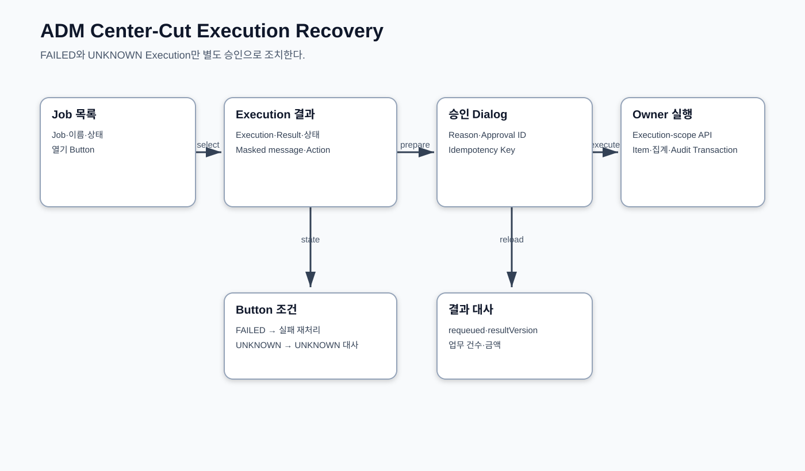
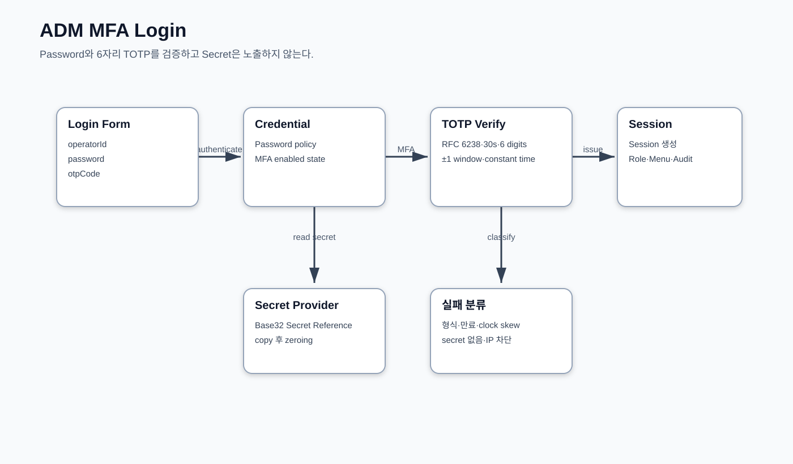
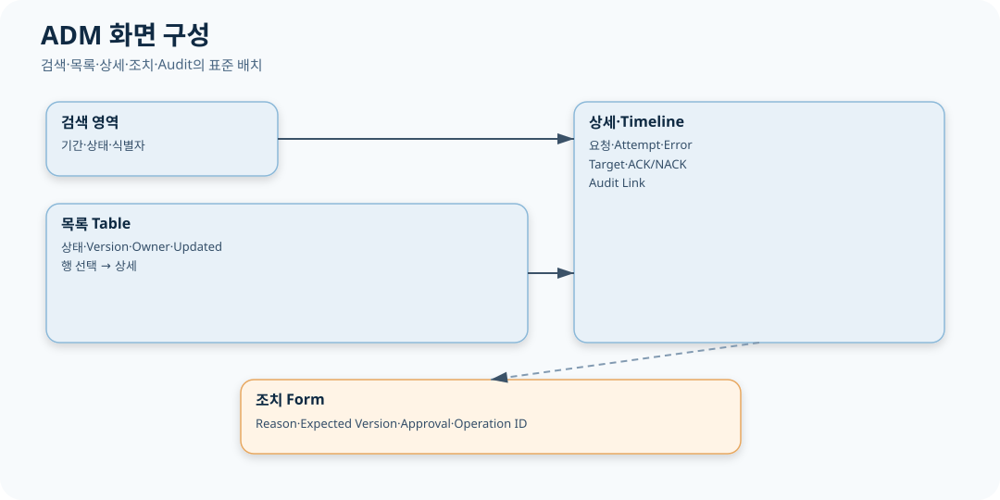
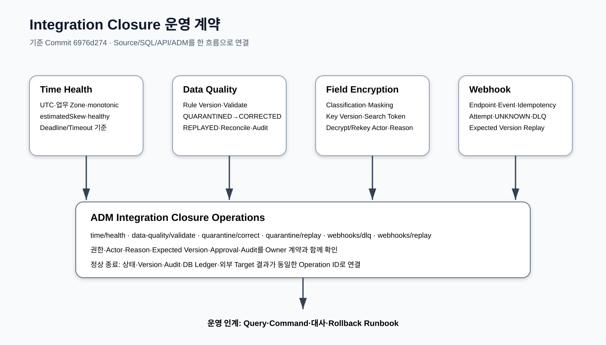

# CPF ADM 운영자 매뉴얼

> 문서: `CPF ADM 운영자 매뉴얼`
> 기준 Repository: `https://github.com/freeangelsun/202412_01_CPF`
> 기준 Branch: `master`
> 기준 Commit: `6976d2747481b8540b48ddb9ab8f53cfeaa4b888` (`06_02`)
> 기준일: `2026-08-06 Asia/Seoul`

| 항목 | 내용 |
|---|---|
| 주 독자 | 조회자·운영자·승인자·보안담당자·운영관리자 |
| 문서 목적 | 권한 수준에 맞게 62개 ADM 메뉴를 조회·판단·통제·승인·대사·복구한다. |
| 기능 서술 전제 | CPF 제품 기능은 고객이 사용할 수 있는 상태로 설명한다. 구현 진행률이나 개발 관리 상태는 이 문서의 사용 절차에 섞지 않는다. |
| 사실 우선순위 | 실제 Source·SQL·API·Config·Frontend·Script·Test → 설계·사양 → 본 매뉴얼 |
| 상태 표현 | 업무 상태와 운영 결과는 Source의 상태값을 사용한다. 문서 검토 상태는 `완료`, `부분 구현`, `미구현`, `미검증`, `실패`, `재확인 필요`만 사용한다. |

## 1. 운영 역할과 권한

| 역할 | 가능한 일 | 금지되는 일 |
|---|---|---|
| 조회자 | 검색·상세·Masking 결과 확인 | 상태 변경·원문 Download |
| 운영자 | 허용된 Command 요청·복구 실행 | 자기 승인·정본 DB 직접 변경 |
| 승인자 | 위험 조치 Snapshot·Reason 검토와 결정 | 요청 Payload 수정·결과 추정 |
| 보안담당자 | Permission·MFA·IP·Secret·Break-glass 관리 | 평문 Secret 조회·감사 삭제 |
| 운영관리자 | 정책·Role·교대·Incident·SLA 관리 | 미대사 UNKNOWN 강제 종료 |

화면 진입 가능 여부와 API 실행 가능 여부는 다르다. Menu·Button·API·Data Scope·Masking 권한을 모두 확인한다.

## 2. 공통 상태 판독

| 상태 | 판독 | 허용 행동 |
|---|---|---|
| REQUESTED | 요청이 수락됐지만 외부 부작용은 시작 전 | 같은 Idempotency Key의 새 실행을 만들지 않는다. |
| RUNNING | 실행 중이며 Heartbeat 또는 진행률이 존재 | Timeout만으로 실패 처리하지 않는다. |
| SUCCEEDED | 업무·Target 결과가 명시적으로 성공 | 재실행하지 않는다. |
| FAILED | 외부 부작용 전 결정적 실패 또는 명시 실패 | 원본 Attempt는 보존한다. |
| UNKNOWN_RESULT | 외부 부작용 이후 결과를 확정할 Evidence가 부족 | Blind Retry를 금지한다. |
| PARTIAL | 여러 Target 또는 Item 중 일부만 성공 | 전체를 다시 실행하지 않는다. |
| ROLLED_BACK | 모든 대상이 이전 상태로 복귀 | Rollback Evidence를 확인한다. |
| PARTIALLY_ROLLED_BACK | 일부 Target만 복귀 | 성공으로 보고하지 않는다. |

화면의 Toast는 상태 정본이 아니다. Command는 Operation ID를 반환하며 상태 변경 이후 Owner 조회와 Audit가 일치해야 종료한다.

## 3. 공통 화면 사용 원칙

1. Environment·기준시각·Feature Flag를 확인한다.
2. 검색 기간과 Data Scope를 최소 범위로 둔다.
3. 목록의 상태·Version·Owner·Updated At를 읽는다.
4. 상세의 Transaction/Operation/Attempt/Target/Error/Audit를 확인한다.
5. 위험 Button은 현재 상태·Permission·Reason·Expected Version·Approval이 모두 유효할 때만 사용한다.
6. Timeout 뒤에는 같은 조치를 다시 누르기 전에 Operation을 조회한다.
7. PARTIAL은 Target별로 판정하고 성공 Target을 건드리지 않는다.
8. Download와 원문 조회는 별도 Reason·Audit를 남긴다.

## 4. 메뉴·Route 전체 지도

| No | Route | Menu | 화면 | 그룹 | Risk | Operation 수 |
|---|---|---|---|---|---|---|
| 1 | `/` | DASHBOARD | 통합 운영 Dashboard | home | MEDIUM | 9 |
| 2 | `/topology` | TOPOLOGY | 서비스 토폴로지 | home | MEDIUM | 4 |
| 3 | `/capacity` | CAPACITY | Online Runtime Diagnostics | home | MEDIUM | 6 |
| 4 | `/logs` | LOG_LIST | 거래 로그 | monitoring | MEDIUM | 4 |
| 5 | `/transactionGroups` | LOG_LIST | Online·Batch 통합 Trace | online | MEDIUM | 9 |
| 6 | `/transactions` | TRANSACTION_META | 온라인 거래 정의 | online | HIGH | 5 |
| 7 | `/remoteLogs` | REMOTE_LOG | 원격 로그 | monitoring | MEDIUM | 9 |
| 8 | `/auditLogs` | AUDIT_LOG | 감사 로그 | monitoring | MEDIUM | 4 |
| 9 | `/logLevel` | DYNAMIC_LOG | 동적 로그 | monitoring | HIGH | 3 |
| 10 | `/logPolicies` | LOG_POLICY | 로그 정책 | monitoring | MEDIUM | 13 |
| 11 | `/standardExecutions` | STANDARD_EXECUTION | 표준 실행 | online | MEDIUM | 2 |
| 12 | `/channelPolicy` | CHANNEL_POLICY | 채널 정책 | online | HIGH | 6 |
| 13 | `/serviceRegistry` | SERVICE_REGISTRY | 서비스 레지스트리 | online | MEDIUM | 15 |
| 14 | `/runtimeControl` | RUNTIME_CONTROL | Deployment·Promotion·Rollback | online | HIGH | 16 |
| 15 | `/maintenance` | MAINTENANCE | 점검·Drain | framework | HIGH | 2 |
| 16 | `/cache` | CACHE | 캐시 | framework | HIGH | 5 |
| 17 | `/configs` | CONFIG | 설정 | framework | HIGH | 6 |
| 18 | `/responseCodes` | RESPONSE_CODE | 응답코드 | framework | MEDIUM | 5 |
| 19 | `/businessCalendar` | BUSINESS_CALENDAR | 영업일·휴일 | framework | MEDIUM | 4 |
| 20 | `/recoveryCenter` | RECOVERY_CENTER | 복구 센터 | monitoring | MEDIUM | 5 |
| 21 | `/incidents` | INCIDENT | Error·Unknown Result | monitoring | HIGH | 22 |
| 22 | `/reliability` | RELIABILITY | Analysis Center | monitoring | MEDIUM | 8 |
| 23 | `/notifications` | NOTIFICATION | 알림 | integration | MEDIUM | 11 |
| 24 | `/batch` | BATCH | Batch / Center-Cut | batch | MEDIUM | 12 |
| 25 | `/batch-overview` | BATCH_OVERVIEW | Batch Overview | batch | MEDIUM | 7 |
| 26 | `/batch-runtime` | BATCH_RUNTIME | Runtime Topology | batch | HIGH | 4 |
| 27 | `/batch-instances` | BATCH_INSTANCES | Runtime Instances | batch | MEDIUM | 4 |
| 28 | `/batch-scheduler` | BATCH_SCHEDULER | Scheduler HA | batch | MEDIUM | 6 |
| 29 | `/batch-worker-pools` | BATCH_WORKER_POOLS | Worker Pools | batch | MEDIUM | 5 |
| 30 | `/batch-center-cut` | BATCH_CENTER_CUT | Center-Cut | batch | MEDIUM | 9 |
| 31 | `/batch-agents` | BATCH_AGENTS | Host Agents | batch | MEDIUM | 5 |
| 32 | `/batch-job-packs` | BATCH_JOB_PACKS | Job Packs | batch | MEDIUM | 8 |
| 33 | `/batch-executions` | BATCH_EXECUTIONS | Executions | batch | MEDIUM | 7 |
| 34 | `/batch-deployment` | BATCH_DEPLOYMENT | Deployment / Rollback | batch | HIGH | 3 |
| 35 | `/batch-recovery` | BATCH_RECOVERY | Recovery / Unknown | monitoring | MEDIUM | 6 |
| 36 | `/batch-leases` | BATCH_LEASES | Lease / Fencing | monitoring | MEDIUM | 4 |
| 37 | `/batch-alerts` | BATCH_ALERTS | Batch Alerts | monitoring | MEDIUM | 4 |
| 38 | `/batch-audit` | BATCH_AUDIT | Audit / Evidence | monitoring | MEDIUM | 5 |
| 39 | `/workers` | WORKER | Agent / Worker | batch | MEDIUM | 3 |
| 40 | `/downloads` | DOWNLOAD | 다운로드 | integration | MEDIUM | 3 |
| 41 | `/file-jobs` | FILE_JOB | 대량파일 Job | batch | MEDIUM | 10 |
| 42 | `/messages` | MESSAGE | 전문·Protocol Message | integration | MEDIUM | 6 |
| 43 | `/codes` | CODE | 코드 | framework | MEDIUM | 5 |
| 44 | `/gateway-dashboard` | GATEWAY_DASHBOARD | Gateway 대시보드 | online | MEDIUM | 4 |
| 45 | `/gateway-servers` | GATEWAY_SERVERS | Gateway 연동 서버 | online | MEDIUM | 4 |
| 46 | `/gateway-groups` | GATEWAY_GROUPS | Gateway 서버 그룹 | online | MEDIUM | 4 |
| 47 | `/gateway-routes` | GATEWAY_ROUTES | Gateway 경로·라우팅 | online | MEDIUM | 4 |
| 48 | `/gateway-security` | GATEWAY_SECURITY | Gateway 보안·제한 | online | HIGH | 3 |
| 49 | `/gateway-health` | GATEWAY_HEALTH | Gateway Health·연결시험 | online | MEDIUM | 7 |
| 50 | `/gateway-transactions` | GATEWAY_TRANSACTIONS | Gateway 거래 조회 | online | MEDIUM | 3 |
| 51 | `/gateway-log-policies` | GATEWAY_LOG_POLICY | Gateway 로그 정책 | online | MEDIUM | 3 |
| 52 | `/gateway-apply-status` | GATEWAY_APPLY_STATUS | Gateway 적용 상태·이력 | online | MEDIUM | 3 |
| 53 | `/permissions` | PERMISSION | 권한 | framework | MEDIUM | 26 |
| 54 | `/password` | PASSWORD | 비밀번호 | framework | HIGH | 5 |
| 55 | `/security` | SECURITY | 보안 | framework | HIGH | 6 |
| 56 | `/operators` | OPERATOR | 운영자 | framework | HIGH | 12 |
| 57 | `/secrets` | SECRET | Secret / Key | framework | HIGH | 3 |
| 58 | `/approvals` | APPROVAL | 위험조치 승인 | framework | HIGH | 11 |
| 59 | `/breakGlass` | BREAK_GLASS | Break-glass | framework | HIGH | 4 |
| 60 | `/featureFlags` | FEATURE_FLAG | Feature Flag | framework | CRITICAL | 7 |
| 61 | `/openApiOperations` | OPENAPI_OPERATIONS | OpenAPI 운영 | framework | HIGH | 2 |
| 62 | `/resiliencePolicies` | RESILIENCE_POLICY | Resilience 정책 | framework | CRITICAL | 5 |

현재 Registry는 Route 62개, Route–Operation 연결 405개다. Route Registry와 `CPF_ADM_ROUTE_OPERATION_MATRIX.csv`가 일치해야 한다.

## 5. 화면별 운영 절차

### 5.1. 통합 운영 Dashboard — `/` {#dashboard}

| 항목 | 값 |
|---|---|
| Route ID | `dashboard` |
| Menu ID | `DASHBOARD` |
| 메뉴 그룹 | `home` |
| Risk | `MEDIUM` |
| Feature Flag | `adm.route.dashboard.enabled` |
| 정본 | Runtime·Log·Batch·Broker 원장 |
| 필요한 권한 | Menu `DASHBOARD` 조회 권한과 Operation별 API 권한이 필요하다. 원문·개인정보·Download는 별도 Data Scope와 Masking 권한을 따른다. |

#### 이 화면으로 완료하는 일

전체 운영 이상을 한 화면에서 식별하고 담당 Workbench로 이동한다.

#### 화면 구성과 실제 입력

| 영역 | 표시·입력 항목 |
|---|---|
| 검색 조건 | 환경, 서비스, Instance, 기간, 심각도, 상태 |
| 목록 Column | Readiness, Liveness, Version, UNKNOWN 건수, DLQ 건수, Outbox 적체, 실행 실패 |
| 상세·Drawer·Tab | 서비스 상태, 최근 오류, 미종결 Operation, Batch 실행, Broker 적체 |
| Button·Action | 새로고침; 이상 카드 상세 이동 |

#### 운영 절차

1. Route `/`에 진입해 화면 상단 기준 환경·기준시각·Feature Flag를 확인한다.
2. `환경, 서비스, Instance, 기간, 심각도, 상태` 중 업무 판정에 필요한 최소 조건을 입력한다.
3. 목록에서 `Readiness, Liveness, Version, UNKNOWN 건수, DLQ 건수, Outbox 적체, 실행 실패`를 읽고 대상의 현재 상태·Version·Owner를 확인한다.
4. 상세에서 `서비스 상태, 최근 오류, 미종결 Operation, Batch 실행, Broker 적체`를 확인해 화면 값과 Runtime·Log·Batch·Broker 원장를 대사한다.
5. 조회 Action은 조건을 유지한 채 재조회할 수 있다. 변경 Action은 대상 Snapshot·Reason·Expected Version·Approval·Idempotency를 확인한다.
6. 실행 후 목록만 믿지 않고 Operation/Attempt/Audit 또는 Owner 원장을 다시 조회한다.
7. 결과가 UNKNOWN/PARTIAL/NACK/DRIFT면 성공 Target을 재실행하지 않고 실패·불명 Target만 복구한다.

#### Operation별 입력·결과·오류·복구

| Operation ID | 화면 행위 | 핵심 입력 | 정상 결과 | 대표 오류 | 복구 |
|---|---|---|---|---|---|
| `admRuntimeControlFindHealth` | 조회 | Environment·Service·Group·Target Snapshot·Desired State·Version | `admRuntimeControlFindHealth` 결과의 기준시각·건수·식별자·상태가 Runtime·Log·Batch·Broker 원장 조회 조건과 일치한다. | Runtime change 조회 범위·Data Scope·Paging·Owner Timeout·기준시각 불일치 | 조건과 권한을 보정하고 Runtime·Log·Batch·Broker 원장 Health를 확인한 뒤 `admRuntimeControlFindHealth`를 같은 기준으로 다시 조회한다. |
| `admRuntimeControlFindStatus` | 조회 | Environment·Service·Group·Target Snapshot·Desired State·Version | `admRuntimeControlFindStatus` 결과의 기준시각·건수·식별자·상태가 Runtime·Log·Batch·Broker 원장 조회 조건과 일치한다. | Runtime change 조회 범위·Data Scope·Paging·Owner Timeout·기준시각 불일치 | 조건과 권한을 보정하고 Runtime·Log·Batch·Broker 원장 Health를 확인한 뒤 `admRuntimeControlFindStatus`를 같은 기준으로 다시 조회한다. |
| `findAdmUnknownResults` | 목록 | Operation ID·Transaction ID·Target·Attempt·Payload Hash | `findAdmUnknownResults` 결과의 기준시각·건수·식별자·상태가 Runtime·Log·Batch·Broker 원장 조회 조건과 일치한다. | Unknown result 조회 범위·Data Scope·Paging·Owner Timeout·기준시각 불일치 | 조건과 권한을 보정하고 Runtime·Log·Batch·Broker 원장 Health를 확인한 뒤 `findAdmUnknownResults`를 같은 기준으로 다시 조회한다. |
| `findAdmBrokerDlq` | 조회 | Broker·Destination·Message ID·Payload Hash·Attempt | `findAdmBrokerDlq` 결과의 기준시각·건수·식별자·상태가 Runtime·Log·Batch·Broker 원장 조회 조건과 일치한다. | Broker DLQ 조회 범위·Data Scope·Paging·Owner Timeout·기준시각 불일치 | 조건과 권한을 보정하고 Runtime·Log·Batch·Broker 원장 Health를 확인한 뒤 `findAdmBrokerDlq`를 같은 기준으로 다시 조회한다. |
| `findAdmBrokerOutbox` | 조회 | Service·Event Key·상태·기간 | `findAdmBrokerOutbox` 결과의 기준시각·건수·식별자·상태가 Runtime·Log·Batch·Broker 원장 조회 조건과 일치한다. | Outbox 조회 범위·Data Scope·Paging·Owner Timeout·기준시각 불일치 | 조건과 권한을 보정하고 Runtime·Log·Batch·Broker 원장 Health를 확인한 뒤 `findAdmBrokerOutbox`를 같은 기준으로 다시 조회한다. |
| `admBatchFindExecutionPage` | 조회 | Job·Execution·Step·Schedule·상태·기간 | `admBatchFindExecutionPage` 결과의 기준시각·건수·식별자·상태가 Runtime·Log·Batch·Broker 원장 조회 조건과 일치한다. | Batch metadata 조회 범위·Data Scope·Paging·Owner Timeout·기준시각 불일치 | 조건과 권한을 보정하고 Runtime·Log·Batch·Broker 원장 Health를 확인한 뒤 `admBatchFindExecutionPage`를 같은 기준으로 다시 조회한다. |
| `getAdmReadiness` | 상세 조회 | 통합 운영 Dashboard 식별자·현재 상태·Version·Reason | `getAdmReadiness` 결과의 기준시각·건수·식별자·상태가 Runtime·Log·Batch·Broker 원장 조회 조건과 일치한다. | 통합 운영 Dashboard 조회 범위·Data Scope·Paging·Owner Timeout·기준시각 불일치 | 조건과 권한을 보정하고 Runtime·Log·Batch·Broker 원장 Health를 확인한 뒤 `getAdmReadiness`를 같은 기준으로 다시 조회한다. |
| `getAdmLiveness` | 상세 조회 | 통합 운영 Dashboard 식별자·현재 상태·Version·Reason | `getAdmLiveness` 결과의 기준시각·건수·식별자·상태가 Runtime·Log·Batch·Broker 원장 조회 조건과 일치한다. | 통합 운영 Dashboard 조회 범위·Data Scope·Paging·Owner Timeout·기준시각 불일치 | 조건과 권한을 보정하고 Runtime·Log·Batch·Broker 원장 Health를 확인한 뒤 `getAdmLiveness`를 같은 기준으로 다시 조회한다. |
| `getAdmSystemVersion` | 상세 조회 | 통합 운영 Dashboard 식별자·현재 상태·Version·Reason | `getAdmSystemVersion` 결과의 기준시각·건수·식별자·상태가 Runtime·Log·Batch·Broker 원장 조회 조건과 일치한다. | 통합 운영 Dashboard 조회 범위·Data Scope·Paging·Owner Timeout·기준시각 불일치 | 조건과 권한을 보정하고 Runtime·Log·Batch·Broker 원장 Health를 확인한 뒤 `getAdmSystemVersion`를 같은 기준으로 다시 조회한다. |

#### 정상 판정

조회 기준시각이 표시되고 각 카드 합계가 상세 조회 건수와 일치한다.

#### 오류와 경계조건

한 카드만 Timeout이면 해당 Owner 장애이고 전체 카드가 비면 인증·Gateway·ADM Backend를 우선 확인한다.

#### 응답 유실·부분 실패 복구

오류 카드를 눌러 Owner 화면에서 원장 상태를 확인하고 조회 실패는 같은 조건으로 재조회한다.

#### Log·Metric·Trace·Audit 확인

- 조회: 기준시각, 조건, 건수, Owner, Paging/Sort를 기록한다.
- 변경: Transaction ID, Operation ID, Attempt, Target, Before/After, Actor, Reason, Approval, Error Code를 확인한다.
- Download/원문: Data Scope, Masking, Reason, 파일 Hash와 Audit를 확인한다.
- 화면과 원장이 다르면 새 조치를 실행하지 않고 Owner 상태를 정본으로 삼아 대사한다.

#### 대표 교육 과제

UNKNOWN 1건을 Dashboard에서 발견해 거래·Batch·Broker 중 정확한 복구 화면으로 이동한다.

#### 교대 인계

Route `/`, Menu `DASHBOARD`, 대상 식별자, 현재 상태·Version, 미종결 Operation/Attempt, UNKNOWN/PARTIAL/NACK/DRIFT Target, 승인 상태, 다음 확인 시각과 담당자를 남긴다.

### 5.2. 서비스 토폴로지 — `/topology` {#topology}

| 항목 | 값 |
|---|---|
| Route ID | `topology` |
| Menu ID | `TOPOLOGY` |
| 메뉴 그룹 | `home` |
| Risk | `MEDIUM` |
| Feature Flag | `adm.route.topology.enabled` |
| 정본 | Service Registry·Runtime Health |
| 필요한 권한 | Menu `TOPOLOGY` 조회 권한과 Operation별 API 권한이 필요하다. 원문·개인정보·Download는 별도 Data Scope와 Masking 권한을 따른다. |

#### 이 화면으로 완료하는 일

서비스, Instance, Endpoint와 Health 관계를 파악한다.

#### 화면 구성과 실제 입력

| 영역 | 표시·입력 항목 |
|---|---|
| 검색 조건 | 환경, 서비스명, Instance ID, Endpoint 상태 |
| 목록 Column | Service, Instance, Endpoint, Zone, Version, Health, Last Seen |
| 상세·Drawer·Tab | 서비스→Instance→Endpoint 계층, Capability, Circuit 상태, Routing 정책 |
| Button·Action | 서비스 상세; Instance 상세; Endpoint 상세 |

#### 운영 절차

1. Route `/topology`에 진입해 화면 상단 기준 환경·기준시각·Feature Flag를 확인한다.
2. `환경, 서비스명, Instance ID, Endpoint 상태` 중 업무 판정에 필요한 최소 조건을 입력한다.
3. 목록에서 `Service, Instance, Endpoint, Zone, Version, Health, Last Seen`를 읽고 대상의 현재 상태·Version·Owner를 확인한다.
4. 상세에서 `서비스→Instance→Endpoint 계층, Capability, Circuit 상태, Routing 정책`를 확인해 화면 값과 Service Registry·Runtime Health를 대사한다.
5. 조회 Action은 조건을 유지한 채 재조회할 수 있다. 변경 Action은 대상 Snapshot·Reason·Expected Version·Approval·Idempotency를 확인한다.
6. 실행 후 목록만 믿지 않고 Operation/Attempt/Audit 또는 Owner 원장을 다시 조회한다.
7. 결과가 UNKNOWN/PARTIAL/NACK/DRIFT면 성공 Target을 재실행하지 않고 실패·불명 Target만 복구한다.

#### Operation별 입력·결과·오류·복구

| Operation ID | 화면 행위 | 핵심 입력 | 정상 결과 | 대표 오류 | 복구 |
|---|---|---|---|---|---|
| `admServiceRegistryFindServices` | 목록 | Service·Instance·Endpoint·Zone·Version | `admServiceRegistryFindServices` 결과의 기준시각·건수·식별자·상태가 Service Registry·Runtime Health 조회 조건과 일치한다. | Service registry 조회 범위·Data Scope·Paging·Owner Timeout·기준시각 불일치 | 조건과 권한을 보정하고 Service Registry·Runtime Health Health를 확인한 뒤 `admServiceRegistryFindServices`를 같은 기준으로 다시 조회한다. |
| `admServiceRegistryFindInstances` | 목록 | Service·Instance·Endpoint·Zone·Version | `admServiceRegistryFindInstances` 결과의 기준시각·건수·식별자·상태가 Service Registry·Runtime Health 조회 조건과 일치한다. | Service registry 조회 범위·Data Scope·Paging·Owner Timeout·기준시각 불일치 | 조건과 권한을 보정하고 Service Registry·Runtime Health Health를 확인한 뒤 `admServiceRegistryFindInstances`를 같은 기준으로 다시 조회한다. |
| `admServiceRegistryFindEndpoints` | 목록 | Service·Instance·Endpoint·Zone·Version | `admServiceRegistryFindEndpoints` 결과의 기준시각·건수·식별자·상태가 Service Registry·Runtime Health 조회 조건과 일치한다. | Service registry 조회 범위·Data Scope·Paging·Owner Timeout·기준시각 불일치 | 조건과 권한을 보정하고 Service Registry·Runtime Health Health를 확인한 뒤 `admServiceRegistryFindEndpoints`를 같은 기준으로 다시 조회한다. |
| `admServiceRegistryFindHealth` | 조회 | Service·Instance·Endpoint·Zone·Version | `admServiceRegistryFindHealth` 결과의 기준시각·건수·식별자·상태가 Service Registry·Runtime Health 조회 조건과 일치한다. | Service registry 조회 범위·Data Scope·Paging·Owner Timeout·기준시각 불일치 | 조건과 권한을 보정하고 Service Registry·Runtime Health Health를 확인한 뒤 `admServiceRegistryFindHealth`를 같은 기준으로 다시 조회한다. |

#### 정상 판정

등록된 Instance 수와 Health 응답 수가 일치하고 오래된 Last Seen이 표시된다.

#### 오류와 경계조건

Endpoint는 정상인데 Instance Health가 비정상이면 Process 상태를, 반대이면 네트워크·인증을 확인한다.

#### 응답 유실·부분 실패 복구

관측값을 임의 수정하지 않고 서비스 레지스트리 원장과 Runtime 상태를 대사한다.

#### Log·Metric·Trace·Audit 확인

- 조회: 기준시각, 조건, 건수, Owner, Paging/Sort를 기록한다.
- 변경: Transaction ID, Operation ID, Attempt, Target, Before/After, Actor, Reason, Approval, Error Code를 확인한다.
- Download/원문: Data Scope, Masking, Reason, 파일 Hash와 Audit를 확인한다.
- 화면과 원장이 다르면 새 조치를 실행하지 않고 Owner 상태를 정본으로 삼아 대사한다.

#### 대표 교육 과제

한 서비스의 Endpoint 누락 원인을 Registry·Health·Routing 세 관점에서 판정한다.

#### 교대 인계

Route `/topology`, Menu `TOPOLOGY`, 대상 식별자, 현재 상태·Version, 미종결 Operation/Attempt, UNKNOWN/PARTIAL/NACK/DRIFT Target, 승인 상태, 다음 확인 시각과 담당자를 남긴다.

### 5.3. Online Runtime Diagnostics — `/capacity` {#capacity}

| 항목 | 값 |
|---|---|
| Route ID | `capacity` |
| Menu ID | `CAPACITY` |
| 메뉴 그룹 | `home` |
| Risk | `MEDIUM` |
| Feature Flag | `adm.route.capacity.enabled` |
| 정본 | Runtime Metric·Reliability Ledger |
| 필요한 권한 | Menu `CAPACITY` 조회 권한과 Operation별 API 권한이 필요하다. 원문·개인정보·Download는 별도 Data Scope와 Masking 권한을 따른다. |

#### 이 화면으로 완료하는 일

온라인 Runtime의 병목과 신뢰성 적체를 함께 분석한다.

#### 화면 구성과 실제 입력

| 영역 | 표시·입력 항목 |
|---|---|
| 검색 조건 | 환경, 서비스, Instance, 기간, 임계값 |
| 목록 Column | CPU/Memory, Outbox, Inbox, Idempotency, File Transfer, Error Rate |
| 상세·Drawer·Tab | Instance 상태, 적체 추이, Top Transaction, 최근 실패 |
| Button·Action | 기간 변경; Instance Drill-down |

#### 운영 절차

1. Route `/capacity`에 진입해 화면 상단 기준 환경·기준시각·Feature Flag를 확인한다.
2. `환경, 서비스, Instance, 기간, 임계값` 중 업무 판정에 필요한 최소 조건을 입력한다.
3. 목록에서 `CPU/Memory, Outbox, Inbox, Idempotency, File Transfer, Error Rate`를 읽고 대상의 현재 상태·Version·Owner를 확인한다.
4. 상세에서 `Instance 상태, 적체 추이, Top Transaction, 최근 실패`를 확인해 화면 값과 Runtime Metric·Reliability Ledger를 대사한다.
5. 조회 Action은 조건을 유지한 채 재조회할 수 있다. 변경 Action은 대상 Snapshot·Reason·Expected Version·Approval·Idempotency를 확인한다.
6. 실행 후 목록만 믿지 않고 Operation/Attempt/Audit 또는 Owner 원장을 다시 조회한다.
7. 결과가 UNKNOWN/PARTIAL/NACK/DRIFT면 성공 Target을 재실행하지 않고 실패·불명 Target만 복구한다.

#### Operation별 입력·결과·오류·복구

| Operation ID | 화면 행위 | 핵심 입력 | 정상 결과 | 대표 오류 | 복구 |
|---|---|---|---|---|---|
| `admRuntimeControlFindHealth` | 조회 | Environment·Service·Group·Target Snapshot·Desired State·Version | `admRuntimeControlFindHealth` 결과의 기준시각·건수·식별자·상태가 Runtime Metric·Reliability Ledger 조회 조건과 일치한다. | Runtime change 조회 범위·Data Scope·Paging·Owner Timeout·기준시각 불일치 | 조건과 권한을 보정하고 Runtime Metric·Reliability Ledger Health를 확인한 뒤 `admRuntimeControlFindHealth`를 같은 기준으로 다시 조회한다. |
| `admRuntimeControlFindStatus` | 조회 | Environment·Service·Group·Target Snapshot·Desired State·Version | `admRuntimeControlFindStatus` 결과의 기준시각·건수·식별자·상태가 Runtime Metric·Reliability Ledger 조회 조건과 일치한다. | Runtime change 조회 범위·Data Scope·Paging·Owner Timeout·기준시각 불일치 | 조건과 권한을 보정하고 Runtime Metric·Reliability Ledger Health를 확인한 뒤 `admRuntimeControlFindStatus`를 같은 기준으로 다시 조회한다. |
| `findAdmBrokerOutbox` | 조회 | Service·Event Key·상태·기간 | `findAdmBrokerOutbox` 결과의 기준시각·건수·식별자·상태가 Runtime Metric·Reliability Ledger 조회 조건과 일치한다. | Outbox 조회 범위·Data Scope·Paging·Owner Timeout·기준시각 불일치 | 조건과 권한을 보정하고 Runtime Metric·Reliability Ledger Health를 확인한 뒤 `findAdmBrokerOutbox`를 같은 기준으로 다시 조회한다. |
| `findAdmBrokerInbox` | 조회 | Consumer·Message ID·상태·기간 | `findAdmBrokerInbox` 결과의 기준시각·건수·식별자·상태가 Runtime Metric·Reliability Ledger 조회 조건과 일치한다. | Inbox 조회 범위·Data Scope·Paging·Owner Timeout·기준시각 불일치 | 조건과 권한을 보정하고 Runtime Metric·Reliability Ledger Health를 확인한 뒤 `findAdmBrokerInbox`를 같은 기준으로 다시 조회한다. |
| `findAdmIdempotencyRecords` | 조회 | Owner·Key·Request Hash·상태 | `findAdmIdempotencyRecords` 결과의 기준시각·건수·식별자·상태가 Runtime Metric·Reliability Ledger 조회 조건과 일치한다. | Idempotency 조회 범위·Data Scope·Paging·Owner Timeout·기준시각 불일치 | 조건과 권한을 보정하고 Runtime Metric·Reliability Ledger Health를 확인한 뒤 `findAdmIdempotencyRecords`를 같은 기준으로 다시 조회한다. |
| `findAdmFileTransferHistory` | 목록 | Transfer ID·File Name·Checksum·상태 | `findAdmFileTransferHistory` 결과의 기준시각·건수·식별자·상태가 Runtime Metric·Reliability Ledger 조회 조건과 일치한다. | File transfer 조회 범위·Data Scope·Paging·Owner Timeout·기준시각 불일치 | 조건과 권한을 보정하고 Runtime Metric·Reliability Ledger Health를 확인한 뒤 `findAdmFileTransferHistory`를 같은 기준으로 다시 조회한다. |

#### 정상 판정

Metric 기준시각과 원장 건수가 연결되고 임계 초과 항목이 분리된다.

#### 오류와 경계조건

Metric 누락과 실제 0을 구분하고 Outbox/Inbox 차이가 지속되면 Broker Consumer를 확인한다.

#### 응답 유실·부분 실패 복구

관측 구간을 줄여 재조회하고 원장·Metric·Trace 중 어느 경로가 누락됐는지 분리한다.

#### Log·Metric·Trace·Audit 확인

- 조회: 기준시각, 조건, 건수, Owner, Paging/Sort를 기록한다.
- 변경: Transaction ID, Operation ID, Attempt, Target, Before/After, Actor, Reason, Approval, Error Code를 확인한다.
- Download/원문: Data Scope, Masking, Reason, 파일 Hash와 Audit를 확인한다.
- 화면과 원장이 다르면 새 조치를 실행하지 않고 Owner 상태를 정본으로 삼아 대사한다.

#### 대표 교육 과제

Outbox 적체가 CPU 문제인지 Broker 문제인지 판정한다.

#### 교대 인계

Route `/capacity`, Menu `CAPACITY`, 대상 식별자, 현재 상태·Version, 미종결 Operation/Attempt, UNKNOWN/PARTIAL/NACK/DRIFT Target, 승인 상태, 다음 확인 시각과 담당자를 남긴다.

### 5.4. 거래 로그 — `/logs` {#logs}

| 항목 | 값 |
|---|---|
| Route ID | `logs` |
| Menu ID | `LOG_LIST` |
| 메뉴 그룹 | `monitoring` |
| Risk | `MEDIUM` |
| Feature Flag | `adm.route.logs.enabled` |
| 정본 | Transaction Log·Export Audit |
| 필요한 권한 | Menu `LOG_LIST` 조회 권한과 Operation별 API 권한이 필요하다. 원문·개인정보·Download는 별도 Data Scope와 Masking 권한을 따른다. |

#### 이 화면으로 완료하는 일

거래 로그를 조건 검색하고 상세·Export를 수행한다.

#### 화면 구성과 실제 입력

| 영역 | 표시·입력 항목 |
|---|---|
| 검색 조건 | Transaction ID, Trace ID, 기간, URI, Channel, Response Code, HTTP Status |
| 목록 Column | 시각, Transaction ID, Trace ID, URI, Duration, Response, Error, Masking |
| 상세·Drawer·Tab | Request/Response 요약, Header, Segment, Error, Related Audit |
| Button·Action | 검색; 상세; Export 생성; Download |

#### 운영 절차

1. Route `/logs`에 진입해 화면 상단 기준 환경·기준시각·Feature Flag를 확인한다.
2. `Transaction ID, Trace ID, 기간, URI, Channel, Response Code, HTTP Status` 중 업무 판정에 필요한 최소 조건을 입력한다.
3. 목록에서 `시각, Transaction ID, Trace ID, URI, Duration, Response, Error, Masking`를 읽고 대상의 현재 상태·Version·Owner를 확인한다.
4. 상세에서 `Request/Response 요약, Header, Segment, Error, Related Audit`를 확인해 화면 값과 Transaction Log·Export Audit를 대사한다.
5. 조회 Action은 조건을 유지한 채 재조회할 수 있다. 변경 Action은 대상 Snapshot·Reason·Expected Version·Approval·Idempotency를 확인한다.
6. 실행 후 목록만 믿지 않고 Operation/Attempt/Audit 또는 Owner 원장을 다시 조회한다.
7. 결과가 UNKNOWN/PARTIAL/NACK/DRIFT면 성공 Target을 재실행하지 않고 실패·불명 Target만 복구한다.

#### Operation별 입력·결과·오류·복구

| Operation ID | 화면 행위 | 핵심 입력 | 정상 결과 | 대표 오류 | 복구 |
|---|---|---|---|---|---|
| `admLogFindLogs` | 조회 | Transaction/Trace ID·기간·Module·Response/Error | `admLogFindLogs` 결과의 기준시각·건수·식별자·상태가 Transaction Log·Export Audit 조회 조건과 일치한다. | Transaction log 조회 범위·Data Scope·Paging·Owner Timeout·기준시각 불일치 | 조건과 권한을 보정하고 Transaction Log·Export Audit Health를 확인한 뒤 `admLogFindLogs`를 같은 기준으로 다시 조회한다. |
| `admLogGetLogDetail` | 상세 조회 | Transaction/Trace ID·기간·Module·Response/Error | `admLogGetLogDetail` 결과의 기준시각·건수·식별자·상태가 Transaction Log·Export Audit 조회 조건과 일치한다. | Transaction log 조회 범위·Data Scope·Paging·Owner Timeout·기준시각 불일치 | 조건과 권한을 보정하고 Transaction Log·Export Audit Health를 확인한 뒤 `admLogGetLogDetail`를 같은 기준으로 다시 조회한다. |
| `admLogExportCreate` | 생성 | Transaction/Trace ID·기간·Module·Response/Error·Reason·Expected Version·Idempotency·Approval | `admLogExportCreate` 요청이 1회 반영되고 Log Detail·Segment·Export·Audit가 같은 Transaction/Operation/Audit 식별자로 연결된다. | Transaction log Validation·Forbidden·Expected Version·Idempotency 충돌·Timeout·부분 적용 | `admLogExportCreate` Operation 상태를 조회하고 Transaction Log·Export Audit와 Target 결과를 대사한 뒤 실패 확정 시 새 요청 또는 Rollback을 수행한다. |
| `admLogExportDownload` | Export | Transaction/Trace ID·기간·Module·Response/Error·Reason·Expected Version·Idempotency·Approval | `admLogExportDownload` 요청이 1회 반영되고 Log Detail·Segment·Export·Audit가 같은 Transaction/Operation/Audit 식별자로 연결된다. | Transaction log Validation·Forbidden·Expected Version·Idempotency 충돌·Timeout·부분 적용 | `admLogExportDownload` Operation 상태를 조회하고 Transaction Log·Export Audit와 Target 결과를 대사한 뒤 실패 확정 시 새 요청 또는 Rollback을 수행한다. |

#### 정상 판정

검색 조건과 건수가 일치하고 민감 Field는 Masking되며 Export Audit가 남는다.

#### 오류와 경계조건

과도한 기간·Data Scope 부족·Export 만료·Masking 권한 부족을 구분한다.

#### 응답 유실·부분 실패 복구

검색 기간을 축소하고 Export Job 상태를 조회한 뒤 만료면 새 Export를 생성한다.

#### Log·Metric·Trace·Audit 확인

- 조회: 기준시각, 조건, 건수, Owner, Paging/Sort를 기록한다.
- 변경: Transaction ID, Operation ID, Attempt, Target, Before/After, Actor, Reason, Approval, Error Code를 확인한다.
- Download/원문: Data Scope, Masking, Reason, 파일 Hash와 Audit를 확인한다.
- 화면과 원장이 다르면 새 조치를 실행하지 않고 Owner 상태를 정본으로 삼아 대사한다.

#### 대표 교육 과제

특정 거래의 실패 원인을 Log·Trace·Audit에서 연결한다.

#### 교대 인계

Route `/logs`, Menu `LOG_LIST`, 대상 식별자, 현재 상태·Version, 미종결 Operation/Attempt, UNKNOWN/PARTIAL/NACK/DRIFT Target, 승인 상태, 다음 확인 시각과 담당자를 남긴다.

### 5.5. Online·Batch 통합 Trace — `/transactionGroups` {#transactiongroups}

| 항목 | 값 |
|---|---|
| Route ID | `transactionGroups` |
| Menu ID | `LOG_LIST` |
| 메뉴 그룹 | `online` |
| Risk | `MEDIUM` |
| Feature Flag | `adm.route.transactionGroups.enabled` |
| 정본 | Trace·Transaction Group 원장 |
| 필요한 권한 | Menu `LOG_LIST` 조회 권한과 Operation별 API 권한이 필요하다. 원문·개인정보·Download는 별도 Data Scope와 Masking 권한을 따른다. |

#### 이 화면으로 완료하는 일

온라인·Batch·외부 연계 Segment를 하나의 Timeline으로 본다.

#### 화면 구성과 실제 입력

| 영역 | 표시·입력 항목 |
|---|---|
| 검색 조건 | Transaction ID, Trace ID, Business Transaction ID, 기간 |
| 목록 Column | Group ID, 시작/종료, Segment 수, 실패 Segment, Duration |
| 상세·Drawer·Tab | Timeline, External Log, Header, Segment Tree, Error Chain |
| Button·Action | ID별 조회; Segment 상세 |

#### 운영 절차

1. Route `/transactionGroups`에 진입해 화면 상단 기준 환경·기준시각·Feature Flag를 확인한다.
2. `Transaction ID, Trace ID, Business Transaction ID, 기간` 중 업무 판정에 필요한 최소 조건을 입력한다.
3. 목록에서 `Group ID, 시작/종료, Segment 수, 실패 Segment, Duration`를 읽고 대상의 현재 상태·Version·Owner를 확인한다.
4. 상세에서 `Timeline, External Log, Header, Segment Tree, Error Chain`를 확인해 화면 값과 Trace·Transaction Group 원장를 대사한다.
5. 조회 Action은 조건을 유지한 채 재조회할 수 있다. 변경 Action은 대상 Snapshot·Reason·Expected Version·Approval·Idempotency를 확인한다.
6. 실행 후 목록만 믿지 않고 Operation/Attempt/Audit 또는 Owner 원장을 다시 조회한다.
7. 결과가 UNKNOWN/PARTIAL/NACK/DRIFT면 성공 Target을 재실행하지 않고 실패·불명 Target만 복구한다.

#### Operation별 입력·결과·오류·복구

| Operation ID | 화면 행위 | 핵심 입력 | 정상 결과 | 대표 오류 | 복구 |
|---|---|---|---|---|---|
| `traceAdmByTransactionId` | 업무 처리 | Online·Batch 통합 Trace 식별자·현재 상태·Version·Reason·Reason·Expected Version·Idempotency·Approval | `traceAdmByTransactionId` 요청이 1회 반영되고 Online·Batch 통합 Trace 결과·Version·Operation·Audit가 같은 Transaction/Operation/Audit 식별자로 연결된다. | Online·Batch 통합 Trace Validation·Forbidden·Expected Version·Idempotency 충돌·Timeout·부분 적용 | `traceAdmByTransactionId` Operation 상태를 조회하고 Trace·Transaction Group 원장와 Target 결과를 대사한 뒤 실패 확정 시 새 요청 또는 Rollback을 수행한다. |
| `traceAdmByTraceId` | 업무 처리 | Online·Batch 통합 Trace 식별자·현재 상태·Version·Reason·Reason·Expected Version·Idempotency·Approval | `traceAdmByTraceId` 요청이 1회 반영되고 Online·Batch 통합 Trace 결과·Version·Operation·Audit가 같은 Transaction/Operation/Audit 식별자로 연결된다. | Online·Batch 통합 Trace Validation·Forbidden·Expected Version·Idempotency 충돌·Timeout·부분 적용 | `traceAdmByTraceId` Operation 상태를 조회하고 Trace·Transaction Group 원장와 Target 결과를 대사한 뒤 실패 확정 시 새 요청 또는 Rollback을 수행한다. |
| `traceAdmByBusinessTransactionId` | 업무 처리 | Online·Batch 통합 Trace 식별자·현재 상태·Version·Reason·Reason·Expected Version·Idempotency·Approval | `traceAdmByBusinessTransactionId` 요청이 1회 반영되고 Online·Batch 통합 Trace 결과·Version·Operation·Audit가 같은 Transaction/Operation/Audit 식별자로 연결된다. | Online·Batch 통합 Trace Validation·Forbidden·Expected Version·Idempotency 충돌·Timeout·부분 적용 | `traceAdmByBusinessTransactionId` Operation 상태를 조회하고 Trace·Transaction Group 원장와 Target 결과를 대사한 뒤 실패 확정 시 새 요청 또는 Rollback을 수행한다. |
| `admTransactionGroupFindTimeline` | 조회 | Transaction/Trace/Business ID·기간 | `admTransactionGroupFindTimeline` 결과의 기준시각·건수·식별자·상태가 Trace·Transaction Group 원장 조회 조건과 일치한다. | Transaction group 조회 범위·Data Scope·Paging·Owner Timeout·기준시각 불일치 | 조건과 권한을 보정하고 Trace·Transaction Group 원장 Health를 확인한 뒤 `admTransactionGroupFindTimeline`를 같은 기준으로 다시 조회한다. |
| `admTransactionGroupFindGroups` | 조회 | Transaction/Trace/Business ID·기간 | `admTransactionGroupFindGroups` 결과의 기준시각·건수·식별자·상태가 Trace·Transaction Group 원장 조회 조건과 일치한다. | Transaction group 조회 범위·Data Scope·Paging·Owner Timeout·기준시각 불일치 | 조건과 권한을 보정하고 Trace·Transaction Group 원장 Health를 확인한 뒤 `admTransactionGroupFindGroups`를 같은 기준으로 다시 조회한다. |
| `admTransactionGroupFindDetail` | 상세 조회 | Transaction/Trace/Business ID·기간 | `admTransactionGroupFindDetail` 결과의 기준시각·건수·식별자·상태가 Trace·Transaction Group 원장 조회 조건과 일치한다. | Transaction group 조회 범위·Data Scope·Paging·Owner Timeout·기준시각 불일치 | 조건과 권한을 보정하고 Trace·Transaction Group 원장 Health를 확인한 뒤 `admTransactionGroupFindDetail`를 같은 기준으로 다시 조회한다. |
| `admTransactionGroupFindExternalLogs` | 조회 | Transaction/Trace ID·기간·Module·Response/Error | `admTransactionGroupFindExternalLogs` 결과의 기준시각·건수·식별자·상태가 Trace·Transaction Group 원장 조회 조건과 일치한다. | Transaction log 조회 범위·Data Scope·Paging·Owner Timeout·기준시각 불일치 | 조건과 권한을 보정하고 Trace·Transaction Group 원장 Health를 확인한 뒤 `admTransactionGroupFindExternalLogs`를 같은 기준으로 다시 조회한다. |
| `admTransactionGroupFindHeaders` | 조회 | Transaction/Trace/Business ID·기간 | `admTransactionGroupFindHeaders` 결과의 기준시각·건수·식별자·상태가 Trace·Transaction Group 원장 조회 조건과 일치한다. | Transaction group 조회 범위·Data Scope·Paging·Owner Timeout·기준시각 불일치 | 조건과 권한을 보정하고 Trace·Transaction Group 원장 Health를 확인한 뒤 `admTransactionGroupFindHeaders`를 같은 기준으로 다시 조회한다. |
| `admTransactionGroupFindSegments` | 조회 | Transaction/Trace/Business ID·기간 | `admTransactionGroupFindSegments` 결과의 기준시각·건수·식별자·상태가 Trace·Transaction Group 원장 조회 조건과 일치한다. | Transaction group 조회 범위·Data Scope·Paging·Owner Timeout·기준시각 불일치 | 조건과 권한을 보정하고 Trace·Transaction Group 원장 Health를 확인한 뒤 `admTransactionGroupFindSegments`를 같은 기준으로 다시 조회한다. |

#### 정상 판정

모든 Segment의 Parent/Child가 연결되고 시작·종료 시각이 모순되지 않는다.

#### 오류와 경계조건

일부 Segment 누락은 비동기 전파·Sampling·Log Delivery 지연을 확인한다.

#### 응답 유실·부분 실패 복구

다른 식별자로 교차 조회하고 누락 Segment의 Source Module Log를 확인한다.

#### Log·Metric·Trace·Audit 확인

- 조회: 기준시각, 조건, 건수, Owner, Paging/Sort를 기록한다.
- 변경: Transaction ID, Operation ID, Attempt, Target, Before/After, Actor, Reason, Approval, Error Code를 확인한다.
- Download/원문: Data Scope, Masking, Reason, 파일 Hash와 Audit를 확인한다.
- 화면과 원장이 다르면 새 조치를 실행하지 않고 Owner 상태를 정본으로 삼아 대사한다.

#### 대표 교육 과제

온라인 요청에서 Batch 후속 처리까지 Timeline을 재구성한다.

#### 교대 인계

Route `/transactionGroups`, Menu `LOG_LIST`, 대상 식별자, 현재 상태·Version, 미종결 Operation/Attempt, UNKNOWN/PARTIAL/NACK/DRIFT Target, 승인 상태, 다음 확인 시각과 담당자를 남긴다.

### 5.6. 온라인 거래 정의 — `/transactions` {#transactions}

| 항목 | 값 |
|---|---|
| Route ID | `transactions` |
| Menu ID | `TRANSACTION_META` |
| 메뉴 그룹 | `online` |
| Risk | `HIGH` |
| Feature Flag | `adm.route.transactions.enabled` |
| 정본 | Transaction Metadata 원장 |
| 필요한 권한 | Menu `TRANSACTION_META` 조회 권한과 Operation별 API 권한이 필요하다. 상태 변경은 Reason·Expected Version을 사용하며 승인 정책이 적용되는 조치는 승인 완료 후 실행한다. |

#### 이 화면으로 완료하는 일

온라인 거래 정의를 조회하고 비활성화한다.

#### 화면 구성과 실제 입력

| 영역 | 표시·입력 항목 |
|---|---|
| 검색 조건 | 거래 코드, URI, Method, Channel, 상태, Owner |
| 목록 Column | 거래 코드, Method, URI, Owner, Version, 상태, Last Scan |
| 상세·Drawer·Tab | Handler, Permission, Timeout, Idempotency, Consumer, Scan Evidence |
| Button·Action | Scan; 상세; 비활성화 |

#### 운영 절차

1. Route `/transactions`에 진입해 화면 상단 기준 환경·기준시각·Feature Flag를 확인한다.
2. `거래 코드, URI, Method, Channel, 상태, Owner` 중 업무 판정에 필요한 최소 조건을 입력한다.
3. 목록에서 `거래 코드, Method, URI, Owner, Version, 상태, Last Scan`를 읽고 대상의 현재 상태·Version·Owner를 확인한다.
4. 상세에서 `Handler, Permission, Timeout, Idempotency, Consumer, Scan Evidence`를 확인해 화면 값과 Transaction Metadata 원장를 대사한다.
5. 조회 Action은 조건을 유지한 채 재조회할 수 있다. 변경 Action은 대상 Snapshot·Reason·Expected Version·Approval·Idempotency를 확인한다.
6. 실행 후 목록만 믿지 않고 Operation/Attempt/Audit 또는 Owner 원장을 다시 조회한다.
7. 결과가 UNKNOWN/PARTIAL/NACK/DRIFT면 성공 Target을 재실행하지 않고 실패·불명 Target만 복구한다.

#### Operation별 입력·결과·오류·복구

| Operation ID | 화면 행위 | 핵심 입력 | 정상 결과 | 대표 오류 | 복구 |
|---|---|---|---|---|---|
| `admTransactionMetaFindPage` | 조회 | Transaction Code·Method·URI·Owner·Version | `admTransactionMetaFindPage` 결과의 기준시각·건수·식별자·상태가 Transaction Metadata 원장 조회 조건과 일치한다. | Transaction definition 조회 범위·Data Scope·Paging·Owner Timeout·기준시각 불일치 | 조건과 권한을 보정하고 Transaction Metadata 원장 Health를 확인한 뒤 `admTransactionMetaFindPage`를 같은 기준으로 다시 조회한다. |
| `admTransactionMetaFindTransaction` | 조회 | Transaction Code·Method·URI·Owner·Version | `admTransactionMetaFindTransaction` 결과의 기준시각·건수·식별자·상태가 Transaction Metadata 원장 조회 조건과 일치한다. | Transaction definition 조회 범위·Data Scope·Paging·Owner Timeout·기준시각 불일치 | 조건과 권한을 보정하고 Transaction Metadata 원장 Health를 확인한 뒤 `admTransactionMetaFindTransaction`를 같은 기준으로 다시 조회한다. |
| `admTransactionMetaScan` | 업무 처리 | Transaction Code·Method·URI·Owner·Version·Reason·Expected Version·Idempotency·Approval | `admTransactionMetaScan` 요청이 1회 반영되고 Definition·Handler Scan·Consumer·State가 같은 Transaction/Operation/Audit 식별자로 연결된다. | Transaction definition Validation·Forbidden·Expected Version·Idempotency 충돌·Timeout·부분 적용 | `admTransactionMetaScan` Operation 상태를 조회하고 Transaction Metadata 원장와 Target 결과를 대사한 뒤 실패 확정 시 새 요청 또는 Rollback을 수행한다. |
| `admTransactionMetaInactivate` | 비활성 | Transaction Code·Method·URI·Owner·Version·Reason·Expected Version·Idempotency·Approval | 대상 상태가 허용 전이로 바뀌고 Version이 1 증가하며 `admTransactionMetaInactivate` Audit가 남는다. | Transaction definition 참조 존재·현재 상태 불일치·Expected Version 충돌·권한 부족 | 최신 상태와 Consumer 참조를 재조회하고 새 Reason·Approval·Operation ID로 `admTransactionMetaInactivate`를 다시 요청한다. |
| `admTransactionMetaFindTransactions` | 조회 | Transaction Code·Method·URI·Owner·Version | `admTransactionMetaFindTransactions` 결과의 기준시각·건수·식별자·상태가 Transaction Metadata 원장 조회 조건과 일치한다. | Transaction definition 조회 범위·Data Scope·Paging·Owner Timeout·기준시각 불일치 | 조건과 권한을 보정하고 Transaction Metadata 원장 Health를 확인한 뒤 `admTransactionMetaFindTransactions`를 같은 기준으로 다시 조회한다. |

#### 정상 판정

등록 정의와 실제 Handler Scan이 일치하고 비활성화 후 신규 요청이 정책대로 차단된다.

#### 오류와 경계조건

중복 정의·Owner 불일치·Version 충돌·사용 중 거래 비활성화를 구분한다.

#### 응답 유실·부분 실패 복구

최신 Version과 Consumer를 재조회하고 영향 거래가 없을 때 새 승인 Operation으로 처리한다.

#### Log·Metric·Trace·Audit 확인

- 조회: 기준시각, 조건, 건수, Owner, Paging/Sort를 기록한다.
- 변경: Transaction ID, Operation ID, Attempt, Target, Before/After, Actor, Reason, Approval, Error Code를 확인한다.
- Download/원문: Data Scope, Masking, Reason, 파일 Hash와 Audit를 확인한다.
- 화면과 원장이 다르면 새 조치를 실행하지 않고 Owner 상태를 정본으로 삼아 대사한다.

#### 대표 교육 과제

사용 종료 거래를 영향 분석 후 비활성화하고 차단 응답을 확인한다.

#### 교대 인계

Route `/transactions`, Menu `TRANSACTION_META`, 대상 식별자, 현재 상태·Version, 미종결 Operation/Attempt, UNKNOWN/PARTIAL/NACK/DRIFT Target, 승인 상태, 다음 확인 시각과 담당자를 남긴다.

### 5.7. 원격 로그 — `/remoteLogs` {#remotelogs}

| 항목 | 값 |
|---|---|
| Route ID | `remoteLogs` |
| Menu ID | `REMOTE_LOG` |
| 메뉴 그룹 | `monitoring` |
| Risk | `MEDIUM` |
| Feature Flag | `adm.route.remoteLogs.enabled` |
| 정본 | Remote Log Agent·Bundle 원장 |
| 필요한 권한 | Menu `REMOTE_LOG` 조회 권한과 Operation별 API 권한이 필요하다. 원문·개인정보·Download는 별도 Data Scope와 Masking 권한을 따른다. |

#### 이 화면으로 완료하는 일

원격 Instance 로그를 Preview하고 Support Bundle을 생성한다.

#### 화면 구성과 실제 입력

| 영역 | 표시·입력 항목 |
|---|---|
| 검색 조건 | 환경, Service, Instance, 기간, Log Level, Keyword |
| 목록 Column | Instance, 파일, Size, Modified At, Preview 상태, Bundle 상태 |
| 상세·Drawer·Tab | Preview, Diagnostics, Bundle Manifest, Download Token, Masking 결과 |
| Button·Action | 검색; Preview; Bundle 생성; Token 발급; Download |

#### 운영 절차

1. Route `/remoteLogs`에 진입해 화면 상단 기준 환경·기준시각·Feature Flag를 확인한다.
2. `환경, Service, Instance, 기간, Log Level, Keyword` 중 업무 판정에 필요한 최소 조건을 입력한다.
3. 목록에서 `Instance, 파일, Size, Modified At, Preview 상태, Bundle 상태`를 읽고 대상의 현재 상태·Version·Owner를 확인한다.
4. 상세에서 `Preview, Diagnostics, Bundle Manifest, Download Token, Masking 결과`를 확인해 화면 값과 Remote Log Agent·Bundle 원장를 대사한다.
5. 조회 Action은 조건을 유지한 채 재조회할 수 있다. 변경 Action은 대상 Snapshot·Reason·Expected Version·Approval·Idempotency를 확인한다.
6. 실행 후 목록만 믿지 않고 Operation/Attempt/Audit 또는 Owner 원장을 다시 조회한다.
7. 결과가 UNKNOWN/PARTIAL/NACK/DRIFT면 성공 Target을 재실행하지 않고 실패·불명 Target만 복구한다.

#### Operation별 입력·결과·오류·복구

| Operation ID | 화면 행위 | 핵심 입력 | 정상 결과 | 대표 오류 | 복구 |
|---|---|---|---|---|---|
| `admRemoteLogSearch` | 검색 | Service·Instance·기간·Log Level·Keyword·Bundle ID | `admRemoteLogSearch` 결과의 기준시각·건수·식별자·상태가 Remote Log Agent·Bundle 원장 조회 조건과 일치한다. | Remote log 조회 범위·Data Scope·Paging·Owner Timeout·기준시각 불일치 | 조건과 권한을 보정하고 Remote Log Agent·Bundle 원장 Health를 확인한 뒤 `admRemoteLogSearch`를 같은 기준으로 다시 조회한다. |
| `admRemoteLogPreview` | 미리보기 | Service·Instance·기간·Log Level·Keyword·Bundle ID | `admRemoteLogPreview` 결과의 기준시각·건수·식별자·상태가 Remote Log Agent·Bundle 원장 조회 조건과 일치한다. | Remote log 조회 범위·Data Scope·Paging·Owner Timeout·기준시각 불일치 | 조건과 권한을 보정하고 Remote Log Agent·Bundle 원장 Health를 확인한 뒤 `admRemoteLogPreview`를 같은 기준으로 다시 조회한다. |
| `admRemoteLogBundleJobCreate` | 생성 | Service·Instance·기간·Log Level·Keyword·Bundle ID·Reason·Expected Version·Idempotency·Approval | `admRemoteLogBundleJobCreate` 요청이 1회 반영되고 Preview·Bundle Manifest·Token·Diagnostics가 같은 Transaction/Operation/Audit 식별자로 연결된다. | Remote log Validation·Forbidden·Expected Version·Idempotency 충돌·Timeout·부분 적용 | `admRemoteLogBundleJobCreate` Operation 상태를 조회하고 Remote Log Agent·Bundle 원장와 Target 결과를 대사한 뒤 실패 확정 시 새 요청 또는 Rollback을 수행한다. |
| `admRemoteLogBundleJobFind` | 조회 | Service·Instance·기간·Log Level·Keyword·Bundle ID | `admRemoteLogBundleJobFind` 결과의 기준시각·건수·식별자·상태가 Remote Log Agent·Bundle 원장 조회 조건과 일치한다. | Remote log 조회 범위·Data Scope·Paging·Owner Timeout·기준시각 불일치 | 조건과 권한을 보정하고 Remote Log Agent·Bundle 원장 Health를 확인한 뒤 `admRemoteLogBundleJobFind`를 같은 기준으로 다시 조회한다. |
| `admRemoteLogBundleJobDownload` | 업무 처리 | Service·Instance·기간·Log Level·Keyword·Bundle ID·Reason·Expected Version·Idempotency·Approval | `admRemoteLogBundleJobDownload` 요청이 1회 반영되고 Preview·Bundle Manifest·Token·Diagnostics가 같은 Transaction/Operation/Audit 식별자로 연결된다. | Remote log Validation·Forbidden·Expected Version·Idempotency 충돌·Timeout·부분 적용 | `admRemoteLogBundleJobDownload` Operation 상태를 조회하고 Remote Log Agent·Bundle 원장와 Target 결과를 대사한 뒤 실패 확정 시 새 요청 또는 Rollback을 수행한다. |
| `admRemoteLogBundleDownloadTokenIssue` | 발급 | Service·Instance·기간·Log Level·Keyword·Bundle ID·Reason·Expected Version·Idempotency·Approval | `admRemoteLogBundleDownloadTokenIssue` 요청이 1회 반영되고 Preview·Bundle Manifest·Token·Diagnostics가 같은 Transaction/Operation/Audit 식별자로 연결된다. | Remote log Validation·Forbidden·Expected Version·Idempotency 충돌·Timeout·부분 적용 | `admRemoteLogBundleDownloadTokenIssue` Operation 상태를 조회하고 Remote Log Agent·Bundle 원장와 Target 결과를 대사한 뒤 실패 확정 시 새 요청 또는 Rollback을 수행한다. |
| `admRemoteLogBundleDownload` | 업무 처리 | Service·Instance·기간·Log Level·Keyword·Bundle ID·Reason·Expected Version·Idempotency·Approval | `admRemoteLogBundleDownload` 요청이 1회 반영되고 Preview·Bundle Manifest·Token·Diagnostics가 같은 Transaction/Operation/Audit 식별자로 연결된다. | Remote log Validation·Forbidden·Expected Version·Idempotency 충돌·Timeout·부분 적용 | `admRemoteLogBundleDownload` Operation 상태를 조회하고 Remote Log Agent·Bundle 원장와 Target 결과를 대사한 뒤 실패 확정 시 새 요청 또는 Rollback을 수행한다. |
| `admRemoteLogDiagnostics` | 진단 | Service·Instance·기간·Log Level·Keyword·Bundle ID | `admRemoteLogDiagnostics` 결과의 기준시각·건수·식별자·상태가 Remote Log Agent·Bundle 원장 조회 조건과 일치한다. | Remote log 조회 범위·Data Scope·Paging·Owner Timeout·기준시각 불일치 | 조건과 권한을 보정하고 Remote Log Agent·Bundle 원장 Health를 확인한 뒤 `admRemoteLogDiagnostics`를 같은 기준으로 다시 조회한다. |
| `admRemoteLogDownload` | 업무 처리 | Service·Instance·기간·Log Level·Keyword·Bundle ID·Reason·Expected Version·Idempotency·Approval | `admRemoteLogDownload` 요청이 1회 반영되고 Preview·Bundle Manifest·Token·Diagnostics가 같은 Transaction/Operation/Audit 식별자로 연결된다. | Remote log Validation·Forbidden·Expected Version·Idempotency 충돌·Timeout·부분 적용 | `admRemoteLogDownload` Operation 상태를 조회하고 Remote Log Agent·Bundle 원장와 Target 결과를 대사한 뒤 실패 확정 시 새 요청 또는 Rollback을 수행한다. |

#### 정상 판정

선택 범위만 Bundle에 포함되고 Manifest·Hash·Masking 결과가 표시된다.

#### 오류와 경계조건

Instance 미접속·파일 회전·Token 만료·Bundle 생성 실패를 구분한다.

#### 응답 유실·부분 실패 복구

Diagnostics로 Agent 상태를 확인하고 기존 Bundle 결과가 없을 때만 새 Job을 생성한다.

#### Log·Metric·Trace·Audit 확인

- 조회: 기준시각, 조건, 건수, Owner, Paging/Sort를 기록한다.
- 변경: Transaction ID, Operation ID, Attempt, Target, Before/After, Actor, Reason, Approval, Error Code를 확인한다.
- Download/원문: Data Scope, Masking, Reason, 파일 Hash와 Audit를 확인한다.
- 화면과 원장이 다르면 새 조치를 실행하지 않고 Owner 상태를 정본으로 삼아 대사한다.

#### 대표 교육 과제

장애 Instance 2대의 로그를 민감정보 없이 Bundle로 수집한다.

#### 교대 인계

Route `/remoteLogs`, Menu `REMOTE_LOG`, 대상 식별자, 현재 상태·Version, 미종결 Operation/Attempt, UNKNOWN/PARTIAL/NACK/DRIFT Target, 승인 상태, 다음 확인 시각과 담당자를 남긴다.

### 5.8. 감사 로그 — `/auditLogs` {#auditlogs}

| 항목 | 값 |
|---|---|
| Route ID | `auditLogs` |
| Menu ID | `AUDIT_LOG` |
| 메뉴 그룹 | `monitoring` |
| Risk | `MEDIUM` |
| Feature Flag | `adm.route.auditLogs.enabled` |
| 정본 | Audit Ledger·Delivery Ledger |
| 필요한 권한 | Menu `AUDIT_LOG` 조회 권한과 Operation별 API 권한이 필요하다. 원문·개인정보·Download는 별도 Data Scope와 Masking 권한을 따른다. |

#### 이 화면으로 완료하는 일

누가 어떤 이유로 무엇을 변경했는지 조회하고 Delivery 실패를 재처리한다.

#### 화면 구성과 실제 입력

| 영역 | 표시·입력 항목 |
|---|---|
| 검색 조건 | Actor, Action, Resource, 기간, Delivery 상태, Transaction ID |
| 목록 Column | Audit ID, Actor, Action, Resource, Before/After, Reason, Delivery |
| 상세·Drawer·Tab | Before/After, Approval, Operation, Delivery Attempt, Policy Audit |
| Button·Action | 상세; Delivery Retry |

#### 운영 절차

1. Route `/auditLogs`에 진입해 화면 상단 기준 환경·기준시각·Feature Flag를 확인한다.
2. `Actor, Action, Resource, 기간, Delivery 상태, Transaction ID` 중 업무 판정에 필요한 최소 조건을 입력한다.
3. 목록에서 `Audit ID, Actor, Action, Resource, Before/After, Reason, Delivery`를 읽고 대상의 현재 상태·Version·Owner를 확인한다.
4. 상세에서 `Before/After, Approval, Operation, Delivery Attempt, Policy Audit`를 확인해 화면 값과 Audit Ledger·Delivery Ledger를 대사한다.
5. 조회 Action은 조건을 유지한 채 재조회할 수 있다. 변경 Action은 대상 Snapshot·Reason·Expected Version·Approval·Idempotency를 확인한다.
6. 실행 후 목록만 믿지 않고 Operation/Attempt/Audit 또는 Owner 원장을 다시 조회한다.
7. 결과가 UNKNOWN/PARTIAL/NACK/DRIFT면 성공 Target을 재실행하지 않고 실패·불명 Target만 복구한다.

#### Operation별 입력·결과·오류·복구

| Operation ID | 화면 행위 | 핵심 입력 | 정상 결과 | 대표 오류 | 복구 |
|---|---|---|---|---|---|
| `admAuditLogFindAuditLogs` | 조회 | Actor·Resource·Action·기간·Delivery 상태 | `admAuditLogFindAuditLogs` 결과의 기준시각·건수·식별자·상태가 Audit Ledger·Delivery Ledger 조회 조건과 일치한다. | Audit 조회 범위·Data Scope·Paging·Owner Timeout·기준시각 불일치 | 조건과 권한을 보정하고 Audit Ledger·Delivery Ledger Health를 확인한 뒤 `admAuditLogFindAuditLogs`를 같은 기준으로 다시 조회한다. |
| `admAuditDeliveryList` | 목록 | Actor·Resource·Action·기간·Delivery 상태 | `admAuditDeliveryList` 결과의 기준시각·건수·식별자·상태가 Audit Ledger·Delivery Ledger 조회 조건과 일치한다. | Audit 조회 범위·Data Scope·Paging·Owner Timeout·기준시각 불일치 | 조건과 권한을 보정하고 Audit Ledger·Delivery Ledger Health를 확인한 뒤 `admAuditDeliveryList`를 같은 기준으로 다시 조회한다. |
| `admAuditDeliveryRetry` | 재시도 | Actor·Resource·Action·기간·Delivery 상태·Reason·Expected Version·Idempotency·Approval | 기존 Attempt를 덮지 않고 `admAuditDeliveryRetry` 후속 Attempt와 결과 근거가 추가되며 Owner 원장이 정상 상태로 수렴한다. | Audit 상태 변경·Payload/Version 불일치·승인 만료·이미 종결 | 원본 Operation/Attempt를 먼저 대사하고 조치 가능 상태일 때만 `admAuditDeliveryRetry`를 새 Idempotency Key로 실행한다. |
| `admLogPolicyAuditFindPolicyAudits` | 조회 | Actor·Resource·Action·기간·Delivery 상태 | `admLogPolicyAuditFindPolicyAudits` 결과의 기준시각·건수·식별자·상태가 Audit Ledger·Delivery Ledger 조회 조건과 일치한다. | Audit 조회 범위·Data Scope·Paging·Owner Timeout·기준시각 불일치 | 조건과 권한을 보정하고 Audit Ledger·Delivery Ledger Health를 확인한 뒤 `admLogPolicyAuditFindPolicyAudits`를 같은 기준으로 다시 조회한다. |

#### 정상 판정

업무 변경과 Audit가 1:1로 연결되고 Retry 결과가 새 Attempt로 남는다.

#### 오류와 경계조건

업무는 성공했지만 Audit가 없으면 정상 종료로 판정하지 않는다.

#### 응답 유실·부분 실패 복구

원본 Audit 존재를 확인한 뒤 Delivery 실패만 Retry하고 중복 전송은 수신 원장으로 대사한다.

#### Log·Metric·Trace·Audit 확인

- 조회: 기준시각, 조건, 건수, Owner, Paging/Sort를 기록한다.
- 변경: Transaction ID, Operation ID, Attempt, Target, Before/After, Actor, Reason, Approval, Error Code를 확인한다.
- Download/원문: Data Scope, Masking, Reason, 파일 Hash와 Audit를 확인한다.
- 화면과 원장이 다르면 새 조치를 실행하지 않고 Owner 상태를 정본으로 삼아 대사한다.

#### 대표 교육 과제

위험 조치 1건의 요청·승인·실행·감사를 연결한다.

#### 교대 인계

Route `/auditLogs`, Menu `AUDIT_LOG`, 대상 식별자, 현재 상태·Version, 미종결 Operation/Attempt, UNKNOWN/PARTIAL/NACK/DRIFT Target, 승인 상태, 다음 확인 시각과 담당자를 남긴다.

### 5.9. 동적 로그 — `/logLevel` {#loglevel}

| 항목 | 값 |
|---|---|
| Route ID | `logLevel` |
| Menu ID | `DYNAMIC_LOG` |
| 메뉴 그룹 | `monitoring` |
| Risk | `HIGH` |
| Feature Flag | `adm.route.logLevel.enabled` |
| 정본 | Dynamic Log Rule 원장 |
| 필요한 권한 | Menu `DYNAMIC_LOG` 조회 권한과 Operation별 API 권한이 필요하다. 상태 변경은 Reason·Expected Version을 사용하며 승인 정책이 적용되는 조치는 승인 완료 후 실행한다. |

#### 이 화면으로 완료하는 일

정해진 기간 동안 특정 Logger의 Level을 변경한다.

#### 화면 구성과 실제 입력

| 영역 | 표시·입력 항목 |
|---|---|
| 검색 조건 | 환경, 서비스, Logger, 현재 Level, 만료시각 |
| 목록 Column | Rule ID, Service, Logger, Level, Start, Expiry, 상태 |
| 상세·Drawer·Tab | 적용 Target, Reason, Approval, Distribution, Audit |
| Button·Action | 등록; 제거 |

#### 운영 절차

1. Route `/logLevel`에 진입해 화면 상단 기준 환경·기준시각·Feature Flag를 확인한다.
2. `환경, 서비스, Logger, 현재 Level, 만료시각` 중 업무 판정에 필요한 최소 조건을 입력한다.
3. 목록에서 `Rule ID, Service, Logger, Level, Start, Expiry, 상태`를 읽고 대상의 현재 상태·Version·Owner를 확인한다.
4. 상세에서 `적용 Target, Reason, Approval, Distribution, Audit`를 확인해 화면 값과 Dynamic Log Rule 원장를 대사한다.
5. 조회 Action은 조건을 유지한 채 재조회할 수 있다. 변경 Action은 대상 Snapshot·Reason·Expected Version·Approval·Idempotency를 확인한다.
6. 실행 후 목록만 믿지 않고 Operation/Attempt/Audit 또는 Owner 원장을 다시 조회한다.
7. 결과가 UNKNOWN/PARTIAL/NACK/DRIFT면 성공 Target을 재실행하지 않고 실패·불명 Target만 복구한다.

#### Operation별 입력·결과·오류·복구

| Operation ID | 화면 행위 | 핵심 입력 | 정상 결과 | 대표 오류 | 복구 |
|---|---|---|---|---|---|
| `admDynamicLogLevelFindRules` | 목록 | Service·Logger·Level·Expiry·Reason | `admDynamicLogLevelFindRules` 결과의 기준시각·건수·식별자·상태가 Dynamic Log Rule 원장 조회 조건과 일치한다. | Dynamic log rule 조회 범위·Data Scope·Paging·Owner Timeout·기준시각 불일치 | 조건과 권한을 보정하고 Dynamic Log Rule 원장 Health를 확인한 뒤 `admDynamicLogLevelFindRules`를 같은 기준으로 다시 조회한다. |
| `admDynamicLogLevelRegister` | 등록 | Service·Logger·Level·Expiry·Reason·Reason·Expected Version·Idempotency·Approval | `admDynamicLogLevelRegister` 요청이 1회 반영되고 Rule ID·Target Applied·Expiry·Audit가 같은 Transaction/Operation/Audit 식별자로 연결된다. | Dynamic log rule Validation·Forbidden·Expected Version·Idempotency 충돌·Timeout·부분 적용 | `admDynamicLogLevelRegister` Operation 상태를 조회하고 Dynamic Log Rule 원장와 Target 결과를 대사한 뒤 실패 확정 시 새 요청 또는 Rollback을 수행한다. |
| `admDynamicLogLevelRemove` | 제거 | Service·Logger·Level·Expiry·Reason·Reason·Expected Version·Idempotency·Approval | 대상 상태가 허용 전이로 바뀌고 Version이 1 증가하며 `admDynamicLogLevelRemove` Audit가 남는다. | Dynamic log rule 참조 존재·현재 상태 불일치·Expected Version 충돌·권한 부족 | 최신 상태와 Consumer 참조를 재조회하고 새 Reason·Approval·Operation ID로 `admDynamicLogLevelRemove`를 다시 요청한다. |

#### 정상 판정

대상 Instance에 Level이 적용되고 만료 또는 제거 후 기본 Level로 복귀한다.

#### 오류와 경계조건

Logger 오타·지원하지 않는 Level·일부 Instance 미적용·만료 미복귀를 구분한다.

#### 응답 유실·부분 실패 복구

Distribution 상태를 대사하고 미적용 Target만 재처리하거나 Rule을 제거한다.

#### Log·Metric·Trace·Audit 확인

- 조회: 기준시각, 조건, 건수, Owner, Paging/Sort를 기록한다.
- 변경: Transaction ID, Operation ID, Attempt, Target, Before/After, Actor, Reason, Approval, Error Code를 확인한다.
- Download/원문: Data Scope, Masking, Reason, 파일 Hash와 Audit를 확인한다.
- 화면과 원장이 다르면 새 조치를 실행하지 않고 Owner 상태를 정본으로 삼아 대사한다.

#### 대표 교육 과제

특정 거래 Trace를 위해 10분 DEBUG Rule을 적용하고 자동 복귀를 확인한다.

#### 교대 인계

Route `/logLevel`, Menu `DYNAMIC_LOG`, 대상 식별자, 현재 상태·Version, 미종결 Operation/Attempt, UNKNOWN/PARTIAL/NACK/DRIFT Target, 승인 상태, 다음 확인 시각과 담당자를 남긴다.

### 5.10. 로그 정책 — `/logPolicies` {#logpolicies}

| 항목 | 값 |
|---|---|
| Route ID | `logPolicies` |
| Menu ID | `LOG_POLICY` |
| 메뉴 그룹 | `monitoring` |
| Risk | `MEDIUM` |
| Feature Flag | `adm.route.logPolicies.enabled` |
| 정본 | Log Policy 원장·Distribution Ledger |
| 필요한 권한 | Menu `LOG_POLICY` 조회 권한과 Operation별 API 권한이 필요하다. 원문·개인정보·Download는 별도 Data Scope와 Masking 권한을 따른다. |

#### 이 화면으로 완료하는 일

로그 보존·Masking·Trace Boost·Override 정책을 Version으로 관리한다.

#### 화면 구성과 실제 입력

| 영역 | 표시·입력 항목 |
|---|---|
| 검색 조건 | 정책 코드, 서비스, 상태, Version, 적용 Target |
| 목록 Column | Policy, Version, 상태, Retention, Masking, Distribution, Override |
| 상세·Drawer·Tab | Rule, Trace Boost, Override, Target ACK/NACK, Audit |
| Button·Action | 생성; 수정; 비활성; Cache Refresh; Override 생성/해제; Trace Boost |

#### 운영 절차

1. Route `/logPolicies`에 진입해 화면 상단 기준 환경·기준시각·Feature Flag를 확인한다.
2. `정책 코드, 서비스, 상태, Version, 적용 Target` 중 업무 판정에 필요한 최소 조건을 입력한다.
3. 목록에서 `Policy, Version, 상태, Retention, Masking, Distribution, Override`를 읽고 대상의 현재 상태·Version·Owner를 확인한다.
4. 상세에서 `Rule, Trace Boost, Override, Target ACK/NACK, Audit`를 확인해 화면 값과 Log Policy 원장·Distribution Ledger를 대사한다.
5. 조회 Action은 조건을 유지한 채 재조회할 수 있다. 변경 Action은 대상 Snapshot·Reason·Expected Version·Approval·Idempotency를 확인한다.
6. 실행 후 목록만 믿지 않고 Operation/Attempt/Audit 또는 Owner 원장을 다시 조회한다.
7. 결과가 UNKNOWN/PARTIAL/NACK/DRIFT면 성공 Target을 재실행하지 않고 실패·불명 Target만 복구한다.

#### Operation별 입력·결과·오류·복구

| Operation ID | 화면 행위 | 핵심 입력 | 정상 결과 | 대표 오류 | 복구 |
|---|---|---|---|---|---|
| `admLogPolicyFindPolicies` | 목록 | Policy Code·Version·Target·Retention·Masking | `admLogPolicyFindPolicies` 결과의 기준시각·건수·식별자·상태가 Log Policy 원장·Distribution Ledger 조회 조건과 일치한다. | Log policy 조회 범위·Data Scope·Paging·Owner Timeout·기준시각 불일치 | 조건과 권한을 보정하고 Log Policy 원장·Distribution Ledger Health를 확인한 뒤 `admLogPolicyFindPolicies`를 같은 기준으로 다시 조회한다. |
| `admLogPolicyFindPolicy` | 조회 | Policy Code·Version·Target·Retention·Masking | `admLogPolicyFindPolicy` 결과의 기준시각·건수·식별자·상태가 Log Policy 원장·Distribution Ledger 조회 조건과 일치한다. | Log policy 조회 범위·Data Scope·Paging·Owner Timeout·기준시각 불일치 | 조건과 권한을 보정하고 Log Policy 원장·Distribution Ledger Health를 확인한 뒤 `admLogPolicyFindPolicy`를 같은 기준으로 다시 조회한다. |
| `admLogPolicyCreatePolicy` | 생성 | Policy Code·Version·Target·Retention·Masking·Reason·Expected Version·Idempotency·Approval | `admLogPolicyCreatePolicy` 요청이 1회 반영되고 Policy Version·Distribution·Override·Trace Boost가 같은 Transaction/Operation/Audit 식별자로 연결된다. | Log policy Validation·Forbidden·Expected Version·Idempotency 충돌·Timeout·부분 적용 | `admLogPolicyCreatePolicy` Operation 상태를 조회하고 Log Policy 원장·Distribution Ledger와 Target 결과를 대사한 뒤 실패 확정 시 새 요청 또는 Rollback을 수행한다. |
| `admLogPolicyUpdatePolicy` | 수정 | Policy Code·Version·Target·Retention·Masking·Reason·Expected Version·Idempotency·Approval | `admLogPolicyUpdatePolicy` 요청이 1회 반영되고 Policy Version·Distribution·Override·Trace Boost가 같은 Transaction/Operation/Audit 식별자로 연결된다. | Log policy Validation·Forbidden·Expected Version·Idempotency 충돌·Timeout·부분 적용 | `admLogPolicyUpdatePolicy` Operation 상태를 조회하고 Log Policy 원장·Distribution Ledger와 Target 결과를 대사한 뒤 실패 확정 시 새 요청 또는 Rollback을 수행한다. |
| `admLogPolicyDisablePolicy` | 비활성 | Policy Code·Version·Target·Retention·Masking·Reason·Expected Version·Idempotency·Approval | 대상 상태가 허용 전이로 바뀌고 Version이 1 증가하며 `admLogPolicyDisablePolicy` Audit가 남는다. | Log policy 참조 존재·현재 상태 불일치·Expected Version 충돌·권한 부족 | 최신 상태와 Consumer 참조를 재조회하고 새 Reason·Approval·Operation ID로 `admLogPolicyDisablePolicy`를 다시 요청한다. |
| `admLogPolicyDistributionStatus` | 상태 조회 | Policy Code·Version·Target·Retention·Masking | `admLogPolicyDistributionStatus` 결과의 기준시각·건수·식별자·상태가 Log Policy 원장·Distribution Ledger 조회 조건과 일치한다. | Log policy 조회 범위·Data Scope·Paging·Owner Timeout·기준시각 불일치 | 조건과 권한을 보정하고 Log Policy 원장·Distribution Ledger Health를 확인한 뒤 `admLogPolicyDistributionStatus`를 같은 기준으로 다시 조회한다. |
| `admLogPolicyClearCache` | Cache 정리 | Policy Code·Version·Target·Retention·Masking·Reason·Expected Version·Idempotency·Approval | 기존 Attempt를 덮지 않고 `admLogPolicyClearCache` 후속 Attempt와 결과 근거가 추가되며 Owner 원장이 정상 상태로 수렴한다. | Log policy 상태 변경·Payload/Version 불일치·승인 만료·이미 종결 | 원본 Operation/Attempt를 먼저 대사하고 조치 가능 상태일 때만 `admLogPolicyClearCache`를 새 Idempotency Key로 실행한다. |
| `admLogPolicyRefreshCache` | 새로고침 | Policy Code·Version·Target·Retention·Masking·Reason·Expected Version·Idempotency·Approval | 기존 Attempt를 덮지 않고 `admLogPolicyRefreshCache` 후속 Attempt와 결과 근거가 추가되며 Owner 원장이 정상 상태로 수렴한다. | Log policy 상태 변경·Payload/Version 불일치·승인 만료·이미 종결 | 원본 Operation/Attempt를 먼저 대사하고 조치 가능 상태일 때만 `admLogPolicyRefreshCache`를 새 Idempotency Key로 실행한다. |
| `admLogPolicyFindTraceBoostHistory` | 목록 | Policy Code·Version·Target·Retention·Masking | `admLogPolicyFindTraceBoostHistory` 결과의 기준시각·건수·식별자·상태가 Log Policy 원장·Distribution Ledger 조회 조건과 일치한다. | Log policy 조회 범위·Data Scope·Paging·Owner Timeout·기준시각 불일치 | 조건과 권한을 보정하고 Log Policy 원장·Distribution Ledger Health를 확인한 뒤 `admLogPolicyFindTraceBoostHistory`를 같은 기준으로 다시 조회한다. |
| `admLogPolicyCreateOverride` | 생성 | Policy Code·Version·Target·Retention·Masking·Reason·Expected Version·Idempotency·Approval | `admLogPolicyCreateOverride` 요청이 1회 반영되고 Policy Version·Distribution·Override·Trace Boost가 같은 Transaction/Operation/Audit 식별자로 연결된다. | Log policy Validation·Forbidden·Expected Version·Idempotency 충돌·Timeout·부분 적용 | `admLogPolicyCreateOverride` Operation 상태를 조회하고 Log Policy 원장·Distribution Ledger와 Target 결과를 대사한 뒤 실패 확정 시 새 요청 또는 Rollback을 수행한다. |
| `admLogPolicyDisableOverride` | 비활성 | Policy Code·Version·Target·Retention·Masking·Reason·Expected Version·Idempotency·Approval | 대상 상태가 허용 전이로 바뀌고 Version이 1 증가하며 `admLogPolicyDisableOverride` Audit가 남는다. | Log policy 참조 존재·현재 상태 불일치·Expected Version 충돌·권한 부족 | 최신 상태와 Consumer 참조를 재조회하고 새 Reason·Approval·Operation ID로 `admLogPolicyDisableOverride`를 다시 요청한다. |
| `admLogPolicyFindTraceBoostRuntimeState` | 조회 | Policy Code·Version·Target·Retention·Masking | `admLogPolicyFindTraceBoostRuntimeState` 결과의 기준시각·건수·식별자·상태가 Log Policy 원장·Distribution Ledger 조회 조건과 일치한다. | Log policy 조회 범위·Data Scope·Paging·Owner Timeout·기준시각 불일치 | 조건과 권한을 보정하고 Log Policy 원장·Distribution Ledger Health를 확인한 뒤 `admLogPolicyFindTraceBoostRuntimeState`를 같은 기준으로 다시 조회한다. |
| `admLogPolicyCreateTraceBoost` | 생성 | Policy Code·Version·Target·Retention·Masking·Reason·Expected Version·Idempotency·Approval | `admLogPolicyCreateTraceBoost` 요청이 1회 반영되고 Policy Version·Distribution·Override·Trace Boost가 같은 Transaction/Operation/Audit 식별자로 연결된다. | Log policy Validation·Forbidden·Expected Version·Idempotency 충돌·Timeout·부분 적용 | `admLogPolicyCreateTraceBoost` Operation 상태를 조회하고 Log Policy 원장·Distribution Ledger와 Target 결과를 대사한 뒤 실패 확정 시 새 요청 또는 Rollback을 수행한다. |

#### 정상 판정

승인된 Version과 모든 Target의 Applied Version이 일치한다.

#### 오류와 경계조건

NACK·부분 적용·Override 만료·Cache stale을 구분한다.

#### 응답 유실·부분 실패 복구

Distribution 상태에서 실패 Target을 확인하고 LKG 또는 이전 Version으로 되돌린다.

#### Log·Metric·Trace·Audit 확인

- 조회: 기준시각, 조건, 건수, Owner, Paging/Sort를 기록한다.
- 변경: Transaction ID, Operation ID, Attempt, Target, Before/After, Actor, Reason, Approval, Error Code를 확인한다.
- Download/원문: Data Scope, Masking, Reason, 파일 Hash와 Audit를 확인한다.
- 화면과 원장이 다르면 새 조치를 실행하지 않고 Owner 상태를 정본으로 삼아 대사한다.

#### 대표 교육 과제

Trace Boost 정책을 Preview·적용·해제하고 Log 양을 비교한다.

#### 교대 인계

Route `/logPolicies`, Menu `LOG_POLICY`, 대상 식별자, 현재 상태·Version, 미종결 Operation/Attempt, UNKNOWN/PARTIAL/NACK/DRIFT Target, 승인 상태, 다음 확인 시각과 담당자를 남긴다.

### 5.11. 표준 실행 — `/standardExecutions` {#standardexecutions}

| 항목 | 값 |
|---|---|
| Route ID | `standardExecutions` |
| Menu ID | `STANDARD_EXECUTION` |
| 메뉴 그룹 | `online` |
| Risk | `MEDIUM` |
| Feature Flag | `adm.route.standardExecutions.enabled` |
| 정본 | Standard Execution 원장 |
| 필요한 권한 | Menu `STANDARD_EXECUTION` 조회 권한과 Operation별 API 권한이 필요하다. 원문·개인정보·Download는 별도 Data Scope와 Masking 권한을 따른다. |

#### 이 화면으로 완료하는 일

표준 실행 계약과 실제 실행 결과를 조회한다.

#### 화면 구성과 실제 입력

| 영역 | 표시·입력 항목 |
|---|---|
| 검색 조건 | Execution ID, 표준 코드, 상태, 기간 |
| 목록 Column | Execution, Standard, State, Start, End, Result, Evidence |
| 상세·Drawer·Tab | 입력 Snapshot, Step, Output, Error, Audit |
| Button·Action | 목록; 상세 |

#### 운영 절차

1. Route `/standardExecutions`에 진입해 화면 상단 기준 환경·기준시각·Feature Flag를 확인한다.
2. `Execution ID, 표준 코드, 상태, 기간` 중 업무 판정에 필요한 최소 조건을 입력한다.
3. 목록에서 `Execution, Standard, State, Start, End, Result, Evidence`를 읽고 대상의 현재 상태·Version·Owner를 확인한다.
4. 상세에서 `입력 Snapshot, Step, Output, Error, Audit`를 확인해 화면 값과 Standard Execution 원장를 대사한다.
5. 조회 Action은 조건을 유지한 채 재조회할 수 있다. 변경 Action은 대상 Snapshot·Reason·Expected Version·Approval·Idempotency를 확인한다.
6. 실행 후 목록만 믿지 않고 Operation/Attempt/Audit 또는 Owner 원장을 다시 조회한다.
7. 결과가 UNKNOWN/PARTIAL/NACK/DRIFT면 성공 Target을 재실행하지 않고 실패·불명 Target만 복구한다.

#### Operation별 입력·결과·오류·복구

| Operation ID | 화면 행위 | 핵심 입력 | 정상 결과 | 대표 오류 | 복구 |
|---|---|---|---|---|---|
| `admStandardExecutionFindAll` | 조회 | Execution ID·Standard Code·상태·기간 | `admStandardExecutionFindAll` 결과의 기준시각·건수·식별자·상태가 Standard Execution 원장 조회 조건과 일치한다. | Standard execution 조회 범위·Data Scope·Paging·Owner Timeout·기준시각 불일치 | 조건과 권한을 보정하고 Standard Execution 원장 Health를 확인한 뒤 `admStandardExecutionFindAll`를 같은 기준으로 다시 조회한다. |
| `admStandardExecutionFindOne` | 상세 조회 | Execution ID·Standard Code·상태·기간 | `admStandardExecutionFindOne` 결과의 기준시각·건수·식별자·상태가 Standard Execution 원장 조회 조건과 일치한다. | Standard execution 조회 범위·Data Scope·Paging·Owner Timeout·기준시각 불일치 | 조건과 권한을 보정하고 Standard Execution 원장 Health를 확인한 뒤 `admStandardExecutionFindOne`를 같은 기준으로 다시 조회한다. |

#### 정상 판정

입력·출력·상태가 표준 정의와 일치하고 Evidence가 연결된다.

#### 오류와 경계조건

결과 없음·중복 Execution·상태 정체를 구분한다.

#### 응답 유실·부분 실패 복구

Execution 원장과 관련 Transaction을 교차 조회하고 미종결이면 Owner 절차로 이관한다.

#### Log·Metric·Trace·Audit 확인

- 조회: 기준시각, 조건, 건수, Owner, Paging/Sort를 기록한다.
- 변경: Transaction ID, Operation ID, Attempt, Target, Before/After, Actor, Reason, Approval, Error Code를 확인한다.
- Download/원문: Data Scope, Masking, Reason, 파일 Hash와 Audit를 확인한다.
- 화면과 원장이 다르면 새 조치를 실행하지 않고 Owner 상태를 정본으로 삼아 대사한다.

#### 대표 교육 과제

표준 실행 1건의 입력부터 결과 Evidence까지 추적한다.

#### 교대 인계

Route `/standardExecutions`, Menu `STANDARD_EXECUTION`, 대상 식별자, 현재 상태·Version, 미종결 Operation/Attempt, UNKNOWN/PARTIAL/NACK/DRIFT Target, 승인 상태, 다음 확인 시각과 담당자를 남긴다.

### 5.12. 채널 정책 — `/channelPolicy` {#channelpolicy}

| 항목 | 값 |
|---|---|
| Route ID | `channelPolicy` |
| Menu ID | `CHANNEL_POLICY` |
| 메뉴 그룹 | `online` |
| Risk | `HIGH` |
| Feature Flag | `adm.route.channelPolicy.enabled` |
| 정본 | Channel Policy 원장·Runtime Snapshot |
| 필요한 권한 | Menu `CHANNEL_POLICY` 조회 권한과 Operation별 API 권한이 필요하다. 상태 변경은 Reason·Expected Version을 사용하며 승인 정책이 적용되는 조치는 승인 완료 후 실행한다. |

#### 이 화면으로 완료하는 일

채널별 실행·Timeout·보안 정책 Snapshot을 관리한다.

#### 화면 구성과 실제 입력

| 영역 | 표시·입력 항목 |
|---|---|
| 검색 조건 | 채널, 거래 유형, 상태, Version |
| 목록 Column | Channel, Version, Timeout, Auth, Execution Policy, 상태 |
| 상세·Drawer·Tab | Snapshot, Execution Policy, Package Import/Export, Audit |
| Button·Action | Snapshot 새로고침; 저장; 실행정책 저장; Package Export/Import |

#### 운영 절차

1. Route `/channelPolicy`에 진입해 화면 상단 기준 환경·기준시각·Feature Flag를 확인한다.
2. `채널, 거래 유형, 상태, Version` 중 업무 판정에 필요한 최소 조건을 입력한다.
3. 목록에서 `Channel, Version, Timeout, Auth, Execution Policy, 상태`를 읽고 대상의 현재 상태·Version·Owner를 확인한다.
4. 상세에서 `Snapshot, Execution Policy, Package Import/Export, Audit`를 확인해 화면 값과 Channel Policy 원장·Runtime Snapshot를 대사한다.
5. 조회 Action은 조건을 유지한 채 재조회할 수 있다. 변경 Action은 대상 Snapshot·Reason·Expected Version·Approval·Idempotency를 확인한다.
6. 실행 후 목록만 믿지 않고 Operation/Attempt/Audit 또는 Owner 원장을 다시 조회한다.
7. 결과가 UNKNOWN/PARTIAL/NACK/DRIFT면 성공 Target을 재실행하지 않고 실패·불명 Target만 복구한다.

#### Operation별 입력·결과·오류·복구

| Operation ID | 화면 행위 | 핵심 입력 | 정상 결과 | 대표 오류 | 복구 |
|---|---|---|---|---|---|
| `admChannelFindSnapshot` | 조회 | Channel·Policy Version·Timeout·Auth·Package Checksum | `admChannelFindSnapshot` 결과의 기준시각·건수·식별자·상태가 Channel Policy 원장·Runtime Snapshot 조회 조건과 일치한다. | Channel policy 조회 범위·Data Scope·Paging·Owner Timeout·기준시각 불일치 | 조건과 권한을 보정하고 Channel Policy 원장·Runtime Snapshot Health를 확인한 뒤 `admChannelFindSnapshot`를 같은 기준으로 다시 조회한다. |
| `admChannelRefreshSnapshot` | 새로고침 | Channel·Policy Version·Timeout·Auth·Package Checksum·Reason·Expected Version·Idempotency·Approval | 기존 Attempt를 덮지 않고 `admChannelRefreshSnapshot` 후속 Attempt와 결과 근거가 추가되며 Owner 원장이 정상 상태로 수렴한다. | Channel policy 상태 변경·Payload/Version 불일치·승인 만료·이미 종결 | 원본 Operation/Attempt를 먼저 대사하고 조치 가능 상태일 때만 `admChannelRefreshSnapshot`를 새 Idempotency Key로 실행한다. |
| `admChannelSave` | 저장 | Channel·Policy Version·Timeout·Auth·Package Checksum·Reason·Expected Version·Idempotency·Approval | `admChannelSave` 요청이 1회 반영되고 Snapshot·Execution Policy·Applied Version가 같은 Transaction/Operation/Audit 식별자로 연결된다. | Channel policy Validation·Forbidden·Expected Version·Idempotency 충돌·Timeout·부분 적용 | `admChannelSave` Operation 상태를 조회하고 Channel Policy 원장·Runtime Snapshot와 Target 결과를 대사한 뒤 실패 확정 시 새 요청 또는 Rollback을 수행한다. |
| `admChannelSaveExecutionPolicy` | 저장 | Channel·Policy Version·Timeout·Auth·Package Checksum·Reason·Expected Version·Idempotency·Approval | `admChannelSaveExecutionPolicy` 요청이 1회 반영되고 Snapshot·Execution Policy·Applied Version가 같은 Transaction/Operation/Audit 식별자로 연결된다. | Channel policy Validation·Forbidden·Expected Version·Idempotency 충돌·Timeout·부분 적용 | `admChannelSaveExecutionPolicy` Operation 상태를 조회하고 Channel Policy 원장·Runtime Snapshot와 Target 결과를 대사한 뒤 실패 확정 시 새 요청 또는 Rollback을 수행한다. |
| `admChannelExportPackage` | Export | Channel·Policy Version·Timeout·Auth·Package Checksum·Reason·Expected Version·Idempotency·Approval | `admChannelExportPackage` 요청이 1회 반영되고 Snapshot·Execution Policy·Applied Version가 같은 Transaction/Operation/Audit 식별자로 연결된다. | Channel policy Validation·Forbidden·Expected Version·Idempotency 충돌·Timeout·부분 적용 | `admChannelExportPackage` Operation 상태를 조회하고 Channel Policy 원장·Runtime Snapshot와 Target 결과를 대사한 뒤 실패 확정 시 새 요청 또는 Rollback을 수행한다. |
| `admChannelImportPackage` | Import | Channel·Policy Version·Timeout·Auth·Package Checksum·Reason·Expected Version·Idempotency·Approval | `admChannelImportPackage` 요청이 1회 반영되고 Snapshot·Execution Policy·Applied Version가 같은 Transaction/Operation/Audit 식별자로 연결된다. | Channel policy Validation·Forbidden·Expected Version·Idempotency 충돌·Timeout·부분 적용 | `admChannelImportPackage` Operation 상태를 조회하고 Channel Policy 원장·Runtime Snapshot와 Target 결과를 대사한 뒤 실패 확정 시 새 요청 또는 Rollback을 수행한다. |

#### 정상 판정

저장 Version과 Runtime Snapshot이 일치하고 Import 전후 Checksum이 같다.

#### 오류와 경계조건

Schema 불일치·Version 충돌·부분 Import·Runtime stale을 구분한다.

#### 응답 유실·부분 실패 복구

Import Preview를 다시 확인하고 실패 항목은 제외한 새 Package로 재승인한다.

#### Log·Metric·Trace·Audit 확인

- 조회: 기준시각, 조건, 건수, Owner, Paging/Sort를 기록한다.
- 변경: Transaction ID, Operation ID, Attempt, Target, Before/After, Actor, Reason, Approval, Error Code를 확인한다.
- Download/원문: Data Scope, Masking, Reason, 파일 Hash와 Audit를 확인한다.
- 화면과 원장이 다르면 새 조치를 실행하지 않고 Owner 상태를 정본으로 삼아 대사한다.

#### 대표 교육 과제

채널 Timeout 정책을 변경하고 Runtime Snapshot 반영을 확인한다.

#### 교대 인계

Route `/channelPolicy`, Menu `CHANNEL_POLICY`, 대상 식별자, 현재 상태·Version, 미종결 Operation/Attempt, UNKNOWN/PARTIAL/NACK/DRIFT Target, 승인 상태, 다음 확인 시각과 담당자를 남긴다.

### 5.13. 서비스 레지스트리 — `/serviceRegistry` {#serviceregistry}

| 항목 | 값 |
|---|---|
| Route ID | `serviceRegistry` |
| Menu ID | `SERVICE_REGISTRY` |
| 메뉴 그룹 | `online` |
| Risk | `MEDIUM` |
| Feature Flag | `adm.route.serviceRegistry.enabled` |
| 정본 | Service Registry 원장 |
| 필요한 권한 | Menu `SERVICE_REGISTRY` 조회 권한과 Operation별 API 권한이 필요하다. 원문·개인정보·Download는 별도 Data Scope와 Masking 권한을 따른다. |

#### 이 화면으로 완료하는 일

서비스·Instance·Endpoint와 Routing 상태를 등록하고 통제한다.

#### 화면 구성과 실제 입력

| 영역 | 표시·입력 항목 |
|---|---|
| 검색 조건 | 서비스, Instance, Endpoint, Zone, 상태 |
| 목록 Column | Service ID, Instance ID, Endpoint, Version, Health, Circuit, Routing |
| 상세·Drawer·Tab | Capabilities, Call History, Circuit, Routing Policy, Member |
| Button·Action | 서비스/Instance/Endpoint 저장; 상태 변경; 삭제 |

#### 운영 절차

1. Route `/serviceRegistry`에 진입해 화면 상단 기준 환경·기준시각·Feature Flag를 확인한다.
2. `서비스, Instance, Endpoint, Zone, 상태` 중 업무 판정에 필요한 최소 조건을 입력한다.
3. 목록에서 `Service ID, Instance ID, Endpoint, Version, Health, Circuit, Routing`를 읽고 대상의 현재 상태·Version·Owner를 확인한다.
4. 상세에서 `Capabilities, Call History, Circuit, Routing Policy, Member`를 확인해 화면 값과 Service Registry 원장를 대사한다.
5. 조회 Action은 조건을 유지한 채 재조회할 수 있다. 변경 Action은 대상 Snapshot·Reason·Expected Version·Approval·Idempotency를 확인한다.
6. 실행 후 목록만 믿지 않고 Operation/Attempt/Audit 또는 Owner 원장을 다시 조회한다.
7. 결과가 UNKNOWN/PARTIAL/NACK/DRIFT면 성공 Target을 재실행하지 않고 실패·불명 Target만 복구한다.

#### Operation별 입력·결과·오류·복구

| Operation ID | 화면 행위 | 핵심 입력 | 정상 결과 | 대표 오류 | 복구 |
|---|---|---|---|---|---|
| `admServiceRegistryFindServices` | 목록 | Service·Instance·Endpoint·Zone·Version | `admServiceRegistryFindServices` 결과의 기준시각·건수·식별자·상태가 Service Registry 원장 조회 조건과 일치한다. | Service registry 조회 범위·Data Scope·Paging·Owner Timeout·기준시각 불일치 | 조건과 권한을 보정하고 Service Registry 원장 Health를 확인한 뒤 `admServiceRegistryFindServices`를 같은 기준으로 다시 조회한다. |
| `admServiceRegistryFindInstances` | 목록 | Service·Instance·Endpoint·Zone·Version | `admServiceRegistryFindInstances` 결과의 기준시각·건수·식별자·상태가 Service Registry 원장 조회 조건과 일치한다. | Service registry 조회 범위·Data Scope·Paging·Owner Timeout·기준시각 불일치 | 조건과 권한을 보정하고 Service Registry 원장 Health를 확인한 뒤 `admServiceRegistryFindInstances`를 같은 기준으로 다시 조회한다. |
| `admServiceRegistryFindEndpoints` | 목록 | Service·Instance·Endpoint·Zone·Version | `admServiceRegistryFindEndpoints` 결과의 기준시각·건수·식별자·상태가 Service Registry 원장 조회 조건과 일치한다. | Service registry 조회 범위·Data Scope·Paging·Owner Timeout·기준시각 불일치 | 조건과 권한을 보정하고 Service Registry 원장 Health를 확인한 뒤 `admServiceRegistryFindEndpoints`를 같은 기준으로 다시 조회한다. |
| `admServiceRegistryFindHealth` | 조회 | Service·Instance·Endpoint·Zone·Version | `admServiceRegistryFindHealth` 결과의 기준시각·건수·식별자·상태가 Service Registry 원장 조회 조건과 일치한다. | Service registry 조회 범위·Data Scope·Paging·Owner Timeout·기준시각 불일치 | 조건과 권한을 보정하고 Service Registry 원장 Health를 확인한 뒤 `admServiceRegistryFindHealth`를 같은 기준으로 다시 조회한다. |
| `admServiceRegistrySaveService` | 저장 | Service·Instance·Endpoint·Zone·Version·Reason·Expected Version·Idempotency·Approval | `admServiceRegistrySaveService` 요청이 1회 반영되고 Service/Instance/Endpoint·Health·Last Seen·Routing가 같은 Transaction/Operation/Audit 식별자로 연결된다. | Service registry Validation·Forbidden·Expected Version·Idempotency 충돌·Timeout·부분 적용 | `admServiceRegistrySaveService` Operation 상태를 조회하고 Service Registry 원장와 Target 결과를 대사한 뒤 실패 확정 시 새 요청 또는 Rollback을 수행한다. |
| `admServiceRegistrySaveInstance` | 저장 | Service·Instance·Endpoint·Zone·Version·Reason·Expected Version·Idempotency·Approval | `admServiceRegistrySaveInstance` 요청이 1회 반영되고 Service/Instance/Endpoint·Health·Last Seen·Routing가 같은 Transaction/Operation/Audit 식별자로 연결된다. | Service registry Validation·Forbidden·Expected Version·Idempotency 충돌·Timeout·부분 적용 | `admServiceRegistrySaveInstance` Operation 상태를 조회하고 Service Registry 원장와 Target 결과를 대사한 뒤 실패 확정 시 새 요청 또는 Rollback을 수행한다. |
| `admServiceRegistrySaveEndpoint` | 저장 | Service·Instance·Endpoint·Zone·Version·Reason·Expected Version·Idempotency·Approval | `admServiceRegistrySaveEndpoint` 요청이 1회 반영되고 Service/Instance/Endpoint·Health·Last Seen·Routing가 같은 Transaction/Operation/Audit 식별자로 연결된다. | Service registry Validation·Forbidden·Expected Version·Idempotency 충돌·Timeout·부분 적용 | `admServiceRegistrySaveEndpoint` Operation 상태를 조회하고 Service Registry 원장와 Target 결과를 대사한 뒤 실패 확정 시 새 요청 또는 Rollback을 수행한다. |
| `admServiceRegistryChangeInstanceState` | 변경 | Service·Instance·Endpoint·Zone·Version·Reason·Expected Version·Idempotency·Approval | `admServiceRegistryChangeInstanceState` 요청이 1회 반영되고 Service/Instance/Endpoint·Health·Last Seen·Routing가 같은 Transaction/Operation/Audit 식별자로 연결된다. | Service registry Validation·Forbidden·Expected Version·Idempotency 충돌·Timeout·부분 적용 | `admServiceRegistryChangeInstanceState` Operation 상태를 조회하고 Service Registry 원장와 Target 결과를 대사한 뒤 실패 확정 시 새 요청 또는 Rollback을 수행한다. |
| `admServiceRegistryDeleteEndpoint` | 삭제 | Service·Instance·Endpoint·Zone·Version·Reason·Expected Version·Idempotency·Approval | 대상 상태가 허용 전이로 바뀌고 Version이 1 증가하며 `admServiceRegistryDeleteEndpoint` Audit가 남는다. | Service registry 참조 존재·현재 상태 불일치·Expected Version 충돌·권한 부족 | 최신 상태와 Consumer 참조를 재조회하고 새 Reason·Approval·Operation ID로 `admServiceRegistryDeleteEndpoint`를 다시 요청한다. |
| `admServiceRegistryDeleteInstance` | 삭제 | Service·Instance·Endpoint·Zone·Version·Reason·Expected Version·Idempotency·Approval | 대상 상태가 허용 전이로 바뀌고 Version이 1 증가하며 `admServiceRegistryDeleteInstance` Audit가 남는다. | Service registry 참조 존재·현재 상태 불일치·Expected Version 충돌·권한 부족 | 최신 상태와 Consumer 참조를 재조회하고 새 Reason·Approval·Operation ID로 `admServiceRegistryDeleteInstance`를 다시 요청한다. |
| `admServiceRegistryDeleteService` | 삭제 | Service·Instance·Endpoint·Zone·Version·Reason·Expected Version·Idempotency·Approval | 대상 상태가 허용 전이로 바뀌고 Version이 1 증가하며 `admServiceRegistryDeleteService` Audit가 남는다. | Service registry 참조 존재·현재 상태 불일치·Expected Version 충돌·권한 부족 | 최신 상태와 Consumer 참조를 재조회하고 새 Reason·Approval·Operation ID로 `admServiceRegistryDeleteService`를 다시 요청한다. |
| `admServiceRegistryFindCallHistory` | 목록 | Service·Instance·Endpoint·Zone·Version | `admServiceRegistryFindCallHistory` 결과의 기준시각·건수·식별자·상태가 Service Registry 원장 조회 조건과 일치한다. | Service registry 조회 범위·Data Scope·Paging·Owner Timeout·기준시각 불일치 | 조건과 권한을 보정하고 Service Registry 원장 Health를 확인한 뒤 `admServiceRegistryFindCallHistory`를 같은 기준으로 다시 조회한다. |
| `admServiceRegistryCapabilities` | 목록 | Service·Instance·Endpoint·Zone·Version | `admServiceRegistryCapabilities` 결과의 기준시각·건수·식별자·상태가 Service Registry 원장 조회 조건과 일치한다. | Service registry 조회 범위·Data Scope·Paging·Owner Timeout·기준시각 불일치 | 조건과 권한을 보정하고 Service Registry 원장 Health를 확인한 뒤 `admServiceRegistryCapabilities`를 같은 기준으로 다시 조회한다. |
| `admServiceRegistryFindCircuitStates` | 조회 | Service·Instance·Endpoint·Zone·Version | `admServiceRegistryFindCircuitStates` 결과의 기준시각·건수·식별자·상태가 Service Registry 원장 조회 조건과 일치한다. | Service registry 조회 범위·Data Scope·Paging·Owner Timeout·기준시각 불일치 | 조건과 권한을 보정하고 Service Registry 원장 Health를 확인한 뒤 `admServiceRegistryFindCircuitStates`를 같은 기준으로 다시 조회한다. |
| `admServiceRegistryFindRoutingPolicies` | 목록 | Service·Instance·Endpoint·Zone·Version | `admServiceRegistryFindRoutingPolicies` 결과의 기준시각·건수·식별자·상태가 Service Registry 원장 조회 조건과 일치한다. | Service registry 조회 범위·Data Scope·Paging·Owner Timeout·기준시각 불일치 | 조건과 권한을 보정하고 Service Registry 원장 Health를 확인한 뒤 `admServiceRegistryFindRoutingPolicies`를 같은 기준으로 다시 조회한다. |

#### 정상 판정

Registry Version과 Runtime 관측값이 일치하고 삭제 대상 Consumer가 없다.

#### 오류와 경계조건

중복 Endpoint·Last Seen stale·Circuit OPEN·참조 중 삭제를 구분한다.

#### 응답 유실·부분 실패 복구

Call History와 Consumer를 확인하고 문제가 없는 Target만 새 Operation으로 변경한다.

#### Log·Metric·Trace·Audit 확인

- 조회: 기준시각, 조건, 건수, Owner, Paging/Sort를 기록한다.
- 변경: Transaction ID, Operation ID, Attempt, Target, Before/After, Actor, Reason, Approval, Error Code를 확인한다.
- Download/원문: Data Scope, Masking, Reason, 파일 Hash와 Audit를 확인한다.
- 화면과 원장이 다르면 새 조치를 실행하지 않고 Owner 상태를 정본으로 삼아 대사한다.

#### 대표 교육 과제

새 Instance를 등록해 Health·Endpoint·Routing까지 연결한다.

#### 교대 인계

Route `/serviceRegistry`, Menu `SERVICE_REGISTRY`, 대상 식별자, 현재 상태·Version, 미종결 Operation/Attempt, UNKNOWN/PARTIAL/NACK/DRIFT Target, 승인 상태, 다음 확인 시각과 담당자를 남긴다.

### 5.14. Deployment·Promotion·Rollback — `/runtimeControl` {#runtimecontrol}

| 항목 | 값 |
|---|---|
| Route ID | `runtimeControl` |
| Menu ID | `RUNTIME_CONTROL` |
| 메뉴 그룹 | `online` |
| Risk | `HIGH` |
| Feature Flag | `adm.route.runtimeControl.enabled` |
| 정본 | Runtime Change·Target Attempt 원장 |
| 필요한 권한 | Menu `RUNTIME_CONTROL` 조회 권한과 Operation별 API 권한이 필요하다. 상태 변경은 Reason·Expected Version을 사용하며 승인 정책이 적용되는 조치는 승인 완료 후 실행한다. |

#### 이 화면으로 완료하는 일

배포·Promotion·Rollback을 Target Snapshot과 승인으로 실행한다.

#### 화면 구성과 실제 입력

| 영역 | 표시·입력 항목 |
|---|---|
| 검색 조건 | 환경, Group, Service, Version, Desired State, Operation ID |
| 목록 Column | Change ID, Operation, Target 수, Desired, Observed, ACK/NACK, 상태 |
| 상세·Drawer·Tab | Preview, Target Snapshot, Attempt, Audit, Rollback, State Catalog |
| Button·Action | Preview; 변경 생성; 취소; Rollback; Group 관리 |

#### 운영 절차

1. Route `/runtimeControl`에 진입해 화면 상단 기준 환경·기준시각·Feature Flag를 확인한다.
2. `환경, Group, Service, Version, Desired State, Operation ID` 중 업무 판정에 필요한 최소 조건을 입력한다.
3. 목록에서 `Change ID, Operation, Target 수, Desired, Observed, ACK/NACK, 상태`를 읽고 대상의 현재 상태·Version·Owner를 확인한다.
4. 상세에서 `Preview, Target Snapshot, Attempt, Audit, Rollback, State Catalog`를 확인해 화면 값과 Runtime Change·Target Attempt 원장를 대사한다.
5. 조회 Action은 조건을 유지한 채 재조회할 수 있다. 변경 Action은 대상 Snapshot·Reason·Expected Version·Approval·Idempotency를 확인한다.
6. 실행 후 목록만 믿지 않고 Operation/Attempt/Audit 또는 Owner 원장을 다시 조회한다.
7. 결과가 UNKNOWN/PARTIAL/NACK/DRIFT면 성공 Target을 재실행하지 않고 실패·불명 Target만 복구한다.

#### Operation별 입력·결과·오류·복구

| Operation ID | 화면 행위 | 핵심 입력 | 정상 결과 | 대표 오류 | 복구 |
|---|---|---|---|---|---|
| `admRuntimeControlFindHealth` | 조회 | Environment·Service·Group·Target Snapshot·Desired State·Version | `admRuntimeControlFindHealth` 결과의 기준시각·건수·식별자·상태가 Runtime Change·Target Attempt 원장 조회 조건과 일치한다. | Runtime change 조회 범위·Data Scope·Paging·Owner Timeout·기준시각 불일치 | 조건과 권한을 보정하고 Runtime Change·Target Attempt 원장 Health를 확인한 뒤 `admRuntimeControlFindHealth`를 같은 기준으로 다시 조회한다. |
| `admRuntimeControlFindStatus` | 조회 | Environment·Service·Group·Target Snapshot·Desired State·Version | `admRuntimeControlFindStatus` 결과의 기준시각·건수·식별자·상태가 Runtime Change·Target Attempt 원장 조회 조건과 일치한다. | Runtime change 조회 범위·Data Scope·Paging·Owner Timeout·기준시각 불일치 | 조건과 권한을 보정하고 Runtime Change·Target Attempt 원장 Health를 확인한 뒤 `admRuntimeControlFindStatus`를 같은 기준으로 다시 조회한다. |
| `admRuntimeControlFindCapabilities` | 목록 | Environment·Service·Group·Target Snapshot·Desired State·Version | `admRuntimeControlFindCapabilities` 결과의 기준시각·건수·식별자·상태가 Runtime Change·Target Attempt 원장 조회 조건과 일치한다. | Runtime change 조회 범위·Data Scope·Paging·Owner Timeout·기준시각 불일치 | 조건과 권한을 보정하고 Runtime Change·Target Attempt 원장 Health를 확인한 뒤 `admRuntimeControlFindCapabilities`를 같은 기준으로 다시 조회한다. |
| `admRuntimeControlPreviewChange` | 변경 미리보기 | Environment·Group·Target 조건·Desired State·Expected Version | Target Snapshot·Before/After·경고·예상 영향이 부작용 없이 반환된다. | 대상 없음·Version/Capability 불일치·정책 위반 | Group/Target 조건과 현재 Version을 보정해 새 Preview를 만든다. |
| `admRuntimeControlCreateChange` | 변경 요청 | Preview/Target Snapshot·Desired State·Reason·Approval·Idempotency | Change ID와 Target Attempt 계획이 생성되고 승인된 Snapshot을 보존한다. | Preview 만료·Target Drift·승인 부족·Idempotency 충돌 | 현재 Target을 다시 Preview하고 새 승인/요청을 만든다. |
| `admRuntimeControlFindChange` | 조회 | Environment·Service·Group·Target Snapshot·Desired State·Version | `admRuntimeControlFindChange` 결과의 기준시각·건수·식별자·상태가 Runtime Change·Target Attempt 원장 조회 조건과 일치한다. | Runtime change 조회 범위·Data Scope·Paging·Owner Timeout·기준시각 불일치 | 조건과 권한을 보정하고 Runtime Change·Target Attempt 원장 Health를 확인한 뒤 `admRuntimeControlFindChange`를 같은 기준으로 다시 조회한다. |
| `admRuntimeControlFindByOperation` | 조회 | Environment·Service·Group·Target Snapshot·Desired State·Version | `admRuntimeControlFindByOperation` 결과의 기준시각·건수·식별자·상태가 Runtime Change·Target Attempt 원장 조회 조건과 일치한다. | Runtime change 조회 범위·Data Scope·Paging·Owner Timeout·기준시각 불일치 | 조건과 권한을 보정하고 Runtime Change·Target Attempt 원장 Health를 확인한 뒤 `admRuntimeControlFindByOperation`를 같은 기준으로 다시 조회한다. |
| `admRuntimeControlCancelChange` | 취소 | Environment·Service·Group·Target Snapshot·Desired State·Version·Reason·Expected Version·Idempotency·Approval | 대상 상태가 허용 전이로 바뀌고 Version이 1 증가하며 `admRuntimeControlCancelChange` Audit가 남는다. | Runtime change 참조 존재·현재 상태 불일치·Expected Version 충돌·권한 부족 | 최신 상태와 Consumer 참조를 재조회하고 새 Reason·Approval·Operation ID로 `admRuntimeControlCancelChange`를 다시 요청한다. |
| `admRuntimeControlRollbackChange` | 되돌리기 | Change ID·LKG Version·실패 Target·Reason·Approval | Target별 Rollback Attempt가 생성되고 Aggregate 상태가 ROLLED_BACK 또는 PARTIALLY_ROLLED_BACK으로 판정된다. | LKG 없음·Target Drift·일부 Agent 실패·응답 유실 | Target별 Observed State를 대사하고 남은 Target만 후속 Rollback/Reconcile한다. |
| `admRuntimeControlVerifyAudit` | 업무 처리 | Environment·Service·Group·Target Snapshot·Desired State·Version·Reason·Expected Version·Idempotency·Approval | `admRuntimeControlVerifyAudit` 요청이 1회 반영되고 Change ID·Target Attempt·Desired/Observed·ACK/NACK가 같은 Transaction/Operation/Audit 식별자로 연결된다. | Runtime change Validation·Forbidden·Expected Version·Idempotency 충돌·Timeout·부분 적용 | `admRuntimeControlVerifyAudit` Operation 상태를 조회하고 Runtime Change·Target Attempt 원장와 Target 결과를 대사한 뒤 실패 확정 시 새 요청 또는 Rollback을 수행한다. |
| `admRuntimeControlSaveGroup` | 저장 | Environment·Service·Group·Target Snapshot·Desired State·Version·Reason·Expected Version·Idempotency·Approval | `admRuntimeControlSaveGroup` 요청이 1회 반영되고 Change ID·Target Attempt·Desired/Observed·ACK/NACK가 같은 Transaction/Operation/Audit 식별자로 연결된다. | Runtime change Validation·Forbidden·Expected Version·Idempotency 충돌·Timeout·부분 적용 | `admRuntimeControlSaveGroup` Operation 상태를 조회하고 Runtime Change·Target Attempt 원장와 Target 결과를 대사한 뒤 실패 확정 시 새 요청 또는 Rollback을 수행한다. |
| `admRuntimeControlFindGroup` | 조회 | Environment·Service·Group·Target Snapshot·Desired State·Version | `admRuntimeControlFindGroup` 결과의 기준시각·건수·식별자·상태가 Runtime Change·Target Attempt 원장 조회 조건과 일치한다. | Runtime change 조회 범위·Data Scope·Paging·Owner Timeout·기준시각 불일치 | 조건과 권한을 보정하고 Runtime Change·Target Attempt 원장 Health를 확인한 뒤 `admRuntimeControlFindGroup`를 같은 기준으로 다시 조회한다. |
| `admRuntimeControlDeleteGroup` | 삭제 | Environment·Service·Group·Target Snapshot·Desired State·Version·Reason·Expected Version·Idempotency·Approval | 대상 상태가 허용 전이로 바뀌고 Version이 1 증가하며 `admRuntimeControlDeleteGroup` Audit가 남는다. | Runtime change 참조 존재·현재 상태 불일치·Expected Version 충돌·권한 부족 | 최신 상태와 Consumer 참조를 재조회하고 새 Reason·Approval·Operation ID로 `admRuntimeControlDeleteGroup`를 다시 요청한다. |
| `admRuntimeControlChangeGroupMember` | 변경 | Environment·Service·Group·Target Snapshot·Desired State·Version·Reason·Expected Version·Idempotency·Approval | `admRuntimeControlChangeGroupMember` 요청이 1회 반영되고 Change ID·Target Attempt·Desired/Observed·ACK/NACK가 같은 Transaction/Operation/Audit 식별자로 연결된다. | Runtime change Validation·Forbidden·Expected Version·Idempotency 충돌·Timeout·부분 적용 | `admRuntimeControlChangeGroupMember` Operation 상태를 조회하고 Runtime Change·Target Attempt 원장와 Target 결과를 대사한 뒤 실패 확정 시 새 요청 또는 Rollback을 수행한다. |
| `admRuntimeControlPreviewTargets` | 목록 | Environment·Service·Group·Target Snapshot·Desired State·Version | `admRuntimeControlPreviewTargets` 결과의 기준시각·건수·식별자·상태가 Runtime Change·Target Attempt 원장 조회 조건과 일치한다. | Runtime change 조회 범위·Data Scope·Paging·Owner Timeout·기준시각 불일치 | 조건과 권한을 보정하고 Runtime Change·Target Attempt 원장 Health를 확인한 뒤 `admRuntimeControlPreviewTargets`를 같은 기준으로 다시 조회한다. |
| `admRuntimeControlFindStateCatalog` | 조회 | Environment·Service·Group·Target Snapshot·Desired State·Version | `admRuntimeControlFindStateCatalog` 결과의 기준시각·건수·식별자·상태가 Runtime Change·Target Attempt 원장 조회 조건과 일치한다. | Runtime change 조회 범위·Data Scope·Paging·Owner Timeout·기준시각 불일치 | 조건과 권한을 보정하고 Runtime Change·Target Attempt 원장 Health를 확인한 뒤 `admRuntimeControlFindStateCatalog`를 같은 기준으로 다시 조회한다. |

#### 정상 판정

모든 Target의 Observed State가 Desired State와 일치하고 Audit Verification이 통과한다.

#### 오류와 경계조건

Pre-dispatch 실패, UNKNOWN_RESULT, PARTIAL, NACK, Drift를 분리한다.

#### 응답 유실·부분 실패 복구

같은 Operation 조회→Target 원장 대사→실패 확정 시 Rollback 또는 새 변경을 수행한다.

#### Log·Metric·Trace·Audit 확인

- 조회: 기준시각, 조건, 건수, Owner, Paging/Sort를 기록한다.
- 변경: Transaction ID, Operation ID, Attempt, Target, Before/After, Actor, Reason, Approval, Error Code를 확인한다.
- Download/원문: Data Scope, Masking, Reason, 파일 Hash와 Audit를 확인한다.
- 화면과 원장이 다르면 새 조치를 실행하지 않고 Owner 상태를 정본으로 삼아 대사한다.

#### 대표 교육 과제

두 Instance에 Promotion을 적용하고 한 Target NACK을 LKG로 복구한다.

#### 교대 인계

Route `/runtimeControl`, Menu `RUNTIME_CONTROL`, 대상 식별자, 현재 상태·Version, 미종결 Operation/Attempt, UNKNOWN/PARTIAL/NACK/DRIFT Target, 승인 상태, 다음 확인 시각과 담당자를 남긴다.

#### 결과 상태 해석

- Dispatch 전 Validation·Snapshot·CAS 실패: `FAILED`.
- Agent/Target Dispatch 후 결과·Evidence 유실: `UNKNOWN_RESULT`.
- 모든 Target Rollback: `ROLLED_BACK`.
- 일부 Target Rollback: `PARTIALLY_ROLLED_BACK`.
- 성공은 모든 Target이 명시 결과와 Desired/Observed 일치를 보일 때만 판정한다.

### 5.15. 점검·Drain — `/maintenance` {#maintenance}

| 항목 | 값 |
|---|---|
| Route ID | `maintenance` |
| Menu ID | `MAINTENANCE` |
| 메뉴 그룹 | `framework` |
| Risk | `HIGH` |
| Feature Flag | `adm.route.maintenance.enabled` |
| 정본 | Maintenance Action 원장 |
| 필요한 권한 | Menu `MAINTENANCE` 조회 권한과 Operation별 API 권한이 필요하다. 상태 변경은 Reason·Expected Version을 사용하며 승인 정책이 적용되는 조치는 승인 완료 후 실행한다. |

#### 이 화면으로 완료하는 일

점검·Drain·Resume 등 운영 Action을 실행한다.

#### 화면 구성과 실제 입력

| 영역 | 표시·입력 항목 |
|---|---|
| 검색 조건 | 환경, 서비스, Instance, Action, 기간 |
| 목록 Column | Target, Action, 현재 상태, 요청 상태, Drain 진행률 |
| 상세·Drawer·Tab | 사전조건, Active Transaction, Deadline, Audit |
| Button·Action | Action 실행 |

#### 운영 절차

1. Route `/maintenance`에 진입해 화면 상단 기준 환경·기준시각·Feature Flag를 확인한다.
2. `환경, 서비스, Instance, Action, 기간` 중 업무 판정에 필요한 최소 조건을 입력한다.
3. 목록에서 `Target, Action, 현재 상태, 요청 상태, Drain 진행률`를 읽고 대상의 현재 상태·Version·Owner를 확인한다.
4. 상세에서 `사전조건, Active Transaction, Deadline, Audit`를 확인해 화면 값과 Maintenance Action 원장를 대사한다.
5. 조회 Action은 조건을 유지한 채 재조회할 수 있다. 변경 Action은 대상 Snapshot·Reason·Expected Version·Approval·Idempotency를 확인한다.
6. 실행 후 목록만 믿지 않고 Operation/Attempt/Audit 또는 Owner 원장을 다시 조회한다.
7. 결과가 UNKNOWN/PARTIAL/NACK/DRIFT면 성공 Target을 재실행하지 않고 실패·불명 Target만 복구한다.

#### Operation별 입력·결과·오류·복구

| Operation ID | 화면 행위 | 핵심 입력 | 정상 결과 | 대표 오류 | 복구 |
|---|---|---|---|---|---|
| `admMaintenanceFindActions` | 조회 | Environment·Service·Instance·Action·Deadline | `admMaintenanceFindActions` 결과의 기준시각·건수·식별자·상태가 Maintenance Action 원장 조회 조건과 일치한다. | Maintenance action 조회 범위·Data Scope·Paging·Owner Timeout·기준시각 불일치 | 조건과 권한을 보정하고 Maintenance Action 원장 Health를 확인한 뒤 `admMaintenanceFindActions`를 같은 기준으로 다시 조회한다. |
| `admMaintenanceExecuteAction` | 실행 | Environment·Service·Instance·Action·Deadline·Reason·Expected Version·Idempotency·Approval | `admMaintenanceExecuteAction` 요청이 1회 반영되고 Action Result·Drain Progress·Audit가 같은 Transaction/Operation/Audit 식별자로 연결된다. | Maintenance action Validation·Forbidden·Expected Version·Idempotency 충돌·Timeout·부분 적용 | `admMaintenanceExecuteAction` Operation 상태를 조회하고 Maintenance Action 원장와 Target 결과를 대사한 뒤 실패 확정 시 새 요청 또는 Rollback을 수행한다. |

#### 정상 판정

Drain 후 신규 유입이 차단되고 진행 중 거래가 Deadline 안에 종료된다.

#### 오류와 경계조건

지원하지 않는 Action·활성 거래 잔존·Timeout·부분 Target 실패를 구분한다.

#### 응답 유실·부분 실패 복구

Active Transaction을 대사하고 실패 Target만 별도 승인으로 재실행한다.

#### Log·Metric·Trace·Audit 확인

- 조회: 기준시각, 조건, 건수, Owner, Paging/Sort를 기록한다.
- 변경: Transaction ID, Operation ID, Attempt, Target, Before/After, Actor, Reason, Approval, Error Code를 확인한다.
- Download/원문: Data Scope, Masking, Reason, 파일 Hash와 Audit를 확인한다.
- 화면과 원장이 다르면 새 조치를 실행하지 않고 Owner 상태를 정본으로 삼아 대사한다.

#### 대표 교육 과제

Instance 1대를 Drain한 뒤 점검하고 Resume한다.

#### 교대 인계

Route `/maintenance`, Menu `MAINTENANCE`, 대상 식별자, 현재 상태·Version, 미종결 Operation/Attempt, UNKNOWN/PARTIAL/NACK/DRIFT Target, 승인 상태, 다음 확인 시각과 담당자를 남긴다.

### 5.16. 캐시 — `/cache` {#cache}

| 항목 | 값 |
|---|---|
| Route ID | `cache` |
| Menu ID | `CACHE` |
| 메뉴 그룹 | `framework` |
| Risk | `HIGH` |
| Feature Flag | `adm.route.cache.enabled` |
| 정본 | Cache Invalidation Ledger·Consumer Checkpoint |
| 필요한 권한 | Menu `CACHE` 조회 권한과 Operation별 API 권한이 필요하다. 상태 변경은 Reason·Expected Version을 사용하며 승인 정책이 적용되는 조치는 승인 완료 후 실행한다. |

#### 이 화면으로 완료하는 일

Key·Namespace Cache를 durable ledger 기준으로 무효화하고 대사한다.

#### 화면 구성과 실제 입력

| 영역 | 표시·입력 항목 |
|---|---|
| 검색 조건 | Tenant, Namespace, Key, Consumer ID, Event ID |
| 목록 Column | Provider, Tenant, Namespace, Key 수, Checkpoint, Lag, Last Event |
| 상세·Drawer·Tab | Invalidation Event, Consumer Checkpoint, Provider 상태, 실패 Attempt |
| Button·Action | Summary; Refresh; Key Evict; Namespace Evict; Reconcile |

#### 운영 절차

1. Route `/cache`에 진입해 화면 상단 기준 환경·기준시각·Feature Flag를 확인한다.
2. `Tenant, Namespace, Key, Consumer ID, Event ID` 중 업무 판정에 필요한 최소 조건을 입력한다.
3. 목록에서 `Provider, Tenant, Namespace, Key 수, Checkpoint, Lag, Last Event`를 읽고 대상의 현재 상태·Version·Owner를 확인한다.
4. 상세에서 `Invalidation Event, Consumer Checkpoint, Provider 상태, 실패 Attempt`를 확인해 화면 값과 Cache Invalidation Ledger·Consumer Checkpoint를 대사한다.
5. 조회 Action은 조건을 유지한 채 재조회할 수 있다. 변경 Action은 대상 Snapshot·Reason·Expected Version·Approval·Idempotency를 확인한다.
6. 실행 후 목록만 믿지 않고 Operation/Attempt/Audit 또는 Owner 원장을 다시 조회한다.
7. 결과가 UNKNOWN/PARTIAL/NACK/DRIFT면 성공 Target을 재실행하지 않고 실패·불명 Target만 복구한다.

#### Operation별 입력·결과·오류·복구

| Operation ID | 화면 행위 | 핵심 입력 | 정상 결과 | 대표 오류 | 복구 |
|---|---|---|---|---|---|
| `admCacheSummary` | 요약 조회 | Tenant·Namespace·Consumer ID | Provider·Event ID·Checkpoint·Lag·기준시각이 Ledger 조회 결과와 일치한다. | Data Scope·Provider 조회 실패·Checkpoint 조회 지연 | 같은 Tenant/Namespace/Consumer로 Ledger와 Provider Health를 나누어 재조회한다. |
| `admCacheRefresh` | 새로고침 | Tenant·Namespace·Consumer ID | 현재 Provider 상태와 durable checkpoint가 새 기준시각으로 표시된다. | Provider Timeout·Consumer 미등록·Ledger 지연 | Consumer ID와 Provider Health를 확인하고 조회만 다시 수행한다. |
| `admCacheEvictKey` | Key 무효화 | Tenant·Namespace·Cache Key·Version·Reason·Event Key | Invalidation Event가 저장되고 해당 Key가 제거된 뒤 Consumer Checkpoint가 Event ID까지 전진한다. | Key/Namespace 형식·Version 충돌·Ledger Append 실패·Provider 적용 실패 | Event 존재 여부와 Checkpoint를 확인하고 Append 실패면 새 요청, Apply 실패면 Reconcile을 수행한다. |
| `admCacheEvictNamespace` | Namespace 무효화 | Tenant·Namespace·Version·Reason·Event Key·Approval | Namespace Event가 저장되고 대상 Key 집합이 제거되며 Checkpoint가 전진한다. | 대상 과다·승인 미완료·Ledger 실패·Scan/Provider Timeout | Event와 적용 범위를 확인하고 Ledger Event가 있으면 Reconcile, 없으면 승인된 새 요청을 사용한다. |
| `admCacheReconcile` | 대사 | Consumer ID·Reconcile Batch Size·Max Batches | 현재 Checkpoint 이후 Event가 순서대로 적용되고 Applied 수·마지막 Event ID·남은 Lag가 반환된다. | Consumer ID 오류·Provider 실패·Checkpoint CAS 충돌 | Checkpoint를 덮지 않고 실패 Event부터 다시 대사하며 Lag가 0이 될 때까지 범위를 확인한다. |

#### 정상 판정

DB Ledger Event가 저장되고 local apply 후 Consumer checkpoint가 Event ID까지 전진한다.

#### 오류와 경계조건

Fast signal 유실·Process 종료·Valkey 연결 실패·Checkpoint 지연을 구분한다.

#### 응답 유실·부분 실패 복구

`Reconcile`로 checkpoint 이후 Event를 다시 적용하고 Lag가 0인지 확인한다.

#### Log·Metric·Trace·Audit 확인

- 조회: 기준시각, 조건, 건수, Owner, Paging/Sort를 기록한다.
- 변경: Transaction ID, Operation ID, Attempt, Target, Before/After, Actor, Reason, Approval, Error Code를 확인한다.
- Download/원문: Data Scope, Masking, Reason, 파일 Hash와 Audit를 확인한다.
- 화면과 원장이 다르면 새 조치를 실행하지 않고 Owner 상태를 정본으로 삼아 대사한다.

#### 대표 교육 과제

Signal 유실을 가정하고 Namespace Event를 durable reconcile로 정상화한다.

#### 교대 인계

Route `/cache`, Menu `CACHE`, 대상 식별자, 현재 상태·Version, 미종결 Operation/Attempt, UNKNOWN/PARTIAL/NACK/DRIFT Target, 승인 상태, 다음 확인 시각과 담당자를 남긴다.

#### Durable Cache Invalidation 판정

- DB Invalidation Ledger가 정본이다.
- Fast Signal은 전파 지연을 줄이는 보조 수단이며 유실돼도 Event는 남는다.
- Key/Namespace Evict 후 local apply가 성공해야 Consumer Checkpoint가 전진한다.
- `Reconcile`은 현재 Checkpoint 이후 Event를 Batch Size만큼 다시 적용한다.
- 정상 종료는 Event 저장, 대상 Cache 반영, Checkpoint 전진, Lag 0을 함께 확인한다.

### 5.17. 설정 — `/configs` {#configs}

| 항목 | 값 |
|---|---|
| Route ID | `configs` |
| Menu ID | `CONFIG` |
| 메뉴 그룹 | `framework` |
| Risk | `HIGH` |
| Feature Flag | `adm.route.configs.enabled` |
| 정본 | Configuration 원장·Applied State |
| 필요한 권한 | Menu `CONFIG` 조회 권한과 Operation별 API 권한이 필요하다. 상태 변경은 Reason·Expected Version을 사용하며 승인 정책이 적용되는 조치는 승인 완료 후 실행한다. |

#### 이 화면으로 완료하는 일

공통·업무 설정을 Key·Scope·Version으로 관리한다.

#### 화면 구성과 실제 입력

| 영역 | 표시·입력 항목 |
|---|---|
| 검색 조건 | Key, Profile, Scope, 상태, Secret 여부 |
| 목록 Column | Key, Value Mask, Type, Default, Scope, Version, Restart, 상태 |
| 상세·Drawer·Tab | Consumer, Validation, Applied Target, Audit, Parameter Reference |
| Button·Action | 생성; 수정; 삭제 |

#### 운영 절차

1. Route `/configs`에 진입해 화면 상단 기준 환경·기준시각·Feature Flag를 확인한다.
2. `Key, Profile, Scope, 상태, Secret 여부` 중 업무 판정에 필요한 최소 조건을 입력한다.
3. 목록에서 `Key, Value Mask, Type, Default, Scope, Version, Restart, 상태`를 읽고 대상의 현재 상태·Version·Owner를 확인한다.
4. 상세에서 `Consumer, Validation, Applied Target, Audit, Parameter Reference`를 확인해 화면 값과 Configuration 원장·Applied State를 대사한다.
5. 조회 Action은 조건을 유지한 채 재조회할 수 있다. 변경 Action은 대상 Snapshot·Reason·Expected Version·Approval·Idempotency를 확인한다.
6. 실행 후 목록만 믿지 않고 Operation/Attempt/Audit 또는 Owner 원장을 다시 조회한다.
7. 결과가 UNKNOWN/PARTIAL/NACK/DRIFT면 성공 Target을 재실행하지 않고 실패·불명 Target만 복구한다.

#### Operation별 입력·결과·오류·복구

| Operation ID | 화면 행위 | 핵심 입력 | 정상 결과 | 대표 오류 | 복구 |
|---|---|---|---|---|---|
| `admConfigFindConfigs` | 조회 | Key·Scope·Type·Value·Expected Version·Reason | `admConfigFindConfigs` 결과의 기준시각·건수·식별자·상태가 Configuration 원장·Applied State 조회 조건과 일치한다. | Configuration 조회 범위·Data Scope·Paging·Owner Timeout·기준시각 불일치 | 조건과 권한을 보정하고 Configuration 원장·Applied State Health를 확인한 뒤 `admConfigFindConfigs`를 같은 기준으로 다시 조회한다. |
| `admConfigFindConfig` | 조회 | Key·Scope·Type·Value·Expected Version·Reason | `admConfigFindConfig` 결과의 기준시각·건수·식별자·상태가 Configuration 원장·Applied State 조회 조건과 일치한다. | Configuration 조회 범위·Data Scope·Paging·Owner Timeout·기준시각 불일치 | 조건과 권한을 보정하고 Configuration 원장·Applied State Health를 확인한 뒤 `admConfigFindConfig`를 같은 기준으로 다시 조회한다. |
| `admConfigCreateConfig` | 생성 | Key·Scope·Type·Value·Expected Version·Reason·Reason·Expected Version·Idempotency·Approval | `admConfigCreateConfig` 요청이 1회 반영되고 Config Version·Consumer Applied State·Audit가 같은 Transaction/Operation/Audit 식별자로 연결된다. | Configuration Validation·Forbidden·Expected Version·Idempotency 충돌·Timeout·부분 적용 | `admConfigCreateConfig` Operation 상태를 조회하고 Configuration 원장·Applied State와 Target 결과를 대사한 뒤 실패 확정 시 새 요청 또는 Rollback을 수행한다. |
| `admConfigUpdateConfig` | 수정 | Key·Scope·Type·Value·Expected Version·Reason·Reason·Expected Version·Idempotency·Approval | `admConfigUpdateConfig` 요청이 1회 반영되고 Config Version·Consumer Applied State·Audit가 같은 Transaction/Operation/Audit 식별자로 연결된다. | Configuration Validation·Forbidden·Expected Version·Idempotency 충돌·Timeout·부분 적용 | `admConfigUpdateConfig` Operation 상태를 조회하고 Configuration 원장·Applied State와 Target 결과를 대사한 뒤 실패 확정 시 새 요청 또는 Rollback을 수행한다. |
| `admConfigDeleteConfig` | 삭제 | Key·Scope·Type·Value·Expected Version·Reason·Reason·Expected Version·Idempotency·Approval | 대상 상태가 허용 전이로 바뀌고 Version이 1 증가하며 `admConfigDeleteConfig` Audit가 남는다. | Configuration 참조 존재·현재 상태 불일치·Expected Version 충돌·권한 부족 | 최신 상태와 Consumer 참조를 재조회하고 새 Reason·Approval·Operation ID로 `admConfigDeleteConfig`를 다시 요청한다. |
| `admParameterReferenceSearch` | 검색 | 설정 식별자·현재 상태·Version·Reason | `admParameterReferenceSearch` 결과의 기준시각·건수·식별자·상태가 Configuration 원장·Applied State 조회 조건과 일치한다. | 설정 조회 범위·Data Scope·Paging·Owner Timeout·기준시각 불일치 | 조건과 권한을 보정하고 Configuration 원장·Applied State Health를 확인한 뒤 `admParameterReferenceSearch`를 같은 기준으로 다시 조회한다. |

#### 정상 판정

정본 Version과 Consumer Applied Version이 일치하고 Secret은 평문 표시되지 않는다.

#### 오류와 경계조건

Type/Range 오류·참조 중 삭제·Version 충돌·부분 적용을 구분한다.

#### 응답 유실·부분 실패 복구

Parameter Reference를 확인하고 실패 Target은 이전 값으로 되돌린다.

#### Log·Metric·Trace·Audit 확인

- 조회: 기준시각, 조건, 건수, Owner, Paging/Sort를 기록한다.
- 변경: Transaction ID, Operation ID, Attempt, Target, Before/After, Actor, Reason, Approval, Error Code를 확인한다.
- Download/원문: Data Scope, Masking, Reason, 파일 Hash와 Audit를 확인한다.
- 화면과 원장이 다르면 새 조치를 실행하지 않고 Owner 상태를 정본으로 삼아 대사한다.

#### 대표 교육 과제

Timeout 설정 1건을 변경하고 Consumer 반영·Rollback을 확인한다.

#### 교대 인계

Route `/configs`, Menu `CONFIG`, 대상 식별자, 현재 상태·Version, 미종결 Operation/Attempt, UNKNOWN/PARTIAL/NACK/DRIFT Target, 승인 상태, 다음 확인 시각과 담당자를 남긴다.

### 5.18. 응답코드 — `/responseCodes` {#responsecodes}

| 항목 | 값 |
|---|---|
| Route ID | `responseCodes` |
| Menu ID | `RESPONSE_CODE` |
| 메뉴 그룹 | `framework` |
| Risk | `MEDIUM` |
| Feature Flag | `adm.route.responseCodes.enabled` |
| 정본 | Response Code 원장 |
| 필요한 권한 | Menu `RESPONSE_CODE` 조회 권한과 Operation별 API 권한이 필요하다. 원문·개인정보·Download는 별도 Data Scope와 Masking 권한을 따른다. |

#### 이 화면으로 완료하는 일

업무 응답코드와 HTTP·메시지·재시도 의미를 관리한다.

#### 화면 구성과 실제 입력

| 영역 | 표시·입력 항목 |
|---|---|
| 검색 조건 | 코드, 도메인, HTTP Status, Retryable, 상태 |
| 목록 Column | Code, Message, HTTP, Severity, Retryable, Version, 상태 |
| 상세·Drawer·Tab | Locale Message, Consumer, Mapping, Audit |
| Button·Action | 생성; 수정; 삭제 |

#### 운영 절차

1. Route `/responseCodes`에 진입해 화면 상단 기준 환경·기준시각·Feature Flag를 확인한다.
2. `코드, 도메인, HTTP Status, Retryable, 상태` 중 업무 판정에 필요한 최소 조건을 입력한다.
3. 목록에서 `Code, Message, HTTP, Severity, Retryable, Version, 상태`를 읽고 대상의 현재 상태·Version·Owner를 확인한다.
4. 상세에서 `Locale Message, Consumer, Mapping, Audit`를 확인해 화면 값과 Response Code 원장를 대사한다.
5. 조회 Action은 조건을 유지한 채 재조회할 수 있다. 변경 Action은 대상 Snapshot·Reason·Expected Version·Approval·Idempotency를 확인한다.
6. 실행 후 목록만 믿지 않고 Operation/Attempt/Audit 또는 Owner 원장을 다시 조회한다.
7. 결과가 UNKNOWN/PARTIAL/NACK/DRIFT면 성공 Target을 재실행하지 않고 실패·불명 Target만 복구한다.

#### Operation별 입력·결과·오류·복구

| Operation ID | 화면 행위 | 핵심 입력 | 정상 결과 | 대표 오류 | 복구 |
|---|---|---|---|---|---|
| `admResponseCodeFindAll` | 조회 | Domain·Code·HTTP Status·Retryable·Version | `admResponseCodeFindAll` 결과의 기준시각·건수·식별자·상태가 Response Code 원장 조회 조건과 일치한다. | Response code 조회 범위·Data Scope·Paging·Owner Timeout·기준시각 불일치 | 조건과 권한을 보정하고 Response Code 원장 Health를 확인한 뒤 `admResponseCodeFindAll`를 같은 기준으로 다시 조회한다. |
| `admResponseCodeFindOne` | 상세 조회 | Domain·Code·HTTP Status·Retryable·Version | `admResponseCodeFindOne` 결과의 기준시각·건수·식별자·상태가 Response Code 원장 조회 조건과 일치한다. | Response code 조회 범위·Data Scope·Paging·Owner Timeout·기준시각 불일치 | 조건과 권한을 보정하고 Response Code 원장 Health를 확인한 뒤 `admResponseCodeFindOne`를 같은 기준으로 다시 조회한다. |
| `admResponseCodeCreate` | 생성 | Domain·Code·HTTP Status·Retryable·Version·Reason·Expected Version·Idempotency·Approval | `admResponseCodeCreate` 요청이 1회 반영되고 Code·Message·Mapping·Consumer Reference가 같은 Transaction/Operation/Audit 식별자로 연결된다. | Response code Validation·Forbidden·Expected Version·Idempotency 충돌·Timeout·부분 적용 | `admResponseCodeCreate` Operation 상태를 조회하고 Response Code 원장와 Target 결과를 대사한 뒤 실패 확정 시 새 요청 또는 Rollback을 수행한다. |
| `admResponseCodeUpdate` | 수정 | Domain·Code·HTTP Status·Retryable·Version·Reason·Expected Version·Idempotency·Approval | `admResponseCodeUpdate` 요청이 1회 반영되고 Code·Message·Mapping·Consumer Reference가 같은 Transaction/Operation/Audit 식별자로 연결된다. | Response code Validation·Forbidden·Expected Version·Idempotency 충돌·Timeout·부분 적용 | `admResponseCodeUpdate` Operation 상태를 조회하고 Response Code 원장와 Target 결과를 대사한 뒤 실패 확정 시 새 요청 또는 Rollback을 수행한다. |
| `admResponseCodeDelete` | 삭제 | Domain·Code·HTTP Status·Retryable·Version·Reason·Expected Version·Idempotency·Approval | 대상 상태가 허용 전이로 바뀌고 Version이 1 증가하며 `admResponseCodeDelete` Audit가 남는다. | Response code 참조 존재·현재 상태 불일치·Expected Version 충돌·권한 부족 | 최신 상태와 Consumer 참조를 재조회하고 새 Reason·Approval·Operation ID로 `admResponseCodeDelete`를 다시 요청한다. |

#### 정상 판정

API·로그·ADM에 같은 Code와 Message가 표시되고 Retryable 의미가 일치한다.

#### 오류와 경계조건

중복 Code·사용 중 삭제·Locale 누락·Version 충돌을 구분한다.

#### 응답 유실·부분 실패 복구

Consumer 참조를 확인하고 새 Version으로 교체한 뒤 구 Code를 비활성화한다.

#### Log·Metric·Trace·Audit 확인

- 조회: 기준시각, 조건, 건수, Owner, Paging/Sort를 기록한다.
- 변경: Transaction ID, Operation ID, Attempt, Target, Before/After, Actor, Reason, Approval, Error Code를 확인한다.
- Download/원문: Data Scope, Masking, Reason, 파일 Hash와 Audit를 확인한다.
- 화면과 원장이 다르면 새 조치를 실행하지 않고 Owner 상태를 정본으로 삼아 대사한다.

#### 대표 교육 과제

신규 오류코드를 등록해 API와 ADM 표시를 확인한다.

#### 교대 인계

Route `/responseCodes`, Menu `RESPONSE_CODE`, 대상 식별자, 현재 상태·Version, 미종결 Operation/Attempt, UNKNOWN/PARTIAL/NACK/DRIFT Target, 승인 상태, 다음 확인 시각과 담당자를 남긴다.

### 5.19. 영업일·휴일 — `/businessCalendar` {#businesscalendar}

| 항목 | 값 |
|---|---|
| Route ID | `businessCalendar` |
| Menu ID | `BUSINESS_CALENDAR` |
| 메뉴 그룹 | `framework` |
| Risk | `MEDIUM` |
| Feature Flag | `adm.route.businessCalendar.enabled` |
| 정본 | Calendar 원장·Refresh Outbox |
| 필요한 권한 | Menu `BUSINESS_CALENDAR` 조회 권한과 Operation별 API 권한이 필요하다. 원문·개인정보·Download는 별도 Data Scope와 Masking 권한을 따른다. |

#### 이 화면으로 완료하는 일

영업일·휴일과 기준일 계산 결과를 관리한다.

#### 화면 구성과 실제 입력

| 영역 | 표시·입력 항목 |
|---|---|
| 검색 조건 | Calendar ID, 기관, 시작일, 종료일, Day Type |
| 목록 Column | Date, Business Day, Day Type, Institution, Version, Updated By |
| 상세·Drawer·Tab | 기준일 계산, 변경 Audit, durable refresh Event |
| Button·Action | 날짜 계산; 저장; 삭제 |

#### 운영 절차

1. Route `/businessCalendar`에 진입해 화면 상단 기준 환경·기준시각·Feature Flag를 확인한다.
2. `Calendar ID, 기관, 시작일, 종료일, Day Type` 중 업무 판정에 필요한 최소 조건을 입력한다.
3. 목록에서 `Date, Business Day, Day Type, Institution, Version, Updated By`를 읽고 대상의 현재 상태·Version·Owner를 확인한다.
4. 상세에서 `기준일 계산, 변경 Audit, durable refresh Event`를 확인해 화면 값과 Calendar 원장·Refresh Outbox를 대사한다.
5. 조회 Action은 조건을 유지한 채 재조회할 수 있다. 변경 Action은 대상 Snapshot·Reason·Expected Version·Approval·Idempotency를 확인한다.
6. 실행 후 목록만 믿지 않고 Operation/Attempt/Audit 또는 Owner 원장을 다시 조회한다.
7. 결과가 UNKNOWN/PARTIAL/NACK/DRIFT면 성공 Target을 재실행하지 않고 실패·불명 Target만 복구한다.

#### Operation별 입력·결과·오류·복구

| Operation ID | 화면 행위 | 핵심 입력 | 정상 결과 | 대표 오류 | 복구 |
|---|---|---|---|---|---|
| `admCalendarFindDays` | 조회 | Calendar ID·Institution·Date·Day Type·Expected Version | `admCalendarFindDays` 결과의 기준시각·건수·식별자·상태가 Calendar 원장·Refresh Outbox 조회 조건과 일치한다. | Business calendar 조회 범위·Data Scope·Paging·Owner Timeout·기준시각 불일치 | 조건과 권한을 보정하고 Calendar 원장·Refresh Outbox Health를 확인한 뒤 `admCalendarFindDays`를 같은 기준으로 다시 조회한다. |
| `admCalendarResolveDate` | 결과 확정 | Calendar ID·Institution·Date·Day Type·Expected Version·Reason·Expected Version·Idempotency·Approval | 기존 Attempt를 덮지 않고 `admCalendarResolveDate` 후속 Attempt와 결과 근거가 추가되며 Owner 원장이 정상 상태로 수렴한다. | Business calendar 상태 변경·Payload/Version 불일치·승인 만료·이미 종결 | 원본 Operation/Attempt를 먼저 대사하고 조치 가능 상태일 때만 `admCalendarResolveDate`를 새 Idempotency Key로 실행한다. |
| `admCalendarSaveDay` | 저장 | Calendar ID·Institution·Date·Day Type·Expected Version·Reason·Expected Version·Idempotency·Approval | `admCalendarSaveDay` 요청이 1회 반영되고 Calendar Row·Resolved Date·Refresh Event가 같은 Transaction/Operation/Audit 식별자로 연결된다. | Business calendar Validation·Forbidden·Expected Version·Idempotency 충돌·Timeout·부분 적용 | `admCalendarSaveDay` Operation 상태를 조회하고 Calendar 원장·Refresh Outbox와 Target 결과를 대사한 뒤 실패 확정 시 새 요청 또는 Rollback을 수행한다. |
| `admCalendarDeleteDay` | 삭제 | Calendar ID·Institution·Date·Day Type·Expected Version·Reason·Expected Version·Idempotency·Approval | 대상 상태가 허용 전이로 바뀌고 Version이 1 증가하며 `admCalendarDeleteDay` Audit가 남는다. | Business calendar 참조 존재·현재 상태 불일치·Expected Version 충돌·권한 부족 | 최신 상태와 Consumer 참조를 재조회하고 새 Reason·Approval·Operation ID로 `admCalendarDeleteDay`를 다시 요청한다. |

#### 정상 판정

Calendar Row·Audit·refresh outbox가 같은 Transaction으로 반영되고 계산 결과가 일치한다.

#### 오류와 경계조건

중복 날짜·Version 충돌·Outbox 저장 실패·Consumer checkpoint 지연을 구분한다.

#### 응답 유실·부분 실패 복구

최신 Row와 Event를 대사하고 Rollback된 요청만 새 Operation으로 재실행한다.

#### Log·Metric·Trace·Audit 확인

- 조회: 기준시각, 조건, 건수, Owner, Paging/Sort를 기록한다.
- 변경: Transaction ID, Operation ID, Attempt, Target, Before/After, Actor, Reason, Approval, Error Code를 확인한다.
- Download/원문: Data Scope, Masking, Reason, 파일 Hash와 Audit를 확인한다.
- 화면과 원장이 다르면 새 조치를 실행하지 않고 Owner 상태를 정본으로 삼아 대사한다.

#### 대표 교육 과제

공휴일 1일을 등록해 다음 영업일 계산과 다중 Instance 반영을 확인한다.

#### 교대 인계

Route `/businessCalendar`, Menu `BUSINESS_CALENDAR`, 대상 식별자, 현재 상태·Version, 미종결 Operation/Attempt, UNKNOWN/PARTIAL/NACK/DRIFT Target, 승인 상태, 다음 확인 시각과 담당자를 남긴다.

### 5.20. 복구 센터 — `/recoveryCenter` {#recoverycenter}

| 항목 | 값 |
|---|---|
| Route ID | `recoveryCenter` |
| Menu ID | `RECOVERY_CENTER` |
| 메뉴 그룹 | `monitoring` |
| Risk | `MEDIUM` |
| Feature Flag | `adm.route.recoveryCenter.enabled` |
| 정본 | Recovery·UNKNOWN·DLQ 원장 |
| 필요한 권한 | Menu `RECOVERY_CENTER` 조회 권한과 Operation별 API 권한이 필요하다. 원문·개인정보·Download는 별도 Data Scope와 Masking 권한을 따른다. |

#### 이 화면으로 완료하는 일

Transaction Log·Trace Poison·UNKNOWN·DLQ를 근거 기반으로 복구한다.

#### 화면 구성과 실제 입력

| 영역 | 표시·입력 항목 |
|---|---|
| 검색 조건 | Transaction ID, Trace ID, Operation ID, Message ID, 상태 |
| 목록 Column | 대상 유형, 현재 상태, Attempt, 원장 결과, 조치 가능 여부 |
| 상세·Drawer·Tab | Recovery Status, Owner Evidence, Approval, Retry/Replay 결과 |
| Button·Action | Recovery 실행; Poison Retry; UNKNOWN Resolve; DLQ Replay 요청 |

#### 운영 절차

1. Route `/recoveryCenter`에 진입해 화면 상단 기준 환경·기준시각·Feature Flag를 확인한다.
2. `Transaction ID, Trace ID, Operation ID, Message ID, 상태` 중 업무 판정에 필요한 최소 조건을 입력한다.
3. 목록에서 `대상 유형, 현재 상태, Attempt, 원장 결과, 조치 가능 여부`를 읽고 대상의 현재 상태·Version·Owner를 확인한다.
4. 상세에서 `Recovery Status, Owner Evidence, Approval, Retry/Replay 결과`를 확인해 화면 값과 Recovery·UNKNOWN·DLQ 원장를 대사한다.
5. 조회 Action은 조건을 유지한 채 재조회할 수 있다. 변경 Action은 대상 Snapshot·Reason·Expected Version·Approval·Idempotency를 확인한다.
6. 실행 후 목록만 믿지 않고 Operation/Attempt/Audit 또는 Owner 원장을 다시 조회한다.
7. 결과가 UNKNOWN/PARTIAL/NACK/DRIFT면 성공 Target을 재실행하지 않고 실패·불명 Target만 복구한다.

#### Operation별 입력·결과·오류·복구

| Operation ID | 화면 행위 | 핵심 입력 | 정상 결과 | 대표 오류 | 복구 |
|---|---|---|---|---|---|
| `getAdmTransactionLogRecoveryStatus` | 상세 조회 | Transaction/Trace ID·기간·Module·Response/Error | `getAdmTransactionLogRecoveryStatus` 결과의 기준시각·건수·식별자·상태가 Recovery·UNKNOWN·DLQ 원장 조회 조건과 일치한다. | Transaction log 조회 범위·Data Scope·Paging·Owner Timeout·기준시각 불일치 | 조건과 권한을 보정하고 Recovery·UNKNOWN·DLQ 원장 Health를 확인한 뒤 `getAdmTransactionLogRecoveryStatus`를 같은 기준으로 다시 조회한다. |
| `runAdmTransactionLogRecovery` | 실행 | Transaction/Trace ID·기간·Module·Response/Error·Reason·Expected Version·Idempotency·Approval | `runAdmTransactionLogRecovery` 요청이 1회 반영되고 Log Detail·Segment·Export·Audit가 같은 Transaction/Operation/Audit 식별자로 연결된다. | Transaction log Validation·Forbidden·Expected Version·Idempotency 충돌·Timeout·부분 적용 | `runAdmTransactionLogRecovery` Operation 상태를 조회하고 Recovery·UNKNOWN·DLQ 원장와 Target 결과를 대사한 뒤 실패 확정 시 새 요청 또는 Rollback을 수행한다. |
| `retryAdmTraceRecoveryPoison` | 재시도 | 복구 센터 식별자·현재 상태·Version·Reason·Reason·Expected Version·Idempotency·Approval | 기존 Attempt를 덮지 않고 `retryAdmTraceRecoveryPoison` 후속 Attempt와 결과 근거가 추가되며 Owner 원장이 정상 상태로 수렴한다. | 복구 센터 상태 변경·Payload/Version 불일치·승인 만료·이미 종결 | 원본 Operation/Attempt를 먼저 대사하고 조치 가능 상태일 때만 `retryAdmTraceRecoveryPoison`를 새 Idempotency Key로 실행한다. |
| `resolveAdmUnknownResult` | 결과 확정 | Operation ID·Transaction ID·Target·Attempt·Payload Hash·Reason·Expected Version·Idempotency·Approval | 기존 Attempt를 덮지 않고 `resolveAdmUnknownResult` 후속 Attempt와 결과 근거가 추가되며 Owner 원장이 정상 상태로 수렴한다. | Unknown result 상태 변경·Payload/Version 불일치·승인 만료·이미 종결 | 원본 Operation/Attempt를 먼저 대사하고 조치 가능 상태일 때만 `resolveAdmUnknownResult`를 새 Idempotency Key로 실행한다. |
| `requestAdmBrokerDlqReplay` | 요청 | Broker·Destination·Message ID·Payload Hash·Attempt·Reason·Expected Version·Idempotency·Approval | `requestAdmBrokerDlqReplay` 요청이 1회 반영되고 DLQ Record·Reason·Replay Operation가 같은 Transaction/Operation/Audit 식별자로 연결된다. | Broker DLQ Validation·Forbidden·Expected Version·Idempotency 충돌·Timeout·부분 적용 | `requestAdmBrokerDlqReplay` Operation 상태를 조회하고 Recovery·UNKNOWN·DLQ 원장와 Target 결과를 대사한 뒤 실패 확정 시 새 요청 또는 Rollback을 수행한다. |

#### 정상 판정

조치 전후 Owner 원장과 Attempt가 연결되고 중복 부작용이 없다.

#### 오류와 경계조건

근거 부족·상태 변경·Payload 불일치·승인 만료를 구분한다.

#### 응답 유실·부분 실패 복구

Blind Retry를 금지하고 Owner 대사 결과에 따라 Retry·Compensation·종료를 선택한다.

#### Log·Metric·Trace·Audit 확인

- 조회: 기준시각, 조건, 건수, Owner, Paging/Sort를 기록한다.
- 변경: Transaction ID, Operation ID, Attempt, Target, Before/After, Actor, Reason, Approval, Error Code를 확인한다.
- Download/원문: Data Scope, Masking, Reason, 파일 Hash와 Audit를 확인한다.
- 화면과 원장이 다르면 새 조치를 실행하지 않고 Owner 상태를 정본으로 삼아 대사한다.

#### 대표 교육 과제

응답 유실 거래 1건을 외부 원장과 대사해 종료한다.

#### 교대 인계

Route `/recoveryCenter`, Menu `RECOVERY_CENTER`, 대상 식별자, 현재 상태·Version, 미종결 Operation/Attempt, UNKNOWN/PARTIAL/NACK/DRIFT Target, 승인 상태, 다음 확인 시각과 담당자를 남긴다.

### 5.21. Error·Unknown Result — `/incidents` {#incidents}

| 항목 | 값 |
|---|---|
| Route ID | `incidents` |
| Menu ID | `INCIDENT` |
| 메뉴 그룹 | `monitoring` |
| Risk | `HIGH` |
| Feature Flag | `adm.route.incidents.enabled` |
| 정본 | Incident 원장·Timeline |
| 필요한 권한 | Menu `INCIDENT` 조회 권한과 Operation별 API 권한이 필요하다. 상태 변경은 Reason·Expected Version을 사용하며 승인 정책이 적용되는 조치는 승인 완료 후 실행한다. |

#### 이 화면으로 완료하는 일

신호를 Incident로 묶어 Acknowledge·Escalate·Resolve한다.

#### 화면 구성과 실제 입력

| 영역 | 표시·입력 항목 |
|---|---|
| 검색 조건 | Severity, 서비스, 상태, 기간, Signal Source |
| 목록 Column | Incident ID, Severity, 상태, Owner, SLA, Signal 수, Updated At |
| 상세·Drawer·Tab | Timeline, Signals, Maintenance, Policy, Related UNKNOWN/DLQ |
| Button·Action | Incident 생성; 상태 전이; Maintenance/Policy 관리; Resolve/Reopen |

#### 운영 절차

1. Route `/incidents`에 진입해 화면 상단 기준 환경·기준시각·Feature Flag를 확인한다.
2. `Severity, 서비스, 상태, 기간, Signal Source` 중 업무 판정에 필요한 최소 조건을 입력한다.
3. 목록에서 `Incident ID, Severity, 상태, Owner, SLA, Signal 수, Updated At`를 읽고 대상의 현재 상태·Version·Owner를 확인한다.
4. 상세에서 `Timeline, Signals, Maintenance, Policy, Related UNKNOWN/DLQ`를 확인해 화면 값과 Incident 원장·Timeline를 대사한다.
5. 조회 Action은 조건을 유지한 채 재조회할 수 있다. 변경 Action은 대상 Snapshot·Reason·Expected Version·Approval·Idempotency를 확인한다.
6. 실행 후 목록만 믿지 않고 Operation/Attempt/Audit 또는 Owner 원장을 다시 조회한다.
7. 결과가 UNKNOWN/PARTIAL/NACK/DRIFT면 성공 Target을 재실행하지 않고 실패·불명 Target만 복구한다.

#### Operation별 입력·결과·오류·복구

| Operation ID | 화면 행위 | 핵심 입력 | 정상 결과 | 대표 오류 | 복구 |
|---|---|---|---|---|---|
| `findAdmUnknownResults` | 목록 | Operation ID·Transaction ID·Target·Attempt·Payload Hash | `findAdmUnknownResults` 결과의 기준시각·건수·식별자·상태가 Incident 원장·Timeline 조회 조건과 일치한다. | Unknown result 조회 범위·Data Scope·Paging·Owner Timeout·기준시각 불일치 | 조건과 권한을 보정하고 Incident 원장·Timeline Health를 확인한 뒤 `findAdmUnknownResults`를 같은 기준으로 다시 조회한다. |
| `findAdmBrokerDlq` | 조회 | Broker·Destination·Message ID·Payload Hash·Attempt | `findAdmBrokerDlq` 결과의 기준시각·건수·식별자·상태가 Incident 원장·Timeline 조회 조건과 일치한다. | Broker DLQ 조회 범위·Data Scope·Paging·Owner Timeout·기준시각 불일치 | 조건과 권한을 보정하고 Incident 원장·Timeline Health를 확인한 뒤 `findAdmBrokerDlq`를 같은 기준으로 다시 조회한다. |
| `requestAdmBrokerDlqReplay` | 요청 | Broker·Destination·Message ID·Payload Hash·Attempt·Reason·Expected Version·Idempotency·Approval | `requestAdmBrokerDlqReplay` 요청이 1회 반영되고 DLQ Record·Reason·Replay Operation가 같은 Transaction/Operation/Audit 식별자로 연결된다. | Broker DLQ Validation·Forbidden·Expected Version·Idempotency 충돌·Timeout·부분 적용 | `requestAdmBrokerDlqReplay` Operation 상태를 조회하고 Incident 원장·Timeline와 Target 결과를 대사한 뒤 실패 확정 시 새 요청 또는 Rollback을 수행한다. |
| `resolveAdmUnknownResult` | 결과 확정 | Operation ID·Transaction ID·Target·Attempt·Payload Hash·Reason·Expected Version·Idempotency·Approval | 기존 Attempt를 덮지 않고 `resolveAdmUnknownResult` 후속 Attempt와 결과 근거가 추가되며 Owner 원장이 정상 상태로 수렴한다. | Unknown result 상태 변경·Payload/Version 불일치·승인 만료·이미 종결 | 원본 Operation/Attempt를 먼저 대사하고 조치 가능 상태일 때만 `resolveAdmUnknownResult`를 새 Idempotency Key로 실행한다. |
| `getAdmTransactionLogRecoveryStatus` | 상세 조회 | Transaction/Trace ID·기간·Module·Response/Error | `getAdmTransactionLogRecoveryStatus` 결과의 기준시각·건수·식별자·상태가 Incident 원장·Timeline 조회 조건과 일치한다. | Transaction log 조회 범위·Data Scope·Paging·Owner Timeout·기준시각 불일치 | 조건과 권한을 보정하고 Incident 원장·Timeline Health를 확인한 뒤 `getAdmTransactionLogRecoveryStatus`를 같은 기준으로 다시 조회한다. |
| `runAdmTransactionLogRecovery` | 실행 | Transaction/Trace ID·기간·Module·Response/Error·Reason·Expected Version·Idempotency·Approval | `runAdmTransactionLogRecovery` 요청이 1회 반영되고 Log Detail·Segment·Export·Audit가 같은 Transaction/Operation/Audit 식별자로 연결된다. | Transaction log Validation·Forbidden·Expected Version·Idempotency 충돌·Timeout·부분 적용 | `runAdmTransactionLogRecovery` Operation 상태를 조회하고 Incident 원장·Timeline와 Target 결과를 대사한 뒤 실패 확정 시 새 요청 또는 Rollback을 수행한다. |
| `admIncidentFindIncidents` | 조회 | Incident ID·Severity·Service·상태·Owner | `admIncidentFindIncidents` 결과의 기준시각·건수·식별자·상태가 Incident 원장·Timeline 조회 조건과 일치한다. | Incident 조회 범위·Data Scope·Paging·Owner Timeout·기준시각 불일치 | 조건과 권한을 보정하고 Incident 원장·Timeline Health를 확인한 뒤 `admIncidentFindIncidents`를 같은 기준으로 다시 조회한다. |
| `admIncidentCreateIncident` | 생성 | Incident ID·Severity·Service·상태·Owner·Reason·Expected Version·Idempotency·Approval | `admIncidentCreateIncident` 요청이 1회 반영되고 Timeline·Signals·SLA·Resolution Evidence가 같은 Transaction/Operation/Audit 식별자로 연결된다. | Incident Validation·Forbidden·Expected Version·Idempotency 충돌·Timeout·부분 적용 | `admIncidentCreateIncident` Operation 상태를 조회하고 Incident 원장·Timeline와 Target 결과를 대사한 뒤 실패 확정 시 새 요청 또는 Rollback을 수행한다. |
| `admIncidentFindMaintenance` | 조회 | Incident ID·Severity·Service·상태·Owner | `admIncidentFindMaintenance` 결과의 기준시각·건수·식별자·상태가 Incident 원장·Timeline 조회 조건과 일치한다. | Incident 조회 범위·Data Scope·Paging·Owner Timeout·기준시각 불일치 | 조건과 권한을 보정하고 Incident 원장·Timeline Health를 확인한 뒤 `admIncidentFindMaintenance`를 같은 기준으로 다시 조회한다. |
| `admIncidentFindPolicies` | 목록 | Incident ID·Severity·Service·상태·Owner | `admIncidentFindPolicies` 결과의 기준시각·건수·식별자·상태가 Incident 원장·Timeline 조회 조건과 일치한다. | Incident 조회 범위·Data Scope·Paging·Owner Timeout·기준시각 불일치 | 조건과 권한을 보정하고 Incident 원장·Timeline Health를 확인한 뒤 `admIncidentFindPolicies`를 같은 기준으로 다시 조회한다. |
| `admIncidentIngestSignal` | 업무 처리 | Incident ID·Severity·Service·상태·Owner·Reason·Expected Version·Idempotency·Approval | `admIncidentIngestSignal` 요청이 1회 반영되고 Timeline·Signals·SLA·Resolution Evidence가 같은 Transaction/Operation/Audit 식별자로 연결된다. | Incident Validation·Forbidden·Expected Version·Idempotency 충돌·Timeout·부분 적용 | `admIncidentIngestSignal` Operation 상태를 조회하고 Incident 원장·Timeline와 Target 결과를 대사한 뒤 실패 확정 시 새 요청 또는 Rollback을 수행한다. |
| `admIncidentTransitionIncident` | 상태 전이 | Incident ID·Severity·Service·상태·Owner·Reason·Expected Version·Idempotency·Approval | `admIncidentTransitionIncident` 요청이 1회 반영되고 Timeline·Signals·SLA·Resolution Evidence가 같은 Transaction/Operation/Audit 식별자로 연결된다. | Incident Validation·Forbidden·Expected Version·Idempotency 충돌·Timeout·부분 적용 | `admIncidentTransitionIncident` Operation 상태를 조회하고 Incident 원장·Timeline와 Target 결과를 대사한 뒤 실패 확정 시 새 요청 또는 Rollback을 수행한다. |
| `admIncidentCreateMaintenance` | 생성 | Incident ID·Severity·Service·상태·Owner·Reason·Expected Version·Idempotency·Approval | `admIncidentCreateMaintenance` 요청이 1회 반영되고 Timeline·Signals·SLA·Resolution Evidence가 같은 Transaction/Operation/Audit 식별자로 연결된다. | Incident Validation·Forbidden·Expected Version·Idempotency 충돌·Timeout·부분 적용 | `admIncidentCreateMaintenance` Operation 상태를 조회하고 Incident 원장·Timeline와 Target 결과를 대사한 뒤 실패 확정 시 새 요청 또는 Rollback을 수행한다. |
| `admIncidentUpdateMaintenance` | 수정 | Incident ID·Severity·Service·상태·Owner·Reason·Expected Version·Idempotency·Approval | `admIncidentUpdateMaintenance` 요청이 1회 반영되고 Timeline·Signals·SLA·Resolution Evidence가 같은 Transaction/Operation/Audit 식별자로 연결된다. | Incident Validation·Forbidden·Expected Version·Idempotency 충돌·Timeout·부분 적용 | `admIncidentUpdateMaintenance` Operation 상태를 조회하고 Incident 원장·Timeline와 Target 결과를 대사한 뒤 실패 확정 시 새 요청 또는 Rollback을 수행한다. |
| `admIncidentCreatePolicy` | 생성 | Incident ID·Severity·Service·상태·Owner·Reason·Expected Version·Idempotency·Approval | `admIncidentCreatePolicy` 요청이 1회 반영되고 Timeline·Signals·SLA·Resolution Evidence가 같은 Transaction/Operation/Audit 식별자로 연결된다. | Incident Validation·Forbidden·Expected Version·Idempotency 충돌·Timeout·부분 적용 | `admIncidentCreatePolicy` Operation 상태를 조회하고 Incident 원장·Timeline와 Target 결과를 대사한 뒤 실패 확정 시 새 요청 또는 Rollback을 수행한다. |
| `admIncidentUpdatePolicy` | 수정 | Incident ID·Severity·Service·상태·Owner·Reason·Expected Version·Idempotency·Approval | `admIncidentUpdatePolicy` 요청이 1회 반영되고 Timeline·Signals·SLA·Resolution Evidence가 같은 Transaction/Operation/Audit 식별자로 연결된다. | Incident Validation·Forbidden·Expected Version·Idempotency 충돌·Timeout·부분 적용 | `admIncidentUpdatePolicy` Operation 상태를 조회하고 Incident 원장·Timeline와 Target 결과를 대사한 뒤 실패 확정 시 새 요청 또는 Rollback을 수행한다. |
| `admIncidentFindIncident` | 조회 | Incident ID·Severity·Service·상태·Owner | `admIncidentFindIncident` 결과의 기준시각·건수·식별자·상태가 Incident 원장·Timeline 조회 조건과 일치한다. | Incident 조회 범위·Data Scope·Paging·Owner Timeout·기준시각 불일치 | 조건과 권한을 보정하고 Incident 원장·Timeline Health를 확인한 뒤 `admIncidentFindIncident`를 같은 기준으로 다시 조회한다. |
| `admIncidentAcknowledge` | 업무 처리 | Incident ID·Severity·Service·상태·Owner·Reason·Expected Version·Idempotency·Approval | `admIncidentAcknowledge` 요청이 1회 반영되고 Timeline·Signals·SLA·Resolution Evidence가 같은 Transaction/Operation/Audit 식별자로 연결된다. | Incident Validation·Forbidden·Expected Version·Idempotency 충돌·Timeout·부분 적용 | `admIncidentAcknowledge` Operation 상태를 조회하고 Incident 원장·Timeline와 Target 결과를 대사한 뒤 실패 확정 시 새 요청 또는 Rollback을 수행한다. |
| `admIncidentEscalate` | 업무 처리 | Incident ID·Severity·Service·상태·Owner·Reason·Expected Version·Idempotency·Approval | `admIncidentEscalate` 요청이 1회 반영되고 Timeline·Signals·SLA·Resolution Evidence가 같은 Transaction/Operation/Audit 식별자로 연결된다. | Incident Validation·Forbidden·Expected Version·Idempotency 충돌·Timeout·부분 적용 | `admIncidentEscalate` Operation 상태를 조회하고 Incident 원장·Timeline와 Target 결과를 대사한 뒤 실패 확정 시 새 요청 또는 Rollback을 수행한다. |
| `admIncidentReopen` | 업무 처리 | Incident ID·Severity·Service·상태·Owner·Reason·Expected Version·Idempotency·Approval | `admIncidentReopen` 요청이 1회 반영되고 Timeline·Signals·SLA·Resolution Evidence가 같은 Transaction/Operation/Audit 식별자로 연결된다. | Incident Validation·Forbidden·Expected Version·Idempotency 충돌·Timeout·부분 적용 | `admIncidentReopen` Operation 상태를 조회하고 Incident 원장·Timeline와 Target 결과를 대사한 뒤 실패 확정 시 새 요청 또는 Rollback을 수행한다. |
| `admIncidentResolve` | 결과 확정 | Incident ID·Severity·Service·상태·Owner·Reason·Expected Version·Idempotency·Approval | 기존 Attempt를 덮지 않고 `admIncidentResolve` 후속 Attempt와 결과 근거가 추가되며 Owner 원장이 정상 상태로 수렴한다. | Incident 상태 변경·Payload/Version 불일치·승인 만료·이미 종결 | 원본 Operation/Attempt를 먼저 대사하고 조치 가능 상태일 때만 `admIncidentResolve`를 새 Idempotency Key로 실행한다. |
| `admIncidentFindTimeline` | 조회 | Incident ID·Severity·Service·상태·Owner | `admIncidentFindTimeline` 결과의 기준시각·건수·식별자·상태가 Incident 원장·Timeline 조회 조건과 일치한다. | Incident 조회 범위·Data Scope·Paging·Owner Timeout·기준시각 불일치 | 조건과 권한을 보정하고 Incident 원장·Timeline Health를 확인한 뒤 `admIncidentFindTimeline`를 같은 기준으로 다시 조회한다. |

#### 정상 판정

상태 전이와 Timeline이 일치하고 Resolve 근거가 첨부된다.

#### 오류와 경계조건

중복 Signal·SLA 초과·Owner 미지정·잘못된 Resolve를 구분한다.

#### 응답 유실·부분 실패 복구

Incident를 Reopen하고 근거를 보완하거나 관련 Recovery 절차로 이동한다.

#### Log·Metric·Trace·Audit 확인

- 조회: 기준시각, 조건, 건수, Owner, Paging/Sort를 기록한다.
- 변경: Transaction ID, Operation ID, Attempt, Target, Before/After, Actor, Reason, Approval, Error Code를 확인한다.
- Download/원문: Data Scope, Masking, Reason, 파일 Hash와 Audit를 확인한다.
- 화면과 원장이 다르면 새 조치를 실행하지 않고 Owner 상태를 정본으로 삼아 대사한다.

#### 대표 교육 과제

UNKNOWN·DLQ·Health 신호를 하나의 Incident로 묶어 정상화한다.

#### 교대 인계

Route `/incidents`, Menu `INCIDENT`, 대상 식별자, 현재 상태·Version, 미종결 Operation/Attempt, UNKNOWN/PARTIAL/NACK/DRIFT Target, 승인 상태, 다음 확인 시각과 담당자를 남긴다.

### 5.22. Analysis Center — `/reliability` {#reliability}

| 항목 | 값 |
|---|---|
| Route ID | `reliability` |
| Menu ID | `RELIABILITY` |
| 메뉴 그룹 | `monitoring` |
| Risk | `MEDIUM` |
| Feature Flag | `adm.route.reliability.enabled` |
| 정본 | Reliability Ledger 집합 |
| 필요한 권한 | Menu `RELIABILITY` 조회 권한과 Operation별 API 권한이 필요하다. 원문·개인정보·Download는 별도 Data Scope와 Masking 권한을 따른다. |

#### 이 화면으로 완료하는 일

Outbox·Inbox·Idempotency·File·Batch 신뢰성 원장을 교차 분석한다.

#### 화면 구성과 실제 입력

| 영역 | 표시·입력 항목 |
|---|---|
| 검색 조건 | 서비스, 기간, 원장 유형, 상태, Lag |
| 목록 Column | Ledger, Pending, Failed, Oldest Age, Retry, Owner |
| 상세·Drawer·Tab | 원장 상세, 관련 Transaction, Attempt, Recovery Status |
| Button·Action | 원장별 상세 이동 |

#### 운영 절차

1. Route `/reliability`에 진입해 화면 상단 기준 환경·기준시각·Feature Flag를 확인한다.
2. `서비스, 기간, 원장 유형, 상태, Lag` 중 업무 판정에 필요한 최소 조건을 입력한다.
3. 목록에서 `Ledger, Pending, Failed, Oldest Age, Retry, Owner`를 읽고 대상의 현재 상태·Version·Owner를 확인한다.
4. 상세에서 `원장 상세, 관련 Transaction, Attempt, Recovery Status`를 확인해 화면 값과 Reliability Ledger 집합를 대사한다.
5. 조회 Action은 조건을 유지한 채 재조회할 수 있다. 변경 Action은 대상 Snapshot·Reason·Expected Version·Approval·Idempotency를 확인한다.
6. 실행 후 목록만 믿지 않고 Operation/Attempt/Audit 또는 Owner 원장을 다시 조회한다.
7. 결과가 UNKNOWN/PARTIAL/NACK/DRIFT면 성공 Target을 재실행하지 않고 실패·불명 Target만 복구한다.

#### Operation별 입력·결과·오류·복구

| Operation ID | 화면 행위 | 핵심 입력 | 정상 결과 | 대표 오류 | 복구 |
|---|---|---|---|---|---|
| `findAdmUnknownResults` | 목록 | Operation ID·Transaction ID·Target·Attempt·Payload Hash | `findAdmUnknownResults` 결과의 기준시각·건수·식별자·상태가 Reliability Ledger 집합 조회 조건과 일치한다. | Unknown result 조회 범위·Data Scope·Paging·Owner Timeout·기준시각 불일치 | 조건과 권한을 보정하고 Reliability Ledger 집합 Health를 확인한 뒤 `findAdmUnknownResults`를 같은 기준으로 다시 조회한다. |
| `findAdmBrokerDlq` | 조회 | Broker·Destination·Message ID·Payload Hash·Attempt | `findAdmBrokerDlq` 결과의 기준시각·건수·식별자·상태가 Reliability Ledger 집합 조회 조건과 일치한다. | Broker DLQ 조회 범위·Data Scope·Paging·Owner Timeout·기준시각 불일치 | 조건과 권한을 보정하고 Reliability Ledger 집합 Health를 확인한 뒤 `findAdmBrokerDlq`를 같은 기준으로 다시 조회한다. |
| `findAdmBrokerOutbox` | 조회 | Service·Event Key·상태·기간 | `findAdmBrokerOutbox` 결과의 기준시각·건수·식별자·상태가 Reliability Ledger 집합 조회 조건과 일치한다. | Outbox 조회 범위·Data Scope·Paging·Owner Timeout·기준시각 불일치 | 조건과 권한을 보정하고 Reliability Ledger 집합 Health를 확인한 뒤 `findAdmBrokerOutbox`를 같은 기준으로 다시 조회한다. |
| `findAdmBrokerInbox` | 조회 | Consumer·Message ID·상태·기간 | `findAdmBrokerInbox` 결과의 기준시각·건수·식별자·상태가 Reliability Ledger 집합 조회 조건과 일치한다. | Inbox 조회 범위·Data Scope·Paging·Owner Timeout·기준시각 불일치 | 조건과 권한을 보정하고 Reliability Ledger 집합 Health를 확인한 뒤 `findAdmBrokerInbox`를 같은 기준으로 다시 조회한다. |
| `findAdmIdempotencyRecords` | 조회 | Owner·Key·Request Hash·상태 | `findAdmIdempotencyRecords` 결과의 기준시각·건수·식별자·상태가 Reliability Ledger 집합 조회 조건과 일치한다. | Idempotency 조회 범위·Data Scope·Paging·Owner Timeout·기준시각 불일치 | 조건과 권한을 보정하고 Reliability Ledger 집합 Health를 확인한 뒤 `findAdmIdempotencyRecords`를 같은 기준으로 다시 조회한다. |
| `findAdmFileTransferHistory` | 목록 | Transfer ID·File Name·Checksum·상태 | `findAdmFileTransferHistory` 결과의 기준시각·건수·식별자·상태가 Reliability Ledger 집합 조회 조건과 일치한다. | File transfer 조회 범위·Data Scope·Paging·Owner Timeout·기준시각 불일치 | 조건과 권한을 보정하고 Reliability Ledger 집합 Health를 확인한 뒤 `findAdmFileTransferHistory`를 같은 기준으로 다시 조회한다. |
| `getAdmTransactionLogRecoveryStatus` | 상세 조회 | Transaction/Trace ID·기간·Module·Response/Error | `getAdmTransactionLogRecoveryStatus` 결과의 기준시각·건수·식별자·상태가 Reliability Ledger 집합 조회 조건과 일치한다. | Transaction log 조회 범위·Data Scope·Paging·Owner Timeout·기준시각 불일치 | 조건과 권한을 보정하고 Reliability Ledger 집합 Health를 확인한 뒤 `getAdmTransactionLogRecoveryStatus`를 같은 기준으로 다시 조회한다. |
| `findAdmBatchJobInstanceLogs` | 조회 | Transaction/Trace ID·기간·Module·Response/Error | `findAdmBatchJobInstanceLogs` 결과의 기준시각·건수·식별자·상태가 Reliability Ledger 집합 조회 조건과 일치한다. | Transaction log 조회 범위·Data Scope·Paging·Owner Timeout·기준시각 불일치 | 조건과 권한을 보정하고 Reliability Ledger 집합 Health를 확인한 뒤 `findAdmBatchJobInstanceLogs`를 같은 기준으로 다시 조회한다. |

#### 정상 판정

생산·소비·처리 건수와 checkpoint가 일치하고 오래된 Pending이 없다.

#### 오류와 경계조건

실제 적체와 조회 지연을 구분하고 여러 원장 간 불일치를 찾는다.

#### 응답 유실·부분 실패 복구

관련 원장 화면에서 원인별 Retry·대사·보상을 실행한다.

#### Log·Metric·Trace·Audit 확인

- 조회: 기준시각, 조건, 건수, Owner, Paging/Sort를 기록한다.
- 변경: Transaction ID, Operation ID, Attempt, Target, Before/After, Actor, Reason, Approval, Error Code를 확인한다.
- Download/원문: Data Scope, Masking, Reason, 파일 Hash와 Audit를 확인한다.
- 화면과 원장이 다르면 새 조치를 실행하지 않고 Owner 상태를 정본으로 삼아 대사한다.

#### 대표 교육 과제

한 Transaction의 Outbox→Inbox→Idempotency 흐름을 대사한다.

#### 교대 인계

Route `/reliability`, Menu `RELIABILITY`, 대상 식별자, 현재 상태·Version, 미종결 Operation/Attempt, UNKNOWN/PARTIAL/NACK/DRIFT Target, 승인 상태, 다음 확인 시각과 담당자를 남긴다.

### 5.23. 알림 — `/notifications` {#notifications}

| 항목 | 값 |
|---|---|
| Route ID | `notifications` |
| Menu ID | `NOTIFICATION` |
| 메뉴 그룹 | `integration` |
| Risk | `MEDIUM` |
| Feature Flag | `adm.route.notifications.enabled` |
| 정본 | Notification Rule·Delivery·Outbox |
| 필요한 권한 | Menu `NOTIFICATION` 조회 권한과 Operation별 API 권한이 필요하다. 원문·개인정보·Download는 별도 Data Scope와 Masking 권한을 따른다. |

#### 이 화면으로 완료하는 일

알림 규칙·Delivery·Attempt·DLQ를 관리한다.

#### 화면 구성과 실제 입력

| 영역 | 표시·입력 항목 |
|---|---|
| 검색 조건 | Rule, Channel, 상태, 수신자 유형, 기간 |
| 목록 Column | Rule, Channel, Template, 상태, Delivery, Attempt, Last Error |
| 상세·Drawer·Tab | Rule, Delivery Attempts, DLQ, Provider Result, Masked Receiver |
| Button·Action | 규칙 저장/수정/비활성; Test; Retry; Cancel |

#### 운영 절차

1. Route `/notifications`에 진입해 화면 상단 기준 환경·기준시각·Feature Flag를 확인한다.
2. `Rule, Channel, 상태, 수신자 유형, 기간` 중 업무 판정에 필요한 최소 조건을 입력한다.
3. 목록에서 `Rule, Channel, Template, 상태, Delivery, Attempt, Last Error`를 읽고 대상의 현재 상태·Version·Owner를 확인한다.
4. 상세에서 `Rule, Delivery Attempts, DLQ, Provider Result, Masked Receiver`를 확인해 화면 값과 Notification Rule·Delivery·Outbox를 대사한다.
5. 조회 Action은 조건을 유지한 채 재조회할 수 있다. 변경 Action은 대상 Snapshot·Reason·Expected Version·Approval·Idempotency를 확인한다.
6. 실행 후 목록만 믿지 않고 Operation/Attempt/Audit 또는 Owner 원장을 다시 조회한다.
7. 결과가 UNKNOWN/PARTIAL/NACK/DRIFT면 성공 Target을 재실행하지 않고 실패·불명 Target만 복구한다.

#### Operation별 입력·결과·오류·복구

| Operation ID | 화면 행위 | 핵심 입력 | 정상 결과 | 대표 오류 | 복구 |
|---|---|---|---|---|---|
| `admNotificationFindRules` | 목록 | Rule·Channel·Delivery ID·Receiver Mask·상태 | `admNotificationFindRules` 결과의 기준시각·건수·식별자·상태가 Notification Rule·Delivery·Outbox 조회 조건과 일치한다. | Notification 조회 범위·Data Scope·Paging·Owner Timeout·기준시각 불일치 | 조건과 권한을 보정하고 Notification Rule·Delivery·Outbox Health를 확인한 뒤 `admNotificationFindRules`를 같은 기준으로 다시 조회한다. |
| `admNotificationFindRule` | 조회 | Rule·Channel·Delivery ID·Receiver Mask·상태 | `admNotificationFindRule` 결과의 기준시각·건수·식별자·상태가 Notification Rule·Delivery·Outbox 조회 조건과 일치한다. | Notification 조회 범위·Data Scope·Paging·Owner Timeout·기준시각 불일치 | 조건과 권한을 보정하고 Notification Rule·Delivery·Outbox Health를 확인한 뒤 `admNotificationFindRule`를 같은 기준으로 다시 조회한다. |
| `admNotificationFindDeliveryLogs` | 조회 | Rule·Channel·Delivery ID·Receiver Mask·상태 | `admNotificationFindDeliveryLogs` 결과의 기준시각·건수·식별자·상태가 Notification Rule·Delivery·Outbox 조회 조건과 일치한다. | Notification 조회 범위·Data Scope·Paging·Owner Timeout·기준시각 불일치 | 조건과 권한을 보정하고 Notification Rule·Delivery·Outbox Health를 확인한 뒤 `admNotificationFindDeliveryLogs`를 같은 기준으로 다시 조회한다. |
| `admNotificationFindDeliveryAttempts` | 목록 | Rule·Channel·Delivery ID·Receiver Mask·상태 | `admNotificationFindDeliveryAttempts` 결과의 기준시각·건수·식별자·상태가 Notification Rule·Delivery·Outbox 조회 조건과 일치한다. | Notification 조회 범위·Data Scope·Paging·Owner Timeout·기준시각 불일치 | 조건과 권한을 보정하고 Notification Rule·Delivery·Outbox Health를 확인한 뒤 `admNotificationFindDeliveryAttempts`를 같은 기준으로 다시 조회한다. |
| `admNotificationSaveRule` | 저장 | Rule·Channel·Delivery ID·Receiver Mask·상태·Reason·Expected Version·Idempotency·Approval | `admNotificationSaveRule` 요청이 1회 반영되고 Delivery·Attempt·Provider Result·DLQ가 같은 Transaction/Operation/Audit 식별자로 연결된다. | Notification Validation·Forbidden·Expected Version·Idempotency 충돌·Timeout·부분 적용 | `admNotificationSaveRule` Operation 상태를 조회하고 Notification Rule·Delivery·Outbox와 Target 결과를 대사한 뒤 실패 확정 시 새 요청 또는 Rollback을 수행한다. |
| `admNotificationUpdateRule` | 수정 | Rule·Channel·Delivery ID·Receiver Mask·상태·Reason·Expected Version·Idempotency·Approval | `admNotificationUpdateRule` 요청이 1회 반영되고 Delivery·Attempt·Provider Result·DLQ가 같은 Transaction/Operation/Audit 식별자로 연결된다. | Notification Validation·Forbidden·Expected Version·Idempotency 충돌·Timeout·부분 적용 | `admNotificationUpdateRule` Operation 상태를 조회하고 Notification Rule·Delivery·Outbox와 Target 결과를 대사한 뒤 실패 확정 시 새 요청 또는 Rollback을 수행한다. |
| `admNotificationRetryDelivery` | 전달 재시도 | Delivery ID·실패 Attempt·Reason·Idempotency | 실패 확정 Delivery에 새 Attempt가 추가되고 Provider Receipt/DLQ 상태가 갱신된다. | 이미 성공/취소·Provider 미설정·승인/Idempotency 충돌 | 기존 Receipt와 Delivery 상태를 대사한 뒤 실패 확정 건만 재시도한다. |
| `admNotificationCancelDelivery` | 취소 | Rule·Channel·Delivery ID·Receiver Mask·상태·Reason·Expected Version·Idempotency·Approval | 대상 상태가 허용 전이로 바뀌고 Version이 1 증가하며 `admNotificationCancelDelivery` Audit가 남는다. | Notification 참조 존재·현재 상태 불일치·Expected Version 충돌·권한 부족 | 최신 상태와 Consumer 참조를 재조회하고 새 Reason·Approval·Operation ID로 `admNotificationCancelDelivery`를 다시 요청한다. |
| `admNotificationSendTest` | 시험 발송 | Rule·Channel·Masked Receiver·Template Version·Reason | 실제 Provider 또는 명시된 Simulator 결과가 Delivery Attempt에 기록된다. | Provider 미설정·Template/Receiver 오류·Timeout | PROVIDER_NOT_CONFIGURED를 성공으로 치환하지 않고 Provider 설정 또는 Rule을 수정한다. |
| `admNotificationFindDlq` | 조회 | Rule·Channel·Delivery ID·Receiver Mask·상태 | `admNotificationFindDlq` 결과의 기준시각·건수·식별자·상태가 Notification Rule·Delivery·Outbox 조회 조건과 일치한다. | Notification 조회 범위·Data Scope·Paging·Owner Timeout·기준시각 불일치 | 조건과 권한을 보정하고 Notification Rule·Delivery·Outbox Health를 확인한 뒤 `admNotificationFindDlq`를 같은 기준으로 다시 조회한다. |
| `admNotificationDisableRule` | 비활성 | Rule·Channel·Delivery ID·Receiver Mask·상태·Reason·Expected Version·Idempotency·Approval | 대상 상태가 허용 전이로 바뀌고 Version이 1 증가하며 `admNotificationDisableRule` Audit가 남는다. | Notification 참조 존재·현재 상태 불일치·Expected Version 충돌·권한 부족 | 최신 상태와 Consumer 참조를 재조회하고 새 Reason·Approval·Operation ID로 `admNotificationDisableRule`를 다시 요청한다. |

#### 정상 판정

Provider가 명시 성공한 경우만 성공으로 기록되고 Provider 미설정은 `PROVIDER_NOT_CONFIGURED`로 남는다.

#### 오류와 경계조건

Template 오류·Provider 부재·Timeout·중복 수신·DLQ를 구분한다.

#### 응답 유실·부분 실패 복구

Delivery 원장과 Provider ID를 대사하고 실패 확정 건만 Retry한다.

#### Log·Metric·Trace·Audit 확인

- 조회: 기준시각, 조건, 건수, Owner, Paging/Sort를 기록한다.
- 변경: Transaction ID, Operation ID, Attempt, Target, Before/After, Actor, Reason, Approval, Error Code를 확인한다.
- Download/원문: Data Scope, Masking, Reason, 파일 Hash와 Audit를 확인한다.
- 화면과 원장이 다르면 새 조치를 실행하지 않고 Owner 상태를 정본으로 삼아 대사한다.

#### 대표 교육 과제

Provider 미설정 상태에서 Test가 성공으로 기록되지 않는지 확인한다.

#### 교대 인계

Route `/notifications`, Menu `NOTIFICATION`, 대상 식별자, 현재 상태·Version, 미종결 Operation/Attempt, UNKNOWN/PARTIAL/NACK/DRIFT Target, 승인 상태, 다음 확인 시각과 담당자를 남긴다.

#### Provider 미설정 판정

실제 Provider와 명시적 Simulator가 모두 없으면 fail-closed Provider가 `success=false`, `code=PROVIDER_NOT_CONFIGURED`를 반환한다. 이 결과를 성공 Delivery로 바꾸지 않는다. Receiver는 Masking된 값만 메시지에 남고, Delivery는 Retry/DLQ 경로를 유지한다.

### 5.24. Batch / Center-Cut — `/batch` {#batch}

| 항목 | 값 |
|---|---|
| Route ID | `batch` |
| Menu ID | `BATCH` |
| 메뉴 그룹 | `batch` |
| Risk | `MEDIUM` |
| Feature Flag | `adm.route.batch.enabled` |
| 정본 | Batch Control·Metadata |
| 필요한 권한 | Menu `BATCH` 조회 권한과 Operation별 API 권한이 필요하다. 원문·개인정보·Download는 별도 Data Scope와 Masking 권한을 따른다. |

#### 이 화면으로 완료하는 일

Job·Schedule·Execution·Instance·Worker 관계를 종합 조회·실행한다.

#### 화면 구성과 실제 입력

| 영역 | 표시·입력 항목 |
|---|---|
| 검색 조건 | Job, Schedule, Business Date, 상태, Instance |
| 목록 Column | Job, Version, Schedule, Last Execution, 상태, Worker, Target |
| 상세·Drawer·Tab | Job Detail, Relation, Execution Target, Parameters |
| Button·Action | Job 등록; 실행 |

#### 운영 절차

1. Route `/batch`에 진입해 화면 상단 기준 환경·기준시각·Feature Flag를 확인한다.
2. `Job, Schedule, Business Date, 상태, Instance` 중 업무 판정에 필요한 최소 조건을 입력한다.
3. 목록에서 `Job, Version, Schedule, Last Execution, 상태, Worker, Target`를 읽고 대상의 현재 상태·Version·Owner를 확인한다.
4. 상세에서 `Job Detail, Relation, Execution Target, Parameters`를 확인해 화면 값과 Batch Control·Metadata를 대사한다.
5. 조회 Action은 조건을 유지한 채 재조회할 수 있다. 변경 Action은 대상 Snapshot·Reason·Expected Version·Approval·Idempotency를 확인한다.
6. 실행 후 목록만 믿지 않고 Operation/Attempt/Audit 또는 Owner 원장을 다시 조회한다.
7. 결과가 UNKNOWN/PARTIAL/NACK/DRIFT면 성공 Target을 재실행하지 않고 실패·불명 Target만 복구한다.

#### Operation별 입력·결과·오류·복구

| Operation ID | 화면 행위 | 핵심 입력 | 정상 결과 | 대표 오류 | 복구 |
|---|---|---|---|---|---|
| `admBatchFindJobs` | 목록 | Job·Execution·Step·Schedule·상태·기간 | `admBatchFindJobs` 결과의 기준시각·건수·식별자·상태가 Batch Control·Metadata 조회 조건과 일치한다. | Batch metadata 조회 범위·Data Scope·Paging·Owner Timeout·기준시각 불일치 | 조건과 권한을 보정하고 Batch Control·Metadata Health를 확인한 뒤 `admBatchFindJobs`를 같은 기준으로 다시 조회한다. |
| `admBatchFindSchedules` | 목록 | Job·Execution·Step·Schedule·상태·기간 | `admBatchFindSchedules` 결과의 기준시각·건수·식별자·상태가 Batch Control·Metadata 조회 조건과 일치한다. | Batch metadata 조회 범위·Data Scope·Paging·Owner Timeout·기준시각 불일치 | 조건과 권한을 보정하고 Batch Control·Metadata Health를 확인한 뒤 `admBatchFindSchedules`를 같은 기준으로 다시 조회한다. |
| `admBatchFindExecutionPage` | 조회 | Job·Execution·Step·Schedule·상태·기간 | `admBatchFindExecutionPage` 결과의 기준시각·건수·식별자·상태가 Batch Control·Metadata 조회 조건과 일치한다. | Batch metadata 조회 범위·Data Scope·Paging·Owner Timeout·기준시각 불일치 | 조건과 권한을 보정하고 Batch Control·Metadata Health를 확인한 뒤 `admBatchFindExecutionPage`를 같은 기준으로 다시 조회한다. |
| `admBatchFindInstances` | 목록 | Job·Execution·Step·Schedule·상태·기간 | `admBatchFindInstances` 결과의 기준시각·건수·식별자·상태가 Batch Control·Metadata 조회 조건과 일치한다. | Batch metadata 조회 범위·Data Scope·Paging·Owner Timeout·기준시각 불일치 | 조건과 권한을 보정하고 Batch Control·Metadata Health를 확인한 뒤 `admBatchFindInstances`를 같은 기준으로 다시 조회한다. |
| `admBatchFindWorkers` | 목록 | Job·Execution·Step·Schedule·상태·기간 | `admBatchFindWorkers` 결과의 기준시각·건수·식별자·상태가 Batch Control·Metadata 조회 조건과 일치한다. | Batch metadata 조회 범위·Data Scope·Paging·Owner Timeout·기준시각 불일치 | 조건과 권한을 보정하고 Batch Control·Metadata Health를 확인한 뒤 `admBatchFindWorkers`를 같은 기준으로 다시 조회한다. |
| `admBatchWorkbenchJobDetail` | 상세 조회 | Job·Execution·Schedule·Worker·기간 | `admBatchWorkbenchJobDetail` 결과의 기준시각·건수·식별자·상태가 Batch Control·Metadata 조회 조건과 일치한다. | Batch workbench 조회 범위·Data Scope·Paging·Owner Timeout·기준시각 불일치 | 조건과 권한을 보정하고 Batch Control·Metadata Health를 확인한 뒤 `admBatchWorkbenchJobDetail`를 같은 기준으로 다시 조회한다. |
| `admBatchFindExecutionTargets` | 목록 | Job·Execution·Step·Schedule·상태·기간 | `admBatchFindExecutionTargets` 결과의 기준시각·건수·식별자·상태가 Batch Control·Metadata 조회 조건과 일치한다. | Batch metadata 조회 범위·Data Scope·Paging·Owner Timeout·기준시각 불일치 | 조건과 권한을 보정하고 Batch Control·Metadata Health를 확인한 뒤 `admBatchFindExecutionTargets`를 같은 기준으로 다시 조회한다. |
| `admBatchFindExecutions` | 조회 | Job·Execution·Step·Schedule·상태·기간 | `admBatchFindExecutions` 결과의 기준시각·건수·식별자·상태가 Batch Control·Metadata 조회 조건과 일치한다. | Batch metadata 조회 범위·Data Scope·Paging·Owner Timeout·기준시각 불일치 | 조건과 권한을 보정하고 Batch Control·Metadata Health를 확인한 뒤 `admBatchFindExecutions`를 같은 기준으로 다시 조회한다. |
| `admBatchRegisterJob` | 등록 | Batch / Center-Cut 식별자·현재 상태·Version·Reason·Reason·Expected Version·Idempotency·Approval | `admBatchRegisterJob` 요청이 1회 반영되고 Batch / Center-Cut 결과·Version·Operation·Audit가 같은 Transaction/Operation/Audit 식별자로 연결된다. | Batch / Center-Cut Validation·Forbidden·Expected Version·Idempotency 충돌·Timeout·부분 적용 | `admBatchRegisterJob` Operation 상태를 조회하고 Batch Control·Metadata와 Target 결과를 대사한 뒤 실패 확정 시 새 요청 또는 Rollback을 수행한다. |
| `admBatchFindJobDetail` | 상세 조회 | Job·Execution·Step·Schedule·상태·기간 | `admBatchFindJobDetail` 결과의 기준시각·건수·식별자·상태가 Batch Control·Metadata 조회 조건과 일치한다. | Batch metadata 조회 범위·Data Scope·Paging·Owner Timeout·기준시각 불일치 | 조건과 권한을 보정하고 Batch Control·Metadata Health를 확인한 뒤 `admBatchFindJobDetail`를 같은 기준으로 다시 조회한다. |
| `admBatchRunJob` | 실행 | Batch / Center-Cut 식별자·현재 상태·Version·Reason·Reason·Expected Version·Idempotency·Approval | `admBatchRunJob` 요청이 1회 반영되고 Batch / Center-Cut 결과·Version·Operation·Audit가 같은 Transaction/Operation/Audit 식별자로 연결된다. | Batch / Center-Cut Validation·Forbidden·Expected Version·Idempotency 충돌·Timeout·부분 적용 | `admBatchRunJob` Operation 상태를 조회하고 Batch Control·Metadata와 Target 결과를 대사한 뒤 실패 확정 시 새 요청 또는 Rollback을 수행한다. |
| `admBatchFindRelations` | 조회 | Job·Execution·Step·Schedule·상태·기간 | `admBatchFindRelations` 결과의 기준시각·건수·식별자·상태가 Batch Control·Metadata 조회 조건과 일치한다. | Batch metadata 조회 범위·Data Scope·Paging·Owner Timeout·기준시각 불일치 | 조건과 권한을 보정하고 Batch Control·Metadata Health를 확인한 뒤 `admBatchFindRelations`를 같은 기준으로 다시 조회한다. |

#### 정상 판정

선택한 Job Version과 Parameter로 Execution이 1건 생성되고 Target이 확정된다.

#### 오류와 경계조건

중복 Parameter·비활성 Job·Schedule 충돌·Worker 미확보를 구분한다.

#### 응답 유실·부분 실패 복구

Execution ID를 기준으로 상태를 조회하고 미실행이면 원인 수정 후 새 Parameter로 실행한다.

#### Log·Metric·Trace·Audit 확인

- 조회: 기준시각, 조건, 건수, Owner, Paging/Sort를 기록한다.
- 변경: Transaction ID, Operation ID, Attempt, Target, Before/After, Actor, Reason, Approval, Error Code를 확인한다.
- Download/원문: Data Scope, Masking, Reason, 파일 Hash와 Audit를 확인한다.
- 화면과 원장이 다르면 새 조치를 실행하지 않고 Owner 상태를 정본으로 삼아 대사한다.

#### 대표 교육 과제

등록된 Job을 수동 실행하고 Execution Detail로 이동한다.

#### 교대 인계

Route `/batch`, Menu `BATCH`, 대상 식별자, 현재 상태·Version, 미종결 Operation/Attempt, UNKNOWN/PARTIAL/NACK/DRIFT Target, 승인 상태, 다음 확인 시각과 담당자를 남긴다.

### 5.25. Batch Overview — `/batch-overview` {#batch-overview}

| 항목 | 값 |
|---|---|
| Route ID | `batch-overview` |
| Menu ID | `BATCH_OVERVIEW` |
| 메뉴 그룹 | `batch` |
| Risk | `MEDIUM` |
| Feature Flag | `adm.route.batch-overview.enabled` |
| 정본 | Batch Metadata 집계 |
| 필요한 권한 | Menu `BATCH_OVERVIEW` 조회 권한과 Operation별 API 권한이 필요하다. 원문·개인정보·Download는 별도 Data Scope와 Masking 권한을 따른다. |

#### 이 화면으로 완료하는 일

Batch 운영 현황과 Lock·Worker·실패를 한눈에 본다.

#### 화면 구성과 실제 입력

| 영역 | 표시·입력 항목 |
|---|---|
| 검색 조건 | 기간, Job, 상태, Scheduler, Worker Pool |
| 목록 Column | 실행 합계, 실패, RUNNING, UNKNOWN, Lock, Worker, Schedule |
| 상세·Drawer·Tab | 최근 실패, 장기 실행, Lock, Worker Capacity |
| Button·Action | 카드 상세 이동 |

#### 운영 절차

1. Route `/batch-overview`에 진입해 화면 상단 기준 환경·기준시각·Feature Flag를 확인한다.
2. `기간, Job, 상태, Scheduler, Worker Pool` 중 업무 판정에 필요한 최소 조건을 입력한다.
3. 목록에서 `실행 합계, 실패, RUNNING, UNKNOWN, Lock, Worker, Schedule`를 읽고 대상의 현재 상태·Version·Owner를 확인한다.
4. 상세에서 `최근 실패, 장기 실행, Lock, Worker Capacity`를 확인해 화면 값과 Batch Metadata 집계를 대사한다.
5. 조회 Action은 조건을 유지한 채 재조회할 수 있다. 변경 Action은 대상 Snapshot·Reason·Expected Version·Approval·Idempotency를 확인한다.
6. 실행 후 목록만 믿지 않고 Operation/Attempt/Audit 또는 Owner 원장을 다시 조회한다.
7. 결과가 UNKNOWN/PARTIAL/NACK/DRIFT면 성공 Target을 재실행하지 않고 실패·불명 Target만 복구한다.

#### Operation별 입력·결과·오류·복구

| Operation ID | 화면 행위 | 핵심 입력 | 정상 결과 | 대표 오류 | 복구 |
|---|---|---|---|---|---|
| `admBatchWorkbenchOverview` | 업무 처리 | Job·Execution·Schedule·Worker·기간·Reason·Expected Version·Idempotency·Approval | `admBatchWorkbenchOverview` 요청이 1회 반영되고 Job/Execution/Worker Summary·Recovery Evidence가 같은 Transaction/Operation/Audit 식별자로 연결된다. | Batch workbench Validation·Forbidden·Expected Version·Idempotency 충돌·Timeout·부분 적용 | `admBatchWorkbenchOverview` Operation 상태를 조회하고 Batch Metadata 집계와 Target 결과를 대사한 뒤 실패 확정 시 새 요청 또는 Rollback을 수행한다. |
| `admBatchFindJobs` | 목록 | Job·Execution·Step·Schedule·상태·기간 | `admBatchFindJobs` 결과의 기준시각·건수·식별자·상태가 Batch Metadata 집계 조회 조건과 일치한다. | Batch metadata 조회 범위·Data Scope·Paging·Owner Timeout·기준시각 불일치 | 조건과 권한을 보정하고 Batch Metadata 집계 Health를 확인한 뒤 `admBatchFindJobs`를 같은 기준으로 다시 조회한다. |
| `admBatchFindSchedules` | 목록 | Job·Execution·Step·Schedule·상태·기간 | `admBatchFindSchedules` 결과의 기준시각·건수·식별자·상태가 Batch Metadata 집계 조회 조건과 일치한다. | Batch metadata 조회 범위·Data Scope·Paging·Owner Timeout·기준시각 불일치 | 조건과 권한을 보정하고 Batch Metadata 집계 Health를 확인한 뒤 `admBatchFindSchedules`를 같은 기준으로 다시 조회한다. |
| `admBatchFindExecutionPage` | 조회 | Job·Execution·Step·Schedule·상태·기간 | `admBatchFindExecutionPage` 결과의 기준시각·건수·식별자·상태가 Batch Metadata 집계 조회 조건과 일치한다. | Batch metadata 조회 범위·Data Scope·Paging·Owner Timeout·기준시각 불일치 | 조건과 권한을 보정하고 Batch Metadata 집계 Health를 확인한 뒤 `admBatchFindExecutionPage`를 같은 기준으로 다시 조회한다. |
| `admBatchFindInstances` | 목록 | Job·Execution·Step·Schedule·상태·기간 | `admBatchFindInstances` 결과의 기준시각·건수·식별자·상태가 Batch Metadata 집계 조회 조건과 일치한다. | Batch metadata 조회 범위·Data Scope·Paging·Owner Timeout·기준시각 불일치 | 조건과 권한을 보정하고 Batch Metadata 집계 Health를 확인한 뒤 `admBatchFindInstances`를 같은 기준으로 다시 조회한다. |
| `admBatchFindWorkers` | 목록 | Job·Execution·Step·Schedule·상태·기간 | `admBatchFindWorkers` 결과의 기준시각·건수·식별자·상태가 Batch Metadata 집계 조회 조건과 일치한다. | Batch metadata 조회 범위·Data Scope·Paging·Owner Timeout·기준시각 불일치 | 조건과 권한을 보정하고 Batch Metadata 집계 Health를 확인한 뒤 `admBatchFindWorkers`를 같은 기준으로 다시 조회한다. |
| `admBatchFindLocks` | 목록 | Job·Execution·Step·Schedule·상태·기간 | `admBatchFindLocks` 결과의 기준시각·건수·식별자·상태가 Batch Metadata 집계 조회 조건과 일치한다. | Batch metadata 조회 범위·Data Scope·Paging·Owner Timeout·기준시각 불일치 | 조건과 권한을 보정하고 Batch Metadata 집계 Health를 확인한 뒤 `admBatchFindLocks`를 같은 기준으로 다시 조회한다. |

#### 정상 판정

Dashboard 합계가 Execution·Lock·Worker 상세 건수와 일치한다.

#### 오류와 경계조건

집계 지연·Metadata DB 지연·실제 실행 정체를 구분한다.

#### 응답 유실·부분 실패 복구

의심 카드의 Owner 상세 화면에서 원장을 확인한다.

#### Log·Metric·Trace·Audit 확인

- 조회: 기준시각, 조건, 건수, Owner, Paging/Sort를 기록한다.
- 변경: Transaction ID, Operation ID, Attempt, Target, Before/After, Actor, Reason, Approval, Error Code를 확인한다.
- Download/원문: Data Scope, Masking, Reason, 파일 Hash와 Audit를 확인한다.
- 화면과 원장이 다르면 새 조치를 실행하지 않고 Owner 상태를 정본으로 삼아 대사한다.

#### 대표 교육 과제

장기 RUNNING 1건이 정상 장기 작업인지 Ghost인지 판정한다.

#### 교대 인계

Route `/batch-overview`, Menu `BATCH_OVERVIEW`, 대상 식별자, 현재 상태·Version, 미종결 Operation/Attempt, UNKNOWN/PARTIAL/NACK/DRIFT Target, 승인 상태, 다음 확인 시각과 담당자를 남긴다.

### 5.26. Runtime Topology — `/batch-runtime` {#batch-runtime}

| 항목 | 값 |
|---|---|
| Route ID | `batch-runtime` |
| Menu ID | `BATCH_RUNTIME` |
| 메뉴 그룹 | `batch` |
| Risk | `HIGH` |
| Feature Flag | `adm.route.batch-runtime.enabled` |
| 정본 | Batch Runtime Command·Agent Ledger |
| 필요한 권한 | Menu `BATCH_RUNTIME` 조회 권한과 Operation별 API 권한이 필요하다. 상태 변경은 Reason·Expected Version을 사용하며 승인 정책이 적용되는 조치는 승인 완료 후 실행한다. |

#### 이 화면으로 완료하는 일

Runner·Worker·Agent Runtime을 조회하고 승인된 Command를 실행한다.

#### 화면 구성과 실제 입력

| 영역 | 표시·입력 항목 |
|---|---|
| 검색 조건 | 환경, Runtime Type, Instance, 상태, Version |
| 목록 Column | Instance, Type, Desired, Observed, Heartbeat, Version, Command |
| 상세·Drawer·Tab | Topology, Command Target, Attempt, Agent Result, Rollback |
| Button·Action | START/STOP/RESTART/DRAIN/RESUME/ROLLBACK |

#### 운영 절차

1. Route `/batch-runtime`에 진입해 화면 상단 기준 환경·기준시각·Feature Flag를 확인한다.
2. `환경, Runtime Type, Instance, 상태, Version` 중 업무 판정에 필요한 최소 조건을 입력한다.
3. 목록에서 `Instance, Type, Desired, Observed, Heartbeat, Version, Command`를 읽고 대상의 현재 상태·Version·Owner를 확인한다.
4. 상세에서 `Topology, Command Target, Attempt, Agent Result, Rollback`를 확인해 화면 값과 Batch Runtime Command·Agent Ledger를 대사한다.
5. 조회 Action은 조건을 유지한 채 재조회할 수 있다. 변경 Action은 대상 Snapshot·Reason·Expected Version·Approval·Idempotency를 확인한다.
6. 실행 후 목록만 믿지 않고 Operation/Attempt/Audit 또는 Owner 원장을 다시 조회한다.
7. 결과가 UNKNOWN/PARTIAL/NACK/DRIFT면 성공 Target을 재실행하지 않고 실패·불명 Target만 복구한다.

#### Operation별 입력·결과·오류·복구

| Operation ID | 화면 행위 | 핵심 입력 | 정상 결과 | 대표 오류 | 복구 |
|---|---|---|---|---|---|
| `admBatchRuntimeInstances` | 목록 | Runtime Type·Instance·Command·Target·Approval | `admBatchRuntimeInstances` 결과의 기준시각·건수·식별자·상태가 Batch Runtime Command·Agent Ledger 조회 조건과 일치한다. | Batch runtime 조회 범위·Data Scope·Paging·Owner Timeout·기준시각 불일치 | 조건과 권한을 보정하고 Batch Runtime Command·Agent Ledger Health를 확인한 뒤 `admBatchRuntimeInstances`를 같은 기준으로 다시 조회한다. |
| `admBatchRuntimeView` | 상세 조회 | Runtime Type·Instance·Command·Target·Approval | `admBatchRuntimeView` 결과의 기준시각·건수·식별자·상태가 Batch Runtime Command·Agent Ledger 조회 조건과 일치한다. | Batch runtime 조회 범위·Data Scope·Paging·Owner Timeout·기준시각 불일치 | 조건과 권한을 보정하고 Batch Runtime Command·Agent Ledger Health를 확인한 뒤 `admBatchRuntimeView`를 같은 기준으로 다시 조회한다. |
| `admBatchRuntimeCommand` | 업무 처리 | Runtime Type·Instance·Command·Target·Approval·Reason·Expected Version·Idempotency·Approval | `admBatchRuntimeCommand` 요청이 1회 반영되고 Command ID·Target Attempt·Agent Result가 같은 Transaction/Operation/Audit 식별자로 연결된다. | Batch runtime Validation·Forbidden·Expected Version·Idempotency 충돌·Timeout·부분 적용 | `admBatchRuntimeCommand` Operation 상태를 조회하고 Batch Runtime Command·Agent Ledger와 Target 결과를 대사한 뒤 실패 확정 시 새 요청 또는 Rollback을 수행한다. |
| `admBatchRuntimeCommandState` | 업무 처리 | Runtime Type·Instance·Command·Target·Approval·Reason·Expected Version·Idempotency·Approval | `admBatchRuntimeCommandState` 요청이 1회 반영되고 Command ID·Target Attempt·Agent Result가 같은 Transaction/Operation/Audit 식별자로 연결된다. | Batch runtime Validation·Forbidden·Expected Version·Idempotency 충돌·Timeout·부분 적용 | `admBatchRuntimeCommandState` Operation 상태를 조회하고 Batch Runtime Command·Agent Ledger와 Target 결과를 대사한 뒤 실패 확정 시 새 요청 또는 Rollback을 수행한다. |

#### 정상 판정

모든 Target의 명시 결과와 Desired/Observed가 일치한다.

#### 오류와 경계조건

Dispatch 전 FAILED와 Dispatch 후 UNKNOWN_RESULT를 구분한다.

#### 응답 유실·부분 실패 복구

Command ID로 Target 결과를 대사하고 일부 실패면 Target별 Rollback을 수행한다.

#### Log·Metric·Trace·Audit 확인

- 조회: 기준시각, 조건, 건수, Owner, Paging/Sort를 기록한다.
- 변경: Transaction ID, Operation ID, Attempt, Target, Before/After, Actor, Reason, Approval, Error Code를 확인한다.
- Download/원문: Data Scope, Masking, Reason, 파일 Hash와 Audit를 확인한다.
- 화면과 원장이 다르면 새 조치를 실행하지 않고 Owner 상태를 정본으로 삼아 대사한다.

#### 대표 교육 과제

Worker Pool 재시작 중 1개 Agent 응답 유실을 대사한다.

#### 교대 인계

Route `/batch-runtime`, Menu `BATCH_RUNTIME`, 대상 식별자, 현재 상태·Version, 미종결 Operation/Attempt, UNKNOWN/PARTIAL/NACK/DRIFT Target, 승인 상태, 다음 확인 시각과 담당자를 남긴다.

### 5.27. Runtime Instances — `/batch-instances` {#batch-instances}

| 항목 | 값 |
|---|---|
| Route ID | `batch-instances` |
| Menu ID | `BATCH_INSTANCES` |
| 메뉴 그룹 | `batch` |
| Risk | `MEDIUM` |
| Feature Flag | `adm.route.batch-instances.enabled` |
| 정본 | Batch Instance Registry |
| 필요한 권한 | Menu `BATCH_INSTANCES` 조회 권한과 Operation별 API 권한이 필요하다. 원문·개인정보·Download는 별도 Data Scope와 Masking 권한을 따른다. |

#### 이 화면으로 완료하는 일

Batch Runtime Instance의 Heartbeat·Capacity·Version을 조회한다.

#### 화면 구성과 실제 입력

| 영역 | 표시·입력 항목 |
|---|---|
| 검색 조건 | Runtime Type, Instance ID, Host, 상태 |
| 목록 Column | Instance, Host, Type, Version, Heartbeat, Capacity, Drain |
| 상세·Drawer·Tab | 실행 중 Execution, Worker Pool, Agent, Resource |
| Button·Action | Instance 상세 |

#### 운영 절차

1. Route `/batch-instances`에 진입해 화면 상단 기준 환경·기준시각·Feature Flag를 확인한다.
2. `Runtime Type, Instance ID, Host, 상태` 중 업무 판정에 필요한 최소 조건을 입력한다.
3. 목록에서 `Instance, Host, Type, Version, Heartbeat, Capacity, Drain`를 읽고 대상의 현재 상태·Version·Owner를 확인한다.
4. 상세에서 `실행 중 Execution, Worker Pool, Agent, Resource`를 확인해 화면 값과 Batch Instance Registry를 대사한다.
5. 조회 Action은 조건을 유지한 채 재조회할 수 있다. 변경 Action은 대상 Snapshot·Reason·Expected Version·Approval·Idempotency를 확인한다.
6. 실행 후 목록만 믿지 않고 Operation/Attempt/Audit 또는 Owner 원장을 다시 조회한다.
7. 결과가 UNKNOWN/PARTIAL/NACK/DRIFT면 성공 Target을 재실행하지 않고 실패·불명 Target만 복구한다.

#### Operation별 입력·결과·오류·복구

| Operation ID | 화면 행위 | 핵심 입력 | 정상 결과 | 대표 오류 | 복구 |
|---|---|---|---|---|---|
| `admBatchWorkbenchInfrastructure` | 업무 처리 | Job·Execution·Schedule·Worker·기간·Reason·Expected Version·Idempotency·Approval | `admBatchWorkbenchInfrastructure` 요청이 1회 반영되고 Job/Execution/Worker Summary·Recovery Evidence가 같은 Transaction/Operation/Audit 식별자로 연결된다. | Batch workbench Validation·Forbidden·Expected Version·Idempotency 충돌·Timeout·부분 적용 | `admBatchWorkbenchInfrastructure` Operation 상태를 조회하고 Batch Instance Registry와 Target 결과를 대사한 뒤 실패 확정 시 새 요청 또는 Rollback을 수행한다. |
| `admBatchFindInstances` | 목록 | Job·Execution·Step·Schedule·상태·기간 | `admBatchFindInstances` 결과의 기준시각·건수·식별자·상태가 Batch Instance Registry 조회 조건과 일치한다. | Batch metadata 조회 범위·Data Scope·Paging·Owner Timeout·기준시각 불일치 | 조건과 권한을 보정하고 Batch Instance Registry Health를 확인한 뒤 `admBatchFindInstances`를 같은 기준으로 다시 조회한다. |
| `admBatchRuntimeInstances` | 목록 | Runtime Type·Instance·Command·Target·Approval | `admBatchRuntimeInstances` 결과의 기준시각·건수·식별자·상태가 Batch Instance Registry 조회 조건과 일치한다. | Batch runtime 조회 범위·Data Scope·Paging·Owner Timeout·기준시각 불일치 | 조건과 권한을 보정하고 Batch Instance Registry Health를 확인한 뒤 `admBatchRuntimeInstances`를 같은 기준으로 다시 조회한다. |
| `admBatchRuntimeView` | 상세 조회 | Runtime Type·Instance·Command·Target·Approval | `admBatchRuntimeView` 결과의 기준시각·건수·식별자·상태가 Batch Instance Registry 조회 조건과 일치한다. | Batch runtime 조회 범위·Data Scope·Paging·Owner Timeout·기준시각 불일치 | 조건과 권한을 보정하고 Batch Instance Registry Health를 확인한 뒤 `admBatchRuntimeView`를 같은 기준으로 다시 조회한다. |

#### 정상 판정

Heartbeat와 실제 Process 상태가 일치하고 중복 Instance ID가 없다.

#### 오류와 경계조건

Heartbeat stale·Clock skew·Process 종료·Network partition을 구분한다.

#### 응답 유실·부분 실패 복구

Host Agent·Process·Metadata를 교차 확인하고 Ghost이면 Recovery 절차로 이관한다.

#### Log·Metric·Trace·Audit 확인

- 조회: 기준시각, 조건, 건수, Owner, Paging/Sort를 기록한다.
- 변경: Transaction ID, Operation ID, Attempt, Target, Before/After, Actor, Reason, Approval, Error Code를 확인한다.
- Download/원문: Data Scope, Masking, Reason, 파일 Hash와 Audit를 확인한다.
- 화면과 원장이 다르면 새 조치를 실행하지 않고 Owner 상태를 정본으로 삼아 대사한다.

#### 대표 교육 과제

Heartbeat가 끊긴 Instance의 실제 Process 상태를 판정한다.

#### 교대 인계

Route `/batch-instances`, Menu `BATCH_INSTANCES`, 대상 식별자, 현재 상태·Version, 미종결 Operation/Attempt, UNKNOWN/PARTIAL/NACK/DRIFT Target, 승인 상태, 다음 확인 시각과 담당자를 남긴다.

### 5.28. Scheduler HA — `/batch-scheduler` {#batch-scheduler}

| 항목 | 값 |
|---|---|
| Route ID | `batch-scheduler` |
| Menu ID | `BATCH_SCHEDULER` |
| 메뉴 그룹 | `batch` |
| Risk | `MEDIUM` |
| Feature Flag | `adm.route.batch-scheduler.enabled` |
| 정본 | Scheduler·Lease·Dispatch 원장 |
| 필요한 권한 | Menu `BATCH_SCHEDULER` 조회 권한과 Operation별 API 권한이 필요하다. 원문·개인정보·Download는 별도 Data Scope와 Masking 권한을 따른다. |

#### 이 화면으로 완료하는 일

Schedule·Calendar·Misfire·HA Owner를 관리한다.

#### 화면 구성과 실제 입력

| 영역 | 표시·입력 항목 |
|---|---|
| 검색 조건 | Schedule, Job, 상태, Calendar, Next Fire |
| 목록 Column | Schedule, Cron, Timezone, Misfire, Owner, Lease, Next/Last Fire |
| 상세·Drawer·Tab | Simulation, Calendar, Dispatch History, HA Owner |
| Button·Action | Simulation; Enable; Disable; Run Once |

#### 운영 절차

1. Route `/batch-scheduler`에 진입해 화면 상단 기준 환경·기준시각·Feature Flag를 확인한다.
2. `Schedule, Job, 상태, Calendar, Next Fire` 중 업무 판정에 필요한 최소 조건을 입력한다.
3. 목록에서 `Schedule, Cron, Timezone, Misfire, Owner, Lease, Next/Last Fire`를 읽고 대상의 현재 상태·Version·Owner를 확인한다.
4. 상세에서 `Simulation, Calendar, Dispatch History, HA Owner`를 확인해 화면 값과 Scheduler·Lease·Dispatch 원장를 대사한다.
5. 조회 Action은 조건을 유지한 채 재조회할 수 있다. 변경 Action은 대상 Snapshot·Reason·Expected Version·Approval·Idempotency를 확인한다.
6. 실행 후 목록만 믿지 않고 Operation/Attempt/Audit 또는 Owner 원장을 다시 조회한다.
7. 결과가 UNKNOWN/PARTIAL/NACK/DRIFT면 성공 Target을 재실행하지 않고 실패·불명 Target만 복구한다.

#### Operation별 입력·결과·오류·복구

| Operation ID | 화면 행위 | 핵심 입력 | 정상 결과 | 대표 오류 | 복구 |
|---|---|---|---|---|---|
| `admBatchWorkbenchSchedules` | 목록 | Job·Execution·Schedule·Worker·기간 | `admBatchWorkbenchSchedules` 결과의 기준시각·건수·식별자·상태가 Scheduler·Lease·Dispatch 원장 조회 조건과 일치한다. | Batch workbench 조회 범위·Data Scope·Paging·Owner Timeout·기준시각 불일치 | 조건과 권한을 보정하고 Scheduler·Lease·Dispatch 원장 Health를 확인한 뒤 `admBatchWorkbenchSchedules`를 같은 기준으로 다시 조회한다. |
| `admBatchFindSchedules` | 목록 | Job·Execution·Step·Schedule·상태·기간 | `admBatchFindSchedules` 결과의 기준시각·건수·식별자·상태가 Scheduler·Lease·Dispatch 원장 조회 조건과 일치한다. | Batch metadata 조회 범위·Data Scope·Paging·Owner Timeout·기준시각 불일치 | 조건과 권한을 보정하고 Scheduler·Lease·Dispatch 원장 Health를 확인한 뒤 `admBatchFindSchedules`를 같은 기준으로 다시 조회한다. |
| `admBatchSimulateSchedule` | Simulation | Scheduler HA 식별자·현재 상태·Version·Reason | `admBatchSimulateSchedule` 결과의 기준시각·건수·식별자·상태가 Scheduler·Lease·Dispatch 원장 조회 조건과 일치한다. | Scheduler HA 조회 범위·Data Scope·Paging·Owner Timeout·기준시각 불일치 | 조건과 권한을 보정하고 Scheduler·Lease·Dispatch 원장 Health를 확인한 뒤 `admBatchSimulateSchedule`를 같은 기준으로 다시 조회한다. |
| `admBatchEnableSchedule` | 업무 처리 | Scheduler HA 식별자·현재 상태·Version·Reason·Reason·Expected Version·Idempotency·Approval | `admBatchEnableSchedule` 요청이 1회 반영되고 Scheduler HA 결과·Version·Operation·Audit가 같은 Transaction/Operation/Audit 식별자로 연결된다. | Scheduler HA Validation·Forbidden·Expected Version·Idempotency 충돌·Timeout·부분 적용 | `admBatchEnableSchedule` Operation 상태를 조회하고 Scheduler·Lease·Dispatch 원장와 Target 결과를 대사한 뒤 실패 확정 시 새 요청 또는 Rollback을 수행한다. |
| `admBatchDisableSchedule` | 비활성 | Scheduler HA 식별자·현재 상태·Version·Reason·Reason·Expected Version·Idempotency·Approval | 대상 상태가 허용 전이로 바뀌고 Version이 1 증가하며 `admBatchDisableSchedule` Audit가 남는다. | Scheduler HA 참조 존재·현재 상태 불일치·Expected Version 충돌·권한 부족 | 최신 상태와 Consumer 참조를 재조회하고 새 Reason·Approval·Operation ID로 `admBatchDisableSchedule`를 다시 요청한다. |
| `admBatchRunSchedulerOnce` | 실행 | Scheduler HA 식별자·현재 상태·Version·Reason·Reason·Expected Version·Idempotency·Approval | `admBatchRunSchedulerOnce` 요청이 1회 반영되고 Scheduler HA 결과·Version·Operation·Audit가 같은 Transaction/Operation/Audit 식별자로 연결된다. | Scheduler HA Validation·Forbidden·Expected Version·Idempotency 충돌·Timeout·부분 적용 | `admBatchRunSchedulerOnce` Operation 상태를 조회하고 Scheduler·Lease·Dispatch 원장와 Target 결과를 대사한 뒤 실패 확정 시 새 요청 또는 Rollback을 수행한다. |

#### 정상 판정

Simulation 결과와 실제 Next Fire가 일치하고 한 Owner만 Dispatch한다.

#### 오류와 경계조건

Timezone·Calendar·Misfire·Lease 경쟁·중복 Dispatch를 구분한다.

#### 응답 유실·부분 실패 복구

Schedule을 Disable하고 Lease/Dispatch 원장을 대사한 뒤 수정 Version으로 Enable한다.

#### Log·Metric·Trace·Audit 확인

- 조회: 기준시각, 조건, 건수, Owner, Paging/Sort를 기록한다.
- 변경: Transaction ID, Operation ID, Attempt, Target, Before/After, Actor, Reason, Approval, Error Code를 확인한다.
- Download/원문: Data Scope, Masking, Reason, 파일 Hash와 Audit를 확인한다.
- 화면과 원장이 다르면 새 조치를 실행하지 않고 Owner 상태를 정본으로 삼아 대사한다.

#### 대표 교육 과제

월말 Schedule을 Simulation하고 Misfire 정책을 검토한다.

#### 교대 인계

Route `/batch-scheduler`, Menu `BATCH_SCHEDULER`, 대상 식별자, 현재 상태·Version, 미종결 Operation/Attempt, UNKNOWN/PARTIAL/NACK/DRIFT Target, 승인 상태, 다음 확인 시각과 담당자를 남긴다.

### 5.29. Worker Pools — `/batch-worker-pools` {#batch-worker-pools}

| 항목 | 값 |
|---|---|
| Route ID | `batch-worker-pools` |
| Menu ID | `BATCH_WORKER_POOLS` |
| 메뉴 그룹 | `batch` |
| Risk | `MEDIUM` |
| Feature Flag | `adm.route.batch-worker-pools.enabled` |
| 정본 | Worker Pool·Claim·Lease |
| 필요한 권한 | Menu `BATCH_WORKER_POOLS` 조회 권한과 Operation별 API 권한이 필요하다. 원문·개인정보·Download는 별도 Data Scope와 Masking 권한을 따른다. |

#### 이 화면으로 완료하는 일

Worker Pool Capacity·Claim·Command를 관리한다.

#### 화면 구성과 실제 입력

| 영역 | 표시·입력 항목 |
|---|---|
| 검색 조건 | Pool, Worker, Capability, 상태 |
| 목록 Column | Pool, Worker 수, Busy, Queue, Capability, Heartbeat |
| 상세·Drawer·Tab | Worker Detail, Assigned Partition, Command, Attempt |
| Button·Action | Pool Command 실행 |

#### 운영 절차

1. Route `/batch-worker-pools`에 진입해 화면 상단 기준 환경·기준시각·Feature Flag를 확인한다.
2. `Pool, Worker, Capability, 상태` 중 업무 판정에 필요한 최소 조건을 입력한다.
3. 목록에서 `Pool, Worker 수, Busy, Queue, Capability, Heartbeat`를 읽고 대상의 현재 상태·Version·Owner를 확인한다.
4. 상세에서 `Worker Detail, Assigned Partition, Command, Attempt`를 확인해 화면 값과 Worker Pool·Claim·Lease를 대사한다.
5. 조회 Action은 조건을 유지한 채 재조회할 수 있다. 변경 Action은 대상 Snapshot·Reason·Expected Version·Approval·Idempotency를 확인한다.
6. 실행 후 목록만 믿지 않고 Operation/Attempt/Audit 또는 Owner 원장을 다시 조회한다.
7. 결과가 UNKNOWN/PARTIAL/NACK/DRIFT면 성공 Target을 재실행하지 않고 실패·불명 Target만 복구한다.

#### Operation별 입력·결과·오류·복구

| Operation ID | 화면 행위 | 핵심 입력 | 정상 결과 | 대표 오류 | 복구 |
|---|---|---|---|---|---|
| `admBatchWorkbenchInfrastructure` | 업무 처리 | Job·Execution·Schedule·Worker·기간·Reason·Expected Version·Idempotency·Approval | `admBatchWorkbenchInfrastructure` 요청이 1회 반영되고 Job/Execution/Worker Summary·Recovery Evidence가 같은 Transaction/Operation/Audit 식별자로 연결된다. | Batch workbench Validation·Forbidden·Expected Version·Idempotency 충돌·Timeout·부분 적용 | `admBatchWorkbenchInfrastructure` Operation 상태를 조회하고 Worker Pool·Claim·Lease와 Target 결과를 대사한 뒤 실패 확정 시 새 요청 또는 Rollback을 수행한다. |
| `admBatchFindWorkers` | 목록 | Job·Execution·Step·Schedule·상태·기간 | `admBatchFindWorkers` 결과의 기준시각·건수·식별자·상태가 Worker Pool·Claim·Lease 조회 조건과 일치한다. | Batch metadata 조회 범위·Data Scope·Paging·Owner Timeout·기준시각 불일치 | 조건과 권한을 보정하고 Worker Pool·Claim·Lease Health를 확인한 뒤 `admBatchFindWorkers`를 같은 기준으로 다시 조회한다. |
| `admBatchRuntimeView` | 상세 조회 | Runtime Type·Instance·Command·Target·Approval | `admBatchRuntimeView` 결과의 기준시각·건수·식별자·상태가 Worker Pool·Claim·Lease 조회 조건과 일치한다. | Batch runtime 조회 범위·Data Scope·Paging·Owner Timeout·기준시각 불일치 | 조건과 권한을 보정하고 Worker Pool·Claim·Lease Health를 확인한 뒤 `admBatchRuntimeView`를 같은 기준으로 다시 조회한다. |
| `admBatchRuntimeCommand` | 업무 처리 | Runtime Type·Instance·Command·Target·Approval·Reason·Expected Version·Idempotency·Approval | `admBatchRuntimeCommand` 요청이 1회 반영되고 Command ID·Target Attempt·Agent Result가 같은 Transaction/Operation/Audit 식별자로 연결된다. | Batch runtime Validation·Forbidden·Expected Version·Idempotency 충돌·Timeout·부분 적용 | `admBatchRuntimeCommand` Operation 상태를 조회하고 Worker Pool·Claim·Lease와 Target 결과를 대사한 뒤 실패 확정 시 새 요청 또는 Rollback을 수행한다. |
| `admBatchRuntimeCommandState` | 업무 처리 | Runtime Type·Instance·Command·Target·Approval·Reason·Expected Version·Idempotency·Approval | `admBatchRuntimeCommandState` 요청이 1회 반영되고 Command ID·Target Attempt·Agent Result가 같은 Transaction/Operation/Audit 식별자로 연결된다. | Batch runtime Validation·Forbidden·Expected Version·Idempotency 충돌·Timeout·부분 적용 | `admBatchRuntimeCommandState` Operation 상태를 조회하고 Worker Pool·Claim·Lease와 Target 결과를 대사한 뒤 실패 확정 시 새 요청 또는 Rollback을 수행한다. |

#### 정상 판정

Claim 수와 실제 실행 Partition이 일치하고 Fencing Token이 단조 증가한다.

#### 오류와 경계조건

Capacity 부족·중복 Claim·stale Worker·Command UNKNOWN을 구분한다.

#### 응답 유실·부분 실패 복구

stale Claim을 직접 덮지 않고 Lease/Fencing Recovery를 수행한다.

#### Log·Metric·Trace·Audit 확인

- 조회: 기준시각, 조건, 건수, Owner, Paging/Sort를 기록한다.
- 변경: Transaction ID, Operation ID, Attempt, Target, Before/After, Actor, Reason, Approval, Error Code를 확인한다.
- Download/원문: Data Scope, Masking, Reason, 파일 Hash와 Audit를 확인한다.
- 화면과 원장이 다르면 새 조치를 실행하지 않고 Owner 상태를 정본으로 삼아 대사한다.

#### 대표 교육 과제

Worker 1개 종료 후 Partition reclaim을 확인한다.

#### 교대 인계

Route `/batch-worker-pools`, Menu `BATCH_WORKER_POOLS`, 대상 식별자, 현재 상태·Version, 미종결 Operation/Attempt, UNKNOWN/PARTIAL/NACK/DRIFT Target, 승인 상태, 다음 확인 시각과 담당자를 남긴다.

### 5.30. Center-Cut — `/batch-center-cut` {#batch-center-cut}

| 항목 | 값 |
|---|---|
| Route ID | `batch-center-cut` |
| Menu ID | `BATCH_CENTER_CUT` |
| 메뉴 그룹 | `batch` |
| Risk | `MEDIUM` |
| Feature Flag | `adm.route.batch-center-cut.enabled` |
| 정본 | Center-Cut Execution·Result·Approval |
| 필요한 권한 | Menu `BATCH_CENTER_CUT` 조회 권한과 Operation별 API 권한이 필요하다. 원문·개인정보·Download는 별도 Data Scope와 Masking 권한을 따른다. |

#### 이 화면으로 완료하는 일

Center-Cut Execution의 FAILED·UNKNOWN Item만 별도 승인으로 재처리한다.

#### 화면 구성과 실제 입력

| 영역 | 표시·입력 항목 |
|---|---|
| 검색 조건 | Job, Execution, Result 상태, Business Date |
| 목록 Column | Job, Execution, Result ID, 상태, 메시지, 대상 건수 |
| 상세·Drawer·Tab | Summary, Result Detail, Targets, Parameters, Approval Ticket |
| Button·Action | 실패 재처리; UNKNOWN 대사 |

#### 운영 절차

1. Route `/batch-center-cut`에 진입해 화면 상단 기준 환경·기준시각·Feature Flag를 확인한다.
2. `Job, Execution, Result 상태, Business Date` 중 업무 판정에 필요한 최소 조건을 입력한다.
3. 목록에서 `Job, Execution, Result ID, 상태, 메시지, 대상 건수`를 읽고 대상의 현재 상태·Version·Owner를 확인한다.
4. 상세에서 `Summary, Result Detail, Targets, Parameters, Approval Ticket`를 확인해 화면 값과 Center-Cut Execution·Result·Approval를 대사한다.
5. 조회 Action은 조건을 유지한 채 재조회할 수 있다. 변경 Action은 대상 Snapshot·Reason·Expected Version·Approval·Idempotency를 확인한다.
6. 실행 후 목록만 믿지 않고 Operation/Attempt/Audit 또는 Owner 원장을 다시 조회한다.
7. 결과가 UNKNOWN/PARTIAL/NACK/DRIFT면 성공 Target을 재실행하지 않고 실패·불명 Target만 복구한다.

#### Operation별 입력·결과·오류·복구

| Operation ID | 화면 행위 | 핵심 입력 | 정상 결과 | 대표 오류 | 복구 |
|---|---|---|---|---|---|
| `admCenterCutFindSummary` | 조회 | Job·Execution·Result·상태·Approval·Idempotency | `admCenterCutFindSummary` 결과의 기준시각·건수·식별자·상태가 Center-Cut Execution·Result·Approval 조회 조건과 일치한다. | Center-Cut 조회 범위·Data Scope·Paging·Owner Timeout·기준시각 불일치 | 조건과 권한을 보정하고 Center-Cut Execution·Result·Approval Health를 확인한 뒤 `admCenterCutFindSummary`를 같은 기준으로 다시 조회한다. |
| `admCenterCutFindJobs` | 목록 | Job·Execution·Result·상태·Approval·Idempotency | `admCenterCutFindJobs` 결과의 기준시각·건수·식별자·상태가 Center-Cut Execution·Result·Approval 조회 조건과 일치한다. | Center-Cut 조회 범위·Data Scope·Paging·Owner Timeout·기준시각 불일치 | 조건과 권한을 보정하고 Center-Cut Execution·Result·Approval Health를 확인한 뒤 `admCenterCutFindJobs`를 같은 기준으로 다시 조회한다. |
| `admCenterCutFindJobDetail` | 상세 조회 | Job·Execution·Result·상태·Approval·Idempotency | `admCenterCutFindJobDetail` 결과의 기준시각·건수·식별자·상태가 Center-Cut Execution·Result·Approval 조회 조건과 일치한다. | Center-Cut 조회 범위·Data Scope·Paging·Owner Timeout·기준시각 불일치 | 조건과 권한을 보정하고 Center-Cut Execution·Result·Approval Health를 확인한 뒤 `admCenterCutFindJobDetail`를 같은 기준으로 다시 조회한다. |
| `admCenterCutFindResults` | 목록 | Job·Execution·Result·상태·Approval·Idempotency | `admCenterCutFindResults` 결과의 기준시각·건수·식별자·상태가 Center-Cut Execution·Result·Approval 조회 조건과 일치한다. | Center-Cut 조회 범위·Data Scope·Paging·Owner Timeout·기준시각 불일치 | 조건과 권한을 보정하고 Center-Cut Execution·Result·Approval Health를 확인한 뒤 `admCenterCutFindResults`를 같은 기준으로 다시 조회한다. |
| `admCenterCutFindResultDetail` | 상세 조회 | Job·Execution·Result·상태·Approval·Idempotency | `admCenterCutFindResultDetail` 결과의 기준시각·건수·식별자·상태가 Center-Cut Execution·Result·Approval 조회 조건과 일치한다. | Center-Cut 조회 범위·Data Scope·Paging·Owner Timeout·기준시각 불일치 | 조건과 권한을 보정하고 Center-Cut Execution·Result·Approval Health를 확인한 뒤 `admCenterCutFindResultDetail`를 같은 기준으로 다시 조회한다. |
| `admCenterCutFindTargets` | 목록 | Job·Execution·Result·상태·Approval·Idempotency | `admCenterCutFindTargets` 결과의 기준시각·건수·식별자·상태가 Center-Cut Execution·Result·Approval 조회 조건과 일치한다. | Center-Cut 조회 범위·Data Scope·Paging·Owner Timeout·기준시각 불일치 | 조건과 권한을 보정하고 Center-Cut Execution·Result·Approval Health를 확인한 뒤 `admCenterCutFindTargets`를 같은 기준으로 다시 조회한다. |
| `admCenterCutFindParameters` | 목록 | Job·Execution·Result·상태·Approval·Idempotency | `admCenterCutFindParameters` 결과의 기준시각·건수·식별자·상태가 Center-Cut Execution·Result·Approval 조회 조건과 일치한다. | Center-Cut 조회 범위·Data Scope·Paging·Owner Timeout·기준시각 불일치 | 조건과 권한을 보정하고 Center-Cut Execution·Result·Approval Health를 확인한 뒤 `admCenterCutFindParameters`를 같은 기준으로 다시 조회한다. |
| `admCenterCutReprocessFailedExecution` | 재처리 | Execution ID·reason·approvalRequestId·idempotencyKey | 선택한 FAILED Execution의 Item만 RETRY 대상으로 전이되고 Execution 집계·Audit가 같은 Transaction에 반영된다. | Execution ID 누락·현재 상태가 FAILED 아님·승인 미완료/만료·Idempotency 충돌 | 같은 Execution과 Approval/Idempotency로 Operation 결과를 조회하고 실패 확정 때만 새 승인 요청을 만든다. |
| `admCenterCutReconcileUnknownExecution` | 대사 | Execution ID·reason·approvalRequestId·idempotencyKey | 선택한 UNKNOWN Execution의 확인 대상만 RETRY 또는 확정 상태로 전이되고 Job 전체는 변경되지 않는다. | Execution ID 누락·현재 상태가 UNKNOWN 아님·외부 근거 부족·승인 미완료 | 업무/외부 원장과 Result Detail을 다시 대사하고 근거가 확보된 Execution에만 조치를 수행한다. |

#### 정상 판정

FAILED 또는 UNKNOWN Execution의 대상만 RETRY로 전이되고 Job 전체는 변경되지 않는다.

#### 오류와 경계조건

Execution ID 없음·상태 불일치·승인 미완료·Idempotency 충돌을 구분한다.

#### 응답 유실·부분 실패 복구

승인 요청을 생성·승인한 뒤 같은 Execution ID로 실행하고 결과 건수를 재대사한다.

#### Log·Metric·Trace·Audit 확인

- 조회: 기준시각, 조건, 건수, Owner, Paging/Sort를 기록한다.
- 변경: Transaction ID, Operation ID, Attempt, Target, Before/After, Actor, Reason, Approval, Error Code를 확인한다.
- Download/원문: Data Scope, Masking, Reason, 파일 Hash와 Audit를 확인한다.
- 화면과 원장이 다르면 새 조치를 실행하지 않고 Owner 상태를 정본으로 삼아 대사한다.

#### 대표 교육 과제

FAILED 1건과 UNKNOWN 1건을 각각 다른 승인으로 처리한다.

#### 교대 인계

Route `/batch-center-cut`, Menu `BATCH_CENTER_CUT`, 대상 식별자, 현재 상태·Version, 미종결 Operation/Attempt, UNKNOWN/PARTIAL/NACK/DRIFT Target, 승인 상태, 다음 확인 시각과 담당자를 남긴다.

#### 실제 Button 활성 조건

- `실패 재처리`: `resultStatus == FAILED`이고 `executionId`가 `-`가 아닐 때 표시된다.
- `UNKNOWN 대사`: `resultStatus == UNKNOWN`이고 `executionId`가 `-`가 아닐 때 표시된다.
- Dialog 첫 Confirm: 승인 요청을 생성한다.
- 승인 Ticket이 존재하는 다음 Confirm: `reason`, `approvalRequestId`, `idempotencyKey`로 실행한다.
- Job 단위 일괄 재처리는 허용되지 않는다.

### 5.31. Host Agents — `/batch-agents` {#batch-agents}

| 항목 | 값 |
|---|---|
| Route ID | `batch-agents` |
| Menu ID | `BATCH_AGENTS` |
| 메뉴 그룹 | `batch` |
| Risk | `MEDIUM` |
| Feature Flag | `adm.route.batch-agents.enabled` |
| 정본 | Host Agent Command Ledger |
| 필요한 권한 | Menu `BATCH_AGENTS` 조회 권한과 Operation별 API 권한이 필요하다. 원문·개인정보·Download는 별도 Data Scope와 Masking 권한을 따른다. |

#### 이 화면으로 완료하는 일

Host Agent 연결·Capability·Command 결과를 조회한다.

#### 화면 구성과 실제 입력

| 영역 | 표시·입력 항목 |
|---|---|
| 검색 조건 | Host, Agent ID, Version, 상태 |
| 목록 Column | Agent, Host, Version, Capability, Last Seen, Command 상태 |
| 상세·Drawer·Tab | Service Manager, Process 목록, Command Attempt, Error |
| Button·Action | Agent Command 실행 |

#### 운영 절차

1. Route `/batch-agents`에 진입해 화면 상단 기준 환경·기준시각·Feature Flag를 확인한다.
2. `Host, Agent ID, Version, 상태` 중 업무 판정에 필요한 최소 조건을 입력한다.
3. 목록에서 `Agent, Host, Version, Capability, Last Seen, Command 상태`를 읽고 대상의 현재 상태·Version·Owner를 확인한다.
4. 상세에서 `Service Manager, Process 목록, Command Attempt, Error`를 확인해 화면 값과 Host Agent Command Ledger를 대사한다.
5. 조회 Action은 조건을 유지한 채 재조회할 수 있다. 변경 Action은 대상 Snapshot·Reason·Expected Version·Approval·Idempotency를 확인한다.
6. 실행 후 목록만 믿지 않고 Operation/Attempt/Audit 또는 Owner 원장을 다시 조회한다.
7. 결과가 UNKNOWN/PARTIAL/NACK/DRIFT면 성공 Target을 재실행하지 않고 실패·불명 Target만 복구한다.

#### Operation별 입력·결과·오류·복구

| Operation ID | 화면 행위 | 핵심 입력 | 정상 결과 | 대표 오류 | 복구 |
|---|---|---|---|---|---|
| `admBatchWorkbenchInfrastructure` | 업무 처리 | Job·Execution·Schedule·Worker·기간·Reason·Expected Version·Idempotency·Approval | `admBatchWorkbenchInfrastructure` 요청이 1회 반영되고 Job/Execution/Worker Summary·Recovery Evidence가 같은 Transaction/Operation/Audit 식별자로 연결된다. | Batch workbench Validation·Forbidden·Expected Version·Idempotency 충돌·Timeout·부분 적용 | `admBatchWorkbenchInfrastructure` Operation 상태를 조회하고 Host Agent Command Ledger와 Target 결과를 대사한 뒤 실패 확정 시 새 요청 또는 Rollback을 수행한다. |
| `admBatchRuntimeInstances` | 목록 | Runtime Type·Instance·Command·Target·Approval | `admBatchRuntimeInstances` 결과의 기준시각·건수·식별자·상태가 Host Agent Command Ledger 조회 조건과 일치한다. | Batch runtime 조회 범위·Data Scope·Paging·Owner Timeout·기준시각 불일치 | 조건과 권한을 보정하고 Host Agent Command Ledger Health를 확인한 뒤 `admBatchRuntimeInstances`를 같은 기준으로 다시 조회한다. |
| `admBatchRuntimeView` | 상세 조회 | Runtime Type·Instance·Command·Target·Approval | `admBatchRuntimeView` 결과의 기준시각·건수·식별자·상태가 Host Agent Command Ledger 조회 조건과 일치한다. | Batch runtime 조회 범위·Data Scope·Paging·Owner Timeout·기준시각 불일치 | 조건과 권한을 보정하고 Host Agent Command Ledger Health를 확인한 뒤 `admBatchRuntimeView`를 같은 기준으로 다시 조회한다. |
| `admBatchRuntimeCommand` | 업무 처리 | Runtime Type·Instance·Command·Target·Approval·Reason·Expected Version·Idempotency·Approval | `admBatchRuntimeCommand` 요청이 1회 반영되고 Command ID·Target Attempt·Agent Result가 같은 Transaction/Operation/Audit 식별자로 연결된다. | Batch runtime Validation·Forbidden·Expected Version·Idempotency 충돌·Timeout·부분 적용 | `admBatchRuntimeCommand` Operation 상태를 조회하고 Host Agent Command Ledger와 Target 결과를 대사한 뒤 실패 확정 시 새 요청 또는 Rollback을 수행한다. |
| `admBatchRuntimeCommandState` | 업무 처리 | Runtime Type·Instance·Command·Target·Approval·Reason·Expected Version·Idempotency·Approval | `admBatchRuntimeCommandState` 요청이 1회 반영되고 Command ID·Target Attempt·Agent Result가 같은 Transaction/Operation/Audit 식별자로 연결된다. | Batch runtime Validation·Forbidden·Expected Version·Idempotency 충돌·Timeout·부분 적용 | `admBatchRuntimeCommandState` Operation 상태를 조회하고 Host Agent Command Ledger와 Target 결과를 대사한 뒤 실패 확정 시 새 요청 또는 Rollback을 수행한다. |

#### 정상 판정

Agent가 실제 Service Manager 상태와 명시 결과를 반환한다.

#### 오류와 경계조건

Agent 미접속·권한 부족·Process 비종료·응답 유실을 구분한다.

#### 응답 유실·부분 실패 복구

Command ID로 Agent 결과를 재조회하고 결과 불명은 성공으로 집계하지 않는다.

#### Log·Metric·Trace·Audit 확인

- 조회: 기준시각, 조건, 건수, Owner, Paging/Sort를 기록한다.
- 변경: Transaction ID, Operation ID, Attempt, Target, Before/After, Actor, Reason, Approval, Error Code를 확인한다.
- Download/원문: Data Scope, Masking, Reason, 파일 Hash와 Audit를 확인한다.
- 화면과 원장이 다르면 새 조치를 실행하지 않고 Owner 상태를 정본으로 삼아 대사한다.

#### 대표 교육 과제

Agent STOP 명령 후 Process 잔존을 판정한다.

#### 교대 인계

Route `/batch-agents`, Menu `BATCH_AGENTS`, 대상 식별자, 현재 상태·Version, 미종결 Operation/Attempt, UNKNOWN/PARTIAL/NACK/DRIFT Target, 승인 상태, 다음 확인 시각과 담당자를 남긴다.

### 5.32. Job Packs — `/batch-job-packs` {#batch-job-packs}

| 항목 | 값 |
|---|---|
| Route ID | `batch-job-packs` |
| Menu ID | `BATCH_JOB_PACKS` |
| 메뉴 그룹 | `batch` |
| Risk | `MEDIUM` |
| Feature Flag | `adm.route.batch-job-packs.enabled` |
| 정본 | Job Definition·Artifact Catalog |
| 필요한 권한 | Menu `BATCH_JOB_PACKS` 조회 권한과 Operation별 API 권한이 필요하다. 원문·개인정보·Download는 별도 Data Scope와 Masking 권한을 따른다. |

#### 이 화면으로 완료하는 일

Job Definition·Version·Artifact를 검증하고 상태 전이한다.

#### 화면 구성과 실제 입력

| 영역 | 표시·입력 항목 |
|---|---|
| 검색 조건 | Pack, Job, Version, 상태 |
| 목록 Column | Pack, Job, Version, Checksum, Validation, Lifecycle |
| 상세·Drawer·Tab | Definition, Parameters, Step Graph, Artifact, Validation Error |
| Button·Action | Validate; Save; Transition |

#### 운영 절차

1. Route `/batch-job-packs`에 진입해 화면 상단 기준 환경·기준시각·Feature Flag를 확인한다.
2. `Pack, Job, Version, 상태` 중 업무 판정에 필요한 최소 조건을 입력한다.
3. 목록에서 `Pack, Job, Version, Checksum, Validation, Lifecycle`를 읽고 대상의 현재 상태·Version·Owner를 확인한다.
4. 상세에서 `Definition, Parameters, Step Graph, Artifact, Validation Error`를 확인해 화면 값과 Job Definition·Artifact Catalog를 대사한다.
5. 조회 Action은 조건을 유지한 채 재조회할 수 있다. 변경 Action은 대상 Snapshot·Reason·Expected Version·Approval·Idempotency를 확인한다.
6. 실행 후 목록만 믿지 않고 Operation/Attempt/Audit 또는 Owner 원장을 다시 조회한다.
7. 결과가 UNKNOWN/PARTIAL/NACK/DRIFT면 성공 Target을 재실행하지 않고 실패·불명 Target만 복구한다.

#### Operation별 입력·결과·오류·복구

| Operation ID | 화면 행위 | 핵심 입력 | 정상 결과 | 대표 오류 | 복구 |
|---|---|---|---|---|---|
| `admBatchWorkbenchJobDetail` | 상세 조회 | Job·Execution·Schedule·Worker·기간 | `admBatchWorkbenchJobDetail` 결과의 기준시각·건수·식별자·상태가 Job Definition·Artifact Catalog 조회 조건과 일치한다. | Batch workbench 조회 범위·Data Scope·Paging·Owner Timeout·기준시각 불일치 | 조건과 권한을 보정하고 Job Definition·Artifact Catalog Health를 확인한 뒤 `admBatchWorkbenchJobDetail`를 같은 기준으로 다시 조회한다. |
| `admBatchWorkbenchJobs` | 목록 | Job·Execution·Schedule·Worker·기간 | `admBatchWorkbenchJobs` 결과의 기준시각·건수·식별자·상태가 Job Definition·Artifact Catalog 조회 조건과 일치한다. | Batch workbench 조회 범위·Data Scope·Paging·Owner Timeout·기준시각 불일치 | 조건과 권한을 보정하고 Job Definition·Artifact Catalog Health를 확인한 뒤 `admBatchWorkbenchJobs`를 같은 기준으로 다시 조회한다. |
| `admBatchJobDefinitions` | 업무 처리 | Pack·Job·Version·Lifecycle·Checksum·Reason·Expected Version·Idempotency·Approval | `admBatchJobDefinitions` 요청이 1회 반영되고 Definition·Validation·Artifact·Transition가 같은 Transaction/Operation/Audit 식별자로 연결된다. | Job definition Validation·Forbidden·Expected Version·Idempotency 충돌·Timeout·부분 적용 | `admBatchJobDefinitions` Operation 상태를 조회하고 Job Definition·Artifact Catalog와 Target 결과를 대사한 뒤 실패 확정 시 새 요청 또는 Rollback을 수행한다. |
| `admBatchJobDefinitionDetail` | 상세 조회 | Pack·Job·Version·Lifecycle·Checksum | `admBatchJobDefinitionDetail` 결과의 기준시각·건수·식별자·상태가 Job Definition·Artifact Catalog 조회 조건과 일치한다. | Job definition 조회 범위·Data Scope·Paging·Owner Timeout·기준시각 불일치 | 조건과 권한을 보정하고 Job Definition·Artifact Catalog Health를 확인한 뒤 `admBatchJobDefinitionDetail`를 같은 기준으로 다시 조회한다. |
| `admBatchJobDefinitionValidate` | 업무 처리 | Pack·Job·Version·Lifecycle·Checksum·Reason·Expected Version·Idempotency·Approval | `admBatchJobDefinitionValidate` 요청이 1회 반영되고 Definition·Validation·Artifact·Transition가 같은 Transaction/Operation/Audit 식별자로 연결된다. | Job definition Validation·Forbidden·Expected Version·Idempotency 충돌·Timeout·부분 적용 | `admBatchJobDefinitionValidate` Operation 상태를 조회하고 Job Definition·Artifact Catalog와 Target 결과를 대사한 뒤 실패 확정 시 새 요청 또는 Rollback을 수행한다. |
| `admBatchJobDefinitionSave` | 저장 | Pack·Job·Version·Lifecycle·Checksum·Reason·Expected Version·Idempotency·Approval | `admBatchJobDefinitionSave` 요청이 1회 반영되고 Definition·Validation·Artifact·Transition가 같은 Transaction/Operation/Audit 식별자로 연결된다. | Job definition Validation·Forbidden·Expected Version·Idempotency 충돌·Timeout·부분 적용 | `admBatchJobDefinitionSave` Operation 상태를 조회하고 Job Definition·Artifact Catalog와 Target 결과를 대사한 뒤 실패 확정 시 새 요청 또는 Rollback을 수행한다. |
| `admBatchJobDefinitionTransition` | 상태 전이 | Pack·Job·Version·Lifecycle·Checksum·Reason·Expected Version·Idempotency·Approval | `admBatchJobDefinitionTransition` 요청이 1회 반영되고 Definition·Validation·Artifact·Transition가 같은 Transaction/Operation/Audit 식별자로 연결된다. | Job definition Validation·Forbidden·Expected Version·Idempotency 충돌·Timeout·부분 적용 | `admBatchJobDefinitionTransition` Operation 상태를 조회하고 Job Definition·Artifact Catalog와 Target 결과를 대사한 뒤 실패 확정 시 새 요청 또는 Rollback을 수행한다. |
| `admBatchFindJobs` | 목록 | Job·Execution·Step·Schedule·상태·기간 | `admBatchFindJobs` 결과의 기준시각·건수·식별자·상태가 Job Definition·Artifact Catalog 조회 조건과 일치한다. | Batch metadata 조회 범위·Data Scope·Paging·Owner Timeout·기준시각 불일치 | 조건과 권한을 보정하고 Job Definition·Artifact Catalog Health를 확인한 뒤 `admBatchFindJobs`를 같은 기준으로 다시 조회한다. |

#### 정상 판정

Checksum과 Definition Version이 일치하고 승인 Lifecycle만 배포 가능하다.

#### 오류와 경계조건

Schema 오류·중복 Version·Checksum 불일치·참조 중 폐기를 구분한다.

#### 응답 유실·부분 실패 복구

Validation 오류를 수정한 새 Version을 저장하고 기존 Version은 이력으로 남긴다.

#### Log·Metric·Trace·Audit 확인

- 조회: 기준시각, 조건, 건수, Owner, Paging/Sort를 기록한다.
- 변경: Transaction ID, Operation ID, Attempt, Target, Before/After, Actor, Reason, Approval, Error Code를 확인한다.
- Download/원문: Data Scope, Masking, Reason, 파일 Hash와 Audit를 확인한다.
- 화면과 원장이 다르면 새 조치를 실행하지 않고 Owner 상태를 정본으로 삼아 대사한다.

#### 대표 교육 과제

신규 Job Pack을 검증해 승인 상태로 전이한다.

#### 교대 인계

Route `/batch-job-packs`, Menu `BATCH_JOB_PACKS`, 대상 식별자, 현재 상태·Version, 미종결 Operation/Attempt, UNKNOWN/PARTIAL/NACK/DRIFT Target, 승인 상태, 다음 확인 시각과 담당자를 남긴다.

### 5.33. Executions — `/batch-executions` {#batch-executions}

| 항목 | 값 |
|---|---|
| Route ID | `batch-executions` |
| Menu ID | `BATCH_EXECUTIONS` |
| 메뉴 그룹 | `batch` |
| Risk | `MEDIUM` |
| Feature Flag | `adm.route.batch-executions.enabled` |
| 정본 | Spring Batch Metadata·업무 원장 |
| 필요한 권한 | Menu `BATCH_EXECUTIONS` 조회 권한과 Operation별 API 권한이 필요하다. 원문·개인정보·Download는 별도 Data Scope와 Masking 권한을 따른다. |

#### 이 화면으로 완료하는 일

Execution·Step·Checkpoint를 조회하고 Stop·Retry한다.

#### 화면 구성과 실제 입력

| 영역 | 표시·입력 항목 |
|---|---|
| 검색 조건 | Job, Execution, 상태, Business Date |
| 목록 Column | Execution, Job, 상태, Start/End, Step, Read/Write/Skip, Exit |
| 상세·Drawer·Tab | Parameter, Step Execution, Checkpoint, Error, Attempt |
| Button·Action | Stop; Retry |

#### 운영 절차

1. Route `/batch-executions`에 진입해 화면 상단 기준 환경·기준시각·Feature Flag를 확인한다.
2. `Job, Execution, 상태, Business Date` 중 업무 판정에 필요한 최소 조건을 입력한다.
3. 목록에서 `Execution, Job, 상태, Start/End, Step, Read/Write/Skip, Exit`를 읽고 대상의 현재 상태·Version·Owner를 확인한다.
4. 상세에서 `Parameter, Step Execution, Checkpoint, Error, Attempt`를 확인해 화면 값과 Spring Batch Metadata·업무 원장를 대사한다.
5. 조회 Action은 조건을 유지한 채 재조회할 수 있다. 변경 Action은 대상 Snapshot·Reason·Expected Version·Approval·Idempotency를 확인한다.
6. 실행 후 목록만 믿지 않고 Operation/Attempt/Audit 또는 Owner 원장을 다시 조회한다.
7. 결과가 UNKNOWN/PARTIAL/NACK/DRIFT면 성공 Target을 재실행하지 않고 실패·불명 Target만 복구한다.

#### Operation별 입력·결과·오류·복구

| Operation ID | 화면 행위 | 핵심 입력 | 정상 결과 | 대표 오류 | 복구 |
|---|---|---|---|---|---|
| `admBatchWorkbenchExecutionDetail` | 상세 조회 | Job·Execution·Schedule·Worker·기간 | `admBatchWorkbenchExecutionDetail` 결과의 기준시각·건수·식별자·상태가 Spring Batch Metadata·업무 원장 조회 조건과 일치한다. | Batch workbench 조회 범위·Data Scope·Paging·Owner Timeout·기준시각 불일치 | 조건과 권한을 보정하고 Spring Batch Metadata·업무 원장 Health를 확인한 뒤 `admBatchWorkbenchExecutionDetail`를 같은 기준으로 다시 조회한다. |
| `admBatchWorkbenchExecutions` | 업무 처리 | Job·Execution·Schedule·Worker·기간·Reason·Expected Version·Idempotency·Approval | `admBatchWorkbenchExecutions` 요청이 1회 반영되고 Job/Execution/Worker Summary·Recovery Evidence가 같은 Transaction/Operation/Audit 식별자로 연결된다. | Batch workbench Validation·Forbidden·Expected Version·Idempotency 충돌·Timeout·부분 적용 | `admBatchWorkbenchExecutions` Operation 상태를 조회하고 Spring Batch Metadata·업무 원장와 Target 결과를 대사한 뒤 실패 확정 시 새 요청 또는 Rollback을 수행한다. |
| `admBatchFindExecutionPage` | 조회 | Job·Execution·Step·Schedule·상태·기간 | `admBatchFindExecutionPage` 결과의 기준시각·건수·식별자·상태가 Spring Batch Metadata·업무 원장 조회 조건과 일치한다. | Batch metadata 조회 범위·Data Scope·Paging·Owner Timeout·기준시각 불일치 | 조건과 권한을 보정하고 Spring Batch Metadata·업무 원장 Health를 확인한 뒤 `admBatchFindExecutionPage`를 같은 기준으로 다시 조회한다. |
| `admBatchFindExecutionDetail` | 상세 조회 | Job·Execution·Step·Schedule·상태·기간 | `admBatchFindExecutionDetail` 결과의 기준시각·건수·식별자·상태가 Spring Batch Metadata·업무 원장 조회 조건과 일치한다. | Batch metadata 조회 범위·Data Scope·Paging·Owner Timeout·기준시각 불일치 | 조건과 권한을 보정하고 Spring Batch Metadata·업무 원장 Health를 확인한 뒤 `admBatchFindExecutionDetail`를 같은 기준으로 다시 조회한다. |
| `admBatchFindStepExecutions` | 조회 | Job·Execution·Step·Schedule·상태·기간 | `admBatchFindStepExecutions` 결과의 기준시각·건수·식별자·상태가 Spring Batch Metadata·업무 원장 조회 조건과 일치한다. | Batch metadata 조회 범위·Data Scope·Paging·Owner Timeout·기준시각 불일치 | 조건과 권한을 보정하고 Spring Batch Metadata·업무 원장 Health를 확인한 뒤 `admBatchFindStepExecutions`를 같은 기준으로 다시 조회한다. |
| `admBatchRetryExecution` | 재시도 | Execution ID·Expected Status·Reason·Approval·Reason·Expected Version·Idempotency·Approval | 기존 Attempt를 덮지 않고 `admBatchRetryExecution` 후속 Attempt와 결과 근거가 추가되며 Owner 원장이 정상 상태로 수렴한다. | Batch execution 상태 변경·Payload/Version 불일치·승인 만료·이미 종결 | 원본 Operation/Attempt를 먼저 대사하고 조치 가능 상태일 때만 `admBatchRetryExecution`를 새 Idempotency Key로 실행한다. |
| `admBatchStopExecution` | 업무 처리 | Execution ID·Deadline·Reason·Approval·Reason·Expected Version·Idempotency·Approval | `admBatchStopExecution` 요청이 1회 반영되고 Stop Request·Step Safe Point·STOPPED가 같은 Transaction/Operation/Audit 식별자로 연결된다. | Batch execution Validation·Forbidden·Expected Version·Idempotency 충돌·Timeout·부분 적용 | `admBatchStopExecution` Operation 상태를 조회하고 Spring Batch Metadata·업무 원장와 Target 결과를 대사한 뒤 실패 확정 시 새 요청 또는 Rollback을 수행한다. |

#### 정상 판정

Stop 요청 후 일관성 경계에서 STOPPED가 되고 Retry는 Restart 가능 상태에서 새 Attempt를 만든다.

#### 오류와 경계조건

이미 종료·Restart 불가·Checkpoint 손상·외부 부작용 불명을 구분한다.

#### 응답 유실·부분 실패 복구

Metadata와 업무 원장을 대사해 Restart·Reprocess·Compensation 중 하나를 선택한다.

#### Log·Metric·Trace·Audit 확인

- 조회: 기준시각, 조건, 건수, Owner, Paging/Sort를 기록한다.
- 변경: Transaction ID, Operation ID, Attempt, Target, Before/After, Actor, Reason, Approval, Error Code를 확인한다.
- Download/원문: Data Scope, Masking, Reason, 파일 Hash와 Audit를 확인한다.
- 화면과 원장이 다르면 새 조치를 실행하지 않고 Owner 상태를 정본으로 삼아 대사한다.

#### 대표 교육 과제

Chunk Job을 Stop한 뒤 Checkpoint에서 Restart한다.

#### 교대 인계

Route `/batch-executions`, Menu `BATCH_EXECUTIONS`, 대상 식별자, 현재 상태·Version, 미종결 Operation/Attempt, UNKNOWN/PARTIAL/NACK/DRIFT Target, 승인 상태, 다음 확인 시각과 담당자를 남긴다.

### 5.34. Deployment / Rollback — `/batch-deployment` {#batch-deployment}

| 항목 | 값 |
|---|---|
| Route ID | `batch-deployment` |
| Menu ID | `BATCH_DEPLOYMENT` |
| 메뉴 그룹 | `batch` |
| Risk | `HIGH` |
| Feature Flag | `adm.route.batch-deployment.enabled` |
| 정본 | Batch Deployment Plan·Runtime Command |
| 필요한 권한 | Menu `BATCH_DEPLOYMENT` 조회 권한과 Operation별 API 권한이 필요하다. 상태 변경은 Reason·Expected Version을 사용하며 승인 정책이 적용되는 조치는 승인 완료 후 실행한다. |

#### 이 화면으로 완료하는 일

Batch Artifact 배포 계획과 Rollback 상태를 조회한다.

#### 화면 구성과 실제 입력

| 영역 | 표시·입력 항목 |
|---|---|
| 검색 조건 | 환경, Pack, Version, Target Group |
| 목록 Column | Plan, Artifact, Checksum, Target, 상태, Command |
| 상세·Drawer·Tab | Preview, Compatibility, Target Snapshot, Rollback Plan |
| Button·Action | Deployment Plan 생성 |

#### 운영 절차

1. Route `/batch-deployment`에 진입해 화면 상단 기준 환경·기준시각·Feature Flag를 확인한다.
2. `환경, Pack, Version, Target Group` 중 업무 판정에 필요한 최소 조건을 입력한다.
3. 목록에서 `Plan, Artifact, Checksum, Target, 상태, Command`를 읽고 대상의 현재 상태·Version·Owner를 확인한다.
4. 상세에서 `Preview, Compatibility, Target Snapshot, Rollback Plan`를 확인해 화면 값과 Batch Deployment Plan·Runtime Command를 대사한다.
5. 조회 Action은 조건을 유지한 채 재조회할 수 있다. 변경 Action은 대상 Snapshot·Reason·Expected Version·Approval·Idempotency를 확인한다.
6. 실행 후 목록만 믿지 않고 Operation/Attempt/Audit 또는 Owner 원장을 다시 조회한다.
7. 결과가 UNKNOWN/PARTIAL/NACK/DRIFT면 성공 Target을 재실행하지 않고 실패·불명 Target만 복구한다.

#### Operation별 입력·결과·오류·복구

| Operation ID | 화면 행위 | 핵심 입력 | 정상 결과 | 대표 오류 | 복구 |
|---|---|---|---|---|---|
| `admBatchRuntimeCreateDeploymentPlan` | 생성 | Runtime Type·Instance·Command·Target·Approval·Reason·Expected Version·Idempotency·Approval | `admBatchRuntimeCreateDeploymentPlan` 요청이 1회 반영되고 Command ID·Target Attempt·Agent Result가 같은 Transaction/Operation/Audit 식별자로 연결된다. | Batch runtime Validation·Forbidden·Expected Version·Idempotency 충돌·Timeout·부분 적용 | `admBatchRuntimeCreateDeploymentPlan` Operation 상태를 조회하고 Batch Deployment Plan·Runtime Command와 Target 결과를 대사한 뒤 실패 확정 시 새 요청 또는 Rollback을 수행한다. |
| `admBatchRuntimeView` | 상세 조회 | Runtime Type·Instance·Command·Target·Approval | `admBatchRuntimeView` 결과의 기준시각·건수·식별자·상태가 Batch Deployment Plan·Runtime Command 조회 조건과 일치한다. | Batch runtime 조회 범위·Data Scope·Paging·Owner Timeout·기준시각 불일치 | 조건과 권한을 보정하고 Batch Deployment Plan·Runtime Command Health를 확인한 뒤 `admBatchRuntimeView`를 같은 기준으로 다시 조회한다. |
| `admBatchRuntimeCommandState` | 업무 처리 | Runtime Type·Instance·Command·Target·Approval·Reason·Expected Version·Idempotency·Approval | `admBatchRuntimeCommandState` 요청이 1회 반영되고 Command ID·Target Attempt·Agent Result가 같은 Transaction/Operation/Audit 식별자로 연결된다. | Batch runtime Validation·Forbidden·Expected Version·Idempotency 충돌·Timeout·부분 적용 | `admBatchRuntimeCommandState` Operation 상태를 조회하고 Batch Deployment Plan·Runtime Command와 Target 결과를 대사한 뒤 실패 확정 시 새 요청 또는 Rollback을 수행한다. |

#### 정상 판정

모든 Target이 동일 Checksum과 Version을 보고하고 Smoke 결과가 통과한다.

#### 오류와 경계조건

호환성 실패·부분 배포·Agent 응답 유실·Rollback 실패를 구분한다.

#### 응답 유실·부분 실패 복구

배포를 중지하고 성공 Target과 실패 Target을 분리해 LKG Rollback한다.

#### Log·Metric·Trace·Audit 확인

- 조회: 기준시각, 조건, 건수, Owner, Paging/Sort를 기록한다.
- 변경: Transaction ID, Operation ID, Attempt, Target, Before/After, Actor, Reason, Approval, Error Code를 확인한다.
- Download/원문: Data Scope, Masking, Reason, 파일 Hash와 Audit를 확인한다.
- 화면과 원장이 다르면 새 조치를 실행하지 않고 Owner 상태를 정본으로 삼아 대사한다.

#### 대표 교육 과제

Job Pack Canary 배포 후 전체 Promotion을 수행한다.

#### 교대 인계

Route `/batch-deployment`, Menu `BATCH_DEPLOYMENT`, 대상 식별자, 현재 상태·Version, 미종결 Operation/Attempt, UNKNOWN/PARTIAL/NACK/DRIFT Target, 승인 상태, 다음 확인 시각과 담당자를 남긴다.

### 5.35. Recovery / Unknown — `/batch-recovery` {#batch-recovery}

| 항목 | 값 |
|---|---|
| Route ID | `batch-recovery` |
| Menu ID | `BATCH_RECOVERY` |
| 메뉴 그룹 | `monitoring` |
| Risk | `MEDIUM` |
| Feature Flag | `adm.route.batch-recovery.enabled` |
| 정본 | Batch Recovery·UNKNOWN 원장 |
| 필요한 권한 | Menu `BATCH_RECOVERY` 조회 권한과 Operation별 API 권한이 필요하다. 원문·개인정보·Download는 별도 Data Scope와 Masking 권한을 따른다. |

#### 이 화면으로 완료하는 일

Ghost Execution·UNKNOWN을 판정하고 승인된 복구를 수행한다.

#### 화면 구성과 실제 입력

| 영역 | 표시·입력 항목 |
|---|---|
| 검색 조건 | Execution, Instance, Heartbeat, 상태, Operation ID |
| 목록 Column | Candidate, Metadata 상태, Process 상태, Lease, Last Heartbeat |
| 상세·Drawer·Tab | Ghost Evidence, UNKNOWN Detail, Owner 대사, 조치 이력 |
| Button·Action | Ghost Action; UNKNOWN Resolve |

#### 운영 절차

1. Route `/batch-recovery`에 진입해 화면 상단 기준 환경·기준시각·Feature Flag를 확인한다.
2. `Execution, Instance, Heartbeat, 상태, Operation ID` 중 업무 판정에 필요한 최소 조건을 입력한다.
3. 목록에서 `Candidate, Metadata 상태, Process 상태, Lease, Last Heartbeat`를 읽고 대상의 현재 상태·Version·Owner를 확인한다.
4. 상세에서 `Ghost Evidence, UNKNOWN Detail, Owner 대사, 조치 이력`를 확인해 화면 값과 Batch Recovery·UNKNOWN 원장를 대사한다.
5. 조회 Action은 조건을 유지한 채 재조회할 수 있다. 변경 Action은 대상 Snapshot·Reason·Expected Version·Approval·Idempotency를 확인한다.
6. 실행 후 목록만 믿지 않고 Operation/Attempt/Audit 또는 Owner 원장을 다시 조회한다.
7. 결과가 UNKNOWN/PARTIAL/NACK/DRIFT면 성공 Target을 재실행하지 않고 실패·불명 Target만 복구한다.

#### Operation별 입력·결과·오류·복구

| Operation ID | 화면 행위 | 핵심 입력 | 정상 결과 | 대표 오류 | 복구 |
|---|---|---|---|---|---|
| `admBatchWorkbenchRecovery` | 업무 처리 | Job·Execution·Schedule·Worker·기간·Reason·Expected Version·Idempotency·Approval | `admBatchWorkbenchRecovery` 요청이 1회 반영되고 Job/Execution/Worker Summary·Recovery Evidence가 같은 Transaction/Operation/Audit 식별자로 연결된다. | Batch workbench Validation·Forbidden·Expected Version·Idempotency 충돌·Timeout·부분 적용 | `admBatchWorkbenchRecovery` Operation 상태를 조회하고 Batch Recovery·UNKNOWN 원장와 Target 결과를 대사한 뒤 실패 확정 시 새 요청 또는 Rollback을 수행한다. |
| `admBatchRuntimeView` | 상세 조회 | Runtime Type·Instance·Command·Target·Approval | `admBatchRuntimeView` 결과의 기준시각·건수·식별자·상태가 Batch Recovery·UNKNOWN 원장 조회 조건과 일치한다. | Batch runtime 조회 범위·Data Scope·Paging·Owner Timeout·기준시각 불일치 | 조건과 권한을 보정하고 Batch Recovery·UNKNOWN 원장 Health를 확인한 뒤 `admBatchRuntimeView`를 같은 기준으로 다시 조회한다. |
| `admBatchFindGhostCandidates` | 조회 | Job·Execution·Step·Schedule·상태·기간 | `admBatchFindGhostCandidates` 결과의 기준시각·건수·식별자·상태가 Batch Recovery·UNKNOWN 원장 조회 조건과 일치한다. | Batch metadata 조회 범위·Data Scope·Paging·Owner Timeout·기준시각 불일치 | 조건과 권한을 보정하고 Batch Recovery·UNKNOWN 원장 Health를 확인한 뒤 `admBatchFindGhostCandidates`를 같은 기준으로 다시 조회한다. |
| `admBatchActGhostExecution` | 운영 조치 | Recovery / Unknown 식별자·현재 상태·Version·Reason·Reason·Expected Version·Idempotency·Approval | `admBatchActGhostExecution` 요청이 1회 반영되고 Recovery / Unknown 결과·Version·Operation·Audit가 같은 Transaction/Operation/Audit 식별자로 연결된다. | Recovery / Unknown Validation·Forbidden·Expected Version·Idempotency 충돌·Timeout·부분 적용 | `admBatchActGhostExecution` Operation 상태를 조회하고 Batch Recovery·UNKNOWN 원장와 Target 결과를 대사한 뒤 실패 확정 시 새 요청 또는 Rollback을 수행한다. |
| `findAdmUnknownResults` | 목록 | Operation ID·Transaction ID·Target·Attempt·Payload Hash | `findAdmUnknownResults` 결과의 기준시각·건수·식별자·상태가 Batch Recovery·UNKNOWN 원장 조회 조건과 일치한다. | Unknown result 조회 범위·Data Scope·Paging·Owner Timeout·기준시각 불일치 | 조건과 권한을 보정하고 Batch Recovery·UNKNOWN 원장 Health를 확인한 뒤 `findAdmUnknownResults`를 같은 기준으로 다시 조회한다. |
| `resolveAdmUnknownResult` | 결과 확정 | Operation ID·Transaction ID·Target·Attempt·Payload Hash·Reason·Expected Version·Idempotency·Approval | 기존 Attempt를 덮지 않고 `resolveAdmUnknownResult` 후속 Attempt와 결과 근거가 추가되며 Owner 원장이 정상 상태로 수렴한다. | Unknown result 상태 변경·Payload/Version 불일치·승인 만료·이미 종결 | 원본 Operation/Attempt를 먼저 대사하고 조치 가능 상태일 때만 `resolveAdmUnknownResult`를 새 Idempotency Key로 실행한다. |

#### 정상 판정

실제 Process 부재와 Lease 만료가 확인된 Candidate만 복구 상태로 전이한다.

#### 오류와 경계조건

느린 실행·Network partition·Clock skew를 Ghost로 오판하지 않는다.

#### 응답 유실·부분 실패 복구

Host Agent·Metadata·Lease를 모두 확인하고 근거가 모순되면 조치하지 않는다.

#### Log·Metric·Trace·Audit 확인

- 조회: 기준시각, 조건, 건수, Owner, Paging/Sort를 기록한다.
- 변경: Transaction ID, Operation ID, Attempt, Target, Before/After, Actor, Reason, Approval, Error Code를 확인한다.
- Download/원문: Data Scope, Masking, Reason, 파일 Hash와 Audit를 확인한다.
- 화면과 원장이 다르면 새 조치를 실행하지 않고 Owner 상태를 정본으로 삼아 대사한다.

#### 대표 교육 과제

RUNNING 정체 1건의 Ghost 여부를 판정한다.

#### 교대 인계

Route `/batch-recovery`, Menu `BATCH_RECOVERY`, 대상 식별자, 현재 상태·Version, 미종결 Operation/Attempt, UNKNOWN/PARTIAL/NACK/DRIFT Target, 승인 상태, 다음 확인 시각과 담당자를 남긴다.

### 5.36. Lease / Fencing — `/batch-leases` {#batch-leases}

| 항목 | 값 |
|---|---|
| Route ID | `batch-leases` |
| Menu ID | `BATCH_LEASES` |
| 메뉴 그룹 | `monitoring` |
| Risk | `MEDIUM` |
| Feature Flag | `adm.route.batch-leases.enabled` |
| 정본 | Lease·Fencing Ledger |
| 필요한 권한 | Menu `BATCH_LEASES` 조회 권한과 Operation별 API 권한이 필요하다. 원문·개인정보·Download는 별도 Data Scope와 Masking 권한을 따른다. |

#### 이 화면으로 완료하는 일

Lease·Lock·Fencing Token을 조회하고 stale Lock을 해제한다.

#### 화면 구성과 실제 입력

| 영역 | 표시·입력 항목 |
|---|---|
| 검색 조건 | Resource, Owner, Lease Expiry, Fencing Token |
| 목록 Column | Resource, Owner, Token, Acquired, Expiry, Heartbeat |
| 상세·Drawer·Tab | Claim History, Current Process, Related Execution |
| Button·Action | Lock Release |

#### 운영 절차

1. Route `/batch-leases`에 진입해 화면 상단 기준 환경·기준시각·Feature Flag를 확인한다.
2. `Resource, Owner, Lease Expiry, Fencing Token` 중 업무 판정에 필요한 최소 조건을 입력한다.
3. 목록에서 `Resource, Owner, Token, Acquired, Expiry, Heartbeat`를 읽고 대상의 현재 상태·Version·Owner를 확인한다.
4. 상세에서 `Claim History, Current Process, Related Execution`를 확인해 화면 값과 Lease·Fencing Ledger를 대사한다.
5. 조회 Action은 조건을 유지한 채 재조회할 수 있다. 변경 Action은 대상 Snapshot·Reason·Expected Version·Approval·Idempotency를 확인한다.
6. 실행 후 목록만 믿지 않고 Operation/Attempt/Audit 또는 Owner 원장을 다시 조회한다.
7. 결과가 UNKNOWN/PARTIAL/NACK/DRIFT면 성공 Target을 재실행하지 않고 실패·불명 Target만 복구한다.

#### Operation별 입력·결과·오류·복구

| Operation ID | 화면 행위 | 핵심 입력 | 정상 결과 | 대표 오류 | 복구 |
|---|---|---|---|---|---|
| `admBatchWorkbenchRecovery` | 업무 처리 | Job·Execution·Schedule·Worker·기간·Reason·Expected Version·Idempotency·Approval | `admBatchWorkbenchRecovery` 요청이 1회 반영되고 Job/Execution/Worker Summary·Recovery Evidence가 같은 Transaction/Operation/Audit 식별자로 연결된다. | Batch workbench Validation·Forbidden·Expected Version·Idempotency 충돌·Timeout·부분 적용 | `admBatchWorkbenchRecovery` Operation 상태를 조회하고 Lease·Fencing Ledger와 Target 결과를 대사한 뒤 실패 확정 시 새 요청 또는 Rollback을 수행한다. |
| `admBatchRuntimeView` | 상세 조회 | Runtime Type·Instance·Command·Target·Approval | `admBatchRuntimeView` 결과의 기준시각·건수·식별자·상태가 Lease·Fencing Ledger 조회 조건과 일치한다. | Batch runtime 조회 범위·Data Scope·Paging·Owner Timeout·기준시각 불일치 | 조건과 권한을 보정하고 Lease·Fencing Ledger Health를 확인한 뒤 `admBatchRuntimeView`를 같은 기준으로 다시 조회한다. |
| `admBatchFindLocks` | 목록 | Job·Execution·Step·Schedule·상태·기간 | `admBatchFindLocks` 결과의 기준시각·건수·식별자·상태가 Lease·Fencing Ledger 조회 조건과 일치한다. | Batch metadata 조회 범위·Data Scope·Paging·Owner Timeout·기준시각 불일치 | 조건과 권한을 보정하고 Lease·Fencing Ledger Health를 확인한 뒤 `admBatchFindLocks`를 같은 기준으로 다시 조회한다. |
| `admBatchReleaseLock` | 해제 | Lease / Fencing 식별자·현재 상태·Version·Reason·Reason·Expected Version·Idempotency·Approval | 기존 Attempt를 덮지 않고 `admBatchReleaseLock` 후속 Attempt와 결과 근거가 추가되며 Owner 원장이 정상 상태로 수렴한다. | Lease / Fencing 상태 변경·Payload/Version 불일치·승인 만료·이미 종결 | 원본 Operation/Attempt를 먼저 대사하고 조치 가능 상태일 때만 `admBatchReleaseLock`를 새 Idempotency Key로 실행한다. |

#### 정상 판정

Owner Process 부재와 Lease 만료가 확인된 Lock만 해제된다.

#### 오류와 경계조건

Clock skew·Network partition·늦은 Heartbeat·중복 Owner를 구분한다.

#### 응답 유실·부분 실패 복구

강제 삭제 대신 Fencing Token을 증가시키는 표준 Release를 사용한다.

#### Log·Metric·Trace·Audit 확인

- 조회: 기준시각, 조건, 건수, Owner, Paging/Sort를 기록한다.
- 변경: Transaction ID, Operation ID, Attempt, Target, Before/After, Actor, Reason, Approval, Error Code를 확인한다.
- Download/원문: Data Scope, Masking, Reason, 파일 Hash와 Audit를 확인한다.
- 화면과 원장이 다르면 새 조치를 실행하지 않고 Owner 상태를 정본으로 삼아 대사한다.

#### 대표 교육 과제

Process Kill 후 stale Lease를 상태 경계에 따라 회수한다.

#### 교대 인계

Route `/batch-leases`, Menu `BATCH_LEASES`, 대상 식별자, 현재 상태·Version, 미종결 Operation/Attempt, UNKNOWN/PARTIAL/NACK/DRIFT Target, 승인 상태, 다음 확인 시각과 담당자를 남긴다.

### 5.37. Batch Alerts — `/batch-alerts` {#batch-alerts}

| 항목 | 값 |
|---|---|
| Route ID | `batch-alerts` |
| Menu ID | `BATCH_ALERTS` |
| 메뉴 그룹 | `monitoring` |
| Risk | `MEDIUM` |
| Feature Flag | `adm.route.batch-alerts.enabled` |
| 정본 | Batch Alert 집계 |
| 필요한 권한 | Menu `BATCH_ALERTS` 조회 권한과 Operation별 API 권한이 필요하다. 원문·개인정보·Download는 별도 Data Scope와 Masking 권한을 따른다. |

#### 이 화면으로 완료하는 일

Batch UNKNOWN·DLQ·Outbox·Operation 오류를 우선순위로 본다.

#### 화면 구성과 실제 입력

| 영역 | 표시·입력 항목 |
|---|---|
| 검색 조건 | Severity, Job, 상태, 기간 |
| 목록 Column | Alert, Source, Job/Execution, 상태, Age, Owner |
| 상세·Drawer·Tab | Related UNKNOWN, DLQ Message, Outbox, Operation Log |
| Button·Action | 상세 화면 이동 |

#### 운영 절차

1. Route `/batch-alerts`에 진입해 화면 상단 기준 환경·기준시각·Feature Flag를 확인한다.
2. `Severity, Job, 상태, 기간` 중 업무 판정에 필요한 최소 조건을 입력한다.
3. 목록에서 `Alert, Source, Job/Execution, 상태, Age, Owner`를 읽고 대상의 현재 상태·Version·Owner를 확인한다.
4. 상세에서 `Related UNKNOWN, DLQ Message, Outbox, Operation Log`를 확인해 화면 값과 Batch Alert 집계를 대사한다.
5. 조회 Action은 조건을 유지한 채 재조회할 수 있다. 변경 Action은 대상 Snapshot·Reason·Expected Version·Approval·Idempotency를 확인한다.
6. 실행 후 목록만 믿지 않고 Operation/Attempt/Audit 또는 Owner 원장을 다시 조회한다.
7. 결과가 UNKNOWN/PARTIAL/NACK/DRIFT면 성공 Target을 재실행하지 않고 실패·불명 Target만 복구한다.

#### Operation별 입력·결과·오류·복구

| Operation ID | 화면 행위 | 핵심 입력 | 정상 결과 | 대표 오류 | 복구 |
|---|---|---|---|---|---|
| `findAdmUnknownResults` | 목록 | Operation ID·Transaction ID·Target·Attempt·Payload Hash | `findAdmUnknownResults` 결과의 기준시각·건수·식별자·상태가 Batch Alert 집계 조회 조건과 일치한다. | Unknown result 조회 범위·Data Scope·Paging·Owner Timeout·기준시각 불일치 | 조건과 권한을 보정하고 Batch Alert 집계 Health를 확인한 뒤 `findAdmUnknownResults`를 같은 기준으로 다시 조회한다. |
| `findAdmBrokerDlq` | 조회 | Broker·Destination·Message ID·Payload Hash·Attempt | `findAdmBrokerDlq` 결과의 기준시각·건수·식별자·상태가 Batch Alert 집계 조회 조건과 일치한다. | Broker DLQ 조회 범위·Data Scope·Paging·Owner Timeout·기준시각 불일치 | 조건과 권한을 보정하고 Batch Alert 집계 Health를 확인한 뒤 `findAdmBrokerDlq`를 같은 기준으로 다시 조회한다. |
| `findAdmBrokerOutbox` | 조회 | Service·Event Key·상태·기간 | `findAdmBrokerOutbox` 결과의 기준시각·건수·식별자·상태가 Batch Alert 집계 조회 조건과 일치한다. | Outbox 조회 범위·Data Scope·Paging·Owner Timeout·기준시각 불일치 | 조건과 권한을 보정하고 Batch Alert 집계 Health를 확인한 뒤 `findAdmBrokerOutbox`를 같은 기준으로 다시 조회한다. |
| `admBatchFindOperationLogs` | 조회 | Job·Execution·Step·Schedule·상태·기간 | `admBatchFindOperationLogs` 결과의 기준시각·건수·식별자·상태가 Batch Alert 집계 조회 조건과 일치한다. | Batch metadata 조회 범위·Data Scope·Paging·Owner Timeout·기준시각 불일치 | 조건과 권한을 보정하고 Batch Alert 집계 Health를 확인한 뒤 `admBatchFindOperationLogs`를 같은 기준으로 다시 조회한다. |

#### 정상 판정

Alert가 원본 원장과 연결되고 해소 시 상태가 갱신된다.

#### 오류와 경계조건

중복 Alert·집계 지연·원본 삭제·Owner 미지정을 구분한다.

#### 응답 유실·부분 실패 복구

원본 원장에서 정상화한 뒤 Alert 종료를 확인한다.

#### Log·Metric·Trace·Audit 확인

- 조회: 기준시각, 조건, 건수, Owner, Paging/Sort를 기록한다.
- 변경: Transaction ID, Operation ID, Attempt, Target, Before/After, Actor, Reason, Approval, Error Code를 확인한다.
- Download/원문: Data Scope, Masking, Reason, 파일 Hash와 Audit를 확인한다.
- 화면과 원장이 다르면 새 조치를 실행하지 않고 Owner 상태를 정본으로 삼아 대사한다.

#### 대표 교육 과제

P1 Alert 1건을 원본 원장으로 추적해 종료한다.

#### 교대 인계

Route `/batch-alerts`, Menu `BATCH_ALERTS`, 대상 식별자, 현재 상태·Version, 미종결 Operation/Attempt, UNKNOWN/PARTIAL/NACK/DRIFT Target, 승인 상태, 다음 확인 시각과 담당자를 남긴다.

### 5.38. Audit / Evidence — `/batch-audit` {#batch-audit}

| 항목 | 값 |
|---|---|
| Route ID | `batch-audit` |
| Menu ID | `BATCH_AUDIT` |
| 메뉴 그룹 | `monitoring` |
| Risk | `MEDIUM` |
| Feature Flag | `adm.route.batch-audit.enabled` |
| 정본 | Batch Operation Log·Audit Ledger |
| 필요한 권한 | Menu `BATCH_AUDIT` 조회 권한과 Operation별 API 권한이 필요하다. 원문·개인정보·Download는 별도 Data Scope와 Masking 권한을 따른다. |

#### 이 화면으로 완료하는 일

Batch 조치·실행·Agent 결과의 Evidence를 감사한다.

#### 화면 구성과 실제 입력

| 영역 | 표시·입력 항목 |
|---|---|
| 검색 조건 | Actor, Job, Execution, Operation, 기간 |
| 목록 Column | Audit, Operation, Job/Execution, Before/After, Reason, Delivery |
| 상세·Drawer·Tab | Operation Log, Job Instance Log, Approval, Agent Evidence |
| Button·Action | Audit 상세; Delivery 확인 |

#### 운영 절차

1. Route `/batch-audit`에 진입해 화면 상단 기준 환경·기준시각·Feature Flag를 확인한다.
2. `Actor, Job, Execution, Operation, 기간` 중 업무 판정에 필요한 최소 조건을 입력한다.
3. 목록에서 `Audit, Operation, Job/Execution, Before/After, Reason, Delivery`를 읽고 대상의 현재 상태·Version·Owner를 확인한다.
4. 상세에서 `Operation Log, Job Instance Log, Approval, Agent Evidence`를 확인해 화면 값과 Batch Operation Log·Audit Ledger를 대사한다.
5. 조회 Action은 조건을 유지한 채 재조회할 수 있다. 변경 Action은 대상 Snapshot·Reason·Expected Version·Approval·Idempotency를 확인한다.
6. 실행 후 목록만 믿지 않고 Operation/Attempt/Audit 또는 Owner 원장을 다시 조회한다.
7. 결과가 UNKNOWN/PARTIAL/NACK/DRIFT면 성공 Target을 재실행하지 않고 실패·불명 Target만 복구한다.

#### Operation별 입력·결과·오류·복구

| Operation ID | 화면 행위 | 핵심 입력 | 정상 결과 | 대표 오류 | 복구 |
|---|---|---|---|---|---|
| `admBatchWorkbenchRecovery` | 업무 처리 | Job·Execution·Schedule·Worker·기간·Reason·Expected Version·Idempotency·Approval | `admBatchWorkbenchRecovery` 요청이 1회 반영되고 Job/Execution/Worker Summary·Recovery Evidence가 같은 Transaction/Operation/Audit 식별자로 연결된다. | Batch workbench Validation·Forbidden·Expected Version·Idempotency 충돌·Timeout·부분 적용 | `admBatchWorkbenchRecovery` Operation 상태를 조회하고 Batch Operation Log·Audit Ledger와 Target 결과를 대사한 뒤 실패 확정 시 새 요청 또는 Rollback을 수행한다. |
| `admBatchFindOperationLogs` | 조회 | Job·Execution·Step·Schedule·상태·기간 | `admBatchFindOperationLogs` 결과의 기준시각·건수·식별자·상태가 Batch Operation Log·Audit Ledger 조회 조건과 일치한다. | Batch metadata 조회 범위·Data Scope·Paging·Owner Timeout·기준시각 불일치 | 조건과 권한을 보정하고 Batch Operation Log·Audit Ledger Health를 확인한 뒤 `admBatchFindOperationLogs`를 같은 기준으로 다시 조회한다. |
| `admAuditLogFindAuditLogs` | 조회 | Actor·Resource·Action·기간·Delivery 상태 | `admAuditLogFindAuditLogs` 결과의 기준시각·건수·식별자·상태가 Batch Operation Log·Audit Ledger 조회 조건과 일치한다. | Audit 조회 범위·Data Scope·Paging·Owner Timeout·기준시각 불일치 | 조건과 권한을 보정하고 Batch Operation Log·Audit Ledger Health를 확인한 뒤 `admAuditLogFindAuditLogs`를 같은 기준으로 다시 조회한다. |
| `admAuditDeliveryList` | 목록 | Actor·Resource·Action·기간·Delivery 상태 | `admAuditDeliveryList` 결과의 기준시각·건수·식별자·상태가 Batch Operation Log·Audit Ledger 조회 조건과 일치한다. | Audit 조회 범위·Data Scope·Paging·Owner Timeout·기준시각 불일치 | 조건과 권한을 보정하고 Batch Operation Log·Audit Ledger Health를 확인한 뒤 `admAuditDeliveryList`를 같은 기준으로 다시 조회한다. |
| `getAdmBatchJobInstanceLog` | 상세 조회 | Transaction/Trace ID·기간·Module·Response/Error | `getAdmBatchJobInstanceLog` 결과의 기준시각·건수·식별자·상태가 Batch Operation Log·Audit Ledger 조회 조건과 일치한다. | Transaction log 조회 범위·Data Scope·Paging·Owner Timeout·기준시각 불일치 | 조건과 권한을 보정하고 Batch Operation Log·Audit Ledger Health를 확인한 뒤 `getAdmBatchJobInstanceLog`를 같은 기준으로 다시 조회한다. |

#### 정상 판정

실행·승인·조치·결과가 같은 식별자로 연결된다.

#### 오류와 경계조건

Audit 누락·Delivery 실패·Timestamp 불일치·Evidence 손상을 구분한다.

#### 응답 유실·부분 실패 복구

원본 Operation을 변경하지 않고 Audit Delivery만 재처리하거나 Incident를 등록한다.

#### Log·Metric·Trace·Audit 확인

- 조회: 기준시각, 조건, 건수, Owner, Paging/Sort를 기록한다.
- 변경: Transaction ID, Operation ID, Attempt, Target, Before/After, Actor, Reason, Approval, Error Code를 확인한다.
- Download/원문: Data Scope, Masking, Reason, 파일 Hash와 Audit를 확인한다.
- 화면과 원장이 다르면 새 조치를 실행하지 않고 Owner 상태를 정본으로 삼아 대사한다.

#### 대표 교육 과제

Center-Cut 재처리 1건의 승인·실행·Audit를 검증한다.

#### 교대 인계

Route `/batch-audit`, Menu `BATCH_AUDIT`, 대상 식별자, 현재 상태·Version, 미종결 Operation/Attempt, UNKNOWN/PARTIAL/NACK/DRIFT Target, 승인 상태, 다음 확인 시각과 담당자를 남긴다.

### 5.39. Agent / Worker — `/workers` {#workers}

| 항목 | 값 |
|---|---|
| Route ID | `workers` |
| Menu ID | `WORKER` |
| 메뉴 그룹 | `batch` |
| Risk | `MEDIUM` |
| Feature Flag | `adm.route.workers.enabled` |
| 정본 | Worker Registry |
| 필요한 권한 | Menu `WORKER` 조회 권한과 Operation별 API 권한이 필요하다. 원문·개인정보·Download는 별도 Data Scope와 Masking 권한을 따른다. |

#### 이 화면으로 완료하는 일

Worker·Instance·Capability를 단순 조회한다.

#### 화면 구성과 실제 입력

| 영역 | 표시·입력 항목 |
|---|---|
| 검색 조건 | Worker ID, Pool, Capability, 상태 |
| 목록 Column | Worker, Pool, Instance, Capability, Heartbeat, Assigned |
| 상세·Drawer·Tab | 현재 Partition, Last Error, Runtime Instance |
| Button·Action | Worker 상세 |

#### 운영 절차

1. Route `/workers`에 진입해 화면 상단 기준 환경·기준시각·Feature Flag를 확인한다.
2. `Worker ID, Pool, Capability, 상태` 중 업무 판정에 필요한 최소 조건을 입력한다.
3. 목록에서 `Worker, Pool, Instance, Capability, Heartbeat, Assigned`를 읽고 대상의 현재 상태·Version·Owner를 확인한다.
4. 상세에서 `현재 Partition, Last Error, Runtime Instance`를 확인해 화면 값과 Worker Registry를 대사한다.
5. 조회 Action은 조건을 유지한 채 재조회할 수 있다. 변경 Action은 대상 Snapshot·Reason·Expected Version·Approval·Idempotency를 확인한다.
6. 실행 후 목록만 믿지 않고 Operation/Attempt/Audit 또는 Owner 원장을 다시 조회한다.
7. 결과가 UNKNOWN/PARTIAL/NACK/DRIFT면 성공 Target을 재실행하지 않고 실패·불명 Target만 복구한다.

#### Operation별 입력·결과·오류·복구

| Operation ID | 화면 행위 | 핵심 입력 | 정상 결과 | 대표 오류 | 복구 |
|---|---|---|---|---|---|
| `admBatchFindWorkers` | 목록 | Job·Execution·Step·Schedule·상태·기간 | `admBatchFindWorkers` 결과의 기준시각·건수·식별자·상태가 Worker Registry 조회 조건과 일치한다. | Batch metadata 조회 범위·Data Scope·Paging·Owner Timeout·기준시각 불일치 | 조건과 권한을 보정하고 Worker Registry Health를 확인한 뒤 `admBatchFindWorkers`를 같은 기준으로 다시 조회한다. |
| `admBatchFindInstances` | 목록 | Job·Execution·Step·Schedule·상태·기간 | `admBatchFindInstances` 결과의 기준시각·건수·식별자·상태가 Worker Registry 조회 조건과 일치한다. | Batch metadata 조회 범위·Data Scope·Paging·Owner Timeout·기준시각 불일치 | 조건과 권한을 보정하고 Worker Registry Health를 확인한 뒤 `admBatchFindInstances`를 같은 기준으로 다시 조회한다. |
| `admBatchRuntimeInstances` | 목록 | Runtime Type·Instance·Command·Target·Approval | `admBatchRuntimeInstances` 결과의 기준시각·건수·식별자·상태가 Worker Registry 조회 조건과 일치한다. | Batch runtime 조회 범위·Data Scope·Paging·Owner Timeout·기준시각 불일치 | 조건과 권한을 보정하고 Worker Registry Health를 확인한 뒤 `admBatchRuntimeInstances`를 같은 기준으로 다시 조회한다. |

#### 정상 판정

Worker가 단일 Instance와 연결되고 Assigned 수가 실제 Claim과 일치한다.

#### 오류와 경계조건

중복 Worker ID·stale Heartbeat·Capability 불일치를 구분한다.

#### 응답 유실·부분 실패 복구

Worker Pool과 Runtime Instance 화면에서 교차 확인한다.

#### Log·Metric·Trace·Audit 확인

- 조회: 기준시각, 조건, 건수, Owner, Paging/Sort를 기록한다.
- 변경: Transaction ID, Operation ID, Attempt, Target, Before/After, Actor, Reason, Approval, Error Code를 확인한다.
- Download/원문: Data Scope, Masking, Reason, 파일 Hash와 Audit를 확인한다.
- 화면과 원장이 다르면 새 조치를 실행하지 않고 Owner 상태를 정본으로 삼아 대사한다.

#### 대표 교육 과제

특정 Capability Worker 부족 원인을 확인한다.

#### 교대 인계

Route `/workers`, Menu `WORKER`, 대상 식별자, 현재 상태·Version, 미종결 Operation/Attempt, UNKNOWN/PARTIAL/NACK/DRIFT Target, 승인 상태, 다음 확인 시각과 담당자를 남긴다.

### 5.40. 다운로드 — `/downloads` {#downloads}

| 항목 | 값 |
|---|---|
| Route ID | `downloads` |
| Menu ID | `DOWNLOAD` |
| 메뉴 그룹 | `integration` |
| Risk | `MEDIUM` |
| Feature Flag | `adm.route.downloads.enabled` |
| 정본 | Download Policy·Audit |
| 필요한 권한 | Menu `DOWNLOAD` 조회 권한과 Operation별 API 권한이 필요하다. 원문·개인정보·Download는 별도 Data Scope와 Masking 권한을 따른다. |

#### 이 화면으로 완료하는 일

Download Policy와 Audit를 확인한 뒤 CSV를 내려받는다.

#### 화면 구성과 실제 입력

| 영역 | 표시·입력 항목 |
|---|---|
| 검색 조건 | Policy, Resource, Actor, 기간 |
| 목록 Column | Policy, Resource, Masking, Limit, Audit 수, 상태 |
| 상세·Drawer·Tab | Policy, Request Reason, Approval, Download Audit |
| Button·Action | CSV Download |

#### 운영 절차

1. Route `/downloads`에 진입해 화면 상단 기준 환경·기준시각·Feature Flag를 확인한다.
2. `Policy, Resource, Actor, 기간` 중 업무 판정에 필요한 최소 조건을 입력한다.
3. 목록에서 `Policy, Resource, Masking, Limit, Audit 수, 상태`를 읽고 대상의 현재 상태·Version·Owner를 확인한다.
4. 상세에서 `Policy, Request Reason, Approval, Download Audit`를 확인해 화면 값과 Download Policy·Audit를 대사한다.
5. 조회 Action은 조건을 유지한 채 재조회할 수 있다. 변경 Action은 대상 Snapshot·Reason·Expected Version·Approval·Idempotency를 확인한다.
6. 실행 후 목록만 믿지 않고 Operation/Attempt/Audit 또는 Owner 원장을 다시 조회한다.
7. 결과가 UNKNOWN/PARTIAL/NACK/DRIFT면 성공 Target을 재실행하지 않고 실패·불명 Target만 복구한다.

#### Operation별 입력·결과·오류·복구

| Operation ID | 화면 행위 | 핵심 입력 | 정상 결과 | 대표 오류 | 복구 |
|---|---|---|---|---|---|
| `admDownloadFindPolicies` | 목록 | Resource·Policy·조건·Reason·Approval | `admDownloadFindPolicies` 결과의 기준시각·건수·식별자·상태가 Download Policy·Audit 조회 조건과 일치한다. | Download 조회 범위·Data Scope·Paging·Owner Timeout·기준시각 불일치 | 조건과 권한을 보정하고 Download Policy·Audit Health를 확인한 뒤 `admDownloadFindPolicies`를 같은 기준으로 다시 조회한다. |
| `admDownloadFindDownloadAuditLogs` | 조회 | Actor·Resource·Action·기간·Delivery 상태 | `admDownloadFindDownloadAuditLogs` 결과의 기준시각·건수·식별자·상태가 Download Policy·Audit 조회 조건과 일치한다. | Audit 조회 범위·Data Scope·Paging·Owner Timeout·기준시각 불일치 | 조건과 권한을 보정하고 Download Policy·Audit Health를 확인한 뒤 `admDownloadFindDownloadAuditLogs`를 같은 기준으로 다시 조회한다. |
| `admDownloadDownloadCsv` | 업무 처리 | Resource·Policy·조건·Reason·Approval·Reason·Expected Version·Idempotency·Approval | `admDownloadDownloadCsv` 요청이 1회 반영되고 Artifact·Hash·Row Count·Download Audit가 같은 Transaction/Operation/Audit 식별자로 연결된다. | Download Validation·Forbidden·Expected Version·Idempotency 충돌·Timeout·부분 적용 | `admDownloadDownloadCsv` Operation 상태를 조회하고 Download Policy·Audit와 Target 결과를 대사한 뒤 실패 확정 시 새 요청 또는 Rollback을 수행한다. |

#### 정상 판정

허용 범위·Masking·행 제한이 적용되고 Download Audit가 남는다.

#### 오류와 경계조건

권한 부족·행 제한 초과·Token 만료·Masking 우회 요청을 구분한다.

#### 응답 유실·부분 실패 복구

조건을 축소하거나 승인된 Export 절차를 사용한다.

#### Log·Metric·Trace·Audit 확인

- 조회: 기준시각, 조건, 건수, Owner, Paging/Sort를 기록한다.
- 변경: Transaction ID, Operation ID, Attempt, Target, Before/After, Actor, Reason, Approval, Error Code를 확인한다.
- Download/원문: Data Scope, Masking, Reason, 파일 Hash와 Audit를 확인한다.
- 화면과 원장이 다르면 새 조치를 실행하지 않고 Owner 상태를 정본으로 삼아 대사한다.

#### 대표 교육 과제

개인정보 Column이 포함된 CSV의 Masking과 Audit를 확인한다.

#### 교대 인계

Route `/downloads`, Menu `DOWNLOAD`, 대상 식별자, 현재 상태·Version, 미종결 Operation/Attempt, UNKNOWN/PARTIAL/NACK/DRIFT Target, 승인 상태, 다음 확인 시각과 담당자를 남긴다.

### 5.41. 대량파일 Job — `/file-jobs` {#file-jobs}

| 항목 | 값 |
|---|---|
| Route ID | `file-jobs` |
| Menu ID | `FILE_JOB` |
| 메뉴 그룹 | `batch` |
| Risk | `MEDIUM` |
| Feature Flag | `adm.route.file-jobs.enabled` |
| 정본 | File Job·Row·Artifact 원장 |
| 필요한 권한 | Menu `FILE_JOB` 조회 권한과 Operation별 API 권한이 필요하다. 원문·개인정보·Download는 별도 Data Scope와 Masking 권한을 따른다. |

#### 이 화면으로 완료하는 일

대량 파일을 Upload·검증·Apply·Retry·Rollback한다.

#### 화면 구성과 실제 입력

| 영역 | 표시·입력 항목 |
|---|---|
| 검색 조건 | Job ID, 파일명, 상태, 업로더, 기간 |
| 목록 Column | Job, File, Checksum, Rows, Valid/Invalid, 상태, Version |
| 상세·Drawer·Tab | Row Error, Preview, Apply Result, Artifact, Audit |
| Button·Action | Upload; Apply; Retry; Cancel; Rollback; UNKNOWN Resolve |

#### 운영 절차

1. Route `/file-jobs`에 진입해 화면 상단 기준 환경·기준시각·Feature Flag를 확인한다.
2. `Job ID, 파일명, 상태, 업로더, 기간` 중 업무 판정에 필요한 최소 조건을 입력한다.
3. 목록에서 `Job, File, Checksum, Rows, Valid/Invalid, 상태, Version`를 읽고 대상의 현재 상태·Version·Owner를 확인한다.
4. 상세에서 `Row Error, Preview, Apply Result, Artifact, Audit`를 확인해 화면 값과 File Job·Row·Artifact 원장를 대사한다.
5. 조회 Action은 조건을 유지한 채 재조회할 수 있다. 변경 Action은 대상 Snapshot·Reason·Expected Version·Approval·Idempotency를 확인한다.
6. 실행 후 목록만 믿지 않고 Operation/Attempt/Audit 또는 Owner 원장을 다시 조회한다.
7. 결과가 UNKNOWN/PARTIAL/NACK/DRIFT면 성공 Target을 재실행하지 않고 실패·불명 Target만 복구한다.

#### Operation별 입력·결과·오류·복구

| Operation ID | 화면 행위 | 핵심 입력 | 정상 결과 | 대표 오류 | 복구 |
|---|---|---|---|---|---|
| `admFileJobList` | 목록 | Job ID·File·Checksum·Row·Version·Approval | `admFileJobList` 결과의 기준시각·건수·식별자·상태가 File Job·Row·Artifact 원장 조회 조건과 일치한다. | File job 조회 범위·Data Scope·Paging·Owner Timeout·기준시각 불일치 | 조건과 권한을 보정하고 File Job·Row·Artifact 원장 Health를 확인한 뒤 `admFileJobList`를 같은 기준으로 다시 조회한다. |
| `admFileJobDetail` | 상세 조회 | Job ID·File·Checksum·Row·Version·Approval | `admFileJobDetail` 결과의 기준시각·건수·식별자·상태가 File Job·Row·Artifact 원장 조회 조건과 일치한다. | File job 조회 범위·Data Scope·Paging·Owner Timeout·기준시각 불일치 | 조건과 권한을 보정하고 File Job·Row·Artifact 원장 Health를 확인한 뒤 `admFileJobDetail`를 같은 기준으로 다시 조회한다. |
| `admFileJobRows` | 업무 처리 | Job ID·File·Checksum·Row·Version·Approval·Reason·Expected Version·Idempotency·Approval | `admFileJobRows` 요청이 1회 반영되고 Job/Row Result·Artifact·Audit가 같은 Transaction/Operation/Audit 식별자로 연결된다. | File job Validation·Forbidden·Expected Version·Idempotency 충돌·Timeout·부분 적용 | `admFileJobRows` Operation 상태를 조회하고 File Job·Row·Artifact 원장와 Target 결과를 대사한 뒤 실패 확정 시 새 요청 또는 Rollback을 수행한다. |
| `admFileJobUpload` | Upload | Job ID·File·Checksum·Row·Version·Approval·Reason·Expected Version·Idempotency·Approval | `admFileJobUpload` 요청이 1회 반영되고 Job/Row Result·Artifact·Audit가 같은 Transaction/Operation/Audit 식별자로 연결된다. | File job Validation·Forbidden·Expected Version·Idempotency 충돌·Timeout·부분 적용 | `admFileJobUpload` Operation 상태를 조회하고 File Job·Row·Artifact 원장와 Target 결과를 대사한 뒤 실패 확정 시 새 요청 또는 Rollback을 수행한다. |
| `admFileJobApply` | 적용 | Job ID·File·Checksum·Row·Version·Approval·Reason·Expected Version·Idempotency·Approval | `admFileJobApply` 요청이 1회 반영되고 Job/Row Result·Artifact·Audit가 같은 Transaction/Operation/Audit 식별자로 연결된다. | File job Validation·Forbidden·Expected Version·Idempotency 충돌·Timeout·부분 적용 | `admFileJobApply` Operation 상태를 조회하고 File Job·Row·Artifact 원장와 Target 결과를 대사한 뒤 실패 확정 시 새 요청 또는 Rollback을 수행한다. |
| `admFileJobRetry` | 재시도 | Job ID·File·Checksum·Row·Version·Approval·Reason·Expected Version·Idempotency·Approval | 기존 Attempt를 덮지 않고 `admFileJobRetry` 후속 Attempt와 결과 근거가 추가되며 Owner 원장이 정상 상태로 수렴한다. | File job 상태 변경·Payload/Version 불일치·승인 만료·이미 종결 | 원본 Operation/Attempt를 먼저 대사하고 조치 가능 상태일 때만 `admFileJobRetry`를 새 Idempotency Key로 실행한다. |
| `admFileJobCancel` | 취소 | Job ID·File·Checksum·Row·Version·Approval·Reason·Expected Version·Idempotency·Approval | 대상 상태가 허용 전이로 바뀌고 Version이 1 증가하며 `admFileJobCancel` Audit가 남는다. | File job 참조 존재·현재 상태 불일치·Expected Version 충돌·권한 부족 | 최신 상태와 Consumer 참조를 재조회하고 새 Reason·Approval·Operation ID로 `admFileJobCancel`를 다시 요청한다. |
| `admFileJobRollback` | 되돌리기 | Job ID·File·Checksum·Row·Version·Approval·Reason·Expected Version·Idempotency·Approval | 기존 Attempt를 덮지 않고 `admFileJobRollback` 후속 Attempt와 결과 근거가 추가되며 Owner 원장이 정상 상태로 수렴한다. | File job 상태 변경·Payload/Version 불일치·승인 만료·이미 종결 | 원본 Operation/Attempt를 먼저 대사하고 조치 가능 상태일 때만 `admFileJobRollback`를 새 Idempotency Key로 실행한다. |
| `admFileJobResolveUnknown` | 결과 확정 | Job ID·File·Checksum·Row·Version·Approval·Reason·Expected Version·Idempotency·Approval | 기존 Attempt를 덮지 않고 `admFileJobResolveUnknown` 후속 Attempt와 결과 근거가 추가되며 Owner 원장이 정상 상태로 수렴한다. | File job 상태 변경·Payload/Version 불일치·승인 만료·이미 종결 | 원본 Operation/Attempt를 먼저 대사하고 조치 가능 상태일 때만 `admFileJobResolveUnknown`를 새 Idempotency Key로 실행한다. |
| `admFileJobArtifact` | 업무 처리 | Job ID·File·Checksum·Row·Version·Approval·Reason·Expected Version·Idempotency·Approval | `admFileJobArtifact` 요청이 1회 반영되고 Job/Row Result·Artifact·Audit가 같은 Transaction/Operation/Audit 식별자로 연결된다. | File job Validation·Forbidden·Expected Version·Idempotency 충돌·Timeout·부분 적용 | `admFileJobArtifact` Operation 상태를 조회하고 File Job·Row·Artifact 원장와 Target 결과를 대사한 뒤 실패 확정 시 새 요청 또는 Rollback을 수행한다. |

#### 정상 판정

Checksum과 Preview 건수가 일치하고 Apply 후 성공·실패 Row가 분리된다.

#### 오류와 경계조건

파일 형식·Checksum·부분 Apply·응답 유실·Rollback 불가를 구분한다.

#### 응답 유실·부분 실패 복구

Job/Row 원장을 대사해 실패 Row만 Retry하거나 승인된 Rollback을 수행한다.

#### Log·Metric·Trace·Audit 확인

- 조회: 기준시각, 조건, 건수, Owner, Paging/Sort를 기록한다.
- 변경: Transaction ID, Operation ID, Attempt, Target, Before/After, Actor, Reason, Approval, Error Code를 확인한다.
- Download/원문: Data Scope, Masking, Reason, 파일 Hash와 Audit를 확인한다.
- 화면과 원장이 다르면 새 조치를 실행하지 않고 Owner 상태를 정본으로 삼아 대사한다.

#### 대표 교육 과제

100건 파일에서 오류 3건을 수정해 재처리한다.

#### 교대 인계

Route `/file-jobs`, Menu `FILE_JOB`, 대상 식별자, 현재 상태·Version, 미종결 Operation/Attempt, UNKNOWN/PARTIAL/NACK/DRIFT Target, 승인 상태, 다음 확인 시각과 담당자를 남긴다.

### 5.42. 전문·Protocol Message — `/messages` {#messages}

| 항목 | 값 |
|---|---|
| Route ID | `messages` |
| Menu ID | `MESSAGE` |
| 메뉴 그룹 | `integration` |
| Risk | `MEDIUM` |
| Feature Flag | `adm.route.messages.enabled` |
| 정본 | Message Definition 원장 |
| 필요한 권한 | Menu `MESSAGE` 조회 권한과 Operation별 API 권한이 필요하다. 원문·개인정보·Download는 별도 Data Scope와 Masking 권한을 따른다. |

#### 이 화면으로 완료하는 일

전문 정의와 거래 Trace를 관리한다.

#### 화면 구성과 실제 입력

| 영역 | 표시·입력 항목 |
|---|---|
| 검색 조건 | Message Code, Version, Protocol, 상태 |
| 목록 Column | Code, Version, Protocol, Length, Checksum, 상태 |
| 상세·Drawer·Tab | Field Layout, Encoding, Validation, Related Trace |
| Button·Action | 생성; 수정; 삭제 |

#### 운영 절차

1. Route `/messages`에 진입해 화면 상단 기준 환경·기준시각·Feature Flag를 확인한다.
2. `Message Code, Version, Protocol, 상태` 중 업무 판정에 필요한 최소 조건을 입력한다.
3. 목록에서 `Code, Version, Protocol, Length, Checksum, 상태`를 읽고 대상의 현재 상태·Version·Owner를 확인한다.
4. 상세에서 `Field Layout, Encoding, Validation, Related Trace`를 확인해 화면 값과 Message Definition 원장를 대사한다.
5. 조회 Action은 조건을 유지한 채 재조회할 수 있다. 변경 Action은 대상 Snapshot·Reason·Expected Version·Approval·Idempotency를 확인한다.
6. 실행 후 목록만 믿지 않고 Operation/Attempt/Audit 또는 Owner 원장을 다시 조회한다.
7. 결과가 UNKNOWN/PARTIAL/NACK/DRIFT면 성공 Target을 재실행하지 않고 실패·불명 Target만 복구한다.

#### Operation별 입력·결과·오류·복구

| Operation ID | 화면 행위 | 핵심 입력 | 정상 결과 | 대표 오류 | 복구 |
|---|---|---|---|---|---|
| `admMessageFindMessages` | 조회 | Message Code·Version·Protocol·Layout·Checksum | `admMessageFindMessages` 결과의 기준시각·건수·식별자·상태가 Message Definition 원장 조회 조건과 일치한다. | Message definition 조회 범위·Data Scope·Paging·Owner Timeout·기준시각 불일치 | 조건과 권한을 보정하고 Message Definition 원장 Health를 확인한 뒤 `admMessageFindMessages`를 같은 기준으로 다시 조회한다. |
| `admMessageFindMessage` | 조회 | Message Code·Version·Protocol·Layout·Checksum | `admMessageFindMessage` 결과의 기준시각·건수·식별자·상태가 Message Definition 원장 조회 조건과 일치한다. | Message definition 조회 범위·Data Scope·Paging·Owner Timeout·기준시각 불일치 | 조건과 권한을 보정하고 Message Definition 원장 Health를 확인한 뒤 `admMessageFindMessage`를 같은 기준으로 다시 조회한다. |
| `admMessageCreateMessage` | 생성 | Message Code·Version·Protocol·Layout·Checksum·Reason·Expected Version·Idempotency·Approval | `admMessageCreateMessage` 요청이 1회 반영되고 Definition·Validation·Related Trace가 같은 Transaction/Operation/Audit 식별자로 연결된다. | Message definition Validation·Forbidden·Expected Version·Idempotency 충돌·Timeout·부분 적용 | `admMessageCreateMessage` Operation 상태를 조회하고 Message Definition 원장와 Target 결과를 대사한 뒤 실패 확정 시 새 요청 또는 Rollback을 수행한다. |
| `admMessageUpdateMessage` | 수정 | Message Code·Version·Protocol·Layout·Checksum·Reason·Expected Version·Idempotency·Approval | `admMessageUpdateMessage` 요청이 1회 반영되고 Definition·Validation·Related Trace가 같은 Transaction/Operation/Audit 식별자로 연결된다. | Message definition Validation·Forbidden·Expected Version·Idempotency 충돌·Timeout·부분 적용 | `admMessageUpdateMessage` Operation 상태를 조회하고 Message Definition 원장와 Target 결과를 대사한 뒤 실패 확정 시 새 요청 또는 Rollback을 수행한다. |
| `admMessageDeleteMessage` | 삭제 | Message Code·Version·Protocol·Layout·Checksum·Reason·Expected Version·Idempotency·Approval | 대상 상태가 허용 전이로 바뀌고 Version이 1 증가하며 `admMessageDeleteMessage` Audit가 남는다. | Message definition 참조 존재·현재 상태 불일치·Expected Version 충돌·권한 부족 | 최신 상태와 Consumer 참조를 재조회하고 새 Reason·Approval·Operation ID로 `admMessageDeleteMessage`를 다시 요청한다. |
| `traceAdmByTransactionId` | 업무 처리 | 전문·Protocol Message 식별자·현재 상태·Version·Reason·Reason·Expected Version·Idempotency·Approval | `traceAdmByTransactionId` 요청이 1회 반영되고 전문·Protocol Message 결과·Version·Operation·Audit가 같은 Transaction/Operation/Audit 식별자로 연결된다. | 전문·Protocol Message Validation·Forbidden·Expected Version·Idempotency 충돌·Timeout·부분 적용 | `traceAdmByTransactionId` Operation 상태를 조회하고 Message Definition 원장와 Target 결과를 대사한 뒤 실패 확정 시 새 요청 또는 Rollback을 수행한다. |

#### 정상 판정

정의 Checksum과 Runtime Parser Version이 일치하고 샘플 전문이 검증된다.

#### 오류와 경계조건

Field 중복·길이 불일치·Encoding 오류·사용 중 삭제를 구분한다.

#### 응답 유실·부분 실패 복구

새 Version을 등록해 Consumer를 전환한 뒤 구 Version을 비활성화한다.

#### Log·Metric·Trace·Audit 확인

- 조회: 기준시각, 조건, 건수, Owner, Paging/Sort를 기록한다.
- 변경: Transaction ID, Operation ID, Attempt, Target, Before/After, Actor, Reason, Approval, Error Code를 확인한다.
- Download/원문: Data Scope, Masking, Reason, 파일 Hash와 Audit를 확인한다.
- 화면과 원장이 다르면 새 조치를 실행하지 않고 Owner 상태를 정본으로 삼아 대사한다.

#### 대표 교육 과제

Fixed-length 전문 Version을 추가하고 샘플 Decode를 확인한다.

#### 교대 인계

Route `/messages`, Menu `MESSAGE`, 대상 식별자, 현재 상태·Version, 미종결 Operation/Attempt, UNKNOWN/PARTIAL/NACK/DRIFT Target, 승인 상태, 다음 확인 시각과 담당자를 남긴다.

### 5.43. 코드 — `/codes` {#codes}

| 항목 | 값 |
|---|---|
| Route ID | `codes` |
| Menu ID | `CODE` |
| 메뉴 그룹 | `framework` |
| Risk | `MEDIUM` |
| Feature Flag | `adm.route.codes.enabled` |
| 정본 | Common Code 원장 |
| 필요한 권한 | Menu `CODE` 조회 권한과 Operation별 API 권한이 필요하다. 원문·개인정보·Download는 별도 Data Scope와 Masking 권한을 따른다. |

#### 이 화면으로 완료하는 일

공통 코드와 표시 순서·사용 여부를 관리한다.

#### 화면 구성과 실제 입력

| 영역 | 표시·입력 항목 |
|---|---|
| 검색 조건 | Code Group, Code, 상태 |
| 목록 Column | Group, Code, Name, Sort, Use, Version |
| 상세·Drawer·Tab | Locale Name, Consumer Reference, Audit |
| Button·Action | 생성; 수정; 삭제 |

#### 운영 절차

1. Route `/codes`에 진입해 화면 상단 기준 환경·기준시각·Feature Flag를 확인한다.
2. `Code Group, Code, 상태` 중 업무 판정에 필요한 최소 조건을 입력한다.
3. 목록에서 `Group, Code, Name, Sort, Use, Version`를 읽고 대상의 현재 상태·Version·Owner를 확인한다.
4. 상세에서 `Locale Name, Consumer Reference, Audit`를 확인해 화면 값과 Common Code 원장를 대사한다.
5. 조회 Action은 조건을 유지한 채 재조회할 수 있다. 변경 Action은 대상 Snapshot·Reason·Expected Version·Approval·Idempotency를 확인한다.
6. 실행 후 목록만 믿지 않고 Operation/Attempt/Audit 또는 Owner 원장을 다시 조회한다.
7. 결과가 UNKNOWN/PARTIAL/NACK/DRIFT면 성공 Target을 재실행하지 않고 실패·불명 Target만 복구한다.

#### Operation별 입력·결과·오류·복구

| Operation ID | 화면 행위 | 핵심 입력 | 정상 결과 | 대표 오류 | 복구 |
|---|---|---|---|---|---|
| `admCodeFindCodes` | 조회 | Code Group·Code·Name·Sort·Version | `admCodeFindCodes` 결과의 기준시각·건수·식별자·상태가 Common Code 원장 조회 조건과 일치한다. | Common code 조회 범위·Data Scope·Paging·Owner Timeout·기준시각 불일치 | 조건과 권한을 보정하고 Common Code 원장 Health를 확인한 뒤 `admCodeFindCodes`를 같은 기준으로 다시 조회한다. |
| `admCodeFindCode` | 조회 | Code Group·Code·Name·Sort·Version | `admCodeFindCode` 결과의 기준시각·건수·식별자·상태가 Common Code 원장 조회 조건과 일치한다. | Common code 조회 범위·Data Scope·Paging·Owner Timeout·기준시각 불일치 | 조건과 권한을 보정하고 Common Code 원장 Health를 확인한 뒤 `admCodeFindCode`를 같은 기준으로 다시 조회한다. |
| `admCodeCreateCode` | 생성 | Code Group·Code·Name·Sort·Version·Reason·Expected Version·Idempotency·Approval | `admCodeCreateCode` 요청이 1회 반영되고 Code Row·Consumer Reference·Audit가 같은 Transaction/Operation/Audit 식별자로 연결된다. | Common code Validation·Forbidden·Expected Version·Idempotency 충돌·Timeout·부분 적용 | `admCodeCreateCode` Operation 상태를 조회하고 Common Code 원장와 Target 결과를 대사한 뒤 실패 확정 시 새 요청 또는 Rollback을 수행한다. |
| `admCodeUpdateCode` | 수정 | Code Group·Code·Name·Sort·Version·Reason·Expected Version·Idempotency·Approval | `admCodeUpdateCode` 요청이 1회 반영되고 Code Row·Consumer Reference·Audit가 같은 Transaction/Operation/Audit 식별자로 연결된다. | Common code Validation·Forbidden·Expected Version·Idempotency 충돌·Timeout·부분 적용 | `admCodeUpdateCode` Operation 상태를 조회하고 Common Code 원장와 Target 결과를 대사한 뒤 실패 확정 시 새 요청 또는 Rollback을 수행한다. |
| `admCodeDeleteCode` | 삭제 | Code Group·Code·Name·Sort·Version·Reason·Expected Version·Idempotency·Approval | 대상 상태가 허용 전이로 바뀌고 Version이 1 증가하며 `admCodeDeleteCode` Audit가 남는다. | Common code 참조 존재·현재 상태 불일치·Expected Version 충돌·권한 부족 | 최신 상태와 Consumer 참조를 재조회하고 새 Reason·Approval·Operation ID로 `admCodeDeleteCode`를 다시 요청한다. |

#### 정상 판정

동일 Group 안에서 Code가 유일하고 Consumer 표시가 일치한다.

#### 오류와 경계조건

중복 Code·참조 중 삭제·Sort 충돌·Version 충돌을 구분한다.

#### 응답 유실·부분 실패 복구

새 Code를 추가하고 Consumer 반영 후 구 Code를 비활성화한다.

#### Log·Metric·Trace·Audit 확인

- 조회: 기준시각, 조건, 건수, Owner, Paging/Sort를 기록한다.
- 변경: Transaction ID, Operation ID, Attempt, Target, Before/After, Actor, Reason, Approval, Error Code를 확인한다.
- Download/원문: Data Scope, Masking, Reason, 파일 Hash와 Audit를 확인한다.
- 화면과 원장이 다르면 새 조치를 실행하지 않고 Owner 상태를 정본으로 삼아 대사한다.

#### 대표 교육 과제

업무 상태 Code를 추가해 BZA/ADM 표시를 확인한다.

#### 교대 인계

Route `/codes`, Menu `CODE`, 대상 식별자, 현재 상태·Version, 미종결 Operation/Attempt, UNKNOWN/PARTIAL/NACK/DRIFT Target, 승인 상태, 다음 확인 시각과 담당자를 남긴다.

### 5.44. Gateway 대시보드 — `/gateway-dashboard` {#gateway-dashboard}

| 항목 | 값 |
|---|---|
| Route ID | `gateway-dashboard` |
| Menu ID | `GATEWAY_DASHBOARD` |
| 메뉴 그룹 | `online` |
| Risk | `MEDIUM` |
| Feature Flag | `adm.route.gateway-dashboard.enabled` |
| 정본 | Gateway Operations Snapshot·Event Ledger |
| 필요한 권한 | Menu `GATEWAY_DASHBOARD` 조회 권한과 Operation별 API 권한이 필요하다. 원문·개인정보·Download는 별도 Data Scope와 Masking 권한을 따른다. |

#### 이 화면으로 완료하는 일

Gateway Capability·Traffic·Error·Event를 종합 조회한다.

#### 화면 구성과 실제 입력

| 영역 | 표시·입력 항목 |
|---|---|
| 검색 조건 | 환경, Gateway, Route, 기간 |
| 목록 Column | Gateway, Route 수, RPS, Error, Circuit, Apply 상태 |
| 상세·Drawer·Tab | Operations Snapshot, Event Stream, Capability |
| Button·Action | 실시간 Event 보기; 상세 이동 |

#### 운영 절차

1. Route `/gateway-dashboard`에 진입해 화면 상단 기준 환경·기준시각·Feature Flag를 확인한다.
2. `환경, Gateway, Route, 기간` 중 업무 판정에 필요한 최소 조건을 입력한다.
3. 목록에서 `Gateway, Route 수, RPS, Error, Circuit, Apply 상태`를 읽고 대상의 현재 상태·Version·Owner를 확인한다.
4. 상세에서 `Operations Snapshot, Event Stream, Capability`를 확인해 화면 값과 Gateway Operations Snapshot·Event Ledger를 대사한다.
5. 조회 Action은 조건을 유지한 채 재조회할 수 있다. 변경 Action은 대상 Snapshot·Reason·Expected Version·Approval·Idempotency를 확인한다.
6. 실행 후 목록만 믿지 않고 Operation/Attempt/Audit 또는 Owner 원장을 다시 조회한다.
7. 결과가 UNKNOWN/PARTIAL/NACK/DRIFT면 성공 Target을 재실행하지 않고 실패·불명 Target만 복구한다.

#### Operation별 입력·결과·오류·복구

| Operation ID | 화면 행위 | 핵심 입력 | 정상 결과 | 대표 오류 | 복구 |
|---|---|---|---|---|---|
| `admGatewayCapability` | 업무 처리 | Gateway·Route·Group·Target·Version·Approval·Reason·Expected Version·Idempotency·Approval | `admGatewayCapability` 요청이 1회 반영되고 Binding·Attempt·Apply Status·LKG가 같은 Transaction/Operation/Audit 식별자로 연결된다. | Gateway Validation·Forbidden·Expected Version·Idempotency 충돌·Timeout·부분 적용 | `admGatewayCapability` Operation 상태를 조회하고 Gateway Operations Snapshot·Event Ledger와 Target 결과를 대사한 뒤 실패 확정 시 새 요청 또는 Rollback을 수행한다. |
| `admGatewayOperationsSnapshot` | 업무 처리 | Gateway·Route·Group·Target·Version·Approval·Reason·Expected Version·Idempotency·Approval | `admGatewayOperationsSnapshot` 요청이 1회 반영되고 Binding·Attempt·Apply Status·LKG가 같은 Transaction/Operation/Audit 식별자로 연결된다. | Gateway Validation·Forbidden·Expected Version·Idempotency 충돌·Timeout·부분 적용 | `admGatewayOperationsSnapshot` Operation 상태를 조회하고 Gateway Operations Snapshot·Event Ledger와 Target 결과를 대사한 뒤 실패 확정 시 새 요청 또는 Rollback을 수행한다. |
| `admGatewayOperationsEvents` | 목록 | Gateway·Route·Group·Target·Version·Approval | `admGatewayOperationsEvents` 결과의 기준시각·건수·식별자·상태가 Gateway Operations Snapshot·Event Ledger 조회 조건과 일치한다. | Gateway 조회 범위·Data Scope·Paging·Owner Timeout·기준시각 불일치 | 조건과 권한을 보정하고 Gateway Operations Snapshot·Event Ledger Health를 확인한 뒤 `admGatewayOperationsEvents`를 같은 기준으로 다시 조회한다. |
| `admGatewayOperationsStream` | Event 구독 | Gateway·Route·Group·Target·Version·Approval | `admGatewayOperationsStream` 결과의 기준시각·건수·식별자·상태가 Gateway Operations Snapshot·Event Ledger 조회 조건과 일치한다. | Gateway 조회 범위·Data Scope·Paging·Owner Timeout·기준시각 불일치 | 조건과 권한을 보정하고 Gateway Operations Snapshot·Event Ledger Health를 확인한 뒤 `admGatewayOperationsStream`를 같은 기준으로 다시 조회한다. |

#### 정상 판정

Snapshot 시각과 Event 흐름이 연결되고 적용 Version이 표시된다.

#### 오류와 경계조건

Event Stream 단절과 Gateway 장애를 구분한다.

#### 응답 유실·부분 실패 복구

Snapshot을 재조회하고 Stream 재연결 후 누락 구간은 Event History로 보완한다.

#### Log·Metric·Trace·Audit 확인

- 조회: 기준시각, 조건, 건수, Owner, Paging/Sort를 기록한다.
- 변경: Transaction ID, Operation ID, Attempt, Target, Before/After, Actor, Reason, Approval, Error Code를 확인한다.
- Download/원문: Data Scope, Masking, Reason, 파일 Hash와 Audit를 확인한다.
- 화면과 원장이 다르면 새 조치를 실행하지 않고 Owner 상태를 정본으로 삼아 대사한다.

#### 대표 교육 과제

오류율 상승 Route를 Dashboard에서 찾아 거래 조회로 이동한다.

#### 교대 인계

Route `/gateway-dashboard`, Menu `GATEWAY_DASHBOARD`, 대상 식별자, 현재 상태·Version, 미종결 Operation/Attempt, UNKNOWN/PARTIAL/NACK/DRIFT Target, 승인 상태, 다음 확인 시각과 담당자를 남긴다.

### 5.45. Gateway 연동 서버 — `/gateway-servers` {#gateway-servers}

| 항목 | 값 |
|---|---|
| Route ID | `gateway-servers` |
| Menu ID | `GATEWAY_SERVERS` |
| 메뉴 그룹 | `online` |
| Risk | `MEDIUM` |
| Feature Flag | `adm.route.gateway-servers.enabled` |
| 정본 | Gateway Server Group 원장 |
| 필요한 권한 | Menu `GATEWAY_SERVERS` 조회 권한과 Operation별 API 권한이 필요하다. 원문·개인정보·Download는 별도 Data Scope와 Masking 권한을 따른다. |

#### 이 화면으로 완료하는 일

외부 Target Server Group과 Member를 관리한다.

#### 화면 구성과 실제 입력

| 영역 | 표시·입력 항목 |
|---|---|
| 검색 조건 | Group, Target, 상태, Zone |
| 목록 Column | Group, Member, URL Mask, Weight, Health, Version |
| 상세·Drawer·Tab | Member, TLS, Discovery, Load Balancing, Reference |
| Button·Action | Group 저장; 삭제 |

#### 운영 절차

1. Route `/gateway-servers`에 진입해 화면 상단 기준 환경·기준시각·Feature Flag를 확인한다.
2. `Group, Target, 상태, Zone` 중 업무 판정에 필요한 최소 조건을 입력한다.
3. 목록에서 `Group, Member, URL Mask, Weight, Health, Version`를 읽고 대상의 현재 상태·Version·Owner를 확인한다.
4. 상세에서 `Member, TLS, Discovery, Load Balancing, Reference`를 확인해 화면 값과 Gateway Server Group 원장를 대사한다.
5. 조회 Action은 조건을 유지한 채 재조회할 수 있다. 변경 Action은 대상 Snapshot·Reason·Expected Version·Approval·Idempotency를 확인한다.
6. 실행 후 목록만 믿지 않고 Operation/Attempt/Audit 또는 Owner 원장을 다시 조회한다.
7. 결과가 UNKNOWN/PARTIAL/NACK/DRIFT면 성공 Target을 재실행하지 않고 실패·불명 Target만 복구한다.

#### Operation별 입력·결과·오류·복구

| Operation ID | 화면 행위 | 핵심 입력 | 정상 결과 | 대표 오류 | 복구 |
|---|---|---|---|---|---|
| `admGatewayFindServerGroups` | 조회 | Gateway·Route·Group·Target·Version·Approval | `admGatewayFindServerGroups` 결과의 기준시각·건수·식별자·상태가 Gateway Server Group 원장 조회 조건과 일치한다. | Gateway 조회 범위·Data Scope·Paging·Owner Timeout·기준시각 불일치 | 조건과 권한을 보정하고 Gateway Server Group 원장 Health를 확인한 뒤 `admGatewayFindServerGroups`를 같은 기준으로 다시 조회한다. |
| `admGatewayFindGroupMembers` | 조회 | Gateway·Route·Group·Target·Version·Approval | `admGatewayFindGroupMembers` 결과의 기준시각·건수·식별자·상태가 Gateway Server Group 원장 조회 조건과 일치한다. | Gateway 조회 범위·Data Scope·Paging·Owner Timeout·기준시각 불일치 | 조건과 권한을 보정하고 Gateway Server Group 원장 Health를 확인한 뒤 `admGatewayFindGroupMembers`를 같은 기준으로 다시 조회한다. |
| `admGatewaySaveServerGroup` | 저장 | Gateway·Route·Group·Target·Version·Approval·Reason·Expected Version·Idempotency·Approval | `admGatewaySaveServerGroup` 요청이 1회 반영되고 Binding·Attempt·Apply Status·LKG가 같은 Transaction/Operation/Audit 식별자로 연결된다. | Gateway Validation·Forbidden·Expected Version·Idempotency 충돌·Timeout·부분 적용 | `admGatewaySaveServerGroup` Operation 상태를 조회하고 Gateway Server Group 원장와 Target 결과를 대사한 뒤 실패 확정 시 새 요청 또는 Rollback을 수행한다. |
| `admGatewayDeleteServerGroup` | 삭제 | Gateway·Route·Group·Target·Version·Approval·Reason·Expected Version·Idempotency·Approval | 대상 상태가 허용 전이로 바뀌고 Version이 1 증가하며 `admGatewayDeleteServerGroup` Audit가 남는다. | Gateway 참조 존재·현재 상태 불일치·Expected Version 충돌·권한 부족 | 최신 상태와 Consumer 참조를 재조회하고 새 Reason·Approval·Operation ID로 `admGatewayDeleteServerGroup`를 다시 요청한다. |

#### 정상 판정

모든 Member가 검증되고 최소 가용 Member가 유지된다.

#### 오류와 경계조건

중복 Target·SSRF 제한·TLS 실패·참조 중 삭제를 구분한다.

#### 응답 유실·부분 실패 복구

연결시험을 통과한 Member만 저장하고 참조 Route가 없을 때 Group을 삭제한다.

#### Log·Metric·Trace·Audit 확인

- 조회: 기준시각, 조건, 건수, Owner, Paging/Sort를 기록한다.
- 변경: Transaction ID, Operation ID, Attempt, Target, Before/After, Actor, Reason, Approval, Error Code를 확인한다.
- Download/원문: Data Scope, Masking, Reason, 파일 Hash와 Audit를 확인한다.
- 화면과 원장이 다르면 새 조치를 실행하지 않고 Owner 상태를 정본으로 삼아 대사한다.

#### 대표 교육 과제

2개 Target Group을 등록하고 Health를 확인한다.

#### 교대 인계

Route `/gateway-servers`, Menu `GATEWAY_SERVERS`, 대상 식별자, 현재 상태·Version, 미종결 Operation/Attempt, UNKNOWN/PARTIAL/NACK/DRIFT Target, 승인 상태, 다음 확인 시각과 담당자를 남긴다.

### 5.46. Gateway 서버 그룹 — `/gateway-groups` {#gateway-groups}

| 항목 | 값 |
|---|---|
| Route ID | `gateway-groups` |
| Menu ID | `GATEWAY_GROUPS` |
| 메뉴 그룹 | `online` |
| Risk | `MEDIUM` |
| Feature Flag | `adm.route.gateway-groups.enabled` |
| 정본 | Gateway Group 원장·Apply Ledger |
| 필요한 권한 | Menu `GATEWAY_GROUPS` 조회 권한과 Operation별 API 권한이 필요하다. 원문·개인정보·Download는 별도 Data Scope와 Masking 권한을 따른다. |

#### 이 화면으로 완료하는 일

서버 그룹 구성과 가중치·가용성을 관리한다.

#### 화면 구성과 실제 입력

| 영역 | 표시·입력 항목 |
|---|---|
| 검색 조건 | Group, Member, 상태 |
| 목록 Column | Group, Members, Weight 합계, Health, Version |
| 상세·Drawer·Tab | Member 목록, Routing 결과, Apply 상태 |
| Button·Action | Group 저장; 삭제 |

#### 운영 절차

1. Route `/gateway-groups`에 진입해 화면 상단 기준 환경·기준시각·Feature Flag를 확인한다.
2. `Group, Member, 상태` 중 업무 판정에 필요한 최소 조건을 입력한다.
3. 목록에서 `Group, Members, Weight 합계, Health, Version`를 읽고 대상의 현재 상태·Version·Owner를 확인한다.
4. 상세에서 `Member 목록, Routing 결과, Apply 상태`를 확인해 화면 값과 Gateway Group 원장·Apply Ledger를 대사한다.
5. 조회 Action은 조건을 유지한 채 재조회할 수 있다. 변경 Action은 대상 Snapshot·Reason·Expected Version·Approval·Idempotency를 확인한다.
6. 실행 후 목록만 믿지 않고 Operation/Attempt/Audit 또는 Owner 원장을 다시 조회한다.
7. 결과가 UNKNOWN/PARTIAL/NACK/DRIFT면 성공 Target을 재실행하지 않고 실패·불명 Target만 복구한다.

#### Operation별 입력·결과·오류·복구

| Operation ID | 화면 행위 | 핵심 입력 | 정상 결과 | 대표 오류 | 복구 |
|---|---|---|---|---|---|
| `admGatewayFindServerGroups` | 조회 | Gateway·Route·Group·Target·Version·Approval | `admGatewayFindServerGroups` 결과의 기준시각·건수·식별자·상태가 Gateway Group 원장·Apply Ledger 조회 조건과 일치한다. | Gateway 조회 범위·Data Scope·Paging·Owner Timeout·기준시각 불일치 | 조건과 권한을 보정하고 Gateway Group 원장·Apply Ledger Health를 확인한 뒤 `admGatewayFindServerGroups`를 같은 기준으로 다시 조회한다. |
| `admGatewayFindGroupMembers` | 조회 | Gateway·Route·Group·Target·Version·Approval | `admGatewayFindGroupMembers` 결과의 기준시각·건수·식별자·상태가 Gateway Group 원장·Apply Ledger 조회 조건과 일치한다. | Gateway 조회 범위·Data Scope·Paging·Owner Timeout·기준시각 불일치 | 조건과 권한을 보정하고 Gateway Group 원장·Apply Ledger Health를 확인한 뒤 `admGatewayFindGroupMembers`를 같은 기준으로 다시 조회한다. |
| `admGatewaySaveServerGroup` | 저장 | Gateway·Route·Group·Target·Version·Approval·Reason·Expected Version·Idempotency·Approval | `admGatewaySaveServerGroup` 요청이 1회 반영되고 Binding·Attempt·Apply Status·LKG가 같은 Transaction/Operation/Audit 식별자로 연결된다. | Gateway Validation·Forbidden·Expected Version·Idempotency 충돌·Timeout·부분 적용 | `admGatewaySaveServerGroup` Operation 상태를 조회하고 Gateway Group 원장·Apply Ledger와 Target 결과를 대사한 뒤 실패 확정 시 새 요청 또는 Rollback을 수행한다. |
| `admGatewayDeleteServerGroup` | 삭제 | Gateway·Route·Group·Target·Version·Approval·Reason·Expected Version·Idempotency·Approval | 대상 상태가 허용 전이로 바뀌고 Version이 1 증가하며 `admGatewayDeleteServerGroup` Audit가 남는다. | Gateway 참조 존재·현재 상태 불일치·Expected Version 충돌·권한 부족 | 최신 상태와 Consumer 참조를 재조회하고 새 Reason·Approval·Operation ID로 `admGatewayDeleteServerGroup`를 다시 요청한다. |

#### 정상 판정

가중치와 Health 조건이 정책에 맞고 Runtime 적용 상태가 일치한다.

#### 오류와 경계조건

가중치 오류·Member 0개·부분 적용·참조 중 삭제를 구분한다.

#### 응답 유실·부분 실패 복구

Preview에서 Target 분배를 확인하고 이전 Group Version으로 Rollback한다.

#### Log·Metric·Trace·Audit 확인

- 조회: 기준시각, 조건, 건수, Owner, Paging/Sort를 기록한다.
- 변경: Transaction ID, Operation ID, Attempt, Target, Before/After, Actor, Reason, Approval, Error Code를 확인한다.
- Download/원문: Data Scope, Masking, Reason, 파일 Hash와 Audit를 확인한다.
- 화면과 원장이 다르면 새 조치를 실행하지 않고 Owner 상태를 정본으로 삼아 대사한다.

#### 대표 교육 과제

가중치 80/20 Group을 적용해 Preview를 확인한다.

#### 교대 인계

Route `/gateway-groups`, Menu `GATEWAY_GROUPS`, 대상 식별자, 현재 상태·Version, 미종결 Operation/Attempt, UNKNOWN/PARTIAL/NACK/DRIFT Target, 승인 상태, 다음 확인 시각과 담당자를 남긴다.

### 5.47. Gateway 경로·라우팅 — `/gateway-routes` {#gateway-routes}

| 항목 | 값 |
|---|---|
| Route ID | `gateway-routes` |
| Menu ID | `GATEWAY_ROUTES` |
| 메뉴 그룹 | `online` |
| Risk | `MEDIUM` |
| Feature Flag | `adm.route.gateway-routes.enabled` |
| 정본 | Gateway Route Binding 원장 |
| 필요한 권한 | Menu `GATEWAY_ROUTES` 조회 권한과 Operation별 API 권한이 필요하다. 원문·개인정보·Download는 별도 Data Scope와 Masking 권한을 따른다. |

#### 이 화면으로 완료하는 일

외부 공개 Route Binding을 등록·상태변경·삭제한다.

#### 화면 구성과 실제 입력

| 영역 | 표시·입력 항목 |
|---|---|
| 검색 조건 | Route ID, Path, Method, Group, 상태 |
| 목록 Column | Binding, Method, Path, Target Group, Security, Timeout, Version |
| 상세·Drawer·Tab | Predicate, Filter, Rewrite, Retry, Circuit, Audit |
| Button·Action | Binding 저장; 상태 변경; 삭제 |

#### 운영 절차

1. Route `/gateway-routes`에 진입해 화면 상단 기준 환경·기준시각·Feature Flag를 확인한다.
2. `Route ID, Path, Method, Group, 상태` 중 업무 판정에 필요한 최소 조건을 입력한다.
3. 목록에서 `Binding, Method, Path, Target Group, Security, Timeout, Version`를 읽고 대상의 현재 상태·Version·Owner를 확인한다.
4. 상세에서 `Predicate, Filter, Rewrite, Retry, Circuit, Audit`를 확인해 화면 값과 Gateway Route Binding 원장를 대사한다.
5. 조회 Action은 조건을 유지한 채 재조회할 수 있다. 변경 Action은 대상 Snapshot·Reason·Expected Version·Approval·Idempotency를 확인한다.
6. 실행 후 목록만 믿지 않고 Operation/Attempt/Audit 또는 Owner 원장을 다시 조회한다.
7. 결과가 UNKNOWN/PARTIAL/NACK/DRIFT면 성공 Target을 재실행하지 않고 실패·불명 Target만 복구한다.

#### Operation별 입력·결과·오류·복구

| Operation ID | 화면 행위 | 핵심 입력 | 정상 결과 | 대표 오류 | 복구 |
|---|---|---|---|---|---|
| `admGatewayFindBindings` | 조회 | Gateway·Route·Group·Target·Version·Approval | `admGatewayFindBindings` 결과의 기준시각·건수·식별자·상태가 Gateway Route Binding 원장 조회 조건과 일치한다. | Gateway 조회 범위·Data Scope·Paging·Owner Timeout·기준시각 불일치 | 조건과 권한을 보정하고 Gateway Route Binding 원장 Health를 확인한 뒤 `admGatewayFindBindings`를 같은 기준으로 다시 조회한다. |
| `admGatewaySaveBinding` | 저장 | Gateway·Route·Group·Target·Version·Approval·Reason·Expected Version·Idempotency·Approval | `admGatewaySaveBinding` 요청이 1회 반영되고 Binding·Attempt·Apply Status·LKG가 같은 Transaction/Operation/Audit 식별자로 연결된다. | Gateway Validation·Forbidden·Expected Version·Idempotency 충돌·Timeout·부분 적용 | `admGatewaySaveBinding` Operation 상태를 조회하고 Gateway Route Binding 원장와 Target 결과를 대사한 뒤 실패 확정 시 새 요청 또는 Rollback을 수행한다. |
| `admGatewayChangeBindingState` | 변경 | Gateway·Route·Group·Target·Version·Approval·Reason·Expected Version·Idempotency·Approval | `admGatewayChangeBindingState` 요청이 1회 반영되고 Binding·Attempt·Apply Status·LKG가 같은 Transaction/Operation/Audit 식별자로 연결된다. | Gateway Validation·Forbidden·Expected Version·Idempotency 충돌·Timeout·부분 적용 | `admGatewayChangeBindingState` Operation 상태를 조회하고 Gateway Route Binding 원장와 Target 결과를 대사한 뒤 실패 확정 시 새 요청 또는 Rollback을 수행한다. |
| `admGatewayDeleteBinding` | 삭제 | Gateway·Route·Group·Target·Version·Approval·Reason·Expected Version·Idempotency·Approval | 대상 상태가 허용 전이로 바뀌고 Version이 1 증가하며 `admGatewayDeleteBinding` Audit가 남는다. | Gateway 참조 존재·현재 상태 불일치·Expected Version 충돌·권한 부족 | 최신 상태와 Consumer 참조를 재조회하고 새 Reason·Approval·Operation ID로 `admGatewayDeleteBinding`를 다시 요청한다. |

#### 정상 판정

경로 충돌이 없고 Validate·Approve·Publish 후 Target ACK가 일치한다.

#### 오류와 경계조건

중복 Path·미지원 Predicate·Version 충돌·NACK를 구분한다.

#### 응답 유실·부분 실패 복구

LKG를 유지한 채 실패 Binding을 수정해 새 Version으로 게시한다.

#### Log·Metric·Trace·Audit 확인

- 조회: 기준시각, 조건, 건수, Owner, Paging/Sort를 기록한다.
- 변경: Transaction ID, Operation ID, Attempt, Target, Before/After, Actor, Reason, Approval, Error Code를 확인한다.
- Download/원문: Data Scope, Masking, Reason, 파일 Hash와 Audit를 확인한다.
- 화면과 원장이 다르면 새 조치를 실행하지 않고 Owner 상태를 정본으로 삼아 대사한다.

#### 대표 교육 과제

신규 REST Route를 등록해 Publish와 Probe까지 수행한다.

#### 교대 인계

Route `/gateway-routes`, Menu `GATEWAY_ROUTES`, 대상 식별자, 현재 상태·Version, 미종결 Operation/Attempt, UNKNOWN/PARTIAL/NACK/DRIFT Target, 승인 상태, 다음 확인 시각과 담당자를 남긴다.

### 5.48. Gateway 보안·제한 — `/gateway-security` {#gateway-security}

| 항목 | 값 |
|---|---|
| Route ID | `gateway-security` |
| Menu ID | `GATEWAY_SECURITY` |
| 메뉴 그룹 | `online` |
| Risk | `HIGH` |
| Feature Flag | `adm.route.gateway-security.enabled` |
| 정본 | Gateway Security Policy |
| 필요한 권한 | Menu `GATEWAY_SECURITY` 조회 권한과 Operation별 API 권한이 필요하다. 상태 변경은 Reason·Expected Version을 사용하며 승인 정책이 적용되는 조치는 승인 완료 후 실행한다. |

#### 이 화면으로 완료하는 일

Route별 인증·HMAC·Nonce·SSRF·TLS 제한을 관리한다.

#### 화면 구성과 실제 입력

| 영역 | 표시·입력 항목 |
|---|---|
| 검색 조건 | Route, 인증 방식, Audience, 상태 |
| 목록 Column | Route, Auth, HMAC, Body Hash, Nonce, TLS, SSRF, Version |
| 상세·Drawer·Tab | Canonicalization, Allowed Host, Certificate, Replay Window |
| Button·Action | Security 정책 저장; 상태 변경 |

#### 운영 절차

1. Route `/gateway-security`에 진입해 화면 상단 기준 환경·기준시각·Feature Flag를 확인한다.
2. `Route, 인증 방식, Audience, 상태` 중 업무 판정에 필요한 최소 조건을 입력한다.
3. 목록에서 `Route, Auth, HMAC, Body Hash, Nonce, TLS, SSRF, Version`를 읽고 대상의 현재 상태·Version·Owner를 확인한다.
4. 상세에서 `Canonicalization, Allowed Host, Certificate, Replay Window`를 확인해 화면 값과 Gateway Security Policy를 대사한다.
5. 조회 Action은 조건을 유지한 채 재조회할 수 있다. 변경 Action은 대상 Snapshot·Reason·Expected Version·Approval·Idempotency를 확인한다.
6. 실행 후 목록만 믿지 않고 Operation/Attempt/Audit 또는 Owner 원장을 다시 조회한다.
7. 결과가 UNKNOWN/PARTIAL/NACK/DRIFT면 성공 Target을 재실행하지 않고 실패·불명 Target만 복구한다.

#### Operation별 입력·결과·오류·복구

| Operation ID | 화면 행위 | 핵심 입력 | 정상 결과 | 대표 오류 | 복구 |
|---|---|---|---|---|---|
| `admGatewayFindBindings` | 조회 | Gateway·Route·Group·Target·Version·Approval | `admGatewayFindBindings` 결과의 기준시각·건수·식별자·상태가 Gateway Security Policy 조회 조건과 일치한다. | Gateway 조회 범위·Data Scope·Paging·Owner Timeout·기준시각 불일치 | 조건과 권한을 보정하고 Gateway Security Policy Health를 확인한 뒤 `admGatewayFindBindings`를 같은 기준으로 다시 조회한다. |
| `admGatewaySaveBinding` | 저장 | Gateway·Route·Group·Target·Version·Approval·Reason·Expected Version·Idempotency·Approval | `admGatewaySaveBinding` 요청이 1회 반영되고 Binding·Attempt·Apply Status·LKG가 같은 Transaction/Operation/Audit 식별자로 연결된다. | Gateway Validation·Forbidden·Expected Version·Idempotency 충돌·Timeout·부분 적용 | `admGatewaySaveBinding` Operation 상태를 조회하고 Gateway Security Policy와 Target 결과를 대사한 뒤 실패 확정 시 새 요청 또는 Rollback을 수행한다. |
| `admGatewayChangeBindingState` | 변경 | Gateway·Route·Group·Target·Version·Approval·Reason·Expected Version·Idempotency·Approval | `admGatewayChangeBindingState` 요청이 1회 반영되고 Binding·Attempt·Apply Status·LKG가 같은 Transaction/Operation/Audit 식별자로 연결된다. | Gateway Validation·Forbidden·Expected Version·Idempotency 충돌·Timeout·부분 적용 | `admGatewayChangeBindingState` Operation 상태를 조회하고 Gateway Security Policy와 Target 결과를 대사한 뒤 실패 확정 시 새 요청 또는 Rollback을 수행한다. |

#### 정상 판정

Negative Test가 차단되고 정상 요청의 서명·Audience·Nonce가 검증된다.

#### 오류와 경계조건

Clock skew·Nonce replay·Body hash 불일치·SSRF·TLS 오류를 구분한다.

#### 응답 유실·부분 실패 복구

정책을 완화하지 않고 Key/Clock/Certificate/Allowlist 원인을 수정한다.

#### Log·Metric·Trace·Audit 확인

- 조회: 기준시각, 조건, 건수, Owner, Paging/Sort를 기록한다.
- 변경: Transaction ID, Operation ID, Attempt, Target, Before/After, Actor, Reason, Approval, Error Code를 확인한다.
- Download/원문: Data Scope, Masking, Reason, 파일 Hash와 Audit를 확인한다.
- 화면과 원장이 다르면 새 조치를 실행하지 않고 Owner 상태를 정본으로 삼아 대사한다.

#### 대표 교육 과제

HMAC Route의 정상·변조·Replay 요청을 검증한다.

#### 교대 인계

Route `/gateway-security`, Menu `GATEWAY_SECURITY`, 대상 식별자, 현재 상태·Version, 미종결 Operation/Attempt, UNKNOWN/PARTIAL/NACK/DRIFT Target, 승인 상태, 다음 확인 시각과 담당자를 남긴다.

### 5.49. Gateway Health·연결시험 — `/gateway-health` {#gateway-health}

| 항목 | 값 |
|---|---|
| Route ID | `gateway-health` |
| Menu ID | `GATEWAY_HEALTH` |
| 메뉴 그룹 | `online` |
| Risk | `MEDIUM` |
| Feature Flag | `adm.route.gateway-health.enabled` |
| 정본 | Gateway Connection Test 원장 |
| 필요한 권한 | Menu `GATEWAY_HEALTH` 조회 권한과 Operation별 API 권한이 필요하다. 원문·개인정보·Download는 별도 Data Scope와 Masking 권한을 따른다. |

#### 이 화면으로 완료하는 일

Gateway·Target 연결시험과 적용 상태를 관리한다.

#### 화면 구성과 실제 입력

| 영역 | 표시·입력 항목 |
|---|---|
| 검색 조건 | Gateway, Group, Target, Test 상태 |
| 목록 Column | Test ID, Target, Stage, Latency, TLS, Result, Operation |
| 상세·Drawer·Tab | DNS/TCP/TLS/HTTP 단계, Apply Status, Error |
| Button·Action | 연결시험 요청; 취소; 재검증 |

#### 운영 절차

1. Route `/gateway-health`에 진입해 화면 상단 기준 환경·기준시각·Feature Flag를 확인한다.
2. `Gateway, Group, Target, Test 상태` 중 업무 판정에 필요한 최소 조건을 입력한다.
3. 목록에서 `Test ID, Target, Stage, Latency, TLS, Result, Operation`를 읽고 대상의 현재 상태·Version·Owner를 확인한다.
4. 상세에서 `DNS/TCP/TLS/HTTP 단계, Apply Status, Error`를 확인해 화면 값과 Gateway Connection Test 원장를 대사한다.
5. 조회 Action은 조건을 유지한 채 재조회할 수 있다. 변경 Action은 대상 Snapshot·Reason·Expected Version·Approval·Idempotency를 확인한다.
6. 실행 후 목록만 믿지 않고 Operation/Attempt/Audit 또는 Owner 원장을 다시 조회한다.
7. 결과가 UNKNOWN/PARTIAL/NACK/DRIFT면 성공 Target을 재실행하지 않고 실패·불명 Target만 복구한다.

#### Operation별 입력·결과·오류·복구

| Operation ID | 화면 행위 | 핵심 입력 | 정상 결과 | 대표 오류 | 복구 |
|---|---|---|---|---|---|
| `admGatewayCapability` | 업무 처리 | Gateway·Route·Group·Target·Version·Approval·Reason·Expected Version·Idempotency·Approval | `admGatewayCapability` 요청이 1회 반영되고 Binding·Attempt·Apply Status·LKG가 같은 Transaction/Operation/Audit 식별자로 연결된다. | Gateway Validation·Forbidden·Expected Version·Idempotency 충돌·Timeout·부분 적용 | `admGatewayCapability` Operation 상태를 조회하고 Gateway Connection Test 원장와 Target 결과를 대사한 뒤 실패 확정 시 새 요청 또는 Rollback을 수행한다. |
| `admGatewayFindApplyStatus` | 조회 | Gateway·Route·Group·Target·Version·Approval | `admGatewayFindApplyStatus` 결과의 기준시각·건수·식별자·상태가 Gateway Connection Test 원장 조회 조건과 일치한다. | Gateway 조회 범위·Data Scope·Paging·Owner Timeout·기준시각 불일치 | 조건과 권한을 보정하고 Gateway Connection Test 원장 Health를 확인한 뒤 `admGatewayFindApplyStatus`를 같은 기준으로 다시 조회한다. |
| `admGatewayFindConnectionTests` | 조회 | Gateway·Route·Group·Target·Version·Approval | `admGatewayFindConnectionTests` 결과의 기준시각·건수·식별자·상태가 Gateway Connection Test 원장 조회 조건과 일치한다. | Gateway 조회 범위·Data Scope·Paging·Owner Timeout·기준시각 불일치 | 조건과 권한을 보정하고 Gateway Connection Test 원장 Health를 확인한 뒤 `admGatewayFindConnectionTests`를 같은 기준으로 다시 조회한다. |
| `admGatewayRequestConnectionTest` | 요청 | Gateway·Route·Group·Target·Version·Approval·Reason·Expected Version·Idempotency·Approval | `admGatewayRequestConnectionTest` 요청이 1회 반영되고 Binding·Attempt·Apply Status·LKG가 같은 Transaction/Operation/Audit 식별자로 연결된다. | Gateway Validation·Forbidden·Expected Version·Idempotency 충돌·Timeout·부분 적용 | `admGatewayRequestConnectionTest` Operation 상태를 조회하고 Gateway Connection Test 원장와 Target 결과를 대사한 뒤 실패 확정 시 새 요청 또는 Rollback을 수행한다. |
| `admGatewayFindConnectionTestOperation` | 조회 | Gateway·Route·Group·Target·Version·Approval | `admGatewayFindConnectionTestOperation` 결과의 기준시각·건수·식별자·상태가 Gateway Connection Test 원장 조회 조건과 일치한다. | Gateway 조회 범위·Data Scope·Paging·Owner Timeout·기준시각 불일치 | 조건과 권한을 보정하고 Gateway Connection Test 원장 Health를 확인한 뒤 `admGatewayFindConnectionTestOperation`를 같은 기준으로 다시 조회한다. |
| `admGatewayCancelConnectionTest` | 취소 | Gateway·Route·Group·Target·Version·Approval·Reason·Expected Version·Idempotency·Approval | 대상 상태가 허용 전이로 바뀌고 Version이 1 증가하며 `admGatewayCancelConnectionTest` Audit가 남는다. | Gateway 참조 존재·현재 상태 불일치·Expected Version 충돌·권한 부족 | 최신 상태와 Consumer 참조를 재조회하고 새 Reason·Approval·Operation ID로 `admGatewayCancelConnectionTest`를 다시 요청한다. |
| `admGatewayRevalidateConnectionTest` | 업무 처리 | Gateway·Route·Group·Target·Version·Approval·Reason·Expected Version·Idempotency·Approval | `admGatewayRevalidateConnectionTest` 요청이 1회 반영되고 Binding·Attempt·Apply Status·LKG가 같은 Transaction/Operation/Audit 식별자로 연결된다. | Gateway Validation·Forbidden·Expected Version·Idempotency 충돌·Timeout·부분 적용 | `admGatewayRevalidateConnectionTest` Operation 상태를 조회하고 Gateway Connection Test 원장와 Target 결과를 대사한 뒤 실패 확정 시 새 요청 또는 Rollback을 수행한다. |

#### 정상 판정

각 단계 결과가 기록되고 성공 Target만 게시 후보가 된다.

#### 오류와 경계조건

DNS·TCP·TLS·Auth·응답검증 실패를 단계별로 구분한다.

#### 응답 유실·부분 실패 복구

실패 Stage 원인을 수정한 뒤 같은 설정 Version을 재검증한다.

#### Log·Metric·Trace·Audit 확인

- 조회: 기준시각, 조건, 건수, Owner, Paging/Sort를 기록한다.
- 변경: Transaction ID, Operation ID, Attempt, Target, Before/After, Actor, Reason, Approval, Error Code를 확인한다.
- Download/원문: Data Scope, Masking, Reason, 파일 Hash와 Audit를 확인한다.
- 화면과 원장이 다르면 새 조치를 실행하지 않고 Owner 상태를 정본으로 삼아 대사한다.

#### 대표 교육 과제

Target 1개 연결시험을 단계별로 분석한다.

#### 교대 인계

Route `/gateway-health`, Menu `GATEWAY_HEALTH`, 대상 식별자, 현재 상태·Version, 미종결 Operation/Attempt, UNKNOWN/PARTIAL/NACK/DRIFT Target, 승인 상태, 다음 확인 시각과 담당자를 남긴다.

### 5.50. Gateway 거래 조회 — `/gateway-transactions` {#gateway-transactions}

| 항목 | 값 |
|---|---|
| Route ID | `gateway-transactions` |
| Menu ID | `GATEWAY_TRANSACTIONS` |
| 메뉴 그룹 | `online` |
| Risk | `MEDIUM` |
| Feature Flag | `adm.route.gateway-transactions.enabled` |
| 정본 | Gateway Attempt·Transaction Log |
| 필요한 권한 | Menu `GATEWAY_TRANSACTIONS` 조회 권한과 Operation별 API 권한이 필요하다. 원문·개인정보·Download는 별도 Data Scope와 Masking 권한을 따른다. |

#### 이 화면으로 완료하는 일

Gateway 거래와 내부 Transaction Trace를 연결한다.

#### 화면 구성과 실제 입력

| 영역 | 표시·입력 항목 |
|---|---|
| 검색 조건 | Transaction ID, Route, Target, 상태, 기간 |
| 목록 Column | Transaction, Route, Target, Attempt, Status, Duration, Error |
| 상세·Drawer·Tab | Attempt Timeline, Header Mask, Retry/Circuit, Internal Trace |
| Button·Action | Transaction 상세 |

#### 운영 절차

1. Route `/gateway-transactions`에 진입해 화면 상단 기준 환경·기준시각·Feature Flag를 확인한다.
2. `Transaction ID, Route, Target, 상태, 기간` 중 업무 판정에 필요한 최소 조건을 입력한다.
3. 목록에서 `Transaction, Route, Target, Attempt, Status, Duration, Error`를 읽고 대상의 현재 상태·Version·Owner를 확인한다.
4. 상세에서 `Attempt Timeline, Header Mask, Retry/Circuit, Internal Trace`를 확인해 화면 값과 Gateway Attempt·Transaction Log를 대사한다.
5. 조회 Action은 조건을 유지한 채 재조회할 수 있다. 변경 Action은 대상 Snapshot·Reason·Expected Version·Approval·Idempotency를 확인한다.
6. 실행 후 목록만 믿지 않고 Operation/Attempt/Audit 또는 Owner 원장을 다시 조회한다.
7. 결과가 UNKNOWN/PARTIAL/NACK/DRIFT면 성공 Target을 재실행하지 않고 실패·불명 Target만 복구한다.

#### Operation별 입력·결과·오류·복구

| Operation ID | 화면 행위 | 핵심 입력 | 정상 결과 | 대표 오류 | 복구 |
|---|---|---|---|---|---|
| `admGatewayOperationsSnapshot` | 업무 처리 | Gateway·Route·Group·Target·Version·Approval·Reason·Expected Version·Idempotency·Approval | `admGatewayOperationsSnapshot` 요청이 1회 반영되고 Binding·Attempt·Apply Status·LKG가 같은 Transaction/Operation/Audit 식별자로 연결된다. | Gateway Validation·Forbidden·Expected Version·Idempotency 충돌·Timeout·부분 적용 | `admGatewayOperationsSnapshot` Operation 상태를 조회하고 Gateway Attempt·Transaction Log와 Target 결과를 대사한 뒤 실패 확정 시 새 요청 또는 Rollback을 수행한다. |
| `admGatewayOperationsEvents` | 목록 | Gateway·Route·Group·Target·Version·Approval | `admGatewayOperationsEvents` 결과의 기준시각·건수·식별자·상태가 Gateway Attempt·Transaction Log 조회 조건과 일치한다. | Gateway 조회 범위·Data Scope·Paging·Owner Timeout·기준시각 불일치 | 조건과 권한을 보정하고 Gateway Attempt·Transaction Log Health를 확인한 뒤 `admGatewayOperationsEvents`를 같은 기준으로 다시 조회한다. |
| `traceAdmByTransactionId` | 업무 처리 | Gateway 거래 조회 식별자·현재 상태·Version·Reason·Reason·Expected Version·Idempotency·Approval | `traceAdmByTransactionId` 요청이 1회 반영되고 Gateway 거래 조회 결과·Version·Operation·Audit가 같은 Transaction/Operation/Audit 식별자로 연결된다. | Gateway 거래 조회 Validation·Forbidden·Expected Version·Idempotency 충돌·Timeout·부분 적용 | `traceAdmByTransactionId` Operation 상태를 조회하고 Gateway Attempt·Transaction Log와 Target 결과를 대사한 뒤 실패 확정 시 새 요청 또는 Rollback을 수행한다. |

#### 정상 판정

Gateway Attempt와 내부 Trace가 같은 Transaction ID로 연결된다.

#### 오류와 경계조건

Trace 전파 누락·Retry 중복·Target Timeout·응답 유실을 구분한다.

#### 응답 유실·부분 실패 복구

Attempt Ledger와 Target 거래 원장을 대사한다.

#### Log·Metric·Trace·Audit 확인

- 조회: 기준시각, 조건, 건수, Owner, Paging/Sort를 기록한다.
- 변경: Transaction ID, Operation ID, Attempt, Target, Before/After, Actor, Reason, Approval, Error Code를 확인한다.
- Download/원문: Data Scope, Masking, Reason, 파일 Hash와 Audit를 확인한다.
- 화면과 원장이 다르면 새 조치를 실행하지 않고 Owner 상태를 정본으로 삼아 대사한다.

#### 대표 교육 과제

응답 유실 Gateway 거래의 최종 결과를 판정한다.

#### 교대 인계

Route `/gateway-transactions`, Menu `GATEWAY_TRANSACTIONS`, 대상 식별자, 현재 상태·Version, 미종결 Operation/Attempt, UNKNOWN/PARTIAL/NACK/DRIFT Target, 승인 상태, 다음 확인 시각과 담당자를 남긴다.

### 5.51. Gateway 로그 정책 — `/gateway-log-policies` {#gateway-log-policies}

| 항목 | 값 |
|---|---|
| Route ID | `gateway-log-policies` |
| Menu ID | `GATEWAY_LOG_POLICY` |
| 메뉴 그룹 | `online` |
| Risk | `MEDIUM` |
| Feature Flag | `adm.route.gateway-log-policies.enabled` |
| 정본 | Log Policy·Gateway Applied State |
| 필요한 권한 | Menu `GATEWAY_LOG_POLICY` 조회 권한과 Operation별 API 권한이 필요하다. 원문·개인정보·Download는 별도 Data Scope와 Masking 권한을 따른다. |

#### 이 화면으로 완료하는 일

Gateway 로그 정책과 Target 적용 상태를 본다.

#### 화면 구성과 실제 입력

| 영역 | 표시·입력 항목 |
|---|---|
| 검색 조건 | Policy, Route, 상태, Version |
| 목록 Column | Policy, Route, Sampling, Masking, Applied Version, 상태 |
| 상세·Drawer·Tab | Policy Detail, Target Distribution, Snapshot |
| Button·Action | 정책 상세 이동 |

#### 운영 절차

1. Route `/gateway-log-policies`에 진입해 화면 상단 기준 환경·기준시각·Feature Flag를 확인한다.
2. `Policy, Route, 상태, Version` 중 업무 판정에 필요한 최소 조건을 입력한다.
3. 목록에서 `Policy, Route, Sampling, Masking, Applied Version, 상태`를 읽고 대상의 현재 상태·Version·Owner를 확인한다.
4. 상세에서 `Policy Detail, Target Distribution, Snapshot`를 확인해 화면 값과 Log Policy·Gateway Applied State를 대사한다.
5. 조회 Action은 조건을 유지한 채 재조회할 수 있다. 변경 Action은 대상 Snapshot·Reason·Expected Version·Approval·Idempotency를 확인한다.
6. 실행 후 목록만 믿지 않고 Operation/Attempt/Audit 또는 Owner 원장을 다시 조회한다.
7. 결과가 UNKNOWN/PARTIAL/NACK/DRIFT면 성공 Target을 재실행하지 않고 실패·불명 Target만 복구한다.

#### Operation별 입력·결과·오류·복구

| Operation ID | 화면 행위 | 핵심 입력 | 정상 결과 | 대표 오류 | 복구 |
|---|---|---|---|---|---|
| `admGatewayOperationsSnapshot` | 업무 처리 | Gateway·Route·Group·Target·Version·Approval·Reason·Expected Version·Idempotency·Approval | `admGatewayOperationsSnapshot` 요청이 1회 반영되고 Binding·Attempt·Apply Status·LKG가 같은 Transaction/Operation/Audit 식별자로 연결된다. | Gateway Validation·Forbidden·Expected Version·Idempotency 충돌·Timeout·부분 적용 | `admGatewayOperationsSnapshot` Operation 상태를 조회하고 Log Policy·Gateway Applied State와 Target 결과를 대사한 뒤 실패 확정 시 새 요청 또는 Rollback을 수행한다. |
| `admLogPolicyFindPolicies` | 목록 | Policy Code·Version·Target·Retention·Masking | `admLogPolicyFindPolicies` 결과의 기준시각·건수·식별자·상태가 Log Policy·Gateway Applied State 조회 조건과 일치한다. | Log policy 조회 범위·Data Scope·Paging·Owner Timeout·기준시각 불일치 | 조건과 권한을 보정하고 Log Policy·Gateway Applied State Health를 확인한 뒤 `admLogPolicyFindPolicies`를 같은 기준으로 다시 조회한다. |
| `admLogPolicyDistributionStatus` | 상태 조회 | Policy Code·Version·Target·Retention·Masking | `admLogPolicyDistributionStatus` 결과의 기준시각·건수·식별자·상태가 Log Policy·Gateway Applied State 조회 조건과 일치한다. | Log policy 조회 범위·Data Scope·Paging·Owner Timeout·기준시각 불일치 | 조건과 권한을 보정하고 Log Policy·Gateway Applied State Health를 확인한 뒤 `admLogPolicyDistributionStatus`를 같은 기준으로 다시 조회한다. |

#### 정상 판정

Gateway Applied Version과 중앙 Log Policy Version이 일치한다.

#### 오류와 경계조건

일부 Target stale·Masking 불일치·Sampling Drift를 구분한다.

#### 응답 유실·부분 실패 복구

중앙 Log Policy 화면에서 실패 Target을 재배포하거나 Rollback한다.

#### Log·Metric·Trace·Audit 확인

- 조회: 기준시각, 조건, 건수, Owner, Paging/Sort를 기록한다.
- 변경: Transaction ID, Operation ID, Attempt, Target, Before/After, Actor, Reason, Approval, Error Code를 확인한다.
- Download/원문: Data Scope, Masking, Reason, 파일 Hash와 Audit를 확인한다.
- 화면과 원장이 다르면 새 조치를 실행하지 않고 Owner 상태를 정본으로 삼아 대사한다.

#### 대표 교육 과제

Gateway 2대의 Log Policy Version을 대사한다.

#### 교대 인계

Route `/gateway-log-policies`, Menu `GATEWAY_LOG_POLICY`, 대상 식별자, 현재 상태·Version, 미종결 Operation/Attempt, UNKNOWN/PARTIAL/NACK/DRIFT Target, 승인 상태, 다음 확인 시각과 담당자를 남긴다.

### 5.52. Gateway 적용 상태·이력 — `/gateway-apply-status` {#gateway-apply-status}

| 항목 | 값 |
|---|---|
| Route ID | `gateway-apply-status` |
| Menu ID | `GATEWAY_APPLY_STATUS` |
| 메뉴 그룹 | `online` |
| Risk | `MEDIUM` |
| Feature Flag | `adm.route.gateway-apply-status.enabled` |
| 정본 | Gateway Publish·Apply Ledger |
| 필요한 권한 | Menu `GATEWAY_APPLY_STATUS` 조회 권한과 Operation별 API 권한이 필요하다. 원문·개인정보·Download는 별도 Data Scope와 Masking 권한을 따른다. |

#### 이 화면으로 완료하는 일

Route 게시·적용·Rollback 이력을 Target별로 확인한다.

#### 화면 구성과 실제 입력

| 영역 | 표시·입력 항목 |
|---|---|
| 검색 조건 | Version, Route, Target, 상태, 기간 |
| 목록 Column | Publish ID, Version, Target, ACK/NACK, Applied, LKG, 시각 |
| 상세·Drawer·Tab | Event History, Connection Test, Checksum, Rollback |
| Button·Action | 상세 조회 |

#### 운영 절차

1. Route `/gateway-apply-status`에 진입해 화면 상단 기준 환경·기준시각·Feature Flag를 확인한다.
2. `Version, Route, Target, 상태, 기간` 중 업무 판정에 필요한 최소 조건을 입력한다.
3. 목록에서 `Publish ID, Version, Target, ACK/NACK, Applied, LKG, 시각`를 읽고 대상의 현재 상태·Version·Owner를 확인한다.
4. 상세에서 `Event History, Connection Test, Checksum, Rollback`를 확인해 화면 값과 Gateway Publish·Apply Ledger를 대사한다.
5. 조회 Action은 조건을 유지한 채 재조회할 수 있다. 변경 Action은 대상 Snapshot·Reason·Expected Version·Approval·Idempotency를 확인한다.
6. 실행 후 목록만 믿지 않고 Operation/Attempt/Audit 또는 Owner 원장을 다시 조회한다.
7. 결과가 UNKNOWN/PARTIAL/NACK/DRIFT면 성공 Target을 재실행하지 않고 실패·불명 Target만 복구한다.

#### Operation별 입력·결과·오류·복구

| Operation ID | 화면 행위 | 핵심 입력 | 정상 결과 | 대표 오류 | 복구 |
|---|---|---|---|---|---|
| `admGatewayFindApplyStatus` | 조회 | Gateway·Route·Group·Target·Version·Approval | `admGatewayFindApplyStatus` 결과의 기준시각·건수·식별자·상태가 Gateway Publish·Apply Ledger 조회 조건과 일치한다. | Gateway 조회 범위·Data Scope·Paging·Owner Timeout·기준시각 불일치 | 조건과 권한을 보정하고 Gateway Publish·Apply Ledger Health를 확인한 뒤 `admGatewayFindApplyStatus`를 같은 기준으로 다시 조회한다. |
| `admGatewayOperationsEvents` | 목록 | Gateway·Route·Group·Target·Version·Approval | `admGatewayOperationsEvents` 결과의 기준시각·건수·식별자·상태가 Gateway Publish·Apply Ledger 조회 조건과 일치한다. | Gateway 조회 범위·Data Scope·Paging·Owner Timeout·기준시각 불일치 | 조건과 권한을 보정하고 Gateway Publish·Apply Ledger Health를 확인한 뒤 `admGatewayOperationsEvents`를 같은 기준으로 다시 조회한다. |
| `admGatewayFindConnectionTestOperation` | 조회 | Gateway·Route·Group·Target·Version·Approval | `admGatewayFindConnectionTestOperation` 결과의 기준시각·건수·식별자·상태가 Gateway Publish·Apply Ledger 조회 조건과 일치한다. | Gateway 조회 범위·Data Scope·Paging·Owner Timeout·기준시각 불일치 | 조건과 권한을 보정하고 Gateway Publish·Apply Ledger Health를 확인한 뒤 `admGatewayFindConnectionTestOperation`를 같은 기준으로 다시 조회한다. |

#### 정상 판정

모든 Target의 Version·Checksum이 같고 LKG가 보존된다.

#### 오류와 경계조건

NACK·부분 적용·ACK 유실·Drift를 구분한다.

#### 응답 유실·부분 실패 복구

Target 원장과 Event를 대사하고 실패 Target만 재적용하거나 LKG Rollback한다.

#### Log·Metric·Trace·Audit 확인

- 조회: 기준시각, 조건, 건수, Owner, Paging/Sort를 기록한다.
- 변경: Transaction ID, Operation ID, Attempt, Target, Before/After, Actor, Reason, Approval, Error Code를 확인한다.
- Download/원문: Data Scope, Masking, Reason, 파일 Hash와 Audit를 확인한다.
- 화면과 원장이 다르면 새 조치를 실행하지 않고 Owner 상태를 정본으로 삼아 대사한다.

#### 대표 교육 과제

부분 적용 Version을 LKG로 정상화한다.

#### 교대 인계

Route `/gateway-apply-status`, Menu `GATEWAY_APPLY_STATUS`, 대상 식별자, 현재 상태·Version, 미종결 Operation/Attempt, UNKNOWN/PARTIAL/NACK/DRIFT Target, 승인 상태, 다음 확인 시각과 담당자를 남긴다.

### 5.53. 권한 — `/permissions` {#permissions}

| 항목 | 값 |
|---|---|
| Route ID | `permissions` |
| Menu ID | `PERMISSION` |
| 메뉴 그룹 | `framework` |
| Risk | `MEDIUM` |
| Feature Flag | `adm.route.permissions.enabled` |
| 정본 | ADM Permission·Role 원장 |
| 필요한 권한 | Menu `PERMISSION` 조회 권한과 Operation별 API 권한이 필요하다. 원문·개인정보·Download는 별도 Data Scope와 Masking 권한을 따른다. |

#### 이 화면으로 완료하는 일

Menu·Button·API Permission과 Role Matrix를 관리한다.

#### 화면 구성과 실제 입력

| 영역 | 표시·입력 항목 |
|---|---|
| 검색 조건 | 유형, Code, Role, 상태 |
| 목록 Column | Type, Code, Name, 상태, Role 수, Version |
| 상세·Drawer·Tab | Menu/Button/API 정의, Role Matrix, Data Scope, 영향 |
| Button·Action | 정의 생성/수정; 상태 변경; Role 매핑 |

#### 운영 절차

1. Route `/permissions`에 진입해 화면 상단 기준 환경·기준시각·Feature Flag를 확인한다.
2. `유형, Code, Role, 상태` 중 업무 판정에 필요한 최소 조건을 입력한다.
3. 목록에서 `Type, Code, Name, 상태, Role 수, Version`를 읽고 대상의 현재 상태·Version·Owner를 확인한다.
4. 상세에서 `Menu/Button/API 정의, Role Matrix, Data Scope, 영향`를 확인해 화면 값과 ADM Permission·Role 원장를 대사한다.
5. 조회 Action은 조건을 유지한 채 재조회할 수 있다. 변경 Action은 대상 Snapshot·Reason·Expected Version·Approval·Idempotency를 확인한다.
6. 실행 후 목록만 믿지 않고 Operation/Attempt/Audit 또는 Owner 원장을 다시 조회한다.
7. 결과가 UNKNOWN/PARTIAL/NACK/DRIFT면 성공 Target을 재실행하지 않고 실패·불명 Target만 복구한다.

#### Operation별 입력·결과·오류·복구

| Operation ID | 화면 행위 | 핵심 입력 | 정상 결과 | 대표 오류 | 복구 |
|---|---|---|---|---|---|
| `admPermissionFindManagedMenus` | 목록 | Menu/Button/API/Role·Status·Version·Data Scope | `admPermissionFindManagedMenus` 결과의 기준시각·건수·식별자·상태가 ADM Permission·Role 원장 조회 조건과 일치한다. | Permission 조회 범위·Data Scope·Paging·Owner Timeout·기준시각 불일치 | 조건과 권한을 보정하고 ADM Permission·Role 원장 Health를 확인한 뒤 `admPermissionFindManagedMenus`를 같은 기준으로 다시 조회한다. |
| `admPermissionFindButtons` | 목록 | Menu/Button/API/Role·Status·Version·Data Scope | `admPermissionFindButtons` 결과의 기준시각·건수·식별자·상태가 ADM Permission·Role 원장 조회 조건과 일치한다. | Permission 조회 범위·Data Scope·Paging·Owner Timeout·기준시각 불일치 | 조건과 권한을 보정하고 ADM Permission·Role 원장 Health를 확인한 뒤 `admPermissionFindButtons`를 같은 기준으로 다시 조회한다. |
| `admPermissionFindApiPermissions` | 조회 | Menu/Button/API/Role·Status·Version·Data Scope | `admPermissionFindApiPermissions` 결과의 기준시각·건수·식별자·상태가 ADM Permission·Role 원장 조회 조건과 일치한다. | Permission 조회 범위·Data Scope·Paging·Owner Timeout·기준시각 불일치 | 조건과 권한을 보정하고 ADM Permission·Role 원장 Health를 확인한 뒤 `admPermissionFindApiPermissions`를 같은 기준으로 다시 조회한다. |
| `admPermissionFindRoles` | 목록 | Menu/Button/API/Role·Status·Version·Data Scope | `admPermissionFindRoles` 결과의 기준시각·건수·식별자·상태가 ADM Permission·Role 원장 조회 조건과 일치한다. | Permission 조회 범위·Data Scope·Paging·Owner Timeout·기준시각 불일치 | 조건과 권한을 보정하고 ADM Permission·Role 원장 Health를 확인한 뒤 `admPermissionFindRoles`를 같은 기준으로 다시 조회한다. |
| `admPermissionFindMenuMatrix` | 조회 | Menu/Button/API/Role·Status·Version·Data Scope | `admPermissionFindMenuMatrix` 결과의 기준시각·건수·식별자·상태가 ADM Permission·Role 원장 조회 조건과 일치한다. | Permission 조회 범위·Data Scope·Paging·Owner Timeout·기준시각 불일치 | 조건과 권한을 보정하고 ADM Permission·Role 원장 Health를 확인한 뒤 `admPermissionFindMenuMatrix`를 같은 기준으로 다시 조회한다. |
| `admPermissionFindButtonMatrix` | 조회 | Menu/Button/API/Role·Status·Version·Data Scope | `admPermissionFindButtonMatrix` 결과의 기준시각·건수·식별자·상태가 ADM Permission·Role 원장 조회 조건과 일치한다. | Permission 조회 범위·Data Scope·Paging·Owner Timeout·기준시각 불일치 | 조건과 권한을 보정하고 ADM Permission·Role 원장 Health를 확인한 뒤 `admPermissionFindButtonMatrix`를 같은 기준으로 다시 조회한다. |
| `admPermissionFindApiPermissionMatrix` | 조회 | Menu/Button/API/Role·Status·Version·Data Scope | `admPermissionFindApiPermissionMatrix` 결과의 기준시각·건수·식별자·상태가 ADM Permission·Role 원장 조회 조건과 일치한다. | Permission 조회 범위·Data Scope·Paging·Owner Timeout·기준시각 불일치 | 조건과 권한을 보정하고 ADM Permission·Role 원장 Health를 확인한 뒤 `admPermissionFindApiPermissionMatrix`를 같은 기준으로 다시 조회한다. |
| `admPermissionFindApiPermission` | 조회 | Menu/Button/API/Role·Status·Version·Data Scope | `admPermissionFindApiPermission` 결과의 기준시각·건수·식별자·상태가 ADM Permission·Role 원장 조회 조건과 일치한다. | Permission 조회 범위·Data Scope·Paging·Owner Timeout·기준시각 불일치 | 조건과 권한을 보정하고 ADM Permission·Role 원장 Health를 확인한 뒤 `admPermissionFindApiPermission`를 같은 기준으로 다시 조회한다. |
| `admPermissionUpdateApiPermissionStatus` | 상태 조회 | Menu/Button/API/Role·Status·Version·Data Scope | `admPermissionUpdateApiPermissionStatus` 결과의 기준시각·건수·식별자·상태가 ADM Permission·Role 원장 조회 조건과 일치한다. | Permission 조회 범위·Data Scope·Paging·Owner Timeout·기준시각 불일치 | 조건과 권한을 보정하고 ADM Permission·Role 원장 Health를 확인한 뒤 `admPermissionUpdateApiPermissionStatus`를 같은 기준으로 다시 조회한다. |
| `admPermissionFindButton` | 조회 | Menu/Button/API/Role·Status·Version·Data Scope | `admPermissionFindButton` 결과의 기준시각·건수·식별자·상태가 ADM Permission·Role 원장 조회 조건과 일치한다. | Permission 조회 범위·Data Scope·Paging·Owner Timeout·기준시각 불일치 | 조건과 권한을 보정하고 ADM Permission·Role 원장 Health를 확인한 뒤 `admPermissionFindButton`를 같은 기준으로 다시 조회한다. |
| `admPermissionUpdateButtonStatus` | 상태 조회 | Menu/Button/API/Role·Status·Version·Data Scope | `admPermissionUpdateButtonStatus` 결과의 기준시각·건수·식별자·상태가 ADM Permission·Role 원장 조회 조건과 일치한다. | Permission 조회 범위·Data Scope·Paging·Owner Timeout·기준시각 불일치 | 조건과 권한을 보정하고 ADM Permission·Role 원장 Health를 확인한 뒤 `admPermissionUpdateButtonStatus`를 같은 기준으로 다시 조회한다. |
| `admPermissionFindManagedMenu` | 조회 | Menu/Button/API/Role·Status·Version·Data Scope | `admPermissionFindManagedMenu` 결과의 기준시각·건수·식별자·상태가 ADM Permission·Role 원장 조회 조건과 일치한다. | Permission 조회 범위·Data Scope·Paging·Owner Timeout·기준시각 불일치 | 조건과 권한을 보정하고 ADM Permission·Role 원장 Health를 확인한 뒤 `admPermissionFindManagedMenu`를 같은 기준으로 다시 조회한다. |
| `admPermissionUpdateMenuStatus` | 상태 조회 | Menu/Button/API/Role·Status·Version·Data Scope | `admPermissionUpdateMenuStatus` 결과의 기준시각·건수·식별자·상태가 ADM Permission·Role 원장 조회 조건과 일치한다. | Permission 조회 범위·Data Scope·Paging·Owner Timeout·기준시각 불일치 | 조건과 권한을 보정하고 ADM Permission·Role 원장 Health를 확인한 뒤 `admPermissionUpdateMenuStatus`를 같은 기준으로 다시 조회한다. |
| `admPermissionFindRole` | 조회 | Menu/Button/API/Role·Status·Version·Data Scope | `admPermissionFindRole` 결과의 기준시각·건수·식별자·상태가 ADM Permission·Role 원장 조회 조건과 일치한다. | Permission 조회 범위·Data Scope·Paging·Owner Timeout·기준시각 불일치 | 조건과 권한을 보정하고 ADM Permission·Role 원장 Health를 확인한 뒤 `admPermissionFindRole`를 같은 기준으로 다시 조회한다. |
| `admPermissionUpdateRoleStatus` | 상태 조회 | Menu/Button/API/Role·Status·Version·Data Scope | `admPermissionUpdateRoleStatus` 결과의 기준시각·건수·식별자·상태가 ADM Permission·Role 원장 조회 조건과 일치한다. | Permission 조회 범위·Data Scope·Paging·Owner Timeout·기준시각 불일치 | 조건과 권한을 보정하고 ADM Permission·Role 원장 Health를 확인한 뒤 `admPermissionUpdateRoleStatus`를 같은 기준으로 다시 조회한다. |
| `admPermissionCreateApiPermission` | 생성 | Menu/Button/API/Role·Status·Version·Data Scope·Reason·Expected Version·Idempotency·Approval | `admPermissionCreateApiPermission` 요청이 1회 반영되고 Permission Definition·Matrix·Impact·Audit가 같은 Transaction/Operation/Audit 식별자로 연결된다. | Permission Validation·Forbidden·Expected Version·Idempotency 충돌·Timeout·부분 적용 | `admPermissionCreateApiPermission` Operation 상태를 조회하고 ADM Permission·Role 원장와 Target 결과를 대사한 뒤 실패 확정 시 새 요청 또는 Rollback을 수행한다. |
| `admPermissionUpdateApiPermission` | 수정 | Menu/Button/API/Role·Status·Version·Data Scope·Reason·Expected Version·Idempotency·Approval | `admPermissionUpdateApiPermission` 요청이 1회 반영되고 Permission Definition·Matrix·Impact·Audit가 같은 Transaction/Operation/Audit 식별자로 연결된다. | Permission Validation·Forbidden·Expected Version·Idempotency 충돌·Timeout·부분 적용 | `admPermissionUpdateApiPermission` Operation 상태를 조회하고 ADM Permission·Role 원장와 Target 결과를 대사한 뒤 실패 확정 시 새 요청 또는 Rollback을 수행한다. |
| `admPermissionCreateButton` | 생성 | Menu/Button/API/Role·Status·Version·Data Scope·Reason·Expected Version·Idempotency·Approval | `admPermissionCreateButton` 요청이 1회 반영되고 Permission Definition·Matrix·Impact·Audit가 같은 Transaction/Operation/Audit 식별자로 연결된다. | Permission Validation·Forbidden·Expected Version·Idempotency 충돌·Timeout·부분 적용 | `admPermissionCreateButton` Operation 상태를 조회하고 ADM Permission·Role 원장와 Target 결과를 대사한 뒤 실패 확정 시 새 요청 또는 Rollback을 수행한다. |
| `admPermissionUpdateButton` | 수정 | Menu/Button/API/Role·Status·Version·Data Scope·Reason·Expected Version·Idempotency·Approval | `admPermissionUpdateButton` 요청이 1회 반영되고 Permission Definition·Matrix·Impact·Audit가 같은 Transaction/Operation/Audit 식별자로 연결된다. | Permission Validation·Forbidden·Expected Version·Idempotency 충돌·Timeout·부분 적용 | `admPermissionUpdateButton` Operation 상태를 조회하고 ADM Permission·Role 원장와 Target 결과를 대사한 뒤 실패 확정 시 새 요청 또는 Rollback을 수행한다. |
| `admPermissionCreateMenu` | 생성 | Menu/Button/API/Role·Status·Version·Data Scope·Reason·Expected Version·Idempotency·Approval | `admPermissionCreateMenu` 요청이 1회 반영되고 Permission Definition·Matrix·Impact·Audit가 같은 Transaction/Operation/Audit 식별자로 연결된다. | Permission Validation·Forbidden·Expected Version·Idempotency 충돌·Timeout·부분 적용 | `admPermissionCreateMenu` Operation 상태를 조회하고 ADM Permission·Role 원장와 Target 결과를 대사한 뒤 실패 확정 시 새 요청 또는 Rollback을 수행한다. |
| `admPermissionUpdateMenu` | 수정 | Menu/Button/API/Role·Status·Version·Data Scope·Reason·Expected Version·Idempotency·Approval | `admPermissionUpdateMenu` 요청이 1회 반영되고 Permission Definition·Matrix·Impact·Audit가 같은 Transaction/Operation/Audit 식별자로 연결된다. | Permission Validation·Forbidden·Expected Version·Idempotency 충돌·Timeout·부분 적용 | `admPermissionUpdateMenu` Operation 상태를 조회하고 ADM Permission·Role 원장와 Target 결과를 대사한 뒤 실패 확정 시 새 요청 또는 Rollback을 수행한다. |
| `admPermissionCreateRole` | 생성 | Menu/Button/API/Role·Status·Version·Data Scope·Reason·Expected Version·Idempotency·Approval | `admPermissionCreateRole` 요청이 1회 반영되고 Permission Definition·Matrix·Impact·Audit가 같은 Transaction/Operation/Audit 식별자로 연결된다. | Permission Validation·Forbidden·Expected Version·Idempotency 충돌·Timeout·부분 적용 | `admPermissionCreateRole` Operation 상태를 조회하고 ADM Permission·Role 원장와 Target 결과를 대사한 뒤 실패 확정 시 새 요청 또는 Rollback을 수행한다. |
| `admPermissionUpdateRole` | 수정 | Menu/Button/API/Role·Status·Version·Data Scope·Reason·Expected Version·Idempotency·Approval | `admPermissionUpdateRole` 요청이 1회 반영되고 Permission Definition·Matrix·Impact·Audit가 같은 Transaction/Operation/Audit 식별자로 연결된다. | Permission Validation·Forbidden·Expected Version·Idempotency 충돌·Timeout·부분 적용 | `admPermissionUpdateRole` Operation 상태를 조회하고 ADM Permission·Role 원장와 Target 결과를 대사한 뒤 실패 확정 시 새 요청 또는 Rollback을 수행한다. |
| `admPermissionUpdateRoleApiPermission` | 수정 | Menu/Button/API/Role·Status·Version·Data Scope·Reason·Expected Version·Idempotency·Approval | `admPermissionUpdateRoleApiPermission` 요청이 1회 반영되고 Permission Definition·Matrix·Impact·Audit가 같은 Transaction/Operation/Audit 식별자로 연결된다. | Permission Validation·Forbidden·Expected Version·Idempotency 충돌·Timeout·부분 적용 | `admPermissionUpdateRoleApiPermission` Operation 상태를 조회하고 ADM Permission·Role 원장와 Target 결과를 대사한 뒤 실패 확정 시 새 요청 또는 Rollback을 수행한다. |
| `admPermissionUpdateButtonPermission` | 수정 | Menu/Button/API/Role·Status·Version·Data Scope·Reason·Expected Version·Idempotency·Approval | `admPermissionUpdateButtonPermission` 요청이 1회 반영되고 Permission Definition·Matrix·Impact·Audit가 같은 Transaction/Operation/Audit 식별자로 연결된다. | Permission Validation·Forbidden·Expected Version·Idempotency 충돌·Timeout·부분 적용 | `admPermissionUpdateButtonPermission` Operation 상태를 조회하고 ADM Permission·Role 원장와 Target 결과를 대사한 뒤 실패 확정 시 새 요청 또는 Rollback을 수행한다. |
| `admPermissionUpdateMenuPermission` | 수정 | Menu/Button/API/Role·Status·Version·Data Scope·Reason·Expected Version·Idempotency·Approval | `admPermissionUpdateMenuPermission` 요청이 1회 반영되고 Permission Definition·Matrix·Impact·Audit가 같은 Transaction/Operation/Audit 식별자로 연결된다. | Permission Validation·Forbidden·Expected Version·Idempotency 충돌·Timeout·부분 적용 | `admPermissionUpdateMenuPermission` Operation 상태를 조회하고 ADM Permission·Role 원장와 Target 결과를 대사한 뒤 실패 확정 시 새 요청 또는 Rollback을 수행한다. |

#### 정상 판정

화면·Button·API 권한이 같은 정책 Version을 사용하고 Simulation 결과가 일치한다.

#### 오류와 경계조건

고아 Permission·중복 Code·잠금 Role·자기 권한 상실을 구분한다.

#### 응답 유실·부분 실패 복구

영향 Matrix와 Break-glass 경로를 확인하고 새 Version으로 변경한다.

#### Log·Metric·Trace·Audit 확인

- 조회: 기준시각, 조건, 건수, Owner, Paging/Sort를 기록한다.
- 변경: Transaction ID, Operation ID, Attempt, Target, Before/After, Actor, Reason, Approval, Error Code를 확인한다.
- Download/원문: Data Scope, Masking, Reason, 파일 Hash와 Audit를 확인한다.
- 화면과 원장이 다르면 새 조치를 실행하지 않고 Owner 상태를 정본으로 삼아 대사한다.

#### 대표 교육 과제

Role 1개에 Menu·Button·API 권한을 연결해 실효 권한을 확인한다.

#### 교대 인계

Route `/permissions`, Menu `PERMISSION`, 대상 식별자, 현재 상태·Version, 미종결 Operation/Attempt, UNKNOWN/PARTIAL/NACK/DRIFT Target, 승인 상태, 다음 확인 시각과 담당자를 남긴다.

#### Permission 적용 순서

Menu 진입 → Button 표시/활성 → API 실행 → Data Scope → Masking 순서로 판정한다. 화면에서 Button을 숨겨도 Backend API Permission이 최종 판정한다. Role Matrix 변경 전 현재 운영자와 비상 관리자 계정이 잠기지 않는지 Simulation한다.

### 5.54. 비밀번호 — `/password` {#password}

| 항목 | 값 |
|---|---|
| Route ID | `password` |
| Menu ID | `PASSWORD` |
| 메뉴 그룹 | `framework` |
| Risk | `HIGH` |
| Feature Flag | `adm.route.password.enabled` |
| 정본 | Operator Credential·Session 원장 |
| 필요한 권한 | Menu `PASSWORD` 조회 권한과 Operation별 API 권한이 필요하다. 상태 변경은 Reason·Expected Version을 사용하며 승인 정책이 적용되는 조치는 승인 완료 후 실행한다. |

#### 이 화면으로 완료하는 일

운영자 Password 정책·변경·Reset·Session 폐기를 수행한다.

#### 화면 구성과 실제 입력

| 영역 | 표시·입력 항목 |
|---|---|
| 검색 조건 | 운영자, 상태, Session |
| 목록 Column | Operator, 정책, 변경시각, 실패횟수, Lock, Session 수 |
| 상세·Drawer·Tab | 정책, Validation 결과, Reset Audit, Session |
| Button·Action | 변경; Reset; Session Revoke |

#### 운영 절차

1. Route `/password`에 진입해 화면 상단 기준 환경·기준시각·Feature Flag를 확인한다.
2. `운영자, 상태, Session` 중 업무 판정에 필요한 최소 조건을 입력한다.
3. 목록에서 `Operator, 정책, 변경시각, 실패횟수, Lock, Session 수`를 읽고 대상의 현재 상태·Version·Owner를 확인한다.
4. 상세에서 `정책, Validation 결과, Reset Audit, Session`를 확인해 화면 값과 Operator Credential·Session 원장를 대사한다.
5. 조회 Action은 조건을 유지한 채 재조회할 수 있다. 변경 Action은 대상 Snapshot·Reason·Expected Version·Approval·Idempotency를 확인한다.
6. 실행 후 목록만 믿지 않고 Operation/Attempt/Audit 또는 Owner 원장을 다시 조회한다.
7. 결과가 UNKNOWN/PARTIAL/NACK/DRIFT면 성공 Target을 재실행하지 않고 실패·불명 Target만 복구한다.

#### Operation별 입력·결과·오류·복구

| Operation ID | 화면 행위 | 핵심 입력 | 정상 결과 | 대표 오류 | 복구 |
|---|---|---|---|---|---|
| `admOperatorPasswordPolicy` | 업무 처리 | Operator ID·Role·Session·상태·Reason·Reason·Expected Version·Idempotency·Approval | `admOperatorPasswordPolicy` 요청이 1회 반영되고 Operator·Role·Session·Audit가 같은 Transaction/Operation/Audit 식별자로 연결된다. | Operator Validation·Forbidden·Expected Version·Idempotency 충돌·Timeout·부분 적용 | `admOperatorPasswordPolicy` Operation 상태를 조회하고 Operator Credential·Session 원장와 Target 결과를 대사한 뒤 실패 확정 시 새 요청 또는 Rollback을 수행한다. |
| `admOperatorValidatePassword` | 업무 처리 | Operator ID·Role·Session·상태·Reason·Reason·Expected Version·Idempotency·Approval | `admOperatorValidatePassword` 요청이 1회 반영되고 Operator·Role·Session·Audit가 같은 Transaction/Operation/Audit 식별자로 연결된다. | Operator Validation·Forbidden·Expected Version·Idempotency 충돌·Timeout·부분 적용 | `admOperatorValidatePassword` Operation 상태를 조회하고 Operator Credential·Session 원장와 Target 결과를 대사한 뒤 실패 확정 시 새 요청 또는 Rollback을 수행한다. |
| `admOperatorChangePassword` | 변경 | Operator ID·Role·Session·상태·Reason·Reason·Expected Version·Idempotency·Approval | `admOperatorChangePassword` 요청이 1회 반영되고 Operator·Role·Session·Audit가 같은 Transaction/Operation/Audit 식별자로 연결된다. | Operator Validation·Forbidden·Expected Version·Idempotency 충돌·Timeout·부분 적용 | `admOperatorChangePassword` Operation 상태를 조회하고 Operator Credential·Session 원장와 Target 결과를 대사한 뒤 실패 확정 시 새 요청 또는 Rollback을 수행한다. |
| `admOperatorResetPassword` | 업무 처리 | Operator ID·Role·Session·상태·Reason·Reason·Expected Version·Idempotency·Approval | `admOperatorResetPassword` 요청이 1회 반영되고 Operator·Role·Session·Audit가 같은 Transaction/Operation/Audit 식별자로 연결된다. | Operator Validation·Forbidden·Expected Version·Idempotency 충돌·Timeout·부분 적용 | `admOperatorResetPassword` Operation 상태를 조회하고 Operator Credential·Session 원장와 Target 결과를 대사한 뒤 실패 확정 시 새 요청 또는 Rollback을 수행한다. |
| `admOperatorRevokeSession` | 폐기 | Operator ID·Role·Session·상태·Reason·Reason·Expected Version·Idempotency·Approval | 대상 상태가 허용 전이로 바뀌고 Version이 1 증가하며 `admOperatorRevokeSession` Audit가 남는다. | Operator 참조 존재·현재 상태 불일치·Expected Version 충돌·권한 부족 | 최신 상태와 Consumer 참조를 재조회하고 새 Reason·Approval·Operation ID로 `admOperatorRevokeSession`를 다시 요청한다. |

#### 정상 판정

정책 검증을 통과하고 Reset 후 기존 Session이 폐기된다.

#### 오류와 경계조건

정책 위반·본인 확인 실패·승인 부족·Session 잔존을 구분한다.

#### 응답 유실·부분 실패 복구

운영자를 잠그지 말고 승인된 Reset 후 Session 원장을 재조회한다.

#### Log·Metric·Trace·Audit 확인

- 조회: 기준시각, 조건, 건수, Owner, Paging/Sort를 기록한다.
- 변경: Transaction ID, Operation ID, Attempt, Target, Before/After, Actor, Reason, Approval, Error Code를 확인한다.
- Download/원문: Data Scope, Masking, Reason, 파일 Hash와 Audit를 확인한다.
- 화면과 원장이 다르면 새 조치를 실행하지 않고 Owner 상태를 정본으로 삼아 대사한다.

#### 대표 교육 과제

운영자 Password를 Reset하고 모든 Session 폐기를 확인한다.

#### 교대 인계

Route `/password`, Menu `PASSWORD`, 대상 식별자, 현재 상태·Version, 미종결 Operation/Attempt, UNKNOWN/PARTIAL/NACK/DRIFT Target, 승인 상태, 다음 확인 시각과 담당자를 남긴다.

### 5.55. 보안 — `/security` {#security}

| 항목 | 값 |
|---|---|
| Route ID | `security` |
| Menu ID | `SECURITY` |
| 메뉴 그룹 | `framework` |
| Risk | `HIGH` |
| Feature Flag | `adm.route.security.enabled` |
| 정본 | ADM Security·Secret Metadata |
| 필요한 권한 | Menu `SECURITY` 조회 권한과 Operation별 API 권한이 필요하다. 상태 변경은 Reason·Expected Version을 사용하며 승인 정책이 적용되는 조치는 승인 완료 후 실행한다. |

#### 이 화면으로 완료하는 일

ADM MFA와 IP Allowlist를 관리한다.

#### 화면 구성과 실제 입력

| 영역 | 표시·입력 항목 |
|---|---|
| 검색 조건 | 운영자, MFA 상태, IP/CIDR, 상태 |
| 목록 Column | Operator, MFA 상태, Secret Provider, Verified At, Allowlist |
| 상세·Drawer·Tab | MFA 등록/검증/해제, IP Rule, Audit |
| Button·Action | MFA 등록; 검증; 해제; IP Allowlist 저장 |

#### 운영 절차

1. Route `/security`에 진입해 화면 상단 기준 환경·기준시각·Feature Flag를 확인한다.
2. `운영자, MFA 상태, IP/CIDR, 상태` 중 업무 판정에 필요한 최소 조건을 입력한다.
3. 목록에서 `Operator, MFA 상태, Secret Provider, Verified At, Allowlist`를 읽고 대상의 현재 상태·Version·Owner를 확인한다.
4. 상세에서 `MFA 등록/검증/해제, IP Rule, Audit`를 확인해 화면 값과 ADM Security·Secret Metadata를 대사한다.
5. 조회 Action은 조건을 유지한 채 재조회할 수 있다. 변경 Action은 대상 Snapshot·Reason·Expected Version·Approval·Idempotency를 확인한다.
6. 실행 후 목록만 믿지 않고 Operation/Attempt/Audit 또는 Owner 원장을 다시 조회한다.
7. 결과가 UNKNOWN/PARTIAL/NACK/DRIFT면 성공 Target을 재실행하지 않고 실패·불명 Target만 복구한다.

#### Operation별 입력·결과·오류·복구

| Operation ID | 화면 행위 | 핵심 입력 | 정상 결과 | 대표 오류 | 복구 |
|---|---|---|---|---|---|
| `admSecurityFindMfaStates` | 조회 | Operator ID·MFA 상태 | 운영자별 MFA 상태·Provider Reference·검증시각이 Masking된 형태로 표시된다. | 운영자 없음·Data Scope 부족·Secret Metadata Provider 실패 | 운영자와 Secret Metadata Health를 확인한 뒤 같은 조건으로 재조회한다. |
| `admSecurityRegisterMfa` | MFA 등록 | Operator ID·MFA Secret Reference·Reason·Approval | 등록 상태가 PENDING/REGISTERED로 기록되고 Secret 원문 없이 Audit가 남는다. | 이미 등록·Secret 형식/Provider 오류·권한/승인 부족 | 현재 MFA 상태와 Secret Reference를 확인하고 새 Secret Version 또는 승인 요청으로 진행한다. |
| `admSecurityVerifyMfa` | MFA 검증 | Operator ID·6자리 otpCode | 30초 Step·±1 Window 안의 Code만 통과하고 MFA 상태와 Verified At가 갱신된다. | 숫자 6자리 아님·만료/미래 Code·Clock skew·Secret 부재 | 시간 동기화와 Secret Provider를 확인하고 새 Code로 검증한다. 정책 Window를 넓혀 우회하지 않는다. |
| `admSecurityDisableMfa` | MFA 해제 | Operator ID·Reason·Approval·Expected Version | 대상 운영자의 MFA 상태만 해제되고 Session/보안 Audit가 연결된다. | 자기 보호 정책·승인 미완료·Version 충돌·최종 관리자 위험 | 최신 상태와 대체 인증/관리자 경로를 확인하고 새 승인으로 해제한다. |
| `admSecurityFindIpAllowlist` | 조회 | CIDR·설명·상태·기준시각 | 적용 중인 Allowlist Rule과 Version·적용 Target이 표시된다. | 형식 오류·Data Scope·Applied State 조회 실패 | 정책 원장과 Target Applied Version을 나누어 확인한다. |
| `admSecuritySaveIpAllowlist` | 저장 | CIDR·설명·사용 여부·Expected Version·Reason·Approval | Rule Version이 증가하고 대상별 적용 결과와 Audit가 기록된다. | 잘못된 CIDR·자기 접속 차단 위험·Version 충돌·부분 적용 | 현재 접속 경로와 Break-glass를 확인하고 실패 Target을 복구하거나 이전 Version으로 되돌린다. |

#### 정상 판정

MFA 로그인은 6자리 TOTP·30초 주기·±1 Window에서만 성공하고 Secret은 표시되지 않는다.

#### 오류와 경계조건

잘못된 형식·만료 Code·Clock skew·Secret 부재·IP 차단을 구분한다.

#### 응답 유실·부분 실패 복구

시간 동기화와 Secret Provider를 확인하고 Break-glass 없이 정책을 우회하지 않는다.

#### Log·Metric·Trace·Audit 확인

- 조회: 기준시각, 조건, 건수, Owner, Paging/Sort를 기록한다.
- 변경: Transaction ID, Operation ID, Attempt, Target, Before/After, Actor, Reason, Approval, Error Code를 확인한다.
- Download/원문: Data Scope, Masking, Reason, 파일 Hash와 Audit를 확인한다.
- 화면과 원장이 다르면 새 조치를 실행하지 않고 Owner 상태를 정본으로 삼아 대사한다.

#### 대표 교육 과제

MFA 등록 후 정상·만료·잘못된 Code 로그인을 확인한다.

#### 교대 인계

Route `/security`, Menu `SECURITY`, 대상 식별자, 현재 상태·Version, 미종결 Operation/Attempt, UNKNOWN/PARTIAL/NACK/DRIFT Target, 승인 상태, 다음 확인 시각과 담당자를 남긴다.

#### MFA 운영 판정

- MFA 로그인 입력은 `operatorId`, `password`, `otpCode`다.
- OTP는 숫자 6자리이며 30초 Step과 ±1 Window를 사용한다.
- Secret은 RFC 4648 Base32이고 Secret Provider에서 읽으며 화면·응답·Log에 반환하지 않는다.
- 잘못된 형식, 만료 Code, Secret 부재, IP Allowlist 거부를 서로 다른 원인으로 기록한다.
- 시간 동기화 문제를 정책 완화로 해결하지 않는다.

### 5.56. 운영자 — `/operators` {#operators}

| 항목 | 값 |
|---|---|
| Route ID | `operators` |
| Menu ID | `OPERATOR` |
| 메뉴 그룹 | `framework` |
| Risk | `HIGH` |
| Feature Flag | `adm.route.operators.enabled` |
| 정본 | Operator·Role·Session 원장 |
| 필요한 권한 | Menu `OPERATOR` 조회 권한과 Operation별 API 권한이 필요하다. 상태 변경은 Reason·Expected Version을 사용하며 승인 정책이 적용되는 조치는 승인 완료 후 실행한다. |

#### 이 화면으로 완료하는 일

운영자 계정·Role·Session·연락처를 관리한다.

#### 화면 구성과 실제 입력

| 영역 | 표시·입력 항목 |
|---|---|
| 검색 조건 | Operator ID, 이름, 상태, Role |
| 목록 Column | Operator, 상태, Role, MFA, Lock, Session, Updated At |
| 상세·Drawer·Tab | Role, Menu, Session, Masked Contact, 생성 결과 |
| Button·Action | 생성; Role 변경; 상태 변경; Unlock; 연락처 변경; Session 정리 |

#### 운영 절차

1. Route `/operators`에 진입해 화면 상단 기준 환경·기준시각·Feature Flag를 확인한다.
2. `Operator ID, 이름, 상태, Role` 중 업무 판정에 필요한 최소 조건을 입력한다.
3. 목록에서 `Operator, 상태, Role, MFA, Lock, Session, Updated At`를 읽고 대상의 현재 상태·Version·Owner를 확인한다.
4. 상세에서 `Role, Menu, Session, Masked Contact, 생성 결과`를 확인해 화면 값과 Operator·Role·Session 원장를 대사한다.
5. 조회 Action은 조건을 유지한 채 재조회할 수 있다. 변경 Action은 대상 Snapshot·Reason·Expected Version·Approval·Idempotency를 확인한다.
6. 실행 후 목록만 믿지 않고 Operation/Attempt/Audit 또는 Owner 원장을 다시 조회한다.
7. 결과가 UNKNOWN/PARTIAL/NACK/DRIFT면 성공 Target을 재실행하지 않고 실패·불명 Target만 복구한다.

#### Operation별 입력·결과·오류·복구

| Operation ID | 화면 행위 | 핵심 입력 | 정상 결과 | 대표 오류 | 복구 |
|---|---|---|---|---|---|
| `admOperatorFindOperators` | 조회 | Operator ID·Role·Session·상태·Reason | `admOperatorFindOperators` 결과의 기준시각·건수·식별자·상태가 Operator·Role·Session 원장 조회 조건과 일치한다. | Operator 조회 범위·Data Scope·Paging·Owner Timeout·기준시각 불일치 | 조건과 권한을 보정하고 Operator·Role·Session 원장 Health를 확인한 뒤 `admOperatorFindOperators`를 같은 기준으로 다시 조회한다. |
| `admOperatorFindRoles` | 목록 | Operator ID·Role·Session·상태·Reason | `admOperatorFindRoles` 결과의 기준시각·건수·식별자·상태가 Operator·Role·Session 원장 조회 조건과 일치한다. | Operator 조회 범위·Data Scope·Paging·Owner Timeout·기준시각 불일치 | 조건과 권한을 보정하고 Operator·Role·Session 원장 Health를 확인한 뒤 `admOperatorFindRoles`를 같은 기준으로 다시 조회한다. |
| `admOperatorFindSessions` | 목록 | Operator ID·Role·Session·상태·Reason | `admOperatorFindSessions` 결과의 기준시각·건수·식별자·상태가 Operator·Role·Session 원장 조회 조건과 일치한다. | Operator 조회 범위·Data Scope·Paging·Owner Timeout·기준시각 불일치 | 조건과 권한을 보정하고 Operator·Role·Session 원장 Health를 확인한 뒤 `admOperatorFindSessions`를 같은 기준으로 다시 조회한다. |
| `admOperatorCreateOperator` | 생성 | Operator ID·Role·Session·상태·Reason·Reason·Expected Version·Idempotency·Approval | `admOperatorCreateOperator` 요청이 1회 반영되고 Operator·Role·Session·Audit가 같은 Transaction/Operation/Audit 식별자로 연결된다. | Operator Validation·Forbidden·Expected Version·Idempotency 충돌·Timeout·부분 적용 | `admOperatorCreateOperator` Operation 상태를 조회하고 Operator·Role·Session 원장와 Target 결과를 대사한 뒤 실패 확정 시 새 요청 또는 Rollback을 수행한다. |
| `admOperatorUpdateRoles` | 수정 | Operator ID·Role·Session·상태·Reason·Reason·Expected Version·Idempotency·Approval | `admOperatorUpdateRoles` 요청이 1회 반영되고 Operator·Role·Session·Audit가 같은 Transaction/Operation/Audit 식별자로 연결된다. | Operator Validation·Forbidden·Expected Version·Idempotency 충돌·Timeout·부분 적용 | `admOperatorUpdateRoles` Operation 상태를 조회하고 Operator·Role·Session 원장와 Target 결과를 대사한 뒤 실패 확정 시 새 요청 또는 Rollback을 수행한다. |
| `admOperatorUpdateStatus` | 상태 조회 | Operator ID·Role·Session·상태·Reason | `admOperatorUpdateStatus` 결과의 기준시각·건수·식별자·상태가 Operator·Role·Session 원장 조회 조건과 일치한다. | Operator 조회 범위·Data Scope·Paging·Owner Timeout·기준시각 불일치 | 조건과 권한을 보정하고 Operator·Role·Session 원장 Health를 확인한 뒤 `admOperatorUpdateStatus`를 같은 기준으로 다시 조회한다. |
| `admOperatorUnlockOperator` | 잠금 해제 | Operator ID·Role·Session·상태·Reason·Reason·Expected Version·Idempotency·Approval | 기존 Attempt를 덮지 않고 `admOperatorUnlockOperator` 후속 Attempt와 결과 근거가 추가되며 Owner 원장이 정상 상태로 수렴한다. | Operator 상태 변경·Payload/Version 불일치·승인 만료·이미 종결 | 원본 Operation/Attempt를 먼저 대사하고 조치 가능 상태일 때만 `admOperatorUnlockOperator`를 새 Idempotency Key로 실행한다. |
| `admOperatorUpdateContact` | 수정 | Operator ID·Role·Session·상태·Reason·Reason·Expected Version·Idempotency·Approval | `admOperatorUpdateContact` 요청이 1회 반영되고 Operator·Role·Session·Audit가 같은 Transaction/Operation/Audit 식별자로 연결된다. | Operator Validation·Forbidden·Expected Version·Idempotency 충돌·Timeout·부분 적용 | `admOperatorUpdateContact` Operation 상태를 조회하고 Operator·Role·Session 원장와 Target 결과를 대사한 뒤 실패 확정 시 새 요청 또는 Rollback을 수행한다. |
| `admOperatorFindMenus` | 목록 | Operator ID·Role·Session·상태·Reason | `admOperatorFindMenus` 결과의 기준시각·건수·식별자·상태가 Operator·Role·Session 원장 조회 조건과 일치한다. | Operator 조회 범위·Data Scope·Paging·Owner Timeout·기준시각 불일치 | 조건과 권한을 보정하고 Operator·Role·Session 원장 Health를 확인한 뒤 `admOperatorFindMenus`를 같은 기준으로 다시 조회한다. |
| `admOperatorFindCreateResult` | 조회 | Operator ID·Role·Session·상태·Reason | `admOperatorFindCreateResult` 결과의 기준시각·건수·식별자·상태가 Operator·Role·Session 원장 조회 조건과 일치한다. | Operator 조회 범위·Data Scope·Paging·Owner Timeout·기준시각 불일치 | 조건과 권한을 보정하고 Operator·Role·Session 원장 Health를 확인한 뒤 `admOperatorFindCreateResult`를 같은 기준으로 다시 조회한다. |
| `admOperatorCleanupExpiredSessions` | 목록 | Operator ID·Role·Session·상태·Reason | `admOperatorCleanupExpiredSessions` 결과의 기준시각·건수·식별자·상태가 Operator·Role·Session 원장 조회 조건과 일치한다. | Operator 조회 범위·Data Scope·Paging·Owner Timeout·기준시각 불일치 | 조건과 권한을 보정하고 Operator·Role·Session 원장 Health를 확인한 뒤 `admOperatorCleanupExpiredSessions`를 같은 기준으로 다시 조회한다. |
| `admOperatorRawContact` | 업무 처리 | Operator ID·Role·Session·상태·Reason·Reason·Expected Version·Idempotency·Approval | `admOperatorRawContact` 요청이 1회 반영되고 Operator·Role·Session·Audit가 같은 Transaction/Operation/Audit 식별자로 연결된다. | Operator Validation·Forbidden·Expected Version·Idempotency 충돌·Timeout·부분 적용 | `admOperatorRawContact` Operation 상태를 조회하고 Operator·Role·Session 원장와 Target 결과를 대사한 뒤 실패 확정 시 새 요청 또는 Rollback을 수행한다. |

#### 정상 판정

신규 Operator는 최소 Role로 생성되고 연락처는 Masking되며 생성 Operation 결과가 남는다.

#### 오류와 경계조건

중복 ID·자기 비활성·최종 관리자 제거·Session 정리 실패를 구분한다.

#### 응답 유실·부분 실패 복구

다른 관리자와 영향 범위를 확인한 뒤 새 승인 Operation으로 변경한다.

#### Log·Metric·Trace·Audit 확인

- 조회: 기준시각, 조건, 건수, Owner, Paging/Sort를 기록한다.
- 변경: Transaction ID, Operation ID, Attempt, Target, Before/After, Actor, Reason, Approval, Error Code를 확인한다.
- Download/원문: Data Scope, Masking, Reason, 파일 Hash와 Audit를 확인한다.
- 화면과 원장이 다르면 새 조치를 실행하지 않고 Owner 상태를 정본으로 삼아 대사한다.

#### 대표 교육 과제

신규 운영자를 생성해 MFA·Role·Menu 접근을 확인한다.

#### 교대 인계

Route `/operators`, Menu `OPERATOR`, 대상 식별자, 현재 상태·Version, 미종결 Operation/Attempt, UNKNOWN/PARTIAL/NACK/DRIFT Target, 승인 상태, 다음 확인 시각과 담당자를 남긴다.

### 5.57. Secret / Key — `/secrets` {#secrets}

| 항목 | 값 |
|---|---|
| Route ID | `secrets` |
| Menu ID | `SECRET` |
| 메뉴 그룹 | `framework` |
| Risk | `HIGH` |
| Feature Flag | `adm.route.secrets.enabled` |
| 정본 | Secret Metadata·Provider 원장 |
| 필요한 권한 | Menu `SECRET` 조회 권한과 Operation별 API 권한이 필요하다. 상태 변경은 Reason·Expected Version을 사용하며 승인 정책이 적용되는 조치는 승인 완료 후 실행한다. |

#### 이 화면으로 완료하는 일

Secret Metadata·Provider를 조회하고 Key를 교체한다.

#### 화면 구성과 실제 입력

| 영역 | 표시·입력 항목 |
|---|---|
| 검색 조건 | Secret ID, Provider, 상태, Expiry |
| 목록 Column | Secret ID, Provider, Algorithm, Version, Expiry, Consumer, 상태 |
| 상세·Drawer·Tab | Consumer, Rotation Plan, Previous Version, Audit |
| Button·Action | Rotate |

#### 운영 절차

1. Route `/secrets`에 진입해 화면 상단 기준 환경·기준시각·Feature Flag를 확인한다.
2. `Secret ID, Provider, 상태, Expiry` 중 업무 판정에 필요한 최소 조건을 입력한다.
3. 목록에서 `Secret ID, Provider, Algorithm, Version, Expiry, Consumer, 상태`를 읽고 대상의 현재 상태·Version·Owner를 확인한다.
4. 상세에서 `Consumer, Rotation Plan, Previous Version, Audit`를 확인해 화면 값과 Secret Metadata·Provider 원장를 대사한다.
5. 조회 Action은 조건을 유지한 채 재조회할 수 있다. 변경 Action은 대상 Snapshot·Reason·Expected Version·Approval·Idempotency를 확인한다.
6. 실행 후 목록만 믿지 않고 Operation/Attempt/Audit 또는 Owner 원장을 다시 조회한다.
7. 결과가 UNKNOWN/PARTIAL/NACK/DRIFT면 성공 Target을 재실행하지 않고 실패·불명 Target만 복구한다.

#### Operation별 입력·결과·오류·복구

| Operation ID | 화면 행위 | 핵심 입력 | 정상 결과 | 대표 오류 | 복구 |
|---|---|---|---|---|---|
| `admSecretFindMetadata` | 조회 | Secret ID·Provider·Version·Rotation Plan·Approval | `admSecretFindMetadata` 결과의 기준시각·건수·식별자·상태가 Secret Metadata·Provider 원장 조회 조건과 일치한다. | Secret 조회 범위·Data Scope·Paging·Owner Timeout·기준시각 불일치 | 조건과 권한을 보정하고 Secret Metadata·Provider 원장 Health를 확인한 뒤 `admSecretFindMetadata`를 같은 기준으로 다시 조회한다. |
| `admSecretFindProviders` | 조회 | Secret ID·Provider·Version·Rotation Plan·Approval | `admSecretFindProviders` 결과의 기준시각·건수·식별자·상태가 Secret Metadata·Provider 원장 조회 조건과 일치한다. | Secret 조회 범위·Data Scope·Paging·Owner Timeout·기준시각 불일치 | 조건과 권한을 보정하고 Secret Metadata·Provider 원장 Health를 확인한 뒤 `admSecretFindProviders`를 같은 기준으로 다시 조회한다. |
| `admSecretRotate` | 교체 | Secret ID·Provider·Version·Rotation Plan·Approval·Reason·Expected Version·Idempotency·Approval | `admSecretRotate` 요청이 1회 반영되고 Metadata·Consumer Transition·Probe·Audit가 같은 Transaction/Operation/Audit 식별자로 연결된다. | Secret Validation·Forbidden·Expected Version·Idempotency 충돌·Timeout·부분 적용 | `admSecretRotate` Operation 상태를 조회하고 Secret Metadata·Provider 원장와 Target 결과를 대사한 뒤 실패 확정 시 새 요청 또는 Rollback을 수행한다. |

#### 정상 판정

새 Version Consumer 전환과 Probe가 통과하고 이전 Version은 Grace 후 폐기된다.

#### 오류와 경계조건

Provider 장애·Consumer 미전환·복호화 실패·부분 Rotation을 구분한다.

#### 응답 유실·부분 실패 복구

이전 Version을 유지한 채 실패 Consumer를 복구하고 필요하면 Rotation을 Rollback한다.

#### Log·Metric·Trace·Audit 확인

- 조회: 기준시각, 조건, 건수, Owner, Paging/Sort를 기록한다.
- 변경: Transaction ID, Operation ID, Attempt, Target, Before/After, Actor, Reason, Approval, Error Code를 확인한다.
- Download/원문: Data Scope, Masking, Reason, 파일 Hash와 Audit를 확인한다.
- 화면과 원장이 다르면 새 조치를 실행하지 않고 Owner 상태를 정본으로 삼아 대사한다.

#### 대표 교육 과제

Gateway HMAC Key를 교체해 Dual-read 기간을 종료한다.

#### 교대 인계

Route `/secrets`, Menu `SECRET`, 대상 식별자, 현재 상태·Version, 미종결 Operation/Attempt, UNKNOWN/PARTIAL/NACK/DRIFT Target, 승인 상태, 다음 확인 시각과 담당자를 남긴다.

### 5.58. 위험조치 승인 — `/approvals` {#approvals}

| 항목 | 값 |
|---|---|
| Route ID | `approvals` |
| Menu ID | `APPROVAL` |
| 메뉴 그룹 | `framework` |
| Risk | `HIGH` |
| Feature Flag | `adm.route.approvals.enabled` |
| 정본 | Approval Policy·Request·Execution 원장 |
| 필요한 권한 | Menu `APPROVAL` 조회 권한과 Operation별 API 권한이 필요하다. 상태 변경은 Reason·Expected Version을 사용하며 승인 정책이 적용되는 조치는 승인 완료 후 실행한다. |

#### 이 화면으로 완료하는 일

위험조치 정책·요청·결정·실행을 관리한다.

#### 화면 구성과 실제 입력

| 영역 | 표시·입력 항목 |
|---|---|
| 검색 조건 | 정책, 요청자, 상태, 대상, 기간 |
| 목록 Column | Approval ID, Policy, Target, Requester, Approver, 상태, Expiry |
| 상세·Drawer·Tab | Request Detail, Target Snapshot, Decision, Execution, Audit |
| Button·Action | 정책 저장; 요청; 승인/반려; 실행 |

#### 운영 절차

1. Route `/approvals`에 진입해 화면 상단 기준 환경·기준시각·Feature Flag를 확인한다.
2. `정책, 요청자, 상태, 대상, 기간` 중 업무 판정에 필요한 최소 조건을 입력한다.
3. 목록에서 `Approval ID, Policy, Target, Requester, Approver, 상태, Expiry`를 읽고 대상의 현재 상태·Version·Owner를 확인한다.
4. 상세에서 `Request Detail, Target Snapshot, Decision, Execution, Audit`를 확인해 화면 값과 Approval Policy·Request·Execution 원장를 대사한다.
5. 조회 Action은 조건을 유지한 채 재조회할 수 있다. 변경 Action은 대상 Snapshot·Reason·Expected Version·Approval·Idempotency를 확인한다.
6. 실행 후 목록만 믿지 않고 Operation/Attempt/Audit 또는 Owner 원장을 다시 조회한다.
7. 결과가 UNKNOWN/PARTIAL/NACK/DRIFT면 성공 Target을 재실행하지 않고 실패·불명 Target만 복구한다.

#### Operation별 입력·결과·오류·복구

| Operation ID | 화면 행위 | 핵심 입력 | 정상 결과 | 대표 오류 | 복구 |
|---|---|---|---|---|---|
| `admApprovalPolicies` | 목록 | Policy Code·Action·Risk·상태 | 적용 가능한 승인 정책과 Version·유효기간이 표시된다. | 정책 조회 권한·기준시각·Owner Timeout | 정책 Owner Health와 조건을 확인해 재조회한다. |
| `admApprovalPolicyDetail` | 상세 조회 | Policy Code·Version | 단계·요청자/승인자 분리·Expiry·Target 규칙이 표시된다. | 정책/Version 없음·권한 부족 | 목록의 현재 Version을 선택해 다시 조회한다. |
| `admApprovalPolicySave` | 정책 저장 | Policy Code·Version·Action·Risk·Requester/Approver Rule·Expiry·Reason | 새 정책 Version이 저장되고 기존 Version 이력과 Audit가 보존된다. | 중복 Version·잘못된 분리 규칙·Version 충돌 | 기존 정책을 수정하지 않고 새 Version으로 보정한다. |
| `admApprovalRequest` | 승인 요청 | Policy·Target Snapshot·Action·Reason·Idempotency Key | Approval ID와 요청 Snapshot·Requester·Expiry가 생성된다. | 자기 승인 구조·대상/정책 불일치·Idempotency 충돌 | 같은 Key의 기존 요청을 조회하고 다른 Target이면 새 Key로 요청한다. |
| `admApprovalRequestDetail` | 요청 상세 조회 | Approval ID | 요청 Snapshot·정책 Version·결정·실행 상태·Audit가 연결돼 표시된다. | Approval 없음·Data Scope·Owner Timeout | ID와 권한을 확인하고 정책/실행 원장을 교차 조회한다. |
| `admApprovalDecision` | 승인/반려 결정 | Approval ID·Decision·Reason·Expected Version | 승인자 Identity와 결정시각·Reason이 기록되고 상태가 한 번 전이된다. | 요청자와 승인자 동일·만료·이미 결정·Version 충돌 | 새 Approval을 만들지 말고 현재 결정 상태를 조회해 종결 여부를 확인한다. |
| `admApprovalExecute` | 승인 조치 실행 | Approval ID·Target Snapshot·Idempotency Key | 승인 Snapshot과 현재 Target이 일치할 때 Owner Command가 1회 실행되고 Operation/Audit가 연결된다. | 승인 만료·Snapshot Drift·이미 실행·Owner Timeout/UNKNOWN | 실행 Operation을 조회하고 UNKNOWN이면 Owner 원장과 Target을 대사한 뒤 새 승인 필요 여부를 판단한다. |
| `admRuntimeControlFindChange` | 조회 | Environment·Service·Group·Target Snapshot·Desired State·Version | `admRuntimeControlFindChange` 결과의 기준시각·건수·식별자·상태가 Approval Policy·Request·Execution 원장 조회 조건과 일치한다. | Runtime change 조회 범위·Data Scope·Paging·Owner Timeout·기준시각 불일치 | 조건과 권한을 보정하고 Approval Policy·Request·Execution 원장 Health를 확인한 뒤 `admRuntimeControlFindChange`를 같은 기준으로 다시 조회한다. |
| `admRuntimeControlFindByOperation` | 조회 | Environment·Service·Group·Target Snapshot·Desired State·Version | `admRuntimeControlFindByOperation` 결과의 기준시각·건수·식별자·상태가 Approval Policy·Request·Execution 원장 조회 조건과 일치한다. | Runtime change 조회 범위·Data Scope·Paging·Owner Timeout·기준시각 불일치 | 조건과 권한을 보정하고 Approval Policy·Request·Execution 원장 Health를 확인한 뒤 `admRuntimeControlFindByOperation`를 같은 기준으로 다시 조회한다. |
| `admBreakGlassFindSessions` | 목록 | Requester·Scope·Expiry·Reason·Approval | `admBreakGlassFindSessions` 결과의 기준시각·건수·식별자·상태가 Approval Policy·Request·Execution 원장 조회 조건과 일치한다. | Break-glass 조회 범위·Data Scope·Paging·Owner Timeout·기준시각 불일치 | 조건과 권한을 보정하고 Approval Policy·Request·Execution 원장 Health를 확인한 뒤 `admBreakGlassFindSessions`를 같은 기준으로 다시 조회한다. |
| `admBreakGlassReviewSession` | 업무 처리 | Requester·Scope·Expiry·Reason·Approval·Reason·Expected Version·Idempotency·Approval | `admBreakGlassReviewSession` 요청이 1회 반영되고 Session·Allowed Actions·Review·Close가 같은 Transaction/Operation/Audit 식별자로 연결된다. | Break-glass Validation·Forbidden·Expected Version·Idempotency 충돌·Timeout·부분 적용 | `admBreakGlassReviewSession` Operation 상태를 조회하고 Approval Policy·Request·Execution 원장와 Target 결과를 대사한 뒤 실패 확정 시 새 요청 또는 Rollback을 수행한다. |

#### 정상 판정

요청자와 승인자가 분리되고 승인된 Snapshot과 실행 Target이 일치한다.

#### 오류와 경계조건

자기 승인·만료·Snapshot 변경·Idempotency 충돌·실행 결과 불명을 구분한다.

#### 응답 유실·부분 실패 복구

승인을 재사용하지 않고 상태를 대사한 뒤 필요하면 새 요청을 생성한다.

#### Log·Metric·Trace·Audit 확인

- 조회: 기준시각, 조건, 건수, Owner, Paging/Sort를 기록한다.
- 변경: Transaction ID, Operation ID, Attempt, Target, Before/After, Actor, Reason, Approval, Error Code를 확인한다.
- Download/원문: Data Scope, Masking, Reason, 파일 Hash와 Audit를 확인한다.
- 화면과 원장이 다르면 새 조치를 실행하지 않고 Owner 상태를 정본으로 삼아 대사한다.

#### 대표 교육 과제

Center-Cut 복구 요청을 승인하고 실행 Evidence를 검증한다.

#### 교대 인계

Route `/approvals`, Menu `APPROVAL`, 대상 식별자, 현재 상태·Version, 미종결 Operation/Attempt, UNKNOWN/PARTIAL/NACK/DRIFT Target, 승인 상태, 다음 확인 시각과 담당자를 남긴다.

#### 승인 실행 규칙

요청자는 Approval Request를 생성하고 승인자는 Decision을 기록한다. 실행자는 만료되지 않은 승인과 현재 Target Snapshot 일치를 확인한다. 승인 완료 사실만으로 Target 실행 성공을 의미하지 않으며 실행 Operation과 Audit를 별도로 확인한다.

### 5.59. Break-glass — `/breakGlass` {#breakglass}

| 항목 | 값 |
|---|---|
| Route ID | `breakGlass` |
| Menu ID | `BREAK_GLASS` |
| 메뉴 그룹 | `framework` |
| Risk | `HIGH` |
| Feature Flag | `adm.route.breakGlass.enabled` |
| 정본 | Break-glass Session·Action Audit |
| 필요한 권한 | Menu `BREAK_GLASS` 조회 권한과 Operation별 API 권한이 필요하다. 상태 변경은 Reason·Expected Version을 사용하며 승인 정책이 적용되는 조치는 승인 완료 후 실행한다. |

#### 이 화면으로 완료하는 일

비상 Session을 제한된 기간·권한으로 개설하고 사후 검토한다.

#### 화면 구성과 실제 입력

| 영역 | 표시·입력 항목 |
|---|---|
| 검색 조건 | Session ID, 요청자, 상태, 기간 |
| 목록 Column | Session, Requester, Scope, Start, Expiry, 상태, Reviewer |
| 상세·Drawer·Tab | Reason, Scope, Actions, Review, Close Evidence |
| Button·Action | Open; Review; Close |

#### 운영 절차

1. Route `/breakGlass`에 진입해 화면 상단 기준 환경·기준시각·Feature Flag를 확인한다.
2. `Session ID, 요청자, 상태, 기간` 중 업무 판정에 필요한 최소 조건을 입력한다.
3. 목록에서 `Session, Requester, Scope, Start, Expiry, 상태, Reviewer`를 읽고 대상의 현재 상태·Version·Owner를 확인한다.
4. 상세에서 `Reason, Scope, Actions, Review, Close Evidence`를 확인해 화면 값과 Break-glass Session·Action Audit를 대사한다.
5. 조회 Action은 조건을 유지한 채 재조회할 수 있다. 변경 Action은 대상 Snapshot·Reason·Expected Version·Approval·Idempotency를 확인한다.
6. 실행 후 목록만 믿지 않고 Operation/Attempt/Audit 또는 Owner 원장을 다시 조회한다.
7. 결과가 UNKNOWN/PARTIAL/NACK/DRIFT면 성공 Target을 재실행하지 않고 실패·불명 Target만 복구한다.

#### Operation별 입력·결과·오류·복구

| Operation ID | 화면 행위 | 핵심 입력 | 정상 결과 | 대표 오류 | 복구 |
|---|---|---|---|---|---|
| `admBreakGlassFindSessions` | 목록 | Requester·Scope·Expiry·Reason·Approval | `admBreakGlassFindSessions` 결과의 기준시각·건수·식별자·상태가 Break-glass Session·Action Audit 조회 조건과 일치한다. | Break-glass 조회 범위·Data Scope·Paging·Owner Timeout·기준시각 불일치 | 조건과 권한을 보정하고 Break-glass Session·Action Audit Health를 확인한 뒤 `admBreakGlassFindSessions`를 같은 기준으로 다시 조회한다. |
| `admBreakGlassOpenSession` | 개설 | Requester·Scope·Expiry·Reason·Approval·Reason·Expected Version·Idempotency·Approval | `admBreakGlassOpenSession` 요청이 1회 반영되고 Session·Allowed Actions·Review·Close가 같은 Transaction/Operation/Audit 식별자로 연결된다. | Break-glass Validation·Forbidden·Expected Version·Idempotency 충돌·Timeout·부분 적용 | `admBreakGlassOpenSession` Operation 상태를 조회하고 Break-glass Session·Action Audit와 Target 결과를 대사한 뒤 실패 확정 시 새 요청 또는 Rollback을 수행한다. |
| `admBreakGlassReviewSession` | 업무 처리 | Requester·Scope·Expiry·Reason·Approval·Reason·Expected Version·Idempotency·Approval | `admBreakGlassReviewSession` 요청이 1회 반영되고 Session·Allowed Actions·Review·Close가 같은 Transaction/Operation/Audit 식별자로 연결된다. | Break-glass Validation·Forbidden·Expected Version·Idempotency 충돌·Timeout·부분 적용 | `admBreakGlassReviewSession` Operation 상태를 조회하고 Break-glass Session·Action Audit와 Target 결과를 대사한 뒤 실패 확정 시 새 요청 또는 Rollback을 수행한다. |
| `admBreakGlassCloseSession` | 종료 | Requester·Scope·Expiry·Reason·Approval·Reason·Expected Version·Idempotency·Approval | 대상 상태가 허용 전이로 바뀌고 Version이 1 증가하며 `admBreakGlassCloseSession` Audit가 남는다. | Break-glass 참조 존재·현재 상태 불일치·Expected Version 충돌·권한 부족 | 최신 상태와 Consumer 참조를 재조회하고 새 Reason·Approval·Operation ID로 `admBreakGlassCloseSession`를 다시 요청한다. |

#### 정상 판정

승인된 Scope와 기간 안의 Action만 허용되고 종료 후 Session이 폐기된다.

#### 오류와 경계조건

Scope 초과·만료 후 사용·검토 누락·Session 미폐기를 구분한다.

#### 응답 유실·부분 실패 복구

Session을 우선 Close하고 관련 Credential·Action Audit를 검토한다.

#### Log·Metric·Trace·Audit 확인

- 조회: 기준시각, 조건, 건수, Owner, Paging/Sort를 기록한다.
- 변경: Transaction ID, Operation ID, Attempt, Target, Before/After, Actor, Reason, Approval, Error Code를 확인한다.
- Download/원문: Data Scope, Masking, Reason, 파일 Hash와 Audit를 확인한다.
- 화면과 원장이 다르면 새 조치를 실행하지 않고 Owner 상태를 정본으로 삼아 대사한다.

#### 대표 교육 과제

비상 Session을 개설해 제한 Action 후 종료·검토한다.

#### 교대 인계

Route `/breakGlass`, Menu `BREAK_GLASS`, 대상 식별자, 현재 상태·Version, 미종결 Operation/Attempt, UNKNOWN/PARTIAL/NACK/DRIFT Target, 승인 상태, 다음 확인 시각과 담당자를 남긴다.

### 5.60. Feature Flag — `/featureFlags` {#featureflags}

| 항목 | 값 |
|---|---|
| Route ID | `featureFlags` |
| Menu ID | `FEATURE_FLAG` |
| 메뉴 그룹 | `framework` |
| Risk | `CRITICAL` |
| Feature Flag | `adm.route.featureFlags.enabled` |
| 정본 | Feature Flag Policy·Evaluation Ledger |
| 필요한 권한 | Menu `FEATURE_FLAG` 조회 권한, Operation별 API 권한, 요청자·승인자 분리, Reason, Approval Request, Idempotency Key가 필요하다. |

#### 이 화면으로 완료하는 일

Feature Flag 평가·Override·Kill Switch를 승인으로 관리한다.

#### 화면 구성과 실제 입력

| 영역 | 표시·입력 항목 |
|---|---|
| 검색 조건 | Flag, Environment, Tenant, 상태 |
| 목록 Column | Flag, Default, Rule, Override, Expiry, Kill Switch, Version |
| 상세·Drawer·Tab | Evaluation, Target Rule, Approval, Distribution, Audit |
| Button·Action | Override 요청/승인/해제; Kill Switch |

#### 운영 절차

1. Route `/featureFlags`에 진입해 화면 상단 기준 환경·기준시각·Feature Flag를 확인한다.
2. `Flag, Environment, Tenant, 상태` 중 업무 판정에 필요한 최소 조건을 입력한다.
3. 목록에서 `Flag, Default, Rule, Override, Expiry, Kill Switch, Version`를 읽고 대상의 현재 상태·Version·Owner를 확인한다.
4. 상세에서 `Evaluation, Target Rule, Approval, Distribution, Audit`를 확인해 화면 값과 Feature Flag Policy·Evaluation Ledger를 대사한다.
5. 조회 Action은 조건을 유지한 채 재조회할 수 있다. 변경 Action은 대상 Snapshot·Reason·Expected Version·Approval·Idempotency를 확인한다.
6. 실행 후 목록만 믿지 않고 Operation/Attempt/Audit 또는 Owner 원장을 다시 조회한다.
7. 결과가 UNKNOWN/PARTIAL/NACK/DRIFT면 성공 Target을 재실행하지 않고 실패·불명 Target만 복구한다.

#### Operation별 입력·결과·오류·복구

| Operation ID | 화면 행위 | 핵심 입력 | 정상 결과 | 대표 오류 | 복구 |
|---|---|---|---|---|---|
| `admFeatureFlagSearch` | 검색 | Flag·Environment·Context·Override·Expiry·Approval | `admFeatureFlagSearch` 결과의 기준시각·건수·식별자·상태가 Feature Flag Policy·Evaluation Ledger 조회 조건과 일치한다. | Feature flag 조회 범위·Data Scope·Paging·Owner Timeout·기준시각 불일치 | 조건과 권한을 보정하고 Feature Flag Policy·Evaluation Ledger Health를 확인한 뒤 `admFeatureFlagSearch`를 같은 기준으로 다시 조회한다. |
| `admFeatureFlagFind` | 조회 | Flag·Environment·Context·Override·Expiry·Approval | `admFeatureFlagFind` 결과의 기준시각·건수·식별자·상태가 Feature Flag Policy·Evaluation Ledger 조회 조건과 일치한다. | Feature flag 조회 범위·Data Scope·Paging·Owner Timeout·기준시각 불일치 | 조건과 권한을 보정하고 Feature Flag Policy·Evaluation Ledger Health를 확인한 뒤 `admFeatureFlagFind`를 같은 기준으로 다시 조회한다. |
| `admFeatureFlagEvaluate` | 평가 | Flag·Environment·Context·Override·Expiry·Approval | `admFeatureFlagEvaluate` 결과의 기준시각·건수·식별자·상태가 Feature Flag Policy·Evaluation Ledger 조회 조건과 일치한다. | Feature flag 조회 범위·Data Scope·Paging·Owner Timeout·기준시각 불일치 | 조건과 권한을 보정하고 Feature Flag Policy·Evaluation Ledger Health를 확인한 뒤 `admFeatureFlagEvaluate`를 같은 기준으로 다시 조회한다. |
| `admFeatureFlagRequestOverride` | 요청 | Flag·Environment·Context·Override·Expiry·Approval·Reason·Expected Version·Idempotency·Approval | `admFeatureFlagRequestOverride` 요청이 1회 반영되고 Evaluation·Override·Applied Version·Audit가 같은 Transaction/Operation/Audit 식별자로 연결된다. | Feature flag Validation·Forbidden·Expected Version·Idempotency 충돌·Timeout·부분 적용 | `admFeatureFlagRequestOverride` Operation 상태를 조회하고 Feature Flag Policy·Evaluation Ledger와 Target 결과를 대사한 뒤 실패 확정 시 새 요청 또는 Rollback을 수행한다. |
| `admFeatureFlagApproveOverride` | 승인 | Flag·Environment·Context·Override·Expiry·Approval·Reason·Expected Version·Idempotency·Approval | `admFeatureFlagApproveOverride` 요청이 1회 반영되고 Evaluation·Override·Applied Version·Audit가 같은 Transaction/Operation/Audit 식별자로 연결된다. | Feature flag Validation·Forbidden·Expected Version·Idempotency 충돌·Timeout·부분 적용 | `admFeatureFlagApproveOverride` Operation 상태를 조회하고 Feature Flag Policy·Evaluation Ledger와 Target 결과를 대사한 뒤 실패 확정 시 새 요청 또는 Rollback을 수행한다. |
| `admFeatureFlagRevokeOverride` | 폐기 | Flag·Environment·Context·Override·Expiry·Approval·Reason·Expected Version·Idempotency·Approval | 대상 상태가 허용 전이로 바뀌고 Version이 1 증가하며 `admFeatureFlagRevokeOverride` Audit가 남는다. | Feature flag 참조 존재·현재 상태 불일치·Expected Version 충돌·권한 부족 | 최신 상태와 Consumer 참조를 재조회하고 새 Reason·Approval·Operation ID로 `admFeatureFlagRevokeOverride`를 다시 요청한다. |
| `admFeatureFlagSetKillSwitch` | 설정 | Flag·Environment·Context·Override·Expiry·Approval·Reason·Expected Version·Idempotency·Approval | `admFeatureFlagSetKillSwitch` 요청이 1회 반영되고 Evaluation·Override·Applied Version·Audit가 같은 Transaction/Operation/Audit 식별자로 연결된다. | Feature flag Validation·Forbidden·Expected Version·Idempotency 충돌·Timeout·부분 적용 | `admFeatureFlagSetKillSwitch` Operation 상태를 조회하고 Feature Flag Policy·Evaluation Ledger와 Target 결과를 대사한 뒤 실패 확정 시 새 요청 또는 Rollback을 수행한다. |

#### 정상 판정

평가 Context별 결과와 Runtime Applied Version이 일치하고 Override가 만료된다.

#### 오류와 경계조건

Rule 우선순위·Context 누락·부분 적용·Kill Switch 오작동을 구분한다.

#### 응답 유실·부분 실패 복구

Evaluation Evidence를 확인하고 Override를 해제하거나 이전 Rule Version으로 복귀한다.

#### Log·Metric·Trace·Audit 확인

- 조회: 기준시각, 조건, 건수, Owner, Paging/Sort를 기록한다.
- 변경: Transaction ID, Operation ID, Attempt, Target, Before/After, Actor, Reason, Approval, Error Code를 확인한다.
- Download/원문: Data Scope, Masking, Reason, 파일 Hash와 Audit를 확인한다.
- 화면과 원장이 다르면 새 조치를 실행하지 않고 Owner 상태를 정본으로 삼아 대사한다.

#### 대표 교육 과제

Tenant 한정 Override를 적용하고 만료 후 기본값 복귀를 확인한다.

#### 교대 인계

Route `/featureFlags`, Menu `FEATURE_FLAG`, 대상 식별자, 현재 상태·Version, 미종결 Operation/Attempt, UNKNOWN/PARTIAL/NACK/DRIFT Target, 승인 상태, 다음 확인 시각과 담당자를 남긴다.

### 5.61. OpenAPI 운영 — `/openApiOperations` {#openapioperations}

| 항목 | 값 |
|---|---|
| Route ID | `openApiOperations` |
| Menu ID | `OPENAPI_OPERATIONS` |
| 메뉴 그룹 | `framework` |
| Risk | `HIGH` |
| Feature Flag | `adm.route.openApiOperations.enabled` |
| 정본 | OpenAPI Runtime Inventory |
| 필요한 권한 | Menu `OPENAPI_OPERATIONS` 조회 권한과 Operation별 API 권한이 필요하다. 상태 변경은 Reason·Expected Version을 사용하며 승인 정책이 적용되는 조치는 승인 완료 후 실행한다. |

#### 이 화면으로 완료하는 일

Runtime OpenAPI Inventory를 새로고침하고 Source Hash를 확인한다.

#### 화면 구성과 실제 입력

| 영역 | 표시·입력 항목 |
|---|---|
| 검색 조건 | Service, Source Version, 상태 |
| 목록 Column | Service, Operation 수, Source Hash, Generated At, 상태 |
| 상세·Drawer·Tab | Missing/Duplicate Operation, Consumer Contract, Refresh Audit |
| Button·Action | Refresh |

#### 운영 절차

1. Route `/openApiOperations`에 진입해 화면 상단 기준 환경·기준시각·Feature Flag를 확인한다.
2. `Service, Source Version, 상태` 중 업무 판정에 필요한 최소 조건을 입력한다.
3. 목록에서 `Service, Operation 수, Source Hash, Generated At, 상태`를 읽고 대상의 현재 상태·Version·Owner를 확인한다.
4. 상세에서 `Missing/Duplicate Operation, Consumer Contract, Refresh Audit`를 확인해 화면 값과 OpenAPI Runtime Inventory를 대사한다.
5. 조회 Action은 조건을 유지한 채 재조회할 수 있다. 변경 Action은 대상 Snapshot·Reason·Expected Version·Approval·Idempotency를 확인한다.
6. 실행 후 목록만 믿지 않고 Operation/Attempt/Audit 또는 Owner 원장을 다시 조회한다.
7. 결과가 UNKNOWN/PARTIAL/NACK/DRIFT면 성공 Target을 재실행하지 않고 실패·불명 Target만 복구한다.

#### Operation별 입력·결과·오류·복구

| Operation ID | 화면 행위 | 핵심 입력 | 정상 결과 | 대표 오류 | 복구 |
|---|---|---|---|---|---|
| `admOpenApiStatus` | 상태 조회 | Service·Source Hash·Operation ID | `admOpenApiStatus` 결과의 기준시각·건수·식별자·상태가 OpenAPI Runtime Inventory 조회 조건과 일치한다. | OpenAPI inventory 조회 범위·Data Scope·Paging·Owner Timeout·기준시각 불일치 | 조건과 권한을 보정하고 OpenAPI Runtime Inventory Health를 확인한 뒤 `admOpenApiStatus`를 같은 기준으로 다시 조회한다. |
| `admOpenApiRefresh` | 새로고침 | Service·Source Hash·Operation ID·Reason·Expected Version·Idempotency·Approval | 기존 Attempt를 덮지 않고 `admOpenApiRefresh` 후속 Attempt와 결과 근거가 추가되며 Owner 원장이 정상 상태로 수렴한다. | OpenAPI inventory 상태 변경·Payload/Version 불일치·승인 만료·이미 종결 | 원본 Operation/Attempt를 먼저 대사하고 조치 가능 상태일 때만 `admOpenApiRefresh`를 새 Idempotency Key로 실행한다. |

#### 정상 판정

Runtime Inventory의 Operation ID가 Generated Client·Route Registry와 일치한다.

#### 오류와 경계조건

중복 Operation ID·Source Hash 불일치·Generated Client stale을 구분한다.

#### 응답 유실·부분 실패 복구

Refresh 전에 Source·Client를 맞추고 소비자 Contract Test를 다시 수행한다.

#### Log·Metric·Trace·Audit 확인

- 조회: 기준시각, 조건, 건수, Owner, Paging/Sort를 기록한다.
- 변경: Transaction ID, Operation ID, Attempt, Target, Before/After, Actor, Reason, Approval, Error Code를 확인한다.
- Download/원문: Data Scope, Masking, Reason, 파일 Hash와 Audit를 확인한다.
- 화면과 원장이 다르면 새 조치를 실행하지 않고 Owner 상태를 정본으로 삼아 대사한다.

#### 대표 교육 과제

ADM Route의 Operation 누락 0건을 확인한다.

#### 교대 인계

Route `/openApiOperations`, Menu `OPENAPI_OPERATIONS`, 대상 식별자, 현재 상태·Version, 미종결 Operation/Attempt, UNKNOWN/PARTIAL/NACK/DRIFT Target, 승인 상태, 다음 확인 시각과 담당자를 남긴다.

### 5.62. Resilience 정책 — `/resiliencePolicies` {#resiliencepolicies}

| 항목 | 값 |
|---|---|
| Route ID | `resiliencePolicies` |
| Menu ID | `RESILIENCE_POLICY` |
| 메뉴 그룹 | `framework` |
| Risk | `CRITICAL` |
| Feature Flag | `adm.route.resiliencePolicies.enabled` |
| 정본 | Resilience Policy·Applied State |
| 필요한 권한 | Menu `RESILIENCE_POLICY` 조회 권한, Operation별 API 권한, 요청자·승인자 분리, Reason, Approval Request, Idempotency Key가 필요하다. |

#### 이 화면으로 완료하는 일

Timeout·Retry·Circuit Breaker·Bulkhead 정책을 승인한다.

#### 화면 구성과 실제 입력

| 영역 | 표시·입력 항목 |
|---|---|
| 검색 조건 | 정책, 서비스, Operation, 상태, Version |
| 목록 Column | Policy, Timeout, Retry, Circuit, Bulkhead, 상태, Applied |
| 상세·Drawer·Tab | Request, Preview, Approval, Target Distribution, Metric |
| Button·Action | 요청; 승인; 반려 |

#### 운영 절차

1. Route `/resiliencePolicies`에 진입해 화면 상단 기준 환경·기준시각·Feature Flag를 확인한다.
2. `정책, 서비스, Operation, 상태, Version` 중 업무 판정에 필요한 최소 조건을 입력한다.
3. 목록에서 `Policy, Timeout, Retry, Circuit, Bulkhead, 상태, Applied`를 읽고 대상의 현재 상태·Version·Owner를 확인한다.
4. 상세에서 `Request, Preview, Approval, Target Distribution, Metric`를 확인해 화면 값과 Resilience Policy·Applied State를 대사한다.
5. 조회 Action은 조건을 유지한 채 재조회할 수 있다. 변경 Action은 대상 Snapshot·Reason·Expected Version·Approval·Idempotency를 확인한다.
6. 실행 후 목록만 믿지 않고 Operation/Attempt/Audit 또는 Owner 원장을 다시 조회한다.
7. 결과가 UNKNOWN/PARTIAL/NACK/DRIFT면 성공 Target을 재실행하지 않고 실패·불명 Target만 복구한다.

#### Operation별 입력·결과·오류·복구

| Operation ID | 화면 행위 | 핵심 입력 | 정상 결과 | 대표 오류 | 복구 |
|---|---|---|---|---|---|
| `admResiliencePolicySearch` | 검색 | Service·Operation·Timeout·Retry·Circuit·Version | `admResiliencePolicySearch` 결과의 기준시각·건수·식별자·상태가 Resilience Policy·Applied State 조회 조건과 일치한다. | Resilience policy 조회 범위·Data Scope·Paging·Owner Timeout·기준시각 불일치 | 조건과 권한을 보정하고 Resilience Policy·Applied State Health를 확인한 뒤 `admResiliencePolicySearch`를 같은 기준으로 다시 조회한다. |
| `admResiliencePolicyFind` | 조회 | Service·Operation·Timeout·Retry·Circuit·Version | `admResiliencePolicyFind` 결과의 기준시각·건수·식별자·상태가 Resilience Policy·Applied State 조회 조건과 일치한다. | Resilience policy 조회 범위·Data Scope·Paging·Owner Timeout·기준시각 불일치 | 조건과 권한을 보정하고 Resilience Policy·Applied State Health를 확인한 뒤 `admResiliencePolicyFind`를 같은 기준으로 다시 조회한다. |
| `admResiliencePolicyRequest` | 요청 | Service·Operation·Timeout·Retry·Circuit·Version·Reason·Expected Version·Idempotency·Approval | `admResiliencePolicyRequest` 요청이 1회 반영되고 Policy·Preview·Applied State·Metric가 같은 Transaction/Operation/Audit 식별자로 연결된다. | Resilience policy Validation·Forbidden·Expected Version·Idempotency 충돌·Timeout·부분 적용 | `admResiliencePolicyRequest` Operation 상태를 조회하고 Resilience Policy·Applied State와 Target 결과를 대사한 뒤 실패 확정 시 새 요청 또는 Rollback을 수행한다. |
| `admResiliencePolicyApprove` | 승인 | Service·Operation·Timeout·Retry·Circuit·Version·Reason·Expected Version·Idempotency·Approval | `admResiliencePolicyApprove` 요청이 1회 반영되고 Policy·Preview·Applied State·Metric가 같은 Transaction/Operation/Audit 식별자로 연결된다. | Resilience policy Validation·Forbidden·Expected Version·Idempotency 충돌·Timeout·부분 적용 | `admResiliencePolicyApprove` Operation 상태를 조회하고 Resilience Policy·Applied State와 Target 결과를 대사한 뒤 실패 확정 시 새 요청 또는 Rollback을 수행한다. |
| `admResiliencePolicyReject` | 반려 | Service·Operation·Timeout·Retry·Circuit·Version·Reason·Expected Version·Idempotency·Approval | 대상 상태가 허용 전이로 바뀌고 Version이 1 증가하며 `admResiliencePolicyReject` Audit가 남는다. | Resilience policy 참조 존재·현재 상태 불일치·Expected Version 충돌·권한 부족 | 최신 상태와 Consumer 참조를 재조회하고 새 Reason·Approval·Operation ID로 `admResiliencePolicyReject`를 다시 요청한다. |

#### 정상 판정

정책 Applied Version이 일치하고 Retry가 Idempotency 조건을 위반하지 않는다.

#### 오류와 경계조건

과도한 Retry·Timeout 역전·Circuit 진동·부분 적용을 구분한다.

#### 응답 유실·부분 실패 복구

Metric과 Target 상태를 확인해 이전 Version으로 Rollback하거나 새 정책을 승인한다.

#### Log·Metric·Trace·Audit 확인

- 조회: 기준시각, 조건, 건수, Owner, Paging/Sort를 기록한다.
- 변경: Transaction ID, Operation ID, Attempt, Target, Before/After, Actor, Reason, Approval, Error Code를 확인한다.
- Download/원문: Data Scope, Masking, Reason, 파일 Hash와 Audit를 확인한다.
- 화면과 원장이 다르면 새 조치를 실행하지 않고 Owner 상태를 정본으로 삼아 대사한다.

#### 대표 교육 과제

외부 REST Operation의 Timeout·Retry 정책을 조정하고 오류율을 비교한다.

#### 교대 인계

Route `/resiliencePolicies`, Menu `RESILIENCE_POLICY`, 대상 식별자, 현재 상태·Version, 미종결 Operation/Attempt, UNKNOWN/PARTIAL/NACK/DRIFT Target, 승인 상태, 다음 확인 시각과 담당자를 남긴다.

## 6. 화면 간 종합 Runbook

### 거래 응답 유실

Dashboard/Incidents에서 UNKNOWN을 확인하고 Transaction Groups → Logs → 외부 Attempt → Recovery Center 순서로 대사한다. 외부기관 결과가 성공이면 내부 원장을 Reconcile하고, 실패 확정이면 Retry, 이미 부작용이 있으면 Compensation을 선택한다.

### Runtime 부분 적용

Runtime Control에서 Target별 ACK/NACK/UNKNOWN과 Desired/Observed를 확인한다. 성공 Target은 유지하고 실패 Target만 재적용하거나 전체 정책이 불안정하면 LKG Rollback한다.

### Batch Process Kill

Batch Overview → Executions → Instances/Agents → Leases → Recovery 순서로 Process·Metadata·Lease를 대사한다. Ghost 판정 전 느린 실행·Network partition·Clock skew를 제외한다.

### Cache Signal 유실

Cache 화면에서 Ledger Event와 Consumer Checkpoint·Lag를 확인하고 Reconcile한다. Fast Signal 재발행만으로 종료하지 않는다.

### Notification Provider 부재

Notifications에서 `PROVIDER_NOT_CONFIGURED` Delivery를 확인하고 Provider Config·Secret·Health를 복구한다. 기존 실패 Delivery만 Retry한다.

### Gateway NACK/Partial Apply

Gateway Apply Status에서 Version·Checksum·Target 상태를 확인하고 Connection Test·Event를 대사한다. LKG를 유지하고 실패 Target만 재게시하거나 전체 Rollback한다.

### Permission 자기 잠금

Permissions Simulation과 Operators/Break-glass 상태를 확인한다. 마지막 관리자 권한을 제거하지 말고 새 Role Version을 검증한 뒤 전환한다.

## 7. 교대 Checklist

- 미종결 Incident와 Severity·Owner·SLA.
- UNKNOWN_RESULT·PARTIAL·NACK·DRIFT의 대상과 대사 상태.
- 실행 중/승인 대기/만료 예정 Approval.
- Runtime·Batch·Gateway 적용 Version과 LKG.
- Audit Delivery·Notification DLQ·Broker DLQ·Outbox 적체.
- Break-glass Session·Dynamic Log·Feature Override의 만료 시각.
- 다음 확인 시각·담당자·금지된 Blind Retry 대상.

## 8. 운영자 독립 수행 시험

1. Dashboard의 UNKNOWN을 올바른 Owner 화면으로 이동한다.
2. Version 충돌을 재조회·비교 후 새 Operation으로 처리한다.
3. Center-Cut FAILED와 UNKNOWN을 각각 승인 처리한다.
4. Cache Fast Signal 유실을 Reconcile한다.
5. MFA 만료 Code와 Clock Skew를 구분한다.
6. Notification Provider 미설정을 성공으로 오판하지 않는다.
7. Runtime Partial Apply를 Target별로 Rollback한다.
8. Gateway NACK를 LKG로 정상화한다.
9. Download의 Masking·Row Count·Audit를 확인한다.
10. 교대 기록만 보고 다음 운영자가 미종결 건을 이어서 처리한다.

## 9. 시간·데이터 품질·Webhook 운영

### 9.1 시간 상태 확인

1. Zone에 `Asia/Seoul` 등 승인된 IANA Zone을 입력한다.
2. Max Skew는 환경 운영 기준 ms를 입력한다.
3. 조회 결과의 `utc`, `businessTime`, `estimatedSkew`, `healthy`를 확인한다.
4. `healthy=false`이면 Scheduler·결재 만료·Token·Lease에 영향을 주는 위험 조치를 중단하고 NTP·Host Clock·Container Clock을 점검한다.
5. 정상화 판정은 Instance별 편차가 허용 범위 안이고 같은 업무일자를 계산하는 것이다.

### 9.2 데이터 품질 격리 처리

| 단계 | 입력 | 완료 판정 |
|---|---|---|
| 검증 | Record ID·Record JSON | Accepted 또는 Quarantine ID와 Violation 표시 |
| 격리 조회 | Quarantine ID | 원본·Violation·State·Version 확인 |
| 정정 | Expected Version·Corrected JSON·Reason·Approval | `CORRECTED`, Version +1, Audit 생성 |
| 재검증 | Quarantine ID·Reason | Accepted 후 `REPLAYED` 또는 새 Violation |

승인 없이 정정하거나 오래된 Version을 보내면 실행하지 않는다. 응답 유실 시 Quarantine ID와 Audit를 조회해 상태가 이미 `CORRECTED` 또는 `REPLAYED`인지 확인한다.

### 9.3 Webhook DLQ와 결과 불명

1. DLQ 목록에서 Delivery ID, Endpoint ID, Event ID, Event Type, Attempt, Last Error, Version을 확인한다.
2. Target 시스템에서 Event ID 처리 여부를 조회한다.
3. Target 미처리와 재시도 허용을 확인한 뒤 Expected Version·Reason으로 Replay한다.
4. 409는 최신 Version 재조회, 429는 Rate Limit 해제 후 재평가, 503은 Provider·Network·TLS 복구 후 재평가한다.
5. 성공 판정은 CPF Delivery와 Target 원장이 같은 Event ID를 성공으로 기록하고 Audit가 연결된 경우다.

Integration Closure API는 별도 Menu가 확인되지 않은 환경에서도 ADM Generated Client와 운영 API로 제공된다. 고객 화면을 추가할 때는 03의 연동 계약을 사용하고 임의 Raw URL을 만들지 않는다.
