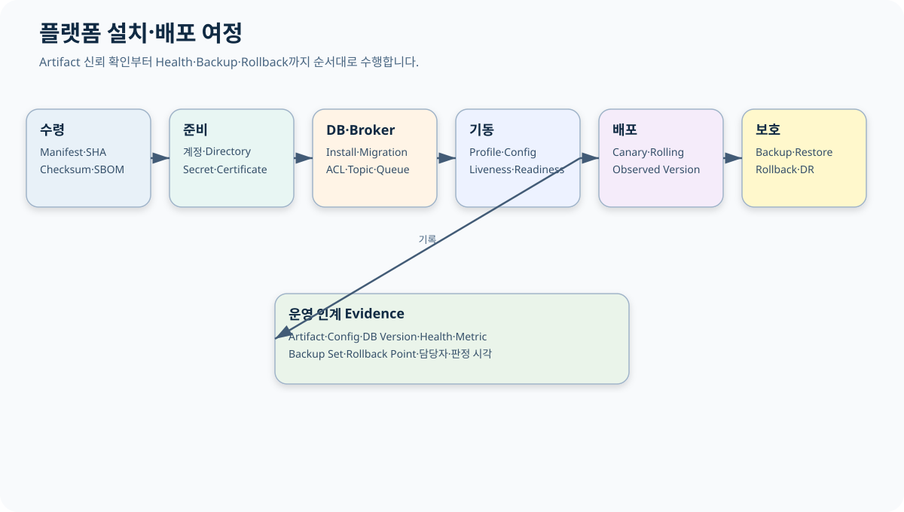
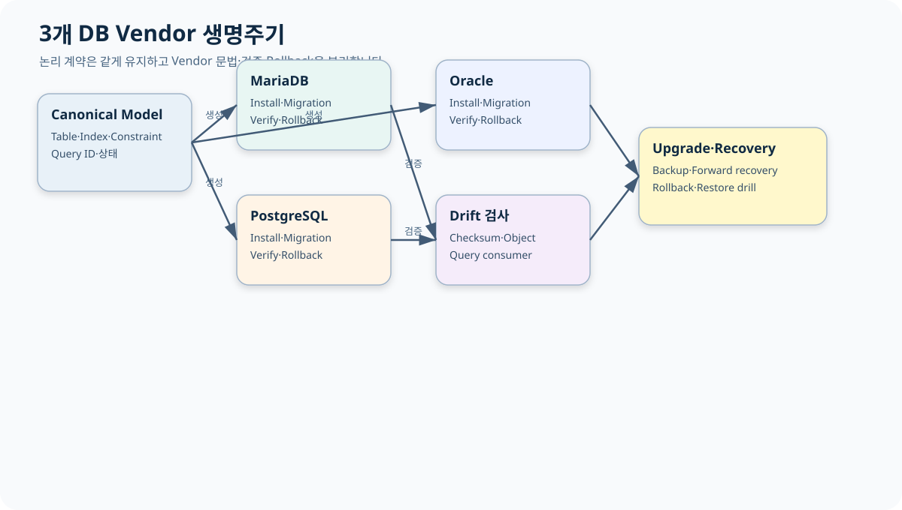
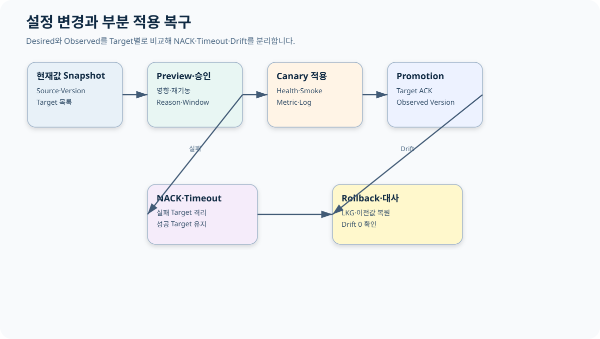

# CPF 플랫폼 운영 매뉴얼

> 기준 Repository: `https://github.com/freeangelsun/202412_01_CPF`
> 기준 Branch: `master`
> 기준 Commit: `ee977cf66c251081df78ea5e9675b81c3dfafa59` (`06_07`)
> 기준일: `2026-08-06 Asia/Seoul`

| 항목 | 내용 |
|---|---|
| 주 독자 | 개발환경·인프라·DBA·배포·관측·보안·DR 담당자, CPF를 처음 설치하는 운영자 |
| 이 문서로 완료할 일 | Artifact를 검증하고 계정·Directory·Config·Secret·DB·Broker를 준비해 기동·배포·관측·백업·복구·DR을 수행한다. |
| 읽는 방식 | 처음 접하는 독자는 앞에서부터 실습 순서로 읽고, 숙련자는 장별 판단표와 참조 경로를 사용한다. |
| 설명 원칙 | 제품 기능은 사용할 수 있는 상태로 설명한다. 실제 Source·SQL·API·Config·Frontend·Script·Test의 이름과 경계를 유지한다. |




## 1. 운영자가 인수할 배포 단위

Release를 받을 때 파일명만 보지 않는다. 다음을 하나의 배포 단위로 인수한다.

- Source Commit SHA와 제품 Version.
- JAR·WAR·Frontend Static Artifact·Worker Artifact.
- BOM·Dependency Lock.
- DB Vendor Install·Migration·Rollback·Verify Pack.
- Config Template와 Property Metadata.
- Secret·Certificate Reference 목록.
- OpenAPI·AsyncAPI·Generated Client Version.
- SBOM·Provenance·Checksum·Signature.
- Test 결과와 실행 환경.
- LKG Artifact와 Rollback 조건.

```powershell
$release='D:\release\cpf'
Get-ChildItem -LiteralPath $release -File -Recurse |
  Get-FileHash -Algorithm SHA256 |
  Sort-Object Path
```

Manifest와 Hash가 다르면 배포를 시작하지 않는다.

## 2. 계정과 Directory

| 구분 | 책임 | 권한 |
|---|---|---|
| Runtime 계정 | 서비스 Process 실행 | Artifact·Config Read, Log·Work Write |
| 배포 계정 | Artifact 배치·Service Manager | Runtime Secret 원문 Read 금지 |
| DBA Migration 계정 | Schema 변경 | 승인된 Script 실행 |
| DBA Read-only | 운영 조회·대사 | DML 금지 |
| Agent 계정 | 허용 Process Start·Stop·Status | 대상 Service Allowlist |
| Backup 계정 | Backup Write·Restore 환경 Read | 운영 DB 일반 DML 금지 |
| 보안 계정 | Secret·Certificate Rotation | 일반 Log·업무 데이터 접근 최소화 |

권장 Directory:

```text
D:\cpf\
├─ artifact\<version>\
├─ config\<environment>\
├─ secret-ref\
├─ certificate\
├─ log\<service>\
├─ work\<service>\
├─ data\
├─ backup\
└─ support-bundle\
```

Runtime이 Artifact와 Config를 덮어쓰지 못하게 한다. Log·Work가 가득 차도 Artifact·DB Data를 침범하지 않도록 용량과 File System을 분리한다.

## 3. 설치 전 Preflight

```powershell
$repo='D:\WORK_CPF\202412_01_CPF'
java -version
& (Join-Path $repo 'gradlew.bat') --version
Get-NetTCPConnection -State Listen | Sort-Object LocalPort
Get-Volume | Select-Object DriveLetter,SizeRemaining,Size
Resolve-DnsName db.example.internal
Test-NetConnection db.example.internal -Port 5432
```

확인 항목:

1. Java·Gradle·Spring Stack.
2. Port 충돌.
3. Disk와 Log·Temp 여유.
4. DNS·Network·Proxy.
5. DB·Broker·Secret Provider 접근.
6. Service 계정 권한.
7. Timezone·NTP 편차.
8. Certificate Chain·SAN·만료.

## 4. Configuration을 읽는 방법

설정은 네 종류로 구분한다.

| 종류 | 예 | 특징 |
|---|---|---|
| 실제 Property | `cpf.openapi.webmvc.enabled` | Type·Default·Consumer가 있는 값 |
| 환경변수 | `SPRING_PROFILES_ACTIVE` | 배포 환경에서 주입 |
| Capability Prefix | `cpf.messaging.kafka` | 여러 하위 Property를 묶는 Namespace |
| Secret Reference | DB Password·Token·Key | 원문을 문서·Git에 기록하지 않음 |

Capability Prefix를 실제 Boolean Key처럼 취급하지 않는다. `@ConfigurationProperties`, Metadata, Profile YAML에서 구체 하위 Key를 확인한다.

## 5. Build·Artifact 환경변수

| Key | Type | Default | 필수 조건 | Consumer | 적용 | 확인 | Rollback |
|---|---|---|---|---|---|---|---|
| `CPF_ARTIFACT_MODE` | Enum | `LOCAL_DEV` | LOCAL_DEV/REMOTE/OFFLINE | Gradle | Build | Repository 해석 Log | 이전 Mode |
| `CPF_ARTIFACT_REPOSITORY_URL` | URI | 없음 | REMOTE | Gradle | Build | Artifact Resolve | 이전 URL |
| `CPF_ARTIFACT_REPOSITORY_USER` | String | 없음 | 인증 Repository | Gradle | Build | Credential 오류 없음 | 이전 Secret Ref |
| `CPF_ARTIFACT_REPOSITORY_PASSWORD` | Secret | 없음 | 인증 Repository | Gradle | Build | Log 비노출 | 이전 Version |
| `CPF_LOCAL_ARTIFACT_REPOSITORY` | Path | `~/.cpf/repository` | LOCAL_DEV | Gradle | Build | Artifact 존재 | 이전 경로 |
| `CPF_OFFLINE_ARTIFACT_REPOSITORY` | Path | 없음 | OFFLINE | Gradle | Build | 외부 접속 없이 Build | 이전 Bundle |
| `CPF_SOURCE_SHA` | SHA-1 | Git HEAD | 40 hex | Build·Manifest | Build | Manifest와 Commit 일치 | 정확한 SHA |
| `SPRING_PROFILES_ACTIVE` | String | Module별 | 승인 Profile | Spring | Restart | Startup Log | 이전 Profile |
| `SERVER_PORT` | Integer | Module별 | 1~65535 | Web Runtime | Restart | Listen·Health | 이전 Port |

## 6. OpenAPI WebMVC Property

| Property | Type | Default | 범위·조건 | 적용 | 정상 확인 | 오류 | Rollback |
|---|---|---:|---|---|---|---|---|
| `cpf.openapi.webmvc.enabled` | Boolean | `true` | true/false | Restart | OpenAPI Status | Bean 없음 | 이전 값 |
| `cpf.openapi.webmvc.api-docs-enabled` | Boolean | `false` | 환경 노출 정책 | Restart | Docs Path 응답 | 불필요한 외부 노출 | `false` |
| `cpf.openapi.webmvc.management-enabled` | Boolean | `true` | true/false | Restart | 관리 Snapshot | 운영 조회 없음 | 이전 값 |
| `cpf.openapi.webmvc.api-docs-path` | Path | `/v3/api-docs` | `/` 시작, `..` 금지 | Restart | Path 응답 | Startup Validation | 이전 Path |
| `cpf.openapi.webmvc.title` | String | `CPF API` | 빈값 금지 | Restart | Snapshot Title | Startup Validation | 이전 값 |
| `cpf.openapi.webmvc.version` | String | `unspecified` | Release Version 권장 | Restart | Snapshot Version | Consumer Version 혼동 | 이전 값 |
| `cpf.openapi.webmvc.instance-id` | String | `local` | Instance Unique | Restart | ADM OpenAPI 화면 | 중복 Instance | 이전 ID |
| `cpf.openapi.webmvc.minimum-refresh-interval` | Duration | `1s` | 0 이상 | Restart | Refresh 제한 | 과도 Refresh | 이전 값 |

## 7. ADM 통합 정정 Property

Prefix: `cpf.adm.integration-closure`

| Property | Type | Default | 운영 기준 | 적용 | 확인 | Rollback |
|---|---|---:|---|---|---|---|
| `enabled` | Boolean | `false` | 기능 사용 환경만 true | Restart | `/integrationClosure` + Backend Health | false |
| `ephemeral-providers-enabled` | Boolean | `false` | Local/Dev 검증만 사용 | Restart | Provider Bean·Startup Log | false |
| `correction-approval-ttl` | Duration | `15m` | 0보다 큼 | Restart | 승인 만료시각 | 이전 TTL |
| `webhook.allowed-hosts` | Set<String> | 빈 Set | 승인 Host만 | Restart | Endpoint Validation | 이전 Allowlist |
| `webhook.max-attempts` | Integer | `5` | 1 이상 | Restart | Delivery Attempt | 이전 한도 |
| `webhook.base-delay` | Duration | `1s` | 0보다 큼 | Restart | Retry Schedule | 이전 Delay |
| `crypto.enabled` | Boolean | `false` | Key 준비 뒤 true | Restart | Crypto Status | false |
| `crypto.active-key-version` | String | 없음 | 활성 Key Version | Restart | Status·Audit | 이전 Version |
| `crypto.active-key-base64` | Secret | 없음 | Secret Provider 주입 | Restart | Log 비노출·Crypto Test | 이전 Secret Version |

운영 환경에서 `ephemeral-providers-enabled=true`를 사용하지 않는다. Secret 원문은 Matrix나 YAML 예시에 넣지 않고 Reference 이름만 기록한다.

## 8. Runtime Control 환경변수

| Key | 필수 | 설명 | 검증 |
|---|---:|---|---|
| `CPF_RUNTIME_INSTANCE_ID` | Y | Instance 고유 ID | Topology·Heartbeat |
| `CPF_RUNTIME_SERVICE_ID` | Y | 논리 Service | Registry 연결 |
| `CPF_RUNTIME_ENDPOINT_CODE` | Y | Endpoint 식별자 | Endpoint 조회 |
| `CPF_RUNTIME_BASE_URL` | Y | Runtime Probe Base URL | Health 응답 |
| `CPF_RUNTIME_CONTROL_BASE_URL` | Y | Control Plane URL | Command 조회 |
| `CPF_RUNTIME_CONTROL_AGENT_TOKEN` | Y | Agent 인증 Secret | 401 없음·Log 비노출 |

## 9. Cache·Valkey

| Property | Type | Default | 범위 | 적용 | 검증 |
|---|---|---:|---|---|---|
| `cpf.data.cache.valkey.enabled` | Boolean | `false` | true/false | Restart | Provider Bean·ADM `/cache` |
| `cpf.data.cache.valkey.key-prefix` | String | `cpf:` | 허용 문자·최대 길이 | Restart | Tenant·Namespace 격리 |
| `cpf.data.cache.valkey.invalidation-channel` | String | `cpf.cache.invalidate` | 허용 Channel | Restart | Signal·Durable Reconcile |
| `cpf.data.cache.valkey.default-ttl` | Duration | `10m` | 0보다 큼 | Restart | TTL 조회 |
| `cpf.data.cache.valkey.required` | Boolean | `true` | Fail-closed 여부 | Restart | Provider 부재 Startup |
| `cpf.data.cache.valkey.tls` | Boolean | `false` | 고객 TLS 정책 | Restart | Handshake·Certificate |
| `cpf.data.cache.valkey.maximum-payload-bytes` | Long | `1048576` | 1~67108864 | Restart | 경계 Payload Test |
| `cpf.data.cache.valkey.scan-count` | Long | `500` | 10~10000 | Restart | SCAN 부하·삭제 건수 |
| `cpf.cache.invalidation.consumer-id` | String | Instance 기반 | Consumer Unique | Restart | Checkpoint ID |
| `cpf.cache.invalidation.reconcile-batch-size` | Integer | `200` | 1~10000 | Restart | 처리량·DB 부하 |
| `cpf.cache.invalidation.reconcile-max-batches` | Integer | `20` | 1~1000 | Restart | 1회 처리 상한 |

Signal을 정본으로 사용하지 않는다. Process Kill 또는 Signal 유실 뒤 Durable Ledger의 Checkpoint 이후 Event를 Reconcile한다.

## 10. Browser Release Test 환경변수

| Key | 설명 | 보안 |
|---|---|---|
| `CPF_FRONTEND_URL` | ADM/BZA Frontend URL | 일반 |
| `CPF_E2E_RELEASE` | Release Mode 여부 | 일반 |
| `CPF_E2E_AUTH_STATE` | 인증 Session 파일 | Secret 취급 |
| `CPF_E2E_PRIVILEGED_ENDPOINTS` | 위험 Endpoint Matrix | 제한 |
| `CPF_E2E_ROUTE_MATRIX` | Route Coverage | 일반 |
| `CPF_E2E_FAILURE_MATRIX` | 실패·복구 Coverage | 일반 |
| `CPF_E2E_SECURITY_FIXTURE` | Permission·Masking Negative Fixture | Secret·PII 주의 |

## 11. DB 3개 Vendor 설치



### 11.1 공통 순서

1. Release의 Canonical Schema Version 확인.
2. Vendor Pack Hash 확인.
3. Backup 또는 Restore Point 생성.
4. Readiness Query와 권한 확인.
5. Install 또는 Migration 실행.
6. Verify Script로 Table·Index·Constraint·Seed·Checksum 확인.
7. Application을 Canary 기동.
8. Smoke·Audit·Query Consumer 확인.
9. Rollback 또는 Forward Recovery 조건 기록.

### 11.2 Migration 실패

| 실패 | 판정 | 조치 |
|---|---|---|
| Script 시작 전 문법 오류 | `FAILED` | Script 수정·재검증 |
| 일부 DDL 적용 | `PARTIAL` | Vendor Transaction 특성 확인, Forward Recovery 우선 검토 |
| App 기동 뒤 Query 오류 | `FAILED` 또는 Drift | Schema·Query ID·Consumer Version 대사 |
| Checksum 불일치 | `DRIFT` | 승인 없이 수정하지 않고 정본과 비교 |
| Rollback 불가 DDL | 복구 계획 필요 | Backup Restore 또는 Forward Script |

## 12. Broker 준비

### Kafka

- Topic Name·Partition·Replication.
- Producer Idempotency·Acks.
- Consumer Group·Offset·DLQ.
- ACL·TLS·Credential Version.
- Lag·Under Replicated Partition Alert.

### RabbitMQ·JMS·IBM MQ

Exchange·Queue·Binding·DLX, Destination·Ack·Redelivery, QM·Channel·Queue·CCSID·Backout Queue를 각각 관리한다. Provider 고유 Error를 일반 Timeout으로 덮지 않는다.

## 13. 신규 설치

1. Artifact·Manifest·Hash 수령.
2. Runtime 계정과 Directory 생성.
3. Config Template 배치.
4. Secret·Certificate Reference 연결.
5. DB Install·Verify.
6. Broker·Object Store·External Target Probe.
7. Service를 Traffic 없이 기동.
8. Liveness·Readiness·Version·Capability 확인.
9. Smoke Query·Command·Audit 수행.
10. Traffic을 단계적으로 연결.
11. Backup과 LKG 기록.

## 14. 기동·종료

### 기동 판정

- Process가 살아 있음.
- Liveness 성공.
- Readiness 성공.
- Source SHA·Artifact Version 일치.
- DB·Broker·Secret Provider 필수 Dependency Health.
- OpenAPI·Route·Capability Snapshot.
- Startup Error 0.

### 종료

1. 신규 Traffic 차단.
2. In-flight 요청과 Batch Step 확인.
3. Scheduler Disable 또는 Drain.
4. Outbox·Delivery·Audit Queue 처리 상태 기록.
5. 정상 종료 요청.
6. Timeout 뒤 강제 종료가 필요하면 Incident와 마지막 Evidence 기록.

## 15. Config 변경



1. Key의 Type·Default·Consumer·Secret·Restart를 확인한다.
2. 현재 Value Source와 Desired·Observed Version을 Snapshot한다.
3. Preview에서 대상·영향·경고를 확인한다.
4. Reason·Approval·Window를 확보한다.
5. Canary Target에 적용한다.
6. Health·Log·Metric·업무 Smoke를 확인한다.
7. Promotion한다.
8. NACK·Timeout Target을 분리한다.
9. 이전 값 또는 LKG로 Rollback한다.
10. Drift가 0인지 확인한다.

## 16. Rolling·Blue-Green·Canary

| 방식 | 선택 | 필수 확인 |
|---|---|---|
| Rolling | 작은 호환 변경 | Mixed Version 계약·Readiness |
| Blue-Green | 빠른 Traffic 전환과 Rollback | DB·Message 하위 호환, Session |
| Canary | 위험도 높은 변경 | Target 비율·관측 Window·중단 기준 |

DB Schema와 Message가 이전 Version과 호환되지 않으면 Application만 Rolling하지 않는다.

## 17. 관측

### Log

Transaction ID, Trace ID, Operation ID, Attempt, Target, Error Code, Version을 연결한다. Secret·Token·Raw 개인정보를 기록하지 않는다.

### Metric

요청 건수·지연·오류율·Pool·Queue·Lag·Unknown Age·DLQ·Disk·Memory를 사용한다. Transaction ID를 Metric Label로 사용하지 않는다.

### Trace

Browser→BFF→Service→DB·Broker·Target Segment를 연결한다. UTC와 업무 시각을 구분한다.

### Alert

Alert에는 증상, 영향, 기준값, Owner, 첫 확인 Route, Runbook, Suppression 조건을 넣는다.

## 18. Capacity

- CPU·Heap·GC.
- Thread·Connection Pool.
- DB Session·Lock·Slow Query.
- Broker Partition·Lag·Queue Depth.
- Batch Worker·Chunk 처리량.
- Disk·Log·Temp·Object Store.
- Network Connection·TLS Handshake.

부하 Test는 처리량만 기록하지 않고 Queue·Timeout·오류·복구 시간을 함께 측정한다.

## 19. Backup·Restore

### Backup Set

- 업무 DB.
- Batch Metadata.
- Outbox·Inbox·Attempt·Audit.
- Object Metadata와 Object.
- Config Version·Manifest.
- Secret·Certificate는 Provider 정책과 Version Reference.

### Restore Drill

1. 격리 환경 준비.
2. Backup Hash와 암호화 Key 접근 확인.
3. 순서대로 Restore.
4. Schema·Row Count·금액·Audit·Object Hash 대사.
5. Application 기동.
6. Read-only Smoke.
7. 승인 뒤 Write Test.
8. RPO·RTO와 실제 소요 기록.

Backup 파일이 존재한다는 사실만으로 복구 가능하다고 판정하지 않는다.

## 20. Upgrade·Rollback

Upgrade 전:

- Source SHA·Release Note.
- API·Message·DB·Config Compatibility.
- Migration·Backup·Rollback Script.
- Canary·중단 기준.
- LKG.

Rollback은 Application, Config, DB, Message, Frontend를 따로 판단한다. DB가 Forward-only면 이전 Application이 새 Schema를 읽을 수 있는지 확인한다.

## 21. DR

| 항목 | 결정 |
|---|---|
| RPO | 허용 데이터 손실 시점 |
| RTO | 허용 서비스 복구 시간 |
| 복제 | DB·Object·Config·Artifact·Audit |
| 전환 | DNS·Load Balancer·Route·Credential |
| 검증 | Readiness·업무 대사·외부 Target |
| Failback | 원본 Site 정상화와 Drift 대사 |

Failover 성공 뒤에도 Outbox·Attempt·Batch Execution·Lease를 대사한다.

## 22. 장애 Runbook

### 22.1 DB 연결 실패

1. DNS·Port·TLS·Credential 확인.
2. Pool 고갈과 DB Session 확인.
3. Readiness와 Error Code 확인.
4. 신규 Traffic 제한.
5. DB 정상화 뒤 Transaction·Outbox·Batch 상태 대사.

### 22.2 Broker 장애

1. Producer Error·Lag·Queue 확인.
2. 업무 DB Commit은 Outbox로 보존됐는지 확인.
3. Broker 복구 뒤 Publisher 재개.
4. 중복 Delivery를 Inbox로 차단.
5. DLQ와 Unknown을 대사.

### 22.3 Instance 장애

1. Load Balancer에서 제외.
2. Heartbeat·Process·Thread Dump·Log 확인.
3. Lease·Fencing·Batch Step 확인.
4. 다른 Instance의 처리 여부 확인.
5. 재기동 뒤 stale writer가 차단됐는지 확인.

### 22.4 Disk Full

1. 영향 Directory와 Mount 확인.
2. 새 Log·Upload·Batch 유입 제한.
3. 확정된 보존 정책 대상만 이동·삭제.
4. DB·Artifact·Audit 손상 확인.
5. 용량 복구 뒤 Checksum·Queue·Job Restart 대사.

### 22.5 Memory·Thread 고갈

1. Heap·GC·Thread·Queue 확인.
2. 신규 Traffic·Batch Dispatch 제한.
3. Leak·Unbounded Queue·대용량 Payload 원인 분리.
4. Canary 수정 또는 Instance 교체.
5. 실패 Operation과 Unknown 결과 대사.

### 22.6 Network partition

1. Zone·Target별 Reachability 확인.
2. Retry Storm 차단.
3. Circuit·Bulkhead 상태 확인.
4. Lease·Fencing으로 stale writer 차단.
5. 연결 복구 뒤 Target·Owner 상태 대사.

### 22.7 Security Incident

1. Credential·Session·Key 영향 범위 확인.
2. Token·Session 폐기와 Key Rotation.
3. Break-glass 사용 시 Scope·Expiry·사후 검토.
4. Audit·Download·Raw Contact 접근 조회.
5. Consumer의 새 Version 적용 상태 확인.

## 23. 운영 인계

- Artifact·Source SHA·Checksum·LKG.
- Service 계정·Directory·Port.
- 전체 실제 Property와 Value Source.
- Secret·Certificate Reference·Version·만료.
- DB Vendor·Schema Version·Backup·Restore Point.
- Broker·Topic·Queue·ACL.
- Health·Log·Metric·Trace·Alert.
- 배포 방식과 중단 기준.
- 미종결 Incident·Unknown·Partial·Drift.
- Rollback·DR 절차와 담당자.

## 24. 플랫폼 운영 자체 검수

1. Artifact와 Source SHA가 일치하는가?
2. Runtime·배포·DBA·보안 계정이 분리됐는가?
3. 실제 Property와 Capability Prefix를 구분했는가?
4. Secret 원문이 Config·Log·Bundle에 없는가?
5. DB 3개 Vendor의 Install·Migration·Verify·Rollback이 있는가?
6. Traffic 연결 전 Health·Smoke를 확인했는가?
7. 부분 적용 Target을 개별 판정하는가?
8. Backup Restore Drill을 수행할 절차가 있는가?
9. DR Failover 뒤 업무 원장을 대사하는가?
10. 장애 Runbook만으로 교대자가 다음 행동을 결정할 수 있는가?
