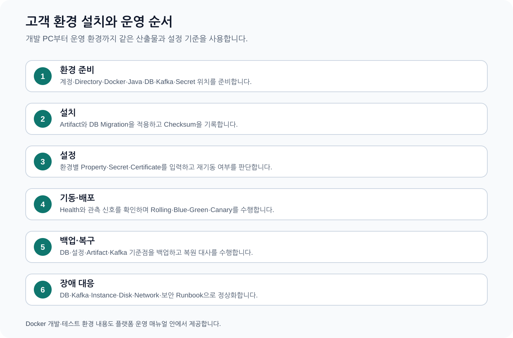
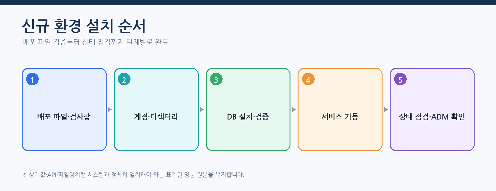
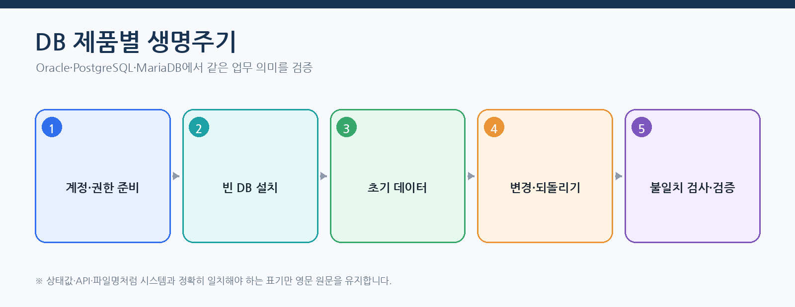
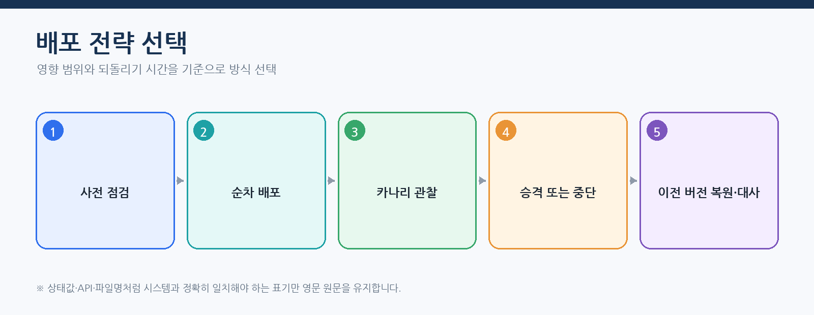
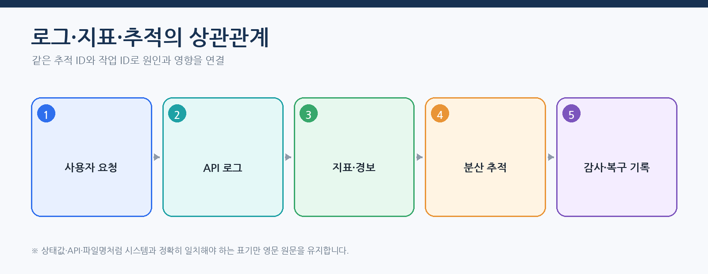
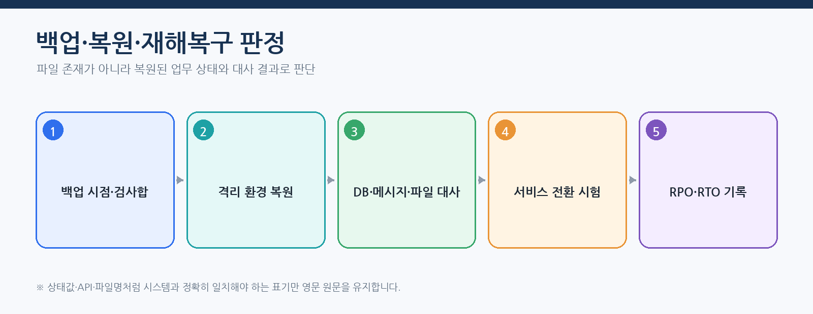
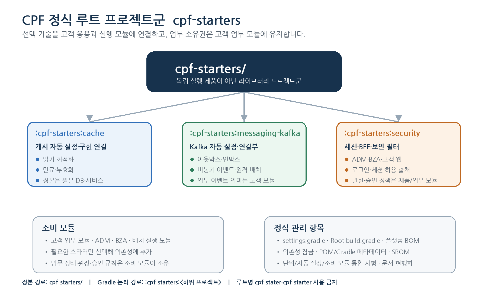

# CPF 플랫폼 운영 매뉴얼 — 설치·설정·배포·관측·복구

> **주 독자**: 개발환경·인프라·DBA·배포·관측·백업·DR 담당자
> **목표**: 배포 파일 검증부터 설치, 기동, 배포, 장애 복구와 업그레이드·되돌리기를 수행한다.

> **용어 표기 원칙**: 설명은 한글을 우선한다. API 경로, 설정 키, 클래스·파일명, HTTP 헤더와 실제 상태값은 시스템과 일치해야 하므로 원문을 유지한다.



## 이 매뉴얼을 사용하는 기준

이 매뉴얼은 고객이 현재 배포 기준의 CPF 기능을 처음 접한다는 전제로 작성한다. 사용자는 소스를 역분석하지 않고 이 문서의 **시작 조건 → 단계별 절차 → 정상 결과 → 오류·복구 → 운영 인계** 순서로 작업한다.

- 제품 기능과 고객 교육 예제는 구현된 기능을 기준으로 설명한다.
- 기능 식별자·API·설정값·화면이 변경되면 같은 커밋에서 매뉴얼도 함께 현행화한다.
- 고객 업무 데이터·상태·승인 기준·대사 기준은 고객이 정하고, CPF가 제공하는 실행·보안·감사·복구 계약에 연결한다.
- 명령과 예시는 저장소 최상위 폴더에서 실행하는 것을 기본으로 한다.
- 운영 변경은 사전 확인, 사유, 권한, 승인, 버전, 대상별 결과, 감사 순서로 확인한다.

> 문서 검수자는 소스·SQL·API·설정·화면·스크립트·시험과 양방향으로 대조한다. 고객 사용자는 별도 소스 분석 없이 본문 절차를 수행할 수 있어야 한다.
## 처음 설치하는 운영자의 완료 기준



설치는 배포 파일을 복사하고 프로세스가 뜨는 것으로 끝나지 않는다. 다음 항목이 같은 배포 기준으로 확인되어야 한다.

- 배포 파일·명세 파일·SHA-256
- 서비스 계정·디렉터리·권한·소유자
- DB 제품 프로필·계정·권한 준비·설치·초기 데이터·검증
- 설정값·환경변수·프로필·비밀정보·인증서
- 프로세스 등록 파일·포트·상태 점검·의존 대상
- 로그·지표·추적·감사와 ADM 상태
- 백업·복원·되돌리기·DR 절차와 담당자

## 종단간 따라하기 — 신규 환경 설치

### 1. 사전 점검

```powershell
git rev-parse HEAD
java -version
pwsh --version
Get-FileHash .\<artifact> -Algorithm SHA256
```

고객 환경표에 OS, Java, PowerShell, DB 제품·버전, Kafka, DNS, NTP, 방화벽, 인증서, 저장소, 백업 경로를 기록한다. 비밀정보 원문은 문서와 Git에 기록하지 않는다.

### 2. DB 프로필 작성과 정적 검증

기본 프로필은 `cpf-tools/config/database-install.default.json`이다. 환경별 복사본에 Host·포트·DB·스키마·관리자/DB 변경 이력/실행 환경 계정과 TLS 설정을 입력한다.

```powershell
pwsh -File .\cpf-tools\scripts\initialize-cpf-database.ps1 `
  -ProfilePath .\cpf-tools\config\database-install.customer.json `
  -All
```

`-RequireRun` 없이 실행하면 프로필·제품 묶음·선택 모듈을 검증하고 실제 DB에는 반영하지 않는다.

### 3. DB 설치 실행

```powershell
pwsh -File .\cpf-tools\scripts\initialize-cpf-database.ps1 `
  -ProfilePath .\cpf-tools\config\database-install.customer.json `
  -All -SeedMode product -RequireRun
```



정상 판정:

- 선택 모듈과 제품이 예상과 일치한다.
- 계정·권한 준비·설치·제품 초기 데이터·검증이 성공한다.
- `build/db-install/database-profile-install-result.sanitized.json`에 비밀정보 없이 결과가 기록된다.
- DB 변경 이력 원장과 검증 조회가 일치한다.
- Oracle·PostgreSQL·MariaDB 중 선택한 한 제품만 한 플랫폼 묶음에서 사용된다.

### 4. 로컬·검증 환경 기동

```powershell
pwsh -File .\cpf-tools\scripts\start-cpf-local.ps1 -Mode integration
pwsh -File .\cpf-tools\scripts\status-cpf-local.ps1
```

기본 포트는 웹 `8080`, 배치 제어 `8090`, 스케줄러 `8091`, 작업자 노드 `8092`, 센터컷 `8093`, 호스트 에이전트 `8094`다. 환경에서 충돌하지 않게 명시적으로 변경한다.

정상 판정은 프로세스 등록 파일이 생성되고 모든 활성 역할의 `/actuator/health`가 `UP`인 상태다. 종료는 다음 명령으로 수행한다.

```powershell
pwsh -File .\cpf-tools\scripts\stop-cpf-local.ps1
```

### 5. 운영 설정값 확정

아래 **운영 필수 설정 원장**에서 고객 환경 값을 확정한다. 설정 키를 임의로 만들지 않고, 비밀정보는 원문 대신 제공자 참조와 버전만 기록한다. 변경 전후에는 유효값, 재기동 여부, 대상별 적용 상태와 되돌리기 값을 함께 남긴다.

## 배포 전략



- 순차: 인스턴스를 순차 교체하며 연결 비우기와 세션 호환성을 확인한다.
- 블루그린: 새 환경을 별도로 구성하고 DB·메시지 호환성을 확인한 뒤 트래픽을 전환한다.
- 카나리: 일부 트래픽에서 오류율·지연·UNKNOWN_RESULT를 관찰한 뒤 확대한다.

승격 전에는 상태 점검뿐 아니라 업무 오류율, DB 변경 이력 호환성, Kafka 처리 지연, 배치 실행, 게이트웨이 경로 불일치, ADM 조치 가능성을 확인한다.

## 관측과 장애 분석



- 로그: 상태·오류 코드·버전·시도 이력·가림 처리된 식별자
- 지표: 요청률·오류율·지연·대기열·묶음·처리 지연·디스크·메모리
- 추적: API·DB·Kafka·파일·외부기관 구간
- 감사: 수행자·사유·`approvalId`·변경 전후·`operationId`

수집 장애 시 응용 계층을 무조건 재시작하지 않는다. 수집기 연결, 버퍼·대기열, 유실 수, 디스크, 표본 추출과 보존기간을 먼저 확인한다.

## 백업·복원·재해복구 실습



1. DB·파일·객체 저장소·설정·비밀정보 참조·Kafka 복구 범위를 정의한다.
2. 백업 설정 ID와 SHA-256, 암호화, 보존 위치를 기록한다.
3. 격리 환경에 복원하고 스키마·건수·금액·해시를 대사한다.
4. 응용 계층을 연결해 조회·등록·배치·게이트웨이·ADM 기본 동작 시험을 수행한다.
5. DR 전환은 주 운영 임대 잠금·펜싱과 트래픽 전환 순서를 확인한다.
6. 복귀 시 두 사이트의 쓰기 이력을 대사하고 동시 주 운영이 없음을 확인한다.
7. 실제 RTO·RPO와 실패 지점을 증적에 남긴다.

## 지원 환경을 확정하는 방법

1. 기준 Commit의 빌드 도구 묶음, BOM, 컨테이너·스크립트 소스를 확인한다.
2. OS, Java, PowerShell, 컨테이너 실행 환경, DB 제품·버전, Kafka·Redis·관측 도구를 기록한다.
3. 고객 인수 시험에서 확인한 조합을 지원 조합표에 기록한다.
4. 고객 환경의 방화벽·DNS·NTP·인증서·저장소·백업 정책을 확인한다.
5. 고객 환경에서 사용할 조합은 설치 전 검증 환경에서 같은 명령과 판정 기준으로 확인한다.

## `cpf-starters` 빌드·배포·운영 관리

`cpf-starters/`는 정식 저장소 루트 프로젝트군이다. 현재 관리 대상은 `cache`, `messaging-kafka`, `security`이며, 각각 라이브러리 배포 파일로 소비 모듈에 포함된다. 스타터 자체를 독립 프로세스로 배포하거나 포트·서비스 계정을 따로 만들지 않는다.



### 배포 단위와 사용 모듈

| 프로젝트 | 배포 성격 | 대표 사용 모듈 | 배포 시 함께 확인할 기반 |
|---|---|---|---|
| `:cpf-starters:cache` | 캐시 자동 설정 라이브러리 | 고객 업무·ADM·BZA의 읽기 최적화 구간 | 캐시 제공자, 메모리·연결 용량, 만료·무효화 정책 |
| `:cpf-starters:messaging-kafka` | Kafka 자동 설정·연결부 라이브러리 | 고객 업무 비동기 처리·원격 배치 메시징 | 브로커, 주제·ACL, 직렬화 계약, 아웃박스·인박스 |
| `:cpf-starters:security` | 세션·BFF·보안 필터 라이브러리 | ADM·BZA·고객 운영 웹 | 세션 DB, 쿠키·허용 출처, 암호화 키, 시간 동기 |

### 정식 프로젝트 등록 검사

저장소 루트에서 다음을 확인한다.

```powershell
.\gradlew.bat projects
.\gradlew.bat :cpf-starters:cache:check `
  :cpf-starters:messaging-kafka:check `
  :cpf-starters:security:check
.\gradlew.bat clean build
```

`projects` 출력에 세 공개 스타터가 `:cpf-starters:*` 경로로 나타나야 한다. 루트 `settings.gradle`, 루트 빌드 규칙, 플랫폼 BOM, 의존성 잠금과 SBOM 중 하나라도 누락되면 배포 후보로 올리지 않는다. 기능 묶음 별칭은 루트 버전 카탈로그나 중앙 빌드 규칙에 실제 등록된 경우에만 사용하고, 등록되지 않은 별칭을 문서의 논리 이름만 보고 호출하지 않는다.

### 스타터 관리 원장

플랫폼 운영팀은 하위 프로젝트별로 다음 항목을 한 행으로 관리한다. 이 원장이 없으면 어떤 서비스가 어떤 스타터를 왜 사용하는지 판단할 수 없으므로 배포 승인을 보류한다.

| 관리 항목 | 기록 내용 |
|---|---|
| 프로젝트·배포 좌표 | Gradle 경로, Repository 경로, 게시 그룹·배포 이름·버전 |
| 책임과 비범위 | 제공 기술 기능, 소유하지 않는 업무 규칙, 사용 금지 상황 |
| 실제 사용 모듈 | 직접 의존 모듈, 전이 의존으로 포함되는 모듈, 배포 인스턴스 |
| 설정 계약 | 설정 접두어, 환경변수, 자료형, 기본값, 필수 조건, 비밀정보, 재기동 여부 |
| 외부 기반 | 캐시 제공자, Kafka, 세션 DB·키·시간 동기와 연결 제한 |
| 활성 조건 | 자동 설정 조건, 프로필, 필요한 클래스·빈·설정, 비활성 이유 확인법 |
| 상태와 관측 | 준비 상태, 로그 코드, 핵심 지표, 추적 속성, 감사 연결 |
| 실패와 복구 | 시간 초과, 응답 유실, 부분 실패, 데이터 호환성, 우회·대사·되돌리기 |
| 시험과 증적 | 단위, 자동 설정, 소비 모듈 통합, 보안, 장애, 최종 실행 파일 분석 |
| 문서 연결 | 00 선택 기준, 01 개발 절차, 04 운영 신호, 05 배포 절차, 관련 제품 매뉴얼 |

### 공개 스타터·묶음·BOM 관리 원칙

| 항목 | 역할 | 의존성을 실제로 추가하는가 | 운영 확인 |
|---|---|---:|---|
| 플랫폼 BOM | 스타터와 CPF 모듈 버전 정렬 | 아니요 | 제약 버전·게시 좌표·잠금 일치 |
| 개별 공개 스타터 | 하나의 선택 기능 연결 | 예 | POM·실행 파일·SBOM 포함 여부 |
| 기능 묶음 별칭 | 여러 공개 스타터를 승인된 조합으로 펼침 | 예 | 묶음 정의와 실제 펼침 결과 일치 |
| 내부 세부 모듈 | 자동 설정·제공자·관측·시험 구현 | 공개 스타터를 통해서만 | 도메인 직접 의존이 없는지 검사 |

운영 설정 원장에는 `선택 묶음`, `펼쳐진 공개 스타터`, `각 버전`, `선택 사유`, `외부 기반`, `준비 상태`, `되돌리기 버전`을 함께 기록한다. 묶음 이름만 기록하면 정의 변경 때 실제 포함 기능을 추적할 수 없다.

권장 기능 묶음은 `secure-web`, `read-optimized`, `event-driven`, `operations-web`, `operations-event`다. 새로운 묶음은 실제 사용 사례·장애 시험·제거 시험이 반복 검증된 후에만 중앙 카탈로그에 등록한다. BOM에 좌표를 넣는 것만으로 묶음이 생긴 것으로 간주하지 않는다.

관측·회복성·기능 전환·비밀정보·파일·외부 연계처럼 추가 분리 후보가 생겨도 이름만 문서에 먼저 추가하지 않는다. 다음 항목이 모두 준비된 경우에만 공개 스타터 목록과 기능 묶음에 반영한다.

- 정식 루트 프로젝트 경로와 공개 배포 좌표
- 코어에 남는 공개 계약과 스타터로 이동하는 구현 경계
- 플랫폼 BOM·잠금·게시 메타데이터·SBOM
- 생성 도구 선택값과 생성 결과
- 설정 키·기본값·비밀정보·준비 상태
- 단위·자동 설정·소비 모듈 통합·장애·제거·되돌리기 시험
- 영향을 받는 고객 매뉴얼의 선택표·운영표·복구 절차

### 설정과 기동 판정

1. 소비 모듈이 어떤 스타터와 버전을 포함하는지 배포 명세에 기록한다.
2. 프로필별 설정의 값·기본값·비밀정보 여부·재기동 필요 여부를 운영 설정 원장에 기록한다.
3. 기동 로그에서 자동 설정 활성·비활성 이유를 확인한다.
4. 준비 상태에서 외부 기반 연결과 필수 설정 누락을 확인한다.
5. 대표 업무를 실행해 캐시 사용 전후 결과, Kafka 발행·수신 원장, 보안 세션 흐름을 확인한다.
6. 로그·지표·추적·감사에 비밀정보·세션 원문·메시지 민감정보가 남지 않는지 검사한다.

### 부분 적용과 불일치

다중 인스턴스에서 스타터 버전이나 설정이 다르면 같은 요청이 인스턴스마다 다르게 처리될 수 있다. 배포 과정에서 다음을 비교한다.

- 배포 파일 검사합과 CPF 버전
- 포함 스타터와 각 버전
- 프로필·환경변수의 유효값
- 자동 설정 활성 결과
- 세션·브로커·캐시 제공자 연결 상태

일부 인스턴스만 실패하면 해당 인스턴스를 신규 요청에서 제외하고 원인을 수정한다. 이미 처리된 요청은 작업 ID·멱등 키·메시지 원장·세션 감사로 결과를 확정하며, 전체 요청을 일괄 재실행하지 않는다.

### 하위 프로젝트 세분화 변경 절차

현재 `cache`, `messaging-kafka`, `security`가 더 작은 프로젝트로 분리되거나 제공자별 프로젝트로 나뉘는 변경은 다음 순서로 수행한다.

1. 기존 프로젝트의 공개 계약·자동 설정·설정 키·실제 사용 모듈을 전수 수집한다.
2. 새 프로젝트별 단일 책임, 의존 방향, 선택 조건과 비범위를 승인한다.
3. 기존 설정 키 유지·변경·폐기와 데이터 호환 정책을 정한다.
4. 루트 프로젝트 등록, 플랫폼 BOM, 잠금 파일, 게시 메타데이터와 SBOM을 갱신한다.
5. 공개 스타터가 새 내부 모듈을 조립하도록 먼저 이관하고 이전·신규 경로의 동일 업무 결과를 비교한다. 고객 도메인이 내부 세부 모듈을 직접 등록하게 하지 않는다.
6. 캐시 직렬화, Kafka 스키마·주제, 세션 DB·쿠키·암호화 키의 호환성을 검증한다.
7. 다중 인스턴스 혼합 버전에서 허용·금지되는 배포 순서를 정한다.
8. 오류 주입과 되돌리기를 실행해 이전 배포 파일·설정·데이터로 복원 가능한지 확인한다.
9. 이전 내부 프로젝트의 직접·전이 소비가 0이고 최종 실행 파일과 SBOM에서 제거됐는지 확인한다. 공개 스타터와 기능 묶음 이름은 호환 정책에 따라 유지하거나 명시적으로 전환한다.
10. 공식 매뉴얼 9개 중 영향 문서와 스타터 그림·선택표·운영 원장을 같은 변경에서 갱신한다.

세분화 개발이 진행되는 동안 문서는 새 이름만 먼저 나열하지 않는다. 코드·빌드 등록·게시 좌표·실제 소비·설정·시험이 한 변경에서 확인된 프로젝트만 현재 선택표에 추가한다.

### 업그레이드와 되돌리기

1. 플랫폼 BOM과 스타터 버전을 함께 변경한다.
2. 스타터 단위 시험, 소비 모듈 통합 시험, 전체 빌드와 실행 파일 분석을 수행한다.
3. 한 인스턴스에 먼저 배포하고 대표 업무·장애·복구 흐름을 확인한다.
4. 이상이 없을 때 나머지 인스턴스로 확대한다.
5. 되돌리기는 이전 BOM·잠금 파일·소비 모듈 배포 파일·설정값을 함께 복원한다.
6. Kafka 스키마·세션 DB·캐시 직렬화 형식이 바뀌었다면 단순 JAR 되돌리기 전에 하위 호환성과 데이터 정리 절차를 확인한다.

## 배포 파일·검사합·계정·디렉터리

- 배포 파일, SBOM, 명세 파일, 서명, SHA-256을 같은 배포 버전으로 묶는다.
- 서비스 계정은 실행 환경별 최소 권한과 디렉터리 소유권을 가진다.
- 실행 파일·설정·로그·데이터·임시·백업 디렉터리를 분리한다.
- 저장소 소스와 배포 실행 환경 디렉터리를 혼용하지 않는다.
- 비밀정보·개인 키·인증서 원문을 ZIP·로그·명령 이력에 포함하지 않는다.

## 운영 필수 설정 원장

이 표는 고객이 직접 결정하거나 환경별로 지정하는 설정을 정리한다. 표에 없는 키를 임의로 추가하지 않는다. 비밀정보는 환경변수 값이 아니라 비밀정보 제공자의 참조명·버전·만료시각으로 관리한다.

| 키 | 환경변수 | 자료형·기본값 | 필수·허용 범위 | 실제 사용 모듈 | 재기동 | 비밀정보 | 잘못된 값 | 확인 방법 | 되돌리기 |
|---|---|---|---|---|---|---|---|---|---|
| `CPF_ARTIFACT_MODE` | 동일 | 열거형 / `LOCAL_DEV` | 필수 / `LOCAL_DEV`,`REMOTE`,`OFFLINE` | 빌드·배포 파일 공급 | 빌드 재실행 | 아니요 | 지원하지 않는 값이면 빌드 중단 | 빌드 로그에서 선택 방식 확인 | 이전 방식으로 복원 |
| `CPF_ARTIFACT_REPOSITORY_URL` | 동일 | URI / 없음 | REMOTE일 때 필수 | 원격 저장소 | 빌드 재실행 | 아니요 | 접속·인증 실패 | 의존성 조회 성공 | 이전 URL 복원 |
| `CPF_ARTIFACT_REPOSITORY_USER` | 동일 | 문자열 / 없음 | 인증 저장소에서 필수 | 저장소 인증 | 빌드 재실행 | 예 | 401·403 | 비밀정보 제공자와 저장소 감사 확인 | 이전 자격 참조 복원 |
| `CPF_ARTIFACT_REPOSITORY_PASSWORD` | 동일 | 비밀정보 / 없음 | 인증 저장소에서 필수 | 저장소 인증 | 빌드 재실행 | 예 | 401·403 | 원문 출력 없이 인증 성공 | 이전 비밀정보 버전 활성 |
| `CPF_LOCAL_ARTIFACT_REPOSITORY` | 동일 | 경로 / `${user.home}/.cpf/repository` | LOCAL_DEV에서 선택 | 로컬 저장소 | 빌드 재실행 | 아니요 | 경로·권한 오류 | 필요 배포 파일 존재·해시 확인 | 이전 경로 복원 |
| `CPF_OFFLINE_ARTIFACT_REPOSITORY` | 동일 | 경로 / 없음 | OFFLINE에서 필수 | 폐쇄망 저장소 | 빌드 재실행 | 아니요 | 배포 파일 누락 | 의존성·검사합 검증 | 이전 묶음 복원 |
| `spring.profiles.active` | `SPRING_PROFILES_ACTIVE` | 문자열 / 환경별 | 필수 | Spring 실행 환경 | 예 | 아니요 | 필수 구성 객체·설정 누락 | 기동 로그·상태 점검·유효 설정 | 이전 프로필 복원 |
| `server.port` | `SERVER_PORT` | 정수 / 모듈별 | 필수 / 1~65535 | 웹·배치 역할 | 예 | 아니요 | 포트 충돌·범위 오류 | 수신 포트와 상태 점검 | 이전 포트 복원 |
| `server.address` | `SERVER_ADDRESS` | 주소 / `127.0.0.1`(로컬) | 필수 | 웹 수신 주소 | 예 | 아니요 | 주소 바인딩 실패 | 수신 주소·방화벽 확인 | 이전 주소 복원 |
| `cpf.environment` | `CPF_ENVIRONMENT` | 문자열 / `local`(로컬) | 필수 | 로그·감사·정책 구분 | 예 | 아니요 | 환경 정책 불일치 | ADM·로그의 환경값 확인 | 이전 환경값 복원 |
| `cpf.security.session.enabled` | `CPF_SECURITY_SESSION_ENABLED` | 불리언 / 구성값 | 세션 사용 시 필수 | 보안 자동 구성 | 예 | 아니요 | 로그인·세션 구성 실패 | 로그인·만료·강제 종료 시험 | 이전 값 복원 |
| `cpf.security.session.cookie-name` | `CPF_SECURITY_SESSION_COOKIE_NAME` | 문자열 / `CPFSESSION` | 세션 사용 시 필수 | 세션 필터 | 예 | 아니요 | 쿠키 충돌·로그인 반복 | 브라우저 쿠키명·보안 속성 확인 | 이전 이름 복원 |
| `cpf.local.runtime.enabled` | `CPF_LOCAL_RUNTIME_ENABLED` | 불리언 / `true`(로컬 도구) | 로컬 실행에서 필수 | 로컬 웹 실행기 | 예 | 아니요 | 로컬 실행기 미기동 | 프로세스 등록·상태 점검 | `false` 후 정상 종료 |
| `cpf.local.modules.biz-admin` | `CPF_LOCAL_MODULES_BIZ_ADMIN` | 불리언 / 실행 방식별 | BZA 선택 시 | 로컬 웹 실행기 | 예 | 아니요 | BZA 기능 미등록 | BZA 상태 점검·메뉴 확인 | 이전 값 복원 |
| `cpf.local.batch.enabled` | `CPF_LOCAL_BATCH_ENABLED` | 불리언 / `true`(배치 실행) | 배치 사용 시 | 로컬 배치 실행기 | 예 | 아니요 | 배치 역할 미기동 | 배치 역할별 상태 점검 | `false` 후 정상 종료 |
| `cpf.local.batch.modules.control-server` | `CPF_LOCAL_BATCH_MODULES_CONTROL_SERVER` | 불리언 / `true` | 배치 사용 시 필수 | 배치 제어 서버 | 예 | 아니요 | 실행 요청 불가 | 제어 서버 상태·실행 API | 이전 값 복원 |
| `cpf.local.batch.modules.scheduler` | `CPF_LOCAL_BATCH_MODULES_SCHEDULER` | 불리언 / 실행 방식에 따라 | 일정 사용 시 | 배치 스케줄러 | 예 | 아니요 | 일정 미실행 | 다음 실행·주 실행 노드 | 이전 값 복원 |
| `cpf.local.batch.modules.worker` | `CPF_LOCAL_BATCH_MODULES_WORKER` | 불리언 / `true` | 배치 처리 시 | 배치 작업자 노드 | 예 | 아니요 | 대기열 증가 | 작업자 상태·처리율 | 이전 값 복원 |
| `cpf.local.batch.modules.center-cut` | `CPF_LOCAL_BATCH_MODULES_CENTER_CUT` | 불리언 / 실행 방식에 따라 | 센터컷 사용 시 | 센터컷 실행기 | 예 | 아니요 | 사전 확인·실행 불가 | 센터컷 상태·대사 | 이전 값 복원 |
| `cpf.local.batch.modules.host-agent` | `CPF_LOCAL_BATCH_MODULES_HOST_AGENT` | 불리언 / 실행 방식에 따라 | 호스트 실행 시 | 호스트 에이전트 | 예 | 아니요 | 배포·실행 명령 불가 | 하트비트·명령 응답 | 이전 값 복원 |
| `cpf.local.batch.ports.control-server` | `CPF_LOCAL_BATCH_PORTS_CONTROL_SERVER` | 정수 / `8090`(로컬) | 역할 활성 시 필수 / 1~65535 | 로컬 배치 실행기 | 예 | 아니요 | 포트 중복·범위 오류 | control-server 상태 점검 URL | 이전 포트 복원 |
| `cpf.local.batch.ports.scheduler` | `CPF_LOCAL_BATCH_PORTS_SCHEDULER` | 정수 / `8091`(로컬) | 역할 활성 시 필수 / 1~65535 | 로컬 배치 실행기 | 예 | 아니요 | 포트 중복·범위 오류 | scheduler 상태 점검 URL | 이전 포트 복원 |
| `cpf.local.batch.ports.worker` | `CPF_LOCAL_BATCH_PORTS_WORKER` | 정수 / `8092`(로컬) | 역할 활성 시 필수 / 1~65535 | 로컬 배치 실행기 | 예 | 아니요 | 포트 중복·범위 오류 | worker 상태 점검 URL | 이전 포트 복원 |
| `cpf.local.batch.ports.center-cut` | `CPF_LOCAL_BATCH_PORTS_CENTER_CUT` | 정수 / `8093`(로컬) | 역할 활성 시 필수 / 1~65535 | 로컬 배치 실행기 | 예 | 아니요 | 포트 중복·범위 오류 | center-cut 상태 점검 URL | 이전 포트 복원 |
| `cpf.local.batch.ports.host-agent` | `CPF_LOCAL_BATCH_PORTS_HOST_AGENT` | 정수 / `8094`(로컬) | 역할 활성 시 필수 / 1~65535 | 로컬 배치 실행기 | 예 | 아니요 | 포트 중복·범위 오류 | host-agent 상태 점검 URL | 이전 포트 복원 |
| `cpf.reference.features.batch.enabled` | `CPF_REFERENCE_FEATURES_BATCH_ENABLED` | 불리언 / `false` 권장 | 교육 배치 사용 시 | 참조 교육 기능 | 예 | 아니요 | 기능 미등록 또는 불필요 기동 | 교육 기능 목록·배치 실행 확인 | `false`로 복원 |
| `cpf.reference.features.operations.enabled` | `CPF_REFERENCE_FEATURES_OPERATIONS_ENABLED` | 불리언 / `false` 권장 | 교육 ADM 연동 시 | 참조 교육 기능 | 예 | 아니요 | 기능 미등록 또는 불필요 기동 | 교육 기능 목록·조회 실행 확인 | `false`로 복원 |
| `cpf.reference.features.backoffice.enabled` | `CPF_REFERENCE_FEATURES_BACKOFFICE_ENABLED` | 불리언 / `false` 권장 | 교육 BZA 사용 시 | 참조 교육 기능 | 예 | 아니요 | 기능 미등록 또는 불필요 기동 | 교육 기능 목록·결재 시험 | `false`로 복원 |
| `cpf.reference.features.gateway.enabled` | `CPF_REFERENCE_FEATURES_GATEWAY_ENABLED` | 불리언 / `false` 권장 | 교육 게이트웨이 사용 시 | 참조 교육 기능 | 예 | 아니요 | 기능 미등록 또는 불필요 기동 | 교육 기능 목록·게시 시험 | `false`로 복원 |
| `cpf.repository-root` | `CPF_REPOSITORY_ROOT` | 절대 경로 / 없음 | 프로세스형 EDU에서 필수 | 허용 목록 실행기 | 예 | 아니요 | 저장소 밖 경로 거부 | 결과의 격리 실행공간 확인 | 이전 경로 복원 |

### DB 설치 프로필

`cpf-tools/config/database-install.default.json`을 환경별 파일로 복사해 다음 값을 확정한다.

| 항목 | 필수 | 의미·허용값 | 비밀정보 | 확인·복구 |
|---|---|---|---|---|
| `vendor` | 예 | `oracle`, `postgresql`, `mariadb` 중 하나. 한 플랫폼 설치에서 혼합하지 않음 | 아니요 | 선택 제품별 묶음과 실제 DB 제품 일치 |
| `host`, `port` | 예 | 고객 DB 접속점과 허용 포트 | 아니요 | DNS·방화벽·TLS 연결 시험 후 이전 접속점 복원 |
| `database`, `schema` | 예 | 모듈 소유 DB·스키마 | 아니요 | 소유권·현재 스키마 버전·불일치 검사 |
| 관리자 계정 참조 | 계정 준비 시 | DB·사용자 생성 권한 | 예 | 실행 후 권한 축소·감사 확인 |
| 변경 이력 계정 참조 | 예 | 스키마 변경 권한 | 예 | 변경 이력 원장·검증 조회 |
| 실행 계정 참조 | 예 | 업무 DML 최소 권한 | 예 | 권한 초과·누락 시험 |
| `sslMode`, `sslCaPath` | 환경 정책에 따름 | `disabled`, `preferred`, `required`, `verify-full` | CA 경로만 기록 | 인증서 체인·호스트 검증·만료 확인 |
| `enabled`, `required` | 예 | 모듈 설치 선택과 필수 모듈 보호 | 아니요 | 필수 모듈 비활성은 설치 전에 거부 |

### 설정 변경 절차

1. 현재 유효값·기본값·사용 모듈·적용 대상을 조회한다.
2. 변경값, 영향 대상, 재기동 여부와 이전 값을 사전 확인한다.
3. 비밀정보가 아니면 승인된 환경 설정 저장소에 기록하고, 비밀정보는 제공자에 새 버전을 등록한다.
4. 대상별로 적용하고 버전·검사합·상태 점검·대표 업무를 확인한다.
5. 일부 대상만 실패하면 성공 대상을 반복 적용하지 않고 실패·미확정 대상만 대사한다.
6. 오류율·지연·업무 상태가 기준을 벗어나면 이전 값과 이전 비밀정보 버전으로 복원한다.
7. 감사에 수행자·사유·승인 ID·변경 전후·대상별 결과를 남긴다.

## 신규 설치와 기동

### 업무 결과

검증된 배포 파일과 중앙 DB 제품별 묶음을 사용해 새 환경을 설치하고 의존 대상 순서와 상태 점검을 확인한다.

### 시작 전에 결정할 값

- 환경·프로필·포트·DNS
- 배포 파일 버전·SHA-256
- DB 제품·스키마·계정
- Kafka·Redis·저장소
- 서비스 계정·디렉터리

### 수행 순서

1. 배포 파일·명세 파일·검사합을 검증한다.
2. 디렉터리와 계정 권한을 설정한다.
3. DB 신규 설치·초기 데이터·검증을 실행한다.
4. 비밀정보·인증서 참조와 연결 권한을 확인한다.
5. 의존 대상 순서로 기동하고 상태 점검·준비 상태를 확인한다.
6. ADM에서 서비스·인스턴스·버전을 확인한다.

### 정상 판정

- 배포 파일 해시 일치
- 스키마 버전·검증 통과
- 비밀정보 원문 노출 없음
- 모든 필수 의존 대상과 준비 상태 정상
- ADM 버전·인스턴스 수 일치

### 오류·경계·부분 실패

- 검사합 불일치
- DB 권한·DB 변경 이력 실패
- 비밀정보 누락·만료
- 포트·DNS·TLS 오류
- 의존 대상 미기동
- 상태 점검은 UP이나 업무 상태 확인 실패

### 복구·대사·되돌리기

- 설치 중단 지점을 확인하고 재실행 가능 스크립트만 사용한다.
- DB 실패는 DB 변경 이력 원장과 실제 스키마를 대사한다.
- 업무 상태 확인 실패는 상태 점검만으로 정상 판정하지 않는다.

### 로그·지표·추적·감사

- 프로세스 종료 코드·기동 시간
- DB 연결 묶음·변경 이력
- Kafka 연결
- 상태 점검/준비 상태/업무 상태 확인

### 운영 인계

- 설치 명세 파일
- 계정·디렉터리
- 설정값·비밀정보 목록
- 기동·중지·복구 담당자
## 순차·블루그린·카나리 배포

### 업무 결과

세션·연결·장시간 작업을 연결 비우기한 뒤 버전·검사합·업무 상태 확인 결과를 검토하면서 새 배포 파일로 전환한다.

### 시작 전에 결정할 값

- 배포 방식·배치 크기
- 호환 DB 변경 이력 순서
- 세션·연결 비우기
- 카나리 비율·관찰시간
- 되돌리기 배포 파일·DB 제한

### 수행 순서

1. 배포 전 변경·영향·되돌리기를 사전 확인한다.
2. 호환 가능한 DB 변경 이력을 먼저 적용한다.
3. 인스턴스를 연결 비우기하고 진행 작업을 확인한다.
4. 새 버전을 배포해 상태 점검·업무 상태 확인·지표를 확인한다.
5. 단계적으로 트래픽을 전환한다.
6. 모든 인스턴스 버전·검사합을 대사한다.

### 정상 판정

- 이전·신규 버전 공존 구간의 API·DB 호환
- 세션·장시간 작업 유실 없음
- 오류율·지연·업무 합계 허용 범위
- 모든 인스턴스 목표 버전·검사합 일치

### 오류·경계·부분 실패

- 연결 비우기 시간 초과
- 일부 인스턴스 배포 실패
- 카나리 오류 증가
- 설정 부분 적용
- DB 변경 때문에 응용 계층 되돌리기 불가

### 복구·대사·되돌리기

- 실패 인스턴스를 트래픽에서 제외한다.
- 부분 성공 시 성공 인스턴스를 반복 배포하지 않는다.
- 응용 계층 되돌리기와 DB 전진 수정/하위 호환을 구분한다.

### 로그·지표·추적·감사

- 배포 ID·`instanceId`
- 버전·검사합 불일치
- 트래픽/오류/지연시간
- 세션/연결 비우기/장시간 작업

### 운영 인계

- 배포·되돌리기 승인
- 관찰 창
- DB 호환 담당자
- 교대 인계와 종료 기준
## 백업·복원·재해복구

### 업무 결과

백업 파일 존재가 아니라 복원된 업무 상태·DB·Kafka·파일·감사와 RPO/RTO를 검증한다.

### 시작 전에 결정할 값

- RPO·RTO
- DB·객체 저장소·파일·설정·비밀정보 메타데이터 범위
- 백업 암호화·보존
- 복원 격리 환경
- DR 전환·복귀·펜싱

### 수행 순서

1. 백업 설정과 해시·시점을 기록한다.
2. 격리 환경에 복원한다.
3. 스키마 버전·업무 합계·파일 해시를 검증한다.
4. 서비스를 기동해 업무 상태 확인과 대사를 실행한다.
5. DR 전환 시 주 운영 쓰기를 펜싱한다.
6. 복귀 전 양쪽 변경과 동시 주 운영 가능성을 대사한다.

### 정상 판정

- 복원 시점·업무 합계·해시 일치
- 비밀정보 원문이 증적에 없음
- RPO/RTO 측정
- 주 운영·DR 동시 쓰기 없음
- 복귀 뒤 버전·처리 위치·업무 상태 일치

### 오류·경계·부분 실패

- 백업 일부 누락
- 복원 권한·키 오류
- Kafka 처리 위치 불일치
- 객체 저장소·DB 시점 차이
- 동시 주 운영
- 복귀 중 새 업무 유입

### 복구·대사·되돌리기

- 불완전 백업을 운영 복원에 사용하지 않는다.
- DR 전환·복귀는 쓰기 권한과 펜싱 토큰을 먼저 확정한다.
- 불일치는 업무 대사와 승인된 보정 절차를 사용한다.

### 로그·지표·추적·감사

- 백업 경과시간·크기·해시
- 복원 기간·검증
- 복제 지연·처리 위치
- 훈련 RPO/RTO

### 운영 인계

- 백업 설정·보존
- 복구 장애 대응 절차
- DR 권한·연락망
- 복귀 승인·남은 위험

## DB 제품별 생명주기

| 단계 | 확인 |
|---|---|
| 신규 설치 | 빈 DB에서 전체 스키마·초기 데이터·검증 |
| 업그레이드 | 지원 시작 버전별 DB 변경 이력·과거 데이터 보충·재실행 |
| 불일치 | 정본·제품 묶음·실제 DB 차이 |
| 되돌리기 | DDL·데이터 변경의 실제 복구 가능 범위 |
| 재적용 | 되돌리기 후 재적용과 버전 원장 |
| 응용 계층 호환 | 이전·신규 응용 계층과 스키마 공존 |

중앙 경로 `cpf-tools/db/vendor/oracle`, `postgresql`, `mariadb`를 사용한다. 모듈-로컬 제품 SQL로 우회하지 않는다.

## Kafka 운영

- 토픽·분할 처리·복제·보존·압축 정리 기준
- 생산자·사용 모듈 접근 제어 목록과 서비스 계정
- 소비자 그룹·처리 위치·처리 지연·재분배
- 아웃박스 게시자·인박스 사용 모듈·DLQ·재처리
- 브로커 중단·ACK 유실·중복 이벤트·스키마 오류
- 증설·분할 처리 변경과 순서 보장 영향

## 관측과 용량

| 신호 | 정상 판정 | 장애 시 |
|---|---|---|
| 로그 | `transactionId`·`operationId`·`traceId`, 민감정보 가림 | 유실·역압·디스크 확인 |
| 지표 | 요청·지연·오류·대기열·묶음·임대 잠금·처리 적체 | 임계치와 업무 영향 연결 |
| 추적 | 호출자·서버·DB·Kafka 구간 연결 | 표본 추출·문맥 전달 확인 |
| 감사 | 수행자·역할·범위·사유·승인·변경 전후 | 전달 지연·누락 복구 |
| 용량 | CPU·메모리·디스크·네트워크·DB 연결 묶음·스레드·처리 지연 | 병목 소스와 확장 조건 확인 |

## 장애 대응 절차

### DB
1. 연결 실패와 조회 지연을 분리한다.
2. 묶음, 잠금, 장시간 트랜잭션, 디스크, 복제를 확인한다.
3. 재시도 전에 업무 커밋 가능성과 멱등성을 확인한다.
4. 우회 전환 후 트랜잭션·순번·버전·업무 합계를 대사한다.

### Kafka
1. 브로커·네트워크·접근 제어 목록·토픽·소비자 그룹을 분리한다.
2. 아웃박스 처리 적체와 소비자 지연을 확인한다.
3. ACK 유실은 이벤트 ID·아웃박스·브로커·인박스로 대사한다.
4. DLQ 재처리는 원인 수정·대상·승인·감사를 확인한다.

### 인스턴스·디스크·메모리·네트워크
1. 영향 인스턴스를 트래픽·소유권 획득 대상에서 제외한다.
2. 임대 잠금·펜싱·진행 작업을 확인한다.
3. 디스크 가득 참은 로그·임시·데이터를 구분하고 임의 삭제하지 않는다.
4. 메모리 부족(OOM)은 힙·힙 외부 메모리·스레드·대기열·요청 본문을 확인한다.
5. 네트워크 시간 초과는 연결 전·요청 전송 후·상대 처리 후를 구분한다.

### 보안 사고
1. 계정·토큰·인증서·키·세션의 노출 범위를 판단한다.
2. 해당 주체와 버전을 차단·회전한다.
3. 고객 업무 영향과 미확정 작업 기록을 대사한다.
4. 긴급 권한 사용과 회수·감사를 확인한다.

## 프로세스형 EDU 격리 실행공간 직접 실행

`cpf-reference/src/main/scripts/edu/invoke-reference-edu.ps1`은 허용된 `EDU-DEV-01`, `EDU-DEV-14`, `EDU-OPS-01~15`의 일부 프로세스 시나리오를 저장소의 `build/cpf-edu-ops/<requirementId>/<businessKey>` 격리 실행공간에서 실행한다.

```powershell
$payloadPath = Join-Path $env:TEMP 'cpf-edu-payload.json'
@{ profile='edu'; environment='local'; timezone='Asia/Seoul' } |
  ConvertTo-Json -Depth 10 |
  Set-Content -LiteralPath $payloadPath -Encoding utf8NoBOM

$env:CPF_EDU_REQUIREMENT_ID = 'EDU-OPS-02'
$env:CPF_EDU_BUSINESS_KEY   = 'OPS-CONFIG-0001'
$env:CPF_EDU_DATA_SCOPE     = 'ORG:EDU'
$env:CPF_EDU_TRACE_ID       = 'TRACE-OPS-0001'
$env:CPF_EDU_FENCING_TOKEN  = '1'
$env:CPF_EDU_PAYLOAD_FILE   = $payloadPath
pwsh -NoProfile -File .\cpf-reference\src\main\scripts\edu\invoke-reference-edu.ps1
```

- 스크립트는 식별자 형식과 필수 환경변수를 검증하고 허용되지 않은 요구사항 ID를 거부한다.
- 결과 JSON의 `status`, `requirementId`, `resultPath`, `resultSha256`, `traceId`를 확인한다.
- 격리 실행공간의 성공은 실제 DB·Kafka·배포·DR·보안 사고 시험을 대신하지 않는다.
- 스크립트가 만든 정확한 격리 실행공간 경로만 작업 증적으로 관리하며 다른 `build`, 소스, 미추적 파일을 정리하지 않는다.
- `EDU-DEV-14`와 `EDU-OPS-04`는 세 DB 제품별 묶음 파일과 생성 도구 Ownership 계약의 존재·해시를 확인하지만 실제 DB 생명주기 실행은 별도다.

## 공통 EDU 실행 계약

### 1. 교육 기능과 입력값 확인

문서의 선택표에서 교육 ID를 고른 뒤 실행 중인 참조 서비스에서 기능 정의를 조회한다. 사용자는 소스 경로를 찾지 않아도 필수 입력, 역할, 처리 단계와 허용 장애 지점을 확인할 수 있다.

```powershell
$capabilities = Invoke-RestMethod -Method Get `
  -Uri 'http://127.0.0.1:8080/api/reference/edu-capabilities'
$capabilities | Where-Object requirementId -eq '<EDU-ID>' | Format-List
```

조회 결과의 `requiredFields`를 요청 본문의 `payload`에 채우고, `requiredRole`, `steps`, `failurePoints`, `maxRetries`를 실행 전에 확인한다. 구현을 확장하거나 시험 코드를 검토할 때만 기능 카탈로그의 `sourcePath`, `resourceContract`, `tests`를 유지보수 근거로 사용한다.

### 2. 역할과 기능 활성 조건

- 필요한 역할: `CPF_PLATFORM_OPERATOR`
- 대표 기능 전환: `Catalog의 PROCESS Consumer와 cpf.repository-root 등 명시 설정`
- 기본 프로필에서 교육 기능이 임의 실행된다고 가정하지 않는다.
- 비밀정보·토큰·비밀번호 원문을 요청 본문, 명령 이력, 로그에 기록하지 않는다.

### 3. 교육 실행 API

```text
GET  /api/reference/edu-capabilities
POST /api/reference/edu-capabilities/{requirementId}/executions
GET  /api/reference/edu-capabilities/executions/{operationId}
GET  /api/reference/edu-capabilities/{requirementId}/executions?limit=100
GET  /api/reference/edu-capabilities/executions/{operationId}/audit
GET  /api/reference/edu-capabilities/executions/{operationId}/targets
GET  /api/reference/edu-capabilities/executions/{operationId}/outbox
POST /api/reference/edu-capabilities/executions/{operationId}/retry?reason=...
POST /api/reference/edu-capabilities/executions/{operationId}/reconcile?reason=...
POST /api/reference/edu-capabilities/executions/{operationId}/compensate?reason=...
POST /api/reference/edu-capabilities/executions/{operationId}/cancel?reason=...
```

필수 헤더는 `X-Cpf-Actor-Id`, `X-Cpf-Roles`, `X-Cpf-Data-Scope`다. `X-Cpf-Request-Id`, `X-Cpf-Trace-Id`는 호출자가 지정하지 않으면 서버가 생성할 수 있으나, 장애 재현과 대사 시험에서는 명시적으로 고정한다.

```powershell
$headers = @{
  'X-Cpf-Actor-Id'  = 'edu-operator'
  'X-Cpf-Roles'     = 'CPF_PLATFORM_OPERATOR'
  'X-Cpf-Data-Scope'= 'ORG:EDU'
  'X-Cpf-Request-Id'= 'REQ-EDU-0001'
  'X-Cpf-Trace-Id'  = 'TRACE-EDU-0001'
}
$body = @{
  businessKey      = 'BUSINESS-0001'
  idempotencyKey   = 'IDEMPOTENCY-0001'
  expectedVersion  = 0
  requestReason    = '교육 시나리오 실행'
  payload          = @{}
  failurePoint     = 'NONE'
  autoApprove      = $true
  autoAcknowledge  = $true
} | ConvertTo-Json -Depth 10
Invoke-RestMethod -Method Post `
  -Uri 'http://localhost:<port>/api/reference/edu-capabilities/<EDU-ID>/executions' `
  -Headers $headers -ContentType 'application/json' -Body $body
```

`payload`는 기능 목록의 `requiredFields`를 채운다. 허용 장애 주입 값은 `BEFORE_COMMIT`, `AFTER_COMMIT`, `BEFORE_EXTERNAL_SEND`, `AFTER_EXTERNAL_SEND`, `RESPONSE_LOST`, `PARTIAL_TARGET_FAILURE`, `TIMEOUT`, `PROCESS_KILL`, `LEASE_LOST`다.

### 4. 응답 유실과 부분 실패 복구

1. 같은 요청을 바로 반복하지 않는다.
2. 기록한 `operationId`, `requestId`, `businessKey`, `idempotencyKey`로 실행 상태를 조회한다.
3. `audit`, `targets`, `outbox`를 조회해 DB 커밋과 외부 부수 효과를 분리한다.
4. 실제 결과가 확정되지 않으면 `reconcile`을 수행한다.
5. `retry`는 실패 원인이 일시적이고 해당 기능이 재시도 가능하다고 기능 목록·상태가 표시할 때만 사용한다.
6. 일부 대상만 성공했으면 성공 대상을 다시 실행하지 않고 실패·미확정 대상만 복구한다.
7. 최종 상태, 버전, 대상별 결과, 감사, 로그·지표·추적이 같은 작업 기록을 가리킬 때 종료한다.

## 플랫폼 운영 EDU 15개 선택표

| 교육 ID | 고객이 확인할 기능 | 역할 | 활성 조건 | 실행 안내 | 기능 제공 | 사용 방법 |
|---|---|---|---|---|---|---|
| `EDU-OPS-01` | 신규 환경 설치·배포 파일·검사합 검증 | `CPF_PLATFORM_OPERATOR` | `기본 제공` | 공통 EDU 실행 계약과 해당 ID | 제공 | 본문 절차 |
| `EDU-OPS-02` | 프로필·환경변수·설정값 전체 검증 | `CPF_PLATFORM_OPERATOR` | `기본 제공` | 공통 EDU 실행 계약과 해당 ID | 제공 | 본문 절차 |
| `EDU-OPS-03` | 비밀정보·인증서 배포·교체·만료 대응 | `CPF_PLATFORM_OPERATOR` | `기본 제공` | 공통 EDU 실행 계약과 해당 ID | 제공 | 본문 절차 |
| `EDU-OPS-04` | DB 3종 신규 설치·DB 변경 이력·불일치·되돌리기 | `CPF_PLATFORM_OPERATOR` | `기본 제공` | 공통 EDU 실행 계약과 해당 ID | 제공 | 본문 절차 |
| `EDU-OPS-05` | Kafka 토픽·접근 제어 목록·소비자 그룹 생명주기 | `CPF_PLATFORM_OPERATOR` | `기본 제공` | 공통 EDU 실행 계약과 해당 ID | 제공 | 본문 절차 |
| `EDU-OPS-06` | 기동·종료·상태 점검·의존 대상 순서 | `CPF_PLATFORM_OPERATOR` | `기본 제공` | 공통 EDU 실행 계약과 해당 ID | 제공 | 본문 절차 |
| `EDU-OPS-07` | 순차 배포·세션·연결 비우기 | `CPF_PLATFORM_OPERATOR` | `기본 제공` | 공통 EDU 실행 계약과 해당 ID | 제공 | 본문 절차 |
| `EDU-OPS-08` | 블루그린·카나리 전환·되돌리기 | `CPF_PLATFORM_OPERATOR` | `기본 제공` | 공통 EDU 실행 계약과 해당 ID | 제공 | 본문 절차 |
| `EDU-OPS-09` | 설정 변경 부분 적용·결과 대사 | `CPF_PLATFORM_OPERATOR` | `기본 제공` | 공통 EDU 실행 계약과 해당 ID | 제공 | 본문 절차 |
| `EDU-OPS-10` | 로그·지표·추적 수집 장애·보존·용량 | `CPF_PLATFORM_OPERATOR` | `기본 제공` | 공통 EDU 실행 계약과 해당 ID | 제공 | 본문 절차 |
| `EDU-OPS-11` | 백업·복원·시점 복구·대사 | `CPF_PLATFORM_OPERATOR` | `기본 제공` | 공통 EDU 실행 계약과 해당 ID | 제공 | 본문 절차 |
| `EDU-OPS-12` | 재해복구 전환·복귀·동시 주 운영 방지 | `CPF_PLATFORM_OPERATOR` | `기본 제공` | 공통 EDU 실행 계약과 해당 ID | 제공 | 본문 절차 |
| `EDU-OPS-13` | 디스크·메모리·네트워크·DB 장애 대응 절차 | `CPF_PLATFORM_OPERATOR` | `기본 제공` | 공통 EDU 실행 계약과 해당 ID | 제공 | 본문 절차 |
| `EDU-OPS-14` | 보안 사고·계정·키·세션 긴급 차단 | `CPF_PLATFORM_OPERATOR` | `기본 제공` | 공통 EDU 실행 계약과 해당 ID | 제공 | 본문 절차 |
| `EDU-OPS-15` | 버전 업그레이드·DB 호환·응용 계층 되돌리기 | `CPF_PLATFORM_OPERATOR` | `기본 제공` | 공통 EDU 실행 계약과 해당 ID | 제공 | 본문 절차 |

## 업그레이드·되돌리기 완료 판정

- 배포 파일·SBOM·서명·검사합 일치
- DB 변경 이력·스키마·초기 데이터·불일치 검사 결과 일치
- 이전·신규 버전 공존 시험 결과
- 상태 점검뿐 아니라 업무 상태 확인·대사 통과
- 설정·비밀정보·인증서 버전 일치
- 인스턴스별 버전·검사합·기능 상태 일치
- 백업·복원 가능성과 되돌리기 제한 기록
- 제품·브라우저·다중 인스턴스·장애 시험의 고객 인수 결과
