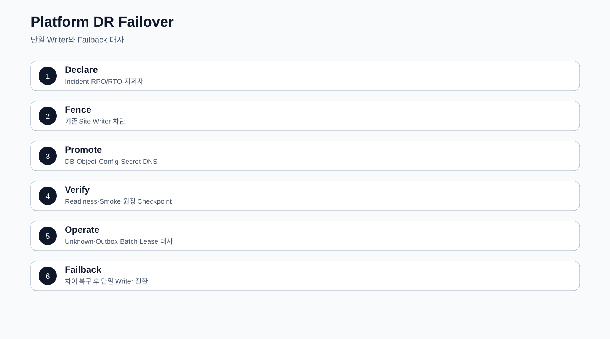

# CPF 플랫폼 운영 매뉴얼

> 기준 Repository: `https://github.com/freeangelsun/202412_01_CPF`
> 기준 Branch: `master`
> 기준 Commit: `a8be27a34bdac0b7c075e06d6e86571244c96421` (`06_08`)
> 기준일: `2026-08-06 Asia/Seoul`

| 항목 | 내용 |
|---|---|
| 주 독자 | 개발환경·인프라·DBA·배포·관측·보안·DR 담당자, CPF를 처음 설치하는 운영자 |
| 이 문서로 완료할 일 | Artifact를 검증하고 계정·Directory·Config·Secret·DB·Broker를 준비해 기동·배포·관측·백업·복구·DR을 수행한다. |
| 읽는 방식 | 처음 접하는 독자는 앞에서부터 실습 순서로 읽고, 숙련자는 장별 판단표와 참조 경로를 사용한다. |
| 설명 원칙 | 제품 기능은 사용할 수 있는 상태로 설명한다. 실제 Source·SQL·API·Config·Frontend·Script·Test의 이름과 경계를 유지한다. |


## 1. 운영자가 인수할 배포 단위

Release를 받을 때 파일명만 보지 않는다. 다음을 하나의 배포 단위로 인수한다.

- Source Commit SHA와 제품 Version.
- JAR·WAR·Frontend Static Artifact·Worker Artifact.
- BOM·Dependency Lock.
- DB Vendor Install·Migration·Rollback·Verify Pack.
- Config Template와 Property Metadata.
- Secret·Certificate Reference 목록.
- OpenAPI·AsyncAPI·Generated Client Version.
- SBOM·Provenance·Checksum·Signature.
- Test 결과와 실행 환경.
- LKG Artifact와 Rollback 조건.

```powershell
$release='D:\release\cpf'
Get-ChildItem -LiteralPath $release -File -Recurse |
  Get-FileHash -Algorithm SHA256 |
  Sort-Object Path
```

Manifest와 Hash가 다르면 배포를 시작하지 않는다.

## 2. 계정과 Directory

| 구분 | 책임 | 권한 |
|---|---|---|
| Runtime 계정 | 서비스 Process 실행 | Artifact·Config Read, Log·Work Write |
| 배포 계정 | Artifact 배치·Service Manager | Runtime Secret 원문 Read 금지 |
| DBA Migration 계정 | Schema 변경 | 승인된 Script 실행 |
| DBA Read-only | 운영 조회·대사 | DML 금지 |
| Agent 계정 | 허용 Process Start·Stop·Status | 대상 Service Allowlist |
| Backup 계정 | Backup Write·Restore 환경 Read | 운영 DB 일반 DML 금지 |
| 보안 계정 | Secret·Certificate Rotation | 일반 Log·업무 데이터 접근 최소화 |

권장 Directory:

```text
D:\cpf\
├─ artifact\<version>\
├─ config\<environment>\
├─ secret-ref\
├─ certificate\
├─ log\<service>\
├─ work\<service>\
├─ data\
├─ backup\
└─ support-bundle\
```

Runtime이 Artifact와 Config를 덮어쓰지 못하게 한다. Log·Work가 가득 차도 Artifact·DB Data를 침범하지 않도록 용량과 File System을 분리한다.

## 3. 설치 전 Preflight

```powershell
$repo='D:\WORK_CPF\202412_01_CPF'
java -version
& (Join-Path $repo 'gradlew.bat') --version
Get-NetTCPConnection -State Listen | Sort-Object LocalPort
Get-Volume | Select-Object DriveLetter,SizeRemaining,Size
Resolve-DnsName db.example.internal
Test-NetConnection db.example.internal -Port 5432
```

확인 항목:

1. Java·Gradle·Spring Stack.
2. Port 충돌.
3. Disk와 Log·Temp 여유.
4. DNS·Network·Proxy.
5. DB·Broker·Secret Provider 접근.
6. Service 계정 권한.
7. Timezone·NTP 편차.
8. Certificate Chain·SAN·만료.

## 4. Configuration을 읽는 방법

설정은 네 종류로 구분한다.

| 종류 | 예 | 특징 |
|---|---|---|
| 실제 Property | `cpf.openapi.webmvc.enabled` | Type·Default·Consumer가 있는 값 |
| 환경변수 | `SPRING_PROFILES_ACTIVE` | 배포 환경에서 주입 |
| Capability Prefix | `cpf.messaging.kafka` | 여러 하위 Property를 묶는 Namespace |
| Secret Reference | DB Password·Token·Key | 원문을 문서·Git에 기록하지 않음 |

Capability Prefix를 실제 Boolean Key처럼 취급하지 않는다. `@ConfigurationProperties`, Metadata, Profile YAML에서 구체 하위 Key를 확인한다.

## 5. Build·Artifact 환경변수

| Key | Type | Default | 필수 조건 | Consumer | 적용 | 확인 | Rollback |
|---|---|---|---|---|---|---|---|
| `CPF_ARTIFACT_MODE` | Enum | `LOCAL_DEV` | LOCAL_DEV/REMOTE/OFFLINE | Gradle | Build | Repository 해석 Log | 이전 Mode |
| `CPF_ARTIFACT_REPOSITORY_URL` | URI | 없음 | REMOTE | Gradle | Build | Artifact Resolve | 이전 URL |
| `CPF_ARTIFACT_REPOSITORY_USER` | String | 없음 | 인증 Repository | Gradle | Build | Credential 오류 없음 | 이전 Secret Ref |
| `CPF_ARTIFACT_REPOSITORY_PASSWORD` | Secret | 없음 | 인증 Repository | Gradle | Build | Log 비노출 | 이전 Version |
| `CPF_LOCAL_ARTIFACT_REPOSITORY` | Path | `~/.cpf/repository` | LOCAL_DEV | Gradle | Build | Artifact 존재 | 이전 경로 |
| `CPF_OFFLINE_ARTIFACT_REPOSITORY` | Path | 없음 | OFFLINE | Gradle | Build | 외부 접속 없이 Build | 이전 Bundle |
| `CPF_SOURCE_SHA` | SHA-1 | Git HEAD | 40 hex | Build·Manifest | Build | Manifest와 Commit 일치 | 정확한 SHA |
| `SPRING_PROFILES_ACTIVE` | String | Module별 | 승인 Profile | Spring | Restart | Startup Log | 이전 Profile |
| `SERVER_PORT` | Integer | Module별 | 1~65535 | Web Runtime | Restart | Listen·Health | 이전 Port |

## 6. OpenAPI WebMVC Property

| Property | Type | Default | 범위·조건 | 적용 | 정상 확인 | 오류 | Rollback |
|---|---|---:|---|---|---|---|---|
| `cpf.openapi.webmvc.enabled` | Boolean | `true` | true/false | Restart | OpenAPI Status | Bean 없음 | 이전 값 |
| `cpf.openapi.webmvc.api-docs-enabled` | Boolean | `false` | 환경 노출 정책 | Restart | Docs Path 응답 | 불필요한 외부 노출 | `false` |
| `cpf.openapi.webmvc.management-enabled` | Boolean | `true` | true/false | Restart | 관리 Snapshot | 운영 조회 없음 | 이전 값 |
| `cpf.openapi.webmvc.api-docs-path` | Path | `/v3/api-docs` | `/` 시작, `..` 금지 | Restart | Path 응답 | Startup Validation | 이전 Path |
| `cpf.openapi.webmvc.title` | String | `CPF API` | 빈값 금지 | Restart | Snapshot Title | Startup Validation | 이전 값 |
| `cpf.openapi.webmvc.version` | String | `unspecified` | Release Version 권장 | Restart | Snapshot Version | Consumer Version 혼동 | 이전 값 |
| `cpf.openapi.webmvc.instance-id` | String | `local` | Instance Unique | Restart | ADM OpenAPI 화면 | 중복 Instance | 이전 ID |
| `cpf.openapi.webmvc.minimum-refresh-interval` | Duration | `1s` | 0 이상 | Restart | Refresh 제한 | 과도 Refresh | 이전 값 |

## 7. ADM 통합 정정 Property

Prefix: `cpf.adm.integration-closure`

| Property | Type | Default | 운영 기준 | 적용 | 확인 | Rollback |
|---|---|---:|---|---|---|---|
| `enabled` | Boolean | `false` | 기능 사용 환경만 true | Restart | `/integrationClosure` + Backend Health | false |
| `ephemeral-providers-enabled` | Boolean | `false` | Local/Dev 검증만 사용 | Restart | Provider Bean·Startup Log | false |
| `correction-approval-ttl` | Duration | `15m` | 0보다 큼 | Restart | 승인 만료시각 | 이전 TTL |
| `webhook.allowed-hosts` | Set<String> | 빈 Set | 승인 Host만 | Restart | Endpoint Validation | 이전 Allowlist |
| `webhook.max-attempts` | Integer | `5` | 1 이상 | Restart | Delivery Attempt | 이전 한도 |
| `webhook.base-delay` | Duration | `1s` | 0보다 큼 | Restart | Retry Schedule | 이전 Delay |
| `crypto.enabled` | Boolean | `false` | Key 준비 뒤 true | Restart | Crypto Status | false |
| `crypto.active-key-version` | String | 없음 | 활성 Key Version | Restart | Status·Audit | 이전 Version |
| `crypto.active-key-base64` | Secret | 없음 | Secret Provider 주입 | Restart | Log 비노출·Crypto Test | 이전 Secret Version |

운영 환경에서 `ephemeral-providers-enabled=true`를 사용하지 않는다. Secret 원문은 Matrix나 YAML 예시에 넣지 않고 Reference 이름만 기록한다.

## 8. Runtime Control 환경변수

| Key | 필수 | 설명 | 검증 |
|---|---:|---|---|
| `CPF_RUNTIME_INSTANCE_ID` | Y | Instance 고유 ID | Topology·Heartbeat |
| `CPF_RUNTIME_SERVICE_ID` | Y | 논리 Service | Registry 연결 |
| `CPF_RUNTIME_ENDPOINT_CODE` | Y | Endpoint 식별자 | Endpoint 조회 |
| `CPF_RUNTIME_BASE_URL` | Y | Runtime Probe Base URL | Health 응답 |
| `CPF_RUNTIME_CONTROL_BASE_URL` | Y | Control Plane URL | Command 조회 |
| `CPF_RUNTIME_CONTROL_AGENT_TOKEN` | Y | Agent 인증 Secret | 401 없음·Log 비노출 |

## 9. Cache·Valkey

| Property | Type | Default | 범위 | 적용 | 검증 |
|---|---|---:|---|---|---|
| `cpf.data.cache.valkey.enabled` | Boolean | `false` | true/false | Restart | Provider Bean·ADM `/cache` |
| `cpf.data.cache.valkey.key-prefix` | String | `cpf:` | 허용 문자·최대 길이 | Restart | Tenant·Namespace 격리 |
| `cpf.data.cache.valkey.invalidation-channel` | String | `cpf.cache.invalidate` | 허용 Channel | Restart | Signal·Durable Reconcile |
| `cpf.data.cache.valkey.default-ttl` | Duration | `10m` | 0보다 큼 | Restart | TTL 조회 |
| `cpf.data.cache.valkey.required` | Boolean | `true` | Fail-closed 여부 | Restart | Provider 부재 Startup |
| `cpf.data.cache.valkey.tls` | Boolean | `false` | 고객 TLS 정책 | Restart | Handshake·Certificate |
| `cpf.data.cache.valkey.maximum-payload-bytes` | Long | `1048576` | 1~67108864 | Restart | 경계 Payload Test |
| `cpf.data.cache.valkey.scan-count` | Long | `500` | 10~10000 | Restart | SCAN 부하·삭제 건수 |
| `cpf.cache.invalidation.consumer-id` | String | Instance 기반 | Consumer Unique | Restart | Checkpoint ID |
| `cpf.cache.invalidation.reconcile-batch-size` | Integer | `200` | 1~10000 | Restart | 처리량·DB 부하 |
| `cpf.cache.invalidation.reconcile-max-batches` | Integer | `20` | 1~1000 | Restart | 1회 처리 상한 |

Signal을 정본으로 사용하지 않는다. Process Kill 또는 Signal 유실 뒤 Durable Ledger의 Checkpoint 이후 Event를 Reconcile한다.

## 10. Browser Release Test 환경변수

| Key | 설명 | 보안 |
|---|---|---|
| `CPF_FRONTEND_URL` | ADM/BZA Frontend URL | 일반 |
| `CPF_E2E_RELEASE` | Release Mode 여부 | 일반 |
| `CPF_E2E_AUTH_STATE` | 인증 Session 파일 | Secret 취급 |
| `CPF_E2E_PRIVILEGED_ENDPOINTS` | 위험 Endpoint Matrix | 제한 |
| `CPF_E2E_ROUTE_MATRIX` | Route Coverage | 일반 |
| `CPF_E2E_FAILURE_MATRIX` | 실패·복구 Coverage | 일반 |
| `CPF_E2E_SECURITY_FIXTURE` | Permission·Masking Negative Fixture | Secret·PII 주의 |

## 11. DB 3개 Vendor 설치


### 11.1 공통 순서

1. Release의 Canonical Schema Version 확인.
2. Vendor Pack Hash 확인.
3. Backup 또는 Restore Point 생성.
4. Readiness Query와 권한 확인.
5. Install 또는 Migration 실행.
6. Verify Script로 Table·Index·Constraint·Seed·Checksum 확인.
7. Application을 Canary 기동.
8. Smoke·Audit·Query Consumer 확인.
9. Rollback 또는 Forward Recovery 조건 기록.

### 11.2 Migration 실패

| 실패 | 판정 | 조치 |
|---|---|---|
| Script 시작 전 문법 오류 | `FAILED` | Script 수정·재검증 |
| 일부 DDL 적용 | `PARTIAL` | Vendor Transaction 특성 확인, Forward Recovery 우선 검토 |
| App 기동 뒤 Query 오류 | `FAILED` 또는 Drift | Schema·Query ID·Consumer Version 대사 |
| Checksum 불일치 | `DRIFT` | 승인 없이 수정하지 않고 정본과 비교 |
| Rollback 불가 DDL | 복구 계획 필요 | Backup Restore 또는 Forward Script |

## 12. Broker 준비

### Kafka

- Topic Name·Partition·Replication.
- Producer Idempotency·Acks.
- Consumer Group·Offset·DLQ.
- ACL·TLS·Credential Version.
- Lag·Under Replicated Partition Alert.

### RabbitMQ·JMS·IBM MQ

Exchange·Queue·Binding·DLX, Destination·Ack·Redelivery, QM·Channel·Queue·CCSID·Backout Queue를 각각 관리한다. Provider 고유 Error를 일반 Timeout으로 덮지 않는다.

## 13. 신규 설치

1. Artifact·Manifest·Hash 수령.
2. Runtime 계정과 Directory 생성.
3. Config Template 배치.
4. Secret·Certificate Reference 연결.
5. DB Install·Verify.
6. Broker·Object Store·External Target Probe.
7. Service를 Traffic 없이 기동.
8. Liveness·Readiness·Version·Capability 확인.
9. Smoke Query·Command·Audit 수행.
10. Traffic을 단계적으로 연결.
11. Backup과 LKG 기록.

## 14. 기동·종료

### 기동 판정

- Process가 살아 있음.
- Liveness 성공.
- Readiness 성공.
- Source SHA·Artifact Version 일치.
- DB·Broker·Secret Provider 필수 Dependency Health.
- OpenAPI·Route·Capability Snapshot.
- Startup Error 0.

### 종료

1. 신규 Traffic 차단.
2. In-flight 요청과 Batch Step 확인.
3. Scheduler Disable 또는 Drain.
4. Outbox·Delivery·Audit Queue 처리 상태 기록.
5. 정상 종료 요청.
6. Timeout 뒤 강제 종료가 필요하면 Incident와 마지막 Evidence 기록.

## 15. Config 변경


1. Key의 Type·Default·Consumer·Secret·Restart를 확인한다.
2. 현재 Value Source와 Desired·Observed Version을 Snapshot한다.
3. Preview에서 대상·영향·경고를 확인한다.
4. Reason·Approval·Window를 확보한다.
5. Canary Target에 적용한다.
6. Health·Log·Metric·업무 Smoke를 확인한다.
7. Promotion한다.
8. NACK·Timeout Target을 분리한다.
9. 이전 값 또는 LKG로 Rollback한다.
10. Drift가 0인지 확인한다.

## 16. Rolling·Blue-Green·Canary

| 방식 | 선택 | 필수 확인 |
|---|---|---|
| Rolling | 작은 호환 변경 | Mixed Version 계약·Readiness |
| Blue-Green | 빠른 Traffic 전환과 Rollback | DB·Message 하위 호환, Session |
| Canary | 위험도 높은 변경 | Target 비율·관측 Window·중단 기준 |

DB Schema와 Message가 이전 Version과 호환되지 않으면 Application만 Rolling하지 않는다.

## 17. 관측

### Log

Transaction ID, Trace ID, Operation ID, Attempt, Target, Error Code, Version을 연결한다. Secret·Token·Raw 개인정보를 기록하지 않는다.

### Metric

요청 건수·지연·오류율·Pool·Queue·Lag·Unknown Age·DLQ·Disk·Memory를 사용한다. Transaction ID를 Metric Label로 사용하지 않는다.

### Trace

Browser→BFF→Service→DB·Broker·Target Segment를 연결한다. UTC와 업무 시각을 구분한다.

### Alert

Alert에는 증상, 영향, 기준값, Owner, 첫 확인 Route, Runbook, Suppression 조건을 넣는다.

## 18. Capacity

- CPU·Heap·GC.
- Thread·Connection Pool.
- DB Session·Lock·Slow Query.
- Broker Partition·Lag·Queue Depth.
- Batch Worker·Chunk 처리량.
- Disk·Log·Temp·Object Store.
- Network Connection·TLS Handshake.

부하 Test는 처리량만 기록하지 않고 Queue·Timeout·오류·복구 시간을 함께 측정한다.

## 19. Backup·Restore

### Backup Set

- 업무 DB.
- Batch Metadata.
- Outbox·Inbox·Attempt·Audit.
- Object Metadata와 Object.
- Config Version·Manifest.
- Secret·Certificate는 Provider 정책과 Version Reference.

### Restore Drill

1. 격리 환경 준비.
2. Backup Hash와 암호화 Key 접근 확인.
3. 순서대로 Restore.
4. Schema·Row Count·금액·Audit·Object Hash 대사.
5. Application 기동.
6. Read-only Smoke.
7. 승인 뒤 Write Test.
8. RPO·RTO와 실제 소요 기록.

Backup 파일이 존재한다는 사실만으로 복구 가능하다고 판정하지 않는다.

## 20. Upgrade·Rollback

Upgrade 전:

- Source SHA·Release Note.
- API·Message·DB·Config Compatibility.
- Migration·Backup·Rollback Script.
- Canary·중단 기준.
- LKG.

Rollback은 Application, Config, DB, Message, Frontend를 따로 판단한다. DB가 Forward-only면 이전 Application이 새 Schema를 읽을 수 있는지 확인한다.

## 21. DR

| 항목 | 결정 |
|---|---|
| RPO | 허용 데이터 손실 시점 |
| RTO | 허용 서비스 복구 시간 |
| 복제 | DB·Object·Config·Artifact·Audit |
| 전환 | DNS·Load Balancer·Route·Credential |
| 검증 | Readiness·업무 대사·외부 Target |
| Failback | 원본 Site 정상화와 Drift 대사 |

Failover 성공 뒤에도 Outbox·Attempt·Batch Execution·Lease를 대사한다.

## 22. 장애 Runbook

### 22.1 DB 연결 실패

1. DNS·Port·TLS·Credential 확인.
2. Pool 고갈과 DB Session 확인.
3. Readiness와 Error Code 확인.
4. 신규 Traffic 제한.
5. DB 정상화 뒤 Transaction·Outbox·Batch 상태 대사.

### 22.2 Broker 장애

1. Producer Error·Lag·Queue 확인.
2. 업무 DB Commit은 Outbox로 보존됐는지 확인.
3. Broker 복구 뒤 Publisher 재개.
4. 중복 Delivery를 Inbox로 차단.
5. DLQ와 Unknown을 대사.

### 22.3 Instance 장애

1. Load Balancer에서 제외.
2. Heartbeat·Process·Thread Dump·Log 확인.
3. Lease·Fencing·Batch Step 확인.
4. 다른 Instance의 처리 여부 확인.
5. 재기동 뒤 stale writer가 차단됐는지 확인.

### 22.4 Disk Full

1. 영향 Directory와 Mount 확인.
2. 새 Log·Upload·Batch 유입 제한.
3. 확정된 보존 정책 대상만 이동·삭제.
4. DB·Artifact·Audit 손상 확인.
5. 용량 복구 뒤 Checksum·Queue·Job Restart 대사.

### 22.5 Memory·Thread 고갈

1. Heap·GC·Thread·Queue 확인.
2. 신규 Traffic·Batch Dispatch 제한.
3. Leak·Unbounded Queue·대용량 Payload 원인 분리.
4. Canary 수정 또는 Instance 교체.
5. 실패 Operation과 Unknown 결과 대사.

### 22.6 Network partition

1. Zone·Target별 Reachability 확인.
2. Retry Storm 차단.
3. Circuit·Bulkhead 상태 확인.
4. Lease·Fencing으로 stale writer 차단.
5. 연결 복구 뒤 Target·Owner 상태 대사.

### 22.7 Security Incident

1. Credential·Session·Key 영향 범위 확인.
2. Token·Session 폐기와 Key Rotation.
3. Break-glass 사용 시 Scope·Expiry·사후 검토.
4. Audit·Download·Raw Contact 접근 조회.
5. Consumer의 새 Version 적용 상태 확인.

## 23. 운영 인계

- Artifact·Source SHA·Checksum·LKG.
- Service 계정·Directory·Port.
- 전체 실제 Property와 Value Source.
- Secret·Certificate Reference·Version·만료.
- DB Vendor·Schema Version·Backup·Restore Point.
- Broker·Topic·Queue·ACL.
- Health·Log·Metric·Trace·Alert.
- 배포 방식과 중단 기준.
- 미종결 Incident·Unknown·Partial·Drift.
- Rollback·DR 절차와 담당자.

## 24. 플랫폼 운영 자체 검수

1. Artifact와 Source SHA가 일치하는가?
2. Runtime·배포·DBA·보안 계정이 분리됐는가?
3. 실제 Property와 Capability Prefix를 구분했는가?
4. Secret 원문이 Config·Log·Bundle에 없는가?
5. DB 3개 Vendor의 Install·Migration·Verify·Rollback이 있는가?
6. Traffic 연결 전 Health·Smoke를 확인했는가?
7. 부분 적용 Target을 개별 판정하는가?
8. Backup Restore Drill을 수행할 절차가 있는가?
9. DR Failover 뒤 업무 원장을 대사하는가?
10. 장애 Runbook만으로 교대자가 다음 행동을 결정할 수 있는가?

<!-- CPF_R10_QUALITY_EXPANSION -->



## 부록 A. Configuration 77개 읽기 표

`actual-key`는 Source의 구체 Key를 우선 기록하고, `capability-prefix`는 기능군의 하위 Key를 찾는 출발점이다. Prefix를 실제 Property처럼 복사해 설정하지 않는다. Type·Default·Required가 Module Metadata에 정의된 하위 Key를 확인한 뒤 적용한다.

| Key/Prefix | Type | Default | 필수 | Consumer | 재기동 | Secret | 확인 |
|---|---|---|---|---|---|---|---|
| cpf.openapi.webmvc.enabled | boolean | true | N | OpenAPI AutoConfiguration | Y | N | /actuator/health + /openApiOperations |
| cpf.openapi.webmvc.api-docs-enabled | boolean | false | N | OpenAPI endpoint | Y | N | GET api docs |
| cpf.openapi.webmvc.management-enabled | boolean | true | N | ADM OpenAPI operations | Y | N | /openApiOperations |
| cpf.openapi.webmvc.api-docs-path | string | /v3/api-docs | N | OpenAPI endpoint | Y | N | Config binding log |
| cpf.openapi.webmvc.title | string | CPF API | N | OpenAPI document | Y | N | OpenAPI snapshot |
| cpf.openapi.webmvc.version | string | unspecified | N | OpenAPI document | Y | N | Snapshot version |
| cpf.openapi.webmvc.description | string | Core Platform Framework API | N | OpenAPI document | Y | N | Snapshot description |
| cpf.openapi.webmvc.instance-id | string | local | N | OpenAPI status | Y | N | /openApiOperations |
| cpf.openapi.webmvc.minimum-refresh-interval | Duration | 1s | N | OpenAPI refresh limiter | Y | N | Refresh audit |
| cpf.adm.integration-closure.enabled | boolean | false | N | ADM integration closure | Y | N | /integrationClosure |
| cpf.adm.integration-closure.ephemeral-providers-enabled | boolean | false | N | Local/dev provider | Y | N | Profile config |
| cpf.adm.integration-closure.correction-approval-ttl | Duration | 15m | N | Correction approval | Y | N | Approval expiry |
| cpf.adm.integration-closure.webhook.allowed-hosts | set | [] | Y when webhook | Webhook provider | Y | N | Config + negative test |
| cpf.adm.integration-closure.webhook.max-attempts | int | 5 | N | Webhook delivery | Y | N | DLQ attempt history |
| cpf.adm.integration-closure.webhook.base-delay | Duration | 1s | N | Webhook retry | Y | N | Attempt interval |
| cpf.adm.integration-closure.crypto.enabled | boolean | false | N | Integration crypto | Y | N | crypto status |
| cpf.adm.integration-closure.crypto.active-key-version | string | - | Y if crypto | Crypto provider | Y | Y | Secret metadata |
| cpf.adm.integration-closure.crypto.active-key-base64 | secret string | - | Y if crypto | Crypto provider | Y | Y | Secret provider metadata |
| cpf.data.cache.valkey.enabled | boolean | false | N | Cache/Invalidation | Y | N | /cache + config binding |
| cpf.data.cache.valkey.required | boolean | false | N | Cache/Invalidation | Y | N | /cache + config binding |
| cpf.data.cache.valkey.default-ttl | Duration | 10m | N | Cache/Invalidation | Y | N | /cache + config binding |
| cpf.data.cache.valkey.key-prefix | string | cpf: | N | Cache/Invalidation | Y | N | /cache + config binding |
| cpf.data.cache.valkey.invalidation-channel | string | cpf:cache:invalidate | N | Cache/Invalidation | Y | N | /cache + config binding |
| cpf.data.cache.valkey.maximum-payload-bytes | int | 1048576 | N | Cache/Invalidation | Y | N | /cache + config binding |
| cpf.data.cache.valkey.scan-count | int | 100 | N | Cache/Invalidation | Y | N | /cache + config binding |
| cpf.data.cache.valkey.tls | boolean | false | N | Cache/Invalidation | Y | N | /cache + config binding |
| cpf.cache.invalidation.consumer-id | string | instance-id | N | Cache/Invalidation | Y | N | /cache + config binding |
| cpf.cache.invalidation.reconcile-batch-size | int | 100 | N | Cache/Invalidation | Y | N | /cache + config binding |
| cpf.cache.invalidation.reconcile-max-batches | int | 10 | N | Cache/Invalidation | Y | N | /cache + config binding |
| cpf.runtime-control | capability prefix | module-defined | 기능 선택 시 | Runtime Control desired/observed/target | key-dependent | key-dependent | Configuration metadata·Health·ADM config |
| cpf.observability | capability prefix | module-defined | 기능 선택 시 | Log·Metric·Trace | key-dependent | key-dependent | Configuration metadata·Health·ADM config |
| cpf.observability.otlp | capability prefix | module-defined | 기능 선택 시 | OTLP exporter | key-dependent | key-dependent | Configuration metadata·Health·ADM config |
| cpf.security.resource-server | capability prefix | module-defined | 기능 선택 시 | Resource Server | key-dependent | key-dependent | Configuration metadata·Health·ADM config |
| cpf.security.session | capability prefix | module-defined | 기능 선택 시 | Browser Session | key-dependent | key-dependent | Configuration metadata·Health·ADM config |
| cpf.security.service-identity | capability prefix | module-defined | 기능 선택 시 | Service Identity | key-dependent | key-dependent | Configuration metadata·Health·ADM config |
| cpf.secret | capability prefix | module-defined | 기능 선택 시 | Secret Provider | key-dependent | key-dependent | Configuration metadata·Health·ADM config |
| cpf.feature-flag | capability prefix | module-defined | 기능 선택 시 | Feature Flag | key-dependent | key-dependent | Configuration metadata·Health·ADM config |
| cpf.resilience | capability prefix | module-defined | 기능 선택 시 | Timeout·Retry·Circuit·Bulkhead | key-dependent | key-dependent | Configuration metadata·Health·ADM config |
| cpf.messaging.kafka | capability prefix | module-defined | 기능 선택 시 | Kafka | key-dependent | key-dependent | Configuration metadata·Health·ADM config |
| cpf.messaging.rabbitmq | capability prefix | module-defined | 기능 선택 시 | RabbitMQ | key-dependent | key-dependent | Configuration metadata·Health·ADM config |
| cpf.messaging.jms | capability prefix | module-defined | 기능 선택 시 | JMS | key-dependent | key-dependent | Configuration metadata·Health·ADM config |
| cpf.messaging.ibm-mq | capability prefix | module-defined | 기능 선택 시 | IBM MQ | key-dependent | key-dependent | Configuration metadata·Health·ADM config |
| cpf.messaging.reliability | capability prefix | module-defined | 기능 선택 시 | Outbox·Inbox·DLQ | key-dependent | key-dependent | Configuration metadata·Health·ADM config |
| cpf.integration.http | capability prefix | module-defined | 기능 선택 시 | HTTP client | key-dependent | key-dependent | Configuration metadata·Health·ADM config |
| cpf.integration.tcp | capability prefix | module-defined | 기능 선택 시 | TCP | key-dependent | key-dependent | Configuration metadata·Health·ADM config |
| cpf.integration.fixedlength | capability prefix | module-defined | 기능 선택 시 | Fixed-length | key-dependent | key-dependent | Configuration metadata·Health·ADM config |
| cpf.integration.iso8583 | capability prefix | module-defined | 기능 선택 시 | ISO8583 | key-dependent | key-dependent | Configuration metadata·Health·ADM config |
| cpf.integration.sftp | capability prefix | module-defined | 기능 선택 시 | SFTP | key-dependent | key-dependent | Configuration metadata·Health·ADM config |
| cpf.file.attachment | capability prefix | module-defined | 기능 선택 시 | Attachment | key-dependent | key-dependent | Configuration metadata·Health·ADM config |
| cpf.file.archive | capability prefix | module-defined | 기능 선택 시 | Archive | key-dependent | key-dependent | Configuration metadata·Health·ADM config |
| cpf.file.tabular | capability prefix | module-defined | 기능 선택 시 | Tabular | key-dependent | key-dependent | Configuration metadata·Health·ADM config |
| cpf.notification | capability prefix | module-defined | 기능 선택 시 | Notification | key-dependent | key-dependent | Configuration metadata·Health·ADM config |
| cpf.notification.email | capability prefix | module-defined | 기능 선택 시 | Email | key-dependent | key-dependent | Configuration metadata·Health·ADM config |
| cpf.batch | capability prefix | module-defined | 기능 선택 시 | Spring Batch | key-dependent | key-dependent | Configuration metadata·Health·ADM config |
| cpf.batch.scheduler | capability prefix | module-defined | 기능 선택 시 | Scheduler | key-dependent | key-dependent | Configuration metadata·Health·ADM config |
| cpf.batch.worker | capability prefix | module-defined | 기능 선택 시 | Worker | key-dependent | key-dependent | Configuration metadata·Health·ADM config |
| cpf.batch.agent | capability prefix | module-defined | 기능 선택 시 | Agent | key-dependent | key-dependent | Configuration metadata·Health·ADM config |
| cpf.batch.center-cut | capability prefix | module-defined | 기능 선택 시 | Center-Cut | key-dependent | key-dependent | Configuration metadata·Health·ADM config |
| cpf.gateway | capability prefix | module-defined | 기능 선택 시 | Gateway | key-dependent | key-dependent | Configuration metadata·Health·ADM config |
| cpf.gateway.security | capability prefix | module-defined | 기능 선택 시 | Gateway security | key-dependent | key-dependent | Configuration metadata·Health·ADM config |
| cpf.gateway.publish | capability prefix | module-defined | 기능 선택 시 | Gateway publish | key-dependent | key-dependent | Configuration metadata·Health·ADM config |
| cpf.bza | capability prefix | module-defined | 기능 선택 시 | BZA | key-dependent | key-dependent | Configuration metadata·Health·ADM config |
| cpf.adm | capability prefix | module-defined | 기능 선택 시 | ADM | key-dependent | key-dependent | Configuration metadata·Health·ADM config |
| cpf.data.persistence | capability prefix | module-defined | 기능 선택 시 | Persistence | key-dependent | key-dependent | Configuration metadata·Health·ADM config |
| cpf.data.quality | capability prefix | module-defined | 기능 선택 시 | Data quality | key-dependent | key-dependent | Configuration metadata·Health·ADM config |
| cpf.business-calendar | capability prefix | module-defined | 기능 선택 시 | Business calendar | key-dependent | key-dependent | Configuration metadata·Health·ADM config |
| cpf.time | capability prefix | module-defined | 기능 선택 시 | Time/Deadline | key-dependent | key-dependent | Configuration metadata·Health·ADM config |
| cpf.download | capability prefix | module-defined | 기능 선택 시 | Download audit | key-dependent | key-dependent | Configuration metadata·Health·ADM config |
| cpf.audit | capability prefix | module-defined | 기능 선택 시 | Audit | key-dependent | key-dependent | Configuration metadata·Health·ADM config |
| cpf.approval | capability prefix | module-defined | 기능 선택 시 | Approval | key-dependent | key-dependent | Configuration metadata·Health·ADM config |
| cpf.break-glass | capability prefix | module-defined | 기능 선택 시 | Break-glass | key-dependent | key-dependent | Configuration metadata·Health·ADM config |
| cpf.log-policy | capability prefix | module-defined | 기능 선택 시 | Log policy | key-dependent | key-dependent | Configuration metadata·Health·ADM config |
| cpf.maintenance | capability prefix | module-defined | 기능 선택 시 | Maintenance/Drain | key-dependent | key-dependent | Configuration metadata·Health·ADM config |
| cpf.incident | capability prefix | module-defined | 기능 선택 시 | Incident | key-dependent | key-dependent | Configuration metadata·Health·ADM config |
| cpf.service-registry | capability prefix | module-defined | 기능 선택 시 | Service registry | key-dependent | key-dependent | Configuration metadata·Health·ADM config |
| cpf.channel | capability prefix | module-defined | 기능 선택 시 | Channel policy | key-dependent | key-dependent | Configuration metadata·Health·ADM config |
| cpf.response-code | capability prefix | module-defined | 기능 선택 시 | Response code | key-dependent | key-dependent | Configuration metadata·Health·ADM config |

## 부록 B. DB Vendor별 설치·검증 명령 예시

### B.1 공통 순서

1. Artifact와 Migration Pack SHA-256을 검증한다.
2. 전용 계정과 최소 권한을 준비한다.
3. Schema History와 현재 Version을 백업한다.
4. `install` 또는 `migrate`를 실행한다.
5. Table·Index·Constraint·Seed·Checksum을 검증한다.
6. Application을 Canary로 기동하고 Readiness·Smoke를 확인한다.
7. 실패하면 DDL을 임의 수정하지 않고 Vendor Pack의 Rollback 또는 Backup Restore를 수행한다.

```powershell
$repo='D:\WORK_CPF\202412_01_CPF'
$vendor='postgresql' # mariadb | postgresql | oracle
$pack=Join-Path $repo "cpf-tools\db\$vendor"
Get-ChildItem -LiteralPath $pack -Recurse -File | Get-FileHash -Algorithm SHA256
# 실제 실행 Script 이름과 Parameter는 해당 Vendor Pack README/Script help를 먼저 확인한다.
```

| Vendor | 사전 확인 | 주요 차이 | 실패 시 우선 확인 |
|---|---|---|---|
| MariaDB | Charset·Collation·InnoDB·SQL Mode | Boolean·Timestamp·Index Length | Lock Wait·Auto Increment·Charset |
| PostgreSQL | Role·Schema·Search Path·Timezone | Sequence·JSONB·Partial Index | Owner·Search Path·Sequence 권한 |
| Oracle | Tablespace·User·Quota·NLS | Identifier Length·LOB·Sequence | Tablespace·Privilege·Invalid Object |

## 부록 C. 장애 Runbook 18개

각 Runbook은 “재시작” 한 줄로 끝나지 않는다. 보호 조치, 원인 분리, 복구, 업무 대사, 종료 기준을 순서대로 수행한다.

### C.1 DB Connection 고갈

| 단계 | 수행 내용 |
|---|---|
| 1. 보호 | 신규 Traffic·Batch Dispatch를 줄이고 Pool Wait를 관측 |
| 2. Evidence | Pool Active/Idle/Wait, 장기 Query, DB Session, 최근 배포 |
| 3. 원인 분리 | Leak·Slow Query·Pool Size 불일치를 분리 |
| 4. 복구 | 원인 Query 종료 또는 배포 복귀, Pool은 근거 후 조정 |
| 5. 업무 대사 | 업무 Timeout·Unknown Operation 대사 |
| 6. 종료 기준 | Pool 정상, Wait 0에 근접, Error Rate 기준 복귀 |
| Rollback | 변경이 원인을 악화하면 승인된 LKG·Backup·이전 Config Version으로 복귀하고 새 Operation을 남긴다. |

### C.2 DB Lock·Deadlock

| 단계 | 수행 내용 |
|---|---|
| 1. 보호 | 영향 Command를 제한하고 반복 Retry를 억제 |
| 2. Evidence | Lock Graph, Victim SQL, Transaction ID, Batch Chunk |
| 3. 원인 분리 | Lock 순서·대량 Transaction·인덱스 누락 확인 |
| 4. 복구 | Lock 순서 수정·Chunk 축소·제한 Retry |
| 5. 업무 대사 | Rollback된 업무와 외부 부작용 대사 |
| 6. 종료 기준 | Deadlock 재현 Test와 회귀 결과 |
| Rollback | 변경이 원인을 악화하면 승인된 LKG·Backup·이전 Config Version으로 복귀하고 새 Operation을 남긴다. |

### C.3 Migration 실패

| 단계 | 수행 내용 |
|---|---|
| 1. 보호 | 새 Version 기동과 추가 Migration을 중단 |
| 2. Evidence | Schema History, 실패 SQL, Vendor, Backup ID |
| 3. 원인 분리 | 부분 적용 DDL·권한·Lock·Vendor 문법 구분 |
| 4. 복구 | 호환 가능한 보정 Migration 또는 승인 Backup Restore |
| 5. 업무 대사 | 구/신 Version과 Schema 호환 확인 |
| 6. 종료 기준 | Schema Version·Checksum·Smoke 일치 |
| Rollback | 변경이 원인을 악화하면 승인된 LKG·Backup·이전 Config Version으로 복귀하고 새 Operation을 남긴다. |

### C.4 DB Replication 지연

| 단계 | 수행 내용 |
|---|---|
| 1. 보호 | Read Traffic과 Failover 판단을 보수적으로 조정 |
| 2. Evidence | Primary/Replica Position, Lag, Long Transaction |
| 3. 원인 분리 | Network·I/O·대량 Transaction 원인 분리 |
| 4. 복구 | 원인 제거·Replica 재동기화·Read Routing 복귀 |
| 5. 업무 대사 | 오래된 조회로 발생한 업무 영향 확인 |
| 6. 종료 기준 | Lag 기준 복귀와 데이터 Hash 비교 |
| Rollback | 변경이 원인을 악화하면 승인된 LKG·Backup·이전 Config Version으로 복귀하고 새 Operation을 남긴다. |

### C.5 Kafka Broker 장애

| 단계 | 수행 내용 |
|---|---|
| 1. 보호 | Producer 폭주와 Consumer 재시작 반복을 막음 |
| 2. Evidence | Broker ISR, Topic Partition, ACL, Producer Error, Lag |
| 3. 원인 분리 | Broker Down·Leader 없음·TLS/ACL 오류 구분 |
| 4. 복구 | Broker/ACL 정상화 후 Outbox Publisher 재개 |
| 5. 업무 대사 | Outbox·Inbox·DLQ·Offset 대사 |
| 6. 종료 기준 | 발행/소비 건수와 Lag 정상화 |
| Rollback | 변경이 원인을 악화하면 승인된 LKG·Backup·이전 Config Version으로 복귀하고 새 Operation을 남긴다. |

### C.6 Kafka Lag 급증

| 단계 | 수행 내용 |
|---|---|
| 1. 보호 | 비핵심 Producer Rate와 Retry를 제한 |
| 2. Evidence | Consumer Group Lag, 처리시간, Error Code, Partition Skew |
| 3. 원인 분리 | Slow Consumer·Poison Message·Partition Hotspot |
| 4. 복구 | Consumer 보정·격리·제한 Replay |
| 5. 업무 대사 | 업무 Projection과 Inbox Count 대사 |
| 6. 종료 기준 | Lag 감소 추세와 처리율 기준 충족 |
| Rollback | 변경이 원인을 악화하면 승인된 LKG·Backup·이전 Config Version으로 복귀하고 새 Operation을 남긴다. |

### C.7 Valkey 장애

| 단계 | 수행 내용 |
|---|---|
| 1. 보호 | Cache를 정본으로 사용하지 않고 Owner DB 보호 |
| 2. Evidence | Connection, Memory, Eviction, Invalidation Checkpoint |
| 3. 원인 분리 | Provider 장애·Memory Full·TLS·Key 폭증 구분 |
| 4. 복구 | Provider 복구 후 Ledger Checkpoint부터 Reconcile |
| 5. 업무 대사 | Cache Miss 증가와 DB 부하 확인 |
| 6. 종료 기준 | Version·Checkpoint·표본 조회 일치 |
| Rollback | 변경이 원인을 악화하면 승인된 LKG·Backup·이전 Config Version으로 복귀하고 새 Operation을 남긴다. |

### C.8 외부 HTTP Timeout

| 단계 | 수행 내용 |
|---|---|
| 1. 보호 | 무제한 Retry를 중단하고 Attempt를 분류 |
| 2. Evidence | Dispatch 여부, Request ID, Tracking ID, Timeout Budget |
| 3. 원인 분리 | Connect 전 실패와 Dispatch 후 Read Timeout 구분 |
| 4. 복구 | 미전송만 제한 Retry, 결과 불명은 상태조회 |
| 5. 업무 대사 | 기관 상태와 업무 원장 대사 |
| 6. 종료 기준 | Attempt가 확정 상태이고 중복 부작용 0 |
| Rollback | 변경이 원인을 악화하면 승인된 LKG·Backup·이전 Config Version으로 복귀하고 새 Operation을 남긴다. |

### C.9 Gateway 일부 NACK

| 단계 | 수행 내용 |
|---|---|
| 1. 보호 | 추가 Publish와 자동 승격을 중단 |
| 2. Evidence | Publish ID, Target Version, Error, Connection Test |
| 3. 원인 분리 | Config 오류·Secret·Network·호환성 구분 |
| 4. 복구 | 실패 Target 보정 또는 LKG Rollback |
| 5. 업무 대사 | Desired/Observed와 Route Checksum 대사 |
| 6. 종료 기준 | 모든 Target이 승인 Version 또는 LKG |
| Rollback | 변경이 원인을 악화하면 승인된 LKG·Backup·이전 Config Version으로 복귀하고 새 Operation을 남긴다. |

### C.10 Certificate 만료

| 단계 | 수행 내용 |
|---|---|
| 1. 보호 | 영향 Endpoint를 식별하고 새 연결 생성을 통제 |
| 2. Evidence | Certificate Chain, NotAfter, Truststore Version, Consumer |
| 3. 원인 분리 | Server·Client·CA Chain 중 어느 쪽인지 확인 |
| 4. 복구 | 새 Version 배포→Consumer ACK→Grace→구 Version 폐기 |
| 5. 업무 대사 | TLS Negative/Positive Test와 Target 상태 확인 |
| 6. 종료 기준 | Handshake 성공·구 Version 사용 0 |
| Rollback | 변경이 원인을 악화하면 승인된 LKG·Backup·이전 Config Version으로 복귀하고 새 Operation을 남긴다. |

### C.11 Secret Rotation 부분 실패

| 단계 | 수행 내용 |
|---|---|
| 1. 보호 | 구 Secret 폐기를 보류하고 미적용 Target 격리 |
| 2. Evidence | Secret Reference, Active Version, Consumer ACK |
| 3. 원인 분리 | Config Reload·권한·Provider 장애 구분 |
| 4. 복구 | 미적용 Target 재배포·Session/Connection 재생성 |
| 5. 업무 대사 | 모든 Consumer Active Version 대사 |
| 6. 종료 기준 | Grace 종료 전 구 Version 사용 0 |
| Rollback | 변경이 원인을 악화하면 승인된 LKG·Backup·이전 Config Version으로 복귀하고 새 Operation을 남긴다. |

### C.12 Disk Full

| 단계 | 수행 내용 |
|---|---|
| 1. 보호 | 새 Log·Upload·Batch Artifact 유입을 제한 |
| 2. Evidence | Filesystem, Inode, Directory별 사용량, 보존 정책 |
| 3. 원인 분리 | Log 폭증·Temp 누수·대량 Artifact 원인 분리 |
| 4. 복구 | 승인된 보존 대상 이동·정확한 Temp 정리 |
| 5. 업무 대사 | DB·Artifact·Audit 손상과 Checksum 확인 |
| 6. 종료 기준 | 여유 용량·쓰기 Test·Queue 정상화 |
| Rollback | 변경이 원인을 악화하면 승인된 LKG·Backup·이전 Config Version으로 복귀하고 새 Operation을 남긴다. |

### C.13 Memory·Thread 고갈

| 단계 | 수행 내용 |
|---|---|
| 1. 보호 | Traffic와 Batch 동시성을 낮추고 장애 확산을 제한 |
| 2. Evidence | Heap, GC, Thread Dump, Queue, Connection Pool |
| 3. 원인 분리 | Leak·Unbounded Queue·대용량 Payload 구분 |
| 4. 복구 | Canary 수정·Instance 교체·Bounded 설정 |
| 5. 업무 대사 | 실패 Operation과 응답 유실 대사 |
| 6. 종료 기준 | GC·Queue·응답시간 기준 복귀 |
| Rollback | 변경이 원인을 악화하면 승인된 LKG·Backup·이전 Config Version으로 복귀하고 새 Operation을 남긴다. |

### C.14 Network Partition

| 단계 | 수행 내용 |
|---|---|
| 1. 보호 | Retry Storm과 이중 Writer 가능성을 차단 |
| 2. Evidence | Zone Reachability, Route, DNS, Lease, Broker/DB 연결 |
| 3. 원인 분리 | 단방향·양방향·특정 Port 장애 구분 |
| 4. 복구 | 경로 복구·Lease/Fencing 확인·Traffic 단계 복귀 |
| 5. 업무 대사 | Target·Owner·Attempt·Outbox 대사 |
| 6. 종료 기준 | stale writer 0·Drift 0 |
| Rollback | 변경이 원인을 악화하면 승인된 LKG·Backup·이전 Config Version으로 복귀하고 새 Operation을 남긴다. |

### C.15 ADM/BZA Session 장애

| 단계 | 수행 내용 |
|---|---|
| 1. 보호 | 위험 Command를 제한하고 로그인 폭주를 막음 |
| 2. Evidence | Session DB, Cookie, CSRF, Instance, Role Version |
| 3. 원인 분리 | DB Session 장애·Cookie 설정·권한 변경 구분 |
| 4. 복구 | Session Store 복구·필요 Session 폐기·재로그인 |
| 5. 업무 대사 | 실행 중 Operation은 Owner 원장에서 확인 |
| 6. 종료 기준 | 로그인·권한·강제종료 Test 통과 |
| Rollback | 변경이 원인을 악화하면 승인된 LKG·Backup·이전 Config Version으로 복귀하고 새 Operation을 남긴다. |

### C.16 Observability Collector 장애

| 단계 | 수행 내용 |
|---|---|
| 1. 보호 | 업무 Traffic을 관측 공백만으로 중단하지 않되 위험 배포는 보류 |
| 2. Evidence | Collector Health, Export Queue, Local Buffer, Drop Count |
| 3. 원인 분리 | Collector Config·Network·Cardinality 구분 |
| 4. 복구 | Config 보정·Queue 배출·Sample Rate 조정 |
| 5. 업무 대사 | 관측 공백 시간의 업무 원장·Audit 보충 |
| 6. 종료 기준 | Drop 0 또는 허용 범위·Trace 연결 복귀 |
| Rollback | 변경이 원인을 악화하면 승인된 LKG·Backup·이전 Config Version으로 복귀하고 새 Operation을 남긴다. |

### C.17 DR Failover

| 단계 | 수행 내용 |
|---|---|
| 1. 보호 | 양 Site Writer가 동시에 활성화되지 않게 차단 |
| 2. Evidence | RPO Position, Writer Lease, DB/Object/Config/Secret Version |
| 3. 원인 분리 | Primary Site 장애 범위와 복제 지연 확인 |
| 4. 복구 | Standby 검증→Writer Lease 전환→Traffic 전환 |
| 5. 업무 대사 | 업무 원장·Outbox·Batch Metadata·Attempt 대사 |
| 6. 종료 기준 | 단일 Writer·RPO/RTO·Smoke 충족 |
| Rollback | 변경이 원인을 악화하면 승인된 LKG·Backup·이전 Config Version으로 복귀하고 새 Operation을 남긴다. |

### C.18 DR Failback

| 단계 | 수행 내용 |
|---|---|
| 1. 보호 | 기존 Site를 바로 Writer로 복귀시키지 않음 |
| 2. Evidence | 양 Site Data Position, Config Drift, Pending Operation |
| 3. 원인 분리 | Failover 기간 변경과 미복제 Artifact 식별 |
| 4. 복구 | 재동기화→Read 검증→Writer Lease 전환→Traffic 복귀 |
| 5. 업무 대사 | 양 방향 차이와 중복 부작용 대사 |
| 6. 종료 기준 | 단일 Writer·Drift 0·교대 승인 |
| Rollback | 변경이 원인을 악화하면 승인된 LKG·Backup·이전 Config Version으로 복귀하고 새 Operation을 남긴다. |


## 부록 D. 플랫폼 운영 EDU 15개

플랫폼 EDU는 Artifact·Config·Secret·DB·Broker의 사전 조건을 기록하고, 기동·배포·Backup·Restore·DR 절차를 실제 판정 순서로 수행한다. 실패 단계와 Rollback 근거를 같은 실행 기록에 남긴다.

### EDU-OPS-01 — Artifact·Checksum 검증

| 항목 | 수행 내용 |
|---|---|
| 학습 결과 | Artifact·Checksum 검증의 선택 기준과 정상·실패·복구 의미를 설명하고 직접 판정한다. |
| Repository 확인 위치 | `cpf-tools/build` 및 실제 Consumer·Test·Config |
| 주요 입력 | Version·SHA256·SBOM |
| 실행 순서 | Fixture 준비 → 정상 실행 → 원장·로그·Trace·Audit 확인 → 장애 주입 → 복구 실행 → 재검증 |
| 정상 판정 | 승인 Artifact Hash 일치 |
| 장애 재현 | 변조·혼합 Version |
| 복구 판정 | 배포 중단·승인본 재수신 |
| 운영 확인 | - |
| 고객 업무 전환 | 예제 ID·상태·Permission·SLA만 고객 값으로 바꾸고 Idempotency·Version·Audit·복구 계약은 유지 |

### EDU-OPS-02 — 계정·Directory 준비

| 항목 | 수행 내용 |
|---|---|
| 학습 결과 | 계정·Directory 준비의 선택 기준과 정상·실패·복구 의미를 설명하고 직접 판정한다. |
| Repository 확인 위치 | `플랫폼 운영` 및 실제 Consumer·Test·Config |
| 주요 입력 | Service Account·경로·권한 |
| 실행 순서 | Fixture 준비 → 정상 실행 → 원장·로그·Trace·Audit 확인 → 장애 주입 → 복구 실행 → 재검증 |
| 정상 판정 | 최소 권한과 소유자 일치 |
| 장애 재현 | 공용 관리자 계정 |
| 복구 판정 | 전용 계정으로 교체 |
| 운영 확인 | - |
| 고객 업무 전환 | 예제 ID·상태·Permission·SLA만 고객 값으로 바꾸고 Idempotency·Version·Audit·복구 계약은 유지 |

### EDU-OPS-03 — Secret·Certificate 설치

| 항목 | 수행 내용 |
|---|---|
| 학습 결과 | Secret·Certificate 설치의 선택 기준과 정상·실패·복구 의미를 설명하고 직접 판정한다. |
| Repository 확인 위치 | `cpf-starters/secret` 및 실제 Consumer·Test·Config |
| 주요 입력 | Reference·Key Version·Truststore |
| 실행 순서 | Fixture 준비 → 정상 실행 → 원장·로그·Trace·Audit 확인 → 장애 주입 → 복구 실행 → 재검증 |
| 정상 판정 | 원문 비노출·TLS 성공 |
| 장애 재현 | 만료·Wrong Chain |
| 복구 판정 | Rotation·Rollback |
| 운영 확인 | - |
| 고객 업무 전환 | 예제 ID·상태·Permission·SLA만 고객 값으로 바꾸고 Idempotency·Version·Audit·복구 계약은 유지 |

### EDU-OPS-04 — MariaDB Lifecycle

| 항목 | 수행 내용 |
|---|---|
| 학습 결과 | MariaDB Lifecycle의 선택 기준과 정상·실패·복구 의미를 설명하고 직접 판정한다. |
| Repository 확인 위치 | `cpf-tools DB pack` 및 실제 Consumer·Test·Config |
| 주요 입력 | Schema·User·Migration |
| 실행 순서 | Fixture 준비 → 정상 실행 → 원장·로그·Trace·Audit 확인 → 장애 주입 → 복구 실행 → 재검증 |
| 정상 판정 | Install→Migrate→Verify→Rollback |
| 장애 재현 | DDL 차이·Lock |
| 복구 판정 | Backup 복원·Migration 보정 |
| 운영 확인 | - |
| 고객 업무 전환 | 예제 ID·상태·Permission·SLA만 고객 값으로 바꾸고 Idempotency·Version·Audit·복구 계약은 유지 |

### EDU-OPS-05 — PostgreSQL Lifecycle

| 항목 | 수행 내용 |
|---|---|
| 학습 결과 | PostgreSQL Lifecycle의 선택 기준과 정상·실패·복구 의미를 설명하고 직접 판정한다. |
| Repository 확인 위치 | `cpf-tools DB pack` 및 실제 Consumer·Test·Config |
| 주요 입력 | Schema·Role·Migration |
| 실행 순서 | Fixture 준비 → 정상 실행 → 원장·로그·Trace·Audit 확인 → 장애 주입 → 복구 실행 → 재검증 |
| 정상 판정 | Vendor 의미 동등 |
| 장애 재현 | Search Path·Sequence 오류 |
| 복구 판정 | 권한·Sequence 보정 |
| 운영 확인 | - |
| 고객 업무 전환 | 예제 ID·상태·Permission·SLA만 고객 값으로 바꾸고 Idempotency·Version·Audit·복구 계약은 유지 |

### EDU-OPS-06 — Oracle Lifecycle

| 항목 | 수행 내용 |
|---|---|
| 학습 결과 | Oracle Lifecycle의 선택 기준과 정상·실패·복구 의미를 설명하고 직접 판정한다. |
| Repository 확인 위치 | `cpf-tools DB pack` 및 실제 Consumer·Test·Config |
| 주요 입력 | Tablespace·User·Migration |
| 실행 순서 | Fixture 준비 → 정상 실행 → 원장·로그·Trace·Audit 확인 → 장애 주입 → 복구 실행 → 재검증 |
| 정상 판정 | Vendor 의미 동등 |
| 장애 재현 | Identifier·LOB·Lock 오류 |
| 복구 판정 | Vendor Pack Script 보정 |
| 운영 확인 | - |
| 고객 업무 전환 | 예제 ID·상태·Permission·SLA만 고객 값으로 바꾸고 Idempotency·Version·Audit·복구 계약은 유지 |

### EDU-OPS-07 — Kafka 준비

| 항목 | 수행 내용 |
|---|---|
| 학습 결과 | Kafka 준비의 선택 기준과 정상·실패·복구 의미를 설명하고 직접 판정한다. |
| Repository 확인 위치 | `messaging-kafka` 및 실제 Consumer·Test·Config |
| 주요 입력 | Bootstrap·Topic·ACL·TLS |
| 실행 순서 | Fixture 준비 → 정상 실행 → 원장·로그·Trace·Audit 확인 → 장애 주입 → 복구 실행 → 재검증 |
| 정상 판정 | Produce/Consume·Lag 관측 |
| 장애 재현 | ACL·Broker Down |
| 복구 판정 | Credential/Topic 복구 |
| 운영 확인 | - |
| 고객 업무 전환 | 예제 ID·상태·Permission·SLA만 고객 값으로 바꾸고 Idempotency·Version·Audit·복구 계약은 유지 |

### EDU-OPS-08 — 신규 설치

| 항목 | 수행 내용 |
|---|---|
| 학습 결과 | 신규 설치의 선택 기준과 정상·실패·복구 의미를 설명하고 직접 판정한다. |
| Repository 확인 위치 | `cpf-tools/runtime` 및 실제 Consumer·Test·Config |
| 주요 입력 | Artifact·Config·DB·Secret |
| 실행 순서 | Fixture 준비 → 정상 실행 → 원장·로그·Trace·Audit 확인 → 장애 주입 → 복구 실행 → 재검증 |
| 정상 판정 | Readiness와 Smoke 성공 |
| 장애 재현 | Migration 미적용 |
| 복구 판정 | 기동 중단·DB 정상화 |
| 운영 확인 | - |
| 고객 업무 전환 | 예제 ID·상태·Permission·SLA만 고객 값으로 바꾸고 Idempotency·Version·Audit·복구 계약은 유지 |

### EDU-OPS-09 — 기동·종료

| 항목 | 수행 내용 |
|---|---|
| 학습 결과 | 기동·종료의 선택 기준과 정상·실패·복구 의미를 설명하고 직접 판정한다. |
| Repository 확인 위치 | `각 Runtime` 및 실제 Consumer·Test·Config |
| 주요 입력 | Profile·Instance ID |
| 실행 순서 | Fixture 준비 → 정상 실행 → 원장·로그·Trace·Audit 확인 → 장애 주입 → 복구 실행 → 재검증 |
| 정상 판정 | Readiness 전 Traffic 차단·Graceful 종료 |
| 장애 재현 | 강제 Kill |
| 복구 판정 | 원장·Lease·Attempt 대사 |
| 운영 확인 | - |
| 고객 업무 전환 | 예제 ID·상태·Permission·SLA만 고객 값으로 바꾸고 Idempotency·Version·Audit·복구 계약은 유지 |

### EDU-OPS-10 — Rolling 배포

| 항목 | 수행 내용 |
|---|---|
| 학습 결과 | Rolling 배포의 선택 기준과 정상·실패·복구 의미를 설명하고 직접 판정한다. |
| Repository 확인 위치 | `runtime control` 및 실제 Consumer·Test·Config |
| 주요 입력 | Target Group·Max Unavailable |
| 실행 순서 | Fixture 준비 → 정상 실행 → 원장·로그·Trace·Audit 확인 → 장애 주입 → 복구 실행 → 재검증 |
| 정상 판정 | 호환 Version 혼재 |
| 장애 재현 | NACK·Health 저하 |
| 복구 판정 | Rollout 중지·LKG |
| 운영 확인 | - |
| 고객 업무 전환 | 예제 ID·상태·Permission·SLA만 고객 값으로 바꾸고 Idempotency·Version·Audit·복구 계약은 유지 |

### EDU-OPS-11 — Canary·Blue-Green

| 항목 | 수행 내용 |
|---|---|
| 학습 결과 | Canary·Blue-Green의 선택 기준과 정상·실패·복구 의미를 설명하고 직접 판정한다. |
| Repository 확인 위치 | `runtime control` 및 실제 Consumer·Test·Config |
| 주요 입력 | Canary 비율·관측 Window |
| 실행 순서 | Fixture 준비 → 정상 실행 → 원장·로그·Trace·Audit 확인 → 장애 주입 → 복구 실행 → 재검증 |
| 정상 판정 | SLO·오류율 기준 통과 |
| 장애 재현 | 일부 지표 누락 |
| 복구 판정 | 승격 중단·Traffic 복귀 |
| 운영 확인 | - |
| 고객 업무 전환 | 예제 ID·상태·Permission·SLA만 고객 값으로 바꾸고 Idempotency·Version·Audit·복구 계약은 유지 |

### EDU-OPS-12 — Observability

| 항목 | 수행 내용 |
|---|---|
| 학습 결과 | Observability의 선택 기준과 정상·실패·복구 의미를 설명하고 직접 판정한다. |
| Repository 확인 위치 | `observability starter` 및 실제 Consumer·Test·Config |
| 주요 입력 | Log·Metric·Trace·Alert |
| 실행 순서 | Fixture 준비 → 정상 실행 → 원장·로그·Trace·Audit 확인 → 장애 주입 → 복구 실행 → 재검증 |
| 정상 판정 | 식별자 연결과 민감정보 비노출 |
| 장애 재현 | Collector Down·High Cardinality |
| 복구 판정 | Local Buffer·설정 보정 |
| 운영 확인 | - |
| 고객 업무 전환 | 예제 ID·상태·Permission·SLA만 고객 값으로 바꾸고 Idempotency·Version·Audit·복구 계약은 유지 |

### EDU-OPS-13 — Backup·Restore

| 항목 | 수행 내용 |
|---|---|
| 학습 결과 | Backup·Restore의 선택 기준과 정상·실패·복구 의미를 설명하고 직접 판정한다. |
| Repository 확인 위치 | `DB/Object/Config` 및 실제 Consumer·Test·Config |
| 주요 입력 | Backup ID·Checksum |
| 실행 순서 | Fixture 준비 → 정상 실행 → 원장·로그·Trace·Audit 확인 → 장애 주입 → 복구 실행 → 재검증 |
| 정상 판정 | 격리 환경 Restore 검증 |
| 장애 재현 | 불완전 Backup |
| 복구 판정 | 백업 폐기·재생성 |
| 운영 확인 | - |
| 고객 업무 전환 | 예제 ID·상태·Permission·SLA만 고객 값으로 바꾸고 Idempotency·Version·Audit·복구 계약은 유지 |

### EDU-OPS-14 — Upgrade·Rollback

| 항목 | 수행 내용 |
|---|---|
| 학습 결과 | Upgrade·Rollback의 선택 기준과 정상·실패·복구 의미를 설명하고 직접 판정한다. |
| Repository 확인 위치 | `플랫폼 운영` 및 실제 Consumer·Test·Config |
| 주요 입력 | From/To Version·Compatibility |
| 실행 순서 | Fixture 준비 → 정상 실행 → 원장·로그·Trace·Audit 확인 → 장애 주입 → 복구 실행 → 재검증 |
| 정상 판정 | Mixed Version와 Schema 호환 |
| 장애 재현 | Rollback 불가 Migration |
| 복구 판정 | Forward Recovery 계획 |
| 운영 확인 | - |
| 고객 업무 전환 | 예제 ID·상태·Permission·SLA만 고객 값으로 바꾸고 Idempotency·Version·Audit·복구 계약은 유지 |

### EDU-OPS-15 — DR Failover·Failback

| 항목 | 수행 내용 |
|---|---|
| 학습 결과 | DR Failover·Failback의 선택 기준과 정상·실패·복구 의미를 설명하고 직접 판정한다. |
| Repository 확인 위치 | `DR 운영` 및 실제 Consumer·Test·Config |
| 주요 입력 | RPO/RTO·Writer Lease |
| 실행 순서 | Fixture 준비 → 정상 실행 → 원장·로그·Trace·Audit 확인 → 장애 주입 → 복구 실행 → 재검증 |
| 정상 판정 | 단일 Writer·원장 대사 |
| 장애 재현 | Split Brain |
| 복구 판정 | Writer 차단·차이 복구 |
| 운영 확인 | - |
| 고객 업무 전환 | 예제 ID·상태·Permission·SLA만 고객 값으로 바꾸고 Idempotency·Version·Audit·복구 계약은 유지 |

<!-- CPF_R10_BOOK_EXPANSION -->

## 부록 E. 신규 설치를 처음 수행하는 운영자 절차

### E.1 설치 전 확인표

| 영역 | 확인 값 | 통과 기준 | 실패 시 행동 |
|---|---|---|---|
| Artifact | Version·Source SHA·SHA-256·SBOM | 승인 Manifest와 모두 일치 | 배포 중단·승인본 재수신 |
| OS/JVM | Java Version·Timezone·Locale·File Limit | 지원 Matrix와 운영 표준 일치 | Host Template 보정 |
| 계정 | Service Account·Group·Directory Owner | 전용 계정·최소 권한 | 공용 관리자 계정 사용 중단 |
| Port | Application·Management·Cluster·Broker | 충돌 없음·Firewall 승인 | Port/Rule 변경 후 재검사 |
| DB | Vendor·Schema·User·Timezone·Charset | Vendor Pack Preflight 통과 | Migration 시작 금지 |
| Secret | Reference·Provider·Key Version·Certificate | 원문 비노출·접근 권한 확인 | Reference/ACL 보정 |
| Broker | Bootstrap·Topic·Queue·ACL·TLS | Produce/Consume Smoke 가능 | Runtime Traffic 연결 금지 |
| Storage | Log·Temp·Upload·Artifact·Backup | 용량·권한·보존 정책 확보 | Directory/Quota 보정 |
| Observability | Log Sink·Metric·Trace·Alert | 식별자와 민감정보 정책 확인 | 운영 인계 전 보정 |
| Rollback | 이전 Artifact·Config·DB Backup | 복귀 절차와 담당자 확인 | 배포 승인 보류 |

### E.2 안전한 설치 순서

1. Artifact와 Manifest Hash를 검증하고 별도 Staging Directory에 푼다.
2. Service 계정으로 Directory 읽기·쓰기 권한을 시험한다.
3. Secret은 파일 원문이 아니라 Provider Reference로 연결한다.
4. DB Preflight와 Backup을 수행한 뒤 Migration을 실행한다.
5. Application을 Traffic 없이 기동하고 Liveness·Readiness·Version을 확인한다.
6. DB·Broker·외부기관 연결 Smoke를 수행한다.
7. ADM Topology와 Config에서 Instance·Version·Capability를 확인한다.
8. 제한 Traffic 또는 Canary로 업무 정상·오류 시나리오를 확인한다.
9. Alert·Support Bundle·Rollback 명령을 교대자에게 인계한다.

### E.3 application.yml 예시

```yaml
spring:
  application:
    name: pay-service
  profiles:
    active: prod

cpf:
  openapi:
    webmvc:
      enabled: true
      api-docs-enabled: false
      management-enabled: true
      title: PAY API
      version: ${CPF_RELEASE_VERSION}
      instance-id: ${CPF_INSTANCE_ID}
  observability:
    service-name: pay-service
    environment: ${CPF_ENVIRONMENT}
  security:
    service-identity:
      audience: pay-service
  data:
    cache:
      valkey:
        enabled: true
        required: false
        key-prefix: 'cpf:pay:'

management:
  endpoints:
    web:
      exposure:
        include: health,info,metrics
```

### E.4 환경변수 주입 예시

```powershell
$env:CPF_ENVIRONMENT='prod'
$env:CPF_INSTANCE_ID='pay-prod-a-01'
$env:CPF_RELEASE_VERSION='2026.08.06.1'
$env:SPRING_DATASOURCE_URL='jdbc:postgresql://db.example:5432/pay'
$env:SPRING_DATASOURCE_USERNAME='pay_runtime'
$env:CPF_DB_PASSWORD_REF='secret://prod/pay/db-password'
$env:CPF_SERVICE_KEY_REF='secret://prod/pay/service-identity'
$env:CPF_KAFKA_BOOTSTRAP_SERVERS='kafka-a:9093,kafka-b:9093'
$env:CPF_KAFKA_TRUSTSTORE_REF='secret://prod/pay/kafka-truststore'

& '.\gradlew.bat' :pay-service:bootRun --no-daemon --stacktrace
```

### E.5 기동 후 판정

| 검사 | 명령·위치 | 정상 결과 | 중단 조건 |
|---|---|---|---|
| Version | /actuator/info 또는 ADM Topology | 승인 Release·Source SHA | 다른 Version |
| Liveness | /actuator/health/liveness | UP | DOWN·Timeout |
| Readiness | /actuator/health/readiness | UP, 필수 Dependency 정상 | 필수 DB/Broker DOWN |
| DB Schema | Migration History | 승인 Version·Checksum | 실패·Pending·Drift |
| OpenAPI | /openApiOperations | Schema Hash·Instance 일치 | 중복 Operation·Refresh 실패 |
| Broker | Outbox/Inbox Smoke | 발행·소비 1건·중복 0 | ACL·Lag·DLQ |
| Trace | /transactionGroups | API→DB→Message Segment 연결 | Trace 단절 |
| Audit | /auditLogs | 기동·Config·Smoke Actor/Result | 민감정보 노출 |

## 부록 F. DB Vendor 3종 Lifecycle 예시

명령은 운영 계정과 Runtime 계정을 분리한다. 실제 Script 경로와 Parameter는 중앙 Vendor Pack의 Help를 기준으로 사용하며, 여기서는 판정 순서를 설명한다.

### F.1 MariaDB

```powershell
mariadb --host $env:CPF_DB_HOST --port 3306 --user cpf_migration --password `
  --execute "SELECT VERSION(), @@time_zone, @@character_set_server;"

mariadb --host $env:CPF_DB_HOST --user cpf_migration --password pay `
  --execute "SELECT installed_rank, version, description, success, checksum FROM flyway_schema_history ORDER BY installed_rank;"
```

| 판정 | 내용 |
|---|---|
| 정상 | `utf8mb4`, UTC, InnoDB, Schema History 성공 |
| Vendor 주의 | Online DDL·Lock·Index 길이·Auto Increment 차이를 확인 |
| Migration 실패 | 후속 DDL을 중단하고 실패 Statement·Lock·권한을 기록한다. |
| Rollback | 데이터 손실 가능 DDL은 Backup Restore 또는 Forward Recovery 계획을 사용한다. |
| Drift | 정본 Script Hash와 실제 Object·Index·Constraint를 비교한다. |

### F.2 PostgreSQL

```powershell
$env:PGPASSWORD=(Resolve-CpfSecret 'secret://prod/pay/db-migration')
psql -h $env:CPF_DB_HOST -U pay_migration -d pay -v ON_ERROR_STOP=1 `
  -c "select version(), current_setting('TIMEZONE'), current_schema();"
psql -h $env:CPF_DB_HOST -U pay_migration -d pay -v ON_ERROR_STOP=1 `
  -c "select installed_rank, version, description, success, checksum from flyway_schema_history order by installed_rank;"
```

| 판정 | 내용 |
|---|---|
| 정상 | UTC, 승인 Schema, Sequence·Identity 정책 일치 |
| Vendor 주의 | search_path·Role·Sequence 권한·Concurrent Index를 확인 |
| Migration 실패 | 후속 DDL을 중단하고 실패 Statement·Lock·권한을 기록한다. |
| Rollback | 데이터 손실 가능 DDL은 Backup Restore 또는 Forward Recovery 계획을 사용한다. |
| Drift | 정본 Script Hash와 실제 Object·Index·Constraint를 비교한다. |

### F.3 Oracle

```powershell
$env:TNS_ADMIN='D:\cpf\conf\oracle'
sqlplus -L pay_migration/"$($env:CPF_DB_PASSWORD)"@PAYPDB @cpf-tools/db/oracle/preflight.sql
sqlplus -L pay_migration/"$($env:CPF_DB_PASSWORD)"@PAYPDB @cpf-tools/db/oracle/verify.sql
```

| 판정 | 내용 |
|---|---|
| 정상 | PDB·NLS·Tablespace·Schema History·Object 상태 정상 |
| Vendor 주의 | Identifier 길이·VARCHAR2·CLOB·Sequence·Online Redefinition을 확인 |
| Migration 실패 | 후속 DDL을 중단하고 실패 Statement·Lock·권한을 기록한다. |
| Rollback | 데이터 손실 가능 DDL은 Backup Restore 또는 Forward Recovery 계획을 사용한다. |
| Drift | 정본 Script Hash와 실제 Object·Index·Constraint를 비교한다. |

## 부록 G. Backup·Restore·DR 실행 기록 양식

| 항목 | 기록 값 |
|---|---|
| 실행 ID | BR-YYYYMMDD-NNN |
| 업무 범위 | DB Schema·Object Storage·Config·Secret Metadata·Broker Position |
| 기준시각 | UTC와 업무 Zone |
| Backup Hash | 파일별 SHA-256과 Manifest |
| Restore 환경 | 격리 Host·Network·계정 |
| RPO | 마지막 복구 가능 Transaction/LSN/SCN |
| RTO | 시작·완료 시각과 단계별 소요 |
| 검증 | Row Count·Amount·Checksum·Smoke·Audit |
| 차이 | 누락·중복·Drift와 처리 |
| 승인 | 실행자·검수자·승인자 |
| 폐기 | Test Restore Secret·Temp Artifact 정리 |

### G.1 Restore Drill 순서

1. 운영 Writer와 격리된 Restore 환경을 준비한다.
2. Backup Manifest와 Hash를 검증한다.
3. DB→Object→Config→Secret Reference 순으로 복원한다.
4. Migration History와 Application Version 호환성을 확인한다.
5. Read-only Smoke와 업무 건수·금액·Hash 대사를 수행한다.
6. 제한 Writer Test를 수행한 뒤 생성 데이터를 제거한다.
7. RPO·RTO·차이·실패 단계를 기록하고 Runbook을 보정한다.

<!-- CPF_R10_REFERENCE_EXPANSION -->

## 부록 H. Configuration 77개 개별 참조

아래 카드는 표를 가로로 읽기 어려운 운영자를 위한 개별 참조다. `capability-prefix`는 그 문자열 자체를 설정하라는 뜻이 아니라 하위 Metadata를 찾는 출발점이다. 실제 Key는 Configuration Metadata와 Consumer Source에 존재해야 한다.

### H.1 `cpf.openapi.webmvc.enabled`

| 항목 | 내용 |
|---|---|
| 분류 | actual-key |
| 환경변수 | CPF_OPENAPI_WEBMVC_ENABLED |
| Type | boolean |
| Default | true |
| 필수 조건 | N |
| 허용 범위 | true\|false |
| Consumer | OpenAPI AutoConfiguration |
| 적용 Profile | web-api |
| 재기동 | Y |
| Secret | N |
| 잘못된 값의 증상 | Controller 문서화 비활성 |
| 확인 방법 | /actuator/health + /openApiOperations |
| Rollback | 이전 값 복원 |

### H.2 `cpf.openapi.webmvc.api-docs-enabled`

| 항목 | 내용 |
|---|---|
| 분류 | actual-key |
| 환경변수 | CPF_OPENAPI_WEBMVC_API_DOCS_ENABLED |
| Type | boolean |
| Default | false |
| 필수 조건 | N |
| 허용 범위 | true\|false |
| Consumer | OpenAPI endpoint |
| 적용 Profile | non-prod |
| 재기동 | Y |
| Secret | N |
| 잘못된 값의 증상 | /v3/api-docs 404 또는 노출 |
| 확인 방법 | GET api docs |
| Rollback | false 복원 |

### H.3 `cpf.openapi.webmvc.management-enabled`

| 항목 | 내용 |
|---|---|
| 분류 | actual-key |
| 환경변수 | CPF_OPENAPI_WEBMVC_MANAGEMENT_ENABLED |
| Type | boolean |
| Default | true |
| 필수 조건 | N |
| 허용 범위 | true\|false |
| Consumer | ADM OpenAPI operations |
| 적용 Profile | adm |
| 재기동 | Y |
| Secret | N |
| 잘못된 값의 증상 | 상태/Refresh API 없음 |
| 확인 방법 | /openApiOperations |
| Rollback | 이전 값 |

### H.4 `cpf.openapi.webmvc.api-docs-path`

| 항목 | 내용 |
|---|---|
| 분류 | actual-key |
| 환경변수 | CPF_OPENAPI_WEBMVC_API_DOCS_PATH |
| Type | string |
| Default | /v3/api-docs |
| 필수 조건 | N |
| 허용 범위 | /로 시작, .. 금지 |
| Consumer | OpenAPI endpoint |
| 적용 Profile | web-api |
| 재기동 | Y |
| Secret | N |
| 잘못된 값의 증상 | Unsafe Path 기동 실패 |
| 확인 방법 | Config binding log |
| Rollback | 안전 경로 복원 |

### H.5 `cpf.openapi.webmvc.title`

| 항목 | 내용 |
|---|---|
| 분류 | actual-key |
| 환경변수 | CPF_OPENAPI_WEBMVC_TITLE |
| Type | string |
| Default | CPF API |
| 필수 조건 | N |
| 허용 범위 | non-blank |
| Consumer | OpenAPI document |
| 적용 Profile | all |
| 재기동 | Y |
| Secret | N |
| 잘못된 값의 증상 | 문서 제목 공란 |
| 확인 방법 | OpenAPI snapshot |
| Rollback | 이전 값 |

### H.6 `cpf.openapi.webmvc.version`

| 항목 | 내용 |
|---|---|
| 분류 | actual-key |
| 환경변수 | CPF_OPENAPI_WEBMVC_VERSION |
| Type | string |
| Default | unspecified |
| 필수 조건 | N |
| 허용 범위 | non-blank |
| Consumer | OpenAPI document |
| 적용 Profile | all |
| 재기동 | Y |
| Secret | N |
| 잘못된 값의 증상 | Client Version 추적 불가 |
| 확인 방법 | Snapshot version |
| Rollback | Artifact version 복원 |

### H.7 `cpf.openapi.webmvc.description`

| 항목 | 내용 |
|---|---|
| 분류 | actual-key |
| 환경변수 | CPF_OPENAPI_WEBMVC_DESCRIPTION |
| Type | string |
| Default | Core Platform Framework API |
| 필수 조건 | N |
| 허용 범위 | text |
| Consumer | OpenAPI document |
| 적용 Profile | all |
| 재기동 | Y |
| Secret | N |
| 잘못된 값의 증상 | 설명 불일치 |
| 확인 방법 | Snapshot description |
| Rollback | 이전 값 |

### H.8 `cpf.openapi.webmvc.instance-id`

| 항목 | 내용 |
|---|---|
| 분류 | actual-key |
| 환경변수 | CPF_OPENAPI_WEBMVC_INSTANCE_ID |
| Type | string |
| Default | local |
| 필수 조건 | N |
| 허용 범위 | non-blank unique |
| Consumer | OpenAPI status |
| 적용 Profile | all |
| 재기동 | Y |
| Secret | N |
| 잘못된 값의 증상 | Instance 구분 불가 |
| 확인 방법 | /openApiOperations |
| Rollback | 고유 ID 복원 |

### H.9 `cpf.openapi.webmvc.minimum-refresh-interval`

| 항목 | 내용 |
|---|---|
| 분류 | actual-key |
| 환경변수 | CPF_OPENAPI_WEBMVC_MINIMUM_REFRESH_INTERVAL |
| Type | Duration |
| Default | 1s |
| 필수 조건 | N |
| 허용 범위 | >=0 |
| Consumer | OpenAPI refresh limiter |
| 적용 Profile | adm |
| 재기동 | Y |
| Secret | N |
| 잘못된 값의 증상 | Refresh 과다/차단 |
| 확인 방법 | Refresh audit |
| Rollback | 이전 Duration |

### H.10 `cpf.adm.integration-closure.enabled`

| 항목 | 내용 |
|---|---|
| 분류 | actual-key |
| 환경변수 | CPF_ADM_INTEGRATION_CLOSURE_ENABLED |
| Type | boolean |
| Default | false |
| 필수 조건 | N |
| 허용 범위 | true\|false |
| Consumer | ADM integration closure |
| 적용 Profile | adm |
| 재기동 | Y |
| Secret | N |
| 잘못된 값의 증상 | Route 404/기능 비활성 |
| 확인 방법 | /integrationClosure |
| Rollback | false 복원 |

### H.11 `cpf.adm.integration-closure.ephemeral-providers-enabled`

| 항목 | 내용 |
|---|---|
| 분류 | actual-key |
| 환경변수 | CPF_ADM_INTEGRATION_CLOSURE_EPHEMERAL_PROVIDERS_ENABLED |
| Type | boolean |
| Default | false |
| 필수 조건 | N |
| 허용 범위 | prod=false |
| Consumer | Local/dev provider |
| 적용 Profile | local,dev |
| 재기동 | Y |
| Secret | N |
| 잘못된 값의 증상 | Production 기동 거부 대상 |
| 확인 방법 | Profile config |
| Rollback | false |

### H.12 `cpf.adm.integration-closure.correction-approval-ttl`

| 항목 | 내용 |
|---|---|
| 분류 | actual-key |
| 환경변수 | CPF_ADM_INTEGRATION_CLOSURE_CORRECTION_APPROVAL_TTL |
| Type | Duration |
| Default | 15m |
| 필수 조건 | N |
| 허용 범위 | >0 |
| Consumer | Correction approval |
| 적용 Profile | adm |
| 재기동 | Y |
| Secret | N |
| 잘못된 값의 증상 | 승인 직후 만료 또는 과도한 장기 잔존 |
| 확인 방법 | Approval expiry |
| Rollback | 이전 값 |

### H.13 `cpf.adm.integration-closure.webhook.allowed-hosts`

| 항목 | 내용 |
|---|---|
| 분류 | actual-key |
| 환경변수 | CPF_ADM_INTEGRATION_CLOSURE_WEBHOOK_ALLOWED_HOSTS |
| Type | set |
| Default | [] |
| 필수 조건 | Y when webhook |
| 허용 범위 | hostname allowlist |
| Consumer | Webhook provider |
| 적용 Profile | adm |
| 재기동 | Y |
| Secret | N |
| 잘못된 값의 증상 | SSRF 차단/허용 대상 없음 |
| 확인 방법 | Config + negative test |
| Rollback | 이전 allowlist |

### H.14 `cpf.adm.integration-closure.webhook.max-attempts`

| 항목 | 내용 |
|---|---|
| 분류 | actual-key |
| 환경변수 | CPF_ADM_INTEGRATION_CLOSURE_WEBHOOK_MAX_ATTEMPTS |
| Type | int |
| Default | 5 |
| 필수 조건 | N |
| 허용 범위 | >=1 |
| Consumer | Webhook delivery |
| 적용 Profile | adm |
| 재기동 | Y |
| Secret | N |
| 잘못된 값의 증상 | Retry 0/폭증 |
| 확인 방법 | DLQ attempt history |
| Rollback | 이전 값 |

### H.15 `cpf.adm.integration-closure.webhook.base-delay`

| 항목 | 내용 |
|---|---|
| 분류 | actual-key |
| 환경변수 | CPF_ADM_INTEGRATION_CLOSURE_WEBHOOK_BASE_DELAY |
| Type | Duration |
| Default | 1s |
| 필수 조건 | N |
| 허용 범위 | >0 |
| Consumer | Webhook retry |
| 적용 Profile | adm |
| 재기동 | Y |
| Secret | N |
| 잘못된 값의 증상 | Retry storm |
| 확인 방법 | Attempt interval |
| Rollback | 이전 값 |

### H.16 `cpf.adm.integration-closure.crypto.enabled`

| 항목 | 내용 |
|---|---|
| 분류 | actual-key |
| 환경변수 | CPF_ADM_INTEGRATION_CLOSURE_CRYPTO_ENABLED |
| Type | boolean |
| Default | false |
| 필수 조건 | N |
| 허용 범위 | true\|false |
| Consumer | Integration crypto |
| 적용 Profile | adm |
| 재기동 | Y |
| Secret | N |
| 잘못된 값의 증상 | 암호화 상태 비활성 |
| 확인 방법 | crypto status |
| Rollback | false |

### H.17 `cpf.adm.integration-closure.crypto.active-key-version`

| 항목 | 내용 |
|---|---|
| 분류 | actual-key |
| 환경변수 | CPF_ADM_INTEGRATION_CLOSURE_CRYPTO_ACTIVE_KEY_VERSION |
| Type | string |
| Default | - |
| 필수 조건 | Y if crypto |
| 허용 범위 | non-blank |
| Consumer | Crypto provider |
| 적용 Profile | adm |
| 재기동 | Y |
| Secret | Y |
| 잘못된 값의 증상 | Key Version 없음 |
| 확인 방법 | Secret metadata |
| Rollback | 이전 Version |

### H.18 `cpf.adm.integration-closure.crypto.active-key-base64`

| 항목 | 내용 |
|---|---|
| 분류 | actual-key |
| 환경변수 | CPF_ADM_INTEGRATION_CLOSURE_CRYPTO_ACTIVE_KEY_BASE64 |
| Type | secret string |
| Default | - |
| 필수 조건 | Y if crypto |
| 허용 범위 | valid base64 |
| Consumer | Crypto provider |
| 적용 Profile | local only |
| 재기동 | Y |
| Secret | Y |
| 잘못된 값의 증상 | Decode/기동 실패 |
| 확인 방법 | Secret provider metadata |
| Rollback | Secret reference 복원 |

### H.19 `cpf.data.cache.valkey.enabled`

| 항목 | 내용 |
|---|---|
| 분류 | actual-key |
| 환경변수 | CPF_DATA_CACHE_VALKEY_ENABLED |
| Type | boolean |
| Default | false |
| 필수 조건 | N |
| 허용 범위 | true\|false |
| Consumer | Cache/Invalidation |
| 적용 Profile | cache |
| 재기동 | Y |
| Secret | N |
| 잘못된 값의 증상 | Cache stale 또는 기동 실패 |
| 확인 방법 | /cache + config binding |
| Rollback | 이전 값 |

### H.20 `cpf.data.cache.valkey.required`

| 항목 | 내용 |
|---|---|
| 분류 | actual-key |
| 환경변수 | CPF_DATA_CACHE_VALKEY_REQUIRED |
| Type | boolean |
| Default | false |
| 필수 조건 | N |
| 허용 범위 | true\|false |
| Consumer | Cache/Invalidation |
| 적용 Profile | cache |
| 재기동 | Y |
| Secret | N |
| 잘못된 값의 증상 | Cache stale 또는 기동 실패 |
| 확인 방법 | /cache + config binding |
| Rollback | 이전 값 |

### H.21 `cpf.data.cache.valkey.default-ttl`

| 항목 | 내용 |
|---|---|
| 분류 | actual-key |
| 환경변수 | CPF_DATA_CACHE_VALKEY_DEFAULT_TTL |
| Type | Duration |
| Default | 10m |
| 필수 조건 | N |
| 허용 범위 | >0 |
| Consumer | Cache/Invalidation |
| 적용 Profile | cache |
| 재기동 | Y |
| Secret | N |
| 잘못된 값의 증상 | Cache stale 또는 기동 실패 |
| 확인 방법 | /cache + config binding |
| Rollback | 이전 값 |

### H.22 `cpf.data.cache.valkey.key-prefix`

| 항목 | 내용 |
|---|---|
| 분류 | actual-key |
| 환경변수 | CPF_DATA_CACHE_VALKEY_KEY_PREFIX |
| Type | string |
| Default | cpf: |
| 필수 조건 | N |
| 허용 범위 | non-blank |
| Consumer | Cache/Invalidation |
| 적용 Profile | cache |
| 재기동 | Y |
| Secret | N |
| 잘못된 값의 증상 | Cache stale 또는 기동 실패 |
| 확인 방법 | /cache + config binding |
| Rollback | 이전 값 |

### H.23 `cpf.data.cache.valkey.invalidation-channel`

| 항목 | 내용 |
|---|---|
| 분류 | actual-key |
| 환경변수 | CPF_DATA_CACHE_VALKEY_INVALIDATION_CHANNEL |
| Type | string |
| Default | cpf:cache:invalidate |
| 필수 조건 | N |
| 허용 범위 | non-blank |
| Consumer | Cache/Invalidation |
| 적용 Profile | cache |
| 재기동 | Y |
| Secret | N |
| 잘못된 값의 증상 | Cache stale 또는 기동 실패 |
| 확인 방법 | /cache + config binding |
| Rollback | 이전 값 |

### H.24 `cpf.data.cache.valkey.maximum-payload-bytes`

| 항목 | 내용 |
|---|---|
| 분류 | actual-key |
| 환경변수 | CPF_DATA_CACHE_VALKEY_MAXIMUM_PAYLOAD_BYTES |
| Type | int |
| Default | 1048576 |
| 필수 조건 | N |
| 허용 범위 | >0 |
| Consumer | Cache/Invalidation |
| 적용 Profile | cache |
| 재기동 | Y |
| Secret | N |
| 잘못된 값의 증상 | Cache stale 또는 기동 실패 |
| 확인 방법 | /cache + config binding |
| Rollback | 이전 값 |

### H.25 `cpf.data.cache.valkey.scan-count`

| 항목 | 내용 |
|---|---|
| 분류 | actual-key |
| 환경변수 | CPF_DATA_CACHE_VALKEY_SCAN_COUNT |
| Type | int |
| Default | 100 |
| 필수 조건 | N |
| 허용 범위 | >0 |
| Consumer | Cache/Invalidation |
| 적용 Profile | cache |
| 재기동 | Y |
| Secret | N |
| 잘못된 값의 증상 | Cache stale 또는 기동 실패 |
| 확인 방법 | /cache + config binding |
| Rollback | 이전 값 |

### H.26 `cpf.data.cache.valkey.tls`

| 항목 | 내용 |
|---|---|
| 분류 | actual-key |
| 환경변수 | CPF_DATA_CACHE_VALKEY_TLS |
| Type | boolean |
| Default | false |
| 필수 조건 | N |
| 허용 범위 | true\|false |
| Consumer | Cache/Invalidation |
| 적용 Profile | cache |
| 재기동 | Y |
| Secret | N |
| 잘못된 값의 증상 | Cache stale 또는 기동 실패 |
| 확인 방법 | /cache + config binding |
| Rollback | 이전 값 |

### H.27 `cpf.cache.invalidation.consumer-id`

| 항목 | 내용 |
|---|---|
| 분류 | actual-key |
| 환경변수 | CPF_CACHE_INVALIDATION_CONSUMER_ID |
| Type | string |
| Default | instance-id |
| 필수 조건 | N |
| 허용 범위 | unique |
| Consumer | Cache/Invalidation |
| 적용 Profile | cache |
| 재기동 | Y |
| Secret | N |
| 잘못된 값의 증상 | Cache stale 또는 기동 실패 |
| 확인 방법 | /cache + config binding |
| Rollback | 이전 값 |

### H.28 `cpf.cache.invalidation.reconcile-batch-size`

| 항목 | 내용 |
|---|---|
| 분류 | actual-key |
| 환경변수 | CPF_CACHE_INVALIDATION_RECONCILE_BATCH_SIZE |
| Type | int |
| Default | 100 |
| 필수 조건 | N |
| 허용 범위 | >0 |
| Consumer | Cache/Invalidation |
| 적용 Profile | cache |
| 재기동 | Y |
| Secret | N |
| 잘못된 값의 증상 | Cache stale 또는 기동 실패 |
| 확인 방법 | /cache + config binding |
| Rollback | 이전 값 |

### H.29 `cpf.cache.invalidation.reconcile-max-batches`

| 항목 | 내용 |
|---|---|
| 분류 | actual-key |
| 환경변수 | CPF_CACHE_INVALIDATION_RECONCILE_MAX_BATCHES |
| Type | int |
| Default | 10 |
| 필수 조건 | N |
| 허용 범위 | >0 |
| Consumer | Cache/Invalidation |
| 적용 Profile | cache |
| 재기동 | Y |
| Secret | N |
| 잘못된 값의 증상 | Cache stale 또는 기동 실패 |
| 확인 방법 | /cache + config binding |
| Rollback | 이전 값 |

### H.30 `cpf.runtime-control`

| 항목 | 내용 |
|---|---|
| 분류 | capability-prefix |
| 환경변수 | CPF_RUNTIME_CONTROL_* |
| Type | capability prefix |
| Default | module-defined |
| 필수 조건 | 기능 선택 시 |
| 허용 범위 | 하위 Key는 configuration metadata 기준 |
| Consumer | Runtime Control desired/observed/target |
| 적용 Profile | selected profile |
| 재기동 | key-dependent |
| Secret | key-dependent |
| 잘못된 값의 증상 | Capability 미기동·Binding 실패 |
| 확인 방법 | Configuration metadata·Health·ADM config |
| Rollback | 이전 Config Snapshot |

### H.31 `cpf.observability`

| 항목 | 내용 |
|---|---|
| 분류 | capability-prefix |
| 환경변수 | CPF_OBSERVABILITY_* |
| Type | capability prefix |
| Default | module-defined |
| 필수 조건 | 기능 선택 시 |
| 허용 범위 | 하위 Key는 configuration metadata 기준 |
| Consumer | Log·Metric·Trace |
| 적용 Profile | selected profile |
| 재기동 | key-dependent |
| Secret | key-dependent |
| 잘못된 값의 증상 | Capability 미기동·Binding 실패 |
| 확인 방법 | Configuration metadata·Health·ADM config |
| Rollback | 이전 Config Snapshot |

### H.32 `cpf.observability.otlp`

| 항목 | 내용 |
|---|---|
| 분류 | capability-prefix |
| 환경변수 | CPF_OBSERVABILITY_OTLP_* |
| Type | capability prefix |
| Default | module-defined |
| 필수 조건 | 기능 선택 시 |
| 허용 범위 | 하위 Key는 configuration metadata 기준 |
| Consumer | OTLP exporter |
| 적용 Profile | selected profile |
| 재기동 | key-dependent |
| Secret | key-dependent |
| 잘못된 값의 증상 | Capability 미기동·Binding 실패 |
| 확인 방법 | Configuration metadata·Health·ADM config |
| Rollback | 이전 Config Snapshot |

### H.33 `cpf.security.resource-server`

| 항목 | 내용 |
|---|---|
| 분류 | capability-prefix |
| 환경변수 | CPF_SECURITY_RESOURCE_SERVER_* |
| Type | capability prefix |
| Default | module-defined |
| 필수 조건 | 기능 선택 시 |
| 허용 범위 | 하위 Key는 configuration metadata 기준 |
| Consumer | Resource Server |
| 적용 Profile | selected profile |
| 재기동 | key-dependent |
| Secret | key-dependent |
| 잘못된 값의 증상 | Capability 미기동·Binding 실패 |
| 확인 방법 | Configuration metadata·Health·ADM config |
| Rollback | 이전 Config Snapshot |

### H.34 `cpf.security.session`

| 항목 | 내용 |
|---|---|
| 분류 | capability-prefix |
| 환경변수 | CPF_SECURITY_SESSION_* |
| Type | capability prefix |
| Default | module-defined |
| 필수 조건 | 기능 선택 시 |
| 허용 범위 | 하위 Key는 configuration metadata 기준 |
| Consumer | Browser Session |
| 적용 Profile | selected profile |
| 재기동 | key-dependent |
| Secret | key-dependent |
| 잘못된 값의 증상 | Capability 미기동·Binding 실패 |
| 확인 방법 | Configuration metadata·Health·ADM config |
| Rollback | 이전 Config Snapshot |

### H.35 `cpf.security.service-identity`

| 항목 | 내용 |
|---|---|
| 분류 | capability-prefix |
| 환경변수 | CPF_SECURITY_SERVICE_IDENTITY_* |
| Type | capability prefix |
| Default | module-defined |
| 필수 조건 | 기능 선택 시 |
| 허용 범위 | 하위 Key는 configuration metadata 기준 |
| Consumer | Service Identity |
| 적용 Profile | selected profile |
| 재기동 | key-dependent |
| Secret | key-dependent |
| 잘못된 값의 증상 | Capability 미기동·Binding 실패 |
| 확인 방법 | Configuration metadata·Health·ADM config |
| Rollback | 이전 Config Snapshot |

### H.36 `cpf.secret`

| 항목 | 내용 |
|---|---|
| 분류 | capability-prefix |
| 환경변수 | CPF_SECRET_* |
| Type | capability prefix |
| Default | module-defined |
| 필수 조건 | 기능 선택 시 |
| 허용 범위 | 하위 Key는 configuration metadata 기준 |
| Consumer | Secret Provider |
| 적용 Profile | selected profile |
| 재기동 | key-dependent |
| Secret | key-dependent |
| 잘못된 값의 증상 | Capability 미기동·Binding 실패 |
| 확인 방법 | Configuration metadata·Health·ADM config |
| Rollback | 이전 Config Snapshot |

### H.37 `cpf.feature-flag`

| 항목 | 내용 |
|---|---|
| 분류 | capability-prefix |
| 환경변수 | CPF_FEATURE_FLAG_* |
| Type | capability prefix |
| Default | module-defined |
| 필수 조건 | 기능 선택 시 |
| 허용 범위 | 하위 Key는 configuration metadata 기준 |
| Consumer | Feature Flag |
| 적용 Profile | selected profile |
| 재기동 | key-dependent |
| Secret | key-dependent |
| 잘못된 값의 증상 | Capability 미기동·Binding 실패 |
| 확인 방법 | Configuration metadata·Health·ADM config |
| Rollback | 이전 Config Snapshot |

### H.38 `cpf.resilience`

| 항목 | 내용 |
|---|---|
| 분류 | capability-prefix |
| 환경변수 | CPF_RESILIENCE_* |
| Type | capability prefix |
| Default | module-defined |
| 필수 조건 | 기능 선택 시 |
| 허용 범위 | 하위 Key는 configuration metadata 기준 |
| Consumer | Timeout·Retry·Circuit·Bulkhead |
| 적용 Profile | selected profile |
| 재기동 | key-dependent |
| Secret | key-dependent |
| 잘못된 값의 증상 | Capability 미기동·Binding 실패 |
| 확인 방법 | Configuration metadata·Health·ADM config |
| Rollback | 이전 Config Snapshot |

### H.39 `cpf.messaging.kafka`

| 항목 | 내용 |
|---|---|
| 분류 | capability-prefix |
| 환경변수 | CPF_MESSAGING_KAFKA_* |
| Type | capability prefix |
| Default | module-defined |
| 필수 조건 | 기능 선택 시 |
| 허용 범위 | 하위 Key는 configuration metadata 기준 |
| Consumer | Kafka |
| 적용 Profile | selected profile |
| 재기동 | key-dependent |
| Secret | key-dependent |
| 잘못된 값의 증상 | Capability 미기동·Binding 실패 |
| 확인 방법 | Configuration metadata·Health·ADM config |
| Rollback | 이전 Config Snapshot |

### H.40 `cpf.messaging.rabbitmq`

| 항목 | 내용 |
|---|---|
| 분류 | capability-prefix |
| 환경변수 | CPF_MESSAGING_RABBITMQ_* |
| Type | capability prefix |
| Default | module-defined |
| 필수 조건 | 기능 선택 시 |
| 허용 범위 | 하위 Key는 configuration metadata 기준 |
| Consumer | RabbitMQ |
| 적용 Profile | selected profile |
| 재기동 | key-dependent |
| Secret | key-dependent |
| 잘못된 값의 증상 | Capability 미기동·Binding 실패 |
| 확인 방법 | Configuration metadata·Health·ADM config |
| Rollback | 이전 Config Snapshot |

### H.41 `cpf.messaging.jms`

| 항목 | 내용 |
|---|---|
| 분류 | capability-prefix |
| 환경변수 | CPF_MESSAGING_JMS_* |
| Type | capability prefix |
| Default | module-defined |
| 필수 조건 | 기능 선택 시 |
| 허용 범위 | 하위 Key는 configuration metadata 기준 |
| Consumer | JMS |
| 적용 Profile | selected profile |
| 재기동 | key-dependent |
| Secret | key-dependent |
| 잘못된 값의 증상 | Capability 미기동·Binding 실패 |
| 확인 방법 | Configuration metadata·Health·ADM config |
| Rollback | 이전 Config Snapshot |

### H.42 `cpf.messaging.ibm-mq`

| 항목 | 내용 |
|---|---|
| 분류 | capability-prefix |
| 환경변수 | CPF_MESSAGING_IBM_MQ_* |
| Type | capability prefix |
| Default | module-defined |
| 필수 조건 | 기능 선택 시 |
| 허용 범위 | 하위 Key는 configuration metadata 기준 |
| Consumer | IBM MQ |
| 적용 Profile | selected profile |
| 재기동 | key-dependent |
| Secret | key-dependent |
| 잘못된 값의 증상 | Capability 미기동·Binding 실패 |
| 확인 방법 | Configuration metadata·Health·ADM config |
| Rollback | 이전 Config Snapshot |

### H.43 `cpf.messaging.reliability`

| 항목 | 내용 |
|---|---|
| 분류 | capability-prefix |
| 환경변수 | CPF_MESSAGING_RELIABILITY_* |
| Type | capability prefix |
| Default | module-defined |
| 필수 조건 | 기능 선택 시 |
| 허용 범위 | 하위 Key는 configuration metadata 기준 |
| Consumer | Outbox·Inbox·DLQ |
| 적용 Profile | selected profile |
| 재기동 | key-dependent |
| Secret | key-dependent |
| 잘못된 값의 증상 | Capability 미기동·Binding 실패 |
| 확인 방법 | Configuration metadata·Health·ADM config |
| Rollback | 이전 Config Snapshot |

### H.44 `cpf.integration.http`

| 항목 | 내용 |
|---|---|
| 분류 | capability-prefix |
| 환경변수 | CPF_INTEGRATION_HTTP_* |
| Type | capability prefix |
| Default | module-defined |
| 필수 조건 | 기능 선택 시 |
| 허용 범위 | 하위 Key는 configuration metadata 기준 |
| Consumer | HTTP client |
| 적용 Profile | selected profile |
| 재기동 | key-dependent |
| Secret | key-dependent |
| 잘못된 값의 증상 | Capability 미기동·Binding 실패 |
| 확인 방법 | Configuration metadata·Health·ADM config |
| Rollback | 이전 Config Snapshot |

### H.45 `cpf.integration.tcp`

| 항목 | 내용 |
|---|---|
| 분류 | capability-prefix |
| 환경변수 | CPF_INTEGRATION_TCP_* |
| Type | capability prefix |
| Default | module-defined |
| 필수 조건 | 기능 선택 시 |
| 허용 범위 | 하위 Key는 configuration metadata 기준 |
| Consumer | TCP |
| 적용 Profile | selected profile |
| 재기동 | key-dependent |
| Secret | key-dependent |
| 잘못된 값의 증상 | Capability 미기동·Binding 실패 |
| 확인 방법 | Configuration metadata·Health·ADM config |
| Rollback | 이전 Config Snapshot |

### H.46 `cpf.integration.fixedlength`

| 항목 | 내용 |
|---|---|
| 분류 | capability-prefix |
| 환경변수 | CPF_INTEGRATION_FIXEDLENGTH_* |
| Type | capability prefix |
| Default | module-defined |
| 필수 조건 | 기능 선택 시 |
| 허용 범위 | 하위 Key는 configuration metadata 기준 |
| Consumer | Fixed-length |
| 적용 Profile | selected profile |
| 재기동 | key-dependent |
| Secret | key-dependent |
| 잘못된 값의 증상 | Capability 미기동·Binding 실패 |
| 확인 방법 | Configuration metadata·Health·ADM config |
| Rollback | 이전 Config Snapshot |

### H.47 `cpf.integration.iso8583`

| 항목 | 내용 |
|---|---|
| 분류 | capability-prefix |
| 환경변수 | CPF_INTEGRATION_ISO8583_* |
| Type | capability prefix |
| Default | module-defined |
| 필수 조건 | 기능 선택 시 |
| 허용 범위 | 하위 Key는 configuration metadata 기준 |
| Consumer | ISO8583 |
| 적용 Profile | selected profile |
| 재기동 | key-dependent |
| Secret | key-dependent |
| 잘못된 값의 증상 | Capability 미기동·Binding 실패 |
| 확인 방법 | Configuration metadata·Health·ADM config |
| Rollback | 이전 Config Snapshot |

### H.48 `cpf.integration.sftp`

| 항목 | 내용 |
|---|---|
| 분류 | capability-prefix |
| 환경변수 | CPF_INTEGRATION_SFTP_* |
| Type | capability prefix |
| Default | module-defined |
| 필수 조건 | 기능 선택 시 |
| 허용 범위 | 하위 Key는 configuration metadata 기준 |
| Consumer | SFTP |
| 적용 Profile | selected profile |
| 재기동 | key-dependent |
| Secret | key-dependent |
| 잘못된 값의 증상 | Capability 미기동·Binding 실패 |
| 확인 방법 | Configuration metadata·Health·ADM config |
| Rollback | 이전 Config Snapshot |

### H.49 `cpf.file.attachment`

| 항목 | 내용 |
|---|---|
| 분류 | capability-prefix |
| 환경변수 | CPF_FILE_ATTACHMENT_* |
| Type | capability prefix |
| Default | module-defined |
| 필수 조건 | 기능 선택 시 |
| 허용 범위 | 하위 Key는 configuration metadata 기준 |
| Consumer | Attachment |
| 적용 Profile | selected profile |
| 재기동 | key-dependent |
| Secret | key-dependent |
| 잘못된 값의 증상 | Capability 미기동·Binding 실패 |
| 확인 방법 | Configuration metadata·Health·ADM config |
| Rollback | 이전 Config Snapshot |

### H.50 `cpf.file.archive`

| 항목 | 내용 |
|---|---|
| 분류 | capability-prefix |
| 환경변수 | CPF_FILE_ARCHIVE_* |
| Type | capability prefix |
| Default | module-defined |
| 필수 조건 | 기능 선택 시 |
| 허용 범위 | 하위 Key는 configuration metadata 기준 |
| Consumer | Archive |
| 적용 Profile | selected profile |
| 재기동 | key-dependent |
| Secret | key-dependent |
| 잘못된 값의 증상 | Capability 미기동·Binding 실패 |
| 확인 방법 | Configuration metadata·Health·ADM config |
| Rollback | 이전 Config Snapshot |

### H.51 `cpf.file.tabular`

| 항목 | 내용 |
|---|---|
| 분류 | capability-prefix |
| 환경변수 | CPF_FILE_TABULAR_* |
| Type | capability prefix |
| Default | module-defined |
| 필수 조건 | 기능 선택 시 |
| 허용 범위 | 하위 Key는 configuration metadata 기준 |
| Consumer | Tabular |
| 적용 Profile | selected profile |
| 재기동 | key-dependent |
| Secret | key-dependent |
| 잘못된 값의 증상 | Capability 미기동·Binding 실패 |
| 확인 방법 | Configuration metadata·Health·ADM config |
| Rollback | 이전 Config Snapshot |

### H.52 `cpf.notification`

| 항목 | 내용 |
|---|---|
| 분류 | capability-prefix |
| 환경변수 | CPF_NOTIFICATION_* |
| Type | capability prefix |
| Default | module-defined |
| 필수 조건 | 기능 선택 시 |
| 허용 범위 | 하위 Key는 configuration metadata 기준 |
| Consumer | Notification |
| 적용 Profile | selected profile |
| 재기동 | key-dependent |
| Secret | key-dependent |
| 잘못된 값의 증상 | Capability 미기동·Binding 실패 |
| 확인 방법 | Configuration metadata·Health·ADM config |
| Rollback | 이전 Config Snapshot |

### H.53 `cpf.notification.email`

| 항목 | 내용 |
|---|---|
| 분류 | capability-prefix |
| 환경변수 | CPF_NOTIFICATION_EMAIL_* |
| Type | capability prefix |
| Default | module-defined |
| 필수 조건 | 기능 선택 시 |
| 허용 범위 | 하위 Key는 configuration metadata 기준 |
| Consumer | Email |
| 적용 Profile | selected profile |
| 재기동 | key-dependent |
| Secret | key-dependent |
| 잘못된 값의 증상 | Capability 미기동·Binding 실패 |
| 확인 방법 | Configuration metadata·Health·ADM config |
| Rollback | 이전 Config Snapshot |

### H.54 `cpf.batch`

| 항목 | 내용 |
|---|---|
| 분류 | capability-prefix |
| 환경변수 | CPF_BATCH_* |
| Type | capability prefix |
| Default | module-defined |
| 필수 조건 | 기능 선택 시 |
| 허용 범위 | 하위 Key는 configuration metadata 기준 |
| Consumer | Spring Batch |
| 적용 Profile | selected profile |
| 재기동 | key-dependent |
| Secret | key-dependent |
| 잘못된 값의 증상 | Capability 미기동·Binding 실패 |
| 확인 방법 | Configuration metadata·Health·ADM config |
| Rollback | 이전 Config Snapshot |

### H.55 `cpf.batch.scheduler`

| 항목 | 내용 |
|---|---|
| 분류 | capability-prefix |
| 환경변수 | CPF_BATCH_SCHEDULER_* |
| Type | capability prefix |
| Default | module-defined |
| 필수 조건 | 기능 선택 시 |
| 허용 범위 | 하위 Key는 configuration metadata 기준 |
| Consumer | Scheduler |
| 적용 Profile | selected profile |
| 재기동 | key-dependent |
| Secret | key-dependent |
| 잘못된 값의 증상 | Capability 미기동·Binding 실패 |
| 확인 방법 | Configuration metadata·Health·ADM config |
| Rollback | 이전 Config Snapshot |

### H.56 `cpf.batch.worker`

| 항목 | 내용 |
|---|---|
| 분류 | capability-prefix |
| 환경변수 | CPF_BATCH_WORKER_* |
| Type | capability prefix |
| Default | module-defined |
| 필수 조건 | 기능 선택 시 |
| 허용 범위 | 하위 Key는 configuration metadata 기준 |
| Consumer | Worker |
| 적용 Profile | selected profile |
| 재기동 | key-dependent |
| Secret | key-dependent |
| 잘못된 값의 증상 | Capability 미기동·Binding 실패 |
| 확인 방법 | Configuration metadata·Health·ADM config |
| Rollback | 이전 Config Snapshot |

### H.57 `cpf.batch.agent`

| 항목 | 내용 |
|---|---|
| 분류 | capability-prefix |
| 환경변수 | CPF_BATCH_AGENT_* |
| Type | capability prefix |
| Default | module-defined |
| 필수 조건 | 기능 선택 시 |
| 허용 범위 | 하위 Key는 configuration metadata 기준 |
| Consumer | Agent |
| 적용 Profile | selected profile |
| 재기동 | key-dependent |
| Secret | key-dependent |
| 잘못된 값의 증상 | Capability 미기동·Binding 실패 |
| 확인 방법 | Configuration metadata·Health·ADM config |
| Rollback | 이전 Config Snapshot |

### H.58 `cpf.batch.center-cut`

| 항목 | 내용 |
|---|---|
| 분류 | capability-prefix |
| 환경변수 | CPF_BATCH_CENTER_CUT_* |
| Type | capability prefix |
| Default | module-defined |
| 필수 조건 | 기능 선택 시 |
| 허용 범위 | 하위 Key는 configuration metadata 기준 |
| Consumer | Center-Cut |
| 적용 Profile | selected profile |
| 재기동 | key-dependent |
| Secret | key-dependent |
| 잘못된 값의 증상 | Capability 미기동·Binding 실패 |
| 확인 방법 | Configuration metadata·Health·ADM config |
| Rollback | 이전 Config Snapshot |

### H.59 `cpf.gateway`

| 항목 | 내용 |
|---|---|
| 분류 | capability-prefix |
| 환경변수 | CPF_GATEWAY_* |
| Type | capability prefix |
| Default | module-defined |
| 필수 조건 | 기능 선택 시 |
| 허용 범위 | 하위 Key는 configuration metadata 기준 |
| Consumer | Gateway |
| 적용 Profile | selected profile |
| 재기동 | key-dependent |
| Secret | key-dependent |
| 잘못된 값의 증상 | Capability 미기동·Binding 실패 |
| 확인 방법 | Configuration metadata·Health·ADM config |
| Rollback | 이전 Config Snapshot |

### H.60 `cpf.gateway.security`

| 항목 | 내용 |
|---|---|
| 분류 | capability-prefix |
| 환경변수 | CPF_GATEWAY_SECURITY_* |
| Type | capability prefix |
| Default | module-defined |
| 필수 조건 | 기능 선택 시 |
| 허용 범위 | 하위 Key는 configuration metadata 기준 |
| Consumer | Gateway security |
| 적용 Profile | selected profile |
| 재기동 | key-dependent |
| Secret | key-dependent |
| 잘못된 값의 증상 | Capability 미기동·Binding 실패 |
| 확인 방법 | Configuration metadata·Health·ADM config |
| Rollback | 이전 Config Snapshot |

### H.61 `cpf.gateway.publish`

| 항목 | 내용 |
|---|---|
| 분류 | capability-prefix |
| 환경변수 | CPF_GATEWAY_PUBLISH_* |
| Type | capability prefix |
| Default | module-defined |
| 필수 조건 | 기능 선택 시 |
| 허용 범위 | 하위 Key는 configuration metadata 기준 |
| Consumer | Gateway publish |
| 적용 Profile | selected profile |
| 재기동 | key-dependent |
| Secret | key-dependent |
| 잘못된 값의 증상 | Capability 미기동·Binding 실패 |
| 확인 방법 | Configuration metadata·Health·ADM config |
| Rollback | 이전 Config Snapshot |

### H.62 `cpf.bza`

| 항목 | 내용 |
|---|---|
| 분류 | capability-prefix |
| 환경변수 | CPF_BZA_* |
| Type | capability prefix |
| Default | module-defined |
| 필수 조건 | 기능 선택 시 |
| 허용 범위 | 하위 Key는 configuration metadata 기준 |
| Consumer | BZA |
| 적용 Profile | selected profile |
| 재기동 | key-dependent |
| Secret | key-dependent |
| 잘못된 값의 증상 | Capability 미기동·Binding 실패 |
| 확인 방법 | Configuration metadata·Health·ADM config |
| Rollback | 이전 Config Snapshot |

### H.63 `cpf.adm`

| 항목 | 내용 |
|---|---|
| 분류 | capability-prefix |
| 환경변수 | CPF_ADM_* |
| Type | capability prefix |
| Default | module-defined |
| 필수 조건 | 기능 선택 시 |
| 허용 범위 | 하위 Key는 configuration metadata 기준 |
| Consumer | ADM |
| 적용 Profile | selected profile |
| 재기동 | key-dependent |
| Secret | key-dependent |
| 잘못된 값의 증상 | Capability 미기동·Binding 실패 |
| 확인 방법 | Configuration metadata·Health·ADM config |
| Rollback | 이전 Config Snapshot |

### H.64 `cpf.data.persistence`

| 항목 | 내용 |
|---|---|
| 분류 | capability-prefix |
| 환경변수 | CPF_DATA_PERSISTENCE_* |
| Type | capability prefix |
| Default | module-defined |
| 필수 조건 | 기능 선택 시 |
| 허용 범위 | 하위 Key는 configuration metadata 기준 |
| Consumer | Persistence |
| 적용 Profile | selected profile |
| 재기동 | key-dependent |
| Secret | key-dependent |
| 잘못된 값의 증상 | Capability 미기동·Binding 실패 |
| 확인 방법 | Configuration metadata·Health·ADM config |
| Rollback | 이전 Config Snapshot |

### H.65 `cpf.data.quality`

| 항목 | 내용 |
|---|---|
| 분류 | capability-prefix |
| 환경변수 | CPF_DATA_QUALITY_* |
| Type | capability prefix |
| Default | module-defined |
| 필수 조건 | 기능 선택 시 |
| 허용 범위 | 하위 Key는 configuration metadata 기준 |
| Consumer | Data quality |
| 적용 Profile | selected profile |
| 재기동 | key-dependent |
| Secret | key-dependent |
| 잘못된 값의 증상 | Capability 미기동·Binding 실패 |
| 확인 방법 | Configuration metadata·Health·ADM config |
| Rollback | 이전 Config Snapshot |

### H.66 `cpf.business-calendar`

| 항목 | 내용 |
|---|---|
| 분류 | capability-prefix |
| 환경변수 | CPF_BUSINESS_CALENDAR_* |
| Type | capability prefix |
| Default | module-defined |
| 필수 조건 | 기능 선택 시 |
| 허용 범위 | 하위 Key는 configuration metadata 기준 |
| Consumer | Business calendar |
| 적용 Profile | selected profile |
| 재기동 | key-dependent |
| Secret | key-dependent |
| 잘못된 값의 증상 | Capability 미기동·Binding 실패 |
| 확인 방법 | Configuration metadata·Health·ADM config |
| Rollback | 이전 Config Snapshot |

### H.67 `cpf.time`

| 항목 | 내용 |
|---|---|
| 분류 | capability-prefix |
| 환경변수 | CPF_TIME_* |
| Type | capability prefix |
| Default | module-defined |
| 필수 조건 | 기능 선택 시 |
| 허용 범위 | 하위 Key는 configuration metadata 기준 |
| Consumer | Time/Deadline |
| 적용 Profile | selected profile |
| 재기동 | key-dependent |
| Secret | key-dependent |
| 잘못된 값의 증상 | Capability 미기동·Binding 실패 |
| 확인 방법 | Configuration metadata·Health·ADM config |
| Rollback | 이전 Config Snapshot |

### H.68 `cpf.download`

| 항목 | 내용 |
|---|---|
| 분류 | capability-prefix |
| 환경변수 | CPF_DOWNLOAD_* |
| Type | capability prefix |
| Default | module-defined |
| 필수 조건 | 기능 선택 시 |
| 허용 범위 | 하위 Key는 configuration metadata 기준 |
| Consumer | Download audit |
| 적용 Profile | selected profile |
| 재기동 | key-dependent |
| Secret | key-dependent |
| 잘못된 값의 증상 | Capability 미기동·Binding 실패 |
| 확인 방법 | Configuration metadata·Health·ADM config |
| Rollback | 이전 Config Snapshot |

### H.69 `cpf.audit`

| 항목 | 내용 |
|---|---|
| 분류 | capability-prefix |
| 환경변수 | CPF_AUDIT_* |
| Type | capability prefix |
| Default | module-defined |
| 필수 조건 | 기능 선택 시 |
| 허용 범위 | 하위 Key는 configuration metadata 기준 |
| Consumer | Audit |
| 적용 Profile | selected profile |
| 재기동 | key-dependent |
| Secret | key-dependent |
| 잘못된 값의 증상 | Capability 미기동·Binding 실패 |
| 확인 방법 | Configuration metadata·Health·ADM config |
| Rollback | 이전 Config Snapshot |

### H.70 `cpf.approval`

| 항목 | 내용 |
|---|---|
| 분류 | capability-prefix |
| 환경변수 | CPF_APPROVAL_* |
| Type | capability prefix |
| Default | module-defined |
| 필수 조건 | 기능 선택 시 |
| 허용 범위 | 하위 Key는 configuration metadata 기준 |
| Consumer | Approval |
| 적용 Profile | selected profile |
| 재기동 | key-dependent |
| Secret | key-dependent |
| 잘못된 값의 증상 | Capability 미기동·Binding 실패 |
| 확인 방법 | Configuration metadata·Health·ADM config |
| Rollback | 이전 Config Snapshot |

### H.71 `cpf.break-glass`

| 항목 | 내용 |
|---|---|
| 분류 | capability-prefix |
| 환경변수 | CPF_BREAK_GLASS_* |
| Type | capability prefix |
| Default | module-defined |
| 필수 조건 | 기능 선택 시 |
| 허용 범위 | 하위 Key는 configuration metadata 기준 |
| Consumer | Break-glass |
| 적용 Profile | selected profile |
| 재기동 | key-dependent |
| Secret | key-dependent |
| 잘못된 값의 증상 | Capability 미기동·Binding 실패 |
| 확인 방법 | Configuration metadata·Health·ADM config |
| Rollback | 이전 Config Snapshot |

### H.72 `cpf.log-policy`

| 항목 | 내용 |
|---|---|
| 분류 | capability-prefix |
| 환경변수 | CPF_LOG_POLICY_* |
| Type | capability prefix |
| Default | module-defined |
| 필수 조건 | 기능 선택 시 |
| 허용 범위 | 하위 Key는 configuration metadata 기준 |
| Consumer | Log policy |
| 적용 Profile | selected profile |
| 재기동 | key-dependent |
| Secret | key-dependent |
| 잘못된 값의 증상 | Capability 미기동·Binding 실패 |
| 확인 방법 | Configuration metadata·Health·ADM config |
| Rollback | 이전 Config Snapshot |

### H.73 `cpf.maintenance`

| 항목 | 내용 |
|---|---|
| 분류 | capability-prefix |
| 환경변수 | CPF_MAINTENANCE_* |
| Type | capability prefix |
| Default | module-defined |
| 필수 조건 | 기능 선택 시 |
| 허용 범위 | 하위 Key는 configuration metadata 기준 |
| Consumer | Maintenance/Drain |
| 적용 Profile | selected profile |
| 재기동 | key-dependent |
| Secret | key-dependent |
| 잘못된 값의 증상 | Capability 미기동·Binding 실패 |
| 확인 방법 | Configuration metadata·Health·ADM config |
| Rollback | 이전 Config Snapshot |

### H.74 `cpf.incident`

| 항목 | 내용 |
|---|---|
| 분류 | capability-prefix |
| 환경변수 | CPF_INCIDENT_* |
| Type | capability prefix |
| Default | module-defined |
| 필수 조건 | 기능 선택 시 |
| 허용 범위 | 하위 Key는 configuration metadata 기준 |
| Consumer | Incident |
| 적용 Profile | selected profile |
| 재기동 | key-dependent |
| Secret | key-dependent |
| 잘못된 값의 증상 | Capability 미기동·Binding 실패 |
| 확인 방법 | Configuration metadata·Health·ADM config |
| Rollback | 이전 Config Snapshot |

### H.75 `cpf.service-registry`

| 항목 | 내용 |
|---|---|
| 분류 | capability-prefix |
| 환경변수 | CPF_SERVICE_REGISTRY_* |
| Type | capability prefix |
| Default | module-defined |
| 필수 조건 | 기능 선택 시 |
| 허용 범위 | 하위 Key는 configuration metadata 기준 |
| Consumer | Service registry |
| 적용 Profile | selected profile |
| 재기동 | key-dependent |
| Secret | key-dependent |
| 잘못된 값의 증상 | Capability 미기동·Binding 실패 |
| 확인 방법 | Configuration metadata·Health·ADM config |
| Rollback | 이전 Config Snapshot |

### H.76 `cpf.channel`

| 항목 | 내용 |
|---|---|
| 분류 | capability-prefix |
| 환경변수 | CPF_CHANNEL_* |
| Type | capability prefix |
| Default | module-defined |
| 필수 조건 | 기능 선택 시 |
| 허용 범위 | 하위 Key는 configuration metadata 기준 |
| Consumer | Channel policy |
| 적용 Profile | selected profile |
| 재기동 | key-dependent |
| Secret | key-dependent |
| 잘못된 값의 증상 | Capability 미기동·Binding 실패 |
| 확인 방법 | Configuration metadata·Health·ADM config |
| Rollback | 이전 Config Snapshot |

### H.77 `cpf.response-code`

| 항목 | 내용 |
|---|---|
| 분류 | capability-prefix |
| 환경변수 | CPF_RESPONSE_CODE_* |
| Type | capability prefix |
| Default | module-defined |
| 필수 조건 | 기능 선택 시 |
| 허용 범위 | 하위 Key는 configuration metadata 기준 |
| Consumer | Response code |
| 적용 Profile | selected profile |
| 재기동 | key-dependent |
| Secret | key-dependent |
| 잘못된 값의 증상 | Capability 미기동·Binding 실패 |
| 확인 방법 | Configuration metadata·Health·ADM config |
| Rollback | 이전 Config Snapshot |
