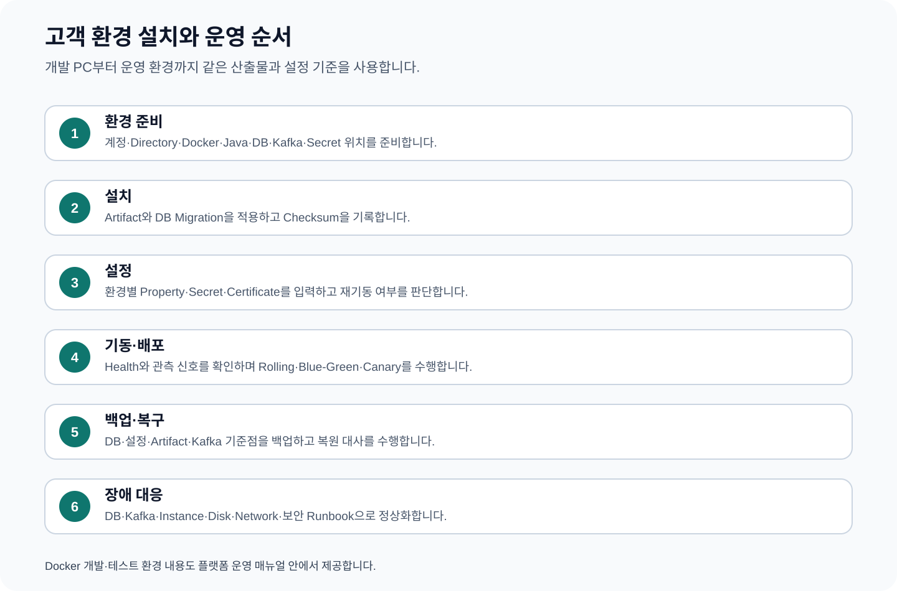

# CPF 플랫폼 운영 매뉴얼 — 고객 환경 설치·배포·관측·복구

> **주 독자**: 고객사 플랫폼 운영자, DBA, 배포담당자, 관측담당자, 보안운영자, DR 담당자
> **이 문서의 목표**: 고객 환경에 CPF와 업무 서비스를 설치하고 설정·기동·배포·관측·백업·복구한다. CPF 내부 기능을 개발하지 않는다.



## 빠른 찾기

- [0. 운영 용어를 쉽게 읽기](#0-운영-용어를-쉽게-읽기)
- [0.1 작업별 바로 가기](#01-작업별-바로-가기)
- [1. 운영자가 관리하는 범위](#1-운영자가-관리하는-범위)
- [2. 지원 환경 준비](#2-지원-환경-준비)
- [3. 도커(Docker) 개발·시험 환경](#3-도커docker-개발시험-환경)
- [4. 계정과 디렉터리](#4-계정과-디렉터리)
- [5. 배포 파일(Artifact) 공급 방식](#5-배포-파일artifact-공급-방식)
- [6. 주요 설정값(Property) 운영표](#6-주요-설정값property-운영표)
- [7. 비밀값(Secret)과 인증서](#7-비밀값secret과-인증서)
- [8. 데이터베이스 설치·변경·구성 차이](#8-데이터베이스-설치변경구성-차이)
- [9. 카프카(Kafka)와 레디스(Redis)](#9-카프카kafka와-레디스redis)
- [10. 신규 설치 순서](#10-신규-설치-순서)
- [11. 기동·종료·상태 점검](#11-기동종료상태-점검)
- [12. 배포 방식](#12-배포-방식)
- [13. 로그·지표·추적](#13-로그지표추적)
- [14. 용량 관리](#14-용량-관리)
- [15. 백업과 복원](#15-백업과-복원)
- [16. 업그레이드와 되돌리기](#16-업그레이드와-되돌리기)
- [17. 재해복구](#17-재해복구)
- [18. 장애 대응 절차](#18-장애-대응-절차)
- [19. 운영 인계표](#19-운영-인계표)
- [20. 개발·시험 Docker 환경을 처음 구성하기](#20-개발시험-docker-환경을-처음-구성하기)
- [21. Docker 장애·초기화](#21-docker-장애초기화)
- [22. CPF 전체 설정값 목록](#22-cpf-전체-설정값-목록)
- [23. 설정 변경 절차](#23-설정-변경-절차)
- [24. 신규 운영 환경 전체 설치 작업표](#24-신규-운영-환경-전체-설치-작업표)
- [25. 환경별 운영 인계](#25-환경별-운영-인계)

## 0. 운영 용어를 쉽게 읽기

| 문서 용어 | 뜻 | 운영자가 확인할 것 |
|---|---|---|
| 배포 파일(Artifact) | 실행 파일과 설정·DB 변경 묶음 | 버전, 소스 SHA, SHA-256 |
| 실행 환경(Runtime) | 실제 서비스가 동작하는 프로세스·컨테이너 | 환경, 인스턴스, 프로필, 포트 |
| 설정값(Property) | 환경별로 바꾸는 기능·연결 설정 | 키, 환경변수, 기본값, 재기동 |
| 비밀값(Secret) | 비밀번호·토큰·암호화 키의 안전한 참조 | 저장 위치, 버전, 만료, 교체 |
| 상태 점검(Health) | 프로세스와 DB·Kafka·업무 준비 상태 | 준비·생존·의존성 상태 구분 |
| 되돌리기(Rollback) | 이전 배포·설정·DB 기준으로 복귀 | 복귀 버전, 데이터 호환성, 검사값 |
| 재해복구(DR) | 주 환경 장애 시 대체 환경 전환·복귀 | RPO, RTO, 복제 상태, 대사 |

## 0.1 작업별 바로 가기

| 지금 해야 할 일 | 먼저 볼 장 | 작업을 끝낼 때 확인할 결과 |
|---|---:|---|
| 개발 PC에 공통 시험환경 구성 | 3, 20, 21 | 필요한 DB·Kafka·Redis·도구 상태와 보호 대상 확인 |
| 새 운영환경 설치 | 2, 4~11, 24 | 배포 파일·DB·설정·비밀값·상태 점검·대표 업무 일치 |
| 설정값 변경 | 6, 22, 23 | 목표 버전·실제 버전·검사값·대상별 적용 결과 일치 |
| 데이터베이스 변경 | 8, 16 | Migration 버전·객체·건수·대표 업무·되돌리기 기준 일치 |
| 배포 | 5, 10~13 | 배포 파일 SHA·인스턴스 버전·상태 점검·관측 정상 |
| 장애 대응 | 13, 18 | 영향 범위·실제 업무 결과·복구 조치·종료 기준 확정 |
| 백업·복원 | 15 | 복원 환경에서 DB·설정·배포 파일·대표 업무 검증 |
| 재해복구 | 17 | RPO·RTO 안에서 전환·대사·복귀 완료 |

## 1. 운영자가 관리하는 범위

- Artifact와 Checksum
- 환경별 Property와 Profile
- Secret·Certificate
- Oracle·PostgreSQL·MariaDB Schema Lifecycle
- Kafka·Redis와 외부 의존성
- Service Process·Container·Instance
- Health·Log·Metric·Trace·Alert
- 배포·Upgrade·Rollback
- Backup·Restore·DR
- 장애 Runbook과 교대 인계

고객 업무 규칙과 Source 수정은 업무 개발팀이 담당한다. 플랫폼 운영자는 전달받은 Artifact·Migration·설정·권한·Runbook을 환경에 적용하고 결과를 확인한다.

## 2. 지원 환경 준비

| 영역 | 준비 항목 | 확인 |
|---|---|---|
| OS·Runtime | 고객 표준 Linux/Windows, Java Toolchain, PowerShell 또는 Shell | Version과 실행 계정 |
| DB | Oracle·PostgreSQL·MariaDB 중 고객 선택 Vendor | 관리계정·Migration계정·Runtime계정 분리 |
| Messaging·Cache | Kafka, 필요 시 Redis | Broker·Topic·ACL·보존기간 |
| 배포 | VM·Container·Orchestrator와 Artifact Repository | 배포 단위·Port·Health 경로 |
| 관측 | Log 수집, Metric, Trace, Alert | 업무 ID·Instance ID·환경 Tag |
| 보안 | Secret Provider, Certificate, 계정·권한 | 원문 미노출·Rotation·만료 경보 |
| Backup·DR | DB·설정·Artifact·Kafka 기준점 | RPO·RTO·복원 시험 |

## 3. 도커(Docker) 개발·시험 환경

별도 Docker Guide를 만들지 않고 이 장에서 개발·시험 환경 구축과 사용·초기화를 설명한다.

### 3.1 제공 구성

- Oracle, PostgreSQL, MariaDB
- Redis, Kafka
- Toxiproxy 장애 조건
- OpenTelemetry Collector
- Java 25, Node.js 22, PowerShell 7, Playwright Browser
- DB Client, curl, jq, openssl, zip·unzip
- Trivy, OSS Review Toolkit

### 3.2 사전 조건

- Windows 10/11, WSL 2, Docker Desktop Linux Container
- PowerShell 7
- CPF Repository
- 인터넷 연결과 Container Registry 접근
- 최소 4 CPU, 권장 Memory 16GB 이상
- Oracle·Browser·ORT를 함께 사용할 Disk·Memory

### 3.3 설치

```powershell
pwsh -NoProfile -ExecutionPolicy Bypass `
  -File .\cpf-tools\environment\docker-development-test\CPF_도커_개발테스트환경_전체설치.ps1 `
  -RepoRoot (Get-Location).Path
```

Secret 파일이 없는 PC에서만 Script Help에 정의된 관리자 비밀번호 입력 방식을 사용한다. 실제 비밀번호를 문서·Git·명령 History에 남기지 않는다.

### 3.4 상태 확인

```powershell
pwsh -NoProfile -File "C:\dev\Docker\CPF\verify-complete-environment.ps1" -RequireStopped
pwsh -NoProfile -File "C:\dev\Docker\CPF\cpf-env.ps1" -Action status
pwsh -NoProfile -File "C:\dev\Docker\CPF\cpf-tooling.ps1" -Action status
```

### 3.5 작업별 기동

| 작업 | 실행 대상 |
|---|---|
| MariaDB 업무 개발 | MariaDB와 필요한 Kafka·Redis |
| PostgreSQL 업무 개발 | PostgreSQL과 필요한 Kafka·Redis |
| Oracle 업무 개발 | Oracle과 필요한 Kafka·Redis |
| Batch 통합시험 | 대상 DB, Kafka, Worker 관련 Service |
| 장애시험 | 대상 Service와 Toxiproxy |
| Trace 확인 | 업무 서비스와 OpenTelemetry Collector |
| Frontend·Browser | Node·Playwright, Backend와 대상 DB |
| 취약점·License | Trivy 또는 ORT 일회성 Container |

### 3.6 안전한 초기화

```powershell
pwsh -NoProfile -File "C:\dev\Docker\CPF\reset-test-data.ps1" -ConfirmReset
pwsh -NoProfile -File "C:\dev\Docker\CPF\cpf-env.ps1" -Action prepare
```

다음 명령은 사용하지 않는다.

```text
docker system prune -a
docker image prune -a
docker volume prune
docker builder prune -a
```

### 3.7 Port 충돌 확인

```powershell
Get-NetTCPConnection -State Listen |
  Where-Object LocalPort -in 3306,5432,1521,6379,9092,8474,13306,15432,11521,16379,19093,4317,4318,8888
```

## 4. 계정과 디렉터리

| 구분 | 권장 원칙 |
|---|---|
| Service 계정 | 사람 계정과 분리하고 Shell·File 권한을 최소화한다. |
| DB Migration 계정 | DDL·Migration에만 사용하고 Runtime에서 사용하지 않는다. |
| DB Runtime 계정 | 업무 DML과 필요한 Object 접근만 허용한다. |
| Secret Directory | Repository 밖, ACL 제한, Backup·Rotation 정책 적용 |
| Artifact Directory | Version과 SHA-256으로 구분하고 임의 덮어쓰기를 금지한다. |
| Log·Data Directory | 보존기간·용량·개인정보 정책을 분리한다. |

## 5. 배포 파일(Artifact) 공급 방식

### LOCAL_DEV

개발 PC의 로컬 CPF Repository를 사용한다. 고객 업무 개발 중에만 사용한다.

### REMOTE

승인된 Artifact Repository에서 CPF Version을 내려받는다. 운영·공식 Build에 사용한다.

### OFFLINE

폐쇄망에 반입한 Offline Repository를 사용한다. 반입 목록·Checksum·승인을 기록한다.

## 6. 주요 설정값(Property) 운영표

| 설정 키(Key) | 환경변수 | 형식(Type) | 기본값 | 필수 | 범위 | 사용 기능 | 적용 환경(Profile) | 재기동 | 비밀값(Secret) | 오류 | 확인 명령 | 정상 결과 | 되돌리기 |
|---|---|---|---|---|---|---|---|---|---|---|---|---|---|
| CPF_ARTIFACT_MODE | CPF_ARTIFACT_MODE | String | LOCAL_DEV | Y | LOCAL_DEV/REMOTE/OFFLINE | Gradle 설정 | 전체 | N | N | Mode 오류 시 Build 중단 | `gradlew help` | Project 목록 출력 | 이전 Mode와 저장소 경로 복원 |
| cpfArtifactRepositoryUrl | CPF_ARTIFACT_REPOSITORY_URL | URI | 없음 | REMOTE일 때 Y | HTTPS Repository | Gradle Dependency | 전체 | N | N | REMOTE인데 없으면 Build 중단 | `gradlew help -PcpfArtifactMode=REMOTE` | Dependency 해석 성공 | 이전 Repository URL 복원 |
| cpfLocalArtifactRepository | CPF_LOCAL_ARTIFACT_REPOSITORY | Path | 사용자 홈/.cpf/repository | LOCAL_DEV일 때 Y | 읽기 가능한 Directory | Gradle Dependency | 개발 | N | N | 경로 없음·권한 오류 | Directory와 `gradlew help` 확인 | 로컬 Artifact 해석 | 이전 경로 복원 |
| cpfOfflineArtifactRepository | CPF_OFFLINE_ARTIFACT_REPOSITORY | Path | 없음 | OFFLINE일 때 Y | 승인된 Offline Repository | Gradle Dependency | 폐쇄망 | N | N | OFFLINE인데 없으면 Build 중단 | `gradlew help -PcpfArtifactMode=OFFLINE` | 외부 접속 없이 해석 | 이전 Offline Snapshot 복원 |
| cpf.instance.id | CPF_INSTANCE_ID | String | 환경별 지정 | Y | 환경 내 고유 | Runtime·관측 | 전체 | Y | N | 중복 Instance·관측 혼선 | 기동 로그·ADM Service Registry | 고유 Instance 표시 | 이전 ID로 재기동 |
| cpf.environment.code | CPF_ENVIRONMENT_CODE | String | local | Y | LOCAL/DEV/TEST/PROD 등 고객 표준 | Runtime·감사 | 전체 | Y | N | 환경 오분류 | 기동 로그·Audit | 대상 환경 일치 | 이전 환경값 복원 |
| cpf.security.session.enabled | CPF_SECURITY_SESSION_ENABLED | Boolean | 기능 설정 기준 | Y | true/false | Security Starter | 환경별 | Y | N | Session 기능 비활성·로그인 실패 | 로그인·Session 조회 | 정상 로그인과 Session 생성 | 이전 값 복원 |
| cpf.security.session.fail-closed | CPF_SECURITY_SESSION_FAIL_CLOSED | Boolean | true 권장 | Y | true/false | Security Starter | 운영 | Y | N | 저장소 장애 시 접근 정책 변화 | Session 저장소 차단 시험 | 정책대로 접근 거부 | 이전 값 복원 |
| cpf.batch.execution.default-chunk-size | CPF_BATCH_DEFAULT_CHUNK_SIZE | Integer | Job 설정 기준 | N | 업무·DB 부하 기준 | Batch Runtime | Batch | Y | N | Memory·Lock·Commit 증가 | 배치 Metric·Step 결과 | 처리량·Commit 기준 충족 | 이전 Chunk 크기 복원 |
| cpf.messaging.kafka.acknowledgement-timeout | CPF_KAFKA_ACK_TIMEOUT | Duration | 환경 설정 기준 | Kafka 사용 시 Y | 전체 시간 예산 이내 | Kafka Starter | Messaging | Y | N | 응답 유실·처리 지연 | Kafka Metric·Producer Log | Ack와 업무 상태 일치 | 이전 Timeout 복원 |
| cpf.cache.caffeine.maximum-size | CPF_CACHE_MAXIMUM_SIZE | Long | 기능 설정 기준 | Cache 사용 시 Y | Heap 용량 이내 | Cache Starter | Cache | Y | N | Eviction 증가·Memory 증가 | Cache Metric·Heap | Hit율과 Heap 기준 충족 | 이전 크기 복원 |
| cpf.bza.bootstrap.enabled | CPF_BZA_BOOTSTRAP_ENABLED | Boolean | false | 최초 1회 Y | true/false | BZA Bootstrap | 초기 설치 | Y | N | 최초 관리자 미생성 또는 재실행 위험 | BZA Audit·사용자 조회 | 초기 관리자 생성 후 false | false로 복원 |
| cpf.bza.bootstrap.login-id | CPF_BZA_BOOTSTRAP_LOGIN_ID | String | 없음 | Bootstrap 시 Y | 고객 관리자 ID 규칙 | BZA Bootstrap | 초기 설치 | Y | N | ID 충돌·Validation 오류 | BZA 사용자 조회 | PENDING_ACTIVATION 사용자 생성 | 값 제거 |
| cpf.bza.bootstrap.password-file | CPF_BZA_BOOTSTRAP_PASSWORD_FILE | Path | 없음 | Bootstrap 시 Y | ACL 제한 파일 | BZA Bootstrap | 초기 설치 | Y | Y | 파일 없음·권한 오류 | Secret 원문 미출력 상태로 읽기 확인 | 초기 로그인·변경 요구 | 파일 폐기·Bootstrap 비활성 |
| cpf.bza.bootstrap.approval-token-file | CPF_BZA_BOOTSTRAP_APPROVAL_TOKEN_FILE | Path | 없음 | Bootstrap 정책에 따라 Y | ACL 제한 파일 | BZA Bootstrap | 초기 설치 | Y | Y | 승인 Token 검증 실패 | Bootstrap Audit | 승인 범위와 Operation 일치 | Token 폐기 |

Property 변경 전에는 현재값·변경값·대상 Instance·적용 방식·Rollback 값을 기록한다. 여러 Instance에 적용되는 설정은 Expected Version과 Applied Version을 비교한다.

## 7. 비밀값(Secret)과 인증서

1. Secret 원문을 Repository·문서·Log·Audit에 기록하지 않는다.
2. 서비스가 사용하는 Secret 경로와 Provider를 기록한다.
3. Rotation 전에 구·신 Secret 공존 가능 여부를 확인한다.
4. Certificate는 Subject·SAN·Issuer·만료일·Chain을 확인한다.
5. 변경 후 실제 DB·Kafka·외부기관·Gateway 연결을 시험한다.
6. 실패 시 구 Secret 또는 LKG Certificate로 Rollback한다.
7. 구 Secret이 거부되는 것을 확인한 뒤 폐기한다.

## 8. 데이터베이스 설치·변경·구성 차이

### 8.1 신규 설치

1. 대상 DB Vendor와 Version을 확인한다.
2. Backup과 빈 Schema를 준비한다.
3. Migration 계정으로 Install Script를 실행한다.
4. Runtime 계정 Grant를 적용한다.
5. Seed와 기준정보를 적용한다.
6. Version·Checksum·Object 수를 확인한다.
7. Runtime 계정으로 업무 확인 Query를 실행한다.

### 8.2 Upgrade

1. 현재 Version과 목표 Version을 확인한다.
2. Backup과 예상 Lock·소요시간을 기록한다.
3. Upgrade Script를 단계별 실행한다.
4. Data Backfill과 Constraint 적용 결과를 확인한다.
5. 업무 API와 Batch를 시험한다.
6. Version·Checksum·Row Count를 기록한다.

### 8.3 Drift

정본 Migration 결과와 실제 DB의 Table·Column·Index·Constraint·Grant·Seed를 비교한다. 차이가 있으면 운영 DB를 수동 수정하지 말고 정본 Migration 또는 승인된 보정 Script로 복원한다.

## 9. 카프카(Kafka)와 레디스(Redis)

### Kafka

- Topic, Partition, Replication, Retention, ACL을 기록한다.
- Producer Ack·Timeout과 사용 기능 Group·Lag·DLT를 관측한다.
- Offset을 임의로 변경하기 전에 업무 중복과 누락 범위를 계산한다.
- Broker 장애 후 Outbox·Inbox·업무 합계를 대사한다.

### Redis

- Cache Key Namespace, TTL, Memory, Eviction 정책을 기록한다.
- Redis 장애 시 업무가 실패하는지 DB Fallback을 사용하는지 확인한다.
- 데이터 초기화 전에 Cache인지 업무 상태 저장소인지 구분한다.

## 10. 신규 설치 순서

1. 계정·Directory·Port·DNS·Certificate를 준비한다.
2. Artifact와 SHA-256을 확인한다.
3. DB Install·Seed·Grant를 적용한다.
4. Kafka Topic·ACL과 Redis를 준비한다.
5. 환경별 Property와 Secret을 입력한다.
6. 한 Instance를 기동해 Health·DB·Kafka·관측을 확인한다.
7. 업무 API와 ADM 로그인·조회 기능을 시험한다.
8. 나머지 Instance를 순차 기동한다.
9. Gateway·Batch·BZA 선택 제품을 연결한다.
10. Backup 기준점과 운영 인계표를 작성한다.

## 11. 기동·종료·상태 점검

```powershell
pwsh -File .\cpf-tools\scripts\start-cpf-local.ps1
pwsh -File .\cpf-tools\scripts\status-cpf-local.ps1
pwsh -File .\cpf-tools\scripts\stop-cpf-local.ps1
```

운영 환경에서는 고객 배포 도구를 사용하되 다음 순서를 유지한다.

- 기동: Secret·DB·Kafka → Service → ADM/BZA/Gateway → Smoke Test
- 종료: 신규 Traffic 차단 → 진행 업무 확인 → Service 종료 → 필요 시 Infra 종료
- Health: Process 생존뿐 아니라 DB·Kafka·필수 Dependency와 업무 준비 상태를 구분한다.

## 12. 배포 방식

| 방식 | 적용 순서 | 완료 기준 | Rollback |
|---|---|---|---|
| Rolling | 한 Instance씩 Traffic 제외→배포→Health→복귀 | 모든 Instance가 목표 Version, Error율 정상 | 문제 Instance를 이전 Artifact로 복원 |
| Blue-Green | Green 설치·DB 호환 확인→시험→Traffic 전환 | Green 업무·관측 정상, Blue 보존 | Traffic을 Blue로 되돌림 |
| Canary | 소수 Instance·사용자에 새 Version 적용 | Canary 지표·업무 합계 기준 충족 | Canary Traffic 제거·이전 Version 복원 |

DB 변경은 애플리케이션 Rollback과 호환되도록 Expand→Migrate→Contract 순서로 설계한다.

## 13. 로그·지표·추적

### 필수 Log 식별자

- 환경, 서비스, Instance
- 업무 ID, Transaction ID, Operation ID
- 사용자·채널·외부기관
- 결과 상태와 오류코드

### 필수 Metric

- 요청 수, 성공률, 오류율
- 응답시간 P95·P99
- DB Pool, Kafka Lag, Outbox·DLT
- Batch 실행·처리율·실패 건수
- Gateway Timeout·Circuit·Drift
- Disk·Memory·GC

### Trace

서비스 간 호출, Kafka 후속 처리, 외부기관, Gateway 경계를 같은 업무 식별자로 연결한다.

## 14. 용량 관리

1. 평시·월말·이벤트성 Peak를 구분한다.
2. 요청 수·처리시간·동시성·DB Connection·Kafka Lag·Batch 처리량을 기록한다.
3. Scale-out 전에 병목이 CPU·DB·Network·Lock·외부기관인지 확인한다.
4. Cache·Chunk·Worker 수 변경은 부하시험 후 적용한다.
5. Capacity 변경 후 비용·성능·오류율을 함께 확인한다.

## 15. 백업과 복원

### Backup 대상

- DB Data와 Migration Version
- 고객 환경 Property·Secret Metadata·Certificate
- Artifact와 Checksum
- Kafka Topic 설정과 필요한 업무 Snapshot
- BZA 조직·권한·결재, ADM Audit와 운영 설정

### Restore 절차

1. 복원 시점과 영향 범위를 승인받는다.
2. 신규 Traffic과 Scheduler를 중지한다.
3. DB·Artifact·설정을 같은 기준점으로 복원한다.
4. Migration Version과 Checksum을 확인한다.
5. 업무 건수·금액·파일 Hash·Kafka 위치를 대사한다.
6. 한 Instance에서 Smoke Test 후 순차 복귀한다.
7. 복원 이후 발생한 업무의 재처리·보상을 수행한다.

## 16. 업그레이드와 되돌리기

- Source SHA, Artifact Version, DB Version, Config Version을 한 Release 단위로 기록한다.
- Upgrade 전 Backup과 LKG를 확인한다.
- 변경 후 Health만 보지 않고 대표 업무·Batch·ADM·Gateway를 시험한다.
- Rollback 시 Artifact만 되돌리고 DB·Config를 남겨 두지 않는다.
- DB Rollback이 불가능하면 Forward Fix 절차와 시간 제한을 준비한다.

## 17. 재해복구

- RPO와 RTO를 업무별로 정한다.
- DR 환경의 DNS·Certificate·Secret·DB·Kafka·Artifact를 준비한다.
- 정기적으로 전환과 복귀를 시험한다.
- 복구 후 사용자 업무, Batch, Gateway, BZA 권한과 감사가 같은 기준인지 대사한다.

## 18. 장애 대응 절차

| 장애 | 확인 | 조치 | 금지 | 정상화 판정 |
|---|---|---|---|---|
| DB 접속 실패 | Health·DB Client·계정 만료·Network·Connection Pool | 새 배포 중지, 읽기/쓰기 영향 분리, Failover 또는 복구 | 임의 Schema 변경·광역 재기동 금지 | 업무 API·Migration Version·Connection Pool 정상 |
| DB Migration 중단 | 적용된 Version·DDL·Lock·Backup | 중단 Step 확인 후 Resume·Rollback·Forward Fix | 확인 없이 전체 SQL 재실행 금지 | Version·Checksum·Table·Data 합계 일치 |
| Kafka 지연·중단 | Broker·Topic·Partition·사용 기능 Lag·Outbox·DLT | Producer 제한, 사용 기능 복구, 적체 순서 처리 | Topic 삭제·Offset 임의 변경 금지 | Lag 감소, Outbox·Inbox·업무 합계 일치 |
| Instance 비정상 | Health·기동 로그·최근 배포·Secret·Port | Traffic 제외, 원인 수정, 재기동, Warm-up 후 복귀 | 모든 Instance 동시 재기동 금지 | Health·거래 성공·Error율 정상 |
| Disk 부족 | 사용량·Log·Artifact·DB·Docker Volume | 신규 배포 중지, 보존정책에 따른 안전한 정리, 용량 확장 | 전체 로그·Volume·Image 광역 삭제 금지 | 여유 공간·쓰기 성공·Alert 해제 |
| Memory 부족 | Heap·Container Limit·GC·Cache·Batch Chunk | 부하 제한, Cache·Chunk 조정, Instance 확장 | 원인 없이 Heap만 확대 금지 | GC·응답시간·OOM 재발 없음 |
| Network·TLS | DNS·Route·Port·Certificate·Handshake | 영향 경로 격리, Certificate Chain·시간 확인, 정책 복구 | TLS 검증 비활성 금지 | Handshake·업무 호출·Gateway Probe 성공 |
| Secret·Certificate 사고 | 노출 범위·사용 서비스·Audit·만료 | Secret 폐기·교체, 서비스별 Rotation, 접근 조사 | 원문을 Ticket·Chat에 기록 금지 | 구 Secret 거부·신 Secret 성공·감사 완료 |
| Docker 개발환경 오류 | Container·Image·Volume·Port·Secret ACL | 읽기 전용 확인 후 대상 Service만 재구성 | `docker system prune -a`, Volume 전체 삭제 금지 | 필요 Service만 정상, 다른 자산 보존 |

## 19. 운영 인계표

| 항목 | 기록 내용 |
|---|---|
| 환경 | 환경코드, Region, Network, DNS |
| Artifact | Version, Source SHA, SHA-256, Repository |
| DB | Vendor, Version, Schema, Migration, Backup |
| Infra | Kafka, Redis, Storage, 외부기관 |
| 설정 | Property, 환경변수, Secret, Certificate |
| 배포 | 방식, 대상 Instance, Health, Rollback |
| 관측 | Log, Metric, Trace, Dashboard, Alert |
| 복구 | Backup, Restore, DR, 장애 Runbook |
| 담당 | 개발·운영·DBA·보안·승인 연락망 |


## 20. 개발·시험 Docker 환경을 처음 구성하기

### 제공 구성

| 작업 | 사용하는 구성 |
|---|---|
| DB 개발·Migration | MariaDB, PostgreSQL, Oracle와 각 DB Client |
| 메시지·배치 | Kafka |
| Cache | Redis |
| 장애 재현 | Toxiproxy |
| 로그·지표·분산 추적 수집 | OpenTelemetry Collector |
| 화면 Test | Node.js, Playwright, Chromium·Firefox·WebKit |
| 공급망 검사 | Trivy, OSS Review Toolkit |
| 통합 명령 실행 | Java 25, PowerShell 7, Python, Git, Docker CLI, curl, jq, openssl, zip |

모든 서비스를 상시 실행하지 않는다. 개발할 기능에 필요한 DB·Kafka·Redis·장애 도구만 시작한다.

### 새 PC 준비 순서

1. Windows 10/11, WSL 2, Docker Desktop Linux Container, PowerShell 7을 준비한다.
2. Repository와 현재 변경을 확인한다.
3. `cpf-tools/environment/docker-development-test/CPF_도커_개발테스트환경_전체설치.ps1`의 도움말과 Parameter를 확인한다.
4. Repository Root와 Docker 작업 Directory, Secret Directory를 정한다.
5. 설치 Script를 실행한다.
6. Image·Container·Volume·Network·Port와 Image Lock을 확인한다.
7. Container는 기본적으로 Created/Stopped 상태에서 필요한 대상만 시작한다.
8. CPF 업무 DB·Schema·Seed·Kafka Topic은 Repository Script로 별도 생성한다.

### 작업별 기동 대상

| 작업 | 시작할 대상 |
|---|---|
| Java 단위 Test | Host 또는 통합 Runner, 외부 서비스 없음 |
| MariaDB 업무 | MariaDB |
| PostgreSQL 업무 | PostgreSQL |
| Oracle 업무 | Oracle |
| Kafka 이벤트 | Kafka |
| Cache | Redis |
| Batch | 대상 DB + Kafka, 필요 시 Redis |
| 장애 Test | 대상 서비스 + Toxiproxy |
| 분산 추적 | 대상 서비스 + OpenTelemetry Collector |
| ADM/BZA 화면 | Backend + 대상 DB + Node/Playwright |

### 상태·기동 명령

```powershell
pwsh -NoProfile -File "C:\dev\Docker\CPF\cpf-env.ps1" -Action status
pwsh -NoProfile -File "C:\dev\Docker\CPF\cpf-env.ps1" -Action up -Target batch-mariadb
pwsh -NoProfile -File "C:\dev\Docker\CPF\cpf-env.ps1" -Action up -Target batch-postgresql
pwsh -NoProfile -File "C:\dev\Docker\CPF\cpf-env.ps1" -Action up -Target batch-oracle
pwsh -NoProfile -File "C:\dev\Docker\CPF\cpf-env.ps1" -Action up -Target infra
```

실제 Target 이름과 Parameter는 설치된 `cpf-env.ps1` 도움말을 확인한다.

## 21. Docker 장애·초기화

### 먼저 읽기 전용 확인

```powershell
docker ps -a --format "table {{.Names}}	{{.Image}}	{{.Status}}	{{.Ports}}"
docker volume ls
docker image ls
```

### Port 충돌 확인

```powershell
Get-NetTCPConnection -State Listen |
  Where-Object LocalPort -in 3306,5432,1521,6379,9092,8474,13306,15432,11521,16379,19093,4317,4318,8888 |
  Format-Table LocalAddress,LocalPort,OwningProcess
```

### 데이터 초기화

```powershell
pwsh -NoProfile -File "C:\dev\Docker\CPF\reset-test-data.ps1" -ConfirmReset
pwsh -NoProfile -File "C:\dev\Docker\CPF\cpf-env.ps1" -Action prepare
```

초기화 전에 대상 DB·Redis·Kafka가 시험 데이터인지 확인한다. Repository, Secret, 고객 Output과 다른 Docker 자산은 삭제하지 않는다.

### 사용하지 않는 광역 삭제

```text
docker system prune -a
docker image prune -a
docker volume prune
docker builder prune -a
```

## 22. CPF 전체 설정값 목록

아래 표는 고객 환경 설정표로 옮겨야 하는 CPF 전용 설정이다. `spring.datasource.*`, `spring.kafka.*`, `server.*`, `management.*`, `logging.*`, `spring.session.*`은 각 서비스의 환경별 설정표에 같은 열 구조로 추가한다.

환경변수 이름은 Spring Boot의 완화된 바인딩 규칙에 맞춘 표준 표기다. YAML·배포 Manifest로 값을 주입하는 환경에서는 환경변수 확인 결과가 비어 있을 수 있으므로 배포 설정과 기동 로그·ADM 적용값을 함께 비교한다.

| 설정 키(Key) | 환경변수 | 형식(Type) | 기본값 | 필수 | 범위·용도 | 사용 기능 | 적용 환경(Profile) | 재기동 | 비밀값(Secret) | 오류 | 확인 명령 | 정상 결과 | 되돌리기 |
| --- | --- | --- | --- | --- | --- | --- | --- | --- | --- | --- | --- | --- | --- |
| cpf.security.session.enabled | CPF_SECURITY_SESSION_ENABLED | boolean | false/구성값 | 기능 사용 시 | Session BFF 활성화 | Security AutoConfiguration | Security | Y | 아니오 | 형식·범위 오류 시 Security AutoConfiguration 초기화 또는 실행 실패 | `Get-Item Env:CPF_SECURITY_SESSION_ENABLED -ErrorAction SilentlyContinue`; 배포 설정·기동 로그 비교 | Security AutoConfiguration에 계획한 값이 적용되고 관련 상태 점검이 통과 | 이전 값으로 복원 후 재기동 |
| cpf.security.session.cookie-name | CPF_SECURITY_SESSION_COOKIE_NAME | String | CPFSESSION | 기능 사용 시 | Cookie 이름 | Session filter | Security | Y | 아니오 | 형식·범위 오류 시 Session filter 초기화 또는 실행 실패 | `Get-Item Env:CPF_SECURITY_SESSION_COOKIE_NAME -ErrorAction SilentlyContinue`; 배포 설정·기동 로그 비교 | Session filter에 계획한 값이 적용되고 관련 상태 점검이 통과 | 이전 값으로 복원 후 재기동 |
| cpf.security.session.timeout | CPF_SECURITY_SESSION_TIMEOUT | Duration | 30m | 기능 사용 시 | 1s~12h | Session repository | Security | N: 신규 Session부터 적용 | 아니오 | 형식·범위 오류 시 Session repository 초기화 또는 실행 실패 | `Get-Item Env:CPF_SECURITY_SESSION_TIMEOUT -ErrorAction SilentlyContinue`; 배포 설정·기동 로그 비교 | Session repository에 계획한 값이 적용되고 관련 상태 점검이 통과 | 이전 값으로 복원 후 신규 Session |
| cpf.security.session.secure | CPF_SECURITY_SESSION_SECURE | boolean | false | 기능 사용 시 | TLS 환경 true | Cookie writer | Security | Y | 아니오 | 형식·범위 오류 시 Cookie writer 초기화 또는 실행 실패 | `Get-Item Env:CPF_SECURITY_SESSION_SECURE -ErrorAction SilentlyContinue`; 배포 설정·기동 로그 비교 | Cookie writer에 계획한 값이 적용되고 관련 상태 점검이 통과 | 이전 값으로 복원 후 재기동 |
| cpf.security.session.same-site | CPF_SECURITY_SESSION_SAME_SITE | enum | Strict | 기능 사용 시 | Strict/Lax | Cookie writer | Security | Y | 아니오 | 형식·범위 오류 시 Cookie writer 초기화 또는 실행 실패 | `Get-Item Env:CPF_SECURITY_SESSION_SAME_SITE -ErrorAction SilentlyContinue`; 배포 설정·기동 로그 비교 | Cookie writer에 계획한 값이 적용되고 관련 상태 점검이 통과 | 이전 값으로 복원 후 재기동 |
| cpf.security.session.cookie-path | CPF_SECURITY_SESSION_COOKIE_PATH | String | / | 기능 사용 시 | Application 경계 | Cookie writer | Security | Y | 아니오 | 형식·범위 오류 시 Cookie writer 초기화 또는 실행 실패 | `Get-Item Env:CPF_SECURITY_SESSION_COOKIE_PATH -ErrorAction SilentlyContinue`; 배포 설정·기동 로그 비교 | Cookie writer에 계획한 값이 적용되고 관련 상태 점검이 통과 | 이전 값으로 복원 후 재기동 |
| cpf.security.session.allowed-origins | CPF_SECURITY_SESSION_ALLOWED_ORIGINS | List | [] | 기능 사용 시 | Trusted Origin | CSRF/Origin filter | Security | Y | 아니오 | 형식·범위 오류 시 CSRF/Origin filter 초기화 또는 실행 실패 | `Get-Item Env:CPF_SECURITY_SESSION_ALLOWED_ORIGINS -ErrorAction SilentlyContinue`; 배포 설정·기동 로그 비교 | CSRF/Origin filter에 계획한 값이 적용되고 관련 상태 점검이 통과 | 이전 값으로 복원 후 재기동 |
| cpf.security.session.credential-key-base64 | CPF_SECURITY_SESSION_CREDENTIAL_KEY_BASE64 | String | 없음 | Y | Credential vault encryption key | Credential vault | Security | Y | 예 | 누락·해독·권한 오류 시 Credential vault 기동 또는 요청 실패 | `Get-Item Env:CPF_SECURITY_SESSION_CREDENTIAL_KEY_BASE64 -ErrorAction SilentlyContinue`; 배포 설정·기동 로그 비교 | Credential vault에 계획한 값이 적용되고 관련 상태 점검이 통과 | 이전 값으로 복원 후 재기동 |
| cpf.security.session.credential-key-id | CPF_SECURITY_SESSION_CREDENTIAL_KEY_ID | String | cpf-bff-v1 | 기능 사용 시 | Key version | Credential vault | Security | Y | 아니오 | 형식·범위 오류 시 Credential vault 초기화 또는 실행 실패 | `Get-Item Env:CPF_SECURITY_SESSION_CREDENTIAL_KEY_ID -ErrorAction SilentlyContinue`; 배포 설정·기동 로그 비교 | Credential vault에 계획한 값이 적용되고 관련 상태 점검이 통과 | 이전 값으로 복원 후 재기동 |
| cpf.security.session.access-token-ttl | CPF_SECURITY_SESSION_ACCESS_TOKEN_TTL | Duration | 5m | 기능 사용 시 | 1s~1h | BFF token cache | Security | N: 신규 token부터 적용 | 아니오 | 형식·범위 오류 시 BFF token cache 초기화 또는 실행 실패 | `Get-Item Env:CPF_SECURITY_SESSION_ACCESS_TOKEN_TTL -ErrorAction SilentlyContinue`; 배포 설정·기동 로그 비교 | BFF token cache에 계획한 값이 적용되고 관련 상태 점검이 통과 | 이전 값으로 복원 후 신규 token |
| cpf.security.session.refresh-token-ttl | CPF_SECURITY_SESSION_REFRESH_TOKEN_TTL | Duration | 30m | 기능 사용 시 | access TTL~24h | BFF refresh | Security | N: 신규 token부터 적용 | 아니오 | 형식·범위 오류 시 BFF refresh 초기화 또는 실행 실패 | `Get-Item Env:CPF_SECURITY_SESSION_REFRESH_TOKEN_TTL -ErrorAction SilentlyContinue`; 배포 설정·기동 로그 비교 | BFF refresh에 계획한 값이 적용되고 관련 상태 점검이 통과 | 이전 값으로 복원 후 신규 token |
| cpf.security.session.max-sessions | CPF_SECURITY_SESSION_MAX_SESSIONS | int | 1 | 기능 사용 시 | 1~20 | Session policy | Security | N: 신규 로그인부터 적용 | 아니오 | 형식·범위 오류 시 Session policy 초기화 또는 실행 실패 | `Get-Item Env:CPF_SECURITY_SESSION_MAX_SESSIONS -ErrorAction SilentlyContinue`; 배포 설정·기동 로그 비교 | Session policy에 계획한 값이 적용되고 관련 상태 점검이 통과 | 이전 값으로 복원 후 신규 로그인 |
| cpf.security.session.content-security-policy | CPF_SECURITY_SESSION_CONTENT_SECURITY_POLICY | String | self-only 정책 | 기능 사용 시 | Browser CSP | Security headers | Security | Y | 아니오 | 형식·범위 오류 시 Security headers 초기화 또는 실행 실패 | `Get-Item Env:CPF_SECURITY_SESSION_CONTENT_SECURITY_POLICY -ErrorAction SilentlyContinue`; 배포 설정·기동 로그 비교 | Security headers에 계획한 값이 적용되고 관련 상태 점검이 통과 | 이전 값으로 복원 후 재기동 |
| cpf.messaging.kafka.acknowledgement-timeout | CPF_MESSAGING_KAFKA_ACKNOWLEDGEMENT_TIMEOUT | Duration | 10s | 기능 사용 시 | 양수 | Kafka starter | Kafka | Y | 아니오 | 형식·범위 오류 시 Kafka starter 초기화 또는 실행 실패 | `Get-Item Env:CPF_MESSAGING_KAFKA_ACKNOWLEDGEMENT_TIMEOUT -ErrorAction SilentlyContinue`; 배포 설정·기동 로그 비교 | Kafka starter에 계획한 값이 적용되고 관련 상태 점검이 통과 | 이전 값으로 복원 후 재기동 |
| cpf.messaging.kafka.maximum-payload-bytes | CPF_MESSAGING_KAFKA_MAXIMUM_PAYLOAD_BYTES | int | 1048576 | 기능 사용 시 | 최대 16MiB | Kafka starter | Kafka | Y | 아니오 | 형식·범위 오류 시 Kafka starter 초기화 또는 실행 실패 | `Get-Item Env:CPF_MESSAGING_KAFKA_MAXIMUM_PAYLOAD_BYTES -ErrorAction SilentlyContinue`; 배포 설정·기동 로그 비교 | Kafka starter에 계획한 값이 적용되고 관련 상태 점검이 통과 | 이전 값으로 복원 후 재기동 |
| cpf.messaging.kafka.require-idempotence | CPF_MESSAGING_KAFKA_REQUIRE_IDEMPOTENCE | boolean | false | 기능 사용 시 | 제품 Profile 명시 | Producer config | Kafka | Y | 아니오 | 형식·범위 오류 시 Producer config 초기화 또는 실행 실패 | `Get-Item Env:CPF_MESSAGING_KAFKA_REQUIRE_IDEMPOTENCE -ErrorAction SilentlyContinue`; 배포 설정·기동 로그 비교 | Producer config에 계획한 값이 적용되고 관련 상태 점검이 통과 | 이전 값으로 복원 후 재기동 |
| cpf.batch.execution.default-chunk-size | CPF_BATCH_EXECUTION_DEFAULT_CHUNK_SIZE | int | 100 | 기능 사용 시 | 1~10000 | Batch runtime | Batch | Y | 아니오 | 형식·범위 오류 시 Batch runtime 초기화 또는 실행 실패 | `Get-Item Env:CPF_BATCH_EXECUTION_DEFAULT_CHUNK_SIZE -ErrorAction SilentlyContinue`; 배포 설정·기동 로그 비교 | Batch runtime에 계획한 값이 적용되고 관련 상태 점검이 통과 | 이전 값으로 복원 후 재기동 |
| cpf.batch.execution.max-partition-count | CPF_BATCH_EXECUTION_MAX_PARTITION_COUNT | int | 256 | 기능 사용 시 | 1~10000 | Batch runtime | Batch | Y | 아니오 | 형식·범위 오류 시 Batch runtime 초기화 또는 실행 실패 | `Get-Item Env:CPF_BATCH_EXECUTION_MAX_PARTITION_COUNT -ErrorAction SilentlyContinue`; 배포 설정·기동 로그 비교 | Batch runtime에 계획한 값이 적용되고 관련 상태 점검이 통과 | 이전 값으로 복원 후 재기동 |
| cpf.batch.execution.remote-poll-interval-ms | CPF_BATCH_EXECUTION_REMOTE_POLL_INTERVAL_MS | long | 1000 | 기능 사용 시 | 10~60000 | Batch manager | Batch | Y | 아니오 | 형식·범위 오류 시 Batch manager 초기화 또는 실행 실패 | `Get-Item Env:CPF_BATCH_EXECUTION_REMOTE_POLL_INTERVAL_MS -ErrorAction SilentlyContinue`; 배포 설정·기동 로그 비교 | Batch manager에 계획한 값이 적용되고 관련 상태 점검이 통과 | 이전 값으로 복원 후 재기동 |
| cpf.batch.execution.remote-timeout-ms | CPF_BATCH_EXECUTION_REMOTE_TIMEOUT_MS | long | 3600000 | 기능 사용 시 | 1000~86400000 | Batch manager | Batch | Y | 아니오 | 형식·범위 오류 시 Batch manager 초기화 또는 실행 실패 | `Get-Item Env:CPF_BATCH_EXECUTION_REMOTE_TIMEOUT_MS -ErrorAction SilentlyContinue`; 배포 설정·기동 로그 비교 | Batch manager에 계획한 값이 적용되고 관련 상태 점검이 통과 | 이전 값으로 복원 후 재기동 |
| cpf.batch.execution.remote-chunk-max-wait-timeouts | CPF_BATCH_EXECUTION_REMOTE_CHUNK_MAX_WAIT_TIMEOUTS | int | 40 | 기능 사용 시 | 1~10000 | Remote chunk | Batch | Y | 아니오 | 형식·범위 오류 시 Remote chunk 초기화 또는 실행 실패 | `Get-Item Env:CPF_BATCH_EXECUTION_REMOTE_CHUNK_MAX_WAIT_TIMEOUTS -ErrorAction SilentlyContinue`; 배포 설정·기동 로그 비교 | Remote chunk에 계획한 값이 적용되고 관련 상태 점검이 통과 | 이전 값으로 복원 후 재기동 |
| cpf.batch.execution.remote-chunk-throttle-limit | CPF_BATCH_EXECUTION_REMOTE_CHUNK_THROTTLE_LIMIT | long | 256 | 기능 사용 시 | 1~10000 | Remote chunk | Batch | Y | 아니오 | 형식·범위 오류 시 Remote chunk 초기화 또는 실행 실패 | `Get-Item Env:CPF_BATCH_EXECUTION_REMOTE_CHUNK_THROTTLE_LIMIT -ErrorAction SilentlyContinue`; 배포 설정·기동 로그 비교 | Remote chunk에 계획한 값이 적용되고 관련 상태 점검이 통과 | 이전 값으로 복원 후 재기동 |
| cpf.batch.execution.max-materialized-jobs | CPF_BATCH_EXECUTION_MAX_MATERIALIZED_JOBS | int | 1024 | 기능 사용 시 | 16~100000 | Job registry | Batch | Y | 아니오 | 형식·범위 오류 시 Job registry 초기화 또는 실행 실패 | `Get-Item Env:CPF_BATCH_EXECUTION_MAX_MATERIALIZED_JOBS -ErrorAction SilentlyContinue`; 배포 설정·기동 로그 비교 | Job registry에 계획한 값이 적용되고 관련 상태 점검이 통과 | 이전 값으로 복원 후 재기동 |
| cpf.batch.execution.executor-core-size | CPF_BATCH_EXECUTION_EXECUTOR_CORE_SIZE | int | 4 | 기능 사용 시 | 1~512 | Batch executor | Batch | Y | 아니오 | 형식·범위 오류 시 Batch executor 초기화 또는 실행 실패 | `Get-Item Env:CPF_BATCH_EXECUTION_EXECUTOR_CORE_SIZE -ErrorAction SilentlyContinue`; 배포 설정·기동 로그 비교 | Batch executor에 계획한 값이 적용되고 관련 상태 점검이 통과 | 이전 값으로 복원 후 재기동 |
| cpf.batch.execution.executor-max-size | CPF_BATCH_EXECUTION_EXECUTOR_MAX_SIZE | int | 32 | 기능 사용 시 | core~2048 | Batch executor | Batch | Y | 아니오 | 형식·범위 오류 시 Batch executor 초기화 또는 실행 실패 | `Get-Item Env:CPF_BATCH_EXECUTION_EXECUTOR_MAX_SIZE -ErrorAction SilentlyContinue`; 배포 설정·기동 로그 비교 | Batch executor에 계획한 값이 적용되고 관련 상태 점검이 통과 | 이전 값으로 복원 후 재기동 |
| cpf.batch.execution.executor-queue-capacity | CPF_BATCH_EXECUTION_EXECUTOR_QUEUE_CAPACITY | int | 1024 | 기능 사용 시 | 1~1000000 | Batch executor | Batch | Y | 아니오 | 형식·범위 오류 시 Batch executor 초기화 또는 실행 실패 | `Get-Item Env:CPF_BATCH_EXECUTION_EXECUTOR_QUEUE_CAPACITY -ErrorAction SilentlyContinue`; 배포 설정·기동 로그 비교 | Batch executor에 계획한 값이 적용되고 관련 상태 점검이 통과 | 이전 값으로 복원 후 재기동 |
| cpf.batch.remote.kafka.request-topic | CPF_BATCH_REMOTE_KAFKA_REQUEST_TOPIC | String | cpf.batch.remote.requests.v2 | 기능 사용 시 | Kafka topic 규칙 | Remote manager/worker | Batch | Y | 아니오 | 형식·범위 오류 시 Remote manager/worker 초기화 또는 실행 실패 | `Get-Item Env:CPF_BATCH_REMOTE_KAFKA_REQUEST_TOPIC -ErrorAction SilentlyContinue`; 배포 설정·기동 로그 비교 | Remote manager/worker에 계획한 값이 적용되고 관련 상태 점검이 통과 | 이전 값으로 복원 후 재기동 |
| cpf.batch.remote.kafka.reply-topic-prefix | CPF_BATCH_REMOTE_KAFKA_REPLY_TOPIC_PREFIX | String | cpf.batch.remote.replies.v2 | 기능 사용 시 | Instance별 reply | Remote manager | Batch | Y | 아니오 | 형식·범위 오류 시 Remote manager 초기화 또는 실행 실패 | `Get-Item Env:CPF_BATCH_REMOTE_KAFKA_REPLY_TOPIC_PREFIX -ErrorAction SilentlyContinue`; 배포 설정·기동 로그 비교 | Remote manager에 계획한 값이 적용되고 관련 상태 점검이 통과 | 이전 값으로 복원 후 재기동 |
| cpf.batch.remote.kafka.consumer-group | CPF_BATCH_REMOTE_KAFKA_CONSUMER_GROUP | String | cpf-batch-remote-workers-v2 | 기능 사용 시 | Kafka group | Remote worker | Batch | Y | 아니오 | 형식·범위 오류 시 Remote worker 초기화 또는 실행 실패 | `Get-Item Env:CPF_BATCH_REMOTE_KAFKA_CONSUMER_GROUP -ErrorAction SilentlyContinue`; 배포 설정·기동 로그 비교 | Remote worker에 계획한 값이 적용되고 관련 상태 점검이 통과 | 이전 값으로 복원 후 재기동 |
| cpf.batch.remote.kafka.manager-instance-id | CPF_BATCH_REMOTE_KAFKA_MANAGER_INSTANCE_ID | String | CPF_INSTANCE_ID/HOSTNAME | 기능 사용 시 | 고유 Instance | Remote manager | Batch | Y | 아니오 | 형식·범위 오류 시 Remote manager 초기화 또는 실행 실패 | `Get-Item Env:CPF_BATCH_REMOTE_KAFKA_MANAGER_INSTANCE_ID -ErrorAction SilentlyContinue`; 배포 설정·기동 로그 비교 | Remote manager에 계획한 값이 적용되고 관련 상태 점검이 통과 | 이전 값으로 복원 후 재기동 |
| cpf.batch.remote.kafka.producer-id | CPF_BATCH_REMOTE_KAFKA_PRODUCER_ID | String | manager instance | 기능 사용 시 | Allowed producer와 일치 | Remote bridge | Batch | Y | 아니오 | 형식·범위 오류 시 Remote bridge 초기화 또는 실행 실패 | `Get-Item Env:CPF_BATCH_REMOTE_KAFKA_PRODUCER_ID -ErrorAction SilentlyContinue`; 배포 설정·기동 로그 비교 | Remote bridge에 계획한 값이 적용되고 관련 상태 점검이 통과 | 이전 값으로 복원 후 재기동 |
| cpf.batch.remote.kafka.environment | CPF_BATCH_REMOTE_KAFKA_ENVIRONMENT | String | local | 기능 사용 시 | 환경 코드 | Envelope validation | Batch | Y | 아니오 | 형식·범위 오류 시 Envelope validation 초기화 또는 실행 실패 | `Get-Item Env:CPF_BATCH_REMOTE_KAFKA_ENVIRONMENT -ErrorAction SilentlyContinue`; 배포 설정·기동 로그 비교 | Envelope validation에 계획한 값이 적용되고 관련 상태 점검이 통과 | 이전 값으로 복원 후 재기동 |
| cpf.batch.remote.kafka.tenant-id | CPF_BATCH_REMOTE_KAFKA_TENANT_ID | String | default | 기능 사용 시 | Tenant scope | Envelope validation | Batch | Y | 아니오 | 형식·범위 오류 시 Envelope validation 초기화 또는 실행 실패 | `Get-Item Env:CPF_BATCH_REMOTE_KAFKA_TENANT_ID -ErrorAction SilentlyContinue`; 배포 설정·기동 로그 비교 | Envelope validation에 계획한 값이 적용되고 관련 상태 점검이 통과 | 이전 값으로 복원 후 재기동 |
| cpf.batch.remote.kafka.role | CPF_BATCH_REMOTE_KAFKA_ROLE | enum | ALL | 기능 사용 시 | MANAGER/WORKER/ALL | Runtime configuration | Batch | Y | 아니오 | 형식·범위 오류 시 Runtime configuration 초기화 또는 실행 실패 | `Get-Item Env:CPF_BATCH_REMOTE_KAFKA_ROLE -ErrorAction SilentlyContinue`; 배포 설정·기동 로그 비교 | Runtime configuration에 계획한 값이 적용되고 관련 상태 점검이 통과 | 이전 값으로 복원 후 재기동 |
| cpf.batch.remote.kafka.send-timeout | CPF_BATCH_REMOTE_KAFKA_SEND_TIMEOUT | Duration | 30s | 기능 사용 시 | 양수 | Kafka send | Batch | Y | 아니오 | 형식·범위 오류 시 Kafka send 초기화 또는 실행 실패 | `Get-Item Env:CPF_BATCH_REMOTE_KAFKA_SEND_TIMEOUT -ErrorAction SilentlyContinue`; 배포 설정·기동 로그 비교 | Kafka send에 계획한 값이 적용되고 관련 상태 점검이 통과 | 이전 값으로 복원 후 재기동 |
| cpf.batch.remote.kafka.message-ttl | CPF_BATCH_REMOTE_KAFKA_MESSAGE_TTL | Duration | 5m | 기능 사용 시 | 최대 1h | Inbound validation | Batch | Y | 아니오 | 형식·범위 오류 시 Inbound validation 초기화 또는 실행 실패 | `Get-Item Env:CPF_BATCH_REMOTE_KAFKA_MESSAGE_TTL -ErrorAction SilentlyContinue`; 배포 설정·기동 로그 비교 | Inbound validation에 계획한 값이 적용되고 관련 상태 점검이 통과 | 이전 값으로 복원 후 재기동 |
| cpf.batch.remote.kafka.max-envelope-bytes | CPF_BATCH_REMOTE_KAFKA_MAX_ENVELOPE_BYTES | int | 2097152 | 기능 사용 시 | Payload 이상 | Envelope codec | Batch | Y | 아니오 | 형식·범위 오류 시 Envelope codec 초기화 또는 실행 실패 | `Get-Item Env:CPF_BATCH_REMOTE_KAFKA_MAX_ENVELOPE_BYTES -ErrorAction SilentlyContinue`; 배포 설정·기동 로그 비교 | Envelope codec에 계획한 값이 적용되고 관련 상태 점검이 통과 | 이전 값으로 복원 후 재기동 |
| cpf.batch.remote.kafka.max-payload-bytes | CPF_BATCH_REMOTE_KAFKA_MAX_PAYLOAD_BYTES | int | 1048576 | 기능 사용 시 | Envelope 이하 | Payload codec | Batch | Y | 아니오 | 형식·범위 오류 시 Payload codec 초기화 또는 실행 실패 | `Get-Item Env:CPF_BATCH_REMOTE_KAFKA_MAX_PAYLOAD_BYTES -ErrorAction SilentlyContinue`; 배포 설정·기동 로그 비교 | Payload codec에 계획한 값이 적용되고 관련 상태 점검이 통과 | 이전 값으로 복원 후 재기동 |
| cpf.batch.remote.kafka.max-headers | CPF_BATCH_REMOTE_KAFKA_MAX_HEADERS | int | 32 | 기능 사용 시 | 양수 | Envelope codec | Batch | Y | 아니오 | 형식·범위 오류 시 Envelope codec 초기화 또는 실행 실패 | `Get-Item Env:CPF_BATCH_REMOTE_KAFKA_MAX_HEADERS -ErrorAction SilentlyContinue`; 배포 설정·기동 로그 비교 | Envelope codec에 계획한 값이 적용되고 관련 상태 점검이 통과 | 이전 값으로 복원 후 재기동 |
| cpf.batch.remote.kafka.max-header-value-length | CPF_BATCH_REMOTE_KAFKA_MAX_HEADER_VALUE_LENGTH | int | 512 | 기능 사용 시 | 양수 | Envelope codec | Batch | Y | 아니오 | 형식·범위 오류 시 Envelope codec 초기화 또는 실행 실패 | `Get-Item Env:CPF_BATCH_REMOTE_KAFKA_MAX_HEADER_VALUE_LENGTH -ErrorAction SilentlyContinue`; 배포 설정·기동 로그 비교 | Envelope codec에 계획한 값이 적용되고 관련 상태 점검이 통과 | 이전 값으로 복원 후 재기동 |
| cpf.batch.remote.kafka.retry-backoff-millis | CPF_BATCH_REMOTE_KAFKA_RETRY_BACKOFF_MILLIS | long | 1000 | 기능 사용 시 | 양수 | Delivery retry | Batch | Y | 아니오 | 형식·범위 오류 시 Delivery retry 초기화 또는 실행 실패 | `Get-Item Env:CPF_BATCH_REMOTE_KAFKA_RETRY_BACKOFF_MILLIS -ErrorAction SilentlyContinue`; 배포 설정·기동 로그 비교 | Delivery retry에 계획한 값이 적용되고 관련 상태 점검이 통과 | 이전 값으로 복원 후 재기동 |
| cpf.batch.remote.kafka.max-delivery-attempts | CPF_BATCH_REMOTE_KAFKA_MAX_DELIVERY_ATTEMPTS | int | 5 | 기능 사용 시 | 양수 | Delivery/DLT | Batch | Y | 아니오 | 형식·범위 오류 시 Delivery/DLT 초기화 또는 실행 실패 | `Get-Item Env:CPF_BATCH_REMOTE_KAFKA_MAX_DELIVERY_ATTEMPTS -ErrorAction SilentlyContinue`; 배포 설정·기동 로그 비교 | Delivery/DLT에 계획한 값이 적용되고 관련 상태 점검이 통과 | 이전 값으로 복원 후 재기동 |
| cpf.batch.remote.kafka.allowed-producer-ids | CPF_BATCH_REMOTE_KAFKA_ALLOWED_PRODUCER_IDS | Set | producerId | 기능 사용 시 | 신뢰 Producer | Inbound validation | Batch | Y | 아니오 | 형식·범위 오류 시 Inbound validation 초기화 또는 실행 실패 | `Get-Item Env:CPF_BATCH_REMOTE_KAFKA_ALLOWED_PRODUCER_IDS -ErrorAction SilentlyContinue`; 배포 설정·기동 로그 비교 | Inbound validation에 계획한 값이 적용되고 관련 상태 점검이 통과 | 이전 값으로 복원 후 재기동 |
| cpf.batch.remote.kafka.max-payload-depth | CPF_BATCH_REMOTE_KAFKA_MAX_PAYLOAD_DEPTH | int | 32 | 기능 사용 시 | 최대128 | JSON validation | Batch | Y | 아니오 | 형식·범위 오류 시 JSON validation 초기화 또는 실행 실패 | `Get-Item Env:CPF_BATCH_REMOTE_KAFKA_MAX_PAYLOAD_DEPTH -ErrorAction SilentlyContinue`; 배포 설정·기동 로그 비교 | JSON validation에 계획한 값이 적용되고 관련 상태 점검이 통과 | 이전 값으로 복원 후 재기동 |
| cpf.batch.remote.kafka.reply-queue-capacity | CPF_BATCH_REMOTE_KAFKA_REPLY_QUEUE_CAPACITY | int | 1000 | 기능 사용 시 | 최대100000 | Manager queue | Batch | Y | 아니오 | 형식·범위 오류 시 Manager queue 초기화 또는 실행 실패 | `Get-Item Env:CPF_BATCH_REMOTE_KAFKA_REPLY_QUEUE_CAPACITY -ErrorAction SilentlyContinue`; 배포 설정·기동 로그 비교 | Manager queue에 계획한 값이 적용되고 관련 상태 점검이 통과 | 이전 값으로 복원 후 재기동 |
| cpf.batch.worker.operations.outbound-http.enabled | CPF_BATCH_WORKER_OPERATIONS_OUTBOUND_HTTP_ENABLED | boolean | false | 기능 사용 시 | 외부 HTTP 사용 | Protocol adapter | Batch | Y | 아니오 | 형식·범위 오류 시 Protocol adapter 초기화 또는 실행 실패 | `Get-Item Env:CPF_BATCH_WORKER_OPERATIONS_OUTBOUND_HTTP_ENABLED -ErrorAction SilentlyContinue`; 배포 설정·기동 로그 비교 | Protocol adapter에 계획한 값이 적용되고 관련 상태 점검이 통과 | 이전 값으로 복원 후 재기동 |
| cpf.batch.worker.operations.outbound-http.require-dns-pin | CPF_BATCH_WORKER_OPERATIONS_OUTBOUND_HTTP_REQUIRE_DNS_PIN | boolean | true | Y | Host pin 필수 | Pinned transport | Batch | Y | 아니오 | 형식·범위 오류 시 Pinned transport 초기화 또는 실행 실패 | `Get-Item Env:CPF_BATCH_WORKER_OPERATIONS_OUTBOUND_HTTP_REQUIRE_DNS_PIN -ErrorAction SilentlyContinue`; 배포 설정·기동 로그 비교 | Pinned transport에 계획한 값이 적용되고 관련 상태 점검이 통과 | 이전 값으로 복원 후 재기동 |
| cpf.batch.worker.operations.outbound-http.max-request-bytes | CPF_BATCH_WORKER_OPERATIONS_OUTBOUND_HTTP_MAX_REQUEST_BYTES | long | 1048576 | 기능 사용 시 | 0 이상 | HTTP policy | Batch | Y | 아니오 | 형식·범위 오류 시 HTTP policy 초기화 또는 실행 실패 | `Get-Item Env:CPF_BATCH_WORKER_OPERATIONS_OUTBOUND_HTTP_MAX_REQUEST_BYTES -ErrorAction SilentlyContinue`; 배포 설정·기동 로그 비교 | HTTP policy에 계획한 값이 적용되고 관련 상태 점검이 통과 | 이전 값으로 복원 후 재기동 |
| cpf.batch.worker.operations.outbound-http.max-response-bytes | CPF_BATCH_WORKER_OPERATIONS_OUTBOUND_HTTP_MAX_RESPONSE_BYTES | long | 10485760 | 기능 사용 시 | 0 이상 | HTTP policy | Batch | Y | 아니오 | 형식·범위 오류 시 HTTP policy 초기화 또는 실행 실패 | `Get-Item Env:CPF_BATCH_WORKER_OPERATIONS_OUTBOUND_HTTP_MAX_RESPONSE_BYTES -ErrorAction SilentlyContinue`; 배포 설정·기동 로그 비교 | HTTP policy에 계획한 값이 적용되고 관련 상태 점검이 통과 | 이전 값으로 복원 후 재기동 |
| cpf.batch.worker.operations.outbound-http.connect-timeout-seconds | CPF_BATCH_WORKER_OPERATIONS_OUTBOUND_HTTP_CONNECT_TIMEOUT_SECONDS | int | 10 | 기능 사용 시 | 1 이상 | HTTP transport | Batch | Y | 아니오 | 형식·범위 오류 시 HTTP transport 초기화 또는 실행 실패 | `Get-Item Env:CPF_BATCH_WORKER_OPERATIONS_OUTBOUND_HTTP_CONNECT_TIMEOUT_SECONDS -ErrorAction SilentlyContinue`; 배포 설정·기동 로그 비교 | HTTP transport에 계획한 값이 적용되고 관련 상태 점검이 통과 | 이전 값으로 복원 후 재기동 |
| cpf.batch.worker.operations.outbound-http.read-timeout-seconds | CPF_BATCH_WORKER_OPERATIONS_OUTBOUND_HTTP_READ_TIMEOUT_SECONDS | int | 60 | 기능 사용 시 | 1 이상 | HTTP transport | Batch | Y | 아니오 | 형식·범위 오류 시 HTTP transport 초기화 또는 실행 실패 | `Get-Item Env:CPF_BATCH_WORKER_OPERATIONS_OUTBOUND_HTTP_READ_TIMEOUT_SECONDS -ErrorAction SilentlyContinue`; 배포 설정·기동 로그 비교 | HTTP transport에 계획한 값이 적용되고 관련 상태 점검이 통과 | 이전 값으로 복원 후 재기동 |
| cpf.batch.worker.operations.outbound-http.max-attempts | CPF_BATCH_WORKER_OPERATIONS_OUTBOUND_HTTP_MAX_ATTEMPTS | int | 3 | 기능 사용 시 | 1~10 | HTTP retry | Batch | Y | 아니오 | 형식·범위 오류 시 HTTP retry 초기화 또는 실행 실패 | `Get-Item Env:CPF_BATCH_WORKER_OPERATIONS_OUTBOUND_HTTP_MAX_ATTEMPTS -ErrorAction SilentlyContinue`; 배포 설정·기동 로그 비교 | HTTP retry에 계획한 값이 적용되고 관련 상태 점검이 통과 | 이전 값으로 복원 후 재기동 |
| cpf.agent.artifact-repository-base-url | CPF_AGENT_ARTIFACT_REPOSITORY_BASE_URL | URI | 없음 | Y | Repository URL | Host agent | Agent | Y | 아니오 | 형식·범위 오류 시 Host agent 초기화 또는 실행 실패 | `Get-Item Env:CPF_AGENT_ARTIFACT_REPOSITORY_BASE_URL -ErrorAction SilentlyContinue`; 배포 설정·기동 로그 비교 | Host agent에 계획한 값이 적용되고 관련 상태 점검이 통과 | 이전 값으로 복원 후 재기동 |
| cpf.agent.artifact-state-mac-key-base64 | CPF_AGENT_ARTIFACT_STATE_MAC_KEY_BASE64 | String | 없음 | Y | State MAC key | Agent ledger | Agent | Y | 예 | 누락·해독·권한 오류 시 Agent ledger 기동 또는 요청 실패 | `Get-Item Env:CPF_AGENT_ARTIFACT_STATE_MAC_KEY_BASE64 -ErrorAction SilentlyContinue`; 배포 설정·기동 로그 비교 | Agent ledger에 계획한 값이 적용되고 관련 상태 점검이 통과 | 이전 값으로 복원 후 재기동 |
| cpf.agent.artifact-allowed-hosts | CPF_AGENT_ARTIFACT_ALLOWED_HOSTS | List | [] | 기능 사용 시 | Repository allowlist | Pinned transport | Agent | Y | 아니오 | 형식·범위 오류 시 Pinned transport 초기화 또는 실행 실패 | `Get-Item Env:CPF_AGENT_ARTIFACT_ALLOWED_HOSTS -ErrorAction SilentlyContinue`; 배포 설정·기동 로그 비교 | Pinned transport에 계획한 값이 적용되고 관련 상태 점검이 통과 | 이전 값으로 복원 후 재기동 |
| cpf.agent.artifact-pinned-addresses | CPF_AGENT_ARTIFACT_PINNED_ADDRESSES | List | [] | 기능 사용 시 | 실제 Socket 주소 | Pinned transport | Agent | Y | 아니오 | 형식·범위 오류 시 Pinned transport 초기화 또는 실행 실패 | `Get-Item Env:CPF_AGENT_ARTIFACT_PINNED_ADDRESSES -ErrorAction SilentlyContinue`; 배포 설정·기동 로그 비교 | Pinned transport에 계획한 값이 적용되고 관련 상태 점검이 통과 | 이전 값으로 복원 후 재기동 |
| cpf.agent.artifact-allowed-cidrs | CPF_AGENT_ARTIFACT_ALLOWED_CIDRS | List | [] | 기능 사용 시 | Network allowlist | Pinned transport | Agent | Y | 아니오 | 형식·범위 오류 시 Pinned transport 초기화 또는 실행 실패 | `Get-Item Env:CPF_AGENT_ARTIFACT_ALLOWED_CIDRS -ErrorAction SilentlyContinue`; 배포 설정·기동 로그 비교 | Pinned transport에 계획한 값이 적용되고 관련 상태 점검이 통과 | 이전 값으로 복원 후 재기동 |
| cpf.agent.artifact-allowed-ports | CPF_AGENT_ARTIFACT_ALLOWED_PORTS | Set | 443 | 기능 사용 시 | 1~65535 | Pinned transport | Agent | Y | 아니오 | 형식·범위 오류 시 Pinned transport 초기화 또는 실행 실패 | `Get-Item Env:CPF_AGENT_ARTIFACT_ALLOWED_PORTS -ErrorAction SilentlyContinue`; 배포 설정·기동 로그 비교 | Pinned transport에 계획한 값이 적용되고 관련 상태 점검이 통과 | 이전 값으로 복원 후 재기동 |
| cpf.agent.require-repository-digest-header | CPF_AGENT_REQUIRE_REPOSITORY_DIGEST_HEADER | boolean | true | Y | Digest Header 필수 | Artifact installer | Agent | Y | 아니오 | 형식·범위 오류 시 Artifact installer 초기화 또는 실행 실패 | `Get-Item Env:CPF_AGENT_REQUIRE_REPOSITORY_DIGEST_HEADER -ErrorAction SilentlyContinue`; 배포 설정·기동 로그 비교 | Artifact installer에 계획한 값이 적용되고 관련 상태 점검이 통과 | 이전 값으로 복원 후 재기동 |
| cpf.agent.command-ledger-root | CPF_AGENT_COMMAND_LEDGER_ROOT | Path | ./data/agent-command-ledger | 기능 사용 시 | 영속 Directory | Command ledger | Agent | Y | 아니오 | 형식·범위 오류 시 Command ledger 초기화 또는 실행 실패 | `Get-Item Env:CPF_AGENT_COMMAND_LEDGER_ROOT -ErrorAction SilentlyContinue`; 배포 설정·기동 로그 비교 | Command ledger에 계획한 값이 적용되고 관련 상태 점검이 통과 | 이전 값으로 복원 후 재기동 |
| cpf.agent.require-signature | CPF_AGENT_REQUIRE_SIGNATURE | boolean | true | Y | Signature 필수 | Artifact verifier | Agent | Y | 아니오 | 형식·범위 오류 시 Artifact verifier 초기화 또는 실행 실패 | `Get-Item Env:CPF_AGENT_REQUIRE_SIGNATURE -ErrorAction SilentlyContinue`; 배포 설정·기동 로그 비교 | Artifact verifier에 계획한 값이 적용되고 관련 상태 점검이 통과 | 이전 값으로 복원 후 재기동 |
| cpf.agent.max-artifact-bytes | CPF_AGENT_MAX_ARTIFACT_BYTES | long | 536870912 | 기능 사용 시 | Artifact 상한 | Downloader | Agent | Y | 아니오 | 형식·범위 오류 시 Downloader 초기화 또는 실행 실패 | `Get-Item Env:CPF_AGENT_MAX_ARTIFACT_BYTES -ErrorAction SilentlyContinue`; 배포 설정·기동 로그 비교 | Downloader에 계획한 값이 적용되고 관련 상태 점검이 통과 | 이전 값으로 복원 후 재기동 |
| cpf.agent.max-log-archive-bytes | CPF_AGENT_MAX_LOG_ARCHIVE_BYTES | long | 1073741824 | 기능 사용 시 | Archive 상한 | Log archive | Agent | Y | 아니오 | 형식·범위 오류 시 Log archive 초기화 또는 실행 실패 | `Get-Item Env:CPF_AGENT_MAX_LOG_ARCHIVE_BYTES -ErrorAction SilentlyContinue`; 배포 설정·기동 로그 비교 | Log archive에 계획한 값이 적용되고 관련 상태 점검이 통과 | 이전 값으로 복원 후 재기동 |
| cpf.agent.process-timeout-seconds | CPF_AGENT_PROCESS_TIMEOUT_SECONDS | long | 60 | 기능 사용 시 | 양수 | Process control | Agent | Y | 아니오 | 형식·범위 오류 시 Process control 초기화 또는 실행 실패 | `Get-Item Env:CPF_AGENT_PROCESS_TIMEOUT_SECONDS -ErrorAction SilentlyContinue`; 배포 설정·기동 로그 비교 | Process control에 계획한 값이 적용되고 관련 상태 점검이 통과 | 이전 값으로 복원 후 재기동 |
| cpf.agent.max-process-output-bytes | CPF_AGENT_MAX_PROCESS_OUTPUT_BYTES | long | 1048576 | 기능 사용 시 | Output 상한 | Process control | Agent | Y | 아니오 | 형식·범위 오류 시 Process control 초기화 또는 실행 실패 | `Get-Item Env:CPF_AGENT_MAX_PROCESS_OUTPUT_BYTES -ErrorAction SilentlyContinue`; 배포 설정·기동 로그 비교 | Process control에 계획한 값이 적용되고 관련 상태 점검이 통과 | 이전 값으로 복원 후 재기동 |
| cpf.agent.log-archive-ttl-seconds | CPF_AGENT_LOG_ARCHIVE_TTL_SECONDS | long | 600 | 기능 사용 시 | 양수 | Archive cleanup | Agent | Y | 아니오 | 형식·범위 오류 시 Archive cleanup 초기화 또는 실행 실패 | `Get-Item Env:CPF_AGENT_LOG_ARCHIVE_TTL_SECONDS -ErrorAction SilentlyContinue`; 배포 설정·기동 로그 비교 | Archive cleanup에 계획한 값이 적용되고 관련 상태 점검이 통과 | 이전 값으로 복원 후 재기동 |
| cpf.agent.command-ledger-retention-seconds | CPF_AGENT_COMMAND_LEDGER_RETENTION_SECONDS | long | 604800 | 기능 사용 시 | 양수 | Ledger cleanup | Agent | Y | 아니오 | 형식·범위 오류 시 Ledger cleanup 초기화 또는 실행 실패 | `Get-Item Env:CPF_AGENT_COMMAND_LEDGER_RETENTION_SECONDS -ErrorAction SilentlyContinue`; 배포 설정·기동 로그 비교 | Ledger cleanup에 계획한 값이 적용되고 관련 상태 점검이 통과 | 이전 값으로 복원 후 재기동 |
| cpf.gateway.route-refresh | CPF_GATEWAY_ROUTE_REFRESH | Duration | 30s | 기능 사용 시 | 양수 | Route snapshot | Gateway | 조건부: 재기동 또는 승인된 새로고침 | 아니오 | 형식·범위 오류 시 Route snapshot 초기화 또는 실행 실패 | `Get-Item Env:CPF_GATEWAY_ROUTE_REFRESH -ErrorAction SilentlyContinue`; 배포 설정·기동 로그 비교 | Route snapshot에 계획한 값이 적용되고 관련 상태 점검이 통과 | 이전 값으로 복원 후 재기동/refresh |
| cpf.gateway.policy-refresh | CPF_GATEWAY_POLICY_REFRESH | Duration | 15s | 기능 사용 시 | 양수 | Policy snapshot | Gateway | 조건부: 재기동 또는 승인된 새로고침 | 아니오 | 형식·범위 오류 시 Policy snapshot 초기화 또는 실행 실패 | `Get-Item Env:CPF_GATEWAY_POLICY_REFRESH -ErrorAction SilentlyContinue`; 배포 설정·기동 로그 비교 | Policy snapshot에 계획한 값이 적용되고 관련 상태 점검이 통과 | 이전 값으로 복원 후 재기동/refresh |
| cpf.gateway.health-probe-interval | CPF_GATEWAY_HEALTH_PROBE_INTERVAL | Duration | 30s | 기능 사용 시 | 양수 | Health probe | Gateway | Y | 아니오 | 형식·범위 오류 시 Health probe 초기화 또는 실행 실패 | `Get-Item Env:CPF_GATEWAY_HEALTH_PROBE_INTERVAL -ErrorAction SilentlyContinue`; 배포 설정·기동 로그 비교 | Health probe에 계획한 값이 적용되고 관련 상태 점검이 통과 | 이전 값으로 복원 후 재기동 |
| cpf.gateway.stale-after | CPF_GATEWAY_STALE_AFTER | Duration | 90s | 기능 사용 시 | 양수 | Stale 판단 | Gateway | Y | 아니오 | 형식·범위 오류 시 Stale 판단 초기화 또는 실행 실패 | `Get-Item Env:CPF_GATEWAY_STALE_AFTER -ErrorAction SilentlyContinue`; 배포 설정·기동 로그 비교 | Stale 판단에 계획한 값이 적용되고 관련 상태 점검이 통과 | 이전 값으로 복원 후 재기동 |
| cpf.gateway.connect-timeout-cap | CPF_GATEWAY_CONNECT_TIMEOUT_CAP | Duration | 10s | 기능 사용 시 | 양수 | Safety cap | Gateway | Y | 아니오 | 형식·범위 오류 시 Safety cap 초기화 또는 실행 실패 | `Get-Item Env:CPF_GATEWAY_CONNECT_TIMEOUT_CAP -ErrorAction SilentlyContinue`; 배포 설정·기동 로그 비교 | Safety cap에 계획한 값이 적용되고 관련 상태 점검이 통과 | 이전 값으로 복원 후 재기동 |
| cpf.gateway.response-timeout-cap | CPF_GATEWAY_RESPONSE_TIMEOUT_CAP | Duration | 60s | 기능 사용 시 | 양수 | Safety cap | Gateway | Y | 아니오 | 형식·범위 오류 시 Safety cap 초기화 또는 실행 실패 | `Get-Item Env:CPF_GATEWAY_RESPONSE_TIMEOUT_CAP -ErrorAction SilentlyContinue`; 배포 설정·기동 로그 비교 | Safety cap에 계획한 값이 적용되고 관련 상태 점검이 통과 | 이전 값으로 복원 후 재기동 |
| cpf.gateway.overall-timeout-cap | CPF_GATEWAY_OVERALL_TIMEOUT_CAP | Duration | 90s | 기능 사용 시 | connect/response 이상 | Safety cap | Gateway | Y | 아니오 | 형식·범위 오류 시 Safety cap 초기화 또는 실행 실패 | `Get-Item Env:CPF_GATEWAY_OVERALL_TIMEOUT_CAP -ErrorAction SilentlyContinue`; 배포 설정·기동 로그 비교 | Safety cap에 계획한 값이 적용되고 관련 상태 점검이 통과 | 이전 값으로 복원 후 재기동 |
| cpf.gateway.retry-count-cap | CPF_GATEWAY_RETRY_COUNT_CAP | int | 2 | 기능 사용 시 | 0~10 | Retry policy | Gateway | Y | 아니오 | 형식·범위 오류 시 Retry policy 초기화 또는 실행 실패 | `Get-Item Env:CPF_GATEWAY_RETRY_COUNT_CAP -ErrorAction SilentlyContinue`; 배포 설정·기동 로그 비교 | Retry policy에 계획한 값이 적용되고 관련 상태 점검이 통과 | 이전 값으로 복원 후 재기동 |
| cpf.gateway.request-body-bytes-cap | CPF_GATEWAY_REQUEST_BODY_BYTES_CAP | long | 10485760 | 기능 사용 시 | 0 이상 | Body policy | Gateway | Y | 아니오 | 형식·범위 오류 시 Body policy 초기화 또는 실행 실패 | `Get-Item Env:CPF_GATEWAY_REQUEST_BODY_BYTES_CAP -ErrorAction SilentlyContinue`; 배포 설정·기동 로그 비교 | Body policy에 계획한 값이 적용되고 관련 상태 점검이 통과 | 이전 값으로 복원 후 재기동 |
| cpf.gateway.response-body-bytes-cap | CPF_GATEWAY_RESPONSE_BODY_BYTES_CAP | long | 10485760 | 기능 사용 시 | 0 이상 | Body policy | Gateway | Y | 아니오 | 형식·범위 오류 시 Body policy 초기화 또는 실행 실패 | `Get-Item Env:CPF_GATEWAY_RESPONSE_BODY_BYTES_CAP -ErrorAction SilentlyContinue`; 배포 설정·기동 로그 비교 | Body policy에 계획한 값이 적용되고 관련 상태 점검이 통과 | 이전 값으로 복원 후 재기동 |
| cpf.gateway.header-count-cap | CPF_GATEWAY_HEADER_COUNT_CAP | int | 100 | 기능 사용 시 | 1 이상 | Header policy | Gateway | Y | 아니오 | 형식·범위 오류 시 Header policy 초기화 또는 실행 실패 | `Get-Item Env:CPF_GATEWAY_HEADER_COUNT_CAP -ErrorAction SilentlyContinue`; 배포 설정·기동 로그 비교 | Header policy에 계획한 값이 적용되고 관련 상태 점검이 통과 | 이전 값으로 복원 후 재기동 |
| cpf.gateway.header-bytes-cap | CPF_GATEWAY_HEADER_BYTES_CAP | int | 65536 | 기능 사용 시 | 1024 이상 | Header policy | Gateway | Y | 아니오 | 형식·범위 오류 시 Header policy 초기화 또는 실행 실패 | `Get-Item Env:CPF_GATEWAY_HEADER_BYTES_CAP -ErrorAction SilentlyContinue`; 배포 설정·기동 로그 비교 | Header policy에 계획한 값이 적용되고 관련 상태 점검이 통과 | 이전 값으로 복원 후 재기동 |
| cpf.gateway.raw-body-capture-allowed | CPF_GATEWAY_RAW_BODY_CAPTURE_ALLOWED | boolean | false | 기능 사용 시 | 보안 승인 | Log policy | Gateway | Y | 아니오 | 형식·범위 오류 시 Log policy 초기화 또는 실행 실패 | `Get-Item Env:CPF_GATEWAY_RAW_BODY_CAPTURE_ALLOWED -ErrorAction SilentlyContinue`; 배포 설정·기동 로그 비교 | Log policy에 계획한 값이 적용되고 관련 상태 점검이 통과 | 이전 값으로 복원 후 재기동 |
| cpf.gateway.log-spool-bytes-cap | CPF_GATEWAY_LOG_SPOOL_BYTES_CAP | long | 2147483648 | 기능 사용 시 | 1024 이상 | Recovery spool | Gateway | Y | 아니오 | 형식·범위 오류 시 Recovery spool 초기화 또는 실행 실패 | `Get-Item Env:CPF_GATEWAY_LOG_SPOOL_BYTES_CAP -ErrorAction SilentlyContinue`; 배포 설정·기동 로그 비교 | Recovery spool에 계획한 값이 적용되고 관련 상태 점검이 통과 | 이전 값으로 복원 후 재기동 |
| cpf.gateway.log-spool-directory | CPF_GATEWAY_LOG_SPOOL_DIRECTORY | Path | ./data/gateway-log-spool | 기능 사용 시 | 영속 Directory | Recovery spool | Gateway | Y | 아니오 | 형식·범위 오류 시 Recovery spool 초기화 또는 실행 실패 | `Get-Item Env:CPF_GATEWAY_LOG_SPOOL_DIRECTORY -ErrorAction SilentlyContinue`; 배포 설정·기동 로그 비교 | Recovery spool에 계획한 값이 적용되고 관련 상태 점검이 통과 | 이전 값으로 복원 후 재기동 |
| cpf.gateway.bootstrap-mode | CPF_GATEWAY_BOOTSTRAP_MODE | enum | FAIL_CLOSED | 기능 사용 시 | FAIL_CLOSED/LAST_KNOWN_GOOD | Gateway boot | Gateway | Y | 아니오 | 형식·범위 오류 시 Gateway boot 초기화 또는 실행 실패 | `Get-Item Env:CPF_GATEWAY_BOOTSTRAP_MODE -ErrorAction SilentlyContinue`; 배포 설정·기동 로그 비교 | Gateway boot에 계획한 값이 적용되고 관련 상태 점검이 통과 | 이전 값으로 복원 후 재기동 |
| cpf.gateway.environment-code | CPF_GATEWAY_ENVIRONMENT_CODE | String | local | Y | 필수 | Gateway identity | Gateway | Y | 아니오 | 형식·범위 오류 시 Gateway identity 초기화 또는 실행 실패 | `Get-Item Env:CPF_GATEWAY_ENVIRONMENT_CODE -ErrorAction SilentlyContinue`; 배포 설정·기동 로그 비교 | Gateway identity에 계획한 값이 적용되고 관련 상태 점검이 통과 | 이전 값으로 복원 후 재기동 |
| cpf.gateway.instance-id | CPF_GATEWAY_INSTANCE_ID | String | gateway | Y | 필수·고유 | Gateway identity | Gateway | Y | 아니오 | 형식·범위 오류 시 Gateway identity 초기화 또는 실행 실패 | `Get-Item Env:CPF_GATEWAY_INSTANCE_ID -ErrorAction SilentlyContinue`; 배포 설정·기동 로그 비교 | Gateway identity에 계획한 값이 적용되고 관련 상태 점검이 통과 | 이전 값으로 복원 후 재기동 |
| cpf.gateway.zone-code | CPF_GATEWAY_ZONE_CODE | String | 빈 값 | 기능 사용 시 | Zone | Target selection | Gateway | Y | 아니오 | 형식·범위 오류 시 Target selection 초기화 또는 실행 실패 | `Get-Item Env:CPF_GATEWAY_ZONE_CODE -ErrorAction SilentlyContinue`; 배포 설정·기동 로그 비교 | Target selection에 계획한 값이 적용되고 관련 상태 점검이 통과 | 이전 값으로 복원 후 재기동 |
| cpf.gateway.allow-public-targets | CPF_GATEWAY_ALLOW_PUBLIC_TARGETS | boolean | false | 기능 사용 시 | Network 정책 | Target resolver | Gateway | Y | 아니오 | 형식·범위 오류 시 Target resolver 초기화 또는 실행 실패 | `Get-Item Env:CPF_GATEWAY_ALLOW_PUBLIC_TARGETS -ErrorAction SilentlyContinue`; 배포 설정·기동 로그 비교 | Target resolver에 계획한 값이 적용되고 관련 상태 점검이 통과 | 이전 값으로 복원 후 재기동 |
| cpf.gateway.trusted-context-headers | CPF_GATEWAY_TRUSTED_CONTEXT_HEADERS | Set | 표준 Allowlist | 기능 사용 시 | 비어 있지 않음 | Header filter | Gateway | Y | 아니오 | 형식·범위 오류 시 Header filter 초기화 또는 실행 실패 | `Get-Item Env:CPF_GATEWAY_TRUSTED_CONTEXT_HEADERS -ErrorAction SilentlyContinue`; 배포 설정·기동 로그 비교 | Header filter에 계획한 값이 적용되고 관련 상태 점검이 통과 | 이전 값으로 복원 후 재기동 |

## 23. 설정 변경 절차

1. 현재 환경·Profile·Instance Group의 적용 설정을 Export한다.
2. 변경 Key의 Type·기본값·허용 범위·Secret 여부·재기동 여부를 확인한다.
3. 변경 전후 값·대상 Instance·영향·되돌리기 값을 기록한다.
4. Secret은 원문 대신 Provider·Reference·Version만 기록한다.
5. 설정 검증과 영향 Preview를 수행한다.
6. 한 Instance 또는 작은 대상부터 적용한다.
7. 대상별 목표 Version·실제 Version·Checksum·ACK/NACK를 확인한다.
8. 로그·지표·상태·대표 업무 요청을 확인한다.
9. 부분 적용이면 실패 대상만 재시도하거나 이전 설정 Version으로 되돌린다.
10. 변경·승인·적용 결과를 감사에 남긴다.

## 24. 신규 운영 환경 전체 설치 작업표

| 단계 | 입력 | 실행 | 정상 결과 | 실패 시 |
|---|---|---|---|---|
| 환경 | 환경코드, DNS, Port, 계정 | 환경표 작성 | 중복·누락 없음 | 할당표 수정 |
| Artifact | Version, Source SHA, SHA-256 | 반입·Hash 확인 | Manifest 일치 | 반입 중단 |
| Directory | 실행·설정·로그·데이터 | 생성·권한 부여 | 서비스 계정만 접근 | ACL 수정 |
| DB | Vendor, Schema, Migration | Install·Seed·Grant | Version·Checksum·Object 수 일치 | Step 확인 후 Resume/Rollback |
| Kafka·Redis | Topic·ACL·TTL | 생성·연결 확인 | Producer·사용 기능·Cache 확인 | 대상 Infra 복구 |
| Secret·인증서 | Reference, Version, 만료 | 주입·연결 시험 | 원문 노출 없이 연결 | 구 Version 복원 |
| 기동 | Instance ID, Profile | 한 Instance 기동 | 상태·DB·Kafka·관측 정상 | Traffic 투입 금지 |
| 업무 시험 | 대표 API·Batch·ADM | Smoke Test | 업무·감사·로그 일치 | 원인 수정 |
| 확장 | 나머지 Instance | 순차 기동 | 모두 같은 Version | 실패 Instance 제외 |
| 기준점 | Backup·LKG | Snapshot 기록 | 복구 기준 확보 | 운영 전 재작성 |

## 25. 환경별 운영 인계

| 구분 | 반드시 전달할 내용 |
|---|---|
| 개발환경 | Docker Target, DB 초기화, Test Data, Fault 도구 |
| 시험환경 | Artifact, DB Version, 계정, 외부 모의 연계, Test 책임자 |
| 운영환경 | 배포 방식, Secret, Backup, Alert, 승인·Rollback |
| DR | RPO·RTO, 복제 상태, 전환·복귀 명령, 대사 기준 |
