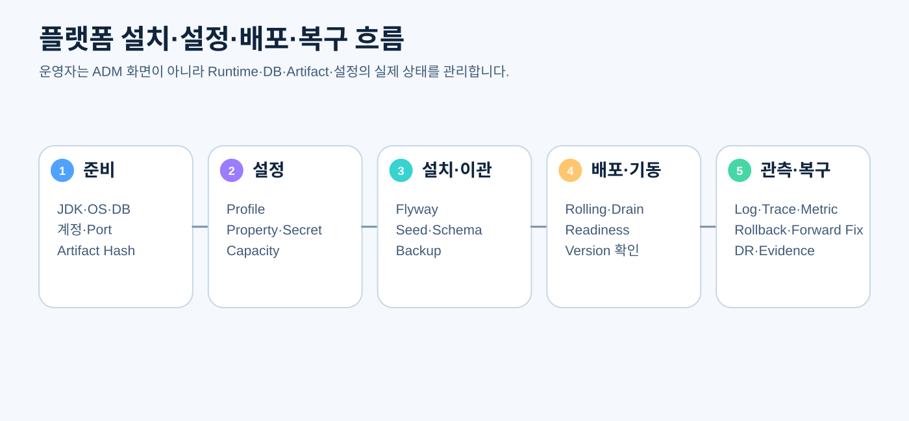

# CPF 플랫폼 운영 매뉴얼

> **기준 Repository** `freeangelsun/202412_01_CPF` · **기준 Branch** `master` · **문서 작성 기준 SHA** `d31bd127aa12bb9368933216642a5a9d25bd0bfd`
> **문서 목적** CPF Runtime의 설치, Profile·Property·Secret, DB, 배포, 기동, 관측, 보안, 백업·복원과 장애 복구 절차를 설명한다.
> **주요 독자** 시스템 운영자, 인프라·미들웨어 운영자, DB 운영자, 배포 담당자, SRE, 보안 운영자
> **완료 결과** 독자가 ADM 화면에 의존하지 않고 CPF 실행 환경을 설치·설정·배포·감시·복구하고 재현 가능한 Evidence를 남긴다.

## 0. 문서 사용 계약

이 문서는 제품 정본과 최신 Source를 함께 확인한다. 실행하지 않은 기능이나 검증은 완료로 표현하지 않는다.

문서의 예제는 다음 순서로 읽는다.

1. **제품 계약** — CPF가 보장해야 하는 규칙이다.
2. **현재 구현 확인** — 표에 제시한 Source·설정·API·SQL 경로를 최신 `master`에서 확인한다.
3. **실행 절차** — 명령을 실제 환경에서 실행하고 Exit Code와 결과를 확인한다.
4. **오류·복구** — 정상 경로만 보지 않고 중단·응답 유실·중복·부분 실패를 확인한다.
5. **Evidence** — 실행한 기준 SHA, 환경, 명령, 시작·종료 시각, Exit Code와 Sanitized 결과를 남긴다.

상태는 `완료`, `부분 구현`, `미구현`, `미검증`, `실패`, `재확인 필요`만 사용한다.


## 1. 운영 범위



이 문서는 다음을 다룬다.

- JDK·OS·계정·Directory·Port
- Spring Profile과 CPF Property
- Secret Reference와 Certificate
- Oracle·PostgreSQL·MariaDB
- Kafka·Session JDBC·Spring Batch JobRepository
- Artifact 검증·설치·기동·종료
- Rolling·Blue/Green·Canary·Rollback
- Log·Metric·Trace·Health
- Backup·Restore·DR
- Process·Network·Disk·Memory·DB·Broker 장애

ADM 화면 사용은 [04_ADM운영자매뉴얼](04_ADM운영자매뉴얼.md)을 따른다.

## 2. 운영 전 환경 조사

### 2.1 시스템 정보

- OS와 Kernel
- CPU·Memory·Disk·File System
- Time Zone·NTP
- Locale·Encoding
- Network Zone·DNS·Proxy·Firewall
- 실행 계정·Group·sudo 정책
- JDK·PowerShell·Container Runtime
- DB·Kafka·Collector Version

### 2.2 지원 Topology

- 단일 JVM
- 분리 WAS
- Modular Monolith
- MSA
- 선택형 Gateway
- 독립 ADM
- 독립 Batch Control/Scheduler/Manager/Worker/Agent

각 Process의 Owner, Port, DB, Log, Secret, Health, Startup Order를 설치 명세서에 기록한다.

## 3. Directory 기준

예시:

```text
/opt/cpf/<product>/
  releases/<version>/
  current -> releases/<version>
  config/
  secrets/          # 원문 저장소가 아니라 provider 설정·reference
  logs/
  work/
  temp/
  artifacts/
  evidence/
```

원칙:

- Release Directory는 Immutable
- Config와 Secret 분리
- Shared Temp 금지 또는 권한·Quota 통제
- Symlink·Ownership·Permission 검증
- Log·Artifact·Backup 보존 기한
- Windows 경로도 같은 논리 구조 사용

## 4. Profile과 설정 우선순위

권장 우선순위는 제품 정본을 확인해 고정한다.

```text
제품 기본값 < Profile 파일 < 환경별 외부 설정 < 환경변수/허용 Override < 승인된 Runtime Policy
```

무제한 Command-line Override를 운영 기본으로 사용하지 않는다.

### 4.1 Property 문서화 표준

모든 운영 Property는 다음 정보를 가져야 한다.

| 항목 | 설명 |
|---|---|
| Key | 정확한 `@ConfigurationProperties` 또는 Spring Key |
| 목적 | 어떤 Runtime 동작을 바꾸는지 |
| Type·단위 | Duration, Byte, Count, URI 등 |
| 필수·Default | 환경별 Default와 Production 필수 여부 |
| 허용 범위 | 최소·최대·Enum |
| Secret | 원문 허용 여부와 Reference 형식 |
| 적용 시점 | 기동 시, 동적 적용, 재기동 필요 |
| 영향 | Thread, DB Pool, Retry, Security, Data |
| 오류 | 잘못된 값의 Fail-fast Code |
| Source | 소비하는 ConfigurationProperties와 Bean |

### 4.2 주요 설정 영역

- `spring.profiles.active`
- Environment·SystemCode·Service ID·Instance ID
- Server Port·Context Path·Graceful Shutdown
- DataSource URL·Driver·Pool
- Transaction Timeout
- Kafka Bootstrap·Topic·Consumer Group
- Spring Batch JobRepository
- Scheduler
- Worker·Agent
- Session JDBC
- Security·CSRF·Cookie
- Secret Provider
- TLS·Key Store·Trust Store
- Log Level·Pattern·Retention
- Micrometer·OTel OTLP
- File Root·Temp·Quota·Retention
- Timeout·Circuit·Retry
- Caffeine·선택형 Valkey
- Artifact·Offline Repository Mode

## 5. 설정 검증

### 5.1 Fail-fast

Production에서 다음은 기동 실패가 원칙이다.

- 빈 SystemCode·Service ID
- Loopback·Sample DB URL
- Default Credential
- Plain HTTP가 금지된 외부 Endpoint
- Secret 원문·미해결 Reference
- 잘못된 Certificate
- 음수·과도한 Timeout/Pool/Queue
- 지원하지 않는 DB Vendor
- Artifact·Config Version 불일치

### 5.2 Effective Config

원문 Secret을 제외한 Effective Config Snapshot을 생성하고 Hash·Version을 기록한다. Runtime과 ADM이 같은 Version을 보고하는지 확인한다.

## 6. Secret와 Certificate

### 6.1 Secret

- Provider와 Reference Allowlist
- Environment별 허용 Provider
- Version·Rotation·Expiry
- Provider 장애 시 Fail-open/closed
- Log·Process List·Environment Dump 비노출
- Backup에 원문 포함 금지

### 6.2 Certificate

- Subject/SAN
- Issuer·Chain
- Expiry
- Key Usage
- Hostname
- Trust Store
- Rotation Overlap
- Revocation 정책

Certificate 교체는 사전 설치, Trust 반영, Server 교체, 연결 검증, 구 Certificate 제거 순서로 수행한다.

## 7. Artifact 검증

설치 전 확인:

- Repository와 exact Source SHA
- Artifact Name·Version
- SHA-256
- Signature·Key ID
- Build Provenance
- CycloneDX SBOM
- ORT License 결과·NOTICE
- Syft Final Artifact Inventory
- Grype Vulnerability
- 승인되지 않은 Server Binary·Commercial Artifact 없음

Hash·Signature가 맞지 않으면 실행하지 않는다.

## 8. 데이터베이스 준비

### 8.1 계정 분리

- Schema Owner
- Migration Account
- Runtime Read/Write
- Read-only·Audit
- Backup·Restore

최소 권한을 적용하고 Password는 Secret Provider로 전달한다.

### 8.2 Connection Pool

용량 계산:

```text
전체 DB Connection = 인스턴스 수 × 인스턴스별 Max Pool + Batch/관리/이관 여유
```

- DB Max Session
- Application Instance Scale
- Batch Parallelism
- Transaction Duration
- Timeout·Leak Detection
- Read Replica Pool

### 8.3 Vendor

Oracle·PostgreSQL·MariaDB 각각에서 URL·Driver·Schema·Lock·Sequence·Timestamp·DDL Transaction 차이를 확인한다.

## 9. Fresh Install

```powershell
Get-Help .\cpf-tools\scripts\initialize-cpf-database.ps1 -Full
pwsh -File .\cpf-tools\scripts\initialize-cpf-database.ps1 -All -RequireRun
```

실제 Parameter를 확인한 뒤 다음 순서를 따른다.

1. Backup/복원 지점 또는 신규 Schema 확인
2. Artifact·SQL Hash 검증
3. Migration Account 연결 시험
4. Flyway Validate
5. Migrate
6. Product Seed와 선택 Seed 구분
7. Verify SQL
8. Application Runtime Account 권한 시험
9. Spring Session·Batch JobRepository 포함 여부 확인
10. Evidence 저장

## 10. Upgrade와 Migration

### 10.1 사전 계획

- N-1 → N 지원
- Expand·Migrate·Contract
- 애플리케이션 구·신 Version 동시 호환
- Long-running Batch
- Config·Message Schema
- Backup·Restore 시간
- Rollback 또는 Forward Fix

### 10.2 Flyway

Flyway OSS Core가 History·Order·Checksum의 Primary다. 별도 자체 Migration History를 병행 정본으로 만들지 않는다.

### 10.3 실패 처리

- 실패 Version과 SQL
- DB Transaction 적용 범위
- 부분 DDL
- Flyway History 상태
- Backup 또는 Forward Fix
- Application 기동 차단
- 재적용 전 Verify

Checksum을 임의 수정해 통과시키지 않는다.

## 11. 설치와 기동

### 11.1 설치

- Release Directory 생성
- Artifact 복사·Hash 재검증
- External Config Link
- Service 계정·Permission
- Log·Temp·Work Directory
- JVM Option
- Service Unit/Windows Service

### 11.2 기동 순서

일반 예:

1. DB·Kafka·Secret Provider·Collector
2. 공통 Runtime·업무 서비스
3. ADM
4. Batch Control·Scheduler·Worker
5. 선택형 Gateway
6. 기능 Probe와 운영 등록

실제 Dependency에 맞게 조정한다.

### 11.3 Health

- Process 생존만 보는 Liveness
- 요청 처리 가능성을 보는 Readiness
- DB·Kafka·필수 Dependency와 실제 동작을 보는 Functional Probe

TCP Port Open만으로 Application UP을 판정하지 않는다.

## 12. Graceful Shutdown

1. 새 Traffic·Trigger 차단
2. Drain
3. Active Request·Chunk·Step 확인
4. Graceful Timeout
5. 상태·Checkpoint 저장
6. Process 종료
7. Lease·Registry 만료 확인

Timeout 뒤 강제 종료 시 영향과 복구 절차를 기록한다.

## 13. 배포 전략

### 13.1 Rolling

- 최소 Ready Capacity
- Drain과 Readiness
- Version Skew
- DB·Message 호환
- 한 Instance 선행
- Error·Latency·Resource 관찰
- Wave별 승인

### 13.2 Canary

- 대상 Traffic·사용자·기능 범위
- 비교 Metric
- 중단 조건
- Data Side Effect 분리

### 13.3 Blue/Green

- DB·External Side Effect 공유 위험
- Session·Cache
- Route 전환
- Rollback 시간

## 14. Rollback과 Forward Fix

| 상황 | 우선 판단 |
|---|---|
| Application만 문제, DB 호환 | 이전 Artifact Rollback 가능 |
| 비호환 DB Migration 완료 | Forward Fix 또는 Restore 필요 |
| Message Schema 변경 | Consumer 호환성과 Offset 확인 |
| Long-running Batch | JobExecution·Artifact Version·Restart 가능성 확인 |
| Config Partial Apply | 이전 Version 게시와 Consumer Reconcile |

Rollback 자체도 승인·감사·Evidence가 필요하다.

## 15. Runtime 관측

### 15.1 로그

- 구조화 필드
- transactionId·traceId·operationId·attemptId
- serviceId·instanceId·version
- Error Code
- PII·Secret Masking
- Rotation·Retention·Disk Quota

### 15.2 Metric

- Request Rate·Error·Latency
- JVM·GC·Thread
- DB Pool
- Kafka Lag·Error
- Batch Job·Step·Chunk
- Scheduler Delay
- Disk·File Queue
- Cache

### 15.3 Trace

Micrometer Observation과 OTel OTLP 설정, Sampling, Collector 장애, Attribute Cardinality를 관리한다.

Collector 장애가 원 거래를 실패시키지 않도록 Export 경계를 분리한다.

## 16. Capacity와 Resource

- Heap·GC
- Thread Pool·Queue
- DB Connection
- HTTP Connection
- File Descriptor
- Temp·Log·Artifact Disk
- Kafka Consumer Concurrency
- Batch Partition·Chunk
- Download·Export 동시성

무제한 Queue·readAllBytes·stdout 수집·전체 Directory Scan을 금지한다.

## 17. Backup

백업 대상:

- 업무 DB
- ADM Metadata·Audit
- Spring Session 필요 범위
- Spring Batch JobRepository
- Scheduler Trigger
- Artifact·Config Manifest
- Encryption Key/Secret은 Provider 정책에 따름

Backup은 생성 성공이 아니라 Restore 검증까지 완료해야 한다.

## 18. Restore

1. Incident·Change 승인
2. 목표 시점과 RPO 확인
3. 대상 환경 격리
4. Backup Hash·암호화·권한 확인
5. Restore
6. Schema·Flyway History·Data Verify
7. Application Version 정합성
8. Kafka Offset·Batch Execution·Scheduler Trigger 대사
9. Functional Probe
10. Traffic 복귀와 Evidence

## 19. DR

- RPO·RTO
- Region·Site
- DNS·Route·Certificate
- DB Replication·Backup
- Kafka·Artifact·Secret Provider
- Session·Batch·Scheduler
- Fencing과 Split Brain
- 정기 훈련

DR 전환 뒤 구 Site의 Stale Worker·Scheduler·Gateway가 결과를 반영하지 못하게 한다.

## 20. 장애 Runbook

### 20.1 기동 실패

- 로그 첫 Root Cause
- Profile·Effective Config
- Secret·Certificate
- DB·Kafka 연결
- Port·Permission
- Migration 상태
- Artifact Hash

### 20.2 Readiness DOWN

- Liveness와 분리
- Dependency별 상태
- 최근 배포·Config
- Pool·Thread·Disk
- Functional Probe
- Drain 후 복구

### 20.3 DB Pool 고갈

- Active·Idle·Pending
- Long Transaction·Leak
- DB Lock·Slow Query
- Instance 수와 Pool 총합
- Pool 증설 전 Root Cause

### 20.4 Kafka 장애

- Broker·Topic·ACL·TLS
- Producer Retry·Buffer
- Consumer Lag·Rebalance
- DLT·Offset
- Outbox 적체

### 20.5 Disk Full

- Log·Temp·Artifact·Download·Backup
- 안전한 보존 정책에 따른 정리
- Process·DB 손상 확인
- 재기동 전 Free Space와 Permission

### 20.6 Memory/GC

- Heap·Native·Direct Buffer
- Thread·Class
- 대용량 File·Response·Cache
- Heap Dump 민감정보 통제

### 20.7 Network·DNS

- Route·Firewall·Proxy
- DNS 결과·TTL
- TLS Handshake
- Connect vs Read Timeout
- Response Loss와 Unknown

### 20.8 Batch 중단

- JobRepository
- Manager·Worker Lease
- Checkpoint
- Artifact·Definition Version
- Restart vs Reprocess

## 21. 운영 변경 Evidence

최소 필드:

- Repository·Source SHA
- Artifact Hash
- Environment·Instance
- 실행 명령
- 시작·종료 시각
- Exit Code
- Before/After Version
- DB Migration Version
- Health·Probe
- Log·Report Hash
- Secret 제거 방식
- Rollback/Reconcile 결과

## 22. 운영 명령 예

```powershell
# Local 통합 환경 — 실제 Help 확인
pwsh -File .\cpf-tools\scripts\start-cpf-local.ps1
pwsh -File .\cpf-tools\scripts\status-cpf-local.ps1
pwsh -File .\cpf-tools\scripts\stop-cpf-local.ps1

# DB
pwsh -File .\cpf-tools\scriptsbackup-cpf-database.ps1
pwsh -File .\cpf-tools\scriptsrestore-cpf-database.ps1
pwsh -File .\cpf-tools\scriptsverify-dr-restore.ps1

# Gate
pwsh -File .\cpf-tools\scripts\check-certificate-expiry.ps1
pwsh -File .\cpf-tools\scripts\check-repository-hygiene.ps1
```

Parameter·지원 환경·Exit Code는 `Get-Help -Full`로 확인한다.

## 23. 운영 완료 체크리스트

- [ ] 환경·Topology·Process·Port·DB·Owner를 설치 명세서에 기록했다.
- [ ] 모든 Property의 목적·Type·Default·범위·Secret·적용 시점을 확인했다.
- [ ] Production 위험 Default를 Fail-fast로 차단했다.
- [ ] Artifact Hash·Signature·SBOM·License·Vulnerability를 검증했다.
- [ ] Oracle·PostgreSQL·MariaDB 설치·Upgrade·실패 복구·Restore를 검증했다.
- [ ] Graceful Shutdown·Drain·Readiness와 배포 Wave를 검증했다.
- [ ] Log·Metric·Trace·Alert가 식별자로 연결된다.
- [ ] Secret·Certificate Rotation과 만료 대응을 검증했다.
- [ ] Backup을 실제 Restore하고 RPO·RTO를 확인했다.
- [ ] DB·Kafka·Network·Disk·Memory·Batch 장애 Runbook을 훈련했다.
- [ ] 모든 명령과 결과를 latest exact SHA Evidence로 남겼다.
