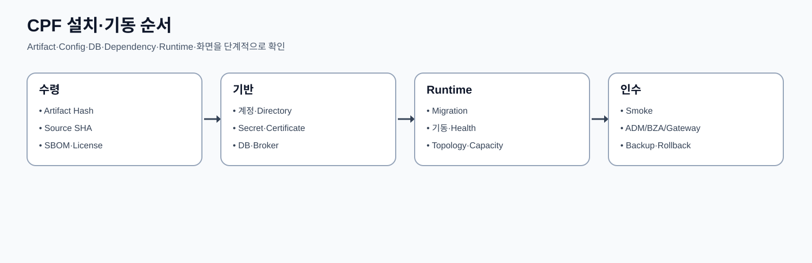
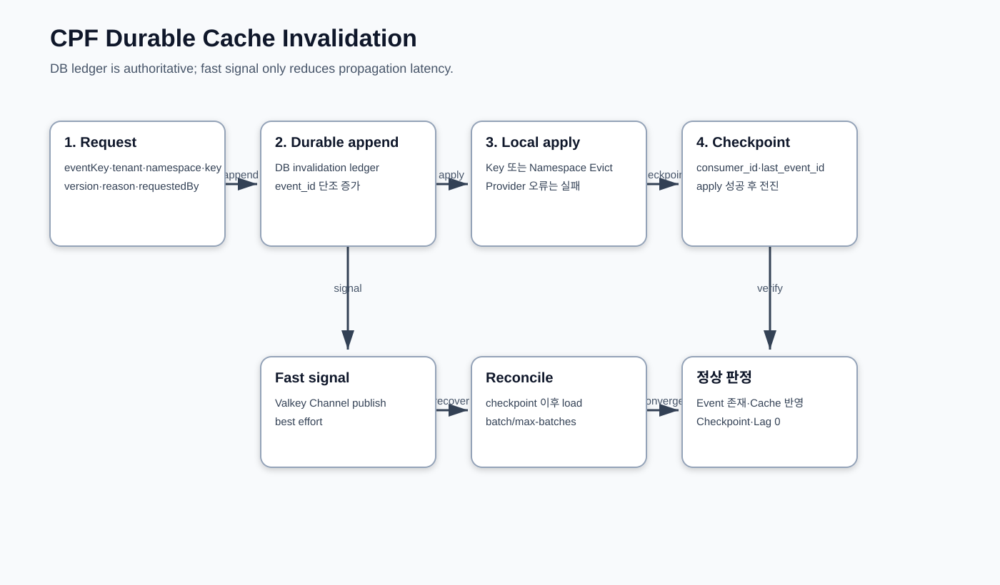
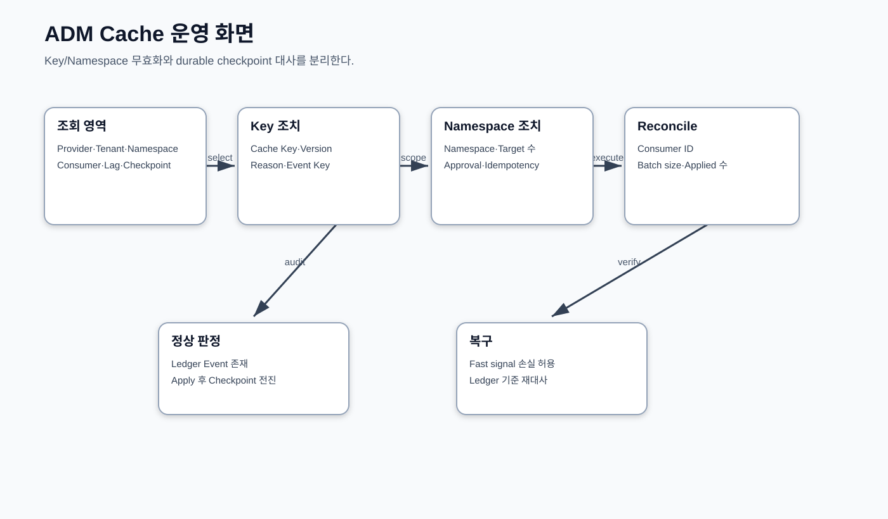

# CPF 플랫폼 운영 매뉴얼

> 문서: `CPF 플랫폼 운영 매뉴얼`
> 기준 Repository: `https://github.com/freeangelsun/202412_01_CPF`
> 기준 Branch: `master`
> 기준 Commit: `6976d2747481b8540b48ddb9ab8f53cfeaa4b888` (`06_02`)
> 기준일: `2026-08-06 Asia/Seoul`

| 항목 | 내용 |
|---|---|
| 주 독자 | 개발환경·인프라·DBA·배포·관측·DR 담당자 |
| 문서 목적 | CPF를 고객 환경에 설치하고 설정·기동·배포·관측·백업·복구한다. |
| 기능 서술 전제 | CPF 제품 기능은 고객이 사용할 수 있는 상태로 설명한다. 구현 진행률이나 개발 관리 상태는 이 문서의 사용 절차에 섞지 않는다. |
| 사실 우선순위 | 실제 Source·SQL·API·Config·Frontend·Script·Test → 설계·사양 → 본 매뉴얼 |
| 상태 표현 | 업무 상태와 운영 결과는 Source의 상태값을 사용한다. 문서 검토 상태는 `완료`, `부분 구현`, `미구현`, `미검증`, `실패`, `재확인 필요`만 사용한다. |

## 1. 운영 범위와 책임

플랫폼 운영자는 Artifact 수령부터 계정·Directory·Config·Secret·DB·Broker·Cache·기동·배포·관측·Backup·Restore·Upgrade·DR까지 운영한다. 업무 상태를 임의 수정하지 않고 제품 Owner와 ADM Runbook을 사용한다.

## 2. 지원 Stack과 Artifact 수령

1. Release Manifest에서 Source SHA, 제품 Version, Java/Gradle/Spring Stack, Artifact Coordinate를 확인한다.
2. ZIP/JAR/WAR/Frontend/DB Vendor Pack/Config Template/SBOM/Provenance의 Checksum을 검증한다.
3. `CPF_ARTIFACT_MODE`에 맞는 Repository 또는 Offline Bundle을 준비한다.
4. 서명·Checksum·Manifest가 하나라도 다르면 배포를 중지한다.
5. 기존 LKG Artifact와 Rollback DB Script를 별도 보존한다.
6. Release Note의 Restart·Migration·Config·Secret·Consumer 영향을 배포 계획에 반영한다.

Artifact 파일명만 같다는 이유로 동일 Build로 판단하지 않는다.

## 3. 계정·Directory·파일 권한

| 항목 | 권장 분리 |
|---|---|
| Runtime 계정 | 서비스별 비로그인 계정, 최소 Directory 권한 |
| 배포 계정 | Artifact 배치와 Service Manager 조작, Runtime Secret 원문 접근 금지 |
| DBA 계정 | Schema Owner, Migration, Read-only 운영 조회 분리 |
| ADM/BZA 운영자 | 사용자 계정·MFA·Role·Data Scope |
| Agent 계정 | 허용 Service만 START/STOP/STATUS |
| Backup 계정 | Backup Target 쓰기·Restore 격리 환경 읽기 |

Directory는 Artifact, Config, Log, Temp, Data, Backup, Certificate를 분리한다. Log/Temp가 가득 차도 Artifact·DB Data를 침범하지 않게 File System을 나눈다.

### 3.1 권장 Directory 책임

| Directory | Owner | 권한 | 포함 | Backup |
|---|---|---|---|---|
| Artifact | Release 계정 | Runtime Read | JAR·Frontend·Manifest·SBOM | Release 저장소 기준 |
| Config | Platform 운영 | Runtime Read | Profile·환경별 설정·Reference | Version 관리·Secret 제외 |
| Secret/Certificate | 보안 계정/Provider | 최소 Read | Secret Reference·Key/Cert | Provider 절차 |
| Log | Runtime 계정 Write, 운영 Read | Append/Read | Application·Audit Delivery·Agent | 보존 정책 |
| Work/Temp | Runtime 전용 | Read/Write | Upload Temp·Batch Work | 업무 완료 후 정책 Purge |
| Backup | DBA/DR | 분리 Write/Read | DB/Object/Config Manifest | 별도 매체·암호화 |
| Support Bundle | 승인 운영자 | 제한 Write/Read | Masked 진단 Bundle | 만료·Download Audit |

Service 계정은 Login Shell·Home·권한을 최소화한다. Runtime이 Artifact·Config를 덮어쓰지 못하게 하고, Secret 원문을 일반 Config/Log/Bundle에 복사하지 않는다.

## 4. 전체 Configuration 운영 규칙

Property는 Key·환경변수·Type·Default·필수 범위·Consumer·적용 방식·Secret 여부·오류·검증·Rollback을 관리한다.

적용 우선순위와 Source를 문서화하고 같은 Key를 여러 Layer에서 우연히 덮지 않는다. Secret 값은 Matrix에 기록하지 않고 Reference·Provider·Version만 기록한다. 변경 전 현재값·Applied Version·Target Snapshot을 저장한다.

### 4.1 변경 Lifecycle

1. Key의 Consumer·Type·Default·범위·Secret 여부를 Matrix에서 확인한다.
2. 현재 값 Source와 Environment/Profile Override 순서를 확인한다.
3. 변경 전 Desired/Observed·Source SHA·Config Version을 Snapshot한다.
4. Preview에서 영향 Service·Instance·재기동 여부·경고를 확인한다.
5. 위험도에 따라 Reason·Approval·Maintenance Window를 확보한다.
6. Canary Instance에 적용하고 Health·Log·Metric·업무 Smoke를 확인한다.
7. Target별 Applied Version을 확인해 Promotion한다.
8. NACK/Timeout은 실패 Target을 분리한다.
9. 이전 값/LKG로 Rollback하고 Drift가 0인지 확인한다.
10. Config Audit와 운영 인계 Sheet를 갱신한다.

### 4.2 값 Source 우선순위 기록

운영 Sheet에는 Default, 공통 Profile, 환경 Profile, 환경변수, Secret Provider, Runtime Override 중 실제 값을 만든 Source를 기록한다. 동일 Key가 여러 Source에 존재하면 유효값과 제거 대상 중복을 명시한다.

## 5. Configuration 카탈로그

| Kind | Key | Type | Default | 필수·범위 | Consumer | 적용 | Secret | 검증 | Rollback |
|---|---|---|---|---|---|---|---|---|---|
| environment | `CPF_ARTIFACT_MODE` | String | LOCAL_DEV | LOCAL_DEV/REMOTE/OFFLINE | Gradle | Build | N | Mode/Repository | 이전 Mode |
| environment | `CPF_ARTIFACT_REPOSITORY_URL` | URI | 없음 | REMOTE 필수 | Gradle | Build | N | Repository 연결 | 이전 URL |
| environment | `CPF_ARTIFACT_REPOSITORY_USER` | String | 없음 | 인증 Repository | Gradle | Build | Y | Credential 오류 없음 | 이전 Secret |
| environment | `CPF_ARTIFACT_REPOSITORY_PASSWORD` | Secret | 없음 | 인증 Repository | Gradle | Build | Y | Log 비노출 | 이전 Secret |
| environment | `CPF_LOCAL_ARTIFACT_REPOSITORY` | Path | ~/.cpf/repository | LOCAL_DEV | Gradle | Build | N | Artifact 조회 | 이전 경로 |
| environment | `CPF_OFFLINE_ARTIFACT_REPOSITORY` | Path | 없음 | OFFLINE 필수 | Gradle | Build | N | 외부 접속 없는 Build | 이전 경로 |
| environment | `CPF_SOURCE_SHA` | SHA | git HEAD | 40 hex | Build/JAR | Build | N | Manifest Git-Commit | 정확한 SHA |
| environment | `SPRING_PROFILES_ACTIVE` | String | Module별 | 승인 Profile | Runtime | Restart | N | Startup Log | 이전 Profile |
| environment | `SERVER_PORT` | Integer | Module별 | 1~65535 | Web Runtime | Restart | N | Listen/Health | 이전 Port |
| environment | `ADM_MODULE_ID` | String | ADM | 조직 Naming | ADM | Restart | N | Framework Context | 이전 ID |
| environment | `ADM_INSTANCE_ID` | String | adm-local-01 | Instance Unique | ADM | Restart | N | Topology/OpenAPI | 이전 ID |
| environment | `ADM_WAS_ID` | String | admAP01 | WAS Unique | ADM | Restart | N | Context | 이전 ID |
| environment | `ADM_SERVICE_REGISTRY_MODE` | String | LOCAL | 승인 Mode | ADM | Restart | N | Service Call | 이전 Mode |
| environment | `CPF_OPENAPI_WEBMVC_ENABLED` | Boolean | true | true/false | ADM OpenAPI | Restart | N | OpenAPI Status | 이전 값 |
| environment | `CPF_OPENAPI_WEBMVC_API_DOCS_ENABLED` | Boolean | false | 환경 정책 | ADM OpenAPI | Restart | N | Docs 노출 | false |
| environment | `CPF_OPENAPI_WEBMVC_MANAGEMENT_ENABLED` | Boolean | true | true/false | ADM OpenAPI | Restart | N | openApiOperations | 이전 값 |
| environment | `CPF_OPENAPI_WEBMVC_API_DOCS_PATH` | Path | /v3/api-docs | Context Path | ADM OpenAPI | Restart | N | Status Path | 이전 Path |
| environment | `CPF_RUNTIME_INSTANCE_ID` | String | 없음 | runtime-agent 필수 | Runtime Agent | Restart | N | Agent 등록 | 이전 ID |
| environment | `CPF_RUNTIME_SERVICE_ID` | String | 없음 | runtime-agent 필수 | Runtime Agent | Restart | N | Control 상태 | 이전 ID |
| environment | `CPF_RUNTIME_ENDPOINT_CODE` | String | 없음 | runtime-agent 필수 | Runtime Agent | Restart | N | Endpoint | 이전 Code |
| environment | `CPF_RUNTIME_BASE_URL` | URI | 없음 | runtime-agent 필수 | Runtime Agent | Restart | N | Probe | 이전 URL |
| environment | `CPF_RUNTIME_CONTROL_BASE_URL` | URI | 없음 | runtime-agent 필수 | Runtime Agent | Restart | N | Control Health | 이전 URL |
| environment | `CPF_RUNTIME_CONTROL_AGENT_TOKEN` | Secret | 없음 | runtime-agent 필수 | Runtime Agent | Restart | Y | Auth·Log 비노출 | 이전 Token |
| config-prefix | `cpf.profile.minimal-domain` |  |  | Profile 선택 | minimal-domain Profile | Restart | N | Context/Manifest | 이전 Config Revision |
| config-prefix | `cpf.profile.web-api` |  |  | Profile 선택 | web-api | Restart | N | Web/OpenAPI | 이전 Config Revision |
| config-prefix | `cpf.profile.secure-api` |  |  | Profile 선택 | secure-api | Restart | 일부 | Security Health | 이전 Config Revision |
| config-prefix | `cpf.profile.browser-bff` |  |  | Profile 선택 | browser-bff | Restart | 일부 | Session/CSRF | 이전 Config Revision |
| config-prefix | `cpf.profile.event-service` |  |  | Profile 선택 | event-service | Restart | 일부 | Broker/Reliability | 이전 Config Revision |
| config-prefix | `cpf.profile.batch-service` |  |  | Profile 선택 | batch-service | Restart | 일부 | Batch Runtime | 이전 Config Revision |
| config-prefix | `cpf.data.persistence.jdbc` |  |  | data=jdbc | JDBC | Restart | Y | DB Health | 이전 Config Revision |
| config-prefix | `cpf.data.persistence.mybatis` |  |  | data=mybatis | MyBatis | Restart | Y | DB/Mapper | 이전 Config Revision |
| config-prefix | `cpf.data.cache.caffeine` |  |  | cache=caffeine | Local Cache | 정책/Restart | N | Cache Metric | 이전 Config Revision |
| config-prefix | `cpf.data.cache.valkey` |  |  | cache=valkey | Distributed Cache | Restart | Y | Valkey Health | 이전 Config Revision |
| config-prefix | `cpf.messaging.reliability.jdbc` |  |  | messaging | Outbox/Inbox/DLQ | 정책/Restart | Y | Reliability | 이전 Config Revision |
| config-prefix | `cpf.messaging.kafka` |  |  | messaging=kafka | Kafka | Restart | Y | Topic/ACL/Lag | 이전 Config Revision |
| config-prefix | `cpf.messaging.rabbitmq` |  |  | messaging=rabbitmq | RabbitMQ | Restart | Y | Exchange/Queue | 이전 Config Revision |
| config-prefix | `cpf.messaging.jms` |  |  | messaging=jms | JMS | Restart | Y | Destination | 이전 Config Revision |
| config-prefix | `cpf.messaging.ibm-mq` |  |  | messaging=ibm-mq | IBM MQ | Restart | Y | QM/Channel | 이전 Config Revision |
| config-prefix | `cpf.integration.http` |  |  | transport=http | HTTP | 정책/Restart | Y | Target Health | 이전 Config Revision |
| config-prefix | `cpf.integration.resilience` |  |  | integration | Resilience | Runtime Control | N | Policy Revision | 이전 Config Revision |
| config-prefix | `cpf.integration.tcp` |  |  | transport=tcp | TCP | Restart | Y | Connection | 이전 Config Revision |
| config-prefix | `cpf.integration.fixedlength` |  |  | codec=fixed-length | Fixed-length | Restart | N | Layout Test | 이전 Config Revision |
| config-prefix | `cpf.integration.iso8583` |  |  | codec=iso8583 | ISO8583 | Restart | Y | MAC/Layout | 이전 Config Revision |
| config-prefix | `cpf.file.attachment` |  |  | file | Attachment | 정책/Restart | Y | File Health | 이전 Config Revision |
| config-prefix | `cpf.file.archive` |  |  | file | Archive | 정책/Restart | N | Limit | 이전 Config Revision |
| config-prefix | `cpf.file.tabular.poi` |  |  | file | Tabular | 정책/Restart | N | Row/Cell | 이전 Config Revision |
| config-prefix | `cpf.file.sftp` |  |  | file=sftp | SFTP | Restart | Y | Host Key/Probe | 이전 Config Revision |
| config-prefix | `cpf.notification.dispatch` |  |  | notification | Notification | 정책/Restart | Y | Delivery | 이전 Config Revision |
| config-prefix | `cpf.notification.email` |  |  | notification=email | Email | Restart | Y | SMTP/Receipt | 이전 Config Revision |
| config-prefix | `cpf.notification.sms` |  |  | notification=sms-spi | SMS SPI | Restart | Y | Provider | 이전 Config Revision |
| config-prefix | `cpf.security.resource-server` |  |  | resource-server | JWT | Restart | Y | Issuer/Audience | 이전 Config Revision |
| config-prefix | `cpf.security.session.jdbc` |  |  | browser-session | Session | Restart | Y | Session Store | 이전 Config Revision |
| config-prefix | `cpf.security.service-identity` |  |  | service-identity | Service Identity | Restart | Y | Audience/Auth | 이전 Config Revision |
| config-prefix | `cpf.security.secret` |  |  | security | Secret Provider | Restart | Y | Provider Metadata | 이전 Config Revision |
| config-prefix | `cpf.platform-operations.observability` |  |  | platform-operations | Observability | 정책/Restart | N | Telemetry | 이전 Config Revision |
| config-prefix | `cpf.platform-operations.otlp` |  |  | observability=otlp | OTLP | Restart | Y | Collector | 이전 Config Revision |
| config-prefix | `cpf.platform-operations.runtime-control` |  |  | platform-operations | Runtime Control | Restart | Y | ACK/Observed | 이전 Config Revision |
| config-prefix | `cpf.platform-operations.channel-registry.jdbc` |  |  | platform-operations | Channel Registry | 정책/Restart | Y | Snapshot | 이전 Config Revision |
| config-prefix | `cpf.platform-operations.feature-flag` |  |  | platform-operations | OpenFeature | Runtime Control | 일부 | Evaluation/Audit | 이전 Config Revision |
| config-prefix | `cpf.data.cache.valkey.enabled` | Boolean | false | true/false | cache-valkey starter | 재기동 | N | Cache Provider Bean·ADM /cache summary | false로 복귀 후 재기동 |
| config-prefix | `cpf.data.cache.valkey.key-prefix` | String | cpf: | [A-Za-z0-9._:-]{1,120} | ValkeyCpfCachePort | 재기동 | N | 실제 Key prefix·tenant/namespace 격리 | 이전 Prefix 복원 |
| config-prefix | `cpf.data.cache.valkey.invalidation-channel` | String | cpf.cache.invalidate | [A-Za-z0-9._:-]{1,180} | Valkey invalidation signal | 재기동 | N | Signal publish·durable reconcile | 이전 Channel 복원 |
| config-prefix | `cpf.data.cache.valkey.default-ttl` | Duration | 10m | 0보다 큰 Duration | ValkeyCpfCachePort | 재기동 | N | TTL 조회 | 이전 TTL 복원 |
| config-prefix | `cpf.data.cache.valkey.required` | Boolean | true | true/false | Valkey auto-configuration | 재기동 | N | Provider 부재 시 Fail-closed 여부 | 이전 값 복원 |
| config-prefix | `cpf.data.cache.valkey.tls` | Boolean | false | 고객 TLS 정책 | Redis/Valkey Connection | 재기동 | N | TLS Handshake·Certificate | 이전 연결 설정 |
| config-prefix | `cpf.data.cache.valkey.maximum-payload-bytes` | Long | 1048576 | 1~67108864 | ValkeyCpfCachePort | 재기동 | N | 경계 Payload Test | 이전 한도 복원 |
| config-prefix | `cpf.data.cache.valkey.scan-count` | Long | 500 | 10~10000 | Namespace eviction SCAN | 재기동 | N | SCAN 부하·삭제 건수 | 이전 Count 복원 |
| config-prefix | `cpf.cache.invalidation.consumer-id` | String | cache-<host>-<CPF_INSTANCE_ID> | [A-Za-z0-9._:-]{1,180} | CpfCacheInvalidationCoordinator | 재기동 | N | durable checkpoint consumer_id | 이전 Consumer ID 복원 |
| config-prefix | `cpf.cache.invalidation.reconcile-batch-size` | Integer | 200 | 1~10000 | CpfCacheInvalidationCoordinator | 재기동 | N | reconcile 처리량·DB 부하 | 이전 Batch Size |
| config-prefix | `cpf.cache.invalidation.reconcile-max-batches` | Integer | 20 | 1~1000 | CpfCacheInvalidationCoordinator | 재기동 | N | 1회 reconcile 상한 | 이전 Max Batches |

총 70개 항목이다. 실제 환경에 없는 선택 Capability Property는 설정하지 않는다. Prefix 단위 설명만으로 끝내지 않고 고객 운영 Sheet에는 실제 Key와 값 Source를 기록한다.

### 5.1. `CPF_ARTIFACT_MODE`

| 항목 | 값 |
|---|---|
| 종류 | environment |
| Type / Default | `String` / `LOCAL_DEV` |
| 필수·허용 범위 | LOCAL_DEV/REMOTE/OFFLINE |
| 실제 Consumer | Gradle |
| 반영 | Build |
| Secret | N |

**설정 절차**

1. 선택한 Profile/Capability에서 `Gradle`가 실제 Consumer인지 확인한다.
2. 현재 Effective Value와 Source를 기록하고 `LOCAL_DEV/REMOTE/OFFLINE` 조건을 검증한다.
3. 일반 설정이지만 변경 Audit와 Environment별 값 Source를 기록한다.
4. 변경 후 Mode/Repository 항목을 확인한다.
5. 오류가 발생하면 `이전 Mode`로 복귀하고 Applied Version·Health·Audit를 재조회한다.

**운영 주의**: Build/배포 시 반영. Default는 예제값이 아니라 Source의 기본 동작이므로, 고객 환경에서 그대로 사용할 근거를 운영 Sheet에 남긴다.

### 5.2. `CPF_ARTIFACT_REPOSITORY_URL`

| 항목 | 값 |
|---|---|
| 종류 | environment |
| Type / Default | `URI` / `없음` |
| 필수·허용 범위 | REMOTE 필수 |
| 실제 Consumer | Gradle |
| 반영 | Build |
| Secret | N |

**설정 절차**

1. 선택한 Profile/Capability에서 `Gradle`가 실제 Consumer인지 확인한다.
2. 현재 Effective Value와 Source를 기록하고 `REMOTE 필수` 조건을 검증한다.
3. 일반 설정이지만 변경 Audit와 Environment별 값 Source를 기록한다.
4. 변경 후 Repository 연결 항목을 확인한다.
5. 오류가 발생하면 `이전 URL`로 복귀하고 Applied Version·Health·Audit를 재조회한다.

**운영 주의**: Build/배포 시 반영. Default는 예제값이 아니라 Source의 기본 동작이므로, 고객 환경에서 그대로 사용할 근거를 운영 Sheet에 남긴다.

### 5.3. `CPF_ARTIFACT_REPOSITORY_USER`

| 항목 | 값 |
|---|---|
| 종류 | environment |
| Type / Default | `String` / `없음` |
| 필수·허용 범위 | 인증 Repository |
| 실제 Consumer | Gradle |
| 반영 | Build |
| Secret | Y |

**설정 절차**

1. 선택한 Profile/Capability에서 `Gradle`가 실제 Consumer인지 확인한다.
2. 현재 Effective Value와 Source를 기록하고 `인증 Repository` 조건을 검증한다.
3. Secret Provider 또는 보호된 환경변수에서 공급하고 출력·Bundle에 값을 남기지 않는다.
4. 변경 후 Credential 오류 없음 항목을 확인한다.
5. 오류가 발생하면 `이전 Secret`로 복귀하고 Applied Version·Health·Audit를 재조회한다.

**운영 주의**: Build/배포 시 반영. Default는 예제값이 아니라 Source의 기본 동작이므로, 고객 환경에서 그대로 사용할 근거를 운영 Sheet에 남긴다.

### 5.4. `CPF_ARTIFACT_REPOSITORY_PASSWORD`

| 항목 | 값 |
|---|---|
| 종류 | environment |
| Type / Default | `Secret` / `없음` |
| 필수·허용 범위 | 인증 Repository |
| 실제 Consumer | Gradle |
| 반영 | Build |
| Secret | Y |

**설정 절차**

1. 선택한 Profile/Capability에서 `Gradle`가 실제 Consumer인지 확인한다.
2. 현재 Effective Value와 Source를 기록하고 `인증 Repository` 조건을 검증한다.
3. Secret Provider 또는 보호된 환경변수에서 공급하고 출력·Bundle에 값을 남기지 않는다.
4. 변경 후 Log 비노출 항목을 확인한다.
5. 오류가 발생하면 `이전 Secret`로 복귀하고 Applied Version·Health·Audit를 재조회한다.

**운영 주의**: Build/배포 시 반영. Default는 예제값이 아니라 Source의 기본 동작이므로, 고객 환경에서 그대로 사용할 근거를 운영 Sheet에 남긴다.

### 5.5. `CPF_LOCAL_ARTIFACT_REPOSITORY`

| 항목 | 값 |
|---|---|
| 종류 | environment |
| Type / Default | `Path` / `~/.cpf/repository` |
| 필수·허용 범위 | LOCAL_DEV |
| 실제 Consumer | Gradle |
| 반영 | Build |
| Secret | N |

**설정 절차**

1. 선택한 Profile/Capability에서 `Gradle`가 실제 Consumer인지 확인한다.
2. 현재 Effective Value와 Source를 기록하고 `LOCAL_DEV` 조건을 검증한다.
3. 일반 설정이지만 변경 Audit와 Environment별 값 Source를 기록한다.
4. 변경 후 Artifact 조회 항목을 확인한다.
5. 오류가 발생하면 `이전 경로`로 복귀하고 Applied Version·Health·Audit를 재조회한다.

**운영 주의**: Build/배포 시 반영. Default는 예제값이 아니라 Source의 기본 동작이므로, 고객 환경에서 그대로 사용할 근거를 운영 Sheet에 남긴다.

### 5.6. `CPF_OFFLINE_ARTIFACT_REPOSITORY`

| 항목 | 값 |
|---|---|
| 종류 | environment |
| Type / Default | `Path` / `없음` |
| 필수·허용 범위 | OFFLINE 필수 |
| 실제 Consumer | Gradle |
| 반영 | Build |
| Secret | N |

**설정 절차**

1. 선택한 Profile/Capability에서 `Gradle`가 실제 Consumer인지 확인한다.
2. 현재 Effective Value와 Source를 기록하고 `OFFLINE 필수` 조건을 검증한다.
3. 일반 설정이지만 변경 Audit와 Environment별 값 Source를 기록한다.
4. 변경 후 외부 접속 없는 Build 항목을 확인한다.
5. 오류가 발생하면 `이전 경로`로 복귀하고 Applied Version·Health·Audit를 재조회한다.

**운영 주의**: Build/배포 시 반영. Default는 예제값이 아니라 Source의 기본 동작이므로, 고객 환경에서 그대로 사용할 근거를 운영 Sheet에 남긴다.

### 5.7. `CPF_SOURCE_SHA`

| 항목 | 값 |
|---|---|
| 종류 | environment |
| Type / Default | `SHA` / `git HEAD` |
| 필수·허용 범위 | 40 hex |
| 실제 Consumer | Build/JAR |
| 반영 | Build |
| Secret | N |

**설정 절차**

1. 선택한 Profile/Capability에서 `Build/JAR`가 실제 Consumer인지 확인한다.
2. 현재 Effective Value와 Source를 기록하고 `40 hex` 조건을 검증한다.
3. 일반 설정이지만 변경 Audit와 Environment별 값 Source를 기록한다.
4. 변경 후 Manifest Git-Commit 항목을 확인한다.
5. 오류가 발생하면 `정확한 SHA`로 복귀하고 Applied Version·Health·Audit를 재조회한다.

**운영 주의**: Build/배포 시 반영. Default는 예제값이 아니라 Source의 기본 동작이므로, 고객 환경에서 그대로 사용할 근거를 운영 Sheet에 남긴다.

### 5.8. `SPRING_PROFILES_ACTIVE`

| 항목 | 값 |
|---|---|
| 종류 | environment |
| Type / Default | `String` / `Module별` |
| 필수·허용 범위 | 승인 Profile |
| 실제 Consumer | Runtime |
| 반영 | Restart |
| Secret | N |

**설정 절차**

1. 선택한 Profile/Capability에서 `Runtime`가 실제 Consumer인지 확인한다.
2. 현재 Effective Value와 Source를 기록하고 `승인 Profile` 조건을 검증한다.
3. 일반 설정이지만 변경 Audit와 Environment별 값 Source를 기록한다.
4. 변경 후 Startup Log 항목을 확인한다.
5. 오류가 발생하면 `이전 Profile`로 복귀하고 Applied Version·Health·Audit를 재조회한다.

**운영 주의**: 재기동 또는 해당 AutoConfiguration 재생성이 필요. Default는 예제값이 아니라 Source의 기본 동작이므로, 고객 환경에서 그대로 사용할 근거를 운영 Sheet에 남긴다.

### 5.9. `SERVER_PORT`

| 항목 | 값 |
|---|---|
| 종류 | environment |
| Type / Default | `Integer` / `Module별` |
| 필수·허용 범위 | 1~65535 |
| 실제 Consumer | Web Runtime |
| 반영 | Restart |
| Secret | N |

**설정 절차**

1. 선택한 Profile/Capability에서 `Web Runtime`가 실제 Consumer인지 확인한다.
2. 현재 Effective Value와 Source를 기록하고 `1~65535` 조건을 검증한다.
3. 일반 설정이지만 변경 Audit와 Environment별 값 Source를 기록한다.
4. 변경 후 Listen/Health 항목을 확인한다.
5. 오류가 발생하면 `이전 Port`로 복귀하고 Applied Version·Health·Audit를 재조회한다.

**운영 주의**: 재기동 또는 해당 AutoConfiguration 재생성이 필요. Default는 예제값이 아니라 Source의 기본 동작이므로, 고객 환경에서 그대로 사용할 근거를 운영 Sheet에 남긴다.

### 5.10. `ADM_MODULE_ID`

| 항목 | 값 |
|---|---|
| 종류 | environment |
| Type / Default | `String` / `ADM` |
| 필수·허용 범위 | 조직 Naming |
| 실제 Consumer | ADM |
| 반영 | Restart |
| Secret | N |

**설정 절차**

1. 선택한 Profile/Capability에서 `ADM`가 실제 Consumer인지 확인한다.
2. 현재 Effective Value와 Source를 기록하고 `조직 Naming` 조건을 검증한다.
3. 일반 설정이지만 변경 Audit와 Environment별 값 Source를 기록한다.
4. 변경 후 Framework Context 항목을 확인한다.
5. 오류가 발생하면 `이전 ID`로 복귀하고 Applied Version·Health·Audit를 재조회한다.

**운영 주의**: 재기동 또는 해당 AutoConfiguration 재생성이 필요. Default는 예제값이 아니라 Source의 기본 동작이므로, 고객 환경에서 그대로 사용할 근거를 운영 Sheet에 남긴다.

### 5.11. `ADM_INSTANCE_ID`

| 항목 | 값 |
|---|---|
| 종류 | environment |
| Type / Default | `String` / `adm-local-01` |
| 필수·허용 범위 | Instance Unique |
| 실제 Consumer | ADM |
| 반영 | Restart |
| Secret | N |

**설정 절차**

1. 선택한 Profile/Capability에서 `ADM`가 실제 Consumer인지 확인한다.
2. 현재 Effective Value와 Source를 기록하고 `Instance Unique` 조건을 검증한다.
3. 일반 설정이지만 변경 Audit와 Environment별 값 Source를 기록한다.
4. 변경 후 Topology/OpenAPI 항목을 확인한다.
5. 오류가 발생하면 `이전 ID`로 복귀하고 Applied Version·Health·Audit를 재조회한다.

**운영 주의**: 재기동 또는 해당 AutoConfiguration 재생성이 필요. Default는 예제값이 아니라 Source의 기본 동작이므로, 고객 환경에서 그대로 사용할 근거를 운영 Sheet에 남긴다.

### 5.12. `ADM_WAS_ID`

| 항목 | 값 |
|---|---|
| 종류 | environment |
| Type / Default | `String` / `admAP01` |
| 필수·허용 범위 | WAS Unique |
| 실제 Consumer | ADM |
| 반영 | Restart |
| Secret | N |

**설정 절차**

1. 선택한 Profile/Capability에서 `ADM`가 실제 Consumer인지 확인한다.
2. 현재 Effective Value와 Source를 기록하고 `WAS Unique` 조건을 검증한다.
3. 일반 설정이지만 변경 Audit와 Environment별 값 Source를 기록한다.
4. 변경 후 Context 항목을 확인한다.
5. 오류가 발생하면 `이전 ID`로 복귀하고 Applied Version·Health·Audit를 재조회한다.

**운영 주의**: 재기동 또는 해당 AutoConfiguration 재생성이 필요. Default는 예제값이 아니라 Source의 기본 동작이므로, 고객 환경에서 그대로 사용할 근거를 운영 Sheet에 남긴다.

### 5.13. `ADM_SERVICE_REGISTRY_MODE`

| 항목 | 값 |
|---|---|
| 종류 | environment |
| Type / Default | `String` / `LOCAL` |
| 필수·허용 범위 | 승인 Mode |
| 실제 Consumer | ADM |
| 반영 | Restart |
| Secret | N |

**설정 절차**

1. 선택한 Profile/Capability에서 `ADM`가 실제 Consumer인지 확인한다.
2. 현재 Effective Value와 Source를 기록하고 `승인 Mode` 조건을 검증한다.
3. 일반 설정이지만 변경 Audit와 Environment별 값 Source를 기록한다.
4. 변경 후 Service Call 항목을 확인한다.
5. 오류가 발생하면 `이전 Mode`로 복귀하고 Applied Version·Health·Audit를 재조회한다.

**운영 주의**: 재기동 또는 해당 AutoConfiguration 재생성이 필요. Default는 예제값이 아니라 Source의 기본 동작이므로, 고객 환경에서 그대로 사용할 근거를 운영 Sheet에 남긴다.

### 5.14. `CPF_OPENAPI_WEBMVC_ENABLED`

| 항목 | 값 |
|---|---|
| 종류 | environment |
| Type / Default | `Boolean` / `true` |
| 필수·허용 범위 | true/false |
| 실제 Consumer | ADM OpenAPI |
| 반영 | Restart |
| Secret | N |

**설정 절차**

1. 선택한 Profile/Capability에서 `ADM OpenAPI`가 실제 Consumer인지 확인한다.
2. 현재 Effective Value와 Source를 기록하고 `true/false` 조건을 검증한다.
3. 일반 설정이지만 변경 Audit와 Environment별 값 Source를 기록한다.
4. 변경 후 OpenAPI Status 항목을 확인한다.
5. 오류가 발생하면 `이전 값`로 복귀하고 Applied Version·Health·Audit를 재조회한다.

**운영 주의**: 재기동 또는 해당 AutoConfiguration 재생성이 필요. Default는 예제값이 아니라 Source의 기본 동작이므로, 고객 환경에서 그대로 사용할 근거를 운영 Sheet에 남긴다.

### 5.15. `CPF_OPENAPI_WEBMVC_API_DOCS_ENABLED`

| 항목 | 값 |
|---|---|
| 종류 | environment |
| Type / Default | `Boolean` / `false` |
| 필수·허용 범위 | 환경 정책 |
| 실제 Consumer | ADM OpenAPI |
| 반영 | Restart |
| Secret | N |

**설정 절차**

1. 선택한 Profile/Capability에서 `ADM OpenAPI`가 실제 Consumer인지 확인한다.
2. 현재 Effective Value와 Source를 기록하고 `환경 정책` 조건을 검증한다.
3. 일반 설정이지만 변경 Audit와 Environment별 값 Source를 기록한다.
4. 변경 후 Docs 노출 항목을 확인한다.
5. 오류가 발생하면 `false`로 복귀하고 Applied Version·Health·Audit를 재조회한다.

**운영 주의**: 재기동 또는 해당 AutoConfiguration 재생성이 필요. Default는 예제값이 아니라 Source의 기본 동작이므로, 고객 환경에서 그대로 사용할 근거를 운영 Sheet에 남긴다.

### 5.16. `CPF_OPENAPI_WEBMVC_MANAGEMENT_ENABLED`

| 항목 | 값 |
|---|---|
| 종류 | environment |
| Type / Default | `Boolean` / `true` |
| 필수·허용 범위 | true/false |
| 실제 Consumer | ADM OpenAPI |
| 반영 | Restart |
| Secret | N |

**설정 절차**

1. 선택한 Profile/Capability에서 `ADM OpenAPI`가 실제 Consumer인지 확인한다.
2. 현재 Effective Value와 Source를 기록하고 `true/false` 조건을 검증한다.
3. 일반 설정이지만 변경 Audit와 Environment별 값 Source를 기록한다.
4. 변경 후 openApiOperations 항목을 확인한다.
5. 오류가 발생하면 `이전 값`로 복귀하고 Applied Version·Health·Audit를 재조회한다.

**운영 주의**: 재기동 또는 해당 AutoConfiguration 재생성이 필요. Default는 예제값이 아니라 Source의 기본 동작이므로, 고객 환경에서 그대로 사용할 근거를 운영 Sheet에 남긴다.

### 5.17. `CPF_OPENAPI_WEBMVC_API_DOCS_PATH`

| 항목 | 값 |
|---|---|
| 종류 | environment |
| Type / Default | `Path` / `/v3/api-docs` |
| 필수·허용 범위 | Context Path |
| 실제 Consumer | ADM OpenAPI |
| 반영 | Restart |
| Secret | N |

**설정 절차**

1. 선택한 Profile/Capability에서 `ADM OpenAPI`가 실제 Consumer인지 확인한다.
2. 현재 Effective Value와 Source를 기록하고 `Context Path` 조건을 검증한다.
3. 일반 설정이지만 변경 Audit와 Environment별 값 Source를 기록한다.
4. 변경 후 Status Path 항목을 확인한다.
5. 오류가 발생하면 `이전 Path`로 복귀하고 Applied Version·Health·Audit를 재조회한다.

**운영 주의**: 재기동 또는 해당 AutoConfiguration 재생성이 필요. Default는 예제값이 아니라 Source의 기본 동작이므로, 고객 환경에서 그대로 사용할 근거를 운영 Sheet에 남긴다.

### 5.18. `CPF_RUNTIME_INSTANCE_ID`

| 항목 | 값 |
|---|---|
| 종류 | environment |
| Type / Default | `String` / `없음` |
| 필수·허용 범위 | runtime-agent 필수 |
| 실제 Consumer | Runtime Agent |
| 반영 | Restart |
| Secret | N |

**설정 절차**

1. 선택한 Profile/Capability에서 `Runtime Agent`가 실제 Consumer인지 확인한다.
2. 현재 Effective Value와 Source를 기록하고 `runtime-agent 필수` 조건을 검증한다.
3. 일반 설정이지만 변경 Audit와 Environment별 값 Source를 기록한다.
4. 변경 후 Agent 등록 항목을 확인한다.
5. 오류가 발생하면 `이전 ID`로 복귀하고 Applied Version·Health·Audit를 재조회한다.

**운영 주의**: 재기동 또는 해당 AutoConfiguration 재생성이 필요. Default는 예제값이 아니라 Source의 기본 동작이므로, 고객 환경에서 그대로 사용할 근거를 운영 Sheet에 남긴다.

### 5.19. `CPF_RUNTIME_SERVICE_ID`

| 항목 | 값 |
|---|---|
| 종류 | environment |
| Type / Default | `String` / `없음` |
| 필수·허용 범위 | runtime-agent 필수 |
| 실제 Consumer | Runtime Agent |
| 반영 | Restart |
| Secret | N |

**설정 절차**

1. 선택한 Profile/Capability에서 `Runtime Agent`가 실제 Consumer인지 확인한다.
2. 현재 Effective Value와 Source를 기록하고 `runtime-agent 필수` 조건을 검증한다.
3. 일반 설정이지만 변경 Audit와 Environment별 값 Source를 기록한다.
4. 변경 후 Control 상태 항목을 확인한다.
5. 오류가 발생하면 `이전 ID`로 복귀하고 Applied Version·Health·Audit를 재조회한다.

**운영 주의**: 재기동 또는 해당 AutoConfiguration 재생성이 필요. Default는 예제값이 아니라 Source의 기본 동작이므로, 고객 환경에서 그대로 사용할 근거를 운영 Sheet에 남긴다.

### 5.20. `CPF_RUNTIME_ENDPOINT_CODE`

| 항목 | 값 |
|---|---|
| 종류 | environment |
| Type / Default | `String` / `없음` |
| 필수·허용 범위 | runtime-agent 필수 |
| 실제 Consumer | Runtime Agent |
| 반영 | Restart |
| Secret | N |

**설정 절차**

1. 선택한 Profile/Capability에서 `Runtime Agent`가 실제 Consumer인지 확인한다.
2. 현재 Effective Value와 Source를 기록하고 `runtime-agent 필수` 조건을 검증한다.
3. 일반 설정이지만 변경 Audit와 Environment별 값 Source를 기록한다.
4. 변경 후 Endpoint 항목을 확인한다.
5. 오류가 발생하면 `이전 Code`로 복귀하고 Applied Version·Health·Audit를 재조회한다.

**운영 주의**: 재기동 또는 해당 AutoConfiguration 재생성이 필요. Default는 예제값이 아니라 Source의 기본 동작이므로, 고객 환경에서 그대로 사용할 근거를 운영 Sheet에 남긴다.

### 5.21. `CPF_RUNTIME_BASE_URL`

| 항목 | 값 |
|---|---|
| 종류 | environment |
| Type / Default | `URI` / `없음` |
| 필수·허용 범위 | runtime-agent 필수 |
| 실제 Consumer | Runtime Agent |
| 반영 | Restart |
| Secret | N |

**설정 절차**

1. 선택한 Profile/Capability에서 `Runtime Agent`가 실제 Consumer인지 확인한다.
2. 현재 Effective Value와 Source를 기록하고 `runtime-agent 필수` 조건을 검증한다.
3. 일반 설정이지만 변경 Audit와 Environment별 값 Source를 기록한다.
4. 변경 후 Probe 항목을 확인한다.
5. 오류가 발생하면 `이전 URL`로 복귀하고 Applied Version·Health·Audit를 재조회한다.

**운영 주의**: 재기동 또는 해당 AutoConfiguration 재생성이 필요. Default는 예제값이 아니라 Source의 기본 동작이므로, 고객 환경에서 그대로 사용할 근거를 운영 Sheet에 남긴다.

### 5.22. `CPF_RUNTIME_CONTROL_BASE_URL`

| 항목 | 값 |
|---|---|
| 종류 | environment |
| Type / Default | `URI` / `없음` |
| 필수·허용 범위 | runtime-agent 필수 |
| 실제 Consumer | Runtime Agent |
| 반영 | Restart |
| Secret | N |

**설정 절차**

1. 선택한 Profile/Capability에서 `Runtime Agent`가 실제 Consumer인지 확인한다.
2. 현재 Effective Value와 Source를 기록하고 `runtime-agent 필수` 조건을 검증한다.
3. 일반 설정이지만 변경 Audit와 Environment별 값 Source를 기록한다.
4. 변경 후 Control Health 항목을 확인한다.
5. 오류가 발생하면 `이전 URL`로 복귀하고 Applied Version·Health·Audit를 재조회한다.

**운영 주의**: 재기동 또는 해당 AutoConfiguration 재생성이 필요. Default는 예제값이 아니라 Source의 기본 동작이므로, 고객 환경에서 그대로 사용할 근거를 운영 Sheet에 남긴다.

### 5.23. `CPF_RUNTIME_CONTROL_AGENT_TOKEN`

| 항목 | 값 |
|---|---|
| 종류 | environment |
| Type / Default | `Secret` / `없음` |
| 필수·허용 범위 | runtime-agent 필수 |
| 실제 Consumer | Runtime Agent |
| 반영 | Restart |
| Secret | Y |

**설정 절차**

1. 선택한 Profile/Capability에서 `Runtime Agent`가 실제 Consumer인지 확인한다.
2. 현재 Effective Value와 Source를 기록하고 `runtime-agent 필수` 조건을 검증한다.
3. Secret Provider 또는 보호된 환경변수에서 공급하고 출력·Bundle에 값을 남기지 않는다.
4. 변경 후 Auth·Log 비노출 항목을 확인한다.
5. 오류가 발생하면 `이전 Token`로 복귀하고 Applied Version·Health·Audit를 재조회한다.

**운영 주의**: 재기동 또는 해당 AutoConfiguration 재생성이 필요. Default는 예제값이 아니라 Source의 기본 동작이므로, 고객 환경에서 그대로 사용할 근거를 운영 Sheet에 남긴다.

### 5.24. `cpf.profile.minimal-domain`

| 항목 | 값 |
|---|---|
| 종류 | config-prefix |
| Type / Default | `` / `` |
| 필수·허용 범위 | Profile 선택 |
| 실제 Consumer | minimal-domain Profile |
| 반영 | Restart |
| Secret | N |

**설정 절차**

1. 선택한 Profile/Capability에서 `minimal-domain Profile`가 실제 Consumer인지 확인한다.
2. 현재 Effective Value와 Source를 기록하고 `Profile 선택` 조건을 검증한다.
3. 일반 설정이지만 변경 Audit와 Environment별 값 Source를 기록한다.
4. 변경 후 Context/Manifest 항목을 확인한다.
5. 오류가 발생하면 `이전 Config Revision`로 복귀하고 Applied Version·Health·Audit를 재조회한다.

**운영 주의**: 재기동 또는 해당 AutoConfiguration 재생성이 필요. Default는 예제값이 아니라 Source의 기본 동작이므로, 고객 환경에서 그대로 사용할 근거를 운영 Sheet에 남긴다.

### 5.25. `cpf.profile.web-api`

| 항목 | 값 |
|---|---|
| 종류 | config-prefix |
| Type / Default | `` / `` |
| 필수·허용 범위 | Profile 선택 |
| 실제 Consumer | web-api |
| 반영 | Restart |
| Secret | N |

**설정 절차**

1. 선택한 Profile/Capability에서 `web-api`가 실제 Consumer인지 확인한다.
2. 현재 Effective Value와 Source를 기록하고 `Profile 선택` 조건을 검증한다.
3. 일반 설정이지만 변경 Audit와 Environment별 값 Source를 기록한다.
4. 변경 후 Web/OpenAPI 항목을 확인한다.
5. 오류가 발생하면 `이전 Config Revision`로 복귀하고 Applied Version·Health·Audit를 재조회한다.

**운영 주의**: 재기동 또는 해당 AutoConfiguration 재생성이 필요. Default는 예제값이 아니라 Source의 기본 동작이므로, 고객 환경에서 그대로 사용할 근거를 운영 Sheet에 남긴다.

### 5.26. `cpf.profile.secure-api`

| 항목 | 값 |
|---|---|
| 종류 | config-prefix |
| Type / Default | `` / `` |
| 필수·허용 범위 | Profile 선택 |
| 실제 Consumer | secure-api |
| 반영 | Restart |
| Secret | 일부 |

**설정 절차**

1. 선택한 Profile/Capability에서 `secure-api`가 실제 Consumer인지 확인한다.
2. 현재 Effective Value와 Source를 기록하고 `Profile 선택` 조건을 검증한다.
3. 일반 설정이지만 변경 Audit와 Environment별 값 Source를 기록한다.
4. 변경 후 Security Health 항목을 확인한다.
5. 오류가 발생하면 `이전 Config Revision`로 복귀하고 Applied Version·Health·Audit를 재조회한다.

**운영 주의**: 재기동 또는 해당 AutoConfiguration 재생성이 필요. Default는 예제값이 아니라 Source의 기본 동작이므로, 고객 환경에서 그대로 사용할 근거를 운영 Sheet에 남긴다.

### 5.27. `cpf.profile.browser-bff`

| 항목 | 값 |
|---|---|
| 종류 | config-prefix |
| Type / Default | `` / `` |
| 필수·허용 범위 | Profile 선택 |
| 실제 Consumer | browser-bff |
| 반영 | Restart |
| Secret | 일부 |

**설정 절차**

1. 선택한 Profile/Capability에서 `browser-bff`가 실제 Consumer인지 확인한다.
2. 현재 Effective Value와 Source를 기록하고 `Profile 선택` 조건을 검증한다.
3. 일반 설정이지만 변경 Audit와 Environment별 값 Source를 기록한다.
4. 변경 후 Session/CSRF 항목을 확인한다.
5. 오류가 발생하면 `이전 Config Revision`로 복귀하고 Applied Version·Health·Audit를 재조회한다.

**운영 주의**: 재기동 또는 해당 AutoConfiguration 재생성이 필요. Default는 예제값이 아니라 Source의 기본 동작이므로, 고객 환경에서 그대로 사용할 근거를 운영 Sheet에 남긴다.

### 5.28. `cpf.profile.event-service`

| 항목 | 값 |
|---|---|
| 종류 | config-prefix |
| Type / Default | `` / `` |
| 필수·허용 범위 | Profile 선택 |
| 실제 Consumer | event-service |
| 반영 | Restart |
| Secret | 일부 |

**설정 절차**

1. 선택한 Profile/Capability에서 `event-service`가 실제 Consumer인지 확인한다.
2. 현재 Effective Value와 Source를 기록하고 `Profile 선택` 조건을 검증한다.
3. 일반 설정이지만 변경 Audit와 Environment별 값 Source를 기록한다.
4. 변경 후 Broker/Reliability 항목을 확인한다.
5. 오류가 발생하면 `이전 Config Revision`로 복귀하고 Applied Version·Health·Audit를 재조회한다.

**운영 주의**: 재기동 또는 해당 AutoConfiguration 재생성이 필요. Default는 예제값이 아니라 Source의 기본 동작이므로, 고객 환경에서 그대로 사용할 근거를 운영 Sheet에 남긴다.

### 5.29. `cpf.profile.batch-service`

| 항목 | 값 |
|---|---|
| 종류 | config-prefix |
| Type / Default | `` / `` |
| 필수·허용 범위 | Profile 선택 |
| 실제 Consumer | batch-service |
| 반영 | Restart |
| Secret | 일부 |

**설정 절차**

1. 선택한 Profile/Capability에서 `batch-service`가 실제 Consumer인지 확인한다.
2. 현재 Effective Value와 Source를 기록하고 `Profile 선택` 조건을 검증한다.
3. 일반 설정이지만 변경 Audit와 Environment별 값 Source를 기록한다.
4. 변경 후 Batch Runtime 항목을 확인한다.
5. 오류가 발생하면 `이전 Config Revision`로 복귀하고 Applied Version·Health·Audit를 재조회한다.

**운영 주의**: 재기동 또는 해당 AutoConfiguration 재생성이 필요. Default는 예제값이 아니라 Source의 기본 동작이므로, 고객 환경에서 그대로 사용할 근거를 운영 Sheet에 남긴다.

### 5.30. `cpf.data.persistence.jdbc`

| 항목 | 값 |
|---|---|
| 종류 | config-prefix |
| Type / Default | `` / `` |
| 필수·허용 범위 | data=jdbc |
| 실제 Consumer | JDBC |
| 반영 | Restart |
| Secret | Y |

**설정 절차**

1. 선택한 Profile/Capability에서 `JDBC`가 실제 Consumer인지 확인한다.
2. 현재 Effective Value와 Source를 기록하고 `data=jdbc` 조건을 검증한다.
3. Secret Provider 또는 보호된 환경변수에서 공급하고 출력·Bundle에 값을 남기지 않는다.
4. 변경 후 DB Health 항목을 확인한다.
5. 오류가 발생하면 `이전 Config Revision`로 복귀하고 Applied Version·Health·Audit를 재조회한다.

**운영 주의**: 재기동 또는 해당 AutoConfiguration 재생성이 필요. Default는 예제값이 아니라 Source의 기본 동작이므로, 고객 환경에서 그대로 사용할 근거를 운영 Sheet에 남긴다.

### 5.31. `cpf.data.persistence.mybatis`

| 항목 | 값 |
|---|---|
| 종류 | config-prefix |
| Type / Default | `` / `` |
| 필수·허용 범위 | data=mybatis |
| 실제 Consumer | MyBatis |
| 반영 | Restart |
| Secret | Y |

**설정 절차**

1. 선택한 Profile/Capability에서 `MyBatis`가 실제 Consumer인지 확인한다.
2. 현재 Effective Value와 Source를 기록하고 `data=mybatis` 조건을 검증한다.
3. Secret Provider 또는 보호된 환경변수에서 공급하고 출력·Bundle에 값을 남기지 않는다.
4. 변경 후 DB/Mapper 항목을 확인한다.
5. 오류가 발생하면 `이전 Config Revision`로 복귀하고 Applied Version·Health·Audit를 재조회한다.

**운영 주의**: 재기동 또는 해당 AutoConfiguration 재생성이 필요. Default는 예제값이 아니라 Source의 기본 동작이므로, 고객 환경에서 그대로 사용할 근거를 운영 Sheet에 남긴다.

### 5.32. `cpf.data.cache.caffeine`

| 항목 | 값 |
|---|---|
| 종류 | config-prefix |
| Type / Default | `` / `` |
| 필수·허용 범위 | cache=caffeine |
| 실제 Consumer | Local Cache |
| 반영 | 정책/Restart |
| Secret | N |

**설정 절차**

1. 선택한 Profile/Capability에서 `Local Cache`가 실제 Consumer인지 확인한다.
2. 현재 Effective Value와 Source를 기록하고 `cache=caffeine` 조건을 검증한다.
3. 일반 설정이지만 변경 Audit와 Environment별 값 Source를 기록한다.
4. 변경 후 Cache Metric 항목을 확인한다.
5. 오류가 발생하면 `이전 Config Revision`로 복귀하고 Applied Version·Health·Audit를 재조회한다.

**운영 주의**: 재기동 또는 해당 AutoConfiguration 재생성이 필요. Default는 예제값이 아니라 Source의 기본 동작이므로, 고객 환경에서 그대로 사용할 근거를 운영 Sheet에 남긴다.

### 5.33. `cpf.data.cache.valkey`

| 항목 | 값 |
|---|---|
| 종류 | config-prefix |
| Type / Default | `` / `` |
| 필수·허용 범위 | cache=valkey |
| 실제 Consumer | Distributed Cache |
| 반영 | Restart |
| Secret | Y |

**설정 절차**

1. 선택한 Profile/Capability에서 `Distributed Cache`가 실제 Consumer인지 확인한다.
2. 현재 Effective Value와 Source를 기록하고 `cache=valkey` 조건을 검증한다.
3. Secret Provider 또는 보호된 환경변수에서 공급하고 출력·Bundle에 값을 남기지 않는다.
4. 변경 후 Valkey Health 항목을 확인한다.
5. 오류가 발생하면 `이전 Config Revision`로 복귀하고 Applied Version·Health·Audit를 재조회한다.

**운영 주의**: 재기동 또는 해당 AutoConfiguration 재생성이 필요. Default는 예제값이 아니라 Source의 기본 동작이므로, 고객 환경에서 그대로 사용할 근거를 운영 Sheet에 남긴다.

### 5.34. `cpf.messaging.reliability.jdbc`

| 항목 | 값 |
|---|---|
| 종류 | config-prefix |
| Type / Default | `` / `` |
| 필수·허용 범위 | messaging |
| 실제 Consumer | Outbox/Inbox/DLQ |
| 반영 | 정책/Restart |
| Secret | Y |

**설정 절차**

1. 선택한 Profile/Capability에서 `Outbox/Inbox/DLQ`가 실제 Consumer인지 확인한다.
2. 현재 Effective Value와 Source를 기록하고 `messaging` 조건을 검증한다.
3. Secret Provider 또는 보호된 환경변수에서 공급하고 출력·Bundle에 값을 남기지 않는다.
4. 변경 후 Reliability 항목을 확인한다.
5. 오류가 발생하면 `이전 Config Revision`로 복귀하고 Applied Version·Health·Audit를 재조회한다.

**운영 주의**: 재기동 또는 해당 AutoConfiguration 재생성이 필요. Default는 예제값이 아니라 Source의 기본 동작이므로, 고객 환경에서 그대로 사용할 근거를 운영 Sheet에 남긴다.

### 5.35. `cpf.messaging.kafka`

| 항목 | 값 |
|---|---|
| 종류 | config-prefix |
| Type / Default | `` / `` |
| 필수·허용 범위 | messaging=kafka |
| 실제 Consumer | Kafka |
| 반영 | Restart |
| Secret | Y |

**설정 절차**

1. 선택한 Profile/Capability에서 `Kafka`가 실제 Consumer인지 확인한다.
2. 현재 Effective Value와 Source를 기록하고 `messaging=kafka` 조건을 검증한다.
3. Secret Provider 또는 보호된 환경변수에서 공급하고 출력·Bundle에 값을 남기지 않는다.
4. 변경 후 Topic/ACL/Lag 항목을 확인한다.
5. 오류가 발생하면 `이전 Config Revision`로 복귀하고 Applied Version·Health·Audit를 재조회한다.

**운영 주의**: 재기동 또는 해당 AutoConfiguration 재생성이 필요. Default는 예제값이 아니라 Source의 기본 동작이므로, 고객 환경에서 그대로 사용할 근거를 운영 Sheet에 남긴다.

### 5.36. `cpf.messaging.rabbitmq`

| 항목 | 값 |
|---|---|
| 종류 | config-prefix |
| Type / Default | `` / `` |
| 필수·허용 범위 | messaging=rabbitmq |
| 실제 Consumer | RabbitMQ |
| 반영 | Restart |
| Secret | Y |

**설정 절차**

1. 선택한 Profile/Capability에서 `RabbitMQ`가 실제 Consumer인지 확인한다.
2. 현재 Effective Value와 Source를 기록하고 `messaging=rabbitmq` 조건을 검증한다.
3. Secret Provider 또는 보호된 환경변수에서 공급하고 출력·Bundle에 값을 남기지 않는다.
4. 변경 후 Exchange/Queue 항목을 확인한다.
5. 오류가 발생하면 `이전 Config Revision`로 복귀하고 Applied Version·Health·Audit를 재조회한다.

**운영 주의**: 재기동 또는 해당 AutoConfiguration 재생성이 필요. Default는 예제값이 아니라 Source의 기본 동작이므로, 고객 환경에서 그대로 사용할 근거를 운영 Sheet에 남긴다.

### 5.37. `cpf.messaging.jms`

| 항목 | 값 |
|---|---|
| 종류 | config-prefix |
| Type / Default | `` / `` |
| 필수·허용 범위 | messaging=jms |
| 실제 Consumer | JMS |
| 반영 | Restart |
| Secret | Y |

**설정 절차**

1. 선택한 Profile/Capability에서 `JMS`가 실제 Consumer인지 확인한다.
2. 현재 Effective Value와 Source를 기록하고 `messaging=jms` 조건을 검증한다.
3. Secret Provider 또는 보호된 환경변수에서 공급하고 출력·Bundle에 값을 남기지 않는다.
4. 변경 후 Destination 항목을 확인한다.
5. 오류가 발생하면 `이전 Config Revision`로 복귀하고 Applied Version·Health·Audit를 재조회한다.

**운영 주의**: 재기동 또는 해당 AutoConfiguration 재생성이 필요. Default는 예제값이 아니라 Source의 기본 동작이므로, 고객 환경에서 그대로 사용할 근거를 운영 Sheet에 남긴다.

### 5.38. `cpf.messaging.ibm-mq`

| 항목 | 값 |
|---|---|
| 종류 | config-prefix |
| Type / Default | `` / `` |
| 필수·허용 범위 | messaging=ibm-mq |
| 실제 Consumer | IBM MQ |
| 반영 | Restart |
| Secret | Y |

**설정 절차**

1. 선택한 Profile/Capability에서 `IBM MQ`가 실제 Consumer인지 확인한다.
2. 현재 Effective Value와 Source를 기록하고 `messaging=ibm-mq` 조건을 검증한다.
3. Secret Provider 또는 보호된 환경변수에서 공급하고 출력·Bundle에 값을 남기지 않는다.
4. 변경 후 QM/Channel 항목을 확인한다.
5. 오류가 발생하면 `이전 Config Revision`로 복귀하고 Applied Version·Health·Audit를 재조회한다.

**운영 주의**: 재기동 또는 해당 AutoConfiguration 재생성이 필요. Default는 예제값이 아니라 Source의 기본 동작이므로, 고객 환경에서 그대로 사용할 근거를 운영 Sheet에 남긴다.

### 5.39. `cpf.integration.http`

| 항목 | 값 |
|---|---|
| 종류 | config-prefix |
| Type / Default | `` / `` |
| 필수·허용 범위 | transport=http |
| 실제 Consumer | HTTP |
| 반영 | 정책/Restart |
| Secret | Y |

**설정 절차**

1. 선택한 Profile/Capability에서 `HTTP`가 실제 Consumer인지 확인한다.
2. 현재 Effective Value와 Source를 기록하고 `transport=http` 조건을 검증한다.
3. Secret Provider 또는 보호된 환경변수에서 공급하고 출력·Bundle에 값을 남기지 않는다.
4. 변경 후 Target Health 항목을 확인한다.
5. 오류가 발생하면 `이전 Config Revision`로 복귀하고 Applied Version·Health·Audit를 재조회한다.

**운영 주의**: 재기동 또는 해당 AutoConfiguration 재생성이 필요. Default는 예제값이 아니라 Source의 기본 동작이므로, 고객 환경에서 그대로 사용할 근거를 운영 Sheet에 남긴다.

### 5.40. `cpf.integration.resilience`

| 항목 | 값 |
|---|---|
| 종류 | config-prefix |
| Type / Default | `` / `` |
| 필수·허용 범위 | integration |
| 실제 Consumer | Resilience |
| 반영 | Runtime Control |
| Secret | N |

**설정 절차**

1. 선택한 Profile/Capability에서 `Resilience`가 실제 Consumer인지 확인한다.
2. 현재 Effective Value와 Source를 기록하고 `integration` 조건을 검증한다.
3. 일반 설정이지만 변경 Audit와 Environment별 값 Source를 기록한다.
4. 변경 후 Policy Revision 항목을 확인한다.
5. 오류가 발생하면 `이전 Config Revision`로 복귀하고 Applied Version·Health·Audit를 재조회한다.

**운영 주의**: 적용 방식: Runtime Control. Default는 예제값이 아니라 Source의 기본 동작이므로, 고객 환경에서 그대로 사용할 근거를 운영 Sheet에 남긴다.

### 5.41. `cpf.integration.tcp`

| 항목 | 값 |
|---|---|
| 종류 | config-prefix |
| Type / Default | `` / `` |
| 필수·허용 범위 | transport=tcp |
| 실제 Consumer | TCP |
| 반영 | Restart |
| Secret | Y |

**설정 절차**

1. 선택한 Profile/Capability에서 `TCP`가 실제 Consumer인지 확인한다.
2. 현재 Effective Value와 Source를 기록하고 `transport=tcp` 조건을 검증한다.
3. Secret Provider 또는 보호된 환경변수에서 공급하고 출력·Bundle에 값을 남기지 않는다.
4. 변경 후 Connection 항목을 확인한다.
5. 오류가 발생하면 `이전 Config Revision`로 복귀하고 Applied Version·Health·Audit를 재조회한다.

**운영 주의**: 재기동 또는 해당 AutoConfiguration 재생성이 필요. Default는 예제값이 아니라 Source의 기본 동작이므로, 고객 환경에서 그대로 사용할 근거를 운영 Sheet에 남긴다.

### 5.42. `cpf.integration.fixedlength`

| 항목 | 값 |
|---|---|
| 종류 | config-prefix |
| Type / Default | `` / `` |
| 필수·허용 범위 | codec=fixed-length |
| 실제 Consumer | Fixed-length |
| 반영 | Restart |
| Secret | N |

**설정 절차**

1. 선택한 Profile/Capability에서 `Fixed-length`가 실제 Consumer인지 확인한다.
2. 현재 Effective Value와 Source를 기록하고 `codec=fixed-length` 조건을 검증한다.
3. 일반 설정이지만 변경 Audit와 Environment별 값 Source를 기록한다.
4. 변경 후 Layout Test 항목을 확인한다.
5. 오류가 발생하면 `이전 Config Revision`로 복귀하고 Applied Version·Health·Audit를 재조회한다.

**운영 주의**: 재기동 또는 해당 AutoConfiguration 재생성이 필요. Default는 예제값이 아니라 Source의 기본 동작이므로, 고객 환경에서 그대로 사용할 근거를 운영 Sheet에 남긴다.

### 5.43. `cpf.integration.iso8583`

| 항목 | 값 |
|---|---|
| 종류 | config-prefix |
| Type / Default | `` / `` |
| 필수·허용 범위 | codec=iso8583 |
| 실제 Consumer | ISO8583 |
| 반영 | Restart |
| Secret | Y |

**설정 절차**

1. 선택한 Profile/Capability에서 `ISO8583`가 실제 Consumer인지 확인한다.
2. 현재 Effective Value와 Source를 기록하고 `codec=iso8583` 조건을 검증한다.
3. Secret Provider 또는 보호된 환경변수에서 공급하고 출력·Bundle에 값을 남기지 않는다.
4. 변경 후 MAC/Layout 항목을 확인한다.
5. 오류가 발생하면 `이전 Config Revision`로 복귀하고 Applied Version·Health·Audit를 재조회한다.

**운영 주의**: 재기동 또는 해당 AutoConfiguration 재생성이 필요. Default는 예제값이 아니라 Source의 기본 동작이므로, 고객 환경에서 그대로 사용할 근거를 운영 Sheet에 남긴다.

### 5.44. `cpf.file.attachment`

| 항목 | 값 |
|---|---|
| 종류 | config-prefix |
| Type / Default | `` / `` |
| 필수·허용 범위 | file |
| 실제 Consumer | Attachment |
| 반영 | 정책/Restart |
| Secret | Y |

**설정 절차**

1. 선택한 Profile/Capability에서 `Attachment`가 실제 Consumer인지 확인한다.
2. 현재 Effective Value와 Source를 기록하고 `file` 조건을 검증한다.
3. Secret Provider 또는 보호된 환경변수에서 공급하고 출력·Bundle에 값을 남기지 않는다.
4. 변경 후 File Health 항목을 확인한다.
5. 오류가 발생하면 `이전 Config Revision`로 복귀하고 Applied Version·Health·Audit를 재조회한다.

**운영 주의**: 재기동 또는 해당 AutoConfiguration 재생성이 필요. Default는 예제값이 아니라 Source의 기본 동작이므로, 고객 환경에서 그대로 사용할 근거를 운영 Sheet에 남긴다.

### 5.45. `cpf.file.archive`

| 항목 | 값 |
|---|---|
| 종류 | config-prefix |
| Type / Default | `` / `` |
| 필수·허용 범위 | file |
| 실제 Consumer | Archive |
| 반영 | 정책/Restart |
| Secret | N |

**설정 절차**

1. 선택한 Profile/Capability에서 `Archive`가 실제 Consumer인지 확인한다.
2. 현재 Effective Value와 Source를 기록하고 `file` 조건을 검증한다.
3. 일반 설정이지만 변경 Audit와 Environment별 값 Source를 기록한다.
4. 변경 후 Limit 항목을 확인한다.
5. 오류가 발생하면 `이전 Config Revision`로 복귀하고 Applied Version·Health·Audit를 재조회한다.

**운영 주의**: 재기동 또는 해당 AutoConfiguration 재생성이 필요. Default는 예제값이 아니라 Source의 기본 동작이므로, 고객 환경에서 그대로 사용할 근거를 운영 Sheet에 남긴다.

### 5.46. `cpf.file.tabular.poi`

| 항목 | 값 |
|---|---|
| 종류 | config-prefix |
| Type / Default | `` / `` |
| 필수·허용 범위 | file |
| 실제 Consumer | Tabular |
| 반영 | 정책/Restart |
| Secret | N |

**설정 절차**

1. 선택한 Profile/Capability에서 `Tabular`가 실제 Consumer인지 확인한다.
2. 현재 Effective Value와 Source를 기록하고 `file` 조건을 검증한다.
3. 일반 설정이지만 변경 Audit와 Environment별 값 Source를 기록한다.
4. 변경 후 Row/Cell 항목을 확인한다.
5. 오류가 발생하면 `이전 Config Revision`로 복귀하고 Applied Version·Health·Audit를 재조회한다.

**운영 주의**: 재기동 또는 해당 AutoConfiguration 재생성이 필요. Default는 예제값이 아니라 Source의 기본 동작이므로, 고객 환경에서 그대로 사용할 근거를 운영 Sheet에 남긴다.

### 5.47. `cpf.file.sftp`

| 항목 | 값 |
|---|---|
| 종류 | config-prefix |
| Type / Default | `` / `` |
| 필수·허용 범위 | file=sftp |
| 실제 Consumer | SFTP |
| 반영 | Restart |
| Secret | Y |

**설정 절차**

1. 선택한 Profile/Capability에서 `SFTP`가 실제 Consumer인지 확인한다.
2. 현재 Effective Value와 Source를 기록하고 `file=sftp` 조건을 검증한다.
3. Secret Provider 또는 보호된 환경변수에서 공급하고 출력·Bundle에 값을 남기지 않는다.
4. 변경 후 Host Key/Probe 항목을 확인한다.
5. 오류가 발생하면 `이전 Config Revision`로 복귀하고 Applied Version·Health·Audit를 재조회한다.

**운영 주의**: 재기동 또는 해당 AutoConfiguration 재생성이 필요. Default는 예제값이 아니라 Source의 기본 동작이므로, 고객 환경에서 그대로 사용할 근거를 운영 Sheet에 남긴다.

### 5.48. `cpf.notification.dispatch`

| 항목 | 값 |
|---|---|
| 종류 | config-prefix |
| Type / Default | `` / `` |
| 필수·허용 범위 | notification |
| 실제 Consumer | Notification |
| 반영 | 정책/Restart |
| Secret | Y |

**설정 절차**

1. 선택한 Profile/Capability에서 `Notification`가 실제 Consumer인지 확인한다.
2. 현재 Effective Value와 Source를 기록하고 `notification` 조건을 검증한다.
3. Secret Provider 또는 보호된 환경변수에서 공급하고 출력·Bundle에 값을 남기지 않는다.
4. 변경 후 Delivery 항목을 확인한다.
5. 오류가 발생하면 `이전 Config Revision`로 복귀하고 Applied Version·Health·Audit를 재조회한다.

**운영 주의**: 재기동 또는 해당 AutoConfiguration 재생성이 필요. Default는 예제값이 아니라 Source의 기본 동작이므로, 고객 환경에서 그대로 사용할 근거를 운영 Sheet에 남긴다.

### 5.49. `cpf.notification.email`

| 항목 | 값 |
|---|---|
| 종류 | config-prefix |
| Type / Default | `` / `` |
| 필수·허용 범위 | notification=email |
| 실제 Consumer | Email |
| 반영 | Restart |
| Secret | Y |

**설정 절차**

1. 선택한 Profile/Capability에서 `Email`가 실제 Consumer인지 확인한다.
2. 현재 Effective Value와 Source를 기록하고 `notification=email` 조건을 검증한다.
3. Secret Provider 또는 보호된 환경변수에서 공급하고 출력·Bundle에 값을 남기지 않는다.
4. 변경 후 SMTP/Receipt 항목을 확인한다.
5. 오류가 발생하면 `이전 Config Revision`로 복귀하고 Applied Version·Health·Audit를 재조회한다.

**운영 주의**: 재기동 또는 해당 AutoConfiguration 재생성이 필요. Default는 예제값이 아니라 Source의 기본 동작이므로, 고객 환경에서 그대로 사용할 근거를 운영 Sheet에 남긴다.

### 5.50. `cpf.notification.sms`

| 항목 | 값 |
|---|---|
| 종류 | config-prefix |
| Type / Default | `` / `` |
| 필수·허용 범위 | notification=sms-spi |
| 실제 Consumer | SMS SPI |
| 반영 | Restart |
| Secret | Y |

**설정 절차**

1. 선택한 Profile/Capability에서 `SMS SPI`가 실제 Consumer인지 확인한다.
2. 현재 Effective Value와 Source를 기록하고 `notification=sms-spi` 조건을 검증한다.
3. Secret Provider 또는 보호된 환경변수에서 공급하고 출력·Bundle에 값을 남기지 않는다.
4. 변경 후 Provider 항목을 확인한다.
5. 오류가 발생하면 `이전 Config Revision`로 복귀하고 Applied Version·Health·Audit를 재조회한다.

**운영 주의**: 재기동 또는 해당 AutoConfiguration 재생성이 필요. Default는 예제값이 아니라 Source의 기본 동작이므로, 고객 환경에서 그대로 사용할 근거를 운영 Sheet에 남긴다.

### 5.51. `cpf.security.resource-server`

| 항목 | 값 |
|---|---|
| 종류 | config-prefix |
| Type / Default | `` / `` |
| 필수·허용 범위 | resource-server |
| 실제 Consumer | JWT |
| 반영 | Restart |
| Secret | Y |

**설정 절차**

1. 선택한 Profile/Capability에서 `JWT`가 실제 Consumer인지 확인한다.
2. 현재 Effective Value와 Source를 기록하고 `resource-server` 조건을 검증한다.
3. Secret Provider 또는 보호된 환경변수에서 공급하고 출력·Bundle에 값을 남기지 않는다.
4. 변경 후 Issuer/Audience 항목을 확인한다.
5. 오류가 발생하면 `이전 Config Revision`로 복귀하고 Applied Version·Health·Audit를 재조회한다.

**운영 주의**: 재기동 또는 해당 AutoConfiguration 재생성이 필요. Default는 예제값이 아니라 Source의 기본 동작이므로, 고객 환경에서 그대로 사용할 근거를 운영 Sheet에 남긴다.

### 5.52. `cpf.security.session.jdbc`

| 항목 | 값 |
|---|---|
| 종류 | config-prefix |
| Type / Default | `` / `` |
| 필수·허용 범위 | browser-session |
| 실제 Consumer | Session |
| 반영 | Restart |
| Secret | Y |

**설정 절차**

1. 선택한 Profile/Capability에서 `Session`가 실제 Consumer인지 확인한다.
2. 현재 Effective Value와 Source를 기록하고 `browser-session` 조건을 검증한다.
3. Secret Provider 또는 보호된 환경변수에서 공급하고 출력·Bundle에 값을 남기지 않는다.
4. 변경 후 Session Store 항목을 확인한다.
5. 오류가 발생하면 `이전 Config Revision`로 복귀하고 Applied Version·Health·Audit를 재조회한다.

**운영 주의**: 재기동 또는 해당 AutoConfiguration 재생성이 필요. Default는 예제값이 아니라 Source의 기본 동작이므로, 고객 환경에서 그대로 사용할 근거를 운영 Sheet에 남긴다.

### 5.53. `cpf.security.service-identity`

| 항목 | 값 |
|---|---|
| 종류 | config-prefix |
| Type / Default | `` / `` |
| 필수·허용 범위 | service-identity |
| 실제 Consumer | Service Identity |
| 반영 | Restart |
| Secret | Y |

**설정 절차**

1. 선택한 Profile/Capability에서 `Service Identity`가 실제 Consumer인지 확인한다.
2. 현재 Effective Value와 Source를 기록하고 `service-identity` 조건을 검증한다.
3. Secret Provider 또는 보호된 환경변수에서 공급하고 출력·Bundle에 값을 남기지 않는다.
4. 변경 후 Audience/Auth 항목을 확인한다.
5. 오류가 발생하면 `이전 Config Revision`로 복귀하고 Applied Version·Health·Audit를 재조회한다.

**운영 주의**: 재기동 또는 해당 AutoConfiguration 재생성이 필요. Default는 예제값이 아니라 Source의 기본 동작이므로, 고객 환경에서 그대로 사용할 근거를 운영 Sheet에 남긴다.

### 5.54. `cpf.security.secret`

| 항목 | 값 |
|---|---|
| 종류 | config-prefix |
| Type / Default | `` / `` |
| 필수·허용 범위 | security |
| 실제 Consumer | Secret Provider |
| 반영 | Restart |
| Secret | Y |

**설정 절차**

1. 선택한 Profile/Capability에서 `Secret Provider`가 실제 Consumer인지 확인한다.
2. 현재 Effective Value와 Source를 기록하고 `security` 조건을 검증한다.
3. Secret Provider 또는 보호된 환경변수에서 공급하고 출력·Bundle에 값을 남기지 않는다.
4. 변경 후 Provider Metadata 항목을 확인한다.
5. 오류가 발생하면 `이전 Config Revision`로 복귀하고 Applied Version·Health·Audit를 재조회한다.

**운영 주의**: 재기동 또는 해당 AutoConfiguration 재생성이 필요. Default는 예제값이 아니라 Source의 기본 동작이므로, 고객 환경에서 그대로 사용할 근거를 운영 Sheet에 남긴다.

### 5.55. `cpf.platform-operations.observability`

| 항목 | 값 |
|---|---|
| 종류 | config-prefix |
| Type / Default | `` / `` |
| 필수·허용 범위 | platform-operations |
| 실제 Consumer | Observability |
| 반영 | 정책/Restart |
| Secret | N |

**설정 절차**

1. 선택한 Profile/Capability에서 `Observability`가 실제 Consumer인지 확인한다.
2. 현재 Effective Value와 Source를 기록하고 `platform-operations` 조건을 검증한다.
3. 일반 설정이지만 변경 Audit와 Environment별 값 Source를 기록한다.
4. 변경 후 Telemetry 항목을 확인한다.
5. 오류가 발생하면 `이전 Config Revision`로 복귀하고 Applied Version·Health·Audit를 재조회한다.

**운영 주의**: 재기동 또는 해당 AutoConfiguration 재생성이 필요. Default는 예제값이 아니라 Source의 기본 동작이므로, 고객 환경에서 그대로 사용할 근거를 운영 Sheet에 남긴다.

### 5.56. `cpf.platform-operations.otlp`

| 항목 | 값 |
|---|---|
| 종류 | config-prefix |
| Type / Default | `` / `` |
| 필수·허용 범위 | observability=otlp |
| 실제 Consumer | OTLP |
| 반영 | Restart |
| Secret | Y |

**설정 절차**

1. 선택한 Profile/Capability에서 `OTLP`가 실제 Consumer인지 확인한다.
2. 현재 Effective Value와 Source를 기록하고 `observability=otlp` 조건을 검증한다.
3. Secret Provider 또는 보호된 환경변수에서 공급하고 출력·Bundle에 값을 남기지 않는다.
4. 변경 후 Collector 항목을 확인한다.
5. 오류가 발생하면 `이전 Config Revision`로 복귀하고 Applied Version·Health·Audit를 재조회한다.

**운영 주의**: 재기동 또는 해당 AutoConfiguration 재생성이 필요. Default는 예제값이 아니라 Source의 기본 동작이므로, 고객 환경에서 그대로 사용할 근거를 운영 Sheet에 남긴다.

### 5.57. `cpf.platform-operations.runtime-control`

| 항목 | 값 |
|---|---|
| 종류 | config-prefix |
| Type / Default | `` / `` |
| 필수·허용 범위 | platform-operations |
| 실제 Consumer | Runtime Control |
| 반영 | Restart |
| Secret | Y |

**설정 절차**

1. 선택한 Profile/Capability에서 `Runtime Control`가 실제 Consumer인지 확인한다.
2. 현재 Effective Value와 Source를 기록하고 `platform-operations` 조건을 검증한다.
3. Secret Provider 또는 보호된 환경변수에서 공급하고 출력·Bundle에 값을 남기지 않는다.
4. 변경 후 ACK/Observed 항목을 확인한다.
5. 오류가 발생하면 `이전 Config Revision`로 복귀하고 Applied Version·Health·Audit를 재조회한다.

**운영 주의**: 재기동 또는 해당 AutoConfiguration 재생성이 필요. Default는 예제값이 아니라 Source의 기본 동작이므로, 고객 환경에서 그대로 사용할 근거를 운영 Sheet에 남긴다.

### 5.58. `cpf.platform-operations.channel-registry.jdbc`

| 항목 | 값 |
|---|---|
| 종류 | config-prefix |
| Type / Default | `` / `` |
| 필수·허용 범위 | platform-operations |
| 실제 Consumer | Channel Registry |
| 반영 | 정책/Restart |
| Secret | Y |

**설정 절차**

1. 선택한 Profile/Capability에서 `Channel Registry`가 실제 Consumer인지 확인한다.
2. 현재 Effective Value와 Source를 기록하고 `platform-operations` 조건을 검증한다.
3. Secret Provider 또는 보호된 환경변수에서 공급하고 출력·Bundle에 값을 남기지 않는다.
4. 변경 후 Snapshot 항목을 확인한다.
5. 오류가 발생하면 `이전 Config Revision`로 복귀하고 Applied Version·Health·Audit를 재조회한다.

**운영 주의**: 재기동 또는 해당 AutoConfiguration 재생성이 필요. Default는 예제값이 아니라 Source의 기본 동작이므로, 고객 환경에서 그대로 사용할 근거를 운영 Sheet에 남긴다.

### 5.59. `cpf.platform-operations.feature-flag`

| 항목 | 값 |
|---|---|
| 종류 | config-prefix |
| Type / Default | `` / `` |
| 필수·허용 범위 | platform-operations |
| 실제 Consumer | OpenFeature |
| 반영 | Runtime Control |
| Secret | 일부 |

**설정 절차**

1. 선택한 Profile/Capability에서 `OpenFeature`가 실제 Consumer인지 확인한다.
2. 현재 Effective Value와 Source를 기록하고 `platform-operations` 조건을 검증한다.
3. 일반 설정이지만 변경 Audit와 Environment별 값 Source를 기록한다.
4. 변경 후 Evaluation/Audit 항목을 확인한다.
5. 오류가 발생하면 `이전 Config Revision`로 복귀하고 Applied Version·Health·Audit를 재조회한다.

**운영 주의**: 적용 방식: Runtime Control. Default는 예제값이 아니라 Source의 기본 동작이므로, 고객 환경에서 그대로 사용할 근거를 운영 Sheet에 남긴다.

### 5.60. `cpf.data.cache.valkey.enabled`

| 항목 | 값 |
|---|---|
| 종류 | config-prefix |
| Type / Default | `Boolean` / `false` |
| 필수·허용 범위 | true/false |
| 실제 Consumer | cache-valkey starter |
| 반영 | 재기동 |
| Secret | N |

**설정 절차**

1. 선택한 Profile/Capability에서 `cache-valkey starter`가 실제 Consumer인지 확인한다.
2. 현재 Effective Value와 Source를 기록하고 `true/false` 조건을 검증한다.
3. 일반 설정이지만 변경 Audit와 Environment별 값 Source를 기록한다.
4. 변경 후 Cache Provider Bean·ADM /cache summary 항목을 확인한다.
5. 오류가 발생하면 `false로 복귀 후 재기동`로 복귀하고 Applied Version·Health·Audit를 재조회한다.

**운영 주의**: 적용 방식: 재기동. Default는 예제값이 아니라 Source의 기본 동작이므로, 고객 환경에서 그대로 사용할 근거를 운영 Sheet에 남긴다.

### 5.61. `cpf.data.cache.valkey.key-prefix`

| 항목 | 값 |
|---|---|
| 종류 | config-prefix |
| Type / Default | `String` / `cpf:` |
| 필수·허용 범위 | [A-Za-z0-9._:-]{1,120} |
| 실제 Consumer | ValkeyCpfCachePort |
| 반영 | 재기동 |
| Secret | N |

**설정 절차**

1. 선택한 Profile/Capability에서 `ValkeyCpfCachePort`가 실제 Consumer인지 확인한다.
2. 현재 Effective Value와 Source를 기록하고 `[A-Za-z0-9._:-]{1,120}` 조건을 검증한다.
3. 일반 설정이지만 변경 Audit와 Environment별 값 Source를 기록한다.
4. 변경 후 실제 Key prefix·tenant/namespace 격리 항목을 확인한다.
5. 오류가 발생하면 `이전 Prefix 복원`로 복귀하고 Applied Version·Health·Audit를 재조회한다.

**운영 주의**: 적용 방식: 재기동. Default는 예제값이 아니라 Source의 기본 동작이므로, 고객 환경에서 그대로 사용할 근거를 운영 Sheet에 남긴다.

### 5.62. `cpf.data.cache.valkey.invalidation-channel`

| 항목 | 값 |
|---|---|
| 종류 | config-prefix |
| Type / Default | `String` / `cpf.cache.invalidate` |
| 필수·허용 범위 | [A-Za-z0-9._:-]{1,180} |
| 실제 Consumer | Valkey invalidation signal |
| 반영 | 재기동 |
| Secret | N |

**설정 절차**

1. 선택한 Profile/Capability에서 `Valkey invalidation signal`가 실제 Consumer인지 확인한다.
2. 현재 Effective Value와 Source를 기록하고 `[A-Za-z0-9._:-]{1,180}` 조건을 검증한다.
3. 일반 설정이지만 변경 Audit와 Environment별 값 Source를 기록한다.
4. 변경 후 Signal publish·durable reconcile 항목을 확인한다.
5. 오류가 발생하면 `이전 Channel 복원`로 복귀하고 Applied Version·Health·Audit를 재조회한다.

**운영 주의**: 적용 방식: 재기동. Default는 예제값이 아니라 Source의 기본 동작이므로, 고객 환경에서 그대로 사용할 근거를 운영 Sheet에 남긴다.

### 5.63. `cpf.data.cache.valkey.default-ttl`

| 항목 | 값 |
|---|---|
| 종류 | config-prefix |
| Type / Default | `Duration` / `10m` |
| 필수·허용 범위 | 0보다 큰 Duration |
| 실제 Consumer | ValkeyCpfCachePort |
| 반영 | 재기동 |
| Secret | N |

**설정 절차**

1. 선택한 Profile/Capability에서 `ValkeyCpfCachePort`가 실제 Consumer인지 확인한다.
2. 현재 Effective Value와 Source를 기록하고 `0보다 큰 Duration` 조건을 검증한다.
3. 일반 설정이지만 변경 Audit와 Environment별 값 Source를 기록한다.
4. 변경 후 TTL 조회 항목을 확인한다.
5. 오류가 발생하면 `이전 TTL 복원`로 복귀하고 Applied Version·Health·Audit를 재조회한다.

**운영 주의**: 적용 방식: 재기동. Default는 예제값이 아니라 Source의 기본 동작이므로, 고객 환경에서 그대로 사용할 근거를 운영 Sheet에 남긴다.

### 5.64. `cpf.data.cache.valkey.required`

| 항목 | 값 |
|---|---|
| 종류 | config-prefix |
| Type / Default | `Boolean` / `true` |
| 필수·허용 범위 | true/false |
| 실제 Consumer | Valkey auto-configuration |
| 반영 | 재기동 |
| Secret | N |

**설정 절차**

1. 선택한 Profile/Capability에서 `Valkey auto-configuration`가 실제 Consumer인지 확인한다.
2. 현재 Effective Value와 Source를 기록하고 `true/false` 조건을 검증한다.
3. 일반 설정이지만 변경 Audit와 Environment별 값 Source를 기록한다.
4. 변경 후 Provider 부재 시 Fail-closed 여부 항목을 확인한다.
5. 오류가 발생하면 `이전 값 복원`로 복귀하고 Applied Version·Health·Audit를 재조회한다.

**운영 주의**: 적용 방식: 재기동. Default는 예제값이 아니라 Source의 기본 동작이므로, 고객 환경에서 그대로 사용할 근거를 운영 Sheet에 남긴다.

### 5.65. `cpf.data.cache.valkey.tls`

| 항목 | 값 |
|---|---|
| 종류 | config-prefix |
| Type / Default | `Boolean` / `false` |
| 필수·허용 범위 | 고객 TLS 정책 |
| 실제 Consumer | Redis/Valkey Connection |
| 반영 | 재기동 |
| Secret | N |

**설정 절차**

1. 선택한 Profile/Capability에서 `Redis/Valkey Connection`가 실제 Consumer인지 확인한다.
2. 현재 Effective Value와 Source를 기록하고 `고객 TLS 정책` 조건을 검증한다.
3. 일반 설정이지만 변경 Audit와 Environment별 값 Source를 기록한다.
4. 변경 후 TLS Handshake·Certificate 항목을 확인한다.
5. 오류가 발생하면 `이전 연결 설정`로 복귀하고 Applied Version·Health·Audit를 재조회한다.

**운영 주의**: 적용 방식: 재기동. Default는 예제값이 아니라 Source의 기본 동작이므로, 고객 환경에서 그대로 사용할 근거를 운영 Sheet에 남긴다.

### 5.66. `cpf.data.cache.valkey.maximum-payload-bytes`

| 항목 | 값 |
|---|---|
| 종류 | config-prefix |
| Type / Default | `Long` / `1048576` |
| 필수·허용 범위 | 1~67108864 |
| 실제 Consumer | ValkeyCpfCachePort |
| 반영 | 재기동 |
| Secret | N |

**설정 절차**

1. 선택한 Profile/Capability에서 `ValkeyCpfCachePort`가 실제 Consumer인지 확인한다.
2. 현재 Effective Value와 Source를 기록하고 `1~67108864` 조건을 검증한다.
3. 일반 설정이지만 변경 Audit와 Environment별 값 Source를 기록한다.
4. 변경 후 경계 Payload Test 항목을 확인한다.
5. 오류가 발생하면 `이전 한도 복원`로 복귀하고 Applied Version·Health·Audit를 재조회한다.

**운영 주의**: 적용 방식: 재기동. Default는 예제값이 아니라 Source의 기본 동작이므로, 고객 환경에서 그대로 사용할 근거를 운영 Sheet에 남긴다.

### 5.67. `cpf.data.cache.valkey.scan-count`

| 항목 | 값 |
|---|---|
| 종류 | config-prefix |
| Type / Default | `Long` / `500` |
| 필수·허용 범위 | 10~10000 |
| 실제 Consumer | Namespace eviction SCAN |
| 반영 | 재기동 |
| Secret | N |

**설정 절차**

1. 선택한 Profile/Capability에서 `Namespace eviction SCAN`가 실제 Consumer인지 확인한다.
2. 현재 Effective Value와 Source를 기록하고 `10~10000` 조건을 검증한다.
3. 일반 설정이지만 변경 Audit와 Environment별 값 Source를 기록한다.
4. 변경 후 SCAN 부하·삭제 건수 항목을 확인한다.
5. 오류가 발생하면 `이전 Count 복원`로 복귀하고 Applied Version·Health·Audit를 재조회한다.

**운영 주의**: 적용 방식: 재기동. Default는 예제값이 아니라 Source의 기본 동작이므로, 고객 환경에서 그대로 사용할 근거를 운영 Sheet에 남긴다.

### 5.68. `cpf.cache.invalidation.consumer-id`

| 항목 | 값 |
|---|---|
| 종류 | config-prefix |
| Type / Default | `String` / `cache-<host>-<CPF_INSTANCE_ID>` |
| 필수·허용 범위 | [A-Za-z0-9._:-]{1,180} |
| 실제 Consumer | CpfCacheInvalidationCoordinator |
| 반영 | 재기동 |
| Secret | N |

**설정 절차**

1. 선택한 Profile/Capability에서 `CpfCacheInvalidationCoordinator`가 실제 Consumer인지 확인한다.
2. 현재 Effective Value와 Source를 기록하고 `[A-Za-z0-9._:-]{1,180}` 조건을 검증한다.
3. 일반 설정이지만 변경 Audit와 Environment별 값 Source를 기록한다.
4. 변경 후 durable checkpoint consumer_id 항목을 확인한다.
5. 오류가 발생하면 `이전 Consumer ID 복원`로 복귀하고 Applied Version·Health·Audit를 재조회한다.

**운영 주의**: 적용 방식: 재기동. Default는 예제값이 아니라 Source의 기본 동작이므로, 고객 환경에서 그대로 사용할 근거를 운영 Sheet에 남긴다.

### 5.69. `cpf.cache.invalidation.reconcile-batch-size`

| 항목 | 값 |
|---|---|
| 종류 | config-prefix |
| Type / Default | `Integer` / `200` |
| 필수·허용 범위 | 1~10000 |
| 실제 Consumer | CpfCacheInvalidationCoordinator |
| 반영 | 재기동 |
| Secret | N |

**설정 절차**

1. 선택한 Profile/Capability에서 `CpfCacheInvalidationCoordinator`가 실제 Consumer인지 확인한다.
2. 현재 Effective Value와 Source를 기록하고 `1~10000` 조건을 검증한다.
3. 일반 설정이지만 변경 Audit와 Environment별 값 Source를 기록한다.
4. 변경 후 reconcile 처리량·DB 부하 항목을 확인한다.
5. 오류가 발생하면 `이전 Batch Size`로 복귀하고 Applied Version·Health·Audit를 재조회한다.

**운영 주의**: 적용 방식: 재기동. Default는 예제값이 아니라 Source의 기본 동작이므로, 고객 환경에서 그대로 사용할 근거를 운영 Sheet에 남긴다.

### 5.70. `cpf.cache.invalidation.reconcile-max-batches`

| 항목 | 값 |
|---|---|
| 종류 | config-prefix |
| Type / Default | `Integer` / `20` |
| 필수·허용 범위 | 1~1000 |
| 실제 Consumer | CpfCacheInvalidationCoordinator |
| 반영 | 재기동 |
| Secret | N |

**설정 절차**

1. 선택한 Profile/Capability에서 `CpfCacheInvalidationCoordinator`가 실제 Consumer인지 확인한다.
2. 현재 Effective Value와 Source를 기록하고 `1~1000` 조건을 검증한다.
3. 일반 설정이지만 변경 Audit와 Environment별 값 Source를 기록한다.
4. 변경 후 1회 reconcile 상한 항목을 확인한다.
5. 오류가 발생하면 `이전 Max Batches`로 복귀하고 Applied Version·Health·Audit를 재조회한다.

**운영 주의**: 적용 방식: 재기동. Default는 예제값이 아니라 Source의 기본 동작이므로, 고객 환경에서 그대로 사용할 근거를 운영 Sheet에 남긴다.

## 6. Secret·Certificate Lifecycle

1. Secret ID·Provider·Algorithm·Version·Consumer·Expiry를 등록한다.
2. 평문은 Process Memory 밖에 장기 보관하지 않고 Log·Exception·Support Bundle에서 제거한다.
3. Rotation Plan에 새 Version 생성, Dual-read/Trust, Consumer 전환, Probe, 이전 Version 폐기, Rollback을 포함한다.
4. Certificate는 Subject/SAN/Issuer/NotBefore/NotAfter/Chain/Key Usage를 확인한다.
5. Clock Skew와 Truststore 경로를 배포 전 검사한다.
6. 일부 Consumer 실패 시 이전 Version을 유지하고 성공/실패 Consumer를 분리한다.
7. `/secrets`, `/security`, Gateway Connection Test와 Audit로 전환을 확인한다.

## 7. DB Vendor별 신규 설치

| 단계 | MariaDB | PostgreSQL | Oracle |
|---|---|---|---|
| Source | `cpf-tools/db/vendor/mariadb/source` | `.../postgresql/source` | `.../oracle/source` |
| Install | `install/` 순서 | `install/` 순서 | `install/` 순서 |
| Runtime Query | Vendor별 `runtime/` | Vendor별 `runtime/` | Vendor별 `runtime/` |
| Verify | `verify/` | `verify/` | `verify/` |
| Rollback | `rollback/` | `rollback/` | `rollback/` |

신규 설치 절차:

1. 빈 Schema와 Owner/Runtime/Migration/Read-only 계정을 준비한다.
2. Pack Manifest와 SQL Checksum을 확인한다.
3. Source 또는 Install 순서를 실행한다.
4. Schema Version·Table·Index·Constraint·Seed를 검증한다.
5. Runtime 계정으로 CRUD·Lock·Paging·Audit·Outbox/Inbox를 확인한다.
6. MariaDB·PostgreSQL·Oracle의 논리 결과가 같은지 비교한다.
7. Backup을 만들고 Restore 검증 후 Service를 연결한다.

### 7.1 공통 설치 순서

1. 지원 DB Version·Charset/Collation·Timezone·Tablespace·권한을 확인한다.
2. Source SHA와 Vendor `pack.json`·SQL Checksum을 기록한다.
3. Schema Owner·Migration·Runtime·Read-only·Backup 계정을 분리한다.
4. `source/install` 순서와 선행 Object를 확인한다.
5. 빈 Schema에 설치하고 `verify`를 실행한다.
6. Runtime 계정으로 CRUD·Version CAS·Idempotency·Outbox/Inbox·Paging·Lock을 확인한다.
7. Sample Seed는 선택 환경에서만 적용하고 운영 Seed와 구분한다.
8. Baseline Backup과 Restore Test를 수행한다.
9. Application을 기동해 Schema Version·Health·Owner Query를 확인한다.
10. 설치 Manifest에 DB Version·Schema·Checksum·실행자·시각·결과를 기록한다.

### 7.2 Vendor 차이 확인

| 항목 | MariaDB | PostgreSQL | Oracle |
|---|---|---|---|
| Identity | AUTO_INCREMENT/Sequence 선택 | Identity/Sequence | Sequence/Identity 정책 |
| Paging | LIMIT/OFFSET·Cursor | LIMIT/OFFSET·Cursor | FETCH/ROW_NUMBER·Cursor |
| Lock | FOR UPDATE·Timeout | FOR UPDATE·SKIP LOCKED | FOR UPDATE·NOWAIT/SKIP LOCKED |
| Upsert | ON DUPLICATE KEY | ON CONFLICT | MERGE/조건 Update+Insert |
| Timestamp | Precision·Timezone Type | timestamptz 선택 | timestamp with time zone 선택 |
| DDL Recovery | Engine/DDL 특성 확인 | Transaction 가능 범위 | Implicit Commit 고려 |
| JSON/LOB | Type·Index 차이 | jsonb/Index | JSON/CLOB/Index 정책 |

논리 결과와 Error Mapping은 같아야 하며 Vendor 구문을 Service에 노출하지 않는다.

## 8. DB Upgrade·Drift·Rollback

1. Upgrade 전 Backup·Restore 가능성을 확인한다.
2. 현재 Schema Version과 적용 예정 Migration Chain을 계산한다.
3. Dry Run 또는 격리 Schema에서 DDL·Data 변환·Lock 시간을 측정한다.
4. Application 호환 Window를 확인한다.
5. Migration 실행 후 Vendor Verify와 Drift Scan을 수행한다.
6. 실패 시 Transactional DDL 여부에 따라 Rollback Script 또는 Forward Recovery를 사용한다.
7. 일부 DDL만 수동 삭제하지 않는다.
8. Rollback 후 Application LKG와 Schema Version의 호환을 다시 확인한다.

## 9. Cache·Valkey 운영

Valkey Provider의 주요 값은 `cpf.data.cache.valkey.*`다. 기본 Key Prefix는 `cpf:`, Invalidation Channel은 `cpf.cache.invalidate`, TTL은 10분, 최대 Payload는 1 MiB, SCAN Count는 500이다.

Durable invalidation 절차:

1. 업무 변경이 DB Invalidation Ledger Event를 저장한다.
2. Coordinator가 Key 또는 Namespace를 local Provider에 적용한다.
3. 적용 성공 후 Consumer Checkpoint를 Event ID까지 전진시킨다.
4. Fast Signal은 다른 Instance의 Reconcile을 촉진하지만 정본이 아니다.
5. Signal 유실·Process Kill·Valkey 단절 후 `reconcileNow` 또는 ADM `/cache` Reconcile로 checkpoint 이후 Event를 재적용한다.
6. 정상 판정은 Event·Cache 적용·Checkpoint·Lag 0이다.

DB Vendor Pack의 `V101__cache_invalidation_ledger.sql`, Runtime Query, Verify, Rollback을 함께 배포한다.

### 9.1 운영 지표

| 지표 | 의미 | 이상 판단 | 조치 |
|---|---|---|---|
| Hit/Miss | 조회 효율 | 업무 특성과 다른 급변 | Key/TTL·Invalidate 원인 확인 |
| Entry/Memory | 용량 | Eviction·Memory 압박 | TTL·Payload·Capacity 조정 |
| Invalidation Lag | Ledger와 Consumer 차이 | 지속 증가 | Consumer Health·Checkpoint 확인 |
| Reconcile Applied | 재대사 적용 수 | 반복 대량 적용 | Fast Signal·Consumer 중단 조사 |
| Scan Duration | Namespace Evict 비용 | Timeout Budget 초과 | Scan Count·Namespace 크기 조정 |
| Lock/Fencing 오류 | 중복 Writer 차단 | 빈번 발생 | Lease·Clock·Owner 중복 확인 |

### 9.2 Durable invalidation 절차

1. Key 또는 Namespace, Tenant, Version, Reason, Requested By, Event Key를 준비한다.
2. Event를 durable Ledger에 Append한다.
3. Local Provider에 Key/Namespace Evict를 적용한다.
4. 적용 성공 후 Consumer Checkpoint를 Event ID까지 전진한다.
5. Fast Signal은 전파 지연을 줄이는 보조 수단으로 사용한다.
6. Signal 손실이나 Process 종료 뒤에는 Checkpoint 이후 Event를 Batch로 읽는다.
7. Ledger Event·Cache 상태·Checkpoint·Lag를 대사해 종료한다.

## 10. Broker 운영

### Kafka

Topic·Partition·Replication·Min ISR·Retention·Consumer Group·Lag·DLQ를 관리한다. Rebalance 중 중복 Delivery를 Inbox로 통제한다.

### RabbitMQ

Exchange·Queue·Binding·DLX·Publisher Confirm·Return을 확인한다. Unroutable을 성공 Publish로 처리하지 않는다.

### JMS·IBM MQ

Destination·Transaction·Redelivery·Backout과 IBM MQ Queue Manager·Channel·CCSID·Reason Code를 기록한다. 운영자는 Broker 상태와 업무 Outbox/Inbox/Attempt를 함께 대사한다.

공통 장애 절차는 새 Publish 중지→Broker Health→Outbox/Inbox 건수→Consumer 상태→DLQ/Backout→승인 Replay 순서다.

### 10.1 Broker별 운영 확인

| Broker | 핵심 Object | 성공 Evidence | 장애 Evidence |
|---|---|---|---|
| Kafka | Topic·Partition·Consumer Group | Outbox Publish ID·Offset·Inbox | Lag·Rebalance·Poison·DLQ |
| RabbitMQ | Exchange·Queue·Binding | Publisher Confirm·Delivery Tag | Return/NACK·Redelivery·DLX |
| JMS | Destination·Session | Message ID·Commit·Delivery Count | Rollback·Redelivery·DLQ |
| IBM MQ | QM·Channel·Queue | MQMD·Correl ID·Reason 0 | Reason Code·Backout·Channel/TLS |

### 10.2 장애 처리 순서

1. 업무 Producer가 Outbox에 Commit했는지 확인한다.
2. Broker Publish/Confirm과 Destination 존재를 확인한다.
3. Consumer Inbox/Attempt와 ACK 경계를 확인한다.
4. Payload Hash·Schema Version·Header를 확인한다.
5. Poison Message를 격리하고 정상 흐름을 재개한다.
6. Replay는 승인된 Message ID/Attempt로 수행한다.
7. 업무 부작용과 DLQ 제거를 함께 대사한다.

## 11. 개발·시험 Docker와 Local Runtime

개발 Docker는 DB·Broker·Valkey·외부연계 Simulator를 제공하는 시험 환경이다. 운영 Topology를 대신하지 않는다.

1. 선택 Provider만 기동한다.
2. Container Volume·Port·Credential을 환경 Sheet에 기록한다.
3. Health가 뜬 뒤 Migration과 Seed를 실행한다.
4. Local Runtime을 기동해 Profile·Capability·Provider Bean을 확인한다.
5. Container 재생성 후 데이터 유지/초기화 의도를 확인한다.
6. Test가 끝나면 이번 작업의 정확한 Container/Volume만 정리한다.

## 12. 기동·종료·Health

기동 순서: DB/Secret/Certificate → Broker/Valkey/Object Store → Gateway/Service Registry → 업무 Runtime → Batch Control/Scheduler/Worker → ADM/BZA Frontend.

기동 판정:

- Process가 존재한다.
- Liveness가 성공한다.
- Readiness가 DB·Broker·Secret·필수 Provider를 통과한다.
- Version·Source SHA·Profile·Capability가 Manifest와 일치한다.
- Service Registry·Gateway·ADM에서 Instance가 관측된다.

종료는 Drain → 신규 유입 차단 → 진행 거래/Batch 일관성 경계 → Scheduler/Worker 중지 → Runtime 종료 순서다. Process Kill은 장애 주입 또는 정상 종료 실패 시에만 사용하고 후속 대사를 수행한다.

### 12.1 기동 순서

1. DB·Broker·Secret Provider·Object/File Storage·DNS/TLS 선행 Health를 확인한다.
2. Schema Version·Migration Checksum·Runtime 계정 권한을 확인한다.
3. Artifact Manifest·Source SHA·Config/Secret Version을 확인한다.
4. 공통 Provider와 업무 Service를 기동한다.
5. ADM/BZA/Gateway·Batch Control/Scheduler/Agent를 역할에 맞게 기동한다.
6. Liveness는 Process, Readiness는 의존성·Owner 기능 가능 여부로 판독한다.
7. Transaction/Message/File/Batch/Gateway Smoke를 수행한다.
8. Service Registry·Route·Worker·Scheduler Owner·Cache Consumer를 확인한다.

### 12.2 종료 순서

1. 신규 Traffic·Schedule·Claim을 중지한다.
2. 진행 중 Transaction·Chunk·Message·File Upload·Gateway Attempt를 확인한다.
3. Drain과 일관성 경계를 기다린다.
4. Scheduler/Worker/Gateway Writer Lease를 반납한다.
5. Runtime을 종료하고 Process·Port·Lease·Session이 남지 않았는지 확인한다.
6. 강제 종료가 있었다면 UNKNOWN/Ghost 후보를 대사한다.

## 13. 배포 전략

### Rolling

한 Instance씩 Drain·배포·Health·Smoke 후 다음 Instance로 진행한다. Schema는 양방향 호환 Window를 갖는다.

### Blue-Green

Green에 전체 Stack과 Migration 호환을 검증하고 Traffic을 전환한다. Session·Cache·Broker Consumer·Scheduler 단일 Owner를 주의한다.

### Canary

일부 Target·Tenant·Traffic에 새 Version을 적용하고 Error·Latency·업무 지표를 비교한다.

공통 중단 조건은 Health 실패, Error 증가, Audit 누락, UNKNOWN 증가, DB Drift, Target NACK다. 중단 후 LKG Artifact·Config·Schema 호환으로 Rollback한다.

### 13.1 전략 선택

| 전략 | 사용 조건 | 핵심 확인 | Rollback |
|---|---|---|---|
| Rolling | 호환 가능한 Stateless/Session 외부화 | 최소 가용 Instance·Version 혼재 | 이전 Artifact로 역순 교체 |
| Blue-Green | 환경 복제와 빠른 Traffic 전환 | DB/Message 호환·Warm-up·DNS/LB | Traffic을 이전 환경으로 복귀 |
| Canary | 일부 Target에서 위험 관측 | Target Snapshot·Metric·업무 Smoke | Canary만 LKG 복귀 |
| Batch Wave | Runner/Worker/Agent 역할 분리 | 실행 중 Job·Capability·Lease | 실행 없는 Target부터 복귀 |
| Gateway Publish | Route Version Target별 적용 | ACK/NACK·Checksum·LKG | 실패 Target 또는 전체 LKG |

### 13.2 공통 Promotion Gate

Artifact Hash, Config/Secret Version, DB Compatibility, Health, Error Rate, Latency, 업무 성공률, Audit, Target Drift를 확인한다. 단일 Health 200만으로 Promotion하지 않는다.

## 14. Config 변경·Partial Apply

1. 현재 Config Version과 Target Snapshot을 저장한다.
2. Preview에서 Type·Range·Consumer·Restart·Secret을 확인한다.
3. 승인 후 Target별로 Apply한다.
4. Target ACK/NACK/UNKNOWN과 Applied Version을 기록한다.
5. 일부 실패 시 성공 Target을 덮지 않고 실패 Target만 재적용하거나 정책 전체를 이전 Version으로 되돌린다.
6. 응답 유실 시 Operation ID와 Target 원장을 대사한다.
7. 화면 표시와 Runtime 실제값이 다르면 Drift로 등록한다.

## 15. Log·Metric·Trace·Alert

| 관측 | 필수 내용 | 금지 |
|---|---|---|
| Log | Transaction/Trace/Operation/Attempt/Target·Error Code·Masking | Secret·Raw PII·무제한 Payload |
| Metric | Throughput·Latency·Error·Queue/Lag·Pool·Capacity | 업무 ID를 Label로 사용 |
| Trace | Service/DB/Broker/External Segment·Sampling 근거 | Header/Token 원문 |
| Alert | 임계값·기간·Severity·Owner·Runbook·Suppression | 원인 없는 단일 순간값 Alert |

Alert는 Incident와 원본 원장으로 연결한다. Collector/Delivery 장애와 실제 업무 0건을 구분한다.

## 16. Capacity 관리

Capacity Sheet에는 Instance 수, CPU/Memory, Thread/Connection Pool, DB Connection, Broker Partition/Consumer, Queue/Lag, File/Disk, Batch Worker/Partition, Gateway RPS/Concurrency, Backup Window를 기록한다.

증설은 Metric만 보고 결정하지 않고 병목 Owner를 확인한다. DB Lock, 외부기관 제한, Single Partition, Scheduler Lease, Disk I/O가 병목이면 Instance 추가만으로 해결되지 않는다.

## 17. Backup·Restore

Backup 대상: 업무 DB, Batch Metadata, BZA/ADM 원장, Gateway Policy, Config, Secret Metadata, Object/File Artifact, Release Manifest.

Restore Drill:

1. Backup Set·Checksum·Encryption Key를 확인한다.
2. 격리 환경에 DB→Object/File→Config/Secret Metadata 순서로 복원한다.
3. Schema Version·Row Count·업무 합계·Audit·Outbox/Inbox·Attachment Hash를 검증한다.
4. Runtime을 연결하고 Read-only Smoke를 수행한다.
5. Write Test 후 생성 데이터를 정리한다.
6. RPO/RTO와 실제 소요를 기록한다.

Backup 파일 존재만으로 완료 처리하지 않는다.

## 18. Upgrade·Rollback

Upgrade Plan에는 Source/Target Version, DB Migration, Config 변경, Secret/Certificate, Broker Schema, Frontend Generated Client, Batch Job Pack, Gateway Route 호환, Rollback Point를 포함한다.

Rollback 가능 조건을 사전에 정의한다. 비가역 Data 변환 뒤에는 Application만 이전 Version으로 되돌릴 수 없을 수 있으므로 Forward Recovery Plan이 필요하다. Rollback 후 Source SHA·Artifact·Config·Schema·Applied Target·Health를 다시 대사한다.

## 19. DR·Failover·Failback

1. Primary 장애 범위와 Data 손실 가능성을 판정한다.
2. DR DB·Object·Secret·Config·Artifact의 복구점을 확인한다.
3. Scheduler·Batch Worker·Gateway Writer의 단일 Active를 보장한다.
4. DNS/Traffic을 전환하고 Service Identity·Certificate·Audience를 확인한다.
5. 업무 Read/Write·Broker·Batch·ADM·BZA·Gateway Smoke를 수행한다.
6. UNKNOWN/PARTIAL 거래를 원장 대사한다.
7. Primary 복구 후 Data Drift를 비교하고 승인된 Failback을 수행한다.

Split-brain 가능성이 있으면 양쪽 Write를 허용하지 않는다.

## 20. 장애 Runbook

### DB

Connection·Lock·Disk·Replication·Schema Drift를 분리한다. 새 Write와 Scheduler Dispatch를 중지하고 Commit 여부를 업무/Audit/Outbox로 대사한다.

### Broker

Outbox Publish, Broker 저장, Consumer Delivery, Inbox 처리, ACK 단계를 분리한다. DLQ를 전체 Replay하지 않는다.

### Instance

Liveness·Readiness·Process·Port·Thread/Heap·Last Seen을 확인한다. Runtime Control 응답 유실은 Command ID로 대사한다.

### Disk

Log/Temp/Data/Backup File System을 구분한다. 임시 파일 정리 전 Owner와 Retention을 확인하고 `git clean`·광범위 wildcard 삭제를 사용하지 않는다.

### Memory

OOM Dump·GC·Pool·Payload·Cache를 확인한다. 재기동 전 RUNNING Operation·Batch Execution을 대사한다.

### Network/TLS

DNS→TCP→TLS→Authentication→Application 순서로 확인한다. Certificate 우회나 Hostname 검증 해제를 복구로 사용하지 않는다.

### Credential

Provider·Reference·Version·Expiry·Consumer를 확인한다. Rotation 일부 실패 시 이전 Version을 유지한다.

### 20.1 공통 첫 대응

1. 증상 시각·Environment·Service·Instance·Transaction/Operation ID를 고정한다.
2. 최근 배포·Config·Secret·DB Migration·Traffic 변화를 확인한다.
3. Liveness·Readiness·Dependency Health와 실제 업무 오류를 분리한다.
4. 신규 위험 Action과 Scheduler/Batch/Gateway Publish를 중지할지 판단한다.
5. Owner 원장과 Observability의 차이를 확인한다.
6. 영향 범위를 Tenant·Route·Job·Target·Instance로 축소한다.
7. 복구 Action은 Reason·Approval·Before/After·Evidence를 남긴다.

### 20.2 장애별 Runbook Matrix

| 장애 | 격리 | 진단 | 복구 | 정상화 판정 |
|---|---|---|---|---|
| DB 연결/Lock | 신규 Write·Batch 제한 | Pool·Session·Lock·Replication | 연결/Query/Lock 원인 해소 | 업무 Write·Read·대사·Lag 정상 |
| Broker | Producer/Consumer 범위 분리 | Outbox·Confirm·Lag·DLQ | Broker/Binding/Consumer 복구 | Publish→Consume→Inbox 확인 |
| Instance Crash | Traffic 제외 | Process·OOM·Disk·Thread | LKG Artifact/Config로 기동 | Readiness·Smoke·Drift 0 |
| Disk | Write/Upload/Batch 중지 | Directory별 사용량·열린 파일 | 정책 대상만 Archive/Purge | 여유·Artifact/Checkpoint 무결성 |
| Memory | Traffic/Worker 축소 | Heap/Native/GC·Payload | 원인 Workload·Limit 조정 | GC·Latency·Error 정상 |
| Network/TLS | 실패 Target 격리 | DNS/TCP/TLS/Auth Stage | Certificate/Route/Firewall 수정 | Connection Test·업무 Probe |
| Secret 만료 | 신규 인증/서명 영향 격리 | Provider·Version·Consumer | 승인 Rotation/Dual-read | 모든 Consumer 새 Version·구 Version 종료 |
| Config 부분 적용 | Promotion 중단 | Target Applied Version | 실패 Target 재적용/LKG | Desired=Observed·Audit |
| Cache Drift | Namespace 영향 격리 | Ledger·Checkpoint·Lag | Reconcile/Evict | Lag 0·업무 조회 일치 |
| Scheduler 중복 | Dispatch 중지 | Lease·Clock·Dispatch Key | 단일 Owner 복구 | 동일 Fire 중복 0 |
| Backup 실패 | Release/변경 Gate 검토 | Manifest·Checksum·Storage | 새 Backup·격리 Restore | Restore·대사 성공 |
| DR 전환 | Writer 단일화 | 복제 지연·DNS·Lease | 승인 Failover | 거래·Batch·Gateway·Audit 대사 |

### 20.3 종료 기록

Root Cause, 영향 시간/범위, 고객 영향, 변경 전후 상태, 수행 Command, Approval, 복구 Evidence, 남은 대사, 재발 방지 Owner·기한을 Incident Timeline에 남긴다.

## 21. Support Bundle

`cpf-tools/scripts/generate-cpf-support-bundle.py` 또는 PowerShell Wrapper를 사용해 허용된 Log·Config Metadata·Health·Manifest·Thread/Heap 요약을 수집한다.

- Secret·Token·Raw Contact·Payload는 제외 또는 Masking한다.
- 포함 파일과 실패 파일을 Manifest에 기록한다.
- Bundle Hash와 생성자·기간·대상 Component를 기록한다.
- 용량 한도를 넘으면 기간/Component를 줄여 새 Bundle을 만든다.
- Repository 전체, `.git`, Backup, 다른 Session Workspace를 포함하지 않는다.

## 22. 운영 인계와 일일 점검

일일 점검: Health·Version·UNKNOWN·Outbox/Inbox/DLQ·Batch 실행·Gateway Apply·Audit Delivery·Backup 결과·Certificate Expiry.

교대 인계: Incident, 미종결 Operation, Partial Apply Target, 승인 대기, Dynamic Override/Break-glass 만료, Backup/Restore, 다음 배포·Migration, 금지된 Retry 대상.

Release 인계: Artifact Manifest, Config Diff, Secret Version, DB Migration, Deployment Plan, Smoke, Rollback, 관측 Dashboard, 담당자.

### 22.1 점검 주기

| 주기 | 점검 |
|---|---|
| 교대/일일 | Health·UNKNOWN/PARTIAL·DLQ·Outbox/Inbox·Batch 실패·Gateway NACK·Backup 결과·Secret 만료 |
| 주간 | Capacity 추이·Slow Query·Cache Lag·Worker/Scheduler HA·Drift·Support Bundle Test |
| 월간 | Restore Drill·권한/Role Review·Certificate/Key Rotation 계획·Retention/Purge·DR 준비도 |
| Release 전 | Artifact/DB/Config/Secret 호환·Rollback·Canary·운영 교육 |
| 사고 후 | Timeline·대사·Action·Runbook/Alert/문서 반영 |

인계표에는 미종결 Operation/Incident, 현재 LKG, 변경 Window, 예정 Migration/Rotation, Backup 복구점, 담당자와 다음 판단 시각을 기록한다.

## 23. Integration Closure 플랫폼 운영

### 23.1 시간 Source

모든 Runtime의 Host·Container NTP를 동기화하고 `admIntegrationTimeHealth`로 `estimatedSkew`와 `healthy`를 확인한다. Wall clock rollback이 발생해도 Timeout 계산은 monotonic time을 사용한다. Zone 변경은 영업일·Scheduler·Token·감사 시각 영향을 검토한 뒤 배포한다.

### 23.2 데이터 품질·암호화 DB

`V102__integration_closure_lifecycle.sql`은 다음 정본을 생성한다.

- `CPF_FIELD_ENCRYPTION_LEDGER`
- `CPF_DATA_QUALITY_RULE`
- `CPF_DATA_QUALITY_QUARANTINE`
- `CPF_WEBHOOK_ENDPOINT`
- `CPF_WEBHOOK_DELIVERY`
- `CPF_INTEGRATION_CLOSURE_AUDIT`

Backup에는 암호문·Key Version·Rule Version·Quarantine·Delivery·Audit가 포함돼야 한다. Key Material은 DB Backup에 포함하지 않고 Secret/KMS 절차로 별도 복구한다. Restore 후 Key Version 접근, Search Token 조회, Quarantine Version, Webhook Idempotency Unique와 Due Index를 검증한다.

### 23.3 Webhook 운영

Endpoint URI·Secret Version·허용 Event Type·Enabled를 변경할 때 Reason과 Audit를 남긴다. UNKNOWN은 Target Event ID 대사 전 Replay하지 않는다. DLQ 증가, 429, 5xx, TLS 실패, Provider unavailable을 Metric·Alert로 연결한다.

### 23.4 Release Browser Test 입력

Release E2E는 다음 환경변수가 없으면 시작 단계에서 실패한다.

| 환경변수 | 용도 |
|---|---|
| `CPF_FRONTEND_URL` | 대상 ADM URL |
| `CPF_E2E_RELEASE` | Release 검증 Mode |
| `CPF_E2E_AUTH_STATE` | 인증된 Server Session 파일 |
| `CPF_E2E_PRIVILEGED_ENDPOINTS` | 위험 Endpoint Matrix |
| `CPF_E2E_ROUTE_MATRIX` | Route Coverage 입력 |
| `CPF_E2E_FAILURE_MATRIX` | 실패·복구 Scenario |
| `CPF_E2E_SECURITY_FIXTURE` | 권한·Masking·Negative Fixture |

Release Mode는 Worker 1개, Retry 0, Trace·Screenshot·Video 실패 보존, HTML·JSON·JUnit Report를 사용한다. 입력 누락을 Test Skip으로 처리하지 않는다.
