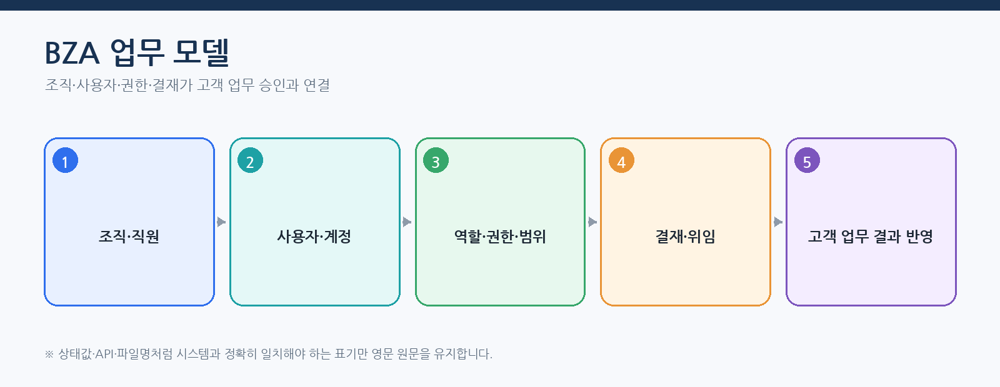
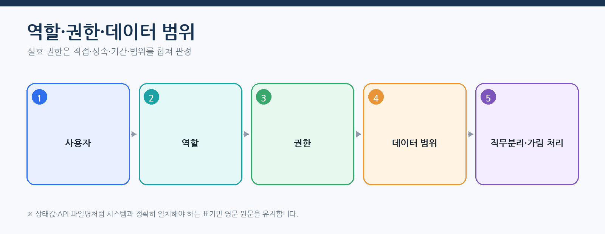
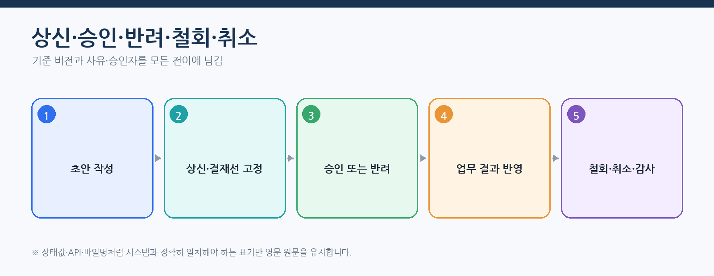
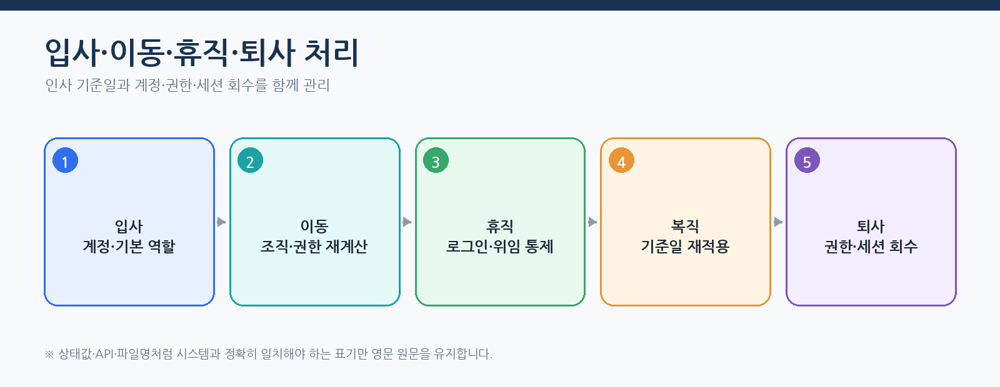
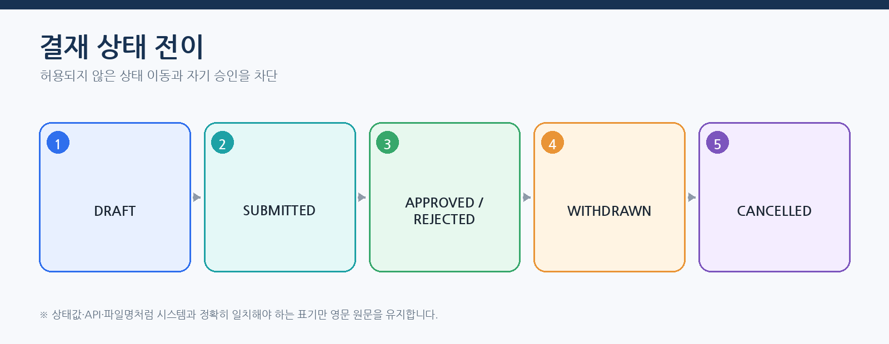

# CPF BZA 매뉴얼 — 조직·사용자·권한·결재 적용과 운영

> **주 독자**: BZA 도입 책임자, 조직·인사·권한·결재 담당자, 고객 업무 연동 개발자
> **목표**: BZA를 선택할지 판단하고 설치·초기 구성·조직·권한·결재·감사·복구를 고객 업무에 적용한다.

> **용어 표기 원칙**: 설명은 한글을 우선한다. API 경로, 설정 키, 클래스·파일명, HTTP 헤더와 실제 상태값은 시스템과 일치해야 하므로 원문을 유지한다.


## 이 매뉴얼을 사용하는 기준

이 매뉴얼은 고객이 현재 배포 기준의 CPF 기능을 처음 접한다는 전제로 작성한다. 사용자는 소스를 역분석하지 않고 이 문서의 **시작 조건 → 단계별 절차 → 정상 결과 → 오류·복구 → 운영 인계** 순서로 작업한다.

- 제품 기능과 고객 교육 예제는 구현된 기능을 기준으로 설명한다.
- 기능 식별자·API·설정값·화면이 변경되면 같은 커밋에서 매뉴얼도 함께 현행화한다.
- 고객 업무 데이터·상태·승인 기준·대사 기준은 고객이 정하고, CPF가 제공하는 실행·보안·감사·복구 계약에 연결한다.
- 명령과 예시는 저장소 최상위 폴더에서 실행하는 것을 기본으로 한다.
- 운영 변경은 사전 확인, 사유, 권한, 승인, 버전, 대상별 결과, 감사 순서로 확인한다.

> 문서 검수자는 소스·SQL·API·설정·화면·스크립트·시험과 양방향으로 대조한다. 고객 사용자는 별도 소스 분석 없이 본문 절차를 수행할 수 있어야 한다.
## 처음 시작하는 BZA 담당자의 완료 기준



BZA 도입은 조직·사용자 데이터를 등록하는 것으로 끝나지 않는다. 기준일 조직, 실효 권한, 직무분리, 결재정책 버전, 위임·대결, 세션·가림 처리·감사와 고객 업무 반영까지 연결해야 한다.

## 종단간 따라하기 — 조직·권한·결재 후 고객 업무 반영

### 1. 조직과 사용자 준비

1. 조직 코드·상위 조직·유효기간·기준일을 등록한다.
2. 직원과 발령 이력을 등록하고 현재 소속과 겸직을 확인한다.
3. 사용자 계정을 직원과 연결하고 초기 인증·다중요소 인증(MFA)·세션 정책을 적용한다.
4. 휴직·퇴사 예정 사용자의 계정·세션·위임 처리 기준을 정한다.

### 2. 역할·권한·데이터 범위



- 역할은 권한 묶음이다.
- 권한은 화면·API의 조회·변경·승인·반출·원문 조회 조치를 구분한다.
- 데이터 범위는 조직·지역·업무 범위를 제한한다.
- 가림 처리 권한은 업무 조회 권한과 별도로 관리한다.
- 실효 권한 모의 실행으로 직접·조직·위임·기간 권한과 직무분리 충돌을 확인한다.

### 3. 결재정책 작성

결재정책에는 업무 유형, 금액·위험 조건, 결재선, 병렬·순차 방식, 반려·철회·취소 규칙, 버전, 유효기간을 기록한다. 정책 변경은 진행 중 결재에 소급 적용하지 않고 요청 시점 정책 버전을 유지한다.

### 4. 상신·승인 실행

대표 EDU `EDU-BZA-04`는 다음 입력을 사용한다.

```json
{
  "approvalId": "APR-20260802-0001",
  "requestVersion": 1,
  "reason": "고액 지급 승인",
  "decision": "APPROVE",
  "approvalPolicyId": "PAY-HIGH-V3"
}
```



중복 승인, 오래된 버전, 만료 승인, 자기 승인은 거부한다. 응답 유실 시 동일 결정을 반복 제출하지 않고 `approvalId`와 작업 기록을 조회한다.

### 5. 고객 업무 반영

승인 완료 후 고객 업무 소유 모듈에 `approvalId`, `approvalPolicyId`, `businessOperationId`, 결정, 수행자, 결정 시각, `requestVersion`을 전달한다. 업무 반영 실패는 승인 이력을 삭제하지 않고 별도 작업 기록으로 재시도·결과 대사·되돌리기를 수행한다.

### 6. 입사·이동·퇴사 운영



- 입사: 계정·조직·역할·MFA와 최초 로그인 인계를 수행한다.
- 이동: 기준일에 조직·직무·데이터 범위·결재선을 재계산한다.
- 휴직: 로그인·세션·위임·진행 중 결재를 처리한다.
- 퇴사: 권한·토큰·세션·위임을 회수하고 감사·보존 정책을 적용한다.

## 정상 완료 판정

- 기준일에 조직·발령·사용자 상태가 일치한다.
- 역할·권한·데이터 범위와 가림 처리 결과가 기대한 실효 권한과 일치한다.
- 결재선 사전 확인와 실제 승인 경로가 같은 정책 버전을 사용한다.
- 승인·반려·철회·취소가 허용된 상태 전이만 수행한다.
- 고객 업무 반영 결과와 `approvalId`와 `businessOperationId`가 대사된다.
- 조직·권한·결재·반출·원문 조회가 감사에 남는다.

## BZA 선택 기준

BZA를 선택하는 경우:
- 여러 업무가 조직·직원·사용자·역할·권한·데이터 범위를 공유한다.
- 기준일 조직·발령과 실효 권한이 필요하다.
- 결재정책 버전, 상신·승인·반려·위임·대결이 필요하다.
- 개인정보 가림 처리, 세션, 감사와 승인된 반출이 필요하다.

선택하지 않는 경우:
- 단일 업무의 작은 권한 모델로 충분하고 공통 조직·결재 제품이 필요 없다.
- 외부 계정관리(IAM)·인사(HR)·승인 제품을 정본으로 사용하며 CPF에는 검증된 연동만 필요하다.

선택하지 않은 경우 BZA 모듈·DB 초기 데이터·프로필·기동 조건이 필수로 따라오지 않는지 확인한다.

## BZA와 `cpf-starters`의 책임 경계

BZA의 조직·직원·사용자·역할·Permission·Data Scope·결재 상태는 `cpf-biz-admin`이 소유한다. 최신 `cpf-biz-admin/build.gradle`에서 직접 소비가 확인된 공개 스타터는 `cpf-starter-security`다.

| 구분 | 현재 적용 | 책임 |
|---|---|---|
| BZA 본체 | `project(':cpf-starter-security')` | 서버 세션·BFF·쿠키·CSRF·허용 출처·세션 준비 상태 |
| 조직·권한 읽기 캐시 | BZA 본체 직접 의존으로 확인되지 않음 | 도입하려면 `cpf-starter-cache`를 명시 추가하고 기준일·권한 변경 무효화 시험 수행 |
| 결재·알림 Kafka 연계 | BZA 본체 직접 의존으로 확인되지 않음 | 고객 연동 모듈이 `cpf-starter-messaging-kafka`를 선택하고 발행·수신 원장과 대사 수행 |

현재 기능 묶음 별칭은 루트 빌드에 등록돼 있지 않으므로 정책 문서의 후보 이름을 실제 Gradle 의존성으로 사용하지 않는다. BOM은 버전을 정렬할 뿐 보안·캐시·Kafka 기능을 활성화하지 않는다.

보안 스타터 장애가 발생해도 조직·권한·결재 상태를 임의로 성공 또는 실패로 바꾸지 않는다. 세션 저장소·암호화 키·쿠키·CSRF·허용 출처를 확인하고 필요하면 영향 세션만 폐기한다. 별도 캐시나 Kafka 연동을 추가한 경우에는 정본 재조회와 작업 ID 대사를 각각 수행한다.

### 최신 BZA 화면 계약

BZA Frontend는 다음 생성 계약을 기준으로 동작한다.

- `cpf-biz-admin/frontend/src/generated/bza-route-operation-contract.ts`
- `cpf-biz-admin/frontend/src/generated/cpf-api.ts`
- `cpf-biz-admin/frontend/src/generated/orval/cpf-api.ts`
- `cpf-biz-admin/frontend/src/generated/cpf-operation-contract.ts`
- `cpf-biz-admin/frontend/src/components/CpfStructuredData.vue`

경로·조치·OpenAPI 원본을 바꿀 때 생성 파일을 수기로 수정하지 않는다. 생성 Script를 다시 실행하고 로그인·세션, 상신·승인, 알림, 권한 차단 시험을 함께 수행한다.

## 설치·초기 관리자 초기 구성

1. 선택 기능 제품과 DB 제품별 묶음 범위를 확인한다.
2. BZA 스키마·DB 변경 이력·초기 데이터를 적용하고 검증한다.
3. 초기 구성 토큰은 저장소·문서·로그에 기록하지 않는다.
4. 최초 관리자 계정을 한 번 생성하고 초기 비밀번호 변경·다중요소 인증·권한 인계를 수행한다.
5. 초기 구성 기능을 비활성화하고 재사용이 거부되는지 확인한다.
6. 최초 관리자의 장기 단독 권한을 제거하고 역할을 분리한다.

## 조직·직원·발령·기준일

### 업무 결과

조직 개편과 직원 이동을 기준일 버전으로 관리하고 과거 업무의 조직·결재 근거를 보존한다.

### 시작 전에 결정할 값

- 조직 ID·상하관계
- 직급·직책·직위
- 발령 유형·유효기간
- 기준일·시간대
- 폐쇄 조직 처리

### 수행 순서

1. 조직·직위을 등록한다.
2. 직원을 사용자와 분리해 등록한다.
3. 입사·이동·휴직·복귀·퇴사 발령을 기준일로 적용한다.
4. 과거·현재·미래 기준일 조회를 비교한다.
5. 고객 업무의 조직 스냅샷과 실효 권한을 확인한다.

### 정상 판정

- 동일 기간 중복 발령 거부
- 과거 조회가 개편 전 조직을 유지
- 퇴사·휴직 권한 회수
- 조직 폐쇄 뒤 신규 배정 차단

### 오류·경계·부분 실패

- 기간 겹침
- 순환 조직
- 미래 발령 취소
- 퇴사 후 세션 잔존
- 대량 개편 부분 실패

### 복구·대사·되돌리기

- 부분 적용은 조직·발령 대상별로 대사한다.
- 과거 이력을 삭제하지 않고 정정 버전을 사용한다.
- 퇴사·보안 사고는 세션과 토큰을 함께 차단한다.

### 로그·지표·추적·감사

- `organizationId`·`employeeId`·`effectiveDate`
- 발령 버전
- 입사·이동·퇴사 감사

### 운영 인계

- 조직 정본 소유 모듈
- 기준일 정책
- 대량 개편 승인
- 업무 시스템 동기화와 복구
## 역할·권한·데이터 범위·직무분리

### 업무 결과

사용자에게 역할을 배정하기 전에 실효 권한·데이터 범위·충돌을 모의 실행하고 승인된 범위만 적용한다.

### 시작 전에 결정할 값

- 역할·권한 기능 목록
- 데이터 범위 유형
- 직무분리 충돌 규칙
- 배정 유효기간
- 비상 권한 정책

### 수행 순서

1. 역할과 권한을 등록한다.
2. 사용자·조직·직위 기준 후보 역할을 계산한다.
3. 모의 실행에서 실효 권한과 충돌을 확인한다.
4. 사유·승인과 함께 역할을 배정한다.
5. 새 세션에서 실제 API·메뉴·데이터 범위를 시험한다.

### 정상 판정

- 모의 실행과 적용 후 실효 권한 일치
- 충돌 역할 동시 배정 차단
- 기간 만료 권한 회수
- 화면·API·데이터 범위 일치

### 오류·경계·부분 실패

- 역할 중첩
- 조직 이동 후 권한 잔존
- 캐시·세션 오래된
- 긴급 권한 미회수
- 권한 삭제 영향

### 복구·대사·되돌리기

- 권한 변경 뒤 캐시·세션 버전을 갱신한다.
- 잘못된 배정은 감사와 업무 영향 확인 후 회수한다.
- 긴급 권한은 대상·기간을 제한한다.

### 로그·지표·추적·감사

- `subjectId`·`roleId`·권한
- 실효 권한 변경 차이
- 접근 거부·가림 처리 감사

### 운영 인계

- 역할 소유 모듈
- 충돌 규칙
- 승인자
- 정기 권한 검토·회수
## 결재정책·상신·승인·위임·대결



### 업무 결과

업무 요청 시점의 정책 버전과 결재 경로를 스냅샷으로 고정하고 모든 의사결정을 감사한다.

### 시작 전에 결정할 값

- 업무 유형·금액·조직 조건
- 정책 버전·유효기간
- 결재 단계·정족수
- 위임·대결 허용 범위
- 철회·취소·재상신 규칙

### 수행 순서

1. 정책을 초안으로 작성하고 경로를 모의 실행한다.
2. 검토·승인 후 버전을 게시한다.
3. 고객 업무가 `approvalId`와 `policyVersion`으로 상신한다.
4. 승인·반려·철회·취소를 상태표에 따라 처리한다.
5. 최종 결과를 고객 업무 작업 기록에 반영하고 실패를 대사한다.

### 정상 판정

- 상신 시점 정책·경로 고정
- 자기 승인 차단
- 위임 실행자와 원 책임자 기록
- 승인 결과와 고객 업무 상태 일치

### 오류·경계·부분 실패

- 정책 변경 중 진행 건
- 위임 중첩·만료
- 승인 응답 유실
- 고객 업무 반영 실패
- 일부 후속 대상 실패

### 복구·대사·되돌리기

- 진행 건은 스냅샷 정책으로 계속 처리한다.
- 위임 경로가 무효면 재계산과 승인 근거를 남긴다.
- 고객 업무 반영 실패는 `approvalId`·`operationId`로 결과 대사한다.

### 로그·지표·추적·감사

- `approvalId`·`policyVersion`
- 승인자·위임자·대리자
- 결정 지연시간·장기 대기
- 업무 적용 결과

### 운영 인계

- 결재정책 소유 모듈
- 위임·대결 책임
- 장기 미결 처리
- 업무 반영·되돌리기 담당자
## 첨부·알림·세션·가림 처리·감사·반출

### 업무 결과

결재와 조직·권한 변경의 첨부·알림·접근·반출을 권한·보존·감사로 통제한다.

### 시작 전에 결정할 값

- 첨부 형식·검사·보존
- 알림 채널·상위 보고
- 세션·다중요소 인증·잠금
- 가림 처리 해제 권한
- 반출 승인·만료·처리 기준점

### 수행 순서

1. 첨부를 검사 완료 후 결재에 연결한다.
2. 알림 시도 이력와 확인 처리를 기록한다.
3. 계정 잠금·비밀번호 초기화·세션 종료를 사유와 함께 수행한다.
4. 개인정보 해제와 반출을 별도 권한·승인으로 처리한다.
5. 다운로드 해시·만료·수행자를 감사한다.

### 정상 판정

- 검사 전 첨부 접근 차단
- 알림 중복이 의사결정을 중복 처리하지 않음
- 잠금 계정 세션·토큰 차단
- 가림 처리·반출 감사 완성

### 오류·경계·부분 실패

- 첨부 검사 지연
- 알림 전송 후 ACK 유실
- 비밀번호 초기화 응답 유실
- 반출 생성 부분 실패
- 다운로드 주소 유출

### 복구·대사·되돌리기

- 첨부·알림·반출은 작업 기록과 시도 이력을 조회한다.
- 비밀번호 원문을 조회·복구하지 않고 새 값만 설정한다.
- 유출된 주소·세션·토큰을 폐기한다.

### 로그·지표·추적·감사

- `attachmentId`·해시
- 알림 시도
- 세션 회수
- 가림 원문 보기/반출 감사

### 운영 인계

- 보존·반출 정책
- 보안 사고 연락망
- 세션 종료 확인
- 감사 정기 검토

## BZA 실제 메뉴 26개

BZA 메뉴는 조직·인사, 계정·권한, 결재, 첨부·알림·반출, 개인화·세션·설정·감사의 다섯 범주로 사용한다. 아래 메뉴 식별자는 화면과 API가 공유하는 운영 기준이다. 조회 전용 메뉴에서는 변경 버튼을 사용하지 않고, 변경 메뉴는 현재 버전·사유·필요 승인·응답 유실 후 작업 조회·감사를 함께 확인한다.

### 조직·인사 기준정보

| 메뉴 식별자·업무 | 시작 입력 | 반드시 확인 | 허용 조치 | 완료·복구 판정 |
|---|---|---|---|---|
| `dashboard`<br>**운영 요약** | 운영 기준일·조직·상태 | 조직·계정·권한·결재 요약, 집계 기준시각 | 상세 메뉴 이동·담당자 지정 | 기준시각이 최신이며 미처리 위험 항목의 담당자와 기한이 기록됨 |
| `organizations`<br>**조직** | 조직 ID·명칭·상위 조직·적용일 | 계층 순환, 폐쇄 조직, 유효기간, 하위 조직 영향 | 등록·변경·폐쇄·이력 조회 | 기준일별 조직 계층이 한 가지로 계산되고 순환·기간 중복이 없음 |
| `organizationResponsibilities`<br>**조직 책임** | 조직·책임 유형·적용 기간 | 책임 범위, 중복 책임자, 위임 관계 | 등록·변경·종료 | 같은 기간·범위의 책임 충돌이 없고 감사에 변경 전후가 남음 |
| `positions`<br>**직위** | 직위 코드·명칭·적용일 | 사용 조직, 직원·권한 영향, 유효기간 | 등록·변경·종료 | 실효 직위와 직원 발령이 기준일에 맞게 연결됨 |
| `jobTitles`<br>**직책** | 직책 코드·명칭·적용일 | 결재·권한 정책 참조, 유효기간 | 등록·변경·종료 | 직책 변경 뒤 실효 권한과 결재 경로가 재계산됨 |
| `employees`<br>**직원** | 직원 ID·조직·재직 상태·적용일 | 입사·이동·휴직·퇴사 이력, 중복 발령 | 등록·발령·휴직·복직·퇴사 | 기준일별 재직 상태와 소속이 한 가지이며 계정·권한 회수까지 연결됨 |
| `assignments`<br>**발령·배정** | 직원·조직·직위·기간 | 기간 중복, 주 소속, 과거 이력 | 발령 등록·변경·취소 | 적용일 전후 조회 결과가 정책과 같고 과거 이력이 보존됨 |

### 계정·권한

| 메뉴 식별자·업무 | 시작 입력 | 반드시 확인 | 허용 조치 | 완료·복구 판정 |
|---|---|---|---|---|
| `users`<br>**사용자 계정** | 로그인 ID·직원·상태 | 직원 연결, 잠금, 만료, 세션, 마지막 로그인 | 계정 등록·활성·잠금 해제·비활성 | 개인 계정 원칙이 지켜지고 퇴직·이동 계정의 세션과 권한이 회수됨 |
| `roles`<br>**역할** | 역할 ID·명칭·버전·기간 | 포함 권한, 직무분리 충돌, 사용 사용자 | 초안·검증·승인·게시·종료 | 승인된 버전만 실효 권한 계산에 사용되고 충돌 권한이 없음 |
| `permissions`<br>**권한** | 권한 ID·대상 자원·행위 | API·메뉴·버튼·데이터 범위·원문·반출 구분 | 등록·변경·종료 | 서버 권한과 화면 가시성이 같은 권한 의미를 사용함 |
| `userRoles`<br>**사용자 역할** | 사용자·역할·유효기간·사유 | 직접/상속 권한, 승인, 기간, 충돌 | 부여·회수·기간 변경 | 실효 권한이 승인 내용과 같고 회수 뒤 활성 세션에도 반영됨 |
| `menus`<br>**메뉴 권한** | 메뉴 ID·경로·상위 메뉴·권한 | 경로 중복, 표시 순서, 기능 활성 조건, 접근 권한 | 등록·변경·숨김·종료 | 메뉴 노출과 API 권한이 일치하고 권한 없는 직접 접근이 거부됨 |
| `permissionTools`<br>**실효 권한 도구** | 사용자·역할·기준일·업무 대상 | 실효 권한, 직무분리, 데이터 범위, 변경 차이 | 권한 모의 실행·충돌 분석 | 실제 적용 전 예상 권한과 적용 후 실효 권한의 차이가 0임 |

### 결재

| 메뉴 식별자·업무 | 시작 입력 | 반드시 확인 | 허용 조치 | 완료·복구 판정 |
|---|---|---|---|---|
| `approvalPolicies`<br>**결재정책** | 정책 ID·업무 유형·조건·버전·기간 | 결재 단계, 금액·조직 조건, 자기 승인, 위임 적용 | 초안·모의 실행·승인·게시·종료 | 상신 시점 정책 버전이 고정되고 진행 중 건의 경로가 임의 변경되지 않음 |
| `approvalSimulation`<br>**결재 경로 사전 계산** | 업무 유형·요청자·금액·기준일 | 예상 결재자, 위임·대결, 충돌·경로 없음 | 결재 경로 사전 계산 | 실제 상신 경로가 사전 계산 결과와 같고 경로 없음이 상신 전에 차단됨 |
| `approvalSubmissions`<br>**상신** | 업무 ID·정책 버전·요청 사유 | 요청 본문 해시, 첨부, 결재 경로, 멱등 키 | 상신·철회·취소·상태 조회 | 중복 상신이 없고 업무 ID·승인 ID·정책 버전이 고객 업무와 대사됨 |
| `approvalInbox`<br>**승인함** | 승인자·상태·기한·업무 유형 | 자기 승인, 요청 버전, 첨부·사유, 만료 | 승인·반려·보류·상세 조회 | 한 단계가 한 번만 결정되고 고객 업무 반영 결과와 감사가 연결됨 |
| `approvalDelegations`<br>**위임·대결** | 위임자·대리자·범위·기간 | 중첩 위임, 순환, 만료, 책임 주체 | 등록·변경·조기 종료 | 결재 시점의 유효 위임만 적용되고 원 결재자·대리자 책임이 감사에 남음 |

### 첨부·알림·반출

| 메뉴 식별자·업무 | 시작 입력 | 반드시 확인 | 허용 조치 | 완료·복구 판정 |
|---|---|---|---|---|
| `attachments`<br>**첨부** | 첨부 ID·업무 ID·상태 | 파일명, 크기, 내용 형식, 검사합, 악성코드 검사, 격리 | 업로드·다운로드·격리 해제 요청·만료 | 검사 통과 파일만 업무에 연결되고 원문 조회·다운로드가 감사됨 |
| `notifications`<br>**알림** | 수신자·채널·상태·기간 | 내용 가림, 시도 횟수, ACK, 대체 채널, 상위 보고 | 재전송·확인·종료 | 중복 알림 정책이 지켜지고 실패 원인과 다음 시도가 기록됨 |
| `downloads`<br>**반출 파일** | 반출 작업 ID·생성자·상태 | 권한, 승인, 가림, 파일 해시, 만료 | 생성·다운로드·만료·재생성 | 파일 해시가 일치하고 승인 범위·유효기간 안에서만 다운로드됨 |
| `downloadAudits`<br>**다운로드 감사** | 수행자·파일·업무·기간 | 다운로드 시각, 접속 IP·세션, 사유, 승인 ID | 조회·증적 반출 | 반출 파일과 감사 기록의 해시·수행자·시각이 일치함 |

### 개인화·세션·설정·감사

| 메뉴 식별자·업무 | 시작 입력 | 반드시 확인 | 허용 조치 | 완료·복구 판정 |
|---|---|---|---|---|
| `savedSearches`<br>**저장 검색** | 사용자·화면·공유 범위 | 민감 검색조건, 개인/공유, 기본 기간 | 저장·변경·공유·삭제 | 권한 밖 조건이나 개인정보 원문이 저장되지 않음 |
| `sessions`<br>**세션** | 사용자·세션·상태·기간 | 발급·마지막 사용·만료·접속 IP·기기·권한 변경 | 개별/전체 세션 종료 | 계정 잠금·권한 회수 뒤 이전 세션이 더 이상 업무 API를 호출하지 못함 |
| `settings`<br>**BZA 설정** | 설정 키·환경·버전·대상 | 현재값, 기본값, 비밀정보 여부, 재기동, 적용 상태 | 사전 확인·승인·적용·결과 대사·이전 버전 복원 | 대상별 버전·검사합이 일치하고 비밀정보 원문이 노출되지 않음 |
| `audits`<br>**감사** | 수행자·조치·대상·기간·추적 ID | 변경 전후, 사유, 승인 ID, 업무·작업 ID | 조회·권한 있는 증적 반출 | 조직·권한·결재·반출의 모든 변경이 빠짐없이 연결됨 |

### 응답 유실·부분 성공 처리

1. 같은 상신·승인·권한 변경 버튼을 다시 누르지 않고 업무 ID·승인 ID·멱등 키를 기록한다.
2. 상신·승인함·감사에서 기존 처리 상태와 요청 본문 해시를 조회한다.
3. 고객 업무 반영이 미확정이면 승인 결과와 고객 업무 작업 ID를 양쪽에서 대사한다.
4. 여러 사용자·조직을 일괄 변경한 작업은 성공 대상을 유지하고 실패 대상만 다시 처리한다.
5. 최종 상태, 실효 권한, 결재 경로, 고객 업무 결과와 감사가 같은 버전을 가리킬 때 종료한다.

## 공통 EDU 실행 계약

### 1. 교육 기능과 입력값 확인

문서의 선택표에서 교육 ID를 고른 뒤 실행 중인 참조 서비스에서 기능 정의를 조회한다. 사용자는 소스 경로를 찾지 않아도 필수 입력, 역할, 처리 단계와 허용 장애 지점을 확인할 수 있다.

```powershell
$capabilities = Invoke-RestMethod -Method Get `
  -Uri 'http://127.0.0.1:8080/api/reference/edu-capabilities'
$capabilities | Where-Object requirementId -eq '<EDU-ID>' | Format-List
```

조회 결과의 `requiredFields`를 요청 본문의 `payload`에 채우고, `requiredRole`, `steps`, `failurePoints`, `maxRetries`를 실행 전에 확인한다. 구현을 확장하거나 시험 코드를 검토할 때만 기능 카탈로그의 `sourcePath`, `resourceContract`, `tests`를 유지보수 근거로 사용한다.

### 2. 역할과 기능 활성 조건

- 필요한 역할: `CPF_BZA_OPERATOR`
- 대표 기능 전환: `cpf.reference.features.backoffice.enabled`
- 기본 프로필에서 교육 기능이 임의 실행된다고 가정하지 않는다.
- 비밀정보·토큰·비밀번호 원문을 요청 본문, 명령 이력, 로그에 기록하지 않는다.

### 3. 교육 실행 API

```text
GET  /api/reference/edu-capabilities
POST /api/reference/edu-capabilities/{requirementId}/executions
GET  /api/reference/edu-capabilities/executions/{operationId}
GET  /api/reference/edu-capabilities/{requirementId}/executions?limit=100
GET  /api/reference/edu-capabilities/executions/{operationId}/audit
GET  /api/reference/edu-capabilities/executions/{operationId}/targets
GET  /api/reference/edu-capabilities/executions/{operationId}/outbox
POST /api/reference/edu-capabilities/executions/{operationId}/retry?reason=...
POST /api/reference/edu-capabilities/executions/{operationId}/reconcile?reason=...
POST /api/reference/edu-capabilities/executions/{operationId}/compensate?reason=...
POST /api/reference/edu-capabilities/executions/{operationId}/cancel?reason=...
```

필수 헤더는 `X-Cpf-Actor-Id`, `X-Cpf-Roles`, `X-Cpf-Data-Scope`다. `X-Cpf-Request-Id`, `X-Cpf-Trace-Id`는 호출자가 지정하지 않으면 서버가 생성할 수 있으나, 장애 재현과 대사 시험에서는 명시적으로 고정한다.

```powershell
$headers = @{
  'X-Cpf-Actor-Id'  = 'edu-operator'
  'X-Cpf-Roles'     = 'CPF_BZA_OPERATOR'
  'X-Cpf-Data-Scope'= 'ORG:EDU'
  'X-Cpf-Request-Id'= 'REQ-EDU-0001'
  'X-Cpf-Trace-Id'  = 'TRACE-EDU-0001'
}
$body = @{
  businessKey      = 'BUSINESS-0001'
  idempotencyKey   = 'IDEMPOTENCY-0001'
  expectedVersion  = 0
  requestReason    = '교육 시나리오 실행'
  payload          = @{}
  failurePoint     = 'NONE'
  autoApprove      = $true
  autoAcknowledge  = $true
} | ConvertTo-Json -Depth 10
Invoke-RestMethod -Method Post `
  -Uri 'http://localhost:<port>/api/reference/edu-capabilities/<EDU-ID>/executions' `
  -Headers $headers -ContentType 'application/json' -Body $body
```

`payload`는 기능 목록의 `requiredFields`를 채운다. 허용 장애 주입 값은 `BEFORE_COMMIT`, `AFTER_COMMIT`, `BEFORE_EXTERNAL_SEND`, `AFTER_EXTERNAL_SEND`, `RESPONSE_LOST`, `PARTIAL_TARGET_FAILURE`, `TIMEOUT`, `PROCESS_KILL`, `LEASE_LOST`다.

### 4. 응답 유실과 부분 실패 복구

1. 같은 요청을 바로 반복하지 않는다.
2. 기록한 `operationId`, `requestId`, `businessKey`, `idempotencyKey`로 실행 상태를 조회한다.
3. `audit`, `targets`, `outbox`를 조회해 DB 커밋과 외부 부수 효과를 분리한다.
4. 실제 결과가 확정되지 않으면 `reconcile`을 수행한다.
5. `retry`는 실패 원인이 일시적이고 해당 기능이 재시도 가능하다고 기능 목록·상태가 표시할 때만 사용한다.
6. 일부 대상만 성공했으면 성공 대상을 다시 실행하지 않고 실패·미확정 대상만 복구한다.
7. 최종 상태, 버전, 대상별 결과, 감사, 로그·지표·추적이 같은 작업 기록을 가리킬 때 종료한다.

## BZA EDU 14개 선택표

실제 고객 교육 구현은 `com.cpf.reference.optional.backoffice...`와 기능 목록 `sourcePath`를 따른다. BZA 제품 내부에 고객 업무 원장 로직을 넣지 않는다.

| 교육 ID | 고객이 확인할 기능 | 역할 | 활성 조건 | 실행 안내 | 기능 제공 | 사용 방법 |
|---|---|---|---|---|---|---|
| `EDU-BZA-01` | 조직·직원·발령·기준일 | `CPF_BZA_OPERATOR` | `cpf.reference.features.backoffice.enabled` | 공통 EDU 실행 계약과 해당 ID | 제공 | 본문 절차 |
| `EDU-BZA-02` | 사용자·역할·권한·실효 권한 | `CPF_BZA_OPERATOR` | `cpf.reference.features.backoffice.enabled` | 공통 EDU 실행 계약과 해당 ID | 제공 | 본문 절차 |
| `EDU-BZA-03` | 결재정책 버전·경로 사전 계산 | `CPF_BZA_OPERATOR` | `cpf.reference.features.backoffice.enabled` | 공통 EDU 실행 계약과 해당 ID | 제공 | 본문 절차 |
| `EDU-BZA-04` | 상신·승인·반려·철회·취소 | `CPF_BZA_OPERATOR` | `cpf.reference.features.backoffice.enabled` | 공통 EDU 실행 계약과 해당 ID | 제공 | 본문 절차 |
| `EDU-BZA-05` | 위임·대결·대행 책임 | `CPF_BZA_OPERATOR` | `cpf.reference.features.backoffice.enabled` | 공통 EDU 실행 계약과 해당 ID | 제공 | 본문 절차 |
| `EDU-BZA-06` | 첨부·알림·감사·다운로드 | `CPF_BZA_OPERATOR` | `cpf.reference.features.backoffice.enabled` | 공통 EDU 실행 계약과 해당 ID | 제공 | 본문 절차 |
| `EDU-BZA-07` | 초기 관리자 초기 구성·첫 로그인·권한 인계 | `CPF_BZA_OPERATOR` | `cpf.reference.features.backoffice.enabled` | 공통 EDU 실행 계약과 해당 ID | 제공 | 본문 절차 |
| `EDU-BZA-08` | 조직 개편·기준일·과거 이력 유지 | `CPF_BZA_OPERATOR` | `cpf.reference.features.backoffice.enabled` | 공통 EDU 실행 계약과 해당 ID | 제공 | 본문 절차 |
| `EDU-BZA-09` | 입사·이동·휴직·복직·퇴사 | `CPF_BZA_OPERATOR` | `cpf.reference.features.backoffice.enabled` | 공통 EDU 실행 계약과 해당 ID | 제공 | 본문 절차 |
| `EDU-BZA-10` | 역할 충돌·직무분리·실효 권한 모의 실행 | `CPF_BZA_OPERATOR` | `cpf.reference.features.backoffice.enabled` | 공통 EDU 실행 계약과 해당 ID | 제공 | 본문 절차 |
| `EDU-BZA-11` | 위임 중첩·기간 만료·결재 경로 재계산 | `CPF_BZA_OPERATOR` | `cpf.reference.features.backoffice.enabled` | 공통 EDU 실행 계약과 해당 ID | 제공 | 본문 절차 |
| `EDU-BZA-12` | 계정 잠금·비밀번호 초기화·세션 강제 종료 | `CPF_BZA_OPERATOR` | `cpf.reference.features.backoffice.enabled` | 공통 EDU 실행 계약과 해당 ID | 제공 | 본문 절차 |
| `EDU-BZA-13` | 개인정보 가림 처리·감사 조회·승인 반출 | `CPF_BZA_OPERATOR` | `cpf.reference.features.backoffice.enabled` | 공통 EDU 실행 계약과 해당 ID | 제공 | 본문 절차 |
| `EDU-BZA-14` | 고객 업무 승인 결과 반영·실패 되돌리기 | `CPF_BZA_OPERATOR` | `cpf.reference.features.backoffice.enabled` | 공통 EDU 실행 계약과 해당 ID | 제공 | 본문 절차 |

## 고객 업무 영역 연계

- 고객 업무는 BZA의 `userId`·`organizationId`·역할/권한·`approvalId`를 참조한다.
- BZA는 고객 업무 상태를 직접 수정하지 않는다.
- 승인 결과 반영은 고객 업무 명령/작업 기록으로 수행한다.
- 응답 유실은 `approvalId`와 `businessOperationId`로 양쪽 상태를 대사한다.
- 조직·권한 변경 이벤트는 아웃박스·인박스와 버전으로 소비한다.

## 백업·복원·업그레이드·되돌리기

- 조직·발령·권한·결재·감사는 같은 복원 시점을 요구한다.
- 복원 뒤 실효 권한·진행 결재·세션·Attachment 해시를 검증한다.
- 업그레이드는 진행 중 결재와 정책 버전 호환을 확인한다.
- 응용 계층 되돌리기와 DB 변경 이력 되돌리기 가능 범위를 분리한다.
- DB 제품·브라우저·장애 시험 결과를 고객 인수 증적에 기록한다.
