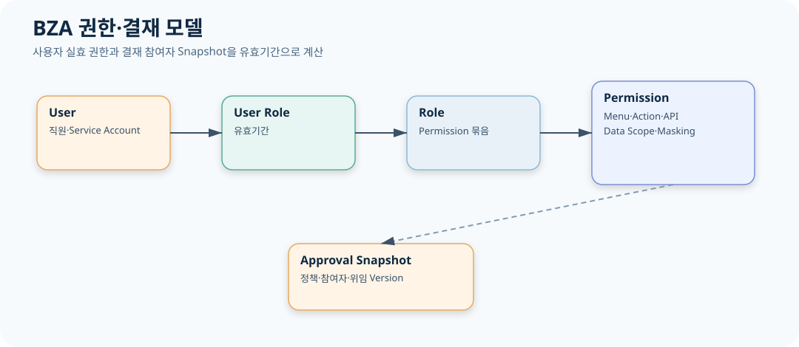

# CPF BZA 매뉴얼

> 문서: `CPF BZA 매뉴얼`
> 기준 Repository: `https://github.com/freeangelsun/202412_01_CPF`
> 기준 Branch: `master`
> 기준 Commit: `6976d2747481b8540b48ddb9ab8f53cfeaa4b888` (`06_02`)
> 기준일: `2026-08-06 Asia/Seoul`

| 항목 | 내용 |
|---|---|
| 주 독자 | 조직·사용자·권한·결재 담당자·업무 연동 개발자 |
| 문서 목적 | 조직·직원·사용자·권한·결재·첨부·알림을 고객 업무에 적용하고 운영한다. |
| 기능 서술 전제 | CPF 제품 기능은 고객이 사용할 수 있는 상태로 설명한다. 구현 진행률이나 개발 관리 상태는 이 문서의 사용 절차에 섞지 않는다. |
| 사실 우선순위 | 실제 Source·SQL·API·Config·Frontend·Script·Test → 설계·사양 → 본 매뉴얼 |
| 상태 표현 | 업무 상태와 운영 결과는 Source의 상태값을 사용한다. 문서 검토 상태는 `완료`, `부분 구현`, `미구현`, `미검증`, `실패`, `재확인 필요`만 사용한다. |

## 1. BZA의 역할과 도입 기준

BZA는 조직·직원·사용자·Role·Permission·Data Scope·결재·위임·첨부·알림을 고객 업무에 제공한다. 고객 업무가 별도 조직·권한·결재 원장을 만들지 않고 BZA의 기준일·Version·Snapshot 계약을 사용한다.

주 역할은 조직담당자, 사용자담당자, 권한담당자, 결재정책담당자, 승인자, 감사담당자, 업무 연동 개발자다.

## 2. 초기 설치와 관리자

1. BZA Backend·Frontend Artifact와 DB Vendor Pack을 배포한다.
2. BZA Schema·Seed·Permission·Menu를 적용한다.
3. 초기 관리자 계정을 최소 Role로 생성하고 MFA·Password·Session 정책을 적용한다.
4. 조직 Root·직급·직책·대표 직원·사용자 연결을 만든다.
5. 관리자 Role의 Menu·Button·API Permission과 Data Scope를 Simulation한다.
6. Backup을 만들고 Restore/로그인 Smoke를 수행한다.
7. 초기 Credential은 교체하고 생성 Audit를 보존한다.

## 3. Route 전체 지도

| No | Route | Menu | 화면 | Operation 수 |
|---|---|---|---|---|
| 1 | `/` | DASHBOARD | 업무 운영 현황 | 1 |
| 2 | `/organizations` | ORGANIZATION | 조직 계층 | 3 |
| 3 | `/employees` | EMPLOYEE | 직원 Profile | 4 |
| 4 | `/positions` | EMPLOYEE | 직급 | 3 |
| 5 | `/jobTitles` | EMPLOYEE | 직책 | 3 |
| 6 | `/assignments` | EMPLOYEE | 발령·겸직·파견·대행 | 3 |
| 7 | `/organizationResponsibilities` | ORGANIZATION | 조직 책임 | 3 |
| 8 | `/users` | AUTHORIZATION | 사용자 | 3 |
| 9 | `/roles` | AUTHORIZATION | Role | 3 |
| 10 | `/userRoles` | AUTHORIZATION | 사용자 Role·유효기간 | 3 |
| 11 | `/menus` | AUTHORIZATION | Menu Registry | 5 |
| 12 | `/permissions` | AUTHORIZATION | 화면·행위·API·Data Scope | 3 |
| 13 | `/permissionTools` | AUTHORIZATION | Role 비교·권한 Simulation | 3 |
| 14 | `/approvalInbox` | APPROVAL | 결재 처리 | 5 |
| 15 | `/approvalSubmissions` | APPROVAL | 결재 상신·Lifecycle | 8 |
| 16 | `/approvalPolicies` | APPROVAL | Versioned 결재 정책 | 3 |
| 17 | `/approvalSimulation` | APPROVAL | 결재 경로 Simulation | 1 |
| 18 | `/approvalDelegations` | APPROVAL | 위임·대결 | 2 |
| 19 | `/sessions` | AUTHORIZATION | Session | 2 |
| 20 | `/audits` | AUDIT | 업무 Audit | 2 |
| 21 | `/notifications` | SETTING | 업무 알림 | 4 |
| 22 | `/attachments` | ATTACHMENT | 첨부 | 5 |
| 23 | `/savedSearches` | SETTING | 저장 검색 | 3 |
| 24 | `/settings` | SETTING | 업무 설정 | 1 |
| 25 | `/downloads` | SETTING | Download Policy | 1 |
| 26 | `/downloadAudits` | AUDIT | Download Audit | 1 |

## 4. 화면별 업무 절차

### 4.1. 업무 운영 현황 — `/` {#dashboard}

| 항목 | 값 |
|---|---|
| Route ID | `dashboard` |
| Menu ID | `DASHBOARD` |
| 운영 목적 | 조직·사용자·권한·결재·알림 현황을 업무 담당자 관점에서 요약한다. |
| 필요한 권한 | Menu `DASHBOARD`와 Operation별 API Permission. 원문·Download·결재 결정은 별도 Data Scope/Action Permission과 Reason을 사용한다. |

#### 검색·목록·Action

| 영역 | 항목 |
|---|---|
| 검색 | 기준일, 조직, 업무 도메인 |
| Column | 조직 수, 사용자 수, 만료 예정 Role, 미결 결재, 알림 미읽음 |
| Button | 이상 카드별 상세 이동 |

#### 업무 절차

1. 기준일과 업무 도메인·조직 Scope를 먼저 확인한다.
2. `기준일, 조직, 업무 도메인`로 대상을 조회한다.
3. 목록의 `조직 수, 사용자 수, 만료 예정 Role, 미결 결재, 알림 미읽음`와 Version·유효기간을 확인한다.
4. 상세에서 연결 조직·직원·Role·Permission·결재 Snapshot·Audit를 확인한다.
5. 변경 Action은 Reason·Expected Version·Idempotency를 사용하고 결재/권한 위험도에 따라 승인한다.
6. 변경 후 같은 기준일로 재조회하고 실효 결과를 Simulation 또는 Consumer 화면에서 확인한다.
7. 응답 유실 시 같은 Operation/Idempotency 조회로 기존 결과를 확인한다.

#### Operation별 계약

| Operation | 행위 | 핵심 입력 | 정상 결과 | 대표 오류 | 복구 |
|---|---|---|---|---|---|
| `bzaSupportDashboard` | 업무 처리 | 업무 운영 현황 식별자·현재 상태·Version·Reason·Reason·Expected Version·Idempotency·Approval | `bzaSupportDashboard` 요청이 1회 반영되고 업무 운영 현황 결과·Version·Operation·Audit가 같은 Transaction/Operation/Audit 식별자로 연결된다. | 업무 운영 현황 Validation·Forbidden·Expected Version·Idempotency 충돌·Timeout·부분 적용 | `bzaSupportDashboard` Operation 상태를 조회하고 BZA 업무 운영 현황 원장와 Target 결과를 대사한 뒤 실패 확정 시 새 요청 또는 Rollback을 수행한다. |

#### 정상 판정

집계 기준일과 각 상세 화면 건수가 일치한다.

#### 오류·복구

만료 예정 Role과 미결 결재를 담당 화면으로 이관한다.

#### Audit와 교대 인계

`dashboard` 교대 인계에는 `업무 운영 현황`의 Actor·Reason·Before/After·기준일·Operation ID와 `집계 기준일과 각 상세 화면 건수가 일치한다.` 판정 결과를 기록한다. 다음 담당자는 `만료 예정 Role과 미결 결재를 담당 화면으로 이관한다.`가 필요한 미종결 대상과 만료 시각·책임자를 확인한다.

### 4.2. 조직 계층 — `/organizations` {#organizations}

| 항목 | 값 |
|---|---|
| Route ID | `organizations` |
| Menu ID | `ORGANIZATION` |
| 운영 목적 | 조직 계층을 등록하고 순환·고아 조직 없이 유지한다. |
| 필요한 권한 | Menu `ORGANIZATION`와 Operation별 API Permission. 원문·Download·결재 결정은 별도 Data Scope/Action Permission과 Reason을 사용한다. |

#### 검색·목록·Action

| 영역 | 항목 |
|---|---|
| 검색 | 조직 코드, 상위 조직, 상태, 기준일 |
| Column | 조직 코드, 이름, 상위 조직, 경로, Level, 상태, Version |
| Button | 조직 저장 |

#### 업무 절차

1. 기준일과 업무 도메인·조직 Scope를 먼저 확인한다.
2. `조직 코드, 상위 조직, 상태, 기준일`로 대상을 조회한다.
3. 목록의 `조직 코드, 이름, 상위 조직, 경로, Level, 상태, Version`와 Version·유효기간을 확인한다.
4. 상세에서 연결 조직·직원·Role·Permission·결재 Snapshot·Audit를 확인한다.
5. 변경 Action은 Reason·Expected Version·Idempotency를 사용하고 결재/권한 위험도에 따라 승인한다.
6. 변경 후 같은 기준일로 재조회하고 실효 결과를 Simulation 또는 Consumer 화면에서 확인한다.
7. 응답 유실 시 같은 Operation/Idempotency 조회로 기존 결과를 확인한다.

#### Operation별 계약

| Operation | 행위 | 핵심 입력 | 정상 결과 | 대표 오류 | 복구 |
|---|---|---|---|---|---|
| `bzaBackofficeFindOrganizations` | 조회 | 조직 계층 식별자·현재 상태·Version·Reason | `bzaBackofficeFindOrganizations` 결과의 기준시각·건수·식별자·상태가 BZA 조직 계층 원장 조회 조건과 일치한다. | 조직 계층 조회 범위·Data Scope·Paging·Owner Timeout·기준시각 불일치 | 조건과 권한을 보정하고 BZA 조직 계층 원장 Health를 확인한 뒤 `bzaBackofficeFindOrganizations`를 같은 기준으로 다시 조회한다. |
| `bzaBackofficeSaveOrganization` | 저장 | 조직 계층 식별자·현재 상태·Version·Reason·Reason·Expected Version·Idempotency·Approval | `bzaBackofficeSaveOrganization` 요청이 1회 반영되고 조직 계층 결과·Version·Operation·Audit가 같은 Transaction/Operation/Audit 식별자로 연결된다. | 조직 계층 Validation·Forbidden·Expected Version·Idempotency 충돌·Timeout·부분 적용 | `bzaBackofficeSaveOrganization` Operation 상태를 조회하고 BZA 조직 계층 원장와 Target 결과를 대사한 뒤 실패 확정 시 새 요청 또는 Rollback을 수행한다. |
| `bzaBackofficeFindOrganizationsPage` | 조회 | 조직 계층 식별자·현재 상태·Version·Reason | `bzaBackofficeFindOrganizationsPage` 결과의 기준시각·건수·식별자·상태가 BZA 조직 계층 원장 조회 조건과 일치한다. | 조직 계층 조회 범위·Data Scope·Paging·Owner Timeout·기준시각 불일치 | 조건과 권한을 보정하고 BZA 조직 계층 원장 Health를 확인한 뒤 `bzaBackofficeFindOrganizationsPage`를 같은 기준으로 다시 조회한다. |

#### 정상 판정

상위 경로가 재계산되고 순환이 없으며 하위 조직 수가 일치한다.

#### 오류·복구

고아·순환·사용 중 폐기를 검출해 상위 관계를 수정한다.

#### Audit와 교대 인계

`organizations` 교대 인계에는 `조직 계층`의 Actor·Reason·Before/After·기준일·Operation ID와 `상위 경로가 재계산되고 순환이 없으며 하위 조직 수가 일치한다.` 판정 결과를 기록한다. 다음 담당자는 `고아·순환·사용 중 폐기를 검출해 상위 관계를 수정한다.`가 필요한 미종결 대상과 만료 시각·책임자를 확인한다.

### 4.3. 직원 Profile — `/employees` {#employees}

| 항목 | 값 |
|---|---|
| Route ID | `employees` |
| Menu ID | `EMPLOYEE` |
| 운영 목적 | 직원 Profile과 Masked 연락처를 관리한다. |
| 필요한 권한 | Menu `EMPLOYEE`와 Operation별 API Permission. 원문·Download·결재 결정은 별도 Data Scope/Action Permission과 Reason을 사용한다. |

#### 검색·목록·Action

| 영역 | 항목 |
|---|---|
| 검색 | 직원번호, 이름, 조직, 재직 상태 |
| Column | 직원번호, 이름, 대표 조직, 직급, 직책, 상태, Version |
| Button | 직원 저장; Raw Contact 조회 |

#### 업무 절차

1. 기준일과 업무 도메인·조직 Scope를 먼저 확인한다.
2. `직원번호, 이름, 조직, 재직 상태`로 대상을 조회한다.
3. 목록의 `직원번호, 이름, 대표 조직, 직급, 직책, 상태, Version`와 Version·유효기간을 확인한다.
4. 상세에서 연결 조직·직원·Role·Permission·결재 Snapshot·Audit를 확인한다.
5. 변경 Action은 Reason·Expected Version·Idempotency를 사용하고 결재/권한 위험도에 따라 승인한다.
6. 변경 후 같은 기준일로 재조회하고 실효 결과를 Simulation 또는 Consumer 화면에서 확인한다.
7. 응답 유실 시 같은 Operation/Idempotency 조회로 기존 결과를 확인한다.

#### Operation별 계약

| Operation | 행위 | 핵심 입력 | 정상 결과 | 대표 오류 | 복구 |
|---|---|---|---|---|---|
| `bzaBackofficeFindEmployees` | 조회 | 직원 Profile 식별자·현재 상태·Version·Reason | `bzaBackofficeFindEmployees` 결과의 기준시각·건수·식별자·상태가 BZA 직원 Profile 원장 조회 조건과 일치한다. | 직원 Profile 조회 범위·Data Scope·Paging·Owner Timeout·기준시각 불일치 | 조건과 권한을 보정하고 BZA 직원 Profile 원장 Health를 확인한 뒤 `bzaBackofficeFindEmployees`를 같은 기준으로 다시 조회한다. |
| `bzaBackofficeSaveEmployee` | 저장 | 직원 Profile 식별자·현재 상태·Version·Reason·Reason·Expected Version·Idempotency·Approval | `bzaBackofficeSaveEmployee` 요청이 1회 반영되고 직원 Profile 결과·Version·Operation·Audit가 같은 Transaction/Operation/Audit 식별자로 연결된다. | 직원 Profile Validation·Forbidden·Expected Version·Idempotency 충돌·Timeout·부분 적용 | `bzaBackofficeSaveEmployee` Operation 상태를 조회하고 BZA 직원 Profile 원장와 Target 결과를 대사한 뒤 실패 확정 시 새 요청 또는 Rollback을 수행한다. |
| `bzaBackofficeFindEmployeesPage` | 조회 | 직원 Profile 식별자·현재 상태·Version·Reason | `bzaBackofficeFindEmployeesPage` 결과의 기준시각·건수·식별자·상태가 BZA 직원 Profile 원장 조회 조건과 일치한다. | 직원 Profile 조회 범위·Data Scope·Paging·Owner Timeout·기준시각 불일치 | 조건과 권한을 보정하고 BZA 직원 Profile 원장 Health를 확인한 뒤 `bzaBackofficeFindEmployeesPage`를 같은 기준으로 다시 조회한다. |
| `bzaBackofficeEmployeeRawContact` | 업무 처리 | 직원 Profile 식별자·현재 상태·Version·Reason·Reason·Expected Version·Idempotency·Approval | `bzaBackofficeEmployeeRawContact` 요청이 1회 반영되고 직원 Profile 결과·Version·Operation·Audit가 같은 Transaction/Operation/Audit 식별자로 연결된다. | 직원 Profile Validation·Forbidden·Expected Version·Idempotency 충돌·Timeout·부분 적용 | `bzaBackofficeEmployeeRawContact` Operation 상태를 조회하고 BZA 직원 Profile 원장와 Target 결과를 대사한 뒤 실패 확정 시 새 요청 또는 Rollback을 수행한다. |

#### 정상 판정

Profile과 발령 Snapshot이 일치하고 일반 조회는 연락처가 Masking된다.

#### 오류·복구

퇴직·중복 직원·원문 연락처 권한을 구분한다.

#### Audit와 교대 인계

`employees` 교대 인계에는 `직원 Profile`의 Actor·Reason·Before/After·기준일·Operation ID와 `Profile과 발령 Snapshot이 일치하고 일반 조회는 연락처가 Masking된다.` 판정 결과를 기록한다. 다음 담당자는 `퇴직·중복 직원·원문 연락처 권한을 구분한다.`가 필요한 미종결 대상과 만료 시각·책임자를 확인한다.

### 4.4. 직급 — `/positions` {#positions}

| 항목 | 값 |
|---|---|
| Route ID | `positions` |
| Menu ID | `EMPLOYEE` |
| 운영 목적 | 직급 코드와 정렬·유효기간을 관리한다. |
| 필요한 권한 | Menu `EMPLOYEE`와 Operation별 API Permission. 원문·Download·결재 결정은 별도 Data Scope/Action Permission과 Reason을 사용한다. |

#### 검색·목록·Action

| 영역 | 항목 |
|---|---|
| 검색 | 직급 코드, 상태 |
| Column | 코드, 이름, Rank, 유효기간, 상태, Version |
| Button | 직급 저장 |

#### 업무 절차

1. 기준일과 업무 도메인·조직 Scope를 먼저 확인한다.
2. `직급 코드, 상태`로 대상을 조회한다.
3. 목록의 `코드, 이름, Rank, 유효기간, 상태, Version`와 Version·유효기간을 확인한다.
4. 상세에서 연결 조직·직원·Role·Permission·결재 Snapshot·Audit를 확인한다.
5. 변경 Action은 Reason·Expected Version·Idempotency를 사용하고 결재/권한 위험도에 따라 승인한다.
6. 변경 후 같은 기준일로 재조회하고 실효 결과를 Simulation 또는 Consumer 화면에서 확인한다.
7. 응답 유실 시 같은 Operation/Idempotency 조회로 기존 결과를 확인한다.

#### Operation별 계약

| Operation | 행위 | 핵심 입력 | 정상 결과 | 대표 오류 | 복구 |
|---|---|---|---|---|---|
| `bzaDirectoryFindPositions` | 조회 | 직급 식별자·현재 상태·Version·Reason | `bzaDirectoryFindPositions` 결과의 기준시각·건수·식별자·상태가 BZA 직급 원장 조회 조건과 일치한다. | 직급 조회 범위·Data Scope·Paging·Owner Timeout·기준시각 불일치 | 조건과 권한을 보정하고 BZA 직급 원장 Health를 확인한 뒤 `bzaDirectoryFindPositions`를 같은 기준으로 다시 조회한다. |
| `bzaDirectorySavePosition` | 저장 | 직급 식별자·현재 상태·Version·Reason·Reason·Expected Version·Idempotency·Approval | `bzaDirectorySavePosition` 요청이 1회 반영되고 직급 결과·Version·Operation·Audit가 같은 Transaction/Operation/Audit 식별자로 연결된다. | 직급 Validation·Forbidden·Expected Version·Idempotency 충돌·Timeout·부분 적용 | `bzaDirectorySavePosition` Operation 상태를 조회하고 BZA 직급 원장와 Target 결과를 대사한 뒤 실패 확정 시 새 요청 또는 Rollback을 수행한다. |
| `bzaDirectoryFindPositionsPage` | 조회 | 직급 식별자·현재 상태·Version·Reason | `bzaDirectoryFindPositionsPage` 결과의 기준시각·건수·식별자·상태가 BZA 직급 원장 조회 조건과 일치한다. | 직급 조회 범위·Data Scope·Paging·Owner Timeout·기준시각 불일치 | 조건과 권한을 보정하고 BZA 직급 원장 Health를 확인한 뒤 `bzaDirectoryFindPositionsPage`를 같은 기준으로 다시 조회한다. |

#### 정상 판정

Rank가 유일하고 발령 Consumer가 같은 Version을 사용한다.

#### 오류·복구

참조 중 비활성은 새 Version과 전환 계획으로 처리한다.

#### Audit와 교대 인계

`positions` 교대 인계에는 `직급`의 Actor·Reason·Before/After·기준일·Operation ID와 `Rank가 유일하고 발령 Consumer가 같은 Version을 사용한다.` 판정 결과를 기록한다. 다음 담당자는 `참조 중 비활성은 새 Version과 전환 계획으로 처리한다.`가 필요한 미종결 대상과 만료 시각·책임자를 확인한다.

### 4.5. 직책 — `/jobTitles` {#jobtitles}

| 항목 | 값 |
|---|---|
| Route ID | `jobTitles` |
| Menu ID | `EMPLOYEE` |
| 운영 목적 | 직책 코드와 책임 의미를 관리한다. |
| 필요한 권한 | Menu `EMPLOYEE`와 Operation별 API Permission. 원문·Download·결재 결정은 별도 Data Scope/Action Permission과 Reason을 사용한다. |

#### 검색·목록·Action

| 영역 | 항목 |
|---|---|
| 검색 | 직책 코드, 상태 |
| Column | 코드, 이름, 책임 유형, 상태, Version |
| Button | 직책 저장 |

#### 업무 절차

1. 기준일과 업무 도메인·조직 Scope를 먼저 확인한다.
2. `직책 코드, 상태`로 대상을 조회한다.
3. 목록의 `코드, 이름, 책임 유형, 상태, Version`와 Version·유효기간을 확인한다.
4. 상세에서 연결 조직·직원·Role·Permission·결재 Snapshot·Audit를 확인한다.
5. 변경 Action은 Reason·Expected Version·Idempotency를 사용하고 결재/권한 위험도에 따라 승인한다.
6. 변경 후 같은 기준일로 재조회하고 실효 결과를 Simulation 또는 Consumer 화면에서 확인한다.
7. 응답 유실 시 같은 Operation/Idempotency 조회로 기존 결과를 확인한다.

#### Operation별 계약

| Operation | 행위 | 핵심 입력 | 정상 결과 | 대표 오류 | 복구 |
|---|---|---|---|---|---|
| `bzaDirectoryFindJobTitles` | 조회 | 직책 식별자·현재 상태·Version·Reason | `bzaDirectoryFindJobTitles` 결과의 기준시각·건수·식별자·상태가 BZA 직책 원장 조회 조건과 일치한다. | 직책 조회 범위·Data Scope·Paging·Owner Timeout·기준시각 불일치 | 조건과 권한을 보정하고 BZA 직책 원장 Health를 확인한 뒤 `bzaDirectoryFindJobTitles`를 같은 기준으로 다시 조회한다. |
| `bzaDirectorySaveJobTitle` | 저장 | 직책 식별자·현재 상태·Version·Reason·Reason·Expected Version·Idempotency·Approval | `bzaDirectorySaveJobTitle` 요청이 1회 반영되고 직책 결과·Version·Operation·Audit가 같은 Transaction/Operation/Audit 식별자로 연결된다. | 직책 Validation·Forbidden·Expected Version·Idempotency 충돌·Timeout·부분 적용 | `bzaDirectorySaveJobTitle` Operation 상태를 조회하고 BZA 직책 원장와 Target 결과를 대사한 뒤 실패 확정 시 새 요청 또는 Rollback을 수행한다. |
| `bzaDirectoryFindJobTitlesPage` | 조회 | 직책 식별자·현재 상태·Version·Reason | `bzaDirectoryFindJobTitlesPage` 결과의 기준시각·건수·식별자·상태가 BZA 직책 원장 조회 조건과 일치한다. | 직책 조회 범위·Data Scope·Paging·Owner Timeout·기준시각 불일치 | 조건과 권한을 보정하고 BZA 직책 원장 Health를 확인한 뒤 `bzaDirectoryFindJobTitlesPage`를 같은 기준으로 다시 조회한다. |

#### 정상 판정

직책과 조직 책임·결재 Target 해석이 일치한다.

#### 오류·복구

중복·참조 중 변경을 영향 분석한다.

#### Audit와 교대 인계

`jobTitles` 교대 인계에는 `직책`의 Actor·Reason·Before/After·기준일·Operation ID와 `직책과 조직 책임·결재 Target 해석이 일치한다.` 판정 결과를 기록한다. 다음 담당자는 `중복·참조 중 변경을 영향 분석한다.`가 필요한 미종결 대상과 만료 시각·책임자를 확인한다.

### 4.6. 발령·겸직·파견·대행 — `/assignments` {#assignments}

| 항목 | 값 |
|---|---|
| Route ID | `assignments` |
| Menu ID | `EMPLOYEE` |
| 운영 목적 | 발령·겸직·파견·대행의 기간과 우선순위를 관리한다. |
| 필요한 권한 | Menu `EMPLOYEE`와 Operation별 API Permission. 원문·Download·결재 결정은 별도 Data Scope/Action Permission과 Reason을 사용한다. |

#### 검색·목록·Action

| 영역 | 항목 |
|---|---|
| 검색 | 직원, 조직, 발령 유형, 기준일 |
| Column | Assignment, 직원, 조직, 유형, 시작/종료, 대표 여부, Version |
| Button | 발령 저장 |

#### 업무 절차

1. 기준일과 업무 도메인·조직 Scope를 먼저 확인한다.
2. `직원, 조직, 발령 유형, 기준일`로 대상을 조회한다.
3. 목록의 `Assignment, 직원, 조직, 유형, 시작/종료, 대표 여부, Version`와 Version·유효기간을 확인한다.
4. 상세에서 연결 조직·직원·Role·Permission·결재 Snapshot·Audit를 확인한다.
5. 변경 Action은 Reason·Expected Version·Idempotency를 사용하고 결재/권한 위험도에 따라 승인한다.
6. 변경 후 같은 기준일로 재조회하고 실효 결과를 Simulation 또는 Consumer 화면에서 확인한다.
7. 응답 유실 시 같은 Operation/Idempotency 조회로 기존 결과를 확인한다.

#### Operation별 계약

| Operation | 행위 | 핵심 입력 | 정상 결과 | 대표 오류 | 복구 |
|---|---|---|---|---|---|
| `bzaDirectoryFindAssignments` | 조회 | 발령·겸직·파견·대행 식별자·현재 상태·Version·Reason | `bzaDirectoryFindAssignments` 결과의 기준시각·건수·식별자·상태가 BZA 발령·겸직·파견·대행 원장 조회 조건과 일치한다. | 발령·겸직·파견·대행 조회 범위·Data Scope·Paging·Owner Timeout·기준시각 불일치 | 조건과 권한을 보정하고 BZA 발령·겸직·파견·대행 원장 Health를 확인한 뒤 `bzaDirectoryFindAssignments`를 같은 기준으로 다시 조회한다. |
| `bzaDirectorySaveAssignment` | 저장 | 발령·겸직·파견·대행 식별자·현재 상태·Version·Reason·Reason·Expected Version·Idempotency·Approval | `bzaDirectorySaveAssignment` 요청이 1회 반영되고 발령·겸직·파견·대행 결과·Version·Operation·Audit가 같은 Transaction/Operation/Audit 식별자로 연결된다. | 발령·겸직·파견·대행 Validation·Forbidden·Expected Version·Idempotency 충돌·Timeout·부분 적용 | `bzaDirectorySaveAssignment` Operation 상태를 조회하고 BZA 발령·겸직·파견·대행 원장와 Target 결과를 대사한 뒤 실패 확정 시 새 요청 또는 Rollback을 수행한다. |
| `bzaDirectoryFindAssignmentsPage` | 조회 | 발령·겸직·파견·대행 식별자·현재 상태·Version·Reason | `bzaDirectoryFindAssignmentsPage` 결과의 기준시각·건수·식별자·상태가 BZA 발령·겸직·파견·대행 원장 조회 조건과 일치한다. | 발령·겸직·파견·대행 조회 범위·Data Scope·Paging·Owner Timeout·기준시각 불일치 | 조건과 권한을 보정하고 BZA 발령·겸직·파견·대행 원장 Health를 확인한 뒤 `bzaDirectoryFindAssignmentsPage`를 같은 기준으로 다시 조회한다. |

#### 정상 판정

같은 기간의 대표 소속 충돌이 없고 결재 Snapshot 해석이 일치한다.

#### 오류·복구

기간 중첩·종료일 오류·퇴직자 발령을 수정한다.

#### Audit와 교대 인계

`assignments` 교대 인계에는 `발령·겸직·파견·대행`의 Actor·Reason·Before/After·기준일·Operation ID와 `같은 기간의 대표 소속 충돌이 없고 결재 Snapshot 해석이 일치한다.` 판정 결과를 기록한다. 다음 담당자는 `기간 중첩·종료일 오류·퇴직자 발령을 수정한다.`가 필요한 미종결 대상과 만료 시각·책임자를 확인한다.

### 4.7. 조직 책임 — `/organizationResponsibilities` {#organizationresponsibilities}

| 항목 | 값 |
|---|---|
| Route ID | `organizationResponsibilities` |
| Menu ID | `ORGANIZATION` |
| 운영 목적 | 조직별 책임자·대행자와 유효기간을 관리한다. |
| 필요한 권한 | Menu `ORGANIZATION`와 Operation별 API Permission. 원문·Download·결재 결정은 별도 Data Scope/Action Permission과 Reason을 사용한다. |

#### 검색·목록·Action

| 영역 | 항목 |
|---|---|
| 검색 | 조직, 책임 유형, 기준일 |
| Column | 조직, 책임 유형, 직원, 시작/종료, 우선순위 |
| Button | 책임 저장 |

#### 업무 절차

1. 기준일과 업무 도메인·조직 Scope를 먼저 확인한다.
2. `조직, 책임 유형, 기준일`로 대상을 조회한다.
3. 목록의 `조직, 책임 유형, 직원, 시작/종료, 우선순위`와 Version·유효기간을 확인한다.
4. 상세에서 연결 조직·직원·Role·Permission·결재 Snapshot·Audit를 확인한다.
5. 변경 Action은 Reason·Expected Version·Idempotency를 사용하고 결재/권한 위험도에 따라 승인한다.
6. 변경 후 같은 기준일로 재조회하고 실효 결과를 Simulation 또는 Consumer 화면에서 확인한다.
7. 응답 유실 시 같은 Operation/Idempotency 조회로 기존 결과를 확인한다.

#### Operation별 계약

| Operation | 행위 | 핵심 입력 | 정상 결과 | 대표 오류 | 복구 |
|---|---|---|---|---|---|
| `bzaDirectoryFindResponsibilities` | 조회 | 조직 책임 식별자·현재 상태·Version·Reason | `bzaDirectoryFindResponsibilities` 결과의 기준시각·건수·식별자·상태가 BZA 조직 책임 원장 조회 조건과 일치한다. | 조직 책임 조회 범위·Data Scope·Paging·Owner Timeout·기준시각 불일치 | 조건과 권한을 보정하고 BZA 조직 책임 원장 Health를 확인한 뒤 `bzaDirectoryFindResponsibilities`를 같은 기준으로 다시 조회한다. |
| `bzaDirectorySaveResponsibility` | 저장 | 조직 책임 식별자·현재 상태·Version·Reason·Reason·Expected Version·Idempotency·Approval | `bzaDirectorySaveResponsibility` 요청이 1회 반영되고 조직 책임 결과·Version·Operation·Audit가 같은 Transaction/Operation/Audit 식별자로 연결된다. | 조직 책임 Validation·Forbidden·Expected Version·Idempotency 충돌·Timeout·부분 적용 | `bzaDirectorySaveResponsibility` Operation 상태를 조회하고 BZA 조직 책임 원장와 Target 결과를 대사한 뒤 실패 확정 시 새 요청 또는 Rollback을 수행한다. |
| `bzaDirectoryFindResponsibilitiesPage` | 조회 | 조직 책임 식별자·현재 상태·Version·Reason | `bzaDirectoryFindResponsibilitiesPage` 결과의 기준시각·건수·식별자·상태가 BZA 조직 책임 원장 조회 조건과 일치한다. | 조직 책임 조회 범위·Data Scope·Paging·Owner Timeout·기준시각 불일치 | 조건과 권한을 보정하고 BZA 조직 책임 원장 Health를 확인한 뒤 `bzaDirectoryFindResponsibilitiesPage`를 같은 기준으로 다시 조회한다. |

#### 정상 판정

기준일에 단일 유효 책임자가 해석된다.

#### 오류·복구

중복 책임·유효기간 공백을 해소한다.

#### Audit와 교대 인계

`organizationResponsibilities` 교대 인계에는 `조직 책임`의 Actor·Reason·Before/After·기준일·Operation ID와 `기준일에 단일 유효 책임자가 해석된다.` 판정 결과를 기록한다. 다음 담당자는 `중복 책임·유효기간 공백을 해소한다.`가 필요한 미종결 대상과 만료 시각·책임자를 확인한다.

### 4.8. 사용자 — `/users` {#users}

| 항목 | 값 |
|---|---|
| Route ID | `users` |
| Menu ID | `AUTHORIZATION` |
| 운영 목적 | 로그인 사용자와 직원·상태를 연결한다. |
| 필요한 권한 | Menu `AUTHORIZATION`와 Operation별 API Permission. 원문·Download·결재 결정은 별도 Data Scope/Action Permission과 Reason을 사용한다. |

#### 검색·목록·Action

| 영역 | 항목 |
|---|---|
| 검색 | Login ID, 직원번호, 상태 |
| Column | Login ID, 직원, 상태, Lock, Last Login, Version |
| Button | 사용자 저장 |

#### 업무 절차

1. 기준일과 업무 도메인·조직 Scope를 먼저 확인한다.
2. `Login ID, 직원번호, 상태`로 대상을 조회한다.
3. 목록의 `Login ID, 직원, 상태, Lock, Last Login, Version`와 Version·유효기간을 확인한다.
4. 상세에서 연결 조직·직원·Role·Permission·결재 Snapshot·Audit를 확인한다.
5. 변경 Action은 Reason·Expected Version·Idempotency를 사용하고 결재/권한 위험도에 따라 승인한다.
6. 변경 후 같은 기준일로 재조회하고 실효 결과를 Simulation 또는 Consumer 화면에서 확인한다.
7. 응답 유실 시 같은 Operation/Idempotency 조회로 기존 결과를 확인한다.

#### Operation별 계약

| Operation | 행위 | 핵심 입력 | 정상 결과 | 대표 오류 | 복구 |
|---|---|---|---|---|---|
| `bzaOperationFindAdminUsers` | 조회 | 사용자 식별자·현재 상태·Version·Reason | `bzaOperationFindAdminUsers` 결과의 기준시각·건수·식별자·상태가 BZA 사용자 원장 조회 조건과 일치한다. | 사용자 조회 범위·Data Scope·Paging·Owner Timeout·기준시각 불일치 | 조건과 권한을 보정하고 BZA 사용자 원장 Health를 확인한 뒤 `bzaOperationFindAdminUsers`를 같은 기준으로 다시 조회한다. |
| `bzaOperationSaveAdminUser` | 저장 | 사용자 식별자·현재 상태·Version·Reason·Reason·Expected Version·Idempotency·Approval | `bzaOperationSaveAdminUser` 요청이 1회 반영되고 사용자 결과·Version·Operation·Audit가 같은 Transaction/Operation/Audit 식별자로 연결된다. | 사용자 Validation·Forbidden·Expected Version·Idempotency 충돌·Timeout·부분 적용 | `bzaOperationSaveAdminUser` Operation 상태를 조회하고 BZA 사용자 원장와 Target 결과를 대사한 뒤 실패 확정 시 새 요청 또는 Rollback을 수행한다. |
| `bzaOperationFindAdminUsersPage` | 조회 | 사용자 식별자·현재 상태·Version·Reason | `bzaOperationFindAdminUsersPage` 결과의 기준시각·건수·식별자·상태가 BZA 사용자 원장 조회 조건과 일치한다. | 사용자 조회 범위·Data Scope·Paging·Owner Timeout·기준시각 불일치 | 조건과 권한을 보정하고 BZA 사용자 원장 Health를 확인한 뒤 `bzaOperationFindAdminUsersPage`를 같은 기준으로 다시 조회한다. |

#### 정상 판정

사용자와 직원이 1:1로 연결되고 비활성 사용자는 Session을 만들 수 없다.

#### 오류·복구

고아 사용자·중복 직원 연결·잠금 상태를 처리한다.

#### Audit와 교대 인계

`users` 교대 인계에는 `사용자`의 Actor·Reason·Before/After·기준일·Operation ID와 `사용자와 직원이 1:1로 연결되고 비활성 사용자는 Session을 만들 수 없다.` 판정 결과를 기록한다. 다음 담당자는 `고아 사용자·중복 직원 연결·잠금 상태를 처리한다.`가 필요한 미종결 대상과 만료 시각·책임자를 확인한다.

### 4.9. Role — `/roles` {#roles}

| 항목 | 값 |
|---|---|
| Route ID | `roles` |
| Menu ID | `AUTHORIZATION` |
| 운영 목적 | 업무 Role의 목적·상태·Version을 관리한다. |
| 필요한 권한 | Menu `AUTHORIZATION`와 Operation별 API Permission. 원문·Download·결재 결정은 별도 Data Scope/Action Permission과 Reason을 사용한다. |

#### 검색·목록·Action

| 영역 | 항목 |
|---|---|
| 검색 | Role 코드, 상태 |
| Column | Role, 이름, 상태, Permission 수, 사용자 수, Version |
| Button | Role 저장 |

#### 업무 절차

1. 기준일과 업무 도메인·조직 Scope를 먼저 확인한다.
2. `Role 코드, 상태`로 대상을 조회한다.
3. 목록의 `Role, 이름, 상태, Permission 수, 사용자 수, Version`와 Version·유효기간을 확인한다.
4. 상세에서 연결 조직·직원·Role·Permission·결재 Snapshot·Audit를 확인한다.
5. 변경 Action은 Reason·Expected Version·Idempotency를 사용하고 결재/권한 위험도에 따라 승인한다.
6. 변경 후 같은 기준일로 재조회하고 실효 결과를 Simulation 또는 Consumer 화면에서 확인한다.
7. 응답 유실 시 같은 Operation/Idempotency 조회로 기존 결과를 확인한다.

#### Operation별 계약

| Operation | 행위 | 핵심 입력 | 정상 결과 | 대표 오류 | 복구 |
|---|---|---|---|---|---|
| `bzaOperationFindRoles` | 목록 | Role 식별자·현재 상태·Version·Reason | `bzaOperationFindRoles` 결과의 기준시각·건수·식별자·상태가 BZA Role 원장 조회 조건과 일치한다. | Role 조회 범위·Data Scope·Paging·Owner Timeout·기준시각 불일치 | 조건과 권한을 보정하고 BZA Role 원장 Health를 확인한 뒤 `bzaOperationFindRoles`를 같은 기준으로 다시 조회한다. |
| `bzaOperationSaveRole` | 저장 | Role 식별자·현재 상태·Version·Reason·Reason·Expected Version·Idempotency·Approval | `bzaOperationSaveRole` 요청이 1회 반영되고 Role 결과·Version·Operation·Audit가 같은 Transaction/Operation/Audit 식별자로 연결된다. | Role Validation·Forbidden·Expected Version·Idempotency 충돌·Timeout·부분 적용 | `bzaOperationSaveRole` Operation 상태를 조회하고 BZA Role 원장와 Target 결과를 대사한 뒤 실패 확정 시 새 요청 또는 Rollback을 수행한다. |
| `bzaOperationFindRolesPage` | 조회 | Role 식별자·현재 상태·Version·Reason | `bzaOperationFindRolesPage` 결과의 기준시각·건수·식별자·상태가 BZA Role 원장 조회 조건과 일치한다. | Role 조회 범위·Data Scope·Paging·Owner Timeout·기준시각 불일치 | 조건과 권한을 보정하고 BZA Role 원장 Health를 확인한 뒤 `bzaOperationFindRolesPage`를 같은 기준으로 다시 조회한다. |

#### 정상 판정

Role 정의와 실효 Permission 계산이 일치한다.

#### 오류·복구

최종 관리자 Role·참조 중 Role 변경을 보호한다.

#### Audit와 교대 인계

`roles` 교대 인계에는 `Role`의 Actor·Reason·Before/After·기준일·Operation ID와 `Role 정의와 실효 Permission 계산이 일치한다.` 판정 결과를 기록한다. 다음 담당자는 `최종 관리자 Role·참조 중 Role 변경을 보호한다.`가 필요한 미종결 대상과 만료 시각·책임자를 확인한다.

### 4.10. 사용자 Role·유효기간 — `/userRoles` {#userroles}

| 항목 | 값 |
|---|---|
| Route ID | `userRoles` |
| Menu ID | `AUTHORIZATION` |
| 운영 목적 | 사용자 Role과 유효기간·Data Scope를 부여한다. |
| 필요한 권한 | Menu `AUTHORIZATION`와 Operation별 API Permission. 원문·Download·결재 결정은 별도 Data Scope/Action Permission과 Reason을 사용한다. |

#### 검색·목록·Action

| 영역 | 항목 |
|---|---|
| 검색 | 사용자, Role, 기준일 |
| Column | 사용자, Role, 시작/종료, Data Scope, 상태 |
| Button | 사용자 Role 저장 |

#### 업무 절차

1. 기준일과 업무 도메인·조직 Scope를 먼저 확인한다.
2. `사용자, Role, 기준일`로 대상을 조회한다.
3. 목록의 `사용자, Role, 시작/종료, Data Scope, 상태`와 Version·유효기간을 확인한다.
4. 상세에서 연결 조직·직원·Role·Permission·결재 Snapshot·Audit를 확인한다.
5. 변경 Action은 Reason·Expected Version·Idempotency를 사용하고 결재/권한 위험도에 따라 승인한다.
6. 변경 후 같은 기준일로 재조회하고 실효 결과를 Simulation 또는 Consumer 화면에서 확인한다.
7. 응답 유실 시 같은 Operation/Idempotency 조회로 기존 결과를 확인한다.

#### Operation별 계약

| Operation | 행위 | 핵심 입력 | 정상 결과 | 대표 오류 | 복구 |
|---|---|---|---|---|---|
| `bzaDirectoryFindUserRoles` | 목록 | 사용자 Role·유효기간 식별자·현재 상태·Version·Reason | `bzaDirectoryFindUserRoles` 결과의 기준시각·건수·식별자·상태가 BZA 사용자 Role·유효기간 원장 조회 조건과 일치한다. | 사용자 Role·유효기간 조회 범위·Data Scope·Paging·Owner Timeout·기준시각 불일치 | 조건과 권한을 보정하고 BZA 사용자 Role·유효기간 원장 Health를 확인한 뒤 `bzaDirectoryFindUserRoles`를 같은 기준으로 다시 조회한다. |
| `bzaDirectorySaveUserRole` | 저장 | 사용자 Role·유효기간 식별자·현재 상태·Version·Reason·Reason·Expected Version·Idempotency·Approval | `bzaDirectorySaveUserRole` 요청이 1회 반영되고 사용자 Role·유효기간 결과·Version·Operation·Audit가 같은 Transaction/Operation/Audit 식별자로 연결된다. | 사용자 Role·유효기간 Validation·Forbidden·Expected Version·Idempotency 충돌·Timeout·부분 적용 | `bzaDirectorySaveUserRole` Operation 상태를 조회하고 BZA 사용자 Role·유효기간 원장와 Target 결과를 대사한 뒤 실패 확정 시 새 요청 또는 Rollback을 수행한다. |
| `bzaDirectoryFindUserRolesPage` | 조회 | 사용자 Role·유효기간 식별자·현재 상태·Version·Reason | `bzaDirectoryFindUserRolesPage` 결과의 기준시각·건수·식별자·상태가 BZA 사용자 Role·유효기간 원장 조회 조건과 일치한다. | 사용자 Role·유효기간 조회 범위·Data Scope·Paging·Owner Timeout·기준시각 불일치 | 조건과 권한을 보정하고 BZA 사용자 Role·유효기간 원장 Health를 확인한 뒤 `bzaDirectoryFindUserRolesPage`를 같은 기준으로 다시 조회한다. |

#### 정상 판정

기준일 실효 Role과 권한 Simulation 결과가 일치한다.

#### 오류·복구

기간 중첩·만료 누락·과도한 Scope를 수정한다.

#### Audit와 교대 인계

`userRoles` 교대 인계에는 `사용자 Role·유효기간`의 Actor·Reason·Before/After·기준일·Operation ID와 `기준일 실효 Role과 권한 Simulation 결과가 일치한다.` 판정 결과를 기록한다. 다음 담당자는 `기간 중첩·만료 누락·과도한 Scope를 수정한다.`가 필요한 미종결 대상과 만료 시각·책임자를 확인한다.

### 4.11. Menu Registry — `/menus` {#menus}

| 항목 | 값 |
|---|---|
| Route ID | `menus` |
| Menu ID | `AUTHORIZATION` |
| 운영 목적 | BZA Menu Registry와 상태·영향을 관리한다. |
| 필요한 권한 | Menu `AUTHORIZATION`와 Operation별 API Permission. 원문·Download·결재 결정은 별도 Data Scope/Action Permission과 Reason을 사용한다. |

#### 검색·목록·Action

| 영역 | 항목 |
|---|---|
| 검색 | Menu ID, Parent, 상태 |
| Column | Menu, Parent, Route, Sort, 상태, Impact |
| Button | Menu 저장; 삭제 |

#### 업무 절차

1. 기준일과 업무 도메인·조직 Scope를 먼저 확인한다.
2. `Menu ID, Parent, 상태`로 대상을 조회한다.
3. 목록의 `Menu, Parent, Route, Sort, 상태, Impact`와 Version·유효기간을 확인한다.
4. 상세에서 연결 조직·직원·Role·Permission·결재 Snapshot·Audit를 확인한다.
5. 변경 Action은 Reason·Expected Version·Idempotency를 사용하고 결재/권한 위험도에 따라 승인한다.
6. 변경 후 같은 기준일로 재조회하고 실효 결과를 Simulation 또는 Consumer 화면에서 확인한다.
7. 응답 유실 시 같은 Operation/Idempotency 조회로 기존 결과를 확인한다.

#### Operation별 계약

| Operation | 행위 | 핵심 입력 | 정상 결과 | 대표 오류 | 복구 |
|---|---|---|---|---|---|
| `bzaOperationFindMenus` | 목록 | Menu Registry 식별자·현재 상태·Version·Reason | `bzaOperationFindMenus` 결과의 기준시각·건수·식별자·상태가 BZA Menu Registry 원장 조회 조건과 일치한다. | Menu Registry 조회 범위·Data Scope·Paging·Owner Timeout·기준시각 불일치 | 조건과 권한을 보정하고 BZA Menu Registry 원장 Health를 확인한 뒤 `bzaOperationFindMenus`를 같은 기준으로 다시 조회한다. |
| `bzaOperationSaveMenu` | 저장 | Menu Registry 식별자·현재 상태·Version·Reason·Reason·Expected Version·Idempotency·Approval | `bzaOperationSaveMenu` 요청이 1회 반영되고 Menu Registry 결과·Version·Operation·Audit가 같은 Transaction/Operation/Audit 식별자로 연결된다. | Menu Registry Validation·Forbidden·Expected Version·Idempotency 충돌·Timeout·부분 적용 | `bzaOperationSaveMenu` Operation 상태를 조회하고 BZA Menu Registry 원장와 Target 결과를 대사한 뒤 실패 확정 시 새 요청 또는 Rollback을 수행한다. |
| `bzaOperationFindMenusPage` | 조회 | Menu Registry 식별자·현재 상태·Version·Reason | `bzaOperationFindMenusPage` 결과의 기준시각·건수·식별자·상태가 BZA Menu Registry 원장 조회 조건과 일치한다. | Menu Registry 조회 범위·Data Scope·Paging·Owner Timeout·기준시각 불일치 | 조건과 권한을 보정하고 BZA Menu Registry 원장 Health를 확인한 뒤 `bzaOperationFindMenusPage`를 같은 기준으로 다시 조회한다. |
| `bzaOperationDeleteMenu` | 삭제 | Menu Registry 식별자·현재 상태·Version·Reason·Reason·Expected Version·Idempotency·Approval | 대상 상태가 허용 전이로 바뀌고 Version이 1 증가하며 `bzaOperationDeleteMenu` Audit가 남는다. | Menu Registry 참조 존재·현재 상태 불일치·Expected Version 충돌·권한 부족 | 최신 상태와 Consumer 참조를 재조회하고 새 Reason·Approval·Operation ID로 `bzaOperationDeleteMenu`를 다시 요청한다. |
| `bzaOperationFindMenuImpact` | 조회 | Menu Registry 식별자·현재 상태·Version·Reason | `bzaOperationFindMenuImpact` 결과의 기준시각·건수·식별자·상태가 BZA Menu Registry 원장 조회 조건과 일치한다. | Menu Registry 조회 범위·Data Scope·Paging·Owner Timeout·기준시각 불일치 | 조건과 권한을 보정하고 BZA Menu Registry 원장 Health를 확인한 뒤 `bzaOperationFindMenuImpact`를 같은 기준으로 다시 조회한다. |

#### 정상 판정

Route와 Permission Consumer가 일치하고 삭제 전 영향이 0이다.

#### 오류·복구

고아 Menu·순환 Parent·참조 중 삭제를 차단한다.

#### Audit와 교대 인계

`menus` 교대 인계에는 `Menu Registry`의 Actor·Reason·Before/After·기준일·Operation ID와 `Route와 Permission Consumer가 일치하고 삭제 전 영향이 0이다.` 판정 결과를 기록한다. 다음 담당자는 `고아 Menu·순환 Parent·참조 중 삭제를 차단한다.`가 필요한 미종결 대상과 만료 시각·책임자를 확인한다.

### 4.12. 화면·행위·API·Data Scope — `/permissions` {#permissions}

| 항목 | 값 |
|---|---|
| Route ID | `permissions` |
| Menu ID | `AUTHORIZATION` |
| 운영 목적 | 화면·행위·API·Data Scope Permission을 관리한다. |
| 필요한 권한 | Menu `AUTHORIZATION`와 Operation별 API Permission. 원문·Download·결재 결정은 별도 Data Scope/Action Permission과 Reason을 사용한다. |

#### 검색·목록·Action

| 영역 | 항목 |
|---|---|
| 검색 | Permission Code, 유형, 상태 |
| Column | Code, 유형, Resource, Action, 상태, Role 수 |
| Button | Permission 저장 |

#### 업무 절차

1. 기준일과 업무 도메인·조직 Scope를 먼저 확인한다.
2. `Permission Code, 유형, 상태`로 대상을 조회한다.
3. 목록의 `Code, 유형, Resource, Action, 상태, Role 수`와 Version·유효기간을 확인한다.
4. 상세에서 연결 조직·직원·Role·Permission·결재 Snapshot·Audit를 확인한다.
5. 변경 Action은 Reason·Expected Version·Idempotency를 사용하고 결재/권한 위험도에 따라 승인한다.
6. 변경 후 같은 기준일로 재조회하고 실효 결과를 Simulation 또는 Consumer 화면에서 확인한다.
7. 응답 유실 시 같은 Operation/Idempotency 조회로 기존 결과를 확인한다.

#### Operation별 계약

| Operation | 행위 | 핵심 입력 | 정상 결과 | 대표 오류 | 복구 |
|---|---|---|---|---|---|
| `bzaOperationFindPermissions` | 조회 | Menu/Button/API/Role·Status·Version·Data Scope | `bzaOperationFindPermissions` 결과의 기준시각·건수·식별자·상태가 BZA 화면·행위·API·Data Scope 원장 조회 조건과 일치한다. | Permission 조회 범위·Data Scope·Paging·Owner Timeout·기준시각 불일치 | 조건과 권한을 보정하고 BZA 화면·행위·API·Data Scope 원장 Health를 확인한 뒤 `bzaOperationFindPermissions`를 같은 기준으로 다시 조회한다. |
| `bzaOperationSavePermission` | 저장 | Menu/Button/API/Role·Status·Version·Data Scope·Reason·Expected Version·Idempotency·Approval | `bzaOperationSavePermission` 요청이 1회 반영되고 Permission Definition·Matrix·Impact·Audit가 같은 Transaction/Operation/Audit 식별자로 연결된다. | Permission Validation·Forbidden·Expected Version·Idempotency 충돌·Timeout·부분 적용 | `bzaOperationSavePermission` Operation 상태를 조회하고 BZA 화면·행위·API·Data Scope 원장와 Target 결과를 대사한 뒤 실패 확정 시 새 요청 또는 Rollback을 수행한다. |
| `bzaOperationFindPermissionsPage` | 조회 | Menu/Button/API/Role·Status·Version·Data Scope | `bzaOperationFindPermissionsPage` 결과의 기준시각·건수·식별자·상태가 BZA 화면·행위·API·Data Scope 원장 조회 조건과 일치한다. | Permission 조회 범위·Data Scope·Paging·Owner Timeout·기준시각 불일치 | 조건과 권한을 보정하고 BZA 화면·행위·API·Data Scope 원장 Health를 확인한 뒤 `bzaOperationFindPermissionsPage`를 같은 기준으로 다시 조회한다. |

#### 정상 판정

Permission 정의와 Role Matrix·Simulation이 일치한다.

#### 오류·복구

중복 Code·고아 Permission·과도한 Data Scope를 처리한다.

#### Audit와 교대 인계

`permissions` 교대 인계에는 `화면·행위·API·Data Scope`의 Actor·Reason·Before/After·기준일·Operation ID와 `Permission 정의와 Role Matrix·Simulation이 일치한다.` 판정 결과를 기록한다. 다음 담당자는 `중복 Code·고아 Permission·과도한 Data Scope를 처리한다.`가 필요한 미종결 대상과 만료 시각·책임자를 확인한다.

### 4.13. Role 비교·권한 Simulation — `/permissionTools` {#permissiontools}

| 항목 | 값 |
|---|---|
| Route ID | `permissionTools` |
| Menu ID | `AUTHORIZATION` |
| 운영 목적 | 두 Role의 차이와 사용자 실효 권한을 Simulation한다. |
| 필요한 권한 | Menu `AUTHORIZATION`와 Operation별 API Permission. 원문·Download·결재 결정은 별도 Data Scope/Action Permission과 Reason을 사용한다. |

#### 검색·목록·Action

| 영역 | 항목 |
|---|---|
| 검색 | Role A, Role B, 사용자, 기준일, Resource |
| Column | 추가/누락 Permission, Data Scope, 근거 Role |
| Button | 비교; Simulation |

#### 업무 절차

1. 기준일과 업무 도메인·조직 Scope를 먼저 확인한다.
2. `Role A, Role B, 사용자, 기준일, Resource`로 대상을 조회한다.
3. 목록의 `추가/누락 Permission, Data Scope, 근거 Role`와 Version·유효기간을 확인한다.
4. 상세에서 연결 조직·직원·Role·Permission·결재 Snapshot·Audit를 확인한다.
5. 변경 Action은 Reason·Expected Version·Idempotency를 사용하고 결재/권한 위험도에 따라 승인한다.
6. 변경 후 같은 기준일로 재조회하고 실효 결과를 Simulation 또는 Consumer 화면에서 확인한다.
7. 응답 유실 시 같은 Operation/Idempotency 조회로 기존 결과를 확인한다.

#### Operation별 계약

| Operation | 행위 | 핵심 입력 | 정상 결과 | 대표 오류 | 복구 |
|---|---|---|---|---|---|
| `bzaBackofficeFindEffectivePermissions` | 조회 | Menu/Button/API/Role·Status·Version·Data Scope | `bzaBackofficeFindEffectivePermissions` 결과의 기준시각·건수·식별자·상태가 BZA Role 비교·권한 Simulation 원장 조회 조건과 일치한다. | Permission 조회 범위·Data Scope·Paging·Owner Timeout·기준시각 불일치 | 조건과 권한을 보정하고 BZA Role 비교·권한 Simulation 원장 Health를 확인한 뒤 `bzaBackofficeFindEffectivePermissions`를 같은 기준으로 다시 조회한다. |
| `bzaSupportCompareRolePermissions` | 업무 처리 | Menu/Button/API/Role·Status·Version·Data Scope·Reason·Expected Version·Idempotency·Approval | `bzaSupportCompareRolePermissions` 요청이 1회 반영되고 Permission Definition·Matrix·Impact·Audit가 같은 Transaction/Operation/Audit 식별자로 연결된다. | Permission Validation·Forbidden·Expected Version·Idempotency 충돌·Timeout·부분 적용 | `bzaSupportCompareRolePermissions` Operation 상태를 조회하고 BZA Role 비교·권한 Simulation 원장와 Target 결과를 대사한 뒤 실패 확정 시 새 요청 또는 Rollback을 수행한다. |
| `bzaSupportSimulatePermission` | Simulation | Menu/Button/API/Role·Status·Version·Data Scope | `bzaSupportSimulatePermission` 결과의 기준시각·건수·식별자·상태가 BZA Role 비교·권한 Simulation 원장 조회 조건과 일치한다. | Permission 조회 범위·Data Scope·Paging·Owner Timeout·기준시각 불일치 | 조건과 권한을 보정하고 BZA Role 비교·권한 Simulation 원장 Health를 확인한 뒤 `bzaSupportSimulatePermission`를 같은 기준으로 다시 조회한다. |

#### 정상 판정

결과에 Role·위임·기간·Scope 근거가 표시된다.

#### 오류·복구

예상과 다르면 사용자 Role·위임·Permission Version을 대사한다.

#### Audit와 교대 인계

`permissionTools` 교대 인계에는 `Role 비교·권한 Simulation`의 Actor·Reason·Before/After·기준일·Operation ID와 `결과에 Role·위임·기간·Scope 근거가 표시된다.` 판정 결과를 기록한다. 다음 담당자는 `예상과 다르면 사용자 Role·위임·Permission Version을 대사한다.`가 필요한 미종결 대상과 만료 시각·책임자를 확인한다.

#### Simulation 판독

실효 권한은 Role 직접 부여뿐 아니라 사용자 Role 유효기간, 조직·직원 상태, Data Scope, 위임·대결, Permission 상태를 함께 해석한다. 단순 Role Code 목록으로 판정하지 않는다.

### 4.14. 결재 처리 — `/approvalInbox` {#approvalinbox}

| 항목 | 값 |
|---|---|
| Route ID | `approvalInbox` |
| Menu ID | `APPROVAL` |
| 운영 목적 | 자신에게 배정된 결재를 검토하고 결정한다. |
| 필요한 권한 | Menu `APPROVAL`와 Operation별 API Permission. 원문·Download·결재 결정은 별도 Data Scope/Action Permission과 Reason을 사용한다. |

#### 검색·목록·Action

| 영역 | 항목 |
|---|---|
| 검색 | 상태, 업무 도메인, 기한 |
| Column | Approval, 제목, 요청자, 단계, 기한, 상태 |
| Button | 상세; 승인/반려 |

#### 업무 절차

1. 기준일과 업무 도메인·조직 Scope를 먼저 확인한다.
2. `상태, 업무 도메인, 기한`로 대상을 조회한다.
3. 목록의 `Approval, 제목, 요청자, 단계, 기한, 상태`와 Version·유효기간을 확인한다.
4. 상세에서 연결 조직·직원·Role·Permission·결재 Snapshot·Audit를 확인한다.
5. 변경 Action은 Reason·Expected Version·Idempotency를 사용하고 결재/권한 위험도에 따라 승인한다.
6. 변경 후 같은 기준일로 재조회하고 실효 결과를 Simulation 또는 Consumer 화면에서 확인한다.
7. 응답 유실 시 같은 Operation/Idempotency 조회로 기존 결과를 확인한다.

#### Operation별 계약

| Operation | 행위 | 핵심 입력 | 정상 결과 | 대표 오류 | 복구 |
|---|---|---|---|---|---|
| `bzaApprovalInbox` | 업무 처리 | Policy·Request·Target Snapshot·Decision·Idempotency·Reason·Expected Version·Idempotency·Approval | `bzaApprovalInbox` 요청이 1회 반영되고 Approval ID·Decision·Execution·Audit가 같은 Transaction/Operation/Audit 식별자로 연결된다. | Approval Validation·Forbidden·Expected Version·Idempotency 충돌·Timeout·부분 적용 | `bzaApprovalInbox` Operation 상태를 조회하고 BZA 결재 처리 원장와 Target 결과를 대사한 뒤 실패 확정 시 새 요청 또는 Rollback을 수행한다. |
| `bzaBackofficeFindApprovals` | 조회 | Policy·Request·Target Snapshot·Decision·Idempotency | `bzaBackofficeFindApprovals` 결과의 기준시각·건수·식별자·상태가 BZA 결재 처리 원장 조회 조건과 일치한다. | Approval 조회 범위·Data Scope·Paging·Owner Timeout·기준시각 불일치 | 조건과 권한을 보정하고 BZA 결재 처리 원장 Health를 확인한 뒤 `bzaBackofficeFindApprovals`를 같은 기준으로 다시 조회한다. |
| `bzaBackofficeCreateApproval` | 생성 | Policy·Request·Target Snapshot·Decision·Idempotency·Reason·Expected Version·Idempotency·Approval | `bzaBackofficeCreateApproval` 요청이 1회 반영되고 Approval ID·Decision·Execution·Audit가 같은 Transaction/Operation/Audit 식별자로 연결된다. | Approval Validation·Forbidden·Expected Version·Idempotency 충돌·Timeout·부분 적용 | `bzaBackofficeCreateApproval` Operation 상태를 조회하고 BZA 결재 처리 원장와 Target 결과를 대사한 뒤 실패 확정 시 새 요청 또는 Rollback을 수행한다. |
| `bzaBackofficeFindApproval` | 조회 | Policy·Request·Target Snapshot·Decision·Idempotency | `bzaBackofficeFindApproval` 결과의 기준시각·건수·식별자·상태가 BZA 결재 처리 원장 조회 조건과 일치한다. | Approval 조회 범위·Data Scope·Paging·Owner Timeout·기준시각 불일치 | 조건과 권한을 보정하고 BZA 결재 처리 원장 Health를 확인한 뒤 `bzaBackofficeFindApproval`를 같은 기준으로 다시 조회한다. |
| `bzaBackofficeActApproval` | 운영 조치 | Policy·Request·Target Snapshot·Decision·Idempotency·Reason·Expected Version·Idempotency·Approval | `bzaBackofficeActApproval` 요청이 1회 반영되고 Approval ID·Decision·Execution·Audit가 같은 Transaction/Operation/Audit 식별자로 연결된다. | Approval Validation·Forbidden·Expected Version·Idempotency 충돌·Timeout·부분 적용 | `bzaBackofficeActApproval` Operation 상태를 조회하고 BZA 결재 처리 원장와 Target 결과를 대사한 뒤 실패 확정 시 새 요청 또는 Rollback을 수행한다. |

#### 정상 판정

결정자 자격·현재 Step·Idempotency가 검증되고 History가 남는다.

#### 오류·복구

이미 결정·권한 없음·위임 만료·상태 충돌을 구분한다.

#### Audit와 교대 인계

`approvalInbox` 교대 인계에는 `결재 처리`의 Actor·Reason·Before/After·기준일·Operation ID와 `결정자 자격·현재 Step·Idempotency가 검증되고 History가 남는다.` 판정 결과를 기록한다. 다음 담당자는 `이미 결정·권한 없음·위임 만료·상태 충돌을 구분한다.`가 필요한 미종결 대상과 만료 시각·책임자를 확인한다.

### 4.15. 결재 상신·Lifecycle — `/approvalSubmissions` {#approvalsubmissions}

| 항목 | 값 |
|---|---|
| Route ID | `approvalSubmissions` |
| Menu ID | `APPROVAL` |
| 운영 목적 | 결재 상신·철회·취소·재상신 Lifecycle을 관리한다. |
| 필요한 권한 | Menu `APPROVAL`와 Operation별 API Permission. 원문·Download·결재 결정은 별도 Data Scope/Action Permission과 Reason을 사용한다. |

#### 검색·목록·Action

| 영역 | 항목 |
|---|---|
| 검색 | 요청자, 상태, 기간, 업무 도메인 |
| Column | Approval, 제목, Policy Version, 상태, 기한, 재상신 원본 |
| Button | 상신; 철회; 취소; 재상신 |

#### 업무 절차

1. 기준일과 업무 도메인·조직 Scope를 먼저 확인한다.
2. `요청자, 상태, 기간, 업무 도메인`로 대상을 조회한다.
3. 목록의 `Approval, 제목, Policy Version, 상태, 기한, 재상신 원본`와 Version·유효기간을 확인한다.
4. 상세에서 연결 조직·직원·Role·Permission·결재 Snapshot·Audit를 확인한다.
5. 변경 Action은 Reason·Expected Version·Idempotency를 사용하고 결재/권한 위험도에 따라 승인한다.
6. 변경 후 같은 기준일로 재조회하고 실효 결과를 Simulation 또는 Consumer 화면에서 확인한다.
7. 응답 유실 시 같은 Operation/Idempotency 조회로 기존 결과를 확인한다.

#### Operation별 계약

| Operation | 행위 | 핵심 입력 | 정상 결과 | 대표 오류 | 복구 |
|---|---|---|---|---|---|
| `bzaApprovalSubmissions` | 업무 처리 | Policy·Request·Target Snapshot·Decision·Idempotency·Reason·Expected Version·Idempotency·Approval | `bzaApprovalSubmissions` 요청이 1회 반영되고 Approval ID·Decision·Execution·Audit가 같은 Transaction/Operation/Audit 식별자로 연결된다. | Approval Validation·Forbidden·Expected Version·Idempotency 충돌·Timeout·부분 적용 | `bzaApprovalSubmissions` Operation 상태를 조회하고 BZA 결재 상신·Lifecycle 원장와 Target 결과를 대사한 뒤 실패 확정 시 새 요청 또는 Rollback을 수행한다. |
| `bzaApprovalPolicySubmit` | 업무 처리 | Policy·Request·Target Snapshot·Decision·Idempotency·Reason·Expected Version·Idempotency·Approval | `bzaApprovalPolicySubmit` 요청이 1회 반영되고 Approval ID·Decision·Execution·Audit가 같은 Transaction/Operation/Audit 식별자로 연결된다. | Approval Validation·Forbidden·Expected Version·Idempotency 충돌·Timeout·부분 적용 | `bzaApprovalPolicySubmit` Operation 상태를 조회하고 BZA 결재 상신·Lifecycle 원장와 Target 결과를 대사한 뒤 실패 확정 시 새 요청 또는 Rollback을 수행한다. |
| `bzaApprovalExpireDue` | 업무 처리 | Policy·Request·Target Snapshot·Decision·Idempotency·Reason·Expected Version·Idempotency·Approval | `bzaApprovalExpireDue` 요청이 1회 반영되고 Approval ID·Decision·Execution·Audit가 같은 Transaction/Operation/Audit 식별자로 연결된다. | Approval Validation·Forbidden·Expected Version·Idempotency 충돌·Timeout·부분 적용 | `bzaApprovalExpireDue` Operation 상태를 조회하고 BZA 결재 상신·Lifecycle 원장와 Target 결과를 대사한 뒤 실패 확정 시 새 요청 또는 Rollback을 수행한다. |
| `bzaApprovalSubmissionDetail` | 상세 조회 | Policy·Request·Target Snapshot·Decision·Idempotency | `bzaApprovalSubmissionDetail` 결과의 기준시각·건수·식별자·상태가 BZA 결재 상신·Lifecycle 원장 조회 조건과 일치한다. | Approval 조회 범위·Data Scope·Paging·Owner Timeout·기준시각 불일치 | 조건과 권한을 보정하고 BZA 결재 상신·Lifecycle 원장 Health를 확인한 뒤 `bzaApprovalSubmissionDetail`를 같은 기준으로 다시 조회한다. |
| `bzaApprovalCancel` | 취소 | Policy·Request·Target Snapshot·Decision·Idempotency·Reason·Expected Version·Idempotency·Approval | 대상 상태가 허용 전이로 바뀌고 Version이 1 증가하며 `bzaApprovalCancel` Audit가 남는다. | Approval 참조 존재·현재 상태 불일치·Expected Version 충돌·권한 부족 | 최신 상태와 Consumer 참조를 재조회하고 새 Reason·Approval·Operation ID로 `bzaApprovalCancel`를 다시 요청한다. |
| `bzaApprovalResubmit` | 업무 처리 | Policy·Request·Target Snapshot·Decision·Idempotency·Reason·Expected Version·Idempotency·Approval | `bzaApprovalResubmit` 요청이 1회 반영되고 Approval ID·Decision·Execution·Audit가 같은 Transaction/Operation/Audit 식별자로 연결된다. | Approval Validation·Forbidden·Expected Version·Idempotency 충돌·Timeout·부분 적용 | `bzaApprovalResubmit` Operation 상태를 조회하고 BZA 결재 상신·Lifecycle 원장와 Target 결과를 대사한 뒤 실패 확정 시 새 요청 또는 Rollback을 수행한다. |
| `bzaApprovalWithdraw` | 업무 처리 | Policy·Request·Target Snapshot·Decision·Idempotency·Reason·Expected Version·Idempotency·Approval | `bzaApprovalWithdraw` 요청이 1회 반영되고 Approval ID·Decision·Execution·Audit가 같은 Transaction/Operation/Audit 식별자로 연결된다. | Approval Validation·Forbidden·Expected Version·Idempotency 충돌·Timeout·부분 적용 | `bzaApprovalWithdraw` Operation 상태를 조회하고 BZA 결재 상신·Lifecycle 원장와 Target 결과를 대사한 뒤 실패 확정 시 새 요청 또는 Rollback을 수행한다. |
| `bzaApprovalParticipantDecision` | 결정 | Policy·Request·Target Snapshot·Decision·Idempotency·Reason·Expected Version·Idempotency·Approval | `bzaApprovalParticipantDecision` 요청이 1회 반영되고 Approval ID·Decision·Execution·Audit가 같은 Transaction/Operation/Audit 식별자로 연결된다. | Approval Validation·Forbidden·Expected Version·Idempotency 충돌·Timeout·부분 적용 | `bzaApprovalParticipantDecision` Operation 상태를 조회하고 BZA 결재 상신·Lifecycle 원장와 Target 결과를 대사한 뒤 실패 확정 시 새 요청 또는 Rollback을 수행한다. |

#### 정상 판정

상신 시 참여자 Snapshot과 Payload Hash가 저장되고 Replay가 같은 결과를 반환한다.

#### 오류·복구

Idempotency 충돌·기한 오류·잘못된 재상신 상태를 처리한다.

#### Audit와 교대 인계

`approvalSubmissions` 교대 인계에는 `결재 상신·Lifecycle`의 Actor·Reason·Before/After·기준일·Operation ID와 `상신 시 참여자 Snapshot과 Payload Hash가 저장되고 Replay가 같은 결과를 반환한다.` 판정 결과를 기록한다. 다음 담당자는 `Idempotency 충돌·기한 오류·잘못된 재상신 상태를 처리한다.`가 필요한 미종결 대상과 만료 시각·책임자를 확인한다.

#### 상신·재상신 규칙

상신은 인증 사용자와 연결된 직원, Policy Version, 참여자 Snapshot, Payload Hash, Request Idempotency Key를 저장한다. 같은 Key의 Replay는 같은 요청일 때만 기존 문서를 반환한다. 반려·철회·취소·만료 문서만 새 Approval ID로 재상신한다.

### 4.16. Versioned 결재 정책 — `/approvalPolicies` {#approvalpolicies}

| 항목 | 값 |
|---|---|
| Route ID | `approvalPolicies` |
| Menu ID | `APPROVAL` |
| 운영 목적 | Versioned 결재 정책과 Step·Target을 등록한다. |
| 필요한 권한 | Menu `APPROVAL`와 Operation별 API Permission. 원문·Download·결재 결정은 별도 Data Scope/Action Permission과 Reason을 사용한다. |

#### 검색·목록·Action

| 영역 | 항목 |
|---|---|
| 검색 | 정책 코드, Version, 도메인, 상태 |
| Column | Policy, Version, Mode, Rule, 유효기간, 상태 |
| Button | 정책 저장 |

#### 업무 절차

1. 기준일과 업무 도메인·조직 Scope를 먼저 확인한다.
2. `정책 코드, Version, 도메인, 상태`로 대상을 조회한다.
3. 목록의 `Policy, Version, Mode, Rule, 유효기간, 상태`와 Version·유효기간을 확인한다.
4. 상세에서 연결 조직·직원·Role·Permission·결재 Snapshot·Audit를 확인한다.
5. 변경 Action은 Reason·Expected Version·Idempotency를 사용하고 결재/권한 위험도에 따라 승인한다.
6. 변경 후 같은 기준일로 재조회하고 실효 결과를 Simulation 또는 Consumer 화면에서 확인한다.
7. 응답 유실 시 같은 Operation/Idempotency 조회로 기존 결과를 확인한다.

#### Operation별 계약

| Operation | 행위 | 핵심 입력 | 정상 결과 | 대표 오류 | 복구 |
|---|---|---|---|---|---|
| `bzaApprovalPolicies` | 목록 | Policy·Request·Target Snapshot·Decision·Idempotency | `bzaApprovalPolicies` 결과의 기준시각·건수·식별자·상태가 BZA Versioned 결재 정책 원장 조회 조건과 일치한다. | Approval 조회 범위·Data Scope·Paging·Owner Timeout·기준시각 불일치 | 조건과 권한을 보정하고 BZA Versioned 결재 정책 원장 Health를 확인한 뒤 `bzaApprovalPolicies`를 같은 기준으로 다시 조회한다. |
| `bzaApprovalPolicySave` | 저장 | Policy·Request·Target Snapshot·Decision·Idempotency·Reason·Expected Version·Idempotency·Approval | `bzaApprovalPolicySave` 요청이 1회 반영되고 Approval ID·Decision·Execution·Audit가 같은 Transaction/Operation/Audit 식별자로 연결된다. | Approval Validation·Forbidden·Expected Version·Idempotency 충돌·Timeout·부분 적용 | `bzaApprovalPolicySave` Operation 상태를 조회하고 BZA Versioned 결재 정책 원장와 Target 결과를 대사한 뒤 실패 확정 시 새 요청 또는 Rollback을 수행한다. |
| `bzaApprovalPolicyDetail` | 상세 조회 | Policy·Request·Target Snapshot·Decision·Idempotency | `bzaApprovalPolicyDetail` 결과의 기준시각·건수·식별자·상태가 BZA Versioned 결재 정책 원장 조회 조건과 일치한다. | Approval 조회 범위·Data Scope·Paging·Owner Timeout·기준시각 불일치 | 조건과 권한을 보정하고 BZA Versioned 결재 정책 원장 Health를 확인한 뒤 `bzaApprovalPolicyDetail`를 같은 기준으로 다시 조회한다. |

#### 정상 판정

생성된 Version은 불변이고 ALL/ANY/N_OF_M·Target이 유효하다.

#### 오류·복구

중복 Version·N_OF_M count 오류·유효기간 충돌을 수정한다.

#### Audit와 교대 인계

`approvalPolicies` 교대 인계에는 `Versioned 결재 정책`의 Actor·Reason·Before/After·기준일·Operation ID와 `생성된 Version은 불변이고 ALL/ANY/N_OF_M·Target이 유효하다.` 판정 결과를 기록한다. 다음 담당자는 `중복 Version·N_OF_M count 오류·유효기간 충돌을 수정한다.`가 필요한 미종결 대상과 만료 시각·책임자를 확인한다.

#### Versioned Policy 규칙

- 생성된 Policy Version은 수정하지 않고 새 Version을 등록한다.
- Step Type은 APPROVAL·AGREEMENT·REVIEW를 사용한다.
- Mode는 SEQUENTIAL 또는 PARALLEL이다.
- Decision Rule은 ALL·ANY·N_OF_M이며 N_OF_M에는 requiredCount가 필요하다.
- Target은 상신 시점에 실제 직원으로 해석해 Snapshot한다.

### 4.17. 결재 경로 Simulation — `/approvalSimulation` {#approvalsimulation}

| 항목 | 값 |
|---|---|
| Route ID | `approvalSimulation` |
| Menu ID | `APPROVAL` |
| 운영 목적 | 정책을 기준일·요청자 기준으로 해석해 참여자를 Preview한다. |
| 필요한 권한 | Menu `APPROVAL`와 Operation별 API Permission. 원문·Download·결재 결정은 별도 Data Scope/Action Permission과 Reason을 사용한다. |

#### 검색·목록·Action

| 영역 | 항목 |
|---|---|
| 검색 | 정책, Version, 요청자, 기준일 |
| Column | Step, Target, Participant, Delegation, Decision Rule |
| Button | Simulation |

#### 업무 절차

1. 기준일과 업무 도메인·조직 Scope를 먼저 확인한다.
2. `정책, Version, 요청자, 기준일`로 대상을 조회한다.
3. 목록의 `Step, Target, Participant, Delegation, Decision Rule`와 Version·유효기간을 확인한다.
4. 상세에서 연결 조직·직원·Role·Permission·결재 Snapshot·Audit를 확인한다.
5. 변경 Action은 Reason·Expected Version·Idempotency를 사용하고 결재/권한 위험도에 따라 승인한다.
6. 변경 후 같은 기준일로 재조회하고 실효 결과를 Simulation 또는 Consumer 화면에서 확인한다.
7. 응답 유실 시 같은 Operation/Idempotency 조회로 기존 결과를 확인한다.

#### Operation별 계약

| Operation | 행위 | 핵심 입력 | 정상 결과 | 대표 오류 | 복구 |
|---|---|---|---|---|---|
| `bzaApprovalPolicySimulate` | Simulation | Policy·Request·Target Snapshot·Decision·Idempotency | `bzaApprovalPolicySimulate` 결과의 기준시각·건수·식별자·상태가 BZA 결재 경로 Simulation 원장 조회 조건과 일치한다. | Approval 조회 범위·Data Scope·Paging·Owner Timeout·기준시각 불일치 | 조건과 권한을 보정하고 BZA 결재 경로 Simulation 원장 Health를 확인한 뒤 `bzaApprovalPolicySimulate`를 같은 기준으로 다시 조회한다. |

#### 정상 판정

실제 상신 Snapshot과 같은 참여자 집합이 나온다.

#### 오류·복구

조직/Role/위임 데이터 누락을 원장 화면에서 보완한다.

#### Audit와 교대 인계

`approvalSimulation` 교대 인계에는 `결재 경로 Simulation`의 Actor·Reason·Before/After·기준일·Operation ID와 `실제 상신 Snapshot과 같은 참여자 집합이 나온다.` 판정 결과를 기록한다. 다음 담당자는 `조직/Role/위임 데이터 누락을 원장 화면에서 보완한다.`가 필요한 미종결 대상과 만료 시각·책임자를 확인한다.

### 4.18. 위임·대결 — `/approvalDelegations` {#approvaldelegations}

| 항목 | 값 |
|---|---|
| Route ID | `approvalDelegations` |
| Menu ID | `APPROVAL` |
| 운영 목적 | 위임·대결의 범위·유효기간을 관리한다. |
| 필요한 권한 | Menu `APPROVAL`와 Operation별 API Permission. 원문·Download·결재 결정은 별도 Data Scope/Action Permission과 Reason을 사용한다. |

#### 검색·목록·Action

| 영역 | 항목 |
|---|---|
| 검색 | 위임자, 수임자, 도메인, 기준일 |
| Column | 위임자, 수임자, 범위, 시작/종료, 상태 |
| Button | 위임 저장 |

#### 업무 절차

1. 기준일과 업무 도메인·조직 Scope를 먼저 확인한다.
2. `위임자, 수임자, 도메인, 기준일`로 대상을 조회한다.
3. 목록의 `위임자, 수임자, 범위, 시작/종료, 상태`와 Version·유효기간을 확인한다.
4. 상세에서 연결 조직·직원·Role·Permission·결재 Snapshot·Audit를 확인한다.
5. 변경 Action은 Reason·Expected Version·Idempotency를 사용하고 결재/권한 위험도에 따라 승인한다.
6. 변경 후 같은 기준일로 재조회하고 실효 결과를 Simulation 또는 Consumer 화면에서 확인한다.
7. 응답 유실 시 같은 Operation/Idempotency 조회로 기존 결과를 확인한다.

#### Operation별 계약

| Operation | 행위 | 핵심 입력 | 정상 결과 | 대표 오류 | 복구 |
|---|---|---|---|---|---|
| `bzaApprovalDelegations` | 업무 처리 | Policy·Request·Target Snapshot·Decision·Idempotency·Reason·Expected Version·Idempotency·Approval | `bzaApprovalDelegations` 요청이 1회 반영되고 Approval ID·Decision·Execution·Audit가 같은 Transaction/Operation/Audit 식별자로 연결된다. | Approval Validation·Forbidden·Expected Version·Idempotency 충돌·Timeout·부분 적용 | `bzaApprovalDelegations` Operation 상태를 조회하고 BZA 위임·대결 원장와 Target 결과를 대사한 뒤 실패 확정 시 새 요청 또는 Rollback을 수행한다. |
| `bzaApprovalDelegationSave` | 저장 | Policy·Request·Target Snapshot·Decision·Idempotency·Reason·Expected Version·Idempotency·Approval | `bzaApprovalDelegationSave` 요청이 1회 반영되고 Approval ID·Decision·Execution·Audit가 같은 Transaction/Operation/Audit 식별자로 연결된다. | Approval Validation·Forbidden·Expected Version·Idempotency 충돌·Timeout·부분 적용 | `bzaApprovalDelegationSave` Operation 상태를 조회하고 BZA 위임·대결 원장와 Target 결과를 대사한 뒤 실패 확정 시 새 요청 또는 Rollback을 수행한다. |

#### 정상 판정

자기 위임이 없고 기간·범위가 결재 해석에 반영된다.

#### 오류·복구

기간 역전·중복 위임·순환 위임을 차단한다.

#### Audit와 교대 인계

`approvalDelegations` 교대 인계에는 `위임·대결`의 Actor·Reason·Before/After·기준일·Operation ID와 `자기 위임이 없고 기간·범위가 결재 해석에 반영된다.` 판정 결과를 기록한다. 다음 담당자는 `기간 역전·중복 위임·순환 위임을 차단한다.`가 필요한 미종결 대상과 만료 시각·책임자를 확인한다.

### 4.19. Session — `/sessions` {#sessions}

| 항목 | 값 |
|---|---|
| Route ID | `sessions` |
| Menu ID | `AUTHORIZATION` |
| 운영 목적 | BZA Session을 조회하고 폐기한다. |
| 필요한 권한 | Menu `AUTHORIZATION`와 Operation별 API Permission. 원문·Download·결재 결정은 별도 Data Scope/Action Permission과 Reason을 사용한다. |

#### 검색·목록·Action

| 영역 | 항목 |
|---|---|
| 검색 | 사용자, 상태, 기간 |
| Column | Session, 사용자, 생성/만료, IP, 상태 |
| Button | Session Revoke |

#### 업무 절차

1. 기준일과 업무 도메인·조직 Scope를 먼저 확인한다.
2. `사용자, 상태, 기간`로 대상을 조회한다.
3. 목록의 `Session, 사용자, 생성/만료, IP, 상태`와 Version·유효기간을 확인한다.
4. 상세에서 연결 조직·직원·Role·Permission·결재 Snapshot·Audit를 확인한다.
5. 변경 Action은 Reason·Expected Version·Idempotency를 사용하고 결재/권한 위험도에 따라 승인한다.
6. 변경 후 같은 기준일로 재조회하고 실효 결과를 Simulation 또는 Consumer 화면에서 확인한다.
7. 응답 유실 시 같은 Operation/Idempotency 조회로 기존 결과를 확인한다.

#### Operation별 계약

| Operation | 행위 | 핵심 입력 | 정상 결과 | 대표 오류 | 복구 |
|---|---|---|---|---|---|
| `bzaAuthSessions` | 목록 | Session 식별자·현재 상태·Version·Reason | `bzaAuthSessions` 결과의 기준시각·건수·식별자·상태가 BZA Session 원장 조회 조건과 일치한다. | Session 조회 범위·Data Scope·Paging·Owner Timeout·기준시각 불일치 | 조건과 권한을 보정하고 BZA Session 원장 Health를 확인한 뒤 `bzaAuthSessions`를 같은 기준으로 다시 조회한다. |
| `bzaAuthRevokeSession` | 폐기 | Session 식별자·현재 상태·Version·Reason·Reason·Expected Version·Idempotency·Approval | 대상 상태가 허용 전이로 바뀌고 Version이 1 증가하며 `bzaAuthRevokeSession` Audit가 남는다. | Session 참조 존재·현재 상태 불일치·Expected Version 충돌·권한 부족 | 최신 상태와 Consumer 참조를 재조회하고 새 Reason·Approval·Operation ID로 `bzaAuthRevokeSession`를 다시 요청한다. |

#### 정상 판정

폐기 후 Token 재사용이 거부되고 Audit가 남는다.

#### 오류·복구

본인/관리자 권한과 다중 Session 영향을 확인한다.

#### Audit와 교대 인계

`sessions` 교대 인계에는 `Session`의 Actor·Reason·Before/After·기준일·Operation ID와 `폐기 후 Token 재사용이 거부되고 Audit가 남는다.` 판정 결과를 기록한다. 다음 담당자는 `본인/관리자 권한과 다중 Session 영향을 확인한다.`가 필요한 미종결 대상과 만료 시각·책임자를 확인한다.

### 4.20. 업무 Audit — `/audits` {#audits}

| 항목 | 값 |
|---|---|
| Route ID | `audits` |
| Menu ID | `AUDIT` |
| 운영 목적 | 업무 변경 Audit의 무결성을 검증한다. |
| 필요한 권한 | Menu `AUDIT`와 Operation별 API Permission. 원문·Download·결재 결정은 별도 Data Scope/Action Permission과 Reason을 사용한다. |

#### 검색·목록·Action

| 영역 | 항목 |
|---|---|
| 검색 | Actor, Resource, Action, 기간 |
| Column | Audit, Actor, Resource, Action, Reason, Hash |
| Button | Audit Verify |

#### 업무 절차

1. 기준일과 업무 도메인·조직 Scope를 먼저 확인한다.
2. `Actor, Resource, Action, 기간`로 대상을 조회한다.
3. 목록의 `Audit, Actor, Resource, Action, Reason, Hash`와 Version·유효기간을 확인한다.
4. 상세에서 연결 조직·직원·Role·Permission·결재 Snapshot·Audit를 확인한다.
5. 변경 Action은 Reason·Expected Version·Idempotency를 사용하고 결재/권한 위험도에 따라 승인한다.
6. 변경 후 같은 기준일로 재조회하고 실효 결과를 Simulation 또는 Consumer 화면에서 확인한다.
7. 응답 유실 시 같은 Operation/Idempotency 조회로 기존 결과를 확인한다.

#### Operation별 계약

| Operation | 행위 | 핵심 입력 | 정상 결과 | 대표 오류 | 복구 |
|---|---|---|---|---|---|
| `bzaBusinessAuditVerify` | 업무 처리 | Actor·Resource·Action·기간·Delivery 상태·Reason·Expected Version·Idempotency·Approval | `bzaBusinessAuditVerify` 요청이 1회 반영되고 Audit ID·Before/After·Reason·Approval·Delivery Attempt가 같은 Transaction/Operation/Audit 식별자로 연결된다. | Audit Validation·Forbidden·Expected Version·Idempotency 충돌·Timeout·부분 적용 | `bzaBusinessAuditVerify` Operation 상태를 조회하고 BZA 업무 Audit 원장와 Target 결과를 대사한 뒤 실패 확정 시 새 요청 또는 Rollback을 수행한다. |
| `bzaBackofficeFindBusinessAudits` | 조회 | Actor·Resource·Action·기간·Delivery 상태 | `bzaBackofficeFindBusinessAudits` 결과의 기준시각·건수·식별자·상태가 BZA 업무 Audit 원장 조회 조건과 일치한다. | Audit 조회 범위·Data Scope·Paging·Owner Timeout·기준시각 불일치 | 조건과 권한을 보정하고 BZA 업무 Audit 원장 Health를 확인한 뒤 `bzaBackofficeFindBusinessAudits`를 같은 기준으로 다시 조회한다. |

#### 정상 판정

Before/After·Transaction·Hash가 검증된다.

#### 오류·복구

누락·Hash 불일치·원장 참조 오류를 Incident로 전환한다.

#### Audit와 교대 인계

`audits` 교대 인계에는 `업무 Audit`의 Actor·Reason·Before/After·기준일·Operation ID와 `Before/After·Transaction·Hash가 검증된다.` 판정 결과를 기록한다. 다음 담당자는 `누락·Hash 불일치·원장 참조 오류를 Incident로 전환한다.`가 필요한 미종결 대상과 만료 시각·책임자를 확인한다.

### 4.21. 업무 알림 — `/notifications` {#notifications}

| 항목 | 값 |
|---|---|
| Route ID | `notifications` |
| Menu ID | `SETTING` |
| 운영 목적 | 업무 알림을 조회·생성·읽음 처리한다. |
| 필요한 권한 | Menu `SETTING`와 Operation별 API Permission. 원문·Download·결재 결정은 별도 Data Scope/Action Permission과 Reason을 사용한다. |

#### 검색·목록·Action

| 영역 | 항목 |
|---|---|
| 검색 | 사용자, 상태, 유형, 기간 |
| Column | Notification, 유형, 제목, 읽음, 생성시각 |
| Button | 생성; 읽음; 모두 읽음 |

#### 업무 절차

1. 기준일과 업무 도메인·조직 Scope를 먼저 확인한다.
2. `사용자, 상태, 유형, 기간`로 대상을 조회한다.
3. 목록의 `Notification, 유형, 제목, 읽음, 생성시각`와 Version·유효기간을 확인한다.
4. 상세에서 연결 조직·직원·Role·Permission·결재 Snapshot·Audit를 확인한다.
5. 변경 Action은 Reason·Expected Version·Idempotency를 사용하고 결재/권한 위험도에 따라 승인한다.
6. 변경 후 같은 기준일로 재조회하고 실효 결과를 Simulation 또는 Consumer 화면에서 확인한다.
7. 응답 유실 시 같은 Operation/Idempotency 조회로 기존 결과를 확인한다.

#### Operation별 계약

| Operation | 행위 | 핵심 입력 | 정상 결과 | 대표 오류 | 복구 |
|---|---|---|---|---|---|
| `bzaSupportFindNotifications` | 조회 | Rule·Channel·Delivery ID·Receiver Mask·상태 | `bzaSupportFindNotifications` 결과의 기준시각·건수·식별자·상태가 BZA 업무 알림 원장 조회 조건과 일치한다. | Notification 조회 범위·Data Scope·Paging·Owner Timeout·기준시각 불일치 | 조건과 권한을 보정하고 BZA 업무 알림 원장 Health를 확인한 뒤 `bzaSupportFindNotifications`를 같은 기준으로 다시 조회한다. |
| `bzaSupportCreateNotification` | 생성 | Rule·Channel·Delivery ID·Receiver Mask·상태·Reason·Expected Version·Idempotency·Approval | `bzaSupportCreateNotification` 요청이 1회 반영되고 Delivery·Attempt·Provider Result·DLQ가 같은 Transaction/Operation/Audit 식별자로 연결된다. | Notification Validation·Forbidden·Expected Version·Idempotency 충돌·Timeout·부분 적용 | `bzaSupportCreateNotification` Operation 상태를 조회하고 BZA 업무 알림 원장와 Target 결과를 대사한 뒤 실패 확정 시 새 요청 또는 Rollback을 수행한다. |
| `bzaSupportReadAllNotifications` | 업무 처리 | Rule·Channel·Delivery ID·Receiver Mask·상태·Reason·Expected Version·Idempotency·Approval | `bzaSupportReadAllNotifications` 요청이 1회 반영되고 Delivery·Attempt·Provider Result·DLQ가 같은 Transaction/Operation/Audit 식별자로 연결된다. | Notification Validation·Forbidden·Expected Version·Idempotency 충돌·Timeout·부분 적용 | `bzaSupportReadAllNotifications` Operation 상태를 조회하고 BZA 업무 알림 원장와 Target 결과를 대사한 뒤 실패 확정 시 새 요청 또는 Rollback을 수행한다. |
| `bzaSupportReadNotification` | 업무 처리 | Rule·Channel·Delivery ID·Receiver Mask·상태·Reason·Expected Version·Idempotency·Approval | `bzaSupportReadNotification` 요청이 1회 반영되고 Delivery·Attempt·Provider Result·DLQ가 같은 Transaction/Operation/Audit 식별자로 연결된다. | Notification Validation·Forbidden·Expected Version·Idempotency 충돌·Timeout·부분 적용 | `bzaSupportReadNotification` Operation 상태를 조회하고 BZA 업무 알림 원장와 Target 결과를 대사한 뒤 실패 확정 시 새 요청 또는 Rollback을 수행한다. |

#### 정상 판정

대상 사용자에게 1건 생성되고 읽음 상태가 멱등하게 전이된다.

#### 오류·복구

중복 생성·대상 부재·Template 오류를 구분한다.

#### Audit와 교대 인계

`notifications` 교대 인계에는 `업무 알림`의 Actor·Reason·Before/After·기준일·Operation ID와 `대상 사용자에게 1건 생성되고 읽음 상태가 멱등하게 전이된다.` 판정 결과를 기록한다. 다음 담당자는 `중복 생성·대상 부재·Template 오류를 구분한다.`가 필요한 미종결 대상과 만료 시각·책임자를 확인한다.

### 4.22. 첨부 — `/attachments` {#attachments}

| 항목 | 값 |
|---|---|
| Route ID | `attachments` |
| Menu ID | `ATTACHMENT` |
| 운영 목적 | 첨부 Upload·Download·보안 재검사를 관리한다. |
| 필요한 권한 | Menu `ATTACHMENT`와 Operation별 API Permission. 원문·Download·결재 결정은 별도 Data Scope/Action Permission과 Reason을 사용한다. |

#### 검색·목록·Action

| 영역 | 항목 |
|---|---|
| 검색 | Attachment Group, 파일명, 상태 |
| Column | Attachment, 파일명, Size, Checksum, Scan, Security, 상태 |
| Button | Upload; Download; Recheck; Security Update |

#### 업무 절차

1. 기준일과 업무 도메인·조직 Scope를 먼저 확인한다.
2. `Attachment Group, 파일명, 상태`로 대상을 조회한다.
3. 목록의 `Attachment, 파일명, Size, Checksum, Scan, Security, 상태`와 Version·유효기간을 확인한다.
4. 상세에서 연결 조직·직원·Role·Permission·결재 Snapshot·Audit를 확인한다.
5. 변경 Action은 Reason·Expected Version·Idempotency를 사용하고 결재/권한 위험도에 따라 승인한다.
6. 변경 후 같은 기준일로 재조회하고 실효 결과를 Simulation 또는 Consumer 화면에서 확인한다.
7. 응답 유실 시 같은 Operation/Idempotency 조회로 기존 결과를 확인한다.

#### Operation별 계약

| Operation | 행위 | 핵심 입력 | 정상 결과 | 대표 오류 | 복구 |
|---|---|---|---|---|---|
| `bzaSupportFindAttachments` | 조회 | 첨부 식별자·현재 상태·Version·Reason | `bzaSupportFindAttachments` 결과의 기준시각·건수·식별자·상태가 BZA 첨부 원장 조회 조건과 일치한다. | 첨부 조회 범위·Data Scope·Paging·Owner Timeout·기준시각 불일치 | 조건과 권한을 보정하고 BZA 첨부 원장 Health를 확인한 뒤 `bzaSupportFindAttachments`를 같은 기준으로 다시 조회한다. |
| `bzaSupportUploadAttachment` | Upload | 첨부 식별자·현재 상태·Version·Reason·Reason·Expected Version·Idempotency·Approval | `bzaSupportUploadAttachment` 요청이 1회 반영되고 첨부 결과·Version·Operation·Audit가 같은 Transaction/Operation/Audit 식별자로 연결된다. | 첨부 Validation·Forbidden·Expected Version·Idempotency 충돌·Timeout·부분 적용 | `bzaSupportUploadAttachment` Operation 상태를 조회하고 BZA 첨부 원장와 Target 결과를 대사한 뒤 실패 확정 시 새 요청 또는 Rollback을 수행한다. |
| `bzaSupportDownloadAttachment` | 업무 처리 | Resource·Policy·조건·Reason·Approval·Reason·Expected Version·Idempotency·Approval | `bzaSupportDownloadAttachment` 요청이 1회 반영되고 Artifact·Hash·Row Count·Download Audit가 같은 Transaction/Operation/Audit 식별자로 연결된다. | Download Validation·Forbidden·Expected Version·Idempotency 충돌·Timeout·부분 적용 | `bzaSupportDownloadAttachment` Operation 상태를 조회하고 BZA 첨부 원장와 Target 결과를 대사한 뒤 실패 확정 시 새 요청 또는 Rollback을 수행한다. |
| `bzaSupportRecheckAttachment` | 업무 처리 | 첨부 식별자·현재 상태·Version·Reason·Reason·Expected Version·Idempotency·Approval | `bzaSupportRecheckAttachment` 요청이 1회 반영되고 첨부 결과·Version·Operation·Audit가 같은 Transaction/Operation/Audit 식별자로 연결된다. | 첨부 Validation·Forbidden·Expected Version·Idempotency 충돌·Timeout·부분 적용 | `bzaSupportRecheckAttachment` Operation 상태를 조회하고 BZA 첨부 원장와 Target 결과를 대사한 뒤 실패 확정 시 새 요청 또는 Rollback을 수행한다. |
| `bzaSupportUpdateAttachmentSecurity` | 수정 | Operator·MFA·OTP·IP/CIDR·Reason·Reason·Expected Version·Idempotency·Approval | `bzaSupportUpdateAttachmentSecurity` 요청이 1회 반영되고 MFA State·Allowlist·Audit가 같은 Transaction/Operation/Audit 식별자로 연결된다. | Security Validation·Forbidden·Expected Version·Idempotency 충돌·Timeout·부분 적용 | `bzaSupportUpdateAttachmentSecurity` Operation 상태를 조회하고 BZA 첨부 원장와 Target 결과를 대사한 뒤 실패 확정 시 새 요청 또는 Rollback을 수행한다. |

#### 정상 판정

Checksum·MIME·Scan 결과가 저장되고 감염 파일은 Download되지 않는다.

#### 오류·복구

Size/MIME/Checksum/Scan 실패와 격리 상태를 처리한다.

#### Audit와 교대 인계

`attachments` 교대 인계에는 `첨부`의 Actor·Reason·Before/After·기준일·Operation ID와 `Checksum·MIME·Scan 결과가 저장되고 감염 파일은 Download되지 않는다.` 판정 결과를 기록한다. 다음 담당자는 `Size/MIME/Checksum/Scan 실패와 격리 상태를 처리한다.`가 필요한 미종결 대상과 만료 시각·책임자를 확인한다.

#### 보안 처리

Upload 후 Checksum·MIME·Malware Scan을 완료하기 전 업무 사용을 허용하지 않는다. Recheck는 원본 Artifact Hash가 같은지 먼저 확인한다. 감염·의심 파일은 격리하고 Download를 차단한다.

### 4.23. 저장 검색 — `/savedSearches` {#savedsearches}

| 항목 | 값 |
|---|---|
| Route ID | `savedSearches` |
| Menu ID | `SETTING` |
| 운영 목적 | 사용자별 검색 조건을 저장·비활성화한다. |
| 필요한 권한 | Menu `SETTING`와 Operation별 API Permission. 원문·Download·결재 결정은 별도 Data Scope/Action Permission과 Reason을 사용한다. |

#### 검색·목록·Action

| 영역 | 항목 |
|---|---|
| 검색 | 사용자, 화면, 상태 |
| Column | Search ID, 화면, 이름, 조건 요약, Default, 상태 |
| Button | 저장; 비활성 |

#### 업무 절차

1. 기준일과 업무 도메인·조직 Scope를 먼저 확인한다.
2. `사용자, 화면, 상태`로 대상을 조회한다.
3. 목록의 `Search ID, 화면, 이름, 조건 요약, Default, 상태`와 Version·유효기간을 확인한다.
4. 상세에서 연결 조직·직원·Role·Permission·결재 Snapshot·Audit를 확인한다.
5. 변경 Action은 Reason·Expected Version·Idempotency를 사용하고 결재/권한 위험도에 따라 승인한다.
6. 변경 후 같은 기준일로 재조회하고 실효 결과를 Simulation 또는 Consumer 화면에서 확인한다.
7. 응답 유실 시 같은 Operation/Idempotency 조회로 기존 결과를 확인한다.

#### Operation별 계약

| Operation | 행위 | 핵심 입력 | 정상 결과 | 대표 오류 | 복구 |
|---|---|---|---|---|---|
| `bzaSupportFindSavedSearches` | 조회 | 저장 검색 식별자·현재 상태·Version·Reason | `bzaSupportFindSavedSearches` 결과의 기준시각·건수·식별자·상태가 BZA 저장 검색 원장 조회 조건과 일치한다. | 저장 검색 조회 범위·Data Scope·Paging·Owner Timeout·기준시각 불일치 | 조건과 권한을 보정하고 BZA 저장 검색 원장 Health를 확인한 뒤 `bzaSupportFindSavedSearches`를 같은 기준으로 다시 조회한다. |
| `bzaSupportSaveSavedSearch` | 검색 | 저장 검색 식별자·현재 상태·Version·Reason | `bzaSupportSaveSavedSearch` 결과의 기준시각·건수·식별자·상태가 BZA 저장 검색 원장 조회 조건과 일치한다. | 저장 검색 조회 범위·Data Scope·Paging·Owner Timeout·기준시각 불일치 | 조건과 권한을 보정하고 BZA 저장 검색 원장 Health를 확인한 뒤 `bzaSupportSaveSavedSearch`를 같은 기준으로 다시 조회한다. |
| `bzaSupportDisableSavedSearch` | 검색 | 저장 검색 식별자·현재 상태·Version·Reason | `bzaSupportDisableSavedSearch` 결과의 기준시각·건수·식별자·상태가 BZA 저장 검색 원장 조회 조건과 일치한다. | 저장 검색 조회 범위·Data Scope·Paging·Owner Timeout·기준시각 불일치 | 조건과 권한을 보정하고 BZA 저장 검색 원장 Health를 확인한 뒤 `bzaSupportDisableSavedSearch`를 같은 기준으로 다시 조회한다. |

#### 정상 판정

허용된 Field만 저장되고 다른 사용자에게 노출되지 않는다.

#### 오류·복구

Schema 변경·금지 Field·중복 이름을 처리한다.

#### Audit와 교대 인계

`savedSearches` 교대 인계에는 `저장 검색`의 Actor·Reason·Before/After·기준일·Operation ID와 `허용된 Field만 저장되고 다른 사용자에게 노출되지 않는다.` 판정 결과를 기록한다. 다음 담당자는 `Schema 변경·금지 Field·중복 이름을 처리한다.`가 필요한 미종결 대상과 만료 시각·책임자를 확인한다.

### 4.24. 업무 설정 — `/settings` {#settings}

| 항목 | 값 |
|---|---|
| Route ID | `settings` |
| Menu ID | `SETTING` |
| 운영 목적 | BZA 업무 설정을 조회한다. |
| 필요한 권한 | Menu `SETTING`와 Operation별 API Permission. 원문·Download·결재 결정은 별도 Data Scope/Action Permission과 Reason을 사용한다. |

#### 검색·목록·Action

| 영역 | 항목 |
|---|---|
| 검색 | Key, 영역, 상태 |
| Column | Key, Value Mask, Type, Source, Version |
| Button | 상세 조회 |

#### 업무 절차

1. 기준일과 업무 도메인·조직 Scope를 먼저 확인한다.
2. `Key, 영역, 상태`로 대상을 조회한다.
3. 목록의 `Key, Value Mask, Type, Source, Version`와 Version·유효기간을 확인한다.
4. 상세에서 연결 조직·직원·Role·Permission·결재 Snapshot·Audit를 확인한다.
5. 변경 Action은 Reason·Expected Version·Idempotency를 사용하고 결재/권한 위험도에 따라 승인한다.
6. 변경 후 같은 기준일로 재조회하고 실효 결과를 Simulation 또는 Consumer 화면에서 확인한다.
7. 응답 유실 시 같은 Operation/Idempotency 조회로 기존 결과를 확인한다.

#### Operation별 계약

| Operation | 행위 | 핵심 입력 | 정상 결과 | 대표 오류 | 복구 |
|---|---|---|---|---|---|
| `bzaOperationFindSettings` | 조회 | 업무 설정 식별자·현재 상태·Version·Reason | `bzaOperationFindSettings` 결과의 기준시각·건수·식별자·상태가 BZA 업무 설정 원장 조회 조건과 일치한다. | 업무 설정 조회 범위·Data Scope·Paging·Owner Timeout·기준시각 불일치 | 조건과 권한을 보정하고 BZA 업무 설정 원장 Health를 확인한 뒤 `bzaOperationFindSettings`를 같은 기준으로 다시 조회한다. |

#### 정상 판정

설정 Source와 Consumer Version이 일치한다.

#### 오류·복구

변경은 플랫폼 설정 절차로 이관한다.

#### Audit와 교대 인계

`settings` 교대 인계에는 `업무 설정`의 Actor·Reason·Before/After·기준일·Operation ID와 `설정 Source와 Consumer Version이 일치한다.` 판정 결과를 기록한다. 다음 담당자는 `변경은 플랫폼 설정 절차로 이관한다.`가 필요한 미종결 대상과 만료 시각·책임자를 확인한다.

### 4.25. Download Policy — `/downloads` {#downloads}

| 항목 | 값 |
|---|---|
| Route ID | `downloads` |
| Menu ID | `SETTING` |
| 운영 목적 | 업무 Download Policy를 조회한다. |
| 필요한 권한 | Menu `SETTING`와 Operation별 API Permission. 원문·Download·결재 결정은 별도 Data Scope/Action Permission과 Reason을 사용한다. |

#### 검색·목록·Action

| 영역 | 항목 |
|---|---|
| 검색 | Resource, 상태 |
| Column | Resource, Format, Limit, Masking, Approval, 상태 |
| Button | Policy 상세 |

#### 업무 절차

1. 기준일과 업무 도메인·조직 Scope를 먼저 확인한다.
2. `Resource, 상태`로 대상을 조회한다.
3. 목록의 `Resource, Format, Limit, Masking, Approval, 상태`와 Version·유효기간을 확인한다.
4. 상세에서 연결 조직·직원·Role·Permission·결재 Snapshot·Audit를 확인한다.
5. 변경 Action은 Reason·Expected Version·Idempotency를 사용하고 결재/권한 위험도에 따라 승인한다.
6. 변경 후 같은 기준일로 재조회하고 실효 결과를 Simulation 또는 Consumer 화면에서 확인한다.
7. 응답 유실 시 같은 Operation/Idempotency 조회로 기존 결과를 확인한다.

#### Operation별 계약

| Operation | 행위 | 핵심 입력 | 정상 결과 | 대표 오류 | 복구 |
|---|---|---|---|---|---|
| `bzaOperationFindDownloadPolicies` | 목록 | Resource·Policy·조건·Reason·Approval | `bzaOperationFindDownloadPolicies` 결과의 기준시각·건수·식별자·상태가 BZA Download Policy 원장 조회 조건과 일치한다. | Download 조회 범위·Data Scope·Paging·Owner Timeout·기준시각 불일치 | 조건과 권한을 보정하고 BZA Download Policy 원장 Health를 확인한 뒤 `bzaOperationFindDownloadPolicies`를 같은 기준으로 다시 조회한다. |

#### 정상 판정

실제 Download가 Policy의 행 제한·Masking·Approval을 따른다.

#### 오류·복구

정책 부재·만료·과도한 범위를 수정한다.

#### Audit와 교대 인계

`downloads` 교대 인계에는 `Download Policy`의 Actor·Reason·Before/After·기준일·Operation ID와 `실제 Download가 Policy의 행 제한·Masking·Approval을 따른다.` 판정 결과를 기록한다. 다음 담당자는 `정책 부재·만료·과도한 범위를 수정한다.`가 필요한 미종결 대상과 만료 시각·책임자를 확인한다.

### 4.26. Download Audit — `/downloadAudits` {#downloadaudits}

| 항목 | 값 |
|---|---|
| Route ID | `downloadAudits` |
| Menu ID | `AUDIT` |
| 운영 목적 | 업무 Download 이력을 감사한다. |
| 필요한 권한 | Menu `AUDIT`와 Operation별 API Permission. 원문·Download·결재 결정은 별도 Data Scope/Action Permission과 Reason을 사용한다. |

#### 검색·목록·Action

| 영역 | 항목 |
|---|---|
| 검색 | Actor, Resource, 기간 |
| Column | Audit, Actor, Resource, Row Count, Reason, Approval, 시각 |
| Button | 상세 조회 |

#### 업무 절차

1. 기준일과 업무 도메인·조직 Scope를 먼저 확인한다.
2. `Actor, Resource, 기간`로 대상을 조회한다.
3. 목록의 `Audit, Actor, Resource, Row Count, Reason, Approval, 시각`와 Version·유효기간을 확인한다.
4. 상세에서 연결 조직·직원·Role·Permission·결재 Snapshot·Audit를 확인한다.
5. 변경 Action은 Reason·Expected Version·Idempotency를 사용하고 결재/권한 위험도에 따라 승인한다.
6. 변경 후 같은 기준일로 재조회하고 실효 결과를 Simulation 또는 Consumer 화면에서 확인한다.
7. 응답 유실 시 같은 Operation/Idempotency 조회로 기존 결과를 확인한다.

#### Operation별 계약

| Operation | 행위 | 핵심 입력 | 정상 결과 | 대표 오류 | 복구 |
|---|---|---|---|---|---|
| `bzaSupportFindDownloadAudits` | 조회 | Actor·Resource·Action·기간·Delivery 상태 | `bzaSupportFindDownloadAudits` 결과의 기준시각·건수·식별자·상태가 BZA Download Audit 원장 조회 조건과 일치한다. | Audit 조회 범위·Data Scope·Paging·Owner Timeout·기준시각 불일치 | 조건과 권한을 보정하고 BZA Download Audit 원장 Health를 확인한 뒤 `bzaSupportFindDownloadAudits`를 같은 기준으로 다시 조회한다. |

#### 정상 판정

Download 파일 Hash·Row Count·요청 근거가 연결된다.

#### 오류·복구

Audit 누락·Hash 불일치를 Incident로 처리한다.

#### Audit와 교대 인계

`downloadAudits` 교대 인계에는 `Download Audit`의 Actor·Reason·Before/After·기준일·Operation ID와 `Download 파일 Hash·Row Count·요청 근거가 연결된다.` 판정 결과를 기록한다. 다음 담당자는 `Audit 누락·Hash 불일치를 Incident로 처리한다.`가 필요한 미종결 대상과 만료 시각·책임자를 확인한다.

## 5. 조직·직원·사용자 적용 순서

1. 조직 계층을 Root부터 만들고 순환·고아를 검사한다.
2. 직급·직책 Code와 유효기간을 등록한다.
3. 직원을 생성하고 대표/겸직/파견/대행 발령을 기준일로 저장한다.
4. 조직 책임자를 등록한다.
5. Login 사용자와 직원을 연결한다.
6. Role·Permission·Menu·Data Scope를 정의한다.
7. 사용자 Role과 유효기간을 부여한다.
8. Permission Tools에서 실효 권한을 Simulation한다.
9. Session·Audit·Download Policy를 확인한다.

## 6. Versioned 결재 적용

1. Policy Code·Version·업무 Domain·Approval Type·유효기간을 등록한다.
2. Step Type, Target Type/Code, Decision Rule, Required Count, 순서를 정의한다.
3. Simulation으로 기준일·요청자에 대한 실제 참여자를 확인한다.
4. 상신 시 Policy·Step·Participant Snapshot과 Payload Hash를 저장한다.
5. 결재자는 Inbox에서 현재 Step과 위임·대결 자격을 확인한다.
6. ALL·ANY·N_OF_M 결과를 Snapshot 분모로 평가한다.
7. 조직/Role이 바뀌어도 이미 상신된 참여자 Snapshot은 바뀌지 않는다.
8. 반려·철회·취소·만료는 새 문서로 재상신한다.
9. 요청·결정·상태전이·재상신 History를 Audit한다.

## 7. 위임·대결

위임은 위임자·수임자·업무 Domain·Approval Type·유효기간·Reason을 갖는다. 자기 위임, 기간 역전, 순환 위임, 중복 범위를 차단한다. 상신/결정 시점의 기준일에 유효한 위임만 사용한다. 위임 종료 후 기존 결재 Snapshot과 신규 결재 해석을 구분한다.

## 8. Attachment·Notification·Download

Attachment는 Upload→Checksum/MIME→Malware Scan→격리/사용→Download Audit 순서다. Notification은 Template Version·Delivery·Attempt·읽음 상태를 사용한다. Download는 Policy·행 제한·Masking·Reason·Approval·파일 Hash·Audit를 남긴다.

## 9. 고객 업무 연동

업무 Service는 BZA에서 다음 계약을 사용한다.

- 사용자→직원→대표 조직·직급·직책 Snapshot.
- Effective Permission과 Data Scope.
- 결재 Policy Resolution·Simulation·Submit·Decision·History.
- Attachment Group과 보안 상태.
- Notification과 Download Audit.

BZA DB를 직접 조회하지 않고 Public API/Port를 사용한다. 업무 Transaction과 BZA 결재가 다른 DB이면 Idempotency·Operation·대사로 연결한다.

## 10. 업무 채번 교육 Sample

`BzaSequenceSampleService`는 선택형 고객 Customization 예제다. Spring Bean이나 기본 Runtime 상태를 만들지 않고 고객 업무 DB Transaction 안에서 현재 Sequence State를 잠근 뒤 순수 함수를 호출한다.

입력: Rule Code, Prefix, Padding, Max Value, Business Date, Expected Version, Approval ID, Operation ID, Operator, Reason.

규칙:

- 같은 Operation ID와 같은 Request Hash는 같은 결과를 Replay한다.
- 같은 Operation ID와 다른 Hash는 거부한다.
- Expected Version이 다르면 충돌이다.
- Business Date가 바뀌면 Counter를 0에서 재시작한다.
- Max Value를 넘으면 실패한다.
- 반환 State·Audit를 같은 고객 DB Transaction에 저장한다.
- 저장 후 `reconcile`로 Persisted State와 결과를 비교한다.

## 11. Backup·Restore·Upgrade·Rollback

Backup 대상은 BZA Directory·User·Role·Permission·Approval·Delegation·Session·Audit·Attachment Metadata·Notification·Download Audit다.

Restore 후 조직 경로·대표 발령·사용자 연결·실효 권한·미결 결재 참여자 Snapshot·Attachment Hash·Session 폐기 상태를 검증한다. Upgrade는 Schema·Seed·OpenAPI·Generated Client·Frontend Route를 함께 적용한다. Rollback 시 새 Policy Version과 이미 상신된 Snapshot 호환을 확인한다.

## 12. 운영·교육 Checklist

1. 고아·순환 조직이 0인가?
2. 기준일 대표 소속이 단일하게 해석되는가?
3. 퇴직/비활성 사용자의 Session이 폐기되는가?
4. Role·Permission·Data Scope Simulation이 실제 화면/API와 같은가?
5. 결재 참여자 Snapshot과 ALL/ANY/N_OF_M 결과가 맞는가?
6. 위임 만료·재상신·Idempotency를 처리할 수 있는가?
7. Attachment 격리·재검사·Download Audit가 동작하는가?
8. Backup에서 실효 권한·미결 결재까지 복원되는가?

## 13. 개인정보 필드와 품질 격리 연계

BZA 조직·직원·사용자·결재 업무의 개인정보 Field는 업무 DTO에서 분류하고 `CpfFieldEncryptionOperations`를 통해 저장한다. 목록·Export에는 Masking을 적용하고 복호화는 권한·Actor·Reason이 있는 상세 조치에서만 수행한다.

기관 인사 파일이나 대량 사용자 적재는 업무 반영 전에 Data Quality Rule을 실행한다. ERROR·CRITICAL 위반 Row는 BZA 원장에 일부 반영하지 않고 Quarantine으로 분리한다. 운영자는 원본·Violation·Version을 확인해 승인 정정하고 Replay 결과가 Accepted인 Row만 업무 원장에 반영한다. 결재 참가자 Snapshot과 사용자 권한 변경 Audit는 정정 전후 모두 보존한다.
