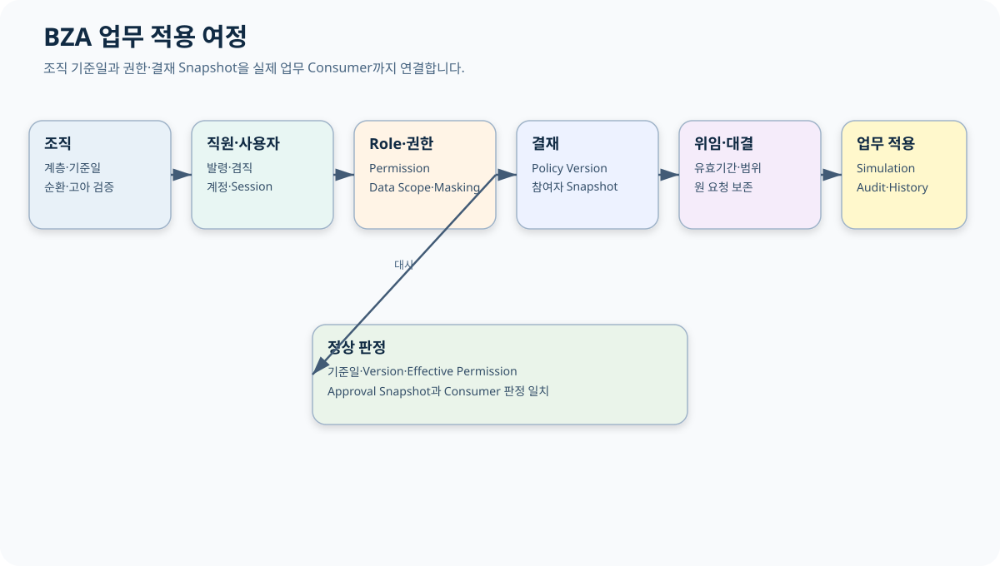

# CPF BZA 매뉴얼

> 기준 Repository: `https://github.com/freeangelsun/202412_01_CPF`
> 기준 Branch: `master`
> 기준 Commit: `ee977cf66c251081df78ea5e9675b81c3dfafa59` (`06_07`)
> 기준일: `2026-08-06 Asia/Seoul`

| 항목 | 내용 |
|---|---|
| 주 독자 | 조직·직원·사용자·권한·결재 담당자와 업무 연동 개발자, 업무관리 시스템을 처음 운영하는 담당자 |
| 이 문서로 완료할 일 | 조직 기준일에서 사용자·Role·Permission·Data Scope·결재·위임을 만들고 실제 업무 Consumer의 판정과 Audit를 확인한다. |
| 읽는 방식 | 처음 접하는 독자는 앞에서부터 실습 순서로 읽고, 숙련자는 장별 판단표와 참조 경로를 사용한다. |
| 설명 원칙 | 제품 기능은 사용할 수 있는 상태로 설명한다. 실제 Source·SQL·API·Config·Frontend·Script·Test의 이름과 경계를 유지한다. |




## 1. BZA의 역할

BZA는 고객 업무에 필요한 조직·직원·사용자·Role·Permission·Data Scope·결재·위임·대결·첨부·알림을 제공한다. 업무 주문·계약·결제 같은 최종 상태는 각 업무 Domain이 소유한다.

처음 도입할 때 다음 순서로 진행한다.

1. 조직 기준일과 Root 조직.
2. 직원과 발령.
3. 사용자와 직원 연결.
4. Role과 Permission.
5. Data Scope와 Masking.
6. 결재 Policy와 참여자 Snapshot.
7. 위임·대결.
8. 실제 업무 Consumer Simulation.
9. Audit·Backup·운영 인계.

## 2. 초기 설치

- Backend·Frontend Artifact와 Checksum 확인.
- DB Vendor Pack 적용.
- Menu·Permission Seed 적용.
- 초기 관리자 계정 생성.
- MFA·Password·Session 정책 적용.
- Root 조직·대표 직원·사용자 연결.
- 관리자 Role Simulation.
- Backup과 Restore·Login Smoke.
- 초기 Credential 교체와 Audit 확인.

## 3. Route 지도

| Route | 목적 | 주요 조치 |
|---|---|---|
| `/` | 조직·권한·결재 현황 | 이상 카드 이동 |
| `/organizations` | 조직 계층 | 저장·폐기 |
| `/employees` | 직원 Profile | 저장·상태 변경 |
| `/positions` | 직급 | Version 관리 |
| `/jobTitles` | 직책 | Version 관리 |
| `/assignments` | 발령·겸직·파견 | 적용·종료 |
| `/organizationResponsibilities` | 조직 책임 | 책임자 지정 |
| `/users` | 사용자 | 생성·잠금·연결 |
| `/roles` | Role | 생성·상태 변경 |
| `/userRoles` | 사용자 Role | 유효기간 부여 |
| `/menus` | Menu Registry | Menu Version |
| `/permissions` | Permission·Data Scope | 저장·상태 변경 |
| `/permissionTools` | Role 비교·Simulation | Effective 판정 |
| `/approvalInbox` | 결재 처리 | 승인·반려 |
| `/approvalSubmissions` | 상신·Lifecycle | 상신·회수 |
| `/approvalPolicies` | Versioned Policy | Draft·Approve·Retire |
| `/approvalSimulation` | 경로 Simulation | 참여자 계산 |
| `/approvalDelegations` | 위임·대결 | 기간·범위 등록 |
| `/sessions` | Session | 조회·폐기 |
| `/audits` | 업무 Audit | 조회·Export |
| `/notifications` | 업무 알림 | Rule·Delivery |
| `/attachments` | 첨부 | Upload·Scan·Download |
| `/savedSearches` | 저장 검색 | 저장·공유 |
| `/settings` | 업무 설정 | Version 저장 |
| `/downloads` | Download Policy | Token·행 제한 |
| `/downloadAudits` | Download Audit | 조회·대사 |

## 4. 조직 계층

### 4.1 입력

- 조직 Code와 이름.
- 상위 조직.
- 유효 시작·종료일.
- 조직 유형.
- 상태.
- Expected Version.
- Reason.

### 4.2 검증

- 자기 자신 또는 하위 조직을 상위로 지정하지 않는다.
- 같은 기준일에 조직 Code가 중복되지 않는다.
- 상위 조직의 유효기간 안에 하위 조직이 존재한다.
- 사용 중인 조직 폐기는 직원·Role·결재 영향 확인 뒤 수행한다.

### 4.3 정상 판정

조직 Path와 Level이 재계산되고 순환·고아가 없으며 기준일 조회 결과가 History와 일치한다.

## 5. 직원·발령

직원 Profile과 사용자 계정을 구분한다. 한 직원이 여러 조직에 겸직할 수 있으므로 대표 발령과 추가 발령을 기준일로 계산한다.

| 상황 | 판정 |
|---|---|
| 신규 입사 | 직원 생성→발령→사용자 연결 |
| 조직 이동 | 기존 발령 종료→새 발령 시작 |
| 겸직 | 추가 Assignment와 Scope 명시 |
| 휴직 | 재직 상태와 Login 정책 분리 |
| 퇴직 | 발령 종료·Role 만료·Session 폐기 |

## 6. 사용자와 Session

사용자 생성 시 직원 ID, Login ID, 상태, MFA, 유효기간을 연결한다. 직원 상태와 사용자 Login 상태는 같은 값이 아니므로 정책으로 매핑한다.

Session 화면에서는 발급 시각, 마지막 접근, IP·Device, 만료, 폐기 사유를 확인한다. 비밀번호 초기화나 고위험 Role 변경 뒤 기존 Session 폐기 정책을 적용한다.

## 7. Role·Permission·Data Scope

### 7.1 세 층

1. Menu: 화면에 진입할 수 있는가.
2. Action/API: Button과 Backend Operation을 실행할 수 있는가.
3. Data Scope: 어느 조직·고객·업무 Row를 볼 수 있는가.

Masking은 별도다. 조회 권한이 있어도 원문 Field 권한이 없으면 Masked 값만 본다.

### 7.2 Permission 설계 예

| Permission | Resource | Action | Scope |
|---|---|---|---|
| `PAY_METHOD_READ` | PAY Method | READ | 자기 조직 고객 |
| `PAY_METHOD_SUSPEND` | PAY Method | SUSPEND | 담당 기관 |
| `PAY_METHOD_RAW_ACCOUNT` | Account Field | UNMASK | 승인된 조사 건 |
| `PAY_METHOD_EXPORT` | PAY Method | EXPORT | 최대 5,000행·Reason 필수 |

### 7.3 Simulation

Role을 적용하기 전에 사용자·기준일·Resource·Action·Target을 넣어 Effective 결과를 확인한다. Allow뿐 아니라 Deny, Data Scope, Masking 근거를 함께 보여 준다.

## 8. 결재 Policy

Policy는 Draft·Approved·Retired Version으로 관리한다.

입력:

- 업무 Action.
- 금액·위험도·조직 조건.
- 단계와 승인자 Role.
- 요청자와 승인자 분리.
- 병렬·순차 방식.
- 만료와 Escalation.
- 대결·위임 허용 범위.

실행 시 참여자와 대상 Snapshot을 고정한다. 조직이나 Role이 바뀌어도 진행 중 문서의 과거 Snapshot을 수정하지 않는다.

## 9. 결재 Lifecycle

```text
DRAFT → SUBMITTED → IN_REVIEW → APPROVED | REJECTED | WITHDRAWN | EXPIRED
```

- 상신 전 Validation.
- 상신 시 Policy Version과 참여자 Snapshot.
- 승인·반려 시 Actor·Reason.
- 실행은 승인 문서와 Target Snapshot 일치 확인.
- 응답 유실은 Approval 완료와 업무 실행 결과를 별도로 대사.

## 10. 위임·대결

| 항목 | 입력 |
|---|---|
| 위임자·대결자 | 사용자 ID |
| 기간 | 시작·종료 시각 |
| 범위 | 조직·업무·Action |
| 제외 | 자기 승인·고위험 Action |
| Reason·Approval | 정책에 따라 필요 |

만료 뒤 Effective Permission에서 제거됐는지 확인한다. 원 요청자와 실제 결정자를 Audit에 모두 남긴다.

## 11. Attachment·Notification

Attachment는 Upload·Checksum·Scan·Quarantine·Download Permission을 사용한다. Notification은 Template Version·Channel·Delivery Attempt·Provider Receipt·DLQ를 관리한다.

결재 알림이 실패해도 결재 상태를 임의 변경하지 않는다. Delivery 상태와 결재 상태를 분리한다.

## 12. 업무 Domain 연동

업무 Service는 다음 입력으로 BZA를 호출한다.

```json
{
  "actorId": "USR-1004",
  "businessDate": "2026-08-06",
  "resource": "PAY_METHOD",
  "action": "SUSPEND",
  "targetOrganizationId": "ORG-SEOUL-01",
  "targetId": "PM-000123"
}
```

응답에는 Effective Permission, Data Scope, Masking Decision, Policy Version, 기준시각을 포함한다. 업무 Service는 최종 업무 상태를 자기 Domain 규칙과 함께 판단한다.

## 13. 종합 실습

1. `ORG-HQ`와 `ORG-PAY` 조직 생성.
2. 직원 A·B 생성, PAY 조직 발령.
3. 사용자 A·B 연결과 MFA 적용.
4. `PAY_OPERATOR`, `PAY_APPROVER` Role 생성.
5. 조회·정지·원문·Export Permission 설정.
6. 사용자 A에게 운영 Role, B에게 승인 Role 부여.
7. 정지 Action 결재 Policy 생성·승인.
8. A가 PAY 정지 요청 상신.
9. B가 승인.
10. 업무 Service가 승인 Snapshot을 확인해 실행.
11. Permission Simulation과 업무 API 결과 비교.
12. Audit에서 요청자·승인자·실행 Operation 연결.

## 14. 오류·복구

| 오류 | 복구 |
|---|---|
| 조직 순환 | 상위 관계를 이전 Version으로 복원 |
| 사용 중 조직 폐기 | Assignment·Role·Policy 참조를 정리 후 새 요청 |
| Role 과다 권한 | Simulation·영향 Matrix 후 Version 교정 |
| 자기 승인 | Policy 위반으로 차단, 다른 승인자 재배정 |
| 위임 만료 | Effective 결과 재계산, 진행 문서 Snapshot 확인 |
| 결재 응답 유실 | Approval 문서 ID로 결과 조회 |
| 업무 실행 응답 유실 | 업무 Operation과 Approval을 각각 대사 |
| Attachment Scan 실패 | Quarantine 유지·Download 차단 |

## 15. Backup·Upgrade·Rollback

- 조직·Assignment·Role·Permission·Policy·Approval·Audit를 같은 복구점으로 관리한다.
- Upgrade 전 기준일 Query와 Simulation Fixture를 저장한다.
- Rollback 뒤 진행 중 Approval Snapshot을 잃지 않는다.
- Session·Notification·Attachment Metadata와 Object를 대사한다.

## 16. 운영 인계

- 조직 Root와 기준일.
- 직원·사용자 연결 규칙.
- Role·Permission·Data Scope·Masking Matrix.
- 결재 Policy Version과 참여자 계산.
- 위임·대결 제한.
- Attachment·Notification Provider.
- Session·Password·MFA 정책.
- Backup·Restore·Upgrade·Rollback.
- 업무 Consumer와 Simulation Test.

## 17. BZA 자체 검수

1. 조직 기준일과 History가 일치하는가?
2. 순환·고아 조직이 없는가?
3. 직원과 사용자 상태를 구분했는가?
4. Menu·Action·Data Scope·Masking을 분리했는가?
5. Role 적용 전 Simulation했는가?
6. 요청자와 승인자가 분리됐는가?
7. Policy·참여자·Target Snapshot을 보존하는가?
8. 위임·대결의 기간·범위·감사가 있는가?
9. 업무 Service의 실제 판정과 BZA 결과가 일치하는가?
10. Restore 뒤 진행 문서와 Audit를 대사할 수 있는가?
