# CPF BZA 매뉴얼

> **기준 Repository** `freeangelsun/202412_01_CPF`
> **기준 Branch** `master`
> **기준 Commit** `23babb9140b90e501d6ac715e7b77f55b66198a5`
> **문서 목적** BZA 도입 판단, 설치·초기 관리자, 조직·직원·사용자, Role·Permission·Data Scope, 결재·위임, Attachment·Notification, Session·Audit·Export, Domain 연계·복구를 설명한다.
> **주요 독자** BZA 도입 책임자, 개발자, 업무 관리자, 권한·조직·결재 운영자
> **문서 사용 결과** BZA를 선택 설치하고 업무 관리 기능을 권한·승인·감사·복구 계약과 함께 운영한다.


## 이 문서에서 먼저 볼 그림

### BZA 전체 메뉴 지도

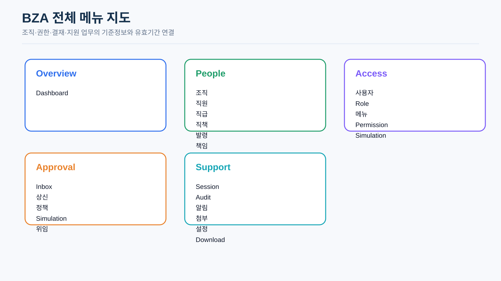

### 조직·권한·결재 영향 흐름

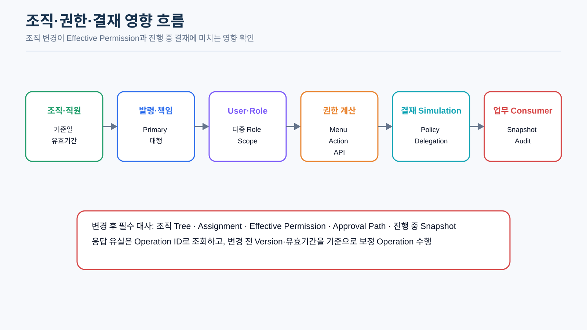

### Permission·Reason·Approval·Audit

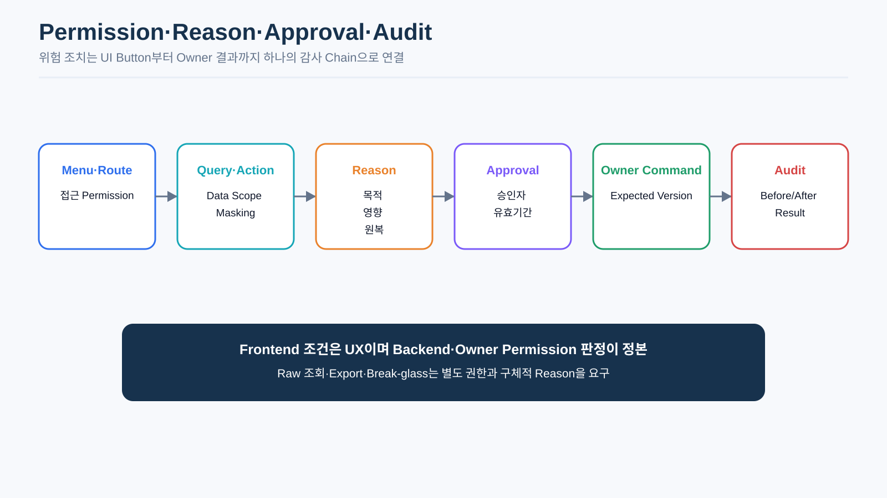


## 0. 제품 사용 계약

이 매뉴얼은 CPF의 기능을 제품 기능으로 설명하며, 대상 사용자가 다른 사람의 구두 설명이나 Source 역분석 없이 자신의 업무를 끝내도록 구성한다.

- 기능별 목적·대상 역할·Owner Module·실제 Consumer와 사용 위치를 먼저 제시한다.
- Source·SQL·API·Config·Frontend·Script·Test의 정확한 경로와 제품 사용 절차를 함께 제공한다.
- 입력값·기본값·권한·상태·정상 결과·오류·응답 유실·부분 적용·복구 절차를 기능 단위로 연결한다.
- Class·API·Property·Route·Permission·상태 이름은 제품 정본의 실제 식별자를 사용한다.
- 운영 종료는 Owner 상태·Version·Checksum·Audit·업무 합계와 화면 재조회 결과로 판단한다.
- 명령 실행 전 Local Working Tree를 확인하고 기존 변경을 보호한다.


## 1. 선택 기준

BZA 적용 후보:

- 조직·직원·사용자와 다중 소속
- Role·Permission·Data Scope
- 업무 결재·위임·대결
- Attachment·Notification·Saved Search
- 업무 감사·다운로드 통제

BZA를 사용하지 않는 시스템은 Dependency·DB·기동 조건으로 강제하지 않는다. 플랫폼 Runtime 제어는 ADM 소유다.

## 2. 기능 구성과 Source 지도

| 기능군 | Source | 사용 업무 |
|---|---|---|
| Frontend Route | `cpf-biz-admin/frontend/src/app/routes.ts` | 26개 업무 화면과 Menu Code를 제공한다. |
| 인증·Session | Security Starter·BZA Auth API | 로그인·Refresh Session·폐기·동시 Session 정책을 사용한다. |
| Bootstrap | `BzaBootstrapRunner`, V85·V91 | 승인 Token과 Secret File로 최초 관리자를 생성하고 Operation을 대사한다. |
| 조직·인사 | Organization·Employee·Position·JobTitle·Assignment·Responsibility | 조직 계층·직원·다중 소속·책임을 기준일로 관리한다. |
| 권한 | User·Role·UserRole·Menu·Permission | Menu·행위·API·Data Scope와 실효 권한을 관리한다. |
| 결재 | Policy·Submission·Inbox·Simulation·Delegation | Versioned 정책·Snapshot·상신·결정·위임·대결을 처리한다. |
| 지원 기능 | Attachment·Notification·Saved Search·Setting | 파일·알림·사용자 조건·업무 설정을 관리한다. |
| 감사·Download | Audit·Download Policy·Download Audit | Masking·Export·다운로드 사유와 이력을 관리한다. |
| OpenAPI·Frontend | Backend OpenAPI·Orval Client·Bundle Manifest | API·DTO·Error·Page Consumer를 같은 Source SHA로 연결한다. |
| DB Lifecycle | Oracle·PostgreSQL·MariaDB Migration·Rollback | 신규 설치·Upgrade·Backup·Restore를 수행한다. |

## 3. Route 지도

| 그룹 | Route ID | Path | Menu Code | 역할 |
|---|---|---|---|---|
| overview | `dashboard` | `/` | `DASHBOARD` | 업무 운영 현황 |
| people | `organizations` | `/organizations` | `ORGANIZATION` | 조직 계층 |
| people | `employees` | `/employees` | `EMPLOYEE` | 직원 Profile |
| people | `positions` | `/positions` | `EMPLOYEE` | 직급 |
| people | `jobTitles` | `/jobTitles` | `EMPLOYEE` | 직책 |
| people | `assignments` | `/assignments` | `EMPLOYEE` | 발령·겸직 |
| people | `organizationResponsibilities` | `/organizationResponsibilities` | `ORGANIZATION` | 조직 책임 |
| access | `users` | `/users` | `AUTHORIZATION` | 사용자 |
| access | `roles` | `/roles` | `AUTHORIZATION` | Role |
| access | `userRoles` | `/userRoles` | `AUTHORIZATION` | 사용자 Role |
| access | `menus` | `/menus` | `AUTHORIZATION` | 메뉴 |
| access | `permissions` | `/permissions` | `AUTHORIZATION` | 권한·Data Scope |
| access | `permissionTools` | `/permissionTools` | `AUTHORIZATION` | 권한 Simulation |
| approval | `approvalInbox` | `/approvalInbox` | `APPROVAL` | 결재 처리 |
| approval | `approvalSubmissions` | `/approvalSubmissions` | `APPROVAL` | 결재 상신 |
| approval | `approvalPolicies` | `/approvalPolicies` | `APPROVAL` | 결재 정책 |
| approval | `approvalSimulation` | `/approvalSimulation` | `APPROVAL` | 경로 Simulation |
| approval | `approvalDelegations` | `/approvalDelegations` | `APPROVAL` | 위임·대결 |
| support | `sessions` | `/sessions` | `AUTHORIZATION` | 세션 |
| support | `audits` | `/audits` | `AUDIT` | 업무 감사 |
| support | `notifications` | `/notifications` | `SETTING` | 알림 |
| support | `attachments` | `/attachments` | `ATTACHMENT` | 첨부 |
| support | `savedSearches` | `/savedSearches` | `SETTING` | 저장 검색 |
| support | `settings` | `/settings` | `SETTING` | 업무 설정 |
| support | `downloads` | `/downloads` | `SETTING` | 다운로드 정책 |
| support | `downloadAudits` | `/downloadAudits` | `AUDIT` | 다운로드 감사 |

Route 존재는 CRUD·권한·결재 상태 기계의 실행 확인을 뜻하지 않는다.

## 4. 설치 전 준비

- BZA 선택 결정과 Owner 승인
- Artifact SHA·Source SHA
- BZA DB Schema·Runtime/Migration 계정
- Session JDBC Schema
- Secret/Approval Token 발급 절차
- 조직·사용자 Identifier 정책
- Role·Permission·Data Scope Model
- 결재 정책과 감사 Retention
- Attachment Storage·검사·Retention

## 5. 최초 관리자 Bootstrap

필수 Property는 05 매뉴얼의 BZA Bootstrap 표를 따른다.

Source 동작:

1. Approval Token File이 없으면 Bootstrap을 수행하지 않는다.
2. legacy enable 또는 plaintext password Property가 있으면 중단한다.
3. Token·Password File의 Regular File·Symlink·Size를 검증한다.
4. Environment Fingerprint·Operation ID를 생성한다.
5. Approval Token을 Claim한다.
6. Password 정책을 검증하고 Operator·Role을 생성한다.
7. Approval을 Complete/Fail로 기록한다.
8. Secret char array를 지우고 File 덮어쓰기·삭제를 시도한다.

운영 확인:

- Token은 Environment·Scope·Expiry에 묶는다.
- Password File Permission과 OS Secret Store를 확인한다.
- Bootstrap 후 Token 재사용이 거부되는지 확인한다.
- 실패 시 부분 생성·Approval 상태를 대사한다.
- 생성된 관리자 ID·Role·Audit을 확인한다.

## 6. 조직·직원·발령

### 조직

- 조직 ID·상위 조직·유효기간·상태·Version
- 순환 계층 차단
- 조직장·대행·승인 Owner
- 폐쇄 시 사용자·결재·Data Scope 영향 Preview

### 직원·발령

- 직원 ID·사용자 연결·재직 상태
- 직급·직책·다중 소속·겸직·파견
- Effective Date·이력·Expected Version
- 퇴직·휴직 시 Session·Role·Approval 위임 처리

## 7. 사용자·Role·Permission·Data Scope

- User와 Employee를 동일 개념으로 강제하지 않는다.
- Role 부여는 유효기간·Requester·Approver·Reason·Audit을 가진다.
- Permission은 Menu·Route·Action·API·Data Scope·Raw·Export를 분리한다.
- 권한 Simulation은 실제 Backend 판정과 같은 Engine을 사용해야 한다.
- 권한 회수 후 기존 Session·Cache·Token이 남지 않는지 확인한다.

## 8. 결재·위임·대결

결재 정책:

- Version·Effective Period
- ALL·ANY·N_OF_M
- 조직·Role·사용자 Participant Snapshot
- 자기승인 금지·Requester/Approver 분리
- Expiry·Cancel·Reject·Withdraw
- Delegation·Acting 기간과 Scope
- Immutable Command Hash

상신은 Idempotency Key+Request Hash를 사용한다. 응답 유실 시 Submission 상태와 Participant Snapshot을 조회한다.

## 9. Attachment·Notification

Attachment:

- Size·Type·Checksum·Malware·Storage Reference
- Permission·Data Scope·Masking
- Upload partial·cancel·cleanup
- Download Reason·Audit·Retention·Deletion

Notification:

- Template Version·Variable Schema·Channel
- Retry·Duplicate·Failure·Opt-out
- 민감정보 최소화
- 업무 상태와 발송 상태 분리

## 10. Session·Masking·Audit·Export

Session:

- Cookie `CPFSESSION`, 기본 30분, SameSite Strict
- TLS 환경 Secure Cookie
- Fixation 보호·Rotation·Concurrent Session·Forced Logout
- JDBC Store Readiness와 Schema 확인

Audit:

- 조직·권한·결재·Raw·Export·Bootstrap 변경 전후
- Operator·Reason·Approval·Request Hash·Result
- Credential·PII Redaction

Export:

- Data Scope·Column Masking·Row Limit
- Reason·Approval·Watermark·Expiry
- Download Audit·Storage Cleanup

## 11. 업무 Domain 연계

BZA는 업무 상태를 직접 소유하지 않는다. Domain은 Public Query/Command를 제공하고 BZA는 조직·권한·결재 결과를 전달한다.

- User/Org Reference는 Version과 유효기간을 포함한다.
- Remote Timeout·Unknown·Reconcile을 제공한다.
- BZA 장애가 핵심 업무를 차단하는 정책인지 명시한다.
- Cache 사용 시 권한 회수 지연 상한을 기록한다.

## 12. Backup·Restore·Upgrade

Backup: BZA DB, Session DB, Attachment Metadata/Data, Config, Approval/Audit, Key Metadata.

Restore 후:

- 조직 계층·User·Role·Permission Count
- Pending Approval·Delegation 기간
- Session 강제 종료 여부
- Attachment Checksum
- Audit Sequence·Download 기록
- Domain Reference 대사

Upgrade는 DB Migration·Frontend/API Compatibility·Session Cookie·Policy Version을 확인한다.

## 13. 장애 Runbook

### Bootstrap 실패

Approval 상태, Token Scope·Expiry, File Permission·Symlink·Size, Password 정책, 부분 생성 여부 확인. Token을 재사용하지 않고 실패 원장과 DB를 대사한다.

### 권한 오작동

Backend Permission·Data Scope, Role 유효기간, Cache, Session, 조직 변경 시각을 확인. Frontend Menu만 수정하지 않는다.

### 결재 정지

Policy Version, Participant Snapshot, Delegation, Expiry, Lock, Unknown Submission을 확인. 승인자 임의 DB Update 금지.

### Session 장애

DB 연결·Schema·Index·Cookie·Clock·Load Balancer 확인. 제품 Profile에서 Memory Session으로 우회하지 않는다.

### Attachment 장애

Storage·Disk·Checksum·Temp·Malware 검사·Permission 확인. Metadata와 실제 Object를 대사한다.

## 14. EDU

1. 빈 BZA DB와 Session DB 준비.
2. Approval Token·Password Secret File 준비.
3. Bootstrap 실행과 재사용 거부 확인.
4. 조직·직원·사용자·Role·Permission 생성.
5. Data Scope로 조회 범위 확인.
6. ALL/ANY/N_OF_M 결재와 위임 생성.
7. Attachment·Notification·Export 실행.
8. 권한 회수·Session 만료·Response loss 주입.
9. Backup·Restore 후 대사.
10. Browser·Audit·Evidence 확인.

## 부록 A. BZA Route 전수 지도

Source: `cpf-biz-admin/frontend/src/app/routes.ts`.

| 그룹 | Route ID·Path | Menu Code | 화면 목적 |
|---|---|---|---|
| 개요 | `dashboard` `/` | `DASHBOARD` | 업무 운영 현황 |
| 조직 | `organizations` `/organizations` | `ORGANIZATION` | 조직 계층 |
| 조직 | `employees` `/employees` | `EMPLOYEE` | 직원 Profile |
| 조직 | `positions` `/positions` | `EMPLOYEE` | 직급 기준정보 |
| 조직 | `jobTitles` `/jobTitles` | `EMPLOYEE` | 직책 기준정보 |
| 조직 | `assignments` `/assignments` | `EMPLOYEE` | 다중 소속·겸직·파견·대행 |
| 조직 | `organizationResponsibilities` `/organizationResponsibilities` | `ORGANIZATION` | 조직장·대행·승인 Owner |
| 권한 | `users` `/users` | `AUTHORIZATION` | 인증 사용자 |
| 권한 | `roles` `/roles` | `AUTHORIZATION` | 업무 Role |
| 권한 | `userRoles` `/userRoles` | `AUTHORIZATION` | Role 유효기간 |
| 권한 | `menus` `/menus` | `AUTHORIZATION` | Menu Registry |
| 권한 | `permissions` `/permissions` | `AUTHORIZATION` | 화면·행위·API·Data Scope |
| 권한 | `permissionTools` `/permissionTools` | `AUTHORIZATION` | Role 비교·Simulation |
| 결재 | `approvalInbox` `/approvalInbox` | `APPROVAL` | 결재 Inbox |
| 결재 | `approvalSubmissions` `/approvalSubmissions` | `APPROVAL` | 멱등 상신 |
| 결재 | `approvalPolicies` `/approvalPolicies` | `APPROVAL` | Versioned ALL·ANY·N_OF_M 정책 |
| 결재 | `approvalSimulation` `/approvalSimulation` | `APPROVAL` | 조직·Role·위임 경로 해석 |
| 결재 | `approvalDelegations` `/approvalDelegations` | `APPROVAL` | 위임·대결 유효기간 |
| 지원 | `sessions` `/sessions` | `AUTHORIZATION` | Session 관리 |
| 지원 | `audits` `/audits` | `AUDIT` | 업무 감사 |
| 지원 | `notifications` `/notifications` | `SETTING` | 업무 알림 |
| 지원 | `attachments` `/attachments` | `ATTACHMENT` | 첨부 업로드·검증 |
| 지원 | `savedSearches` `/savedSearches` | `SETTING` | 사용자 검색 조건 |
| 지원 | `settings` `/settings` | `SETTING` | BZA 업무 설정 |
| 지원 | `downloads` `/downloads` | `SETTING` | Download 정책 |
| 지원 | `downloadAudits` `/downloadAudits` | `AUDIT` | Download 감사 |

Route 존재는 Backend API·Permission·DB 상태·Browser 동작 검증을 뜻하지 않는다. 각 화면은 Menu Code와 Backend Authorization을 함께 확인한다.

## 부록 B. 최초 관리자 Bootstrap Property와 절차

### B.1 Property

| Key | 설명 | 기본·제약 |
|---|---|---|
| `cpf.bza.bootstrap.approval-token-file` | 사전 승인 1회 Token 파일 | 설정 시 Bootstrap 시작 |
| `cpf.bza.bootstrap.password-file` | 초기 Password 파일 | 필수, Symlink 금지, 4KiB 이하 |
| `cpf.bza.bootstrap.login-id` | 초기 Login ID | 필수 |
| `cpf.bza.bootstrap.operator-name` | 운영자 이름 | 필수 |
| `cpf.bza.bootstrap.role-code` | 초기 Role | 기본 `BZA_MANAGER` |
| `cpf.bza.bootstrap.approval-scope` | 승인 Scope | 필수 |
| `cpf.bza.bootstrap.operation-id` | 멱등 Operation ID | 선택, 형식 제한 |
| `cpf.environment.code` | 환경 코드 | Fingerprint 구성에 필수 |

Legacy `cpf.bza.bootstrap.enabled` 또는 평문 `cpf.bza.bootstrap.password`가 있으면 실행을 거부한다.

### B.2 사전 준비

1. Approval Repository에 Token Hash·Environment Fingerprint·Scope·만료·상태를 등록한다.
2. Token과 Password를 서로 다른 제한 Directory의 일반 파일로 생성한다.
3. Service Account만 읽도록 Permission을 제한한다.
4. 초기 Password는 14자 이상이고 대문자·소문자·숫자·특수문자 중 3종 이상을 포함하며 Login ID를 포함하지 않게 한다.
5. 기존 관리자·Role·조직 Seed와 충돌 여부를 확인한다.

### B.3 실행 결과

- Approval Claim 실패: 상태·만료·Scope·중복 Operation을 확인한다.
- Operator 생성 성공: Approval을 완료 상태로 바꾸고 Admin User ID를 연결한다.
- 생성 실패: Approval 실패 사유를 기록한다.
- finally 단계에서 Token·Password 배열을 지우고 파일 덮어쓰기·삭제를 시도한다.

파일 덮어쓰기·삭제만으로 저장장치 원문 제거를 단정하지 않는다. 운영 환경에서는 tmpfs·Secret Volume·OS Secret Store와 Backup 제외 정책을 적용한다.

## 부록 C. 조직·직원·발령 운영 순서

1. 조직 Code·상위 조직·유효기간·상태를 등록한다.
2. 조직 책임자와 대행자를 유효기간으로 연결한다.
3. 직원 Profile을 등록하고 개인정보 Masking·원문 권한을 확인한다.
4. 발령·겸직·파견·대행은 시작·종료일과 Primary 여부를 명시한다.
5. 변경 후 User·Role·Approval Path·Data Scope Simulation을 실행한다.
6. 종료일 경계와 겹치는 Assignment를 검증한다.
7. Audit Before/After와 영향을 받는 결재 진행 건을 확인한다.

## 부록 D. Role·Permission·Data Scope

- User와 Employee를 같은 식별자로 가정하지 않는다.
- Role은 유효기간과 상태를 가진다.
- Menu·Button·API Permission과 Data Scope를 분리한다.
- 권한 축소는 기존 Session·Cache·결재 위임에 반영되는지 확인한다.
- Simulation 결과와 실제 Backend 판정을 같은 사용자·시각·조직 Version으로 비교한다.

권한 변경 전후 Test:

| Test | 확인 |
|---|---|
| Menu | Route 표시·Direct URL |
| Button | 조회 가능하지만 변경 불가한 상태 |
| API | 직접 호출 403 |
| Data Scope | 다른 조직·자기 조직·위임 범위 |
| Raw | Masking 조회와 원문 조회 분리 |
| Session | 기존 Session 권한 회수 |

## 부록 E. 결재·위임·대결

### E.1 정책

- Policy Version과 유효기간을 고정한다.
- `ALL`, `ANY`, `N_OF_M` 참여자 해석을 기록한다.
- Requester와 Approver 분리, 자기승인 금지를 확인한다.
- 상신 시 Participant Snapshot과 Command Hash를 저장한다.

### E.2 위임

- 위임자·수임자·업무 Scope·시작·종료·사유를 입력한다.
- 순환 위임·중첩 위임·만료 경계를 검증한다.
- 기존 진행 건 적용 여부를 정책으로 구분한다.
- 취소 후 Inbox·권한·Audit를 재확인한다.

### E.3 응답 유실

상신·승인·반려 요청의 응답이 없으면 같은 Button을 반복하지 않는다. Operation ID·Request Hash·Approval Instance 상태를 조회하고, 실제 반영 여부를 확정한 뒤 후속 조치를 수행한다.

## 부록 F. Attachment·Download·Audit

- Attachment Upload는 Size·Type·Checksum·Virus/Malware 정책·Owner Scope를 확인한다.
- Download는 Permission·Data Scope·Reason·Watermark·건수·파일 Hash를 기록한다.
- 대량 Export는 승인·만료·재다운로드 정책을 확인한다.
- Download Audit에는 Operator·대상·Query 조건·Column·Masking·시각·결과를 남긴다.
- Partial File·취소·Timeout·Disk Full 후 Temp Cleanup과 Metadata 대사를 수행한다.

## 부록 G. BZA 운영 검증

- Bootstrap Token 재사용 거부
- 같은 Operation ID 재시도
- 조직 유효기간 겹침
- 겸직·파견·대행과 Data Scope
- Role 만료·권한 회수·기존 Session
- ALL·ANY·N_OF_M 정책
- 위임 순환·만료·취소
- Attachment Oversize·취소·악성 파일
- Download 승인·Masking·Audit
- Backup·Restore 후 User·Role·Approval·Attachment 대사

## 부록 H. 업무 Domain 연계와 확장 경계

BZA 확장은 조직·사용자·Role·Permission·결재 같은 업무 관리 Contract를 통해 수행한다. 업무 Domain Table을 BZA가 직접 갱신하지 않고, Domain Public API·Event·Approved Command를 사용한다. 고객 확장 Field는 Version·Validation·Masking·Data Scope·Migration·Export 영향을 함께 정의하고, BZA 미사용 시스템에 Dependency나 기동 조건을 전파하지 않는다.

---

## 기준 Source와 역할별 활용 범위

- Repository: `https://github.com/freeangelsun/202412_01_CPF`
- Branch: `master`
- 기준 Commit: `23babb9140b90e501d6ac715e7b77f55b66198a5`
- 문서 표준: `cpf-docs/specification/CPF_DOCUMENTATION_STANDARD.md`
- 제품 목표 정본: `cpf-docs/governance/CPF_FINAL_TARGET_REQUIREMENTS.md`
- 사실 우선순위: 실제 Source·SQL·API·Config·Frontend·Script·Test → Architecture·Specification → 이 매뉴얼

이 매뉴얼의 대상 역할은 다음 흐름을 다른 사람의 구두 설명이나 Source 역분석 없이 수행할 수 있어야 한다.

```text
업무 목적 파악
→ 선행 조건과 권한 준비
→ 실제 기능 위치 탐색
→ 등록·설정·개발·실행
→ 상태와 결과 확인
→ 오류·동시성·부분 실패 판단
→ Retry·Restart·Reprocess·Reconcile·Compensation·Rollback
→ Log·Metric·Trace·Audit·Evidence 확인
→ 정상화와 완료 판정
```

기능 설명은 Source의 실제 계약과 사용 절차를 기준으로 하며, 적용 전 확인 조건·오류·복구 경로를 함께 제공한다.

---

## 제2부 실무편: BZA 도입·설치·전체 기능 운영·확장

## 16. BZA 사용 여부 결정

BZA는 조직·직원·사용자·Role·Permission·결재·첨부·업무 감사가 필요한 시스템에서 선택한다. 단순 ADM 운영자 관리만 필요하면 BZA를 강제 도입하지 않는다.

선택 질문:

- 조직 계층·직원·다중 발령이 업무 권한에 영향을 주는가.
- 사용자별 다중 Role과 유효기간이 필요한가.
- Menu·Button·API·Data Scope를 업무 관리자 제품에서 관리해야 하는가.
- 결재 정책, 위임·대결, Snapshot 참여자가 필요한가.
- Attachment, Notification, Saved Search, Download Audit가 필요한가.

선택하지 않은 경우 `cpf-biz-admin` Runtime·DB Migration·Frontend를 배포하지 않는다.

## 17. 설치와 최초 관리자

### 17.1 선행 조건

- BZA DB Schema와 Vendor Migration V91 포함.
- Security Starter·Password Service·Session Store.
- BZA Artifact와 Frontend Bundle의 exact SHA 일치.
- Bootstrap Approval Row와 1회용 Token.
- Secret File ACL과 BZA Instance ID.

### 17.2 Bootstrap Property

| Property | 제약 |
|---|---|
| `cpf.bza.bootstrap.approval-token-file` | 설정 시 Bootstrap 시작; Regular/No Symlink/4 KiB 이하 |
| `password-file` | 필수 Secret File |
| `login-id`, `operator-name` | 필수 |
| `role-code` | 기본 `BZA_MANAGER` |
| `approval-scope`, `cpf.environment.code` | Environment Fingerprint 구성 |
| `operation-id` | 미입력 시 Fingerprint+Login; 100자 이하 |
| `claim-lease-seconds` | 기본 300, 30~1,800 |
| `cpf.instance.id`/`CPF_INSTANCE_ID` | Claim Owner; 100자 이하 식별자 |

Legacy Enable과 Plaintext Password Property는 입력 단계에서 거부된다.

### 17.3 실행·대사

```text
Token/Password File ACL 검증
→ Secret Read·Hash
→ Environment Fingerprint·Operation ID
→ 기존 Operation 조회
→ Approval Claim + Lease
→ 사용자·Role Bootstrap
→ Approval Complete
→ Secret Memory Clear·File 삭제
→ Cleanup Ledger
```

응답/Terminal Update가 불명확하면 Operation ID로 기존 Admin을 조회하고 Approval을 Reconcile한다. 같은 Operation에 다른 Login ID가 연결되면 중단한다. Secret 삭제 실패는 업무 성공과 별개로 숨기지 않고 Bootstrap Cleanup 실패로 처리한다.

## 18. BZA Route·기능 전수 Inventory

| Route | URL | Menu Code | 목적 | 입력·검색·Column | 조치 | Permission | 상태 |
|---|---|---|---|---|---|---|---|
| dashboard | / | DASHBOARD | 업무 운영 현황 | 통계·최근 상태 | 새로고침 | 조회 | 기능 제공 |
| organizations | /organizations | ORGANIZATION | 조직 계층 | 조직명·코드 검색, 중지 포함; Tree/상세/고아·순환 경고 | 조회·상세 선택 | Read; 변경 안내는 Write | 기능 제공 |
| employees | /employees | EMPLOYEE | 직원 Profile | 직원번호, 대표조직, 이름, 직급, 직책, 재직상태, Email/Mobile/Office, Clear Flag, Use | 등록·수정·PII Raw | Write, PII_RAW | 기능 제공 |
| positions | /positions | EMPLOYEE | 직급 기준 | Code, Name, Rank Order, Use | 등록·수정 | Write | 기능 제공 |
| jobTitles | /jobTitles | EMPLOYEE | 직책 기준 | Code, Name, Manager YN, Use | 등록·수정 | Write | 기능 제공 |
| assignments | /assignments | EMPLOYEE | 발령·겸직·파견 | Assignment ID, Employee, Organization, Position, Job Title, Type, Primary, From/To | 등록·수정 | Write | 기능 제공 |
| organizationResponsibilities | /organizationResponsibilities | ORGANIZATION | 조직장·대행·승인 Owner | Responsibility ID, Organization, Type, Employee, From/To | 등록·수정 | Write | 기능 제공 |
| users | /users | AUTHORIZATION | BZA 인증 사용자 | Login ID, Name, Password, Account Status, Use, Lock, Force Change, Expected Version, Reason | 등록·수정·Paging | Write | 기능 제공 |
| roles | /roles | AUTHORIZATION | 업무 Role | Role Code/Name, Write Allowed, Data Scope, Use | 등록·수정 | Write | 기능 제공 |
| userRoles | /userRoles | AUTHORIZATION | 사용자 Role 유효기간 | Operation ID, Login ID, Role, Valid From/To, Primary | 등록·수정·Paging | Write | 기능 제공 |
| menus | /menus | AUTHORIZATION | Menu Registry | Code, Parent, Name, Route, Sort, Use, Reason; Tree 검색 | 등록·수정 | Write | 기능 제공 |
| permissions | /permissions | AUTHORIZATION | Menu·Button·API·Data Scope Permission | Permission ID, Role, Menu, Button, Type, HTTP, API Pattern, Domain/Env, Data Scope, Allow/Use | Assignment 등록/수정·실효 권한 Simulation | WRITE, SIMULATE | 기능 제공 |
| permissionTools | /permissionTools | AUTHORIZATION | Role 비교·권한 분석 | 비교 Role/User·Simulation 입력 | 조회·비교 | SIMULATE | 기능 제공 |
| approvalInbox | /approvalInbox | APPROVAL | 결재 처리 | 처리대기/완료/기타 Lane; Decision Reason | APPROVE·AGREE·REJECT | 결재 참여자 | 기능 제공 |
| approvalSubmissions | /approvalSubmissions | APPROVAL | 상신·철회·취소·재상신 | Policy/Version/Domain/Type/Requester/Title/Mode/Due/Payload/Attachment/Key/Reason | 상신·철회·취소·재상신 | 요청자/상신 권한 | 기능 제공 |
| approvalPolicies | /approvalPolicies | APPROVAL | Versioned 결재 정책 | Policy/Version/Name/Domain/Type/From/To/Enabled/Self Approval/Description/Steps JSON/Reason | 저장·조회 | 정책 Write | 기능 제공 |
| approvalSimulation | /approvalSimulation | APPROVAL | 결재 경로 사전 해석 | 조직·Role·위임·정책 Context | Simulation | 조회/Simulation | 기능 제공 |
| approvalDelegations | /approvalDelegations | APPROVAL | 결재 위임·대결 | 위임자/수임자/범위/From/To/Reason | 등록·수정·중지 | Write | 기능 제공 |
| sessions | /sessions | AUTHORIZATION | 본인 Refresh Session | Session 목록·Device/Expiry | 조회·폐기 | 본인/관리 권한 | 기능 제공 |
| audits | /audits | AUDIT | Immutable 업무 감사 | Actor/Action/Target/기간/Operation | 조회·상세 | Audit Read | 기능 제공 |
| notifications | /notifications | SETTING | 업무 알림 | 알림 상태·채널·사용자 Filter | 조회·읽음/설정 | 본인/Setting | 기능 제공 |
| attachments | /attachments | ATTACHMENT | 첨부 업로드·검사·격리 | Group ID, File, Reason; Scan/Data Classification/Quarantine/Retention | Upload·재검사·CLEAN·QUARANTINED | Write | 기능 제공 |
| savedSearches | /savedSearches | SETTING | 저장 검색 | Menu/Name/Condition/Use | 등록·수정·삭제 | 본인/Setting | 기능 제공 |
| settings | /settings | SETTING | BZA 업무 설정 | Key/Value/Type/Scope/Version/Reason | 조회·저장 | Write | 기능 제공 |
| downloads | /downloads | SETTING | Download 정책 | 유형/건수/Data Scope/Masking/Approval/Reason | 조회·정책 변경 | Write | 기능 제공 |
| downloadAudits | /downloadAudits | AUDIT | Download 감사 | 사용자/유형/대상/기간/Reason | 조회·상세 | Audit Read | 기능 제공 |

모든 CRUD 공통 규칙:

- 기본 Paging Size는 20이다.
- 등록/수정 Dialog에는 감사 사유가 필수다.
- 기존 Row의 `versionNo`가 있으면 `expectedVersion`으로 전송한다.
- Operation ID Field가 있고 비어 있으면 UUID를 만든다.
- PII Field는 수정 시 빈 값이면 기존 값을 유지하고, 삭제는 Clear Flag로 명시한다.
- Raw 조회는 별도 `PII_RAW` Permission과 Reason을 사용한다.

## 19. 조직·직원·직급·직책·발령

### 조직

Tree는 Parent Code로 구성하며 고아 조직과 순환을 경고한다. 조직 변경은 Parent 순환, 하위 조직, 유효 사용자·결재 Owner 영향을 Preview한 뒤 수행한다. 조직 삭제 대신 Use N과 유효기간 정책을 사용한다.

### 직원

- 직원번호·대표 조직·이름·재직 상태는 필수다.
- 재직 상태: `EMPLOYED`, `ON_LEAVE`, `SECONDMENT`, `DISPATCHED`, `RETIRED`, `TERMINATED`.
- Email/Mobile/Office는 Masked List와 Raw 조회를 분리한다.
- 빈 수정값은 기존 값을 유지하며 명시 Clear Flag로 삭제한다.

### 직급·직책

직급 Rank Order와 직책 Manager YN이 결재/권한 해석에 영향을 주는지 Consumer를 확인한다. Code를 변경해 과거 발령 참조를 끊지 않는다.

### 발령·책임

Assignment는 Employee, Organization, Type, Primary, 유효기간을 관리한다. 조직 책임은 조직장·대행·승인 Owner를 유효기간으로 관리한다. 동일 시간대 Primary 중복, 위임/대결과 책임 충돌, 퇴직자 유효 책임을 검사한다.

## 20. 사용자·Role·Permission·Data Scope

### 사용자

신규 사용자는 Role 없이 `PENDING_ACTIVATION`으로 생성한다. User Role에서 Role을 부여한 뒤 `ACTIVE`로 바꾼다. Password는 Log/Audit/Payload Snapshot에 저장하지 않는다.

Account Status와 Use/Lock을 구분한다.

- `PENDING_ACTIVATION`: Role/초기 준비 전.
- `ACTIVE`: 로그인 가능.
- `LOCKED`: 인증 실패 등 잠금.
- `SUSPENDED`: 운영 중지.
- `DISABLED`: 사용 종료.

### Role

Role Code/Name, Write Allowed, Data Scope, Use를 관리한다. `writeAllowedYn=Y`만으로 API 권한이 생긴다고 가정하지 않는다.

### User Role

Operation ID, Login ID, Role Code, Valid From/To, Primary YN을 관리한다. 유효기간 중첩과 대표 Role 중복을 검사한다. 응답 유실 시 Operation ID로 기존 이력을 확인한다.

### Menu·Permission

Menu Tree의 Code·Parent·Route·Sort·Use를 Frontend Route Registry와 대조한다. Permission Assignment는 Role, Menu, Button, Type, HTTP Method, API Pattern, Domain/Environment, Data Scope, Allow/Use를 관리한다.

실효 권한 Simulation은 Login ID 기준으로 Menu별 Allow/Deny, API Pattern, Data Scope와 판정 근거를 표시한다. UI 노출만 보지 말고 실제 API 403 Negative Test를 수행한다.

## 21. 결재 정책·상신·Inbox·위임

### 정책

Policy Code+Version을 불변 식별자로 사용한다. 업무 Domain, Approval Type, 유효기간, Enabled, Self Approval, Steps를 관리한다. Step JSON에는 Step No/Type, Target Type/Code, Decision Rule(`ALL`, `ANY`, `N_OF_M` 등 실제 계약), Required, Sort를 명시한다.

### 상신

- 선택 Policy/Version 또는 해석 가능한 Context.
- Business Domain·Approval Type.
- Requester Employee No·Title.
- Sequential/Parallel.
- Due At, Payload JSON, Attachment Group.
- Request Idempotency Key, Reason.

상신 시 참여자와 정책을 Snapshot으로 고정한다. 진행 중 조직/Role/위임 변경이 기존 문서 참여자를 임의로 바꾸지 않는다.

### Inbox

처리 대기 건에서 `APPROVE`, `AGREE`, `REJECT`를 선택하고 구체적 Reason을 입력한다. 같은 문서를 두 Browser에서 처리하면 Version/현재 Step을 재조회한다.

### Lifecycle

진행 중 문서는 Requester 정책에 따라 WITHDRAW/CANCEL한다. REJECTED/WITHDRAWN/CANCELED/EXPIRED는 새 Idempotency Key와 Snapshot으로 재상신한다. 과거 문서를 상태만 되돌려 재사용하지 않는다.

### 위임·대결

Delegator, Delegate, Scope, Effective From/To, Reason을 관리한다. 자기 위임, 순환, 기간 중첩, 권한 확대, 종료된 직원, 결재 Snapshot 적용 여부를 검증한다.

## 22. Attachment

```text
Upload + Group ID + Reason
→ Temporary/Stored
→ Scan Pending
→ CLEAN 또는 QUARANTINED
→ 업무 연결
→ Retention/Expire
```

화면은 Original Filename, Scan Status, Data Classification, Quarantine, Retention을 표시한다. 재검사/CLEAN/격리 조치마다 Reason을 남긴다. CLEAN 전 다운로드·업무 연결을 허용하지 않는다. File Size, MIME, Extension, Checksum, Virus Scanner 오류와 응답 유실을 구분한다.

## 23. Session·Notification·Saved Search·Setting

### Session

Refresh Session별 Device/발급/만료/폐기 상태를 확인한다. Password Reset, User Disable, Security Incident 시 관련 Session을 폐기한다. BFF Credential Vault와 Session DB Migration을 함께 확인한다.

### Notification

업무 알림은 Delivery/읽음 상태와 수신자 Data Scope를 적용한다. Provider 발송과 UI Notification을 같은 성공 상태로 합치지 않는다.

### Saved Search

Menu/사용자/검색 조건 JSON/Use를 관리한다. 저장된 조건을 API Parameter Allowlist에 다시 검증하고 다른 사용자의 Data Scope를 포함하지 않는다.

### Setting

Key·Value·Type·Scope·Version·Reason을 관리한다. Secret 원문은 Setting에 저장하지 않는다. 변경 뒤 Consumer Cache/재기동과 Rollback 값을 확인한다.

## 24. Audit·Download

Audit는 Actor, Action, Target, Operation, Before/After, Reason, Approval, Result를 불변 이력으로 조회한다. 업무 Table 직접 UPDATE로 Audit와 상태를 분리하지 않는다.

Download 정책은 유형, 건수 상한, Masking, Data Scope, Approval/Reason을 관리한다. Download Audit에서 사용자, 유형, 대상, 건수, Filter, Reason, 결과를 확인한다. CSV/Excel Formula Injection과 PII 원문을 방지한다.

## 25. 업무 Domain 연계

Domain은 BZA DB를 직접 Join하지 않고 BZA Public Query/Authorization/Approval Contract를 사용한다.

- 사용자/Role: Login ID와 실효 Permission/Data Scope.
- 조직/직원: Employee No, Organization Code, Effective Time.
- 결재: Approval ID/Status/Snapshot Hash.
- Attachment: Attachment Group/ID와 Security Status.
- Audit: Domain Operation ID와 BZA Actor Context.

Same-JVM·Remote Adapter는 같은 결과·오류·Timeout·Masking을 제공해야 한다.

## 26. Backup·Restore·Upgrade·Rollback

- BZA Schema와 Session/Credential Vault, Bootstrap Approval/Cleanup, Organization/User/Permission/Approval/Audit/Attachment Metadata를 Backup한다.
- File Binary Store는 DB Metadata와 Checksum을 함께 복구한다.
- Restore 뒤 Login, Permission Simulation, 결재 Snapshot, Attachment Download, Audit Hash를 검증한다.
- V91 Bootstrap Claim Recovery Upgrade를 3 Vendor에서 실행하고 기존 Approval Row Backfill/Index를 확인한다.
- Rollback 시 새 Credential/Session/Bootstrap Column과 Application Version 호환을 확인한다.

## 27. BZA 장애 Runbook

### Login 불가

User Status/Use/Lock/Password Change, Role 유효기간, Session Store, BFF Credential Vault, FilterChain 401/403를 확인한다.

### 권한 오류

User Role 유효기간, Menu/Button/API Permission, Data Scope, Cache, Simulation 결과, Backend/Owner 403를 비교한다.

### 결재 정지

Policy Version, Snapshot Participant, Current Step, Delegation, Due/Expired, Idempotency Key, Audit를 확인한다. Row 직접 상태 변경 금지.

### Bootstrap 불명

Operation ID로 Admin 생성 여부를 조회하고 Approval Claim/Lease/Cleanup 상태를 Reconcile한다. 새 Token으로 중복 Bootstrap하지 않는다.

### Attachment 정지

Scanner/Storage/Checksum/Quarantine/Retention을 확인하고 CLEAN을 추정으로 설정하지 않는다.

## 28. BZA EDU

- EDU-BZA-01 Bootstrap→Role→ACTIVE→Login.
- EDU-BZA-02 조직·직원·발령·책임과 기간 충돌.
- EDU-BZA-03 Role/Menu/Button/API/Data Scope와 Allow/Deny Simulation.
- EDU-BZA-04 결재 Policy→상신→승인/반려→위임→재상신.
- EDU-BZA-05 Attachment Upload→Quarantine→Recheck→CLEAN→Download Audit.
- EDU-BZA-06 Session 폐기·Password 변경·Audit 확인.

## 29. BZA 완료 Checklist

- [ ] 설치/Bootstrap/Secret Cleanup
- [ ] 28개 Route 접근·Field·Button·Permission
- [ ] 조직·직원·발령·책임 유효기간
- [ ] 사용자 Status·Role·Permission·Data Scope
- [ ] 결재 Policy·Snapshot·Inbox·Lifecycle·Delegation
- [ ] Attachment Scan·Quarantine·Retention
- [ ] Session·Credential Vault·Notification·Saved Search
- [ ] Masking·PII Raw·Audit·Download
- [ ] Domain 연계 Contract
- [ ] Backup/Restore/Upgrade/Rollback
- [ ] Browser·3DB·Concurrency·Fault Evidence

---
## 부록 I. BZA Source·Route 진입점

| 기능 | 기준 Source |
|---|---|
| 전체 Route | `cpf-biz-admin/frontend/src/app/routes.ts` |
| Router/404 | `cpf-biz-admin/frontend/src/app/router.ts` |
| 공통 CRUD | `cpf-biz-admin/frontend/src/components/CrudTable.vue` |
| 조직 | `cpf-biz-admin/frontend/src/features/organizations/OrganizationsPage.vue` |
| 직원 | `cpf-biz-admin/frontend/src/features/employees/EmployeesPage.vue` |
| 직급 | `cpf-biz-admin/frontend/src/features/positions/PositionsPage.vue` |
| 직책 | `cpf-biz-admin/frontend/src/features/job-titles/JobTitlesPage.vue` |
| 발령 | `cpf-biz-admin/frontend/src/features/assignments/AssignmentsPage.vue` |
| 조직 책임 | `cpf-biz-admin/frontend/src/features/organization-responsibilities/OrganizationResponsibilitiesPage.vue` |
| 사용자 | `cpf-biz-admin/frontend/src/features/users/UsersPage.vue` |
| Role | `cpf-biz-admin/frontend/src/features/roles/RolesPage.vue` |
| User Role | `cpf-biz-admin/frontend/src/features/user-roles/UserRolesPage.vue` |
| Menu | `cpf-biz-admin/frontend/src/features/authorization/MenusPage.vue` |
| Permission | `cpf-biz-admin/frontend/src/features/authorization/PermissionsPage.vue` |
| 결재 정책 | `cpf-biz-admin/frontend/src/features/approval-policies/ApprovalPoliciesPage.vue` |
| 결재 상신 | `cpf-biz-admin/frontend/src/features/approval-submissions/ApprovalSubmissionsPage.vue` |
| 결재 Inbox | `cpf-biz-admin/frontend/src/features/approval-inbox/ApprovalInboxPage.vue` |
| Attachment | `cpf-biz-admin/frontend/src/features/attachments/AttachmentsPage.vue` |
| Bootstrap | `cpf-biz-admin/src/main/java/com/cpf/bizadmin/auth/service/BzaBootstrapRunner.java` |
| Bootstrap Approval | `cpf-biz-admin/src/main/java/com/cpf/bizadmin/auth/service/BzaBootstrapApprovalRepository.java` |
| DB Migration | `cpf-tools/db/vendor/{mariadb,postgresql,oracle}/migration/**/V85__bza_bootstrap_approval.sql`, `V91__bza_bootstrap_claim_recovery.sql` |

---

## 제3부. BZA 전체 화면별 업무 절차

이 부는 `cpf-biz-admin/frontend/src/app/routes.ts`에 등록된 전체 Route를 조직·권한·결재·첨부·지원 업무별로 설명한다. 모든 변경은 기준일·유효기간·Expected Version·Data Scope·Audit를 함께 확인한다.


### dashboard — 업무 운영 현황

| 항목 | 값 |
|---|---|
| Route | `/` |
| Menu Code | `DASHBOARD` |
| Frontend | `cpf-biz-admin/frontend/src/features/dashboard/DashboardPage.vue` |
| Permission | 조회 |

> 공통 유효기간·Data Scope·Masking·Audit·복구 규칙은 7~13절과 46~54절을 적용한다. 아래에는 이 화면 고유 업무만 기록한다.

#### 사용 목적과 업무 영향

이 화면은 **업무 운영 현황** 기능을 제공한다. 조직 기준일, 사용자·Role 유효기간, Data Scope, 결재 Snapshot, 업무 Domain Consumer 중 영향을 받는 항목을 변경 전후에 확인한다.

#### 입력·검색·표시 값

- 통계·최근 상태


#### Button·조치

- 새로고침

1. 업무 기준일·Environment·Data Scope를 확인한다.
2. `새로고침`으로 통계와 최근 상태를 조회한다.
3. 이상 수치는 조직·권한·결재·첨부·감사 상세 화면의 원본 ID로 추적한다.
4. 집계 시각과 Stale 여부를 확인하고 대시보드 수치만으로 변경 조치를 수행하지 않는다.
5. 교대 시 조회 조건·이상 항목·연관 ID와 다음 확인 시각을 기록한다.

#### 정상 결과


#### 오류·동시성·응답 유실·복구

- 공통 Validation·권한·동시성·응답 유실·보정 절차는 7~13절과 46~54절을 적용한다.

#### 개인정보·감사·교대


### organizations — 조직 계층

| 항목 | 값 |
|---|---|
| Route | `/organizations` |
| Menu Code | `ORGANIZATION` |
| Frontend | `cpf-biz-admin/frontend/src/features/organizations/OrganizationsPage.vue` |
| Permission | Read; 변경 안내는 Write |

> 공통 유효기간·Data Scope·Masking·Audit·복구 규칙은 7~13절과 46~54절을 적용한다. 아래에는 이 화면 고유 업무만 기록한다.

#### 사용 목적과 업무 영향

이 화면은 **조직 계층** 기능을 제공한다. 조직 기준일, 사용자·Role 유효기간, Data Scope, 결재 Snapshot, 업무 Domain Consumer 중 영향을 받는 항목을 변경 전후에 확인한다.

#### 입력·검색·표시 값

- 조직명·코드 검색, 중지 포함
- Tree/상세/고아·순환 경고


#### Button·조치

- 조회·상세 선택

1. 조직 기준일과 상위 조직·직원·직급·직책의 Active 상태를 조회한다.
2. `조직명·코드 검색, 중지 포함; Tree/상세/고아·순환 경고`를 입력하고 조직 순환, 유효기간 겹침, Primary 중복, 퇴직자 책임을 검사한다.
3. `조회·상세 선택` 실행 후 Version과 유효기간을 확인한다.
4. 조직 Tree·Assignment·Data Scope·결재 경로 Simulation을 다시 실행한다.
5. PII 변경은 Masked 목록과 Raw 조회 권한을 분리하고 Clear Flag가 없는 빈 값은 기존 값 유지로 처리한다.
6. 변경 영향을 받는 진행 중 결재·업무 Consumer와 Audit Before/After를 확인한다.

#### 정상 결과


#### 오류·동시성·응답 유실·복구

- 공통 Validation·권한·동시성·응답 유실·보정 절차는 7~13절과 46~54절을 적용한다.

#### 개인정보·감사·교대


### employees — 직원 Profile

| 항목 | 값 |
|---|---|
| Route | `/employees` |
| Menu Code | `EMPLOYEE` |
| Frontend | `cpf-biz-admin/frontend/src/features/employees/EmployeesPage.vue` |
| Permission | Write, PII_RAW |

> 공통 유효기간·Data Scope·Masking·Audit·복구 규칙은 7~13절과 46~54절을 적용한다. 아래에는 이 화면 고유 업무만 기록한다.

#### 사용 목적과 업무 영향

이 화면은 **직원 Profile** 기능을 제공한다. 조직 기준일, 사용자·Role 유효기간, Data Scope, 결재 Snapshot, 업무 Domain Consumer 중 영향을 받는 항목을 변경 전후에 확인한다.

#### 입력·검색·표시 값

- 직원번호
- 대표조직
- 이름
- 직급
- 직책
- 재직상태
- Email/Mobile/Office
- Clear Flag
- Use


#### Button·조치

- 등록·수정·PII Raw

1. 조직 기준일과 상위 조직·직원·직급·직책의 Active 상태를 조회한다.
2. `직원번호, 대표조직, 이름, 직급, 직책, 재직상태, Email/Mobile/Office, Clear Flag, Use`를 입력하고 조직 순환, 유효기간 겹침, Primary 중복, 퇴직자 책임을 검사한다.
3. `등록·수정·PII Raw` 실행 후 Version과 유효기간을 확인한다.
4. 조직 Tree·Assignment·Data Scope·결재 경로 Simulation을 다시 실행한다.
5. PII 변경은 Masked 목록과 Raw 조회 권한을 분리하고 Clear Flag가 없는 빈 값은 기존 값 유지로 처리한다.
6. 변경 영향을 받는 진행 중 결재·업무 Consumer와 Audit Before/After를 확인한다.

#### 정상 결과


#### 오류·동시성·응답 유실·복구

- 공통 Validation·권한·동시성·응답 유실·보정 절차는 7~13절과 46~54절을 적용한다.

#### 개인정보·감사·교대


### positions — 직급 기준

| 항목 | 값 |
|---|---|
| Route | `/positions` |
| Menu Code | `EMPLOYEE` |
| Frontend | `cpf-biz-admin/frontend/src/features/positions/PositionsPage.vue` |
| Permission | Write |

> 공통 유효기간·Data Scope·Masking·Audit·복구 규칙은 7~13절과 46~54절을 적용한다. 아래에는 이 화면 고유 업무만 기록한다.

#### 사용 목적과 업무 영향

이 화면은 **직급 기준** 기능을 제공한다. 조직 기준일, 사용자·Role 유효기간, Data Scope, 결재 Snapshot, 업무 Domain Consumer 중 영향을 받는 항목을 변경 전후에 확인한다.

#### 입력·검색·표시 값

- Code
- Name
- Rank Order
- Use


#### Button·조치

- 등록·수정

1. 조직 기준일과 상위 조직·직원·직급·직책의 Active 상태를 조회한다.
2. `Code, Name, Rank Order, Use`를 입력하고 조직 순환, 유효기간 겹침, Primary 중복, 퇴직자 책임을 검사한다.
3. `등록·수정` 실행 후 Version과 유효기간을 확인한다.
4. 조직 Tree·Assignment·Data Scope·결재 경로 Simulation을 다시 실행한다.
5. PII 변경은 Masked 목록과 Raw 조회 권한을 분리하고 Clear Flag가 없는 빈 값은 기존 값 유지로 처리한다.
6. 변경 영향을 받는 진행 중 결재·업무 Consumer와 Audit Before/After를 확인한다.

#### 정상 결과


#### 오류·동시성·응답 유실·복구

- 공통 Validation·권한·동시성·응답 유실·보정 절차는 7~13절과 46~54절을 적용한다.

#### 개인정보·감사·교대


### jobTitles — 직책 기준

| 항목 | 값 |
|---|---|
| Route | `/jobTitles` |
| Menu Code | `EMPLOYEE` |
| Frontend | `cpf-biz-admin/frontend/src/features/job-titles/JobTitlesPage.vue` |
| Permission | Write |

> 공통 유효기간·Data Scope·Masking·Audit·복구 규칙은 7~13절과 46~54절을 적용한다. 아래에는 이 화면 고유 업무만 기록한다.

#### 사용 목적과 업무 영향

이 화면은 **직책 기준** 기능을 제공한다. 조직 기준일, 사용자·Role 유효기간, Data Scope, 결재 Snapshot, 업무 Domain Consumer 중 영향을 받는 항목을 변경 전후에 확인한다.

#### 입력·검색·표시 값

- Code
- Name
- Manager YN
- Use


#### Button·조치

- 등록·수정

1. 조직 기준일과 상위 조직·직원·직급·직책의 Active 상태를 조회한다.
2. `Code, Name, Manager YN, Use`를 입력하고 조직 순환, 유효기간 겹침, Primary 중복, 퇴직자 책임을 검사한다.
3. `등록·수정` 실행 후 Version과 유효기간을 확인한다.
4. 조직 Tree·Assignment·Data Scope·결재 경로 Simulation을 다시 실행한다.
5. PII 변경은 Masked 목록과 Raw 조회 권한을 분리하고 Clear Flag가 없는 빈 값은 기존 값 유지로 처리한다.
6. 변경 영향을 받는 진행 중 결재·업무 Consumer와 Audit Before/After를 확인한다.

#### 정상 결과


#### 오류·동시성·응답 유실·복구

- 공통 Validation·권한·동시성·응답 유실·보정 절차는 7~13절과 46~54절을 적용한다.

#### 개인정보·감사·교대


### assignments — 발령·겸직·파견

| 항목 | 값 |
|---|---|
| Route | `/assignments` |
| Menu Code | `EMPLOYEE` |
| Frontend | `cpf-biz-admin/frontend/src/features/assignments/AssignmentsPage.vue` |
| Permission | Write |

> 공통 유효기간·Data Scope·Masking·Audit·복구 규칙은 7~13절과 46~54절을 적용한다. 아래에는 이 화면 고유 업무만 기록한다.

#### 사용 목적과 업무 영향

이 화면은 **발령·겸직·파견** 기능을 제공한다. 조직 기준일, 사용자·Role 유효기간, Data Scope, 결재 Snapshot, 업무 Domain Consumer 중 영향을 받는 항목을 변경 전후에 확인한다.

#### 입력·검색·표시 값

- Assignment ID
- Employee
- Organization
- Position
- Job Title
- Type
- Primary
- From/To


#### Button·조치

- 등록·수정

1. 조직 기준일과 상위 조직·직원·직급·직책의 Active 상태를 조회한다.
2. `Assignment ID, Employee, Organization, Position, Job Title, Type, Primary, From/To`를 입력하고 조직 순환, 유효기간 겹침, Primary 중복, 퇴직자 책임을 검사한다.
3. `등록·수정` 실행 후 Version과 유효기간을 확인한다.
4. 조직 Tree·Assignment·Data Scope·결재 경로 Simulation을 다시 실행한다.
5. PII 변경은 Masked 목록과 Raw 조회 권한을 분리하고 Clear Flag가 없는 빈 값은 기존 값 유지로 처리한다.
6. 변경 영향을 받는 진행 중 결재·업무 Consumer와 Audit Before/After를 확인한다.

#### 정상 결과


#### 오류·동시성·응답 유실·복구

- 공통 Validation·권한·동시성·응답 유실·보정 절차는 7~13절과 46~54절을 적용한다.

#### 개인정보·감사·교대


### organizationResponsibilities — 조직장·대행·승인 Owner

| 항목 | 값 |
|---|---|
| Route | `/organizationResponsibilities` |
| Menu Code | `ORGANIZATION` |
| Frontend | `cpf-biz-admin/frontend/src/features/organization-responsibilities/OrganizationResponsibilitiesPage.vue` |
| Permission | Write |

> 공통 유효기간·Data Scope·Masking·Audit·복구 규칙은 7~13절과 46~54절을 적용한다. 아래에는 이 화면 고유 업무만 기록한다.

#### 사용 목적과 업무 영향

이 화면은 **조직장·대행·승인 Owner** 기능을 제공한다. 조직 기준일, 사용자·Role 유효기간, Data Scope, 결재 Snapshot, 업무 Domain Consumer 중 영향을 받는 항목을 변경 전후에 확인한다.

#### 입력·검색·표시 값

- Responsibility ID
- Organization
- Type
- Employee
- From/To


#### Button·조치

- 등록·수정

1. 조직 기준일과 상위 조직·직원·직급·직책의 Active 상태를 조회한다.
2. `Responsibility ID, Organization, Type, Employee, From/To`를 입력하고 조직 순환, 유효기간 겹침, Primary 중복, 퇴직자 책임을 검사한다.
3. `등록·수정` 실행 후 Version과 유효기간을 확인한다.
4. 조직 Tree·Assignment·Data Scope·결재 경로 Simulation을 다시 실행한다.
5. PII 변경은 Masked 목록과 Raw 조회 권한을 분리하고 Clear Flag가 없는 빈 값은 기존 값 유지로 처리한다.
6. 변경 영향을 받는 진행 중 결재·업무 Consumer와 Audit Before/After를 확인한다.

#### 정상 결과


#### 오류·동시성·응답 유실·복구

- 공통 Validation·권한·동시성·응답 유실·보정 절차는 7~13절과 46~54절을 적용한다.

#### 개인정보·감사·교대


### users — BZA 인증 사용자

| 항목 | 값 |
|---|---|
| Route | `/users` |
| Menu Code | `AUTHORIZATION` |
| Frontend | `cpf-biz-admin/frontend/src/features/users/UsersPage.vue` |
| Permission | Write |

> 공통 유효기간·Data Scope·Masking·Audit·복구 규칙은 7~13절과 46~54절을 적용한다. 아래에는 이 화면 고유 업무만 기록한다.

#### 사용 목적과 업무 영향

이 화면은 **BZA 인증 사용자** 기능을 제공한다. 조직 기준일, 사용자·Role 유효기간, Data Scope, 결재 Snapshot, 업무 Domain Consumer 중 영향을 받는 항목을 변경 전후에 확인한다.

#### 입력·검색·표시 값

- Login ID
- Name
- Password
- Account Status
- Use
- Lock
- Force Change
- Expected Version
- Reason


#### Button·조치

- 등록·수정·Paging

1. Login ID·Role·Menu·Permission·Session의 현재 Version과 유효기간을 조회한다.
2. `Login ID, Name, Password, Account Status, Use, Lock, Force Change, Expected Version, Reason`를 입력하고 중복 Role, 기간 겹침, Data Scope 확대, API Pattern 충돌을 확인한다.
3. `등록·수정·Paging` 실행 후 Effective Permission Simulation을 같은 사용자·시각·조직 Version으로 수행한다.
4. Menu 표시, Button 활성, Backend 직접 호출, 다른 조직 데이터 조회를 각각 시험한다.
5. 권한 축소 시 기존 Session·Cache·위임·진행 중 결재에 반영됐는지 확인한다.
6. 응답 유실은 Operation ID로 조회하고 중복 등록을 만들지 않는다.

#### 정상 결과


#### 오류·동시성·응답 유실·복구

- 공통 Validation·권한·동시성·응답 유실·보정 절차는 7~13절과 46~54절을 적용한다.

#### 개인정보·감사·교대


### roles — 업무 Role

| 항목 | 값 |
|---|---|
| Route | `/roles` |
| Menu Code | `AUTHORIZATION` |
| Frontend | `cpf-biz-admin/frontend/src/features/roles/RolesPage.vue` |
| Permission | Write |

> 공통 유효기간·Data Scope·Masking·Audit·복구 규칙은 7~13절과 46~54절을 적용한다. 아래에는 이 화면 고유 업무만 기록한다.

#### 사용 목적과 업무 영향

이 화면은 **업무 Role** 기능을 제공한다. 조직 기준일, 사용자·Role 유효기간, Data Scope, 결재 Snapshot, 업무 Domain Consumer 중 영향을 받는 항목을 변경 전후에 확인한다.

#### 입력·검색·표시 값

- Role Code/Name
- Write Allowed
- Data Scope
- Use


#### Button·조치

- 등록·수정

1. Login ID·Role·Menu·Permission·Session의 현재 Version과 유효기간을 조회한다.
2. `Role Code/Name, Write Allowed, Data Scope, Use`를 입력하고 중복 Role, 기간 겹침, Data Scope 확대, API Pattern 충돌을 확인한다.
3. `등록·수정` 실행 후 Effective Permission Simulation을 같은 사용자·시각·조직 Version으로 수행한다.
4. Menu 표시, Button 활성, Backend 직접 호출, 다른 조직 데이터 조회를 각각 시험한다.
5. 권한 축소 시 기존 Session·Cache·위임·진행 중 결재에 반영됐는지 확인한다.
6. 응답 유실은 Operation ID로 조회하고 중복 등록을 만들지 않는다.

#### 정상 결과


#### 오류·동시성·응답 유실·복구

- 공통 Validation·권한·동시성·응답 유실·보정 절차는 7~13절과 46~54절을 적용한다.

#### 개인정보·감사·교대


### userRoles — 사용자 Role 유효기간

| 항목 | 값 |
|---|---|
| Route | `/userRoles` |
| Menu Code | `AUTHORIZATION` |
| Frontend | `cpf-biz-admin/frontend/src/features/user-roles/UserRolesPage.vue` |
| Permission | Write |

> 공통 유효기간·Data Scope·Masking·Audit·복구 규칙은 7~13절과 46~54절을 적용한다. 아래에는 이 화면 고유 업무만 기록한다.

#### 사용 목적과 업무 영향

이 화면은 **사용자 Role 유효기간** 기능을 제공한다. 조직 기준일, 사용자·Role 유효기간, Data Scope, 결재 Snapshot, 업무 Domain Consumer 중 영향을 받는 항목을 변경 전후에 확인한다.

#### 입력·검색·표시 값

- Operation ID
- Login ID
- Role
- Valid From/To
- Primary


#### Button·조치

- 등록·수정·Paging

1. Login ID·Role·Menu·Permission·Session의 현재 Version과 유효기간을 조회한다.
2. `Operation ID, Login ID, Role, Valid From/To, Primary`를 입력하고 중복 Role, 기간 겹침, Data Scope 확대, API Pattern 충돌을 확인한다.
3. `등록·수정·Paging` 실행 후 Effective Permission Simulation을 같은 사용자·시각·조직 Version으로 수행한다.
4. Menu 표시, Button 활성, Backend 직접 호출, 다른 조직 데이터 조회를 각각 시험한다.
5. 권한 축소 시 기존 Session·Cache·위임·진행 중 결재에 반영됐는지 확인한다.
6. 응답 유실은 Operation ID로 조회하고 중복 등록을 만들지 않는다.

#### 정상 결과


#### 오류·동시성·응답 유실·복구

- 공통 Validation·권한·동시성·응답 유실·보정 절차는 7~13절과 46~54절을 적용한다.

#### 개인정보·감사·교대


### menus — Menu Registry

| 항목 | 값 |
|---|---|
| Route | `/menus` |
| Menu Code | `AUTHORIZATION` |
| Frontend | `cpf-biz-admin/frontend/src/features/authorization/MenusPage.vue` |
| Permission | Write |

> 공통 유효기간·Data Scope·Masking·Audit·복구 규칙은 7~13절과 46~54절을 적용한다. 아래에는 이 화면 고유 업무만 기록한다.

#### 사용 목적과 업무 영향

이 화면은 **Menu Registry** 기능을 제공한다. 조직 기준일, 사용자·Role 유효기간, Data Scope, 결재 Snapshot, 업무 Domain Consumer 중 영향을 받는 항목을 변경 전후에 확인한다.

#### 입력·검색·표시 값

- Code
- Parent
- Name
- Route
- Sort
- Use
- Reason
- Tree 검색


#### Button·조치

- 등록·수정

1. Login ID·Role·Menu·Permission·Session의 현재 Version과 유효기간을 조회한다.
2. `Code, Parent, Name, Route, Sort, Use, Reason; Tree 검색`를 입력하고 중복 Role, 기간 겹침, Data Scope 확대, API Pattern 충돌을 확인한다.
3. `등록·수정` 실행 후 Effective Permission Simulation을 같은 사용자·시각·조직 Version으로 수행한다.
4. Menu 표시, Button 활성, Backend 직접 호출, 다른 조직 데이터 조회를 각각 시험한다.
5. 권한 축소 시 기존 Session·Cache·위임·진행 중 결재에 반영됐는지 확인한다.
6. 응답 유실은 Operation ID로 조회하고 중복 등록을 만들지 않는다.

#### 정상 결과


#### 오류·동시성·응답 유실·복구

- 공통 Validation·권한·동시성·응답 유실·보정 절차는 7~13절과 46~54절을 적용한다.

#### 개인정보·감사·교대


### permissions — Menu·Button·API·Data Scope Permission

| 항목 | 값 |
|---|---|
| Route | `/permissions` |
| Menu Code | `AUTHORIZATION` |
| Frontend | `cpf-biz-admin/frontend/src/features/authorization/PermissionsPage.vue` |
| Permission | WRITE, SIMULATE |

> 공통 유효기간·Data Scope·Masking·Audit·복구 규칙은 7~13절과 46~54절을 적용한다. 아래에는 이 화면 고유 업무만 기록한다.

#### 사용 목적과 업무 영향

이 화면은 **Menu·Button·API·Data Scope Permission** 기능을 제공한다. 조직 기준일, 사용자·Role 유효기간, Data Scope, 결재 Snapshot, 업무 Domain Consumer 중 영향을 받는 항목을 변경 전후에 확인한다.

#### 입력·검색·표시 값

- Permission ID
- Role
- Menu
- Button
- Type
- HTTP
- API Pattern
- Domain/Env
- Data Scope
- Allow/Use


#### Button·조치

- Assignment 등록/수정·실효 권한 Simulation

1. Login ID·Role·Menu·Permission·Session의 현재 Version과 유효기간을 조회한다.
2. `Permission ID, Role, Menu, Button, Type, HTTP, API Pattern, Domain/Env, Data Scope, Allow/Use`를 입력하고 중복 Role, 기간 겹침, Data Scope 확대, API Pattern 충돌을 확인한다.
3. `Assignment 등록/수정·실효 권한 Simulation` 실행 후 Effective Permission Simulation을 같은 사용자·시각·조직 Version으로 수행한다.
4. Menu 표시, Button 활성, Backend 직접 호출, 다른 조직 데이터 조회를 각각 시험한다.
5. 권한 축소 시 기존 Session·Cache·위임·진행 중 결재에 반영됐는지 확인한다.
6. 응답 유실은 Operation ID로 조회하고 중복 등록을 만들지 않는다.

#### 정상 결과


#### 오류·동시성·응답 유실·복구

- 공통 Validation·권한·동시성·응답 유실·보정 절차는 7~13절과 46~54절을 적용한다.

#### 개인정보·감사·교대


### permissionTools — Role 비교·권한 분석

| 항목 | 값 |
|---|---|
| Route | `/permissionTools` |
| Menu Code | `AUTHORIZATION` |
| Frontend | `cpf-biz-admin/frontend/src/features/permission-tools/PermissionToolsPage.vue` |
| Permission | SIMULATE |

> 공통 유효기간·Data Scope·Masking·Audit·복구 규칙은 7~13절과 46~54절을 적용한다. 아래에는 이 화면 고유 업무만 기록한다.

#### 사용 목적과 업무 영향

이 화면은 **Role 비교·권한 분석** 기능을 제공한다. 조직 기준일, 사용자·Role 유효기간, Data Scope, 결재 Snapshot, 업무 Domain Consumer 중 영향을 받는 항목을 변경 전후에 확인한다.

#### 입력·검색·표시 값

- 비교 Role/User·Simulation 입력


#### Button·조치

- 조회·비교

1. Login ID·Role·Menu·Permission·Session의 현재 Version과 유효기간을 조회한다.
2. `비교 Role/User·Simulation 입력`를 입력하고 중복 Role, 기간 겹침, Data Scope 확대, API Pattern 충돌을 확인한다.
3. `조회·비교` 실행 후 Effective Permission Simulation을 같은 사용자·시각·조직 Version으로 수행한다.
4. Menu 표시, Button 활성, Backend 직접 호출, 다른 조직 데이터 조회를 각각 시험한다.
5. 권한 축소 시 기존 Session·Cache·위임·진행 중 결재에 반영됐는지 확인한다.
6. 응답 유실은 Operation ID로 조회하고 중복 등록을 만들지 않는다.

#### 정상 결과


#### 오류·동시성·응답 유실·복구

- 공통 Validation·권한·동시성·응답 유실·보정 절차는 7~13절과 46~54절을 적용한다.

#### 개인정보·감사·교대


### approvalInbox — 결재 처리

| 항목 | 값 |
|---|---|
| Route | `/approvalInbox` |
| Menu Code | `APPROVAL` |
| Frontend | `cpf-biz-admin/frontend/src/features/approval-inbox/ApprovalInboxPage.vue` |
| Permission | 결재 참여자 |

> 공통 유효기간·Data Scope·Masking·Audit·복구 규칙은 7~13절과 46~54절을 적용한다. 아래에는 이 화면 고유 업무만 기록한다.

#### 사용 목적과 업무 영향

이 화면은 **결재 처리** 기능을 제공한다. 조직 기준일, 사용자·Role 유효기간, Data Scope, 결재 Snapshot, 업무 Domain Consumer 중 영향을 받는 항목을 변경 전후에 확인한다.

#### 입력·검색·표시 값

- 처리대기/완료/기타 Lane
- Decision Reason


#### Button·조치

- APPROVE·AGREE·REJECT

1. Policy ID·Version·유효기간·Domain·Type과 조직·Role·위임 Context를 조회한다.
2. `처리대기/완료/기타 Lane; Decision Reason`를 입력하고 자기승인, 위임 순환, 만료, ALL·ANY·N_OF_M 조건을 확인한다.
3. Simulation으로 참여자와 단계 순서를 확인한 뒤 `APPROVE·AGREE·REJECT`을 수행한다.
4. 상신 시 Participant Snapshot, Request Hash, Idempotency Key를 기록한다.
5. 승인·합의·반려·철회·취소·재상신은 허용 상태와 Actor를 확인한다.
6. 응답 유실은 Approval Instance·Operation ID를 조회하고 같은 결정을 반복 전송하지 않는다.

#### 정상 결과


#### 오류·동시성·응답 유실·복구

- 공통 Validation·권한·동시성·응답 유실·보정 절차는 7~13절과 46~54절을 적용한다.

#### 개인정보·감사·교대


### approvalSubmissions — 상신·철회·취소·재상신

| 항목 | 값 |
|---|---|
| Route | `/approvalSubmissions` |
| Menu Code | `APPROVAL` |
| Frontend | `cpf-biz-admin/frontend/src/features/approval-submissions/ApprovalSubmissionsPage.vue` |
| Permission | 요청자/상신 권한 |

> 공통 유효기간·Data Scope·Masking·Audit·복구 규칙은 7~13절과 46~54절을 적용한다. 아래에는 이 화면 고유 업무만 기록한다.

#### 사용 목적과 업무 영향

이 화면은 **상신·철회·취소·재상신** 기능을 제공한다. 조직 기준일, 사용자·Role 유효기간, Data Scope, 결재 Snapshot, 업무 Domain Consumer 중 영향을 받는 항목을 변경 전후에 확인한다.

#### 입력·검색·표시 값

- Policy/Version/Domain/Type/Requester/Title/Mode/Due/Payload/Attachment/Key/Reason


#### Button·조치

- 상신·철회·취소·재상신

1. Policy ID·Version·유효기간·Domain·Type과 조직·Role·위임 Context를 조회한다.
2. `Policy/Version/Domain/Type/Requester/Title/Mode/Due/Payload/Attachment/Key/Reason`를 입력하고 자기승인, 위임 순환, 만료, ALL·ANY·N_OF_M 조건을 확인한다.
3. Simulation으로 참여자와 단계 순서를 확인한 뒤 `상신·철회·취소·재상신`을 수행한다.
4. 상신 시 Participant Snapshot, Request Hash, Idempotency Key를 기록한다.
5. 승인·합의·반려·철회·취소·재상신은 허용 상태와 Actor를 확인한다.
6. 응답 유실은 Approval Instance·Operation ID를 조회하고 같은 결정을 반복 전송하지 않는다.

#### 정상 결과


#### 오류·동시성·응답 유실·복구

- 공통 Validation·권한·동시성·응답 유실·보정 절차는 7~13절과 46~54절을 적용한다.

#### 개인정보·감사·교대


### approvalPolicies — Versioned 결재 정책

| 항목 | 값 |
|---|---|
| Route | `/approvalPolicies` |
| Menu Code | `APPROVAL` |
| Frontend | `cpf-biz-admin/frontend/src/features/approval-policies/ApprovalPoliciesPage.vue` |
| Permission | 정책 Write |

> 공통 유효기간·Data Scope·Masking·Audit·복구 규칙은 7~13절과 46~54절을 적용한다. 아래에는 이 화면 고유 업무만 기록한다.

#### 사용 목적과 업무 영향

이 화면은 **Versioned 결재 정책** 기능을 제공한다. 조직 기준일, 사용자·Role 유효기간, Data Scope, 결재 Snapshot, 업무 Domain Consumer 중 영향을 받는 항목을 변경 전후에 확인한다.

#### 입력·검색·표시 값

- Policy/Version/Name/Domain/Type/From/To/Enabled/Self Approval/Description/Steps JSON/Reason


#### Button·조치

- 저장·조회

1. Policy ID·Version·유효기간·Domain·Type과 조직·Role·위임 Context를 조회한다.
2. `Policy/Version/Name/Domain/Type/From/To/Enabled/Self Approval/Description/Steps JSON/Reason`를 입력하고 자기승인, 위임 순환, 만료, ALL·ANY·N_OF_M 조건을 확인한다.
3. Simulation으로 참여자와 단계 순서를 확인한 뒤 `저장·조회`을 수행한다.
4. 상신 시 Participant Snapshot, Request Hash, Idempotency Key를 기록한다.
5. 승인·합의·반려·철회·취소·재상신은 허용 상태와 Actor를 확인한다.
6. 응답 유실은 Approval Instance·Operation ID를 조회하고 같은 결정을 반복 전송하지 않는다.

#### 정상 결과


#### 오류·동시성·응답 유실·복구

- 공통 Validation·권한·동시성·응답 유실·보정 절차는 7~13절과 46~54절을 적용한다.

#### 개인정보·감사·교대


### approvalSimulation — 결재 경로 사전 해석

| 항목 | 값 |
|---|---|
| Route | `/approvalSimulation` |
| Menu Code | `APPROVAL` |
| Frontend | `cpf-biz-admin/frontend/src/features/approval-simulation/ApprovalSimulationPage.vue` |
| Permission | 조회/Simulation |

> 공통 유효기간·Data Scope·Masking·Audit·복구 규칙은 7~13절과 46~54절을 적용한다. 아래에는 이 화면 고유 업무만 기록한다.

#### 사용 목적과 업무 영향

이 화면은 **결재 경로 사전 해석** 기능을 제공한다. 조직 기준일, 사용자·Role 유효기간, Data Scope, 결재 Snapshot, 업무 Domain Consumer 중 영향을 받는 항목을 변경 전후에 확인한다.

#### 입력·검색·표시 값

- 조직·Role·위임·정책 Context


#### Button·조치

- Simulation

1. Policy ID·Version·유효기간·Domain·Type과 조직·Role·위임 Context를 조회한다.
2. `조직·Role·위임·정책 Context`를 입력하고 자기승인, 위임 순환, 만료, ALL·ANY·N_OF_M 조건을 확인한다.
3. Simulation으로 참여자와 단계 순서를 확인한 뒤 `Simulation`을 수행한다.
4. 상신 시 Participant Snapshot, Request Hash, Idempotency Key를 기록한다.
5. 승인·합의·반려·철회·취소·재상신은 허용 상태와 Actor를 확인한다.
6. 응답 유실은 Approval Instance·Operation ID를 조회하고 같은 결정을 반복 전송하지 않는다.

#### 정상 결과


#### 오류·동시성·응답 유실·복구

- 공통 Validation·권한·동시성·응답 유실·보정 절차는 7~13절과 46~54절을 적용한다.

#### 개인정보·감사·교대


### approvalDelegations — 결재 위임·대결

| 항목 | 값 |
|---|---|
| Route | `/approvalDelegations` |
| Menu Code | `APPROVAL` |
| Frontend | `cpf-biz-admin/frontend/src/features/approval-delegations/ApprovalDelegationsPage.vue` |
| Permission | Write |

> 공통 유효기간·Data Scope·Masking·Audit·복구 규칙은 7~13절과 46~54절을 적용한다. 아래에는 이 화면 고유 업무만 기록한다.

#### 사용 목적과 업무 영향

이 화면은 **결재 위임·대결** 기능을 제공한다. 조직 기준일, 사용자·Role 유효기간, Data Scope, 결재 Snapshot, 업무 Domain Consumer 중 영향을 받는 항목을 변경 전후에 확인한다.

#### 입력·검색·표시 값

- 위임자/수임자/범위/From/To/Reason


#### Button·조치

- 등록·수정·중지

1. Policy ID·Version·유효기간·Domain·Type과 조직·Role·위임 Context를 조회한다.
2. `위임자/수임자/범위/From/To/Reason`를 입력하고 자기승인, 위임 순환, 만료, ALL·ANY·N_OF_M 조건을 확인한다.
3. Simulation으로 참여자와 단계 순서를 확인한 뒤 `등록·수정·중지`을 수행한다.
4. 상신 시 Participant Snapshot, Request Hash, Idempotency Key를 기록한다.
5. 승인·합의·반려·철회·취소·재상신은 허용 상태와 Actor를 확인한다.
6. 응답 유실은 Approval Instance·Operation ID를 조회하고 같은 결정을 반복 전송하지 않는다.

#### 정상 결과


#### 오류·동시성·응답 유실·복구

- 공통 Validation·권한·동시성·응답 유실·보정 절차는 7~13절과 46~54절을 적용한다.

#### 개인정보·감사·교대


### sessions — 본인 Refresh Session

| 항목 | 값 |
|---|---|
| Route | `/sessions` |
| Menu Code | `AUTHORIZATION` |
| Frontend | `cpf-biz-admin/frontend/src/features/sessions/SessionsPage.vue` |
| Permission | 본인/관리 권한 |

> 공통 유효기간·Data Scope·Masking·Audit·복구 규칙은 7~13절과 46~54절을 적용한다. 아래에는 이 화면 고유 업무만 기록한다.

#### 사용 목적과 업무 영향

이 화면은 **본인 Refresh Session** 기능을 제공한다. 조직 기준일, 사용자·Role 유효기간, Data Scope, 결재 Snapshot, 업무 Domain Consumer 중 영향을 받는 항목을 변경 전후에 확인한다.

#### 입력·검색·표시 값

- Session 목록·Device/Expiry


#### Button·조치

- 조회·폐기

1. Login ID·Role·Menu·Permission·Session의 현재 Version과 유효기간을 조회한다.
2. `Session 목록·Device/Expiry`를 입력하고 중복 Role, 기간 겹침, Data Scope 확대, API Pattern 충돌을 확인한다.
3. `조회·폐기` 실행 후 Effective Permission Simulation을 같은 사용자·시각·조직 Version으로 수행한다.
4. Menu 표시, Button 활성, Backend 직접 호출, 다른 조직 데이터 조회를 각각 시험한다.
5. 권한 축소 시 기존 Session·Cache·위임·진행 중 결재에 반영됐는지 확인한다.
6. 응답 유실은 Operation ID로 조회하고 중복 등록을 만들지 않는다.

#### 정상 결과


#### 오류·동시성·응답 유실·복구

- 공통 Validation·권한·동시성·응답 유실·보정 절차는 7~13절과 46~54절을 적용한다.

#### 개인정보·감사·교대


### audits — Immutable 업무 감사

| 항목 | 값 |
|---|---|
| Route | `/audits` |
| Menu Code | `AUDIT` |
| Frontend | `cpf-biz-admin/frontend/src/features/audits/AuditsPage.vue` |
| Permission | Audit Read |

> 공통 유효기간·Data Scope·Masking·Audit·복구 규칙은 7~13절과 46~54절을 적용한다. 아래에는 이 화면 고유 업무만 기록한다.

#### 사용 목적과 업무 영향

이 화면은 **Immutable 업무 감사** 기능을 제공한다. 조직 기준일, 사용자·Role 유효기간, Data Scope, 결재 Snapshot, 업무 Domain Consumer 중 영향을 받는 항목을 변경 전후에 확인한다.

#### 입력·검색·표시 값

- Actor/Action/Target/기간/Operation


#### Button·조치

- 조회·상세

1. 사용자·환경·Menu Scope와 현재 설정 Version을 확인한다.
2. `Actor/Action/Target/기간/Operation`를 입력하고 개인 설정과 전체 업무 설정을 구분한다.
3. `조회·상세` 실행 후 적용 대상, Version, Audit 또는 읽음 상태를 확인한다.
4. 설정 변경은 Consumer Cache·Session·Frontend 반영 여부를 확인한다.
5. 응답 유실은 Operation ID나 최신 Version으로 결과를 조회한다.
6. 삭제 계약이 없는 항목은 비활성화 또는 종료일을 사용한다.

#### 정상 결과


#### 오류·동시성·응답 유실·복구

- 공통 Validation·권한·동시성·응답 유실·보정 절차는 7~13절과 46~54절을 적용한다.

#### 개인정보·감사·교대


### notifications — 업무 알림

| 항목 | 값 |
|---|---|
| Route | `/notifications` |
| Menu Code | `SETTING` |
| Frontend | `cpf-biz-admin/frontend/src/features/notifications/NotificationsPage.vue` |
| Permission | 본인/Setting |

> 공통 유효기간·Data Scope·Masking·Audit·복구 규칙은 7~13절과 46~54절을 적용한다. 아래에는 이 화면 고유 업무만 기록한다.

#### 사용 목적과 업무 영향

이 화면은 **업무 알림** 기능을 제공한다. 조직 기준일, 사용자·Role 유효기간, Data Scope, 결재 Snapshot, 업무 Domain Consumer 중 영향을 받는 항목을 변경 전후에 확인한다.

#### 입력·검색·표시 값

- 알림 상태·채널·사용자 Filter


#### Button·조치

- 조회·읽음/설정

1. 사용자·환경·Menu Scope와 현재 설정 Version을 확인한다.
2. `알림 상태·채널·사용자 Filter`를 입력하고 개인 설정과 전체 업무 설정을 구분한다.
3. `조회·읽음/설정` 실행 후 적용 대상, Version, Audit 또는 읽음 상태를 확인한다.
4. 설정 변경은 Consumer Cache·Session·Frontend 반영 여부를 확인한다.
5. 응답 유실은 Operation ID나 최신 Version으로 결과를 조회한다.
6. 삭제 계약이 없는 항목은 비활성화 또는 종료일을 사용한다.

#### 정상 결과


#### 오류·동시성·응답 유실·복구

- 공통 Validation·권한·동시성·응답 유실·보정 절차는 7~13절과 46~54절을 적용한다.

#### 개인정보·감사·교대


### attachments — 첨부 업로드·검사·격리

| 항목 | 값 |
|---|---|
| Route | `/attachments` |
| Menu Code | `ATTACHMENT` |
| Frontend | `cpf-biz-admin/frontend/src/features/attachments/AttachmentsPage.vue` |
| Permission | Write |

> 공통 유효기간·Data Scope·Masking·Audit·복구 규칙은 7~13절과 46~54절을 적용한다. 아래에는 이 화면 고유 업무만 기록한다.

#### 사용 목적과 업무 영향

이 화면은 **첨부 업로드·검사·격리** 기능을 제공한다. 조직 기준일, 사용자·Role 유효기간, Data Scope, 결재 Snapshot, 업무 Domain Consumer 중 영향을 받는 항목을 변경 전후에 확인한다.

#### 입력·검색·표시 값

- Group ID
- File
- Reason
- Scan/Data Classification/Quarantine/Retention


#### Button·조치

- Upload·재검사·CLEAN·QUARANTINED

1. Permission·Data Scope·Reason·Approval 요구 여부를 확인한다.
2. `Group ID, File, Reason; Scan/Data Classification/Quarantine/Retention`를 입력하고 File Size·Extension·MIME·Checksum·Scan·Retention 또는 Download 건수·Masking 정책을 확인한다.
3. `Upload·재검사·CLEAN·QUARANTINED` 실행 후 Metadata·Checksum·Scan/Quarantine·Audit를 확인한다.
4. Download는 Query 조건·Column·Masking·파일 Hash·만료를 기록한다.
5. Timeout·취소·Disk Full·부분 파일은 Temp Cleanup과 Metadata를 대사한다.
6. 재검사·재다운로드·Rollback은 기존 Artifact와 Audit를 보존한 새 Operation으로 수행한다.

#### 정상 결과


#### 오류·동시성·응답 유실·복구

- 공통 Validation·권한·동시성·응답 유실·보정 절차는 7~13절과 46~54절을 적용한다.

#### 개인정보·감사·교대


### savedSearches — 저장 검색

| 항목 | 값 |
|---|---|
| Route | `/savedSearches` |
| Menu Code | `SETTING` |
| Frontend | `cpf-biz-admin/frontend/src/features/saved-searches/SavedSearchesPage.vue` |
| Permission | 본인/Setting |

> 공통 유효기간·Data Scope·Masking·Audit·복구 규칙은 7~13절과 46~54절을 적용한다. 아래에는 이 화면 고유 업무만 기록한다.

#### 사용 목적과 업무 영향

이 화면은 **저장 검색** 기능을 제공한다. 조직 기준일, 사용자·Role 유효기간, Data Scope, 결재 Snapshot, 업무 Domain Consumer 중 영향을 받는 항목을 변경 전후에 확인한다.

#### 입력·검색·표시 값

- Menu/Name/Condition/Use


#### Button·조치

- 등록·수정·삭제

1. 사용자·환경·Menu Scope와 현재 설정 Version을 확인한다.
2. `Menu/Name/Condition/Use`를 입력하고 개인 설정과 전체 업무 설정을 구분한다.
3. `등록·수정·삭제` 실행 후 적용 대상, Version, Audit 또는 읽음 상태를 확인한다.
4. 설정 변경은 Consumer Cache·Session·Frontend 반영 여부를 확인한다.
5. 응답 유실은 Operation ID나 최신 Version으로 결과를 조회한다.
6. 삭제 계약이 없는 항목은 비활성화 또는 종료일을 사용한다.

#### 정상 결과


#### 오류·동시성·응답 유실·복구

- 공통 Validation·권한·동시성·응답 유실·보정 절차는 7~13절과 46~54절을 적용한다.

#### 개인정보·감사·교대


### settings — BZA 업무 설정

| 항목 | 값 |
|---|---|
| Route | `/settings` |
| Menu Code | `SETTING` |
| Frontend | `cpf-biz-admin/frontend/src/features/settings/SettingsPage.vue` |
| Permission | Write |

> 공통 유효기간·Data Scope·Masking·Audit·복구 규칙은 7~13절과 46~54절을 적용한다. 아래에는 이 화면 고유 업무만 기록한다.

#### 사용 목적과 업무 영향

이 화면은 **BZA 업무 설정** 기능을 제공한다. 조직 기준일, 사용자·Role 유효기간, Data Scope, 결재 Snapshot, 업무 Domain Consumer 중 영향을 받는 항목을 변경 전후에 확인한다.

#### 입력·검색·표시 값

- Key/Value/Type/Scope/Version/Reason


#### Button·조치

- 조회·저장

1. 사용자·환경·Menu Scope와 현재 설정 Version을 확인한다.
2. `Key/Value/Type/Scope/Version/Reason`를 입력하고 개인 설정과 전체 업무 설정을 구분한다.
3. `조회·저장` 실행 후 적용 대상, Version, Audit 또는 읽음 상태를 확인한다.
4. 설정 변경은 Consumer Cache·Session·Frontend 반영 여부를 확인한다.
5. 응답 유실은 Operation ID나 최신 Version으로 결과를 조회한다.
6. 삭제 계약이 없는 항목은 비활성화 또는 종료일을 사용한다.

#### 정상 결과


#### 오류·동시성·응답 유실·복구

- 공통 Validation·권한·동시성·응답 유실·보정 절차는 7~13절과 46~54절을 적용한다.

#### 개인정보·감사·교대


### downloads — Download 정책

| 항목 | 값 |
|---|---|
| Route | `/downloads` |
| Menu Code | `SETTING` |
| Frontend | `cpf-biz-admin/frontend/src/features/downloads/DownloadsPage.vue` |
| Permission | Write |

> 공통 유효기간·Data Scope·Masking·Audit·복구 규칙은 7~13절과 46~54절을 적용한다. 아래에는 이 화면 고유 업무만 기록한다.

#### 사용 목적과 업무 영향

이 화면은 **Download 정책** 기능을 제공한다. 조직 기준일, 사용자·Role 유효기간, Data Scope, 결재 Snapshot, 업무 Domain Consumer 중 영향을 받는 항목을 변경 전후에 확인한다.

#### 입력·검색·표시 값

- 유형/건수/Data Scope/Masking/Approval/Reason


#### Button·조치

- 조회·정책 변경

1. Permission·Data Scope·Reason·Approval 요구 여부를 확인한다.
2. `유형/건수/Data Scope/Masking/Approval/Reason`를 입력하고 File Size·Extension·MIME·Checksum·Scan·Retention 또는 Download 건수·Masking 정책을 확인한다.
3. `조회·정책 변경` 실행 후 Metadata·Checksum·Scan/Quarantine·Audit를 확인한다.
4. Download는 Query 조건·Column·Masking·파일 Hash·만료를 기록한다.
5. Timeout·취소·Disk Full·부분 파일은 Temp Cleanup과 Metadata를 대사한다.
6. 재검사·재다운로드·Rollback은 기존 Artifact와 Audit를 보존한 새 Operation으로 수행한다.

#### 정상 결과


#### 오류·동시성·응답 유실·복구

- 공통 Validation·권한·동시성·응답 유실·보정 절차는 7~13절과 46~54절을 적용한다.

#### 개인정보·감사·교대


### downloadAudits — Download 감사

| 항목 | 값 |
|---|---|
| Route | `/downloadAudits` |
| Menu Code | `AUDIT` |
| Frontend | `cpf-biz-admin/frontend/src/features/download-audits/DownloadAuditsPage.vue` |
| Permission | Audit Read |

> 공통 유효기간·Data Scope·Masking·Audit·복구 규칙은 7~13절과 46~54절을 적용한다. 아래에는 이 화면 고유 업무만 기록한다.

#### 사용 목적과 업무 영향

이 화면은 **Download 감사** 기능을 제공한다. 조직 기준일, 사용자·Role 유효기간, Data Scope, 결재 Snapshot, 업무 Domain Consumer 중 영향을 받는 항목을 변경 전후에 확인한다.

#### 입력·검색·표시 값

- 사용자/유형/대상/기간/Reason


#### Button·조치

- 조회·상세

1. Permission·Data Scope·Reason·Approval 요구 여부를 확인한다.
2. `사용자/유형/대상/기간/Reason`를 입력하고 File Size·Extension·MIME·Checksum·Scan·Retention 또는 Download 건수·Masking 정책을 확인한다.
3. `조회·상세` 실행 후 Metadata·Checksum·Scan/Quarantine·Audit를 확인한다.
4. Download는 Query 조건·Column·Masking·파일 Hash·만료를 기록한다.
5. Timeout·취소·Disk Full·부분 파일은 Temp Cleanup과 Metadata를 대사한다.
6. 재검사·재다운로드·Rollback은 기존 Artifact와 Audit를 보존한 새 Operation으로 수행한다.

#### 정상 결과


#### 오류·동시성·응답 유실·복구

- 공통 Validation·권한·동시성·응답 유실·보정 절차는 7~13절과 46~54절을 적용한다.

#### 개인정보·감사·교대


---

## 제4부. BZA 도입부터 조직·권한·결재 운영까지의 실전 Workbook

### 46. 최초 도입 순서

```text
BZA 선택 판단
→ Artifact·DB·Static Web 설치
→ Bootstrap Approval Token 준비
→ 최초 관리자 Claim
→ 조직·직원 기준정보
→ 사용자·Role·Permission
→ 결재 정책·위임
→ 첨부·알림·감사
→ 업무 Domain 연계
→ Backup·Restore·운영 인계
```

### 47. 최초 관리자 Bootstrap

- Approval Token의 발급자·대상 Environment·유효기간을 확인한다.
- Password는 File 또는 승인된 Secret 전달 경로를 사용한다.
- Bootstrap Operation ID를 기록한다.
- Claim Lease가 만료되거나 Process가 종료된 경우 기존 Operation을 조회한다.
- 최초 Role·Permission이 필요한 최소 범위인지 확인한다.
- Bootstrap Secret File 삭제 실패는 성공으로 처리하지 않는다.
- 최초 로그인 뒤 Password 변경·MFA·Session 정책을 적용한다.

### 48. 조직 개편 Scenario

예: 조직 A의 하위 조직 B를 조직 C 아래로 이동한다.

1. 기준일과 조직 A·B·C의 Version·유효기간을 조회한다.
2. 순환 구조가 생기지 않는지 확인한다.
3. B 소속 직원의 Primary·겸직·파견 Assignment를 조회한다.
4. 조직 책임자·대행·결재 Owner를 확인한다.
5. Data Scope와 진행 중 결재 Snapshot 영향을 Simulation한다.
6. Reason·Approval·Expected Version으로 변경한다.
7. 조직 Tree와 Assignment Projection을 다시 조회한다.
8. Effective Permission과 결재 경로 Simulation을 수행한다.
9. 업무 Domain Consumer가 조직 변경을 반영했는지 확인한다.
10. Audit Before/After와 Rollback 기준일을 기록한다.

### 49. 직원 PII 변경 Scenario

- 목록은 Masked 값을 사용한다.
- Raw 조회는 별도 Permission·Reason을 요구한다.
- Email·Mobile을 빈 문자열로 보내는 것과 Clear Flag를 구분한다.
- 퇴직 상태 변경 전 사용자·Session·Role·진행 중 결재·조직 책임을 확인한다.
- 변경 뒤 기존 Session 폐기와 Notification 결과를 확인한다.
- Export·Download에 원문이 포함되면 별도 Audit를 확인한다.

### 50. Role·Permission 부여 Scenario

1. 사용자와 Role의 유효기간을 확인한다.
2. Menu·Action·API Permission을 분리해 확인한다.
3. Data Scope가 조직·업무 Domain 범위와 일치하는지 Simulation한다.
4. 상충 Role·자기승인·Raw·Export 권한을 확인한다.
5. Expected Version과 Reason으로 부여한다.
6. Effective Permission을 다시 계산한다.
7. 실제 메뉴 표시와 Backend API 403 Negative Test를 수행한다.
8. 만료 시각과 회수 담당자를 기록한다.

### 51. 결재 정책 Scenario

- Policy ID·Version·Effective From/To
- ALL·ANY·N_OF_M 조건
- 조직장·Role·지정 사용자 Resolver
- 자기승인 금지·최소 승인자 수
- 위임·대결 유효기간
- 상신 시 참여자 Snapshot
- 진행 중 건에 새 Policy Version 적용 여부
- 취소·반려·재상신·응답 유실 처리

정책 변경 전 Approval Simulation으로 대표 조직·Role·위임 사례를 실행한다.

### 52. 첨부·Download Scenario

1. 파일명·확장자·Content Type·Size 정책을 확인한다.
2. Upload Session과 Attachment ID를 기록한다.
3. SHA-256·Malware Scan·상태를 확인한다.
4. 업무 Entity 연결이 성공했는지 확인한다.
5. 응답 유실 시 Attachment Metadata와 실제 Object를 대사한다.
6. Download Permission·Reason·Watermark·만료 URL을 확인한다.
7. 다운로드 감사와 보존·삭제 정책을 확인한다.

### 53. BZA 장애 대사

| 장애 | 확인 원장 | 복구 |
|---|---|---|
| Bootstrap 응답 유실 | Approval·Claim·Operation | 기존 관리자 생성 여부 조회 |
| 조직 변경 부분 반영 | 조직·Assignment·Projection | Reconcile·보정 Operation |
| Role 부여 응답 유실 | UserRole Version·Audit | 기존 Operation 조회 |
| 결재 알림 실패 | Approval Snapshot·Notification | 알림만 재전송 |
| 첨부 Upload 유실 | Metadata·Object Hash | Orphan 정리·연결 재시도 |
| Download 실패 | Download Operation·Audit | 새 승인 URL 발급 |

### 54. BZA 독립 수행 Gate

BZA 담당자는 다음을 문서만 보고 수행할 수 있어야 한다.

- 설치와 최초 관리자 Bootstrap
- 조직·직원·직급·직책·발령·조직 책임 관리
- 사용자·Role·Menu·Action·API·Data Scope 관리
- 결재 정책·상신·Inbox·Simulation·위임·대결
- Session·Masking·Audit·Export
- Attachment·Notification·Saved Search·Setting
- 업무 Domain 연계와 확장
- Backup·Restore·Upgrade·Rollback
---

## 제5부. BZA 26개 메뉴 독립 업무 상세 장

이 부는 BZA 메뉴 하나만 읽어도 조직·사용자·Role·Permission·결재·첨부·감사 업무를 수행하도록 구성한다. 모든 변경은 기준일·유효기간·Expected Version·Data Scope·Masking·Reason·Approval·Audit와 진행 중 업무 Snapshot 영향을 함께 판정한다.

## 1. dashboard — 업무 운영 현황

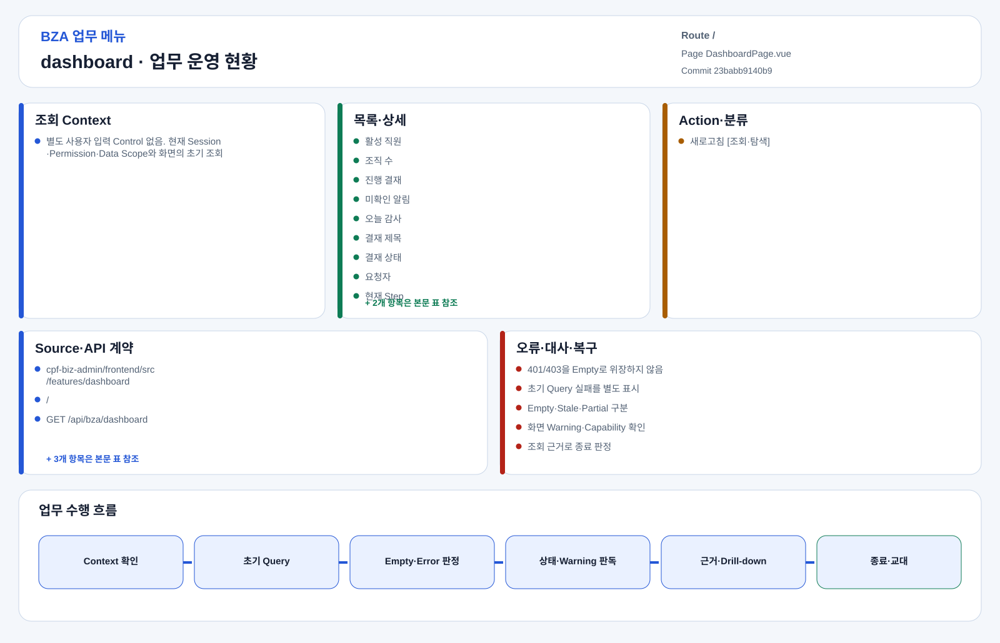

### 이 장에서 끝내는 업무

조직·직원·결재·알림·감사 KPI를 우선순위로 확인한다.

### 메뉴 식별·책임

| 항목 | 값 |
|---|---|
| Route | `/` |
| 메뉴 ID | `dashboard` |
| Menu Code | `DASHBOARD` |
| 업무 그룹 | overview |
| Frontend Page | `cpf-biz-admin/frontend/src/features/dashboard/DashboardPage.vue` |
| Permission | 조회 |
| 기준 Commit | `23babb9140b90e501d6ac715e7b77f55b66198a5` |

### Source·API 근거

| 구분 | 기준 |
|---|---|
| Frontend Page | `cpf-biz-admin/frontend/src/features/dashboard/DashboardPage.vue` |
| Router | `/` |
| API 1 | `GET /api/bza/dashboard` |
| API 2 | `GET /api/bza/approvals/inbox?decisionStatus=WAITING&limit=12` |
| API 3 | `GET /api/bza/backoffice/organizations?limit=300` |
| API 4 | `GET /api/bza/backoffice/employees?limit=300` |
| Source 해석 | DashboardPage.vue는 4개 API를 Promise.all로 조회하고 Menu Permission에 따라 조직·직원·결재 요청을 생략한다. |

아래 표는 이 메뉴에서 실제로 확인·입력·실행할 항목을 정리한다. 화면에 없는 Field·Button·상태를 임의로 가정하지 않는다.

### 검색·입력 Field

별도 사용자 입력 Control이 없다. 현재 Session·Permission·Data Scope와 Page가 정의한 초기 Query로 데이터를 읽는다. 새로고침은 같은 Context를 다시 조회하며 Owner 데이터는 변경하지 않는다.

### 목록 Column·상세 Field

| 표시값 | 운영 의미 | 교차 확인 |
|---|---|---|
| `활성 직원` | 업무 운영 현황 상세에서 대상의 현재 속성 또는 처리 결과를 확인하는 값이다. | 상세·재조회 결과와 비교하고 Stale·Masking·단위 차이를 확인한다. |
| `조직 수` | 동일한 집계 시간 창·단위·Filter에서 비교해야 하는 수치다. | 같은 Filter·집계 시간 창·단위의 상세 Row 또는 Metric으로 대사한다. |
| `진행 결재` | 업무 운영 현황 상세에서 대상의 현재 속성 또는 처리 결과를 확인하는 값이다. | 상세·재조회 결과와 비교하고 Stale·Masking·단위 차이를 확인한다. |
| `미확인 알림` | 업무 운영 현황 상세에서 대상의 현재 속성 또는 처리 결과를 확인하는 값이다. | 상세·재조회 결과와 비교하고 Stale·Masking·단위 차이를 확인한다. |
| `오늘 감사` | 업무 운영 현황 상세에서 대상의 현재 속성 또는 처리 결과를 확인하는 값이다. | 상세·재조회 결과와 비교하고 Stale·Masking·단위 차이를 확인한다. |
| `결재 제목` | 운영자가 대상을 구분하는 표시명 또는 설명이다. | 상세·재조회 결과와 비교하고 Stale·Masking·단위 차이를 확인한다. |
| `결재 상태` | 현재 상태와 Terminal 여부, 다음 Action 가능 여부를 판단하는 값이다. | Last Updated·Terminal 조건·Owner 상태와 함께 확인한다. |
| `요청자` | 작업 주체·Owner·변경 사유를 확인하는 감사 정보다. | 상세·재조회 결과와 비교하고 Stale·Masking·단위 차이를 확인한다. |
| `현재 Step` | 업무 운영 현황 상세에서 대상의 현재 속성 또는 처리 결과를 확인하는 값이다. | 상세·재조회 결과와 비교하고 Stale·Masking·단위 차이를 확인한다. |
| `업데이트 시각` | 상태 발생·갱신·유효 시점을 나타내며 화면 Timezone을 기준으로 해석한다. | 상세·재조회 결과와 비교하고 Stale·Masking·단위 차이를 확인한다. |
| `활성 사용자` | 업무 운영 현황 상세에서 대상의 현재 속성 또는 처리 결과를 확인하는 값이다. | 상세·재조회 결과와 비교하고 Stale·Masking·단위 차이를 확인한다. |

#### 결과 판독 순서

1. 조회 완료 시각·Filter·Paging·Sort와 화면 Warning을 확인한다.
2. Empty·Stale·Partial을 정상 0건과 구분한다.
3. 식별자·상태·Version·오류·시각을 같은 Query Context의 상세와 Owner 원장에서 비교한다.
4. Masking된 값은 Raw Permission과 Reason 없이 복원·Export하지 않는다.
5. 집계와 상세가 다르면 집계 시간 창·Timezone·Owner Update 시각을 맞춰 대사한다.

### Button·Action

| Action | 분류 | 활성 조건 | Side Effect·정상 결과 |
|---|---|---|---|
| **새로고침** | 조회·탐색 | 조회 Permission과 Query Validation을 충족하고 동일 조회가 진행 중이 아님 | 새로고침 결과의 조회 시각·Filter·Source Version·Warning이 갱신되며 Owner 데이터는 변경하지 않는다. |

### 정상 업무 전체 절차

1. `/`에 진입해 Page Header와 Route가 **업무 운영 현황** 기능을 가리키는지 확인한다.
2. 로그인 Session·Environment·Data Scope·기준일·Timezone을 고정한다.
3. 별도 사용자 입력 없이 초기 조회가 끝날 때까지 기다리고, 필요할 때만 같은 Context로 새로고침한다.
4. Loading 종료 후 Empty·Error·Stale·Partial 상태와 화면 Warning을 먼저 판정한다.
5. **활성 직원, 조직 수, 진행 결재, 미확인 알림, 오늘 감사**를 읽고 식별자·상태·Version·시각을 Owner 원장과 대사한다.
6. 화면이 제공하는 Log·Metric·Trace와 조회·Raw·Export 접근 기록이 있으면 해당 Audit를 교차 확인한다.
7. 이 장의 **종료 판정**과 다음 확인 시각·Evidence Link를 교대 기록에 남긴다.

### 메뉴 고유 판정·금지 사항

- **목적:** 조직·직원·결재·알림·감사 KPI를 우선순위로 확인한다.
- **종료 판정:** 대시보드 집계는 원본 조직·결재·감사 화면과 같은 조회 시각으로 대사한다.
- 조회 화면에서 직접 Owner 데이터를 변경하거나 Browser Tool로 우회하지 않는다.
- Partial 조회를 정상 전체 결과로 합치지 않는다.

### 오류·경계·동시성·복구

| 상황 | 화면 징후 | 운영 조치 | 종료 증적 |
|---|---|---|---|
| 401·Session | Session 만료·CSRF·Origin 실패 | 로그인 상태와 BFF Session을 확인한 뒤 같은 Query Context로 다시 조회한다. | 401/403 응답·Session Audit |
| 403·Data Scope | 메뉴·Button·Raw·Export가 거부됨 | Menu·Button·API·Owner Permission과 Data Scope를 확인하고 우회하지 않는다. | Deny Audit·요청 Permission |
| Timeout·Dependency | 일부 조회 Source 응답 지연 | Correlation ID·Query Context·실패 Source를 기록하고 같은 조건으로 재조회한다. | 조회 시각·실패 Source·재조회 결과 |
| Partial·Stale | 일부 대상만 Success 또는 조회 Source 누락 | 성공·실패·미응답을 분리하고 누락 범위와 Version을 표시한다. | Target별 결과·Version |

### 응답 유실·부분 조회 처리

1. 검색 조건·Data Scope·Paging·조회 시각·Correlation ID를 기록한다.
2. 같은 조건으로 재조회하되 실패 Source만 분리한다.
3. 정상 Source 결과를 유지하고 실패·Stale Source를 명시한다.
4. 집계와 원본 상세가 다르면 Owner 상세를 기준으로 Reconcile Case를 연다.
5. 조회 시각·Source Version·0건 또는 일치 결과를 증적으로 남긴다.

### Log·Metric·Trace·Audit와 교대 기록

| 증적 | 필수 값 |
|---|---|
| Audit | Actor·Permission·Data Scope·Raw/Export 접근·Query Context·Result |
| Log | Environment·Instance·operationId·transactionId·failureStage·errorCode |
| Metric | 동일 시간 창의 Success·Failure·Latency·Queue·Retry·Partial·Unknown |
| Trace | root/segment/attempt·Owner·DB/Kafka/외부 의존성 Span |
| 상태 원장 | Target ID·Version·Checksum·Desired/Actual·Last Updated·Terminal 여부 |

```text
Menu=
Route=
Environment=
DataScope=
Query=
QueryAt=
CorrelationId=
SourceVersion=
Result=SUCCESS|EMPTY|STALE|PARTIAL|FAILED
FailedSources=
EvidenceLinks=
NextCheckAt=
```

### 실무 Workbook

**상황:** 조직·직원·결재·알림·감사 KPI를 우선순위로 확인한다. 화면이 일부 Source Timeout 때문에 Partial 결과를 표시했다.

1. Query·Data Scope·조회 시각·Correlation ID를 기록한다.
2. 정상 결과를 0건으로 덮어쓰지 않고 실패 Source만 재조회한다.
3. 활성 직원, 조직 수, 진행 결재 값을 원본 상세와 같은 시간 기준으로 비교한다.
4. 불일치가 계속되면 Incident 또는 Reconcile Case를 생성한다.
5. 대시보드 집계는 원본 조직·결재·감사 화면과 같은 조회 시각으로 대사한다.
6. Source Version과 다음 확인 시각을 교대 기록에 남긴다.

### 독립 수행 검수 Checklist

- [ ] `/`와 Page Source를 찾고 화면 목적을 설명할 수 있다.
- [ ] 별도 사용자 입력이 없고 자동 Query Context·새로고침 동작을 설명할 수 있다.
- [ ] 11개 표시값을 Owner 상태·Version·Audit와 대사할 수 있다.
- [ ] 1개 Action의 분류·활성 조건·Side Effect를 설명할 수 있다.
- [ ] Empty·401·403·Timeout·Stale·Partial을 서로 다른 조회 상태로 처리할 수 있다.
- [ ] 조회 응답 유실 시 같은 Query Context로 재조회하고 Correlation ID·조회 시각·Source Version으로 결과를 대사할 수 있다.
- [ ] 교대 기록만으로 다음 담당자가 Target·상태·복구 기한을 이어받을 수 있다.

## 2. organizations — 조직 계층

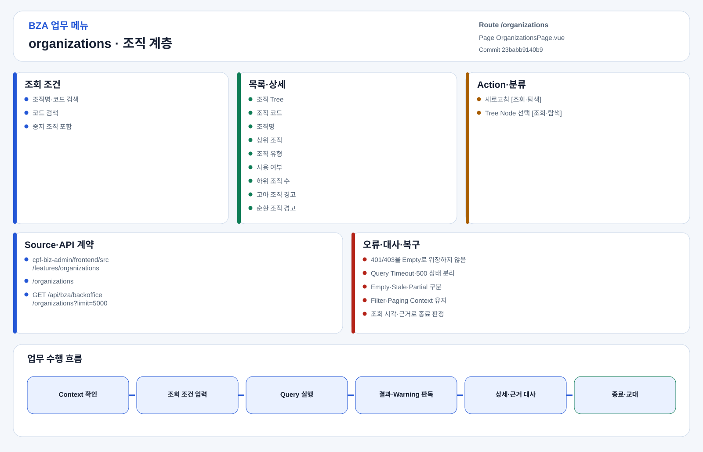

### 이 장에서 끝내는 업무

전체 조직 Tree를 검색하고 고아·순환 구조를 식별한다.

### 메뉴 식별·책임

| 항목 | 값 |
|---|---|
| Route | `/organizations` |
| 메뉴 ID | `organizations` |
| Menu Code | `ORGANIZATION` |
| 업무 그룹 | people |
| Frontend Page | `cpf-biz-admin/frontend/src/features/organizations/OrganizationsPage.vue` |
| Permission | Read; 변경 안내는 Write |
| 기준 Commit | `23babb9140b90e501d6ac715e7b77f55b66198a5` |

### Source·API 근거

| 구분 | 기준 |
|---|---|
| Frontend Page | `cpf-biz-admin/frontend/src/features/organizations/OrganizationsPage.vue` |
| Router | `/organizations` |
| API 1 | `GET /api/bza/backoffice/organizations?limit=5000` |
| Source 해석 | OrganizationsPage.vue는 전체 Tree를 Client에서 구성하고 고아·순환 구조를 경고한다. 이 Page 자체에는 저장 Button이 없다. |

아래 표는 이 메뉴에서 실제로 확인·입력·실행할 항목을 정리한다. 화면에 없는 Field·Button·상태를 임의로 가정하지 않는다.

### 검색·입력 Field

| Field | Control | 업무 의미 | 기본값·Validation·주의 |
|---|---|---|---|
| `조직명·코드 검색` | 문자열 입력·검색 | 조직명 또는 조직 코드로 Tree를 필터링한다. | Source의 단일 검색 Control이며 앞뒤 공백을 제거한 뒤 조직명·코드에 대해 대소문자 구분 없이 검색한다. |
| `중지 조직 포함` | Checkbox | 중지 상태(`useYn=N`) 조직을 Tree와 검색 결과에 포함할지 선택한다. | Source 기본값은 `true`다. 해제하면 제외된 조직 수와 검색 범위를 작업 기록에 남긴다. |

#### 입력 순서

1. **조직명·코드 검색**에 조직명 또는 조직 코드를 입력한다.
2. **중지 조직 포함**의 기본값 `선택`을 유지할지 결정한다.
3. 검색 결과의 Tree와 경고 목록이 같은 Filter를 사용하는지 확인한다.

### 목록 Column·상세 Field

| 표시값 | 운영 의미 | 교차 확인 |
|---|---|---|
| `조직 Tree` | 전체 조직 계층과 검색 결과를 표시하며 고아·순환 경고의 기준 구조다. | 상세·재조회 결과와 비교하고 Stale·Masking·단위 차이를 확인한다. |
| `조직 코드` | 조직 계층의 대상 레코드를 상세·Owner·Audit에서 연결하는 식별자다. | 상세·Log·Trace·Audit에서 같은 대상을 가리키는지 확인한다. |
| `조직명` | 운영자가 대상을 구분하는 표시명 또는 설명이다. | 상세·재조회 결과와 비교하고 Stale·Masking·단위 차이를 확인한다. |
| `상위 조직` | 선택 조직의 Parent Code이며 ROOT·고아 관계를 판단하는 값이다. | 상세·재조회 결과와 비교하고 Stale·Masking·단위 차이를 확인한다. |
| `조직 유형` | 조직의 업무 분류이며 허용 Child·책임·Data Scope 해석에 사용한다. | 상세·재조회 결과와 비교하고 Stale·Masking·단위 차이를 확인한다. |
| `사용 여부` | 현재 상태와 Terminal 여부, 다음 Action 가능 여부를 판단하는 값이다. | Last Updated·Terminal 조건·Owner 상태와 함께 확인한다. |
| `하위 조직 수` | 현재 Tree Filter에서 선택 조직 아래에 표시되는 Child 수다. | 같은 Filter·집계 시간 창·단위의 상세 Row 또는 Metric으로 대사한다. |
| `고아 조직 경고` | 오류·Drift·결과 불명 범위를 나타내며 원인과 복구 Owner를 연결해야 한다. | 원인 식별자·실패 Stage·마지막 갱신 시각을 상세와 대조한다. |
| `순환 조직 경고` | 오류·Drift·결과 불명 범위를 나타내며 원인과 복구 Owner를 연결해야 한다. | 원인 식별자·실패 Stage·마지막 갱신 시각을 상세와 대조한다. |

#### 결과 판독 순서

1. 조회 완료 시각·Filter·Paging·Sort와 화면 Warning을 확인한다.
2. Empty·Stale·Partial을 정상 0건과 구분한다.
3. 식별자·상태·Version·오류·시각을 같은 Query Context의 상세와 Owner 원장에서 비교한다.
4. Masking된 값은 Raw Permission과 Reason 없이 복원·Export하지 않는다.
5. 집계와 상세가 다르면 집계 시간 창·Timezone·Owner Update 시각을 맞춰 대사한다.

### Button·Action

| Action | 분류 | 활성 조건 | Side Effect·정상 결과 |
|---|---|---|---|
| **새로고침** | 조회·탐색 | 조회 Permission과 Query Validation을 충족하고 동일 조회가 진행 중이 아님 | 새로고침 결과의 조회 시각·Filter·Source Version·Warning이 갱신되며 Owner 데이터는 변경하지 않는다. |
| **Tree Node 선택** | 조회·탐색 | 조회 Permission과 Query Validation을 충족하고 동일 조회가 진행 중이 아님 | Tree Node 선택 결과의 조회 시각·Filter·Source Version·Warning이 갱신되며 Owner 데이터는 변경하지 않는다. |

### 정상 업무 전체 절차

1. `/organizations`에 진입해 Page Header와 Route가 **조직 계층** 기능을 가리키는지 확인한다.
2. 로그인 Session·Environment·Data Scope·기준일·Timezone을 고정한다.
3. 화면에 제공된 조회 Control만 사용하고, 표시되지 않은 변경 Field나 Server Command가 있다고 가정하지 않는다.
4. Loading 종료 후 Empty·Error·Stale·Partial 상태와 화면 Warning을 먼저 판정한다.
5. **조직 Tree, 조직 코드, 조직명, 상위 조직, 조직 유형**를 읽고 식별자·상태·Version·시각을 Owner 원장과 대사한다.
6. 화면이 제공하는 Log·Metric·Trace와 조회·Raw·Export 접근 기록이 있으면 해당 Audit를 교차 확인한다.
7. 이 장의 **종료 판정**과 다음 확인 시각·Evidence Link를 교대 기록에 남긴다.

### 메뉴 고유 판정·금지 사항

- **목적:** 전체 조직 Tree를 검색하고 고아·순환 구조를 식별한다.
- **종료 판정:** 이 화면은 조회 중심이며 변경은 Write 권한이 적용되는 원본 조직 관리 절차에서 수행한다.
- 이 Page의 `WRITE` 안내 문구를 저장 기능으로 해석하지 않는다. 실제 Source에는 Tree 조회·선택·새로고침만 있다.
- 조회 화면에서 직접 Owner 데이터를 변경하거나 Browser Tool로 우회하지 않는다.
- Partial 조회를 정상 전체 결과로 합치지 않는다.

### 오류·경계·동시성·복구

| 상황 | 화면 징후 | 운영 조치 | 종료 증적 |
|---|---|---|---|
| 401·Session | Session 만료·CSRF·Origin 실패 | 로그인 상태와 BFF Session을 확인한 뒤 같은 Query Context로 다시 조회한다. | 401/403 응답·Session Audit |
| 403·Data Scope | 메뉴·Button·Raw·Export가 거부됨 | Menu·Button·API·Owner Permission과 Data Scope를 확인하고 우회하지 않는다. | Deny Audit·요청 Permission |
| Timeout·Dependency | 일부 조회 Source 응답 지연 | Correlation ID·Query Context·실패 Source를 기록하고 같은 조건으로 재조회한다. | 조회 시각·실패 Source·재조회 결과 |
| Partial·Stale | 일부 대상만 Success 또는 조회 Source 누락 | 성공·실패·미응답을 분리하고 누락 범위와 Version을 표시한다. | Target별 결과·Version |
| 계층·기간 충돌 | 고아·순환·기간 중복이 탐지됨 | 대상 관계와 기준일을 수정하고 영향 사용자·결재 Snapshot을 재계산한다. | 관계 Diff·Simulation 결과 |

### 응답 유실·부분 조회 처리

1. 검색 조건·Data Scope·Paging·조회 시각·Correlation ID를 기록한다.
2. 같은 조건으로 재조회하되 실패 Source만 분리한다.
3. 정상 Source 결과를 유지하고 실패·Stale Source를 명시한다.
4. 집계와 원본 상세가 다르면 Owner 상세를 기준으로 Reconcile Case를 연다.
5. 조회 시각·Source Version·0건 또는 일치 결과를 증적으로 남긴다.

### Log·Metric·Trace·Audit와 교대 기록

| 증적 | 필수 값 |
|---|---|
| Audit | Actor·Permission·Data Scope·Raw/Export 접근·Query Context·Result |
| Log | Environment·Instance·operationId·transactionId·failureStage·errorCode |
| Metric | 동일 시간 창의 Success·Failure·Latency·Queue·Retry·Partial·Unknown |
| Trace | root/segment/attempt·Owner·DB/Kafka/외부 의존성 Span |
| 상태 원장 | Target ID·Version·Checksum·Desired/Actual·Last Updated·Terminal 여부 |

```text
Menu=
Route=
Environment=
DataScope=
Query=
QueryAt=
CorrelationId=
SourceVersion=
Result=SUCCESS|EMPTY|STALE|PARTIAL|FAILED
FailedSources=
EvidenceLinks=
NextCheckAt=
```

### 실무 Workbook

**상황:** 조직 검색 결과에 `고아 조직` 또는 `순환 조직` 경고가 표시됐다.

1. `중지 조직 포함` 값과 검색어를 기록하고 전체 Tree를 다시 조회한다.
2. 경고에 표시된 Child Code·Parent Code 또는 Cycle 경로를 작업 기록에 남긴다.
3. 이 Page에는 저장 Button이 없으므로 Browser에서 데이터를 수정하지 않는다.
4. 조직 원본 관리 절차에서 관계 변경 영향과 결재 Snapshot·Data Scope 영향을 검토한다.
5. 변경 후 `GET /api/bza/backoffice/organizations?limit=5000` 결과로 고아·순환 경고가 사라졌는지 확인한다.
6. 이 화면은 조회 중심이며 변경은 Write 권한이 적용되는 원본 조직 관리 절차에서 수행한다.

### 독립 수행 검수 Checklist

- [ ] `/organizations`와 Page Source를 찾고 화면 목적을 설명할 수 있다.
- [ ] 2개 조회 Control의 기본값과 검색 범위를 설명할 수 있다.
- [ ] 9개 표시값을 Owner 상태·Version·Audit와 대사할 수 있다.
- [ ] 2개 Action의 분류·활성 조건·Side Effect를 설명할 수 있다.
- [ ] Empty·401·403·Timeout·Stale·Partial을 서로 다른 조회 상태로 처리할 수 있다.
- [ ] 조회 응답 유실 시 같은 Query Context로 재조회하고 Correlation ID·조회 시각·Source Version으로 결과를 대사할 수 있다.
- [ ] 교대 기록만으로 다음 담당자가 Target·상태·복구 기한을 이어받을 수 있다.

## 3. employees — 직원 Profile

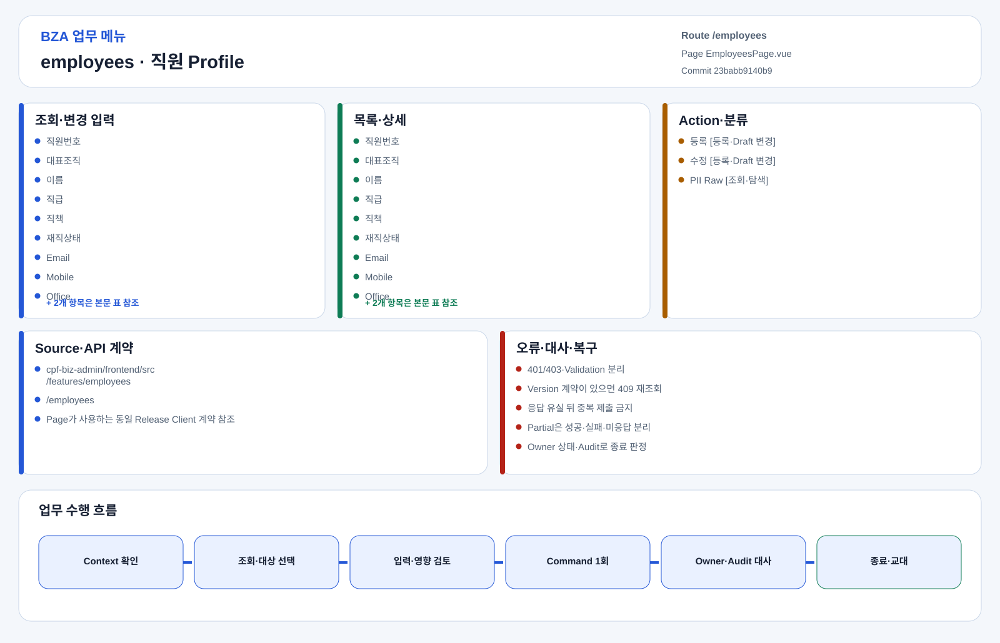

### 이 장에서 끝내는 업무

직원 기본정보·대표조직·직급·직책·재직상태를 관리한다.

### 메뉴 식별·책임

| 항목 | 값 |
|---|---|
| Route | `/employees` |
| 메뉴 ID | `employees` |
| Menu Code | `EMPLOYEE` |
| 업무 그룹 | people |
| Frontend Page | `cpf-biz-admin/frontend/src/features/employees/EmployeesPage.vue` |
| Permission | Write, PII_RAW |
| 기준 Commit | `23babb9140b90e501d6ac715e7b77f55b66198a5` |

### Source·API 근거

| 구분 | 기준 |
|---|---|
| Frontend Page | `cpf-biz-admin/frontend/src/features/employees/EmployeesPage.vue` |
| Router | `/employees` |
| API 추적 | 화면에서 제공하는 기능을 통해 호출한다. 문서에 명시되지 않은 Endpoint를 Browser나 외부 Script에서 임의 호출하지 않는다. |

아래 표는 이 메뉴에서 실제로 확인·입력·실행할 항목을 정리한다. 화면에 없는 Field·Button·상태를 임의로 가정하지 않는다.

### 검색·입력 Field

| Field | Control | 업무 의미 | 기본값·Validation·주의 |
|---|---|---|---|
| `직원번호` | 문자열 입력·검색 | 조회·상세·Audit에서 같은 대상을 다시 찾기 위한 식별 조건이다. | 앞뒤 공백·허용 문자·길이와 대소문자 규칙을 확인한다. |
| `대표조직` | 문자열 입력·검색 | 조회·상세·Audit에서 같은 대상을 다시 찾기 위한 식별 조건이다. | 앞뒤 공백·허용 문자·길이와 대소문자 규칙을 확인한다. |
| `이름` | 문자열 입력·검색 | 직원 Profile 화면의 조회 조건 또는 편집 Form에 포함되는 값이며 화면 Label과 Help를 기준으로 사용한다. | 앞뒤 공백·허용 문자·길이와 대소문자 규칙을 확인한다. |
| `직급` | 문자열 입력·검색 | 직원 Profile 화면의 조회 조건 또는 편집 Form에 포함되는 값이며 화면 Label과 Help를 기준으로 사용한다. | 앞뒤 공백·허용 문자·길이와 대소문자 규칙을 확인한다. |
| `직책` | 문자열 입력·검색 | 직원 Profile 화면의 조회 조건 또는 편집 Form에 포함되는 값이며 화면 Label과 Help를 기준으로 사용한다. | 앞뒤 공백·허용 문자·길이와 대소문자 규칙을 확인한다. |
| `재직상태` | Select·검색 | 현재 상태를 조회하거나 다음 Action의 허용 조건을 지정한다. | 허용 목록과 현재 Environment·Data Scope에 맞는 값만 선택한다. |
| `Email` | 문자열 입력·검색 | 직원 Profile 화면의 조회 조건 또는 편집 Form에 포함되는 값이며 화면 Label과 Help를 기준으로 사용한다. | 앞뒤 공백·허용 문자·길이와 대소문자 규칙을 확인한다. |
| `Mobile` | 문자열 입력·검색 | 직원 Profile 화면의 조회 조건 또는 편집 Form에 포함되는 값이며 화면 Label과 Help를 기준으로 사용한다. | 앞뒤 공백·허용 문자·길이와 대소문자 규칙을 확인한다. |
| `Office` | 문자열 입력·검색 | 직원 Profile 화면의 조회 조건 또는 편집 Form에 포함되는 값이며 화면 Label과 Help를 기준으로 사용한다. | 앞뒤 공백·허용 문자·길이와 대소문자 규칙을 확인한다. |
| `Clear Flag` | Checkbox·Switch | 직원 Profile 화면의 조회 조건 또는 편집 Form에 포함되는 값이며 화면 Label과 Help를 기준으로 사용한다. | 현재 선택과 변경 후 영향 범위를 비교하고 화면의 Source 기본값을 확인한다. |
| `Use` | Checkbox·Switch | 현재 상태를 조회하거나 다음 Action의 허용 조건을 지정한다. | 현재 선택과 변경 후 영향 범위를 비교하고 화면의 Source 기본값을 확인한다. |

#### 입력 순서

1. **직원번호** 항목이 조회 Control인지 변경 Form인지 화면 위치로 구분하고, 표시된 값·필수 여부·허용 형식을 확인한다.
2. **대표조직** 항목이 조회 Control인지 변경 Form인지 화면 위치로 구분하고, 표시된 값·필수 여부·허용 형식을 확인한다.
3. **이름** 항목이 조회 Control인지 변경 Form인지 화면 위치로 구분하고, 표시된 값·필수 여부·허용 형식을 확인한다.
4. **직급** 항목이 조회 Control인지 변경 Form인지 화면 위치로 구분하고, 표시된 값·필수 여부·허용 형식을 확인한다.
5. **직책** 항목이 조회 Control인지 변경 Form인지 화면 위치로 구분하고, 표시된 값·필수 여부·허용 형식을 확인한다.
6. **재직상태** 항목이 조회 Control인지 변경 Form인지 화면 위치로 구분하고, 표시된 값·필수 여부·허용 형식을 확인한다.
7. **Email** 항목이 조회 Control인지 변경 Form인지 화면 위치로 구분하고, 표시된 값·필수 여부·허용 형식을 확인한다.
8. **Mobile** 항목이 조회 Control인지 변경 Form인지 화면 위치로 구분하고, 표시된 값·필수 여부·허용 형식을 확인한다.
9. **Office** 항목이 조회 Control인지 변경 Form인지 화면 위치로 구분하고, 표시된 값·필수 여부·허용 형식을 확인한다.
10. **Clear Flag** 항목이 조회 Control인지 변경 Form인지 화면 위치로 구분하고, 표시된 값·필수 여부·허용 형식을 확인한다.
11. **Use** 항목이 조회 Control인지 변경 Form인지 화면 위치로 구분하고, 표시된 값·필수 여부·허용 형식을 확인한다.
12. 조회 Control과 변경 Form을 분리해 기록하고, 실행 전 Environment·Data Scope·Timezone과 제출할 값만 다시 검토한다.

### 목록 Column·상세 Field

| 표시값 | 운영 의미 | 교차 확인 |
|---|---|---|
| `직원번호` | 직원 Profile 상세에서 대상의 현재 속성 또는 처리 결과를 확인하는 값이다. | 상세·재조회 결과와 비교하고 Stale·Masking·단위 차이를 확인한다. |
| `대표조직` | 직원 Profile 상세에서 대상의 현재 속성 또는 처리 결과를 확인하는 값이다. | 상세·재조회 결과와 비교하고 Stale·Masking·단위 차이를 확인한다. |
| `이름` | 직원 Profile 상세에서 대상의 현재 속성 또는 처리 결과를 확인하는 값이다. | 상세·재조회 결과와 비교하고 Stale·Masking·단위 차이를 확인한다. |
| `직급` | 직원 Profile 상세에서 대상의 현재 속성 또는 처리 결과를 확인하는 값이다. | 상세·재조회 결과와 비교하고 Stale·Masking·단위 차이를 확인한다. |
| `직책` | 직원 Profile 상세에서 대상의 현재 속성 또는 처리 결과를 확인하는 값이다. | 상세·재조회 결과와 비교하고 Stale·Masking·단위 차이를 확인한다. |
| `재직상태` | 현재 상태와 Terminal 여부, 다음 Action 가능 여부를 판단하는 값이다. | Last Updated·Terminal 조건·Owner 상태와 함께 확인한다. |
| `Email` | 직원 Profile 상세에서 대상의 현재 속성 또는 처리 결과를 확인하는 값이다. | 상세·재조회 결과와 비교하고 Stale·Masking·단위 차이를 확인한다. |
| `Mobile` | 직원 Profile 상세에서 대상의 현재 속성 또는 처리 결과를 확인하는 값이다. | 상세·재조회 결과와 비교하고 Stale·Masking·단위 차이를 확인한다. |
| `Office` | 직원 Profile 상세에서 대상의 현재 속성 또는 처리 결과를 확인하는 값이다. | 상세·재조회 결과와 비교하고 Stale·Masking·단위 차이를 확인한다. |
| `Clear Flag` | 직원 Profile 상세에서 대상의 현재 속성 또는 처리 결과를 확인하는 값이다. | 상세·재조회 결과와 비교하고 Stale·Masking·단위 차이를 확인한다. |
| `Use` | 현재 상태와 Terminal 여부, 다음 Action 가능 여부를 판단하는 값이다. | Last Updated·Terminal 조건·Owner 상태와 함께 확인한다. |

#### 결과 판독 순서

1. 조회 완료 시각·Filter·Paging·Sort와 화면 Warning을 확인한다.
2. Empty·Stale·Partial을 정상 0건과 구분한다.
3. 식별자·상태·Version·오류·시각을 같은 Query Context의 상세와 Owner 원장에서 비교한다.
4. Masking된 값은 Raw Permission과 Reason 없이 복원·Export하지 않는다.
5. 집계와 상세가 다르면 집계 시간 창·Timezone·Owner Update 시각을 맞춰 대사한다.

### Button·Action

| Action | 분류 | 활성 조건 | Side Effect·정상 결과 |
|---|---|---|---|
| **등록** | 등록·Draft 변경 | 화면이 실제로 요구하는 Write Permission·필수 Field·Reason·Version 조건을 충족함 | 직원 Profile의 재조회 결과가 요청 내용과 일치한다. Version·Before/After·Audit는 해당 Owner가 제공하는 경우 함께 확인한다. |
| **수정** | 등록·Draft 변경 | 화면이 실제로 요구하는 Write Permission·필수 Field·Reason·Version 조건을 충족함 | 직원 Profile의 재조회 결과가 요청 내용과 일치한다. Version·Before/After·Audit는 해당 Owner가 제공하는 경우 함께 확인한다. |
| **PII Raw** | 조회·탐색 | 조회 Permission과 Query Validation을 충족하고 동일 조회가 진행 중이 아님 | PII Raw 결과의 조회 시각·Filter·Source Version·Warning이 갱신되며 Owner 데이터는 변경하지 않는다. |

### 정상 업무 전체 절차

1. `/employees`에 진입해 Page Header와 Route가 **직원 Profile** 기능을 가리키는지 확인한다.
2. 로그인 Session·Environment·Data Scope·기준일·Timezone을 고정한다.
3. 화면의 조회 Control과 변경 Form을 구분한다. 조회 조건이 제공되면 먼저 조회하고, 변경 Form은 대상 선택 또는 등록 Action 뒤에 열린 실제 Field만 사용한다.
4. Loading 종료 후 Empty·Error·Stale·Partial 상태와 화면 Warning을 먼저 판정한다.
5. **직원번호, 대표조직, 이름, 직급, 직책**를 읽고 식별자·상태·Version·시각을 Owner 원장과 대사한다.
6. **등록** 전에 화면과 Owner가 실제로 요구하는 Permission·현재 상태·영향 범위·Reason·승인·Version 조건을 확인하고 한 번만 제출한다.
7. **등록**의 HTTP 응답과 재조회 결과를 확인한다. 비동기·다중 대상 기능은 Owner Terminal 상태·Version·대상별 Success/Failed/Unknown·Audit를 별도로 확인한다.
8. **수정** 전에 화면과 Owner가 실제로 요구하는 Permission·현재 상태·영향 범위·Reason·승인·Version 조건을 확인하고 한 번만 제출한다.
9. **수정**의 HTTP 응답과 재조회 결과를 확인한다. 비동기·다중 대상 기능은 Owner Terminal 상태·Version·대상별 Success/Failed/Unknown·Audit를 별도로 확인한다.
10. 화면이 제공하는 Log·Metric·Trace와, 변경·Export·승인 조치에 생성된 Audit를 교차 확인한다.
11. 이 장의 **종료 판정**과 다음 확인 시각·Evidence Link를 교대 기록에 남긴다.

### 메뉴 고유 판정·금지 사항

- **목적:** 직원 기본정보·대표조직·직급·직책·재직상태를 관리한다.
- **종료 판정:** PII Raw 조회는 별도 Permission·Reason·Audit가 필요하다.
- 응답을 받지 못한 경우 Owner 상태와 기존 Operation을 확인하기 전에 동일 Action을 반복하지 않는다.
- HTTP 성공 응답이나 Toast만으로 비동기 Owner 상태 또는 다중 대상 적용을 확정하지 않는다.

### 오류·경계·동시성·복구

| 상황 | 화면 징후 | 운영 조치 | 종료 증적 |
|---|---|---|---|
| 401·Session | Session 만료·CSRF·Origin 실패 | 로그인 상태와 BFF Session을 확인한다. Command 자동 Replay는 금지한다. | 401/403 응답·Session Audit |
| 403·Data Scope | 메뉴·Button·Raw·Export가 거부됨 | Menu·Button·API·Owner Permission과 Data Scope를 확인하고 우회하지 않는다. | Deny Audit·요청 Permission |
| Validation | 필수값·범위·형식·기간 오류 | Field Error만 수정하고 기존 성공 Operation을 다시 제출하지 않는다. | Error Code·Field·입력값 |
| Timeout·Dependency | 일부 Source 또는 Command 응답 지연 | Correlation/Operation ID와 실패 Stage를 기록하고 Owner 상태를 조회한다. | Dependency 상태·Retryability |
| Partial·Stale | 일부 대상만 Success 또는 조회 Source 누락 | 성공·실패·미응답을 분리하고 누락 범위와 Version을 표시한다. | Target별 결과·Version |
| 409·동시 변경 | Expected Version 불일치 | 최신 상세를 재조회하고 Diff·영향을 다시 검토한 뒤 새 요청으로 제출한다. | 현재/요청 Version·변경자 |
| 응답 유실·Unknown | 요청 후 실제 처리 여부를 알 수 없음 | Operation ID·Request Hash·Audit·Owner 상태로 대사하고 중복 제출하지 않는다. | Operation·Owner·Audit |
| 복구 실패 | Retry/Rollback 뒤에도 상태 불일치 | 자동 반복을 중단하고 Incident·Reconcile Case·다음 확인 시각을 기록한다. | Case ID·복구 Owner·기한 |

### 응답 유실·결과 불명·부분 적용 처리

1. 동일 Action을 다시 누르지 않고 Browser Network와 응답 Header를 보존한다. `operationId`·`transactionId`·`idempotencyKey`가 제공되면 기록하고, 없으면 Target ID·Actor·요청 시각·Request Body Hash로 대사한다.
2. 기능이 제공하는 상세·Operation Status(있는 경우)·Audit에서 Request Hash와 대상 Version을 검색한다.
3. Side Effect 전 실패가 확인된 경우에만 새 요청을 검토한다.
4. Success·Failed·Unknown 대상을 분리하고 Source가 제공하는 Failed-only Retry·Compensation·Rollback을 선택하고, 지원되지 않으면 수동 Reconcile Case로 이관한다.
5. Rollback을 지원하는 기능은 Owner Version·Checksum·업무 합계가 Rollback Point와 일치하는지 확인한다.
6. 확정되지 않은 대상은 `UNKNOWN_RESULT`로 유지하고 담당자·대사 기한·다음 확인 시각을 기록한다.

### Log·Metric·Trace·Audit와 교대 기록

| 증적 | 필수 값 |
|---|---|
| Audit | Actor·Permission·Reason·Approval·Target·Before/After·Result·Recovery Action |
| Log | Environment·Instance·operationId·transactionId·failureStage·errorCode |
| Metric | 동일 시간 창의 Success·Failure·Latency·Queue·Retry·Partial·Unknown |
| Trace | root/segment/attempt·Owner·DB/Kafka/외부 의존성 Span |
| 상태 원장 | Target ID·Version·Checksum·Desired/Actual·Last Updated·Terminal 여부 |

```text
Menu=employees
Route=/employees
Environment=
DataScope=
Query=
TargetId=
BeforeVersion=
Action=
Reason=
ApprovalId=
OperationId=
TransactionId=
Result=SUCCESS|FAILED|PARTIAL|UNKNOWN_RESULT
OwnerState=
FailedTargets=
ReconcileBy=
RollbackPoint=
EvidenceLinks=
NextCheckAt=
```

### 실무 Workbook

**상황:** 직원 기본정보·대표조직·직급·직책·재직상태를 관리한다. 담당자가 **등록**을 수행한 뒤 Browser 응답을 받지 못했다.

1. 대상 식별자와 Before Version, 입력값, Reason·Approval을 작업 기록에서 확인한다.
2. 동일 **등록**을 반복하지 않고 Operation·Audit·Owner 상태를 조회한다.
3. Owner 상태가 변경됐고 Request Hash가 같으면 응답 유실로 분류해 중복 조치를 금지한다.
4. 일부 대상만 변경됐으면 Success·Failed·Unknown을 분리해 Failed-only Retry 또는 Rollback을 선택한다.
5. PII Raw 조회는 별도 Permission·Reason·Audit가 필요하다.
6. Evidence Link와 다음 확인 시각을 교대 기록에 남긴다.

### 독립 수행 검수 Checklist

- [ ] `/employees`와 Page Source를 찾고 화면 목적을 설명할 수 있다.
- [ ] 1별도 사용자 입력이 없는 경우 자동 Query Context를 설명할 수 있다.
- [ ] 11개 표시값을 Owner 상태·Version·Audit와 대사할 수 있다.
- [ ] 3개 Action의 분류·활성 조건·Side Effect를 설명할 수 있다.
- [ ] Empty·403·409·Timeout·Partial·Unknown을 서로 다른 상태로 처리할 수 있다.
- [ ] 응답 유실 뒤 중복 제출 없이 Operation·Owner·Audit로 결과를 확정할 수 있다.
- [ ] 교대 기록만으로 다음 담당자가 Target·상태·복구 기한을 이어받을 수 있다.

## 4. positions — 직급 기준


### 이 장에서 끝내는 업무

직급 Code·명·정렬 순서·사용 여부를 관리한다.

### 메뉴 식별·책임

| 항목 | 값 |
|---|---|
| Route | `/positions` |
| 메뉴 ID | `positions` |
| Menu Code | `EMPLOYEE` |
| 업무 그룹 | people |
| Frontend Page | `cpf-biz-admin/frontend/src/features/positions/PositionsPage.vue` |
| Permission | Write |
| 기준 Commit | `23babb9140b90e501d6ac715e7b77f55b66198a5` |

### Source·API 근거

| 구분 | 기준 |
|---|---|
| Frontend Page | `cpf-biz-admin/frontend/src/features/positions/PositionsPage.vue` |
| Router | `/positions` |
| API 추적 | 화면에서 제공하는 기능을 통해 호출한다. 문서에 명시되지 않은 Endpoint를 Browser나 외부 Script에서 임의 호출하지 않는다. |

아래 표는 이 메뉴에서 실제로 확인·입력·실행할 항목을 정리한다. 화면에 없는 Field·Button·상태를 임의로 가정하지 않는다.

### 검색·입력 Field

| Field | Control | 업무 의미 | 기본값·Validation·주의 |
|---|---|---|---|
| `Code` | 문자열 입력·검색 | 조회·상세·Audit에서 같은 대상을 다시 찾기 위한 식별 조건이다. | 앞뒤 공백·허용 문자·길이와 대소문자 규칙을 확인한다. |
| `Name` | 문자열 입력·검색 | 대상의 표시명 또는 업무명을 검색·입력한다. | 앞뒤 공백·허용 문자·길이와 대소문자 규칙을 확인한다. |
| `Rank Order` | 숫자·Version 입력 | 실행 한도·순서·용량 또는 재시도 범위를 지정한다. | 화면의 min·max·단위와 0 허용 여부를 확인하고 음수·Overflow를 차단한다. |
| `Use` | Checkbox·Switch | 현재 상태를 조회하거나 다음 Action의 허용 조건을 지정한다. | 현재 선택과 변경 후 영향 범위를 비교하고 화면의 Source 기본값을 확인한다. |

#### 입력 순서

1. **Code** 항목이 조회 Control인지 변경 Form인지 화면 위치로 구분하고, 표시된 값·필수 여부·허용 형식을 확인한다.
2. **Name** 항목이 조회 Control인지 변경 Form인지 화면 위치로 구분하고, 표시된 값·필수 여부·허용 형식을 확인한다.
3. **Rank Order** 항목이 조회 Control인지 변경 Form인지 화면 위치로 구분하고, 표시된 값·필수 여부·허용 형식을 확인한다.
4. **Use** 항목이 조회 Control인지 변경 Form인지 화면 위치로 구분하고, 표시된 값·필수 여부·허용 형식을 확인한다.
5. 조회 Control과 변경 Form을 분리해 기록하고, 실행 전 Environment·Data Scope·Timezone과 제출할 값만 다시 검토한다.

### 목록 Column·상세 Field

| 표시값 | 운영 의미 | 교차 확인 |
|---|---|---|
| `Code` | 직급 기준의 대상 레코드를 상세·Owner·Audit에서 연결하는 식별자다. | 상세·Log·Trace·Audit에서 같은 대상을 가리키는지 확인한다. |
| `Name` | 운영자가 대상을 구분하는 표시명 또는 설명이다. | 상세·재조회 결과와 비교하고 Stale·Masking·단위 차이를 확인한다. |
| `Rank Order` | 직급 기준 상세에서 대상의 현재 속성 또는 처리 결과를 확인하는 값이다. | 상세·재조회 결과와 비교하고 Stale·Masking·단위 차이를 확인한다. |
| `Use` | 현재 상태와 Terminal 여부, 다음 Action 가능 여부를 판단하는 값이다. | Last Updated·Terminal 조건·Owner 상태와 함께 확인한다. |

#### 결과 판독 순서

1. 조회 완료 시각·Filter·Paging·Sort와 화면 Warning을 확인한다.
2. Empty·Stale·Partial을 정상 0건과 구분한다.
3. 식별자·상태·Version·오류·시각을 같은 Query Context의 상세와 Owner 원장에서 비교한다.
4. Masking된 값은 Raw Permission과 Reason 없이 복원·Export하지 않는다.
5. 집계와 상세가 다르면 집계 시간 창·Timezone·Owner Update 시각을 맞춰 대사한다.

### Button·Action

| Action | 분류 | 활성 조건 | Side Effect·정상 결과 |
|---|---|---|---|
| **등록** | 등록·Draft 변경 | 화면이 실제로 요구하는 Write Permission·필수 Field·Reason·Version 조건을 충족함 | 직급 기준의 재조회 결과가 요청 내용과 일치한다. Version·Before/After·Audit는 해당 Owner가 제공하는 경우 함께 확인한다. |
| **수정** | 등록·Draft 변경 | 화면이 실제로 요구하는 Write Permission·필수 Field·Reason·Version 조건을 충족함 | 직급 기준의 재조회 결과가 요청 내용과 일치한다. Version·Before/After·Audit는 해당 Owner가 제공하는 경우 함께 확인한다. |

### 정상 업무 전체 절차

1. `/positions`에 진입해 Page Header와 Route가 **직급 기준** 기능을 가리키는지 확인한다.
2. 로그인 Session·Environment·Data Scope·기준일·Timezone을 고정한다.
3. 화면의 조회 Control과 변경 Form을 구분한다. 조회 조건이 제공되면 먼저 조회하고, 변경 Form은 대상 선택 또는 등록 Action 뒤에 열린 실제 Field만 사용한다.
4. Loading 종료 후 Empty·Error·Stale·Partial 상태와 화면 Warning을 먼저 판정한다.
5. **Code, Name, Rank Order, Use**를 읽고 식별자·상태·Version·시각을 Owner 원장과 대사한다.
6. **등록** 전에 화면과 Owner가 실제로 요구하는 Permission·현재 상태·영향 범위·Reason·승인·Version 조건을 확인하고 한 번만 제출한다.
7. **등록**의 HTTP 응답과 재조회 결과를 확인한다. 비동기·다중 대상 기능은 Owner Terminal 상태·Version·대상별 Success/Failed/Unknown·Audit를 별도로 확인한다.
8. **수정** 전에 화면과 Owner가 실제로 요구하는 Permission·현재 상태·영향 범위·Reason·승인·Version 조건을 확인하고 한 번만 제출한다.
9. **수정**의 HTTP 응답과 재조회 결과를 확인한다. 비동기·다중 대상 기능은 Owner Terminal 상태·Version·대상별 Success/Failed/Unknown·Audit를 별도로 확인한다.
10. 화면이 제공하는 Log·Metric·Trace와, 변경·Export·승인 조치에 생성된 Audit를 교차 확인한다.
11. 이 장의 **종료 판정**과 다음 확인 시각·Evidence Link를 교대 기록에 남긴다.

### 메뉴 고유 판정·금지 사항

- **목적:** 직급 Code·명·정렬 순서·사용 여부를 관리한다.
- **종료 판정:** Rank Order 중복과 사용 중지 영향 직원을 확인한다.
- 응답을 받지 못한 경우 Owner 상태와 기존 Operation을 확인하기 전에 동일 Action을 반복하지 않는다.
- HTTP 성공 응답이나 Toast만으로 비동기 Owner 상태 또는 다중 대상 적용을 확정하지 않는다.

### 오류·경계·동시성·복구

| 상황 | 화면 징후 | 운영 조치 | 종료 증적 |
|---|---|---|---|
| 401·Session | Session 만료·CSRF·Origin 실패 | 로그인 상태와 BFF Session을 확인한다. Command 자동 Replay는 금지한다. | 401/403 응답·Session Audit |
| 403·Data Scope | 메뉴·Button·Raw·Export가 거부됨 | Menu·Button·API·Owner Permission과 Data Scope를 확인하고 우회하지 않는다. | Deny Audit·요청 Permission |
| Validation | 필수값·범위·형식·기간 오류 | Field Error만 수정하고 기존 성공 Operation을 다시 제출하지 않는다. | Error Code·Field·입력값 |
| Timeout·Dependency | 일부 Source 또는 Command 응답 지연 | Correlation/Operation ID와 실패 Stage를 기록하고 Owner 상태를 조회한다. | Dependency 상태·Retryability |
| Partial·Stale | 일부 대상만 Success 또는 조회 Source 누락 | 성공·실패·미응답을 분리하고 누락 범위와 Version을 표시한다. | Target별 결과·Version |
| 409·동시 변경 | Expected Version 불일치 | 최신 상세를 재조회하고 Diff·영향을 다시 검토한 뒤 새 요청으로 제출한다. | 현재/요청 Version·변경자 |
| 응답 유실·Unknown | 요청 후 실제 처리 여부를 알 수 없음 | Operation ID·Request Hash·Audit·Owner 상태로 대사하고 중복 제출하지 않는다. | Operation·Owner·Audit |
| 복구 실패 | Retry/Rollback 뒤에도 상태 불일치 | 자동 반복을 중단하고 Incident·Reconcile Case·다음 확인 시각을 기록한다. | Case ID·복구 Owner·기한 |

### 응답 유실·결과 불명·부분 적용 처리

1. 동일 Action을 다시 누르지 않고 Browser Network와 응답 Header를 보존한다. `operationId`·`transactionId`·`idempotencyKey`가 제공되면 기록하고, 없으면 Target ID·Actor·요청 시각·Request Body Hash로 대사한다.
2. 기능이 제공하는 상세·Operation Status(있는 경우)·Audit에서 Request Hash와 대상 Version을 검색한다.
3. Side Effect 전 실패가 확인된 경우에만 새 요청을 검토한다.
4. Success·Failed·Unknown 대상을 분리하고 Source가 제공하는 Failed-only Retry·Compensation·Rollback을 선택하고, 지원되지 않으면 수동 Reconcile Case로 이관한다.
5. Rollback을 지원하는 기능은 Owner Version·Checksum·업무 합계가 Rollback Point와 일치하는지 확인한다.
6. 확정되지 않은 대상은 `UNKNOWN_RESULT`로 유지하고 담당자·대사 기한·다음 확인 시각을 기록한다.

### Log·Metric·Trace·Audit와 교대 기록

| 증적 | 필수 값 |
|---|---|
| Audit | Actor·Permission·Reason·Approval·Target·Before/After·Result·Recovery Action |
| Log | Environment·Instance·operationId·transactionId·failureStage·errorCode |
| Metric | 동일 시간 창의 Success·Failure·Latency·Queue·Retry·Partial·Unknown |
| Trace | root/segment/attempt·Owner·DB/Kafka/외부 의존성 Span |
| 상태 원장 | Target ID·Version·Checksum·Desired/Actual·Last Updated·Terminal 여부 |

```text
Menu=positions
Route=/positions
Environment=
DataScope=
Query=
TargetId=
BeforeVersion=
Action=
Reason=
ApprovalId=
OperationId=
TransactionId=
Result=SUCCESS|FAILED|PARTIAL|UNKNOWN_RESULT
OwnerState=
FailedTargets=
ReconcileBy=
RollbackPoint=
EvidenceLinks=
NextCheckAt=
```

### 실무 Workbook

**상황:** 직급 Code·명·정렬 순서·사용 여부를 관리한다. 담당자가 **등록**을 수행한 뒤 Browser 응답을 받지 못했다.

1. 대상 식별자와 Before Version, 입력값, Reason·Approval을 작업 기록에서 확인한다.
2. 동일 **등록**을 반복하지 않고 Operation·Audit·Owner 상태를 조회한다.
3. Owner 상태가 변경됐고 Request Hash가 같으면 응답 유실로 분류해 중복 조치를 금지한다.
4. 일부 대상만 변경됐으면 Success·Failed·Unknown을 분리해 Failed-only Retry 또는 Rollback을 선택한다.
5. Rank Order 중복과 사용 중지 영향 직원을 확인한다.
6. Evidence Link와 다음 확인 시각을 교대 기록에 남긴다.

### 독립 수행 검수 Checklist

- [ ] `/positions`와 Page Source를 찾고 화면 목적을 설명할 수 있다.
- [ ] 4개 입력·검색 항목의 Control·기본값·Validation을 설명할 수 있다.
- [ ] 4개 표시값을 Owner 상태·Version·Audit와 대사할 수 있다.
- [ ] 2개 Action의 분류·활성 조건·Side Effect를 설명할 수 있다.
- [ ] Empty·403·409·Timeout·Partial·Unknown을 서로 다른 상태로 처리할 수 있다.
- [ ] 응답 유실 뒤 중복 제출 없이 Operation·Owner·Audit로 결과를 확정할 수 있다.
- [ ] 교대 기록만으로 다음 담당자가 Target·상태·복구 기한을 이어받을 수 있다.

## 5. jobTitles — 직책 기준

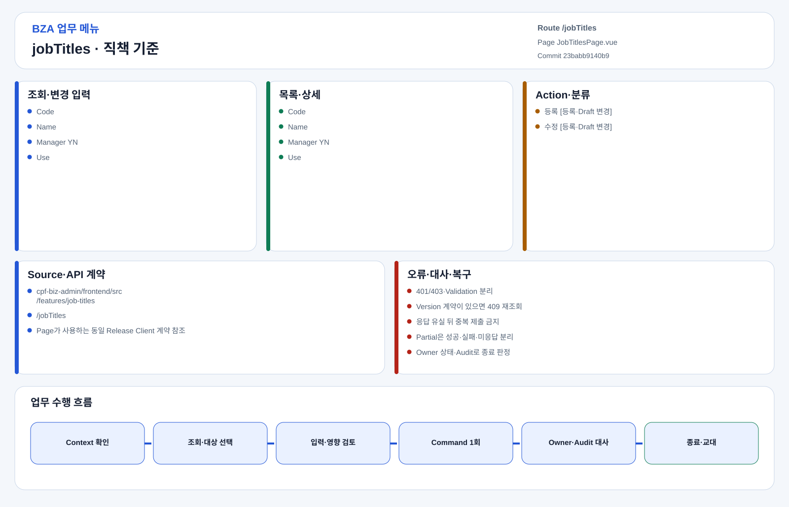

### 이 장에서 끝내는 업무

직책 Code·관리자 여부·사용 여부를 관리한다.

### 메뉴 식별·책임

| 항목 | 값 |
|---|---|
| Route | `/jobTitles` |
| 메뉴 ID | `jobTitles` |
| Menu Code | `EMPLOYEE` |
| 업무 그룹 | people |
| Frontend Page | `cpf-biz-admin/frontend/src/features/job-titles/JobTitlesPage.vue` |
| Permission | Write |
| 기준 Commit | `23babb9140b90e501d6ac715e7b77f55b66198a5` |

### Source·API 근거

| 구분 | 기준 |
|---|---|
| Frontend Page | `cpf-biz-admin/frontend/src/features/job-titles/JobTitlesPage.vue` |
| Router | `/jobTitles` |
| API 추적 | 화면에서 제공하는 기능을 통해 호출한다. 문서에 명시되지 않은 Endpoint를 Browser나 외부 Script에서 임의 호출하지 않는다. |

아래 표는 이 메뉴에서 실제로 확인·입력·실행할 항목을 정리한다. 화면에 없는 Field·Button·상태를 임의로 가정하지 않는다.

### 검색·입력 Field

| Field | Control | 업무 의미 | 기본값·Validation·주의 |
|---|---|---|---|
| `Code` | 문자열 입력·검색 | 조회·상세·Audit에서 같은 대상을 다시 찾기 위한 식별 조건이다. | 앞뒤 공백·허용 문자·길이와 대소문자 규칙을 확인한다. |
| `Name` | 문자열 입력·검색 | 대상의 표시명 또는 업무명을 검색·입력한다. | 앞뒤 공백·허용 문자·길이와 대소문자 규칙을 확인한다. |
| `Manager YN` | Checkbox·Switch | 직책 기준 화면의 조회 조건 또는 편집 Form에 포함되는 값이며 화면 Label과 Help를 기준으로 사용한다. | 현재 선택과 변경 후 영향 범위를 비교하고 화면의 Source 기본값을 확인한다. |
| `Use` | Checkbox·Switch | 현재 상태를 조회하거나 다음 Action의 허용 조건을 지정한다. | 현재 선택과 변경 후 영향 범위를 비교하고 화면의 Source 기본값을 확인한다. |

#### 입력 순서

1. **Code** 항목이 조회 Control인지 변경 Form인지 화면 위치로 구분하고, 표시된 값·필수 여부·허용 형식을 확인한다.
2. **Name** 항목이 조회 Control인지 변경 Form인지 화면 위치로 구분하고, 표시된 값·필수 여부·허용 형식을 확인한다.
3. **Manager YN** 항목이 조회 Control인지 변경 Form인지 화면 위치로 구분하고, 표시된 값·필수 여부·허용 형식을 확인한다.
4. **Use** 항목이 조회 Control인지 변경 Form인지 화면 위치로 구분하고, 표시된 값·필수 여부·허용 형식을 확인한다.
5. 조회 Control과 변경 Form을 분리해 기록하고, 실행 전 Environment·Data Scope·Timezone과 제출할 값만 다시 검토한다.

### 목록 Column·상세 Field

| 표시값 | 운영 의미 | 교차 확인 |
|---|---|---|
| `Code` | 직책 기준의 대상 레코드를 상세·Owner·Audit에서 연결하는 식별자다. | 상세·Log·Trace·Audit에서 같은 대상을 가리키는지 확인한다. |
| `Name` | 운영자가 대상을 구분하는 표시명 또는 설명이다. | 상세·재조회 결과와 비교하고 Stale·Masking·단위 차이를 확인한다. |
| `Manager YN` | 직책 기준 상세에서 대상의 현재 속성 또는 처리 결과를 확인하는 값이다. | 상세·재조회 결과와 비교하고 Stale·Masking·단위 차이를 확인한다. |
| `Use` | 현재 상태와 Terminal 여부, 다음 Action 가능 여부를 판단하는 값이다. | Last Updated·Terminal 조건·Owner 상태와 함께 확인한다. |

#### 결과 판독 순서

1. 조회 완료 시각·Filter·Paging·Sort와 화면 Warning을 확인한다.
2. Empty·Stale·Partial을 정상 0건과 구분한다.
3. 식별자·상태·Version·오류·시각을 같은 Query Context의 상세와 Owner 원장에서 비교한다.
4. Masking된 값은 Raw Permission과 Reason 없이 복원·Export하지 않는다.
5. 집계와 상세가 다르면 집계 시간 창·Timezone·Owner Update 시각을 맞춰 대사한다.

### Button·Action

| Action | 분류 | 활성 조건 | Side Effect·정상 결과 |
|---|---|---|---|
| **등록** | 등록·Draft 변경 | 화면이 실제로 요구하는 Write Permission·필수 Field·Reason·Version 조건을 충족함 | 직책 기준의 재조회 결과가 요청 내용과 일치한다. Version·Before/After·Audit는 해당 Owner가 제공하는 경우 함께 확인한다. |
| **수정** | 등록·Draft 변경 | 화면이 실제로 요구하는 Write Permission·필수 Field·Reason·Version 조건을 충족함 | 직책 기준의 재조회 결과가 요청 내용과 일치한다. Version·Before/After·Audit는 해당 Owner가 제공하는 경우 함께 확인한다. |

### 정상 업무 전체 절차

1. `/jobTitles`에 진입해 Page Header와 Route가 **직책 기준** 기능을 가리키는지 확인한다.
2. 로그인 Session·Environment·Data Scope·기준일·Timezone을 고정한다.
3. 화면의 조회 Control과 변경 Form을 구분한다. 조회 조건이 제공되면 먼저 조회하고, 변경 Form은 대상 선택 또는 등록 Action 뒤에 열린 실제 Field만 사용한다.
4. Loading 종료 후 Empty·Error·Stale·Partial 상태와 화면 Warning을 먼저 판정한다.
5. **Code, Name, Manager YN, Use**를 읽고 식별자·상태·Version·시각을 Owner 원장과 대사한다.
6. **등록** 전에 화면과 Owner가 실제로 요구하는 Permission·현재 상태·영향 범위·Reason·승인·Version 조건을 확인하고 한 번만 제출한다.
7. **등록**의 HTTP 응답과 재조회 결과를 확인한다. 비동기·다중 대상 기능은 Owner Terminal 상태·Version·대상별 Success/Failed/Unknown·Audit를 별도로 확인한다.
8. **수정** 전에 화면과 Owner가 실제로 요구하는 Permission·현재 상태·영향 범위·Reason·승인·Version 조건을 확인하고 한 번만 제출한다.
9. **수정**의 HTTP 응답과 재조회 결과를 확인한다. 비동기·다중 대상 기능은 Owner Terminal 상태·Version·대상별 Success/Failed/Unknown·Audit를 별도로 확인한다.
10. 화면이 제공하는 Log·Metric·Trace와, 변경·Export·승인 조치에 생성된 Audit를 교차 확인한다.
11. 이 장의 **종료 판정**과 다음 확인 시각·Evidence Link를 교대 기록에 남긴다.

### 메뉴 고유 판정·금지 사항

- **목적:** 직책 Code·관리자 여부·사용 여부를 관리한다.
- **종료 판정:** Manager YN 변경이 조직 책임·결재 경로에 미치는 영향을 확인한다.
- 응답을 받지 못한 경우 Owner 상태와 기존 Operation을 확인하기 전에 동일 Action을 반복하지 않는다.
- HTTP 성공 응답이나 Toast만으로 비동기 Owner 상태 또는 다중 대상 적용을 확정하지 않는다.

### 오류·경계·동시성·복구

| 상황 | 화면 징후 | 운영 조치 | 종료 증적 |
|---|---|---|---|
| 401·Session | Session 만료·CSRF·Origin 실패 | 로그인 상태와 BFF Session을 확인한다. Command 자동 Replay는 금지한다. | 401/403 응답·Session Audit |
| 403·Data Scope | 메뉴·Button·Raw·Export가 거부됨 | Menu·Button·API·Owner Permission과 Data Scope를 확인하고 우회하지 않는다. | Deny Audit·요청 Permission |
| Validation | 필수값·범위·형식·기간 오류 | Field Error만 수정하고 기존 성공 Operation을 다시 제출하지 않는다. | Error Code·Field·입력값 |
| Timeout·Dependency | 일부 Source 또는 Command 응답 지연 | Correlation/Operation ID와 실패 Stage를 기록하고 Owner 상태를 조회한다. | Dependency 상태·Retryability |
| Partial·Stale | 일부 대상만 Success 또는 조회 Source 누락 | 성공·실패·미응답을 분리하고 누락 범위와 Version을 표시한다. | Target별 결과·Version |
| 409·동시 변경 | Expected Version 불일치 | 최신 상세를 재조회하고 Diff·영향을 다시 검토한 뒤 새 요청으로 제출한다. | 현재/요청 Version·변경자 |
| 응답 유실·Unknown | 요청 후 실제 처리 여부를 알 수 없음 | Operation ID·Request Hash·Audit·Owner 상태로 대사하고 중복 제출하지 않는다. | Operation·Owner·Audit |
| 복구 실패 | Retry/Rollback 뒤에도 상태 불일치 | 자동 반복을 중단하고 Incident·Reconcile Case·다음 확인 시각을 기록한다. | Case ID·복구 Owner·기한 |

### 응답 유실·결과 불명·부분 적용 처리

1. 동일 Action을 다시 누르지 않고 Browser Network와 응답 Header를 보존한다. `operationId`·`transactionId`·`idempotencyKey`가 제공되면 기록하고, 없으면 Target ID·Actor·요청 시각·Request Body Hash로 대사한다.
2. 기능이 제공하는 상세·Operation Status(있는 경우)·Audit에서 Request Hash와 대상 Version을 검색한다.
3. Side Effect 전 실패가 확인된 경우에만 새 요청을 검토한다.
4. Success·Failed·Unknown 대상을 분리하고 Source가 제공하는 Failed-only Retry·Compensation·Rollback을 선택하고, 지원되지 않으면 수동 Reconcile Case로 이관한다.
5. Rollback을 지원하는 기능은 Owner Version·Checksum·업무 합계가 Rollback Point와 일치하는지 확인한다.
6. 확정되지 않은 대상은 `UNKNOWN_RESULT`로 유지하고 담당자·대사 기한·다음 확인 시각을 기록한다.

### Log·Metric·Trace·Audit와 교대 기록

| 증적 | 필수 값 |
|---|---|
| Audit | Actor·Permission·Reason·Approval·Target·Before/After·Result·Recovery Action |
| Log | Environment·Instance·operationId·transactionId·failureStage·errorCode |
| Metric | 동일 시간 창의 Success·Failure·Latency·Queue·Retry·Partial·Unknown |
| Trace | root/segment/attempt·Owner·DB/Kafka/외부 의존성 Span |
| 상태 원장 | Target ID·Version·Checksum·Desired/Actual·Last Updated·Terminal 여부 |

```text
Menu=jobTitles
Route=/jobTitles
Environment=
DataScope=
Query=
TargetId=
BeforeVersion=
Action=
Reason=
ApprovalId=
OperationId=
TransactionId=
Result=SUCCESS|FAILED|PARTIAL|UNKNOWN_RESULT
OwnerState=
FailedTargets=
ReconcileBy=
RollbackPoint=
EvidenceLinks=
NextCheckAt=
```

### 실무 Workbook

**상황:** 직책 Code·관리자 여부·사용 여부를 관리한다. 담당자가 **등록**을 수행한 뒤 Browser 응답을 받지 못했다.

1. 대상 식별자와 Before Version, 입력값, Reason·Approval을 작업 기록에서 확인한다.
2. 동일 **등록**을 반복하지 않고 Operation·Audit·Owner 상태를 조회한다.
3. Owner 상태가 변경됐고 Request Hash가 같으면 응답 유실로 분류해 중복 조치를 금지한다.
4. 일부 대상만 변경됐으면 Success·Failed·Unknown을 분리해 Failed-only Retry 또는 Rollback을 선택한다.
5. Manager YN 변경이 조직 책임·결재 경로에 미치는 영향을 확인한다.
6. Evidence Link와 다음 확인 시각을 교대 기록에 남긴다.

### 독립 수행 검수 Checklist

- [ ] `/jobTitles`와 Page Source를 찾고 화면 목적을 설명할 수 있다.
- [ ] 4개 입력·검색 항목의 Control·기본값·Validation을 설명할 수 있다.
- [ ] 4개 표시값을 Owner 상태·Version·Audit와 대사할 수 있다.
- [ ] 2개 Action의 분류·활성 조건·Side Effect를 설명할 수 있다.
- [ ] Empty·403·409·Timeout·Partial·Unknown을 서로 다른 상태로 처리할 수 있다.
- [ ] 응답 유실 뒤 중복 제출 없이 Operation·Owner·Audit로 결과를 확정할 수 있다.
- [ ] 교대 기록만으로 다음 담당자가 Target·상태·복구 기한을 이어받을 수 있다.

## 6. assignments — 발령·겸직·파견

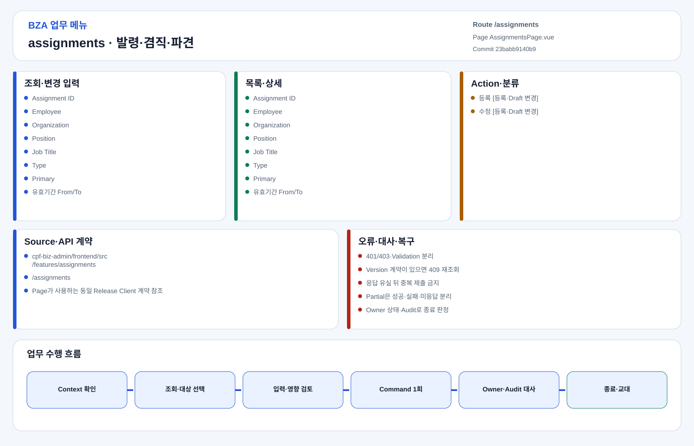

### 이 장에서 끝내는 업무

발령·겸직·파견·대행의 소속과 유효기간을 관리한다.

### 메뉴 식별·책임

| 항목 | 값 |
|---|---|
| Route | `/assignments` |
| 메뉴 ID | `assignments` |
| Menu Code | `EMPLOYEE` |
| 업무 그룹 | people |
| Frontend Page | `cpf-biz-admin/frontend/src/features/assignments/AssignmentsPage.vue` |
| Permission | Write |
| 기준 Commit | `23babb9140b90e501d6ac715e7b77f55b66198a5` |

### Source·API 근거

| 구분 | 기준 |
|---|---|
| Frontend Page | `cpf-biz-admin/frontend/src/features/assignments/AssignmentsPage.vue` |
| Router | `/assignments` |
| API 추적 | 화면에서 제공하는 기능을 통해 호출한다. 문서에 명시되지 않은 Endpoint를 Browser나 외부 Script에서 임의 호출하지 않는다. |

아래 표는 이 메뉴에서 실제로 확인·입력·실행할 항목을 정리한다. 화면에 없는 Field·Button·상태를 임의로 가정하지 않는다.

### 검색·입력 Field

| Field | Control | 업무 의미 | 기본값·Validation·주의 |
|---|---|---|---|
| `Assignment ID` | 문자열 입력·검색 | 조회·상세·Audit에서 같은 대상을 다시 찾기 위한 식별 조건이다. | 앞뒤 공백·허용 문자·길이와 대소문자 규칙을 확인한다. |
| `Employee` | 문자열 입력·검색 | 조회·상세·Audit에서 같은 대상을 다시 찾기 위한 식별 조건이다. | 앞뒤 공백·허용 문자·길이와 대소문자 규칙을 확인한다. |
| `Organization` | 문자열 입력·검색 | 조회·상세·Audit에서 같은 대상을 다시 찾기 위한 식별 조건이다. | 앞뒤 공백·허용 문자·길이와 대소문자 규칙을 확인한다. |
| `Position` | 문자열 입력·검색 | 발령·겸직·파견 화면의 조회 조건 또는 편집 Form에 포함되는 값이며 화면 Label과 Help를 기준으로 사용한다. | 앞뒤 공백·허용 문자·길이와 대소문자 규칙을 확인한다. |
| `Job Title` | 문자열 입력·검색 | 조회·상세·Audit에서 같은 대상을 다시 찾기 위한 식별 조건이다. | 앞뒤 공백·허용 문자·길이와 대소문자 규칙을 확인한다. |
| `Type` | Select·검색 | 발령·겸직·파견에서 적용하거나 조회할 정책·권한·처리 유형을 선택한다. | 허용 목록과 현재 Environment·Data Scope에 맞는 값만 선택한다. |
| `Primary` | Checkbox·Switch | 현재 상태를 조회하거나 다음 Action의 허용 조건을 지정한다. | 현재 선택과 변경 후 영향 범위를 비교하고 화면의 Source 기본값을 확인한다. |
| `유효기간 From/To` | 날짜·시간 입력 | 조회 또는 적용의 유효 시간 범위를 정하며 Timezone과 시작·종료 순서를 함께 확인한다. | Timezone을 고정하고 시작≤종료·유효기간 겹침·기준일 포함 여부를 확인한다. |

#### 입력 순서

1. **Assignment ID** 항목이 조회 Control인지 변경 Form인지 화면 위치로 구분하고, 표시된 값·필수 여부·허용 형식을 확인한다.
2. **Employee** 항목이 조회 Control인지 변경 Form인지 화면 위치로 구분하고, 표시된 값·필수 여부·허용 형식을 확인한다.
3. **Organization** 항목이 조회 Control인지 변경 Form인지 화면 위치로 구분하고, 표시된 값·필수 여부·허용 형식을 확인한다.
4. **Position** 항목이 조회 Control인지 변경 Form인지 화면 위치로 구분하고, 표시된 값·필수 여부·허용 형식을 확인한다.
5. **Job Title** 항목이 조회 Control인지 변경 Form인지 화면 위치로 구분하고, 표시된 값·필수 여부·허용 형식을 확인한다.
6. **Type** 항목이 조회 Control인지 변경 Form인지 화면 위치로 구분하고, 표시된 값·필수 여부·허용 형식을 확인한다.
7. **Primary** 항목이 조회 Control인지 변경 Form인지 화면 위치로 구분하고, 표시된 값·필수 여부·허용 형식을 확인한다.
8. **유효기간 From/To** 항목이 조회 Control인지 변경 Form인지 화면 위치로 구분하고, 표시된 값·필수 여부·허용 형식을 확인한다.
9. 조회 Control과 변경 Form을 분리해 기록하고, 실행 전 Environment·Data Scope·Timezone과 제출할 값만 다시 검토한다.

### 목록 Column·상세 Field

| 표시값 | 운영 의미 | 교차 확인 |
|---|---|---|
| `Assignment ID` | 발령·겸직·파견의 대상 레코드를 상세·Owner·Audit에서 연결하는 식별자다. | 상세·Log·Trace·Audit에서 같은 대상을 가리키는지 확인한다. |
| `Employee` | 발령·겸직·파견의 대상 레코드를 상세·Owner·Audit에서 연결하는 식별자다. | 상세·재조회 결과와 비교하고 Stale·Masking·단위 차이를 확인한다. |
| `Organization` | 발령·겸직·파견의 대상 레코드를 상세·Owner·Audit에서 연결하는 식별자다. | 상세·재조회 결과와 비교하고 Stale·Masking·단위 차이를 확인한다. |
| `Position` | 발령·겸직·파견 상세에서 대상의 현재 속성 또는 처리 결과를 확인하는 값이다. | 상세·재조회 결과와 비교하고 Stale·Masking·단위 차이를 확인한다. |
| `Job Title` | 발령·겸직·파견의 대상 레코드를 상세·Owner·Audit에서 연결하는 식별자다. | 상세·Log·Trace·Audit에서 같은 대상을 가리키는지 확인한다. |
| `Type` | 발령·겸직·파견 상세에서 대상의 현재 속성 또는 처리 결과를 확인하는 값이다. | 상세·재조회 결과와 비교하고 Stale·Masking·단위 차이를 확인한다. |
| `Primary` | 발령·겸직·파견 상세에서 대상의 현재 속성 또는 처리 결과를 확인하는 값이다. | 상세·재조회 결과와 비교하고 Stale·Masking·단위 차이를 확인한다. |
| `유효기간 From/To` | 상태 발생·갱신·유효 시점을 나타내며 화면 Timezone을 기준으로 해석한다. | 상세·재조회 결과와 비교하고 Stale·Masking·단위 차이를 확인한다. |

#### 결과 판독 순서

1. 조회 완료 시각·Filter·Paging·Sort와 화면 Warning을 확인한다.
2. Empty·Stale·Partial을 정상 0건과 구분한다.
3. 식별자·상태·Version·오류·시각을 같은 Query Context의 상세와 Owner 원장에서 비교한다.
4. Masking된 값은 Raw Permission과 Reason 없이 복원·Export하지 않는다.
5. 집계와 상세가 다르면 집계 시간 창·Timezone·Owner Update 시각을 맞춰 대사한다.

### Button·Action

| Action | 분류 | 활성 조건 | Side Effect·정상 결과 |
|---|---|---|---|
| **등록** | 등록·Draft 변경 | 화면이 실제로 요구하는 Write Permission·필수 Field·Reason·Version 조건을 충족함 | 발령·겸직·파견의 재조회 결과가 요청 내용과 일치한다. Version·Before/After·Audit는 해당 Owner가 제공하는 경우 함께 확인한다. |
| **수정** | 등록·Draft 변경 | 화면이 실제로 요구하는 Write Permission·필수 Field·Reason·Version 조건을 충족함 | 발령·겸직·파견의 재조회 결과가 요청 내용과 일치한다. Version·Before/After·Audit는 해당 Owner가 제공하는 경우 함께 확인한다. |

### 정상 업무 전체 절차

1. `/assignments`에 진입해 Page Header와 Route가 **발령·겸직·파견** 기능을 가리키는지 확인한다.
2. 로그인 Session·Environment·Data Scope·기준일·Timezone을 고정한다.
3. 화면의 조회 Control과 변경 Form을 구분한다. 조회 조건이 제공되면 먼저 조회하고, 변경 Form은 대상 선택 또는 등록 Action 뒤에 열린 실제 Field만 사용한다.
4. Loading 종료 후 Empty·Error·Stale·Partial 상태와 화면 Warning을 먼저 판정한다.
5. **Assignment ID, Employee, Organization, Position, Job Title**를 읽고 식별자·상태·Version·시각을 Owner 원장과 대사한다.
6. **등록** 전에 화면과 Owner가 실제로 요구하는 Permission·현재 상태·영향 범위·Reason·승인·Version 조건을 확인하고 한 번만 제출한다.
7. **등록**의 HTTP 응답과 재조회 결과를 확인한다. 비동기·다중 대상 기능은 Owner Terminal 상태·Version·대상별 Success/Failed/Unknown·Audit를 별도로 확인한다.
8. **수정** 전에 화면과 Owner가 실제로 요구하는 Permission·현재 상태·영향 범위·Reason·승인·Version 조건을 확인하고 한 번만 제출한다.
9. **수정**의 HTTP 응답과 재조회 결과를 확인한다. 비동기·다중 대상 기능은 Owner Terminal 상태·Version·대상별 Success/Failed/Unknown·Audit를 별도로 확인한다.
10. 화면이 제공하는 Log·Metric·Trace와, 변경·Export·승인 조치에 생성된 Audit를 교차 확인한다.
11. 이 장의 **종료 판정**과 다음 확인 시각·Evidence Link를 교대 기록에 남긴다.

### 메뉴 고유 판정·금지 사항

- **목적:** 발령·겸직·파견·대행의 소속과 유효기간을 관리한다.
- **종료 판정:** Primary 중복·기간 겹침·조직/직급/직책 유효성을 확인한다.
- 응답을 받지 못한 경우 Owner 상태와 기존 Operation을 확인하기 전에 동일 Action을 반복하지 않는다.
- HTTP 성공 응답이나 Toast만으로 비동기 Owner 상태 또는 다중 대상 적용을 확정하지 않는다.

### 오류·경계·동시성·복구

| 상황 | 화면 징후 | 운영 조치 | 종료 증적 |
|---|---|---|---|
| 401·Session | Session 만료·CSRF·Origin 실패 | 로그인 상태와 BFF Session을 확인한다. Command 자동 Replay는 금지한다. | 401/403 응답·Session Audit |
| 403·Data Scope | 메뉴·Button·Raw·Export가 거부됨 | Menu·Button·API·Owner Permission과 Data Scope를 확인하고 우회하지 않는다. | Deny Audit·요청 Permission |
| Validation | 필수값·범위·형식·기간 오류 | Field Error만 수정하고 기존 성공 Operation을 다시 제출하지 않는다. | Error Code·Field·입력값 |
| Timeout·Dependency | 일부 Source 또는 Command 응답 지연 | Correlation/Operation ID와 실패 Stage를 기록하고 Owner 상태를 조회한다. | Dependency 상태·Retryability |
| Partial·Stale | 일부 대상만 Success 또는 조회 Source 누락 | 성공·실패·미응답을 분리하고 누락 범위와 Version을 표시한다. | Target별 결과·Version |
| 409·동시 변경 | Expected Version 불일치 | 최신 상세를 재조회하고 Diff·영향을 다시 검토한 뒤 새 요청으로 제출한다. | 현재/요청 Version·변경자 |
| 응답 유실·Unknown | 요청 후 실제 처리 여부를 알 수 없음 | Operation ID·Request Hash·Audit·Owner 상태로 대사하고 중복 제출하지 않는다. | Operation·Owner·Audit |
| 복구 실패 | Retry/Rollback 뒤에도 상태 불일치 | 자동 반복을 중단하고 Incident·Reconcile Case·다음 확인 시각을 기록한다. | Case ID·복구 Owner·기한 |
| 계층·기간 충돌 | 고아·순환·기간 중복이 탐지됨 | 대상 관계와 기준일을 수정하고 영향 사용자·결재 Snapshot을 재계산한다. | 관계 Diff·Simulation 결과 |

### 응답 유실·결과 불명·부분 적용 처리

1. 동일 Action을 다시 누르지 않고 Browser Network와 응답 Header를 보존한다. `operationId`·`transactionId`·`idempotencyKey`가 제공되면 기록하고, 없으면 Target ID·Actor·요청 시각·Request Body Hash로 대사한다.
2. 기능이 제공하는 상세·Operation Status(있는 경우)·Audit에서 Request Hash와 대상 Version을 검색한다.
3. Side Effect 전 실패가 확인된 경우에만 새 요청을 검토한다.
4. Success·Failed·Unknown 대상을 분리하고 Source가 제공하는 Failed-only Retry·Compensation·Rollback을 선택하고, 지원되지 않으면 수동 Reconcile Case로 이관한다.
5. Rollback을 지원하는 기능은 Owner Version·Checksum·업무 합계가 Rollback Point와 일치하는지 확인한다.
6. 확정되지 않은 대상은 `UNKNOWN_RESULT`로 유지하고 담당자·대사 기한·다음 확인 시각을 기록한다.

### Log·Metric·Trace·Audit와 교대 기록

| 증적 | 필수 값 |
|---|---|
| Audit | Actor·Permission·Reason·Approval·Target·Before/After·Result·Recovery Action |
| Log | Environment·Instance·operationId·transactionId·failureStage·errorCode |
| Metric | 동일 시간 창의 Success·Failure·Latency·Queue·Retry·Partial·Unknown |
| Trace | root/segment/attempt·Owner·DB/Kafka/외부 의존성 Span |
| 상태 원장 | Target ID·Version·Checksum·Desired/Actual·Last Updated·Terminal 여부 |

```text
Menu=assignments
Route=/assignments
Environment=
DataScope=
Query=
TargetId=
BeforeVersion=
Action=
Reason=
ApprovalId=
OperationId=
TransactionId=
Result=SUCCESS|FAILED|PARTIAL|UNKNOWN_RESULT
OwnerState=
FailedTargets=
ReconcileBy=
RollbackPoint=
EvidenceLinks=
NextCheckAt=
```

### 실무 Workbook

**상황:** 발령·겸직·파견·대행의 소속과 유효기간을 관리한다. 담당자가 **등록**을 수행한 뒤 Browser 응답을 받지 못했다.

1. 대상 식별자와 Before Version, 입력값, Reason·Approval을 작업 기록에서 확인한다.
2. 동일 **등록**을 반복하지 않고 Operation·Audit·Owner 상태를 조회한다.
3. Owner 상태가 변경됐고 Request Hash가 같으면 응답 유실로 분류해 중복 조치를 금지한다.
4. 일부 대상만 변경됐으면 Success·Failed·Unknown을 분리해 Failed-only Retry 또는 Rollback을 선택한다.
5. Primary 중복·기간 겹침·조직/직급/직책 유효성을 확인한다.
6. Evidence Link와 다음 확인 시각을 교대 기록에 남긴다.

### 독립 수행 검수 Checklist

- [ ] `/assignments`와 Page Source를 찾고 화면 목적을 설명할 수 있다.
- [ ] 8개 입력·검색 항목의 Control·기본값·Validation을 설명할 수 있다.
- [ ] 8개 표시값을 Owner 상태·Version·Audit와 대사할 수 있다.
- [ ] 2개 Action의 분류·활성 조건·Side Effect를 설명할 수 있다.
- [ ] Empty·403·409·Timeout·Partial·Unknown을 서로 다른 상태로 처리할 수 있다.
- [ ] 응답 유실 뒤 중복 제출 없이 Operation·Owner·Audit로 결과를 확정할 수 있다.
- [ ] 교대 기록만으로 다음 담당자가 Target·상태·복구 기한을 이어받을 수 있다.

## 7. organizationResponsibilities — 조직장·대행·승인 Owner

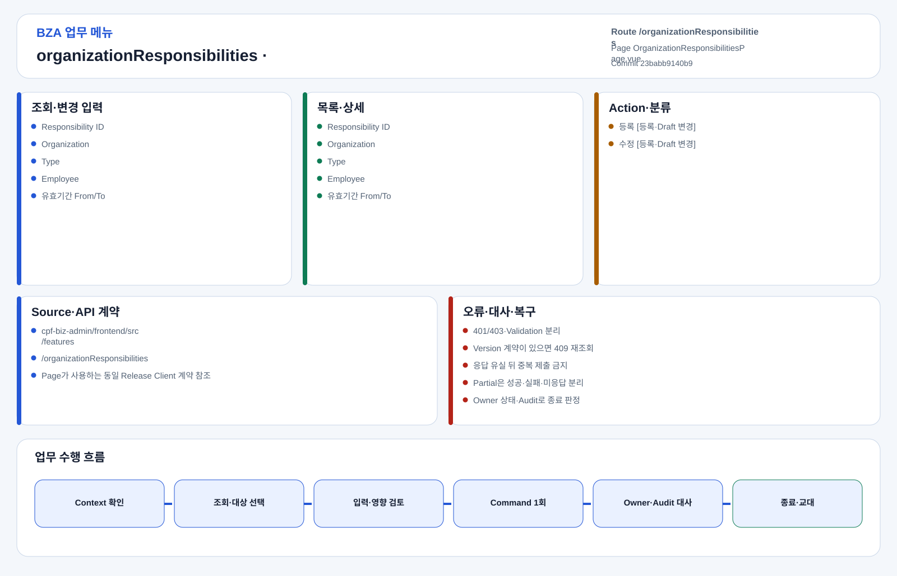

### 이 장에서 끝내는 업무

조직장·대행·승인 Owner 책임과 유효기간을 관리한다.

### 메뉴 식별·책임

| 항목 | 값 |
|---|---|
| Route | `/organizationResponsibilities` |
| 메뉴 ID | `organizationResponsibilities` |
| Menu Code | `ORGANIZATION` |
| 업무 그룹 | people |
| Frontend Page | `cpf-biz-admin/frontend/src/features/organization-responsibilities/OrganizationResponsibilitiesPage.vue` |
| Permission | Write |
| 기준 Commit | `23babb9140b90e501d6ac715e7b77f55b66198a5` |

### Source·API 근거

| 구분 | 기준 |
|---|---|
| Frontend Page | `cpf-biz-admin/frontend/src/features/organization-responsibilities/OrganizationResponsibilitiesPage.vue` |
| Router | `/organizationResponsibilities` |
| API 추적 | 화면에서 제공하는 기능을 통해 호출한다. 문서에 명시되지 않은 Endpoint를 Browser나 외부 Script에서 임의 호출하지 않는다. |

아래 표는 이 메뉴에서 실제로 확인·입력·실행할 항목을 정리한다. 화면에 없는 Field·Button·상태를 임의로 가정하지 않는다.

### 검색·입력 Field

| Field | Control | 업무 의미 | 기본값·Validation·주의 |
|---|---|---|---|
| `Responsibility ID` | 문자열 입력·검색 | 조회·상세·Audit에서 같은 대상을 다시 찾기 위한 식별 조건이다. | 앞뒤 공백·허용 문자·길이와 대소문자 규칙을 확인한다. |
| `Organization` | 문자열 입력·검색 | 조회·상세·Audit에서 같은 대상을 다시 찾기 위한 식별 조건이다. | 앞뒤 공백·허용 문자·길이와 대소문자 규칙을 확인한다. |
| `Type` | Select·검색 | 조직장·대행·승인 Owner에서 적용하거나 조회할 정책·권한·처리 유형을 선택한다. | 허용 목록과 현재 Environment·Data Scope에 맞는 값만 선택한다. |
| `Employee` | 문자열 입력·검색 | 조회·상세·Audit에서 같은 대상을 다시 찾기 위한 식별 조건이다. | 앞뒤 공백·허용 문자·길이와 대소문자 규칙을 확인한다. |
| `유효기간 From/To` | 날짜·시간 입력 | 조회 또는 적용의 유효 시간 범위를 정하며 Timezone과 시작·종료 순서를 함께 확인한다. | Timezone을 고정하고 시작≤종료·유효기간 겹침·기준일 포함 여부를 확인한다. |

#### 입력 순서

1. **Responsibility ID** 항목이 조회 Control인지 변경 Form인지 화면 위치로 구분하고, 표시된 값·필수 여부·허용 형식을 확인한다.
2. **Organization** 항목이 조회 Control인지 변경 Form인지 화면 위치로 구분하고, 표시된 값·필수 여부·허용 형식을 확인한다.
3. **Type** 항목이 조회 Control인지 변경 Form인지 화면 위치로 구분하고, 표시된 값·필수 여부·허용 형식을 확인한다.
4. **Employee** 항목이 조회 Control인지 변경 Form인지 화면 위치로 구분하고, 표시된 값·필수 여부·허용 형식을 확인한다.
5. **유효기간 From/To** 항목이 조회 Control인지 변경 Form인지 화면 위치로 구분하고, 표시된 값·필수 여부·허용 형식을 확인한다.
6. 조회 Control과 변경 Form을 분리해 기록하고, 실행 전 Environment·Data Scope·Timezone과 제출할 값만 다시 검토한다.

### 목록 Column·상세 Field

| 표시값 | 운영 의미 | 교차 확인 |
|---|---|---|
| `Responsibility ID` | 조직장·대행·승인 Owner의 대상 레코드를 상세·Owner·Audit에서 연결하는 식별자다. | 상세·Log·Trace·Audit에서 같은 대상을 가리키는지 확인한다. |
| `Organization` | 조직장·대행·승인 Owner의 대상 레코드를 상세·Owner·Audit에서 연결하는 식별자다. | 상세·재조회 결과와 비교하고 Stale·Masking·단위 차이를 확인한다. |
| `Type` | 조직장·대행·승인 Owner 상세에서 대상의 현재 속성 또는 처리 결과를 확인하는 값이다. | 상세·재조회 결과와 비교하고 Stale·Masking·단위 차이를 확인한다. |
| `Employee` | 조직장·대행·승인 Owner의 대상 레코드를 상세·Owner·Audit에서 연결하는 식별자다. | 상세·재조회 결과와 비교하고 Stale·Masking·단위 차이를 확인한다. |
| `유효기간 From/To` | 상태 발생·갱신·유효 시점을 나타내며 화면 Timezone을 기준으로 해석한다. | 상세·재조회 결과와 비교하고 Stale·Masking·단위 차이를 확인한다. |

#### 결과 판독 순서

1. 조회 완료 시각·Filter·Paging·Sort와 화면 Warning을 확인한다.
2. Empty·Stale·Partial을 정상 0건과 구분한다.
3. 식별자·상태·Version·오류·시각을 같은 Query Context의 상세와 Owner 원장에서 비교한다.
4. Masking된 값은 Raw Permission과 Reason 없이 복원·Export하지 않는다.
5. 집계와 상세가 다르면 집계 시간 창·Timezone·Owner Update 시각을 맞춰 대사한다.

### Button·Action

| Action | 분류 | 활성 조건 | Side Effect·정상 결과 |
|---|---|---|---|
| **등록** | 등록·Draft 변경 | 화면이 실제로 요구하는 Write Permission·필수 Field·Reason·Version 조건을 충족함 | 조직장·대행·승인 Owner의 재조회 결과가 요청 내용과 일치한다. Version·Before/After·Audit는 해당 Owner가 제공하는 경우 함께 확인한다. |
| **수정** | 등록·Draft 변경 | 화면이 실제로 요구하는 Write Permission·필수 Field·Reason·Version 조건을 충족함 | 조직장·대행·승인 Owner의 재조회 결과가 요청 내용과 일치한다. Version·Before/After·Audit는 해당 Owner가 제공하는 경우 함께 확인한다. |

### 정상 업무 전체 절차

1. `/organizationResponsibilities`에 진입해 Page Header와 Route가 **조직장·대행·승인 Owner** 기능을 가리키는지 확인한다.
2. 로그인 Session·Environment·Data Scope·기준일·Timezone을 고정한다.
3. 화면의 조회 Control과 변경 Form을 구분한다. 조회 조건이 제공되면 먼저 조회하고, 변경 Form은 대상 선택 또는 등록 Action 뒤에 열린 실제 Field만 사용한다.
4. Loading 종료 후 Empty·Error·Stale·Partial 상태와 화면 Warning을 먼저 판정한다.
5. **Responsibility ID, Organization, Type, Employee, 유효기간 From/To**를 읽고 식별자·상태·Version·시각을 Owner 원장과 대사한다.
6. **등록** 전에 화면과 Owner가 실제로 요구하는 Permission·현재 상태·영향 범위·Reason·승인·Version 조건을 확인하고 한 번만 제출한다.
7. **등록**의 HTTP 응답과 재조회 결과를 확인한다. 비동기·다중 대상 기능은 Owner Terminal 상태·Version·대상별 Success/Failed/Unknown·Audit를 별도로 확인한다.
8. **수정** 전에 화면과 Owner가 실제로 요구하는 Permission·현재 상태·영향 범위·Reason·승인·Version 조건을 확인하고 한 번만 제출한다.
9. **수정**의 HTTP 응답과 재조회 결과를 확인한다. 비동기·다중 대상 기능은 Owner Terminal 상태·Version·대상별 Success/Failed/Unknown·Audit를 별도로 확인한다.
10. 화면이 제공하는 Log·Metric·Trace와, 변경·Export·승인 조치에 생성된 Audit를 교차 확인한다.
11. 이 장의 **종료 판정**과 다음 확인 시각·Evidence Link를 교대 기록에 남긴다.

### 메뉴 고유 판정·금지 사항

- **목적:** 조직장·대행·승인 Owner 책임과 유효기간을 관리한다.
- **종료 판정:** 같은 조직·책임 유형의 기간 중복과 결재 Snapshot 영향을 확인한다.
- 응답을 받지 못한 경우 Owner 상태와 기존 Operation을 확인하기 전에 동일 Action을 반복하지 않는다.
- HTTP 성공 응답이나 Toast만으로 비동기 Owner 상태 또는 다중 대상 적용을 확정하지 않는다.

### 오류·경계·동시성·복구

| 상황 | 화면 징후 | 운영 조치 | 종료 증적 |
|---|---|---|---|
| 401·Session | Session 만료·CSRF·Origin 실패 | 로그인 상태와 BFF Session을 확인한다. Command 자동 Replay는 금지한다. | 401/403 응답·Session Audit |
| 403·Data Scope | 메뉴·Button·Raw·Export가 거부됨 | Menu·Button·API·Owner Permission과 Data Scope를 확인하고 우회하지 않는다. | Deny Audit·요청 Permission |
| Validation | 필수값·범위·형식·기간 오류 | Field Error만 수정하고 기존 성공 Operation을 다시 제출하지 않는다. | Error Code·Field·입력값 |
| Timeout·Dependency | 일부 Source 또는 Command 응답 지연 | Correlation/Operation ID와 실패 Stage를 기록하고 Owner 상태를 조회한다. | Dependency 상태·Retryability |
| Partial·Stale | 일부 대상만 Success 또는 조회 Source 누락 | 성공·실패·미응답을 분리하고 누락 범위와 Version을 표시한다. | Target별 결과·Version |
| 409·동시 변경 | Expected Version 불일치 | 최신 상세를 재조회하고 Diff·영향을 다시 검토한 뒤 새 요청으로 제출한다. | 현재/요청 Version·변경자 |
| 응답 유실·Unknown | 요청 후 실제 처리 여부를 알 수 없음 | Operation ID·Request Hash·Audit·Owner 상태로 대사하고 중복 제출하지 않는다. | Operation·Owner·Audit |
| 복구 실패 | Retry/Rollback 뒤에도 상태 불일치 | 자동 반복을 중단하고 Incident·Reconcile Case·다음 확인 시각을 기록한다. | Case ID·복구 Owner·기한 |

### 응답 유실·결과 불명·부분 적용 처리

1. 동일 Action을 다시 누르지 않고 Browser Network와 응답 Header를 보존한다. `operationId`·`transactionId`·`idempotencyKey`가 제공되면 기록하고, 없으면 Target ID·Actor·요청 시각·Request Body Hash로 대사한다.
2. 기능이 제공하는 상세·Operation Status(있는 경우)·Audit에서 Request Hash와 대상 Version을 검색한다.
3. Side Effect 전 실패가 확인된 경우에만 새 요청을 검토한다.
4. Success·Failed·Unknown 대상을 분리하고 Source가 제공하는 Failed-only Retry·Compensation·Rollback을 선택하고, 지원되지 않으면 수동 Reconcile Case로 이관한다.
5. Rollback을 지원하는 기능은 Owner Version·Checksum·업무 합계가 Rollback Point와 일치하는지 확인한다.
6. 확정되지 않은 대상은 `UNKNOWN_RESULT`로 유지하고 담당자·대사 기한·다음 확인 시각을 기록한다.

### Log·Metric·Trace·Audit와 교대 기록

| 증적 | 필수 값 |
|---|---|
| Audit | Actor·Permission·Reason·Approval·Target·Before/After·Result·Recovery Action |
| Log | Environment·Instance·operationId·transactionId·failureStage·errorCode |
| Metric | 동일 시간 창의 Success·Failure·Latency·Queue·Retry·Partial·Unknown |
| Trace | root/segment/attempt·Owner·DB/Kafka/외부 의존성 Span |
| 상태 원장 | Target ID·Version·Checksum·Desired/Actual·Last Updated·Terminal 여부 |

```text
Menu=organizationResponsibilities
Route=/organizationResponsibilities
Environment=
DataScope=
Query=
TargetId=
BeforeVersion=
Action=
Reason=
ApprovalId=
OperationId=
TransactionId=
Result=SUCCESS|FAILED|PARTIAL|UNKNOWN_RESULT
OwnerState=
FailedTargets=
ReconcileBy=
RollbackPoint=
EvidenceLinks=
NextCheckAt=
```

### 실무 Workbook

**상황:** 조직장·대행·승인 Owner 책임과 유효기간을 관리한다. 담당자가 **등록**을 수행한 뒤 Browser 응답을 받지 못했다.

1. 대상 식별자와 Before Version, 입력값, Reason·Approval을 작업 기록에서 확인한다.
2. 동일 **등록**을 반복하지 않고 Operation·Audit·Owner 상태를 조회한다.
3. Owner 상태가 변경됐고 Request Hash가 같으면 응답 유실로 분류해 중복 조치를 금지한다.
4. 일부 대상만 변경됐으면 Success·Failed·Unknown을 분리해 Failed-only Retry 또는 Rollback을 선택한다.
5. 같은 조직·책임 유형의 기간 중복과 결재 Snapshot 영향을 확인한다.
6. Evidence Link와 다음 확인 시각을 교대 기록에 남긴다.

### 독립 수행 검수 Checklist

- [ ] `/organizationResponsibilities`와 Page Source를 찾고 화면 목적을 설명할 수 있다.
- [ ] 5개 입력·검색 항목의 Control·기본값·Validation을 설명할 수 있다.
- [ ] 5개 표시값을 Owner 상태·Version·Audit와 대사할 수 있다.
- [ ] 2개 Action의 분류·활성 조건·Side Effect를 설명할 수 있다.
- [ ] Empty·403·409·Timeout·Partial·Unknown을 서로 다른 상태로 처리할 수 있다.
- [ ] 응답 유실 뒤 중복 제출 없이 Operation·Owner·Audit로 결과를 확정할 수 있다.
- [ ] 교대 기록만으로 다음 담당자가 Target·상태·복구 기한을 이어받을 수 있다.

## 8. users — BZA 인증 사용자

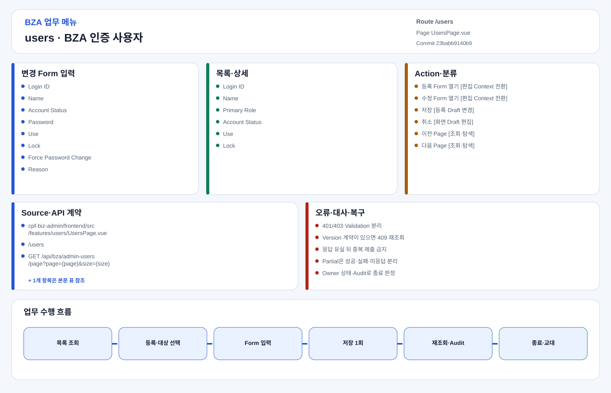

### 이 장에서 끝내는 업무

BZA 로그인 사용자·계정 상태·잠금·Password 변경 요구 여부를 관리한다.

### 메뉴 식별·책임

| 항목 | 값 |
|---|---|
| Route | `/users` |
| 메뉴 ID | `users` |
| Menu Code | `AUTHORIZATION` |
| 업무 그룹 | access |
| Frontend Page | `cpf-biz-admin/frontend/src/features/users/UsersPage.vue` |
| Permission | Write |
| 기준 Commit | `23babb9140b90e501d6ac715e7b77f55b66198a5` |

### Source·API 근거

| 구분 | 기준 |
|---|---|
| Frontend Page | `cpf-biz-admin/frontend/src/features/users/UsersPage.vue` |
| 목록 조회 | `GET /api/bza/admin-users/page?page={page}&size={size}` |
| 등록·수정 저장 | `POST /api/bza/admin-users` |
| 수정 동시성 | 선택 Row의 `versionNo`를 내부 `expectedVersion`으로 전송한다. 화면 입력 Field로 노출하지 않는다. |
| 신규 상태 | 저장 직전 `accountStatus=PENDING_ACTIVATION`으로 고정하며 `expectedVersion`은 보내지 않는다. |
| Password | `rawPassword`가 비어 있으면 Request Body에서 제거한다. 기존 값은 조회·재표시하지 않는다. |
| Role 변경 | 이 화면에서 변경하지 않고 사용자 Role 이력 화면에서 수행한다. |

### 검색·입력 Field

| Field | Control | 업무 의미 | 기본값·Validation·주의 |
|---|---|---|---|
| `Login ID` | 문자열 입력 | BZA 로그인 식별자다. 등록 시 필수이며 수정 Dialog에서는 `readonly`다. | 앞뒤 공백·허용 문자·중복 여부를 확인한다. |
| `Name` | 문자열 입력 | 관리자 표시명이다. 등록·수정 시 필수다. | 빈 값과 허용 길이를 확인한다. |
| `Account Status` | Select | 계정 상태다. 신규 등록 시 `PENDING_ACTIVATION`으로 고정되고 수정할 때만 선택할 수 있다. | 허용값은 PENDING_ACTIVATION·ACTIVE·LOCKED·SUSPENDED·DISABLED다. |
| `Password` | 보안 입력 | 신규 사용자 등록이나 Password 변경 요청에만 사용하는 비밀값이며 조회 결과에는 표시하지 않는다. | 복잡도·재사용 제한을 지키고 원문을 Browser 저장·Log·Screenshot·교대 기록에 남기지 않는다. |
| `Use` | Select | 계정 사용 여부다. | 신규 Form 기본값은 `Y`; 허용값은 Y·N이다. |
| `Lock` | Select | 계정 잠금 여부다. | 신규 Form 기본값은 `N`; 허용값은 N·Y이다. |
| `Force Password Change` | Select | 다음 로그인에서 Password 변경을 요구할지 지정한다. | 신규 Form 기본값은 `Y`; 허용값은 Y·N이다. |
| `Reason` | 다중행 입력 | 사용자 등록·수정 사유를 Audit에 남긴다. | 화면에서 `required`이며 Password 원문을 포함하지 않는다. |

> **화면 입력 계약:** 목록에는 검색 Field가 없다. 등록 또는 수정 Action으로 Dialog를 연 뒤 Form을 입력한다. Password는 새 값만 입력하며 기존 값은 조회·재표시하지 않는다. expectedVersion은 수정 Row의 versionNo에서 내부 설정되고 화면 입력 Field로 노출되지 않는다.

#### 입력 순서

1. **Login ID** 항목이 조회 Control인지 변경 Form인지 화면 위치로 구분하고, 표시된 값·필수 여부·허용 형식을 확인한다.
2. **Name** 항목이 조회 Control인지 변경 Form인지 화면 위치로 구분하고, 표시된 값·필수 여부·허용 형식을 확인한다.
3. **Account Status** 항목이 조회 Control인지 변경 Form인지 화면 위치로 구분하고, 표시된 값·필수 여부·허용 형식을 확인한다.
4. **Password**는 현재값을 조회하거나 재표시하지 않는다. 신규 등록·변경 요청에서 필요한 경우에만 새 비밀값의 형식과 취급 기준을 확인한다.
5. **Use** 항목이 조회 Control인지 변경 Form인지 화면 위치로 구분하고, 표시된 값·필수 여부·허용 형식을 확인한다.
6. **Lock** 항목이 조회 Control인지 변경 Form인지 화면 위치로 구분하고, 표시된 값·필수 여부·허용 형식을 확인한다.
7. **Force Password Change** 항목이 조회 Control인지 변경 Form인지 화면 위치로 구분하고, 표시된 값·필수 여부·허용 형식을 확인한다.
8. **Reason** 항목이 조회 Control인지 변경 Form인지 화면 위치로 구분하고, 표시된 값·필수 여부·허용 형식을 확인한다.
9. 조회 Control과 변경 Form을 분리해 기록하고, 실행 전 Environment·Data Scope·Timezone과 제출할 값만 다시 검토한다.

### 목록 Column·상세 Field

| 표시값 | 운영 의미 | 교차 확인 |
|---|---|---|
| `Login ID` | BZA 인증 사용자의 대상 레코드를 상세·Owner·Audit에서 연결하는 식별자다. | 상세·Log·Trace·Audit에서 같은 대상을 가리키는지 확인한다. |
| `Name` | 운영자가 대상을 구분하는 표시명 또는 설명이다. | 상세·재조회 결과와 비교하고 Stale·Masking·단위 차이를 확인한다. |
| `Primary Role` | BZA 인증 사용자 상세에서 대상의 현재 속성 또는 처리 결과를 확인하는 값이다. | 상세·재조회 결과와 비교하고 Stale·Masking·단위 차이를 확인한다. |
| `Account Status` | 현재 상태와 Terminal 여부, 다음 Action 가능 여부를 판단하는 값이다. | Last Updated·Terminal 조건·Owner 상태와 함께 확인한다. |
| `Use` | 현재 상태와 Terminal 여부, 다음 Action 가능 여부를 판단하는 값이다. | Last Updated·Terminal 조건·Owner 상태와 함께 확인한다. |
| `Lock` | 현재 상태와 Terminal 여부, 다음 Action 가능 여부를 판단하는 값이다. | Last Updated·Terminal 조건·Owner 상태와 함께 확인한다. |

#### 결과 판독 순서

1. 조회 완료 시각·Filter·Paging·Sort와 화면 Warning을 확인한다.
2. Empty·Stale·Partial을 정상 0건과 구분한다.
3. 식별자·상태·Version·오류·시각을 같은 Query Context의 상세와 Owner 원장에서 비교한다.
4. Masking된 값은 Raw Permission과 Reason 없이 복원·Export하지 않는다.
5. 집계와 상세가 다르면 집계 시간 창·Timezone·Owner Update 시각을 맞춰 대사한다.

### Button·Action

| Action | 분류 | 활성 조건 | Side Effect·정상 결과 |
|---|---|---|---|
| **등록 Form 열기** | 편집 Context 전환 | 등록 Permission이 있고 다른 Dialog 제출이 진행 중이 아니며 신규 Form을 열 수 있음 | 신규 Form을 열고 Source 기본값을 표시하며 저장 전에는 Owner 상태를 변경하지 않는다. |
| **수정 Form 열기** | 편집 Context 전환 | 대상 Row가 선택되고 편집 Permission과 현재 상태를 확인함 | 선택한 대상의 현재 Form과 Source가 제공하는 Version 정보를 표시하며 저장 전에는 Owner 상태를 변경하지 않는다. |
| **저장** | 등록·Draft 변경 | 화면이 실제로 요구하는 Write Permission·필수 Field·Reason·Version 조건을 충족함 | BZA 인증 사용자의 재조회 결과가 요청 내용과 일치한다. Version·Before/After·Audit는 해당 Owner가 제공하는 경우 함께 확인한다. |
| **취소** | 화면 Draft 편집 | 화면 Form이 열려 있고 아직 Server Command를 제출하지 않음 | Dialog를 닫고 Browser Draft를 폐기하며 Server Side Effect는 발생하지 않는다. |
| **이전 Page** | 조회·탐색 | 조회 Permission과 Query Validation을 충족하고 동일 조회가 진행 중이 아님 | 이전 Page 결과의 조회 시각·Filter·Source Version·Warning이 갱신되며 Owner 데이터는 변경하지 않는다. |
| **다음 Page** | 조회·탐색 | 조회 Permission과 Query Validation을 충족하고 동일 조회가 진행 중이 아님 | 다음 Page 결과의 조회 시각·Filter·Source Version·Warning이 갱신되며 Owner 데이터는 변경하지 않는다. |

### 정상 업무 전체 절차

1. `/users`에 진입해 Page가 `GET /api/bza/admin-users/page?page={page}&size={size}`로 현재 Page를 조회했는지 확인한다.
2. 목록의 Login ID·이름·Primary Role·계정 상태·사용·잠금 값을 확인한다. 이 화면에는 검색 Form이 없다.
3. 신규 등록은 **등록 Form 열기**, 기존 변경은 대상 Row의 **수정 Form 열기**를 선택한다.
4. 수정 Form에서는 Login ID가 `readonly`이고, 내부 `expectedVersion`은 선택 Row의 `versionNo`에서 설정된다. 운영자가 Version을 직접 입력하지 않는다.
5. 신규 등록 시 계정 상태는 `PENDING_ACTIVATION`으로 고정된다. Role은 이 화면에서 변경하지 않고 사용자 Role 이력 화면에서 별도로 부여한다.
6. Password는 필요한 경우에만 새 값을 입력한다. 기존 Password는 조회·재표시·교대 기록하지 않는다.
7. 이름·계정 상태·사용·잠금·강제 Password 변경·사유를 검토하고 **저장**을 한 번만 제출한다.
8. 저장 후 Page를 재조회해 목록 상태와 Version 변경 결과를 확인하고, 사용자 Role·Session 영향은 관련 화면에서 별도로 확인한다.
9. 응답을 받지 못한 경우 같은 저장을 반복하지 않고 Login ID와 Audit·Owner 상태로 생성·변경 여부를 대사한다.
10. **이전 Page**·**다음 Page**는 조회 Context만 변경하며 Owner 데이터를 변경하지 않는다.
11. 결과·사유·대사 근거·다음 확인 시각을 교대 기록에 남기되 Password 원문은 기록하지 않는다.

### 메뉴 고유 판정·금지 사항

- **목적:** BZA 로그인 사용자·계정 상태·잠금·Password 변경 요구 여부를 관리한다.
- **종료 판정:** Expected Version과 Session·Role 상태를 함께 확인한다.
- 응답을 받지 못한 경우 Owner 상태와 기존 Operation을 확인하기 전에 동일 Action을 반복하지 않는다.
- HTTP 성공 응답이나 Toast만으로 비동기 Owner 상태 또는 다중 대상 적용을 확정하지 않는다.
- Raw·PII·Password·Secret은 Screenshot·Clipboard·교대 기록·일반 Log에 남기지 않는다.

### 오류·경계·동시성·복구

| 상황 | 화면 징후 | 운영 조치 | 종료 증적 |
|---|---|---|---|
| 401·Session | Session 만료·CSRF·Origin 실패 | 로그인 상태와 BFF Session을 확인한다. Command 자동 Replay는 금지한다. | 401/403 응답·Session Audit |
| 403·Data Scope | 메뉴·Button·Raw·Export가 거부됨 | Menu·Button·API·Owner Permission과 Data Scope를 확인하고 우회하지 않는다. | Deny Audit·요청 Permission |
| Validation | 필수값·범위·형식·기간 오류 | Field Error만 수정하고 기존 성공 Operation을 다시 제출하지 않는다. | Error Code·Field·입력값 |
| Timeout·Dependency | 일부 Source 또는 Command 응답 지연 | Correlation/Operation ID와 실패 Stage를 기록하고 Owner 상태를 조회한다. | Dependency 상태·Retryability |
| Partial·Stale | 일부 대상만 Success 또는 조회 Source 누락 | 성공·실패·미응답을 분리하고 누락 범위와 Version을 표시한다. | Target별 결과·Version |
| 409·동시 변경 | Expected Version 불일치 | 최신 상세를 재조회하고 Diff·영향을 다시 검토한 뒤 새 요청으로 제출한다. | 현재/요청 Version·변경자 |
| 응답 유실·Unknown | 요청 후 실제 처리 여부를 알 수 없음 | Operation ID·Request Hash·Audit·Owner 상태로 대사하고 중복 제출하지 않는다. | Operation·Owner·Audit |
| 복구 실패 | Retry/Rollback 뒤에도 상태 불일치 | 자동 반복을 중단하고 Incident·Reconcile Case·다음 확인 시각을 기록한다. | Case ID·복구 Owner·기한 |

### 응답 유실·결과 불명·부분 적용 처리

1. 동일 Action을 다시 누르지 않고 Browser Network와 응답 Header를 보존한다. `operationId`·`transactionId`·`idempotencyKey`가 제공되면 기록하고, 없으면 Target ID·Actor·요청 시각·Request Body Hash로 대사한다.
2. 기능이 제공하는 상세·Operation Status(있는 경우)·Audit에서 Request Hash와 대상 Version을 검색한다.
3. Side Effect 전 실패가 확인된 경우에만 새 요청을 검토한다.
4. Success·Failed·Unknown 대상을 분리하고 Source가 제공하는 Failed-only Retry·Compensation·Rollback을 선택하고, 지원되지 않으면 수동 Reconcile Case로 이관한다.
5. Rollback을 지원하는 기능은 Owner Version·Checksum·업무 합계가 Rollback Point와 일치하는지 확인한다.
6. 확정되지 않은 대상은 `UNKNOWN_RESULT`로 유지하고 담당자·대사 기한·다음 확인 시각을 기록한다.

### Log·Metric·Trace·Audit와 교대 기록

| 증적 | 필수 값 |
|---|---|
| Audit | Actor·Permission·Reason·Approval·Target·Before/After·Result·Recovery Action |
| Log | Environment·Instance·operationId·transactionId·failureStage·errorCode |
| Metric | 동일 시간 창의 Success·Failure·Latency·Queue·Retry·Partial·Unknown |
| Trace | root/segment/attempt·Owner·DB/Kafka/외부 의존성 Span |
| 상태 원장 | Target ID·Version·Checksum·Desired/Actual·Last Updated·Terminal 여부 |

```text
Menu=users
Route=/users
Environment=
DataScope=
Query=
TargetId=
BeforeVersion=
Action=
Reason=
ApprovalId=
OperationId=
TransactionId=
Result=SUCCESS|FAILED|PARTIAL|UNKNOWN_RESULT
OwnerState=
FailedTargets=
ReconcileBy=
RollbackPoint=
EvidenceLinks=
NextCheckAt=
```

### 실무 Workbook

**상황:** BZA 로그인 사용자·계정 상태·잠금·Password 변경 요구 여부를 관리한다. 담당자가 **등록**을 수행한 뒤 Browser 응답을 받지 못했다.

1. 대상 식별자와 Before Version, 입력값, Reason·Approval을 작업 기록에서 확인한다.
2. 동일 **등록**을 반복하지 않고 Operation·Audit·Owner 상태를 조회한다.
3. Owner 상태가 변경됐고 Request Hash가 같으면 응답 유실로 분류해 중복 조치를 금지한다.
4. 일부 대상만 변경됐으면 Success·Failed·Unknown을 분리해 Failed-only Retry 또는 Rollback을 선택한다.
5. Expected Version과 Session·Role 상태를 함께 확인한다.
6. Evidence Link와 다음 확인 시각을 교대 기록에 남긴다.

### 독립 수행 검수 Checklist

- [ ] `/users`와 Page Source를 찾고 화면 목적을 설명할 수 있다.
- [ ] 9개 입력·검색 항목의 Control·기본값·Validation을 설명할 수 있다.
- [ ] 6개 표시값을 Owner 상태·Version·Audit와 대사할 수 있다.
- [ ] 6개 Action의 분류·활성 조건·Side Effect를 설명할 수 있다.
- [ ] Empty·403·409·Timeout·Partial·Unknown을 서로 다른 상태로 처리할 수 있다.
- [ ] 응답 유실 뒤 중복 제출 없이 Operation·Owner·Audit로 결과를 확정할 수 있다.
- [ ] 교대 기록만으로 다음 담당자가 Target·상태·복구 기한을 이어받을 수 있다.

## 9. roles — 업무 Role

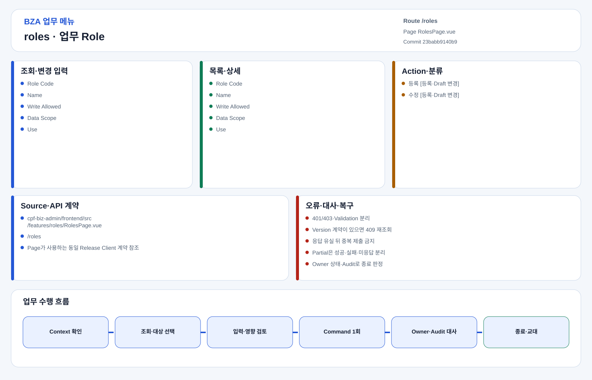

### 이 장에서 끝내는 업무

업무 Role·Write 허용·Data Scope·사용 여부를 관리한다.

### 메뉴 식별·책임

| 항목 | 값 |
|---|---|
| Route | `/roles` |
| 메뉴 ID | `roles` |
| Menu Code | `AUTHORIZATION` |
| 업무 그룹 | access |
| Frontend Page | `cpf-biz-admin/frontend/src/features/roles/RolesPage.vue` |
| Permission | Write |
| 기준 Commit | `23babb9140b90e501d6ac715e7b77f55b66198a5` |

### Source·API 근거

| 구분 | 기준 |
|---|---|
| Frontend Page | `cpf-biz-admin/frontend/src/features/roles/RolesPage.vue` |
| Router | `/roles` |
| API 추적 | 화면에서 제공하는 기능을 통해 호출한다. 문서에 명시되지 않은 Endpoint를 Browser나 외부 Script에서 임의 호출하지 않는다. |

아래 표는 이 메뉴에서 실제로 확인·입력·실행할 항목을 정리한다. 화면에 없는 Field·Button·상태를 임의로 가정하지 않는다.

### 검색·입력 Field

| Field | Control | 업무 의미 | 기본값·Validation·주의 |
|---|---|---|---|
| `Role Code` | Select·검색 | 업무 Role에서 적용하거나 조회할 정책·권한·처리 유형을 선택한다. | 허용 목록과 현재 Environment·Data Scope에 맞는 값만 선택한다. |
| `Name` | 문자열 입력·검색 | 대상의 표시명 또는 업무명을 검색·입력한다. | 앞뒤 공백·허용 문자·길이와 대소문자 규칙을 확인한다. |
| `Write Allowed` | Checkbox·Switch | 현재 상태를 조회하거나 다음 Action의 허용 조건을 지정한다. | 현재 선택과 변경 후 영향 범위를 비교하고 화면의 Source 기본값을 확인한다. |
| `Data Scope` | Select·검색 | 업무 Role 조회·조치가 적용되는 환경과 데이터 경계를 제한한다. | 허용 목록과 현재 Environment·Data Scope에 맞는 값만 선택한다. |
| `Use` | Checkbox·Switch | 현재 상태를 조회하거나 다음 Action의 허용 조건을 지정한다. | 현재 선택과 변경 후 영향 범위를 비교하고 화면의 Source 기본값을 확인한다. |

#### 입력 순서

1. **Role Code** 항목이 조회 Control인지 변경 Form인지 화면 위치로 구분하고, 표시된 값·필수 여부·허용 형식을 확인한다.
2. **Name** 항목이 조회 Control인지 변경 Form인지 화면 위치로 구분하고, 표시된 값·필수 여부·허용 형식을 확인한다.
3. **Write Allowed** 항목이 조회 Control인지 변경 Form인지 화면 위치로 구분하고, 표시된 값·필수 여부·허용 형식을 확인한다.
4. **Data Scope** 항목이 조회 Control인지 변경 Form인지 화면 위치로 구분하고, 표시된 값·필수 여부·허용 형식을 확인한다.
5. **Use** 항목이 조회 Control인지 변경 Form인지 화면 위치로 구분하고, 표시된 값·필수 여부·허용 형식을 확인한다.
6. 조회 Control과 변경 Form을 분리해 기록하고, 실행 전 Environment·Data Scope·Timezone과 제출할 값만 다시 검토한다.

### 목록 Column·상세 Field

| 표시값 | 운영 의미 | 교차 확인 |
|---|---|---|
| `Role Code` | 업무 Role의 대상 레코드를 상세·Owner·Audit에서 연결하는 식별자다. | 상세·Log·Trace·Audit에서 같은 대상을 가리키는지 확인한다. |
| `Name` | 운영자가 대상을 구분하는 표시명 또는 설명이다. | 상세·재조회 결과와 비교하고 Stale·Masking·단위 차이를 확인한다. |
| `Write Allowed` | 현재 상태와 Terminal 여부, 다음 Action 가능 여부를 판단하는 값이다. | 상세·재조회 결과와 비교하고 Stale·Masking·단위 차이를 확인한다. |
| `Data Scope` | 업무 Role 상세에서 대상의 현재 속성 또는 처리 결과를 확인하는 값이다. | 상세·재조회 결과와 비교하고 Stale·Masking·단위 차이를 확인한다. |
| `Use` | 현재 상태와 Terminal 여부, 다음 Action 가능 여부를 판단하는 값이다. | Last Updated·Terminal 조건·Owner 상태와 함께 확인한다. |

#### 결과 판독 순서

1. 조회 완료 시각·Filter·Paging·Sort와 화면 Warning을 확인한다.
2. Empty·Stale·Partial을 정상 0건과 구분한다.
3. 식별자·상태·Version·오류·시각을 같은 Query Context의 상세와 Owner 원장에서 비교한다.
4. Masking된 값은 Raw Permission과 Reason 없이 복원·Export하지 않는다.
5. 집계와 상세가 다르면 집계 시간 창·Timezone·Owner Update 시각을 맞춰 대사한다.

### Button·Action

| Action | 분류 | 활성 조건 | Side Effect·정상 결과 |
|---|---|---|---|
| **등록** | 등록·Draft 변경 | 화면이 실제로 요구하는 Write Permission·필수 Field·Reason·Version 조건을 충족함 | 업무 Role의 재조회 결과가 요청 내용과 일치한다. Version·Before/After·Audit는 해당 Owner가 제공하는 경우 함께 확인한다. |
| **수정** | 등록·Draft 변경 | 화면이 실제로 요구하는 Write Permission·필수 Field·Reason·Version 조건을 충족함 | 업무 Role의 재조회 결과가 요청 내용과 일치한다. Version·Before/After·Audit는 해당 Owner가 제공하는 경우 함께 확인한다. |

### 정상 업무 전체 절차

1. `/roles`에 진입해 Page Header와 Route가 **업무 Role** 기능을 가리키는지 확인한다.
2. 로그인 Session·Environment·Data Scope·기준일·Timezone을 고정한다.
3. 화면의 조회 Control과 변경 Form을 구분한다. 조회 조건이 제공되면 먼저 조회하고, 변경 Form은 대상 선택 또는 등록 Action 뒤에 열린 실제 Field만 사용한다.
4. Loading 종료 후 Empty·Error·Stale·Partial 상태와 화면 Warning을 먼저 판정한다.
5. **Role Code, Name, Write Allowed, Data Scope, Use**를 읽고 식별자·상태·Version·시각을 Owner 원장과 대사한다.
6. **등록** 전에 화면과 Owner가 실제로 요구하는 Permission·현재 상태·영향 범위·Reason·승인·Version 조건을 확인하고 한 번만 제출한다.
7. **등록**의 HTTP 응답과 재조회 결과를 확인한다. 비동기·다중 대상 기능은 Owner Terminal 상태·Version·대상별 Success/Failed/Unknown·Audit를 별도로 확인한다.
8. **수정** 전에 화면과 Owner가 실제로 요구하는 Permission·현재 상태·영향 범위·Reason·승인·Version 조건을 확인하고 한 번만 제출한다.
9. **수정**의 HTTP 응답과 재조회 결과를 확인한다. 비동기·다중 대상 기능은 Owner Terminal 상태·Version·대상별 Success/Failed/Unknown·Audit를 별도로 확인한다.
10. 화면이 제공하는 Log·Metric·Trace와, 변경·Export·승인 조치에 생성된 Audit를 교차 확인한다.
11. 이 장의 **종료 판정**과 다음 확인 시각·Evidence Link를 교대 기록에 남긴다.

### 메뉴 고유 판정·금지 사항

- **목적:** 업무 Role·Write 허용·Data Scope·사용 여부를 관리한다.
- **종료 판정:** Role 변경 전 사용자 수와 Effective Permission 영향을 Preview한다.
- 응답을 받지 못한 경우 Owner 상태와 기존 Operation을 확인하기 전에 동일 Action을 반복하지 않는다.
- HTTP 성공 응답이나 Toast만으로 비동기 Owner 상태 또는 다중 대상 적용을 확정하지 않는다.

### 오류·경계·동시성·복구

| 상황 | 화면 징후 | 운영 조치 | 종료 증적 |
|---|---|---|---|
| 401·Session | Session 만료·CSRF·Origin 실패 | 로그인 상태와 BFF Session을 확인한다. Command 자동 Replay는 금지한다. | 401/403 응답·Session Audit |
| 403·Data Scope | 메뉴·Button·Raw·Export가 거부됨 | Menu·Button·API·Owner Permission과 Data Scope를 확인하고 우회하지 않는다. | Deny Audit·요청 Permission |
| Validation | 필수값·범위·형식·기간 오류 | Field Error만 수정하고 기존 성공 Operation을 다시 제출하지 않는다. | Error Code·Field·입력값 |
| Timeout·Dependency | 일부 Source 또는 Command 응답 지연 | Correlation/Operation ID와 실패 Stage를 기록하고 Owner 상태를 조회한다. | Dependency 상태·Retryability |
| Partial·Stale | 일부 대상만 Success 또는 조회 Source 누락 | 성공·실패·미응답을 분리하고 누락 범위와 Version을 표시한다. | Target별 결과·Version |
| 409·동시 변경 | Expected Version 불일치 | 최신 상세를 재조회하고 Diff·영향을 다시 검토한 뒤 새 요청으로 제출한다. | 현재/요청 Version·변경자 |
| 응답 유실·Unknown | 요청 후 실제 처리 여부를 알 수 없음 | Operation ID·Request Hash·Audit·Owner 상태로 대사하고 중복 제출하지 않는다. | Operation·Owner·Audit |
| 복구 실패 | Retry/Rollback 뒤에도 상태 불일치 | 자동 반복을 중단하고 Incident·Reconcile Case·다음 확인 시각을 기록한다. | Case ID·복구 Owner·기한 |

### 응답 유실·결과 불명·부분 적용 처리

1. 동일 Action을 다시 누르지 않고 Browser Network와 응답 Header를 보존한다. `operationId`·`transactionId`·`idempotencyKey`가 제공되면 기록하고, 없으면 Target ID·Actor·요청 시각·Request Body Hash로 대사한다.
2. 기능이 제공하는 상세·Operation Status(있는 경우)·Audit에서 Request Hash와 대상 Version을 검색한다.
3. Side Effect 전 실패가 확인된 경우에만 새 요청을 검토한다.
4. Success·Failed·Unknown 대상을 분리하고 Source가 제공하는 Failed-only Retry·Compensation·Rollback을 선택하고, 지원되지 않으면 수동 Reconcile Case로 이관한다.
5. Rollback을 지원하는 기능은 Owner Version·Checksum·업무 합계가 Rollback Point와 일치하는지 확인한다.
6. 확정되지 않은 대상은 `UNKNOWN_RESULT`로 유지하고 담당자·대사 기한·다음 확인 시각을 기록한다.

### Log·Metric·Trace·Audit와 교대 기록

| 증적 | 필수 값 |
|---|---|
| Audit | Actor·Permission·Reason·Approval·Target·Before/After·Result·Recovery Action |
| Log | Environment·Instance·operationId·transactionId·failureStage·errorCode |
| Metric | 동일 시간 창의 Success·Failure·Latency·Queue·Retry·Partial·Unknown |
| Trace | root/segment/attempt·Owner·DB/Kafka/외부 의존성 Span |
| 상태 원장 | Target ID·Version·Checksum·Desired/Actual·Last Updated·Terminal 여부 |

```text
Menu=roles
Route=/roles
Environment=
DataScope=
Query=
TargetId=
BeforeVersion=
Action=
Reason=
ApprovalId=
OperationId=
TransactionId=
Result=SUCCESS|FAILED|PARTIAL|UNKNOWN_RESULT
OwnerState=
FailedTargets=
ReconcileBy=
RollbackPoint=
EvidenceLinks=
NextCheckAt=
```

### 실무 Workbook

**상황:** 업무 Role·Write 허용·Data Scope·사용 여부를 관리한다. 담당자가 **등록**을 수행한 뒤 Browser 응답을 받지 못했다.

1. 대상 식별자와 Before Version, 입력값, Reason·Approval을 작업 기록에서 확인한다.
2. 동일 **등록**을 반복하지 않고 Operation·Audit·Owner 상태를 조회한다.
3. Owner 상태가 변경됐고 Request Hash가 같으면 응답 유실로 분류해 중복 조치를 금지한다.
4. 일부 대상만 변경됐으면 Success·Failed·Unknown을 분리해 Failed-only Retry 또는 Rollback을 선택한다.
5. Role 변경 전 사용자 수와 Effective Permission 영향을 Preview한다.
6. Evidence Link와 다음 확인 시각을 교대 기록에 남긴다.

### 독립 수행 검수 Checklist

- [ ] `/roles`와 Page Source를 찾고 화면 목적을 설명할 수 있다.
- [ ] 5개 입력·검색 항목의 Control·기본값·Validation을 설명할 수 있다.
- [ ] 5개 표시값을 Owner 상태·Version·Audit와 대사할 수 있다.
- [ ] 2개 Action의 분류·활성 조건·Side Effect를 설명할 수 있다.
- [ ] Empty·403·409·Timeout·Partial·Unknown을 서로 다른 상태로 처리할 수 있다.
- [ ] 응답 유실 뒤 중복 제출 없이 Operation·Owner·Audit로 결과를 확정할 수 있다.
- [ ] 교대 기록만으로 다음 담당자가 Target·상태·복구 기한을 이어받을 수 있다.

## 10. userRoles — 사용자 Role 유효기간

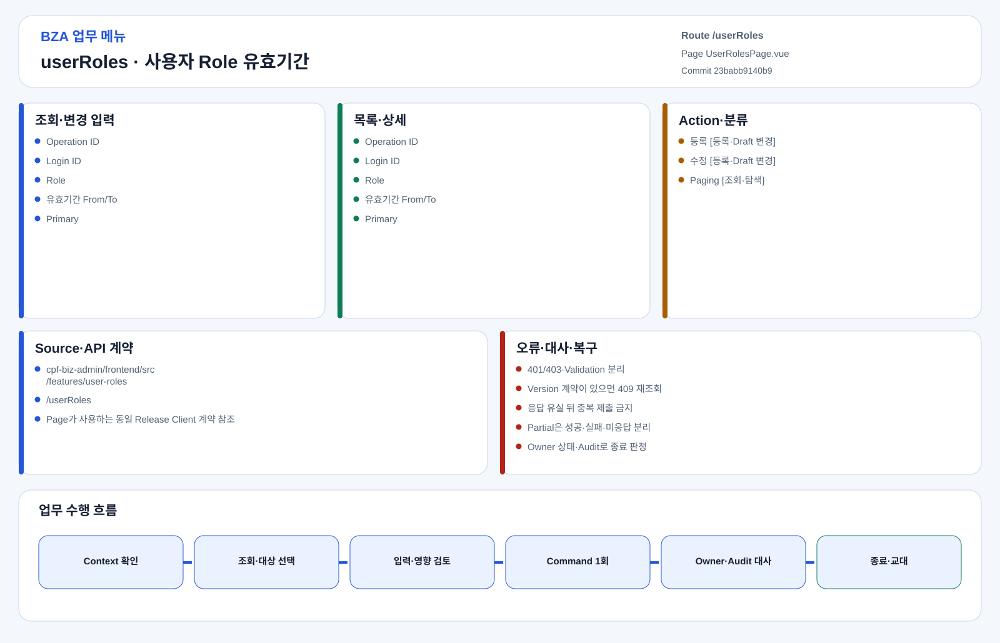

### 이 장에서 끝내는 업무

사용자와 Role의 유효기간·Primary 관계를 관리한다.

### 메뉴 식별·책임

| 항목 | 값 |
|---|---|
| Route | `/userRoles` |
| 메뉴 ID | `userRoles` |
| Menu Code | `AUTHORIZATION` |
| 업무 그룹 | access |
| Frontend Page | `cpf-biz-admin/frontend/src/features/user-roles/UserRolesPage.vue` |
| Permission | Write |
| 기준 Commit | `23babb9140b90e501d6ac715e7b77f55b66198a5` |

### Source·API 근거

| 구분 | 기준 |
|---|---|
| Frontend Page | `cpf-biz-admin/frontend/src/features/user-roles/UserRolesPage.vue` |
| Router | `/userRoles` |
| API 추적 | 화면에서 제공하는 기능을 통해 호출한다. 문서에 명시되지 않은 Endpoint를 Browser나 외부 Script에서 임의 호출하지 않는다. |

아래 표는 이 메뉴에서 실제로 확인·입력·실행할 항목을 정리한다. 화면에 없는 Field·Button·상태를 임의로 가정하지 않는다.

### 검색·입력 Field

| Field | Control | 업무 의미 | 기본값·Validation·주의 |
|---|---|---|---|
| `Operation ID` | 문자열 입력·검색 | 조회·상세·Audit에서 같은 대상을 다시 찾기 위한 식별 조건이다. | 앞뒤 공백·허용 문자·길이와 대소문자 규칙을 확인한다. |
| `Login ID` | 문자열 입력·검색 | 조회·상세·Audit에서 같은 대상을 다시 찾기 위한 식별 조건이다. | 앞뒤 공백·허용 문자·길이와 대소문자 규칙을 확인한다. |
| `Role` | Select·검색 | 사용자 Role 유효기간에서 적용하거나 조회할 정책·권한·처리 유형을 선택한다. | 허용 목록과 현재 Environment·Data Scope에 맞는 값만 선택한다. |
| `유효기간 From/To` | 날짜·시간 입력 | 조회 또는 적용의 유효 시간 범위를 정하며 Timezone과 시작·종료 순서를 함께 확인한다. | Timezone을 고정하고 시작≤종료·유효기간 겹침·기준일 포함 여부를 확인한다. |
| `Primary` | Checkbox·Switch | 현재 상태를 조회하거나 다음 Action의 허용 조건을 지정한다. | 현재 선택과 변경 후 영향 범위를 비교하고 화면의 Source 기본값을 확인한다. |

#### 입력 순서

1. **Operation ID** 항목이 조회 Control인지 변경 Form인지 화면 위치로 구분하고, 표시된 값·필수 여부·허용 형식을 확인한다.
2. **Login ID** 항목이 조회 Control인지 변경 Form인지 화면 위치로 구분하고, 표시된 값·필수 여부·허용 형식을 확인한다.
3. **Role** 항목이 조회 Control인지 변경 Form인지 화면 위치로 구분하고, 표시된 값·필수 여부·허용 형식을 확인한다.
4. **유효기간 From/To** 항목이 조회 Control인지 변경 Form인지 화면 위치로 구분하고, 표시된 값·필수 여부·허용 형식을 확인한다.
5. **Primary** 항목이 조회 Control인지 변경 Form인지 화면 위치로 구분하고, 표시된 값·필수 여부·허용 형식을 확인한다.
6. 조회 Control과 변경 Form을 분리해 기록하고, 실행 전 Environment·Data Scope·Timezone과 제출할 값만 다시 검토한다.

### 목록 Column·상세 Field

| 표시값 | 운영 의미 | 교차 확인 |
|---|---|---|
| `Operation ID` | 사용자 Role 유효기간의 대상 레코드를 상세·Owner·Audit에서 연결하는 식별자다. | 상세·Log·Trace·Audit에서 같은 대상을 가리키는지 확인한다. |
| `Login ID` | 사용자 Role 유효기간의 대상 레코드를 상세·Owner·Audit에서 연결하는 식별자다. | 상세·Log·Trace·Audit에서 같은 대상을 가리키는지 확인한다. |
| `Role` | 사용자 Role 유효기간 상세에서 대상의 현재 속성 또는 처리 결과를 확인하는 값이다. | 상세·재조회 결과와 비교하고 Stale·Masking·단위 차이를 확인한다. |
| `유효기간 From/To` | 상태 발생·갱신·유효 시점을 나타내며 화면 Timezone을 기준으로 해석한다. | 상세·재조회 결과와 비교하고 Stale·Masking·단위 차이를 확인한다. |
| `Primary` | 사용자 Role 유효기간 상세에서 대상의 현재 속성 또는 처리 결과를 확인하는 값이다. | 상세·재조회 결과와 비교하고 Stale·Masking·단위 차이를 확인한다. |

#### 결과 판독 순서

1. 조회 완료 시각·Filter·Paging·Sort와 화면 Warning을 확인한다.
2. Empty·Stale·Partial을 정상 0건과 구분한다.
3. 식별자·상태·Version·오류·시각을 같은 Query Context의 상세와 Owner 원장에서 비교한다.
4. Masking된 값은 Raw Permission과 Reason 없이 복원·Export하지 않는다.
5. 집계와 상세가 다르면 집계 시간 창·Timezone·Owner Update 시각을 맞춰 대사한다.

### Button·Action

| Action | 분류 | 활성 조건 | Side Effect·정상 결과 |
|---|---|---|---|
| **등록** | 등록·Draft 변경 | 화면이 실제로 요구하는 Write Permission·필수 Field·Reason·Version 조건을 충족함 | 사용자 Role 유효기간의 재조회 결과가 요청 내용과 일치한다. Version·Before/After·Audit는 해당 Owner가 제공하는 경우 함께 확인한다. |
| **수정** | 등록·Draft 변경 | 화면이 실제로 요구하는 Write Permission·필수 Field·Reason·Version 조건을 충족함 | 사용자 Role 유효기간의 재조회 결과가 요청 내용과 일치한다. Version·Before/After·Audit는 해당 Owner가 제공하는 경우 함께 확인한다. |
| **Paging** | 조회·탐색 | 조회 Permission과 Query Validation을 충족하고 동일 조회가 진행 중이 아님 | Paging 결과의 조회 시각·Filter·Source Version·Warning이 갱신되며 Owner 데이터는 변경하지 않는다. |

### 정상 업무 전체 절차

1. `/userRoles`에 진입해 Page Header와 Route가 **사용자 Role 유효기간** 기능을 가리키는지 확인한다.
2. 로그인 Session·Environment·Data Scope·기준일·Timezone을 고정한다.
3. 화면의 조회 Control과 변경 Form을 구분한다. 조회 조건이 제공되면 먼저 조회하고, 변경 Form은 대상 선택 또는 등록 Action 뒤에 열린 실제 Field만 사용한다.
4. Loading 종료 후 Empty·Error·Stale·Partial 상태와 화면 Warning을 먼저 판정한다.
5. **Operation ID, Login ID, Role, 유효기간 From/To, Primary**를 읽고 식별자·상태·Version·시각을 Owner 원장과 대사한다.
6. **등록** 전에 화면과 Owner가 실제로 요구하는 Permission·현재 상태·영향 범위·Reason·승인·Version 조건을 확인하고 한 번만 제출한다.
7. **등록**의 HTTP 응답과 재조회 결과를 확인한다. 비동기·다중 대상 기능은 Owner Terminal 상태·Version·대상별 Success/Failed/Unknown·Audit를 별도로 확인한다.
8. **수정** 전에 화면과 Owner가 실제로 요구하는 Permission·현재 상태·영향 범위·Reason·승인·Version 조건을 확인하고 한 번만 제출한다.
9. **수정**의 HTTP 응답과 재조회 결과를 확인한다. 비동기·다중 대상 기능은 Owner Terminal 상태·Version·대상별 Success/Failed/Unknown·Audit를 별도로 확인한다.
10. 화면이 제공하는 Log·Metric·Trace와, 변경·Export·승인 조치에 생성된 Audit를 교차 확인한다.
11. 이 장의 **종료 판정**과 다음 확인 시각·Evidence Link를 교대 기록에 남긴다.

### 메뉴 고유 판정·금지 사항

- **목적:** 사용자와 Role의 유효기간·Primary 관계를 관리한다.
- **종료 판정:** 중복 Role·기간 겹침·기준일 Effective Role을 확인한다.
- 응답을 받지 못한 경우 Owner 상태와 기존 Operation을 확인하기 전에 동일 Action을 반복하지 않는다.
- HTTP 성공 응답이나 Toast만으로 비동기 Owner 상태 또는 다중 대상 적용을 확정하지 않는다.

### 오류·경계·동시성·복구

| 상황 | 화면 징후 | 운영 조치 | 종료 증적 |
|---|---|---|---|
| 401·Session | Session 만료·CSRF·Origin 실패 | 로그인 상태와 BFF Session을 확인한다. Command 자동 Replay는 금지한다. | 401/403 응답·Session Audit |
| 403·Data Scope | 메뉴·Button·Raw·Export가 거부됨 | Menu·Button·API·Owner Permission과 Data Scope를 확인하고 우회하지 않는다. | Deny Audit·요청 Permission |
| Validation | 필수값·범위·형식·기간 오류 | Field Error만 수정하고 기존 성공 Operation을 다시 제출하지 않는다. | Error Code·Field·입력값 |
| Timeout·Dependency | 일부 Source 또는 Command 응답 지연 | Correlation/Operation ID와 실패 Stage를 기록하고 Owner 상태를 조회한다. | Dependency 상태·Retryability |
| Partial·Stale | 일부 대상만 Success 또는 조회 Source 누락 | 성공·실패·미응답을 분리하고 누락 범위와 Version을 표시한다. | Target별 결과·Version |
| 409·동시 변경 | Expected Version 불일치 | 최신 상세를 재조회하고 Diff·영향을 다시 검토한 뒤 새 요청으로 제출한다. | 현재/요청 Version·변경자 |
| 응답 유실·Unknown | 요청 후 실제 처리 여부를 알 수 없음 | Operation ID·Request Hash·Audit·Owner 상태로 대사하고 중복 제출하지 않는다. | Operation·Owner·Audit |
| 복구 실패 | Retry/Rollback 뒤에도 상태 불일치 | 자동 반복을 중단하고 Incident·Reconcile Case·다음 확인 시각을 기록한다. | Case ID·복구 Owner·기한 |

### 응답 유실·결과 불명·부분 적용 처리

1. 동일 Action을 다시 누르지 않고 Browser Network와 응답 Header를 보존한다. `operationId`·`transactionId`·`idempotencyKey`가 제공되면 기록하고, 없으면 Target ID·Actor·요청 시각·Request Body Hash로 대사한다.
2. 기능이 제공하는 상세·Operation Status(있는 경우)·Audit에서 Request Hash와 대상 Version을 검색한다.
3. Side Effect 전 실패가 확인된 경우에만 새 요청을 검토한다.
4. Success·Failed·Unknown 대상을 분리하고 Source가 제공하는 Failed-only Retry·Compensation·Rollback을 선택하고, 지원되지 않으면 수동 Reconcile Case로 이관한다.
5. Rollback을 지원하는 기능은 Owner Version·Checksum·업무 합계가 Rollback Point와 일치하는지 확인한다.
6. 확정되지 않은 대상은 `UNKNOWN_RESULT`로 유지하고 담당자·대사 기한·다음 확인 시각을 기록한다.

### Log·Metric·Trace·Audit와 교대 기록

| 증적 | 필수 값 |
|---|---|
| Audit | Actor·Permission·Reason·Approval·Target·Before/After·Result·Recovery Action |
| Log | Environment·Instance·operationId·transactionId·failureStage·errorCode |
| Metric | 동일 시간 창의 Success·Failure·Latency·Queue·Retry·Partial·Unknown |
| Trace | root/segment/attempt·Owner·DB/Kafka/외부 의존성 Span |
| 상태 원장 | Target ID·Version·Checksum·Desired/Actual·Last Updated·Terminal 여부 |

```text
Menu=userRoles
Route=/userRoles
Environment=
DataScope=
Query=
TargetId=
BeforeVersion=
Action=
Reason=
ApprovalId=
OperationId=
TransactionId=
Result=SUCCESS|FAILED|PARTIAL|UNKNOWN_RESULT
OwnerState=
FailedTargets=
ReconcileBy=
RollbackPoint=
EvidenceLinks=
NextCheckAt=
```

### 실무 Workbook

**상황:** 사용자와 Role의 유효기간·Primary 관계를 관리한다. 담당자가 **등록**을 수행한 뒤 Browser 응답을 받지 못했다.

1. 대상 식별자와 Before Version, 입력값, Reason·Approval을 작업 기록에서 확인한다.
2. 동일 **등록**을 반복하지 않고 Operation·Audit·Owner 상태를 조회한다.
3. Owner 상태가 변경됐고 Request Hash가 같으면 응답 유실로 분류해 중복 조치를 금지한다.
4. 일부 대상만 변경됐으면 Success·Failed·Unknown을 분리해 Failed-only Retry 또는 Rollback을 선택한다.
5. 중복 Role·기간 겹침·기준일 Effective Role을 확인한다.
6. Evidence Link와 다음 확인 시각을 교대 기록에 남긴다.

### 독립 수행 검수 Checklist

- [ ] `/userRoles`와 Page Source를 찾고 화면 목적을 설명할 수 있다.
- [ ] 5개 입력·검색 항목의 Control·기본값·Validation을 설명할 수 있다.
- [ ] 5개 표시값을 Owner 상태·Version·Audit와 대사할 수 있다.
- [ ] 3개 Action의 분류·활성 조건·Side Effect를 설명할 수 있다.
- [ ] Empty·403·409·Timeout·Partial·Unknown을 서로 다른 상태로 처리할 수 있다.
- [ ] 응답 유실 뒤 중복 제출 없이 Operation·Owner·Audit로 결과를 확정할 수 있다.
- [ ] 교대 기록만으로 다음 담당자가 Target·상태·복구 기한을 이어받을 수 있다.

## 11. menus — Menu Registry

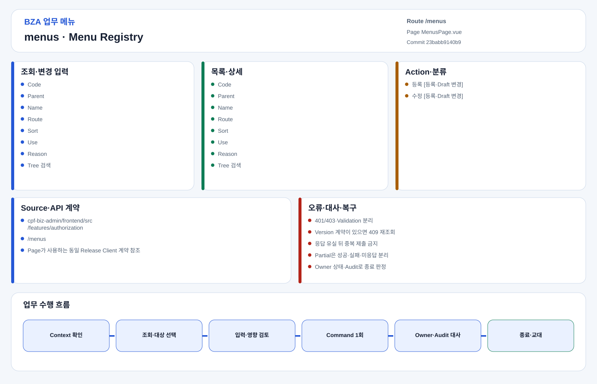

### 이 장에서 끝내는 업무

업무 메뉴 Tree·Route·정렬·사용 여부를 관리한다.

### 메뉴 식별·책임

| 항목 | 값 |
|---|---|
| Route | `/menus` |
| 메뉴 ID | `menus` |
| Menu Code | `AUTHORIZATION` |
| 업무 그룹 | access |
| Frontend Page | `cpf-biz-admin/frontend/src/features/authorization/MenusPage.vue` |
| Permission | Write |
| 기준 Commit | `23babb9140b90e501d6ac715e7b77f55b66198a5` |

### Source·API 근거

| 구분 | 기준 |
|---|---|
| Frontend Page | `cpf-biz-admin/frontend/src/features/authorization/MenusPage.vue` |
| Router | `/menus` |
| API 추적 | 화면에서 제공하는 기능을 통해 호출한다. 문서에 명시되지 않은 Endpoint를 Browser나 외부 Script에서 임의 호출하지 않는다. |

아래 표는 이 메뉴에서 실제로 확인·입력·실행할 항목을 정리한다. 화면에 없는 Field·Button·상태를 임의로 가정하지 않는다.

### 검색·입력 Field

| Field | Control | 업무 의미 | 기본값·Validation·주의 |
|---|---|---|---|
| `Code` | 문자열 입력·검색 | 조회·상세·Audit에서 같은 대상을 다시 찾기 위한 식별 조건이다. | 앞뒤 공백·허용 문자·길이와 대소문자 규칙을 확인한다. |
| `Parent` | 문자열 입력·검색 | Menu Registry 화면의 조회 조건 또는 편집 Form에 포함되는 값이며 화면 Label과 Help를 기준으로 사용한다. | 앞뒤 공백·허용 문자·길이와 대소문자 규칙을 확인한다. |
| `Name` | 문자열 입력·검색 | 대상의 표시명 또는 업무명을 검색·입력한다. | 앞뒤 공백·허용 문자·길이와 대소문자 규칙을 확인한다. |
| `Route` | 문자열 입력·검색 | 조회·상세·Audit에서 같은 대상을 다시 찾기 위한 식별 조건이다. | 앞뒤 공백·허용 문자·길이와 대소문자 규칙을 확인한다. |
| `Sort` | 문자열 입력·검색 | Menu Registry 화면의 조회 조건 또는 편집 Form에 포함되는 값이며 화면 Label과 Help를 기준으로 사용한다. | 앞뒤 공백·허용 문자·길이와 대소문자 규칙을 확인한다. |
| `Use` | Checkbox·Switch | 현재 상태를 조회하거나 다음 Action의 허용 조건을 지정한다. | 현재 선택과 변경 후 영향 범위를 비교하고 화면의 Source 기본값을 확인한다. |
| `Reason` | 다중행 입력 | 작업 목적·영향 범위·승인 또는 복구 기준을 기록해 Audit와 교대 기록에 연결한다. | Ticket·영향 범위·복구점을 포함하고 화면이 요구하는 최소 길이를 충족한다. |
| `Tree 검색` | 문자열 입력·검색 | Menu Registry 화면의 조회 조건 또는 편집 Form에 포함되는 값이며 화면 Label과 Help를 기준으로 사용한다. | 앞뒤 공백·허용 문자·길이와 대소문자 규칙을 확인한다. |

#### 입력 순서

1. **Code** 항목이 조회 Control인지 변경 Form인지 화면 위치로 구분하고, 표시된 값·필수 여부·허용 형식을 확인한다.
2. **Parent** 항목이 조회 Control인지 변경 Form인지 화면 위치로 구분하고, 표시된 값·필수 여부·허용 형식을 확인한다.
3. **Name** 항목이 조회 Control인지 변경 Form인지 화면 위치로 구분하고, 표시된 값·필수 여부·허용 형식을 확인한다.
4. **Route** 항목이 조회 Control인지 변경 Form인지 화면 위치로 구분하고, 표시된 값·필수 여부·허용 형식을 확인한다.
5. **Sort** 항목이 조회 Control인지 변경 Form인지 화면 위치로 구분하고, 표시된 값·필수 여부·허용 형식을 확인한다.
6. **Use** 항목이 조회 Control인지 변경 Form인지 화면 위치로 구분하고, 표시된 값·필수 여부·허용 형식을 확인한다.
7. **Reason** 항목이 조회 Control인지 변경 Form인지 화면 위치로 구분하고, 표시된 값·필수 여부·허용 형식을 확인한다.
8. **Tree 검색** 항목이 조회 Control인지 변경 Form인지 화면 위치로 구분하고, 표시된 값·필수 여부·허용 형식을 확인한다.
9. 조회 Control과 변경 Form을 분리해 기록하고, 실행 전 Environment·Data Scope·Timezone과 제출할 값만 다시 검토한다.

### 목록 Column·상세 Field

| 표시값 | 운영 의미 | 교차 확인 |
|---|---|---|
| `Code` | Menu Registry의 대상 레코드를 상세·Owner·Audit에서 연결하는 식별자다. | 상세·Log·Trace·Audit에서 같은 대상을 가리키는지 확인한다. |
| `Parent` | Menu Registry 상세에서 대상의 현재 속성 또는 처리 결과를 확인하는 값이다. | 상세·재조회 결과와 비교하고 Stale·Masking·단위 차이를 확인한다. |
| `Name` | 운영자가 대상을 구분하는 표시명 또는 설명이다. | 상세·재조회 결과와 비교하고 Stale·Masking·단위 차이를 확인한다. |
| `Route` | Menu Registry의 대상 레코드를 상세·Owner·Audit에서 연결하는 식별자다. | 상세·Log·Trace·Audit에서 같은 대상을 가리키는지 확인한다. |
| `Sort` | Menu Registry 상세에서 대상의 현재 속성 또는 처리 결과를 확인하는 값이다. | 상세·재조회 결과와 비교하고 Stale·Masking·단위 차이를 확인한다. |
| `Use` | 현재 상태와 Terminal 여부, 다음 Action 가능 여부를 판단하는 값이다. | Last Updated·Terminal 조건·Owner 상태와 함께 확인한다. |
| `Reason` | 작업 주체·Owner·변경 사유를 확인하는 감사 정보다. | 상세·재조회 결과와 비교하고 Stale·Masking·단위 차이를 확인한다. |
| `Tree 검색` | Menu Registry 상세에서 대상의 현재 속성 또는 처리 결과를 확인하는 값이다. | 상세·재조회 결과와 비교하고 Stale·Masking·단위 차이를 확인한다. |

#### 결과 판독 순서

1. 조회 완료 시각·Filter·Paging·Sort와 화면 Warning을 확인한다.
2. Empty·Stale·Partial을 정상 0건과 구분한다.
3. 식별자·상태·Version·오류·시각을 같은 Query Context의 상세와 Owner 원장에서 비교한다.
4. Masking된 값은 Raw Permission과 Reason 없이 복원·Export하지 않는다.
5. 집계와 상세가 다르면 집계 시간 창·Timezone·Owner Update 시각을 맞춰 대사한다.

### Button·Action

| Action | 분류 | 활성 조건 | Side Effect·정상 결과 |
|---|---|---|---|
| **등록** | 등록·Draft 변경 | 화면이 실제로 요구하는 Write Permission·필수 Field·Reason·Version 조건을 충족함 | Menu Registry의 재조회 결과가 요청 내용과 일치한다. Version·Before/After·Audit는 해당 Owner가 제공하는 경우 함께 확인한다. |
| **수정** | 등록·Draft 변경 | 화면이 실제로 요구하는 Write Permission·필수 Field·Reason·Version 조건을 충족함 | Menu Registry의 재조회 결과가 요청 내용과 일치한다. Version·Before/After·Audit는 해당 Owner가 제공하는 경우 함께 확인한다. |

### 정상 업무 전체 절차

1. `/menus`에 진입해 Page Header와 Route가 **Menu Registry** 기능을 가리키는지 확인한다.
2. 로그인 Session·Environment·Data Scope·기준일·Timezone을 고정한다.
3. 화면의 조회 Control과 변경 Form을 구분한다. 조회 조건이 제공되면 먼저 조회하고, 변경 Form은 대상 선택 또는 등록 Action 뒤에 열린 실제 Field만 사용한다.
4. Loading 종료 후 Empty·Error·Stale·Partial 상태와 화면 Warning을 먼저 판정한다.
5. **Code, Parent, Name, Route, Sort**를 읽고 식별자·상태·Version·시각을 Owner 원장과 대사한다.
6. **등록** 전에 화면과 Owner가 실제로 요구하는 Permission·현재 상태·영향 범위·Reason·승인·Version 조건을 확인하고 한 번만 제출한다.
7. **등록**의 HTTP 응답과 재조회 결과를 확인한다. 비동기·다중 대상 기능은 Owner Terminal 상태·Version·대상별 Success/Failed/Unknown·Audit를 별도로 확인한다.
8. **수정** 전에 화면과 Owner가 실제로 요구하는 Permission·현재 상태·영향 범위·Reason·승인·Version 조건을 확인하고 한 번만 제출한다.
9. **수정**의 HTTP 응답과 재조회 결과를 확인한다. 비동기·다중 대상 기능은 Owner Terminal 상태·Version·대상별 Success/Failed/Unknown·Audit를 별도로 확인한다.
10. 화면이 제공하는 Log·Metric·Trace와, 변경·Export·승인 조치에 생성된 Audit를 교차 확인한다.
11. 이 장의 **종료 판정**과 다음 확인 시각·Evidence Link를 교대 기록에 남긴다.

### 메뉴 고유 판정·금지 사항

- **목적:** 업무 메뉴 Tree·Route·정렬·사용 여부를 관리한다.
- **종료 판정:** Parent 순환·Route 중복·Permission 참조 영향을 확인한다.
- 응답을 받지 못한 경우 Owner 상태와 기존 Operation을 확인하기 전에 동일 Action을 반복하지 않는다.
- HTTP 성공 응답이나 Toast만으로 비동기 Owner 상태 또는 다중 대상 적용을 확정하지 않는다.

### 오류·경계·동시성·복구

| 상황 | 화면 징후 | 운영 조치 | 종료 증적 |
|---|---|---|---|
| 401·Session | Session 만료·CSRF·Origin 실패 | 로그인 상태와 BFF Session을 확인한다. Command 자동 Replay는 금지한다. | 401/403 응답·Session Audit |
| 403·Data Scope | 메뉴·Button·Raw·Export가 거부됨 | Menu·Button·API·Owner Permission과 Data Scope를 확인하고 우회하지 않는다. | Deny Audit·요청 Permission |
| Validation | 필수값·범위·형식·기간 오류 | Field Error만 수정하고 기존 성공 Operation을 다시 제출하지 않는다. | Error Code·Field·입력값 |
| Timeout·Dependency | 일부 Source 또는 Command 응답 지연 | Correlation/Operation ID와 실패 Stage를 기록하고 Owner 상태를 조회한다. | Dependency 상태·Retryability |
| Partial·Stale | 일부 대상만 Success 또는 조회 Source 누락 | 성공·실패·미응답을 분리하고 누락 범위와 Version을 표시한다. | Target별 결과·Version |
| 409·동시 변경 | Expected Version 불일치 | 최신 상세를 재조회하고 Diff·영향을 다시 검토한 뒤 새 요청으로 제출한다. | 현재/요청 Version·변경자 |
| 응답 유실·Unknown | 요청 후 실제 처리 여부를 알 수 없음 | Operation ID·Request Hash·Audit·Owner 상태로 대사하고 중복 제출하지 않는다. | Operation·Owner·Audit |
| 복구 실패 | Retry/Rollback 뒤에도 상태 불일치 | 자동 반복을 중단하고 Incident·Reconcile Case·다음 확인 시각을 기록한다. | Case ID·복구 Owner·기한 |
| 계층·기간 충돌 | 고아·순환·기간 중복이 탐지됨 | 대상 관계와 기준일을 수정하고 영향 사용자·결재 Snapshot을 재계산한다. | 관계 Diff·Simulation 결과 |

### 응답 유실·결과 불명·부분 적용 처리

1. 동일 Action을 다시 누르지 않고 Browser Network와 응답 Header를 보존한다. `operationId`·`transactionId`·`idempotencyKey`가 제공되면 기록하고, 없으면 Target ID·Actor·요청 시각·Request Body Hash로 대사한다.
2. 기능이 제공하는 상세·Operation Status(있는 경우)·Audit에서 Request Hash와 대상 Version을 검색한다.
3. Side Effect 전 실패가 확인된 경우에만 새 요청을 검토한다.
4. Success·Failed·Unknown 대상을 분리하고 Source가 제공하는 Failed-only Retry·Compensation·Rollback을 선택하고, 지원되지 않으면 수동 Reconcile Case로 이관한다.
5. Rollback을 지원하는 기능은 Owner Version·Checksum·업무 합계가 Rollback Point와 일치하는지 확인한다.
6. 확정되지 않은 대상은 `UNKNOWN_RESULT`로 유지하고 담당자·대사 기한·다음 확인 시각을 기록한다.

### Log·Metric·Trace·Audit와 교대 기록

| 증적 | 필수 값 |
|---|---|
| Audit | Actor·Permission·Reason·Approval·Target·Before/After·Result·Recovery Action |
| Log | Environment·Instance·operationId·transactionId·failureStage·errorCode |
| Metric | 동일 시간 창의 Success·Failure·Latency·Queue·Retry·Partial·Unknown |
| Trace | root/segment/attempt·Owner·DB/Kafka/외부 의존성 Span |
| 상태 원장 | Target ID·Version·Checksum·Desired/Actual·Last Updated·Terminal 여부 |

```text
Menu=menus
Route=/menus
Environment=
DataScope=
Query=
TargetId=
BeforeVersion=
Action=
Reason=
ApprovalId=
OperationId=
TransactionId=
Result=SUCCESS|FAILED|PARTIAL|UNKNOWN_RESULT
OwnerState=
FailedTargets=
ReconcileBy=
RollbackPoint=
EvidenceLinks=
NextCheckAt=
```

### 실무 Workbook

**상황:** 업무 메뉴 Tree·Route·정렬·사용 여부를 관리한다. 담당자가 **등록**을 수행한 뒤 Browser 응답을 받지 못했다.

1. 대상 식별자와 Before Version, 입력값, Reason·Approval을 작업 기록에서 확인한다.
2. 동일 **등록**을 반복하지 않고 Operation·Audit·Owner 상태를 조회한다.
3. Owner 상태가 변경됐고 Request Hash가 같으면 응답 유실로 분류해 중복 조치를 금지한다.
4. 일부 대상만 변경됐으면 Success·Failed·Unknown을 분리해 Failed-only Retry 또는 Rollback을 선택한다.
5. Parent 순환·Route 중복·Permission 참조 영향을 확인한다.
6. Evidence Link와 다음 확인 시각을 교대 기록에 남긴다.

### 독립 수행 검수 Checklist

- [ ] `/menus`와 Page Source를 찾고 화면 목적을 설명할 수 있다.
- [ ] 8개 입력·검색 항목의 Control·기본값·Validation을 설명할 수 있다.
- [ ] 8개 표시값을 Owner 상태·Version·Audit와 대사할 수 있다.
- [ ] 2개 Action의 분류·활성 조건·Side Effect를 설명할 수 있다.
- [ ] Empty·403·409·Timeout·Partial·Unknown을 서로 다른 상태로 처리할 수 있다.
- [ ] 응답 유실 뒤 중복 제출 없이 Operation·Owner·Audit로 결과를 확정할 수 있다.
- [ ] 교대 기록만으로 다음 담당자가 Target·상태·복구 기한을 이어받을 수 있다.

## 12. permissions — Menu·Button·API·Data Scope Permission

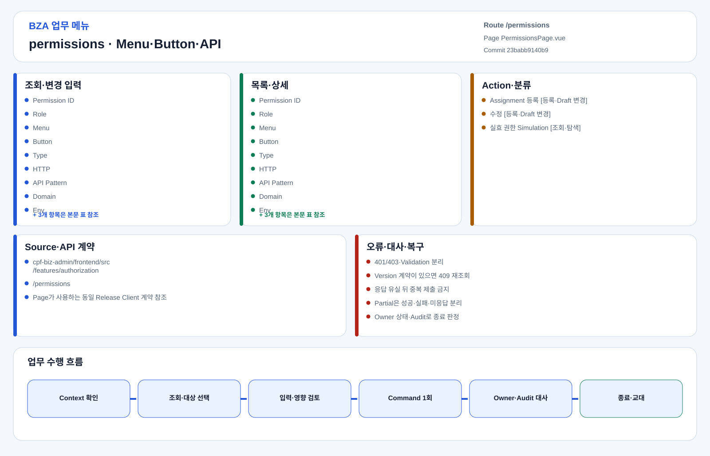

### 이 장에서 끝내는 업무

Role·Menu·Button·API·Data Scope Permission을 관리한다.

### 메뉴 식별·책임

| 항목 | 값 |
|---|---|
| Route | `/permissions` |
| 메뉴 ID | `permissions` |
| Menu Code | `AUTHORIZATION` |
| 업무 그룹 | access |
| Frontend Page | `cpf-biz-admin/frontend/src/features/authorization/PermissionsPage.vue` |
| Permission | WRITE, SIMULATE |
| 기준 Commit | `23babb9140b90e501d6ac715e7b77f55b66198a5` |

### Source·API 근거

| 구분 | 기준 |
|---|---|
| Frontend Page | `cpf-biz-admin/frontend/src/features/authorization/PermissionsPage.vue` |
| Router | `/permissions` |
| API 추적 | 화면에서 제공하는 기능을 통해 호출한다. 문서에 명시되지 않은 Endpoint를 Browser나 외부 Script에서 임의 호출하지 않는다. |

아래 표는 이 메뉴에서 실제로 확인·입력·실행할 항목을 정리한다. 화면에 없는 Field·Button·상태를 임의로 가정하지 않는다.

### 검색·입력 Field

| Field | Control | 업무 의미 | 기본값·Validation·주의 |
|---|---|---|---|
| `Permission ID` | 문자열 입력·검색 | Menu·Button·API·Data Scope Permission에서 적용하거나 조회할 정책·권한·처리 유형을 선택한다. | 앞뒤 공백·허용 문자·길이와 대소문자 규칙을 확인한다. |
| `Role` | Select·검색 | Menu·Button·API·Data Scope Permission에서 적용하거나 조회할 정책·권한·처리 유형을 선택한다. | 허용 목록과 현재 Environment·Data Scope에 맞는 값만 선택한다. |
| `Menu` | Select·검색 | Menu·Button·API·Data Scope Permission에서 적용하거나 조회할 정책·권한·처리 유형을 선택한다. | 허용 목록과 현재 Environment·Data Scope에 맞는 값만 선택한다. |
| `Button` | 날짜·시간 입력 | 조회 또는 적용의 유효 시간 범위를 정하며 Timezone과 시작·종료 순서를 함께 확인한다. | Timezone을 고정하고 시작≤종료·유효기간 겹침·기준일 포함 여부를 확인한다. |
| `Type` | Select·검색 | Menu·Button·API·Data Scope Permission에서 적용하거나 조회할 정책·권한·처리 유형을 선택한다. | 허용 목록과 현재 Environment·Data Scope에 맞는 값만 선택한다. |
| `HTTP` | 문자열 입력·검색 | Menu·Button·API·Data Scope Permission 화면의 조회 조건 또는 편집 Form에 포함되는 값이며 화면 Label과 Help를 기준으로 사용한다. | 앞뒤 공백·허용 문자·길이와 대소문자 규칙을 확인한다. |
| `API Pattern` | 문자열 입력·검색 | Menu·Button·API·Data Scope Permission 화면의 조회 조건 또는 편집 Form에 포함되는 값이며 화면 Label과 Help를 기준으로 사용한다. | 앞뒤 공백·허용 문자·길이와 대소문자 규칙을 확인한다. |
| `Domain` | Select·검색 | Menu·Button·API·Data Scope Permission 조회·조치가 적용되는 환경과 데이터 경계를 제한한다. | 허용 목록과 현재 Environment·Data Scope에 맞는 값만 선택한다. |
| `Env` | 문자열 입력·검색 | Menu·Button·API·Data Scope Permission 화면의 조회 조건 또는 편집 Form에 포함되는 값이며 화면 Label과 Help를 기준으로 사용한다. | 앞뒤 공백·허용 문자·길이와 대소문자 규칙을 확인한다. |
| `Data Scope` | Select·검색 | Menu·Button·API·Data Scope Permission 조회·조치가 적용되는 환경과 데이터 경계를 제한한다. | 허용 목록과 현재 Environment·Data Scope에 맞는 값만 선택한다. |
| `Allow` | 문자열 입력·검색 | Menu·Button·API·Data Scope Permission 화면의 조회 조건 또는 편집 Form에 포함되는 값이며 화면 Label과 Help를 기준으로 사용한다. | 앞뒤 공백·허용 문자·길이와 대소문자 규칙을 확인한다. |
| `Use` | Checkbox·Switch | 현재 상태를 조회하거나 다음 Action의 허용 조건을 지정한다. | 현재 선택과 변경 후 영향 범위를 비교하고 화면의 Source 기본값을 확인한다. |

#### 입력 순서

1. **Permission ID** 항목이 조회 Control인지 변경 Form인지 화면 위치로 구분하고, 표시된 값·필수 여부·허용 형식을 확인한다.
2. **Role** 항목이 조회 Control인지 변경 Form인지 화면 위치로 구분하고, 표시된 값·필수 여부·허용 형식을 확인한다.
3. **Menu** 항목이 조회 Control인지 변경 Form인지 화면 위치로 구분하고, 표시된 값·필수 여부·허용 형식을 확인한다.
4. **Button** 항목이 조회 Control인지 변경 Form인지 화면 위치로 구분하고, 표시된 값·필수 여부·허용 형식을 확인한다.
5. **Type** 항목이 조회 Control인지 변경 Form인지 화면 위치로 구분하고, 표시된 값·필수 여부·허용 형식을 확인한다.
6. **HTTP** 항목이 조회 Control인지 변경 Form인지 화면 위치로 구분하고, 표시된 값·필수 여부·허용 형식을 확인한다.
7. **API Pattern** 항목이 조회 Control인지 변경 Form인지 화면 위치로 구분하고, 표시된 값·필수 여부·허용 형식을 확인한다.
8. **Domain** 항목이 조회 Control인지 변경 Form인지 화면 위치로 구분하고, 표시된 값·필수 여부·허용 형식을 확인한다.
9. **Env** 항목이 조회 Control인지 변경 Form인지 화면 위치로 구분하고, 표시된 값·필수 여부·허용 형식을 확인한다.
10. **Data Scope** 항목이 조회 Control인지 변경 Form인지 화면 위치로 구분하고, 표시된 값·필수 여부·허용 형식을 확인한다.
11. **Allow** 항목이 조회 Control인지 변경 Form인지 화면 위치로 구분하고, 표시된 값·필수 여부·허용 형식을 확인한다.
12. **Use** 항목이 조회 Control인지 변경 Form인지 화면 위치로 구분하고, 표시된 값·필수 여부·허용 형식을 확인한다.
13. 조회 Control과 변경 Form을 분리해 기록하고, 실행 전 Environment·Data Scope·Timezone과 제출할 값만 다시 검토한다.

### 목록 Column·상세 Field

| 표시값 | 운영 의미 | 교차 확인 |
|---|---|---|
| `Permission ID` | Menu·Button·API·Data Scope Permission의 대상 레코드를 상세·Owner·Audit에서 연결하는 식별자다. | 상세·Log·Trace·Audit에서 같은 대상을 가리키는지 확인한다. |
| `Role` | Menu·Button·API·Data Scope Permission 상세에서 대상의 현재 속성 또는 처리 결과를 확인하는 값이다. | 상세·재조회 결과와 비교하고 Stale·Masking·단위 차이를 확인한다. |
| `Menu` | Menu·Button·API·Data Scope Permission 상세에서 대상의 현재 속성 또는 처리 결과를 확인하는 값이다. | 상세·재조회 결과와 비교하고 Stale·Masking·단위 차이를 확인한다. |
| `Button` | 상태 발생·갱신·유효 시점을 나타내며 화면 Timezone을 기준으로 해석한다. | 상세·재조회 결과와 비교하고 Stale·Masking·단위 차이를 확인한다. |
| `Type` | Menu·Button·API·Data Scope Permission 상세에서 대상의 현재 속성 또는 처리 결과를 확인하는 값이다. | 상세·재조회 결과와 비교하고 Stale·Masking·단위 차이를 확인한다. |
| `HTTP` | Menu·Button·API·Data Scope Permission 상세에서 대상의 현재 속성 또는 처리 결과를 확인하는 값이다. | 상세·재조회 결과와 비교하고 Stale·Masking·단위 차이를 확인한다. |
| `API Pattern` | Menu·Button·API·Data Scope Permission 상세에서 대상의 현재 속성 또는 처리 결과를 확인하는 값이다. | 상세·재조회 결과와 비교하고 Stale·Masking·단위 차이를 확인한다. |
| `Domain` | Menu·Button·API·Data Scope Permission 상세에서 대상의 현재 속성 또는 처리 결과를 확인하는 값이다. | 상세·재조회 결과와 비교하고 Stale·Masking·단위 차이를 확인한다. |
| `Env` | Menu·Button·API·Data Scope Permission 상세에서 대상의 현재 속성 또는 처리 결과를 확인하는 값이다. | 상세·재조회 결과와 비교하고 Stale·Masking·단위 차이를 확인한다. |
| `Data Scope` | Menu·Button·API·Data Scope Permission 상세에서 대상의 현재 속성 또는 처리 결과를 확인하는 값이다. | 상세·재조회 결과와 비교하고 Stale·Masking·단위 차이를 확인한다. |
| `Allow` | Menu·Button·API·Data Scope Permission 상세에서 대상의 현재 속성 또는 처리 결과를 확인하는 값이다. | 상세·재조회 결과와 비교하고 Stale·Masking·단위 차이를 확인한다. |
| `Use` | 현재 상태와 Terminal 여부, 다음 Action 가능 여부를 판단하는 값이다. | Last Updated·Terminal 조건·Owner 상태와 함께 확인한다. |

#### 결과 판독 순서

1. 조회 완료 시각·Filter·Paging·Sort와 화면 Warning을 확인한다.
2. Empty·Stale·Partial을 정상 0건과 구분한다.
3. 식별자·상태·Version·오류·시각을 같은 Query Context의 상세와 Owner 원장에서 비교한다.
4. Masking된 값은 Raw Permission과 Reason 없이 복원·Export하지 않는다.
5. 집계와 상세가 다르면 집계 시간 창·Timezone·Owner Update 시각을 맞춰 대사한다.

### Button·Action

| Action | 분류 | 활성 조건 | Side Effect·정상 결과 |
|---|---|---|---|
| **Assignment 등록** | 등록·Draft 변경 | 화면이 실제로 요구하는 Write Permission·필수 Field·Reason·Version 조건을 충족함 | Menu·Button·API·Data Scope Permission의 재조회 결과가 요청 내용과 일치한다. Version·Before/After·Audit는 해당 Owner가 제공하는 경우 함께 확인한다. |
| **수정** | 등록·Draft 변경 | 화면이 실제로 요구하는 Write Permission·필수 Field·Reason·Version 조건을 충족함 | Menu·Button·API·Data Scope Permission의 재조회 결과가 요청 내용과 일치한다. Version·Before/After·Audit는 해당 Owner가 제공하는 경우 함께 확인한다. |
| **실효 권한 Simulation** | 조회·탐색 | 조회 Permission과 Query Validation을 충족하고 동일 조회가 진행 중이 아님 | 실효 권한 Simulation 결과의 조회 시각·Filter·Source Version·Warning이 갱신되며 Owner 데이터는 변경하지 않는다. |

### 정상 업무 전체 절차

1. `/permissions`에 진입해 Page Header와 Route가 **Menu·Button·API·Data Scope Permission** 기능을 가리키는지 확인한다.
2. 로그인 Session·Environment·Data Scope·기준일·Timezone을 고정한다.
3. 화면의 조회 Control과 변경 Form을 구분한다. 조회 조건이 제공되면 먼저 조회하고, 변경 Form은 대상 선택 또는 등록 Action 뒤에 열린 실제 Field만 사용한다.
4. Loading 종료 후 Empty·Error·Stale·Partial 상태와 화면 Warning을 먼저 판정한다.
5. **Permission ID, Role, Menu, Button, Type**를 읽고 식별자·상태·Version·시각을 Owner 원장과 대사한다.
6. **Assignment 등록** 전에 화면과 Owner가 실제로 요구하는 Permission·현재 상태·영향 범위·Reason·승인·Version 조건을 확인하고 한 번만 제출한다.
7. **Assignment 등록**의 HTTP 응답과 재조회 결과를 확인한다. 비동기·다중 대상 기능은 Owner Terminal 상태·Version·대상별 Success/Failed/Unknown·Audit를 별도로 확인한다.
8. **수정** 전에 화면과 Owner가 실제로 요구하는 Permission·현재 상태·영향 범위·Reason·승인·Version 조건을 확인하고 한 번만 제출한다.
9. **수정**의 HTTP 응답과 재조회 결과를 확인한다. 비동기·다중 대상 기능은 Owner Terminal 상태·Version·대상별 Success/Failed/Unknown·Audit를 별도로 확인한다.
10. 화면이 제공하는 Log·Metric·Trace와, 변경·Export·승인 조치에 생성된 Audit를 교차 확인한다.
11. 이 장의 **종료 판정**과 다음 확인 시각·Evidence Link를 교대 기록에 남긴다.

### 메뉴 고유 판정·금지 사항

- **목적:** Role·Menu·Button·API·Data Scope Permission을 관리한다.
- **종료 판정:** Simulation 결과와 실제 Backend Deny가 같은지 확인한다.
- 응답을 받지 못한 경우 Owner 상태와 기존 Operation을 확인하기 전에 동일 Action을 반복하지 않는다.
- HTTP 성공 응답이나 Toast만으로 비동기 Owner 상태 또는 다중 대상 적용을 확정하지 않는다.

### 오류·경계·동시성·복구

| 상황 | 화면 징후 | 운영 조치 | 종료 증적 |
|---|---|---|---|
| 401·Session | Session 만료·CSRF·Origin 실패 | 로그인 상태와 BFF Session을 확인한다. Command 자동 Replay는 금지한다. | 401/403 응답·Session Audit |
| 403·Data Scope | 메뉴·Button·Raw·Export가 거부됨 | Menu·Button·API·Owner Permission과 Data Scope를 확인하고 우회하지 않는다. | Deny Audit·요청 Permission |
| Validation | 필수값·범위·형식·기간 오류 | Field Error만 수정하고 기존 성공 Operation을 다시 제출하지 않는다. | Error Code·Field·입력값 |
| Timeout·Dependency | 일부 Source 또는 Command 응답 지연 | Correlation/Operation ID와 실패 Stage를 기록하고 Owner 상태를 조회한다. | Dependency 상태·Retryability |
| Partial·Stale | 일부 대상만 Success 또는 조회 Source 누락 | 성공·실패·미응답을 분리하고 누락 범위와 Version을 표시한다. | Target별 결과·Version |
| 409·동시 변경 | Expected Version 불일치 | 최신 상세를 재조회하고 Diff·영향을 다시 검토한 뒤 새 요청으로 제출한다. | 현재/요청 Version·변경자 |
| 응답 유실·Unknown | 요청 후 실제 처리 여부를 알 수 없음 | Operation ID·Request Hash·Audit·Owner 상태로 대사하고 중복 제출하지 않는다. | Operation·Owner·Audit |
| 복구 실패 | Retry/Rollback 뒤에도 상태 불일치 | 자동 반복을 중단하고 Incident·Reconcile Case·다음 확인 시각을 기록한다. | Case ID·복구 Owner·기한 |

### 응답 유실·결과 불명·부분 적용 처리

1. 동일 Action을 다시 누르지 않고 Browser Network와 응답 Header를 보존한다. `operationId`·`transactionId`·`idempotencyKey`가 제공되면 기록하고, 없으면 Target ID·Actor·요청 시각·Request Body Hash로 대사한다.
2. 기능이 제공하는 상세·Operation Status(있는 경우)·Audit에서 Request Hash와 대상 Version을 검색한다.
3. Side Effect 전 실패가 확인된 경우에만 새 요청을 검토한다.
4. Success·Failed·Unknown 대상을 분리하고 Source가 제공하는 Failed-only Retry·Compensation·Rollback을 선택하고, 지원되지 않으면 수동 Reconcile Case로 이관한다.
5. Rollback을 지원하는 기능은 Owner Version·Checksum·업무 합계가 Rollback Point와 일치하는지 확인한다.
6. 확정되지 않은 대상은 `UNKNOWN_RESULT`로 유지하고 담당자·대사 기한·다음 확인 시각을 기록한다.

### Log·Metric·Trace·Audit와 교대 기록

| 증적 | 필수 값 |
|---|---|
| Audit | Actor·Permission·Reason·Approval·Target·Before/After·Result·Recovery Action |
| Log | Environment·Instance·operationId·transactionId·failureStage·errorCode |
| Metric | 동일 시간 창의 Success·Failure·Latency·Queue·Retry·Partial·Unknown |
| Trace | root/segment/attempt·Owner·DB/Kafka/외부 의존성 Span |
| 상태 원장 | Target ID·Version·Checksum·Desired/Actual·Last Updated·Terminal 여부 |

```text
Menu=permissions
Route=/permissions
Environment=
DataScope=
Query=
TargetId=
BeforeVersion=
Action=
Reason=
ApprovalId=
OperationId=
TransactionId=
Result=SUCCESS|FAILED|PARTIAL|UNKNOWN_RESULT
OwnerState=
FailedTargets=
ReconcileBy=
RollbackPoint=
EvidenceLinks=
NextCheckAt=
```

### 실무 Workbook

**상황:** Role·Menu·Button·API·Data Scope Permission을 관리한다. 담당자가 **Assignment 등록**을 수행한 뒤 Browser 응답을 받지 못했다.

1. 대상 식별자와 Before Version, 입력값, Reason·Approval을 작업 기록에서 확인한다.
2. 동일 **Assignment 등록**을 반복하지 않고 Operation·Audit·Owner 상태를 조회한다.
3. Owner 상태가 변경됐고 Request Hash가 같으면 응답 유실로 분류해 중복 조치를 금지한다.
4. 일부 대상만 변경됐으면 Success·Failed·Unknown을 분리해 Failed-only Retry 또는 Rollback을 선택한다.
5. Simulation 결과와 실제 Backend Deny가 같은지 확인한다.
6. Evidence Link와 다음 확인 시각을 교대 기록에 남긴다.

### 독립 수행 검수 Checklist

- [ ] `/permissions`와 Page Source를 찾고 화면 목적을 설명할 수 있다.
- [ ] 12개 입력·검색 항목의 Control·기본값·Validation을 설명할 수 있다.
- [ ] 12개 표시값을 Owner 상태·Version·Audit와 대사할 수 있다.
- [ ] 3개 Action의 분류·활성 조건·Side Effect를 설명할 수 있다.
- [ ] Empty·403·409·Timeout·Partial·Unknown을 서로 다른 상태로 처리할 수 있다.
- [ ] 응답 유실 뒤 중복 제출 없이 Operation·Owner·Audit로 결과를 확정할 수 있다.
- [ ] 교대 기록만으로 다음 담당자가 Target·상태·복구 기한을 이어받을 수 있다.

## 13. permissionTools — Role 비교·권한 분석


### 이 장에서 끝내는 업무

Role·User 간 Effective Permission을 비교·Simulation한다.

### 메뉴 식별·책임

| 항목 | 값 |
|---|---|
| Route | `/permissionTools` |
| 메뉴 ID | `permissionTools` |
| Menu Code | `AUTHORIZATION` |
| 업무 그룹 | access |
| Frontend Page | `cpf-biz-admin/frontend/src/features/permission-tools/PermissionToolsPage.vue` |
| Permission | SIMULATE |
| 기준 Commit | `23babb9140b90e501d6ac715e7b77f55b66198a5` |

### Source·API 근거

| 구분 | 기준 |
|---|---|
| Frontend Page | `cpf-biz-admin/frontend/src/features/permission-tools/PermissionToolsPage.vue` |
| Router | `/permissionTools` |
| API 추적 | 화면에서 제공하는 기능을 통해 호출한다. 문서에 명시되지 않은 Endpoint를 Browser나 외부 Script에서 임의 호출하지 않는다. |

아래 표는 이 메뉴에서 실제로 확인·입력·실행할 항목을 정리한다. 화면에 없는 Field·Button·상태를 임의로 가정하지 않는다.

### 검색·입력 Field

| Field | Control | 업무 의미 | 기본값·Validation·주의 |
|---|---|---|---|
| `비교 Role` | Select·검색 | Role 비교·권한 분석에서 적용하거나 조회할 정책·권한·처리 유형을 선택한다. | 허용 목록과 현재 Environment·Data Scope에 맞는 값만 선택한다. |
| `User` | Checkbox·Switch | 현재 상태를 조회하거나 다음 Action의 허용 조건을 지정한다. | 현재 선택과 변경 후 영향 범위를 비교하고 화면의 Source 기본값을 확인한다. |
| `Simulation 입력` | 문자열 입력·검색 | Role 비교·권한 분석 화면의 조회 조건 또는 편집 Form에 포함되는 값이며 화면 Label과 Help를 기준으로 사용한다. | 앞뒤 공백·허용 문자·길이와 대소문자 규칙을 확인한다. |

#### 입력 순서

1. **비교 Role** 항목이 조회 Control인지 변경 Form인지 화면 위치로 구분하고, 표시된 값·필수 여부·허용 형식을 확인한다.
2. **User** 항목이 조회 Control인지 변경 Form인지 화면 위치로 구분하고, 표시된 값·필수 여부·허용 형식을 확인한다.
3. **Simulation 입력** 항목이 조회 Control인지 변경 Form인지 화면 위치로 구분하고, 표시된 값·필수 여부·허용 형식을 확인한다.
4. 조회 Control과 변경 Form을 분리해 기록하고, 실행 전 Environment·Data Scope·Timezone과 제출할 값만 다시 검토한다.

### 목록 Column·상세 Field

| 표시값 | 운영 의미 | 교차 확인 |
|---|---|---|
| `비교 Role` | Role 비교·권한 분석 상세에서 대상의 현재 속성 또는 처리 결과를 확인하는 값이다. | 상세·재조회 결과와 비교하고 Stale·Masking·단위 차이를 확인한다. |
| `User` | Role 비교·권한 분석의 대상 레코드를 상세·Owner·Audit에서 연결하는 식별자다. | Last Updated·Terminal 조건·Owner 상태와 함께 확인한다. |
| `Simulation 입력` | Role 비교·권한 분석 상세에서 대상의 현재 속성 또는 처리 결과를 확인하는 값이다. | 상세·재조회 결과와 비교하고 Stale·Masking·단위 차이를 확인한다. |

#### 결과 판독 순서

1. 조회 완료 시각·Filter·Paging·Sort와 화면 Warning을 확인한다.
2. Empty·Stale·Partial을 정상 0건과 구분한다.
3. 식별자·상태·Version·오류·시각을 같은 Query Context의 상세와 Owner 원장에서 비교한다.
4. Masking된 값은 Raw Permission과 Reason 없이 복원·Export하지 않는다.
5. 집계와 상세가 다르면 집계 시간 창·Timezone·Owner Update 시각을 맞춰 대사한다.

### Button·Action

| Action | 분류 | 활성 조건 | Side Effect·정상 결과 |
|---|---|---|---|
| **Role 비교** | 조회·탐색 | 조회 Permission과 Query Validation을 충족하고 동일 조회가 진행 중이 아님 | Role 비교 결과의 조회 시각·Filter·Source Version·Warning이 갱신되며 Owner 데이터는 변경하지 않는다. |
| **실효 권한 Simulation** | 조회·탐색 | 조회 Permission과 Query Validation을 충족하고 동일 조회가 진행 중이 아님 | 실효 권한 Simulation 결과의 조회 시각·Filter·Source Version·Warning이 갱신되며 Owner 데이터는 변경하지 않는다. |

### 정상 업무 전체 절차

1. `/permissionTools`에 진입해 Page Header와 Route가 **Role 비교·권한 분석** 기능을 가리키는지 확인한다.
2. 로그인 Session·Environment·Data Scope·기준일·Timezone을 고정한다.
3. 화면에 제공된 조회 Control만 사용하고, 표시되지 않은 변경 Field나 Server Command가 있다고 가정하지 않는다.
4. Loading 종료 후 Empty·Error·Stale·Partial 상태와 화면 Warning을 먼저 판정한다.
5. **비교 Role, User, Simulation 입력**를 읽고 식별자·상태·Version·시각을 Owner 원장과 대사한다.
6. 화면이 제공하는 Log·Metric·Trace와 조회·Raw·Export 접근 기록이 있으면 해당 Audit를 교차 확인한다.
7. 이 장의 **종료 판정**과 다음 확인 시각·Evidence Link를 교대 기록에 남긴다.

### 메뉴 고유 판정·금지 사항

- **목적:** Role·User 간 Effective Permission을 비교·Simulation한다.
- **종료 판정:** 비교 기준일·조직·Role·위임 Context를 고정한다.
- 조회 화면에서 직접 Owner 데이터를 변경하거나 Browser Tool로 우회하지 않는다.
- Partial 조회를 정상 전체 결과로 합치지 않는다.

### 오류·경계·동시성·복구

| 상황 | 화면 징후 | 운영 조치 | 종료 증적 |
|---|---|---|---|
| 401·Session | Session 만료·CSRF·Origin 실패 | 로그인 상태와 BFF Session을 확인한 뒤 같은 Query Context로 다시 조회한다. | 401/403 응답·Session Audit |
| 403·Data Scope | 메뉴·Button·Raw·Export가 거부됨 | Menu·Button·API·Owner Permission과 Data Scope를 확인하고 우회하지 않는다. | Deny Audit·요청 Permission |
| Timeout·Dependency | 일부 조회 Source 응답 지연 | Correlation ID·Query Context·실패 Source를 기록하고 같은 조건으로 재조회한다. | 조회 시각·실패 Source·재조회 결과 |
| Partial·Stale | 일부 대상만 Success 또는 조회 Source 누락 | 성공·실패·미응답을 분리하고 누락 범위와 Version을 표시한다. | Target별 결과·Version |

### 응답 유실·부분 조회 처리

1. 검색 조건·Data Scope·Paging·조회 시각·Correlation ID를 기록한다.
2. 같은 조건으로 재조회하되 실패 Source만 분리한다.
3. 정상 Source 결과를 유지하고 실패·Stale Source를 명시한다.
4. 집계와 원본 상세가 다르면 Owner 상세를 기준으로 Reconcile Case를 연다.
5. 조회 시각·Source Version·0건 또는 일치 결과를 증적으로 남긴다.

### Log·Metric·Trace·Audit와 교대 기록

| 증적 | 필수 값 |
|---|---|
| Audit | Actor·Permission·Data Scope·Raw/Export 접근·Query Context·Result |
| Log | Environment·Instance·operationId·transactionId·failureStage·errorCode |
| Metric | 동일 시간 창의 Success·Failure·Latency·Queue·Retry·Partial·Unknown |
| Trace | root/segment/attempt·Owner·DB/Kafka/외부 의존성 Span |
| 상태 원장 | Target ID·Version·Checksum·Desired/Actual·Last Updated·Terminal 여부 |

```text
Menu=
Route=
Environment=
DataScope=
Query=
QueryAt=
CorrelationId=
SourceVersion=
Result=SUCCESS|EMPTY|STALE|PARTIAL|FAILED
FailedSources=
EvidenceLinks=
NextCheckAt=
```

### 실무 Workbook

**상황:** Role·User 간 Effective Permission을 비교·Simulation한다. 화면이 일부 Source Timeout 때문에 Partial 결과를 표시했다.

1. Query·Data Scope·조회 시각·Correlation ID를 기록한다.
2. 정상 결과를 0건으로 덮어쓰지 않고 실패 Source만 재조회한다.
3. 비교 Role, User, Simulation 입력 값을 원본 상세와 같은 시간 기준으로 비교한다.
4. 불일치가 계속되면 Incident 또는 Reconcile Case를 생성한다.
5. 비교 기준일·조직·Role·위임 Context를 고정한다.
6. Source Version과 다음 확인 시각을 교대 기록에 남긴다.

### 독립 수행 검수 Checklist

- [ ] `/permissionTools`와 Page Source를 찾고 화면 목적을 설명할 수 있다.
- [ ] 3개 입력·검색 항목의 Control·기본값·Validation을 설명할 수 있다.
- [ ] 3개 표시값을 Owner 상태·Version·Audit와 대사할 수 있다.
- [ ] 2개 Action의 분류·활성 조건·Side Effect를 설명할 수 있다.
- [ ] Empty·401·403·Timeout·Stale·Partial을 서로 다른 조회 상태로 처리할 수 있다.
- [ ] 조회 응답 유실 시 같은 Query Context로 재조회하고 Correlation ID·조회 시각·Source Version으로 결과를 대사할 수 있다.
- [ ] 교대 기록만으로 다음 담당자가 Target·상태·복구 기한을 이어받을 수 있다.

## 14. approvalInbox — 결재 처리


### 이 장에서 끝내는 업무

결재 처리 대상과 완료·기타 Lane을 조회하고 의사결정한다.

### 메뉴 식별·책임

| 항목 | 값 |
|---|---|
| Route | `/approvalInbox` |
| 메뉴 ID | `approvalInbox` |
| Menu Code | `APPROVAL` |
| 업무 그룹 | approval |
| Frontend Page | `cpf-biz-admin/frontend/src/features/approval-inbox/ApprovalInboxPage.vue` |
| Permission | 결재 참여자 |
| 기준 Commit | `23babb9140b90e501d6ac715e7b77f55b66198a5` |

### Source·API 근거

| 구분 | 기준 |
|---|---|
| Frontend Page | `cpf-biz-admin/frontend/src/features/approval-inbox/ApprovalInboxPage.vue` |
| Router | `/approvalInbox` |
| API 추적 | 화면에서 제공하는 기능을 통해 호출한다. 문서에 명시되지 않은 Endpoint를 Browser나 외부 Script에서 임의 호출하지 않는다. |

아래 표는 이 메뉴에서 실제로 확인·입력·실행할 항목을 정리한다. 화면에 없는 Field·Button·상태를 임의로 가정하지 않는다.

### 검색·입력 Field

| Field | Control | 업무 의미 | 기본값·Validation·주의 |
|---|---|---|---|
| `처리대기` | 문자열 입력·검색 | 결재 처리 화면의 조회 조건 또는 편집 Form에 포함되는 값이며 화면 Label과 Help를 기준으로 사용한다. | 앞뒤 공백·허용 문자·길이와 대소문자 규칙을 확인한다. |
| `완료` | 문자열 입력·검색 | 결재 처리 화면의 조회 조건 또는 편집 Form에 포함되는 값이며 화면 Label과 Help를 기준으로 사용한다. | 앞뒤 공백·허용 문자·길이와 대소문자 규칙을 확인한다. |
| `기타 Lane` | 문자열 입력·검색 | 결재 처리 화면의 조회 조건 또는 편집 Form에 포함되는 값이며 화면 Label과 Help를 기준으로 사용한다. | 앞뒤 공백·허용 문자·길이와 대소문자 규칙을 확인한다. |
| `Decision Reason` | 다중행 입력 | 작업 목적·영향 범위·승인 또는 복구 기준을 기록해 Audit와 교대 기록에 연결한다. | Ticket·영향 범위·복구점을 포함하고 화면이 요구하는 최소 길이를 충족한다. |

#### 입력 순서

1. **처리대기** 항목이 조회 Control인지 변경 Form인지 화면 위치로 구분하고, 표시된 값·필수 여부·허용 형식을 확인한다.
2. **완료** 항목이 조회 Control인지 변경 Form인지 화면 위치로 구분하고, 표시된 값·필수 여부·허용 형식을 확인한다.
3. **기타 Lane** 항목이 조회 Control인지 변경 Form인지 화면 위치로 구분하고, 표시된 값·필수 여부·허용 형식을 확인한다.
4. **Decision Reason** 항목이 조회 Control인지 변경 Form인지 화면 위치로 구분하고, 표시된 값·필수 여부·허용 형식을 확인한다.
5. 조회 Control과 변경 Form을 분리해 기록하고, 실행 전 Environment·Data Scope·Timezone과 제출할 값만 다시 검토한다.

### 목록 Column·상세 Field

| 표시값 | 운영 의미 | 교차 확인 |
|---|---|---|
| `처리대기` | 결재 처리 상세에서 대상의 현재 속성 또는 처리 결과를 확인하는 값이다. | 상세·재조회 결과와 비교하고 Stale·Masking·단위 차이를 확인한다. |
| `완료` | 결재 처리 상세에서 대상의 현재 속성 또는 처리 결과를 확인하는 값이다. | 상세·재조회 결과와 비교하고 Stale·Masking·단위 차이를 확인한다. |
| `기타 Lane` | 결재 처리 상세에서 대상의 현재 속성 또는 처리 결과를 확인하는 값이다. | 상세·재조회 결과와 비교하고 Stale·Masking·단위 차이를 확인한다. |
| `Decision Reason` | 작업 주체·Owner·변경 사유를 확인하는 감사 정보다. | 상세·재조회 결과와 비교하고 Stale·Masking·단위 차이를 확인한다. |

#### 결과 판독 순서

1. 조회 완료 시각·Filter·Paging·Sort와 화면 Warning을 확인한다.
2. Empty·Stale·Partial을 정상 0건과 구분한다.
3. 식별자·상태·Version·오류·시각을 같은 Query Context의 상세와 Owner 원장에서 비교한다.
4. Masking된 값은 Raw Permission과 Reason 없이 복원·Export하지 않는다.
5. 집계와 상세가 다르면 집계 시간 창·Timezone·Owner Update 시각을 맞춰 대사한다.

### Button·Action

| Action | 분류 | 활성 조건 | Side Effect·정상 결과 |
|---|---|---|---|
| **APPROVE** | 승인·의사결정 | 화면에 표시된 승인 권한·현재 Step·Snapshot·중복 결정 방지 조건을 충족함 | 승인 Snapshot과 Decision Audit가 기록되고 현재 Step·Terminal 상태가 갱신된다. |
| **AGREE** | 승인·의사결정 | 화면에 표시된 승인 권한·현재 Step·Snapshot·중복 결정 방지 조건을 충족함 | 승인 Snapshot과 Decision Audit가 기록되고 현재 Step·Terminal 상태가 갱신된다. |
| **REJECT** | 승인·의사결정 | 화면에 표시된 승인 권한·현재 Step·Snapshot·중복 결정 방지 조건을 충족함 | 승인 Snapshot과 Decision Audit가 기록되고 현재 Step·Terminal 상태가 갱신된다. |

### 정상 업무 전체 절차

1. `/approvalInbox`에 진입해 Page Header와 Route가 **결재 처리** 기능을 가리키는지 확인한다.
2. 로그인 Session·Environment·Data Scope·기준일·Timezone을 고정한다.
3. 화면의 조회 Control과 변경 Form을 구분한다. 조회 조건이 제공되면 먼저 조회하고, 변경 Form은 대상 선택 또는 등록 Action 뒤에 열린 실제 Field만 사용한다.
4. Loading 종료 후 Empty·Error·Stale·Partial 상태와 화면 Warning을 먼저 판정한다.
5. **처리대기, 완료, 기타 Lane, Decision Reason**를 읽고 식별자·상태·Version·시각을 Owner 원장과 대사한다.
6. **APPROVE** 전에 화면과 Owner가 실제로 요구하는 Permission·현재 상태·영향 범위·Reason·승인·Version 조건을 확인하고 한 번만 제출한다.
7. **APPROVE**의 HTTP 응답과 재조회 결과를 확인한다. 비동기·다중 대상 기능은 Owner Terminal 상태·Version·대상별 Success/Failed/Unknown·Audit를 별도로 확인한다.
8. **AGREE** 전에 화면과 Owner가 실제로 요구하는 Permission·현재 상태·영향 범위·Reason·승인·Version 조건을 확인하고 한 번만 제출한다.
9. **AGREE**의 HTTP 응답과 재조회 결과를 확인한다. 비동기·다중 대상 기능은 Owner Terminal 상태·Version·대상별 Success/Failed/Unknown·Audit를 별도로 확인한다.
10. **REJECT** 전에 화면과 Owner가 실제로 요구하는 Permission·현재 상태·영향 범위·Reason·승인·Version 조건을 확인하고 한 번만 제출한다.
11. **REJECT**의 HTTP 응답과 재조회 결과를 확인한다. 비동기·다중 대상 기능은 Owner Terminal 상태·Version·대상별 Success/Failed/Unknown·Audit를 별도로 확인한다.
12. 화면이 제공하는 Log·Metric·Trace와, 변경·Export·승인 조치에 생성된 Audit를 교차 확인한다.
13. 이 장의 **종료 판정**과 다음 확인 시각·Evidence Link를 교대 기록에 남긴다.

### 메뉴 고유 판정·금지 사항

- **목적:** 결재 처리 대상과 완료·기타 Lane을 조회하고 의사결정한다.
- **종료 판정:** Snapshot 참여자·현재 Step·Decision Reason·Terminal 상태를 확인한다.
- 응답을 받지 못한 경우 Owner 상태와 기존 Operation을 확인하기 전에 동일 Action을 반복하지 않는다.
- HTTP 성공 응답이나 Toast만으로 비동기 Owner 상태 또는 다중 대상 적용을 확정하지 않는다.

### 오류·경계·동시성·복구

| 상황 | 화면 징후 | 운영 조치 | 종료 증적 |
|---|---|---|---|
| 401·Session | Session 만료·CSRF·Origin 실패 | 로그인 상태와 BFF Session을 확인한다. Command 자동 Replay는 금지한다. | 401/403 응답·Session Audit |
| 403·Data Scope | 메뉴·Button·Raw·Export가 거부됨 | Menu·Button·API·Owner Permission과 Data Scope를 확인하고 우회하지 않는다. | Deny Audit·요청 Permission |
| Validation | 필수값·범위·형식·기간 오류 | Field Error만 수정하고 기존 성공 Operation을 다시 제출하지 않는다. | Error Code·Field·입력값 |
| Timeout·Dependency | 일부 Source 또는 Command 응답 지연 | Correlation/Operation ID와 실패 Stage를 기록하고 Owner 상태를 조회한다. | Dependency 상태·Retryability |
| Partial·Stale | 일부 대상만 Success 또는 조회 Source 누락 | 성공·실패·미응답을 분리하고 누락 범위와 Version을 표시한다. | Target별 결과·Version |
| 409·동시 변경 | Expected Version 불일치 | 최신 상세를 재조회하고 Diff·영향을 다시 검토한 뒤 새 요청으로 제출한다. | 현재/요청 Version·변경자 |
| 응답 유실·Unknown | 요청 후 실제 처리 여부를 알 수 없음 | Operation ID·Request Hash·Audit·Owner 상태로 대사하고 중복 제출하지 않는다. | Operation·Owner·Audit |
| 복구 실패 | Retry/Rollback 뒤에도 상태 불일치 | 자동 반복을 중단하고 Incident·Reconcile Case·다음 확인 시각을 기록한다. | Case ID·복구 Owner·기한 |

### 응답 유실·결과 불명·부분 적용 처리

1. 동일 Action을 다시 누르지 않고 Browser Network와 응답 Header를 보존한다. `operationId`·`transactionId`·`idempotencyKey`가 제공되면 기록하고, 없으면 Target ID·Actor·요청 시각·Request Body Hash로 대사한다.
2. 기능이 제공하는 상세·Operation Status(있는 경우)·Audit에서 Request Hash와 대상 Version을 검색한다.
3. Side Effect 전 실패가 확인된 경우에만 새 요청을 검토한다.
4. Success·Failed·Unknown 대상을 분리하고 Source가 제공하는 Failed-only Retry·Compensation·Rollback을 선택하고, 지원되지 않으면 수동 Reconcile Case로 이관한다.
5. Rollback을 지원하는 기능은 Owner Version·Checksum·업무 합계가 Rollback Point와 일치하는지 확인한다.
6. 확정되지 않은 대상은 `UNKNOWN_RESULT`로 유지하고 담당자·대사 기한·다음 확인 시각을 기록한다.

### Log·Metric·Trace·Audit와 교대 기록

| 증적 | 필수 값 |
|---|---|
| Audit | Actor·Permission·Reason·Approval·Target·Before/After·Result·Recovery Action |
| Log | Environment·Instance·operationId·transactionId·failureStage·errorCode |
| Metric | 동일 시간 창의 Success·Failure·Latency·Queue·Retry·Partial·Unknown |
| Trace | root/segment/attempt·Owner·DB/Kafka/외부 의존성 Span |
| 상태 원장 | Target ID·Version·Checksum·Desired/Actual·Last Updated·Terminal 여부 |

```text
Menu=approvalInbox
Route=/approvalInbox
Environment=
DataScope=
Query=
TargetId=
BeforeVersion=
Action=
Reason=
ApprovalId=
OperationId=
TransactionId=
Result=SUCCESS|FAILED|PARTIAL|UNKNOWN_RESULT
OwnerState=
FailedTargets=
ReconcileBy=
RollbackPoint=
EvidenceLinks=
NextCheckAt=
```

### 실무 Workbook

**상황:** 결재 처리 대상과 완료·기타 Lane을 조회하고 의사결정한다. 담당자가 **APPROVE**을 수행한 뒤 Browser 응답을 받지 못했다.

1. 대상 식별자와 Before Version, 입력값, Reason·Approval을 작업 기록에서 확인한다.
2. 동일 **APPROVE**을 반복하지 않고 Operation·Audit·Owner 상태를 조회한다.
3. Owner 상태가 변경됐고 Request Hash가 같으면 응답 유실로 분류해 중복 조치를 금지한다.
4. 일부 대상만 변경됐으면 Success·Failed·Unknown을 분리해 Failed-only Retry 또는 Rollback을 선택한다.
5. Snapshot 참여자·현재 Step·Decision Reason·Terminal 상태를 확인한다.
6. Evidence Link와 다음 확인 시각을 교대 기록에 남긴다.

### 독립 수행 검수 Checklist

- [ ] `/approvalInbox`와 Page Source를 찾고 화면 목적을 설명할 수 있다.
- [ ] 4개 입력·검색 항목의 Control·기본값·Validation을 설명할 수 있다.
- [ ] 4개 표시값을 Owner 상태·Version·Audit와 대사할 수 있다.
- [ ] 3개 Action의 분류·활성 조건·Side Effect를 설명할 수 있다.
- [ ] Empty·403·409·Timeout·Partial·Unknown을 서로 다른 상태로 처리할 수 있다.
- [ ] 응답 유실 뒤 중복 제출 없이 Operation·Owner·Audit로 결과를 확정할 수 있다.
- [ ] 교대 기록만으로 다음 담당자가 Target·상태·복구 기한을 이어받을 수 있다.

## 15. approvalSubmissions — 상신·철회·취소·재상신

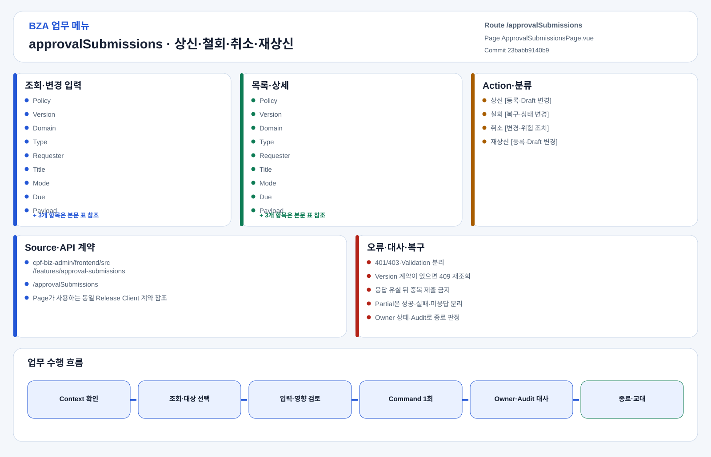

### 이 장에서 끝내는 업무

정책 기반 결재 상신·철회·취소·재상신을 관리한다.

### 메뉴 식별·책임

| 항목 | 값 |
|---|---|
| Route | `/approvalSubmissions` |
| 메뉴 ID | `approvalSubmissions` |
| Menu Code | `APPROVAL` |
| 업무 그룹 | approval |
| Frontend Page | `cpf-biz-admin/frontend/src/features/approval-submissions/ApprovalSubmissionsPage.vue` |
| Permission | 요청자/상신 권한 |
| 기준 Commit | `23babb9140b90e501d6ac715e7b77f55b66198a5` |

### Source·API 근거

| 구분 | 기준 |
|---|---|
| Frontend Page | `cpf-biz-admin/frontend/src/features/approval-submissions/ApprovalSubmissionsPage.vue` |
| Router | `/approvalSubmissions` |
| API 추적 | 화면에서 제공하는 기능을 통해 호출한다. 문서에 명시되지 않은 Endpoint를 Browser나 외부 Script에서 임의 호출하지 않는다. |

아래 표는 이 메뉴에서 실제로 확인·입력·실행할 항목을 정리한다. 화면에 없는 Field·Button·상태를 임의로 가정하지 않는다.

### 검색·입력 Field

| Field | Control | 업무 의미 | 기본값·Validation·주의 |
|---|---|---|---|
| `Policy` | Select·검색 | 상신·철회·취소·재상신에서 적용하거나 조회할 정책·권한·처리 유형을 선택한다. | 허용 목록과 현재 Environment·Data Scope에 맞는 값만 선택한다. |
| `Version` | 숫자·Version 입력 | 동시 변경을 막고 요청 대상의 현재 Revision을 확인하는 값이다. | 상세 재조회로 최신 값을 얻고 409 발생 시 기존 값을 덮어쓰지 않는다. |
| `Domain` | Select·검색 | 상신·철회·취소·재상신 조회·조치가 적용되는 환경과 데이터 경계를 제한한다. | 허용 목록과 현재 Environment·Data Scope에 맞는 값만 선택한다. |
| `Type` | Select·검색 | 상신·철회·취소·재상신에서 적용하거나 조회할 정책·권한·처리 유형을 선택한다. | 허용 목록과 현재 Environment·Data Scope에 맞는 값만 선택한다. |
| `Requester` | 문자열 입력·검색 | 상신·철회·취소·재상신 화면의 조회 조건 또는 편집 Form에 포함되는 값이며 화면 Label과 Help를 기준으로 사용한다. | 앞뒤 공백·허용 문자·길이와 대소문자 규칙을 확인한다. |
| `Title` | 문자열 입력·검색 | 대상의 표시명 또는 업무명을 검색·입력한다. | 앞뒤 공백·허용 문자·길이와 대소문자 규칙을 확인한다. |
| `Mode` | 문자열 입력·검색 | 상신·철회·취소·재상신 화면의 조회 조건 또는 편집 Form에 포함되는 값이며 화면 Label과 Help를 기준으로 사용한다. | 앞뒤 공백·허용 문자·길이와 대소문자 규칙을 확인한다. |
| `Due` | 날짜·시간 입력 | 조회 또는 적용의 유효 시간 범위를 정하며 Timezone과 시작·종료 순서를 함께 확인한다. | Timezone을 고정하고 시작≤종료·유효기간 겹침·기준일 포함 여부를 확인한다. |
| `Payload` | 다중행 입력 | 검증·등록·Export에 사용할 입력 Artifact 또는 구조화된 본문이다. | 허용 Schema·길이·민감정보 포함 여부를 확인하고 Preview 또는 Validation 결과를 검토한다. |
| `Attachment` | 문자열 입력·검색 | 상신·철회·취소·재상신 화면의 조회 조건 또는 편집 Form에 포함되는 값이며 화면 Label과 Help를 기준으로 사용한다. | 앞뒤 공백·허용 문자·길이와 대소문자 규칙을 확인한다. |
| `Key` | 문자열 입력·검색 | 조회·상세·Audit에서 같은 대상을 다시 찾기 위한 식별 조건이다. | 앞뒤 공백·허용 문자·길이와 대소문자 규칙을 확인한다. |
| `Reason` | 다중행 입력 | 작업 목적·영향 범위·승인 또는 복구 기준을 기록해 Audit와 교대 기록에 연결한다. | Ticket·영향 범위·복구점을 포함하고 화면이 요구하는 최소 길이를 충족한다. |

#### 입력 순서

1. **Policy** 항목이 조회 Control인지 변경 Form인지 화면 위치로 구분하고, 표시된 값·필수 여부·허용 형식을 확인한다.
2. **Version** 항목이 조회 Control인지 변경 Form인지 화면 위치로 구분하고, 표시된 값·필수 여부·허용 형식을 확인한다.
3. **Domain** 항목이 조회 Control인지 변경 Form인지 화면 위치로 구분하고, 표시된 값·필수 여부·허용 형식을 확인한다.
4. **Type** 항목이 조회 Control인지 변경 Form인지 화면 위치로 구분하고, 표시된 값·필수 여부·허용 형식을 확인한다.
5. **Requester** 항목이 조회 Control인지 변경 Form인지 화면 위치로 구분하고, 표시된 값·필수 여부·허용 형식을 확인한다.
6. **Title** 항목이 조회 Control인지 변경 Form인지 화면 위치로 구분하고, 표시된 값·필수 여부·허용 형식을 확인한다.
7. **Mode** 항목이 조회 Control인지 변경 Form인지 화면 위치로 구분하고, 표시된 값·필수 여부·허용 형식을 확인한다.
8. **Due** 항목이 조회 Control인지 변경 Form인지 화면 위치로 구분하고, 표시된 값·필수 여부·허용 형식을 확인한다.
9. **Payload** 항목이 조회 Control인지 변경 Form인지 화면 위치로 구분하고, 표시된 값·필수 여부·허용 형식을 확인한다.
10. **Attachment** 항목이 조회 Control인지 변경 Form인지 화면 위치로 구분하고, 표시된 값·필수 여부·허용 형식을 확인한다.
11. **Key** 항목이 조회 Control인지 변경 Form인지 화면 위치로 구분하고, 표시된 값·필수 여부·허용 형식을 확인한다.
12. **Reason** 항목이 조회 Control인지 변경 Form인지 화면 위치로 구분하고, 표시된 값·필수 여부·허용 형식을 확인한다.
13. 조회 Control과 변경 Form을 분리해 기록하고, 실행 전 Environment·Data Scope·Timezone과 제출할 값만 다시 검토한다.

### 목록 Column·상세 Field

| 표시값 | 운영 의미 | 교차 확인 |
|---|---|---|
| `Policy` | 상신·철회·취소·재상신 상세에서 대상의 현재 속성 또는 처리 결과를 확인하는 값이다. | 상세·재조회 결과와 비교하고 Stale·Masking·단위 차이를 확인한다. |
| `Version` | 요청·Owner·Instance 사이의 Version 또는 내용 동일성을 판단하는 값이다. | 목록·상세·Owner 또는 Instance 보고값에서 일치하는지 확인한다. |
| `Domain` | 상신·철회·취소·재상신 상세에서 대상의 현재 속성 또는 처리 결과를 확인하는 값이다. | 상세·재조회 결과와 비교하고 Stale·Masking·단위 차이를 확인한다. |
| `Type` | 상신·철회·취소·재상신 상세에서 대상의 현재 속성 또는 처리 결과를 확인하는 값이다. | 상세·재조회 결과와 비교하고 Stale·Masking·단위 차이를 확인한다. |
| `Requester` | 작업 주체·Owner·변경 사유를 확인하는 감사 정보다. | 상세·재조회 결과와 비교하고 Stale·Masking·단위 차이를 확인한다. |
| `Title` | 운영자가 대상을 구분하는 표시명 또는 설명이다. | 상세·재조회 결과와 비교하고 Stale·Masking·단위 차이를 확인한다. |
| `Mode` | 상신·철회·취소·재상신 상세에서 대상의 현재 속성 또는 처리 결과를 확인하는 값이다. | 상세·재조회 결과와 비교하고 Stale·Masking·단위 차이를 확인한다. |
| `Due` | 상신·철회·취소·재상신 상세에서 대상의 현재 속성 또는 처리 결과를 확인하는 값이다. | 상세·재조회 결과와 비교하고 Stale·Masking·단위 차이를 확인한다. |
| `Payload` | 상신·철회·취소·재상신 상세에서 대상의 현재 속성 또는 처리 결과를 확인하는 값이다. | 상세·재조회 결과와 비교하고 Stale·Masking·단위 차이를 확인한다. |
| `Attachment` | 상신·철회·취소·재상신 상세에서 대상의 현재 속성 또는 처리 결과를 확인하는 값이다. | 상세·재조회 결과와 비교하고 Stale·Masking·단위 차이를 확인한다. |
| `Key` | 상신·철회·취소·재상신의 대상 레코드를 상세·Owner·Audit에서 연결하는 식별자다. | 상세·Log·Trace·Audit에서 같은 대상을 가리키는지 확인한다. |
| `Reason` | 작업 주체·Owner·변경 사유를 확인하는 감사 정보다. | 상세·재조회 결과와 비교하고 Stale·Masking·단위 차이를 확인한다. |

#### 결과 판독 순서

1. 조회 완료 시각·Filter·Paging·Sort와 화면 Warning을 확인한다.
2. Empty·Stale·Partial을 정상 0건과 구분한다.
3. 식별자·상태·Version·오류·시각을 같은 Query Context의 상세와 Owner 원장에서 비교한다.
4. Masking된 값은 Raw Permission과 Reason 없이 복원·Export하지 않는다.
5. 집계와 상세가 다르면 집계 시간 창·Timezone·Owner Update 시각을 맞춰 대사한다.

### Button·Action

| Action | 분류 | 활성 조건 | Side Effect·정상 결과 |
|---|---|---|---|
| **상신** | 등록·Draft 변경 | 화면이 실제로 요구하는 Write Permission·필수 Field·Reason·Version 조건을 충족함 | 상신·철회·취소·재상신의 재조회 결과가 요청 내용과 일치한다. Version·Before/After·Audit는 해당 Owner가 제공하는 경우 함께 확인한다. |
| **철회** | 복구·상태 변경 | 화면과 Owner가 요구하는 복구 Permission·대상 상태·Reason·승인·Version 조건을 충족함 | 복구 Operation을 생성하고 Owner 상태·대상별 결과·Audit로 종료를 판정한다. |
| **취소** | 변경·위험 조치 | 화면과 Owner가 요구하는 Write Permission·대상 상태·영향 범위·Reason·승인·Version 조건을 충족함 | 변경 Operation을 생성하고 Accepted 응답과 Owner Terminal 상태·Version·Audit를 분리해 확인한다. |
| **재상신** | 등록·Draft 변경 | 화면이 실제로 요구하는 Write Permission·필수 Field·Reason·Version 조건을 충족함 | 상신·철회·취소·재상신의 재조회 결과가 요청 내용과 일치한다. Version·Before/After·Audit는 해당 Owner가 제공하는 경우 함께 확인한다. |

### 정상 업무 전체 절차

1. `/approvalSubmissions`에 진입해 Page Header와 Route가 **상신·철회·취소·재상신** 기능을 가리키는지 확인한다.
2. 로그인 Session·Environment·Data Scope·기준일·Timezone을 고정한다.
3. 화면의 조회 Control과 변경 Form을 구분한다. 조회 조건이 제공되면 먼저 조회하고, 변경 Form은 대상 선택 또는 등록 Action 뒤에 열린 실제 Field만 사용한다.
4. Loading 종료 후 Empty·Error·Stale·Partial 상태와 화면 Warning을 먼저 판정한다.
5. **Policy, Version, Domain, Type, Requester**를 읽고 식별자·상태·Version·시각을 Owner 원장과 대사한다.
6. **상신** 전에 화면과 Owner가 실제로 요구하는 Permission·현재 상태·영향 범위·Reason·승인·Version 조건을 확인하고 한 번만 제출한다.
7. **상신**의 HTTP 응답과 재조회 결과를 확인한다. 비동기·다중 대상 기능은 Owner Terminal 상태·Version·대상별 Success/Failed/Unknown·Audit를 별도로 확인한다.
8. **철회** 전에 화면과 Owner가 실제로 요구하는 Permission·현재 상태·영향 범위·Reason·승인·Version 조건을 확인하고 한 번만 제출한다.
9. **철회**의 HTTP 응답과 재조회 결과를 확인한다. 비동기·다중 대상 기능은 Owner Terminal 상태·Version·대상별 Success/Failed/Unknown·Audit를 별도로 확인한다.
10. **취소** 전에 화면과 Owner가 실제로 요구하는 Permission·현재 상태·영향 범위·Reason·승인·Version 조건을 확인하고 한 번만 제출한다.
11. **취소**의 HTTP 응답과 재조회 결과를 확인한다. 비동기·다중 대상 기능은 Owner Terminal 상태·Version·대상별 Success/Failed/Unknown·Audit를 별도로 확인한다.
12. **재상신** 전에 화면과 Owner가 실제로 요구하는 Permission·현재 상태·영향 범위·Reason·승인·Version 조건을 확인하고 한 번만 제출한다.
13. **재상신**의 HTTP 응답과 재조회 결과를 확인한다. 비동기·다중 대상 기능은 Owner Terminal 상태·Version·대상별 Success/Failed/Unknown·Audit를 별도로 확인한다.
14. 화면이 제공하는 Log·Metric·Trace와, 변경·Export·승인 조치에 생성된 Audit를 교차 확인한다.
15. 이 장의 **종료 판정**과 다음 확인 시각·Evidence Link를 교대 기록에 남긴다.

### 메뉴 고유 판정·금지 사항

- **목적:** 정책 기반 결재 상신·철회·취소·재상신을 관리한다.
- **종료 판정:** Policy Version·Payload Hash·Attachment·Idempotency Key를 고정한다.
- 응답을 받지 못한 경우 Owner 상태와 기존 Operation을 확인하기 전에 동일 Action을 반복하지 않는다.
- HTTP 성공 응답이나 Toast만으로 비동기 Owner 상태 또는 다중 대상 적용을 확정하지 않는다.

### 오류·경계·동시성·복구

| 상황 | 화면 징후 | 운영 조치 | 종료 증적 |
|---|---|---|---|
| 401·Session | Session 만료·CSRF·Origin 실패 | 로그인 상태와 BFF Session을 확인한다. Command 자동 Replay는 금지한다. | 401/403 응답·Session Audit |
| 403·Data Scope | 메뉴·Button·Raw·Export가 거부됨 | Menu·Button·API·Owner Permission과 Data Scope를 확인하고 우회하지 않는다. | Deny Audit·요청 Permission |
| Validation | 필수값·범위·형식·기간 오류 | Field Error만 수정하고 기존 성공 Operation을 다시 제출하지 않는다. | Error Code·Field·입력값 |
| Timeout·Dependency | 일부 Source 또는 Command 응답 지연 | Correlation/Operation ID와 실패 Stage를 기록하고 Owner 상태를 조회한다. | Dependency 상태·Retryability |
| Partial·Stale | 일부 대상만 Success 또는 조회 Source 누락 | 성공·실패·미응답을 분리하고 누락 범위와 Version을 표시한다. | Target별 결과·Version |
| 409·동시 변경 | Expected Version 불일치 | 최신 상세를 재조회하고 Diff·영향을 다시 검토한 뒤 새 요청으로 제출한다. | 현재/요청 Version·변경자 |
| 응답 유실·Unknown | 요청 후 실제 처리 여부를 알 수 없음 | Operation ID·Request Hash·Audit·Owner 상태로 대사하고 중복 제출하지 않는다. | Operation·Owner·Audit |
| 복구 실패 | Retry/Rollback 뒤에도 상태 불일치 | 자동 반복을 중단하고 Incident·Reconcile Case·다음 확인 시각을 기록한다. | Case ID·복구 Owner·기한 |

### 응답 유실·결과 불명·부분 적용 처리

1. 동일 Action을 다시 누르지 않고 Browser Network와 응답 Header를 보존한다. `operationId`·`transactionId`·`idempotencyKey`가 제공되면 기록하고, 없으면 Target ID·Actor·요청 시각·Request Body Hash로 대사한다.
2. 기능이 제공하는 상세·Operation Status(있는 경우)·Audit에서 Request Hash와 대상 Version을 검색한다.
3. Side Effect 전 실패가 확인된 경우에만 새 요청을 검토한다.
4. Success·Failed·Unknown 대상을 분리하고 Source가 제공하는 Failed-only Retry·Compensation·Rollback을 선택하고, 지원되지 않으면 수동 Reconcile Case로 이관한다.
5. Rollback을 지원하는 기능은 Owner Version·Checksum·업무 합계가 Rollback Point와 일치하는지 확인한다.
6. 확정되지 않은 대상은 `UNKNOWN_RESULT`로 유지하고 담당자·대사 기한·다음 확인 시각을 기록한다.

### Log·Metric·Trace·Audit와 교대 기록

| 증적 | 필수 값 |
|---|---|
| Audit | Actor·Permission·Reason·Approval·Target·Before/After·Result·Recovery Action |
| Log | Environment·Instance·operationId·transactionId·failureStage·errorCode |
| Metric | 동일 시간 창의 Success·Failure·Latency·Queue·Retry·Partial·Unknown |
| Trace | root/segment/attempt·Owner·DB/Kafka/외부 의존성 Span |
| 상태 원장 | Target ID·Version·Checksum·Desired/Actual·Last Updated·Terminal 여부 |

```text
Menu=approvalSubmissions
Route=/approvalSubmissions
Environment=
DataScope=
Query=
TargetId=
BeforeVersion=
Action=
Reason=
ApprovalId=
OperationId=
TransactionId=
Result=SUCCESS|FAILED|PARTIAL|UNKNOWN_RESULT
OwnerState=
FailedTargets=
ReconcileBy=
RollbackPoint=
EvidenceLinks=
NextCheckAt=
```

### 실무 Workbook

**상황:** 정책 기반 결재 상신·철회·취소·재상신을 관리한다. 담당자가 **상신**을 수행한 뒤 Browser 응답을 받지 못했다.

1. 대상 식별자와 Before Version, 입력값, Reason·Approval을 작업 기록에서 확인한다.
2. 동일 **상신**을 반복하지 않고 Operation·Audit·Owner 상태를 조회한다.
3. Owner 상태가 변경됐고 Request Hash가 같으면 응답 유실로 분류해 중복 조치를 금지한다.
4. 일부 대상만 변경됐으면 Success·Failed·Unknown을 분리해 Failed-only Retry 또는 Rollback을 선택한다.
5. Policy Version·Payload Hash·Attachment·Idempotency Key를 고정한다.
6. Evidence Link와 다음 확인 시각을 교대 기록에 남긴다.

### 독립 수행 검수 Checklist

- [ ] `/approvalSubmissions`와 Page Source를 찾고 화면 목적을 설명할 수 있다.
- [ ] 12개 입력·검색 항목의 Control·기본값·Validation을 설명할 수 있다.
- [ ] 12개 표시값을 Owner 상태·Version·Audit와 대사할 수 있다.
- [ ] 4개 Action의 분류·활성 조건·Side Effect를 설명할 수 있다.
- [ ] Empty·403·409·Timeout·Partial·Unknown을 서로 다른 상태로 처리할 수 있다.
- [ ] 응답 유실 뒤 중복 제출 없이 Operation·Owner·Audit로 결과를 확정할 수 있다.
- [ ] 교대 기록만으로 다음 담당자가 Target·상태·복구 기한을 이어받을 수 있다.

## 16. approvalPolicies — Versioned 결재 정책

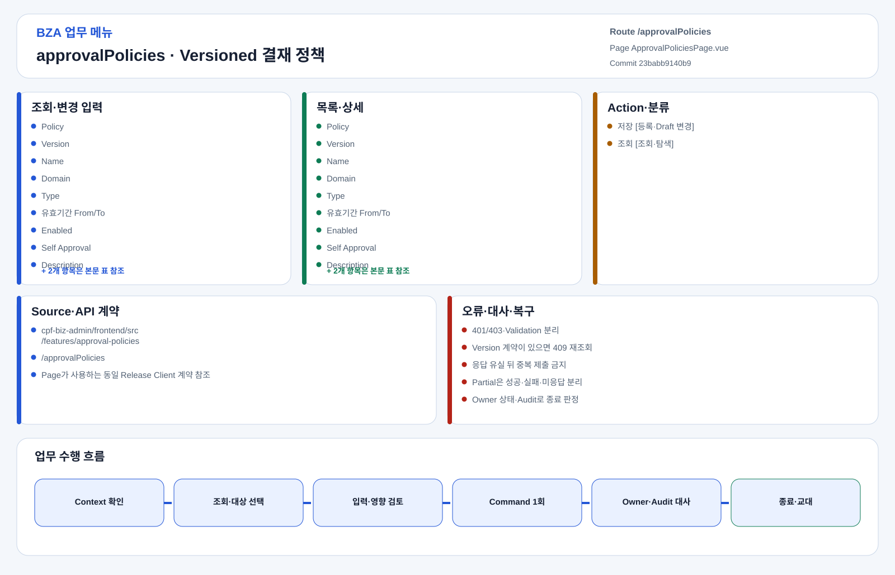

### 이 장에서 끝내는 업무

Versioned 결재 정책과 Step JSON·유효기간을 관리한다.

### 메뉴 식별·책임

| 항목 | 값 |
|---|---|
| Route | `/approvalPolicies` |
| 메뉴 ID | `approvalPolicies` |
| Menu Code | `APPROVAL` |
| 업무 그룹 | approval |
| Frontend Page | `cpf-biz-admin/frontend/src/features/approval-policies/ApprovalPoliciesPage.vue` |
| Permission | 정책 Write |
| 기준 Commit | `23babb9140b90e501d6ac715e7b77f55b66198a5` |

### Source·API 근거

| 구분 | 기준 |
|---|---|
| Frontend Page | `cpf-biz-admin/frontend/src/features/approval-policies/ApprovalPoliciesPage.vue` |
| Router | `/approvalPolicies` |
| API 추적 | 화면에서 제공하는 기능을 통해 호출한다. 문서에 명시되지 않은 Endpoint를 Browser나 외부 Script에서 임의 호출하지 않는다. |

아래 표는 이 메뉴에서 실제로 확인·입력·실행할 항목을 정리한다. 화면에 없는 Field·Button·상태를 임의로 가정하지 않는다.

### 검색·입력 Field

| Field | Control | 업무 의미 | 기본값·Validation·주의 |
|---|---|---|---|
| `Policy` | Select·검색 | Versioned 결재 정책에서 적용하거나 조회할 정책·권한·처리 유형을 선택한다. | 허용 목록과 현재 Environment·Data Scope에 맞는 값만 선택한다. |
| `Version` | 숫자·Version 입력 | 동시 변경을 막고 요청 대상의 현재 Revision을 확인하는 값이다. | 상세 재조회로 최신 값을 얻고 409 발생 시 기존 값을 덮어쓰지 않는다. |
| `Name` | 문자열 입력·검색 | 대상의 표시명 또는 업무명을 검색·입력한다. | 앞뒤 공백·허용 문자·길이와 대소문자 규칙을 확인한다. |
| `Domain` | Select·검색 | Versioned 결재 정책 조회·조치가 적용되는 환경과 데이터 경계를 제한한다. | 허용 목록과 현재 Environment·Data Scope에 맞는 값만 선택한다. |
| `Type` | Select·검색 | Versioned 결재 정책에서 적용하거나 조회할 정책·권한·처리 유형을 선택한다. | 허용 목록과 현재 Environment·Data Scope에 맞는 값만 선택한다. |
| `유효기간 From/To` | 날짜·시간 입력 | 조회 또는 적용의 유효 시간 범위를 정하며 Timezone과 시작·종료 순서를 함께 확인한다. | Timezone을 고정하고 시작≤종료·유효기간 겹침·기준일 포함 여부를 확인한다. |
| `Enabled` | Checkbox·Switch | 현재 상태를 조회하거나 다음 Action의 허용 조건을 지정한다. | 현재 선택과 변경 후 영향 범위를 비교하고 화면의 Source 기본값을 확인한다. |
| `Self Approval` | Checkbox·Switch | Versioned 결재 정책 화면의 조회 조건 또는 편집 Form에 포함되는 값이며 화면 Label과 Help를 기준으로 사용한다. | 현재 선택과 변경 후 영향 범위를 비교하고 화면의 Source 기본값을 확인한다. |
| `Description` | 다중행 입력 | 작업 목적·영향 범위·승인 또는 복구 기준을 기록해 Audit와 교대 기록에 연결한다. | 허용 Schema·길이·민감정보 포함 여부를 확인하고 Preview 또는 Validation 결과를 검토한다. |
| `Steps JSON` | 다중행 입력 | 검증·등록·Export에 사용할 입력 Artifact 또는 구조화된 본문이다. | 허용 Schema·길이·민감정보 포함 여부를 확인하고 Preview 또는 Validation 결과를 검토한다. |
| `Reason` | 다중행 입력 | 작업 목적·영향 범위·승인 또는 복구 기준을 기록해 Audit와 교대 기록에 연결한다. | Ticket·영향 범위·복구점을 포함하고 화면이 요구하는 최소 길이를 충족한다. |

#### 입력 순서

1. **Policy** 항목이 조회 Control인지 변경 Form인지 화면 위치로 구분하고, 표시된 값·필수 여부·허용 형식을 확인한다.
2. **Version** 항목이 조회 Control인지 변경 Form인지 화면 위치로 구분하고, 표시된 값·필수 여부·허용 형식을 확인한다.
3. **Name** 항목이 조회 Control인지 변경 Form인지 화면 위치로 구분하고, 표시된 값·필수 여부·허용 형식을 확인한다.
4. **Domain** 항목이 조회 Control인지 변경 Form인지 화면 위치로 구분하고, 표시된 값·필수 여부·허용 형식을 확인한다.
5. **Type** 항목이 조회 Control인지 변경 Form인지 화면 위치로 구분하고, 표시된 값·필수 여부·허용 형식을 확인한다.
6. **유효기간 From/To** 항목이 조회 Control인지 변경 Form인지 화면 위치로 구분하고, 표시된 값·필수 여부·허용 형식을 확인한다.
7. **Enabled** 항목이 조회 Control인지 변경 Form인지 화면 위치로 구분하고, 표시된 값·필수 여부·허용 형식을 확인한다.
8. **Self Approval** 항목이 조회 Control인지 변경 Form인지 화면 위치로 구분하고, 표시된 값·필수 여부·허용 형식을 확인한다.
9. **Description** 항목이 조회 Control인지 변경 Form인지 화면 위치로 구분하고, 표시된 값·필수 여부·허용 형식을 확인한다.
10. **Steps JSON** 항목이 조회 Control인지 변경 Form인지 화면 위치로 구분하고, 표시된 값·필수 여부·허용 형식을 확인한다.
11. **Reason** 항목이 조회 Control인지 변경 Form인지 화면 위치로 구분하고, 표시된 값·필수 여부·허용 형식을 확인한다.
12. 조회 Control과 변경 Form을 분리해 기록하고, 실행 전 Environment·Data Scope·Timezone과 제출할 값만 다시 검토한다.

### 목록 Column·상세 Field

| 표시값 | 운영 의미 | 교차 확인 |
|---|---|---|
| `Policy` | Versioned 결재 정책 상세에서 대상의 현재 속성 또는 처리 결과를 확인하는 값이다. | 상세·재조회 결과와 비교하고 Stale·Masking·단위 차이를 확인한다. |
| `Version` | 요청·Owner·Instance 사이의 Version 또는 내용 동일성을 판단하는 값이다. | 목록·상세·Owner 또는 Instance 보고값에서 일치하는지 확인한다. |
| `Name` | 운영자가 대상을 구분하는 표시명 또는 설명이다. | 상세·재조회 결과와 비교하고 Stale·Masking·단위 차이를 확인한다. |
| `Domain` | Versioned 결재 정책 상세에서 대상의 현재 속성 또는 처리 결과를 확인하는 값이다. | 상세·재조회 결과와 비교하고 Stale·Masking·단위 차이를 확인한다. |
| `Type` | Versioned 결재 정책 상세에서 대상의 현재 속성 또는 처리 결과를 확인하는 값이다. | 상세·재조회 결과와 비교하고 Stale·Masking·단위 차이를 확인한다. |
| `유효기간 From/To` | 상태 발생·갱신·유효 시점을 나타내며 화면 Timezone을 기준으로 해석한다. | 상세·재조회 결과와 비교하고 Stale·Masking·단위 차이를 확인한다. |
| `Enabled` | 현재 상태와 Terminal 여부, 다음 Action 가능 여부를 판단하는 값이다. | Last Updated·Terminal 조건·Owner 상태와 함께 확인한다. |
| `Self Approval` | Versioned 결재 정책 상세에서 대상의 현재 속성 또는 처리 결과를 확인하는 값이다. | 상세·재조회 결과와 비교하고 Stale·Masking·단위 차이를 확인한다. |
| `Description` | 운영자가 대상을 구분하는 표시명 또는 설명이다. | 상세·재조회 결과와 비교하고 Stale·Masking·단위 차이를 확인한다. |
| `Steps JSON` | Versioned 결재 정책 상세에서 대상의 현재 속성 또는 처리 결과를 확인하는 값이다. | 상세·재조회 결과와 비교하고 Stale·Masking·단위 차이를 확인한다. |
| `Reason` | 작업 주체·Owner·변경 사유를 확인하는 감사 정보다. | 상세·재조회 결과와 비교하고 Stale·Masking·단위 차이를 확인한다. |

#### 결과 판독 순서

1. 조회 완료 시각·Filter·Paging·Sort와 화면 Warning을 확인한다.
2. Empty·Stale·Partial을 정상 0건과 구분한다.
3. 식별자·상태·Version·오류·시각을 같은 Query Context의 상세와 Owner 원장에서 비교한다.
4. Masking된 값은 Raw Permission과 Reason 없이 복원·Export하지 않는다.
5. 집계와 상세가 다르면 집계 시간 창·Timezone·Owner Update 시각을 맞춰 대사한다.

### Button·Action

| Action | 분류 | 활성 조건 | Side Effect·정상 결과 |
|---|---|---|---|
| **저장** | 등록·Draft 변경 | 화면이 실제로 요구하는 Write Permission·필수 Field·Reason·Version 조건을 충족함 | Versioned 결재 정책의 재조회 결과가 요청 내용과 일치한다. Version·Before/After·Audit는 해당 Owner가 제공하는 경우 함께 확인한다. |
| **조회** | 조회·탐색 | 조회 Permission과 Query Validation을 충족하고 동일 조회가 진행 중이 아님 | 조회 결과의 조회 시각·Filter·Source Version·Warning이 갱신되며 Owner 데이터는 변경하지 않는다. |

### 정상 업무 전체 절차

1. `/approvalPolicies`에 진입해 Page Header와 Route가 **Versioned 결재 정책** 기능을 가리키는지 확인한다.
2. 로그인 Session·Environment·Data Scope·기준일·Timezone을 고정한다.
3. 화면의 조회 Control과 변경 Form을 구분한다. 조회 조건이 제공되면 먼저 조회하고, 변경 Form은 대상 선택 또는 등록 Action 뒤에 열린 실제 Field만 사용한다.
4. Loading 종료 후 Empty·Error·Stale·Partial 상태와 화면 Warning을 먼저 판정한다.
5. **Policy, Version, Name, Domain, Type**를 읽고 식별자·상태·Version·시각을 Owner 원장과 대사한다.
6. **저장** 전에 화면과 Owner가 실제로 요구하는 Permission·현재 상태·영향 범위·Reason·승인·Version 조건을 확인하고 한 번만 제출한다.
7. **저장**의 HTTP 응답과 재조회 결과를 확인한다. 비동기·다중 대상 기능은 Owner Terminal 상태·Version·대상별 Success/Failed/Unknown·Audit를 별도로 확인한다.
8. 화면이 제공하는 Log·Metric·Trace와, 변경·Export·승인 조치에 생성된 Audit를 교차 확인한다.
9. 이 장의 **종료 판정**과 다음 확인 시각·Evidence Link를 교대 기록에 남긴다.

### 메뉴 고유 판정·금지 사항

- **목적:** Versioned 결재 정책과 Step JSON·유효기간을 관리한다.
- **종료 판정:** ALL·ANY·N_OF_M·Self Approval·기간 겹침을 검증한다.
- 응답을 받지 못한 경우 Owner 상태와 기존 Operation을 확인하기 전에 동일 Action을 반복하지 않는다.
- HTTP 성공 응답이나 Toast만으로 비동기 Owner 상태 또는 다중 대상 적용을 확정하지 않는다.

### 오류·경계·동시성·복구

| 상황 | 화면 징후 | 운영 조치 | 종료 증적 |
|---|---|---|---|
| 401·Session | Session 만료·CSRF·Origin 실패 | 로그인 상태와 BFF Session을 확인한다. Command 자동 Replay는 금지한다. | 401/403 응답·Session Audit |
| 403·Data Scope | 메뉴·Button·Raw·Export가 거부됨 | Menu·Button·API·Owner Permission과 Data Scope를 확인하고 우회하지 않는다. | Deny Audit·요청 Permission |
| Validation | 필수값·범위·형식·기간 오류 | Field Error만 수정하고 기존 성공 Operation을 다시 제출하지 않는다. | Error Code·Field·입력값 |
| Timeout·Dependency | 일부 Source 또는 Command 응답 지연 | Correlation/Operation ID와 실패 Stage를 기록하고 Owner 상태를 조회한다. | Dependency 상태·Retryability |
| Partial·Stale | 일부 대상만 Success 또는 조회 Source 누락 | 성공·실패·미응답을 분리하고 누락 범위와 Version을 표시한다. | Target별 결과·Version |
| 409·동시 변경 | Expected Version 불일치 | 최신 상세를 재조회하고 Diff·영향을 다시 검토한 뒤 새 요청으로 제출한다. | 현재/요청 Version·변경자 |
| 응답 유실·Unknown | 요청 후 실제 처리 여부를 알 수 없음 | Operation ID·Request Hash·Audit·Owner 상태로 대사하고 중복 제출하지 않는다. | Operation·Owner·Audit |
| 복구 실패 | Retry/Rollback 뒤에도 상태 불일치 | 자동 반복을 중단하고 Incident·Reconcile Case·다음 확인 시각을 기록한다. | Case ID·복구 Owner·기한 |

### 응답 유실·결과 불명·부분 적용 처리

1. 동일 Action을 다시 누르지 않고 Browser Network와 응답 Header를 보존한다. `operationId`·`transactionId`·`idempotencyKey`가 제공되면 기록하고, 없으면 Target ID·Actor·요청 시각·Request Body Hash로 대사한다.
2. 기능이 제공하는 상세·Operation Status(있는 경우)·Audit에서 Request Hash와 대상 Version을 검색한다.
3. Side Effect 전 실패가 확인된 경우에만 새 요청을 검토한다.
4. Success·Failed·Unknown 대상을 분리하고 Source가 제공하는 Failed-only Retry·Compensation·Rollback을 선택하고, 지원되지 않으면 수동 Reconcile Case로 이관한다.
5. Rollback을 지원하는 기능은 Owner Version·Checksum·업무 합계가 Rollback Point와 일치하는지 확인한다.
6. 확정되지 않은 대상은 `UNKNOWN_RESULT`로 유지하고 담당자·대사 기한·다음 확인 시각을 기록한다.

### Log·Metric·Trace·Audit와 교대 기록

| 증적 | 필수 값 |
|---|---|
| Audit | Actor·Permission·Reason·Approval·Target·Before/After·Result·Recovery Action |
| Log | Environment·Instance·operationId·transactionId·failureStage·errorCode |
| Metric | 동일 시간 창의 Success·Failure·Latency·Queue·Retry·Partial·Unknown |
| Trace | root/segment/attempt·Owner·DB/Kafka/외부 의존성 Span |
| 상태 원장 | Target ID·Version·Checksum·Desired/Actual·Last Updated·Terminal 여부 |

```text
Menu=approvalPolicies
Route=/approvalPolicies
Environment=
DataScope=
Query=
TargetId=
BeforeVersion=
Action=
Reason=
ApprovalId=
OperationId=
TransactionId=
Result=SUCCESS|FAILED|PARTIAL|UNKNOWN_RESULT
OwnerState=
FailedTargets=
ReconcileBy=
RollbackPoint=
EvidenceLinks=
NextCheckAt=
```

### 실무 Workbook

**상황:** Versioned 결재 정책과 Step JSON·유효기간을 관리한다. 담당자가 **저장**을 수행한 뒤 Browser 응답을 받지 못했다.

1. 대상 식별자와 Before Version, 입력값, Reason·Approval을 작업 기록에서 확인한다.
2. 동일 **저장**을 반복하지 않고 Operation·Audit·Owner 상태를 조회한다.
3. Owner 상태가 변경됐고 Request Hash가 같으면 응답 유실로 분류해 중복 조치를 금지한다.
4. 일부 대상만 변경됐으면 Success·Failed·Unknown을 분리해 Failed-only Retry 또는 Rollback을 선택한다.
5. ALL·ANY·N_OF_M·Self Approval·기간 겹침을 검증한다.
6. Evidence Link와 다음 확인 시각을 교대 기록에 남긴다.

### 독립 수행 검수 Checklist

- [ ] `/approvalPolicies`와 Page Source를 찾고 화면 목적을 설명할 수 있다.
- [ ] 1별도 사용자 입력이 없는 경우 자동 Query Context를 설명할 수 있다.
- [ ] 11개 표시값을 Owner 상태·Version·Audit와 대사할 수 있다.
- [ ] 2개 Action의 분류·활성 조건·Side Effect를 설명할 수 있다.
- [ ] Empty·403·409·Timeout·Partial·Unknown을 서로 다른 상태로 처리할 수 있다.
- [ ] 응답 유실 뒤 중복 제출 없이 Operation·Owner·Audit로 결과를 확정할 수 있다.
- [ ] 교대 기록만으로 다음 담당자가 Target·상태·복구 기한을 이어받을 수 있다.

## 17. approvalSimulation — 결재 경로 사전 해석

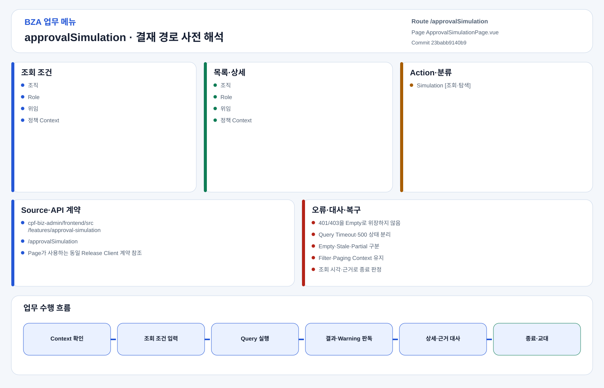

### 이 장에서 끝내는 업무

조직·Role·위임을 적용한 결재 경로를 사전 계산한다.

### 메뉴 식별·책임

| 항목 | 값 |
|---|---|
| Route | `/approvalSimulation` |
| 메뉴 ID | `approvalSimulation` |
| Menu Code | `APPROVAL` |
| 업무 그룹 | approval |
| Frontend Page | `cpf-biz-admin/frontend/src/features/approval-simulation/ApprovalSimulationPage.vue` |
| Permission | 조회/Simulation |
| 기준 Commit | `23babb9140b90e501d6ac715e7b77f55b66198a5` |

### Source·API 근거

| 구분 | 기준 |
|---|---|
| Frontend Page | `cpf-biz-admin/frontend/src/features/approval-simulation/ApprovalSimulationPage.vue` |
| Router | `/approvalSimulation` |
| API 추적 | 화면에서 제공하는 기능을 통해 호출한다. 문서에 명시되지 않은 Endpoint를 Browser나 외부 Script에서 임의 호출하지 않는다. |

아래 표는 이 메뉴에서 실제로 확인·입력·실행할 항목을 정리한다. 화면에 없는 Field·Button·상태를 임의로 가정하지 않는다.

### 검색·입력 Field

| Field | Control | 업무 의미 | 기본값·Validation·주의 |
|---|---|---|---|
| `조직` | 문자열 입력·검색 | 조회·상세·Audit에서 같은 대상을 다시 찾기 위한 식별 조건이다. | 앞뒤 공백·허용 문자·길이와 대소문자 규칙을 확인한다. |
| `Role` | Select·검색 | 결재 경로 사전 해석에서 적용하거나 조회할 정책·권한·처리 유형을 선택한다. | 허용 목록과 현재 Environment·Data Scope에 맞는 값만 선택한다. |
| `위임` | 문자열 입력·검색 | 결재 경로 사전 해석 화면의 조회 조건 또는 편집 Form에 포함되는 값이며 화면 Label과 Help를 기준으로 사용한다. | 앞뒤 공백·허용 문자·길이와 대소문자 규칙을 확인한다. |
| `정책 Context` | Select·검색 | 결재 경로 사전 해석에서 적용하거나 조회할 정책·권한·처리 유형을 선택한다. | 허용 목록과 현재 Environment·Data Scope에 맞는 값만 선택한다. |

#### 입력 순서

1. **조직** 항목이 조회 Control인지 변경 Form인지 화면 위치로 구분하고, 표시된 값·필수 여부·허용 형식을 확인한다.
2. **Role** 항목이 조회 Control인지 변경 Form인지 화면 위치로 구분하고, 표시된 값·필수 여부·허용 형식을 확인한다.
3. **위임** 항목이 조회 Control인지 변경 Form인지 화면 위치로 구분하고, 표시된 값·필수 여부·허용 형식을 확인한다.
4. **정책 Context** 항목이 조회 Control인지 변경 Form인지 화면 위치로 구분하고, 표시된 값·필수 여부·허용 형식을 확인한다.
5. 조회 Control과 변경 Form을 분리해 기록하고, 실행 전 Environment·Data Scope·Timezone과 제출할 값만 다시 검토한다.

### 목록 Column·상세 Field

| 표시값 | 운영 의미 | 교차 확인 |
|---|---|---|
| `조직` | 결재 경로 사전 해석 상세에서 대상의 현재 속성 또는 처리 결과를 확인하는 값이다. | 상세·재조회 결과와 비교하고 Stale·Masking·단위 차이를 확인한다. |
| `Role` | 결재 경로 사전 해석 상세에서 대상의 현재 속성 또는 처리 결과를 확인하는 값이다. | 상세·재조회 결과와 비교하고 Stale·Masking·단위 차이를 확인한다. |
| `위임` | 결재 경로 사전 해석 상세에서 대상의 현재 속성 또는 처리 결과를 확인하는 값이다. | 상세·재조회 결과와 비교하고 Stale·Masking·단위 차이를 확인한다. |
| `정책 Context` | 결재 경로 사전 해석 상세에서 대상의 현재 속성 또는 처리 결과를 확인하는 값이다. | 상세·재조회 결과와 비교하고 Stale·Masking·단위 차이를 확인한다. |

#### 결과 판독 순서

1. 조회 완료 시각·Filter·Paging·Sort와 화면 Warning을 확인한다.
2. Empty·Stale·Partial을 정상 0건과 구분한다.
3. 식별자·상태·Version·오류·시각을 같은 Query Context의 상세와 Owner 원장에서 비교한다.
4. Masking된 값은 Raw Permission과 Reason 없이 복원·Export하지 않는다.
5. 집계와 상세가 다르면 집계 시간 창·Timezone·Owner Update 시각을 맞춰 대사한다.

### Button·Action

| Action | 분류 | 활성 조건 | Side Effect·정상 결과 |
|---|---|---|---|
| **Simulation** | 조회·탐색 | 조회 Permission과 Query Validation을 충족하고 동일 조회가 진행 중이 아님 | Simulation 결과의 조회 시각·Filter·Source Version·Warning이 갱신되며 Owner 데이터는 변경하지 않는다. |

### 정상 업무 전체 절차

1. `/approvalSimulation`에 진입해 Page Header와 Route가 **결재 경로 사전 해석** 기능을 가리키는지 확인한다.
2. 로그인 Session·Environment·Data Scope·기준일·Timezone을 고정한다.
3. 화면에 제공된 조회 Control만 사용하고, 표시되지 않은 변경 Field나 Server Command가 있다고 가정하지 않는다.
4. Loading 종료 후 Empty·Error·Stale·Partial 상태와 화면 Warning을 먼저 판정한다.
5. **조직, Role, 위임, 정책 Context**를 읽고 식별자·상태·Version·시각을 Owner 원장과 대사한다.
6. 화면이 제공하는 Log·Metric·Trace와 조회·Raw·Export 접근 기록이 있으면 해당 Audit를 교차 확인한다.
7. 이 장의 **종료 판정**과 다음 확인 시각·Evidence Link를 교대 기록에 남긴다.

### 메뉴 고유 판정·금지 사항

- **목적:** 조직·Role·위임을 적용한 결재 경로를 사전 계산한다.
- **종료 판정:** Simulation 기준일과 실제 상신 Snapshot이 같은 Policy Version인지 확인한다.
- 조회 화면에서 직접 Owner 데이터를 변경하거나 Browser Tool로 우회하지 않는다.
- Partial 조회를 정상 전체 결과로 합치지 않는다.

### 오류·경계·동시성·복구

| 상황 | 화면 징후 | 운영 조치 | 종료 증적 |
|---|---|---|---|
| 401·Session | Session 만료·CSRF·Origin 실패 | 로그인 상태와 BFF Session을 확인한 뒤 같은 Query Context로 다시 조회한다. | 401/403 응답·Session Audit |
| 403·Data Scope | 메뉴·Button·Raw·Export가 거부됨 | Menu·Button·API·Owner Permission과 Data Scope를 확인하고 우회하지 않는다. | Deny Audit·요청 Permission |
| Timeout·Dependency | 일부 조회 Source 응답 지연 | Correlation ID·Query Context·실패 Source를 기록하고 같은 조건으로 재조회한다. | 조회 시각·실패 Source·재조회 결과 |
| Partial·Stale | 일부 대상만 Success 또는 조회 Source 누락 | 성공·실패·미응답을 분리하고 누락 범위와 Version을 표시한다. | Target별 결과·Version |

### 응답 유실·부분 조회 처리

1. 검색 조건·Data Scope·Paging·조회 시각·Correlation ID를 기록한다.
2. 같은 조건으로 재조회하되 실패 Source만 분리한다.
3. 정상 Source 결과를 유지하고 실패·Stale Source를 명시한다.
4. 집계와 원본 상세가 다르면 Owner 상세를 기준으로 Reconcile Case를 연다.
5. 조회 시각·Source Version·0건 또는 일치 결과를 증적으로 남긴다.

### Log·Metric·Trace·Audit와 교대 기록

| 증적 | 필수 값 |
|---|---|
| Audit | Actor·Permission·Data Scope·Raw/Export 접근·Query Context·Result |
| Log | Environment·Instance·operationId·transactionId·failureStage·errorCode |
| Metric | 동일 시간 창의 Success·Failure·Latency·Queue·Retry·Partial·Unknown |
| Trace | root/segment/attempt·Owner·DB/Kafka/외부 의존성 Span |
| 상태 원장 | Target ID·Version·Checksum·Desired/Actual·Last Updated·Terminal 여부 |

```text
Menu=
Route=
Environment=
DataScope=
Query=
QueryAt=
CorrelationId=
SourceVersion=
Result=SUCCESS|EMPTY|STALE|PARTIAL|FAILED
FailedSources=
EvidenceLinks=
NextCheckAt=
```

### 실무 Workbook

**상황:** 조직·Role·위임을 적용한 결재 경로를 사전 계산한다. 화면이 일부 Source Timeout 때문에 Partial 결과를 표시했다.

1. Query·Data Scope·조회 시각·Correlation ID를 기록한다.
2. 정상 결과를 0건으로 덮어쓰지 않고 실패 Source만 재조회한다.
3. 조직, Role, 위임 값을 원본 상세와 같은 시간 기준으로 비교한다.
4. 불일치가 계속되면 Incident 또는 Reconcile Case를 생성한다.
5. Simulation 기준일과 실제 상신 Snapshot이 같은 Policy Version인지 확인한다.
6. Source Version과 다음 확인 시각을 교대 기록에 남긴다.

### 독립 수행 검수 Checklist

- [ ] `/approvalSimulation`와 Page Source를 찾고 화면 목적을 설명할 수 있다.
- [ ] 4개 입력·검색 항목의 Control·기본값·Validation을 설명할 수 있다.
- [ ] 4개 표시값을 Owner 상태·Version·Audit와 대사할 수 있다.
- [ ] 1개 Action의 분류·활성 조건·Side Effect를 설명할 수 있다.
- [ ] Empty·401·403·Timeout·Stale·Partial을 서로 다른 조회 상태로 처리할 수 있다.
- [ ] 조회 응답 유실 시 같은 Query Context로 재조회하고 Correlation ID·조회 시각·Source Version으로 결과를 대사할 수 있다.
- [ ] 교대 기록만으로 다음 담당자가 Target·상태·복구 기한을 이어받을 수 있다.

## 18. approvalDelegations — 결재 위임·대결

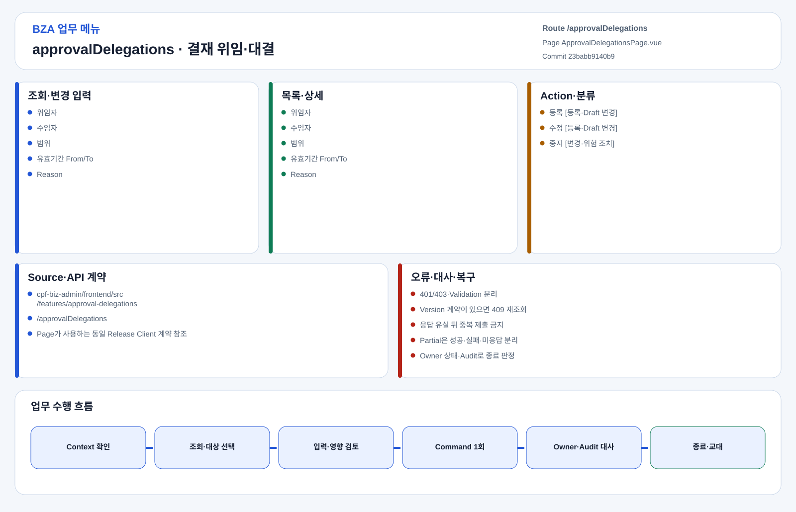

### 이 장에서 끝내는 업무

결재 위임·대결의 범위와 유효기간을 관리한다.

### 메뉴 식별·책임

| 항목 | 값 |
|---|---|
| Route | `/approvalDelegations` |
| 메뉴 ID | `approvalDelegations` |
| Menu Code | `APPROVAL` |
| 업무 그룹 | approval |
| Frontend Page | `cpf-biz-admin/frontend/src/features/approval-delegations/ApprovalDelegationsPage.vue` |
| Permission | Write |
| 기준 Commit | `23babb9140b90e501d6ac715e7b77f55b66198a5` |

### Source·API 근거

| 구분 | 기준 |
|---|---|
| Frontend Page | `cpf-biz-admin/frontend/src/features/approval-delegations/ApprovalDelegationsPage.vue` |
| Router | `/approvalDelegations` |
| API 추적 | 화면에서 제공하는 기능을 통해 호출한다. 문서에 명시되지 않은 Endpoint를 Browser나 외부 Script에서 임의 호출하지 않는다. |

아래 표는 이 메뉴에서 실제로 확인·입력·실행할 항목을 정리한다. 화면에 없는 Field·Button·상태를 임의로 가정하지 않는다.

### 검색·입력 Field

| Field | Control | 업무 의미 | 기본값·Validation·주의 |
|---|---|---|---|
| `위임자` | 문자열 입력·검색 | 결재 위임·대결 화면의 조회 조건 또는 편집 Form에 포함되는 값이며 화면 Label과 Help를 기준으로 사용한다. | 앞뒤 공백·허용 문자·길이와 대소문자 규칙을 확인한다. |
| `수임자` | 문자열 입력·검색 | 결재 위임·대결 화면의 조회 조건 또는 편집 Form에 포함되는 값이며 화면 Label과 Help를 기준으로 사용한다. | 앞뒤 공백·허용 문자·길이와 대소문자 규칙을 확인한다. |
| `범위` | Select·검색 | 결재 위임·대결 조회·조치가 적용되는 환경과 데이터 경계를 제한한다. | 허용 목록과 현재 Environment·Data Scope에 맞는 값만 선택한다. |
| `유효기간 From/To` | 날짜·시간 입력 | 조회 또는 적용의 유효 시간 범위를 정하며 Timezone과 시작·종료 순서를 함께 확인한다. | Timezone을 고정하고 시작≤종료·유효기간 겹침·기준일 포함 여부를 확인한다. |
| `Reason` | 다중행 입력 | 작업 목적·영향 범위·승인 또는 복구 기준을 기록해 Audit와 교대 기록에 연결한다. | Ticket·영향 범위·복구점을 포함하고 화면이 요구하는 최소 길이를 충족한다. |

#### 입력 순서

1. **위임자** 항목이 조회 Control인지 변경 Form인지 화면 위치로 구분하고, 표시된 값·필수 여부·허용 형식을 확인한다.
2. **수임자** 항목이 조회 Control인지 변경 Form인지 화면 위치로 구분하고, 표시된 값·필수 여부·허용 형식을 확인한다.
3. **범위** 항목이 조회 Control인지 변경 Form인지 화면 위치로 구분하고, 표시된 값·필수 여부·허용 형식을 확인한다.
4. **유효기간 From/To** 항목이 조회 Control인지 변경 Form인지 화면 위치로 구분하고, 표시된 값·필수 여부·허용 형식을 확인한다.
5. **Reason** 항목이 조회 Control인지 변경 Form인지 화면 위치로 구분하고, 표시된 값·필수 여부·허용 형식을 확인한다.
6. 조회 Control과 변경 Form을 분리해 기록하고, 실행 전 Environment·Data Scope·Timezone과 제출할 값만 다시 검토한다.

### 목록 Column·상세 Field

| 표시값 | 운영 의미 | 교차 확인 |
|---|---|---|
| `위임자` | 결재 위임·대결 상세에서 대상의 현재 속성 또는 처리 결과를 확인하는 값이다. | 상세·재조회 결과와 비교하고 Stale·Masking·단위 차이를 확인한다. |
| `수임자` | 동일한 집계 시간 창·단위·Filter에서 비교해야 하는 수치다. | 같은 Filter·집계 시간 창·단위의 상세 Row 또는 Metric으로 대사한다. |
| `범위` | 결재 위임·대결 상세에서 대상의 현재 속성 또는 처리 결과를 확인하는 값이다. | 상세·재조회 결과와 비교하고 Stale·Masking·단위 차이를 확인한다. |
| `유효기간 From/To` | 상태 발생·갱신·유효 시점을 나타내며 화면 Timezone을 기준으로 해석한다. | 상세·재조회 결과와 비교하고 Stale·Masking·단위 차이를 확인한다. |
| `Reason` | 작업 주체·Owner·변경 사유를 확인하는 감사 정보다. | 상세·재조회 결과와 비교하고 Stale·Masking·단위 차이를 확인한다. |

#### 결과 판독 순서

1. 조회 완료 시각·Filter·Paging·Sort와 화면 Warning을 확인한다.
2. Empty·Stale·Partial을 정상 0건과 구분한다.
3. 식별자·상태·Version·오류·시각을 같은 Query Context의 상세와 Owner 원장에서 비교한다.
4. Masking된 값은 Raw Permission과 Reason 없이 복원·Export하지 않는다.
5. 집계와 상세가 다르면 집계 시간 창·Timezone·Owner Update 시각을 맞춰 대사한다.

### Button·Action

| Action | 분류 | 활성 조건 | Side Effect·정상 결과 |
|---|---|---|---|
| **등록** | 등록·Draft 변경 | 화면이 실제로 요구하는 Write Permission·필수 Field·Reason·Version 조건을 충족함 | 결재 위임·대결의 재조회 결과가 요청 내용과 일치한다. Version·Before/After·Audit는 해당 Owner가 제공하는 경우 함께 확인한다. |
| **수정** | 등록·Draft 변경 | 화면이 실제로 요구하는 Write Permission·필수 Field·Reason·Version 조건을 충족함 | 결재 위임·대결의 재조회 결과가 요청 내용과 일치한다. Version·Before/After·Audit는 해당 Owner가 제공하는 경우 함께 확인한다. |
| **중지** | 변경·위험 조치 | 화면과 Owner가 요구하는 Write Permission·대상 상태·영향 범위·Reason·승인·Version 조건을 충족함 | 변경 Operation을 생성하고 Accepted 응답과 Owner Terminal 상태·Version·Audit를 분리해 확인한다. |

### 정상 업무 전체 절차

1. `/approvalDelegations`에 진입해 Page Header와 Route가 **결재 위임·대결** 기능을 가리키는지 확인한다.
2. 로그인 Session·Environment·Data Scope·기준일·Timezone을 고정한다.
3. 화면의 조회 Control과 변경 Form을 구분한다. 조회 조건이 제공되면 먼저 조회하고, 변경 Form은 대상 선택 또는 등록 Action 뒤에 열린 실제 Field만 사용한다.
4. Loading 종료 후 Empty·Error·Stale·Partial 상태와 화면 Warning을 먼저 판정한다.
5. **위임자, 수임자, 범위, 유효기간 From/To, Reason**를 읽고 식별자·상태·Version·시각을 Owner 원장과 대사한다.
6. **등록** 전에 화면과 Owner가 실제로 요구하는 Permission·현재 상태·영향 범위·Reason·승인·Version 조건을 확인하고 한 번만 제출한다.
7. **등록**의 HTTP 응답과 재조회 결과를 확인한다. 비동기·다중 대상 기능은 Owner Terminal 상태·Version·대상별 Success/Failed/Unknown·Audit를 별도로 확인한다.
8. **수정** 전에 화면과 Owner가 실제로 요구하는 Permission·현재 상태·영향 범위·Reason·승인·Version 조건을 확인하고 한 번만 제출한다.
9. **수정**의 HTTP 응답과 재조회 결과를 확인한다. 비동기·다중 대상 기능은 Owner Terminal 상태·Version·대상별 Success/Failed/Unknown·Audit를 별도로 확인한다.
10. **중지** 전에 화면과 Owner가 실제로 요구하는 Permission·현재 상태·영향 범위·Reason·승인·Version 조건을 확인하고 한 번만 제출한다.
11. **중지**의 HTTP 응답과 재조회 결과를 확인한다. 비동기·다중 대상 기능은 Owner Terminal 상태·Version·대상별 Success/Failed/Unknown·Audit를 별도로 확인한다.
12. 화면이 제공하는 Log·Metric·Trace와, 변경·Export·승인 조치에 생성된 Audit를 교차 확인한다.
13. 이 장의 **종료 판정**과 다음 확인 시각·Evidence Link를 교대 기록에 남긴다.

### 메뉴 고유 판정·금지 사항

- **목적:** 결재 위임·대결의 범위와 유효기간을 관리한다.
- **종료 판정:** 위임 순환·기간 겹침·대상 Scope를 확인한다.
- 응답을 받지 못한 경우 Owner 상태와 기존 Operation을 확인하기 전에 동일 Action을 반복하지 않는다.
- HTTP 성공 응답이나 Toast만으로 비동기 Owner 상태 또는 다중 대상 적용을 확정하지 않는다.

### 오류·경계·동시성·복구

| 상황 | 화면 징후 | 운영 조치 | 종료 증적 |
|---|---|---|---|
| 401·Session | Session 만료·CSRF·Origin 실패 | 로그인 상태와 BFF Session을 확인한다. Command 자동 Replay는 금지한다. | 401/403 응답·Session Audit |
| 403·Data Scope | 메뉴·Button·Raw·Export가 거부됨 | Menu·Button·API·Owner Permission과 Data Scope를 확인하고 우회하지 않는다. | Deny Audit·요청 Permission |
| Validation | 필수값·범위·형식·기간 오류 | Field Error만 수정하고 기존 성공 Operation을 다시 제출하지 않는다. | Error Code·Field·입력값 |
| Timeout·Dependency | 일부 Source 또는 Command 응답 지연 | Correlation/Operation ID와 실패 Stage를 기록하고 Owner 상태를 조회한다. | Dependency 상태·Retryability |
| Partial·Stale | 일부 대상만 Success 또는 조회 Source 누락 | 성공·실패·미응답을 분리하고 누락 범위와 Version을 표시한다. | Target별 결과·Version |
| 409·동시 변경 | Expected Version 불일치 | 최신 상세를 재조회하고 Diff·영향을 다시 검토한 뒤 새 요청으로 제출한다. | 현재/요청 Version·변경자 |
| 응답 유실·Unknown | 요청 후 실제 처리 여부를 알 수 없음 | Operation ID·Request Hash·Audit·Owner 상태로 대사하고 중복 제출하지 않는다. | Operation·Owner·Audit |
| 복구 실패 | Retry/Rollback 뒤에도 상태 불일치 | 자동 반복을 중단하고 Incident·Reconcile Case·다음 확인 시각을 기록한다. | Case ID·복구 Owner·기한 |
| 계층·기간 충돌 | 고아·순환·기간 중복이 탐지됨 | 대상 관계와 기준일을 수정하고 영향 사용자·결재 Snapshot을 재계산한다. | 관계 Diff·Simulation 결과 |

### 응답 유실·결과 불명·부분 적용 처리

1. 동일 Action을 다시 누르지 않고 Browser Network와 응답 Header를 보존한다. `operationId`·`transactionId`·`idempotencyKey`가 제공되면 기록하고, 없으면 Target ID·Actor·요청 시각·Request Body Hash로 대사한다.
2. 기능이 제공하는 상세·Operation Status(있는 경우)·Audit에서 Request Hash와 대상 Version을 검색한다.
3. Side Effect 전 실패가 확인된 경우에만 새 요청을 검토한다.
4. Success·Failed·Unknown 대상을 분리하고 Source가 제공하는 Failed-only Retry·Compensation·Rollback을 선택하고, 지원되지 않으면 수동 Reconcile Case로 이관한다.
5. Rollback을 지원하는 기능은 Owner Version·Checksum·업무 합계가 Rollback Point와 일치하는지 확인한다.
6. 확정되지 않은 대상은 `UNKNOWN_RESULT`로 유지하고 담당자·대사 기한·다음 확인 시각을 기록한다.

### Log·Metric·Trace·Audit와 교대 기록

| 증적 | 필수 값 |
|---|---|
| Audit | Actor·Permission·Reason·Approval·Target·Before/After·Result·Recovery Action |
| Log | Environment·Instance·operationId·transactionId·failureStage·errorCode |
| Metric | 동일 시간 창의 Success·Failure·Latency·Queue·Retry·Partial·Unknown |
| Trace | root/segment/attempt·Owner·DB/Kafka/외부 의존성 Span |
| 상태 원장 | Target ID·Version·Checksum·Desired/Actual·Last Updated·Terminal 여부 |

```text
Menu=approvalDelegations
Route=/approvalDelegations
Environment=
DataScope=
Query=
TargetId=
BeforeVersion=
Action=
Reason=
ApprovalId=
OperationId=
TransactionId=
Result=SUCCESS|FAILED|PARTIAL|UNKNOWN_RESULT
OwnerState=
FailedTargets=
ReconcileBy=
RollbackPoint=
EvidenceLinks=
NextCheckAt=
```

### 실무 Workbook

**상황:** 결재 위임·대결의 범위와 유효기간을 관리한다. 담당자가 **등록**을 수행한 뒤 Browser 응답을 받지 못했다.

1. 대상 식별자와 Before Version, 입력값, Reason·Approval을 작업 기록에서 확인한다.
2. 동일 **등록**을 반복하지 않고 Operation·Audit·Owner 상태를 조회한다.
3. Owner 상태가 변경됐고 Request Hash가 같으면 응답 유실로 분류해 중복 조치를 금지한다.
4. 일부 대상만 변경됐으면 Success·Failed·Unknown을 분리해 Failed-only Retry 또는 Rollback을 선택한다.
5. 위임 순환·기간 겹침·대상 Scope를 확인한다.
6. Evidence Link와 다음 확인 시각을 교대 기록에 남긴다.

### 독립 수행 검수 Checklist

- [ ] `/approvalDelegations`와 Page Source를 찾고 화면 목적을 설명할 수 있다.
- [ ] 5개 입력·검색 항목의 Control·기본값·Validation을 설명할 수 있다.
- [ ] 5개 표시값을 Owner 상태·Version·Audit와 대사할 수 있다.
- [ ] 3개 Action의 분류·활성 조건·Side Effect를 설명할 수 있다.
- [ ] Empty·403·409·Timeout·Partial·Unknown을 서로 다른 상태로 처리할 수 있다.
- [ ] 응답 유실 뒤 중복 제출 없이 Operation·Owner·Audit로 결과를 확정할 수 있다.
- [ ] 교대 기록만으로 다음 담당자가 Target·상태·복구 기한을 이어받을 수 있다.

## 19. sessions — 본인 Refresh Session

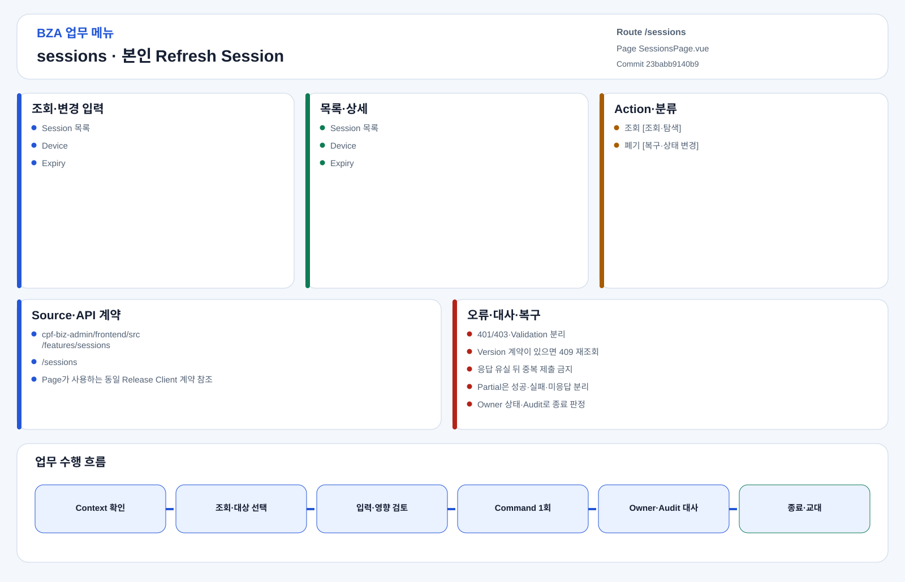

### 이 장에서 끝내는 업무

본인 Refresh Session과 Device·만료 상태를 조회·폐기한다.

### 메뉴 식별·책임

| 항목 | 값 |
|---|---|
| Route | `/sessions` |
| 메뉴 ID | `sessions` |
| Menu Code | `AUTHORIZATION` |
| 업무 그룹 | support |
| Frontend Page | `cpf-biz-admin/frontend/src/features/sessions/SessionsPage.vue` |
| Permission | 본인/관리 권한 |
| 기준 Commit | `23babb9140b90e501d6ac715e7b77f55b66198a5` |

### Source·API 근거

| 구분 | 기준 |
|---|---|
| Frontend Page | `cpf-biz-admin/frontend/src/features/sessions/SessionsPage.vue` |
| Router | `/sessions` |
| API 추적 | 화면에서 제공하는 기능을 통해 호출한다. 문서에 명시되지 않은 Endpoint를 Browser나 외부 Script에서 임의 호출하지 않는다. |

아래 표는 이 메뉴에서 실제로 확인·입력·실행할 항목을 정리한다. 화면에 없는 Field·Button·상태를 임의로 가정하지 않는다.

### 검색·입력 Field

| Field | Control | 업무 의미 | 기본값·Validation·주의 |
|---|---|---|---|
| `Session 목록` | 문자열 입력·검색 | 본인 Refresh Session 화면의 조회 조건 또는 편집 Form에 포함되는 값이며 화면 Label과 Help를 기준으로 사용한다. | 앞뒤 공백·허용 문자·길이와 대소문자 규칙을 확인한다. |
| `Device` | 문자열 입력·검색 | 본인 Refresh Session 화면의 조회 조건 또는 편집 Form에 포함되는 값이며 화면 Label과 Help를 기준으로 사용한다. | 앞뒤 공백·허용 문자·길이와 대소문자 규칙을 확인한다. |
| `Expiry` | 날짜·시간 입력 | 조회 또는 적용의 유효 시간 범위를 정하며 Timezone과 시작·종료 순서를 함께 확인한다. | Timezone을 고정하고 시작≤종료·유효기간 겹침·기준일 포함 여부를 확인한다. |

#### 입력 순서

1. **Session 목록** 항목이 조회 Control인지 변경 Form인지 화면 위치로 구분하고, 표시된 값·필수 여부·허용 형식을 확인한다.
2. **Device** 항목이 조회 Control인지 변경 Form인지 화면 위치로 구분하고, 표시된 값·필수 여부·허용 형식을 확인한다.
3. **Expiry** 항목이 조회 Control인지 변경 Form인지 화면 위치로 구분하고, 표시된 값·필수 여부·허용 형식을 확인한다.
4. 조회 Control과 변경 Form을 분리해 기록하고, 실행 전 Environment·Data Scope·Timezone과 제출할 값만 다시 검토한다.

### 목록 Column·상세 Field

| 표시값 | 운영 의미 | 교차 확인 |
|---|---|---|
| `Session 목록` | 본인 Refresh Session 상세에서 대상의 현재 속성 또는 처리 결과를 확인하는 값이다. | 상세·재조회 결과와 비교하고 Stale·Masking·단위 차이를 확인한다. |
| `Device` | 본인 Refresh Session 상세에서 대상의 현재 속성 또는 처리 결과를 확인하는 값이다. | 상세·재조회 결과와 비교하고 Stale·Masking·단위 차이를 확인한다. |
| `Expiry` | 상태 발생·갱신·유효 시점을 나타내며 화면 Timezone을 기준으로 해석한다. | 상세·재조회 결과와 비교하고 Stale·Masking·단위 차이를 확인한다. |

#### 결과 판독 순서

1. 조회 완료 시각·Filter·Paging·Sort와 화면 Warning을 확인한다.
2. Empty·Stale·Partial을 정상 0건과 구분한다.
3. 식별자·상태·Version·오류·시각을 같은 Query Context의 상세와 Owner 원장에서 비교한다.
4. Masking된 값은 Raw Permission과 Reason 없이 복원·Export하지 않는다.
5. 집계와 상세가 다르면 집계 시간 창·Timezone·Owner Update 시각을 맞춰 대사한다.

### Button·Action

| Action | 분류 | 활성 조건 | Side Effect·정상 결과 |
|---|---|---|---|
| **조회** | 조회·탐색 | 조회 Permission과 Query Validation을 충족하고 동일 조회가 진행 중이 아님 | 조회 결과의 조회 시각·Filter·Source Version·Warning이 갱신되며 Owner 데이터는 변경하지 않는다. |
| **폐기** | 복구·상태 변경 | 화면과 Owner가 요구하는 복구 Permission·대상 상태·Reason·승인·Version 조건을 충족함 | 복구 Operation을 생성하고 Owner 상태·대상별 결과·Audit로 종료를 판정한다. |

### 정상 업무 전체 절차

1. `/sessions`에 진입해 Page Header와 Route가 **본인 Refresh Session** 기능을 가리키는지 확인한다.
2. 로그인 Session·Environment·Data Scope·기준일·Timezone을 고정한다.
3. 화면의 조회 Control과 변경 Form을 구분한다. 조회 조건이 제공되면 먼저 조회하고, 변경 Form은 대상 선택 또는 등록 Action 뒤에 열린 실제 Field만 사용한다.
4. Loading 종료 후 Empty·Error·Stale·Partial 상태와 화면 Warning을 먼저 판정한다.
5. **Session 목록, Device, Expiry**를 읽고 식별자·상태·Version·시각을 Owner 원장과 대사한다.
6. **폐기** 전에 화면과 Owner가 실제로 요구하는 Permission·현재 상태·영향 범위·Reason·승인·Version 조건을 확인하고 한 번만 제출한다.
7. **폐기**의 HTTP 응답과 재조회 결과를 확인한다. 비동기·다중 대상 기능은 Owner Terminal 상태·Version·대상별 Success/Failed/Unknown·Audit를 별도로 확인한다.
8. 화면이 제공하는 Log·Metric·Trace와, 변경·Export·승인 조치에 생성된 Audit를 교차 확인한다.
9. 이 장의 **종료 판정**과 다음 확인 시각·Evidence Link를 교대 기록에 남긴다.

### 메뉴 고유 판정·금지 사항

- **목적:** 본인 Refresh Session과 Device·만료 상태를 조회·폐기한다.
- **종료 판정:** 폐기 후 같은 Session이 보호 API에 접근하지 못하는지 확인한다.
- 응답을 받지 못한 경우 Owner 상태와 기존 Operation을 확인하기 전에 동일 Action을 반복하지 않는다.
- HTTP 성공 응답이나 Toast만으로 비동기 Owner 상태 또는 다중 대상 적용을 확정하지 않는다.

### 오류·경계·동시성·복구

| 상황 | 화면 징후 | 운영 조치 | 종료 증적 |
|---|---|---|---|
| 401·Session | Session 만료·CSRF·Origin 실패 | 로그인 상태와 BFF Session을 확인한다. Command 자동 Replay는 금지한다. | 401/403 응답·Session Audit |
| 403·Data Scope | 메뉴·Button·Raw·Export가 거부됨 | Menu·Button·API·Owner Permission과 Data Scope를 확인하고 우회하지 않는다. | Deny Audit·요청 Permission |
| Validation | 필수값·범위·형식·기간 오류 | Field Error만 수정하고 기존 성공 Operation을 다시 제출하지 않는다. | Error Code·Field·입력값 |
| Timeout·Dependency | 일부 Source 또는 Command 응답 지연 | Correlation/Operation ID와 실패 Stage를 기록하고 Owner 상태를 조회한다. | Dependency 상태·Retryability |
| Partial·Stale | 일부 대상만 Success 또는 조회 Source 누락 | 성공·실패·미응답을 분리하고 누락 범위와 Version을 표시한다. | Target별 결과·Version |
| 409·동시 변경 | Expected Version 불일치 | 최신 상세를 재조회하고 Diff·영향을 다시 검토한 뒤 새 요청으로 제출한다. | 현재/요청 Version·변경자 |
| 응답 유실·Unknown | 요청 후 실제 처리 여부를 알 수 없음 | Operation ID·Request Hash·Audit·Owner 상태로 대사하고 중복 제출하지 않는다. | Operation·Owner·Audit |
| 복구 실패 | Retry/Rollback 뒤에도 상태 불일치 | 자동 반복을 중단하고 Incident·Reconcile Case·다음 확인 시각을 기록한다. | Case ID·복구 Owner·기한 |

### 응답 유실·결과 불명·부분 적용 처리

1. 동일 Action을 다시 누르지 않고 Browser Network와 응답 Header를 보존한다. `operationId`·`transactionId`·`idempotencyKey`가 제공되면 기록하고, 없으면 Target ID·Actor·요청 시각·Request Body Hash로 대사한다.
2. 기능이 제공하는 상세·Operation Status(있는 경우)·Audit에서 Request Hash와 대상 Version을 검색한다.
3. Side Effect 전 실패가 확인된 경우에만 새 요청을 검토한다.
4. Success·Failed·Unknown 대상을 분리하고 Source가 제공하는 Failed-only Retry·Compensation·Rollback을 선택하고, 지원되지 않으면 수동 Reconcile Case로 이관한다.
5. Rollback을 지원하는 기능은 Owner Version·Checksum·업무 합계가 Rollback Point와 일치하는지 확인한다.
6. 확정되지 않은 대상은 `UNKNOWN_RESULT`로 유지하고 담당자·대사 기한·다음 확인 시각을 기록한다.

### Log·Metric·Trace·Audit와 교대 기록

| 증적 | 필수 값 |
|---|---|
| Audit | Actor·Permission·Reason·Approval·Target·Before/After·Result·Recovery Action |
| Log | Environment·Instance·operationId·transactionId·failureStage·errorCode |
| Metric | 동일 시간 창의 Success·Failure·Latency·Queue·Retry·Partial·Unknown |
| Trace | root/segment/attempt·Owner·DB/Kafka/외부 의존성 Span |
| 상태 원장 | Target ID·Version·Checksum·Desired/Actual·Last Updated·Terminal 여부 |

```text
Menu=sessions
Route=/sessions
Environment=
DataScope=
Query=
TargetId=
BeforeVersion=
Action=
Reason=
ApprovalId=
OperationId=
TransactionId=
Result=SUCCESS|FAILED|PARTIAL|UNKNOWN_RESULT
OwnerState=
FailedTargets=
ReconcileBy=
RollbackPoint=
EvidenceLinks=
NextCheckAt=
```

### 실무 Workbook

**상황:** 본인 Refresh Session과 Device·만료 상태를 조회·폐기한다. 담당자가 **폐기**을 수행한 뒤 Browser 응답을 받지 못했다.

1. 대상 식별자와 Before Version, 입력값, Reason·Approval을 작업 기록에서 확인한다.
2. 동일 **폐기**을 반복하지 않고 Operation·Audit·Owner 상태를 조회한다.
3. Owner 상태가 변경됐고 Request Hash가 같으면 응답 유실로 분류해 중복 조치를 금지한다.
4. 일부 대상만 변경됐으면 Success·Failed·Unknown을 분리해 Failed-only Retry 또는 Rollback을 선택한다.
5. 폐기 후 같은 Session이 보호 API에 접근하지 못하는지 확인한다.
6. Evidence Link와 다음 확인 시각을 교대 기록에 남긴다.

### 독립 수행 검수 Checklist

- [ ] `/sessions`와 Page Source를 찾고 화면 목적을 설명할 수 있다.
- [ ] 3개 입력·검색 항목의 Control·기본값·Validation을 설명할 수 있다.
- [ ] 3개 표시값을 Owner 상태·Version·Audit와 대사할 수 있다.
- [ ] 2개 Action의 분류·활성 조건·Side Effect를 설명할 수 있다.
- [ ] Empty·403·409·Timeout·Partial·Unknown을 서로 다른 상태로 처리할 수 있다.
- [ ] 응답 유실 뒤 중복 제출 없이 Operation·Owner·Audit로 결과를 확정할 수 있다.
- [ ] 교대 기록만으로 다음 담당자가 Target·상태·복구 기한을 이어받을 수 있다.

## 20. audits — Immutable 업무 감사

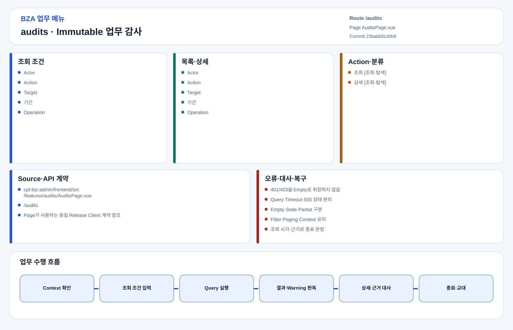

### 이 장에서 끝내는 업무

업무 변경 Audit를 Actor·Action·Target·Operation으로 조회한다.

### 메뉴 식별·책임

| 항목 | 값 |
|---|---|
| Route | `/audits` |
| 메뉴 ID | `audits` |
| Menu Code | `AUDIT` |
| 업무 그룹 | support |
| Frontend Page | `cpf-biz-admin/frontend/src/features/audits/AuditsPage.vue` |
| Permission | Audit Read |
| 기준 Commit | `23babb9140b90e501d6ac715e7b77f55b66198a5` |

### Source·API 근거

| 구분 | 기준 |
|---|---|
| Frontend Page | `cpf-biz-admin/frontend/src/features/audits/AuditsPage.vue` |
| Router | `/audits` |
| API 추적 | 화면에서 제공하는 기능을 통해 호출한다. 문서에 명시되지 않은 Endpoint를 Browser나 외부 Script에서 임의 호출하지 않는다. |

아래 표는 이 메뉴에서 실제로 확인·입력·실행할 항목을 정리한다. 화면에 없는 Field·Button·상태를 임의로 가정하지 않는다.

### 검색·입력 Field

| Field | Control | 업무 의미 | 기본값·Validation·주의 |
|---|---|---|---|
| `Actor` | 날짜·시간 입력 | 조회 또는 적용의 유효 시간 범위를 정하며 Timezone과 시작·종료 순서를 함께 확인한다. | Timezone을 고정하고 시작≤종료·유효기간 겹침·기준일 포함 여부를 확인한다. |
| `Action` | Select·검색 | Immutable 업무 감사에서 적용하거나 조회할 정책·권한·처리 유형을 선택한다. | 허용 목록과 현재 Environment·Data Scope에 맞는 값만 선택한다. |
| `Target` | 문자열 입력·검색 | Immutable 업무 감사 화면의 조회 조건 또는 편집 Form에 포함되는 값이며 화면 Label과 Help를 기준으로 사용한다. | 앞뒤 공백·허용 문자·길이와 대소문자 규칙을 확인한다. |
| `기간` | 날짜·시간 입력 | 조회 또는 적용의 유효 시간 범위를 정하며 Timezone과 시작·종료 순서를 함께 확인한다. | Timezone을 고정하고 시작≤종료·유효기간 겹침·기준일 포함 여부를 확인한다. |
| `Operation` | 문자열 입력·검색 | Immutable 업무 감사 화면의 조회 조건 또는 편집 Form에 포함되는 값이며 화면 Label과 Help를 기준으로 사용한다. | 앞뒤 공백·허용 문자·길이와 대소문자 규칙을 확인한다. |

#### 입력 순서

1. **Actor** 항목이 조회 Control인지 변경 Form인지 화면 위치로 구분하고, 표시된 값·필수 여부·허용 형식을 확인한다.
2. **Action** 항목이 조회 Control인지 변경 Form인지 화면 위치로 구분하고, 표시된 값·필수 여부·허용 형식을 확인한다.
3. **Target** 항목이 조회 Control인지 변경 Form인지 화면 위치로 구분하고, 표시된 값·필수 여부·허용 형식을 확인한다.
4. **기간** 항목이 조회 Control인지 변경 Form인지 화면 위치로 구분하고, 표시된 값·필수 여부·허용 형식을 확인한다.
5. **Operation** 항목이 조회 Control인지 변경 Form인지 화면 위치로 구분하고, 표시된 값·필수 여부·허용 형식을 확인한다.
6. 조회 Control과 변경 Form을 분리해 기록하고, 실행 전 Environment·Data Scope·Timezone과 제출할 값만 다시 검토한다.

### 목록 Column·상세 Field

| 표시값 | 운영 의미 | 교차 확인 |
|---|---|---|
| `Actor` | 상태 발생·갱신·유효 시점을 나타내며 화면 Timezone을 기준으로 해석한다. | 상세·재조회 결과와 비교하고 Stale·Masking·단위 차이를 확인한다. |
| `Action` | Immutable 업무 감사 상세에서 대상의 현재 속성 또는 처리 결과를 확인하는 값이다. | 상세·재조회 결과와 비교하고 Stale·Masking·단위 차이를 확인한다. |
| `Target` | Immutable 업무 감사 상세에서 대상의 현재 속성 또는 처리 결과를 확인하는 값이다. | 상세·재조회 결과와 비교하고 Stale·Masking·단위 차이를 확인한다. |
| `기간` | 상태 발생·갱신·유효 시점을 나타내며 화면 Timezone을 기준으로 해석한다. | 상세·재조회 결과와 비교하고 Stale·Masking·단위 차이를 확인한다. |
| `Operation` | Immutable 업무 감사 상세에서 대상의 현재 속성 또는 처리 결과를 확인하는 값이다. | 상세·재조회 결과와 비교하고 Stale·Masking·단위 차이를 확인한다. |

#### 결과 판독 순서

1. 조회 완료 시각·Filter·Paging·Sort와 화면 Warning을 확인한다.
2. Empty·Stale·Partial을 정상 0건과 구분한다.
3. 식별자·상태·Version·오류·시각을 같은 Query Context의 상세와 Owner 원장에서 비교한다.
4. Masking된 값은 Raw Permission과 Reason 없이 복원·Export하지 않는다.
5. 집계와 상세가 다르면 집계 시간 창·Timezone·Owner Update 시각을 맞춰 대사한다.

### Button·Action

| Action | 분류 | 활성 조건 | Side Effect·정상 결과 |
|---|---|---|---|
| **조회** | 조회·탐색 | 조회 Permission과 Query Validation을 충족하고 동일 조회가 진행 중이 아님 | 조회 결과의 조회 시각·Filter·Source Version·Warning이 갱신되며 Owner 데이터는 변경하지 않는다. |
| **상세** | 조회·탐색 | 조회 Permission과 Query Validation을 충족하고 동일 조회가 진행 중이 아님 | 상세 결과의 조회 시각·Filter·Source Version·Warning이 갱신되며 Owner 데이터는 변경하지 않는다. |

### 정상 업무 전체 절차

1. `/audits`에 진입해 Page Header와 Route가 **Immutable 업무 감사** 기능을 가리키는지 확인한다.
2. 로그인 Session·Environment·Data Scope·기준일·Timezone을 고정한다.
3. 화면에 제공된 조회 Control만 사용하고, 표시되지 않은 변경 Field나 Server Command가 있다고 가정하지 않는다.
4. Loading 종료 후 Empty·Error·Stale·Partial 상태와 화면 Warning을 먼저 판정한다.
5. **Actor, Action, Target, 기간, Operation**를 읽고 식별자·상태·Version·시각을 Owner 원장과 대사한다.
6. 화면이 제공하는 Log·Metric·Trace와 조회·Raw·Export 접근 기록이 있으면 해당 Audit를 교차 확인한다.
7. 이 장의 **종료 판정**과 다음 확인 시각·Evidence Link를 교대 기록에 남긴다.

### 메뉴 고유 판정·금지 사항

- **목적:** 업무 변경 Audit를 Actor·Action·Target·Operation으로 조회한다.
- **종료 판정:** Before/After·Reason·Permission·결과를 원본 업무와 대사한다.
- 조회 화면에서 직접 Owner 데이터를 변경하거나 Browser Tool로 우회하지 않는다.
- Partial 조회를 정상 전체 결과로 합치지 않는다.

### 오류·경계·동시성·복구

| 상황 | 화면 징후 | 운영 조치 | 종료 증적 |
|---|---|---|---|
| 401·Session | Session 만료·CSRF·Origin 실패 | 로그인 상태와 BFF Session을 확인한 뒤 같은 Query Context로 다시 조회한다. | 401/403 응답·Session Audit |
| 403·Data Scope | 메뉴·Button·Raw·Export가 거부됨 | Menu·Button·API·Owner Permission과 Data Scope를 확인하고 우회하지 않는다. | Deny Audit·요청 Permission |
| Timeout·Dependency | 일부 조회 Source 응답 지연 | Correlation ID·Query Context·실패 Source를 기록하고 같은 조건으로 재조회한다. | 조회 시각·실패 Source·재조회 결과 |
| Partial·Stale | 일부 대상만 Success 또는 조회 Source 누락 | 성공·실패·미응답을 분리하고 누락 범위와 Version을 표시한다. | Target별 결과·Version |

### 응답 유실·부분 조회 처리

1. 검색 조건·Data Scope·Paging·조회 시각·Correlation ID를 기록한다.
2. 같은 조건으로 재조회하되 실패 Source만 분리한다.
3. 정상 Source 결과를 유지하고 실패·Stale Source를 명시한다.
4. 집계와 원본 상세가 다르면 Owner 상세를 기준으로 Reconcile Case를 연다.
5. 조회 시각·Source Version·0건 또는 일치 결과를 증적으로 남긴다.

### Log·Metric·Trace·Audit와 교대 기록

| 증적 | 필수 값 |
|---|---|
| Audit | Actor·Permission·Data Scope·Raw/Export 접근·Query Context·Result |
| Log | Environment·Instance·operationId·transactionId·failureStage·errorCode |
| Metric | 동일 시간 창의 Success·Failure·Latency·Queue·Retry·Partial·Unknown |
| Trace | root/segment/attempt·Owner·DB/Kafka/외부 의존성 Span |
| 상태 원장 | Target ID·Version·Checksum·Desired/Actual·Last Updated·Terminal 여부 |

```text
Menu=
Route=
Environment=
DataScope=
Query=
QueryAt=
CorrelationId=
SourceVersion=
Result=SUCCESS|EMPTY|STALE|PARTIAL|FAILED
FailedSources=
EvidenceLinks=
NextCheckAt=
```

### 실무 Workbook

**상황:** 업무 변경 Audit를 Actor·Action·Target·Operation으로 조회한다. 화면이 일부 Source Timeout 때문에 Partial 결과를 표시했다.

1. Query·Data Scope·조회 시각·Correlation ID를 기록한다.
2. 정상 결과를 0건으로 덮어쓰지 않고 실패 Source만 재조회한다.
3. Actor, Action, Target 값을 원본 상세와 같은 시간 기준으로 비교한다.
4. 불일치가 계속되면 Incident 또는 Reconcile Case를 생성한다.
5. Before/After·Reason·Permission·결과를 원본 업무와 대사한다.
6. Source Version과 다음 확인 시각을 교대 기록에 남긴다.

### 독립 수행 검수 Checklist

- [ ] `/audits`와 Page Source를 찾고 화면 목적을 설명할 수 있다.
- [ ] 5개 입력·검색 항목의 Control·기본값·Validation을 설명할 수 있다.
- [ ] 5개 표시값을 Owner 상태·Version·Audit와 대사할 수 있다.
- [ ] 2개 Action의 분류·활성 조건·Side Effect를 설명할 수 있다.
- [ ] Empty·401·403·Timeout·Stale·Partial을 서로 다른 조회 상태로 처리할 수 있다.
- [ ] 조회 응답 유실 시 같은 Query Context로 재조회하고 Correlation ID·조회 시각·Source Version으로 결과를 대사할 수 있다.
- [ ] 교대 기록만으로 다음 담당자가 Target·상태·복구 기한을 이어받을 수 있다.

## 21. notifications — 업무 알림

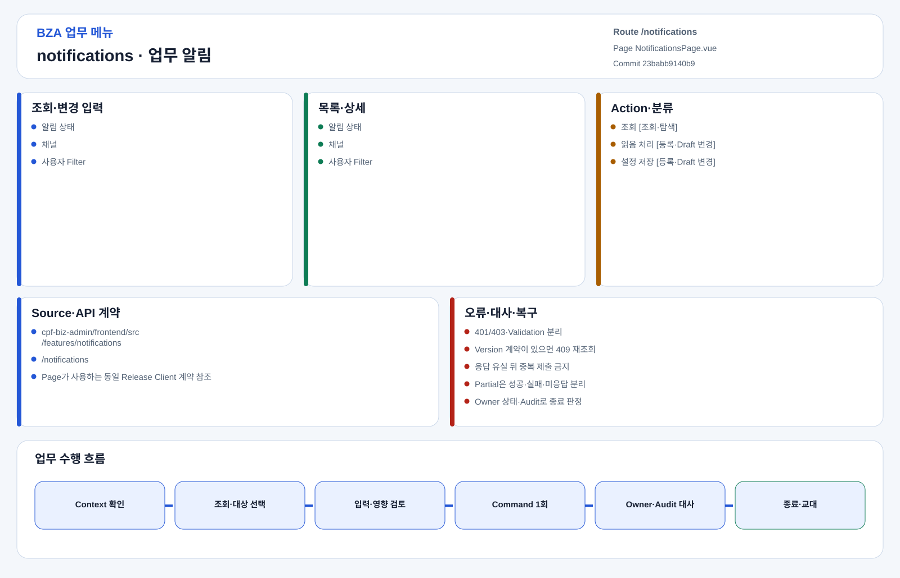

### 이 장에서 끝내는 업무

업무 알림 상태·채널·사용자 Filter를 조회하고 읽음·설정을 관리한다.

### 메뉴 식별·책임

| 항목 | 값 |
|---|---|
| Route | `/notifications` |
| 메뉴 ID | `notifications` |
| Menu Code | `SETTING` |
| 업무 그룹 | support |
| Frontend Page | `cpf-biz-admin/frontend/src/features/notifications/NotificationsPage.vue` |
| Permission | 본인/Setting |
| 기준 Commit | `23babb9140b90e501d6ac715e7b77f55b66198a5` |

### Source·API 근거

| 구분 | 기준 |
|---|---|
| Frontend Page | `cpf-biz-admin/frontend/src/features/notifications/NotificationsPage.vue` |
| Router | `/notifications` |
| API 추적 | 화면에서 제공하는 기능을 통해 호출한다. 문서에 명시되지 않은 Endpoint를 Browser나 외부 Script에서 임의 호출하지 않는다. |

아래 표는 이 메뉴에서 실제로 확인·입력·실행할 항목을 정리한다. 화면에 없는 Field·Button·상태를 임의로 가정하지 않는다.

### 검색·입력 Field

| Field | Control | 업무 의미 | 기본값·Validation·주의 |
|---|---|---|---|
| `알림 상태` | Select·검색 | 현재 상태를 조회하거나 다음 Action의 허용 조건을 지정한다. | 허용 목록과 현재 Environment·Data Scope에 맞는 값만 선택한다. |
| `채널` | Select·검색 | 업무 알림에서 적용하거나 조회할 정책·권한·처리 유형을 선택한다. | 허용 목록과 현재 Environment·Data Scope에 맞는 값만 선택한다. |
| `사용자 Filter` | Checkbox·Switch | 현재 상태를 조회하거나 다음 Action의 허용 조건을 지정한다. | 현재 선택과 변경 후 영향 범위를 비교하고 화면의 Source 기본값을 확인한다. |

#### 입력 순서

1. **알림 상태** 항목이 조회 Control인지 변경 Form인지 화면 위치로 구분하고, 표시된 값·필수 여부·허용 형식을 확인한다.
2. **채널** 항목이 조회 Control인지 변경 Form인지 화면 위치로 구분하고, 표시된 값·필수 여부·허용 형식을 확인한다.
3. **사용자 Filter** 항목이 조회 Control인지 변경 Form인지 화면 위치로 구분하고, 표시된 값·필수 여부·허용 형식을 확인한다.
4. 조회 Control과 변경 Form을 분리해 기록하고, 실행 전 Environment·Data Scope·Timezone과 제출할 값만 다시 검토한다.

### 목록 Column·상세 Field

| 표시값 | 운영 의미 | 교차 확인 |
|---|---|---|
| `알림 상태` | 현재 상태와 Terminal 여부, 다음 Action 가능 여부를 판단하는 값이다. | Last Updated·Terminal 조건·Owner 상태와 함께 확인한다. |
| `채널` | 업무 알림 상세에서 대상의 현재 속성 또는 처리 결과를 확인하는 값이다. | 상세·재조회 결과와 비교하고 Stale·Masking·단위 차이를 확인한다. |
| `사용자 Filter` | 업무 알림 상세에서 대상의 현재 속성 또는 처리 결과를 확인하는 값이다. | 상세·재조회 결과와 비교하고 Stale·Masking·단위 차이를 확인한다. |

#### 결과 판독 순서

1. 조회 완료 시각·Filter·Paging·Sort와 화면 Warning을 확인한다.
2. Empty·Stale·Partial을 정상 0건과 구분한다.
3. 식별자·상태·Version·오류·시각을 같은 Query Context의 상세와 Owner 원장에서 비교한다.
4. Masking된 값은 Raw Permission과 Reason 없이 복원·Export하지 않는다.
5. 집계와 상세가 다르면 집계 시간 창·Timezone·Owner Update 시각을 맞춰 대사한다.

### Button·Action

| Action | 분류 | 활성 조건 | Side Effect·정상 결과 |
|---|---|---|---|
| **조회** | 조회·탐색 | 조회 Permission과 Query Validation을 충족하고 동일 조회가 진행 중이 아님 | 조회 결과의 조회 시각·Filter·Source Version·Warning이 갱신되며 Owner 데이터는 변경하지 않는다. |
| **읽음 처리** | 등록·Draft 변경 | 화면이 실제로 요구하는 Write Permission·필수 Field·Reason·Version 조건을 충족함 | 업무 알림의 재조회 결과가 요청 내용과 일치한다. Version·Before/After·Audit는 해당 Owner가 제공하는 경우 함께 확인한다. |
| **설정 저장** | 등록·Draft 변경 | 화면이 실제로 요구하는 Write Permission·필수 Field·Reason·Version 조건을 충족함 | 업무 알림의 재조회 결과가 요청 내용과 일치한다. Version·Before/After·Audit는 해당 Owner가 제공하는 경우 함께 확인한다. |

### 정상 업무 전체 절차

1. `/notifications`에 진입해 Page Header와 Route가 **업무 알림** 기능을 가리키는지 확인한다.
2. 로그인 Session·Environment·Data Scope·기준일·Timezone을 고정한다.
3. 화면의 조회 Control과 변경 Form을 구분한다. 조회 조건이 제공되면 먼저 조회하고, 변경 Form은 대상 선택 또는 등록 Action 뒤에 열린 실제 Field만 사용한다.
4. Loading 종료 후 Empty·Error·Stale·Partial 상태와 화면 Warning을 먼저 판정한다.
5. **알림 상태, 채널, 사용자 Filter**를 읽고 식별자·상태·Version·시각을 Owner 원장과 대사한다.
6. **읽음 처리** 전에 화면과 Owner가 실제로 요구하는 Permission·현재 상태·영향 범위·Reason·승인·Version 조건을 확인하고 한 번만 제출한다.
7. **읽음 처리**의 HTTP 응답과 재조회 결과를 확인한다. 비동기·다중 대상 기능은 Owner Terminal 상태·Version·대상별 Success/Failed/Unknown·Audit를 별도로 확인한다.
8. **설정 저장** 전에 화면과 Owner가 실제로 요구하는 Permission·현재 상태·영향 범위·Reason·승인·Version 조건을 확인하고 한 번만 제출한다.
9. **설정 저장**의 HTTP 응답과 재조회 결과를 확인한다. 비동기·다중 대상 기능은 Owner Terminal 상태·Version·대상별 Success/Failed/Unknown·Audit를 별도로 확인한다.
10. 화면이 제공하는 Log·Metric·Trace와, 변경·Export·승인 조치에 생성된 Audit를 교차 확인한다.
11. 이 장의 **종료 판정**과 다음 확인 시각·Evidence Link를 교대 기록에 남긴다.

### 메뉴 고유 판정·금지 사항

- **목적:** 업무 알림 상태·채널·사용자 Filter를 조회하고 읽음·설정을 관리한다.
- **종료 판정:** Delivery 상태와 사용자 읽음 상태를 분리한다.
- 응답을 받지 못한 경우 Owner 상태와 기존 Operation을 확인하기 전에 동일 Action을 반복하지 않는다.
- HTTP 성공 응답이나 Toast만으로 비동기 Owner 상태 또는 다중 대상 적용을 확정하지 않는다.

### 오류·경계·동시성·복구

| 상황 | 화면 징후 | 운영 조치 | 종료 증적 |
|---|---|---|---|
| 401·Session | Session 만료·CSRF·Origin 실패 | 로그인 상태와 BFF Session을 확인한다. Command 자동 Replay는 금지한다. | 401/403 응답·Session Audit |
| 403·Data Scope | 메뉴·Button·Raw·Export가 거부됨 | Menu·Button·API·Owner Permission과 Data Scope를 확인하고 우회하지 않는다. | Deny Audit·요청 Permission |
| Validation | 필수값·범위·형식·기간 오류 | Field Error만 수정하고 기존 성공 Operation을 다시 제출하지 않는다. | Error Code·Field·입력값 |
| Timeout·Dependency | 일부 Source 또는 Command 응답 지연 | Correlation/Operation ID와 실패 Stage를 기록하고 Owner 상태를 조회한다. | Dependency 상태·Retryability |
| Partial·Stale | 일부 대상만 Success 또는 조회 Source 누락 | 성공·실패·미응답을 분리하고 누락 범위와 Version을 표시한다. | Target별 결과·Version |
| 409·동시 변경 | Expected Version 불일치 | 최신 상세를 재조회하고 Diff·영향을 다시 검토한 뒤 새 요청으로 제출한다. | 현재/요청 Version·변경자 |
| 응답 유실·Unknown | 요청 후 실제 처리 여부를 알 수 없음 | Operation ID·Request Hash·Audit·Owner 상태로 대사하고 중복 제출하지 않는다. | Operation·Owner·Audit |
| 복구 실패 | Retry/Rollback 뒤에도 상태 불일치 | 자동 반복을 중단하고 Incident·Reconcile Case·다음 확인 시각을 기록한다. | Case ID·복구 Owner·기한 |

### 응답 유실·결과 불명·부분 적용 처리

1. 동일 Action을 다시 누르지 않고 Browser Network와 응답 Header를 보존한다. `operationId`·`transactionId`·`idempotencyKey`가 제공되면 기록하고, 없으면 Target ID·Actor·요청 시각·Request Body Hash로 대사한다.
2. 기능이 제공하는 상세·Operation Status(있는 경우)·Audit에서 Request Hash와 대상 Version을 검색한다.
3. Side Effect 전 실패가 확인된 경우에만 새 요청을 검토한다.
4. Success·Failed·Unknown 대상을 분리하고 Source가 제공하는 Failed-only Retry·Compensation·Rollback을 선택하고, 지원되지 않으면 수동 Reconcile Case로 이관한다.
5. Rollback을 지원하는 기능은 Owner Version·Checksum·업무 합계가 Rollback Point와 일치하는지 확인한다.
6. 확정되지 않은 대상은 `UNKNOWN_RESULT`로 유지하고 담당자·대사 기한·다음 확인 시각을 기록한다.

### Log·Metric·Trace·Audit와 교대 기록

| 증적 | 필수 값 |
|---|---|
| Audit | Actor·Permission·Reason·Approval·Target·Before/After·Result·Recovery Action |
| Log | Environment·Instance·operationId·transactionId·failureStage·errorCode |
| Metric | 동일 시간 창의 Success·Failure·Latency·Queue·Retry·Partial·Unknown |
| Trace | root/segment/attempt·Owner·DB/Kafka/외부 의존성 Span |
| 상태 원장 | Target ID·Version·Checksum·Desired/Actual·Last Updated·Terminal 여부 |

```text
Menu=notifications
Route=/notifications
Environment=
DataScope=
Query=
TargetId=
BeforeVersion=
Action=
Reason=
ApprovalId=
OperationId=
TransactionId=
Result=SUCCESS|FAILED|PARTIAL|UNKNOWN_RESULT
OwnerState=
FailedTargets=
ReconcileBy=
RollbackPoint=
EvidenceLinks=
NextCheckAt=
```

### 실무 Workbook

**상황:** 업무 알림 상태·채널·사용자 Filter를 조회하고 읽음·설정을 관리한다. 담당자가 **읽음 처리**을 수행한 뒤 Browser 응답을 받지 못했다.

1. 대상 식별자와 Before Version, 입력값, Reason·Approval을 작업 기록에서 확인한다.
2. 동일 **읽음 처리**을 반복하지 않고 Operation·Audit·Owner 상태를 조회한다.
3. Owner 상태가 변경됐고 Request Hash가 같으면 응답 유실로 분류해 중복 조치를 금지한다.
4. 일부 대상만 변경됐으면 Success·Failed·Unknown을 분리해 Failed-only Retry 또는 Rollback을 선택한다.
5. Delivery 상태와 사용자 읽음 상태를 분리한다.
6. Evidence Link와 다음 확인 시각을 교대 기록에 남긴다.

### 독립 수행 검수 Checklist

- [ ] `/notifications`와 Page Source를 찾고 화면 목적을 설명할 수 있다.
- [ ] 3개 입력·검색 항목의 Control·기본값·Validation을 설명할 수 있다.
- [ ] 3개 표시값을 Owner 상태·Version·Audit와 대사할 수 있다.
- [ ] 3개 Action의 분류·활성 조건·Side Effect를 설명할 수 있다.
- [ ] Empty·403·409·Timeout·Partial·Unknown을 서로 다른 상태로 처리할 수 있다.
- [ ] 응답 유실 뒤 중복 제출 없이 Operation·Owner·Audit로 결과를 확정할 수 있다.
- [ ] 교대 기록만으로 다음 담당자가 Target·상태·복구 기한을 이어받을 수 있다.

## 22. attachments — 첨부 업로드·검사·격리

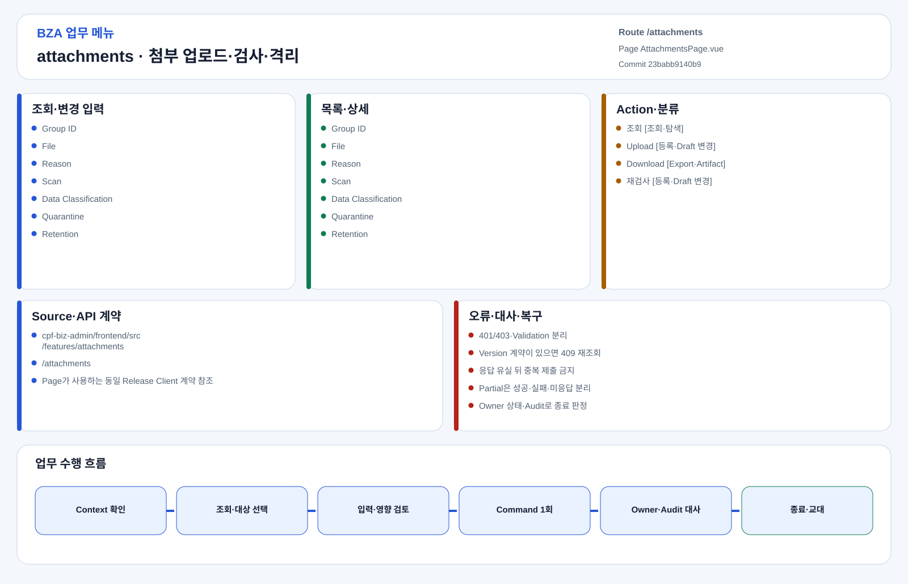

### 이 장에서 끝내는 업무

Attachment Group과 Scan·분류·Quarantine·Retention을 관리한다.

### 메뉴 식별·책임

| 항목 | 값 |
|---|---|
| Route | `/attachments` |
| 메뉴 ID | `attachments` |
| Menu Code | `ATTACHMENT` |
| 업무 그룹 | support |
| Frontend Page | `cpf-biz-admin/frontend/src/features/attachments/AttachmentsPage.vue` |
| Permission | Write |
| 기준 Commit | `23babb9140b90e501d6ac715e7b77f55b66198a5` |

### Source·API 근거

| 구분 | 기준 |
|---|---|
| Frontend Page | `cpf-biz-admin/frontend/src/features/attachments/AttachmentsPage.vue` |
| Router | `/attachments` |
| API 추적 | 화면에서 제공하는 기능을 통해 호출한다. 문서에 명시되지 않은 Endpoint를 Browser나 외부 Script에서 임의 호출하지 않는다. |

아래 표는 이 메뉴에서 실제로 확인·입력·실행할 항목을 정리한다. 화면에 없는 Field·Button·상태를 임의로 가정하지 않는다.

### 검색·입력 Field

| Field | Control | 업무 의미 | 기본값·Validation·주의 |
|---|---|---|---|
| `Group ID` | 문자열 입력·검색 | 조회·상세·Audit에서 같은 대상을 다시 찾기 위한 식별 조건이다. | 앞뒤 공백·허용 문자·길이와 대소문자 규칙을 확인한다. |
| `File` | 파일·본문 입력 | 검증·등록·Export에 사용할 입력 Artifact 또는 구조화된 본문이다. | 확장자·크기·Encoding·Schema·Checksum을 검증하고 Dry Run이 있으면 먼저 실행한다. |
| `Reason` | 다중행 입력 | 작업 목적·영향 범위·승인 또는 복구 기준을 기록해 Audit와 교대 기록에 연결한다. | Ticket·영향 범위·복구점을 포함하고 화면이 요구하는 최소 길이를 충족한다. |
| `Scan` | 문자열 입력·검색 | 첨부 업로드·검사·격리 화면의 조회 조건 또는 편집 Form에 포함되는 값이며 화면 Label과 Help를 기준으로 사용한다. | 앞뒤 공백·허용 문자·길이와 대소문자 규칙을 확인한다. |
| `Data Classification` | 문자열 입력·검색 | 첨부 업로드·검사·격리 화면의 조회 조건 또는 편집 Form에 포함되는 값이며 화면 Label과 Help를 기준으로 사용한다. | 앞뒤 공백·허용 문자·길이와 대소문자 규칙을 확인한다. |
| `Quarantine` | 문자열 입력·검색 | 첨부 업로드·검사·격리 화면의 조회 조건 또는 편집 Form에 포함되는 값이며 화면 Label과 Help를 기준으로 사용한다. | 앞뒤 공백·허용 문자·길이와 대소문자 규칙을 확인한다. |
| `Retention` | 문자열 입력·검색 | 첨부 업로드·검사·격리 화면의 조회 조건 또는 편집 Form에 포함되는 값이며 화면 Label과 Help를 기준으로 사용한다. | 앞뒤 공백·허용 문자·길이와 대소문자 규칙을 확인한다. |

#### 입력 순서

1. **Group ID** 항목이 조회 Control인지 변경 Form인지 화면 위치로 구분하고, 표시된 값·필수 여부·허용 형식을 확인한다.
2. **File** 항목이 조회 Control인지 변경 Form인지 화면 위치로 구분하고, 표시된 값·필수 여부·허용 형식을 확인한다.
3. **Reason** 항목이 조회 Control인지 변경 Form인지 화면 위치로 구분하고, 표시된 값·필수 여부·허용 형식을 확인한다.
4. **Scan** 항목이 조회 Control인지 변경 Form인지 화면 위치로 구분하고, 표시된 값·필수 여부·허용 형식을 확인한다.
5. **Data Classification** 항목이 조회 Control인지 변경 Form인지 화면 위치로 구분하고, 표시된 값·필수 여부·허용 형식을 확인한다.
6. **Quarantine** 항목이 조회 Control인지 변경 Form인지 화면 위치로 구분하고, 표시된 값·필수 여부·허용 형식을 확인한다.
7. **Retention** 항목이 조회 Control인지 변경 Form인지 화면 위치로 구분하고, 표시된 값·필수 여부·허용 형식을 확인한다.
8. 조회 Control과 변경 Form을 분리해 기록하고, 실행 전 Environment·Data Scope·Timezone과 제출할 값만 다시 검토한다.

### 목록 Column·상세 Field

| 표시값 | 운영 의미 | 교차 확인 |
|---|---|---|
| `Group ID` | 첨부 업로드·검사·격리의 대상 레코드를 상세·Owner·Audit에서 연결하는 식별자다. | 상세·Log·Trace·Audit에서 같은 대상을 가리키는지 확인한다. |
| `File` | 첨부 업로드·검사·격리 상세에서 대상의 현재 속성 또는 처리 결과를 확인하는 값이다. | 상세·재조회 결과와 비교하고 Stale·Masking·단위 차이를 확인한다. |
| `Reason` | 작업 주체·Owner·변경 사유를 확인하는 감사 정보다. | 상세·재조회 결과와 비교하고 Stale·Masking·단위 차이를 확인한다. |
| `Scan` | 첨부 업로드·검사·격리 상세에서 대상의 현재 속성 또는 처리 결과를 확인하는 값이다. | 상세·재조회 결과와 비교하고 Stale·Masking·단위 차이를 확인한다. |
| `Data Classification` | 첨부 업로드·검사·격리 상세에서 대상의 현재 속성 또는 처리 결과를 확인하는 값이다. | 상세·재조회 결과와 비교하고 Stale·Masking·단위 차이를 확인한다. |
| `Quarantine` | 첨부 업로드·검사·격리 상세에서 대상의 현재 속성 또는 처리 결과를 확인하는 값이다. | 상세·재조회 결과와 비교하고 Stale·Masking·단위 차이를 확인한다. |
| `Retention` | 첨부 업로드·검사·격리 상세에서 대상의 현재 속성 또는 처리 결과를 확인하는 값이다. | 상세·재조회 결과와 비교하고 Stale·Masking·단위 차이를 확인한다. |

#### 결과 판독 순서

1. 조회 완료 시각·Filter·Paging·Sort와 화면 Warning을 확인한다.
2. Empty·Stale·Partial을 정상 0건과 구분한다.
3. 식별자·상태·Version·오류·시각을 같은 Query Context의 상세와 Owner 원장에서 비교한다.
4. Masking된 값은 Raw Permission과 Reason 없이 복원·Export하지 않는다.
5. 집계와 상세가 다르면 집계 시간 창·Timezone·Owner Update 시각을 맞춰 대사한다.

### Button·Action

| Action | 분류 | 활성 조건 | Side Effect·정상 결과 |
|---|---|---|---|
| **조회** | 조회·탐색 | 조회 Permission과 Query Validation을 충족하고 동일 조회가 진행 중이 아님 | 조회 결과의 조회 시각·Filter·Source Version·Warning이 갱신되며 Owner 데이터는 변경하지 않는다. |
| **Upload** | 등록·Draft 변경 | 화면이 실제로 요구하는 Write Permission·필수 Field·Reason·Version 조건을 충족함 | 첨부 업로드·검사·격리의 재조회 결과가 요청 내용과 일치한다. Version·Before/After·Audit는 해당 Owner가 제공하는 경우 함께 확인한다. |
| **Download** | Export·Artifact | 화면이 요구하는 Export Permission·Data Scope·Masking·Reason과 승인 조건을 충족함 | Export Operation과 Artifact ID·Checksum·만료·Download Audit가 생성되고 원본 데이터는 변경하지 않는다. |
| **재검사** | 등록·Draft 변경 | 화면이 실제로 요구하는 Write Permission·필수 Field·Reason·Version 조건을 충족함 | 첨부 업로드·검사·격리의 재조회 결과가 요청 내용과 일치한다. Version·Before/After·Audit는 해당 Owner가 제공하는 경우 함께 확인한다. |

### 정상 업무 전체 절차

1. `/attachments`에 진입해 Page Header와 Route가 **첨부 업로드·검사·격리** 기능을 가리키는지 확인한다.
2. 로그인 Session·Environment·Data Scope·기준일·Timezone을 고정한다.
3. 화면의 조회 Control과 변경 Form을 구분한다. 조회 조건이 제공되면 먼저 조회하고, 변경 Form은 대상 선택 또는 등록 Action 뒤에 열린 실제 Field만 사용한다.
4. Loading 종료 후 Empty·Error·Stale·Partial 상태와 화면 Warning을 먼저 판정한다.
5. **Group ID, File, Reason, Scan, Data Classification**를 읽고 식별자·상태·Version·시각을 Owner 원장과 대사한다.
6. **Upload** 전에 화면과 Owner가 실제로 요구하는 Permission·현재 상태·영향 범위·Reason·승인·Version 조건을 확인하고 한 번만 제출한다.
7. **Upload**의 HTTP 응답과 재조회 결과를 확인한다. 비동기·다중 대상 기능은 Owner Terminal 상태·Version·대상별 Success/Failed/Unknown·Audit를 별도로 확인한다.
8. **Download** 전에 화면과 Owner가 실제로 요구하는 Permission·현재 상태·영향 범위·Reason·승인·Version 조건을 확인하고 한 번만 제출한다.
9. **Download**의 HTTP 응답과 재조회 결과를 확인한다. 비동기·다중 대상 기능은 Owner Terminal 상태·Version·대상별 Success/Failed/Unknown·Audit를 별도로 확인한다.
10. **재검사** 전에 화면과 Owner가 실제로 요구하는 Permission·현재 상태·영향 범위·Reason·승인·Version 조건을 확인하고 한 번만 제출한다.
11. **재검사**의 HTTP 응답과 재조회 결과를 확인한다. 비동기·다중 대상 기능은 Owner Terminal 상태·Version·대상별 Success/Failed/Unknown·Audit를 별도로 확인한다.
12. 화면이 제공하는 Log·Metric·Trace와, 변경·Export·승인 조치에 생성된 Audit를 교차 확인한다.
13. 이 장의 **종료 판정**과 다음 확인 시각·Evidence Link를 교대 기록에 남긴다.

### 메뉴 고유 판정·금지 사항

- **목적:** Attachment Group과 Scan·분류·Quarantine·Retention을 관리한다.
- **종료 판정:** CLEAN 확정 전 Download/업무 연결을 허용하지 않는다.
- 응답을 받지 못한 경우 Owner 상태와 기존 Operation을 확인하기 전에 동일 Action을 반복하지 않는다.
- HTTP 성공 응답이나 Toast만으로 비동기 Owner 상태 또는 다중 대상 적용을 확정하지 않는다.

### 오류·경계·동시성·복구

| 상황 | 화면 징후 | 운영 조치 | 종료 증적 |
|---|---|---|---|
| 401·Session | Session 만료·CSRF·Origin 실패 | 로그인 상태와 BFF Session을 확인한다. Command 자동 Replay는 금지한다. | 401/403 응답·Session Audit |
| 403·Data Scope | 메뉴·Button·Raw·Export가 거부됨 | Menu·Button·API·Owner Permission과 Data Scope를 확인하고 우회하지 않는다. | Deny Audit·요청 Permission |
| Validation | 필수값·범위·형식·기간 오류 | Field Error만 수정하고 기존 성공 Operation을 다시 제출하지 않는다. | Error Code·Field·입력값 |
| Timeout·Dependency | 일부 Source 또는 Command 응답 지연 | Correlation/Operation ID와 실패 Stage를 기록하고 Owner 상태를 조회한다. | Dependency 상태·Retryability |
| Partial·Stale | 일부 대상만 Success 또는 조회 Source 누락 | 성공·실패·미응답을 분리하고 누락 범위와 Version을 표시한다. | Target별 결과·Version |
| 409·동시 변경 | Expected Version 불일치 | 최신 상세를 재조회하고 Diff·영향을 다시 검토한 뒤 새 요청으로 제출한다. | 현재/요청 Version·변경자 |
| 응답 유실·Unknown | 요청 후 실제 처리 여부를 알 수 없음 | Operation ID·Request Hash·Audit·Owner 상태로 대사하고 중복 제출하지 않는다. | Operation·Owner·Audit |
| 복구 실패 | Retry/Rollback 뒤에도 상태 불일치 | 자동 반복을 중단하고 Incident·Reconcile Case·다음 확인 시각을 기록한다. | Case ID·복구 Owner·기한 |

### 응답 유실·결과 불명·부분 적용 처리

1. 동일 Action을 다시 누르지 않고 Browser Network와 응답 Header를 보존한다. `operationId`·`transactionId`·`idempotencyKey`가 제공되면 기록하고, 없으면 Target ID·Actor·요청 시각·Request Body Hash로 대사한다.
2. 기능이 제공하는 상세·Operation Status(있는 경우)·Audit에서 Request Hash와 대상 Version을 검색한다.
3. Side Effect 전 실패가 확인된 경우에만 새 요청을 검토한다.
4. Success·Failed·Unknown 대상을 분리하고 Source가 제공하는 Failed-only Retry·Compensation·Rollback을 선택하고, 지원되지 않으면 수동 Reconcile Case로 이관한다.
5. Rollback을 지원하는 기능은 Owner Version·Checksum·업무 합계가 Rollback Point와 일치하는지 확인한다.
6. 확정되지 않은 대상은 `UNKNOWN_RESULT`로 유지하고 담당자·대사 기한·다음 확인 시각을 기록한다.

### Log·Metric·Trace·Audit와 교대 기록

| 증적 | 필수 값 |
|---|---|
| Audit | Actor·Permission·Reason·Approval·Target·Before/After·Result·Recovery Action |
| Log | Environment·Instance·operationId·transactionId·failureStage·errorCode |
| Metric | 동일 시간 창의 Success·Failure·Latency·Queue·Retry·Partial·Unknown |
| Trace | root/segment/attempt·Owner·DB/Kafka/외부 의존성 Span |
| 상태 원장 | Target ID·Version·Checksum·Desired/Actual·Last Updated·Terminal 여부 |

```text
Menu=attachments
Route=/attachments
Environment=
DataScope=
Query=
TargetId=
BeforeVersion=
Action=
Reason=
ApprovalId=
OperationId=
TransactionId=
Result=SUCCESS|FAILED|PARTIAL|UNKNOWN_RESULT
OwnerState=
FailedTargets=
ReconcileBy=
RollbackPoint=
EvidenceLinks=
NextCheckAt=
```

### 실무 Workbook

**상황:** Attachment Group과 Scan·분류·Quarantine·Retention을 관리한다. 담당자가 **Upload**을 수행한 뒤 Browser 응답을 받지 못했다.

1. 대상 식별자와 Before Version, 입력값, Reason·Approval을 작업 기록에서 확인한다.
2. 동일 **Upload**을 반복하지 않고 Operation·Audit·Owner 상태를 조회한다.
3. Owner 상태가 변경됐고 Request Hash가 같으면 응답 유실로 분류해 중복 조치를 금지한다.
4. 일부 대상만 변경됐으면 Success·Failed·Unknown을 분리해 Failed-only Retry 또는 Rollback을 선택한다.
5. CLEAN 확정 전 Download/업무 연결을 허용하지 않는다.
6. Evidence Link와 다음 확인 시각을 교대 기록에 남긴다.

### 독립 수행 검수 Checklist

- [ ] `/attachments`와 Page Source를 찾고 화면 목적을 설명할 수 있다.
- [ ] 7개 입력·검색 항목의 Control·기본값·Validation을 설명할 수 있다.
- [ ] 7개 표시값을 Owner 상태·Version·Audit와 대사할 수 있다.
- [ ] 4개 Action의 분류·활성 조건·Side Effect를 설명할 수 있다.
- [ ] Empty·403·409·Timeout·Partial·Unknown을 서로 다른 상태로 처리할 수 있다.
- [ ] 응답 유실 뒤 중복 제출 없이 Operation·Owner·Audit로 결과를 확정할 수 있다.
- [ ] 교대 기록만으로 다음 담당자가 Target·상태·복구 기한을 이어받을 수 있다.

## 23. savedSearches — 저장 검색

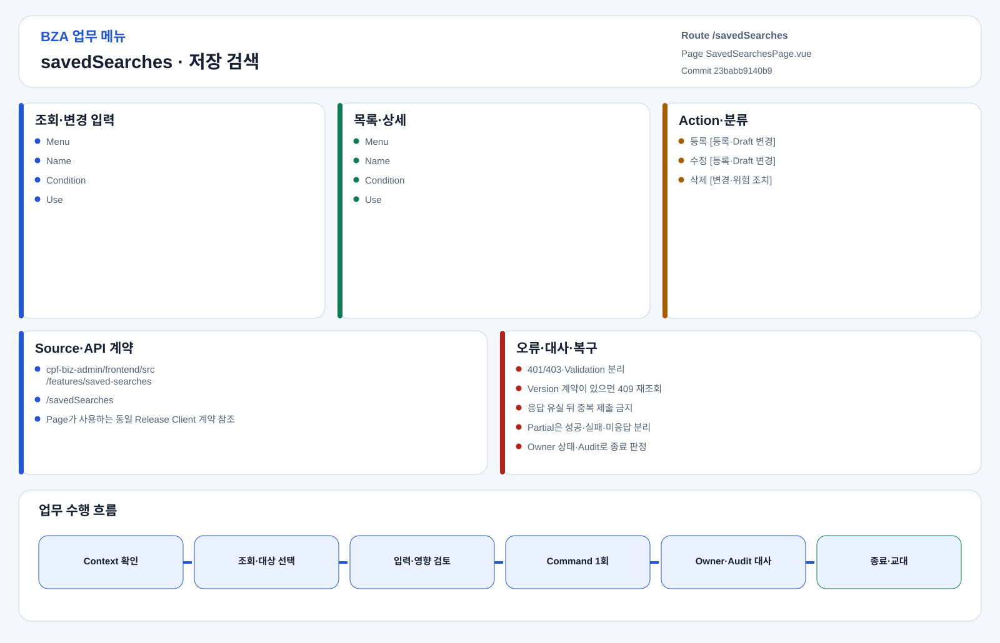

### 이 장에서 끝내는 업무

메뉴별 검색 조건을 저장·수정·삭제한다.

### 메뉴 식별·책임

| 항목 | 값 |
|---|---|
| Route | `/savedSearches` |
| 메뉴 ID | `savedSearches` |
| Menu Code | `SETTING` |
| 업무 그룹 | support |
| Frontend Page | `cpf-biz-admin/frontend/src/features/saved-searches/SavedSearchesPage.vue` |
| Permission | 본인/Setting |
| 기준 Commit | `23babb9140b90e501d6ac715e7b77f55b66198a5` |

### Source·API 근거

| 구분 | 기준 |
|---|---|
| Frontend Page | `cpf-biz-admin/frontend/src/features/saved-searches/SavedSearchesPage.vue` |
| Router | `/savedSearches` |
| API 추적 | 화면에서 제공하는 기능을 통해 호출한다. 문서에 명시되지 않은 Endpoint를 Browser나 외부 Script에서 임의 호출하지 않는다. |

아래 표는 이 메뉴에서 실제로 확인·입력·실행할 항목을 정리한다. 화면에 없는 Field·Button·상태를 임의로 가정하지 않는다.

### 검색·입력 Field

| Field | Control | 업무 의미 | 기본값·Validation·주의 |
|---|---|---|---|
| `Menu` | Select·검색 | 저장 검색에서 적용하거나 조회할 정책·권한·처리 유형을 선택한다. | 허용 목록과 현재 Environment·Data Scope에 맞는 값만 선택한다. |
| `Name` | 문자열 입력·검색 | 대상의 표시명 또는 업무명을 검색·입력한다. | 앞뒤 공백·허용 문자·길이와 대소문자 규칙을 확인한다. |
| `Condition` | 문자열 입력·검색 | 저장 검색 화면의 조회 조건 또는 편집 Form에 포함되는 값이며 화면 Label과 Help를 기준으로 사용한다. | 앞뒤 공백·허용 문자·길이와 대소문자 규칙을 확인한다. |
| `Use` | Checkbox·Switch | 현재 상태를 조회하거나 다음 Action의 허용 조건을 지정한다. | 현재 선택과 변경 후 영향 범위를 비교하고 화면의 Source 기본값을 확인한다. |

#### 입력 순서

1. **Menu** 항목이 조회 Control인지 변경 Form인지 화면 위치로 구분하고, 표시된 값·필수 여부·허용 형식을 확인한다.
2. **Name** 항목이 조회 Control인지 변경 Form인지 화면 위치로 구분하고, 표시된 값·필수 여부·허용 형식을 확인한다.
3. **Condition** 항목이 조회 Control인지 변경 Form인지 화면 위치로 구분하고, 표시된 값·필수 여부·허용 형식을 확인한다.
4. **Use** 항목이 조회 Control인지 변경 Form인지 화면 위치로 구분하고, 표시된 값·필수 여부·허용 형식을 확인한다.
5. 조회 Control과 변경 Form을 분리해 기록하고, 실행 전 Environment·Data Scope·Timezone과 제출할 값만 다시 검토한다.

### 목록 Column·상세 Field

| 표시값 | 운영 의미 | 교차 확인 |
|---|---|---|
| `Menu` | 저장 검색 상세에서 대상의 현재 속성 또는 처리 결과를 확인하는 값이다. | 상세·재조회 결과와 비교하고 Stale·Masking·단위 차이를 확인한다. |
| `Name` | 운영자가 대상을 구분하는 표시명 또는 설명이다. | 상세·재조회 결과와 비교하고 Stale·Masking·단위 차이를 확인한다. |
| `Condition` | 저장 검색 상세에서 대상의 현재 속성 또는 처리 결과를 확인하는 값이다. | 상세·재조회 결과와 비교하고 Stale·Masking·단위 차이를 확인한다. |
| `Use` | 현재 상태와 Terminal 여부, 다음 Action 가능 여부를 판단하는 값이다. | Last Updated·Terminal 조건·Owner 상태와 함께 확인한다. |

#### 결과 판독 순서

1. 조회 완료 시각·Filter·Paging·Sort와 화면 Warning을 확인한다.
2. Empty·Stale·Partial을 정상 0건과 구분한다.
3. 식별자·상태·Version·오류·시각을 같은 Query Context의 상세와 Owner 원장에서 비교한다.
4. Masking된 값은 Raw Permission과 Reason 없이 복원·Export하지 않는다.
5. 집계와 상세가 다르면 집계 시간 창·Timezone·Owner Update 시각을 맞춰 대사한다.

### Button·Action

| Action | 분류 | 활성 조건 | Side Effect·정상 결과 |
|---|---|---|---|
| **등록** | 등록·Draft 변경 | 화면이 실제로 요구하는 Write Permission·필수 Field·Reason·Version 조건을 충족함 | 저장 검색의 재조회 결과가 요청 내용과 일치한다. Version·Before/After·Audit는 해당 Owner가 제공하는 경우 함께 확인한다. |
| **수정** | 등록·Draft 변경 | 화면이 실제로 요구하는 Write Permission·필수 Field·Reason·Version 조건을 충족함 | 저장 검색의 재조회 결과가 요청 내용과 일치한다. Version·Before/After·Audit는 해당 Owner가 제공하는 경우 함께 확인한다. |
| **삭제** | 변경·위험 조치 | 화면과 Owner가 요구하는 Write Permission·대상 상태·영향 범위·Reason·승인·Version 조건을 충족함 | 변경 Operation을 생성하고 Accepted 응답과 Owner Terminal 상태·Version·Audit를 분리해 확인한다. |

### 정상 업무 전체 절차

1. `/savedSearches`에 진입해 Page Header와 Route가 **저장 검색** 기능을 가리키는지 확인한다.
2. 로그인 Session·Environment·Data Scope·기준일·Timezone을 고정한다.
3. 화면의 조회 Control과 변경 Form을 구분한다. 조회 조건이 제공되면 먼저 조회하고, 변경 Form은 대상 선택 또는 등록 Action 뒤에 열린 실제 Field만 사용한다.
4. Loading 종료 후 Empty·Error·Stale·Partial 상태와 화면 Warning을 먼저 판정한다.
5. **Menu, Name, Condition, Use**를 읽고 식별자·상태·Version·시각을 Owner 원장과 대사한다.
6. **등록** 전에 화면과 Owner가 실제로 요구하는 Permission·현재 상태·영향 범위·Reason·승인·Version 조건을 확인하고 한 번만 제출한다.
7. **등록**의 HTTP 응답과 재조회 결과를 확인한다. 비동기·다중 대상 기능은 Owner Terminal 상태·Version·대상별 Success/Failed/Unknown·Audit를 별도로 확인한다.
8. **수정** 전에 화면과 Owner가 실제로 요구하는 Permission·현재 상태·영향 범위·Reason·승인·Version 조건을 확인하고 한 번만 제출한다.
9. **수정**의 HTTP 응답과 재조회 결과를 확인한다. 비동기·다중 대상 기능은 Owner Terminal 상태·Version·대상별 Success/Failed/Unknown·Audit를 별도로 확인한다.
10. **삭제** 전에 화면과 Owner가 실제로 요구하는 Permission·현재 상태·영향 범위·Reason·승인·Version 조건을 확인하고 한 번만 제출한다.
11. **삭제**의 HTTP 응답과 재조회 결과를 확인한다. 비동기·다중 대상 기능은 Owner Terminal 상태·Version·대상별 Success/Failed/Unknown·Audit를 별도로 확인한다.
12. 화면이 제공하는 Log·Metric·Trace와, 변경·Export·승인 조치에 생성된 Audit를 교차 확인한다.
13. 이 장의 **종료 판정**과 다음 확인 시각·Evidence Link를 교대 기록에 남긴다.

### 메뉴 고유 판정·금지 사항

- **목적:** 메뉴별 검색 조건을 저장·수정·삭제한다.
- **종료 판정:** 본인 Scope와 Condition Schema Version을 확인한다.
- 응답을 받지 못한 경우 Owner 상태와 기존 Operation을 확인하기 전에 동일 Action을 반복하지 않는다.
- HTTP 성공 응답이나 Toast만으로 비동기 Owner 상태 또는 다중 대상 적용을 확정하지 않는다.

### 오류·경계·동시성·복구

| 상황 | 화면 징후 | 운영 조치 | 종료 증적 |
|---|---|---|---|
| 401·Session | Session 만료·CSRF·Origin 실패 | 로그인 상태와 BFF Session을 확인한다. Command 자동 Replay는 금지한다. | 401/403 응답·Session Audit |
| 403·Data Scope | 메뉴·Button·Raw·Export가 거부됨 | Menu·Button·API·Owner Permission과 Data Scope를 확인하고 우회하지 않는다. | Deny Audit·요청 Permission |
| Validation | 필수값·범위·형식·기간 오류 | Field Error만 수정하고 기존 성공 Operation을 다시 제출하지 않는다. | Error Code·Field·입력값 |
| Timeout·Dependency | 일부 Source 또는 Command 응답 지연 | Correlation/Operation ID와 실패 Stage를 기록하고 Owner 상태를 조회한다. | Dependency 상태·Retryability |
| Partial·Stale | 일부 대상만 Success 또는 조회 Source 누락 | 성공·실패·미응답을 분리하고 누락 범위와 Version을 표시한다. | Target별 결과·Version |
| 409·동시 변경 | Expected Version 불일치 | 최신 상세를 재조회하고 Diff·영향을 다시 검토한 뒤 새 요청으로 제출한다. | 현재/요청 Version·변경자 |
| 응답 유실·Unknown | 요청 후 실제 처리 여부를 알 수 없음 | Operation ID·Request Hash·Audit·Owner 상태로 대사하고 중복 제출하지 않는다. | Operation·Owner·Audit |
| 복구 실패 | Retry/Rollback 뒤에도 상태 불일치 | 자동 반복을 중단하고 Incident·Reconcile Case·다음 확인 시각을 기록한다. | Case ID·복구 Owner·기한 |

### 응답 유실·결과 불명·부분 적용 처리

1. 동일 Action을 다시 누르지 않고 Browser Network와 응답 Header를 보존한다. `operationId`·`transactionId`·`idempotencyKey`가 제공되면 기록하고, 없으면 Target ID·Actor·요청 시각·Request Body Hash로 대사한다.
2. 기능이 제공하는 상세·Operation Status(있는 경우)·Audit에서 Request Hash와 대상 Version을 검색한다.
3. Side Effect 전 실패가 확인된 경우에만 새 요청을 검토한다.
4. Success·Failed·Unknown 대상을 분리하고 Source가 제공하는 Failed-only Retry·Compensation·Rollback을 선택하고, 지원되지 않으면 수동 Reconcile Case로 이관한다.
5. Rollback을 지원하는 기능은 Owner Version·Checksum·업무 합계가 Rollback Point와 일치하는지 확인한다.
6. 확정되지 않은 대상은 `UNKNOWN_RESULT`로 유지하고 담당자·대사 기한·다음 확인 시각을 기록한다.

### Log·Metric·Trace·Audit와 교대 기록

| 증적 | 필수 값 |
|---|---|
| Audit | Actor·Permission·Reason·Approval·Target·Before/After·Result·Recovery Action |
| Log | Environment·Instance·operationId·transactionId·failureStage·errorCode |
| Metric | 동일 시간 창의 Success·Failure·Latency·Queue·Retry·Partial·Unknown |
| Trace | root/segment/attempt·Owner·DB/Kafka/외부 의존성 Span |
| 상태 원장 | Target ID·Version·Checksum·Desired/Actual·Last Updated·Terminal 여부 |

```text
Menu=savedSearches
Route=/savedSearches
Environment=
DataScope=
Query=
TargetId=
BeforeVersion=
Action=
Reason=
ApprovalId=
OperationId=
TransactionId=
Result=SUCCESS|FAILED|PARTIAL|UNKNOWN_RESULT
OwnerState=
FailedTargets=
ReconcileBy=
RollbackPoint=
EvidenceLinks=
NextCheckAt=
```

### 실무 Workbook

**상황:** 메뉴별 검색 조건을 저장·수정·삭제한다. 담당자가 **등록**을 수행한 뒤 Browser 응답을 받지 못했다.

1. 대상 식별자와 Before Version, 입력값, Reason·Approval을 작업 기록에서 확인한다.
2. 동일 **등록**을 반복하지 않고 Operation·Audit·Owner 상태를 조회한다.
3. Owner 상태가 변경됐고 Request Hash가 같으면 응답 유실로 분류해 중복 조치를 금지한다.
4. 일부 대상만 변경됐으면 Success·Failed·Unknown을 분리해 Failed-only Retry 또는 Rollback을 선택한다.
5. 본인 Scope와 Condition Schema Version을 확인한다.
6. Evidence Link와 다음 확인 시각을 교대 기록에 남긴다.

### 독립 수행 검수 Checklist

- [ ] `/savedSearches`와 Page Source를 찾고 화면 목적을 설명할 수 있다.
- [ ] 4개 입력·검색 항목의 Control·기본값·Validation을 설명할 수 있다.
- [ ] 4개 표시값을 Owner 상태·Version·Audit와 대사할 수 있다.
- [ ] 3개 Action의 분류·활성 조건·Side Effect를 설명할 수 있다.
- [ ] Empty·403·409·Timeout·Partial·Unknown을 서로 다른 상태로 처리할 수 있다.
- [ ] 응답 유실 뒤 중복 제출 없이 Operation·Owner·Audit로 결과를 확정할 수 있다.
- [ ] 교대 기록만으로 다음 담당자가 Target·상태·복구 기한을 이어받을 수 있다.

## 24. settings — BZA 업무 설정

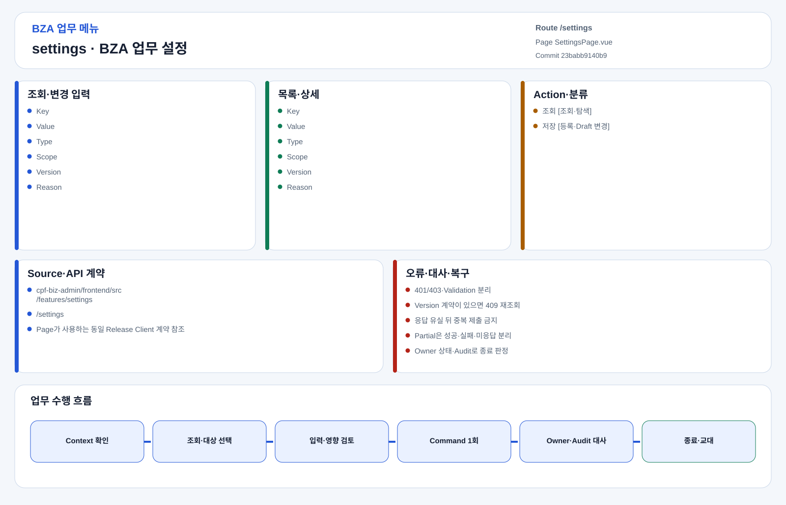

### 이 장에서 끝내는 업무

BZA 업무 설정 Key·Type·Scope·Version을 관리한다.

### 메뉴 식별·책임

| 항목 | 값 |
|---|---|
| Route | `/settings` |
| 메뉴 ID | `settings` |
| Menu Code | `SETTING` |
| 업무 그룹 | support |
| Frontend Page | `cpf-biz-admin/frontend/src/features/settings/SettingsPage.vue` |
| Permission | Write |
| 기준 Commit | `23babb9140b90e501d6ac715e7b77f55b66198a5` |

### Source·API 근거

| 구분 | 기준 |
|---|---|
| Frontend Page | `cpf-biz-admin/frontend/src/features/settings/SettingsPage.vue` |
| Router | `/settings` |
| API 추적 | 화면에서 제공하는 기능을 통해 호출한다. 문서에 명시되지 않은 Endpoint를 Browser나 외부 Script에서 임의 호출하지 않는다. |

아래 표는 이 메뉴에서 실제로 확인·입력·실행할 항목을 정리한다. 화면에 없는 Field·Button·상태를 임의로 가정하지 않는다.

### 검색·입력 Field

| Field | Control | 업무 의미 | 기본값·Validation·주의 |
|---|---|---|---|
| `Key` | 문자열 입력·검색 | 조회·상세·Audit에서 같은 대상을 다시 찾기 위한 식별 조건이다. | 앞뒤 공백·허용 문자·길이와 대소문자 규칙을 확인한다. |
| `Value` | 문자열 입력·검색 | BZA 업무 설정 화면의 조회 조건 또는 편집 Form에 포함되는 값이며 화면 Label과 Help를 기준으로 사용한다. | 앞뒤 공백·허용 문자·길이와 대소문자 규칙을 확인한다. |
| `Type` | Select·검색 | BZA 업무 설정에서 적용하거나 조회할 정책·권한·처리 유형을 선택한다. | 허용 목록과 현재 Environment·Data Scope에 맞는 값만 선택한다. |
| `Scope` | Select·검색 | BZA 업무 설정 조회·조치가 적용되는 환경과 데이터 경계를 제한한다. | 허용 목록과 현재 Environment·Data Scope에 맞는 값만 선택한다. |
| `Version` | 숫자·Version 입력 | 동시 변경을 막고 요청 대상의 현재 Revision을 확인하는 값이다. | 상세 재조회로 최신 값을 얻고 409 발생 시 기존 값을 덮어쓰지 않는다. |
| `Reason` | 다중행 입력 | 작업 목적·영향 범위·승인 또는 복구 기준을 기록해 Audit와 교대 기록에 연결한다. | Ticket·영향 범위·복구점을 포함하고 화면이 요구하는 최소 길이를 충족한다. |

#### 입력 순서

1. **Key** 항목이 조회 Control인지 변경 Form인지 화면 위치로 구분하고, 표시된 값·필수 여부·허용 형식을 확인한다.
2. **Value** 항목이 조회 Control인지 변경 Form인지 화면 위치로 구분하고, 표시된 값·필수 여부·허용 형식을 확인한다.
3. **Type** 항목이 조회 Control인지 변경 Form인지 화면 위치로 구분하고, 표시된 값·필수 여부·허용 형식을 확인한다.
4. **Scope** 항목이 조회 Control인지 변경 Form인지 화면 위치로 구분하고, 표시된 값·필수 여부·허용 형식을 확인한다.
5. **Version** 항목이 조회 Control인지 변경 Form인지 화면 위치로 구분하고, 표시된 값·필수 여부·허용 형식을 확인한다.
6. **Reason** 항목이 조회 Control인지 변경 Form인지 화면 위치로 구분하고, 표시된 값·필수 여부·허용 형식을 확인한다.
7. 조회 Control과 변경 Form을 분리해 기록하고, 실행 전 Environment·Data Scope·Timezone과 제출할 값만 다시 검토한다.

### 목록 Column·상세 Field

| 표시값 | 운영 의미 | 교차 확인 |
|---|---|---|
| `Key` | BZA 업무 설정의 대상 레코드를 상세·Owner·Audit에서 연결하는 식별자다. | 상세·Log·Trace·Audit에서 같은 대상을 가리키는지 확인한다. |
| `Value` | BZA 업무 설정 상세에서 대상의 현재 속성 또는 처리 결과를 확인하는 값이다. | 상세·재조회 결과와 비교하고 Stale·Masking·단위 차이를 확인한다. |
| `Type` | BZA 업무 설정 상세에서 대상의 현재 속성 또는 처리 결과를 확인하는 값이다. | 상세·재조회 결과와 비교하고 Stale·Masking·단위 차이를 확인한다. |
| `Scope` | BZA 업무 설정 상세에서 대상의 현재 속성 또는 처리 결과를 확인하는 값이다. | 상세·재조회 결과와 비교하고 Stale·Masking·단위 차이를 확인한다. |
| `Version` | 요청·Owner·Instance 사이의 Version 또는 내용 동일성을 판단하는 값이다. | 목록·상세·Owner 또는 Instance 보고값에서 일치하는지 확인한다. |
| `Reason` | 작업 주체·Owner·변경 사유를 확인하는 감사 정보다. | 상세·재조회 결과와 비교하고 Stale·Masking·단위 차이를 확인한다. |

#### 결과 판독 순서

1. 조회 완료 시각·Filter·Paging·Sort와 화면 Warning을 확인한다.
2. Empty·Stale·Partial을 정상 0건과 구분한다.
3. 식별자·상태·Version·오류·시각을 같은 Query Context의 상세와 Owner 원장에서 비교한다.
4. Masking된 값은 Raw Permission과 Reason 없이 복원·Export하지 않는다.
5. 집계와 상세가 다르면 집계 시간 창·Timezone·Owner Update 시각을 맞춰 대사한다.

### Button·Action

| Action | 분류 | 활성 조건 | Side Effect·정상 결과 |
|---|---|---|---|
| **조회** | 조회·탐색 | 조회 Permission과 Query Validation을 충족하고 동일 조회가 진행 중이 아님 | 조회 결과의 조회 시각·Filter·Source Version·Warning이 갱신되며 Owner 데이터는 변경하지 않는다. |
| **저장** | 등록·Draft 변경 | 화면이 실제로 요구하는 Write Permission·필수 Field·Reason·Version 조건을 충족함 | BZA 업무 설정의 재조회 결과가 요청 내용과 일치한다. Version·Before/After·Audit는 해당 Owner가 제공하는 경우 함께 확인한다. |

### 정상 업무 전체 절차

1. `/settings`에 진입해 Page Header와 Route가 **BZA 업무 설정** 기능을 가리키는지 확인한다.
2. 로그인 Session·Environment·Data Scope·기준일·Timezone을 고정한다.
3. 화면의 조회 Control과 변경 Form을 구분한다. 조회 조건이 제공되면 먼저 조회하고, 변경 Form은 대상 선택 또는 등록 Action 뒤에 열린 실제 Field만 사용한다.
4. Loading 종료 후 Empty·Error·Stale·Partial 상태와 화면 Warning을 먼저 판정한다.
5. **Key, Value, Type, Scope, Version**를 읽고 식별자·상태·Version·시각을 Owner 원장과 대사한다.
6. **저장** 전에 화면과 Owner가 실제로 요구하는 Permission·현재 상태·영향 범위·Reason·승인·Version 조건을 확인하고 한 번만 제출한다.
7. **저장**의 HTTP 응답과 재조회 결과를 확인한다. 비동기·다중 대상 기능은 Owner Terminal 상태·Version·대상별 Success/Failed/Unknown·Audit를 별도로 확인한다.
8. 화면이 제공하는 Log·Metric·Trace와, 변경·Export·승인 조치에 생성된 Audit를 교차 확인한다.
9. 이 장의 **종료 판정**과 다음 확인 시각·Evidence Link를 교대 기록에 남긴다.

### 메뉴 고유 판정·금지 사항

- **목적:** BZA 업무 설정 Key·Type·Scope·Version을 관리한다.
- **종료 판정:** Secret 포함 여부와 Consumer 적용·Rollback을 확인한다.
- 응답을 받지 못한 경우 Owner 상태와 기존 Operation을 확인하기 전에 동일 Action을 반복하지 않는다.
- HTTP 성공 응답이나 Toast만으로 비동기 Owner 상태 또는 다중 대상 적용을 확정하지 않는다.

### 오류·경계·동시성·복구

| 상황 | 화면 징후 | 운영 조치 | 종료 증적 |
|---|---|---|---|
| 401·Session | Session 만료·CSRF·Origin 실패 | 로그인 상태와 BFF Session을 확인한다. Command 자동 Replay는 금지한다. | 401/403 응답·Session Audit |
| 403·Data Scope | 메뉴·Button·Raw·Export가 거부됨 | Menu·Button·API·Owner Permission과 Data Scope를 확인하고 우회하지 않는다. | Deny Audit·요청 Permission |
| Validation | 필수값·범위·형식·기간 오류 | Field Error만 수정하고 기존 성공 Operation을 다시 제출하지 않는다. | Error Code·Field·입력값 |
| Timeout·Dependency | 일부 Source 또는 Command 응답 지연 | Correlation/Operation ID와 실패 Stage를 기록하고 Owner 상태를 조회한다. | Dependency 상태·Retryability |
| Partial·Stale | 일부 대상만 Success 또는 조회 Source 누락 | 성공·실패·미응답을 분리하고 누락 범위와 Version을 표시한다. | Target별 결과·Version |
| 409·동시 변경 | Expected Version 불일치 | 최신 상세를 재조회하고 Diff·영향을 다시 검토한 뒤 새 요청으로 제출한다. | 현재/요청 Version·변경자 |
| 응답 유실·Unknown | 요청 후 실제 처리 여부를 알 수 없음 | Operation ID·Request Hash·Audit·Owner 상태로 대사하고 중복 제출하지 않는다. | Operation·Owner·Audit |
| 복구 실패 | Retry/Rollback 뒤에도 상태 불일치 | 자동 반복을 중단하고 Incident·Reconcile Case·다음 확인 시각을 기록한다. | Case ID·복구 Owner·기한 |

### 응답 유실·결과 불명·부분 적용 처리

1. 동일 Action을 다시 누르지 않고 Browser Network와 응답 Header를 보존한다. `operationId`·`transactionId`·`idempotencyKey`가 제공되면 기록하고, 없으면 Target ID·Actor·요청 시각·Request Body Hash로 대사한다.
2. 기능이 제공하는 상세·Operation Status(있는 경우)·Audit에서 Request Hash와 대상 Version을 검색한다.
3. Side Effect 전 실패가 확인된 경우에만 새 요청을 검토한다.
4. Success·Failed·Unknown 대상을 분리하고 Source가 제공하는 Failed-only Retry·Compensation·Rollback을 선택하고, 지원되지 않으면 수동 Reconcile Case로 이관한다.
5. Rollback을 지원하는 기능은 Owner Version·Checksum·업무 합계가 Rollback Point와 일치하는지 확인한다.
6. 확정되지 않은 대상은 `UNKNOWN_RESULT`로 유지하고 담당자·대사 기한·다음 확인 시각을 기록한다.

### Log·Metric·Trace·Audit와 교대 기록

| 증적 | 필수 값 |
|---|---|
| Audit | Actor·Permission·Reason·Approval·Target·Before/After·Result·Recovery Action |
| Log | Environment·Instance·operationId·transactionId·failureStage·errorCode |
| Metric | 동일 시간 창의 Success·Failure·Latency·Queue·Retry·Partial·Unknown |
| Trace | root/segment/attempt·Owner·DB/Kafka/외부 의존성 Span |
| 상태 원장 | Target ID·Version·Checksum·Desired/Actual·Last Updated·Terminal 여부 |

```text
Menu=settings
Route=/settings
Environment=
DataScope=
Query=
TargetId=
BeforeVersion=
Action=
Reason=
ApprovalId=
OperationId=
TransactionId=
Result=SUCCESS|FAILED|PARTIAL|UNKNOWN_RESULT
OwnerState=
FailedTargets=
ReconcileBy=
RollbackPoint=
EvidenceLinks=
NextCheckAt=
```

### 실무 Workbook

**상황:** BZA 업무 설정 Key·Type·Scope·Version을 관리한다. 담당자가 **저장**을 수행한 뒤 Browser 응답을 받지 못했다.

1. 대상 식별자와 Before Version, 입력값, Reason·Approval을 작업 기록에서 확인한다.
2. 동일 **저장**을 반복하지 않고 Operation·Audit·Owner 상태를 조회한다.
3. Owner 상태가 변경됐고 Request Hash가 같으면 응답 유실로 분류해 중복 조치를 금지한다.
4. 일부 대상만 변경됐으면 Success·Failed·Unknown을 분리해 Failed-only Retry 또는 Rollback을 선택한다.
5. Secret 포함 여부와 Consumer 적용·Rollback을 확인한다.
6. Evidence Link와 다음 확인 시각을 교대 기록에 남긴다.

### 독립 수행 검수 Checklist

- [ ] `/settings`와 Page Source를 찾고 화면 목적을 설명할 수 있다.
- [ ] 6개 입력·검색 항목의 Control·기본값·Validation을 설명할 수 있다.
- [ ] 6개 표시값을 Owner 상태·Version·Audit와 대사할 수 있다.
- [ ] 2개 Action의 분류·활성 조건·Side Effect를 설명할 수 있다.
- [ ] Empty·403·409·Timeout·Partial·Unknown을 서로 다른 상태로 처리할 수 있다.
- [ ] 응답 유실 뒤 중복 제출 없이 Operation·Owner·Audit로 결과를 확정할 수 있다.
- [ ] 교대 기록만으로 다음 담당자가 Target·상태·복구 기한을 이어받을 수 있다.

## 25. downloads — Download 정책

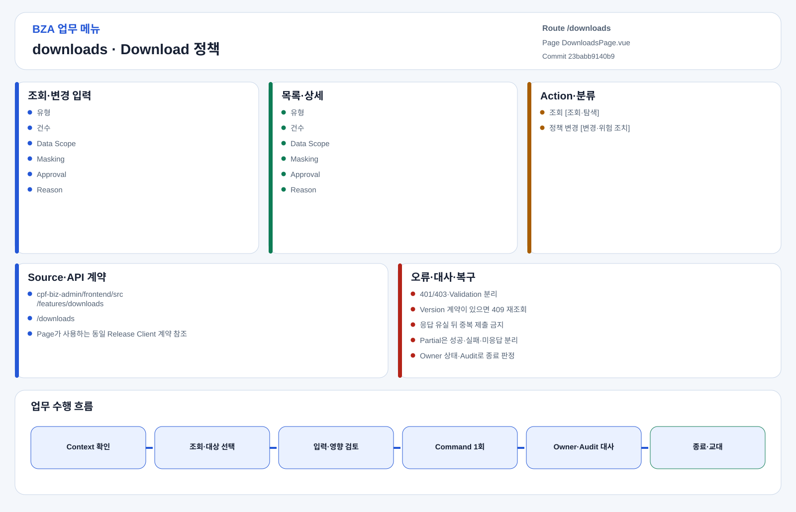

### 이 장에서 끝내는 업무

Download 정책의 유형·건수·Data Scope·Masking·승인을 관리한다.

### 메뉴 식별·책임

| 항목 | 값 |
|---|---|
| Route | `/downloads` |
| 메뉴 ID | `downloads` |
| Menu Code | `SETTING` |
| 업무 그룹 | support |
| Frontend Page | `cpf-biz-admin/frontend/src/features/downloads/DownloadsPage.vue` |
| Permission | Write |
| 기준 Commit | `23babb9140b90e501d6ac715e7b77f55b66198a5` |

### Source·API 근거

| 구분 | 기준 |
|---|---|
| Frontend Page | `cpf-biz-admin/frontend/src/features/downloads/DownloadsPage.vue` |
| Router | `/downloads` |
| API 추적 | 화면에서 제공하는 기능을 통해 호출한다. 문서에 명시되지 않은 Endpoint를 Browser나 외부 Script에서 임의 호출하지 않는다. |

아래 표는 이 메뉴에서 실제로 확인·입력·실행할 항목을 정리한다. 화면에 없는 Field·Button·상태를 임의로 가정하지 않는다.

### 검색·입력 Field

| Field | Control | 업무 의미 | 기본값·Validation·주의 |
|---|---|---|---|
| `유형` | Select·검색 | Download 정책에서 적용하거나 조회할 정책·권한·처리 유형을 선택한다. | 허용 목록과 현재 Environment·Data Scope에 맞는 값만 선택한다. |
| `건수` | 숫자·Version 입력 | 실행 한도·순서·용량 또는 재시도 범위를 지정한다. | 화면의 min·max·단위와 0 허용 여부를 확인하고 음수·Overflow를 차단한다. |
| `Data Scope` | Select·검색 | Download 정책 조회·조치가 적용되는 환경과 데이터 경계를 제한한다. | 허용 목록과 현재 Environment·Data Scope에 맞는 값만 선택한다. |
| `Masking` | Checkbox·Switch | Download 정책 화면의 조회 조건 또는 편집 Form에 포함되는 값이며 화면 Label과 Help를 기준으로 사용한다. | 현재 선택과 변경 후 영향 범위를 비교하고 화면의 Source 기본값을 확인한다. |
| `Approval` | Checkbox·Switch | Download 정책 화면의 조회 조건 또는 편집 Form에 포함되는 값이며 화면 Label과 Help를 기준으로 사용한다. | 현재 선택과 변경 후 영향 범위를 비교하고 화면의 Source 기본값을 확인한다. |
| `Reason` | 다중행 입력 | 작업 목적·영향 범위·승인 또는 복구 기준을 기록해 Audit와 교대 기록에 연결한다. | Ticket·영향 범위·복구점을 포함하고 화면이 요구하는 최소 길이를 충족한다. |

#### 입력 순서

1. **유형** 항목이 조회 Control인지 변경 Form인지 화면 위치로 구분하고, 표시된 값·필수 여부·허용 형식을 확인한다.
2. **건수** 항목이 조회 Control인지 변경 Form인지 화면 위치로 구분하고, 표시된 값·필수 여부·허용 형식을 확인한다.
3. **Data Scope** 항목이 조회 Control인지 변경 Form인지 화면 위치로 구분하고, 표시된 값·필수 여부·허용 형식을 확인한다.
4. **Masking** 항목이 조회 Control인지 변경 Form인지 화면 위치로 구분하고, 표시된 값·필수 여부·허용 형식을 확인한다.
5. **Approval** 항목이 조회 Control인지 변경 Form인지 화면 위치로 구분하고, 표시된 값·필수 여부·허용 형식을 확인한다.
6. **Reason** 항목이 조회 Control인지 변경 Form인지 화면 위치로 구분하고, 표시된 값·필수 여부·허용 형식을 확인한다.
7. 조회 Control과 변경 Form을 분리해 기록하고, 실행 전 Environment·Data Scope·Timezone과 제출할 값만 다시 검토한다.

### 목록 Column·상세 Field

| 표시값 | 운영 의미 | 교차 확인 |
|---|---|---|
| `유형` | Download 정책 상세에서 대상의 현재 속성 또는 처리 결과를 확인하는 값이다. | 상세·재조회 결과와 비교하고 Stale·Masking·단위 차이를 확인한다. |
| `건수` | 동일한 집계 시간 창·단위·Filter에서 비교해야 하는 수치다. | 같은 Filter·집계 시간 창·단위의 상세 Row 또는 Metric으로 대사한다. |
| `Data Scope` | Download 정책 상세에서 대상의 현재 속성 또는 처리 결과를 확인하는 값이다. | 상세·재조회 결과와 비교하고 Stale·Masking·단위 차이를 확인한다. |
| `Masking` | Download 정책 상세에서 대상의 현재 속성 또는 처리 결과를 확인하는 값이다. | 상세·재조회 결과와 비교하고 Stale·Masking·단위 차이를 확인한다. |
| `Approval` | Download 정책 상세에서 대상의 현재 속성 또는 처리 결과를 확인하는 값이다. | 상세·재조회 결과와 비교하고 Stale·Masking·단위 차이를 확인한다. |
| `Reason` | 작업 주체·Owner·변경 사유를 확인하는 감사 정보다. | 상세·재조회 결과와 비교하고 Stale·Masking·단위 차이를 확인한다. |

#### 결과 판독 순서

1. 조회 완료 시각·Filter·Paging·Sort와 화면 Warning을 확인한다.
2. Empty·Stale·Partial을 정상 0건과 구분한다.
3. 식별자·상태·Version·오류·시각을 같은 Query Context의 상세와 Owner 원장에서 비교한다.
4. Masking된 값은 Raw Permission과 Reason 없이 복원·Export하지 않는다.
5. 집계와 상세가 다르면 집계 시간 창·Timezone·Owner Update 시각을 맞춰 대사한다.

### Button·Action

| Action | 분류 | 활성 조건 | Side Effect·정상 결과 |
|---|---|---|---|
| **조회** | 조회·탐색 | 조회 Permission과 Query Validation을 충족하고 동일 조회가 진행 중이 아님 | 조회 결과의 조회 시각·Filter·Source Version·Warning이 갱신되며 Owner 데이터는 변경하지 않는다. |
| **정책 변경** | 변경·위험 조치 | 화면과 Owner가 요구하는 Write Permission·대상 상태·영향 범위·Reason·승인·Version 조건을 충족함 | 변경 Operation을 생성하고 Accepted 응답과 Owner Terminal 상태·Version·Audit를 분리해 확인한다. |

### 정상 업무 전체 절차

1. `/downloads`에 진입해 Page Header와 Route가 **Download 정책** 기능을 가리키는지 확인한다.
2. 로그인 Session·Environment·Data Scope·기준일·Timezone을 고정한다.
3. 화면의 조회 Control과 변경 Form을 구분한다. 조회 조건이 제공되면 먼저 조회하고, 변경 Form은 대상 선택 또는 등록 Action 뒤에 열린 실제 Field만 사용한다.
4. Loading 종료 후 Empty·Error·Stale·Partial 상태와 화면 Warning을 먼저 판정한다.
5. **유형, 건수, Data Scope, Masking, Approval**를 읽고 식별자·상태·Version·시각을 Owner 원장과 대사한다.
6. **정책 변경** 전에 화면과 Owner가 실제로 요구하는 Permission·현재 상태·영향 범위·Reason·승인·Version 조건을 확인하고 한 번만 제출한다.
7. **정책 변경**의 HTTP 응답과 재조회 결과를 확인한다. 비동기·다중 대상 기능은 Owner Terminal 상태·Version·대상별 Success/Failed/Unknown·Audit를 별도로 확인한다.
8. 화면이 제공하는 Log·Metric·Trace와, 변경·Export·승인 조치에 생성된 Audit를 교차 확인한다.
9. 이 장의 **종료 판정**과 다음 확인 시각·Evidence Link를 교대 기록에 남긴다.

### 메뉴 고유 판정·금지 사항

- **목적:** Download 정책의 유형·건수·Data Scope·Masking·승인을 관리한다.
- **종료 판정:** 정책 변경 후 생성된 Download에 실제 적용됐는지 확인한다.
- 응답을 받지 못한 경우 Owner 상태와 기존 Operation을 확인하기 전에 동일 Action을 반복하지 않는다.
- HTTP 성공 응답이나 Toast만으로 비동기 Owner 상태 또는 다중 대상 적용을 확정하지 않는다.

### 오류·경계·동시성·복구

| 상황 | 화면 징후 | 운영 조치 | 종료 증적 |
|---|---|---|---|
| 401·Session | Session 만료·CSRF·Origin 실패 | 로그인 상태와 BFF Session을 확인한다. Command 자동 Replay는 금지한다. | 401/403 응답·Session Audit |
| 403·Data Scope | 메뉴·Button·Raw·Export가 거부됨 | Menu·Button·API·Owner Permission과 Data Scope를 확인하고 우회하지 않는다. | Deny Audit·요청 Permission |
| Validation | 필수값·범위·형식·기간 오류 | Field Error만 수정하고 기존 성공 Operation을 다시 제출하지 않는다. | Error Code·Field·입력값 |
| Timeout·Dependency | 일부 Source 또는 Command 응답 지연 | Correlation/Operation ID와 실패 Stage를 기록하고 Owner 상태를 조회한다. | Dependency 상태·Retryability |
| Partial·Stale | 일부 대상만 Success 또는 조회 Source 누락 | 성공·실패·미응답을 분리하고 누락 범위와 Version을 표시한다. | Target별 결과·Version |
| 409·동시 변경 | Expected Version 불일치 | 최신 상세를 재조회하고 Diff·영향을 다시 검토한 뒤 새 요청으로 제출한다. | 현재/요청 Version·변경자 |
| 응답 유실·Unknown | 요청 후 실제 처리 여부를 알 수 없음 | Operation ID·Request Hash·Audit·Owner 상태로 대사하고 중복 제출하지 않는다. | Operation·Owner·Audit |
| 복구 실패 | Retry/Rollback 뒤에도 상태 불일치 | 자동 반복을 중단하고 Incident·Reconcile Case·다음 확인 시각을 기록한다. | Case ID·복구 Owner·기한 |

### 응답 유실·결과 불명·부분 적용 처리

1. 동일 Action을 다시 누르지 않고 Browser Network와 응답 Header를 보존한다. `operationId`·`transactionId`·`idempotencyKey`가 제공되면 기록하고, 없으면 Target ID·Actor·요청 시각·Request Body Hash로 대사한다.
2. 기능이 제공하는 상세·Operation Status(있는 경우)·Audit에서 Request Hash와 대상 Version을 검색한다.
3. Side Effect 전 실패가 확인된 경우에만 새 요청을 검토한다.
4. Success·Failed·Unknown 대상을 분리하고 Source가 제공하는 Failed-only Retry·Compensation·Rollback을 선택하고, 지원되지 않으면 수동 Reconcile Case로 이관한다.
5. Rollback을 지원하는 기능은 Owner Version·Checksum·업무 합계가 Rollback Point와 일치하는지 확인한다.
6. 확정되지 않은 대상은 `UNKNOWN_RESULT`로 유지하고 담당자·대사 기한·다음 확인 시각을 기록한다.

### Log·Metric·Trace·Audit와 교대 기록

| 증적 | 필수 값 |
|---|---|
| Audit | Actor·Permission·Reason·Approval·Target·Before/After·Result·Recovery Action |
| Log | Environment·Instance·operationId·transactionId·failureStage·errorCode |
| Metric | 동일 시간 창의 Success·Failure·Latency·Queue·Retry·Partial·Unknown |
| Trace | root/segment/attempt·Owner·DB/Kafka/외부 의존성 Span |
| 상태 원장 | Target ID·Version·Checksum·Desired/Actual·Last Updated·Terminal 여부 |

```text
Menu=downloads
Route=/downloads
Environment=
DataScope=
Query=
TargetId=
BeforeVersion=
Action=
Reason=
ApprovalId=
OperationId=
TransactionId=
Result=SUCCESS|FAILED|PARTIAL|UNKNOWN_RESULT
OwnerState=
FailedTargets=
ReconcileBy=
RollbackPoint=
EvidenceLinks=
NextCheckAt=
```

### 실무 Workbook

**상황:** Download 정책의 유형·건수·Data Scope·Masking·승인을 관리한다. 담당자가 **정책 변경**을 수행한 뒤 Browser 응답을 받지 못했다.

1. 대상 식별자와 Before Version, 입력값, Reason·Approval을 작업 기록에서 확인한다.
2. 동일 **정책 변경**을 반복하지 않고 Operation·Audit·Owner 상태를 조회한다.
3. Owner 상태가 변경됐고 Request Hash가 같으면 응답 유실로 분류해 중복 조치를 금지한다.
4. 일부 대상만 변경됐으면 Success·Failed·Unknown을 분리해 Failed-only Retry 또는 Rollback을 선택한다.
5. 정책 변경 후 생성된 Download에 실제 적용됐는지 확인한다.
6. Evidence Link와 다음 확인 시각을 교대 기록에 남긴다.

### 독립 수행 검수 Checklist

- [ ] `/downloads`와 Page Source를 찾고 화면 목적을 설명할 수 있다.
- [ ] 6개 입력·검색 항목의 Control·기본값·Validation을 설명할 수 있다.
- [ ] 6개 표시값을 Owner 상태·Version·Audit와 대사할 수 있다.
- [ ] 2개 Action의 분류·활성 조건·Side Effect를 설명할 수 있다.
- [ ] Empty·403·409·Timeout·Partial·Unknown을 서로 다른 상태로 처리할 수 있다.
- [ ] 응답 유실 뒤 중복 제출 없이 Operation·Owner·Audit로 결과를 확정할 수 있다.
- [ ] 교대 기록만으로 다음 담당자가 Target·상태·복구 기한을 이어받을 수 있다.

## 26. downloadAudits — Download 감사


### 이 장에서 끝내는 업무

Download 사용자·유형·대상·기간·Reason을 감사한다.

### 메뉴 식별·책임

| 항목 | 값 |
|---|---|
| Route | `/downloadAudits` |
| 메뉴 ID | `downloadAudits` |
| Menu Code | `AUDIT` |
| 업무 그룹 | support |
| Frontend Page | `cpf-biz-admin/frontend/src/features/download-audits/DownloadAuditsPage.vue` |
| Permission | Audit Read |
| 기준 Commit | `23babb9140b90e501d6ac715e7b77f55b66198a5` |

### Source·API 근거

| 구분 | 기준 |
|---|---|
| Frontend Page | `cpf-biz-admin/frontend/src/features/download-audits/DownloadAuditsPage.vue` |
| Router | `/downloadAudits` |
| API 추적 | 화면에서 제공하는 기능을 통해 호출한다. 문서에 명시되지 않은 Endpoint를 Browser나 외부 Script에서 임의 호출하지 않는다. |

아래 표는 이 메뉴에서 실제로 확인·입력·실행할 항목을 정리한다. 화면에 없는 Field·Button·상태를 임의로 가정하지 않는다.

### 검색·입력 Field

| Field | Control | 업무 의미 | 기본값·Validation·주의 |
|---|---|---|---|
| `사용자` | Checkbox·Switch | 현재 상태를 조회하거나 다음 Action의 허용 조건을 지정한다. | 현재 선택과 변경 후 영향 범위를 비교하고 화면의 Source 기본값을 확인한다. |
| `유형` | Select·검색 | Download 감사에서 적용하거나 조회할 정책·권한·처리 유형을 선택한다. | 허용 목록과 현재 Environment·Data Scope에 맞는 값만 선택한다. |
| `대상` | 문자열 입력·검색 | Download 감사 화면의 조회 조건 또는 편집 Form에 포함되는 값이며 화면 Label과 Help를 기준으로 사용한다. | 앞뒤 공백·허용 문자·길이와 대소문자 규칙을 확인한다. |
| `기간` | 날짜·시간 입력 | 조회 또는 적용의 유효 시간 범위를 정하며 Timezone과 시작·종료 순서를 함께 확인한다. | Timezone을 고정하고 시작≤종료·유효기간 겹침·기준일 포함 여부를 확인한다. |
| `Reason` | 다중행 입력 | 작업 목적·영향 범위·승인 또는 복구 기준을 기록해 Audit와 교대 기록에 연결한다. | Ticket·영향 범위·복구점을 포함하고 화면이 요구하는 최소 길이를 충족한다. |

#### 입력 순서

1. **사용자** 항목이 조회 Control인지 변경 Form인지 화면 위치로 구분하고, 표시된 값·필수 여부·허용 형식을 확인한다.
2. **유형** 항목이 조회 Control인지 변경 Form인지 화면 위치로 구분하고, 표시된 값·필수 여부·허용 형식을 확인한다.
3. **대상** 항목이 조회 Control인지 변경 Form인지 화면 위치로 구분하고, 표시된 값·필수 여부·허용 형식을 확인한다.
4. **기간** 항목이 조회 Control인지 변경 Form인지 화면 위치로 구분하고, 표시된 값·필수 여부·허용 형식을 확인한다.
5. **Reason** 항목이 조회 Control인지 변경 Form인지 화면 위치로 구분하고, 표시된 값·필수 여부·허용 형식을 확인한다.
6. 조회 Control과 변경 Form을 분리해 기록하고, 실행 전 Environment·Data Scope·Timezone과 제출할 값만 다시 검토한다.

### 목록 Column·상세 Field

| 표시값 | 운영 의미 | 교차 확인 |
|---|---|---|
| `사용자` | Download 감사 상세에서 대상의 현재 속성 또는 처리 결과를 확인하는 값이다. | 상세·재조회 결과와 비교하고 Stale·Masking·단위 차이를 확인한다. |
| `유형` | Download 감사 상세에서 대상의 현재 속성 또는 처리 결과를 확인하는 값이다. | 상세·재조회 결과와 비교하고 Stale·Masking·단위 차이를 확인한다. |
| `대상` | Download 감사 상세에서 대상의 현재 속성 또는 처리 결과를 확인하는 값이다. | 상세·재조회 결과와 비교하고 Stale·Masking·단위 차이를 확인한다. |
| `기간` | 상태 발생·갱신·유효 시점을 나타내며 화면 Timezone을 기준으로 해석한다. | 상세·재조회 결과와 비교하고 Stale·Masking·단위 차이를 확인한다. |
| `Reason` | 작업 주체·Owner·변경 사유를 확인하는 감사 정보다. | 상세·재조회 결과와 비교하고 Stale·Masking·단위 차이를 확인한다. |

#### 결과 판독 순서

1. 조회 완료 시각·Filter·Paging·Sort와 화면 Warning을 확인한다.
2. Empty·Stale·Partial을 정상 0건과 구분한다.
3. 식별자·상태·Version·오류·시각을 같은 Query Context의 상세와 Owner 원장에서 비교한다.
4. Masking된 값은 Raw Permission과 Reason 없이 복원·Export하지 않는다.
5. 집계와 상세가 다르면 집계 시간 창·Timezone·Owner Update 시각을 맞춰 대사한다.

### Button·Action

| Action | 분류 | 활성 조건 | Side Effect·정상 결과 |
|---|---|---|---|
| **조회** | 조회·탐색 | 조회 Permission과 Query Validation을 충족하고 동일 조회가 진행 중이 아님 | 조회 결과의 조회 시각·Filter·Source Version·Warning이 갱신되며 Owner 데이터는 변경하지 않는다. |
| **상세** | 조회·탐색 | 조회 Permission과 Query Validation을 충족하고 동일 조회가 진행 중이 아님 | 상세 결과의 조회 시각·Filter·Source Version·Warning이 갱신되며 Owner 데이터는 변경하지 않는다. |

### 정상 업무 전체 절차

1. `/downloadAudits`에 진입해 Page Header와 Route가 **Download 감사** 기능을 가리키는지 확인한다.
2. 로그인 Session·Environment·Data Scope·기준일·Timezone을 고정한다.
3. 화면에 제공된 조회 Control만 사용하고, 표시되지 않은 변경 Field나 Server Command가 있다고 가정하지 않는다.
4. Loading 종료 후 Empty·Error·Stale·Partial 상태와 화면 Warning을 먼저 판정한다.
5. **사용자, 유형, 대상, 기간, Reason**를 읽고 식별자·상태·Version·시각을 Owner 원장과 대사한다.
6. 화면이 제공하는 Log·Metric·Trace와 조회·Raw·Export 접근 기록이 있으면 해당 Audit를 교차 확인한다.
7. 이 장의 **종료 판정**과 다음 확인 시각·Evidence Link를 교대 기록에 남긴다.

### 메뉴 고유 판정·금지 사항

- **목적:** Download 사용자·유형·대상·기간·Reason을 감사한다.
- **종료 판정:** 정책 Version·건수·Masking·Artifact Hash와 연결한다.
- 조회 화면에서 직접 Owner 데이터를 변경하거나 Browser Tool로 우회하지 않는다.
- Partial 조회를 정상 전체 결과로 합치지 않는다.

### 오류·경계·동시성·복구

| 상황 | 화면 징후 | 운영 조치 | 종료 증적 |
|---|---|---|---|
| 401·Session | Session 만료·CSRF·Origin 실패 | 로그인 상태와 BFF Session을 확인한 뒤 같은 Query Context로 다시 조회한다. | 401/403 응답·Session Audit |
| 403·Data Scope | 메뉴·Button·Raw·Export가 거부됨 | Menu·Button·API·Owner Permission과 Data Scope를 확인하고 우회하지 않는다. | Deny Audit·요청 Permission |
| Timeout·Dependency | 일부 조회 Source 응답 지연 | Correlation ID·Query Context·실패 Source를 기록하고 같은 조건으로 재조회한다. | 조회 시각·실패 Source·재조회 결과 |
| Partial·Stale | 일부 대상만 Success 또는 조회 Source 누락 | 성공·실패·미응답을 분리하고 누락 범위와 Version을 표시한다. | Target별 결과·Version |

### 응답 유실·부분 조회 처리

1. 검색 조건·Data Scope·Paging·조회 시각·Correlation ID를 기록한다.
2. 같은 조건으로 재조회하되 실패 Source만 분리한다.
3. 정상 Source 결과를 유지하고 실패·Stale Source를 명시한다.
4. 집계와 원본 상세가 다르면 Owner 상세를 기준으로 Reconcile Case를 연다.
5. 조회 시각·Source Version·0건 또는 일치 결과를 증적으로 남긴다.

### Log·Metric·Trace·Audit와 교대 기록

| 증적 | 필수 값 |
|---|---|
| Audit | Actor·Permission·Data Scope·Raw/Export 접근·Query Context·Result |
| Log | Environment·Instance·operationId·transactionId·failureStage·errorCode |
| Metric | 동일 시간 창의 Success·Failure·Latency·Queue·Retry·Partial·Unknown |
| Trace | root/segment/attempt·Owner·DB/Kafka/외부 의존성 Span |
| 상태 원장 | Target ID·Version·Checksum·Desired/Actual·Last Updated·Terminal 여부 |

```text
Menu=
Route=
Environment=
DataScope=
Query=
QueryAt=
CorrelationId=
SourceVersion=
Result=SUCCESS|EMPTY|STALE|PARTIAL|FAILED
FailedSources=
EvidenceLinks=
NextCheckAt=
```

### 실무 Workbook

**상황:** Download 사용자·유형·대상·기간·Reason을 감사한다. 화면이 일부 Source Timeout 때문에 Partial 결과를 표시했다.

1. Query·Data Scope·조회 시각·Correlation ID를 기록한다.
2. 정상 결과를 0건으로 덮어쓰지 않고 실패 Source만 재조회한다.
3. 사용자, 유형, 대상 값을 원본 상세와 같은 시간 기준으로 비교한다.
4. 불일치가 계속되면 Incident 또는 Reconcile Case를 생성한다.
5. 정책 Version·건수·Masking·Artifact Hash와 연결한다.
6. Source Version과 다음 확인 시각을 교대 기록에 남긴다.

### 독립 수행 검수 Checklist

- [ ] `/downloadAudits`와 Page Source를 찾고 화면 목적을 설명할 수 있다.
- [ ] 5개 입력·검색 항목의 Control·기본값·Validation을 설명할 수 있다.
- [ ] 5개 표시값을 Owner 상태·Version·Audit와 대사할 수 있다.
- [ ] 2개 Action의 분류·활성 조건·Side Effect를 설명할 수 있다.
- [ ] Empty·401·403·Timeout·Stale·Partial을 서로 다른 조회 상태로 처리할 수 있다.
- [ ] 조회 응답 유실 시 같은 Query Context로 재조회하고 Correlation ID·조회 시각·Source Version으로 결과를 대사할 수 있다.
- [ ] 교대 기록만으로 다음 담당자가 Target·상태·복구 기한을 이어받을 수 있다.
## 제6부. 기준일·유효기간·결재 Snapshot 심화

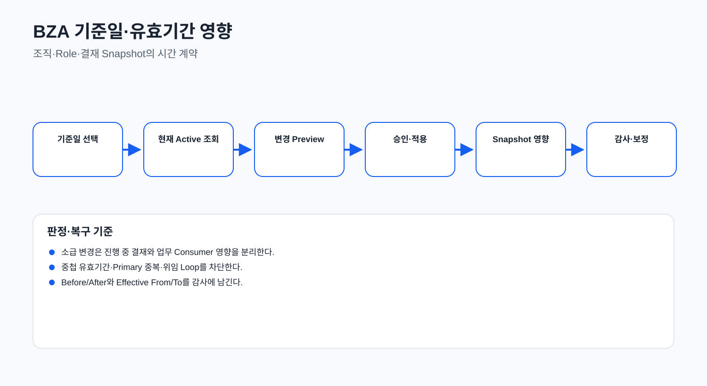

### 75. 기준일 변경 검토

조직·Assignment·Role·Permission·위임 변경 전 현재 기준일과 변경 Effective From/To를 고정한다. 소급 변경은 현재 Active 상태뿐 아니라 진행 중 결재 Snapshot과 업무 Domain Consumer를 별도 분석한다.

### 76. 보정과 원장 보존

이미 감사된 변경을 DB에서 직접 수정하지 않는다. 보정 Operation을 새로 만들고 원 요청·승인·Before/After·영향 대상을 연결한다.
