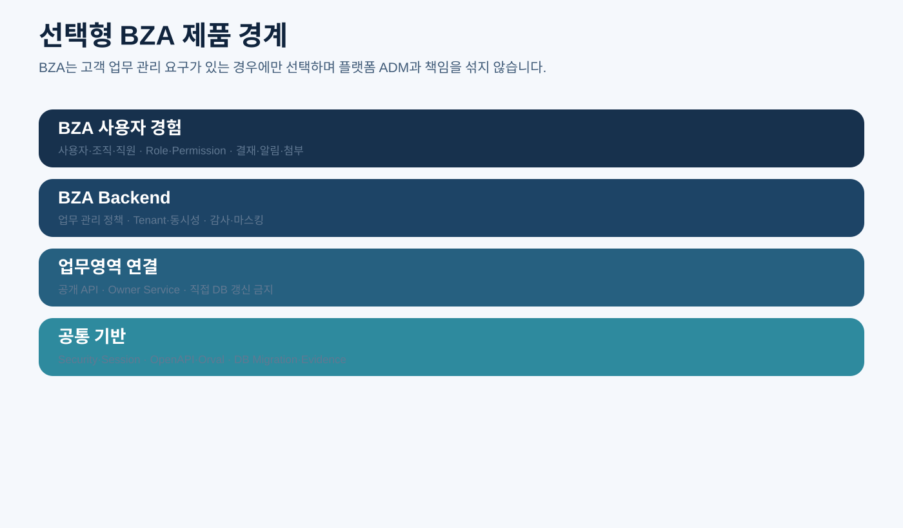

# CPF BZA 매뉴얼

> **기준 Repository** `freeangelsun/202412_01_CPF` · **기준 Branch** `master` · **문서 작성 기준 SHA** `d31bd127aa12bb9368933216642a5a9d25bd0bfd`
> **문서 목적** 선택형 업무 관리자 제품인 BZA의 적용 판단, 설치, 개발, 사용자·조직·권한·결재·첨부·알림 운영과 검증 방법을 설명한다.
> **주요 독자** BZA 도입 책임자, BZA 개발자, 업무 관리자, 권한·조직·결재 운영자
> **완료 결과** 독자가 BZA 필요성을 판단하고 선택 설치한 뒤 업무영역과 안전하게 연계해 개발·운영한다.

## 0. 문서 사용 계약

BZA는 선택형 제품이다. 사용하지 않는 시스템의 필수 Dependency·기동 조건·기본 메뉴로 취급하지 않는다.

문서의 예제는 다음 순서로 읽는다.

1. **제품 계약** — CPF가 보장해야 하는 규칙이다.
2. **현재 구현 확인** — 표에 제시한 Source·설정·API·SQL 경로를 최신 `master`에서 확인한다.
3. **실행 절차** — 명령을 실제 환경에서 실행하고 Exit Code와 결과를 확인한다.
4. **오류·복구** — 정상 경로만 보지 않고 중단·응답 유실·중복·부분 실패를 확인한다.
5. **Evidence** — 실행한 기준 SHA, 환경, 명령, 시작·종료 시각, Exit Code와 Sanitized 결과를 남긴다.

상태는 `완료`, `부분 구현`, `미구현`, `미검증`, `실패`, `재확인 필요`만 사용한다.


## 1. BZA를 선택하는 경우



BZA가 적합한 경우:

- 고객 업무 사용자·조직·직원 정보를 별도 관리
- 업무 Role·Permission과 Data Scope
- 결재·대리결재·위임
- 업무 알림·첨부
- 고객 업무 관리 화면의 공통 UX

BZA가 불필요한 경우:

- 외부 IAM·HR·결재 시스템이 정본이며 CPF가 단순 연계만 함
- 플랫폼 운영 ADM만 필요
- 소규모 시스템으로 업무 관리 공통이 없음

## 2. ADM과 BZA 차이

| 구분 | ADM | BZA |
|---|---|---|
| 목적 | 플랫폼 운영·통제 | 고객 업무 관리 |
| 대상 | 서비스·인스턴스·배포·Batch·Gateway | 사용자·조직·Role·결재·첨부·알림 |
| Owner | `cpf-admin` | `cpf-biz-admin` |
| 필수 여부 | 공식 플랫폼 운영 제품 | 선택 제품 |
| 데이터 | 플랫폼 운영 Metadata | 고객 업무 관리 Metadata |

BZA가 ADM 권한·배포·Gateway·Batch Control Plane을 복제하지 않는다.

## 3. 설치와 활성화

- `cpf-biz-admin` Module·Artifact 존재 확인
- BZA 전용 DB/Schema·Account
- Spring Session JDBC Namespace
- Cookie Name·Path 분리
- BZA Frontend Build·Static Asset
- Route·DNS·TLS
- 업무영역 API Endpoint와 Service Credential
- BZA 기능 Capability 활성화

비활성 환경에서는 Menu·Route·Backend Endpoint가 기능처럼 노출되지 않아야 한다.

## 4. Source 구조

| 확인 대상 | 대표 경로 | 확인 방법 |
|---|---|---|
| Backend | `cpf-biz-admin/src/main/java` | 사용자·조직·권한·결재·첨부·알림 Owner 확인 |
| Frontend | `cpf-biz-admin/frontend/src` | Feature Package·Route·Query·Form 확인 |
| DB | `cpf-tools/db/vendor/* 및 BZA Migration` | 3 Vendor Schema·Index·FK·Seed 확인 |
| Security | `BZA Spring Security·Session 설정` | ADM과 Cookie·Session·Permission Namespace 분리 확인 |
| 업무 연계 | `BZA outbound adapter와 업무영역 Public API` | 직접 업무 DB 갱신 금지 확인 |

## 5. 사용자와 계정 생명주기

상태 예:

```text
INVITED → ACTIVE → LOCKED/SUSPENDED → TERMINATED
```

필수 정보:

- 사용자 ID와 Login ID
- 표시명·조직·직무
- 인증 Source
- 유효 기간
- Lock·휴면·퇴직
- Role Assignment
- 개인정보 분류
- Version과 Audit

### 신규 사용자

1. HR/IAM 정본 여부 확인
2. 중복 ID·Email·사번 확인
3. 조직·직무·기본 Role
4. 유효 기간
5. 초대 또는 연계
6. 최초 권한 검토
7. Audit

### 퇴직·비활성

- Session 강제 종료
- Role·Permission 회수
- 대리결재·진행 결재 인계
- 첨부·개인정보 보존 정책
- Audit·법적 보류

## 6. 조직

- 조직 Tree와 Stable ID
- 상위 조직 변경
- 유효 기간
- 조직 폐쇄
- 사용자 이동
- Data Scope 상속
- 결재선 Snapshot 영향

조직 이동 뒤 기존 결재·권한이 소급 변경되지 않도록 Snapshot과 현재 평가를 구분한다.

## 7. Role·Permission

### 권한 평가 순서

```text
Subject → Tenant/Environment → Role Assignment → Permission → Data Scope → Resource 상태
```

- Menu·Route·Button·API·Method 정합성
- Deny 우선 또는 Allow 우선 정책 명시
- Temporary Role과 만료
- 직무·조직 기반 자동 Assignment
- SoD(상충 권한)
- 권한 변경 뒤 Session 재평가

## 8. 결재

### 8.1 결재 정책

- 대상 업무·Action
- 결재 단계
- 순차·병렬
- 금액·조직·위험도 조건
- 작성자·승인자 분리
- 대리·위임
- 만료·Escalation
- 반려·회수

### 8.2 Snapshot

실행 중 결재는 정책 변경으로 임의 변하지 않도록 Snapshot을 저장한다.

- 정책 Version
- 단계·조건
- 예상 승인자 또는 역할
- 요청 Payload Hash
- 업무 대상 Version

### 8.3 대리결재

- 위임자·수임자
- 범위·기간
- 상충 권한
- 원 승인자 표시
- 감사·통지

## 9. 첨부

- File Alias·Storage Provider
- Path Traversal·Symlink
- MIME·Signature·Size
- Virus·Content Scan
- Encryption
- Retention·Legal Hold
- 원문 조회·다운로드 Permission
- Masked Preview
- Hash와 Audit

업무영역의 File Owner가 따로 있으면 BZA는 Reference와 권한만 관리하고 Blob을 중복 소유하지 않는다.

## 10. 알림

- Event Type·Template Version
- Channel
- Recipient Resolution
- PII·Secret 금지
- Retry·DLT
- Opt-out와 필수 알림
- 발송 결과와 Audit

알림 전송 성공을 업무 처리 성공으로 간주하지 않는다.

## 11. 업무영역 연계

BZA는 업무영역의 공개 API를 호출한다.

- 업무 목록·상세 조회
- 결재 요청·상태 반영
- 사용자·조직 Reference
- 첨부 Reference
- 알림 Event

다른 업무영역 DB를 직접 Update하지 않는다. Timeout·응답 유실은 operationId·idempotency·대사로 처리한다.

## 12. BZA Frontend 개발

QA32 Frontend Stack을 사용한다.

- Element Plus
- TanStack Table
- Vue Router
- Pinia
- TanStack Vue Query
- Zod
- Orval
- Playwright

기능 예:

```text
사용자 목록 → 상세 → Role Assignment → 충돌 확인 → 승인 → 반영 → Session 재검증 → Audit
```

## 13. BZA 운영 메뉴

권장 기능 영역:

1. 사용자
2. 조직·직원
3. Role·Permission
4. Assignment
5. 결재 정책
6. 결재 진행
7. 대리·위임
8. 첨부
9. 알림
10. 감사

각 메뉴는 목적, 권한, 검색, Column, 상세, Action, 승인, 오류, 복구, Audit를 문서화한다.

## 14. 주요 운영 절차

### 사용자 조직 이동

1. 현재 조직·Role·진행 결재 확인
2. 이동 일자와 대상 조직 확인
3. Data Scope 변경 Preview
4. 상충 권한 확인
5. 승인
6. 적용
7. Session 재평가
8. 결재 인계·Audit 확인

### Role 부여

1. Permission 목록과 위험 Action 확인
2. 현재 Role·SoD 확인
3. 유효 기간과 사유
4. 승인
5. 적용 Version 확인
6. Session·API 권한 재검증

### 결재 정책 변경

기존 진행 건 Snapshot과 신규 요청 적용 Version을 구분한다.

## 15. Multi-tenant

Tenant를 지원하는 경우:

- Tenant ID의 생성·승계
- DB·Schema·Row 분리
- Cache·Session·File 경계
- Cross-tenant 권한 차단
- Tenant별 Key·Retention
- 운영자 권한과 Break-glass

근거 없이 Tenant Column만 추가하고 완료 처리하지 않는다.

## 16. 보안·개인정보

- 최소 수집
- Field Classification
- Masking·원문 조회
- 접근 Audit
- Export·Download
- Retention·삭제
- Legal Hold
- 사용자 권리 요청
- 관리자 권한 SoD

## 17. BZA EDU

### 실습: 신규 직원 등록과 Role 부여

1. 사용자 Schema와 중복 Key 확인
2. 조직 Reference 선택
3. 기본 Role Preview
4. Backend Validation
5. 필요 승인 요청
6. Assignment 적용
7. Session·Permission 평가
8. BZA Menu와 업무 API 접근 검증
9. 퇴직 처리와 Session 종료
10. Audit·Retention 검증

## 18. 테스트

- 사용자 중복·상태 전이
- 조직 이동·Tree Cycle
- Role SoD·만료
- 결재 Snapshot·대리결재
- Session Role Revoke
- Attachment Security
- Notification Retry·DLT
- Cross-tenant
- Browser Deep Link·Accessibility
- Oracle·PostgreSQL·MariaDB

## 19. 완료 체크리스트

- [ ] BZA 선택 기준과 비활성 환경 동작이 명확하다.
- [ ] ADM과 BZA 책임·Session·Cookie·DB가 분리됐다.
- [ ] 사용자·조직·Role·Permission 생명주기가 연결됐다.
- [ ] 결재 Snapshot·대리·만료·상충 권한을 검증했다.
- [ ] 첨부·알림·개인정보·감사가 실제 Provider와 연결됐다.
- [ ] 업무영역 공개 API를 사용하고 직접 DB 갱신이 없다.
- [ ] Frontend OSS Stack이 실제 Primary Path다.
- [ ] 3 DB·Browser·Session·Multi-instance 검증 Evidence가 있다.
