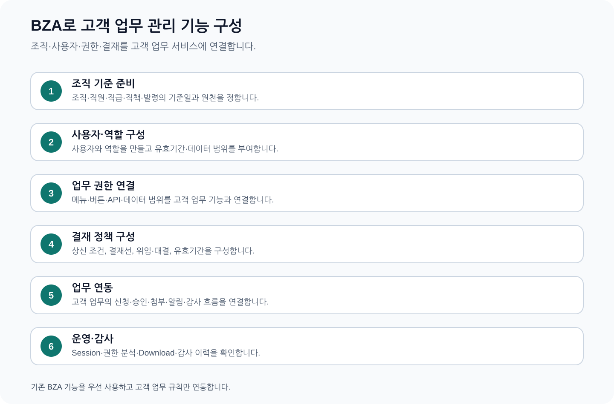

# CPF BZA 매뉴얼 — 조직·사용자·권한·결재를 고객 업무에 적용하는 방법

> **주 독자**: 고객사 조직관리자, 인사 연동 담당자, 권한관리자, 결재관리자, 업무 개발자, 감사·보안 담당자
> **이 문서의 목표**: 완성된 BZA 제품을 이용해 조직·직원·사용자·역할·데이터 범위·결재·첨부·알림을 준비하고 고객 업무에 연결해 운영한다.

## 빠른 찾기

- [1. BZA를 선택할 때](#1-bza를-선택할-때)
- [2. 고객사가 준비할 기준정보](#2-고객사가-준비할-기준정보)
- [3. 도입 순서](#3-도입-순서)
- [4. 고객 업무와 연결하는 방법](#4-고객-업무와-연결하는-방법)
- [5. 전체 메뉴 찾기](#5-전체-메뉴-찾기)
- [6. 업무 운영 현황](#6-업무-운영-현황)
- [7. 조직 계층](#7-조직-계층)
- [8. 직원 정보](#8-직원-정보)
- [9. 직급 기준](#9-직급-기준)
- [10. 직책 기준](#10-직책-기준)
- [11. 발령·겸직·파견](#11-발령겸직파견)
- [12. 조직장·대행·승인 책임자](#12-조직장대행승인-책임자)
- [13. BZA 인증 사용자](#13-bza-인증-사용자)
- [14. 업무 역할](#14-업무-역할)
- [15. 사용자 역할 유효기간](#15-사용자-역할-유효기간)
- [16. 메뉴 등록](#16-메뉴-등록)
- [17. 메뉴·버튼·API·데이터 범위 권한](#17-메뉴버튼api데이터-범위-권한)
- [18. 역할 비교·권한 분석](#18-역할-비교권한-분석)
- [19. 결재 처리](#19-결재-처리)
- [20. 상신·철회·취소·재상신](#20-상신철회취소재상신)
- [21. 버전별 결재 정책](#21-버전별-결재-정책)
- [22. 결재 경로 사전 계산](#22-결재-경로-사전-계산)
- [23. 결재 위임·대결](#23-결재-위임대결)
- [24. 본인 로그인 세션](#24-본인-로그인-세션)
- [25. 업무 감사](#25-업무-감사)
- [26. 업무 알림](#26-업무-알림)
- [27. 첨부 업로드·검사·격리](#27-첨부-업로드검사격리)
- [28. 저장 검색](#28-저장-검색)
- [29. BZA 업무 설정](#29-bza-업무-설정)
- [30. 다운로드 정책](#30-다운로드-정책)
- [31. 다운로드 감사](#31-다운로드-감사)
- [32. 전체 따라하기 — 조직 기반 결재 업무 만들기](#32-전체-따라하기-조직-기반-결재-업무-만들기)
- [33. 교육 예제 계약](#33-교육-예제-계약)

## 1. BZA를 선택할 때

BZA는 여러 고객 업무에서 같은 조직·직원·사용자·역할·권한·결재를 공통으로 사용할 때 선택한다. 조직과 결재가 필요하지 않고 단일 서비스의 단순 권한만 사용한다면 필수 제품은 아니다.

### BZA로 만들 수 있는 결과

- 기준일이 있는 조직도와 직원 발령
- 로그인 사용자와 직원 연결
- 역할별 메뉴·버튼·API·데이터 범위 권한
- 개인정보 가림과 원문 조회 통제
- 조건·단계·유효기간이 있는 결재 정책
- 상신·승인·합의·반려·철회·취소·재상신
- 위임·대결, 첨부·알림·감사·다운로드 통제

## 2. 고객사가 준비할 기준정보

| 준비 항목 | 고객사가 정할 값 | 확인할 점 |
|---|---|---|
| 조직 | 조직 코드·이름·상위 조직·유형·사용 여부 | 고아·순환 구조, 기준일, 중지 조직 영향 |
| 직원 | 직원번호·이름·연락처·재직상태 | 개인정보 가림, 원천 시스템, 퇴직 처리 |
| 발령 | 조직·직급·직책·대표 여부·유효기간 | 기간 겹침, 대표 발령, 겸직·파견 |
| 사용자 | 로그인 ID·직원 연결·계정 상태 | 역할 부여 전 활성화 금지, 비밀번호 변경 요구 |
| 역할 | 업무 역할 코드·이름·유효기간 | 조직 직책과 업무 권한 분리 |
| 권한 | 메뉴·버튼·API·데이터 범위·가림 | 대표 사용자 실효 권한 시험 |
| 결재 | 업무 유형·조건·단계·결재자·기한 | 상신 시점 Snapshot, 자기승인, 위임 |

## 3. 도입 순서

1. 고객사의 조직·직원 원천 시스템과 기준일 정책을 정한다.
2. 조직·직급·직책·직원·발령을 순서대로 등록한다.
3. 사용자 계정을 만들고 직원과 연결한다.
4. 업무 역할을 만들고 사용자에게 유효기간을 두어 부여한다.
5. 메뉴·버튼·API·데이터 범위·가림 정책을 역할에 부여한다.
6. 대표 사용자로 실효 권한을 계산해 설계와 비교한다.
7. 결재 정책을 버전으로 만들고 예상 결재선을 사전 계산한다.
8. 고객 업무에서 BZA 상신·결과 조회를 연결한다.
9. 첨부·알림·감사·다운로드 정책을 연결한다.
10. 관리자·요청자·결재자·감사자 시나리오를 수행한다.

## 4. 고객 업무와 연결하는 방법

| 연결 목적 | 고객 업무가 보내는 값 | BZA가 반환·보관하는 값 | 고객 업무의 다음 처리 |
|---|---|---|---|
| 사용자 확인 | 로그인 사용자·조직·업무 | 실효 역할·권한·데이터 범위 | API와 화면에서 같은 권한 적용 |
| 결재 상신 | 업무 ID·제목·요청자·조건·Snapshot | 결재 ID·정책 버전·결재선·상태 | 신청 상태를 결재 대기로 변경 |
| 결재 결과 | 결재 ID 또는 업무 ID | 승인·반려·취소 상태·결정 사유 | 고객 업무 상태를 한 번만 반영 |
| 첨부 | 업무 ID·파일·분류 | 파일 ID·검사·격리·보존 상태 | 검사 성공 파일만 업무에 연결 |
| 알림 | 사용자·채널·템플릿·업무 ID | 전달·실패·읽음 상태 | 업무 화면에서 알림 상태 확인 |

응답을 받지 못하면 같은 상신·결과 반영을 반복하지 않고 결재 ID·업무 ID로 실제 상태를 조회한다.

## 5. 전체 메뉴 찾기

| 메뉴 | 화면 위치 | 주 사용자 | 이 메뉴로 하는 일 |
|---|---|---|---|
| 업무 운영 현황 | `/` | 업무 운영자, BZA 관리자 | 활성 직원·조직·진행 결재·미확인 알림·오늘 감사를 한 화면에서 확인한다. |
| 조직 계층 | `/organizations` | 조직관리자, 인사 연동 담당자 | 고객사 조직 계층을 검색하고 상하 관계·중지 조직·고아·순환 구조를 확인한다. |
| 직원 정보 | `/employees` | 조직관리자, 인사 연동 담당자 | 직원 기본정보·대표 조직·직급·직책·재직상태와 개인정보 가림을 관리한다. |
| 직급 기준 | `/positions` | 조직관리자 | 직급 코드·명칭·정렬 순서·사용 여부를 관리한다. |
| 직책 기준 | `/jobTitles` | 조직관리자 | 직책 코드·명칭·관리자 여부·사용 여부를 관리한다. |
| 발령·겸직·파견 | `/assignments` | 조직관리자, 인사 연동 담당자 | 직원의 발령·겸직·파견과 대표 조직·직급·직책·유효기간을 관리한다. |
| 조직장·대행·승인 책임자 | `/organizationResponsibilities` | 조직관리자, 결재관리자 | 조직장·대행자·승인 책임자와 역할 유효기간을 관리한다. |
| BZA 인증 사용자 | `/users` | 권한관리자, 보안담당자 | BZA 로그인 사용자를 등록·잠금·활성화하고 비밀번호 변경 요구 상태를 관리한다. |
| 업무 역할 | `/roles` | 권한관리자 | 고객 업무 역할의 코드·이름·쓰기 허용·데이터 범위·사용 여부를 관리한다. |
| 사용자 역할 유효기간 | `/userRoles` | 권한관리자 | 사용자에게 역할을 유효기간과 함께 부여하고 대표 역할·겹침·만료를 관리한다. |
| 메뉴 등록 | `/menus` | 권한관리자 | 고객 업무 메뉴의 상위 관계·경로·정렬·사용 여부를 등록한다. |
| 메뉴·버튼·API·데이터 범위 권한 | `/permissions` | 권한관리자, 보안담당자 | 역할에 메뉴·버튼·API 행위와 데이터 범위·개인정보 가림 정책을 부여한다. |
| 역할 비교·권한 분석 | `/permissionTools` | 권한관리자, 감사담당자 | 두 역할의 권한 차이와 특정 사용자의 실제 적용 권한을 미리 계산한다. |
| 결재 처리 | `/approvalInbox` | 결재자, 합의자 | 자신에게 도착한 결재를 검토하고 승인·합의·반려한다. |
| 상신·철회·취소·재상신 | `/approvalSubmissions` | 업무 요청자, 상신 담당자 | 고객 업무 결재를 상신하고 진행 상태를 조회하며 철회·취소·재상신한다. |
| 버전별 결재 정책 | `/approvalPolicies` | 결재관리자, 업무 책임자 | 조건·단계·결재자가 있는 결재 정책을 버전과 유효기간으로 관리한다. |
| 결재 경로 사전 계산 | `/approvalSimulation` | 결재관리자, 업무 책임자 | 실제 상신 전에 조직·역할·위임·업무 조건으로 예상 결재선을 계산한다. |
| 결재 위임·대결 | `/approvalDelegations` | 결재관리자, 위임자 | 휴가·출장 기간에 결재 권한을 업무 범위별로 위임·대결하고 종료한다. |
| 본인 로그인 세션 | `/sessions` | 업무 사용자, 보안담당자 | 자신의 로그인 세션·기기·만료 상태를 확인하고 불필요한 세션을 폐기한다. |
| 업무 감사 | `/audits` | 감사담당자, 보안담당자 | BZA의 조회·변경·결재·다운로드 행위를 변경할 수 없는 감사 이력으로 조회한다. |
| 업무 알림 | `/notifications` | 업무 사용자, BZA 관리자 | 업무 알림을 상태·채널·사용자로 조회하고 읽음·전달 설정을 관리한다. |
| 첨부 업로드·검사·격리 | `/attachments` | 업무 사용자, 보안 운영자 | 첨부 파일을 업로드하고 검사·격리·재검사·다운로드 상태를 관리한다. |
| 저장 검색 | `/savedSearches` | 업무 사용자 | 자주 사용하는 메뉴 검색 조건을 개인 저장 검색으로 등록·수정·삭제한다. |
| BZA 업무 설정 | `/settings` | BZA 관리자 | BZA 업무 설정값을 범위·버전·사유와 함께 변경한다. |
| 다운로드 정책 | `/downloads` | BZA 관리자, 보안담당자 | 다운로드 유형·건수·데이터 범위·가림·승인·사유 정책을 관리한다. |
| 다운로드 감사 | `/downloadAudits` | 감사담당자, 보안담당자 | 누가 어떤 대상과 사유로 파일을 생성·다운로드했는지 조회한다. |

## 6. 업무 운영 현황

> 실제 화면명: `업무 운영 현황` · 위치: `/`

### 이 메뉴로 하는 업무

활성 직원·조직·진행 결재·미확인 알림·오늘 감사를 한 화면에서 확인한다.

### 사용자와 권한

| 항목 | 내용 |
|---|---|
| 주 사용자 | 업무 운영자, BZA 관리자 |
| 화면 권한 | 조회 |
| 화면 구현 기준 | `cpf-biz-admin/frontend/src/features/dashboard/DashboardPage.vue` |

### 검색·입력 항목

| 실제 화면 항목 | 입력·사용 방법 |
|---|---|
| 별도 입력 없음 | 별도 사용자 입력 Control 없음. 현재 Session·Permission·Data Scope와 화면의 초기 조회 조건을 사용한다. |

> 입력 방식: 별도 사용자 입력 Control 없음. 현재 Session·Permission·Data Scope와 화면의 초기 조회 조건을 사용한다.

### 목록·상세 표시값

| 실제 표시값 | 어떻게 읽는가 |
|---|---|
| `활성 직원` | `활성 직원`는 활성 직원·조직·진행 결재·미확인 알림·오늘 감사를 한 화면에서 확인한다.의 판단 값이다. 같은 행의 상태·유효기간·사용자·감사와 함께 읽는다. |
| `조직 수` | `조직 수`는 활성 직원·조직·진행 결재·미확인 알림·오늘 감사를 한 화면에서 확인한다.의 판단 값이다. 같은 행의 상태·유효기간·사용자·감사와 함께 읽는다. |
| `진행 결재` | 결재 대상·요청자·현재 단계·처리 구간. 기한과 자신이 수행할 결정을 확인한다. |
| `미확인 알림` | `미확인 알림`는 활성 직원·조직·진행 결재·미확인 알림·오늘 감사를 한 화면에서 확인한다.의 판단 값이다. 같은 행의 상태·유효기간·사용자·감사와 함께 읽는다. |
| `오늘 감사` | `오늘 감사`는 활성 직원·조직·진행 결재·미확인 알림·오늘 감사를 한 화면에서 확인한다.의 판단 값이다. 같은 행의 상태·유효기간·사용자·감사와 함께 읽는다. |
| `결재 제목` | 결재 대상·요청자·현재 단계·처리 구간. 기한과 자신이 수행할 결정을 확인한다. |
| `결재 상태` | 현재 사용·재직·계정·결재·검사 상태. 유효기간과 마지막 변경 시각을 함께 읽는다. |
| `요청자` | 결재 대상·요청자·현재 단계·처리 구간. 기한과 자신이 수행할 결정을 확인한다. |
| `현재 Step` | 결재 대상·요청자·현재 단계·처리 구간. 기한과 자신이 수행할 결정을 확인한다. |
| `업데이트 시각` | 적용 시작·종료·만료·처리 기한 또는 마지막 변경 시각. |
| `활성 사용자` | `활성 사용자`는 활성 직원·조직·진행 결재·미확인 알림·오늘 감사를 한 화면에서 확인한다.의 판단 값이다. 같은 행의 상태·유효기간·사용자·감사와 함께 읽는다. |

### 버튼과 실행 결과

| 실제 버튼 | 사용 방법 |
|---|---|
| `새로고침` | 업무 데이터를 바꾸지 않고 현재 조건으로 조회하거나 페이지·표시 대상을 바꾼다. |

### 실제 업무 수행 순서

1. `업무 운영 현황`에서 로그인 역할·기준일·기본 조회 조건을 확인하거나 입력한다.
2. 활성 직원·조직 수·진행 결재·미확인 알림·오늘 감사을 읽어 조직·사용자·결재·감사 중 다음 확인 대상을 정한다.
3. 기준일·유효기간·사용 여부·권한 범위를 바꿔 결과가 달라지는 이유를 확인한다.
4. 데이터 오류·권한 차이·미처리 건은 관련 등록·정책·감사 메뉴로 이동해 처리한다.

### 정상 완료 기준

- 활성 직원·조직·진행 결재·미확인 알림·오늘 감사를 한 화면에서 확인한다.의 결과가 목록·상세·유효기간·사용 상태·감사에서 같은 대상을 가리킨다.
- 업무 운영 현황에서 사용하는 기준일·유효기간·조직·사용자·역할·결재 결과가 고객 업무 서비스에 전달된 값과 일치한다.

### 문제 상황과 다음 행동

| 상황 | 다음 행동 |
|---|---|
| 결과가 비어 있음 | 권한·기간·상태·사용자 조건을 확인하고 필요한 범위로 다시 조회한다. |
| 상태가 예상과 다름 | 기준일·유효기간·마지막 변경·감사와 관련 메뉴의 원천 상태를 비교한다. |
| 응답 유실 | 작업·대상·감사 식별자로 실제 결과를 먼저 조회한다. |

### 화면이 사용하는 확인된 API

- `GET /api/bza/dashboard`
- `GET /api/bza/approvals/inbox?decisionStatus=WAITING&limit=12`
- `GET /api/bza/backoffice/organizations?limit=300`
- `GET /api/bza/backoffice/employees?limit=300`

### 감사·교대 인계

업무 운영 현황 메뉴, 대상 ID, 기준일·유효기간, 변경 전후 값, 영향 사용자·조직, 실행자·사유·감사 ID, 실패·미확정 대상과 다음 담당자를 기록한다.

## 7. 조직 계층

> 실제 화면명: `조직 계층` · 위치: `/organizations`

### 이 메뉴로 하는 업무

고객사 조직 계층을 검색하고 상하 관계·중지 조직·고아·순환 구조를 확인한다.

### 사용자와 권한

| 항목 | 내용 |
|---|---|
| 주 사용자 | 조직관리자, 인사 연동 담당자 |
| 화면 권한 | Read; 변경 안내는 Write |
| 화면 구현 기준 | `cpf-biz-admin/frontend/src/features/organizations/OrganizationsPage.vue` |

### 검색·입력 항목

| 실제 화면 항목 | 입력·사용 방법 |
|---|---|
| `조직명·코드 검색` | 조직명 또는 조직 코드를 한 입력창에 넣어 트리 결과를 좁힌다. |
| `중지 조직 포함` | 사용 중지된 조직도 트리에 표시할지 선택한다. 기본 화면값을 확인한다. |

### 목록·상세 표시값

| 실제 표시값 | 어떻게 읽는가 |
|---|---|
| `조직 Tree` | 조직 계층과 검색 결과. 기준일의 상하 관계와 중지 조직 포함 여부를 확인한다. |
| `조직 코드` | `조직 코드`는 고객사 조직 계층을 검색하고 상하 관계·중지 조직·고아·순환 구조를 확인한다.의 판단 값이다. 같은 행의 상태·유효기간·사용자·감사와 함께 읽는다. |
| `조직명` | `조직명`는 고객사 조직 계층을 검색하고 상하 관계·중지 조직·고아·순환 구조를 확인한다.의 판단 값이다. 같은 행의 상태·유효기간·사용자·감사와 함께 읽는다. |
| `상위 조직` | 조직 계층과 검색 결과. 기준일의 상하 관계와 중지 조직 포함 여부를 확인한다. |
| `조직 유형` | `조직 유형`는 고객사 조직 계층을 검색하고 상하 관계·중지 조직·고아·순환 구조를 확인한다.의 판단 값이다. 같은 행의 상태·유효기간·사용자·감사와 함께 읽는다. |
| `사용 여부` | 현재 사용·재직·계정·결재·검사 상태. 유효기간과 마지막 변경 시각을 함께 읽는다. |
| `하위 조직 수` | 조직 계층과 검색 결과. 기준일의 상하 관계와 중지 조직 포함 여부를 확인한다. |
| `고아 조직 경고` | 상위 조직이 없거나 조직 관계가 순환하는 데이터 오류. 인사 원천과 비교해 바로잡는다. |
| `순환 조직 경고` | 상위 조직이 없거나 조직 관계가 순환하는 데이터 오류. 인사 원천과 비교해 바로잡는다. |

### 버튼과 실행 결과

| 실제 버튼 | 사용 방법 |
|---|---|
| `새로고침` | 업무 데이터를 바꾸지 않고 현재 조건으로 조회하거나 페이지·표시 대상을 바꾼다. |
| `Tree Node 선택` | 선택한 조직·감사·대상의 상세와 관련 정보를 연다. |

### 실제 업무 수행 순서

1. `조직 계층`에서 조직명·코드 검색·중지 조직 포함을 확인하거나 입력한다.
2. 조직 Tree·조직 코드·조직명·상위 조직·조직 유형을 읽어 조직·사용자·결재·감사 중 다음 확인 대상을 정한다.
3. 기준일·유효기간·사용 여부·권한 범위를 바꿔 결과가 달라지는 이유를 확인한다.
4. 데이터 오류·권한 차이·미처리 건은 관련 등록·정책·감사 메뉴로 이동해 처리한다.

### 정상 완료 기준

- 고객사 조직 계층을 검색하고 상하 관계·중지 조직·고아·순환 구조를 확인한다.의 결과가 목록·상세·유효기간·사용 상태·감사에서 같은 대상을 가리킨다.
- 조직 계층에서 사용하는 기준일·유효기간·조직·사용자·역할·결재 결과가 고객 업무 서비스에 전달된 값과 일치한다.

### 문제 상황과 다음 행동

| 상황 | 다음 행동 |
|---|---|
| 기간·조직 관계 오류 | 기준일의 상위 조직·대표 발령·기간 겹침·고아·순환 관계를 원천 인사 데이터와 비교한다. |
| 응답 유실 | 목록·상세·감사에서 같은 코드·직원·발령 식별자를 조회해 저장 여부를 확정한다. |
| 사용 중지 영향 | 연결된 사용자·역할·결재자·업무 권한을 확인한 뒤 대체 관계를 먼저 등록한다. |

### 화면이 사용하는 확인된 API

- `GET /api/bza/backoffice/organizations?limit=5000`

### 감사·교대 인계

조직 계층 메뉴, 대상 ID, 기준일·유효기간, 변경 전후 값, 영향 사용자·조직, 실행자·사유·감사 ID, 실패·미확정 대상과 다음 담당자를 기록한다.

## 8. 직원 정보

> 실제 화면명: `직원 Profile` · 위치: `/employees`

### 이 메뉴로 하는 업무

직원 기본정보·대표 조직·직급·직책·재직상태와 개인정보 가림을 관리한다.

### 사용자와 권한

| 항목 | 내용 |
|---|---|
| 주 사용자 | 조직관리자, 인사 연동 담당자 |
| 화면 권한 | Write, PII_RAW |
| 화면 구현 기준 | `cpf-biz-admin/frontend/src/features/employees/EmployeesPage.vue` |

### 검색·입력 항목

| 실제 화면 항목 | 입력·사용 방법 |
|---|---|
| `직원번호` | 직원·요청자·위임자·수임자·사용자 식별자. 직원과 로그인 사용자의 연결 상태를 확인한다. |
| `대표조직` | 적용할 조직·대표 조직·상위 조직. 기준일의 조직 계층과 사용 상태를 확인한다. |
| `이름` | 사용자와 운영자가 이해할 이름·제목·설명. 코드만 보고 판단하지 않도록 업무 의미를 작성한다. |
| `직급` | 기준일에 적용할 직급 또는 직책. 발령 유효기간과 함께 사용한다. |
| `직책` | 기준일에 적용할 직급 또는 직책. 발령 유효기간과 함께 사용한다. |
| `재직상태` | `재직상태`는 직원 기본정보·대표 조직·직급·직책·재직상태와 개인정보 가림을 관리한다.에 사용하는 실제 화면 항목이다. 기준일·유효기간·현재 상태와 관련 사용자를 확인해 입력한다. |
| `Email` | 직원 연락처·근무 위치. 기본은 가림 처리하고 원문은 별도 권한에서만 조회한다. |
| `Mobile` | 직원 연락처·근무 위치. 기본은 가림 처리하고 원문은 별도 권한에서만 조회한다. |
| `Office` | 직원 연락처·근무 위치. 기본은 가림 처리하고 원문은 별도 권한에서만 조회한다. |
| `Clear Flag` | 기존 선택값이나 연락처를 비울 때 사용한다. 빈 문자열 저장과 구분한다. |
| `Use` | 대표 여부·관리자 여부·허용·사용·잠금·격리 상태. 활성 조건과 영향을 받는 사용자를 확인한다. |

### 목록·상세 표시값

| 실제 표시값 | 어떻게 읽는가 |
|---|---|
| `직원번호` | `직원번호`는 직원 기본정보·대표 조직·직급·직책·재직상태와 개인정보 가림을 관리한다.의 판단 값이다. 같은 행의 상태·유효기간·사용자·감사와 함께 읽는다. |
| `대표조직` | `대표조직`는 직원 기본정보·대표 조직·직급·직책·재직상태와 개인정보 가림을 관리한다.의 판단 값이다. 같은 행의 상태·유효기간·사용자·감사와 함께 읽는다. |
| `이름` | `이름`는 직원 기본정보·대표 조직·직급·직책·재직상태와 개인정보 가림을 관리한다.의 판단 값이다. 같은 행의 상태·유효기간·사용자·감사와 함께 읽는다. |
| `직급` | `직급`는 직원 기본정보·대표 조직·직급·직책·재직상태와 개인정보 가림을 관리한다.의 판단 값이다. 같은 행의 상태·유효기간·사용자·감사와 함께 읽는다. |
| `직책` | `직책`는 직원 기본정보·대표 조직·직급·직책·재직상태와 개인정보 가림을 관리한다.의 판단 값이다. 같은 행의 상태·유효기간·사용자·감사와 함께 읽는다. |
| `재직상태` | 현재 사용·재직·계정·결재·검사 상태. 유효기간과 마지막 변경 시각을 함께 읽는다. |
| `Email` | 가려진 연락처 또는 근무 위치. 원문 권한이 없으면 전체 값을 표시하지 않는다. |
| `Mobile` | 가려진 연락처 또는 근무 위치. 원문 권한이 없으면 전체 값을 표시하지 않는다. |
| `Office` | 가려진 연락처 또는 근무 위치. 원문 권한이 없으면 전체 값을 표시하지 않는다. |
| `Clear Flag` | `Clear Flag`는 직원 기본정보·대표 조직·직급·직책·재직상태와 개인정보 가림을 관리한다.의 판단 값이다. 같은 행의 상태·유효기간·사용자·감사와 함께 읽는다. |
| `Use` | 현재 사용·재직·계정·결재·검사 상태. 유효기간과 마지막 변경 시각을 함께 읽는다. |

### 버튼과 실행 결과

| 실제 버튼 | 사용 방법 |
|---|---|
| `등록` | 현재값·버전·유효기간·영향 사용자·권한·사유를 확인한 뒤 한 번 저장하고 목록·상세·감사를 다시 조회한다. |
| `수정` | 현재값·버전·유효기간·영향 사용자·권한·사유를 확인한 뒤 한 번 저장하고 목록·상세·감사를 다시 조회한다. |
| `PII Raw` | 업무 데이터를 바꾸지 않고 현재 조건으로 조회하거나 페이지·표시 대상을 바꾼다. |

### 실제 업무 수행 순서

1. 현재 직원번호·대표조직·이름·직급·직책과 선택한 대상의 버전·유효기간·사용 상태를 확인한다.
2. 직원번호·대표조직·이름·직급·직책을 기준으로 영향을 받는 조직·사용자·결재·업무 범위를 확인한다.
3. 등록·수정 전에 중복 코드, 기간 겹침, 대표 항목, 권한과 고객 업무 연동 영향을 확인한다.
4. 필수값·사유·권한을 입력하고 저장 또는 조치 버튼을 한 번 실행한다.
5. 목록·상세·실효 권한·결재 결과·감사를 다시 조회해 실제 반영을 확인한다.
6. 응답을 받지 못하면 같은 요청을 반복하지 않고 작업·결재·감사 식별자로 실제 결과를 조회한다.

### 정상 완료 기준

- 직원 기본정보·대표 조직·직급·직책·재직상태와 개인정보 가림을 관리한다.의 결과가 목록·상세·유효기간·사용 상태·감사에서 같은 대상을 가리킨다.
- 직원 정보에서 사용하는 기준일·유효기간·조직·사용자·역할·결재 결과가 고객 업무 서비스에 전달된 값과 일치한다.

### 문제 상황과 다음 행동

| 상황 | 다음 행동 |
|---|---|
| 기간·조직 관계 오류 | 기준일의 상위 조직·대표 발령·기간 겹침·고아·순환 관계를 원천 인사 데이터와 비교한다. |
| 응답 유실 | 목록·상세·감사에서 같은 코드·직원·발령 식별자를 조회해 저장 여부를 확정한다. |
| 사용 중지 영향 | 연결된 사용자·역할·결재자·업무 권한을 확인한 뒤 대체 관계를 먼저 등록한다. |

### 감사·교대 인계

직원 정보 메뉴, 대상 ID, 기준일·유효기간, 변경 전후 값, 영향 사용자·조직, 실행자·사유·감사 ID, 실패·미확정 대상과 다음 담당자를 기록한다.

## 9. 직급 기준

> 실제 화면명: `직급 기준` · 위치: `/positions`

### 이 메뉴로 하는 업무

직급 코드·명칭·정렬 순서·사용 여부를 관리한다.

### 사용자와 권한

| 항목 | 내용 |
|---|---|
| 주 사용자 | 조직관리자 |
| 화면 권한 | Write |
| 화면 구현 기준 | `cpf-biz-admin/frontend/src/features/positions/PositionsPage.vue` |

### 검색·입력 항목

| 실제 화면 항목 | 입력·사용 방법 |
|---|---|
| `Code` | 고객사 기준에서 고유한 코드 또는 작업 식별자. 다른 메뉴·감사·업무 연동에서 같은 값을 사용한다. |
| `Name` | 사용자와 운영자가 이해할 이름·제목·설명. 코드만 보고 판단하지 않도록 업무 의미를 작성한다. |
| `Rank Order` | `Rank Order`는 직급 코드·명칭·정렬 순서·사용 여부를 관리한다.에 사용하는 실제 화면 항목이다. 기준일·유효기간·현재 상태와 관련 사용자를 확인해 입력한다. |
| `Use` | 대표 여부·관리자 여부·허용·사용·잠금·격리 상태. 활성 조건과 영향을 받는 사용자를 확인한다. |

### 목록·상세 표시값

| 실제 표시값 | 어떻게 읽는가 |
|---|---|
| `Code` | 상세·업무 연동·감사에서 같은 대상을 찾는 고유 식별자. |
| `Name` | `Name`는 직급 코드·명칭·정렬 순서·사용 여부를 관리한다.의 판단 값이다. 같은 행의 상태·유효기간·사용자·감사와 함께 읽는다. |
| `Rank Order` | `Rank Order`는 직급 코드·명칭·정렬 순서·사용 여부를 관리한다.의 판단 값이다. 같은 행의 상태·유효기간·사용자·감사와 함께 읽는다. |
| `Use` | 현재 사용·재직·계정·결재·검사 상태. 유효기간과 마지막 변경 시각을 함께 읽는다. |

### 버튼과 실행 결과

| 실제 버튼 | 사용 방법 |
|---|---|
| `등록` | 현재값·버전·유효기간·영향 사용자·권한·사유를 확인한 뒤 한 번 저장하고 목록·상세·감사를 다시 조회한다. |
| `수정` | 현재값·버전·유효기간·영향 사용자·권한·사유를 확인한 뒤 한 번 저장하고 목록·상세·감사를 다시 조회한다. |

### 실제 업무 수행 순서

1. 현재 Code·Name·Rank Order·Use과 선택한 대상의 버전·유효기간·사용 상태를 확인한다.
2. Code·Name·Rank Order·Use을 기준으로 영향을 받는 조직·사용자·결재·업무 범위를 확인한다.
3. 등록·수정 전에 중복 코드, 기간 겹침, 대표 항목, 권한과 고객 업무 연동 영향을 확인한다.
4. 필수값·사유·권한을 입력하고 저장 또는 조치 버튼을 한 번 실행한다.
5. 목록·상세·실효 권한·결재 결과·감사를 다시 조회해 실제 반영을 확인한다.
6. 응답을 받지 못하면 같은 요청을 반복하지 않고 작업·결재·감사 식별자로 실제 결과를 조회한다.

### 정상 완료 기준

- 직급 코드·명칭·정렬 순서·사용 여부를 관리한다.의 결과가 목록·상세·유효기간·사용 상태·감사에서 같은 대상을 가리킨다.
- 직급 기준에서 사용하는 기준일·유효기간·조직·사용자·역할·결재 결과가 고객 업무 서비스에 전달된 값과 일치한다.

### 문제 상황과 다음 행동

| 상황 | 다음 행동 |
|---|---|
| 기간·조직 관계 오류 | 기준일의 상위 조직·대표 발령·기간 겹침·고아·순환 관계를 원천 인사 데이터와 비교한다. |
| 응답 유실 | 목록·상세·감사에서 같은 코드·직원·발령 식별자를 조회해 저장 여부를 확정한다. |
| 사용 중지 영향 | 연결된 사용자·역할·결재자·업무 권한을 확인한 뒤 대체 관계를 먼저 등록한다. |

### 감사·교대 인계

직급 기준 메뉴, 대상 ID, 기준일·유효기간, 변경 전후 값, 영향 사용자·조직, 실행자·사유·감사 ID, 실패·미확정 대상과 다음 담당자를 기록한다.

## 10. 직책 기준

> 실제 화면명: `직책 기준` · 위치: `/jobTitles`

### 이 메뉴로 하는 업무

직책 코드·명칭·관리자 여부·사용 여부를 관리한다.

### 사용자와 권한

| 항목 | 내용 |
|---|---|
| 주 사용자 | 조직관리자 |
| 화면 권한 | Write |
| 화면 구현 기준 | `cpf-biz-admin/frontend/src/features/job-titles/JobTitlesPage.vue` |

### 검색·입력 항목

| 실제 화면 항목 | 입력·사용 방법 |
|---|---|
| `Code` | 고객사 기준에서 고유한 코드 또는 작업 식별자. 다른 메뉴·감사·업무 연동에서 같은 값을 사용한다. |
| `Name` | 사용자와 운영자가 이해할 이름·제목·설명. 코드만 보고 판단하지 않도록 업무 의미를 작성한다. |
| `Manager YN` | 대표 여부·관리자 여부·허용·사용·잠금·격리 상태. 활성 조건과 영향을 받는 사용자를 확인한다. |
| `Use` | 대표 여부·관리자 여부·허용·사용·잠금·격리 상태. 활성 조건과 영향을 받는 사용자를 확인한다. |

### 목록·상세 표시값

| 실제 표시값 | 어떻게 읽는가 |
|---|---|
| `Code` | 상세·업무 연동·감사에서 같은 대상을 찾는 고유 식별자. |
| `Name` | `Name`는 직책 코드·명칭·관리자 여부·사용 여부를 관리한다.의 판단 값이다. 같은 행의 상태·유효기간·사용자·감사와 함께 읽는다. |
| `Manager YN` | `Manager YN`는 직책 코드·명칭·관리자 여부·사용 여부를 관리한다.의 판단 값이다. 같은 행의 상태·유효기간·사용자·감사와 함께 읽는다. |
| `Use` | 현재 사용·재직·계정·결재·검사 상태. 유효기간과 마지막 변경 시각을 함께 읽는다. |

### 버튼과 실행 결과

| 실제 버튼 | 사용 방법 |
|---|---|
| `등록` | 현재값·버전·유효기간·영향 사용자·권한·사유를 확인한 뒤 한 번 저장하고 목록·상세·감사를 다시 조회한다. |
| `수정` | 현재값·버전·유효기간·영향 사용자·권한·사유를 확인한 뒤 한 번 저장하고 목록·상세·감사를 다시 조회한다. |

### 실제 업무 수행 순서

1. 현재 Code·Name·Manager YN·Use과 선택한 대상의 버전·유효기간·사용 상태를 확인한다.
2. Code·Name·Manager YN·Use을 기준으로 영향을 받는 조직·사용자·결재·업무 범위를 확인한다.
3. 등록·수정 전에 중복 코드, 기간 겹침, 대표 항목, 권한과 고객 업무 연동 영향을 확인한다.
4. 필수값·사유·권한을 입력하고 저장 또는 조치 버튼을 한 번 실행한다.
5. 목록·상세·실효 권한·결재 결과·감사를 다시 조회해 실제 반영을 확인한다.
6. 응답을 받지 못하면 같은 요청을 반복하지 않고 작업·결재·감사 식별자로 실제 결과를 조회한다.

### 정상 완료 기준

- 직책 코드·명칭·관리자 여부·사용 여부를 관리한다.의 결과가 목록·상세·유효기간·사용 상태·감사에서 같은 대상을 가리킨다.
- 직책 기준에서 사용하는 기준일·유효기간·조직·사용자·역할·결재 결과가 고객 업무 서비스에 전달된 값과 일치한다.

### 문제 상황과 다음 행동

| 상황 | 다음 행동 |
|---|---|
| 기간·조직 관계 오류 | 기준일의 상위 조직·대표 발령·기간 겹침·고아·순환 관계를 원천 인사 데이터와 비교한다. |
| 응답 유실 | 목록·상세·감사에서 같은 코드·직원·발령 식별자를 조회해 저장 여부를 확정한다. |
| 사용 중지 영향 | 연결된 사용자·역할·결재자·업무 권한을 확인한 뒤 대체 관계를 먼저 등록한다. |

### 감사·교대 인계

직책 기준 메뉴, 대상 ID, 기준일·유효기간, 변경 전후 값, 영향 사용자·조직, 실행자·사유·감사 ID, 실패·미확정 대상과 다음 담당자를 기록한다.

## 11. 발령·겸직·파견

> 실제 화면명: `발령·겸직·파견` · 위치: `/assignments`

### 이 메뉴로 하는 업무

직원의 발령·겸직·파견과 대표 조직·직급·직책·유효기간을 관리한다.

### 사용자와 권한

| 항목 | 내용 |
|---|---|
| 주 사용자 | 조직관리자, 인사 연동 담당자 |
| 화면 권한 | Write |
| 화면 구현 기준 | `cpf-biz-admin/frontend/src/features/assignments/AssignmentsPage.vue` |

### 검색·입력 항목

| 실제 화면 항목 | 입력·사용 방법 |
|---|---|
| `Assignment ID` | 고객사 기준에서 고유한 코드 또는 작업 식별자. 다른 메뉴·감사·업무 연동에서 같은 값을 사용한다. |
| `Employee` | 직원·요청자·위임자·수임자·사용자 식별자. 직원과 로그인 사용자의 연결 상태를 확인한다. |
| `Organization` | 적용할 조직·대표 조직·상위 조직. 기준일의 조직 계층과 사용 상태를 확인한다. |
| `Position` | 기준일에 적용할 직급 또는 직책. 발령 유효기간과 함께 사용한다. |
| `Job Title` | 기준일에 적용할 직급 또는 직책. 발령 유효기간과 함께 사용한다. |
| `Type` | 업무·발령·결재·조치 종류 또는 결정 사유. 현재 상태에서 허용되는 값을 선택한다. |
| `Primary` | 대표 여부·관리자 여부·허용·사용·잠금·격리 상태. 활성 조건과 영향을 받는 사용자를 확인한다. |
| `유효기간 From/To` | 권한·발령·책임·위임이 적용되는 시작일과 종료일. 다른 기간과 겹치지 않게 한다. |

### 목록·상세 표시값

| 실제 표시값 | 어떻게 읽는가 |
|---|---|
| `Assignment ID` | 상세·업무 연동·감사에서 같은 대상을 찾는 고유 식별자. |
| `Employee` | `Employee`는 직원의 발령·겸직·파견과 대표 조직·직급·직책·유효기간을 관리한다.의 판단 값이다. 같은 행의 상태·유효기간·사용자·감사와 함께 읽는다. |
| `Organization` | `Organization`는 직원의 발령·겸직·파견과 대표 조직·직급·직책·유효기간을 관리한다.의 판단 값이다. 같은 행의 상태·유효기간·사용자·감사와 함께 읽는다. |
| `Position` | `Position`는 직원의 발령·겸직·파견과 대표 조직·직급·직책·유효기간을 관리한다.의 판단 값이다. 같은 행의 상태·유효기간·사용자·감사와 함께 읽는다. |
| `Job Title` | `Job Title`는 직원의 발령·겸직·파견과 대표 조직·직급·직책·유효기간을 관리한다.의 판단 값이다. 같은 행의 상태·유효기간·사용자·감사와 함께 읽는다. |
| `Type` | `Type`는 직원의 발령·겸직·파견과 대표 조직·직급·직책·유효기간을 관리한다.의 판단 값이다. 같은 행의 상태·유효기간·사용자·감사와 함께 읽는다. |
| `Primary` | `Primary`는 직원의 발령·겸직·파견과 대표 조직·직급·직책·유효기간을 관리한다.의 판단 값이다. 같은 행의 상태·유효기간·사용자·감사와 함께 읽는다. |
| `유효기간 From/To` | 적용 시작·종료·만료·처리 기한 또는 마지막 변경 시각. |

### 버튼과 실행 결과

| 실제 버튼 | 사용 방법 |
|---|---|
| `등록` | 현재값·버전·유효기간·영향 사용자·권한·사유를 확인한 뒤 한 번 저장하고 목록·상세·감사를 다시 조회한다. |
| `수정` | 현재값·버전·유효기간·영향 사용자·권한·사유를 확인한 뒤 한 번 저장하고 목록·상세·감사를 다시 조회한다. |

### 실제 업무 수행 순서

1. 현재 Assignment ID·Employee·Organization·Position·Job Title과 선택한 대상의 버전·유효기간·사용 상태를 확인한다.
2. Assignment ID·Employee·Organization·Position·Job Title을 기준으로 영향을 받는 조직·사용자·결재·업무 범위를 확인한다.
3. 등록·수정 전에 중복 코드, 기간 겹침, 대표 항목, 권한과 고객 업무 연동 영향을 확인한다.
4. 필수값·사유·권한을 입력하고 저장 또는 조치 버튼을 한 번 실행한다.
5. 목록·상세·실효 권한·결재 결과·감사를 다시 조회해 실제 반영을 확인한다.
6. 응답을 받지 못하면 같은 요청을 반복하지 않고 작업·결재·감사 식별자로 실제 결과를 조회한다.

### 정상 완료 기준

- 직원의 발령·겸직·파견과 대표 조직·직급·직책·유효기간을 관리한다.의 결과가 목록·상세·유효기간·사용 상태·감사에서 같은 대상을 가리킨다.
- 발령·겸직·파견에서 사용하는 기준일·유효기간·조직·사용자·역할·결재 결과가 고객 업무 서비스에 전달된 값과 일치한다.

### 문제 상황과 다음 행동

| 상황 | 다음 행동 |
|---|---|
| 기간·조직 관계 오류 | 기준일의 상위 조직·대표 발령·기간 겹침·고아·순환 관계를 원천 인사 데이터와 비교한다. |
| 응답 유실 | 목록·상세·감사에서 같은 코드·직원·발령 식별자를 조회해 저장 여부를 확정한다. |
| 사용 중지 영향 | 연결된 사용자·역할·결재자·업무 권한을 확인한 뒤 대체 관계를 먼저 등록한다. |

### 감사·교대 인계

발령·겸직·파견 메뉴, 대상 ID, 기준일·유효기간, 변경 전후 값, 영향 사용자·조직, 실행자·사유·감사 ID, 실패·미확정 대상과 다음 담당자를 기록한다.

## 12. 조직장·대행·승인 책임자

> 실제 화면명: `조직장·대행·승인 Owner` · 위치: `/organizationResponsibilities`

### 이 메뉴로 하는 업무

조직장·대행자·승인 책임자와 역할 유효기간을 관리한다.

### 사용자와 권한

| 항목 | 내용 |
|---|---|
| 주 사용자 | 조직관리자, 결재관리자 |
| 화면 권한 | Write |
| 화면 구현 기준 | `cpf-biz-admin/frontend/src/features/organization-responsibilities/OrganizationResponsibilitiesPage.vue` |

### 검색·입력 항목

| 실제 화면 항목 | 입력·사용 방법 |
|---|---|
| `Responsibility ID` | 고객사 기준에서 고유한 코드 또는 작업 식별자. 다른 메뉴·감사·업무 연동에서 같은 값을 사용한다. |
| `Organization` | 적용할 조직·대표 조직·상위 조직. 기준일의 조직 계층과 사용 상태를 확인한다. |
| `Type` | 업무·발령·결재·조치 종류 또는 결정 사유. 현재 상태에서 허용되는 값을 선택한다. |
| `Employee` | 직원·요청자·위임자·수임자·사용자 식별자. 직원과 로그인 사용자의 연결 상태를 확인한다. |
| `유효기간 From/To` | 권한·발령·책임·위임이 적용되는 시작일과 종료일. 다른 기간과 겹치지 않게 한다. |

### 목록·상세 표시값

| 실제 표시값 | 어떻게 읽는가 |
|---|---|
| `Responsibility ID` | 상세·업무 연동·감사에서 같은 대상을 찾는 고유 식별자. |
| `Organization` | `Organization`는 조직장·대행자·승인 책임자와 역할 유효기간을 관리한다.의 판단 값이다. 같은 행의 상태·유효기간·사용자·감사와 함께 읽는다. |
| `Type` | `Type`는 조직장·대행자·승인 책임자와 역할 유효기간을 관리한다.의 판단 값이다. 같은 행의 상태·유효기간·사용자·감사와 함께 읽는다. |
| `Employee` | `Employee`는 조직장·대행자·승인 책임자와 역할 유효기간을 관리한다.의 판단 값이다. 같은 행의 상태·유효기간·사용자·감사와 함께 읽는다. |
| `유효기간 From/To` | 적용 시작·종료·만료·처리 기한 또는 마지막 변경 시각. |

### 버튼과 실행 결과

| 실제 버튼 | 사용 방법 |
|---|---|
| `등록` | 현재값·버전·유효기간·영향 사용자·권한·사유를 확인한 뒤 한 번 저장하고 목록·상세·감사를 다시 조회한다. |
| `수정` | 현재값·버전·유효기간·영향 사용자·권한·사유를 확인한 뒤 한 번 저장하고 목록·상세·감사를 다시 조회한다. |

### 실제 업무 수행 순서

1. 현재 Responsibility ID·Organization·Type·Employee·유효기간 From/To과 선택한 대상의 버전·유효기간·사용 상태를 확인한다.
2. Responsibility ID·Organization·Type·Employee·유효기간 From/To을 기준으로 영향을 받는 조직·사용자·결재·업무 범위를 확인한다.
3. 등록·수정 전에 중복 코드, 기간 겹침, 대표 항목, 권한과 고객 업무 연동 영향을 확인한다.
4. 필수값·사유·권한을 입력하고 저장 또는 조치 버튼을 한 번 실행한다.
5. 목록·상세·실효 권한·결재 결과·감사를 다시 조회해 실제 반영을 확인한다.
6. 응답을 받지 못하면 같은 요청을 반복하지 않고 작업·결재·감사 식별자로 실제 결과를 조회한다.

### 정상 완료 기준

- 조직장·대행자·승인 책임자와 역할 유효기간을 관리한다.의 결과가 목록·상세·유효기간·사용 상태·감사에서 같은 대상을 가리킨다.
- 조직장·대행·승인 책임자에서 사용하는 기준일·유효기간·조직·사용자·역할·결재 결과가 고객 업무 서비스에 전달된 값과 일치한다.

### 문제 상황과 다음 행동

| 상황 | 다음 행동 |
|---|---|
| 기간·조직 관계 오류 | 기준일의 상위 조직·대표 발령·기간 겹침·고아·순환 관계를 원천 인사 데이터와 비교한다. |
| 응답 유실 | 목록·상세·감사에서 같은 코드·직원·발령 식별자를 조회해 저장 여부를 확정한다. |
| 사용 중지 영향 | 연결된 사용자·역할·결재자·업무 권한을 확인한 뒤 대체 관계를 먼저 등록한다. |

### 감사·교대 인계

조직장·대행·승인 책임자 메뉴, 대상 ID, 기준일·유효기간, 변경 전후 값, 영향 사용자·조직, 실행자·사유·감사 ID, 실패·미확정 대상과 다음 담당자를 기록한다.

## 13. BZA 인증 사용자

> 실제 화면명: `BZA 인증 사용자` · 위치: `/users`

### 이 메뉴로 하는 업무

BZA 로그인 사용자를 등록·잠금·활성화하고 비밀번호 변경 요구 상태를 관리한다.

### 사용자와 권한

| 항목 | 내용 |
|---|---|
| 주 사용자 | 권한관리자, 보안담당자 |
| 화면 권한 | Write |
| 화면 구현 기준 | `cpf-biz-admin/frontend/src/features/users/UsersPage.vue` |

### 검색·입력 항목

| 실제 화면 항목 | 입력·사용 방법 |
|---|---|
| `Login ID` | 로그인에 사용할 고유 ID. 기존 사용자 수정 화면에서는 변경하지 않는다. |
| `Name` | 사용자와 운영자가 이해할 이름·제목·설명. 코드만 보고 판단하지 않도록 업무 의미를 작성한다. |
| `Account Status` | 계정 생명주기 상태. 신규 사용자는 역할 부여 전 `PENDING_ACTIVATION`으로 시작한다. |
| `Password` | 등록·변경할 새 비밀번호. 기존 비밀번호는 조회하거나 화면에 다시 표시하지 않는다. |
| `Use` | 대표 여부·관리자 여부·허용·사용·잠금·격리 상태. 활성 조건과 영향을 받는 사용자를 확인한다. |
| `Lock` | 대표 여부·관리자 여부·허용·사용·잠금·격리 상태. 활성 조건과 영향을 받는 사용자를 확인한다. |
| `Force Password Change` | 다음 로그인에서 비밀번호 변경을 요구할지 선택한다. |
| `Reason` | 변경·위임·결정이 필요한 업무 사유. 감사에서 이해할 수 있게 작성한다. |

> 입력 방식: 목록에는 검색 Field가 없다. 등록 또는 수정 Action으로 Dialog를 연 뒤 Form을 입력한다. Password는 새 값만 입력하며 기존 값은 조회·재표시하지 않는다. expectedVersion은 수정 Row의 versionNo에서 내부 설정되고 화면 입력 Field로 노출되지 않는다.

### 목록·상세 표시값

| 실제 표시값 | 어떻게 읽는가 |
|---|---|
| `Login ID` | 상세·업무 연동·감사에서 같은 대상을 찾는 고유 식별자. |
| `Name` | `Name`는 BZA 로그인 사용자를 등록·잠금·활성화하고 비밀번호 변경 요구 상태를 관리한다.의 판단 값이다. 같은 행의 상태·유효기간·사용자·감사와 함께 읽는다. |
| `Primary Role` | 현재 적용되는 역할·권한·데이터 범위·가림·API 허용 정보. |
| `Account Status` | 현재 사용·재직·계정·결재·검사 상태. 유효기간과 마지막 변경 시각을 함께 읽는다. |
| `Use` | 현재 사용·재직·계정·결재·검사 상태. 유효기간과 마지막 변경 시각을 함께 읽는다. |
| `Lock` | 현재 사용·재직·계정·결재·검사 상태. 유효기간과 마지막 변경 시각을 함께 읽는다. |

### 버튼과 실행 결과

| 실제 버튼 | 사용 방법 |
|---|---|
| `등록 Form 열기` | 현재값·버전·유효기간·영향 사용자·권한·사유를 확인한 뒤 한 번 저장하고 목록·상세·감사를 다시 조회한다. |
| `수정 Form 열기` | 현재값·버전·유효기간·영향 사용자·권한·사유를 확인한 뒤 한 번 저장하고 목록·상세·감사를 다시 조회한다. |
| `저장` | 현재값·버전·유효기간·영향 사용자·권한·사유를 확인한 뒤 한 번 저장하고 목록·상세·감사를 다시 조회한다. |
| `취소` | 정책이 허용하는 진행 건을 취소하고 고객 업무 상태를 확인한다. |
| `이전 Page` | 업무 데이터를 바꾸지 않고 현재 조건으로 조회하거나 페이지·표시 대상을 바꾼다. |
| `다음 Page` | 업무 데이터를 바꾸지 않고 현재 조건으로 조회하거나 페이지·표시 대상을 바꾼다. |

### 실제 업무 수행 순서

1. 현재 Login ID·Name·Account Status·Password·Use과 선택한 대상의 버전·유효기간·사용 상태를 확인한다.
2. Login ID·Name·Primary Role·Account Status·Use을 기준으로 영향을 받는 조직·사용자·결재·업무 범위를 확인한다.
3. 등록·수정 전에 중복 코드, 기간 겹침, 대표 항목, 권한과 고객 업무 연동 영향을 확인한다.
4. 필수값·사유·권한을 입력하고 저장 또는 조치 버튼을 한 번 실행한다.
5. 목록·상세·실효 권한·결재 결과·감사를 다시 조회해 실제 반영을 확인한다.
6. 응답을 받지 못하면 같은 요청을 반복하지 않고 작업·결재·감사 식별자로 실제 결과를 조회한다.

### 정상 완료 기준

- BZA 로그인 사용자를 등록·잠금·활성화하고 비밀번호 변경 요구 상태를 관리한다.의 결과가 목록·상세·유효기간·사용 상태·감사에서 같은 대상을 가리킨다.
- BZA 인증 사용자에서 사용하는 기준일·유효기간·조직·사용자·역할·결재 결과가 고객 업무 서비스에 전달된 값과 일치한다.

### 문제 상황과 다음 행동

| 상황 | 다음 행동 |
|---|---|
| 로그인·권한 없음 | 계정 상태, 직원 연결, 역할 유효기간, 메뉴·버튼·API·데이터 범위를 순서대로 확인한다. |
| 과도한 권한 | 대표 사용자로 실효 권한을 계산하고 필요하지 않은 행위·데이터 범위를 제거한다. |
| 변경 응답 유실 | 사용자·역할·권한 목록과 감사를 조회해 실제 반영을 확인한 뒤 재요청 여부를 정한다. |

### 화면이 사용하는 확인된 API

- `GET /api/bza/admin-users/page?page={page}&size={size}`
- `POST /api/bza/admin-users`

### 감사·교대 인계

BZA 인증 사용자 메뉴, 대상 ID, 기준일·유효기간, 변경 전후 값, 영향 사용자·조직, 실행자·사유·감사 ID, 실패·미확정 대상과 다음 담당자를 기록한다.

## 14. 업무 역할

> 실제 화면명: `업무 Role` · 위치: `/roles`

### 이 메뉴로 하는 업무

고객 업무 역할의 코드·이름·쓰기 허용·데이터 범위·사용 여부를 관리한다.

### 사용자와 권한

| 항목 | 내용 |
|---|---|
| 주 사용자 | 권한관리자 |
| 화면 권한 | Write |
| 화면 구현 기준 | `cpf-biz-admin/frontend/src/features/roles/RolesPage.vue` |

### 검색·입력 항목

| 실제 화면 항목 | 입력·사용 방법 |
|---|---|
| `Role Code` | 고객사 기준에서 고유한 코드 또는 작업 식별자. 다른 메뉴·감사·업무 연동에서 같은 값을 사용한다. |
| `Name` | 사용자와 운영자가 이해할 이름·제목·설명. 코드만 보고 판단하지 않도록 업무 의미를 작성한다. |
| `Write Allowed` | 대표 여부·관리자 여부·허용·사용·잠금·격리 상태. 활성 조건과 영향을 받는 사용자를 확인한다. |
| `Data Scope` | 메뉴·버튼·API 행위·업무 영역·데이터 범위·개인정보 가림 정책. 최소 권한을 선택한다. |
| `Use` | 대표 여부·관리자 여부·허용·사용·잠금·격리 상태. 활성 조건과 영향을 받는 사용자를 확인한다. |

### 목록·상세 표시값

| 실제 표시값 | 어떻게 읽는가 |
|---|---|
| `Role Code` | 상세·업무 연동·감사에서 같은 대상을 찾는 고유 식별자. |
| `Name` | `Name`는 고객 업무 역할의 코드·이름·쓰기 허용·데이터 범위·사용 여부를 관리한다.의 판단 값이다. 같은 행의 상태·유효기간·사용자·감사와 함께 읽는다. |
| `Write Allowed` | `Write Allowed`는 고객 업무 역할의 코드·이름·쓰기 허용·데이터 범위·사용 여부를 관리한다.의 판단 값이다. 같은 행의 상태·유효기간·사용자·감사와 함께 읽는다. |
| `Data Scope` | 현재 적용되는 역할·권한·데이터 범위·가림·API 허용 정보. |
| `Use` | 현재 사용·재직·계정·결재·검사 상태. 유효기간과 마지막 변경 시각을 함께 읽는다. |

### 버튼과 실행 결과

| 실제 버튼 | 사용 방법 |
|---|---|
| `등록` | 현재값·버전·유효기간·영향 사용자·권한·사유를 확인한 뒤 한 번 저장하고 목록·상세·감사를 다시 조회한다. |
| `수정` | 현재값·버전·유효기간·영향 사용자·권한·사유를 확인한 뒤 한 번 저장하고 목록·상세·감사를 다시 조회한다. |

### 실제 업무 수행 순서

1. 현재 Role Code·Name·Write Allowed·Data Scope·Use과 선택한 대상의 버전·유효기간·사용 상태를 확인한다.
2. Role Code·Name·Write Allowed·Data Scope·Use을 기준으로 영향을 받는 조직·사용자·결재·업무 범위를 확인한다.
3. 등록·수정 전에 중복 코드, 기간 겹침, 대표 항목, 권한과 고객 업무 연동 영향을 확인한다.
4. 필수값·사유·권한을 입력하고 저장 또는 조치 버튼을 한 번 실행한다.
5. 목록·상세·실효 권한·결재 결과·감사를 다시 조회해 실제 반영을 확인한다.
6. 응답을 받지 못하면 같은 요청을 반복하지 않고 작업·결재·감사 식별자로 실제 결과를 조회한다.

### 정상 완료 기준

- 고객 업무 역할의 코드·이름·쓰기 허용·데이터 범위·사용 여부를 관리한다.의 결과가 목록·상세·유효기간·사용 상태·감사에서 같은 대상을 가리킨다.
- 업무 역할에서 사용하는 기준일·유효기간·조직·사용자·역할·결재 결과가 고객 업무 서비스에 전달된 값과 일치한다.

### 문제 상황과 다음 행동

| 상황 | 다음 행동 |
|---|---|
| 로그인·권한 없음 | 계정 상태, 직원 연결, 역할 유효기간, 메뉴·버튼·API·데이터 범위를 순서대로 확인한다. |
| 과도한 권한 | 대표 사용자로 실효 권한을 계산하고 필요하지 않은 행위·데이터 범위를 제거한다. |
| 변경 응답 유실 | 사용자·역할·권한 목록과 감사를 조회해 실제 반영을 확인한 뒤 재요청 여부를 정한다. |

### 감사·교대 인계

업무 역할 메뉴, 대상 ID, 기준일·유효기간, 변경 전후 값, 영향 사용자·조직, 실행자·사유·감사 ID, 실패·미확정 대상과 다음 담당자를 기록한다.

## 15. 사용자 역할 유효기간

> 실제 화면명: `사용자 Role 유효기간` · 위치: `/userRoles`

### 이 메뉴로 하는 업무

사용자에게 역할을 유효기간과 함께 부여하고 대표 역할·겹침·만료를 관리한다.

### 사용자와 권한

| 항목 | 내용 |
|---|---|
| 주 사용자 | 권한관리자 |
| 화면 권한 | Write |
| 화면 구현 기준 | `cpf-biz-admin/frontend/src/features/user-roles/UserRolesPage.vue` |

### 검색·입력 항목

| 실제 화면 항목 | 입력·사용 방법 |
|---|---|
| `Operation ID` | 고객사 기준에서 고유한 코드 또는 작업 식별자. 다른 메뉴·감사·업무 연동에서 같은 값을 사용한다. |
| `Login ID` | 로그인에 사용할 고유 ID. 기존 사용자 수정 화면에서는 변경하지 않는다. |
| `Role` | 부여·비교·해석할 업무 역할. 조직 직책과 업무 권한을 혼동하지 않는다. |
| `유효기간 From/To` | 권한·발령·책임·위임이 적용되는 시작일과 종료일. 다른 기간과 겹치지 않게 한다. |
| `Primary` | 대표 여부·관리자 여부·허용·사용·잠금·격리 상태. 활성 조건과 영향을 받는 사용자를 확인한다. |

### 목록·상세 표시값

| 실제 표시값 | 어떻게 읽는가 |
|---|---|
| `Operation ID` | 상세·업무 연동·감사에서 같은 대상을 찾는 고유 식별자. |
| `Login ID` | 상세·업무 연동·감사에서 같은 대상을 찾는 고유 식별자. |
| `Role` | 현재 적용되는 역할·권한·데이터 범위·가림·API 허용 정보. |
| `유효기간 From/To` | 적용 시작·종료·만료·처리 기한 또는 마지막 변경 시각. |
| `Primary` | `Primary`는 사용자에게 역할을 유효기간과 함께 부여하고 대표 역할·겹침·만료를 관리한다.의 판단 값이다. 같은 행의 상태·유효기간·사용자·감사와 함께 읽는다. |

### 버튼과 실행 결과

| 실제 버튼 | 사용 방법 |
|---|---|
| `등록` | 현재값·버전·유효기간·영향 사용자·권한·사유를 확인한 뒤 한 번 저장하고 목록·상세·감사를 다시 조회한다. |
| `수정` | 현재값·버전·유효기간·영향 사용자·권한·사유를 확인한 뒤 한 번 저장하고 목록·상세·감사를 다시 조회한다. |
| `Paging` | 업무 데이터를 바꾸지 않고 현재 조건으로 조회하거나 페이지·표시 대상을 바꾼다. |

### 실제 업무 수행 순서

1. 현재 Operation ID·Login ID·Role·유효기간 From/To·Primary과 선택한 대상의 버전·유효기간·사용 상태를 확인한다.
2. Operation ID·Login ID·Role·유효기간 From/To·Primary을 기준으로 영향을 받는 조직·사용자·결재·업무 범위를 확인한다.
3. 등록·수정 전에 중복 코드, 기간 겹침, 대표 항목, 권한과 고객 업무 연동 영향을 확인한다.
4. 필수값·사유·권한을 입력하고 저장 또는 조치 버튼을 한 번 실행한다.
5. 목록·상세·실효 권한·결재 결과·감사를 다시 조회해 실제 반영을 확인한다.
6. 응답을 받지 못하면 같은 요청을 반복하지 않고 작업·결재·감사 식별자로 실제 결과를 조회한다.

### 정상 완료 기준

- 사용자에게 역할을 유효기간과 함께 부여하고 대표 역할·겹침·만료를 관리한다.의 결과가 목록·상세·유효기간·사용 상태·감사에서 같은 대상을 가리킨다.
- 사용자 역할 유효기간에서 사용하는 기준일·유효기간·조직·사용자·역할·결재 결과가 고객 업무 서비스에 전달된 값과 일치한다.

### 문제 상황과 다음 행동

| 상황 | 다음 행동 |
|---|---|
| 로그인·권한 없음 | 계정 상태, 직원 연결, 역할 유효기간, 메뉴·버튼·API·데이터 범위를 순서대로 확인한다. |
| 과도한 권한 | 대표 사용자로 실효 권한을 계산하고 필요하지 않은 행위·데이터 범위를 제거한다. |
| 변경 응답 유실 | 사용자·역할·권한 목록과 감사를 조회해 실제 반영을 확인한 뒤 재요청 여부를 정한다. |

### 감사·교대 인계

사용자 역할 유효기간 메뉴, 대상 ID, 기준일·유효기간, 변경 전후 값, 영향 사용자·조직, 실행자·사유·감사 ID, 실패·미확정 대상과 다음 담당자를 기록한다.

## 16. 메뉴 등록

> 실제 화면명: `Menu Registry` · 위치: `/menus`

### 이 메뉴로 하는 업무

고객 업무 메뉴의 상위 관계·경로·정렬·사용 여부를 등록한다.

### 사용자와 권한

| 항목 | 내용 |
|---|---|
| 주 사용자 | 권한관리자 |
| 화면 권한 | Write |
| 화면 구현 기준 | `cpf-biz-admin/frontend/src/features/authorization/MenusPage.vue` |

### 검색·입력 항목

| 실제 화면 항목 | 입력·사용 방법 |
|---|---|
| `Code` | 고객사 기준에서 고유한 코드 또는 작업 식별자. 다른 메뉴·감사·업무 연동에서 같은 값을 사용한다. |
| `Parent` | 적용할 조직·대표 조직·상위 조직. 기준일의 조직 계층과 사용 상태를 확인한다. |
| `Name` | 사용자와 운영자가 이해할 이름·제목·설명. 코드만 보고 판단하지 않도록 업무 의미를 작성한다. |
| `Route` | 설정 키·값·정렬·화면 경로·감사 대상·작업 조건. 현재값과 사용처를 확인한다. |
| `Sort` | 설정 키·값·정렬·화면 경로·감사 대상·작업 조건. 현재값과 사용처를 확인한다. |
| `Use` | 대표 여부·관리자 여부·허용·사용·잠금·격리 상태. 활성 조건과 영향을 받는 사용자를 확인한다. |
| `Reason` | 변경·위임·결정이 필요한 업무 사유. 감사에서 이해할 수 있게 작성한다. |
| `Tree 검색` | `Tree 검색`는 고객 업무 메뉴의 상위 관계·경로·정렬·사용 여부를 등록한다.에 사용하는 실제 화면 항목이다. 기준일·유효기간·현재 상태와 관련 사용자를 확인해 입력한다. |

### 목록·상세 표시값

| 실제 표시값 | 어떻게 읽는가 |
|---|---|
| `Code` | 상세·업무 연동·감사에서 같은 대상을 찾는 고유 식별자. |
| `Parent` | `Parent`는 고객 업무 메뉴의 상위 관계·경로·정렬·사용 여부를 등록한다.의 판단 값이다. 같은 행의 상태·유효기간·사용자·감사와 함께 읽는다. |
| `Name` | `Name`는 고객 업무 메뉴의 상위 관계·경로·정렬·사용 여부를 등록한다.의 판단 값이다. 같은 행의 상태·유효기간·사용자·감사와 함께 읽는다. |
| `Route` | `Route`는 고객 업무 메뉴의 상위 관계·경로·정렬·사용 여부를 등록한다.의 판단 값이다. 같은 행의 상태·유효기간·사용자·감사와 함께 읽는다. |
| `Sort` | `Sort`는 고객 업무 메뉴의 상위 관계·경로·정렬·사용 여부를 등록한다.의 판단 값이다. 같은 행의 상태·유효기간·사용자·감사와 함께 읽는다. |
| `Use` | 현재 사용·재직·계정·결재·검사 상태. 유효기간과 마지막 변경 시각을 함께 읽는다. |
| `Reason` | `Reason`는 고객 업무 메뉴의 상위 관계·경로·정렬·사용 여부를 등록한다.의 판단 값이다. 같은 행의 상태·유효기간·사용자·감사와 함께 읽는다. |
| `Tree 검색` | 조직 계층과 검색 결과. 기준일의 상하 관계와 중지 조직 포함 여부를 확인한다. |

### 버튼과 실행 결과

| 실제 버튼 | 사용 방법 |
|---|---|
| `등록` | 현재값·버전·유효기간·영향 사용자·권한·사유를 확인한 뒤 한 번 저장하고 목록·상세·감사를 다시 조회한다. |
| `수정` | 현재값·버전·유효기간·영향 사용자·권한·사유를 확인한 뒤 한 번 저장하고 목록·상세·감사를 다시 조회한다. |

### 실제 업무 수행 순서

1. 현재 Code·Parent·Name·Route·Sort과 선택한 대상의 버전·유효기간·사용 상태를 확인한다.
2. Code·Parent·Name·Route·Sort을 기준으로 영향을 받는 조직·사용자·결재·업무 범위를 확인한다.
3. 등록·수정 전에 중복 코드, 기간 겹침, 대표 항목, 권한과 고객 업무 연동 영향을 확인한다.
4. 필수값·사유·권한을 입력하고 저장 또는 조치 버튼을 한 번 실행한다.
5. 목록·상세·실효 권한·결재 결과·감사를 다시 조회해 실제 반영을 확인한다.
6. 응답을 받지 못하면 같은 요청을 반복하지 않고 작업·결재·감사 식별자로 실제 결과를 조회한다.

### 정상 완료 기준

- 고객 업무 메뉴의 상위 관계·경로·정렬·사용 여부를 등록한다.의 결과가 목록·상세·유효기간·사용 상태·감사에서 같은 대상을 가리킨다.
- 메뉴 등록에서 사용하는 기준일·유효기간·조직·사용자·역할·결재 결과가 고객 업무 서비스에 전달된 값과 일치한다.

### 문제 상황과 다음 행동

| 상황 | 다음 행동 |
|---|---|
| 로그인·권한 없음 | 계정 상태, 직원 연결, 역할 유효기간, 메뉴·버튼·API·데이터 범위를 순서대로 확인한다. |
| 과도한 권한 | 대표 사용자로 실효 권한을 계산하고 필요하지 않은 행위·데이터 범위를 제거한다. |
| 변경 응답 유실 | 사용자·역할·권한 목록과 감사를 조회해 실제 반영을 확인한 뒤 재요청 여부를 정한다. |

### 감사·교대 인계

메뉴 등록 메뉴, 대상 ID, 기준일·유효기간, 변경 전후 값, 영향 사용자·조직, 실행자·사유·감사 ID, 실패·미확정 대상과 다음 담당자를 기록한다.

## 17. 메뉴·버튼·API·데이터 범위 권한

> 실제 화면명: `Menu·Button·API·Data Scope Permission` · 위치: `/permissions`

### 이 메뉴로 하는 업무

역할에 메뉴·버튼·API 행위와 데이터 범위·개인정보 가림 정책을 부여한다.

### 사용자와 권한

| 항목 | 내용 |
|---|---|
| 주 사용자 | 권한관리자, 보안담당자 |
| 화면 권한 | WRITE, SIMULATE |
| 화면 구현 기준 | `cpf-biz-admin/frontend/src/features/authorization/PermissionsPage.vue` |

### 검색·입력 항목

| 실제 화면 항목 | 입력·사용 방법 |
|---|---|
| `Permission ID` | 고객사 기준에서 고유한 코드 또는 작업 식별자. 다른 메뉴·감사·업무 연동에서 같은 값을 사용한다. |
| `Role` | 부여·비교·해석할 업무 역할. 조직 직책과 업무 권한을 혼동하지 않는다. |
| `Menu` | 메뉴·버튼·API 행위·업무 영역·데이터 범위·개인정보 가림 정책. 최소 권한을 선택한다. |
| `Button` | 메뉴·버튼·API 행위·업무 영역·데이터 범위·개인정보 가림 정책. 최소 권한을 선택한다. |
| `Type` | 업무·발령·결재·조치 종류 또는 결정 사유. 현재 상태에서 허용되는 값을 선택한다. |
| `HTTP` | 메뉴·버튼·API 행위·업무 영역·데이터 범위·개인정보 가림 정책. 최소 권한을 선택한다. |
| `API Pattern` | 메뉴·버튼·API 행위·업무 영역·데이터 범위·개인정보 가림 정책. 최소 권한을 선택한다. |
| `Domain` | 메뉴·버튼·API 행위·업무 영역·데이터 범위·개인정보 가림 정책. 최소 권한을 선택한다. |
| `Env` | `Env`는 역할에 메뉴·버튼·API 행위와 데이터 범위·개인정보 가림 정책을 부여한다.에 사용하는 실제 화면 항목이다. 기준일·유효기간·현재 상태와 관련 사용자를 확인해 입력한다. |
| `Data Scope` | 메뉴·버튼·API 행위·업무 영역·데이터 범위·개인정보 가림 정책. 최소 권한을 선택한다. |
| `Allow` | 대표 여부·관리자 여부·허용·사용·잠금·격리 상태. 활성 조건과 영향을 받는 사용자를 확인한다. |
| `Use` | 대표 여부·관리자 여부·허용·사용·잠금·격리 상태. 활성 조건과 영향을 받는 사용자를 확인한다. |

### 목록·상세 표시값

| 실제 표시값 | 어떻게 읽는가 |
|---|---|
| `Permission ID` | 상세·업무 연동·감사에서 같은 대상을 찾는 고유 식별자. |
| `Role` | 현재 적용되는 역할·권한·데이터 범위·가림·API 허용 정보. |
| `Menu` | 현재 적용되는 역할·권한·데이터 범위·가림·API 허용 정보. |
| `Button` | 현재 적용되는 역할·권한·데이터 범위·가림·API 허용 정보. |
| `Type` | `Type`는 역할에 메뉴·버튼·API 행위와 데이터 범위·개인정보 가림 정책을 부여한다.의 판단 값이다. 같은 행의 상태·유효기간·사용자·감사와 함께 읽는다. |
| `HTTP` | 현재 적용되는 역할·권한·데이터 범위·가림·API 허용 정보. |
| `API Pattern` | 현재 적용되는 역할·권한·데이터 범위·가림·API 허용 정보. |
| `Domain` | `Domain`는 역할에 메뉴·버튼·API 행위와 데이터 범위·개인정보 가림 정책을 부여한다.의 판단 값이다. 같은 행의 상태·유효기간·사용자·감사와 함께 읽는다. |
| `Env` | `Env`는 역할에 메뉴·버튼·API 행위와 데이터 범위·개인정보 가림 정책을 부여한다.의 판단 값이다. 같은 행의 상태·유효기간·사용자·감사와 함께 읽는다. |
| `Data Scope` | 현재 적용되는 역할·권한·데이터 범위·가림·API 허용 정보. |
| `Allow` | 현재 적용되는 역할·권한·데이터 범위·가림·API 허용 정보. |
| `Use` | 현재 사용·재직·계정·결재·검사 상태. 유효기간과 마지막 변경 시각을 함께 읽는다. |

### 버튼과 실행 결과

| 실제 버튼 | 사용 방법 |
|---|---|
| `Assignment 등록` | 현재값·버전·유효기간·영향 사용자·권한·사유를 확인한 뒤 한 번 저장하고 목록·상세·감사를 다시 조회한다. |
| `수정` | 현재값·버전·유효기간·영향 사용자·권한·사유를 확인한 뒤 한 번 저장하고 목록·상세·감사를 다시 조회한다. |
| `실효 권한 Simulation` | 실제 저장 없이 예상 권한·결재선·역할 차이를 계산하고 설계와 비교한다. |

### 실제 업무 수행 순서

1. 현재 Permission ID·Role·Menu·Button·Type과 선택한 대상의 버전·유효기간·사용 상태를 확인한다.
2. Permission ID·Role·Menu·Button·Type을 기준으로 영향을 받는 조직·사용자·결재·업무 범위를 확인한다.
3. 등록·수정 전에 중복 코드, 기간 겹침, 대표 항목, 권한과 고객 업무 연동 영향을 확인한다.
4. 필수값·사유·권한을 입력하고 저장 또는 조치 버튼을 한 번 실행한다.
5. 목록·상세·실효 권한·결재 결과·감사를 다시 조회해 실제 반영을 확인한다.
6. 응답을 받지 못하면 같은 요청을 반복하지 않고 작업·결재·감사 식별자로 실제 결과를 조회한다.

### 정상 완료 기준

- 역할에 메뉴·버튼·API 행위와 데이터 범위·개인정보 가림 정책을 부여한다.의 결과가 목록·상세·유효기간·사용 상태·감사에서 같은 대상을 가리킨다.
- 메뉴·버튼·API·데이터 범위 권한에서 사용하는 기준일·유효기간·조직·사용자·역할·결재 결과가 고객 업무 서비스에 전달된 값과 일치한다.

### 문제 상황과 다음 행동

| 상황 | 다음 행동 |
|---|---|
| 로그인·권한 없음 | 계정 상태, 직원 연결, 역할 유효기간, 메뉴·버튼·API·데이터 범위를 순서대로 확인한다. |
| 과도한 권한 | 대표 사용자로 실효 권한을 계산하고 필요하지 않은 행위·데이터 범위를 제거한다. |
| 변경 응답 유실 | 사용자·역할·권한 목록과 감사를 조회해 실제 반영을 확인한 뒤 재요청 여부를 정한다. |

### 감사·교대 인계

메뉴·버튼·API·데이터 범위 권한 메뉴, 대상 ID, 기준일·유효기간, 변경 전후 값, 영향 사용자·조직, 실행자·사유·감사 ID, 실패·미확정 대상과 다음 담당자를 기록한다.

## 18. 역할 비교·권한 분석

> 실제 화면명: `Role 비교·권한 분석` · 위치: `/permissionTools`

### 이 메뉴로 하는 업무

두 역할의 권한 차이와 특정 사용자의 실제 적용 권한을 미리 계산한다.

### 사용자와 권한

| 항목 | 내용 |
|---|---|
| 주 사용자 | 권한관리자, 감사담당자 |
| 화면 권한 | SIMULATE |
| 화면 구현 기준 | `cpf-biz-admin/frontend/src/features/permission-tools/PermissionToolsPage.vue` |

### 검색·입력 항목

| 실제 화면 항목 | 입력·사용 방법 |
|---|---|
| `비교 Role` | 부여·비교·해석할 업무 역할. 조직 직책과 업무 권한을 혼동하지 않는다. |
| `User` | 직원·요청자·위임자·수임자·사용자 식별자. 직원과 로그인 사용자의 연결 상태를 확인한다. |
| `Simulation 입력` | 조직·사용자·역할·업무 조건을 넣어 실제 권한이나 결재선을 미리 계산한다. |

### 목록·상세 표시값

| 실제 표시값 | 어떻게 읽는가 |
|---|---|
| `비교 Role` | `비교 Role`는 두 역할의 권한 차이와 특정 사용자의 실제 적용 권한을 미리 계산한다.의 판단 값이다. 같은 행의 상태·유효기간·사용자·감사와 함께 읽는다. |
| `User` | 현재 사용·재직·계정·결재·검사 상태. 유효기간과 마지막 변경 시각을 함께 읽는다. |
| `Simulation 입력` | `Simulation 입력`는 두 역할의 권한 차이와 특정 사용자의 실제 적용 권한을 미리 계산한다.의 판단 값이다. 같은 행의 상태·유효기간·사용자·감사와 함께 읽는다. |

### 버튼과 실행 결과

| 실제 버튼 | 사용 방법 |
|---|---|
| `Role 비교` | 실제 저장 없이 예상 권한·결재선·역할 차이를 계산하고 설계와 비교한다. |
| `실효 권한 Simulation` | 실제 저장 없이 예상 권한·결재선·역할 차이를 계산하고 설계와 비교한다. |

### 실제 업무 수행 순서

1. `Role 비교·권한 분석`에서 비교 Role·User·Simulation 입력을 확인하거나 입력한다.
2. 비교 Role·User·Simulation 입력을 읽어 조직·사용자·결재·감사 중 다음 확인 대상을 정한다.
3. 기준일·유효기간·사용 여부·권한 범위를 바꿔 결과가 달라지는 이유를 확인한다.
4. 데이터 오류·권한 차이·미처리 건은 관련 등록·정책·감사 메뉴로 이동해 처리한다.

### 정상 완료 기준

- 두 역할의 권한 차이와 특정 사용자의 실제 적용 권한을 미리 계산한다.의 결과가 목록·상세·유효기간·사용 상태·감사에서 같은 대상을 가리킨다.
- 역할 비교·권한 분석에서 사용하는 기준일·유효기간·조직·사용자·역할·결재 결과가 고객 업무 서비스에 전달된 값과 일치한다.

### 문제 상황과 다음 행동

| 상황 | 다음 행동 |
|---|---|
| 로그인·권한 없음 | 계정 상태, 직원 연결, 역할 유효기간, 메뉴·버튼·API·데이터 범위를 순서대로 확인한다. |
| 과도한 권한 | 대표 사용자로 실효 권한을 계산하고 필요하지 않은 행위·데이터 범위를 제거한다. |
| 변경 응답 유실 | 사용자·역할·권한 목록과 감사를 조회해 실제 반영을 확인한 뒤 재요청 여부를 정한다. |

### 감사·교대 인계

역할 비교·권한 분석 메뉴, 대상 ID, 기준일·유효기간, 변경 전후 값, 영향 사용자·조직, 실행자·사유·감사 ID, 실패·미확정 대상과 다음 담당자를 기록한다.

## 19. 결재 처리

> 실제 화면명: `결재 처리` · 위치: `/approvalInbox`

### 이 메뉴로 하는 업무

자신에게 도착한 결재를 검토하고 승인·합의·반려한다.

### 사용자와 권한

| 항목 | 내용 |
|---|---|
| 주 사용자 | 결재자, 합의자 |
| 화면 권한 | 결재 참여자 |
| 화면 구현 기준 | `cpf-biz-admin/frontend/src/features/approval-inbox/ApprovalInboxPage.vue` |

### 검색·입력 항목

| 실제 화면 항목 | 입력·사용 방법 |
|---|---|
| `처리대기` | 목록·결재·다운로드 대상을 좁히거나 현재 처리 구간을 선택하는 값. |
| `완료` | 목록·결재·다운로드 대상을 좁히거나 현재 처리 구간을 선택하는 값. |
| `기타 Lane` | 목록·결재·다운로드 대상을 좁히거나 현재 처리 구간을 선택하는 값. |
| `Decision Reason` | 업무·발령·결재·조치 종류 또는 결정 사유. 현재 상태에서 허용되는 값을 선택한다. |

### 목록·상세 표시값

| 실제 표시값 | 어떻게 읽는가 |
|---|---|
| `처리대기` | 결재 대상·요청자·현재 단계·처리 구간. 기한과 자신이 수행할 결정을 확인한다. |
| `완료` | 결재 대상·요청자·현재 단계·처리 구간. 기한과 자신이 수행할 결정을 확인한다. |
| `기타 Lane` | 결재 대상·요청자·현재 단계·처리 구간. 기한과 자신이 수행할 결정을 확인한다. |
| `Decision Reason` | `Decision Reason`는 자신에게 도착한 결재를 검토하고 승인·합의·반려한다.의 판단 값이다. 같은 행의 상태·유효기간·사용자·감사와 함께 읽는다. |

### 버튼과 실행 결과

| 실제 버튼 | 사용 방법 |
|---|---|
| `APPROVE` | 결재 내용·첨부·정책 Snapshot을 검토하고 승인한다. |
| `AGREE` | 합의 단계에서 의견과 사유를 남겨 동의한다. |
| `REJECT` | 보완이 필요한 사유를 기록하고 반려한다. |

### 실제 업무 수행 순서

1. 현재 처리대기·완료·기타 Lane·Decision Reason과 선택한 대상의 버전·유효기간·사용 상태를 확인한다.
2. 처리대기·완료·기타 Lane·Decision Reason을 기준으로 영향을 받는 조직·사용자·결재·업무 범위를 확인한다.
3. 등록·수정 전에 중복 코드, 기간 겹침, 대표 항목, 권한과 고객 업무 연동 영향을 확인한다.
4. 필수값·사유·권한을 입력하고 저장 또는 조치 버튼을 한 번 실행한다.
5. 목록·상세·실효 권한·결재 결과·감사를 다시 조회해 실제 반영을 확인한다.
6. 응답을 받지 못하면 같은 요청을 반복하지 않고 작업·결재·감사 식별자로 실제 결과를 조회한다.

### 정상 완료 기준

- 자신에게 도착한 결재를 검토하고 승인·합의·반려한다.의 결과가 목록·상세·유효기간·사용 상태·감사에서 같은 대상을 가리킨다.
- 결재 처리에서 사용하는 기준일·유효기간·조직·사용자·역할·결재 결과가 고객 업무 서비스에 전달된 값과 일치한다.

### 문제 상황과 다음 행동

| 상황 | 다음 행동 |
|---|---|
| 결재선이 예상과 다름 | 정책 버전·유효기간·조직·역할·위임·조건 Snapshot을 Simulation 결과와 비교한다. |
| 상신·결정 응답 유실 | 결재 ID·업무 ID로 진행 상태와 감사 이력을 조회해 실제 결과를 확정한다. |
| 위임 기간·범위 오류 | 위임자·수임자·업무 범위·시작·종료일과 기존 위임 겹침을 확인한다. |
| 고객 업무 상태 불일치 | 결재 결과 반영 이력과 고객 업무 원장을 대사하고 같은 결재 결과를 한 번만 반영한다. |

### 감사·교대 인계

결재 처리 메뉴, 대상 ID, 기준일·유효기간, 변경 전후 값, 영향 사용자·조직, 실행자·사유·감사 ID, 실패·미확정 대상과 다음 담당자를 기록한다.

## 20. 상신·철회·취소·재상신

> 실제 화면명: `상신·철회·취소·재상신` · 위치: `/approvalSubmissions`

### 이 메뉴로 하는 업무

고객 업무 결재를 상신하고 진행 상태를 조회하며 철회·취소·재상신한다.

### 사용자와 권한

| 항목 | 내용 |
|---|---|
| 주 사용자 | 업무 요청자, 상신 담당자 |
| 화면 권한 | 요청자/상신 권한 |
| 화면 구현 기준 | `cpf-biz-admin/frontend/src/features/approval-submissions/ApprovalSubmissionsPage.vue` |

### 검색·입력 항목

| 실제 화면 항목 | 입력·사용 방법 |
|---|---|
| `Policy` | 결재·업무 정책과 버전·적용 조건. 상신 시점 Snapshot과 유효기간을 확인한다. |
| `Version` | 결재·업무 정책과 버전·적용 조건. 상신 시점 Snapshot과 유효기간을 확인한다. |
| `Domain` | 메뉴·버튼·API 행위·업무 영역·데이터 범위·개인정보 가림 정책. 최소 권한을 선택한다. |
| `Type` | 업무·발령·결재·조치 종류 또는 결정 사유. 현재 상태에서 허용되는 값을 선택한다. |
| `Requester` | 직원·요청자·위임자·수임자·사용자 식별자. 직원과 로그인 사용자의 연결 상태를 확인한다. |
| `Title` | 사용자와 운영자가 이해할 이름·제목·설명. 코드만 보고 판단하지 않도록 업무 의미를 작성한다. |
| `Mode` | 업무·발령·결재·조치 종류 또는 결정 사유. 현재 상태에서 허용되는 값을 선택한다. |
| `Due` | 조회 기간·만료·처리 기한. 시간대와 만료 후 동작을 확인한다. |
| `Payload` | `Payload`는 고객 업무 결재를 상신하고 진행 상태를 조회하며 철회·취소·재상신한다.에 사용하는 실제 화면 항목이다. 기준일·유효기간·현재 상태와 관련 사용자를 확인해 입력한다. |
| `Attachment` | 첨부 파일·검사·데이터 등급·보존 조건. 검사 성공 전 업무 사용을 허용하지 않는다. |
| `Key` | 설정 키·값·정렬·화면 경로·감사 대상·작업 조건. 현재값과 사용처를 확인한다. |
| `Reason` | 변경·위임·결정이 필요한 업무 사유. 감사에서 이해할 수 있게 작성한다. |

### 목록·상세 표시값

| 실제 표시값 | 어떻게 읽는가 |
|---|---|
| `Policy` | `Policy`는 고객 업무 결재를 상신하고 진행 상태를 조회하며 철회·취소·재상신한다.의 판단 값이다. 같은 행의 상태·유효기간·사용자·감사와 함께 읽는다. |
| `Version` | 현재 정책·설정·데이터 버전. 변경 요청과 결재 Snapshot의 기준이다. |
| `Domain` | `Domain`는 고객 업무 결재를 상신하고 진행 상태를 조회하며 철회·취소·재상신한다.의 판단 값이다. 같은 행의 상태·유효기간·사용자·감사와 함께 읽는다. |
| `Type` | `Type`는 고객 업무 결재를 상신하고 진행 상태를 조회하며 철회·취소·재상신한다.의 판단 값이다. 같은 행의 상태·유효기간·사용자·감사와 함께 읽는다. |
| `Requester` | `Requester`는 고객 업무 결재를 상신하고 진행 상태를 조회하며 철회·취소·재상신한다.의 판단 값이다. 같은 행의 상태·유효기간·사용자·감사와 함께 읽는다. |
| `Title` | `Title`는 고객 업무 결재를 상신하고 진행 상태를 조회하며 철회·취소·재상신한다.의 판단 값이다. 같은 행의 상태·유효기간·사용자·감사와 함께 읽는다. |
| `Mode` | `Mode`는 고객 업무 결재를 상신하고 진행 상태를 조회하며 철회·취소·재상신한다.의 판단 값이다. 같은 행의 상태·유효기간·사용자·감사와 함께 읽는다. |
| `Due` | 적용 시작·종료·만료·처리 기한 또는 마지막 변경 시각. |
| `Payload` | `Payload`는 고객 업무 결재를 상신하고 진행 상태를 조회하며 철회·취소·재상신한다.의 판단 값이다. 같은 행의 상태·유효기간·사용자·감사와 함께 읽는다. |
| `Attachment` | 파일 검사·데이터 등급·보존·첨부 상태. 검사 성공·격리·폐기 여부를 확인한다. |
| `Key` | `Key`는 고객 업무 결재를 상신하고 진행 상태를 조회하며 철회·취소·재상신한다.의 판단 값이다. 같은 행의 상태·유효기간·사용자·감사와 함께 읽는다. |
| `Reason` | `Reason`는 고객 업무 결재를 상신하고 진행 상태를 조회하며 철회·취소·재상신한다.의 판단 값이다. 같은 행의 상태·유효기간·사용자·감사와 함께 읽는다. |

### 버튼과 실행 결과

| 실제 버튼 | 사용 방법 |
|---|---|
| `상신` | 업무 ID·요청자·조건·첨부를 결재 정책에 따라 상신한다. |
| `철회` | 아직 처리되지 않은 자신의 상신을 회수한다. |
| `취소` | 정책이 허용하는 진행 건을 취소하고 고객 업무 상태를 확인한다. |
| `재상신` | 반려·취소 사유를 보완하고 새 정책 Snapshot으로 다시 상신한다. |

### 실제 업무 수행 순서

1. 현재 Policy·Version·Domain·Type·Requester과 선택한 대상의 버전·유효기간·사용 상태를 확인한다.
2. Policy·Version·Domain·Type·Requester을 기준으로 영향을 받는 조직·사용자·결재·업무 범위를 확인한다.
3. 등록·수정 전에 중복 코드, 기간 겹침, 대표 항목, 권한과 고객 업무 연동 영향을 확인한다.
4. 필수값·사유·권한을 입력하고 저장 또는 조치 버튼을 한 번 실행한다.
5. 목록·상세·실효 권한·결재 결과·감사를 다시 조회해 실제 반영을 확인한다.
6. 응답을 받지 못하면 같은 요청을 반복하지 않고 작업·결재·감사 식별자로 실제 결과를 조회한다.

### 정상 완료 기준

- 고객 업무 결재를 상신하고 진행 상태를 조회하며 철회·취소·재상신한다.의 결과가 목록·상세·유효기간·사용 상태·감사에서 같은 대상을 가리킨다.
- 상신·철회·취소·재상신에서 사용하는 기준일·유효기간·조직·사용자·역할·결재 결과가 고객 업무 서비스에 전달된 값과 일치한다.

### 문제 상황과 다음 행동

| 상황 | 다음 행동 |
|---|---|
| 결재선이 예상과 다름 | 정책 버전·유효기간·조직·역할·위임·조건 Snapshot을 Simulation 결과와 비교한다. |
| 상신·결정 응답 유실 | 결재 ID·업무 ID로 진행 상태와 감사 이력을 조회해 실제 결과를 확정한다. |
| 위임 기간·범위 오류 | 위임자·수임자·업무 범위·시작·종료일과 기존 위임 겹침을 확인한다. |
| 고객 업무 상태 불일치 | 결재 결과 반영 이력과 고객 업무 원장을 대사하고 같은 결재 결과를 한 번만 반영한다. |

### 감사·교대 인계

상신·철회·취소·재상신 메뉴, 대상 ID, 기준일·유효기간, 변경 전후 값, 영향 사용자·조직, 실행자·사유·감사 ID, 실패·미확정 대상과 다음 담당자를 기록한다.

## 21. 버전별 결재 정책

> 실제 화면명: `Versioned 결재 정책` · 위치: `/approvalPolicies`

### 이 메뉴로 하는 업무

조건·단계·결재자가 있는 결재 정책을 버전과 유효기간으로 관리한다.

### 사용자와 권한

| 항목 | 내용 |
|---|---|
| 주 사용자 | 결재관리자, 업무 책임자 |
| 화면 권한 | 정책 Write |
| 화면 구현 기준 | `cpf-biz-admin/frontend/src/features/approval-policies/ApprovalPoliciesPage.vue` |

### 검색·입력 항목

| 실제 화면 항목 | 입력·사용 방법 |
|---|---|
| `Policy` | 결재·업무 정책과 버전·적용 조건. 상신 시점 Snapshot과 유효기간을 확인한다. |
| `Version` | 결재·업무 정책과 버전·적용 조건. 상신 시점 Snapshot과 유효기간을 확인한다. |
| `Name` | 사용자와 운영자가 이해할 이름·제목·설명. 코드만 보고 판단하지 않도록 업무 의미를 작성한다. |
| `Domain` | 메뉴·버튼·API 행위·업무 영역·데이터 범위·개인정보 가림 정책. 최소 권한을 선택한다. |
| `Type` | 업무·발령·결재·조치 종류 또는 결정 사유. 현재 상태에서 허용되는 값을 선택한다. |
| `유효기간 From/To` | 권한·발령·책임·위임이 적용되는 시작일과 종료일. 다른 기간과 겹치지 않게 한다. |
| `Enabled` | 대표 여부·관리자 여부·허용·사용·잠금·격리 상태. 활성 조건과 영향을 받는 사용자를 확인한다. |
| `Self Approval` | 대표 여부·관리자 여부·허용·사용·잠금·격리 상태. 활성 조건과 영향을 받는 사용자를 확인한다. |
| `Description` | 사용자와 운영자가 이해할 이름·제목·설명. 코드만 보고 판단하지 않도록 업무 의미를 작성한다. |
| `Steps JSON` | 결재 단계·유형·결재자 해석 규칙을 표현하는 정책 내용. 저장 전 Simulation으로 확인한다. |
| `Reason` | 변경·위임·결정이 필요한 업무 사유. 감사에서 이해할 수 있게 작성한다. |

### 목록·상세 표시값

| 실제 표시값 | 어떻게 읽는가 |
|---|---|
| `Policy` | `Policy`는 조건·단계·결재자가 있는 결재 정책을 버전과 유효기간으로 관리한다.의 판단 값이다. 같은 행의 상태·유효기간·사용자·감사와 함께 읽는다. |
| `Version` | 현재 정책·설정·데이터 버전. 변경 요청과 결재 Snapshot의 기준이다. |
| `Name` | `Name`는 조건·단계·결재자가 있는 결재 정책을 버전과 유효기간으로 관리한다.의 판단 값이다. 같은 행의 상태·유효기간·사용자·감사와 함께 읽는다. |
| `Domain` | `Domain`는 조건·단계·결재자가 있는 결재 정책을 버전과 유효기간으로 관리한다.의 판단 값이다. 같은 행의 상태·유효기간·사용자·감사와 함께 읽는다. |
| `Type` | `Type`는 조건·단계·결재자가 있는 결재 정책을 버전과 유효기간으로 관리한다.의 판단 값이다. 같은 행의 상태·유효기간·사용자·감사와 함께 읽는다. |
| `유효기간 From/To` | 적용 시작·종료·만료·처리 기한 또는 마지막 변경 시각. |
| `Enabled` | 현재 사용·재직·계정·결재·검사 상태. 유효기간과 마지막 변경 시각을 함께 읽는다. |
| `Self Approval` | 상세·업무 연동·감사에서 같은 대상을 찾는 고유 식별자. |
| `Description` | `Description`는 조건·단계·결재자가 있는 결재 정책을 버전과 유효기간으로 관리한다.의 판단 값이다. 같은 행의 상태·유효기간·사용자·감사와 함께 읽는다. |
| `Steps JSON` | `Steps JSON`는 조건·단계·결재자가 있는 결재 정책을 버전과 유효기간으로 관리한다.의 판단 값이다. 같은 행의 상태·유효기간·사용자·감사와 함께 읽는다. |
| `Reason` | `Reason`는 조건·단계·결재자가 있는 결재 정책을 버전과 유효기간으로 관리한다.의 판단 값이다. 같은 행의 상태·유효기간·사용자·감사와 함께 읽는다. |

### 버튼과 실행 결과

| 실제 버튼 | 사용 방법 |
|---|---|
| `저장` | 현재값·버전·유효기간·영향 사용자·권한·사유를 확인한 뒤 한 번 저장하고 목록·상세·감사를 다시 조회한다. |
| `조회` | 업무 데이터를 바꾸지 않고 현재 조건으로 조회하거나 페이지·표시 대상을 바꾼다. |

### 실제 업무 수행 순서

1. 현재 Policy·Version·Name·Domain·Type과 선택한 대상의 버전·유효기간·사용 상태를 확인한다.
2. Policy·Version·Name·Domain·Type을 기준으로 영향을 받는 조직·사용자·결재·업무 범위를 확인한다.
3. 등록·수정 전에 중복 코드, 기간 겹침, 대표 항목, 권한과 고객 업무 연동 영향을 확인한다.
4. 필수값·사유·권한을 입력하고 저장 또는 조치 버튼을 한 번 실행한다.
5. 목록·상세·실효 권한·결재 결과·감사를 다시 조회해 실제 반영을 확인한다.
6. 응답을 받지 못하면 같은 요청을 반복하지 않고 작업·결재·감사 식별자로 실제 결과를 조회한다.

### 정상 완료 기준

- 조건·단계·결재자가 있는 결재 정책을 버전과 유효기간으로 관리한다.의 결과가 목록·상세·유효기간·사용 상태·감사에서 같은 대상을 가리킨다.
- 버전별 결재 정책에서 사용하는 기준일·유효기간·조직·사용자·역할·결재 결과가 고객 업무 서비스에 전달된 값과 일치한다.

### 문제 상황과 다음 행동

| 상황 | 다음 행동 |
|---|---|
| 결재선이 예상과 다름 | 정책 버전·유효기간·조직·역할·위임·조건 Snapshot을 Simulation 결과와 비교한다. |
| 상신·결정 응답 유실 | 결재 ID·업무 ID로 진행 상태와 감사 이력을 조회해 실제 결과를 확정한다. |
| 위임 기간·범위 오류 | 위임자·수임자·업무 범위·시작·종료일과 기존 위임 겹침을 확인한다. |
| 고객 업무 상태 불일치 | 결재 결과 반영 이력과 고객 업무 원장을 대사하고 같은 결재 결과를 한 번만 반영한다. |

### 감사·교대 인계

버전별 결재 정책 메뉴, 대상 ID, 기준일·유효기간, 변경 전후 값, 영향 사용자·조직, 실행자·사유·감사 ID, 실패·미확정 대상과 다음 담당자를 기록한다.

## 22. 결재 경로 사전 계산

> 실제 화면명: `결재 경로 사전 해석` · 위치: `/approvalSimulation`

### 이 메뉴로 하는 업무

실제 상신 전에 조직·역할·위임·업무 조건으로 예상 결재선을 계산한다.

### 사용자와 권한

| 항목 | 내용 |
|---|---|
| 주 사용자 | 결재관리자, 업무 책임자 |
| 화면 권한 | 조회/Simulation |
| 화면 구현 기준 | `cpf-biz-admin/frontend/src/features/approval-simulation/ApprovalSimulationPage.vue` |

### 검색·입력 항목

| 실제 화면 항목 | 입력·사용 방법 |
|---|---|
| `조직` | 적용할 조직·대표 조직·상위 조직. 기준일의 조직 계층과 사용 상태를 확인한다. |
| `Role` | 부여·비교·해석할 업무 역할. 조직 직책과 업무 권한을 혼동하지 않는다. |
| `위임` | `위임`는 실제 상신 전에 조직·역할·위임·업무 조건으로 예상 결재선을 계산한다.에 사용하는 실제 화면 항목이다. 기준일·유효기간·현재 상태와 관련 사용자를 확인해 입력한다. |
| `정책 Context` | 금액·조직·업무유형 등 결재 정책 조건을 해석할 입력값. |

### 목록·상세 표시값

| 실제 표시값 | 어떻게 읽는가 |
|---|---|
| `조직` | `조직`는 실제 상신 전에 조직·역할·위임·업무 조건으로 예상 결재선을 계산한다.의 판단 값이다. 같은 행의 상태·유효기간·사용자·감사와 함께 읽는다. |
| `Role` | 현재 적용되는 역할·권한·데이터 범위·가림·API 허용 정보. |
| `위임` | `위임`는 실제 상신 전에 조직·역할·위임·업무 조건으로 예상 결재선을 계산한다.의 판단 값이다. 같은 행의 상태·유효기간·사용자·감사와 함께 읽는다. |
| `정책 Context` | `정책 Context`는 실제 상신 전에 조직·역할·위임·업무 조건으로 예상 결재선을 계산한다.의 판단 값이다. 같은 행의 상태·유효기간·사용자·감사와 함께 읽는다. |

### 버튼과 실행 결과

| 실제 버튼 | 사용 방법 |
|---|---|
| `Simulation` | 실제 저장 없이 예상 권한·결재선·역할 차이를 계산하고 설계와 비교한다. |

### 실제 업무 수행 순서

1. `결재 경로 사전 해석`에서 조직·Role·위임·정책 Context을 확인하거나 입력한다.
2. 조직·Role·위임·정책 Context을 읽어 조직·사용자·결재·감사 중 다음 확인 대상을 정한다.
3. 기준일·유효기간·사용 여부·권한 범위를 바꿔 결과가 달라지는 이유를 확인한다.
4. 데이터 오류·권한 차이·미처리 건은 관련 등록·정책·감사 메뉴로 이동해 처리한다.

### 정상 완료 기준

- 실제 상신 전에 조직·역할·위임·업무 조건으로 예상 결재선을 계산한다.의 결과가 목록·상세·유효기간·사용 상태·감사에서 같은 대상을 가리킨다.
- 결재 경로 사전 계산에서 사용하는 기준일·유효기간·조직·사용자·역할·결재 결과가 고객 업무 서비스에 전달된 값과 일치한다.

### 문제 상황과 다음 행동

| 상황 | 다음 행동 |
|---|---|
| 결재선이 예상과 다름 | 정책 버전·유효기간·조직·역할·위임·조건 Snapshot을 Simulation 결과와 비교한다. |
| 상신·결정 응답 유실 | 결재 ID·업무 ID로 진행 상태와 감사 이력을 조회해 실제 결과를 확정한다. |
| 위임 기간·범위 오류 | 위임자·수임자·업무 범위·시작·종료일과 기존 위임 겹침을 확인한다. |
| 고객 업무 상태 불일치 | 결재 결과 반영 이력과 고객 업무 원장을 대사하고 같은 결재 결과를 한 번만 반영한다. |

### 감사·교대 인계

결재 경로 사전 계산 메뉴, 대상 ID, 기준일·유효기간, 변경 전후 값, 영향 사용자·조직, 실행자·사유·감사 ID, 실패·미확정 대상과 다음 담당자를 기록한다.

## 23. 결재 위임·대결

> 실제 화면명: `결재 위임·대결` · 위치: `/approvalDelegations`

### 이 메뉴로 하는 업무

휴가·출장 기간에 결재 권한을 업무 범위별로 위임·대결하고 종료한다.

### 사용자와 권한

| 항목 | 내용 |
|---|---|
| 주 사용자 | 결재관리자, 위임자 |
| 화면 권한 | Write |
| 화면 구현 기준 | `cpf-biz-admin/frontend/src/features/approval-delegations/ApprovalDelegationsPage.vue` |

### 검색·입력 항목

| 실제 화면 항목 | 입력·사용 방법 |
|---|---|
| `위임자` | 직원·요청자·위임자·수임자·사용자 식별자. 직원과 로그인 사용자의 연결 상태를 확인한다. |
| `수임자` | 직원·요청자·위임자·수임자·사용자 식별자. 직원과 로그인 사용자의 연결 상태를 확인한다. |
| `범위` | 메뉴·버튼·API 행위·업무 영역·데이터 범위·개인정보 가림 정책. 최소 권한을 선택한다. |
| `유효기간 From/To` | 권한·발령·책임·위임이 적용되는 시작일과 종료일. 다른 기간과 겹치지 않게 한다. |
| `Reason` | 변경·위임·결정이 필요한 업무 사유. 감사에서 이해할 수 있게 작성한다. |

### 목록·상세 표시값

| 실제 표시값 | 어떻게 읽는가 |
|---|---|
| `위임자` | `위임자`는 휴가·출장 기간에 결재 권한을 업무 범위별로 위임·대결하고 종료한다.의 판단 값이다. 같은 행의 상태·유효기간·사용자·감사와 함께 읽는다. |
| `수임자` | `수임자`는 휴가·출장 기간에 결재 권한을 업무 범위별로 위임·대결하고 종료한다.의 판단 값이다. 같은 행의 상태·유효기간·사용자·감사와 함께 읽는다. |
| `범위` | `범위`는 휴가·출장 기간에 결재 권한을 업무 범위별로 위임·대결하고 종료한다.의 판단 값이다. 같은 행의 상태·유효기간·사용자·감사와 함께 읽는다. |
| `유효기간 From/To` | 적용 시작·종료·만료·처리 기한 또는 마지막 변경 시각. |
| `Reason` | `Reason`는 휴가·출장 기간에 결재 권한을 업무 범위별로 위임·대결하고 종료한다.의 판단 값이다. 같은 행의 상태·유효기간·사용자·감사와 함께 읽는다. |

### 버튼과 실행 결과

| 실제 버튼 | 사용 방법 |
|---|---|
| `등록` | 현재값·버전·유효기간·영향 사용자·권한·사유를 확인한 뒤 한 번 저장하고 목록·상세·감사를 다시 조회한다. |
| `수정` | 현재값·버전·유효기간·영향 사용자·권한·사유를 확인한 뒤 한 번 저장하고 목록·상세·감사를 다시 조회한다. |
| `중지` | 대상·유효기간·영향 사용자와 복구 가능 여부를 확인한 뒤 사용 중지·삭제·세션 폐기를 수행한다. |

### 실제 업무 수행 순서

1. 현재 위임자·수임자·범위·유효기간 From/To·Reason과 선택한 대상의 버전·유효기간·사용 상태를 확인한다.
2. 위임자·수임자·범위·유효기간 From/To·Reason을 기준으로 영향을 받는 조직·사용자·결재·업무 범위를 확인한다.
3. 등록·수정 전에 중복 코드, 기간 겹침, 대표 항목, 권한과 고객 업무 연동 영향을 확인한다.
4. 필수값·사유·권한을 입력하고 저장 또는 조치 버튼을 한 번 실행한다.
5. 목록·상세·실효 권한·결재 결과·감사를 다시 조회해 실제 반영을 확인한다.
6. 응답을 받지 못하면 같은 요청을 반복하지 않고 작업·결재·감사 식별자로 실제 결과를 조회한다.

### 정상 완료 기준

- 휴가·출장 기간에 결재 권한을 업무 범위별로 위임·대결하고 종료한다.의 결과가 목록·상세·유효기간·사용 상태·감사에서 같은 대상을 가리킨다.
- 결재 위임·대결에서 사용하는 기준일·유효기간·조직·사용자·역할·결재 결과가 고객 업무 서비스에 전달된 값과 일치한다.

### 문제 상황과 다음 행동

| 상황 | 다음 행동 |
|---|---|
| 결재선이 예상과 다름 | 정책 버전·유효기간·조직·역할·위임·조건 Snapshot을 Simulation 결과와 비교한다. |
| 상신·결정 응답 유실 | 결재 ID·업무 ID로 진행 상태와 감사 이력을 조회해 실제 결과를 확정한다. |
| 위임 기간·범위 오류 | 위임자·수임자·업무 범위·시작·종료일과 기존 위임 겹침을 확인한다. |
| 고객 업무 상태 불일치 | 결재 결과 반영 이력과 고객 업무 원장을 대사하고 같은 결재 결과를 한 번만 반영한다. |

### 감사·교대 인계

결재 위임·대결 메뉴, 대상 ID, 기준일·유효기간, 변경 전후 값, 영향 사용자·조직, 실행자·사유·감사 ID, 실패·미확정 대상과 다음 담당자를 기록한다.

## 24. 본인 로그인 세션

> 실제 화면명: `본인 Refresh Session` · 위치: `/sessions`

### 이 메뉴로 하는 업무

자신의 로그인 세션·기기·만료 상태를 확인하고 불필요한 세션을 폐기한다.

### 사용자와 권한

| 항목 | 내용 |
|---|---|
| 주 사용자 | 업무 사용자, 보안담당자 |
| 화면 권한 | 본인/관리 권한 |
| 화면 구현 기준 | `cpf-biz-admin/frontend/src/features/sessions/SessionsPage.vue` |

### 검색·입력 항목

| 실제 화면 항목 | 입력·사용 방법 |
|---|---|
| `Session 목록` | 로그인 기기와 세션 목록. 본인이 사용하지 않는 세션 또는 만료 세션을 구분한다. |
| `Device` | 로그인 기기와 세션 목록. 본인이 사용하지 않는 세션 또는 만료 세션을 구분한다. |
| `Expiry` | 조회 기간·만료·처리 기한. 시간대와 만료 후 동작을 확인한다. |

### 목록·상세 표시값

| 실제 표시값 | 어떻게 읽는가 |
|---|---|
| `Session 목록` | `Session 목록`는 자신의 로그인 세션·기기·만료 상태를 확인하고 불필요한 세션을 폐기한다.의 판단 값이다. 같은 행의 상태·유효기간·사용자·감사와 함께 읽는다. |
| `Device` | `Device`는 자신의 로그인 세션·기기·만료 상태를 확인하고 불필요한 세션을 폐기한다.의 판단 값이다. 같은 행의 상태·유효기간·사용자·감사와 함께 읽는다. |
| `Expiry` | 적용 시작·종료·만료·처리 기한 또는 마지막 변경 시각. |

### 버튼과 실행 결과

| 실제 버튼 | 사용 방법 |
|---|---|
| `조회` | 업무 데이터를 바꾸지 않고 현재 조건으로 조회하거나 페이지·표시 대상을 바꾼다. |
| `폐기` | 대상·유효기간·영향 사용자와 복구 가능 여부를 확인한 뒤 사용 중지·삭제·세션 폐기를 수행한다. |

### 실제 업무 수행 순서

1. 현재 Session 목록·Device·Expiry과 선택한 대상의 버전·유효기간·사용 상태를 확인한다.
2. Session 목록·Device·Expiry을 기준으로 영향을 받는 조직·사용자·결재·업무 범위를 확인한다.
3. 등록·수정 전에 중복 코드, 기간 겹침, 대표 항목, 권한과 고객 업무 연동 영향을 확인한다.
4. 필수값·사유·권한을 입력하고 저장 또는 조치 버튼을 한 번 실행한다.
5. 목록·상세·실효 권한·결재 결과·감사를 다시 조회해 실제 반영을 확인한다.
6. 응답을 받지 못하면 같은 요청을 반복하지 않고 작업·결재·감사 식별자로 실제 결과를 조회한다.

### 정상 완료 기준

- 자신의 로그인 세션·기기·만료 상태를 확인하고 불필요한 세션을 폐기한다.의 결과가 목록·상세·유효기간·사용 상태·감사에서 같은 대상을 가리킨다.
- 본인 로그인 세션에서 사용하는 기준일·유효기간·조직·사용자·역할·결재 결과가 고객 업무 서비스에 전달된 값과 일치한다.

### 문제 상황과 다음 행동

| 상황 | 다음 행동 |
|---|---|
| 결과가 비어 있음 | 권한·기간·상태·사용자 조건을 확인하고 필요한 범위로 다시 조회한다. |
| 상태가 예상과 다름 | 기준일·유효기간·마지막 변경·감사와 관련 메뉴의 원천 상태를 비교한다. |
| 응답 유실 | 작업·대상·감사 식별자로 실제 결과를 먼저 조회한다. |

### 감사·교대 인계

본인 로그인 세션 메뉴, 대상 ID, 기준일·유효기간, 변경 전후 값, 영향 사용자·조직, 실행자·사유·감사 ID, 실패·미확정 대상과 다음 담당자를 기록한다.

## 25. 업무 감사

> 실제 화면명: `Immutable 업무 감사` · 위치: `/audits`

### 이 메뉴로 하는 업무

BZA의 조회·변경·결재·다운로드 행위를 변경할 수 없는 감사 이력으로 조회한다.

### 사용자와 권한

| 항목 | 내용 |
|---|---|
| 주 사용자 | 감사담당자, 보안담당자 |
| 화면 권한 | Audit Read |
| 화면 구현 기준 | `cpf-biz-admin/frontend/src/features/audits/AuditsPage.vue` |

### 검색·입력 항목

| 실제 화면 항목 | 입력·사용 방법 |
|---|---|
| `Actor` | 설정 키·값·정렬·화면 경로·감사 대상·작업 조건. 현재값과 사용처를 확인한다. |
| `Action` | 업무·발령·결재·조치 종류 또는 결정 사유. 현재 상태에서 허용되는 값을 선택한다. |
| `Target` | 설정 키·값·정렬·화면 경로·감사 대상·작업 조건. 현재값과 사용처를 확인한다. |
| `기간` | 조회 기간·만료·처리 기한. 시간대와 만료 후 동작을 확인한다. |
| `Operation` | 설정 키·값·정렬·화면 경로·감사 대상·작업 조건. 현재값과 사용처를 확인한다. |

### 목록·상세 표시값

| 실제 표시값 | 어떻게 읽는가 |
|---|---|
| `Actor` | `Actor`는 BZA의 조회·변경·결재·다운로드 행위를 변경할 수 없는 감사 이력으로 조회한다.의 판단 값이다. 같은 행의 상태·유효기간·사용자·감사와 함께 읽는다. |
| `Action` | `Action`는 BZA의 조회·변경·결재·다운로드 행위를 변경할 수 없는 감사 이력으로 조회한다.의 판단 값이다. 같은 행의 상태·유효기간·사용자·감사와 함께 읽는다. |
| `Target` | `Target`는 BZA의 조회·변경·결재·다운로드 행위를 변경할 수 없는 감사 이력으로 조회한다.의 판단 값이다. 같은 행의 상태·유효기간·사용자·감사와 함께 읽는다. |
| `기간` | 적용 시작·종료·만료·처리 기한 또는 마지막 변경 시각. |
| `Operation` | 상세·업무 연동·감사에서 같은 대상을 찾는 고유 식별자. |

### 버튼과 실행 결과

| 실제 버튼 | 사용 방법 |
|---|---|
| `조회` | 업무 데이터를 바꾸지 않고 현재 조건으로 조회하거나 페이지·표시 대상을 바꾼다. |
| `상세` | 선택한 조직·감사·대상의 상세와 관련 정보를 연다. |

### 실제 업무 수행 순서

1. `Immutable 업무 감사`에서 Actor·Action·Target·기간·Operation을 확인하거나 입력한다.
2. Actor·Action·Target·기간·Operation을 읽어 조직·사용자·결재·감사 중 다음 확인 대상을 정한다.
3. 기준일·유효기간·사용 여부·권한 범위를 바꿔 결과가 달라지는 이유를 확인한다.
4. 데이터 오류·권한 차이·미처리 건은 관련 등록·정책·감사 메뉴로 이동해 처리한다.

### 정상 완료 기준

- BZA의 조회·변경·결재·다운로드 행위를 변경할 수 없는 감사 이력으로 조회한다.의 결과가 목록·상세·유효기간·사용 상태·감사에서 같은 대상을 가리킨다.
- 업무 감사에서 사용하는 기준일·유효기간·조직·사용자·역할·결재 결과가 고객 업무 서비스에 전달된 값과 일치한다.

### 문제 상황과 다음 행동

| 상황 | 다음 행동 |
|---|---|
| 결과가 비어 있음 | 권한·기간·상태·사용자 조건을 확인하고 필요한 범위로 다시 조회한다. |
| 상태가 예상과 다름 | 기준일·유효기간·마지막 변경·감사와 관련 메뉴의 원천 상태를 비교한다. |
| 응답 유실 | 작업·대상·감사 식별자로 실제 결과를 먼저 조회한다. |

### 감사·교대 인계

업무 감사 메뉴, 대상 ID, 기준일·유효기간, 변경 전후 값, 영향 사용자·조직, 실행자·사유·감사 ID, 실패·미확정 대상과 다음 담당자를 기록한다.

## 26. 업무 알림

> 실제 화면명: `업무 알림` · 위치: `/notifications`

### 이 메뉴로 하는 업무

업무 알림을 상태·채널·사용자로 조회하고 읽음·전달 설정을 관리한다.

### 사용자와 권한

| 항목 | 내용 |
|---|---|
| 주 사용자 | 업무 사용자, BZA 관리자 |
| 화면 권한 | 본인/Setting |
| 화면 구현 기준 | `cpf-biz-admin/frontend/src/features/notifications/NotificationsPage.vue` |

### 검색·입력 항목

| 실제 화면 항목 | 입력·사용 방법 |
|---|---|
| `알림 상태` | 알림 채널·전달 상태·대상 사용자 조건. 업무 알림 수신 범위를 확인한다. |
| `채널` | 알림 채널·전달 상태·대상 사용자 조건. 업무 알림 수신 범위를 확인한다. |
| `사용자 Filter` | 알림 채널·전달 상태·대상 사용자 조건. 업무 알림 수신 범위를 확인한다. |

### 목록·상세 표시값

| 실제 표시값 | 어떻게 읽는가 |
|---|---|
| `알림 상태` | 현재 사용·재직·계정·결재·검사 상태. 유효기간과 마지막 변경 시각을 함께 읽는다. |
| `채널` | `채널`는 업무 알림을 상태·채널·사용자로 조회하고 읽음·전달 설정을 관리한다.의 판단 값이다. 같은 행의 상태·유효기간·사용자·감사와 함께 읽는다. |
| `사용자 Filter` | `사용자 Filter`는 업무 알림을 상태·채널·사용자로 조회하고 읽음·전달 설정을 관리한다.의 판단 값이다. 같은 행의 상태·유효기간·사용자·감사와 함께 읽는다. |

### 버튼과 실행 결과

| 실제 버튼 | 사용 방법 |
|---|---|
| `조회` | 업무 데이터를 바꾸지 않고 현재 조건으로 조회하거나 페이지·표시 대상을 바꾼다. |
| `읽음 처리` | 현재값·버전·유효기간·영향 사용자·권한·사유를 확인한 뒤 한 번 저장하고 목록·상세·감사를 다시 조회한다. |
| `설정 저장` | 현재값·버전·유효기간·영향 사용자·권한·사유를 확인한 뒤 한 번 저장하고 목록·상세·감사를 다시 조회한다. |

### 실제 업무 수행 순서

1. 현재 알림 상태·채널·사용자 Filter과 선택한 대상의 버전·유효기간·사용 상태를 확인한다.
2. 알림 상태·채널·사용자 Filter을 기준으로 영향을 받는 조직·사용자·결재·업무 범위를 확인한다.
3. 등록·수정 전에 중복 코드, 기간 겹침, 대표 항목, 권한과 고객 업무 연동 영향을 확인한다.
4. 필수값·사유·권한을 입력하고 저장 또는 조치 버튼을 한 번 실행한다.
5. 목록·상세·실효 권한·결재 결과·감사를 다시 조회해 실제 반영을 확인한다.
6. 응답을 받지 못하면 같은 요청을 반복하지 않고 작업·결재·감사 식별자로 실제 결과를 조회한다.

### 정상 완료 기준

- 업무 알림을 상태·채널·사용자로 조회하고 읽음·전달 설정을 관리한다.의 결과가 목록·상세·유효기간·사용 상태·감사에서 같은 대상을 가리킨다.
- 업무 알림에서 사용하는 기준일·유효기간·조직·사용자·역할·결재 결과가 고객 업무 서비스에 전달된 값과 일치한다.

### 문제 상황과 다음 행동

| 상황 | 다음 행동 |
|---|---|
| 권한·개인정보 문제 | 데이터 범위·가림·다운로드 승인·사유와 파일 검사 상태를 확인한다. |
| 파일·알림 실패 | 파일 ID 또는 알림 ID로 검사·격리·전달 시도와 오류를 확인하고 실패 범위만 재처리한다. |
| 응답 유실 | 업무·파일·알림·다운로드 감사 식별자로 실제 생성·전달 결과를 조회한다. |

### 감사·교대 인계

업무 알림 메뉴, 대상 ID, 기준일·유효기간, 변경 전후 값, 영향 사용자·조직, 실행자·사유·감사 ID, 실패·미확정 대상과 다음 담당자를 기록한다.

## 27. 첨부 업로드·검사·격리

> 실제 화면명: `첨부 업로드·검사·격리` · 위치: `/attachments`

### 이 메뉴로 하는 업무

첨부 파일을 업로드하고 검사·격리·재검사·다운로드 상태를 관리한다.

### 사용자와 권한

| 항목 | 내용 |
|---|---|
| 주 사용자 | 업무 사용자, 보안 운영자 |
| 화면 권한 | Write |
| 화면 구현 기준 | `cpf-biz-admin/frontend/src/features/attachments/AttachmentsPage.vue` |

### 검색·입력 항목

| 실제 화면 항목 | 입력·사용 방법 |
|---|---|
| `Group ID` | 고객사 기준에서 고유한 코드 또는 작업 식별자. 다른 메뉴·감사·업무 연동에서 같은 값을 사용한다. |
| `File` | 첨부 파일·검사·데이터 등급·보존 조건. 검사 성공 전 업무 사용을 허용하지 않는다. |
| `Reason` | 변경·위임·결정이 필요한 업무 사유. 감사에서 이해할 수 있게 작성한다. |
| `Scan` | 첨부 파일·검사·데이터 등급·보존 조건. 검사 성공 전 업무 사용을 허용하지 않는다. |
| `Data Classification` | 첨부 파일·검사·데이터 등급·보존 조건. 검사 성공 전 업무 사용을 허용하지 않는다. |
| `Quarantine` | 대표 여부·관리자 여부·허용·사용·잠금·격리 상태. 활성 조건과 영향을 받는 사용자를 확인한다. |
| `Retention` | 첨부 파일·검사·데이터 등급·보존 조건. 검사 성공 전 업무 사용을 허용하지 않는다. |

### 목록·상세 표시값

| 실제 표시값 | 어떻게 읽는가 |
|---|---|
| `Group ID` | 상세·업무 연동·감사에서 같은 대상을 찾는 고유 식별자. |
| `File` | 파일 검사·데이터 등급·보존·첨부 상태. 검사 성공·격리·폐기 여부를 확인한다. |
| `Reason` | `Reason`는 첨부 파일을 업로드하고 검사·격리·재검사·다운로드 상태를 관리한다.의 판단 값이다. 같은 행의 상태·유효기간·사용자·감사와 함께 읽는다. |
| `Scan` | 파일 검사·데이터 등급·보존·첨부 상태. 검사 성공·격리·폐기 여부를 확인한다. |
| `Data Classification` | 파일 검사·데이터 등급·보존·첨부 상태. 검사 성공·격리·폐기 여부를 확인한다. |
| `Quarantine` | 현재 사용·재직·계정·결재·검사 상태. 유효기간과 마지막 변경 시각을 함께 읽는다. |
| `Retention` | 파일 검사·데이터 등급·보존·첨부 상태. 검사 성공·격리·폐기 여부를 확인한다. |

### 버튼과 실행 결과

| 실제 버튼 | 사용 방법 |
|---|---|
| `조회` | 업무 데이터를 바꾸지 않고 현재 조건으로 조회하거나 페이지·표시 대상을 바꾼다. |
| `Upload` | 파일을 업로드하고 검사·데이터 등급·보존 정책을 적용한다. |
| `Download` | 권한·사유·검사 성공·보존기간을 확인한 뒤 파일을 내려받는다. |
| `재검사` | 격리·검사 실패 원인을 수정한 뒤 같은 파일 식별자로 다시 검사한다. |

### 실제 업무 수행 순서

1. 현재 Group ID·File·Reason·Scan·Data Classification과 선택한 대상의 버전·유효기간·사용 상태를 확인한다.
2. Group ID·File·Reason·Scan·Data Classification을 기준으로 영향을 받는 조직·사용자·결재·업무 범위를 확인한다.
3. 등록·수정 전에 중복 코드, 기간 겹침, 대표 항목, 권한과 고객 업무 연동 영향을 확인한다.
4. 필수값·사유·권한을 입력하고 저장 또는 조치 버튼을 한 번 실행한다.
5. 목록·상세·실효 권한·결재 결과·감사를 다시 조회해 실제 반영을 확인한다.
6. 응답을 받지 못하면 같은 요청을 반복하지 않고 작업·결재·감사 식별자로 실제 결과를 조회한다.

### 정상 완료 기준

- 첨부 파일을 업로드하고 검사·격리·재검사·다운로드 상태를 관리한다.의 결과가 목록·상세·유효기간·사용 상태·감사에서 같은 대상을 가리킨다.
- 첨부 업로드·검사·격리에서 사용하는 기준일·유효기간·조직·사용자·역할·결재 결과가 고객 업무 서비스에 전달된 값과 일치한다.

### 문제 상황과 다음 행동

| 상황 | 다음 행동 |
|---|---|
| 권한·개인정보 문제 | 데이터 범위·가림·다운로드 승인·사유와 파일 검사 상태를 확인한다. |
| 파일·알림 실패 | 파일 ID 또는 알림 ID로 검사·격리·전달 시도와 오류를 확인하고 실패 범위만 재처리한다. |
| 응답 유실 | 업무·파일·알림·다운로드 감사 식별자로 실제 생성·전달 결과를 조회한다. |

### 감사·교대 인계

첨부 업로드·검사·격리 메뉴, 대상 ID, 기준일·유효기간, 변경 전후 값, 영향 사용자·조직, 실행자·사유·감사 ID, 실패·미확정 대상과 다음 담당자를 기록한다.

## 28. 저장 검색

> 실제 화면명: `저장 검색` · 위치: `/savedSearches`

### 이 메뉴로 하는 업무

자주 사용하는 메뉴 검색 조건을 개인 저장 검색으로 등록·수정·삭제한다.

### 사용자와 권한

| 항목 | 내용 |
|---|---|
| 주 사용자 | 업무 사용자 |
| 화면 권한 | 본인/Setting |
| 화면 구현 기준 | `cpf-biz-admin/frontend/src/features/saved-searches/SavedSearchesPage.vue` |

### 검색·입력 항목

| 실제 화면 항목 | 입력·사용 방법 |
|---|---|
| `Menu` | 메뉴·버튼·API 행위·업무 영역·데이터 범위·개인정보 가림 정책. 최소 권한을 선택한다. |
| `Name` | 사용자와 운영자가 이해할 이름·제목·설명. 코드만 보고 판단하지 않도록 업무 의미를 작성한다. |
| `Condition` | 결재·업무 정책과 버전·적용 조건. 상신 시점 Snapshot과 유효기간을 확인한다. |
| `Use` | 대표 여부·관리자 여부·허용·사용·잠금·격리 상태. 활성 조건과 영향을 받는 사용자를 확인한다. |

### 목록·상세 표시값

| 실제 표시값 | 어떻게 읽는가 |
|---|---|
| `Menu` | 현재 적용되는 역할·권한·데이터 범위·가림·API 허용 정보. |
| `Name` | `Name`는 자주 사용하는 메뉴 검색 조건을 개인 저장 검색으로 등록·수정·삭제한다.의 판단 값이다. 같은 행의 상태·유효기간·사용자·감사와 함께 읽는다. |
| `Condition` | `Condition`는 자주 사용하는 메뉴 검색 조건을 개인 저장 검색으로 등록·수정·삭제한다.의 판단 값이다. 같은 행의 상태·유효기간·사용자·감사와 함께 읽는다. |
| `Use` | 현재 사용·재직·계정·결재·검사 상태. 유효기간과 마지막 변경 시각을 함께 읽는다. |

### 버튼과 실행 결과

| 실제 버튼 | 사용 방법 |
|---|---|
| `등록` | 현재값·버전·유효기간·영향 사용자·권한·사유를 확인한 뒤 한 번 저장하고 목록·상세·감사를 다시 조회한다. |
| `수정` | 현재값·버전·유효기간·영향 사용자·권한·사유를 확인한 뒤 한 번 저장하고 목록·상세·감사를 다시 조회한다. |
| `삭제` | 대상·유효기간·영향 사용자와 복구 가능 여부를 확인한 뒤 사용 중지·삭제·세션 폐기를 수행한다. |

### 실제 업무 수행 순서

1. 현재 Menu·Name·Condition·Use과 선택한 대상의 버전·유효기간·사용 상태를 확인한다.
2. Menu·Name·Condition·Use을 기준으로 영향을 받는 조직·사용자·결재·업무 범위를 확인한다.
3. 등록·수정 전에 중복 코드, 기간 겹침, 대표 항목, 권한과 고객 업무 연동 영향을 확인한다.
4. 필수값·사유·권한을 입력하고 저장 또는 조치 버튼을 한 번 실행한다.
5. 목록·상세·실효 권한·결재 결과·감사를 다시 조회해 실제 반영을 확인한다.
6. 응답을 받지 못하면 같은 요청을 반복하지 않고 작업·결재·감사 식별자로 실제 결과를 조회한다.

### 정상 완료 기준

- 자주 사용하는 메뉴 검색 조건을 개인 저장 검색으로 등록·수정·삭제한다.의 결과가 목록·상세·유효기간·사용 상태·감사에서 같은 대상을 가리킨다.
- 저장 검색에서 사용하는 기준일·유효기간·조직·사용자·역할·결재 결과가 고객 업무 서비스에 전달된 값과 일치한다.

### 문제 상황과 다음 행동

| 상황 | 다음 행동 |
|---|---|
| 결과가 비어 있음 | 권한·기간·상태·사용자 조건을 확인하고 필요한 범위로 다시 조회한다. |
| 상태가 예상과 다름 | 기준일·유효기간·마지막 변경·감사와 관련 메뉴의 원천 상태를 비교한다. |
| 응답 유실 | 작업·대상·감사 식별자로 실제 결과를 먼저 조회한다. |

### 감사·교대 인계

저장 검색 메뉴, 대상 ID, 기준일·유효기간, 변경 전후 값, 영향 사용자·조직, 실행자·사유·감사 ID, 실패·미확정 대상과 다음 담당자를 기록한다.

## 29. BZA 업무 설정

> 실제 화면명: `BZA 업무 설정` · 위치: `/settings`

### 이 메뉴로 하는 업무

BZA 업무 설정값을 범위·버전·사유와 함께 변경한다.

### 사용자와 권한

| 항목 | 내용 |
|---|---|
| 주 사용자 | BZA 관리자 |
| 화면 권한 | Write |
| 화면 구현 기준 | `cpf-biz-admin/frontend/src/features/settings/SettingsPage.vue` |

### 검색·입력 항목

| 실제 화면 항목 | 입력·사용 방법 |
|---|---|
| `Key` | 설정 키·값·정렬·화면 경로·감사 대상·작업 조건. 현재값과 사용처를 확인한다. |
| `Value` | 설정 키·값·정렬·화면 경로·감사 대상·작업 조건. 현재값과 사용처를 확인한다. |
| `Type` | 업무·발령·결재·조치 종류 또는 결정 사유. 현재 상태에서 허용되는 값을 선택한다. |
| `Scope` | 메뉴·버튼·API 행위·업무 영역·데이터 범위·개인정보 가림 정책. 최소 권한을 선택한다. |
| `Version` | 결재·업무 정책과 버전·적용 조건. 상신 시점 Snapshot과 유효기간을 확인한다. |
| `Reason` | 변경·위임·결정이 필요한 업무 사유. 감사에서 이해할 수 있게 작성한다. |

### 목록·상세 표시값

| 실제 표시값 | 어떻게 읽는가 |
|---|---|
| `Key` | `Key`는 BZA 업무 설정값을 범위·버전·사유와 함께 변경한다.의 판단 값이다. 같은 행의 상태·유효기간·사용자·감사와 함께 읽는다. |
| `Value` | `Value`는 BZA 업무 설정값을 범위·버전·사유와 함께 변경한다.의 판단 값이다. 같은 행의 상태·유효기간·사용자·감사와 함께 읽는다. |
| `Type` | `Type`는 BZA 업무 설정값을 범위·버전·사유와 함께 변경한다.의 판단 값이다. 같은 행의 상태·유효기간·사용자·감사와 함께 읽는다. |
| `Scope` | `Scope`는 BZA 업무 설정값을 범위·버전·사유와 함께 변경한다.의 판단 값이다. 같은 행의 상태·유효기간·사용자·감사와 함께 읽는다. |
| `Version` | 현재 정책·설정·데이터 버전. 변경 요청과 결재 Snapshot의 기준이다. |
| `Reason` | `Reason`는 BZA 업무 설정값을 범위·버전·사유와 함께 변경한다.의 판단 값이다. 같은 행의 상태·유효기간·사용자·감사와 함께 읽는다. |

### 버튼과 실행 결과

| 실제 버튼 | 사용 방법 |
|---|---|
| `조회` | 업무 데이터를 바꾸지 않고 현재 조건으로 조회하거나 페이지·표시 대상을 바꾼다. |
| `저장` | 현재값·버전·유효기간·영향 사용자·권한·사유를 확인한 뒤 한 번 저장하고 목록·상세·감사를 다시 조회한다. |

### 실제 업무 수행 순서

1. 현재 Key·Value·Type·Scope·Version과 선택한 대상의 버전·유효기간·사용 상태를 확인한다.
2. Key·Value·Type·Scope·Version을 기준으로 영향을 받는 조직·사용자·결재·업무 범위를 확인한다.
3. 등록·수정 전에 중복 코드, 기간 겹침, 대표 항목, 권한과 고객 업무 연동 영향을 확인한다.
4. 필수값·사유·권한을 입력하고 저장 또는 조치 버튼을 한 번 실행한다.
5. 목록·상세·실효 권한·결재 결과·감사를 다시 조회해 실제 반영을 확인한다.
6. 응답을 받지 못하면 같은 요청을 반복하지 않고 작업·결재·감사 식별자로 실제 결과를 조회한다.

### 정상 완료 기준

- BZA 업무 설정값을 범위·버전·사유와 함께 변경한다.의 결과가 목록·상세·유효기간·사용 상태·감사에서 같은 대상을 가리킨다.
- BZA 업무 설정에서 사용하는 기준일·유효기간·조직·사용자·역할·결재 결과가 고객 업무 서비스에 전달된 값과 일치한다.

### 문제 상황과 다음 행동

| 상황 | 다음 행동 |
|---|---|
| 결과가 비어 있음 | 권한·기간·상태·사용자 조건을 확인하고 필요한 범위로 다시 조회한다. |
| 상태가 예상과 다름 | 기준일·유효기간·마지막 변경·감사와 관련 메뉴의 원천 상태를 비교한다. |
| 응답 유실 | 작업·대상·감사 식별자로 실제 결과를 먼저 조회한다. |

### 감사·교대 인계

BZA 업무 설정 메뉴, 대상 ID, 기준일·유효기간, 변경 전후 값, 영향 사용자·조직, 실행자·사유·감사 ID, 실패·미확정 대상과 다음 담당자를 기록한다.

## 30. 다운로드 정책

> 실제 화면명: `Download 정책` · 위치: `/downloads`

### 이 메뉴로 하는 업무

다운로드 유형·건수·데이터 범위·가림·승인·사유 정책을 관리한다.

### 사용자와 권한

| 항목 | 내용 |
|---|---|
| 주 사용자 | BZA 관리자, 보안담당자 |
| 화면 권한 | Write |
| 화면 구현 기준 | `cpf-biz-admin/frontend/src/features/downloads/DownloadsPage.vue` |

### 검색·입력 항목

| 실제 화면 항목 | 입력·사용 방법 |
|---|---|
| `유형` | 업무·발령·결재·조치 종류 또는 결정 사유. 현재 상태에서 허용되는 값을 선택한다. |
| `건수` | 목록·결재·다운로드 대상을 좁히거나 현재 처리 구간을 선택하는 값. |
| `Data Scope` | 메뉴·버튼·API 행위·업무 영역·데이터 범위·개인정보 가림 정책. 최소 권한을 선택한다. |
| `Masking` | 메뉴·버튼·API 행위·업무 영역·데이터 범위·개인정보 가림 정책. 최소 권한을 선택한다. |
| `Approval` | `Approval`는 다운로드 유형·건수·데이터 범위·가림·승인·사유 정책을 관리한다.에 사용하는 실제 화면 항목이다. 기준일·유효기간·현재 상태와 관련 사용자를 확인해 입력한다. |
| `Reason` | 변경·위임·결정이 필요한 업무 사유. 감사에서 이해할 수 있게 작성한다. |

### 목록·상세 표시값

| 실제 표시값 | 어떻게 읽는가 |
|---|---|
| `유형` | `유형`는 다운로드 유형·건수·데이터 범위·가림·승인·사유 정책을 관리한다.의 판단 값이다. 같은 행의 상태·유효기간·사용자·감사와 함께 읽는다. |
| `건수` | `건수`는 다운로드 유형·건수·데이터 범위·가림·승인·사유 정책을 관리한다.의 판단 값이다. 같은 행의 상태·유효기간·사용자·감사와 함께 읽는다. |
| `Data Scope` | 현재 적용되는 역할·권한·데이터 범위·가림·API 허용 정보. |
| `Masking` | 현재 적용되는 역할·권한·데이터 범위·가림·API 허용 정보. |
| `Approval` | 상세·업무 연동·감사에서 같은 대상을 찾는 고유 식별자. |
| `Reason` | `Reason`는 다운로드 유형·건수·데이터 범위·가림·승인·사유 정책을 관리한다.의 판단 값이다. 같은 행의 상태·유효기간·사용자·감사와 함께 읽는다. |

### 버튼과 실행 결과

| 실제 버튼 | 사용 방법 |
|---|---|
| `조회` | 업무 데이터를 바꾸지 않고 현재 조건으로 조회하거나 페이지·표시 대상을 바꾼다. |
| `정책 변경` | 현재값·버전·유효기간·영향 사용자·권한·사유를 확인한 뒤 한 번 저장하고 목록·상세·감사를 다시 조회한다. |

### 실제 업무 수행 순서

1. 현재 유형·건수·Data Scope·Masking·Approval과 선택한 대상의 버전·유효기간·사용 상태를 확인한다.
2. 유형·건수·Data Scope·Masking·Approval을 기준으로 영향을 받는 조직·사용자·결재·업무 범위를 확인한다.
3. 등록·수정 전에 중복 코드, 기간 겹침, 대표 항목, 권한과 고객 업무 연동 영향을 확인한다.
4. 필수값·사유·권한을 입력하고 저장 또는 조치 버튼을 한 번 실행한다.
5. 목록·상세·실효 권한·결재 결과·감사를 다시 조회해 실제 반영을 확인한다.
6. 응답을 받지 못하면 같은 요청을 반복하지 않고 작업·결재·감사 식별자로 실제 결과를 조회한다.

### 정상 완료 기준

- 다운로드 유형·건수·데이터 범위·가림·승인·사유 정책을 관리한다.의 결과가 목록·상세·유효기간·사용 상태·감사에서 같은 대상을 가리킨다.
- 다운로드 정책에서 사용하는 기준일·유효기간·조직·사용자·역할·결재 결과가 고객 업무 서비스에 전달된 값과 일치한다.

### 문제 상황과 다음 행동

| 상황 | 다음 행동 |
|---|---|
| 권한·개인정보 문제 | 데이터 범위·가림·다운로드 승인·사유와 파일 검사 상태를 확인한다. |
| 파일·알림 실패 | 파일 ID 또는 알림 ID로 검사·격리·전달 시도와 오류를 확인하고 실패 범위만 재처리한다. |
| 응답 유실 | 업무·파일·알림·다운로드 감사 식별자로 실제 생성·전달 결과를 조회한다. |

### 감사·교대 인계

다운로드 정책 메뉴, 대상 ID, 기준일·유효기간, 변경 전후 값, 영향 사용자·조직, 실행자·사유·감사 ID, 실패·미확정 대상과 다음 담당자를 기록한다.

## 31. 다운로드 감사

> 실제 화면명: `Download 감사` · 위치: `/downloadAudits`

### 이 메뉴로 하는 업무

누가 어떤 대상과 사유로 파일을 생성·다운로드했는지 조회한다.

### 사용자와 권한

| 항목 | 내용 |
|---|---|
| 주 사용자 | 감사담당자, 보안담당자 |
| 화면 권한 | Audit Read |
| 화면 구현 기준 | `cpf-biz-admin/frontend/src/features/download-audits/DownloadAuditsPage.vue` |

### 검색·입력 항목

| 실제 화면 항목 | 입력·사용 방법 |
|---|---|
| `사용자` | 직원·요청자·위임자·수임자·사용자 식별자. 직원과 로그인 사용자의 연결 상태를 확인한다. |
| `유형` | 업무·발령·결재·조치 종류 또는 결정 사유. 현재 상태에서 허용되는 값을 선택한다. |
| `대상` | `대상`는 누가 어떤 대상과 사유로 파일을 생성·다운로드했는지 조회한다.에 사용하는 실제 화면 항목이다. 기준일·유효기간·현재 상태와 관련 사용자를 확인해 입력한다. |
| `기간` | 조회 기간·만료·처리 기한. 시간대와 만료 후 동작을 확인한다. |
| `Reason` | 변경·위임·결정이 필요한 업무 사유. 감사에서 이해할 수 있게 작성한다. |

### 목록·상세 표시값

| 실제 표시값 | 어떻게 읽는가 |
|---|---|
| `사용자` | `사용자`는 누가 어떤 대상과 사유로 파일을 생성·다운로드했는지 조회한다.의 판단 값이다. 같은 행의 상태·유효기간·사용자·감사와 함께 읽는다. |
| `유형` | `유형`는 누가 어떤 대상과 사유로 파일을 생성·다운로드했는지 조회한다.의 판단 값이다. 같은 행의 상태·유효기간·사용자·감사와 함께 읽는다. |
| `대상` | `대상`는 누가 어떤 대상과 사유로 파일을 생성·다운로드했는지 조회한다.의 판단 값이다. 같은 행의 상태·유효기간·사용자·감사와 함께 읽는다. |
| `기간` | 적용 시작·종료·만료·처리 기한 또는 마지막 변경 시각. |
| `Reason` | `Reason`는 누가 어떤 대상과 사유로 파일을 생성·다운로드했는지 조회한다.의 판단 값이다. 같은 행의 상태·유효기간·사용자·감사와 함께 읽는다. |

### 버튼과 실행 결과

| 실제 버튼 | 사용 방법 |
|---|---|
| `조회` | 업무 데이터를 바꾸지 않고 현재 조건으로 조회하거나 페이지·표시 대상을 바꾼다. |
| `상세` | 선택한 조직·감사·대상의 상세와 관련 정보를 연다. |

### 실제 업무 수행 순서

1. `Download 감사`에서 사용자·유형·대상·기간·Reason을 확인하거나 입력한다.
2. 사용자·유형·대상·기간·Reason을 읽어 조직·사용자·결재·감사 중 다음 확인 대상을 정한다.
3. 기준일·유효기간·사용 여부·권한 범위를 바꿔 결과가 달라지는 이유를 확인한다.
4. 데이터 오류·권한 차이·미처리 건은 관련 등록·정책·감사 메뉴로 이동해 처리한다.

### 정상 완료 기준

- 누가 어떤 대상과 사유로 파일을 생성·다운로드했는지 조회한다.의 결과가 목록·상세·유효기간·사용 상태·감사에서 같은 대상을 가리킨다.
- 다운로드 감사에서 사용하는 기준일·유효기간·조직·사용자·역할·결재 결과가 고객 업무 서비스에 전달된 값과 일치한다.

### 문제 상황과 다음 행동

| 상황 | 다음 행동 |
|---|---|
| 권한·개인정보 문제 | 데이터 범위·가림·다운로드 승인·사유와 파일 검사 상태를 확인한다. |
| 파일·알림 실패 | 파일 ID 또는 알림 ID로 검사·격리·전달 시도와 오류를 확인하고 실패 범위만 재처리한다. |
| 응답 유실 | 업무·파일·알림·다운로드 감사 식별자로 실제 생성·전달 결과를 조회한다. |

### 감사·교대 인계

다운로드 감사 메뉴, 대상 ID, 기준일·유효기간, 변경 전후 값, 영향 사용자·조직, 실행자·사유·감사 ID, 실패·미확정 대상과 다음 담당자를 기록한다.

## 32. 전체 따라하기 — 조직 기반 결재 업무 만들기

### 목표

지점 직원이 한도 변경을 신청하면 조직·역할·금액 조건으로 결재선을 계산하고, 승인 결과를 고객 업무에 한 번만 반영한다.

### 준비값

| 구분 | 예시 |
|---|---|
| 조직 | 본사 → 영업본부 → 강남지점 |
| 직원 | 요청자 `E1001`, 지점장 `E2001`, 본부장 `E3001` |
| 사용자 | 각 직원과 연결된 로그인 ID |
| 역할 | `LIMIT_REQUESTER`, `BRANCH_APPROVER`, `HQ_APPROVER` |
| 권한 | 신청 조회·상신, 지점 범위 승인, 본부 범위 승인 |
| 정책 | 1천만원 이하는 지점장, 초과는 지점장 후 본부장 |
| 고객 업무 ID | `LIMIT-20260801-0001` |

### 수행 순서

1. 조직·직급·직책·직원·발령을 기준일에 맞춰 등록한다.
2. 사용자를 만들고 직원과 연결한 뒤 역할을 유효기간과 함께 부여한다.
3. 메뉴·버튼·API·데이터 범위 권한을 역할에 부여한다.
4. 실효 권한 계산에서 요청자·지점장·본부장이 계획한 범위만 갖는지 확인한다.
5. 결재 정책을 버전으로 저장하고 500만원·2천만원 조건을 사전 계산한다.
6. 고객 업무에서 업무 ID·요청자·금액·조직 Snapshot으로 상신한다.
7. 결재자는 결재 처리 화면에서 요청·첨부·정책 Snapshot을 검토한다.
8. 승인·반려·철회·취소 결과를 결재 ID로 조회해 고객 업무에 한 번만 반영한다.
9. 위임 기간을 등록하고 같은 조건에서 결재선이 수임자로 바뀌는지 확인한다.
10. 업무 감사와 다운로드 감사에서 상신·결정·첨부·조회 행위를 확인한다.

### 정상 결과

- 500만원은 지점장 단계에서 완료되고 2천만원은 본부장 단계까지 진행된다.
- 상신 시점의 조직·역할·정책 버전이 이후 조직 변경과 분리돼 보존된다.
- 같은 결재 결과를 두 번 전달해도 고객 업무 상태는 한 번만 변경된다.
- 요청자·결재자·감사자는 각 역할에 필요한 데이터만 볼 수 있다.

## 33. 교육 예제 계약

| 교육 ID | 목표 | 표준 경로 | 정상 결과 |
|---|---|---|---|
| EDU-BZA-01 | 조직·직원·발령 | `cpf-reference/src/main/java/com/cpf/reference/edu/bza/organization/` | 기준일 조직도와 대표 발령 일치 |
| EDU-BZA-02 | 사용자·역할·권한 | `cpf-reference/src/main/java/com/cpf/reference/edu/bza/authorization/` | 역할별 메뉴·API·데이터 범위 일치 |
| EDU-BZA-03 | 결재정책·사전 계산 | `cpf-reference/src/main/java/com/cpf/reference/edu/bza/policy/` | 금액·조직 조건별 예상 결재선 일치 |
| EDU-BZA-04 | 상신·승인·반려 | `cpf-reference/src/main/java/com/cpf/reference/edu/bza/approval/` | 결재 결과가 고객 업무에 한 번 반영 |
| EDU-BZA-05 | 위임·대결 | `cpf-reference/src/main/java/com/cpf/reference/edu/bza/delegation/` | 기간·범위 안에서만 수임자 적용 |
| EDU-BZA-06 | 첨부·알림·감사 | `cpf-reference/src/main/java/com/cpf/reference/edu/bza/evidence/` | 검사 성공 첨부·알림·감사 연결 |
