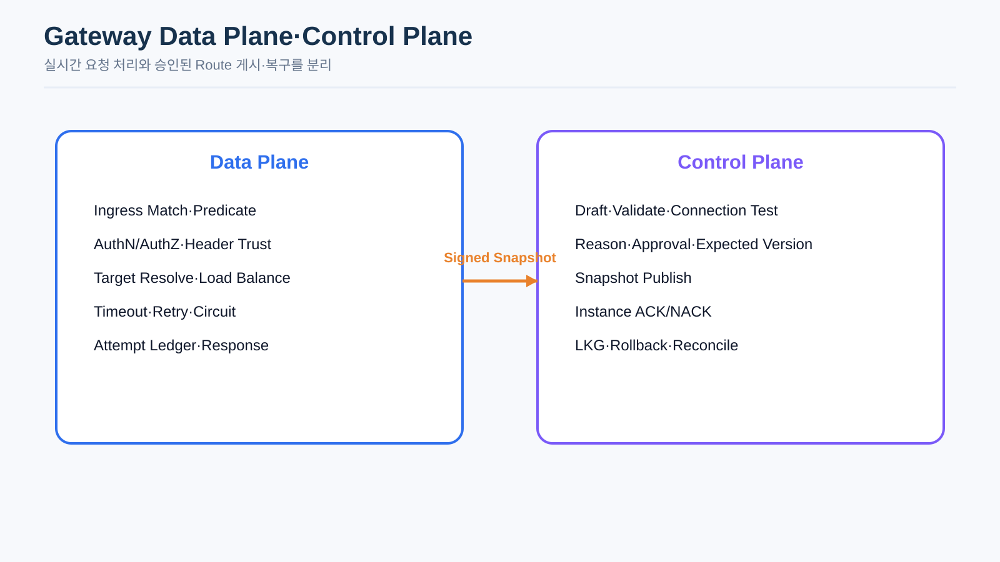
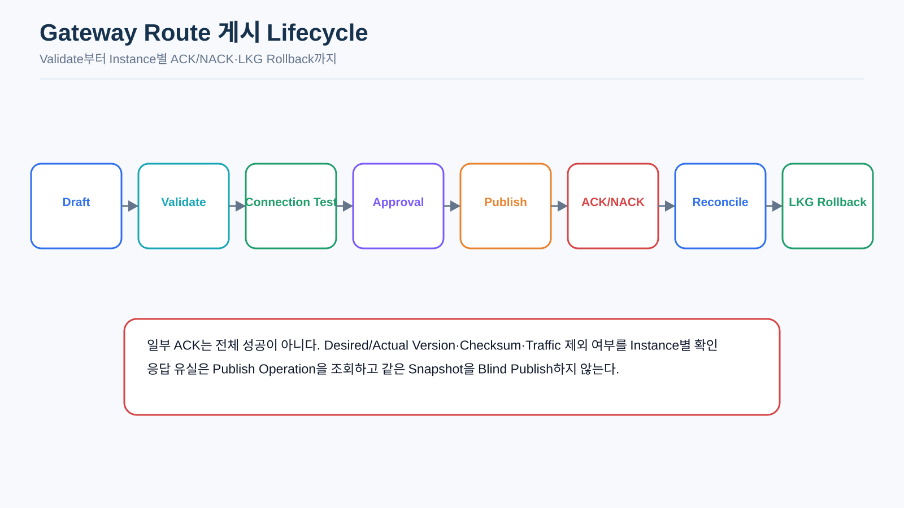
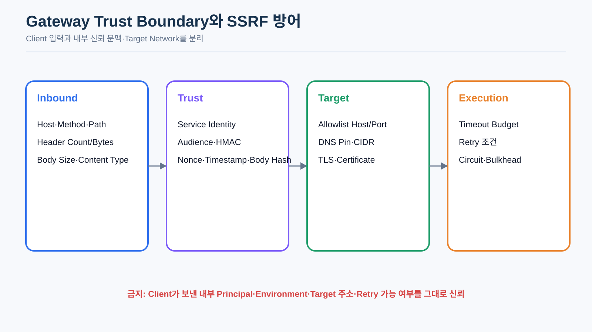
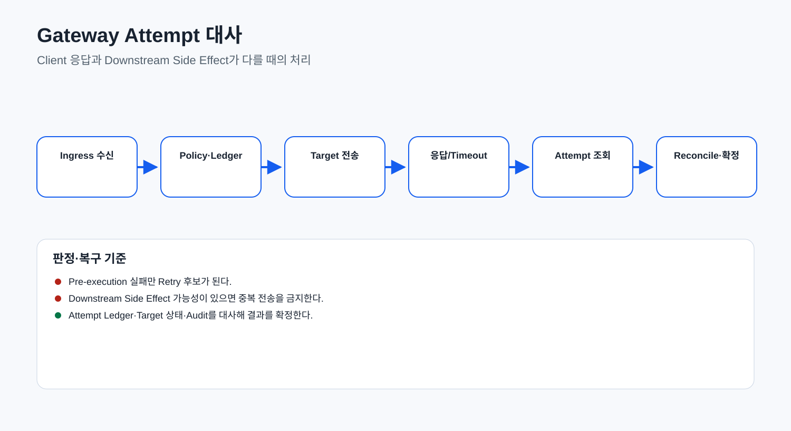

# CPF Gateway 매뉴얼

> **기준 Repository** `freeangelsun/202412_01_CPF`
> **기준 Branch** `master`
> **기준 Commit** `23babb9140b90e501d6ac715e7b77f55b66198a5`
> **문서 목적** Gateway 선택 기준, SCG MVC Data Plane, Route·Predicate·Filter·Rewrite, Target·보안·Resilience, Validate·Approval·Publish·ACK/NACK·LKG·Rollback과 장애 복구를 설명한다.
> **주요 독자** Gateway 개발자·운영자, 네트워크·보안 담당자, ADM Gateway 개발자
> **문서 사용 결과** Gateway Route를 등록·검증·게시·관측·대사·Rollback하고 기준 Commit의 제한을 구분한다.


## 이 문서에서 먼저 볼 그림

### Data Plane·Control Plane



### Route 게시 Lifecycle



### Trust Boundary와 SSRF 방어



### 결과 불명 대사


## 0. 제품 사용 계약

이 매뉴얼은 CPF의 기능을 제품 기능으로 설명하며, 대상 사용자가 다른 사람의 구두 설명이나 Source 역분석 없이 자신의 업무를 끝내도록 구성한다.

- 기능별 목적·대상 역할·Owner Module·실제 Consumer와 사용 위치를 먼저 제시한다.
- Source·SQL·API·Config·Frontend·Script·Test의 정확한 경로와 제품 사용 절차를 함께 제공한다.
- 입력값·기본값·권한·상태·정상 결과·오류·응답 유실·부분 적용·복구 절차를 기능 단위로 연결한다.
- Class·API·Property·Route·Permission·상태 이름은 제품 정본의 실제 식별자를 사용한다.
- 운영 종료는 Owner 상태·Version·Checksum·Audit·업무 합계와 화면 재조회 결과로 판단한다.
- 명령 실행 전 Local Working Tree를 확인하고 기존 변경을 보호한다.


## 1. 선택 기준

Gateway가 필요한 경우: 공통 외부 진입, 인증·인가·Header·CORS·Route 정책, 중앙 게시·ACK·감사, 여러 Service Target.

직접 진입을 검토할 경우: 내부 단일 Service, 공통 정책 없음, 추가 Failure Point가 불필요한 구성.

Gateway 사용 여부와 무관하게 업무 Public API와 Idempotency·Error 계약은 같아야 한다.

## 2. 기능 구성과 Source 지도

| 기능 | Source·Owner | 사용 업무 |
|---|---|---|
| Artifact·Runtime | `cpf-gateway/build.gradle`, Boot Application | SCG Server Web MVC Runtime을 설치·기동한다. |
| Data Plane | `CpfScgPrimaryRouteConfiguration`, `CpfScgPrimaryHandler` | 요청 Match·보안·Target·Proxy·Completion을 처리한다. |
| Route Snapshot | Snapshot Loader·Refresh | ACK Route를 로드하고 Refresh·LKG를 관리한다. |
| Target Resolver | `CpfScgTargetResolver`, Pinned HTTP Client | Health·Zone·Priority·Weight·DNS·CIDR·Pinned Address로 Target을 선택한다. |
| Trust Boundary | Header·Authentication·Authorization Filter | 외부 Header를 정리하고 Principal·Audience·Permission을 검증한다. |
| Resilience | Timeout·Retry·Circuit·Bulkhead Policy | Route별 Budget과 Idempotent Retry를 적용한다. |
| Attempt Ledger | Transaction·Attempt·Completion Filter | Target Attempt와 Terminal·UNKNOWN_RESULT를 기록한다. |
| Recovery Spool | Durable Completion/Audit Spool | Delivery 실패를 영속화하고 Retry·Reconcile한다. |
| Control Plane | Route·Group·Binding·Publish API | Draft·Validate·Approve·Publish·ACK/NACK·LKG·Rollback을 수행한다. |
| ADM | Gateway 9개 Route | Dashboard·Server·Group·Route·Security·Health·Transaction·Log Policy·Apply Status를 운영한다. |

## 3. Data Plane·Control Plane

### Data Plane

- SCG MVC Router/Handler
- Route Match·Path Rewrite
- Authentication·Authorization
- Target Resolve·HTTP Proxy
- Circuit Breaker·Retry
- Attempt·Transaction Ledger

### Control Plane

- Route·Binding·Server Group
- Version·Checksum·Validation
- Approval·Publish
- Candidate·ACK/NACK·Active·Last Known Good
- Drift·Reconcile·Rollback

Control Plane DB를 Data Plane 요청마다 조회하지 않고 ACK Snapshot을 사용한다.

## 4. Route Match

현재 Match 입력:

- 설치 Property `cpf.gateway.environment-code` (`Handler`가 Client Environment Header를 신뢰하지 않음)
- Host
- Raw Path
- HTTP Method
- `X-Api-Version` 또는 `v1`

Enabled·Environment·Host·Path·Method·Version을 필터하고 Host/Path specificity와 routeId로 정렬한다. 일치 Route가 없으면 거부한다.

확인할 Route 필드:

- routeId·routeKey·standardExecutionId
- environment·hostPattern·pathPattern·httpMethod·apiVersion
- target service·serverGroup·targetPath
- routeVersion·expectedVersion·checksum
- timeout·retry·idempotent·auditReasonRequired
- auth·permission·CORS·Header Policy

## 5. Route Snapshot

Property:

- `cpf.gateway.allow-empty-routes=false`
- `cpf.gateway.route-refresh-millis=30000`

기동 시 ACK Route 0건이고 allow-empty가 false면 중단한다. Refresh 오류 시 기존 Snapshot을 유지한다. Candidate 준비, Version·Checksum 생성, Instance별 ACK/NACK 기록은 하나의 게시 Operation으로 추적하며 Partial 상태는 실패 Instance만 Reconcile한다.

## 6. Path Rewrite

Ingress Pattern과 Target Path를 분리한다.

```text
Ingress /api/orders/{id}
Target /orders/{id}
```

계약 Test:

- Path variable·encoded slash·query·trailing slash
- duplicate slash·dot segment·Unicode normalization
- target base path
- empty/invalid rewrite
- traversal·open redirect

## 7. Target·Discovery·Load Balancing

현재 Resolver:

1. Service Registry에서 `UP` 후보를 조회한다.
2. active, not maintenance/draining, `staleAfter` 이내 Heartbeat를 필터한다.
3. 같은 Zone 후보가 있으면 우선하고 가장 낮은 Priority를 선택한다.
4. Weight와 Server Group별 JVM-local Cursor로 Target을 선택한다.
5. HTTP/HTTPS, Authority, Control Character, 단일·이중 Decode Traversal, Query Size를 검증한다.
6. DNS 결과의 Loopback/Link-local/Multicast/Public 여부를 검사한다.

운영 확인:

- 검증한 Address와 실제 Socket 연결이 일치하는지 확인한다.
- Redirect 후 Authority·CIDR을 다시 검증한다.
- 다중 Gateway Instance의 분산·Drift를 Reconcile한다.
- Registry Stale·Empty Target·DNS 변경을 Fault Test한다.

## 8. Authentication·Authorization·Header

- 외부 Authorization은 Authentication Port에만 전달되는지 확인한다.
- Client가 보낸 내부 Principal·Environment·Instance·Approval Header를 정본으로 신뢰하지 않는다.
- Trusted Proxy Chain과 Forwarded Header Allowlist를 적용한다.
- Downstream Header는 Allowlist로 재구성하고 Hop-by-hop·Credential을 제거한다.
- Audience·Service Identity·Route Permission·Data Scope를 검증한다.

Handler는 Trusted Context Header Allowlist로 Downstream Header를 재구성한다. Client가 보낸 내부 Principal·Instance·Approval Header는 제거한다.

## 9. HMAC Control Channel

Canonical Request 최소 요소:

- Method·Request Target
- Content-Type·Body SHA-256
- Caller·Operator
- Timestamp·Nonce
- Audience·Key ID

Nonce Store는 Gateway 인스턴스 간 공유되어야 한다. Body 변조·Clock Skew·Replay·Cross-environment를 Negative Test한다.

## 10. Timeout·Retry·Circuit·Bulkhead

- Connect·Send·Response Header·Read·Overall Deadline을 구분한다.
- Retry는 남은 Budget 안에서만 수행한다.
- Mutation은 Idempotency와 Body replay 조건이 모두 성립할 때만 Retry한다.
- Circuit 이름·Threshold·Open Duration·Fallback 결과를 운영에 노출한다.
- Bulkhead·Connection Pool·Rate Limit·Queue 상한을 설정한다.
- Downstream Client의 자체 Retry와 중복되지 않게 한다.

Handler는 Idempotent Route와 Replay-safe Body에서만 IOException·Timeout 단계의 Retry를 수행한다. Streaming·one-shot Body는 단일 Attempt로 처리한다.

## 11. Attempt Ledger·`UNKNOWN_RESULT`

Transaction Start에는 Route·Version·Target Group·Method·Path·Request bytes를 기록한다. 각 Attempt에는 Target·Duration·Protocol Status·Failure·Unknown을 기록한다.

Attempt는 pre-connect, request send, response header, response body, client disconnect, completion delivery 단계를 구분해 기록한다. Side Effect 가능성이 있는 단계는 `UNKNOWN_RESULT`로 남기고 Status Query·Reconcile을 수행한다.

대사:

1. transaction/attempt 조회.
2. Target Service Idempotency·Status API 조회.
3. Side Effect 확인.
4. Success·Failed·Unknown 확정.
5. Retry·Compensation·Operator decision.
6. Audit와 Evidence 연결.

## 12. Route 생명주기

```text
DRAFT → VALIDATED → APPROVED → CANDIDATE
→ INSTANCE ACK/NACK → ACTIVE
ACTIVE → BLOCKED/RETIRED/ROLLED_BACK
```

- Validate: Schema, Collision, Capability, Rewrite, Target, TLS, Security, Timeout.
- Approval: Request Hash, Version, Checksum, requester/approver 분리.
- Publish: Candidate 배포, Instance별 ACK/NACK.
- Activate: 정책이 요구한 ACK Quorum 충족 후.
- LKG: 직전 정상 Version·Checksum 보존.

## 13. ACK/NACK·Partial Apply

각 Instance 보고:

- instanceId·artifact version
- route version·checksum
- appliedAt
- ACK/NACK·error code·unsupported capability
- probe result

일부 ACK 상태는 `PARTIAL`이다. NACK Instance의 Traffic 제외·재동기화·Artifact Version·Cache/DB를 확인한다. Retry는 실패 Instance만 대상으로 한다.

## 14. Connection Test·Probe

구분:

- DNS
- TCP
- TLS
- HTTP
- Application

결과에는 resolved IP, Duration, Certificate, HTTP Status, Response Contract, Failure Stage를 포함한다. TCP Connect만으로 Application Ready를 확정하지 않는다.

## 15. ADM 절차

### 등록·게시

1. Environment·Route ID·Owner 확인.
2. Host·Method·Ingress·Target Rewrite 입력.
3. Server Group·Timeout·Security·CORS 선택.
4. Collision Preview.
5. Connection/Application Probe.
6. Validate 결과 확인.
7. Reason·Approval·Expected Version.
8. Publish·Operation ID 기록.
9. ACK/NACK·Checksum 확인.
10. Smoke·Ledger·Metric 확인.

### 차단

영향 Route·진행 거래·대체 경로·Retry·Unknown을 확인하고 Approval 후 차단한다. 모든 Instance 적용을 확인한다.

### Rollback

LKG, 현재 Candidate, DB·Policy Compatibility, 진행 요청을 확인한다. Rollback 후 ACK·Smoke·Metric·Ledger·Audit를 확인한다.

## 16. 설치·기동

- `cpf-gateway.jar` Source SHA·Checksum
- JDK·Port·TLS·Service Account
- Registry·Route Provider·Ledger·Audit DB
- Instance ID·Environment
- Empty Route 정책·Refresh 주기
- Security·Resilience·Connection Pool
- Health·Readiness·Build SHA

## 17. Log·Metric·Capacity

Log: routeId, routeVersion, transaction, attempt, target instance, failure stage, result, masked reason.
Metric: RPS, latency, status, target failure, circuit, retry, active connection, queue, snapshot refresh, ACK/NACK.
Cardinality가 큰 transaction/URI 원문을 Metric Label로 쓰지 않는다.

## 18. 장애 Runbook

### ACK Route 0건

allow-empty, Route Provider, Approval·ACK, DB 연결 확인. Default deny 유지. 승인 없는 임시 Route 주입 금지.

### Snapshot 갱신 실패

Last Normal Snapshot Version·LoadedAt, Provider DB, Schema, Checksum 확인. 반복 오류 Alert. Stale 허용 기한 초과 정책 확인.

### Target 없음

Registry TTL·Health·Maintenance·Draining·Service ID 확인. 임의 Host 우회 금지.

### Upstream Timeout·5xx

Attempt별 Failure Stage·Target·Circuit·Retry를 확인. Mutation Side Effect 가능성은 상태 조회 후 재시도.

### SSRF 의심

Route Target·DNS·Resolved IP·Redirect·Proxy Header·Audit 보존. Route 차단과 Credential rotate 검토.

### Partial Apply

NACK Instance Traffic 제외, Version·Checksum·Capability 비교, Failed-only Retry 또는 LKG Rollback.

## 19. Test

- Route Match·Specificity·Default deny
- Rewrite·Encoding·Traversal
- Header spoof·Auth·Permission·Reason
- HMAC Body change·Replay·Audience
- SSRF CIDR·DNS Rebinding·Redirect
- Connect·Send·Response·Read Timeout
- GET/Mutation/Streaming Body Retry
- Circuit·Bulkhead·Rate Limit
- ACK/NACK·Partial·Drift·LKG
- Client disconnect·Response loss·Unknown Reconcile
- Multi-instance Registry·Target·Snapshot
- Load·Large body·Slow consumer

## 20. EDU

1. 주문 Route와 Target Rewrite 정의.
2. Security·Timeout·Idempotency 정책 작성.
3. Validate·Collision·Connection Probe.
4. Approval·Publish.
5. 두 Gateway Instance ACK 확인.
6. 한 Instance NACK 주입.
7. Target Timeout·Response loss·Client disconnect 주입.
8. Attempt·Unknown·Target 상태 대사.
9. LKG Rollback.
10. Metric·Audit·Evidence 확인.

## 부록 A. 기준 Commit Source 지도

| 책임 | Source | 현재 확인 |
|---|---|---|
| SCG Business Route | `CpfScgPrimaryRouteConfiguration` | `/**`에서 Actuator·Internal·Control 경로 제외 |
| Data Plane Handler | `CpfScgPrimaryHandler` | Route Match, AuthN/AuthZ, Retry·Circuit, Ledger Attempt |
| 응답 완료 원장 | `CpfGatewayLedgerCompletionFilter` | Servlet 응답 종료 시 Transaction Completion |
| Route Snapshot | `CpfGatewayRouteSnapshot` | ACK Public Route, Candidate, LKG Memory Snapshot |
| Target 선택 | `CpfScgTargetResolver` | Service Registry `UP` Instance Round-Robin |
| Path Rewrite | `CpfGatewayPathRewriter` | Pattern→Target Path |
| Build | `cpf-gateway/build.gradle` | SCG Server Web MVC, Core·Resilience·Observability |

## 부록 B. 실제 Request 처리 순서

```text
Business Route Match
→ 설치 Environment·Host·Path·Method·API Version으로 ACK Route 선택
→ Header 정리
→ Authentication
→ Authorization
→ 위험 Route Reason 확인
→ Transaction/Attempt 원장 시작
→ Target Path Rewrite
→ Service Registry UP Instance 선택
→ Circuit Breaker·조건부 Retry
→ SCG HTTP Forward
→ Attempt 저장
→ Servlet Response 종료 시 Transaction 완료
```

### B.1 Match 입력

- 설치 Property `cpf.gateway.environment-code`가 Route Environment 입력이다. Client의 Environment Header는 Route 선택 정본으로 사용하지 않는다.
- `Host`
- Request Raw Path
- HTTP Method
- `X-Api-Version`: 미입력 시 `v1`

Route는 enabled, Environment, Host Pattern, Path Pattern, Method, API Version 순으로 Filter하고 Host·Path Specificity와 Route ID로 정렬한다. 일치 Route가 없으면 Default Deny다.

## 부록 C. Snapshot 기동·갱신

| Property | Default | 동작 |
|---|---:|---|
| `cpf.gateway.allow-empty-routes` | `false` | `false`에서 ACK Route 0건이면 기동 실패 |
| `cpf.gateway.route-refresh-millis` | `30000` | Public Route Snapshot 갱신 주기 |

기동 시 `loadPublicRoutes()`가 null이면 실패한다. 빈 Route를 허용하지 않으면 실패한다. 주기 갱신 중 예외가 발생하면 마지막 정상 Snapshot을 유지한다.

주의: `refreshNow()`는 Provider가 반환한 Map을 새 Snapshot으로 교체한다. ACK·Version·Checksum 검증이 Provider에서 수행되는지 Owner Source·DB Query와 함께 확인한다.

## 부록 D. Target 선택과 SSRF 경계

현재 Target Resolver는 Service ID, `UP`, active, maintenance/draining, Heartbeat Freshness를 확인하고 Same Zone·최저 Priority·Weight로 Target을 선택한다. URI Authority와 Path/Query를 Canonicalize하고 Loopback·Link-local·Multicast와 Public Address 정책을 검사한다.

남은 항목:

- DNS 검증 결과와 실제 HTTP Connection Address 고정.
- Redirect 재검증과 명시 Port 정책.
- Multi-instance Cursor 공유 또는 전체 분배 Acceptance.

Target 정책은 DNS·CIDR·Pinned Address·TLS Hostname 검증과 다중 인스턴스 ACK·Drift Reconciliation을 함께 사용한다.

## 부록 E. Retry·Circuit 동작

현재 Handler는 Route가 `idempotent=true`일 때만 `maxRetryCount + 1` Attempt를 허용하고, 그 외에는 1회만 실행한다. Wait Duration은 50ms이며 `IOException`, `TimeoutException`을 Retry 대상으로 설정한다. Circuit Breaker 이름은 `gateway-<routeId>`다.

운영 확인:

- POST·PATCH·DELETE가 idempotent로 잘못 등록되지 않았는가
- Request Body가 Replay 가능한가
- Downstream Idempotency Key·Request Hash가 있는가
- 전체 Deadline 안에서 Retry가 종료되는가
- Gateway와 Client/Downstream의 중복 Retry가 없는가
- Attempt별 Target·Failure Stage·Unknown이 남는가

Route Policy의 Connect·Response·Overall Timeout은 SCG HTTP Client 실행 Budget에 적용하며, Route 상세와 Attempt Ledger에서 적용값을 확인한다.

## 부록 F. Header·Transaction ID 현재 주의사항

Handler는 Client의 `x-cpf-*`와 `x-forwarded-*` Header를 거부하고, Authorization과 설치 Allowlist의 Context Header만 Header Count/Byte Budget 안에서 수용한다. Downstream에는 Server가 Principal, Transaction, Gateway Transaction, Route, Instance Header를 재구성한다. Header Negative Test와 Proxy Chain은 Runtime에서 검증한다.

현재 Gateway Transaction ID는 UUID로 생성된다. CPF 목표의 34자리 transactionId와 일치하지 않으므로 다음을 구분한다.

- Gateway 내부 Transaction Ledger ID
- CPF 표준 transactionId
- Trace ID
- Downstream Operation/Idempotency ID

문서나 화면에서 UUID를 표준 transactionId로 표시하지 않는다. Header Spoof Negative Test 전에는 이 항목을 기능 제공으로 둔다.

## 부록 G. Attempt·Completion 상태

### G.1 Attempt

성공/최종 4xx·5xx와 Retryable Status를 구분해 Attempt를 기록한다. Connect/DNS 실패는 Side Effect 전으로 보고 `unknown=false`가 될 수 있고, Timeout·EOF·Socket은 `unknown=true`로 기록해 대상 Side Effect를 대사한다.

### G.2 Transaction Completion

Servlet Response 종료 시 다음을 기록한다.

- HTTP Status
- Target Instance Attribute
- Duration
- Response Byte Count
- Failure Stage
- Unknown 여부

Filter Chain은 Connect 전 실패, Request Send 전후, Response Read, Client Disconnect 단계를 Attempt에 기록한다. Target Side Effect 가능성이 남은 Timeout·EOF·Socket 단절은 `UNKNOWN_RESULT`, 최종 5xx는 `FAILED`, 4xx는 `REJECTED`, 정상 응답은 `SUCCESS`로 분류한다.

## 부록 H. Route 게시 운영 절차

1. Route ID·Environment·Host·Method·Path·API Version을 입력한다.
2. Target Service·Server Group·Target Path Rewrite를 입력한다.
3. AuthN/AuthZ·CORS·Header·Rate·Timeout·Retry 정책을 선택한다.
4. Collision Preview와 Path Rewrite Contract를 확인한다.
5. DNS→TCP→TLS→HTTP→Application Probe를 구분해 실행한다.
6. SSRF Allowlist와 Certificate·SNI를 확인한다.
7. Version·Checksum·Request Hash를 고정하고 Approval을 받는다.
8. Candidate를 게시하고 Instance별 ACK/NACK를 확인한다.
9. 일부 NACK이면 해당 Instance를 Traffic에서 제외하고 전체 성공으로 표시하지 않는다.
10. Smoke Transaction과 Attempt Ledger를 확인한다.
11. Error·Latency·Unknown·Downstream 상태를 관찰한다.
12. 문제가 있으면 LKG Version으로 Rollback하고 모든 Instance Checksum을 다시 확인한다.

## 부록 I. 장애별 판정

| 증상 | 우선 확인 | 복구 |
|---|---|---|
| 기동 실패·ACK Route 0 | `allow-empty-routes`, Public Route Query | Route ACK 복구 또는 승인된 Default Deny 기동 |
| Snapshot 갱신 실패 | Provider·DB·Checksum·최근 Candidate | LKG 유지, 원인 수정 후 재갱신 |
| Target 없음 | Registry Status·Maintenance·Draining·Service ID | 정상 Instance 복구, Route Target 검토 |
| 반복 Timeout | Deadline·Retry 중복·Circuit·Downstream Capacity | Retry 축소, Target 격리, 대사 |
| 응답 유실 | Attempt Stage·Downstream Operation 상태 | Blind Retry 금지, Reconcile |
| 일부 Instance NACK | Capability·Artifact Version·Checksum | Traffic 제외, 재적용 또는 LKG Rollback |
| SSRF 의심 | Resolved IP·Redirect·DNS·Target Config | Route 차단, Credential Rotation, Incident 조사 |
| Ledger 저장 실패 | 업무 응답과 Ledger Transaction 경계 | Spool/재처리·Alert, 업무 결과 오염 여부 확인 |

## 부록 J. Gateway 검증 Matrix

- Host·Path·Method·Version 우선순위
- Wildcard Host와 Path Boundary
- Rewrite Parameter·Query 보존
- Authorization Header·Trusted Header Spoof
- AuthN 실패·AuthZ 실패·Reason 누락
- GET Retry와 Mutation Retry 차단
- Request Body Replay·Streaming·Large Upload
- Connect·Send·Response·Read Timeout
- Client Disconnect·Response Write 실패
- Circuit Open·Half-open·Recovery
- Registry 0건·Maintenance·Draining
- Route Refresh 실패와 LKG 유지
- Candidate ACK/NACK·Partial Apply·Rollback
- Multi-instance Route Version Drift
- SSRF CIDR·DNS Rebinding·Redirect
- Ledger DB 장애·중복·Masking

## 부록 K. HMAC Body Hash·Scale-out·Reconciliation

Control Channel Signature의 Canonical 입력에는 Method, Request Target, Content-Type, **Body Hash(SHA-256)**, Caller, Operator, Timestamp, Nonce, Audience, Key ID를 포함한다. Body Hash 계산 전 Canonicalization 규칙과 Empty Body 표현을 고정한다.

Scale-out 시 Route Snapshot Version·Checksum, Nonce Store, ACK/NACK, Attempt Ledger는 인스턴스 로컬 메모리에만 두지 않는다. Instance별 적용 Drift를 조회하고, 응답 유실·일부 적용·Ledger 누락은 Reconciliation으로 Route Version·Runtime Snapshot·DB 원장·실제 Traffic 상태를 대조한다.

---

## 기준 Source와 역할별 활용 범위

- Repository: `https://github.com/freeangelsun/202412_01_CPF`
- Branch: `master`
- 기준 Commit: `23babb9140b90e501d6ac715e7b77f55b66198a5`
- 문서 표준: `cpf-docs/specification/CPF_DOCUMENTATION_STANDARD.md`
- 제품 목표 정본: `cpf-docs/governance/CPF_FINAL_TARGET_REQUIREMENTS.md`
- 사실 우선순위: 실제 Source·SQL·API·Config·Frontend·Script·Test → Architecture·Specification → 이 매뉴얼

이 매뉴얼의 대상 역할은 다음 흐름을 다른 사람의 구두 설명이나 Source 역분석 없이 수행할 수 있어야 한다.

```text
업무 목적 파악
→ 선행 조건과 권한 준비
→ 실제 기능 위치 탐색
→ 등록·설정·개발·실행
→ 상태와 결과 확인
→ 오류·동시성·부분 실패 판단
→ Retry·Restart·Reprocess·Reconcile·Compensation·Rollback
→ Log·Metric·Trace·Audit·Evidence 확인
→ 정상화와 완료 판정
```

기능 설명은 Source의 실제 계약과 사용 절차를 기준으로 하며, 적용 전 확인 조건·오류·복구 경로를 함께 제공한다.

---

## 제2부 실무편: Gateway 설치·개발·Control Plane·Data Plane 전수 절차

## 22. Gateway 선택과 책임 경계

Gateway는 공통 Ingress Route·Authentication/Authorization·Header·Rate Limit·Timeout/Retry·Circuit·Audit·Attempt Ledger·배포 ACK가 필요할 때 선택한다. 내부 Service Call만 있고 공통 Ingress 정책이 필요 없으면 선택하지 않는다.

- Data Plane Owner: `cpf-gateway`, Spring Cloud Gateway Server Web MVC.
- Route/Policy Control Plane: ADM Gateway 기능 + Gateway Provider/Apply Ledger.
- Service/Instance 정본: Service Registry.
- 업무 상태 정본: Target Domain.
- Gateway는 ADM/BAT/Actuator/Internal Control API를 외부 Business Route로 노출하지 않는다.

## 23. 설치와 Safety Cap

`cpf.gateway.*` Safety Property는 ADM Runtime Policy가 확대할 수 없는 설치 상한이다.

| 항목 | Default·제약 |
|---|---|
| Route/Policy Refresh | 30s / 15s, 양수 |
| Health Probe/Stale | 30s / 90s |
| Connect/Response/Overall Cap | 10s / 60s / 90s; Overall은 양쪽 이상 |
| Retry Cap | 2, 0~10 |
| Request/Response Body | 각 10 MiB |
| Header Count/Bytes | 100 / 64 KiB |
| Raw Body Capture | false |
| Log Spool | 2 GiB, `./data/gateway-log-spool` |
| Bootstrap Mode | `FAIL_CLOSED` 또는 `LAST_KNOWN_GOOD` |
| Environment/Instance | `local` / `gateway`; 운영에서 명시 |
| Public Target | false |
| Trusted Context Header | Source Allowlist만 |

기동 전 Spool Directory ACL·Disk, Environment/Instance 고유성, Certificate/Trust, DB/Kafka/Service Registry, ACK Route/LKG를 확인한다.

## 24. Request 처리 순서

```text
Business Route Match
→ 승인·ACK Snapshot에서 Binding 결정
→ Authentication
→ Trusted Context 재구성
→ Authorization
→ 위험 호출 Reason 검증
→ Transaction/Attempt Ledger Begin
→ Target 선택·URI Rewrite·SSRF 검증
→ Timeout·Circuit·조건부 Retry
→ Response Stream
→ Sync/Async/Streaming 실제 종료
→ Ledger Completion + AFTER Audit
→ 저장 실패 시 Recovery Spool
```

Route Configuration은 `/actuator/**`, `/internal/**`, `/api/gateway/control/**`를 Business Data Plane에서 제외한다.

## 25. Route Match·Predicate·Rewrite

### Match 입력

- Environment: Header가 없으면 계약 Default를 확인한다.
- Host Pattern: Exact 또는 `*.` Wildcard.
- Path Pattern.
- HTTP Method 또는 `*`.
- API Version 또는 `*`.
- Enabled/ACK/Apply 상태.

여러 Route가 일치하면 Host/Path Specificity와 Route ID 정렬로 결정한다. 의도하지 않은 중복 Route를 Validation에서 차단한다.

### Rewrite

- Target Path Template의 Variable/Wildcard 치환을 Preview한다.
- `//`, Backslash, Control Character, 단일/이중 Decode `.`/`..` Traversal을 거부한다.
- Base Authority와 Path Prefix를 벗어나지 않는지 Canonical URI로 검증한다.
- Query는 Control Character·Fragment·8 KiB 초과를 거부한다.

## 26. Service Registry·Target·Load Balancing

Target 후보 조건:

- Service ID 일치.
- Active, `UP`, Maintenance/Draining 아님.
- Heartbeat가 `staleAfter`보다 최신.
- Gateway Zone 후보가 있으면 Same Zone 우선.
- 가장 낮은 Priority Group.
- Weight 기반 선택.

현재 Cursor는 JVM Local이므로 Instance 간 선택 위치를 공유하지 않는다. 장기 분배는 전체 Gateway Traffic 기준으로 검증한다.

### SSRF

Base URI는 HTTP/HTTPS, Host 필수, UserInfo/Query/Fragment 금지다. DNS로 해석된 모든 Address에 Loopback/Any/Link-local/Multicast를 거부하고 Public Target이 false면 Private/CGNAT/ULA만 허용한다.

Pinned HTTP Client는 검증한 Address로 실제 Socket을 연결하고 원 Hostname으로 TLS SNI·Hostname Verification을 수행한다. DNS Rebinding·Mixed A/AAAA·Redirect·Metadata Endpoint를 Negative Test한다.

## 27. Authentication·Authorization·Header·HMAC

### Header Trust

Client가 보낸 Authorization을 내부 Trusted Context Map에 복사하지 않는다. 설치 Allowlist에 있는 Context Header만 사용하고 Authentication 결과의 Principal을 Server 측 Attribute로 추가한다.

`X-Transaction-Id`, `X-Channel-Id`, `traceparent`, `X-Api-Version`, Operation Reason 등은 Header별 신뢰 주체와 Validation을 명시한다. Client Header와 Server-generated ID가 충돌하면 Server 규칙을 따른다.

### Authentication/Authorization

Binding에 연결된 Policy ID를 사용한다. 인증 성공 뒤 Route·Principal·Channel·Scope로 Authorization한다. 위험 Route는 `X-Operation-Reason`을 요구한다.

### HMAC Control Channel

Control API는 Key ID, Timestamp/Expiry, Nonce, Audience, Method, Canonical Path/Query, Body SHA-256, Signature를 검증한다. Nonce는 공유 Store에서 중복 차단하고 Clock Skew를 제한한다. Key Rotation은 Active/Previous Window와 Audit를 포함한다.

## 28. Timeout·Retry·Circuit·Bulkhead

| 항목 | 운영 원칙 |
|---|---|
| Connect Timeout | TCP/TLS 연결 예산 |
| Response Timeout | Upstream 응답 예산 |
| Overall Timeout | Queue·Retry 포함 전체 예산 |
| Retry | `idempotent=true` Route만, Cap 이하 |
| Retry Exception | I/O·Timeout 등 명시 목록 |
| Status Retry | 실제 Policy에 정의된 경우만 |
| Circuit | Route/Target 기준 이름·Threshold·Open/Half-open |
| Bulkhead | Thread/Connection/Queue 상한과 거부 상태 |

현재 Handler는 Route ID 기준 Retry/Circuit을 생성한다. Attempt별 Target·URI·Status·Protocol Status·Failure Code/Message·Unknown을 Ledger에 기록한다. 비멱등 POST를 “일시 오류”라는 이유로 Retry하지 않는다.

## 29. Ledger·Completion·Recovery Spool

### Begin

Transaction ID, Trace, Channel, Client Address, Gateway Instance, Route/Version/Expected Version/Key, Server Group, Method, Path, Request Size, 시작 시각을 기록한다.

### Attempt

Attempt ID/No, Target Instance, Host/Port/Scheme, Latency, Status, Protocol Status, Failure Stage, Unknown, 시작/종료를 기록한다.

### Completion

Sync/Async/Streaming 실제 종료 시 Atomic Guard로 한 번만 완료한다.

- 2xx/3xx: `SUCCESS`.
- 4xx: `REJECTED`.
- 5xx: `FAILED`.
- Async Error/Timeout/Client·Stream Exception: `UNKNOWN_RESULT`.
- Response Body가 Safety Cap을 넘으면 I/O 오류와 Unknown/Reconciliation 대상이 될 수 있다.

Ledger/Audit 저장 실패는 요청 Thread에서 성공으로 숨기지 않고 Disk Recovery Spool에 격리한다. Spool Count/Bytes, Disk Cap, Replay Attempt, Poison Record를 ADM KPI와 Log로 확인한다.

## 30. Route·Server Group·Binding Lifecycle

### Server Group

입력: ID/Name/Environment/Service/Endpoint/Target Protocol/Load Balance/Hash Source/Health/Failover/Member Instance·Weight·Priority·Canary·Enabled/Fencing/Reason.

Service Registry Instance를 복제 저장하지 않고 Member로 참조한다. Member 제거 전 In-flight와 Failover Capacity를 확인한다.

### Binding

입력: Binding/Route/Environment/Host/Path/Target Path/Method/API Version/Route Version/Service/Group/Protocol/Timeout/Retry/Idempotent/Gateway/Direct/TLS/Auth/Authz/Header/Rate/Health/Reason.

Lifecycle:

```text
DRAFT
→ Validate/Preview
→ Approval Request
→ APPROVED
→ Publish Event
→ Gateway Instance Apply
→ ACK / NACK / PARTIAL_APPLY
→ ACTIVE
→ Block/Retire/Rollback
```

Service Registry 등록만으로 외부 공개하지 않는다. Active Binding과 Gateway ACK가 모두 필요하다.

## 31. Publish·ACK/NACK·LKG·Rollback

1. Candidate Snapshot의 모든 Binding과 Policy Reference를 검증한다.
2. Checksum·Version·Expected Version·Approval을 고정한다.
3. Publish Event를 생성한다.
4. Gateway Instance별 ACK/NACK와 Applied Version을 수집한다.
5. Quorum/All 정책을 판정한다.
6. Partial이면 신규 Traffic 범위를 제한하고 실패 Instance를 Reconcile한다.
7. Rollback은 Last Known Good Version과 Checksum으로 수행한다.
8. Rollback 뒤 모든 Instance Applied Version·Route Probe·Drift 0을 확인한다.

Snapshot Refresh 실패 시 현재 Last Normal Snapshot을 유지한다. `FAIL_CLOSED` 기동에서 ACK Route 0건이면 기동을 중단하거나 명시적으로 Empty Route 허용을 결정한다. `LAST_KNOWN_GOOD`는 LKG Artifact·Checksum·Age·Environment 일치를 확인한다.

## 32. ADM Gateway 화면

### 공통

Capability Available/Source Instance/Generated At, Environment/Service/Route Filter, Auto Refresh `LIVE SSE`/`POLL 15s`/`PAUSED`를 확인한다.

KPI: TPS 60s, Success/Error, P95/P99, Drift, Open Circuit, Certificate ≤30d, Spool Backlog, Connection Test Failure.

### Group Tab

Member Diff를 확인하고 저장한다. Rendezvous Hash는 Hash Key Source가 필요하다. Canary Percent와 Priority/Weight를 함께 검토한다.

### Binding Tab

Default Deny Draft를 저장하고 Apply Preview를 확인한다. Timeout Cap과 Retry/Idempotent 조합, Gateway/Direct 허용, 모든 Security Policy Reference를 검증한다.

### Apply/Connection Test

Instance Expected/Applied/Status/Last Seen을 확인한다. Target Direct와 Gateway E2E Test를 비동기 Operation으로 실행하고 Test Type·Reason·Failure Stage·Trace를 기록한다.

### Security/Transaction/Log Policy

Default Deny, Retry Safety, Admin/Internal 제외, Approval/CAS/Audit를 확인한다. Transaction은 Attempt/Completion/Unknown을 대사하고 Log Policy는 Gateway ACK/NACK와 Capture 상한을 확인한다.

## 33. Scale-out·Drift·Reconciliation

- Instance ID와 Zone을 고유하게 설정한다.
- Snapshot Version·Checksum·Policy Version을 Instance별로 보고한다.
- Route 선택 Cursor가 JVM Local임을 감안해 전체 분배를 측정한다.
- Drift는 Desired Version과 Applied Version, Route Count/Checksum 차이를 포함한다.
- Reconcile은 DB/Control Plane 값만 덮어쓰지 않고 Gateway Runtime Snapshot을 다시 읽는다.
- Stale Instance는 Traffic에서 제외하고 재기동/재적용 뒤 편입한다.

## 34. Probe·Health·Capacity

- Process/Readiness.
- Route Snapshot Loaded/LKG Age.
- Service Registry/DB/Policy Provider.
- Target Probe와 Circuit.
- Thread/Connection/Queue/Heap/GC.
- Request/Response Body Size Reject.
- Spool Disk/Backlog/Poison.
- Certificate Expiry.
- TPS/Error/P95/P99와 Retry 증폭.

## 35. Gateway 장애 Runbook

### Route 404/Default Deny

Host/Path/Method/API Version/Environment, Enabled/ACK/Applied Snapshot을 확인한다. 임의 Wildcard Route를 추가하지 않는다.

### Target 없음

Service Registry Fresh Heartbeat, UP/Active, Drain/Maintenance, Priority/Zone, Base URL/DNS/CIDR를 확인한다.

### Timeout/5xx

Attempt별 Target/Latency/Failure Stage, Circuit, Retry Count, Target Log/Trace를 확인한다. 비멱등 Retry 금지.

### Client Disconnect/Streaming

Completion의 `CLIENT_OR_STREAM`, Unknown Flag, Response Bytes, Target Side Effect를 대사한다.

### Spool Backlog

Disk/Permission/Cap, Ledger/Audit DB, Poison Record를 확인한다. Spool File을 직접 삭제하지 않고 Replay/격리 Evidence를 남긴다.

### Partial Apply/Drift

Expected/Applied Version, ACK/NACK Error, Instance Health를 확인한다. 실패 Instance 격리→Reapply/Reconcile 또는 LKG Rollback.

### SSRF/DNS

Target을 우선 차단하고 Registry/Binding/Approval/Audit, DNS Answer, 실제 Connection Address, Proxy/Redirect를 보전한다. Public Target 허용을 임시 해제해 우회하지 않는다.

## 36. Gateway Test Matrix

| Test | 정상 판정 |
|---|---|
| Match 충돌 | Specific Route 한 개, Ambiguous Validation 차단 |
| Rewrite Traversal | 단일/이중 Encoding 모두 거부 |
| Header Spoof | Client Authorization/Principal 내부 Context 미주입 |
| Retry | 멱등 Route만, Attempt Ledger 일치 |
| Response Cap | 초과 응답 중단·Unknown/Reconcile |
| Async/Streaming | Completion 1회 |
| Ledger DB 실패 | Recovery Spool 기록·Replay |
| DNS Rebinding | 검증/연결 Identity 변경 거부 |
| Multi-instance Apply | ACK/NACK/Drift 정확 |
| Rollback | LKG Version/Checksum 전 Instance 일치 |
| Client Disconnect | Target Side Effect 대사 |
| 3DB | Route/Apply/Ledger Query 실제 실행 |

## 37. Gateway EDU

- EDU-GW-01 Group/Member→Binding Draft→Validation→Approval→Publish→ACK.
- EDU-GW-02 Host/Path Rewrite와 Traversal Negative Test.
- EDU-GW-03 Target Drain·Zone·Priority·Weight·Failover.
- EDU-GW-04 Timeout·Retry·Circuit·Unknown 대사.
- EDU-GW-05 Partial Apply→Reconcile→LKG Rollback.
- EDU-GW-06 Ledger/Audit DB 장애→Spool→Replay.
- EDU-GW-07 DNS Rebinding·Public/Private CIDR Test.

## 38. Gateway 완료 Checklist

- [ ] 설치 Safety Cap·Secret·Certificate·Spool
- [ ] Route Match/Predicate/Rewrite
- [ ] Service Registry/Target/LB/Failover
- [ ] Authentication/Authorization/Header/HMAC
- [ ] SSRF/TLS/DNS/Redirect
- [ ] Timeout/Retry/Circuit/Bulkhead
- [ ] Ledger/Attempt/Completion/Unknown
- [ ] Audit/Ledger Recovery Spool
- [ ] Group/Binding Version/Checksum/Approval
- [ ] Publish/ACK/NACK/Partial/LKG/Rollback
- [ ] Scale-out/Drift/Reconcile
- [ ] Probe/Health/Capacity/Runbook
- [ ] Browser/3DB/Multi-instance/Fault Evidence

---
## 부록 L. Gateway Source·SQL 진입점

| 기능 | 기준 Source |
|---|---|
| Build/Dependency | `cpf-gateway/build.gradle` |
| Safety Cap | `cpf-gateway/src/main/java/com/cpf/gateway/config/CpfGatewaySafetyProperties.java` |
| SCG Route | `cpf-gateway/src/main/java/com/cpf/gateway/scg/CpfScgPrimaryRouteConfiguration.java` |
| Data Plane Handler | `cpf-gateway/src/main/java/com/cpf/gateway/scg/CpfScgPrimaryHandler.java` |
| Target Resolver | `cpf-gateway/src/main/java/com/cpf/gateway/scg/CpfScgTargetResolver.java` |
| Response Completion | `cpf-gateway/src/main/java/com/cpf/gateway/scg/CpfGatewayLedgerCompletionFilter.java` |
| Ledger Recovery | `cpf-gateway/src/main/java/com/cpf/gateway/scg/CpfGatewayLedgerRecoverySpool.java` |
| Audit Recovery | `cpf-gateway/src/main/java/com/cpf/gateway/scg/CpfGatewayAuditRecoverySpool.java` |
| Route Snapshot | `cpf-gateway/src/main/java/com/cpf/gateway/route/CpfGatewayRouteSnapshot.java` |
| Path Rewrite | `cpf-gateway/src/main/java/com/cpf/gateway/route/CpfGatewayPathRewriter.java` |
| Gateway Core Contract | `cpf-core/src/main/java/com/cpf/core/api/gateway` |
| Service Registry Contract | `cpf-core/src/main/java/com/cpf/core/api/servicecall` |
| ADM Gateway UI | `cpf-admin/frontend/src/features/gateway-operations/GatewayOperationsPage.vue` |
| ADM Route Registry | `cpf-admin/frontend/src/app/routes.ts` |
| Recovery Test | `cpf-gateway/src/test/java/com/cpf/gateway/scg/CpfGatewayRecoverySpoolTest.java` |
| Target Security Test | `cpf-gateway/src/test/java/com/cpf/gateway/scg/CpfScgTargetResolverTest.java` |
| Canonical DB | `cpf-tools/db/canonical/platform-schema.json` |
| Gateway Runtime SQL | `cpf-tools/db/vendor/{mariadb,postgresql,oracle}/runtime/gat` |

---

## 제3부. Gateway Route·보안·게시·복구 실무 사례

## 39. Gateway Safety Cap 전체 표

| Key | Default | 의미·범위 |
|---|---:|---|
| `cpf.gateway.route-refresh` | 30s | Route Snapshot 갱신 주기 |
| `cpf.gateway.policy-refresh` | 15s | Security·Resilience 정책 갱신 주기 |
| `cpf.gateway.health-probe-interval` | 30s | Target Probe 주기 |
| `cpf.gateway.stale-after` | 90s | Snapshot·Instance Stale 판단 |
| `cpf.gateway.connect-timeout-cap` | 10s | Route가 초과할 수 없는 Connect 상한 |
| `cpf.gateway.response-timeout-cap` | 60s | Response 상한 |
| `cpf.gateway.overall-timeout-cap` | 90s | 전체 상한, connect/response 이상 |
| `cpf.gateway.retry-count-cap` | 2 | 0~10, Route 정책 상한 |
| `cpf.gateway.request-body-bytes-cap` | 10MiB | Request Body 상한 |
| `cpf.gateway.response-body-bytes-cap` | 10MiB | Response Body 상한 |
| `cpf.gateway.header-count-cap` | 100 | Header 수 상한 |
| `cpf.gateway.header-bytes-cap` | 64KiB | Header 총 Byte 상한 |
| `cpf.gateway.raw-body-capture-allowed` | false | 원문 Capture 상한 정책 |
| `cpf.gateway.log-spool-bytes-cap` | 2GiB | Recovery Spool 총량 |
| `cpf.gateway.log-spool-directory` | `./data/gateway-log-spool` | 영속 Spool Directory |
| `cpf.gateway.bootstrap-mode` | FAIL_CLOSED | FAIL_CLOSED 또는 LAST_KNOWN_GOOD |
| `cpf.gateway.environment-code` | local | 환경 식별자 |
| `cpf.gateway.instance-id` | gateway | 인스턴스 고유 ID |
| `cpf.gateway.zone-code` | 빈 값 | Zone 선택 정보 |
| `cpf.gateway.allow-public-targets` | false | Public Target 허용 상한 |
| `cpf.gateway.trusted-context-headers` | 표준 Allowlist | Upstream으로 전달할 신뢰 Header |

## 40. Gateway 실무 사례 — Host·Path Route

### 설계

Host/Method/Path/Version Predicate와 Rewrite

### 등록 입력

- Environment, Route ID, Version, Priority, Enabled
- Host·Method·Path·API Version Predicate
- Rewrite 규칙과 Target Group·Binding
- Authentication·Authorization·HMAC·Header Policy
- Connect·Response·Overall Timeout, Retry, Circuit, Bulkhead
- Request·Response Body·Header 상한
- Idempotency·Attempt Ledger·Reconcile 정책
- Reason·Approval·Expected Version

### 검증

Draft를 저장한 뒤 정적 Validation, Connection Test, Security Negative Test, 영향 Preview를 수행한다. 시험 대상은 **경로 우선순위·중복·encoded path·query 유지**다.

### 게시

1. Candidate Version·Checksum을 생성한다.
2. Approval Snapshot과 게시 Reason을 확인한다.
3. 대상 Instance Group에 Publish한다.
4. Instance별 ACK/NACK·Applied Version·Checksum을 수집한다.
5. NACK Instance는 Traffic에서 제외하고 원인을 확인한다.
6. 전체 Serving Instance가 같은 Version을 사용한 뒤 게시를 확정한다.

### 요청 처리 확인

Transaction ID와 Attempt ID로 Route Match, Target 선택, Timeout 단계, Retry 횟수, Completion State, Audit를 연결한다. 응답이 유실되면 Ledger와 상대 상태를 대사한다.

### Rollback

LKG Version·Checksum을 확인하고 Exact Rollback을 게시한다. 성공한 Instance와 실패한 Instance를 구분하며, Rollback 후 Probe·Transaction·Spool·Drift를 확인한다.
## 41. Gateway 실무 사례 — Service Discovery Target

### 설계

Service Registry의 Active·UP·non-draining Instance

### 등록 입력

- Environment, Route ID, Version, Priority, Enabled
- Host·Method·Path·API Version Predicate
- Rewrite 규칙과 Target Group·Binding
- Authentication·Authorization·HMAC·Header Policy
- Connect·Response·Overall Timeout, Retry, Circuit, Bulkhead
- Request·Response Body·Header 상한
- Idempotency·Attempt Ledger·Reconcile 정책
- Reason·Approval·Expected Version

### 검증

Draft를 저장한 뒤 정적 Validation, Connection Test, Security Negative Test, 영향 Preview를 수행한다. 시험 대상은 **Zone·Weight·Round Robin·empty target**다.

### 게시

1. Candidate Version·Checksum을 생성한다.
2. Approval Snapshot과 게시 Reason을 확인한다.
3. 대상 Instance Group에 Publish한다.
4. Instance별 ACK/NACK·Applied Version·Checksum을 수집한다.
5. NACK Instance는 Traffic에서 제외하고 원인을 확인한다.
6. 전체 Serving Instance가 같은 Version을 사용한 뒤 게시를 확정한다.

### 요청 처리 확인

Transaction ID와 Attempt ID로 Route Match, Target 선택, Timeout 단계, Retry 횟수, Completion State, Audit를 연결한다. 응답이 유실되면 Ledger와 상대 상태를 대사한다.

### Rollback

LKG Version·Checksum을 확인하고 Exact Rollback을 게시한다. 성공한 Instance와 실패한 Instance를 구분하며, Rollback 후 Probe·Transaction·Spool·Drift를 확인한다.
## 42. Gateway 실무 사례 — 정적 HTTP Target

### 설계

HTTPS URI·Allowed Host/CIDR·DNS pin

### 등록 입력

- Environment, Route ID, Version, Priority, Enabled
- Host·Method·Path·API Version Predicate
- Rewrite 규칙과 Target Group·Binding
- Authentication·Authorization·HMAC·Header Policy
- Connect·Response·Overall Timeout, Retry, Circuit, Bulkhead
- Request·Response Body·Header 상한
- Idempotency·Attempt Ledger·Reconcile 정책
- Reason·Approval·Expected Version

### 검증

Draft를 저장한 뒤 정적 Validation, Connection Test, Security Negative Test, 영향 Preview를 수행한다. 시험 대상은 **redirect·userinfo·fragment·private/public 정책**다.

### 게시

1. Candidate Version·Checksum을 생성한다.
2. Approval Snapshot과 게시 Reason을 확인한다.
3. 대상 Instance Group에 Publish한다.
4. Instance별 ACK/NACK·Applied Version·Checksum을 수집한다.
5. NACK Instance는 Traffic에서 제외하고 원인을 확인한다.
6. 전체 Serving Instance가 같은 Version을 사용한 뒤 게시를 확정한다.

### 요청 처리 확인

Transaction ID와 Attempt ID로 Route Match, Target 선택, Timeout 단계, Retry 횟수, Completion State, Audit를 연결한다. 응답이 유실되면 Ledger와 상대 상태를 대사한다.

### Rollback

LKG Version·Checksum을 확인하고 Exact Rollback을 게시한다. 성공한 Instance와 실패한 Instance를 구분하며, Rollback 후 Probe·Transaction·Spool·Drift를 확인한다.
## 43. Gateway 실무 사례 — 인증 Route

### 설계

Authentication·Audience·Header Trust

### 등록 입력

- Environment, Route ID, Version, Priority, Enabled
- Host·Method·Path·API Version Predicate
- Rewrite 규칙과 Target Group·Binding
- Authentication·Authorization·HMAC·Header Policy
- Connect·Response·Overall Timeout, Retry, Circuit, Bulkhead
- Request·Response Body·Header 상한
- Idempotency·Attempt Ledger·Reconcile 정책
- Reason·Approval·Expected Version

### 검증

Draft를 저장한 뒤 정적 Validation, Connection Test, Security Negative Test, 영향 Preview를 수행한다. 시험 대상은 **anonymous·expired token·wrong audience·header spoof**다.

### 게시

1. Candidate Version·Checksum을 생성한다.
2. Approval Snapshot과 게시 Reason을 확인한다.
3. 대상 Instance Group에 Publish한다.
4. Instance별 ACK/NACK·Applied Version·Checksum을 수집한다.
5. NACK Instance는 Traffic에서 제외하고 원인을 확인한다.
6. 전체 Serving Instance가 같은 Version을 사용한 뒤 게시를 확정한다.

### 요청 처리 확인

Transaction ID와 Attempt ID로 Route Match, Target 선택, Timeout 단계, Retry 횟수, Completion State, Audit를 연결한다. 응답이 유실되면 Ledger와 상대 상태를 대사한다.

### Rollback

LKG Version·Checksum을 확인하고 Exact Rollback을 게시한다. 성공한 Instance와 실패한 Instance를 구분하며, Rollback 후 Probe·Transaction·Spool·Drift를 확인한다.
## 44. Gateway 실무 사례 — HMAC Route

### 설계

timestamp·nonce·body hash·signature

### 등록 입력

- Environment, Route ID, Version, Priority, Enabled
- Host·Method·Path·API Version Predicate
- Rewrite 규칙과 Target Group·Binding
- Authentication·Authorization·HMAC·Header Policy
- Connect·Response·Overall Timeout, Retry, Circuit, Bulkhead
- Request·Response Body·Header 상한
- Idempotency·Attempt Ledger·Reconcile 정책
- Reason·Approval·Expected Version

### 검증

Draft를 저장한 뒤 정적 Validation, Connection Test, Security Negative Test, 영향 Preview를 수행한다. 시험 대상은 **replay·clock skew·body mismatch·key rotation**다.

### 게시

1. Candidate Version·Checksum을 생성한다.
2. Approval Snapshot과 게시 Reason을 확인한다.
3. 대상 Instance Group에 Publish한다.
4. Instance별 ACK/NACK·Applied Version·Checksum을 수집한다.
5. NACK Instance는 Traffic에서 제외하고 원인을 확인한다.
6. 전체 Serving Instance가 같은 Version을 사용한 뒤 게시를 확정한다.

### 요청 처리 확인

Transaction ID와 Attempt ID로 Route Match, Target 선택, Timeout 단계, Retry 횟수, Completion State, Audit를 연결한다. 응답이 유실되면 Ledger와 상대 상태를 대사한다.

### Rollback

LKG Version·Checksum을 확인하고 Exact Rollback을 게시한다. 성공한 Instance와 실패한 Instance를 구분하며, Rollback 후 Probe·Transaction·Spool·Drift를 확인한다.
## 45. Gateway 실무 사례 — Idempotent Retry

### 설계

GET 또는 Idempotency 계약이 있는 Mutation

### 등록 입력

- Environment, Route ID, Version, Priority, Enabled
- Host·Method·Path·API Version Predicate
- Rewrite 규칙과 Target Group·Binding
- Authentication·Authorization·HMAC·Header Policy
- Connect·Response·Overall Timeout, Retry, Circuit, Bulkhead
- Request·Response Body·Header 상한
- Idempotency·Attempt Ledger·Reconcile 정책
- Reason·Approval·Expected Version

### 검증

Draft를 저장한 뒤 정적 Validation, Connection Test, Security Negative Test, 영향 Preview를 수행한다. 시험 대상은 **connect/read timeout·attempt ledger·duplicate**다.

### 게시

1. Candidate Version·Checksum을 생성한다.
2. Approval Snapshot과 게시 Reason을 확인한다.
3. 대상 Instance Group에 Publish한다.
4. Instance별 ACK/NACK·Applied Version·Checksum을 수집한다.
5. NACK Instance는 Traffic에서 제외하고 원인을 확인한다.
6. 전체 Serving Instance가 같은 Version을 사용한 뒤 게시를 확정한다.

### 요청 처리 확인

Transaction ID와 Attempt ID로 Route Match, Target 선택, Timeout 단계, Retry 횟수, Completion State, Audit를 연결한다. 응답이 유실되면 Ledger와 상대 상태를 대사한다.

### Rollback

LKG Version·Checksum을 확인하고 Exact Rollback을 게시한다. 성공한 Instance와 실패한 Instance를 구분하며, Rollback 후 Probe·Transaction·Spool·Drift를 확인한다.
## 46. Gateway 실무 사례 — Large Body

### 설계

request/response cap·replayable body

### 등록 입력

- Environment, Route ID, Version, Priority, Enabled
- Host·Method·Path·API Version Predicate
- Rewrite 규칙과 Target Group·Binding
- Authentication·Authorization·HMAC·Header Policy
- Connect·Response·Overall Timeout, Retry, Circuit, Bulkhead
- Request·Response Body·Header 상한
- Idempotency·Attempt Ledger·Reconcile 정책
- Reason·Approval·Expected Version

### 검증

Draft를 저장한 뒤 정적 Validation, Connection Test, Security Negative Test, 영향 Preview를 수행한다. 시험 대상은 **chunked·oversize·disk/memory budget**다.

### 게시

1. Candidate Version·Checksum을 생성한다.
2. Approval Snapshot과 게시 Reason을 확인한다.
3. 대상 Instance Group에 Publish한다.
4. Instance별 ACK/NACK·Applied Version·Checksum을 수집한다.
5. NACK Instance는 Traffic에서 제외하고 원인을 확인한다.
6. 전체 Serving Instance가 같은 Version을 사용한 뒤 게시를 확정한다.

### 요청 처리 확인

Transaction ID와 Attempt ID로 Route Match, Target 선택, Timeout 단계, Retry 횟수, Completion State, Audit를 연결한다. 응답이 유실되면 Ledger와 상대 상태를 대사한다.

### Rollback

LKG Version·Checksum을 확인하고 Exact Rollback을 게시한다. 성공한 Instance와 실패한 Instance를 구분하며, Rollback 후 Probe·Transaction·Spool·Drift를 확인한다.
## 47. Gateway 실무 사례 — Circuit·Bulkhead

### 설계

failure threshold·open/half-open·concurrency

### 등록 입력

- Environment, Route ID, Version, Priority, Enabled
- Host·Method·Path·API Version Predicate
- Rewrite 규칙과 Target Group·Binding
- Authentication·Authorization·HMAC·Header Policy
- Connect·Response·Overall Timeout, Retry, Circuit, Bulkhead
- Request·Response Body·Header 상한
- Idempotency·Attempt Ledger·Reconcile 정책
- Reason·Approval·Expected Version

### 검증

Draft를 저장한 뒤 정적 Validation, Connection Test, Security Negative Test, 영향 Preview를 수행한다. 시험 대상은 **target별 circuit·queue reject·fallback**다.

### 게시

1. Candidate Version·Checksum을 생성한다.
2. Approval Snapshot과 게시 Reason을 확인한다.
3. 대상 Instance Group에 Publish한다.
4. Instance별 ACK/NACK·Applied Version·Checksum을 수집한다.
5. NACK Instance는 Traffic에서 제외하고 원인을 확인한다.
6. 전체 Serving Instance가 같은 Version을 사용한 뒤 게시를 확정한다.

### 요청 처리 확인

Transaction ID와 Attempt ID로 Route Match, Target 선택, Timeout 단계, Retry 횟수, Completion State, Audit를 연결한다. 응답이 유실되면 Ledger와 상대 상태를 대사한다.

### Rollback

LKG Version·Checksum을 확인하고 Exact Rollback을 게시한다. 성공한 Instance와 실패한 Instance를 구분하며, Rollback 후 Probe·Transaction·Spool·Drift를 확인한다.
## 48. Gateway 실무 사례 — Snapshot Publish

### 설계

draft→validate→approval→publish→ACK

### 등록 입력

- Environment, Route ID, Version, Priority, Enabled
- Host·Method·Path·API Version Predicate
- Rewrite 규칙과 Target Group·Binding
- Authentication·Authorization·HMAC·Header Policy
- Connect·Response·Overall Timeout, Retry, Circuit, Bulkhead
- Request·Response Body·Header 상한
- Idempotency·Attempt Ledger·Reconcile 정책
- Reason·Approval·Expected Version

### 검증

Draft를 저장한 뒤 정적 Validation, Connection Test, Security Negative Test, 영향 Preview를 수행한다. 시험 대상은 **NACK·partial·stale instance·LKG**다.

### 게시

1. Candidate Version·Checksum을 생성한다.
2. Approval Snapshot과 게시 Reason을 확인한다.
3. 대상 Instance Group에 Publish한다.
4. Instance별 ACK/NACK·Applied Version·Checksum을 수집한다.
5. NACK Instance는 Traffic에서 제외하고 원인을 확인한다.
6. 전체 Serving Instance가 같은 Version을 사용한 뒤 게시를 확정한다.

### 요청 처리 확인

Transaction ID와 Attempt ID로 Route Match, Target 선택, Timeout 단계, Retry 횟수, Completion State, Audit를 연결한다. 응답이 유실되면 Ledger와 상대 상태를 대사한다.

### Rollback

LKG Version·Checksum을 확인하고 Exact Rollback을 게시한다. 성공한 Instance와 실패한 Instance를 구분하며, Rollback 후 Probe·Transaction·Spool·Drift를 확인한다.
## 49. Gateway 실무 사례 — Recovery Spool

### 설계

completion/audit delivery 실패의 영속 spool

### 등록 입력

- Environment, Route ID, Version, Priority, Enabled
- Host·Method·Path·API Version Predicate
- Rewrite 규칙과 Target Group·Binding
- Authentication·Authorization·HMAC·Header Policy
- Connect·Response·Overall Timeout, Retry, Circuit, Bulkhead
- Request·Response Body·Header 상한
- Idempotency·Attempt Ledger·Reconcile 정책
- Reason·Approval·Expected Version

### 검증

Draft를 저장한 뒤 정적 Validation, Connection Test, Security Negative Test, 영향 Preview를 수행한다. 시험 대상은 **disk full·retry·retention·duplicate delivery**다.

### 게시

1. Candidate Version·Checksum을 생성한다.
2. Approval Snapshot과 게시 Reason을 확인한다.
3. 대상 Instance Group에 Publish한다.
4. Instance별 ACK/NACK·Applied Version·Checksum을 수집한다.
5. NACK Instance는 Traffic에서 제외하고 원인을 확인한다.
6. 전체 Serving Instance가 같은 Version을 사용한 뒤 게시를 확정한다.

### 요청 처리 확인

Transaction ID와 Attempt ID로 Route Match, Target 선택, Timeout 단계, Retry 횟수, Completion State, Audit를 연결한다. 응답이 유실되면 Ledger와 상대 상태를 대사한다.

### Rollback

LKG Version·Checksum을 확인하고 Exact Rollback을 게시한다. 성공한 Instance와 실패한 Instance를 구분하며, Rollback 후 Probe·Transaction·Spool·Drift를 확인한다.


## 50. Route 충돌 판정 순서

1. Environment·Host·Method·Path·API Version이 겹치는 Candidate를 찾는다.
2. Priority와 구체성 규칙을 비교한다.
3. Rewrite 후 Path가 Target 계약과 일치하는지 확인한다.
4. 동일 요청이 두 Route에 Match하면 게시를 중단하고 충돌을 제거한다.
5. Shadow·Canary Route는 Traffic 비율과 대상 식별 규칙을 명시한다.

## 51. Target Resolver 운영 절차

- Active, Health UP, Maintenance false, Draining false Instance만 후보로 사용한다.
- Zone·Cell·Weight·Priority 정책을 적용한다.
- DNS Validation에 사용한 주소와 실제 Socket 연결 주소를 고정한다.
- TLS SNI와 Hostname Verification은 원래 Hostname을 사용한다.
- 선택 가능한 Target이 없으면 명시적 503과 Retryability를 반환한다.

## 52. Attempt Ledger와 결과 확정

| 단계 | 기록 | 응답 유실 시 확인 |
|---|---|---|
| REQUEST_ACCEPTED | transaction, route, request hash | 동일 요청 Replay 여부 |
| TARGET_SELECTED | target instance, resolved address | 실제 연결 대상 |
| SENT | attempt, timeout budget | 상대 수신 여부 상태 조회 |
| RESPONSE_HEADERS | status, header budget | body 완료 여부 |
| COMPLETED | final status, duration, bytes | 확정 결과 Replay |
| UNKNOWN_RESULT | failure stage, target, reconcile key | 상대·업무 원장 대사 |
| DELIVERY_PENDING | audit/log spool entry | spool retry·retention |

## 53. Gateway 일일 운영 순서

1. Apply Status에서 Instance별 Version·Checksum·ACK/NACK·Drift를 확인한다.
2. Health에서 DNS·TCP·TLS·HTTP·Application Probe를 확인한다.
3. Dashboard에서 TPS·Error·P95/P99·Circuit·Spool을 확인한다.
4. Transactions에서 Timeout·Retry·Unknown Attempt를 확인한다.
5. Log Policy와 Masking·Sampling·Retention을 확인한다.
6. Certificate·HMAC Key·Nonce Store·Approval 만료를 확인한다.

---

## 제4부. Gateway 장애·보안·용량 상세

## 54. Gateway Runbook — Route Snapshot 없음

- **증상**: 기동 후 Route 0건·503
- **확인**: bootstrap mode·snapshot store·environment·checksum
- **조치**: FAIL_CLOSED 유지 또는 승인된 LKG 로드→route probe
- **정상화**: Route Probe, Transaction Attempt, Instance ACK, Ledger Terminal, Spool·Drift를 확인한다.
- **기록**: Route ID, Snapshot Version, Instance, Transaction/Attempt, Reason, Approval, Before/After를 남긴다.
## 55. Gateway Runbook — Target 없음

- **증상**: resolve 단계 503
- **확인**: service/instance active·health·drain·zone·binding
- **조치**: registry 수정→probe→snapshot refresh
- **정상화**: Route Probe, Transaction Attempt, Instance ACK, Ledger Terminal, Spool·Drift를 확인한다.
- **기록**: Route ID, Snapshot Version, Instance, Transaction/Attempt, Reason, Approval, Before/After를 남긴다.
## 56. Gateway Runbook — DNS·TLS 실패

- **증상**: connect/handshake 오류
- **확인**: hostname·pinned address·CIDR·SAN·trust chain·SNI
- **조치**: 새 pin/certificate를 승인 배포→connection test
- **정상화**: Route Probe, Transaction Attempt, Instance ACK, Ledger Terminal, Spool·Drift를 확인한다.
- **기록**: Route ID, Snapshot Version, Instance, Transaction/Attempt, Reason, Approval, Before/After를 남긴다.
## 57. Gateway Runbook — Timeout·Unknown

- **증상**: client timeout·ledger unknown
- **확인**: failure stage·attempt·target·idempotency·relative status
- **조치**: 상대 상태 조회→reconcile→확정 후 retry/compensation
- **정상화**: Route Probe, Transaction Attempt, Instance ACK, Ledger Terminal, Spool·Drift를 확인한다.
- **기록**: Route ID, Snapshot Version, Instance, Transaction/Attempt, Reason, Approval, Before/After를 남긴다.
## 58. Gateway Runbook — Circuit Open

- **증상**: target 요청 차단
- **확인**: failure rate·slow rate·window·probe
- **조치**: 원인 target 격리→half-open probe→복구 또는 traffic 제외
- **정상화**: Route Probe, Transaction Attempt, Instance ACK, Ledger Terminal, Spool·Drift를 확인한다.
- **기록**: Route ID, Snapshot Version, Instance, Transaction/Attempt, Reason, Approval, Before/After를 남긴다.
## 59. Gateway Runbook — Partial Publish

- **증상**: ACK/NACK 혼재
- **확인**: candidate/version/checksum·instance health·error
- **조치**: NACK traffic 제외→failed-only retry→LKG rollback
- **정상화**: Route Probe, Transaction Attempt, Instance ACK, Ledger Terminal, Spool·Drift를 확인한다.
- **기록**: Route ID, Snapshot Version, Instance, Transaction/Attempt, Reason, Approval, Before/After를 남긴다.
## 60. Gateway Runbook — Spool 증가

- **증상**: disk·delivery pending 증가
- **확인**: directory·bytes cap·delivery endpoint·retention
- **조치**: 신규 capture 축소→delivery 복구→replay→cleanup
- **정상화**: Route Probe, Transaction Attempt, Instance ACK, Ledger Terminal, Spool·Drift를 확인한다.
- **기록**: Route ID, Snapshot Version, Instance, Transaction/Attempt, Reason, Approval, Before/After를 남긴다.
## 61. Gateway Runbook — Header Spoof

- **증상**: 내부 Header 값 불일치
- **확인**: trusted proxy·strip policy·principal source
- **조치**: untrusted header 제거→security test→audit
- **정상화**: Route Probe, Transaction Attempt, Instance ACK, Ledger Terminal, Spool·Drift를 확인한다.
- **기록**: Route ID, Snapshot Version, Instance, Transaction/Attempt, Reason, Approval, Before/After를 남긴다.
## 62. Gateway Runbook — HMAC Replay

- **증상**: nonce/timestamp 거부
- **확인**: clock·nonce store·key version·body hash
- **조치**: 시간 동기화·key 확인, 동일 nonce 재사용 금지
- **정상화**: Route Probe, Transaction Attempt, Instance ACK, Ledger Terminal, Spool·Drift를 확인한다.
- **기록**: Route ID, Snapshot Version, Instance, Transaction/Attempt, Reason, Approval, Before/After를 남긴다.
## 63. Gateway Runbook — Body 상한

- **증상**: 413·memory pressure
- **확인**: route cap·global cap·content length·streaming
- **조치**: 요청 축소·file channel 전환·cap 승인 검토
- **정상화**: Route Probe, Transaction Attempt, Instance ACK, Ledger Terminal, Spool·Drift를 확인한다.
- **기록**: Route ID, Snapshot Version, Instance, Transaction/Attempt, Reason, Approval, Before/After를 남긴다.


## 64. Header 처리 순서

1. 외부 요청의 내부 Context Header를 제거한다.
2. 신뢰 Proxy·TLS·Authentication에서 Principal과 Channel을 생성한다.
3. 표준 Transaction ID·Trace·Attempt를 생성하거나 검증한다.
4. Route 정책의 Header Allowlist·Rewrite를 적용한다.
5. Authorization·HMAC·Audience·Body Hash를 검증한다.
6. Target 요청 Header를 구성하고 Secret·Hop-by-hop Header를 제외한다.
7. Response Header 상한과 노출 정책을 적용한다.

## 65. Timeout Budget

Overall Timeout 안에 DNS/Resolve, Connect, TLS, Send, Response Header, Body Read, Retry Backoff를 배치한다. 이미 소비한 시간을 다음 Attempt에서 빼고, 남은 Budget이 부족하면 새 Attempt를 시작하지 않는다.

## 66. Retry 허용표

| 요청 | Retry | 조건 |
|---|---|---|
| GET·HEAD | 가능 | Body replay 가능, 남은 Budget, Retryable stage |
| PUT·DELETE | 조건부 | 상대 Idempotency와 Request Hash |
| POST·PATCH | 기본 금지 | 명시 Idempotency Key·Ledger·상대 상태 조회 |
| Body streaming | 조건부 | bounded replay store와 checksum |
| Response header 수신 후 | 기본 금지 | 상대 결과 상태 조회 우선 |

## 67. Capacity 산정

동시 Connection, In-flight Body, Retry 배수, Circuit Window, Spool 증가율, Target Connection Pool, TLS Handshake 비용을 함께 계산한다. Request/Response 10MiB 상한을 동시 요청 수와 곱해 Memory·Disk 예산을 산정한다.

---

## 제5부. Gateway Route·보안·게시 전체 워크북

## 68. Route Definition 작성표

| 구분 | 필수 내용 |
|---|---|
| 식별 | Route ID, Version, Environment, Enabled, Owner |
| Match | Host, Path, Method, API Version, Header/Channel 조건 |
| Rewrite | Strip/Prefix/Regex 규칙과 원본 Path 보존 |
| Target | Service ID 또는 Static URI, Discovery Group, Zone |
| Security | Authentication, Audience, Permission, HMAC, Header Trust |
| Timeout | Connect·Response·Overall Budget |
| Retry | 허용 Method·상태·Exception·횟수·Backoff·Body Replay 가능 여부 |
| Resilience | Circuit·Bulkhead·Rate Limit·Fallback 정책 |
| Idempotency | Key Source·Scope·Request Hash·Attempt Ledger |
| Observability | Transaction·Trace·Attempt·Log Policy·Metric |
| Lifecycle | Draft·Validated·Approved·Published·Blocked·Rolled Back |

## 69. Route Match 순서

1. Environment가 현재 Gateway와 일치하는지 확인한다.
2. Host를 정규화하고 Allowlist·Wildcard 정책을 적용한다.
3. Path와 Method를 비교한다.
4. API Version·Channel·추가 Predicate를 비교한다.
5. 여러 Route가 일치하면 우선순위와 충돌 규칙을 적용한다.
6. 일치 Route가 없으면 Default Deny로 처리한다.
7. 선택된 Route ID·Version을 Transaction Context와 Ledger에 기록한다.

## 70. Path Rewrite 검증

- 원본 Path·Query를 Audit/Trace에 보존한다.
- Rewrite 결과가 빈 Path, 상위 Directory, Scheme 포함 값이 되지 않게 한다.
- Encoding·중복 Slash·Trailing Slash·Percent Decode 순서를 고정한다.
- Route 충돌 Test에서 원본·Rewrite·Target Path를 함께 비교한다.

## 71. Target Resolver·SSRF 절차

1. Service Registry에서 Active·Up·비점검·비Draining Instance를 조회한다.
2. Zone·Weight·Load Balancing 정책으로 Candidate를 선택한다.
3. URI Scheme는 `http` 또는 `https`만 허용한다.
4. User Info·Fragment·비허용 Port를 거부한다.
5. Host·CIDR·Public/Private 정책과 DNS Pin을 검증한다.
6. 검증한 IP를 실제 Socket 연결 주소로 사용하고 원 Host는 TLS SNI·Hostname 검증에 사용한다.
7. Redirect는 재검증하거나 차단한다.
8. 연결 실패 시 다른 Target Attempt와 전체 Timeout Budget을 확인한다.

## 72. Trusted Header 처리 순서

1. 외부 요청의 내부 신뢰 Header를 제거한다.
2. 허용된 표준 Context Header만 정규화한다.
3. Gateway가 인증 결과·Transaction ID·Trace·Attempt를 새로 주입한다.
4. Hop-by-hop Header를 제거한다.
5. Route별 Header Add/Remove/Rewrite를 적용한다.
6. Downstream이 Gateway Header를 신뢰하는 조건과 Audience를 검증한다.

기본 Trusted Context Header Allowlist에는 Accept, Content-Type, Idempotency-Key, Traceparent, Tracestate, API Version, Channel ID, Client ID, Operation Reason, Transaction ID가 포함된다.

## 73. Timeout·Retry 결정표

| 요청 | Retry | 조건 |
|---|---|---|
| GET·HEAD 등 멱등 | 가능 | Body Replay·전체 Budget·Route 정책 |
| Idempotency Key가 있는 변경 | 제한적으로 가능 | 상대 Idempotency·Request Hash·Attempt Ledger |
| Streaming Upload | 기본 금지 | Body 재생 가능성과 중복 영향 검증 필요 |
| Response Header 수신 후 | 금지 또는 결과 대사 | 상대 Side Effect 가능 |
| Client Disconnect | 결과 대사 | Downstream 취소 여부와 Ledger 확인 |

설치 Safety Cap 기본값은 Connect 10초, Response 60초, Overall 90초, Retry 2회다. Route 정책은 이를 확대하지 못한다.

## 74. Attempt Ledger·Completion

```text
Transaction Begin
→ Route Match
→ Attempt 1 Start
→ Target Connect·Response
→ Attempt Result 기록
→ Retry 여부 결정
→ Final Completion 기록
→ 응답 전달 또는 Recovery Spool
```

각 Attempt에는 Route·Target·Start/End·Failure Stage·Retryable·Response Status·Bytes를 저장한다. Completion은 Success·Confirmed Failure·Unknown·Client Disconnect·Spool 상태를 구분한다.

## 75. Snapshot Publish 절차

1. Draft Route·Group·Binding을 생성한다.
2. Schema·Version·Checksum을 확인한다.
3. Collision·Rewrite·Target·Connection·Security Test를 실행한다.
4. 영향 Route·Service·Instance를 Preview한다.
5. Reason·Approval·Expected Version으로 Publish한다.
6. 각 Instance의 ACK/NACK·Actual Version·Checksum을 확인한다.
7. Business Smoke와 Ledger·Metric을 확인한다.
8. 모든 Target이 일치하면 Published 상태를 확정한다.

## 76. NACK·Partial Apply 처리

- NACK Instance와 이유·현재 Version을 분리한다.
- Traffic을 안전한 Instance로 제한한다.
- Failed Instance만 재적용할 수 있는지 확인한다.
- Candidate가 안전하지 않으면 LKG Version으로 Exact Rollback한다.
- Rollback 후 모든 Instance의 Version·Checksum·Route Count·Health를 확인한다.
- Drift Reconciliation이 0건이 될 때까지 종료하지 않는다.

## 77. HMAC Control Channel

검증 항목:

- Key ID·Algorithm·Audience·Environment
- Method·Path·Timestamp·Nonce
- Body SHA-256 Hash
- 허용 Clock Skew·Nonce TTL
- Replay Ledger·중복 거부
- Key Rotation·Overlap·Revocation
- Signature 실패 Audit와 Rate Limit

Body를 읽은 뒤 Downstream에 전달해야 하면 Bounded Replay Buffer와 Size Cap을 적용한다.

## 78. Recovery Spool

Recovery Spool은 응답을 전달하지 못했거나 Completion 기록을 외부 저장소로 보낼 수 없는 경우 영속 정보를 보관한다.

1. Spool Directory가 영속 Disk인지 확인한다.
2. Byte Cap·파일 수·Retention·Checksum을 모니터링한다.
3. Spool Entry와 Attempt Ledger·Transaction Completion을 대사한다.
4. 전송 재시도는 Idempotency와 대상 상태를 확인한다.
5. 손상 Entry를 별도 격리하고 원 요청·응답 원문 노출을 제한한다.
6. Backlog가 감소하고 Ledger가 확정된 뒤 Incident를 종료한다.

## 79. Gateway ADM 9개 메뉴 사용

| Menu | 핵심 업무 |
|---|---|
| `gateway-dashboard` | TPS·성공률·P95/P99·Drift·Circuit·Spool 집계 |
| `gateway-servers` | Gateway Instance·Version·Zone·Health |
| `gateway-groups` | Server Group Draft·등록·변경 |
| `gateway-routes` | Route·Predicate·Rewrite·Target·Publish |
| `gateway-security` | 인증·Header·HMAC·Certificate·SSRF 정책 |
| `gateway-health` | Target·Route·Instance Probe |
| `gateway-transactions` | Transaction·Attempt·Completion·Unknown 조회 |
| `gateway-log-policies` | Capture·Masking·Sampling·Trace Boost |
| `gateway-apply-status` | Candidate·ACK/NACK·Actual Version·Drift·Rollback |

모든 메뉴가 같은 `GatewayOperationsPage.vue`를 사용하므로 Route ID와 Mode별 API가 일치하는지 확인한다.

## 80. Gateway 장애 정상화 기준

| 장애 | 정상화 기준 |
|---|---|
| Route 없음 | 올바른 Environment·Host·Path·Method·Version Route가 Published |
| Target 없음 | Active·Up Instance와 Registry·Zone·Health가 정상 |
| DNS·TLS | Pin Address 연결, SNI·Hostname·Chain·Expiry 정상 |
| Timeout·5xx | Upstream 상태, Attempt·Circuit·Budget, 업무 결과 대사 |
| Partial Publish | 모든 Instance Version·Checksum 일치, Drift 0 |
| Spool 증가 | 신규 증가 중지, Backlog 감소, Completion 확정 |
| Header Spoof | 외부 신뢰 Header 제거·재주입, Downstream 검증 |
| HMAC Replay | Nonce 중복 거부·Key·Clock·Audience 정상 |
| Body 상한 | Request/Response Cap·413/502 처리·Streaming 정리 |

## 81. Gateway 검증 Matrix

- Host·Path·Method·Version Match와 Collision
- Rewrite Encoding·Slash·Query 보존
- Static·Discovery Target·Round Robin·Zone
- SSRF Private/Loopback/Redirect/DNS Rebinding
- Header Spoof·Hop-by-hop·Trusted Context
- Authentication·Authorization·Audience·HMAC Replay
- Connect·Response·Overall Timeout
- Retry Body Replay·Idempotency·Attempt Ledger
- Circuit Open·Half-open·Bulkhead·Rate Limit
- Client Disconnect·Response Loss·Recovery Spool
- Snapshot Publish·ACK/NACK·Partial·Drift·LKG Rollback
- Multi-instance·Mixed Version·Process Kill

## 82. Gateway 인계 확인표

- [ ] 선택 기준·설치·Safety Cap이 기록됐다.
- [ ] Route·Predicate·Rewrite·Target 전체 입력이 문서화됐다.
- [ ] 인증·권한·HMAC·SSRF·TLS·Header Trust가 연결됐다.
- [ ] Timeout·Retry·Circuit·Bulkhead·Rate Limit이 정의됐다.
- [ ] Ledger·Completion·Unknown·Spool 복구가 있다.
- [ ] Validate·Approval·Publish·ACK/NACK·LKG Rollback 절차가 있다.
- [ ] Scale-out·Drift·Reconciliation·Probe·Health가 있다.
- [ ] ADM 9개 메뉴와 Runbook·Test가 연결됐다.


---

## 제6부. Route 하나를 설계·게시·운영·복구하는 전체 Workbook

### 63. Route 요구사항 작성

| 항목 | 예시 질문 |
|---|---|
| Ingress | 어떤 Host·Method·Path·Version을 수신하는가 |
| Predicate | Header·Query·Content Type 조건은 무엇인가 |
| Rewrite | 외부 Path와 Target Path가 어떻게 변환되는가 |
| Target | Static·Registry·Group 중 무엇인가 |
| Security | 인증, Audience, HMAC, Header Trust는 무엇인가 |
| Resource | Request/Response Size·Header·Spool 상한은 무엇인가 |
| Resilience | Connect·Response·Overall Timeout과 Retry 조건은 무엇인가 |
| Result | Idempotency·Attempt Ledger·Unknown 대사는 어떻게 하는가 |
| Operations | Metric·Log·Probe·Alert·Rollback 기준은 무엇인가 |

### 64. 정적 Target Route 예시

교육용 예시이며 실제 Route Schema·Field Name은 Gateway Contract를 사용한다.

```yaml
routeId: partner-notice-v1
match:
  hosts: [api.example.com]
  methods: [POST]
  path: /partner/v1/notices
rewrite:
  targetPath: /internal/v1/notices
security:
  authentication: SERVICE
  audience: notice-service
  hmacRequired: true
target:
  type: STATIC_HTTP
  host: notice.internal.example
  port: 443
  tls: true
resilience:
  connectTimeoutMs: 3000
  responseTimeoutMs: 15000
  overallTimeoutMs: 20000
  retryCount: 1
```

설치 Safety Cap보다 큰 값은 게시 전에 거부한다.

### 65. SSRF·Network 검증

- Target Host가 Allowlist에 포함되는가.
- 허용 Port인가.
- DNS 결과가 Pinned Address·Allowed CIDR와 일치하는가.
- Private·Loopback·Link-local 허용 정책이 명시됐는가.
- Redirect가 다른 Host·Protocol로 벗어나지 않는가.
- Proxy를 사용할 경우 Proxy Host·Pinned Address도 검증하는가.
- TLS SAN·Trust Chain·Expiry를 확인하는가.
- Client 입력으로 Target URL 전체를 구성하지 않는가.

### 66. HMAC 검증

서명 대상에는 최소한 다음을 포함한다.

```text
HTTP Method
Canonical Path·Query
Audience
Timestamp
Nonce
Body Hash
Key ID
```

검증 순서:

1. Key ID와 유효기간·폐기 상태를 확인한다.
2. Timestamp 허용 Window를 확인한다.
3. Nonce Replay를 원장에서 거부한다.
4. 실제 수신 Body Hash와 Header를 비교한다.
5. Constant-time Signature 비교를 수행한다.
6. 실패 사유에 Secret·서명 원문을 노출하지 않는다.

### 67. Retry 허용 판단

Retry는 다음 조건을 모두 만족할 때만 사용한다.

- 실패 단계가 Target Side Effect 전으로 확인됨
- Method·Route 정책상 Retry 허용
- 전체 Timeout Budget 안에 남은 시간이 있음
- Retry Count가 Safety Cap 이하
- Idempotency Key 또는 상대 Reconcile 수단 존재
- Circuit·Bulkhead가 추가 시도를 허용

응답을 받지 못한 POST를 무조건 Retry하지 않는다.

### 68. Snapshot 게시

```text
Draft
→ Schema Validation
→ Route 충돌·Rewrite 검증
→ Connection·TLS Test
→ Security·HMAC Test
→ 영향 Preview
→ Reason·Approval·Expected Version
→ Signed Snapshot 생성
→ Instance Publish
→ ACK/NACK 수집
→ Desired/Actual·Checksum 대사
```

### 69. PARTIAL 게시 처리

예: 10개 Instance 중 8 ACK, 1 NACK, 1 미응답.

- 전체 성공으로 표시하지 않는다.
- ACK Instance의 Snapshot Version·Checksum을 기록한다.
- NACK 원인과 Actual Version을 확인한다.
- 미응답 Instance의 Health·Network·Agent 상태를 확인한다.
- Mixed Route Version에서 Traffic을 어떻게 제한할지 결정한다.
- 실패 대상만 Retry하거나 LKG로 Rollback한다.
- Reconcile 후 모든 Instance의 Desired/Actual을 다시 확인한다.

### 70. Attempt Ledger 대사

Gateway Timeout 뒤 다음을 조회한다.

- `transactionId`
- Route ID·Snapshot Version
- Attempt ID와 Target
- Request Hash·Idempotency Key
- Connect·Send·Response 단계
- 상대 시스템 처리 ID
- Completion 상태와 Recovery Spool

Side Effect 여부를 확정하지 못하면 `UNKNOWN_RESULT`를 유지하고 상대 조회 또는 운영 승인을 수행한다.

### 71. Capacity·Spool 운영

- RPS·Latency·Active Connection
- Connect/Response Timeout 비율
- Retry·Circuit Open·Bulkhead Reject
- Request/Response Size Reject
- Header Count/Bytes Reject
- Attempt Ledger 증가율
- Recovery Spool 사용량·TTL·Disk
- Route별 Target Health·Load Balance 분포

Spool Disk가 상한에 접근하면 원인 Route와 미확정 Attempt를 먼저 식별하고 파일을 임의 삭제하지 않는다.

### 72. Gateway 독립 수행 Gate

Gateway 담당자는 문서만 보고 다음을 수행할 수 있어야 한다.

- Route·Predicate·Filter·Rewrite 설계
- Static·Discovery·Group Target 구성
- Authentication·Authorization·HMAC·Header Trust 적용
- SSRF·TLS·DNS Pin 검증
- Timeout·Retry·Circuit·Bulkhead 설정
- Idempotency·Attempt Ledger·Unknown 대사
- Validate·Connection Test·Approval·Publish
- Instance ACK/NACK·Partial Apply·LKG Rollback
- Scale-out·Drift·Reconciliation
- Probe·Health·Capacity·Spool 장애 대응

---

## 제7부. Attempt Ledger·결과 불명 심화



### 66. Attempt 단계 분류

| 단계 | Side Effect 가능성 | Retry 기준 |
|---|---|---|
| Validation·Policy 거부 | 없음 | 입력·정책 수정 후 새 요청 |
| Connection 전 실패 | 없음이 확인된 경우 | Retry 정책 범위 내 |
| Request 전송 후 Timeout | 있음 | 자동 재전송 금지·Ledger/Target 대사 |
| Downstream 5xx | Operation별 | 멱등성·Retryability·Attempt 확인 |
| 응답 수신 후 Client 유실 | Downstream 결과 존재 | 동일 요청 반복 금지·결과 조회 |

### 67. 게시와 거래 Attempt 분리

Route Snapshot 게시 Operation과 업무 요청 Attempt를 같은 상태로 합치지 않는다. 게시 ACK/NACK·LKG·Checksum은 Control Plane에서, Target Side Effect·Retry·Unknown Result는 Attempt Ledger에서 판정한다.

---

## 50. ADM Gateway 공유 Workspace의 실제 화면 계약

기준 Frontend `cpf-admin/frontend/src/features/gateway-operations/GatewayOperationsPage.vue`는 Gateway 관련 9개 Route가 공유하는 Workspace다. 화면은 다음 네 Tab으로 구성된다. Route Name에 따라 Tab을 전환하는 Logic은 없으며 `activeTab` 초기값은 `groups`다. 따라서 `/gateway-routes`, `/gateway-security`, `/gateway-health` 같은 Alias로 진입해도 운영자가 필요한 Tab을 직접 선택한다.

1. `groups`: Server Group·Member 등록과 변경
2. `bindings`: Route Binding Draft 등록과 변경
3. `apply`: Instance Expected/Applied Version과 Connection Test
4. `security`: Default Deny·Retry Safety·관리 API 보호·변경 통제 안내

### Source에서 확인되는 주요 API

| 목적 | Method·Path |
|---|---|
| Capability | `GET /adm/api/gateway-registry/capability` |
| 운영 KPI | `GET /adm/api/gateway-registry/operations/snapshot` |
| 운영 Event | `GET /adm/api/gateway-registry/operations/stream` |
| Server Group 목록·저장 | `GET/POST /adm/api/gateway-registry/server-groups` |
| Member | `GET /adm/api/gateway-registry/server-groups/{serverGroupId}/members` |
| Binding 목록·Draft 저장 | `GET/POST /adm/api/gateway-registry/bindings` |
| Instance 적용 상태 | `GET /adm/api/gateway-registry/bindings/{bindingId}/apply-status` |
| Connection Test 조회·요청 | `GET/POST /adm/api/gateway-registry/bindings/{bindingId}/connection-tests` |

`gateway-transactions`와 `gateway-log-policies`를 별도 화면이 구현된 것처럼 설명하지 않는다. 현재 공유 Page에서는 운영 KPI·Connection Test를 제공하며 Log Capture 정책 편집은 ADM `/logPolicies`에서 수행한다. Route 게시·차단·승인·LKG Rollback은 Gateway Owner API와 ADM 승인 흐름의 실제 노출 기능을 기준으로 수행한다.
