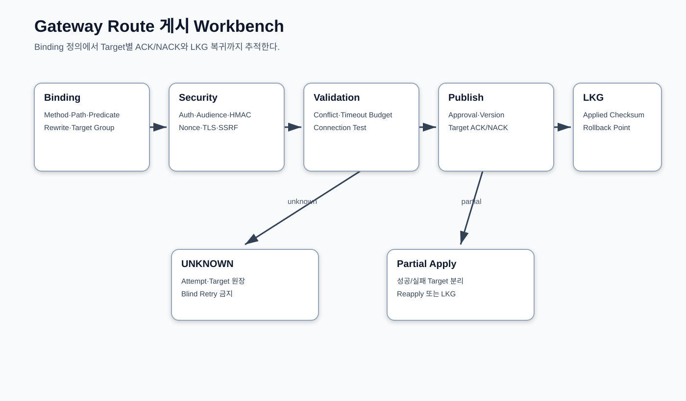

# CPF Gateway 매뉴얼

> 문서: `CPF Gateway 매뉴얼`
> 기준 Repository: `https://github.com/freeangelsun/202412_01_CPF`
> 기준 Branch: `master`
> 기준 Commit: `2a013663090d4e430a15983ad7269f8e86c5ef58` (`Merge B`)
> 기준일: `2026-08-06 Asia/Seoul`

| 항목 | 내용 |
|---|---|
| 주 독자 | API 개발자·보안담당자·Gateway 운영자 |
| 문서 목적 | 고객 API를 등록·검증·게시하고 인증·라우팅·제한·적용·복구를 운영한다. |
| 기능 서술 전제 | CPF 제품 기능은 고객이 사용할 수 있는 상태로 설명한다. 구현 진행률이나 개발 관리 상태는 이 문서의 사용 절차에 섞지 않는다. |
| 사실 우선순위 | 실제 Source·SQL·API·Config·Frontend·Script·Test → 설계·사양 → 본 매뉴얼 |
| 상태 표현 | 업무 상태와 운영 결과는 Source의 상태값을 사용한다. 문서 검토 상태는 `완료`, `부분 구현`, `미구현`, `미검증`, `실패`, `재확인 필요`만 사용한다. |

## 1. Gateway 선택 기준

Gateway는 외부 Client와 내부 업무 Service 사이의 Trust Boundary다. 다음 조건 중 하나 이상이면 선택한다.

- 외부 API 인증·인가·HMAC·Nonce·Replay 방지가 필요하다.
- Route·Predicate·Filter·Rewrite를 중앙에서 관리한다.
- Target Discovery·Load Balancing·Timeout·Circuit·Bulkhead를 통제한다.
- 외부 Write의 Attempt Ledger와 UNKNOWN_RESULT 대사가 필요하다.
- Validate·Approve·Publish·ACK/NACK·LKG·Rollback 운영이 필요하다.

내부 Same-JVM 호출이나 단순 Service 간 호출을 불필요하게 Gateway로 우회시키지 않는다.

## 2. 설치와 배포 단위

1. Gateway Artifact·Manifest·Source SHA·Checksum을 확인한다.
2. Gateway DB/Policy Store·Secret Provider·Certificate·Service Registry를 준비한다.
3. Runtime 계정과 외부/내부 Network Zone을 분리한다.
4. Public Listener와 Admin/Probe Listener를 분리한다.
5. Route가 없는 상태로 기동해 Health·Capability·Version을 확인한다.
6. Server Group·Binding·Security Policy를 Draft로 등록한다.
7. Connection Test·Validate·Approval·Publish 후 Traffic을 연결한다.
8. LKG Version과 Rollback 절차를 저장한다.

## 3. Server Group·Target·Discovery

Server Group은 논리 Target 집합이며 Member는 URL/Host, Zone, Weight, Health, TLS, Discovery Metadata를 갖는다.

- Member 0개 Group을 활성화하지 않는다.
- 동일 Target 중복과 Weight 합계 오류를 검증한다.
- DNS/Discovery 결과와 등록 Host Allowlist를 대사한다.
- Health 실패 Target은 정책에 따라 제외하되 모든 Target 실패를 숨기지 않는다.
- Group 삭제 전 참조 Binding을 확인한다.
- 변경은 Version과 Expected Version을 사용한다.

### 3.1 Server Group 입력

| Field | 목적 | 검증 |
|---|---|---|
| Group ID/Version | Route가 참조하는 Target 집합 | 중복·Version CAS |
| Target URI | 실제 Endpoint | Scheme·Host·Port·Path 제한 |
| Weight/Priority | Load Balancing | 합계·범위·동일 Priority 규칙 |
| Zone/Metadata | 근접성·격리 | 허용 값·Discovery 일치 |
| Health Path | Probe | 인증·Timeout·응답 조건 |
| TLS Profile | Trust/Client Cert | 만료·SAN·Chain |
| Enabled | Routing 참여 | 최소 가용 Target 보호 |

Discovery를 사용할 때도 Runtime에서 해석된 Member Snapshot과 Version을 기록한다. Target이 0개인 Group이나 검증되지 않은 Target을 Publish하지 않는다.

## 4. Route·Predicate·Filter·Rewrite

Route Binding 설계표:

| 항목 | 내용 |
|---|---|
| Route ID/Version | 불변 식별자와 변경 Version |
| Listener | Host·Port·TLS Profile |
| Predicate | Path·Method·Header·Host·Query |
| Rewrite | Prefix Strip/Add·Path Template·Header Mapping |
| Target | Server Group·Discovery·Load Balancing |
| Timeout | Connect·Response·Overall Budget |
| Resilience | Retry Predicate·Circuit·Bulkhead·Rate Limit |
| Security | Auth·Audience·HMAC·Nonce·Body Hash·SSRF·TLS |
| Idempotency | Key Source·Attempt Ledger·Result Lookup |
| Operations | Log·Metric·Trace·Connection Test·Rollback |

Predicate와 Rewrite 순서를 바꾸면 실제 Target URI가 달라질 수 있으므로 Golden Request Test를 유지한다.

### 4.1 Route 설계 순서

1. 외부 Method·Path와 내부 Target Group을 정한다.
2. Host/Header/Query/Source 조건과 우선순위를 정한다.
3. Path Rewrite·Header 변환·민감 Header 제거 규칙을 정한다.
4. Request/Response Size와 Content Type을 제한한다.
5. Authentication·Authorization·HMAC/TLS·SSRF 정책을 연결한다.
6. Timeout Budget과 Retryable 조건을 정한다.
7. Idempotency·Attempt Ledger·UNKNOWN 처리 여부를 정한다.
8. 중복 Path/Predicate와 Shadow Route를 Validate한다.
9. Connection Test와 Negative Test를 수행한다.
10. Preview·Approval·Publish·Target ACK를 확인한다.

### 4.2 고객 Route 예시

```yaml
routeId: PAY-INSTITUTION-TRANSFER-V1
method: POST
externalPath: /partners/v1/transfers
targetGroup: PAY-INSTITUTION-GROUP
predicates:
  contentType: application/json
security:
  authentication: HMAC
  audience: pay-transfer
resilience:
  connectTimeout: 2s
  responseTimeout: 8s
  retry: result-confirmation-required
idempotency:
  header: Idempotency-Key
```

예시는 설계 항목을 보여 주며 실제 Property/API 형식은 Gateway Source와 ADM Generated Client를 따른다.

## 5. Authentication·Authorization

외부 사용자/API Key/OAuth Client 인증과 내부 Service Identity를 분리한다. Gateway는 Issuer, Audience, Subject/Client, Scope/Permission, Token Expiry를 검증하고 내부 요청에는 검증된 Identity만 전달한다.

업무 권한의 최종 판정이 업무 Service에 있다면 Gateway는 1차 접근 제어를 수행하고 업무 Data Scope를 임의로 확대하지 않는다. 인증 실패, 권한 실패, Rate Limit, Target 실패를 서로 다른 Error Code로 매핑한다.

## 6. HMAC·Audience·Body Hash·Nonce

HMAC Canonical String 예:

```text
HTTP_METHOD + "
" +
NORMALIZED_PATH + "
" +
CANONICAL_QUERY + "
" +
CONTENT_SHA256 + "
" +
TIMESTAMP + "
" +
NONCE + "
" +
AUDIENCE
```

- Header 이름·정렬·공백·Encoding 규칙을 고정한다.
- Body Hash는 실제 전달 Bytes를 기준으로 한다.
- Timestamp 허용 Window와 Server Clock 동기화를 관리한다.
- Nonce는 Audience/Client 범위에서 재사용을 차단한다.
- Signature 비교는 constant-time 방식을 사용한다.
- Key Rotation은 새/이전 Version Grace Window와 Consumer 전환을 포함한다.
- 정상·Body 변조·Path 변조·만료·Replay·Wrong Audience Test를 수행한다.

### 6.1 서명 검증 입력

- HTTP Method와 정규화된 Path/Query.
- Timestamp와 허용 Clock Skew.
- Audience·Client/Key ID.
- Body SHA-256 또는 빈 Body 규칙.
- Nonce와 Replay Window.
- 서명 대상 Header 목록과 정렬 규칙.

### 6.2 검증 순서

1. Key ID로 현재/Grace Version의 Secret Reference를 찾는다.
2. Timestamp 형식과 Clock Skew를 검사한다.
3. Nonce Ledger에서 같은 Client/Nonce 사용을 검사한다.
4. 실제 Body Hash를 계산해 Header와 비교한다.
5. Method·Path·Query·Audience·Timestamp·Nonce·Body Hash를 Canonical 문자열로 만든다.
6. Constant-time 방식으로 Signature를 비교한다.
7. 성공 시 Nonce/Attempt를 기록하고 Target Dispatch로 이동한다.
8. 실패 시 어떤 값이 달랐는지 민감정보 없이 Error/Audit에 남긴다.

### 6.3 Negative Test

Signature 변조, Body 변경, 잘못된 Audience, 만료 Timestamp, 미래 Timestamp, Nonce Replay, 폐기 Key, TLS Client Identity 불일치를 각각 검증한다.

## 7. SSRF·TLS

SSRF 방어:

1. Scheme은 승인된 `https` 등만 허용한다.
2. Host는 등록된 Server Group Member 또는 Allowlist만 사용한다.
3. Loopback·Link-local·Private Range 정책을 명시한다.
4. DNS Rebinding을 고려해 Resolve 결과도 검증한다.
5. Redirect 후 Target을 다시 검증한다.
6. User 입력으로 Raw Target URL을 만들지 않는다.

TLS는 Protocol/Cipher, Truststore, Client Certificate, Hostname Verification, SAN, Expiry, Revocation 정책을 관리한다. 인증서 오류를 검증 해제로 우회하지 않는다.

### 7.1 SSRF 방어

- 운영자가 등록한 Target이라도 Scheme·Host·Port·DNS 해석 결과를 검증한다.
- Loopback·Link-local·Metadata Endpoint·내부 관리망·허용되지 않은 사설 대역을 차단한다.
- Redirect 후 Location도 같은 정책으로 재검증한다.
- DNS Rebinding을 고려해 연결 대상 IP와 정책 검증 결과를 연결한다.
- 사용자 입력으로 전체 Target URL을 만들지 않고 등록된 Group/Binding을 사용한다.

### 7.2 TLS 운영

Certificate Chain·SAN·Hostname·Protocol/Cipher·Client Certificate·OCSP/CRL 정책을 정한다. Rotation은 신규/기존 Version 병행, Target Probe, Consumer 전환, Grace 종료 순서로 수행한다. 만료·Trust 오류를 Timeout으로 치환하지 않는다.

## 8. Timeout·Retry·Circuit Breaker·Bulkhead

Timeout Budget은 Client Overall > Gateway Processing + Target Timeout + Network Margin 관계를 갖는다. Retry는 Idempotent Method 또는 Idempotency Key와 Target 결과 조회가 가능한 Operation에만 적용한다.

- 4xx Validation/Auth는 Retry하지 않는다.
- Connect 실패와 명시 5xx는 정책에 따라 Retry한다.
- Write 응답 유실은 Attempt Ledger로 UNKNOWN_RESULT를 만들고 Blind Retry하지 않는다.
- Circuit은 Rolling Window·Failure Rate·Open Duration·Half-open Probe를 정의한다.
- Bulkhead는 Route/Target별 Concurrency와 Queue를 제한한다.
- Rate Limit은 Client/Tenant/Route 기준과 응답 Header를 정의한다.

### 8.1 Timeout Budget

`Client Deadline > Gateway 전체 Budget > Connect + TLS + Target Response + 변환/기록 여유`

상위 Deadline보다 긴 하위 Timeout을 두지 않는다. Queue 대기와 Retry Backoff도 전체 Budget에 포함한다.

### 8.2 Retry 결정

| 요청/오류 | Retry | 선행 조건 |
|---|---:|---|
| Connect 전 실패 | 정책상 가능 | Target 선택/Attempt 기록 |
| GET Timeout | 정책상 가능 | 전체 Budget·중복 부작용 없음 |
| POST Dispatch 후 Timeout | 바로 재시도 금지 | Idempotency·Target 결과 조회 |
| 4xx Validation/Auth | X | 요청·Credential 수정 |
| 429/503 | 제한적 | Retry-After·Backoff·Bulkhead |
| TLS/HMAC 실패 | X | Certificate/Key/Clock 수정 |

Circuit와 Bulkhead는 장애 전파를 제한하지만 업무 결과를 확정하지 않는다. 열린 Circuit의 요청도 Attempt/Error로 추적한다.

## 9. Idempotency·Attempt Ledger·UNKNOWN_RESULT

Gateway Write Attempt는 Route Version, Client, Idempotency Key, Request Hash, Target, Attempt No, Dispatch Time, Response/Timeout, Result State를 기록한다.

1. 같은 Key·같은 Hash는 기존 결과를 반환한다.
2. 같은 Key·다른 Hash는 Conflict다.
3. Dispatch 전 실패는 FAILED다.
4. Target Dispatch 후 응답 유실은 UNKNOWN_RESULT다.
5. Target 거래 조회로 결과를 확정한다.
6. Target 성공이면 내부 Result를 Reconcile한다.
7. Target 실패 확정이면 정책에 따라 새 Attempt를 만든다.
8. 이미 부작용이 있으면 Compensation을 실행한다.

Attempt를 수정·삭제해 이력을 없애지 않는다.

### 9.1 Attempt Ledger

| Field | 설명 |
|---|---|
| Operation/Attempt ID | 요청과 각 Target 시도 식별자 |
| Idempotency Key·Request Hash | Replay·Conflict 판정 |
| Route/Version·Target | 사용한 계약과 실제 대상 |
| Dispatch At·Stage | 외부 부작용 시작 여부 |
| HTTP/Protocol Result | 명시 응답·Error Mapping |
| Status | REQUESTED/RUNNING/SUCCEEDED/FAILED/UNKNOWN |
| Response Snapshot/Hash | Replay와 대사 |
| Approval/Audit | 운영 후속 조치 근거 |

### 9.2 응답 유실 판정

1. Gateway가 Target Dispatch를 시작했는지 확인한다.
2. 같은 Idempotency/업무 Key로 Target 거래 원장을 조회한다.
3. 성공이면 기존 Result를 확정하고 Client Replay에 반환한다.
4. 실패가 명시되면 정책에 따라 새 Attempt를 만든다.
5. 결과를 찾지 못하면 UNKNOWN을 유지하고 시간이 지난 뒤 재대사한다.
6. 부분 Target이면 성공 Target을 보존하고 실패 Target만 후속 조치한다.

## 10. Connection Test

Connection Test는 DNS→TCP→TLS→Authentication→HTTP/Protocol→Response Validation 단계로 수행한다.

입력: Server Group, Member/Target, Route Security Profile, Timeout, Test Payload Reference.

결과: Test ID, Stage, Start/End, Latency, Certificate, HTTP Status, Error Code, Operation ID.

실패 Stage의 원인을 수정한 뒤 같은 설정 Version을 Revalidate한다. 취소는 실행 중 Stage에 전달되며 완료된 결과는 이력으로 남는다.

### 10.1 단계별 Test

| Stage | 확인 | 실패 예 |
|---|---|---|
| Resolve | Host→IP·정책 | DNS 실패·금지 IP |
| Connect | TCP/Proxy | Refused·Timeout |
| TLS | Chain·SAN·Client Cert | 만료·Unknown CA·Hostname |
| Authenticate | Token/HMAC/mTLS | Audience·Signature·Clock |
| Protocol | Method·Header·Payload | 4xx·Schema·Encoding |
| Business Probe | 기대 Code/Body | 잘못된 Target·Version |
| Record | Test ID·Target·Stage·Result | Evidence 저장 실패 |

Connection Test 성공은 실제 업무 전체 성공을 뜻하지 않는다. Route Security·Transformation·Idempotency와 업무 Negative Test를 별도로 수행한다.

## 11. Validate·Approve·Publish

1. Binding/Group/Security Draft를 저장한다.
2. Schema·경로 충돌·Target·SSRF·TLS·Timeout·Retry·Permission을 Validate한다.
3. Connection Test와 Golden Request를 실행한다.
4. Preview에서 Target별 변경·Checksum·영향 Route를 확인한다.
5. 요청자와 승인자가 분리된 Approval을 만든다.
6. 승인 Snapshot과 현재 Draft Version이 같은지 확인한다.
7. Target별 Publish를 실행하고 ACK/NACK/UNKNOWN을 기록한다.
8. 모든 Target Applied Version·Checksum을 확인한다.
9. Probe와 실제 거래 Smoke를 수행한다.
10. 새 Version을 LKG로 승격한다.

### 11.1 Publish State

`DRAFT → VALIDATED → APPROVAL_REQUESTED → APPROVED → PUBLISHING → APPLIED/PARTIAL/FAILED → ROLLED_BACK`

### 11.2 Gate

- Binding/Group/Target/Security Reference 존재.
- Path·Method·Predicate 충돌 없음.
- SSRF/TLS/HMAC Negative Test 통과.
- Timeout/Retry/Idempotency 계약 일치.
- Connection Test와 Business Probe 통과.
- Generated Version·Checksum·Target Snapshot 고정.
- 요청자와 승인자 분리·승인 만료 전.
- 모든 Target ACK 또는 승인된 부분 적용 정책.
- LKG와 Rollback 경로 존재.



## 12. Partial Apply·LKG·Rollback

| 상태 | 의미 | 조치 |
|---|---|---|
| ACK | Target이 Version·Checksum 적용을 명시 | Probe 후 유지 |
| NACK | Validation/Apply를 명시 거부 | 원인 수정 후 실패 Target 재게시 |
| UNKNOWN | Publish 후 결과 Evidence 부족 | Target 상태 대사 |
| PARTIAL | Target 결과가 섞임 | 성공 Target 유지 또는 정책 전체 LKG Rollback |
| DRIFT | 중앙 Version과 Target Observed가 다름 | Reconcile 또는 Rollback |

Rollback은 이전 LKG Definition·Security·Target Group·Checksum을 사용한다. 일부 Target만 Rollback되면 PARTIALLY_ROLLED_BACK으로 남기고 나머지를 대사한다.

### 12.1 Target별 판정

| Target 결과 | 전체 상태 | 운영 Action |
|---|---|---|
| 전부 ACK·Checksum 일치 | APPLIED | 관측 후 종료 |
| 일부 NACK | PARTIAL | 성공 Target 보존, 실패 Target 원인 수정 |
| ACK 응답 유실 | UNKNOWN | Target Applied Version 조회 |
| 적용 후 Probe 실패 | FAILED/PARTIAL | Traffic 격리·LKG Rollback |
| Rollback 일부 실패 | PARTIALLY_ROLLED_BACK | 남은 Target별 복구 |

Rollback은 Definition만 이전 Version으로 바꾸는 일이 아니다. Target Applied Version·Checksum·Traffic·Connection Test·Attempt·Audit가 LKG와 일치해야 한다.

## 13. Scale-out·Drift·Reconciliation

Gateway Instance를 늘릴 때 Route/Policy Applied Version, Secret/Certificate, Nonce/Idempotency Store, Circuit/Rate State, Event Checkpoint를 확인한다. Local Memory만 공유 상태로 가정하지 않는다.

Drift Scan은 중앙 Desired와 Instance Observed Version·Checksum·Capability를 비교한다. Drift를 발견하면 원인을 Config, Secret, Publish Event, Instance Offline, Manual Change로 분류하고 승인된 Reconcile을 수행한다.

## 14. ADM 메뉴 운영 순서

1. `/gateway-dashboard`: Traffic·Error·Circuit·Apply 상태.
2. `/gateway-servers`, `/gateway-groups`: Target Group·Member.
3. `/gateway-routes`: Binding·Predicate·Rewrite.
4. `/gateway-security`: Auth·HMAC·SSRF·TLS.
5. `/gateway-health`: Connection Test.
6. `/gateway-apply-status`: Publish ACK/NACK·LKG·Drift.
7. `/gateway-transactions`: Attempt·Target·내부 Trace.
8. `/gateway-log-policies`: Log Policy Applied Version.
9. `/approvals`, `/secrets`, `/resiliencePolicies`: 위험 조치와 공통 정책.

### 14.1. `/gateway-dashboard` — Gateway 대시보드

| 항목 | 내용 |
|---|---|
| Menu/Risk | `GATEWAY_DASHBOARD` / `MEDIUM` |
| 검색 | 환경, Gateway, Route, 기간 |
| Column | Gateway, Route 수, RPS, Error, Circuit, Apply 상태 |
| 상세 | Operations Snapshot, Event Stream, Capability |
| Button | 실시간 Event 보기; 상세 이동 |
| Operation | `admGatewayCapability`, `admGatewayOperationsSnapshot`, `admGatewayOperationsEvents`, `admGatewayOperationsStream` |
| 정상 판정 | Snapshot 시각과 Event 흐름이 연결되고 적용 Version이 표시된다. |
| 오류 경계 | Event Stream 단절과 Gateway 장애를 구분한다. |
| 복구 | Snapshot을 재조회하고 Stream 재연결 후 누락 구간은 Event History로 보완한다. |
| 실습 | 오류율 상승 Route를 Dashboard에서 찾아 거래 조회로 이동한다. |

### 14.2. `/gateway-servers` — Gateway 연동 서버

| 항목 | 내용 |
|---|---|
| Menu/Risk | `GATEWAY_SERVERS` / `MEDIUM` |
| 검색 | Group, Target, 상태, Zone |
| Column | Group, Member, URL Mask, Weight, Health, Version |
| 상세 | Member, TLS, Discovery, Load Balancing, Reference |
| Button | Group 저장; 삭제 |
| Operation | `admGatewayFindServerGroups`, `admGatewayFindGroupMembers`, `admGatewaySaveServerGroup`, `admGatewayDeleteServerGroup` |
| 정상 판정 | 모든 Member가 검증되고 최소 가용 Member가 유지된다. |
| 오류 경계 | 중복 Target·SSRF 제한·TLS 실패·참조 중 삭제를 구분한다. |
| 복구 | 연결시험을 통과한 Member만 저장하고 참조 Route가 없을 때 Group을 삭제한다. |
| 실습 | 2개 Target Group을 등록하고 Health를 확인한다. |

### 14.3. `/gateway-groups` — Gateway 서버 그룹

| 항목 | 내용 |
|---|---|
| Menu/Risk | `GATEWAY_GROUPS` / `MEDIUM` |
| 검색 | Group, Member, 상태 |
| Column | Group, Members, Weight 합계, Health, Version |
| 상세 | Member 목록, Routing 결과, Apply 상태 |
| Button | Group 저장; 삭제 |
| Operation | `admGatewayFindServerGroups`, `admGatewayFindGroupMembers`, `admGatewaySaveServerGroup`, `admGatewayDeleteServerGroup` |
| 정상 판정 | 가중치와 Health 조건이 정책에 맞고 Runtime 적용 상태가 일치한다. |
| 오류 경계 | 가중치 오류·Member 0개·부분 적용·참조 중 삭제를 구분한다. |
| 복구 | Preview에서 Target 분배를 확인하고 이전 Group Version으로 Rollback한다. |
| 실습 | 가중치 80/20 Group을 적용해 Preview를 확인한다. |

### 14.4. `/gateway-routes` — Gateway 경로·라우팅

| 항목 | 내용 |
|---|---|
| Menu/Risk | `GATEWAY_ROUTES` / `MEDIUM` |
| 검색 | Route ID, Path, Method, Group, 상태 |
| Column | Binding, Method, Path, Target Group, Security, Timeout, Version |
| 상세 | Predicate, Filter, Rewrite, Retry, Circuit, Audit |
| Button | Binding 저장; 상태 변경; 삭제 |
| Operation | `admGatewayFindBindings`, `admGatewaySaveBinding`, `admGatewayChangeBindingState`, `admGatewayDeleteBinding` |
| 정상 판정 | 경로 충돌이 없고 Validate·Approve·Publish 후 Target ACK가 일치한다. |
| 오류 경계 | 중복 Path·미지원 Predicate·Version 충돌·NACK를 구분한다. |
| 복구 | LKG를 유지한 채 실패 Binding을 수정해 새 Version으로 게시한다. |
| 실습 | 신규 REST Route를 등록해 Publish와 Probe까지 수행한다. |

### 14.5. `/gateway-security` — Gateway 보안·제한

| 항목 | 내용 |
|---|---|
| Menu/Risk | `GATEWAY_SECURITY` / `HIGH` |
| 검색 | Route, 인증 방식, Audience, 상태 |
| Column | Route, Auth, HMAC, Body Hash, Nonce, TLS, SSRF, Version |
| 상세 | Canonicalization, Allowed Host, Certificate, Replay Window |
| Button | Security 정책 저장; 상태 변경 |
| Operation | `admGatewayFindBindings`, `admGatewaySaveBinding`, `admGatewayChangeBindingState` |
| 정상 판정 | Negative Test가 차단되고 정상 요청의 서명·Audience·Nonce가 검증된다. |
| 오류 경계 | Clock skew·Nonce replay·Body hash 불일치·SSRF·TLS 오류를 구분한다. |
| 복구 | 정책을 완화하지 않고 Key/Clock/Certificate/Allowlist 원인을 수정한다. |
| 실습 | HMAC Route의 정상·변조·Replay 요청을 검증한다. |

### 14.6. `/gateway-health` — Gateway Health·연결시험

| 항목 | 내용 |
|---|---|
| Menu/Risk | `GATEWAY_HEALTH` / `MEDIUM` |
| 검색 | Gateway, Group, Target, Test 상태 |
| Column | Test ID, Target, Stage, Latency, TLS, Result, Operation |
| 상세 | DNS/TCP/TLS/HTTP 단계, Apply Status, Error |
| Button | 연결시험 요청; 취소; 재검증 |
| Operation | `admGatewayCapability`, `admGatewayFindApplyStatus`, `admGatewayFindConnectionTests`, `admGatewayRequestConnectionTest`, `admGatewayFindConnectionTestOperation`, `admGatewayCancelConnectionTest`, `admGatewayRevalidateConnectionTest` |
| 정상 판정 | 각 단계 결과가 기록되고 성공 Target만 게시 후보가 된다. |
| 오류 경계 | DNS·TCP·TLS·Auth·응답검증 실패를 단계별로 구분한다. |
| 복구 | 실패 Stage 원인을 수정한 뒤 같은 설정 Version을 재검증한다. |
| 실습 | Target 1개 연결시험을 단계별로 분석한다. |

### 14.7. `/gateway-transactions` — Gateway 거래 조회

| 항목 | 내용 |
|---|---|
| Menu/Risk | `GATEWAY_TRANSACTIONS` / `MEDIUM` |
| 검색 | Transaction ID, Route, Target, 상태, 기간 |
| Column | Transaction, Route, Target, Attempt, Status, Duration, Error |
| 상세 | Attempt Timeline, Header Mask, Retry/Circuit, Internal Trace |
| Button | Transaction 상세 |
| Operation | `admGatewayOperationsSnapshot`, `admGatewayOperationsEvents`, `traceAdmByTransactionId` |
| 정상 판정 | Gateway Attempt와 내부 Trace가 같은 Transaction ID로 연결된다. |
| 오류 경계 | Trace 전파 누락·Retry 중복·Target Timeout·응답 유실을 구분한다. |
| 복구 | Attempt Ledger와 Target 거래 원장을 대사한다. |
| 실습 | 응답 유실 Gateway 거래의 최종 결과를 판정한다. |

### 14.8. `/gateway-log-policies` — Gateway 로그 정책

| 항목 | 내용 |
|---|---|
| Menu/Risk | `GATEWAY_LOG_POLICY` / `MEDIUM` |
| 검색 | Policy, Route, 상태, Version |
| Column | Policy, Route, Sampling, Masking, Applied Version, 상태 |
| 상세 | Policy Detail, Target Distribution, Snapshot |
| Button | 정책 상세 이동 |
| Operation | `admGatewayOperationsSnapshot`, `admLogPolicyFindPolicies`, `admLogPolicyDistributionStatus` |
| 정상 판정 | Gateway Applied Version과 중앙 Log Policy Version이 일치한다. |
| 오류 경계 | 일부 Target stale·Masking 불일치·Sampling Drift를 구분한다. |
| 복구 | 중앙 Log Policy 화면에서 실패 Target을 재배포하거나 Rollback한다. |
| 실습 | Gateway 2대의 Log Policy Version을 대사한다. |

### 14.9. `/gateway-apply-status` — Gateway 적용 상태·이력

| 항목 | 내용 |
|---|---|
| Menu/Risk | `GATEWAY_APPLY_STATUS` / `MEDIUM` |
| 검색 | Version, Route, Target, 상태, 기간 |
| Column | Publish ID, Version, Target, ACK/NACK, Applied, LKG, 시각 |
| 상세 | Event History, Connection Test, Checksum, Rollback |
| Button | 상세 조회 |
| Operation | `admGatewayFindApplyStatus`, `admGatewayOperationsEvents`, `admGatewayFindConnectionTestOperation` |
| 정상 판정 | 모든 Target의 Version·Checksum이 같고 LKG가 보존된다. |
| 오류 경계 | NACK·부분 적용·ACK 유실·Drift를 구분한다. |
| 복구 | Target 원장과 Event를 대사하고 실패 Target만 재적용하거나 LKG Rollback한다. |
| 실습 | 부분 적용 Version을 LKG로 정상화한다. |

## 15. 장애 Runbook

### Target Timeout/응답 유실

Gateway Attempt와 Target 거래 원장을 대사한다. Write를 결과 확인 없이 재시도하지 않는다.

### HMAC 실패 증가

Clock, Key Version, Canonicalization, Body 변환, Audience, Nonce Store를 순서대로 확인한다.

### TLS 실패

Certificate Chain·SAN·Expiry·Truststore·Client Certificate·Clock을 확인한다.

### SSRF 차단

요청 Target과 등록 Group/Allowlist/DNS Resolve를 비교한다. 정책을 임시 해제하지 않는다.

### Circuit OPEN

Target 실제 Health와 Failure 분류를 확인한다. Retry Storm이 원인인지 판정하고 Half-open Probe를 제한한다.

### Publish NACK/Partial

Validate·Connection Test·Target Error를 확인하고 LKG를 유지한다. 실패 Target만 재게시하거나 전체 Rollback한다.

### Drift

Instance Version·Checksum·Event Checkpoint를 대사하고 Manual Change를 제거한다.

### 15.1 증상별 처리

| 증상 | 우선 확인 | 복구 | 종료 판정 |
|---|---|---|---|
| Target 전부 Down | Group Member·DNS/TCP/TLS | 가용 Target/LKG Group 복구 | Probe와 업무 요청 성공 |
| 일부 Target Error | Target별 Error/Attempt | 실패 Target Traffic 제외 | 성공 Target만 Routing·Drift 0 |
| HMAC 실패 증가 | Clock·Key Version·Canonical Input | Clock/Key/Client 계약 수정 | 정상/변조/Replay Test 결과 일치 |
| Nonce Replay | Client/Nonce Ledger | Client 중복 원인 제거 | 같은 Nonce 차단·새 Nonce 성공 |
| SSRF 차단 | 해석 IP·Redirect·Allowlist | 올바른 Target 등록 | 금지 주소 차단·허용 Target Probe |
| Timeout 증가 | Stage·Budget·Target Latency | Capacity/Timeout 정책 조정 | Budget 안 성공·Retry Storm 없음 |
| UNKNOWN 증가 | Dispatch·Target 원장·Idempotency | Reconcile | 모든 Attempt 종결 상태 |
| Publish NACK | Target Error·Version·Checksum | 실패 Target 수정/Reapply | 모든 Target 일치 또는 LKG |
| Drift | 중앙 Definition vs Applied | Reconcile/Republish | Version·Checksum 일치 |
| Certificate 만료 | Provider·Target·Grace Version | 승인 Rotation | 모든 Target 새 Chain·구 Version 종료 |

## 16. 교육 과정

교육 ID `EDU-GW-01`:

1. Test Server Group 2개 Member를 등록한다.
2. Path/Method Predicate와 Header Rewrite Route를 만든다.
3. OAuth Audience와 HMAC·Body Hash·Nonce 정책을 적용한다.
4. 정상·Body 변조·Nonce Replay·SSRF·TLS 실패 Test를 실행한다.
5. Connection Test를 단계별로 확인한다.
6. Validate·Approval·Publish를 실행한다.
7. Target 1개 NACK을 만들어 PARTIAL 상태를 확인한다.
8. 실패 Target 재게시와 전체 LKG Rollback을 각각 실습한다.
9. Write 응답 유실을 만들어 Attempt Ledger로 Reconcile한다.
10. ADM Dashboard·Transactions·Apply Status·Audit를 확인한다.

### 16.1 과정

1. Server Group 2개 Target을 등록하고 Weight/Health를 확인한다.
2. REST Binding과 Path Rewrite를 정의한다.
3. HMAC·Audience·Body Hash·Nonce 정책을 적용한다.
4. 정상·Signature 변조·Body 변조·Nonce Replay·SSRF·TLS 오류를 실행한다.
5. Target 한 곳을 중지해 Circuit/Bulkhead·부분 실패를 확인한다.
6. POST 응답을 차단해 UNKNOWN을 만들고 Target 원장으로 대사한다.
7. Route Version을 승인·Publish하고 Target 하나의 NACK를 만든다.
8. 실패 Target만 재적용한 뒤 LKG Rollback을 수행한다.
9. Gateway Transaction과 내부 Trace를 연결한다.
10. Route·Security·Connection·Apply·Audit Evidence를 운영 인계한다.

## 17. Backup·Upgrade·Rollback·운영 인계

Backup 대상은 Server Group·Binding·Security·Resilience·Publish/LKG·Attempt/Idempotency·Secret Metadata·Certificate·Audit다.

Upgrade는 Runtime Artifact, Route Schema, Generated Client, DB Migration, Secret/Certificate, Publish Event 호환을 검토한다. 운영 인계에는 Route Owner, Target, Security, Timeout, Retry, Idempotency, Probe, Alert, LKG, Rollback, UNKNOWN 대사, 담당자를 포함한다.
