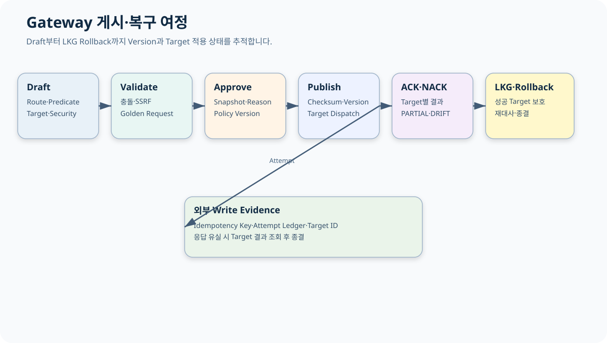

# CPF Gateway 매뉴얼

> 기준 Repository: `https://github.com/freeangelsun/202412_01_CPF`
> 기준 Branch: `master`
> 기준 Commit: `ee977cf66c251081df78ea5e9675b81c3dfafa59` (`06_07`)
> 기준일: `2026-08-06 Asia/Seoul`

| 항목 | 내용 |
|---|---|
| 주 독자 | API 개발자·보안담당자·Gateway 운영자, Gateway를 처음 구성하는 담당자 |
| 이 문서로 완료할 일 | 외부 API Route와 Target·보안·Timeout·Attempt를 설계하고 Validate·Approve·Publish·ACK/NACK·LKG Rollback을 운영한다. |
| 읽는 방식 | 처음 접하는 독자는 앞에서부터 실습 순서로 읽고, 숙련자는 장별 판단표와 참조 경로를 사용한다. |
| 설명 원칙 | 제품 기능은 사용할 수 있는 상태로 설명한다. 실제 Source·SQL·API·Config·Frontend·Script·Test의 이름과 경계를 유지한다. |




## 1. Gateway를 선택할 때

다음 중 하나 이상이면 Gateway를 사용한다.

- 외부 Client 인증·인가·HMAC·Nonce·Replay 방지가 필요하다.
- Route·Predicate·Filter·Rewrite를 중앙 정책으로 관리한다.
- Target Discovery·Load Balancing·Timeout·Circuit·Bulkhead를 통제한다.
- 외부 Write의 Attempt Ledger와 `UNKNOWN_RESULT` 대사가 필요하다.
- Validate·Approval·Publish·ACK/NACK·LKG·Rollback이 필요하다.

내부 Same-JVM 호출이나 단순 Service 간 호출을 모두 Gateway로 우회하지 않는다.

## 2. 설치와 Network Zone

1. Artifact·Manifest·Source SHA·Checksum 확인.
2. Policy Store·Secret Provider·Certificate 준비.
3. Public Listener와 Admin·Probe Listener 분리.
4. 외부·내부 Network Zone과 Firewall 정의.
5. Route 없는 상태로 기동.
6. Health·Capability·Version 확인.
7. LKG와 Rollback 절차 저장.

## 3. Server Group과 Target

| Field | 예 | 검증 |
|---|---|---|
| Group ID | `PAY-INSTITUTION-GROUP` | 중복·Version CAS |
| Target URI | `https://pay-a.internal` | Scheme·Host·Port·Path Allowlist |
| Weight | 70 | 범위·합계 |
| Zone | `seoul-a` | Discovery Metadata |
| Health Path | `/actuator/health/readiness` | Timeout·인증·응답 |
| TLS Profile | `PAY-MTLS-V2` | Chain·SAN·만료 |
| Enabled | true | 최소 가용 Target |

Member가 0개인 Group을 활성화하지 않는다. DNS 결과와 허용 IP 정책을 함께 확인한다.

## 4. Route 설계

```yaml
routeId: PAY-INSTITUTION-TRANSFER-V1
version: 3
listener: partner-https
method: POST
externalPath: /partners/v1/transfers
predicates:
  contentType: application/json
rewrite:
  targetPath: /internal/pay/transfers
headers:
  remove: [Cookie, X-Internal-Token]
targetGroup: PAY-INSTITUTION-GROUP
security:
  authentication: HMAC
  audience: pay-transfer
resilience:
  connectTimeout: 2s
  responseTimeout: 8s
  overallBudget: 12s
idempotency:
  header: Idempotency-Key
```

## 5. Predicate·Rewrite·Filter

1. Method·Path·Host·Header·Query 조건을 정한다.
2. 우선순위와 Shadow Route를 검사한다.
3. Rewrite 뒤 실제 Target Path를 계산한다.
4. 민감 Header를 제거한다.
5. Request·Response Size와 Content Type을 제한한다.
6. Golden Request로 Target URI와 Header를 검증한다.

Rewrite 순서가 바뀌면 Target URI가 달라질 수 있으므로 Golden Request Test를 유지한다.

## 6. Authentication·Authorization

외부 Client Identity와 내부 Service Identity를 분리한다.

- Issuer·Audience.
- Client·Subject.
- Scope·Permission.
- Token Expiry·Clock Skew.
- Key·Certificate Version.

Gateway의 1차 접근 제어가 업무 Service의 Data Scope를 대신하지 않는다.

## 7. HMAC

Canonical String 예:

```text
HTTP_METHOD
NORMALIZED_PATH
CANONICAL_QUERY
CONTENT_SHA256
TIMESTAMP
NONCE
AUDIENCE
```

검증 순서:

1. Key ID로 현재·Grace Version 찾기.
2. Timestamp와 Clock Skew 검사.
3. Nonce 재사용 검사.
4. 실제 Body Hash 계산.
5. Canonical String 생성.
6. Constant-time 방식으로 Signature 비교.
7. 성공 시 Nonce·Attempt 기록.
8. 실패는 민감정보 없이 Error·Audit 기록.

Negative Test:

- Body 변경.
- Path 변경.
- Wrong Audience.
- 만료·미래 Timestamp.
- Nonce Replay.
- 폐기 Key.
- Client Certificate 불일치.

## 8. SSRF·TLS

SSRF 방어:

- 승인 Scheme만 허용.
- 등록 Server Group 또는 Allowlist Host만 허용.
- Loopback·Link-local·Metadata Endpoint 차단.
- DNS Resolve 결과 검증.
- Redirect Target 재검증.
- 사용자 입력으로 전체 Target URL 생성 금지.

TLS는 Protocol·Cipher·Truststore·Client Certificate·Hostname·SAN·Expiry·Revocation을 관리한다. 인증서 오류를 검증 해제로 우회하지 않는다.

## 9. Timeout Budget

```text
Client Deadline
  > Gateway Overall Budget
  > Queue + Connect + TLS + Target Response + Transform + Ledger
```

상위 Deadline보다 긴 하위 Timeout을 두지 않는다. Retry Backoff도 Overall Budget에 포함한다.

| 상황 | Retry |
|---|---|
| 400 Validation | X |
| 401·403 | X |
| Connect 전 실패 | 정책에 따라 O |
| 명시 5xx | 멱등성·한도 확인 뒤 O |
| Write 응답 유실 | Blind Retry 금지, Attempt 대사 |
| Circuit Open | X, 빠른 실패 |

## 10. Circuit·Bulkhead·Rate Limit

- Circuit: Window, Failure Rate, Open Duration, Half-open Probe.
- Bulkhead: Route·Target별 Concurrency와 Queue.
- Rate Limit: Client·Tenant·Route Key와 응답 Header.
- Queue가 Overall Budget을 초과하지 않게 한다.

## 11. Idempotency·Attempt Ledger

외부 Write 전에 저장할 값:

- Route ID·Version.
- Client ID.
- Idempotency Key.
- Request Hash.
- Target Group·Member.
- Attempt 번호.
- Dispatch 시각과 Deadline.
- Target Tracking ID.

같은 Key·같은 Hash는 기존 결과를 반환한다. 같은 Key·다른 Hash는 Conflict다.

응답 유실이면 Attempt를 `UNKNOWN_RESULT`로 두고 Target 조회 또는 업무 Owner 대사로 종결한다.

## 12. Validate·Approve·Publish

### Validate

- 중복 Route와 우선순위.
- Predicate·Rewrite 결과.
- Target 존재·Health.
- SSRF·TLS·Secret.
- Timeout 관계.
- Retry와 Idempotency.
- Schema·Checksum.
- Golden Request·Negative Test.

### Approve

승인 Snapshot에는 Route Version, Target, Security, Timeout, Checksum, 영향 Target, Reason, Expiry를 넣는다. 실행 시 Snapshot Drift를 확인한다.

### Publish

1. Publish Operation 생성.
2. Target별 Version·Checksum Dispatch.
3. ACK·NACK 수집.
4. Observed Version 확인.
5. `PARTIAL`과 `DRIFT` 분리.
6. 성공 Target 보존.
7. 실패 Target 재적용 또는 LKG Rollback.

## 13. Connection Test

Connection Test는 DNS, TCP, TLS, HTTP, Authentication, Target 응답을 단계별로 보여 준다.

| 단계 | 실패 예 | 다음 행동 |
|---|---|---|
| DNS | NXDOMAIN·잘못된 IP | Discovery·Allowlist 수정 |
| TCP | Refused·Timeout | Firewall·Port·Listener 확인 |
| TLS | Chain·SAN·Expired | Trust·Certificate Rotation |
| HTTP | 404·5xx | Health Path·Target 상태 |
| Auth | 401·403 | Service Identity·Audience |
| 응답 유실 | Operation 미종결 | Test Operation 조회 |

## 14. ACK·NACK·Partial Apply

| 상태 | 의미 | 행동 |
|---|---|---|
| ACK | Target이 Version 적용 | Observed와 Health 확인 |
| NACK | 검증·적용 거부 | Error와 Target 환경 보정 |
| Timeout | 결과 미수신 | Target Applied Version 조회 |
| PARTIAL | Target 결과 혼합 | 성공 Target 보존 |
| DRIFT | Desired·Observed 불일치 | Reconcile 또는 Rollback |

전체 재게시로 성공 Target을 불필요하게 건드리지 않는다.

## 15. LKG·Rollback

LKG에는 Route·Target·Security·Timeout·Checksum과 실제 ACK Target을 기록한다.

Rollback 순서:

1. 신규 Publish 중지.
2. 성공·실패 Target Snapshot.
3. 승인된 LKG 선택.
4. Target별 Rollback Dispatch.
5. ACK·NACK·Observed 확인.
6. Connection Test.
7. Traffic·Error·Attempt 대사.
8. Drift 0 확인.

## 16. Scale-out·Drift·Reconciliation

새 Gateway Instance가 기동되면 현재 Approved Version과 Checksum을 받아야 한다. 오래된 Config를 가진 Instance는 Traffic에서 제외한다.

Reconciliation은 Desired Route, Target Applied Version, Runtime Snapshot, Audit를 비교한다.

## 17. ADM 화면

- `/gateway-dashboard`: Traffic·Error·Apply 요약.
- `/gateway-servers`, `/gateway-groups`: Target.
- `/gateway-routes`: Predicate·Rewrite·Binding.
- `/gateway-security`: Auth·HMAC·Limit.
- `/gateway-health`: Connection Test.
- `/gateway-transactions`: Attempt·Trace.
- `/gateway-log-policies`: Masking·Sampling.
- `/gateway-apply-status`: ACK·NACK·Drift.

## 18. 종합 실습

1. 두 Target으로 Server Group 생성.
2. Health·TLS·Weight 검증.
3. POST Route Draft 생성.
4. HMAC·Audience·Nonce 설정.
5. Timeout·Circuit·Bulkhead 설정.
6. Golden Request와 Negative Test.
7. Approval 요청.
8. Publish하고 Target ACK 확인.
9. 한 Target에 잘못된 Certificate를 넣어 NACK 재현.
10. 성공 Target 보존, 실패 Target만 보정.
11. 응답 유실을 만들어 Attempt `UNKNOWN_RESULT` 재현.
12. Target 결과 조회로 종결.
13. LKG Rollback과 Drift 0 확인.

## 19. 장애 Runbook

### Target 전체 Down

- Circuit 상태 확인.
- 신규 Write 영향과 Queue 제한.
- Healthy Target·Failover 정책 확인.
- Attempt Unknown 대사.
- 복구 뒤 Half-open Probe.

### Retry Storm

- Retry Predicate와 한도 확인.
- Circuit·Bulkhead·Rate Limit 강화.
- Non-idempotent Write Retry 중지.
- Target 처리량과 Attempt 중복 대사.

### Key Rotation 실패

- Current·Grace Version 확인.
- Client별 Key Version 분포.
- 실패 Client를 이전 Version Grace로 유지.
- 새 Key 적용 뒤 Replay Negative Test.

### Partial Publish

- Target별 ACK·NACK·Observed 기록.
- 성공 Target 유지.
- 실패 Target 보정 또는 LKG.
- Connection Test와 Traffic 대사.

## 20. 운영 인계

- Listener·Zone·Certificate.
- Route·Predicate·Rewrite·Target.
- Auth·Audience·HMAC·Nonce·SSRF.
- Timeout·Retry·Circuit·Bulkhead·Rate Limit.
- Idempotency·Attempt·Target Status Query.
- Approval·Publish·ACK/NACK·LKG.
- Log·Metric·Trace·Alert.
- Scale-out·Drift·Reconcile.
- Incident·Rollback 담당자.

## 21. Gateway 자체 검수

1. 내부 호출을 불필요하게 Gateway로 우회하지 않는가?
2. Target이 Allowlist와 DNS 검증을 통과하는가?
3. Predicate·Rewrite Golden Test가 있는가?
4. Audience·Body Hash·Nonce Negative Test가 있는가?
5. Timeout Budget 관계가 맞는가?
6. 비멱등 Write를 Blind Retry하지 않는가?
7. Attempt Ledger와 Target 조회가 있는가?
8. Approval Snapshot과 Publish Version이 일치하는가?
9. PARTIAL의 성공 Target을 보존하는가?
10. LKG Rollback 뒤 Drift 0을 확인하는가?
