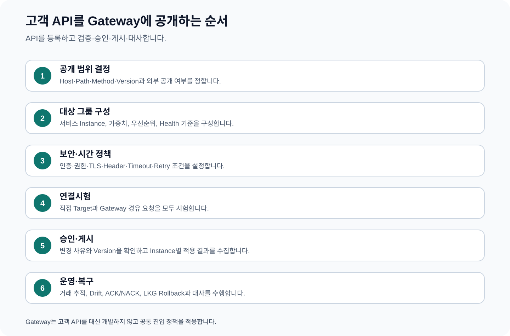

# CPF Gateway 매뉴얼 — 고객 API를 공개하고 운영하는 방법

> **주 독자**: 고객사 API 개발자, Gateway 운영자, 보안담당자, 배포승인자
> **이 문서의 목표**: 완성된 Gateway 제품으로 고객 API의 공개 주소·대상·인증·시간 제한·게시 버전을 구성하고, 연결시험·적용 상태·장애·되돌리기를 운영한다.

## 빠른 찾기

- [1. Gateway를 선택하는 경우](#1-gateway를-선택하는-경우)
- [2. 역할별 해야 할 일](#2-역할별-해야-할-일)
- [3. API 공개 전 작성할 표](#3-api-공개-전-작성할-표)
- [4. 고객 서비스 준비](#4-고객-서비스-준비)
- [5. 대상 서버 묶음(Server Group) 구성](#5-대상-서버-묶음server-group-구성)
- [6. 외부·내부 경로 연결(Route Binding) 작성](#6-외부내부-경로-연결route-binding-작성)
- [7. 경로·헤더 변환](#7-경로헤더-변환)
- [8. 인증·권한·암호화 통신(TLS)](#8-인증권한암호화-통신tls)
- [9. 서명·수신 대상·본문 검사값·재전송 방지](#9-서명수신-대상본문-검사값재전송-방지)
- [10. 대상 주소 안전과 서버 요청 위조 방지](#10-대상-주소-안전과-서버-요청-위조-방지)
- [11. 시간 제한 설계](#11-시간-제한-설계)
- [12. 재시도·장애 차단·동시 처리 제한](#12-재시도장애-차단동시-처리-제한)
- [13. 중복 방지·시도 이력·결과 미확정](#13-중복-방지시도-이력결과-미확정)
- [14. 검증·버전·검사값](#14-검증버전검사값)
- [15. 연결시험·Probe](#15-연결시험probe)
- [16. 승인·게시](#16-승인게시)
- [17. 적용 성공·거부·일부 적용](#17-적용-성공거부일부-적용)
- [18. 마지막 정상 버전과 되돌리기](#18-마지막-정상-버전과-되돌리기)
- [19. 확장·구성 차이·대사](#19-확장구성-차이대사)
- [20. 상태 점검·관측](#20-상태-점검관측)
- [21. ADM의 Gateway 메뉴 사용 순서](#21-adm의-gateway-메뉴-사용-순서)
- [22. 장애별 운영 절차](#22-장애별-운영-절차)
- [23. 교육 예제 계약](#23-교육-예제-계약)
- [24. 전체 따라하기 — 고객 회원 조회 API 공개](#24-전체-따라하기-고객-회원-조회-api-공개)
- [25. 고객 API 운영 인계표](#25-고객-api-운영-인계표)

## 1. Gateway를 선택하는 경우

Gateway는 여러 고객 업무 API를 공통 주소로 제공하고 채널별 인증·권한·경로·시간 제한·배포 버전을 한 기준으로 운영할 때 선택한다. 서비스가 하나이고 내부 호출만 있으며 공통 진입 정책이 필요하지 않으면 서비스 API를 직접 사용할 수 있다.

### Gateway로 할 수 있는 일

- 외부 Host·Path·Method를 고객 서비스의 내부 주소로 연결
- 여러 인스턴스를 대상 그룹으로 묶고 상태·가중치·우선순위에 따라 선택
- 인증·권한·TLS·Header·요청 크기·속도 제한 적용
- 연결·응답·전체 시간 제한, 재시도·회로 차단·동시 처리 제한 적용
- 변경 요청의 멱등성 Key와 시도 이력 추적
- 경로 변경의 검증·승인·게시·인스턴스별 적용 상태 관리
- 이전 정상 버전 보존, 구성 차이 대사와 되돌리기

## 2. 역할별 해야 할 일

| 역할 | 해야 할 일 | 완료 결과 |
|---|---|---|
| API 개발자 | 외부 계약·내부 대상·업무 권한·멱등성·상태 조회 제공 | Target 직접 호출이 정상 |
| Gateway 운영자 | 대상 그룹·경로·정책·연결시험·게시·적용 상태 운영 | 모든 서비스 인스턴스의 적용 상태 일치 |
| 보안담당자 | 인증·권한·TLS·Header·SSRF·비밀값 정책 검토 | 우회 경로와 비인가 접근 차단 |
| 승인자 | 변경 차이·영향·시험·되돌리기 검토 | 승인 범위와 게시 버전 일치 |
| 장애담당자 | 거래 추적·대상 상태·회로·시도 이력·구성 차이 대사 | 고객 업무 결과와 Gateway 상태 확정 |

## 3. API 공개 전 작성할 표

| 항목 | 작성 예 | 확인 질문 |
|---|---|---|
| 경로 ID | `customer-profile-v1` | 고객사에서 고유한가? |
| 외부 주소 | `api.example.com/customer/v1/{id}` | 기존 경로보다 넓게 일치하지 않는가? |
| 방식 | `GET` | 변경 요청인지 조회인지 명확한가? |
| 고객 서비스 | `customer-service` | 실제 소유 서비스와 담당자가 정해졌는가? |
| 내부 주소 | `/internal/customers/{id}` | 외부 경로 변수가 정확히 전달되는가? |
| 인증·권한 | Access Token, `CUSTOMER_READ` | Gateway와 고객 서비스가 모두 검사하는가? |
| 시간 제한 | 연결 3초, 응답 10초, 전체 15초 | 고객 전체 시간 예산 안인가? |
| 재시도 | 연결 실패 1회, 변경 요청 0회 | 중복 업무가 생기지 않는가? |
| 결과 확인 | 거래 ID·작업 ID·상대 상태 조회 | 응답 유실 뒤 결과를 확정할 수 있는가? |
| 게시·복귀 | 경로 버전·검사값·이전 정상 버전 | 일부 적용과 되돌리기가 가능한가? |

## 4. 고객 서비스 준비

1. 외부에 공개할 API의 요청·응답·오류·버전을 확정한다.
2. 고객 서비스가 업무 권한과 데이터 범위를 최종 검사하게 한다.
3. 변경 요청은 멱등성 Key 또는 작업 식별자로 중복을 막는다.
4. 응답 유실 뒤 결과를 조회할 API나 업무 원장을 제공한다.
5. Gateway가 신뢰할 상태 점검 주소와 준비 상태를 제공한다.
6. 거래 식별자·작업 식별자를 로그·추적·감사에 남긴다.
7. Gateway 없이 Target을 직접 호출해 정상·오류·시간초과 결과를 확인한다.

정상 완료는 Target 직접 호출 결과와 고객 업무 DB·감사가 같은 상태를 가리키는 것이다.

## 5. 대상 서버 묶음(Server Group) 구성

### 입력할 값

| 항목 | 사용 방법 |
|---|---|
| Group ID·이름 | 경로에서 참조할 고유 대상 그룹과 운영자가 이해할 이름 |
| 환경·Service ID·Endpoint | 어떤 환경의 어느 고객 서비스 기능인지 지정 |
| 수신·대상 통신 방식 | HTTPS·HTTP 등 실제 연결 방식 |
| 분배 방식 | 순차·가중치·고정 Key 등 고객 요구에 맞게 선택 |
| Member | 인스턴스 ID, 가중치, 우선순위, Canary 비율, 사용 여부 |
| 상태 점검 정책 | 정상 Member를 판단할 Probe·Stale 기준 |
| 장애 전환 그룹 | 주 그룹에 정상 Member가 없을 때 사용할 그룹 |

### 구성 순서

1. 서비스 등록에서 실제 인스턴스와 접속 주소를 확인한다.
2. 같은 API·환경·보안 경계를 가진 인스턴스만 한 그룹으로 묶는다.
3. 가중치·우선순위·Canary 비율의 합과 의도를 확인한다.
4. 비정상·점검·Drain 인스턴스가 선택되지 않도록 상태 정책을 연결한다.
5. 새 그룹을 저장하고 Member 차이 미리보기를 확인한다.
6. Target 직접 연결시험으로 각 Member의 정상 응답을 확인한다.

오류가 있으면 인스턴스 주소·TLS·상태 점검·가중치·중복 Member를 수정한다.

## 6. 외부·내부 경로 연결(Route Binding) 작성

Route Binding은 외부 요청이 어느 대상 그룹과 내부 주소로 전달되는지 정의한다.

### 필수 입력

- Binding ID, Route ID, 환경
- Host Pattern, 외부 Path Pattern, 내부 Target Path
- HTTP Method, API Version, Route Version
- Service ID, Server Group
- 수신·대상 통신 방식
- 인증·권한·TLS·Header·속도 제한·상태 점검 정책
- 연결·응답·전체 시간 제한, 최대 재시도
- 멱등 요청 여부, Gateway 허용, 직접 호출 허용
- 변경 사유와 현재 버전

### 작성 순서

1. 외부 주소와 내부 주소의 변수·Prefix 대응표를 작성한다.
2. Host·Path·Method·API Version이 기존 경로와 겹치지 않는지 검사한다.
3. 대상 Service와 Server Group을 연결한다.
4. 기본은 외부 비공개·직접 호출 차단으로 Draft를 만든다.
5. 보안·시간 제한·재시도 정책을 연결한다.
6. 변경 차이 미리보기에서 외부 주소·대상·정책·시간 제한을 검토한다.
7. Target 직접 시험과 Gateway 경유 시험을 수행한다.
8. 승인 뒤 경로 버전을 게시한다.

### 현재 화면의 새 경로 기본값

새 경로 입력 화면은 다음 값으로 시작한다. 고객 API 계약에 맞게 바꾸되, 기본값을 그대로 게시하지 않고 연결시험과 검증을 수행한다.

| 항목 | 기본값 | 고객이 확인할 내용 |
|---|---|---|
| 환경 | `DEV` | 실제 게시 환경과 일치하는가 |
| 외부 Host | `*` | 운영에서는 승인된 Host로 제한했는가 |
| 외부 경로 | `/api/**` | 기존 경로보다 지나치게 넓지 않은가 |
| 내부 경로 | `/internal/**` | 고객 서비스의 실제 내부 API와 일치하는가 |
| 요청 방식 | `*` | 필요한 HTTP Method만 허용했는가 |
| API 버전 | `v1` | 외부 계약 버전과 일치하는가 |
| 경로 버전 | `1` | 변경 이력과 되돌리기 기준이 되는가 |
| 수신 통신 | `HTTPS` | 외부 TLS 정책과 일치하는가 |
| 대상 통신 | `HTTP` | 내부망 TLS 요구가 있으면 변경했는가 |
| 연결 제한 | `3000ms` | 네트워크·TLS 연결 정상 범위를 반영했는가 |
| 응답 제한 | `10000ms` | 고객 서비스 정상 지연과 업무 제한을 반영했는가 |
| 전체 제한 | `15000ms` | 재시도 포함 채널 시간 예산 안인가 |
| 최대 재시도 | `0` | 변경 요청의 중복 안전성을 확인했는가 |
| 멱등·Gateway 허용·직접 호출 허용 | 기본 `false` | 명시적 검토 없이 공개하지 않았는가 |

`새 Binding`과 `취소`는 화면의 작성 중 상태만 바꾸며, `Draft 저장`이 서버에 초안을 저장한다. `연결시험`은 별도 비동기 작업으로 실행 결과를 Gateway 상태 화면에서 확인한다.

## 7. 경로·헤더 변환

- 외부 Path 변수는 내부 Target Path의 같은 업무 값으로 명시적으로 연결한다.
- Prefix 제거·추가는 예시 요청과 실제 Target URL을 나란히 기록한다.
- 인증·사용자·내부 관리 Header를 외부 입력값 그대로 신뢰하지 않는다.
- Gateway가 만드는 신뢰 Header와 외부에서 제거할 Header를 Allowlist로 관리한다.
- 요청·응답 Body와 Header 크기 제한을 정한다.

시험은 정상 Path, 누락 변수, 인코딩 문자, 중복 Header, 허용하지 않은 Header, 최대 크기를 포함한다.

## 8. 인증·권한·암호화 통신(TLS)

1. 채널별 인증 방식과 Token 발급자를 정한다.
2. Issuer·Audience·만료·Clock Skew와 필요한 업무 권한을 정책에 등록한다.
3. Gateway는 공통 진입 권한을 검사하고 고객 서비스는 업무 권한·데이터 범위를 다시 검사한다.
4. 외부 TLS와 Gateway→Target TLS를 구분해 인증서·신뢰 체인·상호 TLS 여부를 정한다.
5. 인증 실패, 만료 Token, 잘못된 Audience, 권한 없음, 인증서 불일치를 시험한다.
6. 인증 실패와 업무 오류가 다른 응답코드·로그로 구분되는지 확인한다.

## 9. 서명·수신 대상·본문 검사값·재전송 방지

서명 채널을 사용하는 경우 다음을 함께 검증한다.

| 값 | 검증 목적 | 실패 시 |
|---|---|---|
| Key ID | 어떤 비밀키 버전으로 서명했는지 확인 | 알려지지 않은 키 거부 |
| Audience | 다른 API로 보낸 요청의 재사용 차단 | 경로 대상 불일치 거부 |
| Timestamp·Nonce | 오래된 요청·재전송 차단 | 허용 시간 밖·중복 Nonce 거부 |
| Body Hash | 전송 중 Body 변경 탐지 | Hash 불일치 거부 |
| HMAC | Header·Body·경로의 서명 검증 | 서명 불일치 거부 |

비밀키 원문은 Gateway 설정·로그·감사에 남기지 않고 비밀 저장소 참조와 버전만 관리한다.

## 10. 대상 주소 안전과 서버 요청 위조 방지

- Target Host·Port·통신 방식은 승인된 서비스 등록과 Allowlist에서만 선택한다.
- 사용자 입력 URL을 Target으로 직접 사용하지 않는다.
- 내부 관리 주소, Metadata 주소, Loopback, 금지 CIDR과 임의 Port를 차단한다.
- DNS 해석 결과와 실제 연결 주소가 허용 범위 안인지 확인한다.
- Redirect를 따를 경우 새 주소도 같은 검사를 수행한다.
- 직접 호출 허용은 별도 업무 필요와 권한이 있는 경우만 사용한다.

## 11. 시간 제한 설계

| 구간 | 의미 | 설계 기준 |
|---|---|---|
| 연결 시간 | Target 연결을 맺는 시간 | 네트워크·TLS 연결 지연보다 크고 전체 시간보다 작게 |
| 응답 시간 | 연결 뒤 첫 응답·업무 응답 대기 | 고객 서비스의 정상 P99와 업무 제한을 고려 |
| 전체 시간 | 재시도 포함 Gateway 전체 처리 | 채널 전체 시간 예산 안에서 가장 큰 상한 |

전체 시간은 연결 시간+응답 시간+재시도 대기보다 커야 하며 채널 Timeout보다 작아야 한다. 시간초과가 발생하면 실패 단계가 연결 전인지 요청 전송 뒤인지 구분한다.

## 12. 재시도·장애 차단·동시 처리 제한

- 조회 요청도 연결 실패처럼 Target이 요청을 받지 않았다고 판단할 수 있는 단계만 재시도한다.
- 등록·변경 요청은 멱등성 Key와 상대 상태 조회가 없으면 자동 재시도하지 않는다.
- 회로 차단은 실패율·연속 실패·대기시간과 복구 시험 조건을 정한다.
- 동시 처리 제한과 대기열은 Target 용량보다 작게 시작해 지표로 조정한다.
- 열린 회로·대기열 초과·시간초과는 서로 다른 오류와 지표로 구분한다.

## 13. 중복 방지·시도 이력·결과 미확정

1. 채널이 생성한 멱등성 Key 또는 작업 식별자를 Gateway와 고객 서비스에 동일하게 전달한다.
2. Gateway는 각 Target 호출 시도, 전송 단계, 응답·시간초과를 기록한다.
3. 고객 서비스는 같은 Key의 업무 결과를 한 건만 저장한다.
4. 요청 전송 뒤 응답을 받지 못하면 결과를 실패로 단정하지 않는다.
5. Gateway 시도 이력, 고객 업무 원장, 외부기관 상태를 조회해 성공·실패·미확정을 확정한다.
6. 재시도는 실제 처리되지 않았거나 같은 Key로 같은 결과를 반환하는 경우만 수행한다.

## 14. 검증·버전·검사값

Draft 저장 뒤 다음을 검증한다.

- 필수값·경로 형식·Method·통신 방식
- 기존 경로 중복·더 넓은 Pattern·우선순위 충돌
- Server Group과 정상 Member 존재
- 정책 ID·인증서·권한·비밀값 참조 존재
- 시간 제한 관계·재시도 안전성·요청 크기
- 경로 버전·정책 버전·Snapshot 검사값
- 이전 정상 버전과 변경 차이

검증 오류는 게시 전에 해결하며 운영 중인 경로에는 영향을 주지 않는다.

## 15. 연결시험·Probe

| 시험 | 확인 내용 | 정상 결과 |
|---|---|---|
| Target 직접 | DNS·Port·TLS·Service·Endpoint·업무 응답 | 고객 서비스가 계획한 응답 반환 |
| Gateway 경유 | 경로 일치·인증·권한·변환·시간 제한 | 외부 계약 응답과 거래 추적 연결 |
| 상태 점검 | Member 준비·지연·연속 실패 | 정상 Member만 요청 대상 |
| 오류 시험 | 인증 실패·권한 없음·Target 4xx/5xx·시간초과 | 실패 단계와 오류가 구분 |

시험 사유와 거래·추적 식별자를 기록하고 실패 단계별 로그를 확인한다.

## 16. 승인·게시

1. 변경 전후 경로·대상 그룹·정책·시간 제한·공개 범위를 비교한다.
2. Target 직접·Gateway 경유·오류 시험 결과를 첨부한다.
3. 영향 채널·예상 요청량·게시 시간·이전 정상 버전을 기록한다.
4. 승인자는 대상·범위·시험·되돌리기 계획과 자기 승인 금지 여부를 검토한다.
5. 승인된 경로 버전과 검사값만 게시한다.
6. 게시 작업 식별자로 인스턴스별 적용 결과를 조회한다.

## 17. 적용 성공·거부·일부 적용

- ACK: 인스턴스가 목표 버전과 검사값을 적용했다.
- NACK: 검증·정책·파일·연결 오류로 적용하지 못했다.
- 응답 없음: 인스턴스 상태·마지막 접속 시각을 확인해야 하는 미확정 상태다.

일부 인스턴스만 적용됐으면 전체 성공으로 표시하지 않는다. 실패 인스턴스는 요청 대상에서 제외하거나 원인을 수정한 뒤 같은 목표 버전으로 다시 적용한다. 목표·적용 버전과 검사값이 모든 요청 처리 인스턴스에서 같아야 게시를 종료한다.

## 18. 마지막 정상 버전과 되돌리기

1. 게시 전에 현재 정상 경로 버전·정책 버전·검사값을 보존한다.
2. 새 버전에서 오류율·시간초과·인증 실패·업무 오류가 기준을 넘는지 확인한다.
3. 되돌리기 승인이 필요한지 확인한다.
4. 정확한 이전 정상 버전을 목표 버전으로 다시 게시한다.
5. 모든 인스턴스의 적용 버전·검사값과 대표 요청을 확인한다.
6. 새 버전 처리 중 발생한 고객 업무는 업무 원장에서 별도로 대사한다.

## 19. 확장·구성 차이·대사

- 새 Gateway 인스턴스는 현재 승인된 Snapshot을 받아 검증한 뒤 요청 처리에 참여한다.
- 인스턴스별 적용 버전·검사값·마지막 접속 시각을 비교한다.
- 구성 차이가 있으면 해당 인스턴스를 요청 대상에서 제외하고 목표 Snapshot을 다시 적용한다.
- 수동 파일 변경으로 차이를 덮지 않고 승인된 관리 기능을 사용한다.
- 장애 복구 뒤 Gateway 시도 건수와 고객 서비스 수신·처리 건수를 대사한다.

## 20. 상태 점검·관측

필수 로그·지표·추적 정보:

- 환경, Gateway 인스턴스, 경로 ID·버전, 대상 그룹·인스턴스
- 거래·작업·멱등성 식별자
- 인증·권한 결과와 실패 단계
- 연결·응답·전체 소요시간, 재시도 횟수, 회로 상태
- 요청·응답 크기와 제한 초과
- 게시 목표·적용 버전, 검사값, ACK/NACK, 구성 차이

개인정보·Token·비밀값·원문 Body는 기본 로그에 남기지 않는다.

## 21. ADM의 Gateway 메뉴 사용 순서

1. Gateway Dashboard에서 전체 상태·구성 차이·열린 회로·실패 연결시험을 확인한다.
2. Gateway Servers·Groups에서 Target 인스턴스와 상태를 확인한다.
3. Gateway Routes에서 외부 경로·대상·정책·버전을 확인한다.
4. Gateway Security에서 현재 보안 원칙과 Binding 정책을 확인한다.
5. Gateway Health에서 인스턴스·Member 상태를 확인한다.
6. Gateway Transactions에서 실패 요청·시간초과·시도 이력을 추적한다.
7. Gateway Log Policies에서 필요한 기간·범위만 추적을 강화한다.
8. Gateway Apply Status에서 목표·적용 버전·검사값·ACK/NACK를 대사한다.

화면별 입력·버튼·복구 절차는 [ADM 운영자 매뉴얼](04_ADM운영자매뉴얼.md)의 같은 메뉴 장을 따른다.

## 22. 장애별 운영 절차

| 장애 | 첫 확인 | 복구 순서 | 종료 기준 |
|---|---|---|---|
| Route 불일치 | Host·Path·Method·버전·우선순위 | 요청 예시와 Match 결과 비교→Draft 수정→재시험→게시 | 계획한 경로 한 개만 일치 |
| Target 없음 | Group Member·상태·점검·Drain | Target 복구 또는 요청 차단→직접 시험→Gateway 시험 | 정상 Member 선택 |
| 인증 급증 | Issuer·Audience·만료·시간 동기화·인증서 | 발급·정책·시간 수정, 우회 허용 금지 | 정상 요청 성공, 비인가 요청 거부 |
| 시간초과·5xx | 실패 단계·대상 지연·재시도·회로 | 고객 업무 실제 처리 여부 대사→Target 복구→안전한 요청만 재시도 | 오류율·지연 기준 회복 |
| 일부 적용 | ACK/NACK·버전·검사값·인스턴스 상태 | 실패 인스턴스 제외→원인 수정→재적용 또는 이전 정상 버전 | 처리 인스턴스 모두 동일 |
| 응답 유실 | 시도 이력·고객 업무 원장·외부기관 상태 | 결과 조회→성공·실패·미확정 분류→필요 범위만 재처리 | 업무 결과 한 건 확정 |

## 23. 교육 예제 계약

| 교육 ID | 목표 | 표준 경로 | 정상 결과 |
|---|---|---|---|
| EDU-GW-01 | 대상 그룹·상태 점검 | `cpf-reference/src/main/java/com/cpf/reference/edu/gateway/servergroup/` | 정상 Member만 선택되고 장애 전환 확인 |
| EDU-GW-02 | 경로·Path 변환 | `cpf-reference/src/main/java/com/cpf/reference/edu/gateway/route/` | 외부 Path가 계획한 내부 Path로 전달 |
| EDU-GW-03 | 인증·권한·TLS | `cpf-reference/src/main/java/com/cpf/reference/edu/gateway/security/` | 정상·인증 실패·권한 실패 구분 |
| EDU-GW-04 | 시간초과·재시도·회로 차단 | `cpf-reference/src/main/java/com/cpf/reference/edu/gateway/resilience/` | 중복 업무 없이 실패 단계 구분 |
| EDU-GW-05 | 승인·게시·적용 | `cpf-reference/src/main/java/com/cpf/reference/edu/gateway/publish/` | 요청 처리 인스턴스의 버전·검사값 일치 |
| EDU-GW-06 | 응답 유실·결과 대사 | `cpf-reference/src/main/java/com/cpf/reference/edu/gateway/reconcile/` | Gateway 시도와 고객 업무 결과가 한 상태로 확정 |

## 24. 전체 따라하기 — 고객 회원 조회 API 공개

### 목표

외부 채널의 `GET /customer/v1/members/{memberId}` 요청을 내부 회원 서비스의 `GET /internal/members/{memberId}`로 전달하고, 인증·권한·시간 제한·게시 버전을 운영한다.

### 설계값

| 항목 | 값 |
|---|---|
| 환경 | `DEV` |
| 경로 ID | `member-query-v1` |
| 외부 Host | `api.customer.example` |
| 외부 경로 | `/customer/v1/members/{memberId}` |
| 요청 방식 | `GET` |
| 대상 서비스 | `member-service` |
| 대상 그룹 | `member-service-dev` |
| 내부 경로 | `/internal/members/{memberId}` |
| 인증·권한 | Access Token, `MEMBER_READ` |
| 시간 제한 | 연결 3초, 응답 5초, 전체 8초 |
| 재시도 | 연결 전 실패 1회, 요청 전송 뒤 0회 |
| 이전 정상 버전 | 경로 버전 `3`, 검사값 기록 |

### 게시 순서

1. 회원 서비스를 직접 호출해 정상·없는 회원·권한 없음·지연 응답을 확인한다.
2. 대상 서버 묶음에 회원 서비스 인스턴스를 등록하고 상태 점검을 확인한다.
3. 경로 연결 화면에서 외부·내부 경로 변수 `memberId`가 일치하도록 입력한다.
4. 인증 정책과 `MEMBER_READ` 권한, 요청·응답 헤더 정책을 연결한다.
5. 시간 제한과 재시도 값을 입력하고 변경 요청에 자동 재시도가 적용되지 않는지 확인한다.
6. Draft를 저장하고 경로 중복·대상·정책·시간 제한 검증을 수행한다.
7. Target 직접·Gateway 경유·인증 실패·권한 실패·시간초과 연결시험을 수행한다.
8. 변경 차이·시험 결과·이전 정상 버전을 승인 요청에 첨부한다.
9. 승인된 경로 버전을 게시하고 모든 처리 인스턴스의 적용 버전·검사값을 대사한다.
10. 외부 대표 요청을 호출해 응답·로그·추적·고객 서비스 업무 결과를 확인한다.
11. 오류율 또는 지연이 기준을 넘으면 이전 정상 버전을 다시 게시하고 적용 상태를 대사한다.

### 정상 결과

- 외부 정상 요청은 회원 서비스의 계획한 응답을 반환한다.
- 인증 실패·권한 없음·회원 없음·시간초과가 서로 다른 실패 단계로 기록된다.
- 모든 요청 처리 Gateway 인스턴스의 적용 버전과 검사값이 같다.
- Token·개인정보 원문·비밀값은 기본 로그에 남지 않는다.

## 25. 고객 API 운영 인계표

| 항목 | 전달할 내용 |
|---|---|
| API 계약 | 외부 Host·Path·Method·버전·요청·응답·오류 |
| 대상 | Service·Endpoint·Server Group·Member·상태 점검 |
| 보안 | 인증·권한·TLS·Header·비밀값 참조 |
| 제한 | 연결·응답·전체 시간, 재시도, 회로, 동시 처리, 크기 |
| 결과 대사 | 거래·작업·멱등성 식별자, 상대 상태 조회 |
| 게시 | 경로·정책 버전, 검사값, 승인, 게시 시간 |
| 확인 | 연결시험, 대표 정상·오류 요청, 인스턴스별 적용 |
| 복구 | 이전 정상 버전, 되돌리기 조건·승인·대사 |
