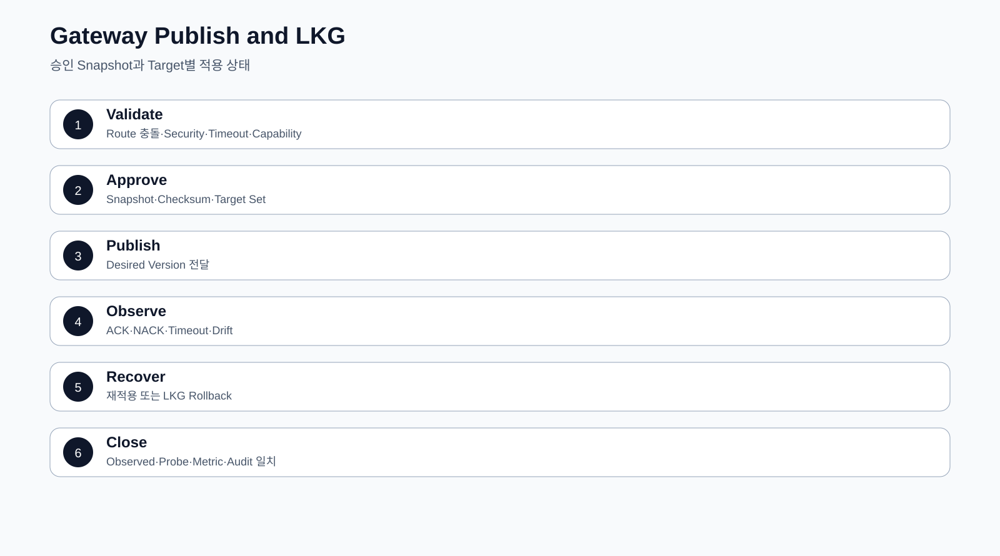

# CPF Gateway 매뉴얼

> 기준 Repository: `https://github.com/freeangelsun/202412_01_CPF`
> 기준 Branch: `master`
> 기준 Commit: `a8be27a34bdac0b7c075e06d6e86571244c96421` (`06_08`)
> 기준일: `2026-08-06 Asia/Seoul`

| 항목 | 내용 |
|---|---|
| 주 독자 | API 개발자·보안담당자·Gateway 운영자, Gateway를 처음 구성하는 담당자 |
| 이 문서로 완료할 일 | 외부 API Route와 Target·보안·Timeout·Attempt를 설계하고 Validate·Approve·Publish·ACK/NACK·LKG Rollback을 운영한다. |
| 읽는 방식 | 처음 접하는 독자는 앞에서부터 실습 순서로 읽고, 숙련자는 장별 판단표와 참조 경로를 사용한다. |
| 설명 원칙 | 제품 기능은 사용할 수 있는 상태로 설명한다. 실제 Source·SQL·API·Config·Frontend·Script·Test의 이름과 경계를 유지한다. |


## 1. Gateway를 선택할 때

다음 중 하나 이상이면 Gateway를 사용한다.

- 외부 Client 인증·인가·HMAC·Nonce·Replay 방지가 필요하다.
- Route·Predicate·Filter·Rewrite를 중앙 정책으로 관리한다.
- Target Discovery·Load Balancing·Timeout·Circuit·Bulkhead를 통제한다.
- 외부 Write의 Attempt Ledger와 `UNKNOWN_RESULT` 대사가 필요하다.
- Validate·Approval·Publish·ACK/NACK·LKG·Rollback이 필요하다.

내부 Same-JVM 호출이나 단순 Service 간 호출을 모두 Gateway로 우회하지 않는다.

## 2. 설치와 Network Zone

1. Artifact·Manifest·Source SHA·Checksum 확인.
2. Policy Store·Secret Provider·Certificate 준비.
3. Public Listener와 Admin·Probe Listener 분리.
4. 외부·내부 Network Zone과 Firewall 정의.
5. Route 없는 상태로 기동.
6. Health·Capability·Version 확인.
7. LKG와 Rollback 절차 저장.

## 3. Server Group과 Target

| Field | 예 | 검증 |
|---|---|---|
| Group ID | `PAY-INSTITUTION-GROUP` | 중복·Version CAS |
| Target URI | `https://pay-a.internal` | Scheme·Host·Port·Path Allowlist |
| Weight | 70 | 범위·합계 |
| Zone | `seoul-a` | Discovery Metadata |
| Health Path | `/actuator/health/readiness` | Timeout·인증·응답 |
| TLS Profile | `PAY-MTLS-V2` | Chain·SAN·만료 |
| Enabled | true | 최소 가용 Target |

Member가 0개인 Group을 활성화하지 않는다. DNS 결과와 허용 IP 정책을 함께 확인한다.

## 4. Route 설계

```yaml
routeId: PAY-INSTITUTION-TRANSFER-V1
version: 3
listener: partner-https
method: POST
externalPath: /partners/v1/transfers
predicates:
  contentType: application/json
rewrite:
  targetPath: /internal/pay/transfers
headers:
  remove: [Cookie, X-Internal-Token]
targetGroup: PAY-INSTITUTION-GROUP
security:
  authentication: HMAC
  audience: pay-transfer
resilience:
  connectTimeout: 2s
  responseTimeout: 8s
  overallBudget: 12s
idempotency:
  header: Idempotency-Key
```

## 5. Predicate·Rewrite·Filter

1. Method·Path·Host·Header·Query 조건을 정한다.
2. 우선순위와 Shadow Route를 검사한다.
3. Rewrite 뒤 실제 Target Path를 계산한다.
4. 민감 Header를 제거한다.
5. Request·Response Size와 Content Type을 제한한다.
6. Golden Request로 Target URI와 Header를 검증한다.

Rewrite 순서가 바뀌면 Target URI가 달라질 수 있으므로 Golden Request Test를 유지한다.

## 6. Authentication·Authorization

외부 Client Identity와 내부 Service Identity를 분리한다.

- Issuer·Audience.
- Client·Subject.
- Scope·Permission.
- Token Expiry·Clock Skew.
- Key·Certificate Version.

Gateway의 1차 접근 제어가 업무 Service의 Data Scope를 대신하지 않는다.

## 7. HMAC

Canonical String 예:

```text
HTTP_METHOD
NORMALIZED_PATH
CANONICAL_QUERY
CONTENT_SHA256
TIMESTAMP
NONCE
AUDIENCE
```

검증 순서:

1. Key ID로 현재·Grace Version 찾기.
2. Timestamp와 Clock Skew 검사.
3. Nonce 재사용 검사.
4. 실제 Body Hash 계산.
5. Canonical String 생성.
6. Constant-time 방식으로 Signature 비교.
7. 성공 시 Nonce·Attempt 기록.
8. 실패는 민감정보 없이 Error·Audit 기록.

Negative Test:

- Body 변경.
- Path 변경.
- Wrong Audience.
- 만료·미래 Timestamp.
- Nonce Replay.
- 폐기 Key.
- Client Certificate 불일치.

## 8. SSRF·TLS

SSRF 방어:

- 승인 Scheme만 허용.
- 등록 Server Group 또는 Allowlist Host만 허용.
- Loopback·Link-local·Metadata Endpoint 차단.
- DNS Resolve 결과 검증.
- Redirect Target 재검증.
- 사용자 입력으로 전체 Target URL 생성 금지.

TLS는 Protocol·Cipher·Truststore·Client Certificate·Hostname·SAN·Expiry·Revocation을 관리한다. 인증서 오류를 검증 해제로 우회하지 않는다.

## 9. Timeout Budget

```text
Client Deadline
  > Gateway Overall Budget
  > Queue + Connect + TLS + Target Response + Transform + Ledger
```

상위 Deadline보다 긴 하위 Timeout을 두지 않는다. Retry Backoff도 Overall Budget에 포함한다.

| 상황 | Retry |
|---|---|
| 400 Validation | X |
| 401·403 | X |
| Connect 전 실패 | 정책에 따라 O |
| 명시 5xx | 멱등성·한도 확인 뒤 O |
| Write 응답 유실 | Blind Retry 금지, Attempt 대사 |
| Circuit Open | X, 빠른 실패 |

## 10. Circuit·Bulkhead·Rate Limit

- Circuit: Window, Failure Rate, Open Duration, Half-open Probe.
- Bulkhead: Route·Target별 Concurrency와 Queue.
- Rate Limit: Client·Tenant·Route Key와 응답 Header.
- Queue가 Overall Budget을 초과하지 않게 한다.

## 11. Idempotency·Attempt Ledger

외부 Write 전에 저장할 값:

- Route ID·Version.
- Client ID.
- Idempotency Key.
- Request Hash.
- Target Group·Member.
- Attempt 번호.
- Dispatch 시각과 Deadline.
- Target Tracking ID.

같은 Key·같은 Hash는 기존 결과를 반환한다. 같은 Key·다른 Hash는 Conflict다.

응답 유실이면 Attempt를 `UNKNOWN_RESULT`로 두고 Target 조회 또는 업무 Owner 대사로 종결한다.

## 12. Validate·Approve·Publish

### Validate

- 중복 Route와 우선순위.
- Predicate·Rewrite 결과.
- Target 존재·Health.
- SSRF·TLS·Secret.
- Timeout 관계.
- Retry와 Idempotency.
- Schema·Checksum.
- Golden Request·Negative Test.

### Approve

승인 Snapshot에는 Route Version, Target, Security, Timeout, Checksum, 영향 Target, Reason, Expiry를 넣는다. 실행 시 Snapshot Drift를 확인한다.

### Publish

1. Publish Operation 생성.
2. Target별 Version·Checksum Dispatch.
3. ACK·NACK 수집.
4. Observed Version 확인.
5. `PARTIAL`과 `DRIFT` 분리.
6. 성공 Target 보존.
7. 실패 Target 재적용 또는 LKG Rollback.

## 13. Connection Test

Connection Test는 DNS, TCP, TLS, HTTP, Authentication, Target 응답을 단계별로 보여 준다.

| 단계 | 실패 예 | 다음 행동 |
|---|---|---|
| DNS | NXDOMAIN·잘못된 IP | Discovery·Allowlist 수정 |
| TCP | Refused·Timeout | Firewall·Port·Listener 확인 |
| TLS | Chain·SAN·Expired | Trust·Certificate Rotation |
| HTTP | 404·5xx | Health Path·Target 상태 |
| Auth | 401·403 | Service Identity·Audience |
| 응답 유실 | Operation 미종결 | Test Operation 조회 |

## 14. ACK·NACK·Partial Apply

| 상태 | 의미 | 행동 |
|---|---|---|
| ACK | Target이 Version 적용 | Observed와 Health 확인 |
| NACK | 검증·적용 거부 | Error와 Target 환경 보정 |
| Timeout | 결과 미수신 | Target Applied Version 조회 |
| PARTIAL | Target 결과 혼합 | 성공 Target 보존 |
| DRIFT | Desired·Observed 불일치 | Reconcile 또는 Rollback |

전체 재게시로 성공 Target을 불필요하게 건드리지 않는다.

## 15. LKG·Rollback

LKG에는 Route·Target·Security·Timeout·Checksum과 실제 ACK Target을 기록한다.

Rollback 순서:

1. 신규 Publish 중지.
2. 성공·실패 Target Snapshot.
3. 승인된 LKG 선택.
4. Target별 Rollback Dispatch.
5. ACK·NACK·Observed 확인.
6. Connection Test.
7. Traffic·Error·Attempt 대사.
8. Drift 0 확인.

## 16. Scale-out·Drift·Reconciliation

새 Gateway Instance가 기동되면 현재 Approved Version과 Checksum을 받아야 한다. 오래된 Config를 가진 Instance는 Traffic에서 제외한다.

Reconciliation은 Desired Route, Target Applied Version, Runtime Snapshot, Audit를 비교한다.

## 17. ADM 화면

- `/gateway-dashboard`: Traffic·Error·Apply 요약.
- `/gateway-servers`, `/gateway-groups`: Target.
- `/gateway-routes`: Predicate·Rewrite·Binding.
- `/gateway-security`: Auth·HMAC·Limit.
- `/gateway-health`: Connection Test.
- `/gateway-transactions`: Attempt·Trace.
- `/gateway-log-policies`: Masking·Sampling.
- `/gateway-apply-status`: ACK·NACK·Drift.

## 18. 종합 실습

1. 두 Target으로 Server Group 생성.
2. Health·TLS·Weight 검증.
3. POST Route Draft 생성.
4. HMAC·Audience·Nonce 설정.
5. Timeout·Circuit·Bulkhead 설정.
6. Golden Request와 Negative Test.
7. Approval 요청.
8. Publish하고 Target ACK 확인.
9. 한 Target에 잘못된 Certificate를 넣어 NACK 재현.
10. 성공 Target 보존, 실패 Target만 보정.
11. 응답 유실을 만들어 Attempt `UNKNOWN_RESULT` 재현.
12. Target 결과 조회로 종결.
13. LKG Rollback과 Drift 0 확인.

## 19. 장애 Runbook

### Target 전체 Down

- Circuit 상태 확인.
- 신규 Write 영향과 Queue 제한.
- Healthy Target·Failover 정책 확인.
- Attempt Unknown 대사.
- 복구 뒤 Half-open Probe.

### Retry Storm

- Retry Predicate와 한도 확인.
- Circuit·Bulkhead·Rate Limit 강화.
- Non-idempotent Write Retry 중지.
- Target 처리량과 Attempt 중복 대사.

### Key Rotation 실패

- Current·Grace Version 확인.
- Client별 Key Version 분포.
- 실패 Client를 이전 Version Grace로 유지.
- 새 Key 적용 뒤 Replay Negative Test.

### Partial Publish

- Target별 ACK·NACK·Observed 기록.
- 성공 Target 유지.
- 실패 Target 보정 또는 LKG.
- Connection Test와 Traffic 대사.

## 20. 운영 인계

- Listener·Zone·Certificate.
- Route·Predicate·Rewrite·Target.
- Auth·Audience·HMAC·Nonce·SSRF.
- Timeout·Retry·Circuit·Bulkhead·Rate Limit.
- Idempotency·Attempt·Target Status Query.
- Approval·Publish·ACK/NACK·LKG.
- Log·Metric·Trace·Alert.
- Scale-out·Drift·Reconcile.
- Incident·Rollback 담당자.

## 21. Gateway 자체 검수

1. 내부 호출을 불필요하게 Gateway로 우회하지 않는가?
2. Target이 Allowlist와 DNS 검증을 통과하는가?
3. Predicate·Rewrite Golden Test가 있는가?
4. Audience·Body Hash·Nonce Negative Test가 있는가?
5. Timeout Budget 관계가 맞는가?
6. 비멱등 Write를 Blind Retry하지 않는가?
7. Attempt Ledger와 Target 조회가 있는가?
8. Approval Snapshot과 Publish Version이 일치하는가?
9. PARTIAL의 성공 Target을 보존하는가?
10. LKG Rollback 뒤 Drift 0을 확인하는가?

<!-- CPF_R10_QUALITY_EXPANSION -->



## 부록 A. Route Definition 전체 예제

```yaml
routeId: pay-institution-v1
version: 12
status: DRAFT
predicates:
  - type: path
    pattern: /external/pay/**
  - type: method
    values: [POST, GET]
filters:
  - type: rewritePath
    from: /external/pay/(?<segment>.*)
    to: /api/${segment}
  - type: removeRequestHeader
    name: Cookie
  - type: setRequestHeader
    name: X-CPF-Route-Version
    value: "12"
targetGroup: institution-pay-primary
security:
  authentication: HMAC_SHA256
  audience: institution-pay
  nonceTtl: PT5M
  allowedClockSkew: PT30S
resilience:
  connectTimeout: PT1S
  responseTimeout: PT3S
  retry:
    maxAttempts: 2
    methods: [GET]
  circuitBreaker: pay-institution
publish:
  approvalRequired: true
  minimumAckRatio: 1.0
```

## 부록 B. HMAC Golden Vector

```text
HTTP Method : POST
Path        : /external/pay/accounts
Timestamp   : 2026-08-06T09:00:00Z
Nonce       : 7f1a1b6c-8f0a-4c84-8c6f-0d5b4d3f8a77
Audience    : institution-pay
Body        : {"customerId":"C1001","amount":10000}
Body SHA256 : 9a1f... (실제 UTF-8 Byte로 계산)
```

Canonical String은 Method·정규화 Path·Timestamp·Nonce·Audience·Body Hash 순서를 고정한다. Client와 Gateway는 같은 Fixture로 Signature를 검증하고, Header 순서나 JSON 공백에 의존하지 않는다.

실패 Fixture:

- Timestamp 허용 범위 초과
- Nonce 재사용
- Body 한 Byte 변경
- Wrong Audience
- 비활성 Key Version
- DNS Rebinding으로 Allowlist 밖 주소 해석

## 부록 C. 게시·부분 적용·LKG 복구 예제

1. DRAFT v12를 Server Validation한다.
2. Route 충돌·SSRF·TLS·Timeout Budget·Unsupported Filter를 검사한다.
3. 승인 요청 시 Route Snapshot과 Checksum을 고정한다.
4. 승인자는 Diff·Target Set·Negative Test 결과를 확인한다.
5. Publish P-1201을 생성하고 12개 Instance에 Desired v12를 전달한다.
6. 10개 ACK, 2개 NACK이면 상태는 `PARTIAL`이다.
7. 성공 Instance를 임의로 v11로 내리지 않고 NACK Reason을 분석한다.
8. 수정이 v13을 요구하면 새 승인·게시를 수행한다.
9. 우선 복귀가 필요하면 LKG v11 Rollback P-1202를 생성한다.
10. 모든 Instance의 Observed Version·Checksum·Route Probe·Attempt Error Rate가 일치한 뒤 종결한다.


## 부록 D. Gateway EDU 14개

Gateway EDU는 Route·Target·Security·Resilience 계약을 Validation한 뒤 게시와 Target ACK/NACK를 확인한다. SSRF·HMAC·Timeout·Partial Apply를 주입하고 LKG 또는 Reconciliation으로 정상화한다.

### EDU-GWY-01 — Server Group

| 항목 | 수행 내용 |
|---|---|
| 학습 결과 | Server Group의 선택 기준과 정상·실패·복구 의미를 설명하고 직접 판정한다. |
| Repository 확인 위치 | `cpf-gateway` 및 실제 Consumer·Test·Config |
| 주요 입력 | Group·Member·Weight·Zone |
| 실행 순서 | Fixture 준비 → 정상 실행 → 원장·로그·Trace·Audit 확인 → 장애 주입 → 복구 실행 → 재검증 |
| 정상 판정 | 가용 Member와 Weight 합리적 |
| 장애 재현 | Member 0·중복 URI |
| 복구 판정 | Member 보정·Binding 재검증 |
| 운영 확인 | - |
| 고객 업무 전환 | 예제 ID·상태·Permission·SLA만 고객 값으로 바꾸고 Idempotency·Version·Audit·복구 계약은 유지 |

### EDU-GWY-02 — Route Predicate

| 항목 | 수행 내용 |
|---|---|
| 학습 결과 | Route Predicate의 선택 기준과 정상·실패·복구 의미를 설명하고 직접 판정한다. |
| Repository 확인 위치 | `cpf-gateway` 및 실제 Consumer·Test·Config |
| 주요 입력 | Path·Method·Header·Priority |
| 실행 순서 | Fixture 준비 → 정상 실행 → 원장·로그·Trace·Audit 확인 → 장애 주입 → 복구 실행 → 재검증 |
| 정상 판정 | Golden Request가 단일 Route Match |
| 장애 재현 | Overlap·Shadow |
| 복구 판정 | 우선순위·조건 보정 |
| 운영 확인 | - |
| 고객 업무 전환 | 예제 ID·상태·Permission·SLA만 고객 값으로 바꾸고 Idempotency·Version·Audit·복구 계약은 유지 |

### EDU-GWY-03 — Rewrite·Filter

| 항목 | 수행 내용 |
|---|---|
| 학습 결과 | Rewrite·Filter의 선택 기준과 정상·실패·복구 의미를 설명하고 직접 판정한다. |
| Repository 확인 위치 | `cpf-gateway` 및 실제 Consumer·Test·Config |
| 주요 입력 | Strip/Rewrite·Header Policy |
| 실행 순서 | Fixture 준비 → 정상 실행 → 원장·로그·Trace·Audit 확인 → 장애 주입 → 복구 실행 → 재검증 |
| 정상 판정 | Target 요청이 계약과 일치 |
| 장애 재현 | 중복 Header·Path 오류 |
| 복구 판정 | Golden Vector로 보정 |
| 운영 확인 | - |
| 고객 업무 전환 | 예제 ID·상태·Permission·SLA만 고객 값으로 바꾸고 Idempotency·Version·Audit·복구 계약은 유지 |

### EDU-GWY-04 — Authentication·Audience

| 항목 | 수행 내용 |
|---|---|
| 학습 결과 | Authentication·Audience의 선택 기준과 정상·실패·복구 의미를 설명하고 직접 판정한다. |
| Repository 확인 위치 | `cpf-gateway` 및 실제 Consumer·Test·Config |
| 주요 입력 | Token·Audience·Scope |
| 실행 순서 | Fixture 준비 → 정상 실행 → 원장·로그·Trace·Audit 확인 → 장애 주입 → 복구 실행 → 재검증 |
| 정상 판정 | 허용 Client만 통과 |
| 장애 재현 | Wrong Audience·Expired |
| 복구 판정 | 401/403·Credential 교체 |
| 운영 확인 | - |
| 고객 업무 전환 | 예제 ID·상태·Permission·SLA만 고객 값으로 바꾸고 Idempotency·Version·Audit·복구 계약은 유지 |

### EDU-GWY-05 — HMAC Golden Vector

| 항목 | 수행 내용 |
|---|---|
| 학습 결과 | HMAC Golden Vector의 선택 기준과 정상·실패·복구 의미를 설명하고 직접 판정한다. |
| Repository 확인 위치 | `cpf-gateway` 및 실제 Consumer·Test·Config |
| 주요 입력 | Method·Path·Timestamp·Nonce·Body Hash |
| 실행 순서 | Fixture 준비 → 정상 실행 → 원장·로그·Trace·Audit 확인 → 장애 주입 → 복구 실행 → 재검증 |
| 정상 판정 | Client/Server Signature 일치 |
| 장애 재현 | Body 변조·Clock Skew |
| 복구 판정 | 요청 거부·시간 동기화 |
| 운영 확인 | - |
| 고객 업무 전환 | 예제 ID·상태·Permission·SLA만 고객 값으로 바꾸고 Idempotency·Version·Audit·복구 계약은 유지 |

### EDU-GWY-06 — SSRF·TLS

| 항목 | 수행 내용 |
|---|---|
| 학습 결과 | SSRF·TLS의 선택 기준과 정상·실패·복구 의미를 설명하고 직접 판정한다. |
| Repository 확인 위치 | `cpf-gateway` 및 실제 Consumer·Test·Config |
| 주요 입력 | Target URI·Allowlist·Trust |
| 실행 순서 | Fixture 준비 → 정상 실행 → 원장·로그·Trace·Audit 확인 → 장애 주입 → 복구 실행 → 재검증 |
| 정상 판정 | 내부/Metadata 주소 차단·TLS 검증 |
| 장애 재현 | DNS Rebinding·Wrong Cert |
| 복구 판정 | Target 격리·Allowlist 보정 |
| 운영 확인 | - |
| 고객 업무 전환 | 예제 ID·상태·Permission·SLA만 고객 값으로 바꾸고 Idempotency·Version·Audit·복구 계약은 유지 |

### EDU-GWY-07 — Timeout·Retry

| 항목 | 수행 내용 |
|---|---|
| 학습 결과 | Timeout·Retry의 선택 기준과 정상·실패·복구 의미를 설명하고 직접 판정한다. |
| Repository 확인 위치 | `cpf-gateway` 및 실제 Consumer·Test·Config |
| 주요 입력 | Budget·Retryable Method |
| 실행 순서 | Fixture 준비 → 정상 실행 → 원장·로그·Trace·Audit 확인 → 장애 주입 → 복구 실행 → 재검증 |
| 정상 판정 | 상위 Budget 내 제한 Retry |
| 장애 재현 | POST 무조건 Retry |
| 복구 판정 | Idempotency 없으면 Retry 금지 |
| 운영 확인 | - |
| 고객 업무 전환 | 예제 ID·상태·Permission·SLA만 고객 값으로 바꾸고 Idempotency·Version·Audit·복구 계약은 유지 |

### EDU-GWY-08 — Circuit·Bulkhead

| 항목 | 수행 내용 |
|---|---|
| 학습 결과 | Circuit·Bulkhead의 선택 기준과 정상·실패·복구 의미를 설명하고 직접 판정한다. |
| Repository 확인 위치 | `cpf-gateway` 및 실제 Consumer·Test·Config |
| 주요 입력 | Threshold·Pool |
| 실행 순서 | Fixture 준비 → 정상 실행 → 원장·로그·Trace·Audit 확인 → 장애 주입 → 복구 실행 → 재검증 |
| 정상 판정 | Target 장애 격리 |
| 장애 재현 | 전체 Route 자원 고갈 |
| 복구 판정 | Pool 분리·정책 Rollback |
| 운영 확인 | - |
| 고객 업무 전환 | 예제 ID·상태·Permission·SLA만 고객 값으로 바꾸고 Idempotency·Version·Audit·복구 계약은 유지 |

### EDU-GWY-09 — Attempt Ledger

| 항목 | 수행 내용 |
|---|---|
| 학습 결과 | Attempt Ledger의 선택 기준과 정상·실패·복구 의미를 설명하고 직접 판정한다. |
| Repository 확인 위치 | `cpf-gateway` 및 실제 Consumer·Test·Config |
| 주요 입력 | Request ID·Target·Payload Hash |
| 실행 순서 | Fixture 준비 → 정상 실행 → 원장·로그·Trace·Audit 확인 → 장애 주입 → 복구 실행 → 재검증 |
| 정상 판정 | 모든 시도와 결과 연결 |
| 장애 재현 | 응답 유실 |
| 복구 판정 | Target 상태와 대사 |
| 운영 확인 | - |
| 고객 업무 전환 | 예제 ID·상태·Permission·SLA만 고객 값으로 바꾸고 Idempotency·Version·Audit·복구 계약은 유지 |

### EDU-GWY-10 — Validate·Approval

| 항목 | 수행 내용 |
|---|---|
| 학습 결과 | Validate·Approval의 선택 기준과 정상·실패·복구 의미를 설명하고 직접 판정한다. |
| Repository 확인 위치 | `cpf-gateway` 및 실제 Consumer·Test·Config |
| 주요 입력 | Route Version·Checksum |
| 실행 순서 | Fixture 준비 → 정상 실행 → 원장·로그·Trace·Audit 확인 → 장애 주입 → 복구 실행 → 재검증 |
| 정상 판정 | Server Validation과 승인 Snapshot |
| 장애 재현 | Client approved flag |
| 복구 판정 | 서버 승인 원장 사용 |
| 운영 확인 | - |
| 고객 업무 전환 | 예제 ID·상태·Permission·SLA만 고객 값으로 바꾸고 Idempotency·Version·Audit·복구 계약은 유지 |

### EDU-GWY-11 — Publish

| 항목 | 수행 내용 |
|---|---|
| 학습 결과 | Publish의 선택 기준과 정상·실패·복구 의미를 설명하고 직접 판정한다. |
| Repository 확인 위치 | `cpf-gateway` 및 실제 Consumer·Test·Config |
| 주요 입력 | Publish ID·Target Set |
| 실행 순서 | Fixture 준비 → 정상 실행 → 원장·로그·Trace·Audit 확인 → 장애 주입 → 복구 실행 → 재검증 |
| 정상 판정 | Desired Version 생성 |
| 장애 재현 | 일부 Target 미응답 |
| 복구 판정 | PARTIAL 유지·대사 |
| 운영 확인 | - |
| 고객 업무 전환 | 예제 ID·상태·Permission·SLA만 고객 값으로 바꾸고 Idempotency·Version·Audit·복구 계약은 유지 |

### EDU-GWY-12 — ACK·NACK

| 항목 | 수행 내용 |
|---|---|
| 학습 결과 | ACK·NACK의 선택 기준과 정상·실패·복구 의미를 설명하고 직접 판정한다. |
| Repository 확인 위치 | `cpf-gateway` 및 실제 Consumer·Test·Config |
| 주요 입력 | Observed Version·Reason |
| 실행 순서 | Fixture 준비 → 정상 실행 → 원장·로그·Trace·Audit 확인 → 장애 주입 → 복구 실행 → 재검증 |
| 정상 판정 | Target별 결과 표시 |
| 장애 재현 | NACK를 성공으로 집계 |
| 복구 판정 | 원인 제거 또는 Rollback |
| 운영 확인 | - |
| 고객 업무 전환 | 예제 ID·상태·Permission·SLA만 고객 값으로 바꾸고 Idempotency·Version·Audit·복구 계약은 유지 |

### EDU-GWY-13 — LKG Rollback

| 항목 | 수행 내용 |
|---|---|
| 학습 결과 | LKG Rollback의 선택 기준과 정상·실패·복구 의미를 설명하고 직접 판정한다. |
| Repository 확인 위치 | `cpf-gateway` 및 실제 Consumer·Test·Config |
| 주요 입력 | LKG Version·Reason |
| 실행 순서 | Fixture 준비 → 정상 실행 → 원장·로그·Trace·Audit 확인 → 장애 주입 → 복구 실행 → 재검증 |
| 정상 판정 | 이전 정상 Route로 복귀 |
| 장애 재현 | LKG 없음·Schema 비호환 |
| 복구 판정 | 게시 차단·Forward Recovery |
| 운영 확인 | - |
| 고객 업무 전환 | 예제 ID·상태·Permission·SLA만 고객 값으로 바꾸고 Idempotency·Version·Audit·복구 계약은 유지 |

### EDU-GWY-14 — Scale-out·Drift

| 항목 | 수행 내용 |
|---|---|
| 학습 결과 | Scale-out·Drift의 선택 기준과 정상·실패·복구 의미를 설명하고 직접 판정한다. |
| Repository 확인 위치 | `cpf-gateway` 및 실제 Consumer·Test·Config |
| 주요 입력 | Instance·Checksum |
| 실행 순서 | Fixture 준비 → 정상 실행 → 원장·로그·Trace·Audit 확인 → 장애 주입 → 복구 실행 → 재검증 |
| 정상 판정 | 모든 Instance Observed 일치 |
| 장애 재현 | Restart 후 stale config |
| 복구 판정 | Reconcile·재적용 |
| 운영 확인 | - |
| 고객 업무 전환 | 예제 ID·상태·Permission·SLA만 고객 값으로 바꾸고 Idempotency·Version·Audit·복구 계약은 유지 |


## 부록 E. Gateway 장애 판정표

| 장애 | Attempt 상태 | 자동 Retry | 운영 조치 |
|---|---|---|---|
| DNS 조회 전 실패 | FAILED_NOT_DISPATCHED | GET 또는 멱등 Command만 정책에 따라 | DNS·Allowlist·Target Health 확인 |
| TCP Connect 실패 | FAILED_NOT_DISPATCHED | 제한 Retry | Target·Network 확인 |
| Request Body 전송 중 끊김 | UNKNOWN_RESULT 가능 | 원칙적으로 상태조회 우선 | Target Request ID·Idempotency 대사 |
| Target 처리 후 Read Timeout | UNKNOWN_RESULT | 재전송 금지 | Target Status API/업무 원장 대사 |
| 429 | REJECTED/RETRY_SCHEDULED | Retry-After 준수 | Client·Route Limit 조정 |
| 5xx | FAILED 또는 UNKNOWN | Method·Dispatch 단계에 따라 | Circuit·Target Error 분석 |
| Instance NACK | APPLY_FAILED | 해당 없음 | Capability·Checksum·Config 보정 |
| Drift | DRIFT | 해당 없음 | Desired Snapshot 재적용 또는 LKG |

<!-- CPF_R10_BOOK_EXPANSION -->

## 부록 F. 외부 결제 API를 등록하고 게시하는 전체 예제

예제는 `POST /partners/v1/payments`를 내부 PAY Service로 전달한다. HMAC, Audience, Timestamp, Nonce, Body Hash, SSRF Allowlist, Timeout, 제한 Retry, Circuit Breaker, Attempt Ledger를 적용한다.

### F.1 Route 입력

```yaml
routeId: partner-payment-v1
version: 12
priority: 100
enabled: true
predicates:
  - type: Path
    value: /partners/v1/payments
  - type: Method
    value: POST
filters:
  - type: RewritePath
    from: /partners/v1/(?<segment>.*)
    to: /api/${segment}
  - type: RemoveRequestHeader
    name: Cookie
  - type: AddRequestHeader
    name: X-Cpf-Route-Id
    value: partner-payment-v1
targetGroup: pay-service-prod
securityPolicy: partner-hmac-v2
resiliencePolicy: payment-write-v3
attemptLedger: true
approvalPolicy: gateway-critical-change
```

### F.2 Target Group

```yaml
groupId: pay-service-prod
selection: weighted-round-robin
members:
  - targetId: pay-a
    uri: https://pay-a.internal.example
    weight: 50
    zone: az-a
  - targetId: pay-b
    uri: https://pay-b.internal.example
    weight: 50
    zone: az-b
health:
  path: /actuator/health/readiness
  interval: 10s
  failureThreshold: 3
ssrf:
  allowedSchemes: [https]
  allowedHosts: [pay-a.internal.example, pay-b.internal.example]
  denyPrivateRedirect: true
```

### F.3 HMAC Canonical String

```text
POST
/partners/v1/payments
content-type:application/json
host:api.partner.example
x-cpf-audience:pay-api
x-cpf-nonce:6f49c4f3-3341-4dd3-b9c3-b1e47f9df203
x-cpf-timestamp:2026-08-06T09:00:00Z

9e0c9f...<SHA-256 of exact body bytes>
```

### F.4 검증 순서

1. Timestamp가 허용 Clock Skew 안인지 확인한다.
2. Nonce가 Audience·Client 범위에서 사용되지 않았는지 확인한다.
3. Body 원본 Byte로 SHA-256을 계산한다.
4. Canonical Header 이름을 소문자·정렬 규칙에 맞춘다.
5. Key Version을 확인하고 Constant-time 비교로 Signature를 검증한다.
6. 인증 성공 뒤 Route Predicate와 SSRF Allowlist를 검증한다.
7. Attempt를 생성하고 Dispatch 시점을 기록한다.

### F.5 Attempt Ledger 예시

| Field | 값 | 의미 |
|---|---|---|
| attemptId | ATT-90001 | 한 번의 Target 호출 |
| operationId | OP-70001 | 외부 Client 요청 전체 |
| routeId/version | partner-payment-v1/12 | 적용 Route 계약 |
| targetId | pay-a | 실제 선택 Target |
| requestId | REQ-30001 | 중복·기관 대사 Key |
| requestHash | sha256:... | Payload 동일성 |
| dispatchStatus | DISPATCHED | 부작용 가능 경계 |
| responseStatus | UNKNOWN_RESULT | Read Timeout 뒤 결과 불명 |
| trackingId | null | 응답을 받지 못해 미확보 |
| nextAction | RECONCILE_BY_REQUEST_ID | 재전송보다 상태조회 우선 |

### F.6 Timeout·Retry 판정

| 실패 지점 | Attempt 상태 | Retry | 운영 행동 |
|---|---|---|---|
| DNS·Connect 전 | FAILED_NOT_SENT | 정책 한도 내 가능 | Target Health 확인 |
| TLS Handshake | FAILED_NOT_SENT | Key/Trust 보정 후 가능 | Certificate Chain 확인 |
| Request Body 전송 중 | UNKNOWN_RESULT 가능 | Blind Retry 금지 | Server Access Log·Request ID 대사 |
| Body 전송 완료 뒤 Read Timeout | UNKNOWN_RESULT | 재전송 금지 | 상태조회·Owner 원장 대사 |
| HTTP 429 | REJECTED_RETRYABLE | Retry-After와 Budget 내 | Rate 정책 확인 |
| HTTP 4xx Validation | REJECTED_FINAL | 금지 | Client 요청 수정 |
| HTTP 5xx | FAILED 또는 UNKNOWN | Idempotency·Dispatch 근거에 따라 | Attempt와 Target 상태 확인 |

### F.7 Publish Lifecycle

| 상태 | 조건 | 다음 상태 | 운영 판정 |
|---|---|---|---|
| DRAFT | 작성 완료 | VALIDATING | 아직 Runtime 적용 안 됨 |
| VALIDATING | Schema·Security·SSRF·Connection 통과 | APPROVAL_PENDING | Checksum 고정 |
| APPROVAL_PENDING | 분리 승인 완료 | PUBLISHING | 승인 Snapshot 사용 |
| PUBLISHING | 모든 Target ACK | ACTIVE | Desired=Observed |
| PUBLISHING | 일부 NACK | PARTIAL_APPLY | Target별 조치 필요 |
| PARTIAL_APPLY | 실패 Target 보정·ACK | ACTIVE | 동일 Version 수렴 |
| PARTIAL_APPLY | 위험 증가 | ROLLING_BACK | LKG 배포 |
| ROLLING_BACK | 모든 Target LKG ACK | ROLLED_BACK | Drift 0 확인 |

### F.8 Connection Test

```powershell
$body=@{
  routeId='partner-payment-v1'
  routeVersion=12
  targetGroup='pay-service-prod'
  tests=@('dns','tcp','tls','http-readiness','hmac-fixture')
  reason='게시 전 연결 검증'
} | ConvertTo-Json -Depth 8

$test=Invoke-RestMethod -Method Post `
  -Uri 'http://localhost:8080/adm/api/gateway/connection-tests' `
  -ContentType 'application/json' -Body $body

Invoke-RestMethod -Uri "http://localhost:8080/adm/api/gateway/connection-tests/$($test.operationId)"
```

### F.9 게시 실패 복구

1. `/gateway-apply-status`에서 Publish ID와 Target별 Desired·Observed Version을 기록한다.
2. `/gateway-health`에서 NACK Target의 DNS·TLS·Readiness·HMAC Fixture를 재검사한다.
3. Config 자체 결함이면 Draft Version을 수정해 새 Checksum과 승인을 만든다.
4. Target 환경 결함이면 동일 Version을 실패 Target에만 재적용한다.
5. 위험이 커지면 LKG Version으로 Rollback Operation을 생성한다.
6. 모든 Target이 LKG를 ACK하고 Route Probe가 통과한 뒤 Rollback을 종료한다.

### F.10 SSRF Negative Corpus

| 입력 | 기대 판정 | 근거 |
|---|---|---|
| http://127.0.0.1:8080 | 거부 | Loopback |
| http://169.254.169.254 | 거부 | Link-local metadata |
| file:///etc/passwd | 거부 | 허용 Scheme 아님 |
| https://pay-a.internal.example@evil.example | 거부 | Userinfo·실제 Host 불일치 |
| https://pay-a.internal.example.evil.example | 거부 | Suffix 위장 |
| https://PAY-A.INTERNAL.EXAMPLE | 정규화 후 Allowlist | 대소문자 정규화 |
| https://pay-a.internal.example/redirect-to-private | Redirect 거부 | Redirect 후 Host 재검증 |
| https://10.0.0.8 | 정책에 없으면 거부 | IP Literal |

## 부록 G. Gateway 결함 10개 판정표

### G.1 두 Route가 같은 Path를 Match

| 구분 | 내용 |
|---|---|
| 원인 후보 | Predicate Overlap·Priority |
| 첫 확인 | Route Version·Publish ID·Target ID·Attempt ID·Request Hash를 고정한다. |
| 보정 | Golden Request Matrix로 단일 Match 보장 |
| 시험 | 정상 Golden Request와 Negative Corpus를 같은 Version에서 실행한다. |
| Audit | Reason·Approver·Checksum·Target 결과를 확인한다. |
| 금지 | Overlap 경고를 무시 |
| 종료 | Desired=Observed, Drift 0, Probe 통과, 업무 Attempt 대사 |

### G.2 Rewrite 뒤 이중 Slash

| 구분 | 내용 |
|---|---|
| 원인 후보 | Path 정규화 오류 |
| 첫 확인 | Route Version·Publish ID·Target ID·Attempt ID·Request Hash를 고정한다. |
| 보정 | 원본/변환 Path Contract Test |
| 시험 | 정상 Golden Request와 Negative Corpus를 같은 Version에서 실행한다. |
| Audit | Reason·Approver·Checksum·Target 결과를 확인한다. |
| 금지 | Target에서 임의 보정 |
| 종료 | Desired=Observed, Drift 0, Probe 통과, 업무 Attempt 대사 |

### G.3 HMAC가 간헐적으로 실패

| 구분 | 내용 |
|---|---|
| 원인 후보 | Clock Skew·Body Byte 변형·Header 정규화 |
| 첫 확인 | Route Version·Publish ID·Target ID·Attempt ID·Request Hash를 고정한다. |
| 보정 | Canonical String과 Raw Body Hash 비교 |
| 시험 | 정상 Golden Request와 Negative Corpus를 같은 Version에서 실행한다. |
| Audit | Reason·Approver·Checksum·Target 결과를 확인한다. |
| 금지 | Signature 로그 원문 기록 |
| 종료 | Desired=Observed, Drift 0, Probe 통과, 업무 Attempt 대사 |

### G.4 Nonce Replay가 허용됨

| 구분 | 내용 |
|---|---|
| 원인 후보 | Nonce Store Scope·TTL 오류 |
| 첫 확인 | Route Version·Publish ID·Target ID·Attempt ID·Request Hash를 고정한다. |
| 보정 | Client/Audience/Key Version 범위 Unique |
| 시험 | 정상 Golden Request와 Negative Corpus를 같은 Version에서 실행한다. |
| Audit | Reason·Approver·Checksum·Target 결과를 확인한다. |
| 금지 | Timestamp만 검사 |
| 종료 | Desired=Observed, Drift 0, Probe 통과, 업무 Attempt 대사 |

### G.5 Rate Limit이 Instance마다 다름

| 구분 | 내용 |
|---|---|
| 원인 후보 | Local Counter 사용 |
| 첫 확인 | Route Version·Publish ID·Target ID·Attempt ID·Request Hash를 고정한다. |
| 보정 | 분산 정책 또는 일관된 Partition Key |
| 시험 | 정상 Golden Request와 Negative Corpus를 같은 Version에서 실행한다. |
| Audit | Reason·Approver·Checksum·Target 결과를 확인한다. |
| 금지 | Instance별 임의 제한 |
| 종료 | Desired=Observed, Drift 0, Probe 통과, 업무 Attempt 대사 |

### G.6 Retry로 결제가 두 번 처리됨

| 구분 | 내용 |
|---|---|
| 원인 후보 | Write 요청 Blind Retry |
| 첫 확인 | Route Version·Publish ID·Target ID·Attempt ID·Request Hash를 고정한다. |
| 보정 | Idempotency·Attempt Dispatch 경계 |
| 시험 | 정상 Golden Request와 Negative Corpus를 같은 Version에서 실행한다. |
| Audit | Reason·Approver·Checksum·Target 결과를 확인한다. |
| 금지 | HTTP Method만 보고 Retry |
| 종료 | Desired=Observed, Drift 0, Probe 통과, 업무 Attempt 대사 |

### G.7 Circuit가 닫히지 않음

| 구분 | 내용 |
|---|---|
| 원인 후보 | Probe·Window·Clock 문제 |
| 첫 확인 | Route Version·Publish ID·Target ID·Attempt ID·Request Hash를 고정한다. |
| 보정 | State Transition·Success Threshold 확인 |
| 시험 | 정상 Golden Request와 Negative Corpus를 같은 Version에서 실행한다. |
| Audit | Reason·Approver·Checksum·Target 결과를 확인한다. |
| 금지 | 강제 상태 DB 수정 |
| 종료 | Desired=Observed, Drift 0, Probe 통과, 업무 Attempt 대사 |

### G.8 Target Weight 합이 100 아님

| 구분 | 내용 |
|---|---|
| 원인 후보 | Validation 누락 |
| 첫 확인 | Route Version·Publish ID·Target ID·Attempt ID·Request Hash를 고정한다. |
| 보정 | 게시 전 Weight·Member 검사 |
| 시험 | 정상 Golden Request와 Negative Corpus를 같은 Version에서 실행한다. |
| Audit | Reason·Approver·Checksum·Target 결과를 확인한다. |
| 금지 | Runtime이 임의 정규화 |
| 종료 | Desired=Observed, Drift 0, Probe 통과, 업무 Attempt 대사 |

### G.9 NACK Target이 Traffic을 받음

| 구분 | 내용 |
|---|---|
| 원인 후보 | Observed Version·Routing 연계 오류 |
| 첫 확인 | Route Version·Publish ID·Target ID·Attempt ID·Request Hash를 고정한다. |
| 보정 | Target Activation Gate |
| 시험 | 정상 Golden Request와 Negative Corpus를 같은 Version에서 실행한다. |
| Audit | Reason·Approver·Checksum·Target 결과를 확인한다. |
| 금지 | 전체 Group Active 처리 |
| 종료 | Desired=Observed, Drift 0, Probe 통과, 업무 Attempt 대사 |

### G.10 Rollback 뒤 Drift 유지

| 구분 | 내용 |
|---|---|
| 원인 후보 | 일부 Target 미적용 |
| 첫 확인 | Route Version·Publish ID·Target ID·Attempt ID·Request Hash를 고정한다. |
| 보정 | LKG ACK·Checksum 전수 대사 |
| 시험 | 정상 Golden Request와 Negative Corpus를 같은 Version에서 실행한다. |
| Audit | Reason·Approver·Checksum·Target 결과를 확인한다. |
| 금지 | 대표 Instance만 확인 |
| 종료 | Desired=Observed, Drift 0, Probe 통과, 업무 Attempt 대사 |

<!-- CPF_R10_REFERENCE_EXPANSION -->

## 부록 H. Gateway 보안 Golden Vector 10개

실제 Secret이나 Signature 원문을 문서·로그에 남기지 않는다. Fixture Key는 Test 전용이고 운영 Key와 분리한다.

### H.1 정상 POST

| 입력 | 값 |
|---|---|
| Method | POST |
| Path | /partners/v1/payments |
| Timestamp | 2026-08-06T09:00:00Z |
| Nonce | nonce-001 |
| Body Hash | 정확한 Body Hash |
| 기대 결과 | 200 또는 업무 응답 |
| 확인 | Gateway Audit·Attempt·Error Code에서 민감정보 없이 판정 |
| 회귀 | 같은 Fixture를 단일·다중 Instance와 Key Rotation 전후에 실행 |

### H.2 오래된 Timestamp

| 입력 | 값 |
|---|---|
| Method | POST |
| Path | /partners/v1/payments |
| Timestamp | 2026-08-06T08:50:00Z |
| Nonce | nonce-002 |
| Body Hash | 정확한 Hash |
| 기대 결과 | Clock Skew 오류 |
| 확인 | Gateway Audit·Attempt·Error Code에서 민감정보 없이 판정 |
| 회귀 | 같은 Fixture를 단일·다중 Instance와 Key Rotation 전후에 실행 |

### H.3 Nonce 재사용

| 입력 | 값 |
|---|---|
| Method | POST |
| Path | /partners/v1/payments |
| Timestamp | 2026-08-06T09:00:01Z |
| Nonce | nonce-001 |
| Body Hash | 정확한 Hash |
| 기대 결과 | Replay 차단 |
| 확인 | Gateway Audit·Attempt·Error Code에서 민감정보 없이 판정 |
| 회귀 | 같은 Fixture를 단일·다중 Instance와 Key Rotation 전후에 실행 |

### H.4 Body 변조

| 입력 | 값 |
|---|---|
| Method | POST |
| Path | /partners/v1/payments |
| Timestamp | 2026-08-06T09:00:02Z |
| Nonce | nonce-003 |
| Body Hash | 다른 Body Hash |
| 기대 결과 | Signature 오류 |
| 확인 | Gateway Audit·Attempt·Error Code에서 민감정보 없이 판정 |
| 회귀 | 같은 Fixture를 단일·다중 Instance와 Key Rotation 전후에 실행 |

### H.5 Audience 불일치

| 입력 | 값 |
|---|---|
| Method | POST |
| Path | /partners/v1/payments |
| Timestamp | 2026-08-06T09:00:03Z |
| Nonce | nonce-004 |
| Body Hash | 정확한 Hash |
| 기대 결과 | Audience 오류 |
| 확인 | Gateway Audit·Attempt·Error Code에서 민감정보 없이 판정 |
| 회귀 | 같은 Fixture를 단일·다중 Instance와 Key Rotation 전후에 실행 |

### H.6 Header 누락

| 입력 | 값 |
|---|---|
| Method | POST |
| Path | /partners/v1/payments |
| Timestamp | - |
| Nonce | nonce-005 |
| Body Hash | 정확한 Hash |
| 기대 결과 | 필수 Header 오류 |
| 확인 | Gateway Audit·Attempt·Error Code에서 민감정보 없이 판정 |
| 회귀 | 같은 Fixture를 단일·다중 Instance와 Key Rotation 전후에 실행 |

### H.7 Method 변조

| 입력 | 값 |
|---|---|
| Method | GET |
| Path | /partners/v1/payments |
| Timestamp | 2026-08-06T09:00:04Z |
| Nonce | nonce-006 |
| Body Hash | 정확한 Hash |
| 기대 결과 | Signature 또는 Route 불일치 |
| 확인 | Gateway Audit·Attempt·Error Code에서 민감정보 없이 판정 |
| 회귀 | 같은 Fixture를 단일·다중 Instance와 Key Rotation 전후에 실행 |

### H.8 Path Encoding 차이

| 입력 | 값 |
|---|---|
| Method | POST |
| Path | /partners/v1/payments%2F |
| Timestamp | 2026-08-06T09:00:05Z |
| Nonce | nonce-007 |
| Body Hash | 정확한 Hash |
| 기대 결과 | Canonical Path 오류 |
| 확인 | Gateway Audit·Attempt·Error Code에서 민감정보 없이 판정 |
| 회귀 | 같은 Fixture를 단일·다중 Instance와 Key Rotation 전후에 실행 |

### H.9 Key Version 만료

| 입력 | 값 |
|---|---|
| Method | POST |
| Path | /partners/v1/payments |
| Timestamp | 2026-08-06T09:00:06Z |
| Nonce | nonce-008 |
| Body Hash | 정확한 Hash |
| 기대 결과 | Key Version 거부 |
| 확인 | Gateway Audit·Attempt·Error Code에서 민감정보 없이 판정 |
| 회귀 | 같은 Fixture를 단일·다중 Instance와 Key Rotation 전후에 실행 |

### H.10 허용 Host Redirect

| 입력 | 값 |
|---|---|
| Method | POST |
| Path | /partners/v1/payments |
| Timestamp | 2026-08-06T09:00:07Z |
| Nonce | nonce-009 |
| Body Hash | 정확한 Hash |
| 기대 결과 | Redirect Host 재검증 |
| 확인 | Gateway Audit·Attempt·Error Code에서 민감정보 없이 판정 |
| 회귀 | 같은 Fixture를 단일·다중 Instance와 Key Rotation 전후에 실행 |

### Gateway 권한과 승인 경계

Route 조회, Draft 편집, Validation, 연결시험, 승인, 게시, Rollback은 서로 다른 권한으로 분리한다. 게시자는 자신이 만든 위험 변경을 단독 승인하지 않으며, Backend는 Approval Snapshot의 Route Version·Checksum·Target Group을 검증한다. 권한이 없는 요청은 Target에 전달하기 전에 차단하고 Audit에 Operation ID와 사유를 남긴다.
