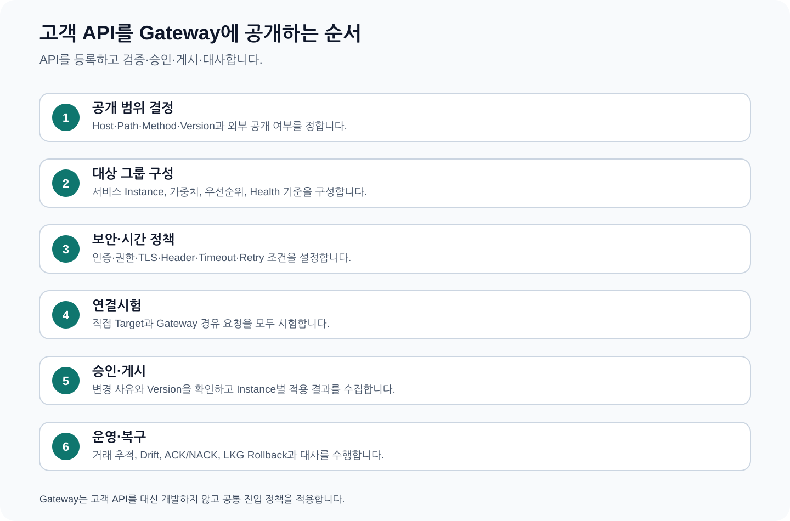
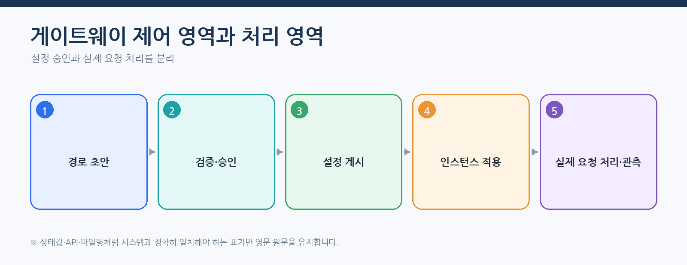
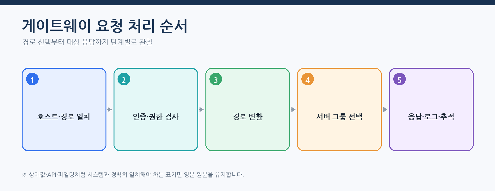
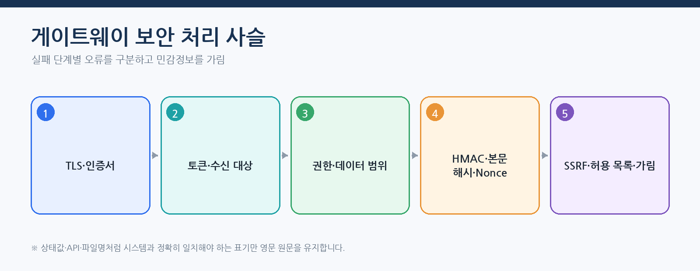
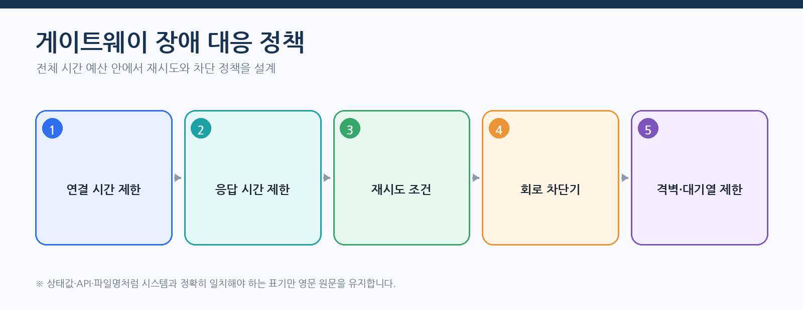
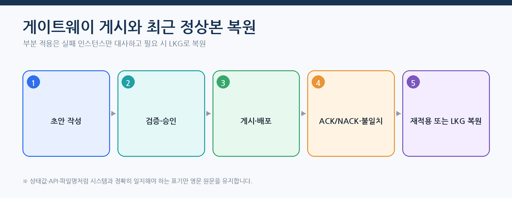
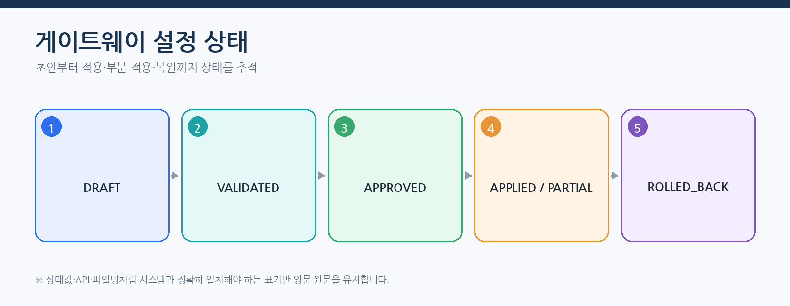

# CPF 게이트웨이 매뉴얼 — 고객 API 등록·보안·게시·복구

> **주 독자**: API 개발자, 보안담당자, 게이트웨이 운영자·승인자
> **목표**: 고객 API를 경로로 정의하고 검증·승인·게시한 뒤 인스턴스 적용·불일치·LKG 되돌리기를 운영한다.

> **용어 표기 원칙**: 설명은 한글을 우선한다. API 경로, 설정 키, 클래스·파일명, HTTP 헤더와 실제 상태값은 시스템과 일치해야 하므로 원문을 유지한다.



## 이 매뉴얼을 사용하는 기준

이 매뉴얼은 고객이 현재 배포 기준의 CPF 기능을 처음 접한다는 전제로 작성한다. 사용자는 소스를 역분석하지 않고 이 문서의 **시작 조건 → 단계별 절차 → 정상 결과 → 오류·복구 → 운영 인계** 순서로 작업한다.

- 제품 기능과 고객 교육 예제는 구현된 기능을 기준으로 설명한다.
- 기능 식별자·API·설정값·화면이 변경되면 같은 커밋에서 매뉴얼도 함께 현행화한다.
- 고객 업무 데이터·상태·승인 기준·대사 기준은 고객이 정하고, CPF가 제공하는 실행·보안·감사·복구 계약에 연결한다.
- 명령과 예시는 저장소 최상위 폴더에서 실행하는 것을 기본으로 한다.
- 운영 변경은 사전 확인, 사유, 권한, 승인, 버전, 대상별 결과, 감사 순서로 확인한다.

> 문서 검수자는 소스·SQL·API·설정·화면·스크립트·시험과 양방향으로 대조한다. 고객 사용자는 별도 소스 분석 없이 본문 절차를 수행할 수 있어야 한다.
## 처음 시작하는 게이트웨이 담당자의 완료 기준



게이트웨이 설정은 경로 한 줄을 등록하는 것으로 끝나지 않는다. 대상 상태 점검, 인증·권한, 조건·경로 변환, 시간 초과·재시도·회로 차단기·격벽, 버전·검사합, 승인·게시, ACK/NACK, 불일치·LKG와 거래 로그를 함께 운영한다.

## 종단간 따라하기 — 고객 지급 API 경로 게시

### 1. 경로 설계

| 항목 | 예시 | 확인 |
|---|---|---|
| 경로 ID | `payment-v1` | 환경 내 고유 |
| 호스트·경로 | `api.customer.com`, `/payments/**` | 외부 계약과 일치 |
| 방식 | `GET`, `POST` | 재시도 가능성 분리 |
| 서버 그룹 | `payment-blue` | 상태 점검·가중치·TLS |
| 경로 변환 | `/payments/(.*)` → `/api/payments/$1` | 경로·조회 보존 |
| 시간 초과 | 연결 1초, 읽기 3초 | 전체 시간 예산 안에 포함 |
| 재시도 | GET 일시 오류 1회 | POST는 멱등 키 없으면 금지 |
| 보안 | JWT 수신 대상·권한·HMAC·Nonce | 인증과 권한 오류 구분 |



### 2. 보안 검증



1. TLS와 필요한 클라이언트 인증서를 확인한다.
2. 토큰 서명·만료·수신 대상과 권한을 확인한다.
3. HMAC 시각·Nonce·본문 해시 재처리 방지를 확인한다.
4. 대상 Host는 허용 목록과 DNS 재해석 결과를 검증한다.
5. 본문 크기·내용 형식(Content-Type)·스키마와 헤더 가림 정책을 확인한다.

### 3. 장애 대응 정책



재시도는 멱등 가능한 요청과 재시도 가능한 오류에만 적용한다. 연결·읽기 시간 초과와 전체 요청 예산을 분리하고, 회로 차단기 열림·반열림과 격벽 대기열을 지표로 관찰한다.

### 4. 초안·승인·게시

대표 EDU `EDU-GW-05`는 `routeVersion`, 64자리 SHA-256 `checksum`, `approvalId`, `approvalPolicyId`를 입력으로 사용한다.

```json
{
  "routeVersion": "PAYMENT-ROUTE-V12",
  "checksum": "0123456789abcdef0123456789abcdef0123456789abcdef0123456789abcdef",
  "approvalId": "APR-GW-20260802-001",
  "approvalPolicyId": "GW-PUBLISH-HIGH"
}
```



1. 초안 변경 차이를 검토한다.
2. 검증에서 경로 충돌·대상·보안·스키마·정책 범위를 확인한다.
3. 승인자는 영향 경로·대상 인스턴스·되돌리기 버전을 확인한다.
4. 게시 후 인스턴스별 ACK/NACK, 버전, 검사합을 확인한다.
5. 일부 ACK는 `PARTIAL_SUCCESS`이며 완료로 처리하지 않는다.
6. 실패 인스턴스를 결과 대사하거나 최근 정상본(LKG)으로 되돌린다.
7. 불일치가 0이고 거래 상태 확인·오류율·지연이 기준 안이면 `APPLIED`로 판정한다.

### 5. 거래·로그 확인

게이트웨이 거래 조회에서 `routeId`, `transactionId`, `traceId`, 대상, 응답 상태, 지연, 재시도 시도 이력을 확인한다. 헤더·본문·토큰·개인정보 원문은 로그에 남기지 않고 정책에 따라 가림 처리한다.

## 정상 완료 판정

- 경로 변경 차이와 승인 대상이 일치한다.
- 모든 대상 인스턴스의 버전·검사합이 일치한다.
- 상태·연결 시험·실제 상태 확인이 성공한다.
- 인증·권한·검증·대상 오류 코드가 구분된다.
- 시간 초과·재시도·회로 차단기·격벽 지표가 예상 범위다.
- 게시·부분 적용·결과 대사·되돌리기가 감사에 남는다.

## 게이트웨이 선택 기준

게이트웨이를 선택하는 경우:
- 여러 고객 API에 공통 인증·권한·TLS·HMAC·요청 비율 제한이 필요하다.
- 경로·대상·시간 초과·재시도·회로 차단기를 중앙 정책으로 게시해야 한다.
- 다중 인스턴스의 버전·검사합·ACK/NACK·불일치를 운영해야 한다.

선택하지 않는 경우:
- 단일 서비스의 직접 접속점과 서비스 자체 보안 정책으로 충분하다.
- 외부 API 관리 제품이 정본이며 CPF 게이트웨이는 중복 계층이 된다.

## 게이트웨이와 `cpf-starters`의 경계

`cpf-gateway`는 경로·대상·인증 신뢰·시간 제한·재시도·게시·적용 상태와 시도 원장을 직접 소유한다. 이 기능을 `cpf-starters`로 옮기지 않는다.

게이트웨이 뒤의 고객 업무 서비스는 실제 요구에 따라 다음 묶음 또는 공개 스타터를 선택한다.

| 후단 서비스 유형 | 권장 등록 | 포함 공개 스타터 |
|---|---|---|
| 브라우저·BFF 후단 | `secure-web` | `security` |
| 반복 조회 중심 API | `read-optimized` | `cache` |
| Kafka 비동기 처리 서비스 | `event-driven` | `messaging-kafka` |
| 운영 웹과 비동기 명령을 함께 제공 | `operations-event` | `security`, `cache`, `messaging-kafka` |

묶음 별칭이 없는 Commit에서는 같은 공개 스타터를 개별 등록한다. BOM은 버전 정렬만 제공하고 후단 기능을 활성화하지 않는다. 게이트웨이 자체 소유 기능은 일반 도메인 스타터로 이동하지 않는다.

- `security` 스타터는 고객 응용의 세션·BFF 경계를 제공하지만, 게이트웨이의 `HMAC` 서명·대상 식별값(`Audience`)·일회값(`Nonce`)·서버 측 요청 위조(`SSRF`)·대상 허용 목록 검사를 대신하지 않는다.
- `messaging-kafka` 스타터는 게이트웨이 적용 결과 통지 같은 비동기 연결에 사용할 수 있지만, 경로 게시 승인 응답(`ACK`)·거부 응답(`NACK`)과 최근 정상본 원장은 `cpf-gateway`가 소유한다.
- `cache` 스타터를 사용해도 경로 버전·검사합·승인 상태와 대상 상태의 정본을 캐시 값으로 확정하지 않는다.

게이트웨이와 후단 서비스의 배포 파일에서 포함 스타터와 버전을 따로 기록한다. 장애 분석 시 게이트웨이 시도 ID와 후단 작업 ID를 연결해 어느 경계에서 실패했는지 구분한다.

## 처리 영역과 제어 영역

- 처리 영역은 실제 요청을 인증·검증·라우팅하고 지표·추적을 남긴다.
- 제어 영역은 경로 패키지 초안·검증·승인·게시·적용 상태·되돌리기를 관리한다.
- ADM은 제어 영역 상태를 조회·통제하되 게이트웨이 실행 환경 메모리를 직접 수정하지 않는다.
- 고객 대상 서비스는 업무 상태를 소유하고 게이트웨이는 업무 원장을 소유하지 않는다.

## 서버 그룹·경로·조건·경로 변환

### 업무 결과

외부 호스트·경로·방식을 검증된 대상 서버 그룹과 내부 경로에 연결하고 상태 점검·가중치로 전달한다.

### 시작 전에 결정할 값

- 외부 호스트·경로·방식·API 버전
- 대상 서비스·서버 그룹
- 조건·경로 변환·헤더 정책
- 상태 점검 방식·부하 분산
- 경로 우선순위·충돌 규칙

### 수행 순서

1. 대상을 등록하고 TLS·DNS·상태 점검을 검증한다.
2. 서버 그룹과 가중치를 설정한다.
3. 경로·조건·경로 변환을 초안으로 작성한다.
4. 충돌·순환·금지 대상·스키마를 검증한다.
5. 직접 대상과 게이트웨이 경유 응답·헤더·추적을 비교한다.

### 정상 판정

- 의도한 대상만 선택
- 경로 변환 결과와 내부 API 일치
- 비정상 대상 제외
- 같은 요청 문맥과 추적 전달
- 경로 충돌 없음

### 오류·경계·부분 실패

- DNS·TLS 오류
- 모든 대상 중단
- 가중치 합계 오류
- 경로 변환 경로 누락
- 상태 점검 오탐·복귀 상태 반복 변동

### 복구·대사·되돌리기

- 대상 우회 전환 뒤 업무 멱등성과 결과를 확인한다.
- 복귀는 안정화 기간과 승인된 정책을 따른다.
- 모든 대상 중단은 명확한 오류와 재시도 소진 후 정책을 제공한다.

### 로그·지표·추적·감사

- `routeId`·`targetId`·`instanceId`
- 상태 점검 전이·지연시간
- 선택 대상·재시도 시도
- 추적 문맥

### 운영 인계

- 대상 소유 모듈
- 상태 확인·우회 전환 정책
- 경로 충돌·되돌리기
- 장애 연락망
## 인증·권한 검사·HMAC·SSRF

### 업무 결과

외부 요청의 주체·수신 대상·권한·서명·Nonce·본문 해시를 검증하고 허용 대상만 호출한다.

### 시작 전에 결정할 값

- 인증 방식·발급자·수신 대상
- 권한·데이터 범위 전달
- TLS·신뢰·클라이언트 인증서
- HMAC 키 참조·시계 편향·Nonce 유효시간
- 대상 허용 목록·DNS 정책

### 수행 순서

1. 인증서·발급자·수신 대상을 검증한다.
2. 권한과 고객 업무 문맥을 생성한다.
3. 본문 해시·시각·Nonce·서명을 검증한다.
4. 대상 URL을 허용 목록·IP 범위·DNS 재결합 공격 정책으로 검증한다.
5. 보안 실패를 대상 호출 전에 거부한다.

### 정상 판정

- 권한 없는 대상 호출 0건
- Nonce 재처리 거부
- 비밀정보 원문 로그 0건
- 내부·메타데이터 IP 차단
- 가림 처리된 보안 감사

### 오류·경계·부분 실패

- 만료 토큰
- 잘못된 수신 대상
- 시계 편향
- Nonce 재사용
- 본문 변조
- DNS 재결합 공격
- 인증서 만료·회전

### 복구·대사·되돌리기

- 인증 실패는 재시도하지 않는다.
- 인증서·키 회전은 이전·신규 버전 공존 기간을 검증한다.
- SSRF 의심 대상은 게시 전에 차단한다.

### 로그·지표·추적·감사

- 인증 실패 분류
- Nonce 재전송
- 인증서 만료
- 대상 검증 감사

### 운영 인계

- 발급자·수신 대상
- 키·인증서 교체
- 허용 목록 소유 모듈
- 보안 사고 차단 절차
## 시간 초과·재시도·회로 차단기·격벽

### 업무 결과

단계별 시간 예산과 격리를 적용하되 결과가 생겼을 수 있는 명령을 무조건 재전송하지 않는다.

### 시작 전에 결정할 값

- 연결·읽기·전체 시간 초과
- 방식·오류별 재시도
- 재시도 간격 증가·무작위 지연·최대 시도 횟수
- 회로 차단기 임계치·반열림
- 격벽 대기열·동시성

### 수행 순서

1. 경로별 시간 예산을 검증한다.
2. 멱등 조회와 명령을 구분한다.
3. 재시도 가능 오류와 금지 오류를 정의한다.
4. 회로 차단기·격벽 상태를 장애 시험한다.
5. 명령 응답 유실은 시도 원장과 대상 결과를 대사한다.

### 정상 판정

- 전체 예산 초과 없음
- 비멱등 명령 자동 재시도 없음
- 회로 차단기 열림 시 빠른 실패
- 한 대상 장애가 다른 경로를 고갈시키지 않음

### 오류·경계·부분 실패

- 연결 시간 초과
- 대상 커밋 후 읽기 시간 초과
- 재시도 폭주
- 회로 차단기 상태 반복 변동
- 대기열 포화
- 부분 대상 실패

### 복구·대사·되돌리기

- 결과 가능성이 있으면 대상 상태·멱등성·시도 이력을 조회한다.
- 회로 차단기 복귀 전 상태 확인과 안정화 기간을 확인한다.
- 성공 대상을 반복 호출하지 않는다.

### 로그·지표·추적·감사

- `attemptId`·`routeId`·`targetId`
- 시간 초과 단계
- 재시도·회로 차단기·격벽
- 미확정 결과 경과시간

### 운영 인계

- 시간 예산 소유 모듈
- 재시도 허용표
- 회로 차단기 수동 제어 권한
- 결과 대사 API
## 초안·검증·승인·게시·최근 정상본



### 업무 결과

경로 패키지의 버전·검사합을 승인하고 모든 인스턴스의 ACK/NACK를 대사해 적용 또는 LKG 되돌리기를 결정한다.

### 시작 전에 결정할 값

- 패키지 버전·검사합
- 환경·대상 인스턴스
- 검증 관문
- 승인 역할·유효시간
- LKG 버전·되돌리기 제한

### 수행 순서

1. 초안과 변경 차이를 작성한다.
2. 정적·보안·연결·충돌 검증을 실행한다.
3. 사유·영향·되돌리기 계획으로 승인을 받는다.
4. 패키지를 한 번 게시하고 시도 ID를 기록한다.
5. 인스턴스별 ACK/NACK·버전·검사합을 조회한다.
6. PARTIAL_SUCCESS·UNKNOWN_RESULT이면 결과 대사 또는 최근 정상본(LKG)으로 되돌린다.

### 정상 판정

- 승인 버전·게시 버전 일치
- 모든 정상 인스턴스 목표 검사합
- NACK 원인과 미적용 상태 분리
- 되돌리기 후 LKG와 인스턴스 상태 일치

### 오류·경계·부분 실패

- 게시 응답 유실
- 일부 인스턴스 연결 끊김
- 검사합 불일치
- 설정 구문 분석 실패
- LKG 손상
- 카나리 오류 증가

### 복구·대사·되돌리기

- 같은 패키지를 무조건 재게시하지 않는다.
- 시도 원장과 인스턴스 상태를 먼저 조회한다.
- 성공 인스턴스를 제외하고 실패·미확정만 결과 대사한다.
- 최근 정상본(LKG) 복원 후 트래픽·상태 점검·거래를 재확인한다.

### 로그·지표·추적·감사

- 배포 묶음 버전·검사합
- 시도 ID·ACK/NACK
- 인스턴스 불일치
- 되돌리기 사유·승인

### 운영 인계

- 게시·승인 역할
- LKG 보존
- 인스턴스 복구
- 교대 인계와 종료 기준

## 헤더·본문·스키마·개인정보

- 외부에서 신뢰하지 않는 구간 전용·내부 헤더를 제거한다.
- 필요한 수행자·역할·데이터 범위·추적·요청 ID만 표준 계약으로 생성·전달한다.
- 본문 최대 크기, 내용 형식(Content-Type), 압축, 스키마 버전을 대상 호출 전에 검증한다.
- 요청·응답 원문을 기본 로그로 남기지 않고 정책에 따라 입력 항목 가림 처리·표본 추출을 적용한다.
- 디버그 로그 임시 변경은 대상·기간·사유·승인·정해진 만료 시각과 감사를 요구한다.

## 공통 EDU 실행 계약

### 1. 교육 기능과 입력값 확인

문서의 선택표에서 교육 ID를 고른 뒤 실행 중인 참조 서비스에서 기능 정의를 조회한다. 사용자는 소스 경로를 찾지 않아도 필수 입력, 역할, 처리 단계와 허용 장애 지점을 확인할 수 있다.

```powershell
$capabilities = Invoke-RestMethod -Method Get `
  -Uri 'http://127.0.0.1:8080/api/reference/edu-capabilities'
$capabilities | Where-Object requirementId -eq '<EDU-ID>' | Format-List
```

조회 결과의 `requiredFields`를 요청 본문의 `payload`에 채우고, `requiredRole`, `steps`, `failurePoints`, `maxRetries`를 실행 전에 확인한다. 구현을 확장하거나 시험 코드를 검토할 때만 기능 카탈로그의 `sourcePath`, `resourceContract`, `tests`를 유지보수 근거로 사용한다.

### 2. 역할과 기능 활성 조건

- 필요한 역할: `CPF_GATEWAY_OPERATOR`
- 대표 기능 전환: `cpf.reference.features.gateway.enabled`
- 기본 프로필에서 교육 기능이 임의 실행된다고 가정하지 않는다.
- 비밀정보·토큰·비밀번호 원문을 요청 본문, 명령 이력, 로그에 기록하지 않는다.

### 3. 교육 실행 API

```text
GET  /api/reference/edu-capabilities
POST /api/reference/edu-capabilities/{requirementId}/executions
GET  /api/reference/edu-capabilities/executions/{operationId}
GET  /api/reference/edu-capabilities/{requirementId}/executions?limit=100
GET  /api/reference/edu-capabilities/executions/{operationId}/audit
GET  /api/reference/edu-capabilities/executions/{operationId}/targets
GET  /api/reference/edu-capabilities/executions/{operationId}/outbox
POST /api/reference/edu-capabilities/executions/{operationId}/retry?reason=...
POST /api/reference/edu-capabilities/executions/{operationId}/reconcile?reason=...
POST /api/reference/edu-capabilities/executions/{operationId}/compensate?reason=...
POST /api/reference/edu-capabilities/executions/{operationId}/cancel?reason=...
```

필수 헤더는 `X-Cpf-Actor-Id`, `X-Cpf-Roles`, `X-Cpf-Data-Scope`다. `X-Cpf-Request-Id`, `X-Cpf-Trace-Id`는 호출자가 지정하지 않으면 서버가 생성할 수 있으나, 장애 재현과 대사 시험에서는 명시적으로 고정한다.

```powershell
$headers = @{
  'X-Cpf-Actor-Id'  = 'edu-operator'
  'X-Cpf-Roles'     = 'CPF_GATEWAY_OPERATOR'
  'X-Cpf-Data-Scope'= 'ORG:EDU'
  'X-Cpf-Request-Id'= 'REQ-EDU-0001'
  'X-Cpf-Trace-Id'  = 'TRACE-EDU-0001'
}
$body = @{
  businessKey      = 'BUSINESS-0001'
  idempotencyKey   = 'IDEMPOTENCY-0001'
  expectedVersion  = 0
  requestReason    = '교육 시나리오 실행'
  payload          = @{}
  failurePoint     = 'NONE'
  autoApprove      = $true
  autoAcknowledge  = $true
} | ConvertTo-Json -Depth 10
Invoke-RestMethod -Method Post `
  -Uri 'http://localhost:<port>/api/reference/edu-capabilities/<EDU-ID>/executions' `
  -Headers $headers -ContentType 'application/json' -Body $body
```

`payload`는 기능 목록의 `requiredFields`를 채운다. 허용 장애 주입 값은 `BEFORE_COMMIT`, `AFTER_COMMIT`, `BEFORE_EXTERNAL_SEND`, `AFTER_EXTERNAL_SEND`, `RESPONSE_LOST`, `PARTIAL_TARGET_FAILURE`, `TIMEOUT`, `PROCESS_KILL`, `LEASE_LOST`다.

### 4. 응답 유실과 부분 실패 복구

1. 같은 요청을 바로 반복하지 않는다.
2. 기록한 `operationId`, `requestId`, `businessKey`, `idempotencyKey`로 실행 상태를 조회한다.
3. `audit`, `targets`, `outbox`를 조회해 DB 커밋과 외부 효과를 분리한다.
4. 실제 결과가 확정되지 않으면 `reconcile`을 수행한다.
5. `retry`는 실패 원인이 일시적이고 해당 기능이 재시도 가능하다고 기능 목록·상태가 표시할 때만 사용한다.
6. 일부 대상만 성공했으면 성공 대상을 다시 실행하지 않고 실패·미확정 대상만 복구한다.
7. 최종 상태, 버전, 대상별 결과, 감사, 로그·지표·추적이 같은 작업 기록을 가리킬 때 종료한다.

## 게이트웨이 EDU 14개 선택표

실제 고객 교육 구현은 `com.cpf.reference.optional.gateway...`와 기능 목록 `sourcePath`를 따른다. 게이트웨이 실행 환경에 고객 모의 업무 원장을 하드코딩하지 않는다.

| 교육 ID | 고객이 확인할 기능 | 역할 | 활성 조건 | 실행 안내 | 기능 제공 | 사용 방법 |
|---|---|---|---|---|---|---|
| `EDU-GW-01` | 서버 그룹·상태 점검·부하 분산 | `CPF_GATEWAY_OPERATOR` | `cpf.reference.features.gateway.enabled` | 공통 EDU 실행 계약과 해당 ID | 제공 | 본문 절차 |
| `EDU-GW-02` | 경로·조건·경로 변환 | `CPF_GATEWAY_OPERATOR` | `cpf.reference.features.gateway.enabled` | 공통 EDU 실행 계약과 해당 ID | 제공 | 본문 절차 |
| `EDU-GW-03` | 인증·권한·TLS·HMAC·Nonce | `CPF_GATEWAY_OPERATOR` | `cpf.reference.features.gateway.enabled` | 공통 EDU 실행 계약과 해당 ID | 제공 | 본문 절차 |
| `EDU-GW-04` | 시간 초과·재시도·회로 차단기·격벽 | `CPF_GATEWAY_OPERATOR` | `cpf.reference.features.gateway.enabled` | 공통 EDU 실행 계약과 해당 ID | 제공 | 본문 절차 |
| `EDU-GW-05` | 초안·검증·승인·게시·부분 적용 | `CPF_GATEWAY_OPERATOR` | `cpf.reference.features.gateway.enabled` | 공통 EDU 실행 계약과 해당 ID | 제공 | 본문 절차 |
| `EDU-GW-06` | 시도 원장·UNKNOWN_RESULT·LKG 복구 | `CPF_GATEWAY_OPERATOR` | `cpf.reference.features.gateway.enabled` | 공통 EDU 실행 계약과 해당 ID | 제공 | 본문 절차 |
| `EDU-GW-07` | 서비스 탐색·대상 우회 전환·복귀 | `CPF_GATEWAY_OPERATOR` | `cpf.reference.features.gateway.enabled` | 공통 EDU 실행 계약과 해당 ID | 제공 | 본문 절차 |
| `EDU-GW-08` | SSRF 허용 목록·DNS 재결합 공격·내부망 차단 | `CPF_GATEWAY_OPERATOR` | `cpf.reference.features.gateway.enabled` | 공통 EDU 실행 계약과 해당 ID | 제공 | 본문 절차 |
| `EDU-GW-09` | 헤더 정리·경로·요청·응답 변환 | `CPF_GATEWAY_OPERATOR` | `cpf.reference.features.gateway.enabled` | 공통 EDU 실행 계약과 해당 ID | 제공 | 본문 절차 |
| `EDU-GW-10` | 본문 크기·내용 형식(Content-Type)·스키마 검증 | `CPF_GATEWAY_OPERATOR` | `cpf.reference.features.gateway.enabled` | 공통 EDU 실행 계약과 해당 ID | 제공 | 본문 절차 |
| `EDU-GW-11` | 명령 멱등성·시도 원장·응답 유실 | `CPF_GATEWAY_OPERATOR` | `cpf.reference.features.gateway.enabled` | 공통 EDU 실행 계약과 해당 ID | 제공 | 본문 절차 |
| `EDU-GW-12` | 다중 인스턴스 설정 불일치·결과 대사 | `CPF_GATEWAY_OPERATOR` | `cpf.reference.features.gateway.enabled` | 공통 EDU 실행 계약과 해당 ID | 제공 | 본문 절차 |
| `EDU-GW-13` | 카나리·가중치 라우팅·버전 되돌리기 | `CPF_GATEWAY_OPERATOR` | `cpf.reference.features.gateway.enabled` | 공통 EDU 실행 계약과 해당 ID | 제공 | 본문 절차 |
| `EDU-GW-14` | 게이트웨이 관측·개인정보 가림·감사 | `CPF_GATEWAY_OPERATOR` | `cpf.reference.features.gateway.enabled` | 공통 EDU 실행 계약과 해당 ID | 제공 | 본문 절차 |

## ADM 확인 위치

- `/gateway-dashboard`: 전체 경로·대상·회로 차단기·오류 우선순위
- `/gateway-servers`: 대상 서버와 상태 점검
- `/gateway-groups`: 서버 그룹·가중치
- `/gateway-routes`: 경로·조건·경로 변환·버전
- `/gateway-security`: 인증·권한·HMAC·SSRF·제한
- `/gateway-health`: 연결시험·상태 확인
- `/gateway-transactions`: 거래·시도 이력·대상·지연시간
- `/gateway-log-policies`: 가림 처리·표본 추출·보존
- `/gateway-apply-status`: 게시·ACK/NACK·부분·불일치·되돌리기

## 수평 확장·불일치·결과 대사

1. 인스턴스 등록과 현재 버전·검사합을 수집한다.
2. 새 인스턴스가 LKG 또는 승인된 목표 패키지를 로드하는지 확인한다.
3. 연결 끊김·NACK·검사합 불일치를 분리한다.
4. 대상이 아닌 게이트웨이 인스턴스만 재적용할지 판단한다.
5. 결과 대사 뒤 모든 인스턴스의 버전·검사합·상태 점검을 대사한다.
6. 실제 브라우저·다중 인스턴스·장애 시험은 고객 인수 시험 절차에 포함한다.

## 고객 API 인계

- 외부·내부 경로·방식·API 버전
- 대상 그룹·상태 점검·우회 전환
- 인증·수신 대상·권한·데이터 범위
- HMAC·Nonce·본문 해시·인증서·비밀정보 참조
- 시간 초과·재시도·회로 차단기·격벽
- 멱등성·시도 원장·UNKNOWN_RESULT 조회
- 패키지 버전·검사합·승인·LKG
- 로그·지표·추적·가림 처리·감사
- 장애·부분 적용·되돌리기·결과 대사 담당자
