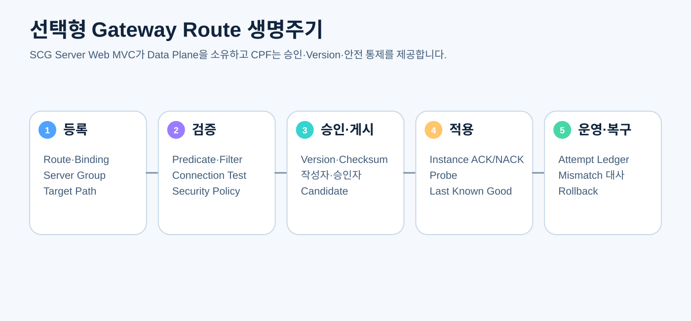

# CPF 게이트웨이 매뉴얼

> **기준 Repository** `freeangelsun/202412_01_CPF` · **기준 Branch** `master` · **문서 작성 기준 SHA** `d31bd127aa12bb9368933216642a5a9d25bd0bfd`
> **문서 목적** 선택형 Gateway 제품의 적용 판단, SCG Server Web MVC 기반 개발, Route·Binding·Server Group, 설치, 보안, ADM 운영과 복구를 설명한다.
> **주요 독자** Gateway 개발자, Gateway 운영자, 네트워크·보안 담당자, ADM Gateway 기능 개발자
> **완료 결과** 독자가 Gateway가 필요한 환경을 판단하고 Route를 안전하게 등록·검증·승인·게시·운영·Rollback한다.

## 0. 문서 사용 계약

Gateway는 선택형 독립 실행 제품이다. 직접 업무 진입이 적절한 환경에는 필수로 강제하지 않는다. QA32 정본은 SCG Server Web MVC와 Embedded Tomcat 기반 단일 실행 JAR를 지정한다.

문서의 예제는 다음 순서로 읽는다.

1. **제품 계약** — CPF가 보장해야 하는 규칙이다.
2. **현재 구현 확인** — 표에 제시한 Source·설정·API·SQL 경로를 최신 `master`에서 확인한다.
3. **실행 절차** — 명령을 실제 환경에서 실행하고 Exit Code와 결과를 확인한다.
4. **오류·복구** — 정상 경로만 보지 않고 중단·응답 유실·중복·부분 실패를 확인한다.
5. **Evidence** — 실행한 기준 SHA, 환경, 명령, 시작·종료 시각, Exit Code와 Sanitized 결과를 남긴다.

상태는 `완료`, `부분 구현`, `미구현`, `미검증`, `실패`, `재확인 필요`만 사용한다.


## 1. 적용 판단

Gateway가 적합한 경우:

- 공통 인증·인가·경로 정책
- 여러 업무영역의 외부 진입점 통합
- Route Version·승인·ACK·Rollback
- 공통 Header·CORS·Rate Limit·Timeout
- 중앙 운영·감사 필요

직접 진입이 적합할 수 있는 경우:

- 내부 단일 서비스
- 공통 진입 정책이 없음
- Gateway가 가용성·Latency의 불필요한 추가 지점

Gateway 사용 여부와 무관하게 업무영역 Public API 계약은 동일해야 한다.

## 2. 제품 구조



### Data Plane

Spring Cloud Gateway Server Web MVC가 실제 요청 처리 Primary다.

- Predicate
- Filter
- Path Rewrite
- Header·CORS
- Timeout·Circuit·Rate Limit
- Embedded Tomcat

### CPF Control Plane

- Route·Binding·Server Group
- Version·Checksum
- 작성·검증·승인·게시
- Instance ACK/NACK
- Candidate·Active·Last Known Good
- Safety Ceiling
- Attempt·Audit·Reconcile

SCG Dependency만 추가하고 기존 Custom HTTP Forwarder가 실제 요청을 처리하면 완료가 아니다.

## 3. Artifact

정본 Artifact:

```text
cpf-gateway.jar
```

- executable `bootJar`
- Embedded Tomcat 포함
- `bootWar` 비활성
- WebFlux·Netty Gateway Artifact 없음
- `cpf-gateway-webflux.jar` 없음

## 4. Source 진입점

| 확인 대상 | 대표 경로 | 확인 방법 |
|---|---|---|
| Gateway Build | `cpf-gateway/build.gradle` | SCG Server Web MVC, BootJar, Tomcat, WebFlux 부재 확인 |
| Route Adapter | `cpf-gateway/src/main/java` | CPF Route Model이 SCG Predicate·Filter로 Mapping되는지 확인 |
| Public Ingress | `CpfGatewayPublicController 또는 현재 SCG Route 진입점` | Custom Forwarder가 Primary로 남았는지 확인 |
| Control Sync | `Route Synchronizer·Snapshot` | Candidate→Validate→Activate→ACK/LKG 순서 확인 |
| ADM Adapter | `cpf-admin/src/main/java/com/cpf/admin/opr/gateway` | Timeout·HMAC·Unknown·Reconcile 확인 |
| DB | `cpf-tools/db/vendor/* Gateway SQL` | Route·Version·ACK·Ledger Vendor 정합성 확인 |

## 5. Route 모델

필수 속성:

- routeId
- ingress method·host·path pattern
- target service·server group
- target scheme·host·port
- target path/rewrite
- predicate·filter policy
- timeout·resilience policy
- auth·permission·CORS
- version·checksum
- enabled·effective period

### Ingress Path와 Target Path

수신 Pattern을 Target URL로 그대로 사용하지 않는다.

```text
Ingress: /api/orders/{id}
Target Base: http://order-service
Rewrite: /orders/{id}
```

`/api/orders/123`가 정확히 `/orders/123`으로 전달되는 Contract Test가 필요하다.

## 6. Binding과 Server Group

### Binding

Route와 Environment·Tenant·Domain·Service Group의 연결을 표현한다.

### Server Group

- Group ID
- Instance 목록
- Health·Weight·Zone
- TLS·Protocol
- Connection Pool
- Load Balancing Policy
- Version·Capability

Instance가 Ready하지 않으면 Routing 대상에서 제외한다.

## 7. Predicate·Filter

지원 기능별 Mapping Matrix를 관리한다.

- Path·Method·Host·Header·Query
- RewritePath
- Add/Remove Header
- CORS
- Authentication Context
- Rate Limit
- Circuit Breaker
- Retry
- Request/Response Size
- Timeout

지원하지 않는 정책을 조용히 무시하지 않고 Publish를 차단한다.

## 8. Timeout과 Resilience

- Connect Timeout
- Response Timeout
- Overall Budget
- Retry Eligibility
- Circuit Breaker
- Bulkhead
- Rate Limit

Gateway와 Downstream Client가 중복 Retry하지 않도록 책임을 정한다. Mutation Retry는 Idempotency가 보장될 때만 허용한다.

## 9. 보안

### 9.1 외부 요청

- TLS
- Host·SNI
- 인증·Token 검증
- Header Allow/Deny
- Request Size
- CORS Origin URI 검증
- SSRF·Open Redirect 차단
- Response Header 보안

### 9.2 ADM Control Channel

정규화 대상:

- HTTP Method
- Request Target
- Content-Type
- Body SHA-256
- Caller·Operator
- Timestamp
- Nonce
- Audience
- Key ID

HMAC 검증은 Body 변조와 Cross-instance Replay를 차단해야 한다. Nonce Store가 JVM Local Map이면 다중 인스턴스 Replay를 막지 못한다.

## 10. Route 생명주기

```text
DRAFT → VALIDATED → APPROVED → PUBLISHED/CANDIDATE → ACTIVE
                                   └→ REJECTED/NACK
ACTIVE → BLOCKED/RETIRED/ROLLED_BACK
```

### 등록

- 중복 Route·우선순위·충돌
- Target·Policy Reference
- 권한·사유

### 검증

- Schema·Capability
- Path Rewrite Contract
- Connection Test
- TLS·Application Probe
- Security Policy
- Load·Size·Timeout

### 승인

- Version·Checksum
- Request Hash
- 작성자·승인자 분리
- 영향 Route·Environment

### 게시·활성화

ACK 없는 Candidate를 Active로 사용하지 않는다. Validate→Activate→ACK 또는 제품이 정한 안전 순서를 지키고 Last Known Good를 유지한다.

## 11. Connection Test와 Probe

Connection Test Type을 구분한다.

- DNS
- TCP
- TLS
- HTTP
- Application

TCP 연결 성공만으로 Application UP을 판단하지 않는다. 단계별 실패 위치, Duration, Certificate, HTTP Status, Response Contract를 반환한다.

## 12. Instance ACK/NACK

각 Gateway Instance는 다음을 보고한다.

- route version·checksum
- appliedAt
- ACK/NACK
- error code·unsupported capability
- probe result
- instanceId

일부 Instance만 적용된 상태는 Partial이며 전체 성공으로 표시하지 않는다.

## 13. Attempt Ledger와 Unknown

각 Retry·Failover Attempt를 별도 행으로 기록한다.

- target instance
- start·end
- status·HTTP code
- timeout stage
- circuit/retry decision
- bytes
- result unknown

응답 유실 뒤 Downstream Side Effect 가능성이 있으면 `UNKNOWN_RESULT`와 Reconcile을 수행한다.

## 14. ADM 운영 절차

### Route 등록

1. Environment·Route ID 확인
2. Ingress·Target Path 작성
3. Server Group·Policy 선택
4. Collision Preview
5. Connection Test·Probe
6. Validation 결과 확인
7. 승인 요청
8. 게시
9. Instance ACK·Checksum 확인
10. 실제 요청 Smoke Test

### 차단

- 영향 Route·사용자·대체 경로
- 직접 State API 우회 금지
- 승인·Reason
- 모든 Instance 적용 확인
- 거래 Unknown·재시도 영향

### Rollback

- Last Known Good Version
- 현재 진행 요청
- Config·Policy 호환
- 게시·ACK
- Smoke·Metric
- Audit

## 15. 설치·기동

- Artifact Hash·Signature
- JDK·Port·TLS
- ADM Control Endpoint
- Route DB·Cache
- Instance ID
- Config Poll/Push
- Readiness
- Horizontal Scale

Gateway는 Stateless Scale-out을 우선하되 Nonce·ACK·Ledger 같은 상태는 공유 정본을 사용한다.

## 16. 장애 Runbook

### Route NACK

- Error Code·Capability
- Instance Version
- Checksum
- 지원하지 않는 Filter
- Candidate 차단
- 수정 또는 LKG Rollback

### 일부 Instance Mismatch

- Traffic에서 제외
- Config 재동기화
- Artifact Version
- Cache·DB
- ACK 재확인

### Downstream 5xx·Timeout

- Attempt Ledger
- Instance별 Health
- Circuit 상태
- Retry 중복
- Unknown Side Effect

### TLS 오류

- Certificate Chain·SAN·Expiry
- Trust Store
- SNI
- Time Sync

### 과부하

- Request Rate·Latency
- Tomcat Thread·Connection
- Downstream Capacity
- Rate Limit·Queue
- Scale-out

## 17. 개발 검증

- Route Mapping Contract
- Rewrite
- Header·CORS
- Auth·Permission
- Timeout·Circuit·Retry
- Streaming·Download
- Large Request
- Scale-out
- Route Update·Rollback
- ACK/NACK·Mismatch
- HMAC Body 변조·Replay
- Downstream Response Loss
- Custom Forwarder Import·Bean 0
- WebFlux·Netty Artifact 0

## 18. Gateway EDU

### 실습: 주문 API Route

1. `/api/orders/{id}` Ingress 정의
2. `/orders/{id}` Target Rewrite
3. GET·POST의 Retry 정책 분리
4. Auth Header와 내부 Credential Mapping
5. CORS Origin Allowlist
6. Connection Test와 Application Probe
7. 승인·게시
8. 두 Gateway Instance ACK 확인
9. 한 Instance NACK 주입
10. LKG 유지 확인
11. Downstream Timeout·Response Loss
12. Attempt·Unknown·Reconcile 확인
13. Rollback

## 19. 완료 체크리스트

- [ ] Gateway 선택 기준과 직접 진입 대안을 검토했다.
- [ ] SCG Server Web MVC가 실제 Data Plane Primary다.
- [ ] 단일 executable cpf-gateway.jar와 Embedded Tomcat을 확인했다.
- [ ] bootWar·WebFlux·Netty Gateway Artifact가 없다.
- [ ] Ingress Pattern과 Target Path를 분리하고 Contract Test했다.
- [ ] Route·Binding·Server Group·Policy가 실제 SCG 기능으로 Mapping된다.
- [ ] HMAC Body Hash·Audience·공유 Nonce로 Control Channel을 보호한다.
- [ ] Candidate·ACK/NACK·LKG·Partial Apply·Rollback을 검증했다.
- [ ] Retry·Failover Attempt가 별도 원장으로 남는다.
- [ ] Scale-out·Load·Failure·Response Loss Runtime Evidence가 있다.
- [ ] 기존 Custom Forwarder Consumer·Bean·Dependency를 제거했다.
