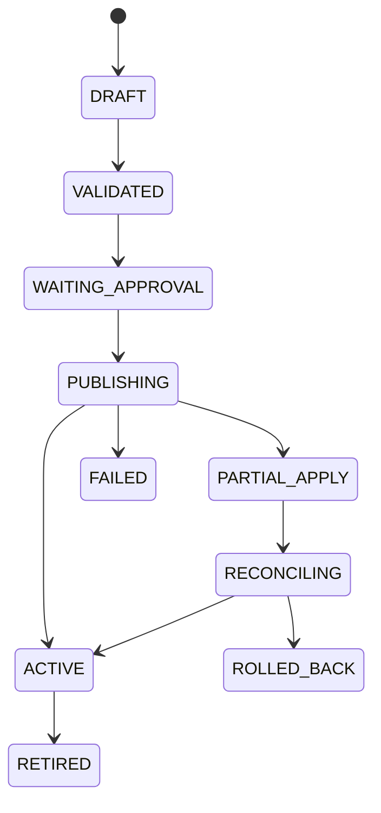

# CPF Gateway 매뉴얼 — API 등록·보안·게시·적용·정상화

> **주 독자**: API 개발자, Gateway 설정 담당자, 보안 담당자, 승인자, 게시 담당자, 운영 담당자
> **완료 결과**: CPF Gateway를 선택·설치하고 Route·보안·복원력 정책을 등록·검증·승인·게시하며, Target별 적용 결과·Drift·응답 유실·부분 적용·Rollback을 운영한다.

<!-- CPF-TOC:START -->
## 전체 목차

- [0. 문서 기준](#0-문서-기준)
- [1. CPF Gateway를 선택하는 기준](#1-cpf-gateway를-선택하는-기준)
- [2. Ownership과 의존 방향](#2-ownership과-의존-방향)
  - [2.1 Gateway가 소유하는 것](#21-gateway가-소유하는-것)
  - [2.2 Gateway가 소유하지 않는 것](#22-gateway가-소유하지-않는-것)
  - [2.3 의존 방향](#23-의존-방향)
- [3. 설치·기동 전 점검](#3-설치기동-전-점검)
- [4. Route 등록 데이터](#4-route-등록-데이터)
- [5. Predicate·Filter·Rewrite](#5-predicatefilterrewrite)
  - [5.1 Predicate](#51-predicate)
  - [5.2 Filter](#52-filter)
  - [5.3 Rewrite](#53-rewrite)
- [6. Target·Discovery·Load Balancing](#6-targetdiscoveryload-balancing)
  - [6.1 Static Target](#61-static-target)
  - [6.2 Service Discovery](#62-service-discovery)
  - [6.3 Load Balancing](#63-load-balancing)
- [7. Authentication·Authorization](#7-authenticationauthorization)
  - [7.1 인증 주체](#71-인증-주체)
  - [7.2 인가](#72-인가)
- [8. HMAC·Audience·Body Hash·Nonce](#8-hmacaudiencebody-hashnonce)
- [9. SSRF·TLS](#9-ssrftls)
  - [9.1 SSRF](#91-ssrf)
  - [9.2 TLS](#92-tls)
- [10. Timeout Budget](#10-timeout-budget)
- [11. Retry·Circuit Breaker·Bulkhead](#11-retrycircuit-breakerbulkhead)
  - [11.1 Retry](#111-retry)
  - [11.2 Circuit Breaker](#112-circuit-breaker)
  - [11.3 Bulkhead](#113-bulkhead)
- [12. Idempotency·Attempt Ledger·UNKNOWN_RESULT](#12-idempotencyattempt-ledgerunknownresult)
  - [12.1 Attempt Ledger 필수 정보](#121-attempt-ledger-필수-정보)
  - [12.2 결과 불명 처리](#122-결과-불명-처리)
- [13. Validation·Version·Checksum](#13-validationversionchecksum)
- [14. 승인·게시 상태](#14-승인게시-상태)
- [15. ACK·NACK·Partial Apply](#15-acknackpartial-apply)
- [16. LKG·Rollback](#16-lkgrollback)
- [17. Scale-out·Drift·Reconciliation](#17-scale-outdriftreconciliation)
  - [17.1 Scale-out](#171-scale-out)
  - [17.2 Drift](#172-drift)
  - [17.3 Reconciliation](#173-reconciliation)
- [18. Probe·Health](#18-probehealth)
- [19. ADM 운영 연계](#19-adm-운영-연계)
- [20. 실제 ADM Gateway Route 9개](#20-실제-adm-gateway-route-9개)
- [21. 화면 사용 표준](#21-화면-사용-표준)
- [22. 장애 Runbook](#22-장애-runbook)
- [23. Test Matrix](#23-test-matrix)
- [24. EDU — Route 게시와 부분 적용 정상화](#24-edu-route-게시와-부분-적용-정상화)
  - [24.1 Gateway EDU 14개 선택표](#241-gateway-edu-14개-선택표)
- [25. 완료 점검표](#25-완료-점검표)
- [26. 종단간 예제: 지급 API Route 게시](#26-종단간-예제-지급-api-route-게시)
  - [26.1 업무 결과](#261-업무-결과)
  - [26.2 선택 기준](#262-선택-기준)
  - [26.3 역할과 권한](#263-역할과-권한)
  - [26.4 시작 전에 결정할 값](#264-시작-전에-결정할-값)
  - [26.5 결과물](#265-결과물)
  - [26.6 단계별 절차](#266-단계별-절차)
  - [26.7 입력·기본값·허용 범위](#267-입력기본값허용-범위)
  - [26.8 정상 결과와 완료 판정](#268-정상-결과와-완료-판정)
  - [26.9 오류·동시성·시간초과·응답 유실·부분 실패](#269-오류동시성시간초과응답-유실부분-실패)
  - [26.10 재시도·재처리·대사·보상·되돌리기](#2610-재시도재처리대사보상되돌리기)
  - [26.11 로그·지표·추적·감사](#2611-로그지표추적감사)
  - [26.12 교육 예제](#2612-교육-예제)
  - [26.13 조직 영역과 CPF 유지 영역](#2613-조직-영역과-cpf-유지-영역)
  - [26.14 운영 인계](#2614-운영-인계)
- [27. Target·Discovery·Load Balancing](#27-targetdiscoveryload-balancing)
  - [27.1 업무 결과](#271-업무-결과)
  - [27.2 선택 기준](#272-선택-기준)
  - [27.3 역할과 권한](#273-역할과-권한)
  - [27.4 시작 전에 결정할 값](#274-시작-전에-결정할-값)
  - [27.5 결과물](#275-결과물)
  - [27.6 단계별 절차](#276-단계별-절차)
  - [27.7 입력·기본값·허용 범위](#277-입력기본값허용-범위)
  - [27.8 정상 결과와 완료 판정](#278-정상-결과와-완료-판정)
  - [27.9 오류·동시성·시간초과·응답 유실·부분 실패](#279-오류동시성시간초과응답-유실부분-실패)
  - [27.10 재시도·재처리·대사·보상·되돌리기](#2710-재시도재처리대사보상되돌리기)
  - [27.11 로그·지표·추적·감사](#2711-로그지표추적감사)
  - [27.12 교육 예제](#2712-교육-예제)
  - [27.13 조직 영역과 CPF 유지 영역](#2713-조직-영역과-cpf-유지-영역)
  - [27.14 운영 인계](#2714-운영-인계)
- [28. Authentication·Authorization·HMAC](#28-authenticationauthorizationhmac)
  - [28.1 업무 결과](#281-업무-결과)
  - [28.2 선택 기준](#282-선택-기준)
  - [28.3 역할과 권한](#283-역할과-권한)
  - [28.4 시작 전에 결정할 값](#284-시작-전에-결정할-값)
  - [28.5 결과물](#285-결과물)
  - [28.6 단계별 절차](#286-단계별-절차)
  - [28.7 입력·기본값·허용 범위](#287-입력기본값허용-범위)
  - [28.8 정상 결과와 완료 판정](#288-정상-결과와-완료-판정)
  - [28.9 오류·동시성·시간초과·응답 유실·부분 실패](#289-오류동시성시간초과응답-유실부분-실패)
  - [28.10 재시도·재처리·대사·보상·되돌리기](#2810-재시도재처리대사보상되돌리기)
  - [28.11 로그·지표·추적·감사](#2811-로그지표추적감사)
  - [28.12 교육 예제](#2812-교육-예제)
  - [28.13 조직 영역과 CPF 유지 영역](#2813-조직-영역과-cpf-유지-영역)
  - [28.14 운영 인계](#2814-운영-인계)
- [29. SSRF·TLS·Header/Body Validation](#29-ssrftlsheaderbody-validation)
  - [29.1 업무 결과](#291-업무-결과)
  - [29.2 선택 기준](#292-선택-기준)
  - [29.3 역할과 권한](#293-역할과-권한)
  - [29.4 시작 전에 결정할 값](#294-시작-전에-결정할-값)
  - [29.5 결과물](#295-결과물)
  - [29.6 단계별 절차](#296-단계별-절차)
  - [29.7 입력·기본값·허용 범위](#297-입력기본값허용-범위)
  - [29.8 정상 결과와 완료 판정](#298-정상-결과와-완료-판정)
  - [29.9 오류·동시성·시간초과·응답 유실·부분 실패](#299-오류동시성시간초과응답-유실부분-실패)
  - [29.10 재시도·재처리·대사·보상·되돌리기](#2910-재시도재처리대사보상되돌리기)
  - [29.11 로그·지표·추적·감사](#2911-로그지표추적감사)
  - [29.12 교육 예제](#2912-교육-예제)
  - [29.13 조직 영역과 CPF 유지 영역](#2913-조직-영역과-cpf-유지-영역)
  - [29.14 운영 인계](#2914-운영-인계)
- [30. Timeout·Retry·Circuit·Bulkhead](#30-timeoutretrycircuitbulkhead)
  - [30.1 업무 결과](#301-업무-결과)
  - [30.2 선택 기준](#302-선택-기준)
  - [30.3 역할과 권한](#303-역할과-권한)
  - [30.4 시작 전에 결정할 값](#304-시작-전에-결정할-값)
  - [30.5 결과물](#305-결과물)
  - [30.6 단계별 절차](#306-단계별-절차)
  - [30.7 입력·기본값·허용 범위](#307-입력기본값허용-범위)
  - [30.8 정상 결과와 완료 판정](#308-정상-결과와-완료-판정)
  - [30.9 오류·동시성·시간초과·응답 유실·부분 실패](#309-오류동시성시간초과응답-유실부분-실패)
  - [30.10 재시도·재처리·대사·보상·되돌리기](#3010-재시도재처리대사보상되돌리기)
  - [30.11 로그·지표·추적·감사](#3011-로그지표추적감사)
  - [30.12 교육 예제](#3012-교육-예제)
  - [30.13 조직 영역과 CPF 유지 영역](#3013-조직-영역과-cpf-유지-영역)
  - [30.14 운영 인계](#3014-운영-인계)
- [31. Idempotency·Attempt Ledger·UNKNOWN_RESULT](#31-idempotencyattempt-ledgerunknownresult)
  - [31.1 업무 결과](#311-업무-결과)
  - [31.2 선택 기준](#312-선택-기준)
  - [31.3 역할과 권한](#313-역할과-권한)
  - [31.4 시작 전에 결정할 값](#314-시작-전에-결정할-값)
  - [31.5 결과물](#315-결과물)
  - [31.6 단계별 절차](#316-단계별-절차)
  - [31.7 입력·기본값·허용 범위](#317-입력기본값허용-범위)
  - [31.8 정상 결과와 완료 판정](#318-정상-결과와-완료-판정)
  - [31.9 오류·동시성·시간초과·응답 유실·부분 실패](#319-오류동시성시간초과응답-유실부분-실패)
  - [31.10 재시도·재처리·대사·보상·되돌리기](#3110-재시도재처리대사보상되돌리기)
  - [31.11 로그·지표·추적·감사](#3111-로그지표추적감사)
  - [31.12 교육 예제](#3112-교육-예제)
  - [31.13 조직 영역과 CPF 유지 영역](#3113-조직-영역과-cpf-유지-영역)
  - [31.14 운영 인계](#3114-운영-인계)
- [32. Validation·Approval·Publish·LKG](#32-validationapprovalpublishlkg)
  - [32.1 업무 결과](#321-업무-결과)
  - [32.2 선택 기준](#322-선택-기준)
  - [32.3 역할과 권한](#323-역할과-권한)
  - [32.4 시작 전에 결정할 값](#324-시작-전에-결정할-값)
  - [32.5 결과물](#325-결과물)
  - [32.6 단계별 절차](#326-단계별-절차)
  - [32.7 입력·기본값·허용 범위](#327-입력기본값허용-범위)
  - [32.8 정상 결과와 완료 판정](#328-정상-결과와-완료-판정)
  - [32.9 오류·동시성·시간초과·응답 유실·부분 실패](#329-오류동시성시간초과응답-유실부분-실패)
  - [32.10 재시도·재처리·대사·보상·되돌리기](#3210-재시도재처리대사보상되돌리기)
  - [32.11 로그·지표·추적·감사](#3211-로그지표추적감사)
  - [32.12 교육 예제](#3212-교육-예제)
  - [32.13 조직 영역과 CPF 유지 영역](#3213-조직-영역과-cpf-유지-영역)
  - [32.14 운영 인계](#3214-운영-인계)
- [33. Route Pack 검수표](#33-route-pack-검수표)
- [34. 게시 상태와 행동](#34-게시-상태와-행동)
- [35. Gateway 운영 한 줄 확인](#35-gateway-운영-한-줄-확인)

<!-- CPF-TOC:END -->

## 0. 문서 기준

- Repository: `freeangelsun/202412_01_CPF`
- Branch: `master`
- 기준 Source: `54bcc10887a83b933685bff462c0b0d7df824923` (`20260802_10`)
- Owner Module: `cpf-gateway`
- 최상위 요구 정본: `cpf-docs/governance/CPF_FINAL_TARGET_REQUIREMENTS.md`
- 실제 Controller·Service·Config·Frontend·DB·Test가 문서보다 우선한다.

## 1. CPF Gateway를 선택하는 기준

다음 조건이면 Gateway 사용을 검토한다.

- 여러 업무 API에 공통 인증·인가·라우팅·제한 정책이 필요하다.
- Route 변경을 Draft·Validation·Approval·Publish 절차로 통제해야 한다.
- 다중 Target의 적용 Version·Checksum·ACK/NACK·Drift를 추적해야 한다.
- Timeout·Retry·Circuit Breaker·Bulkhead를 API 진입점에서 공통 적용해야 한다.
- HMAC·Audience·Nonce·Body Hash·SSRF·TLS 정책을 공통으로 검증해야 한다.

다음 경우에는 불필요한 Hop과 운영 복잡도를 검토한다.

- 단일 내부 API만 존재한다.
- 업무 서비스가 자체 인증·Route를 소유하고 공통 게시 절차가 필요하지 않다.
- Gateway가 업무 원장이나 업무 승인 규칙을 대신 소유하게 되는 설계다.

## 2. Ownership과 의존 방향

### 2.1 Gateway가 소유하는 것

```text
Route·Predicate·Filter·Rewrite
Target·Discovery·Load Balancing 정책
Security·TLS·SSRF 정책 참조
Timeout·Retry·Circuit Breaker·Bulkhead 정책
Route Version·Checksum·Validation 결과
Approval·Publish Operation
Target ACK·NACK·Partial Apply
Attempt Ledger·UNKNOWN_RESULT 대사 정보
Last Known Good(LKG)
Probe·Health·Drift·Reconciliation
Gateway Audit
```

### 2.2 Gateway가 소유하지 않는 것

```text
업무 엔터티·업무 상태·업무 원장
업무 승인·취소·보상 규칙
BZA 조직·사용자·권한 정본
Batch Job Execution 원장
외부기관 실제 처리 결과 정본
```

### 2.3 의존 방향

```text
Channel / Client
        ↓
CPF Gateway Public Endpoint
        ↓
Route·Security·Resilience Policy
        ↓
Owner Service Public API
        ↓
Owner Domain·DB·External Provider
```

Gateway가 Owner DB를 직접 수정하거나 내부 Repository를 호출하지 않는다.

## 3. 설치·기동 전 점검

```powershell
$repo='C:\dev\projects\jck\202412_01_CPF'; if(-not(Test-Path -LiteralPath (Join-Path $repo 'cpf-gateway'))){throw 'cpf-gateway 모듈이 없습니다.'}; git -C $repo rev-parse HEAD; git -C $repo status --short; & (Join-Path $repo 'gradlew.bat') :cpf-gateway:tasks --all
```

확인 항목:

1. Gateway Artifact와 Commit·Hash를 기록한다.
2. DB·Config Store·Secret·Certificate 의존성을 Source에서 확인한다.
3. Target Service의 OpenAPI·Health·Readiness·Permission을 확보한다.
4. 외부 노출 Host·TLS·Firewall·Proxy·DNS를 확정한다.
5. 운영자·승인자·보안 담당자의 Permission을 분리한다.
6. LKG Route Version과 Rollback 절차를 준비한다.

## 4. Route 등록 데이터

| 필드 | 필수 | 의미 | 검증 |
|---|:---:|---|---|
| `routeId` | 예 | Route 고유 식별자 | 중복 없음 |
| Version | 예 | 낙관적 변경 Version | Expected Version 일치 |
| Path | 예 | 외부 요청 경로 | 충돌·Shadowing 검사 |
| Method | 예 | 허용 HTTP Method | OpenAPI와 일치 |
| Predicate | 선택 | Header·Host·Query 등 조건 | 순서·경계값 검사 |
| Filter | 선택 | 요청·응답 처리 | 금지 Header·Payload 검사 |
| Rewrite | 선택 | Path·Header 변환 | 원본·변환 결과 비교 |
| Target | 예 | 대상 Service·URI·Service ID | Allowlist·TLS·Health |
| Discovery | 선택 | 대상 탐색 방식 | Stale Instance·TTL 검사 |
| Load Balancing | 선택 | Round Robin·Weight 등 | 동일 요청 중복 방지 |
| Timeout | 예 | Connect·Read·Write·Total | 전체 Deadline 안에 포함 |
| Retry | 선택 | 재시도 조건·횟수·Backoff | 멱등성·Attempt Ledger |
| Circuit Breaker | 선택 | 실패율·대기·Probe | Open/Half-open 동작 |
| Bulkhead | 선택 | Concurrency·Queue | Capacity 기준 |
| Security Policy | 예 | AuthN·AuthZ·HMAC·TLS | Policy Version 확인 |
| Idempotency Policy | 변경 API | Key·Hash·Ledger | 중복·충돌 시험 |
| Owner | 예 | 업무·Route 책임자 | 연락·승인 체계 |
| Reason | 변경 시 | 등록·변경 사유 | Audit 저장 |
| Approval | 위험 변경 | 승인 ID·Version·만료 | 요청자·승인자 분리 |

## 5. Predicate·Filter·Rewrite

### 5.1 Predicate

- Path·Method를 기본 조건으로 사용한다.
- Host·Header·Query Predicate는 우회 경로가 생기지 않는지 확인한다.
- 대소문자·Encoding·Trailing Slash·중복 Query·빈 Header 경계를 시험한다.
- Predicate 순서가 중복 Route의 우선순위를 바꾸는지 검사한다.

### 5.2 Filter

- 인증·추적 Header를 호출자 입력 그대로 신뢰하지 않는다.
- Hop-by-hop Header와 내부 전용 Header를 제거한다.
- Payload Logging·Compression·Size Limit가 개인정보와 메모리에 미치는 영향을 확인한다.
- Response Header·CORS·Cache 정책은 Route별로 명시한다.

### 5.3 Rewrite

Rewrite 전·후 값을 Validation Evidence에 남긴다. Path Variable·Encoding·Query 보존이 OpenAPI 계약과 일치해야 한다.

## 6. Target·Discovery·Load Balancing

### 6.1 Static Target

- Scheme·Host·Port Allowlist를 사용한다.
- 운영 Target에 Localhost·Metadata Address·임의 Private Range가 포함되지 않도록 한다.
- DNS 결과가 변경될 때 Rebinding 위험을 검사한다.

### 6.2 Service Discovery

- Instance ID·Version·Zone·Readiness·TTL을 사용한다.
- 만료되거나 Readiness가 닫힌 Instance를 신규 요청에서 제외한다.
- 신규 Instance는 Active Route Version·Checksum 적용 후 Traffic을 받는다.

### 6.3 Load Balancing

- Weight·Zone·Session Affinity가 필요한 업무인지 결정한다.
- 재시도 시 같은 Target과 다른 Target 선택 규칙을 명시한다.
- 변경 요청은 Target 전환으로 중복 처리되지 않도록 Idempotency Key를 유지한다.
- Target별 실패율과 전체 실패율을 함께 관측한다.

## 7. Authentication·Authorization

### 7.1 인증 주체

- 사용자 Token과 Service Identity를 구분한다.
- Issuer·Audience·Subject·Client ID·Scope·Role을 검증한다.
- Token Forwarding 여부와 Downstream Audience를 Route별로 정의한다.
- Clock Skew·Key Rotation·Expired Token·Revoked Session을 시험한다.

### 7.2 인가

- Route 접근 Permission과 Owner Service Command Permission을 분리한다.
- Gateway 통과가 업무 권한 승인을 의미하지 않는다.
- Data Scope·Masking은 Owner Service가 최종 검증한다.
- 위험 조치는 Reason·Approval·Expected Version을 요구한다.

## 8. HMAC·Audience·Body Hash·Nonce

HMAC 사용 시 최소 입력:

```text
keyId / algorithm / timestamp / nonce
method / canonical path / canonical query
selected headers / body hash
signature / allowed clock skew
```

검증 순서:

1. Key ID와 활성 Version을 확인한다.
2. Timestamp 허용 범위를 확인한다.
3. Nonce 중복을 차단한다.
4. Canonical Request와 Body Hash를 계산한다.
5. Constant-time 비교로 Signature를 확인한다.
6. 실패 원인을 Secret 없이 Audit에 기록한다.

응답 유실 후 같은 Nonce를 무조건 재사용하지 않는다. Idempotency 계약과 Provider 규칙을 함께 확인한다.

## 9. SSRF·TLS

### 9.1 SSRF

- Scheme·Host·Port Allowlist
- DNS Rebinding 방어
- Redirect 제한과 재검증
- Link-local·Metadata·Loopback 접근 제한
- User Input으로 Target URI 직접 조립 금지
- Proxy 환경의 실제 Destination 확인

### 9.2 TLS

- Certificate Chain·SAN·Expiry
- Protocol·Cipher
- Hostname Verification
- mTLS Client Identity
- Trust Store·Key Store Version
- Certificate Rotation과 Rollback

TLS 검증을 우회한 시험 설정을 운영 Profile에 사용하지 않는다.

## 10. Timeout Budget

전체 Deadline을 다음처럼 나눈다.

```text
Client Deadline
  ├─ Gateway Queue
  ├─ Authentication·Policy
  ├─ Connection
  ├─ Target Processing
  ├─ Response Transfer
  └─ Safety Margin
```

Gateway Timeout이 Target Commit 이후 발생할 수 있으므로 변경 요청은 `UNKNOWN_RESULT` 가능성을 전제로 한다.

## 11. Retry·Circuit Breaker·Bulkhead

### 11.1 Retry

- 조회와 변경 요청을 구분한다.
- 변경 요청은 Idempotency Key·Request Hash·Attempt Ledger가 있어야 한다.
- HTTP Status만으로 재시도하지 않고 Failure Class를 사용한다.
- 최대 시도·Backoff·Jitter·전체 Deadline을 함께 계산한다.

### 11.2 Circuit Breaker

- Open 조건·최소 호출 수·대기 시간·Half-open Probe를 정의한다.
- Circuit Open을 성공 응답으로 변환하지 않는다.
- Fallback이 실제 업무 결과를 오인하게 하지 않는다.

### 11.3 Bulkhead

- Route·Target별 동시성·Queue를 분리한다.
- Queue 대기가 Client Deadline을 초과하지 않도록 한다.
- 한 Target 장애가 전체 Route를 고갈시키지 않게 한다.

## 12. Idempotency·Attempt Ledger·UNKNOWN_RESULT

### 12.1 Attempt Ledger 필수 정보

```text
requestId / traceId / operationId / idempotencyKey
requestHash / routeId / routeVersion / target
attempt / sentAt / responseAt / timeout
statusCode / failureClass / providerReceipt
resultState / reconcileKey
```

### 12.2 결과 불명 처리

Target에 요청을 보낸 뒤 응답을 받지 못한 경우:

1. 신규 업무 요청을 만들지 않는다.
2. 같은 Idempotency Key·Request Hash로 Operation을 조회한다.
3. Attempt Ledger와 Target Receipt를 확인한다.
4. Owner Service의 업무 원장을 조회한다.
5. 성공이면 결과를 확정하고, 미처리이면 허용된 재시도를 수행한다.
6. 결과가 끝내 확정되지 않으면 운영 확정·보상·대사 절차로 이동한다.

## 13. Validation·Version·Checksum

게시 전 Validation:

- Route ID·Version 중복
- Path·Method 충돌
- Predicate Shadowing
- Rewrite 결과
- Target Allowlist·TLS·Health
- Timeout 합계
- Retry 멱등성
- Security Policy Version
- Secret·Certificate Reference
- Config Schema
- Stable Checksum

Expected Version이 다르면 현재 Draft를 다시 조회하고 변경 내용을 병합한다. 다른 운영자의 변경을 덮어쓰지 않는다.

## 14. 승인·게시 상태



상태별 필수 기록:

| 상태 | 필수 기록 |
|---|---|
| DRAFT | 작성자·Reason·Expected Version |
| VALIDATED | Validation 결과·Checksum |
| WAITING_APPROVAL | Approval ID·정책 Version·만료 |
| PUBLISHING | Target 목록·시작 시각 |
| ACTIVE | Target ACK·Probe·Drift 0 |
| PARTIAL_APPLY | 성공·실패 Target·NACK 원인 |
| RECONCILING | 재적용 또는 LKG 결정 |
| ROLLED_BACK | 복귀 Version·Checksum·승인 |

## 15. ACK·NACK·Partial Apply

- Target별 Applied Version·Checksum·시각을 저장한다.
- 일부 Target만 성공하면 Traffic 확대와 신규 게시를 중지한다.
- 성공 Target을 다시 게시하여 중복 Side Effect를 만들지 않는다.
- NACK 원인이 Config·Secret·Certificate·Runtime Version 중 무엇인지 분류한다.
- 실패 Target만 Reconcile하거나 전체 Target을 LKG로 되돌린다.

## 16. LKG·Rollback

Rollback 전 확인:

```text
LKG Version·Checksum
DB/API/Message Compatibility
Target 수와 현재 적용 상태
진행 중 Request·Attempt
Secret·Certificate 호환
승인 ID·Reason
```

Rollback 후 판정:

- 모든 Target ACK
- Active Version·Checksum 일치
- Synthetic Probe 성공
- Drift 0
- 오류율·지연 정상 범위
- Owner 업무 요청·Audit 대사

DB나 외부 계약이 이전 Route와 호환되지 않으면 무조건 Rollback하지 않고 Forward Fix를 선택한다.

## 17. Scale-out·Drift·Reconciliation

### 17.1 Scale-out

신규 Instance는 다음 조건을 만족한 후 Readiness를 연다.

- 지원 Runtime Version
- Active Route Version·Checksum 적용
- Secret·Certificate Version 일치
- Target Connectivity·Synthetic Probe 성공

### 17.2 Drift

Drift 예:

- Target의 Route Version 불일치
- Checksum 불일치
- Secret·Certificate Version 불일치
- Predicate·Filter 순서 불일치
- Runtime Agent 미응답

### 17.3 Reconciliation

1. Desired State와 Target Actual State를 수집한다.
2. 차이를 Target별로 분류한다.
3. 진행 중 Publish Operation과 충돌하는지 확인한다.
4. 실패 Target만 재적용한다.
5. ACK와 Probe를 다시 확인한다.
6. Drift 0을 기록한다.

## 18. Probe·Health

Liveness만으로 Route를 판정하지 않는다.

Synthetic Probe는 다음을 포함한다.

- DNS·TLS
- Authentication·Authorization
- Predicate·Rewrite
- Target Selection
- Timeout Budget
- Response Schema
- Trace·Audit 상관관계

변경 API Probe는 실제 업무 Side Effect를 만들지 않는 전용 계약 또는 승인된 Test Data를 사용한다.

## 19. ADM 운영 연계

ADM에서 다음 정보를 조회·조치할 수 있어야 한다.

```text
Route 검색·상세
Draft·Published Version·Checksum
Validation 결과
Approval·Publish Operation
Target ACK·NACK
Attempt Ledger·UNKNOWN_RESULT
Drift·Reconciliation
Synthetic Probe
LKG·Rollback
Audit
```

위험 조치는 Permission·Data Scope·Reason·Approval·Expected Version을 확인한다.

## 20. 실제 ADM Gateway Route 9개

아래 9개 Route는 최신 Source의 `cpf-admin/frontend/src/generated/adm-route-operation-contract.ts`에서 `gateway-*` Key를 전수 대조한 정적 진입 기준이다.
| Route·화면 | 역할·권한 범주 | 검색·기본값 | 주요 Column·상세 | Button·활성 조건 | 완료 판정 |
|---|---|---|---|---|---|
| `/gateway-dashboard`<br>**Gateway 대시보드** | Gateway 조회자·운영자·보안 담당자·승인자 | 환경·기간·서버 Group·Route | Health·오류율·지연·Circuit·Partial Apply·Drift | Server·Route·Transaction·Apply 상세 이동; 변경 조치는 Reason·Approval·Expected Version 확인 | 긴급 오류·부분 적용 담당자와 정상화 계획 지정 |
| `/gateway-servers`<br>**Gateway 연동 서버** | Gateway 조회자·운영자·보안 담당자·승인자 | Server ID·환경·상태 | Endpoint·TLS·DNS·Health·Weight·최근 오류 | 등록·중지·연결시험·Certificate 교체; 변경 조치는 Reason·Approval·Expected Version 확인 | 허용 Endpoint만 활성, TLS·DNS·Health 정상 |
| `/gateway-groups`<br>**Gateway 서버 Group** | Gateway 조회자·운영자·보안 담당자·승인자 | Group ID·환경·상태 | Member·Weight·LB·최소 정상 수·Failover | 구성·Weight 변경·비정상 제외·복귀; 변경 조치는 Reason·Approval·Expected Version 확인 | 정상 Member만 수신, Weight·Failover 의도 일치 |
| `/gateway-routes`<br>**Gateway Route·Routing** | Gateway 조회자·운영자·보안 담당자·승인자 | Route ID·Host·Path·Method·Version | Predicate·Rewrite·Target·Priority·Timeout·Approval | Draft·Validate·Approval·Publish·Disable; 변경 조치는 Reason·Approval·Expected Version 확인 | 충돌 0, Probe가 목표 Target·Rewrite와 일치 |
| `/gateway-security`<br>**Gateway 보안·제한** | Gateway 조회자·운영자·보안 담당자·승인자 | Route·Client·정책 Version | Audience·Permission·HMAC·Body Hash·Nonce·Allowlist·TLS | Validate·Approval·Apply·Key Rotate·Block; 변경 조치는 Reason·Approval·Expected Version 확인 | 인증 실패 분류, Replay·SSRF·내부망 우회 차단 |
| `/gateway-health`<br>**Gateway Health·연결시험** | Gateway 조회자·운영자·보안 담당자·승인자 | Server·Group·Route·환경 | DNS·TCP·TLS·Probe·지연·최근 실패 | Probe·재확인·Incident 연결; 변경 조치는 Reason·Approval·Expected Version 확인 | 직접 Target과 경유 결과 일치, 실패 구간 식별 |
| `/gateway-transactions`<br>**Gateway 거래 조회** | Gateway 조회자·운영자·보안 담당자·승인자 | Request ID·Trace ID·Route ID·상태·기간 | Target·Attempt·Circuit·전체 지연·응답 코드·Masking | 거래·Log·Target Trace 이동; 변경 조치는 Reason·Approval·Expected Version 확인 | 같은 Trace로 Gateway와 Target 연결, 원문 노출 0 |
| `/gateway-log-policies`<br>**Gateway 로그 정책** | Gateway 조회자·운영자·보안 담당자·승인자 | Route·데이터 등급·정책 Version | Header/Body 수집·Masking·Sampling·보존·반출 | Preview·Approval·Apply·Rollback; 변경 조치는 Reason·Approval·Expected Version 확인 | 민감정보 원문 0, Instance 정책 Checksum 일치 |
| `/gateway-apply-status`<br>**Gateway 적용 상태·이력** | Gateway 조회자·운영자·보안 담당자·승인자 | Bundle Version·Checksum·환경 | Instance ACK/NACK·현재 Version·Drift·LKG·Attempt | 실패 Instance Reconcile·재적용·LKG; 변경 조치는 Reason·Approval·Expected Version 확인 | 활성 Instance 승인 Version/Checksum 일치 또는 격리 |

응답 유실 시 같은 Publish·Reconcile·Rollback Button을 반복하지 않고 Operation ID와 Attempt Ledger로 기존 결과를 조회한다. 부분 적용은 성공 Instance를 유지하고 NACK·미응답 Instance만 대사한다.

## 21. 화면 사용 표준

실제 Route·Component·Permission은 최신 Frontend Source와 Generated Client를 전수 대조한다. Source에 없는 화면 이름이나 Button을 문서에서 만들지 않는다.

각 화면은 다음 항목을 기록해야 한다.

| 항목 | 내용 |
|---|---|
| 메뉴·Route | 실제 Frontend Route |
| Permission | 화면·조회·변경·승인·Rollback 분리 |
| 검색 Field | Route ID·상태·Owner·Version·Target |
| 기본값 | 기간·상태·Page Size |
| Column | Version·Status·Checksum·Target 결과 |
| 상세 Field | Predicate·Filter·Target·Policy·Audit |
| Button | Validate·Approval·Publish·Reconcile·Rollback |
| 활성 조건 | 상태·Permission·Expected Version |
| 입력 | Reason·Approval·대상·Version |
| 응답 유실 | Operation 조회·대사 절차 |
| 부분 적용 | Target별 결과·재처리 |


## 22. 장애 Runbook

| 장애 | 최초 확인 | 조치 | 종료 판정 |
|---|---|---|---|
| Target Down | DNS·TLS·Readiness·Pool | Traffic 제외·대체 Target | Probe 성공·오류율 정상 |
| Timeout 증가 | Deadline·Queue·DB·Backlog | Capacity·Bulkhead·원인 제거 | P95/P99·업무 대사 |
| Auth 실패 | Issuer·Audience·Key·Clock | Key·Config Rotation/Rollback | 인증·권한 Probe |
| SSRF 차단 | Target·DNS·Redirect | 정책·Target 수정, 우회 금지 | Allowlist·Probe |
| Partial Apply | ACK/NACK·Checksum | Reconcile 또는 LKG | Drift 0 |
| UNKNOWN_RESULT | Attempt·Receipt·Owner 원장 | 대사·재시도·운영 확정 | 업무 결과 확정 |
| Circuit Open 고착 | 실패율·Probe·Clock | 원인 제거·Half-open Probe | 정상 요청 성공 |

## 23. Test Matrix

```text
Route Conflict·Predicate Shadowing·Rewrite
Discovery TTL·Stale Instance·Load Balancing
AuthN·AuthZ·Audience·Key Rotation
HMAC·Nonce·Timestamp·Body Hash
SSRF·DNS Rebinding·Redirect
TLS·mTLS·Certificate Rotation
Timeout·Retry·Circuit Breaker·Bulkhead
Idempotency·Request Hash·Attempt Ledger
Response Loss·UNKNOWN_RESULT·Reconciliation
Validation·Version Conflict·Checksum
Approval Expiry·Requester/Approver Separation
Publish ACK·NACK·Partial Apply
LKG·Rollback
Scale-out·Drift
Synthetic Probe
Browser Permission·Audit
```

## 24. EDU — Route 게시와 부분 적용 정상화

1. Test Owner API의 OpenAPI와 Health를 준비한다.
2. Route Draft를 등록한다.
3. Predicate·Rewrite·Target·Security·Timeout을 입력한다.
4. Validation과 Checksum을 확인한다.
5. 승인 요청 후 승인자 분리를 확인한다.
6. Target 2개 중 하나가 NACK하도록 Fault를 주입한다.
7. `PARTIAL_APPLY`와 Target별 결과를 확인한다.
8. 실패 Target만 Reconcile한다.
9. Timeout 후 Attempt Ledger와 Owner 원장을 대사한다.
10. LKG Rollback을 실행하고 Drift 0·Probe·Audit를 확인한다.

직접 실행한 명령·환경·Exit Code·Operation ID·Evidence Hash를 기록한다.

### 24.1 Gateway EDU 14개 선택표

기준 기능 카탈로그에는 다음 Gateway EDU가 정의돼 있다. 기능 목록과 Handler 존재만으로 실행 성공을 의미하지 않으며, `cpf.reference.features.gateway.enabled` 조건과 실제 Consumer·DB·Fault 결과를 함께 확인한다.

| EDU | 확인 기능 | 역할 | 활성 조건 | 실행 검증 |
|---|---|---|---|---|
| `EDU-GW-01` | 서버 Group·Health·Load Balancing | `CPF_GATEWAY_OPERATOR` | `cpf.reference.features.gateway.enabled` | 제공 |
| `EDU-GW-02` | Route·Predicate·Rewrite | `CPF_GATEWAY_OPERATOR` | `cpf.reference.features.gateway.enabled` | 제공 |
| `EDU-GW-03` | Authentication·Authorization·TLS·HMAC·Nonce | `CPF_GATEWAY_OPERATOR` | `cpf.reference.features.gateway.enabled` | 제공 |
| `EDU-GW-04` | Timeout·Retry·Circuit Breaker·Bulkhead | `CPF_GATEWAY_OPERATOR` | `cpf.reference.features.gateway.enabled` | 제공 |
| `EDU-GW-05` | Draft·Validation·Approval·Publish·Partial Apply | `CPF_GATEWAY_OPERATOR` | `cpf.reference.features.gateway.enabled` | 제공 |
| `EDU-GW-06` | Attempt Ledger·UNKNOWN_RESULT·LKG | `CPF_GATEWAY_OPERATOR` | `cpf.reference.features.gateway.enabled` | 제공 |
| `EDU-GW-07` | Discovery·Failover·복귀 | `CPF_GATEWAY_OPERATOR` | `cpf.reference.features.gateway.enabled` | 제공 |
| `EDU-GW-08` | SSRF Allowlist·DNS Rebinding 차단 | `CPF_GATEWAY_OPERATOR` | `cpf.reference.features.gateway.enabled` | 제공 |
| `EDU-GW-09` | Header·Path·Request·Response 변환 | `CPF_GATEWAY_OPERATOR` | `cpf.reference.features.gateway.enabled` | 제공 |
| `EDU-GW-10` | Body Size·Content-Type·Schema Validation | `CPF_GATEWAY_OPERATOR` | `cpf.reference.features.gateway.enabled` | 제공 |
| `EDU-GW-11` | Command Idempotency·응답 유실 | `CPF_GATEWAY_OPERATOR` | `cpf.reference.features.gateway.enabled` | 제공 |
| `EDU-GW-12` | 다중 Instance Drift·Reconciliation | `CPF_GATEWAY_OPERATOR` | `cpf.reference.features.gateway.enabled` | 제공 |
| `EDU-GW-13` | Canary·Weighted Routing·Rollback | `CPF_GATEWAY_OPERATOR` | `cpf.reference.features.gateway.enabled` | 제공 |
| `EDU-GW-14` | 관측·Masking·Audit | `CPF_GATEWAY_OPERATOR` | `cpf.reference.features.gateway.enabled` | 제공 |

## 25. 완료 점검표

- [ ] Gateway 선택 이유와 비선택 이유가 기록됐다.
- [ ] Route·Predicate·Filter·Rewrite·Target이 OpenAPI와 일치한다.
- [ ] Discovery·Load Balancing·Timeout·Retry 정책이 업무 의미와 맞는다.
- [ ] AuthN·AuthZ·HMAC·SSRF·TLS를 시험했다.
- [ ] Idempotency·Attempt Ledger·UNKNOWN_RESULT 대사가 가능하다.
- [ ] Validation·Version·Checksum·Approval·Publish가 연결된다.
- [ ] Target별 ACK·NACK·Partial Apply·Reconciliation을 확인했다.
- [ ] LKG·Rollback·Scale-out·Drift·Probe를 확인했다.
- [ ] ADM·Browser·Audit가 같은 Route Version을 가리킨다.
## 26. 종단간 예제: 지급 API Route 게시

### 26.1 업무 결과

외부 지급 API를 Target Group에 연결하고 인증·HMAC·SSRF·Timeout·Retry·Circuit·Idempotency 정책을 검증한 뒤 승인·Canary·전체 게시하고 부분 적용을 LKG로 정상화한다.

### 26.2 선택 기준

여러 업무 API의 공통 Trust Boundary·Route·보안·Resilience·게시 통제가 필요할 때 사용한다. 단일 내부 서비스 직접 호출에는 불필요한 Gateway 경유를 추가하지 않는다.

### 26.3 역할과 권한

API 개발자, 보안 담당자, Gateway 운영자, 승인자, 플랫폼 운영자 Permission을 분리한다.

### 26.4 시작 전에 결정할 값

Route ID/Version, Host/Path/Method, Predicate, Rewrite, Target Group, Health, TLS, Auth/Audience, HMAC/Nonce, Body Limit, Timeout, Retry, Circuit, Rate/Bulkhead, Idempotency, Log/Masking, Canary, LKG를 정한다.

### 26.5 결과물

Route Pack, Target/Binding, Security Policy, Resilience Policy, Validation Report, Approval, Publish Operation, Instance ACK/NACK, Attempt Ledger, Runbook.

### 26.6 단계별 절차

1. Target Endpoint와 TLS·Health를 등록한다.
2. Server Group과 Weight·Discovery 조건을 설정한다.
3. Route Host/Path/Method와 Predicate·Rewrite를 초안으로 만든다.
4. 인증 발급자·Audience·Permission·HMAC·Nonce·Body Hash를 설정한다.
5. SSRF Allowlist와 DNS/IP 재검증을 적용한다.
6. 연결·읽기·전체 Timeout과 Retry 금지 조건을 정한다.
7. Circuit Breaker·Bulkhead·Rate Limit을 경로별로 설정한다.
8. Route Pack Version·Checksum을 생성하고 정적·연결·보안·충돌 Test를 실행한다.
9. 변경 Diff·영향·Canary·LKG로 승인을 받는다.
10. Canary Instance/Traffic에 게시하고 오류·지연·업무 대사를 관찰한다.
11. 전체 Instance에 게시하고 ACK/NACK·Version·Checksum을 대사한다.
12. 일부 실패는 성공 Instance를 유지하고 실패·미확정만 재적용하거나 LKG로 복원한다.

### 26.7 입력·기본값·허용 범위

| 항목 | 예 | 규칙 |
|---|---|---|
| Route ID | `payment-v1` | 환경 내 고유·변경 추적 |
| Path | `/payments/**` | 충돌·우선순위 검증 |
| Method | GET/POST | Retry 정책과 연결 |
| Target Group | `payment-blue` | Health·TLS·Weight |
| Timeout | connect/read/total | 전체 예산 이하 |
| Retry | GET 일시 오류 1회 | Command는 결과 조회 전 금지 |
| Version/Checksum | Pack 값 | 승인·Instance 일치 |

### 26.8 정상 결과와 완료 판정

요청이 의도한 Target에 전달되고 Auth·Permission·HMAC·SSRF·Schema 오류가 대상 호출 전에 구분된다. 모든 활성 Instance가 승인 Version·Checksum을 사용하며 Canary/전체 업무 지표가 기준 안에 있다.

### 26.9 오류·동시성·시간초과·응답 유실·부분 실패

DNS/TLS/Health, 인증 실패, HMAC/Nonce, Target Timeout, 대상 처리 후 응답 유실, Circuit Open, Queue Full, 일부 Instance NACK, Config Drift를 구분한다.

### 26.10 재시도·재처리·대사·보상·되돌리기

Query는 정책 범위에서 Retry한다. Command는 Attempt Ledger와 후단 Idempotency 결과를 조회한다. 부분 적용은 실패 Instance만 재적용하고 위험 증가 시 승인된 LKG로 Rollback한다.

### 26.11 로그·지표·추적·감사

Route/Pack/Instance/Target/Attempt/Transaction/Trace, Auth 실패, Timeout 단계, Retry, Circuit/Bulkhead, Version/Checksum, Approval, Audit를 기록한다.

### 26.12 교육 예제

`EDU-GW-01~14` 중 Route·Security·Resilience·Publish·Unknown Result·Drift 시나리오를 순서대로 실행한다.

### 26.13 조직 영역과 CPF 유지 영역

업무 API와 후단 상태는 업무 Domain 영역이다. Gateway Route·Trust·Attempt·Publish·LKG 계약은 CPF가 유지한다.

### 26.14 운영 인계

Route Pack, Target, Security, Timeout/Retry, Idempotency, Publish/LKG, ADM 화면, Alert, 연락망을 인계한다.


## 27. Target·Discovery·Load Balancing

### 27.1 업무 결과

정적/동적 Target을 Health·Weight·Zone·TLS 기준으로 선택한다.

### 27.2 선택 기준

Gateway가 해당 책임을 공통으로 제공해야 할 때 적용하고 업무 상태·내부 호출은 후단 Owner에 둔다.

### 27.3 역할과 권한

Gateway 개발자·운영자·보안·승인자 Permission을 분리한다.

### 27.4 시작 전에 결정할 값

Target ID, Endpoint, Discovery Metadata, Weight, Zone, Health, Drain을 정한다.

### 27.5 결과물

Target·Discovery·Load Balancing 설정·검증·Test·ADM 운영 절차.

### 27.6 단계별 절차

Target을 등록하고 Probe를 통과한 Instance만 Group에 포함한다. Weight 합과 Zone 정책을 검증하고 Drain 후 제거한다.

### 27.7 입력·기본값·허용 범위

실제 Route/Policy Schema의 Field·Type·Default·범위를 사용한다.

### 27.8 정상 결과와 완료 판정

비정상 Target이 선택되지 않고 요청 분포가 정책과 일치한다.

### 27.9 오류·동시성·시간초과·응답 유실·부분 실패

Validation·권한·Timeout·응답 유실·부분 적용·Drift를 독립 상태로 판정한다.

### 27.10 재시도·재처리·대사·보상·되돌리기

모든 Target 장애 시 명확한 오류를 반환하고 무한 Retry하지 않는다. 복귀는 안정화 시간 후 단계적으로 수행한다.

### 27.11 로그·지표·추적·감사

Route ID, Version/Checksum, Instance, Target, Attempt, Actor, Approval, Trace, Audit를 기록한다.

### 27.12 교육 예제

`EDU-GW-01·07`를 실행한다.

### 27.13 조직 영역과 CPF 유지 영역

후단 업무 계약은 업무 Domain, Gateway 정책과 시도 원장은 CPF가 유지한다.

### 27.14 운영 인계

설정·Test·Alert·대사·LKG·Rollback을 인계한다.


## 28. Authentication·Authorization·HMAC

### 28.1 업무 결과

외부 주체·Service Identity·Audience·Permission·서명·Nonce·Body Hash를 검증한다.

### 28.2 선택 기준

Gateway가 해당 책임을 공통으로 제공해야 할 때 적용하고 업무 상태·내부 호출은 후단 Owner에 둔다.

### 28.3 역할과 권한

Gateway 개발자·운영자·보안·승인자 Permission을 분리한다.

### 28.4 시작 전에 결정할 값

Issuer, Audience, Credential, Permission, HMAC Algorithm, Clock Skew, Nonce TTL을 정한다.

### 28.5 결과물

Authentication·Authorization·HMAC 설정·검증·Test·ADM 운영 절차.

### 28.6 단계별 절차

TLS 후 Token/Certificate를 검증하고 Permission·Data Scope를 생성한다. HMAC Canonical String과 Body Hash·Timestamp·Nonce를 검증한다.

### 28.7 입력·기본값·허용 범위

실제 Route/Policy Schema의 Field·Type·Default·범위를 사용한다.

### 28.8 정상 결과와 완료 판정

변조·재전송·잘못된 Audience·권한 없는 요청이 Target 호출 전에 거부된다.

### 28.9 오류·동시성·시간초과·응답 유실·부분 실패

Validation·권한·Timeout·응답 유실·부분 적용·Drift를 독립 상태로 판정한다.

### 28.10 재시도·재처리·대사·보상·되돌리기

인증 실패는 Retry하지 않는다. Key Rotation은 이전/신규 공존 후 이전 Version을 폐기한다.

### 28.11 로그·지표·추적·감사

Route ID, Version/Checksum, Instance, Target, Attempt, Actor, Approval, Trace, Audit를 기록한다.

### 28.12 교육 예제

`EDU-GW-03`를 실행한다.

### 28.13 조직 영역과 CPF 유지 영역

후단 업무 계약은 업무 Domain, Gateway 정책과 시도 원장은 CPF가 유지한다.

### 28.14 운영 인계

설정·Test·Alert·대사·LKG·Rollback을 인계한다.


## 29. SSRF·TLS·Header/Body Validation

### 29.1 업무 결과

Target 주소·DNS·IP·TLS와 요청 Header·Body Size·Content-Type·Schema를 Trust Boundary에서 검증한다.

### 29.2 선택 기준

Gateway가 해당 책임을 공통으로 제공해야 할 때 적용하고 업무 상태·내부 호출은 후단 Owner에 둔다.

### 29.3 역할과 권한

Gateway 개발자·운영자·보안·승인자 Permission을 분리한다.

### 29.4 시작 전에 결정할 값

Allowlist, 금지 IP, DNS 재검증, CA/mTLS, Header Policy, Body Limit, Schema를 정한다.

### 29.5 결과물

SSRF·TLS·Header/Body Validation 설정·검증·Test·ADM 운영 절차.

### 29.6 단계별 절차

URL Parse→Host Allowlist→DNS Resolve→IP 범위→연결 직전 재검증 순서로 SSRF를 차단한다. Header를 정리하고 Body를 제한·검증한다.

### 29.7 입력·기본값·허용 범위

실제 Route/Policy Schema의 Field·Type·Default·범위를 사용한다.

### 29.8 정상 결과와 완료 판정

내부/Metadata 주소와 변조된 Certificate·과대 Body·잘못된 Schema가 차단된다.

### 29.9 오류·동시성·시간초과·응답 유실·부분 실패

Validation·권한·Timeout·응답 유실·부분 적용·Drift를 독립 상태로 판정한다.

### 29.10 재시도·재처리·대사·보상·되돌리기

DNS Rebinding 의심은 Route 게시를 차단한다. Certificate 만료는 Rotation 후 연결 Test를 수행한다.

### 29.11 로그·지표·추적·감사

Route ID, Version/Checksum, Instance, Target, Attempt, Actor, Approval, Trace, Audit를 기록한다.

### 29.12 교육 예제

`EDU-GW-08·09·10`를 실행한다.

### 29.13 조직 영역과 CPF 유지 영역

후단 업무 계약은 업무 Domain, Gateway 정책과 시도 원장은 CPF가 유지한다.

### 29.14 운영 인계

설정·Test·Alert·대사·LKG·Rollback을 인계한다.


## 30. Timeout·Retry·Circuit·Bulkhead

### 30.1 업무 결과

경로별 시간 예산과 장애 격리를 적용하되 비멱등 Command를 중복 전송하지 않는다.

### 30.2 선택 기준

Gateway가 해당 책임을 공통으로 제공해야 할 때 적용하고 업무 상태·내부 호출은 후단 Owner에 둔다.

### 30.3 역할과 권한

Gateway 개발자·운영자·보안·승인자 Permission을 분리한다.

### 30.4 시작 전에 결정할 값

Connect/Read/Total Timeout, Retryable Error, Attempts, Backoff, Circuit, Half-open, Bulkhead를 정한다.

### 30.5 결과물

Timeout·Retry·Circuit·Bulkhead 설정·검증·Test·ADM 운영 절차.

### 30.6 단계별 절차

전체 예산을 단계별로 배분하고 Query/Command를 구분한다. Fault Test로 Timeout·Circuit·Queue 포화를 확인한다.

### 30.7 입력·기본값·허용 범위

실제 Route/Policy Schema의 Field·Type·Default·범위를 사용한다.

### 30.8 정상 결과와 완료 판정

전체 예산 초과와 재시도 폭주가 없고 한 Target 장애가 다른 Route 자원을 고갈시키지 않는다.

### 30.9 오류·동시성·시간초과·응답 유실·부분 실패

Validation·권한·Timeout·응답 유실·부분 적용·Drift를 독립 상태로 판정한다.

### 30.10 재시도·재처리·대사·보상·되돌리기

대상 처리 가능성이 있는 Timeout은 UNKNOWN_RESULT로 전환한다. Circuit 복귀 전 Probe·안정화 시간을 확인한다.

### 30.11 로그·지표·추적·감사

Route ID, Version/Checksum, Instance, Target, Attempt, Actor, Approval, Trace, Audit를 기록한다.

### 30.12 교육 예제

`EDU-GW-04`를 실행한다.

### 30.13 조직 영역과 CPF 유지 영역

후단 업무 계약은 업무 Domain, Gateway 정책과 시도 원장은 CPF가 유지한다.

### 30.14 운영 인계

설정·Test·Alert·대사·LKG·Rollback을 인계한다.


## 31. Idempotency·Attempt Ledger·UNKNOWN_RESULT

### 31.1 업무 결과

Gateway 시도와 후단 업무 결과를 연결해 응답 유실 후 실제 처리 여부를 판정한다.

### 31.2 선택 기준

Gateway가 해당 책임을 공통으로 제공해야 할 때 적용하고 업무 상태·내부 호출은 후단 Owner에 둔다.

### 31.3 역할과 권한

Gateway 개발자·운영자·보안·승인자 Permission을 분리한다.

### 31.4 시작 전에 결정할 값

Idempotency Header, Request Hash, Attempt 상태, 후단 결과 조회, Retention을 정한다.

### 31.5 결과물

Idempotency·Attempt Ledger·UNKNOWN_RESULT 설정·검증·Test·ADM 운영 절차.

### 31.6 단계별 절차

요청 전 Attempt를 만들고 전달 시각·Target·Hash를 기록한다. 응답/Timeout 후 후단 Operation과 대사한다.

### 31.7 입력·기본값·허용 범위

실제 Route/Policy Schema의 Field·Type·Default·범위를 사용한다.

### 31.8 정상 결과와 완료 판정

같은 의도의 재호출이 후단 부수 효과를 중복 생성하지 않고 Attempt와 업무 결과가 일치한다.

### 31.9 오류·동시성·시간초과·응답 유실·부분 실패

Validation·권한·Timeout·응답 유실·부분 적용·Drift를 독립 상태로 판정한다.

### 31.10 재시도·재처리·대사·보상·되돌리기

응답 유실은 임의 성공/실패로 확정하지 않는다. 후단 조회 불가 시 수동 Reconcile 대상으로 유지한다.

### 31.11 로그·지표·추적·감사

Route ID, Version/Checksum, Instance, Target, Attempt, Actor, Approval, Trace, Audit를 기록한다.

### 31.12 교육 예제

`EDU-GW-06·11`를 실행한다.

### 31.13 조직 영역과 CPF 유지 영역

후단 업무 계약은 업무 Domain, Gateway 정책과 시도 원장은 CPF가 유지한다.

### 31.14 운영 인계

설정·Test·Alert·대사·LKG·Rollback을 인계한다.


## 32. Validation·Approval·Publish·LKG

### 32.1 업무 결과

Route Pack을 정적·연결·보안 검증하고 승인 후 Version·Checksum으로 게시·복원한다.

### 32.2 선택 기준

Gateway가 해당 책임을 공통으로 제공해야 할 때 적용하고 업무 상태·내부 호출은 후단 Owner에 둔다.

### 32.3 역할과 권한

Gateway 개발자·운영자·보안·승인자 Permission을 분리한다.

### 32.4 시작 전에 결정할 값

Validation Gate, Approval Policy, Target Instance, Canary, ACK/NACK, LKG 보존을 정한다.

### 32.5 결과물

Validation·Approval·Publish·LKG 설정·검증·Test·ADM 운영 절차.

### 32.6 단계별 절차

초안 Diff→Validation→Approval→Publish→ACK/NACK→Probe→업무 확인 순서로 수행한다.

### 32.7 입력·기본값·허용 범위

실제 Route/Policy Schema의 Field·Type·Default·범위를 사용한다.

### 32.8 정상 결과와 완료 판정

승인 Pack과 Instance 적용본이 일치하고 Drift가 0이다.

### 32.9 오류·동시성·시간초과·응답 유실·부분 실패

Validation·권한·Timeout·응답 유실·부분 적용·Drift를 독립 상태로 판정한다.

### 32.10 재시도·재처리·대사·보상·되돌리기

부분 적용은 성공 Instance를 반복하지 않는다. NACK/미확정만 재적용하거나 LKG로 복원한다.

### 32.11 로그·지표·추적·감사

Route ID, Version/Checksum, Instance, Target, Attempt, Actor, Approval, Trace, Audit를 기록한다.

### 32.12 교육 예제

`EDU-GW-05·12·13`를 실행한다.

### 32.13 조직 영역과 CPF 유지 영역

후단 업무 계약은 업무 Domain, Gateway 정책과 시도 원장은 CPF가 유지한다.

### 32.14 운영 인계

설정·Test·Alert·대사·LKG·Rollback을 인계한다.


## 33. Route Pack 검수표

| 영역 | 검수 내용 | 차단 조건 |
|---|---|---|
| Route | Host·Path·Method·Priority·충돌 | 중복·Shadow·순환 |
| Target | Endpoint·TLS·Health·Weight | 전 Target 비정상 |
| Security | Issuer·Audience·Permission·HMAC·Nonce | 검증 누락·Secret 노출 |
| SSRF | Allowlist·DNS·IP·Redirect | 내부/Metadata 접근 가능 |
| Validation | Header·Body·Schema·Size | 과대/잘못된 Payload 통과 |
| Resilience | Timeout·Retry·Circuit·Bulkhead | 비멱등 자동 Retry |
| Idempotency | Key·Hash·Attempt·후단 조회 | 결과 미확정 판정 불가 |
| Observability | Log·Metric·Trace·Masking | PII/Token 원문 노출 |
| Publish | Version·Checksum·Approval·LKG | 승인본 불일치 |

## 34. 게시 상태와 행동

| 상태 | 의미 | 허용 행동 |
|---|---|---|
| DRAFT | 편집 중 | 검증·폐기 |
| VALIDATED | 모든 Gate 통과 | 승인 요청 |
| APPROVED | 대상·Version 고정 | 유효시간 안에 게시 |
| PUBLISHING | 적용 중 | 상태 조회·취소 가능 범위 확인 |
| PARTIAL_APPLY | 일부 성공 | 실패/미확정 Reconcile·LKG |
| APPLIED | 전 대상 일치 | 업무 관찰·LKG 지정 |
| REJECTED/NACK | 검증/Instance 거부 | 원인 수정 후 새 Version |
| ROLLED_BACK | LKG 복원 | Drift·업무 확인 |

## 35. Gateway 운영 한 줄 확인

```powershell
$repo='C:\dev\projects\jck\202412_01_CPF'; & (Join-Path $repo 'gradlew.bat') :cpf-gateway:test; if($LASTEXITCODE -ne 0){throw 'Gateway Test 실패'}
```
