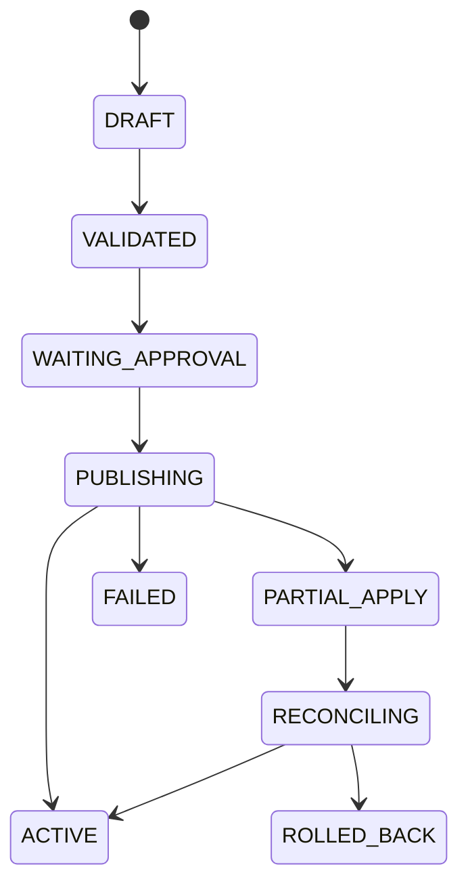

# CPF Gateway 매뉴얼 — API 등록·보안·게시·정상화

> **주 독자**: API 개발자, Gateway 운영자, 보안 담당자, 승인자
> **완료 결과**: Route를 등록·검증·승인·게시하고 Target 적용·장애·Drift·Rollback을 운영한다.

## 문서 기준

- Repository: `freeangelsun/202412_01_CPF`
- Branch: `master`
- 기준 Commit: `dafe5c0e5260ea8149234e8ab2e75347e75338c1` (`20260802_07`)
- 활성 요구: `CPF_QA38_FINAL_DEVELOPMENT_REQUIREMENTS.md`와 Final Matrix
- Source·SQL·API·Config·Frontend·Script·Test가 설명보다 우선한다.
- 목표 기능과 현재 사용 가능한 기능을 구분한다.
- 실행하지 않은 Runtime·DB·Browser·다중 인스턴스·장애 시험은 `미검증`이다.


## 1. 선택 기준

Gateway를 사용하면 여러 API의 인증·라우팅·제한·게시를 공통 진입점에서 운영한다. 단일 내부 API가 별도 진입점을 가져야 하는 경우 불필요한 Hop과 Owner 책임을 검토한다.

## 2. Ownership

Gateway가 소유:

```text
Route·Predicate·Filter
Policy Version
Publish·Target ACK/NACK
Attempt Ledger
Last Known Good
Probe·Drift·Reconcile
```

Gateway가 소유하지 않음:

```text
업무 상태·업무 원장
업무 승인·보상 규칙
Batch 실행 원장
BZA 조직·권한 정본
```

## 3. Route 등록

필수 입력:

```text
routeId / version
path / method
predicate
filter / rewrite
target / discovery
connect/read/write timeout
retry/circuit/bulkhead
security policy
idempotency policy
owner / approval
```

등록 후 Validation·Checksum·Dry Run·Probe를 수행한다.

## 4. Authentication·Authorization

- 사용자 Token과 Service Identity를 구분한다.
- Audience·Issuer·Clock Skew·Key Rotation을 검증한다.
- HMAC 사용 시 Body Hash·Nonce·Timestamp를 검증한다.
- Route Permission과 대상 서비스 Permission을 함께 확인한다.

## 5. SSRF·TLS

- Target Host·Port·Scheme Allowlist를 사용한다.
- DNS Rebinding과 Redirect를 제한한다.
- Private/Metadata Address 접근 정책을 검증한다.
- TLS Chain·SAN·Protocol·Cipher·mTLS를 확인한다.
- Secret과 Certificate Rotation을 Target별로 추적한다.

## 6. Timeout·Retry·Circuit Breaker·Bulkhead

- 전체 Deadline을 Gateway와 Target 호출에 배분한다.
- 비멱등 요청은 Idempotency Key와 Attempt Ledger가 없으면 Retry하지 않는다.
- Circuit Open 상태와 Probe 결과를 운영 화면에 표시한다.
- Bulkhead Queue·Concurrency Limit을 Capacity와 함께 정한다.

## 7. Attempt Ledger·UNKNOWN_RESULT

필수 기록:

```text
request/operation/idempotency
route version
target
attempt
sentAt/responseAt
timeout/failureClass
provider receipt
result state
reconcile key
```

Target에 요청이 도달한 뒤 응답이 유실되면 `UNKNOWN_RESULT`로 기록하고 Target 조회·업무 원장 대사를 수행한다.

## 8. 게시



## 9. ACK·NACK·Partial Apply

- Target별 Version·Checksum·ACK/NACK를 저장한다.
- 일부 Target만 적용되면 Traffic 확대를 중지한다.
- 성공 Target을 유지할지 LKG로 Rollback할지 결정한다.
- Drift가 0이 될 때까지 신규 게시를 겹치지 않는다.

## 10. LKG·Rollback

Rollback 전 확인:

```text
이전 Version·Checksum
DB/API 호환
Target 수
진행 중 Request
Secret/Certificate 호환
승인
```

Rollback 후 모든 Target ACK와 Probe, 업무 요청 성공, Drift 0을 확인한다.

## 11. Scale-out·Drift

- 새 Instance는 현재 Active Version과 Checksum을 받아야 Readiness가 열린다.
- Instance가 오래된 Version이면 Traffic에서 제외하고 Reconcile한다.
- Runtime Agent가 없는 Target은 수동 적용으로 구분한다.

## 12. Probe·Health

Health만으로 업무 경로를 판정하지 않는다. 인증·Route·Rewrite·Target·Timeout·응답 Schema를 포함한 Synthetic Probe를 실행한다.

## 13. ADM 운영

ADM에는 Route 검색, Version, Target 상태, Publish Operation, Attempt Ledger, Drift, Probe, LKG, Audit를 연결한다. 위험 조치는 Permission·Reason·Approval·Expected Version을 요구한다.

## 14. 장애 Runbook

| 장애 | 확인 | 정상화 |
|---|---|---|
| Target Down | Health·DNS·TLS·Pool | Traffic 차단·대체 Target·Rollback |
| Timeout 증가 | Deadline·DB·Backlog | Capacity·Bulkhead·Retry 조정 |
| Partial Apply | ACK/NACK·Checksum | Reconcile 또는 LKG |
| Auth 실패 | Key·Audience·Clock | Rotation·Config Rollback |
| SSRF 차단 | Target·DNS·Redirect | 정책 검토, 우회 금지 |
| UNKNOWN_RESULT | Attempt·Target Receipt | 업무 Owner와 대사 |

## 15. Test

```text
Predicate/Rewrite
AuthN/AuthZ
HMAC/Nonce/Body Hash
SSRF/DNS Rebinding
TLS/mTLS/Rotation
Timeout/Retry/Circuit/Bulkhead
Response Loss/UNKNOWN_RESULT
Publish ACK/NACK/Partial Apply
LKG/Rollback
Scale-out/Drift
Browser Permission/Audit
```

## 16. EDU

1. Route Draft 등록
2. Validation·Checksum
3. 승인·게시
4. Target 하나 NACK 재현
5. Partial Apply Reconcile
6. Timeout 후 Attempt Ledger 대사
7. LKG Rollback
8. Drift 0과 Probe 성공 확인


## 17. 처음 사용하는 운영자의 실행 순서

1. API Owner·Route Owner·승인자를 지정한다.
2. OpenAPI와 대상 Service의 실제 Health·권한 계약을 확인한다.
3. Route Draft에 Path·Method·Predicate·Rewrite·Target을 입력한다.
4. 인증·인가·HMAC·TLS·SSRF 정책을 연결한다.
5. Deadline·Retry·Circuit Breaker·Bulkhead를 계산한다.
6. Validation·Checksum·Dry Run·Synthetic Probe를 실행한다.
7. 승인 후 제한된 Target에 게시한다.
8. Target별 ACK·NACK·Version·Checksum을 확인한다.
9. 부분 적용이면 Traffic 확대를 중지하고 Reconcile 또는 LKG를 선택한다.
10. Attempt Ledger·Trace·Audit과 업무 Owner 결과를 대사한다.

## 18. 입력값과 정상 결과

| 입력 | 확인 기준 |
|---|---|
| `routeId`, Version | 중복·낙관적 버전 충돌 없음 |
| Path·Method | OpenAPI와 일치 |
| Predicate·Filter·Rewrite | 순서와 변환 결과 검증 |
| Target·Discovery | Allowlist·Health·Readiness |
| Timeout | 전체 Deadline 안에 포함 |
| Retry | 멱등성·Attempt Ledger 존재 |
| Security Policy | 인증 주체·Audience·Permission |
| Approval | 요청자·승인자 분리·만료 |
| Checksum | Draft·Published·Target 일치 |

정상 완료는 모든 Target의 적용 상태, Synthetic Probe, Drift 0, Audit가 같은 Route Version을 가리킬 때 판정한다.

## 19. 현재 상태 판정

- 기준 Commit에 `cpf-gateway` Product가 등록돼 있다.
- Route·Security·Resilience·Observability의 Source 범위는 존재하지만 QA38 전체 게시·부분 적용·Attempt Ledger·LKG·Scale-out Scenario는 실행 결과를 다시 확인해야 한다.
- Runtime·Browser·다중 인스턴스·장애 주입을 직접 실행하지 않았으므로 `미검증`이다.
