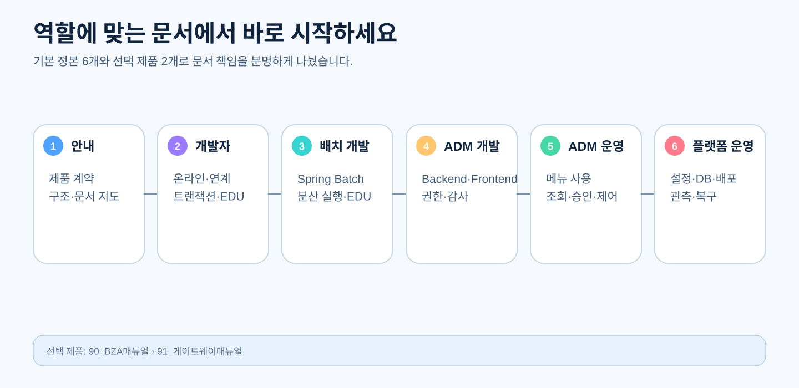

# CPF 문서 안내

> **기준 Repository** `freeangelsun/202412_01_CPF` · **기준 Branch** `master` · **작성 기준 SHA** `d31bd127aa12bb9368933216642a5a9d25bd0bfd`
> 이 디렉터리는 개발·운영 작업자가 실제로 따라 사용하는 제품 매뉴얼의 정본이다. Architecture Decision, QA Request, Matrix, Evidence는 각자의 기존 정본 경로를 유지한다.

## 1. 문서 구조

| 순서 | 문서 | 독자 | 이 문서를 읽고 할 수 있어야 하는 일 |
|---:|---|---|---|
| 00 | [프레임워크 안내](00_프레임워크안내.md) | 전체 역할 | 제품 스펙·구조·책임·배포 구성과 다음 문서를 선택한다. |
| 01 | [개발자 매뉴얼](01_개발자매뉴얼.md) | 일반 개발자 | 온라인 기능, Transaction, Kafka, File, 외부 연계, Generator와 Test를 완성한다. |
| 02 | [배치 개발 매뉴얼](02_배치개발매뉴얼.md) | Batch 개발자 | Spring Batch Job·Step·Scheduler·Worker·Agent·센터컷과 Restart를 구현한다. |
| 03 | [ADM 개발자 매뉴얼](03_ADM개발자매뉴얼.md) | ADM 개발자 | ADM Backend·Frontend·Menu·권한·승인·감사 기능을 구현한다. |
| 04 | [ADM 운영자 매뉴얼](04_ADM운영자매뉴얼.md) | ADM 운영관리자 | 화면에서 조회·승인·제어·대사·감사를 안전하게 수행한다. |
| 05 | [플랫폼 운영 매뉴얼](05_플랫폼운영매뉴얼.md) | 시스템 운영자 | Profile·Property·DB·배포·기동·관측·Backup·복구를 수행한다. |
| 90 | [BZA 매뉴얼](90_BZA매뉴얼.md) | 선택 제품 담당자 | BZA를 선택 설치하고 사용자·조직·권한·결재를 개발·운영한다. |
| 91 | [게이트웨이 매뉴얼](91_게이트웨이매뉴얼.md) | 선택 제품 담당자 | SCG 기반 Gateway Route를 개발·설치·운영·Rollback한다. |



## 2. 역할별 읽는 순서

### 처음 CPF를 접하는 사람

`00 → 자신의 역할 문서 → 관련 선택 제품 문서`

### 일반 개발자

`00 → 01 → 적용되는 경우 02/03/90/91 → 05의 개발 환경·DB 부분`

### Batch 개발자

`00 → 01의 공통 Transaction·Messaging → 02 → 04의 Batch 운영 화면 → 05의 Runtime·DB`

### ADM 개발자

`00 → 01의 공통 API·보안 → 03 → 04 → 선택 기능은 02/90/91`

### ADM 운영관리자

`00의 제품 구조 → 04 → 장애가 Runtime 문제면 05 → 선택 제품은 90/91`

### 플랫폼 운영자

`00 → 05 → Batch Runtime은 02의 운영 연결 → ADM 화면 협업은 04`

## 3. 문서 책임 경계

```text
00  무엇을 제공하고 어떤 계약을 보장하는가
01  일반 기능을 어떻게 개발하는가
02  Spring Batch 기반 배치를 어떻게 개발하는가
03  ADM 기능과 화면을 어떻게 개발하는가
04  ADM 화면을 어떻게 사용하는가
05  Runtime을 어떻게 설치·설정·배포·감시·복구하는가
90  선택형 BZA를 어떻게 개발·운영하는가
91  선택형 Gateway를 어떻게 개발·운영하는가
```

중복되는 개념은 독자 관점으로 분리한다.

| 주제 | 개발자 문서 | 운영자 문서 |
|---|---|---|
| Transaction | 구현 경계·Rollback·Outbox·Unknown | 거래 조회·대사·재처리 판단 |
| Batch | Job·Step·Checkpoint·Partition | JobExecution 조회·Stop·Restart·Abandon |
| ADM | Backend·Frontend·권한·승인 개발 | 화면 검색·상세·조치·승인 절차 |
| 설정 | Property를 소비하는 Source·Validation | 실제 Profile·YAML·Secret·재기동·Drift |
| Gateway | 업무 API가 지켜야 할 Header·계약 | 선택 제품 문서의 Route 개발·운영 |

## 4. 각 단락의 품질 기준

매뉴얼의 핵심 단락은 가능한 범위에서 다음 정보를 갖는다.

1. 목적과 적용 시점
2. Owner Module과 실제 Consumer
3. 처리 흐름 또는 상태 전이 그림
4. Source·API·SQL·설정·화면 경로
5. 단계별 구현 또는 운영 절차
6. 입력·출력·명령 예
7. 정상 결과
8. 오류·중복·응답 유실·부분 실패
9. 재시도·재시작·대사·복구
10. 보안·권한·승인·감사·마스킹
11. Test·Runtime 검증·Evidence
12. 완료 금지 조건

## 5. 현재 구현과 제품 계약

매뉴얼은 제품 계약과 목표 구조를 설명하지만, 실제 완료 판정은 최신 `master`의 Source와 Runtime Evidence를 따른다.

- ADR·Matrix에 적힌 기술 이름만으로 구현 완료가 아니다.
- Dependency·Interface·Adapter·Sample만 존재하면 미구현 또는 부분 구현이다.
- 모든 실제 Consumer가 Primary Path를 사용하고 Legacy가 제거돼야 한다.
- 실행하지 않은 DB·Kafka·Browser·Multi-instance·Failure Scenario는 미검증이다.
- 다른 SHA의 Evidence를 현재 완료 결과로 사용하지 않는다.

## 6. 기존 문서 교체

기존의 세분화된 Guide는 내용이 여러 독자와 용도를 섞고 있어 위 8개 정본으로 통합한다. 정확한 삭제 대상은 다음 Manifest가 관리한다.

- `cpf-docs/work/manifest/CPF_GUIDE_REBUILD_DELETE_MANIFEST.txt`
- 적용 Script: `cpf-tools/scripts/apply-cpf-guide-cleanup.ps1`
- 검증 Script: `cpf-tools/scripts/verify-cpf-guide-system.ps1`

Repository Root에는 신규 Manifest나 결과 문서를 만들지 않는다.

## 7. 문서 갱신 규칙

- 제품 계약이 변경되면 00과 영향받는 역할 매뉴얼을 함께 갱신한다.
- Public API·Header·Error·Property·DB 변경은 Source·OpenAPI·Test·Guide를 함께 수정한다.
- Frontend Menu·Route 변경은 03과 04를 함께 수정한다.
- Batch 실행 계약 변경은 02, ADM Batch 운영 절차, 플랫폼 DB·Runtime 항목을 함께 확인한다.
- 선택 제품 변경은 90/91과 00의 선택 기준만 갱신하고 기본 제품 문서를 불필요하게 비대하게 만들지 않는다.
- 직접 실행하지 않은 검증은 성공으로 기록하지 않는다.
