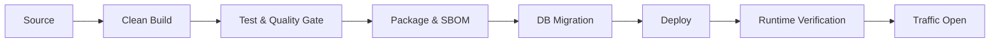

# CPF Deployment Guide

## 1. Release Flow



## 2. Pre-deployment Checklist

```text
[ ] Release tag와 Commit 확인
[ ] clean build와 test
[ ] frontend build
[ ] dependency·secret·license scan
[ ] DB migration dry-run
[ ] backup과 rollback point
[ ] configuration diff
[ ] certificate와 secret
[ ] capacity
[ ] alert와 dashboard
[ ] 운영 승인
```

## 3. Artifact Promotion

동일 Artifact를 dev → stg → prod로 승격합니다. 환경별로 재빌드하지 않습니다.

환경 차이는 외부 Config와 Secret으로 주입합니다.

## 4. Database Migration Sequence

1. backward-compatible schema 추가
2. Application 배포
3. data backfill
4. traffic 확인
5. deprecated schema 제거는 후속 Release

하나의 배포에서 Column rename·삭제와 새 Application 전환을 동시에 강제하지 않습니다.

## 5. Rolling Deployment

- 신규 Instance readiness 확인
- 일부 Traffic 전환
- 오류율과 latency 확인
- 기존 Instance drain
- 순차 교체
- Registry와 Worker 상태 확인

Batch Worker는 claim을 중지하고 lease를 안전하게 정리한 뒤 종료합니다.

## 6. Canary

Canary 기준:

- 제한 Channel
- 제한 Business ID
- 제한 사용자
- 제한 Traffic 비율
- 즉시 rollback 기준

관찰:

- success rate
- p95/p99
- error code
- timeout
- DB lock
- unknown result
- audit/log
- resource

## 7. Blue-Green

DB schema와 Message contract가 양 버전에서 호환될 때 사용합니다.

전환 전:

- Session
- idempotency store
- cache
- outbox
- worker
- file spool

공유 여부를 확인합니다.

## 8. Rollback

Application rollback만으로 해결되지 않을 수 있습니다.

- Artifact rollback
- Config rollback
- Route rollback
- DB forward-fix 또는 restore
- Message consumer rollback
- Batch restart
- cache invalidation

Rollback 명령과 확인 절차는 Release별로 기록합니다.

## 9. Post-deployment Validation

- Version
- Health/readiness
- OpenAPI
- 핵심 거래
- Local/Remote 호출
- Admin 화면
- Batch/Worker
- External integration
- file/DB log
- audit
- alert

## 10. Deployment Evidence

- Commit·tag
- artifact checksum
- migration version
- command
- executor
- start/end
- environment
- result
- rollback point
- smoke result
