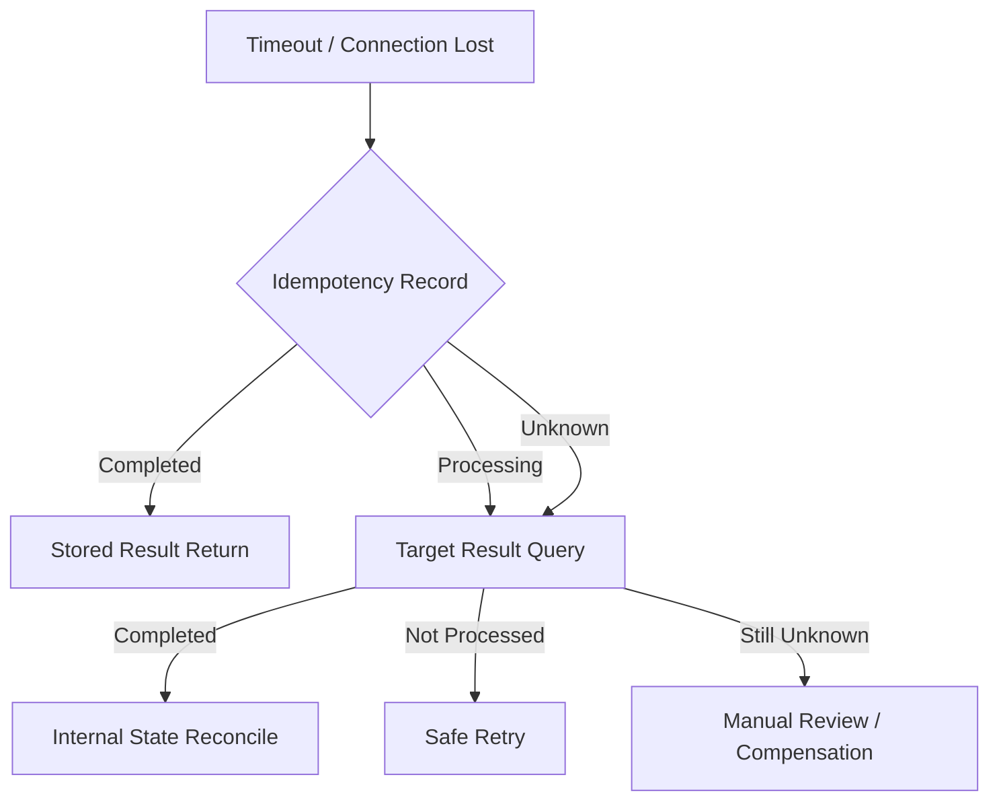

# CPF Recovery Guide

## 1. Recovery Principles

- 원인을 모르는 상태에서 무조건 Retry하지 않습니다.
- 결과 불명과 확정 실패를 구분합니다.
- 중복 처리보다 안전한 확인 절차를 우선합니다.
- 복구 조치는 권한, 승인과 Audit를 남깁니다.
- Runtime 복구 후 데이터 정합성을 별도로 확인합니다.

## 2. Incident Classification

- Service unavailable
- Latency and timeout
- Database failure
- Broker failure
- File/SFTP failure
- Worker loss
- Batch partial failure
- Unknown external result
- Log persistence failure
- Security incident
- Data corruption

## 3. First Response

1. Incident ID 생성
2. 영향 범위 확인
3. 신규 Traffic 제한 여부 판단
4. 관련 transactionId 확보
5. 상태 변경과 운영 조치 동결
6. Log·Metric·Trace 보존
7. 담당자와 승인자 지정
8. 복구 방식 결정

## 4. Service Failure

- unhealthy Instance를 Routing에서 제외
- 진행 중 거래 확인
- 신규 Instance 기동
- Registry 확인
- circuit과 retry storm 확인
- 결과 불명 거래 추출
- 정합성 점검

## 5. Database Failure

- Application write 제한
- DB primary/replica 상태
- transaction·lock
- connection pool
- replication lag
- backup 시점
- migration 상태

복구 후:

- schema version
- idempotency
- outbox
- batch metadata
- audit
- transaction log

를 확인합니다.

## 6. Worker Failure

Lease 만료 전 다른 Worker가 동일 item을 claim하지 않습니다.

Takeover 절차:

1. heartbeat 상실 확인
2. lease 만료
3. fencing token 증가
4. 새 Worker claim
5. 이전 Worker의 stale write 차단
6. checkpoint부터 재개
7. 중복 처리 검증

## 7. Unknown Result

운영자는 다음을 확인합니다.

- idempotency key
- external request ID
- target query result
- internal state
- accounting or balance effect
- downstream event
- compensation availability

## 8. Messaging Recovery

### Outbox

- 미발행 Record
- retry count
- lock owner
- publish timestamp

### Inbox

- duplicate key
- processing state
- consumer version

### DLQ Replay

- 원인 수정
- 대상 범위
- 최대 건수
- 순서
- idempotency
- 승인
- 결과 검증

## 9. File Transfer Recovery

- source checksum
- temporary file
- final rename
- remote file
- acknowledgement
- duplicate
- partial upload
- encryption key
- retention

완료 표시 파일 또는 checksum 확인 없이 성공 처리하지 않습니다.

## 10. Log Failure

DB Log 적재 실패 시 local spool을 사용합니다.

복구:

1. spool 용량 확인
2. 신규 유실 방지
3. DB 복구
4. poison record 격리
5. 순차 재적재
6. 거래 수·checksum 비교
7. spool 정리

## 11. Disaster Recovery

- RPO
- RTO
- DB backup
- Object/File backup
- Secret·certificate backup
- Configuration
- Artifact
- Migration
- Runbook
- 연락망

DR 환경에서 정기적으로 기동, 핵심 거래와 복귀 절차를 검증합니다.

## 12. Recovery Evidence

- Incident ID
- 영향
- 시작·종료
- 원인
- 조치
- 승인
- 관련 거래
- 변경 전후 상태
- 데이터 검증
- 재발 방지

## 13. Center-Cut·Agent 복구

- Agent loss 시 lease와 fencing token 확인
- old worker 결과 차단
- pre-execution/mid-execution unknown 분리
- parameter hash와 target generation checkpoint 검증
- failed-only item으로 새 reprocess job 생성
- original job/item/attempt 연결 유지
- global TPS를 낮춘 후 단계적 재개

## 14. 빈 DB·Backup·Restore

개발 환경의 Empty Install과 운영 Restore를 구분합니다. 운영 복구는 backup integrity, point-in-time, schema version, migration state와 application compatibility를 확인합니다. 다른 Schema를 함께 삭제하거나 복원하지 않습니다.

## 15. 복구 완료 조건

Service가 다시 기동된 것만으로 종료하지 않습니다.

- 실제 업무 결과와 데이터 정합성
- unknown/reconciliation 해소
- duplicate/omission 검사
- backlog 정상화
- monitoring/alert 정상
- audit와 incident timeline
- root cause와 prevention action
