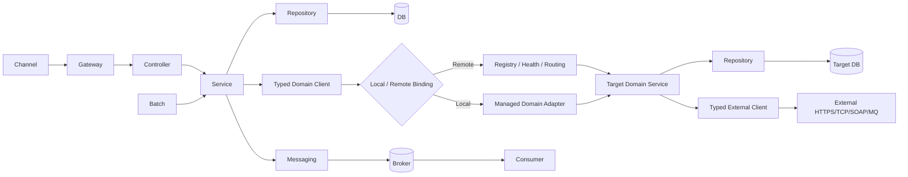

# CPF 거래 호출 / Common Function / Standard Result / Transaction / Log 개발자 매뉴얼

> **개발 완료 목표 기준 매뉴얼**  
> Currentization review baseline: `92169d9918dd176e8322ac2f9dfc29ebe1d2ea12`; 실제 실행 시 최신 Git HEAD와 Runtime Evidence를 사용한다.
> 이 문서는 현재 개발지침의 Target을 설명한다. Full-Scope 개발 완료 후 실제 Public API 이름/Evidence로 As-Built 현행화한다.

## 1. 30초 요약

```text
Controller → Service → Repository → DB
                     │
                     ├─ Domain Client → MBR/EXS/ACC 등 CPF Domain
                     ├─ External Client → 은행/카드/기관
                     ├─ Messaging
                     └─ Cache/Common
```

- 같은 JVM Service 호출은 그냥 `otherService.method()`.
- Controller execution은 `call(...)`.
- MBR→EXS/ACC는 Typed Domain Client.
- 외부기관은 Typed External Client.
- Network/Distributed Boundary는 `CpfResult<T>`.
- DB Transaction과 TransactionId는 다른 개념.
- TxId는 E2E 유지, Retry마다 새 TxId 금지.
- Timeout 후 상대 처리 여부가 불명하면 `UNKNOWN`.
- 모든 주요 Boundary는 정본 8.1 로그필드로 추적.

## 2. 호출 관계도



## 3. 가장 먼저 기억할 4개

| 구분 | 의미 |
|---|---|
| `transactionId` | 최초 거래에서 1회 생성/신뢰승계, E2E 동일 |
| `executionId` | 의미 있는 실행/async/attempt 구분 |
| `segmentId` | 호출 hop 계보 |
| DB Transaction | 실제 DB commit/rollback 경계. TxId와 다름 |

## 4. 표준 Result

```java
CpfResult<T>
 ├ outcome
 ├ data
 ├ error
 ├ meta
 └ recovery
```

### Outcome

| Outcome | 의미 | 기본 행동 |
|---|---|---|
| `SUCCESS` | 확정 성공 | data 사용 |
| `BUSINESS_FAILURE` | 업무거절/검증실패 확정 | 업무오류 처리, 기술 retry 금지 |
| `TECHNICAL_FAILURE` | 기술실패 확정 | retryable+idempotent 정책일 때만 bounded retry |
| `UNKNOWN` | 상대 처리 여부 불명 | blind retry 금지, probe/reconcile/manual review |

## 5. 자료형별 응답

| 실제 데이터 | 표준 Boundary 반환 |
|---|---|
| Member 1건 | `CpfResult<MemberDto>` |
| 목록 | `CpfResult<List<MemberDto>>` |
| 페이지 | `CpfResult<CpfPage<MemberDto>>` |
| 커서 | `CpfResult<CpfCursorPage<MemberDto>>` |
| Map | `CpfResult<Map<String,MemberDto>>` |
| String | `CpfResult<String>` |
| int | `CpfResult<Integer>` |
| count/long | `CpfResult<Long>` |
| boolean | `CpfResult<Boolean>` |
| 금액 | `CpfResult<BigDecimal>` |
| 데이터 없음 | `CpfResult<Void>` |
| 처리접수 | `CpfResult<CpfAck>` |
| 운영명령 | `CpfResult<CpfOperationReceipt>` |
| 메시지 | `CpfResult<CpfMessageReceipt>` |
| 전송 | `CpfResult<CpfTransferReceipt>` |
| 비동기 | `CompletionStage<CpfResult<T>>` |
| 대용량 Stream | Item Stream + terminal `CpfResult<CpfStreamSummary>` |

`false`, `0`, 빈 List는 정상 SUCCESS일 수 있다.

## 6. 함수/명령 빠른 선택표

| 하고 싶은 일 | 쓰는 방식 |
|---|---|
| Controller에서 Service 실행 | `call(() -> service.method())` |
| 같은 JVM Service 호출 | `service.method()` |
| 명시적 실행 경계 | Service `call(...)` |
| 비동기 실행 | `callAsync(...)` |
| Local DB Tx | `required(...)` |
| 독립 Local DB Tx | `requiresNew(...)` |
| 읽기 Tx | `readOnly(...)` |
| MBR→EXS/ACC | Typed Domain Client |
| Generic Domain 호출 | `callDomain(...)` |
| Remote 강제 Advanced | `callRemote(...)` |
| 외부기관 호출 | Typed External Client |
| Generic 외부호출 | `callExternal(...)` |
| Cache 조회 | `cacheGet(...)` |
| Cache-aside | `cacheGetOrLoad(...)` |
| Event | `publish(...)` |
| Message | `send(...)` |
| 권한검사 | `authorize/hasPermission` |
| 업무로그 | `businessLog(...)` |
| 운영로그 | `operationLog(...)` |
| 보안로그 | `securityLog(...)` |
| 감사 | `audit(...)` |
| 오류로그 | `errorLog(...)` |
| 공통코드 | `code(...)` |
| 메시지 | `message(...)` |
| 파라미터 | `parameter(...)` |
| 영업일 | `businessDate()/calendar(...)` |
| 템플릿 | `template(...)` |

전체 함수는 동봉 `CPF_COMMON_FUNCTION_COMMAND_CATALOG.csv` 참조.

## 7. Controller → Service

```java
return call(() -> memberService.detail(memberId));
```

**언제:** HTTP/Web entry.  
**자동:** Context, TxId/Execution/Trace, error mapping, request log, timeout/deadline.  
**DB Tx:** `call` 자체는 DB Tx 아님. Service tx policy가 결정.  
**로그:** ENTRY/CALL/EXIT/ERROR + 정본 8.1 correlation.  
**반환:** 자연 Type 또는 Controller response mapping.

금지:

```java
return memberRepository.findById(id); // Controller→Repository
```

## 8. Service → Service same JVM

```java
boolean allowed = memberPolicyService.canJoin(memberId);
```

**언제:** 일반 내부 업무 호출.  
**반환:** 자연 Type.  
**CpfResult 강제:** 안 함.  
**관리:** 주입된 CPF/Spring Managed Proxy로 Tx/Retry/Logging/Security 적용.  
**ExecutionId:** 모든 method마다 새로 만들지 않음.

## 9. Transaction

### required

```java
return required(() -> memberRepository.save(member));
```

기존 Tx 참여, 없으면 새 Local DB Tx.

### requiresNew

```java
return requiresNew(() -> historyRepository.save(history));
```

기존 Tx suspend + 독립 commit. 업무적으로 필요한 경우만.

### readOnly

```java
return readOnly(() -> memberRepository.findById(id));
```

조회 정책.

### Remote를 DB Tx처럼 생각하면 안 됨

```text
TxId T10001 ---------------------------------------->

MBR DB Tx      [BEGIN ------- COMMIT]
EXS DB Tx                          [BEGIN -- COMMIT]
BANK Call                                      [CALL]
```

## 10. MBR → EXS / ACC — CPF Domain Call

```java
CpfResult<VerifyResponse> result = exsClient.verify(request);
```

같은 JVM:

```text
ExsClient → Local Binding → EXS
```

별도 서버:

```text
ExsClient → Registry → Health/Route → EXS-WAS
```

업무 Source는 동일.

### 성공

```java
if (result.isSuccess()) {
    return result.data();
}
```

### 읽기성 호출의 편의

Contract가 side-effect/UNKNOWN을 허용하지 않는 안전한 Query라면:

```java
MemberDto member = exsClient.getMember(req).requireData();
```

### Side Effect

```java
return result.fold(
    data -> onSuccess(data),
    error -> onBusinessFailure(error),
    error -> onTechnicalFailure(error),
    recovery -> onUnknown(recovery)
);
```

## 11. `callDomain` / `callRemote`

### `callDomain`

Topology-independent generic Domain helper.

```java
CpfResult<List<MemberDto>> result =
    callDomain(
        "EXS",
        "searchMembers",
        request,
        new CpfTypeRef<List<MemberDto>>() {},
        options
    );
```

Primary는 Generated Typed Client다.

### `callRemote`

Remote transport를 **강제로** 쓰는 Advanced/Compatibility API.

```java
CpfResult<MemberDto> result =
    callRemote(...);
```

일반 MBR→EXS 업무코드가 `callRemote`에 의존하면 Local/Remote 투명성이 깨지므로 Golden Path가 아니다.

## 12. EXS → 외부기관

```java
CpfResult<BankResponse> result = bankHostClient.inquire(request);
```

자동:
- Named Binding
- endpoint
- protocol/codec
- TLS/credential
- timeout
- retry/circuit/bulkhead
- correlation
- masking
- UNKNOWN/reconcile

업무코드에서 WebClient/Socket/IP를 직접 쓰지 않는다.

## 13. MSA 실패 처리

### BUSINESS_FAILURE

예: 계좌상태 부적합.

```text
상대 응답 수신 완료
→ 업무거절 확정
→ BUSINESS_FAILURE
→ retry 하지 않음
```

### TECHNICAL_FAILURE

예: connect 전에 DNS/connection 실패.

```text
side effect 없음 확정
→ TECHNICAL_FAILURE
→ retryable + idempotent + policy일 때 retry
```

### UNKNOWN

예: 송금 요청 send 후 응답 timeout.

```text
MBR/EXS → 외부기관 요청
외부기관 처리 가능
응답 유실
→ UNKNOWN
→ Result Probe/Reconcile
```

절대:

```java
catch (TimeoutException e) {
    return FAIL;
}
```

로 단정하지 않는다.

## 14. DB + Messaging

```text
Local DB Tx
 ├ business row
 └ outbox row
COMMIT
  ↓
Publisher
  ↓
Broker
  ↓
Outbox published
```

`DB commit → 직접 publish`만 하고 publish failure 복구가 없으면 안 된다.

## 15. Async

```java
CompletionStage<CpfResult<VerifyResponse>> future =
    exsClient.verifyAsync(request);
```

자동:
- Context snapshot/restore/clear
- same TxId
- new meaningful execution/segment
- bounded executor
- queue/rejection/backpressure
- timeout/cancel
- graceful drain

## 16. Batch

```text
Job
 → Step
   → Chunk #1 [Tx BEGIN → items → checkpoint → COMMIT]
   → Chunk #2 [Tx BEGIN → items → checkpoint → COMMIT]
   → Chunk #3 [FAIL → ROLLBACK]
 → Restart from checkpoint
```

Job 전체를 거대한 DB Tx 하나로 만들지 않는다.

## 17. 로그

### 자동 Call Log

```text
timestamp
level
systemCode
environment
instanceId/wasId
transactionId
executionId
traceId/spanId
segmentId/parentSegmentId
attempt
requestId/idempotencyKey
actor/tenant/channel
operation/endpoint/remoteSystem
result/status
errorCode
failureStage
retryable
unknownResult
elapsedMs
```

Batch면 Job/Step/Partition/Worker ID 추가.

### 업무로그

```java
businessLog("MEMBER_JOINED", safeFields);
```

### 운영로그

```java
operationLog("INSTANCE_DRAIN", safeFields);
```

### 보안로그

```java
securityLog("ACCESS_DENIED", safeFields);
```

### 감사

```java
audit("PARAMETER_CHANGED", auditContext);
```

### 오류

```java
errorLog(error, safeContext);
```

Raw DTO 전체/Password/Token/계좌/주민번호 원문 로깅 금지.

## 18. 하나의 TxId로 보는 로그

```text
T10001
 ├ [GW:E001:S001] REQUEST
 ├ [MBR:E010:S010] MEMBER_JOIN START
 ├ [MBR:E010:S011] DB COMMIT
 ├ [EXS:E020:S020] DOMAIN_CALL
 ├ [EXS:E021:S021] BANK SEND
 ├ [EXS:E021:S021] UNKNOWN response-loss
 ├ [EXS:E022:S022] RECONCILE CONFIRMED
 └ [MBR:E010:S010] SUCCESS
```

ADM은 TxId 하나로 Timeline/Tree를 조회한다.

## 19. 되는 방식 / 안 되는 방식

| 되는 방식 | 안 되는 방식 |
|---|---|
| `memberPolicyService.canJoin()` | 모든 Service를 `CpfResult`로 감싸기 |
| `call(() -> service.method())` | Controller call=DB transaction |
| `exsClient.verify()` | `callRemote("10.0.0.1",...)` 업무코드 |
| Local/Remote 동일 Domain Client | 배포마다 business source 분기 |
| `bankHostClient.inquire()` | Service에서 직접 WebClient/Socket |
| `CpfResult<List<T>>` | raw `Map`/`Object` |
| `CpfTypeRef<List<T>>` | `Class<List>` |
| `SUCCESS + data=false` | `false`를 실패로 판단 |
| `UNKNOWN→reconcile` | timeout→FAIL |
| same TxId + attempt | retry마다 TxId 재생성 |
| Outbox/Inbox | DB+Broker 자동 atomic 가정 |
| structured masked log | DTO/secret raw log |
| `required/requiresNew` 명시 | remote DB까지 local tx라고 가정 |

## 20. 함수 하나를 읽는 법

동봉 CSV의 한 행은 다음 질문에 답한다.

1. 언제 쓰나?
2. 어떻게 호출하나?
3. 입력은?
4. 주요 옵션은?
5. 반환형은?
6. DB Tx 영향은?
7. TxId/Execution/Segment는?
8. 로그는?
9. 성공/실패/UNKNOWN은?
10. Recovery는?
11. 필요한 Starter/Config는?
12. 하면 안 되는 방식은?

## 21. As-Built 완료 조건

Full-Scope 개발 완료 후:
- 함수명
- 실제 class/package
- Config key
- Result fields
- emitted log fields
- Runtime evidence
를 최신 SHA로 다시 검산해 이 문서를 As-Built로 확정한다.
